ORNL-3936

UC-80 - Reactor Technology

MOLLEN-SALT REACTOR PROGRAM

SEMIANNUAL PROGRESS REPORT

FOR PERIOD ENDING FEBRUARY 28, 1966

# OAK RIDGE NATIONAL LABORATORY

operated by

UNION CARBIDE CORPORATION

for the

U.S. ATOMIC ENERGY COMMISSION

3445603826108

CENTRAL RESEARCH LIBRARY

DOCUMENT COLLECTION

LIBRARY LOAN COPY

DO NOT TRANSFER TO ANOTHER PENSION

If you wish someone else to see this

and the history cell changes it.

Printed in USA. Price $6.00. Available from the Clearinghouse for Federal Scientific and Technical Information, National Bureau of Standards, U.S. Department of Commerce, Springfield, Virginia

# LEGAL NOTICE

This report was prepared as an account of Government sponsored work. Neither the United States, nor the Commission, nor any person acting on behalf of the Commission:

A. Makes any warranty or representation, expressed or implied, with respect to the accuracy, completeness, or usefulness of the information contained in this report, or that the use of any information, apparatus, method, or process disclosed in this report may not infringe privately owned rights; or   
B. Assume any liabilities with respect to the use of, or for damages resulting from the use of any information, apparatus, method, or process as disclosed in this report.

As used in the above, "person acting on behalf of the Commission" includes any employee or contractor of the Commission, or employee of such contractor, to the extent that such employee or contractor of the Commission, or employee of such contractor prepares, disseminates, or provides access to, any information pursuant to his employment or contract with the Commission, or his employment with such contractor.

Contract No. W-7405-eng-26

MOLITEN-SALT REACTOR PROGRAM

SEMIANNUAL PROGRESS REPORT

For Period Ending February 28, 1966

R. B. Briggs, Program Director

JUNE 1966

OAK RIDGE NATIONAL LABORATORY

Oak Ridge, Tennessee

operated by

UNION CARBIDE CORPORATION

for the

U.S. ATOMIC ENERGY COMMISSION

# CONTENTS

SUMMARY VII

INTRODUCTION. 1

# Part 1. MSRE OPERATIONS AND CONSTRUCTION, ENGINEERING ANALYSIS, AND COMPONENT DEVELOPMENT

1. MSRE OPERATIONS 7

Chronological Account. 7

Analysis of Experiments. 10

Reactivity Balance. 10

Power Calibration. 12

Flux Measurements. 12

MSRE Dynamic Tests. 13

Description of Dynamic Tests. 13

Frequency Response Tests. 15

Implementation of Pseudorandom Binary Tests. 16

Analysis Procedures. 17

Results. 18

Temperature Response Test. 22

Systems Performance 23

Off-Gas System. 23

Salt-Pump Oil Systems 27

Treated Cooling-Water System. 28

Secondary Containment 29

Shielding. 34

Component Performance. 34

Radiator. 34

Other Components 36

Inspection of the Fuel Pump. 38

Heat Treatment of Reactor Vessel. 39

Stress Analysis of Reactor Piping and Nozzles 40

Instrumentation and Controls. 41

General. 41

Safety Instrumentation. 41

Wide-Range Counting Channels 42

Nuclear Instrument Penetration. 42

$\mathbf{BF}_3$ Confidence Instrumentation. 44

Personnel Monitoring System. 45

Control Instrumentation. 46

Operating Experience - Process and Nuclear Instruments.... 47

Data System. 49

MSRE Training Simulators. 50

Documentation. 51

# 2. COMPONENT DEVELOPMENT 53

Freeze Valves. 53

Control Rods. 53

Control Rod Drive Units. 54

Radiator Doors. 54

Radiator Heater Electrical Insulation Failure. 57

Sampler-Enricher. 58

Coolant Salt Sampler. 59

Examination of Components from the MSRE Off-Gas System. 60

Capillary Flow Restrictor FE 521. 60

Check Valve CV 533. 60

Charcoal Bed Inlet Valve HV 621. 60

Line 522 Pressure Control Valve PCV 522. 62

LineFilter522. 64

Flow Test on the MSRE Filter from Line 522. 65

Fuel Processing System Sampler. 65

Off-Gas Sampler. 67

Xenon Migration in the MSRE 69

Remote Maintenance. 70

Practice Before Operation. 72

Maintenance of Radioactive Systems. 72

Pump Development. 74

MSRE Pumps. 74

Other Molten-Salt Pumps. 75

Instrument Development. 77

Ultrasonic Single-Point Molten-Salt Level Probe. 77

High-Temperature NaK-Filled Differential-Pressure

Transmitter. 77

Float-Type Molten-Salt Level Transmitter. 78

Conductivity-Type Single-Point Molten-Salt Level Probe.... 78

Single-Point Temperature Alarm Switches. 78

Helium Control Valve Trim Replacement. 79

Thermocouple Development and Testing. 79

Temperature Scanner. 80

# 3.MSRE REACTOR ANALYSIS. 82

Least-Squares Formula for Control Rod Reactivity. 82

Spatial Distribution of $^{135}\mathrm{Xe}$ Poisoning in MSRE Graphite. 87

# Part 2. MATERIALS STUDIES

# 4. METALLURGY 95

Dynamic Corrosion Studies. 95

MSRE Material Surveillance Tests 96

Reactor Surveillance Specimens. 96

Surveillance Control Specimens. 99

Hot-Cell Metallographic Examination of Hastelloy N from

Experiment MTR-47-6 for Evidence of Nitriding. 100

Postirradiation Metallographic Examination of Capsules 1-4 from Experiment ORNL MTR-47-6. 101

Development of Graphite-to-Metal Joints. 1.01

Tests of Graphite-Molybdenum Brazed Joint for Containing Molten Salts Under Pressure. 104

New Grades of Graphite. 107

Evaluation of the Effects of Irradiation on Graphite. 108

Effects of Irradiation on Hastelloy N. 1.11

Weld Studies on Hastelloy N. 115

# 5. CHEMISTRY 122

Chemistry of the MSRE. 122

Analyses of Flush, Fuel, and Coolant Salts. 122

Examination of Materials from the MSRE Off-Gas System.... 1.24

Uranium-Bearing Crystals in Frozen Fuel. 128

Physical Chemistry of Fluoride Melts. 128

Vapor Pressure of Fluoride Melts. 1.28

Methods for Predicting Density, Specific Heat, and Thermal Conductivity in Molten Fluorides. 130

Oxide Solubilities in MSRE Flush Salt, Fuel Salt, and Their Mixtures. 133

Separations in Molten Fluorides. 136

Evaporative-Distillation Studies on Molten-Salt Fuel Components. 136

Effective Activity Coefficients by Evaporative Distillation. 139

Extraction of Rare Earths from Molten Fluorides into Molten Metals. 141

Removal of Protactinium. 145

Radiation Chemistry. 152

In-Pile Molten-Salt Irradiation Experiment. 152

Development and Evaluation of Methods for the Analysis of the MSRE Fuel. 154

Determination of Oxide in MSRE Fuel. 154

Voltammetric Determination of Ionic Iron and Nickel in Molten MSRE Fuel. 162

Development and Evaluation of Equipment and Procedures for Analyzing Radioactive MSRE Salt Samples. 165

Sample Analyses 167

Quality Control Program. 168

# 6. MOLTEN-SALT BREEDER REACTOR DESIGN STUDIES 172

MSBR Plant Design. 172

Flowsheet. 172

Reactor Design. 174

Fuel Processing. 177

Heat Exchange and Steam Systems. 181

Capital Cost Estimates. 182

Reactor Power Plant. 182

Fuel Recycle Plant. 182

Nuclear Performance and Fuel Cycle Analyses. 186

Analysis Procedures. 186

Basic Assumptions. 186

Nuclear Design Analysis. 189

Power Cost and Fuel Utilization Characteristics. 191

7. MOLTEN-SALP REACTOR PROCESSING STUDIES 193

Semicontinuous Distillation. 194

Fuel Reconstitution. 199

Continuous Fluorination of a Molten Salt. 202

Chromium Fluoride Trapping. 202

Design and Evaluation Study. 203

Description of Fuel Process. 204

Description of Fertile Process. 208

Waste Treatment. 208

Off-Gas Treatment 209

Summary of Capital and Operating Costs 209

Processing Cost. 210

# SUMMARY

# Part 1. MSRE Operations and Construction, Engineering Analysis, and Component Development

# 1. MSRE Operations

Preparations for power operation were completed, and the MSRE was operated at nuclear powers up to 1 MW before the system was shut down to replace a space-cooler motor and to relieve plugging problems in the off-gas system.

The power preparations included some system modifications shown to be required by operating experience and by continuing development and analysis work. Remote maintenance techniques were tried and evaluated, some special tests were performed, the operators were trained and qualified for power operation, and the secondary containment was sealed and shown to have an acceptably low leak rate.

The nuclear performance of the system at all powers up to 1 Mw was highly satisfactory. Reproducible reactivity behavior and a lack of significant cross contamination between the fuel and flush salts were demonstrated. Dynamics tests at power showed that the reactor has a slightly wider margin of stability than had been predicted from calculations. Preliminary results indicate that xenon poisoning may be lower than was anticipated.

The performance of most of the equipment was satisfactory, but substantial operational difficulty was caused by plugging of very small openings in off-gas system components by organic material. This problem was extensively investigated after the shutdown from 1 Mw. Other, less serious problems included the freak failure of an electric motor inside the secondary containment, activation of the corrosion inhibitor in the treated cooling water, air entrainment in the cooling water, and excessive radiation levels in a few remote areas. Solutions have been developed for all the problems except the off-gas plugging, which is still under study.

Formal design of the instrumentation and controls systems for the MSRE was completed. Additions and modifications are now being made as needed to provide additional protection, improve performance, or provide more information for the operators.

The addition of a low-level $\mathrm{BF}_3$ counting channel with control functions, the addition of cadmium shielding in the neutron instrument penetration, and changing reactor period interlock trip points were required to obtain satisfactory performance of the nuclear instrumentation system. The remaining changes were mostly of secondary importance. Some sporadic

difficulties were experienced with individual hardware items such as air and helium valves and electronic switches. Most of the work done on the instrument system can be characterized as debugging the original installation.

The data-logger-computer was put into operation in conjunction with the reactor. Although the performance has not been up to expectations, it is proving useful to the operation of the reactor experiment. A power level simulator was assembled, and it operated satisfactorily for the training of operators.

# 2. Component Development

The "fast thaw" requirement was eliminated in all freeze valves except for those which control the emergency drain of the reactor and of the coolant system. The operation of all the valves which might contain sufficient radioactivity in the salt to produce radiolytic fluorine at low temperature are now operated above $400^{\circ}\mathrm{F}$ , which is above the threshold for fluorine release.

The braided wire sheath cover for the convoluted hose of control rod No. 3 was found to be severely torn about 2 ft below its upper end. The cause was traced to a jammed roller in the upper bend of the control rod thimble. The roller was replaced, and the upper rod sheath was repaired. There has been no further difficulty after several months of operation.

Control rod drive unit No. 3 was replaced because of a shift in the remote position indication and because of a tendency for the lower limit switch to stick. The shift of the indicated position was eliminated by removing the excess slack in the chain, which had allowed the chain to slip over the sprocket. The sticking lower limit switch is being cured by replacing the return spring with a stronger one.

Modifications were made to the radiator door guide tracks and lock mechanisms to allow for thermal distortion, found after the initial operation of the radiator doors at temperature. Alterations were made to the limit switch system to prevent a damaging overtravel of the door in the upper end of the travel.

A "loss-of-tension" device was designed which will stop the radiator door drive unit should the door support cables show any slack as the door is being lowered. This arrangement is intended to prevent damage to the support cable if the radiator door jams, as well as to indicate a malfunction.

Failure of the insulation on the electrical leads to the radiator heaters was traced to excessive heat leakage into the area immediately above the radiator. Changes were made to reduce the temperature in this area, and electrical insulation with a higher temperature rating was installed.

Several changes were made to the sampler-enricher to improve the operation and safety of this system. Among these were the changes made to the interlock circuit, which require that additional barriers be present during certain critical operations, thereby assuring double containment at all times.

Forty samples were taken during runs 4 and 5, nine of which were large $50\mathrm{-g}$ samples for oxygen analysis. These larger samples caused some difficulty until the capsule design was altered slightly to make it hang straighter.

One of the operational valves developed a 20-cc/min helium leak across one of the two sealing surfaces of the gate. Since this is one of two valves in the line and the leak is clean buffer gas, the valve was not replaced.

During the same period ten samples were removed from the coolant system, two of which were the larger 50-g samples. The first sample taken after an extended shutdown had a black film on it, which was identified as decomposed oil. Although there was oil in the general area the exact source was not established. No films were found on subsequent samples.

The design and installation of the fuel processing system sampler is proceeding.

A system is being designed to permit analysis of the reactor off-gas stream. It will contain:

1. a thermal conductivity cell for on-line indication of the gross contaminant level,   
2. a chromatograph for quantitative determination of contaminant,   
3. a refrigerated molecular sieve trap for isolation of a concentrated sample for transfer to a hot laboratory for isotopic analysis.

Estimates of the $^{135}\mathrm{Xe}$ poison fraction for the MSRE were computed as a function of several parameters. At 10 Mw the results indicate that the poison fraction is $1.6\%$ . It was found that the mass transfer coefficient from the salt to the graphite is controlling the transfer and that the properties of the graphite are not important.

The remote maintenance group gained more experience with the reactor components during the period prior to power operation. Among these were removing and replacing the pump rotary element and replacing the graphite sampler assembly. After a short period of power operation several operations were performed, using remote maintenance techniques, on a mildly radioactive system.

The MSRE pump test facility was modified, and the prototype pump was operated for periods of 165 and 166 hr at $1200^{\circ}\mathrm{F}$ to provide shakedown of the spare fuel pump impeller and the spare coolant pump drive motor. The spare rotary element for the fuel pump was modified to provide positive sealing against oil leakage from the shaft lower seal catch basin into the system past the outside of the shield plug. The drive motor containment vessel was redesigned, and the new design will be used for the fifth drive motor vessel. Modified ejectors were installed on the lubrication systems for the MSRE salt pumps, and the lubrication pump endurance test was continued. The MK-2 fuel pump tank design was completed and is being reviewed.

The PK-P molten-salt pump continues on endurance operation and has operated for 22,622 hr. The pump containing the molten-salt bearing was placed in operation, but the bearing seized after 1 hr of operation.

Efforts to improve the stability of the ultrasonic level probe installed in the MSRE fuel storage tank were continued without success.

Testing of a NaK-filled differential pressure transmitter which failed in service at the MSRE was continued. Performance of the instrument was improved by refilling with silicone oil but is still not satisfactory.

Performance of the ball-float-type transmitter installed at the MSRE continues to be satisfactory. Some difficulties were experienced with a similar (prototype) transmitter on the MSRE pump test loop; however, these troubles were anticipated and corrected in the design of the MSRE model.

Performance of the conductivity-type level probes installed in the MSRE drain tanks continues to be acceptable.

Observation of the performance of l10 single-point temperature-alarm switches is continuing. Data obtained to date are insufficient to determine whether set-point drift in these switches is excessive.

Testing of alternate trim material combinations for the helium control valves was terminated. Some additional valve failures have occurred.

Results of final checks indicate that errors in the coolant-salt-radiator differential temperature signal, produced by thermocouple and lead-wire mismatch, have been eliminated.

Drift testing of selected MSRE-type thermocouples was concluded. The final temperature equivalent drift values were between $+4.7$ and $+6.4^{\circ}\mathrm{F}$ .

Performance of the MSRE temperature scanning system continues to be satisfactory. Calibration drift appears to have been eliminated, and reliability is much better than had been expected.

# 3. MSRE Reactor Analysis

For the purpose of on-line computation of control rod reactivity with the TRW-340 data logger, a mathematical formula was fitted to the rod-worth vs position curves obtained from calibration experiments. The form of the expression used was obtained by applying a perturbation technique to evaluate the integral expression for the rod reactivity. A linear least-squares curve-fitting procedure was then used to evaluate the unknown coefficients in the resulting functional expression. Close agreement between calculated and experimental curves was obtained for those configurations of shim and regulating rods of interest in monitoring the control rod reactivity during operation.

Theoretical calculations were made to estimate the influence of the overall spatial distribution of $^{135}\mathrm{Xe}$ absorbed in pores near the graphite surfaces in the reactor core. The purpose was to determine spatial correction factors for use in the on-line calculation of $^{135}\mathrm{Xe}$ reactivity with the TRW-340. Based on an approximate model of the reactor core, these calculations indicated that the equilibrium $^{135}\mathrm{Xe}$ reactivity at 10 Mw is reduced by a factor of about 0.76 relative to the value obtained from a "point" calculation. In addition, this correction was found to depend on the time history of the power level. Results of calculations are presented for step changes in power level, increasing to and decreasing from 10 Mw.

# Part 2. Materials Studies

# 4. Metallurgy

Thermal convection loops made of Hastelloy N and type 304 stainless steel have circulated molten fuel salt for 33,000 and 22,000 hr, respectively, without incident. A $\text{Cb}-1\%$ Zr loop circulating lead at $1400^{\circ}\text{F}$ with a $400^{\circ}\text{F} \Delta T$ was found to produce columbium crystals by mass transfer.

Specimens of Hastelloy N and grade CGB graphite showed no detectable changes as a result of 1100 hr exposure to molten fluoride salts in the MSRE core during the precritical, initial critical, and associated zero-power experiments.

The reactor control specimen rig, which will establish base-line data by exposing graphite and Hastelloy N surveillance specimens to approximately the operating conditions of the MSRE except for radiation, has been loaded with salt and is being calibrated with the computer that monitors the MSRE.

Metallographic examination of capsules from in-pile experiment MTR-47-6 showed no evidence of nitriding of the Hastelloy N. No apparent

change in wall thickness or evidence of attack was observed, although an unexplained change in the etching characteristics of the grain boundaries at the surface was noted.

Development of methods of joining graphite to metal has included: (1) the design of a transition joint to reduce shear stresses arising from thermal expansion differences and (2) screening tests on potential brazing alloys.

A small pipe of grade CGB graphite brazed to molybdenum satisfactorily contained molten fluoride salts at $700^{\circ}\mathrm{C}$ under pressures of 50, 100, and 150 psig for periods of 100, 100, and 500 hr respectively. This is the first of a series of tests of graphite-to-metal joints to determine if such joints are corrosion resistant and mechanically adequate for the requirements of molten-salt breeder reactors.

A few samples of needle-coke graphite and isotropic graphite have been obtained and are being evaluated to determine their suitability for use in molten-salt breeder reactors.

The radiation-damage problems were evaluated for graphite in advanced molten-salt reactors, considering growth rate, creep coefficient, flux gradient, and geometric restraint as important factors. The stress developed by differential growth in an isotropic graphite should not be allowed to exceed the fracture strength of the graphite and thus cause failures. The estimated life of graphite is at least five years before failure from inability to absorb creep deformation. The major uncertainty seems to be the ability of graphite to sustain doses of $2 \times 10^{23}$ nvt without loss of integrity.

Creep-rupture life of Hastelloy N was found to be less affected by irradiation as the stress levels are lowered. The effects of irradiation temperature on the postirradiation creep life of air-melted heats are uncertain. Vacuum-melted heats show a large dependency on irradiation temperature. Pretest heat treatment can improve the ductility of irradiated specimens. The creep-rupture properties of structural material in the MSRE appear to be better than originally predicted on the basis of linear extrapolation of data for stress vs log of rupture time.

Experimental welds have been made to study methods of improving the weldability of Hastelloy N.

# 5. Chemistry

Three innovations have been introduced in the chemical analysis of MSRE salts: a new end point for uranium titrations, a new method for determining structural-metal ions, and a new method for oxide analyses. Together they have given increased assurance that fuel conforms to the inventory composition and that the chemical purity of the salt has been maintained.

Examination of deposits believed to have been responsible for the plugging of off-gas lines in the MSRE revealed the presence of oil and polymer products presumed to have formed from oil. A negligible amount of salt was found.

The formula for the uranium-bearing crystals in the frozen fuel has been found to be $\mathrm{LiF} \cdot \mathrm{UF}_4$ rather than $7\mathrm{LiF} \cdot 6\mathrm{UF}_4$ as formerly supposed.

In a study of the physical chemistry of fluoride melts, vapor-pressure measurements have been made for three compositions in the LiF-BeF $_2$ system. Because of vapor-phase association, the apparent volatility of LiF increases with decreasing concentration of LiF in the melt. Methods have been developed for predicting density, specific heat, and thermal conductivity in molten fluorides.

The solubility of oxide in MSRE-related fluoride melts has been re-evaluated with improved experiments. When increasing amounts of $\mathrm{ZrF_4}$ , as present in the MSRE fuel, are added to flush salts, the capacity for oxide first decreases, then increases.

Interest in reprocessing methods for MSBR fluorides has led to continuing studies of distillation and of chemical reduction as a means of separating rare earths from fuels or protactinium from blankets. The composition that yields MSRE barren solvent as distillate has been found; this product distills, leaving the rare earths behind. Alloys of bismuth containing a small amount of lithium have proved very effective for reducing and extracting rare earths into a liquid-metal phase. Thorium has been found effective as a reducing agent for removing protactinium from blanket melts. Protactinium can also be removed on $\mathrm{ZrO_2}$ .

The in-pile molten-salt loop experiment and associated auxiliary equipment are being fabricated and assembled so that modifications to beam hole HN-1 in the ORR and installation of equipment can begin in April.

The precision and accuracy of the hydrofluorination method for determining oxide in MSRE salts were established. The method was applied to the analysis of nonradioactive samples taken during the startup of the MSR; the results were in reasonable agreement with those obtained by the KBrF $_4$ method. The hydrofluorination apparatus for the determination of oxide in radioactive samples was fabricated and tested and is now being installed in a hot cell.

Ionic iron and nickel were determined voltammetrically on a sample of molten fuel withdrawn from the MSR. These measurements indicate that the major fraction of iron and of nickel in the fuel is present in an un-ionized state, presumably as finely divided metal. Also, a well-defined voltammetric wave for the reduction U(IV) $\rightarrow$ U(III) was observed.

Efforts were continued on the development and evaluation of equipment and procedures for analyzing radioactive MSRE salt samples. The coulometric uranium procedure was modified to eliminate a negative bias.

Both flush- and fuel-salt samples were analyzed for U, Zr, Cr, Be, F, Fe, Ni, and Mo. The analyses were routinely performed in the hot cells of the High-Radiation-Level Analytical Laboratory.

The quality control program was continued during the past period. The results obtained on synthetic solutions established more realistic limits of error for the methods employed.

# 6. Molten-Salt Breeder Reactor Design Studies

Design and evaluation studies were made of thermal molten-salt breeder reactors (MSBR) in order to assess their economic and nuclear potential and to identify important design and development problems. The MSBR reference design concept is a two-region, two-fluid system with fuel salt separated from the blanket salt by graphite tubes. The energy produced in the reactor fluid is transferred to a secondary coolant-salt circuit which couples the reactor to a supercritical steam cycle. On-site fluoride volatility processing is employed, which leads to low unit processing costs and economic reactor operation as a thermal breeder. The resulting power cost is estimated to be 2.7 mills/kwhr for investor-owned utilities; the associated fuel cycle cost is 0.45 mill/kwhr (electrical); the specific fissile inventory is 0.8 kg/Mw (electrical); and the fuel doubling time is 21 years. Development of a protactinium removal scheme for the blanket region of the MSBR could lead to power costs of 2.6 mills/kwhr (electrical), a fuel cycle cost of 0.33 mill/kwhr (electrical), a specific fissile inventory of 0.7 kg/Mw (electrical), and a fuel doubling time of 13 years.

# 7. Molten-Salt Reactor Processing Studies

A close-coupled facility for processing the fuel and fertile streams will be an integral part of a molten-salt breeder reactor system. The fuel salt will be processed on a 40-day cycle. The uranium will be removed from the carrier salt and fission products by fluorination, and the carrier salt will be recovered from the fission products by a semicon- tinuous vacuum distillation. Relative volatilities between lithium and the rare earths have been measured to be 0.01 to 0.04 at 900 to ${1050}^{ \circ  }\mathrm{C}$ . The reconstitution of the fuel salt, by combining the purified carrier salt with the purified ${\mathrm{{UF}}}_{6}$ ,can be done by direct absorption of the ${\mathrm{{UF}}}_{6}$ in fuel salt which already contains some ${\mathrm{{UF}}}_{4}$ and subsequent reduction of the intermediate uranium fluoride to ${\mathrm{{UF}}}_{4}$ with hydrogen. Experimental tests showed rapid and complete absorption. The primary problems in con- tinous fluorination of the fuel salt to remove the uranium are corrosion

and getting adequate mass transfer and countercurrent flow to assure good recovery. Corrosion can probably be eliminated by the use of a layer of frozen salt on the wall of the vessel. Experimental work with a small countercurrent continuous fluorinator gave recoveries of 90 to 96% of the uranium. Fluorination during the processing of the fuel from the MSRE produces volatile chromium fluorides. These can be effectively trapped, with negligible uranium losses, by use of sodium fluoride beds. A preliminary design study has been made on a conceptual processing plant incorporating the above concepts. Among the problems which this study illuminated were the complications from the handling of high-heat-generating materials. The fixed capital cost for the conceptual plant was $5.3 million; the salt inventory cost was $0.196 million, and the direct operating cost was $787,790.00 per year.

# INTRODUCTION

The Molten-Salt Reactor Program is concerned with research and development for nuclear reactors that use mobile fuels, which are solutions of fissile and fertile materials in suitable carrier salts. The program is an outgrowth of the ANP efforts to make a molten-salt reactor power plant for aircraft and is extending the technology originated there to the development of reactors for producing low-cost power for civilian uses.

The major goal of the program is to develop a thermal breeder reactor. Fuel for this type of reactor would be $^{233}\mathrm{UF}_4$ or $^{235}\mathrm{UF}_4$ dissolved in a salt of composition near 2LiF-BeF $_2$ . The blanket would be ThF $_4$ dissolved in a carrier of similar composition. The technology being developed for the breeder is applicable to, and could be exploited sooner in, advanced converter reactors or in burners of fissionable uranium and plutonium that also use fluoride fuels. Solutions of uranium, plutonium, and thorium salts in chloride and fluoride carrier salts offer attractive possibilities for mobile fuels for intermediate and fast breeder reactors. The fast reactors are of interest too but are not a significant part of the program.

Our major effort is being applied to the development, construction, and operation of a Molten-Salt Reactor Experiment. The purpose of this Experiment is to test the types of fuels and materials that would be used in the thermal breeder and the converter reactors and to obtain several years of experience with the operation and maintenance of a small molten-salt power reactor. A successful experiment will demonstrate on a small scale the attractive features and the technical feasibility of these systems for large civilian power reactors. The MSRE operates at $1200^{\circ}\mathrm{F}$ and at atmospheric pressure and will generate 10 Mw of heat. Initially, the fuel contains 0.9 mole $\%$ UF $_4$ , 5 mole $\%$ ZrF $_4$ , 29.1 mole $\%$ BeF $_2$ , and 65 mole $\%$ LiF, and the uranium is about $30\%$ ${}^{235}\mathrm{U}$ . The melting point is $840^{\circ}\mathrm{F}$ . In later operation, we expect to use highly enriched uranium in the lower concentration typical of the fuel for the core of a breeder. In each case, the composition of the solvent can be adjusted to retain about the same liquidus temperature.

The fuel circulates through a reactor vessel and an external pump and heat-exchange system. All this equipment is constructed of Hastelloy N, $^{1}$ a new nickel-molybdenum-chromium alloy with exceptional resistance to corrosion by molten fluorides and with high strength at high temperature. The reactor core contains an assembly of graphite moderator bars that are in direct contact with the fuel. The graphite is a new material $^{2}$ of high density and small pore size. The fuel salt does not wet the graphite and therefore should not enter the pores, even at pressures well above the operating pressure.

Heat produced in the reactor is transferred to a coolant salt in the heat exchanger, and the coolant salt is pumped through a radiator to dissipate the heat to the atmosphere. A small facility is installed in the MSRE building for occasionally processing the fuel by treatment with gaseous HF and $\mathbb{F}_2$ .

Design of the MSRE was begun early in the summer of 1960. Orders for special materials were placed in the spring of 1961. Major modifications to Building 7503 at ORNL, in which the reactor is installed, were started in the fall of 1961 and were completed by January 1963.

Fabrication of the reactor equipment was begun early in 1962. Some difficulties were experienced in obtaining materials and in making and installing the equipment, but the essential installations were completed so that prenuclear testing could begin in August of 1964. The prenuclear testing was completed with only minor difficulties in March of 1965. Some modifications were made before beginning the critical experiments in May, and the reactor was first critical on June 1, 1965. The zero-power experiments were completed early in July. Additional modifications, maintenance, and sealing and testing of the containment were required before the reactor began to operate at appreciable power. This work was completed in December, and the power experiments were begun in January 1966. The reactor had been operated for a short time at 1 Mw at the time of this report. Further increases in power were delayed by difficulties with the off-gas system.

Because the MSRE is of a new and advanced type, substantial research and development effort is provided in support of the design and construction. Included are engineering development and testing of reactor components and systems, metallurgical development of materials, and studies of the chemistry of the salts and their compatibility with graphite and metals both in-pile and out-of-pile. Work is also being done on methods for purifying the fuel salts and in preparing purified mixtures for the reactor and for the research and development studies. Some studies are being made of the large power breeder reactors for which this technology is being developed.

This report is one of a series of periodic reports in which we describe briefly the progress of the program. ORNL-3708 is an especially useful report because it gives a thorough review of the design and construction and supporting development work for the MSRE. It also describes much of the general technology for molten-salt reactor systems. Other reports issued in this series are:

ORNL-2474 Period Ending January 31, 1958

ORNL-2626 Period Ending October 31, 1958

ORNL-2684 Period Ending January 31, 1959

ORNL-2723 Period Ending April 30, 1959

ORNL-2799 Period Ending July 31, 1959

ORNL-2890 Period Ending October 31, 1959

<table><tr><td>ORNL-2973</td><td>Periods Ending January 31 and April 30, 1960</td></tr><tr><td>ORNL-3014</td><td>Period Ending July 31, 1960</td></tr><tr><td>ORNL-3122</td><td>Period Ending February 28, 1961</td></tr><tr><td>ORNL-3215</td><td>Period Ending August 31, 1961</td></tr><tr><td>ORNL-3282</td><td>Period Ending February 28, 1962</td></tr><tr><td>ORNL-3369</td><td>Period Ending August 31, 1962</td></tr><tr><td>ORNL-3419</td><td>Period Ending January 31, 1963</td></tr><tr><td>ORNL-3529</td><td>Period Ending July 31, 1963</td></tr><tr><td>ORNL-3626</td><td>Period Ending January 31, 1964</td></tr><tr><td>ORNL-3708</td><td>Period Ending July 31, 1964</td></tr><tr><td>ORNL-3812</td><td>Period Ending February 38, 1965</td></tr><tr><td>ORNL-3872</td><td>Period Ending August 31, 1965</td></tr></table>

Part 1. MSRE OPERATIONS AND CONSTRUCTION, ENGINEERING ANALYSIS, AND COMPONENT DEVELOPMENT

# 1. MSRE OPERATIONS

# Chronological Account

Preparations for operation at high power were completed, and the experimental program was resumed. The power ascension was interrupted at 1 Mw, however, by partial or complete plugging at several points in the fuel off-gas system. The plugging materials were identified as organics, probably the products of oil decomposition.

Figure 1.1 outlines the major activities in the period covered by this report. A brief account follows; details are given in later sections.

Two of the larger modification jobs scheduled before power operation, the coolant line anchor sleeves and the installation of new radiator doors, were completed in August. Late that month, the assembly of graphite and Hastelloy N surveillance specimens, which had been in the core from the beginning of salt operation, was removed. While the reactor vessel was open, inspection revealed that pieces were broken from the horizontal graphite bar supporting the sample array. The pieces were recovered for examination, and a new sample assembly, designed for exposure at high power and suspended from above, was installed.

The fuel pump rotary element was removed in a final rehearsal of remote maintenance and to permit inspection of the pump internals. It was reinstalled after inspection showed the pump to be in very good condition.

Tests had shown that heats of Hastelloy N used in the reactor vessel had poor high-temperature rupture life and ductility in the as-welded condition. The vessel closure weld had not been heat treated, so it was heated to $1400^{\circ}\mathrm{F}$ for 100 hr, using the installed heaters, to improve these properties.

At the conclusion of the heat treatment, the reactor cell was sealed for the first time. The drain cell had already been sealed, and some of

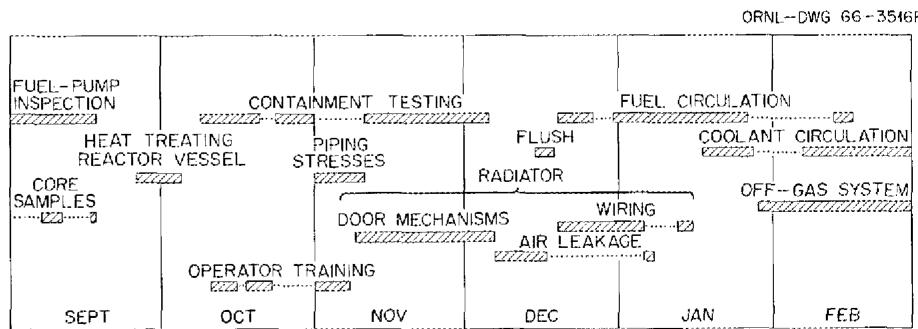  
Fig. 1.l. MSRE Operations and Maintenance, September 1965-February 1966.

the closure devices on containment penetrations had been tested. Now testing of the containment provided by the reactor cell, drain cell, and vapor-condensing system became the primary effort. After preliminary tests at pressures up to 5 psig, the program was interrupted on October 21 to install Masonite sheets between the cell membranes and upper blocks to modify the access opening over the core. Testing at 20 psig disclosed many small leaks at penetrations, which were repaired (many while the reactor cell was open for ten days for strain-gage measurements of piping stresses). After the repairs, leakage rates were measured at 10, 20, and 30 psig. Extrapolation to 39 psig (the peak pressure in the maximum credible accident) gave a leak rate of $0.4\%$ /day, compared to $1.0\%$ /day assumed in the safety analysis. Leakage rates at $-2$ psig (the normal operating pressure) were measured to serve as a reference during subsequent operation. This program was completed on December 5.

Stresses in the reactor cell piping and vessels were calculated in detail to permit evaluation of the service life of the Hastelloy N parts under irradiation. Some adjustments of supports were made to minimize stresses, after which the calculated stresses were acceptably low except at the heat exchanger nozzles, where a complicated geometry made calculations unreliable. The strain-gage measurements in early November showed tolerable stresses at this point also.

While the containment testing and strain-gage measurements were under way, the operators and supervisors underwent further training with emphasis on power operation. Classroom lectures were followed by practice on a simulator which included the actual controls, instrumentation, control rods, and radiator doors. Examinations and certification of qualified operators followed.

Early tests with the radiator hot and the exercises during simulator practice showed that the operation of the radiator doors was unreliable. Four weeks in November and December were spent in modifying and adjusting the door rollers, tracks, seals, and limit devices before tests showed they would operate reliably hot or cold.

Air leakage from the radiator enclosure when the main blowers were operated proved to be excessive, both from the standpoint of coolant-cell ventilation capacity and because of excessive heating outside of the enclosure. Hoods were installed, into which the radiator doors retracted, and the sheet-metal enclosure was generally tightened and modified before leakage became acceptable. (Even after the improvements it was necessary to supplement the cell exhaust with ducting to one annulus blower to attain a negative pressure in the coolant cell.)

When the main radiator blowers were operated with the radiator hot, air leaking from the top of the enclosure overheated electrical insulation in that area. It was necessary to install ceramic insulation on leads on top of the radiator and reroute the leads to cooler locations. Ducting was also installed to redirect cooling air flow across the top of the enclosure where the door hoods had blocked the original flow patterns.

The radiator work lasted from early November to mid-January, delaying the filling of the coolant system and the start of power operation.

As soon as containment testing was finished, the instruments, controls, and equipment were given the checkouts required prior to startup. The fuel system was then heated, and flush salt was circulated for three days. Samples of the flush salt taken at this time were analyzed for oxides by an improved, more reliable method. Results averaged less than 100 ppm, well below tolerable levels. (Evidently the measures taken to avoid oxygen contamination while the reactor vessel and fuel pump were open were effective.)

Fuel salt was charged into the loop, and the reactor was taken critical on December 20. Between then and January 18, when the coolant loop was filled, nuclear experiments were restricted to powers below 25 kw. Even so, useful measurements were made on flux distributions in the thermal shield and beside the reactor vessel, control rod shadowing effects, and zero-power kinetics of the nuclear system. At the same time, numerous fuel-salt samples were analyzed, showing uranium in excellent agreement with expectations, low oxide concentration, and practically no corrosion.

With the coolant system in operation, the power was raised to 100, 500, and then 1000 kw as heat was extracted at the radiator. Dynamics tests and heat balances were conducted at each power. On January 23, while the power was at 500 kw, the fuel pressure control valve (or its filter) showed signs of plugging, but the situation cleared up in a few hours. There was also evidence of an abnormal restriction in the equalizing line between the fuel pump and the drain tanks. The next day the reactor was taken to 1 Mw, and a few hours later signs of intermittent plugging in the fuel off-gas line again appeared. It was established then that the equalizing line was completely plugged. When it was also discovered that the auxiliary vent line was almost completely plugged, the reactor was taken subcritical. Efforts to blow out the plugs in the equalizing line and the auxiliary vent line failed, and the fuel and coolant loops were drained to shut down the reactor. (The systems were kept hot, with helium circulating.)

The check valve in the vent line to the auxiliary charcoal bed was removed, and the line was reconnected. Gas then freely passed through the lines. The fuel drain cell was opened, and the flow-restricting capillary in the equalizing line was removed. This line then proved to be clear. The check valve and capillary were taken to the High-Radiation-Level Examination Laboratory (HRIEL), where they were observed to contain small amounts of intensely radioactive material. They were not plugged, however.

Meanwhile the plugging of the fuel pressure control valve (or filter) recurred. Blowing backward through the line did not clear the obstruction, so the assembly of valve and filter was removed. A new valve was installed, and the assembly was replaced to see if it were open. (This was simpler than flow testing the contaminated parts outside the system.) At first the pressure drop was acceptable, but over a few hours, excessive pressure drop again developed. After the assembly was removed, the new valve was proved to be clear, so the filter was taken to the HRIEL for examination. The old pressure control valve was also cut open and examined in the HRIEL after flow tests showed its $C_{\mathrm{v}}$ was a factor of

3 below its original value. There was some solid material in the pores of the filter, but the pressure drop across the filter was not as high as it had apparently been while installed. Inspection showed that the valve trim was coated with oil and varnish-like material.

The total amount of material in the valves and filter was quite small. Therefore we decided to resume operations, using a filter with larger pores (50 μ instead of 1 μ) and controlling pressure with a hand valve $(C_{\mathrm{V}} = 1.0)$ already in the line instead of the pressure control valve $(C_{\mathrm{V}} = 0.07)$ . (The pressure control valve was eliminated.)

During the operation at significant power, activation of potassium in the cooling water corrosion inhibitor had been more than expected. While the reactor was shut down, the original corrosion inhibitor was replaced with $^{7}$ Li nitrite and borate, which would give only a small amount of activity (tritium).

Also while the reactor was down, pressure drops across the charcoal beds were measured. There had been intermittent indications of excessive pressure drops during the 1-Mw operation and just afterward, but when measured before the next startup they were normal. Operators and extension handles on the charcoal-bed hand valves had been repaired during this interval. (Ice, rust, and binding had prevented easy operation, and setscrews in two of the extensions had sheared.)

Operation was resumed, and fuel was circulated for 44 hr before the power was raised to 1 Mw. It was necessary to gradually open the hand valve being used for pressure control about 1/4 turn during this period in order to hold the fuel pressure in the range of 4 to 6 psig. The implication was that a small amount (perhaps 0.01 in.) of material had built up on the valve trim. Within 3 hr after going to 1 Mw, the apparent accumulation of material accelerated. The valve was adjusted to maintain control, but a short time after making an unusually large adjustment, the differential pressure across the charcoal bed and valves suddenly increased, indicating blockage in those lines.

Just at this point, the motor on the space cooler in the fuel drain cell failed. Rising temperatures in this cell then required that the fuel be drained and secured so the cell could be opened.

The remainder of the period was spent in replacing the space cooler motor and investigating the trouble in the off-gas system.

# Analysis of Experiments

# Reactivity Balance

The reactivity balance involves calculation of the effects of changes in all known variables affecting reactivity. The net effect of changes between any two times that the reactor is critical should be zero if the calculations are accurate. Deviations from zero indicate either error in the measurements and calculations or some unforeseen effect.

The reference conditions for the reactivity balance were established in run 3 (the zero-power experiments which ended July 4, 1965). Between then and the startup in December, one variable changed significantly - the $^{235}\mathrm{U}$ concentration in the fuel. Because of uranium additions to the circulating fuel, at the end of run 3 the $^{235}\mathrm{U}$ concentration in the loop was about $10\%$ higher than that in the salt remaining in the drain tank. Thus the drain and mixing at the end of run 3 caused a substantial decrease in $^{235}\mathrm{U}$ concentration, but one that could be calculated. On the other hand, the fuel loop was flushed at the end of run 3 and the beginning of run 4, resulting in mixing into the fuel an amount of flush salt which was probably small but was not directly measurable. Before criticality in run 4 the $^{235}\mathrm{U}$ concentration was calculated, assuming no dilution with flush salt. The change in concentration from run 3 was converted into reactivity change, using the concentration coefficient of reactivity that had been observed in the zero-power experiments. The resultant reactivity was converted to a predicted control-rod configuration for criticality at $1200^{\circ}\mathrm{F}$ and zero power, using the control-rod poisoning representation based on the rod calibrations. (See "MSRE Reactor Analysis," this report, for a discussion of the equation for rod poisoning.) The predicted critical position of the regulating rod (rod 1) with the two shim rods withdrawn 34 in. was 24.7 in., and the observed critical position was 23.3 in. This difference, equivalent to only $0.08\%$ $\mathrm{bk / k}$ , may be due to several factors, including (1) differences in temperature measurement, (2) inventory errors at the end of run 3, and (3) errors in the rod-poisoning calculation. The most important conclusion to be drawn from this is that there was no significant dilution of the fuel salt by the flush-salt operation.

Critical operation of the reactor during runs 4 and 5 provided an opportunity for checking out some parts of the reactivity-balance calculation. The computer-executed reactivity balance was not used because (1) the accurate representation of control-rod poisoning had not been incorporated into the program, (2) the calculation of xenon poisoning was not fully developed, and (3) there were indications of other systematic errors in the program that had not been resolved. However, several manual calculations were made at very low powers where the fission product poisoning and fuel-burnup terms are insignificant. Some calculations were also made at powers up to 1 Mw but without the xenon and samarium terms.

In general, the zero-power reactivity balances showed a variation of $\pm 0.02\%$ $\delta \mathrm{k} / \mathrm{k}$ . This corresponds to a variation of $\pm 0.3$ in. in the critical position of the regulating rod or $\pm 3^{\circ}\mathrm{F}$ in system temperature and probably represents the limit of accuracy of this portion of the calculation.

Calculations after up to 24 hr of operation at 1 Mw showed no measurable change from the zero-power reactivity balances. Neglect of the fission product terms should have resulted in a change of about $-0.2\%$ $\delta k / k$ if the anticipated xenon behavior had occurred. This is much larger than the scatter in the measurements, so one can conclude that the xenon poisoning was actually much less than predicted.

The difference between indicated and actual position of control rod 3, which developed after the start of run 4 (see p. 54), was reflected as a shift of about $0.05\%$ $\delta k / k$ in the zero-power reactivity balance. This demonstrated the ability of the reactivity balance to show up small changes, at least under simple conditions, that is, no fission product poisoning and low power.

# Power Calibration

One objective of the early power tests was to correlate the thermal power of the reactor and the outputs of the various neutron sensing elements. The principal requirement of such a calibration is an independent method for measuring the thermal or fission power of the reactor. Various methods were used in the approach to 1 Mw with reasonably good agreement.

The first approximation, used throughout run 3, was based on calculations of the inherent (alpha-n) source in the fuel and subcritical multiplication. The primary purpose of this calibration was to permit positioning of the safety chambers so that they would provide a controlrod scream at a few kilowatts and still not interfere with the planned experiments at lower powers. Absolute accuracy was not required since none of the experiments involved operation at powers where thermal effects were apparent.

A thermal-power calibration was made shortly after the start of run 4 at a nominal $25\mathrm{kw}$ . At this time, only the fuel loop was full and circulating; the thermal power was evaluated from the rate of temperature rise and the known heat capacity of the loop. This provided a basis for subsequent operation at higher powers and, incidentally, showed that the initial source-power calibration had been in error by only $8\%$ . A similar test was performed at higher power with both the fuel and coolant loops full and circulating. However, the second test was divided in two parts. First, the nuclear power was set at about $75\mathrm{kw}$ , and $75\mathrm{kw}$ of electrical-heat input to the loop was turned off. These operations did not lead to a steady temperature, but the change in temperature slope with time before and after the increase to $75\mathrm{kw}$ was used to correct the thermal power. The nuclear power was then increased by $50\mathrm{kw}$ , to $125\mathrm{kw}$ , and the increase in the rate of temperature rise was measured. The thermal-power calibration from these two steps was within $5\%$ of the $25\mathrm{-kw}$ calibration.

Several overall heat balances were calculated with the nominal nuclear power at 1 Mw. The results in run 4 varied between 0.94 and 1.18 Mw, with an average value of 1.01 Mw. In run 5, the steady-state heat balances at an indicated power of 1 Mw gave $1.19 \pm 0.02$ Mw. The reasons for this apparent discrepancy have not been established.

# Flux Measurements

Flux measurements were made in the neutron source tube to determine if operation at power would regenerate the external neutron source (Am-

$\mathrm{Cm - Be})$ to a significant degree. The regeneration would take place as a result of thermal-neutron captures in $^{271}\mathrm{Am}$ $(\mathrm{T}_{1/2} = 462$ years), which would produce the more active $^{242}\mathrm{Cm}$ $(\mathrm{T}_{1/2} = 162.5$ days). The measurements were made using cadmium-covered and bare copper foils to determine the thermal-neutron flux at the permanent source position, an elevation of 830 ft 8 in. The thermal flux at that point was found to be $3.8 \times 10^{7}$ neutrons $\mathrm{cm}^{-2}$ sec $^{-1}$ with the reactor at $1.02\mathrm{kw}$ . This extrapolates to $3.7 \times 10^{11}$ neutrons $\mathrm{cm}^{-2}$ sec $^{-1}$ at a power of $10\mathrm{Mw}$ . Using conservative assumptions, it was calculated that the source strength will be kept at an acceptable level for at least $1-1/2$ years after power operation has begun.

Flux measurements were also made in the reactor furnace (in. from the reactor vessel wall) in the location later occupied by metallurgical surveillance specimens. The measurements were made using gold and copper foils. The foils were sealed in a stainless steel envelope from which air had been purged to protect the copper from oxidation during the irradiation at $1200^{\circ}\mathrm{F}$ . Fluxes were measured along a vertical line 80 in. long. The peak flux (at approximately the core midplane), extrapolated to a power of $10\mathrm{Mw}$ , was $7\times 10^{12}$ neutrons $\mathrm{cm}^{-2}$ sec $^{-1}$ . Fast and thermal contributions to this flux were $4.8\times 10^{12}$ neutrons $\mathrm{cm}^{-2}$ sec $^{-1}$ and $2.3\times 10^{12}$ neutrons $\mathrm{cm}^{-2}$ sec $^{-1}$ respectively.

# MSRE Dynamic Tests

# Description of Dynamic Tests

A number of dynamic tests were performed during operation at zero power and subsequently at power levels up to 1 Mw. The purpose of these tests was to investigate the inherent stability of the system, as well as to evaluate the mathematical models and the parameters that were used to predict its dynamic characteristics.

The inherent stability of the system (i.e., without automatic control) was the subject of an exhaustive theoretical analysis in which it was concluded that the reactor would be stable at all powers and that its stability characteristics would improve as the power level increased. Tests made on the reactor operating without servo control at power levels of 75 kw, 465 kw, and 1 Mw confirmed these predictions, as shown in Fig. 1.2, which shows the response of the power to arbitrary perturbations. The improvement in the natural damping characteristics and the decrease in the period of oscillation with increasing power level are clearly shown. Figure 1.3 shows a comparison of the experimental and theoretical periods of oscillation.

A subject of considerable interest during the MSRE development was whether or not the reactor power would "wallow" when operating without servo control. Wallowing would occur if the system were unstable or if random perturbations in reactivity or cooling load induced lightly damped

power oscillations. At both 75 and $465\mathrm{kw}$ some wallowing was observed, but the power level perturbations were less than $\pm 5\%$ . In both cases neither of the main radiator blowers was on, so the bulk of the cooling load was due to natural convection and radiation, and random fluctuations in load were seen. When one radiator main blower was turned on for the

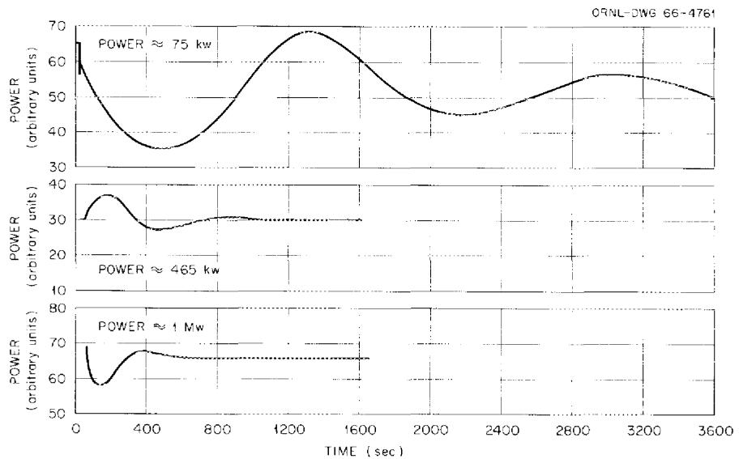  
Fig. 1.2. Inherent Response of MSRE at Three Low Power Levels.

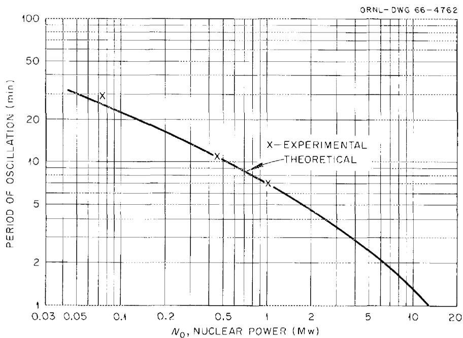  
Fig. 1.3. Comparison of Predicted and Measured Inherent Periods of Oscillation at Low Powers.

I-Mw case, however, the bulk of the cooling was by forced convection, and the power level fluctuations were reduced considerably. Thus, at higher powers, negligible inherent low-frequency neutron level fluctuations can be expected since the load will be steadier and the inherent damping of the system even greater.

# Frequency Response Tests

Both pseudorandom binary tests and pulse tests were carried out in order to determine the frequency response of the system. The pseudorandom binary tests consisted of specially selected periodic series of positive and negative reactivity pulses. The advantages of this type of signal for frequency response testing in the MSRE are:

1. The signal may be generated with standard reactor hardware. These sequences were generated using the MSRE digital computer and a portable analog computer to control the position of a regulating rod.   
2. A large number of frequencies may be analyzed in a single test, with less time required to carry out the experiments compared with that required for oscillator tests, which analyze one frequency at a time.   
3. The location and relative amplitudes of the harmonics of the input signal may be adjusted by varying the basic pulse or "bit time" and the number of bits in the sequence.   
4. The signal power is concentrated in specific harmonic frequencies. This gives a better effective signal-to-noise ratio than that in nonperiodic signals with a continuum of frequencies.   
5. The average value of the perturbation is essentially zero, resulting in a small net upset of the system.

Pseudorandom binary tests were run at power levels of 100 w, 75 kw, 465 kw, and 1 Mw. The particular sequences and their duration were selected so that the expected low-frequency resonance in the frequency response amplitude3 could be identified. Sequences with 19, 63, 127, and 511 bits per sequence were used. As will be shown below, this type of test worked quite satisfactorily.

Single reactivity pulse tests were also run, but the resulting transients were inadequate for frequency response analysis. Since the signal strength of a single pulse is distributed continuously over a wide frequency range, pulse tests require a comparatively low-noise signal. The low-frequency load perturbations seen at low power reduced the signal-to-noise ratio to an unacceptable value in the frequency range of interest (0.002 to 1 radian/sec). Pulse and step response tests are planned at higher power levels, where the conditions should be more favorable.

The pseudorandom binary reactivity input required a very precisely controlled series of regulating rod insertions and withdrawals. Since the frequency range of interest was from about 0.002 to 1.0 radian/sec, the rod jogger was designed so that sequences with a bit time of 3 to 5 sec could be run for as long as 1 hr. The rod jogger system, which required no special-purpose hardware, consisted of a hybrid computer controller shown schematically in Fig. 1.4. The portable EAI-TR-10 analog computer was used to control the bit time and the rod drive motor "on" times for the insert and withdraw commands. The MSRE digital computer was programmed to control the sequencing of the pulse train by means of a shift-register algorithm. The number of bits in the sequence could be varied over a range between 3 and 33,554,431 bits.

The rod jogger system performed extremely well, as it was able to position the rod with an accuracy of about $\pm 0.01$ in. (corresponding to $\pm 0.0005\% \text{sk/k}$ ) out of $1/2$ in. peak-to-peak rod travel for over 500 insert-withdraw operations.

The analog computer was also used to amplify and filter the rod-position and power-level signals prior to digitizing. Throughout the

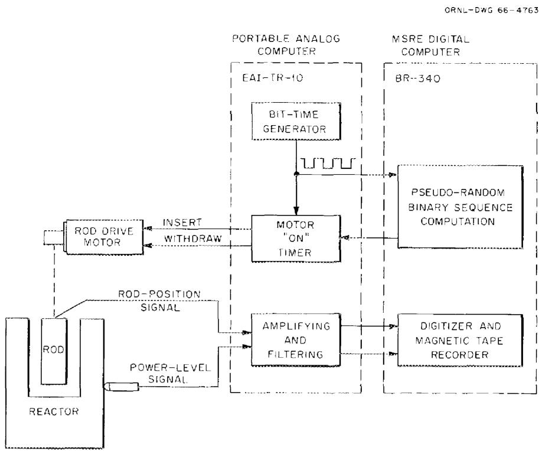  
Fig. 1.4. Block Diagram of MSRE Rod Jogging and Data Logging System for Pseudorandom Binary Reactivity Input Tests.

dynamic tests the MSRE computer was used in the fast scan mode to digitize and store the data on magnetic tape at a sampling rate of 4 per second.

A typical plot of the reactor power level fluctuations during a pseudorandom input test is shown in Fig. 1.5, where the points were taken from the MSRE computer digitized record of the test.

# Analysis Procedures

The test data were analyzed using two independent digital computer methods. This duplication was done as a check on the analysis procedures. The "direct method" used a digital filtering technique to obtain the spectral density of the input and the cross spectral density of the input and the output. The frequency response of the system at some frequency is the ratio of the cross spectral density to the input spectral density at the frequency. It is necessary that frequencies selected for analysis be harmonic frequencies since the input signal is periodic. The "indirect method" required a calculation of the autocorrelation function of the input and the cross correlation function of the input and the output. Subsequent Fourier analysis of these correlation functions gave the input spectral density and the cross spectral density. These were then used to give the frequency response as in the direct-method analysis. Both methods gave essentially the same results.

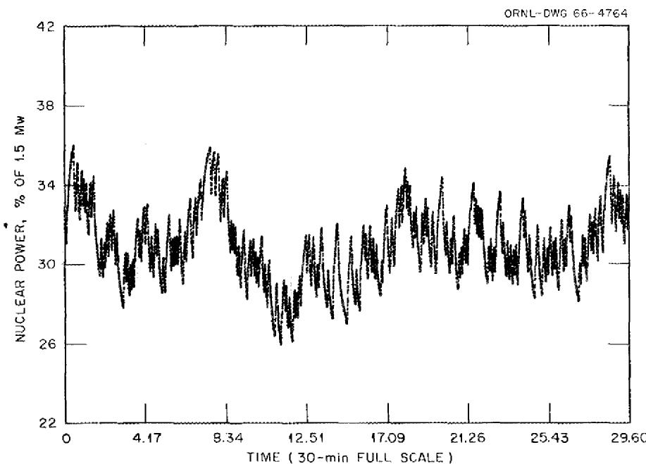  
Fig. 1.5. Nuclear Power vs Time for 511-Bit Pseudorandom Sequence with $N_0 = 465$ kw.

# Results

The results of the MSRE frequency response tests for power levels up to 1 Mw are shown in Figs. 1.6 to 1.13, along with previously published theoretical predictions.3 The experimental results indicate a consistently lower magnitude ratio for $(\delta N / N_0) / (\delta k / k_0)$ than the theoretical predictions at all frequencies and at all power levels. However, the shapes of the experimental curves clearly are consistent with predictions. Work is now in progress to determine the reasons for the differences. Fortunately, the theoretical work in ref. 3 included calculations of the sensitivity of the frequency response to changes in numerous system parameters. This information is proving to be valuable in establishing which system parameters to suspect as responsible for the discrepancies.

Early work suggests that the zero-power discrepancies are due to the effect of fuel-salt plenums above and below the core. These regions increase the effective volume of the core. An increase of the effective core volume to include one-third of the upper and lower plenums in the theoretical model gives agreement with experimental results.

The at-power theoretical results obtained with the increased effective core volume agree with experimental results at higher frequencies for the at-power runs, but the discrepancies in magnitude ratio remain at low frequencies around the peak. The computed sensitivities indicate that the frequency response in this range is most sensitive to power level, $N_0$ , fuel temperature coefficient of reactivity, $\alpha_{\mathrm{f}}$ , and fuel heat capacity, $(\mathsf{MC}_{\mathsf{p}\mathsf{f}})$ . Furthermore, the system equations indicate that these

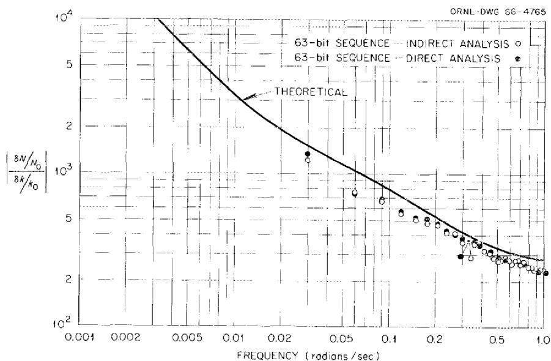  
Fig. 1.6. Frequency Response - Magnitude Ratio of $(\delta N / N_0) / (\delta k / k_0)$ for $N_0 = 100$ w with Fuel Circulating.

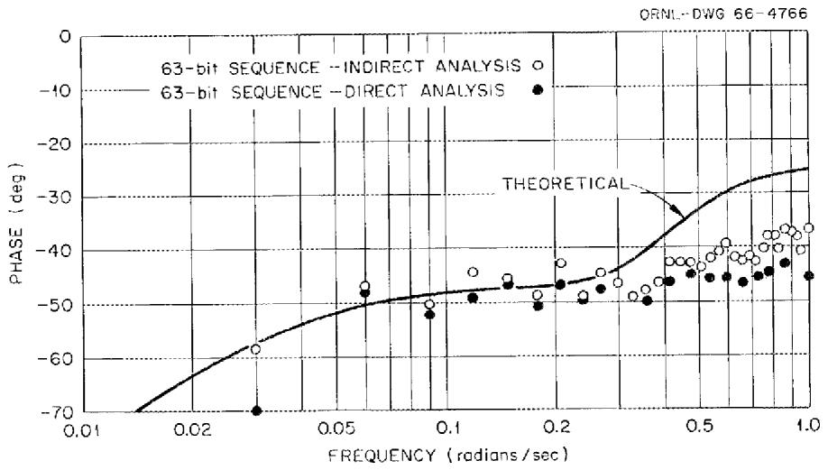  
Fig. 1.7. Frequency Response - Phase of $(\delta N / N_0) / (\delta k / k_0)$ for $N_0 = 100$ w with Fuel Circulating.

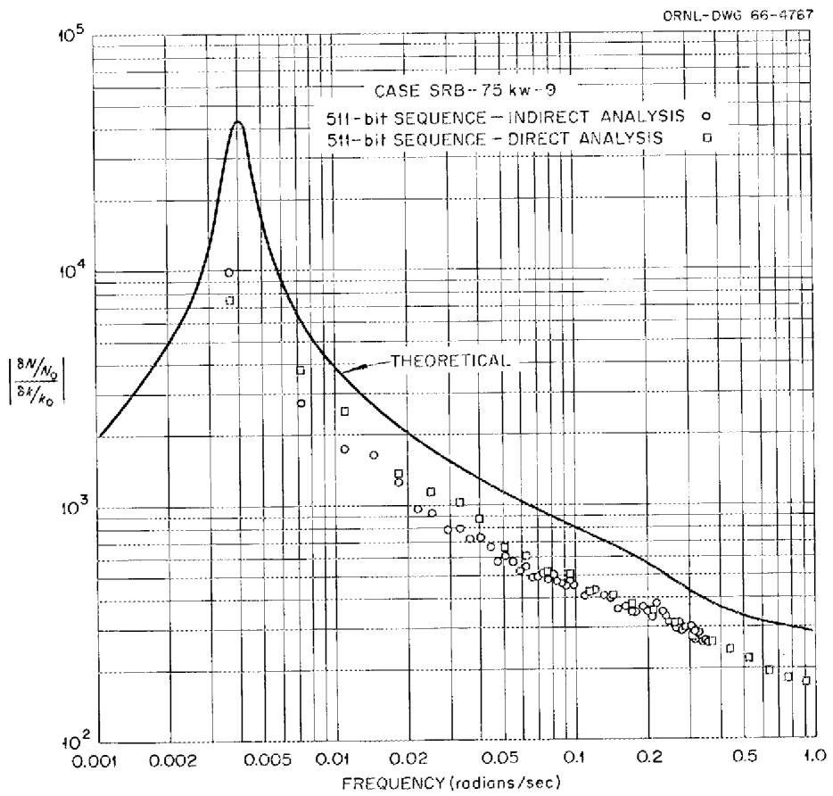  
Fig. 1.8. Frequency Response - Magnitude Ratio of $(\delta N / N_0) / (\delta k / k_0)$ for $N_0 = 75$ kw.

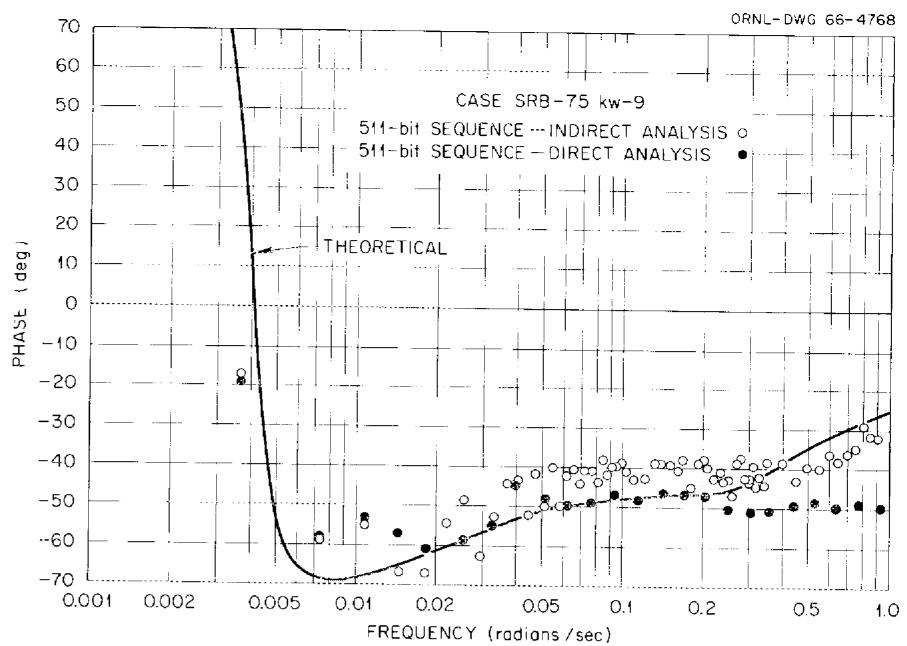  
Fig. 1.9. Frequency Response Phase of $(\delta N / N_0) / (\delta k / k_0)$ for $N_0 = 75$ kw.

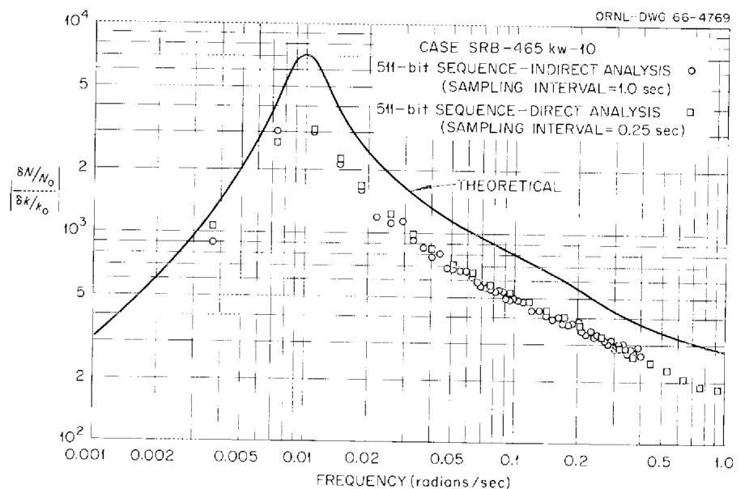  
Fig. 1.10. Frequency Response Magnitude Ratio of $(\delta N / N_0) / (\delta k / k_0)$ for $N_0 = 465$ kw.

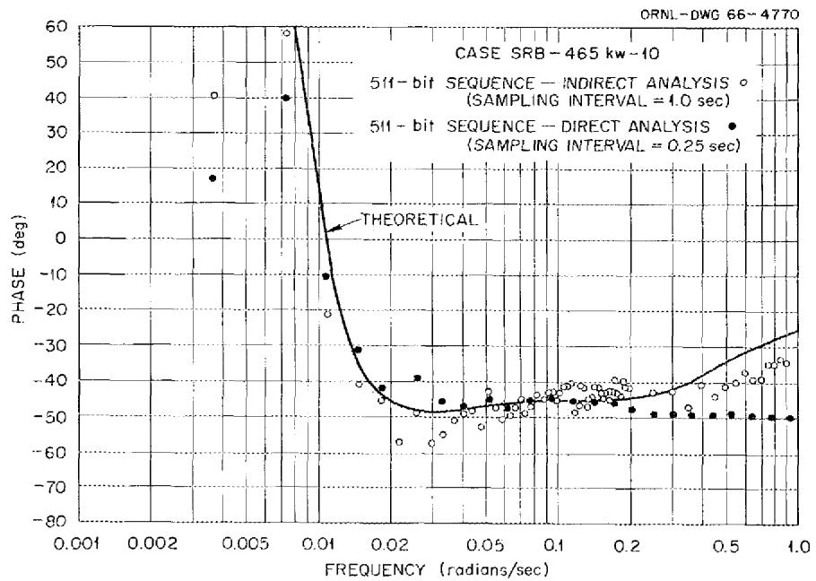  
Fig. 1.11. Frequency Response - Phase of $(\delta N / N_0) / (\delta k / k_0)$ for $N_0 = 465$ kw.

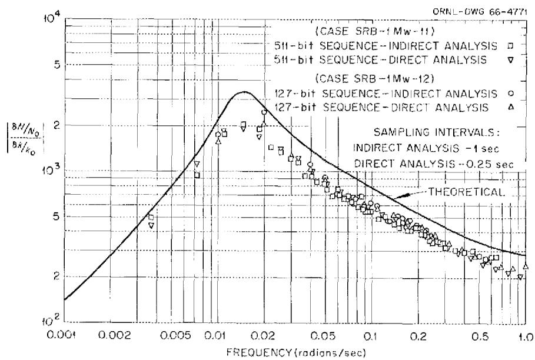  
Fig. 1.12. Frequency Response - Magnitude Ratio of $(\delta N / N_0) / (\delta k / k_0)$ for $N_0 = 1.0 Mw$ .

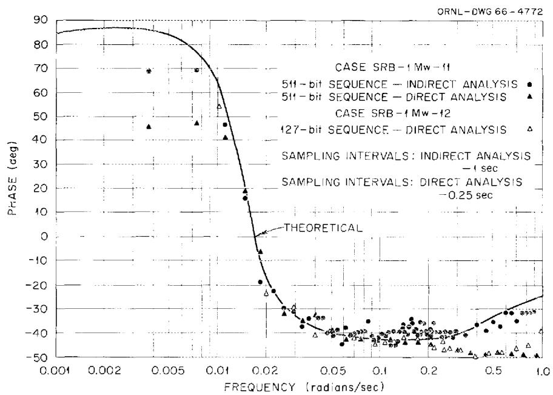  
Fig. 1.13. Frequency Response Phase of $(\delta N / N_0) / (\delta k / k_0)$ for $N_0 = 1.0$ Mw.

parameters appear as a quantity $\mathsf{N}_0\alpha_{\mathrm{f}} / (\mathsf{MC}_{\mathrm{p}})_\mathrm{f}$ . It was found that excellent agreement between theoretical and experimental results may be obtained at all frequencies and all three power levels if, in the theoretical calculations, the increased effective core volume is used and the quantity $\mathsf{N}_0\alpha_{\mathrm{f}} / (\mathsf{MC}_{\mathrm{p}})_\mathrm{f}$ is increased by a factor of 1.5 to 2. The plausibility of such changes is now being examined.

# Temperature Response Test

In order to get a more accurate estimate of the fuel temperature coefficient of reactivity, the hot-slug transient test as reported earlier5 was modified and rerun in January 1966. In this test the reactor power level was controlled by the flux servo at 100 w with the fuel loop circulating and the coolant loop stagnant. After heating the stagnant coolant salt about $20^{\circ}\mathrm{F}$ hotter than the fuel salt, the coolant pump was started, producing a hot slug of fuel in the heat exchanger which was subsequently introduced into the core. In this test, then, the change in reactivity was due entirely to the change in temperature, and the rod-induced reactivity required to keep the reactor critical was approximately equal and opposite to that due to the fuel and graphite temperature change. Since the graphite responds slowly to changes in fuel temperature, the immediate effects on reactivity can be attributed to the fuel temperature coefficient alone. Further corrections have yet

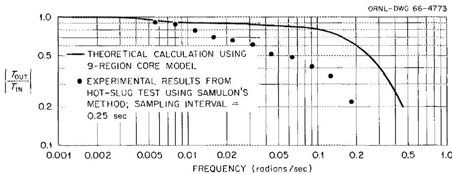  
Fig. 1.14. Frequency Response - Magnitude Ratio of Reactor Outlet Temperature Response to Inlet Temperature Perturbations.

to be applied to the results of the test, but a preliminary estimate of $-4.7 \times 10^{-5} (\mathrm{~F})^{-1}$ has been obtained. This compares favorably with the predicted value of $-4.84 \times 10^{-5} (\mathrm{~F})^{-1}$ used in the theoretical calculations.

The transfer function of reactor outlet temperature response to changes in reactor inlet temperature was also calculated from this test, and the plot of magnitude ratio vs frequency is shown in Fig. 1.14. Note that the experimental curve indicates much greater attenuation over most of the frequency range shown. This is probably due to higher-than-expected rates of heat transfer to the graphite, since experimental mixing studies3 indicated that there is very little attenuation due to mixing in the frequency range below 0.1 radian/sec. Reasons for this discrepancy are being studied.

# Systems Performance

# Off-Gas System

Some difficulty with plugging and partial restrictions in the MSRE off-gas systems has been encountered at various times in the operation of the reactor systems. In the past these obstructions have developed at in-line filters and pressure-control valves with extremely small flow passages. During early operations, the plugging of filters was attributed to having filters with inadequate flow areas to accommodate the material to be removed from the gas streams. (For example, the original filter in the coolant off-gas line, 528, was a tubular element only 1 in. long by $1/2$ in. in diameter.) The plugging of valves appeared to be a result of filters which were too coarse to remove all the particles that were capable of causing plugs.

During shutdown which followed the zero-power experiments (run 3), larger filters, capable of removing particles greater than $1\mu$ in diameter, were installed ahead of the pressure-control valves in both the

fuel and coolant off-gas lines. The fuel-system pressure-control valve (PCV 522), which had exhibited some erratic behavior in run 3, was tested and found to have the same pressure-drop characteristics that it had when first installed. This valve was reinstalled for the next operation of the reactor. No further difficulties were encountered with the coolant off-gas system, but several problems developed in the fuel system. (See Fig. 1.15 for a simplified flowsheet of the fuel off-gas system.)

The performance of the fuel off-gas system was satisfactory during the subcritical and low-power (up to 25 kw) operation of the reactor in December 1965 and January 1966. The first indication of difficulty in this run (run 4) occurred on January 23 with the reactor power at 500 kw. The total integrated power accumulated up to this time was about 3 Mwhr. At that time the system pressure began to rise slowly, indicating either a restriction in the vicinity of PCV 522 or a malfunction of the valve. (A routine check of system pressure interlocks on the previous day had indicated normal behavior of all components.) Shortly after the start of this pressure transient, the response of the drain-tank pressures indicated an abnormal restriction at a capillary flow restrictor in line 521, the fuel-loop-to-drain-tank pressure equalizing line. The excess pressure in the fuel system was relieved by venting gas through HCV 533 to the auxiliary charcoal bed until the restriction at PCV 522 was cleared by operating the valve several times through its full stroke. These opera

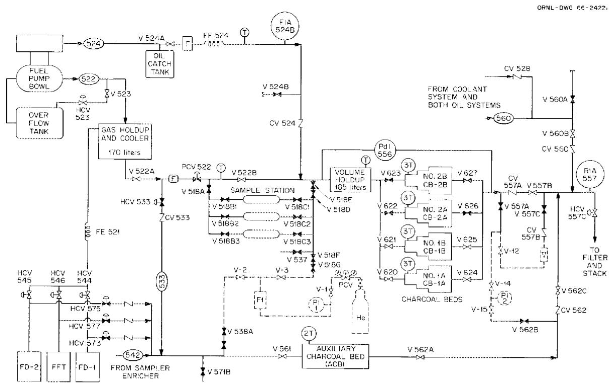  
Fig. 1.15. Simplified Flowsheet of MSRE Fuel Off-Gas System.

tions also revealed at least a partial restriction in the line to the auxiliary charcoal bed, apparently at HCV 533. The reactor was made subcritical after $4 - 1 / 2$ hr operation at $500\mathrm{kw}$ .

Satisfactory pressure control was maintained for about 24 hr, but the plugging at HCV 522 recurred shortly after the reactor power was raised to 1 Mw. Again, the operation of this valve through its full stroke was effective in relieving at least part of the restriction. However, on this occasion, evidence of restrictions at the charcoal-bed inlets began to appear. These restrictions were bypassed by putting the two spare charcoal-bed sections (2A and 2B) in service and closing the inlet valves to the two that were restricted (1A and 1B). Within about 6 hr the inlets of beds 2A and 2B also plugged. When the previously plugged beds were checked, at least one was found to be clear and off-gas flow was reestablished through bed 1B. The manipulation of the charcoal-bed inlet valves revealed substantial mechanical difficulties with the manual operators. These were caused by misalignment of extension handles and corrosion due to weather exposure and resulted in two of the valves becoming inoperative.

The combination of difficulties in the off-gas system resulted in a reactor shutdown to correct the conditions. The restrictions in the equalizing line (521) and the auxiliary vent line (533) were relieved by removing the capillary (FE 521) and a check valve (CV 533) respectively. The valve and filter assembly, and a second valve that had been tried briefly, were removed from line 522. The original valve and the filter were subsequently subjected to detailed examinations which are described in "Component Development," this report. Pressure-drop measurements showed a higher pressure drop by a factor of 3 to 4 in the valve and a factor of 10 in the filter. However, the observed restrictions, particularly in the case of the filter, were not high enough to account for the observed pressure behavior in the operating system.

While the reactor was shut down, several measurements were made of the pressure drop across individual sections of the charcoal beds. Measurements made shortly after the shutdown showed essentially normal pressure drops for three of the four sections. The pressure drop across the fourth section (1B) was about $60\%$ higher than that across the others. (These measurements include the pressure drops across the inlet and outlet valves of each bed section.) Although nothing was done to correct this condition, measurements made just before the next startup (run 5) showed that all four sections had essentially identical, normal pressure drops. Mechanical repairs had been made to the operating mechanisms of the valves, but these did not affect the flow characteristics. Measurements were also made of the pressure drop across the auxiliary charcoal bed; no abnormalities were observed there.

The preparations for the next startup included installation of a large, relatively coarse $(50 - \mu)$ filter and a large, open hand valve at the PCV 522 location. This arrangement eliminated the small, easily plugged passages associated with PCV 522, and it appeared that the filter would still remove any particles large enough to plug valve 522B, which was to be used for system pressure control. (Satisfactory manual pressure control using valve 522B had been demonstrated during the shutdown.)

In the next operation of the fuel loop (run 5), fuel salt was circulated for 44 hr with the reactor subcritical or at very low power (100 w) before the power was raised. The evidence is not conclusive, but there was some indication of an increase in flow resistance at valve 522B during this time. Shortly after the power was raised to 1 MW, the increase in flow resistance at 522B accelerated sharply. Frequent adjustment of the valve was required to maintain reasonable pressure control. The restriction at the charcoal beds which occurred after one such adjustment developed quite rapidly and resulted in almost complete plugging of the two beds that were in service (1A and 1B). After the reactor drain, which was required because of the failure of the space-cooler motor, it was determined that the auxiliary charcoal bed was also restricted. This bed comes into service automatically during a drain as a backup to relieve any excess gas pressure. The helium in the fuel system was then released through the two standby charcoal beds.

Detailed investigations after the shutdown showed that the charcoal-bed restrictions were probably at the inlet valves. Valve 621, the inlet valve to bed 1B, was removed for examination in the HRIEL. The results of these examinations are described in the section entitled "Component Development." The pressure drop across bed 1B with valve 621 in place was very much higher than normal. With the valve out, the pressure drop was much lower but still higher than for a normal, unrestricted bed. An excess of helium was then forced through the bed for a few minutes, and the pressure drop suddenly decreased. Subsequent pressure-drop measurements under controlled conditions gave values which were normal for an unrestricted bed.

Several gas samples were taken from the fuel loop during this shutdown in an effort to identify some of the plugging constituents. For several days after the drain, all helium flow through the fuel system was stopped, and the helium in the loop was circulated at $\sim 1100^{\circ}\mathrm{F}$ . The helium in the off-gas holdup volume (170 liters) was stagnant at about $122^{\circ}\mathrm{F}$ . Three successive pairs of samples were then trapped from the discharge of the holdup volume; each pair of sample traps consisted of a pipe coil at liquid-nitrogen temperature followed by a U-tube filled with molecular sieve material, also at liquid-nitrogen temperature. The first pair of samples was isolated from the gas that had been in the hold-up volume by displacing it through the traps with helium from the fuel loop. The helium which entered the holdup volume during this displacement was presumed to be representative of the material circulating in the loop. A second displacement through another pair of traps was used to isolate material from that gas. For the third pair of samples, the reactor cell temperature was allowed to rise to heat the off-gas holdup volume to $173^{\circ}\mathrm{F}$ before the gas was passed through the traps. The purpose of this was to see if any additional material was released from the holdup volume by the increase in temperature. Analysis of the samples has not yet been completed because of the high activity associated with them.

Since particulate matter originating at the fuel pump was regarded as one possible cause of plugging in the off-gas system, the main fuel off-gas line (522) was opened at the fuel pump for visual inspection. Small amounts of gray-green powdery material were found between the faces

of the flanges that were opened, but no deposits were seen in the part of the holdup volume that could be inspected. Samples of the solid material and swabs of the holdup volume were removed for analysis.

Additional work to be performed before the next startup includes:

1. a blowout of the holdup volume to remove any loose material,   
2. design, fabrication, and installation of a new filter-control-valve assembly at PCV 522, and   
3. replacement of several valves in the system with valves having larger trim.

# Salt-Pump Oil Systems

Entrained gas in the circulating oil tends to accumulate in the volute of the standby oil pump. From the beginning of MSRE operation, it was necessary to prime the standby pump frequently to keep it ready for operation. (Priming was done routinely once a shift.) Observations in a development loop showed that entrainment and frothing in the reservoir were due to the action of a jet pump used to scavenge oil from the bearing housing (using shield plug oil flow to drive the jet) and agitation of oil by the shaft and bearings.[6] In September 1965, the jets on the fuel and coolant pumps were replaced with less powerful jets to decrease entrainment. After this modification, it was possible to reduce the frequency of priming the standby pump to once a week in the fuel oil system; on the coolant lube oil system it was necessary to continue as before.

After the jets were changed it was found that changes in fuel-pump bearing-oil flow or reservoir pressure caused changes in reservoir level, apparently because of holdup of oil in the salt-pump motor cavity. Oil from the bearing housing can enter the motor cavity either by leakage past the upper seal or through a passage connecting the motor cavity to the area between the two shaft bearings. Apparently an excess of flow to the bearing housing causes oil to be forced up into the motor cavity. Although the breather line affords a return to the oil reservoir, it has been found that once the oil collection begins in the motor cavity it usually continues until either the oil system is shut down completely or the bearing flow is reduced to below normal. An increase in oil flow to the bearing housing from the normal 4 gpm to 5 gpm causes a level decrease in the oil reservoir of over 2 gal. (Much more than this could collect without reaching the motor, but normally action is taken to stop collection at less than a gallon.)

Leakage past the lower seal drains to the oil catch tank, which is equipped with a level indicator and which is periodically drained to the waste oil receiver. After the installation and calibration of a siphon tube in the fuel-pump oil catch tank in November, oil was not added to bring the level indicator on scale. The fuel-pump lower-seal leak rate during the months of December and January is therefore not known precisely. However, when oil was deliberately added to the oil catch tank

in February, it took 900 cc to bring the level instrument on scale. The seal leakage evidently had been very low, because this volume is very near that calculated to fill the empty pipe from the oil catch tank to the drain valve at the waste oil receiver. After the oil catch tank level indicator was brought on scale, the indicated leak rate was approximately 2 cc/day. The coolant-salt-pump lower-seal leakage measured during January and most of February was zero. Near the end of February a leak rate of approximately 4 cc/day began.

The levels in the oil reservoirs are recorded routinely once a shift. As was seen above, the amounts of oil held up in the motor cavities vary with operating conditions, and these cause variations in the oil reservoirs. But there has been no reason why this variable holdup should show any long-term trend. Therefore, the reservoir levels recorded over a period of weeks should reveal changes in oil inventories. Figure 1.16 is a plot of the fuel-pump oil reservoir levels from December 1965 through February 1966, when the oil system was in continuous operation. It is apparent that leakage was less than can be measured by this method. The coolant-pump oil reservoir level showed similar behavior except that the fluctuations were smaller (probably reflecting less motor-cavity holdup).

# Treated Cooling-Water System

The treated-water system is a closed system removing heat from the thermal shield and other items in the reactor and drain cells. Problems

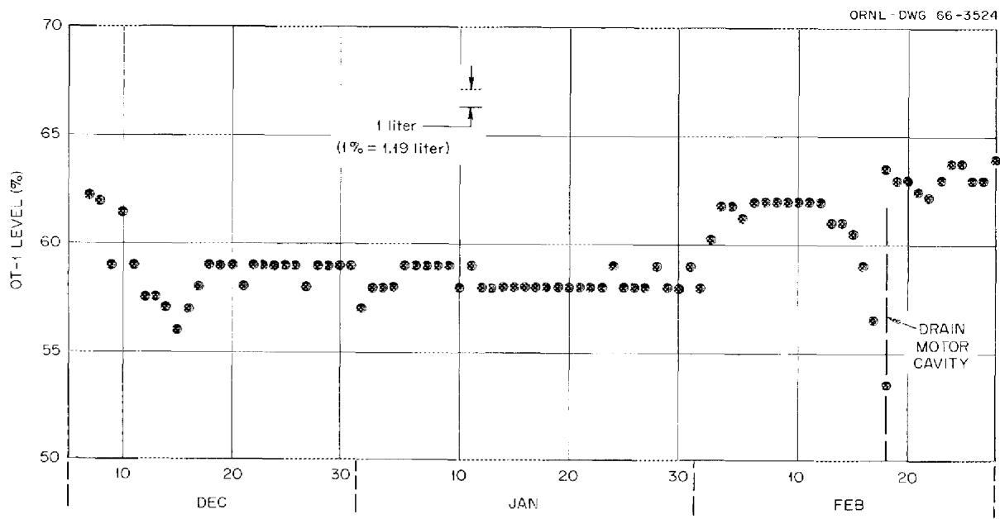  
Fig. 1.16. Fuel-Pump Oil-Reservoir Level in Runs 4 and 5.

encountered during this report period were neutron activation of the corrosion inhibitor and interruptions of flow through the thermal shield slides.

Activation. During power operation in run 4, induced activity in the treated water rose to an unexpectedly high level. Extrapolation of observed radiation levels indicated that at 10 Mw, gamma radiation near the heat exchanger in the diesel room would be about 400 mr/hr; similar levels would exist in the water room. The activity proved to be 12.4-hr $^{42}\mathrm{K}$ produced in the corrosion inhibitor (2000 ppm of a $75\%$ potassium nitrite, $25\%$ potassium tetraborate mixture). The level indicated that the average flux in the system (about $80\%$ of which is included in the thermal shield) was equivalent to about $7 \times 10^{10}$ thermal neutrons $\mathrm{cm}^{-2}$ sec $^{-1}$ at 1.0 Mw.

A survey of possible cation replacements for potassium led to the choice of lithium, highly enriched in the $^{7}\mathrm{Li}$ isotope to minimize tritium production. An adequate amount of lithium nitrite solution was prepared commercially by ion exchange from potassium nitrite and lithium hydroxide. After the 4000-gal treated-water system was diluted with demineralized water to reduce the potassium from 800 to 3 ppm, the desired inhibitor concentration was attained by adding $^{7}\mathrm{Li}$ nitrite, boric acid, and $^{7}\mathrm{Li}$ hydroxide.

When the reactor was next operated at power, in run 5, objectionable activation again occurred, this time due to $1.0~\mathrm{ppm}$ of sodium which had evidently come in with the demineralized water from the ORNL facility. Condensate was produced at the MSRE with less than $0.1~\mathrm{ppm}$ of sodium, and this was used to dilute the sodium in the treated-water system to $0.3~\mathrm{ppm}$ . The concentrations of sodium and ${}^{6}\mathrm{Li}$ are now low enough so that shielding and zero-leakage containment of the water system will not be necessary.

Flow Interruptions. On several occasions flow through the thermal shield slides stopped. Each time it was found that when the water supply line was disconnected and water was allowed to flow backward through the slides, considerable amounts of air came out with the water. The conclusion was that air could accumulate in the longest slide until the head exceeded the pressure available to cause flow. (This should be impossible if the piping in the slide were installed as designed.) Venting the inlet line restored the flow, and provisions were made to facilitate venting. The source of the air was evidently a vortex in the surge tank which occurred when the level was low. After the flow through the surge tank was drastically reduced (it had been about 30 gpm) there was no recurrence of the flow interruptions.

# Secondary Containment

The secondary containment, that is, the envelope surrounding the reactor and drain-tank cells, was tested and put into service for the first time during this report period. The testing procedure followed generally the MSRE Operating Procedures, Sect. 4E.7 This procedure in-

cludes testing of individual closure devices on lines penetrating the cells and pressurization of the cells for leak hunting and measurement of the overall leakage rate.

All lines carrying helium, air, or water into the cells are equipped either with check valves or block valves actuated by radiation monitors. All of these valves were tested, in place wherever possible; otherwise they were removed and bench-tested. Test pressures were 20 psig or more, and leakage rates were required to meet conservative criteria. This work was done concurrently with maintenance before the cells were closed.

Leaks which occurred in the cooling-water system were mostly in the check valves. These were the result of foreign particles, apparently washed out of the system and trapped between the sliding and moving parts of the valves. Two hard-seated valves in the treated-water system had to be replaced even though the seats were lapped in an effort to get them to seal. One was a check valve with a swinging check, in a water line between the surge tank and condensate tank, and the other was a spring-loaded hand valve on top of the surge tank, which has to contain air. They were replaced with soft-seated valves. The leakage rates on water-containing valves were determined by collecting the leakage, and a flowmeter was used to measure air leakage through valves on top of the surge tank.

The majority of the valves in the helium system of both primary and secondary containment had satisfactory leak rates. Those which had excessive leakage were check valves and were found to have damaged O-rings and/or foreign particles, usually metal chips from machining, in them. After cleaning and installing new O-rings, they were satisfactory. Many of the check valves had to be removed from the system to pressurize them. After reinstalling, the lines were pressurized and the fittings were checked with a helium leak detector. Leakage rates through the valves were determined by a flowmeter or by displacement of water in a calibrated tube.

The instrument-air-line block valves with few exceptions were found to be satisfactory; however, numerous tube fittings were found to be leaking by checking with leak-detector solution when the lines were pressurized to check the valves. Several quick disconnects on air lines inside the reactor cell and drain-tank cell were found to be leaking when checked with leak-detector solution and were repaired. These leaks do not constitute a leak in secondary containment, since each line has a block valve outside the cell; but a leak here does affect the cell leak rate when air pressure is on the line to operate the valve.

The butterfly valves in the 30-in. line used for ventilating the cells during maintenance operations were first checked by pressurizing between them. The leakage measured by a flowmeter was excessive, and the valves had to be removed from the system to determine the cause. There was considerable dirt on the rubber seats, and one was cut; these seats were cleaned and repaired. We found that the motor drive units would slip on their mounting plates by a small amount, thus causing a slight error in the indicated position of the valve. Dowels were installed in the mounting plates to prevent this. Small leaks were also

found around the pins which fasten the butterfly to the operating shaft; these leaks were repaired with epoxy resin. The line from the thermal-shield rupture disks to the vapor-condensing systems has numerous threaded joints that leaked badly when pressurized with nitrogen. Each joint was broken, the threads were coated with epoxy resin, and the joint was remade. All joints were leaktight when rechecked with leak-detector solution.

When closing the cells, all membrane welds were dye checked. After completion of the membrane welding, alternate top blocks were installed, and the cells were pressurized to 1 psig to leak check all membrane welds with leak-detector solution. No leaks were found in the welds. The reactor access cover plate, which has a double O-ring seal, was found to be tight by pressurizing between the O-rings.

With the cells at 1 psig, all penetrations, pipe joints, tube fittings, and mineral-insulated (MI) electrical cable seals subjected to this pressure were checked with leak-detector solution. Numerous leaks were found in tube fittings and MI cable seals, and the leak rate was about $4500\mathrm{ft}^3/\mathrm{day}$ , indicating a major leak. Many of the small leaks were stopped by simply tightening the threaded parts of the seal. However, the leak rate was still about $4500\mathrm{ft}^3/\mathrm{day}$ .

The cells were then pressurized to 5 psig, and leak hunting continued. Three large leaks were located: one in the sleeve of line 522, the off-gas line from the pump bowl to the carbon beds, under the bent house floor, another in an instrument air line to valve HCV 523, and another from the vapor-condensing system to the steam domes and out to the north equipment service area through a line that was temporarily open. All penetrations, tube fittings, and MI cable seals were again checked with leak-detector solution. Many MI cable seals which had not leaked at 1 psig were found to be leaking, and some of those which had been tightened and sealed at 1 psig now leaked.

The hook gage being used to monitor the leakage rate along with conventional pressure gages did not work properly, and the trouble was found to be the result of extremely small leaks in the tube fittings on the reference volume side of the system. This and temperature changes in the coolant drain-tank cell and special equipment room caused appreciable difficulty in determining the leakage rate. The piping to the hook gage was eventually replaced with virtually all welded tubing. Temporary closures were put on the special equipment room, and the door entering the coolant drain-tank cell was kept closed as much as possible. These measures considerably improved the reliability of the data.

The MI cable seals as a group accounted for a large percentage of the remaining leaks. Many were sealed by tightening, but many of them required tightening more than once. As a result, several of the gland nuts split and soldering was required. All large leaks were sealed or greatly reduced, and many of the small leaks were stopped. To stop these and other small leaks which may not have been located, all MI cable seals were coated with epoxy resin at the seals outside of the cells. Teflon tape, used extensively on MI cable seals, other threaded pipe, and tube fittings, did not perform satisfactorily in providing a gas seal.

After stopping or reducing the leaks in the MI cable seals and instrument air lines, testing was begun at 10, 20, and 30 psig. At these higher pressures, large leaks were located in both component coolant pump dome flanges by leak-detector solution, and one of them was audible. To correct these leaks, the width of the gasket was reduced to increase the loading pressure on the gasket. All penetrations, MI cable seals, tube fittings, and external parts of valves which are part of the secondary containment were checked with leak-detector solution at each of the above pressures.

In each of these tests, the containment system was pressurized to a specific pressure. Then all gas additions and controlled exhausts were stopped, and the leak rate was measured by the change in pressure corrected for changes in temperature. The calculated leakage rates are presented in Fig. 1.17.

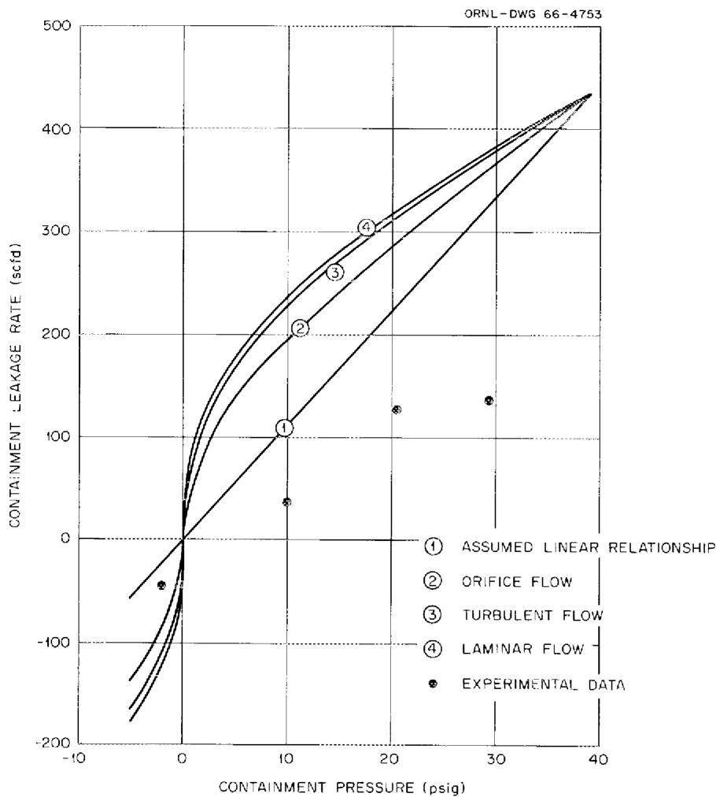  
Fig. 1.17. Pressure Dependence of the Leakage Rate of the MSRE Secondary-Containment Vessel for Possible Flow Regimes. Normalized to the maximum allowable leakage rate under MCA conditions.

The leakage rate is acceptable if it is $1\%$ per day of the contained gases under the conditions of the maximum credible accident. This represents a leakage rate of about 430 scfd at 39 psig and $250^{\circ}\mathrm{F}$ . With this as the condition of maximum leakage rate, the curves in Fig. 1.17 relate the leakage rate to system pressure for various flow regimes that can exist (see ref. 1). Also shown is a highly conservative linear relationship for leakage rate vs pressure. The data taken during the leak-rate tests at 10, 20, and 30 psig are all well within the bounds of these curves; the in-leakage rate at $-2$ psig is acceptable for all but the linear relationship. Although the data at $-2$ psig indicate the containment is inadequate for the linear extrapolation, a comprehensive examination of the data clearly indicated that the leakage rate was acceptably low.

Core Access Opening. Convenient access to the control-rod drives and the core access flange is had by removing a 40-in.-diam plug in a steel-lined hole in a lower shield block. Originally a flange on the upper rim of the hole liner was welded to the cell membrane, and a bolted, gasketed cover plate completed the containment. This attachment of the membrane to a lower block presented a problem which became apparent during testing and which led to modification. Because of their great weight, the upper blocks must be supported at their ends, not by the lower blocks. To ensure this, there is necessarily some clearance between the upper blocks and the membrane, which normally lies on the lower blocks. When the cell is pressurized, therefore, the membrane lifts up until it contacts the upper blocks. This it was free to do everywhere except around the access opening, where it was fastened to the flange. Analysis showed that this situation would produce excessive stresses when the cell was pressurized for leak testing. Redesign of the liner or flange was impractical, so the membrane was cut loose from the flange and an overlapping patch was welded on the membrane. This patch must now be cut off whenever access is required.

Vapor-Condensing System. Installation of instrumentation and shielding on the vapor-condensing system was completed, and the system was leak-tested before water was added. Shielding consists of earth having a minimum thickness of 4 ft on top of the gas storage tank. This tank is just inside the area fence along the HFIR access road, and at least 3 ft of earth was provided on the road side to give complete protection to passers-by under the worst conditions. Before the tanks were covered, all penetrations were helium leak-tested and found to be tight. Then during the reactor cell leak test, the vapor-condensing system was leak-tested at 30 psig, and a leakage rate of only 5.5 ft³/day was measured from the 6800-ft³ system. After the leak test, the vapor-condensing tank was filled with water to the proper level, placing the system in readiness for operation.

Ventilation of Coolant Cell. The cell housing the coolant-salt system is connected to the building ventilation system by a duct which exhausts 5500 cfm of air. This was enough to maintain a negative pressure in the area until the radiator blowers were put into operation. Then air leakage from the radiator enclosure exceeded the cell exhaust capacity. Even after considerable work on the enclosure, the leakage was too much.

To alleviate the situation, the inlet of the south annulus blower was connected to the coolant drain-tank cell by ductwork. This blower can now return about 7400 cfm of air to the duct leading to the coolant stack. Now when the annulus blower is used to supplement the regular exhaust, the main radiator blowers can be operated without raising the coolant-cell pressure above atmospheric.

# Shielding

Complete radiation surveys of the reactor area were made at each higher power level from 1 to $1000\mathrm{kw}$ . These showed a few areas of unacceptably high radiation. The treated-water system has already been discussed. Scattering of fast neutrons and gamma rays from the reactor cell into the coolant drain cell through the 30-in. cell ventilation line caused excessive dose rates outside the access door. A wall of 16 in. of concrete block and 6 in. of borated polyethylene was built in the coolant drain cell to reduce dose rates at the door to acceptable values. (The door is locked during nuclear operation to prevent entry into the cell.) Gamma radiation from the fuel off-gas line in a 3-ft gap between the reactor building and the vent house required earth shielding, as had been expected. We also expected that additional shielding would be required directly above the reactor, where there are large cracks between the shield blocks. However, present indications are that the shielding there will be adequate.

# Component Performance

Considerable effort was spent in modifying and adjusting the radiator to meet operational requirements. Other components performed well, but there were some failures in conventional equipment.

# Radiator

The original radiator doors proved inadequate in that they bowed and jammed when the radiator was heated. In August 1965, doors of improved design were installed. Tests showed that these doors deformed far less when hot and suffered none of the permanent warping of the first doors. Heat losses due to air leakage around the doors continued to present a problem, however. Before all parts of the radiator tubes could be gotten into an acceptable temperature range for filling with salt, it was necessary to work out several minor changes. These included shimming the gasket to conform to the complex bowing of the doors and enclosure and changing the heater wiring to give a nonuniform heat input over the face of the radiator.

At first the new doors did not move freely. On separate occasions, both doors hung up and failed to lower, leading to snarling and kinking of the lifting cables. Reliable, free movement of the doors was attained only after several revisions. The seal strips were modified to eliminate

digging into the asbestos and metal gasket and were attached more securely to the doors after the strips warped and broke in several places. The upper limit switch arrangement was changed to prevent hangups due to over-travel. The door guide rollers were changed to eliminate binding. More clearance between the moving doors and the enclosure was provided by moving the guide tracks and modifying the closing cans, which force the doors in against the enclosure at the bottom of their travel.

When the main blowers were operated to test the doors, other difficulties became apparent. Air leakage from the sheet metal enclosure was clearly excessive (about 10,000 cfm), even though the original design had been modified to include hoods into which the doors were raised. The leakage was reduced by installing asbestos cloth boots around the cables, applying sheet metal to some gaps, and packing insulation in others. Even so, the leakage required an increase in the cell exhaust capacity to prevent pressurization of the cell. Leakage of hot air into the region just above the enclosure caused overheating of electrical insulation on the numerous thermocouples and power leads in this vicinity. The problem was compounded because the new door hoods blocked the circulation of air from the cell coolers. Leak stopping and more thermal insulation improved the situation, but it was still necessary to relocate junction boxes in cooler locations along the cell wall and install higher-temperature electrical insulation on the thermocouple and the electrical leads over the enclosure. Flexible ducts and vanes were used to redirect cool air flow over the leads and the lifting mechanisms. See "Component Development" for additional information about the modifications.

After the improvements in the door seals, air leakage through the radiator was manageable, but it was still considerable. Stack draft alone pulled enough air around the closed doors to make the heat losses (and required heater settings) sensitive to the wind outside and the position of the radiator bypass damper. It was found that the door-seal leakage also depended on whether the doors had been scrammed or were lowered normally. The first operation at 1 Mw (in run 4) was with one main blower on, the bypass open, the outlet door raised 15 in., and the inlet door all the way down. Later, in run 5, more than 1 Mw was extracted with both doors down (but not scrammed), one main blower on, and the bypass open.

During the 1-Mw operation in run 4, salt froze in the lines connected to FT 201, the venturi flowmeter located in the upper part of the radiator enclosure. With the blower on, cool air leakage past the element made it necessary to turn on local heaters to prevent freezing. When the blower was stopped, the heaters had to be turned down to avoid overheating. It appeared likely that in higher-power operation, with greater air pressure in the radiator, the element could not be kept from freezing. Therefore, between runs 4 and 5, the top of the enclosure was cut open, part of the stacked-block insulation was removed, and fibrous insulation, protected by shim stock, was installed around the element. Operation in run 5 indicated that the insulation was then adequate.

Heaters. Very little trouble was encountered with the heaters on the salt systems.

A faulty thermocouple led to failure of two elements in H 106-1, a heater on the fuel drain line to drain tank 2, in October 1965. Investigation of an anomalous drop in current showed that two elements had failed after a lengthy period in which the heater was operating near the maximum power (about $50\%$ higher than other heaters in similar locations). The thermocouple whose reading was used to set the heater was then checked. One lead was grounded in the shield, causing the indicated temperature to be $400^{\circ}\mathrm{F}$ low. All three elements in H 106-1 were replaced. X rays showed that about 1 in. of resistance wire in the two failed elements had melted. Inspection of the pipe showed no damage from the abnormally high temperature.

All heaters performed properly during the heatup of the fuel and coolant loops, with one minor exception. A broken lead turned up on a heater between the radiator and the coolant pump. It was simply reconnected.

After the startup, one of three elements in one of the heat-exchanger heaters failed. No action was taken because the other elements were enough to produce the desired temperature.

Drain-Cell Space-Cooler Motor. The fans on the reactor- and drain-cell space coolers were originally driven by 3-hp motors; 10-hp motors were subsequently installed to provide the additional power needed to keep the fans running in the event of an accident which pressurized the cells.

The motor on the drain-cell cooler failed at the end of run 5, after about 2900 hr of operation. The cooler was removed, and examination showed that the rotor had slipped along the shaft until the rotor fan blades rubbed, causing the stator windings to overheat and to be destroyed. Normally a force of 2 or 3 tons is required to force the shaft out of a rotor of this size.

This very unusual failure does not appear to reflect a weakness in design, but most likely improper manufacture. Therefore, the ruined motor was replaced with one practically identical.

Component Cooling Pumps. The two component cooling pumps are large, positive-displacement blowers which supply cooling air to freeze valves and other equipment in the reactor and drain-tank cells. Whenever the fuel system is hot, one pump is kept in operation, with the other on standby. By the end of February 1966, CCP 1 had operated 4995 hr; CCP 2 had operated only 1620 hr.

The drive belts on CCP 2 broke after 1454 hr of operation and again after 11 additional hours. The belts had been operated at loadings in excess of their rating since the beginning of operation when the sheaves were changed to reduce blower speed. After this was recognized, following the second failure, the sheaves and belts were replaced with a poly

V-belt drive adequate for the 75-hp motor capacity. The original belts on CCP 1 lasted for 4360 hr before failure. They too were replaced with a poly-V-belt drive.

At the time of the second failure of the CCP 2 belts, it was discovered that the discharge check valve on this blower was inoperative. This valve is a 6-in. butterfly-type valve with an elastomer hinge holding two flappers in place. The hinge had broken, allowing one flapper to fall off. The result was that CCP 2 "motored" because of reverse flow when CCP 1 was operated. The check valve was rebuilt and reinstalled.

Diesel Generators. Three Diesel-powered generators, each with a capacity of $300\mathrm{kw}$ , supply emergency ac power to motors and heaters in the MSRE. There has been no occasion on which this emergency power was needed. The diesels are started once a week, and once a month they are operated under partial load. They have also been operated during planned power outages for up to 6 hr.

In November 1965, coolant leaked into the crankcase of DG 3, and it was found that an imperfect head made a tight seal between head and block impossible. The head was replaced and the bolts torqued to the manufacturer's specifications. In February a crack was found in the block at one of the bolt holes. A stop-leak compound was used temporarily until repairs could be planned. At the manufacturer's recommendation, repair of the crack was attempted by metallic arc welding. The attempt was only partly successful, and stop-leak compound was needed to halt slight seepage from a crack adjacent to the weld. Further attempts at repair are deemed inadvisable, and the expense of a new block does not appear justifiable in view of the purpose of DG 3 - if it were to fail when called on for emergency power, it would at worst cause delay and inconvenience but no system damage. Presently DG 3 is tested routinely with the other diesels, but the crankcase oil is monitored especially carefully for traces of coolant.

Air Compressors. Compressed air at the MSRE is supplied by three reciprocating air compressors. Two of the compressors, AC 1 and AC 2, provide instrument air. The other, AC 3, supplies air for service needs and, in emergencies, can supply air to the instrument system.

The service air compressor is an 8-in.-bore, 7-in.-stroke, 514-rpm machine with Teflon rings, installed new in 1962. In more than three years of service, it failed once, in 1964, when blockage of the after-cooler discharge line by a failed check valve led to excessive pressure and a head gasket failure.

The instrument air compressors are also 8-in.-bore, 7-in.-stroke machines, but they were originally equipped with carbon rings and operated at 600 rpm. Both had been used elsewhere, and both had been overhauled and equipped with Teflon rings before being placed in service at the MSRE in 1964. Through January 1966, six head gasket failures had occurred in these two compressors, three on each compressor.

Investigation of the excessive failure rate on AC 1 and AC 2 led to the conclusion that the failures were caused by overheating of the

cylinder liner, which occurred whenever the cooling-water temperature or the load was slightly above normal (but still within the specified range). This was attributed to binding of the Teflon piston rings, which was observed at times after brief operation at rated load. When the rings began to bind, the cylinder liner apparently overheated, expanding axially and deforming the head gasket. Water then leaked from the cooling passages into the cylinder when the compressor cooled and the cylinder liner shrank. The compressor manufacturer now recommends a maximum speed of $514\mathrm{rpm}$ on 7-in.-stroke compressors; apparently piston speeds at $600\mathrm{rpm}$ were too high after Teflon rings were substituted for carbon. It was possible to reduce the speed on AC 1 and AC 2 to $512\mathrm{rpm}$ and still meet the requirements for instrument air flow. This change was made, therefore, by changing the drive sheaves and belts, and apparently the binding and overheating were eliminated.

# Inspection of the Fuel Pump

The fuel pump rotary element was removed for inspection after the flush salt circulation at the end of run 3. The pump was checked for dimensional changes, deposits, corrosion or erosion of hydraulic parts, and for rubbing of close-clearance running fits.

The pump was generally in good condition, and nothing was found that would interfere with the satisfactory operation of the pump. There was no indication of rubbing of the running fits or of corrosion or erosion of the hydraulic parts. The only dimensional change was a 0.006-in. growth of the pump tank bore diameter where the upper O-ring mates with the pump tank.

Figure 1.18 is a photograph of the lower part of the rotary element in the decontamination cell where it was examined. The dark stains on the shield plug are the results of an oil leak through the gasketed joint at the catch basin for the lower oil seal. This oil had run down the surface of the shield plug, where it had become coked by the higher temperatures near the bottom. Some of the oil had reached the upper O-ring groove at the bottom of the shield plug and had become coked in the groove, but none appeared to have leaked past the O-ring during high-temperature operation. Some fresh oil was observed below the ring after the rotary element had been moved to the decontamination cell, but we believe this oil dripped from the open oil lines during the transfer to the cell.

The photograph also shows part of a deposit of flush salt that failed to drain from the labyrinth flange just above the impeller. Calculations of fission product activity after high-power operation indicated that this incomplete drainage would not increase the maintenance hazard significantly, provided flush salt is circulated to flush fuel from this location prior to the removal. There were also deposits of salt that contained fuel in both the upper and lower O-ring grooves. These deposits would not be effectively diluted during flush salt operation and would constitute the major radiation source during maintenance operations.

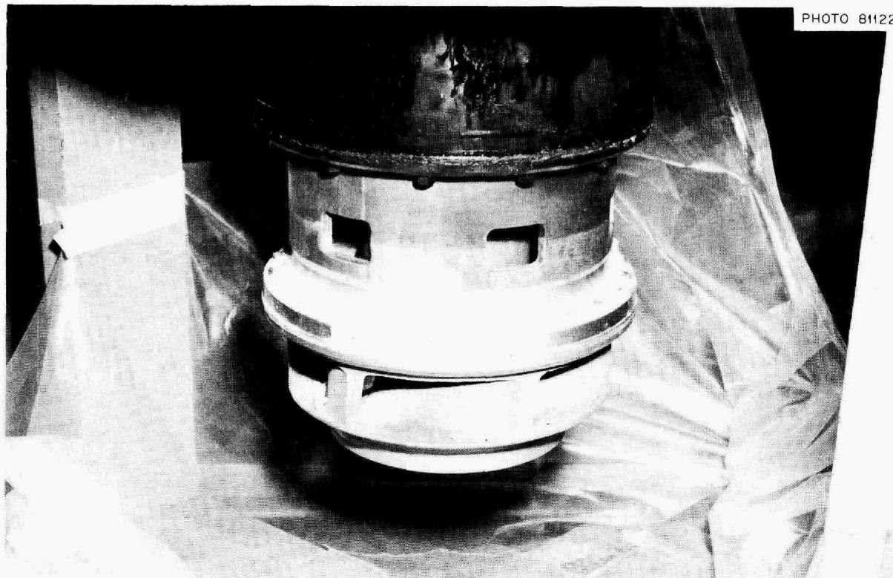  
Fig. 1.18. MSRE Fuel-Circulating-Pump Rotary Element After Run 3.

The parts of the rotary element that had been in contact with the salt had clean, bare metal surfaces, while the parts exposed to the gas had a thin black film. There was an abrupt transition, which may be seen in Fig. 1.18, between the two types of surface, but this transition was slightly above the actual level. The salt deposit above the labyrinth flange and a smaller salt deposit in the pump volute were also partially covered with a thin black film.[8]

The pump was reinstalled using remote maintenance techniques so that these techniques and procedures could be evaluated. Four universal joints on the flange bolts that had been found broken during the disassembly were repaired prior to the reinstallation of the rotary element. The failures resulted from excessive bolting torque that had been used earlier to obtain an initial seal on the flange.

# Heat Treatment of Reactor Vessel

After the reactor vessel was installed, tests of Hastelloy N from the heats used in the vessel showed that the closure weld between the top head and the flow distributor ring would be expected to have poor mechanical properties in the as-welded condition. Further tests showed that the rupture life and ductility, which were unacceptably low, could

be practically restored to those of the base metal by stress relieving for 50 to 100 hr at $1400^{\circ}\mathrm{F}$ .9 Although this is well above the normal operating temperature of the MSRE, it was attainable with the installed heaters, and calculations showed no harmful thermal stresses would be involved. Therefore the vessel closure weld was heat treated in place.

Temperatures were monitored by six thermocouples evenly spaced around the vessel just below the weld. Because of gaps in the shroud of vertical heater tubes around the vessel, a perfectly uniform temperature could not be attained. A day was spent at about $1300^{\circ}\mathrm{F}$ , adjusting heaters to minimize the temperature spread. Then for 90 hr the lowest temperature was held at $1400 \pm 20^{\circ}\mathrm{F}$ , while the hottest thermocouple was at $1460 \pm 20^{\circ}\mathrm{F}$ . After the vessel was cooled at the end of the treatment, inspection showed that the furnace and insulation were undamaged.

# Stress Analysis of Reactor Piping and Nozzles

The MSRE fuel system was designed for the fuel pump and the heat exchanger to move horizontally and vertically. This was done to keep the stresses low in the piping and equipment nozzles while accommodating the expansion and contraction of the closely coupled system as it is cycled between 150 and $1300^{\circ}\mathrm{F}$ . During the prenuclear and critical testing we found that the pump mount could not be depended on to move vertically. At the same time we learned that the creep properties of the metal in the reactor vessel and the piping inside the thermal shield would deteriorate with neutron irradiation. The former condition could cause the stresses in the piping and nozzles at the reactor vessel to be high with the system hot or cold. The latter requires that the stresses be kept low when the reactor is at high temperature, although normal design stresses are permissible below about $800^{\circ}\mathrm{F}$ .

According to our calculations, acceptable stresses at the reactor vessel nozzles could be obtained by raising the pump $1/2$ in. and the heat exchanger $1/4$ in. from their existing cold positions and fixing them against further vertical movement. This "cold springing" would result in the stresses being high at low temperature, and expansion of the piping on heating would lower the stress as the temperature is raised. Because of the relative locations of the supports, fixing the pump and both ends of the heat exchanger was found by calculation to result in excessive stresses in the heat-exchanger nozzle during the thermal cycling. However, acceptable stresses could be obtained there by mounting the heat exchanger on spring supports at the end closest to the pump.

The changes were made as indicated above, and the fuel system was heated to $1200^{\circ}\mathrm{F}$ . There was no appreciable vertical movement of the heat exchanger on the spring supports where a downward movement of 0.1 in. had been expected. This indicated that some of the assumptions used in the calculations were not accurate and the calculated forces at the heat exchanger were too high, or that the junction of the nozzle to the shell of the heat exchanger yielded under small forces.

After the system was cooled, strain gages were installed on the heat-exchanger nozzle and on the piping to the pump. The heat exchanger was

raised and lowered about $1/8$ in. while the forces on the spring supports and the strains were measured. The measurements indicated that the maximum stress was in the heat-exchanger nozzle, but that high stresses in the nozzle were accompanied by large forces on the springs. We concluded that the spring mounting should act to relieve any large vertical forces on the nozzle and that the revised installation was satisfactory.

# Instrumentation and Controls

# General

Formal design of the MSRE instrumentation and controls system is now complete. The need for further additions and modifications to the instrument and controls system has become apparent as initial operations progress. Some provide additional system protection, but in the majority of cases the purpose is to improve performance and provide more information for the operator. A few minor design errors were corrected, and some instrumentation was added to simplify maintenance procedures. Except for some specification sheet revisions and preparation of a design report, documentation is complete.

# Safety Instrumentation

No major changes to the flux and temperature safety system were required. Minor modifications were made as follows:

1. The model Q-2623 relay safety element was altered by replacing the 115-v ac relays with 32-v dc relays. This eliminated ac pickup on the other modules through which relay coil current is routed and reduced the likelihood of spurious trips, particularly when the Q-2602 flux amplifier trip points are reduced by a factor of 1000 from 15 Mw to 15 kw of reactor power.[10]   
2. The voltage adjusting resistor in the rod drive clutch circuit was increased from 500 to 750 ohms to facilitate setting the clutch current to the necessary and sufficient minimum value.   
3. Current meters were placed in the rod drive motor circuits. Gross changes in motor load, caused, for example, by a sticking rod, may be inferred from an increase in meter reading.   
4. Dynamic braking circuitry for rod drive 1 (servo-controlled rod) has been designed, built, and tested, with installation scheduled for March 1966. Braking action is obtained by discharging direct current from a capacitor through the motor field windings when the drive motor is turned off. This break will provide a substantial reduction in coasting of the rod drive after the power is switched off. As a result it will take less back-and-forth jogging to get small increments of rod motion when manually shimming. Servo performance is expected to improve for the same reason.

To assure a drain, additions and revisions to existing safety circuits were designed to open the fuel drain-tank vent valves on signal from high neutron flux (scram) and keep them open until manual reset is used to permit reclosing.

# Wide-Range Counting Channels

Reactor power and period information from these two fission counter channels11 provides interlocks which govern permissible reactor power levels (control system modes)12 and reactor fill, which inhibit rod withdrawal during start, and which provide control-rod reverse action.

Very generally and typically, reactor period signals from counting channels operating at low input levels are characterized by slow response. This inherent delay produced a problem with servo-controlled rod withdrawal during start. In a servo-controlled start, the demand signal causes the regulating rod to withdraw until the period-controlled "withdrawn" interlock operates. If the period continues to decrease, the "reverse" interlock acts to insert the rods in direct opposition to the servo demand. These "withdrawn" and "reverse" trip points were originally established at periods of +20 and +10 sec respectively. The delayed low-level response of the "inhibit" interlock allowed sufficient incremental rod withdrawal to produce a 10-sec period and thus cause a reverse. The situation was aggravated by coasting of the shimming motor in the regulating rod limit switch assembly.[13]

As remedial measures, the "withdraw inhibit" and "reverse" period trip points were changed to +5 and +25 sec, respectively, and an electromechanical clutch-brake was inserted in the shim-locating motor-drive train. The dynamic brake described above is also expected to reduce this period overshoot problem.

Provision for testing the period and log power interlock trips in the wide-range counting channels was provided. Testing is done routinely by Instrumentation and Controls Division maintenance personnel and is accomplished by push buttons inside the instrument chassis.

# Nuclear Instrument Penetration

We assumed that the neutron flux in the instrument penetrations would tend to decrease exponentially with increasing distance from the core vessel. This implies that most of the flux within the penetration originates with neutrons entering the lower end face of the penetration. Figure 1.19 shows that concrete shielding was added in an effort to shield the penetration from other sources of neutron flux. The vermistat in the wide-range counting channel's model Q-2616 function generator will compensate for any reasonable departure from an exact exponential attenuation of flux; however, it became apparent during the first series of critical experiments that flux attenuation within the instrument penetration was deviating, grossly, from the assumed exponential curve. This unseemly behavior is illustrated by curve A on Fig.1.20, which shows fission counter response (normalized count rate) vs withdrawal from the lower end of the

penetration in guide tube 6. It was reasonable to conclude from this, and from similar curves, that the excess neutrons responsible for the distorted part of the curve were entering the penetration along its length. The count rates in other guide tubes nearer the upper half of the guide tube were even more distorted than curve A.

A flux field with attenuation per curve A precludes successful operation of the wide-range counting instrumentation. We decided to shield the fission counters from stray, side-entry neutrons with shields of sheet cadmium which were inserted into guide tubes 6 and 9. As a counter travels up a guide tube during withdrawal, it first enters a partially shielded section of the guide tube. The partial shielding is obtained by using wedge-shaped strips of cadmium laid around the guide tube, which provide

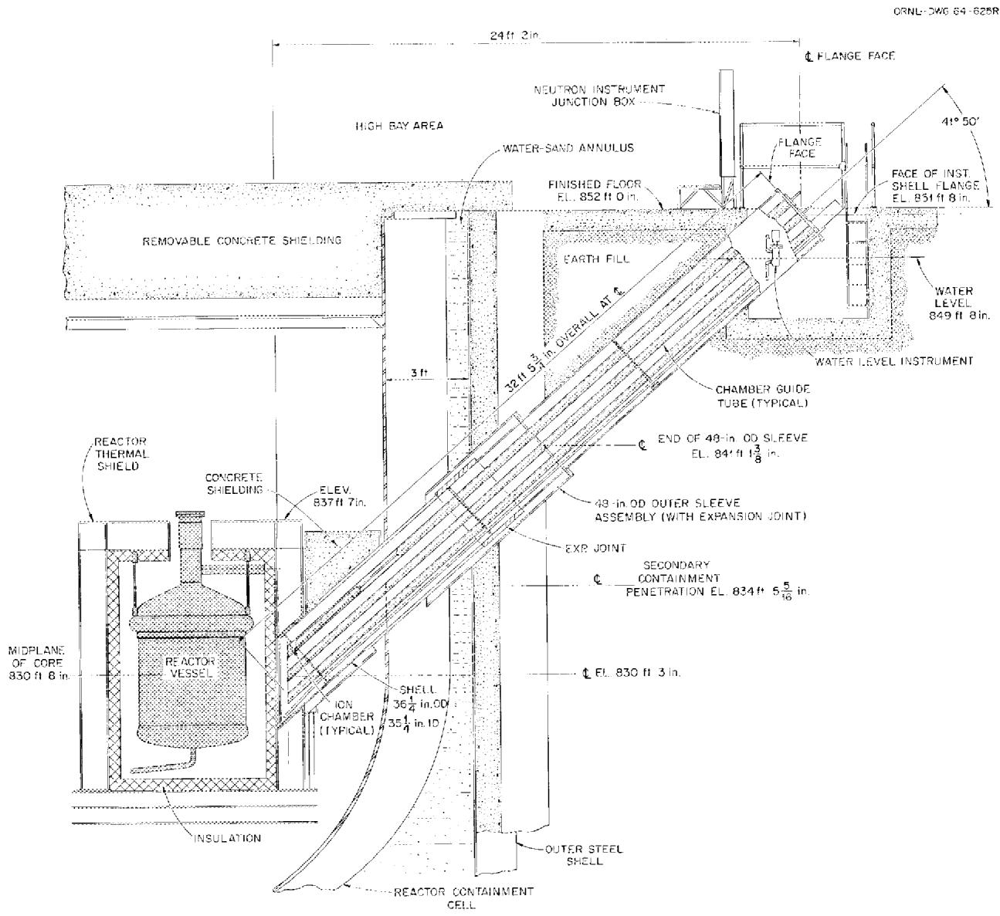  
Fig. 1.19. MSRE Nuclear Instrument Penetration, Elevation.

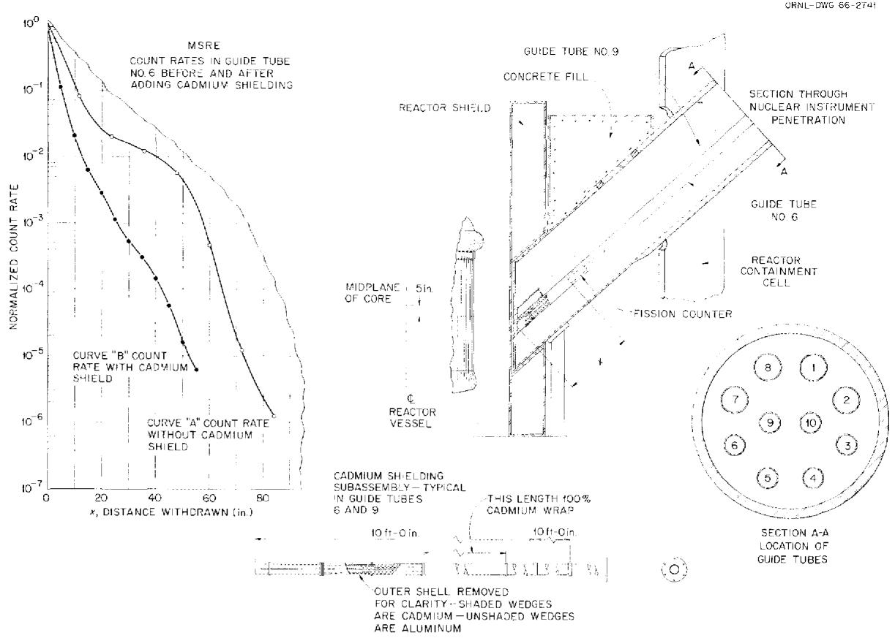  
Fig. 1.20. Guide Tube Shield in the MSRE Instrument Penetration.

ever-increasing shielding from side-entry neutrons as the counter is withdrawn. The bases of these long narrow wedges occupy the full periphery of the shield tube at its upper end and thereby provide a smooth transition to the $100\%$ wraparound cadmium sleeve which follows. This shielding, Fig. 1.20, was an eminently successful answer to the problem; curve B, normalized count rate vs distance, was obtained after this shield was installed in guide tube 6.

# BF3 Confidence Instrumentation

Because of very unfavorable geometry the strongest practicable neutron source would not produce 2 counts/sec from the fission counters in the wide-range counting channels until the core vessel was approximately half full of fuel salt; neither would it produce 2 counts/sec with flush salt in the core at any level. This is the minimum count rate required to obtain the permissive "confidence" interlock which allows filling the core vessel and withdrawing the rods. Therefore a counting channel using a sensitive $\mathrm{BF}_3$ counter was added to establish "confidence" when the core vessel is less than half filled with fuel salt. With the revised system, a fuel-salt fill may begin when the reactor vessel is empty if $\mathrm{BF}_3$ count

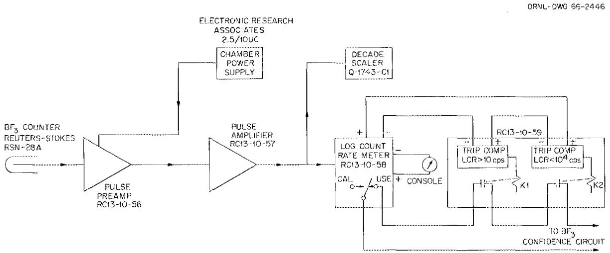  
Fig. 1.21. Block Diagram of $\mathbf{BF}_3$ Counting Channel.

rate "confidence" is established but cannot be continued after the reactor vessel is half full unless "confidence" is established with either of the two wide-range counting channels. When filling the reactor vessel with flush salt, rods may be withdrawn and the fill allowed to proceed at any level if $\mathrm{BF}_3$ count rate "confidence" is established and if the drain-tank selector switch is in the fuel flush tank (FFT) position. Selection of the FFT position bypasses the half-full weight interlock and requires administrative approval. Figure 1.21 is a block diagram of this $\mathrm{BF}_3$ counting channel.

# Personnel Monitoring System

The reactor building radiation and contamination warning system was revised to correct some deficiencies and to improve its effectiveness as indicated by tests and experience during reactor power operation. An alarm relay was installed in the personnel and stack monitor alarm system circuitry to provide an annunciation upon loss of the 24-v dc power supply. Monitron RE-7012, located in the south end of the high bay, was moved east about 20 ft to monitor for possible radiation escaping from the nuclear instrument penetration. CAM RE-7001 was moved closer to the sampler-enricher to monitor its operation. Several of the Q-2091 beta-gamma monitors were relocated to provide more protection. One unit was installed in the instrument shop, one unit was removed from the health physics office and installed in the hall between Buildings 7503 and 7509, and the unit in the vent house was relocated to reduce its background response from lines in the vent house. Two additional air horns were added to increase the area covered by the horn evacuation signal. One horn was installed on the southeast corner of Building 7509 and the other in the diesel house. Four additional beacon alarm lights were installed in areas where the horn might not be heard. A light was installed in the vent house, cooling-water equipment room, the switch house, and the Plant

and Equipment shop building. A Q-2277 rate meter and Q-2101 alpha probe will be installed in the hot change house.

# Control Instrumentation

Containment. To maintain the integrity of the reactor secondary containment, solenoid block valves with safety-grade wiring were installed in the fuel-drain-tank steam dome drain piping. These valves are interlocked to close when reactor cell air activity or pressure is above limits. The interlocks override a manual switch used for normal operation of the steam dome drain system. Actuating signals were obtained from existing circuits.

Safety-grade control circuits were installed to operate four welded-sealed solenoid valves serving the fuel off-gas sample system. The valves are specially designed and constructed for use on MSRE containment systems and are identical to those previously purchased for use in the fuel-pump-bowl bubbler level system. The procurement of four additional valves from a commercial source is nearing completion.

Fuel Sampler-Enricher. The fuel sampler-enricher safety-grade control circuits were revised to increase the reliability of the two containment barriers between the primary system (fuel pump bowl) and the operator. Originally, the circuits were designed so that the sample access port could be opened if either the operational valve or the maintenance valve was closed. With this arrangement a condition existed wherein a single failure could permit the access port to be opened when both the operational valve and the maintenance valve were open. If this had occurred when the manipulator cover was removed, the manipulator boot could have become the only containment barrier between the operator and the fuel pump bowl. Since the boot could be ruptured by system pressures in excess of 10 psig, this condition was considered to be hazardous. The circuits are now designed so that both the maintenance valve and the operational valve must be closed before the access port is opened. Also, the removal valve and access port must be closed and the manipulator cover must be in place before either the operational or the maintenance valve can be opened. The position of the cover is detected by a newly installed vacuum pressure switch. Additional protection for the manipulator boot has also been provided by a new circuit that prevents development of excessive differential pressure across the boot during sampler evacuation operation. This protection is accomplished by closing a valve in an exhaust line to the vacuum pump when the differential pressure across the boot exceeds 30 in. (water column).

Fuel and Coolant Pumps. To satisfy established operating criteria, the fuel and coolant salt circulating pump control circuits were revised as follows:

1. In both the fuel and coolant salt circulating pump circuits, the existing pump bowl level switch actuation valve was changed to reduce the level at which the pump is stopped, and one new switch was installed to prevent pump startup until normal fill level is reached. Since the salt level drops 8 to $12\%$ after pump startup, the single

level switch system previously used did not leave enough operating margin to prevent normal level fluctuations from stopping the pump and shutting down the reactor.

2. To prevent unnecessary shutdowns, the control which indicates that FV 103 is frozen is now sealed out after the fuel pump starts. The only purpose of this interlock is to prevent pump startup until the freeze valve is closed.   
3. Jumpers were added around the coolant salt system helium off-gas radiation contacts in the fuel pump circuit to prevent the pump from stopping each time a circuit test is conducted. The radiation monitor is a safety-grade device, and its primary function is to initiate an emergency drain. Both channels must be tested routinely.

Fuel Processing System. A mass flow-rate meter was installed to indicate the flow of HF to the fuel storage tank during fuel processing operations. The purpose of this second flow measurement is to provide an independent check on the existing orifice meter because the HF flow rate is important in calculating the amount of oxide removed from the fuel salt.

To prevent possible diffusion of $\mathbf{H}_2$ into the HF gas supply cylinder, interlocks were installed to close both the $\mathbf{H}_2$ and HF gas supply station valves when the main gas supply valve to the fuel storage tank is closed.

Operating Experience - Process and Nuclear Instruments

Control System - Relays. Little or no trouble has been experienced. Virtually all design changes to the relay control gear have been made to meet new requirements developed by operating experience, not to correct malfunctions of this equipment.

Valves. The difficulty experienced with the pressure control valve, PCV 522A, in the pump bowl off-gas system is a part of the larger general problem of off-gas contamination16 by carryover of solids and vapors which are deposited in the off-gas lines. Valve-selection criteria for the off-gas system did not include considering nongaseous foreign matter in the off-gas stream.

Two pressure control valves, PCV 500J and PCV 510A1, in the main inlet helium line gave difficulty from galling. These valves are being reworked.

Pressure Transducers. One strain gage unit in the sampler-enricher suddenly shifted calibration, but during operation returned to its original state. The most likely explanation is moisture which, after getting into the device, was baked out during service.

Thermocouples. Thermocouple performance has been excellent. Only one in-cell thermocouple was lost during the six-month period covered by this report. The plastic insulation on the radiator thermocouple lead wires suffered from local temperatures17 which were substantially in excess of those anticipated. Remedial measures such as insulating individual wires with ceramic beads, directed flows of cooling air, and in

sulating the high-temperature regions from heat sources have reduced, but not eliminated, the problem.

Liquid-Level Bubblers. The helium bubbler instrumentation used for fuel salt level instrumentation experienced a mechanical failure in two of the differential pressure-sensing instruments. The failure was a leaky connection caused by weak weldments fabricated by the vendor and used to attach autoclave fittings to the pressure inlet tubing. With the assistance of the Metals and Ceramics Division, the weldment was redesigned and rewelded. No further difficulties have been experienced.

Weight Instrumentation on Salt Tanks. The system has not been entirely satisfactory. The basic input instrumentation (weigh cells, mounting, etc.) has functioned satisfactorily, but the readout has given trouble. Manometer readout is accomplished by selecting a particular weigh cell channel with pneumatic selector valves. The valves are composed of a stacked array of individual valves operated by cams on the operating handle shaft. The valves leak; proposals to eliminate the problem are being considered.

Nuclear Safety Instrumentation. The electronic instruments have given little trouble. The solid-state modular instruments, hitherto untried in an operating installation, have needed very little service, and no major problems have developed with use. Channel 3 of the safety system produced an abnormal number of spurious trips. A large number of these are believed to have originated in faulty, vibration-sensitive relays in a commercial electronic switch which provides the high-temperature trip signal in the channel. Vibration isolation and substitution of a different relay are being considered as possible antidotes. Another source of occasional false trips is believed to have originated with a chattering of the relays which change the sensitivity of the flux amplifiers in the safety circuits. This has been corrected. Very generally the source of spurious trips has been difficult to trace, since they are random and usually appear to be unrelated to events elsewhere in the reactor system. As electrical noise-producing components elsewhere in the system are eliminated, the number of false trips is expected to be reduced.

Wide-Range Counting Channels. Moisture penetration has been experienced with the wide-range counting channel "snake"18 assembly. An improved waterproof jacket is expected to cure this affliction. A faulty vermistat and an overloaded gear reducer in the drive unit of the wide-range counting channel required replacement.

Linear Power Channels and Servo Controller. The compensated ion chambers use a small electric motor to change compensation. One motor drive has given some trouble and has been responsible for the maintenance required by these chambers. The servo rod controller has been used for automatic control in both the flux and temperature modes. Excepting the problem associated with the wide-range counting channel, the servo's performance was very satisfactory.

Electrical Power System. Substitution of the new 50-kva solid-state converter for the existing 25-kva motor generator is expected to reduce or eliminate many of the problems stemming from instability, noise, and poor voltage regulation.

False alarms from the monitron in the east service tunnel were traced to electrical noise from the sampler-enricher vacuum pumps. An electrical noise filter is being designed to remedy this. A faulty solid-state switch in the sampler-enricher was responsible for noise in the output of the Sorensen regulator.

# Data System

The installation of extensive modifications13 to the data-logger-computer was completed on August 31, 1965, and testing began immediately. Several failed computer components were found and replaced, and two loose connections in the analog input system were found and repaired. Additional design changes and adjustments were required as a result of the modifications, and, with the exception of the digital filter-integrator, which required complete redesign, these changes and testing were completed on September 16. The seven-day acceptance test was restarted on September 16, 1965, and completed September 23, 1965. The remainder of September was spent correcting miscellaneous hardware problems, principally loose circuit card connections. An air-conditioning failure caused the computer room ambient temperature to rise to $85^{\circ}\mathrm{F}$ , and, simultaneously, the ac supply voltage fell to $103\mathrm{~V}$ . These two conditions, although simultaneous, were not coupled. In these circumstances it was impossible to keep the system on line for more than a few hours at a time. It was concluded that successful operation of the computer requires that ambient temperature be held below $85^{\circ}\mathrm{F}$ and that ac supply voltage be maintained between 105 and 120 V.

Satisfactory operation was restored, and the system was accepted on October 1, 1965, provided that Bunker-Ramo Corporation (1) supplies and installs a digital filter-integrator for the analog input signals, and (2) provides and installs, at ORNL's option, circuitry which prevents damage to the core memory by restart transients subsequent to a power loss and which provides a controlled sequence automatic restart when power is restored.

October was spent checking and calibrating input instrumentation and in troubleshootinging hardware failures, principally in the analog input area of the system. Instrument calibrations were completed in November, as were substantial modifications to improve reliability scheduled by Bunker-Rano. The digital filter-integrator and restart circuitry were also installed during this shutdown.

In the period of December 1965 through February 1966, the logger-computer achieved operating status. In addition to the routine and periodic collection of operating data, it was used to obtain transient and frequency responses and to determine fuel temperature coefficients of reactivity. It was programmed to operate the control rod for the pseudorandom binary tests reported in "MSRE Dynamic Tests," this report. The log of operating data, which did not seem significant during operation, became extremely useful during analysis of the off-gas problem. During this period the various computing and logging programs were being modified in accordance with the requirements developed during reactor operation.

Figure 1.22 charts, on a weekly basis, the "in service" or "on" time as a percent of total time. The shaded areas on the figure are scheduled shutdowns and cannot be charged against the system as malfunctions. During the period immediately following system acceptance, performance, as noted above, was disappointingly low and did not approach the specified requirements. The system has shown a slow but steady overall improvement in operating reliability as debugging progressed. For example, during February the logger-computer "in service" time was $99.7\%$ .

# MSRE Training Simulators

The power level training simulator19 was operated successfully in October 1965 as part of the operator training program. It was set up on two general-purpose, portable EAI-TR-10 analog computers and tied in with the reactor instrumentation system. No special hardware was required. The control of the simulator was effected entirely from the operator's console, where actual rod motion, radiator door positioning, and blower

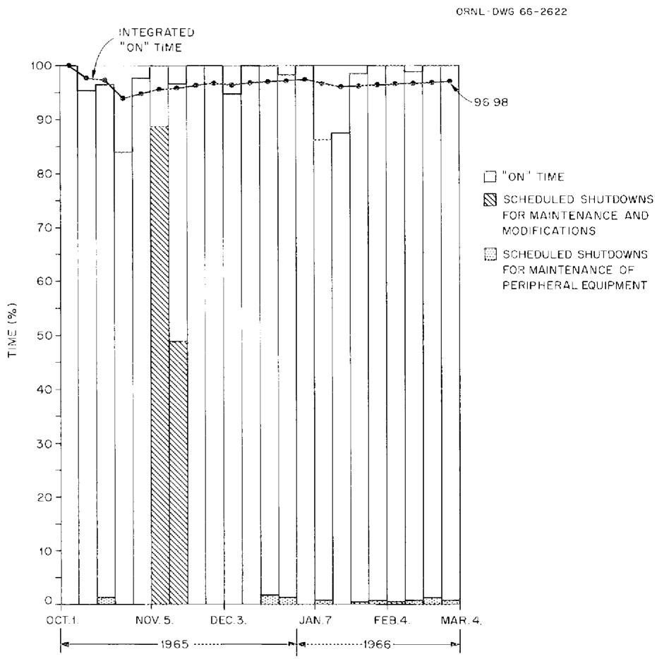  
Fig. 1.22. Availability Record of MSRE Data System, October 1965 to February 1966, Inclusive.

manipulation were used as inputs to the simulator. Readouts of the simulated linear and log power, key system temperatures, and heat power were provided by the reactor instrumentation. The simulator was used to check out the reactor flux and load control systems and the procedures used to switch from flux to temperature servocontrol.

# Documentation

Except for some revisions and additions to instrument specification sheet and preparation of a design report, documentation of the MSRE instrumentation and controls system design is complete. During the past report period, instrument application and switch tabulations were completed and issued, and design drawings were revised to incorporate as-built revisions and recent additions to and revisions of the system.

# References

1. S. J. Ball, Simulators for Training Molten-Salt Reactor Experiment Operators, ORNL-TM-1445 (in preparation).   
2. MSR Program Semiann. Progr. Rept. Aug. 31, 1965, ORNL-3872, p. 19.   
3. S. J. Ball and T. W. Kerlin, Stability Analysis of the Molten Salt Reactor Experiment, ORNL-TM-1070 (December 1965).   
4. R. L. T. Hampton, Simulation 4(3), 179-90 (1965).   
5. MSR Program Semiann. Progr. Rept. Aug. 31, 1965, ORNL-3872, p. 22.   
6. MSR Program Semiann. Progr. Rept. Aug. 31, 1965, ORNL-3872, pp. 61-62.   
7. R. H. Guymon, MSRE Design and Operations Report, Part VIII, Operating Procedures, vol. 1, ORNL-TM-908 (December 1965).   
8. MSR Program Semiann. Progr. Rept. Aug. 31, 1965, ORNL-3872, pp. 118-19.   
9. MSR Program Semiann. Progr. Rept. Aug. 31, 1965, ORNL-3872, pp. 94-98.   
10. MSR Program Semiann. Progr. Rept. Aug. 31, 1965, ORNL-3872, p. 43.   
11. S. E. Beall et al., MSRE Design and Operations Report, Part V, Reactor Safety Analysis Report, ORNL-TM-732, Fig. 2.27, p. 98, pp. 100-101.   
12. Ibid., p. 104.

13. Ibid., pp. 108-12.   
14. Ibid., p. 100.   
15. Ibid., p. 98, Fig. 2.27.   
16. R. B. Briggs, Status of the Problem of Plugging in the Off-Cas Lines in the MSRE, MSR-66-3 (Mar. 1, 1966) (internal use only).   
17. See Chap. 2 of this report.   
18. MSR Program Semiann. Progr. Rept. Aug. 31, 1965, ORNL-3872, p. 38.   
19. Ibid., p. 40.

# 2. COMPONENT DEVELOPMENT

The efforts of the development group were devoted to assisting in the prepower operation and testing of the reactor. Several changes in the equipment and procedures were made, and these are described below.

# Freeze Valves

The specifications for all but three of the freeze valves were simplified by eliminating the "rapid" thaw requirement. This requirement is needed in FV103, which controls the emergency drain of the reactor, and in FV204 and FV206, which control the emergency drain of the coolant system, but had been included in the remaining valves only as an operational convenience. Since the maintenance of the proper temperature distribution needed to ensure a rapid thaw was more difficult than was consistent with good operating practice, the rapid thaw requirement was eliminated, and these valves are now operated either in the thawed or deep-frozen condition. The valves which might contain sufficient radioactivity in the salt to produce radiolytic fluorine at low temperatures are maintained above $400^{\circ}\mathrm{F}$ at all times. Experience with the in-pile experiments and other tests have shown that essentially no fluorine is released above this temperature.

The addition of the modulating air-flow controllers on FV103, FV204, and FV206 and the separation of the heater control circuits on FV204 and 206 have resulted in greatly improved operation of the freeze valves.

# Control. Rods

Control rod units 1 and 2 have operated without difficulty since the initial installation at the reactor. Examination of rod 3 at the end of the criticality tests revealed that the braided wire sheath had been torn at a point 28 in. below the tow block. The inner convoluted hose was worn but not completely through the wall. Cause of the damage appeared to be the upper roller in the control rod thimble, which had jammed and would not rotate. The roller had a galled flat area on one side. The thimble roller and upper control rod hose were replaced. Recent examination indicated no further difficulty after several months of operation at temperature.

Rod drop times for 51 in. fall remain at 0.72 sec to 0.8 sec for all three rods. Overall rod lengths remained within 0.10 in. of the installed lengths.

# Control Rod Drive Units

Thermal switches were installed in the lower end of the drive housing and are set to alarm when the temperature rises above $200^{\circ}\mathrm{F}$ . The air flow through the drive unit cases is about 1.4 sfm, which appears to be adequate to maintain the temperature within the housings at less than $200^{\circ}\mathrm{F}$ .

It was necessary to replace the No. 3 drive unit because the position indicators revealed an 0.8-in. deviation from the original zero set point. The deviation was caused by a partially restricted spring action of the preload spring operator of the drive chain. This allowed enough slack in the drive chain to permit the chain links to slip over the sprocket gear teeth. The unit continued to operate without difficulty with the 0.8-in. error until replaced.

The lower limit switch of unit No. 3 showed an intermittent tendency to stick when the control rod was dropped from above 24 in. The switch could be released by fully withdrawing the control rod. We found that the shock absorber stroke was $25\%$ greater than normal when the control rod was dropped from 51 in. There is evidence that the inertia of the switch actuating arm was sufficient, when the control rod was dropped from 51 in., to overcome the force of the actuator recovery spring to a point where the lower end of the actuating rod could strike the lower flange of the drive unit. The actuating rod had been slightly bent due to striking the flange, causing it to bind in the guide bushing. A stronger recovery spring will be installed to prevent the overtravel.

Figure 2.1 is a photograph of the control rod drive units in position on the reactor. The shielding and access hatch have been removed, showing the air and electrical disconnects in the drive unit cover. When a unit is removed, the small hatch on the drive unit cover is removed (note unit No. 2 in Fig. 2.1), which permits access to the control rod tow block for releasing the control rod from the drive unit, and also access to the lower drive unit flange for releasing the drive unit from the thimble flange. This method of removal has been utilized for control rod maintenance since the initial installation at the reactor.

# Radiator Doors

Thermal warping of the radiation doors and door seals permitted air to leak through the radiator enclosure at an excessive rate, and modifications had to be made to reduce the leakage.

The following modifications were made (Fig. 2.2 shows the face of the radiator with the inlet door raised after repairs and modifications):

1. The door trip locks. The locks were modified and adjusted so that, when the door was fully closed, the trip locks forced the metal door, by a forward camming action, against the soft seal on the face of the radiator enclosure. The forward force is exerted by movement of the door in the downward direction into the rolling cam locks located on the radiator frame.

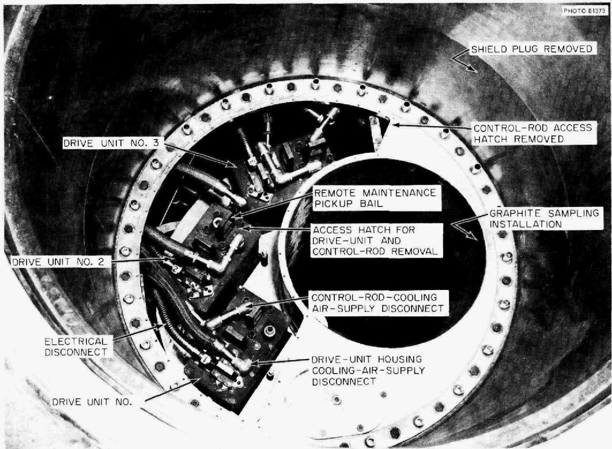  
Fig. 2.1. Control Rod Drive Units in Operation Position at MSRE.

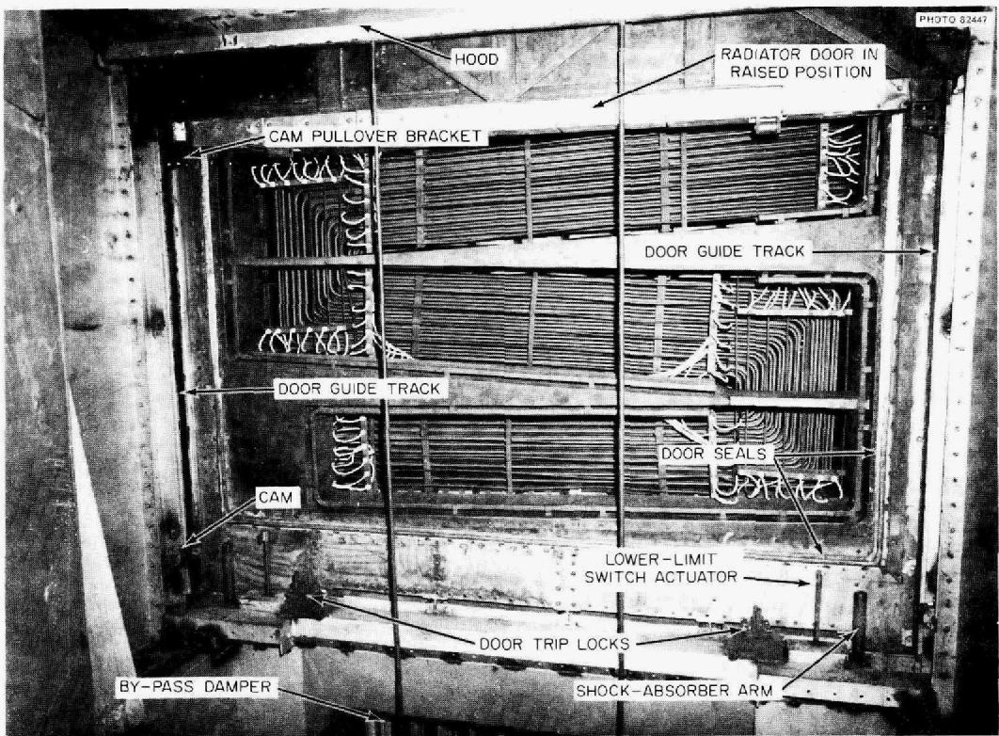  
Fig. 2.2. Inlet Side of Radiator Door in Raised Position.

2. Door guide tracks. The door moved too close to the radiator seals when it was raised or lowered. Warpage of the door caused some of the seal elements to hang on the door, and they were torn loose. The position of the door track was moved to provide 1 in. of clearance between the seals and the face of the door when the door was released from the fully closed position.

3. Cam follower bracket. The doors tended to drag and jam in the guide tracks. Cams had been installed in the tracks to force the doors away from the seals when they were not fully closed. The cam follower brackets are mounted on the doors, and contain rollers which ride on the track caps. These rollers were damaged by the wedging action of the trip locks against the door rollers and tracks when the doors were dropped into the closed position. The caps were changed to provide clearances of 1/8 in. between the rollers and caps when the doors were closed. A short movement of a door in the upward direction brings the roller into contact with the cam, forcing the door away from the soft seal.

4. End rollers were installed on the cam follower brackets to prevent side motion from jamming the doors against the tracks.

5. Reliable operation of the limit switches is important in reducing the number of ways in which the doors can malfunction, and the original switches were not very reliable. New heavy-duty switches and actuators were installed to obtain more positive action. An additional upper limit safety switch was added plus a mechanical "hard stop" above the added upper limit switch. In the event of complete switch failure the door strikes the "hard" stop and an overload switch stops the drive motor before the door seals can be damaged.

6. The door position indicators are synchro-driven devices located on the drive shafts. The doors are lifted by steel cables which are wound and unwound on chain-driven sheaves on the drive shafts. If the doors jam while being lowered, the sheaves continue to turn and give incorrect indications of the true door positions. Continued action of the drive unit, after the doors have stopped moving, causes the lifting cables to unwind from the sheaves and attempt to rewind in the reverse direction. The cables usually jump out of the grooves in the sheaves and become snarled and kinked.

A "loss-of-tension" device has been designed but not installed which will stop any action of the drive unit should the cables become slack. It is simply a switch which will be actuated by movement of the cable from its normal tightened position.

7. When the clearance between the door and door seals was changed to 1 in. with the door open (see No. 2 above) it was necessary to provide additional clearance between the door and the radiator enclosure hood. The hoods on both inlet and outlet doors were shifted $1 - 1 / 2$ in. to provide this clearance.

# Radiator Heater Electrical Insulation Failure

The electrical leads from the radiator heaters extended vertically up through the radiator enclosure and terminated in junction boxes on the floor of the area between the radiator door hoods. These leads are insulated with ceramic beads. The electrical leads extending from the junction boxes to the supply and control circuits were plastic-insulated wires which were rated for $140^{\circ}\mathrm{F}$ . Heat leaks up through the radiator enclosure along the wire bundles overheated the junction boxes, and the plastic insulation melted.

The heat leakage into this area was reduced by welding the original sheet-metal enclosure wherever possible, by patching some openings, and by reinsulating. The junction boxes were removed from the high-temperature area between the hoods to a cooler position on the east wall of the penthouse. Electrical wire extensions between the relocated junction boxes and the beaded heater lead wires were insulated with $194^{\circ}\mathrm{F}$ thermoplastic and asbestos composition. Figure 2.3 shows the present arrangement of the heater wiring between the hoods over the radiator doors. Increased

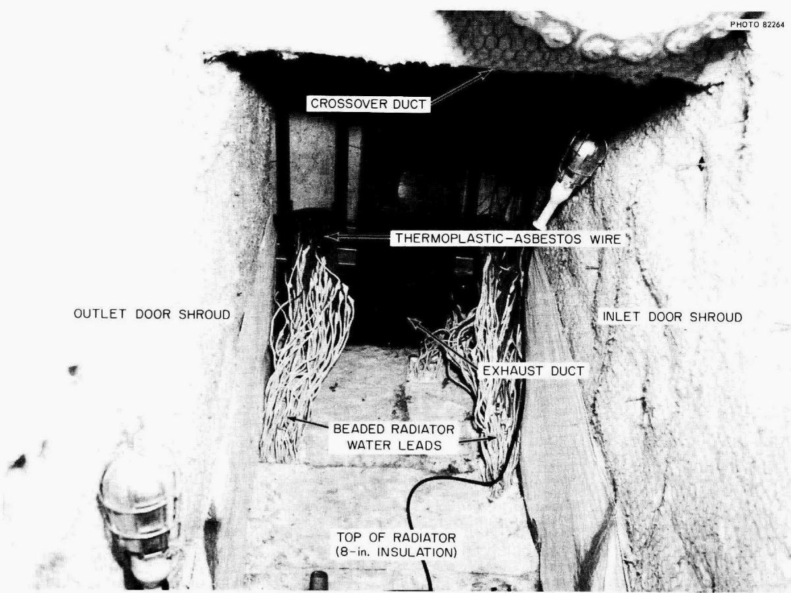  
Fig. 2.3. Area Between Radiator Door Shrouds and Top of Radiator Enclosure.

circulation of cooling air in that area was provided by rerouting some of the existing exhaust ducts. Cool air is directed downward through the drive mechanism into the heater lead area; exhaust ducts remove the heated air from the floor between the hoods. The south exhaust duct can be seen in Fig. 2.3. There are two additional exhaust ducts on the north end of the area; these are l0-in.-diam flexible tubes. Also a duct was installed between the door hoods so the hoods will be cooled when the main blowers are running.

The average ambient temperature in the area between the doors after the above modifications was approx $100^{\circ}\mathrm{F}$ with the blowers off. Temperature within the beaded electrical lead bundle penetrations at the top of the radiator was $600^{\circ}\mathrm{F}$ with the blowers off. These temperatures are satisfactory, and the temperatures also were satisfactory with the blowers on.

# Sampler-Enricher

During the shutdown period following run 3, the low-power experiment, several modifications were made to the sampler-enricher to increase the efficiency of operation. Most of these were discussed in the previous semiannual report. The major modifications made at that time included: (1) replacing the removal valve with a modified version, (2) adding a knob to one linkage pin of each access port operator to aid in opening it with the manipulator if it should fail to function properly, (3) putting steel rings in the convolutions of the manipulator inner boot to hold it free of the manipulator arm, and (4) adding a pressure switch to prevent an excessive pressure gradient across the manipulator boot.

The manipulator arm which was bent during run 3 was replaced. The hand was straightened, and a $1/4 \times 1/4$ in. projection was welded to the bottom of each finger to aid in handling the capsule cable. Clearances in the Castle joint were increased to reduce the force needed to operate the manipulator.

Additional changes have been made to improve the reliability of operation. The brass keys used to attach the capsules to the latch were replaced with nickel-plated mild steel keys. In case a capsule is dropped it can now be retrieved with a magnet.

Two changes were made in the interlock circuit. A pressure switch installed on the manipulator cover requires a negative pressure in the cover before the operational or the maintenance valve can be opened. Also, both the operational and the maintenance valves must be closed before either the access port or the removal valve can be opened. These changes were made to ensure that there is double containment at all times.

Installation of lead shielding around the sampler-enricher has been completed. Ten inches of lead or the equivalent was installed around the main components and 4 in. around the off-gas system. While the reactor was operating at $1\mathrm{Mw}$ , the radiation level around the equipment was $< 1\mathrm{mr/hr}$ .

During runs 4 and 5, 40 samples were taken, 9 of which were 50-g samples for oxygen analysis in place of the usual 10-g samples. Two of the large capsules failed to trap a sample. The first assembly was not long enough to submerge the fill opening of the capsule in salt in the pump bowl. All other assemblies were made longer. The second failure to trap a sample probably resulted from the capsule catching on the latch stop at the top of the pump and not entering the pump bowl. The capsule has been modified slightly to make it hang straighter and is therefore less apt to hang.

While withdrawing one of the 10-g capsules, the position indicator stopped, indicating that the capsule had hung or the cable had jammed. After repeated attempts, the cable was withdrawn completely. The cable was examined to determine the cause of trouble. Apparently the capsule or latch had hung on the gate of the maintenance or operational valve causing the cable to coil up. The cable also backed up into the drive unit box and caught in the motor gears. The cable was straightened, the open limit switches on the operational and maintenance valves were reset to open the valves wider, and the outside diameter of the latch was reduced. No similar trouble has been experienced.

The equilibrium buffer pressure to the operational valve dropped from 55 to 35 psia during one sampling operation. This represents a leak of about 20 cc He/min through the seal on the upper gate of the valve. A particle of salt or metal apparently dropped on the gate while the capsule was being removed or attached to the latch and lodged between the gate and the seat. Repeated efforts to blow the particle from the sealing surface have failed. The leak rate has not increased with continued use. The leak of helium from the buffer system is mainly an inconvenience, as it slowly pressurizes the volume above the valve, and the gas must be vented to the auxiliary charcoal bed about once a day. Besides this seal, three more sealing surfaces between the pump bowl and the sample access area provide adequate safety; therefore the valve will not be replaced at this time.

The sample capsule used while the reactor was operating at 1 Mw left considerable contamination in the transport container. The open end of the bottom cup read 40 r/hr near contact after the capsule was removed. Replaceable liners have been fabricated to reduce the contamination left in the transport container.

# Coolant Salt Sampler

During runs 4 and 5, ten samples were isolated from the coolant pump bowl, two of which were 50-g samples. During one sampling the latch failed to slide freely through the transfer tube. No reason for the difficulty could be found, but the outside diameter of the latch was reduced to lessen the possibility of future trouble.

During the shutdown period following run 3 a capsule was left hanging on the latch. A dry helium atmosphere was maintained in the sampler.

When the capsule was retrieved from the pump bowl in taking the first sample of run 4 (CP-4-1), a black film covered the salt and adhered to the outside of the capsule. The film was identified as decomposed oil. Another sample taken $4\mathrm{hr}$ later was clean with no evidence of black film. The sampler was opened and examined for oil contamination. A small amount was found on the top flange of the glove box near the elastomer gasket. No evidence of oil was found around the drive unit or capsule. The source of the oil was not located, but subsequent samples have been free of the film.

# Examination of Components from the MSRE Off-Gas System

The difficulty with plugging and partial restriction in the MSRE off-gas system is described in the section on systems performance. Several of the components which had given trouble during the early operation at $1/2$ and $1\mathrm{Mw}$ were removed to the HRLEL for examination. Photographs were taken through periscopes, and many samples of the foreign material found in the components were removed and transferred to the analytical chemistry hot cells for analysis. The results of these analyses are reported in the section on chemistry. A summary of the visual examinations made in HRLEL is given below.

# Capillary Flow Restrictor FE 521

The flow restrictor consists of a short length of 0.08-in.-ID tubing welded into the line at one end and coiled to fit inside a 3-in.-ID container. The other end of the line is left free. The container was cut open, and the entrance and exit ends of the restrictor tubing were examined. The entrance region was clean, and only a small deposit was found on the container wall near the end of the discharge region. This deposit is shown in Fig. 2.4. The restrictor was not completely plugged when examined in the hot cell.

# Check Valve CV 533

The check valve is a small spring-loaded poppet-type valve installed in the gas line to prevent a backflow into the fuel pump gas space during the venting operation on the drain tanks. Some foreign material was found on examination of the poppet, but this was not sufficient to stop the gas flow. The valve poppet is shown in Fig. 2.5, and for the purpose of the examination is shown in the open position. The soft O-ring which makes the seal can also be seen in its normal position on the poppet. The other material on the cone of the poppet is an amber varnish-like material, which was identified as a hydrocarbon.

# Charcoal Bed Inlet Valve HV 621

The valve examined was one of four which control the gas flow into each of four parallel charcoal sections which make up the main charcoal

bed. The valve had given indications of almost complete plugging before removal from the system. The valve was cut apart with a saw in the hot cell, and the valve stem is shown in Fig. 2.6. The small metallic chips shown near the large end of the cone are from the sawing operation. The entire cone was shiny as though wet with an oillike material. There was some white amorphous powder on the tapered section of the valve trim.

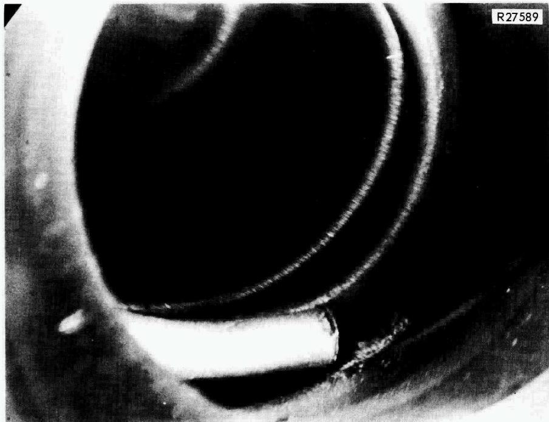  
Fig. 2.4. Deposit in Flow Restrictor FE 521.

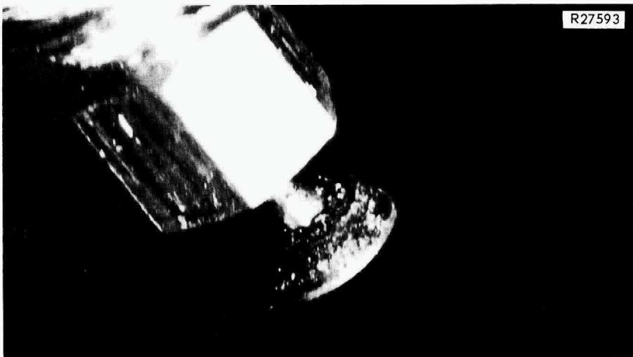  
Fig. 2.5. Check Valve CV 533.

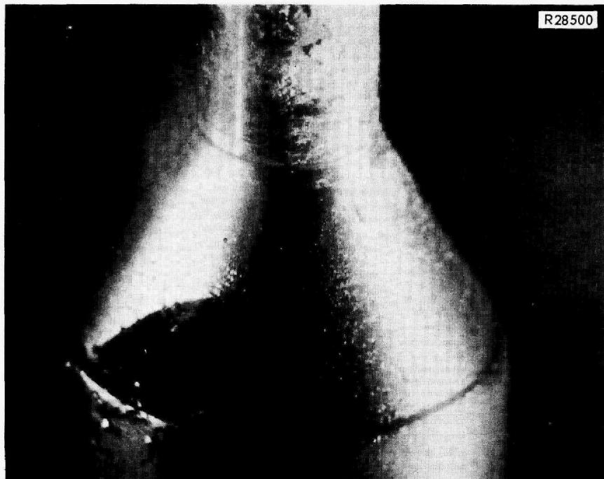  
Fig. 2.6. Charcoal Bed Inlet Valve Stem HV 621.

The powder seemed to be adhering fairly strongly to the metal surface, although there were some discontinuities. A similar material was found in the valve body. The general appearance of this area indicated that the powder had moved up and down with the motion of the valve stem and was therefore not dislodged by the small stroke of the valve. Samples of the white material were removed for analysis.

# Line 522 Pressure Control Valve PCV 522

PCV 522 controls the gas overpressure on the reactor system by varying the gas letdown (off-gas flow). The flow passage at the valve seat was quite small (about 0.010 in.) in order to control the relatively low gas flow (4.2 liters/min). The valve was mounted with the seat above the stem. Flow was down through the seal (reverse of normal). The valve stem was covered with an amber oillike coating, and there was an accumulation of fluid in the recess formed by the bellows-to-stem adapter piece as shown in Fig. 2.7. The tapered flat (flow area) on the stem had small accumulations of solid material. The valve body was coated with similar material and had a semisolid mass of material on the surface near the seat port as shown in Fig. 2.8. Samples of these materials were removed for analyses.

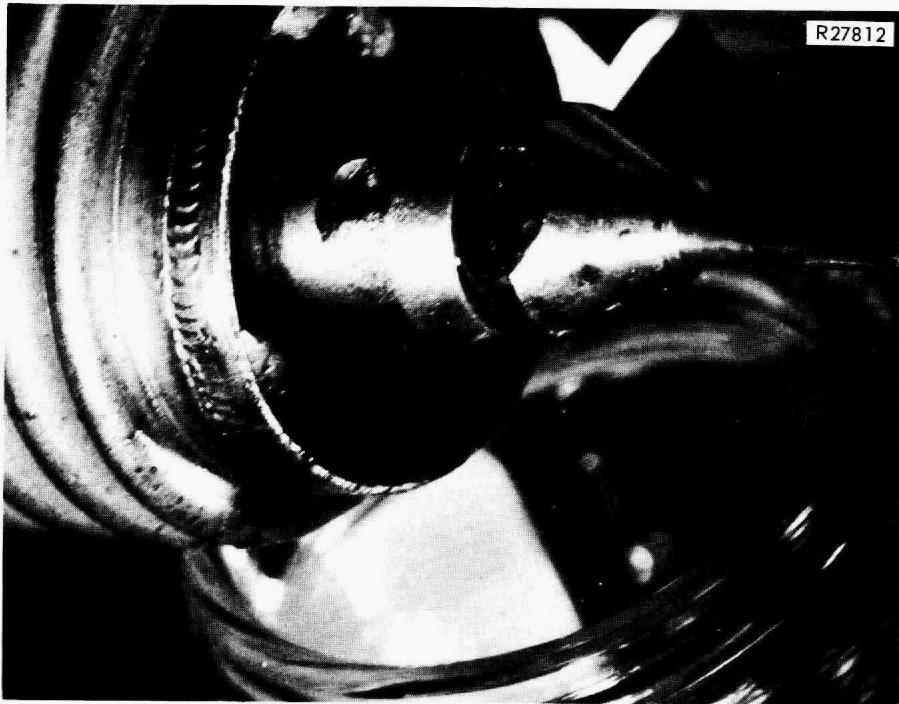  
Fig. 2.7. PCV 522 Valve Stem.

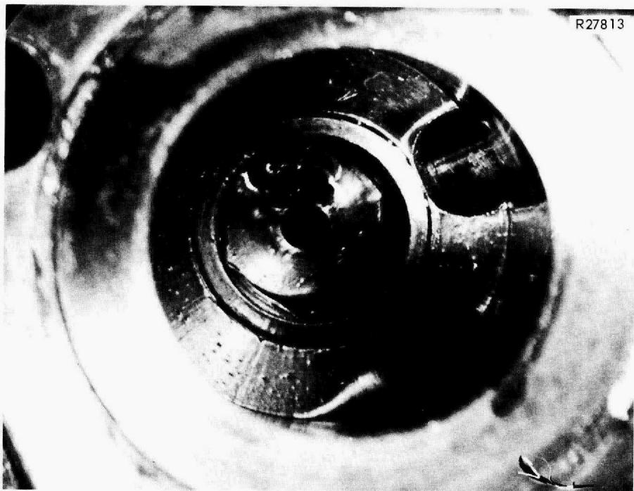  
Fig. 2.8. PCV 522 Valve Body.

Filter 522 is a l-in.-diam by 15-in.-long cylindrical type 316 stainless steel sintered metal element in a 1-l/2-in. (iron pipe size) pipe housing. Element thickness is 1/16 in. Flow is from the outside in. The filter area is $0.34\mathrm{ft}^2$ , and the removal rating is $98\%$ particles $>0.7\mu$ . The pressure drop (clean) at 4.2 liters/min helium (normal MSRE flow) is 2 in. $\mathrm{H}_2\mathrm{O}$ . The filter was installed immediately upstream of the reactor gas pressure control valve (PCV 522) to protect the very fine valve trim.

The filter assembly was removed from line 522 on February 8, 1966. Initial visual examination was made at HRLEL on February 9, 1966. The upper one-third of the element was largely steel gray in appearance. As shown in Fig. 2.9, the steel gray also appeared in the lower portion at the seam weld and in a few isolated spots. The major portion of the lower two-thirds of the element had a frosty white appearance. At no place was there any evidence of a measurable buildup, or cake, on the filter surface.

Visual examination was continued on February 10, 1966, at which time it was noted that the frosty white areas had become darker in appearance, tending toward the steel gray. Inspection of the interior of the filter housing showed an accumulation of foreign material in the bottom as shown in Fig. 2.10. Samples were scraped from the side of the element. The filter was then reassembled, and a flow pressure drop test (see below) was run on February 11, 1966. The filter was once again disassembled, and the element was sectioned into short pieces. The foreign material in the bottom of the housing was removed readily by rinsing with carbon disulfide.

R27776

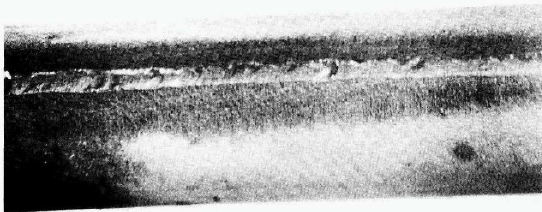  
Fig. 2.9. Frosty Deposits on the Surface of Filter 522.

R27814

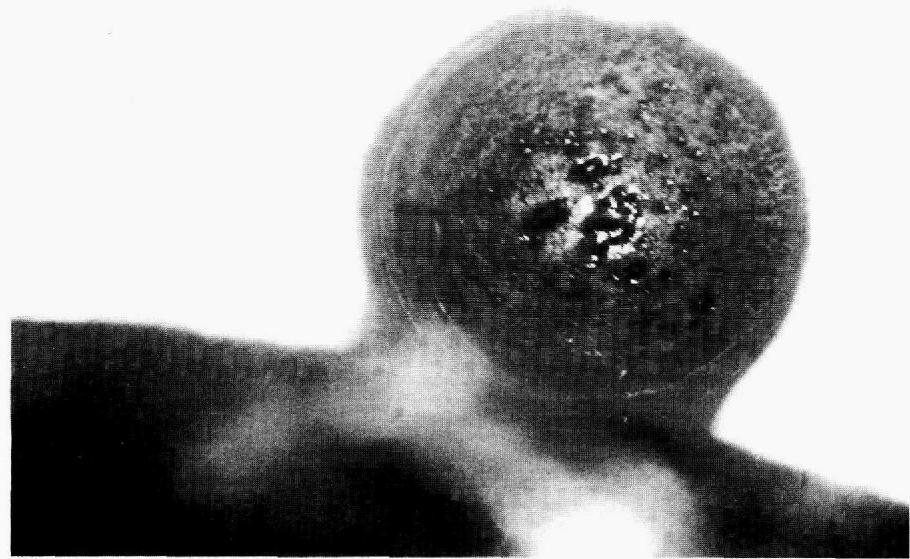  
Fig. 2.10. Deposit in the Bottom of Filter 522 Housing.

# Flow Test on the MSRE Filter from Line 522

The filter and filter housing which had been removed from line 522 on February 8, 1966, was tested in the hot cell of the HRLEL as indicated in the flow diagram given in Fig. 2.11, and flow tests were conducted on February 11, 1966. The gas was discharged into the gas disposal filter system of the hot cell. By taking readings of the filter pressure gage through the hot cell window for various helium flow rates the relative plugging of the filter was determined.

The data obtained are shown in Fig. 2.12. The graph also shows the results of a helium flow test conducted on a duplicate but clean filter. The data indicate that for a given pressure difference the 522 filter was passing only $5\%$ of the corresponding flow of the clean filter. However, extrapolation of the data to the normal MSRE off-gas flow indicate that, even though $95\%$ plugged, the contribution of the filter (0.075 psi) to the total system pressure drop (5 psi) was negligible.

# Fuel Processing System Sampler

The mockup that was used to develop the sampler-enricher for the MSRE is being modified and will be installed as the sampler for the fuel

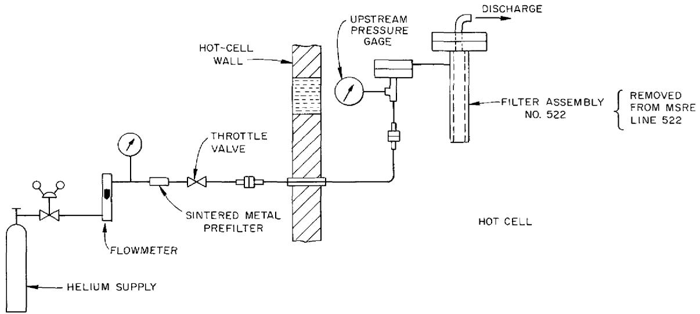  
Fig. 2.11. Test Arrangement at Building 3525 Hot Cell. Flow vs pressure-drop test. Filter No. 522 removed from MSRE on Feb. 8, 1966.

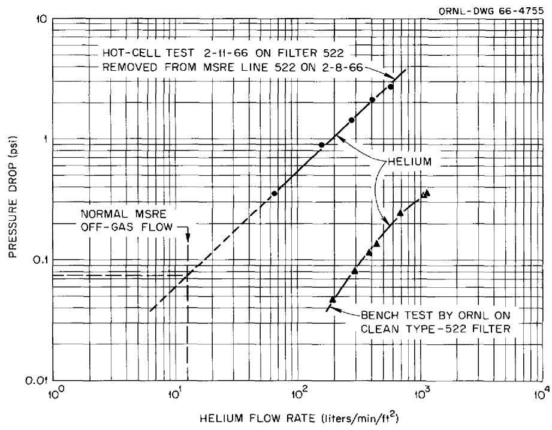  
Fig. 2.l2. Flow vs Pressure Drop. MSRE filter No. 522. Filter element: Pall Trinity type G. 316 ss sintered metal. Area: 0.34 ft².

processing system. Design of the modifications to the mechanical equipment is finished except for the shielding. Modifications to the equipment to upgrade it for 15-psig service are nearly complete.

Redesign of the instrumentation is complete. This work involved some revisions to panel and field instrumentation, some changes in control circuitry, preparation of installation and interconnection drawings required to install the system at the MSRE site, and revisions of nomenclature and numbering of instruments and circuits to conform with the MSRE practices.

Functionally, the instrumentation and control of the chemical process sampler is similar to that provided on the fuel sampler-enricher system; however, the detail design of the chemical process system sampler is simpler. This reduction in complexity resulted from reduced requirements for containment, which, in turn, resulted from the lower radiation levels present in the chemical processing system. The reduced containment requirements permitted the use of conventional (single tracked) control circuitry instead of the redundant (dual tracked) "safety grade" circuitry used in the fuel sampler-enricher. Also, it was possible, in some cases, to use commercial-grade components instead of special welded-sealed components. In other cases the reduction in requirements for containment and/or redundancy eliminated the need for components.

# Off-Gas Sampler

A system is being designed to permit analysis of the reactor off-gas stream. The arrangement is shown schematically on Fig. 2.13. A side stream of 100 cc/min is taken from the reactor off-gas stream at a point downstream of the in-cell volume holdup. The sample stream passes to the sample unit inlet manifold, whence it may be routed to one of three alternate paths:

l. a thermal conductivity cell for on-line determination of gross contaminant level,   
2. a chromatograph cell for batch-wise and quantitative determination of contaminants,   
3. a refrigerated molecular sieve trap for isolation of a concentrated sample, which will be transferred to a hot cell for analysis.

The sample equipment will be housed in a containment box located in the pipe trench south of the vent house. A recirculating air system coupled with a radiation detector is provided to permit rapid detection of system leaks.

In addition to the off-gas sampler, an attempt will be made to study the nature and character of off-gas contaminants by inserting various sample coupons into the pump-bowl vapor space through the sampler-enricher line.

Instrumentation and controls design for the off-gas sampler is in progress and nearing completion. Instrumentation is being provided for

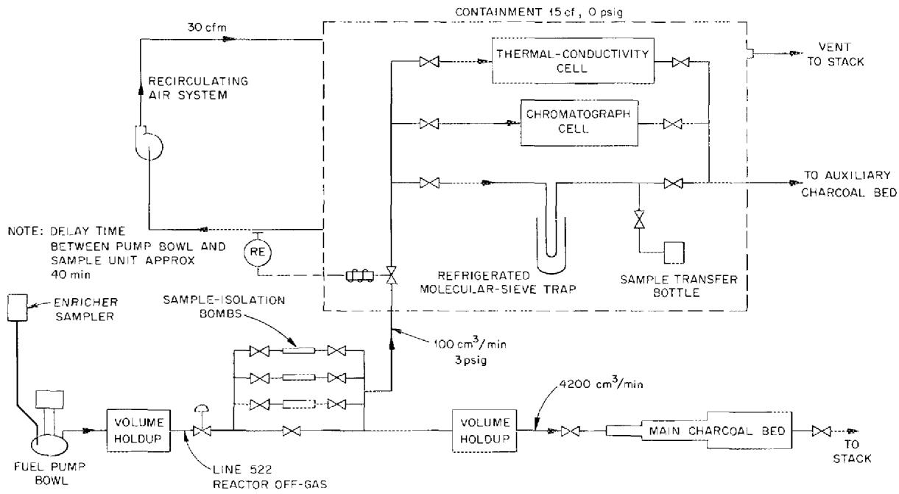  
Fig. 2.13. Schematic Diagram - MSRE Off-Gas Sampler.

on-line chromatographic and conductivity analysis; for measurements of flows, pressures, and temperatures required for proper operation of and interpretation of data from the chromatograph and conductivity analyzers; for control of temperature of a molecular sieve trap and of the level of a liquid-nitrogen bath in which the molecular sieve is immersed; for detection and annunciation of undesirable operating conditions; and to prevent the occurrence of hazardous conditions.

Since the sampler will be an integral part of the primary containment during sampling operations, and since some components of the sampler would not meet the requirements for primary containment system components, solenoid block valves will be installed in the inlet and outlet lines which connect the sampler to the reactor system. Two valves will be installed in series in each line. These valves will automatically close and isolate the sampler from the reactor system in the event of high pressure in the reactor containment cell, high pressure in the fuel-pump bowl, or high air activity in the sampler enclosure. High reactor cell pressure is indicative of a rupture of the primary containment and the occurrence of the maximum credible accident. High fuel-pump-bowl pressure indicates that conditions exist that could result in a rupture of the sampler primary containment. High sampler-air activity indicates that a rupture of the sampler primary containment has occurred. Closure of the block valves resulting from high sampler-air activity (and the accompanying alarm) will also provide protection to the sampler operator against the occurrence of high background radiation resulting from small leaks in the sampler. Sampler-air activity will be detected by two GM-tube-type (ORNL model Q-1916) gamma monitors, which will monitor two separate and independent

air samples collected from and returned to the sampler enclosure. The isolation block valves and associated detecting instruments and control circuitry were designed in accordance with the recommendations of the ORNL "Proposed Standard for the Design of Reliable Reactor Protective Systems." At least two independent devices were used to supply input signals to the system and to effect the corrective blocking action. One-out-of-two logic was used in the control circuitry, and separation and identification were maintained in the detail design of the wiring.

Panel-mounted instrumentation will occupy 5 lin ft of panel (6 ft high $\times$ 2 ft deep). These panels will be located in the vent house, south of the reactor building. The sampler and associated instrumentation will be located in a trench outside the vent house. Since all major sampling operations will be carried out at the sampler, all readout of information will be presented at the sampler panels; however, occurrence of an alarm condition at the sampler will actuate an annunciator in the main control room, and provisions are being made to permit some information to be transmitted to the Computer-Data Logger. Also, a sample permissive switch will be located in the main control room. This switch, which is connected in the block valve circuits, will be used to prevent operation of the sampler without knowledge of the reactor operators.

Most of the instrument components used in the off-gas sampler were salvaged from the ORNL MTR-47-6 experiment located at Idaho Falls or were on hand in ORNL Reactor Division stores. Reconditioning and calibration of this equipment and procurement of additional components are nearing completion. Preparation of instrument application drawing is essentially complete. Panel design is approximately $75\%$ complete. Interconnection wiring and piping design is under way, and fabrication of panels is also under way.

# Xenon Migration in the MSRE

Based on results of the $^{35}\mathrm{Kr}$ experiment and xenon stripper efficiency reported by the University of Tennessee, the steady-state $^{135}\mathrm{Xe}$ poison fraction for the MSRE was computed. The following major assumptions were made:

1. No bubbles circulating with the fuel salt.   
2. Iodine remains in solution, that is, it is not adsorbed on any surfaces and is not volatilized in any form.   
3. Xenon is not adsorbed on any surfaces.   
4. The mass transfer of xenon across the salt-gas interface in the graphite pores will not be interfered with, for example, by the accumulation of sludge or fission products at this interface.

To compute the $^{135}\mathrm{Xe}$ poison fraction, the $^{135}\mathrm{Xe}$ concentration in the salt must first be calculated. This is accomplished by the following rate balance:

135Xe generation rate = 135Xe decay rate in salt

$$
\begin{array}{l} + ^ {1 3 5} \mathrm {X e} \text {b u r n u p r a t e i n s a l t} + ^ {1 3 5} \mathrm {X e} \text {s t r i p p i n g r a t e} \tag {1} \\ + ^ {1 3 5} \mathrm {X e} \text {m i g r a t i o n r a t e} \\ \end{array}
$$

where

135Xe migration rate to graphite = 135Xe burnup rate in graphite

$$
+ ^ {1 3 5} \mathrm {X e} \text {d e c a y r a t e i n g r a p h i t e . (2)}
$$

At a given power level the left side of Eq. (1) is a constant, and the right side is a function of the $^{135}\mathrm{Xe}$ concentration in the salt. After the concentration is computed the $^{135}\mathrm{Xe}$ poison fraction may then be computed.

The results of this calculation at equilibrium are shown in Figs. 2.14a, b, and c, as a function of the variable indicated when all other variables remain constant. The circle on the curve indicates the expected or design value. For this calculation the core was divided into 72 regions, and average fluxes and adjoint fluxes were used for each region. Figure 2.14c shows that the poison fraction is considerably lower at low power levels. This is because a higher fraction of $^{135}\mathrm{Xe}$ decays at these power levels. One notable result of the calculation is that the xenon poison fraction did not change in value when the diffusivity of xenon in graphite ranged from $10^{-3}$ to $5 \times 10^{-5}$ ft $^2/\mathrm{hr}$ . This is because the mass transfer coefficient from salt to graphite is controlling the transfer process. Therefore, if future reactors have low mass transfer coefficients as in the MSRE, it may not be necessary to purchase the more expensive low-void-fraction and low-diffusion-coefficient graphite, if $^{135}\mathrm{Xe}$ poison fraction is the only consideration. The final measured $^{135}\mathrm{Xe}$ poison fraction may be different from these predicted values because of the assumptions involved. As more information is gained about the reactor system and its chemistry, the equations will be adjusted to provide a better model for calculation of the migration in future systems.

# Remote Maintenance

The activities of the remote maintenance group were dictated largely by the condition of the reactor. During the last stages of construction and for as long as the cell was open, attention was given to trying the remote maintenance techniques on the installed equipment and in checking to ensure and improve maintainability. Once the cells were closed the effort was turned to recording experiences and planning for later work. Later, actual maintenance was performed in several areas. A description of this work is given below.

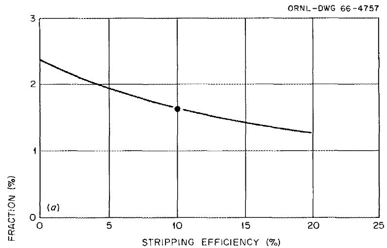

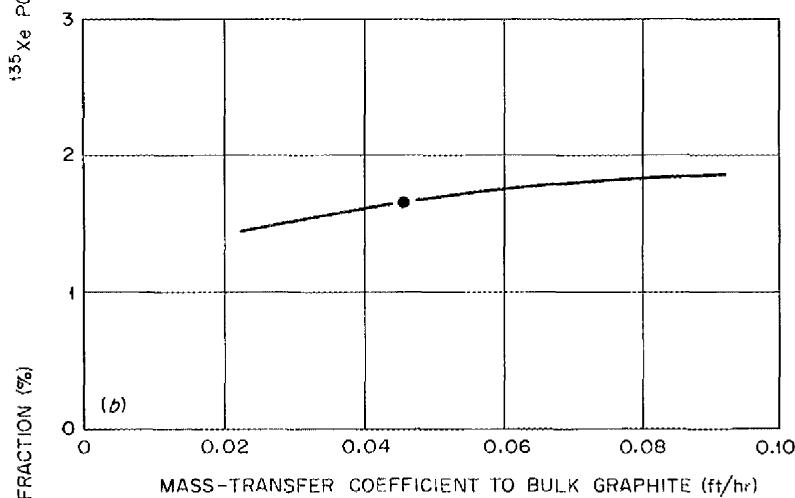

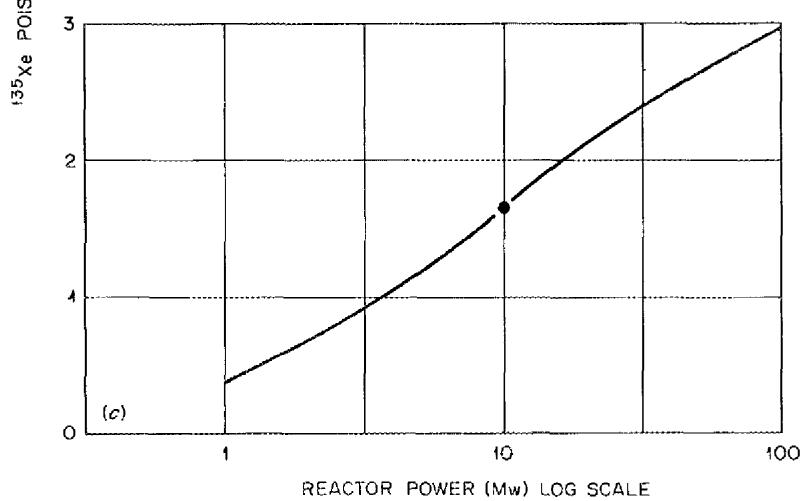  
Fig. 2.14. (a) Effect of Stripping Efficiency on $^{135}\mathrm{Xe}$ Poison Fraction; (b) Effect of Mass Transfer Coefficient on $^{135}\mathrm{Xe}$ Poison Fractions; (c) Effect of Reactor Power on $^{135}\mathrm{Xe}$ Poison Fraction.

Practice with reactor components was had in handling the pump rotary element and in changing the existing graphite sample assembly for the final unit. The sampling procedure included the handling and/or operation of (1) an inert atmosphere in the standpipe, (2) a special heater tool to thaw out a frozen salt annulus around the outside of the sample holddown assembly, (3) disconnects, valves, and flanges inside the standpipe, (4) stowing the holddown assembly, and (5) the sample itself. In addition to these a limited visual inspection of the core was conducted using a 7/8-in.-diam scope. A special fitting had to be installed in the strainer basket above the core to accommodate the revised sample assembly.

The pump rotary element was lifted out of the cell for inspection using the lifting yoke and crane with in-cell direct guiding. During the lift, clearances of all the auxiliary equipment were observed and points where damaging interferences could occur were noted. The unit was reinstalled by remote means using the view afforded through the portable maintenance shield. The process of torqueing up the twenty-two 1-1/2-in.-diam bolts in the pump's lower flange was started in the portable shield but was finished with direct means to save time in the reassembly process. While set up in this area, representative electrical and thermocouple disconnects, pump-bowl heaters, and auxiliary flanges were handled with the long-handled tools.

Procedures were revised, and in cases like the pump, graphite sampling, and the control rods were written up in minute detail. Tabulations were prepared relating heaters, thermocouples, spare disconnects, and other equipment with shield-block locations and elevations. Additional tools were designed, and some existing tools were revised.

# Maintenance of Radioactive Systems

In January, after a short period of power operation, it was necessary to use remote maintenance on a number of tasks. Table 2.1 shows the operations which were done and the actual time and manpower used. Radiation levels were significantly lower than those which are anticipated after prolonged power operation. While this required only minimal shielding, enough of the shielding was used for the operations with the control rod and PCV 522 to provide experience in setting up and in using the tools through the portable shielding. Although PCV 522 and its filter assembly was quite a large radioactive source, $100\mathrm{r/hr}$ at the outer surface of the filter, no significant personnel exposure was encountered. In general the tools, techniques, and previously made preparations proved more than adequate. In some cases it was necessary to fabricate special tools or revise existing ones, but these cases did not hold up progress to any great extent. Good cooperation between management, reactor operations, maintenance planning, health physics, and the craft forces contributed toward efficient and smoothly run operations.

Table 2.1. Summary of Remote Maintenance Work at MSRE - January 27 Through February   

<table><tr><td rowspan="2">Description</td><td colspan="4">Personnel Involved</td><td rowspan="2">Elapsed Time (hr)</td><td rowspan="2">Date</td></tr><tr><td>Rigger and Operator</td><td>Millwright</td><td>Pipe Fitter</td><td>Remote Maintenance</td></tr><tr><td>1. Remove check valve from line 533(use Cam-loc on extension)</td><td>0</td><td>1</td><td>2</td><td>2</td><td>3-1/2</td><td>Jan. 27</td></tr><tr><td>2. Remove FE 521 and replace with a new unit</td><td>0</td><td>0</td><td>1</td><td>2</td><td>2</td><td>Jan. 28</td></tr><tr><td>3. Control rod drive No. 3: remove shielding, disconnects, and cover plate</td><td>2</td><td>1</td><td>0</td><td>1</td><td>6</td><td>Jan. 29</td></tr><tr><td>Control rod drive No. 3: remove drive and install new drive</td><td>2</td><td>2</td><td>0</td><td>2</td><td>8</td><td>Jan. 31</td></tr><tr><td>Control rod drive No. 3: hook up air and electrical disconnects</td><td>2</td><td>2</td><td>0</td><td>2</td><td>2</td><td>Feb. 1</td></tr><tr><td>Control rod drive No. 3: replace cover and shield</td><td>2</td><td>2</td><td>0</td><td>1</td><td>2</td><td>Feb. 2</td></tr><tr><td>4. PCV 522, unsuccessful attempt in-cell replacement</td><td>2</td><td>0</td><td>2</td><td>2</td><td>3</td><td>Feb. 3</td></tr><tr><td>PCV 522, remove and put into decontamination cell</td><td>3</td><td>1</td><td>2</td><td>2</td><td>6</td><td>Feb. 5</td></tr><tr><td>PCV 522, rebuild and replace in system</td><td>3</td><td>1</td><td>2</td><td>2</td><td>6</td><td>Feb. 7</td></tr><tr><td>PCV 522, remove from system</td><td>2</td><td>1</td><td>0</td><td>1</td><td>2-1/2</td><td>Feb. 8</td></tr><tr><td>PCV 522, cut filter loose from valve, put in can and carrier</td><td>2</td><td>0</td><td>1</td><td>1</td><td>2</td><td>Feb. 9</td></tr><tr><td>9. PCV 522, attach flanges for flow tests</td><td>0</td><td>0</td><td>1</td><td>1</td><td>2</td><td>Feb. 9 and 10</td></tr><tr><td>10. PCV 522, install new assembly</td><td>2</td><td>0</td><td>1</td><td>1</td><td>1</td><td>Feb. 10</td></tr><tr><td>Total (hr)</td><td>89</td><td>48</td><td>44</td><td>76.5</td><td>46</td><td></td></tr></table>

# Pump Development

# MSRE Pumps

Molten-Salt Pump Operation in the Prototype Pump Test Facility. The modifications3 to the test loop were completed. The venturi flowmeter was relocated upstream of the orifice flow restriction, and a new flow-straightening section was installed near the pump discharge. The new flow straightener was modified to provide additional weld attachment of the blades inside the pipe. The new arrangement of the system is shown in Fig. 2.15.

Two test runs were made with the prototype pump circulating the salt LiF-BeF $_2$ -ZrF $_4$ -ThF $_4$ -UF $_4$ (68.4-24.6-5.0-1.1-0.9 mole %) at 1200°F. The

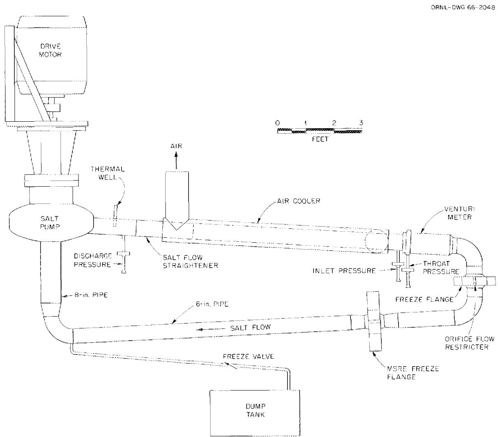  
Fig. 2.15. MSRE Salt Pump Hot Test Facility, Modified.

first run covered a period of 165 hr to provide hot shakedown of the impeller (13-in.-OD) for the fuel pump spare rotary element. The other run covered a period of 166 hr to provide shakedown of the drive motor for the spare coolant pump.

The prototype pump is being prepared for test with an 11-1/2-in. impeller. Measurements will be made with the radiation densitometer to determine the undissolved gas content of the circulating salt. Other tests will be made in the pump tank off-gas circuit in connection with the plugging incidents experienced at the MSRE.

Pump Rotary Element Modification. The spare rotary element for the fuel salt pump was modified to provide a positive seal against leakage of oil from the catch basin past the outside of the shield plug and into the pump tank. Previously, a solid copper O-ring compressed between the bearing housing and shield plug was used to provide the seal. Incidents have occurred wherein oil leaked past the O-ring. Cross-sectional views of the part of the pump which includes the modifications are shown in Fig. 2.16. The larger section shows the relationships between the pump shaft, the shaft lower seal, bearing housing, catch basin, shield plug, and the pump tank. The exploded views indicate the nature of the modification. Positive containment of the oil is obtained by providing a seal weld between the bearing housing and the shield plug. The rotary element is being assembled for cold shakedown, and after satisfactory operation will be prepared for MSRE use and stored. The spare rotary element for the coolant pump will receive the same modification.

Lubrication System. Modified jet pumps4 were installed in the return oil lines of the MSRE salt pump lubrication systems.

The lubrication pump endurance test5 was continued, and the pump has now operated continuously for 22,622 hr circulating oil at $160^{\circ}\mathrm{F}$ and $70\mathrm{gpm}$ .

MK-2 Fuel Pump. The pump tank design was completed, and it is being reviewed.

Drive Motors. A new design was completed for the containment vessel for the drive motors of the MSRE salt pumps. It provides single containment for the electrical power penetrations, in contrast to the double containment provided in the original design. The resulting simplification should eliminate a serious fabrication problem previously experienced with weld-induced laminations in the vessel wall.

# Other Molten-Salt Pumps

PK-P Fuel Pump High-Temperature Endurance Test. Endurance operation of this pump was continued, and it has now operated continuously for 5160 hr circulating the salt LiF-BeF $_2$ -ThF $_4$ -UF $_4$ (65-30-4-1 mole %) at 1200°F, 800 gpm, and 1650 rpm.

Pump Containing a Molten-Salt-Lubricated Journal Bearing. This

pump $^{7,8,9}$ was placed in operation circulating salt at $1200^{\circ}\mathrm{F}$ , but it experienced a seizure after 1 hr of operation. Examination revealed the seizure to be in the molten-salt-lubricated bearing. As was the case with the test previous to this one, $^{5}$ two of the snap rings for the bearing sleeve gimbals support were lost and the other two were only loosely retained. Whether the bearing seizure or loss of the snap rings occurred first is a moot question. The design of the gimbals support is being

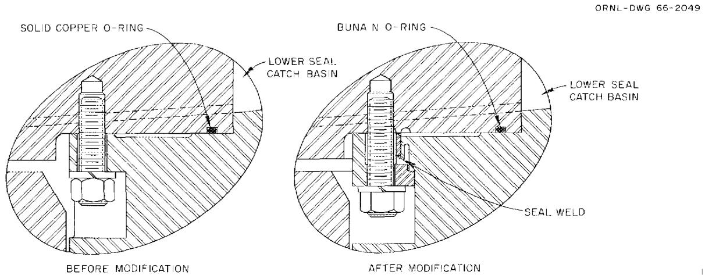

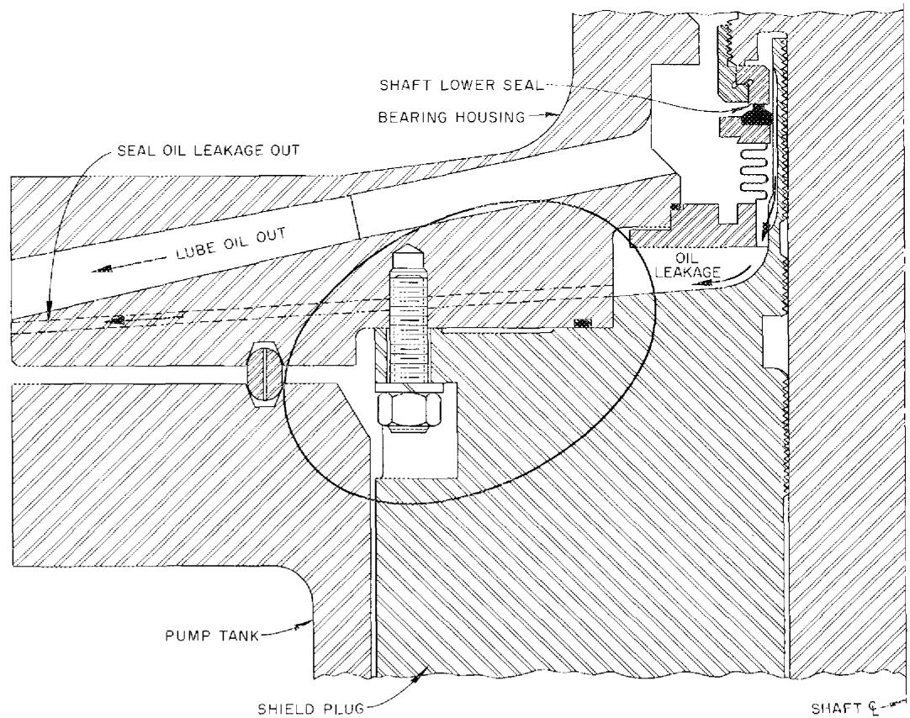  
Fig. 2.16. MSRE Salt Pump Rotary Element, Modification.

modified to eliminate the use of the snap rings, which are intended for retaining the four fulcrum pins in the support. Instead, the pins will be retained by plugs tack-welded at their outer ends.

# Instrument Development

# Ultrasonic Single-Point Molten-Salt Level Probe

As no fuel has been processed during the last report period, the ultrasonic level probe installed in the MSRE fuel storage tank10 has not been used.

Efforts to correct this instrument's deficiencies have been unsuccessful. The excitation oscillator which had proved so unstable was modified considerably (using information supplied by the manufacturer) in an attempt to eliminate its excessive frequency drift. These modifications made no improvement in the stability of the oscillator. As the design and success of other intended modifications depended upon the stability of this component, none of them have been attempted. To correct this situation, the ORNL Instrumentation and Controls Division Electronic Design Group has been requested to investigate the electronic equipment associated with the instrument and make recommendations as to the most practical action to take.

# High-Temperature NaK-Filled Differential-Pressure Transmitter

The coolant-salt system flow transmitter that failed in service at the MSRE11,12,13 was refilled with silicone oil and tested with the seals at room temperature. Prior to refilling the transmitter body, a vacuum pump was connected to the instrument in such a manner that the pressure could be reduced on the process side of both seals and both sides of the silicone-filled body at the same time. Liquid traps were installed in the body evacuation lines to catch any oil that might be forced out of the transmitter body by the expansion of trapped gas during evacuation. When the pressure was reduced to 28 in. Hg vacuum (the lowest pressure attainable with the system at that time), oil was forced from the capillaries: 8.2 ml from the low-pressure side of the transmitter, and 15.8 ml from the high-pressure side. This indicates that there was gas trapped in both sides of the transmitter body, and that the amounts trapped were unequal. The exact amount of gas trapped cannot be calculated from the amounts of oil caught in the containers, because the capillaries are not connected to the two sides of the transmitter body in the same horizontal plane. After it was refilled, the temperature sensitivity of the instrument was 1 in. (water column) change in indicated output for each degree Fahrenheit change in ambient temperature. This sensitivity is greatly reduced from that observed prior to refilling but is still excessive.

All the above testing was done with the seals and transmitter body at room temperature. The seals are now being heated to $1200^{\circ}\mathrm{F}$ , at which temperature the test will be continued.

The new NaK-filled differential-pressure transmitter ordered as a spare for the MSRE is scheduled for delivery in March.

# Float-Type Molten-Salt Level Transmitter

Performance of the ball-float-type transmitter installed on the MSRE coolant-salt pump14 continues to be satisfactory. The necessary actions have been completed to correct the previously reported errors in calibration.14,15 As these were calculated corrections, some additional future adjustment may be required.

The ball-float level transmitter on the MSRE pump test loop continues to operate satisfactorily, although on one fill the float would not rise until the temperature of the heater on the bottom of the float chamber was increased. Either unmelted salt or curvature of the bottom inside the float chamber may now be assumed to be the cause of this sticking. A previous inspection of the core tube showed no deposits that would cause it to stick in the core chamber. The bottom inside curvature of the float chamber on the MSRE pump test loop fits the curved bottom of the float very well and may block the entrance of the molten salt into the chamber. This design error was noted prior to the fabrication of the float chamber for the MSRE and corrected on the assumption that this valving action might occur. The bottom of the float chamber was flattened so that the round-bottom float could not block the flow of the molten salt into the chamber.

Except for detailing of the differential transformer assembly, design of the ball-float transmitter installation in the MK-2 MSRE fuel circulating pump has been completed.

One of the prototype ball-float level transmitters16 installed on the level test loop completed four years of operation at temperature this month. It is still operating satisfactorily. The other was removed last year so the ultrasonic single-point level indicator could be installed. It was operating satisfactorily when removed.

# Conductivity-Type Single-Point Molten-Salt Level Probe

Performance of the conductivity-type level probes installed in the MSRE fuel, flush, and coolant drain tanks continues to be satisfactory. There have been no further failures of excitation and signal cables on these probes.

# Single-Point Temperature Alarm Switches

Observation of the performance of 110 single-point temperature alarm switches installed at the MSRE has continued. As reported previously[17] the switch modules were reset prior to power operation of the reactor. Data obtained from subsequent spot checks of module set points indicated

that a few modules had shifted excessively; however, these data are considered to be inconclusive because records indicated that the modules may have been readjusted. Some additional cases of dual set points were discovered and corrected. Routine checks and observations of module performance will be continued until sufficient data are obtained to permit an accurate evaluation of the reliability of these devices.

# Helium Control Valve Trim Replacement

Testing of alternate material combinations for helium control valve trim has been terminated. Since tests had shown that all the alternate material combinations under consideration would gall when operated in dry helium without lubrication and that none would gall if a minute amount of lubricant was present,[17] the valves which had failed in MSRE service were refitted with spare trim using the original (17-4 PH plug and Stellite No. 6) material combination. Close attention was given to alignment during reassembly of the valves, and all trim was given a light coat of machine oil before installation. All the repaired valves operated satisfactorily in shop tests. One of the repaired valves was installed in the MSRE main helium supply line and operated for several months before sticking. One additional helium control valve failure (also due to sticking) has occurred. Both valves are being disassembled and will be refitted with spare (17-4 PH to Stellite No. 6) trim. Because the failures may be due to evaporation of the lubricant, an attempt will be made to find a less volatile oil or grease to use for trim lubricant. Previous attempts to use graphite-base lubricants were not successful.

# Thermocouple Development and Testing

Coolant Salt Radiator Differential Temperature Thermocouples. Noise in the coolant salt radiator differential temperature thermocouple circuit which was under investigation18 was finally reduced to an acceptable level. A final check on the effects of thermocouple and lead-wire material mismatch was made by heating their disconnects both individually and simultaneously to $150^{\circ}\mathrm{F}$ . No readable change in the output voltage was noted. A seven-point calibration was run on the thermocouple pair between 1040 and $1250^{\circ}\mathrm{F}$ , which resulted in a constant error with the outlet thermocouple reading 0.220 mv high with respect to the inlet thermocouple. The resistance of the thermocouple loop was determined to be high enough to require recalibration of the receiving instrument to maintain required accuracy. Also, the zero of this instrument was offset to correct for the thermocouple loop error.

Thermocouple Drift Tests. The checking of eight metal-sheathed mineral-insulated Chromel-Alumel thermocouples fabricated from MSRE material for calibration drift at $1250^{\circ}\mathrm{F}$ was concluded. $^{19}$ All thermocouples continued to show some drift to the end of a 26-month test period. The final temperature equivalent drift values were between $+4.7$ and $+6.4^{\circ}\mathrm{F}$ .

# Temperature Scanner

Performance of the temperature scanning system developed for use at the MSRE $^{20}$ has continued to be satisfactory. The modification previously reported, $^{21}$ together with improved calibration and maintenance procedures, appears to have eliminated the calibration drift problems. Performance of the mercury switches has been excellent. We had expected that the switches would need frequent attention and that the mean life between routine cleaning or repair would be about 1000 hr. The switches have given very little trouble, and the mean life of the switches has been much greater than 1000 hr. Since the start of operation of this system in September 1964, there have been no bearing or other mechanical failures of the five switches installed. Four switches developed excessive noise during this period and required cleaning and replacement of the mercury. In one of these cases the switch failure was caused by a failure in the nitrogen purge gas supply system. All five switches were cleaned and reconditioned before the start of power operations as a routine precautionary measure.

# References

1. MSR Program Semiann. Progr. Rept. Aug. 31, 1965, ORNL-3872, pp. 56-58.   
2. Ibid., p. 55   
3. MSR Program Semiann. Progr. Rept. Aug. 31, 1965, ORNL-3872, p. 61.   
4. Ibid., p. 61.   
5. Ibid., p. 62.   
6. Ibid., p. 65.   
7. MSR Program Semiann. Progr. Rept. July 31, 1963, ORNL-3529, p. 54.   
8. MSR Program Semiann. Progr. Rept. Jan. 31, 1964, ORNL-3626, p. 40.   
9. MSR Program Semiann. Progr. Rept. Feb. 28, 1965, ORNL-3812, p. 52.   
10. MSR Program Semiann. Progr. Rept. Aug. 31, 1965, ORNL-3872, p. 66.   
11. Ibid., p. 70.   
12. MSR Program Semiann. Progr. Rept. Feb. 28, 1965, ORNL-3812, p. 48.   
13. MSR Program Semiann. Progr. Rept. Jan. 31, 1963, ORNL-3419, p. 45.   
14. MSR Program Semiann. Progr. Rept. Aug. 31, 1965, ORNL-3872, p. 71.

15. MSR Program Semiann. Progr. Rept. Feb. 28, 1965, ORNL-3812, p. 41.   
16. MSR Program Semiann. Progr. Rept. Feb. 28, 1962, ORNL-3282, p. 61.   
17. MSR Program Semiann. Progr. Rept. Aug. 31, 1965, ORNL-3872, p. 72.   
18. Ibid., pp. 73, 74.   
19. Ibid., p. 73.   
20. MSR Program Semiann. Progr. Rept. Aug. 31, 1962, ORNL-3369, p. 71.   
21. MSR Program Semiann. Progr. Rept. Feb. 28, 1965, ORNL-3812, pp. 44-45.

# 3. MSRE REACTOR ANALYSIS

# Least-Squares Formula for Control Rod Reactivity

One routine function of the MSRE data logger will be the periodic calculation of the separate reactivity effects associated with reactor operation above some base line, or zero-reactivity condition. For this purpose, one of the quantities the computer must calculate is the negative reactivity corresponding to each configuration of the shim and regulating rods. By use of a least-squares curve-fitting procedure, we have obtained an analytical formula which closely approximates the integral curves determined from rod calibration experiments at zero power. The functional expression used for fitting the experimental curves was determined by applying a perturbation technique to the integral expression for the rod reactivity, as outlined below.

If a reference state is chosen to correspond to zero rod insertion, an expression for the static reactivity change when a single rod (or rod group) is inserted to a position Z in a core with effective height H and radius R is

$$
\Delta \rho_ {S} = \frac {\int_ {0} ^ {R} \int_ {0} ^ {Z} \Phi_ {0} ^ {*} \delta A \Phi r d r d z}{\int_ {0} ^ {R} \int_ {0} ^ {H} \Phi_ {0} ^ {*} P \Phi r d r d z}. \tag {1}
$$

In this formula, $\Phi$ is the column vector of group fluxes corresponding to the condition with the rods inserted, $\Phi_0$ is the row vector of adjoint fluxes for the reference state, $\delta A$ is the local perturbation in the neutron removal operator due to absorptions in the rods, and $P$ is the neutron production operator. This expression can also be applied if the shim and regulating rods are inserted to different positions. To simplify the analysis, we have assumed that the tips of the shim rods are at equal insertions, $Z_1$ , which is always equal to or above the position of the regulating rod, $Z_2$ . We further specialize the formula to two-group diffusion theory and one dimension, corresponding to the direction of rod insertion. Equation (1) becomes

$$
\Delta \rho_ {s} = \frac {\int_ {0} ^ {Z _ {1}} \phi_ {0 2} ^ {*} \phi_ {\Sigma a 2} ^ {(1)} \phi_ {2} d z + \int_ {Z _ {1}} ^ {Z _ {2}} \phi_ {0 2} ^ {*} \delta_ {\Sigma a 2} ^ {(2)} \phi_ {2} d z}{\int_ {0} ^ {H} \phi_ {0 1} ^ {*} (v \Sigma_ {f 1} \phi_ {1} + v \Sigma_ {f 2} \phi_ {2}) d z}, \tag {2}
$$

where subscripts 1 and 2 designate the fast and thermal groups respectively. The quantity $\delta \Sigma_{a2}^{(1)}$ is the effective increment in thermal absorption cross section in the region $0 \leq z \leq Z_1$ , poisoned by the combined

shim and regulating rod group, and $\delta \Sigma_{\mathrm{a2}}^{(2)}$ is the corresponding increment in $Z_1 \leq z \leq Z_2$ , poisoned by the regulating rod alone.

In the usual approximation of perturbation theory, the flux distributions $\Phi_1(z)$ and $\Phi_2(z)$ are replaced by the unperturbed fluxes $\Phi_{01}(z)$ and $\Phi_{02}(z)$ , corresponding to the reference state. If the approximations

$$
\phi_ {2} (z) \approx \phi_ {0 2} (z) \approx \sin \frac {\pi z}{\bar {H}}, \tag {3}
$$

$$
\phi_ {0 1} ^ {*} \sim \phi_ {0 2} ^ {*} \sim \sin \frac {\pi z}{H} \tag {4}
$$

are introduced into (2) and the integrations performed, the usual formula for the reactivity-worth curve for a partially inserted control rod is obtained. This result was tested by adjusting the parameters $\delta\Sigma_{a2}$ and $\delta\Sigma_{a2}^{(2)}$ in order to fit the formula to the rod-worth curves obtained from experiment. While reasonably good agreement was obtained in fitting the curve for the single (regulating) rod, poorer results were obtained when combinations of insertions of shim and regulating rods were considered. The functional expression obtained from standard first-order perturbation theory was, therefore, judged inadequate for representing the rod-reactivity curves.

We have found that a significant improvement in the fit can be made by assuming that the axial distribution of thermal flux, $\phi_{2}$ , is perturbed according to the position of the shim-regulating rod bank $(Z_{1})$ but is unaffected by the position of the regulating rod $(Z_{2})$ . The approximate formula for $\phi_{2}$ used for this analysis was:

$$
0 \leq z \leq Z _ {1}:
$$

$$
\phi_ {2} (z) = \frac {A}{D _ {2} B _ {T} ^ {2} + D _ {2} \alpha_ {p} ^ {2}} \sinh \alpha_ {p} z + \frac {1}{D B _ {T} ^ {2} + D \alpha_ {p} ^ {2}} \sin \frac {\pi z}{H}, \tag {5}
$$

$$
Z _ {1} \leq z \leq H:
$$

$$
\phi_ {2} (z) = \frac {\mathrm {B}}{\mathrm {D} _ {2} \mathrm {B} _ {\mathrm {T}} ^ {2} + \mathrm {D} _ {2} \alpha^ {2}} \sinh \alpha (\mathrm {H} - z) + \frac {1}{\mathrm {D B} _ {\mathrm {T}} ^ {2} + \mathrm {D} \alpha^ {2}} \sin \frac {\pi z}{\mathrm {H}}, \tag {6}
$$

where

$$
\alpha^ {2} = \frac {\Sigma_ {a 2}}{D _ {2}},
$$

$$
\alpha_ {p} ^ {2} = \alpha^ {2} + \frac {\delta \Sigma_ {a _ {2}} ^ {(1)}}{D _ {2}},
$$

$$
B _ {T} ^ {2} = \left(\frac {\pi}{H}\right) ^ {2},
$$

and $D_2$ and $\Sigma_{a2}^{(0)}$ are, respectively, the thermal diffusion coefficient and the macroscopic thermal cross section of the core in the absence of the control rods. The coefficients A and B depend on the strength of the shim-regulating rod bank absorption, $\delta \Sigma_{a2}^{(1)}$ , together with geometric factors. They can be determined by requiring continuity of flux and current at the interface, $Z_1$ , between the "rodded" and "unrodded" regions. The final result of applying this analysis in Eq. (2) was

$$
\Delta \rho_ {S} = \frac {C _ {0} + C _ {1} F _ {1} \left(Z _ {1}\right) + C _ {2} F _ {2} \left(Z _ {1} , Z _ {2}\right) + C _ {3} F _ {3} \left(Z _ {1}\right) + C _ {4} F _ {4} \left(Z _ {1} , Z _ {2}\right)}{C _ {5} + C _ {6} F _ {1} \left(Z _ {1}\right)}, \tag {7}
$$

where

$$
F _ {1} \left(Z _ {1}\right) = \frac {2 \pi Z _ {1}}{H} - \sin \frac {2 \pi Z _ {1}}{H}, \tag {8}
$$

$$
F _ {2} \left(Z _ {1}, Z _ {2}\right) = \frac {2 \pi \left(Z _ {1} - Z _ {2}\right)}{H} + \sin \frac {2 \pi Z _ {1}}{H} - \sin \frac {2 \pi Z _ {2}}{H}, \tag {9}
$$

$$
\begin{array}{l} \mathbb {F} _ {3} \left(\mathrm {Z} _ {1}\right) = \left(\cosh \alpha \mathrm {Z} _ {1} \sin \frac {\pi \mathrm {Z} _ {1}}{\mathrm {H}} - \frac {\pi}{\alpha \mathrm {H}} \sinh \alpha \mathrm {Z} _ {1} \cos \frac {\pi \mathrm {Z} _ {1}}{\mathrm {H}}\right) \\ \times \left[ \cosh \alpha \left(\mathrm {H} - \mathrm {Z} _ {1}\right) \sin \frac {\pi \mathrm {Z} _ {1}}{\mathrm {H}} + \frac {\pi}{\alpha \mathrm {H}} \sinh \alpha \left(\mathrm {H} - \mathrm {Z} _ {1}\right) \cos \frac {\pi \mathrm {Z} _ {1}}{\mathrm {H}} \right], \tag {10} \\ \end{array}
$$

$$
\begin{array}{l} F _ {4} \left(Z _ {1}, Z _ {2}\right) = \left(\cosh \alpha Z _ {1} \sin \frac {\pi Z _ {1}}{H} - \frac {\pi}{\alpha H} \sinh \alpha Z _ {1} \cos \frac {\pi Z _ {1}}{H}\right) \\ \times \left[ \cosh \alpha \left(\mathrm {H} - \mathrm {Z} _ {2}\right) \sin \frac {\pi \mathrm {Z} _ {2}}{\mathrm {H}} + \frac {\pi}{\alpha \mathrm {H}} \sinh \alpha \left(\mathrm {H} - \mathrm {Z} _ {2}\right) \cos \frac {\pi \mathrm {Z} _ {2}}{\mathrm {H}} \right]. \tag {11} \\ \end{array}
$$

The parameters $C_0, C_1, \ldots, C_6$ were found to depend on the rod absorption strengths, $\delta \Sigma_{a2}^{(1)}$ and $\delta \Sigma_{a2}^{(2)}$ , together with other macroscopic parameters characterizing the reactor core in the absence of the rods. In addition, it was found that

$$
\left| \frac {C _ {6} F _ {1} \left(Z _ {1}\right)}{C _ {5}} \right| \ll 1, \quad 0 \leq Z _ {1} \leq H. \tag {12}
$$

This latter result is useful in modifying expression (7) further, in order that linear least-squares analysis could be used to determine the numerical values of the parameters. Thus,

$$
\left[ C _ {5} + C _ {6} F _ {1} \left(Z _ {1}\right) \right] ^ {- 1} \approx \frac {1}{C _ {5}} \left(1 - \frac {C _ {6} F _ {1}}{C _ {5}}\right). \tag {13}
$$

By introducing this approximation in Eq. (7) and redefining the constants, it was found that

$$
\begin{array}{l} \Delta \rho_ {S} (Z _ {1}, Z _ {2}) \cong a _ {0} + a _ {1} F _ {1} + a _ {2} F _ {2} + a _ {3} F _ {3} + a _ {4} F _ {4} + a _ {5} F _ {1} ^ {2} \\ + a _ {6} F _ {1} F _ {2} + a _ {7} F _ {1} F _ {3} + a _ {8} F _ {1} F _ {4}. \tag {14} \\ \end{array}
$$

Expression (14) was fitted to the experimental rod calibration curves, using standard linear least-squares analysis to determine the coefficients $a_0, \ldots, a_8$ . The position of the rods relative to the extrapolated zero of the unperturbed axial flux distribution ( $Z = 0$ ) is

$$
Z _ {1, 2} = Z _ {0} + X _ {1, 2}, \tag {15}
$$

where $Z_0$ is the "zero point" insertion of the rods when withdrawn to their upper limit, relative to the extrapolated zero of the flux distribution, and $X_{1,2}$ are the measured rod insertions. Adequate approximations for the parameters characterizing the unperturbed flux distribution, $Z_0$ , $\alpha$ , and $H$ , were obtained from earlier core physics studies. The results of this analysis are summarized in Table 3.1 and Fig. 3.1. In Fig. 3.1 the magnitude of the rod reactivity is plotted as a function of rod position for various configurations of shim and regulating rods. The ordinate scale in this figure is arbitrarily normalized to zero measured reactivity when the regulating rod is fully inserted and the two shim rods are withdrawn to 5l in. The leftmost curve represents the reactivity change when the regulating rod is moved with the shim rods fully withdrawn. The rightmost curve represents the case when the three rods are moved in a banked position with the tips of the rods at equal elevations. The remaining curves represent the reactivity change when the regulating rod is moved with the shim rods held fixed at various intermediate positions.

The solid curves are the reactivity magnitude calculated from the least-squares formula. The points shown as solid dots are sample points determined from the experimental rod calibration curves. Over most of the range of rod movement the calculated and measured reactivity are in agreement within about $0.02\%$ $\delta \mathrm{k} / \mathrm{k}$ . Near the extreme positions of the

Table 3.1. Numerical Values of Parameters in Least-Squares Formula for Control Rod Reactivity (Eq. 14)   

<table><tr><td>Parameter</td><td>Value</td><td>Parameter</td><td>Value</td></tr><tr><td>α, cm-1</td><td>0.082</td><td>a3</td><td>-1.944 × 10-7</td></tr><tr><td>Z0, cm</td><td>24.6</td><td>a4</td><td>5.891 × 10-8</td></tr><tr><td>H, cm</td><td>198.5</td><td>a5</td><td>0.1041</td></tr><tr><td>a0</td><td>2.125</td><td>a6</td><td>2.865 × 10-3</td></tr><tr><td>a1</td><td>-0.3935</td><td>a7</td><td>-1.747 × 10-7</td></tr><tr><td>a2</td><td>-0.3585</td><td>a8</td><td>-4.358 × 10-8</td></tr></table>

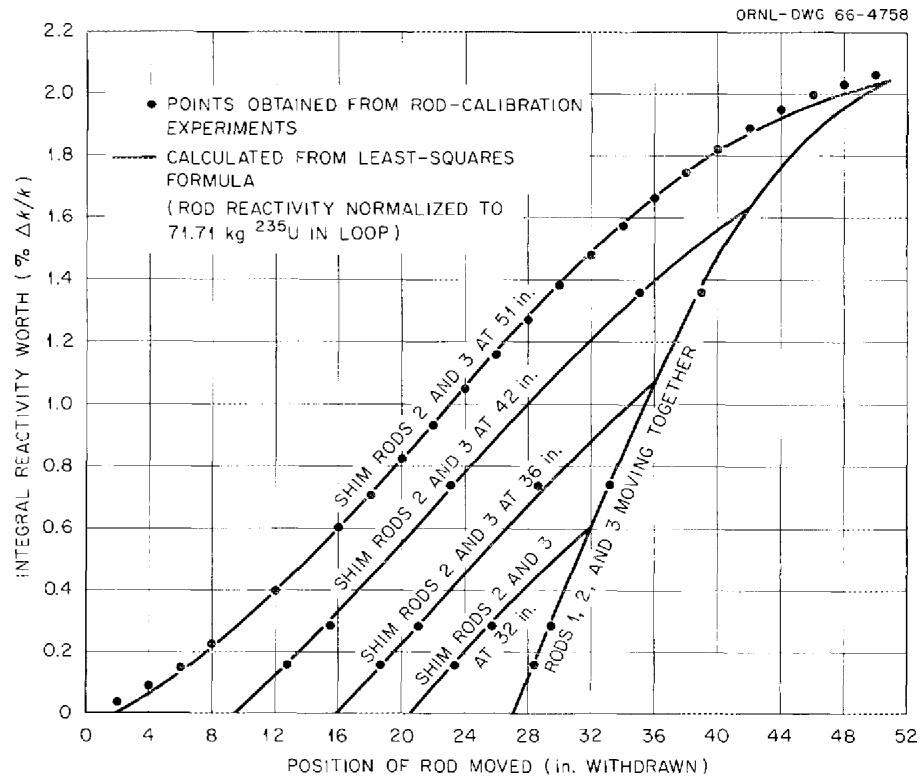  
Fig. 3.1. Comparison of Control Rod Reactivity from Experimental Curves and from Least-Squares Formula.

rods the error is somewhat larger. However, the least-squares formula should be adequate for automatic monitoring of the control rod reactivity under most normal operating circumstances.

# Spatial Distribution of $^{135}\mathrm{Xe}$ Poisoning in MSRE Graphite

To supplement the experimental studies of the behavior of noble gas injected into the MSRE fuel, $^{2}$ theoretical calculations were made to determine the influence of the spatial distribution of $^{135}\mathrm{Xe}$ absorbed within the graphite core. It is expected that the concentration of xenon in the salt will be relatively uniform throughout the volume of circulation. However, within the graphite pores, the $^{135}\mathrm{Xe}$ would tend to assume an overall spatial distribution governed by the burnout rate in the neutron flux. This distribution would be concave, with minimum concentration occurring near the position of maximum thermal flux and maximum concentration near the boundaries of the reactor core.

It is intended that the reactivity due to $^{135}\mathrm{Xe}$ poisoning will be periodically calculated during operation by use of the TRW-340 data logger. From a practical standpoint we are limited to the use of a relatively simple "point" kinetics model for on-line calculations. Therefore, any corrections for the spatial distribution of the $^{135}\mathrm{Xe}$ poisoning must be predetermined from theoretical studies with a more elaborate model of the reactor core.

If we consider a step change from one power level to another, the correction for the spatial distribution of $\mathbf{1}^{35}\mathrm{Xe}$ within the graphite region can be determined from

$$
W \left(P _ {0}, P _ {1}, t\right) = \frac {\int_ {\text {g r a p h i t e}} \phi^ {*} (r) \bar {N} _ {X e} ^ {g} \left[ \Phi_ {1} (r) , t \right] \phi (r) d V _ {g}}{\bar {N} _ {X e} ^ {g} \left(\hat {\Phi} _ {1} , t\right) \int_ {\text {g r a p h i t e}} \phi^ {*} (r) \phi (r) d V _ {g}}, \tag {16}
$$

where

$$
\mathrm {P} _ {0}, \mathrm {P} _ {1} = \text {i n i t i a l}
$$

$$
t = \text {t i m e a f t e r p o w e r l e v e l i s c h a n g e d},
$$

$$
\Phi_ {1} (r) = \text {t h e r m a l f l u x a t p o s i t i o n r r e l a t i v e t o t h e c e n t e r}
$$

$$
\widehat {\Phi_ {1}} = \text {t h e r m a l f l u x a f t e r t h e p o w e r l e v e l i s c h a n g e d},
$$

$$
\overline {{N}} _ {X e} ^ {g} \left[ \Phi_ {1} (r), t \right] = \text {l o c a l l y a v e r a g e d} ^ {1 3 5} X e \text {c o n c e n t r a t i o n i n g r a p h i t e}
$$

$$
\begin{array}{l} \overline {{\mathbb {N}}} _ {\mathrm {X e}} ^ {\mathrm {g}} (\widehat {\Phi} _ {1}, t) = \text {l o c a l l y a v e r a g e d} ^ {1 3 5} \mathrm {X e c o n c e n t r a t i o n i n g r a p h i t e} \quad \text {a t t i m e t , c o r r e s p o n d i n t o a f i c t i t i o u s " f l a t "} \quad \text {n e u t r o n f l u x d i s t r i b u t i o n e q u a l t o t h e s p a s i a l l y} \quad \text {a v e r a g e d f l u x ,} \\ \phi (r) = \text {n o r m a l i z e d} \\ \begin{array}{l} \phi^ {*} (r) = \text {n o r m a l i z e d d i s t r i b u t i o n o f t h e r m a l g r o u p i m p o r t a n c e} \\ \hskip 1 4. 2 2 6 3 7 8 p t (\text {a d j o i n t f l u x}). \end{array} \\ \end{array}
$$

As defined by Eq. (16), $W$ is the factor by which the $^{135}\mathrm{Xe}$ reactivity calculated according to a "point" kinetics model must be multiplied to account for the spatial distribution of the poisoning. In this equation the "local average" $^{135}\mathrm{Xe}$ concentration, $\overline{\mathrm{N}}_{\mathrm{Xe}}^{\mathrm{g}}$ , is the radial average over the graphite volume associated with a single fuel channel. It is useful to compute this quantity before performing the integrations over the entire core graphite volume indicated in Eq. (16). Although nearly all the xenon in the graphite would be expected to be in the pores nearest the graphite-salt interface, this local averaging procedure can be used because the radial variation of neutron flux across a single graphite stringer is negligible.

We have used a one-dimensional model for the fuel channels in order to simplify the calculations. The fuel and graphite widths corresponding to a single channel were chosen so that the ratios of mass transfer surface area to volumes were equal to those of the actual channel. The equations governing the production and mass transfer for $^{135}\mathrm{Xe}$ between the salt and graphite were:

$$
\frac {\mathrm {d} \overline {{\mathrm {N}}} _ {\mathrm {I}} ^ {\ell}}{\mathrm {d t}} = \gamma_ {\mathrm {I}} ^ {\mathrm {P}} \frac {\mathrm {V} _ {\mathrm {c}}}{\mathrm {V} _ {\mathrm {L}}} - \lambda_ {\mathrm {I}} \overline {{\mathrm {N}}} _ {\mathrm {I}} ^ {\ell}, \tag {17}
$$

$$
\begin{array}{l} \frac {\mathrm {d} \overline {{\mathbb {N}}} _ {\mathrm {X e}} ^ {\ell}}{\mathrm {d} t} = \gamma_ {\mathrm {X e}} \mathrm {P} \frac {\mathrm {V} _ {\mathrm {c}}}{\mathrm {V} _ {\mathrm {L}}} + \lambda_ {\mathrm {I}} \overline {{\mathbb {N}}} _ {\mathrm {I}} ^ {\ell} - \left(\lambda_ {\mathrm {X e}} + \lambda_ {\mathrm {s}} + \sigma_ {\mathrm {X e}} \widehat {\Phi} \frac {\mathrm {V} _ {\mathrm {c}}}{\mathrm {V} _ {\mathrm {L}}}\right) \overline {{\mathbb {N}}} _ {\mathrm {X e}} ^ {\ell} \\ - \frac {2 h}{y _ {0}} \frac {V _ {c}}{\bar {V} _ {\bar {L}}} \left(\bar {N} _ {X e} ^ {\ell} - N _ {X e} ^ {\ell} \Big | _ {y _ {0}}\right), \tag {18} \\ \end{array}
$$

$$
\frac {\partial \mathrm {N} _ {\mathrm {X e}} ^ {\mathrm {g}}}{\partial t} = \mathrm {D} _ {\mathrm {X e}} ^ {\mathrm {g}} \frac {\partial^ {2} \mathrm {N} _ {\mathrm {X e}} ^ {\mathrm {g}}}{\partial x ^ {2}} - [ \sigma_ {\mathrm {X e}} \Phi (x) + \lambda_ {\mathrm {X e}} ] \mathrm {N} _ {\mathrm {X e}} ^ {\mathrm {g}}, \tag {19}
$$

$$
\overline {{\mathrm {N}}} _ {\mathrm {X e}} ^ {\mathrm {g}} = \frac {1}{\mathrm {y} _ {1}} \int_ {0} ^ {\mathrm {y} _ {1}} \mathrm {N} _ {\mathrm {X e}} ^ {\mathrm {g}} (\mathrm {x}, \mathrm {t}) \mathrm {d x}. \tag {20}
$$

In these equations

$$
\mathbb {N} _ {\mathrm {X e}} ^ {\mathrm {g}} (\mathrm {x}, \mathrm {t}) = \text {l o c a l c o n c e n t r a t i o n o f} ^ {1 3 5} \mathrm {X e} \text {a t p o s i t i o n x w i t h i n t h e}
$$

$$
\overline {{\mathbb {N}}} _ {\mathrm {X e}} ^ {\ell} (t) = \text {l o c a l c o n c e n t r a t i o n o f} ^ {1 3 5} \mathrm {X e}, \text {a v e r a g e o v e r t h e g r a p h i t e}
$$

$$
\overline {{\mathrm {N}}} _ {\mathrm {I}, \mathrm {X e}} ^ {\ell} = \text {a v e r a g e c o n c e n t r a t i o n o f} ^ {1 3 5} \mathrm {I} \text {a n d} ^ {1 3 5} \mathrm {X e} \text {i n t h e c i r c u l a t i n g f u e l s a t , a t o m s p e r c u b i c c e n t i m e t e r o f l i q u i d ,}
$$

$$
\left. \mathrm {N} _ {\mathrm {X e}} ^ {\ell} \right| _ {\mathrm {Y 0}} = \text {c o n c e n t r a t i o n o f} ^ {1 3 5} \mathrm {X e} \text {i n s a l t n e a r e s t t h e g r a p h i t e}
$$

$$
P = \text {f i s s i o n d e n s i t y i n c o r e s a l t}, \text {f i s s i o n s p e r c u b i c c e n t i - m e t e r o f l i q u i d p e r s e c o n d},
$$

$$
\Phi (r) = \text {t h e r m a l n e u t r o n f l u x a t p o s i t i o n} r, \text {m e a s u r e d f r o m t h e}
$$

$$
\gamma_ {I, X e} = \text {f i s s i o n y i e l d o r} ^ {1 3 5} I \text {a n d} ^ {1 3 5} X e,
$$

$$
\lambda_ {I, X e} = \text {r a d i o a c t e} ^ {1 3 5} I \text {a n d} ^ {1 3 5} X e, \sec^ {- 1},
$$

$$
\lambda_ {s} = \begin{array}{l} \text {e f f e c t i v e} \\ \sec^ {- 1}, \end{array} \text {e x e r o m a l r a t e d u e t o e x t e n a l s t r i p p i n g},
$$

$$
\sigma_ {\mathrm {X e}} = \text {t h e r m a l n e u t r o n a b s o r p i o n c r o s s s e c t i o n o f} ^ {1 3 5} \mathrm {X e}, \mathrm {c m} ^ {2},
$$

$$
\begin{array}{l} D _ {X e} ^ {g} = \text {d i f f u s i v i t y o f x e n o n i n g r a p h i t e , s q u a r e c e n t i m e t e r s} \\ \text {o f g r a p h i t e p e r s e c o n d ,} \end{array}
$$

$$
\begin{array}{l} \mathrm {h} = \text {m a s s t r a n s f e r c o e f f i c i e n t f o r l i q u i d f i l m a t t h e} \\ \text {g r a p h i t e - s a l t i n t e r f a c e , c m / s e c ,} \end{array}
$$

$$
y _ {0} = \text {h a l f - w i d t h o f s i n g l e f u e l c h a n n e l , c m},
$$

$$
\begin{array}{l} \mathbf {y _ {1}} = \text {h a l f - w i d t h o f g r a p h i t e a s s o c i a t e d w i t h a s i n g l e f u e l} \\ \text {c h a n n e l , c m ,} \end{array}
$$

$$
V _ {c} / V _ {L} = \text {r a t i o} \quad \text {v o l u m e o f s a l t w i t h i n t h e g r a p h i t e - m o d e r a t e d}
$$

Boundary conditions are required to solve the differential equations (18) and (19). At the outer boundary of the graphite associated with a single fuel channel,

$$
\left. \frac {\partial N _ {X e} ^ {g}}{\partial x} \right] _ {x = y 1} = 0. \tag {21}
$$

At the graphite-salt interface,

$$
\left. \mathbb {N} _ {\mathrm {X e}} ^ {\ell} \right| _ {\mathrm {y} 0} = \beta \mathbb {N} _ {\mathrm {X e}} ^ {g} (\mathrm {x} = 0), \tag {22}
$$

$$
- \mathrm {D} _ {\mathrm {X e}} ^ {\mathrm {g}} \left(\frac {\partial \mathrm {N} _ {\mathrm {X e}} ^ {\mathrm {g}}}{\partial \mathrm {x}}\right) _ {\mathrm {x} = 0} = \mathrm {h} \left[ \overline {{\mathrm {N}}} _ {\mathrm {X e}} ^ {\ell} - \beta \mathrm {N} _ {\mathrm {X e}} ^ {\mathrm {g}} (\mathrm {x} = 0) \right] \quad , \tag {23}
$$

where

$$
\beta = \mathrm {R T} / \mathrm {H} _ {\text {X e}} \epsilon ,
$$

R = universal gas constant, 82.07 cm³ atm mole⁻¹ (°K)⁻¹,

$$
T = t e m p e r a t u r e, ^ {\circ} K,
$$

$H_{Xe} =$ Henry's law coefficient, $cm^3$ atm mole $^{-1}$ ,

$\epsilon =$ graphite porosity, cubic centimeters of void per cubic centimeter of graphite.

At time $t = 0$ , equilibrium conditions corresponding to the initial power level $(P_0)$ were assumed. The initial concentrations are the solutions of Eqs. (17) through (23), with the time derivatives equal to zero. For times following the change in power level, the differential equations were solved by means of Laplace transforms. A sufficient approximation to the exact solution was obtained by use of the condition

$$
\frac {y _ {0} h \beta^ {2}}{D _ {X e} ^ {g}} \ll 1. \tag {24}
$$

Physically, this condition implies that most of the resistance to mass transfer between salt and graphite is due to the fluid film. Results of krypton injection experiments appear to support this conclusion.[2,3]

Some typical numerical calculations based on the preceding model are given in Figs. 3.2 and 3.3. Numerical values for the effective mass transfer coefficient, stripping rate, and graphite porosity characteristics were obtained from ref. 3. Figure 3.2 shows the time variation of the correction factor, W, as the power level ascends to 10 Mw. In the limiting case of a step change from 0 to 10 Mw, W decreases monotonically to an equilibrium value of approximately 0.76. Curves are also given for the case when the power level is increased in successive steps, each time

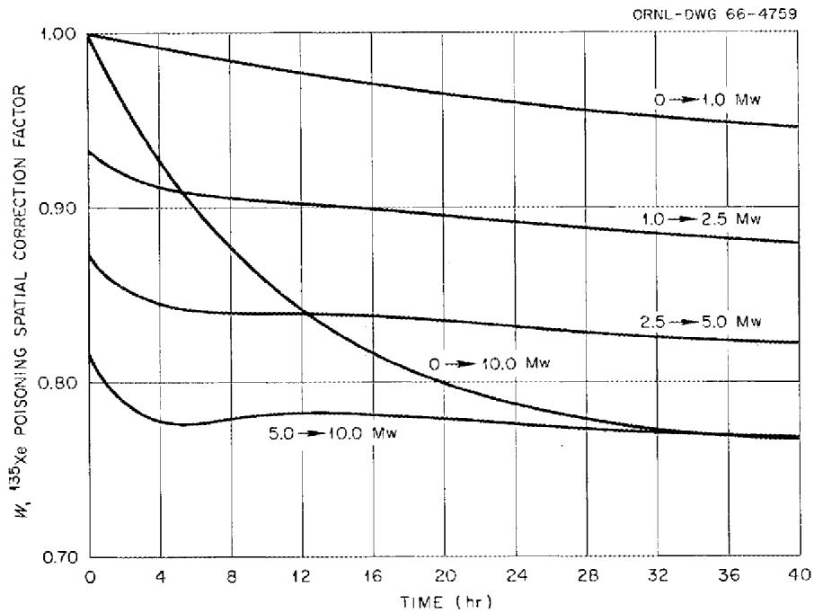  
Fig. 3.2. Time Dependence of the Spatial Correction for the $^{135}\mathrm{Xe}$ Poisoning in MSRE Graphite: Ascending Power Level.

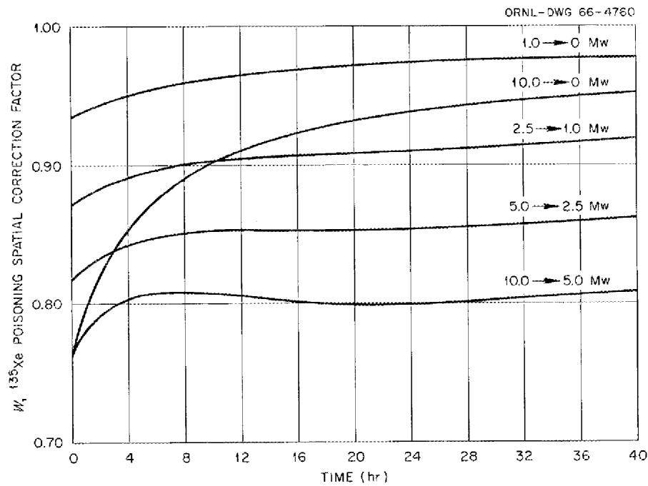  
Fig. 3.3. Time Dependence of the Spatial Correction for the $^{135}\mathrm{Xe}$ Poisoning in MSRE Graphite: Descending Power Level.

allowing equilibrium poisoning conditions to prevail before further increasing the power. The initial "dip" in the curve representing the 5-to 10-Mw step is a consequence of the relative time lag between the increase in the burnout rate in the graphite and the increase in the production rate of $^{135}\mathrm{Xe}$ in the salt. Figure 3.3 gives the analogous results for power levels descending from 10 Mw.

Further studies will be made with this theoretical model in order to determine the sensitivity of the calculated corrections to the effective mass transfer coefficient and stripping rate, and to determine the best method of introducing this correction into the on-line calculation of the $^{135}\mathrm{Xe}$ reactivity.

# References

1. The Reactor Handbook, vol. III, Part A (Physics), ed. by H. Soodak, pp. 204-6, Interscience, New York, 1962.   
2. MSR Program Semiann. Progr. Rept. Feb. 28, 1965, ORNI-3812, pp. 12-14.   
3. R. J. Kedl, personal communication, January 1966.

Part 2. MATERIALS STUDIES

# 4. METALLURGY

# Dynamic Corrosion Studies

A test program is in progress to study the compatibility of structural materials with fuels and coolants of interest to the Molten-Salt Reactor Program. Thermal convection loops described previously1,2 are used as the standard test in this program.

Circulation of lead in a $\mathrm{Cb - 1\%}$ Zr alloy thermal convection loop² was terminated after 5280 hr. This loop operated with a hot-leg temperature of $1400^{\circ}\mathrm{F}$ and a $400^{\circ}\mathrm{F}$ $\Delta T$ . Metallographic examination of the hot leg, shown in Fig. 4.l, revealed no evidence of attack; however, a small quantity of dendritic crystals was observed in the cold leg. Electron probe analysis indicated these crystals to be columbium, as shown in Fig. 4.2. Mass transfer of columbium in lead has not been reported previously.

Two $2 - 1 / 4\%$ Cr-1% Mo steel thermal convection loops were started with lead coolant to study the effect of magnesium additions on mass

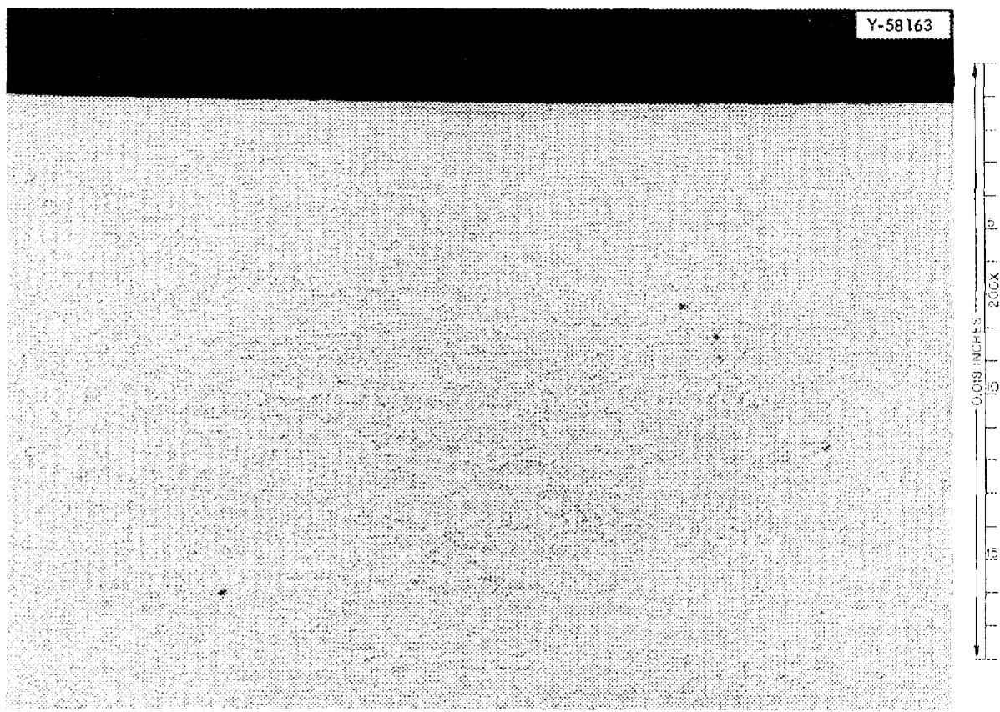  
Fig. 4.1. Section Through the Hot Leg of a $\mathrm{Cb - 1\%}$ Zr Loop Which Operated with Lead for Over 5000 hr at $1400^{\circ}\mathrm{F}$ .

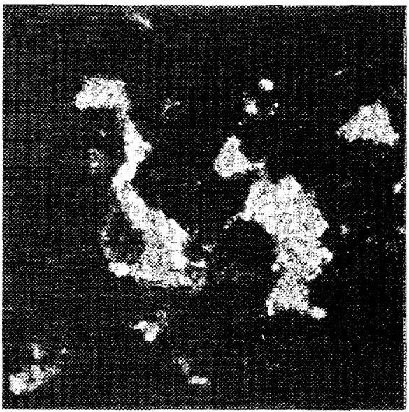  
LIGHT OPTICS

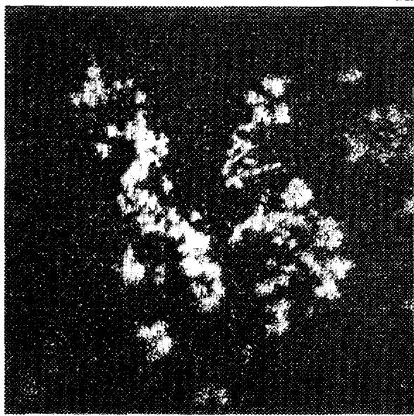  
COLUMBIUM L\*X-RAY IMAGE   
Fig. 4.2. Results of Electron Probe Analysis Showing Presence of Columbium Crystals on the Cold Leg of a $\mathrm{Cb - l}\%$ Zr Loop Which Operated for Over 5000 hr with a Hot-Leg Temperature of $1400^{\circ}\mathrm{F}$ and a $400^{\circ}\Delta \mathrm{F}$ . 250x. Reduced $35\%$ .

transfer of primary elements. The loops will operate with a hot-leg temperature of $1100^{\circ}\mathrm{F}$ and a $200^{\circ}\Delta \mathrm{T}$ . Magnesium was added to act as a deoxidizer and an inhibitor. An original plan to include titanium in the lead was deferred because of difficulty in making a Ti-Pb alloy.

Two loops containing molten fluorides continued to operate without incident. A type 304 stainless steel loop with removable specimens has operated for 22,000 hr, and a Hastelloy N loop containing specimens of Hastelloy N modified with $2\%$ Cb has operated for 33,000 hr.

MSRE Material Surveillance Tests

# Reactor Surveillance Specimens

Specimens of Hastelloy N and grade CGB graphite were exposed for approximately 1100 hr to molten fluoride salts in the core of the MSRE during the precritical operation and the initial critical and associated zero-power experiments. The purposes for these were: (1) to monitor materials during these preliminary operations and (2) to be the mass equivalent for the similar specimens that replace them for surveillance of the power experiments. These specimens showed no changes as a result of exposure during these first, mild experiments.

The graphite specimens were nominally 0.8-in.-diam by 10-in.-long rods. They were machined from MSRE graphite, grade CGB, having a relatively high concentration of cracks, with the idea that this would magnify adverse changes that might occur in the relatively short, mild exposure. There was essentially no salt on the graphite, and the machining marks appeared unaltered. As in the laboratory tests, radiographs showed that surface-connected cracks tended to be filled with salt, with no salt penetrating into the graphite. The volume of salt in the graphite averaged $0.06\%$ of the bulk volume of the graphite, which is approximately one-tenth of the maximum permitted in the MSRE design specifications. The relatively small dimensions of the specimens and the presence of a more-than-typical quantity of cracks would tend to give abnormally high salt pickup.

The Hastelloy N specimens, in the form of tensile specimen rods, also drained free of salt. They had lost their bright, shiny, machined surface and had a bright, gray-white matte surface similar to that obtained in hydrogen firing of the metal.

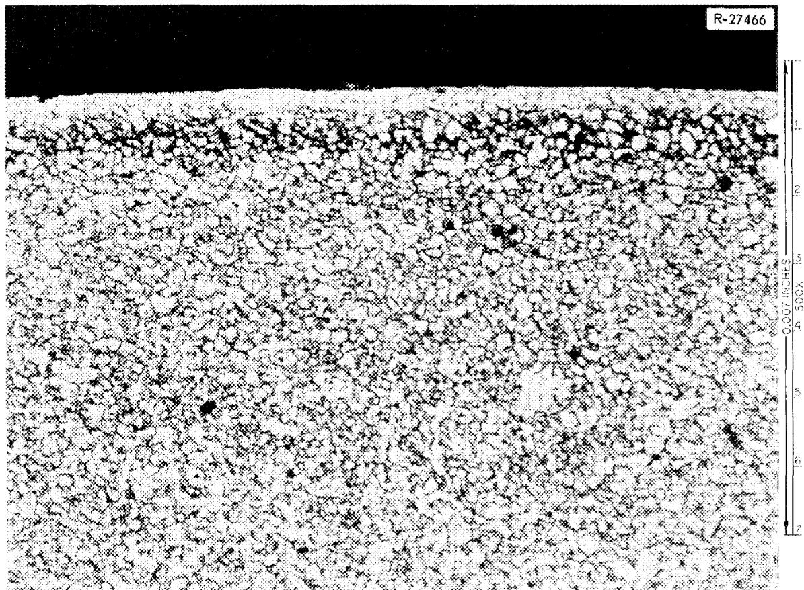  
Fig. 4.3. Microstructure of Hastelloy N Tensile Specimen Exposed in MSRE During Zero-Power Testing of Reactor. Microstructure is extremely fine grained. Black band approximately 0.0005 in. below surface is 0.0005 in. wide and is composed of grains whose boundaries have been enriched or depleted in some constituent. Etchant: aqua regia.

Two of the specimens were sectioned and were examined metallographically. For comparative purposes, two control specimens of the same composition were also examined. Longitudinal and transverse sections of the shoulder and gage-length regions of the tensile specimens were examined.

Both the tested and control specimens exhibited extremely fine-grained microstructure (see Figs. 4.3 and 4.4). The grain boundaries in a 0.0005-in. band approximately 0.0005 in. below the surface of the tested specimens were darkened. It appears that the boundaries were perhaps either depleted or enriched in some unknown constituent. A section of a tested surveillance specimen has been submitted for analysis with the electron microprobe analyzer; however, the analysis has not been completed yet.

A longitudinal view of the control specimen is shown in Fig. 4.5. The microstructure of the control specimen indicates that the surveillance specimens were in a severely worked condition prior to testing. During exposure in the reactor at approximately $1200^{\circ}\mathrm{F}$ , the alloy recrystallized to the smaller grain size shown in Fig. 4.3.

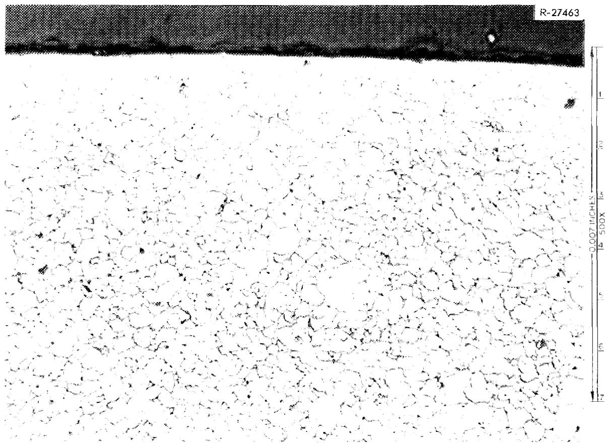  
Fig. 4.4. Microstructure of Control Hastelloy N Tensile Specimen. Although the microstructure is extremely fine grained, the specimen is coarser grained than the one removed from the MSRE.

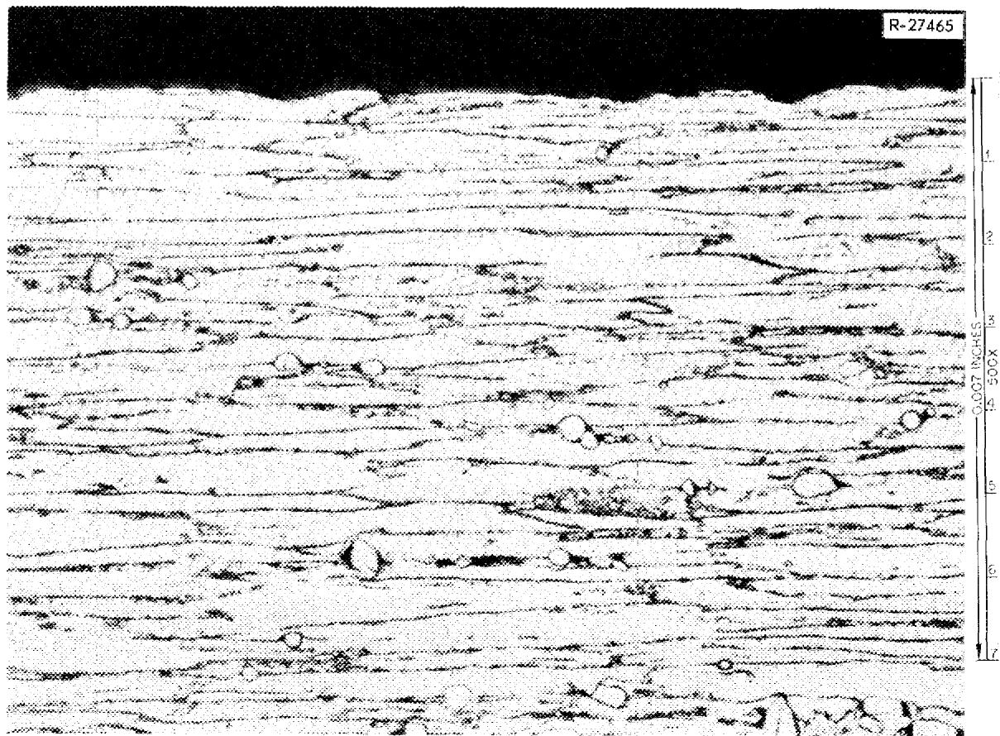  
Fig. 4.5. Longitudinal View of Control Hastelloy N Tensile Specimen. Microstructure indicates that specimen was in severely worked condition. Etchant: aqua regia.

# Surveillance Control Specimens

The reactor core control specimen rig4 was charged with fluoride salts in the latter part of December 1965, and it has been operating satisfactorily. This unit contains three sets of graphite and Hastelloy N specimens that match the sets of reactor core specimens5 in the MSRE. The function of this unit is to subject its specimens to approximately the temperature profile and the major temperature and pressure fluctuations of the reactor. These unirradiated specimens will be used to obtain base-line data for those that are irradiated in the reactor.

The reactor control specimen test unit will copy changes of the reactor operation, as specified above, through directions relayed to it by the computer that monitors the MSRE. Calibration of the unit with the computer is in progress.

# Hot-Cell Metallographic Examination of Hastelloy N

# from Experiment MTR-47-6 for Evidence

# of Nitriding

When the MSRE is operating, the atmosphere in the reactor cell and the drain tank cell will be nitrogen containing about $3\%$ oxygen. There has been some concern that the nitrogen, when ionized by radiation, will nitride and embrittle the Hastelloy N of the reactor components. Since the capsules in experiment ORNL MTR-47-6 were cooled with air and with air and nitrogen mixtures during irradiation, we examined the bottoms of capsules 1 and 2 for evidence of nitriding of Hastelloy under irradiation.

The capsules were contained in a copper heater block so that only the tops and bottoms were exposed to nitrogen. Construction of the capsules and the operating conditions during irradiation have been reported. Unfortunately, the outer surfaces of the bottoms were damaged during initial disassembly of the capsules at the MTR hot cells. Machined grooves on the capsule bottoms were still visible, and the bottoms

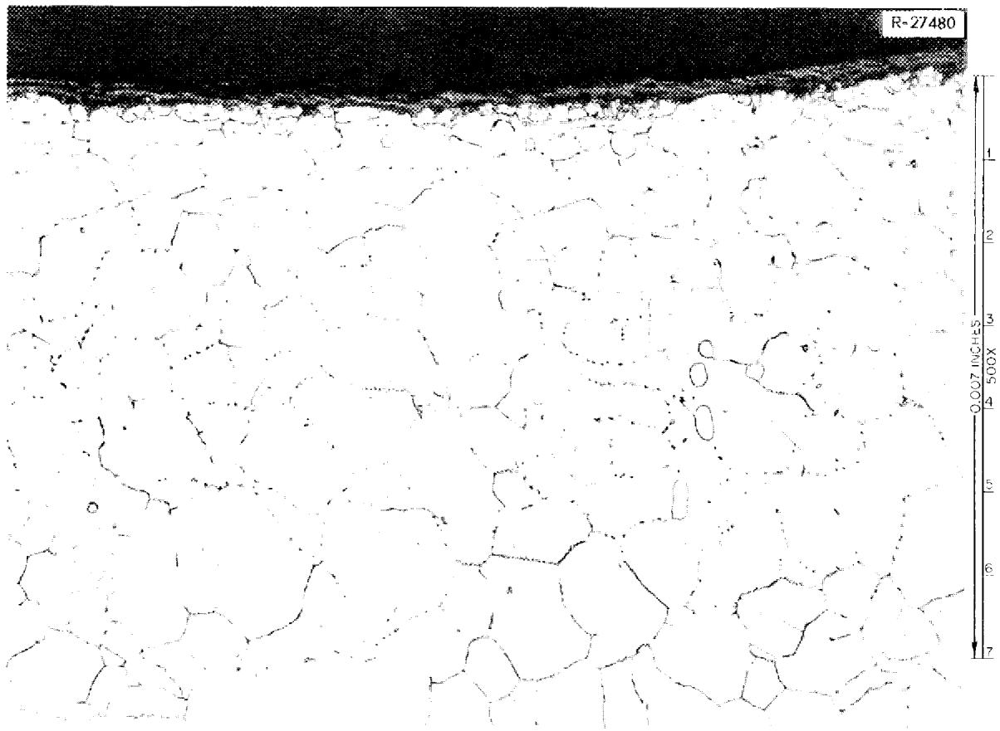  
Fig. 4.6. Bottom of the Machined Groove on the Bottom of Capsule 2, MTR-47-6. A thin oxide scale is visible on the exposed surface; there is no evidence of nitriding. Etchant: aqua regia.

of the grooves, which were also exposed to nitrogen, were undamaged. Longitudinal sections of the bottoms from capsules 1 and 2 were examined metallographically. Attention was centered on the bottoms of the undamaged grooves. A thin oxide layer was present on the exposed surface, as shown in Fig. 4.6; however, we saw no evidence of nitriding on either of the specimens we examined.

# Postirradiation Metallographic Examination of Capsules 1-4 from Experiment ORNL MTR-47-6

Four Hastelloy N capsules were irradiated in experiment ORNL MTR-47-6. Irradiation conditions and a description of the experiment have been reported. $^{6}$ Metallographic examination of the graphite cores and molybdenum coupons, contained in capsules 1 and 4, has also been reported. $^{7}$

A longitudinal section of each capsule body, at the vapor-liquid interface, was examined metallographically. A transverse section of each capsule body was also examined, and the wall thickness was measured. Two unirradiated control capsules and a section from an as-fabricated capsule were also examined. One of the control capsules had been tested out-of-pile under conditions similar to those for the irradiated capsules, and the other capsule was a spare for the irradiation capsules.

There was no apparent change in wall thickness of the capsules during irradiation. A comparison of the wall thickness of the control capsules and the irradiated capsules is shown in Table 4.1.

The interior surfaces of all four irradiated capsules were smooth, and we saw no evidence of scale or film formation. However, the grain boundaries at the interior surfaces of the capsule walls appeared to be slightly enlarged and/or darkened. The effect was spotty in all four capsules, and the depth to which grain-boundary darkening occurred was greater in the vapor phase. Darkening occurred to a depth of approximately 5 mils in capsules 2 and 3, and slightly less in capsules 1 and 4. We saw no evidences of grain darkening on either of the control specimens. The inner surfaces of the walls from capsule 2 and from the tested control capsule are compared in Figs. 4.7 and 4.8.

We cannot explain what caused the grain-boundary effect. Because of their high activity level, the specimens cannot be analyzed with the electron microprobe. An unirradiated corrosion specimen that showed a similar effect was examined with the electron microprobe, and no significant difference between the affected edge and the center of the specimen was observed.

# Development of Graphite-to-Metal Joints

The joining of graphite to structural metals such as Hastelloy N is of prime interest in advanced molten-salt reactor concepts. In particular,

Table 4.1. Wall Thickness of Control Capsules and Capsules Irradiated in Experiment ORNL MTR-47-6   

<table><tr><td>Capsule No.</td><td>Wall Thickness (in.)</td></tr><tr><td>Control, tested under same conditions as irradiated capsules</td><td>0.0525</td></tr><tr><td>Control, spare capsule</td><td>0.0515</td></tr><tr><td>Capsule 1 (ORNL MTR-47-6)</td><td>0.0525</td></tr><tr><td>Capsule 2</td><td>0.0530</td></tr><tr><td>Capsule 3</td><td>0.0515</td></tr><tr><td>Capsule 4</td><td>0.0525</td></tr></table>

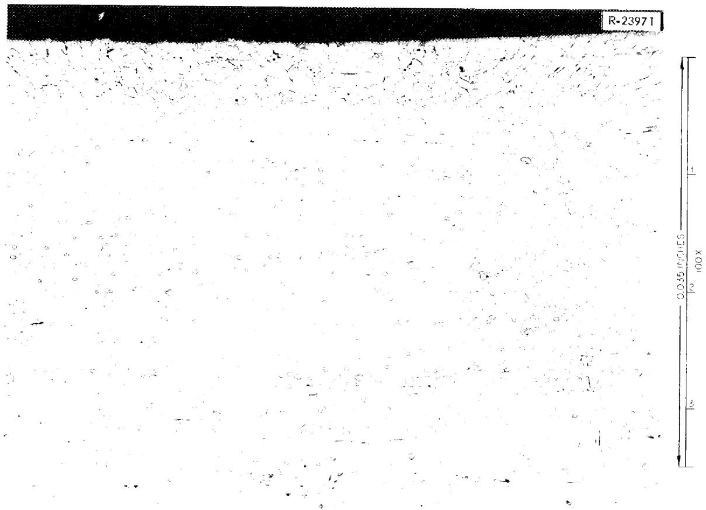  
Fig. 4.7. Microstructure of Inner Surface of Hastelloy N Capsule Wall, Capsule 2, Experiment MTR-47-6, Longitudinal View. Grain boundaries at surface are darkened to a depth of 0.005 in. Also note fine-grained microstructure of Hastelloy N. Etchant: aqua regia.

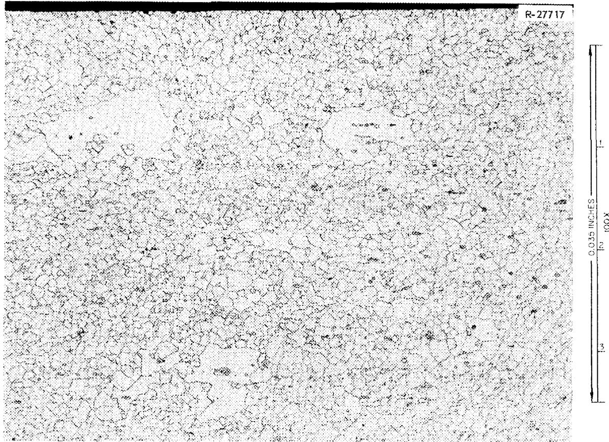  
Fig. 4.8. Microstructure of Inner Surface of Hastelloy N Capsule Wall from Control Capsule That Was Tested Out of Pile Under Same Conditions as Irradiated Capsules, Longitudinal View. Also note fine-grained microstructure. Etchant: aqua regia.

it is highly desirable to join graphite pipes in the reactor core to Hastelloy N headers. The basic obstacle encountered in attempting such a joint is the very large difference between the thermal expansion coefficients of the graphite and the metal. Due to this difference, a joint of graphite directly brazed to Hastelloy N cracks upon cooling from the brazing temperature. One possible method of circumventing this problem is to make the transition with one or more materials having expansion coefficients intermediate between those of the graphite and Hastelloy N. This reduces the stress gradients. Thus, this program is concerned with the development of transition pieces, as well as acceptable brazing alloys.

Molybdenum and tungsten are two metals which have expansion coefficients intermediate between those of graphite and Hastelloy N, and were selected for further study. However, due to cost and availability considerations, nearly all work was performed on molybdenum. This decision was further justified by the fact that nearly all alloys which braze molybdenum will also braze tungsten.

Studies are being conducted, using the newly designed transition joint presented in Fig. 4.9. The design incorporates an $\mathbf{ll}^{\circ}$ tapered edge to reduce shear stresses arising from the thermal expansion differences. This technique may enable the joint between the molybdenum transition piece and the Hastelloy N to be made directly, that is, without another transition. Several assemblies are being prepared for evaluation of brazability and effects of thermal cycling.

The ORNL-developed brazing alloy, 35 Au-35 Ni-30 Mo (wt %), is very useful for brazing graphite; however, transmutation of the gold may limit its application in a high neutron flux. Consequently, a study was undertaken to develop a gold-free brazing alloy which is compatible with molten salts, contains a carbide former, and has a reasonably low melting point.

Tests of Graphite-Molybdenum Brazed Joint for Containing

Molten Salts Under Pressure

A first test was conducted in which a small pipe of grade CGB graphite, brazed to molybdenum, contained molten fluoride salts at $700^{\circ}\mathrm{C}$ under pressures of 50, 100, and 150 psig for periods of 100, 100, and 500 hr respectively. This test, which operated satisfactorily despite a primitive joint design and a relatively thin-walled graphite pipe, suggests that larger graphite-metal joints may be feasible for molten-salt breeder reactors. Current MSBR designs have a maximum pressure difference of 30 psi across pipe walls, less than one-fifth the maximum pressure used in this test.

The test configuration is shown in Fig. 4.10. The short graphite pipe, 1.25 in. $\mathrm{OD} \times 0.75$ in. $\mathrm{ID} \times 1.00$ in. long, was machined from a bar of MSRE graphite with its axis parallel with the extrusion direction of the bar. Pure molybdenum caps were brazed to the ends of the pipe by the Welding and Brazing Group of the Metals and Ceramics Division with 35 Au-35 Ni-30 Mo (ANM-16) (in wt %) braze, which is one of their earlier developments in brazing alloys.

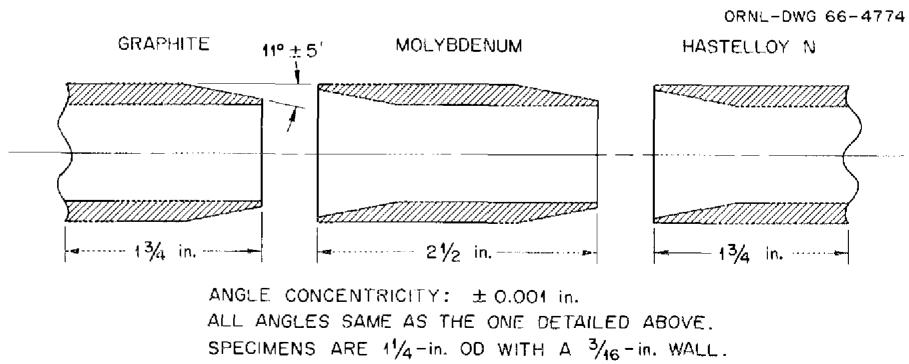  
Fig. 4.9. Schematic Drawing of Proposed Graphite-to-Hastelloy N Joint Using a Molybdenum Transition Piece.

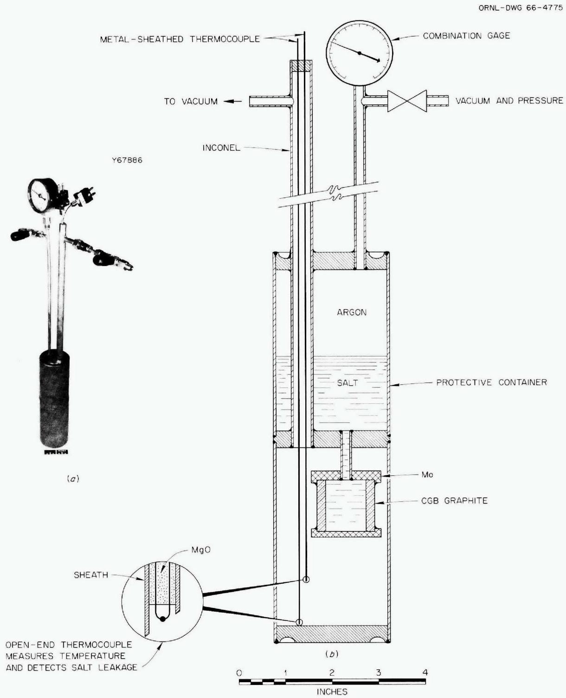  
Fig. 4.10. Test for Small Graphite Pipe and Graphite-Metal Joints.

The molten salt was fed to the inside of the graphite pipe through an Inconel tube brazed into the top molybdenum end cap (see Fig. 4.11). The salt was pressurized by a cover gas of pure argon. A vacuum pump maintained a pressure of $< 5 \mu \mathrm{Hg}$ in the annulus between the graphite pipe and the protective container.

The appearance of the outside of the pipe was essentially unaltered by the test (see Fig. 4.11b). These photographs also show the good wetting of the brazes to the metal and graphite. A small circumferential separation of the braze and the graphite can be seen at the bottom joint next to the graphite. Microscopic examination indicated that the effective bonding and sealing was in the crevice between the pieces. Minor cracking tended to be confined to the fillets. The microscopic examinations, also, showed that the 35 Au-35 Ni-30 Mo (wt %) braze wet the graphite but did not penetrate its structure. The braze was brittle. It did not show any signs of attack by the molten fluoride salt LiF-BeF $_2$ -ZrF $_4$ -ThF $_4$ -UF $_4$ (70-23-5-1-1 mole %).

The 50 Au-50 Ni (wt %) braze used to join the molybdenum to the Inconel salt-supply tube bonded strongly to the Inconel. In the direction transverse to the rolling direction of the molybdenum, a few

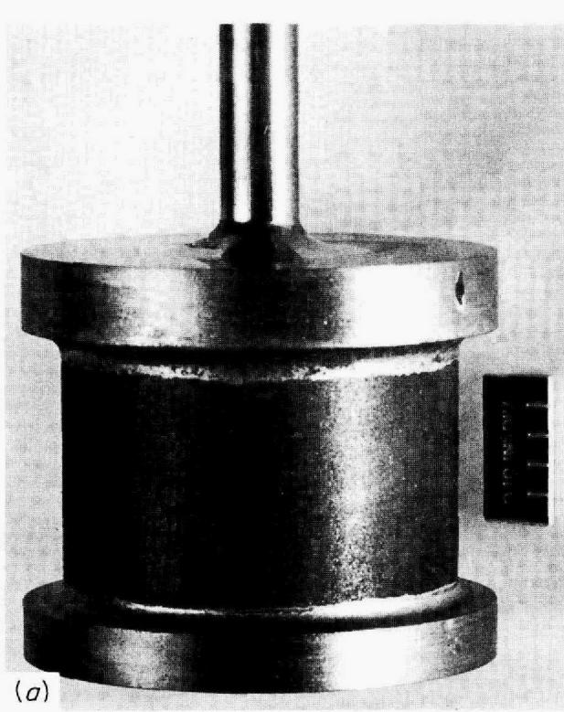

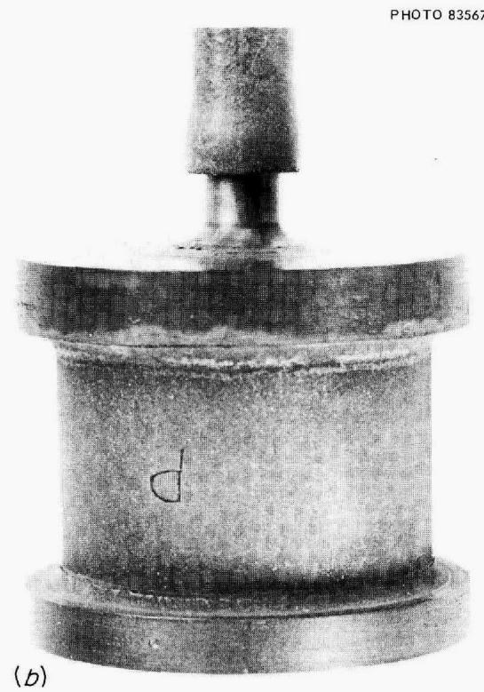  
Fig. 4.11. Grade CGB Graphite Pipe Brazed to Molybdenum End Caps (a) Before Test and (b) After Containing Molten Fluoride Salts at $700^{\circ}\mathrm{C}$ Under Pressures of 50, 100, and 150 psig for Periods of 100, 100, and 500 hr Respectively.

molybdenum grains were pulled out at the molybdenum-braze interface. This was not apparent in the as-brazed material and will be studied more thoroughly as the work progresses.

The radiograph in Fig. 4.l2 shows that none of the salt penetrated the matrix of the graphite. This is consistent with past experience with this small-pore-size, high-density grade CGB graphite used in the MSRE.

# New Grades of Graphite

Procurement and studies of grades of graphite potentially promising for a molten-salt breeder reactor are in the initial stages. Attempts are being made to obtain graphite suitable for irradiation studies in order to secure the required irradiation exposures ( $10^{23}$ nvt, $\mathrm{E} > 0.18$ MeV) reasonably soon. Samples of needle-coke graphite and isotropic graphite are being tested. A needle-coke graphite was used in the MSRE to minimize irradiation contraction and associated stresses. Isotropic

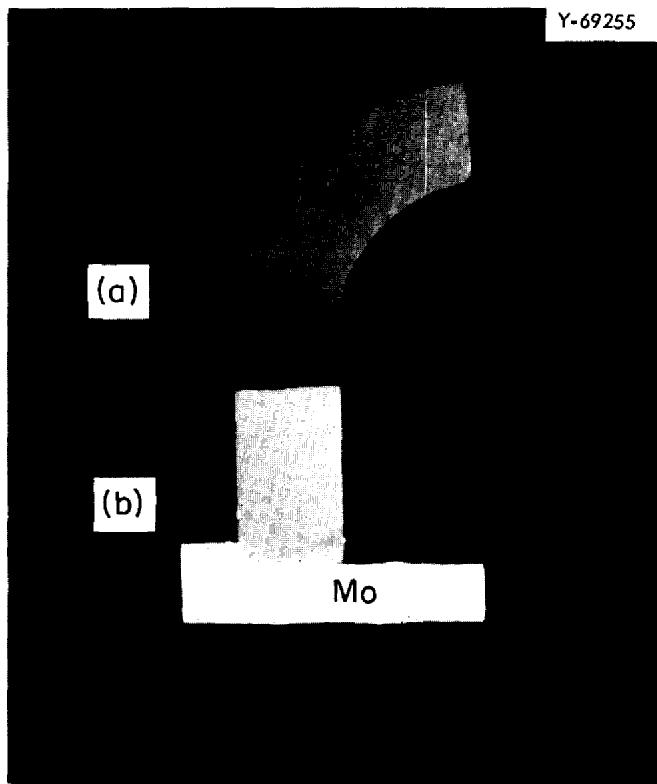  
Fig. 4.12. Radiograph of Thin Sections Machined (a) Transversely and (b) Longitudinally from the Graphite-Molybdenum Brazed Joint Test Showing That No Salt Penetrated into the Graphite Pipe Walls. (Salt would appear here as a white phase.)

graphite has been included in these studies because it may be superior in mechanical properties and more resistant to damage under the high exposures required in the MSBR. $^{8,9}$

A part of this effort is to obtain graphite with the configuration required for current designs of molten-salt breeder reactors. This is being done because the shape and size can significantly affect the final properties that can be built into the graphite. Current designs require graphite pipe nominally 4 in. $\mathrm{OD} \times 3$ in. $\mathrm{ID} \times 8$ to 12 ft long and 2-1/2 in. $\mathrm{OD} \times 1 - 1 / 2$ in. $\mathrm{ID} \times 8$ to 12 ft long. Secondary attention is given to the small-scale laboratory-produced materials.

The prime requirements of the graphite for the initial procurement are that it have pores small enough to prevent the entry of molten salts and that it have a low gas permeability. The pore entrance diameters should be less than $0.5\mu$ , and permeability to helium at 1 atm of pressure should approach $10^{-7}\mathrm{cm}^2/\mathrm{sec}$ . The suppliers currently propose material with a permeability in the range of $10^{-5}$ to $10^{-3}\mathrm{cm}^2/\mathrm{sec}$ , with the higher values being favored.

To date we have obtained graphite samples from the Carbon Products Division of the Union Carbide Corporation, Great Lakes Carbon Corporation, Poco Graphite, Inc., Speer Carbon Company, Stackpole Carbon Company, and the Y-12 Chemical Engineering Group of the Development Division.

The material obtained from the Carbon Products Division is a needle-coke graphite, and the materials obtained from the others are isotropic graphite. Short pieces of pipe 4.7 in. OD × 3.5 in. ID and 3.6 in. OD × 2.5 in. ID have been supplied by the Great Lakes Carbon Corporation and the Carbon Products Division respectively. The materials from the others were rods or blocks.

To determine if these grades of graphite (and future grades) are potentially useful for an MSBR, we are routinely examining them for the entrance diameter spectrum of the accessible pores, permeability to helium gas, permeation by molten fluoride salts, microstructure, specific resistance, flexural strength, and coefficients of thermal expansion. The current samples are in this stage of examination. Those that appear to have promise will be given additional tests for purity and crystallographic development and will be included in the irradiation studies and graphite-metal joint development mentioned previously.

# Evaluation of the Effects of Irradiation on Graphite

Recent progress in the development of graphite for reactor use may be applied directly in estimating properties of a graphite designed for the MSBR. There are, of course, several unknowns which limit the ability to state categorically that any graphite will withstand the MSBR environment. The major limitation is the lack of evidence to demonstrate that any graphite can sustain massive doses of $10^{23}$ nvt or greater and still

retain its integrity. The tubular thin-wall design in the MSBR is one of the better configurations for reducing the differential-growth problem to within the capabilities of the graphite. The tubular shape is also easy to fabricate and to test reliably and nondestructively in order to ensure maximum integrity.

The properties of the most promising grade of graphite can be projected from available grades with a fair degree of certainty (see Table 4.2). These estimations are based primarily on properties obtained from isotropic grades with densities required for the MSBR grade.

The magnitude of the stress generated by differential growth can be fairly well approximated. The main uncertainty is in the flux gradient across the tube wall. Using the conservative estimation of $2.4 \times 10^{-24}$ in. in. $^{-1}$ nvt $^{-1}$ as the growth rate and a $10\%$ change in flux across the wall, a differential growth rate of $2.4 \times 10^{-25}$ in. in. $^{-1}$ nvt $^{-1}$ is obtained. The restraint is internal; therefore, only about half of the differential growth is restrained, so the effective strain rate is $1.2 \times 10^{-25}$ in. in. $^{-1}$ nvt $^{-1}$ .

The creep rate coefficient is $4 \times 10^{-27}$ in. in. psi $^{-1}$ nvt $^{-1}$ , and the stress is simply and directly calculated to be

$$
\sigma = \frac {\dot {\epsilon}}{\hat {K}} = \frac {1 . 2 \times 1 0 ^ {- 2 5}}{4 \times 1 0 ^ {- 2 7}} = 3 0 \mathrm {p s i}.
$$

This stress could hardly be a cause for failure, and to obtain stresses in excess of 100 psi would require the use of grossly unrealistic material properties.

Failure, however, could result from the inability of the graphite to absorb creep deformation even though the stress level is much less than the fracture stress. For lifetimes of $1.5 \times 10^{23}$ , $3 \times 10^{23}$ , and $6 \times 10^{23}$ nvt, the strain to be absorbed would be about 1.8, 3.6, and $7.2\%$ respectively. This corresponds to 5-, 10-, and 20-year lifetimes with a dose rate of $9 \times 10^{14}$ nvt, the maximum fast flux in the present design of the MSBR. The consideration of a strain limit for failure is realistic; however, the strain limit for fracture has not been established. It has been demonstrated that graphite can absorb strains in excess of $2\%$ in $10^{22}$ nvt without loss of mechanical integrity. There is also some evidence that the growth rate will diminish after a $10^{22}$ nvt dose; thus, the graphite might not be forced to absorb the total quantity of strain calculated. Therefore it appears that failure by reaching a strain limit will require at least five years of service.

The main uncertainty, as mentioned earlier, is simply the ability of the graphite to sustain the massive dose without loss of integrity. There is no experimental evidence beyond $2 \times 10^{22}$ nvt on which to extrapolate the irradiation damage of graphite, so extrapolation of data to $10^{23}$ would be pure conjecture. There are, on the other hand, several factors which force one to be optimistic about the ability of graphite to sustain the

Table 4.2. Properties of Advanced Reactor Grades of Graphite   

<table><tr><td rowspan="2">Property</td><td colspan="4">Grade</td></tr><tr><td>H-207-85a</td><td>H-315-Aa</td><td>H-319a</td><td>MSBR</td></tr><tr><td>Density, g/cm3</td><td>1.80</td><td>1.85</td><td>1.80</td><td>≈1.83</td></tr><tr><td>Bend strength, psi</td><td>&gt;6000</td><td>&gt;4500</td><td>&gt;4000</td><td>&gt;5000</td></tr><tr><td>Modulus of elasticity, psi</td><td></td><td>1.35-1.65 × 10^6</td><td></td><td>≈2 × 10^6</td></tr><tr><td>Thermal conductivity, Btu hr-1 ft-1 (°F)-1</td><td>16-22</td><td>21-27</td><td>23</td><td>≈24</td></tr><tr><td>Thermal expansion, α 10^6/°C</td><td>5.4-6.0</td><td>4.8-5.8</td><td>3.7-4.4</td><td>≈5.0</td></tr><tr><td>Electrical resistivity, ohm-cm × 10^4</td><td>8.9</td><td></td><td>9.9</td><td>≈9</td></tr><tr><td>Isotropy factor, CTE11/CTE1</td><td>1.11</td><td>1.20</td><td>1.18</td><td>≈1.15</td></tr><tr><td>Creep coefficient at 700°C, in. in.-1 psi-1 nvt-1</td><td></td><td></td><td></td><td>≈4 × 10^-27</td></tr><tr><td>Permeability to helium, cm²/sec</td><td>8 × 10^-2</td><td>2 × 10^-2</td><td></td><td>&lt;10^-3</td></tr><tr><td>Dimensional instabilityb at 700°C</td><td>1/2 to 1/3 of AGOT</td><td></td><td></td><td>&lt;1/2 of AGOT</td></tr></table>

aG. B. Engle, The Effect of Fast Neutron Irradiation from $495^{\circ}C$ to $1035^{\circ}C$ on Reactor Graphite, GA-6888 (Feb. 11, 1966).   
bBased on very preliminary results on H-207-85 and type B isotropic data to $2\times 10^{22}$

damage. The first factor is the recognition that in the $700^{\circ}\mathrm{C}$ temperature range, the dimensional changes for the first $10^{22}$ nvt do nothing more than repair the damage caused by cooling of the graphite from its graphitization temperature. The additional dimensional changes of the crystals after $10^{22}$ nvt produce stress in the graphite in the opposite direction from that produced by the thermal cooling. In effect, the stress produced on the basal planes will be compressive instead of tensile. This, of course, is very much preferred in that the crystal can sustain this type of loading more readily without cracking. The ability of graphite to sustain very large crystal shears in this manner has been demonstrated by irradiating pyrolytic carbons and observing shear strains in excess of $100\%$ without any observable cracks in the structure. This internal deformation was so great that irregularities were evident on the surface. Although these factors do create optimism about the ability of graphite to sustain the irradiation dose, experimental evidence is needed to demonstrate this ability.

# Effects of Irradiation on Hastelloy N

The objective of this program is twofold: (1) to determine the behavior of the MSRE structural materials under neutron irradiation, and (2) to investigate various ways of improving the resistance to radiation damage by making small changes in chemistry or by specified mechanical treatments. Hastelloy N is a complicated alloy, and we do not have enough data for a statistical analysis; so some of our present interpretations may seem contradictory. Our findings are summarized below.

1. The dependence of the creep-rupture life of Hastelloy N at $650^{\circ}\mathrm{C}$ on the integrated neutron flux is shown by the data in Fig. 4.13. These data are for an air-melted heat (5065) which was irradiated cold. The quantity $f$ is the ratio of the rupture life of the irradiated material to that of the unirradiated material. There seems to be a general trend for the rate of reduction in rupture life with flux to decrease as the stress level is decreased. Three slopes are indicated which are used in subsequent calculations.

2. The results of the postirradiation creep tests of cold-irradiated specimens were used to predict the creep behavior of the alloy under simultaneous stress and irradiation. The basic assumption made in this treatment is that the creep-rupture curve is not altered by irradiation except that the rupture life is reduced. Hence, one gives up a specific fraction of life for an increment of flux. The lines drawn in Fig. 4.14 have equations of the form

$$
f = A / \Phi^ {B}, \tag {1}
$$

where

$$
f = \frac {\text {r u p t u r e l i f e o f i r r a d i a t e d m a t e r i a l}}{\text {r u p t u r e l i f e o f u n i r r a d i a t e d m a t e r i a l}} = \frac {t}{t _ {0}},
$$

A, B = constants,

$\Phi =$ integrated thermal neutron flux.

To predict what will happen when a specimen is simultaneously being stressed and irradiated, Eq. (1) is written as

$$
f = t / t _ {0} = \frac {A}{\Phi^ {B} \cdot t ^ {B}}. \tag {2}
$$

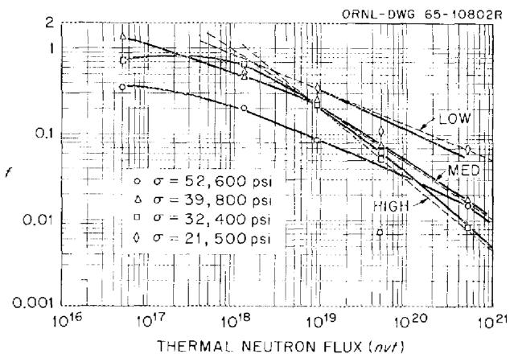  
Fig. 4.13. Reduction in Rupture Life of Hastelloy N (Heat 5065) by Irradiation.

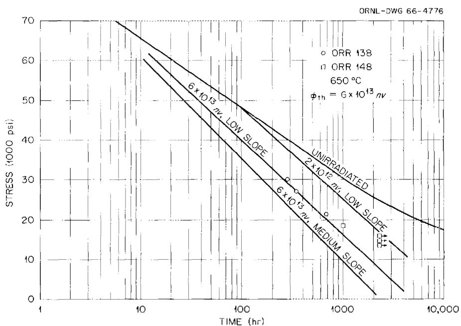  
Fig. 4.14. Creep Rupture Properties of Hastelloy N (Heat 5065) at $650^{\circ}\mathrm{C}$ .

The constants A and B are evaluated from the slopes of the lines in Fig. 4.13. With a value assigned to the flux and a stress level chosen so that $t_0$ is known, it remains to determine the value of $t$ that satisfies Eq. (2).

The procedure just described was used to calculate the lines shown in Fig. 4.14. The constants obtained from the lower slope appear to more closely predict the actual test data. Points are shown on Fig. 4.14 for two in-pile creep experiments. The agreement is reasonably good at stresses above about 20,000 psi, but there is a distinct tailing off at lower stresses. This observation is important in that it indicates a longer rupture life for structural materials at the low stresses in the MGRE than was previously predicted on the basis of a linear extrapolation.

3. The results of in-pile creep tests and postirradiation creep tests are compared in Figs. 4.15 and 4.16. The data from test ORR 140 for heat 5085 (Fig. 4.15) seem to show that the rupture life in post-irradiation tests is considerably longer than the life in in-pile tests. The effect increases with decreasing stress. Data for two specimens at 32,350 psi indicate that holding for several hundred hours at $650^{\circ}\mathrm{C}$ and low stress after irradiation result in a longer rupture life at high stress. The data from test ORR 138 of specimens from heat 5065, shown in Fig. 4.16, follow the same pattern.

The specimens for the postirradiation tests in ORR 138 and 140 were held at $650^{\circ}\mathrm{C}$ for about 1200 hr under little or no stress during the irradiation before testing. The in-pile test specimens were heated only during the test. It seems possible that the difference in thermal history

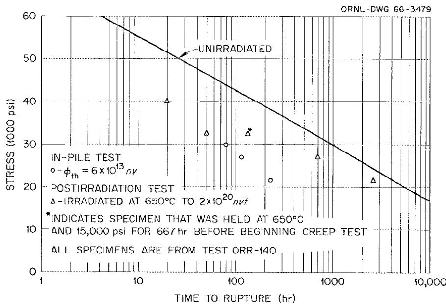  
Fig. 4.15. Comparison of In-Pile and Postirradiation Creep Properties of Hastelloy N (Heat 5085) at $650^{\circ}\mathrm{C}$ .

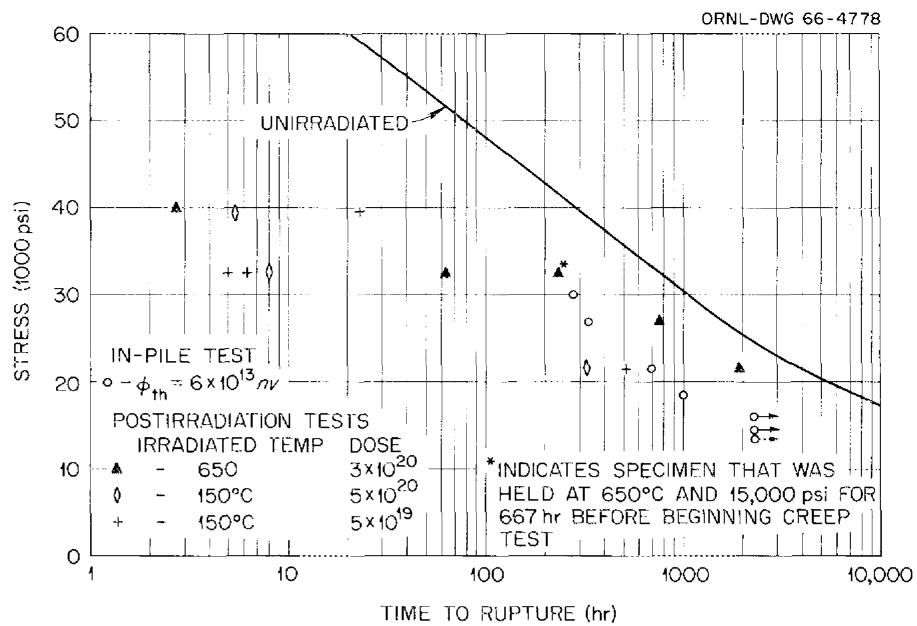  
Fig. 4.16. Comparison of In-Pile and Postirradiation Creep Properties of Hastelloy N (Heat 5065) at $650^{\circ}\mathrm{C}$ .

Table 4.3. Effect of Irradiation Temperature on the Creep-Rupture Properties of Hastelloy N   
Thermal dose $= 2.5 \times 10^{20}$ nvt   

<table><tr><td>Specimen Number</td><td>Irradiation Temperature (°C)</td><td>Stress (psi)</td><td>Rupture Life (hr)</td><td>Strain Rate (%/hr)</td><td>Elongation (%)</td></tr><tr><td colspan="6">Heat 5065</td></tr><tr><td>301</td><td>650</td><td>39,800</td><td>14.8</td><td>0.117</td><td>3.4</td></tr><tr><td>302</td><td>650</td><td>32,350</td><td>300.1</td><td>0.0034</td><td>1.37</td></tr><tr><td>303</td><td>150</td><td>39,800</td><td>42.0</td><td>0.08</td><td>5.5</td></tr><tr><td>304</td><td>150</td><td>32,350</td><td>114.0</td><td>0.0046</td><td>1.25</td></tr><tr><td colspan="6">Heat 2477</td></tr><tr><td>N50</td><td>650</td><td>32,350</td><td>13.6</td><td>0.0137</td><td>0.28</td></tr><tr><td>WRM</td><td>43</td><td>32,350</td><td>51.5</td><td></td><td>3.4</td></tr><tr><td colspan="6">Heat 7304</td></tr><tr><td>344</td><td>650</td><td>39,800</td><td>2.6</td><td>0.073</td><td>0.30</td></tr><tr><td>342</td><td>650</td><td>32,350</td><td>8.55</td><td>0.024</td><td>0.72</td></tr><tr><td>345</td><td>150</td><td>39,800</td><td>42.3</td><td>0.017</td><td>0.87</td></tr><tr><td>346</td><td>150</td><td>32,350</td><td>85.4</td><td>0.0076</td><td>1.0</td></tr></table>

might account for at least part of the difference in rupture life. This suggestion is partly supported by results of other postirradiation creep tests that are included in Fig. 4.16. Except at 40,000 psi stress, the rupture lives of specimens irradiated cold are generally less than those of specimens irradiated hot. Although there are not many data for comparison, the rupture lives obtained by postirradiation tests of the cold-irradiated specimens are shorter than those of the in-pile specimens. The thermal history appears to be an important factor in determining the creep-rupture life of irradiated Hastelloy N.

4. In both creep-rupture and tensile tests, the properties of vacuum-melted heats have shown a large dependence on the irradiation temperature, whereas air-melted heats were less sensitive to irradiation temperature. This is illustrated by the data in Table 4.3. Heat 5065 was air melted, and its creep properties show no consistent dependence on irradiation temperature. Heats 2477 and 7304 were both vacuum melted, and the rupture life and ductility were much worse when the material was irradiated at $650^{\circ}\mathrm{C}$ than when irradiated at $150^{\circ}\mathrm{C}$ . This effect is presently unexplained.   
5. The effect of pretest heat treatment on the tensile properties is shown in Table 4.4 for two heats of Hastelloy N. The range of heat treatments used on heat 5065 had no detectable effect on the ductility. A wider range of heat treatments was used for heat 65-552. It is apparent that the ductility improved as the annealing temperature was increased. The grain size increased considerably, and this would be expected to increase the irradiation effect. However, some other effect, possibly removal of boron from the grain boundaries by the high-temperature anneal, seems to have been more important.   
6. The effects of postirradiation annealing on the tensile properties of Hastelloy N are shown by the data in Table 4.5. Annealing reduces the ductility of the air-melted heat 5065 by about a factor of 2. The ductility of the vacuum melt, heat 65-552, is virtually unchanged by annealing up to above $871^{\circ}\mathrm{C}$ . Annealing at $1200^{\circ}\mathrm{C}$ increases the ductility by about a factor of 3.

# Weld Studies on Hastelloy N

The weld studies on Hastelloy N have two general objectives: (1) to improve the weldability so that welds have greater strength and ductility, and (2) to study the effects of irradiation on the properties of welds and investigate ways of improving their resistance to irradiation damage. It was reported previously[10] that welds involving standard air-melted heats of Hastelloy N exhibited lower rupture life and ductility at $650^{\circ}\mathrm{C}$ , as compared with the base metals. However, the properties could be recovered by postweld annealing. It was also shown that welds involving vacuum-melted materials exhibited better properties. Electron microprobe studies have since shown that significant silicon segregation occurs in the weld metal. These observations have lead to the proposal

Table 4.4. Effect of Pretest Annealing on the Tensile Properties of Hastelloy N (650°C, 0.002 in. in $^{-1}$ min $^{-1}$ )   

<table><tr><td>Experiment</td><td>Anneal</td><td>Average Grain Size (mm)</td><td>Yield Strength (psi)</td><td>Uniform Elongation (%)</td><td>Total Elongation (%)</td><td>Reduction in Area (%)</td></tr><tr><td colspan="7">Heat 5065</td></tr><tr><td>a</td><td>None</td><td>0.05</td><td>40,000</td><td>11.4</td><td>11.6</td><td>17.5</td></tr><tr><td>b</td><td>None</td><td>0.05</td><td>40,800</td><td>12.2</td><td>13.1</td><td>21.9</td></tr><tr><td>b</td><td>8 hr at 871°C</td><td>0.05</td><td>38,100</td><td>13.7</td><td>14.3</td><td>17.3</td></tr><tr><td colspan="7">Heat 65-552</td></tr><tr><td>a</td><td>None</td><td>0.025</td><td>47,800</td><td>5.1</td><td>5.3</td><td>10.9</td></tr><tr><td>b</td><td>None</td><td>0.025</td><td>47,500</td><td>4.7</td><td>4.9</td><td>7.10</td></tr><tr><td>b</td><td>8 hr at 871°C</td><td>0.05</td><td>41,200</td><td>6.6</td><td>6.7</td><td>15.0</td></tr><tr><td>b</td><td>1 hr at 1177°C</td><td>0.10</td><td>37,600</td><td>14.4</td><td>14.5</td><td>16.1</td></tr><tr><td>a</td><td>1 hr at 1177°C</td><td>0.10</td><td>48,400</td><td>15.5</td><td>15.8</td><td>20.7</td></tr><tr><td>a</td><td>1 hr at 1316°C</td><td>0.25</td><td>46,200</td><td>21.8</td><td>23.3</td><td>40.0</td></tr></table>

ETR, $65^{\circ}C$ $5\times 10^{20}$ nvt thermal.   
bORR, $43^{\circ}C$ 8.5x102o nvt thermal.

(650°C, 0.002 in. in $^{-1}$ min $^{-1}$ )

Table 4.5. Effect of Postirradiationa Annealing on the Tensile Properties of Hastelloy N   

<table><tr><td>Postirradiation 
Anneal</td><td>Yield 
Strength 
(psi)</td><td>Uniform 
Elongation 
(%)</td><td>Total 
Elongation 
(%)</td><td>Reduction 
in Area 
(%)</td></tr><tr><td colspan="5">Heat 5065</td></tr><tr><td>Control</td><td>46,300</td><td>22.8</td><td>24.0</td><td>28.1</td></tr><tr><td>None</td><td>40,800</td><td>12.2</td><td>13.1</td><td>21.9</td></tr><tr><td>400°C for 1 hr</td><td>41,900</td><td>11.0</td><td>11.5</td><td>16.3</td></tr><tr><td>650°C for 1 hr</td><td>42,100</td><td>10.9</td><td>12.4</td><td>15.5</td></tr><tr><td>871°C for 1 hr</td><td>43,900</td><td>6.6</td><td>6.7</td><td>10.7</td></tr><tr><td>1200°C for 1 hr</td><td>37,200</td><td>7.0</td><td>7.5</td><td>12.5</td></tr><tr><td colspan="5">Heat 65-552</td></tr><tr><td>Control</td><td>41,600</td><td>22.0</td><td>22.4</td><td>23.5</td></tr><tr><td>None</td><td>47,500</td><td>4.7</td><td>4.9</td><td>7.10</td></tr><tr><td>400°C for 1 hr</td><td>51,100</td><td>4.1</td><td>4.4</td><td>13.6</td></tr><tr><td>650°C for 1 hr</td><td>46,100</td><td>5.6</td><td>5.8</td><td>10.2</td></tr><tr><td>871°C for 1 hr</td><td>43,000</td><td>3.3</td><td>3.7</td><td>8.82</td></tr><tr><td>1200°C for 1 hr</td><td>38,800</td><td>12.7</td><td>12.8</td><td>18.0</td></tr></table>

aIrradiation temperature $= 43^{\circ}C$ $\Phi_{\mathrm{th}} = 8.5\times 10^{20}$ nvt.

that silicon may be responsible for the poor weldability of Hastelloy N, and studies have been directed toward establishing this point more firmly. Irradiation damage studies have involved determining how irradiation changes the tensile properties. Based on the premise that a large grain size in the weld metal may cause degradation of the properties under irradiation, attempts have been made to reduce the grain size by adding grain-refining impurities to the filler metal. The work in both of these areas is presented briefly.

Several experimental welds were made to study the effect of silicon on the properties of the weld metal. A single J-groove joint configuration with an included angle of $50^{\circ}$ was selected.

A second group of experimental welds was made in an effort to refine the weld-metal grain size and/or provide innocuous precipitates upon which the helium (from the n, reaction) molecules can assimilate. Experimentally, this has been done by spray coating an air-melted Hastelloy N filler metal (heat 5055) with $\mathrm{Al}_{2}\mathrm{O}_{3}$ . The weld made from this filler metal was designated No. 7. For comparative purposes, weld No. 4 was made with unsprayed, air-melted filler metal from heat 5101; weld No. 6

was made with a vacuum-melted filler metal (heat 65-552). The compositions of the individual filler metals are given in Table 4.6. The compositions of the base metal and the deposited weld metal for welds 6 and 7 are also given in Table 4.6. As can be noted in Table 4.6, most of the $\mathrm{Al}_{2}\mathrm{O}_{3}$ (weld metal No. 7) was lost as a slag during welding.

The creep-rupture properties of welds 4, 6, and 7 are compared in Fig. 4.17 with those of the base metal and weld No. 1 (duplicate of weld No. 4). The properties of weld No. 4 were quite close to those previously observed for weld No. 1. Using weld No. 4 as a base line, weld No. 6 was slightly weaker, and weld No. 7 was slightly stronger. The rupture elongations at a stress of 40,000 psi were 3, 6, and $3\%$ for weld Nos. 4, 6, and 7 respectively. All failures were observed to occur in either the weld metal or at the fusion line. Metallographic studies are in progress to determine the exact location of the failures.

Several of the specimens were heat treated after welding for 8 hr at $871^{\circ}\mathrm{C}$ . As shown in Fig. 4.17, this treatment produced a significant improvement in the creep strength; the ductility was also improved. A comparison is made in Table 4.7 of the degree of improvement caused in the different welds by postweld heat treating. The heat treatment made the rupture lives of the welds more nearly the same and equal to or better than that of the original base metal.

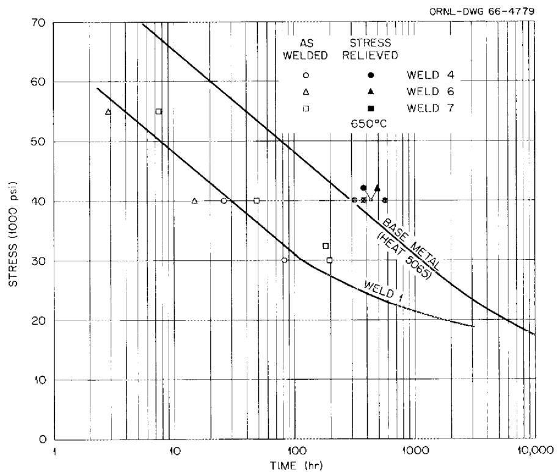  
Fig. 4.17. Comparison of the Creep-Rupture Properties of Welds and Base Metal.

Table 4.6. Chemical Analysis of Welds (in wt %)   

<table><tr><td>Element</td><td>Heat 5065
Base-Metal
Welds 4, 6, 7</td><td>Heat 5101
Weld Wire
on Weld
No. 4</td><td>Heat 65-552
Weld Wire
on Weld
No. 6</td><td>Heat 5055
Weld Wire
on Weld
No. 7</td><td>Al2O3-Coated
Wire for
Weld
No. 7</td><td>Weld Metal
from
Weld No. 6</td><td>Weld Metal
from
Weld No. 7</td></tr><tr><td>Chromium</td><td>7.26</td><td>6.92</td><td>6.89</td><td>7.86</td><td></td><td>6.93</td><td>7.67</td></tr><tr><td>Tungsten</td><td>0.04</td><td>0.05</td><td>0.006</td><td>0.03</td><td></td><td>0.01</td><td>0.08</td></tr><tr><td>Iron</td><td>3.91</td><td>3.91</td><td>4.06</td><td>3.76</td><td></td><td>4.3</td><td>4.7</td></tr><tr><td>Carbon</td><td>0.06</td><td>0.05</td><td>0.04</td><td>0.06</td><td></td><td>0.038</td><td>0.025</td></tr><tr><td>Silicon</td><td>0.60</td><td>0.63</td><td>0.14</td><td>0.61</td><td></td><td>0.16</td><td>0.52</td></tr><tr><td>Manganese</td><td>0.55</td><td>0.44</td><td>0.45</td><td>0.69</td><td></td><td>0.48</td><td>0.53</td></tr><tr><td>Molybdenum</td><td>16.47</td><td>16.39</td><td>16.15</td><td>16.20</td><td></td><td>16.21</td><td>16.39</td></tr><tr><td>Vanadium</td><td>0.21</td><td>0.34</td><td>≤5 × 10-4</td><td>0.21</td><td></td><td>0.1</td><td>0.1</td></tr><tr><td>Phosphorus</td><td>0.004</td><td>0.001</td><td>0.002</td><td>0.006</td><td></td><td></td><td></td></tr><tr><td>Sulfur</td><td>0.007</td><td>0.009</td><td>0.006</td><td>0.008</td><td></td><td></td><td></td></tr><tr><td>Aluminum</td><td>0.01</td><td>0.02</td><td>0.25</td><td>0.06</td><td>0.84</td><td>0.28</td><td>0.08</td></tr><tr><td>Titanium</td><td>0.01</td><td></td><td></td><td>0.02</td><td></td><td></td><td></td></tr><tr><td>Boron</td><td>0.0030-0.0040</td><td>0.00035</td><td></td><td>0.005</td><td></td><td></td><td></td></tr><tr><td>Nitrogen</td><td></td><td></td><td>0.0009</td><td></td><td></td><td></td><td>0.0081</td></tr><tr><td>Oxygen</td><td></td><td></td><td>0.0013</td><td></td><td>0.11</td><td></td><td>0.0042</td></tr></table>

(650°C, 40,000 psi)

Table 4.7. Effect of Stress-Relieving on the Creep-Rupture Properties of Hastelloy N   

<table><tr><td>Weld No.</td><td>As-Welded 
Rupture Life 
(hr)</td><td>Stress-Relieved 
Rupture Life 
(hr)</td><td>Ratio, 
Stress-Relieved 
to As-Welded</td></tr><tr><td>4</td><td>25</td><td>300 to 550</td><td>12 to 22</td></tr><tr><td>6</td><td>15</td><td>420</td><td>29</td></tr><tr><td>7</td><td>48</td><td>370</td><td>7.8</td></tr></table>

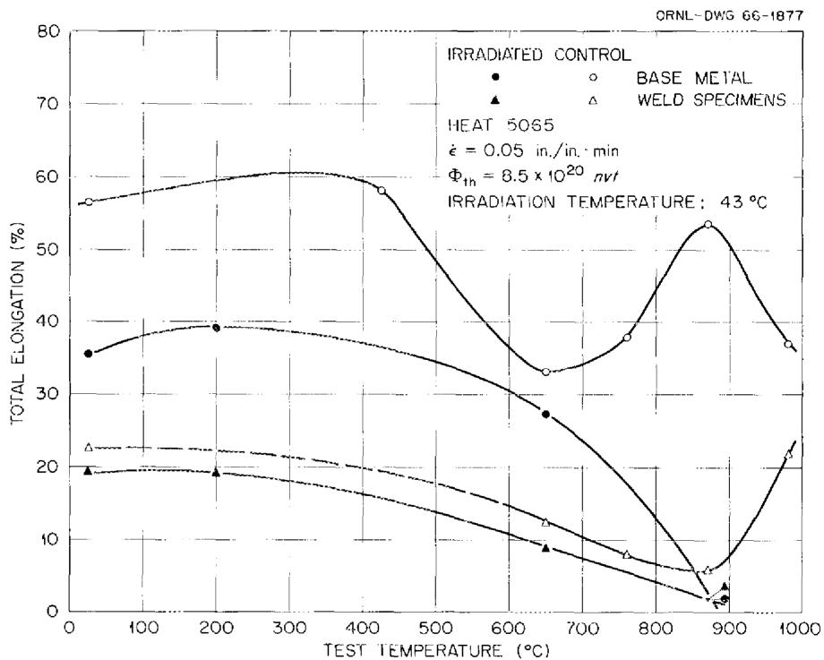  
Fig. 4.18. Comparison of the Effects of Irradiation on the Tensile Properties of Welds and Base Metal.

Since only a few of the irradiated specimens from welds 4, 6, and 7 have been tested, it is necessary to speak in generalities concerning the properties of these welds after irradiation. Specimens of all three welds were irradiated in the ORR at $43^{\circ}\mathrm{C}$ to a thermal neutron dose of $8.5 \times 10^{20}$ nvt. Figure 4.l8 compares the tensile elongation of the base metal and weld No. 4 specimen before and after irradiation. In general, the base metal is affected the most. The welds initially have lower ductility, but the ductility is not reduced much by irradiation. At a test temperature of $871^{\circ}\mathrm{C}$ , the weld and the base metal have the same ductility. At a strain rate of 0.002 in. in. $\min^{-1}$ and a test temperature of $650^{\circ}\mathrm{C}$ , the total elongations of welds 4, 6, and 7 were 5.2, 7.0, and $6.4\%$ respectively. Thus, it seems that the doped weld wire had little, if any, effect on the rupture ductility. Although postweld heat treatment improved the unirradiated ductility, it was found that the ductilities of the as-welded and postweld heat-treated materials were comparable after irradiation. All the irradiated specimens failed in the weld metal. These same welds will be evaluated further through postirradiation creep testing.

# References

1. G. M. Adamson, Jr., et al., Interim Report on Corrosion by Zirconium Base Fluorides, ORNL-2338 (Jan. 3, 1961).   
2. MSR Program Semiann. Progr. Rept. Aug. 31, 1965, ORNL-3872, pp. 81-87.   
3. Ibid., pp. 87-88.   
4. MSR Program Semiann. Progr. Rept. Feb. 28, 1965, ORNL-3812, p. 85.   
5. MSR Program Semiann. Progr. Rept. Aug. 31, 1965, ORNI-3872, p. 90.   
6. MSR Program Semiann. Progr. Rept. July 31, 1964, ORNL-3708, pp. 281-36.   
7. E. J. Manthos, Metals and Ceramics Div. Ann. Progr. Rept. June 30, 1965, ORNL-3870, pp. 251-55.   
8. J. H. W. Simmons and A. J. Perks, Nature 206, 610 (1965).   
9. MSR Program Semiann. Progr. Rept. Aug. 31, 1965, ORNL-3872, p. 93.   
10. Ibid., p. 94.

# 5. CHEMISTRY

# Chemistry of the MSFE

Analyses of the Flush, Fuel, and Coolant Salts

It is important in molten-salt reactor operations to be able to ascertain quickly and accurately that the uranium concentration in the molten fuel solution conforms to design specifications and that chemical purity of the salt is maintained.

Significant advances in analytical methods have been incorporated into routine practice since the zero-power experiment was completed in July 1965. The increased accuracy which is apparent in chemical analyses shows more clearly than ever that composition and purity of the reactor salts can be ascertained accurately and economically on a routine basis and that current methods now afford excellent monitoring practices to molten-salt technology.

Application of three innovations to the analysis of MSRE salts has been made within the current report period: a new end point for uranium titrations, a new method for structural-metal ions, and a new method for oxide analyses. Together, they have provided increased assurance that the composition of the fuel conforms to the inventory values and reactivity balances and that the chemical purity of the salt is even greater than could be affirmed from previous results.

Uranium Assay. Controlled-potential coulometry is used as the primary method for determination of uranium in MSRE fuel because of the high order of precision inherent in the method.1 From 50 to 100 μg of uranium can be titrated with a precision of the order of less than 1%.

Evidence was noted during the precritical and zero-power experiments that a distinct bias between nominal and analytical values for uranium existed and that the analytical values for uranium were approximately $1\%$ lower than nominal. We inferred this phenomenon to be a consequence of dilution of the fuel salt by flush salt, although the amount of dilution required to rationalize the bias was of the order of 140 lb, somewhat higher than was compatible with the weigh-cell data.

A recent refinement in the method of determining the uranium end point in the controlled-potential coulometric analysis has been made. The end point had previously been estimated as that point at which the electrode current is reduced to $5\mu \mathrm{a}$ . The end-point values are now computed by extrapolation of the reduction-potential curves to zero from a $50 - \mu \mathrm{a}$ cutoff point. In recent control analyses in which synthetic standards were used, the $5 - \mu \mathrm{a}$ end point was demonstrated to have a negative bias of $0.8\%$ , whereas the bias for the $50 - \mu \mathrm{a}$ extrapolation end point was zero.

Book value for the uranium concentration of the fuel salt which is currently circulated in the MSRE is 4.646 wt%. The mean analytical value is 4.642 ± 0.028 wt%. Thus the improvement in the method of

computing the uranium end point has reduced the bias between inventory and analytical values to much less than one standard deviation of the analytical method.

Uranium Isotopic Analysis of the MSRE Fuel. The composition of the circulated and static fuel salts in the MSRE became compositionally homogeneous for the first time after completion of the zero-power experiment. The $^{235}\mathrm{U}$ enrichment fraction of the salt circulating at zero power was found experimentally to be 33.71 wt %, as compared with the book value of 33.5 wt %. After circulation, the salt was drained into the storage tanks, blending there with other fuel of lower $^{235}\mathrm{UF}_4$ concentration. No significant burnup has, as yet, occurred in the fuel. We have had, therefore, an opportunity at the beginning of the full-power experiment to establish an analytical base line of enrichment. The experimental results show that the fuel now contains $^{235}\mathrm{U}$ at 33.241 wt %, in good agreement with a calculated value of 33.2 wt %.

Structural-Metal Impurities. We have inferred that nickel is present in the MSRE fuel salt only as a metallic phase and that iron is also present predominantly, if not entirely, in metallic form.3 In an attempt to gain evidence to support this inference, samples of the static fuel salt were obtained from the fuel storage tanks during the two-week period following the zero-power experiment. The fact that the concentrations of the structural-metal impurities were not found to change during this storage period led us to conclude that thermal convection in the storage tank was adequate to prevent settling of fine metallic particles of iron and nickel in the drain tank.

In recent experiments a sample of the MSRE fuel was removed from the pump bowl before significant power was generated by the reactor; this sample was analyzed by a newly developed method using controlled-potential voltammetry. The salt was found to contain approximately 8 to 10 ppm of iron in the divalent state. The concentration of nickelous ion was found to be lower than is detectable by this method, that is, less than 1 ppm. The net concentrations of iron and nickel in the salt specimens were 131 and 40 ppm respectively. The salt also contains 48 ppm of chromium in ionic form. These results are particularly useful in that they indicate that the total concentration of ionic structural-metal contaminants in the fuel is not greater than 58 ppm.

Oxide Analysis. Most serious of the adverse consequences of chemical impurities in MSRE are those which would arise from contamination by oxides. Of great significance is that oxide content of the MSRE salts can now be determined routinely and accurately at concentrations lower than 100 ppm by purging samples of the molten salt with $\mathsf{H}_2$ and HF. Oxide concentration is then calculated from the amount of water recovered from the effluent gas stream. This hydrofluorination method for determining the concentration of oxides in molten fluorides was applied to analysis of the MSRE flush, fuel, and coolant salts for the first time at the beginning of the full-power experiment. At that point the radioactivity of the salts was negligibly low, and analyses could be performed in the development laboratory. As activity was generated in the fuel salt, it became imperative that subsequent chemical

analyses be conducted in the High-Radiation-Level Analytical Facility (HRLAF). Currently, apparatus which is to be used for routine analysis of the oxide concentration of MSRE salts is being installed and tested in this facility.

The results of the analyses performed to date in the development laboratory reveal that the oxide concentration in the MSRE flush, fuel, and coolant salts is 75, 95, and 40 ppm respectively. On the basis of the results obtained by Baes and co-workers, saturation of the fuel by oxide is considered to occur at approximately 500 ppm at the reactor operating temperature of $1200^{\circ}\mathrm{F}$ . The current analytical data indicate, therefore, that the MSRE salts, which have remained in the molten state for some ten months, have been well protected from moisture contamination during this period.

Salt Composition Analyses. The sampling schedule which was followed at the beginning of the MSRE full-power experiment afforded the first opportunity to obtain statistically meaningful analytical data. The results of all chemical analyses of the MSRE salts which have been performed in connection with the full-power experiments are given in Table 5.1. The composition of the fuel salt, as indicated by these data, is compared in Table 5.2 with the results of previous analyses. It is apparent from these data that, but for the still unexplained minor bias between nominal and analytical values for lithium and beryllium, the agreement between inventory records and analytical results is excellent.

# Examination of Materials from the MSRE Off-Gas System

The program for bringing the MSRE to full-power operation has been interrupted on two recent occasions by flow restrictions in the off-gas system. Symptoms of plugging became pronounced in each case after about 12 hr of operation at 1 Mw. Small specimens of the materials which were suspected to have caused plugging were removed from the affected parts of the off-gas system and subjected to various tests in an attempt to determine the reasons for flow restrictions. It was assumed that chemical identification would indicate the cause of the restrictions.

Restrictions were first noted in the capillary restrictor in line 521; at the same time the 533 check valve became inoperative. Restriction was also noted in the sintered stainless steel line filter and 522 valve assemblage. In order to resume operation of the reactor, the capillary restrictor and 533 check valve were replaced by nonrestrictive sections, and the filter-valve assembly was replaced. The filter element which was removed was capable of blocking passage of more than $90\%$ of the particulate matter of $0.7\mu$ in diameter. It was replaced by a filter designed to block particulates of $>50\mu$ in diameter. On resuming operation at 1 Mw, restrictions appeared to develop in three locations: at valve 522B, at the entries to charcoal beds 1A and 1B, and in the lines ahead of the auxiliary charcoal bed. Currently, a specimen has been obtained only from valve 621, which controls flow into charcoal bed 1B. Examinations and tests are still being performed

Table 5.1. Summary of MSRE Flush and Fuel Salt Analyses, Full-Power Experiment   

<table><tr><td rowspan="2">Sample Number</td><td rowspan="2">Circulation Period (hr)</td><td colspan="6">Concentration (wt %)</td><td colspan="6">Concentration (ppm)</td></tr><tr><td>Li</td><td>Be</td><td>Zr</td><td>\( U^a \)</td><td>F</td><td>\( \sum \)</td><td>Fe</td><td>Cr</td><td>Ni</td><td>Mo</td><td>\( O^b \)</td><td>\( O^c \)</td></tr><tr><td colspan="14">Flush Salt</td></tr><tr><td>FP4-1</td><td>13</td><td></td><td></td><td></td><td></td><td></td><td></td><td></td><td></td><td></td><td></td><td></td><td>35</td></tr><tr><td>FP4-2</td><td>19</td><td>13.65</td><td>9.83</td><td>&lt;0.0025</td><td>0.0210</td><td>80.52</td><td>104.02</td><td>110</td><td>&lt;10</td><td>33</td><td>&lt;15</td><td></td><td>56</td></tr><tr><td>FP4-3</td><td>25</td><td></td><td></td><td></td><td></td><td></td><td></td><td></td><td></td><td></td><td></td><td>46</td><td></td></tr><tr><td>FP4-4</td><td>27</td><td>13.55</td><td>9.35</td><td>&lt;0.0025</td><td>0.0207</td><td>79.34</td><td>102.26</td><td>212</td><td>62</td><td>30</td><td>&lt;15</td><td></td><td>74</td></tr><tr><td>FP4-5</td><td>29</td><td></td><td></td><td></td><td></td><td></td><td></td><td></td><td></td><td></td><td></td><td>72</td><td></td></tr><tr><td>FP4-6</td><td>32</td><td>13.50</td><td>9.96</td><td>&lt;0.0025</td><td>0.0200</td><td>80.07</td><td>103.55</td><td>125</td><td>&lt;10</td><td>&lt;20</td><td>&lt;15</td><td></td><td>180</td></tr><tr><td>FP4-7</td><td>40</td><td>13.65</td><td>9.46</td><td>&lt;0.0025</td><td>0.0241</td><td>77.85</td><td>100.98</td><td>180</td><td>54</td><td>&lt;20</td><td>&lt;15</td><td></td><td>150</td></tr><tr><td>FP4-8</td><td>48</td><td></td><td></td><td></td><td></td><td></td><td></td><td></td><td></td><td></td><td></td><td>106</td><td></td></tr><tr><td>FP4-9</td><td>50</td><td>13.35</td><td>9.98</td><td>&lt;0.0025</td><td>0.0221</td><td>75.80</td><td>99.15</td><td>210</td><td>57</td><td>&lt;20</td><td>&lt;15</td><td></td><td>142</td></tr><tr><td>FP4-10</td><td>64</td><td>13.55</td><td>9.49</td><td>&lt;0.0025</td><td>0.0230</td><td>75.05</td><td>98.11</td><td>128</td><td>60</td><td>&lt;20</td><td>&lt;15</td><td></td><td>\( 1300^d \)</td></tr><tr><td colspan="14">Fuel Salt</td></tr><tr><td>FP4-11</td><td>3</td><td></td><td></td><td></td><td></td><td></td><td></td><td></td><td></td><td></td><td></td><td>120</td><td></td></tr><tr><td>FP4-12</td><td>19</td><td>10.45</td><td>6.33</td><td>10.52</td><td>4.673</td><td>66.45</td><td>98.42</td><td>96</td><td>56</td><td>41</td><td>&lt;15</td><td></td><td>144</td></tr><tr><td>FP4-13</td><td>24</td><td></td><td></td><td></td><td></td><td></td><td></td><td></td><td></td><td></td><td></td><td>105</td><td></td></tr><tr><td>FP4-14</td><td>27</td><td>10.20</td><td>6.41</td><td>10.77</td><td>4.634</td><td>64.67</td><td>96.68</td><td>79</td><td>41</td><td>69</td><td>&lt;15</td><td></td><td>92</td></tr><tr><td>FP4-15</td><td>31</td><td></td><td></td><td></td><td></td><td></td><td></td><td></td><td></td><td></td><td></td><td>80</td><td></td></tr><tr><td>\( FP4-16^e \)</td><td>48</td><td></td><td></td><td></td><td></td><td></td><td></td><td></td><td></td><td></td><td></td><td>65</td><td></td></tr><tr><td>FP4-17</td><td>53</td><td></td><td></td><td></td><td></td><td></td><td></td><td></td><td></td><td></td><td></td><td></td><td></td></tr><tr><td>FP4-18</td><td>64</td><td>10.25</td><td>6.68</td><td>11.24</td><td>4.651</td><td>67.44</td><td>100.26</td><td>144</td><td>43</td><td>44</td><td>&lt;15</td><td></td><td>85</td></tr><tr><td>\( FP4-19^f \)</td><td>68</td><td></td><td></td><td></td><td></td><td></td><td></td><td></td><td></td><td></td><td></td><td></td><td></td></tr><tr><td>\( FP4-20^f \)</td><td>75</td><td></td><td></td><td></td><td></td><td></td><td></td><td></td><td></td><td></td><td></td><td></td><td></td></tr><tr><td>FP4-21</td><td>99</td><td>10.47</td><td>6.40</td><td>10.82</td><td>4.671</td><td>66.79</td><td>99.15</td><td>121</td><td>60</td><td>52</td><td>&lt;15</td><td></td><td></td></tr><tr><td>FP4-22</td><td>124</td><td>10.54</td><td>6.54</td><td>10.95</td><td>4.664</td><td>64.68</td><td>97.37</td><td>116</td><td>44</td><td>84</td><td>&lt;15</td><td></td><td></td></tr><tr><td>FP4-23</td><td>148</td><td>10.27</td><td>6.74</td><td>10.86</td><td>4.642</td><td>65.06</td><td>97.57</td><td>99</td><td>46</td><td>35</td><td>&lt;15</td><td></td><td></td></tr><tr><td>FP4-24</td><td>172</td><td>10.65</td><td>6.65</td><td>10.96</td><td>4.655</td><td>67.66</td><td>100.58</td><td>116</td><td>48</td><td>45</td><td>&lt;15</td><td></td><td></td></tr><tr><td>FP4-25</td><td>199</td><td>10.60</td><td>6.37</td><td>11.41</td><td>4.646</td><td>65.44</td><td>98.47</td><td>26</td><td>35</td><td>42</td><td>&lt;15</td><td></td><td></td></tr><tr><td>FP4-26</td><td>217</td><td>10.60</td><td>6.63</td><td>11.20</td><td>4.642</td><td>66.90</td><td>99.97</td><td>89</td><td>48</td><td>47</td><td>&lt;15</td><td></td><td></td></tr><tr><td>FP4-27</td><td>245</td><td>10.55</td><td>6.53</td><td>11.07</td><td>4.618</td><td>67.68</td><td>100.45</td><td>222</td><td>50</td><td>41</td><td>&lt;15</td><td></td><td></td></tr><tr><td>FP4-28</td><td>268</td><td>10.60</td><td>6.42</td><td>11.10</td><td>4.663</td><td>66.19</td><td>98.97</td><td>211</td><td>49</td><td>34</td><td>&lt;15</td><td></td><td></td></tr><tr><td>FP4-29</td><td>314</td><td>10.70</td><td>6.71</td><td>11.54</td><td>4.654</td><td>69.75</td><td>103.35</td><td>111</td><td>39</td><td>31</td><td>&lt;15</td><td></td><td></td></tr><tr><td>FP4-30</td><td>362</td><td>10.63</td><td>6.81</td><td>11.19</td><td>4.661</td><td>67.32</td><td>100.58</td><td>83</td><td>49</td><td>27</td><td></td><td></td><td></td></tr><tr><td>FP4-31</td><td>435</td><td>10.30</td><td>6.63</td><td>11.26</td><td>4.632</td><td>68.51</td><td>101.33</td><td>190</td><td>37</td><td>41</td><td></td><td></td><td></td></tr><tr><td>FP4-32</td><td>457</td><td>10.55</td><td>6.71</td><td>11.80</td><td>4.625</td><td>67.66</td><td>101.34</td><td>173</td><td>43</td><td>33</td><td></td><td></td><td></td></tr><tr><td>FP4-33</td><td>529</td><td>\( 11.20^g \)</td><td>6.75</td><td>11.07</td><td>4.596</td><td>66.25</td><td>99.97</td><td>55</td><td>50</td><td>39</td><td></td><td></td><td></td></tr><tr><td>FP4-34</td><td>601</td><td>\( 11.35^g \)</td><td>6.49</td><td>11.13</td><td>4.601</td><td>68.20</td><td>101.82</td><td>164</td><td>58</td><td>16</td><td></td><td></td><td></td></tr><tr><td>FP4-35</td><td>659</td><td>\( 11.36^g \)</td><td>6.68</td><td>10.86</td><td>4.721</td><td>69.35</td><td>103.01</td><td>74</td><td>54</td><td>&lt;5</td><td></td><td></td><td></td></tr><tr><td>FP4-36</td><td></td><td>\( 11.25^g \)</td><td>6.32</td><td>11.20</td><td>4.632</td><td>66.76</td><td>100.16</td><td>125</td><td>47</td><td>&lt;5</td><td></td><td></td><td></td></tr><tr><td>FP4-37</td><td></td><td>\( 11.30^g \)</td><td>6.33</td><td>11.08</td><td>4.622</td><td>69.35</td><td>102.68</td><td>189</td><td>53</td><td>80</td><td></td><td></td><td></td></tr><tr><td>FP4-38</td><td></td><td>10.65</td><td>6.54</td><td>11.46</td><td>4.608</td><td>67.25</td><td>100.56</td><td>311</td><td>51</td><td>25</td><td></td><td></td><td></td></tr><tr><td>FP4-39</td><td></td><td>10.60</td><td>6.33</td><td>11.54</td><td>4.519</td><td>68.33</td><td>101.42</td><td>78</td><td>51</td><td>40</td><td></td><td></td><td></td></tr><tr><td colspan="14">Coolant Salt</td></tr><tr><td>CP4-1</td><td>7</td><td></td><td></td><td></td><td></td><td></td><td></td><td></td><td></td><td></td><td></td><td></td><td></td></tr><tr><td>CP4-2</td><td>11</td><td></td><td></td><td></td><td></td><td></td><td></td><td>83</td><td>26</td><td>&lt;5</td><td></td><td></td><td>130</td></tr><tr><td>CP4-3</td><td>59</td><td>13.78</td><td>8.91</td><td></td><td></td><td>76.70</td><td>99.39</td><td>41</td><td>41</td><td>37</td><td>110</td><td></td><td>185</td></tr><tr><td>CP4-4</td><td>67</td><td></td><td></td><td></td><td></td><td></td><td></td><td>46</td><td>53</td><td>24</td><td>60</td><td></td><td></td></tr><tr><td>CP4-5</td><td>180</td><td>14.20</td><td>8.87</td><td>&lt;0.002</td><td></td><td>76.80</td><td>99.87</td><td>50</td><td>50</td><td>20</td><td>60</td><td></td><td></td></tr><tr><td>CP4-6</td><td>194</td><td></td><td></td><td></td><td></td><td></td><td></td><td></td><td></td><td></td><td>38</td><td></td><td></td></tr><tr><td>CP5-1</td><td>236</td><td>13.86</td><td>8.85</td><td>&lt;0.002</td><td></td><td>76.7</td><td>99.41</td><td>50</td><td>35</td><td>&lt;10</td><td></td><td></td><td>150</td></tr><tr><td>CP5-2</td><td></td><td>13.82</td><td>8.55</td><td>&lt;0.002</td><td></td><td>76.6</td><td>99.07</td><td>50</td><td>35</td><td>&lt;10</td><td></td><td></td><td>110</td></tr></table>

aValues corrected to 33.241 wt % 235 U.   
bHF-purge method.   
$\mathbb{C}\mathbf{KBrF}_4$ method.   
$^{\mathrm{d}}$ Sample exposed to dry-box atmosphere for 48 hr.   
No sample obtained.   
For amperometric analysis.   
gErroneously high; attributed to failing batteries in automatic pipette.

Table 5.2. Summary of MSRE Fuel Composition Analyses   

<table><tr><td>Component</td><td>Nominal</td><td>Book</td><td>Zero-Power 
Experimenta</td><td>Fuel Drain 
Tankb</td><td>FP4-11 to FP4-39</td></tr><tr><td></td><td></td><td></td><td>(mole %)</td><td></td><td></td></tr><tr><td>LiF</td><td>65.00</td><td>64.88</td><td>62.31</td><td>64.40</td><td>63.36 ± 0.567</td></tr><tr><td>BeF2</td><td>29.17</td><td>29.26</td><td>31.68</td><td>29.68</td><td>30.65 ± 0.583</td></tr><tr><td>ZrF4</td><td>5.00</td><td>5.04</td><td>5.18</td><td>5.11</td><td>5.15 ± 0.116</td></tr><tr><td>237.003UF4c</td><td>0.83</td><td>0.82</td><td>0.825</td><td>0.803</td><td>0.825 ± 0.011</td></tr><tr><td></td><td></td><td></td><td>(wt %)</td><td></td><td></td></tr><tr><td>Li</td><td>10.95</td><td>10.93</td><td>10.25</td><td>10.94</td><td>10.51 ± 0.137</td></tr><tr><td>Be</td><td>6.32</td><td>6.34</td><td>6.71</td><td>6.49</td><td>6.55 ± 0.161</td></tr><tr><td>Zr</td><td>10.97</td><td>11.06</td><td>11.11</td><td>11.32</td><td>11.14 ± 0.295</td></tr><tr><td>237.003U</td><td>4.73</td><td>4.646</td><td>4.602</td><td>4.611</td><td>4.642 ± 0.028</td></tr></table>

Based on four samples.   
b Based on four samples obtained on completion of the zero-power experiment.   
237.003U = 33.241 wt % 235U.

with the available specimens. Results are summarized in Table 5.3.

On the basis of the results shown in Table 5.3, we would conclude tentatively that the restrictions in the off-gas line may be attributed to varnish-like organic material. Gulfspin-35 is used as the lubricating oil for the rotary element. It is composed primarily of a mixture of long-chain aliphatic linear and branched hydrocarbons. Recent measurements show that its refractive index is 1.473. The refractive index of the heaviest $10\%$ volume fraction obtained on vacuum distillation of the oil was found to be approximately 1.50. The high refractive index of the varnish-like materials removed from the off-gas system suggests that radiation polymerization has produced the plugging phases. This inference appears to be strengthened further by the observation that the varnish-like materials appeared to have limited or no solubility at room temperature in xylene, petroleum ether, carbon tetrachloride, or acetone.

# Uranium-Bearing Crystals in Frozen Fuel

X-ray diffraction studies of uranium-bearing salts from solidified MSRE fuel and/or concentrate have yielded information of chemical interest. A complete crystal structure analysis of "7LiF·6UF₄" has shown this tetragonal substance actually to be LiUF₅ and to have a basically different structure from the rhombohedral compounds which do have the 7:6 ratio. Compounds of the latter stoichiometry do not appear in the present fuel mixtures.

In $\mathrm{LiUF}_5$ , each $U^{4+}$ ion is coordinated by nine $\mathsf{F}^{-}$ ions in the shape of a trigonal prism with each rectangular face bearing a pyramid. This polyhedron is similar to those in $\mathrm{U}_2\mathrm{F}_5$ , but different from those of 8-coordinated $U^{4+}$ in $\mathrm{UF}_4$ . It is not presently known whether this difference is significant or just a coincidence of packing of $\mathsf{F}^{-}$ ions.

A determination of the structure of $\mathrm{Li}_4\mathrm{UF}_8$ is partially completed: the orthorhombic crystals have unit-cell dimensions $a = 9.96\mathrm{~A}$ , $b = 9.88\mathrm{~A}$ , $c = 5.99\mathrm{~A}$ , and the space group is Pnma or $\mathrm{Pna2}_1$ . Four formula weights of $\mathrm{Li}_4\mathrm{UF}_8$ in a unit cell correspond to a calculated density of $4.71\mathrm{~g/cm^3}$ . The positions of $\mathrm{U}^{4+}$ ions have been determined, but the other ions are yet to be located.

# Physical Chemistry of Fluoride Melts

# Vapor Pressure of Fluoride Melts

Apparatus was constructed to obtain vapor pressures by the carrier-gas method in order to determine (1) vapor composition in the LiF-BeF $_2$ system (to complement the manometric pressure data already obtained for this system $^{7}$ ), and (2) rare-earth vapor concentrations in equilibrium with liquid mixtures of importance to the molten-salt reactor distillation process (from these concentrations more accurate decontamination factors for the rare-earth fission products will be obtained).

The apparatus, shown schematically in Fig. 5.1, closely resembles that used by Sense et al., for studies of fluoride melts. The reliability

Table 5.3. Results of Examinations of Specimens Removed from the MSRE Off-Gas Lines   

<table><tr><td>Specimen Description and Origin</td><td>Morphology</td><td>Refractive Index</td><td>Activity at Contact (r/hr)</td><td>Predominant Isotopes (from gamma scan)</td><td>Spectrochemical Data</td></tr><tr><td>1. Deposit from exit orifice of capillary restrictor</td><td>Isotropic particles, appearing as partly coalesced amber globules</td><td>1.520</td><td></td><td></td><td>Li, 99 μg; Be, 124 μg; Zr, 100 μg</td></tr><tr><td>2. Scrapings from spool piece adjacent to capillary</td><td>Same as 1</td><td>1.540</td><td></td><td></td><td></td></tr><tr><td>3. Deposit from check valve 533</td><td>Isotropic, amber, varnish-like particle, ~50 × 100 μ</td><td></td><td></td><td></td><td>Be, 0.95 μg; Li, 2 μg; Zr, &lt;0.5 μg</td></tr><tr><td>4. Scrapings from valve 522 poppet</td><td>Isotropic, amber, varnish-like matrix containing embedded isotropic(?) crystalline material of lower refractive index</td><td>~1.540</td><td>2.5</td><td>No Zr, Nb, Ce</td><td></td></tr><tr><td>5. Scrapings from valve 522 seat</td><td>Same as 4</td><td>1.544 to 1.550</td><td>1.5</td><td>89Sr, 140Ba, 140La</td><td></td></tr><tr><td>6. Oil drops from 522 valve body</td><td></td><td>1.509</td><td></td><td>No Zr, Nb, Ce</td><td></td></tr><tr><td>7. Scrapings from stainless steel filter element</td><td>Isotropic, faintly colored material, more nearly scale-like than glassy in appearance</td><td>1.524 to 1.526</td><td></td><td>140Ba, 140La, 103Ru, 137Cs; no Ce, Zr, Nb</td><td></td></tr><tr><td>8. Metallic scrapings from stainless steel filter element</td><td>Granular opaque particles; low index, transparent, birefringent crystal-line material spalled off metal on microscope slide</td><td></td><td></td><td></td><td></td></tr><tr><td>9. Deposit from HV 621 valve stem</td><td>Isotropic, faintly colored material, varnish-like in appearance with pebbly surface</td><td>~1.526</td><td></td><td>132Te</td><td></td></tr></table>

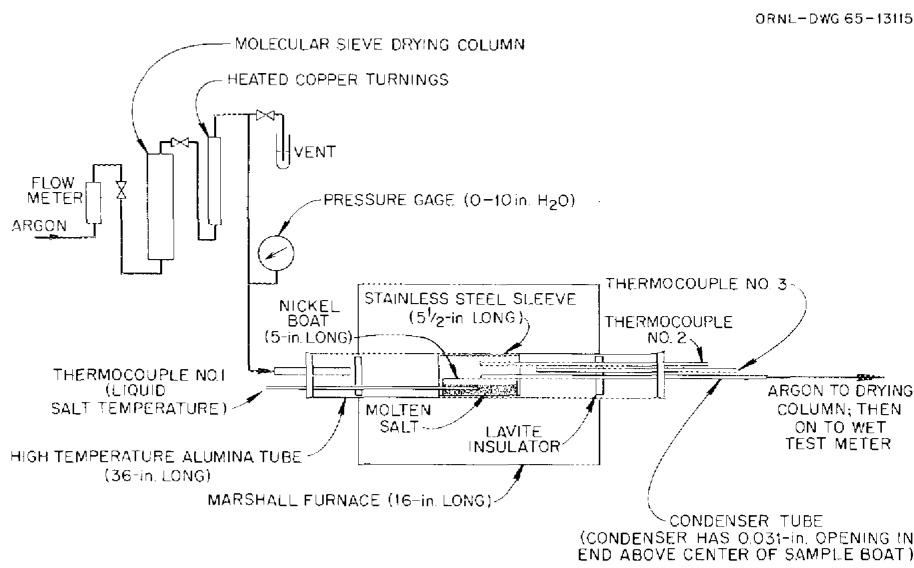  
Fig. 5.1. Transpiration Apparatus.

of the apparatus and the efficacy of the washing procedures for removing condensed vapor were tested with pure LiF. Satisfactory agreement with the reliable transpiration data obtained by Sense9 was attained.

Three compositions of the LiF-BeF $_2$ system have thus far been investigated. The vapor-pressure data are summarized in Table 5.4, based on the assumption that the vapor consists only of monomeric LiF and BeF $_2$ . It should be noted that the apparent partial pressure of LiF increases with decreasing concentration of LiF in the melt. This behavior is consistent with the expectation that the vapor species is predominantly a compound of LiF and BeF $_2$ , such as Li $_2$ BeF $_4$ or LiBeF $_3$ .

On the basis of the observed vapor composition, it appears that a liquid composition of 88-12 mole $\%$ LiF-BeF $_2$ will provide a vapor composition of 67-33 mole $\%$ LiF-BeF $_2$ . Hence 88-12 should be the correct composition in the still pot for the MSR distillation process. This melt composition is currently being measured to confirm that the vapor has the composition 67-33 mole $\%$ LiF-BeF $_2$ . The latter composition would serve as MSBR fuel solvent (this solvent will probably not contain $\mathrm{ZrF_4}$ ).

Methods for Predicting Density, Specific Heat, and Thermal Conductivity in Molten Fluorides

Density. $^{10}$ Several years ago, $^{11}$ after the published data on density of molten fluoride had been examined, it was proposed that the simple rule of additivity of molar volumes might be very useful for estimating densities of fluoride melts. Since that time, the results of all additional experimental investigations have been studied. The rule of additivity of molar volumes appeared to hold quite well except for one system; this was the NaF-UF $_4$ system $^{12}$ where positive deviations as great as $6\%$ were observed. Thus it appears that, although there may be

$$
\log p (m m) = A - \frac {B}{T (^ {\circ} K)}
$$

Table 5.4. Vapor-Pressure Constants, Assuming that the Vapor Phase is Composed of LiF and $\mathsf{BeF}_2$   

<table><tr><td colspan="2">Composition (mole %)</td><td rowspan="2">Temperature Range (℃)</td><td colspan="2">p LiF</td><td colspan="2">p BeF2</td></tr><tr><td>LiF</td><td>BeF2</td><td>A</td><td>B</td><td>A</td><td>B</td></tr><tr><td>90</td><td>10</td><td>897-1052</td><td>10.370</td><td>13,330</td><td>10.431</td><td>13,890</td></tr><tr><td>85</td><td>15</td><td>889-1036</td><td>10.437</td><td>13,330</td><td>9.483</td><td>12,270</td></tr><tr><td>75</td><td>25</td><td>895-1055</td><td>9.720</td><td>12,350</td><td>8.611</td><td>10,710</td></tr></table>

exceeds, the rule of additive molar volumes describes the experimental data on molten fluorides quite well and remains the simplest, most accurate method for predicting densities of fluoride melts.

To improve the method of estimation, a revised set of empirical molar volumes is given in Table 5.5. The origin of these values is discussed in ref. 10. For estimating a density expression of the form

$$
\rho = a + b t, \tag {1}
$$

first solve for densities at two temperatures by using the equation

$$
\rho_ {t} = \frac {\sum_ {i = 1} ^ {n} \left(\mathrm {N} _ {i} \mathrm {M} _ {i}\right)}{\sum_ {i = 1} ^ {n} \left[ \mathrm {N} _ {i} \mathrm {V} _ {i} (t) \right]}, \tag {2}
$$

where $N_{i}$ and $M_{i}$ are the mole fraction and gram-formula weight of component $i$ , and $V_{i}(t)$ is the molar volume of component $i$ at temperature $t$ . Substitute molar volumes from Table 5.5 at the two different temperatures in order to obtain the two values of $\rho_{t}$ ; since density is linear with temperature, substitution of the two pairs of values of $\rho_{t}$ and $t$ in Eq. (1) provides the solution for the constants $a$ and $b$ .

Specific Heat. Examination10 of the heat-capacity measurements of molten fluorides indicated that the heat capacity per gram-atom of melt is approximately 8 cal/°C. Hence an expression similar to that of Dulong

Table 5.5. Empirical Molar Volumes of Fluorides   

<table><tr><td></td><td colspan="2">Molar Volume (cc/mole)</td></tr><tr><td></td><td>At 600°C</td><td>At 800°C</td></tr><tr><td>LiF</td><td>13.46</td><td>14.19</td></tr><tr><td>NaF</td><td>19.08</td><td>20.20</td></tr><tr><td>KF</td><td>28.1</td><td>30.0</td></tr><tr><td>RbF</td><td>33.9</td><td>36.1</td></tr><tr><td>CsF</td><td>40.2</td><td>43.1</td></tr><tr><td>BeF2</td><td>23.6</td><td>24.4</td></tr><tr><td>MgF2</td><td>22.4</td><td>23.3</td></tr><tr><td>CaF2</td><td>27.5</td><td>28.3</td></tr><tr><td>SrF2</td><td>30.4</td><td>31.6</td></tr><tr><td>BaF2</td><td>35.8</td><td>37.3</td></tr><tr><td>AlF3</td><td>26.9</td><td>30.7</td></tr><tr><td>YF3</td><td>34.6</td><td>35.5</td></tr><tr><td>LaF3</td><td>37.7</td><td>38.7</td></tr><tr><td>CeF3</td><td>36.3</td><td>37.6</td></tr><tr><td>PrF3</td><td>36.6</td><td>37.6</td></tr><tr><td>SmF3</td><td>39.0</td><td>39.8</td></tr><tr><td>ZrF4</td><td>47</td><td>50</td></tr><tr><td>ThF4</td><td>46.6</td><td>47.7</td></tr><tr><td>UF4</td><td>45.5</td><td>46.7</td></tr></table>

and Petit may be used to estimate specific heats of fluoride melts. The expression is

$$
c = \frac {8 \sum_ {i = 1} ^ {n} \left(\mathrm {N} _ {i} \mathrm {p} _ {i}\right)}{\sum_ {i = 1} ^ {n} \left(\mathrm {N} _ {i} \mathrm {M} _ {i}\right)}, \tag {3}
$$

where $c$ is the specific heat in cal ( $^o\mathrm{K}$ ) $^{-1}$ , $g^{-1}$ , $p_i$ is the number of atoms in a molecule of component $i$ , and $N_i$ and $M_i$ are the mole fraction and the gram-formula weight, respectively, of component $i$ .

Sample calculation:

For MSRE coolant, 66-34 mole % LiF-BeF $_2$ ,

$$
\begin{array}{l} \sum \left(\mathrm {N} _ {\mathrm {i}} \mathrm {p} _ {\mathrm {i}}\right) = 0. 6 6 (2) + 0. 3 4 (3) = 2. 3 4, \\ \sum \left(N _ {i} M _ {i}\right) = 0. 6 6 (2 6) + 0. 3 4 (4 7) = 3 3. 1, \\ c = \frac {8 (2 . 3 4)}{3 3 . 1} = 0. 5 7 \text {c a l} (^ {\circ} \mathrm {K}) ^ {- 1} g ^ {- 1}. \\ \end{array}
$$

Thermal Conductivity. A new semitheoretical expression based on Bridgman's theory13 of energy transport in liquids has been developed; the derivation of the method is given in ref. 10. The expression is

$$
k = \frac {1 3}{V ^ {2 / 3}} \mu , \tag {4}
$$

where $k$ is the thermal conductivity, $V$ is the molar volume, and $\mu$ is the velocity of sound in the melt; all three variables should be in cgs units. To use Eq. (4), the molar volume and velocity of sound are necessary. Molar volume is easily estimated by the rule of additivity as outlined above. The velocity of sound may be estimated from thermodynamic quantities, using the expression

$$
\mu^ {2} = \frac {\left[ \left(\mathrm {C} _ {\mathrm {p}} / \mathrm {C} _ {\mathrm {V}}\right) - 1 \right] \mathrm {C}}{\alpha^ {2} \mathrm {T M}}, \tag {5}
$$

where $C_p$ and $C_V$ are the molar heat capacities at constant pressure and volume, respectively, $\alpha$ is the expansivity, $T$ is the absolute temperature, $C_p / M$ is the specific heat [and should be expressed in ergs ( $^\circ K$ )⁻¹ g⁻¹]. The ratio $C_p / C_V$ varies between 1.2 and 1.35 for most fused salts (1.2 works quite well). The expansivity is the negative of temperature coefficient of density, divided by the density; that is,

$$
\alpha = - \frac {1}{\rho} \left(\frac {\partial \rho}{\partial T}\right) _ {P}.
$$

By using the additivity rule, $\alpha$ is easily estimated.

Oxide Solubilities in MSFE Flush Salt, Fuel Salt, and Their Mixtures

Estimates of the oxide tolerance of MSRE flush-salt-fuel-salt mixtures reported previously $^{14}$ were based upon transpiration measurements of the following equilibria:

$$
\begin{array}{l} \mathrm {H} _ {2} \mathrm {O} (\mathrm {g}) + 2 \mathrm {F} ^ {-} (\mathrm {d}) = \mathrm {O} ^ {2 -} (\mathrm {d}) + 2 \mathrm {H F} (\mathrm {g}), \\ \mathrm {Q} _ {\mathrm {O}} = \left(\mathrm {P} _ {\mathrm {H F}} ^ {2} / \mathrm {P} _ {\mathrm {H} _ {2} \mathrm {O}}\right) \left[ 0 ^ {2 -} \right]; \tag {6} \\ \end{array}
$$

$$
\begin{array}{l} \mathrm {H} _ {2} \mathrm {O} (\mathrm {g}) + \mathrm {B e F} _ {2} (\mathrm {d}) = \mathrm {B e O} (\mathrm {s}) + 2 \mathrm {H F} (\mathrm {g}), \\ \mathrm {Q} _ {\mathrm {B}} = \mathrm {P} _ {\mathrm {H F}} ^ {2} / \mathrm {P} _ {\mathrm {H} _ {2} \mathrm {O}}; \tag {7} \\ \end{array}
$$

$$
\begin{array}{l} 2 \mathrm {H} _ {2} \mathrm {O} (\mathrm {g}) + \mathrm {Z r F} _ {4} (\mathrm {d}) \rightleftharpoons \mathrm {Z r O} _ {2} (\mathrm {s}) + 4 \mathrm {H F} (\mathrm {g}), \\ \mathrm {Q} _ {\mathrm {Z}} = \mathrm {P} _ {\mathrm {H F}} ^ {4} / \left(\mathrm {P} _ {\mathrm {H} _ {2} \mathrm {O}} ^ {2} \left[ \mathrm {Z r} ^ {4 +} \right]\right). \tag {8} \\ \end{array}
$$

By combining the results for reactions (6) and (7),

$$
\begin{array}{l} \mathrm {B e O} (\mathrm {s}) + 2 \mathrm {F} ^ {- -} (\mathrm {d}) \rightleftharpoons \mathrm {B e F} _ {2} (\mathrm {d}) + 0 ^ {2 - - -} (\mathrm {d}), \\ Q _ {B e O} = Q _ {O} / Q _ {B} = \left[ 0 ^ {2 -} \right], \tag {9} \\ \end{array}
$$

estimates were obtained for the dissolved-oxide concentration at BeO saturation of 2LiF-BeF $_2$ (approximately the composition of MSRE flush salt). For 2LiF-BeF $_2$ melts containing more than 0.1 mole/kg of $\mathrm{ZrF_4}$ - wherein $\mathrm{ZrO_2}$ becomes the least-soluble oxide - reactions (6) and (8) were combined in a similar way to obtain estimates of the concentration of dissolved oxide at $\mathrm{ZrO_2}$ saturation:

$$
\begin{array}{l} \frac {1}{2} \mathrm {Z r O} _ {2} (\mathrm {s}) + 2 \mathrm {F} ^ {-} (\mathrm {d}) \rightleftharpoons \frac {1}{2} \mathrm {Z r F} _ {4} (\mathrm {d}) + 0 ^ {2 -} (\mathrm {d}), \\ \mathrm {Q} _ {\mathrm {Z r O} _ {2}} ^ {1 / 2} = \mathrm {Q} _ {\mathrm {O}} / \mathrm {Q} _ {\mathrm {Z}} ^ {1 / 2} = [ \mathrm {Z r} ^ {4 +} ] ^ {1 / 2} \left[ \mathrm {O} ^ {2 - - -} \right]. \tag {10} \\ \end{array}
$$

However, these estimates were of limited accuracy, owing to difficulties in the determination of $Q_0$ by the transpiration method. In particular, this quotient was found too large to be measured with useful accuracy in the MSRE fuel composition, and hence it was necessary to estimate the oxide tolerance of the fuel by extrapolation from results for fuel salt diluted by flush salt.

During the past year, a more direct method for determining these oxide solubilities has been adopted. A measured volume of salt, which previously had been saturated by equilibration with excess solid $\mathrm{ZrO}_2$ or $\mathrm{BeO}$ , was passed upward through a sintered nickel filter into a heated reaction vessel (Fig. 5.2). There it was sparged with an $\mathrm{H}_2$ -HF mixture to remove the dissolved oxide as $\mathrm{H}_2\mathrm{O}$ . The effluent $\mathrm{HF - H_2O - H_2}$ mixture was passed through a sodium fluoride column maintained at $90^{\circ}\mathrm{C}$ to remove the unreacted HF, and then it was passed through a Karl Fischer titration assembly where the water content was determined.

Typically, 125-g samples of salt were filtered into the upper vessel and sparged with a gas flow of $150~\mathrm{cm}^3/\mathrm{min}$ at a temperature of $500^{\circ}\mathrm{C}$ . The HF partial pressure was 0.07 atm or less. The time required to remove essentially all of the oxide increased as the $\mathrm{ZrF_4}$ content of the mixtures was increased, but generally did not exceed 4 hr. The blank was usually equivalent to less than 0.002 mole per kg of oxide in the sample.

The results obtained by this method for simulated flush-salt-fuel-salt mixtures (Fig. 5.3) are in reasonable agreement with previous estimates;[14] that is, as $\mathrm{ZrF_4}$ (present in MSFE fuel) is added to 2LiF $\mathrm{BeF_2}$ (flush salt), the oxide tolerance at first falls, reaches a minimum, and then rises. This behavior reflects a monotonic increase in the solubility product $Q_{\mathrm{ZrO_2}}$ with $\mathrm{ZrF_4}$ concentration (the dashed lines shown in Fig. 5.3 indicate the behavior which would be found if $Q_{\mathrm{ZrO_2}}$ remained constant). The temperature dependence of the oxide tolerance is indicated in Fig. 5.4 for three compositions: (1) the flush salt, (2) the approximate composition of minimum oxide tolerance, and (3) the fuel salt.

When the present directly measured values of $\mathbb{Q}_{\mathrm{ZrO_2}}$ are combined with previously determined14 values of $\mathbb{Q}_{\mathrm{Z}}$ in the expression

$$
Q _ {O} = \left(Q _ {Z r O _ {2}} Q _ {Z}\right) ^ {1 / 2},
$$

improved estimates are obtained for the equilibrium quotient $\mathbb{Q}_0$ (Table 5.6), corresponding to reaction (6). This quotient should be useful in predicting the efficiency of oxide removal from MSRE fuel salt by HF sparging during fuel reprocessing15 and during oxide analysis.16

The solubility results obtained thus far for BeO in 2LiF-BeF $_2$ (Fig. 5.4) are somewhat above the previous values obtained by combination of Q $_B$ and Q $_0$ , but these new results showed considerable scatter. This

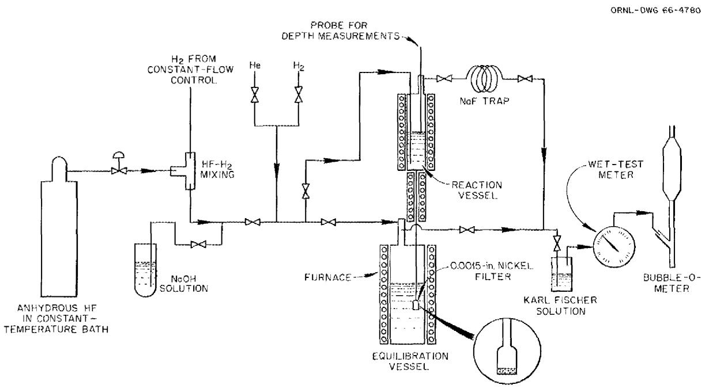  
Fig. 5.2. Apparatus for Determination of Solubilities by Hydrofluorination.

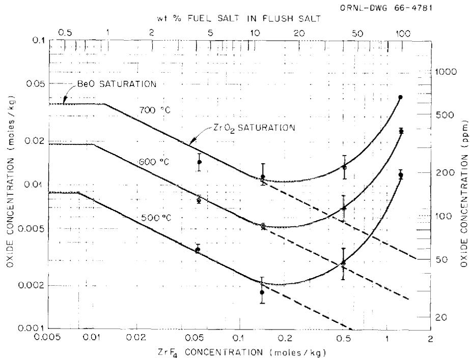  
Fig. 5.3. Oxide Concentration Required to Produce Precipitation of BeO or $\mathrm{ZrO_2}$ from Simulated MSRE Flush-Salt-Fuel-Salt Mixtures.

is thought to be caused by the presence of finely divided $\mathrm{BeO}$ which was not filtered completely from all the samples. These measurements are being repeated with the use of longer equilibrium times, in the hope that this will improve the filterability of the $\mathrm{BeO}$ . The oxide tolerance of $2\mathrm{LiF - BeF}_2$ (flush salt), indicated by the lines in Figs. 5.3 and 5.4, represents our best estimate at present.

# Separations in Molten Fluorides

# Evaporative-Distillation Studies on Molten-Salt Fuel Components

Vacuum distillation separation of molten-salt fuel or fuel components from the rare-earth fission products is an attractive method of decreasing neutron losses by capture. To design process equipment for this task, both the mass rate of distillation and the relative volatility of the rare earths must be known for the particular salt system used. Completed experiments concern the process demonstration planned on MSRE fuel, but are directly applicable to any proposed thermal MSBR fuel.

For MSRE fuel, removal of the uranium by fluorination is proposed. The fuel solvent and remaining fission products would then be fed at the distillation rate to a vacuum still charged with $\mathrm{LiF - BeF_2 - ZrF_4}$ at that composition which will yield the fuel solvent as distilled product; the rare-earth fission products would concentrate in the still. The residue would be discarded or processed, when necessitated by heat from the fission products or concentration of rare earths in the product.

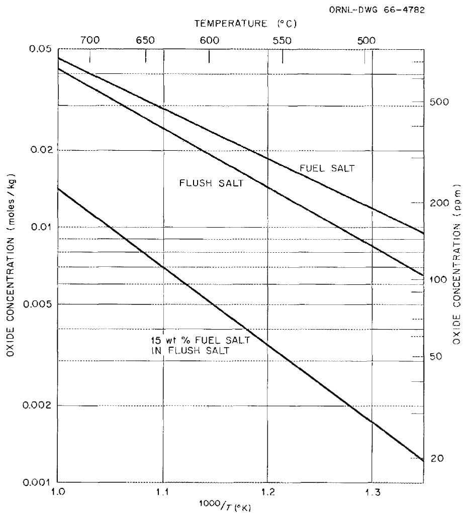  
Fig. 5.4. Temperature Dependence of Oxide Tolerance: (1) in Flush Salt (BeO-Saturated), (2) in Flush-Salt-Fuel-Salt Mixture of Minimum Oxide Tolerance, and (3) in Fuel Salt.

Table 5.6. Summary of Equilibrium Quotients for Reactions (6), (8), and (10) in MSRE Fuel Salt   

<table><tr><td>Temperature (℃)</td><td>[02-] (moles/kg)</td><td>QZrO2(moles3/kg3)</td><td>QZ(atm2kg mole-1)</td><td>Q0(atm mole kg-1)</td></tr><tr><td>500</td><td>0.012</td><td>1.8 × 10-4</td><td>7.1 × 10-2</td><td>3.6 × 10-3</td></tr><tr><td>600</td><td>0.024</td><td>7.3 × 10-4</td><td>3.95 × 10-1</td><td>1.7 × 10-2</td></tr><tr><td>700</td><td>0.041</td><td>2.1 × 10-3</td><td>150</td><td>5.6 × 10-2</td></tr></table>

A 10-ml graphite cylinder, containing $\sim 1.7\mathrm{g}$ of salt with a free surface (when molten) of $1\mathrm{cm}^2$ , was used for the still pot. This cylinder fitted into a "Ω" shaped Hastelloy N tube heated electrically to a given temperature as measured by four thermocouples in the graphite cylinder. When the desired temperature was reached, distillation was initiated by evacuating the assembly. Vaporized salt then passed up and over the top of the "Ω" with a small portion (attributed to thermal reflux) collecting at the base of the graphite cylinder. The product salt condensed in a cooler ( $\sim 450^{\circ}\mathrm{C}$ ) collecting cup in the opposite leg. Distillation was stopped by helium addition after preselected time periods.

Mass-rate data for $^{7}\mathrm{LiF}$ were determined first, and then MSFE solvent was added to the $^{7}\mathrm{LiF}$ and distilled in aliquot portions from it. Each repetition brought the $\mathrm{BeF}_2$ and $\mathrm{ZrF}_4$ concentrations in the pot closer to those which would yield fuel solvent (LiF- $\mathrm{BeF}_2 - \mathrm{ZrF}_4$ , 65-30-5 mole %) as product. After the equilibrium concentration was approached, 2200 ppm of neodymium (as $\mathrm{NdF}_3$ ) was added to the still bottom, and several distillate samples were taken. Then the neodymium concentration was raised to 22,000 ppm, and the sequence was repeated. For both $^{7}\mathrm{LiF}$ and the nominal equilibrium composition, the effect of temperature on mass rate was determined.

The data of Fig. 5.5 show the effect of temperature and mass rate; single experiments show considerable scatter, so inclusive bands are shown. The slope of the bands is consistent with the heat of vaporization of the components and strongly suggests that ebullition does not occur. Solvent surface heat flux is $<1/100$ of the available heat to the graphite cylinder; it is doubtful that the distillation is heat limited. The fact that the observed rate for ${}^{7}\mathrm{LiF}$ is only $\sim 10\%$ of

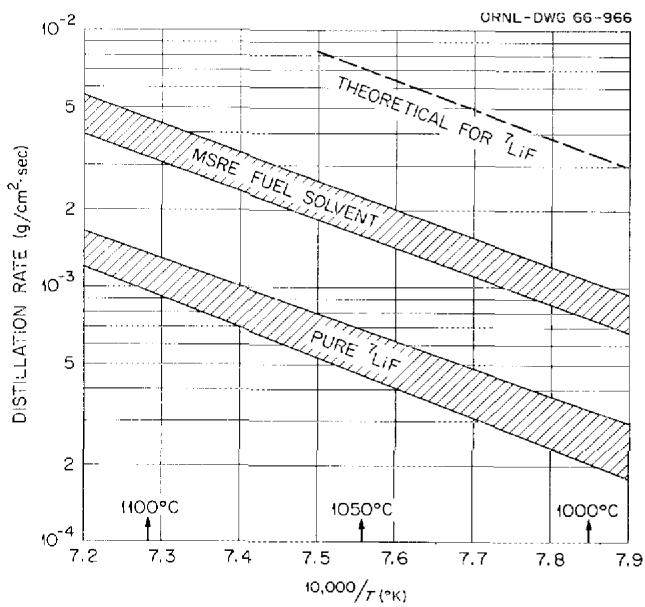  
Fig. 5.5. Observed Distillation Rate vs Temperature.

theoretical is unexplained, but it has been observed in many distillations using several experimental configurations.

The solvent for any proposed MSBR should distill at rates above that shown for $^7$ LiF with the possible exception of ThF₄-bearing systems. The effect of ThF₄ is being studied.

Effectiveness of separation from rare earths was determined by activation analysis for neodymium in the product, the still bottom, and the refluxed salt deposited around the base of the graphite.

The data are shown in Table 5.7.

The equilibrium composition in the still pot undoubtedly changes with temperature due to the change in activity coefficients of the components. The composition found at nominal equilibrium after several solvent additions of 5 to $7\%$ by weight and after distillations at $1030^{\circ}\mathrm{C}$ was $\mathrm{LiF - BeF_2 - ZrF_4}$ (85.4-10.7-3.9) in the presence of 22,000 ppm of neodymium as fluoride.

# Effective Activity Coefficients by Evaporative Distillation

Evaporation into a vacuum from a quiescent molten-salt mixture of low vapor pressure should not permit vapor-liquid equilibrium at the surface of the melt; transport from the surface should be controlled by the evaporation rates of the individual components. The amount vaporized is a function of the equilibrium vapor pressure, molecular mass, temperature, and surface area; according to Langmuir, $^{17}$

$$
W _ {Z} = \frac {\text {g r a m s o f Z}}{\mathrm {c m} ^ {2} - \sec} = K P _ {Z} \sqrt {M _ {Z} / T}, \tag {11}
$$

where $P_Z$ is vapor pressure of component Z, $M$ is molecular weight of component Z, $T$ is absolute temperature, and $K$ is a constant dependent on units.

In a multicomponent system at equilibrium,

$$
P _ {Z} = \gamma_ {Z} N _ {Z}, \tag {12}
$$

$$
W _ {Z} = \frac {\text {g r a m s o f Z}}{\mathrm {c m} ^ {2} - \sec} = K \gamma_ {Z} N _ {Z} P _ {Z} ^ {0} \sqrt {M _ {Z} / T}. \tag {1.3}
$$

If we use a fixed mechanical configuration and, for simplicity, define the activity coefficient of the major component (in this case LiF) as unity, the activity coefficient for any other constituent may be determined by using the ratio

$$
\frac {W _ {Z}}{W _ {\text {L i F}}} = \frac {K \gamma_ {Z} N _ {Z} P _ {Z} ^ {0} \sqrt {M _ {Z} / T}}{K (1) N _ {\text {L i F}} P _ {\text {L i F}} ^ {0} \sqrt {M _ {\text {L i F}} / T}} \tag {14}
$$

Table 5.7. Concentration of Neodymium in Fractions from Vacuum Distillations   

<table><tr><td rowspan="2">Fraction</td><td colspan="2">Nd Concentrationa (ppm)</td></tr><tr><td>2200 ppm Added</td><td>22,000 ppm Added</td></tr><tr><td>Still bottom</td><td>2570</td><td>22,000</td></tr><tr><td>Product</td><td>21</td><td>600b</td></tr><tr><td>Reflux</td><td>133</td><td>34</td></tr></table>

aMean values from several determinations; data show little scatter except for reflux specimens.

b These product samples also showed Ce and La, which undoubtedly represent contamination during grinding and handling of specimens; Nd analysis, therefore, may well be too high.

altered to

$$
\gamma_ {Z} = \frac {\mathrm {N} _ {\mathrm {L i F}}}{\mathrm {N} _ {Z}} \cdot \frac {W _ {Z}}{W _ {\mathrm {L i F}}} \cdot \frac {\mathrm {P} _ {\mathrm {L i F}} ^ {0}}{\mathrm {P} _ {Z} ^ {0}} \cdot \sqrt {\mathrm {M} _ {\mathrm {L i F}} / \mathrm {M} _ {Z}}. \tag {15}
$$

Proceeding with this technique, the data shown in Fig. 5.6 have been taken from LiF-BeF $_2$ -ZrF $_4$ melts. For comparison purposes, selected data from other sources are included. $^{18-20}$

Although internal consistency exists, the values are dependent on vapor-pressure data for the pure components. Calculations were made using the values $(\mathbb{P}^0)$ for the pure components shown in Table 5.8. The least-precise measurements are from MSFE-solvent distillations; these are included to substantiate the surmise that when $\mathrm{ZrF_4}$ is included in the melt, it effectively removes LiF from the solvent. The $1000^{\circ}\mathrm{C}$ LiF-BeF $_2$ line has been extended to 100 mole % LiF, since the initial LiF-BeF $_2$ -ZrF $_4$ experiment contained <0.35 mole % ZrF $_4$ , a quantity so small that the system can be assumed to be LiF-BeF $_2$ . On the other hand, as ZrF $_4$ builds up in the mixed system (to approximately 3 mole %), enhancement of the BeF $_2$ activity is noted; this is consistent with results from MSFE solvent (LiF-BeF $_2$ -ZrF $_4$ , 65-30-5 mole % initially). The temperatures reported are those of the bulk melt, and it is recognized that the surface temperature may be significantly lower, causing an indeterminate (for the present) error. Both surface-temperature effects and the pure LiF-ZrF $_4$ system are being studied. It is interesting to note that the assumption of unit activity coefficient for LiF does not lead to incompatibility with the data of others.

Studies of the removal of rare earths from a molten-fluoride solvent and their dissolution in molten metals have been oriented toward the development of a liquid-liquid extraction process for removing rare-earth fission products from molten-salt reactor fuels. Fluoride mixtures obtained by dissolving a selected rare earth into LiF-BeF $_2$ (66-34 mole %) have been used to simulate the fuel solvent of the reference-design MSBR. In fuel reprocessing schemes proposed for the reactor, uranium will be removed prior to the removal of non

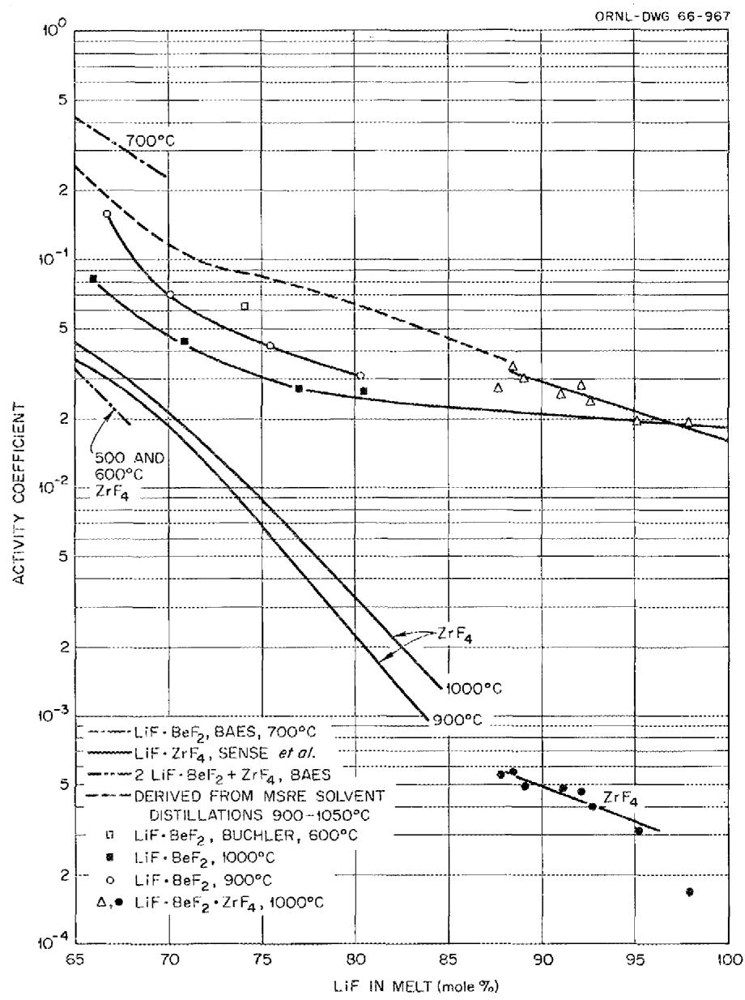  
Fig. 5.6. Effective Activity Coefficients Calculated from Evaporative-Distillation Data for MSBR Solvent Compositions.

Table 5.8. Vapor Pressures for Pure Fluorides a,b,c   

<table><tr><td rowspan="2">Compound</td><td colspan="2">Vapor Pressure (mm Hg)</td></tr><tr><td>1000°C</td><td>900°C</td></tr><tr><td>LiF</td><td>0.47</td><td>0.072</td></tr><tr><td>BeF2</td><td>65</td><td>12.0</td></tr><tr><td>ZrF4</td><td>2700</td><td>780</td></tr></table>

aHandbook of Chemistry and Physics, 44th ed., p. 2438, Chemical Rubber Publishing Co., Cleveland, Ohio, 1962.   
b. Porter and E. A. Brown, J. Am. Ceram. Soc. 45, 49 (1962).   
cS. Cantor, personal communication.

volatile fission products. When this simulated fuel mixture is contacted with a molten bismuth-lithium mixture, rare earths are reduced to their elemental valence states and are dissolved in the molten-metal phase. Experimental studies conducted thus far have examined the distribution of rare earths between the two liquid phases as functions of the lithium concentration in the metal phase. Subsequent experiments will elaborate on these findings and will examine the back extraction of rare earths from the liquid metal into a second salt mixture. The removal of rare earths from the reactor fuel, followed by their concentration in a solid, disposable salt mixture will constitute the reprocessing method.

Fluoride starting materials were prepared in nickel equipment by adding sufficient rare-earth fluoride to approximately $2\mathrm{kg}$ of the solvent, $\mathrm{LiF - BeF_2}$ (66-34 mole %), to attain a rare-earth concentration of about $10^{-4}$ m.f. in the salt phase. When possible, a selected radioisotope of the rare earth was added for analytical purposes. The mixture was treated with an HF- $\mathbf{H}_2$ mixture at $600^{\circ}\mathrm{C}$ to remove oxide impurities and at $700^{\circ}\mathrm{C}$ with $\mathbf{H}_2$ alone to reduce concentrations of structural-metal difluorides in the fluoride melt. The bismuth was purified by sparging the 2.35-kg batch with $\mathbf{H}_2$ at $600^{\circ}\mathrm{C}$ to remove oxide impurities. The bismuth purification was carried out in the experimental extraction vessel of type 304L stainless steel lined with low-carbon steel. Following the materials-preparation phase of the experiment, the fluoride mixture was transferred as a liquid to the extraction vessel. Lithium metal was added directly to the metal phase without prior contact with the salt phase; this was done through a loading port that extended to near the bottom of the extraction vessel. Lithium, for incremental additions to the experiment, was freshly cut and weighed under mineral oil, affixed to a small-diameter steel rod, rinsed in benzene, and dried in the flowing inert atmosphere of the loading port prior to its

insertion and dissolution in the molten bismuth. Filtered samples of each phase were taken under assumed equilibrium conditions (approximately 2-hr periods) after each addition of lithium. Radiochemical analyses of each phase for rare-earth gamma activity and spectrographic analyses of the metal phase for rare-earth and lithium concentrations provided data for calculating the distribution of the rare earth in the system and its dependence on the lithium concentration of the metal phase.

In experiments conducted thus far, the distributions of lanthanum, cerium, neodymium, samarium, and europium in the extraction system have been examined separately, but under essentially comparative conditions. A summary of these results, illustrated in Fig. 5.7, shows that a mixture of bismuth containing $0.02 \mathrm{~m.f.}$ of lithium metal sufficed for removing essentially all cerium, lanthanum, and neodymium and substantial quantities of samarium and europium from the barren fuel solvent. In all of the experiments, rare earths that were reduced from solution in the salt phase were found as dissolved components of the metal phase.

Each incremental addition of lithium to the system resulted in a near-linear increase in the concentration of lithium found in the metal phase. However, this dissolved quantity accounted for only 25 to $50\%$ of the amount added to the system. The results of a blank extraction experiment in which rare earths were omitted from the system could not be distinguished from those obtained when rare earths were present. Each incremental addition of lithium to an extraction system was an approximate threefold excess over the amount required for the stoichiometric reduction of all of the rare earth contained in the experiment.

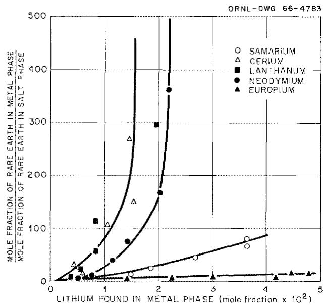  
Fig. 5.7. Extraction of Rare Earths from LiF-BeF $_2$ (66-34 Mole %) into Bismuth by the Addition of Lithium Metal at $600^{\circ}\mathrm{C}$ .

In earlier experiments, beryllium metal was successfully used in place of lithium metal for the reduction of rare earths. Spectrographic analyses of the metal phase also showed that the lithium concentration in bismuth increased as the extraction of rare earths proceeded. These results implied that the reaction

$$
\mathrm {B e} ^ {0} + 2 \mathrm {L i F} \rightleftharpoons \mathrm {B e F} _ {2} + 2 \mathrm {L i} ^ {0}
$$

was of significance to the reduction of rare earths. Accordingly, lithium was used as a soluble component in the metal phase in place of beryllium, which is not soluble in either liquid phase.

The reduction of rare-earth fluorides by lithium is expected to proceed by the reaction

$$
m L i ^ {0} + (R E) ^ {+ m} \rightleftharpoons R E ^ {0} + m L i ^ {+},
$$

where $m$ is the effective valence of the rare-earth cation. If unit activities prevail for all metal species in the salt phase and for all ionic species in the metal phase, then the activity of lithium dissolved in the metal phase can be expressed as a function of other activities in the system as

$$
a _ {L i} ^ {m} = \frac {(a _ {R E} 0) m e t a l (a _ {L i F}) ^ {m} s a l t}{K _ {a} (a _ {R E}) s a l t}.
$$

By assuming that the activity of LiF and the activity coefficients of $\mathrm{Li}^{0}$ , $\mathrm{RE}^{0}$ , and $\mathrm{RE}^{+m}$ remain constant, the dependence of rare-earth distribution on the lithium concentration can be expressed as

$$
D = K _ {Q} N _ {L 1} ^ {m} 0,
$$

where $D$ is the ratio of the mole fraction of rare earth in the metal phase to the mole fraction of rare earth in the salt phase, and

$$
K _ {Q} = \frac {\gamma_ {R E} o _ {m e t a l} \cdot a _ {L i F} ^ {m}}{K _ {a} \cdot \gamma_ {L i} ^ {m} o _ {m e t a l} \cdot \gamma_ {R E s a l t}}.
$$

A plot of the experimental data according to the logarithmic form of this equation is shown as Fig. 5.8. Values for $m$ and $K_{Q}$ calculated from the slopes and intercepts of this plot are as follows:

<table><tr><td>Rare Earth</td><td>m</td><td>KQ</td></tr><tr><td>Lanthanum</td><td>2.7</td><td>2.5 × 107</td></tr><tr><td>Cerium</td><td>2.3</td><td>3.8 × 106</td></tr><tr><td>Neodymium</td><td>2.5</td><td>2.5 × 106</td></tr><tr><td>Samarium</td><td>1.6</td><td>1.8 × 104</td></tr><tr><td>Europium</td><td>1.9</td><td>5.9 × 103</td></tr></table>

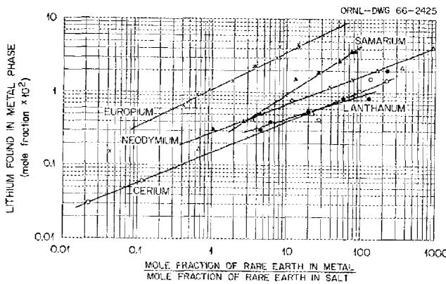  
Fig. 5.8. Effect of Lithium Concentration in Metal Phase on the Distribution of Rare Earths Between LiF-BeF $_2$ (66-34 Mole %) and Bismuth at $600^{\circ}\mathrm{C}$ .

Although the apparent fractional exponents for the reduction reactions are as yet unexplained, the results are in rough agreement with the occurrence of lanthanum, cerium, and neodymium as trivalent ions in the salt mixture; samarium and europium are probably reduced to their divalent states prior to their extraction into the metal phase.

# Removal of Protactinium

Removal of Protactinium from Molten Fluorides by Oxide Precipitation. Since a single-region molten-salt breeder reactor would incorporate the fertile material in the reactor fuel mixture, chemical reprocessing schemes for recovering $^{233}\mathrm{U}$ could be made more effective if $^{233}\mathrm{Pa}$ , its precursor, could be removed without alteration of the relatively large uranium concentration in the fuel mixture. The precipitation of an oxide of protactinium by the deliberate addition of oxide ion may provide the basis for such a reprocessing method if the simultaneous precipitation of $\mathrm{UO}_2$ can be avoided. Previous studies have demonstrated the chemical feasibility of oxide precipitation for removing protactinium from a fluoride mixture, LiF-BeF $_2$ -ThF $_4$ (67-18-15 mole %), proposed as the blanket of a two-region molten-salt breeder reactor.[21]

In the fluoride fuel mixture of the MSRE, sufficient $\mathrm{ZrF_4}$ has been added to accommodate gross oxide contamination without loss of uranium from solution as $\mathrm{UO_2}$ . Earlier studies had demonstrated that $\mathrm{UO_2}$ would not precipitate at $700^{\circ}\mathrm{C}$ from the solvent, LiF-BeF $_2$ (66-34 mole %) with added $\mathrm{UF_4}$ and $\mathrm{ZrF_4}$ , until the concentration ratio of $\mathrm{ZrF_4}$ to $\mathrm{UF_4}$ dropped below about 1.5.[22] Therefore a preliminary study was made of the precipitation of $\mathrm{PaO_2}$ from a fluoride mixture known to have $\mathrm{ZrO_2}$ as the stable oxide phase.[23]

The fluoride mixture consisted of LiF-BeF $_2$ (66-34 mole %) with added ZrF $_4$ equivalent to 0.5 mole of zirconium per kilogram of salt mixture. About 1 mc of $^{233}\mathrm{Pa}$ was included in the salt preparation as

irradiated $\mathrm{ThO_2}$ . The mixture was pretreated with anhydrous HF and $\mathbb{H}_2$ to convert oxides to fluorides.

The deliberate introduction of solid-phase oxide to the melt was made by adding $\mathrm{ZrO_2}$ in small increments. Filtered samples of the salt mixture were taken at assumed equilibrium conditions after each oxide addition and were analyzed for $^{233}\mathrm{Pa}$ by gamma spectrometry. The results of these analyses showed that approximately $80\%$ of the $^{233}\mathrm{Pa}$ activity was removed after the addition of about $67.5\mathrm{g}$ of $\mathrm{ZrO_2}$ (equivalent to 0.125 mole per kilogram of salt) to the mixture.

If protactinium either formed a labile solid solution with $\mathrm{ZrO_2}$ or was removed from solution on the salt mixture by surface adsorption on $\mathrm{ZrO_2}$ , then its distribution coefficient should have remained constant. The fraction of protactinium remaining in the liquid phase could then be expressed as a linear function of added $\mathrm{ZrO_2}$ by the equation

$$
1 / \mathrm {F} _ {\mathrm {P a}} = 1 + (\mathrm {D} / \mathrm {W} _ {\text {s a l t}}) \cdot \mathrm {W} _ {\mathrm {Z r O} _ {2}}, \tag {1.6}
$$

where $D = [\mathrm{Pa}]_{\mathrm{oxide}} / [\mathrm{Pa}]_{\mathrm{salt}}$ , $F_{\mathrm{Pa}} =$ fraction of Pa in the salt, and W is the weight of the designated phase. An interpretation of the experimental data according to this linear function, shown in Fig. 5.9,

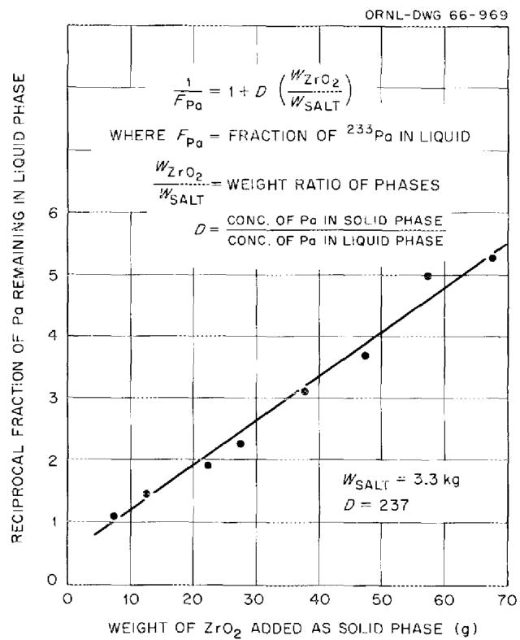  
Fig. 5.9. Removal of $^{233}\mathrm{Pa}$ from Solution in LiF-BeF $_2$ (66-34 Mole %) with Added ZrF $_4$ (0.5 Mole per Kilogram of Salt) by Addition of ZrO $_2$ at $600^{\circ}\mathrm{C}$ .

illustrates the constancy of the distribution coefficient at a calculated value of about 237. The data further suggest that about $7\mathrm{g}$ of the initial $\mathrm{ZrO_2}$ addition partially dissolved in the salt phase or was otherwise lost from the reaction mixture. Further experiments will include studies of the effect of $\mathrm{ZrO_2}$ surface area on protactinium removal from salt mixtures proposed for a single-region molten-salt breeder reactor.

# Removal of Protactinium from Molten Fluorides by Reduction Processes.

The effective recovery of $^{233}\mathrm{Pa}$ from a molten-salt breeder reactor will provide more economic production of fissionable $^{233}\mathrm{U}$ by substantially reducing blanket inventory and equipment costs and by improving neutron utilization. Accordingly, chemical development efforts supporting the reference-design MSBR are concerned with the removal of protactinium from the blanket mixture, LiF-BeF $_2$ -ThF $_4$ (73-2-25 mole %), by methods which can be feasibly adapted as chemical processes. An experimental program has been initiated to study the reduction of protactinium fluorides from this salt mixture by molten lead or bismuth saturated with thorium metal at about $400^{\circ}\mathrm{C}$ . It was hoped that protactinium, as PaF $_4$ in the salt phase, would be reduced to its metallic state by thorium metal and could be recovered in the molten lead or bismuth.

The primary objective of initial experiments with this program has been the study of protactinium removal from the salt phase of the extraction system. For these experiments sufficient $^{233}\mathrm{Pa}$ was obtained for radiochemical analysis by neutron irradiation of a small quantity of $\mathrm{ThO}_2$ . The simulated blanket mixture was prepared from its components, together with the irradiated $\mathrm{ThO}_2$ , in nickel equipment. This mixture was treated at $600^{\circ}\mathrm{C}$ with an $\mathrm{HF - H_2}$ mixture (1:10 volume ratio) to remove oxide ion and at $700^{\circ}\mathrm{C}$ with $\mathrm{H}_2$ alone to reduce structural-metal impurities. The metal-phase extractant, lead or bismuth with added thorium metal, was prepared in the extraction vessel (type 304L stainless steel with a low-carbon steel liner) by treatment with $\mathrm{H}_2$ at $600^{\circ}\mathrm{C}$ . The extraction experiments were started by transferring a known quantity of the prepared salt mixture into the extraction vessel containing the metal-phase extractant. Filtered samples of the salt phase were taken periodically for radiochemical analysis of dissolved protactinium. In each experiment, $^{233}\mathrm{Pa}$ was rapidly removed from the salt phase and remained absent from the solution during the approximately 100 hr at $600^{\circ}\mathrm{C}$ while tests were made. Subsequent hydrofluorination of the extraction system with an $\mathrm{HF - H_2}$ mixture (1:20 volume ratio) showed that $^{233}\mathrm{Pa}$ could be rapidly and almost quantitatively returned to solution in the salt phase.

Typical results of these experiments are shown in Fig. 5.10. In this experiment, thorium metal was added after the salt mixture was introduced into the extraction vessel to demonstrate the necessity of the reduction reaction.

The objective of experiments now in progress is to examine methods for recovering $^{233}\mathrm{Pa}$ from the extraction system. The proposed use of macro quantities of $^{231}\mathrm{Pa}$ may be required to circumvent the anticipated adsorption of the micro quantities of $^{233}\mathrm{Pa}$ , currently used, on the walls of the container, or on other insoluble species in the system.

Additional studies of the deliberate precipitation and adsorption of $^{233}\mathrm{Pa}$ on solid, stationary beds such as steel wool will be made for comparative evaluation.

Solubility of Thorium in Molten Lead. Current studies of the removal of protactinium from a molten fluoride mixture, which simulates the blanket of the reference-design MSBR, have been directed toward the development of a liquid-liquid extraction process. The method proposes that protactinium, as $\mathrm{PaF_4}$ in a salt phase, can be reduced to its metallic state and extracted into a molten metal phase. The possible use of a molten mixture of thorium in lead would provide a convenient method for combining the reducing agent with the metal-phase extractant and for replenishing thorium to the fluoride blanket mixture. The objective of this study has been to establish the solubility of thorium in lead over the temperature range of interest to this program and to provide a lead-thorium solution of known composition for subsequent protactinium extraction experiments.

The experimental mixture, contained in low-carbon steel, consisted of approximately $3\mathrm{kg}$ of lead and $100\mathrm{g}$ of thorium-metal chips. Values for the solubility of thorium were obtained by analyses of filtered samples withdrawn from the melt at selected temperatures over the interval 400 to $600^{\circ}\mathrm{C}$ under assumed equilibrium conditions. Samples were withdrawn during two heating and cooling cycles and submitted for activation and spectrographic analyses. These results, plotted as the logarithm of the solubility vs the reciprocal of the absolute temperature in Fig. 5.11, indicate that the heat of solution of thorium in lead is approximately 19 kcal/mole and that its solubility at $600^{\circ}\mathrm{C}$ is about $1.85 \times 10^{-4}$ m.f.

Protactinium Studies in the High-Alpha Molten-Salt Laboratory. A new glove-box facility, called the High-Alpha Molten-Salt Laboratory, for studies of protactinium removal from molten fluoride mixtures was described in the previous progress report.[24] Experiments on extraction of protactinium from a breeder-blanket mixture, $\mathrm{LiF - ThF_4}$ (73-27 mole %), by liquid-metal extraction at the tracer level (fraction of a part per billion parts of $^{233}\mathrm{Pa}$ ) are described in the section "Removal of Protactinium from Molten Fluoride by Reduction Processes" of this report. A similar experiment with an initial concentration of about 25 ppm of $^{231}\mathrm{Pa}$ in the molten fluoride mixture was conducted in the High-Alpha Molten-Salt Laboratory to determine whether a $10^5$ times higher protactinium concentration would result in significant differences in protactinium behavior during extraction and recovery experiments. Results reported here indicate that a large fraction of the reduced protactinium disappears from molten lead in a tantalum container, in agreement with the tracer-level experiments, but one sample indicated that $17\%$ of the protactinium remained after about 6 hr at $625^{\circ}\mathrm{C}$ .

The completed experiment, run 1-12, was conducted in several stages, with the furnace cooled to room temperature between stages. In the first operation a $17\mathrm{M}$ HF solution containing $9\mathrm{mg}$ of purified ${}^{231}\mathrm{Pa}$ was mixed with $4.0\mathrm{g}$ of irradiated $\mathrm{ThF}_4$ containing about $1\mathrm{mc}$ of ${}^{233}\mathrm{Pa}$ . The salt was heated in a platinum dish to evaporate water and HF, and the dried mixture was added to a nickel pot containing $330\mathrm{g}$

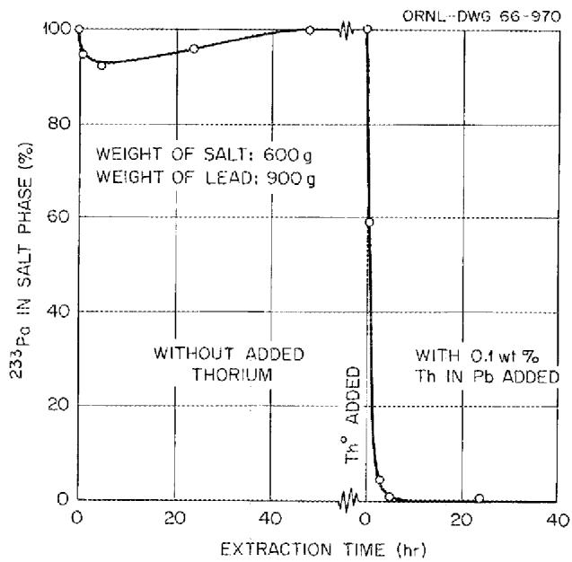  
Fig. 5.10. Effect of Thorium Metal on the Extraction of $^{233}\mathrm{Pa}$ from LiF-BeF $_2$ -ThF $_4$ (73-2-25 Mole %) in Salt-Lead System at $600^{\circ}\mathrm{C}$ .

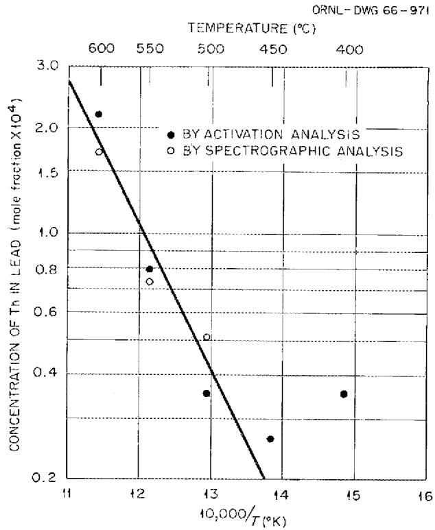  
Fig. 5.11. Temperature Dependence of the Solubility of Thorium in Molten Lead.

of pretreated $\mathrm{LiF - ThF_4}$ (73-27 mole %). A copper filter unit was placed in the pot which was sealed, evacuated to $450\mu$ pressure three times, and filled with helium each time. The furnace was then heated with helium flowing through the pot under a slight positive pressure. After reaching $600^{\circ}\mathrm{C}$ , a mixture of HF and $\mathbf{H}_2$ was passed through the melt for 50 min to convert any oxide impurities to fluorides, and then the melt was treated with $\mathbf{H}_2$ for 4 hr to reduce $\mathrm{NiF_2}$ , which resulted from the hydrofluorination, to metallic nickel. Apparently because of a too high $\mathbf{H}_2$ flow rate, part of the melt splashed up to the top of the pot, where it solidified. On attempting to remove the first filtered melt sample, the copper filter was torn loose from the 1/8-in. nickel tubing to which it was attached, and the copper filter fell back into the melt. After cooling, the cake at the top of the melt was broken up, a 1.0-g sample was taken, the remainder of the material was returned to the pot, and the HF- $\mathbf{H}_2$ treatment of the melt was repeated. No difficulty due to the copper filter in the melt was observed.

In the second stage, the pot containing the treated $\mathrm{LiF - ThF_4}$ mixture was connected to a similar pot lined with tantalum and containing $692\mathrm{g}$ of $\mathrm{Pb - Th}$ alloy that had been saturated with thorium at $600^{\circ}\mathrm{C}$ . The molten salt was transferred to the tantalum-lined pot at $655^{\circ}\mathrm{C}$ through a transfer line at $600^{\circ}\mathrm{C}$ by application of 10 lb of helium pressure to the salt pot. Previous efforts to effect salt transfer had been frustrated by low temperatures in the transfer line resulting from the high vertical temperature gradient above the furnace block, which was metnioned in the previous report.[24] A coiled heater above the block and better insulation at the floor level of the glove box overcame this problem. After the transfer was completed, helium sparging was used to cause mixing of the lead and salt phases. The sparging was interrupted at intervals to permit phase separation. Samples of the salt phase were removed with copper filter units, and samples of the metal phase were normally removed with sintered stainless steel filter units. Measurements of the total gamma activity of 1-g portions of the salt samples after recovery from the filter units showed that the protactinium content of the salt phase was decreasing slowly after about 2 hr contact time between salt and metal phases. At this time, $5.0\mathrm{g}$ of thorium-metal turnings was added to the mixture; sampling of the two phases 75 min later showed a sharp decrease in the gross gamma activity of the salt phase without a consequent increase in the activity of the stainless steel sampler and their contained lead-phase sample. A further 3-hr contact time failed to produce a significant change in the activity of the samples with one exception: a sample of the metal phase inadvertently obtained in a copper sampler showed a significantly higher activity level, later confirmed by $^{231}\mathrm{Pa}$ analyses, than the stainless steel filtered samples taken before and after the copper samples. The furnace was then allowed to cool to room temperature.

Finally, the lead phase was transferred to an unlined nickel pot containing $\mathrm{LiF - ThF_4}$ of the same composition used previously but without protactinium. A mixture of hydrogen and anhydrous HF was bubbled through the lead and salt phases in an effort to convert metallic protactinium in the lead to $\mathrm{PaF_4}$ and transfer it to the salt phase. Time limitations prevented a thorough test of this procedure.

Data obtained in the above-described experiment, run 1-12, are shown in Table 5.9. The gross gamma values were obtained by weighing a sample, usually $1.000 \pm 0.002\mathrm{g}$ , placing it in a small glass vial, sealing the vial in a plastic envelope as it was removed from the glove box, and then placing the envelope over a sodium iodide crystal that was connected to an RIDL scaleer. These samples were then sent for solution and analysis by the alpha-pulse-height method to determine their $^{231}\mathrm{Pa}$ content. The whole metal samples were counted for gross gamma activity in a similar manner. The stainless steel samplers and their lead contents were dissolved separately, and $^{231}\mathrm{Pa}$ analyses were made on the solutions; but the copper sampler was dissolved along with the lead sample that it contained. The amount of lead in each sampler was also determined.

The data in Table 5.9 confirm the conclusion, based on earlier experiments with tracer concentrations of $^{233}\mathrm{Pa}$ (see "Removal of Protactinium from Molten Fluorides by Oxide Precipitation," this report), that protactinium fluoride is reduced to the metallic state by thorium dissolved in lead. It further appears that most of the protactinium does not stay dissolved in the lead phase long enough to permit transfer of the lead to another container for recovery of the protactinium by hydrofluorination, but a small fraction of the protactinium was apparently recovered in this fashion.

The variable concentration of protactinium in the lead, small in all cases as compared with the amount in the stainless steel samplers,

Table 5.9. Run l-12: Equilibration of LiF-ThF $_4$ (73-27 Mole %) with Pb-Th Alloy at $600^{\circ}\mathrm{C}$   

<table><tr><td>Sample</td><td>Total 231Pa Content of Phase (mg)</td></tr><tr><td>Initial salt</td><td>8.5</td></tr><tr><td>Lead, 34-min contact (ss)</td><td>0.4</td></tr><tr><td>Salt, 57-min contact (ss)</td><td>4.4</td></tr><tr><td>Lead, 88-min contact (ss)</td><td>0.09</td></tr><tr><td>Salt, 110-min contact (ss)</td><td>4.2</td></tr><tr><td>Salt, 216-min contact (Th added)</td><td>0.09</td></tr><tr><td>Lead, 251-min contact (ss)</td><td>0.07</td></tr><tr><td>Lead, 341-min contact (copper)</td><td>1.46</td></tr><tr><td>Lead, 359-min contact (ss)</td><td>0.08</td></tr><tr><td>Salt, 404-min contact (ss)</td><td>0.08</td></tr></table>

may indicate that the tendency of protactinium to absorb on, or alloy with, iron causes the protactinium to be removed from the lead sample during its passage through the sintered stainless steel filter material. An effort was made to remove any protactinium-containing material adhering to the outside wall of the samplers after they cooled to room temperature prior to analysis. They were scraped and also given an acid treatment before they were dissolved. It is not clear, at present, why the lead-containing copper sampler showed a much higher protactinium content than the samples obtained with stainless steel samplers, but it seems significant that this sample indicated that $17\%$ of the protactinium remained in the lead after almost 6 hr in contact with tantalum at $625^{\circ}\mathrm{C}$ .

The transfer of a small fraction of the protactinium from the lead phase to a molten fluoride mixture by HF treatment, as indicated by preliminary results, is encouraging, but means of preventing loss of the major part of the protactinium by adsorption on or alloying with container walls or other materials obviously will be sought in continuing experiments.

# Radiation Chemistry

# In-File Molten-Salt Irradiation Experiment

Design, development, and fabrication of the in-pile molten-salt experiment continued. Modifications to beam hole HN-1 in the ORR and installation of experimental equipment are scheduled to begin early in April, and in-pile operation of the first irradiation experiment will begin in June 1966.

Auxiliary equipment needed to modify beam hole HN-1 for the molten-salt experiments has been fabricated. This equipment consists of (1) a new aluminum beam-hole liner, (2) a beam-hole extension sleeve, and (3) an equipment chamber, located at the face of the reactor shielding, which will contain tanks and valves required to remove salt samples and add makeup salt to the autoclave, during in-pile operation.

Component parts of the experiment package which have been fabricated are the shield plug, the loop container can, and the connector, as shown in Fig. 5.12. All component parts of the thermal loop have been fabricated and are being assembled. A photograph of the partially assembled thermal-loop experiment is shown in Fig. 5.13. The 12-ft-long sample line with electric heating elements, which are bonded to the sample line by means of nickel metal spray, has also been completed along with the main loop-heater-cooler unit. The heater-cooler-unit design, previously described,[25] has been changed by substituting cooling tubes of Zircaloy-2 instead of stainless steel and Zircaloy-2 for the heater-cooler jacket in lieu of graphite. This change was made to reduce the attenuation of neutron flux and to provide for improvements in the efficiency and operational flexibility of the heater-cooler unit by using a Zircaloy-2 metal-spraying technique to attach the heaters and cooling coils.

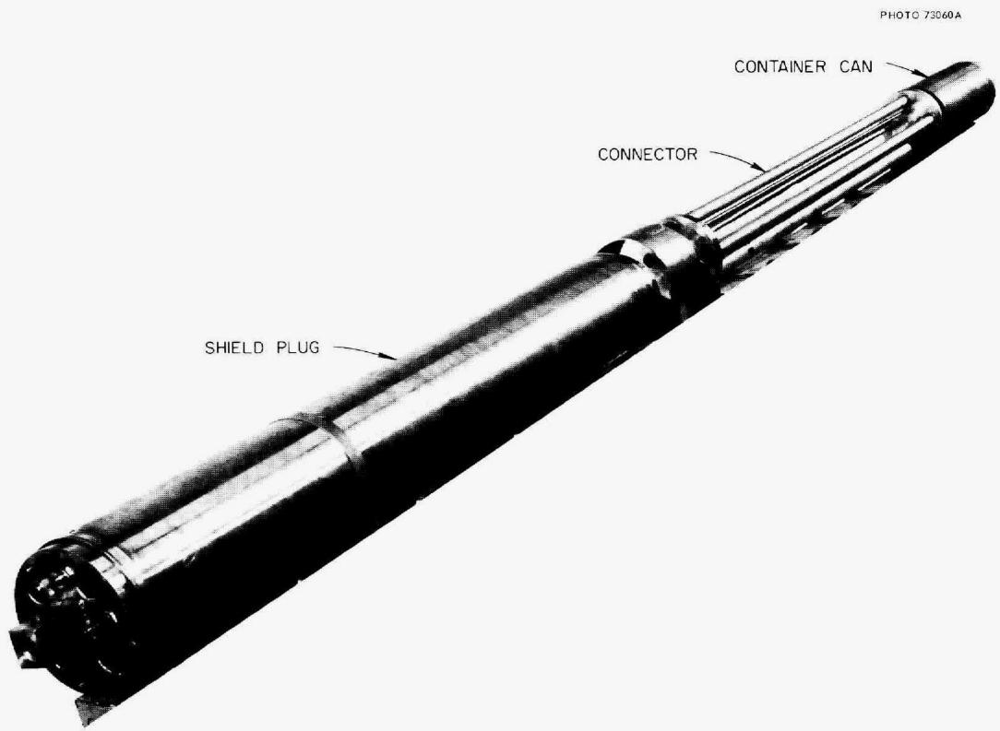  
Fig. 5.12. Shield Plug, Container Can, and Connector for In-Pile Molten-Salt Loop.

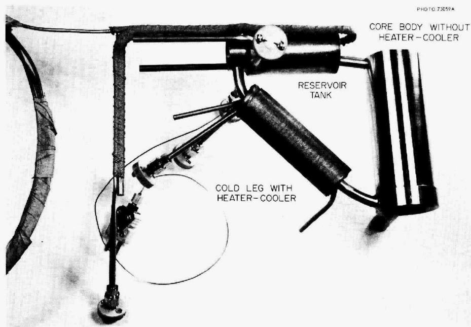  
Fig. 5.13. Partially Assembled In-Pile Molten-Salt-Loop Experiment.

The instrument and control panels are being fabricated in the Instrumentation and Controls Division shops and are approximately $60\%$ complete. The instrument panels are to be set in place in front of beam hole HN-1 in April.

# Development and Evaluation of Methods for the

# Analysis of the MSRE Fuel

Determination of Oxide in MSFE Fuel

The study $^{26}$ of hydrofluorination as a way to determine oxide in MSRE salts was continued. This method $^{27}$ is based on the reaction

$$
O ^ {2 -} + 2 H F (g) \rightleftharpoons H _ {2} O (g) + 2 F ^ {-},
$$

which occurs when a molten-salt sample is purged with an $\mathrm{H}_2$ -HF gas mixture. The amount of water evolved is taken as a measure of the quantity of oxide in the molten-salt sample. Data have been reported previously[27] for the Karl Fischer titration of the water evolved from standard additions of $\mathrm{ZrO}_2$ and $\mathrm{UO}_2$ to a 50-g fuel melt.

Figure 5.14 is a schematic flow diagram of the hydrofluorination apparatus now being used. Since it would be difficult to perform the Karl Fischer titration in the hot cell, a $\mathsf{P}_2\mathsf{O}_5$ water electrolysis cell (Beckmann moisture-monitor cell with rhodium electrodes) was installed in a component test facility to monitor the effluent-gas stream from the hydrofluorinator for water.

To establish the conditions necessary to use the electrolysis cell as a water monitor, $\mathrm{ZrO_2}$ samples were added to $50\mathrm{g}$ of MSRE fuel in the hydrofluorinator. Because there is a maximum rate of water electrolysis beyond which the cell may be damaged, it was necessary to split the effluent-gas stream and to pass only a portion of it through the cell. After the optimum gas pressures and flow rates were established, the results given in Table 5.10 were obtained.

Figure 5.15 is a recording of the water evolved from two standard additions of $\mathrm{ZrO_2}$ to a fuel sample. The first two peaks of each recording result from atmospheric contaminants introduced during loading of the $\mathrm{ZrO_2}$ into the fuel sample and removal of contamination from the internal metal surfaces of the apparatus. After the fuel- $\mathrm{ZrO_2}$ sample was melted, it was purged with $\mathrm{H}_2$ -HF at $625^{\circ}\mathrm{C}$ to evolve the oxide. The plateau of the curve for the $139\mathrm{-mg}$ $\mathrm{ZrO_2}$ addition apparently reflects the limit of solubility of $\mathrm{ZrO_2}$ in the melt.

Also, analyses were made on $\sim 50$ -g portions sampled from $6\mathrm{kg}$ of simulated molten MSRE fuel of unknown oxide concentration. These samples were taken in copper ladles, cooled to room temperature, and then transferred to the hydrofluorinator under an inert atmosphere. Three of the samples were exposed to the atmosphere, since the samples from the reactor will be exposed while being transferred to the hydrofluorinator. The sample ladle was sealed in the hydrofluorinator with a delivery tube spring-loaded against the surface of the salt (Fig. 5.14). An

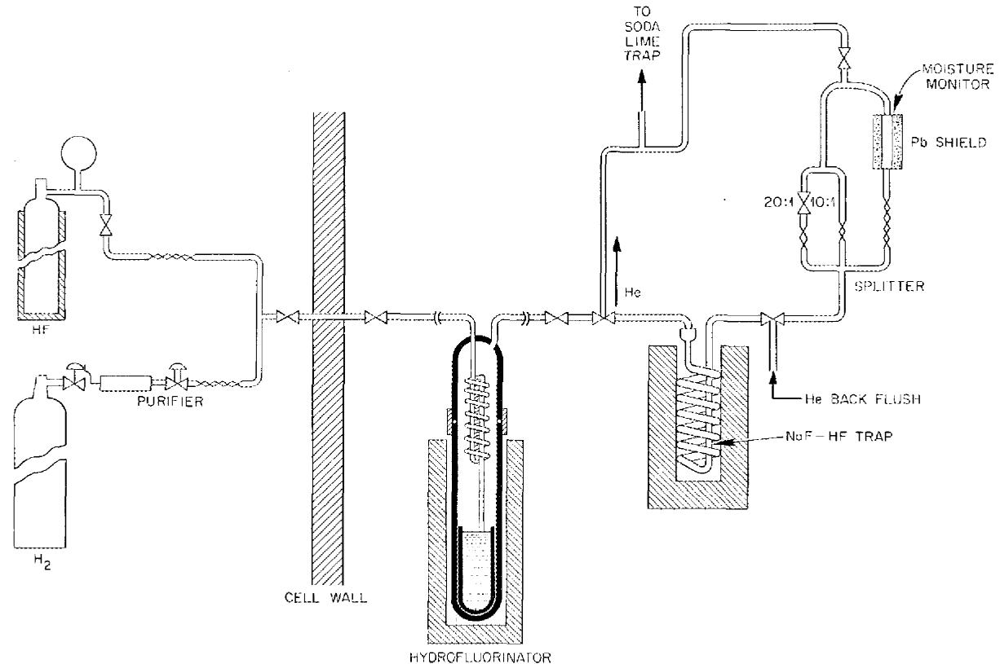  
Fig. 5.14. Schematic Flow Diagram of the Apparatus for the Determination of Oxide in MSRE Fuel by Hydrofluorination.

Table 5.10. Recovery of Oxide from Standard Additions of $\mathsf{ZrO_2}$ to MSRE Fuel   

<table><tr><td rowspan="2">Effluent Gas Passed Through Cell (%)</td><td colspan="2">ZrO2(mg)</td><td rowspan="2">Recovery (%)</td></tr><tr><td>Taken</td><td>Found</td></tr><tr><td rowspan="3">10</td><td>18.6</td><td>18.3</td><td>93.6</td></tr><tr><td>25.6</td><td>26.0</td><td>101.6</td></tr><tr><td>25.8</td><td>27.1</td><td>104.9</td></tr><tr><td rowspan="4">5</td><td>72.2</td><td>72.6</td><td>100.5</td></tr><tr><td>131.0</td><td>134.8</td><td>102.9</td></tr><tr><td>135.0</td><td>136.5</td><td>101.1</td></tr><tr><td>139.0</td><td>140.0</td><td>100.7</td></tr></table>

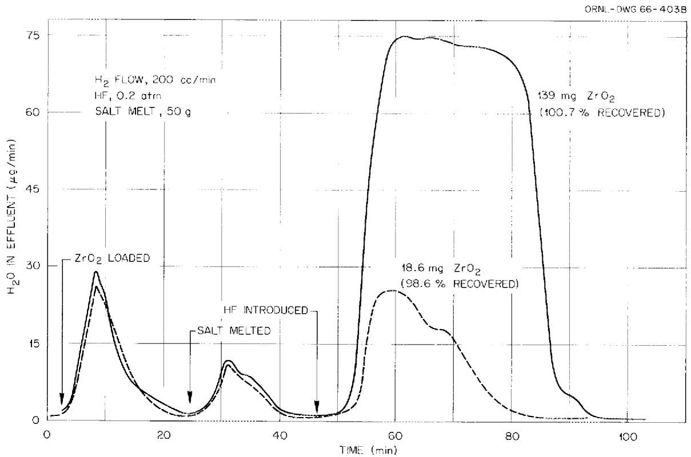  
Fig. 5.15. Determination of Standard Additions of Oxide in Simulated MSRE Fuel by Hydrofluorination.

Table 5.11. Precision of Determination of Oxide in Molten Simulated MSRE Fuel   

<table><tr><td>Sample Number</td><td>Oxide (ppm)</td></tr><tr><td>1</td><td>350</td></tr><tr><td>2</td><td>345</td></tr><tr><td>3</td><td>340</td></tr><tr><td>4</td><td>340</td></tr><tr><td>5</td><td>\( 375^a \)</td></tr><tr><td>6</td><td>\( 360^a \)</td></tr><tr><td>7</td><td>\( 405^b \)</td></tr></table>

a Exposed to atmosphere for at least 24 hr.   
b Exposed to atmosphere for two weeks.

initial purge with $\mathrm{H}_2$ -HF was made at a temperature below the melting point to remove oxide from the metal surfaces and oxide contamination from the surface of the salt. With further temperature increase, the delivery tube was driven below the surface of the salt as it melted to sparge the melt with $\mathrm{H}_2$ -HF. Table 5.11 lists the results.

We must here consider whether these results represent a quantitative removal of oxide or simply a return to an original equilibrium base line. It may be seen by rearranging the equilibrium expression for the reaction of oxide with HF that if the proportion of HF reagent in the purge gas is increased, the residual-oxide concentration will be reduced:

$$
\left[ \mathrm {O} ^ {2 -} \right] = \left(\mathrm {P} _ {\mathrm {H} _ {2} \mathrm {O}} / \mathrm {P} _ {\mathrm {H F}} ^ {2}\right) \times \mathrm {c o n s t a n t}.
$$

Because the HF reagent contains traces of water, the HF concentration in the influent cannot be increased independently. However, if the concentrations of HF and $\mathrm{H}_2\mathrm{O}$ in the purge gas are doubled, the residual oxide in the melt should be reduced by a factor of 2. When the pressure of HF in the sparge gas through terminal (oxide-depleted) melts was doubled, no additional water was obtained. Also, equilibrium constants are temperature dependent, and no additional peaks were observed with temperature variations of $200^{\circ}\mathrm{C}$ on depleted melts.

Samples of flush and fuel salt taken during the December startup of the reactor were analyzed for oxide in a component test facility. Table 5.12 summarizes the results. Figure 5.16 is a recording of the water evolved from the first fuel-salt sample taken after the fuel was loaded into the reactor.

The results of the analyses by the hydrofluorination method were in good agreement with those by the $\mathrm{KBrF_4}$ procedure $^{28}$ (Fig. 5.17). The $\mathrm{KBrF_4}$ values paralleled the trends shown by the hydrofluorination

Table 5.12. Oxide Concentrations of Flush and Fuel Salt from the MSR   

<table><tr><td>Sample</td><td>Time of Salt Circulation (hr)</td><td>Oxide Concentration (ppm)</td></tr><tr><td rowspan="3">Flush salt</td><td>24.7</td><td>46</td></tr><tr><td>29.1</td><td>72</td></tr><tr><td>47.6</td><td>106</td></tr><tr><td rowspan="4">Fuel salt</td><td>3.4</td><td>120</td></tr><tr><td>23.8</td><td>105</td></tr><tr><td>32.2</td><td>80</td></tr><tr><td>52.5</td><td>65</td></tr></table>

method, but averaged slightly higher. This bias was not unexpected, since the pulverized samples required for the KBrF $_4$ method are easily contaminated by atmospheric moisture.

The apparatus (Fig 5.18) designed for the determination, in the hot cell, of the oxide in highly radioactive fuel samples is functionally identical with the components test facility used for the analyses reported above. Figure 5.18 shows the hydrofluorinator positioned in the furnace, which is external to the valve compartment. The hydrofluori

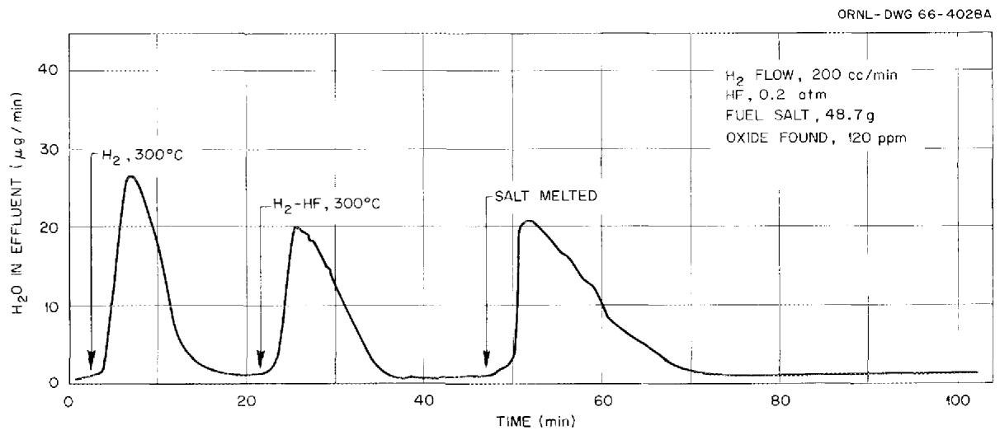  
Fig. 5.16. Determination of Oxide in MSR Fuel Sample FP4-ll by Hydrofluorination.

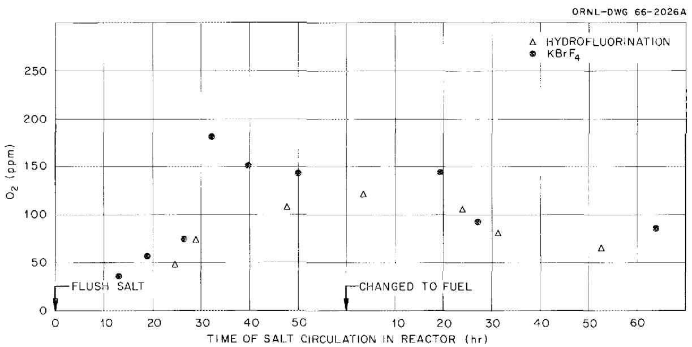  
Fig. 5.17. Results of Hydrofluorination and KBrF $_4$ Analyses for Oxide in Flush and Fuel Salts During December Startup of the MSR.

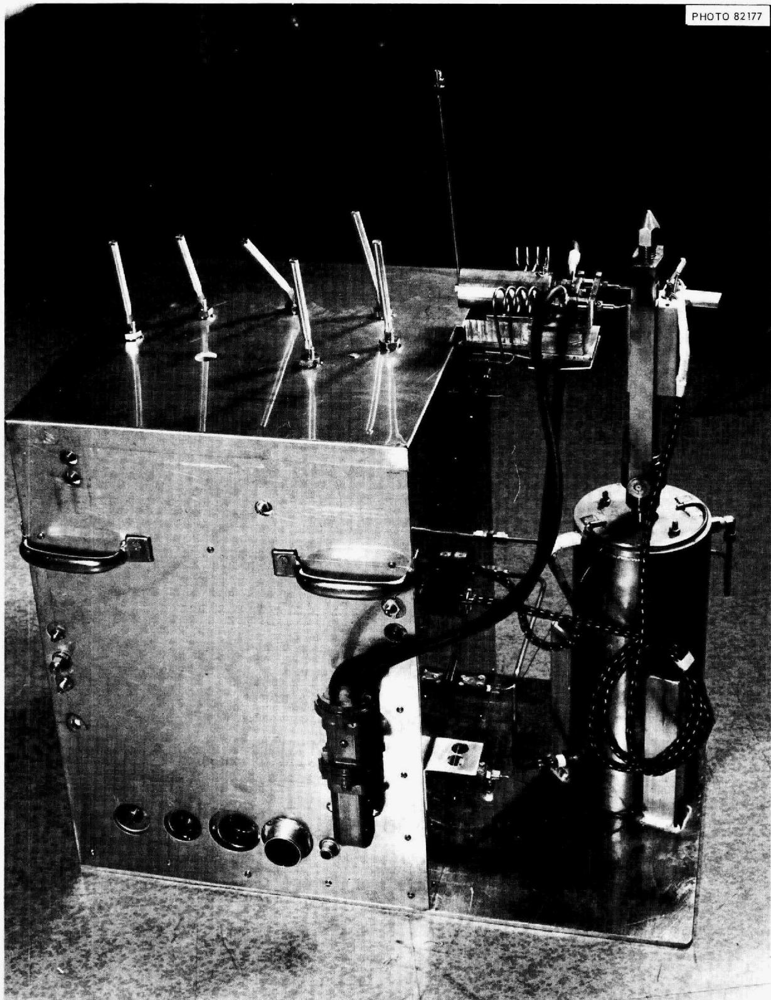  
Fig. 5.18. Hot-Cell Apparatus.

nator is put on stream through O-ring ball joints that are closed or opened by a remotely operated argon-actuated air piston. The valve compartment contains the sodium fluoride trap, the capillary water splitter, the $\mathrm{P}_2\mathrm{O}_5$ water electrolysis cell, and the soda-lime trap for cleaning the effluent gas stream. These components are shown in Fig. 5.19, where the cover plate has been removed. The modular construction was chosen in hopes that any maintenance necessary can be performed remotely. If not, any component can be removed manually in 2 to 5 min if the hot cell is sufficiently decontaminated.

Figure 5.20 shows the disassembled hydrofluorinator. The copper sample ladle is contained in the nickel liner, which fits into the bottom of the hydrofluorinator. The baffles on the spring-loaded sparge tube fit inside the liner and confine the molten salt to the liner during the bubbling operation of the analysis. This arrangement allows the solid sample, after analysis, to be removed from the bottom of the hydrofluorinator and then to be disconnected at the Swagelock fitting

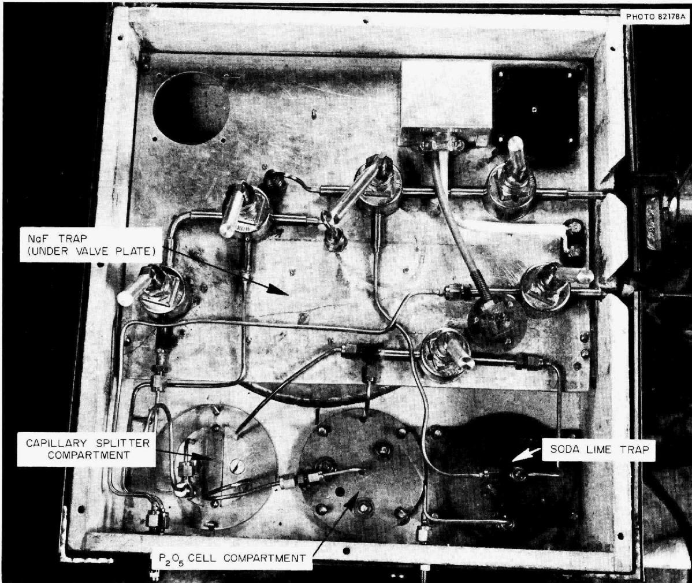  
Fig. 5.19. Top View of Valve Compartment of Hot-Cell Apparatus.

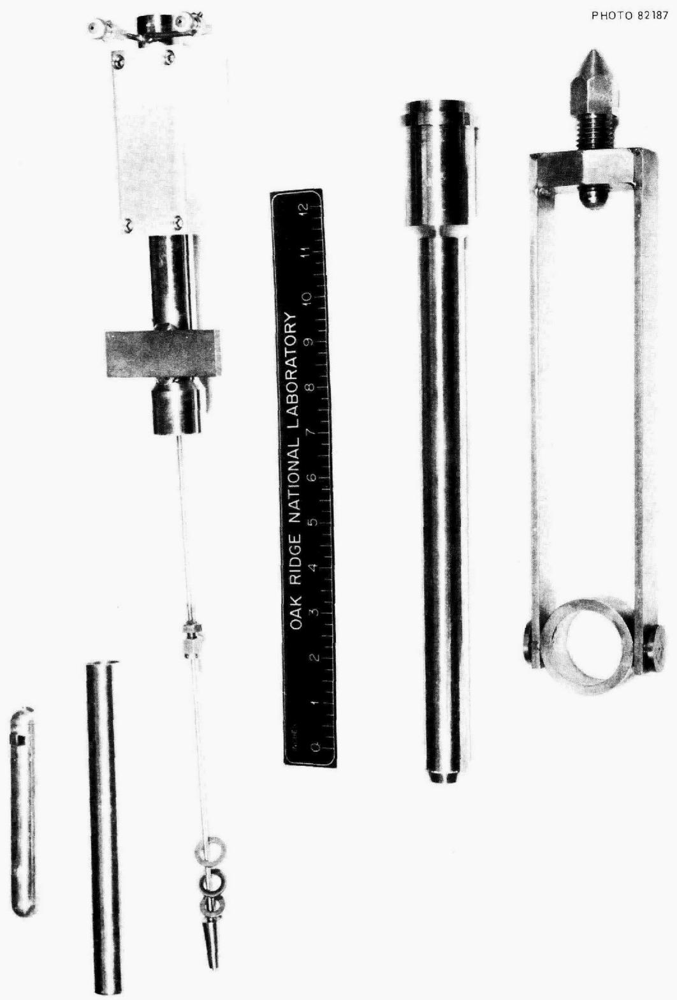  
Fig. 5.20. Disassembled Hydrofluorinator.

and discarded along with the ladle, liner, and bottom of the sparge tube. This design affords considerable saving in cost per analysis, because it permits the repeated use of the complete hydrofluorinator.

Figure 5.21 shows the $\mathrm{H}_{2}$ -HF mixer section, which is located in the access area behind the hot cell. The HF pressure is regulated by controlling the temperature of the HF tank shown at the left. The flow rates of the $\mathrm{H}_{2}$ and HF are controlled by nickel and platinum capillaries respectively. This apparatus also contains safety interlocks and limiting capillaries to prevent release of HF and excessive pressures inside the hot cell.

Figure 5.22 shows the master control panel, which is located in front of the hot cell. This panel contains the moisture recorder (not shown), helium and hydrogen pressure controls, HF control switch, hydrofluorinated coupler switch, temperature recorder, furnace power controls, and power control for the coupler-line heater.

After they were fabricated, the apparatus and auxiliary equipment were assembled in the hot-cell mockup, and all mechanical operations were performed successfully with Master Slave manipulators. The equipment was then transferred to the laboratory and was assembled on the bench top for trial analyses of samples. Individual components were tested exhaustively and, when necessary, were modified or replaced to obtain maximum dependability and to minimize hot-cell maintenance.

A final check of the splitter and cell was made by injecting a known quantity of water into the flow system; quantitative recovery of the water resulted. The entire system was then checked out by analyzing fuel-salt samples. Satisfactory results were obtained.

The equipment is now being transferred to the hot cell and installed therein.

# Voltammetric Determination of Ionic Iron and Nickel in Molten MSRE Fuel

By controlled-potential voltammetry, $\mathrm{Fe}^{2+}$ and $\mathrm{Ni}^{2+}$ were determined in a 100-g sample of MSRE fuel. The sample was withdrawn from the reactor in enricher ladles and was transferred under an inert atmosphere to the graphite crucible of an electrochemical cell assembly for remelting and analysis. The cell assembly and electrodes developed for electrochemical studies of molten-fluoride salts are described elsewhere.[29-31] The iron and nickel in the molten fuel are suspected to be in the metallic state, as well as in the form of soluble ionic species. However, only in the divalent oxidation state are these metals electroreducible in the melt and can thus give voltammetric reduction waves. By voltammetry and by the standard-addition technique, the concentration of $\mathrm{Fe}^{2+}$ was determined to be $\sim 10$ ppm. The concentration of $\mathrm{Ni}^{2+}$ was below the limit of detection by voltammetry (<1 ppm).

Average total concentrations of iron and nickel, determined by conventional methods, are about 125 and 45 ppm respectively. Thus it appears that most of the iron and nickel in the fuel is present in the metallic state, probably as finely divided particles.

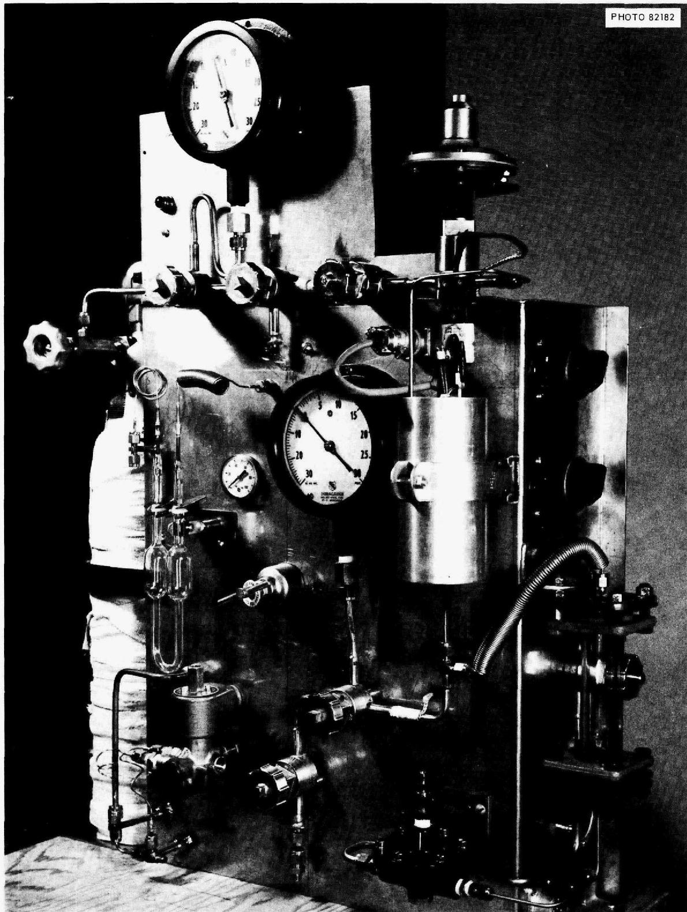  
Fig. 5.21. $\mathrm{H}_2$ -HF Mixer Section of Hydrofluorinator Apparatus.

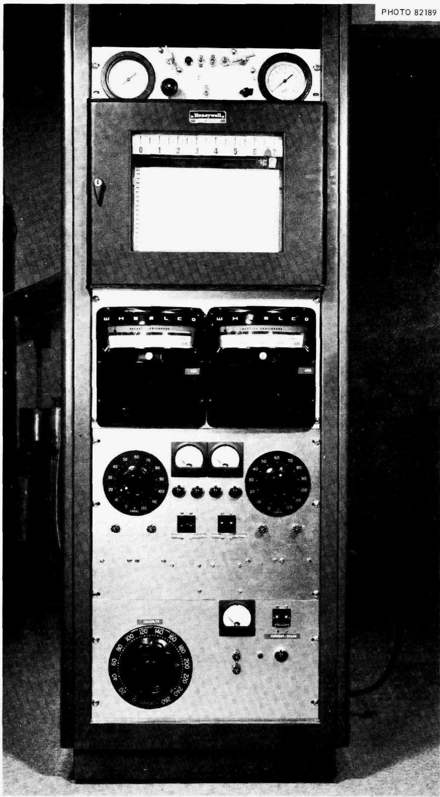  
Fig. 5.22. Main Control Panel of Hydrofluorination Apparatus.

Chromium concentration, determined conventionally, is $\sim 50$ ppm. Interference from uranium prevents the voltammetric determination of chromium in the molten salt. A well-defined wave was observed that corresponds to the reduction $U(IV) \rightarrow U(III)$ . Possibly, this wave can be used to continuously monitor uranium in the system; more work is contemplated in this area.

# Development and Evaluation of Equipment and Procedures for

# Analyzing Radioactive MSRE Salt Samples

As stated earlier, $^{32}$ statistical evaluation of the control data indicated that a negative bias of approximately $0.8\%$ existed in the coulometric uranium results. The uranium procedure consisted primarily of six steps.

1. Determination of blank.   
2. Preparation of sample.   
3. Prereduction of sample at $+0.125\mathrm{v}$ vs S.C.E.   
4. Reduction of uranium and copper at -0.325 v vs S.C.E.   
5. Oxidation of copper at +0.125 v vs S.C.E.   
6. Calculation.

In steps 1, 3, 4, and 5, the titration was allowed to proceed until the cell current had decreased to $5\mu \mathrm{a}$ .

The calculation was performed using the following formula:

$$
[ (A - B) - C - (b t / E) ] D E = \text {m i c r o g r a m s}
$$

where

A = readout voltage for uranium and copper reduction in millivolts,   
$B =$ blank of electrolyte in millivolts,   
C = readout voltage for copper oxidation in millivolts,   
D = 1.233 × 10 $^{-3}$ μg of uranium per microcoulomb,   
E = coulometer calibration constant for 10-microequivalent range in microcoulombs per millivolt,   
$b =$ background current in microampere $(5\mu a)$   
$t =$ time of uranium and copper reduction in seconds.

In an attempt to eliminate the bias, steps 1, 4, and 6 were modified. The determination of the blank was eliminated. The cutoff point for the uranium and copper reduction was changed from $5\mu \mathrm{a}$ to $50\mu \mathrm{a}$ . An X-Y recorder (Fig. 5.23) was attached to the coulometer to monitor the titrations. When the readout voltage and cell current were plotted on the X and Y scales, respectively, a straight line with a negative slope was obtained after the recorder pen had reached a maximum Y value. By extrapolation of the curve (Fig. 5.24), it was possible to obtain the readout voltage corresponding to a cell current of 0 amp. Due to the error introduced by this technique, a potentiometer was connected to the integrator circuit of the coulometer in order to obtain more precise readout voltages. This necessitated terminating the titrations at a specific end point. A cell current of

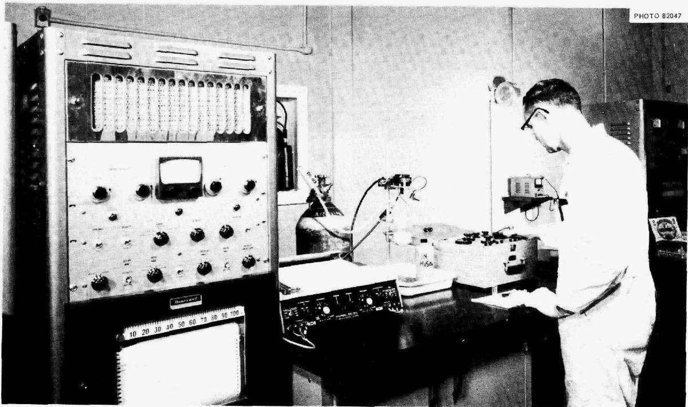  
Fig. 5.23. High-Sensitivity Coulometric Uranium Apparatus.

$50~\mu \mathrm{a}$ was found empirically to be the most practical point of termination. The coulometer was automatically turned off when the ammeter needle indicated a cell current of $50~\mu \mathrm{a}$ . At this point, the titration was approximately $99\%$ complete. This portion of the readout voltage was taken from the potentiometer; the remaining readout voltage was obtained by extrapolating from 50 to $0~\mu \mathrm{a}$ an expanded cell current vs readout voltage curve (Fig. 5.25). The two readings were combined to obtain the total readout voltage for the uranium and copper reduction. Based on more than 200 titration curves, the readout voltage represented by the extrapolated portion of the curve was approximately $5\mathrm{mv}$ ; therefore, the readout voltages used for the uranium and copper reductions were obtained by adding $5\mathrm{mv}$ to the potentiometer readings. Due to the above changes, the formula for calculating the uranium present in the test solution then became

\[
[(A - B) + C]DE = \text{micrograms of uranium per test solution},
\]

# where

A = readout voltage for uranium and copper reduction in millivolts,

$B =$ readout voltage for copper oxidation in millivolts,

$C = 5 \mathrm{mv}$ (value obtained by extrapolation of the cell current vs readout voltage curve from 50 to $0 \mu \mathrm{a}$ ),

D = 1.233 × 10 $^{-3}$ μg of uranium per microcoulomb,

E = coulometer calibration constant for 10-microequivalent range in microcouolombs per millivolt.

The uranium present in the test solution could be calculated, since the voltages read out on the potentiometer were proportional to the coulombs required in the reduction of uranium and copper and the oxidation of copper.

# Sample Analyses

From December 16, 1965, through January 26, 1966, six flush-salt and twenty-two fuel-salt samples were received in the High-Radiation-Level Analytical Laboratory. All 28 samples were analyzed for U, Zr,

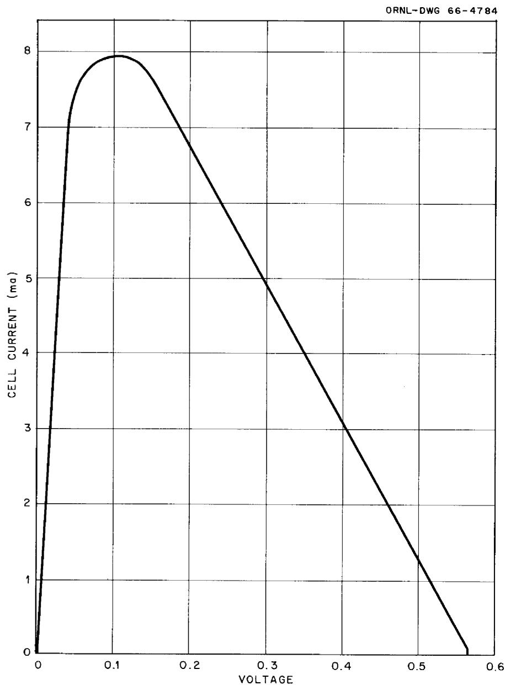  
Fig. 5.24. Cell Current vs Readout Voltage Curve.

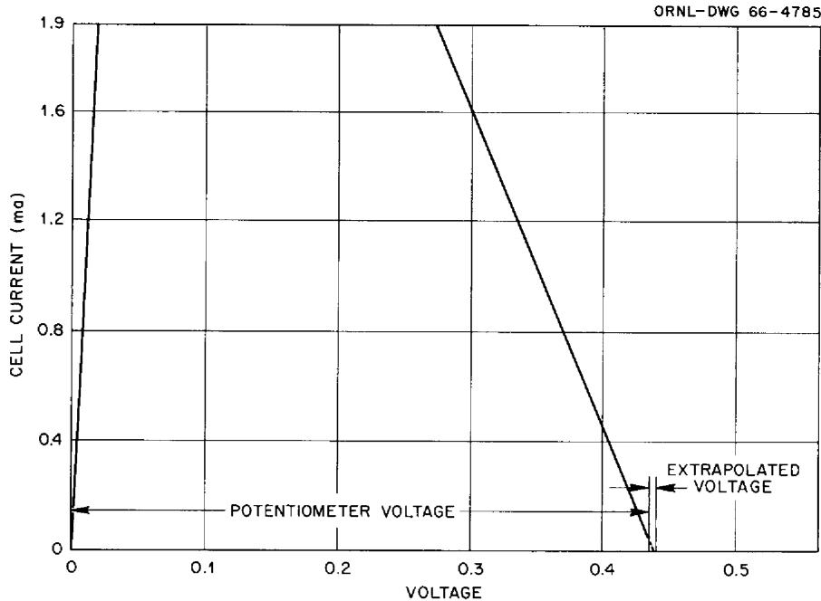  
Fig. 5.25. A Portion of the Cell Current vs Readout Voltage Curve.

Cr, Be, F, Fe, and Ni. All six flush-salt samples and the first twelve fuel-salt samples received were analyzed for molybdenum.

# Quality Control Program

The quality control program initiated prior to precritical sampling was continued during the past period. Synthetic solutions similar to dissolved nonradioactive fuel-salt samples were analyzed along with each flush-salt and fuel-salt sample. Due to the relatively small number of samples analyzed to date, the accumulated control data is insufficient to calculate the true percent standard deviations of the methods. The values shown in Table 5.13 were obtained during the fourth quarter of 1965. The 2S and average values shown were obtained by four different groups of shift personnel. Molybdenum values are not shown in the table since it was not added to the synthetic solution. The nickel values indicate that a positive bias exists in the method. The values given for the coulometric uranium procedure indicate that the negative bias was eliminated.

Table 5.13. Control Program, Fourth Quarter of 1965   

<table><tr><td>Determination</td><td>Shift</td><td>Number of Determinations</td><td>Added (μg/ml)</td><td>Average Value Found (μg/ml)</td><td>2S Percentage</td></tr><tr><td rowspan="4">Coulometric, uranium</td><td>A</td><td>19</td><td>656.6</td><td>658</td><td>1.11</td></tr><tr><td>B</td><td>40</td><td>656.6</td><td>656</td><td>1.55</td></tr><tr><td>C</td><td>30</td><td>656.6</td><td>659</td><td>0.57</td></tr><tr><td>D</td><td>34</td><td>656.6</td><td>658</td><td>0.99</td></tr><tr><td rowspan="4">Amperometric, zirconium</td><td>A</td><td>26</td><td>1117</td><td>1122</td><td>7.27</td></tr><tr><td>B</td><td>6</td><td>1117</td><td>1077</td><td>13.53</td></tr><tr><td>C</td><td>14</td><td>1117</td><td>1119</td><td>5.17</td></tr><tr><td>D</td><td>0</td><td></td><td></td><td></td></tr><tr><td rowspan="4">Amperometric, chromium</td><td>A</td><td>22</td><td>11.8</td><td>12.202</td><td>9.15</td></tr><tr><td>B</td><td>16</td><td>11.8</td><td>12.278</td><td>11.06</td></tr><tr><td>C</td><td>8</td><td>11.8</td><td>12.520</td><td>16.84</td></tr><tr><td>D</td><td>5</td><td>11.8</td><td>12.270</td><td>14.38</td></tr><tr><td rowspan="4">Colorimetric, iron</td><td>A</td><td>18</td><td>6.36</td><td>6.286</td><td>2.36</td></tr><tr><td>B</td><td>10</td><td>6.36</td><td>6.355</td><td>10.91</td></tr><tr><td>C</td><td>16</td><td>6.36</td><td>6.302</td><td>5.51</td></tr><tr><td>D</td><td>3</td><td>6.36</td><td>6.253</td><td>2.40</td></tr><tr><td rowspan="4">Colorimetric, nickel</td><td>A</td><td>16</td><td>6.08</td><td>6.713</td><td>3.92</td></tr><tr><td>B</td><td>10</td><td>6.08</td><td>6.748</td><td>6.24</td></tr><tr><td>C</td><td>18</td><td>6.08</td><td>6.669</td><td>14.32</td></tr><tr><td>D</td><td>0</td><td></td><td></td><td></td></tr><tr><td rowspan="4">Neutron activation, beryllium</td><td>A</td><td>3</td><td>847</td><td>853</td><td>1.08</td></tr><tr><td>B</td><td>0</td><td></td><td></td><td></td></tr><tr><td>C</td><td>2</td><td>847</td><td>849</td><td>1.83</td></tr><tr><td>D</td><td>4</td><td>847</td><td>856</td><td>1.48</td></tr></table>

# References

1. MSR Program Semiann. Progr. Rept. July 31, 1964, ORNL-3708, p. 321.   
2. See "Development and Evaluation of Equipment and Procedures for Analyzing Radioactive MSRE Salt Samples," this report.   
3. MSR Program Semiann. Progr. Rept. Aug. 31, 1965, ORNL-3872, p. 117.   
4. See "Voltammetric Determination of Ionic Iron and Nickel in Molten MSRE Fuel," this report.   
5. MSR Program Semiann. Progr. Rept. Aug. 31, 1965, ORNL-3872, p. 140.   
6. See "Oxide Solubilities in MSRE Flush Salt, Fuel Salt, and Their Mixtures," this report.   
7. MSR Program Semiann. Progr. Rept. Aug. 31, 1965, ORNL-3872, pp. 123-25.   
8. K. A. Sense et al., J. Phys. Chem. 58, 223 (1954).   
9. K. A. Sense and R. W. Stone, J. Phys. Chem. 62, 1411 (1958).   
10. S. Cantor, Reactor Chem. Div. Ann. Progr. Rept. Dec. 31, 1965, ORNL-3913, pp. 27-29.   
11. S. Cantor, Reactor Chem. Div. Ann. Progr. Rept. Jan. 31, 1962, ORNL-3262, pp. 38-41.   
12. E. A. Brown and B. Porter, U.S. Bur. Mines Rept. Invest. 6500 (1964).   
13. P. W. Bridgman, Proc. Am. Acad. Arts Sci. 59, 162 (1923).   
14. MSR Program Semiann. Progr. Rept. Feb. 28, 1965, ORNL-3812, pp. 129-38.   
15. MSR Program Semiann. Progr. Rept. Aug. 31, 1965, ORNL-3872, p. 152.   
16. Ibid., pp. 140-43.   
17. I. Langmuir, Phys. Rev. 2 (Ser. 2), 329 (1913) (and subsequent papers).   
18. Reactor Chem. Div. Ann. Progr. Rept. Jan. 31, 1965, ORNL-3789, pp. 59-62.   
19. K. A. Sense and R. W. Stone, J. Phys. Chem. 62, 96 (1958).   
20. A. Buchler and J. L. Stauffer, Symposium on Thermodynamics with Emphasis on Nuclear Materials and Atomic Transport in Solids, Vienna, July 22-27, 1965, paper SM-66-26, p. 15.   
21. J. H. Shaffer et al., Nucl. Sci. Eng. 18, 177 (1964).   
22. Reactor Chem. Div. Ann. Progr. Rept. Jan. 31, 1961, ORNL-3127, p. 8.   
23. Reactor Chem. Div. Ann. Progr. Rept. Jan. 31, 1965, ORNL-3789, p. 56.   
24. MSR Program Semiann. Progr. Rept. Aug. 31, 1965, ORNL-3872, pp. 137-41.

25. MSR Program Semiann. Progr. Rept. Aug. 31, 1965, ORNL-3872, p. 109, Fig. 5.2.   
26. MSR Program Semiann. Progr. Rept. Aug. 31, 1965, ORNL-3872, p. 140.   
27. MSR Program Semiann. Progr. Rept. Feb. 28, 1965, ORNL-3812, p. 162.   
28. G. Goldberg, A. S. Meyer, Jr., and J. C. White, Anal. Chem. 32, 314 (1960).   
29. D. L. Manning, J. Electroanal. Chem. 6, 227 (1963).   
30. D. L. Manning and G. Mamantov, J. Electroanal. Chem. 7, 102 (1964).   
31. D. L. Manning, J. Electroanal. Chem. 7, 302 (1964).   
32. MSR Program Semiann. Progr. Rept. Aug. 31, 1965, ORNL-3872, p. 148.

# 6. MOLTEN-SALT BREEDER REACTOR DESIGN STUDIES

Design and evaluation studies have been made of thermal molten-salt breeder reactors (MSBR) in order to assess their economic and nuclear potential and to identify the important design and development problems. The reference reactor design presented here contains design problems related to molten-salt reactors in general.

The MSBR reference design concept is a two-region, two-fluid system, with fuel salt separated from the blanket salt by graphite tubes. The fuel salt consists of uranium fluoride dissolved in a mixture of lithium-beryllium fluorides, while the blanket salt is a thorium-lithium fluoride containing 27 mole $\%$ thorium fluoride. The energy generated in the reactor fluid is transferred to a secondary coolant-salt circuit, which couples the reactor to a supercritical steam cycle. On-site fluoride volatility processing is employed, leading to low unit processing costs and economic operation as a thermal breeder reactor.

# MSBR Plant Design

# Flowsheet

Figure 6.l gives the flowsheet of the 1000-Mw (electrical) MSBR power plant. Fuel flows through the reactor at a rate of about $44,000\mathrm{gpm}$ (velocity of about 15 fps), entering the core at $1000^{\circ}\mathrm{F}$ and leaving at $1300^{\circ}\mathrm{F}$ . The primary fuel circuit has four loops, each loop having a pump and a primary heat exchanger. Each of these pumps has a capacity of about 11,000 gpm. The four blanket-salt pumps and heat exchangers, although smaller, are similar to corresponding components in the fuel system. The blanket salt enters the reactor vessel at $1150^{\circ}\mathrm{F}$ and leaves at $1250^{\circ}\mathrm{F}$ . The blanket-salt pumps have a capacity of about 2000 gpm.

Four 14,000-gpm coolant pumps circulate the sodium fluoroborate coolant salt, which enters the shell side of the primary heat exchanger at $850^{\circ}\mathrm{F}$ and leaves at $1112^{\circ}\mathrm{F}$ . After leaving the primary heat exchanger, the coolant salt is further heated to $1125^{\circ}\mathrm{F}$ on the shell side of the blanket-salt heat exchangers. The coolant then circulates through the shell side of 16 once-through superheaters (4 superheaters per pump). In addition, four 2000-gpm pumps circulate a portion of the coolant through eight reheaters.

The steam system flowsheet is essentially that of the new TVA Bull Run plant, with modifications to increase the rating to 1000 Mw (electrical) and to preheat the working fluid to $700^{\circ}\mathrm{F}$ prior to entering the heat-exchanger-superheater unit. A supercritical power conversion system is used, which is appropriate for molten-salt application and takes advantage of the high-strength structural alloy employed. Use of a supercritical fluid system results in an overall plant thermal efficiency of about $45\%$ .

ORNL-DWG66-4786

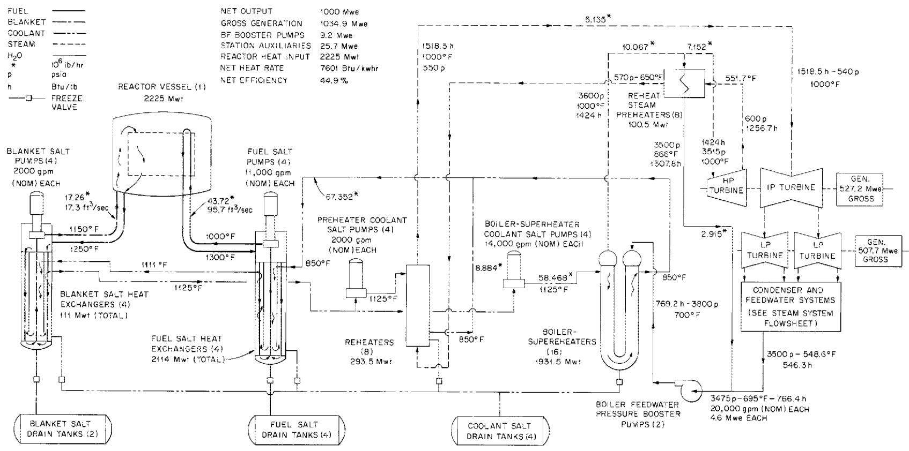  
Fig. 6.1. Flowsheet of MSBR Power Plant.

Figure 6.2 shows a plan view of the MSBR cell arrangement. The reactor cell is surrounded by four shielded cells containing the superheaters and reheater units; these cells can be individually isolated for maintenance. The processing cell, located adjacent to the reactor, is divided into a high-level and a low-level activity area.

Figure 6.3 shows an elevation view of the reactor and indicates the position of equipment in the various cells. Figure 6.4, a plan view of the reactor cell, shows the location of the reactor, pumps, and fuel and blanket heat exchangers. Figure 6.5 is an elevation of the reactor cell. The Hastelloy N reactor vessel has a side wall thickness of about $1 - 1/4$ in. and a head thickness of about $2 - 1/4$ in.; it is designed to operate at $1200^{\circ}\mathrm{F}$ and $150\mathrm{psi}$ . The plenum chambers, with $1/4$ -in.-thick walls, communicate with the external heat exchangers by concentric inlet-outlet piping. The inner pipe has slip joints to accommodate thermal expansion. Bypass flow through these slip joints is about $1\%$ of the total flow. As indicated in Fig. 6.5, the heat exchangers are suspended from the top of the cell and are located below the reactor. Each fuel pump has a free fluid surface and a storage volume which permits rapid drainage of fuel fluid from the core upon loss of flow. In addition, the fuel salt can be drained to the dump tanks when the reactor is shut down for an extended time. The entire reactor cell is kept at high temperature, while cold "fingers" and thermal insulation surround structural support members and all special equipment which must be kept at relatively low temperatures. The control-rod drives are located above the core, and the control rods are inserted into the central region of the core.

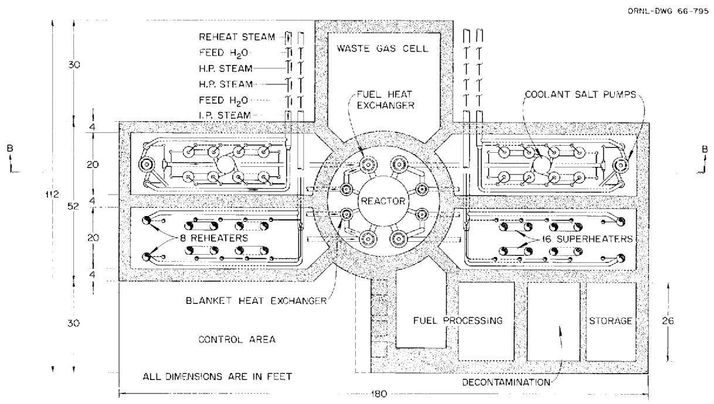  
Fig. 6.2. Plan View of MSBR Cell Arrangement.

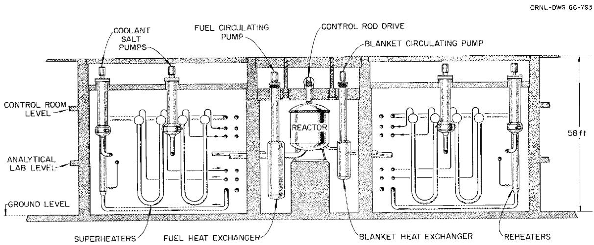  
Fig. 6.3. Elevation View of MSBR Reactor Arrangement.

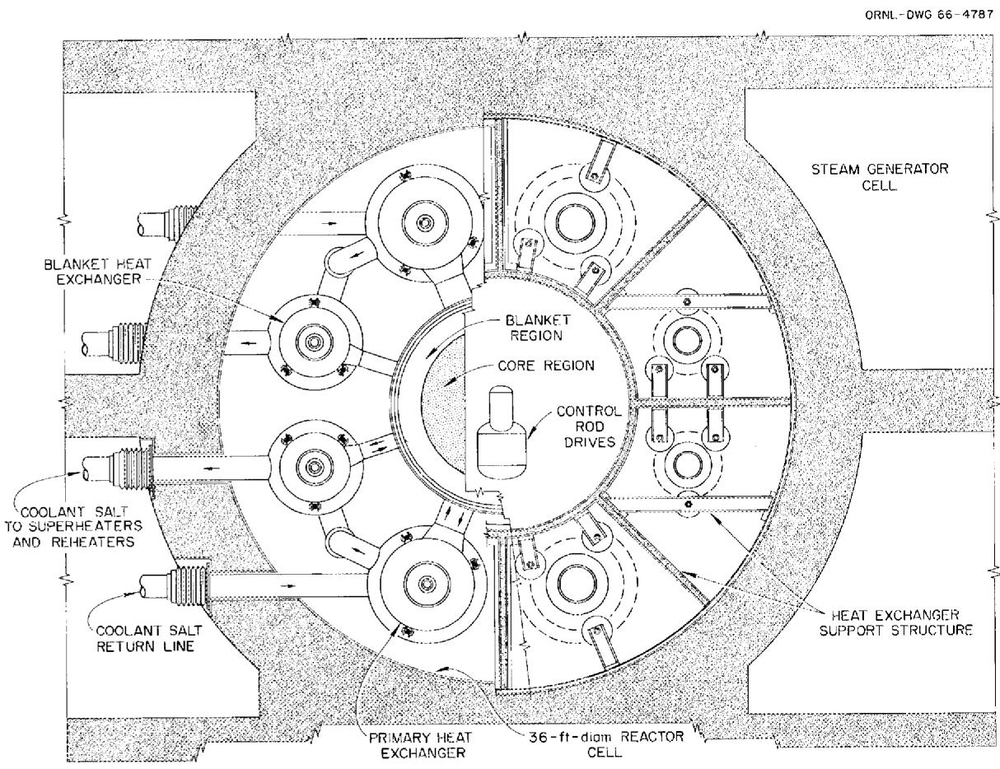  
Fig. 6.4. Plan View of MSBR Reactor Cell Showing Location of Reactor Equipment.

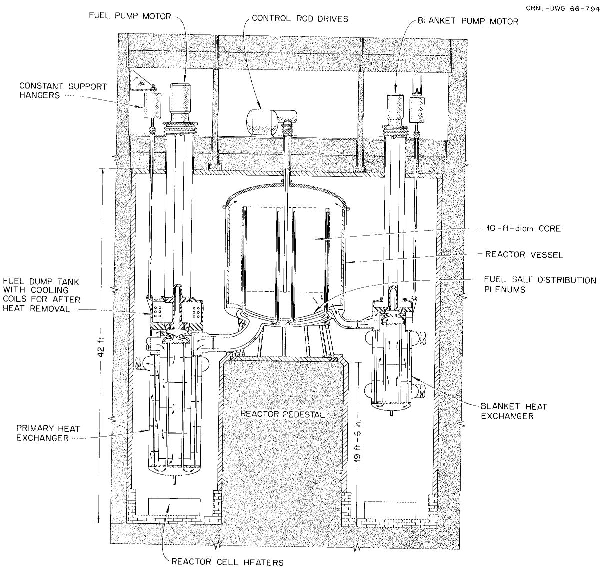  
Fig. 6.5. Elevation of Reactor Cell.

The reactor vessel, about 14 ft in diameter by about 15 ft high, contains a 10-ft-diam core assembly composed of reentry-type graphite fuel cells. The graphite tubes are attached to the two plenum chambers at the bottom of the reactor with graphite-to-metal transition sleeves. Fuel from the entrance plenum flows up fuel passages in the outer region of the fuel cell and down through a single central passage to the exit plenum. The fuel flows from the exit plenum to the heat exchangers, then to the pump, and back to the reactor. A 1-1/2-ft-thick molten-salt blanket plus a 1/4-ft-thick graphite reflector surround the core. The blanket salt also permeates the interstices of the core lattice so that fertile material flows through the core without mixing with the fissile fuel salt.

The MSBR requires structural integrity of the graphite fuel cell. In order to reduce the effect of radiation damage, the fuel cells have been

made small to reduce the fast-flux gradient across the graphite wall. Also, the cells are anchored only at one end to permit axial movement. The core volume has been made large in order to reduce the flux level in the core. In addition, the reactor is designed to permit replacement of the entire graphite core by remote means if required.

Figure 6.6 shows a cross section of a fuel cell. Fuel fluid flows upward through the small passages and downward through the large central passage. The outside diameter of a fuel cell tube is 3.5 in.; there are 534 of these tubes spaced on a 4.8-in. triangular pitch. The tube assemblies are surrounded by hexagonal blocks of moderator graphite with blanket salt filling the interstices. The nominal core composition is $75\%$ graphite, $18\%$ fuel salt, and $7\%$ blanket salt by volume.

A summary of parameter values chosen for the MSBR design is given in Table 6.1.

# Fuel Processing

The primary objectives of fuel processing are to purify and recycle fissile and carrier components and to minimize fissile inventory while holding losses to a low value. The fluoride volatility-vacuum distillation process fulfills these objectives through simple operations.

The core fuel is conveniently processed by fluoride volatility and vacuum distillation. Blanket processing is accomplished by fluoride volatility alone, and the processing cycle time is short enough to maintain a very low concentration of fissile material. The effluent $\mathrm{UF}_6$ is absorbed by fuel salt and reduced to $\mathrm{UF}_4$ by treatment with hydrogen to reconstitute a fuel-salt mixture of the desired composition.

Molten-salt reactors are inherently suited to the design of processing facilities integral with the reactor plant; these facilities require only a small amount of cell space adjacent to the reactor cell. Because all services and equipment available to the reactor are available to the processing plant and because shipping and storage charges are eliminated, integral processing facilities permit significant savings in capital and operating costs. Also, the processing plant inventory of fissile material is greatly reduced, resulting in low fuel inventory charges and improved fuel utilization characteristics for the reactor.

The principal steps in core and blanket stream processing of the MSBR are shown in Fig. 6.7. A small side stream of each fluid is continuously withdrawn from the fuel and blanket circulating loops and is circulated through the processing system. After processing, the decontaminated fluids are returned to the reactor at some convenient point -- for example, via the fuel and fertile stream storage tanks.

Fuel inventories retained in the processing plant are estimated to be about $10\%$ of the reactor system inventory for core processing and less than $1\%$ for blanket processing.

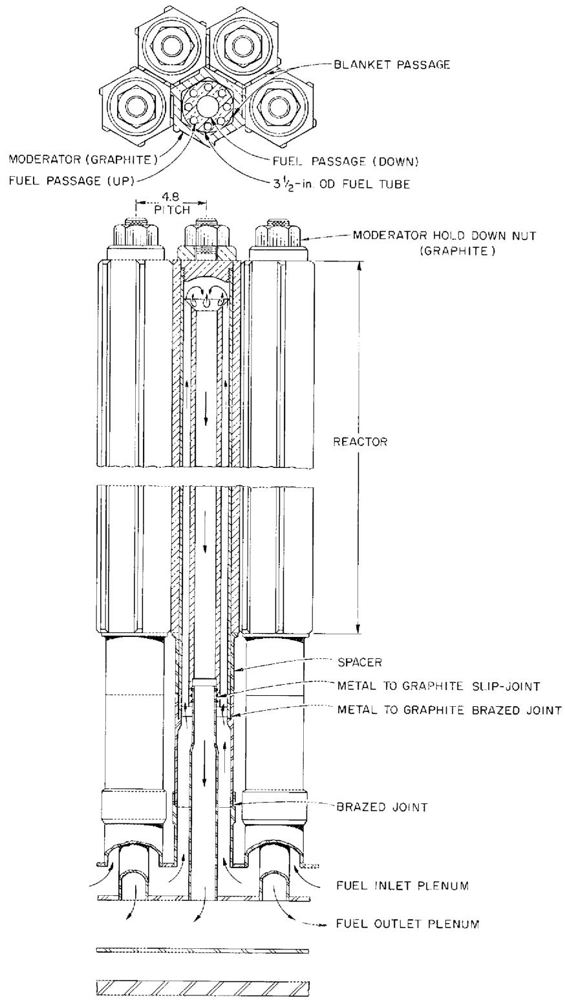  
Fig. 6.6. Cross Section of a Fuel Cell.

ORNL-DWG65-6194A

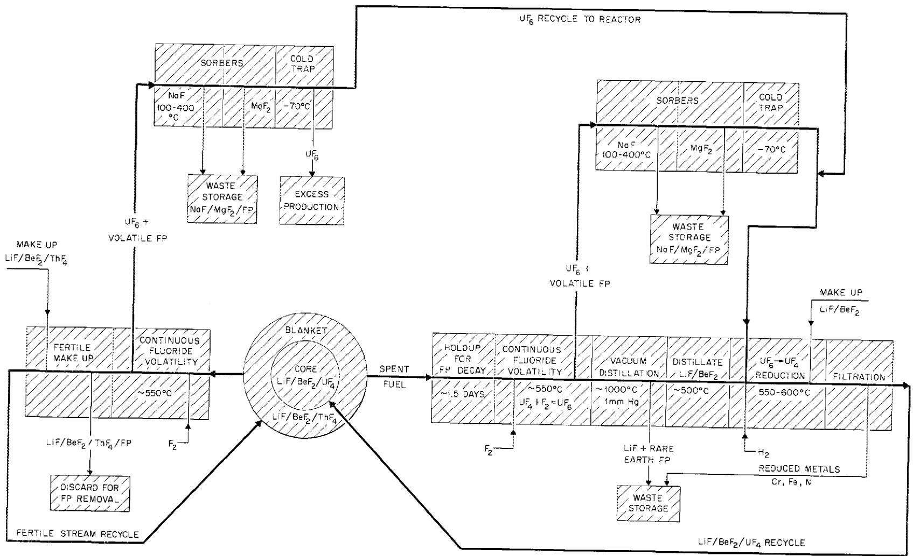  
Fig. 6.7. MSBR Core and Blanket Stream Processing Scheme.

Table 6.1. Parameter Values of MSBR Design   

<table><tr><td colspan="2">Power, Mw</td></tr><tr><td>Thermal</td><td>2220</td></tr><tr><td>Electrical</td><td>1000</td></tr><tr><td>Thermal efficiency</td><td>0.45</td></tr><tr><td>Plant factor</td><td>0.80</td></tr><tr><td>Dimensions, ft</td><td></td></tr><tr><td>Core height</td><td>12.5</td></tr><tr><td>Core diameter</td><td>10.0</td></tr><tr><td>Blanket thickness</td><td></td></tr><tr><td>Radial</td><td>1.5</td></tr><tr><td>Axial</td><td>2.0</td></tr><tr><td>Reflector thickness</td><td>0.25</td></tr><tr><td>Volumes, ft3</td><td></td></tr><tr><td>Core</td><td>982</td></tr><tr><td>Blanket</td><td>1120</td></tr><tr><td>Volume fractions</td><td></td></tr><tr><td>Core</td><td></td></tr><tr><td>Fuel salt</td><td>0.169</td></tr><tr><td>Fertile salt</td><td>0.0735</td></tr><tr><td>Moderator</td><td>0.7575</td></tr><tr><td>Blanket</td><td></td></tr><tr><td>Fertile salt</td><td>1.0</td></tr><tr><td>Salt volumes, ft3</td><td></td></tr><tr><td>Fuel</td><td></td></tr><tr><td>Core</td><td>166</td></tr><tr><td>Blanket</td><td>26</td></tr><tr><td>Plenum</td><td>147</td></tr><tr><td>Heat exchanger and piping</td><td>345</td></tr><tr><td>Processing</td><td>33</td></tr><tr><td>Total</td><td>717</td></tr><tr><td>Fertile</td><td></td></tr><tr><td>Core</td><td>72</td></tr><tr><td>Blanket</td><td>1121</td></tr><tr><td>Heat exchanger and piping</td><td>100</td></tr><tr><td>Storage (protactinium decay)</td><td>2066</td></tr><tr><td>Processing</td><td>24</td></tr><tr><td>Total</td><td>3383</td></tr><tr><td>Salt compositions, mole %</td><td></td></tr><tr><td>Fuel</td><td></td></tr><tr><td>LiF</td><td>63.6</td></tr><tr><td>BeF2</td><td>36.2</td></tr><tr><td>UF4(fissile)</td><td>0.22</td></tr><tr><td>Fertile</td><td></td></tr><tr><td>LiF</td><td>71.0</td></tr><tr><td>BeF2</td><td>2.0</td></tr><tr><td>ThF4</td><td>27.0</td></tr><tr><td>UF4(fissile)</td><td>0.0005</td></tr></table>

Table 6.1 (continued)   

<table><tr><td colspan="3">Core atom ratios</td></tr><tr><td>Th/U</td><td></td><td>41.7</td></tr><tr><td>C/U</td><td></td><td>5800</td></tr><tr><td>Fissile inventory, kg</td><td></td><td>769</td></tr><tr><td>Fertile inventory, thousands of kilograms</td><td></td><td>260</td></tr><tr><td colspan="3">Processing by fluoride volatility</td></tr><tr><td></td><td>Fuel</td><td>Fertile</td></tr><tr><td></td><td>Stream</td><td>Stream</td></tr><tr><td>Cycle time, days</td><td>47</td><td>23</td></tr><tr><td>Rate, ft3/day</td><td>14.5</td><td>144</td></tr><tr><td>Unit processing cost, $/ft3</td><td>183</td><td>6.85</td></tr></table>

# Heat Exchange and Steam Systems

The structural material for all components contacted by molten salt in the fuel, blanket, and coolant systems, including the reactor vessel, pumps, heat exchangers, and piping and storage tanks, is Hastelloy N.

The primary heat exchangers are of the tube-and-shell type. Each shell contains two concentric tube bundles connected in series and attached to fixed tube sheets. The fuel salt flows downward in the outer section of tubes, enters a plenum at the bottom of the exchanger, and then flows upward to the pump through the center section of tubes. Entering at the top, the coolant salt flows on the baffled shell side of the exchanger down the central core, under the barrier that separates the two sections, and up the outer annular section.

Since a large temperature difference exists in the two tube sections, the tube sheets at the bottom of the exchanger are not attached to the shell. The design permits differential tube growth between the two sections without creating troublesome stress problems. To accomplish this, the tube sheets are connected at the bottom of the exchanger by a bellows-type joint. This arrangement, essentially a floating plenum, permits enough relative motion between the central and outer tube sheets to compensate for differential tube growth without creating intolerable stresses in the joint, the tubes, or the pump.

The blanket heat exchangers increase the temperature of the coolant leaving the primary core heat exchangers. Since the coolant-salt temperature rise through the blanket exchangers is small and the flow rate is relatively high, the exchangers are designed for a single shell-side pass for the coolant salt, although two-pass flow is retained for the blanket salt in the tubes. Straight tubes with two tube sheets are used.

The superheater is a U-tube U-shell exchanger using disk and donut baffles with varying spacing. It is a long, slender exchanger having

relatively large baffle spacing. The baffle spacing is established by the shell-side pressure drop and by the temperature gradient across the tube wall and is greatest in the central portion of the exchanger, where the temperature difference between the fluids is high. The supercritical fluid enters the tube side of the superheater at $700^{\circ}\mathrm{F}$ and 3800 psi and leaves at $1000^{\circ}\mathrm{F}$ and 3600 psi.

The reheaters transfer energy from the coolant salt to the working fluid before its use in the intermediate-pressure turbine. A shell-tube exchanger is used, producing steam at $1000^{\circ}\mathrm{F}$ and 540 psi.

Since the freezing temperature of the secondary salt coolant is about $700^{\circ}\mathrm{F}$ , a high working-fluid inlet temperature is required. Preheaters, along with prime fluid, are used in raising the temperature of the working fluid entering the superheaters. Prime fluid goes through a preheater exchanger and leaves at a pressure of 3550 psi and a temperature of about $870^{\circ}\mathrm{F}$ . It is then injected into the feedwater in a mixing tee, producing fluid at $700^{\circ}\mathrm{F}$ and 3500 psi. The pressure is then increased to about 3800 psi by a pressurizer (feedwater pump) before the fluid enters the superheater.

# Capital Cost Estimates

# Reactor Power Plant

Preliminary estimates of the capital cost of a 1000-Mw (electrical) MSBR power station indicate a direct construction cost of about $80.4 million. After applying the indirect cost factors used in the advanced converter evaluation, an estimated total plant cost of $113.6 million is obtained. A summary of plant costs is given in Table 6.2. The conceptual design was not sufficiently detailed to permit a completely reliable estimate; however, the design and estimates were studied thoroughly enough to make meaningful comparisons with previous converter-reactor plant cost studies. The relatively low capital cost estimate obtained results from the small physical size of the MSBR and the simple control requirements. The results of the study encourage the belief that the cost of an MSBR power station will be as low as for stations utilizing other reactor concepts.

The operating and maintenance costs of the MSBR were not estimated. Based on the ground rules used in ref. 1, these costs would be about 0.3 mill/kwhr (electrical).

# Fuel Recycle Plant

The capital costs associated with fuel recycle equipment were obtained by itemizing and costing the major process equipment required and by estimating the costs of site, buildings, instrumentation, waste disposal, and building services associated with fuel recycle.

Table 6.2. Preliminary Cost-Estimate Summarya for a 1000-MW (Electrical) MSBR Power Station   

<table><tr><td></td><td>Federal Power Commission Account</td><td>Costs(thousands of dollars)</td></tr><tr><td>20</td><td>Land and land rightsb</td><td>360</td></tr><tr><td>21</td><td>Structures and improvements</td><td></td></tr><tr><td></td><td>Ground improvements</td><td>866</td></tr><tr><td></td><td>Buildings and structures</td><td></td></tr><tr><td></td><td>.1 Reactor building</td><td>4,181</td></tr><tr><td></td><td>.2 Turbine building, auxiliary building,and feedwater heater space</td><td>2,832</td></tr><tr><td></td><td>.3 Offices, shops, and laboratories</td><td>1,160</td></tr><tr><td></td><td>.4 Waste disposal building</td><td>150</td></tr><tr><td></td><td>.5 Stack</td><td>76</td></tr><tr><td></td><td>.6 Warehouse</td><td>40</td></tr><tr><td></td><td>.7 Miscellaneous</td><td>30</td></tr><tr><td></td><td></td><td>Subtotal account 212</td></tr><tr><td></td><td></td><td>Total account 21</td></tr><tr><td>22</td><td>Reactor plant equipment</td><td></td></tr><tr><td></td><td>Reactor equipment</td><td></td></tr><tr><td></td><td>.1 Reactor vessel</td><td>1,610</td></tr><tr><td></td><td>.2 Control rods</td><td>250</td></tr><tr><td></td><td>.3 Shielding and containment</td><td>1,477</td></tr><tr><td></td><td>.4 Heating-cooling systems andvapor-suppression system</td><td>1,200</td></tr><tr><td></td><td>.5 Moderator and reflector</td><td>1,089</td></tr><tr><td></td><td>.6 Reactor plant crane</td><td>265</td></tr><tr><td></td><td></td><td>Subtotal account 221</td></tr><tr><td>222</td><td>Heat transfer systems</td><td></td></tr><tr><td></td><td>.1 Reactor coolant system</td><td>6,732</td></tr><tr><td></td><td>.2 Intermediate cooling system</td><td>1,947</td></tr><tr><td></td><td>.3 Steam generator and reheaters</td><td>9,853</td></tr><tr><td></td><td>.4 Coolant supply and treatmentd</td><td>300</td></tr><tr><td></td><td>.5 Coolant salt inventory</td><td>354</td></tr><tr><td></td><td></td><td>Subtotal account 222</td></tr><tr><td>223</td><td>Nuclear fuel handling and storage(drain tanks)</td><td></td></tr><tr><td></td><td>Radioactive waste treatment and disposal(off-gas system)</td><td>450</td></tr><tr><td>225</td><td>Instrumentation and controls</td><td></td></tr><tr><td></td><td>Feedwater supply and treatment</td><td>4,500</td></tr><tr><td>227</td><td>Steam, condensate, and FW piping</td><td>4,051</td></tr><tr><td>228</td><td>Other reactor plant equipment(remote maintenance)</td><td>4,069</td></tr><tr><td></td><td></td><td>5,000e</td></tr><tr><td></td><td></td><td>Total account 22</td></tr><tr><td colspan="3">23 Turbine-generator units</td></tr><tr><td>231</td><td>Turbine-generator units</td><td>19,174</td></tr><tr><td>232</td><td>Circulating water system</td><td>1,243</td></tr><tr><td>233</td><td>Condensers and auxiliaries</td><td>1,690</td></tr><tr><td>234</td><td>Central lube oil system</td><td>80</td></tr><tr><td>235</td><td>Turbine plant instrumentation</td><td>25</td></tr><tr><td>236</td><td>Turbine plant piping</td><td>220f</td></tr><tr><td>237</td><td>Auxiliary equipment for generator</td><td>66</td></tr><tr><td>238</td><td>Other turbine plant equipment</td><td>25</td></tr><tr><td></td><td>Total account 23</td><td>22,523</td></tr><tr><td>24</td><td>Accessory electrical</td><td></td></tr><tr><td>241</td><td>Switchgear, main and station service</td><td>550</td></tr><tr><td>242</td><td>Switchboards</td><td>128</td></tr><tr><td>243</td><td>Station service transformers</td><td>169</td></tr><tr><td>244</td><td>Auxiliary generator</td><td>50</td></tr><tr><td>245</td><td>Distributed items</td><td>2,000</td></tr><tr><td></td><td>Total account 24</td><td>2,897</td></tr><tr><td>25</td><td>Miscellaneous</td><td>800</td></tr><tr><td></td><td>Total direct construction costg</td><td>80,402</td></tr><tr><td></td><td>Total indirect costs</td><td>33,181</td></tr><tr><td></td><td>Total plant cost</td><td>113,583</td></tr></table>

Estimates are based on 1966 costs, assuming an established molten-salt nuclear power plant industry.   
bLand costs are not included in total direct construction costs.   
cMSBR containment cost is included in account 221.3.   
Assumed as $300,000 on the basis of MSRE experience.   
eThe ample MSBR allowance for remote maintenance may be too high, and some of the included replacement equipment allowances could more logically be classified as operating expenses rather than first capital costs.   
fBased on Bull Run plant cost of $160,000 plus ~37% for uncertainties.   
${}^{\mathrm{g}}$ Does not include account 20,land costs. This is included in the indirect costs.

Table 6.3 summarizes the direct construction costs, the indirect costs, and total costs associated with the integrated processing facility having approximately the required capacity.

The operating and maintenance costs for the fuel recycle facility include labor, labor overhead, chemicals, utilities, and maintenance materials. The total annual cost for the capacity considered here (15 ft³ of fuel salt per day and 105 ft³ of fertile salt per day) is estimated to be $721,230, which is equivalent to about 0.1 mill/kwhr (electrical).² A breakdown of these charges is given in Table 6.4.

Table 6.3. Summary of Processing-Plant Costs 1000-Mw (Electrical) MSBR   

<table><tr><td>Processing-Plant Expenditures</td><td>Costs</td></tr><tr><td>Installed process equipment</td><td>$ 853,760</td></tr><tr><td>Structures and improvements</td><td>556,770</td></tr><tr><td>Waste storage</td><td>387,970</td></tr><tr><td>Process piping</td><td>155,800</td></tr><tr><td>Process instrumentation</td><td>272,100</td></tr><tr><td>Electrical auxiliaries</td><td>84,300</td></tr><tr><td>Sampling connections</td><td>20,000</td></tr><tr><td>Service and utility piping</td><td>128,060</td></tr><tr><td>Insulation</td><td>50,510</td></tr><tr><td>Radiation monitoring</td><td>100,000</td></tr><tr><td>Total direct costs</td><td>$2,609,270</td></tr><tr><td>Construction overhead (30% of direct costs)</td><td>782,780</td></tr><tr><td>Total construction cost</td><td>3,392,050</td></tr><tr><td>Engineering and inspection (25% of total construction cost)</td><td>848,010</td></tr><tr><td>Subtotal plant cost</td><td>4,240,060</td></tr><tr><td>Contingency (25% of subtotal plant cost)</td><td>1,060,020</td></tr><tr><td>Total plant cost</td><td>$5,300,080</td></tr></table>

Table 6.4. Summary of Operating and Maintenance Charges for Fuel Recycle in a 1000-Mw (Electrical) MSBR   

<table><tr><td>Operation and Maintenance Expenditures</td><td>Annual Charges</td></tr><tr><td>Direct labor</td><td>$222,000</td></tr><tr><td>Labor overhead</td><td>177,600</td></tr><tr><td>Chemicals</td><td>14,640</td></tr><tr><td>Waste containers</td><td>28,270</td></tr><tr><td>Utilities</td><td>80,300</td></tr><tr><td>Maintenance materials</td><td></td></tr><tr><td>Site</td><td>2,500</td></tr><tr><td>Services and utilities</td><td>35,880</td></tr><tr><td>Process equipment</td><td>160,040</td></tr><tr><td>Total annual charges</td><td>$721,230</td></tr></table>

# Nuclear Performance and Fuel Cycle Analyses

The fuel cycle cost and the fuel yield are closely related, yet independent in the sense that two nuclear designs can have similar costs but significantly different yields. The objective of the nuclear design calculations was primarily to find the conditions that gave the lowest fuel cycle cost, and then, without appreciably increasing this cost, the highest fuel yield.

# Analysis Procedures

Calculation Method. The calculations were performed with OPTIMERC, a combination of an optimization code with the MERC multigroup, diffusion, equilibrium reactor code. The program MERC3 calculates the nuclear performance, the equilibrium concentrations of the various nuclides, including fission products, and the fuel cycle cost for a given set of conditions. OPTIMERC permits up to 20 reactor parameters to be varied, within limits, in order to determine an optimum, by the method of steepest ascent. The designs were optimized essentially for minimum fuel cycle cost, with lesser weight given to maximizing the annual fuel yield. Typical parameters varied were the reactor dimensions, blanket thickness, fractions of fuel and fertile salts in the core, and fuel and fertile stream processing rates.

Several equations were included in the code for approximating certain capital and operating costs that vary with the design parameters (e.g., capital cost of the reactor vessel, which varies with the reactor dimensions). These costs were automatically added to the fuel cycle cost in the optimization routine so that the optimization search would take into account all known economic factors. However, only the fuel cycle cost itself is reported in the results.

Modified GAM-1-THERMOS cross-section libraries were used to compute the broad group cross sections for these calculations. It was assumed that all nuclides in the reactor system are at their equilibrium concentrations. To check this assumption, a typical reactor design was examined to determine the operating time required for the various uranium isotopes to approach their equilibrium concentrations from a startup with $^{235}\mathrm{U}$ . It was found that $^{233}\mathrm{U}$ and $^{235}\mathrm{U}$ were within $95\%$ of their equilibrium concentrations in less than two years. Uranium- $^{234}$ was within $95\%$ of equilibrium after eight years, while $^{236}\mathrm{U}$ was within $80\%$ after ten years. Since the breeding performance depends mainly on the ratio of $^{233}\mathrm{U}$ to $^{235}\mathrm{U}$ in the fuel, the equilibrium calculation appears to be a good representation of the lifetime performance of these reactors, even for start-up on $^{235}\mathrm{U}$ .

# Basic Assumptions

Economic. The basic economic assumptions employed in the calculations are given in Table 6.5. The values of the fissile isotopes were taken from the current AEC price schedule.

The processing costs are based on those given in the section entitled "Capital Cost Estimates" and are included in the fuel cycle costs. The capital and operating costs were estimated separately for each stream as a function of plant throughput, based on the volume of salt processed. The total processing cost is assumed to be a function of the throughput to some fractional power called the scale factor.

Processing. The processing scheme is that indicated in Fig. 6.7. A fissile material loss of $0.1\%$ per pass through processing was assumed.

In addition to the basic processing scheme employed, results were also obtained for the case where protactinium can be removed directly from the blanket stream. The improvement in performance under these circumstances is a measure of the incentive to develop protactinium removal ability.

Fission Product Behavior. The disposition of the various fission products was assumed as shown in Table 6.6. The behavior of $^{135}\mathrm{Xe}$ and other fission gases has a significant influence on nuclear performance. A gas stripping system is provided to remove these gases from the fuel salt. However, part of the xenon could diffuse into the moderator graphite. In the calculations reported here, an $^{135}\mathrm{Xe}$ poison fraction of 0.005 was assumed.

Corrosion Product Behavior. The control of corrosion products in molten-salt fuels does not appear to be a significant problem, and the effect of corrosion products was neglected in the nuclear calculations. The processing method considered here can control corrosion product buildup in the fuel.

Table 6.5. Basic Economic Assumptions   

<table><tr><td>Reactor power, Mw (electrical)</td><td>1000</td></tr><tr><td>Thermal efficiency, %</td><td>45</td></tr><tr><td>Load factor</td><td>0.80</td></tr><tr><td>Cost assumptions</td><td></td></tr><tr><td>Value of 233U and 233Pa, $/g</td><td>14</td></tr><tr><td>Value of 235U, $/g</td><td>12</td></tr><tr><td>Value of thorium, $/kg</td><td>12</td></tr><tr><td>Value of carrier salt, $/kg</td><td>26</td></tr><tr><td>Capital charge, annual rate, %</td><td></td></tr><tr><td>Plant</td><td>12</td></tr><tr><td>Nondepreciating capital, including fissile inventory</td><td>10</td></tr><tr><td>Processing cost, dollars per cubic foot of salt</td><td></td></tr><tr><td>Fuel (at 10 ft3/day)</td><td>228</td></tr><tr><td>Blanket (at 100 ft3/day)</td><td>8.47</td></tr><tr><td>Processing cost scale factor (exponent)</td><td>0.4</td></tr></table>

Table 6.6. Disposition of Fission Products in MSBR Reactor and Processing Systems   

<table><tr><td>Elements present as gases; assumed to be partly absorbed by graphite and partly removed by gas stripping (1/2% poisoning assumed)</td><td>Kr, Xe</td></tr><tr><td>Elements which plate out on metal surfaces; assumed to be removed instantaneously</td><td>Ru, Rh, Pd, Ag, In</td></tr><tr><td>Elements which form volatile fluorides; assumed to be removed in the fluoride volatility process</td><td>Se, Br, Nb, Mo, Tc, Te, I</td></tr><tr><td>Elements which form stable fluorides less volatile than LiF; assumed to be separated by vacuum distillation</td><td>Sr, Y, Ba, La, Ce, Pr, Nd, Pm, Sm, Eu, Cd, Tb</td></tr><tr><td>Elements which are not separated from the carrier salt; assumed to be removed only by salt discard</td><td>Rb, Cd, Sn, Cs, Zr</td></tr></table>

Table 6.7. MSBR Performance   

<table><tr><td>Fuel yield, %/year</td><td>4.86</td></tr><tr><td>Breeding ratio</td><td>1.049</td></tr><tr><td>Fissile losses in processing, atoms/fissile absorption</td><td>0.0057</td></tr><tr><td>Neutron production per fissile absorption, ηe</td><td>2.221</td></tr><tr><td>Specific inventory, kilograms of fissile material per Mw (electrical)</td><td>0.769</td></tr><tr><td>Specific power, Mw (thermal) per kilogram of fissile material</td><td>2.89</td></tr><tr><td>Power density, core average, kw/liter</td><td></td></tr><tr><td>Gross</td><td>80</td></tr><tr><td>In fuel salt</td><td>473</td></tr><tr><td>Neutron flux, core average, 1014neutrons cm-2sec-1</td><td></td></tr><tr><td>Thermal</td><td>6.7</td></tr><tr><td>Fast</td><td>12.1</td></tr><tr><td>Fast, over 100 kev</td><td>3.1</td></tr><tr><td>Thermal flux factors, core, peak/mean</td><td></td></tr><tr><td>Radial</td><td>2.22</td></tr><tr><td>Axial</td><td>1.37</td></tr><tr><td>Fraction of fissions in fuel stream</td><td>0.987</td></tr><tr><td>Fraction of fissions in thermal neutron group</td><td>0.806</td></tr><tr><td>Mean η of 233U</td><td>2.221</td></tr><tr><td>Mean η of 235U</td><td>1.958</td></tr></table>

# Nuclear Design Analysis

The important parameters describing the MSBR design are given in Table 6.1. Many of the parameters were basically fixed by the ground rules for the evaluation or by the engineering design. These include the thermal efficiency, plant factor, capital charge rate, maximum fuel velocity, size of fuel tubes, processing costs and fissile loss rate, and the out-of-core fuel inventory. The parameters which were optimized by OPTIMERC were the reactor dimensions, the power density, the core composition, including the C/U and Th/U ratios, and the processing rates.

Nuclear Performance. The results of the calculations for the MSBR design are given in Table 6.7, and the neutron balance is given in Table 6.8. The basic design has the inherent advantage of no neutron losses

Table 6.8. MSBR Neutron Balance   

<table><tr><td rowspan="2">Material</td><td colspan="3">Neutrons per Fissile Absorption</td></tr><tr><td>Absorbed Total</td><td>Absorbed by Fission</td><td>Produced</td></tr><tr><td>232Th</td><td>0.9710</td><td>0.0025</td><td>0.0059</td></tr><tr><td>233Pa</td><td>0.0079</td><td></td><td></td></tr><tr><td>233U</td><td>0.9119</td><td>0.8090</td><td>2.0233</td></tr><tr><td>234U</td><td>0.0936</td><td>0.0004</td><td>0.0010</td></tr><tr><td>235U</td><td>0.0881</td><td>0.0708</td><td>0.1721</td></tr><tr><td>236U</td><td>0.0115</td><td>0.0001</td><td>0.0001</td></tr><tr><td>237Np</td><td>0.0014</td><td></td><td></td></tr><tr><td>238U</td><td>0.0009</td><td></td><td></td></tr><tr><td>Carrier salt (except 6Li)</td><td>0.0623</td><td></td><td>0.0185</td></tr><tr><td>6Li</td><td>0.0030</td><td></td><td></td></tr><tr><td>Graphite</td><td>0.0300</td><td></td><td></td></tr><tr><td>135Xe</td><td>0.0050</td><td></td><td></td></tr><tr><td>149Sm</td><td>0.0069</td><td></td><td></td></tr><tr><td>151Sm</td><td>0.0018</td><td></td><td></td></tr><tr><td>Other fission products</td><td>0.0196</td><td></td><td></td></tr><tr><td>Delayed neutrons losta</td><td>0.0050</td><td></td><td></td></tr><tr><td>Leakageb</td><td>0.0012</td><td></td><td></td></tr><tr><td>Total</td><td>2.2209</td><td>0.8828</td><td>2.2209</td></tr></table>

${}^{a}$ Delayed neutrons emitted outside the core.   
bLeakage, including neutrons absorbed in the reflector.

to structural materials other than the moderator. Except for some unavoidable loss of delayed neutrons in the external fuel circuit, there is almost zero neutron leakage from the reactor because of the thick blanket. The neutron losses to fission products are minimized by the availability of rapid and inexpensive integrated processing.

Fuel Cycle Cost. The components of the fuel cycle cost for the MSBR are given in Table 6.9. The main components are the fissile inventory and processing costs. The inventory costs are rather rigid for a given reactor design, since they are largely determined by the assumed external fuel volume. The processing costs are, of course, a function of the processing cycle times, one of the chief parameters optimized in this study.

MSBR Performance with Protactinium Removal Scheme. The ability to remove protactinium directly from the blanket of the MSBR has a marked effect on fuel yield and fuel cycle cost. This is due primarily to the marked decrease in protactinium neutron absorptions when protactinium is removed from the blanket region. A simple and inexpensive scheme for the removal of protactinium from the blanket would give the MSBR the performance indicated under MSBR (Pa) in Table 6.10; for comparison, the results without protactinium removal are also given in the table.

Table 6.9. Fuel Cycle Cost for MSBR   

<table><tr><td rowspan="2"></td><td colspan="4">Costs (mills/kwhr)</td></tr><tr><td>Fuel Stream</td><td>Fertile Stream</td><td>Total</td><td>Grand Total</td></tr><tr><td>Inventory</td><td></td><td></td><td></td><td></td></tr><tr><td>Fissilea</td><td>0.1180</td><td>0.0324</td><td>0.1504</td><td></td></tr><tr><td>Fertile</td><td>0.0000</td><td>0.0459</td><td>0.0459</td><td></td></tr><tr><td>Salt</td><td>0.0146</td><td>0.0580</td><td>0.0726</td><td></td></tr><tr><td>Total</td><td></td><td></td><td></td><td>0.2690</td></tr><tr><td>Replacement</td><td></td><td></td><td></td><td></td></tr><tr><td>Fertile</td><td>0.0000</td><td>0.0185</td><td>0.0185</td><td></td></tr><tr><td>Salt</td><td>0.0565</td><td>0.0217</td><td>0.0782</td><td></td></tr><tr><td>Total</td><td></td><td></td><td></td><td>0.0967</td></tr><tr><td>Processing</td><td>0.1102</td><td>0.0411</td><td>0.1513</td><td></td></tr><tr><td>Total</td><td></td><td></td><td></td><td>0.1513</td></tr><tr><td>Production credit</td><td></td><td></td><td></td><td>0.0718</td></tr><tr><td>Net fuel cycle cost</td><td></td><td></td><td></td><td>0.4452</td></tr></table>

a. Including $^{233}\mathrm{Pa},$ $^{233}\mathrm{U},$ and $^{235}\mathrm{U}.$

Based on the above, the power cost, specific fissile inventory, and fuel doubling time for the MSBR and MSBR (Pa) are summarized in Table 6.11.

Table 6.11 illustrates the economic advantage of MSBR's as nuclear power plants. Also, the fuel utilization characteristics as measured by the product of the specific inventory and the square of the doubling time are excellent. On this basis the MSBR is comparable to a fast breeder with a specific inventory of $3\mathrm{kg/Mw}$ (electrical) and a doubling time of 10.5 years, while the MSBR (Pa) is comparable to the same fast breeder with a doubling time of 6 years.

Table 6.10. Comparison of MSBR Performance With and Without Protactinium Removal   

<table><tr><td></td><td>MSBR, Without 
Protactinium 
Process</td><td>MSBR (Pa), 
with 
Protactinium 
Removal</td></tr><tr><td>Fuel yield, %/year</td><td>4.86</td><td>7.95</td></tr><tr><td>Breeding ratio</td><td>1.049</td><td>1.071</td></tr><tr><td>Fuel cycle cost, mills/kwhr</td><td>0.45</td><td>0.33</td></tr><tr><td>Specific inventory, kg/Mw 
(electrical)</td><td>0.769</td><td>0.681</td></tr><tr><td>Specific power, Mw (thermal)/kg</td><td>2.89</td><td>3.26</td></tr><tr><td>Neutron production per fissile 
absorption, ηe</td><td>2.221</td><td>2.227</td></tr><tr><td>Volume fractions, core</td><td></td><td></td></tr><tr><td>Fuel</td><td>0.169</td><td>0.169</td></tr><tr><td>Fertile</td><td>0.0745</td><td>0.0735</td></tr><tr><td>Moderator</td><td>0.7565</td><td>0.7575</td></tr><tr><td>Salt volumes, ft3</td><td></td><td></td></tr><tr><td>Fuel</td><td></td><td></td></tr><tr><td>Core</td><td>166</td><td>166</td></tr><tr><td>External</td><td>547</td><td>551</td></tr><tr><td>Total</td><td>713</td><td>717</td></tr><tr><td>Fertile</td><td></td><td></td></tr><tr><td>Total</td><td>3383</td><td>1317</td></tr><tr><td>Core atom ratios</td><td></td><td></td></tr><tr><td>Th/U</td><td>39.7</td><td>41.7</td></tr><tr><td>C/U</td><td>5440</td><td>5800</td></tr></table>

Table 6.11. Power Cost and Fuel Utilization Characteristics of the MSBR and the MSBR (Pa)   

<table><tr><td></td><td colspan="2">Cost [mills/kwhr (electrical)]</td></tr><tr><td></td><td>MSBR</td><td>MSBR (Pa)</td></tr><tr><td>Capital costa</td><td>1.95</td><td>1.95</td></tr><tr><td>Operating and maintenance costb</td><td>0.30</td><td>0.30</td></tr><tr><td>Fuel cycle costc</td><td>0.45</td><td>0.33</td></tr><tr><td>Total power cost</td><td>2.70</td><td>2.58</td></tr><tr><td>Specific fissile inventory, kg/Mw (electrical)</td><td>0.77</td><td>0.68</td></tr><tr><td>Fuel doubling time, years</td><td>20.6</td><td>12.6</td></tr></table>

a12% fixed charge rate, 80% load factor, 1000-Mw (electrical) plant.   
bNominal value used in advanced converter evaluation (see ref. 1).   
Costs of on-site integrated processing plant are included in this value.

# References

1. M. W. Rosenthal et al., A Comparative Evaluation of Advanced Converters, ORNL-3686 (January 1965).   
2. C. D. Scott and W. L. Carter, Preliminary Design Study of a Continuous Fluorination-Vacuum Distillation System for Regenerating Fuel and Fertile Streams in a Molten Salt Breeder Reactor, ORNL-3791 (January 1966).   
3. T. W. Kerlin, Jr., et al., The MERC-1 Equilibrium Code, ORNI-TM-847 (Apr. 22, 1964).   
4. P. R. Kasten, "Nuclear Fuel Utilization and Economic Incentives," paper presented at the American Nuclear Society Meeting, Nov. 15-18, 1965, Washington, D.C.

# 7. MOLTEN-SALT REACTOR PROCESSING STUDIES

A close-coupled facility for processing the fuel and fertile streams of a molten-salt breeder reactor (MSBR) will be an integral part of the reactor system. Studies are in progress for obtaining data relevant to the engineering design of such a processing facility. The processing plant will operate on a side stream withdrawn from the fuel stream, which circulates through the reactor core and the primary heat exchanger. For a 1000-Mw (electrical) MSBR, approximately 14.1 ft³ of salt per day will be processed, which will result in a fuel-salt cycle time of approximately 40 days.

The probable method for fuel-stream and fertile-stream processing is shown in Fig. 7.1. The salt will first be contacted with $\mathbf{F}_2$ for removal of uranium as volatile $\mathbf{U}\mathbf{F}_6$ . Purified $\mathbf{U}\mathbf{F}_6$ will be obtained from the fluorinator off-gas (consisting of $\mathbf{U}\mathbf{F}_6$ , excess $\mathbf{F}_2$ , and volatile fission product fluorides) by use of NaF sorption. A semicontinuous vacuum distillation will then be carried out on the remaining salt for the removal of the rare earths, barium, strontium, and yttrium. These fission products will be removed from the still in a salt volume equivalent to $0.5\%$ of the stream. A small fraction of salt may also have to be discarded at some stage in the process for removal of fission products such

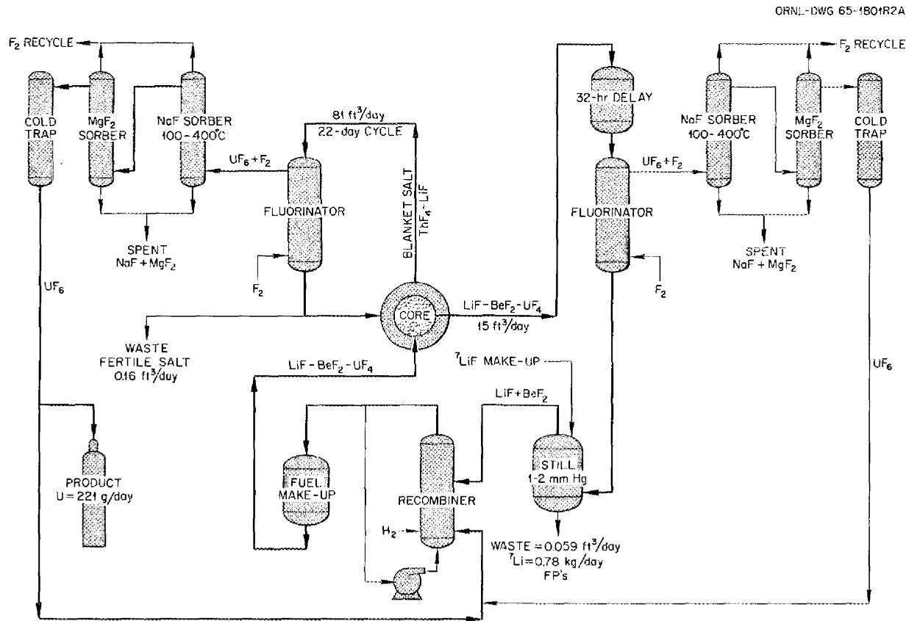  
Fig. 7.1. MSBR Fuel and Fertile Stream Processing.

as zirconium, rubidium, and cesium. The barren salt, the purified $\mathrm{UF}_6$ , and the makeup salt will then be recombined. This step involves reduction of $\mathrm{UF}_6$ to $\mathrm{UF}_4$ , mixing of these streams, and sparging the resultant material with an $\mathrm{H}_2$ -HF stream. Finally, the salt mixture will be filtered before return to the reactor.

# Semicontinuous Distillation

The present concept of the distillation step in the MSBR processing plant will use a continuous feed stream and vapor removal; however, there will be a buildup of less volatile fission products (FP) in a static pool of liquid in the still, with periodic discard. Fission products will be allowed to build up in the still liquid until the heat generation rate becomes excessive, or until the liquid FP concentration becomes too large for useful decontamination.

One measure of the decontamination achieved in the distillation process is the relative volatility of the nonvolatile fission products as compared with the carrier salt. The relative volatility of a non-volatile component A compared with a more volatile component B in a mixture of A and B is defined as

$$
\alpha_ {A B} = \frac {y _ {A} / x _ {A}}{y _ {B} / x _ {B}}, \tag {1}
$$

where

$\alpha_{AB} =$ relativevolatilityofAcomparedwithB,

$y =$ vapor-phase mole fraction,

$\mathbf{x} =$ liquid-phase mole fraction.

To achieve good decontamination from the less volatile FP, the relative volatility must be small. For systems in which the FP concentration is small, the relative volatility can be approximated by

$$
\alpha_ {\mathrm {A B}} \approx \mathrm {y} _ {\mathrm {A}} / \mathrm {x} _ {\mathrm {A}}, \tag {2}
$$

which is the Henry's law constant, $\mathbb{H}_{\mathrm{A}}$ used in the expression

$$
y _ {A} = H _ {A} x _ {A}. \tag {3}
$$

Thus, determination of the Henry's law constant or relative volatility for each of the nonvolatile FP will be sufficient for determining the size and operating conditions for the distillation step.

The importance of relative volatility in determining the operating characteristics of a distillation system is shown by the following calculation. Consider a material balance of an FP in the proposed distillation

process. The amount of FP fed into the still per unit time $(\mathbf{Fx}_0)$ must equal the FP leaving the still per unit time (Dy), plus the rate of change of FP in the still liquid $d(\mathrm{Vx}) / dt$ :

$$
F x _ {0} = D y + \frac {d (V x)}{d t}, \tag {4}
$$

where

$$
\begin{array}{l} x = \text {m o l e} \\ x _ {0} = \text {i n l e t m o l e f r a c t i o n o f F P}, \\ F = \text {m a s s f e e d r a t e i n m o l e s / u n i t t i m e}, \\ D = \text {v a r i p o r i z a t i o n} \\ V = \text {m a s s o f l i q u i d h o l d u p i n m o l e s}, \\ y = \text {m o l e} \\ t = \text {t i m e}. \\ \end{array}
$$

In the above material balance, vapor holdup is assumed to be negligible compared with the liquid holdup.

Substituting Eq. (3) into the material balance gives, after rearrangement,

$$
\frac {\mathrm {d} (\mathrm {V x})}{\mathrm {d t}} + \mathrm {D} \alpha \mathrm {x} = \mathrm {F x} _ {0}. \tag {5}
$$

Solution of Eq. (5) with the boundary condition

$$
x = 0 a t t = 0
$$

and the condition that the liquid holdup $V$ is constant yields

$$
x = \frac {x _ {0}}{\alpha} (1 - e ^ {- F C t / V}). \tag {6}
$$

Finally, the average vapor concentration at time $t$ is given by the relation

$$
y _ {a} = x _ {0} \left\{1 - \left[ \frac {V}{F C t} (1 - e ^ {- F C t / V}) \right] \right\}. \tag {7}
$$

Figure 7.2 shows the effect of relative volatility on the fraction of FP retained in the liquid for different values of $\alpha$ as a function of time for a feed rate of 14.1 ft³ of salt per day and a liquid volume of 4 ft³. For retention of 90% of the FP introduced to the system during 60 days of continuous distillation, a relative volatility of ~0.001 is needed.

In order to establish the relative volatility of an FP in the MSBR carrier salt, it is necessary to determine the concentration of the FP in the vapor at equilibrium with a known liquid composition. At this

phase of development, exact operating conditions in the still have not been set, but the following ranges appear reasonable: temperature, 900-1100°C; maximum FP liquid concentration, 0.1-1.0 mole %; pressure, vapor pressure of mixture. Since the MSBR carrier salt is a mixture of LiF and BeF $_2$ , the exact composition of the carrier salt or solvent in the still liquid will be dependent on operating temperature and pressure; however, in the temperature range of interest, the major portion of the still carrier salt will be the less volatile LiF. Therefore, all experimental tests were made with binary mixtures of LiF and FP fluoride. In later tests, multicomponent systems will be used.

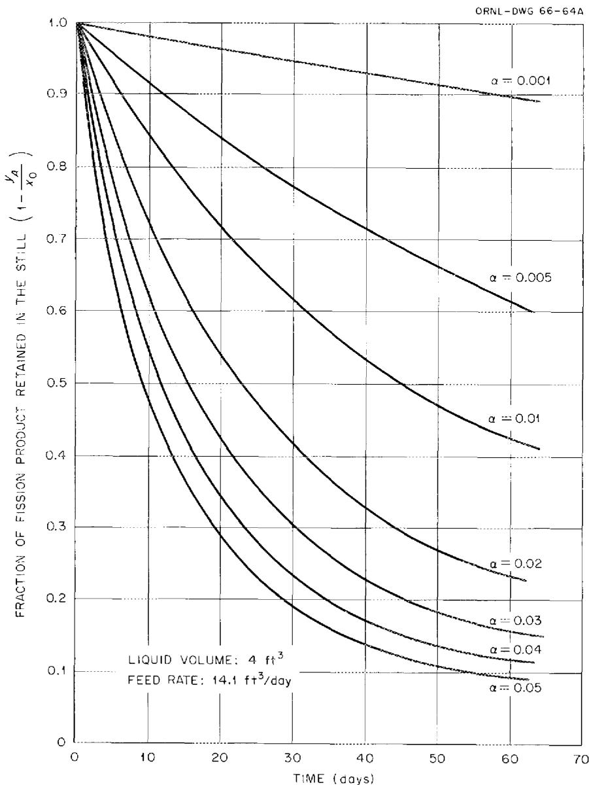  
Fig. 7.2. Fraction of Fission Product Retained and the Still as a Function of Time for Several Values of Relative Volatility.

The FP contaminants of main concern are the rare earths. Of these, the ones which will be present in the largest amount or which will present the largest neutron losses are Nd, Sm, Pm, Pr, Eu, La, and Ce. These fission products will probably be present as the trifluoride, with the exception of cerium, which might be present partially as the tetravalent fluoride.

The equipment used for determining relative volatilities was a simple equilibrium still with a cold finger in the vapor phase. This still was constructed from 1-in. nickel tubing for the liquid and disengagement space, and 5/8-in. tubing for the vapor space through which a 3/8-in. nickel cold finger was inserted (Fig. 7.3). The top of the vapor section was connected to vacuum and inert gas. The entire assembly was placed in a 5-in.-diam tube furnace. Thermocouples were inserted in the still through thermowells in the liquid phase and at three points in the vapor phase. During a test, the temperature measured at the three lower points was maintained within $5^{\circ}\mathrm{C}$ of a predetermined value.

The cold finger could be cooled by air, water, or a combination of both. This was done by introducing the coolant through a center 1/8-in.-diam tube and removing it through the annular space between the 1/8- and 3/8-in.-diam tubes. By using a coolant rate of 0.2 std liter of $\mathrm{H}_2\mathrm{O}$ per minute and 11.4 std liters of air per minute, the tip of the cold finger could be cooled from the maximum still temperature (1075°C) to less than the melting point of LiF (847°C) within 2 sec. This rapid cooling would prevent preferential condensation of the less volatile component during the cold-finger operation.

The experimental procedure used was to first charge the still with a known mixture of LiF-FP fluoride; then, after the still was filled with an inert gas (purified helium or argon), it was brought to the desired temperature. At this point the still was subjected to a vacuum pump with the capability of reducing the pressures to less than $50~\mu \mathrm{Hg}$ . After the temperature and pressure reached an apparent steady state, the cold finger was cooled for 2 to 4 min for collection of a vapor sample. The inert gas was again introduced, the cold finger was removed and replaced with a clean one, and the procedure was repeated.

The solid accumulated on the cold finger was scraped off, and it constituted the equilibrium vapor-phase sample. Approximately 0.01 g was collected for each sample, and two samples were collected at each set of conditions. For each still liquid mixture, tests were made at four temperatures, 925, 975, 1025, and $1075^{\circ}\mathrm{C}$ .

Experimental tests have been made on all the important rare-earth fluorides with the exception of promethium. Results are given in Table 7.1. They are generally consistent and compare favorably with results obtained by Kelly $^2$ in work described in the subsection "Evaporative-Distillation Studies on Molten-Salt Fuel Components" of this report.

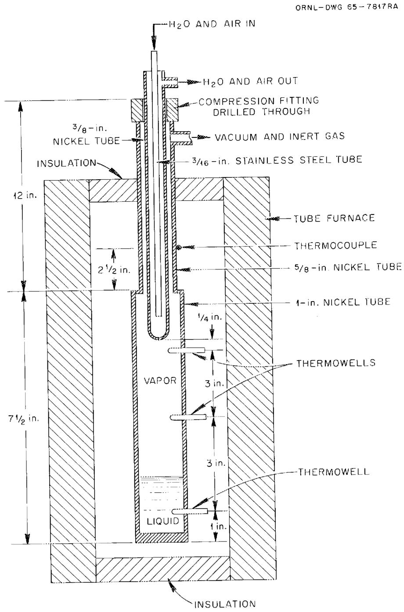  
Fig. 7.3. Equilibrium Still with Cold Finger.

Table 7.1. Relative Volatilities of Rare-Earth Fluorides in Lithium Fluoride   

<table><tr><td rowspan="2">Rare-Earth Fluoride</td><td rowspan="2">Liquid Mole Fraction</td><td colspan="4">Average Relative Volatilities</td></tr><tr><td>900°C</td><td>950°C</td><td>1000°C</td><td>1050°C</td></tr><tr><td>CeF4</td><td>0.0067</td><td>0.133</td><td>0.167</td><td></td><td>0.208</td></tr><tr><td>SmF3</td><td>0.01</td><td>0.033</td><td></td><td></td><td>0.009</td></tr><tr><td>NdF3</td><td>0.01</td><td>0.025</td><td></td><td></td><td>0.016</td></tr><tr><td>PrF3</td><td>0.001</td><td></td><td>0.038</td><td>0.020</td><td>0.014</td></tr><tr><td>EuF3</td><td>0.001</td><td>0.041</td><td>0.037</td><td>0.028</td><td>0.012</td></tr><tr><td>CeF3</td><td>0.01</td><td>0.043</td><td>0.033</td><td></td><td>0.018</td></tr><tr><td>LaF3</td><td>0.001</td><td>0.035</td><td>0.024</td><td></td><td></td></tr><tr><td>LaF3</td><td>0.01</td><td>0.051</td><td>0.027</td><td>0.011</td><td>0.008</td></tr></table>

# Fuel Reconstitution

A necessary step in the processing of the MSBR fuel is the recombination of the purified uranium hexafluoride with the purified carrier salt, which includes reduction of $\mathrm{UF}_6$ , the product of the fluorination step, to $\mathrm{UF}_4$ . The usual method for reducing $\mathrm{UF}_6$ to $\mathrm{UF}_4$ uses excess hydrogen in an $\mathrm{H}_2$ - $\mathrm{F}_2$ flame which produces hydrogen fluoride as a by-product. The resulting $\mathrm{UF}_4$ powder is collected at the base of a tall reaction vessel. Although this operation has been reduced to routine production, it appears undesirable for radiochemical application because of the inherent solids handling problem. An alternative is the reduction of $\mathrm{UF}_6$ to $\mathrm{UF}_4$ in a molten salt, involving only gases and liquids. When $\mathrm{UF}_6$ is contacted with a molten fluoride salt containing $\mathrm{UF}_4$ , it is absorbed with reaction to form intermediate fluorides of uranium such as $\mathrm{UF}_5$ . These intermediate fluorides can then be reduced to $\mathrm{UF}_4$ by contacting the salt with hydrogen. Initial but definitive tests have shown this alternative to be quite feasible. A tower which might serve well to conduct this sequence of reactions is shown in Fig. 7.4.

Questions of feasibility are raised concerning the equilibrium distribution of the various species of uranium fluorides and the rate at which the reactions proceed. It is believed that the addition of $\mathrm{UF}_6$ to a molten salt containing $\mathrm{UF}_4$ results in the formation of dissolved fluorides of uranium with a valence intermediate between $4+$ and $6+$ . This behavior is indicated by the fact that quantities of $\mathrm{F}_2$ sufficient for the formation of $\mathrm{UF}_5$ can be absorbed by molten salt containing $\mathrm{UF}_4$ without the evolution of $\mathrm{UF}_6$ . Similar behavior is also noted in reactions between $\mathrm{UF}_4$ and $\mathrm{UF}_6$ in the absence of molten salt to yield intermediate

fluorides such as $\mathrm{U}_4\mathrm{F}_{17}$ . It could be expected that the homogeneous reaction rate would be very rapid and that the absorption rate would probably depend upon diffusion to and from the interface. Previous data on the reduction of uranium fluorides intermediate between $\mathrm{UF_4}$ and $\mathrm{UF_6}$ in molten salts do not exist; however, rate data may be inferred from the reduction of $\mathrm{UF_4}$ with hydrogen in molten mixtures of LiF and $\mathrm{BeF_2}$ performed by Long. He observed that the ratio of the concentrations of hydrogen and HF in gas bubbles rising through the molten salt reached equilibrium in only a few inches. His data also indicate only $1\%$ reduction of $\mathrm{UF_4}$ to $\mathrm{UF_3}$ by a gas stream containing $1\%$ HF in hydrogen at pressures of 1 atm at $600^{\circ}\mathrm{C}$ .

The experimental equipment consisted of a reaction vessel in which molten salt containing $\mathbf{U}\mathbf{F}_4$ could be contacted with a metered stream of $\mathbf{U}\mathbf{F}_6$ , HF, $\mathbf{H}_2$ , or $\mathbf{N}_2$ , and NaF traps to collect $\mathbf{U}\mathbf{F}_6$ and/or HF in the off-gas (Fig. 7.5). Two NaF traps were provided downstream of the vessel; one

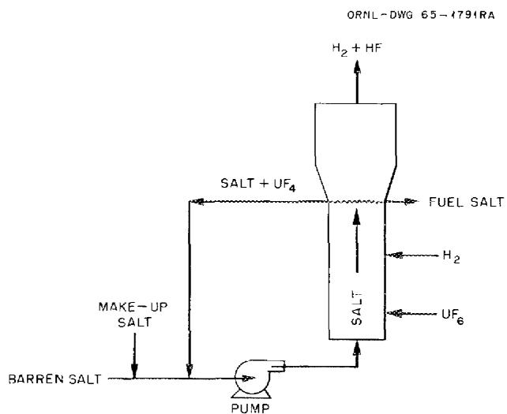  
Fig. 7.4. Continuous Reduction of $\mathbf{U}\mathbf{F}_6$ by $\mathrm{H}_{2}$ in a Molten Salt.

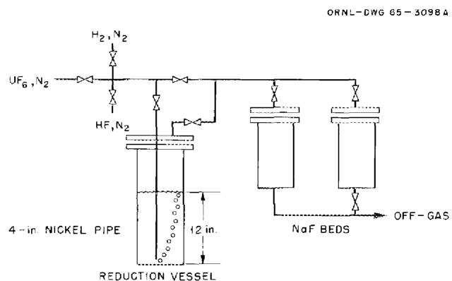  
Fig. 7.5. Equipment Used in Reduction of $\mathbf{U}\mathbf{F}_6$ to $\mathbf{U}\mathbf{F}_4$ in a Molten Salt.

trap was used only for trapping $\mathrm{UF_6}$ from the vessel off-gas during $\mathrm{UF_6}$ addition to the molten salt, and the other trap was used for all other HF or $\mathrm{UF_6}$ absorption. The reduction vessel was constructed from 4-in.-diam sched-40 nickel pipe and was 26 in. long. A 3/8-in. nickel inlet line was located in the center of the vessel and terminated $1/4$ in. from the bottom of the vessel. A 3/4-in. fitting on the top flange allowed the insertion of a cold, 3/8-in. nickel rod, which was used for sampling the salt. A 3/8-in. off-gas line was connected to the top flange. The vessel was heated by two Nichrome-wire resistance furnaces.

Three experiments were carried out at $600^{\circ}\mathrm{C}$ in which $\mathbf{U}\mathbf{F}_{6}$ was introduced at the rate of 1.5 g/min at a point 12 in. below the surface of a molten LiF-ZrF $_4$ mixture containing $\sim 0.5$ mole $\%$ $\mathbf{U}\mathbf{F}_{4}$ . The initial salt charge consisted of 5320 g of $\mathbf{ZrF_4}$ , 863 g of LiF, and 61.8 g of $\mathbf{U}\mathbf{F}_{4}$ (0.197 g-mole of $\mathbf{U}\mathbf{F}_{4}$ ) and had a melting point of approximately $510^{\circ}\mathrm{C}$ . Complete absorption of the $\mathbf{U}\mathbf{F}_{6}$ was observed during each of the tests, which resulted in the absorption of a total of 147 g of $\mathbf{U}\mathbf{F}_{6}$ during a period of 98 min.

During a typical run, the salt charge from the previous run was heated to $600^{\circ}\mathrm{C}$ and sparged with $\mathbf{N}_2$ for 15 min at the rate of $100~\mathrm{cm}^3/\mathrm{min}$ (STP), after which a salt sample was taken. The salt was then sparged with HF at the rate of 0.5 lb/hr for 1 hr and with $\mathbf{N}_2$ for 15 min, after which a second salt sample was taken. Uranium hexafluoride was then bubbled into the salt at a rate of 1.5 g/min for a specified length of time, with the vessel off-gas passing through an NaF bed used exclusively during this period. The salt was then sparged with $\mathbf{N}_2$ for 15 min and sampled. The salt was then sparged with $\mathbf{H}_2$ at the rate of 95 cm³/min (STP) for 30 min and sampled, after which the $\mathbf{H}_2$ sparge was continued for an additional 30 min.

Two questions related to the experimental work are of primary interest. These are (1) the fraction of $\mathrm{UF}_6$ which was absorbed by the molten salt and (2) the valence of the uranium in the resulting mixture. It was concluded that, within the accuracy of the experimental data, complete absorption of the $\mathrm{UF}_6$ by the molten salt had occurred. No uranium was found on the NaF trap used during the $\mathrm{UF}_6$ addition period. The concentration of $\mathrm{UF}_6$ in the salt sample taken after $\mathrm{UF}_6$ addition was below the limit of detection of 0.05 wt %. Reduction of the uranium to $\mathrm{UF}_4$ probably occurred during the addition of $\mathrm{UF}_6$ by the reaction of the intermediate fluorides with nickel from the vessel wall.

From these tests it appears that $\mathrm{UF_6}$ could be rapidly absorbed by molten fluoride salt containing about $1\mathrm{wt}\%$ $\mathrm{UF_4}$ at $600^{\circ}\mathrm{C}$ and that the intermediate fluoride formed could be reduced with hydrogen to $\mathrm{UF_4}$ . Subsequent studies are recommended to provide more quantitative data for engineering design; however, this form of recombination of $\mathrm{UF_6}$ with the purified carrier salt will be indicated on all subsequent flowsheets.

Since the presence of uranium in the distillation step to separate the carrier salt from the fission products would cause unnecessary complications, it is removed continuously in a prior fluorination step. Previous experience with the removal of uranium from molten salt by fluorination includes the operation of the Molten-Salt Fluoride Volatility Pilot Plant at ORNL.4 In this facility, batch fluorinations completely volatilized the uranium as $\mathrm{UF_6}$ , which allowed its subsequent purification and recovery by absorption and cold trapping. Observed corrosion in this facility was severe but acceptable in a batch process of this sort. However, it would be intolerable in a continuous unit, or in any unit with enough capacity to handle the processing stream for an MSBR. A possible solution to the corrosion problem is the operation of the fluorination vessel, presently envisioned as a tower, with a layer of frozen salt on the vessel wall. Experience with this type of system was obtained with batch fluorinations made at Argonne National Laboratory5 in support of the molten-salt fluoride volatility process. Successful tests were also made at ORNL using ohmic heating to provide the internal heat generation, where it was found that a gas flow could be maintained through an unheated line which entered the fluorinator vessel at a point below the molten-salt surface when a frozen salt layer was present on the fluorinator wall. In application to the MSBR fluorinator, internal heat generation will be provided by the fission product decay heat.

Experimental studies of continuous fluorination of molten salt are being made in a l-in.-diam nickel column with a salt depth of 48 in. No provision is being made in the present experimental work for corrosion protection by a frozen layer of salt (Fig. 7.6). Fluorination tests in which $15~\mathrm{cm}^3/\mathrm{min}$ of molten salt $(\mathrm{NaF}-\mathrm{LiF}-\mathrm{ZrF}_4)$ containing $0.5\mathrm{wt}\%$ UF $_6$ was contacted countercurrently with $70~\mathrm{cm}^3/\mathrm{min}$ of F $_2$ (STP) at $600^{\circ}\mathrm{C}$ showed removal of uranium from the salt at 96 to $99.4\%$ efficiency during a l-hr period of continuous operation. Material balances were complicated by the inevitable corrosion of the nickel vessel. Complete removal of uranium from the salt with no corrosion would yield, for the above conditions, a UF $_6$ concentration of 17.6 mole $\%$ in the off-gas. Observed concentrations ranged as high as 35 mole $\%$ UF $_6$ .

These results indicate that subsequent development can be expected to produce acceptable recoveries of uranium by continuous fluorination.

# Chromium Fluoride Trapping

At the conclusion of tests on the MSRE, uranium will be recovered from the fuel salt as $\mathrm{UF_6}$ by sparging the salt with $\mathbf{F}_2$ . Fluorides of chromium will be present in the fuel salt as a result of corrosion of reactor piping and of equipment used for hydrofluorination or fluorination of the salt. A potential problem associated with the recovery of the uranium is the presence of volatile fluorides of chromium ( $\mathrm{CrF_4}$ and $\mathrm{CrF_5}$ )

ORNL--DWG65-9354A

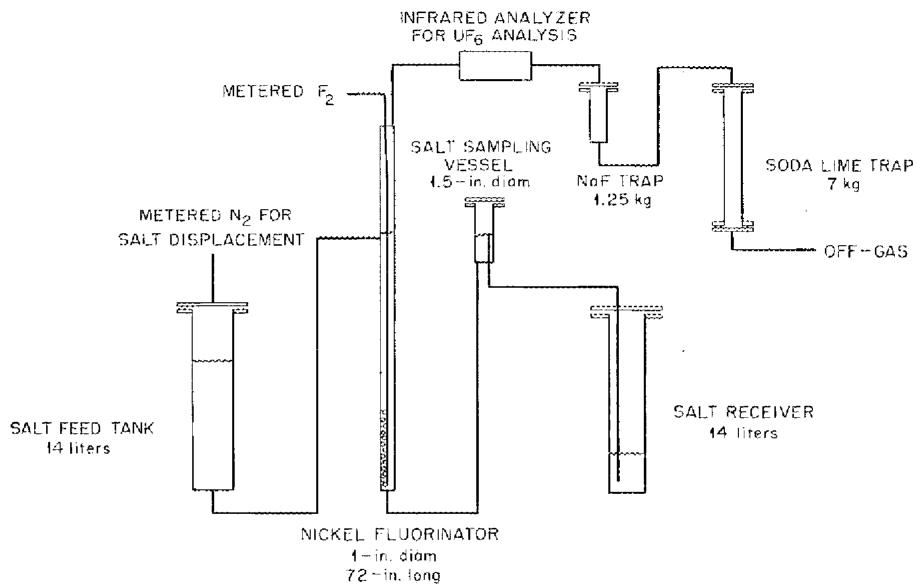  
Fig. 7.6. Equipment for Removal of Uranium from Molten Salt by Continuous Fluorination.

in the fluorinator off-gas; these fluorides cannot only contaminate the $\mathrm{UF}_6$ product but also render equipment inoperative by deposition in lines, valves, etc. A study has been completed which will permit the design of a trapping system for removing these fluorides from the off-gas, which will also contain $\mathrm{UF}_6$ and $\mathbf{F}_2$ .

Experiments were carried out in which 1 liter/min of $\mathbf{F}_2$ (STP) was sparged through a molten NaF-LiF-ZrF $_4$ mixture at $650^{\circ}\mathrm{C}$ which contained 0.5 to 4 wt $\%$ CrF $_3$ . The resulting off-gas containing fluorine and volatile fluorides of chromium then passed through beds of pelleted NaF at $400^{\circ}\mathrm{C}$ for removal of chromium fluorides. In some tests, a UF $_6$ flow of 100 cm $^3$ /min was added to the $\mathbf{F}_2$ .

It can be concluded that (l) fixed beds of NaF at $400^{\circ}\mathrm{C}$ are effective in removing fluorides of chromium from a gas stream which also contains $\mathrm{UF}_6$ and $\mathbf{F}_2$ ; (2) pelleted NaF having a surface area of $0.074\mathrm{m}^2/\mathrm{g}$ and a void fraction of 0.277 is superior to material having a surface area of $1\mathrm{m}^2/\mathrm{g}$ and a void fraction of 0.45, and has an effective capacity of about $20\mathrm{g}$ of chromium per $100\mathrm{g}$ of NaF; (3) uranium losses to the $400^{\circ}\mathrm{C}$ NaF bed of less than $0.01\%$ are achievable when working with a gas stream that contains 0.4 mole of $\mathrm{CrF}_5$ per mole of $\mathrm{UF}_6$ in $\mathbf{F}_2$ .

# Design and Evaluation Study

A preliminary design study has been made of a conceptual processing plant to treat irradiated fuel and fertile streams from the 1000-Mw (electrical) MSBR described in the section "Molten-Salt Breeder Reactor

Design Studies" of this report. The study evaluated the engineering feasibility and costs for a plant that operated continuously as an integral part of the reactor system, being located in two cells adjacent to the reactor cell. The plant was designed to treat 15 ft³/day of fuel salt and 105 ft³/day of fertile salt. The fuel salt was an LiF-BeF₂ (69-31 mole %) mixture containing the fissionable $^{233}\mathrm{UF}_4$ ; fertile salt was a 71-29 mole % mixture of LiF-ThF₄. The lithium component of each stream was enriched to about 99.995 at. % $^7\mathrm{Li}$ . The processing cycle was selected to give the optimum combination of fuel cycle cost and breeding gain.

# Description of Fuel Process

The primary objective of the fuel process is to recover uranium and carrier salts sufficiently decontaminated from fission and corrosion products so that the reactor has an attractive breeding potential. The recovered materials are recycled to the reactor, and the fission products are discarded. Only four major operations are required to accomplish this for the fuel stream: fluorination, sorption of $\mathrm{UF}_6$ , vacuum distillation, and salt reconstitution. These operations are shown schematically in Fig. 7.1.

As it enters the processing cell, fuel salt is only a few seconds removed from the fission zone and is extremely radioactive. The stream is delayed for about 36 hr before fluorination to allow the heat generation rate to decrease to a point that temperature control in the fluorinator is made easier. The curve in Fig. 7.7 shows the gross heat generation rate of the fuel salt. The molten salt flows into the top of a column and is contacted by a countercurrent stream of fluorine, which strips out the uranium according to the reaction

$$
\mathrm {U F} _ {4} + \mathrm {F} _ {2} \xrightarrow {5 0 0 - 5 5 0 ^ {\circ} \mathrm {C}} \mathrm {U F} _ {6}.
$$

Fission products Ru, Tc, Nb, Cs, Mo, and Te are also volatilized and accompany the UF6.

The system, consisting of molten LiF-BeF $_2$ -UF $_4$ , fission products, and elemental fluorine, is extremely corrosive to the walls of the fluorinator, requiring clever design if a significant lifetime is to be obtained. It is proposed to jacket the fluorinator with a coolant that will maintain a 0.5- to 0.75-in.-thick layer of frozen salt on the inner surface of the column to shield the wall from the molten salt. $^5$ A schematic diagram of the fluorinator is shown in Fig. 7.8.

The gas stream leaving the fluorinator passes through a sorption system composed of temperature-controlled beds of NaF and MgF $_2$ pellets. The first section of the NaF bed is held at about $400^{\circ}\mathrm{C}$ and sorbs most of the fission products; the second section of the bed at about $100^{\circ}\mathrm{C}$

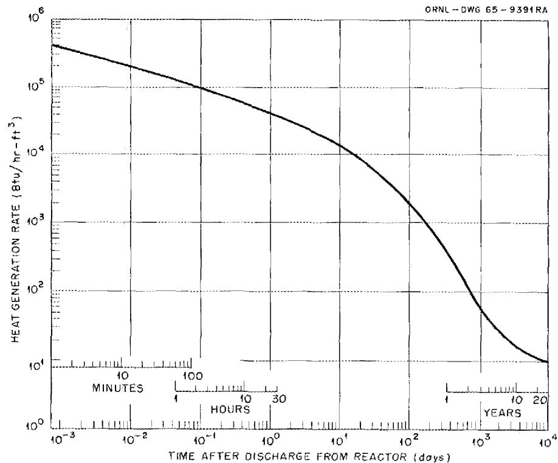  
Fig. 7.7. Fission Product Decay Heat in MSBR Fuel Stream for a 1000-Mw (Electrical) Reactor.

sorbs technetium, part of the molybdenum, and $\mathrm{UF}_6$ , and allows the remaining fission products to pass. Upon heating from 100 to $400^{\circ}\mathrm{C}$ , the second section of the sorber releases molybdenum, technetium, and $\mathrm{UF}_6$ , which passes through $\mathrm{MgF}_2$ for retention of technetium while allowing $\mathrm{UF}_6$ to pass. Uranium hexafluoride is frozen in cold traps and retained for recycle to the reactor.

Uranium-free salt flows from the fluorinator into a continuous distillation unit, which is operated at about $1\mathrm{mmHg}$ pressure and $1000^{\circ}\mathrm{C}$ . Under these conditions, it is possible to distill LiF and $\mathrm{BeF}_2$ from the bulk of the fission products.6 Rare-earth fission products are much less volatile than lithium or beryllium fluoride, allowing a good separation to be achieved. Zirconium fluoride, however, is sufficiently volatile that this fission product will contaminate the LiF- $\mathrm{BeF}_2$ product.

In this study the vacuum still was a 2.5-ft-diam by 4-ft-high vessel containing a bank of cooling tubes over most of its height. A condensing surface at the top condensed and collected the overhead product. To initiate the operation the interior of the still is charged with $4\mathrm{ft}^3$ of molten LiF; the still is evacuated and brought to temperature, and salt from the fluorinator is allowed to flow into the pool of molten LiF. Temperature is controlled so that liquid is vaporized at the same rate at which it enters the still. There is no bottom discharge, so the still volume remains constant. Accordingly, the concentration of fission

ORNL-DWG65-3037RA

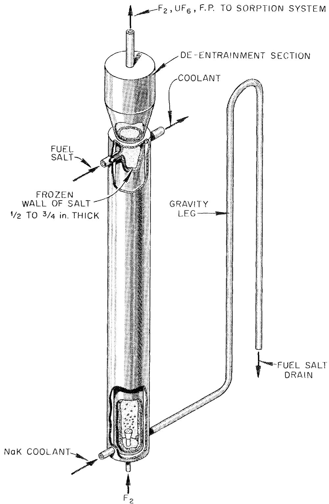  
Fig. 7.8. Continuous Fluorinator with Frozen Salt Wall for Corrosion Protection.

products steadily increases in the $4\mathrm{ft}^3$ of LiF. After about 67 days' operation the accumulated heat generation rate (see Fig. 7.9) has become so great that the heat removal capability of the cooling system is reached; the still contents are then drained to waste storage, and the operation is repeated. Heat is removed by forced circulation of NaK on the shell side of the tubes.

The concentration factor for rare-earth fission products in the still is about 250. The fraction of the process stream, which is almost entirely $^{7}\mathrm{LiF}$ , discarded at this point is slightly less than $0.4\%$ . Because of the volatility of $\mathrm{ZrF_4}$ , an additional discard of the distillate is required to purge this fission product. As much as a $5\%$ throwaway might be necessary in this type of operation. At the time of this study, data were not available to assess the effect of increasing fission product concentration in the still on relative volatilities. Consequently, the overall decontamination factor (DF) of the distillate cannot be predicted accurately, but it is believed that a DF of at least 100 can be attained.

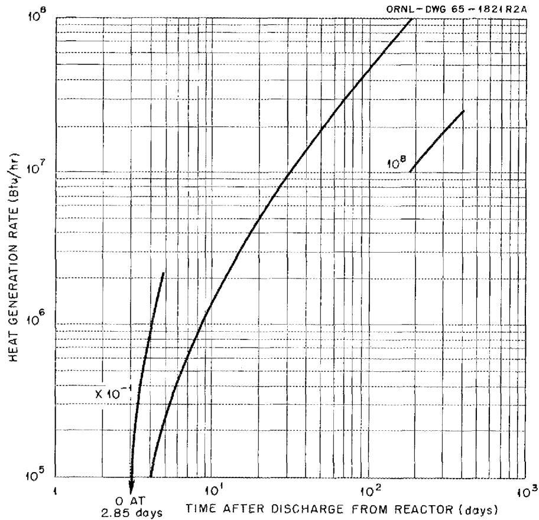  
Fig. 7.9. Heat Generation Rate in the LiF Pool Resulting from Fission Product Accumulation in the Still.

The final step in fuel processing is reconstitution to make a suitable feed for the reactor. The LiF-BeF $_2$ distillate is admitted to a reduction column containing molten ( $\sim 600^{\circ}\mathrm{C}$ ) LiF-BeF $_2$ -UF $_4$ that is approximately the correct fuel composition. Concurrently, gaseous UF $_6$ from the cold traps is introduced near the bottom of the column, and hydrogen gas is admitted at a point a little farther up the column. The UF $_6$ absorbs in the molten salt to form an intermediate fluoride of uranium such as UF $_5$ , which reacts with H $_2$ according to the reaction

$$
\mathrm {U F} _ {5} + \frac {1}{2} \mathrm {H} _ {2} \longrightarrow \mathrm {U F} _ {4} + \mathrm {H F}.
$$

Makeup $\mathrm{UF}_6$ from the blanket process and makeup LiF and $\mathrm{BeF}_2$ are added at this point. The reconstituted fuel is sent to the reactor core to complete the fuel processing cycle.

# Description of Fertile Process

The fertile stream process consists only of continuous fluorination and $\mathrm{UF}_6$ purification by sorption. The operation is analogous to the corresponding fuel stream operation but at a higher volumetric rate. The cycle time of the fertile stream is purposely kept short (20 to 25 days) to keep a low uranium concentration in the blanket, thereby keeping the fission rate low. The low fission rate ensures a low fission product accumulation rate so that it is unnecessary to remove them on the same cycle as uranium. In fact, a 30-year discard cycle of the barren fertile stream is a sufficient purge rate for fission products.

Excess $\mathbf{U}\mathbf{F}_6$ over that required to refuel the core is sold.

# Waste Treatment

Four waste streams requiring storage leave the processing facility: (1) aqueous waste from the KOH scrubber, (2) NaF and $\mathrm{MgF_2}$ sorbent from the UF $_6$ purification system, (3) molten-salt residue from the distillation unit, and (4) molten salt from the fertile-stream discard. The aqueous waste comes from vent-gas scrubbing and is small in volume; it was assumed that this stream could be combined with reactor aqueous wastes for storage. The two molten-salt wastes are stored in underground tanks, and the pelletized sorbents are stored in cylindrical containers in an underground vault. Forced draft cooling is provided for these three storage areas.

This study includes a charge for 30-year interim storage of the molten-salt wastes and for 5-year interim storage of the solid waste. Perpetual storage beyond these times was not considered.

Most of the off-gas from the process comes from the continuous fluorinators. Although fluorine is recycled, a small amount is bled off to purge gaseous fission products. The off-gas is scrubbed with an aqueous caustic solution, filtered, and discharged to the atmosphere.

# Summary of Capital and Operating Costs

The design study included an estimation of capital and operating costs for the integrated processing plant. Space requirements and costs were estimated for a typical layout (Fig. 7.10) adjacent to the reactor system. Each item of major equipment was designed to the extent that a reasonably accurate estimate of its cost could be made; the costs of auxiliary items, such as utilities, piping, instrumentation, electrical connections, insulation, and sampling, were estimated by applying appropriate factors to process equipment costs.

Direct operating costs were estimated for labor and supervision, consumed chemicals, utilities, and maintenance materials. These costs and capital costs are summarized in Table 7.2.

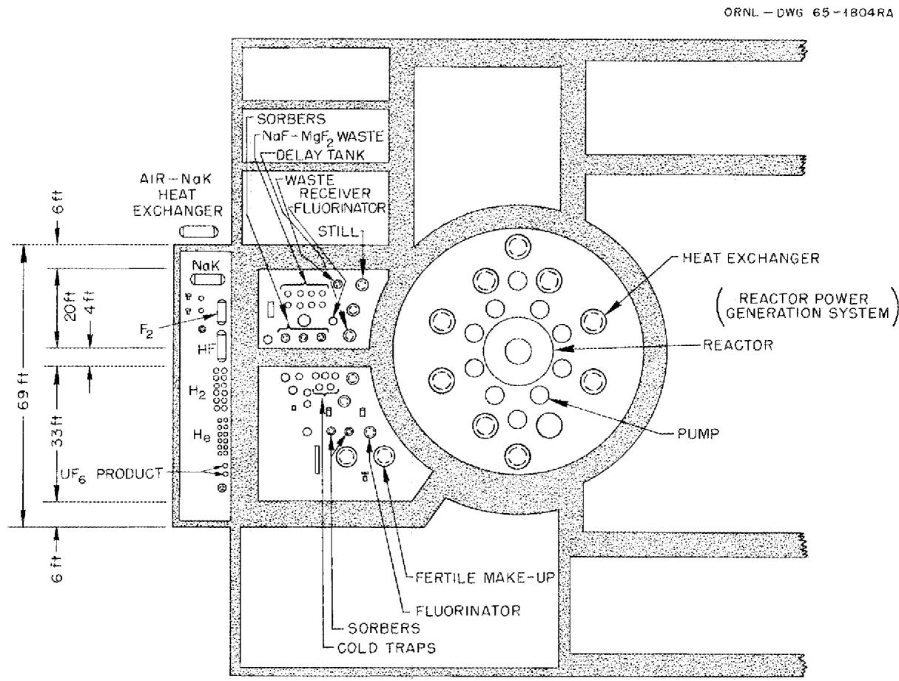  
Fig. 7.10. Reactor Integrated Processing Plant Preliminary Layout.

# Processing Cost

The costs summarized in Table 7.2 contribute about 0.2 mill/kwhr to the fuel cycle cost when the fixed charges are amortized at $12\%$ /year and the plant factor is taken at $80\%$ . The amortization charge includes $10\%$ /year for depreciation, $1\%$ /year for taxes, and $1\%$ /year for insurance.

Table 7.2. Cost of an Integrated Processing Plant for a 1000-Mw (Electrical) Molten-Salt Breeder Reactor   

<table><tr><td colspan="2">Fixed Capital Costs ($)</td></tr><tr><td>Building space</td><td>1,130,900</td></tr><tr><td>Process equipment</td><td>1,734,200</td></tr><tr><td>Interim waste storage</td><td>788,100</td></tr><tr><td>Services and utilities</td><td>1,648,300</td></tr><tr><td>Total</td><td>5,301,500</td></tr><tr><td colspan="2">Inventory Costsa($)</td></tr><tr><td>Fuel salt carrier</td><td>89,460</td></tr><tr><td>Fertile salt</td><td>69,200</td></tr><tr><td>NaK coolant</td><td>40,000</td></tr><tr><td>Total</td><td>198,660</td></tr><tr><td colspan="2">Direct Operating Costs ($/year)</td></tr><tr><td>Supervision and labor</td><td>399,600</td></tr><tr><td>Chemicals</td><td>70,390</td></tr><tr><td>Waste containers</td><td>28,270</td></tr><tr><td>Utilities</td><td>80,300</td></tr><tr><td>Maintenance materials</td><td>209,230</td></tr><tr><td>Total</td><td>787,790</td></tr></table>

Excludes fissile material.

# References

1. C. D. Scott and W. L. Carter, Preliminary Design Study of a Continuous Fluorination-Vacuum Distillation System for Regenerating Fuel and Fertile Streams in a Molten Salt Breeder Reactor, ORNL-3791 (January 1966).   
2. M. J. Kelly, ORNL, unpublished data (May 21, 1965).   
3. G. Long, Stability of $\mathbf{U}\mathbf{F}_3$ (in preparation).   
4. R. P. Milford et al., Ind. Eng. Chem. 53, 357 (1961).   
5. R. W. Kessie et al., Process Vessel Design for Frozen-Wall Containment of Fused Salt, ANL-6377 (1961).   
6. M. J. Kelly, Removal of Rare Earth Fission Products from Molten Salt Reactor Fuels by Distillation, paper presented at 11th annual meeting of American Nuclear Society, Gatlinburg, Tenn. (June 21-24, 1965).

# OAK RIDGE NATIONAL LABORATORY

# MOLTEN-SALT REACTOR PROGRAM

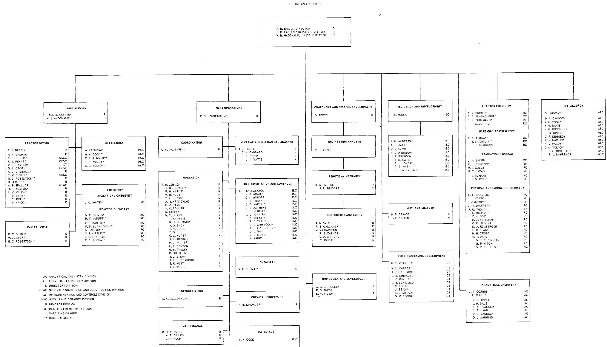

#

ORNL-3936

UC-80 - Reactor Technology

# INTERNAL DISTRIBUTION

1. G. M. Adamson

2. L. G. Alexander

3.C.F.Baes

4. J. M. Baker

5. S. E. Beall

6. E. S. Bettis

7. D. S. Billington

8. F. F. Blankenship

9. R. Blumberg

10. H. F. Bauman

11. A. L. Boch

12. E. G. Bohlmann

13. C. J. Borkowski

14. G. E. Boyd

15. M. A. Bredig

16. E. J. Breeding

17-26. R. B. Briggs

27. F. R. Bruce

28. G. H. Burger

29. S. Cantor

30. D. W. Cardwell

31. W. L. Carter

32. E. L. Compere

33. J. A. Conlin

34. W. H. Cook

35. L. T. Corbin

36. G. A. Cristy

37. J. L. Crowley

38. F. L. Culler

39. J. M. Dale

40. D. G. Davis

41. W. W. Davis

42. J. H. Devan

43. R. G. Donnelly

44. D. A. Douglas

45. N. E. Dunwoody

46. J. R. Engel

47. E. P. Epler

48. W. K. Ergen

49. D. E. Ferguson

50. A. P. Fraas

51. J. H Frye, Jr.

52. C. H. Gabbard

53. W. R. Gall

54. R. B. Gallaher

55. R. G. Gilliland

56. W. R. Grimes

57. A. G. Grindell

58. R. H. Geymon

59. P. H. Harley

60. C. S. Harrill

61. P. N. Haubenreich

62. P. G. Herndon

63. R. F. Hibbs (Y-12)

64. M. R. Hill

65. E. C. Hise

66. H. W. Hoffman

67. V. D. Holt

68. P. P. Holz

69. A. Hollander

70. A. S. Householder

71. T. L. Hudson

72. H. Inouye

73. W. H. Jordan

74-83.P.R.Kasten

84. R. J. Kedl

85. M. T. Kelley

86. M. J. Kelly

37. C. R. Kennedy

88. T. W. Kerlin

89. H. T. Kerr

90. A. I. Krakoviak

91. J. W. Krewson

92. C. E. Lamb

93. C. E. Larson

94. T. A. Lincoln

95. R. B. Lindauer

96. R. S. Livingston

97. M. I. Lundin

98. H. G. MacPherson

99. F. C. Maienschein

100. W. R. Martin

101. H. E. McCoy

102. W. B. McDonald

103. H. F. McDuffie

104. C. K. McGlothlan

105. E. C. Miller

106. C. A. Mills

107. W. R. Mixon

108. R. L. Moore

109. K. Z. Morgan

110. J. C. Moyers

111. M. L. Nelson

112. W. R. Osborn

<table><tr><td>113-114. R. B. Parker</td><td>142. C. D. Susano</td></tr><tr><td>115. L. F. Parsly</td><td>143. J. R. Tallackson</td></tr><tr><td>116. P. Patriarca</td><td>144. E. H. Taylor</td></tr><tr><td>117. H. R. Payne</td><td>145. R. E. Thoma</td></tr><tr><td>118. D. Phillips</td><td>146. G. M. Tolson</td></tr><tr><td>119. W. B. Pike</td><td>147. D. B. Trauger</td></tr><tr><td>120. H. B. Piper</td><td>148. R. W. Tucker</td></tr><tr><td>121. B. E. Prince</td><td>149. W. C. Ulrich</td></tr><tr><td>122. J. L. Redford</td><td>150. D. C. Watkin</td></tr><tr><td>123. M. Richardson</td><td>151. G. M. Watson</td></tr><tr><td>124. R. C. Robertson</td><td>152. B. H. Webster</td></tr><tr><td>125. H. C. Roller</td><td>153. A. M. Weinberg</td></tr><tr><td>126. M. W. Rosenthal</td><td>154. J. R. Weir</td></tr><tr><td>127. H. C. Savage</td><td>155. J. H. Westsik</td></tr><tr><td>128. A. W. Savolainen</td><td>156. M. E. Whatley</td></tr><tr><td>129. D. Scott</td><td>157. G. C. Williams</td></tr><tr><td>130. H. E. Seagren</td><td>158. J. C. White</td></tr><tr><td>131. J. H. Shaffer</td><td>159. L. V. Wilson</td></tr><tr><td>132. E. D. Shipley</td><td>160. K. J. Yost</td></tr><tr><td>133. M. J. Skinner</td><td>161. G. J. Young</td></tr><tr><td>134. G. M. Slaughter</td><td>162. Biology Library</td></tr><tr><td>135. A. N. Smith</td><td>163-164. Reactor Division Library</td></tr><tr><td>136. P. G. Smith</td><td>165-169. ORNL - Y-12 Technical Library</td></tr><tr><td>137. A. H. Snell</td><td>Document Reference Section</td></tr><tr><td>138. W. F. Spencer</td><td>170-172. Central Research Library</td></tr><tr><td>139. I. Spiewak</td><td>173-207. Laboratory Records Department</td></tr><tr><td>140. R. Steffy</td><td>208. Laboratory Records, ORNL R.C.</td></tr><tr><td>141. C. E. Stevenson</td><td></td></tr></table>

# EXTERNAL DISTRIBUTION

<table><tr><td colspan="2">209-210. D. F. Cope, Atomic Energy Commission, ORO
211. C. B. Deering, Atomic Energy Commission, ORO
212. R. G. Garrison, Atomic Energy Commission, Washington
213. M. Shaw, Atomic Energy Commission, Washington
214. E. E. Sinclair, Atomic Energy Commission, Washington
215. W. L. Smalley, Atomic Energy Commission, ORO
216. J. A. Swartout, 270 Park Avenue, New York 17, New York
217. M. J. Whitman, Atomic Energy Commission, Washington
218. Research and Development Division, AEC, ORO
219-549. Given distribution as shown in TID-4500 under Reactor Technology category (75 copies - CFSTI)</td></tr></table>