ORNL-3996

UC-80 - Reactor Technology

DESIGN STUDIES OF 1000-Mw(e) MOLTEN-SALT

BREEDER REACTORS

Paul R. Kasten

E. S. Bettis

Roy C. Robertson

RELEASED FOR ANNOUNCER

IN NUCLEAR SCIENCE INFO

OAK RIDGE NATIONAL LABORATORY

operated by

UNION CARBIDE CORPORATION

for the

U.S. ATOMIC ENERGY COMMISSION

Printed in USA. Price $5.00. Available from the Clearinghouse for Federal Scientific and Technical Information, National Bureau of Standards, U.S. Department of Commerce, Springfield, Virginia 22151

# LEGAL NOTICE

This report was prepared as an account of Government sponsored work. Neither the United States, nor the Commission, nor any person acting on behalf of the Commission:

A. Makes any warranty or representation, expressed or implied, with respect to the accuracy, completeness, or usefulness of the information contained in this report, or that the use of any information, apparatus, method, or process disclosed in this report may not infringe privately owned rights; or   
B. Assumes any liabilities with respect to the use of, or for damages resulting from the use of any information, apparatus, method, or process disclosed in this report.

As used in the above, "person acting on behalf of the Commission" includes only employee or contractor of the Commission, or employee of such contractor, to the extent that such employee or contractor of the Commission, or employee of such contractor prepares, disseminates, or provides access to, any information pursuant to his employment or contract with the Commission, or his employment with such contractor.

Contract No. W-7405-eng-26

DESIGN STUDIES OF 1000-Mw(e) MOLTEN-SALT BREEDER REACTORS

Paul R. Kasten

E. S. Bettis

Roy C. Robertson

Molten-Salt Reactor Program

R. B. Briggs, Director

RELEASED FOR ANNouncement

IN NUCLEAR SCIENCE ABSTRACTS

AUGUST 1966

OAK RIDGE NATIONAL LABORATORY

Oak Ridge, Tennessee

operated by

UNION CARBIDE CORPORATION

for the

U.S. ATOMIC ENERGY COMMISSION

# SUMMARY

Design and evaluation studies have been made of thermal-energy molten-salt breeder reactors (MSBR) in order to assess their economic and nuclear performance and to identify important design and development problems. The reference reactor design presented here is related to molten-salt reactors in general.

The reference design is a two-region two-fluid system, with fuel salt separated from the blanket salt by graphite tubes. The fuel salt consists of uranium fluoride dissolved in a carrier salt of lithium and beryllium fluorides, and the blanket salt contains thorium fluoride dissolved in a similar carrier salt. The energy generated in the reactor fluid is transferred to a secondary coolant-salt circuit, which couples the reactor to a supercritical steam cycle. On-site fuel-recycle processing is employed, with fluoride-volatility and vacuum-distillation operations used for the fuel fluid, and direct-protactinium-removal processing applied to the blanket stream. The resulting power cost for the reference plant, termed MSBR(Pa), is less than 2.7 mills/kwhr(e); the specific fissile-material inventory is only $0.7\mathrm{kg/Mw(e)}$ , the fuel doubling time is about 13 years, and the fuel-cycle cost is 0.35 mill/kwhr(e). The associated power doubling time based on continuous investment of bred fuel is less than 9 years.

# Reference MSBR Plant Design

# Flowsheet

Figure 1 gives the flowsheet of the 1000-Mw(e) MSBR power plant. Fuel flows through the reactor at a rate of about 44,000 gpm (velocity of about 15 fps); it enters the core at $1000^{\circ}\mathrm{F}$ and leaves at $1300^{\circ}\mathrm{F}$ . The primary fuel circuit has four loops, and each loop has a pump and a primary heat exchanger. Each of these pumps has a capacity of about 11,000 gpm. The four blanket-salt pumps and heat exchangers, although smaller, are similar to corresponding components in the fuel system. The blanket salt enters the reactor vessel at $1150^{\circ}\mathrm{F}$ and leaves at $1250^{\circ}\mathrm{F}$ . The blanket-salt pumps have a capacity of about 2000 gpm.

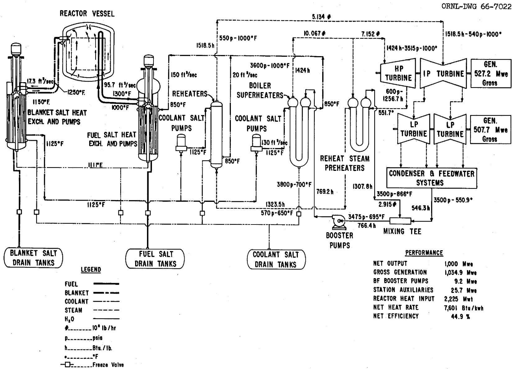  
Fig. 1. Reference MSBR Flow Diagram

Four 14,000-gpm pumps circulate the coolant, which consists of a mixture of sodium fluoride and sodium fluoroborate. The coolant enters the shell side of the primary heat exchanger at $850^{\circ}\mathrm{F}$ and leaves at $1112^{\circ}\mathrm{F}$ . After leaving the primary heat exchanger, the coolant salt is further heated to $1125^{\circ}\mathrm{F}$ on the shell side of the blanket heat exchangers. The coolant then circulates through the shell side of 16 once-through superheaters (four superheaters per pump). In addition, four 2000-gpm pumps circulate a portion of the coolant through eight reheaters.

The steam system flowsheet is essentially that of the new Bull Run plant of the Tennessee Valley Authority system, with modifications to increase the rating to $1000\mathrm{Mw(e)}$ and to preheat the working fluid to $700^{\circ}\mathrm{F}$ prior to entering the heat exchanger-superheater unit. A supercritical power-conversion system is used that is appropriate for molten-salt application and takes advantage of the high-strength structural alloy employed. Use of a supercritical fluid system results in an overall plant thermal efficiency of about $45\%$ .

# Reactor Design

Figure 2 shows the plan and elevation views of the MSBR cell arrangement. The reactor cell is surrounded by four shielded cells containing the superheater and reheater units; these cells can be individually isolated for maintenance. The fuel processing plant, located adjacent to the reactor, is divided into high-level and low-level activity areas. The elevation view in Fig. 2 indicates the position of equipment in the various cells.

Figure 3 gives an elevation view of the reactor cell and shows the location of the reactor, pumps, and fuel and blanket heat exchangers. The Hastelloy N reactor vessel has a side-wall thickness of about 1.25 in. and a head thickness of about 2.25 in.; it is designed to operate at $1200^{\circ}\mathrm{F}$ and up to 150 psi. The plenum chambers at the bottom of the vessel communicate with the external heat exchangers by concentric inlet-outlet piping. The inner pipe has slip joints to accommodate thermal expansion. Bypass flow through these slip joints is about $1\%$ of the total flow. As indicated in Fig. 3, the heat exchangers are suspended

from the top of the cell and are located below the reactor. Each fuel pump has a free fluid surface and a storage volume that permits rapid drainage of fuel fluid from the core upon loss of flow. In addition, the fuel salt can be drained to the dump tanks when the reactor is shut down for an extended time. The entire reactor cell is kept at high temperature, while cold "fingers" and thermal insulation surround structural support members and all special equipment that must be kept at relatively

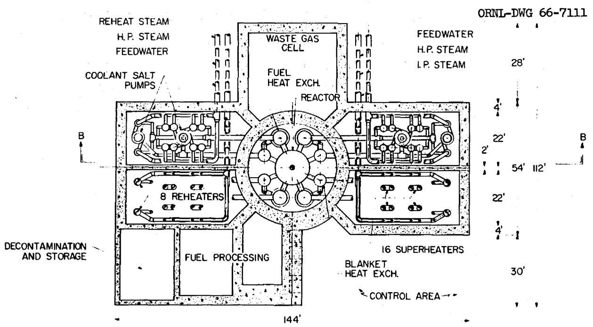

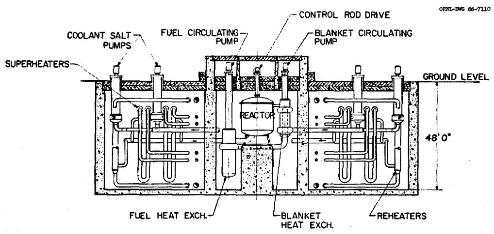  
Fig. 2. Reactor and Coolant-Salt Cells - Plan and Elevation.

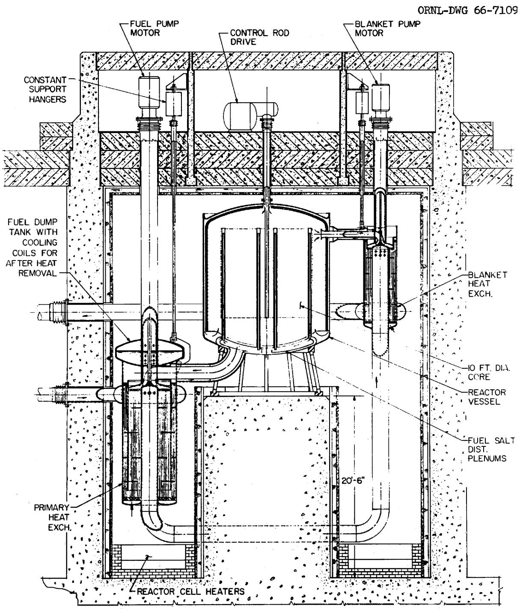  
Fig. 3. Reactor Cell - Elevation.

low temperatures. The control rod drives are located above the core, and the control rods are inserted into the central region of the core.

The reactor vessel, about 14 ft in diameter and about 19 ft high, contains a 12.5-ft-high 10-ft-diam core assembly composed of reentry-type graphite fuel elements. The graphite tubes are attached to the two plenum chambers at the bottom of the reactor with graphite-to-metal transition sleeves. Fuel from the entrance plenum flows up fuel passages in the outer region of the fuel tube and down through a single central passage to the exit plenum. The fuel flows from the exit plenum to the heat exchangers and then to the pump and back to the reactor. An 18-in.-thick molten-salt blanket plus a 3-in.-thick graphite reflector surround the core. The blanket salt also permeates the interstices of the core lattice, and thus fertile material flows through the core without mixing with the fissile fuel salt.

The MSBR requires structural integrity of the graphite fuel element. In order to reduce the effect of radiation damage, the fuel tubes have been made small to reduce the fast flux gradient across the graphite wall. Also, the tubes are anchored only at one end to permit axial movement. The core volume has been made large in order to reduce the flux level in the core. In addition, the reactor is designed to permit replacement of the entire graphite core by remote means if required.

Figure 4 shows a cross section of a fuel element. Fuel fluid flows upward through the small passages and downward through the large central passage. The outside diameter of a fuel tube is 3.5 in., and there are 534 of these tubes spaced on a 4.8-in. triangular pitch. The tube assemblies are surrounded by hexagonal blocks of moderator graphite with blanket salt filling the interstices. The nominal core composition is $75\%$ graphite, $18\%$ fuel salt, and $7\%$ blanket salt by volume.

In determining the design parameters of the MSBR, two different methods were considered for removal of bred fuel from the reactor. The designation MSBR(Pa) represents a plant in which protactinium is removed directly from the blanket stream, whereas the designation MSBR corresponds to removal of uranium per se from the blanket. With the exception of the blanket-processing step, the MSBR(Pa) and the MSBR plants have essentially the same design. Development of an MSBR(Pa) plant is the

ix

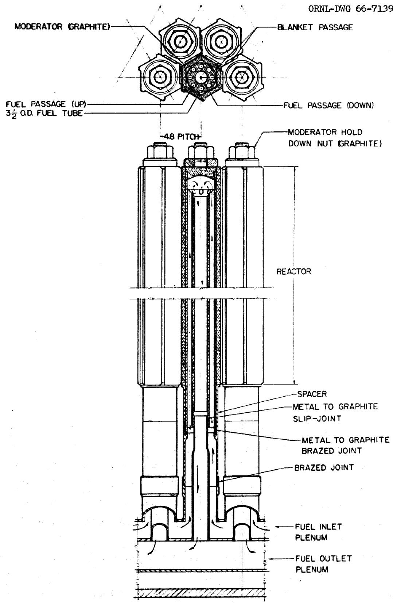  
Fig. 4. MSBR Graphite Fuel Element.

present goal of the molten-salt reactor program. A summary of the parameter values determined for the MSBR(Pa) and MSBR designs is given in Table 1.

# Fuel Processing

The primary objectives of fuel processing are to purify and recycle fissile and carrier components and to minimize fissile inventory while holding losses to a low value. The fluoride volatility-vacuum distillation process fulfills these objectives through simple operations. The process for direct protactinium removal from the blanket also appears to be a simple one.

The core fuel for both the MSBR and the MSBR(Pa) is processed by fluoride volatility and vacuum distillation operations. For the MSBR, blanket processing is accomplished by fluoride volatility alone, and the processing cycle time is short enough to maintain a very low concentration of fissile material. The effluent UF $_6$ is absorbed by fuel salt and reduced to UF $_4$ by treatment with hydrogen to reconstitute a fuel-salt mixture of the desired composition. For the MSBR(Pa), the blanket stream is treated with molten bismuth containing dissolved thorium; the thorium displaces the protactinium from solution (as well as uranium). The metallic protactinium and uranium are deposited on a metal filter and hydrofluorinated or fluorinated for recycle of bred fuel.

Molten-salt reactors are inherently suited to the design of processing facilities integral with the reactor plant; these facilities require only a small amount of cell space adjacent to the reactor cell. Because all services and equipment available to the reactor are available to the processing plant and shipping and storage charges are eliminated, integral processing facilities permit significant savings in capital and operating costs. Also, the processing plant inventory of fissile material is very low.

The principal steps in core and blanket stream processing of the MSBR(Pa) and the MSBR are shown in Fig. 5. A small side stream of each fluid is continuously withdrawn from the fuel and blanket loops and circulated through the processing system. After processing, the decontaminated fluids are returned to the reactor system. Fuel inventories retained in

Table 1. Reactor Design Values   

<table><tr><td></td><td>MSBR(Pa)</td><td>MSBR</td></tr><tr><td colspan="3">Power, Mw</td></tr><tr><td>Thermal</td><td>2225</td><td></td></tr><tr><td>Electrical</td><td>1000</td><td></td></tr><tr><td>Thermal efficiency, fraction</td><td>0.449</td><td></td></tr><tr><td>Plant load factor</td><td>0.80</td><td></td></tr><tr><td colspan="3">Reactor vessel</td></tr><tr><td>Outside diameter, ft</td><td>14</td><td></td></tr><tr><td>Overall height, ft</td><td>~19</td><td></td></tr><tr><td>Wall thickness, in.</td><td>1.5</td><td></td></tr><tr><td>Head thickness, in.</td><td>2.25</td><td></td></tr><tr><td colspan="3">Core</td></tr><tr><td>Height of active core, ft</td><td>12.5</td><td></td></tr><tr><td>Diameter, ft</td><td>10</td><td></td></tr><tr><td>Number of graphite fuel passage tubes</td><td>534</td><td></td></tr><tr><td>Volume, ft3</td><td>982</td><td></td></tr><tr><td colspan="3">Volume fractions</td></tr><tr><td>Fuel salt</td><td>0.169</td><td>0.169</td></tr><tr><td>Blanket salt</td><td>0.073</td><td>0.074</td></tr><tr><td>Graphite moderator</td><td>0.758</td><td>0.757</td></tr><tr><td colspan="3">Atom ratios</td></tr><tr><td>Thorium to uranium</td><td>42</td><td>40</td></tr><tr><td>Carbon to uranium</td><td>5800</td><td>5440</td></tr><tr><td colspan="3">Neutron flux, core average, neutrons/cm2·sec</td></tr><tr><td>Thermal</td><td>7.2 × 1014</td><td>6.7 × 1014</td></tr><tr><td>Fast</td><td>12.1 × 1014</td><td>12.1 × 1014</td></tr><tr><td>Fast, over 100 kev</td><td>3.1 × 1014</td><td>3.1 × 1014</td></tr><tr><td colspan="3">Power density, core average, kw/liter</td></tr><tr><td>Gross</td><td>80</td><td></td></tr><tr><td>In fuel salt</td><td>473</td><td></td></tr><tr><td colspan="3">Blanket</td></tr><tr><td>Radial thickness, ft</td><td>1.5</td><td></td></tr><tr><td>Axial thickness, ft</td><td>2.0</td><td></td></tr><tr><td>Volume, ft3</td><td>1120</td><td></td></tr><tr><td>Volume fraction, blanket salt</td><td>1.0</td><td></td></tr><tr><td>Reflector thickness, in.</td><td>3</td><td></td></tr><tr><td colspan="3">Fuel salt</td></tr><tr><td>Inlet temperature, °F</td><td>1000</td><td></td></tr><tr><td>Outlet temperature, °F</td><td>1300</td><td></td></tr><tr><td>Flow rate, ft3/sec (total)</td><td>95.7</td><td></td></tr><tr><td>gpm</td><td>42,950</td><td></td></tr><tr><td colspan="3">Nominal volume holdup, ft3</td></tr><tr><td>Core</td><td>166</td><td></td></tr><tr><td>Blanket</td><td>26</td><td></td></tr><tr><td>Plena</td><td>147</td><td></td></tr><tr><td>Heat exchangers and piping</td><td>345</td><td></td></tr><tr><td>Processing plant</td><td>33</td><td></td></tr><tr><td>Total</td><td>717</td><td></td></tr><tr><td>Fuel salt (continued)</td><td></td><td></td></tr><tr><td>Nominal salt composition, mole %</td><td></td><td></td></tr><tr><td>LiF</td><td>63.6</td><td></td></tr><tr><td>BeF2</td><td>36.2</td><td></td></tr><tr><td>UF4(fissile)</td><td>0.22</td><td></td></tr><tr><td>Blanket salt</td><td></td><td></td></tr><tr><td>Inlet temperature, °F</td><td>1150</td><td></td></tr><tr><td>Outlet temperature, °F</td><td>1250</td><td></td></tr><tr><td>Flow rate, ft3/sec (total)</td><td>17.3</td><td></td></tr><tr><td>gpm</td><td>7764</td><td></td></tr><tr><td>Volume holdup, ft3</td><td></td><td></td></tr><tr><td>Core</td><td>72</td><td></td></tr><tr><td>Blanket</td><td>1121</td><td></td></tr><tr><td>Heat exchanger and piping</td><td>100</td><td></td></tr><tr><td>Processing</td><td>24</td><td></td></tr><tr><td>Storage for protactinium decay</td><td></td><td>2066</td></tr><tr><td>Total</td><td>1317</td><td>3383</td></tr><tr><td>Salt composition, mole %</td><td></td><td></td></tr><tr><td>LiF</td><td>71.0</td><td></td></tr><tr><td>BeF2</td><td>2.0</td><td></td></tr><tr><td>ThF4</td><td>27.0</td><td></td></tr><tr><td>UF4(fissile)</td><td></td><td>0.0005</td></tr><tr><td>System fissile inventory, kg</td><td>681</td><td>769</td></tr><tr><td>System fertile inventory, kg</td><td>101,000</td><td>260,000</td></tr><tr><td>Processing data</td><td></td><td></td></tr><tr><td>Fuel stream</td><td></td><td></td></tr><tr><td>Cycle time, days</td><td>42</td><td>47</td></tr><tr><td>Rate, ft3/day</td><td>16.3</td><td>14.5</td></tr><tr><td>Processing cost, $/ft3</td><td>190</td><td>203</td></tr><tr><td>Blanket stream</td><td></td><td></td></tr><tr><td>Equivalent cycle time, days</td><td></td><td></td></tr><tr><td>Uranium-removal process</td><td>55</td><td>23</td></tr><tr><td>Protactinium-removal process</td><td>0.55</td><td></td></tr><tr><td>Equivalent rate, ft3per day</td><td></td><td></td></tr><tr><td>Uranium-removal process</td><td>23.5</td><td>144</td></tr><tr><td>Protactinium-removal process</td><td>2350</td><td></td></tr><tr><td>Equivalent processing cost (based on uranium removal), $/ft3</td><td>65</td><td>7.3</td></tr><tr><td>Fuel yield, %/yr</td><td>7.95</td><td>4.86</td></tr><tr><td>Net breeding ratio</td><td>1.071</td><td>1.049</td></tr><tr><td>Fissile losses in processing, atoms per fissile absorption</td><td>0.0051</td><td>0.0057</td></tr><tr><td>Specific inventory, kg of fissile material per megawatt of electricity produced</td><td>0.681</td><td>0.769</td></tr><tr><td>Specific power, Mw(th)/kg of fissile material</td><td>3.26</td><td>2.89</td></tr><tr><td>Fraction of fissions in fuel stream</td><td>0.996</td><td>0.987</td></tr><tr><td>Fraction of fissions in thermal-neutron group</td><td>0.815</td><td>0.806</td></tr><tr><td>Net neutron production per fissile absorption (ηe)</td><td>2.227</td><td>2.221</td></tr></table>

Fig. 5. Fuel- and Fertile-Stream Processing for the MSBR and MSBR(Pa).   
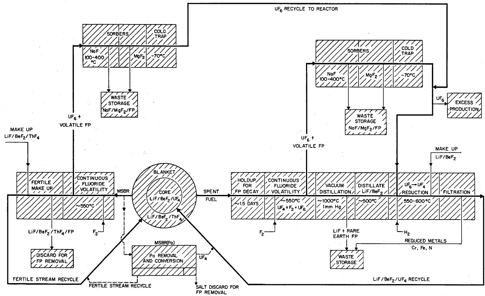  
ORNL-DWG 66-7668

the processing plant are estimated to be about $5\%$ of the reactor system for core processing and less than $1\%$ for blanket processing.

# Heat Exchange and Steam Systems

The structural material is Hastelloy N for all components contacted by molten salt in the fuel, blanket, and coolant systems, including the reactor vessel, pumps, heat exchangers, piping, and storage tanks. The primary heat exchangers are of the tube-and-shell type, with fuel salt on the tube side. Each shell contains two concentric tube bundles attached to fixed tube sheets. Fuel flows through the two bundles in series; it flows downward in the inner section of tubes, enters a plenum at the bottom of the exchanger, and then flows upward to the pump through the outer section of tubes. The coolant salt enters at the top of the exchanger and flows on the baffled shell side down the outer annular region; it then flows upward in the inner annular section before exiting through a pipe centrally placed in the exchanger.

Since a large temperature difference exists in the two tube sections, the design permits differential tube expansion. Changes in tube lengths due to thermal conditions are accommodated by the use of a sine-wave type of construction, which permits each tube to adjust to thermal changes.

The blanket heat exchangers increase the temperature of the coolant leaving the fuel heat exchangers. The design of these units is similar to that used in the fuel heat exchangers.

The superheater is a U-tube U-shell heat exchanger that has disk and doughnut baffles with varying spacing; it is a long, slender exchanger. The baffle spacing is established by the shell-side pressure drop and by the temperature gradient across the tube wall; it is greatest in the central portion of the exchanger where the temperature difference between the fluids is high. The supercritical fluid enters the tube side of the superheater at $700^{\circ}\mathrm{F}$ and 3800 psi and leaves at $1000^{\circ}\mathrm{F}$ and 3600 psi.

The reheaters transfer energy from the coolant salt to the working fluid before its use in the intermediate pressure turbine. A shell-and-tube exchanger is used that produces steam at $1000^{\circ}\mathrm{F}$ and 540 psi.

Since the freezing temperature of the secondary coolant salt is about $700^{\circ}\mathrm{F}$ , a high working fluid inlet temperature is required. Preheaters,

along with prime fluid, are used in raising the temperature of the working fluid entering the superheaters. Prime fluid goes through a pre-heater exchanger and leaves at a pressure of 3550 psi and about $870^{\circ}\mathrm{F}$ . It is then injected into the feedwater in a mixing tee to produce fluid at $700^{\circ}\mathrm{F}$ and 3500 psi. The pressure is increased to about 3800 psi by a pressurizer (feedwater pump) before the fluid enters the superheater.

# Capital Cost Estimates

# Reactor Power Plant

Preliminary estimates of the capital cost of a 1000-Mw(e) molten-salt breeder reactor power station indicate a direct construction cost of about $80.7 million. After applying the indirect cost factors associated with reactor construction, an estimated total plant cost of $114.4 million is obtained for private-financing conditions and $110.7 million for public financing. A summary of plant costs is given in Table 2. The relatively low capital cost estimate obtained is due to the small physical size of the reactors and associated equipment, the high thermal efficiency, and the simple control requirements.

The operating and maintenance costs of the reactor power plant were estimated by standard procedures and were modified to reflect present-day salaries. These costs amount to 0.34 mill/kwhr(e).

# Fuel-Recycle Plant

The capital costs associated with fuel-recycle equipment were obtained by itemizing and costing the major process equipment required and estimating the costs of site, buildings, instrumentation, waste disposal, and building services associated with fuel recycle.

Table 3 summarizes direct construction costs, indirect costs, and total costs associated with an integrated processing facility having approximately the capacity required for a 1000-Mw(e) MSBR plant. The total construction cost was estimated to be about $5.3 million; in obtaining this figure, the indirect charges amounted to about 100% of the direct construction cost. The high value used for the indirect charges

Table 2. Preliminary Cost-Estimate Summarya for a 1000-Mw(e) Molten-Salt Breeder Reactor Power Station [MSBR(Pa) or MSBR]   

<table><tr><td>Federal Power Commission Account</td><td></td><td>Costs (in thousands of dollars)</td></tr><tr><td>20</td><td>Land and Land Rights</td><td>360</td></tr><tr><td>21</td><td>Structures and Improvements</td><td></td></tr><tr><td></td><td>Ground improvements</td><td>866</td></tr><tr><td></td><td>Building and structures</td><td></td></tr><tr><td></td><td>.1 Reactor buildingb</td><td>4,181</td></tr><tr><td></td><td>.2 Turbine building, auxiliary building, and feedwater heater space</td><td>2,832</td></tr><tr><td></td><td>.3 Offices, shops, and laboratories</td><td>1,160</td></tr><tr><td></td><td>.4 Waste disposal building</td><td>150</td></tr><tr><td></td><td>.5 Stack</td><td>76</td></tr><tr><td></td><td>.6 Warehouse</td><td>40</td></tr><tr><td></td><td>.7 Miscellaneous</td><td>30</td></tr><tr><td></td><td>Subtotal Account 212</td><td>8,469</td></tr><tr><td></td><td>Total Account 21</td><td>9,335</td></tr><tr><td>22</td><td>Reactor Plant Equipment</td><td></td></tr><tr><td></td><td>Reactor equipment</td><td></td></tr><tr><td></td><td>.1 Reactor vessel and internals</td><td>1,610</td></tr><tr><td></td><td>.2 Control rods</td><td>250</td></tr><tr><td></td><td>.3 Shielding and containment</td><td>2,113</td></tr><tr><td></td><td>.4 Heating-cooling systems and vapor-suppression system</td><td>1,200</td></tr><tr><td></td><td>.5 Moderator and reflector</td><td>1,089</td></tr><tr><td></td><td>.6 Reactor plant crane</td><td>265</td></tr><tr><td></td><td>Subtotal Account 221</td><td>6,527</td></tr><tr><td></td><td>Heat transfer systems</td><td></td></tr><tr><td></td><td>.1 Reactor coolant system</td><td>6,732</td></tr><tr><td></td><td>.2 Intermediate cooling system</td><td>1,947</td></tr><tr><td></td><td>.3 Steam generator and reheaters</td><td>9,853</td></tr><tr><td></td><td>.4 Coolant supply and treatment</td><td>300</td></tr><tr><td></td><td>Subtotal Account 222</td><td>18,832</td></tr><tr><td></td><td>Nuclear fuel handling and storage (drain tanks)</td><td>1,700</td></tr><tr><td></td><td>Nuclear fuel processing and fabrication (included in fuel-cycle costs)</td><td>(c)</td></tr><tr><td></td><td>Radioactive waste treatment and disposal (off-gas system)</td><td>450</td></tr><tr><td></td><td>Instrumentation and controls</td><td>4,500</td></tr><tr><td></td><td>Feedwater supply and treatment</td><td>4,051</td></tr><tr><td></td><td>Steam, condensate, and feedwater piping</td><td>4,069</td></tr><tr><td></td><td>Other reactor plant equipment (remote maintenance)</td><td>5,000d</td></tr><tr><td></td><td>Total Account 22</td><td>45,129</td></tr><tr><td>23</td><td>Turbine-Generator Units</td><td></td></tr><tr><td></td><td>231 Turbine-generator units</td><td>19,174</td></tr><tr><td></td><td>232 Circulating-water system</td><td>1,243</td></tr><tr><td></td><td>233 Condensers and auxiliaries</td><td>1,690</td></tr><tr><td></td><td>234 Central lube-oil system</td><td>80</td></tr><tr><td></td><td>235 Turbine plant instrumentation</td><td>25</td></tr><tr><td></td><td>236 Turbine plant piping</td><td>220</td></tr><tr><td></td><td>237 Axuiliary equipment for generator</td><td>66</td></tr><tr><td></td><td>238 Other turbine plant equipment</td><td>25</td></tr><tr><td></td><td>Total Account 23</td><td>22,523</td></tr><tr><td>24</td><td>Accessory Electrical</td><td></td></tr><tr><td></td><td>241 Switchgear, main and station service</td><td>500</td></tr><tr><td></td><td>242 Switchboards</td><td>128</td></tr><tr><td></td><td>243 Station service transformers</td><td>169</td></tr><tr><td></td><td>244 Auxiliary generator</td><td>50</td></tr><tr><td></td><td>245 Distributed items</td><td>2,000</td></tr><tr><td></td><td>Total Account 24</td><td>2,897</td></tr><tr><td>25</td><td>Miscellaneous</td><td>800</td></tr><tr><td></td><td>Total Direct Construction Coste</td><td>80,684</td></tr><tr><td></td><td>Private Financing</td><td></td></tr><tr><td></td><td>Total indirect cost</td><td>33,728</td></tr><tr><td></td><td>Total plant cost</td><td>114,412</td></tr><tr><td></td><td>Public Financing</td><td></td></tr><tr><td></td><td>Total indirect cost</td><td>30,011</td></tr><tr><td></td><td>Total plant cost</td><td>110,695</td></tr></table>

eDoes not include Account 20, Land Costs. Land is treated as a nondepreciating capital item. However, land costs were included when computing indirect costs.

Table 3. Summary of Processing-Plant Capital Costs for a 1000-Mw(e) MSBR   

<table><tr><td>Installed process equipment</td><td>$ 853,760</td></tr><tr><td>Structures and improvements</td><td>556,770</td></tr><tr><td>Waste storage</td><td>387,970</td></tr><tr><td>Process piping</td><td>155,800</td></tr><tr><td>Process instrumentation</td><td>272,100</td></tr><tr><td>Electrical auxiliaries</td><td>84,300</td></tr><tr><td>Sampling connections</td><td>20,000</td></tr><tr><td>Service and utility piping</td><td>128,060</td></tr><tr><td>Insulation</td><td>50,510</td></tr><tr><td>Radiation monitoring</td><td>100,000</td></tr><tr><td>Total direct cost</td><td>$2,609,270</td></tr><tr><td>Construction overhead(30% of direct costs)</td><td>782,780</td></tr><tr><td>Subtotal construction cost</td><td>$3,392,050</td></tr><tr><td>Engineering and inspection(25% of subtotal construction cost)</td><td>848,010</td></tr><tr><td>Subtotal plant cost</td><td>$4,240,060</td></tr><tr><td>Contingency (25% of subtotal plant cost)</td><td>1,060,020</td></tr><tr><td>Total capital cost</td><td>$5,300,080</td></tr></table>

should more than compensate for the higher rates of equipment replacement in the fuel-processing plant as compared with the power plant as a whole.

The operating and maintenance costs for the fuel-recycle facility include labor, labor overhead, chemicals, utilities, and maintenance materials. The total annual operating and maintenance costs for a processing facility having a throughput of 15 ft³ of fuel salt per day plus 105 ft³ of fertile salt per day is estimated to be about $721,000. A breakdown of these charges is given in Table 4.

These capital and operating costs were used as base points for obtaining the costs for processing plants having different capacities. For each fluid stream the capital and operating costs were estimated separately

Table 4. Summary of Annual Operating and Maintenance Costs for Fuel Recycle in a 1000-Mw(e) MSBR   

<table><tr><td>Direct labor</td><td>$222,000</td></tr><tr><td>Labor overhead</td><td>177,600</td></tr><tr><td>Chemicals</td><td>14,640</td></tr><tr><td>Waste containers</td><td>28,270</td></tr><tr><td>Utilities</td><td>80,300</td></tr><tr><td>Maintenance materials</td><td></td></tr><tr><td>Site</td><td>2,500</td></tr><tr><td>Services and utilities</td><td>35,880</td></tr><tr><td>Process equipment</td><td>160,040</td></tr><tr><td>Total annual charges</td><td>$721,230</td></tr></table>

as a function of plant throughput based on the volume of salt processed. The results of these estimates, given in Fig. 6, were used in calculating the nuclear and economic performance of the fuel cycle as a function of fuel-processing rate.

For the MSBR(Pa) plant, the processing methods and costs were the same as those for the MSBR, except for blanket-stream processing. The cost of direct protactinium removal from the blanket stream was estimated to be

$$
C (\mathrm {P a}) = 1. 6 5 \mathrm {R} ^ {0} \cdot 4 5, \tag {1}
$$

where $C(Pa)$ is the capital cost of protactinium-removal equipment, in millions of dollars; and $R$ is the blanket-stream processing rate for protactinium removal, in thousands of cubic feet of blanket salt per day. Thus, the cost of fuel recycle in the MSBR(Pa) was estimated to be equivalent to the costs given by Eq. (l) and Fig. 6 based on uranium being removed from the blanket stream by the fluoride volatility process and the rate of uranium removal being influenced by the rate of protactinium removal.

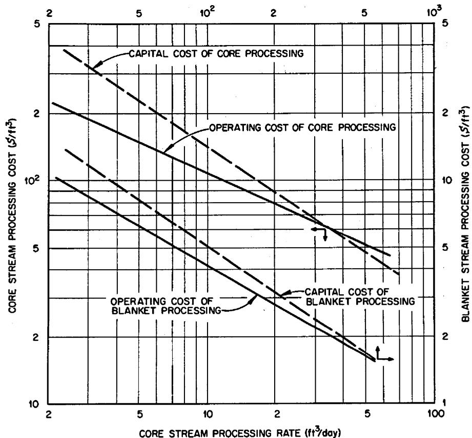  
BLANKET STREAM PROCESSING RATE (ft $^3$ /day)   
Fig. 6. MSBR Fuel-Recycle Costs As a Function of Processing Rates. Fluoride volatility plus vacuum distillation processing for core; fluoride volatility processing for blanket; 0.8 plant factor; $12\%$ /yr capital charges for investor-owned processing plant.

# Fuel-Cycle Performance

The objective of the nuclear design calculations was primarily to find the conditions that gave the lowest fuel-cycle cost and, then, without appreciably increasing this cost, the conditions that gave highest fuel yield.

# Analysis Procedures and Basic Assumptions

The nuclear calculations were performed with a multigroup, diffusion, equilibrium reactor program, which calculated the nuclear performance, the equilibrium concentrations of the various nuclides, including the fission products, and the fuel-cycle cost for a given set of conditions.

The 12-group neutron cross sections were obtained from neutron spectrum calculations, with the core heterogeneity taken into consideration in the thermal-neutron-spectrum computations. The nuclear designs were optimized by parameter studies, with most emphasis on minimum fuel-cycle cost and with lesser weight given to maximizing the annual fuel yield. Typical parameters varied were the reactor dimensions, blanket thickness, fractions of fuel and fertile salts in the core, and the fuel- and fertile-stream processing rates.

The basic economic assumptions employed in obtaining the fuel-cycle costs are given in Table 5. The processing costs are based on those given in the previous section and are included in the fuel-cycle costs. A fissile material loss of $0.1\%$ per pass through the fuel-recycle plant was applied.

The effective behavior used in the fuel-cycle-performance calculations for the various fission products was that given in Table 6. A gas-stripping system is provided to remove fission-product gases from the fuel salt. In the calculations reported here, a $^{135}\mathrm{Xe}$ poison fraction of 0.005 was applied.

Table 5. Economic Ground Rules Used in Obtaining Fuel-Cycle Costs   

<table><tr><td>Reactor power, Mw(e)</td><td>1000</td></tr><tr><td>Thermal efficiency, %</td><td>45</td></tr><tr><td>Load factor</td><td>0.80</td></tr><tr><td>Cost assumptions</td><td></td></tr><tr><td>Value of 233U and 233Pa, $/g</td><td>14</td></tr><tr><td>Value of 235U, $/g</td><td>12</td></tr><tr><td>Value of thorium, $/kg</td><td>12</td></tr><tr><td>Value of carrier salt, $/kg</td><td>26</td></tr><tr><td>Capital charge, %/yr</td><td></td></tr><tr><td>Private financing</td><td></td></tr><tr><td>Depreciating capital</td><td>12</td></tr><tr><td>Nondepreciating capital</td><td>10</td></tr><tr><td>Public financing</td><td></td></tr><tr><td>Depreciating capital</td><td>7</td></tr><tr><td>Nondepreciating capital</td><td>5</td></tr><tr><td colspan="2">Processing cost: given by curves in Fig. 6, plus cost given by Eq. (1), where applicable</td></tr></table>

Table 6. Behavior of Fission Products in MSBR Systems   

<table><tr><td>Behavior</td><td>Fission Products</td></tr><tr><td>Elements present as gases; assumed to be removed by gas stripping (a poison fraction of 0.005 was applied)</td><td>Kr, Xe</td></tr><tr><td>Elements that form stable metallic colloids; removed by fuel processing</td><td>Ru, Rh, Pd, Ag, In</td></tr><tr><td>Elements that form either stable fluorides or stable metallic colloids; removed by fuel processing</td><td>Se, Br, Nb, Mo, Tc, Te, I</td></tr><tr><td>Elements that form stable fluorides less volatile than LiF; separated by vacuum distillation</td><td>Sr, Y, Ba, La, Ce, Pr, Nd, Pm, Sm, Eu, Gd, Tb</td></tr><tr><td>Elements that are not separated from the carrier salt; removed only by salt discard</td><td>Rb, Cd, Sn, Cs, Zr</td></tr></table>

The control of corrosion products in molten-salt fuels does not appear to be a significant problem, and the effect of corrosion products was neglected in the nuclear calculations. The corrosion rate of Hastelloy N in molten salts is very low; in addition, the fuel-processing operations can control corrosion-product buildup in the fuel.

The important parameters describing the MSBR and MSBR(Pa) designs are given in Table 1. Many of the parameters were fixed by the ground rules for the evaluation or by engineering-design factors that include the thermal efficiency, plant factor, capital charge rate, maximum fuel velocity, size of fuel tubes, processing costs, fissile-loss rate, and the out-of-core fuel inventory. The parameters optimized in the fuel-cycle calculations were the reactor dimensions, power density, core composition (including the carbon-to-uranium and thorium-to-uranium ratios), and processing rates.

# Nuclear Performance and Fuel-Cycle Cost

The general results of the nuclear calculations are given in Table 1; the neutron-balance results are given in Table 7. The basic reactor

Table 7. Neutron Balances for the MSBR(Pa) and the MSBR Design Conditions   

<table><tr><td rowspan="3">Material</td><td colspan="3">MSBR(Pa)</td><td colspan="3">MSBR</td></tr><tr><td colspan="3">Neutrons per Fissile Absorption</td><td colspan="3">Neutrons per Fissile Absorption</td></tr><tr><td>Total Absorbed</td><td>Absorbed Producing Fission</td><td>Neutrons Produced</td><td>Total Absorbed</td><td>Absorbed Producing Fission</td><td>Neutrons Produced</td></tr><tr><td>232Th</td><td>0.9970</td><td>0.0025</td><td>0.0058</td><td>0.9710</td><td>0.0025</td><td>0.0059</td></tr><tr><td>233Pa</td><td>0.0003</td><td></td><td></td><td>0.0079</td><td></td><td></td></tr><tr><td>233U</td><td>0.9247</td><td>0.8213</td><td>2.0541</td><td>0.9119</td><td>0.8090</td><td>2.0233</td></tr><tr><td>234U</td><td>0.0819</td><td>0.0003</td><td>0.0008</td><td>0.0936</td><td>0.0004</td><td>0.0010</td></tr><tr><td>235U</td><td>0.0753</td><td>0.0607</td><td>0.1474</td><td>0.0881</td><td>0.0708</td><td>0.1721</td></tr><tr><td>236U</td><td>0.0084</td><td>0.0001</td><td>0.0001</td><td>0.0115</td><td>0.0001</td><td>0.0001</td></tr><tr><td>237Np</td><td>0.0009</td><td></td><td></td><td>0.0014</td><td></td><td></td></tr><tr><td>238U</td><td>0.0005</td><td></td><td></td><td>0.0009</td><td></td><td></td></tr><tr><td>Carrier salt (except 6Li)</td><td>0.0647</td><td></td><td>0.0186</td><td>0.0623</td><td></td><td>0.0185</td></tr><tr><td>6Li</td><td>0.0025</td><td></td><td></td><td>0.0030</td><td></td><td></td></tr><tr><td>Graphite</td><td>0.0323</td><td></td><td></td><td>0.0300</td><td></td><td></td></tr><tr><td>135Xe</td><td>0.0050</td><td></td><td></td><td>0.0050</td><td></td><td></td></tr><tr><td>149Sm</td><td>0.0068</td><td></td><td></td><td>0.0069</td><td></td><td></td></tr><tr><td>151Sm</td><td>0.0017</td><td></td><td></td><td>0.0018</td><td></td><td></td></tr><tr><td>Other fission products</td><td>0.0185</td><td></td><td></td><td>0.0196</td><td></td><td></td></tr><tr><td>Delayed neutrons losta</td><td>0.0049</td><td></td><td></td><td>0.0050</td><td></td><td></td></tr><tr><td>Leakageb</td><td>0.0012</td><td></td><td></td><td>0.0012</td><td></td><td></td></tr><tr><td>Total</td><td>2.2268</td><td>0.8849</td><td>2.2268</td><td>2.2209</td><td>0.8828</td><td>2.2209</td></tr></table>

${}^{a}$ Delayed neutrons emitted outside core.   
bLeakage, including neutrons absorbed in reflector.

design has the advantage of zero neutron losses to structural materials in the core other than the moderator. Except for the loss of delayed neutrons in the external fuel circuit, there is almost zero neutron leakage from the reactor because of the thick blanket. The neutron losses to fission products are low because of the low cycle times associated with fission-product removal.

The components of the fuel-cycle cost for the MSBR(Pa) and the MSBR are summarized in Table 8. The main components are the fissile inventory

Table 8. Fuel-Cycle Cost for MSBR(Pa) and MSBR Plants ${}^{a}$   

<table><tr><td rowspan="2"></td><td colspan="4">MSBR(Pa) Cost (mill/kwhr)</td><td colspan="4">MSBR Cost [mill/kwhr(e)]</td></tr><tr><td>Fuel Stream</td><td>Fertile Stream</td><td>Subtotal</td><td>Grand Total</td><td>Fuel Stream</td><td>Fertile Stream</td><td>Subtotal</td><td>Grand Total</td></tr><tr><td>Fissile inventoryb</td><td>0.1125</td><td>0.0208</td><td>0.1333</td><td></td><td>0.1180</td><td>0.0324</td><td>0.1504</td><td></td></tr><tr><td>Fertile inventory</td><td>0.0000</td><td>0.0179</td><td>0.0179</td><td></td><td></td><td>0.0459</td><td>0.0459</td><td></td></tr><tr><td>Salt inventory</td><td>0.0147</td><td>0.0226</td><td>0.0373</td><td></td><td>0.0146</td><td>0.0580</td><td>0.0726</td><td></td></tr><tr><td>Total inventory</td><td></td><td></td><td></td><td>0.188</td><td></td><td></td><td></td><td>0.269</td></tr><tr><td>Fertile replacement</td><td>0.0000</td><td>0.0041</td><td>0.0041</td><td></td><td></td><td>0.0185</td><td>0.0185</td><td></td></tr><tr><td>Salt replacement</td><td>0.0636</td><td>0.0035</td><td>0.0671</td><td></td><td>0.0565</td><td>0.0217</td><td>0.0782</td><td></td></tr><tr><td>Total replacement</td><td></td><td></td><td></td><td>0.071</td><td></td><td></td><td></td><td>0.097</td></tr><tr><td>Processing</td><td>0.1295</td><td>0.0637</td><td>0.1932</td><td></td><td>0.1223</td><td>0.0440</td><td>0.1663</td><td></td></tr><tr><td>Total processing</td><td></td><td></td><td></td><td>0.193</td><td></td><td></td><td></td><td>0.166</td></tr><tr><td>Production credit</td><td></td><td></td><td></td><td>(0.105)</td><td></td><td></td><td></td><td>(0.073)</td></tr><tr><td>Net fuel-cycle cost</td><td></td><td></td><td></td><td>0.35</td><td></td><td></td><td></td><td>0.46</td></tr></table>

${}^{a}$ Based on investor-owned power plant and 0.80 plant factor. bIncluding ${}^{{233}\mathrm{{Pa}}},{233}\mathrm{U},$ and ${}^{{235}\mathrm{U}}$ .

and processing costs. The inventory costs are rather rigid for a given reactor design, since they are largely determined by the external fuel volume. The processing costs are a function of the processing-cycle times, one of the chief parameters optimized in this study. As shown by the results in Tables 1 and 8, the ability to remove protactinium directly from the blanket stream has a marked effect on the fuel yield and lowers the fuel-cycle cost by about 0.1 mill/kwhr(e). This is due primarily to the decrease in neutron absorptions by protactinium when this nuclide is removed from the core and blanket regions.

In obtaining the reactor design conditions, the optimization procedure considered both fuel yield and fuel-cycle cost as criteria of performance. The corresponding fuel-cycle performance is shown in Fig. 7, which gives the minimum fuel-cycle cost as a function of fuel-yield rate based on privately financed plants and a plant factor of 0.8. The design conditions for the MSBR(Pa) and MSBR concepts correspond to the designated points in Fig. 7.

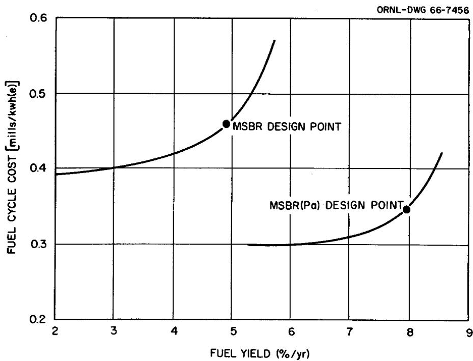  
Fig. 7. Variation of Fuel-Cycle Cost with Fuel Yield in MSBR and MSBR(Pa) Concepts.

# Power-Production Cost and Fuel-Utilization Characteristics

The power-production costs are based on the capital costs given above, operation and maintenance charges, and fuel-cycle costs. Table 9 summarizes the power-production cost and the fuel-utilization characteristics of the MSBR(Pa) and MSBR plants. The results illustrate that both concepts produce power at low costs and that the fuel-utilization characteristics for the MSBR(Pa) plant are excellent and those for the MSBR are good. Measuring these characteristics in terms of the product of the specific fissile inventory and the square of the doubling time, the MSBR(Pa) concept is comparable to a fast breeder reactor with a specific inventory of $3\mathrm{kg}$ of fissile material per megawatt of electricity produced and a doubling time of 6 years, while the MSBR plant is comparable to the same fast breeder with a doubling time of 10.5 years.

Table 9. Power-Production Cost and Fuel-Utilization Characteristics of the MSBR(Pa) and the MSBR Plantsa   

<table><tr><td></td><td colspan="2">MSBR(Pa)</td><td colspan="2">MSBR</td></tr><tr><td>Specific fissile inventory, kg/Mw(e)</td><td colspan="2">0.68</td><td colspan="2">0.77</td></tr><tr><td>Specific fertile inventory, kg/Mw(e)</td><td colspan="2">105</td><td colspan="2">268</td></tr><tr><td>Breeding ratio</td><td colspan="2">1.07</td><td colspan="2">1.05</td></tr><tr><td>Fuel-yield rate, %/yr</td><td colspan="2">7.95</td><td colspan="2">4.86</td></tr><tr><td>Fuel doubling time,b years</td><td colspan="2">12.6</td><td colspan="2">20.6</td></tr><tr><td>Power doubling time,c years</td><td colspan="2">8.7</td><td colspan="2">14.3</td></tr><tr><td></td><td>Private Financing</td><td>Public Financing</td><td>Private Financing</td><td>Public Financing</td></tr><tr><td>Capital charges, mills/kwhr(e)</td><td>1.95</td><td>1.10</td><td>1.95</td><td>1.10</td></tr><tr><td>Operating and maintenance cost, mill/kwhr(e)</td><td>0.34</td><td>0.34</td><td>0.34</td><td>0.34</td></tr><tr><td>Fuel-cycle cost,d mill/kwhr(e)</td><td>0.35</td><td>0.20</td><td>0.46</td><td>0.29</td></tr><tr><td>Power-production cost, mills/kwhr(e)</td><td>2.64</td><td>1.64</td><td>2.75</td><td>1.73</td></tr></table>

${}^{a}$ Based on 1000-Mw(e) plant and a 0.8 load factor. Private financing considers a capital charge rate of ${12}\% /\mathrm{{yr}}$ for depreciating capital and of ${10}\% /\mathrm{{yr}}$ for nondepreciating capital; public financing considers a capital charge rate of 7%/yr for depreciating capital and 5%/yr for nondepreciating capital.   
b Inverse of the fuel-yield rate.   
cCapability based on continuous investment of the net bred fuel in new reactors; equal to the reactor fuel doubling time multiplied by 0.693.   
Costs of on-site integrated processing plant included in this value.

Studies of Alternative Molten-Salt Reactor Designs

# Modular-Type Plant

An important factor in maintaining low power-production costs is the ability of the power plant to maintain a high plant-availability factor. A modular-type MSBR plant, termed MMSBR, was therefore investigated to determine the practicality of a four-module plant. Stoppage of a fuel pump in such a system would shut down only one-quarter of the station capacity, leaving $75\%$ available for power production.

The MMSBR design includes four separate and identical reactors, along with their separate salt circuits. The designs of the heat ex-changers, the coolant-salt circuits, and the steam-power cycle remain essentially as for the MSBR. Each reactor module generates thermal power equivalent to that required for a net production of $250\mathrm{Mw(e)}$ . The flow diagram given in Fig. 1 is applicable to the MMSBR. The new features of the MMSBR design are indicated in Fig. 8, which illustrates the four distinct reactor vessels and cells, along with their adjacent steam-generating cells.

The reactor core consists of 210 graphite fuel cells operating in parallel within the reactor tank. The core region is cylindrical, with a diameter of about 6.3 ft and a height of about 7.9 ft. Each reactor vessel is about 12 ft in diameter and about 14 ft high.

The nuclear and fuel-cycle performance of the MMSBR was also studied for protactinium removal from the blanket stream; this case is termed MMSBR(Pa). The results indicate that the nuclear and fuel-cycle performance of a modular-type plant compares favorably with that of a single-reactor plant; the modular plant tends to have slightly higher breeding ratio, fissile inventory, and fuel-cycle cost; the power-production cost is virtually the same as for the MSBR plant.

# Additional Design Concepts

Other molten-salt reactor designs were studied briefly. In general the technology required for these alternative designs is relatively undeveloped, although there are experimental data that support the feasibility of each concept. An exception is the molten-salt converter reactor (designated MSCR), whose application essentially requires only scaleup of MSRE and associated fuel-processing technology. However, the MSCR is not a breeder, although it approaches breakeven breeder operation. The additional concepts are termed MSBR(Pa-Pb), SSCB(Pa), MOSEL(Pa-Pb), and MSCR. The MSBR(Pa-Pb) designation refers to the MSBR(Pa) modified by use of direct-contact cooling of the molten-salt fuel with molten lead. Lead is immiscible with molten salt and can be used as a heat exchange medium within the reactor vessel to significantly lower the fissile inventory

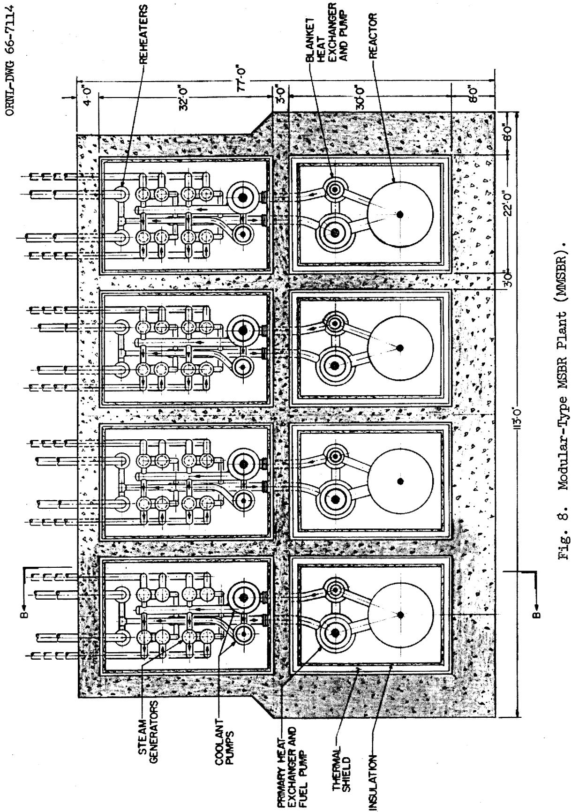

external to the reactor. The lead also serves as a heat transport medium between the reactor and the steam generators.

The SSCB(Pa) designation refers to a Single-Stream-Core Breeder with direct protactinium removal from the fuel stream. This is essentially a single-region reactor having fissile and fertile material in the fuel stream, with protactinium removal from this stream; in addition, the core region is enclosed within a thin metal membrane and is surrounded by a blanket of thorium-containing salt. Nearly all the breeding takes place in the large core, and the blanket "catches" only the relatively small fraction of neutrons that "leak" from the core (this concept is also referred to as the one-and-one-half region reactor).

The MOSEL(Pa-Pb) designation refers to a Molten-Salt Epithermal breeder having an intermediate-to-fast energy spectrum, with direct protactinium removal from the fuel stream and direct-contact cooling of the fuel region by molten lead. No graphite is present in the core of this reactor.

The MSCR refers to a Molten-Salt Converter Reactor that has the fertile and fissile material in a single stream. No blanket region is employed, although a graphite reflector surrounds the large core.

The fuel-cycle performance characteristics for these reactors are summarized in Table 10; in all cases the methods, analysis procedures,

Table 10. Summary of Fuel-Cycle Performance for Reactor Designs Studied   

<table><tr><td>Reactor</td><td>Fuel Yield (%/yr)</td><td>Breeding Ratio</td><td>Fuel-Cycle Cost (mill/kwhr)</td><td>Specific Fissile Inventory [kg/Mw(e)]</td></tr><tr><td>MSBR(Pa)</td><td>7.95</td><td>1.07</td><td>0.35</td><td>0.68</td></tr><tr><td>MSBR</td><td>4.86</td><td>1.05</td><td>0.46</td><td>0.77</td></tr><tr><td>MMSBR(Pa)</td><td>7.31</td><td>1.07</td><td>0.38</td><td>0.76</td></tr><tr><td>MSBR(Pa-Pb)</td><td>17.3</td><td>1.08</td><td>0.25</td><td>0.34</td></tr><tr><td>SSCB(Pa)</td><td>6.63</td><td>1.06</td><td>0.37</td><td>0.68</td></tr><tr><td>MOSEL(Pa-Pb)</td><td>10.3</td><td>1.14</td><td>0.13</td><td>0.99</td></tr><tr><td>MSCR</td><td></td><td>0.96</td><td>0.57</td><td>1.63</td></tr></table>

and economic conditions employed were analogous to those used in obtaining the reference MSBR design data. In general, fuel recycling was based on fluoride volatility and vacuum-distillation processing; direct protactinium removal from the reactor system was also considered in specified cases.

The results indicate the potential performance of fluoride-salt systems utilizing a direct-contact coolant such as molten lead and the versatility of molten salts as reactor fuels. They also illustrate that single-region reactors based on MSRE technology have good performance characteristics. Since the capital, operating, and maintenance costs of the MSCR should be comparable with those of the MSBR, the power-production cost of an investor-owned MSCR plant should be about 2.9 mills/kwhr(e) based on a load factor of 0.8. However, the lower power costs of the MSBR(Pa) and MSBR plants and their superior nuclear and fuel-conservation characteristics make development of the breeder reactors preferable.

# CONTENTS

Page

# SUMMARY 11i

# 1. INTRODUCTION 1

1.1 General Purpose of Study 1   
1.2 Power Cost and Nuclear Performance Goals 1   
1.3 Scope of Study 2   
1.4 Study Organization and Participating Personnel 4   
1.5 Acknowledgements 4

# 2. MOLTEN-SALT REACTOR TECHNOLOGY 6

2.1 Chemical Development 6   
2.2 Structural Material Development 8   
2.3 Fuel Processing Development 11   
2.4 Component Development 13

# 3. INITIAL DESIGN OF A 1000-Mw(e) MSBR POWER STATION 16

3.1 General Design Criteria, Cost Bases, and Ground Rules 16   
3.2 General Plant Layout 19   
3.3 Flowsheets and General Description 26   
3.4 Reactor System 34

3.4.1 Description 34   
3.4.2 Reactor Materials 41   
3.4.3 MSBR Load-Following Characteristics 42

# 3.5 Nuclear Fuel-Cycle Performance 43

3.5.1 Design and Cost of Processing Plant for Fuel Recycle 43   
3.5.2 Nuclear Design Method 54   
3.5.3 Nuclear Performance and Fuel-Cycle Cost 56   
3.5.4 Critique of Nuclear Performance Calculations 61

# 3.6 Off-Gas System 65

# 3.7 Heat Exchangers 68

3.7.1 Fuel-Salt Heat Exchangers 68   
3.7.2 Blanket-Salt Heat Exchangers 73   
3.7.3 Boiler-Superheaters 77

# xxxii

3.7.4 Steam Reheaters 80   
3.7.5 Reheat-Steam Preheaters 83

3.8 Salt Circulating Pumps 87   
3.9 Steam-Power System 90   
3.10 Other Design Considerations 95

3.10.1 Piping and Pipe Stresses 95   
3.10.2 Maintenance 95   
3.10.3 Containment 97

3.11 Plant Construction Costs 97   
3.12 Power-Production Cost 105

4. ALTERNATIVE CONDITIONS FOR MSBR DESIGN 110

4.1 Protactinium Removal from Blanket Stream 110   
4.2 Alternative Feedwater Temperature Cycle 118   
4.3 Modular-Type Plant 123   
4.4 Additional Design Changes 129

5. ALTERNATIVE MOLTEN-SALT REACTOR DESIGNS 135

5.1 MSBR(Pa-Pb) Concept 136   
5.2 SSCB(Pa) Reactor Concept 140

5.2.1 SSCB(Pa) Reactor Concept with Intermediate Coolant 140   
5.2.2 SSCB(Pa) with Direct-Contact Cooling 141

5.3 MOSEL(Pa-Pb) Reactor Concept 143   
5.4 MSCR Concept 145

6. EVALUATION 147

References 148

# 1. INTRODUCTION

# 1.1 General Purpose of Study

An important objective of the AEC commercial nuclear power program is to develop reactors that produce low-cost power and at the same time conserve nuclear-fuel resources. Since the most important factor in commercial application of reactors is power production cost, fuel utilization aspects should be consistent with generation of low-cost power over a given period of time. However, in evaluating economic factors, future conditions must also be properly weighed and taken into consideration.

The general purpose of the studies discussed here was to determine the incentive for molten-salt reactor development within the context of low power cost and good fuel utilization. An associated objective was to define important problems that need to be overcome prior to commercial application of molten-salt reactors.

# 1.2 Power Cost and Nuclear Performance Goals

The desirability of developing a given type of power reactor depends on its performance relative to that of alternative concepts. This performance is measured in terms of the power-production cost and the fuel-utilization characteristics. Based on the accounting practices of investor-owned utilities, present-day light-water reactor plants generating 1000-Mw(e) appear capable of producing power for about 4.0 mills/kwhr(e). At the same time, substantial AEC support is being given to the high-temperature gas-cooled (HTGR) and the heavy-water-moderated organic-cooled (HWOCR) reactor concepts, which appear capable of producing power for about 3.5 mills/kwhr(e) in privately owned 1000-Mw(e) plants. For a new type of reactor to merit serious attention, it should be judged capable of producing even lower cost power in 1000-Mw(e) investor-owned plants; therefore, a goal of this study was to estimate the power-cost performance of molten-salt breeder reactors to determine their competitive position.

As more nuclear power plants are built, the efficient use of our nuclear fuels becomes increasingly important. New reactors must have the

potential of producing low-cost power from more expensive fuel resources or preferably of conserving fuel so the use of expensive resources is unnecessary. There is general agreement that breeder reactors are required to attain this objective. Important factors related to conservation of fissile fuel resources are the fuel doubling times of the breeder reactors, the associated specific inventories of fuel, and the total nuclear-electric generating capacity at the time when breeder plants begin to compete commercially and to be installed in large numbers. Also, the mined fissile fuel needs are decreased if breeder-type reactors can be operated economically when initially fueled with $^{235}\mathrm{U}$ (initial operation as fuel converters to produce plutonium or $^{233}\mathrm{U}$ ). Such ability influences the time at which reactor plants having good fuel utilization characteristics can be introduced on a large scale. However, in order for $^{235}\mathrm{U}$ to serve as the initial fuel, the associated specific inventory requirements and conversion ratio must be consistent with economic operation.

It is desirable that breeder reactors have both low fuel doubling times and low specific inventories, since mined fissile fuel needs depend on both factors. In general, it appears prudent that the needs of the nation for mined fissile material be below the quantity associated with low-cost uranium reserves. Use of breeder reactors having specific inventories of $1\mathrm{kg}$ fissile/Mw(e) and fuel doubling times of 20 years appears to make this possible. Also, the capacity of existing gaseous diffusion plants appears sufficient to provide the enriched-uranium requirements of the nation if such breeder reactors can be developed and built in large numbers by about 1985. Thus, a major objective of this study was to determine whether a molten-salt reactor can achieve the performance discussed above. Specifically, this goal is the simultaneous achievement of power production costs of about 3 mills/kwhr(e) in a 1000-Mw(e) investor-owned station, a specific inventory of $1\mathrm{kg}$ fissile/Mw(e) or less, and a fuel doubling time of 20 years or less.

# 1.3 Scope of Study

The molten-salt reactors being developed are fueled with solutions of uranium and thorium fluorides dissolved in lithium and beryllium

fluorides. They operate at high temperature and relatively low pressure. Fuels and materials are commercially available for operating such systems at temperatures at least as high as $1400^{\circ}\mathrm{F}$ , with pressures determined primarily by fluid flow requirements. Since the salts do not undergo violent chemical reactions with air or water, equipment and containment design problems are minimized. Since the molten-salt fuels are compatible with unclad graphite, a breeder core having low parasitic-neutron-capture cross sections is practical. The combination of the high specific heat of the molten-salt fuels, their large operating temperature range, and their radiation stability permits the attainment of very high fuel specific powers. Also, fuel processing and reconstitution involve inherently simple processes that allow inexpensive fuel recycle at high processing rates in compact on-site integrated processing plants. In this study these features were incorporated into a 1000-Mw(e) power plant design, and the nuclear and economic characteristics of the plant were evaluated as functions of design and operating conditions.

Only the Th- $^{233}$ U fuel cycle with fluoride salt fuels is considered because the fuel-recycle processes employed apply uniquely to it (in general, the chemical, physical, and nuclear characteristics of the Th- $^{233}$ U cycle favor its use over the uranium-plutonium cycle in thermal molten-salt systems). Uranium can be recovered readily without affecting the chemical form of the ferricile material by fluorinating the molten fluoride mixture. Also, the $\mathrm{ThF}_4$ dissolved in the carrier salts does not undergo oxidation-reduction reactions as does $\mathrm{UF}_4$ ; this reduces mass transfer effects in systems constructed of Hastelloy N that circulate salts with high fertile material concentrations. In addition, the nuclear properties of $^{233}$ U that determine the fuel-utilization characteristics are superior to those of $^{235}$ U or plutonium fuels in thermal reactors.

The initial reference molten-salt breeder reactor (MSBR) considered here is a two-region fluid-fuel concept with fissile material in the core stream and fertile material in the blanket stream. The fuel and blanket salts are in direct contact with the graphite moderator, and graphite tubes are used to separate core and blanket streams. The fertile stream

not only surrounds the core to form a blanket region but also circulates through the core region in spaces between the fuel tubes. Energy generated in the reactor fluid is transferred to a secondary coolant-salt circuit, which couples the reactor to a supercritical steam plant. Fuel processing is accomplished in an on-site plant that utilizes fluoride-volatility and vacuum-distillation processing. Although most of the design effort centered on this system, it is not to be inferred that this concept is necessarily the best or involves the best processes. It was chosen as a logical starting point that would permit definition of a specific system, help in determining design problems of molten-salt reactors in general, and provide a standard of performance against which the incentive for design, development, and operating improvements could be measured.

In order to indicate the depth of experience presently available with molten-salt reactors, Chapter 2 presents a summary of the technological development and status. Following a description of the initial reactor study (Chapt. 3), Chapter 4 presents alternate design conditions for the reference design. Chapter 5 briefly presents alternate reactor designs and their performance characteristics. Finally, Chapter 6 evaluates the overall results of these design studies.

# 1.4 Study Organization and Participating Personnel

The areas investigated in the studies and the personnel involved are given in Table 1.l.

# 1.5 Acknowledgements

The encouragement and support of Mr. R. Beecher Briggs, Director of the Molten-Salt Reactor Program, during the course of these studies was very much appreciated. In addition, we are grateful for his critical review of this report and his helpful comments.

Table 1.1. Organization of Molten-Salt Reactor Design Studies   

<table><tr><td>Report coordination</td><td>P. R. Kasten, W. B. McDonald,aR. C. Robertson</td></tr><tr><td>Engineering design studies</td><td>E. S. Bettis</td></tr><tr><td>Mechanical design</td><td>E. S. Bettis, J. H. Westsik,R. C. Robertson, D. Scott,W. Terry</td></tr><tr><td>Nuclear design and fuel-cycle cost</td><td>H. F. Bauman, H. T. Kerr</td></tr><tr><td>Processing plant design</td><td>W. L. Carter, C. D. Scott</td></tr><tr><td>Heat exchanger design</td><td>C. E. Bettis, T. W. Pickel,R. J. Braatz, G. A. Cristy,A. E. Spaller</td></tr><tr><td>Pump design</td><td>A. G. Grindell, L. V. Wilson</td></tr><tr><td>Capital cost evaluation</td><td>R. C. Olson, R. C. Robertson,M. L. Myers</td></tr><tr><td>Molten-salt chemical studies</td><td>W. R. Grimes, H. F. McDuffie,C. J. Barton, F. F. Blankenship,S. Cantor, S. S. Kirslis,J. H. Shaffer, R. E. Thoma</td></tr><tr><td>Analytical chemical studies</td><td>J. C. White</td></tr><tr><td>Structural material studies</td><td>A. Taboada,b W. H. Cook,C. R. Kennedy, G. M. Tolson</td></tr></table>

aNow with Pacific Northwest Laboratories, Hanford, Washington. bNow with Division of Reactor Development and Technology, AEC, Washington.

# 2. MOLTEN-SALT REACTOR TECHNOLOGY

The initial technological development for molten-salt reactors was done in the early 1950's in the Aircraft Nuclear Propulsion (ANP) Program at the Oak Ridge National Laboratory. This program involved extensive fluoride-salt chemistry and materials compatibility studies, component development, material and fabrication development, and development of reactor maintenance methods. In 1954 the Aircraft Reactor Experiment (ARE), a 2.5-Mw(th) molten-salt reactor was built and operated successfully at outlet salt temperatures up to $1650^{\circ}\mathrm{F}$ . The ARE was fueled with $\mathrm{UF_4}$ dissolved in a mixture of zirconium and sodium fluorides, moderated with beryllium oxide, and constructed of Inconel.

The present molten-salt reactor program, initiated in 1957, has drawn upon the information from the ANP program and has also initiated new investigations. By 1960 enough favorable experimental results had been obtained to support authorization of a 10-Mw(th) molten-salt reactor experiment (MSRE). Power operation of the MSRE was initiated in early 1966. The system provides facilities for testing fuel salt, graphite, and Hastelloy N (the container material) under appropriate reactor operating conditions. The basic reactor performance to date has been outstanding and has demonstrated that the desirable features of the molten-salt concept can be embodied in a practical reactor that can be constructed, operated, and maintained with safety and reliability.

As indicated above, the successful operation of the MSRE is based upon a broad technological development program. In order to give a better understanding of present knowledge useful in the design of molten-salt breeder reactors, a summary of selected work is given below that covers chemical development, structural material development and corrosion studies, fuel-processing development, and component development. Additional information is presented in other reports in this series that amplify the present discussion and give specific results. $^{1-6}$

# 2.1 Chemical Development1

The chemical and physical characteristics of a large number of molten-fluoride-salt compositions were studied extensively, with measurements

involving melting temperature, vapor pressure, heat capacity, enthalpy, heat of fusion, thermal conductivity, and surface tension. These studies showed that melts containing fissile and/or fertile material are available which possess adequately low liquidus temperature, excellent phase stability, and good physical properties. Also, these salt mixtures appear compatible with Hastelloy N and with graphite under irradiation as well as nonirradiation conditions. The primary fluids proposed for the moltensalt breeder reactor (MSBR) are a ternary mixture of $^{7}\mathrm{LiF}$ , $\mathrm{BeF}_2$ , and $\mathrm{UF_4}$ for the fuel salt, and a mixture of $^{7}\mathrm{LiF}$ , $\mathrm{BeF}_4$ , and $\mathrm{ThF_4}$ for the blanket salt. The choice of these compounds is based on their nuclear, chemical, and physical properties, as discussed in Ref. 1. Briefly, fluoride carrier salts were chosen because of their chemical stability, their ability to produce fuel solutions with relatively low melting temperature, low neutron-capture cross section, low vapor pressure, and good heat transfer properties. The fluoride fuel salts are also thermodynamically stable with respect to the structural metal, Hastelloy N. Graphite was chosen as a moderator because of good moderating ability, compatibility with molten-salt fuels, low neutron-absorption cross section, and good structural properties.

There have been extensive investigations of the stability and compatibility of MSBR fuels and materials under irradiation conditions. Capsule tests have been carried out with fission-power densities of 80 to 8000 kw/liter at temperatures from 1500 to $1600^{\circ}\mathrm{F}$ and for irradiation times of 300 to 800 hr. Chemical, physical, and metallurgical tests have indicated that no significant changes take place in the fuel or in the structural material that can be attributed to irradiation conditions. Also fuel irradiation tests have been performed in graphite capsules containing structural material, with initial fuel-power densities in the range 200 to 1000 kw/liter and exposures of the order of 1000 hr. The results indicate excellent radiation stability and compatibility between Hastelloy N, graphite, and molten fluoride fuels. Subsequent detailed tests at lower power densities substantiated these findings.

The very low solubility of the fission-product gases in molten-salt fuel suggests that they can be readily removed from reactor systems; this has been demonstrated in the ARE and MSRE operations. In addition,

experimental studies have shown that iodine, the precursor of xenon, can be removed directly from the fuel fluid by stripping with hydrogen fluoride gas.

Although the physical chemistry of the fission products is not known completely, thermodynamic considerations lead to the conclusion that the fission process per se is oxidizing to Hastelloy N. The results of many in-pile tests of metals and graphite in fuel salts suggest, however, that fission does not lead to corrosion of the container material. Even if the overall fission process is oxidizing, no real corrosion problem need exist in an MSBR, since preferential oxidation of uranium would take place if "burned" uranium were partially replaced with $\mathrm{UF}_3$ (rather than $\mathrm{UF}_4$ ).

Fuel and blanket salts of high purity are required to obtain the very low corrosion rates observed in MSRE operation. The methods used in purifying commercially available fluoride salts for the MSRE are directly applicable to the large-scale production operations required to supply the salts for MSBR systems.

Continuous monitoring of the salt composition is highly desirable and advantageous in operating a fluid-fuel reactor, although not essential. Current methods give accurate measurements of the composition and purity of the reactor salts on a routine basis, but not as rapidly as desirable for an MSBR. Thus, investigations are being performed to develop appropriate instrumentation and new analysis techniques. Results indicate that new composition-analysis methods can be developed for "online" reactor use.

# 2.2 Structural Material Development2

The structural material for containing the molten fluoride salts must have desirable structural properties, be easily fabricated, and be metallurgically stable over a wide temperature range. A most important requirement is that of adequate resistance to corrosion at elevated temperatures under reactor conditions. Since molten fluoride salts are excellent fluxing agents, surface films cannot be relied upon as protective membranes. Therefore, the structural material must be basically inert to corrosion processes under conditions of thermodynamic equilibrium.

Extensive corrosion studies were conducted in which various structural materials were exposed to the salt in both thermal-convection and forced-circulation loops with hot-leg temperatures of about $1500^{\circ}\mathrm{F}$ . These studies led to the development of INOR-8,\* a nickel-base alloy containing about $16\%$ molybdenum, $7\%$ chromium, and $5\%$ iron. This alloy has good to excellent mechanical and thermal characteristics that are superior to those of many austenitic stainless steels. $^{2,7}$ It has good resistance to oxidation by air, and it retains favorable mechanical properties at temperatures up to about $1500^{\circ}\mathrm{F}$ . Results of long-term corrosion experiments (exposures of up to 20,000 hr) have demonstrated its basic inertness to molten fluoride salts at temperatures up to about $1500^{\circ}\mathrm{F}$ . Corrosion rates appear to be controlled primarily by impurity levels in the molten salts and by the temperature-dependent mass transfer associated with the reaction

$$
2 \mathrm {U F} _ {4} + \mathrm {C r} \rightleftharpoons 2 \mathrm {U F} _ {3} + \mathrm {C r F} _ {2}.
$$

Based on experimental data from test loops, the corrosion rate of Hastelloy N in MSBR fuel systems will be less than 0.5 mil/yr with a core outlet temperature of $1300^{\circ}\mathrm{F}$ , and probably will not exceed that with a $1500^{\circ}\mathrm{F}$ outlet temperature under equilibrium conditions. Even less corrosion should occur in the blanket-salt and secondary-coolant-salt systems, where the $\mathrm{UF_4}$ concentration will be extremely low and zero, respectively. These test loop results have been substantiated by data obtained in the MSRE, where no significant corrosion of the Hastelloy N has taken place in 2500 hr of exposure at $1200^{\circ}\mathrm{F}$ (on the average, chromium was removed from a layer 0.006 mil in thickness over loop surfaces, with virtually zero corrosion after the initial months of operation).

Extensive tests of the mechanical and physical properties of Hastelloy N as a function of temperature up to about $1800^{\circ}\mathrm{F}$ indicate characteristics suitable for MSBR use. The creep and stress-rupture properties are equivalent to and in most cases superior to those of Inconel. Long-time ageing studies have shown that the material does not embrittle with

time. Further, the mechanical properties of Hastelloy N are virtually unaffected by long-time exposure to the molten fluoride salts.

The structural material must retain its good mechanical properties when exposed to reactor radiation. Irradiation studies have shown that the $(n, \alpha)$ reaction in structural materials tends to decrease ductility. This reaction and its effects on Hastelloy N have been studied in detail, and it appears that the deleterious effects can be minimized by maintaining a low $^{10}\mathrm{B}$ content, adjusting the concentration of minor constituents in the alloy, and improving heat-treatment practices. Development work in these areas appears capable of producing an improved Hastelloy N whose ductility will not decrease below acceptable values during long-term exposures to MSBR fluxes.

The melting and casting of Hastelloy N can be carried out with the conventional practices for nickel and its alloys. Conventional methods of hot and cold forming have been used to produce it on a commercial basis in a variety of shapes, such as plate, sheet, rod, wire, and as-welded and seamless tubing. Cold working operations can be performed, such as rolling, swaging, tube reducing, and drawing. Cold forming has been successfully used for fabricating Hastelloy vessel heads. The material is readily weldable by the inert-gas-shielded tungsten-arc process.

In addition to Hastelloy N, the other prime structural material used in the MSBR is graphite. This material does not react chemically with the molten fluoride mixtures under consideration, and since it is not wetted by molten-salt mixtures, there is little salt permeation of the graphite. In general, the graphite needs to have low permeability to salt and gases, to have adequate structural properties when exposed to high radiation fluxes, and to be fabricated into tubes and other moderator shapes. These properties were obtained, at least partially, in the MSRE graphite, which was produced by extruding petroleum coke bonded with coal-tar pitch and applying multiimpregnations and heat treatments. The resulting product has a high specific gravity (1.86), low permeation (0.2% bulk volume penetration by molten salt - surface penetrations only - when a 150-psi pressure was applied to the salt), and high strength (ability to withstand 1500-psi tensile strain and 3000-psi flexural strain was shown by all bars fabricated). This material represents a successful

first step in developing a graphite acceptable for MSBR use. Graphite tubing having 1/2-in.-thick walls has also been successfully fabricated; the product had no visible cracks.

The graphite in regions of high flux in an MSBR will be irradiated to doses above $10^{23}$ neutrons/cm² in five years and will be exposed to radiation flux gradients. The magnitude of the graphite differential shrinkage that will occur under these conditions will depend on the graphite creep coefficient, flux gradient, and geometry of the particular structural component. Isotropic graphite has demonstrated the ability to withstand high radiation exposures. Also, the ability of the graphite to absorb the creep strain regardless of the stress intensity has been shown experimentally. Thus it appears that graphite satisfactory for MSBR use can be developed.

Techniques are required for attaching graphite to metal with reliable joints. Graphite has been brazed successfully to metals, with brazing alloys that were found resistant to corrosion by molten salts. Alloys of gold, nickel, and molybdenum and other alloys under development appear to be satisfactory brazing materials. Brazes made with these materials can be used for joining graphite to graphite or graphite to molybdenum (molybdenum has a thermal expansion coefficient near that of graphite). Metal-to-graphite joints have maintained their integrity in molten-salt environments at $1300^{\circ}\mathrm{F}$ and at pressures of 150 psi for periods of 500 hr. In addition, mechanical joints may be useful in MSBR cores, since zero leakage between the core and blanket fluids is not required.

Finally, compatibility of molten salts, Hastelloy N, and graphite appears excellent. Tests have shown no carburization of Hastelloy N under MSBR conditions.

# 2.3 Fuel-Processing Development

Experience in processing molten-fluoride-salt fuels at Oak Ridge National Laboratory dates from 1954 and began with fluoride volatility processing studies. The initial laboratory and development work formed the basis for successful operation of a pilot plant. The associated process is designated the Fluoride Volatility Process after the principal

operation of volatilizing uranium as the hexafluoride. Although also applicable to the treatment of solid fuel elements, fluoride volatility processing is uniquely suited to molten-salt fuels because the fuel salt can be treated directly with fluorine. Elemental fluorine reacts with the $\mathrm{UF_4}$ in the molten salt (at about 930 to $1020^{\circ}\mathrm{F}$ ) to produce volatile $\mathrm{UF_6}$ . The reaction is rapid and essentially quantitative for uranium; it easily reduces the uranium content of the molten salt to a few parts per million. The $\mathrm{UF_6}$ product can be treated in absorber beds to give decontamination factors of $10^{6}$ and more. Recycle uranium is easily converted to $\mathrm{UF_4}$ dissolved in carrier salt by absorbing the $\mathrm{UF_6}$ in molten salt containing some $\mathrm{UF_4}$ and hydrogenating in the liquid phase. This treatment also reduces any corrosion product contaminants to metal that can then be filtered from the fuel solution prior to returning fuel fluid to the reactor system.

The fluoride volatility process can be used for both the core stream and the blanket stream. When applied to the core stream it is used to separate the uranium from the carrier salt before that stream is processed (by another method) for fission-product removal. Essentially all the uranium must be recovered, and this leads to relatively severe fluorination conditions. Requirements for processing the blanket stream are less stringent. Uranium that is not removed during the fluorination is merely returned to the reactor blanket and is removed during subsequent passes through the processing plant. Discard of $3\%$ annually or processing by other methods keeps the fission products at a very low level in the blanket salt.

The ease of removal of xenon gas from molten-salt fuels has been demonstrated in both the ARE and the MSRE. It thus appears practical to obtain very low xenon poisoning by sparging the salt with an inert gas such as helium or nitrogen. In addition, $^{135}\mathrm{I}$ , the precursor of $^{135}\mathrm{Xe}$ , can be stripped from fuel salts by sparging with HF and hydrogen. Such processing would virtually eliminate xenon poisoning in MSBR systems.

The discovery that vacuum distillation permits the economic separation of carrier salts from fission products has been a vital factor in improving the economic and nuclear characteristics of MSBR systems. Laboratory experiments have demonstrated that carrier salt can be readily

separated from rare-earth fluorides at distillation pressures of $2\mathrm{mmHg}$ , with separation factors of 50 to 100 and $95\%$ recovery of carrier salt. These process characteristics appear adequate for MSBR application.

Fluoride volatility processing appears well suited for keeping the uranium inventory and the fission rate in the blanket low and thereby maintaining low neutron leakage from the blanket. An even better process would be one for recovering protactinium directly from the blanket fluid. Recent work toward providing such a process has been encouraging; at least two possible methods are being considered. One involves removal of protactinium from the process stream by precipitation as the oxide through reaction with $\mathrm{ZrO_2}$ . After the protactinium decays, the product $\mathrm{UO_2}$ can be recovered by reaction with $\mathrm{ZrF_4}$ to give $\mathrm{UF_4}$ in solution. Even more encouraging results have been obtained by treating fluoride salts containing $\mathrm{PaF_4}$ with thorium dissolved in molten bismuth. The thorium metal reduced the protactinium to the metal which subsequently deposited on a stainless-steel-wool filter. These results indicate that inexpensive methods can be developed for removing protactinium directly from the blanket stream of an MSBR.

# 2.4 Component Development4,5

Nearly all molten-salt component development work has been for experimental molten-salt reactors (the ARE, the planned Aircraft Reactor Test, and the MSRE). The components required for these systems were developed at ORNL, including pumps, seals, valves, heat exchangers, fuel sampler-enricher units, freeze flanges, remote-maintenance tools, heaters, and instrumentation for measuring pressure, fluid flow, liquid level, and temperature under molten-salt reactor conditions. A major effort has been devoted to developing pumps that have long-term reliability at temperatures of about $1300^{\circ}\mathrm{F}$ . These pumps are vertical-shaft sump-type centrifugal pumps with a free surface in the pump bowl; all parts wetted by molten salt are constructed of Hastelloy N. Various pump models with capacities up to 1500 gpm have been manufactured and tested, and present models have circulated molten salt continuously for more than 25,000 hr at temperatures above $1200^{\circ}\mathrm{F}$ without maintenance. Stopping and starting

of pumps does not appear to produce any corrosive attack; thermal and pressure stresses associated with thermal cycling and reactor operations do not appear excessive. For MSBR application, it appears feasible to use a vertical sump-type pump similar to present models, with the upper end of the pump shaft supported by oil-lubricated radial and thrust bearings and the lower end supported by a molten-salt-lubricated journal bearing. The present experience with molten-salt-lubricated bearings consists of 3900 hr of operation in development of the bearing and operation for 13,500 hr of a pump containing a salt-lubricated bearing at temperatures of 1000 to $1400^{\circ}\mathrm{F}$ . The results obtained indicate that the development of salt-lubricated bearings is feasible; testing of these bearings is continuing.

Molten-salt heat exchangers have been designed and constructed and successfully demonstrated in the ARE and the MSRE. Numerous heat exchanger designs have been tested, and the results show that the required performance capability and mechanical integrity can be obtained with straightforward design and fabrication methods. The use of Hastelloy N as the construction material introduced no major difficulties. Experiments and experience with the MSRE have shown that conventional heat-transfer-coefficient correlations with minor modification are applicable to molten-salt heat exchanger design; also the physical properties of molten fluorides make them good to excellent heat transfer media. Since the molten salts are good fluxing agents and keep all surfaces clean, scale formation does not occur on heat transfer surfaces.

An important feature of molten-salt reactors is the ease of adding or removing fuel fluid from the reactor system. This permits ready compensation for fuel burnup, and the fluid removed can be easily transported to processing areas. The successful operation of the MSRE sampler-enricher system indicates that adjustments in fuel concentrations can be accomplished readily and reliably with relatively small and simple equipment.

The high melting point of MSBR fluoride salts provides a means of sealing a system, without the need for mechanical valves, through use of "freeze" valves in which a frozen plug of salt prevents leakage from the system. Although slow acting, the performance of freeze valves in the

MSRE has been excellent. It appears that such valves will be useful in MSBR subsystems. Freeze flanges have also been developed because of their proven reliability in containing fluid salts under all anticipated thermal-cycling conditions. Such flanges appear appropriate for joining components and piping in MSBR subsystems.

Instrument development carried out for the MSRE also appears useful for MSBR systems. Liquid-level measuring devices have operated successfully, as have instruments for fluid flow, differential pressure, and temperature measurements. Development work has also been performed on control-rod drive units capable of operating reliably for long periods while located in a strong gamma field.

Since the inception of molten-salt reactors, there has been significant engineering development work on maintenance operations. Remotely operated tools and procedures for remote maintenance have been devised, and the required operations have been studied in a maintenance facility. The results of these studies, along with other experience, were used in developing the MSRE maintenance tools and procedures. Also, equipment for remotely cutting pipes and brazing them back together was developed for replacement of MSRE components, and the results obtained with this equipment indicate that a remotely operated cutter and welder for MSBR maintenance operations is feasible. Experience to date with maintenance of radioactive molten-salt systems is encouraging.

# 3. INITIAL DESIGN OF A 1000-Mw(e) MSBR POWER STATION

The MSBR design discussed here is for a 1000-Mw(e) power station that appears technically sound, maintainable, and attractive from the power cost, reliability, and fuel utilization standpoints. This reference design is not necessarily the best design for a molten-salt reactor, but it represents a logical starting point based on the information available at the time of this study. The report is intended to illustrate the general merits of molten-salt reactors for power applications, delineate design problems and possible solutions to them, and indicate areas where research and development programs could improve MSBR performance.

A complete power station is considered, including all major equipment and a fuel-processing facility that is integral with the reactor plant. Very little optimization work was done, and layouts and designs were detailed only to the extent necessary to establish feasibility and to permit preliminary estimates of construction and operating costs. The design is based only on those materials and techniques that appear feasible based on present-day technology. In addition, several alternative molten-salt reactor designs were examined briefly (see Chapt. 5) in order to show the influence of design concept and technology requirement on the performance characteristics of molten-salt systems.

# 3.1 General Design Criteria, Cost Bases, and Ground Rules

The following design criteria, costs bases, and ground rules were used in making the study:

1. The power station will have a net electrical output of 1000 $\mathrm{Mw(e)}$ and will be used solely for the production of power.   
2. The reactor will be a two-region two-fluid graphite-moderated and -reflected thermal breeder with graphite separating the fissile and fertile materials. The reactor will be designed to achieve low power cost, high specific power, and low fuel doubling time.   
3. Equilibrium fueling conditions will apply, with mixtures of $\mathrm{BeF}_2$ and $^7\mathrm{LiF}$ used as carrier salts for $^{233}\mathrm{U}$ and $\mathrm{ThF_4}$ .

4. Because of the present uncertainties concerning long-term exposure of graphite in a high neutron flux, the MSBR core size will be relatively large in order to reduce the graphite irradiation rate. The fuel cell dimensions will be small to reduce flux gradients in the graphite. The fuel velocity in the core will be limited to 15 fps. The graphite tubes will be attached to a fixed structure at one end only to give freedom of movement for shrinkage and thermal expansion. Provisions will be made for removal and replacement of the core by remo-. maintenance procedures.

5. A control rod will be incorporated in the design, primarily as a convenience feature.   
6. The reactor core will be arranged so that the fluid will drain by gravity to make the reactor subcritical in event of loss of electric power or other scram-initiating disturbance.   
7. The reactor vessel, pumps, heat exchangers, and drain tanks for the fuel- and blanket-salt systems will be housed in a heavily shielded structure. This structure, and the more lightly shielded structure housing all portions of the system containing the coolant salt, such as the boiler-superheaters and reheaters, will be housed in a shielded containment vessel that meets acceptable leak-rate standards for this service. This containment vessel will incorporate a pressure-suppression system. The reactor containment vessel, but not the turbine room, will be located in a confinement-type building with controlled air-cleaning and venting systems.   
8. Heat will be transported from the primary heat exchangers to the steam-power system by a circulating secondary coolant that must be compatible with the fuel- and blanket-salt systems in case of accidental mixing. This coolant must have suitably low vapor pressure and liquidus temperature.   
9. The salt pumps will be limited in size to about 15,000 gpm; that is, they will be about an order of magnitude larger than the fuel-salt pump used in the MSRE.[8]   
10. The reactor system will incorporate an off-gas system for continuous removal, retention, and disposal of the fission-product gases.

11. The fuel and blanket salts will be continuously processed in a processing facility that is an integral part of the reactor plant. In the initial design, the fluoride-volatility-vacuum-distillation processes will be used for the fuel salt, and the fluoride-volatility process will be used for the blanket salt. A system will be provided for cleanup of the coolant salt.   
12. An afterheat removal system will be included in the design.   
13. The core outlet temperature of the fuel salt will be $1300^{\circ}\mathrm{F}$ . The temperature of the coolant salt entering the primary heat exchangers will be above the liquidus temperatures of the fuel and blanket salts. The feedwater entering the boiler will be above the liquidus temperature of the coolant salt. The temperature of the steam entering the reheaters will not be more than $50^{\circ}\mathrm{F}$ below the liquidus temperature of the coolant salt.   
14. The cells in which the fuel and blanket salts will circulate will be maintained above the liquidus temperature of both salts (about $1040^{\circ}\mathrm{F}$ ). The cells in which only coolant salt is circulated will be operated above the liquidus temperature of the coolant (about $700^{\circ}\mathrm{F}$ ). The cell temperatures will be maintained by radiant heating surfaces. Thermal insulation and water cooling will be applied as required to protect concrete, equipment supports, instrumentation, and other items.   
15. The boiler will operate with supercritical-pressure steam in a once-through counterflow arrangement.   
16. The steam-power cycle will operate with 3500-psia $1000^{\circ}\mathrm{F}$ steam to the turbine throttle, with single reheat to $1000^{\circ}\mathrm{F}$ .   
17. All salt-containing portions of the system will be constructed of Hastelloy N. The allowable design stress will be 3500 psi at $1300^{\circ}\mathrm{F}$ , 6000 psi at $1200^{\circ}\mathrm{F}$ , etc., in accordance with the MSRE design literature and Ref. 2.   
18. All portions of the system will conform to the applicable portions of the ASME Codes. Specifically, points of suspected high stresses will be examined for practicality of the proposed concepts.   
19. All major equipment for the plant will be included in the study up to, but not including, the station high-voltage output transformer

and the switchyard. Land and site development costs will be the same as those used in the advanced-converter reactor studies.[9,10]

20. Both capital and power production costs will, where applicable, be estimated and presented in accordance with the AEC cost guide.11 Indirect and operating costs will be estimated on the same bases as those used in the advanced-converter reactor studies.9 The plant life will be 30 years. Power costs will be estimated on the basis of both private financing (12% fixed charges) and public financing (7% fixed charges), with private financing as the base case. A plant factor of 80% will be assumed for both cases. In estimating all costs, it will be assumed that equipment and materials are obtained from a large and established molten-salt reactor industry.

21. The reactor-plant financing rate will apply to the fuel-processing and -fabrication plant, which will be a part of the power plant. To account for a higher equipment replacement rate, the indirect costs for the fuel-recycle plant will be $100\%$ of the direct costs.   
22. Inventory charges on fissile, fertile, and carrier-salt inventories will be computed with a reference value of $10\%$ per year for the base case and with $5\%$ per year to represent public ownership.   
23. The value of core and blanket fluids will be based on the following: 233U and 233Pa at $14/g, 235U at $12/g, Th at $12/kg, and carrier salt at $26/kg.   
24. Losses of materials through fuel recycle will be based on uranium losses of $0.1\%$ per pass, thorium and blanket-carrier-salt discard on a 30-year cycle time, and core-carrier-salt losses plus discard of $6.5\%$ per fuel-cycle pass.

# 3.2 General Plant Layout

The MSBR site is that described in the AEC handbook for estimating costs11 and also used in the advanced-converter reactor studies.9 In brief, the site is a 1200-acre plot of grass-covered level terrain adjacent to a river having adequate flow for cooling-water requirements. The ground elevation is 20 ft above the high-water mark and is 40 ft above the low-water level. A limestone foundation exists about 8 ft

below grade. The location is also satisfactory with respect to distance from population centers, meteorological conditions, frequency and intensity of earthquakes, and other external conditions.

As shown in Fig. 3.1, the plant area proper is a 20-acre fenced-in area above the high-water contour on the bank of the stream. The usual cooling-water intake and discharge structures are provided, along with fuel-oil storage for a startup boiler, a water-purification plant, water-storage tanks, and a deep well. This plant area also includes radioactive waste-gas storage, treatment, and disposal systems. Space is provided for the output transformers and switchyard. A railroad spur serves for the transportation of heavy equipment, and parking lots are provided.

A large single building houses the reactor and turbine plants, offices, shops, and all other supporting facilities. This building, as shown in Figs. 3.2 through 3.5, is 250 ft wide and 528 ft long; it rises 98 ft above and 48 ft below grade level. The construction is of the typical steel-frame type, with steel roof trusses, precast concrete roof slabs, concrete floors with steel gratings as required, and insulated aluminum or steel panel walls. The wall joints are caulked or otherwise sealed on the reactor end of the building.

The reactor complex occupies less volume than the steam-generating equipment in a conventional plant, and the turbine floor dimensions are the same as those used in the Bull Run Steam Plant of the Tennessee Valley Authority (TVA), but there are slightly larger allowances for the shops, offices, control rooms, and other facilities of the reactor plant.

The reactor end of the building is 168 ft long and consists of a high-bay portion above a reinforced-concrete reactor containment structure. A single crane is pictured as serving both the turbine room and the reactor plant, but separate cranes would probably be required, and the cost estimate allows for two units. The reactor plant building is sealed sufficiently for it to serve as a confinement volume in the unlikely event of a radioactivity incident, and it is provided with positive ventilation, air filtration and dilution equipment, and an off-gas stack.

The arrangement of the reactor plant cells is shown in Fig. 3.6. The thicknesses of concrete required for shielding against reactor

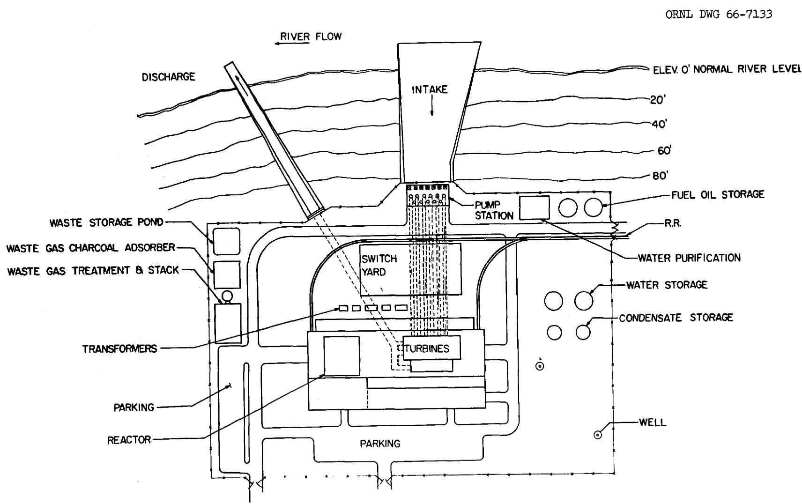  
Fig. 3.1. MSBR Plant Site Layout.

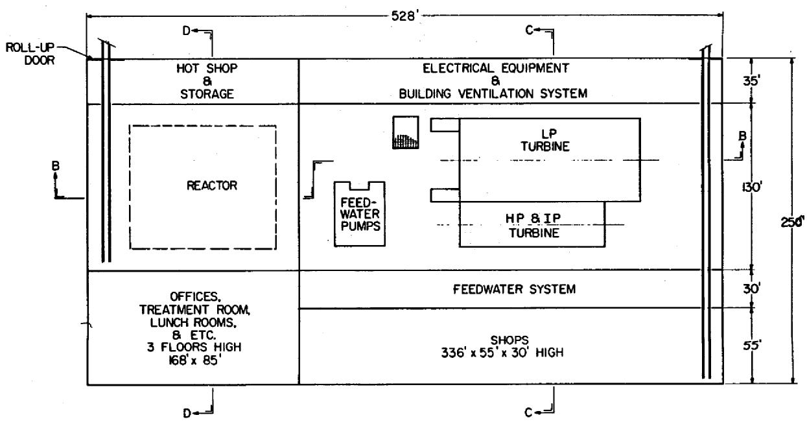

ORNL DWG 66-7138

Fig. 3.2. MSBR Building - Plan AA.

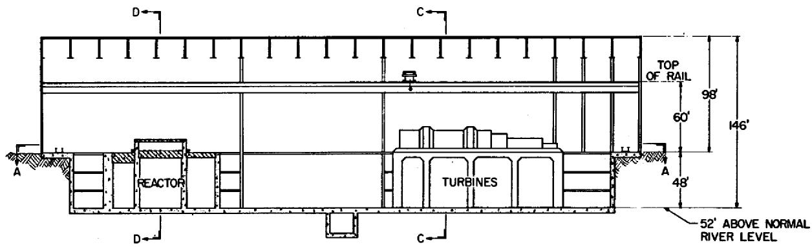  
Fig. 3.3. MSBR Building - Elevation BB.

ORNL DWG 66-7137

ORNL DWG 66-7140

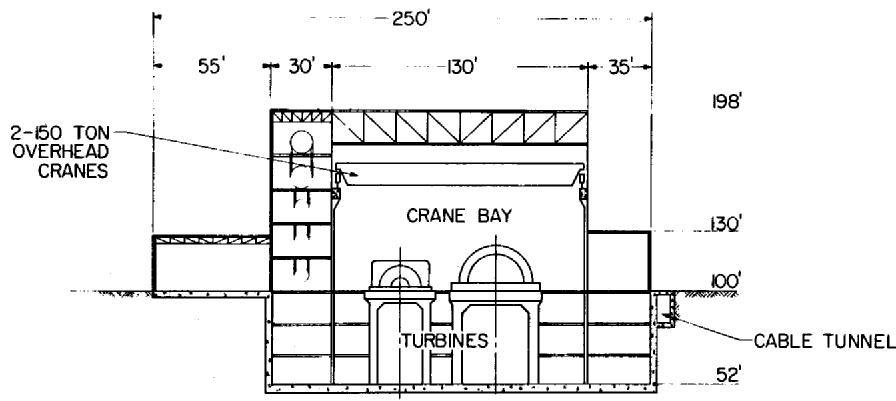  
Fig. 3.4. MSBR Building - Elevation CC.

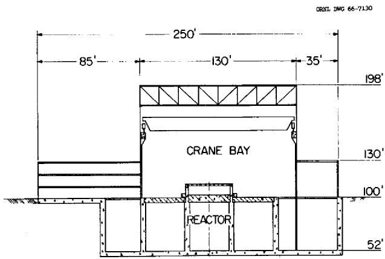  
Fig. 3.5. MSBR Building - Elevation DD.

radiations were estimated on the basis of previous reactor design experience. A minimum of 8 ft of high-density concrete separates the reactor vessel from an occupied area. A minimum of 4 ft of concrete is used around equipment containing the coolant salt, which is at a relatively low level of activity during reactor operation and this level decreases a short time after power shutdown.

As illustrated in Fig. 3.6, the reactor vessel is housed in a circular cell of reinforced concrete. This cell is about 36 ft in diameter and 42 ft high. The four fuel- and blanket-salt primary heat exchangers and their respective circulating pumps are placed around the reactor.

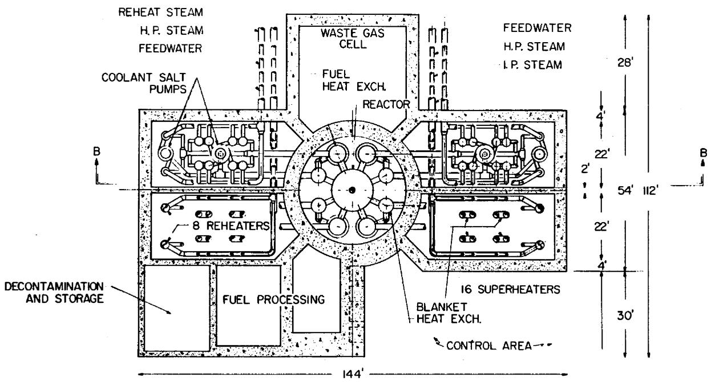

ORNL DWG 66-7110

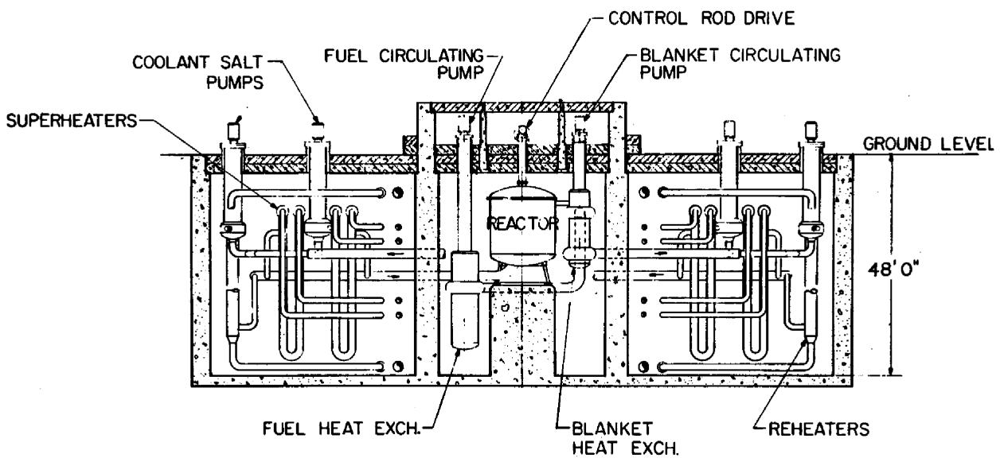  
Fig. 3.6. Reactor and Coolant-Salt Cells - Plan and Elevation.

The wall separating the reactor cell from the adjoining cells is 4 ft thick, and the removable bolted down roof plugs total 8 ft in thickness. The pump drive shafts pass through stepped openings in the special concrete roof plugs to the drive motors, which are located in sealed tanks pressurized above the reactor cell pressure. The special roof plugs are removable to permit withdrawal of the pump impeller assemblies for maintenance or replacement. The control-rod drive mechanism passes through the top shielding in a similar manner. The coolant-salt pipes passing through the cell wall have bellows seals at the penetrations.

The cells are lined with 0.25- to 0.5-in.-thick steel plate having welded joints, which, together with the seal pan that forms a part of the roof structure, provide a cell leak rate that meets the requirement of less than one volume percent per 24 hr. The reactor cell is heated to about $1050^{\circ}\mathrm{F}$ by radiant heating surfaces located at the bottom. The heat is supplied either electrically or from gas-fired equipment. The liner plate and the concrete structure are protected from the high temperature by 6 in. or more of thermal insulation and cooled by either a circulating-gas or water-coil cooling system. The reactor and heat exchanger support structures are also cooled as required.

The four circuits that circulate cooling salt are housed in individual compartments, or cells, having 4-ft-thick reinforced concrete walls and bolted down removable roof plugs. Each compartment contains four boiler-superheaters, two reheaters, one coolant-salt pump that serves the boiler-superheaters, and one coolant-salt pump that supplies the reheaters. All pipes that pass into these cells from the turbine plant have sealed penetrations and valves outside the walls. The pump drive shafts extend through the roof plugs, and the cells are sealed and heated in the same manner as the reactor cell. The temperature is only maintained above $750^{\circ}\mathrm{F}$ , however.

The design pressure for the reactor cell and the four adjoining compartments is assumed to be about 45 psig. Pressure-suppression systems are provided, with the reactor cell system being separate from the systems for the other compartments. These systems consist of water-storage tanks through which vapor released into a cell would pass and be condensed to maintain the cell pressure below the design value.

As indicated, the reactor plant structures have not been optimized nor have they been studied in any detail. Likewise, the cell heating and cooling systems, the pressure-suppression systems, and the building ventilation, filtration, and air-disposal systems have received no detailed study. However, the allowances made in the cost estimates for these items should not require adjustments large enough to affect the overall conclusions drawn from this study.

The turbine plant is standard in the utilities industry and needs little description. Space has been allowed for offices, control rooms, shops, storage, change and locker rooms, and other facilities.

# 3.3 Flowsheets and General Description

The general flow arrangements and operating conditions of the MSBR power station at rated output are summarized in the flowsheet presented in Fig. 3.7. The 2225-Mw(th) reactor consists of a vessel about 15 ft in diameter and 19 ft high that contains a 10-ft-diam core made up of 534 graphite fuel tubes, which are fastened to two plenum chambers at the bottom of the reactor vessel. As shown in Fig. 3.8, fuel salt is pumped into one plenum, flows upward through eight 0.53-in.-diam passages in each graphite tube to the top of the reactor core, and turns downward to flow through the central 1.5-in.-diam passage to the other plenum at the bottom of the vessel. The graphite tube construction is indicated in Fig. 3.9. A matrix of hexagonal graphite blocks surrounds the fuel tubes and serves as moderator. A 1.5-ft-thick annular space filled with the fertile, or blanket, salt surrounds the core. Outside the blanket volume is a 3-in. thickness of graphite that acts as a reflector. A 1.5-in.-wide space separates the graphite reflector from the wall of the reactor vessel; the vessel wall is 1.5 in. thick and is constructed of Hastelloy N.

The fuel salt is pumped into the reactor plenum at $1000^{\circ}\mathrm{F}$ and about 144 psig at a rate of about 95.7 cfs (43,000 gpm). It flows upward through the fuel tubes and then downward through the central passage, as described above, at an average velocity of about 15 fps. During its passage through the core, the fuel salt is heated to about $1300^{\circ}\mathrm{F}$ by

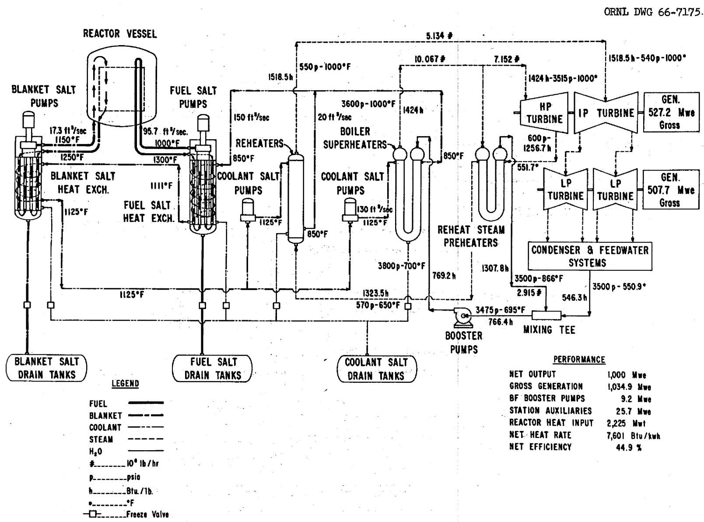  
#   
Fig. 3.7. MSBR General Flowsheet.

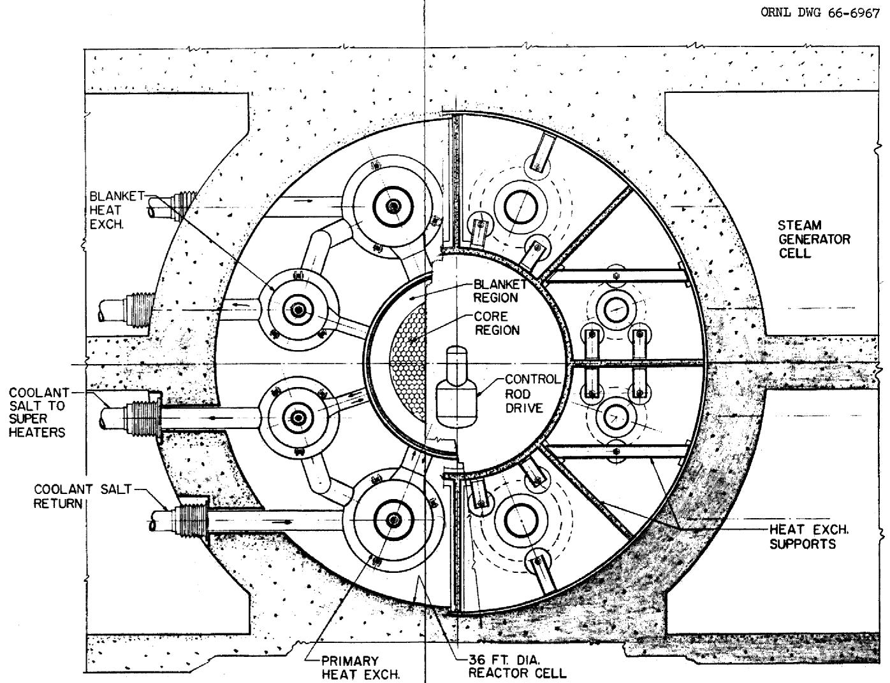

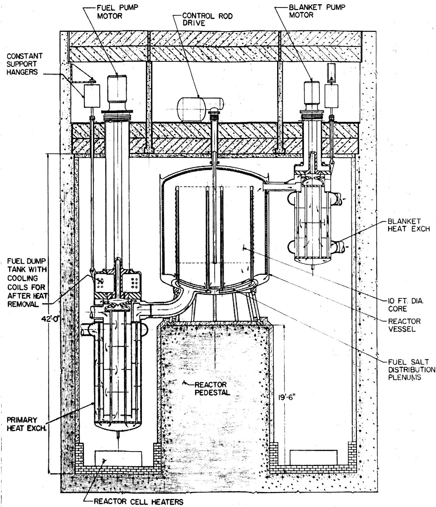  
Fig. 3.8. Reactor Cell - Elevation and Plan.

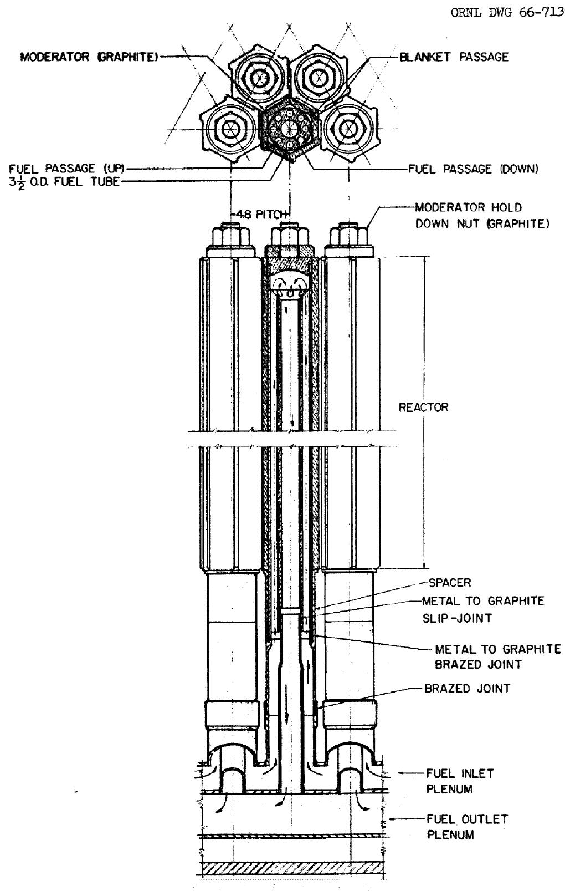  
Fig. 3.9. Graphite Core Tubes.

nuclear fission. About $95\%$ of the heat generated, or 2114 Mw(th), is removed by the fuel salt.

Concentric pipes connect the core plenum chambers to the heat ex-changers. The $1300^{\circ}\mathrm{F}$ fuel salt leaves the lower plenum of the reactor vessel and flows downward through the 18-in.-diam inner pipes to the top of the heat exchangers, where the pressure is about 96 psig.

The fuel salt is circulated in four loops that operate in parallel. Each loop contains a vertical shell-and-tube heat exchanger about 5.5 ft in diameter and 18 ft high, with a fuel-circulating pump mounted on the top. Each pump impeller operates in a bowl that is integral with the shell of the associated exchanger. Above each bowl and connected to it by open passages is a salt storage volume of about $45\mathrm{ft}^3$ , which is sufficient to store about one-fourth of the fuel salt needed to fill the reactor core. The general arrangement of the four blanket heat ex-changers and the four fuel heat exchangers around the reactor is shown in Fig. 3.8.

In the heat exchanger, the fuel salt flows downward at about 11.3 fps through the outer row of 0.375-in.-diam tubes into the lower head, where the salt conditions are about $1170^{\circ}\mathrm{F}$ and 51 psig. It then flows upward at about 13 fps through the 0.375-in.-diam innermost tubes to the bottom of the pump bowl, where the conditions are approximately $1000^{\circ}\mathrm{F}$ and 5 psig. The pump discharges through the annular flow passage between the 18- and 24-in. concentric pipes, and the salt returns to the reactor plenum to repeat the cycle. Each pump is rated at 11,000 gpm at a 150-ft head and requires a 1250-hp motor.

The blanket salt is pumped into the reactor vessel at about $1150^{\circ}\mathrm{F}$ at a flow rate of about 17.3 cfs (7700 gpm). The blanket salt flows downward through the space between the graphite reflector and the reactor vessel to cool the wall and the top head of the vessel, and then flows upward through the blanket volume and the interstices of the core lattice (the blanket salt occupies about $7\%$ of the core volume). About 111 Mw(th) is deposited in the blanket salt as it passes through the reactor, and it leaves the reactor at about $1250^{\circ}\mathrm{F}$ through the inner pipe of the 8- and 12-in.-diam concentric pipes.

The blanket salt is cooled in four circulating loops in a manner similar to that used for the core salt. The blanket salt flows downward through 0.375-in.-diam tubes in a 3-ft-diam, 9-ft-high vertical shell-and-tube heat exchanger at about 10.5 fps. After passing through the lower head, the fluid flows through another section of 0.375-in.-diam tubing at about the same velocity and enters the pump bowls at about $1150^{\circ}\mathrm{F}$ . (These pumps do not have the large storage volume above the bowls.) Each of the four blanket-salt pumps has a capacity of about 2200 gpm at a 150-ft head and uses a 500-hp motor. The salt flows to the reactor through the annular region between the 8- and 12-in.-diam concentric pipes connecting the heat exchanger and blanket volumes and repeats the above cycle.

The volumes above the four fuel pump bowls have a combined capacity sufficient to hold all the fuel in the reactor core. Since the reactor is at a higher elevation than the fuel pumps, stoppage of the pumps will cause the salt to drain from the core by gravity. It is estimated that the reactor would become subcritical in 1 to 1.5 sec. Loss of one pump would also cause the core to become subcritical because of salt drainage. Thus all blanket and fuel-salt pumps need to be operative for the reactor to generate power. (An alternate modular design, discussed in Chapter 4, permits partial power generation even though a fuel pump fails.)

Afterheat generated in the salt stored in the volumes above the pump bowls is removed by coils through which a coolant is circulated. Salt remaining in the heat exchangers, piping, and reactor plenum chambers is circulated through the exchangers by a gas lift to permit afterheat removal from these volumes. The gas lift is provided by helium, which is normally introduced continuously at the bottom of the heat exchanger to purge fission-product gases from the fuel salt. The fission-product afterheat is transferred to the coolant salt, which will circulate through the primary exchangers by thermal convection and in turn transfer energy to the steam cycle.

The fuel-, blanket-, and coolant-salt systems are provided with "ever-safe" tanks for storage of the salts when the systems are drained for maintenance or other purposes. The drain valves for these lines

have not been specified, but they could possibly be freeze-type12 or mechanical valves developed for salt service.

As indicated above, fission-product gases such as xenon and krypton are sparged from the fuel-salt circulating system by introduction of helium in the bottom head of the heat exchangers. The off-gas system and flowsheet for the handling of these radioactive gases are described in Section 3.6.

A helium system provides cover gas for the pump bowls, drain tanks, fuel-handling and -processing systems, and other equipment. This system is briefly described in Section 3.6.

For processing purposes, small side streams of fuel salt (about 14.5 ft $^3$ /day) and blanket salt (about 144 ft $^3$ /day) are taken from the main circulating loops and sent to the fuel-processing plant located in cells adjacent to the reactor proper. The fuel-recycle system and its flowsheet are described in Section 3.5.

An intermediate coolant salt is utilized to transfer energy from the primary circuit to the steam cycle. The coolant salt is pumped through the shell sides of the four fuel-salt heat exchangers and then through the four blanket-salt exchangers by a total of eight pumps. Four of these, each rated at 14,000-gpm capacity at a 150-ft head (1250-hp motor), pump the coolant salt through the 16 boiler-superheaters. The other four, individually rated at 2200 gpm at a 150-ft head (200-hp motor), pump the coolant salt through the eight steam reheaters.

The coolant salt enters the shell side of each of the fuel-salt ex-changers at about $850^{\circ}\mathrm{F}$ and at a rate of 37.5 cfs. The salt is thus above the $842^{\circ}\mathrm{F}$ liquidus temperature of the fuel salt. The coolant salt flows across the tube bundle, as directed by the baffles, to the exit at the bottom. It then enters the top of the shell side of the blanket-salt heat exchangers at about $1111^{\circ}\mathrm{F}$ , which is above the $1040^{\circ}\mathrm{F}$ liquidus temperature of the blanket salt. It leaves the bottom of the shell at about $1250^{\circ}\mathrm{F}$ .

About $87\%$ of the coolant-salt flow, or about 32.5 cfs for each of the large coolant-salt pumps, supplies a total of 1931 Mw(th) of heat to the boiler-superheaters. The remainder of the flow, or about 5 cfs for each of the small coolant-salt pumps, supplies about 293 Mw(th) of

heat to the steam reheaters. The coolant salt exits from the heat exchange equipment at $850^{\circ}\mathrm{F}$ .

The coolant salt enters the 16 vertical U-shell-and-tube heat ex-changers, which serve as the boiler-superheaters, at the top of one leg at a temperature of about $1125^{\circ}\mathrm{F}$ . It passes downward through the 18-in.-diam baffled shell and upward through the other leg of the shell to emerge at $850^{\circ}\mathrm{F}$ . The high-purity boiler feedwater, at about $700^{\circ}\mathrm{F}$ (the estimated liquidus temperature of the coolant salt) and 3800 psia, is introduced at the tube sheet at the top of one leg, flows through the 1/2-in.-diam tubes, and exits at the top of the other leg as steam in a once-through arrangement. The steam leaves the units at $1000^{\circ}\mathrm{F}$ , 3600 psia, and a total rate of about 10,067,000 lb/hr.

As shown in the steam system portion of Fig. 3.7, about 7,152,000 lb/hr of the steam enters the throttle of the high-pressure turbine at about $1000^{\circ}\mathrm{F}$ and 3500 psia. About 5,134,000 lb/hr leaves this turbine at $552^{\circ}\mathrm{F}$ and 600 psia and flows to the eight U-tube vertical shell-and-tube heat exchangers, which preheat the "cold" steam before it enters the reheaters. It flows through the 20-in.-diam shells and is heated to about $650^{\circ}\mathrm{F}$ by about 2,915,000 lb/hr of the $1000^{\circ}\mathrm{F}$ throttle steam, which flows through 0.375-in.-diam tubes. The supercritical steam leaves the tubes at $866^{\circ}\mathrm{F}$ and 3500 psia and is mixed with the $552^{\circ}\mathrm{F}$ 3500-psia feedwater from the No.1 feedwater heater in the regenerative steam cycle to give a fluid temperature of about $695^{\circ}\mathrm{F}$ . The water is then boosted in pressure to 3800 psia and raised in temperature about $5^{\circ}\mathrm{F}$ by two parallel 20,000-gpm 6200-hp motor-driven pumps. This produces the $700^{\circ}\mathrm{F}$ feedwater for the boiler-superheaters, as mentioned above.

The $650^{\circ}\mathrm{F}$ reheat steam from the preheaters flows through the tubes of the eight vertical straight-tube 28-in.-diam shell-and-tube heat ex-changers, which serve as the steam reheaters. The tubes in these units are 0.75 in. in diameter. The heat source for the reheaters is the $1125^{\circ}\mathrm{F}$ coolant salt mentioned above, which raises the temperature of the steam to $1000^{\circ}\mathrm{F}$ . The steam returns to the double-flow intermediate-pressure turbine at about 540 psia; this turbine is on the same shaft as the high-pressure turbine. These two 3600-rpm prime movers drive a generator on the same shaft to give a gross electrical output of 527.2 Mw.

The steam leaves the intermediate-pressure turbine at about 172 psia and $706^{\circ}\mathrm{F}$ and crosses to the 1800-rpm four-flow low-pressure turbine, where it expands to 1.5 in. Hg abs and produces 507.7 Mw gross electrical power.

The regenerative feedwater heating system employs eight stages of feedwater heating, including the deaerator, and two turbine-driven boiler feed pumps. Condensing water, boiler makeup, and condensate-polishing systems are also included.

The gross electrical generation of the plant is 1034.9 Mw; the net station output is 1000 Mw(e). The overall net thermal efficiency is $44.9\%$ .

# 3.4 Reactor System

# 3.4.1 Description

Top and sectional views of the reactor vessel and core are shown in Figs. 3.10 and 3.11. Pertinent data on the reactor system are summarized in Table 3.1.

The reactor vessel is about 14 ft in diameter and has an overall height of about 19 ft. It is constructed of Hastelloy N; it is designed for $1200^{\circ}\mathrm{F}$ and 150 psi; and it has walls 1.5 in. thick. The torospherical heads are 2.25 in. thick. The bottom head is an integral part of the vessel, but the top head is arranged for grinding away the weld so that the head can be removed. The vessel is supported on reinforcing rings in the bottom head that rest on a structural steel stand mounted on a reinforced-concrete pedestal in the center of the reactor cell.

As shown in Figs. 3.10 and 3.11, the fuel salt enters and leaves the reactor through four concentric pipes (diameters of 18 and 24 in.) in an arrangement that tends to minimize the stresses due to temperature differences. These pipes communicate with plenum chambers in the bottom head of the reactor vessel. The fuel salt flows through the annular passage between the two pipes and enters the outer plenum chamber. It then flows upward through the fuel-salt passages to the top of the reactor and downward to the inner plenum chamber, where it leaves through the 18-in.-diam pipe.

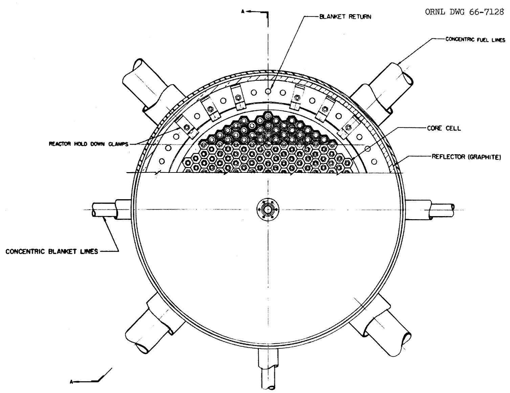  
Fig. 3.l0. Reactor - Plan BB.

ORNL DWG 66-7129

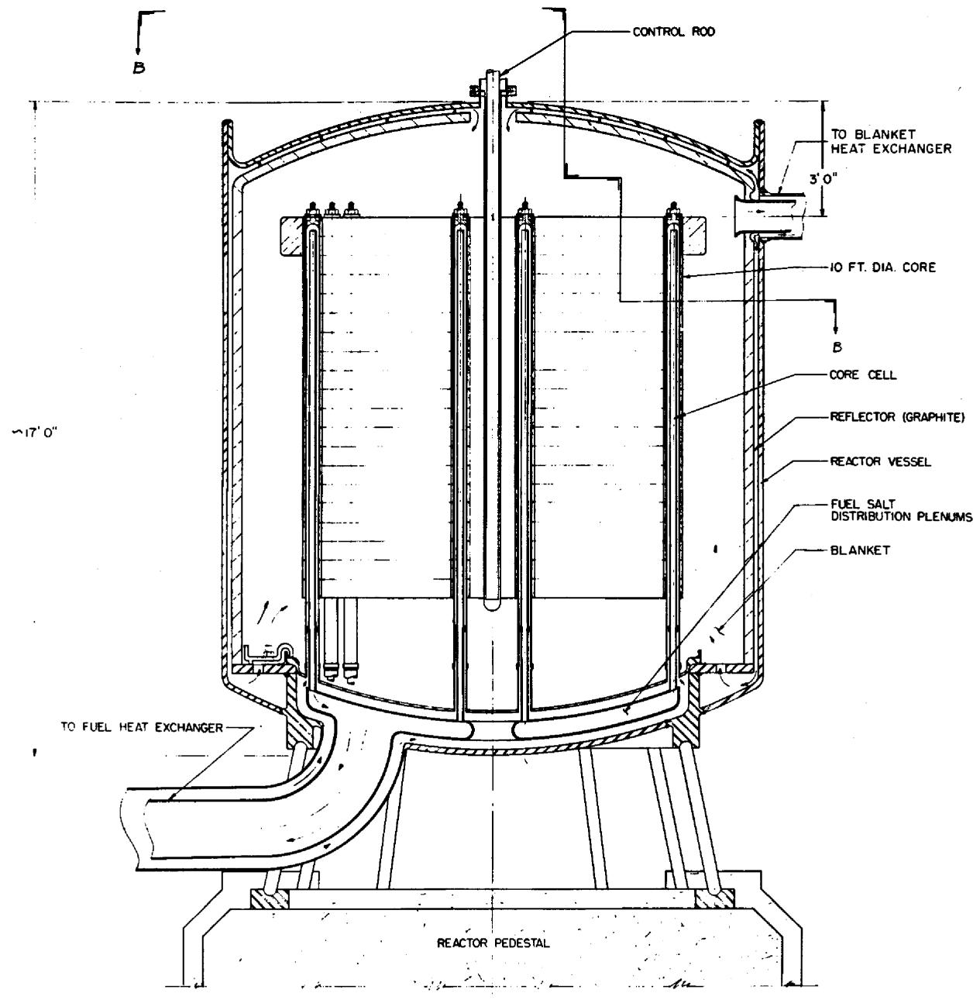  
Fig. 3.11. Reactor - Elevation AA.

Table 3.1. Reactor System Data   

<table><tr><td colspan="2">Gross thermal power, Mw</td></tr><tr><td>Core</td><td>2114</td></tr><tr><td>Blanket</td><td>111</td></tr><tr><td>Total</td><td>2225</td></tr><tr><td colspan="2">Reactor vessel</td></tr><tr><td>Outside diameter, ft</td><td>14</td></tr><tr><td>Overall height, ft</td><td>~19</td></tr><tr><td>Wall thickness, in.</td><td>1.5</td></tr><tr><td>Head thickness, in.</td><td>2.25</td></tr><tr><td colspan="2">Core</td></tr><tr><td>Height of active core, ft</td><td>12.5</td></tr><tr><td>Diameter, ft</td><td>10</td></tr><tr><td>Number of graphite fuel passage tubes</td><td>534</td></tr><tr><td>Volume, ft3</td><td>982</td></tr><tr><td colspan="2">Volume fractions</td></tr><tr><td>Fuel salt</td><td>0.169</td></tr><tr><td>Blanket salt</td><td>0.0735</td></tr><tr><td>Graphite moderator</td><td>0.7575</td></tr><tr><td colspan="2">Blanket</td></tr><tr><td>Radial thickness, ft</td><td>1.5</td></tr><tr><td>Axial thickness, ft</td><td>2.0</td></tr><tr><td>Volume, ft3</td><td>1120</td></tr><tr><td>Volume fraction, blanket salt</td><td>1.0</td></tr><tr><td>Reflector thickness, in.</td><td>3</td></tr><tr><td colspan="2">Fuel salt</td></tr><tr><td>Inlet temperature, °F</td><td>1000</td></tr><tr><td>Outlet temperature, °F</td><td>1300</td></tr><tr><td>Flow rate, ft3/sec (total)</td><td>95.7</td></tr><tr><td>lb/hr</td><td>43,720,000</td></tr><tr><td>gpm</td><td>42,950</td></tr><tr><td colspan="2">Volume holdup, ft3</td></tr><tr><td>Core</td><td>166</td></tr><tr><td>Blanket</td><td>26</td></tr><tr><td>Plena</td><td>147</td></tr><tr><td>Heat exchangers and piping</td><td>345</td></tr><tr><td>Processing plant</td><td>33</td></tr><tr><td>Total</td><td>717</td></tr><tr><td colspan="2">Salt composition, mole %</td></tr><tr><td>LiF</td><td>63.6</td></tr><tr><td>BeF2</td><td>36.2</td></tr><tr><td>UF4(fissile)</td><td>0.22</td></tr><tr><td colspan="2">Blanket salt</td></tr><tr><td>Inlet temperature, °F</td><td>1150</td></tr><tr><td>Outlet temperature, °F</td><td>1250</td></tr><tr><td>Flow rate, ft3/sec (total)</td><td>17.3</td></tr><tr><td>lb/hr</td><td>17,260,000</td></tr><tr><td>gpm</td><td>7764</td></tr><tr><td colspan="2">Volume holdup, ft3</td></tr><tr><td>Core</td><td>72</td></tr><tr><td>Blanket</td><td>1121</td></tr><tr><td>Heat exchanger and piping</td><td>100</td></tr><tr><td>Processing</td><td>24</td></tr><tr><td>Storage for Pa decay</td><td>2066</td></tr><tr><td>Total</td><td>3383</td></tr><tr><td colspan="2">Blanket salt (continued)</td></tr><tr><td colspan="2">Salt composition, mole %</td></tr><tr><td>LiF</td><td>71.0</td></tr><tr><td>BeF2</td><td>2.0</td></tr><tr><td>ThF4</td><td>27.0</td></tr><tr><td>UF4(fissile)</td><td>0.0005</td></tr><tr><td>System fissile inventory, kg</td><td>769</td></tr><tr><td>System fertile inventory, 1000 kg</td><td>260</td></tr><tr><td colspan="2">Processing data</td></tr><tr><td>Fuel stream</td><td></td></tr><tr><td>Cycle time, days</td><td>47</td></tr><tr><td>Rate, ft3/day</td><td>14.5</td></tr><tr><td>Processing cost, $/ft3</td><td>203</td></tr><tr><td>Blanket stream</td><td></td></tr><tr><td>Cycle time, days</td><td>23</td></tr><tr><td>Rate, ft3/day</td><td>144</td></tr><tr><td>Processing cost, $/ft3</td><td>7.33</td></tr><tr><td>Fuel yield, % per annum</td><td>4.86</td></tr><tr><td>Net breeding ratio</td><td>1.0491</td></tr><tr><td>Fissile losses in processing, atoms per fissile absorption</td><td>0.0057</td></tr><tr><td>Specific inventory, kg of fissile material per megawatt of electricity produced</td><td>0.769</td></tr><tr><td>Specific power, Mw(th)/kg of fissile material</td><td>2.89</td></tr><tr><td colspan="2">Core atom ratios</td></tr><tr><td>Th/U</td><td>41.7</td></tr><tr><td>C/U</td><td>5800</td></tr><tr><td>Fraction of fissions in fuel stream</td><td>0.987</td></tr><tr><td>Fraction of fissions in thermal-neutron group</td><td>0.806</td></tr><tr><td>Mean η of 233U</td><td>2.221</td></tr><tr><td>Mean η of 235U</td><td>1.958</td></tr><tr><td>Net neutron production per fissile absorption (ηε)</td><td>2.221</td></tr><tr><td colspan="2">Power density, core average, kw/liter</td></tr><tr><td>Gross</td><td>80</td></tr><tr><td>In fuel salt</td><td>473</td></tr><tr><td colspan="2">Neutron flux, core average, neutrons/cm2·sec</td></tr><tr><td>Thermal</td><td>6.7 × 1014</td></tr><tr><td>Fast</td><td>12.1 × 1014</td></tr><tr><td>Fast, over 100 kev</td><td>3.1 × 1014</td></tr><tr><td colspan="2">Core thermal flux factor, ratio of peak to mean</td></tr><tr><td>Radial</td><td>2.22</td></tr><tr><td>Axial</td><td>1.37</td></tr><tr><td colspan="2">Overall plant data</td></tr><tr><td>Net electrical output, Mw</td><td>1000</td></tr><tr><td>Gross electrical generation, Mw</td><td>1034.9</td></tr><tr><td>Boiler feedwater pressure-booster pump power, Mw(e)</td><td>9.2</td></tr><tr><td>Station auxiliary load, Mw(e)</td><td>25.7</td></tr><tr><td>Net heat rate, Btu/kwhr</td><td>7601</td></tr><tr><td>Net efficiency, %</td><td>44.9</td></tr><tr><td>Assumed plant factor</td><td>0.80</td></tr></table>

The active portion of the reactor core is 10 ft in diameter and about 12.5 ft high. It contains 534 graphite tube assemblies through which the fuel salt flows and around which the blanket salt circulates. Each tube assembly, as shown in Fig. 3.9, consists of a 3.5-in.-OD graphite tube with eight 0.53-in.-ID holes regularly spaced on a 2.62-in.-diam circle. The fuel salt flows upward through these eight tubes at about 15 fps. The salt reverses direction at the top of the fuel assembly, flows downward at about 15 fps through the 1.5-in.-ID central passage, and enters the inner plenum at the bottom of the reactor. The 3.5-in.-OD graphite tubes are slipped into hexagonally shaped passages inside hexagonal graphite tubes that are approximately 5 in. across the outer flats. Blanket salt circulates in the passages between the circular and hexagonal graphite tubes. Thin portions of each outside face of the hexagonally shaped graphite are cut away, as indicated in Fig. 3.9, to form passages for circulating blanket-salt. The fuel tubes are continuous along their lengths, whereas the hexagonal tubes are made up of stacked graphite pieces. The upward and downward fuel flow passages communicate at the top of the fuel tube, where a threaded-graphite plug tightly closes the top end of the tube, as shown in Fig. 3.9. This plug is provided with a threaded-graphite stud, washer, and nut assembly for holding the hexagonal pieces in place.

Stubs of 4-in.-OD Hastelloy N tubes that vary in length from about 6 to 15 in. are welded to the upper diaphragm in the lower head of the reactor vessel. This diaphragm is about 0.75 in. thick. Metal transition pieces with an outside diameter of 4 in. and a length of about 8 in. are brazed to each of the stubs; previous to this, the 3.5-in.-OD graphite tubes for the fuel salt are brazed under carefully controlled shop conditions to shoulders on the inside of the metal transition pieces. The hexagonally shaped graphite tubes rest on top 4-in.-diam by about 4-in.-long metal spacers, which in turn rest on top the metal transition pieces.

Other Hastelloy N stubs, 2 in. OD and varying in length from 8 to 30 in., are welded to the 0.25-in.-thick top of the inner plenum chamber at the bottom of the reactor vessel. These stubs neck down to about 1.62 in. OD at the top and are a sliding fit into the bottom of the inner

passage of the graphite fuel tube (the tubes are machined at the bottom end to permit this fit). Any salt leakage through this joint constitutes only a small bypass of the core.

The blanket salt leaves and enters the reactor vessel through concentric 8- and 12-in. pipes located near the top of the reactor vessel (see Fig. 3.8). The inner pipes of these concentric connections, like those in the fuel-salt system, are provided with slip joints near the heat exchanger nozzles to allow for the relative movement between pipes due to temperature differences. Small leakage through the joints is inconsequential.

The blanket on the sides and top of the core averages 1.5 ft in thickness. Outside this blanket, and 1.5 in. from the vessel wall and top head, is a 3-in. thickness of graphite which serves as a reflector for neutron economy and also helps to protect the vessel from irradiation damage. The annular space between the reflector graphite and the wall is a flow passage for the incoming blanket salt; the stream enters at a temperature of $1150^{\circ}\mathrm{F}$ and serves to cool the vessel wall and the top head.

The basic design of the reactor has the advantage of low neutron losses to structural materials other than the graphite. Except for some unavoidable loss of delayed neutrons in the external fuel-salt circuit, there is almost no neutron leakage through the thick blanket. Neutron losses to fission products are minimized by the continuous treatment of a side stream of the fuel salt in a processing plant that is part of the MSBR power station. The nuclear performance is discussed in more detail in Section 3.5.

The reactor system described above provides for support of the graphite when the vessel is empty of salts, prevents the graphite from floating during normal operation, and allows for thermal expansion and growth or shrinkage of the graphite. The core can be removed as an assembly after the holddown clamps are unbolted and removed and the seal weld is cut (see Fig. 3.11). The upper plenum diaphragm, which carries the load of the graphite in the reactor core, can then be removed for replacement should this prove necessary. Tools must be developed for seal-weld cutting, joint preparation, and rejoining. The drawings do

not indicate a means of guiding a new core assembly into position, but this could be readily provided.

Replacement of a graphite tube with the core in place may also be practical. This could be accomplished by first cutting off and removing the top head of the reactor vessel to expose the tops of the fuel passage tubes. Removal of the graphite nut at the top of the defective or suspect tube would permit withdrawal of the graphite hexagonal section surrounding the tube. The Hastelloy N spacer at the bottom could then be lifted out to make it possible to lower an induction coil heater and break the metal-to-metal brazed joint between the metal stub and transition pieces. A replacement tube could be installed with a reverse procedure.

# 3.4.2 Reactor Materials

Fuel and Blanket Salts. The chemical compositions of the fuel and blanket salts and the pertinent physical properties employed in the design are shown in Table 3.2. The phase diagrams of these salts and a general discussion of the chemistry, physical properties, and behavior of fluoride salts are given in Ref. 1. The feasibility of the use of these salts in reactors is well established on the basis of many experimental studies1 and MSRE experience.

Table 3.2. Physical Properties of MSBR Fuel, Blanket, and Coolant Saltsa   

<table><tr><td></td><td>Fuel Salt</td><td>Blanket Salt</td><td>Coolant Salt</td></tr><tr><td>Reference temperature, °F</td><td>1150</td><td>1200</td><td>988</td></tr><tr><td>Salt components</td><td>LiF-BeF2-UF4</td><td>LiF-ThF4-BeF2</td><td>NaF-NaBF4</td></tr><tr><td>Nominal salt composition, mole %</td><td>68.3-31.2-0.5</td><td>71.0-27.0-2.0</td><td>61.1-38.9</td></tr><tr><td>Molecular weight, approximate</td><td>34</td><td>103</td><td>68</td></tr><tr><td>Liquidus temperature, °F</td><td>842</td><td>1040</td><td>700</td></tr><tr><td>Density, lb/ft3</td><td>127</td><td>277</td><td>125</td></tr><tr><td>Viscosity, lb/hr·ft</td><td>27</td><td>38</td><td>12</td></tr><tr><td>Thermal conductivity, Btu/hr·ft2 (°F/ft)</td><td>4</td><td>1.5</td><td>1.3</td></tr><tr><td>Heat capacity, Btu/lb·°F</td><td>0.55</td><td>0.22</td><td>0.41</td></tr></table>

aThe values listed are those used in the MSBR heat-power cycle studies to establish heat transfer coefficients, flow rates, etc. Many of the properties are not known with certainty, and a few, such as the viscosity of the coolant salt, are little better than rough estimates. In addition, the values used for thermal conductivity appear at present to be slightly high (Ref. 1).

Coolant Salt. The coolant tentatively selected for the MSBR is a sodium fluoroborate salt that appears to be compatible with the materials in the system and with the fuel and blanket salts; it has a liquidus temperature of about $700^{\circ}\mathrm{F}$ and appears to have heat transfer and fluid flow properties that make it generally suitable for MSBR application. Several of the physical properties shown in Table 3.2 need to be verified but are believed to be sufficiently accurate for the purposes of this study.

Graphite. The MSBR core graphite would be an improved grade of that used in the MSRE (properties of the MSRE core graphite are given specifically in Ref. 2). The MSBR graphite tubes should have no significant cracks and should be able to withstand high radiation exposures exceeding $10^{23}$ neutrons/cm² (neutron energies above 300 kev).

Hastelloy N. The salt-containing portions of the MSBR are fabricated of Hastelloy N, since it has excellent compatibility with molten fluorides at high temperatures and under severe radiation conditions. The chemical composition, mechanical and physical properties, and corrosion resistance of this material are discussed in Ref. 2. The mechanical-property values given in Ref. 2 were used in conjunction with ASME Code requirements in specifying equipment. Although Hastelloy N has exhibited radiation embrittlement when irradiated to MSBR exposures, major improvements in the radiation stability of the material can be obtained by minor changes in composition and by modifying the heat treatment.[2]

# 3.4.3 MSBR Load-Following Characteristics

The negative temperature coefficient of reactivity makes the MSBR independent of the need for control rods for load following. The preliminary nature of this report did not permit a study of reactor safety, but on the basis of MSRE studies $^{13-15}$ and experience, $^{16}$ and molten-salt converter reactor safety studies, $^{17}$ it appears that the fuel, blanket, and coolant-salt temperatures will be quickly self-adjusting with no oscillations or reactivity perturbations of consequence following changes in turbine-generator load. In recognition of the need to control the throttle-steam superheat temperature at $1000^{\circ}\mathrm{F}$ and the reheat steam temperature at $1000^{\circ}\mathrm{F}$ independently of each other and of turbine load, separate variable-speed coolant-salt pumps were specified for the boilers-superheaters and the reheaters.

# 3.5 Nuclear Fuel-Cycle Performance

It is desirable that the rate of fissile fuel yield be maximized consistent with low fuel-cycle costs. Since two nuclear designs can have about the same fuel-cycle cost but significantly different fuel doubling times, MSBR nuclear design optimization studies were performed to find conditions corresponding to both low fuel-cycle costs and high fuel-yield rate.

An important feature of the MSBR concept is the fuel-recycle plant, which is an integral part of the reactor plant. Fuel-recycle costs play an important role in determining the rate at which fuel can be economically processed and thus significantly influence the breeding ratio and fissile inventory of the MSBR. In order to properly consider this influence, a detailed design and cost study was made of the fuel-recycle plant $^{18}$ and is summarized below. The costs obtained, including those for capital and operation of the fuel-processing plant, have been kept separate from the costs of the main reactor plant.\* This was done in order to show a fuel cost that can be more readily compared with fuel costs of other reactor plants utilizing off-site fuel-recycle facilities, where fabrication and processing charges include such facility costs.

# 3.5.1 Design and Cost Study of Processing Plant for Fuel Recycle

The MSBR core fuel consists of fissile $\mathbf{U}\mathbf{F}_4$ dissolved in an inert carrier salt containing $^7\mathrm{LiF}_4$ and $\mathrm{BeF_2}$ . The blanket salt contains the fertile material, $\mathrm{ThF_4}$ , which is also dissolved in a carrier salt containing $^7\mathrm{LiF}_4$ and $\mathrm{BeF_2}$ . The flowsheet for the MSBR processing plant for recycling the fuel is shown in Fig. 3.12.

The fuel stream is processed by the well-established fluoride volatility process to separate the uranium from the carrier salt and fission products. The valuable carrier salt is separated from the rare-earth fission products by the vacuum-distillation process; about $6.5\%$ of the

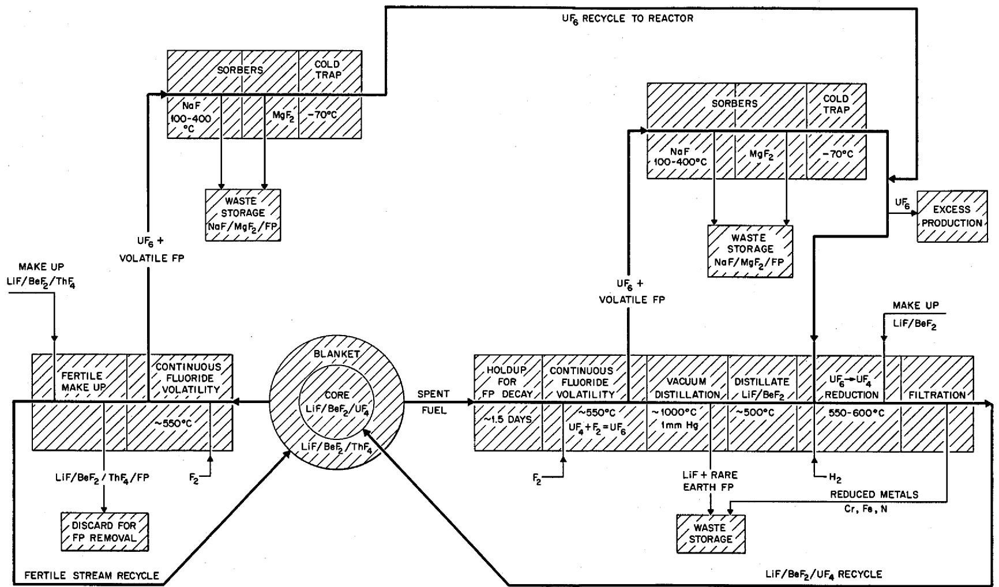  
Fig. 3.12. Fuel- and Blanket-Salt Processing for the MSBR.

carrier salt is either discarded or unrecovered in the distillation process in order to control fission-product buildup and reduce recovery costs.

The fuel salt is reconstituted by absorbing $\mathrm{UF_6}$ in uranium-containing carrier salt and reducing it to $\mathrm{UF_4}$ by bubbling hydrogen through the melt. Excess uranium from the reactor is sold as an equilibrium mixture of the fuel isotopes.

The blanket salt is processed by the fluoride volatility process alone. Any uranium not removed during blanket processing returns to the blanket and is removed by subsequent processing.

Small side streams of about 14.5 ft³/day of fuel salt and 144 ft³/day of blanket salt are continuously withdrawn from the reactor circulating systems and routed to the processing plant located within the same building. The inventories retained in the processing plant are estimated to be about $10\%$ of the reactor system fuel-salt inventory. The corresponding value for the blanket system is about $1\%$ .

An important factor affecting both the breeding gain and the fuel cost is the loss of fissile material in processing. There is considerable engineering experience in fluoride volatility processing that indicates an MSBR fissile material loss of $0.1\%$ per pass or less through the processing plant. Therefore a $0.1\%$ loss per pass has been assumed in this study.

Based on the fuel-recycle processing schemes indicated above, capital cost studies18 were made of an MSBR integrated processing plant. The plant throughput was assumed to be 15 ft3/day of fuel salt and 105 ft3/day of blanket salt, with each stream being treated separately. These throughput rates correspond roughly to the needs of a 1000-Mw(e) station.

In performing the processing plant cost study, $^{18}$ the equipment flow-sheet given in Fig. 3.13 was developed, the required equipment was designed, and cost estimates were made for the process equipment and associated structures. The basic processes considered involve fluorination, purification of $\mathrm{UF_6}$ , vacuum distillation, reduction of $\mathrm{UF_6}$ and reconstitution of the fuel, off-gas processing, waste storage, flow control of the salt streams, removal of decay heat, provisions for sampling of the salt and off-gas streams, and provisions for shielding, maintenance, and

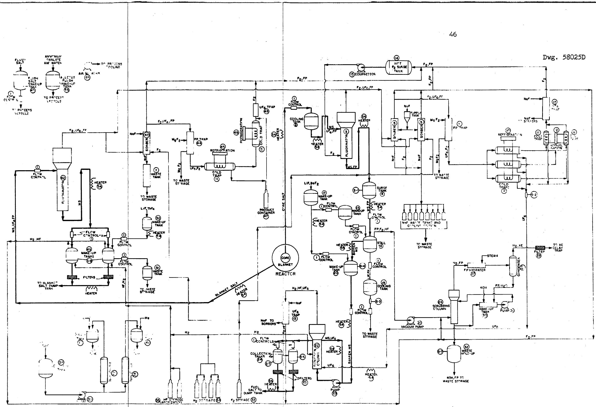  
Fig. 3.13. Fuel- and Blanket-Salt Processing Flowsheet.

repair of equipment. Based on these considerations and associated operations, a total direct capital cost for the plant was obtained along with a direct operating cost. From these results, and consideration of indirect costs, the total fuel-recycle processing costs were obtained.

The major novel pieces of processing equipment are the fluorinator, fuel reduction equipment, and distillation unit. The designs considered are shown in Figs. 3.14, 3.15, and 3.16. Figure 3.14 illustrates the fluorinator, which utilizes a frozen wall of salt and performs continuous fluorination of a flowing stream of uranium-containing molten salt. The NaK coolant flowing through the jacket, as shown, freezes a layer of salt on the inner surface of the column to protect the structural material (alloy 79-4) from corrosive attack by the molten-salt-fluorine mixture. Figure 3.15 illustrates the equipment for reducing $\mathrm{UF_6}$ to $\mathrm{UF_4}$ . Barren salt and $\mathrm{UF_6}$ enter the bottom of the column, which contains circulating LiF-BeF $_2$ - $\mathrm{UF_4}$ . The $\mathrm{UF_6}$ dissolves in the salt, aided by the presence of $\mathrm{UF_4}$ , and moves up the column, where it is reduced by hydrogen. Reconstituted fuel is taken off the top of the column and sent to the reactor core. Figure 3.16 illustrates the design of the vacuum-distillation unit. Barren fuel-carrier salt flows continuously into the still, which is held at about $1000^{\circ}\mathrm{C}$ and $1\mathrm{mmHg}$ . LiF-BeF $_2$ distillate is removed at the same rate that salt enters, and thus the volume is kept constant. Most of the fission products accumulate in the still bottoms and are drained to waste storage when the heat-generation rate reaches a prescribed limit.

The fuel-recycle processing plant is located in two cells adjacent to the reactor shield; one contains the high-radiation-level operations and the other contains the lower radiation-level operations. Each cell is designed for top access through a removable biological shield having a thickness equivalent to 6 ft of high-density concrete. Both cells are served by a crane used in common with the reactor plant. Process equipment is located in the cell for remote removal and replacement from above. No access into the cells with be required; however, it is possible with proper decontamination to allow limited access into the lower radiation level cell. A general plan of the processing plant and a partial view of the reactor system are shown in Fig. 3.17. The highly radioactive operations involved in fuel-stream processing are carried out in the smaller

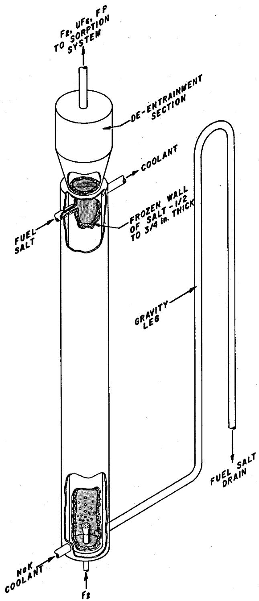  
Fig. 3.14. Continuous Fluorinator for Salt Processing.

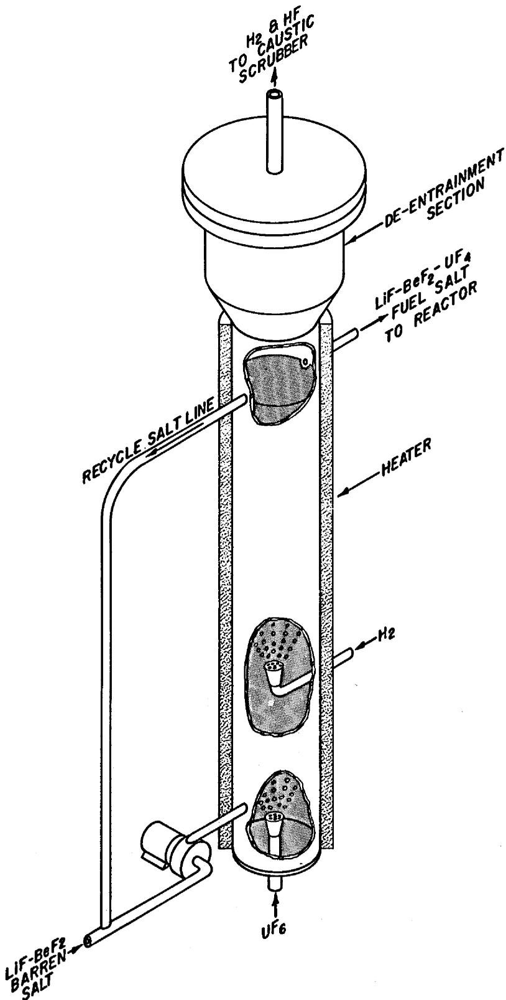  
Fig. 3.15. Fuel-Reduction Column for Salt Processing.

ORNL DWG 65-1802R2

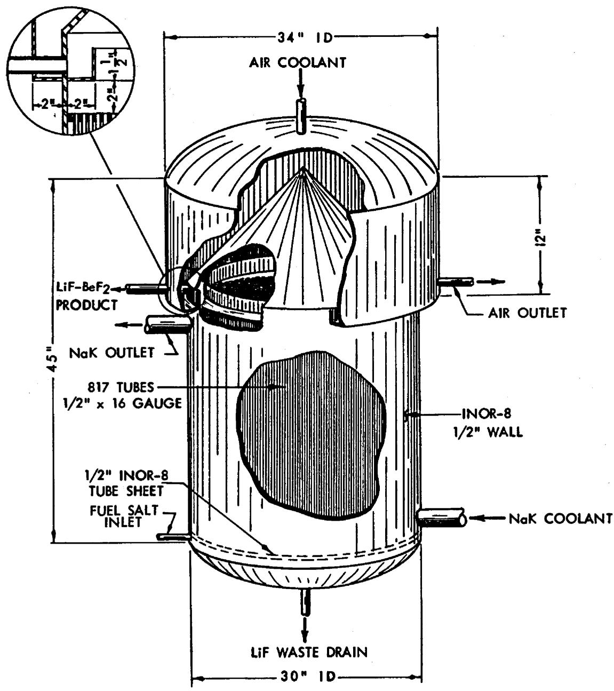  
Fig. 3.16. Vacuum Still for Carrier-Salt Recovery.

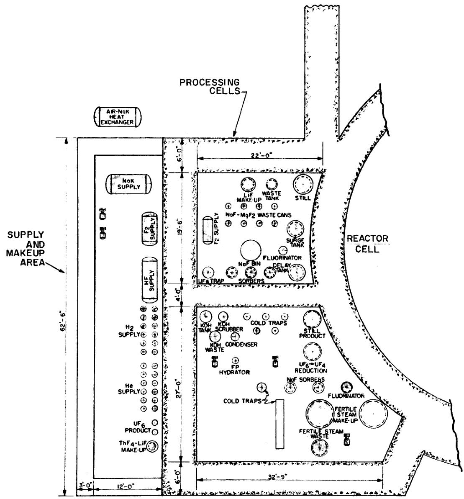  
Fig. 3.17. Arrangement of Salt-Processing Equipment.

cell (upper left). The other cell houses equipment for the fertile-stream and the "cooler" fuel-stream operations.

The highly radioactive cell contains only fuel-stream processing equipment: the fluorinator, still, waste receiver, NaF and $\mathrm{MgF_2}$ sorbers, and associated vessels. The other cell houses the blanket-processing equipment and fuel- and fertile-stream makeup vessels.

A detailed cost estimate for the fuel-recycle plant was made and is reported in Ref. 18. The results for the total capital costs are summarized in Table 3.3. The operating and maintenance costs for this plant were also estimated and are shown in Table 3.4. The direct operating

Table 3.3. Summary of Cost Estimate for a Typical Fuel-Recycle Processing Plant for a 1000-Mw(e) MSBR Stationa   

<table><tr><td>Installed process equipment</td><td>$ 853,760</td></tr><tr><td>Structure and improvements</td><td>556,770</td></tr><tr><td>Interim waste storage</td><td>387,970</td></tr><tr><td>Process piping</td><td>155,800</td></tr><tr><td>Process instrumentation</td><td>272,100</td></tr><tr><td>Electrical auxiliaries</td><td>84,300</td></tr><tr><td>Sampling connections</td><td>20,000</td></tr><tr><td>Utilities (15% of installed process equipment)</td><td>128,060</td></tr><tr><td>Insulation (6% of installed process equipment)</td><td>51,220</td></tr><tr><td>Radiation monitoring</td><td>100,000</td></tr><tr><td>Total direct plant cost</td><td>$2,609,980</td></tr><tr><td>Construction overhead (30% of total direct plant cost)</td><td>782,990</td></tr><tr><td>Subtotal construction cost</td><td>$3,392,970</td></tr><tr><td>Engineering and inspection (25% of total construction cost)</td><td>848,240</td></tr><tr><td>Subtotal plant cost</td><td>$4,241,210</td></tr><tr><td>Contingency (25% of subtotal plant cost)</td><td>1,060,300</td></tr><tr><td>Total construction cost</td><td>$5,301,510</td></tr><tr><td>Inventorybcost of NaK coolant (at $100/ft3)</td><td>40,000</td></tr><tr><td>Total capital cost</td><td>$5,341,510</td></tr></table>

${}^{a}$ Based on throughput of 15 ft ${}^{3}$ /day of fuel salt and 105 ft ${}^{3}$ /day of blanket salt.   
Inventory of fuel and blanket salts is considered as part of the reactor inventory.

Table 3.4. Summary of Annual Operating and Maintenance Costs of Fuel-Recycle Processing Plant for 1000-Mw(e) MSBR Stationa   

<table><tr><td>Direct labor</td><td>$222,000</td></tr><tr><td>Labor overhead</td><td>177,600</td></tr><tr><td>Chemicals</td><td>14,640</td></tr><tr><td>Waste containers</td><td>28,270</td></tr><tr><td>Utilities</td><td>80,300</td></tr><tr><td>Maintenance materials</td><td></td></tr><tr><td>Site</td><td>2,500</td></tr><tr><td>Services and utilities</td><td>34,880</td></tr><tr><td>Process equipment</td><td>160,040</td></tr><tr><td>Total annual charges</td><td>$721,230</td></tr></table>

${}^{a}$ Based on throughput of 15 ft ${}^{3}$ /day of fuel salt and 105 ft ${}^{3}$ /day of blanket salt.

cost includes the cost of immediate supervisory, operating, maintenance, laboratory, health physics, clerical, and janitorial personnel; also included are costs of chemicals, waste containers, utilities, and maintenance materials.

These capital and operating costs were used as base points for obtaining the costs for salt-processing plants having different throughputs. Specifically, the capital and operating costs were estimated separately for each fluid stream as a function of plant throughput, based on the volume of salt processed.[19] The results of these estimates are given in Fig. 3.18, and were used in calculating the nuclear and economic performance of the MSBR fuel cycle.

It may be noted that in Table 3.3 the indirect charges (overhead, engineering, and contingencies) amount to a total of about $100\%$ applied against the direct construction cost of the processing plant. This compares with a similar value of about $41\%$ used in the cost estimate of the MSBR reactor and turbine-generator plant (see Sect. 3.11). The high value used here should more than compensate for the higher rates of

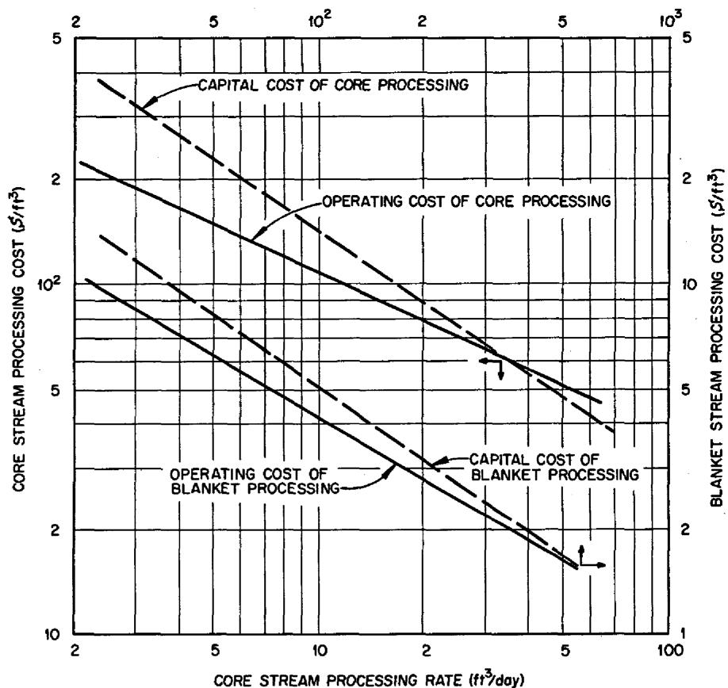  
BLANKET STREAM PROCESSING RATE (ft $^3$ /day)   
Fig. 3.18. MSBR Fuel-Recycle Costs As a Function of Processing Rates. Fluoride volatility plus vacuum distillation processing for core; fluoride volatility processing for blanket; 0.8 plant factor; $12\%$ /yr capital charges for investor-owned processing plant.

equipment replacement in the fuel-processing plant as compared with the power plant as a whole.

# 3.5.2 Nuclear Design Method

Values of the MSBR nuclear design parameters, which were largely fixed by the design criteria in conjunction with nuclear-economic calculations, are listed in Table 3.1. The criteria helped to establish the design of the salt-circulating loops external to the reactor (the volumes associated with these loops constitute the largest portion of the total volume of salt holdup). Additional parameters which were optimized by the fuel-cycle-performance calculations were the reactor dimensions, the

power density, the core composition, including the carbon-to-uranium and thorium-to-uranium ratios, and particularly the fuel-recycle rates through the processing plant. Table 3.1 also lists the parameter values obtained through nuclear design optimization.

The fuel-cycle calculations were performed with OPTIMERC, a combination of an optimization code and a multigroup, diffusion, equilibrium reactor code. Details of the program are summarized in Ref. 20. In brief, the program initially calculates the nuclear performance, the equilibrium concentrations of the various nuclides (including the fission products), and the fuel-cycle costs for a given set of conditions; following this, performance optimization is done by permitting up to 20 reactor parameters to be varied, within limits, in order to determine the most desirable values based on the method of steepest ascent. Typical input parameters were the reactor dimensions, blanket thickness, fractions of fuel and fertile salts in the core, and fuel- and blanket-stream processing rates. These parameters were varied in a logical fashion, with final values based on designs optimized primarily for minimum fuel cost, with lesser emphasis given to maximizing the annual fuel yield.

In addition to fuel-cycle cost per se, OPTIMERC includes several equations for approximating certain capital and operating costs that vary with nuclear design values, such as the size of the reactor vessel and the cost of graphite. These costs were automatically added to the fuel-cycle cost in the optimization routine so that the optimization search would take into account all known economic factors. However, costs other than the fuel-cycle cost are reported under capital investment (Sect. 3.11).

Standard neutron-cross-section libraries were used in obtaining the broad-group cross sections for the MSBR physics calculations (12 groups were employed, with one effective thermal group). The cross sections were evaluated and modified where necessary to be consistent with present information (see also Sect. 3.5.4). In obtaining the nuclear constants for nonthermal neutron groups and for a particular region, a transport-type multigroup calculation was performed (B-1 approximation to the Boltzmann equation for a single region); the three specific regions considered were the homogenized core, the blanket, and the reflector regions.

The effective thermal-neutron reaction rate was based on transport calculations, which generated the thermal-neutron spectrums in the various reactor regions. In the core, the thermal-spectrum calculation considered the core lattice cell to consist of concentric cylindrical regions; the resulting neutron reaction rates were used to determine the effective thermal-group cross sections for the various nuclides.

The broad-group cross sections were employed in a one-dimensional multigroup diffusion program modified so as to approximate a two-dimensional calculation. The concentrations of the various nuclides were based on equilibrium neutron-reaction rates, which were consistent with criticality considerations, the fuel-processing rate, the assumed behavior of fission products and higher isotopes, and the sale of uranium having an isotopic composition equal to the average in the reactor plant.

These reactor-physics calculations were incorporated in the fuel-cycle-performance optimizations carried out by the OPTIMERC program, in which various parameters were allowed to vary within specified limits.

# 3.5.3 Nuclear Performance and Fuel-Cycle Cost

The nuclear performance of the MSBR is significantly influenced by the physical behavior of the fission products. In particular, the behavior of $^{135}\mathrm{Xe}$ and other fission gases is important. A gas-stripping system is provided to remove these gases from the fuel salt. However, part of the xenon could diffuse into the moderator graphite. In the calculations reported here, a $^{135}\mathrm{Xe}$ poison fraction of 0.005 was assumed.

The disposition of the various fission products in the reactor and processing system, based on their estimated physical, chemical, and thermodynamical properties, was assumed to be as shown in Table 3.5.

Another factor to consider is the behavior of corrosion products. However, the control of corrosion products in the MSBR does not appear to be a significant problem, so the effect of corrosion products was neglected in the nuclear calculations. Not only is the corrosion rate very low, but the fuel-processing methods considered here can remove corrosion products from the molten salts (by reduction with hydrogen followed by filtration).

Table 3.5. Disposition of Fission Products in Reactor and Processing Systems   

<table><tr><td>Group</td><td>Assumed Fission-Product Behavior</td><td>Fission Products</td></tr><tr><td>1</td><td>Elements present as gases; assumed to be removed by gas stripping, with a small fraction absorbed by graphite</td><td>Kr, Xe</td></tr><tr><td>2</td><td>Elements that plate out on metal surfaces; assumed to be removed instantaneously</td><td>Ru, Rh, Pd, Ag, In</td></tr><tr><td>3</td><td>Elements that form volatile fluorides; assumed to be removed in the fluoride volatility process</td><td>Se, Br, Nb, Mo, Tc, Te, I</td></tr><tr><td>4</td><td>Elements that form stable fluorides less volatile than LiF; assumed to be separated by vacuum distillation</td><td>Sr, Y, Ba, La, Ce, Pr, Nd, Pm, Sm, Eu, Gd, Tb</td></tr><tr><td>5</td><td>Elements that are not separated from the carrier salt; assumed to be removed only by salt discard</td><td>Rb, Cd, Sn, Cs, Zr</td></tr></table>

The calculation of fuel-cycle cost involves economic factors as well as those given above. The economic ground rules used here are given in Table 3.6. The values of the fissile isotopes were taken from the current AEC price schedule. The capital charges of $12\%/\mathrm{yr}$ for depreciating items and $10\%$ for nondepreciating materials correspond to those for a privately owned plant; the corresponding values used for publicly owned plants were 7 and $5\%/\mathrm{yr}$ , respectively.

The processing costs are based on the specific fuel-recycle plant design and cost study given above and are included in the fuel-cycle costs. The results, given in Fig. 3.18, were used to estimate the processing cost as a function of fuel-processing rate. Processing losses corresponded to a fissile material loss of $0.1\%$ per pass through fuel-recycle processing.

The results of the fuel-cycle calculations for the MSBR design are summarized in Table 3.7 and the neutron balance is given in Table 3.8. The reactor has the advantage of no neutron losses to structural materials in the core other than the moderator. Except for some unavoidable

Table 3.6. Basic Economic Assumptions Used in Nuclear Design Studies   

<table><tr><td>Reactor power, Mw(e)</td><td>1000</td></tr><tr><td>Thermal efficiency, %</td><td>45</td></tr><tr><td>Load factor</td><td>0.80</td></tr><tr><td>Cost assumptions</td><td></td></tr><tr><td>Value of 233U and 233Pa, $/g</td><td>14</td></tr><tr><td>Value of 235U, $/g</td><td>12</td></tr><tr><td>Value of thorium, $/kg</td><td>12</td></tr><tr><td>Value of carrier salt, $/kg</td><td>26</td></tr><tr><td>Capital charge, %/yr</td><td></td></tr><tr><td>Plant</td><td>12</td></tr><tr><td>Nondepreciating capital, including fissile inventory</td><td>10</td></tr><tr><td>Processing cost, $/ft3salt</td><td></td></tr><tr><td>Fuel (at 10-ft3/day processing rate)</td><td>252</td></tr><tr><td>Blanket (at 100-ft3/day processing rate)</td><td>9.3</td></tr><tr><td>Processing-cost scale factor</td><td>See Fig. 3.18</td></tr></table>

Table 3.7. MSBR Fuel-Cycle Performance   

<table><tr><td>Fuel yield, % per year</td><td>4.86</td></tr><tr><td>Breeding ratio</td><td>1.0491</td></tr><tr><td>Fissile losses in processing, atoms per fission absorption</td><td>0.0057</td></tr><tr><td>Neutron production per fissile absorption (ηε)</td><td>2.221</td></tr><tr><td>Specific inventory, kg of fissile material per megawatt of electricity produced</td><td>0.769</td></tr><tr><td>Specific power, Mw(th)/kg of fissile material</td><td>2.89</td></tr><tr><td>Power density, core average, kw/liter</td><td></td></tr><tr><td>Gross</td><td>80</td></tr><tr><td>In fuel salt</td><td>473</td></tr><tr><td>Fraction of fissions in fuel stream</td><td>0.987</td></tr><tr><td>Fraction of fissions in thermal-neutron group</td><td>0.806</td></tr><tr><td>Mean η of 233U</td><td>2.221</td></tr><tr><td>Mean η of 235U</td><td>1.958</td></tr></table>

Table 3.8. MSBR Neutron Balance   

<table><tr><td rowspan="2">Material</td><td colspan="3">Neutrons per Absorption in Fissile Fuel</td></tr><tr><td>Total Absorbed</td><td>Absorbed Giving Fission</td><td>Neutrons Produced</td></tr><tr><td>232Th</td><td>0.9710</td><td>0.0025</td><td>0.0059</td></tr><tr><td>233Pa</td><td>0.0079</td><td></td><td></td></tr><tr><td>233U</td><td>0.9119</td><td>0.8090</td><td>2.0233</td></tr><tr><td>234U</td><td>0.0936</td><td>0.0004</td><td>0.0010</td></tr><tr><td>235U</td><td>0.0881</td><td>0.0708</td><td>0.1721</td></tr><tr><td>236U</td><td>0.0115</td><td>0.0001</td><td>0.0001</td></tr><tr><td>237Np</td><td>0.0014</td><td></td><td></td></tr><tr><td>238U</td><td>0.0009</td><td></td><td></td></tr><tr><td>Carrier salt (except 6Li)</td><td>0.0623</td><td></td><td>0.0185</td></tr><tr><td>6Li</td><td>0.0030</td><td></td><td></td></tr><tr><td>Graphite</td><td>0.0300</td><td></td><td></td></tr><tr><td>135Xe</td><td>0.0050</td><td></td><td></td></tr><tr><td>149Sm</td><td>0.0069</td><td></td><td></td></tr><tr><td>151Sm</td><td>0.0018</td><td></td><td></td></tr><tr><td>Other fission products</td><td>0.0196</td><td></td><td></td></tr><tr><td>Delayed neutrons losta</td><td>0.0050</td><td></td><td></td></tr><tr><td>Leakageb</td><td>0.0012</td><td></td><td></td></tr><tr><td>Total</td><td>2.2209</td><td>0.8828</td><td>2.2209</td></tr></table>

${}^{a}$ Delayed neutrons emitted outside the core.   
bLeakage, including neutrons absorbed in the reflector.

loss of delayed neutrons in the external fuel circuit, there is almost zero neutron leakage from the reactor because of the thick blanket. The neutron losses to fission products are minimized by the availability of rapid and inexpensive integrated processing.

The fuel-cycle cost for the MSBR is given in Table 3.9. The main items are the fissile inventory and processing costs. The inventory costs are rather rigid for a given reactor design, since they are largely determined by the fuel volume external to the reactor core region. The processing costs are, of course, a function of the processing-cycle times, one of the chief parameters optimized in this study.

Table 3.9. Fuel-Cycle Cost for MSBRa   

<table><tr><td rowspan="2"></td><td colspan="4">Costs [mill/kwhr(e)]</td></tr><tr><td>Fuel Stream</td><td>Fertile Stream</td><td>Sub-total</td><td>Grand Total</td></tr><tr><td>Fissile inventoryb</td><td>0.1180</td><td>0.0324</td><td>0.1504</td><td></td></tr><tr><td>Fertile inventory</td><td></td><td>0.0459</td><td>0.0459</td><td></td></tr><tr><td>Salt inventory</td><td>0.0146</td><td>0.0580</td><td>0.0726</td><td></td></tr><tr><td>Total inventory</td><td></td><td></td><td></td><td>0.269</td></tr><tr><td>Fertile replacement</td><td></td><td>0.0185</td><td>0.0185</td><td></td></tr><tr><td>Salt replacement</td><td>0.0565</td><td>0.0217</td><td>0.0782</td><td></td></tr><tr><td>Total replacement</td><td></td><td></td><td></td><td>0.097</td></tr><tr><td>Processing</td><td>0.1223</td><td>0.0440</td><td>0.1663</td><td></td></tr><tr><td>Total processing</td><td></td><td></td><td></td><td>0.166</td></tr><tr><td>Production credit</td><td></td><td></td><td></td><td>(0.073)</td></tr><tr><td>Net fuel-cycle cost</td><td></td><td></td><td></td><td>0.46</td></tr></table>

$^\mathrm{a}$ Based on investor-owned power plant.   
b. Including $^{233}\mathrm{Pa},$ $^{233}\mathrm{U},$ and $^{235}\mathrm{U}.$

The fuel costs in Table 3.9 are based on use of private financing. Fuel-cycle and power-production costs based on public financing are also of interest. With public ownership, the fixed annual charge on depreciating capital is taken as $7\%$ and on nondepreciating items as $5\%$ . This difference in the financial conditions results in slightly different optimization points for the fuel cycle that affect the volume fractions of fuel, the thorium-to-uranium and carbon-to-uranium ratios, etc. Re-optimizing such parameters has only minor effects on the nuclear performance. However, the difference between the 12 and $7\%$ annual fixed charges on the cost of the fuel processing plant and the lower charges on nondepreciating items ( $5\%$ versus $10\%$ ) results in lowering the estimated fuel cost from 0.46 mill/kwhr to about 0.29 mill/kwhr. Table 3.10 summarizes the fuel-cycle costs for investor-owned and for publicly owned plants.

Plant factor: 0.8

Table 3.10. MSBR Fuel-Cycle Costs for Investor-Owned and Publicly Owned Plants   

<table><tr><td rowspan="2"></td><td colspan="2">Cost [mill/kwhr(e)]</td></tr><tr><td>Investor Ownershipa</td><td>Public Ownershipb</td></tr><tr><td>Fissile-, fertile-, and carrier-salt inventory</td><td>0.269</td><td>0.135</td></tr><tr><td>Replacement cost of fertile and carrier salts</td><td>0.097</td><td>0.097</td></tr><tr><td>Core- and blanket-processing costs</td><td></td><td></td></tr><tr><td>Operation and maintenance</td><td>0.075</td><td>0.075</td></tr><tr><td>Capital costs</td><td>0.091</td><td>0.053</td></tr><tr><td>Bred fuel credit</td><td>(0.073)</td><td>(0.073)</td></tr><tr><td>Net fuel-cycle cost</td><td>0.46</td><td>0.29</td></tr></table>

${}^{a}$ Based on 12%/yr capital charges for processing plant and inventory charges of 10%/yr.   
bBased on $7 \%$ /yr capital charges for processing plant and inventory charges of $5 \%$ /yr.

# 3.5.4 Critique of Nuclear Performance Calculations

The performance characteristics given above show that the MSBR has a high specific power [about 1.2 Mw(e)/kg fissile] and a relatively low breeding gain (about 0.05 net fuel bred per unit of fuel burned). Uncertainty in the specific power is due to uncertainties in the fuel inventory requirements external to the reactor core (related to the fuel heat exchanger design and flow-distribution systems), as well as to inaccuracies in the critical-mass calculations. It is estimated that about a $10\%$ uncertainty exists in the fuel volume requirements external to the core of the MSBR because of uncertainties in heat transfer, fluid transport, and flow distribution requirements. Relative to critical mass, experience with the MSRE indicates that the calculational methods and applicable neutron cross sections employed are reliable (the calculated

MSRE critical mass was within $1\%$ of the experimental value). Also, the methods and cross sections employed are similar to those used by other groups who have had good success in calculating the reactivity of critical assemblies. As a result, the uncertainty in the critical concentration is estimated to be less than $5\%$ . Thus the uncertainty in the specific power appears to be less than $15\%$ . In addition, because of the use of fluid fuel, compensating changes in fissile and fertile material concentrations can be made if the calculated quantities are in error. Finally, since the specific power is high, a small change in its value cannot change the fuel-cycle cost appreciably. Thus uncertainties in specific power do not appear to significantly affect MSBR performance.

With a low breeding gain, however, uncertainties in nuclear constants, fuel-processing losses, and/or physical properties of the fission products can have a significant influence on the fuel doubling time through their influence on the net breeding ratio. A detailed appraisal of the MSBR nuclear-performance uncertainties due to the above factors is given in Ref. 21, and the results are summarized below.

The important nuclides in the MSBR are C, Li, Be, F, U, Th, Pa, and fission products. Changes in the neutron-absorption cross-section values of these nuclides can influence the breeding ratio, with some nuclides having more importance than others. The cross-section values are not known in an absolute sense, but they can be inferred from the precision of the various measurements available. On this basis, a range of values was assigned to each nuclide that represents a "best judgment" of the values within which the true value will fall.

The neutron balance given in Table 3.8 shows the relative absorptions in the various materials based on the studies performed. Of the nuclides indicated, only two or three have cross-section uncertainties that could individually affect the breeding ratio by as much as 0.01. By far the most important nuclide is $^{233}\mathrm{U}$ , and its most important characteristic is the value of eta averaged over the reactor neutron spectrum. The 2200-m/sec value and the variation of eta with energy are not known accurately enough to establish eta in MSBR spectrums to much better than about $1\%$ (the 2200-m/sec value used for $\eta^{23}$ was 2.292). The associated uncertainty in breeding ratio is about $\pm 0.02$ to 0.03, of which the major

fraction is due to the uncertainty in the effective thermal value (the uncertainties associated with the 2200-m/sec value and the variation with energy in different energy regions are independent of each other).

One of the most abundant materials in the MSBR is fluorine; although its neutron-absorption cross section is low, its high concentration makes it an important material relative to neutron absorptions. For fluorine, the high-energy absorption cross sections are estimated to be uncertain by about $\pm 30\%$ . Also, the high-energy neutron reactions in beryllium are uncertain by about $\pm 10$ to $15\%$ . Uncertainty in the gross cross section for fission products (other than xenon and samarium, whose cross sections are so high that fission yield is the important quantity) is estimated to be about $\pm 30\%$ for resonance-energy neutrons, and about $\pm 10\%$ for thermal neutrons. Uncertainties in other nuclide cross sections are estimated to be about $\pm 10\%$ or less.

Based on these uncertainties in cross-section values, the uncertainty in breeding ratio is about $\pm 0.02$ to $0.03$ due to $^{233}\mathrm{U}, \pm 0.004$ due to $^{235}\mathrm{U}, \pm 0.002$ due to protactinium, $\pm 0.006$ due to fluorine, $\pm 0.002$ due to $^{7}\mathrm{Li}, \pm 0.002$ due to beryllium, and $\pm 0.004$ for gross fission products. Breaking down these summed uncertainties into their independent uncertainties and taking the square root of the sum of the squares of the independent uncertainties gives a mean uncertainty of about $\pm 0.024$ in breeding ratio.

This result illustrates that the uncertainty in breeding ratio can have a significant effect on the MSBR fuel-yield rate; changing the breeding ratio by $\pm 0.024$ would change the fuel-yield rate by about $\pm 50\%$ . In addition, the above analysis illustrates the relative importance of the thermal value of $\eta^{23}$ in the MSBR.

The cross sections actually used in the MSBR studies did not always correspond to values presently considered to be the most probable. For example, the high-energy neutron-absorption cross sections used for fluoro-rine are higher than present estimates; also, the graphite absorption cross section (a 2200-m/sec value of 4 millibarns was used) did not allow for burnout of trace impurities. Incorporating such changes would improve the breeding ratio by about 0.005. In addition, the assumed behavior of fission products did not always correspond to present estimates of their behavior in MSBR systems. In particular, it appears most probable

that molybdenum, technetium, and other members of group 3 in Table 3.5 will form intermetallic compounds with other fission products rather than remain in solution as fluorides. Under such circumstances the elements will most likely circulate as colloidal-like metal suspensions (this is indicated by MSRE experience with iron and chromium). In this event the group 3 elements would be removed in fuel-recycle processing, so the effect of the assumed behavior in the MSBR studies was correct.

There is a slight possibility that the group 3 fission products will form metal carbides and remain indefinitely in the MSBR core. Such action by a few percent of the group 3 nuclides could lead to a decrease in breeding ratio of about 0.02 or more.

As shown in Table 3.5, it was assumed that the group 2 fission products would plate out on metal surfaces; at present it appears most likely that these noble metals will remain in colloidal suspension and be removed during fuel-recycle processing. The change in breeding ratio due to the above change leads to a decrease in breeding ratio of only 0.001.

It is important that xenon be removed from the MSBR core in order to maintain breeder operation. Experience in the MSRE indicates that the gas removal assumed in Table 3.5 is realistic.

Relative to group 5 fission products, it appears that at least cadmium and tin will behave like the group 2 fission products and therefore be removed in the fuel-recycle processing. The MSBR calculations assumed that these fission products would be removed through salt discard alone. Changing the behavior of this group to that indicated above would increase the breeding ratio by no more than 0.003.

Although not discussed previously, it was assumed that $^{237}\mathrm{Np}$ would be removed during fuel reprocessing. It appears that this removal can be accomplished by proper operation of the absorber beds. If not removed, the accumulation of $^{237}\mathrm{Np}$ in the fuel stream would decrease the breeding ratio by about 0.01.

The fuel-processing losses were assumed to be $0.1\%$ per pass through the fluoride volatility process, and this loss is consistent with experimental results. Doubling the losses would decrease the breeding ratio by about 0.006.

The nuclear calculations were made with the assumption that all nuclides in the reactor were at their equilibrium concentrations. When starting with $^{235}\mathrm{U}$ as the initial fuel, there will be a period of operation during which nonequilibrium conditions apply. To check the adequacy of the assumption used, the operating time required to approach equilibrium concentrations with $^{235}\mathrm{U}$ startup was examined. It was found that $^{233}\mathrm{U}$ and $^{235}\mathrm{U}$ were within 95% of their equilibrium concentrations in less than two years, $^{234}\mathrm{U}$ was within 95% after eight years, while $^{236}\mathrm{U}$ was within 80% after ten years. Since $^{236}\mathrm{U}$ buildup is detrimental, startup with $^{235}\mathrm{U}$ fueling will lower the breeding ratio. However, the net effect of $^{235}\mathrm{U}$ startup is equivalent to increasing the MSBR specific fissile inventory by 10 to 15% and considering the equilibrium breeding ratio to apply. This is due to the higher critical mass with $^{235}\mathrm{U}$ fueling and its decrease with time as the bred fuel is recycled; this keeps the effective fuel "production" rate close to that associated with equilibrium conditions, after the first year of MSBR operation.

In summary, although there are sufficiently large uncertainties in neutron-cross-section values and in the behavior of fission products to significantly influence nuclear performance, the net nuclear performance presented in Section 3.5.3 appears consistent with present information based on equilibrium fueling of the reactor. Initial fueling with $^{235}\mathrm{U}$ , rather than having equilibrium fueling conditions, will tend to be equivalent to a slightly higher specific fissile inventory and a fuel production corresponding to equilibrium conditions.

# 3.6 Off-Gas System

Xenon and krypton are stripped from the fuel salt in the reactor circulating system by sparging with an inert gas, such as helium. Since a xenon-removal cycle time of about 1 min is required to maintain the xenon poisoning at a satisfactorily low level, an in-line sparging system is provided. The sparging gas is introduced at the bottom of the primary heat exchangers to provide some circulation of the salt in event of pump failure. This gas and the fission-product gases are withdrawn in a full-flow gas separator in the pipe between the heat exchanger and the reactor.

The flowsheet for the off-gas system is shown in Fig. 3.19. As mentioned above, xenon, krypton, and other fission-product gases are sparged from the fuel-salt circulating system; these gases are removed from the loop in a full-flow centrifugal separator located in the discharge of each heat exchanger, with each loop unit discharging about 50 gpm of salt and about 4 scfm of gas.* A jet pump is used to aspirate the fuel-salt-gas stream from the separator; the pump discharges into the salt storage volume above the pump bowl and circulates the helium carrier gas. After passing through the salt storage volume, the carrier gas enters a $1000\text{-ft}^3$ decay tank, which is cooled by evaporation of water (similar cooling is used in the MSRE drain tanks[22]). The gases then pass through water-cooled charcoal beds, where xenon is retained for 48 hr, and reenter the fuel system at the bottom of the primary heat exchanger. In addition to removing the ${}^{135}\mathrm{Xe}$ , this system of circulation effectively transfers a large fraction of the other gaseous fission products to areas where the decay heat can be removed more readily.

About 0.1 scfm of the gas stream leaving the charcoal beds (or 0.4 scfm total for the four fuel-salt circulating loops) passes through other charcoal beds and then through a molecular sieve (operated at liquid nitrogen temperature) to remove $99\%$ or more of the $^{85}\mathrm{Kr}$ and other gaseous products. The effluent helium can be recycled into the system or passed through filters, diluted, and discharged into an off-gas stack. The molecular sieves can be regenerated and the radioactive gases driven off can be sent to storage tanks.

A helium system also provides cover gas for blanket-salt pump bowls, drain tanks, fuel-handling and -processing systems, etc. The cover gas discharged from these systems passes through charcoal adsorbers and absolute filters prior to dilution with air and disposal through the off-gas stack.

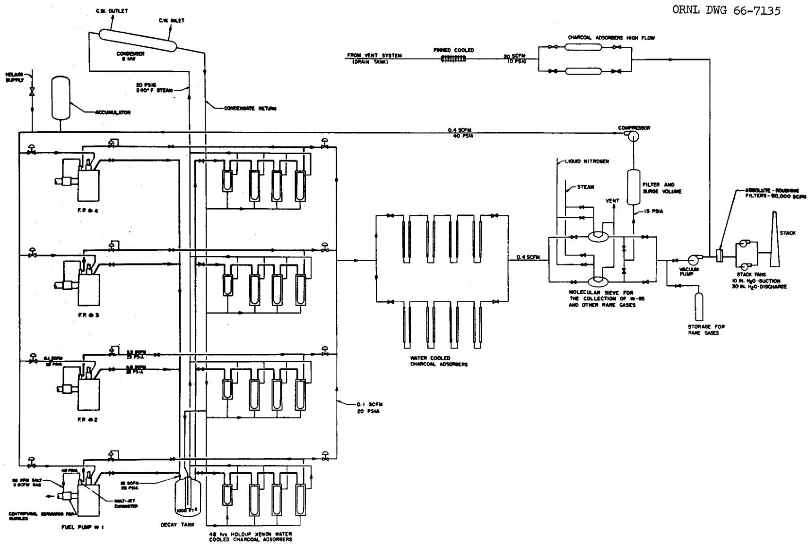  
Fig. 3.19. Off-Gas System Flowsheet.

# 3.7 Heat Exchangers

The system heat exchangers consist of the primary heat exchangers used to transfer heat from the fuel and blanket salts to the coolant salt and the boiler-superheaters and reheaters that transfer heat from the coolant salt to the supercritical fluid in the steam-power system. Also included, although more closely associated with the steam system than the salt systems, are the reheat steam preheaters.

# 3.7.1 Fuel-Salt Heat Exchangers

Four shell-and-tube two-pass vertical heat exchangers transfer heat from the fuel salt in the tubes to the coolant salt circulated through the shell. The conceptual design is shown in Fig. 3.20, and the pertinent data are listed in Table 3.11.

Each exchanger has a capacity of about 528 Mw(th) and is about 5.5 ft in diameter and 18.5 ft high, including the bowl of the circulating pump, which is an integral part of the heat exchanger shell. Shell, tube, and tube sheets are fabricated of Hastelloy N.

The reactor fuel salt enters the heat exchanger from the 18-in.-diam inner passage of the concentric pipes connecting the reactor and exchanger. In the heat exchanger, the fuel flows downward through the annular, outer rows of tubes at a velocity of 11.3 fps. In each unit there are 4167 of these 0.375-in.-OD tubes on a 0.75-in. pitch. Upon reaching the bottom head the salt reverses direction and moves upward at about 13 fps through a center bank of 0.375-in.-diam tubes. There are 3624 of these tubes on a 0.625-in. pitch. Thus each fuel-salt primary heat exchanger has 7791 tubes and about 9665 ft² of effective surface area.

The coolant salt enters the heat exchanger at the top and flows downward, countercurrent to the flow of fuel salt. It initially flows through the center section of the exchanger, and on reaching the bottom of the shell it turns upward to flow through the tubes in the annular section and leave the exchanger through an annular collecting ring at the top.

ORNL DWG 65-12379

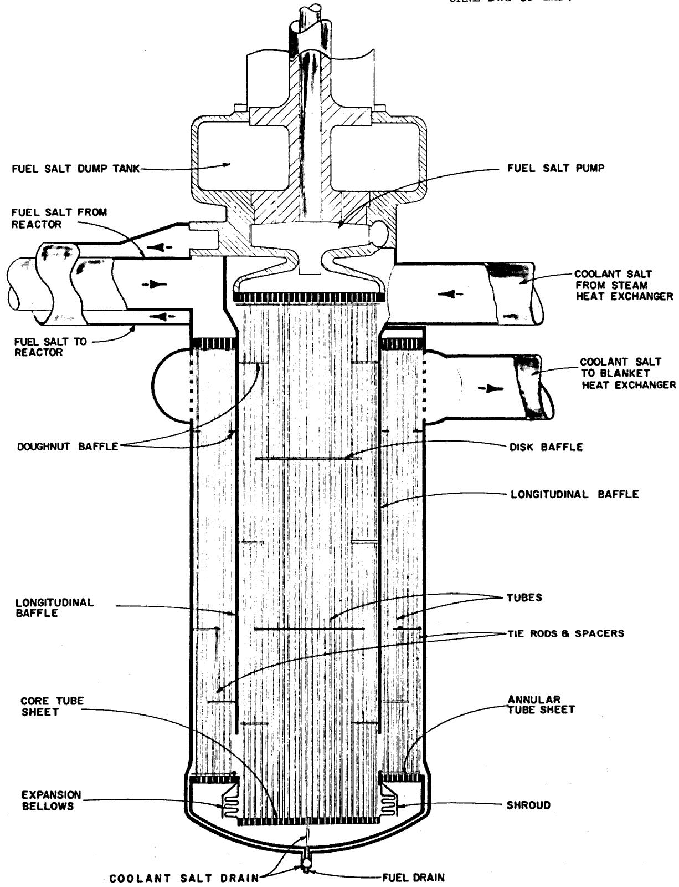  
Fig. 3.20. Fuel-Salt Heat Exchanger.

Table 3.11. Fuel-Salt Heat Exchanger Design Data   

<table><tr><td>Type</td><td>Shell-and-tube two-pass vertical exchanger with disk and doughnut baffles</td></tr><tr><td>Number required</td><td>4</td></tr><tr><td>Rate of heat transfer, each,</td><td></td></tr><tr><td>Mw</td><td>528</td></tr><tr><td>Btu/hr</td><td>1.80 × 109</td></tr><tr><td>Shell-side conditions</td><td></td></tr><tr><td>Cold fluid</td><td>Coolant salt</td></tr><tr><td>Entrance temperature, °F</td><td>850</td></tr><tr><td>Exit temperature, °F</td><td>1111</td></tr><tr><td>Entrance pressure, psi</td><td>80</td></tr><tr><td>Exit pressure, psi</td><td>29</td></tr><tr><td>Pressure drop across exchanger, psi</td><td>51</td></tr><tr><td>Mass flow rate, lb/hr</td><td>1.68 × 107</td></tr><tr><td>Tube-side conditions</td><td></td></tr><tr><td>Hot fluid</td><td>Fuel salt</td></tr><tr><td>Entrance temperature, °F</td><td>1300</td></tr><tr><td>Exit temperature, °F</td><td>1000</td></tr><tr><td>Entrance pressure, psi</td><td>96</td></tr><tr><td>Exit pressure, psi</td><td>10 (pump suction)</td></tr><tr><td>Pressure drop across exchanger, psi</td><td>86</td></tr><tr><td>Mass flow rate, lb/hr</td><td>1.08 × 107</td></tr><tr><td>Mass velocity, lb/hr·ft2</td><td></td></tr><tr><td>Center section</td><td>5.95 × 106</td></tr><tr><td>Annular section</td><td>5.18 × 106</td></tr><tr><td>Velocity, fps</td><td></td></tr><tr><td>Center section</td><td>13.0</td></tr><tr><td>Annular section</td><td>11.3</td></tr><tr><td>Tube material</td><td>Hastelloy N</td></tr><tr><td>Tube OD, in.</td><td>0.375</td></tr><tr><td>Tube thickness, in.</td><td>0.035</td></tr><tr><td>Tube length, tube sheet to tube sheet, ft</td><td></td></tr><tr><td>Center section</td><td>13.7</td></tr><tr><td>Annular section</td><td>11.7</td></tr><tr><td>Shell material</td><td>Hastelloy N</td></tr><tr><td>Shell thickness, in.</td><td>0.5</td></tr><tr><td colspan="2">Shell ID, in.</td></tr><tr><td>Center section</td><td>40.2</td></tr><tr><td>Annular section</td><td>66.5</td></tr><tr><td>Tube sheet material</td><td>Hastelloy N</td></tr><tr><td colspan="2">Tube sheet thickness, in.</td></tr><tr><td>Top annular section</td><td>3.62</td></tr><tr><td>Bottom annular section</td><td>1.75</td></tr><tr><td>Top and bottom center section</td><td>1.0</td></tr><tr><td colspan="2">Number of tubes</td></tr><tr><td>Center section</td><td>3624</td></tr><tr><td>Annular section</td><td>4167</td></tr><tr><td colspan="2">Pitch of tubes, in.</td></tr><tr><td>Center section</td><td>0.625</td></tr><tr><td>Annular section</td><td>0.750</td></tr><tr><td colspan="2">Total heat transfer area per exchanger, ft2</td></tr><tr><td>Center section</td><td>4875</td></tr><tr><td>Annular section</td><td>4790</td></tr><tr><td>Total</td><td>9665</td></tr><tr><td>Basis for area calculation</td><td>Tube outside diameter</td></tr><tr><td>Type of baffle</td><td>Disk and doughnut</td></tr><tr><td colspan="2">Number of baffles</td></tr><tr><td>Center section</td><td>5</td></tr><tr><td>Annular section</td><td>2</td></tr><tr><td colspan="2">Baffle spacing, in.</td></tr><tr><td>Center section</td><td>27.4</td></tr><tr><td>Annular section</td><td>21</td></tr><tr><td colspan="2">Disk OD, in.</td></tr><tr><td>Center section</td><td>30.6</td></tr><tr><td>Annular section</td><td>55.8</td></tr><tr><td colspan="2">Doughnut ID,</td></tr><tr><td>Center section</td><td>25.0</td></tr><tr><td>Annular section</td><td>51.0</td></tr><tr><td>Overall heat transfer coefficient, U, Btu/hr·ft2</td><td>1110</td></tr><tr><td colspan="2">Maximum stress intensity, a psi</td></tr><tr><td>Tube</td><td></td></tr><tr><td>Calculated</td><td>Pm = 413; (Pm + Q) = 12,000</td></tr><tr><td>Allowable</td><td>Pm = Sm = 4600; (Pm + Q) = 3S_m = 13,800</td></tr><tr><td>Shell</td><td></td></tr><tr><td>Calculated</td><td>Pm = 6160; (Pm + Q) = 21,600</td></tr><tr><td>Allowable</td><td>Pm = Sm = 12,000; (Pm + Q) = 3S_m = 36,000</td></tr><tr><td colspan="2">Maximum tube sheet stress, psi</td></tr><tr><td>Calculated</td><td>10,750</td></tr><tr><td>Allowable</td><td>10,750</td></tr></table>

aThe symbols are those of Section 3 of the ASME Boiler and Pressure Vessel Code, with   
$\mathbf{P}_{\mathfrak{m}} =$ primary membrane stress intensity,   
$Q =$ secondary stress intensity,   
$S_{m} =$ allowable stress intensity.

The general configuration and arrangement of the exchanger were largely dictated by the design requirement that the fuel-salt circulating system have a minimum fuel inventory consistent with practical design considerations. Associated factors were permissible stress values and the ability to remove afterheat and drain the core. The heat exchanger calculations were concerned primarily with determining the lengths and number of tubes, the tube pitch, the number of baffles, the baffle spacing, etc., which would best suit the specified conditions. A computer program was developed for this optimization work. The program and the details of the calculations for all the MSBR heat exchangers are reported elsewhere.[23]

To distribute coolant-salt flow on the shell side of the exchanger, disk and doughnut baffles are used in the center section. In the annular region there are two baffles, one extending inward from the exterior shell and one extending outward from the barrier that surrounds the core section. These baffles improve the shell-side heat transfer coefficient;

however, no baffles are used at the top of the annular section, because the hottest fuel fluid enters here and an improved heat transfer coefficient would result in an excessive temperature drop across the tube wall. Also, a baffle is located near each tube sheet to partially insulate it and thereby reduce the temperature drop across the sheet. Fuel or coolant salt can be drained from the bottom of the primary exchangers through the concentric drain lines indicated in Fig. 3.20.

The stresses that tend to be developed in the heat exchanger due to the temperature differences between the shell and the upflow and downflow tubes are relieved in the design concept by a bellows expansion joint at the lower tube sheet. The stresses in the present design are given in Table 3.11.*

# 3.7.2 Blanket-Salt Heat Exchangers

The four shell-and-tube vertical heat exchangers used to transfer heat from the blanket salt to the coolant salt are very similar to the fuel-salt exchangers, but they only have a capacity of 27.8 Mw(th) each. They are illustrated in Fig. 3.21. Pertinent design data are given in Table 3.12.

The coolant salt passes through the fuel-salt heat exchangers and then through the blanket exchangers, in series, entering the latter at about $1111^{\circ}\mathrm{F}$ and leaving at $1125^{\circ}\mathrm{F}$ . Since the flow rate is relatively high and the temperature change is small, the exchangers are designed for a single shell-side pass of the coolant salt. The blanket salt in the 0.375-in.-OD tubes makes two passes, however, moving downward at about 10.5 fps in the outer annular section and upward through the inner bank to the pump suction.

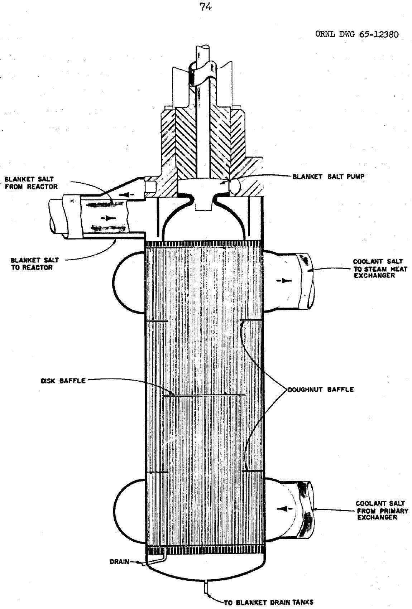  
Fig. 3.21. Blanket-Salt Heat Exchanger.

Table 3.12. Blanket-Salt Heat Exchanger Data   

<table><tr><td>Type</td><td>Shell-and-tube one-shell-pass two-tube-pass exchan-ger, with disk and doughnut baffles</td></tr><tr><td>Number required</td><td>4</td></tr><tr><td>Rate of heat transfer per unit, Mw</td><td>27.8</td></tr><tr><td>Btu/hr</td><td>9.47 × 107</td></tr><tr><td>Shell-side conditions</td><td></td></tr><tr><td>Cold fluid</td><td>Coolant salt</td></tr><tr><td>Entrance temperature, °F</td><td>1111</td></tr><tr><td>Exit temperature, °F</td><td>1125</td></tr><tr><td>Entrance pressure, psi</td><td>27</td></tr><tr><td>Exit pressure, psi</td><td>9</td></tr><tr><td>Pressure drop across exchanger, psi</td><td>18</td></tr><tr><td>Mass flow rate, lb/hr</td><td>1.68 × 107</td></tr><tr><td>Tube-side conditions</td><td></td></tr><tr><td>Hot fluid</td><td>Blanket salt</td></tr><tr><td>Entrance temperature, °F</td><td>1250</td></tr><tr><td>Exit temperature, °F</td><td>1150</td></tr><tr><td>Entrance pressure, psi</td><td>100</td></tr><tr><td>Exit pressure, psi</td><td>10</td></tr><tr><td>Pressure drop across exchanger, psi</td><td>90</td></tr><tr><td>Mass flow rate, lb/hr</td><td>4.3 × 106</td></tr><tr><td>Mass velocity, lb/hr·ft2</td><td>10.5 × 106</td></tr><tr><td>Velocity, fps</td><td>10.5</td></tr><tr><td>Tube material</td><td>Hastelloy N</td></tr><tr><td>Tube OD, in.</td><td>0.375</td></tr><tr><td>Tube thickness, in.</td><td>0.035</td></tr><tr><td>Tube length, tube sheet to tube sheet, ft</td><td>8.25</td></tr><tr><td>Shell material</td><td>Hastelloy N</td></tr><tr><td>Shell thickness, in.</td><td>0.25</td></tr><tr><td>Shell ID, in.</td><td>36.5</td></tr><tr><td>Tube sheet material</td><td>Hastelloy N</td></tr><tr><td>Tube sheet thickness, in.</td><td>1.0</td></tr><tr><td>Number of tubes</td><td>1641 (~820 per pass)</td></tr><tr><td>Pitch of tubes, in.</td><td>0.81</td></tr><tr><td>Total heat transfer area, ft2</td><td>1330</td></tr><tr><td>Basis for area claculation</td><td>Outside diameter</td></tr><tr><td>Type of baffle</td><td>Disk and doughnut</td></tr><tr><td>Number of baffles</td><td>3</td></tr><tr><td>Baffle spacing, in.</td><td>24.8</td></tr><tr><td>Disk OD, in.</td><td>26.5</td></tr><tr><td>Doughnut ID, in.</td><td>23</td></tr><tr><td>Overall heat transfer coefficient, U, Btu/hr·ft2</td><td>1020</td></tr><tr><td>Maximum stress intensity, a psi</td><td></td></tr><tr><td>Calculated</td><td>Pm = 410; (Pm + Q) = 7840</td></tr><tr><td>Allowable</td><td>Pm = Sm = 6500; (Pm + Q) = 3Sm = 19,500</td></tr><tr><td>Shell</td><td></td></tr><tr><td>Calculated</td><td>Pm = 1660; (Pm + Q) = 11,140</td></tr><tr><td>Allowable</td><td>Pm = Sm = 12,000; (Pm + Q) = 3Sm = 36,000</td></tr><tr><td>Maximum tube sheet stress, psi</td><td></td></tr><tr><td>Calculated</td><td>2220</td></tr><tr><td>Allowable</td><td>5900 at 1200°F</td></tr></table>

aThe symbols are those of Section 3 of the ASME Boiler and Pressure Vessel Code, with   
$\mathbf{P}_{\mathrm{m}} =$ primary membrane stress intensity,   
$Q =$ secondary stress intensity,   
$\mathbf{S}_{\mathfrak{m}} =$ allowable stress intensity.

Straight tubes with two tube sheets are used rather than U-tubes in order to permit drainage of the blanket salt. Disk and doughnut baffles are used to improve the shell-side heat transfer coefficient and to provide the necessary tube support. Baffles on the shell side of the tubes sheets reduce the temperature difference across the sheets to keep thermal stresses within tolerable limits. Calculations show that the relatively low pressures and small temperature differences produce stresses that are well within the allowable range.[23]

# 3.7.3 Boiler-Superheaters

Sixteen vertical U-tube U-shell heat exchangers are used to transfer the heat from the $1125^{\circ}\mathrm{F}$ coolant salt to the $700^{\circ}\mathrm{F}$ feedwater to generate steam at $1000^{\circ}\mathrm{F}$ and about 3600 psia. Four of these exchangers are in each of the coolant-salt circulating circuits and are supplied by a variable-speed coolant-salt pump (adjustment of the pump speed permits control of the outlet steam temperature). Each exchanger has a capacity of about 121 Mw(th) and has a U-shaped cylindrical shell about 18 in. in diameter; each vertical leg stands about 34 ft high, including the spherical head. The tubes and shell are fabricated of Hastelloy N. The unit is shown in Fig. 3.22. Pertinent design data are given in Table 3.13.

Because of marked changes in the physical properties of water as the temperature increases above the critical point (at supercritical pressures), heat transfer calculations for this particular exchanger were made on the basis of a detailed spatial analysis with a computer program.[23] The calculations established the optimum number of tubes, tube length, number of baffles, and baffle spacing, in terms of specified design criteria. The results indicated that the optimum design was an exchanger with a long, slim shell and relatively wide baffle spacing. The spacing was greatest in the central portion of the exchanger where the temperature difference between the bulk fluids is high.

The 3600-psi fluid pressure on the inside of the tubes dictates that the heads and tube sheets be carefully designed. The relatively small diameter of 18 in. selected for the shell and the spherical heads on the ends of the exchangers allows the stresses to be kept within permissible limits. A baffle on the shell side of each tube sheet provides a stagnant salt layer that helps to reduce stresses in the sheet due to temperature gradients.

The coolant salt can be completely drained from the shell. The water can be partially removed from the tubes by gas pressurization, or by flushing, but complete drainability was not considered a mandatory design requirement.

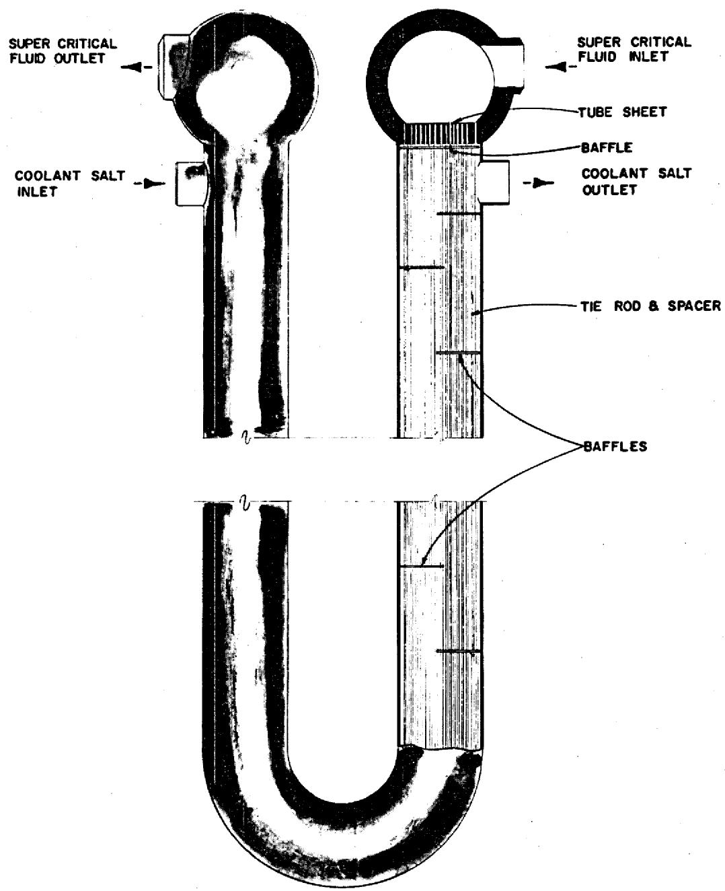  
Fig. 3.22. Boiler-Superheater.

Table 3.13. Boiler-Superheater Design Data   

<table><tr><td>Type</td><td>U-tube U-shell exchanger with crossflow baffles</td></tr><tr><td>Number required</td><td>16</td></tr><tr><td>Rate of heat transfer, Mw</td><td>121</td></tr><tr><td>Btu/hr</td><td>4.13 × 108</td></tr><tr><td>Shell-side conditions</td><td></td></tr><tr><td>Hot fluid</td><td>Coolant salt</td></tr><tr><td>Entrance temperature, °F</td><td>1125</td></tr><tr><td>Exit temperature, °F</td><td>850</td></tr><tr><td>Entrance pressure, psi</td><td>150</td></tr><tr><td>Exit pressure, psi</td><td>92</td></tr><tr><td>Pressure drop across exchanger, psi</td><td>58</td></tr><tr><td>Mass flow rate, lb/hr</td><td>3.66 × 106</td></tr><tr><td>Tube-side conditions</td><td></td></tr><tr><td>Cold fluid</td><td>Supercritical fluid</td></tr><tr><td>Entrance temperature, °F</td><td>700</td></tr><tr><td>Exit temperature, °F</td><td>1000</td></tr><tr><td>Entrance pressure, psi</td><td>3770</td></tr><tr><td>Exit pressure, psi</td><td>3600</td></tr><tr><td>Pressure drop across exchanger, psi</td><td>166</td></tr><tr><td>Mass flow rate, lb/hr</td><td>6.33 × 105</td></tr><tr><td>Mass velocity, lb/hr·ft2</td><td>2.78 × 106</td></tr><tr><td>Tube material</td><td>Hastelloy N</td></tr><tr><td>Tube OD, in.</td><td>0.50</td></tr><tr><td>Tube thickness, in.</td><td>0.077</td></tr><tr><td>Tube length, tube sheet to tube sheet, ft</td><td>63.8</td></tr><tr><td>Shell material</td><td>Hastelloy N</td></tr><tr><td>Shell thickness, in.</td><td>0.375</td></tr><tr><td>Shell ID, in.</td><td>18.2</td></tr><tr><td>Tube sheet material</td><td>Hastelloy N</td></tr><tr><td>Tube sheet thickness, in.</td><td>4.75</td></tr><tr><td>Number of tubes</td><td>349</td></tr><tr><td>Pitch of tubes, in.</td><td>0.875</td></tr><tr><td>Total heat transfer area, ft2</td><td>2915</td></tr><tr><td>Basis for area calculation</td><td>Outside surface</td></tr><tr><td>Type of baffle</td><td>Crossflow</td></tr><tr><td>Number of baffles</td><td>9</td></tr><tr><td>Baffle spacing</td><td>Variable</td></tr><tr><td>Overall heat transfer coefficient, U, Btu/hr·ft2</td><td>1030</td></tr><tr><td>Maximum stress intensity,a psi</td><td></td></tr><tr><td>Tube</td><td></td></tr><tr><td>Calculated</td><td>Pm=6750; (Pm+Q)=40,700</td></tr><tr><td>Allowable</td><td>Pm=16,000; (Pm+Q)allow = 48,000</td></tr><tr><td>Shell</td><td></td></tr><tr><td>Calculated</td><td>Pm=3780; (Pm+Q)=8540</td></tr><tr><td>Allowable</td><td>Pm=-10,500; (Pm+Q)allow = 31,500</td></tr><tr><td>Maximum tube sheet stress, psi</td><td></td></tr><tr><td>Calculated</td><td>&lt;16,600</td></tr><tr><td>Allowable</td><td>16,600</td></tr></table>

aThe symbols are those of Section 3 of the ASME Boiler and Pressure Vessel Code, with   
$\mathbf{P}_{\mathrm{m}} =$ primary membrane stress intensity,   
$Q =$ secondary stress intensity,   
$\mathrm{S_m} =$ allowable stress intensity.

# 3.7.4 Steam Reheaters

Eight shell-and-tube heat exchangers transfer heat from the coolant salt to the high-pressure-turbine exhaust steam (~570 psia) and raise its temperature to $1000^{\circ}\mathrm{F}$ . The steam enters the exchanger at about $650^{\circ}\mathrm{F}$ , having been heated from the $552^{\circ}\mathrm{F}$ exhaust temperature in a preheater described below. There are two reheaters to each coolant-salt circulating loop, each pair being supplied by a variable-speed coolant-salt pump in an arrangement that permits control of the outlet steam temperature. The general arrangement of the reheaters is shown in Fig. 3.23, and design data are given in Table 3.14.

Each of the eight units has a capacity of about 36 Mw(th); the coolant salt enters a unit at $1125^{\circ}\mathrm{F}$ and leaves at $850^{\circ}\mathrm{F}$ . Straight vertical shells about 28 in. in diameter and 24 ft long are used.* Both shell and

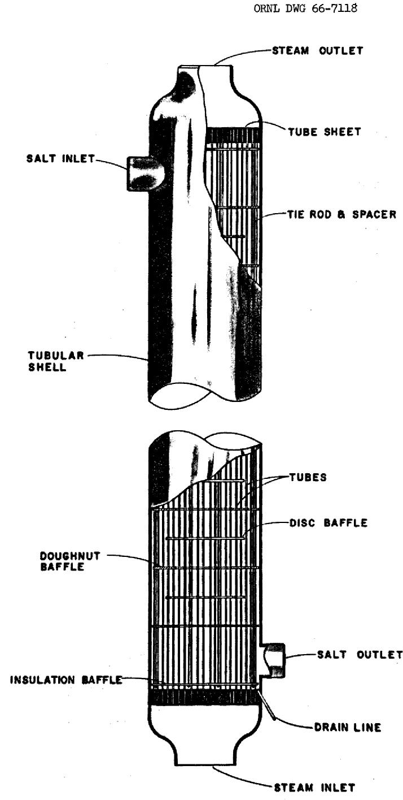  
Fig. 3.23. Steam Reheater.

Table 3.14. Steam Reheater Design Data   

<table><tr><td>Type</td><td>Straight tube and shell ex-changer with disk and dough-nut baffles</td></tr><tr><td>Number required</td><td>8</td></tr><tr><td>Rate of heat transfer per unit, Mw</td><td>36.2</td></tr><tr><td>Btu/hr</td><td>1.24 × 108</td></tr><tr><td>Shell-side conditions</td><td></td></tr><tr><td>Hot fluid</td><td>Coolant salt</td></tr><tr><td>Entrance temperature, °F</td><td>1125</td></tr><tr><td>Exit temperature, °F</td><td>850</td></tr><tr><td>Entrance pressure, psi</td><td>106</td></tr><tr><td>Exit pressure, psi</td><td>90</td></tr><tr><td>Pressure drop across exchanger, psi</td><td>16</td></tr><tr><td>Mass flow rate, lb/hr</td><td>1.1 × 106</td></tr><tr><td>Mass velocity, lb/hr·ft2</td><td>1.44 × 106</td></tr><tr><td>Tube-side conditions</td><td></td></tr><tr><td>Cold fluid</td><td>Steam</td></tr><tr><td>Entrance temperature, °F</td><td>650</td></tr><tr><td>Exit temperature, °F</td><td>1000</td></tr><tr><td>Entrance pressure, psi</td><td>570</td></tr><tr><td>Exit pressure, psi</td><td>557</td></tr><tr><td>Pressure drop across exchanger, psi</td><td>13</td></tr><tr><td>Mass flow rate, lb/hr</td><td>6.3 × 105</td></tr><tr><td>Mass velocity, lb/hr·ft2</td><td>4.0 × 105</td></tr><tr><td>Velocity, fps</td><td>147</td></tr><tr><td>Tube material</td><td>Hastelloy N</td></tr><tr><td>Tube OD, in.</td><td>0.75</td></tr><tr><td>Tube thickness, in.</td><td>0.035</td></tr><tr><td>Tube length, tube sheet to tube sheet, ft</td><td>22.9</td></tr><tr><td>Shell material</td><td>Hastelloy N</td></tr><tr><td>Shell thickness, in.</td><td>0.5</td></tr><tr><td>Shell ID, in.</td><td>28</td></tr><tr><td>Tube sheet material</td><td>Hastelloy N</td></tr><tr><td>Tube sheet thickness, in.</td><td>4.75</td></tr><tr><td>Number of tubes</td><td>628</td></tr><tr><td>Pitch of tubes, in.</td><td>1.0</td></tr><tr><td>Total heat transfer area, ft2</td><td>2830</td></tr><tr><td>Basis for area calculation</td><td>Outside of tubes</td></tr><tr><td>Type of baffle</td><td>Disk and doughnut</td></tr><tr><td>Number of baffles</td><td>14 and 15</td></tr><tr><td>Baffle spacing, in.</td><td>8.75</td></tr><tr><td>Disk OD, in.</td><td>23.2</td></tr><tr><td>Doughnut ID, in.</td><td>16.0</td></tr><tr><td>Overall heat transfer coefficient, U, Btu/hr·ft2</td><td>275</td></tr><tr><td>Maximum stress intensity,a psi</td><td></td></tr><tr><td>Tube</td><td></td></tr><tr><td>Calculated</td><td>Pm=5240; (Pm+Q)=15,100</td></tr><tr><td>Allowable</td><td>Pm=14,500; (Pm+Q)=43,500</td></tr><tr><td>Shell</td><td></td></tr><tr><td>Calculated</td><td>Pm=4350; (Pm+Q)=14,800</td></tr><tr><td>Allowable</td><td>Pm=10,600; (Pm+Q)=31,800</td></tr><tr><td>Maximum tube sheet stress, psi</td><td></td></tr><tr><td>Calculated</td><td>9,600</td></tr><tr><td>Allowable</td><td>9,600</td></tr></table>

aThe symbols are those of Section 3 of the ASME.Boiler and Pressure Vessel Code, with   
$\mathbf{P}_{\mathrm{m}} =$ primary membrane stress intensity,   
$Q =$ secondary stress intensity,   
$\mathrm{Sm} =$ allowable stress intensity.

tubes are fabricated of Hastelloy N. Disk- and doughnut-type baffles support the tubes at close intervals to prevent excessive vibration. Baffles on the shell sides of the tube sheets provide a stagnant layer of coolant salt to reduce thermal stresses in the sheet. A special drain pipe at the bottom provides for drainage of the coolant salt.

Analyses of the stresses indicated that the values were within permissible limits.

# 3.7.5 Reheat-Steam Freheaters

Throttle steam at 3500 psia and $1000^{\circ}\mathrm{F}$ is used to heat the high-pressure turbine exhaust from about 552 to $650^{\circ}\mathrm{F}$ before it enters the

reheaters. (Heat transfer studies indicate that no freezing of the coolant salt takes place in the reheaters if steam enters at 650 rather than $700^{\circ}\mathrm{F}$ , due to the low value of the steam-side heat transfer coefficient.) Use of this preheater permitted the adoption of the TVA Bull Run Steam Plant operating conditions without significant changes affecting costs or performance. This factor was given priority over designing for maximum thermodynamic efficiency and minimum cost,\* since the difference would be small and have little effect on the findings of this study.

The design concept for the reheat-steam preheaters is shown in Fig. 3.24, and the design data are listed in Table 3.15. Eight preheaters

*A thermodynamically more efficient arrangement would be to exhaust the steam from the high-pressure turbine at 650°F rather than 552°F, which would also have the advantage of eliminating the preheating equipment (estimated cost, $275,000).

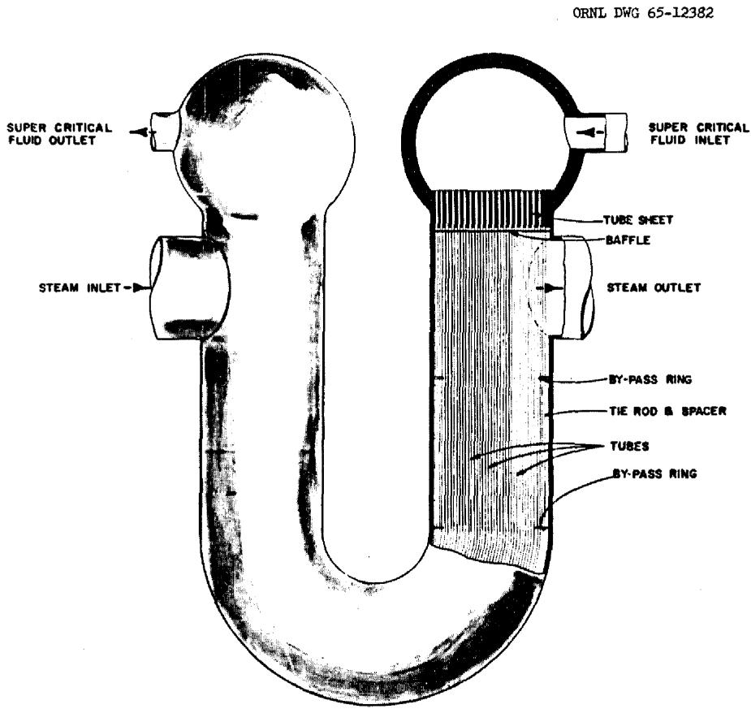  
Fig. 3.24. Reheat-Steam Preheater.

Table 3.15. Reheat-Steam Preheater Design Data   

<table><tr><td>Type</td><td>One-tube-pass one-shell-pass U-tube U-shell exchanger with no baffles</td></tr><tr><td>Number required</td><td>8</td></tr><tr><td>Rate of heat transfer, Mw</td><td>12.3</td></tr><tr><td>Btu/hr</td><td>4.21 × 107</td></tr><tr><td>Shell-side conditions</td><td></td></tr><tr><td>Cold fluid</td><td>Steam</td></tr><tr><td>Entrance temperature, °F</td><td>552</td></tr><tr><td>Exit temperature, °F</td><td>650</td></tr><tr><td>Entrance pressure, psi</td><td>595.4</td></tr><tr><td>Exit pressure, psi</td><td>590.0</td></tr><tr><td>Pressure drop across exchanger, psi</td><td>5.4</td></tr><tr><td>Mass flow rate, lb/hr</td><td>6.31 × 105</td></tr><tr><td>Mass velocity, lb/hr·ft2</td><td>3.56 × 105</td></tr><tr><td>Tube-side conditions</td><td></td></tr><tr><td>Hot fluid</td><td>Supercritical water</td></tr><tr><td>Entrance temperature, °F</td><td>1000</td></tr><tr><td>Exit temperature, °F</td><td>869</td></tr><tr><td>Entrance pressure, psi</td><td>3600</td></tr><tr><td>Exit pressure, psi</td><td>3544</td></tr><tr><td>Pressure drop across exchanger, psi</td><td>56</td></tr><tr><td>Mass flow rate, lb/hr</td><td>3.68 × 105</td></tr><tr><td>Mass velocity, lb/hr·ft2</td><td>1.87 × 106</td></tr><tr><td>Velocity, fps</td><td>93.5</td></tr><tr><td>Tube material</td><td>Croloy</td></tr><tr><td>Tube OD, in.</td><td>0.375</td></tr><tr><td>Tube thickness, in.</td><td>0.065</td></tr><tr><td>Tube length, tube sheet to tube sheet, ft</td><td>13.2</td></tr><tr><td>Shell material</td><td>Croloy</td></tr><tr><td>Shell thickness, in.</td><td>7/16</td></tr><tr><td>Shell ID, in.</td><td>20.2</td></tr><tr><td>Tube sheet material</td><td>Croloy</td></tr><tr><td>Tube sheet thickness, in.</td><td>6.5</td></tr><tr><td>Number of tubes</td><td>603</td></tr><tr><td>Pitch of tubes, in.</td><td>0.75</td></tr><tr><td>Total heat transfer area, ft2</td><td>781</td></tr><tr><td>Basis for area calculation</td><td>Tube outside diameter</td></tr><tr><td>Overall heat transfer coefficient, U, Btu/hr·ft2</td><td>162</td></tr><tr><td>Maximum stress intensity,a psi</td><td></td></tr><tr><td>Tube</td><td></td></tr><tr><td>Calculated</td><td>Pm=10,500; (Pm+Q)=15,900</td></tr><tr><td>Allowable</td><td>Pm=Sm=10,500 at 940°F; (Pm+Q)=3Sm=31,500</td></tr><tr><td>Shell</td><td></td></tr><tr><td>Calculated</td><td>Pm=14,400; (Pm+Q)=33,100</td></tr><tr><td>Allowable</td><td>Pm=Sm=15,000 at 650°F; (Pm+Q)=3Sm=45,000</td></tr><tr><td>Maximum tube sheet stress, psi</td><td></td></tr><tr><td>Calculated</td><td>7800</td></tr><tr><td>Allowable</td><td>7800 at 1000°F</td></tr></table>

aThe symbols are those of Section 3 of the ASME Boiler and Pressure Vessel Code, with

$\mathbb{P}_{\mathfrak{m}} =$ primary membrane stress intensity,

$Q =$ secondary stress intensity,

$\mathbf{S}_{\mathfrak{m}} =$ allowable stress intensity.

are used. This number was determined almost entirely by the selection of reasonable dimensions for the units. The preheaters are part of the steam power system and no biological shielding is required. They are located in the portion of the plant assigned to the feedwater heaters.

Each preheater has a capacity of about 12.3 Mw(th). Each vertical leg of the U-shell is about 21 in. in diameter and the overall height is about 15 ft, including the spherical heads. The tubes, tube sheets, and heads contain the 3500-psia throttle steam and are designed for this high pressure and temperature. Selection of the U-shell rather than a divided cylindrical shell permits use of small head diameters and reduces the required tube-sheet and head thicknesses. Stress analyses indicate that the stresses are within the allowable limits. Both tubes and shell are fabricated of Croloy.

The flow in the preheaters is countercurrent and no baffles are needed in the shell. The U-tube construction accommodates the thermal expansion that occurs. The relatively high steam film resistance to heat

transfer on the shell side reduces the temperature gradient across the tube wall to permissible levels.

# 3.8 Salt-Circulating Pumps

Each of the four separate salt-circulating circuits contains a fuel-salt circulating pump, a blanket-salt pump, a coolant-salt pump for the boiler superheaters, and a coolant-salt pump for the reheaters. The design data for these pumps are listed in Table 3.16. The pump designs utilize the technology developed over the past 15 years, with present pump capacities being extrapolated a factor of 10 for MSBR use.

Table 3.16. Salt Pump Dimensions and Performance Requirements   

<table><tr><td></td><td>Fuel System</td><td>Blanket System</td><td>Reheat Coolant System</td><td>Superheat Coolant System</td></tr><tr><td>Number of pumps</td><td>4</td><td>4</td><td>4</td><td>4</td></tr><tr><td>Temperature, °F</td><td>1,000</td><td>1,150</td><td>1,125</td><td>1,125</td></tr><tr><td>Flow, gpm (each)</td><td>11,000</td><td>2,200</td><td>2,200</td><td>14,000</td></tr><tr><td>Head, ft</td><td>140</td><td>100</td><td>110</td><td>150</td></tr><tr><td>Speed, rpm</td><td>1,170</td><td>1,750</td><td>1,750</td><td>1,170</td></tr><tr><td>Impeller diameter, in.</td><td>24</td><td>13</td><td>13</td><td>24</td></tr><tr><td>Pump tank diameter, in.</td><td></td><td></td><td>36</td><td>60</td></tr><tr><td>Suction diameter, in.</td><td>18</td><td>8</td><td>8</td><td>18</td></tr><tr><td>Discharge diameter, in.</td><td></td><td></td><td>6</td><td>14</td></tr><tr><td>Nominal motor power, hp</td><td>1,250</td><td>500</td><td>200</td><td>1,250</td></tr><tr><td>Motor length, in.</td><td>92</td><td>72</td><td>37</td><td>92</td></tr><tr><td>Motor diameter, in.</td><td>64</td><td>40</td><td>29</td><td>64</td></tr></table>

All pumps are of centrifugal type, with a vertical shaft supported at its lower end in a hydrodynamic journal bearing lubricated by moltensalt. The fuel- and blanket-salt pump bowls have diffuser vanes and are an integral part of the primary heat exchanger vessels. The equipment arrangements are illustrated in Figs. 3.20 and 3.21. Figure 3.25 shows the fuel- and blanket-salt pumps and Fig. 3.26 shows details of the coolant-salt pump.

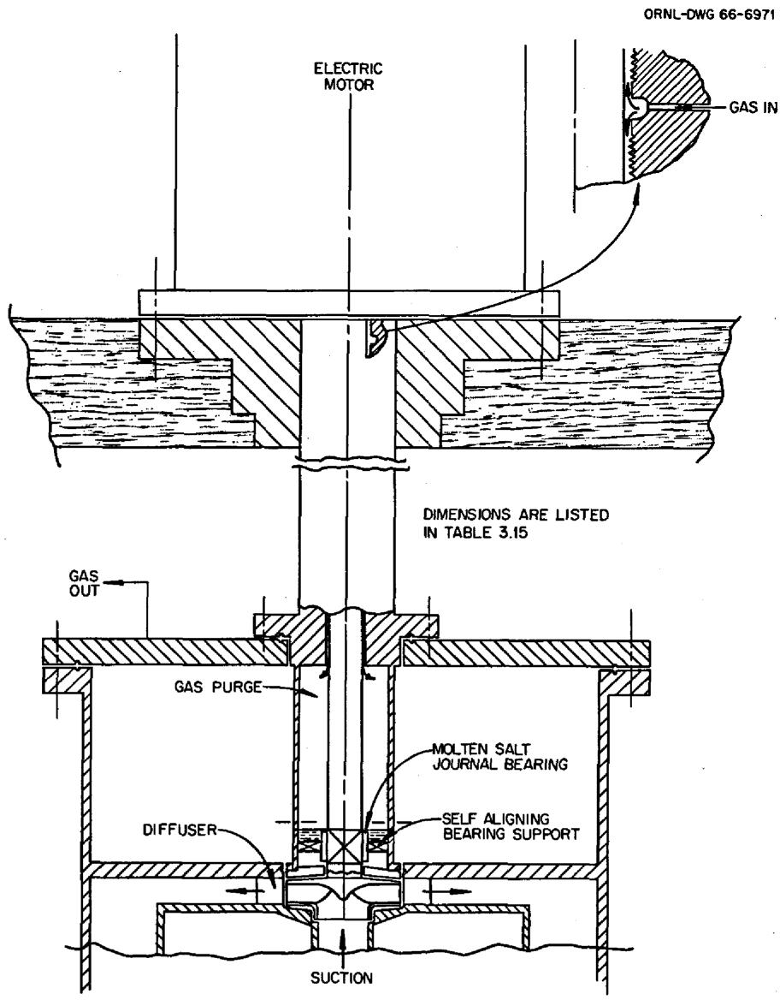  
Fig. 3.25. Fuel- and Blanket-Salt Pump.

A continuous purge of inert gas flows through each pump during operation. Thus purge gas enters the labyrinth annulus near the upper end of the pump shaft. The labyrinth seals the motor cavity from the gas space in the pump tank. The purge gas flow splits into two paths; one portion flows upward in the annulus to keep lubricating vapors from entering the pump tank, and the other flows downward to prevent the migration of radioactive gases into the motor cavity.

The pumps constitute a part of the primary containment of the reactor fluid. As such, they would be constructed in accordance with the applicable

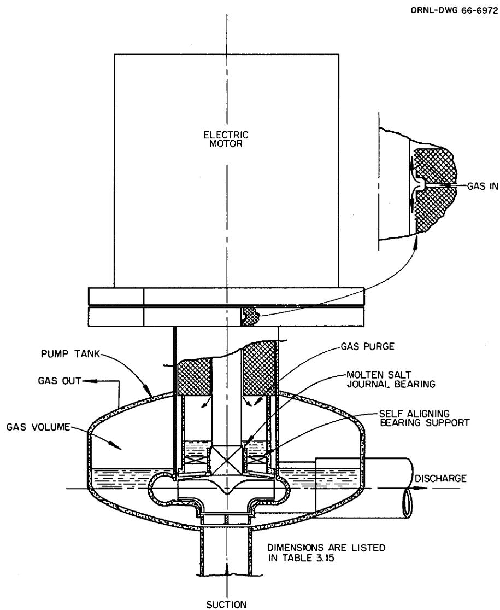  
Fig. 3.26. Coolant-Salt Pump.

portions of the ASME codes, with proper allowances made for the thermal strain fatigue that would accompany reactor startups, power cycles, and radiation heating. The long shafts on the fuel- and blanket-salt pumps permit the drive motors to be shielded from the reactor radiation and temperature. The electric drive motors are located outside the biological shielding, with the hermetic cans around these motors serving as part of the reactor containment vessel. A squirrel-cage induction motor is used, with the ball bearings lubricated with radiation-resistant grease capable of withstanding $3 \times 10^{9}$ rad. The electrical insulation also uses special

materials having a radiation tolerance up to $10^{9}$ rad. Motor heat is removed by circulating a coolant through coils inside the hermetically sealed motor vessel.

# 3.9 Steam-Power System

The thermal power of the MSBR is 2225 Mw(th), which provides a full-load net electrical output of 1000 Mw(e) plus about 35 Mw(e) of power for auxiliary equipment. Throttle steam conditions are 3500 psia and $1000^{\circ}\mathrm{F} / 1000^{\circ}\mathrm{F}$ ; these conditions are representative of modern steam-power plant practice and correspond to those employed in the recently completed TVA Bull Run Steam-Electric Plant.

The steam-power system flowsheet is shown in Fig. 3.27, and the design and performance data are summarized in Table 3.17. Energy balances were made in determining the thermodynamic performance of the system based on a $700^{\circ}\mathrm{F}$ inlet feedwater temperature.[24] The flow rates and steam properties at various points in the system are shown on Fig. 3.27. The net efficiency of the plant is about $45\%$ .

The MSBR system has a conventional 1035-Mw(e) gross output cross-compounded 3600/1800-rpm four-flow turbine-generator unit with 3500-psia $1000^{\circ}\mathrm{F}$ steam to the throttle and reheat to $1000^{\circ}\mathrm{F}$ after the high-pressure turbine exhaust. The exhaust pressure at rated conditions is 1.5-in. Hg abs. Eight stages of feedwater heating are used, with extraction steam taken from the high- and low-pressure turbines and also from three points on the turbines used to drive the boiler feedwater pumps.

The feedwater leaves heater 4 at about $357^{\circ}\mathrm{F}$ and 200 psia; it is raised to 3800 psia and $366^{\circ}\mathrm{F}$ by two turbine-driven centrifugal pumps. The pumps have six stages, run at 5000 rpm, and deliver 8100 gpm against a head of 9380 ft. The drive turbines, which have eight stages, are supplied with throttle steam at 1069 psia and $700^{\circ}\mathrm{F}$ , and they exhaust at about 77 psia. There is one drive turbine per pump, and no standby pumping capacity is provided.

The MSBR steam-power system differs from the TVA Bull Run plant in having higher feedwater and reheat-steam temperatures. The temperature of the feedwater entering the boiler-superheaters was governed by the estimated

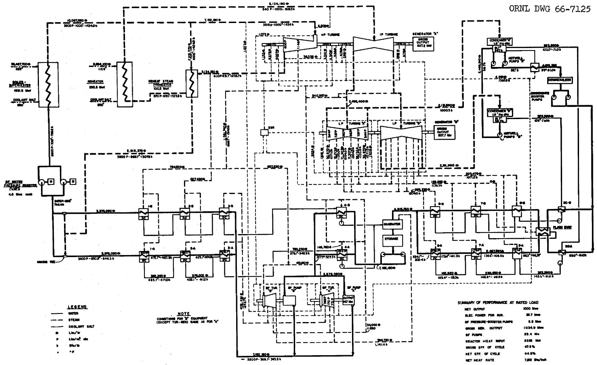  
Fig. 3.27. Steam System Flowsheet for $700^{\circ}\mathrm{F}$ Feedwater.

Table 3.17. MSBR Steam-Power System Design and Performance Data with $700^{\circ}\mathrm{F}$ Feedwater   

<table><tr><td colspan="2">General performance</td></tr><tr><td>Reactor heat input, Mw</td><td>2225</td></tr><tr><td>Net electrical output, Mw</td><td>1000</td></tr><tr><td>Gross electrical generation, Mw</td><td>1034.9</td></tr><tr><td>Station auxiliary load, Mw</td><td>25.7</td></tr><tr><td>Boiler-feedwater pressure-booster pump load, Mw</td><td>9.2</td></tr><tr><td>Boiler-feedwater pump steam-turbine power output, Mw (mechanical)</td><td>29.3</td></tr><tr><td>Flow to turbine throttle, lb/hr</td><td>7.15 × 10^6</td></tr><tr><td>Flow from superheater, lb/hr</td><td>10.1 × 10^6</td></tr><tr><td>Gross efficiency, % (1034.9 + 29.3)/2225</td><td>47.8</td></tr><tr><td>Gross heat rate, Btu/kwhr</td><td>7136</td></tr><tr><td>Net efficiency, %</td><td>44.9</td></tr><tr><td>Net heat rate, Btu/kwhr</td><td>7601</td></tr><tr><td colspan="2">Boiler-superheaters</td></tr><tr><td>Number of units</td><td>16</td></tr><tr><td>Total duty, Mw(th)</td><td>1932</td></tr><tr><td>Total steam capacity, lb/hr</td><td>10.1 × 10^6</td></tr><tr><td>Temperature of inlet feedwater, °F</td><td>700</td></tr><tr><td>Enthalpy of inlet feedwater, Btu/lb</td><td>769</td></tr><tr><td>Pressure of inlet feedwater, psia</td><td>3770</td></tr><tr><td>Temperature of outlet steam, °F</td><td>1000</td></tr><tr><td>Pressure of outlet steam, psia</td><td>~3600</td></tr><tr><td>Enthalpy of outlet steam, Btu/lb</td><td>1424</td></tr><tr><td>Temperature of inlet coolant salt, °F</td><td>1125</td></tr><tr><td>Temperature of outlet coolant salt, °F</td><td>850</td></tr><tr><td>Average specific heat of coolant salt, Btu/lb·°F</td><td>0.41</td></tr><tr><td>Total coolant-salt flow, lb/hr</td><td>58.5 × 10^6</td></tr><tr><td>cfs</td><td>130</td></tr><tr><td>gpm</td><td>58,300</td></tr><tr><td>Coolant-salt pressure drop, inlet to outlet, psi</td><td>~60</td></tr><tr><td colspan="2">Steam reheaters</td></tr><tr><td>Number of units</td><td>8</td></tr><tr><td>Total duty, Mw(th)</td><td>294</td></tr><tr><td>Total steam capacity, lb/hr</td><td>5.13 × 10^6</td></tr><tr><td>Temperature of inlet steam, °F</td><td>650</td></tr><tr><td>Pressure of inlet steam, psia</td><td>~570</td></tr><tr><td>Enthalpy of inlet steam, Btu/lb</td><td>1324</td></tr><tr><td>Temperature of outlet steam, °F</td><td>1000</td></tr><tr><td>Pressure of outlet steam, psia</td><td>557</td></tr><tr><td>Enthalpy of outlet steam, Btu/lb</td><td>1518</td></tr><tr><td>Temperature of inlet coolant salt, °F</td><td>1125</td></tr><tr><td>Temperature of outlet coolant salt, °F</td><td>850</td></tr><tr><td>Average specific heat of coolant salt, Btu/lb·°F</td><td>0.41</td></tr><tr><td colspan="2">Steam reheaters (continued)</td></tr><tr><td>Total coolant salt flow, lb/hr</td><td>8.88 × 106</td></tr><tr><td>cfs</td><td>19.7</td></tr><tr><td>gpm</td><td>8860</td></tr><tr><td>Coolant-salt pressure drop, inlet to outlet, psi</td><td>~17</td></tr><tr><td colspan="2">Reheat-steam preheaters</td></tr><tr><td>Number of units</td><td>8</td></tr><tr><td>Total duty, Mw(th)</td><td>100</td></tr><tr><td>Total heated steam capacity, lb/hr</td><td>5.13 × 106</td></tr><tr><td>Temperature of heated steam, °F</td><td></td></tr><tr><td>Inlet</td><td>552</td></tr><tr><td>Outlet</td><td>650</td></tr><tr><td>Pressure of heated steam, psia</td><td></td></tr><tr><td>Inlet</td><td>595</td></tr><tr><td>Outlet</td><td>590</td></tr><tr><td>Enthalpy of heated steam, Btu/lb</td><td></td></tr><tr><td>Inlet</td><td>1257</td></tr><tr><td>Outlet</td><td>1324</td></tr><tr><td>Total heating steam, lb/hr</td><td>2.92 × 106</td></tr><tr><td>Temperature of heating steam, °F</td><td></td></tr><tr><td>Inlet</td><td>1000</td></tr><tr><td>Outlet</td><td>869</td></tr><tr><td>Pressure of heating steam, psia</td><td></td></tr><tr><td>Inlet</td><td>3600</td></tr><tr><td>Outlet</td><td>3544</td></tr><tr><td colspan="2">Boiler-feedwater pumps</td></tr><tr><td>Number of units</td><td>2</td></tr><tr><td>Centrifugal pump</td><td></td></tr><tr><td>Number of stages</td><td>6</td></tr><tr><td>Feedwater flow rate, total, lb/hr</td><td>7.15 × 106</td></tr><tr><td>Required capacity, gpm</td><td>8,060</td></tr><tr><td>Head, approximate, ft</td><td>9,380</td></tr><tr><td>Speed, rpm</td><td>5,000</td></tr><tr><td>Water inlet temperature, °F</td><td>358</td></tr><tr><td>Water inlet enthalpy, Btu/lb</td><td>330</td></tr><tr><td>Water inlet specific volume, ft3/lb</td><td>~0.0181</td></tr><tr><td>Steam-turbine drive</td><td></td></tr><tr><td>Power required at rated flow, Mw (each)</td><td>14.7</td></tr><tr><td>Power, nominal hp (each)</td><td>20,000</td></tr><tr><td>Throttle steam conditions, psia/°F</td><td>1070/700</td></tr><tr><td>Throttle flow, lb/hr (each)</td><td>414,000</td></tr><tr><td>Exhaust pressure, approximate, psia</td><td>77</td></tr><tr><td>Number of stages</td><td>8</td></tr><tr><td>Number of extraction points</td><td>3</td></tr><tr><td colspan="2">Boiler-feedwater pressure-booster pumps</td></tr><tr><td>Number of units</td><td>2</td></tr><tr><td>Centrifugal pump</td><td></td></tr><tr><td>Feedwater flow rate, total, lb/hr</td><td>10.1 × 10^6</td></tr><tr><td>Required capacity, gpm (each)</td><td>9,500</td></tr><tr><td>Head, approximate, ft</td><td>1413</td></tr><tr><td>Water inlet temperature, °F</td><td>695°F</td></tr><tr><td>Water inlet pressure, psia</td><td>~3,500</td></tr><tr><td>Water inlet specific volume, ft^3/lb</td><td>~0.0302</td></tr><tr><td>Water outlet temperature, °F</td><td>~700</td></tr><tr><td>Electric-motor drive</td><td></td></tr><tr><td>Power required at rated flow, Mw(e) (each)</td><td>4.6</td></tr><tr><td>Power, nominal hp (each)</td><td>6,150</td></tr></table>

liquidus temperature of the coolant salt; it was decided that the coolant salt should not be permitted to freeze, so the feedwater must enter the boilers at $700^{\circ}\mathrm{F}$ or higher. In the reheaters, however, the heat-transfer resistance of the steam film is high, so the steam can enter at $650^{\circ}\mathrm{F}$ .

The feedwater leaves the conventional eight stages of regenerative feedwater heating at about $551^{\circ}\mathrm{F}$ , the same as in the TVA Bull Run steam-power cycle. The steam leaves the high-pressure turbine at about $552^{\circ}\mathrm{F}$ and is heated to $650^{\circ}\mathrm{F}$ in a shell-and-tube type exchanger (described in Sect. 3.7.5), with supercritical fluid at 3515 psia and $1000^{\circ}\mathrm{F}$ . The high-pressure heating steam leaves the heat exchanger near $866^{\circ}\mathrm{F}$ and 3500 psia and is directly mixed in a "mixing tee" with the $550^{\circ}\mathrm{F}$ feedwater to raise its temperature to about $695^{\circ}\mathrm{F}$ . The mixture is then boosted to boiler-superheater pressure by motor-driven pumps, and the pumping effort raises the pumped water temperature to the requisite $700^{\circ}\mathrm{F}$ . The density of the supercritical fluid pumped by the booster pumps is about 34 lb/ft $^3$ , and very little compressive work $\left[\sim 9.2 \text{ Mw(e)}\right]$ is involved in raising the fluid pressure. The pumps employed are similar to those used for forced-convection flow in supercritical-pressure steam generators. Each of the two booster pumps has a rating of about 20,000 gpm and 6200 hp.

# 3.10 Other Design Considerations

# 3.10.1 Piping and Pipe Stresses

The stresses in the salt and steam piping were studied briefly to determine whether the reactor and turbine plant layouts contained grossly impractical arrangements. The calculations were made with the MEC-21/7094 code.[25] In these estimates, it was assumed that the centers of the reactor and the turbines were fixed and the rest of the system was allowed to move in accordance with the thermal-expansion forces. Stresses were examined at about 150 points with particular emphasis on the locations of suspected high stresses.

The sizes of the main piping in the steam-power system are shown in Table 3.18. The assumed velocities, materials, and other conditions are also given. The maximum calculated stress in piping fabricated of Hastelloy N was found to be about 10,000 psi, which is about a factor of 3 less than that allowable based on ASME Code requirements. The Croloy steam piping has a maximum calculated stress of 2200 psi, which is well within the allowable value.

One case was calculated in which the coolant-salt pumps were restrained in the direction transverse to the main coolant-salt pipe run. The maximum stress in the Hastelloy N piping in this case was about 22,000 psi; the maximum stress in the Croloy steam piping was essentially the same as before. Since the vertical deflections at the pump location are apparently small, it appears that use of vertical and transverse restraints will not cause thermal-expansion effects to overstress the piping.

# 3.10.2 Maintenance

The MSBR equipment was designed and arranged so that inspection, maintenance, and replacement of all major equipment would be practical. Most of the maintenance would be done by use of remotely operated tools through openings in roof plugs. The feasibility of such methods has been demonstrated in the MSRE, and information is available relative to the special tools required.

Table 3.18. MSBR Steam-Power Piping and Operating Conditions   

<table><tr><td>Sizes and Conditions</td><td>Steam Line
Leaving Boiler-
Superheater</td><td>Cold Reheat
Line to
Preheater</td><td>Cold Reheat
Line to
Reheater</td><td>Hot Reheat
Line Leaving
Reheater</td><td>Feedwater Line
to Boiler-
Superheater</td><td>Heating Steam
Line to
Preheater</td><td>Heating Steam
Line from
Preheater</td></tr><tr><td>Number of pipes</td><td>8</td><td>2</td><td>8</td><td>8</td><td>8</td><td>2</td><td>2</td></tr><tr><td>Nominal pipe OD, in.</td><td>14</td><td>35</td><td>18</td><td>16</td><td>12</td><td>12</td><td>12</td></tr><tr><td>Wall thickness, in.</td><td>3</td><td>0.69</td><td>0.5</td><td>0.5</td><td>1.3</td><td>2</td><td>2</td></tr><tr><td>Pipe material</td><td>A335, Gr P-22</td><td>Al55, Gr KC-70</td><td>Al55, Gr KC-70</td><td>A335, Gr P-22</td><td>Al06, Gr C</td><td>A335, Gr P-22</td><td>A335, Gr P-22</td></tr><tr><td>Operating temperature, °F</td><td>1000</td><td>552</td><td>650</td><td>1000</td><td>700</td><td>1000</td><td>866</td></tr><tr><td>Allowable stress at operating
temperature, psi</td><td>7,800</td><td>15,750</td><td>15,750</td><td>7,800</td><td>16,600</td><td>7,800</td><td>7,800</td></tr><tr><td>Flow rate, lb/hr</td><td>10.1 × 10^6</td><td>5.1 × 10^6</td><td>5.1 × 10^6</td><td>5.1 × 10^6</td><td>10.1 × 10^6</td><td>2.9 × 10^6</td><td>2.9 × 10^6</td></tr><tr><td>Pressure, psia</td><td>3600</td><td>600</td><td>570</td><td>540</td><td>3800</td><td>3600</td><td>3500</td></tr><tr><td>Specific volume, ft^3/1b</td><td>0.20</td><td>0.88</td><td>1.07</td><td>1.57</td><td>0.029</td><td>0.20</td><td>0.16</td></tr><tr><td>Total volume flow, cfm</td><td>33.4 × 10^3</td><td>78.9 × 10^3</td><td>90.0 × 10^3</td><td>132 × 10^3</td><td>4.9 × 10^3</td><td>9.6 × 10^3</td><td>7.9 × 10^3</td></tr><tr><td>Calculated velocity, rpm</td><td>11.9 × 10^3</td><td>6.0 × 10^3</td><td>5.7 × 10^3</td><td>13.5 × 10^3</td><td>1.12 × 10^3</td><td>11.5 × 10^3</td><td>9.5 × 10^3</td></tr><tr><td>Assumed velocity, rpm</td><td>10 to 12 × 10^3</td><td>5.8 to 7.4 × 10^3</td><td>5.8 to 7.4 × 10^3</td><td>15.4 × 10^3</td><td>15.4 × 10^3</td><td>1.1 × 10^3</td><td>1.1 × 10^3</td></tr><tr><td>Total flow area, in.^2</td><td>481</td><td>177</td><td>1756</td><td>1235</td><td>657</td><td>138</td><td>114</td></tr></table>

# 3.10.3 Containment

The primary circulating systems containing the fuel and blanket salts are constructed of Hastelloy N and designed for about 150 psi and 1200 to $1300^{\circ}\mathrm{F}$ . These systems - consisting of the reactor, heat exchangers, pumps, and connecting salt piping - are all housed in the reactor cell. This cell volume is contained by a reinforced concrete structure lined with steel plate; beneath the roof plugs are seal pans with welded joints. This containment assures a cell leak rate below $1\%$ of the total cell volume per 24 hr. The reactor cell design pressure is about 45 psig.

The cells adjoining the reactor cell contain the boiler-superheaters, reheaters, and coolant-salt circulating pumps. These cells, which are also designed for a pressure of about 45 psig, are of reinforced concrete and are sealed in the same manner as the reactor cell. Pressure-suppression systems are provided for both the coolant and reactor cells. These systems are separate and independent and contain underground water tanks for condensing steam.

The amount of water present in the reactor cell proper will be small, probably consisting mainly of the water circulated through the shielding and equipment-support cooling coils. The coolant-salt cells, one for each of the separate coolant circulating circuits, are not interconnected, and one cell could not credibly receive more than one-fourth of the total coolant salt. However, it is conceivable that all the approximately 1,000,000 lb of steam and water inventory in the steam-power system might flow into a single coolant cell. The pressure-suppression system is designed to limit the cell pressure to 45 psi in such an accident.

The reactor and coolant-salt cells and the fuel-processing cell are located in a building with a controlled ventilation system. The usual adsorption and filtration equipment are provided.

# 3.11 Plant Construction Costs

The methods and assumptions used in estimating the MSBR cost conform to those used in the advanced-converter reactor studies;9 particular

reference was made to the Sodium Graphite Reactor, since its circulating systems were similar to those of the MSBR.

The construction cost estimates of the reference MSBR design are listed in Table 3.19 in conformance with the AEC Cost Guide.[11] The direct construction costs totalled about $80.7 million, and to this must be added the indirect costs for engineering, contingencies, etc. These indirect costs, listed in Table 3.20, correspond to about $41\%$ of the direct construction costs and give total MSBR plant construction costs of about $114 million. The existence of an established molten-salt reactor industry was assumed in estimating costs covering materials, fabrication, inspection, transportation, installation, and testing.

Additional information concerning the cost estimates for the various accounts are given below. In obtaining the turbine plant costs, the estimates used were influenced by the actual costs experienced in the TVA Bull Run Steam Plant (completed about March 1966).

Land and Land Rights (Acct. 20). An investment of $360,000 was as-sumed for land. This is the same cost that has been allowed in other re-actor studies. As is customary, the land was treated as a nondepreciating capital cost and was subject to a lower fixed charge rate, as indicated in Table 3.19.

Structures and Improvements (Acct. 21). The preliminary character of the MSBR study did not warrant extensive optimization of the plant layout. The turbine-room floor dimensions of the TVA Bull Run plant were incorporated in the MSBR drawings.

The reactor plant portion of the building was considered in two parts. The portion partially below grade and containing the more massive structures was estimated at $1.30 per cubic foot of building volume. The upper high-bay portion was costed at $0.80/ft³. These costs do not include the containment, shielding, and overhead cranes, all of which are included in separate accounts.

The total estimated direct construction cost of \(9.3 million for buildings and structures appears to be typical of 1000-Mw(e) nuclear power stations.

Reactor Equipment (Acct. 221). The MSBR reactor vessel is about 14 ft in inside diameter and 19 ft high with torospherical heads; the

Table 3.19. Cost Estimate for MSBR Power Station   

<table><tr><td>Account No.</td><td>Item</td><td>Amount (in thousands of dollars)</td></tr><tr><td>20</td><td>Land and Land Rightsa</td><td></td></tr><tr><td>21</td><td>Structures and Improvements</td><td></td></tr><tr><td></td><td>Ground improvements</td><td>866</td></tr><tr><td></td><td>.1 Reactor buildingb</td><td>4,181</td></tr><tr><td></td><td>.2 Turbine building, auxiliary building, and feedwater heater space</td><td>2,832</td></tr><tr><td></td><td>.3 Offices, shops, and laboratories</td><td>1,160</td></tr><tr><td></td><td>.4 Waste disposal building</td><td>150</td></tr><tr><td></td><td>.5 Stack</td><td>76</td></tr><tr><td></td><td>.6 Warehouse</td><td>40</td></tr><tr><td></td><td>.7 Miscellaneous</td><td>30</td></tr><tr><td></td><td>Total Account 212</td><td>8,469</td></tr><tr><td></td><td>Total Account 21</td><td>9,335</td></tr><tr><td>22</td><td>Reactor Plant Equipment</td><td></td></tr><tr><td></td><td>221 Reactor equipment</td><td></td></tr><tr><td></td><td>.1 Reactor vessel and internals</td><td>1,610</td></tr><tr><td></td><td>.2 Control rods</td><td>250</td></tr><tr><td></td><td>.3 Shielding and containment</td><td>2,113</td></tr><tr><td></td><td>.4 Heating-cooling systems and vapor-suppression system</td><td>1,200</td></tr><tr><td></td><td>.5 Moderator and reflector</td><td>1,089</td></tr><tr><td></td><td>.6 Reactor plant crane</td><td>265</td></tr><tr><td></td><td>Total Account 221</td><td>6,527</td></tr><tr><td></td><td>222 Heat transfer systems</td><td></td></tr><tr><td></td><td>.1 Reactor coolant system</td><td></td></tr><tr><td></td><td>.11 Fuel-salt system</td><td>5,054</td></tr><tr><td></td><td>.12 Blanket-salt system</td><td>1,678</td></tr><tr><td></td><td>.2 Intermediate coolant system</td><td>1,947</td></tr><tr><td></td><td>.3 Power system</td><td></td></tr><tr><td></td><td>.31 Steam generators (boiler-superheaters)</td><td>6,530</td></tr><tr><td></td><td>.32 Reheaters</td><td>3,323</td></tr><tr><td></td><td>.4 Coolant supply and treatment</td><td>300</td></tr><tr><td></td><td>Total Account 222</td><td>18,832</td></tr><tr><td></td><td>223 Nuclear fuel handling and storage (drain tanks)</td><td>1,700</td></tr><tr><td></td><td>Radioactive waste treatment and disposal (off-gas system)</td><td></td></tr><tr><td></td><td>226 Instrumentation and controls</td><td>4,500</td></tr><tr><td></td><td>227 Feedwater supply and treatment</td><td></td></tr><tr><td></td><td>.1 Makeup supply and feedwater purification</td><td>470</td></tr><tr><td></td><td>.2 Feedwater heaters</td><td>1,299</td></tr><tr><td></td><td>.3 Feedwater pumps and drives</td><td>1,600</td></tr><tr><td></td><td>.4 Reheat-steam preheaters</td><td>275</td></tr><tr><td></td><td>.5 Pressure-booster pumps</td><td>407</td></tr><tr><td></td><td>Total Account 227</td><td>4,051</td></tr><tr><td></td><td>228 Steam, condensate, and feedwater piping</td><td>4,069</td></tr><tr><td>229</td><td>Other reactor plant equipment (remote maintenance)</td><td></td></tr><tr><td>.1</td><td>Cranes and hoists</td><td>500</td></tr><tr><td>.2</td><td>Special tools</td><td>1,500</td></tr><tr><td>.3</td><td>Decontamination facilities</td><td>1,000</td></tr><tr><td>.4</td><td>Replacement equipment</td><td>2,000</td></tr><tr><td colspan="2">Total Account 229</td><td>5,000</td></tr><tr><td colspan="2">Total Account 22</td><td>45,129</td></tr><tr><td>23</td><td>Turbine-Generator Units</td><td></td></tr><tr><td>231</td><td>Turbine-generator units</td><td>19,174</td></tr><tr><td>232</td><td>Circulating-water system</td><td>1,243</td></tr><tr><td>233</td><td>Condensers and auxiliaries</td><td>1,690</td></tr><tr><td>234</td><td>Central lube-oil system</td><td>80</td></tr><tr><td>235</td><td>Turbine plant instrumentation</td><td>25</td></tr><tr><td>236</td><td>Turbine plant piping</td><td>220</td></tr><tr><td>237</td><td>Auxiliary equipment for generator</td><td>66</td></tr><tr><td>238</td><td>Other turbine plant equipment</td><td>25</td></tr><tr><td colspan="2">Total Account 23</td><td>22,523</td></tr><tr><td>24</td><td>Accessory Electrical Equipment</td><td></td></tr><tr><td>241</td><td>Switchgear, main and station service</td><td>550</td></tr><tr><td>242</td><td>Switchboards</td><td>128</td></tr><tr><td>243</td><td>Station service transformers</td><td>169</td></tr><tr><td>244</td><td>Auxiliary generator</td><td>50</td></tr><tr><td>245</td><td>Distributed items</td><td>2,000</td></tr><tr><td colspan="2">Total Account 24</td><td>2,897</td></tr><tr><td>25</td><td>Miscellaneous</td><td></td></tr><tr><td colspan="2">Total Direct Construction Cost</td><td>80,684</td></tr><tr><td colspan="2">Privately Owned Plant</td><td></td></tr><tr><td colspan="2">Total indirect costs (see Table 3.20)</td><td>33,728</td></tr><tr><td colspan="2">Total plant costc</td><td>114,412</td></tr><tr><td colspan="2">Less nondepreciating capital</td><td></td></tr><tr><td colspan="2">Land</td><td>360</td></tr><tr><td colspan="2">Coolant-salt inventory</td><td>354</td></tr><tr><td colspan="2">Total Depreciating Capital</td><td>113,698</td></tr><tr><td colspan="2">Publicly Owned Plant</td><td></td></tr><tr><td colspan="2">Total indirect costs (see Table 3.19)</td><td>30,011</td></tr><tr><td colspan="2">Total plant costc</td><td>110,695</td></tr><tr><td colspan="2">Less nondepreciating capital</td><td></td></tr><tr><td colspan="2">Land</td><td>360</td></tr><tr><td colspan="2">Coolant-salt inventory</td><td>354</td></tr><tr><td colspan="2">Total Depreciating Capital</td><td>109,981</td></tr></table>

cIncludes land and coolant-salt inventory costs.

Table 3.20. Distribution of Indirect Costsa   

<table><tr><td>Item</td><td>Percentage of Accumulated Total</td><td>Indirect Cost (in thousands of dollars)</td><td>Accumulated Total (in thousands of dollars)</td></tr><tr><td>Direct construction cost</td><td></td><td></td><td>80,684</td></tr><tr><td>General and administrative</td><td>6</td><td>4,841</td><td>85,525</td></tr><tr><td>Miscellaneous construction</td><td>1</td><td>855</td><td>86,380</td></tr><tr><td>Architect-engineer fees</td><td>5</td><td>4,319</td><td>90,699</td></tr><tr><td>Nuclear-engineering fees</td><td>2</td><td>1,814</td><td>92,513</td></tr><tr><td>Startup costsb</td><td>0.7</td><td>646</td><td>93,159</td></tr><tr><td>Land</td><td></td><td>360</td><td>93,519</td></tr><tr><td>Coolant-salt inventory</td><td></td><td>354</td><td>93,873</td></tr><tr><td>Contingency</td><td>10</td><td>9,387</td><td>103,260</td></tr><tr><td>Interest - private financing</td><td>10.8</td><td>11,152</td><td>114,412</td></tr><tr><td>Total indirect costs (private financing)</td><td></td><td>33,728</td><td></td></tr><tr><td>Interest - public financing</td><td>7.2</td><td>7,435</td><td>110,695</td></tr><tr><td>Total indirect costs (public financing)</td><td></td><td>30,011</td><td></td></tr></table>

aIndirect costs follow those used in the advanced converter reactor studies.9   
bStartup costs are based on $35\%$ of first year's nonfuel operating and maintenance costs.

vessel walls are about 1.5 in. thick and the heads about 2.25 in. Based on fabrication experience with similar vessels and materials, $8.00/lb was used to cover the installed cost of the vessel, supports, etc.

There are 534 Hastelloy N tubes 1.5 in. in diameter and 18 in. long, and a like number of tubes 3 in. in diameter and 18 in. long. These were estimated to have an installed cost of $6.00/lb. The cost of brazing the graphite tubes to these Hastelloy N tubes was estimated at roughly $100/braze, or about $107,000. An additional $393,000 was

allowed for special inspections, assembly of the graphite, etc., to bring the total cost of the vessel to about $1.6 million.

The control rods for the MSBR do not employ expensive drive or scram mechanisms and were not studied in detail for this preliminary report. An allowance of $250,000 was made for the rods.

Reinforced concrete for shielding and containment was estimated to cost $80/yd³, in place. The 0.25- to 0.5-in. steel liner plate was estimated to cost $1.50/lb, in place. The thermal insulation was considered to have an installed cost of $6.00/ft². An allowance of $100,000 was made for water cooling of the structures.

The MSBR reactor cell requires heating, cooling, and a vapor-suppression system to limit the pressure in an emergency condition, but conceptual studies of these systems were not undertaken. An allowance of $1.2 million was made for these items.

The graphite used as the MSBR moderator must be of high density and high quality and be closely inspected. About $76\%$ of the core volume is graphite. It is assumed to cost $\$ 10/$ lb based on information from a manufacturer and the apparent feasibility of extruding the required shapes. The reflector graphite was assumed to be 6 in. thick. The cost of this graphite was estimated at $\$ 5/$ lb.

Heat Transfer Systems (Acct. 222). The costs of the shell-and-tube heat exchangers were determined by breaking down each component into weights of shells, tubes, etc., and using typical costs for materials and fabrication to arrive at a total estimated cost per square foot of surface. These values checked well with costs of similar reactor plant heat transfer equipment for both actual equipment and for estimates used in other studies.

The cost of Hastelloy N piping carrying molten salts was estimated at $10/lb.

The costs of salt-circulating pumps were estimated by extrapolating experience with existing molten-salt pumps and using costs for liquid-metal pumps.[26] The costs were increased $5\%$ to include supports and by $10\%$ to include installation and testing.

The quantity of coolant salt required for one filling of the circulating system is about 2833 ft³. At an estimated cost of $1.00/lb, the

coolant-salt inventory cost is about $354,000. This is a nondepreciating type of capital expense and was treated in the same manner as the land cost.

Nuclear Fuel Handling and Storage (Acct. 223). No conceptual design work was done on the MSBR fuel- and blanket-salt drain tanks. An allowance of $1.7 million was made for the eight tanks.

Feedwater Supply and Treatment (Acct. 227). The estimated costs for the makeup supply, feedwater purification, and feedwater pumps and drives are largely based on values used in other 1000-Mw(e) reactor plant studies and on the TVA Bull Run Steam Plant data.

A value of $44/lb was used for the eight Croloy reheat-steam pre-heaters. The two high-pressure low-head 20,000-gpm pressure-booster pumps in the feedwater supply to the boiler-superheater were estimated at $4/gpm capacity. The motor costs were based on unit costs of $10/hp. The variable-speed drives were also based on unit costs of $10/hp.

Steam, Condensate, and Feedwater Piping (Acct. 228). The cost of condensate and feedwater piping for the 915-Mw(e) TVA Bull Run Plant is reported to be $3.62 million. On this basis, the piping for the 1000-Mw(e) MSBR was estimated to be $4.07 million.

Other Reactor Plant Equipment (Acct. 229). Maintenance of the MSBR will probably require remotely controlled cranes and hoists and the use of special tooling and remote-brazing and -welding equipment. Decontamination and hot storage facilities are needed. No conceptual designs were made for this equipment. The costs listed correspond to judgments, with estimates tending to be high due to lack of design data and of maintenance experience.

The MSBR maintenance procedures will involve replacement and subsequent repair rather than in-place repair of items such as salt pumps and primary heat exchangers. This will entail an inventory of replacement equipment, an expense that could be interpreted as part of the initial capital investment rather than as an operating expense. An allowance of $2 million was made for this replacement equipment.

Turbine-Generator Units (Acct. 231). The turbine-generator foundations were estimated at $370,000, a more or less standard allowance for 1000-Mw(e) station studies.9 Erection costs were taken to be $700,000,

again a standard value. The cost of a cross-compounded four-flow turbine-generator unit with 43-in. last-stage blades was based on General Electric Company pricing data, with a $78\%$ discount factor applied to the book value. The excitation equipment was assumed to be of the brushless type, with no provisions for standby excitation.

Circulating-Water System (Acct. 232). The estimated cost of about $1.24 million for the circulating-water equipment was taken from the SGR cost estimate.[9,10] The TVA Bull Run cost data were not applicable because the circulating-water installations include provisions for future plant expansion.

Condensers and Auxiliaries (Acct. 233). The total cost of the four-section horizontal single-pass 320,000-ft² units for the 915-Mw(e) TVA Bull Run Plant was $1.3 million. This was extrapolated to $1.5 million for the MSBR. The $190,000 allowance for the MSBR condensate pump was also extrapolated from the TVA data.

Central Lube-Oil System (Acct. 234). An allowance of $80,000 was made for this account on the basis of TVA cost information.

Turbine Plant Instrumentation (Acct. 235). This account covers turbine plant control boards and instruments not included with the steam piping (Acct. 228) and instrumentation (Acct. 226). An allowance of $25,000 was made on the basis of the SGR estimate.[9,10] (The TVA Bull Run data were not available in a form such that this account could be extracted conveniently.)

Turbine Plant Piping (Acct. 236). The TVA Bull Run Plant reported cost of $160,000 was extrapolated to the 1000-Mw(e) plant size; in addition, $12,000 was added for the preheater, booster-pump, etc., to make a total of $220,000 for this account.

Auxiliary Equipment for Generator (Acct. 237). Although the estimated cost of the turbine-generator unit is presumed to include the auxiliary equipment, the preliminary nature of the estimate led to inclusion of $66,000 for miscellaneous equipment and uncertainties.

Other Turbine Plant Equipment (Acct. 238). This miscellaneous account is of little significance in the total cost, and other reactor plant studies have not always included it. On the basis of TVA experience, however, $25,000 has been included in the MSBR estimate.

Accessory Electrical Equipment (Accts. 241-245). This account covers the cost of hundreds of electrical items, such as motor starters, etc., scattered throughout the plant, and amounts to a significant portion of the total plant investment. The estimate of about $2.35 million for the total of accounts 242 through 245 is the same as that used in the SGR study.[9,10] Account 241, which covers both main and station service switchgear, was reduced below the SGR estimate because the MSBR has smaller pump motors, utilizes turbine-driven boiler-feedwater pumps, and does not require large motor-driven pumps for emergency cooling of the type needed in the SGR. However, the total of about $2.9 million for Account 24 is only slightly less than the total of $3.0 million used for the SGR.

Indirect Costs. The indirect costs, which amount to about $41\%$ of the total direct construction cost, have a very important bearing on the total capital cost and the final production expense. The indirect costs for the MSBR follow those used in the advanced-converter study and are listed in Table 3.20. The percentages used appear to be more representative of present practice than those suggested in the AEC cost evaluation handbook. $^{11}$ Each percentage expense is applied to the accumulated cost total preceding the particular item.

The land and coolant-salt inventory costs are included in the indirect costs so that the contingency and interest costs reflect these expenses. However, the land and coolant-salt costs are deducted from the total plant cost to obtain the depreciating capital outlay.

# 3.12 Power-Production Cost

Power costs are made up of capital charges, operating and maintenance costs, and fuel-cycle costs. In computing capital charges, an important quantity is the fixed charge rate. For an investor-owned MSBR plant, a fixed charge rate of $12\%/\text{yr}$ was applied to depreciating capital, while $10\%/\text{yr}$ was applied to nondepreciating capital. These fixed charge rates are the same as those used in the advanced-converter reactor studies; the distribution of the charge rate for depreciating capital is given in Table 3.21.

Table 3.21. Fixed Charge Rate Used for Investor-Owned Power Plants   

<table><tr><td>Item</td><td>Rate
(%/yr)</td></tr><tr><td>Return on money investeda</td><td>6</td></tr><tr><td>Thirty-year depreciationb</td><td>1.25</td></tr><tr><td>Interim replacementsc</td><td>0.35</td></tr><tr><td>Federal income taxesd</td><td>1.80</td></tr><tr><td>Other taxese</td><td>2.40</td></tr><tr><td>Insurance other than liabilityf</td><td>0.20</td></tr><tr><td>Total</td><td>12.0</td></tr></table>

${}^{a}$ Return was based on one-third equity capital financing,with a return of 9% after taxes,and two-thirds debt capital drawing 4.5% interest.   
bThe sinking-fund method was used in determining the depreciation allowance (plant life of 30 years assumed).   
cIn accordance with FPC practice, a $0.35\%$ allowance was made for replacement of equipment having an anticipated life shorter than 30 years.   
Federal income taxes were based on "sum-of-the-year digits" method of computing tax defer-rals. The sinking-fund method was used to normalize this to a constant return per year of $1.8\%$ .   
eThe FPC recommended value of $2.4\%$ was used for "other taxes."   
fA conventional allowance of $0.20\%$ was made for property damage insurance. Third-party liability insurance is listed as an operating cost.

For publicly owned plants, the fixed charge rate employed was $7\%/\mathrm{yr}$ for depreciating capital; the distribution of this charge rate is given in Table 3.22. For nondepreciating capital the charge rate was $5\%/\mathrm{yr}$ .

The operation and maintenance charges are given in Table 3.23 and are consistent with those used for the advanced-converter studies; however, the staff payroll costs were increased by $35\%$ , since preliminary information regarding the proposed revision to Section 530 of the AEC Cost Guide11 indicates that such an increase is required to be consistent

Table 3.22. Fixed Charge Rate Used for Publicly Owned Power Plants   

<table><tr><td>Item</td><td>Rate
(%/yr)</td></tr><tr><td>Return on money invested</td><td>4.00</td></tr><tr><td>Thirty-year depreciation</td><td>1.75</td></tr><tr><td>Interim replacement</td><td>0.35</td></tr><tr><td>Local taxes plus insurance</td><td>0.90</td></tr><tr><td>Total</td><td>7.00</td></tr></table>

Table 3.23. Operation and Maintenance Costs for a 1000-Mw(e) MSBRa   

<table><tr><td>Item</td><td>Annual Cost</td></tr><tr><td>Operating</td><td></td></tr><tr><td>Total payroll, 70 employees with 20% for fringe benefits and 20% for general and administrative expense</td><td>$ 900,000</td></tr><tr><td>Private insurance</td><td>260,000</td></tr><tr><td>Federal insurance, at $30/Mw(th)</td><td>67,000</td></tr><tr><td>Maintenance</td><td></td></tr><tr><td>Repair and maintenance materials</td><td>1,065,000</td></tr><tr><td>Makeup coolant saltb (2% replacement per year)</td><td>7,000</td></tr><tr><td>Contract services</td><td>72,000</td></tr><tr><td>Total operating cost</td><td>$2,371,000</td></tr><tr><td>Unit cost, mill/kwhr(e), 0.8 load factor</td><td>0.34</td></tr></table>

a. The operating and maintenance costs associated with the fuel-recycle processing plant are included in the fuel-cycle costs.   
b. Makeup carrier salt for the reactor salt circuits is included under fuel-cycle costs.

with present-day salaries. The operation and maintenance costs associated with the fuel-processing plant could also be included here but, instead, are included under fuel-cycle cost so that the latter can be more directly compared with the fuel-cycle costs of reactor plants employing off-plant fuel fabrication and processing.

Combining the capital costs, operation and maintenance costs, and the fuel-cycle costs gave the power-production costs summarized in Table 3.24 for investor-owned and publicly owned utilities. As shown, the power-production cost would be about 2.75 mills/kwhr(e) in an investor-owned plant and about 1.73 mills/kwhr(e) in a publicly owned plant.

In a utility system complex, the incremental cost between zero-power and full-power operation influences the load factor of an individual plant. This incremental cost for the MSBR is shown in Table 3.25, along with other costs that are independent of power level. As shown, the

Table 3.24. Power-Production Cost in 1000-Mw(e) MSBR   
Load factor: 0.8   

<table><tr><td></td><td>Capital Cost(in thousandsof dollars)</td><td>Rate(‰/yr)</td><td>Annual Cost(in thousandsof dollars)</td><td>Power Cost[mills/kwhr(e)]</td></tr><tr><td colspan="5">Private-Ownership Financing</td></tr><tr><td>Fixed charges</td><td></td><td></td><td></td><td></td></tr><tr><td>Depreciating capital</td><td>113,700</td><td>12</td><td>13,644</td><td>1.947</td></tr><tr><td>Nondepreciating capital</td><td>714</td><td>10</td><td>71</td><td>0.010</td></tr><tr><td>(land plus coolant-salt inventory)</td><td></td><td></td><td></td><td></td></tr><tr><td>Operation and maintenance costs</td><td></td><td></td><td>2,371</td><td>0.338</td></tr><tr><td>Fuel-cycle cost</td><td></td><td></td><td></td><td>0.459</td></tr><tr><td>Total estimated production cost</td><td></td><td></td><td></td><td>2.75</td></tr><tr><td colspan="5">Public Financing</td></tr><tr><td>Fixed charges</td><td></td><td></td><td></td><td></td></tr><tr><td>Depreciating capital</td><td>110,000</td><td>7</td><td>7,700</td><td>1.099</td></tr><tr><td>Nondepreciating capital</td><td>714</td><td>5</td><td>36</td><td>0.005</td></tr><tr><td>(land plus coolant-salt inventory)</td><td></td><td></td><td></td><td></td></tr><tr><td>Operation and maintenance costs</td><td></td><td></td><td>2,371</td><td>0.338</td></tr><tr><td>Fuel-cycle cost</td><td></td><td></td><td></td><td>0.287</td></tr><tr><td>Total estimated production cost</td><td></td><td></td><td></td><td>1.73</td></tr></table>

Table 3.25. MSBR Power Cost Breakdown into Fixed and Incremental Costs   

<table><tr><td rowspan="2">Item</td><td colspan="2">Financing</td></tr><tr><td>Privatea</td><td>Publicb</td></tr><tr><td>Annual fixed charges, $/kwyr</td><td>16.2</td><td>9.04</td></tr><tr><td>Fixed operating costs, c mill/kwhr(e)</td><td>0.39</td><td>0.39</td></tr><tr><td>Total fixed power cost, d mills/kwhr(e)</td><td>2.70</td><td>1.68</td></tr><tr><td>Incremental power cost, e mill/kwhr(e)</td><td>0.05</td><td>0.05</td></tr><tr><td>Total power-production cost, mills/kwhr(e)</td><td>2.75</td><td>1.73</td></tr></table>

a $12\%$ /yr fixed charges on reactor plant, including processing plant; $10\%$ /yr inventory charges for nondepreciating items.   
$b_{7\% / \text{yr}}$ fixed charges on reactor plus processing plant; $5\% / \text{yr}$ inventory charges for nondepreciating items. Not optimized for changed conditions.   
cIncludes 0.06 mill/kwhr(e) for fixed operating cost of the processing plant.   
$\mathbf{d}_{\mathrm{Based~on~0.8~load~factor}}$   
Incremental cost in going from zero- to full-power operation (0.8 load factor); includes incremental fuel-cycle cost and incremental operating costs.

incremental cost between operation at zero power and at full power is only 0.05 mill/kwhr(e) and would provide a high incentive for operating with a high plant factor. Since the reactor has "on-line" refueling, there is no basic reason why the plant has to be shut down except for maintenance; operation with a 0.9 load factor would decrease MSBR power costs to 2.49 mills/kwhr(e) for investor-owned plants and to 1.59 mills/kwhr(e) for publicly owned plants.

# 4. ALTERNATIVE CONDITIONS FOR MSBR DESIGN.

As a part of this study, various alternative conditions were considered for the initial MSBR design in order to improve the plant and to measure the incentive for achieving such conditions. One of the more important conditions is the ability to economically remove protactinium directly from the blanket stream of the reactor. Another desirable condition is that of introducing feedwater into the boiler-superheaters at $580^{\circ}\mathrm{F}$ rather than $700^{\circ}\mathrm{F}$ . The ability to maintain a high plant factor at all times is also of importance. These items, as well as others, are discussed below.

# 4.1 Protactinum Removal from Blanket Stream

Even though fluoride volatility processing appears to be a satisfactory process for removal of uranium, the ability to remove $^{233}\mathrm{Pa}$ directly and economically from the blanket region of an MSBR would significantly improve the performance of the reactor. One possible process involves oxide precipitation of protactinium. Several laboratory experiments[27,28] have demonstrated that protactinium can be readily precipitated from a molten fluoride mixture by addition of thorium oxide and that the precipitate can be returned to solution by treatment with HF. Experimental results also indicate that treatment of protactinium-containing salt with $\mathrm{ZrO}_2$ leads to oxide precipitation of the protactinium and that after beta decay of the protactinium, the resulting $\mathrm{UO}_2$ will react with $\mathrm{ZrF}_4$ to give $\mathrm{UF}_4$ .

More recent experimental results have indicated another method for removing protactinium directly from the blanket fluid. This involves treating the molten blanket salt with a stream of bismuth containing dissolved thorium metal. The thorium reduces the protactinium (and also any uranium) to metal, which can then be accumulated on a stainless-steel-wool filter. The deposited metal can be hydrofluorinated and/or fluorinated to return the protactinium (and any uranium) to the fuel-recycle process as the fluoride. Thus there is experimental evidence that simple processes are available for direct removal of protactinium from the blanket

stream of an MSBR. Practicable application of such processes would decrease absorptions of neutrons by protactinium to a negligibly low level and also remove economic restrictions as to the permissible average neutron flux in the circulating-blanket volume (related to thorium inventory needs).

The mechanical design of the MSBR with protactinium removal would be essentially the same as that given previously, and the primary change would be in the nuclear design and fuel-cycle performance. The resulting reactor plant is termed the MSBR(Pa) and refers to the initial MSBR design modified for protactinium removal from the blanket stream.

Either the oxide-precipitation process or the liquid-metal extraction process appears feasible as a method of removing protactinium from the blanket stream. It was estimated that for either process the blanket-processing costs would be equivalent to those associated with uranium recovery by fluoride volatility processing plus an additional capital investment for equipment. This additional investment varies with the blanket-processing rate associated with protactinium recovery and is estimated to be about $1.65 million at a blanket-salt processing rate of 1000 ft³ per day; for other processing rates the capital investment is estimated to vary in accordance with the throughput rate raised to the 0.45 power.

The same design methods used for the MSBR were employed in obtaining the MSBR(Pa) design conditions, except that the blanket-processing method and costs were altered in accordance with the above discussion. The resulting MSBR(Pa) design conditions are given in Table 4.1.

The results of the MSBR(Pa) nuclear performance calculations are summarized in Table 4.2, while Table 4.3 gives the neutron balance for the associated design conditions. These results can be compared with those in Tables 3.7 and 3.8 to give the relative nuclear performance of the MSBR(Pa) versus the MSBR. The essential differences are the decreased neutron absorptions by protactinium and the lower thorium inventory for the MSBR(Pa) design conditions.

In obtaining the reactor design conditions, the optimization procedure considered both fuel yield and fuel-cycle cost as criteria of

Table 4.1. MSBR(Pa) Design Conditions   

<table><tr><td colspan="2">Power, Mw</td></tr><tr><td>Thermal</td><td>2225</td></tr><tr><td>Electrical</td><td>1000</td></tr><tr><td>Thermal efficiency</td><td>0.45</td></tr><tr><td>Plant load factor</td><td>0.80</td></tr><tr><td>Dimensions, ft</td><td></td></tr><tr><td>Core</td><td></td></tr><tr><td>Height</td><td>12.5</td></tr><tr><td>Diameter</td><td>10.0</td></tr><tr><td>Blanket thickness</td><td></td></tr><tr><td>Radial</td><td>1.5</td></tr><tr><td>Axial</td><td>2.0</td></tr><tr><td>Reflector thickness</td><td>0.25</td></tr><tr><td>Volume fractions</td><td></td></tr><tr><td>Core</td><td></td></tr><tr><td>Fuel salt</td><td>0.169</td></tr><tr><td>Fertile salt</td><td>0.0735</td></tr><tr><td>Moderator</td><td>0.7575</td></tr><tr><td>Blanket</td><td></td></tr><tr><td>Fertile salt</td><td>1.0</td></tr><tr><td>Salt volumes, ft3</td><td></td></tr><tr><td>Fuel</td><td></td></tr><tr><td>Core</td><td>166</td></tr><tr><td>Blanket</td><td>26</td></tr><tr><td>Plena</td><td>147</td></tr><tr><td>Heat exchanger and piping</td><td>345</td></tr><tr><td>Processing</td><td>33</td></tr><tr><td>Total</td><td>717</td></tr><tr><td>Fertile</td><td></td></tr><tr><td>Core</td><td>72</td></tr><tr><td>Blanket</td><td>1121</td></tr><tr><td>Heat exchanger and piping</td><td>100</td></tr><tr><td>Processing</td><td>24</td></tr><tr><td>Total</td><td>1317</td></tr><tr><td>Salt compositions, mole %</td><td></td></tr><tr><td>Fuel</td><td></td></tr><tr><td>LiF</td><td>63.6</td></tr><tr><td>BeF2</td><td>36.2</td></tr><tr><td>UF4(fissile)</td><td>0.22</td></tr></table>

Table 4.1 (continued)   

<table><tr><td colspan="3">Salt compositions, mole % (continued)</td></tr><tr><td>Fertile</td><td></td><td></td></tr><tr><td>LiF</td><td></td><td>71.0</td></tr><tr><td>BeF2</td><td></td><td>2.0</td></tr><tr><td>ThF4</td><td></td><td>27.0</td></tr><tr><td>UF4(fissile)</td><td></td><td>0.0005</td></tr><tr><td>Core atom ratios</td><td></td><td></td></tr><tr><td>Thorium to uranium</td><td></td><td>41.7</td></tr><tr><td>Carbon to uranium</td><td></td><td>5800</td></tr><tr><td>Fissile inventory, kg</td><td></td><td>681</td></tr><tr><td>Fertile inventory, 1000 kg</td><td></td><td>101</td></tr><tr><td>Processing</td><td></td><td></td></tr><tr><td></td><td>Fuel stream</td><td>Fertile stream</td></tr><tr><td>Equivalent cycle time, days</td><td></td><td></td></tr><tr><td>Uranium removal process</td><td>42</td><td>55</td></tr><tr><td>Protactinium removal process</td><td>None</td><td>0.55</td></tr><tr><td>Equivalent rate, ft3per day</td><td></td><td></td></tr><tr><td>Uranium removal process</td><td>16.3</td><td>23.5</td></tr><tr><td>Protactinium removal process</td><td>None</td><td>2350</td></tr><tr><td>Unit processing cost, $/ft3</td><td>190</td><td>65a</td></tr></table>

aEquivalent unit processing cost based on recovery of uranium by the flourish volatility process and protactinium concentration in accordance with protactinium removal rate, which gives the same processing cost as that associated with direct protactinium removal from fertile stream.

performance. Although most emphasis was given to obtaining a low fuel-cycle cost, a fractional weight was given to maximum fuel yield, so the design conditions do not correspond to minimum fuel-cycle costs. This is illustrated in Fig. 4.1, which shows the minimum cost as a function of fuel yield. The design conditions for the MSBR(Pa) and also the MSBR correspond to the designated points in Fig. 4.1.

The MSBR(Pa) fuel-cycle costs are listed in Table 4.4. Comparison with results in Table 3.9 shows that direct protactinium removal from the blanket stream reduces fuel-cycle costs by about 0.1 mill/kwhr(e)

Table 4.2. Nuclear Performance for MSBR(Pa) Design Conditions   

<table><tr><td>Fuel yield, % per annum</td><td>7.95</td></tr><tr><td>Breeding ratio</td><td>1.0713</td></tr><tr><td>Fissile losses in processing, atoms per fis-sile absorption</td><td>0.0051</td></tr><tr><td>Neutron production per fissile absorption (ηε)</td><td>2.227</td></tr><tr><td>Specific inventory, kg/Mw(e)</td><td>0.681</td></tr><tr><td>Specific power, Mw(th)/kg</td><td>3.26</td></tr><tr><td>Power density, core average, kw/liter</td><td></td></tr><tr><td>Gross</td><td>80</td></tr><tr><td>In fuel salt</td><td>473</td></tr><tr><td>Neutron flux, core average, neutrons/cm2·sec</td><td></td></tr><tr><td>Thermal</td><td>7.2 × 1014</td></tr><tr><td>Fast</td><td>12.1 × 1014</td></tr><tr><td>Fast, over 100 kev</td><td>3.1 × 1014</td></tr><tr><td>Thermal flux factor in core, peak-to-mean ratio</td><td></td></tr><tr><td>Radial</td><td>2.22</td></tr><tr><td>Axial</td><td>1.37</td></tr><tr><td>Fraction of fissions in fuel stream</td><td>0.996</td></tr><tr><td>Fraction of fissions in thermal-neutron group</td><td>0.815</td></tr><tr><td>Mean η of 233U</td><td>2.221</td></tr><tr><td>Mean η of 235U</td><td>1.958</td></tr></table>

and the thorium inventory requirements by nearly a factor of 3. Table 4.5 summarizes fuel-cycle costs for privately and publicly financed MSBR(Pa) plants, while Table 4.6 gives estimated power-production costs. Table 4.7 gives MSBR(Pa) fixed and incremental power costs similar to those given in Table 3.24 for the MSBR. As shown, it is more economical to operate the plant at full power than to let the plant idle at zero power; operation at 0.9 load factor rather than 0.8 would lead to power-production costs of 2.35 and 1.46 mills/kwhr(e) for private and public financing, respectively.

Table 4.3. Neutron Balance for MSBR(Pa) Design Conditions   

<table><tr><td rowspan="2">Material</td><td colspan="3">Neutrons per Fissile Absorption</td></tr><tr><td>Absorbed Total</td><td>Absorbed by Fission</td><td>Produced</td></tr><tr><td>232Th</td><td>0.9970</td><td>0.0025</td><td>0.0058</td></tr><tr><td>233Pa</td><td>0.0003</td><td></td><td></td></tr><tr><td>233U</td><td>0.9247</td><td>0.8213</td><td>2.0541</td></tr><tr><td>234U</td><td>0.0819</td><td>0.0003</td><td>0.0008</td></tr><tr><td>235U</td><td>0.0753</td><td>0.0607</td><td>0.1474</td></tr><tr><td>236U</td><td>0.0084</td><td>0.0001</td><td>0.0001</td></tr><tr><td>237Np</td><td>0.0009</td><td></td><td></td></tr><tr><td>238U</td><td>0.0005</td><td></td><td></td></tr><tr><td>Carrier salt (except 6Li)</td><td>0.0647</td><td></td><td>0.0186</td></tr><tr><td>6Li</td><td>0.0025</td><td></td><td></td></tr><tr><td>Graphite</td><td>0.0323</td><td></td><td></td></tr><tr><td>135Xe</td><td>0.0050</td><td></td><td></td></tr><tr><td>149Sm</td><td>0.0068</td><td></td><td></td></tr><tr><td>151Sm</td><td>0.0017</td><td></td><td></td></tr><tr><td>Other fission products</td><td>0.0185</td><td></td><td></td></tr><tr><td>Delayed neutrons losta</td><td>0.0049</td><td></td><td></td></tr><tr><td>Leakageb</td><td>0.0012</td><td></td><td></td></tr><tr><td>Total</td><td>2.2268</td><td>0.8849</td><td>2.2268</td></tr></table>

${}^{a}$ Delayed neutrons emitted outside core.   
bLeakage, including neutrons absorbed in reflector.

Table 4.4. Fuel-Cycle Cost for MSBR(Pa) Design Conditions   

<table><tr><td rowspan="2"></td><td colspan="4">Cost (mill/kwhr)</td></tr><tr><td>Fuel Stream</td><td>Fertile Stream</td><td>Total</td><td>Grand Total</td></tr><tr><td>Fissile inventorya</td><td>0.1125</td><td>0.0208</td><td>0.1333</td><td></td></tr><tr><td>Fertile inventory</td><td>0.0000</td><td>0.0179</td><td>0.0179</td><td></td></tr><tr><td>Salt inventory</td><td>0.0147</td><td>0.0226</td><td>0.0373</td><td></td></tr><tr><td>Total inventory</td><td></td><td></td><td></td><td>0.188</td></tr><tr><td>Fertile replacement</td><td>0.0000</td><td>0.0041</td><td>0.0041</td><td></td></tr><tr><td>Salt replacement</td><td>0.0636</td><td>0.0035</td><td>0.0671</td><td></td></tr><tr><td>Total replacement</td><td></td><td></td><td></td><td>0.071</td></tr><tr><td>Processing</td><td>0.1295</td><td>0.0637</td><td>0.1932</td><td></td></tr><tr><td>Total processing</td><td></td><td></td><td></td><td>0.193</td></tr><tr><td>Production credit</td><td></td><td></td><td></td><td>0.105</td></tr><tr><td>Net fuel-cycle cost</td><td></td><td></td><td></td><td>0.35</td></tr></table>

aIncluding $^{233}\mathrm{Pa},^{233}\mathrm{U},$ and $^{235}\mathrm{U}$

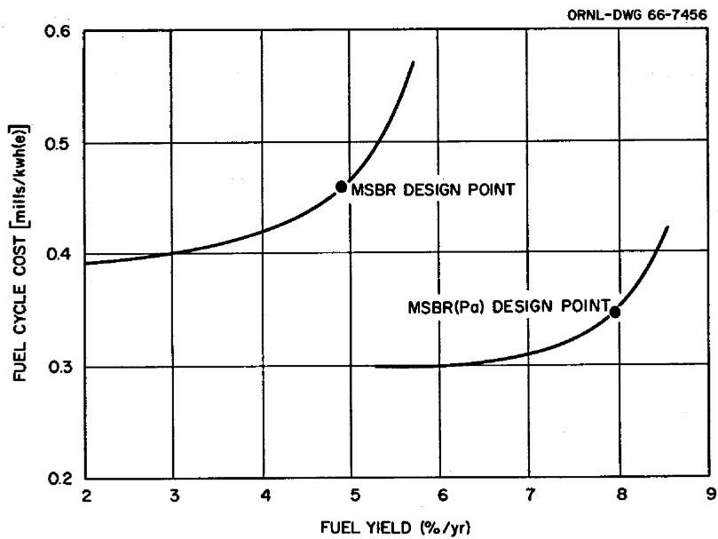  
Fig. 4.l. Variation of Fuel-Cycle Cost with Fuel Yield in MSBR and MSBR(Pa) Concepts.

Table 4.5. MSBR(Pa) Fuel-Cycle Costs for Investor-Owned and Publicly Owned Plants   
Load factor: 0.8   

<table><tr><td rowspan="2">Item</td><td colspan="2">Cost [mill/kwhr(e)]</td></tr><tr><td>Privatea Ownership</td><td>Publicb Ownership</td></tr><tr><td>Fissile-, fertile-, and carrier-salt inventory</td><td>0.188</td><td>0.094</td></tr><tr><td>Replacement cost of fertile and carrier salts</td><td>0.071</td><td>0.071</td></tr><tr><td>Core- and blanket-processing costs</td><td></td><td></td></tr><tr><td>Operation and maintenance</td><td>0.069</td><td>0.069</td></tr><tr><td>Capital costs</td><td>0.124</td><td>0.073</td></tr><tr><td>Bred fuel credit</td><td>(0.105)</td><td>(0.105)</td></tr><tr><td>Net fuel-cycle cost</td><td>0.35</td><td>0.20</td></tr></table>

${}^{a}$ Based on 12%/yr capital charges for processing plant and inventory charges of ${10}\% /\mathrm{{yr}}$ .   
b. Based on $7\%/\mathrm{yr}$ capital charges for processing plant and inventory charges of $5\%/\mathrm{yr}$ .

Load factor: 0.8

Table 4.6. Power-Production Costs of 1000-Mw(e) MSBR(Pa)   

<table><tr><td rowspan="2">Item</td><td colspan="2">Power Cost 
[mills/kwhr(e)]</td></tr><tr><td>Private Financing</td><td>Public Financing</td></tr><tr><td>Fixed charges</td><td></td><td></td></tr><tr><td>Depreciating capital</td><td>1.947</td><td>1.099</td></tr><tr><td>Nondepreciating capital (land plus coolant-salt inventory)</td><td>0.010</td><td>0.005</td></tr><tr><td>Operation and maintenance costs</td><td>0.338</td><td>0.338</td></tr><tr><td>Fuel-cycle cost</td><td>0.348</td><td>0.202</td></tr><tr><td>Power-production cost</td><td>2.64</td><td>1.64</td></tr></table>

Table 4.7. MSBR Power Cost Breakdown into Fixed and Incremental Costs   

<table><tr><td>Item</td><td>PrivateaFinancing</td><td>PublicbFinancing</td></tr><tr><td>Annual fixed charges, $/kwyr</td><td>15.9</td><td>8.90</td></tr><tr><td>Fixed operating costs, c mill/kwhr(e)</td><td>0.38</td><td>0.38</td></tr><tr><td>Total fixed power cost, d mills/kwhr(e)</td><td>2.65</td><td>1.65</td></tr><tr><td>Incremental power cost, e mill/kwhr(e)</td><td>-0.01</td><td>-0.01</td></tr><tr><td>Total power-production cost, mills/kwhr(e)</td><td>2.64</td><td>1.64</td></tr></table>

${}^{a}{12}\% /$ yr fixed charges on reactor plant,including processing plant; ${10}\% /$ yr inventory charge for nondepreciating items.   
b7%/yr fixed charges on reactor plus processing plant; 5%/yr inventory charges for nondepreciating items. Not optimized for changed conditions.   
cThis includes 0.055 mill/kwhr(e) for fixed operating cost of the processing plant.   
Based on 0.8 load factor.   
${}^{\mathrm{e}}$ Incremental cost in going from zero to full-power operation (0.8 load factor); this includes incremental fuel-cycle cost and incremental operating costs.

For comparison, a summary of the power cost and fuel-utilization characteristics of the MSBR(Pa) and the MSBR is given in Table 4.8.

Table 4.8. Comparison of Power-Production Cost and Fuel-Utilization Characteristics of the MSBR(Pa) and the MSBR   

<table><tr><td></td><td colspan="2">MSBR(Pa)</td><td colspan="2">MSBR</td></tr><tr><td>Specific fissile inventory, kg/Mw(e)</td><td colspan="2">0.68</td><td colspan="2">0.77</td></tr><tr><td>Specific fertile inventory, kg/Mw(e)</td><td colspan="2">105</td><td colspan="2">268</td></tr><tr><td>Breeding ratio</td><td colspan="2">1.07</td><td colspan="2">1.05</td></tr><tr><td>Fuel-yield rate, %/yr</td><td colspan="2">7.95</td><td colspan="2">4.86</td></tr><tr><td>Fuel doubling time,a years</td><td colspan="2">12.6</td><td colspan="2">20.6</td></tr><tr><td></td><td>Private Financing</td><td>Public Financing</td><td>Private Financing</td><td>Public Financing</td></tr><tr><td>Capital charges, mills/kwhr(e)</td><td>1.95</td><td>1.10</td><td>1.95</td><td>1.10</td></tr><tr><td>Operating and maintenance cost, mill/kwhr(e)</td><td>0.34</td><td>0.34</td><td>0.34</td><td>0.34</td></tr><tr><td>Fuel-cycle cost,b mill/kwhr(e)</td><td>0.35</td><td>0.20</td><td>0.46</td><td>0.29</td></tr><tr><td>Power-production cost, mills/kwhr(e)</td><td>2.64</td><td>1.64</td><td>2.75</td><td>1.73</td></tr></table>

a. Inverse of the fuel-yield rate.   
Costs of on-site integrated processing plant are included in this value.

# 4.2 Alternative Feedwater Temperature Cycle

The $700^{\circ}\mathrm{F}$ feedwater temperature and the $650^{\circ}\mathrm{F}$ temperature of the "cold" steam to the reheater in the initial design were dictated by the $700^{\circ}\mathrm{F}$ liquidus temperature of the coolant salt. It would be an obvious advantage if it were not necessary to divert almost $30\%$ of the throttle steam for heating of the feedwater and reheat steam, since this diversion leads to a loss of available energy. An even more significant saving could be achieved if the 9.2 Mw(e) of power required to drive the feed-water pressure-booster pumps could be eliminated; also, removal of the reheat-steam preheaters and the booster pumps would reduce capital investment requirements. Thus, savings can be achieved by lowering the

temperature of the steam-cycle fluid entering the boilers and reheaters. To determine the incentive for developing a coolant salt having a low liquidus temperature, the MSBR steam-power cycle was studied with conditions of $580^{\circ}\mathrm{F}$ feedwater temperature and $550^{\circ}\mathrm{F}$ reheat steam. In order to differentiate and compare cases, use of $700^{\circ}\mathrm{F}$ feedwater and $650^{\circ}\mathrm{F}$ reheat steam is designated case A, while case B represents the alternative conditions.

The cycle arrangement for the case B conditions is shown in Fig. 4.2. In this cycle the $552^{\circ}\mathrm{F}$ steam from the high-pressure turbine exhaust is introduced into the reheaters without preheating. The feedwater is heated from 550 to $580^{\circ}\mathrm{F}$ by the addition of one more stage of feedwater heating; steam extracted from the high-pressure turbine is used. The condensate from this new heater is cascaded back through the feedwater heaters to thedeaerating heater in the usual manner. The heat balances and the analysis of the steam cycle with case B conditions were performed in the same manner as for case A conditions.[24] Table 4.9 compares the design data for the two cases.

The elimination of the feedwater pressure-booster pumps required in case A saves about 9.2 Mw(e) of auxiliary power, which, together with the improvement in the cycle thermal efficiency due to the additional stage of feedwater regeneration, makes about 9.7 Mw(e) additional power available from the case B cycle. The overall net thermal efficiency is thus improved from the $44.9\%$ obtained from case A to $45.4\%$ in case B.

The cost estimates for the MSBR steam station are given in detail in Section 3.11 for case A. To complete the discussion of case A versus case B conditions, the cost estimates for the affected items of equipment were compared; the results are summarized in Table 4.10. As shown, the case B arrangement requires about $465,000 less capital expenditure, primarily due to removal of the pressure-booster pumps.*

The net effect of changing from case A to case B conditions, assuming that inexpensive coolant salt is available for both cases, is to increase

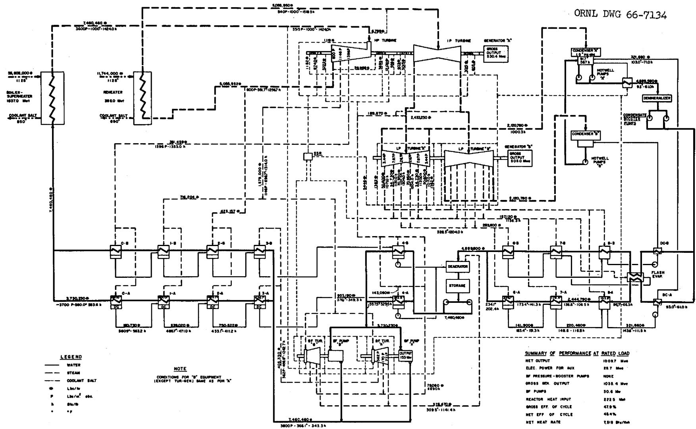  
Fig. 4.2. Alternate Steam System Flowsheet for $580^{\circ}\mathrm{F}$ Feedwater.

Table 4.9. MSBR Steam-Power Steam Design and Performance Data for Case A and Case B Conditions   

<table><tr><td></td><td>Case A - MSBR Steam Cycle with 700°F Feedwater</td><td>Case B - MSBR Alternative Steam Cycle with 580°F Feedwater</td></tr><tr><td colspan="3">General performance</td></tr><tr><td>Reactor heat input, Mw</td><td>2225</td><td>2225</td></tr><tr><td>Net electrical output, Mw</td><td>1000</td><td>1009.7</td></tr><tr><td>Gross electrical generation, Mw</td><td>1034.9</td><td>1035.4</td></tr><tr><td>Station auxiliary load, Mw(e)</td><td>25.7</td><td>25.7</td></tr><tr><td>Boiler-feedwater pressure-booster pump load, Mw(e)</td><td>9.2</td><td>None</td></tr><tr><td>Boiler-feedwater pump steam-turbine power output, Mw</td><td>29.3</td><td>30.6</td></tr><tr><td>Flow to turbine throttle, lb/hr</td><td>7.152 × 10^6</td><td>7.460 × 10^6</td></tr><tr><td>Flow from superheater, lb/hr</td><td>10.068 × 10^6</td><td>7.460 × 10^6</td></tr><tr><td>Gross efficiency</td><td>47.83</td><td>47.91</td></tr><tr><td>Gross heat rate, Btu/kwhr</td><td>7136</td><td>7124</td></tr><tr><td>Net efficiency, %</td><td>44.9</td><td>45.4</td></tr><tr><td>Net heat rate, Btu/kwhr</td><td>7601</td><td>7518</td></tr><tr><td colspan="3">Boiler-superheaters</td></tr><tr><td>Number of units</td><td>16</td><td>16</td></tr><tr><td>Total duty, Mw(th)</td><td>1931.5</td><td>1837.0</td></tr><tr><td>Total steam capacity, lb/hr</td><td>10.068 × 10^6</td><td>7.460 × 10^6</td></tr><tr><td>Temperature of inlet feedwater, °F</td><td>700</td><td>580</td></tr><tr><td>Enthalpy of inlet feedwater, Btu/lb</td><td>769.2</td><td>583.6</td></tr><tr><td>Pressure of inlet feedwater, psia</td><td>~3800</td><td>~3800</td></tr><tr><td>Temperature of exit steam, °F</td><td>1003</td><td>1003</td></tr><tr><td>Pressure of exit steam, psia</td><td>~3600</td><td>~3600</td></tr><tr><td>Enthalpy of exit steam, Btu/lb</td><td>1424.0</td><td>1424.0</td></tr><tr><td>Temperature of inlet coolant salt, °F</td><td>1125</td><td>1125</td></tr><tr><td>Temperature of exit coolant salt, °F</td><td>850</td><td>850</td></tr><tr><td>Average specific heat of coolant salt, Btu/lb·°F</td><td>0.41</td><td>0.41</td></tr><tr><td>Total coolant-salt flow</td><td></td><td></td></tr><tr><td>lb/hr</td><td>58.468 × 10^6</td><td>55.608 × 10^6</td></tr><tr><td>cfs</td><td>129.93</td><td>123.57</td></tr><tr><td>gpm</td><td>58,316</td><td>55,463</td></tr><tr><td colspan="3">Steam reheaters</td></tr><tr><td>Number of units</td><td>8</td><td>8</td></tr><tr><td>Total duty, Mw(th)</td><td>293.5</td><td>388.0</td></tr><tr><td>Total steam capacity, lb/hr</td><td>5.134 × 10^6</td><td>5.056 × 10^6</td></tr><tr><td>Temperature of inlet steam, °F</td><td>650</td><td>551.7</td></tr><tr><td>Pressure of inlet steam, psia</td><td>~570</td><td>~600</td></tr><tr><td>Enthalpy of inlet steam, Btu/lb</td><td>1323.5</td><td>1256.7</td></tr><tr><td>Temperature of exit steam, °F</td><td>1000</td><td>1000</td></tr><tr><td>Pressure of exit steam, psia</td><td>~540</td><td>~540</td></tr><tr><td>Enthalpy of exit steam, Btu/lb</td><td>1518.5</td><td>1518.5</td></tr><tr><td>Temperature of inlet coolant salt, °F</td><td>1125</td><td>1125</td></tr><tr><td>Temperature of exit coolant salt, °F</td><td>850</td><td>850</td></tr><tr><td>Average specific heat of coolant salt, Btu/lb·°F</td><td>0.41</td><td>0.41</td></tr><tr><td>Total coolant-salt flow</td><td></td><td></td></tr><tr><td>lb/hr</td><td>8.884 × 10^6</td><td>11.744 × 10^6</td></tr><tr><td>cfs</td><td>19.742</td><td>26.098</td></tr><tr><td>gpm</td><td>8861</td><td>11,714</td></tr><tr><td>Coolant salt pressure drop, inlet to outlet, psi</td><td>~60</td><td>~60</td></tr><tr><td colspan="3">Reheat-steam preheater</td></tr><tr><td>Number of units</td><td>8</td><td>None</td></tr><tr><td>Total duty, Mw(th)</td><td>100.45</td><td></td></tr><tr><td>Total heated steam capacity, lb/hr</td><td>5.134 × 10^6</td><td></td></tr><tr><td>Inlet temperature of heated steam, °F</td><td>551.7</td><td></td></tr><tr><td>Exit temperature of heated steam, °F</td><td>650</td><td></td></tr><tr><td>Inlet pressure of heated steam, psia</td><td>~580</td><td></td></tr><tr><td>Exit pressure of heated steam, psia</td><td>~570</td><td></td></tr><tr><td>Inlet enthalpy of heated steam, Btu/lb</td><td>1256.7</td><td></td></tr><tr><td>Exit enthalpy of heated steam, Btu/lb</td><td>1323.5</td><td></td></tr><tr><td>Total heating steam, lb/hr</td><td>2.915 × 10^6</td><td></td></tr><tr><td>Inlet temperature of heating steam, °F</td><td>1000</td><td></td></tr><tr><td>Exit temperature of heating steam, °F</td><td>866</td><td></td></tr><tr><td>Inlet pressure of heating steam, psia</td><td>3515</td><td></td></tr><tr><td>Exit pressure of heating steam, psia</td><td></td><td></td></tr><tr><td colspan="3">Boiler-feedwater pumps</td></tr><tr><td>Number of units</td><td>2</td><td>2</td></tr><tr><td colspan="3">Centrifugal pumps</td></tr><tr><td>Number of stages</td><td>6</td><td>6</td></tr><tr><td>Feedwater flow rate, lb/hr total</td><td>7152 × 10^6</td><td>7460 × 10^6</td></tr><tr><td>Required capacity, gpm</td><td>8060</td><td>8408</td></tr><tr><td>Head, ft</td><td>~9380</td><td>~9380</td></tr><tr><td>Speed, rpm</td><td>5000</td><td>5000</td></tr><tr><td>Water inlet temperature, °F</td><td>357.5</td><td>357.5</td></tr><tr><td>Water inlet enthalpy, Btu/lb</td><td>329.5</td><td>329.5</td></tr><tr><td>Water inlet specific volume, ft^3/lb</td><td>~0.01808</td><td>~0.01808</td></tr><tr><td colspan="3">Steam-turbine drive</td></tr><tr><td>Power required at rated flow, Mw (each)</td><td>14.66</td><td>15.30</td></tr><tr><td>Power, nominal hp (each)</td><td>20,000</td><td>20,000</td></tr><tr><td>Throttle steam conditions, psia/°F</td><td>1070/700</td><td>1070/700</td></tr><tr><td>Throttle flow, lb/hr (each)</td><td>413,610</td><td>431,400</td></tr><tr><td>Exhaust pressure, psia</td><td>~77</td><td>~77</td></tr><tr><td>Number of stages</td><td>8</td><td>8</td></tr><tr><td>Number of extraction points</td><td>3</td><td>3</td></tr><tr><td colspan="3">Boiler-feedwater pressure-booster pump</td></tr><tr><td>Number of units</td><td>2</td><td>None</td></tr><tr><td colspan="3">Centrifugal pump</td></tr><tr><td>Feedwater flow rate, lb/hr total</td><td>10.067 × 10^6</td><td></td></tr><tr><td>Required capacity, gpm (each)</td><td>9500</td><td></td></tr><tr><td>Head, ft</td><td>~1413</td><td></td></tr><tr><td>Water,inlet temperature, °F</td><td>695</td><td></td></tr><tr><td>Water inlet pressure, psia</td><td>~3500</td><td></td></tr><tr><td>Water inlet specific volume, ft^3/lb</td><td>~0.03020</td><td></td></tr><tr><td>Water outlet temperature, °F</td><td>~700</td><td></td></tr><tr><td colspan="3">Electric-motor drive</td></tr><tr><td>Power required at rated flow, Mw (each)</td><td>4.587</td><td></td></tr><tr><td>Power, nominal hp (each)</td><td>6150</td><td></td></tr></table>

the thermal efficiency from 44.9 to 45.4% and to reduce construction costs by about $465,000. The lower construction cost reduces power costs by about 0.008 mill/kwhr(e), while the increased efficiency lowers power cost by about 0.026 mill/kwhr(e) (private financing), to give a total saving of about 0.034 mill/kwhr(e) [0.021 mill/kwhr(e) for public financing]. This saving in a 1000-Mw(e) plant (0.8 load factor) corresponds to about $238,000 per year. The present worth (6% discount factor) of this saving over a 25-year period is about $1.5 million. For several MSBR power plants, the saving would be proportionally greater. Thus, there is an economic incentive for developing a coolant salt with a low liquidus temperature so long as its inventory cost does not outweigh the potential saving. If the inventory cost of the coolant salt for case B were about $2.4 million more than that for case A, the potential saving would be

Table 4.10. Cost Comparison of $700^{\circ}\mathrm{F}$ and $580^{\circ}\mathrm{F}$ Feedwater Cycles for MSBRa   

<table><tr><td></td><td>Number of Units</td><td>Case A - 700°F Feedwater</td><td>Case B - 580°F Feedwater</td></tr><tr><td>Feedwater pressure-booster pumps</td><td>2</td><td>$ 400,000</td><td>None</td></tr><tr><td>Reheat-steam preheaters</td><td>8</td><td>180,000</td><td>None</td></tr><tr><td>Special mixing tee</td><td></td><td>5,000</td><td>None</td></tr><tr><td>Feedwater heater No. 0b</td><td></td><td>None</td><td>$ 150,000</td></tr><tr><td>Charge for extra extraction nozzle on turbine for heater No. 0</td><td></td><td>None</td><td>45,000</td></tr><tr><td>Boiler-superheaters</td><td>16</td><td>6,000,000c</td><td>5,900,000d</td></tr><tr><td>Reheaters</td><td>8</td><td>2,720,000e</td><td>2,880,000</td></tr><tr><td></td><td></td><td>$9,305,000</td><td>$8,975,000</td></tr><tr><td>Cost differential</td><td></td><td></td><td></td></tr><tr><td>Direct construction cost</td><td></td><td>$ 330,000</td><td></td></tr><tr><td>Total construction costf</td><td></td><td>$ 465,000</td><td></td></tr></table>

aTable shows only those costs different in the two cycle arrangements and is not a complete listing of the turbine plant costs.   
bThe high-pressure feedwater heater added in case B was designated "No. 0" in order not to disturb the heater numbers used in case A.   
Estimated on basis of $130/ft².   
Estimated on basis of $140/ft².   
Estimated on basis of $125/ft².   
fIndirect costs were assumed to be $41\%$ of the direct costs.

cancelled by the increased coolant-salt inventory cost (for a privately owned plant).

# 4.3 Modular-Type Plant

An important factor in low power costs is the ability of the power plant to maintain a high plant-availability factor. Thus design features

that can improve this factor are desirable if these features do not themselves introduce compensating disadvantages.

A feature of the MSBR plant design is the use of four heat exchanger circuits in conjunction with one reactor vessel in such a manner that if one pump in the fuel circuit stops, the reactor is effectively shut down. If, on the other hand, it were practicable to have four separate reactor circuits, with each connected to one of the four heat exchanger circuits, stoppage of a fuel pump would shut down only one-quarter of the station capacity, leaving $75\%$ available for power production. In order to determine the practicality of using a number of reactors in a single 1000-Mw(e) station, the design features of a modular-type MSBR plant, termed MMSBR, were investigated.

The MMSBR design concept considers four separate and identical reactors, along with their separate salt circuits. The only connections of the four reactors are through the fuel-recycle plant. The designs of the heat exchangers, the coolant-salt circuits, and the steam-power cycle remain essentially as for the MsBR. Each reactor module generates thermal power equivalent to that required for producing 250 Mw(e) net.

The flow diagram given previously for the MSBR (Fig. 3.7) also is essentially valid for the MMSBR. Salt flow rates and capacities of the various components remain as in the MSBR design.

Figures 4.3 and 4.4 give plan and elevation views of the four distinct reactor cells, along with their adjacent steam-generating cells. Any reactor module can be shut down and serviced while the other three remain operating.

The reactor core consists of 210 graphite fuel cells operating in parallel within the reactor tank. The design of the graphite tubes separating the fuel and blanket salts is similar to that used in the MSBR. The reactor core region is cylindrical with a diameter of about 6.3 ft and a height of about 7.9 ft. The reactor vessel is approximately 12 ft in diameter and about 14 ft high. Except for the use of four reactor vessels instead of one, all design features of the MMSBR are similar to those of the MSBR. The design conditions associated with one reactor module are summarized in Table 4.11.

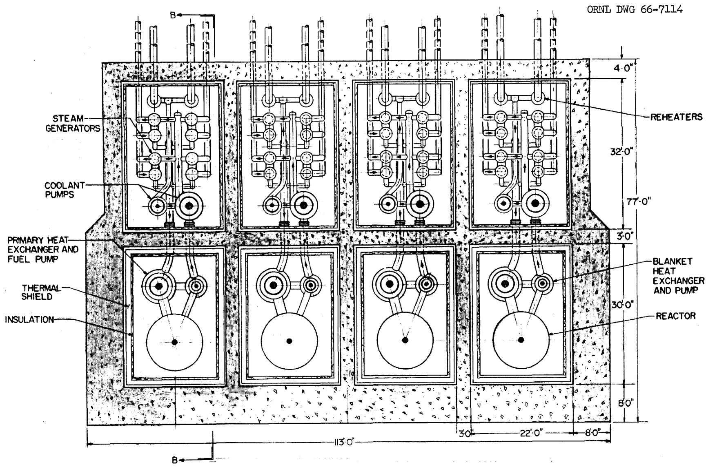  
Fig. 4.3. Modular Plant Reactor Cell - Plan AA.

Fig. 4.4. Modular Plant Reactor Cell - Elevation BB.   
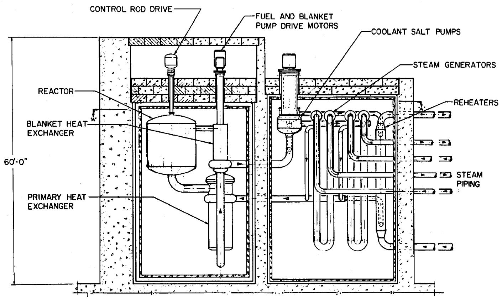  
ORNL DWG 66-7115

Table 4.11. MMSBR Design Conditions for One Module   

<table><tr><td colspan="2">Power generation</td></tr><tr><td>Thermal</td><td>556</td></tr><tr><td>Electrical</td><td>250</td></tr><tr><td>Thermal efficiency</td><td>45</td></tr><tr><td>Plant factor</td><td>0.80</td></tr><tr><td>Dimensions, ft</td><td></td></tr><tr><td>Core</td><td></td></tr><tr><td>Height</td><td>7.87</td></tr><tr><td>Diameter</td><td>6.3</td></tr><tr><td>Blanket thickness</td><td></td></tr><tr><td>Radial</td><td>2</td></tr><tr><td>Axial</td><td>2</td></tr><tr><td>Reflector thickness</td><td>0.5</td></tr><tr><td>Reactor volumes, ft3</td><td></td></tr><tr><td>Core</td><td>245</td></tr><tr><td>Blanket</td><td>1000</td></tr><tr><td>Salt volumes, ft3</td><td></td></tr><tr><td>Fuel</td><td></td></tr><tr><td>Core</td><td>41.5</td></tr><tr><td>Blanket</td><td>7</td></tr><tr><td>Plena</td><td>22</td></tr><tr><td>Piping</td><td>25</td></tr><tr><td>Heat exchanger and pump</td><td>82</td></tr><tr><td>Processing</td><td>7.5</td></tr><tr><td>Total</td><td>185</td></tr><tr><td>Fertile</td><td></td></tr><tr><td>Core</td><td>12</td></tr><tr><td>Blanket</td><td>1000</td></tr><tr><td>Heat exchanger and piping</td><td>25</td></tr><tr><td>Processing</td><td>24</td></tr><tr><td>Total</td><td>1061</td></tr><tr><td>Salt compositions, mole %</td><td></td></tr><tr><td>Fuel</td><td></td></tr><tr><td>7LiF</td><td>63.6</td></tr><tr><td>BeF2</td><td>36.2</td></tr><tr><td>UF4(fissile)</td><td>0.22</td></tr><tr><td>Fertile</td><td></td></tr><tr><td>7LiF</td><td>71</td></tr><tr><td>BeF2</td><td>2</td></tr><tr><td>ThF4</td><td>27</td></tr><tr><td>Average power density in core fuel salt, kw/liter</td><td>473</td></tr></table>

The nuclear and fuel-cycle performance of a four-module plant generating 1000 Mw(e) was studied both for protactinium removal from the blanket stream and for the case of no direct protactinium removal. The same methods and bases as those for the MSBR studies were employed. Analogous to previous terminology, these cases are termed MMSBR(Pa) and MMSBR. The results obtained are summarized in Table 4.12. Comparison with the results obtained for the MSBR(Pa) and the MSBR indicates that the nuclear and fuel-cycle performance of a modular-type plant compares favorably with that of a single-reactor-type plant; the modular plant tends to have slightly higher breeding ratio, fissile inventory, and fuel-cycle cost.

Table 4.12. Nominal Nuclear and Fuel-Cycle Performance of 1000-Mw(e) Modular Plants   
Investor-owned plant: 0.8 load factor   

<table><tr><td></td><td>MMSBR(Pa)</td><td>MMSBR</td></tr><tr><td>Fuel yield, % per year</td><td>7.3</td><td>5.0</td></tr><tr><td>Breeding ratio</td><td>1.073</td><td>1.053</td></tr><tr><td>Specific fissile inventory, kg/Mw(e)</td><td>0.76</td><td>0.80</td></tr><tr><td>Specific fertile inventory, kg/Mw(e)</td><td>125</td><td>310</td></tr><tr><td>Fuel-cycle cost, mill/kwhr(e)</td><td>0.38</td><td>0.48</td></tr><tr><td>Doubling time, yra</td><td>13.7</td><td>20</td></tr></table>

aInverse of fractional fuel yield per year.

Capital cost estimates were also made for the modular plant. The primary difference between the MMSBR and MSBR-type plants is the use of four reactor vessels and cells in the modular plant rather than the one in the MSBR. However, the reactor vessels in the modular plant are smaller, and their combined cost is not much more than that of the single large vessel. Also, the modular plant permits better placement of cells and a reduction in building volume. The resultant capital cost estimate for the modular plant was essentially the same as that obtained for the single-reactor plant. Using a cost estimate of $112/kw(e) for a privately owned plant, along with the MSBR estimate for operation and maintenance costs, and the fuel-cycle costs from Table 4.12 gives the power-generation

costs summarized in Table 4.13. These costs are virtually the same as those for the MSBR-type plants (see Table 4.8) and thus indicate the desirability of a modular-type plant if the plant availability factor is improved by its use.

Investor-owned plant: 0.8 plant factor

Table 4.13. Power-Production Costs for Modular-Type Molten-Salt Breeder Reactors   

<table><tr><td></td><td colspan="2">Cost [mills/kwhr(e)]</td></tr><tr><td></td><td>MMSBR(Pa)</td><td>MMSBR</td></tr><tr><td>Fixed charges</td><td>1.93</td><td>1.93</td></tr><tr><td>Operation and maintenance costs</td><td>0.34</td><td>0.34</td></tr><tr><td>Fuel-cycle costsa</td><td>0.38</td><td>0.48</td></tr><tr><td>Total power-production costs</td><td>2.65</td><td>2.75</td></tr></table>

aCapital charges of processing plant are included in fuel-cycle costs.

# 4.4 Additional Design Changes

In reactor design studies it often occurs that certain features of the detailed design undergo changes as more understanding is obtained of the overall problems and as new ways are discovered to solve a given design problem. Such changes have taken place during the MSBR design studies; of these, the most important are those associated with the primary heat exchanger designs and the pressures that exist in the various circulating-salt systems. The revised design conditions are discussed below.

An objectional feature of the MSBR heat exchanger design shown in Fig. 3.20 is the use of expansion bellows at the bottom of the exchanger. These bellows permit tubes in the central portion of the exchanger to change in length relative to those in the annular region due to thermal

conditions. Since such bellows may be impractical to use under reactor operating conditions, a new design was developed that eliminated them.

Figure 4.5 shows the revised heat exchanger design. The expansion bellows were eliminated, and changes in the tube lengths due to thermal conditions are accommodated by the use of sine-wave type of construction, which permits each tube to adjust to thermal changes. In addition, the coolant salt now enters the heat exchanger through an annular volute at the top and passes downward through a baffled outer annular region. The coolant then passes upward through a baffled inner annular region and exits through a central pipe.

In Fig. 4.5, the flow of fuel salt through the pump is reversed from that shown in Fig. 3.20 in order to reduce the pressure in the graphite fuel tubes. Fuel salt enters the heat exchanger in the inner annular region, passes downward through the tubes, and then flows upward through the tubes in the outer annular region before entering the reactor.

The blanket-salt heat exchanger was also revised to give a design similar to that of Fig. 4.5. The general features of these exchangers and their placement in the reactor cell are shown in Fig. 4.6 (for comparison with the initial MSBR design see Fig. 3.8). The blanket-salt pump was also altered so that blanket salt leaving the reactor now enters the suction side of the pump.

From the viewpoint of reactor safety, it is important that the blanket salt be at a higher pressure than the fuel salt.[29] Under such circumstances, rupture of a fuel tube would result in leakage of fertile salt into the fuel and a reduction in reactivity. In order to achieve this condition with a minimum operating pressure in the reactor vessel, the fluid flow was reversed from that in the initial MSBR design, with fluid leaving the reactor entering the suction side of the pumps. The resulting flow diagram is shown in Fig. 4.7 (for comparison with initial design see Fig. 3.7).

In addition, it is desirable that any leakage between the reactor fluid and coolant-salt systems be from the coolant system into the fuel or blanket system. In order to achieve these conditions, the MSBR operating pressures were revised to those shown in Table 4.14.

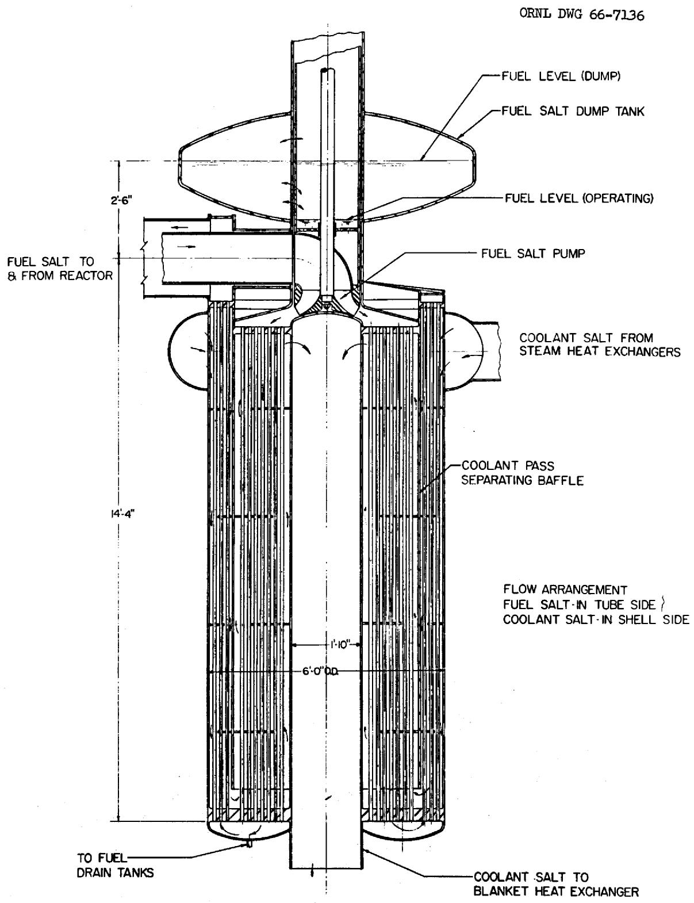  
Fig. 4.5. Revised Fuel Heat Exchanger for MSBR.

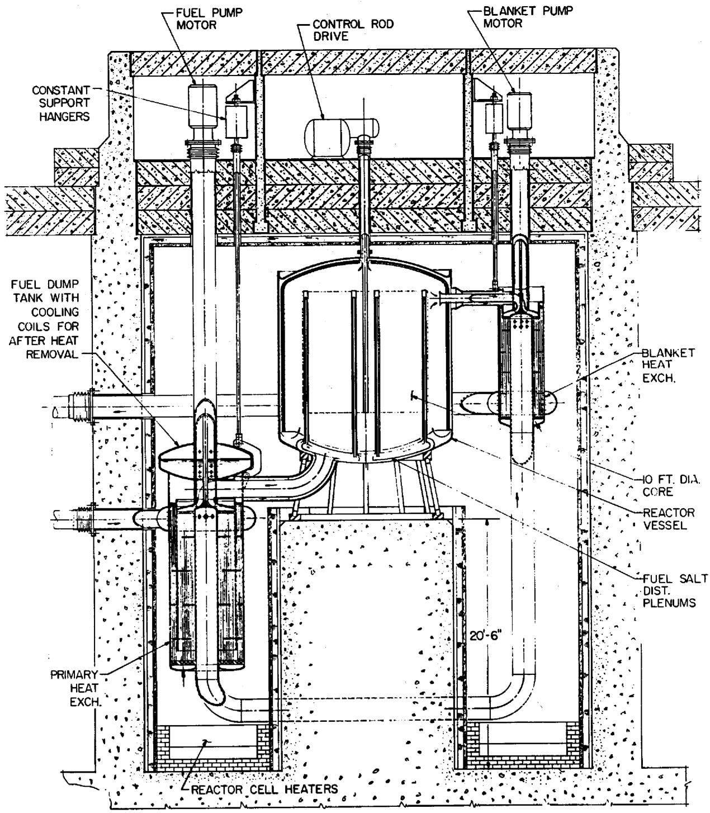  
Fig. 4.6. MSBR Cell Elevation Showing Primary Heat Exchangers and Their Placement.

ORNL DWG 66-7022

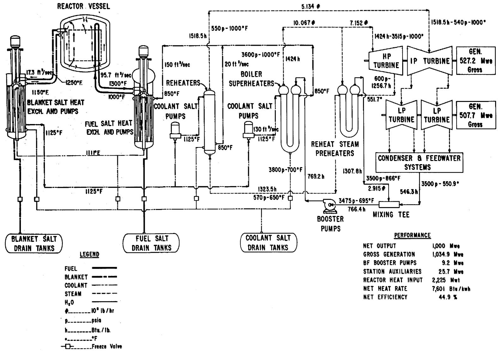  
Fig. 4.7. Revised MSBR Flow Diagram.

Flow diagram given in Fig. 4.7

Table 4.14. Pressures in Various Parts of Revised MSBR Salt Circuits   

<table><tr><td>Location</td><td>Nominal Pressure (psig)</td></tr><tr><td>Fuel-salt system</td><td></td></tr><tr><td>Core entrance</td><td>50</td></tr><tr><td>Core exit</td><td>25</td></tr><tr><td>Pump suction</td><td>10</td></tr><tr><td>Pump outlet</td><td>150</td></tr><tr><td>Heat exchanger outlet</td><td>60</td></tr><tr><td>Blanket-salt system</td><td></td></tr><tr><td>Blanket entrance</td><td>66</td></tr><tr><td>Blanket exit</td><td>65</td></tr><tr><td>Pump suction</td><td>64</td></tr><tr><td>Pump outlet</td><td>155</td></tr><tr><td>Heat exchanger outlet</td><td>67</td></tr><tr><td>Coolant-salt system</td><td></td></tr><tr><td>Pump suction before boiler-superheaters</td><td>130</td></tr><tr><td>Pump outlet before boiler-superheaters</td><td>280</td></tr><tr><td>Inlet to fuel heat exchangers</td><td>220</td></tr><tr><td>Outlet from fuel heat exchangers</td><td>160</td></tr><tr><td>Outlet-inlet to blanket heat exchangers</td><td>142</td></tr><tr><td>Pump suction before reheaters</td><td>130</td></tr><tr><td>Pump outlet before reheaters</td><td>240</td></tr><tr><td>Reheater outlet</td><td>220</td></tr></table>

As given in Table 4.14, the minimum pressure difference between the core and blanket regions is about 15 psi plus the static head differential or a minimum total difference of about 30 psi. If it is desirable to increase this pressure differential, the blanket-salt pump could be changed so that it discharges into the reactor blanket region, giving a minimum differential pressure between the core and blanket fluids of about 120 psi. Whether this change is necessary or whether it would increase the reactor vessel design pressure is dependent upon the safety criteria that need to be satisfied. A design pressure of 150 psia was used in determining the thickness of the MSBR reactor vessel.

# 5. ALTERNATIVE MOLTEN-SALT REACTOR DESIGNS

A number of possible molten-salt reactor designs were considered, and some of these are discussed below. Generally, the alternative designs were studied only in concept and not in detail, so the results are more qualitative than those given previously. Also, the technology required for these alternative designs is relatively undeveloped, although there are experimental data which support the feasibility of each concept. An exception is the molten-salt converter reactor (designated MSCR), which was studied in detail by Alexander et al.[30] and whose application essentially requires only scaleup of MSRE and associated fuel-processing technology. However, the MSCR is not a breeder, although it approaches a break-even breeder system. It is included to place molten-salt breeders and converters in perspective relative to nuclear performance, fuel-cycle cost, and power-production cost.

The terminology employed for each design concept will be discussed first, along with a summary of the associated design conditions and fuel-cycle performance. Additional information for each concept is given in individual sections below. In all cases, a 1000-Mw(e) power plant is considered.

The designations MSBR(Pa) and MSBR have the same meanings as before and represent the reference breeder reactor design with and without direct protactinium removal from the blanket stream, respectively. The MMSBR(Pa) designation also has the same meaning as before and represents the modular version of the MSBR(Pa). These concepts were presented above and are included here for completeness.

The MSBR(Pa-Pb) designation refers to the MSBR(Pa) modified by use of direct-contact cooling of the molten-salt fuel by molten lead. Lead is immiscible with molten salt and can be used as a heat exchange medium within the reactor vessel to significantly lower the fissile inventory external to the reactor. The lead also serves as a heat transport medium between the reactor and the steam generators.

The SSCB(Pa) designation refers to a Single-Stream-Core Breeder with direct protactinium removal from the fuel stream. This is essentially a single-region reactor having fissile and fertile material in the fuel

stream, with protactinium removal from this stream; in addition, the core region is enclosed within a thin metal membrane and is surrounded by a blanket of thorium-containing salt. Nearly all the breeding takes place in the large core, and the blanket "catches" only the relatively small fraction of neutrons that "leak" from the core (this concept is also referred to as the one-and-one-half region reactor).

The MOSEL(Pa-Pb) designation refers to a MOLten-Salt Epithermal breeder having an intermediate-to-fast-energy spectrum, with direct protactinium removal from the fuel stream and direct-contact cooling of the fuel region by molten lead. No graphite is present in the core of this reactor.

The MSCR refers to a Molten-Salt Converter Reactor which has the fertile and fissile material in a single stream. No blanket region is employed, although a graphite reflector surrounds the large core.

The design conditions and fuel-cycle performance for the above-mentioned reactor concepts are summarized in Table 5.1; in all cases the methods, analysis procedures, and economic conditions employed were analogous to those used in obtaining the reference MSBR design conditions. In general, fuel recycling was based on fluoride volatility and vacuum distillation processing; direct protactinium removal from the reactor system was also considered in specified cases.

# 5.1 MSBR(Pa-Pb) Concept

The MSBR(Pa-Pb) concept is essentially identical to the MSBR(Pa) concept, except that heat is removed from the fuel salt by direct contact with circulating molten lead. The lead is pumped in a circuit external to the reactor and transports the reactor energy to the steam-generating equipment; the circulating-lead circuit takes the place of the coolant-salt circuit used in the MSBR design.

A conceptual arrangement for this reactor is shown in Fig. 5.1. The lead is discharged through many jet pumps located under the reactor core; the aspirating action of the jet pumps causes circulation of fuel salt through the fuel tubes of the reactor. To effect this action, each inner fuel tube terminates below the core in a venturi head; lead, flowing

Table 5.1. Summary of Design Conditions and Fuel-Cycle Performance for Reactor Designs Studied   

<table><tr><td rowspan="2">Design Conditions</td><td colspan="7">Reactor Designationa</td></tr><tr><td>MSBR(Pa)</td><td>MSBR</td><td>MMSBR(Pa)</td><td>MSBR(Pa-Pb)</td><td>SSCB(Pa)</td><td>MOSEL(Pa-Pb)</td><td>MSCR</td></tr><tr><td>Dimensions, ft</td><td></td><td></td><td></td><td></td><td></td><td></td><td></td></tr><tr><td>Core</td><td></td><td></td><td></td><td></td><td></td><td></td><td></td></tr><tr><td>Height</td><td>12.5</td><td>12.5</td><td>7.9b</td><td>12.5</td><td>16.0</td><td>3.0c</td><td>20.8</td></tr><tr><td>Diameter</td><td>10.0</td><td>10.0</td><td>6.3b</td><td>10.0</td><td>9.8</td><td>6.5c</td><td>16.6</td></tr><tr><td>Blanket thickness</td><td></td><td></td><td></td><td></td><td></td><td></td><td></td></tr><tr><td>Radial</td><td>1.5</td><td>1.5</td><td>2.0</td><td>1.5</td><td>1.2</td><td>3.0</td><td></td></tr><tr><td>Axial</td><td>2.0</td><td>2.0</td><td>2.0</td><td>2.0</td><td>0.0</td><td></td><td></td></tr><tr><td>Volume fractions, core</td><td></td><td></td><td></td><td></td><td></td><td></td><td></td></tr><tr><td>Fuel</td><td>0.169</td><td>0.169</td><td>0.17</td><td>0.169</td><td>0.193</td><td>0.5</td><td>0.105</td></tr><tr><td>Fertile</td><td>0.073</td><td>0.074</td><td>0.05</td><td>0.076</td><td>0.0</td><td>0.0</td><td>0.0</td></tr><tr><td>Moderator</td><td>0.758</td><td>0.757</td><td>0.78</td><td>0.755</td><td>0.807</td><td>0.0</td><td>0.895</td></tr><tr><td>Salt volumes, ft3</td><td></td><td></td><td></td><td></td><td></td><td></td><td></td></tr><tr><td>Fuel</td><td></td><td></td><td></td><td></td><td></td><td></td><td></td></tr><tr><td>Core</td><td>166</td><td>166</td><td>166</td><td>166</td><td>230</td><td>63.5</td><td>476</td></tr><tr><td>External</td><td>551</td><td>547</td><td>574</td><td>110</td><td>600</td><td>0.7</td><td>654</td></tr><tr><td>Total</td><td>717</td><td>713</td><td>740</td><td>276</td><td>830</td><td>64.2</td><td>1130</td></tr><tr><td>Fertile, total</td><td>1317</td><td>3383</td><td>1570</td><td>1324</td><td>983</td><td>758</td><td>0.0</td></tr></table>

aSee text for explanation of reactor designations.   
bThe core dimensions for this case refer to one module of a four-module station.   
cFor this case, the core had annular geometry; the fuel annulus inside diameter was 3 ft, and the outside diameter was 6.5 ft.

Table 5.1 (continued)   

<table><tr><td rowspan="2">Design Conditions</td><td colspan="7">Reactor Designationa</td></tr><tr><td>MSBR(Pa)</td><td>MSBR</td><td>MMSBR(Pa)</td><td>MSBR(Pa-Pb)</td><td>SSCB(Pa)</td><td>MOSEL(Pa-Pb)</td><td>MSCR</td></tr><tr><td>Fuel-salt composition, mole %</td><td></td><td></td><td></td><td></td><td></td><td></td><td></td></tr><tr><td>LiF</td><td>63.6</td><td>63.6</td><td>63.6</td><td>63.6</td><td>71.0</td><td>71.0</td><td>70.0</td></tr><tr><td>BeF2</td><td>36.2</td><td>36.2</td><td>36.2</td><td>36.2</td><td>20.1</td><td>0.0</td><td>13.0</td></tr><tr><td>ThF4</td><td>0.0</td><td>0.0</td><td>0.0</td><td>0.0</td><td>8.68</td><td>24.0</td><td>16.55</td></tr><tr><td>UF4(fissile)</td><td>0.22</td><td>0.23</td><td>0.21</td><td>0.23</td><td>0.23</td><td>5.0</td><td>0.45</td></tr><tr><td>Core atom ratios</td><td></td><td></td><td></td><td></td><td></td><td></td><td></td></tr><tr><td>Th/U</td><td>41.7</td><td>39.7</td><td>28.4</td><td>41.5</td><td>37.7</td><td>4.76</td><td>36.7</td></tr><tr><td>C/U</td><td>5800</td><td>5440</td><td>5980</td><td>5520</td><td>6280</td><td>0.0</td><td>6525</td></tr><tr><td>Power density, core average, kw/liter</td><td></td><td></td><td></td><td></td><td></td><td></td><td></td></tr><tr><td>Gross</td><td>80</td><td>80</td><td>80</td><td>80</td><td>66</td><td>618</td><td>17</td></tr><tr><td>In fuel salt</td><td>473</td><td>473</td><td>473</td><td>473</td><td>341</td><td>1236</td><td>165</td></tr><tr><td>Neutron flux, core average, neutrons/cm2·sec</td><td></td><td></td><td></td><td></td><td></td><td></td><td></td></tr><tr><td>Thermal</td><td>7.2 × 1014</td><td>6.7 × 1014</td><td>7.3 × 1014</td><td>6.8 × 1014</td><td>6.1 × 1014</td><td>0.0 × 1014</td><td>1.9 × 1014</td></tr><tr><td>Fast</td><td>12.1 × 1014</td><td>12.1 × 1014</td><td>11.7 × 1014</td><td>12.1 × 1014</td><td>10.0 × 1014</td><td>72.2 × 1014</td><td>2.7 × 1014</td></tr><tr><td>Fast, over 100 kev</td><td>3.1 × 1014</td><td>3.1 × 1014</td><td>3.0 × 1014</td><td>3.1 × 1014</td><td>2.6 × 1014</td><td>23.3 × 1014</td><td>0.7 × 1014</td></tr><tr><td>Neutron production per fissile absorption (ηc)</td><td>2.227</td><td>2.221</td><td>2.229</td><td>2.226</td><td>2.226</td><td>2.280</td><td>2.201</td></tr><tr><td>Nuclear and fuel-cycle performance</td><td></td><td></td><td></td><td></td><td></td><td></td><td></td></tr><tr><td>Fuel yield, % per year</td><td>7.95</td><td>4.86</td><td>7.31</td><td>17.3</td><td>6.63</td><td>10.3</td><td></td></tr><tr><td>Breeding ratio</td><td>1.07</td><td>1.05</td><td>1.07</td><td>1.08</td><td>1.06</td><td>1.14</td><td>0.96</td></tr><tr><td>Fuel-cycle cost, mill/kwhr</td><td>0.35</td><td>0.46</td><td>0.38</td><td>0.25</td><td>0.37d</td><td>0.13</td><td>0.57</td></tr><tr><td>Specific fissile inventory, kg/Mw(e)</td><td>0.68</td><td>0.77</td><td>0.76</td><td>0.34</td><td>0.68d</td><td>0.99</td><td>1.63</td></tr></table>

dUse of direct-contact lead cooling would lower the fuel-cycle cost to about 0.32 mill/kwhr(e) and the specific fissile inventory to about 0.41 kg/Mw(e).

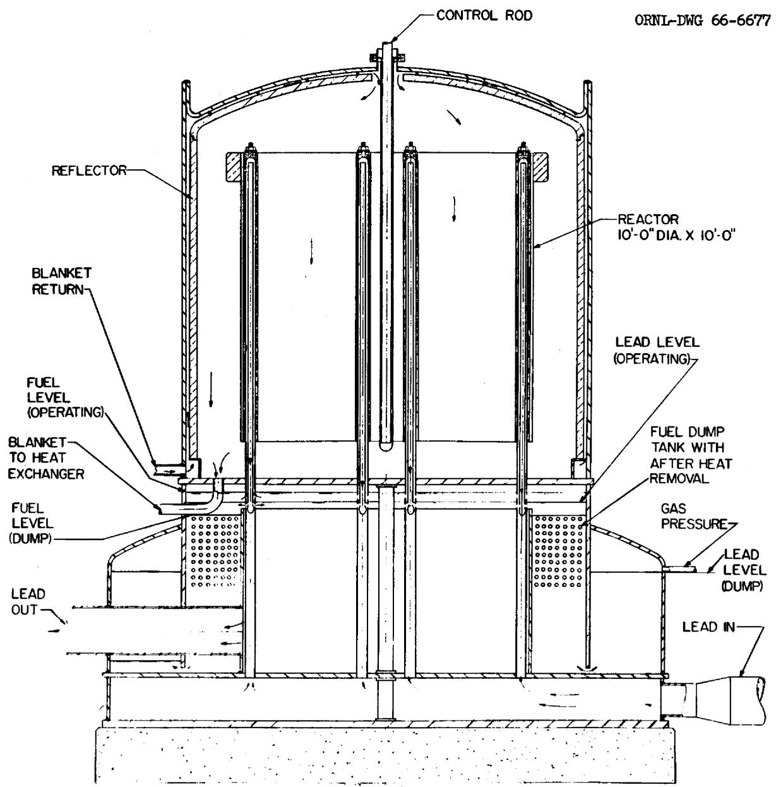  
Fig. 5.1. Two-Region Circulating-Lead Reactor - Elevation.

upward to this point, discharges horizontally out of the venturi tube and in the process draws fuel salt into the venturi to cause intimate mixing of the salt and lead. This mixing generates large areas for heat transfer between the salt and lead and results in efficient heat exchange between the two media. After passing through the venturi, the lead and salt separate by gravity due to density difference, with the lead flowing downward to the lead outlet lines.

The separated fuel salt floats on the lead and forms a 4-in.-deep layer. The core fuel tubes are submerged in this salt layer, and openings into their annular regions provide flow passages through which fuel flows into the core volume.

There are no mechanical pumps in the reactor cell. The only heat exchange within the reactor cell is that provided by the direct-contact lead-and-fuel jet pumps. The only liquid lines leaving the reactor cell are the lead lines and the fuel-processing line, which communicates with the fuel layer at the bottom of the reactor. The blanket probably would be cooled with lead also; however, since the blanket volume is not critical, the blanket salt could be cooled by pumping it through a tube-and-shell exchanger as in the MSBR.

Use of lead cooling requires niobium cladding of metal parts of the system. However, this requirement does not appear to introduce a significant economic penalty. At the same time the primary heat exchangers are eliminated, with their attendant costs and operating requirements.

The significant advantage produced by direct-contact cooling is the reduction in fissile-fuel holdup external to the core proper. As shown in Table 5.l, the MSBR(Pa-Pb) concept has a very high fuel-yield rate of about $17\%$ /yr, corresponding to a fuel doubling time of 5.8 years.

# 5.2 SSCB(Pa) Reactor Concept

# 5.2.1 SSCB(Pa) Reactor Concept with Intermediate Coolant

In the single-stream-core breeder reactor, or one-and-one-half region reactor, the fuel salt contains fertile as well as fissile material. Within the core proper there is no separation of fluids, so graphite tubes of the type needed in the MSBR are not required. A thin metallic membrane of Hastelloy N, niobium, or similar structural material about 0.12 in. thick surrounds the core and separates the core region from the blanket region.

The reactor core is cylindrical and is about 14 ft high and about 10 ft in diameter. The core structure is an assembly of graphite blocks with passages for flow of fuel salt. An annular, cylindrical graphite barrier divides the core into two regions so that the fluid makes two

passes through the core. Leakage between the regions is permissible, and therefore the barrier can be constructed by simply interlocking the graphite sections.

The core structure is built on a tube-sheet-like support plate, which also serves as a flow distributor for the incoming fuel salt and a collector for the discharge stream. Below this plate are the plenum chambers for fuel distribution. These plenums consist of a central circular region and an annular region, which are separated by a curtain-like barrier. The center plenum directs the fuel to the central region of the reactor, while the annular plenum receives fuel salt as it leaves the annular region of the reactor core. Some bypass of fuel salt between the reactor inlet and outlet plenum chambers is permissible.

The energy generated in the fuel salt is transferred to an intermediate coolant as in the MSBR concept. The steam-power cycle is also the same as for the MSBR.

The blanket region contains $\mathrm{ThF}_4$ in a carrier salt. Neutrons diffusing from the core region are absorbed by thorium in the blanket to produce about $5\%$ of the bred $^{233}\mathrm{U}$ . Cooling of the blanket stream is done in a manner similar to that used in the MSBR concept.

Direct protactinium removal from the fuel stream is an important feature of this concept. The ability to do this practically in the presence of relatively high uranium concentrations has not been demonstrated conclusively; however, the oxide-precipitation process shows promise of being applicable to protactinium removal from molten salts containing both thorium and uranium.

# 5.2.2 SSCB(Pa) with Direct-Contact Cooling

The performance of the SSCB(Pa) can be improved if molten lead is found to be practical as a direct-contact coolant for molten salts containing thorium and uranium. This concept, which is termed SSCB(Pa-Pb), is shown in Fig. 5.2, which also illustrates features of the SSCB(Pa) concept. As in the MSBR(Pa-Pb) concept, the lead coolant not only absorbs thermal energy from the fuel salt, but also supplies the motive power for circulating the fuel salt through the core.

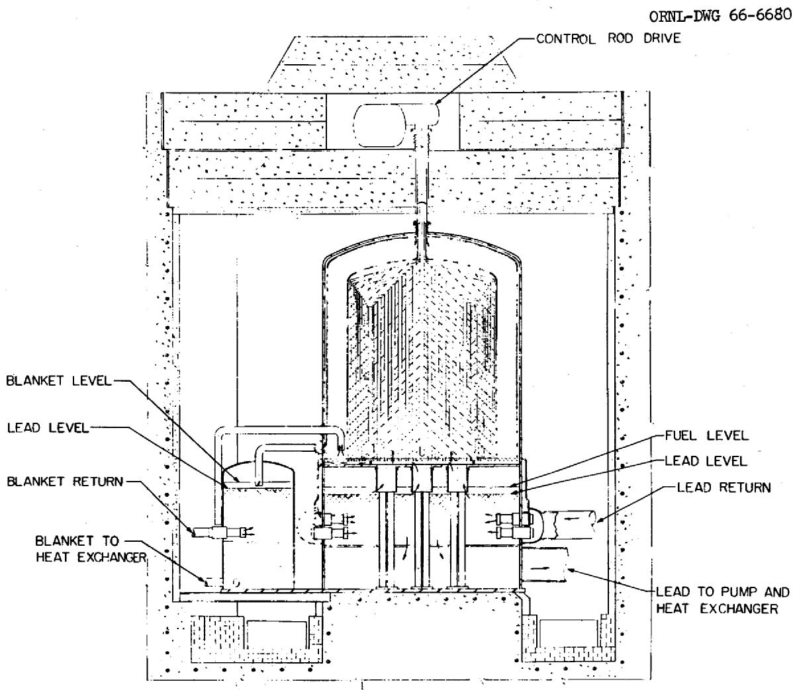  
Fig. 5.2. One-and-One-Half Region Circulating-Lead Reactor - Elevation.

As illustrated in Fig. 5.2, the reactor core is mounted above a pool of lead. Fuel salt, which is floating on the lead, flows through the suction pipes into the inlet plenum below the central region of the core and then through the core in a two-pass arrangement.

From the outlet plenum the fuel is channeled radially out and downward to peripheral lead-activated ejectors. These ejectors discharge the mixture of lead and fuel salt into the lead pool. During this contact the cooler lead extracts heat from the fuel salt. In the pool, the less dense fuel salt rises to the top and is returned to the core. The heated lead is piped away from the pool to a pump and is passed through

the steam superheaters and reheaters. Cool lead is returned to the ejectors.

The blanket salt may be cooled in a similar fashion, as indicated in Fig. 5.2, or the blanket salt may be passed through a shell-and-tube heat exchanger cooled by lead returning to the fuel loop.

Direct-contact lead cooling reduces the external fuel inventory by permitting efficient heat exchange in a system requiring short runs of fuel piping. Although niobium is needed as a structural and/or cladding material in systems containing lead, fewer heat exchangers may be required. As indicated in footnote d of Table 5.1, the SSCB(Pa-Pb) concept gave a fuel-cycle cost of 0.32 mill/kwhr(e) and a specific fissile inventory of 0.41 kg/Mw(e).

# 5.3 MOSEL(Pa-Pb) Reactor Concept

The MOSEL reactor concept has no moderator (in the sense that no material is introduced for moderating purposes) and operates in the intermediate-to-fast energy range (mean fission energy of 10 to 20 kev). The core contains only molten-salt fuel and the lead introduced for cooling, while the blanket contains $\mathrm{ThF_4}$ in a carrier salt. Niobium is used as the structural or cladding material where there is the possibility of contact with lead.

Figure 5.3 illustrates the reactor concept; the core is toroidal in shape, having a cross section about 3 ft wide by 4 ft high. The internal diameter of the torus is 4 ft. The core is in a tank of blanket salt, and except for the lead outlet pool at the bottom, is nearly surrounded by blanket salt.

Lead is pumped in through a perforated header at the top of the toroidal core. The lead falls through the fuel salt and extracts energy from the core. In the process, the falling lead causes circulation of fuel salt within the core region in a rotational pattern, with salt flowing upward on each side of the central region. The central region contains about 50 vol % lead, and the lead separates from the salt by gravity, with the fuel salt floating on the lead. Although a protac-tinium removal scheme was assumed in the nuclear design calculations,

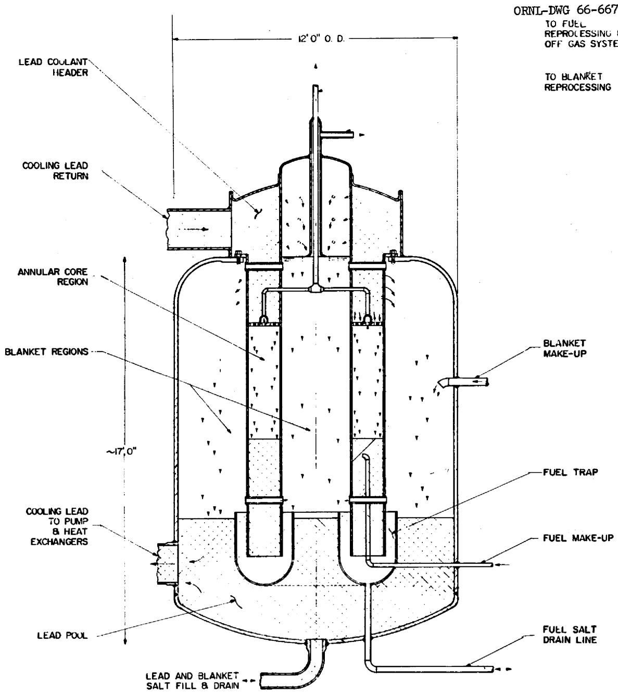  
Fig. 5.3. MOSEL(Pa-Pb) Lead-Cooled Reactor - Elevation.

the reactor performance given in Table 5.1 would change only slightly if fuel recycling was accomplished with only fluoride volatility and vacuum distillation processing.

The design shown in Fig. 5.3 is conceptual in nature, and the actual requirements for separation of the salt and lead phases may involve more

than simply separation by gravity forces alone. However, mechanical methods of separation are permissible, and preliminary work indicates that they are feasible. Although preliminary, the results obtained for the MOSEL(Pb) concept indicate the potential performance of an intermediate-to-fast energy molten-salt reactor and the versatility of molten salts as reactor fuels.

These studies also illustrate that MOSEL-type reactors need efficient methods for removing energy from the reactor core without requiring a large fuel inventory external to the core, since the fissile concentration in the carrier salt is high (about 20 times higher than in a thermal reactor). Direct-contact cooling with lead appears to lower the external inventory requirements to a level sufficient for attaining low fuel doubling times and low fuel-cycle costs.

# 5.4 MSCR Concept

The molten-salt converter reactor is a single-region single-fluid reactor moderated by graphite, with the fertile material physically mixed with the fissile fuel salt. The graphite is an arrangement of vertical bars, with fuel passages permitting single-pass flow through the core. The reactor concept is described in detail in the report by Alexander et al.[30] The essential differences between the MSCR concept referred to here and that described by Alexander et al. concern the steam-power cycle and the processing scheme. In the previous report, a Loeffler boiler was used in conjunction with a subcritical steam cycle, while here a supercritical steam-power system and once-through boiler-superheaters are considered that are identical to those given for the MSBR. These changes substantially increase the thermal efficiency and lower the unit capital cost of the previous MSCR plant. Also, the previous system did not use vacuum distillation processing, since the discovery of its application came at a later date. Incorporation of the vacuum distillation process for carrier-salt recovery, as considered here, leads to substantial improvements in fuel-cycle performance. The fuel-cycle cost of the MSCR concept is given in Table 5.1. The capital costs were not studied specifically but should be comparable with those for the MSBR, that is,

about $\$ 114/$ kw(e). Assuming the operating and maintenance costs to be 0.34 mill/kwhr(e), as for the MSER, gives power-production costs under 2.9 mills/kwhr(e) based on an investor-owned plant and a 0.8 load factor.

# 6. EVALUATION

Of the reactor designs and concepts considered in this study, the MSBR(Pa) plant appears to have superior power-production cost and nuclear characteristics, as well as technology requirements that demand only a reasonable amount of developmental effort. The estimated power-production cost of 2.64 mills/kwhr(e) for investor-owned MSBR(Pa) plants with a load factor of 0.8 indicates that their development can lead to large economic savings. Also, the low specific inventory requirements (less than $1\mathrm{kg}$ of fissile material per megawatt of electricity produced) and the low fuel doubling time of about 12.6 years, which corresponds to a capability for doubling the installed power capacity every 8.7 years, leads to excellent fuel-conservation characteristics.

The results obtained for the MSBR design indicate that this plant also has good performance characteristics, although not so good as those for the MSBR(Pa). At the same time, the MSBR plant appears less demanding of its fuel-recycle technology.

Molten-salt reactors appear well-suited for modular-type plant construction. Such construction causes no significant penalty to either the power-production cost or the nuclear performance, and it may permit MSBR's to have very high plant-availability factors.

Use of direct-contact cooling of molten salts with lead significantly improves the potential performance of molten-salt reactors and indicates the versatility of molten salts as reactor fuels. However, in order to attain the technology status required for such concepts, a significant development program appears necessary.

The molten-salt reactor concept that requires the least amount of development effort is the MSCR, but it is not a breeder system. The equilibrium breeding ratio and the power-production cost of the MSCR plant were estimated to be about $0.96$ and 2.9 mills/kwhr(e), respectively, in an investor-owned plant with a load factor of 0.8. Although this represents excellent performance as an advanced converter, the development of MSBR(Pa) or MSBR plants appears preferable because of the lower power-production costs and superior nuclear and fuel-conservation characteristics associated with the breeder reactors.

# References

1. W. R. Grimes, Chemical Research and Development for Molten-Salt Breeder Reactors, ORNL-TM series report to be issued.   
2. G. M. Adamson, Materials Development for Molten-Salt Breeder Reactors, ORNL-TM series report to be issued.   
3. W. L. Carter, Fuel and Blanket Processing Development for Molten-Salt Breeder Reactors, ORNL-TM series report to be issued.   
4. D. Scott, Components and Systems Development for Molten-Salt Breeder Reactors, ORNL-TM series report to be issued.   
5. J. R. Tallackson, Instrumentation and Controls Development for Molten-Salt Breeder Reactors, ORNL-TM series report to be issued.   
6. R. Blumberg, Maintenance Development for Molten-Salt Breeder Reactors, ORNL-TM series report to be issued.   
7. R. W. Swindeman, The Mechanical Properties of INOR-8, USAEC Report ORNL-2780, Oak Ridge National Laboratory, January 1961. See also Ref. 2.   
8. R. C. Robertson, MSRE Design and Operations Report, Part I. Description of Reactor Design, USAEC Report ORNL-TM-728, pp. 133-160, Oak Ridge National Laboratory, January 1965.   
9. M. W. Rosenthal et al., A Comparative Evaluation of Advanced Converters, USAEC Report ORNL-3686, Oak Ridge National Laboratory, January 1965.   
10. R. C. Olson and R. E. Hoskins, Capital Cost Breakdown for Comparative Evaluation of Advanced Converters, unpublished internal document, August 1964.   
11. Guide to Nuclear Power Cost Evaluation, USAEC Report TID-7025, September 1962.   
12. Op.cit., Ref. 8, pp. 190-201.   
13. B. E. Prince and J. R. Engel, Temperature and Reactivity Coefficient Averaging in the MSRE, USAEC Report ORNL-TM-379, Oak Ridge National Laboratory, October 1962.   
14. C. W. Nestor, ZORCH - An IBM 7090 Program for the Analysis of Simulated MSRE Power Transients with a Simplified Space-Dependent Kinetics Model, USAEC Report ORNL-TM-345, Oak Ridge National Laboratory, Sept. 18, 1962.

15. T. W. Kerlin and S. J. Ball, Stability Analysis of the Molten Salt Reactor Experiment, USAEC Report ORNL-TM-1070, Oak Ridge National Laboratory, December 1965.   
16. Oak Ridge National Laboratory, Molten-Salt Reactor Program Semi-annual Progress Report for Period Ending February 1966, USAEC Report ORNL-3936.   
17. Y. G. Grunzweig et al., Molten-Salt Converter Reactor Hazards Studies, ORSORT Reactor Hazard Evaluation Course Report, September 1963.   
18. C. D. Scott and W. L. Carter, Preliminary Design Study of a Continuous Fluorination-Vacuum Distillation System for Regenerating Fuel and Fertile Streams in a Molten Salt Breeder Reactor, USAEC Report ORNL-3791, Oak Ridge National Laboratory, January 1966.   
19. W. L. Carter, personal communication, 1965.   
20. H. F. Bauman, OPTIMERC, A Reactor Design Optimization Program, ORNL-TM series report to be issued.   
21. A. M. Perry, Physics Program for Molten-Salt Breeder Reactors, ORNL-TM series report to be issued.   
22. Op.cit., Ref. 8, pp. 220-238.   
23. T. W. Pickel et al., Design Study of a Heat Exchanger System for One MSBR Concept, USAEC Report ORNL-TM-1545, Oak Ridge National Laboratory, September 1966.   
24. R. C. Robertson, MSBR Steam System Performance Calculation, unpublished internal document, July 5, 1966.   
25. J. H. Griffin, Piping Flexibility Analysis Program for the IBM 7094, USAEC Report IA-2929, Los Alamos Scientific Laboratory, July 1964.   
26. Internal correspondence, A. G. Grindell to E. S. Bettis, Nov. 26, 1965.   
27. J. H. Shaffer et al., The Recovery of Protactinium and Uranium from Molten Fluoride Systems by Precipitation as Oxides, Nucl. Sci. Eng., 18(2): 177-181 (1964).   
28. W. R. Grimes et al., Reactor Chemistry Division Annual Progress Report for Period Ending January 31, 1965, USAEC Report ORNL-3789, pp. 137 ff, Oak Ridge National Laboratory.   
29. P. R. Kasten, Safety Program for Molten-Salt Breeder Reactor, ORNL-TM series report to be issued.

30. L. G. Alexander et al., Molten Salt Converter Reactor Design Study and Power Cost Estimates for a 1000 Mw(e) Station, USAEC Report ORNL-TM-1060, Oak Ridge National Laboratory, September 1965.

# Internal Distribution

1. R.E. Adams 168. P.G. Herndon   
2. L. G. Alexander 169. H. W. Hoffman   
3. E. D. Arnold 170. G. H. Jenks   
4. C. F. Baes 171. W. H. Jordan   
5．S.J.Ball 172．Lincoln Jung   
6. W. P. Barthold 173-197. P. R. Kasten   
7.C.J.Barton 198.C.R.Kennedy   
8. H. F. Bauman 199. T. W. Kerlin   
9. S.E.Beall, Jr. 200.H.T.Kerr   
L0. M. Bender 201. S. S. Kirslis   
1. L. Bennett 202. J. A. Lane   
2. C. E. Bettis 203. C. E. Larson (K-25)   
37. E. S. Bettis 204. R. B. Lindauer   
38.H.Beutler 205.A.P.Litman   
39. J. E. Bigelow 206. D. B. Lloyd   
10. A.M.Billings 207.A.L.Lotts   
1. F. F. Blankenship 208. M. I. Lundin   
2. C. M. Blood 209. H. G. MacPherson   
3.E.G.Bohlmann 210.R.E.MacPherson   
4. R. J. Braatz 211. C. D. Martin, Jr.   
5. E. J. Breeding 212. F. C. Maienschein

46-145. R.B.Briggs

146. O.W. Burke   
147. S. Cantor   
148. R. S. Carlsmith   
149. W. L. Carter   
150. C.E. Center (K-25)   
151. R. L. Clark   
152. W.G.Cobb   
153. C. W. Collins   
154. E. L. Compere   
155. W.H.Cook   
156. G.A.Cristy   
157. F. L. Culler   
158. J. E. Cunningham   
159. S. J. Ditto   
160. E.P.Epler   
161. W. S. Ernst, Jr.   
162. A. P. Fraas   
163. R.E. Gehlbach   
164. E.H.Gift   
165. W.R.Grimes   
166. R.C. Gwaltney   
167. S. H. Hanauer

213. W.R.Martin   
214. H. E. McCoy   
215. H.F. McDuffie   
216. D. L. McElroy   
217. T. L. McLean   
218. J. G. Merkle   
219. H. J. Metz   
220. A. S. Meyer   
221. S.E.Moore   
222. W.R.Mixon   
223. J. F. Murdock   
224. M. L. Myers   
225. L.C.Oakes   
226. R.C.Olson   
227. A.M.Perry   
228. T. W. Pickel   
229. J.W.Poston   
230. J. W. Prados   
231. A. S. Quist   
232. J. L. Redford   
233. R.C.Robertson   
234. D. P. Roux   
235. R. Salmon

236. Ann W. Savolainen

237. C. D. Scott

238. D. Scott

239. J.H.Shaffer

240. M. J. Skinner

241. G. M. Slaughter

242. A. E. Spaller

243. I. Spiewak

244. R.S.Stone

245. J.C. Suddath

246. J.R.Tallackson

247. W. Terry

248. R.E.Thoma

249. D. E. Tidwell

250. G. M. Tolson

251. D. B. Trauger

252. R.W.Tucker

253. J.W.Ullmann

254. W.E.Unger

255. D.R.Vondy

256. D. D. Walker

257. T. N. Washburn

258. G. M. Watson

259. J.R.Weir

260. R.C.Weir

261. A. M. Weinberg

262. W.J.Werner

263. J.H.Westsik

264. M. E. Whatley

265. J.C. White

266. H. D. Wills

267. L.V. Wilson

268. M. L. Winton

269-271. Central Research Library

272-273. Y-12 Document Reference Section

274-514. Laboratory Records Department

515. Laboratory Records, RC

# External Distribution

516. R. A. Charpie, UCC, New York   
517. C. B. Deering, AEC, ORO   
518. F. C. Di Luzio, Office of Saline Water, Department of Interior   
519. M. C. Edlund, University of Michigan   
520. E. A. Eschbach, Pacific Northwest Laboratory   
521. H. Falkenberry, Tennessee Valley Authority, Chattanooga   
522. A. A. Giambusso, AEC, Washington   
523. R. E. Hoskins, Tennessee Valley Authority, Chattanooga   
524. Lenton Long, Pacific Northwest Laboratory   
525. W. B. McDonald, Pacific Northwest Laboratory   
526. M. W. Rosenthal, AEC, Washington   
527. S. Sapirie, AEC, ORO   
528. M. Shaw, AEC, Washington   
529. W. L. Smalley, AEC, ORO   
530. J. A. Swartout, UCC, New York   
531. A. Taboada, AEC, Washington   
532. J. M. Vallance, AEC, Washington   
533. M. L. Whitman, AEC, Washington   
534-535. General Atomic Library (Attn: S. Jaye, H. B. Stewart)   
536. Division of Research and Development, AEC, ORO   
537-538. Reactor Division, AEC, ORO   
539-860. Given distribution as shown in TID-4500 under Reactor Technology category (75 copies - CFSTI)