ORNL-4037

UC-80 - Reactor Technology

MOLTEN-SALT REACTOR PROGRAM

SEMJANNUAL PROGRESS REPORT

FOR PERIOD ENDING AUGUST 31, 1966

CENTRAL RESEARCH LIBRARY

#

DO NOT TRANSFER TO ANOTHER PERSON

1XUE 2XUE 3XUE 4XUE 5XUE 6

povostive and invene with treatment

p#e #

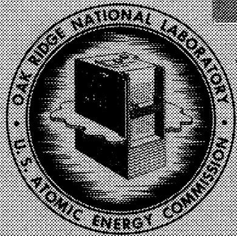

OAK RIDGE NATIONAL LABORATORY

operated by

UNION CARBIDE CORPORATION

for the

U.S. ATOMIC ENERGY COMMISSION

Printed in USA. Price $6.00. Available from the Clearinghouse for Federal Scientific and Technical Information, National Bureau of Standards, U.S. Department of Commerce, Springfield, Virginia 22151

# LEGAL NOTICE

This report was prepared as an account of Government sponsored work. Neither the United States, nor the Commission, nor any person acting on behalf of the Commission:

A. Makes any warranty or representation, expressed or implied, with respect to the accuracy, completeness, or usefulness of the information contained in this report, or that the use of any information, apparatus, method, or process disclosed in this report may not infringe privately owned rights; or   
B. Assumes any liabilities with respect to the use of, or for damages resulting from the use of any information, apparatus, method, or process disclosed in this report.

As used in the above, "person acting on behalf of the Commission" includes any employee or contractor of the Commission, or employee of such contractor, to the extent that such employee or contractor of the Commission, or employee of such contractor prepares, disseminates, or provides access to any information pursuant to his employment or contract with the Commission, or his employment with such contractor.

Contract No. W-7405-eng-26

MOLTEN-SALT REACTOR PROGRAM

SEMIANNUAL PROGRESS REPORT

For Period Ending August 31, 1966

R. B. Briggs, Program Director

JANUARY 1967

OAK RIDGE NATIONAL LABORATORY

Oak Ridge, Tennessee

operated by

UNION CARBIDE CORPORATION

for the

U.S. ATOMIC ENERGY COMMISSION

# SUMMARY

# Part 1. Molten-Salt Reactor Experiment

# 1. MSFE Operations and Analysis

The reactor power level was increased in steps to the maximum attainable value of 7.2 Mw. The power limitation was imposed by the heat-transfer capability of the air-cooled radiator, which was much lower than the design value. The heat-transfer coefficients of the primary fuel-to-coolant-salt heat exchanger were also substantially lower than had been expected. Two periods, each about two weeks long, of relatively steady operation at the maximum power were achieved.

Aside from the power limitation, the performance of the reactor system was favorable. The inherent nuclear stability increased with increasing power as had been predicted. The nuclear poisoning by $^{135}\mathrm{Xe}$ was only 0.3 to 0.4 of the expected value, apparently because of the presence of circulating helium bubbles in the fuel salt which had not been observed in earlier operations at similar conditions. Zero-power reactivity balances showed a slowly increasing positive anomaly which had reached a maximum of $0.3\%$ $\delta \mathbf{k} / \mathbf{k}$ at shutdown. Radiation heating of the primary-system components was in the expected range, and radiation shielding and containment were adequate.

A system shutdown to remove irradiation specimens from the core, which was planned after an accumulated exposure of 10,000 Mwhr, was advanced when a catastrophic failure of one of the main radiator blowers occurred at 7800 Mwhr. In addition to the removal and replacement of the core irradiation specimens and the repair of the main blowers, a number of other maintenance jobs were performed in the ensuing shutdown. These included:

1. mechanical and electrical repair of heat-induced damage to the radiator enclosure,   
2. replacement of the particle trap in the main reactor off-gas line, which had developed intermittent high resistance to flow,   
3. modification of the treated-cooling-water system to eliminate radiolytic gas,   
4. repair of water leaks in the reactor cell.   
5. modification of the component-cooling system to improve reliability,   
6. general improvement of the in-plant electrical system.

The MSRE instrumentation and controls system continued to perform well. There was the normally expected reduction in both malfunctions and misoperation of instruments as instrument and operating personnel gained experience and developed routines. While there were many design changes, most of these were improvements and additions to the system rather than corrective measures to the instruments and controls. A

disappointingly large number of faulty commercial relays and electronic switches were disclosed. These faults were in the areas of both relay design and fabrication, and corrective steps have been taken.

# 2. Component Development

The operation of freeze valve FV-103 was improved by the deletion of the hysteresis feature of one of the temperature-control modules, which had caused thermal cycling of the valve before the temperature reached equilibrium.

The three control rods have operated without difficulty. The indicated changes in rod length were random and were 0.05 in. for rod 1, 0.16 in. for rod 2, and 0.12 in. for rod 3.

Several small difficulties were encountered in the operation of the control-rod drive units. In each case the difficulty was diagnosed and adequate temporary changes were made to permit continued operation of the reactor. The difficulties involved the failure of a synchro transmitter and a reference potentiometer, which have been replaced during the current shutdown. The excellent condition of the gears in the drive units indicated that there was no high-temperature damage to the lubricant.

The radiator-door-operating mechanism has performed satisfactorily since the last modifications. Excessive air leakage around the seals on the doors resulted from damage sustained during the thermal cycling during normal operation. Laboratory tests were conducted on several arrangements of the metal seal surfaces, resulting in the choice of a new hard-seal scheme which was installed on the door. In addition, alterations were made to the door structure to reduce bowing, and the installation of a second soft, resilient seal was proposed to back up the existing seal.

The sampler-enricher has been used to isolate a total of 119 10-g samples and 20 50-g samples and to make 87 enrichments to the fuel system. The only major maintenance required has been replacement of the manipulator boots, replacement of the drive-unit capsule latch, repair of an open electrical circuit, and recovery of a capsule which had fallen into the operational valve area. These repairs were performed without the spread of airborne contamination or the exposure of the personnel to significant radiation levels. An increase of the buffer leakage in the operational valve was determined to be caused by particles which fell onto the upper seal surface, and it was found that simple cleaning of this surface was effective in reducing the leakage. Problems resulting from an increase in the contamination level within the mechanism were solved by a partial cleanup of one area, the establishment of a contamination control area at the sample withdrawal area, and the modification of the transport container to reduce contamination of the upper part and to permit inexpensive disposal of the lower part.

Changes were made in the sampler-enricher control circuit to reduce the chance of rupturing the manipulator boots. In addition, a

fuse and voltage suppressor were installed to protect the electrical leads from excessive voltages and currents.

A total of 45 samples, including two 50-g samples, have been taken using the coolant sampler. One electrical receptacle was replaced, and the leakage of the removal valve was reduced by cleaning.

The design of the fuel processing sampler was essentially completed, and installation is proceeding as craft is available. The electrical and instrument work is about $50\%$ complete, and the installation of other equipment is over $95\%$ complete.

The original off-gas filter in line 522 was replaced with one which is designed to trap organic materials in addition to particulate matter. Activated charcoal was chosen as the filtering medium, and preliminary tests indicated that it had good efficiency for the removal of $\mathrm{C_6}$ and heavier molecules. A prefilter was installed to remove the radioactive particulate matter as well as the organic mists which might exist. Since one of the purposes of the prefilter was to reduce the heat load on the charcoal trap, heat dissipation was also a consideration in the design. The entire filter-charcoal trap is cooled by immersion in water. Since little was known of the character of the organic material at the time of the design of the filter system, one of the purposes was to provide a method of diagnosing the problem. Therefore, the particle trap will be removed and examined to gain information needed in the design of a more permanent system.

Diffusion of activity into the fuel pump off-gas line resulted in two short periods of high activity at the off-gas stack. A small charcoal trap was installed to provide holdup times of approximately 2-1/2 days for krypton and 30 days for xenon.

Several remote maintenance jobs were performed during the period, in which the accumulated reactor power increased from 35 to 7822 Mwhr. Several observations were made as a result of the work. Control of airborne contamination is not difficult, and the maintenance techniques and systems prepared for the MSRE have worked well. The flexibility of the maintenance approach was demonstrated by carrying out unanticipated tasks such as the installation of a thermocouple on a piece of pipe in the reactor cell and the thawing out and clearing of a plug in one of the service gas lines. The major tasks completed during the report include: (1) opening a section of the off-gas line, inspecting the inside, and returning the line to operating condition; (2) removal and replacement of both of the reactor-cell space coolers; (3) installation of a new thermocouple on a horizontal section of the off-gas line; (4) repair of the sampler-enricher electrical receptacle; (5) installation of temporary piping in the main off-gas line to measure pressure distributions; (6) removal of the graphite-Hastelloy N surveillance samples; (7) removal, repair, and replacement of two control-rod drive units; (8) removal of a salt plug from a gas-pressure reference line by applying pressure while heating the line.

# 3. Pump Development

The MSRE prototype fuel pump was operated for 2631 hr at $1200^{\circ}\mathrm{F}$ to obtain data on the concentration of undissolved helium in the circulating salt and on the hydrocarbon concentration in the pump-tank and catch-basin purge gas. The spare rotary elements for the MSRE fuel and coolant pump and the MK-2 fuel pump were modified with a seal weld between the bearing housing and shield plug to prevent oil from leaking out of the leakage catch basin and down the outside of the shield plug to the pump-tank gas space. A lower shaft seal failure was experienced during preheat of the spare rotary element for the MSRE fuel pump in preparation for hot shakedown. The spare rotary element for the MSRE coolant pump was given cold and hot shakedown tests. The lubrication pump endurance test was continued, and fabrication of the MK-2 fuel pump tank was begun.

Operation of the PK-P molten-salt pump was halted by failure of the drive motor. (In the summary section of a previous Progress Report, the number of operating hours was reported in error as 22,622. Total for four tests is 23,426 hr.) The gimbals support for the salt bearing on the molten-salt bearing pump was modified, and a new bearing sleeve and journal were fabricated.

# 4. Instrument Development

Performance of the temperature scanning system continues to be satisfactory, although some problems were experienced with oscillosopes and mercury switches and some system instability was noted. Because spare parts for the mercury switches used in the scanner can no longer be obtained from the manufacturer, an effort is being made to find a replacement for the mercury switch.

Further testing of the coolant-salt system flow transmitter which failed in service at the MSRE confirmed that refilling the transmitter with silicone oil had significantly reduced its temperature sensitivity.

The new NaK-filled differential-pressure transmitter ordered for use as an MSRE spare was found to be excessively sensitive to pressure and temperature variations during acceptance testing.

Performance of all molten-salt level detectors installed at the MSRE, on the MSRp Level Test Facility, and on the MSRE Prototype Pump Test Loop continues to be satisfactory.

To correct excessive frequency drift present in the excitation oscillator supplying the ultrasonic level probe, a number of minor changes in components and circuitry were made in electronic equipment associated with the probe.

Modification and/or repair of two defective helium control valves was completed.

The feasibility of using sliding disk valves for control of very small dry-helium flows is being investigated.

# 5. Reactor Analysis

Rod drop experiments, performed during MSRE run No. 3, were analyzed and compared with rod worths determined from other independent measurements. Theoretical time-integrated flux trajectories following rod scams were calculated, based on negative reactivity insertions obtained by integrating differential worth measurements. These trajectories were found to compare closely with experimental records of the accumulated count following the scam. We have concluded that an approximate $5\%$ band of self-consistency can be assigned to the control rod reactivity worths inferred from these two independent calibration techniques.

# Part 2. Materials Studies

# 6. MSRP Materials

The grade CGB graphite and Hastelloy N specimens were removed from the core of the MSRE after 7800 Mwhr of operation. Their macroscopic appearances were essentially unchanged by this exposure. Some of the specimens were damaged physically as a result of differences in thermal expansion of parts of the assembly. A new core specimen array was assembled with modifications to correct these difficulties.

A metallurgical investigation was conducted to determine the effect of aluminum-zinc alloy contamination on the Hastelloy N tubing of the MSRE salt-to-air radiator. Contamination occurred from a blower failure during which shrapnel was blown across the hot radiator tubes. Laboratory tests showed that, in general, an aluminum oxide coating contained the aluminum, even in the molten state, and interaction did not occur. When the oxide skin was broken from mechanical abrasion, shock, or other reasons, wetting occurred. Moderate interaction to a depth of about 0.010 in. occurred in a wetted sample held at $1200^{\circ}\mathrm{F}$ for 5 hr. The tubes in the radiator were inspected, and those which were contaminated were carefully cleaned. As a result of the investigation and cleanup procedure, the radiator system was judged to be satisfactory for further operation.

Examinations of new grades of both anisotropic and isotropic graphite indicate that these do not yet meet the requirements of molten-salt breeder reactors.

Results of a variety of graphite creep experiments performed over a wide temperature range support a Cottrell model for irradiation creep. Use of this model will permit easier extrapolation of data. Implied in this concept is the conclusion that as long as the stress acting on the graphite does not exceed the fracture stress, the graphite will continue to absorb the creep deformation without loss of mechanical integrity.

The experimental brazing alloy 60 Pd-35 Ni-5 Cr (wt %) was evaluated for joining graphite to metals. Although it exhibits relatively poor wettability on high-density graphite, its marginal behavior is enhanced by preplacing it as foil in the joint. Graphite-to-molybdenum joints brazed with this alloy preplaced in the joint were thermally cycled between 200 and $700^{\circ}\mathrm{C}$ , and metallographic investigation showed that no deterioration had occurred. Two graphite-to-molybdenum-to-Hastelloy-N

transition joints were brazed using a tapered joint design. Visual examination revealed no cracks, and evaluation is continuing.

A new brazing alloy, 35 Ni-60 Pd-5 Cr (wt %), for joining graphite to molybdenum had less than 2 mils attack after exposure to LiF-BeF $_2$ -ZrF $_4$ -ThF $_4$ -UF $_4$ at $1300^{\circ}$ F for 5000 hr in a Hastelloy N container.

Since zirconium and titanium have been found to improve the resistance of Hastelloy N to effects of neutron irradiation, the influence of these elements on the weldability is being evaluated. Titanium appears to have no deleterious effects. Zirconium in concentrations as low as 0.06 wt % causes hot cracking. However, reasonably good welds have been made by the use of filler wire that contains dissimilar metal. The level of zirconium that can be tolerated has yet to be determined.

Our studies of the behavior of the Hastelloy N under neutron irradiation have been concerned with evaluating the heats of material used in the MSRE and in evaluating several modified heats of Hastelloy N for use in an advanced system. In-reactor stress-rupture tests on several heats of material suggest that there may be a stress below which essentially no neutron damage occurs. Tests on specimens exposed to various ratios of fast flux to thermal flux indicate that the damage correlates with the thermal flux. We believe that the damage is due to helium produced by the $(n,\alpha)$ reaction with $^{10}\mathrm{B}$ . We have produced several heats of material with very low boron, but have had to change from air to vacuum melting practice. If the low-boron material is irradiated cold, we find that the properties are superior to those of the higher boron material; if irradiated hot, the properties are as bad or worse. Thus the postirradiation properties are not uniquely dependent upon the boron content, and other factors such as the distribution of boron and the presence of other impurities must be very important. The addition of titanium to Hastelloy N has been very effective in improving the properties.

Limited creep-rupture tests have been run on Hasteloy N to determine its suitability for use as a distillation vessel for molten salts at $982^{\circ}\mathrm{C}$ . This work has resulted in a determination of the strength properties to times of 1000 hr. The formation of a second phase was observed that may influence the ductility at lower temperatures. The oxidation characteristics under cyclic temperatures remain to be determined.

Thermal convection loops containing fused salt of MSRE composition and fabricated from Hastelloy N and type 446 stainless steel have continued operation for 4.5 and 3.2 years, respectively, with no sign of difficulty. A slight decrease in cold-leg temperature has been noted in an Nb-1% Zr loop after 0.6 year. A Hastelloy N loop has circulated a secondary coolant salt for 3000 hr, whereas a Croloy 9M loop with the same salt plugged in 1440 hr.

# 7. Chemistry

The fuel and coolant salt have not changed perceptibly in composition since they were first circulated in the reactor some 16 months ago. The

concentration of corrosion products has not increased appreciably. The average oxide concentration in the fuel was 54 ppm, which is reassuringly low.

The viscosity and density of molten $\mathrm{BeF}_2$ were measured; the viscosity was about $10\%$ greater than previously reported, and the density of the liquid is not very different from that of the solid.

Vapor equilibria that are involved in the reprocessing by distillation have been measured. Decontamination factors of the order of 1000 for rare earths were evidenced.

Thermophysical properties have been estimated for the sodium potassium fluoroborate mixture that is a proposed coolant for the MSBR. The vapor pressure, due to evolution of $\mathrm{BF}_3$ , reaches 229 mm at the highest operating temperature. Interim estimates for density, specific heat, and viscosity of the proposed coolant were made available.

Possible reprocessing methods were studied in greater detail. Fundamental studies related to the thermodynamics of the reduction of fission product rare earths into a bismuth alloy were carried out. The exceedingly low activity coefficients of rare earths in the bismuth explained the feasibility of the process. Further attention was paid to the removal of rare earths by precipitation in a solid solution with $\mathrm{UF}_3$ .

The removal of protactinium from blanket melts was studied in several ways. These included an oxide precipitation with $\mathrm{ZrO_2}$ , a pump loop to transfer protactinium in a bismuth-thorium alloy, and attempts at electrolytic reduction from blanket melts. Moderate success was achieved in these experiments, but more work is required to arrive at finished and fully controlled procedures.

Analyses obtained from sampling assemblies that had been exposed in the pump bowl of the MSRE showed that noble-metal fission products were being partially released to the gas space, presumably as volatile fluorides. At the same time, plating of noble metals from the liquid was encountered. These puzzling phenomena were reflected in results on surveillance specimens of graphite and metal which were removed from the MSRE. Some 10 to $20\%$ of the yield of noble-metal fission products was found to have entered the gas space in the graphite.

Analyses of xenon isotope ratios in concentrated samples of off-gas from the MSRE showed that the burnup of $^{135}\mathrm{Xe}$ was about $8\%$ ; the remainder escaped to the cover gas or decayed. This is in accord with the low xenon poisoning indicated by reactivity behavior.

Preliminary estimates of xenon poisoning and cesium carbide formation in the MSBR indicate that cesium deposition will probably not be a serious problem, but that stripping for iodine removal will probably be required to keep poisoning within bounds. Oxide concentrations of 50 to 70 ppm were determined in fuel samples taken from the reactor during operations at all power levels without apparent interference from the activities of the samples. Techniques for the regeneration of electrolytic moisture cells were developed to provide dependable replacements for the hot-cell oxide apparatus and components for future in-line applications.

Measurements directed toward the development of in-line spectrophotometric methods disclosed additional wavelengths of potential analytical value in the ultraviolet absorption spectrum of U(III) and confirmed the absence of interference from corrosion products. Investigation of unusual valence states of rare-earth fission products indicates possible interference from Sm(II) but none from Eu(II). An intense absorption peak suitable for monitoring traces of uranium in coolant salt has been found in the ultraviolet spectrum of U(IV). A modified optical system has been ordered which will improve the spectrophotometric measurements of molten fluoride salts.

By voltammetric and chronopotentiometric measurements, the U(IV) reduction wave was found to correspond to a one-electron reversible reaction. Diffusion coefficients and the activation energy were measured. Repeated scans of this wave in quiescent MSRE melts were reproducible to about $2\%$ over extended periods and better than $1\%$ during short-term measurements. A new voltammeter is being built to improve the reproducibility and make possible measurement of flowing salt streams. Design criteria are being considered for an in-line test facility for evaluating three types of continuous analytical methods.

Hydrocarbons were measured in helium from simulated pump leak experiments, and an apparatus was developed for the continuous measurement of hydrocarbons in MSRE off-gas.

Efforts were continued on the development and evaluation of equipment and procedures for analyzing radioactive MSRE salt samples. The remote apparatus for oxide determinations was installed in cell 3 of the High-Radiation-Level Analytical Laboratory (Building 2026).

In addition to the analyses performed on the salt samples, radiochemical leach solutions were prepared on silver and Hastelloy N wires coiled onto the stainless steel cable between the latch and ladle.

The quality-control program was continued during the past period to establish more realistic limits of error for the methods.

# Part 3. Molten-Salt Breeder Reactor Studies

# 8. Molten-Salt Breeder Reactor Design Studies

Further design changes were incorporated into the reference maltensalt breeder reactor concept. The design of the primary heat exchangers was altered to eliminate the need for expansion bellows. Also, the flow of fluid in the primary reactor circuits was reversed to lower the operating pressure in the reactor vessel.

The effect of lowering the feedwater temperature from 700 to 580°F was evaluated. It was found that this change increased the plant thermal efficiency from 44.9 to 45.4% and reduced plant construction costs by $465,000 if there were no accompanying adverse effects. These savings are canceled if the coolant used with the lower feedwater temperature costs $2.4 million more than the coolant used with 700°F feedwater.

Molten-salt reactors appear well suited for modular-type plant construction. Such construction causes no significant penalty to either

the power-production cost or the nuclear performance, and it may permit MSBR's to have very high plant-availability factors.

Use of direct-contact cooling of molten salts with lead significantly improves the potential performance of molten-salt reactors and indicates the versatility of molten salts as reactor fuels. However, in order to attain the technology status required for such concepts, a development program is necessary.

The molten-salt reactor concept that requires the least amount of development effort is the MSCR, but it is not a breeder system. The equilibrium breeding ratio and the power-production cost of the MSCR plant were estimated to be about 0.96 and 2.9 mills/kwhr (electrical), respectively, in an investor-owned plant with a load factor of 0.8. Although this represents excellent performance as an advanced converter, the development of MSBR(Pa) or MSBR plants appears preferable because of the lower power-production costs and superior nuclear and fuel-conservation characteristics associated with the breeder reactors.

# 9. Molten-Salt Reactor Processing Studies

The processing plant for an MSBR would use side streams withdrawn from the fuel- and fertile-salt recirculating systems at rates that yield a fuel-salt cycle time of approximately 40 days and fertile-salt cycle time of approximately 20 days. Among the significant steps in the presently envisioned process are recovery of the uranium by continuous fluorination and recovery of the carrier fuel salt by semicontinuous vacuum distillation. Alternative schemes are also being considered.

Semicontinuous Distillation. Values of the relative volatilities of $\mathrm{NdF}_3$ , $\mathrm{LaF}_3$ , and $\mathrm{CeF}_3$ in LiF are of the order of 0.0007. These are from new measurements made using a recirculating equilibrium still. Earlier measurements made by a cold-finger technique were about a factor of 50 too high. The complexity of still design and operation is considerably eased by these lower values. Retention of over $90\%$ of the rare-earth neutron poisons in less than $0.5\%$ of the processed salt can easily be achieved.

Continuous Fluorination of a Molten Salt. The uranium in the fuel stream of an MSBR must be removed by continuous fluorination prior to the distillation step. The significant problems are corrosion of the fluorinator and the possible loss of uranium. Studies are in progress on continuous fluorinators constructed as towers with countercurrent flow of fluorine to salt. Recoveries exceeding $99\%$ have been consistently attained with towers only 48 in high. Higher recoveries with longer towers are anticipated. Corrosion protection may be effected by the use of a layer of frozen salt on the wall of the fluorinator. Feasibility of this technique is based on successful experiments with batch systems and simple heat transfer calculations. The heat generation of the fuel salt should be adequate to maintain an easily controlled layer of frozen salt on the cooled metal wall.

Alternative Chemical Processing Methods for an MSBR. Reductive coprecipitation and liquid-metal extraction are being studied as possible

methods for decontamination of MSBR carrier salt $(\mathrm{Li}_2\mathrm{BeF}_4)$ after uranium removal by the fluoride volatilization process. Adequate removal of La and Gd is achieved by treatment with near-theoretical quantities of beryllium metal to form beryllides of the type $\mathrm{LnBe}_{13}$ . Either excess Be, up to 243 times the theoretical amount, or a stronger reductant, Li, is necessary to remove zirconium at trace level. The zirconium is removed as free metal from 5 mole $\%$ $\mathrm{ZrF}_4$ solutions in $\mathrm{Li}_2\mathrm{BeF}_4$ , but from dilute solutions a beryllide, $\mathrm{ZrBe}_2$ , has also been identified.

Lithium-bismuth liquid-metal extraction experiments were also continued. Significant removals were observed for La, Sm, Gd, Sr, and Eu, the latter principally by extraction into the metal phase, the others by deposition as interface solids, as previously reported for other metal extraction tests.

# CONTENTS

SUMMARY 111

INTRODUCTION. 1

# Part 1. MOLTEN-SALT REACTOR EXPERIMENT

1. MSRE OPERATIONS AND ANALYSIS 7

1.1 Chronological Account of Operations and Maintenance.... 7   
1.2 Reactivity Balance 10  
Reactivity Balances at Power 11  
Reactivity Balances at Low Power 12   
1.3 Xenon Poisoning.. 13  
Predicted Steady-State $^{135}\mathrm{Xe}$ Poisoning. 14  
Analysis of Transient $^{135}\mathrm{Xe}$ Poisoning. 16   
1.4 Circulating Bubbles 22  
Salt Transport 24  
Gradual Transfer to Overflow Tank 24  
Overfill 24   
1.6 Power Measurements 25  
Heat Balance 25  
Nuclear Instruments 26  
Radiator Air Flow 26   
1.7 Radiation Heating 27  
Fuel-Pump Tank. 27  
Reactor Vessel. 28  
Thermal Shield. 29   
1.8 Reactor Dynamics.. 29   
1.9 Equipment Performance.. 35   
Heat Transfer.. 35   
Main Blowers.. 39   
Radiator Enclosure.. 41   
Fuel Off-Gas System.. 43   
Treated Cooling-Water System.. 47   
Component-Cooling System.. 48   
Salt-Pump Oil Systems.. 50   
Electrical System.. 51   
Control Rods and Drives.. 53   
Samplers.. 53   
Containment.. 54   
Shielding and Radiation.. 56   
1.10 Instrumentation and Controls.. 57  
Operating Experience - Process and Nuclear Instruments. 58  
Data System. 59  
Control-System Design. 61   
2. COMPONENT DEVELOPMENT 65

2.1 Freeze Valves 65   
2.2 Control Rods.. 65   
2.3 Control-Rod Drive Units 66   
2.4 Radiator Doors.. 67   
2.5 Sampler-Enricher 70

Replacement of Manipulator Boots. 70   
Replacement of the Capsule Latch 71   
Repair of an Open Electrical Circuit. 71   
Recovery of a Capsule. 72   
Operational Valve Leakage. 72   
Contamination of Removal Valve Seals. 72   
Miscellaneous Problems. 73   
Changes to the Control Circuit. 73

2.6 Coolant Sampler. 73   
2.7 Fuel Processing System Sampler.. 74   
2.8 Off-Gas Filter Assembly. 74

Filter Medium. 74   
Heat Dissipation. 74   
Particle Trap. 75   
Charcoal Trap. 76

2.9 524 Charcoal Bed. 77   
2.10 Remote Maintenance. 77

3.PUMP DEVELOPMENT 81

3.1 MSREPumps 81

Molten-Salt Pump Operation in the Prototype Pump Test Facility. 81   
Pump Rotary Element Modification. 82   
Lubrication System. 82   
MK-2 Fuel Pump. 82

3.2 Other Molten-Salt Pumps.. 82

PK-P Fuel-Pump High-Temperature Endurance Test. 82   
Pump Containing a Molten-Salt-Lubricated Journal   
Bearing. 82

4. INSTRUMENT DEVELOPMENT 84

4.1 Temperature Scanner 84   
4.2 High-Temperature, NaK-Filled, Differential-Pressure Transmitter. 85   
4.3 Molten-Salt Level Detectors 85   
4.4 Helium Control Valve Trim Replacement 86

5. REACTOR ANALYSIS 88

5.1 Analysis of Rod Drop Experiments. 88

Description of Experiments. 88   
Analysis Procedures. 89   
Results. 91

# Part 2. MATERIALS STUDIES

# 6. MSRP Materials 97

6.1 MSRE Materials Surveillance Testing 97   
6.2 Evaluation of Possible MSRE Radiator Tubing Contamination with Aluminum 103   
6.3 Evaluation of Graphite 108   
6.4 Internal Stress Problem in Graphite Moderator Blocks 110   
6.5 Brazing of Graphite 112   
6.6 Corrosion of Graphite-to-Metal Brazed Joints 115   
6.7 Welding Development of Hastelloy N. 117  
Effect of Irradiation on the Mechanical Properties of Hastelloy N. 117  
Characterization of Hastelloy N for Service at $982^{\circ}\mathrm{C}$ 125   
6.8 Thermal Convection Loops 130

# 7. CHEMISTRY 134

7.1 Chemistry of the MSRE 134 Behavior of Fuel and Coolant Salt. 134   
7.2 Physical Chemistry of Fluoride Melts 139  
Viscosity and Density of Molten Beryllium Fluoride 139  
Transpiration Studies in Support of the Vacuum Distillation Process 140  
Estimated Thermophysical Properties of MSBR Coolant Salt 141   
7.3 Separation in Molten Fluorides 142  
Extraction of Rare Earths from Molten Fluorides into Molten Metals 142  
Removal of Rare Earths from Molten Fluorides by Simultaneous Precipitation with UF3 145   
Removal of Protactinium from Molten Fluorides by Oxide Precipitation 147  
Extraction of Protactinium from Molten Fluorides into Molten Metals 148  
Protactinium Studies in the High-Alpha Molten-Salt Laboratory 156   
7.4 Radiation Chemistry 158  
Xenon Diffusion and Possible Formation of Cesium 158  
Carbide in an MSBR. 165  
Fission Product Behavior in the MSRE. 165   
7.5 Development and Evaluation of Analytical Methods for Molten-Salt Reactors 191  
Determination of Oxide in Radioactive MSRE Samples 191  
Spectrophotometric Studies of Molten-Salt Reactor Fuels 193

XVI

Voltammetric and Chronopotentiometric Studies of   
Uranium in Molten LiF-BeF2-ZrF4. 195   
In-Line Test Facility. 196   
Analysis of Helium Blanket Gas. 196

7.6 Development and Evaluation of Equipment and Procedures

for Analyzing Radioactive MSRE Salt Samples. 199

Sample Analyses 200

Quality-Control Program. 200

# Part 3. MOLTEN-SALT BREEDER REACTOR STUDIES

# 8. MOJEN-SALT BREEDER REACTOR DESIGN STUDIES 207

8.1 Design Changes in MSBR Plant 207   
8.2 Modular-Type Plant 212   
8.3 Steam Cycle with Alternative Feedwater Temperature 217   
8.4 Additional Design Concepts 223

# 9. MOLTEN-SALT REACTOR PROCESSING STUDIES 227

9.1 Semicontinuous Distillation 228   
9.2 Continuous Fluorination of a Molten Salt 232   
9.3 Alternative Chemical Processing Methods for an MSBR.... 233

Reduction Precipitation 235   
Li-Bi Alloy Extraction. 237

# INTRODUCTION

The Molten-Salt Reactor Program is concerned with research and development for nuclear reactors that use mobile fuels, which are solutions of fissile and fertile materials in suitable carrier salts. The program is an outgrowth of the ANP efforts to make a molten-salt reactor power plant for aircraft and is extending the technology originated there to the development of reactors for producing low-cost power for civilian uses.

The major goal of the program is to develop a thermal breeder reactor. Fuel for this type of reactor would be $^{233}\mathrm{UF}_4$ or $^{235}\mathrm{UF}_4$ dissolved in a salt of composition near 2LiF-BeF $_2$ . The blanket would be ThF $_4$ dissolved in a carrier of similar composition. The technology being developed for the breeder is applicable to, and could be exploited sooner in, advanced converter reactors or in burners of fissionable uranium and plutonium that also use fluoride fuels. Solutions of uranium, plutonium, and thorium salts in chloride and fluoride carrier salts offer attractive possibilities for mobile fuels for intermediate and fast breeder reactors. The fast reactors are of interest too, but are not a significant part of the program.

Our major effort is being applied to the operation and testing of a Molten-Salt Reactor Experiment. The purpose of this experiment is to test the type of fuels and materials that would be used in the thermal breeder and the converter reactors and to obtain several years of experience with the operation and maintenance of a small molten-salt power reactor. A successful experiment will demonstrate on a small scale the attractive features and the technical feasibility of these systems for large civilian power reactors. The MSRE operates at $1200^{\circ}\mathrm{F}$ and at atmospheric pressure and was intended to produce 10 Mw of heat. Initially, the fuel contains 0.9 mole $\%$ of $\mathrm{UF_4}$ , 5 mole $\%$ $\mathrm{ZrF_4}$ , 29.1 mole $\%$ $\mathrm{BeF_2}$ , and 65 mole $\%$ LiF, and the uranium is about $30\%$ ${}^{235}\mathrm{U}$ . The melting point is $840^{\circ}\mathrm{F}$ . In later operation, we expect to use highly enriched uranium in the lower concentration typical of the fuel for the core of a breeder. In each case, the composition of the solvent can be adjusted to retain about the same liquidus temperature.

The fuel circulates through a reactor vessel and an external pump and heat-exchange system. All this equipment is constructed of Hastelloy N, $^{1}$ a new nickel-molybdenum-chromium alloy with exceptional resistance to corrosion by molten fluorides and with high strength at high temperature. The reactor core contains an assembly of graphite moderator bars that are in direct contact with the fuel. The graphite is a new material $^{2}$ of high density and small pore size. The fuel salt does not wet the graphite and therefore should not enter the pores, even at pressures well above the operating pressure.

Heat produced in the reactor is transferred to a coolant salt in the heat exchanger, and the coolant salt is pumped through a radiator to dissipate the heat to the atmosphere. A small facility is installed in the MSRE building for occasionally processing the fuel by treatment with gaseous HF and $\mathbf{F}_2$ .

Design of the MSRE was begun early in the summer of 1960. Orders for special materials were placed in the spring of 1961. Major modifications to Building 7503 at ORNL, in which the reactor is installed, were started in the fall of 1961 and were completed by January 1963.

Fabrication of the reactor equipment was begun early in 1962. Some difficulties were experienced in obtaining materials and in making and installing the equipment, but the essential installations were completed so that prenuclear testing could begin in August of 1964. The prenuclear testing was completed with only minor difficulties in March of 1965. Some modifications were made before beginning the critical experiments in May, and the reactor was first critical on June 1, 1965. The zero-power experiments were completed early in July. Additional modifications, maintenance, and sealing and testing of the containment were required before the reactor began to operate at appreciable power. This work was completed in December.

Operation at a power of 1 Mw was begun in January 1966. At that power level, trouble was experienced with plugging of small ports in the control valves in the off-gas system by heavy liquid and varnish-like organic materials. Those materials are believed to be produced from a very small amount of oil that leaks through a gasketed seal and into the fuel salt in the pump tank of the fuel circulating pump. The oil vaporizes and accompanies the gaseous fission products and helium cover gas purge into the off-gas system. There the intense beta radiation from the krypton and xenon polymerizes some of the hydrocarbons, and the products plug small openings. This difficulty was largely overcome by installing an absolute filter in the off-gas line ahead of the control valves.

The full power capability of the reactor -- about 7.5 Mw under design conditions -- was reached in May. The power was limited by the performance of the salt-to-air radiator heat-dump system. The plant was operated until the middle of July to the equivalent of about one month at full power when troubles with the blowers in the heat-dump system required that the operation be interrupted for maintenance.

In most respects the reactor has performed very well: the fuel has been completely stable; the fuel and coolant salts have not corroded the Hastelloy N container material in several thousand hours at $1200^{\circ}\mathrm{F}$ ; and there has been no detectable reaction between the fuel salt and the graphite in the core of the reactor. Mechanical difficulties with equipment have been largely confined to peripheral systems and auxiliaries.

Because the MSRE is of a new and advanced type, substantial research and development effort is provided in support of the operation. Included are engineering development and testing of reactor components and systems, metallurgical development of materials, and studies of the chemistry

of the salts and their compatibility with graphite and metals both in-pile and out-of-pile. Work is also being done on methods for purifying the fuel salts and in preparing purified mixtures for the reactor and for the research and development studies. Some studies are being made of the large power breeder reactors for which this technology is being developed.

This report is one of a series of periodic reports in which we describe briefly the progress of the program. ORNL-3708 is an especially useful report because it gives a thorough review of the design and construction and supporting development work for the MSRE. It also describes much of the general technology for molten-salt reactor systems. Other reports issued in this series are:

<table><tr><td>ORNL-2474</td><td>Period Ending January 31, 1958</td></tr><tr><td>ORNL-2626</td><td>Period Ending October 31, 1958</td></tr><tr><td>ORNL-2684</td><td>Period Ending January 31, 1959</td></tr><tr><td>ORNL-2723</td><td>Period Ending April 30, 1959</td></tr><tr><td>ORNL-2799</td><td>Period Ending July 31, 1959</td></tr><tr><td>ORNL-2890</td><td>Period Ending October 31, 1959</td></tr><tr><td>ORNL-2973</td><td>Periods Ending January 31 and April 30, 1960</td></tr><tr><td>ORNL-3014</td><td>Period Ending July 31, 1960</td></tr><tr><td>ORNL-3122</td><td>Period Ending February 28, 1961</td></tr><tr><td>ORNL-3215</td><td>Period Ending August 31, 1961</td></tr><tr><td>ORNL-3282</td><td>Period Ending February 28, 1962</td></tr><tr><td>ORNL-3369</td><td>Period Ending August 31, 1962</td></tr><tr><td>ORNL-3419</td><td>Period Ending January 31, 1963</td></tr><tr><td>ORNL-3529</td><td>Period Ending July 31, 1963</td></tr><tr><td>ORNL-3626</td><td>Period Ending January 31, 1964</td></tr><tr><td>ORNL-3708</td><td>Period Ending July 31, 1964</td></tr><tr><td>ORNL-3812</td><td>Period Ending February 28, 1965</td></tr><tr><td>ORNL-3872</td><td>Period Ending August 31, 1965</td></tr><tr><td>ORNL-3936</td><td>Period Ending February 28, 1966</td></tr></table>

Part 1. MOLTEN-SALT REACTOR EXPERIMENT

# 1. MSRE OPERATIONS AND ANALYSIS

# P. N. Haubenreich

# 1.1 Chronological Account of Operations and Maintenance

R.H.Guymon H.C.Roller   
J. L. Crowley R. C. Steffy   
T. L. Hudson V. D. Holt   
P.H.Harley A.I.Krakoviak   
H.R.Payne B.H.Webster   
W.C.Ulrich C.K.McGlothlan

R. Blumberg

At the beginning of this report period the reactor was down to cope with the problem of plugging in small passages in the fuel off-gas system. Investigation showed that the material causing the trouble was a mixture of hydrocarbons, probably pump lubricating oil that had been affected by heat and radiation in the off-gas line. With this information, a device to clean up the gas stream was designed, built, and installed in the off-gas line upstream of the fuel pressure control valve. It consisted of a trap for particles and mist, followed by a charcoal bed for vapor adsorption. Also during this shutdown, the pressure control valve and the charcoal-bed inlet valves were replaced with valves having larger trim.

Power operation was resumed in mid-April, and the program of investigating the performance up to full power was completed by the end of May. (This period of operation was designated run 6.) During this time, observations were made as planned on radiation heating, heat transfer, xenon poisoning, and reactor dynamics. With the exception of heat transfer, the system behavior was within the expected limits, although xenon poisoning was somewhat less than predicted.

The power escalation was interrupted twice, once when the anomalous behavior of the control system led to a drain and again by an electrical failure in the fuel sampler, whose repair required the fuel be drained. The approach to full power also disclosed problems in several areas:

1. After about six weeks of operation, pressure drop across the newly installed trap in the off-gas line had built up to 10 psig, and it seemed it would have to be replaced. But during further operation at high power, the pressure drop went down to less than 1 psig. Temperatures indicated considerable retention of fission products in the trap but no evidence of poisoning or deterioration.   
2. After each step up in power the pressure drop across the main charcoal bed inlets increased, but each time this occurred, backblowing with helium proved effective in restoring the pressure drop to an acceptable level.

3. Radioactive gas from the fuel drain tanks diffused back into the helium supply lines outside the shield, requiring a periodic purge of these lines to keep down radiation in the North Electric Service Area.   
4. When the power reached 5 Mw, radiolytic gas began to accumulate in the thermal shield, displacing part of the water. Efforts to eliminate the gas by venting the shield slides and increasing the water flow were unsuccessful.   
5. The water circulated through the shield contained lithium nitrite as corrosion inhibitor, and oxidation of the nitrite ion to nitrate was also observed at the higher power.   
6. A discrepancy arose between the reactor power indicated by the heat balances and by the neutron instruments (calibrated at low power). It was found later that the neutron instruments gave erroneously high readings at high power because of an increase in the temperature of water in the shaft around the instruments.

The climax of the power escalation was reached when the coolant heat removal system (air-cooled radiator with adjustable doors, bypass damper, and two blowers) was extended to its limit, and the capability proved to be only 7.5 Mw. The coefficient for heat transfer in the primary heat exchanger was also below expectations, imposing a lower limit of about $1210^{\circ}\mathrm{F}$ on the fuel outlet temperature at the maximum power.

In late May, power operation was halted when it became evident that apparent inleakage of air into the reactor cell had begun to exceed the specified limit. The cell was pressurized to 20 psig for leak hunting, and no leak of any consequence was found. It was discovered that the apparent cell leak was actually nitrogen leaking into the cell from pressurized thermocouple penetrations. When this was taken into account, the measured reactor cell leakage at 20 psig was acceptably low.

While the cell leak hunt was in progress, attempts were made to determine the source of water which had appeared in the cell atmosphere (1 to 2 gpd had begun to condense in the component-coolant pump domes, the coolest spot exposed to the cell atmosphere). The source was not located because elevated temperatures in the cell prevented meaningful leak rate measurements on separate portions of the water system.

Operation at full power was resumed on June 13 to investigate the chemistry and reactivity behavior of the reactor and to increase the exposure of the core specimens before their removal, scheduled at 10,000 Mwhr. This was run 7.

Fuel-salt samples, taken at a rate of three per week, showed no change in the main constituents of the salt, very low oxide (about 50 ppm), and no appreciable growth of corrosion-product chromium in the salt. The sampler-enricher was also used to expose metal wires briefly to the gas in the pump bowl, and these showed more fission products than expected.

Reactivity transients following changes in power indicated that the $^{135}\mathrm{Xe}$ poisoning was only $0.4\%$ $\delta \mathrm{k} / \mathrm{k}$ at full power. The presence of circulating gas bubbles was suggested by the low xenon poisoning, and experiments on the effect of pressure on reactivity confirmed that there was as much as $1\%$ by volume of bubbles in the core salt. The system reactivity showed very little net change connected with power operation other than that attributed to xenon, even though the calculated samarium poisoning increased to about $0.3\%$ $\delta \mathrm{k} / \mathrm{k}$ .

Another anomalous behavior was the slow, continuous accumulation of fuel salt in the overflow tank at pump-bowl levels below that at which accumulation had been observed before.

There was some encouragement from the treated-water system. Partialdeaeration of water going to the thermal-shield slides significantly reduced the holdup of radiolytic gas, leading to plans for more effectivedeaeration.Decomposition of the nitrite corrosion inhibitor leveled off at an acceptable level.

Power operation was interrupted for 14 hr after a shaft coupling on one of the main blowers failed. Another interruption, this one for four days, resulted when an electrical short in a component-cooling pump caused the fuel system to drain. Power operation ended on July 17, when the hub on one of the main blowers broke up, reducing the air flow and causing pieces of hub and blades to fly into the radiator. The coolant system was immediately drained and cooled down to inspect the radiator. After some experiments at low power, the fuel was also drained to begin the planned program of maintenance. Integrated power up to the shutdown was 7823 Mwhr. Some of the operating data are summarized in Table 1.1.

The first step was to flush the fuel system with flush salt in preparation for the specimen removal. During an experiment to verify the fuel pump overflow point, flush salt got into some of the gas lines on the pump bowl and froze there, adding another job to the shutdown.

The assembly of graphite and Hastelloy N specimens that had been in the core since September 1965 was removed for examination. These showed practically no corrosion or deterioration. The samples were subjected to a program of analysis and testing with emphasis on fission product deposition.

Two control-rod drives were removed and faulty position indicators repaired. Testing showed that the water leak in the reactor cell was from one of the space coolers, and it was removed and repaired. Special tools and heaters were devised, and the frozen salt was thawed from the plugged gas lines on the pump. All the work in the reactor cell was done through the maintenance shield because of radiation, which ranged from 1 to $60\mathrm{r/hr}$ over openings in the top shield. Inspection of the radiator showed only inconsequential damage due to the blower failure, but considerable repair of the enclosure and the door seals was necessary because of heat-induced deformation and failures. Replacement rotary elements with stronger hubs and lighter blading were procured for the main blowers.

Table 1.1. Summary of Some MSRE Operating Data   

<table><tr><td></td><td>February 28, 1966</td><td>August 31, 1966</td></tr><tr><td>Time critical, hr</td><td>292</td><td>1775</td></tr><tr><td>Integrated power, Mwhr</td><td>35</td><td>7823</td></tr><tr><td>Fuel loop time above 900°F, hr</td><td></td><td></td></tr><tr><td>Circulating helium</td><td>1916</td><td>2780</td></tr><tr><td>Circulating salt</td><td>2836</td><td>4691</td></tr><tr><td>Coolant loop time above 900°F, hr</td><td></td><td></td></tr><tr><td>Circulating helium</td><td>1933</td><td>2020</td></tr><tr><td>Circulating salt</td><td>1809</td><td>5360</td></tr><tr><td>Heating cycles</td><td></td><td></td></tr><tr><td>Fuel system</td><td>5</td><td>5</td></tr><tr><td>Coolant system</td><td>5</td><td>5</td></tr><tr><td>Fill cycles</td><td></td><td></td></tr><tr><td>Fuel system</td><td>13</td><td>20</td></tr><tr><td>Coolant system</td><td>7</td><td>9</td></tr><tr><td>Power cycles</td><td></td><td></td></tr><tr><td>Fuel system</td><td>6</td><td>20</td></tr><tr><td>Coolant system</td><td>3</td><td>17</td></tr></table>

# 1.2 Reactivity Balance

J.R.Engel

The reactivity balance, as calculated for the MSRE, is a summation of all terms which affect the system reactivity. It is routinely computed every 5 min while the reactor is critical for the purpose of revealing any anomalous effects that may be developing. The value of the reactivity balance in revealing unexpected effects is strongly dependent on the accurate calculation of all the known terms. Very early in the power operation it became apparent that the $^{135}\mathrm{Xe}$ poisoning was much less than expected. Accordingly, this term was eliminated from the reactivity balance until the xenon effect could be evaluated and an accurate representation programmed into the computer. (The considerable effort directed toward evaluating the xenon effect is described in Sect. 1.3.) In spite of this omission, considerable useful information was derived from the reactivity balances.

Figure 1.1 shows the history of the partial reactivity balance (no $\mathbf{1}^{35}\mathrm{Xe}$ correction) during the approach to full power from 1 Mw and steady operation at high power. The power history for this report period is included for reference.

Xenon Poisoning. The most prominent feature of the reactivity-balance behavior is the transients that accompany significant changes in power. The directions of the transients and their time dependence correspond to the expected behavior of $^{135}\mathrm{Xe}$ poisoning, but they are much smaller in magnitude. We used these transients for a tentative evaluation of the xenon poisoning effect.

Power Coefficient of Reactivity. A power coefficient of reactivity is used to account for the fact that the average graphite temperature is higher than that of the fuel at high power. Initially we calculated an effective temperature difference of $44^{\circ}\mathrm{F}$ at 10 Mw. This leads to a

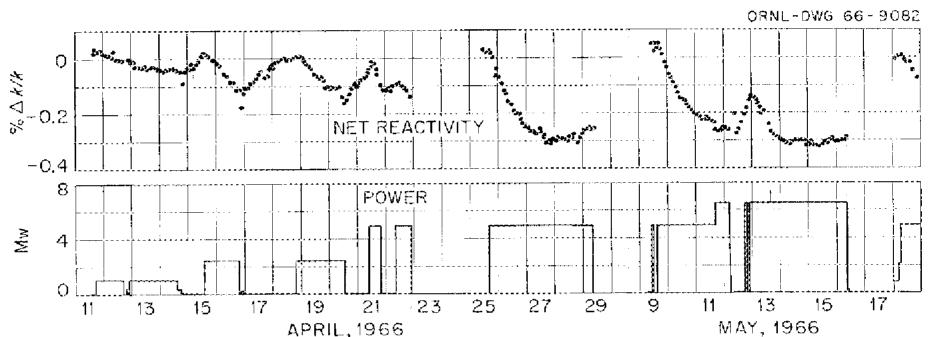

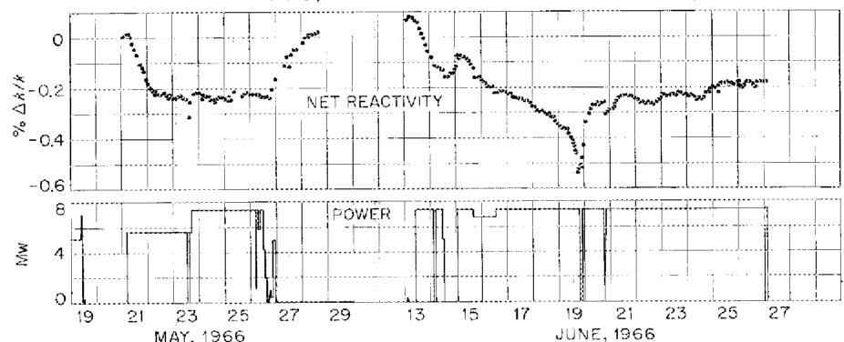

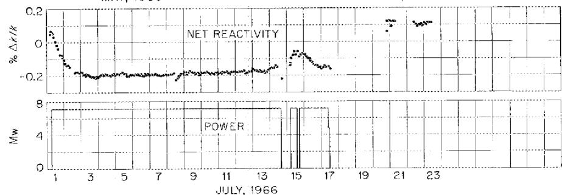  
Fig. 1.l. Modified Reactivity Balance During Power Operation.

predicted power coefficient of $-0.006(\% \text{sk/k})/\text{Mw}$ when the reactor outlet temperature is held constant. Observations of control-rod positions immediately before and after large power changes indicated a smaller power coefficient of reactivity. Careful measurements in times that were short relative to the larger reactivity effects gave a value of $-0.001 \pm 0.001(\% \text{sk/k})/\text{Mw}$ . This value corresponds to an effective temperature difference between the graphite and fuel of $30^{\circ}\text{F}$ at $10\text{Mw}$ . Although the contribution of the power coefficient to the net reactivity is small, all the reactivity balances were corrected to the observed value of this parameter.

# Reactivity Balances at Low Power

A somewhat less-obvious feature of the general reactivity behavior was a gradual drift in the positive direction of balances taken at very low power when xenon poisoning was negligible. By the time the reactor was shut down in July, this drift had raised the apparent net reactivity to $+0.1\% \delta \mathrm{k} / \mathrm{k}$ . However, the reactivity balances do not contain a term to correct for circulating bubbles, and there is some evidence (see Sect. 1.4) that the bubble fraction increased from essentially zero to about $1\%$ during this period. Since circulating voids have a negative effect on the reactivity, proper compensation for the bubbles would reveal an even larger positive drift in the net reactivity. If the bubble fraction did increase by $1\%$ , the net positive shift in reactivity during the period in question was about $0.3\% \delta \mathrm{k} / \mathrm{k}$ .

Several of the major terms in the reactivity balance are accurately known, as demonstrated by the good balances obtained in the initial period of low-power operation. These terms include the temperature coefficient of reactivity, compensation for the operating $^{235}\mathrm{U}$ concentration, and control-rod poisoning. The terms which were introduced by extended operation of the reactor at high power are poisoning by low-cross-section fission products, $^{235}\mathrm{U}$ burnup, and samarium poisoning. (Poisoning by $^{135}\mathrm{Xe}$ has not yet been included because of the discrepancy between predicted and observed behavior.) One possible explanation for the upward drift in reactivity is overcompensation for one or more of these negative terms.

Low-Cross-Section Fission Products. Since the yields and effective cross sections for these fission products are reasonably well known, this poisoning term can be accurately calculated. Furthermore, at the burnup achieved so far, this term accounts for only $-0.004\%$ $\delta \mathrm{k} / \mathrm{k}$ .

$^{235}\mathrm{U}$ Burnup. The cross sections for $^{235}\mathrm{U}$ were adequately treated in the MSRE calculations, as evidenced by the prediction of the initial critical concentration and the concentration coefficient of reactivity. Therefore, compensation for the burnup of $^{235}\mathrm{U}$ , which amounted to $-0.128\%$ $\delta \mathrm{k / k}$ when the reactor was last shut down, is probably not a major source of error.

Samarium Poisoning. We estimate that the equilibrium samarium poisoning in the MSRE will be about $1\% \delta \mathrm{k} / \mathrm{k}$ . Both $^{149}\mathrm{Sm}$ and $^{151}\mathrm{Sm}$ contribute to this effect, and, since different time constants are associated with each isotope, the two components are calculated separately and

then combined to give the total reactivity effect. The calculated samarium poisoning when the fuel salt was drained on July 24 was $-0.364\%$ $\delta \mathrm{k} / \mathrm{k}$ .

Causes of Anomaly. The apparent reactivity anomaly at low power must result from an unknown positive reactivity effect, overcompensation for negative effects, or a combination of the two. The magnitude of this anomaly appears to be at least $0.1\% \delta k / k$ , but it may be as large as $0.3\% \delta k / k$ . The uncertainty is related to the uncertainty in the circulating void fraction during operation.

To date there has been no evidence, either chemical or physical, that the items which make up the negative reactivity terms are behaving differently than was assumed in the calculations. However, additional detailed analyses of future operations will be required to verify the predictions of samarium poisoning and burnup. There has also been no outside evidence of any unforeseen phenomenon that could have a positive reactivity effect of the magnitude observed.

# 1.3 Xenon Poisoning

B.E.Prince R.J.Kedl J.R.Engel

Before the MSRE was operated at power, estimates were made of the $^{135}\mathrm{Xe}$ poisoning that would be encountered.2 These estimates were based on detailed models postulated for the xenon behavior in the salt, helium, and graphite in the reactor. Values for important parameters were obtained wherever possible from various development tests and, in the case of the circulating bubble fraction, from experiments in the MSRE. (These early tests indicated practically no bubbles.)3 On this basis the steady-state reactivity effect due to $^{135}\mathrm{Xe}$ was estimated to be $-1.08\%$ $\delta \mathbf{k} / \mathbf{k}$ (poison fraction $= 1.44\%$ ) at 7.5 Mw. The detailed equations which describe xenon behavior were also used to make predictions about the time dependence of this phenomenon.4

When the reactor was operated at power, the reactivity transients that were attributed to $^{135}\mathrm{Xe}$ were found to have time constants that were close to the predicted values, but the magnitudes of the transients were only about 0.3 to 0.4 of the predicted values. A possible explanation for the low xenon poisoning appeared when there began to be substantial, independent evidence that there were now circulating helium bubbles in the fuel loop (see Sect. 1.4). As a result of these observations, additional studies were performed in an effort to obtain better correlations between our predictions and experience.

Two separate studies were performed using the same basic set of equations but with somewhat different objectives. The first of these was an extensive parameter study of the steady-state $^{135}\mathrm{Xe}$ poisoning. The objectives were (1) to see if the MSRE experience could be explained with reasonable values of the parameters and (2) to provide information

about the effects of various parameters that would be required for the extension of this treatment to other molten-salt-reactor concepts. The second study was aimed primarily at the time dependence of the xenon poisoning with fewer variations in the physical parameters. The objective here, in addition to providing a better insight into the behavior of xenon in the MSRE, was the development of an adequate computational model for the inclusion of xenon in the on-line calculation of the reactivity balance.

# Predicted Steady-State $^{135}\mathrm{Xe}$ Poisoning

The steady-state $^{135}\mathrm{Xe}$ model described previously $^2$ was modified to include the effects of bubbles of helium circulating in the salt, and calculations were made. The results are shown in Figs. 1.2 and 1.3. Significant parameters which were constant for these plots are as follows:

Reactor power level = 7.5 Mw

Salt stripping efficiency = 12%

Mass transfer coefficient to bulk graphite = 0.060 ft/hr

Mass transfer coefficient to center-line graphite $= 0.38$ ft/hr

Diffusion coefficient of xenon in graphite $= 1 \times 10^{-4} ft^{2}/hr$

Some of these parameters have been changed somewhat from those reported in the last semiannual report, but this is an updating and does not change any of the conclusions. While the calculations included transfer of $^{135}\mathrm{Xe}$ from the salt to the bubbles, they omitted any transfer of bubbles between the salt and the surface of the graphite. There are arguments to support this omission, but the effect might later prove to be significant.

Figure 1.2 shows the reactivity as a function of circulating void fraction. The band shows the variation when the bubble diameter is fixed at 0.010 in. and the mass transfer coefficient to the bubble covers a range of 1 to 4 ft/hr. It also shows the variation when the mass transfer coefficient is fixed at 2 ft/hr and the bubble diameter covers a range of 0.005 to 0.020 in. For this figure the bubble stripping efficiency is fixed at $10\%$ . The bubble stripping efficiency is the fraction of $^{135}\mathrm{Xe}$ -enriched bubbles that burst in going through the pump bowl and are replaced with pure helium bubbles. The actual value of the bubble stripping efficiency is completely unknown, and $10\%$ was picked only because this is approximately the value derived from some development tests for the efficiency with which dissolved gas would be stripped from the salt.

Figure 1.2b shows the variation of reactivity with void fraction at various values of bubble stripping efficiency. For this plot the bubble diameter is fixed at 0.010 in. and the bubble mass transfer coefficient is fixed at 2.0 ft/hr. The conclusion that can be drawn from these figures is that circulating bubbles certainly can, and probably do, account for the discrepancy between measured and predicted values of $^{135}\mathrm{Xe}$

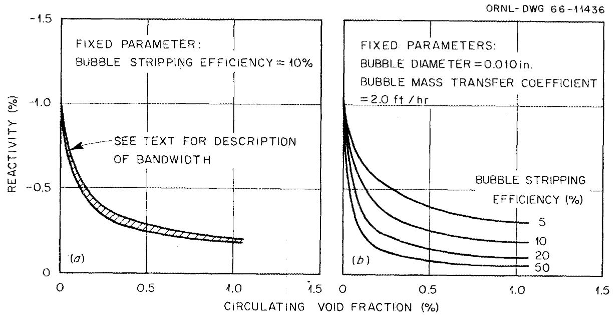  
Fig. 1.2. $^{135}\mathrm{Xe}$ Poisoning as a Function of Circulating Void Fraction and Other Parameters As Indicated.

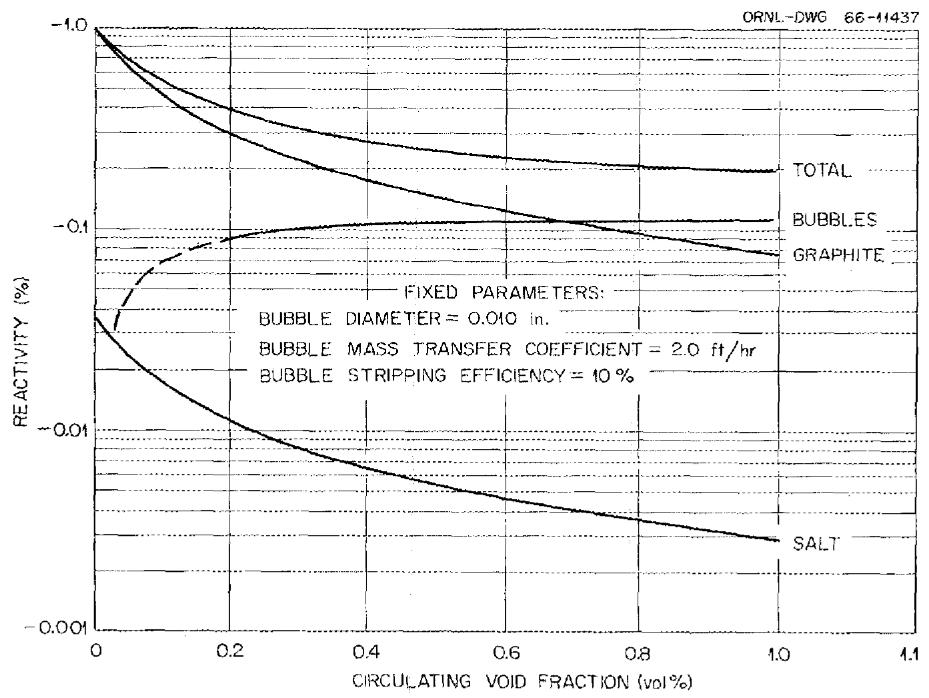  
Fig. 1.3. Contribution of Systems to Total $^{135}\mathrm{Xe}$ Poisoning.

poisoning. To prove this conclusively, one would have to have accurate knowledge of the circulating void fraction, bubble stripping efficiency, and other factors which are unavailable at the present time.

Figure 1.3 shows the contribution of $^{135}\mathrm{Xe}$ in each phase (salt, graphite, and bubbles) to the total computed $^{135}\mathrm{Xe}$ reactivity effect.

The various parameters are fixed as indicated. This plot shows how circulating bubbles work to decrease the loss of reactivity to $^{135}\mathrm{Xe}$ . As the void fraction is increased, most of the dissolved xenon migrates to the bubbles, dropping the dissolved xenon concentration greatly. The concentration potential necessary for $^{135}\mathrm{Xe}$ to migrate to the graphite is reduced accordingly. Now, since $^{135}\mathrm{Xe}$ in the graphite was the largest contribution to reactivity in the "no circulating bubble" case, the overall loss in reactivity drops also.

# Analysis of Transient $^{135}\mathrm{Xe}$ Poisoning

The equations given in ref. 4 were modified to include the possible presence of minute helium gas bubbles circulating with the liquid salt. The equations describing the transient concentrations, modified to include mass transfer of xenon to the gas bubbles, are given below. To simplify the description, we will assume that the neutron flux is flat throughout the core. The method described in ref. 4 for correcting for the spatial dependence of the $^{135}\mathrm{Xe}$ poisoning within the graphite-moderated region is directly applicable to the modified equations given below. As in ref. 4, we have used a one-dimensional model for the fuel channels in order to simplify the calculations. The differential equations governing the concentrations of $^{135}\mathrm{Xe}$ in the liquid salt, graphite, and circulating gas volume are as follows:

$$
\frac {\mathrm {d} \mathbb {N} _ {I} ^ {\ell}}{\mathrm {d} t} = \gamma_ {I} P \frac {V _ {c}}{V _ {L}} - \lambda_ {I} N _ {I} ^ {\ell}, \tag {1}
$$

$$
\begin{array}{l} \frac {\mathrm {d} \mathbb {N} _ {\mathrm {X e}} ^ {\ell}}{\mathrm {d} t} = \gamma_ {\mathrm {X e}} P \frac {V _ {c}}{V _ {L}} + \lambda_ {I} N _ {I} ^ {\ell} - \left(\lambda_ {\mathrm {X e}} + \lambda_ {s} + \sigma_ {\mathrm {X e}} \Phi \frac {V _ {c}}{V _ {L}}\right) \mathbb {N} _ {\mathrm {X e}} ^ {\ell} \\ - \frac {\mathrm {h V} _ {\mathrm {c}}}{\mathrm {y} _ {\mathrm {O}} \mathrm {V} _ {\mathrm {L}}} \left(\mathrm {N} _ {\mathrm {X e}} ^ {\ell} - \frac {\mathrm {R T}}{\mathrm {H} _ {\mathrm {X e}} \epsilon} \left. \mathrm {n} _ {\mathrm {X e}} ^ {\mathrm {g}} \right] _ {\mathrm {x} = 0}\right) \\ - \frac {6 h _ {b}}{d} \alpha_ {b} \left(N _ {X e} ^ {\ell} - \frac {R T}{H _ {X e}} N _ {X e} ^ {b}\right), \tag {2} \\ \end{array}
$$

$$
\frac {d N _ {X e} ^ {b}}{d t} = \frac {6 h _ {b}}{d} \left(N _ {X e} ^ {\ell} - \frac {R T}{H _ {X e}} N _ {X e} ^ {b}\right) - \left(\lambda_ {X e} + \lambda_ {s b} + \sigma_ {X e} \Phi \frac {V _ {c}}{V _ {L}}\right) N _ {X e} ^ {b}, \tag {3}
$$

$$
\frac {\partial n _ {X e} ^ {g}}{d t} = D _ {X e} \frac {\partial^ {2} n _ {X e} ^ {g}}{\partial x ^ {2}} - (\lambda_ {X e} + \sigma_ {X e} \Phi) n _ {X e} ^ {g}, \tag {4}
$$

$$
\mathrm {N} _ {\mathrm {X e}} ^ {\mathrm {g}} = \frac {1}{\mathrm {y} _ {1}} \int_ {0} ^ {\mathrm {y} _ {1}} \mathrm {n} _ {\mathrm {X e}} ^ {\mathrm {g}} (\mathrm {x}, \mathrm {t}) \mathrm {d x}. \tag {5}
$$

The symbols used in these equations are defined as follows:

$$
N _ {I, X e} ^ {\ell} (t) = \text {a v e r a g e c o n c e n t r a t i o n o f} ^ {1 3 5} I \text {a n d} ^ {1 3 5} X e \text {i n t h e l i q u i d} \\ \text {f u e l s a l t , a t o m s p e r c u b i c c e n t i m e t e r o f l i q u i d ;}
$$

$$
N _ {X e} ^ {b} (t) = \text {a v e r a g e c o n c e n t r a t i o n o f} ^ {1 3 5} X e \text {i n t h e c i r c u l a t i n g g a s}
$$

$$
n _ {X e} ^ {g} (x, t) = \text {l o c a l c o n c e n t r a t i o n o f} ^ {1 3 5} X e \text {a t p o s i t i o n x w i t h i n t h e}
$$

$$
N _ {X e} ^ {G} (t) = \text {a v e r a g e c o n c e n t r a t i o n o f} ^ {1 3 5} X e \text {o v e r t h e g r a p h i t e v o l u m e} \\ \text {a s s o c i a t e d w i t h a s i n g l e f u e l c h a n n e l , a t o m s p e r c u b i c} \\ \text {c e n t i m e t e r o f g r a p h i t e ;}
$$

$$
\mathrm {P} = \text {f i s s i o n d e n s i t y i n t h e c o r e s a l t , f i s s i o n s p e r s e c o n d}
$$

$$
\begin{array}{l} \Phi = \text {a v e r a g e t h e r m a l - n e u t r o n f l u x i n r e a c t o r c o r e , n e u t r o n s} \\ \mathrm {c m} ^ {- 2} \sec^ {- 1}; \end{array}
$$

$$
\gamma_ {I, X e} = \text {f i s s i o n y i e l d s o f} ^ {1 3 5} I \text {a n d} ^ {1 3 5} X e;
$$

$$
\begin{array}{l} \lambda_ {I, X e} = \text {r a d i o a c t i v e} \\ \sigma_ {X e} = \text {a v e r a g e} \\ \end{array} \text {a b s o r p t i o n c r o s s s e c t i o n o f} _ {1 3 5 X e} \text {f o r t h e r m a l}
$$

$$
\begin{array}{l} D _ {X e} = \text {d i f f u s i v i t y o f x e n o n i n g r a p h i t e , s q u a r e c e n t i m e t e r s} \\ \text {o f g r a p h i t e p e r s e c o n d ;} \end{array}
$$

$$
\begin{array}{l} y _ {0} = \text {r a t i o} \\ \text {t r a n s f e r} \end{array} \text {v o l u m e} \text {o f} \text {s a l t} \text {i n} \text {c o r e} \text {t o} \text {e f f e c t i v e} \text {m a s s}
$$

$$
\begin{array}{l} y _ {1} = \text {r a t i o} \\ \text {a r e a o f g r a p h i t e , c m ;} \end{array}
$$

$$
V _ {c} / V _ {L} = \frac {\text {r a t i o o f v o l u m e o f s a l t w i t h i n r e a c t o r c o r e t o t a l}}{\text {v o l u m e o f c i r c u l a t i n g s a l t ;}}
$$

$$
\begin{array}{l} \mathrm {h} = \text {m a s s t r a n s f e r c o e f f i c i e n t f o r l i q u i d f i l m a t t h e} \\ \text {g r a p h i t e - s a l t i n t e r f a c e , c m / s e c ;} \end{array}
$$

$$
h _ {b} = \text {m a s s t r a n s f e r c o e f f i c i e n t f o r l i q u i d f i l m a t l i q u i d -}
$$

$$
\alpha_ {b} = \text {e f f e c t i v e v o l u m e f r a c t i o n o f h e l i u m b u b b l e s i n c i r c u l a t i n g f l u i d};
$$

$$
d = \text {b u b b l e} \quad d i a m e t e r, c m;
$$

$$
R = \text {u n i v e r s a l g a s c o n s t a n t}, 8 2. 0 7 \mathrm {c m} ^ {3} \text {a t m m o l e} ^ {- 1} (^ {\circ} K) ^ {- 1};
$$

$$
T = \text {a v e r a g e} ^ {\prime} \text {t e m p e r a t u r e}, ^ {\prime} K;
$$

H Xe = Henry's law coefficient, cm³ atm mole⁻¹;

$\epsilon =$ graphite porosity, cubic centimeters of void per cubic centimeter of graphite;

$\lambda_{s} =$ effective removal constant for stripping of $^{135}\mathrm{Xe}$ from liquid, $\sec^{-1}$ ;

$\lambda_{\mathrm{sb}} =$ effective removal constant for stripping of $^{135}\mathrm{Xe}$ from gas bubbles, $\sec^{-1}$ .

Equations (1) and (4) are identical in form with those given in ref. 4. Equation (2) has been modified by the addition of the last term on the right-hand side of (2) to represent the net mass transfer of $^{135}\mathrm{Xe}$ from the liquid to the gas phase. Transfer of bubbles between the liquid and the surface of the graphite was not included. Equation (3) governs the time dependence of the $^{135}\mathrm{Xe}$ in this phase. The boundary conditions required in the solution of Eq. (4) are:

$$
\begin{array}{l} \frac {\partial n _ {X e} ^ {6}}{\partial x} \left| _ {x = y 1} = 0, \right. (6) \\ - \mathrm {D} _ {\mathrm {X e}} \frac {\partial \mathrm {N} _ {\mathrm {X e}} ^ {\mathrm {g}}}{\partial \mathrm {x}} \Bigg | _ {\mathrm {x} = 0} = \mathrm {h} \left(\left. \mathrm {N} _ {\mathrm {X e}} ^ {\ell} - \frac {\mathrm {R T}}{\mathrm {H} _ {\mathrm {X e}} \epsilon} \quad \mathrm {n} _ {\mathrm {X e}} ^ {\mathrm {g}} \right| _ {\mathrm {x} = 0}\right). (7) \\ \end{array}
$$

Approximate values of the basic parameters governing the mass transfer of $^{135}\mathrm{Xe}$ to the graphite were obtained from krypton injection experiments. No direct experimental data are available for the effective mass transfer coefficients for the bubbles, $h_0$ , or the effective bubble sizes; however, representative values and probable ranges for these parameters could be estimated. The dependence of the volume fraction of circulating bubbles on the reactor operating conditions (fuel pump-bowl level, temperature, pressure) is not yet well understood. In this study, volume fractions between zero and $1\%$ were considered. Numerical values for the mass transfer coefficients, geometric parameters, and graphite characteristics used in most of the calculations are given in Table 1.2. The graphite diffusivity and porosity are approximate values for the MSRE graphite; however, it can be shown that the calculated transients are relatively insensitive to these parameters.

The effective removal constants for external stripping, $\lambda_{s}$ and $\lambda_{sb}$ , were calculated in accordance with the formula

$$
\lambda_ {s} = \frac {Q E}{V _ {L}},
$$

where $\mathrm{Q} / \mathrm{V}_{\mathrm{L}}$ is the ratio of the bypass flow rate through the xenon-strip- ping spray ring to the volume of the circulating fluid and $\mathbf{E}$ is the

Table 1.2. Numerical Values of Parameters Governing Mass Transfer of $^{135}\mathrm{Xe}$ in MSRE   

<table><tr><td>Parameter</td><td>Value Assumed in This Study</td></tr><tr><td>y0, cm</td><td>1.41</td></tr><tr><td>y1, cm</td><td>1.38</td></tr><tr><td>h, cm/sec</td><td>5.46 × 10-4</td></tr><tr><td>h0, cm/sec</td><td>0.017</td></tr><tr><td>d, cm</td><td>0.0254</td></tr><tr><td>Dx e, cm2/sec</td><td>2.15 × 10-4</td></tr><tr><td>Hx e, cm3 atm mole-1</td><td>0.33 × 109</td></tr><tr><td>ε, %</td><td>10</td></tr></table>

stripping efficiency. Based on the krypton injection experiments, the value of E is expected to be about $10\%$ . For this study, this parameter was varied in the range of 10 to $20\%$ .

Relative values of the calculated time constants in Eq. (3) for mass transfer, stripping, decay, and neutron absorption indicate that the $^{135}\mathrm{Xe}$ in the circulating gas phase should be very nearly in equilibrium with the $^{135}\mathrm{Xe}$ in the liquid, independently of changes in the reactor power level. Hence, this approximation [setting the right-hand side of Eq. (3) equal to zero for all times] was made to simplify the numerical calculations.

Some typical transient reactivity curves calculated with the preceding formulas are given in Figs. 1.4 through 1.6. Figure 1.4 corresponds to a step increase in power from zero to $7.2\mathrm{Mw}$ at time zero. The separate curves indicate the effectiveness of increasing the volume of circulating gas in reducing the net $^{135}\mathrm{Xe}$ poisoning. Each of these curves corresponds to a fixed stripping efficiency of $10\%$ for xenon both in the liquid salt and the circulating bubbles. The transient at $7.2\mathrm{Mw}$ was chosen, since a sustained run was made at this power level during run 7. In Fig. 1.4, we have also plotted the smoothed experimental data obtained during this run. These data represent the magnitude of the apparent $^{135}\mathrm{Xe}$ poisoning, determined by subtracting all other known power-dependent reactivity effects from the reactivity represented by movement of the control rod. We should emphasize that the experimental evidence concerning the reproducibility of transients of this type is as yet insufficient for conclusions to be drawn concerning the amount of gas bubbles which may be in circulation. The data in Fig. 1.4 suggest that from 0.5 to 1.0 vol $\%$ circulating gas can account qualitatively for the observed transient poisoning. However, the experimental curve seems to exhibit a slower approach to equilibrium than is predicted by the theoretical model.

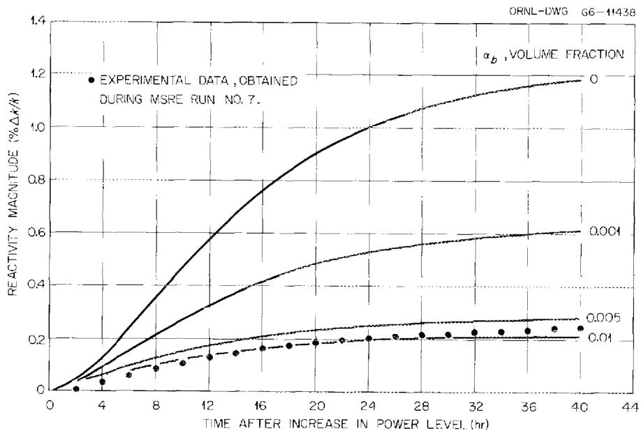

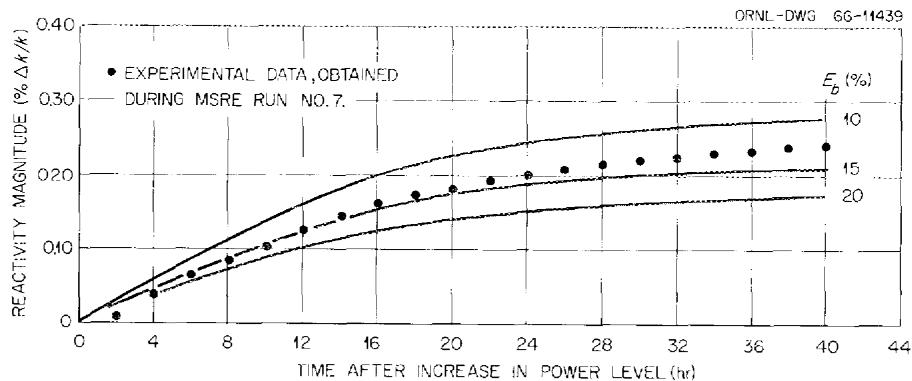  
Fig. 1.4. Effect of Volume Fraction of Circulating Gas on Transient $^{135}\mathrm{Xe}$ Reactivity. Step change in power from 0 to 7.2 Mw; stripping efficiency, $10\%$ .   
Fig. 1.5. Effect of Bubble Stripping Efficiency on Transient $^{135}\mathrm{Xe}$ Reactivity. Step change in power from 0 to 7.2 Mw; volume fraction of bubbles, 0.005.

The influence of the bubble stripping efficiency on the calculated transients is shown in Fig. 1.5. Here, the separate curves represent the variation of this parameter within a range of 10 to $20\%$ for a constant bubble volume fraction of 0.005. The experimental data of Fig. 1.4 are also plotted in this figure.

Each of the transients shown in Figs. 1.4 and 1.5 may be separated into components which correspond to the $^{135}\mathrm{Xe}$ contained in the liquid, the helium bubbles, and the graphite pores. The composition of a typical transient, corresponding to a circulating gas volume fraction of 0.005 and a stripping efficiency of $10\%$ , is shown in Fig. 1.6. For the poison-

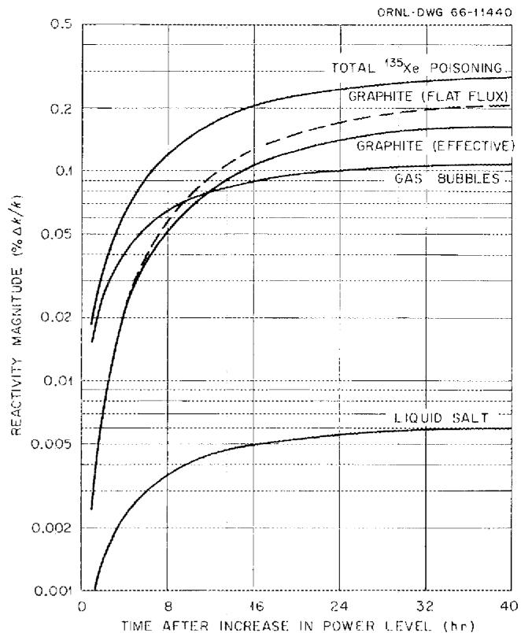  
Fig. 1.6. Components of Transient $^{135}\mathrm{Xe}$ Reactivity. Step change in power from 0 to 7.2 Mw; volume fraction of bubbles, 0.005; stripping efficiency, $10\%$ .

ing in the graphite, calculations are given both for a flat-flux approximation (dashed curve) and the weighted poisoning for a flux distribution approximating that in the actual core (solid curve). Figure 1.6 illustrates that nearly all the $^{135}\mathrm{Xe}$ is contained in the bubbles and the graphite pores, the bubbles providing the additional "sink" which reduces the effective mass transfer to the graphite. It also illustrates the difference in the time constants for buildup of these components. The approach to equilibrium of the $^{135}\mathrm{Xe}$ in the graphite is slower than that in the liquid, owing to the effective time lag introduced by the mass transfer between the liquid and graphite.

As more experimental evidence is accumulated concerning the transient behavior of the $^{135}\mathrm{Xe}$ poisoning, attempts will be made to refine the preceding model. This will include attempts to determine the dependence of the volume of circulating gas on the reactor operating conditions and the degree to which a fixed gas volume might be expected during further operation of the reactor.

# 1.4 Circulating Bubbles

R.J.Kedl J.R.Engel

Early in the development of the MSRE salt pumps, some evidence appeared that the circulating fuel salt would contain a small but measurable quantity of helium bubbles introduced by the xenon stripping device. This was a significant finding because of the potential influence of these bubbles on the reactor dynamics (through a pressure coefficient of reactivity) and on xenon poisoning. Theoretical analyses led to the conclusion that the dynamic effects would not be serious but that bubbles would substantially reduce the xenon poisoning. Because of the importance of the bubbles, experiments were planned to measure the circulating void fraction.

The experiment designed to measure the void fraction consisted in subjecting the fuel system to a rapid pressure release. In these tests the fuel system would first be pressurized to about 15 psig (normal over-pressure is 5 psig) with helium and allowed to establish a new steady state. The excess overpressure would then be rapidly released by venting the gas to a previously vented, empty drain tank. Expansion of any gas in the loop forces salt into the surge space in the pump bowl, where it can be measured by the level instrument. In addition, the expulsion of salt from the core reduces reactivity, which can be measured in the critical reactor by observing control-rod motion. A third method of evaluating the circulating voids, a salt densitometer, was installed for use in the initial tests prior to operation of the reactor at significant power.

Three pressure-release tests were performed as part of the zero-power experiments in July 1965. Two of these tests, at normal system temperature and salt level in the pump bowl, indicated that there was essentially no gas in the core. However, the third test, which was conducted at an abnormally low pump-bowl level (obtained by lowering the operating temperature to $1050^{\circ}\mathrm{F}$ ), showed a void fraction of 2 to $3\%$ . It appeared from this test that bubbles did not begin to circulate in the loop until the pump-bowl level was reduced to about $50\%$ on the bubbler level elements. Since only one such experiment was performed, the individual effects of pump-bowl level and salt temperature were not separated.

The results of these zero-power tests led to the establishment of a minimum pump-bowl operating level of $50\%$ to prevent circulation of helium bubbles. In addition, the bubble term was removed from the equations used to predict xenon poisoning. When the reactor was operated at high power, the observed xenon transients were much smaller than those predicted by the "no bubble" equations, implying the presence of bubbles. In addition, a reactivity disturbance occurred on June 19, 1966, which again emphasized the importance of bubbles. On that date (see Fig. 1.l) the net reactivity began to decrease sharply, and it was noted that the lower of two pump-bowl level indications had dropped below $50\%$ because of the continuous transfer of salt from the pump bowl to the overflow tank. The reactivity recovered rapidly when the salt was returned to the

pump bowl from the overflow tank. Following this event, small increases in reactivity were noted each time salt was returned from the overflow tank even though the pump-bowl level was kept above $50\%$ .

Several pressure-release experiments were performed near the end of run 7 (July 1966) to determine whether the circulating void fraction was higher than that observed a year ago. Since, by this time, salt was continuously transferring to the overflow tank at the normal pump-bowl level, experiments could be performed at different pump-bowl levels with the same reactor outlet temperature. Experiments were performed at both high and low power levels, and one was performed at an abnormally low temperature.

Preliminary evaluations have been made of the void fractions at each condition, and the results are shown in Table 1.3. The results of two of the earlier tests (performed July 2, 1965) are included for reference. Although additional experiments are necessary to elucidate the situation, some conclusions can be drawn. It appears that the circulating void fraction at the end of run 7 was substantially higher than during the zero-power experiments. The results also show a substantial dependence

Table 1.3. Circulating Void Fraction Measurements in MSRE   

<table><tr><td rowspan="2">Date of Test</td><td colspan="3">Conditions</td><td colspan="2">Void Fraction (%)</td></tr><tr><td>Reactor Power (Mw)</td><td>Reactor Outlet Temperature (°F)</td><td>Initial Pump-Bowl Level (%)</td><td>From Pump-Bowl Level Risea</td><td>From Control-Rod Motion</td></tr><tr><td>7/2/65</td><td>10-5</td><td>1197</td><td>59.6</td><td>0</td><td>0</td></tr><tr><td>7/2/65</td><td>10-5</td><td>1050</td><td>50.0</td><td>2.69</td><td>2.05</td></tr><tr><td>7/8/66</td><td>7.3</td><td>1210</td><td>53.0</td><td>0.65</td><td>0.81</td></tr><tr><td>7/12/66</td><td>7.2</td><td>1210</td><td>61.2</td><td>0.24-0.54</td><td>0.34</td></tr><tr><td>7/21/66</td><td>0.01</td><td>1191</td><td>56.2</td><td>0.87-1.01</td><td>1.94</td></tr><tr><td>7/22/66</td><td>0.01</td><td>1190</td><td>51.3</td><td>0.50-0.73</td><td>1.24</td></tr><tr><td>7/23/66</td><td>0.01</td><td>1189</td><td>61.5</td><td>0.48-0.62</td><td>0.96</td></tr><tr><td>7/23/66</td><td>0.01</td><td>1124</td><td>52.8</td><td>2.68-2.91</td><td>2.39</td></tr></table>

${}^{a}$ Range reflects current uncertainty in compensating for pressure sensitivity of level elements.

on salt temperature, at least at pump-bowl levels above $50\%$ . This dependence may be related to the effect of salt viscosity on the bubble rise velocity.

There are some inconsistencies in the measured void fractions. These may be due in part to the uncertainties in compensating for side effects during the pressure release, for example, pressure sensitivity of the level-indicating devices and transient nuclear periods during control-rod adjustment. There is also a basic difference between the void fractions measured by the two methods in Table 1.3. The pump-bowl level measurements indicate the average void fraction in the entire primary loop, while the control-rod measurements indicate only the average void fraction in the core. Thus, if there were any tendency for voids to concentrate in a particular location, either in or outside the core, differing results could be expected. Furthermore, there may be some dependence on the immediate past history of the reactor. If, for example, the bubbles circulating at low pressure are very stable and are inefficiently stripped, a level change just prior to a test could produce misleading results. Detailed evaluations of these and other effects will be included in future analyses.

# 1.5 Salt Transport

H. B. Piper

# Gradual Transfer to Overflow Tank

Early operation of the reactor showed that by some unexplained mechanism salt gradually accumulated in the fuel pump overflow tank even when the salt level in the pump bowl was well below the overflow point. The transfer rate depended on salt level, and the transfer ceased when the level was about 3 in. below the overflow point. This situation existed until about April 1966, when transfer began to be observed at lower salt levels. The rate appeared to increase gradually as time went on until it leveled off in June and July at 0.57 lb of salt per hour, independent of salt level as far down as 4.7 in. below the overflow point. The change occurred at the time of the stepwise increase in power, but no mechanism connecting the two has been identified. This transfer has no ill effect on operation of the reactor other than imposing the requirement that the overflow tank be emptied three times a week to keep the levels in the desired operating range.

# Overfill

At the conclusion of operation in July, the fuel loop was filled with flush salt to rinse out residual pockets of fuel salt, thus reducing the radiation levels for scheduled work in the reactor cell. We decided to transfer flush salt into the overflow tank for two reasons:

to flush out the residual fuel and to check the indicated level at the overflow point. Transfer began when the indicated level was 9.6 in. (In January 1965 the indicated level at the overflow point had been 9.2 in.) Approximately 0.6 ft³ of salt had been transferred when suddenly the fuel pump level rose sharply off scale. Rising level in the overflow tank triggered a drain, but not before salt had entered some of the lines connected to the top of the pump bowl. What had happened was that the salt level in the flush tank had been lowered too far, allowing the pressurizing gas to enter the fill line and pass up into the reactor vessel. The gas expanded rapidly as it rose through the salt, causing salt to flood the pump bowl. The pump-bowl bubbler reference line was plugged with frozen salt, and enough salt was frozen in the sampler tube to obstruct passage of the latch. A thermocouple indicated that some salt also entered the off-gas line, but this line was not plugged. Salt also froze in the annulus around the fuel-pump shaft, preventing its rotation.

This incident was caused by human error. The level to which the overflow tank was to be filled is within the range easily attainable with fuel salt. But the volume of flush salt in the reactor is less, and, in order to reach the specified level in the overflow tank, it was necessary that the salt temperature be about $1200^{\circ}\mathrm{F}$ or above. This was overlooked when the procedure was specified, and the loop was filled at $1140^{\circ}\mathrm{F}$ . This temperature is within the range for a normal fill, and the special requirement for this experiment was not recognized until after the incident had occurred.

Immediately after this mishap the overflow tank was emptied and the loop was refilled. The pump tank was heated to $1200^{\circ}\mathrm{F}$ and the shaft was freed. Subsequently electric heaters were applied to the outside of the lines to melt out the salt in the bubbler reference line and the sampler tube. The short flexible portion of the off-gas line was replaced because of uncertainty over the possible effects of salt in the convolutions.

# 1.6 Power Measurements

H.B.Piper C.H.Gabbard

# Heat Balance

The nuclear power produced in the MSRE is determined by an overall system heat balance. During early operation at low power (below $\sim 1.0$ Mw) uncertainties in measuring small temperature differences yielded a large percentage error in the computed heat balance. However, as the power was raised to intermediate levels, the uncertainties in the heat balance calculation became less and good confidence was established in the heat balance power. Since the heat balance is the primary power standard, all nuclear power instruments were calibrated to agree with it. As the power was raised, the calibration of the nuclear instruments changed, and a disagreement in power indication existed between the nuclear instruments and the heat balance. (This disagreement will be discussed later in this section.)

The heat-balance calculation in the computer remains unchanged, but the method for obtaining a zero-power base line has been modified. Initially, a constant "heat loss" term along with zero-power temperature biases were used to establish the heat balance zero power. It was noted, however, that with the reactor producing zero power, the computed heat balance might vary from run to run by as much as $\sim \pm 200$ kw. We believe this occurs because many thermocouples are sensitive to heater settings and the heaters may not be set exactly the same for each run. This difference represents an error of only $\pm 2.7\%$ when we run at 7.5 Mw. Nevertheless, at the beginning of each run, several heat balances are taken, the value of the discrepancy is determined, and this value is entered in the heat-balance calculation as a new value of the "heat loss" term, thus yielding a corrected power for the remainder of each run.

# Nuclear Instruments

The agreement between the heat-balance power and the power indicated by the nuclear instruments was better than $\pm \sim 10\%$ from 2 to about $6\mathrm{Mw}$ . (Heat balances have a scatter of $\pm \sim 200\mathrm{kw}$ , and this is independent of power; below $2\mathrm{Mw}$ the percentage scatter is large.) Above this level the two power indications began to diverge, with the nuclear instruments indicating 15 to $20\%$ high at a heat-balance power of $7.5\mathrm{Mw}$ . After investigating, with negative results, several mechanisms which might explain the disagreement, it was postulated that the effect might have been caused by a rise in water temperature in the nuclear instrument penetration (NIP) as the power was increased. This was found to be the case. When the ratio of heat-balance power to nuclear-instrument power was plotted vs NIP temperature, a good correlation with a negative slope resulted. This plot showed that an increase of $10^{\circ}\mathrm{F}$ in the NIP water temperature produced an increase of $450\mathrm{kw}$ , or about $6\%$ , in the power indication from the nuclear instruments at a level power of $7.5\mathrm{Mw}$ . This anomaly could be caused by temperature sensitivity of the nuclear instruments, but we believe the most likely explanation of the temperature sensitivity is the change in the attenuation characteristics of water with temperature. On June 27, a heat exchanger system was placed in operation to cool the water in the NIP. As the NIP water temperature decreased, the ratio between heat-balance power and nuclear-instrument power approached unity. The heat exchanger used was immediately available, but it does not have the capacity to hold the NIP water temperature constant at all power levels. From zero to full power, there is now a temperature rise of $\sim 18^{\circ}\mathrm{F}$ as compared to $\sim 72^{\circ}\mathrm{F}$ before the heat exchanger was installed. There is still a shift of about $5\%$ between the two power measurements from zero to full power.

# Radiator Air Flow

Because of the lack of agreement between the heat-balance power and that indicated by the nuclear instruments, we attempted to verify the power by determining the amount of heat removed from the radiator by the air. The inherent uncertainty in determining the reactor power by a heat

balance around the air side of the radiator is great because of difficulties in measurement of both the air flow and the temperatures. These difficulties arise from the fact that the coolant stack is not long enough $(\mathrm{L} / \mathrm{D} = 7)$ for symmetrical flow to be established. Even so, calculations were made using the best data available for this evaluation. The heat removed by the air was determined for reactor power levels of 4, 5.8, and 7 Mw, as measured by the overall system heat balance, and was found to be $1\%$ low, $16\%$ high, and $15\%$ high respectively. This is considered to be a reasonable confirmation of the system heat-balance method.

# 1.7 Radiation Heating

C. H. Gabbard H. B. Piper

The effects of radiation heating on some of the MSRE components were evaluated both during the approach to full power and during sustained operation at high power. Of particular interest in this area are the fuel-pump tank, the reactor vessel, and the thermal shield. (The effects of fission product radiation heating in the off-gas piping are discussed in connection with other observations of that system in Sect. 1.9, subsection entitled "Fuel Off-Gas System").

# Fuel-Pump Tank

The upper portion of the fuel-pump tank is subject to substantial heating from fission products in the gas space above the salt. Since the useful life of the pump tank is limited by thermal-stress considerations at the junction of the volute support cylinder with the spherical top of the tank, close control was maintained over the temperatures in this region. Design studies7 had indicated that the maximum lifetime would result if the junction temperature were kept about $100^{\circ}\mathrm{F}$ below the temperature on the tank surface 6 in. out from the junction. Component cooling air is provided to maintain this temperature distribution. A secondary consideration in controlling the temperatures was a desire to keep as much of the pump tank as possible above the liquidus temperature of the salt.

In operating the reactor, it would be ideal if a fixed flow rate of air over the pump tank would provide a satisfactory temperature distribution for all conditions. Early design calculations indicated that this condition could be met with an air flow of 200 cfm. However, temperature measurements on the pump-test loop and during the initial heatup of the MSRE indicated that only about 50 cfm would be required and that the air would have to be turned off when the pump tank was empty.

To minimize the temperature effects when the cooling air is turned on, air flow during power operation should be the minimum that gives the desired temperatures. It was found that an air flow of 30 cfm provides a satisfactory temperature distribution at all power levels up to 7.5 Mw. Figure 1.7 shows the temperatures in the two regions of interest as a function of reactor power level with this air flow. The variations in

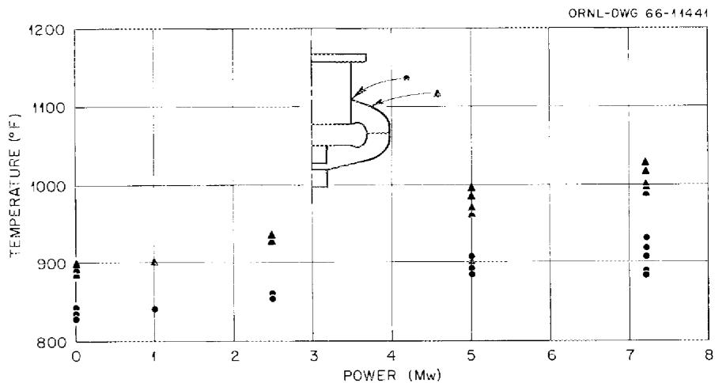  
Fig. 1.7. Variation of Fuel-Pump Tank Temperatures with Reactor Power. Cooling-air flow, 30 cfm.

the individual temperatures are caused by variations in pump-bowl level, salt temperature, and air flow. Both the individual temperatures and the temperature difference increase linearly with power, as expected. Although the temperature difference would exceed $100^{\circ}\mathrm{F}$ at powers much above $7.5\mathrm{Mw}$ , the reactor could be operated at $10\mathrm{Mw}$ with the 30-cfm air flow without significantly reducing the life of the pump tank. However, variation of the air flow could also be employed to obtain closer control of the temperatures.

# Reactor Vessel

Since radiation-produced heat in the reactor-vessel walls must be transferred to the salt for removal, the outer surfaces of the vessel are hotter than the adjacent salt by an amount that is proportional to the reactor power. Any deposition of solids on the inner surfaces would reduce the heat transfer (and increase the heat production) and lead to still higher temperatures at the outer surfaces. There are two locations in the reactor vessel where solids would tend to accumulate if they were present in the circulating salt. These are the lower head and the lugs, just above the inlet volute, which support the core matrix. Deviations from the normal surface temperatures might also indicate changes in the core flow pattern.

Although there has been no evidence, whatever, of solids in the molten salts, the differences between the reactor-vessel temperatures and the salt inlet temperature have been carefully monitored. Since the salt inlet temperature can be measured only at the inlet line and there is some fission heat generation in the salt as it flows to the areas in question, the observed $\Delta T$ 's do not represent the actual temperature drops across the walls. However, the proportionality to power should exist, and there should be no change with time.

Throughout the power operation of the reactor, the temperature difference between the vessel wall at the core-support lugs and the salt inlet has been $2.0 \pm 0.1^{\circ}\mathrm{F} / \mathrm{Mw}$ , and that between the lower head and the salt inlet has been $1.5 \pm 0.2^{\circ}\mathrm{F} / \mathrm{Mw}$ . There has been no indication of deviation from linearity with power or of changes with time in either temperature difference.

# Thermal Shield

The function of the thermal shield around the reactor vessel is to reduce the radiation level and radiation heating in the rest of the reactor cell. As a result, a substantial amount of fast-neutron and gamma energy is deposited in this shield. The cooling system for the thermal shield was designed to remove up to 600 kw to allow for uncertainties in the rate of heat generation at power. Measurements of the heat load on the thermal shield gave a zero-power value of 40 kw due to heat losses from the reactor furnace and an additional 17 kw per megawatt of reactor power due to radiation heating.

# 1.8 Reactor Dynamics

T.W.Kerlin S.J.Ball

The inherent stability of the reactor system was investigated by frequency response tests at eight power levels from zero to full power. The testing methods, analysis procedures, and results of tests at powers to 1 Mw are described in detail in the last progress report. Subsequently, tests were conducted at 2.5, 5.0, 6.7, and 7.5 Mw using pseudorandom binary reactivity insertions, pulse reactivity insertions, and step reactivity insertions. At each power level, essentially equivalent results were obtained from the different tests.

A readily obtainable result is the natural period of oscillation of the reactor power following a disturbance in reactivity. This information can be obtained by simply observing the flux transient if the response is lightly damped or by determining the frequency of the peak in the amplitude of the frequency response. The experimental results agree very well with previous theoretical predictions, as shown in Fig. 1.8.

The measured frequency response results for power levels of 2.5 Mw and higher are shown in Figs. 1.9 to 1.12 along with the theoretical predictions. The theoretical phase predictions agree with the experimental results within the experimental scatter. All the tests at a given power level give magnitude ratios having the same shape but differing in their absolute values. Furthermore, the portions of the frequency responses above 0.3 radian/sec should be the same for all power levels, since feedback effects are small in this frequency range and the zero-power frequency response should dominate. The experimental results for

various power levels show the same shape in this frequency region but different absolute amplitudes. Both of these inconsistencies indicate a bias problem which is apparently due to equipment limitations.[10] These equipment difficulties are not surprising, since we wanted to be able to position the control rod with an accuracy better than 0.050 in. in the dynamics tests; this far exceeded design specifications.

We previously thought that a simple adjustment of several parameters in the theoretical model could force agreement between theory and experiment. An adjustment made to minimize the error at 1.0 Mw also produced agreement at 0.075 Mw and 0.465 Mw. This now appears to have been fortuitous, since the same parameter adjustments increase the discrepancies at power levels greater than 1.0 Mw.

The net conclusions are that the dynamic characteristics of the system are quite satisfactory and in reasonable agreement with predictions. The system is stable at all operating power levels, and the stability increases with power level. The theoretical model appears to be satisfactory in spite of unfortunate equipment limitations which prevent detailed parameter fitting.

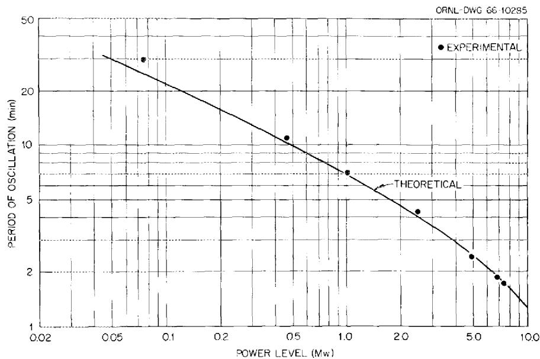  
Fig. 1.8. Comparison of Predicted and Measured Natural Periods of Oscillation.

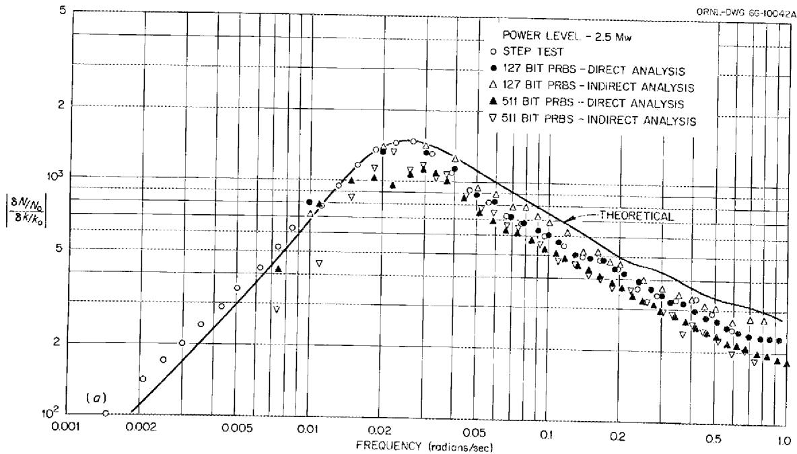

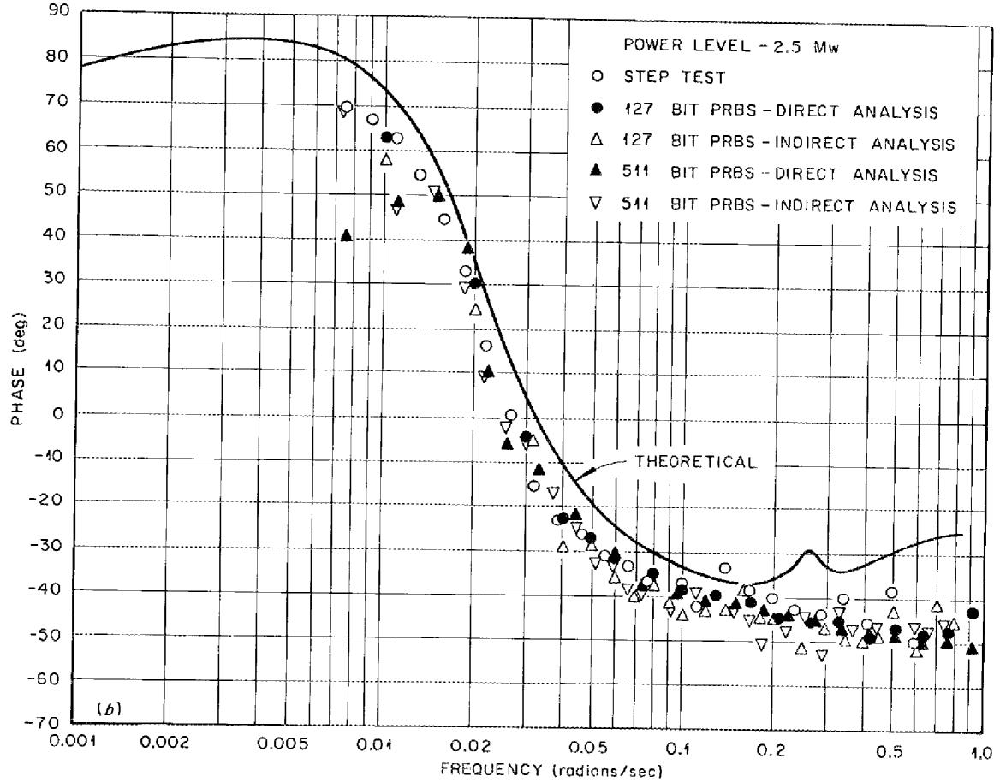  
Fig. 1.9. Frequency Response: Magnitude Ratio of $\frac{\delta N / N_0}{\delta K / K_0}$ for $N_0 = 2.5$ Mw (a) and Phase of $\frac{\delta N / N_0}{\delta K / K_0}$ for $N_0 = 2.5$ Mw (b).

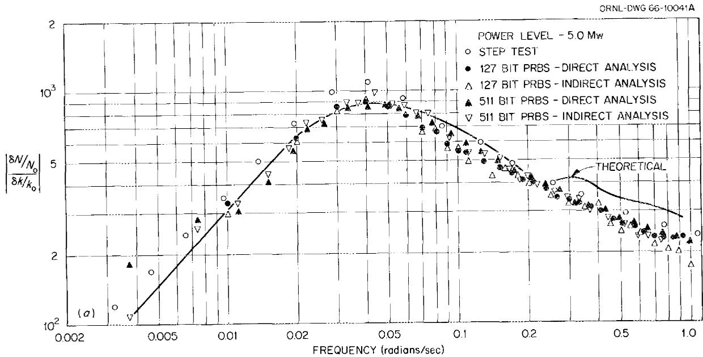

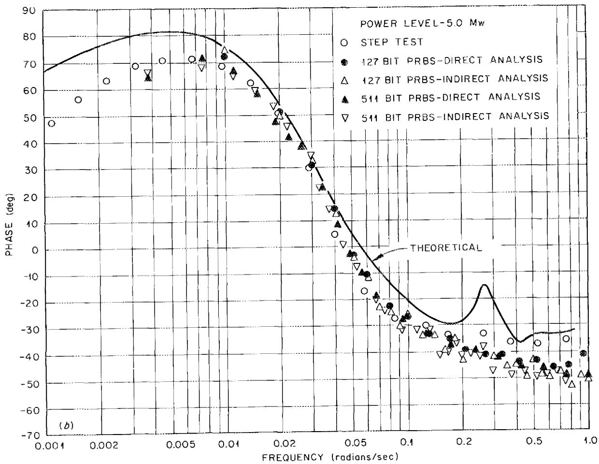  
Fig. 1.10. Frequency Response: Magnitude Ratio of $\frac{\delta N / N_0}{\delta K / K_0}$ for $N_0 = 5$ Mw (a) and Phase of $\frac{\delta N / N_0}{\delta K / K_0}$ for $N_0 = 5$ Mw (b).

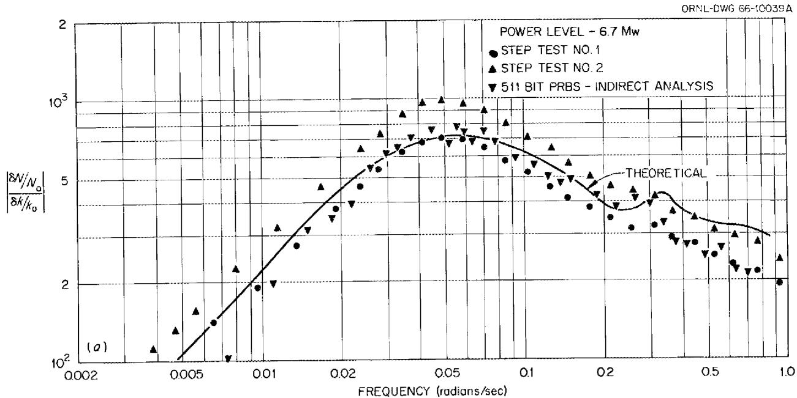

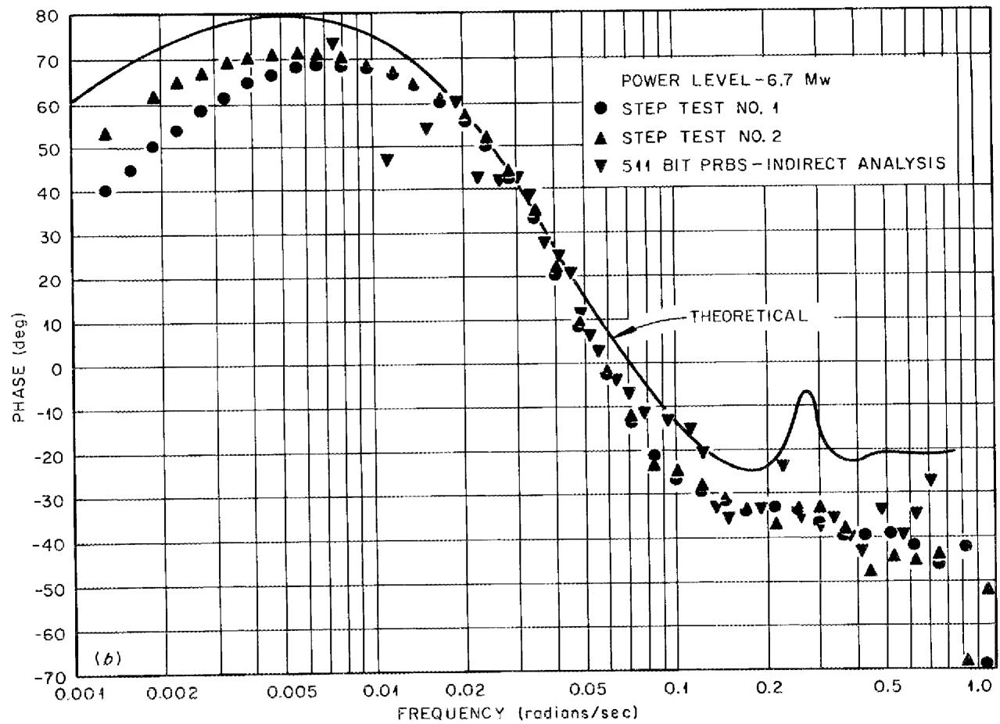  
Fig. 1.11. Frequency Response: Magnitude Ratio of $\frac{\delta N / N_0}{\delta K / K_0}$ for $N_0 = 6.7$ Mw (a) and Phase of $\frac{\delta N / N_0}{\delta K / K_0}$ for $N_0 = 6.7$ Mw (b).

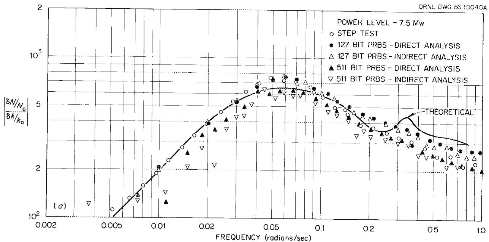

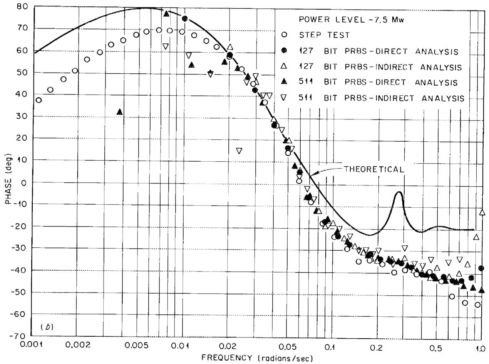  
Fig. 1.12. Frequency Response: Magnitude Ratio of $\frac{\delta N / N_0}{\delta K / K_0}$ for $N_0 = 7.5$ Mw (a) and Phase of $\frac{\delta N / N_0}{\delta K / K_0}$ for $N_0 = 7.5$ Mw (b).

Heat Transfer - C. H. Gabbard, H. B. Piper, and R. J. Kedl

As the reactor power was raised, the heat-transfer capability of the air-cooled radiator was found to be less than expected and, in fact, to limit the attainable heat removal to about 7.5 Mw. The overall heat-transfer coefficient of the primary heat exchanger was also below the predicted value, resulting in somewhat larger fuel-coolant temperature differences than had been planned. After the first indications of low heat transfer, we reexamined the reactor data to determine heat-transfer coefficients as accurately as possible and to see if the coefficients varied with power level or operating time. Meanwhile, we reviewed the original design work to see if there were errors in the calculational method or physical properties that could account for the discrepancy between the predicted and observed performance.

Primary Heat Exchanger. Because of the elevated temperatures and relatively small temperature differences in the primary heat exchanger, a proper accounting for thermocouple errors is essential to an accurate calculation of heat-transfer coefficient. The performance was evaluated by two procedures, which differed mainly in the method of handling thermocouple biases.

The essential feature of the first procedure, used routinely at the MSRE, is a statistical fit of a theoretical relation to a large number of temperature measurements at different power levels. The formulation is such that biases in thermocouples, if constant, do not significantly affect the outcome and need not be evaluated. The effect of random error in thermocouple output is minimized by using many sets of data. The relation used to evaluate the overall heat transfer coefficient, $U$ , is

$$
\begin{array}{l} \mathrm {d} \left[ \mathrm {T _ {f o}} + \mathrm {T _ {f i}} - \mathrm {T _ {c o}} - \mathrm {T _ {c i}} + \Delta \mathrm {T _ {c}} \sqrt {1 + \left(\frac {\mathrm {F _ {c} C p _ {c}}}{\mathrm {F _ {f} C p _ {f}}}\right) ^ {2}} \right] \\ \mathrm {d} \left[ \mathrm {T} _ {\mathrm {f o}} + \mathrm {T} _ {\mathrm {f i}} - \mathrm {T} _ {\mathrm {c o}} - \mathrm {T} _ {\mathrm {c i}} - \Delta \mathrm {T} _ {\mathrm {c}} \sqrt {1 + \left(\frac {\mathrm {F} _ {\mathrm {c}} \mathrm {C p} _ {\mathrm {c}}}{\mathrm {F} _ {\mathrm {f}} \mathrm {C p} _ {\mathrm {f}}}\right) ^ {2}} \right] \\ = \exp \frac {U A}{F _ {c} C p _ {c}} \sqrt {1 + \left(\frac {F _ {c} C p _ {c}}{F _ {f} C p _ {f}}\right) ^ {2}}, \\ \end{array}
$$

where

$$
\begin{array}{l} \mathrm {T} = \text {m e a s u r e d s a l t t e m p e r a t u r e s}, \\ F = \text {m a s s f l o w r a t e s}, \\ C p = h e a t c a p a c i t y; \\ \end{array}
$$

subscripts

$\mathbf{f} = \mathbf{\mu}$ fuel,

c = coolant salt,

$i =$ heat exchanger inlet,

o = heat exchanger outlet.

During operation, the terms in the derivative on the left are computed and logged by the on-line computer. These values can be retrieved and a slope determined from the plot of one against the other.

The other procedure, used as a check on the results of the first, is in some respects more straightforward. A set of temperatures is measured, and a value of $U$ is calculated from the conventional heat-transfer equation

$$
U = \frac {Q}{A \Delta T _ {m}},
$$

where

U = overall heat-transfer coefficient,

$Q =$ heat transferred, computed from a coolant-salt heat balance,

A = 279 ft² of total tube surface area, including the return bends, based on the tube OD,

$\Delta \mathrm{P}_{\mathrm{m}} = \log$ mean temperature difference.

Temperatures used in the calculation of $\Delta T_{\mathrm{m}}$ and $Q$ are obtained by adding a bias correction to each thermocouple indication. Biases are determined by logging a complete set of thermocouple readings when the reactor is operating at a steady, very low power, so that the salts should be isothermal throughout the fuel and coolant loops. The bias for each thermocouple is then taken to be the difference between the average of all the thermocouples and that particular thermocouple.

Heat-transfer coefficients calculated by the two methods are shown in Fig. 1.13. The continuous curve for the "derivative" method was obtained by fitting data points taken over two periods of time: three weeks in April and May and seven weeks in May and June. The two sets of data gave identical results. The "conventional" points were obtained on May 26. A dependence of heat-transfer coefficients on power level, as exhibited in the results of both methods, is to be expected. As the power is raised with the core outlet temperature held constant, the average temperatures of the salts in the heat exchanger decrease. According to conventional formulas for heat-transfer coefficients, the changes in salt properties (primarily specific heat and viscosity) could account for practically all the observed variation.

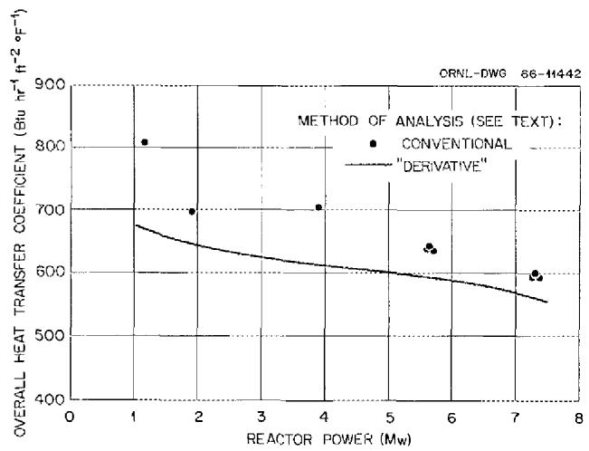  
Fig. 1.13. Observed Overall Heat Transfer Coefficients in MSRE Primary Heat Exchanger.

Design calculations had predicted an overall heat-transfer coefficient at 10 Mw of 1100 Btu hr $^{-1}$ ft $^{-2}$ (°F) $^{-1}$ . (This was for the straight portion of the tubes, in a clean condition.) This is about a factor of 2 above the coefficients observed at temperatures approximating those used in the design. In an effort to resolve the discrepancy, the design calculations were carefully reviewed to see if the proper procedures were used and to check for errors in the calculations. The results of this design review indicated that the heat exchanger had been properly designed using conventional procedures and that the design should have been conservative by about $20\%$ . References 11 and 12 indicate that conventional heat-transfer relations are valid for molten salts, and therefore the conventional design procedures should be applicable for the MSRE heat exchanger. The most likely explanation for the discrepancy appears to be erroneous values of salt conductivity in the design computations. Recent measurements of a salt similar in composition to the MSRE fuel salt have shown the thermal conductivity to be about one-third of the value that was believed to be correct at the time of the heat exchanger design (see Chap. 7). No recent data are yet available on the conductivity of the coolant salt; but if a similar discrepancy exists, this would essentially account for the reduced performance of the heat exchanger.

Radiator. The design and instrumentation of the air radiator preclude a calculation of the overall heat-transfer coefficient at all but two power levels. At most reduced power conditions the radiator doors are partially closed or the bypass damper is open; thus the effective tube area, the air flow through the radiator, and the downstream air temperature are unknown. Therefore the reduced performance was not obvious until the reactor was raised to full power.

The overall coefficient for the radiator was evaluated with both main blowers running, the doors full open, and the bypass damper fully closed (full-power conditions). The air flow measured at these conditions was equal to the design flow rate of 200,000 cfm. Another evaluation was made with similar radiator conditions except that only one main blower was running. The heat-transfer coefficients were 38.5 and 28.5 Btu hr $^{-1}$ ft $^{-2}$ ( $^\circ$ F) $^{-1}$ and the power levels were 7.4 and 5.6 Mw for these two conditions. The observed heat-transfer coefficients varied with the 0.575

power of the air flow rate, agreeing with a theoretical exponent of 0.6. But the predicted coefficient at full-power conditions was 58 Btu hr $^{-1}$ ft $^{-2}$ (°F) $^{-1}$ , far above the observed value.

The radiator design was reviewed to determine the reason for the unexpectedly low performance. The design procedures followed conventional practice except in two important points: the evaluation of air properties and the allowance for error in the predictions. In the calculation of the air-side coefficient the physical properties of air were evaluated at the tube surface temperature instead of the prescribed "film" temperature, defined as the mean of the surface temperature and the bulk air temperature. Had the "film" temperature been used, the overall coefficient would have been lower by $14\%$ . Use of an erroneous value for the conductivity of the salt had little effect on the overall coefficient, since the heat-transfer resistance on the inside of the tubes is less than $5\%$ of the total in any case. Thus, even when the air-side calculation followed the prescribed formula, the observed overall coefficient was still only $66\%$ of the predicted value. This is greater than the usual error in heat-transfer predictions, but is probably not unreasonable considering the configuration of the radiator and the very large temperature difference between the bulk of the air and the surface of the tubes. The radiator was designed when the nominal design power for the reactor was 5 Mw. The components were designed for operation at 10 Mw to ensure sufficient capacity; and when it was later decided to call the MSRE a 10-Mw reactor, this left them with little or no allowance for uncertainty. The actual tube area is only $4\%$ more than the minimum required for 10-Mw operation according to the original calculations.

Effects of Low Heat Transfer on Reactor Operation. In the main heat exchanger the reduced heat transfer causes a larger temperature difference between the fuel and coolant salts for any given power level. The original design temperatures for 10-Mw operation were 1225 and $1175^{\circ}\mathrm{F}$ for the fuel salt entering and leaving the heat exchanger and 1025 and $1100^{\circ}\mathrm{F}$ for the coolant salt. Actually, operation at a maximum fuel temperature of $1225^{\circ}\mathrm{F}$ and a minimum coolant temperature of $1025^{\circ}\mathrm{F}$ results in a heat-transfer rate of 7.5 Mw. It would be possible to operate the heat exchanger at higher power levels by increasing the heat exchanger fuel inlet temperature and/or reducing the coolant inlet temperature. However, for long-term operation the heat exchanger fuel inlet temperature is limited to a maximum of $1250^{\circ}\mathrm{F}$ by thermal stress and stress rupture considerations, and the coolant inlet temperature is limited to a minimum temperature of $1000^{\circ}\mathrm{F}$ by the possibility of freezing the radiator. Operation at these temperature conditions would approach 10 Mw. The heat-transfer rate could also be improved by increasing the fuel and coolant-salt flow rates. The flow rates could be increased either by installing larger-diameter impellers or by increasing the pump speeds by using a higher-frequency power supply.

The reduced performance of the coolant radiator, however, imposes a definite limit on the heat-removal rate from the coolant system, and there is no convenient method of increasing the heat removal. The mean temperature difference between the coolant salt and the bulk-air temperature is $920^{\circ}\mathrm{F}$ , and the coolant-salt temperature would have to be increased

significantly before a gain in reactor power could be realized. The fuel-inlet temperature to the heat exchanger would then be pushed to an unacceptable level.

In summary, the maximum reactor power level is limited by the air-side heat transfer from the coolant radiator. There is also a less severe restriction at the main heat exchanger which could be circumvented by operating the reactor system at off-design temperatures. The radiator heat transfer can be improved only by relatively extensive modifications.

There will be a small increase in maximum power level during the winter months because of the lower ambient air temperatures.

Main Blowers - C. H. Gabbard.

Aerodynamic Performance. The aerodynamic performance of the main blowers was satisfactory. The vane angle on both blowers had been set at $20^{\circ}$ , as originally specified by the manufacturer for the design conditions. However, this vane setting did not fully load the drive motors; so when the maximum reactor power was found to be below the expected value, the vane angle was increased to $22.5^{\circ}$ to increase the air flow and heat removal. As expected, this setting loaded the drive motors to their capacity and increased the air flow about $10\%$ . The effect was to raise maximum reactor power by slightly less than $1/2 \mathrm{Mw}$ .

Motors. The blowers are driven by 250-hp wound-rotor induction motors that have four stages of external rotor resistance. Automatic stepping switches shunt out these resistances in a timed sequence during the startup of the blower to limit the starting current of the motors. During the early stages of power operation, difficulty was periodically experienced in the start of main blower No.1. The motor current during the starts was erratic, and sometimes the current was high enough to trip the circuit breaker. One of the cast-iron resistance grids in the external rotor resistance on MB-1 was found broken. A broken grid was also found in the MB-3 starting resistors, but this grid was in a less critical location in the starting sequence and its effect had not been noticed. Both the grids were weld-repaired, and no further difficulties of this type have been noticed.

Coupling Failure. The blowers are connected to their respective drive motors through short floating shafts with disk-type flexible couplings on each end. On June 14, while the reactor was operating at full power, the couplings on MB-1 failed. The shaft coupling at the motor end apparently failed first, and the coupling on the blower end was then torn apart by the resulting shaft whip. The shaft destroyed the coupling gaard and damaged the sheet-metal nose that covered the front bearing of the blower. Debris from the two couplings was scattered throughout the fan room, and scratches on the fan blades indicated that some of the material had gone through the blowers into the radiator duct.

The coupling on the motor end of the shaft showed evidence of operating in a partially failed condition for some time. The nuts holding the flexible disks were severely worn, indicating that the motor torque had been transmitted from the motor flange directly to the shaft flange

by the bolts rather than through the flexible disks. The initial failure of the disks was attributed to fatigue where some incorrect, flat washers had caused high stresses.

The couplings on MB-1 were rebuilt, and new flexible shims were installed in the MB-3 couplings. Operation was resumed after the radiator duct was cleaned and inspection of the hot radiator tubes showed no damage to the tubes.

Blade and Hub Failure. Power operation was brought to a premature end on July 17 by the catastrophic failure of the rotor hub and the blading of MB-1. The outer periphery of the rotor hub disintegrated, and all the blading was destroyed. Most of the fragments were contained in the blower housing, but numerous fragments of the cast aluminum-alloy hub and blades entered the radiator duct and some actually passed through the radiator. The reactor was taken to very low power, and the coolant was drained to determine the cause of the failure, to inspect the other blower, and to examine the radiator for possible damage.

Inspection of the broken pieces of MB-1 revealed numerous "old" cracks in the blades and in the hub as evidenced by darkened or dirty areas on the fractured surfaces. One blade in particular had failed along a large "old" crack. The hub had contained short, 1-1/2 to 2 in., circumferential cracks at the base of 8 of the 16 blade sockets, and the failure generally followed those cracks. Figure 1.14 is a piece of the hub showing the darkened areas at the base of the blade sockets.

Since the failed blower had contained these old cracks, the top casing was removed from MB-3 to permit a careful inspection of its hub and blading. The front hub casting contained a large, continuous crack which extended about $35\%$ around the circumference. There were also several of the short cracks similar to those that had been in the MB-1 hub. The blades were dye-penetrant inspected and found to be satisfactory. A replacement blower that had not been in service also contained some minor surface cracks in the hub.

There is no general agreement on the cause of the failure. The original soundness of the hub castings is in question because of the old appearance of portions of the fracture surfaces and the presence of

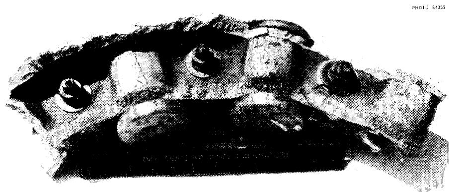  
Fig. 1.14. Fragment of Failed Impeller Hub from Main Blower No. 1.

cracks in the other blower hubs. Shock forces produced during the coupling failure and vibration due to slight imbalances are suspected as contributing factors.

The three blowers are being rebuilt in the manufacturer's plant. The hubs are being reinforced to relieve the bending moment at the base of the blade sockets, and the centrifugal blade loading is being reduced by substituting magnesium alloy blades which are $35\%$ lighter. The three complete rotor assemblies will be given a $30\%$ overspeed test with dye-penetrant inspections before and after the tests. In the installation, close tolerances will be imposed on alignment and vibration, and instrumentation will be provided to monitor vibration during operation.

Radiator Enclosure - T. L. Hudson, C. H. Gabbard, and M. Richardson

Operation of the reactor at power provided the ultimate test of the radiator enclosure, involving for the first time the operation of the radiator at the maximum capability with the doors fully open and with forced air circulation. Operation at power levels up to 1.0 Mw had been achieved during the last report period. This operation had indicated that the radiator door seals had become less effective during operation. The loss in door-seal effectiveness continued during this report period.

Power Level at Various Radiator Conditions. During the power escalation phase of operation, the radiator conditions were adjusted to obtain preselected power levels. Therefore, the complete heat-removal characteristics of the radiator are not known because the reactor has operated at steady-state conditions at relatively few power levels. However, the reactor power levels for some of the key settings are listed in Table 1.4. All intermediate power levels can be obtained by the proper adjustment of the doors or the bypass damper.

Table 1.4. Radiator Conditions and Reactor Power   

<table><tr><td colspan="4">Radiator Conditions</td><td rowspan="2">Power (Mw)</td></tr><tr><td>Inlet Door</td><td>Outlet Door</td><td>Bypass Damper</td><td>Main Blowers Running</td></tr><tr><td>Closed</td><td>Closed</td><td>Open</td><td>None</td><td>0-0.05a</td></tr><tr><td>Open 15 in.</td><td>Open</td><td>Open</td><td>1</td><td>2.5</td></tr><tr><td>Open</td><td>Open</td><td>Open</td><td>1</td><td>4.1</td></tr><tr><td>Open</td><td>Open</td><td>Closed</td><td>1</td><td>5.8</td></tr><tr><td>Open</td><td>Open</td><td>Closed</td><td>2</td><td>7.2 ± 0.2b</td></tr></table>

Depends on heat leakage and heater settings.  
Exact value depends on ambient air temperature.

Salt Frozen in Tubes. One of the main considerations during the design of the radiator enclosure was to avoid the freezing of salt in the radiator tubes. The expansion of salt during thawing was believed capable of rupturing a tube if the thawing first occurred in the center section of a tube, so that the molten salt was confined between two frozen plugs. A "load scram," which dropped the radiator doors and stopped the main blowers when the radiator salt outlet temperature dropped below $900^{\circ}\mathrm{F}$ , was provided to prevent salt from being frozen in the radiator. However, salt was frozen in the radiator tubes on two occasions and was successfully melted out with no apparent damage to the radiator.

In both cases, the freezing occurred as a result of a rod and load scram combined with a stoppage of the coolant pump. The first freezeup occurred when a defective relay caused a "rod scram" from a 5.0-Mw power level. The radiator load was scrambled manually at $1000^{\circ}\mathrm{F}$ because of the rapidly decreasing temperatures, but the coolant pump was stopped by a low level in the pump bowl which resulted from the reduced temperature. With circulation stopped, heat losses froze some salt in 30 or more of the 120 tubes. The second freezeup occurred as a result of an electrical failure which caused a stoppage of the coolant pump and a scram of the rods and load. In both cases the coolant system was drained immediately, but the drain-tank weight indicated that some salt had remained in the coolant system.

Recent data indicate that the volume change during the thawing of coolant salt is relatively small. This low volume change, plus the fact that the normal temperature distribution during heating of the radiator would cause progressive thawing of the tubes from the top to the bottom, gave confidence that the radiator could be thawed without damage. In the first freezing incident, the radiator was reheated slowly and all the remaining salt was recovered in the drain tank. A pressure test was then conducted on the entire coolant system to check for ruptured tubes. There was no indication of leakage. After the second freezing incident, increased heat leakage from the radiator enclosure prevented a portion of the radiator from reaching the melting point, and some salt remained frozen in the tubes. However, the lowest temperatures were sufficiently near the melting point that the coolant system was filled and circulated. The radiator temperatures indicated that four or five of the tubes were blocked at first, but after several minutes of salt circulation all the tubes thawed and reached the temperature of the flowing salt.

After the first freezing incident, the control system was revised so that a rod scram would also cause a load scram. The low-temperature set point for a load scram was increased from $900^{\circ}\mathrm{F}$ , which is only $60^{\circ}\mathrm{F}$ above the liquidus temperature, to $990^{\circ}\mathrm{F}$ . Other revisions were made so that the coolant pump would not be turned off unless absolutely necessary. A scram test was conducted from full power, and these revisions were adequate to prevent freezing of the radiator as long as the coolant pump remained running.

Damage and Deterioration. The radiator was subjected to possible damage on two occasions from mechanical failures of main blower No. 1. Pieces of stainless steel shim stock were blown into the radiator duct when the shaft coupling failed. The radiator tubes were visually inspected from the inlet side while salt was circulated at operating temperature, and no evidence of damage from the coupling failure was found. A loose sheet-metal cover from an electrical cable tray was found against the tubes and was removed. Reactor operation was resumed after the radiator duct was cleaned to remove the debris from the coupling.

The coolant system was drained and the radiator was cooled and thoroughly inspected after the shutdown that followed the hub failure of main blower No. 1. Several radiator tubes were dented, possibly by aluminum fragments from the blower, and a few small pieces of aluminum were stuck to the tubes. These pieces were easily removed, and the tubes were cleaned to remove any adhering aluminum. Visual inspection and a helium leak test at 20 psig indicated that none of the tubes had been seriously damaged by the blower fragments, and tests were run that indicated that the exposure to aluminum would not endanger the life of the radiator if the tubes were cleaned.

In addition to the damage that had been caused by the blower failure, the radiator enclosure was in need of other repair. Heating the empty radiator to an acceptable temperature distribution prior to a fill had become increasingly difficult, and on the last fill some of the tubes could not be heated above the melting point of salt until the radiator was filled and circulation started. The radiator doors had warped a little, and the seal strips had been severely distorted. The seal strips had also been torn loose in some places by the operation of the doors. Numerous sheet-metal screws had broken or had worked loose, allowing sheet-metal cable-tray covers and sheet metal on the inside surfaces of the enclosure to come loose. There were also numerous broken electrical insulators.

Although there was excessive heat leakage from the radiator enclosure, this was mainly around the doors, and the overheating of electrical leads and thermocouple leads that had occurred previously did not recur.

The repair of the radiator enclosure is in progress. Design of the seal strip has been improved to reduce the thermal distortion and the overall warpage of the doors. This seal strip is segmented and free to move to allow for differential thermal expansion, and the T-bar which holds these segments has been slotted to relieve thermal stresses which were causing the door to warp. The loose sheet metal and the loose ceramic heater elements are being held in place with welded clips rather than the sheet-metal screws.

# Fuel Off-Gas System - A. N. Smith

The difficulties encountered with the fuel off-gas system during the initial operation of the reactor at power, the findings and conclusions relative to the causes of these difficulties, and the system modifications proposed to prevent the recurrence of the difficulties

were all described in the last progress report. The modifications, which consisted essentially in using valves with larger flow areas and installing a particle trap and an organic-vapor trap upstream of the pressure-control valve (PCV-522), were all completed before resuming power operation of the reactor in April 1966. Observable pressures and temperatures in the off-gas system were carefully monitored during all subsequent operations, partly to evaluate the effectiveness of the changes but primarily to identify and correct any undesirable conditions before they became unmanageable. Some difficulties were encountered with buildup of pressure drop, but none were serious enough to force a shutdown. In addition, there was no observable loss in efficiency of the primary function of the off-gas system, the retention of gaseous fission products.

Detailed analysis of the performance of some components, particularly the particle trap and the organic-vapor trap, was hampered somewhat by the scarcity of accessible pressure-measuring devices in the system. This was aggravated by the fact that the pressure drop across the main charcoal beds occasionally exceeded the 3-psi range of the installed (and inaccessible) measuring instrument and also by the failure of this instrument ten days before the shutdown on July 17.

Line 522 Holdup Volume. When plugging occurred at several points in the off-gas system shortly after the power was first raised, it was suggested that the dependence on power might be related to radiation heating of the off-gas holdup volume in the reactor cell. Off-gas samples taken while the reactor was shut down in March with the reactor cell at different temperatures showed more hydrocarbons at higher temperatures, lending support to the hypothesis that there was a reservoir of hydrocarbons in the holdup volume. It was not practicable to clean the 68-ft-long, 4-in.-diam pipe; but the off-gas line was disconnected at the fuel pump and in the vent house, and large quantities of helium were blown through the line in the forward and reverse directions at velocities up to 20 times normal. Very little visible material was collected on filters at the ends of the line, but there were fission products, and the amount doubled when the cell was heated from 120 to $175^{\circ}\mathrm{F}$ . Visual observation showed that the head end of the holdup volume was clean except for a barely perceptible dustlike film. A thermocouple was attached to the holdup pipe near the head end for monitoring temperatures during power operation. When the power was subsequently raised, the temperature rose from cell air temperature (about $130^{\circ}\mathrm{F}$ ) at zero power to about $235^{\circ}\mathrm{F}$ at 7.5 Mw. The rise in temperature after a setup from zero power occurred with a time constant of about 30 min, not inconsistent with buildup of gaseous fission products in the line.

Line 522 Filter Assembly. The filter assembly that was installed upstream of the fuel pressure control valve (PCV-522) consists of two separate units in series. First is a filter to remove particulates and mist; next, a small charcoal bed to remove organic vapors. (See Component Development, Chap. 2, for a detailed description.) As a result of the experience during this period of operation, the filter part of the assembly will be replaced with a new one of the same design. The old unit will be examined in a hot cell to determine, if possible, the cause for the variations in pressure drop that were observed.

In the new condition, the pressure drops across the particle trap and charcoal bed were $< 0.05$ and 0.7 psi respectively. With these installed, the total pressure drop in the fuel off-gas system was about 2.3 psi at the normal gas flow rate of 4.2 std liters/min and PCV-522 wide open. Thus, when the reactor-system overpressure was controlled at 5 psig, a 2.7-psi pressure drop occurred at the throttling valve. Because there were no measurements of pressures at intermediate points between the pump bowl and the upstream ends of the main charcoal beds, the pressure drop across the filter assembly was known only to be below 3.4 psi. This condition prevailed until May 9, during operation of the reactor at powers up to 5 MW. There was no indication that the pressure drop across the filter assembly reached the detectable limit of 3.4 psi during this time.

During most of the operations after May 9, PCV-522 was kept wide open, allowing the fuel overpressure to follow the total pressure drop through the other parts of the off-gas line. This mode of operation permitted the monitoring of the pressure drop across the filter assembly. For the first ten days the overall trend in the pressure drop was upward, with increases after the power was raised and decreases after it was lowered. On May 19, with the power at $5\mathrm{Mw}$ , the pressure drop was up to 8 psi. The power was shut down to redistribute the electrical load, but the pressure drop continued on up, even though the gas flow was reduced. On May 20, shielding was removed, and a pressure gage was temporarily attached to a tap between the particle trap and the charcoal filter to determine which was responsible for the high flow resistance. The drop measured across the trap was 9.9 psi, while the drop across the charcoal was only 0.5 psi. Thus the increase in resistance was due entirely to the particle trap. System pressure was reduced by venting from the drain tanks, and the power was raised to determine maximum power. With the reactor operating at 7.5 Mw the filter pressure drop decreased to about 3 psi. Then when the power was lowered to zero, the pressure drop came down over a period of a day to less than 1 psi. The pressure drop remained low until July 12, when it began to increase gradually. The increase continued after the shutdown, and the unit will be replaced.

The particle trap was immersed in a tank of water for cooling by natural convection. Thermocouples on the outside of the trap responded to changes in power and gas flow, but the maximum temperature rise was only about $25^{\circ}\mathrm{F}$ .

It was expected that accumulation of organic material in the charcoal filter would result in progressive poisoning along the length of the trap. Such poisoning would shift the location of maximum fission product absorption and produce a shift in the temperature profile of the trap. Figure 1.15a shows two plots of the charcoal temperature profile, one on May 10, when about 1200 Mwhr had been accumulated, and one on July 7, when about 7000 Mwhr had been accumulated. Except for the upward shift due to the increased power level, the basic shape of the profile is the same for both periods, indicating that significant poisoning had not occurred during this interval. Figure 1.15b shows the effect of variations in pump-bowl pressure on the trap temperature profile. As would be predicted, the trap temperatures, particularly near the inlet, vary inversely with system pressure, because

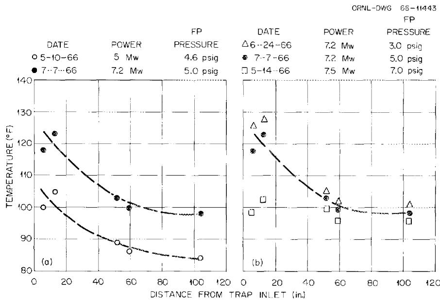  
Fig. 1.15. Temperature Profiles Along Line 522 Charcoal Trap.

as the pressure increases, the residence time of the gas between the pump bowl and the trap increases, permitting a greater fraction of the short-lived activity to decay before reaching the trap.

Main Charcoal Beds. The fuel off-gas was routed through bed sections 1A and 1B for the entire period of power operation with the exception of three days at the very end, when sections 2A and 2B were used.

The pressure drop across the charcoal beds showed a persistent tendency to increase during power operation. Pressurization and equalization experiments established that the restrictions were at the inlets to the beds, probably where the 1/4-in. gas line opens into a packing of steel wool above the charcoal. It was found that the pressure drop could be reduced, usually to near the normal 1.0 psi, by blowing helium backward through the bed. This was done whenever the pressure drop through the two beds in parallel approached 3 psi. Section 1B plugged more often, but sometimes restrictions built up in both sections. The plugging of the beds occurred each time the power was raised during the approach to full power. The plugging became less frequent later, but at the end of power operation it was still necessary to back-blow the beds about once a week.

Stack monitors indicated no breakthrough of activity other than ten-year $^{85}\mathrm{Kr}$ at any time. That this was so, despite the sometimes unbalanced flow through the parallel beds and the extra volumes of gas introduced by backblowing, is an indication of a capacity that exceeds expectations.

Line 524 Charcoal Bed. In the fuel pump, part of the gas admitted to the shaft annulus (about 100 cc/min) flows up along the shaft to prevent oil fumes from diffusing down into the pump bowl. This gas then

flows out through the catch basin and line 524. Originally the line-524 flow joined the main off-gas stream just downstream of PCV-522, whose pressure drop supplied the driving force for the gas flow through 524. Line 524 was rerouted to come in downstream of the main charcoal bed for two reasons: to get more pressure drop when PCV-522 was open and to eliminate a possible way that hydrocarbons could enter the charcoal beds. Some manipulations of the system pressure caused activity to get into line 524, resulting in closure of the radiation-block valves at the end of the off-gas line. Therefore a small charcoal bed was added in line 524 to hold up fission gases and prevent stack releases by this route (see "Component Development," Chap. 2).

Auxiliary Charcoal Bed. Prior to the startup on April 11, difficulty in venting through the auxiliary charcoal bed was found to be due to a check-valve poppet which had become lodged in the bed inlet line. The poppet had apparently vibrated loose from a check valve at one of the drain-tank outlet lines and had been carried downstream during subsequent venting operations. After removal of the poppet, venting operations through the auxiliary bed were uneventful through most of the power operations. However, an intermittent restriction was noted early in July, and, after the shutdown on July 17, the restriction became continuous and more severe. Furthermore, the situation was not relieved by reversing the gas flow (backblowing). Pressure and flow tests indicated that the plug was in the same area as in the main charcoal beds, namely, at the place where the gas header connects to the charcoal bed.

An attempt will be made to remove the restriction by local external heating. At the same time, we are designing and building a replacement bed, protected by an inlet filter, that can be installed and connected with a minimum of reactor shutdown time.

# Treated Cooling-Water System - R. B. Lindauer

Chemical Treatment. During power operation of the reactor, radiolytic decomposition of treated cooling water in the thermal shield produced hydrogen peroxide in a concentration of 300 to 500 ppm. This caused oxidation of the lithium nitrite corrosion inhibitor to lithium nitrate. Additional nitrite was added periodically until equilibrium was reached at approximately equal concentrations (~700 ppm) of nitrite and nitrate. This occurred at about 3000 Mwhr, and no additional nitrite addition was required after that time. The presence of the nitrate ion has no effect on the corrosion inhibition.

Radiolytic Gas Formation. Because of the inhibiting effect of the corrosion inhibitor on the recombination of radiolytic gases, approximately $2\mathrm{ft}^{3}$ /hr of hydrogen was formed in the thermal shield during operation at full power. At steady state, about $8\mathrm{ft}^{3}$ of radiolytic gas accumulated in the thermal shield and thermal-shield slides. About one-fourth of this accumulated gas was removed by partially deaerating, in a small vented tank, the cooling water supplied to the slides. A larger degassing tank is being installed to deaerate the entire thermal shield flow. This is expected to keep the radiolytic-gas concentrations below

the limits of solubility and thus prevent gas pockets from forming. The gas that is stripped from the water will be diluted with nitrogen to below the explosive limit and vented to the area stack. A continuous hydrogen analyzer will be installed in the off-gas stream at the tank to ensure adequate dilution.

In-Cell Leaks. Before full-power operation, while the reactor cell was open, reactor cell cooler No. 2 was observed to have a small water leak. The cooler was removed, repaired, and replaced. Some time after the cell was resealed, a steady accumulation in the cell of $1 - 1 / 2$ gpd was observed. This water was condensed from the circulating air stream in the cool suction line of the component-cooling pumps. After reactor shutdown in July, the various water-containing components in the cell were isolated and leak tested. All components were leak-tight except reactor cell cooler No. 1. It was removed, decontaminated, and repaired. As in RCC-2 earlier, the leak was in a brazed joint between a tube and a header.

Treated-Water Cooler. About one week before the reactor was shut down, the total leakage from the treated-water system suddenly increased from $\sim 4$ gpd to 3 to 5 gph. Since there was no visible leak or increased accumulation in the cells, it was suspected that the water was leaking through the treated-water cooler to the cooling-tower-water system. After the treated-water system was shut down, the cooler was opened for inspection and leak checking. A large amount of gray solids was found in the shell (tower water) side around the tubes and in low-velocity areas. All tube-to-tube sheet joints were leak tested with air and were leak free, but a hydraulic test of the tubes indicated that 17 of the 360 tubes had leaks at the inside surface of the tube sheet. After these tubes were plugged and the gasket on the floating head was replaced, the heat exchanger was leak-tight.

# Component-Cooling System - P. H. Harley

The two component-cooling pumps (CCP), one of which is a standby unit, supply cell gas to cool in-cell equipment, circulate gas past a radiation monitor, and discharge gas to keep the cell at a negative pressure. CCP-1 operated for 1584 hr and CCP-2 operated 1759 hr during this report period.

During the previous report period the multiple matched belts on each CCP were replaced by a single poly-V-belt. Blower operation, although improved, was not completely satisfactory because the output was low at best, there were times when the operating pump failed completely to meet the demand, and the standby unit was sometimes slow in building up pressure. Drive belt slippage caused the loss of a blower on three occasions. On CCP-1 the belt had to be retightened after 450 hr of operation and replaced after 870 hr because of damage due to slipping.

The poor performance caused some inconvenience in reactor operation, and the second loss of CCP-1 contributed to a reactor drain. At the time of this failure, the containment enclosure of CCP-2 was isolated

and undergoing a leak test. An attempt was made to get CCP-2 back in operation, but the system began to drain before the blower could be started.

At the shutdown in July the belt on CCP-1 had operated for 1084 hr and the one on CCP-2 had operated for 2013 hr. Both belts showed some wear and minor cracking, probably caused by overheating. Both had relaxed, so the tension was significantly less than the original adjustment.

Even when the belts were not slipping, the output of the blowers was low. The output at the speed at which the blowers were operating was supposed to be 590 scfm, but conservative flow calculations indicated only 400 scfm. Various leaks might account for the difference. A rupture disk is being installed at the discharge of the pressure-relief valves, which are known to leak. The check valves will be inspected and repaired if necessary. (One of the check valves failed completely in 1965.) Leakage through the valve which vents excess gas to the reactor cell to control blower discharge pressure might also account for part of the losses.

In August new, larger sheaves were installed on the drive motors to raise the nominal output of each blower to 740 scfm. Part of the increase in output will be discharged into the drain-tank cell to provide better mixing of air between that cell and the reactor cell.

The modifications should result in extended belt life. The larger drive sheaves will lower the stress on the belts, and stopping the leakage through the pressure relief valves should lower the ambient temperature in the enclosures. Another change being made specifically to lower belt temperatures is the addition of a simple deflector to direct cool incoming gas over the belts.

After the space cooler began to leak water into the reactor cell, condensate accumulated in the 10-in. suction line to the CCP-1 dome at a rate of 1 to 2 gpd. (The water was vaporizing in the reactor cell and condensing in the suction line, the coolest surface exposed to the cell atmosphere.) Simple drains were installed, but these could be used only when the reactor was subcritical so that radiation in the coolant drain cell permitted entry. Handling of the drained water was complicated by the tritium (up to $915\mu \mathrm{c} / \mathrm{ml}$ ) produced from the $^6\mathrm{Li}$ in the treated-water corrosion inhibitor. During the shutdown in August, piping was installed to permit draining the domes during power operation should leakage in the cell require it. Water condensed in the suction lines now will drain to a tank in the sump room, from whence it can be transferred to the liquid-waste tank.

Moisture in the component-cooling domes may have contributed to an electrical failure in wiring to the CCP-1 motor which happened on June 27. A short in a seal on the end of a copper-sheathed magnesia-insulated cable destroyed the seal and caused a large breaker to open, and the fuel drained before services could be restored. Breakdown of the epoxy potting in the seal is another possible explanation for the failure. The CCP-1 wiring was replaced at that time, and during the August shutdown CCP-2 was rewired to eliminate that epoxy-filled seal.

Salt-Pump Oil Systems - J. L. Crowley and H. B. Piper

The performance of the salt-pump oil systems during the period was acceptable although not trouble free. The heat transfer in the coolers deteriorated because of cooling-water scale, which had to be removed, and the tendency for oil to collect in the salt-pump motor housings under certain conditions continued to be a nuisance. Leakage by the seals in the salt pumps continued to be very low, although there was some increase in leakage by the lower shaft seal in the fuel pump.

Coolers. The oil is cooled by cooling-tower water passing through coils in the two oil reservoirs. During March the temperature of the coolant-pump oil supply gradually increased from its normal $134^{\circ}\mathrm{F}$ to $140^{\circ}\mathrm{F}$ . After inspection showed there was scale in the coil on the coolant-pump oil cooler, it was flushed with a 15 wt $\%$ solution of acetic acid. Considerable material was removed, and the oil temperature was reduced $7^{\circ}\mathrm{F}$ . The fuel-pump oil cooler was given the same treatment, and the oil temperature was reduced $3^{\circ}\mathrm{F}$ . During subsequent operation the temperature of the fuel-pump oil gradually rose, and in August the acetic acid treatment was again given both coolers.

Holdup in Motor Cavity. Holdup of oil in the salt-pump motor housings continued to occur under certain conditions of flow and pressure. In July, during a pressure test of the coolant system, the pressure on the coolant-pump oil tank was increased from 7 to 20 psig. This caused 58 liters of oil to accumulate in the motor cavity, and it took five days for all of it to drain back to the tank.

Shaft Seal Leakage. Oil leaking past the lower shaft seal in a salt pump drains through a catch basin in the pump to an external catch tank provided with a level indicator. Changes in the coolant-pump oil catch tank indicated a steady accumulation of less than $2\mathrm{cm}^3/$ day throughout the period. Until April the accumulation from the fuel pump was also less than $2\mathrm{cm}^3/$ day. It increased then to about $6\mathrm{cm}^3/$ day and again in mid-June to about $20\mathrm{cm}^3/$ day. This indicates some deterioration of the pump shaft seal, but the rate is still far below the $1000\mathrm{cm}^3/$ day considered tolerable.

Leakage past Static Seals. Oil can leak past a static seal around the shield plug and into the salt in the pump bowl. This leakage cannot be measured directly but, in principle, is detectable by the decrease in oil inventory. This technique is limited by the accuracy of the tank level measurements and variations in the amount of oil held up in the salt-pump motor housings, which cannot be measured. The latter effect is canceled when data are averaged over a long period of time. The expected accuracy of the level measurements is equivalent to $\pm 1.2$ liters. Data for the four-month period from April through July are shown in Table 1.5. (Inventories for the separate systems were not obtained in March because of transfers while the oil coolers were being flushed.) The apparent losses are about one-fourth the probable error in the level measurements.

Oil Replacement. No deterioration of the oil was observed during operation, but after the reactor was shut down in July, both systems were drained and refilled with fresh oil.

Table 1.5. Oil Systems Inventory Changes, April-July, 1966   

<table><tr><td rowspan="2">Item</td><td colspan="2">Change (cm3)</td></tr><tr><td>Fuel System</td><td>Coolant System</td></tr><tr><td>Samples removed</td><td>8834</td><td>8834</td></tr><tr><td>Increase in catch tank (shaft seal)</td><td>1005</td><td>181</td></tr><tr><td>Total accounted for</td><td>9839</td><td>9015</td></tr><tr><td>Decrease in reservoir</td><td>9536</td><td>9450</td></tr><tr><td>Apparent loss</td><td>-303</td><td>335</td></tr></table>

Electrical System - T. L. Hudson and T. F. Mullinix

The MSRE plant includes an elaborate electrical subsystem to provide ac and dc power to the various components. Failures within or associated with the electrical system accounted for six unscheduled interruptions in the power operation of the reactor during this report period. These interruptions varied in length from a few minutes to several days. In all cases the necessary repairs or modifications were made, and no damage to reactor equipment was incurred.

AC Power Supply. Five of the six electrical failures that caused reactor power interruptions were associated with the ac supply system: three were caused by electrical storms, one by a wiring failure at a component-cooling pump, and one by a simple overload of the main process-power breaker.

On two occasions while the reactor was operating at power, momentary electrical outages during storms caused control-rod scams by range-switching the nuclear power safety channels because of dips in the fuel-pump-motor current. In both these cases the nuclear power was quickly restored to the value that existed just prior to the outage. Since the low range of the safety channels is used only while filling the reactor (when the fuel pump is off), rapid response of the range switching is not required. Therefore, time-delay relays were incorporated in these circuits to prevent their activation on momentary power dips.

The third storm-induced failure occurred when lightning struck a power substation and parted one wire of the main MSRE feeder. In this case the electrical load was automatically transferred to an alternate feeder, and all essential equipment was restarted in time to prevent draining either the fuel or coolant system. However, operation at high nuclear power could not be resumed until service was restored on the main feeder. The entire supply system has since been reviewed and improved to make it less susceptible to damage by storms.

The short in the component-cooling pump cable seal is described in Sect. 1.9, subsection entitled "Component Cooling System." When this

short occurred, there was a massive flow of current and the breaker supplying the entire bus tripped before the individual breaker for the motor.

During the initial full-power operation of the reactor the main process-power breaker (breaker R) was loaded to near its set-point value. When the load on the coolant-radiator main-blower motors was increased by increasing the pitch on the blower fan blades (see Sect. 1.9, subsection entitled "Main Blowers"), the increased load on breaker R caused it to trip on overcurrent. This condition was relieved by transferring about $200\mathrm{kw}$ of auxiliary load from the main process transformer to an existing auxiliary power transformer. The load transfer decreased the current through breaker R from about 1700 amp/phase to about 1550.

After the shutdown in July all switchgear breakers were removed, tested, and calibrated.

DC-AC Inverter. To improve the reliability and increase the capacity of the reliable ac power supply, motor generator 4, a 25-kva single-phase rotary inverter, was replaced with a new 62-kva three-phase static inverter. The total load on the reliable power supply, including the on-line computer, which has some three-phase load, is 40 kva. The static inverter offers a number of advantages over the old rotary inverter, including higher efficiency (increased $35\%$ ), smaller size, no moving parts, quiet operation, and excellent voltage and frequency regulation. Prior to the installation of this equipment, both the capacity and the voltage regulation of the reliable power supply were inadequate for the operation of the on-line computer.

During the checkout and testing of the static inverter in April, after the installation had been completed, trouble occasionally developed that blew the load fuses. Two times the manufacturer's field engineer made exhaustive tests and could not find any trouble, but all symptoms indicated that the trouble was in the low-voltage logic power supply, which supplies 24-v dc control power. On April 22 the inverter failed again while the reactor was operating at low power, causing a control-rod scram. The inverter load was automatically transferred to the normal ac power supply. After this failure a new power-supply module was installed, and no further trouble has occurred.

The inverter output voltage regulation has been $208 \pm 1/2$ v, and the output frequency better than 60 cps ± 0.01%. On one occasion the inverter was operated 2-1/4 hr from the 250-v battery system without the dc generator operating. Although the input to the inverter varied 20 v, the output varied only 0.5 v.

Diesel Generators. Three diesel-power generators, each with a capacity of 300 kw, supply emergency ac power to motors and heaters in the MSRE. During this report period there were three occasions on which this emergency power was needed. The diesel generators were started and operated without difficulty except in June, when the component-coolant-pump breaker was closed after the fault in the junction box. This caused an overload on DG-3, and it was manually shut down.

In February a crack was found in the block of DG-3 at one of the bolt holes. All attempts at repairs were less than completely successful, but the unit was operable. Diesel generator 3 is being replaced with a surplus diesel generator from another installation. The replacement unit is similar to the original except that it is started by compressed air instead of by a storage battery.

Control Rods and Drives - M. Richardson and R. H. Guymon

The control rods continued to operate reliably although there were failures in position instrumentation.

During this report period there were 16 rod scams while the reactor was critical. Six were caused by power failures, six resulted from in-sstrument malfunctions, two resulted from operator mistakes, and two were deliberate experiments. In addition, the rods were scrambled 18 times in circuit tests and 42 times to measure drop times. In no case did any rod ever fail to scam, nor was any drop time in excess of the specified maximum.

Drop times for rods 1 and 2 were consistently below 800 msec. The drop time on rod 3 increased from 900 to 960 msec, still well below the 1.3-sec limit set by safety considerations.

Measurement of the fiducial zeros showed no appreciable change in rod length nor any shift in position indication. The coarse position synchro on rod drive 3 failed on July 2 because of an internal short, and it was necessary thereafter to count turns of the fine synchro in positioning this shim rod. The potentiometer on rod drive 1, supplying a position signal to a fill-permit interlock, became inoperative because of worn windings.

The defective potentiometer and synchro were replaced in August.

Samplers - R. B. Gallaher and R. H. Guymon

The sampler-enricher was used to obtain 35 fuel salt samples, 10 of which were 50-g samples for oxide analysis. Most of these were taken without incident. A brief account of difficulties follows; details are covered in Chap. 2.

On April 29 a latch with reduced diameter was installed to eliminate binding which was encountered at the lower bend in the sample line. While it was being tested, wires to the drive motor shorted out inside the sampler. The fuel was drained from the reactor, the sampler was removed and repaired, and operation was resumed in ten days.

After the latch replacement the operation of the sampler went without a hitch except for one time (July 6), when the capsule stuck for some unexplained reason and no sample was obtained.

Once it was necessary to retrieve an empty capsule which had been dropped accidentally to the operational valve. A magnet on a cable was used to retrieve the magnetic latch key with capsule attached.

The interior of the transfer box (area 3A) gradually became contaminated, and on two occasions minor contamination of the outside resulted as the transport container was being removed through the top. More stringent procedures, including the establishment of a "contamination" zone at the sampler, were adopted to prevent recurrence.

On July 24 accidental overfilling of the pump with flush salt forced salt into the sampler tube. The tube was found to be obstructed about 2 ft above the pump bowl, preventing sampling. External heaters applied remotely were used to melt out the salt.

The coolant sampler was used without difficulty to obtain 18 coolant-salt samples.

# Containment -- H. B. Piper

Several aspects of containment are of interest in the overall operation of the MSRE. In addition to the primary consideration, that of maintaining a low-leakage envelope to prevent the release of excessive activity in the unlikely event of a reactor accident, it is also necessary to prevent activity releases and contamination during maintenance periods, when the normal secondary containment and even the fuel loop itself may be open. The latter consideration is particularly important with a fluid-fuel reactor, where fission product activity is distributed throughout the fuel loop. The high chemical toxicity of MSRE salts (due to their high beryllium and fluoride content) also requires careful measures to prevent the release of large quantities of even nonradicative salts.

During reactor operation the secondary containment, or primary accident containment, system consists of the reactor and drain-tank cells, which are sealed and kept at $-2$ psig. The reactor building serves as a third barrier, since it is kept at slightly subatmospheric pressure and the exhaust air goes through roughing and absolute filters before being released from the containment stack. When the main containment barrier and the reactor must be opened for in-cell maintenance, primary activity containment is provided by diverting the building ventilation air into the cell opening and out to the stack by way of the absolute filters. The reactor building then becomes the second containment barrier.

Secondary Containment System. The initial testing of the secondary containment system has been covered in detail. $^{13}$ The leakage rate from the secondary containment has been monitored throughout the reporting period. The leakage rate of the containment is determined by measuring either the change in inventory (cell atmosphere) or the change in pressure as a function of time and then correcting this value for the known and measured flows both into and out of the system.

A higher than acceptable leakage rate was measured when the containment system was returned to service in March after a period of incell maintenance. A check valve in the air-steam line leading to the reactor-cell sump jet was found to be leaking. There is a similar check

valve in the drain-tank-cell sump jet line, and it was suspected of leaking also, so both lines were parted and capped to assure leak-tightness. After this the containment was found to be acceptable, with a measured in-leakage rate of 19 ft³/day at -2 psig. The highest acceptable leakage rate at this pressure would be ~75 ft³/day. Starting in late April and continuing through May, it appeared that a large leak had developed in the containment envelope, and a great deal of effort was made to find and stop this leak. It was finally necessary, however, to pressurize the cell to 20 psig and do extensive leak hunting.

At $-2$ psig it looked as if in-leakage had increased by about 100 ft $^3$ /day, and after pressurizing to 20 psig the data still indicated a leak into the cell. The leak was found to be in one or more of the eight pressurized thermocouple headers. Each header is constructed as a box, with one wall of the box facing the containment cells and the other facing atmosphere. Thermocouple leads coming from the containment penetrate first the inner wall and then the outer wall of the box, with the space between being pressurized with nitrogen to a pressure greater than that of the containment. Three of these headers were found to be definitely leaking. Assurance was obtained that the headers were not leaking to atmosphere by soap-bubble checking all penetrations in all headers while they were pressurized. No leaks were found. A calibrated rotameter was placed in the nitrogen line which is used to pressurize the headers so that the leakage from the headers to the containment can be continuously monitored and corrected for in the leakage-rate calculation. After this work was completed, the leakage into the containment was again measured at $-2$ psig and found to be $\sim 25$ ft $^3$ /day, an acceptable value.

The leakage rate has been monitored daily since that time, and, until the reactor containment was opened for maintenance, the containment remained acceptable. Although some leaks did occur during the report period, none was large, and all were found and remedied.

Containment for In-Cell Maintenance. Under normal conditions, whether the reactor is operating or not, the reactor building (high bay) is kept at subatmospheric pressure, $\sim 0.2$ in. $\mathrm{H}_2\mathrm{O}$ . Air from the reactor building is discharged from the 100-ft containment stack after particulates have been removed by an "absolute" filter. When in-cell maintenance is carried on (the reactor cell is open), a large cell exhaust line to the filters is opened to assure that air flows down into the containment cell with a velocity at least 100 fps through the openings, thus preventing any uncontrolled release of airborne activity.

During the report period no detectable particulate activity was released. There was a total of 97.3 mc of gaseous activity (iodine) released, with 74 mc being released during the two weeks that the graphite samples and flexible jumper in the off-gas line were being removed. The total amount released in six months is 0.016 of the total permissible release from the five stacks in the ORNL area.

Filters and Stack Fans. In October 1965 the filter pit was overhauled, and new roughing and absolute filters were installed. Effciencies measured by the standard ORNL dioctyl phthalate (DOP) test

were 99.994 to $99.999\%$ for the three banks ( $99.95\%$ is the minimum acceptable). The filters were again DOP-tested in March 1966, and measured efficiencies were 99.995 to $99.999\%$ . Evidently neither the absolute filters nor the new silicone caulking had deteriorated. From the time of installation through August, the pressure drop across the absolute filters remained unchanged, while drop across the roughing filters gradually increased to 5.5 in. $\mathrm{H}_2\mathrm{O}$ , causing a decrease in stack flow of $15\%$ . The flow remained above the value assumed in safety analyses for stack dispersion, but the roughing filters will be replaced after in-cell maintenance is completed.

The bearings were replaced in the west stack fan in March. Indications were that insufficient lubrication had contributed to the failure, so the lubrication system was changed from grease to light oil. The same lubrication revision is planned for the east fan. The fans are driven through V-belts by an external motor, which, as originally installed, had adjustable sheaves. These sheaves apparently cause greater than normal belt wear, and even though no belt failure has occurred, replacement with a properly sized solid sheave seemed advisable. This was done on the west stack fan in July and is also planned for the east unit.

Beryllium. Air is continuously sampled at 15 locations through out the MSRE area for beryllium contamination. This is done by drawing air through paper filters upon which the beryllium would be collected and then determining the amount of contaminant that is deposited. These samples are collected and analyzed every working day. The lower limit of detection is $0.05\mu \mathrm{g}$ per sample, and each daily $(24\mathrm{hr})$ sample represents the amount of beryllium in $1 / 4\mathrm{m}^3$ of air. This represents a lower limit of detectable concentration of $0.004\mu \mathrm{g} / \mathrm{m}^3$ . The maximum permissible concentration of beryllium for continuous occupancy of an area for an 8-hr work day is $2\mu \mathrm{g} / \mathrm{m}^3$ . There has been no detectable release of beryllium during this report period.

Air drawn from the coolant-radiator stack is monitored continuously while the reactor is in operation. A beryllium detector which samples and analyzes on line is used for this purpose. The limits of detectability are the same as those described above. Again, there has been no detectable release during this report period.

Shielding and Radiation - H. B. Piper

Complete radiation surveys were made of the reactor area as the power was raised from 1 Mw to full power, and with the exception of the areas discussed in the following paragraphs, the shielding was found to be adequate.

When the reactor power was first raised to 1 MW in April, the radiation level in the North Electric Service Area (NESA) was found to be high: $20 \mathrm{mr} / \mathrm{hr}$ on the balcony and $8000 \mathrm{mr} / \mathrm{hr}$ at the west wall. Investigation showed that there was radioactive gas in the lines through which gas is added to the drain tanks. Two check valves in each line

prevented the gas from getting beyond the secondary containment enclosure, but the enclosure, of 1/2-in. steel, provided little gamma shielding. The pressure in the fuel system at that time was controlled by the newly installed pressure control valve with rather coarse trim, and the pressure fluctuated around the control point (normally 5 psig) by $\pm 2\%$ . These pressure fluctuations caused fission product gases to diffuse more rapidly into the drain tanks and back through the 1/4-in. lines through the shield into the NESA. The radiation level was lessened by installing a temporary means of supplying an intermittent purge to the gas-addition lines to sweep the fission product gases back into the drain tanks. At $\sim 7.5$ Mr on May 24, the radiation levels were $5\mathrm{mr / hr}$ on the balcony and $2000\mathrm{mr / hr}$ at the west wall. During the June shutdown, a permanent purge system was installed to supply a continuous helium purge of $70~\mathrm{cc / min}$ to each of the three gas-addition lines. This was proved successful by subsequent full-power operation in which the general background in the NESA was $< 1\mathrm{mr / hr}$ .

There are now three areas in which the dose rates at full power are too high for continuous occupancy. Limiting access to these areas is not considered a hindrance to the orderly operation of the reactor and so no further remedial action is planned.

Reactor Cell Top. Two very narrow beams, presumably coming from cracks between shield blocks, reading $10\mathrm{mr/hr}$ gamma and 60 millirems/hr fast neutrons, were found on top of the reactor cell blocks; these areas were properly marked.

Coolant Drain Tank Cell Access Ramp. Even though shielding was added inside the coolant drain cell door, the dose rates outside the door (700 mr/hr gamma, 125 millirems/hr fast neutrons, >75 millirems/hr thermal neutrons) and halfway up the access ramp (35 mr/hr gamma, 2 millirems/hr fast neutrons, 25 millirems/hr thermal neutrons) are high during power operation. This area is clearly marked with radiation zone signs at the entrance and halfway down the ramp.

Vent House. Stacked concrete block shielding has been added periodically to keep dose rates low in this area. Even so, the background radiation level is $\sim 7.0 \mathrm{mr/hr}$ at full power, and the area is a conditional-access radiation zone.

# 1.10 Instrumentation and Controls

J.R.Tallackson R.L.Moore

The MSRE instrumentation and controls system continued to perform well. There was the normally expected reduction in both malfunctions and misoperation of instruments as instrument and operating personnel gained experience and developed routines. While there were many design changes, most of these were improvements and additions to the system rather than corrective measures to the instruments and controls. A disappointingly large number of faulty commercial relays and electronic switches were disclosed. These faults were in the areas of both relay design and fabrication, and corrective steps have been taken.

Operating Experience - Process and Nuclear Instruments - C. E. Mathews, E. N. Fray, R. W. Tucker, and G. H. Burger

Control-System Relays. All 11.5 of the 48-v dc-operated relays in both the safety- and control-grade circuits will be replaced because of heat damage to their Bakelite frames. This problem was discussed with the manufacturer, who stated that overheating is a common problem with all relays of this particular model if they are continuously energized for long periods (MSRE relays have operated for two years). It is a borderline condition, which he says has been corrected by changing the design to reduce by $20\%$ the total power dissipated in the operating coil and the series-connected dropping resistor. An order was placed for 139 relays of the latest design.

Four new spare solenoid coil assemblies were purchased for the special weld-sealed electric solenoid valves. Approximately 40 valves have been in service on the fuel- and coolant-salt circulating pump level measuring systems and the fuel sampler-enricher for two years. The first and only coil failure occurred recently.

Pressure Transducers. A differential pressure cell used to obtain pressure drop in the helium flow through the charcoal bed shifted its range setting. The cell has been removed, but the cause of this range shift has not yet been determined.

Thermocouples. Thermocouple performance has continued to be excellent. Only one thermocouple failure occurred during this period. This brings the total number of failures since the start of MSRE operation to 5 out of over 1000 couples in use.

Electronic Switches. The Electra Systems switches14 used for alarm and control of temperatures in the freeze-valve system performed without malfunction during this period. This improvement in performance is attributed to modifications reported previously;15 to the establishment and enforcement of more rigorous test and periodic checking procedures; to the stabilization, by aging, of critical resistors in the switch modules; and to a better understanding, by operating personnel, of their use in the system. A check showed that out of 109 switch set points, $83\%$ had shifted less than $20^{\circ}\mathrm{F}$ over the six-month period. No switches with double set points were found, and it is likely that this malfunction will not reappear.

Sporadic malfunctions in control loops containing a particular model current-actuated commercial electronic switch have been a source of annoyance. This faulty behavior was, apparently, associated most frequently with ambient temperature changes brought on by air-conditioning failures and with excessive vibration. Thorough inspection, made possible by a system shutdown, revealed that out of 61 switches in service, 38 had one or more faulty internal connections. These faulty connections, originated during manufacture, were imperfectly soldered joints or joints which had never been soldered.

Nuclear Instrumentation. Water leakage via the cable into the counter-preamplifier assembly caused several failures in the wide-range

counting channels. The cause has been diagnosed as excessive strain and flexing of the cable, and a redesigned cable assembly will be installed.

Personnel Monitoring System. The reactor building radiation and contamination warning system was again revised to correct some deficiencies and improve its effectiveness. Four additional beacon lights were installed. These were located in the coolant cell, blower house, diesel house, and motor-generator room. The power circuits for the lights were revised to improve reliability. The test procedures for the system were revised to include monthly tests that actuate the entire system, including the air horns, and to actuate and test the system trouble alarm features.

Data System - G. H. Burger and C. D. Martin

Several new analog input signals were added to the data system, bringing the total close to the maximum capacity of 350. These were added to obtain more information about the operation of the off-gas system, to measure the reactor cell leak rate, and to monitor the bearing temperatures of the main blowers and the water temperature in the nuclear instrument penetration.

New programs were added to supply more reactor operating information and to retrieve operating information previously stored on the magnetic tapes. The two operating information programs calculate an average of the fuel- and coolant-salt outlet temperatures and the reactor cell leak rate. The average outlet temperature calculations (OAFOT, OACOT) are used extensively by the operators as a guide for the operation and control of the reactor. The data-retrieval programs were written to retrieve and process the stored information on line or at the ORNL computer center. Both programs were used many times to list and plot old data and were very useful in helping to determine the time, cause, and effect of several reactor shutdowns. These data also provided information which was used to redesign the off-gas system and resulted in changing some of the reactor operating procedures. The retrieval program for the computer center was written so that all stored information including calculation results could be processed and listed or plotted. The use of this program is becoming a routine operation, and data-retrieval requests are handled by a job order card. The on-line retrieval programs are more specialized and handle only certain inputs or calculation results. These programs have to be put into the system as they are needed and require some operator time when they are executed. The analysis group is now being trained to handle retrieval with these programs. A new general-purpose on-line program similar to the computer center program is planned.

Revision of operating programs continued as new requirements were determined during reactor operation. The heat-balance program was revised and is now used to determine the true level of reactor power. The reactivity-balance program was revised but is still not entirely correct due to uncertainties in some of the parameters used in the calculations.

In addition to the routine and periodic collection of operating data, the data system was used to instrument and control further reactor dynamics tests similar to those last reported.16 It was also used to control the temperature of a material surveillance test stand by a program which simulated three three-mode analog controllers. The control program computes the surveillance specimen temperature control set point from the reactor power, fuel outlet temperature, and an offset temperature to match the temperature profile of the material specimens in the reactor core. An error signal is generated by using this set point and the temperature of the test-stand specimens. An output signal is then generated by the computer to control the test-stand specimen temperatures by changing the voltage to the heaters by means of compressed-air-actuated autotransformers.

During the period covered by this report, the data system has become a virtually indispensable tool for the operators and analysts. The acceptance and confidence in this equipment which is now shared by the operators and analysts are the result of the system's ability to supply reliable and accurate information to assist the operators in

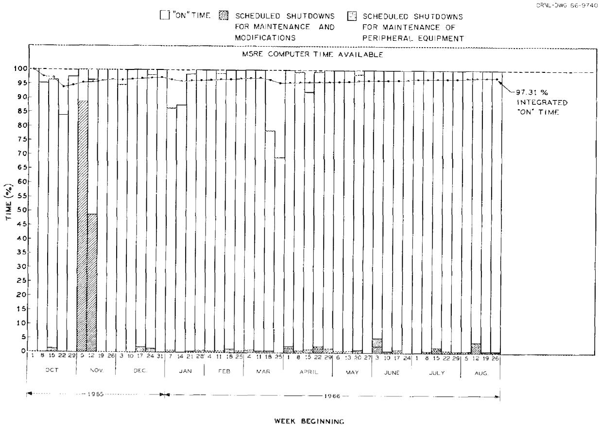  
Fig. 1.16. MSRE Data System Service Record from Date of Acceptance, October 1, 1965, to September 1, 1966.

controlling the reactor and to assist the analysts in evaluating the operation. During this period the system continued to show a steady improvement in overall reliability. Figure 1.16 shows the availability of the system on a weekly basis. Some of the downtimes in March and April were caused by ac power difficulties as a result of installing and getting the static inverter power supply operating. Since April, after the inverter shakedown was completed, the system has had only one unscheduled downtime. For the ll months the system has been in operation, the availability is in excess of $97\%$ , and for the past 6 months is about $98\%$ . The system downtimes to data total 19 for 220 hr 40 min.

The data system has met all the objectives for which it was originally intended, and the operation is approaching routine status. Most of the programming is complete with the exception of data-retrieval programs and the reactivity-balance program. It is expected that future programming and other system changes will be minimum and will only result from requirements generated by continued operation of the reactor.

Control-System Design - A. H. Anderson, D. G. Davis, and P. G. Herndon

Control Instrumentation Additions and Modifications. Further additions to and modifications of the instrumentation and controls systems were made to provide additional protection, improve performance, or provide more information for the operators. One hundred twenty-five requests for changes in the instrumentation and controls system (or in systems affecting instrumentation and controls) were received and reviewed during the past report period. Of these, 52 requests resulted in changes in instrumentation and/or controls, 19 were canceled, 8 did not require changes in instrumentation or controls, and 25 are active requests for which design revisions are either in progress or pending. Prior to the initiation of design changes, the requests were reviewed by persons responsible for operating the reactor and for the original design. Changes in the reactor system were not made until the necessary approvals had been obtained. Some examples of these changes follow.

Fuel and Coolant Pumps. The six relays that monitor the fuel-pump motor current were replaced to prevent unnecessary shutdowns. Relay chatter was causing spurious operations of the reactor flux scram set-point circuits. Modifications to the existing relays and their current settings did not correct this condition; therefore, new relays were installed. Some spurious operations occurred during thunderstorms. It is believed that lightning-induced transients on the power distribution system caused the very fast-acting current relays to drop out and scram the reactor. To prevent this, the existing relays in the reactor flux scram set-point circuits were replaced with time-delay relays.

After the failure of a lube oil flow switch interlock had shut down the coolant-salt circulating pump during a load scram, it was proposed that all protection interlocks be removed from both the coolant- and fuel-salt circulating pump control circuits. This would prevent unnecessary pump stoppages and provide additional protection against freezing of salt in the radiator. After careful consideration it was decided

that these interlocks should remain in the circuits, because the protection they provide for the pumps outweighs their disadvantages. However, new operating criteria stipulate that prevention of possible freezing of salt in the radiator is more important than protecting the pump from possible damage resulting from loss of lube oil or cooling-water flow. To satisfy these new requirements, we presently plan to install a manual switch which (after proper administrative approval) may be operated to override the pump protective interlocks. Since pump shutdown may result from other causes, such as action of overcurrent trip in the circuit breakers, loss of TVA power, etc., additional changes in the power distribution and switchgear systems will be required if maximum obtainable pumping reliability is required. Manual switch circuits that will override all protective interlocks in this pump control circuit are now being designed.

A weld-sealed electric pressure transmitter was installed on the fuel-pump helium supply line 516 at a point hydraulically near the fuel pump. This measurement will be compared to the pump-bowl cover-gas pressure to determine the pressure drop across the lube-oil static seal between the fuel-pump shield and the impeller shaft housing. This information should help to determine if there are periods of conditions that should favor leakage of an abnormal amount of oil into the pump bowl.

Master Control Circuits. A new jumper and associated circuitry were installed to provide a bypass around the freeze valve lll frozen permissive contact in the drain-tank helium supply valve control circuit. The jumper will make it more convenient to operate through the salt-transfer freeze valves. It was previously necessary to freeze and thaw freeze valve lll three times when blowing out the transfer lines after a fuel-salt transfer.

To prevent radioactive gas backup into the drain-tank helium supply lines, a continuous helium purging system, compatible with safety requirements, was designed and installed. Each supply line is purged through a capillary flow restrictor which is sized to limit the purge flow rate to 0.07 liter/min. The capillaries are supplied from line 519 at a point downstream of the containment block valves.

It was proposed that spurious operations of interlocks in the RUN mode, OPERATE mode, main blower No.1, and main blower No.3 control circuits that were causing unnecessary shutdowns be prevented by replacing the existing relays in these circuits with time-delay relays. This proposal was canceled after investigations indicated that the real cause of the trouble was erratic operation of the new 60-kva system power supply. The performance of the power supply has been improved considerably, and these circuits are now operating normally.

Load Control. To satisfy established operating criteria, additional control-grade circuits were designed to provide automatic load setback action when the reactor is in the manual load control mode. The installation of these circuits is being delayed pending a complete review of the automatic load control system.

Additional safety-grade circuits were installed to provide automatic load scram whenever the reactor control rods are scrambled. The purpose of this revision is to help prevent salt from freezing in the radiator.

The design of a system to measure the vibration of the radiator cooling-air blowers and motors is now in progress. Surplus vibration instruments suitable for this application are on hand.

Thermocouples. The thermocouple system did not change appreciably, although a few thermocouples were added. Twelve with in-cell type remote disconnects were installed on the fuel system off-gas filter and particle trap. These are read on a multipoint recorder located in the vent house. Thermocouples were also added to the new filters in off-gas line 524, to the gas holdup volume tank in line 522, and to the bearings on the main blowers.

Weigh System. The problem of leaking pneumatic selector valves in the drain-tank weigh system readout was studied. Manometer readout is accomplished by selecting particular weigh cell channels with the selector valves. The valves are composed of a stacked array of individual valves operated by cams on the operating handle shaft. Leaks from these switches cause a slight error in the manometer reading. Efforts to stop the leaks permanently have not been successful. Leak tests on a quick disconnect device indicate that it would be a satisfactory replacement for each valve in the switch assembly. The valves were not replaced because the problem is not severe enough at this time to justify the expense.

Auxiliary Systems. A pressure-reducing valve, a flowmeter, and a containment block valve were installed in the reactor cell thermocouple nitrogen-pressurizing supply header. The normal operating pressure was reduced from 50 to 5 psig because of the excessive leak rate into the reactor cell.

The component-coolant-pump control circuits were cross-interlocked to prevent both pumps from being energized at the same time. This was accomplished previously with contacts mounted directly on the circuit breaker starter, but this arrangement would not allow one pump to operate normally when the breaker for the other pump is racked out for maintenance.

A new design of instruments and controls is under way for a 350-gal-capacity degassing and surge tank which was added to the treated-water system to remove gases generated in the reactor thermal shield. A tank level measurement and possibly some flow control are required. An air purge system, which includes a pressure regulator, flow indicator, and two solenoid-operated containment block valves, is also required.

Other minor revisions and additions were as follows:

1. The beryllium monitor was relocated from the vent house to the high-bay area.   
2. The range of helium flow measuring loop FE-524-B was increased.

3. The range of the differential pressure transmitter was increased from 0-3 psig to 0-10 psig. Also, the indicator in this measuring loop was replaced with a strip-chart recorder.   
4. A flowmeter was installed in treated-water line 877.   
5. A new instrument power distribution panel was installed to provide additional circuits required by other modifications and for future expansion.   
6. Manual switches were added in the main radiator blower damper control circuit so that the dampers can be closed when the blowers are not running.   
7. Radiator duct blower air flow switches were added to the annunciator circuits.   
8. A time delay was provided in the high-bay area containment pressure annunciator.

# References

1. MSR Program Semiann. Progr. Rept. Feb. 28, 1966, ORNL-3936, pp. 10-12.   
2. Ibid., pp. 69-71.   
3. MSR Program Semiann. Progr. Rept. Aug. 31, 1965, ORNL-3872, pp. 22-23.   
4. MSR Program Semiann. Progr. Rept. Feb. 28, 1966, ORNL-3936, pp. 87-92.   
5. MSR Program Semiann. Progr. Rept. Aug. 31, 1965, ORNL-3872, pp. 55-56.   
6. R. J. Kedl, personal communication, June 1966.   
7. C. H. Gabbard, Thermal-Stress and Strain-Fatigue Analyses of the MSRE Fuel and Coolant Pump Tanks, ORNL-TM-78 (October 1962).   
8. MSR Program Semiann. Progr. Rept. Feb. 28, 1966, ORNL-3936, pp. 12-23.   
9. S. J. Ball and T. W. Kerlin, Stability Analysis of the Molten-Salt Reactor Experiment, ORNL-TM-1070 (December 1965).   
10. T. W. Kerlin and S. J. Ball, Experimental Dynamic Analysis of the Molten-Salt Reactor Experiment, ORNL-TM-1647 (to be published).   
11. H. W. Hoffman and S. E. Cohen, Fused Salt Heat Transfer - Part III; Forced Convection Heat Transfer in Circular Tubes Containing the Salt Mixture $\mathrm{NaNO}_2$ - $\mathrm{NaNO}_3$ - $\mathrm{KNO}_3$ , ORNL-2433 (March 1960).   
12. R. E. MacPherson and M. M. Yarosh, Development Testing Performance Evaluation of Liquid Metal and Molten Salt Heat Exchangers, ORNL-CF-60-3-164 (Mar. 17, 1960); also ANS Meeting in 1959 (Washington, D.C.).   
13. MSR Program Semiann. Progr. Rept. Feb. 28, 1966, ORNL-3936, pp.29-34.   
14. Ibid., pp. 78-79.   
15. MSR Program Semiann. Progr. Rept. Aug. 31, 1965, ORNL-3872, p. 72.   
16. MSR Program Semiann. Progr. Rept. Feb. 28, 1966, ORNL-3936, p. 49.

# 2. COMPONENT DEVELOPMENT

# Dunlap Scott

The development group continued to assist in the operation and testing of the reactor. Much of their effort consisted of helping in diagnosing problems and in devising and installing equipment used to solve the problems. The operational performance of the equipment is covered in Chap. 1, but the description of problems and their solutions is given below.

# 2.1 Freeze Valves

# M. Richardson

Operation of the freeze valve since the addition of the modulating air controllers has been without incident. Operation of FV-103 was improved by deleting the hysteresis feature of the FV-103-lA module, which caused thermal cycling of the valve before the valve temperature reached equilibrium. The module FV-103-lA now operates as an off-on switch which alarms at $1000^{\circ}\mathrm{F}$ .

# 2.2 Control Rods

# M. Richardson

The three control rods have operated without difficulty. Fiducial zero positions are listed below. Changes are caused by changes in rod length.

<table><tr><td>Rod 1</td><td>Rod 2</td><td>Rod 3</td><td>Date</td></tr><tr><td>1.74</td><td>1.55</td><td>1.40</td><td>2/12/66 (startup)</td></tr><tr><td>1.73</td><td>1.41</td><td>1.49</td><td>4/24/66</td></tr><tr><td>1.78</td><td>1.57</td><td>1.52</td><td>7/14/66</td></tr></table>

Rod-drop times for 5l-in, fall for rods 1 and 2 remain at $< 0.8$ sec. Drop time for replacement rod 3 remains between 0.9 and 0.95 sec since installation.

# 2.3 Control-Rod Drive Units

M. Richardson J.R.Tallackson

The control-rod drive units were operated from installation in February until shutdown in August with the following difficulties.

1. The coarse-position synchro torque transmitter of the No. 3 drive failed. The transmitter was deenergized, and the drive unit continued operation using the fine-position synchro transmitter and the potentiometer to indicate position.   
2. The "Fill Permit" position potentiometer of the No. 1 drive began to transmit erratic readings. The potentiometer was jumpered out of the circuit, and the drive continued to operate satisfactorily.   
3. The high-temperature $(200^{\circ}\mathrm{F})$ switches which are mounted 6 in. from the bottom of the drive-unit housings went into alarm on No.1 drive and remained in alarm under normal operating conditions. The switches cleared when the reactor was drained and the cell temperature was lowered.

The potentiometer and synchro were replaced during the current shutdown. Examination showed that the potentiometer had developed a region of open wiper contact. The synchro, mildly radioactive, has not yet been disassembled to determine the exact cause of failure. Resistance measurements indicate a coil-to-coil short circuit in the stator windings, and the partially melted plastic end cap is positive evidence of excessive temperature.

The thermostatic temperature switches1 in the lower end of the drive housing are intended to indicate the approach of high-temperature conditions which would damage the motor and gear box assembly at the upper end of the housing. The switches are inaccessible, and it was not possible to determine absolutely if the high-temperature indication from the No. 1 drive was correct or if one or both of the switches had misoperated. Since neither of the other drive units showed a similar indication, there was room for doubt. Measurements were taken of the winding resistances of the drive motor, the fan motor, and the tachometer generator and compared to those of similar units at room temperature and in the other two rod drive units. These indicated that temperatures of the sensitive parts of the questionable unit were normal. Operation was continued with the switches bypassed but with periodic checks of these winding resistances.

Inspection of the No. 1 and No. 3 rod drive units in August revealed that the switches on the No. 1 unit were operating correctly, and they showed evidence (discoloration) that they had been exposed to high temperature. Motors, gear boxes, and other parts of the drive units showed no evidence of overheating or mechanical difficulty. The gear cases were opened and were in excellent condition. The APL grease was soft and adhering to the worm and worm gear. The lubricant had darkened slightly, but there was no evidence of tarring or lumping of the grease. The wire insulation was in good condition.

It is reasonable to conclude that the air stream introduced at the upper end of the No. 1 rod drive housing, while sufficient to keep the gear-box components cooled, was not large enough to prevent the development of the high temperature at the lower end of the housing caused by a part of the heated gas stream rising from the thimble. The temperature switches on rod drives 2 and 3 went into alarm during periods when the reactor cell was operated above $150^{\circ}\mathrm{F}$ . This indicates that the air flow to all three rod drives is marginal. The good condition of the gears, motors, and lubricant makes immediate action unnecessary, but a study will be made of methods of increasing the air flow to the drive housings.

# 2.4 Radiator Doors

M. Richardson

Modifications2 to the radiator-door-operating mechanism permitted satisfactory operational performance of the doors through the last run. However, excessive leakage of air into the radiator enclosure due to poor seals became evident after the doors had been thermally cycled several times during operation.

Examination of the doors after shutdown revealed that the metal seal surfaces had been severely damaged. The metal seals, in turn, damaged the mating soft seal mounted in the face of the radiator. The metal strips had buckled between weld points, broken at some points, and been torn away completely at the top of the outlet door. Some of this damage is shown in Figs. 2.1 and 2.2.

The door structure and insulation boxes were in good condition except for bowing of the 4-in. H-beam structural members. The maximum bow, which was at the top of the outlet door, was 5/16 in.

Laboratory tests were conducted on several arrangements of the metal surfaces. A method of thermal cycling the test sections was devised which would duplicate the distortion found in the seal strips on the doors after the previous operation. Figure 2.3 shows three of the strip arrangements that were tested; the strip support member (or T-bar) was the same in each case. In the case of sections 1 and 2 of Fig. 2.3, these strips were welded to the T-bar at intervals of 2 to 4 in. Because of the heat loss through the door, these strips were operated about $500^{\circ}\mathrm{F}$ above the temperature of the support bar, resulting in severe distortion of strips between the welds. In some places the welds had broken, permitting the seal strips to protrude away from the plane of the seal surface. A similar test was run on a third arrangement of this seal which consisted of 2-in. segments of the seal held in place at one end by a plug weld and at the other end by an overlapping tab that interlocked with the adjacent segment. This arrangement is shown as section 3 in Fig. 2.3. It was found that thermal cycling did not affect the alignment of these segments. The segments were spaced 0.03l in. along the T-bar.

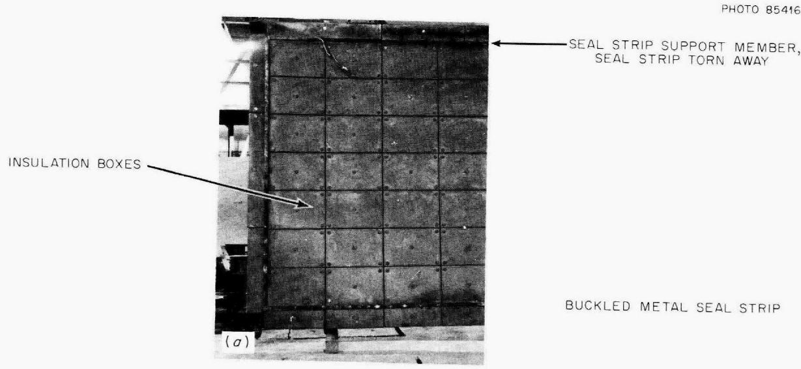

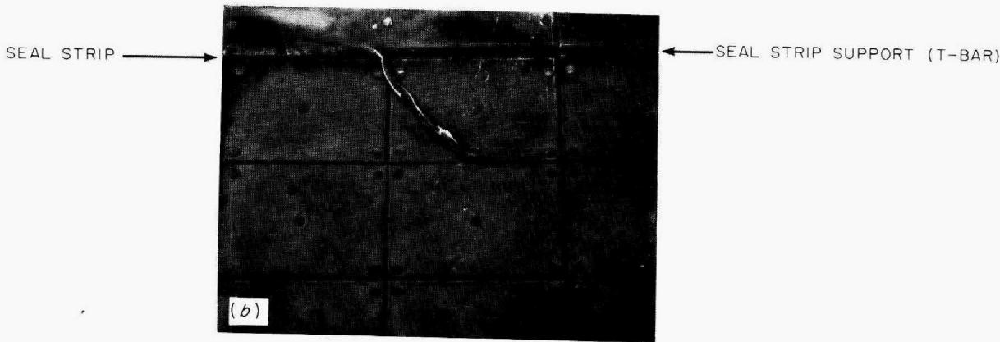  
Fig. 2.l. Radiator Outlet Door Showing Buckled, Broken, and Torn Seal Strip (a) and Top Seal, North Side (b).

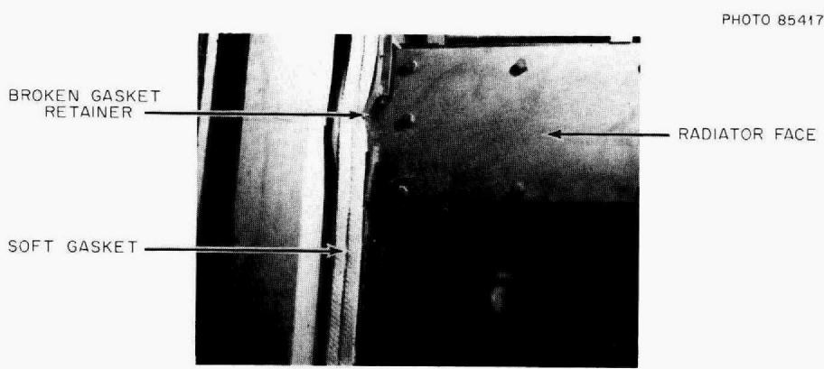  
Fig. 2.2. Soft Seal and Retainer Outlet Side of Radiator, Showing Buckled and Broken Soft Seal Retaining Strip.

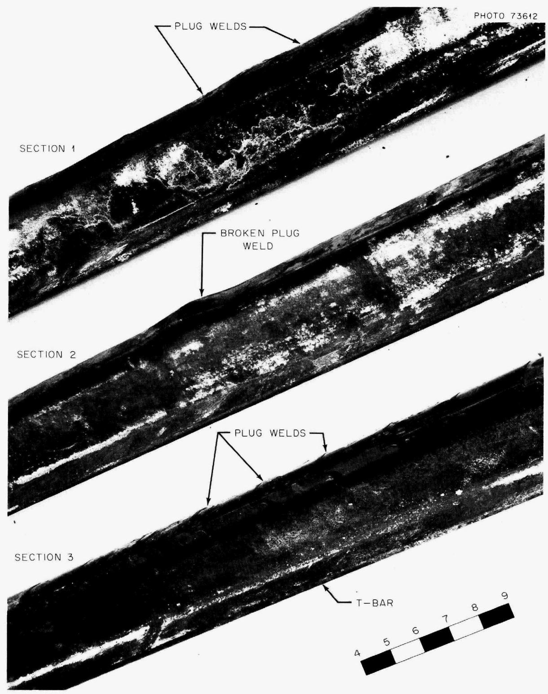  
Fig. 2.3. Seal Strip Tests - Radiator Door.

It was evident throughout all the test program that the seal-strip support member bowed about 3/16 in. along the 32-in. length of test section. It seemed reasonable to assume that bowing of this member would also occur along the solid 10-ft 4-1/2-in. length of the T-bar in the radiator door and contribute to the stressing of the door structure. The door repair work included cutting the T-bar into segments; when this was done, the bowing of the door structure was reduced from 5/16 in. to 1/8 in.

Corrective measures to the seals and T-bar are presently in progress. These include:

1. Modification of the T-bar to minimize bowing by installation of expansion joints in the bar.   
2. Installation of a new hard seal which is composed of 3-1/4-in.-long overlapping links. The short links will be plug welded to the T-bar by a single weld per link with a 1/32-in. expansion joint between overlapping segments.   
3. The existing soft-seal retainer, which is mounted on the face of the radiator, is being modified to permit thermal expansion of the metal retainer.   
4. It is not anticipated that bowing of the T-bar will be completely eliminated. Thermal expansion of the radiator face may also contribute to the air leakage. An additional seal in the form of a resilient, soft seal is being proposed as backup to the existing seals. This seal would form a closure at those points along the hard seal which are not in contact with the existing soft seal.

# 2.5 Sampler-Enricher

R. B. Gallaher

During runs 6 and 7, 35 samples were isolated with the sampler-enricher, 10 of which were $50\text{-g}$ oxide samples. To date 119 10-g and 20 50-g samples have been taken, and 87 enrichments made to the fuel system.

In the past six months, four major maintenance jobs were done on the equipment. They were (1) replacement of the manipulator boots, (2) replacement of the drive unit latch, (3) repair of open electrical circuits, and (4) recovery of a capsule which had fallen onto the gate of the operational valve. A brief discussion of each job follows.

# Replacement of Manipulator Boots

A 12-psi pressure difference which was accidentally placed across the manipulator boots caused a small puncture in the inner boot. To replace the boots the manipulator assembly was removed from the sampler. The radiation level 3 in. from the hand was $10\mathrm{r / hr}$ as removed, but this

was reduced to 1 r/hr by scrubbing with soap and water. About 2 hr was required for the job of replacing both boots. The boots had been used during the 48 sampling cycles since the operation at power was started.

# Replacement of the Capsule Latch

Just after the boots were replaced, the drive-unit motor stalled as the latch which holds the sample capsule to the cable was being retrieved through the lower bend in the transfer tube. After several tries the latch was completely withdrawn. Testing showed the latch was jamming in the transfer tube near the top of the lower bend. The design was changed to provide additional 1/8 in. clearance between the tube wall and the latch. The old latch and part of the cable were pulled through the access port and the removal valve with the reactor operating at less than 100 kw. The old latch was pulled into the sample transport cask to reduce the radiation level in the work area. It was disconnected from the drive unit cable and the new latch was installed.

# Repair of an Open Electrical Circuit

While operating the drive unit to be certain that the new latch would pass around the lower bend without jamming, the cable position indicator stopped at 15 ft 2 in. from full withdrawn position, and the upper limit switch activated. Electrical continuity checks showed open circuits to both insert and withdraw windings of the drive-unit motor and to the upper limit switch. All three of these leads penetrated the containment wall through a common 8-pin receptacle.

When the drive motor stopped, the cable extended almost to the pump bowl, preventing closing of the operational and maintenance valves. Therefore, the reactor had to be drained before maintenance work could be started. After the reactor was drained, the 15 ft 2 in. of cable was pulled out of the transfer tube without exposing the fuel system to air by using the one-hand manipulator to pull and the transport container and access port operators to hold the cable. Then the operational and maintenance valves were closed to provide the containment barrier to allow the motor assembly to be removed for repair.

The assembly, which contains the drive-unit motor, was removed from the sampler-enricher and placed in the equipment storage cell for decontamination and repair. Shadow shielding and partial decontamination were used to reduce the radiation level enough to permit direct maintenance. Partial disassembly revealed that three connector pins had burned off one 8-pin receptacle. The damaged receptacle was removed and a new one was welded in its place. All six receptacles in this location were filled with epoxy resin to provide additional electrical insulation and mechanical strength to the connector pins.

As the drive-unit cable was being pulled from the transfer tube it was bent in several places and needed to be straightened. The cable was

scrubbed with soap and water until the radiation level was less than 5 r/hr at 3 in. Then most of the kinks were straightened. The remaining bends in the cable did not appear to adversely affect the operations of the drive unit when it was operated prior to reinstallation.

The parts were reassembled. All electric circuits were checked for continuity and for grounds, and all gas lines were leak checked. The assembly was then reinstalled in the sampler-enricher and the normal sampling was resumed.

# Recovery of a Capsule

As a capsule key was being inserted into the latch, the manipulator slipped and the capsule was jerked through the access port and fell onto the gate of the operational valve in the transfer line. A magnet was lowered into the transfer line; the mild steel key on the capsule was picked up by the magnet, and the capsule assembly was removed as the magnet was withdrawn. The radiation level of the magnet after this operation was 10 r/hr at 2 ft.

These four maintenance jobs involved handling equipment that had been in contact with fuel salt. All work was done in contamination control zones. Contamination was found outside these zones only twice, and both times it was from contaminated shoes. Apparently this type contamination is not readily airborne. Personnel exposures did not exceed a dose of 40 millirads/day for any one individual.

# Operational Valve Leakage

While the assembly was removed for replacement of the electrical receptacle, the upper face of the operational valve gate was cleaned as much as possible with the valve closed. Several small, dark particles were observed on the gate prior to cleaning. After cleaning, the leak rate of helium through the top seal decreased for a while. After the capsule had been dropped onto the gate, the leak rate suddenly increased again, indicating that another particle had lodged in the sealing area.

# Contamination of the Removal Valve Seals

The surface of the transport container used during the withdrawing of the cable with the manipulator became very contaminated from contact with the cable. When the transport container was removed, part of this contamination was transferred to the removal area seal. During subsequent sampling procedures particulate contamination was spread to the top of the sampler-enricher. Since the removal area was cleaned using damp rags and the top of the sampler-enricher was made a contamination control zone during sampling operations, there have been no further problems with contamination.

# Miscellaneous Problems

During one sampling sequence as the top of the transport container was being lowered over the bottom part, which contained a 50-g salt sample, the steel wire connecting the capsule to the key caught on the edge of the transport container top and was pulled down into the threads. When the two pieces were threaded together, the wire caused the threads to gall before the pieces sealed. The sample and the transport container were ruined. Since then a long plastic sleeve has been placed in the bottom of the transport container to hold the wire out of the way. The sleeve also reduces the amount of contamination transferred from the sample to the inside of the top piece of the transport container.

About 4 hr is presently required to decontaminate a transport container sufficiently to be returned for use. Mild steel bottom pieces have been fabricated which will be used one time and thrown away without decontaminating.

# Changes to the Control Circuit

Three changes were made to the control circuit.

1. The annunciator, which alarmed when capsule area pressure was greater than manipulator area pressure, was removed. A permissive light was installed to indicate when capsule area pressure was equal to or less than manipulator area pressure. This condition is necessary before the access port can be opened but is not necessary at other times.   
2. A fuse was added to the drive-unit motor circuit to protect the motor and the electric receptacles from excessive currents. The fuse is located on one of the panelboards.   
3. Voltage suppressors were placed across the two motor windings to limit any high voltage peaks during starting and stopping of the motor.

# 2.6 Coolant Sampler

R. B. Gallaher

During runs 6 and 7, ten $10\text{-g}$ salt samples were isolated from the coolant pump bowl. A total of 45 samples including two $50\text{-g}$ samples have been taken using the coolant sampler.

One pin on an electrical receptacle shorted during a sampling cycle. This pin was in the circuit to the indicator light which showed when the capsule had been withdrawn 18 in. from the pump bowl. The receptacle was removed and a new one welded in place.

A leak rate from the lower seal of the removal valve increased. The valve was disassembled, cleaned, and reassembled. The valve then sealed properly.

# 2.7 Fuel Processing System Sampler

# R.B.Gallaher

Design of the fuel processing system sampler has been completed except for the shielding. The sampler-enricher mockup equipment was modified to conform with the design. All parts were received, and the revisions to the mockup panelboards were completed. The equipment is being installed at Building 7503 whenever craft are available. The tubing installation is $95\%$ complete, and the electrical and instrument work is about $50\%$ complete. The final assembly and leak checking remain to be done.

# 2.8 Off-Gas Filter Assembly

# A. N. Smith

The off-gas filter in line 522 was originally provided to protect the very fine trim of the reactor pressure control valve, PCV 522, from becoming fouled by particulate matter. Following the analysis of plugging difficulties in February and March 1966, efforts were directed toward the design of a filter which also would trap organic materials. Primary considerations were (1) choice of filter medium and (2) heat dissipation.

# Filter Medium

The organic material was presumed to exist in a range of forms extending from low-molecular-weight vapors to suspensions of droplets and polymerized solids. Charcoal was selected as the best available medium for the removal of the heavier organics. Preliminary tests reported in Chap. 7 confirmed that the charcoal would have good efficiency for removal of $C_6$ and heavier molecules. It was assumed that lighter molecules would pass through the main charcoal beds without adverse effects.

# Heat Dissipation

The heat load at the filter comes primarily from beta decay of krypton, xenon, and their daughter products. The contribution due to krypton and xenon alone is estimated at 0.1 kw/liter. The contribution due to the daughter products would depend on the assumed physical model. For purposes of the filter design, the most pessimistic viewpoint was adopted, namely, that all daughters formed between the pump bowl and the filter remain in suspension and are transported to the filter. Since the efficiency of the charcoal trap would vary inversely with temperature, a prefilter or particle trap was added for removal of solid daughters and the entire assembly was water cooled.

# Particle Trap

The design of the particle trap is illustrated in Fig. 2.4. Gas from the reactor pump bowl enters at the bottom of the unit through a central pipe, reverses direction, and passes in succession through two concentric cylinders of porous metal (felt metal), the first somewhat coarser than the second, and a bed of inorganic (Fiberfrax) fibers. A layer of stainless steel wool is inserted at the bottom of the unit to serve as an impingement surface for material which might be thrown out of the stream by centrifugal action. A bellows section is provided in the felt-metal zone for thermal expansion. The Fiberfrax (a poor conductor) is compartmented between perforated metal plates to provide for better transmission of heat to the walls of the filter housing. Three thermocouples are attached to the outside of the filter housing - one near the top, one adjacent to the lower end of the Fiberfrax section, and one adjacent to the middle of the felt-metal section.

Specific design data are as follows:

# Felt-Metal Section

<table><tr><td></td><td>Coarse</td><td>Fine</td></tr><tr><td>Material</td><td>Stainless steel</td><td>Stainless steel</td></tr><tr><td>Manufacturer&#x27;s type (Huyck Metals Co., Milford, Conn.)</td><td>FM 225</td><td>FM 204</td></tr><tr><td>Element size</td><td>2-5/8 in. diam × 9 in. long</td><td>3-5/8 in. diam × 9 in. long</td></tr><tr><td>Filter area</td><td>0.5 ft2</td><td>0.7 ft2</td></tr><tr><td>Removal rating</td><td>98% &gt; 1.4 μ</td><td>98% &gt; 0.1 μ</td></tr><tr><td>Clean pressure drop at 4.2 liters/min for coarse and fine in series</td><td colspan="2">1-1/4 in. H2O</td></tr></table>

# Fiberfrax Section

<table><tr><td>Material</td><td>Carborundum Co. Fiberfrax, long staple fibers, 5 μ mean diameter</td></tr><tr><td>Packing density</td><td>8-1/2 to 9 lb/ft3</td></tr><tr><td>Total weight</td><td>189 g</td></tr><tr><td>Geometry</td><td>Nine annular compartments, 4.05 in. OD × 0.84 in. ID, with thickness of two each at 1/4 in., two each at 1/2 in., four each at 1 in., and one at 1-1/4 in.</td></tr></table>

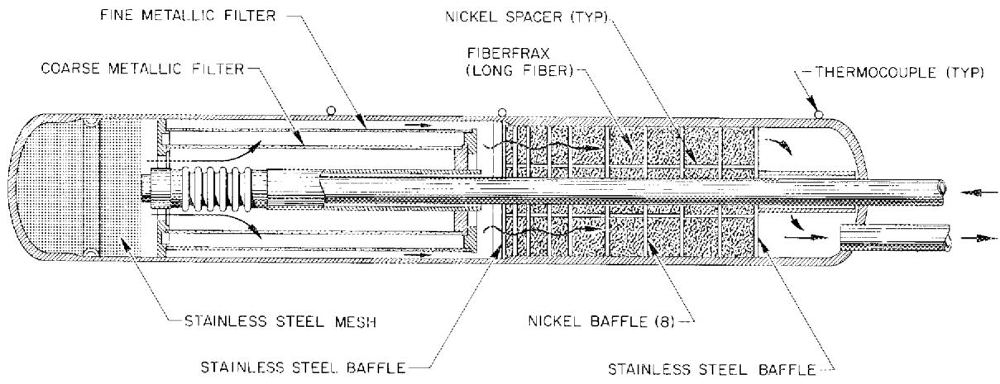  
Fig. 2.4. Particle Trap of Line 522 Filter Assembly.

Dioctyl phthalate (DOP) efficiency tests4 were run on the felt metal (coarse and fine in series) and on the Fiberfrax with the following results:

<table><tr><td rowspan="2">Material</td><td rowspan="2">Geometry</td><td colspan="2">Aerosol</td><td rowspan="2">Efficiency (%)</td></tr><tr><td>Type</td><td>Av Particle Size</td></tr><tr><td>Felt metal</td><td>Coarse and fine in series, 4 in. diam</td><td>Polydisperse</td><td>0.8 μ</td><td>96.7</td></tr><tr><td>Fiberfrax</td><td>4 in. diam × 7-1/4 in. long, bed density 9-1/2 lb/ft3</td><td>Monodisperse</td><td>0.3 μ</td><td>99.4</td></tr></table>

The efficiency of the assembled particle trap using the polydisperse aerosol was determined to be $99.9\%$ .

# Charcoal Trap

The charcoal trap consists of 13 ft of l-in. IPS stainless steel pipe, arranged in three hairpin sections of approximately equal length. The trap was loaded with $1092\mathrm{g}$ of Pittsburgh PCB charcoal to give an average bed density of $0.5\mathrm{g/cm}^3$ . Six thermocouples were installed at 5, 12, 51, 59, 105, and 113 in., respectively, from the bed inlet. The

entire charcoal trap is enclosed in a sealed tank through which water is circulated at a rate of 10 gpm and an inlet temperature of 65 to $70^{\circ}\mathrm{F}$ . The diameter of the trap piping was selected on the basis of theoretical temperature profile calculations. One-inch IPS was selected as the size which would permit the lowest trap operating temperature consistent with an acceptable pressure drop.

Flow pressure-drop tests gave the following results at the normal reactor off-gas flow of 4.2 liters/min:

<table><tr><td></td><td>psi</td></tr><tr><td>Felt material</td><td>0.04</td></tr><tr><td>Fiberfrax</td><td>0.004</td></tr><tr><td>Total particle trap</td><td>0.06</td></tr><tr><td>Charcoal trap</td><td>0.85</td></tr><tr><td>Total filter assembly</td><td>0.95</td></tr></table>

The performance of the off-gas system after the installation of this filter is described in Chap. 1.

# 2.9 524 Charcoal Bed

A. N. Smith

Diffusion of activity into the fuel pump upper off-gas line (line 524) resulted in high stack activity on two occasions during the report period and dictated the need for a small charcoal bed in line 524 (see Chap. 1).

A small upflow of gas (about $100~\mathrm{cm}^3/\mathrm{min}$ ) is maintained at the fuel pump shaft to inhibit back-diffusion of oil vapors into the pump bowl. Line 524 serves to transport this flow to the off-gas system.

The bed consists of 9 ft of 3-in. sched 10 pipe arranged in hairpin shape and loaded with 15.8 lb of Pittsburgh PCB charcoal. Bulk density of the bed is $0.47\mathrm{g/cm^3}$ . Holdup time at $100\mathrm{cm^3/min}$ helium flow is estimated as 2-1/2 days for krypton or 30 days for xenon. The bed was placed in service on June 9, 1966.

# 2.10 Remote Maintenance

R. Blumberg

At the start of this reporting period, radiation levels encountered by maintenance crews were mild due to the small accumulated power-hours produced. This low radiation level permitted the use of temporary, and

at times casual, shielding, and in-cell manipulations were thus unhampered by the restrictions of the shielding, so that the time required for completion of these early jobs was shortened. However, by the middle of July, when the reactor was shut down for maintenance after having produced some 7800 MWhr, the radiation level was an important factor, adding to the difficulty, time, and expense of the work. As a consequence the portable maintenance shield had to be set up for each job, and extensive health physics precautions, especially in the area of contamination control (housekeeping), had to be employed. As of this writing, the remote maintenance work of the shutdown is about $60\%$ complete.

Based on the experience gained to date one may make the following observations. (1) Contamination control is not a major difficulty. We have handled several pieces of equipment that had much wipable and transferable contamination without spreading contamination throughout the working area. The contamination does not become airborne readily. Nevertheless, the practice has been to use conservative handling measures; these involve the use of plastic bag coverings, blotter paper, gas masks, etc. (2) An encouraging sign is the ease of executing some of the routine maintenance jobs. There have been many instances where removal and replacement of in-cell components have gone very smoothly and with minimum supervision. In general, these are items which have standard electrical and piping disconnects and supports, such as the space cooler, and which represent a considerable percentage of the equipment that must be maintained remotely. (3) Thus far, almost all of the maintenance techniques or systems have been tried and have worked well. These are the portable maintenance shield, graphite sample system, vent house shielding, the remote maintenance control room, and repair techniques in the decontamination cell. The remote maintenance tasks where we do not yet have experience are in general associated with the handling of the large components. The shielding provided for maintenance has been quite adequate.

The following is a summary of the tasks performed during the last period. The accumulated hours of power operation, together with an indication of the radiation level in the immediate area just below the work shield, are given for each task. In general, the work shield was effective in reducing the background radiation level above it to less than $5\mathrm{mr/hr}$ except while a tool penetration was partially open, and then the radiation level at the hands would be near $200\mathrm{mr/hr}$ . The maximum accumulated dosage to any one worker was less than $1/4$ of the maximum permissible level over the period.

# March 1 - 35 Mwhr

Removed the flexible jumper which connects the off-gas line of the pump bowl to the permanent in-cell part of line 522, inspected the flange faces and inside of the piping with a bore-scope and binoculars, obtained specimen of a residue from the piping for chemical analysis, and restored the system. This task was part of the effort to diagnose the restriction problem in the off-gas system. The radiation level was $200\mathrm{mr/hr}$ at floor level.

March 10 - 35 Mwhr

Removed and replaced the reactor cell east space cooler. This operation was accomplished mostly by the craft forces. Readings were $500\mathrm{mr/hr}$ at floor level.

March 12 - 35 Mwhr

Installed a thermocouple on a horizontal section of off-gas line 522. A C-clamp was modified to provide the contacting force to hold the couple onto the 4-in. pipe. The thermocouple leads were connected to a spare thermocouple lead-out box. Radiation was $500\mathrm{mr/hr}$ at floor level.

March 31 - 35 Mwhr

The revised PCV 522 valve and filter unit described above were installed in the vent house area. Changes in the shielding and containment arrangement were done to make possible the remote replacement of any one of three component parts, that is, the valve, the particle trap, or the carbon bed, rather than having to remove the entire assembly. The new installation required larger maintenance shielding and stronger structural support for the shielding.

April 30-May 6-820 Mwhr

Repaired the sampler-enricher. A large subassembly of the equipment was removed to the decontamination cell, where it was cleaned and repaired using local shielding. This was the first real use of the decontamination cell, which had been prepared for this type of work, and it was found to work quite well. There were contact readings of above $100\mathrm{r/hr}$ , but the radiation was soft enough that a little shielding reduced the field to acceptable levels.

May 20 - 1932 Mwhr

Installed temporary instrumentation piping at the PCV 522 area for particle trap, carbon bed, and valve pressure drop measurements. Tubing connections were made up remotely; this was a new maintenance procedure. Readings were $100\mathrm{r/hr}$ at floor level and $10\mathrm{r/hr}$ through an open tool penetration.

July 27 - 7822 Mwhr

This was the start of the shutdown which has extended to the end of this report period. The reactor was shut down on July 17, and the graphite-INOR-8 surveillance samples were removed from the reactor core on July 28, 11 days later. The work required three days. The estimated radiation level while the sample was being transported was $1500\mathrm{r / hr}$ at 1 ft. The remote control room for the crane was used for the first time and performed satisfactorily. The tools used for the operation were contaminated to a level greater than $100\mathrm{r / hr}$ .

August 5-10 - 7822 Mwhr

Removed, repaired, and replaced the Nos. 1 and 3 control rod drives. The details of the repair work are described in Sect. 2.3. The remote handling operation of the removal and replacement went smoothly. Radiation was $500\mathrm{mr/hr}$ at floor level.

August 15 - 7822 Mwhr

Removed and replaced the reactor cell west space cooler. The job went routinely and was accomplished mostly by the craft forces. Radiation was 1 to 6 r/hr at floor level.

August 17 - 7822 Mwhr

A gas pressure reference line which became filled with a salt plug was cleared by applying pressure while heating the line. This task was unanticipated and required some design, fabrication, and testing prior to installing a heater on a long-handled tool and safely operating it remotely. Readings were $60~\mathrm{r / hr}$ at floor level and $10~\mathrm{r / hr}$ through a tool penetration.

# References

1. MSR Program Semiann. Progr. Rept. Feb. 28, 1966, ORNL-3936, p. 54.   
2. Ibid., pp. 54-56.   
3. Ibid., p. 58.   
4. E. C. Parrish and R. W. Schneider, Tests of High Efficiency Filters and Filter Installation at ORNL, ORNL-3442 (May 17, 1963).   
5. Personal communication from S. J. Ball and J. R. Engel.

# 3. PUMP DEVELOPMENT

P. G. Smith

A. G. Grindell

# 3.1 MSRE Pumps

Molten-Salt Pump Operation in the Prototype Pump Test Facility

The prototype pump was operated for 2631 hr, circulating the salt LiF-BeF $_2$ -ZrF $_4$ -ThF $_4$ -UF $_4$ (68.4-24.6-5.0-1.1-0.9 mole %) at $1200^{\circ}\mathrm{F}$ . The fuel-salt pump impeller of 11-1/2 in. OD (size installed in the MSRE fuel pump) was used. Measurements were made of the concentration of helium bubbles in the circulating salt, and various tests were conducted on the pump-tank and the catch-basin purge gas lines. $^{1}$

The radiation densitometer* was used to determine the concentration of helium bubbles circulating in $1200^{\circ}\mathrm{F}$ salt during operation at normal pump-tank liquid level and with a fuel-pump impeller of 11-1/2 in. diameter running at 1170 rpm. The helium concentration in the salt was $0.1\%$ by volume. This value contrasts with $4.6\%$ by volume measured previously² in the prototype facility using a 13-in.-diam fuel impeller, and compares favorably to a barely detectable concentration in the MSRE fuel circuit.

Tests were performed which included analyses to determine the hydrocarbon content of the pump-tank and catch-basin purge gas streams and the composition of hydrocarbons. They were done as part of the effort to establish whether the fuel pump was the likely source of hydrocarbons in the off-gas system of the MSRE. During these tests the flow of gas down the shaft annulus at constant supply pressure decreased, and this was taken as an indication of a partial plug in the annulus. The partial plug increased the pressure difference across the gasketed joint between the shield plug and the bearing housing from 0 to 5 psi at the design purge flow of 4 liters/min. Under these circumstances the off-gas from the pump tank contained several hundred parts per million of hydrocarbons. This indicated that the pressure difference was forcing oil from the catch basin through the gasketed seal, down the outside of the shield plug, and into the pump tank. The partial plug could be removed temporarily by stopping the pump for a short time or by raising the temperature of the circulating salt from 1200 to $1250^{\circ}\mathrm{F}$ . When the plug was not present, the concentration of hydrocarbons in the off-gas stream from the pump tank was very low. Samples of the plug material were obtained when the pump was dismantled. Examination showed them to be salt of the composition that was being circulated by the pump. The mechanism by which the salt reached the shaft annulus is being investigated.

Other tests were run in which oil was injected into the pump tank through the sampler-enricher nozzle. Results of the analyses and other information about both types of tests are reported in more detail in Sect. 7.5, subsection entitled "Analysis of Helium Blanket Gas."

# Pump Rotary Element Modification

The modification3 that replaces the gasketed seal between the shield plug and the bearing housing with a seal weld, which should eliminate the oil leakage into the pump bowl, was completed on the spare rotary elements for the MSRE fuel and coolant pumps and on the rotary element for the MK-2 fuel pump. The spare element for the fuel pump was tested in the cold shakedown stand and installed in the prototype hot test stand for shakedown. During preheat of the system and pump, approximately 1 qt of oil passed through the lower rotary seal into the catch basin. The cause of the poor performance of the seal is being investigated, and the rotary element is being cleaned and re-assembled.

Cold and hot shakedown tests of the spare rotary element for the MSRE coolant pump were completed. The hydrocarbon content in the pump tank off-gas was not more than 15 ppm.

# Lubrication System

The lubrication pump endurance test3 was continued, and the pump has now run for 27,000 hr, circulating oil at $160^{\circ}\mathrm{F}$ and 70 gpm.

# MK-2 Fuel Pump

The pump tank3 is being fabricated, and, when completed, it will be installed in the prototype pump test facility. Then the MK-2 fuel pump will be tested at operating conditions simulating those required by the MSRE.

# 3.2 Other Molten-Salt Pumps

# PK-P Fuel-Pump High-Temperature Endurance Test

Endurance operation3 was halted as a result of a failure of the drive motor. The pump had operated continuously for 7830 hr, circulating the salt LiF-BeF2-ThF4-UF4 (65-30-4-1 mole %) at 1200°F, 800 gpm, and 1650 rpm. The rotor windings of the wound rotor motor had seized against the stator. The pump has operated for a total of 23,426 hr in four tests.

# Pump Containing a Molten-Salt-Lubricated Journal Bearing

The gimbals support for the salt bearing4 was modified, and a new bearing and journal were fabricated. Performance of the salt bearing will be investigated with an oil lubricant prior to molten-salt lubrication.

# References

1. MSR Program Semiann. Progr. Rept. Feb. 28, 1966, ORNL-3936, pp. 74-75.   
2. MSR Program Semiann. Progr. Rept. Aug. 31, 1965, ORNL-3872, pp. 62-65.   
3. MSR Program Semiann. Progr. Rept. Feb. 28, 1966, ORNL-3936, p. 75.   
4. Ibid., p. 76.

# 4. INSTRUMENT DEVELOPMENT

R. L. Moore

G. H. Burger

J.W.Krewson

# 4.1 Temperature Scanner

Performance of the temperature scanning system1 continued to be generally satisfactory, although some problems were experienced with the oscillosopes and mercury switches and some system instability was noted.

The problems with the oscilloscopes were only continuations of those previously experienced due to the age and design of the scopes. The scopes are about 12 to 15 years old and have been a continuing source of trouble. Manufacture of the scopes was discontinued, so no spare parts were available. Two new solid-state-circuit scopes were ordered and installed. The new scopes have apparently eliminated that problem, although more time is required to evaluate their performance.

Although the mercury switches have continued to give much better service than expected, some problems due to normal wear developed. Upon ordering replacement parts for the switches, it was discovered that the switches were no longer manufactured and no spare parts existed. Some spare parts and switches were obtained from the ORNL Reactor Division, but it was apparent that a replacement switch was needed. A possible replacement was found at Union Carbide Corporation, Olefins Division, in South Charleston, West Virginia. The Olefins Division has developed a solid-state multiplexer as a direct replacement for the mercury switch and has agreed to sell one to ORNL for test and evaluation. An order has been placed for one unit, with delivery expected about January 1967. In the meantime the Reactor Division will continue to supply mercury switch spare parts as long as they are available and can be released for our use.

The scanner instability problems mostly resulted from operating the system outside its design range. The system was adjusted to obtain more display resolution and to provide easier readout for the operators. In order to do this the alarm discriminator was required to operate outside its design range, causing alarm set point instability. To eliminate this problem while continuing this mode of operation would require redesign of the discriminator, so operation of the system was changed back to comply with the original design. A calibration and test unit is being designed and will be installed shortly to provide the operators with an easy method of calibrating the system and of checking its stability. This test unit will provide a variable, accurately calibrated signal to one point on any of the selected scanners and will allow the operators to check the scanner calibration and alarm set points during routine operation of the scanner system.

# 4.2 High-Temperature NaK-Filled Differential-Pressure Transmitter

Testing of the coolant-salt system flow transmitter which failed in service at the MSRE and which was subsequently refilled with silicone oil² was continued. Further testing at temperatures over the range from room temperature to $1200^{\circ}\mathrm{F}$ confirmed that the temperature sensitivity had been significantly reduced by the refilling operation but was still excessive. Before refilling, the zero shifts observed were of the order of 15 to 20 in. (water column) per degree Fahrenheit change in body temperature. After refilling the shifts were of the order of 1 in. $\mathrm{H}_2\mathrm{O}$ per degree Fahrenheit. Zero shifts of the order of 0.1 in. $\mathrm{H}_2\mathrm{O}$ per degree Fahrenheit or less are required to obtain the accuracy desired in measurement of MSRE coolant-salt flow. In all cases the temperature-induced shifts observed were zero shifts. No shifts of span calibration were observed. Also, the instrument did not exhibit a sensitivity to static pressure changes either before or after refilling.

The remaining shifts are presently believed to be due to the continued presence of some gas void in the silicone-oil-filled cavities. Attempts to eliminate these voids will be made by repeating the filling operations. To assure that all remaining gas has been removed, attempts will be made to obtain a "harder" vacuum than the 28 in. Hg vacuum previously obtained. After refilling, the temperature sensitivity tests will be repeated.

The new NaK-filled differential-pressure transmitter ordered for use as an MSRE spare was received; however, acceptance tests showed that the instrument was extremely sensitive to temperature and static pressure variations and would, therefore, not meet specifications. Negotiations with the manufacturer for repair or replacement of the transmitter are in progress.

# 4.3 Molten-Salt Level Detectors

Performance of all molten-salt level detectors installed at the MSRE, on the MSRP Level Test Facility, and on the MSRE Prototype Pump Test Loop continues to be satisfactory. $^{2,3}$ No failures have occurred in any of the level devices during the past report period, and, except for the changes made in electronic equipment associated with the ultrasonic level probes reported below, no modifications have been required. The corrections made in the calibration of the ball-float-type transmitter installed on the MSRE coolant-salt pump $^{4}$ were apparently adequate, and no further adjustments have been necessary.

To correct the excessive frequency drift present in the excitation oscillator supplying the ultrasonic level probe, $^{5,6}$ a number of minor changes were made in the components and circuitry of the oscillator and detector amplifier circuits. In general, these changes involved the replacement of a number of critical components with high-grade components having very small temperature coefficients, increasing the size of

coupling capacitors so that they would have smaller reactance at the 25-kilohertz operating frequencies, and making several minor circuit revisions to increase the stability of the B+ supply. These changes resulted in a considerable improvement in the frequency stability. Before the changes were made the oscillator drifted randomly, with a maximum deviation from the center or resonant frequency of 300 hertz. This deviation was sufficient to cause the instrument to become inoperative. When the changes were made, the maximum drift observed after warmup was 5 hertz. These drifts were observed in an air-conditioned laboratory and are expected to be greater in the field; however, it is expected that the increased stability obtained will be adequate. A complete check on the operability of the ultrasonic level probe requires an actual variation of the level of molten salt in the fuel storage tank of the MSRE. No salt has been transferred to or from this tank since the probe circuitry was modified, and field checks on the effectiveness of the modifications have not been made at this time. These checks will be made when salt transfers can be made without interference with MSRE operations.

# 4.4 Helium Control Valve Trim Replacement

Modifications and/or repair of two weld-sealed helium control valves which failed in MSRE service during the previous report period have been completed. The spline-type trim previously used in the main helium supply control valve, which had failed twice, was replaced with a taper trim. The use of taper trim was permissible and desirable because of the relatively high flow rates involved.

There have been no further failures of helium control valves during the past six months.

To determine the feasibility of controlling very low flows of dry helium with sliding disk valves, a mockup of such a valve was constructed and tested. The active member of the sliding disk valve is a flat disk attached to the valve stem and held against a seating surface by spring and pressure action. The surface between the disk and seat is lapped to light band flatness to assure tight shutoff. Throttling control of helium flow is accomplished by means of a tapered V-notch in the disk, which connects a port in the disk to a port in the valve seat. Rotation of the disk causes the effective cross-sectional area of the passage between the ports to vary in proportion to the degree of rotation. This type of construction offers promise in the control of dry-helium flow because of an inherent self-wiping action and because of the possibility that the valve might be operated without the use of lubricants.

Preliminary results of bench tests were inconclusive because of excessive leak rates between the lapped surfaces of the disk and seat. The tests will be repeated after additional lapping, cleaning, and re-assembly of the valve are completed.

# References

1. MSR Program Semiann. Progr. Rept. Feb. 28, 1966, ORNL-3936, p. 80.   
2. Ibid., pp. 77-78.   
3. MSR Program Semiann. Progr. Rept. Feb. 28, 1965, ORNL-3812, pp. 42-43.   
4. MSR Program Semiann. Progr. Rept. Feb. 28, 1966, ORNL-3936, p. 78.   
5. Ibid., p. 77.   
6. MSR Program Semiann. Progr. Rept. Aug. 31, 1965, ORNL-3872, pp. 66-70.   
7. MSR Program Semiann. Progr. Rept. Feb. 28, 1966, ORNL-3936, p. 79.

# 5. REACTOR ANALYSIS

# B. E. Prince

# 5.1 Analysis of Rod Drop Experiments

# Description of Experiments

The series of zero-power nuclear experiments made during MSRE run No. 3 included several rod drop experiments as part of the control rod calibration program. The purpose of these experiments was to provide an alternative and independent measurement of the control rod reactivity worth, which could be compared with worths determined by other methods (rod-bump period measurements and equivalent $^{235}\mathrm{U}$ addition). Three sets of rod drop experiments were performed, after additions of 30, 65, and 87 capsules of excess $^{235}\mathrm{U}$ had been made. Each set of experiments included rod drops both with the fuel circulating and with circulation stopped. We have analyzed the experiments made with the fuel pump stopped, and the results are summarized below.

The rod drop experiment consists of the intentional scream of a rod, or rod group, from an initially critical configuration, and the recording of the decay of the neutron flux as a function of time following the scream. One then determines the amount of negative reactivity required to produce this flux decay trajectory. The trajectory is characterized by a sharp drop in the flux immediately following the scream, which corresponds closely with the actual fall of the rod. The curve rapidly and continuously evolves into one with a much slower rate of flux decrease, governed by the decay of the initial distribution of delayed-neutron precursors.

Due to the requirement imposed by this experiment of accurately recording the flux while it is rapidly falling by about two decades, the graphical record obtained from the trace of a log n recorder is of limited usefulness. The combined requirements of fast response, good counting statistics, and reproducibility can be served, however, by recording the integrated count as a function of time following the drop.

In order that the integrated flux-time curve could be recorded without requiring scalars with special accurately timed cycles for count accumulation and recording, three scalars, together with a photographic technique of rapid recording, were employed in the following way. One of the scalars was driven by one of the fission-chamber channels. The other two were operated as 60-cps timing devices. One of these timers was synchronized to start with the scram of the rod, while the other timer and the count-accumulating scalar were synchronized and started a few seconds before the scram was initiated. The three scalars were stacked together in a vertical array, and a rapid-action camera was used to simultaneously photograph the records on the three scalars approximately once every second, starting a few seconds before the scram and ending about 30 sec after the scram. From these photographs, the count

rate at the initial critical condition, the time of the scram signal, and the integral of the flux, or count rate, as a function of time following the scram could be accurately determined. In these experiments, the position of the fission chambers was adjusted to obtain an initial count rate at criticality of approximately 30,000 counts/sec, which was low enough to result in quite small counting rate losses due to dead-time corrections. Also, the remote position of the MSRE instrument shaft, relative to the reactor core, would be expected to minimize errors due to changes in the spatial flux shape during the rod drop experiment.

# Analysis Procedures

The method used to analyze the experiments performed with the fuel pump stopped was that of comparison with theoretical flux decay curves. These latter curves corresponded to a negative reactivity insertion with magnitude determined from the integral worth vs position curves already obtained from period measurements and critical position comparison techniques, and with rate of insertion corresponding to the fall of the rod from its initial critical position. The theoretical time-integrated flux decay curves were calculated using the MATEXP program to integrate the standard space-independent reactor kinetics equations. Since this program is designed to integrate a general system of first-order differential equations, the theoretical time-integrated flux following the scram could be obtained by solving the system:

$$
\frac {\mathrm {d} \psi (t)}{\mathrm {d} t} = n (t), \tag {1}
$$

$$
\frac {\mathrm {d n} (t)}{\mathrm {d t}} = \frac {\Delta \rho (t) - \beta}{\Lambda} n (t) + \sum_ {i = 1} ^ {6} \lambda_ {i} C _ {i} (t), \tag {2}
$$

$$
\frac {\mathrm {d} C _ {i} (t)}{\mathrm {d} t} = - \lambda_ {1} C _ {i} (t) + \frac {\beta_ {i} n (t)}{\Lambda}, i = 1, 2, \dots , 6, \tag {3}
$$

where

$\psi(t) = \text{time-integrated count rate following the scram},$

$\mathbf{n}(t) =$ detector count rate following scram,

$C_{\mathbf{i}}(t) =$ delayed-neutron precursor concentrations, normalized to detector count rate,

$\Delta_{0}(t) =$ reactivity addition vs time following scream,

$\beta_{1} =$ production fraction for ith group of delayed neutrons,

$\lambda_{1} =$ radioactive decay constant for ith group precursors,

$\Lambda =$ prompt neutron generation time,

$$
\beta = \sum_ {i = 1} ^ {6} \beta_ {i}.
$$

The initial conditions for performing the integrations of Eqs. (1), (2), and (3) are

$$
\psi (0) = 0, \tag {4}
$$

$$
n (0) = \text {i n i t i a l} \quad \text {c o u n t} \quad \text {r a t e} \quad \text {a t} \quad \text {c r i t i c a l} \quad \text {c o n d i t i o n}, \tag {5}
$$

$$
C _ {i} (0) = \frac {\beta_ {i} n (0)}{\Lambda \lambda_ {i}}. \tag {6}
$$

The time variation of the reactivity is governed implicitly by the equations

$$
\Delta \rho (t) = \rho (y _ {0}) - \rho [ y (t) ], \tag {7}
$$

$$
\begin{array}{l} y (t) = y _ {0}, \quad 0 \leq t \leq t _ {e}, \\ = y _ {0} - \frac {1}{2} a t ^ {2}, \quad t _ {e} \leq t \leq t _ {e} + t _ {m}, \\ = y _ {s}, \quad t _ {e} + t _ {m} \leq t, \\ \end{array}
$$

where

$$
\begin{array}{l} \begin{array}{l} \text {y = r o d p o s i t i o n , i n c h e s w i t d r a w n (0 \leq y \leq 5 1 i n .) ; i n i t i a l} \\ \text {p o s i t i o n , y _ {0} ; s c r a m p o s i t i o n , y _ {s}}; \end{array} \\ \rho (y) = \text {m a g n i t u d e o f r e a c t i v i t y w o r t h c o r r e s p o n d i n g t o r o d p o s i t i o n} y, \text {n o r m a l i z e d t o z e r o r e a c t i v i t y a t f u l l y w i t h d r a w n p o s i t i o n}; \\ \begin{array}{l} t _ {e} = \text {e f f e c t i v e l a g t i m e b e t w e e n s c r a m s i g n a l a n d s t a r t o f r o d} \\ \quad \quad \quad \quad \quad \quad \quad \quad \quad \quad \quad \quad \quad \quad \quad \quad \quad \quad \quad \quad \quad \quad \quad \quad \quad \quad \quad \quad \quad \quad \quad \quad \quad \quad \quad \quad \quad \quad \quad \quad \quad \quad \quad \quad \quad \quad \quad \quad \quad \quad \end{array} \\ a = \text {a c e l e r a t i o n d u r i n g f a l l} (\sim 1 5 \mathrm {f t} / \sec^ {2}); \\ t _ {m} = \text {t i m e t o f a l l t o s c r a n p o s i t i o n}. \\ \end{array}
$$

As discussed previously, the value of $\rho(y)$ used in this analysis was determined by integration of period differential-worth measurements. We have also used an algebraic representation of these experimental curves, obtained by a least-squares curve-fitting procedure.3

In applying the above analysis to the experiments in which rod groups were dropped, the magnitude of the total negative reactivity insertion was determined by combining the calibration curve for the single rod with the results of rod-shadowing experiments (comparisons of critical positions of single rod and rod groups).1 Typical rod-group drop experiments consisted of the simultaneous scream of the regulating rod (rod No. 1) from its initial critical position and one or both of the shim rods from the

fully withdrawn position. The normalized shape of the reactivity insertion curve for the rod group was approximated by that corresponding to a single rod, falling from the fully withdrawn position.

# Results

The results of the rod drop experiments made after additions of 30, 65, and 87 capsules of enriching salt are shown in Figs. 5.1, 5.2, and 5.3 respectively. In all three sets of experiments, the analysis of the single rod drops shows very good consistency with the rod worth calibration obtained by integration of the differential worth measurements. A similar consistency was obtained from the experiments involving the scream of all three rods. In the case of the two-rod experiments, results obtained after 65 and 87 capsules appear to be slightly anomalous with respect to the experiment with the same rod group after 30 capsules. Multiplication of the magnitude of the negative reactivity insertion by a factor of about 1.05 brings the calculated and experimental curves for these experiments into better agreement. However, another source of this discrepancy could be in the approximation of the shape of reactivity insertion vs time for the tandem fall of the rods by that corresponding to a single rod. This source would be expected to have its greatest influence on the two-rod experiments.

The sensitivity of these experiments to variations in the magnitude of the reactivity insertion is illustrated in Fig. 5.4. Here the analysis of the experiment where rod No. 1 was scrambled after addition of 30 capsules is reproduced from Fig. 5.1; the theoretical curves are added which correspond to an increase and a decrease of $5\%$ of the total magnitude of negative reactivity insertion. For this particular experiment, this corresponds to an increment of $0.007\% \text{8k/k}$ in the magnitude of reactivity. With the exception of the apparent anomaly in the experiments involving the scream of two rods, the results of all these experiments were well within the $5\%$ band of self-consistency with the rod calibration results obtained from the differential worth measurements. $^{1}$

Work will continue on the analysis of these experiments and similar ones performed with the fuel circulating, in an effort to assess the full potential of the rod drop experiment as a routine method for rapid periodic redetermination of the shutdown worth of the MSRE control rods.

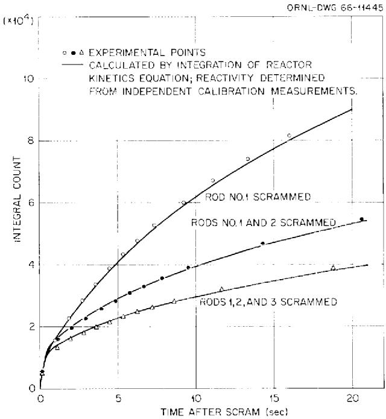  
Fig. 5.l. Results of Rod Drop Experiments After 30 Capsule Additions.

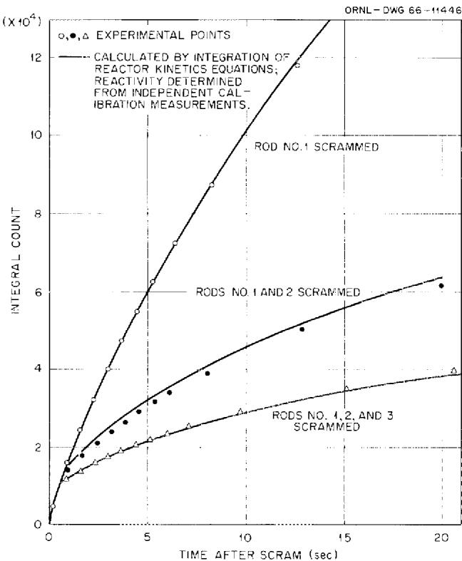  
Fig. 5.2. Results of Rod Drop Experiments After 65 Capsule Additions.

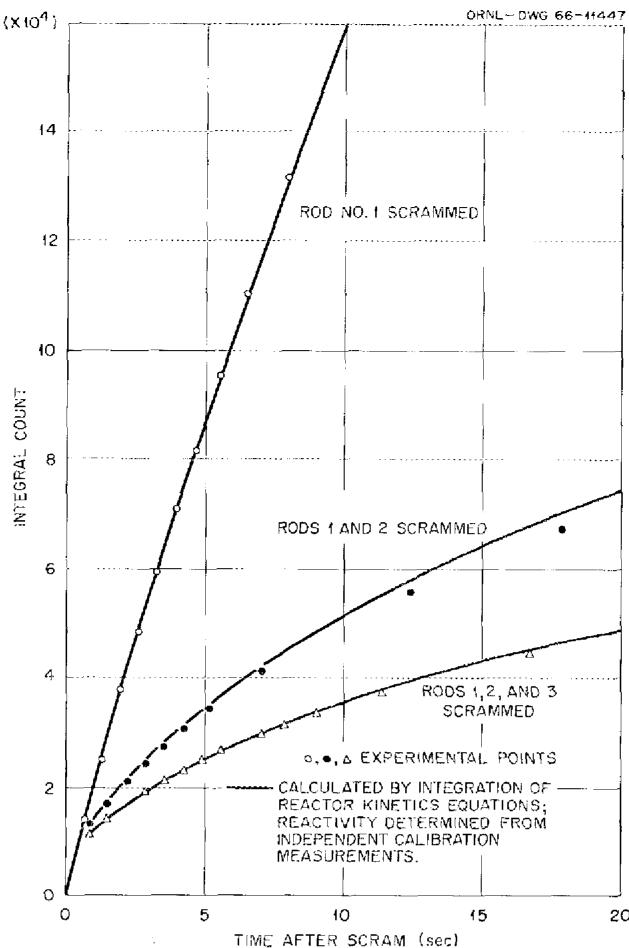  
Fig. 5.3. Results of Rod Drop Experiments After 37 Capsule Additions.

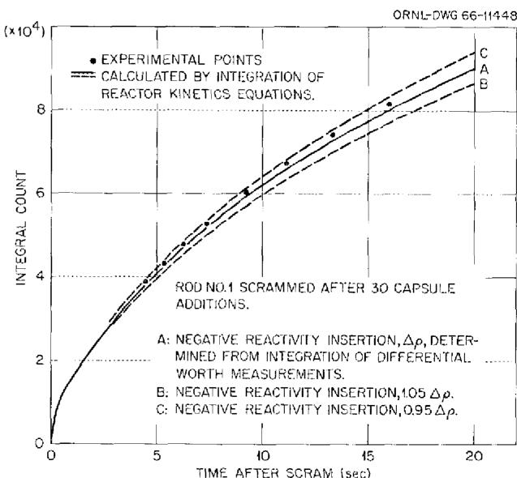  
Fig. 5.4. Sensitivity of Rod Drop Experiment to Changes in Magnitude of Reactivity Insertion.

# References

1. P. N. Haubenreich et al., MSRE Zero Power Physics Experiments, ORNL report in preparation.   
2. S. J. Ball and R. K. Adams, MATEXP - A General Purpose Digital Computer Program for Solving Nonlinear Ordinary Differential Equations by the Matrix Exponential Method, ORNL-TM report in preparation.   
3. MSR Program Semiann. Progr. Rept. Feb. 28, 1966, ORNL-3936, pp. 82-87.

Part 2. MATERIALS STUDIES

# 6. MSRP MATERIALS

G.M.Adamson, Jr.

# 6.1 MSRE Materials Surveillance Testing

W.H.Cook

Specimens of grade CGB graphite and Hastelloy N (INOR-8) were removed from the core of the MSRE after 7800 Mwhr of operation as part of the materials surveillance program. The visual appearance of the metal and graphite was good. The external surfaces were virtually free of salt. The metal was dull gray, and the graphite appeared unchanged by the exposure. The Reactor Chemistry Division was supplied with graphite specimens for fission product analyses from the top, middle, and bottom of the assembly. The results of their analyses are reported in Chap. 7. Other examinations scheduled for the graphite and metal are in progress.

The objective at this stage of sampling was to remove one stringer (one-third) of the assembly and return the others, plus a replacement, to the reactor. However, approximately one-seventh of the assembly in a zone just above the midplane of the reactor was severely damaged. Graphite specimens were buckled and broken, and the tensile rods were bent. Apparently, the assembly had been locked together by frozen salt during the reactor cooldown, and the large differences in the coefficients of thermal expansion of the graphite and metal created high stresses which led to the mechanical damage. The damage in this zone occurred in all three Hastelloy N and graphite stringers, requiring that all three be replaced. The graphite and Hastelloy N in the other portions of the array were suitable for the intended property evaluation tests.

A slightly modified replacement for the damaged reactor core specimens has been installed in the MSRE. The modifications were made to reduce mechanical stresses in the assembly by reactor heating and cooling cycles. The Hastelloy N tensile specimen rods in the new set are made from reactor vessel wall and head materials plus two modified alloys of Hastelloy N, one containing 0.52 wt % Ti and the other 0.43 wt % Zr. These additions were made for the purpose of reducing the effects of radiation on the alloy.

In general, the molten salts drained well from the graphite and the metal specimens, as shown in Figs. 6.1 and 6.2. The near absence of salt aided the disassembly.

The overall mechanical damage in the reactor core specimens is shown in Fig. 6.2 and in more detail in Fig. 6.3. A region of minor damage near the bottom of the assembly is shown in Fig. 6.3a, and the region of maximum damage is shown in Fig. 6.3b. Approximately $25\%$ of the graphite specimens were broken in each of the three stringers. The general appearance of the graphite was the same as it was when it was machined. Note the reflection of the cross pin in the surface of the graphite in Fig. 6.3a.

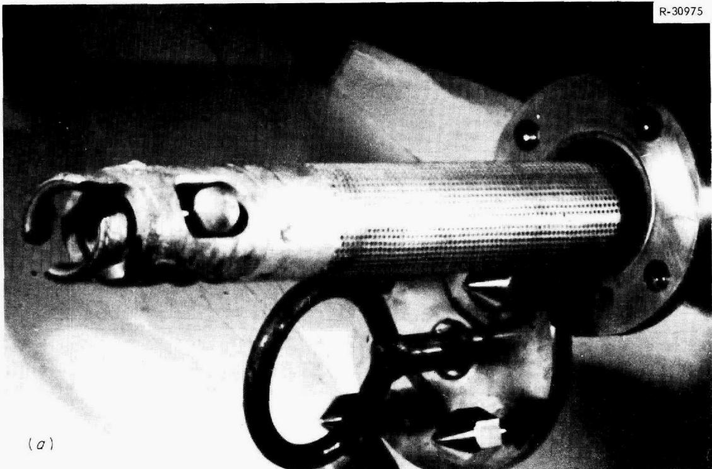

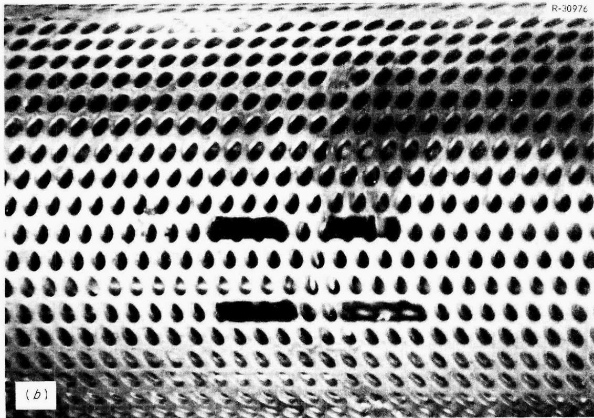  
Fig. 6.1. Basket of Reactor Core Specimens Removed from the MSRE After 7800 Mwhr of Operation.

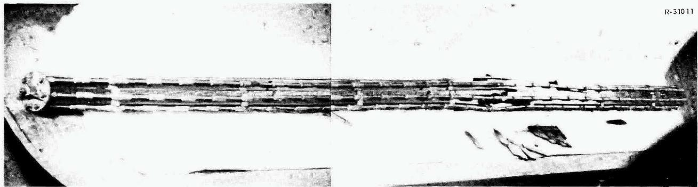  
Fig. 6.2. Overall View of the Reactor Core Specimens After Removal from Basket.

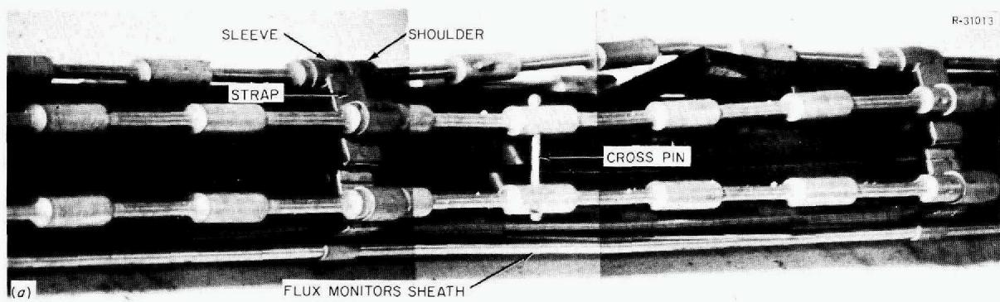

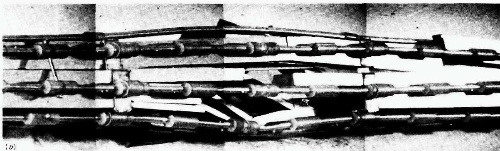  
Fig. 6.3. Details of the Mechanical Damage to the Graphite and Hastelloy N Specimens in Zones of (a) Moderate and (b) Severe Damage.

The graphite specimens had been assembled so that they formed tongue-and-groove joints that were bound together by Hastelloy N straps, as shown in Figs. 6.2 and 6.3. Slip-fit sleeves had been spot-welded to the metal straps that hold the rods of tensile specimens in position. The graphite was held within the cage of tensile specimen rods by cross pinning through the shoulders of the tensile specimens (Fig. 6.3a).

The total assembled length of the graphite stringers at room temperature was 62 in. At the reactor operating temperature, $1210^{\circ}\mathrm{F}$ , the graphite and Hastelloy N had expanded approximately 0.06 and

0.55 in. respectively. At the freezing temperature $(850^{\circ}\mathrm{F})$ of the flush salt, the Hastelloy N was approximately 0.32 in. longer than the graphite. During any heating or cooling of the assembly, the greater expansion of the Hastelloy N tensile specimen rods requires that their shoulders slide within the sleeves, which were spot-welded to the straps that bind the graphite specimens.

On disassembly, it was found that most of the graphite tongue-and-groove joints had separated during the heatup and allowed salt to become entrapped in the joints. As the reactor cooled, the salt had frozen in small rectangular platelets, as shown in Fig. 6.4. These ranged from 0.022 to 0.065 in. in thickness. Their typical thickness was 0.03 in., which means that the room-temperature length of each stringer of graphite and salt was approximately 62.21 rather than the normal 62.00 in.

The third item found was that some of the sleeves were locked to the shoulders of tensile specimens by frozen salt. The most strongly bonded sleeves were at the ends of the severest damage.

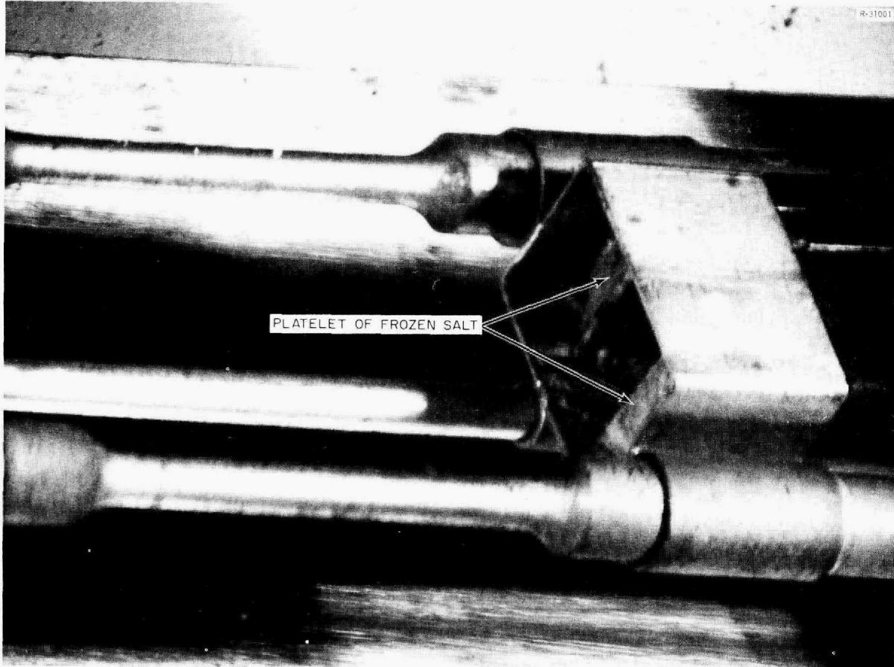  
Fig. 6.4. Typical Platelets of Frozen Salt Trapped in the Tongue-and-Groove Graphite Joints.

We conclude that the Hastelloy N tensile specimen rods sought to return to their original room-temperature length during the reactor cooldown, but they were obstructed by the sleeves that were attached to the rods with frozen salt and by the increase in room-temperature length of the graphite columns created by the frozen salt trapped in the joints. The graphite specimens were end loaded, and they buckled and broke in the manner of slender columns. Calculations based on 45,000 psi, the lowest value, for the yield strength of Hastelloy N, showed that the end loading would be sufficient to buckle such slender columns of graphite, assuming that the ends were fixed and the loads were axial. As one might expect, the thinnest specimens were broken more frequently than the thicker ones.

We believe that the damage was unavoidably magnified during the removal of the assembly from the perforated basket. We assume that a broken piece of graphite became tilted in the region that showed the severest damage, and this tilted piece of graphite acted as a yoke to bind the assembly in the basket when approximately one-third of the assembly had been withdrawn from the basket. The additional damage was probably created by this yoke when the assembly was forcibly extracted the rest of the way out of the basket.

Because many finished specimens were available for use in a replacement assembly and time was short, we decided not to make major revisions in the design of the assembly. We did, however, make three minor modifications to the basic design to alleviate these problems.

1. To avoid the entrapment of salt within the tongue-and-groove joints, 0.040-in.-diam pins of Hastelloy N were used to pin the joints so that the graphite would not separate during the heatup.   
2. To minimize the distances that the shoulders of the tensile rods must slide within their sleeves, the middles of the graphite stringers were pinned to the middles of the tensile specimen rods. Since expansion is now forced to work both ways from the pinned middles, the differential movements are halved. However, the maximum movement, for the sleeves and shoulders farthest from the middle, is still as much as 0.2 in.   
3. To minimize friction, misalignment, and salt entrapment, the sleeves were shortened and split longitudinally. Compare those of Figs. 6.3a and 6.5.

The weakest point in the modifications is that salt may freeze in some of the annular spaces between sleeves and shoulders and that the pins in the tongue-and-groove joints may shear.

The graphite specimens in the modified assembly were made from grade CGB graphite that is inferior to the graphite in the first assembly in that it has more cracks. The Hastelloy N tensile specimen rods of this second assembly were made from the reactor vessel wall and head materials, heat Nos. 5085 and 5065, respectively, plus two Hastelloy N alloys modified with $0.52 \mathrm{wt} \%$ Ti and $0.43 \mathrm{wt} \%$ Zr, heat Nos. 21545 and 21554 respectively. The modified alloys are attempts to reduce the damaging

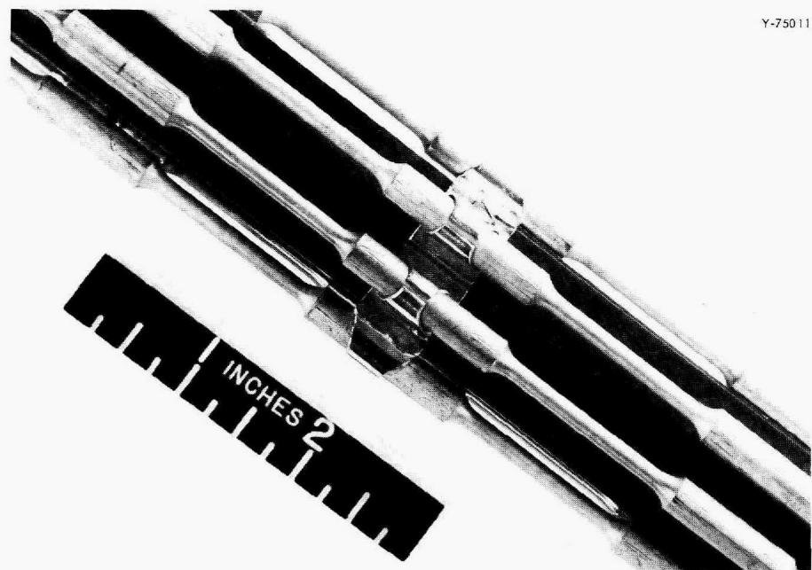  
Fig. 6.5. Shortened and Slit Sleeves to Provide Better Salt Drainage and to Alleviate Binding.

effects of irradiation. The specimens are included in the series in order to study the effects of the alloying additions on damage by irradiation and corrosion by molten salt.

Flux monitors of 0.020-in.-diam wires of type 302 stainless steel and pure iron and nickel had been sealed under vacuum in a protective sheath of Hastelloy N as shown in Figs. 6.6 and 6.3a. In the postirradiation examination, the stainless steel and iron wires were readily separated from the sheath, although the stainless steel showed some signs of bonding to it. The nickel wire had solid-phase-bonded throughout its length to the sheath.

The new set of flux monitors installed in the MSRE with the new reactor core specimens are of the same materials. However, to guard against a repetition of the solid-phase bonding, the flux monitor wires and the inside of the sheath were heat treated in air to produce thin oxide coatings on them. To minimize vaporization of oxide, the sheath was sealed with 1 atm of air at room temperature.

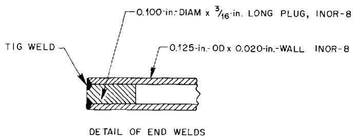

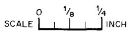

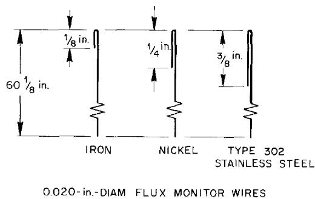  
NOTE: WIRES ARE FOLDED BACK AT ONE END AS ILLUSTRATED ABOVE TO FACILITATE THEIR IDENTIFICATION. THE BENT ENDS ARE AT THE TOP OF THE SHEATH.

Fig. 6.6. MSRE Flux Monitoring Wires and Protective Sheath.   
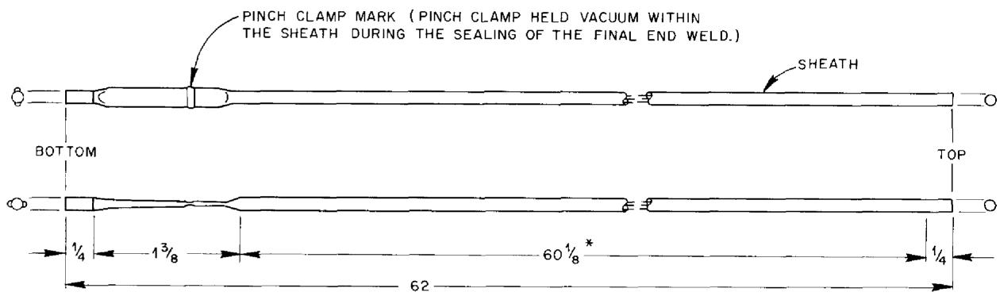  
* THE FLUX MONITORING WIRES EXTEND ALONG THIS SPACE OR DIMENSION.

# 6.2 Evaluation of Possible MSRE Radiator Tubing Contamination with Aluminum

D. A. Canonico

D. M. Haseltine

On Sunday, July 17, a cast Al-5 wt % Zn alloy blower failed at the MSRE site, throwing small shrapnel across the Hastelloy N tubing of the salt-to-air radiator. The failure occurred at about 10:00, while the radiator was operating at $1070^{\circ}\mathrm{F}$ . The protective doors were closed while the salt was still circulating; the temperature then rose to approximately $1200^{\circ}\mathrm{F}$ . This temperature was maintained until 14:30, at which

time the salt was drained and the heat was turned off. At 19:00, the temperature had decreased to $250^{\circ}\mathrm{F}$ . The doors were opened and the temperature dropped further to $150^{\circ}\mathrm{F}$ at 20:00.

A metallurgical investigation was conducted to determine the effect of the aluminum-zinc alloy on the radiator tubing. Since the actual tubing could not be removed and sectioned metallographically, only specimens simulating the exposure could be prepared and evaluated. Small segments of the failed blower were tested in compatibility experiments with representative samples of the tubing.

Laboratory experiments were conducted to determine the influence of temperature and time upon the Hastelloy-N-aluminum-alloy interaction. Temperatures of 1150, 1175, 1190, 1200, 1225, and $1250^{\circ}\mathrm{F}$ were investigated,

Y-74029

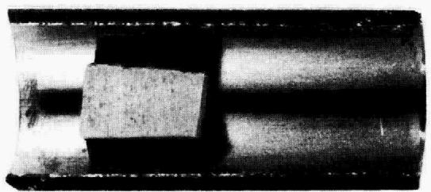  
1150°F

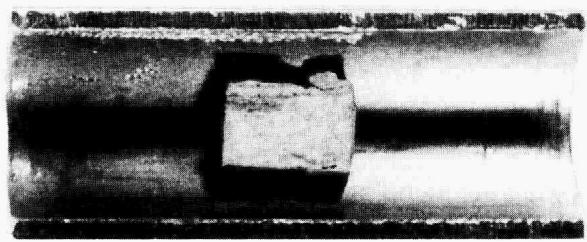  
1200°F

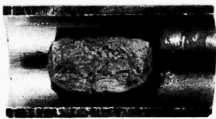  
1175°F

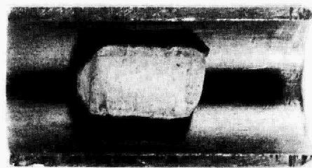  
1225°F

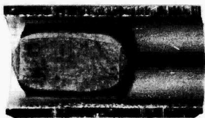  
1190°F

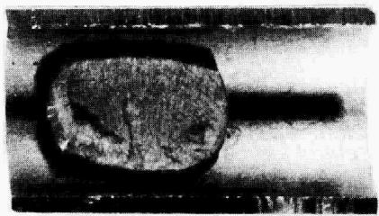  
1250°F

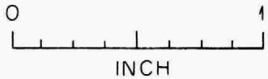  
15 MINUTES AT TEMPERATURE  
Fig. 6.7. Hastelloy N-Aluminum Alloy Compatibility Test Specimens.

and times at temperature ranged up to 5 hr. Figure 6.7 shows the samples after being held at temperature for 15 min. Figure 6.8 shows the samples with the aluminum removed from the tubing. The refractory aluminum oxide coating had contained the aluminum, even in the molten state, and inter-action did not occur. The rounded corners indicate that a liquid phase was present at $1175^{\circ}\mathrm{F}$ and above; metallographic examination verified this.

When the oxide skin was broken from mechanical abrasion, shock, or other reasons, wetting occurred. Figures 6.9a and 6.9b show the appearance of a specimen where an angular drop of aluminum alloy had broken through its skin and become attached to the Hastelloy N tube. The specimen was held for 5 hr at $1200^{\circ}\mathrm{F}$ . A metallographic section through the cone and tube revealed the moderate interaction shown in Fig. 6.9c. Attack to a depth of approximately 0.010 in. had occurred.

Since these experiments indicated some possibility of penetration of aluminum into the MSRE radiator tubes, they were inspected carefully for both dents and attached shrapnel. The difficulty of this task can be shown by Fig. 6.10, a photograph of the face of the radiator. The close-packed spacing of the tubes made the use of mirrors and elaborate lighting necessary. It is estimated that $80\%$ of the surface area of the tubing was examined.

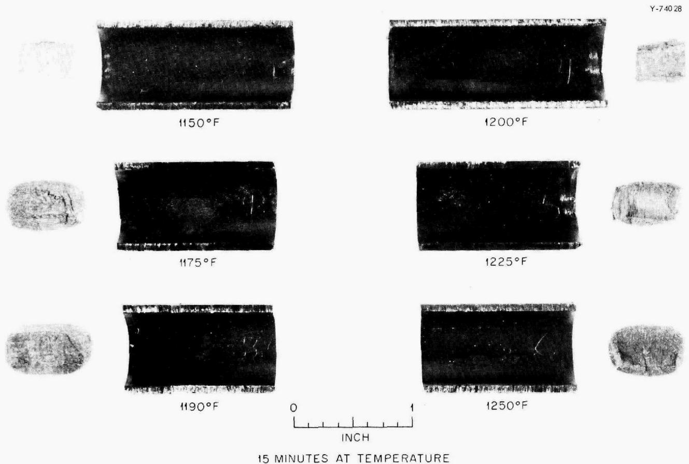  
Fig. 6.8. Hastelloy N-Aluminum Alloy Compatibility Test Specimens.

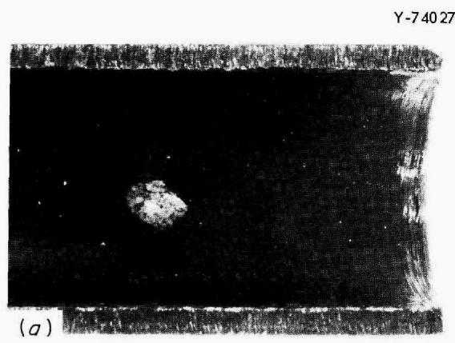

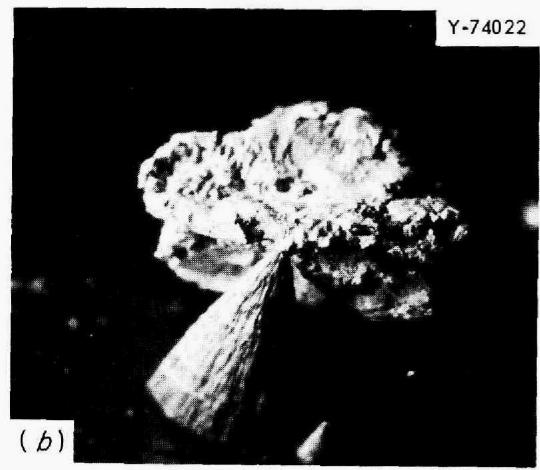

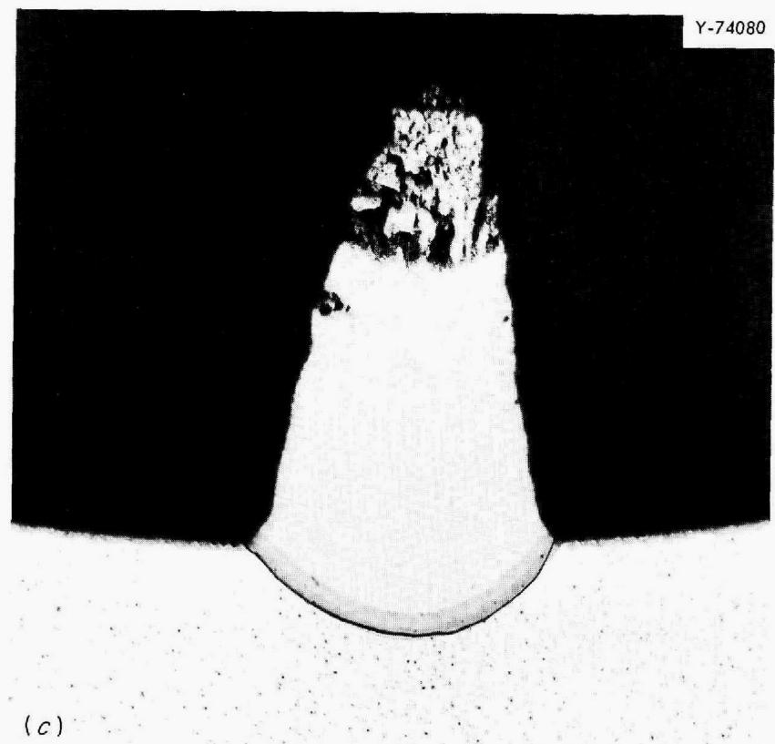  
Fig. 6.9. (a) Specimen Where an Angular Drop of Aluminum Had Broken Through Its Skin and Become Attached to a Hastelloy-N Tube. (b) Closeup of drop (10X); (c) metallographic section through cone and tube (50X). As polished.

Eight smears of aluminum were found on the air-inlet side of the radiator, none on the outlet side. No cone-shaped deposits of aluminum were discovered, although one small angular piece was found wedged between a lower tube and a heater. Three dents were noticed in the outer

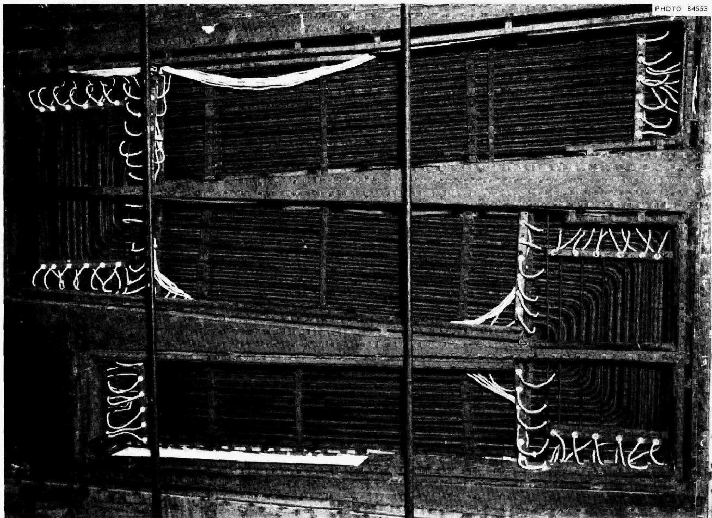  
Fig. 6.10. Face of MSRE Radiator, Showing Close Packing of Tubes.

tubing on the air-inlet side, but no aluminum was detected in these areas. It is thought that the dents resulted from small rocks, etc., which the blowers had drawn in at an earlier date.

The tubes on which aluminum was found were marked and subsequently cleaned. Stainless steel wool was used to remove most of the aluminum from a deposit area; then emery paper was employed. The radiator was then brushed thoroughly to dislodge any pieces of aluminum that might have been missed during inspection.

As a result of this investigation and cleanup procedure, it appears that the radiator system is satisfactory for further operation. Actual adherence of the aluminum to the tubing was observed in only a few cases. Inspection and cleaning of accessible tubes assured that aluminum was removed from those most likely to be contaminated. If intimate contact occurred in scattered areas, interaction does not appear to be rapid. Longer time effects are being studied by visual and metallographic analysis of specimens from tests of duration up to 1000 hr.

# 6.3 Evaluation of Graphite

W.H.Cook

Work has continued on the evaluation of anisotropic and isotropic grades of graphite as potential materials for molten-salt breeder reactors. The MSRE graphite properties are being used as a basis for comparison. The needle-coke, anisotropic graphite has the more desirable properties for excluding molten salts and gases but is less stable under irradiation. Some isotropic materials show promise, but many of the isotropic grades of graphite tend to be too amorphous for nuclear use. Isotropic grades of graphite are new, and past development has not been directed toward the production of material having the low gas permeabilities and small pore entrance diameters required of graphite for molten-salt breeder reactors.

Table 6.1 is a comparison of the physical properties of the various grades of graphite. The specific resistances of these indicate that grades CGB, CGB-LB, 1425-64-1, and H-315 are fairly well graphitized; the rest are too amorphous. For isotropic graphite, we desire specific resistance less than 900 microhms $\mathrm{cm}^2\mathrm{cm}^{-1}$ . The gas permeabilities are all very high. We are seeking permeabilities approaching $10^{-7}\mathrm{cm}^2/\mathrm{sec}$ .

The pore entrance diameters are important in that (1) they must be small enough to prevent penetration by the nonwetting fluoride salts and (2) they must be grouped to minimize the number of impregnations necessary to fabricate the base stock into a low-permeability graphite. For the latter, it has been reported that pore entrance diameters should be less than $1\mu$ and be concentrated in a narrow range.[3,4] The grades of graphite shown in Fig. 6.11 are finished grades rather than base stocks, but only grades CGB, CGB-LB, and EPl924-1 appear amenable to improvement by impregnation treatments. The third grade had been already ruled out because of its amorphous nature.

The standard salt screening test was made in which 0.500-in.-diam by 1.500-in.-long specimens were exposed for 100 hr to molten salt at $1300^{\circ}\mathrm{F}$ under a 150-psig pressure. The results are shown in Table 6.l. The MSRE grades CGB and CGB-LB are included for reference purposes. Of the new grades, only grade 1425-64-1 showed a pore structure approaching the quality of the MSRE graphite.

Work is in progress to obtain additional anisotropic and isotropic grades of graphite with properties superior to those of the MSRE graphite and approaching those required for the molten-salt breeder reactors.

Table 6.1. Comparison of Various Physical Properties of Anisotropic Needle-Coke and Isotropic Grades of Graphite   

<table><tr><td rowspan="2">Grade</td><td rowspan="2">Shape</td><td rowspan="2">Cross-Section Dimensions (in.)</td><td rowspan="2">Type</td><td rowspan="2">Bulk Density (g/cm3)</td><td rowspan="2">Helium Density (g/cm3)</td><td rowspan="2">Accessible Porosity (%)a</td><td rowspan="2">Surface Area (m2/g)a</td><td colspan="2">Specific Resistance (microins cm-2cm-1)</td><td rowspan="2">Permeability to Helium (cm2/sec)</td><td rowspan="2">Bulk Volume of Graphite Filled with Salt (%)a</td></tr><tr><td>||b</td><td>↓c</td></tr><tr><td>CGB</td><td>Bar</td><td>2 × 2</td><td>Needle-coke</td><td>1.86</td><td>2.03</td><td>13.7</td><td>0.462</td><td>610</td><td>1200</td><td>3</td><td>0.2</td></tr><tr><td>CGB-LB</td><td>Bar</td><td>1 × 1.6</td><td>Needle-coke</td><td>1.86</td><td>2.12</td><td>12.4</td><td></td><td>595</td><td>1100</td><td></td><td>0.4 (0.07-0.8)e</td></tr><tr><td>1425-64-1</td><td>Pipe</td><td>3.6 OD × 2.5 ID</td><td>Needle-coke</td><td>1.83</td><td>1.91</td><td>9.2</td><td>0.171</td><td>690</td><td>1215</td><td>4500</td><td>0.5</td></tr><tr><td>H-315A</td><td>Pipe</td><td>4.7 OD × 3.5 ID</td><td>Isotropic</td><td>1.83</td><td>2.04</td><td>11.7</td><td>0.165</td><td>890</td><td>980</td><td>89</td><td>7.1</td></tr><tr><td>EP-1924-1</td><td>Cylinder</td><td>4.1 diam</td><td>Isotropic</td><td>1.80</td><td>2.14</td><td>15.8</td><td>0.332</td><td></td><td>1395</td><td>2600</td><td>13.5</td></tr><tr><td>2020</td><td>Block</td><td>4.1 × 4.1</td><td>Isotropic</td><td>1.71</td><td>2.02</td><td>17.2</td><td>0.316</td><td>1760</td><td>1960</td><td>2400</td><td>14.6</td></tr><tr><td>HCTE-Y12</td><td>Cylinder</td><td>7.3 diam</td><td>Isotropic</td><td>1.88</td><td>1.95</td><td>4.4</td><td>0.046</td><td>1300</td><td>1810</td><td>9460</td><td>4.0</td></tr></table>

The measurements were made on 0.250-in.-diamx 1.COO-in.-long specimens.   
Measured in the direction of the axes for needle-coke, anisotropic graphite; no specific directions indicated for isotropic graphite except that measurements were mutually perpendicular.   
Measured in the direction perpendicular to the a0 axes for needle-coke, anisotropic graphite; no specific direction indicated for isotropic graphite except that two measurements were made that were mutually perpendicular.   
Evacuated specimens, 0.500 in. diam × 1.500 in. long, exposed for 100 hr to molten salt at 1300°F and a pressure of 150 psig; a standard screening test.   
Impregnation was not uniform; the values in parentheses indicate the range observed.

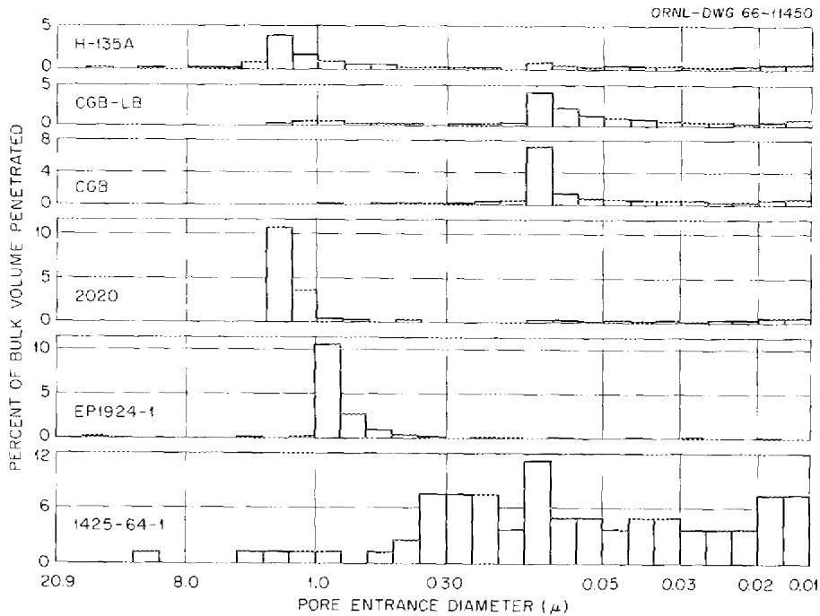  
Fig. 6.11. Comparison of the Distributions of the Pore Entrance Diameters for Various Grades of Graphite.

# 6.4 The Internal Stress Problem in Graphite Moderator Blocks

# C. R. Kennedy

One of the major concerns in the use of graphite-moderated reactors is the stress generation caused by differential growth. The stress generation is moderated considerably and generally maintained at safe levels by the ability of the graphite to creep under irradiation. The problem resolves itself to a determination of the balance between the differential growth rate that produces stress and the creep that reduces stress. Although the creep-rate coefficient may be such that the stress level does not exceed the fracture strength, a second concern is the ability of the graphite to absorb the creep strain indefinitely without failure. Certainly, a failure criterion based upon the fracture stress of the material is accurate. Therefore, it is of great importance to know both the restrained growth rate and the creep coefficient for the material under the operating conditions. Our purpose has been to determine the general creep behavior of graphite under irradiation.

Creep experiments were performed at 700 and $1000^{\circ}\mathrm{C}$ for comparison with the previous data obtained at lower temperatures. The high-temperature experiments were again similar to the previous experiments in

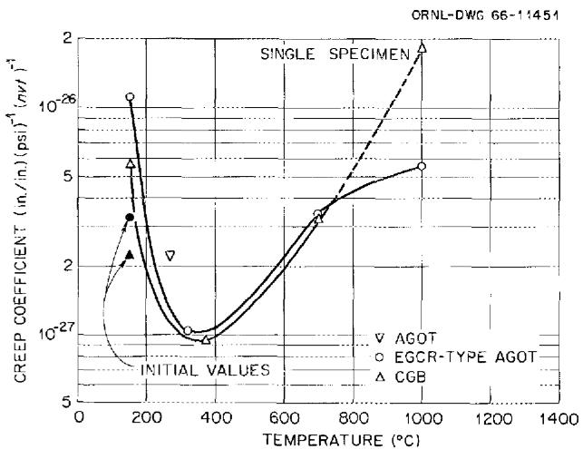  
Fig. 6.l2. Effect of Temperature on the Creep Coefficient of Graphite Under Irradiation.

that cantilevered parabolic-beam specimens were used. The main difference was in the use of four-zone furnaces to obtain the desired temperatures. The number of specimens was reduced from nine to six because of the space requirements of the furnaces.

Results from all creep experiments performed from 150 to $1000^{\circ}\mathrm{C}$ do demonstrate a generalized creep behavior, as shown in Fig. 6.l2. This type of behavior strongly supports a Cottrell model for irradiation creep, which allows extrapolation of these data to most reactor grades of graphite. The Cottrell model for irradiation creep, as given by Anderson and Bishop, $^{6}$ is

$$
\mathrm {K} = \mathrm {A} \dot {\gamma} / \sigma_ {\mathrm {y}}, \tag {1}
$$

where

$$
\begin{array}{l} K = \text {c r e e p} \\ A = \text {a c c o m m o d a t i o n} \\ \dot {\gamma} = \text {s h e a r r a t e d u e t o a n i s o t r o p i c g r o w t h} (\dot {G} _ {c} - \dot {G} _ {a}), \\ \sigma_ {\cdot y} = \text {y i e l d} \\ G _ {c} \text {a n d} G _ {a} \text {a r e t h e g r o w t h r a t e s i n t h e c a n d a d i r e c t i o n s .} \\ \end{array}
$$

The shear rate $\dot{\gamma}$ of graphite can be derived from measurements made on pyrolytic graphites through estimates of polycrystalline graphite growth rates. The accommodation factor A primarily reflects the degree of accommodation by microcracks and, in general, the void volume in the graphite. It is not necessarily constant and is expected to vary with temperature and neutron exposure. The variation of A with temperature should not be very large; however, A should exhibit a rather significant increase as microcrack closure occurs. The closure of microcracks requires a dose of approximately $10^{22}$ neutrons/cm $^2$ ; thus the value of A will be essentially constant for at least half this dose. The value of

the yield strength or flow stress, $\sigma_{\mathrm{y}}$ , of the crystallites will undoubtedly vary under irradiation and with irradiation temperature. The value of $\sigma_{\mathrm{y}}$ , like that of A, will not vary with temperature, however, as significantly as $\dot{\gamma}$ , the shear rate.

The creep-rate coefficient should therefore strongly reflect the variation of $\dot{\gamma}$ with temperature. This is demonstrated in Fig. 6.12, where the creep-rate coefficient exhibits a minimum around $350^{\circ}\mathrm{C}$ . The creep-rate coefficient K is not exactly proportional to the shear rate $\dot{\gamma}$ because of the variations of A and $\sigma_{\mathrm{y}}$ . The value of A would be essentially independent of the graphite grade; thus the effect of $\sigma_{\mathrm{y}}$ on the creep-rate coefficient can be demonstrated by a comparison of various grades at the same temperature. This was demonstrated previously5 by comparing the modulus of elasticity of six grades of graphite to their creep-rate coefficients at $400^{\circ}\mathrm{C}$ . Although this correlation strongly supports Eq. (1), or the Cottrell model, for the creep of graphite, one glaring discrepancy in the correlation is the test result at $1000^{\circ}\mathrm{C}$ for the CGB grade of graphite. It should be noted that this particular material demonstrated a one-third decrease in its modulus of elasticity, which is also unlike the behavior of previously tested grades. This particular test result requires confirming data before specific conclusions can be reached.

One should recognize that the Cottrell model for creep does not suggest an actual mechanism by which the graphite deforms plastically. It does describe the creep as a process of continuous yielding, which is not thermally activated as the term creep generally implies. Also, the manifestation of the creep deformation is actually nothing more than a stress-induced imbalance of the internal straining occurring in all polycrystalline graphites due to anisotropic growth. This implies that the limit of creep deformation can be as large as the internal strains that must occur in polycrystalline graphites irradiated without stress. Polycrystalline graphite can accommodate $16\%$ shear strain and polycrystalline carbons $160\%$ shear strain without a loss of mechanical integrity. The obvious conclusion is that as long as the stress acting on the graphite does not exceed the fracture stress, the graphite will continue to absorb the creep deformation without loss of mechanical integrity.

# 6.5 Brazing of Graphite

J. M. Jones

W.J.Werner

The joining of graphite to structural metals such as Hastelloy N is of prime interest in advanced molten-salt reactor concepts. Studies are under way to develop methods for joining large graphite pipes to Hastelloy N tube sheets. Such joints will be needed for test assemblies and for the reactor core.

The current studies have two primary objectives: (1) to develop a corrosion-resistant brazing alloy for graphite which does not suffer from

the transmutation problem associated with the gold-containing alloys and (2) to develop means for making transition joints with one or more materials having expansion coefficients intermediate between those of the graphite and the Hastelloy N.

Work was focused on the evaluation of an experimental precious-metal-base alloy having the composition 60 Pd-35 Ni-5 Cr (wt %). This alloy appears to have some application for joining graphite to the refractory-metal portion of a transition piece. Unfortunately, it exhibits relatively poor flowability on high-density graphite (Fig. 6.13a); however, its marginal behavior is enhanced by preplacing it as foil in the joint (Fig. 6.13b). Photomicrographs of such a joint at low and at high magnification are shown in Figs. 6.14a and 6.14b. The needle-like carbides of Fig. 6.14a are clearly evident in Fig. 6.14b. The extensive diffusion zone along the molybdenum-brazing-alloy interface in Fig. 6.14a suggests that considerable molybdenum was taken into solution in the brazing alloy.

A series of graphite-to-molybdenum joints brazed with this palladium-nickel-chromium alloy preplaced in the joint were thermally cycled ten times between 200 and $700^{\circ}\mathrm{C}$ . Metallographic investigation indicated that no deterioration had occurred.

Small arc-melted buttons of other alloys in this ternary system, but with higher chromium contents, are being prepared in an effort to improve wetting of graphite without reducing the overall joint properties. Alloys containing other corrosion-resistant carbide formers, that is, niobium and molybdenum, are also being prepared.

Two graphite-to-molybdenum-to-Hastelloy-N transition joints were successfully brazed using the tapered joint design reported previously. The 1-1/4-in.-OD by 3/16-in.-wall graphite tubing was joined to the molybdenum with the 60 Pd-35 Ni-5 Cr (wt %) alloy preplaced in the joint; copper was used to braze the molybdenum to the Hastelloy N. Visual examination revealed no cracks, and metallographic examination will be used to further evaluate the joints.

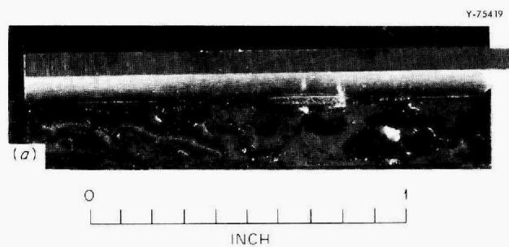  
Fig. 6.13. Graphite-to-Molybdenum Joints Brazed with 60 Pa-35 Ni-5 Cr (wt %) at $1250^{\circ}\mathrm{C}$ in Vacuum.

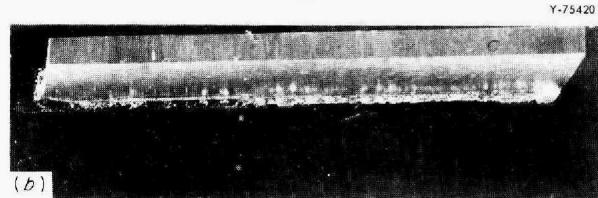

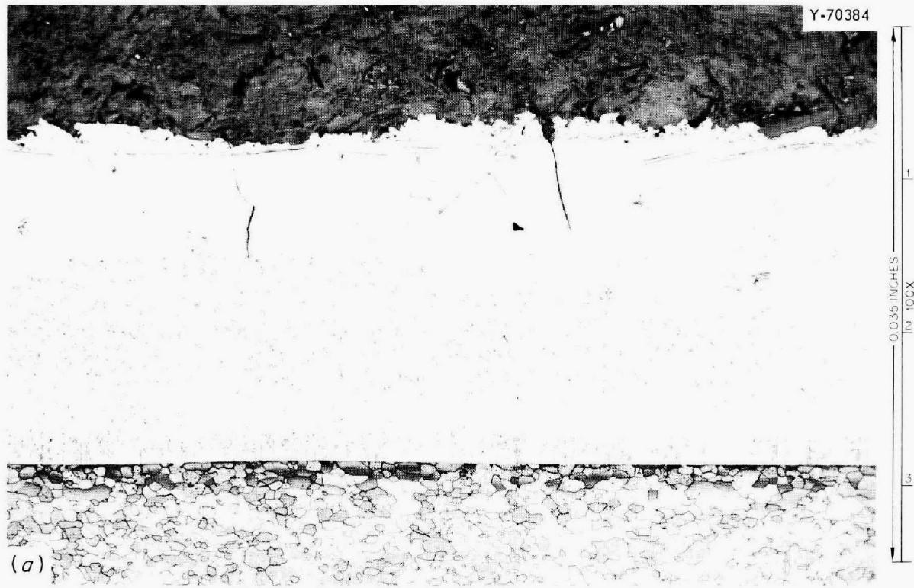

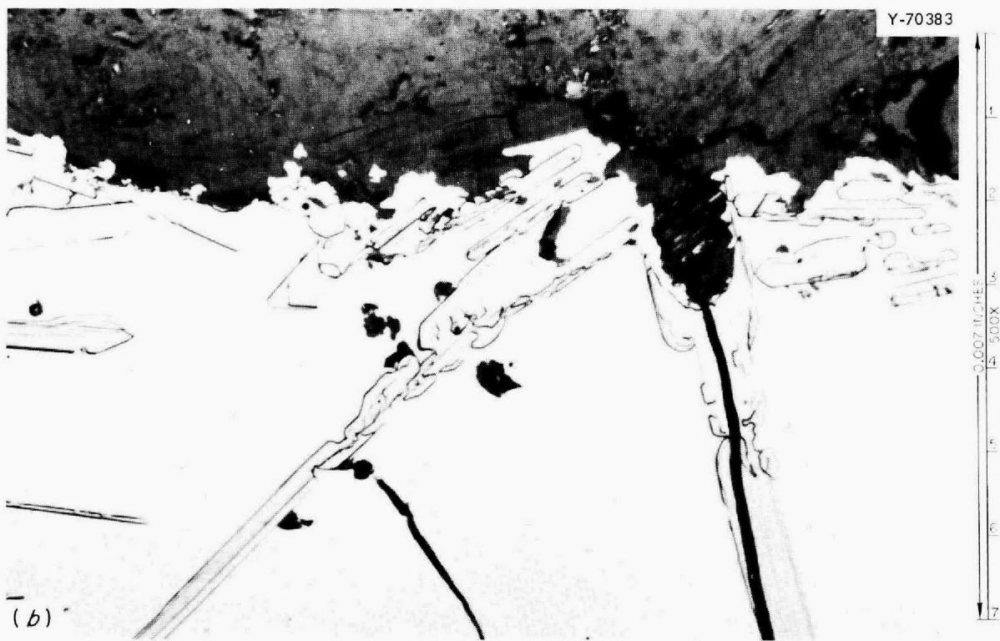  
Fig. 6.14. (a) Graphite-to-Molybdenum Joint Made with 60 Pd-35 Ni-5 Cr Alloy Preplaced in Joint. Good bonding is evident. Etch: $10\%$ oxalic acid. (b) View of area enclosed in (a). The large carbide needles are evident. Etch: $10\%$ oxalic acid.

# W.H.Cook

As was discussed in the previous section, some success has been obtained in joining small pieces of graphite to metal by brazing the graphite to molybdenum and, in turn, brazing the molybdenum to Hastelloy N.[9,10] In addition to making a good joint, the braze must be resistant to corrosion by molten fluoride salts. Corrosion of the brazing alloy is being investigated by exposing joints of grade CGB graphite brazed to molybdenum to static LiF-BeF $_2$ -ZrF $_4$ -ThF $_4$ -UF $_4$ salts for 100, 1000, 5000, 10,000, and 20,000 hr at $1300^{\circ}\mathrm{F}$ in Hastelloy N capsules. The brazing alloy, 35 Ni-60 Pd-5 Cr (wt %), was not attacked by the salt during exposures for as long as 5000 hr. However, layers of metallic-like crystals appeared preferentially on the brazing alloy in the 1000- and 5000-hr tests. The 10,000- and 20,000-hr exposures are still in progress.

The method of fabrication of test specimens is shown in Fig. 6.15. The lateral surfaces of the machined pieces were polished prior to cutting the pieces into 0.62-in.-long specimens. The microstructures of the left and right edges of the sides (the sides are perpendicular to the plane shown) of an untested braze in Fig. 6.16a show that this produces straight, smooth sides suitable for references for determining the

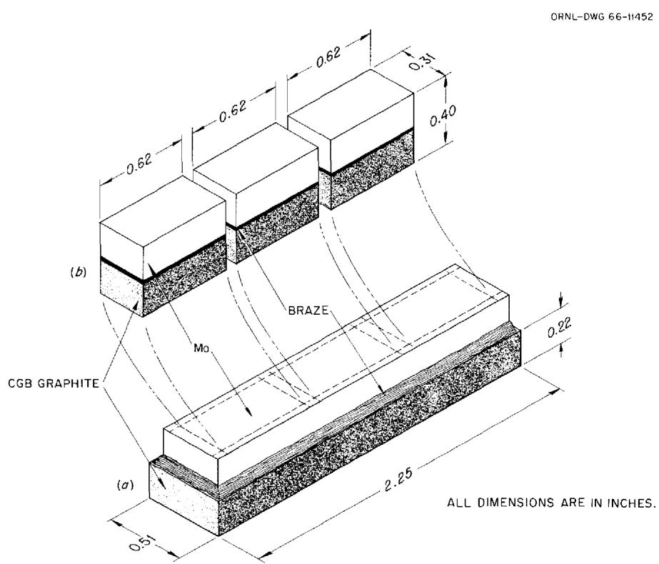  
Fig. 6.15. Grade CGB Graphite Brazed to Molybdenum with 35 Ni-60 Pd-5 Cr (wt %). (a) As brazed; (b) as machined into three test specimens. The lateral surfaces are polished.

  
（a）

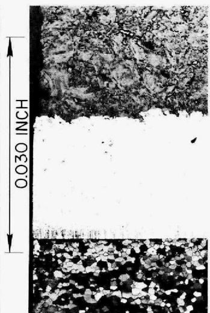  
(b)   
100 hr

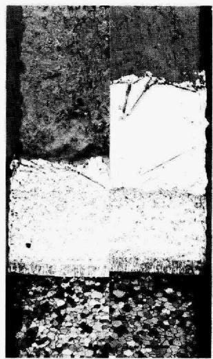  
(c)   
1000 hr

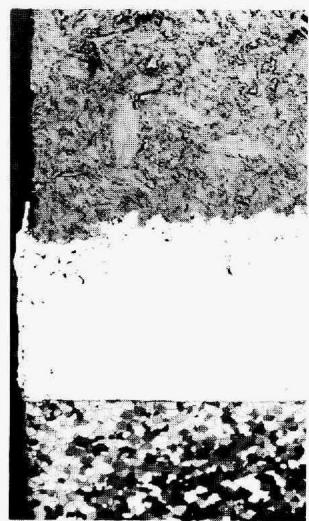  
(d)   
5000 hr

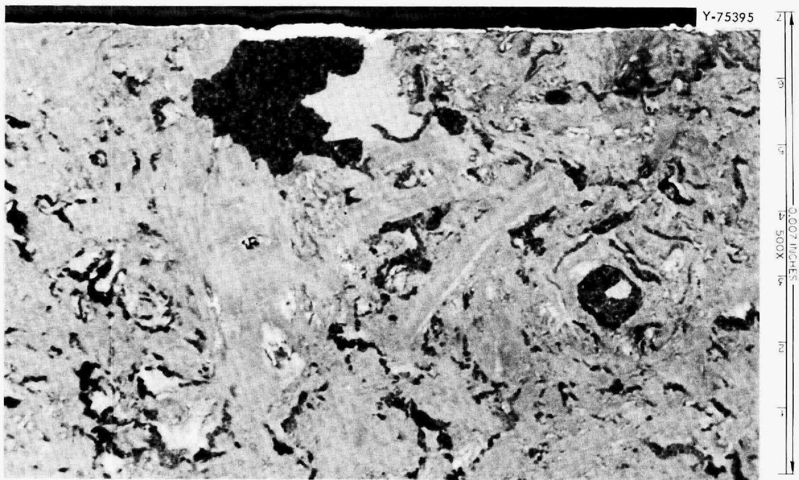  
Fig. 6.16. Microstructures of the 35 Ni-65 Pd-5 Cr (wt %) Brazing Alloy Used to Join Grade CGB Graphite to Molybdenum. (a) As brazed and (b, c, d) After Exposures to LiF-BeF $_2$ -ZrF $_4$ -ThF $_4$ -UF $_4$ (70-23.6-5-1-0.4 mole %) at $1300^{\circ}\text{F}$ . The graphite was tilted during the brazing which produced the different thicknesses of braze in the sets of photomicrographs that show both edges of a specimen. Etch: 10% oxalic acid. 100×.   
Fig. 6.17. Microstructure of a Metallic-Like Deposit on the Graphite of the Graphite-Molybdenum Joint Exposed for 5000 hr to LiF-BeF $_2$ -ZrF $_4$ -ThF $_4$ -UF $_4$ at $1300^{\circ}$ F.

extent of attack. For the metallographic examination, this specimen and all others were cut into halves perpendicular to their 0.62-in. dimension, and these cut surfaces were polished and photographed. This technique was used to compare the control specimen with those tested for 100, 1000, and 5000 hr (Fig. 6.16). There is no microscopic evidence of attack on the braze. Deposits approximately 0.5 and 1 mil thick are evident on the sides of the brazes exposed for 1000 and 5000 hr respectively. These layers are crystalline and metallic in appearance. They have not been identified. The chemical analyses of the salt from the 1000-hr test did not detect any corrosion products; the analyses for the 5000-hr test are in progress.

Interpretation of the 5000-hr test is further complicated by a thin metallic-like deposit on the graphite. It is unlike the layers on the braze alloy in that it does not exhibit crystalline faces. The deposit was heaviest on the side of the graphite parallel with the brazed joint. Its microstructure is shown in Fig. 6.17. The identification of this layer is being sought. It is suspected that this may be $\mathrm{Cr}_3\mathrm{C}_2$ . In previous tests that involved only salt, Hastelloy N, and graphite, there were no deposits on the graphite. The longer-term tests appear necessary to explain the cause of these deposits.

# 6.7 Welding Development of Hastelloy N

H. E. McCoy D. A. Canonico

Titanium and zirconium additions to Hastelloy N appear to improve the resistance of the alloy to high-temperature embrittlement in an irradiation field.

We have made welds in several experimental heats to evaluate the influence of these alloy additions on the weldability. Welds have been made in 1/2-in. plates of Ni-12 Mo-7 Cr-0.05 C (wt %) with titanium contents of 0.15, 0.27, 0.33, 0.45, and 0.55 wt %. These welds appear to be sound, and test specimens have been made for evaluation.

Alloys containing Ni-12 Mo-7 Cr-0.05 C (wt %) and either 0.06 or 0.43 wt % zirconium have also been studied. The alloy containing 0.06 wt % zirconium exhibited extensive weld cracking. It was impossible to get a complete pass in the alloy containing 0.43% zirconium without a crack propagating the entire length of the pass. Some attempts have been made to weld these heats with dissimilar weld metal.

Effect of Irradiation on the Mechanical Properties of Hastelloy N - H. E. McCoy

The foremost objective of this effort has been to determine the influence of neutron irradiation on the mechanical properties of the Hastelloy N used in constructing the MSRE. We have utilized postirradiation tensile tests, in-reactor creep-rupture tests, and postirradiation creep-rupture tests to evaluate the performance of several representative heats of material used in the MSRE. Portions of this study have been reported previously $^{11-14}$ and have been used in setting a minimum safe operating

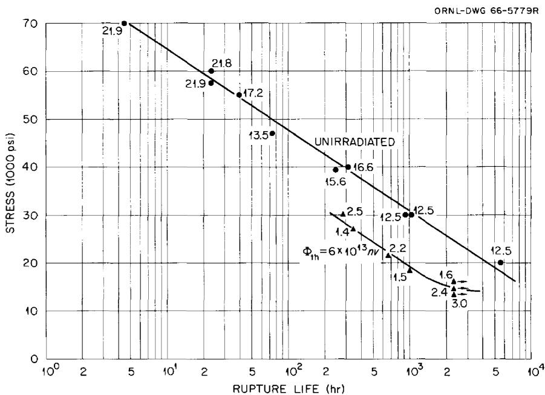  
Fig. 6.18. Creep-Rupture Properties of Hastelloy N at $650^{\circ}\mathrm{C}$ , Heat 5065. Numbers indicate fracture elongations.

life for the MSRE. One of the most interesting findings in this study is illustrated by the data in Fig. 6.18. Although the rupture life and ductility are both reduced by irradiation, the data indicate that there may be a stress below which essentially no irradiation damage occurs.

One of the current theories of high-temperature irradiation damage predicts this type of behavior, since some minimum stress is required to allow the bubbles of transmuted helium to grow without limit.[15] The existence of a stress below which one could design without concern for gross reductions in ductility due to neutron damage is of extreme importance and needs to be studied further.

The surveillance specimens were removed from the core of the MSRE after 7800 Mwhr with an effective integrated dose of about $7 \times 10^{19}$ . So far as neutron dose is concerned, these specimens should be representative of the pressure vessel after the reactor has operated about 150,000 Mwhr (equivalent to 15,000 hr at a power level of 10 Mw). The specimens have been disassembled, but testing will not begin until after examination with an optical comparator to separate the bent ones. Limited creep and tensile tests will be run to determine whether the properties fall in line with those determined previously for material irradiated to the same dose.

The second objective of this program has been to understand the mechanism of the damage in Hastelloy N and to determine a means of making a basic improvement in its resistance to irradiation damage. We have found that the damage is dependent on the thermal-neutron flux. This is illustrated by the data in Table 6.2. Specimens were exposed to neutron environments of various energies, and it was found that the damage was fairly independent of fast dose and depended primarily on the thermal dose. It is believed that the specific thermal-neutron reaction is that of the transmutation of $^{10}\mathrm{B}$ to helium.

$$
\dot {e} = 0. 0 0 2 \min  ^ {- 1}
$$

Table 6.2. Tensile Ductility of Hastelloy N (Heat 5065) at $760^{\circ}\mathrm{C}$   

<table><tr><td>Φth = 1 × 1018 nvt, 
Φf = 5 × 1014 nvt</td><td>Φth = 1 × 1018 nvt, 
Φf = 1 × 1018 nvt</td><td>Φth = 5 × 1014 nvt, 
Φf = 1 × 1018 nvt</td></tr><tr><td>7.1</td><td>6.2</td><td>12.0</td></tr></table>

Hence, the first approach to the problem has been that of reducing the boron level. Figure 6.19 shows the postirradiation creep-rupture properties of several air-melted heats of Hastelloy N. The materials contain between 20 and 40 ppm boron. The rupture ductilities are given in parentheses. There seems to be little effect of irradiation temperature on the rupture life or ductility. Figure 6.20 shows the properties of two vacuum-melted heats containing 7 ppm (2477) and 9 ppm boron (65-552). When the materials are irradiated at a low temperature, their properties excel those of the air-melted heats. When these same heats are irradiated hot, they exhibit properties comparable with those of the air-melted heats.

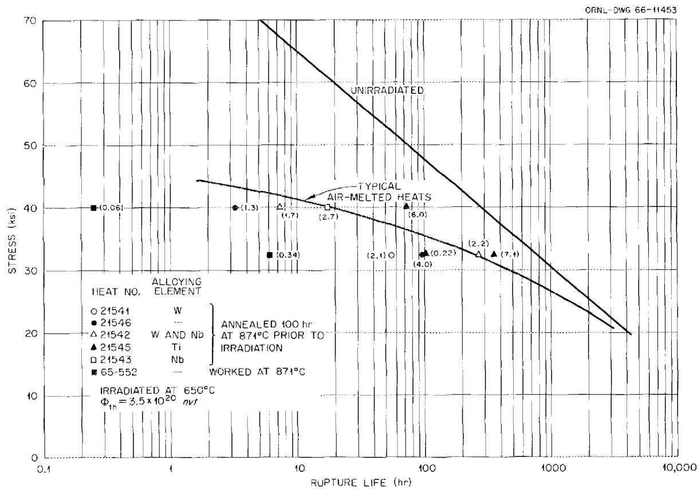  
Fig. 6.19. Postirradiation Creep of Several Alloys at $650^{\circ}\mathrm{C}$ . Numbers indicate fracture elongations.

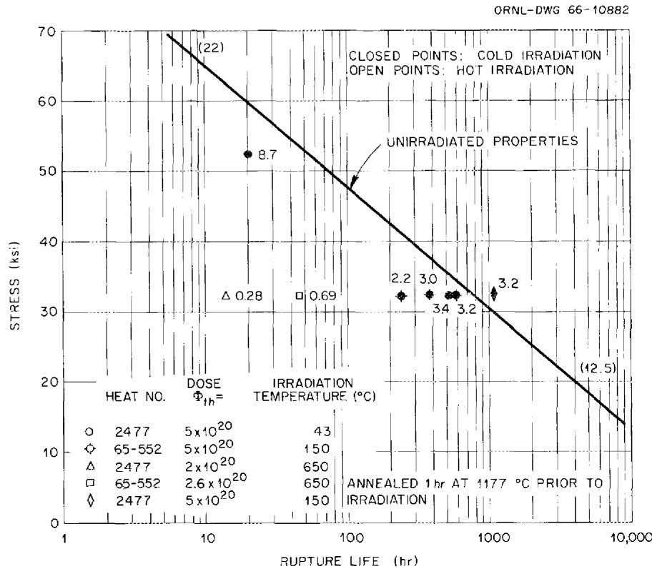  
Fig. 6.20. Postirradiation Creep-Rupture Properties of Several Vacuum-Melted Heats of Hastelloy N at $650^{\circ}\mathrm{C}$ . Numbers indicate fracture elongations.

Several of the alloys were irradiated to various doses, and the helium content was calculated from the dose and the original boron content of the alloy. Figure 6.21 shows the rupture ductility in a tensile test at $650^{\circ}\mathrm{C}$ and 0.002 in./min as a function of helium content. There is considerable deviation about the line drawn, with some of it probably being significant. The two vacuum-melted heats (65-552 and 2477) again show lower ductilities when irradiated hot. The two low points for heat 4065 indicate a possible influence of high irradiation temperature on this heat. However, the most important observation is that, for a reasonable $^{10}\mathrm{B}$ content and a reasonable lifetime, the helium content will be between $10^{-5}$ and $10^{-6}$ atom fraction. The variation in ductility over this range of helium contents is only about $25\%$ , assuming that the line drawn is reasonably correct.

A similar plot is shown in Fig. 6.22 which relates the helium produced in the alloy to the fracture ductility. The line drawn seems to be representative of the higher-boron air-melted heats (5065, etc.). The vacuum-melted low-boron heats (65-552 and 2477) exhibit better ductility if they are irradiated cold but actually have lower ductility when irradiated hot. Hence, the role of boron in these alloys is not at all clear. We have not prepared a series of alloys where everything else has been held constant except the boron content. It seems that the variations in composition and melting practice must influence the

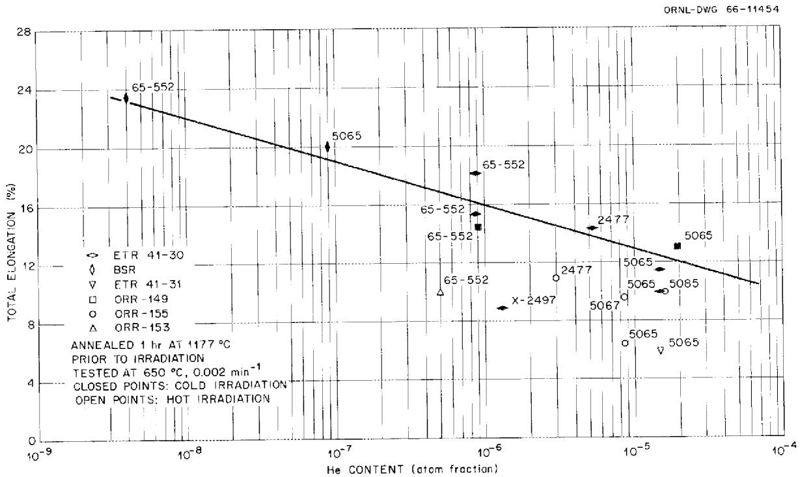  
Fig. 6.21. Variation of the Postirradiation Tensile Properties of Several Heats of Hastelloy N with Helium Content.

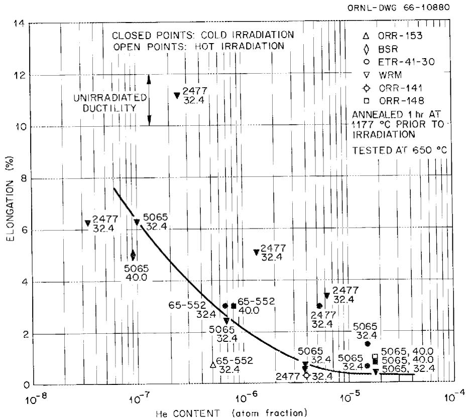  
Fig. 6.22. Variation of Postirradiation Creep Ductility of Hastelloy N with Helium Content. Numbers indicate stress in ksi.

distribution of boron or the effect that the transmuted helium has on the properties so greatly that the role of boron per se is masked. The great effect of irradiation temperature on the postirradiation properties of the vacuum-melted alloys supports this supposition.

Although we have known for some time that the ductility of an irradiated test specimen varies greatly with temperature, we have made extensive use of postirradiation tensile tests for screening purposes even when we were interested in long-term applications. Figure 6.23 shows how misleading this approach can be.

The rupture ductility in postirradiation tensile and creep tests is plotted to illustrate the influence of zirconium content on the properties. The two sets of points at the left were obtained by tensile tests at two different strain rates (0.05 and 0.002 in./min). The trend is evident that the ductility improves with increasing zirconium content. However, the ductility in the creep tests (represented by the points at the right) shows no systematic dependence on the zirconium content. This material contained extremely high boron (approximately 200 ppm), and we believe that the data do not warrant the conclusion that zirconium has no beneficial influence.

The important point is that tensile tests may not be adequate even for screening purposes in nickel-base alloys. The more expensive creep test may be necessary.

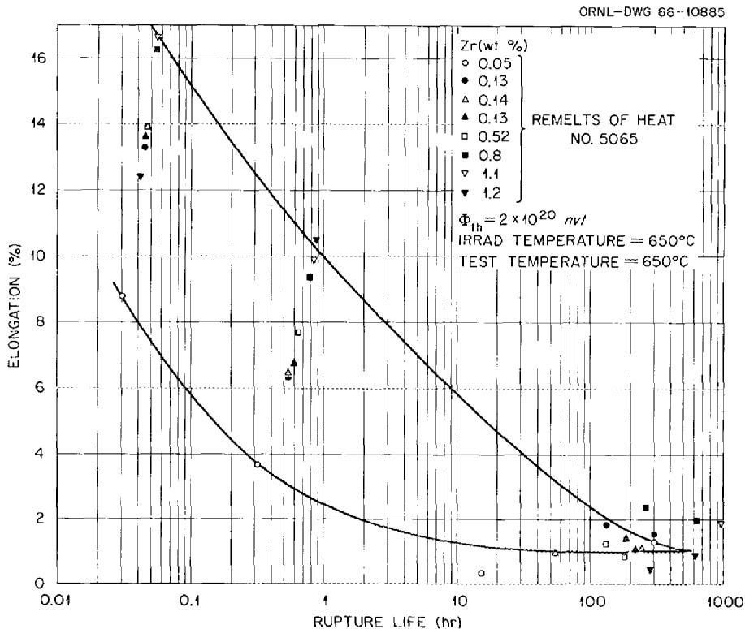  
Fig. 6.23. Influence of Zirconium Content on the Postirradiation Ductility of Hastelloy N.

Several small commercial melts have been procured and evaluated. The basic alloy is Ni-12 Mo-7 Cr-0.05 C, the reduction in molybdenum content being made to suppress second-phase formation. The alloy additions investigated include niobium, tungsten, and titanium. To date, these alloys have been investigated in only one metallurgical state, $40\%$ cold working followed by 100 hr at $871^{\circ}\mathrm{C}$ . This treatment produces a very fine grain size and probably does not result in the optimum properties. Figure 6.24 shows the postirradiation creep properties of several of these alloys at $650^{\circ}\mathrm{C}$ . The very encouraging alloy is No. 21545, which contains 0.5 wt $\%$ titanium. The rupture life is better than the other alloys, but the rupture ductility is far superior.

Figure 6.25 shows a compilation of all the in-reactor creep tests run on various heats. All the data are contained in a scatter band bounded by heats 5065 and 5085. With few exceptions, all the heats exhibit fracture ductilities of 1 to $3\%$ , with no systematic heat-to-heat variation evident. Three of the heats lend support to the idea that there may be some critical stress below which irradiation damage becomes minimal. One must face the question of why heat 21545 looks exceptionally good in postirradiation creep tests (Fig. 6.24) and not in in-reactor creep tests (Fig. 6.25). With a closer examination, one sees that the test at 21,000 psi (Fig. 6.25) did not fail during the experiment. This point indicates that the threshold stress for damage in this alloy may be higher than that for the other alloys (approximately 15,000 psi). Thus the in-reactor creep tests do suggest that the titanium-bearing alloy may be superior.

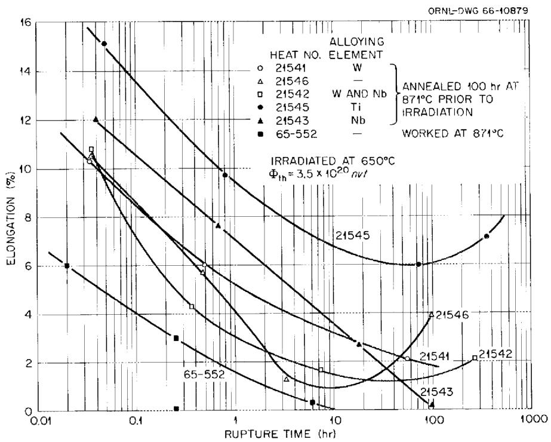  
Fig. 6.24. Postirradiation Ductility of Several Alloys at $650^{\circ}\mathrm{C}$ .

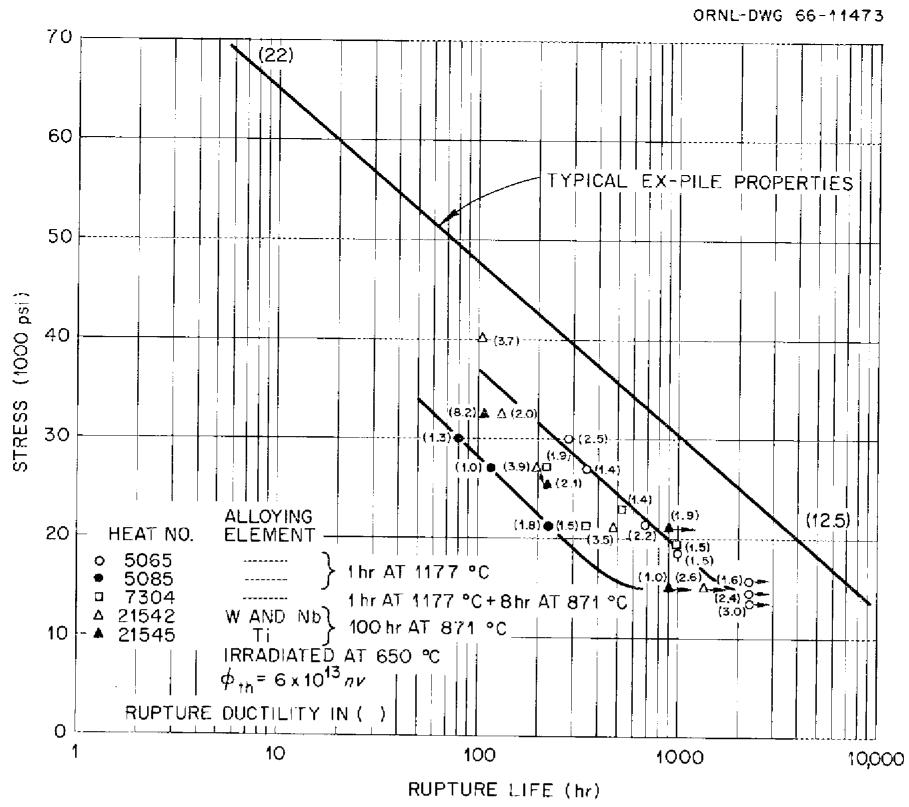  
Fig. 6.25. Comparison of In- and Ex-Pile Creep Rupture Properties of Hastelloy N at $650^{\circ}\mathrm{C}$ .

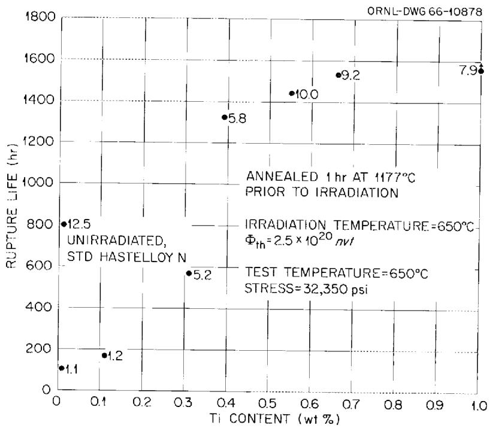  
Fig. 6.26. Influence of Titanium on the Postirradiation Creep Properties of Ni-12 Mo-7 Cr-0.05 C. Numbers indicate fracture elongations.

Figure 6.26 shows the results of postirradiation creep tests on several laboratory heats containing various amounts of titanium. All the alloys are superior to irradiated standard Hastelloy N with respect to both rupture life and ductility. Several of the alloys exhibit rupture lives in excess of that of unirradiated Hastelloy N and ductilities as high as $10\%$ .

Characterization of Hastelloy N for Service at $982^{\circ}\mathrm{C}$ - H. E. McCoy

Since Hastelloy N is being considered as the structural material for a molten-salt distillation vessel, the Mechanical Properties Group was asked to determine the creep properties of this alloy at $982^{\circ}\mathrm{C}$ . The results of this brief study are presented, and several potential problems associated with the use of Hastelloy N at such an elevated temperature are pointed out. Although the vessel presently being built will be used only with nonactive salts, it is anticipated that a similar distillation apparatus will be an integral part of a Molten-Salt Breeder Reactor. For this reason the questions concerning the use of Hastelloy N for this application should be resolved.

The creep-rupture properties of Hastelloy N are well documented $^{16,17}$ over the temperature range of 600 to $800^{\circ}\mathrm{C}$ where it is commonly used. However, data at $982^{\circ}\mathrm{C}$ were nonexistent, since this is above the normal service temperature for this alloy. The results of a brief creep-rupture program undertaken to supply data at $982^{\circ}\mathrm{C}$ are shown in Table 6.3. Plots of these same data are shown in Figs. 6.27 to 6.29. These data were obtained on test specimens of a typical heat of air-melted Hastelloy N (heat 5065). The test specimens were small rods having a gage section 1 in. long $\times$ 0.125 in. in diameter. All tests were carried out in dead-weight creep machines in air. The creep properties shown in Fig. 6.27 indicate that the stresses to produce rupture and $5\%$ strain in 1000 hr are reasonably well defined. However, the stresses for 1 and $2\%$ strain in 1000 hr are not defined sufficiently by experimental data. The minimum creep rate data in Fig. 6.28 correlate very well, but these numbers are not very useful for design purposes, since the minimum creep rate only applies during a small fraction of the life at a given stress. The plot of the ductility shown in Fig. 6.29 exhibits a ductility minimum for test specimens having rupture lives over the approximate range of 50 to 200 hr. However, the minimum ductility observed still is slightly in excess of $20\%$ . The reduction in area decreases rapidly with increasing rupture life to a value of about $15\%$ . The increase in the elongation for long rupture lives is thought to be associated with the very extensive intergranular cracking that occurs.

The specimen from test 5768 was examined metallographically. The extent of intergranular cracking is illustrated by Fig. 6.30. It was also noted that the quantity of precipitate present after testing was much greater than that present before testing. Figure 6.31 shows a typical area of this heat of Hastelloy N prior to testing. Figure 6.32 shows the tested specimen. The precipitate marked "A" is believed to be that present in the starting material. The larger precipitate, marked "B," is thought to be induced by the thermal and mechanical history.

Table 6.3. Creep Properties of Hastelloy N at $982^{\circ}C^{a}$   

<table><tr><td rowspan="2">Test No.</td><td rowspan="2">σ (psi)</td><td colspan="5">Time to Indicated Strain (hr)</td><td rowspan="2">ε (%/hr)</td><td rowspan="2">ε (%)</td><td rowspan="2">Reduction in Area</td></tr><tr><td>1%</td><td>2%</td><td>5%</td><td>20%</td><td>Rupture</td></tr><tr><td>5768</td><td>2,000</td><td>35</td><td>73</td><td>185</td><td>495</td><td>644.9</td><td>0.0276</td><td>41.50</td><td>16.22</td></tr><tr><td>5765b</td><td>3,000</td><td>1</td><td>7.6</td><td>33</td><td>117</td><td>123.9</td><td>0.123</td><td>22.36</td><td>13.4</td></tr><tr><td>5762b</td><td>4,000</td><td>0.7</td><td>2.0</td><td>11</td><td>47</td><td>51.5</td><td>0.282</td><td>21.88</td><td>15.47</td></tr><tr><td>5761</td><td>6,000</td><td>0.75</td><td>1.3</td><td>3.2</td><td>10.5</td><td>16.15</td><td>1.65</td><td>48.44</td><td>36.57</td></tr><tr><td>5763</td><td>10,000</td><td>&lt;0.1</td><td>0.2</td><td>0.5</td><td>1.9</td><td>2.95</td><td>9.0</td><td>50.0</td><td>37.86</td></tr><tr><td>5867</td><td>1,880</td><td>35</td><td>72</td><td>165</td><td>407</td><td>520.8</td><td>0.026</td><td>52.0</td><td>15.6</td></tr><tr><td>5868</td><td>3,000</td><td>12</td><td>25</td><td>60</td><td>154</td><td>157.9</td><td>0.081</td><td>22.22</td><td>15.6</td></tr></table>

a Heat 5065 tested in the as-received condition (1/2 hr at $1176^{\circ}C$ mill anneal). b Temperature control not adequate at start of test.

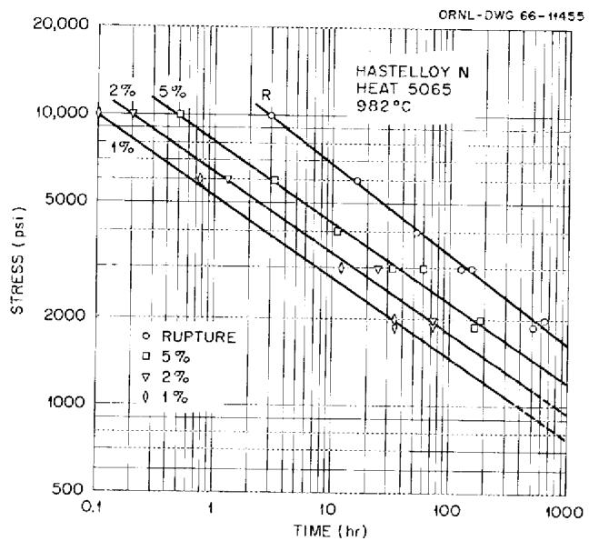  
Fig. 6.27. Creep-Rupture Properties of Hastelloy N at $982^{\circ}\mathrm{C}$ .

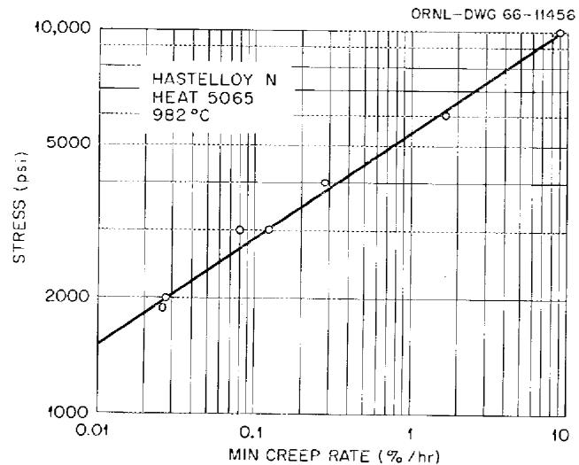  
Fig. 6.28. Minimum Creep Rate vs Stress for Hastelloy N at $982^{\circ}\mathrm{C}$ .

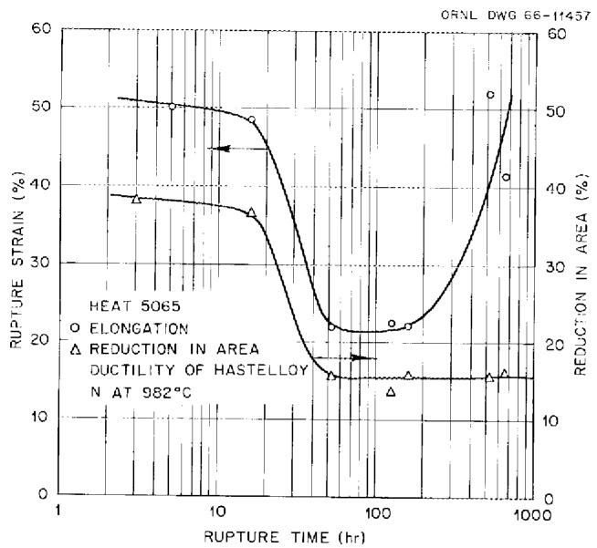  
Fig. 6.29. Ductility of Hastelloy N at $982^{\circ}\mathrm{C}$ .

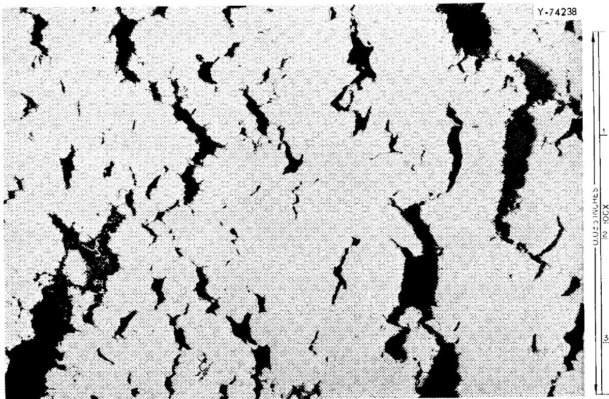  
Fig. 6.30. Photomicrograph of Hastelloy N Tested at $982^{\circ}\mathrm{C}$ and 2000 psi.

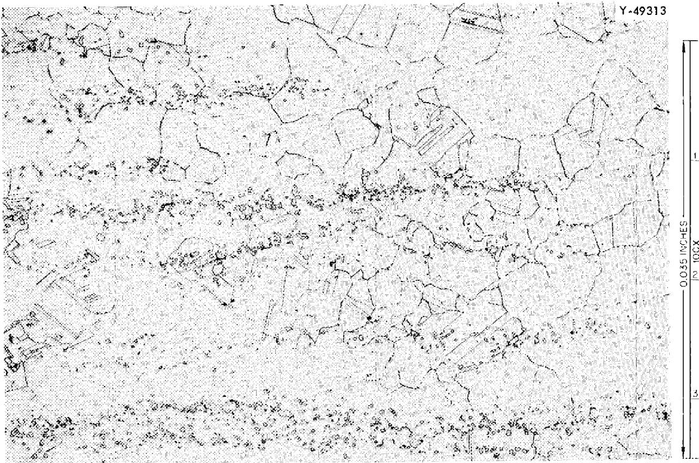  
Fig. 6.31. Photomicrograph of Hastelloy N, Heat 5065, in the As-Received Condition.

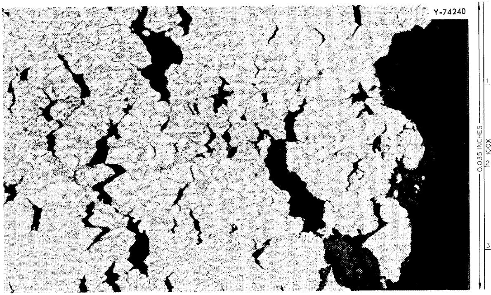

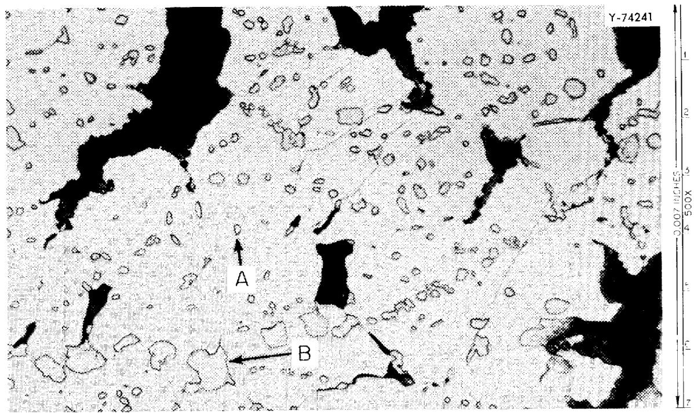  
Fig. 6.32. Photomicrographs of Hastelloy N Tested at $982^{\circ}\mathrm{C}$ and 2000 psi.

Staining with a $\mathrm{KMnO}_4$ -NaOH solution indicated that the precipitates were of two different compositions. Although this precipitation does not appear to impair the ductility at $982^{\circ}\mathrm{C}$ , it remains to be established whether the low-temperature ductility is affected. Since the vessel will be exposed to numerous thermal cycles, the high- and low-temperature ductilities are both of interest.

The results of this study are hardly adequate for the design of a distillation system that is to be an integral part of a reactor system. This study has shown the need for (1) strength data extending to longer times, (2) tests to evaluate the influence of the precipitation on the ductility, and (3) oxidation data under conditions of constant and cyclic temperatures.

# 6.8 Thermal Convection Loops

A. P. Litman

G. M. Tolson

We are continuing to study the compatibility of structural materials with fuels and coolants of interest to the Molten-Salt Reactor Program. Natural-circulation loops described previously $^{18,19}$ are used as the standard test in these studies.

Currently, four loops are in operation. Three thermal-convection circuits containing simulated MSRE fuel salt and fabricated from either Hastelloy N, type 304 stainless steel, or Nb-1% Zr alloy with type 446 stainless steel external cladding have operated for approximately 4.5, 3.2, and 0.6 years respectively. Operating conditions for the loops are detailed in Table 6.4. The Hastelloy N and type 304 stainless steel loops have continued to circulate salt without incident. However, the refractory-alloy circuit has shown some degradation of late. This was evidenced by the cold leg gradually losing temperature despite the addition of insulation. It is suspected that the smaller internal diameter of this loop (0.3 in.) has contributed to the operational problems.

The fourth operating loop (loop 10) is fabricated from Hastelloy N and contains a proposed secondary coolant (NaF-KF-BF₃, 48-3-40 mole %) for the reference-design MSBR. This circuit has operated for over 3000 hr with the hot leg at $1125^{\circ}\mathrm{F}$ and a temperature differential of $265^{\circ}\mathrm{F}$ . During this reporting period, a Croloy 9M loop (loop 12) circulated the proposed secondary MSBR coolant for 1440 hr, after which time it was shut down due to plugging. X rays taken of the loop disclosed spotty high-density regions in the cold leg. A few suspicious areas were also seen in the hot leg. The loop piping and heat-transfer fluid will be subjected to complete chemical and metallurgical analysis.

A Croloy 9M (loop 8) natural-circulation loop containing lead with 230 ppm magnesium as an inhibitor plugged after operation for 2950 hr. A section through the cold leg in the plugged region is shown in Fig. 6.33. Examination of the loop components is proceeding.

Table 6.4. Thermal Convection Loop Operation Through September 30, 1966   

<table><tr><td>Loop Material</td><td>Hot-Leg Specimens</td><td>Heat Transfer Medium</td><td>Maximum Temp. (°F)</td><td>ΔT (°F)</td><td>Time Operated (hr)</td></tr><tr><td>Hastelloy N</td><td>Hastelloy N + 2% Nb</td><td>LiF-BeF2-ZrF4-UF4-ThF4 (70-23-5-1-1 mole %)</td><td>1300</td><td>160</td><td>39,400</td></tr><tr><td>Type 304 stainless steel</td><td>None</td><td>LiF-BeF2-ZrF4-UF4-ThF4 (70-23-5-1-1 mole %)</td><td>1250</td><td>180</td><td>28,125</td></tr><tr><td>Type 446 stainless-steel-clad Nb-1% Zr</td><td>None</td><td>LiF-BeF2-ZrF4-UF4 (65-29.1-5-0.9 mole %)</td><td>1400</td><td>300</td><td>5,235</td></tr><tr><td>Hastelloy N</td><td>None</td><td>NaF-KF-BF3 (48-3-49 mole %)</td><td>1125</td><td>265</td><td>3,110</td></tr><tr><td>Croloy 9M</td><td>Croloy 9M</td><td>NaF-KF-BF3 (48-3-49 mole %)</td><td>1125</td><td>260</td><td>1,440a</td></tr><tr><td>Croloy 9M</td><td>Croloy 9M</td><td>Pb + 230 ppm Mg</td><td>1100</td><td>200</td><td>2,950b</td></tr></table>

aLoop plugged on 9/26/66. bLoop plugged on 6/9/66.

PHOTO 73481

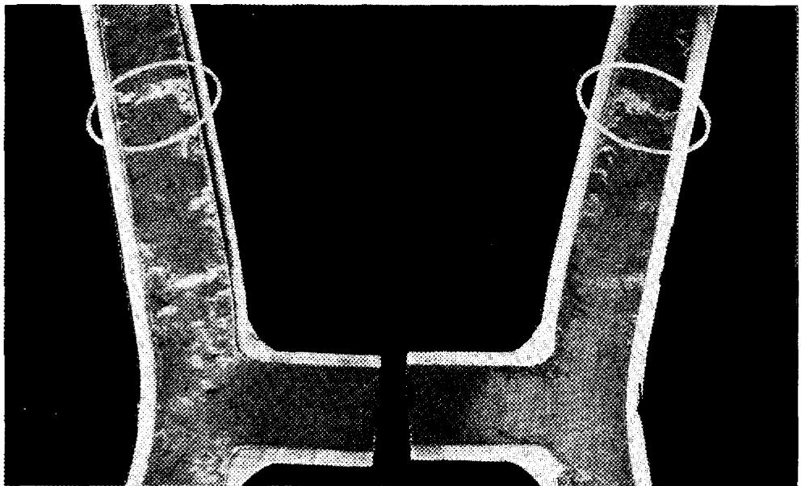  
Fig. 6.33. Matching Halves of Portion of Cold Leg from a Croloy 9M Loop Which Circulated Lead with 230 ppm Magnesium as Inhibitor for 2950 hr at $1100^{\circ}\mathrm{F}$ .

To date, all uninhibited lead systems constructed of carbon, low-alloy, and stainless steels have tended to plug due to the formation of dendritic crystals of iron and chromium in the cold regions of the loops. The hot-leg attack has consisted of uniform surface removal with isolated pits extending to a greater depth. While Nb-1% Zr alloy has exhibited no measurable hot-leg corrosion during test, niobium crystals have been found in the cold leg of a loop which operated for 5000 hr at $1400^{\circ}\mathrm{F}$ . All these findings are discussed in detail in a report summarizing results to date on the circulating-lead loop program.[20]

# References

1. MSR Program Semiann. Progr. Rept. Aug. 31, 1965, ORNL-3872, pp. 87-92.   
2. MSR Program Semiann. Progr. Rept. Feb. 28, 1966, ORNL-3936, pp. 107-8.   
3. W. P. Etherly et al., Proc. U.N. Intern. Conf. Peaceful Uses At. Energy, 2nd, Geneva, 1958, 7, 389-401.   
4. W. Watt, R. L. Bickerman, and L. W. Graham, Engineering 189, 110-11 (January 1960).   
5. C. R. Kennedy, Metals and Ceramics Div. Ann. Progr. Rept. June 30, 1965, ORNL-3870, pp. 194-97.

6. R. G. Anderson and J. F. W. Bishop, "The Effect of Neutron Irradiation and Thermal Cycling on Permanent Deformations in Uranium Under Load," pp. 17-23 in Uranium and Graphite, Monograph 27, The Institute of Metals, London, 1962.   
7. J. C. Bokros and R. J. Price, Radiation-Induced Dimensional Changes in Pyrolytic Carbons Deposited in a Fluidized Bed, GA-6736 (November 1965). To be published in the Journal of Applied Physics.   
8. MSR Program Semiann. Progr. Rept. Feb. 28, 1966, ORNL-3936, p. 104.   
9. R. G. Donnelly and G. M. Slaughter, Welding J. 41(5), 461-69 (1962).   
10. MSR Program Semiann. Progr. Rept. Feb. 28, 1966, ORNL-3936, pp. 101-4.   
11. W. R. Martin and J. R. Weir, Effect of Elevated Temperature Irradiation on the Strength and Ductility of the Nickel-Base Alloy, Hastelloy N, ORNL-TM-1005 (February 1965).   
12. W. R. Martin and J. R. Weir, Postirradiation Creep and Stress Rupture Properties of Hastelloy N, ORNL-TM-1515 (June 1966).   
13. MSR Program Semiann. Progr. Rept. Aug. 31, 1965, ORNL-3872, pp. 94-105.   
14. MSR Program Semiann. Progr. Rept. Feb. 28, 1966, ORNL-3936, pp. 111-21.   
15. D. R. Harries, J. Brit. Nucl. Energy Soc. 5(1), 74 (January 1966).   
16. J. T. Venard, Tensile and Creep Properties of INOR-8 for the Molten-Salt Reactor Experiment, ORNL-TM-1017 (February 1965).   
17. R.W. Swindeman, The Mechanical Properties of INOR-8, ORNL-2780 (Jan. 10, 1961).   
18. G. M. Adamson, Jr., et al., Interim Report on Corrosion by Zirconium Base Fluorides, ORNL-2338 (Jan. 3, 1961).   
19. MSR Program Semiann. Progr. Rept. Aug. 31, 1965, ORNL-3872, pp. 81-87.   
20. G. M. Tolson and A. Taboada, A Study of the Lead and Lead-Salt Corrosion in Thermal-Convection Loops, ORNL-TM-1437 (April 1966).

# 7. CHEMISTRY

# 7.1 Chemistry of the MSRE

Behavior of Fuel and Coolant Salt - R. E. Thoma

Several refinements of analytical methods were made during the low-power operating period of the MSRE which led us to believe that the composition and purity of the reactor salts can be ascertained accurately and economically on a routine basis. Within the last few months we have attempted to confirm this belief by demonstrating that samples of the reactor salts could be obtained and analyzed on a routine basis with the reactor operating at full power. In addition we have sought to establish from the results a practical optimal frequency of sampling. Comparisons of the current data with previous results indicate that the fuel and coolant salts have not undergone perceptible composition change since they were first circulated in the reactor some 16 months ago. The concentration of corrosion products has not increased appreciably in these salts within the report period.

Fuel Salt Composition and Purity. Twenty-five samples of fuel salt were removed from the MSRE during full-power runs FP-5, -6, and -7 for composition analysis. The results of these analyses, listed in Tables 7.1 and 7.2, show clearly the chemical stability of the fuel solution; it has maintained constant composition since it was constituted in the reactor in 1965.

Structural-Metal Impurities. The concentrations of structural-metal corrosion products found in the MSRE fuel salt in the period January to August 1966 are compared with previous assays in Table 7.3. Since chromium is the most chemically active constituent of Hastelloy, all corrosion reactions should, on proceeding to equilibrium, result in the production of $\mathrm{CrF_2}$ . The extent of corrosion in the MSRE is currently monitored by analyzing for the chromium content of the salts. In its full-power operation during the period February to July 1966, the MSRE has behaved well with respect to corrosion chemistry; no apparent corrosion has occurred within the fuel or coolant systems. We have concluded in the past that corrosion might be influenced by the presence of a small amount (perhaps approximately $1\%$ ) of $\mathrm{UF_3}$ formed in the LiF- $\mathrm{UF_4}$ enriching salt during preparation. When present, $\mathrm{UF_3}$ is readily oxidized to $\mathrm{UF_4}$ in reaction with $\mathrm{CrF_2}$ :

$$
\mathrm {C r F} _ {2} + \mathrm {U F} _ {3} \rightleftharpoons \mathrm {C r} ^ {0} + \mathrm {U F} _ {4}.
$$

The presence of $\mathrm{MoF}_4$ or $\mathrm{MoF}_5$ in the fuel salt, as inferred from the results of recent examinations of surveillance specimens removed from the reactor core, $^3$ is puzzling in connection with the likelihood that $\mathrm{UF}_3$ still remains in the fuel salt. The notable freedom from corrosion during this period therefore is reassuring.

Table 7.1. Results of MSRE Fuel Salt Analyses, Runs FP-5, -6, and -7   

<table><tr><td rowspan="2">Sample No.</td><td rowspan="2">Mwhr</td><td colspan="6">Concentration (wt %)</td></tr><tr><td>Li</td><td>Be</td><td>Zr</td><td>Ua</td><td>F</td><td>Σ</td></tr><tr><td>FP5-1</td><td>26.5</td><td>10.65</td><td>6.53</td><td>11.45</td><td>4.625</td><td>68.18</td><td>101.44</td></tr><tr><td>FP6-2</td><td></td><td>11.43</td><td>6.22</td><td>10.80</td><td>4.622</td><td>68.97</td><td>102.04</td></tr><tr><td>FP6-5</td><td></td><td>10.45</td><td>6.37</td><td>11.12</td><td>4.605</td><td>69.85</td><td>102.40</td></tr><tr><td>FP6-6</td><td></td><td>10.45</td><td>6.46</td><td>11.32</td><td>4.625</td><td>68.56</td><td>101.52</td></tr><tr><td>FP6-7</td><td>180</td><td>10.32</td><td>6.41</td><td>11.42</td><td>4.647</td><td>69.67</td><td>102.47</td></tr><tr><td>FP6-8</td><td></td><td>10.43</td><td>6.49</td><td>11.29</td><td>4.655</td><td>68.90</td><td>101.77</td></tr><tr><td>FP6-9</td><td></td><td>10.48</td><td>6.66</td><td>11.52</td><td>4.684</td><td>68.92</td><td>102.26</td></tr><tr><td>FP6-10</td><td></td><td>10.30</td><td>6.76</td><td>11.54</td><td>4.595</td><td>68.81</td><td>102.00</td></tr><tr><td>FP6-11</td><td></td><td>10.30</td><td>6.42</td><td>11.28</td><td>4.612</td><td>70.09</td><td>102.70</td></tr><tr><td>FP6-13</td><td>1000</td><td>10.50</td><td>6.41</td><td>11.06</td><td>4.628</td><td>66.79</td><td>99.38</td></tr><tr><td>FP6-14</td><td></td><td>10.50</td><td>6.45</td><td>11.33</td><td>4.617</td><td>68.18</td><td>101.08</td></tr><tr><td>FP6-15</td><td></td><td>10.55</td><td>6.86</td><td>11.35</td><td>4.601</td><td>68.18</td><td>101.54</td></tr><tr><td>FP6-16</td><td></td><td>10.55</td><td>6.58</td><td>11.31</td><td>4.629</td><td>67.88</td><td>100.90</td></tr><tr><td>FP6-17</td><td></td><td>11.44</td><td>6.64</td><td>11.05</td><td>4.652</td><td>68.26</td><td>102.04</td></tr><tr><td>FP6-19</td><td></td><td>10.40</td><td>6.88</td><td>11.72</td><td>4.667</td><td>69.10</td><td>102.77</td></tr><tr><td>FP7-1</td><td>2920</td><td>10.60</td><td>6.78</td><td>11.16</td><td>4.647</td><td>69.26</td><td>102.45</td></tr><tr><td>FP7-3</td><td></td><td>10.55</td><td>6.56</td><td>11.44</td><td>4.656</td><td>68.24</td><td>101.45</td></tr><tr><td>FP7-4</td><td></td><td>10.50</td><td>6.40</td><td>11.61</td><td>4.640</td><td>67.82</td><td>100.97</td></tr><tr><td>FP7-6</td><td>4626</td><td>10.60</td><td>6.63</td><td>11.35</td><td>4.614</td><td>69.22</td><td>102.41</td></tr><tr><td>FP7-7</td><td></td><td>10.55</td><td>6.65</td><td>11.13</td><td>4.641</td><td>69.60</td><td>102.57</td></tr><tr><td>FP7-8</td><td></td><td>10.60</td><td>6.59</td><td>11.67</td><td>4.663</td><td>67.87</td><td>101.39</td></tr><tr><td>FP7-10</td><td></td><td>10.63</td><td>6.91</td><td>11.21</td><td>4.609</td><td>68.20</td><td>101.56</td></tr><tr><td>FP7-11</td><td>6900</td><td>10.45</td><td>7.00</td><td>11.22</td><td>4.630</td><td>69.48</td><td>102.78</td></tr><tr><td>FP7-12</td><td></td><td>10.50</td><td>6.65</td><td>11.04</td><td>4.640</td><td>68.44</td><td>101.27</td></tr><tr><td>FP7-14</td><td></td><td>10.55</td><td>6.50</td><td>11.26</td><td>4.660</td><td>68.79</td><td>101.76</td></tr><tr><td>FP7-16</td><td>7823</td><td>10.55</td><td>6.71</td><td>11.60</td><td>4.638</td><td>67.59</td><td>101.08</td></tr></table>

aAs 237.003U.

The average concentrations of the structural-metal impurities which have been found in the MSRE fuel salt since the beginning of reactor operations are given in Table 7.3.

An interesting trend is evident in the above results. As impurities, iron and nickel are presumed to exist as colloidally dispersed metallic particles. The concentration of iron has decreased slowly but steadily during reactor operation, while nickel analyses remained essentially constant.

Oxide Analyses. Eight samples of MSRE fuel were analyzed for oxide content during the recent full-power operations. Details of the procedures employed are given elsewhere. The average value of oxide concentration was found to be 54 ppm, significantly lower than that found in

Table 7.2. Summary of MSRE Fuel Composition Analyses   

<table><tr><td>Component</td><td>Nominal</td><td>Book</td><td>FP4</td><td>FP5-7</td><td>FP4-7</td></tr><tr><td colspan="6">Mole Percent</td></tr><tr><td>LiF</td><td>65.00</td><td>64.88</td><td>63.36 ± 0.567</td><td>62.20 ± 0.764</td><td>63.29 ± 0.721</td></tr><tr><td>BeF2</td><td>29.17</td><td>29.26</td><td>30.65 ± 0.583</td><td>30.76 ± 0.746</td><td>30.70 ± 0.695</td></tr><tr><td>ZrF4</td><td>5.00</td><td>5.04</td><td>5.15 ± 0.116</td><td>5.22 ± 0.129</td><td>5.19 ± 0.126</td></tr><tr><td>UF4</td><td>0.83</td><td>0.82a</td><td>0.825 ± 0.011</td><td>0.822 ± 0.011b</td><td>0.824 ± 0.011</td></tr><tr><td colspan="6">Weight Percent</td></tr><tr><td>Li</td><td>10.95</td><td>10.93</td><td>10.51 ± 0.137</td><td>10.54 ± 0.017</td><td>10.52 ± 0.178</td></tr><tr><td>Be</td><td>6.32</td><td>6.34</td><td>6.55 ± 0.161</td><td>6.60 ± 0.183</td><td>6.57 ± 0.179</td></tr><tr><td>Zr</td><td>10.97</td><td>11.06</td><td>11.14 ± 0.295</td><td>11.33 ± 0.220</td><td>11.24 ± 0.271</td></tr><tr><td>U</td><td>4.73</td><td>4.646a</td><td>4.642 ± 0.028</td><td>4.635 ± 0.022b</td><td>4.638 ± 0.025</td></tr></table>

a237.003 = 33.241 wt % 235U.   
b237.009 = 33.06 wt % 235U.

Table 7.3. Concentration of Cr, Fe, and Ni in MSRE Fuel Salt   

<table><tr><td rowspan="2">Run No.</td><td rowspan="2">Number of Samples</td><td colspan="3">Concentration (ppm)</td></tr><tr><td>Cr</td><td>Fe</td><td>Ni</td></tr><tr><td>FP-3</td><td>51</td><td>37 ± 8</td><td>154 ± 55</td><td>48 ± 19</td></tr><tr><td>FP-4</td><td>22</td><td>48 ± 7</td><td>131 ± 65</td><td>20 ± 20</td></tr><tr><td>FP-5,6</td><td>14</td><td>50 ± 7</td><td>108 ± 44</td><td>54 ± 25</td></tr><tr><td>FP-7</td><td>11</td><td>48 ± 6</td><td>79 ± 38</td><td>48 ± 23</td></tr></table>

the zero-power experiments (95 ppm). Since fluorine can be evolved from frozen irradiated fuel, it was necessary to consider the possibility that oxide is released by the reaction

$$
\mathrm {F} _ {2} ^ {0} + \mathrm {O} _ {2} ^ {-} \rightleftharpoons \frac {1}{2} \mathrm {O} _ {2} ^ {0} + 2 \mathrm {F} ^ {-}.
$$

Sample specimens were analyzed in one instance after minimum delay (approximately a 7-hr interval between sample removal to HF purge) and in another instance after a 48-hr delay. Results of the two analyses were coincident within experimental error. Although the minimum delay period is probably not sufficiently long to allow any of the oxide to be converted to oxygen, plans are under way to test the intrinsic capability of the method by standard additions of oxides to future samples.[4]

Table 7.4. Isotopic Composition of Uranium in MSRE Fuel Salt Specimens   

<table><tr><td rowspan="2">Sample No.</td><td rowspan="2">Mwhr</td><td colspan="4">Isotopic Composition of U (wt %)</td></tr><tr><td>234U</td><td>235U</td><td>236U</td><td>238U</td></tr><tr><td>FP2-10-13</td><td>0</td><td>0.356</td><td>33.716</td><td>0.145</td><td>65.783</td></tr><tr><td>FP6-14</td><td>1000</td><td>0.352</td><td>33.534</td><td>0.144</td><td>65.970</td></tr><tr><td>FP6-19</td><td>2900</td><td>0.345</td><td>33.444</td><td>0.151</td><td>66.060</td></tr><tr><td>FP7-8</td><td>5000</td><td>0.352</td><td>33.400</td><td>0.163</td><td>66.085</td></tr><tr><td>FP7-12</td><td>7000</td><td>0.349</td><td>33.329</td><td>0.174</td><td>66.148</td></tr><tr><td>FP7-15</td><td>7600</td><td>0.347</td><td>33.161</td><td>0.177</td><td>66.315</td></tr></table>

Isotopic Analysis of Uranium. Variations in the relative concentrations of uranium isotopes in the MSRE fuel are determined on a regular basis by mass spectrometric analysis. $^{5}$ A summary of the isotopic analyses of the MSRE fuel is given in Table 7.4, which shows qualitative evidence of $^{235}\mathrm{U}$ burnup and ingrowth of $^{236}\mathrm{U}$ . The limit of experimental accuracy $(\pm 0.1\%)$ of individual values) and the low burnup fraction (approximately $1\%$ ) render the current values of little use for accurate calculation of MSRE power levels at present. It is anticipated that as a greater fraction of $^{235}\mathrm{U}$ is consumed, such determinations will assume greater significance in corroborating burnup computations which are based on performance data.

Coolant Salt Composition. Coolant salt was circulated in the MSRE for some 1200 hr during the prenuclear test period. Since flush and coolant salts were supplied from the same reservoir, the coolant salt was analyzed during this period only for impurities. At the end of pre-nuclear testing, concentrations of the structural-metal impurities, Cr, Fe, and Ni, were established to be approximately 30, 90, and 7 ppm, respectively, which are remarkably low considering that the circuit had not been flushed previously with molten salt. The results of spectrochemical analyses made at that time showed that no significant amounts of additional impurities were introduced during this period. As the reactor was brought to full power early in 1966, coolant salt was again circulated, sampled regularly, and subjected to compositional and impurity analysis. The results obtained from these analyses are given in Table 7.5.

In addition to the components, coolant salt was analyzed for, and found free of, zirconium by wet chemical and spectrochemical methods. The intention was to confirm that no fuel salt had been transferred to the coolant circuit.

Analyses of coolant salts are conducted in the General Analysis Laboratory of the ORNL Analytical Chemistry Division, while those for the fuel are obtained from the General Hot Analyses Laboratory of that

Table 7.5. Results of MSRE Coolant Salt Analyses, Runs CP-4 to -7   

<table><tr><td rowspan="3">Sample No.</td><td rowspan="3">Total Time in Pump Bowl (hr)</td><td colspan="8">Concentration</td></tr><tr><td colspan="4">wt %</td><td colspan="4">ppm</td></tr><tr><td>Li</td><td>Be</td><td>F</td><td>Σ</td><td>Cr</td><td>Fe</td><td>Ni</td><td>Oa</td></tr><tr><td>CP4-1</td><td></td><td></td><td></td><td></td><td></td><td>36</td><td>65</td><td>&lt;5</td><td></td></tr><tr><td>CP4-2</td><td>11.</td><td></td><td></td><td></td><td></td><td>26</td><td>83</td><td>&lt;5</td><td>130</td></tr><tr><td>CP4-3</td><td>59</td><td>13.78</td><td>8.91</td><td>76.70</td><td>99.39</td><td>41</td><td>41</td><td>37</td><td>185</td></tr><tr><td>CP4-4</td><td>67</td><td></td><td></td><td></td><td></td><td>53</td><td>46</td><td>24</td><td></td></tr><tr><td>CP4-5</td><td>180</td><td>14.20</td><td>8.87</td><td>76.80</td><td>99.87</td><td>50</td><td>50</td><td>20</td><td></td></tr><tr><td>CP4-6</td><td>229</td><td></td><td></td><td></td><td></td><td></td><td></td><td></td><td>38</td></tr><tr><td>CP5-1</td><td></td><td>13.86</td><td>8.85</td><td>76.7</td><td>99.41</td><td>35</td><td>5</td><td>&lt;10</td><td>150</td></tr><tr><td>CP5-2</td><td></td><td>13.82</td><td>8.55</td><td>76.6</td><td>98.97</td><td>35</td><td>&lt;2</td><td>&lt;10</td><td>110</td></tr><tr><td>CP5-3</td><td></td><td>12.76</td><td>10.51</td><td>76.04</td><td>99.31</td><td>46</td><td>57</td><td>64</td><td>65</td></tr><tr><td>CP5-4</td><td></td><td>13.00</td><td>9.17</td><td>76.8</td><td>98.97</td><td>35</td><td>119</td><td>14</td><td>&lt;20</td></tr><tr><td>CP5-5</td><td></td><td>12.60</td><td>9.15</td><td>76.7</td><td>98.45</td><td>42</td><td>87</td><td>28</td><td>120</td></tr><tr><td>CP5-6</td><td></td><td>13.01</td><td>10.06</td><td>77.2</td><td>100.27</td><td>20</td><td>100</td><td>8</td><td>260</td></tr><tr><td>CP5-7</td><td>855</td><td>13.17</td><td>9.49</td><td>76.4</td><td>99.06</td><td>24</td><td>112</td><td>&lt;2</td><td>171</td></tr><tr><td>CP5-8</td><td></td><td>12.70</td><td>10.22</td><td>77.2</td><td>100.12</td><td>29</td><td>36</td><td>&lt;2</td><td>71</td></tr><tr><td>CP5-9</td><td></td><td>12.77</td><td>9.43</td><td>76.7</td><td>98.90</td><td>32</td><td>44</td><td>&lt;2</td><td>35</td></tr><tr><td>CP5-10</td><td></td><td>12.97</td><td>9.59</td><td>76.9</td><td>99.46</td><td>33</td><td>31</td><td>&lt;2</td><td>&lt;20</td></tr><tr><td>CP5-11</td><td></td><td>12.92</td><td>9.61</td><td>76.4</td><td>98.93</td><td>36</td><td>49</td><td>53</td><td>&lt;20</td></tr><tr><td>CP5-12</td><td></td><td>12.75</td><td>9.74</td><td>76.4</td><td>98.89</td><td>44</td><td>57</td><td>8</td><td>&lt;20</td></tr><tr><td>CP5-13</td><td>1358</td><td>13.10</td><td>9.98</td><td>76.2</td><td>99.38</td><td>32</td><td>73</td><td>10</td><td>162</td></tr><tr><td>CP6-1</td><td></td><td>13.09</td><td>9.73</td><td>76.1</td><td>98.92</td><td>30</td><td>43</td><td>41</td><td>&lt;20</td></tr><tr><td>CP6-2</td><td></td><td>12.76</td><td>9.56</td><td>76.4</td><td>98.64</td><td>38</td><td>28</td><td>9</td><td>&lt;20</td></tr><tr><td>CP6-3</td><td></td><td>12.82</td><td>9.13</td><td>76.8</td><td>98.75</td><td>45</td><td>76</td><td>47</td><td>210</td></tr><tr><td>CP6-4</td><td></td><td>12.76</td><td>9.63</td><td>76.0</td><td>98.39</td><td>57</td><td>68</td><td>15</td><td>210</td></tr><tr><td>CP6-5</td><td></td><td>12.70</td><td>9.79</td><td>74.8</td><td>97.29</td><td>20</td><td>57</td><td>6</td><td>135</td></tr><tr><td>CP6-6</td><td>3135</td><td></td><td>9.65</td><td>74.1</td><td></td><td>28</td><td>37</td><td>6</td><td>&lt;40</td></tr><tr><td>CP7-1</td><td></td><td>13.64</td><td>8.72</td><td>74.65</td><td>97.01</td><td>32</td><td>60</td><td>&lt;2</td><td>&lt;20</td></tr><tr><td>CP7-2</td><td></td><td>12.16</td><td>9.88</td><td>74.5</td><td>96.54</td><td>31</td><td>51</td><td>&lt;2</td><td>300</td></tr><tr><td>CP7-3</td><td></td><td>12.39</td><td>10.24</td><td>74.8</td><td>97.43</td><td>51</td><td>80</td><td>&lt;2</td><td>&lt;145</td></tr><tr><td>CP7-4</td><td>3462</td><td></td><td></td><td></td><td></td><td></td><td></td><td></td><td></td></tr><tr><td>Average</td><td></td><td>13.03</td><td>9.46</td><td>76.16</td><td>98.69</td><td>36</td><td>58</td><td>16</td><td>107</td></tr><tr><td>Standard deviation</td><td></td><td>0.46</td><td>0.49</td><td>0.83</td><td></td><td>10</td><td>27</td><td>17</td><td>79</td></tr><tr><td>Nominal</td><td></td><td>13.94</td><td>9.24</td><td>76.82</td><td>100.00</td><td></td><td></td><td></td><td></td></tr></table>

aKBrF4 method.

division. It is apparent from the contrast of material balances shown in Tables 7.1 and 7.5 that minor differences in analytical procedures are employed. These differences were appraised with respect to their possible influence on compositional analysis and were found to be insignificant, since compositional analysis is computed from cation assays without use of the fluoride values.

On the basis of the analytical data listed in Table 7.5, the present composition of the coolant salt is $^{7}\mathrm{LiF - BeF_2}$ (63.93-36.07 mole %), practically identical with values obtained in earlier analyses of the flush salt (63.80-36.20 mole %). The unresolved disparity between the design composition (66.0 ± 0.25-34.0 ± 0.25 mole %) and that found by chemical analysis continued to be a puzzling matter. The excellent reproducibility of chemical analyses throughout the operational period of the MSRE is, however, of significance in affording the opportunity for chemical trends to be observed.

# 7.2 Physical Chemistry of Fluoride Melts

Viscosity and Density of Molten Beryllium Fluoride - S. Cantor and C. T. Moynihan*

The viscosity of molten $\mathrm{BeF}_2$ was measured over the temperature range 573 to $985^{\circ}\mathrm{C}$ using Brookfield LWT and HBF5X viscometers. In this temperature range, the viscosity, $\eta$ , varied from 10 to $10^{6}$ poises and was about $10^{6}$ greater than previously reported.[7]

The plot of $\log \eta$ vs $1 / \mathrm{T} (^{\circ}\mathrm{K})$ showed only slight curvature. A least-squares fit of the data to an equation quadratic in $1 / T$ yielded the following:

$$
\log \eta (\text {p o i s e s}) = - 8. 1 1 9 + \frac {1 . 1 4 9 4 \times 1 0 ^ {4}}{\mathrm {T} (^ {\circ} \mathrm {K})} + \frac {6 . 3 9 \times 1 0 ^ {5}}{\mathrm {T} ^ {2}};
$$

standard error in $\log \eta = 0.013$ . This corresponds to an apparent increase in the activation energy for viscous flow from 57.3 kcal/mole at $985^{\circ}\mathrm{C}$ to 59.6 kcal/mole at $575^{\circ}\mathrm{C}$ . These are relatively small activation energy changes, and thus the temperature dependence of the viscosity of $\mathrm{BeF}_2$ is basically Arrhenius over the range (10 to $10^{6}$ poises) covered in this investigation.

Density measurements were attempted via the Archimedean method, by determining the apparent loss of weight of a platinum sinker when immersed in molten $\mathrm{BeF}_2$ . In such viscous melts, the balance is extremely slow in coming to equilibrium; hence, the method8 of extrapolating to zero velocity the plots of rate of ascent or descent of the sinker under various balance loads (measured by timing the travel of the balance pointer) was used to determine the equilibrium weight of the sinker in the melt. In none of the four attempts to measure the $\mathrm{BeF}_2$ density was it possible to eliminate the few small bubbles that adhered to the sinker. The buoyant effect of the bubbles leads to low values of the apparent weight of the sinker and, hence, to high values of the density.

If a surface tension of 200 dynes/cm is assumed for $\mathrm{BeF}_2$ , the best of our density results yielded a value of $1.96 \pm 0.01 \, \mathrm{g/cm}^3$ for $\mathrm{BeF}_2$ at $850^\circ \mathrm{C}$ . This result must be considered only as an upper limit to the real $\mathrm{BeF}_2$ density, but it may be compared to the value of $1.95 \pm 0.01 \, \mathrm{g/cm}^3$ at $800^\circ \mathrm{C}$ reported by MacKenzie and to a value of $1.968 \, \mathrm{g/cm}^3$ measured for the $\mathrm{BeF}_2$ glass at room temperature. These results suggest that the thermal expansion coefficient of liquid $\mathrm{BeF}_2$ is quite small.

Transpiration Studies in Support of the Vacuum Distillation Process - S. Cantor

To determine the equilibrium vapor separation of rare-earth fission products from MSR carrier salts, a series of vapor pressures have been measured by the transpiration (i.e., gas-entrainment) method. The melts were composed of 87.5-11.9-0.6 mole $\%$ LiF-BeF $_2$ -LaF $_3$ . These concentrations of LiF and BeF $_2$ are approximately those expected in the still pot of the vacuum distillation process, but the lanthanum concentration is many times greater than would be permitted as total rare-earth concentration in the still. This high concentration of lanthanum in the melt was required in order to give lanthanum concentrations in the vapor that were high enough to analyze.

Measurements were carried out in the temperature interval 1000 to $1062^{\circ}\mathrm{C}$ ; dry argon, the entraining gas, flowed over each melt at the rate of about $30~\mathrm{cm}^3/\mathrm{min}$ . Salt vapor, condensing in a nickel tube, was analyzed by spectrochemical and neutron activation methods. The latter method gave higher, more consistent, and probably more reliable lanthanum analyses. To date, the more consistent results have been obtained at only two temperatures:

<table><tr><td>Temperature (°C)</td><td>Decontamination Factora for Lanthanum</td></tr><tr><td>1000</td><td>910</td></tr><tr><td>1028</td><td>1150</td></tr></table>

aDefined as (mole fraction of lanthanum in liquid)/(mole fraction of lanthanum in condensed vapor).

At six other temperatures, transpiration pressure measurements yielded much higher (up to 7300) decontamination factors; however, these determinations either were based on insufficient sample for proper analysis or else duplicate analyses gave widely different results. It did appear that the higher the temperature, the higher the decontamination factors.

Although much more study is required before the vacuum distillation process can be shown to be practical, it seems that decontamination factors close to 1000 can probably be demonstrated.

Preliminary phase equilibrium studies have indicated that a mixture containing 47.5 mole % NaF, 48 mole % BF₃, and 4.5 mole % KF (melting point, $365^{\circ}\mathrm{C}$ ) is sufficiently low melting for use as the secondary coolant of the MSBR. To aid investigations (such as heat-transfer studies) that will likely be carried out in the near future, estimates are given below for some thermophysical properties of this mixture. It is anticipated that certain thermophysical properties will soon be measured. The estimates given herein are meant to serve until such measurements can be made.

Measurements of dissociation equilibria have shown that $\mathrm{KBF}_4^{10}$ is much more stable than $\mathrm{NaBF}_4$ . The composition given in the first paragraph can be recast as a mixture of fluoroborates whose composition is (in mole %): $\mathrm{NaBF}_4$ , 83.65; $\mathrm{KBF}_4$ , 8.65; and NaF, 7.7. This recast form is useful because it permits estimates of properties to be made in terms of components which are all molten (or supercooled liquids) in the temperature range of interest ( $\mathrm{BF}_3$ is a gas in this temperature range).

Vapor Pressures. These were estimated by assuming (1) that the fluoroborate mixture behaves in accordance with Raoult's law and (2) that the only vapor species is $\mathbf{BF}_3$ . Since the dissociation pressure of $\mathbf{NaBF}_4^{11}$ is many times greater than that of $\mathbf{KBF}_4$ , then, given the two assumptions, the total vapor pressure $\mathbf{P}$ may be expressed as

$$
P (m m) = 0. 8 3 6 5 P _ {N a B F _ {4}} ^ {0}, \tag {1}
$$

where $\mathsf{P}_{\mathsf{NaBF}_4}^0$ is the dissociation pressure (in millimeters) of pure $\mathsf{NaBF}_4$ . From the log P vs $1 / T$ equation for pure $\mathsf{NaBF}_4$ , the temperature dependence of the proposed MSBR coolant is easily derived and is given by

$$
\log \mathrm {P} (\mathrm {m m}) = 6. 5 1 - 3 6 5 0 / \mathrm {T} (^ {\circ} \mathrm {K}). \tag {2}
$$

By appropriate substitution in Eq. (2), Table 7.6 was generated.

Table 7.6. Estimated Vapor Pressure of Proposed MSBR Coolant Salt   

<table><tr><td>Temperature (°C)</td><td>Pressure (mm)</td></tr><tr><td>370 (lowest possible temperature in coolant circuit)</td><td>6.8</td></tr><tr><td>454 (mean temperature of coolant going to heat exchanger)</td><td>27</td></tr><tr><td>607 (highest normal operating temperature)</td><td>229</td></tr></table>

Density. The liquid densities of the fluoroborates have not as yet been measured. For an estimate of the density at $454^{\circ}\mathrm{C}$ , the following assumptions were made:

1. The fluoroborate mixture is additive with respect to liquid molar volumes of the components.   
2. The molar volumes of liquid $\mathrm{NaBF}_4^{11}$ and $\mathrm{KBF}_4^{12}$ are 1.2 times the x-ray molar volumes of the respective solids.   
3. The molar volume of supercooled liquid NaF at $454^{\circ}\mathrm{C}$ can be obtained by extrapolation of the stable liquid values. $^{13}$

From these three assumptions a value of $2.1\mathrm{g/cm}^3$ is calculated as the density of the coolant at $454^{\circ}\mathrm{C}$ . This density is probably uncertain by $10\%$ . Because expansion coefficients of fluoroborates are unknown, estimations of the temperature coefficient of density would be premature at this time.

Specific Heat. By using the rule14 that each gram-atom of a fluoride mixture contributes about 8 cal/°C to the molar heat capacity, the molar heat capacity of the coolant equals approximately 48 cal/°C. But since the coolant contains the complex ion $\left[\mathrm{BF}_4\right]^{1-}$ , some of the oscillational degrees of freedom of the individual atoms are lost; my guess is that this loss amounts to about 7 cal/°C. Thus, the estimated specific heat is 41 cal/°C divided by the molar weight of the coolant, 106 g, or about 0.4 cal g-1 (°C)-1. This estimate is probably good to ±25%.

Viscosity. The viscosity of $\mathrm{NaBF}_4$ was measured15 somewhat crudely at two temperatures. The results were $7 \pm 2$ centipoises at $466^{\circ}\mathrm{C}$ and $14 \pm 3$ centipoises at $436^{\circ}\mathrm{C}$ . Since the coolant is predominantly $\mathrm{NaBF}_4$ , these rough values can serve as a guide to viscosity until further experimental values become available.

# 7.3. Separation in Molten Fluorides

Extraction of Rare Earths from Molten Fluorides into Molten Metals - J. H. Shaffer, F. F. Blankenship, and W. R. Crimes

This experimental program envisions a liquid-liquid extraction process for removing rare-earth fission products from the fuel solvent of the reference-design MSBR and a similar back-extraction process for concentrating them in a second salt mixture for disposal or further utilization. This process is an alternative to distillation and like the distillation process would follow removal of the uranium by the fluoride volatility process. The results of previous experiments have shown that a mixture of bismuth containing 0.02 mole fraction of lithium metal sufficed for removing essentially all cerium, lanthanum, and neodymium and substantial quantities of samarium and europium from a mixture of LiF-BeF $_2$ (66-34 mole %). $^{16}$ The second phase of the reprocessing

method would then involve the back extraction of rare earths from the molten metal mixture into another salt mixture. Hydrofluorination of such a two-liquid-phase mixture should be very effective for this step, but the overall process would also result in the removal of some lithium from the fuel. Since isotopically pure $^{7}\mathrm{Li}$ is used in the fuel, the conservation of this material is of economic importance. According to the experimental data, the removal of $1\mathrm{g}$ of neodymium would result in the loss of about $2.2\mathrm{g}$ of lithium. However, material balances on experiments in which lithium was used as the reducing agent showed that only 25 to $50\%$ of the lithium added to the extraction system was found as a dissolved component of the metal phase. The quantity of lithium required for the stoichiometric reduction of rare-earth fluorides was negligible by comparison. Therefore, additional studies of the behavior of lithium metal in the extraction system have been conducted.

Duplicate experiments dealt with the material balance of lithium in bismuth in the absence of a salt phase. As in previous experiments, about $2.35\mathrm{kg}$ of bismuth was contained in low-carbon steel at $600^{\circ}\mathrm{C}$ . Filtered samples of the molten metal were taken after each incremental addition of lithium metal to the systems and during prolonged equilibration periods (100 hr) during which one mixture was maintained under static helium and the second was sparged with dry helium. The results of spectrographic analyses of these samples showed that, as lithium was added, its concentration in each vessel increased in amounts which corresponded to about 75 to $80\%$ of the amount added to each system. However, upon standing, the concentration of lithium in each vessel became constant at values which corresponded, very nearly, to the amount of lithium added. These experiments illustrated the stability of lithium-bismuth mixtures contained in low-carbon steel equipment and indicated that the rate of dissolution of lithium into bismuth in the extraction systems was somewhat slower than anticipated.

The foregoing results showed that the unexplained lithium losses were not attributable to the analytical procedure nor to the behavior of lithium in the molten metal phase of the extraction systems. Accordingly, the next phase of this experimental series was an examination of the effect of the salt phase on the concentration of lithium in the metal phase.

A previously purified mixture of $\mathrm{LiF - BeF_2}$ (66-34 mole %) was now added to each of the above mixtures of lithium and bismuth in three successive tared increments of about 1 kg. Filtered samples of the metal phases were taken during 24-hr equilibrium periods after each salt addition. The results of spectrographic analyses of these samples showed losses of lithium from the metal phase after each salt addition. As shown by Fig. 7.1, this loss corresponded to about 0.11 mole of lithium per kilogram of the salt mixture and was independent of the concentration of lithium in the metal phase. Although this loss may be attributed to a number of possible circumstances, it should not materially affect the economics of the rare-earth extraction process.

In earlier experiments, the extraction of rare earths from a salt phase into molten bismuth was achieved by the addition of beryllium metal to the system. This reduction process also resulted in an increase of the lithium concentration of the molten metal phase. Accordingly, further

study of the reaction

$$
2 \mathrm {L i F} + \mathrm {B e} ^ {0} \rightleftharpoons 2 \mathrm {L i} ^ {0} + \mathrm {B e F} _ {2}
$$

in the two-phase extraction system has been initiated. The first experiment of this series was conducted by adding clean beryllium metal turnings to a two-liquid-phase system of $3.17\mathrm{kg}$ of $\mathrm{LiF - BeF_2}$ (66-34 mole %) and $2.30\mathrm{kg}$ of bismuth contained in low-carbon steel at $600^{\circ}\mathrm{C}$ . Filtered samples of the metal phase were withdrawn at 4- and 24-hr intervals after each incremental addition of about $1\mathrm{g}$ of beryllium metal. These samples were analyzed spectrographically for their lithium and beryllium content by groups after $5\mathrm{g}$ of $\mathrm{Be}^0$ had been added to the system. As shown by Fig. 7.2, the lithium concentration in bismuth increased after each addition of beryllium until a value of about 0.16 mole fraction lithium was attained. Beryllium concentrations in bismuth remained below the limit of detection (less than 0.0001 wt %) of the analytical method. Thus, the analytical results for lithium in bismuth should reflect dissolved lithium metal concentrations rather than the dissolution or suspension of salt in the molten metal phase. Since the distribution of rare earths between the two liquid phases of the extraction system was found dependent upon the lithium concentration in bismuth, these results provide extrapolation limits for estimating extraction parameters. If this limiting value of 0.16 mole fraction of lithium in bismuth is assumed to be in equilibrium with beryllium metal at unit activity, the activity coefficients $\gamma$ of

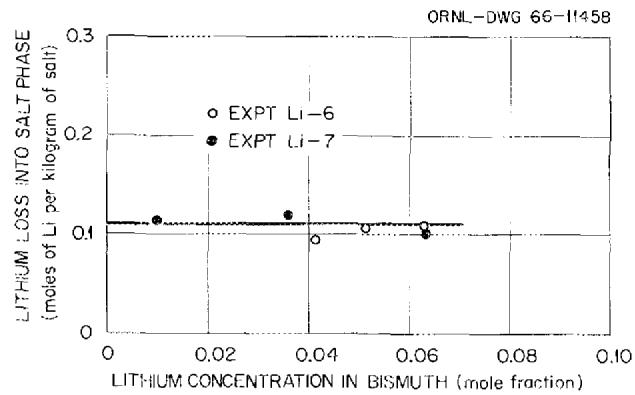  
Fig. 7.1. Rate of Lithium Loss from Molten Bismuth into LiF-BeF $_2$ (66-34 Mole %) at $600^{\circ}\mathrm{C}$ .

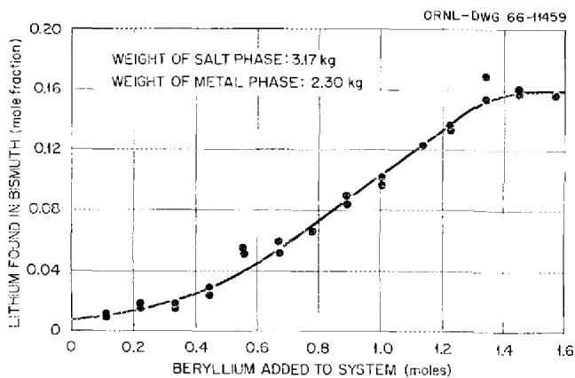  
Fig. 7.2. Reduction by Beryllium Metal of LiF-BeF $_2$ (66-34 Mole %) in Contact with Molten Bismuth at $600^{\circ}\mathrm{C}$ .

lithium and some rare earths in molten bismuth can be estimated. On the basis of this lithium concentration and thermodynamic data, Hill found $^{17,18}$ the following activity coefficients of metals dissolved in molten bismuth at $600^{\circ}\mathrm{C}$ :

<table><tr><td>Metal</td><td>γ</td></tr><tr><td>Li</td><td>8 × 10-5</td></tr><tr><td>La</td><td>1.2 × 10-15</td></tr><tr><td>Ce</td><td>2.9 × 10-14</td></tr><tr><td>Nd</td><td>8 × 10-13</td></tr></table>

Comparable results at $500^{\circ}\mathrm{C}$ which differ by no more than a factor of 10 have been reported.[19,20] Additional experiments are in progress to better define the equilibrium reaction.

Removal of Rare Earths from Molten Fluorides by Simultaneous Precipitation with $\mathbf{U}\mathbf{F}_{3} - \mathbf{J}$ . H. Shaffer and H. F. McDuffie

The relatively low solubility of $\mathrm{UF}_3$ in fluoride mixtures of interest to the MSR Program,[21] together with the known similarities of the crystal structure of rare-earth trifluorides with $\mathrm{UF}_3$ ,[22] provides a basis for studies of the precipitation of solid solutions of these compounds from fluoride melts. Fission product rare earths represent a major portion of the poison fraction in the fuel of a molten-salt nuclear reactor; this study has been oriented toward the development of suitable reprocessing methods for rare-earth removal. Initial experiments conducted in this program considered the reduction of $\mathrm{UF}_4$ contained in the reactor fuel mixture to $\mathrm{UF}_3$ and the simultaneous precipitation of rare-earth trifluorides with $\mathrm{UF}_3$ as the temperature of the fuel mixture was reduced. A second series of experiments is in progress to examine the precipitation of rare earths from a simulated fuel solvent upon addition of solid $\mathrm{UF}_3$ .

If all the $\mathrm{UF_4}$ contained in the current MSRE fuel mixture, LiF-BeF $_2$ -ZrF $_4$ - $\mathrm{UF_4}$ (65.0-29.1-5.0-0.9 mole % respectively), were reduced to $\mathrm{UF_3}$ , the solution would be saturated with $\mathrm{UF_3}$ at approximately $725^{\circ}\mathrm{C}$ . By lowering the melt temperature to $550^{\circ}\mathrm{C}$ , approximately $83.5\%$ of the uranium would be precipitated from solution. Results of preliminary experiments designed to investigate this reprocessing method demonstrated that $\mathrm{LaF_3}$ , $\mathrm{CeF_3}$ , and $\mathrm{NdF_3}$ could be precipitated with $\mathrm{UF_3}$ . Europium and samarium were probably reduced to their divalent states by the in situ reduction of uranium with added zirconium metal and showed little or no loss from solution during the precipitation of $\mathrm{UF_3}$ . Subsequent experiments with excess reducing agent showed that cerium removal could be related to the $\mathrm{U}^{3+}$ concentration in solution by the equation

$$
\ln \mathrm {N} _ {\mathrm {R E}} = k \ln \mathrm {N} _ {\mathrm {U} ^ {3 +}} + \text {c o n s t}, \tag {3}
$$

where $\mathbf{N}_{\mathrm{RE}}$ and $\mathbf{N}_{\mathrm{U}^{3+}}$ are respective mole fractions of rare earth and trivalent uranium. As illustrated in Fig. 7.3, a value of about 0.55 was

obtained for $\mathbf{k}$ in Eq. (3) for the simultaneous precipitation of $\mathrm{CeF}_3$ . Further investigation would be needed to verify this experimental relationship for other rare earths of interest to the program.

A more recent experimental program has been concerned with the retention of rare-earth trifluorides on a bed of solid $\mathbf{U}\mathbf{F}_{3}$ as an alternative reprocessing technique. In this experiment, $\mathbf{U}\mathbf{F}_{3}$ was added in 30-g increments to approximately $2.2\mathrm{kg}$ of LiF-BeF $_2$ (66-34 mole %) that initially contained $10^{-4}$ mole fraction of CeF $_3$ with about 1 mc of $^{144}\mathrm{Ce}$ as a radio-tracer. Filtered samples of the salt mixture were taken approximately 48 hr after each addition of $\mathbf{U}\mathbf{F}_{3}$ and analyzed radiochemically for cerium. As shown by Fig. 7.4, these results illustrate a somewhat linear decrease in cerium concentration as $\mathbf{U}\mathbf{F}_{3}$ was added which corresponds to a solid phase which contained about 1 mole % CeF $_3$ .

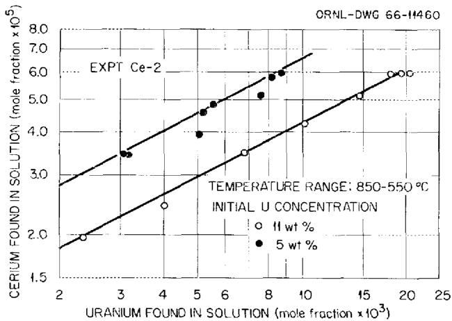  
Fig. 7.3. Simultaneous Precipitation of $\mathrm{CeF_9}$ and $\mathrm{UF_3}$ from Simulated MSRE Fuel Mixture.

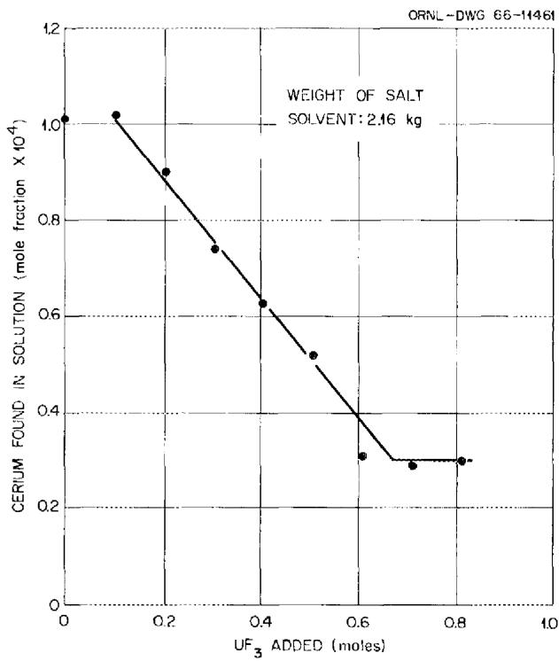  
Fig. 7.4. Removal of $\mathrm{CeF}_3$ from LiF-BeF $_2$ (66-34 Mole %) by Exchange with Solid UF $_3$ at $550^{\circ}\mathrm{C}$ .

Removal of Protactinium from Molten Fluorides by Oxide Precipitation - J. H. Shaffer, F. F. Blankenship, and W. R. Grimes

In a previous experiment, protactinium was removed from solution in a solvent mixture of LiF-BeF $_2$ (66-34 mole %), containing ZrF $_4$ (0.5 mole per kg of salt), by the addition of ZrO $_2$ at $600^{\circ}\mathrm{C}$ . An interpretation of the experimental data according to the equation

$$
\frac {1}{F _ {\mathrm {P a}}} = 1 + \frac {D}{W _ {\text {s a l t}}} \cdot W _ {Z r O _ {2}} \tag {4}
$$

where $D = \frac{(\text{Pa})}{\text{oxide}}$ (Pa) salt, $F_{\text{Pa}} = \frac{\text{fraction of Pa in the salt}}{\text{weight of the designated phase}}$ , showed that the distribution of protactinium between the two phases remained constant over the protactinium concentration range of the experiment. These results could be interpreted as the formation of labile oxide solid solutions or as surface absorption of $^{233}\text{Pa}$ on the solid $\text{ZrO}_2$ . Further studies of this oxide precipitation behavior were conducted in the same fluoride solvent with $\text{ZrO}_2$ powders having varied surface areas.

Zirconium dioxide used in the original experiment was purchased commercially and had a surface area of about $19.6\mathrm{m}^2/\mathrm{g}$ . Material having higher surface areas was prepared from $\mathrm{Zr(OH)}_4$ by dehydration.[24] Sufficient $\mathrm{ZrO}_2$ for this experimental series was fired at 600, 700, and $1000^{\circ}\mathrm{C}$ in separate batches that yielded average surface areas of 80, 50, and $1.32\mathrm{m}^2/\mathrm{g}$ respectively. About $3.55\mathrm{kg}$ of a salt mixture having a nominal composition of $\mathrm{LiF - BeF}_2 - \mathrm{ZrF}_4$ (64.8-33.6-1.6 mole %) with about $1\mathrm{mc}$ of $^{233}\mathrm{Pa}$ (as irradiated $\mathrm{ThO}_2$ ) was prepared in a nickel vessel by our usual $\mathrm{HF - H}_2$ treatment at $600^{\circ}\mathrm{C}$ , followed by $\mathrm{H}_2$ sparging at $700^{\circ}\mathrm{C}$ for further purification and dissolution of protactinium as its fluoride salt. Selected $\mathrm{ZrO}_2$ was added to the salt mixture in $10\mathrm{-g}$ increments; the mixture was then sparged with helium at a rate of about $1\mathrm{liter/min}$ during $24\mathrm{-hr}$ equilibration periods. Filtered samples of the salt mixture were taken after each equilibration period and analyzed radiochemically for $^{233}\mathrm{Pa}$ by counting its $310\mathrm{-kv}$ photopeak on a single-channel gamma spectrometer. At the conclusion of the experiment, the mixture was hydrofluorinated to convert added $\mathrm{ZrO}_2$ to its fluoride salt and to restore $^{233}\mathrm{Pa}$ activity in the molten-salt phase. This experimental procedure was repeated with the same salt mixture for all three lots of $\mathrm{ZrO}_2$ .

In each experiment the addition of $\mathrm{ZrO_2}$ to the fluoride mixture resulted in the loss of protactinium from solution. However, as shown by Fig. 7.5, a plot of the reciprocal fraction of $^{233}\mathrm{Pa}$ in solution vs $\mathrm{ZrO_2}$ added, according to Eq. (4), yielded distribution coefficients for $^{233}\mathrm{Pa}$ between the two phases which varied continuously as the precipitation reaction approached completion. These experimental results are contrary to those obtained previously with respect to the constancy of the $^{233}\mathrm{Pa}$ distribution coefficients; they indicate that $^{233}\mathrm{Pa}$ removal from the salt mixture is not proportional to the surface area of the added oxide particles and also does not conform to an equilibrium solid solution. Experiments in progress will attempt to further elucidate the characteristics of the oxide precipitation process.

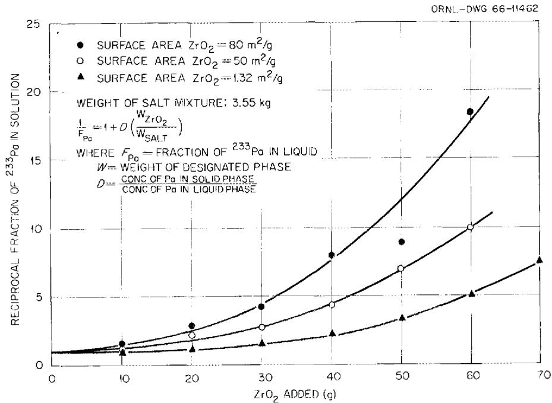  
Fig. 7.5. Effect of Surface Area of $\mathrm{ZrO}_2$ on the Removal of $^{233}\mathrm{Pa}$ from LiF-BeF $_2$ -ZrF $_4$ (64.8-33.6-1.6 Mole %) at $600^{\circ}\mathrm{C}$ .

Extraction of Protactinium from Molten Fluorides into Molten Metals - J. H. Shaffer, F. F. Blankenship, and W. R. Grimes

The removal of protactinium from solution in $\mathrm{LiF - BeF_2 - ThF_4}$ (73-2-25 mole $\frac{1}{2}$ ) by adding thorium metal directly in the salt mixture or by contacting the salt with molten lead or bismuth in which thorium had been dissolved has been demonstrated in several experiments.[25] More recent experiments have examined methods which could be used for recovering protactinium from the fertile blanket of the reference-design MSBR. The results of several batch-type laboratory experiments led to the design and operation of a small pump loop which has demonstrated, in principle, the removal of protactinium from molten fluorides by a liquid-liquid extraction technique.

In early experiments a molten fluoride mixture containing dissolved $^{233}\mathrm{Pa}$ and molten bismuth containing dissolved thorium metal were left in contact in low-carbon-steel containers under static conditions. Subsequent examinations of the container indicated that most of the protactinium had deposited on the vessel walls that were in contact with the salt phase. The disappointing failure of the protactinium to cross the boundary of the two liquid phases may have resulted from nonwetting behavior. The effects of such behavior could be greatly reduced by the improved contacting obtainable in a pump-loop system.

In other experiments in which no salt phase was used, solutions of $^{233}\mathrm{Pa}$ in molten lead and bismuth were obtained by the addition of irradiated thorium metal to the liquid metals in steel containers. Radiochemical analyses of filtered samples taken from these vessels showed

that $^{233}\mathrm{Pa}$ did not form stable solutions in either liquid metal. About $40\%$ of the $^{233}\mathrm{Pa}$ activity was retained in bismuth, and less than $5\%$ was retained in lead during 48-hr contact periods. Much of the $^{233}\mathrm{Pa}$ was on the walls of the vessels, with the distribution shown in Fig. 7.6. The larger amount near the bottom of each vessel implies loss of $^{233}\mathrm{Pa}$ via sedimentary deposits of insoluble materials rather than by surface adsorption. It is of interest that the concentrations of thorium in bismuth were found, spectrographically, to be less than the 1000 ppm added and well below reported solubility values of 3000 to 4000 ppm.[27]

The fractions of $^{233}\mathrm{Pa}$ and thorium found in solution in bismuth were roughly equal. The concentrations of both increased for about 5 hr after the irradiated thorium was added to the liquid bismuth and then decreased with time. The behavior in lead appeared to be considerably different. Although as much as $80\%$ of the thorium dissolved in the lead, the fraction of protactinium in solution remained very small.

We concluded from these data that bismuth is the preferable extractant and that formation of slightly soluble compounds can complicate the extraction of protactinium from fluoride salts by causing the effective solubility of protactinium in liquid bismuth to be low. Although a high solubility seems desirable, the liquid-metal phase in the process acts only as a carrier to transfer the protactinium from one salt to another. High solubility of protactinium in the liquid metal is not an essential condition for attaining adequate transfer rates. Thus, a pump-loop experiment was tried in an effort to achieve transport of protactinium from a blanket salt while maintaining a low concentration in the liquid bismuth.

An experimental loop, shown schematically in Fig. 7.7, was designed to contact a fluoride mixture containing dissolved $^{233}\mathrm{Pa}$ with a recirculating stream of molten bismuth containing thorium. The thorium was introduced by passing the bismuth over thorium chips just before its entry into

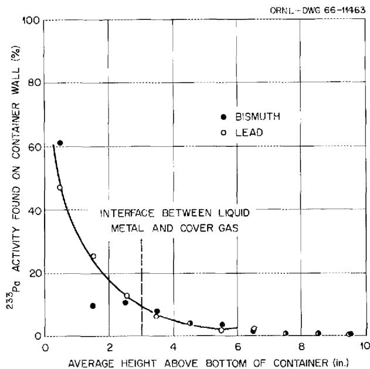  
Fig. 7.6. Distribution of $^{233}\mathrm{Pa}$ in Low-Carbon Steel Used to Contain Bismuth and Lead at $600^{\circ}\mathrm{C}$ .

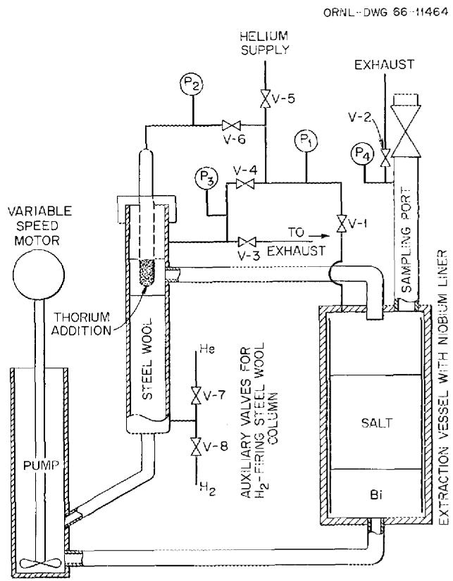  
Fig. 7.7. Diagram of $233\mathrm{pa}$ Extraction Pump Loop.

the extraction vessel. Thus, at low flow rates thorium would be introduced at a rate regulated by its solubility in bismuth. The alloy was then sprayed into the salt mixture so the protactinium would be extracted at the surfaces of free-falling droplets of bismuth. A pseudo-first-order rate of extraction was expected.

Although the blanket reprocessing method involves stripping the protactinium from molten bismuth into a second salt mixture by hydrofluorination, this feature was not included in the initial pump-loop design. Instead, the recirculating molten-metal stream was pumped through a bed of steel wool to provide for the collection of protactinium by absorption on the iron surfaces or by filtration of suspended particles. This expedient was based on results of the experiments described above and on another in which thorium metal was added to a blanket-salt mixture that contained $^{233}\mathrm{Pa}$ . The protactinium was found uniformly distributed on steel wool that had been immersed in the salt.

Accordingly, the steel wool column was designed to provide a large surface area of iron relative to iron surfaces exposed to the liquid phases elsewhere in the system without unduly restricting the flow of bismuth. The extraction vessel was also fitted with an open cylinder of niobium for primary containment of the salt mixture. The centrifugal pump was the same as that designed and operated by E. S. Bettis, Reactor Division, in similar molten-salt-molten-lead systems.

Pump-Loop Operation. Several related experiments were carried out in the pump loop. The loop was first charged with $13.5\mathrm{kg}$ of bismuth that

had been previously treated with hydrogen at $600^{\circ}\mathrm{C}$ for oxide removal. This material was circulated through the system to ascertain operational procedures and pump performance characteristics. The steel wool column was then prepared on its fixture, inserted into the system, and fired with hydrogen at $700^{\circ}\mathrm{C}$ in situ while bismuth was static, and the balance of the system was protected from oxide contamination by flowing helium. The column contained $12.5\mathrm{g}$ of grade 1 steel wool having a total surface area of $0.49\mathrm{m}^2$ or about ten times that of the geometric surface of iron that was elsewhere exposed to bismuth in the circulating system. The salt mixture $\mathrm{LiF - BeF_2 - ThF_4}$ (73-2-25 mole %) was spiked with about 1 mc of $^{233}\mathrm{Pa}$ from irradiated $\mathrm{ThO_2}$ by our usual HF- $\mathrm{H_2}$ treatment in nickel at $600^{\circ}\mathrm{C}$ and with $\mathrm{H_2}$ alone at $700^{\circ}\mathrm{C}$ . Approximately 6.7 kg of this material was transferred into the niobium-lined extraction vessel.

Bismuth was at first circulated without a reducing agent, to establish the stability of $^{233}\mathrm{Pa}$ in the salt mixture. Then thorium metal was introduced in small amounts by submerging a basket of thorium chips in the bismuth stream at the outlet of the column. Five successive additions of thorium were made in this manner during this phase of the experiment. The radiochemical results obtained from filtered samples of the two liquid phases during some 30 hr of pump operation are shown in Fig. 7.8. It is interesting to note that the $^{233}\mathrm{Pa}$ activity in the salt phase was extremely stable during the first 17 hr of loop operation and the first three additions of thorium. After the fourth addition of thorium, the $^{233}\mathrm{Pa}$ activity in the salt phase decreased at a measurable rate until apparent exhaustion of the thorium metal and continued after the fifth thorium addition until 57% of the $^{233}\mathrm{Pa}$ was removed. As shown by Fig.

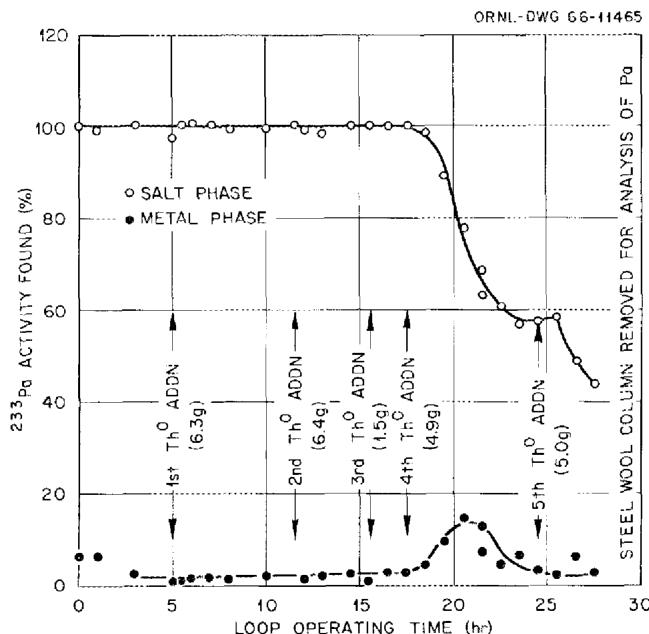  
Fig. 7.8. Behavior of $^{233}\mathrm{Pa}$ in Pump Loop During First Extraction Experiment (Th0 Added to Bismuth As Noted).

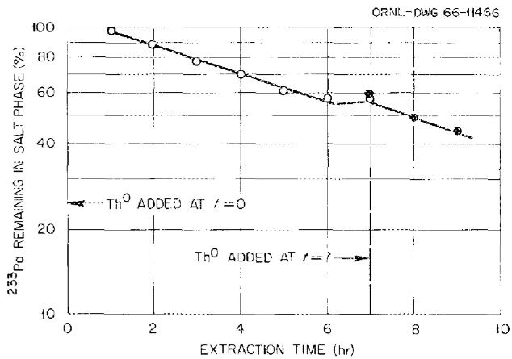  
Fig. 7.9. Loss of $^{233}\mathrm{Pa}$ from LiF-BeF $_2$ -ThF $_4$ (73-2-25 Mole %) by Reduction with Thorium in Bismuth as a Pseudo-First-Order Reaction.

7.9, this removal rate reasonably agreed with a first-order rate relation postulated for the reduction of protactinium by bismuth droplets of constant thorium concentration while falling through the salt phase. The run was interrupted at this point to correct a malfunction in the pump. The apparent collection of solids about the pump rotor resulted in a seizure which could not be overcome by the low-torque 1/3-hp motor.

A compilation of material balance data on thorium added to the system is shown in Table 7.7. Since the thorium baskets were coated heavily with bismuth, the actual quantity of thorium introduced into the system was estimated by volume loss rather than by weight balance. Spectrographic analyses of samples taken prior to each thorium addition showed that very little thorium or reduced lithium was retained as a soluble component of the metal phase. Chemical analyses of salt samples from corresponding periods showed that the chromium concentration of the salt phase was reduced from 164 to less than 2 ppm after the first thorium addition and remained at that level for the duration of the experiment. Concentrations of iron and nickel were virtually unchanged at about 125 and 30 ppm respectively.

During the interruption, the column of steel wool was removed from the system for examination. Although the column had gained considerable weight, only the head-end sections (the bottom of the column) contained appreciable quantities of solids. A quantitative analysis for $^{233}\mathrm{Pa}$ in the column was made by E. I. Wyatt, Analytical Chemistry Division, by dissolving the entire assembly into an aqueous solution. Radiochemical analyses of aliquots of this solution were related to the total volume of solution and the quantity of $^{233}\mathrm{Pa}$ present originally in the salt system. On this basis, the column accounted for about $14\%$ of the $^{233}\mathrm{Pa}$ . Since $43\%$ of the $^{233}\mathrm{Pa}$ activity remained in the salt and $3\%$ remained in the metal, about $39\%$ of the $^{233}\mathrm{Pa}$ was apparently deposited elsewhere in the system.

Table 7.7. Material Balance of Thorium Metal Added to $^{233}\mathrm{Pa}$ Extraction Loop   

<table><tr><td rowspan="2">Addition No.</td><td rowspan="2">Thorium 
Contacted (g)</td><td rowspan="2">Thorium 
Withdrawn (g)</td><td rowspan="2">Thorium 
Added (g)</td><td colspan="3">Cumulative Equivalence</td><td rowspan="2">Th Found 
in Metal 
(ppm)</td><td rowspan="2">Li Found 
in Metal 
(ppm)</td><td rowspan="2">Fraction of Th Accounted For in Metal</td></tr><tr><td>As Th0 
in Metal 
(ppm)</td><td>As Th 
in Salt 
(ppm)</td><td>As Li0 
in Metal 
(ppm)</td></tr><tr><td>1</td><td>8.37</td><td>2.0</td><td>6.3</td><td>468</td><td>936</td><td>57</td><td>60</td><td>18</td><td>0.45</td></tr><tr><td>2</td><td>8.39</td><td>2</td><td>6.4</td><td>943</td><td>1886</td><td>114</td><td>30</td><td>13</td><td>0.13</td></tr><tr><td>3</td><td>5.9</td><td>4.4</td><td>1.5</td><td>1055</td><td>2109</td><td>127</td><td>30</td><td>20</td><td>0.17</td></tr><tr><td>4</td><td>5.9</td><td>1.0</td><td>4.9</td><td>1419</td><td>2836</td><td>171</td><td>30</td><td>17</td><td>0.11</td></tr><tr><td>5</td><td>5.0</td><td></td><td>5.0</td><td>1790</td><td>3579</td><td>216</td><td>&lt;30</td><td>17</td><td>0.09</td></tr></table>

The second steel wool column was assembled with coarser grades of steel wool in the inlet section in an attempt to retain more of the solids. In the previous column the filterable solids were stopped by the first three of eight sections of steel wool. It seems possible that solids held by inertia on the head end of the column settled in the pump bowl when the pump was stopped. The steel wool on the new column had a net weight of $18.2\mathrm{g}$ and a surface area of $0.87\mathrm{m}^2$ .

The results of radiochemical analyses of filtered samples from the two liquid phases taken during this second extraction experiment are summarized in Fig. 7.10. Two additions of thorium during $15\mathrm{hr}$ of pumping made no change in the $^{233}\mathrm{Pa}$ concentration in the salt phase. Because the pump was operating poorly and the flow rate of bismuth was irregular, subsequent thorium additions were made through the sampling port directly to the salt phase. Three $\mathbf{l - g}$ additions of thorium reduced the $^{233}\mathrm{Pa}$ content of the salt phase to about $27\%$ of its original value before the run was interrupted to change out the steel wool column. During this operational interval, $16\%$ of the $^{233}\mathrm{Pa}$ was removed from the salt phase, $4\%$ was in the metal phase, and about $7\%$ was found on the column.

The steel wool column for the final extraction experiment was patterned after the preceding one. A total of 28.7 g of steel wool from grades 3 through 0 provided a surface of $1.4\mathrm{m}^2$ . Thorium metal was added in three 2-g increments during 12.5 hr of pump operation. Radiochemical analyses of filtered samples of the liquid phases are shown in Fig. 7.11. Protactinium was removed from the salt phase until about $4\%$ of the $^{233}\mathrm{Pa}$ remained at apparent equilibrium. During this period the pump was operated at its maximum allowable speed in an attempt to wash protactinium from the walls of the extraction vessel and to better suspend any protactinium-bearing solids in the molten bismuth. Material-balance calculations show that $23\%$ of the original quantity of $^{233}\mathrm{Pa}$ was removed from

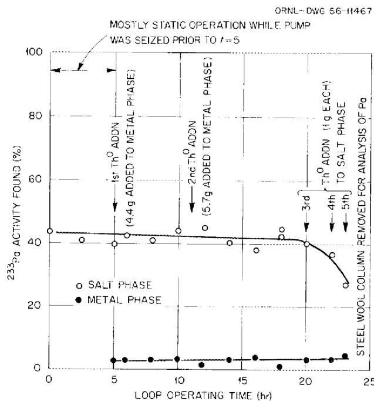  
Fig. 7.10. Behavior of $^{233}\mathrm{Pa}$ in Pump Loop During Second Extraction Experiment (Th0 Added to Bi Except Where Noted).

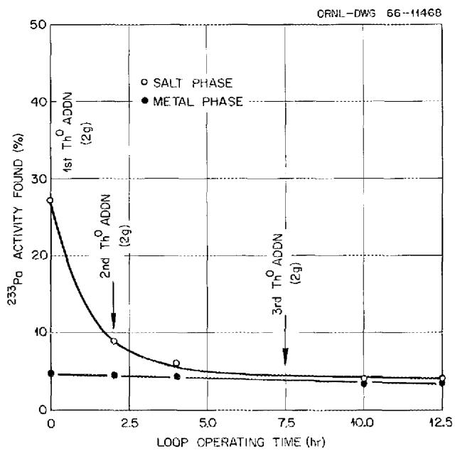  
Fig. 7.11. Behavior of $^{233}\mathrm{Pa}$ in Pump Loop During Third Extraction Experiment (Th0 Added to Salt Phase).

the salt phase. About $19\%$ of the $^{233}\mathrm{Pa}$ was on the column, giving an $82.6\%$ recovery for this third experiment.

Chemical analyses were obtained on salt samples taken during the second and third extraction experiments. Concentrations of iron ranged randomly from 100 to 170 ppm, while chromium and nickel were virtually absent at reported values of less than 10 ppm. The niobium content of the salt phase was consistently below the detectable level of 4 ppm. Values for the concentration of bismuth in the salt mixture ranged from 67 to 264 ppm in a random manner; the arithmetic average concentration from all samples was 119 ppm. However, it was not possible, under the experimental conditions, to ascertain whether these values represented dissolved bismuth or droplets suspended in the salt mixture. The values did not, however, reflect the pumping speed of the bismuth or a dependence on time.

Discussion and Conclusions. The protactinium balance for the complete experiment shows that $96\%$ of the $^{233}\mathrm{Pa}$ originally in the salt phase was removed by thorium metal additions. At least $43\%$ was pumped as a solution or suspension in molten bismuth and deposited on rather small volumes of steel wool. Since an additional $4\%$ of the $^{233}\mathrm{Pa}$ remained in each of the two liquid phases, we can account for about $51\%$ of the protactinium.

Although large amounts of thorium were added to the system, the concentration in bismuth remained very low. Considerable thorium had to be added in the first experiment before any protactinium was extracted from the salt. Additional thorium was consumed without extraction of protactinium at the beginning of the second experiment, which followed the changeout of the steel wool column. Reduction of some metal fluoride impurities from the salt was evident, but the amount was not sufficient

to account for all the thorium losses. Some high-melting metallic plugs were taken from the system, and the spectrographic analyses showed them to contain high concentrations of thorium associated with iron and chromium.

The collection of protactinium on the steel wool columns appeared to be primarily a filtration process, although some surface absorption also was apparent. We expected some mass transfer of iron in the polythermal loop system, but it appears that the transfer was aggravated by the presence of thorium. We believe that iron, chromium, and thorium, accompanied by some of the protactinium, formed compounds of low solubility in bismuth at the operating temperature. Precipitates formed, some of them collected on the filter, but the remainder collected in other parts of the system to account for the thorium and protactinium losses. This suggests that a more resistant material, such as niobium, would be desirable for use in the extraction equipment.

The pump-loop experiments will be continued. The next one is planned to demonstrate recovery of protactinium from the liquid-metal stream by contacting the bismuth with a molten salt that is saturated with a mixture of HF and $\mathsf{H}_2$ .

Protactinium Studies in the High-Alpha Molten-Salt Laboratory - C. J. Barton

An experiment on the removal of protactinium from a breeder-blanket mixture LiF-ThF $_4$ (73-27 mole %) having an initial concentration of 25 ppm of $^{231}\mathrm{Pa}$ was described in the previous report. $^{27}$ Reduction of protactinium was effected by metallic thorium in the presence of lead at about $625^{\circ}\mathrm{C}$ . The fact that only a small fraction of the reduced protactinium was found in the liquid lead encouraged study of other reduction techniques.

Reduction with Solid Thorium. Several experiments were performed to study the reduction of protactinium in $\mathrm{LiF - ThF_4}$ (73-27 mole %) by solid thorium in the form of a rod or turnings. Three different container materials were used: nickel, copper, and graphite. The first experiment was conducted in a nickel container with a 3/8-in.-OD thorium rod. The $^{231}\mathrm{Pa}$ content of the salt mixture, based on analysis of filtered samples, dropped from 11.1 to 0.09 mg during the initial 65-min exposure of the rod to the molten fluoride mixture at $625^{\circ}\mathrm{C}$ . A further 5-hr exposure at the same temperature produced an apparent increase in $^{231}\mathrm{Pa}$ content to 0.54 mg. A large fraction (approximately 70%, or 28 g) of the part of the rod that was immersed in the molten-salt mixture was lost during the experiment. We believe that the thorium rod was in contact with the bottom of the nickel pot during this experiment, causing a current flow that corroded the rod electrolytically. The salt mixture removed from the nickel pot contained a large amount of black material, part of which was magnetic. The analysis of the magnetic part showed 45% Ni, 30% Th, and 0.015% $^{231}\mathrm{Pa}$ . The black, nonmagnetic material contained 22% Ni, 50% Th, and 0.027% $^{231}\mathrm{Pa}$ .

A second experiment, performed under conditions described above except that care was exerted to avoid contact of the thorium rod with the nickel pot, gave more readily understandable results. The $^{231}\mathrm{Pa}$ concentration of a filtered sample of the salt dropped to $30\%$ of the initial concentration (32 ppm) after a 1-hr exposure and to $19\%$ after the second hour of exposure. A ground sample of the unfiltered salt removed from the pot at the conclusion of the experiment had a higher concentration of $^{231}\mathrm{Pa}$ than the initial filtered sample. This may have been due, in part, to the fact that the precipitated protactinium was redissolved by $\mathrm{HF - H_2}$ treatment in a smaller volume of fused salt than was present at the beginning of the experiment because of the removal of a significant fraction (about $2.5\%$ ) of the salt in each filtered sample.

The next experiment was similar to the previous one except that thorium turnings supported in a nickel-plated copper screen were exposed to the melt for 65 min and the $^{231}\mathrm{Pa}$ concentration of filtered salt decreased to $9\%$ of the initial value. The screen came loose from its supporting rod when we attempted to remove it from the pot, and it remained in the molten mixture. Consequently, it was necessary to dissolve the thorium metal by prolonged treatment with an $\mathrm{HF - H_2}$ mixture in order to redissolve the precipitated protactinium. The $^{231}\mathrm{Pa}$ concentration of a filtered sample was $92\%$ of the initial concentration after a 170-min $\mathrm{HF - H_2}$ treatment, and, after an additional 43-min treatment, an unfiltered sample showed a content equal to $96\%$ of the initial value.

In the fourth thorium reduction experiment, we again exposed the melt containing 19 ppm of $^{231}\mathrm{Pa}$ to thorium turnings held in a nickel-plated copper screen and found that a 120-min exposure removed $97.5\%$ of the protactinium from solution, as determined in a filtered sample. This time, however, we removed the basket and turnings from the melt, cooled to room temperature with a helium atmosphere in the pot, and disassembled the apparatus to determine the distribution of reduced protactinium. The recovered salt contained $51\%$ of the amount of $^{231}\mathrm{Pa}$ present at the beginning of the experiment, the basket and contents had $20\%$ , the wall had $7\%$ , while the dip leg and magnetic material removed from the salt (plus particles produced in sawing through the nickel pot) each contained about $1\%$ . About $16\%$ of the protactinium was unaccounted for.

Experiments very much like that described in the previous paragraph were conducted in copper and graphite containers to study the effect of container material on distribution of reduced protactinium. In both cases, approximately $60\%$ of the recovered protactinium was found in the ground, unfiltered salt (and untreated with HF and $\mathbf{H}_2$ ), although only $5\%$ of the initial protactinium concentration was present in the final filtered sample of reduced salt in the graphite container experiment and $29\%$ in the copper container. It appears, therefore, that a large fraction of reduced protactinium remains suspended in the molten LiF-ThF4 mixture regardless of the container material.

Electrolytic Reduction of Protactinium in LiF-ThF $_4$ (73-27 Mole %). A series of exploratory experiments on the electrolytic reduction of protactinium in molten LiF-ThF $_4$ (73-27 mole %) has been conducted with a variety of electrode arrangements. None of these arrangements has been explored in detail, and the preliminary results obtained in some cases

are more confusing than enlightening. Consequently, these experiments will be summarized very briefly.

Graphite anode - nickel vessel cathode - 3.0 v and 0.5 amp: The protactinium content decreased during the first hour of electrolysis and then increased during the second and third hours for reasons that are not all clear.

Silver anode - graphite liner or nickel dip leg as cathode - 3.0 v and about 1 amp: About $20\%$ reduction in $^{231}\mathrm{Pa}$ concentration after electrolyzing for 2 hr.

Thorium rod anode - thorium rod cathode - graphite liner - 3.0 v and about 1.6 amp: Removed $95\%$ of $^{231}\mathrm{Pa}$ during 70-min electrolysis (filtered sample), but $95\%$ of the initial $^{231}\mathrm{Pa}$ concentration was found in the unfiltered salt.

Nickel rod immersed in bismuth connected to negative side of 6.0-v battery - nickel rod immersed in the molten fluoride connected to positive pole of battery - 5.0 v and about 2.7 amp: No reduction in protactinium content of salt, and only a trace amount was found in the bismuth.

Another construction of the previous experiment with bismuth cathode (i.e., nickel dip leg contacting both salt and bismuth) - graphite anode contacting fluoride mixture only - graphite liner - 5.0 v and 0.5 amp: Again, there was no significant reduction in the protactinium content of the salt. About $0.02\%$ of the protactinium was found in the last filtered sample of bismuth as compared to $0.4\%$ in the unfiltered bismuth. The latter also contained $6.3\%$ nickel.

Conclusions. Protactinium dissolved in molten LiF-ThF4 can be reduced to a form that does not pass through a sintered copper filter, but a large part of the precipitated protactinium remains suspended in the molten mixture.

Exploratory experiments on electrolytic reduction of protactinium have not produced encouraging results to date, but we are continuing to pursue this approach to the protactinium removal problem because of its potential simplicity.

# 7.4 Radiation Chemistry

Xenon Diffusion and Possible Formation of Cesium Carbide in an MSBR -- C. F. Baes, Jr., and R. B. Evans III

Previously, several investigators have considered the neutron poisoning effect caused by diffusion of $^{135}\mathrm{Xe}$ into the graphite moderator of a molten-salt reactor.[28-32] It is the present purpose to consider as well the effects of the cesium which is born within the graphite by decay of the various fission product xenon nuclides which have diffused there. In

particular, it is of interest to estimate whether or not sufficient concentrations of cesium might occur to form (lamellar) cesium carbides, as by

$$
\mathrm {C s} ^ {0} (\mathrm {g}) + \mathrm {n C} (\mathrm {s}) \rightleftharpoons \mathrm {C s C} _ {\mathrm {n}} (\mathrm {s}),
$$

and whether or not a sufficient amount of $\mathbf{C}\mathbf{s}\mathbf{C}_{\mathfrak{n}}$ could be formed to damage the graphite in a full-scale MSBR.

In an attempt to answer these questions, the partial pressure of cesium within the graphite void spaces was calculated using the following model and assumptions:

1. Diffusion of gaseous xenon into the graphite void spaces and diffusion of gaseous cesium out of the graphite were approximated as one dimensional; that is, the moderator was represented as a slab of graphite infinite in two dimensions, with a specified thickness (2L), immersed in the fuel salt.

2. All cesium born in the graphite was assumed to be in the gaseous elemental form. Cesium born in the fuel salt or reaching the fuel salt by diffusion from the graphite was assumed to be oxidized to $\mathrm{Cs}^+$ and to remain in the salt.

3. Steady-state conditions were assumed.

The resulting expressions and the parameters employed (which correspond approximately to the present MSBR reference design33) are summarized in Table 7.8. The steady-state partial pressure of each cesium nuclide $(\mathsf{P}_{\mathrm{Cs}})$ was a function of the depth into the graphite $(\mathbf{x})$ , the porosity of the graphite $(\epsilon)$ , the partial pressure of the parent xenon at the salt-graphite interface $(\mathsf{P}_{\mathrm{Xe}}^0)$ , the diffusion coefficients of cesium and xenon $(D, \text{assumed to be the same for both})$ , and the appropriate decay constants $(\lambda)$ and neutron capture cross sections $(\sigma)$ . The xenon partial pressure at the salt-graphite interface $(\mathsf{P}_{\mathrm{Xe}}^0)$ was, in turn, a function of several terms: Y corresponds to the xenon production rate; S reflects the xenon loss from the fuel salt by decay, stripping, and burnup; G reflects diffusion of xenon into the graphite; and, finally, F is a factor reflecting the effect of the film coefficient H at the salt-graphite interface. (This film coefficient is defined by the relationship for the flux $J_{\mathrm{Xe}}$ ,

$$
J _ {X e} = H \left(C _ {X e} - C _ {X e} ^ {0}\right),
$$

wherein $C_{Xe}$ is the concentration of the nuclide in the bulk of salt and $C_{Xe}^{0}$ is the concentration in equilibrium with $P_{Xe}^{0}$ at the interface.) The terms S, F, and G also appear in the $^{135}\mathrm{Xe}$ poison factor, which is the ratio of the $^{135}\mathrm{Xe}$ poison fraction under the conditions specified to the maximum possible poison fraction, approximately 0.005.

The rather cumbersome expressions in Table 7.8 were evaluated with a computer. The effects of variations in the gas stripping rate $(\lambda_{\mathrm{ST}})$ ,

Table 7.8. Calculation of ${\mathrm{{Cs}}}^{0}$ Partial Pressure and of ${}^{135}\mathrm{{Xe}}$ Poisoning   

<table><tr><td colspan="2">Parametersa</td><td>Assigned Values</td><td>MSRE Values</td></tr><tr><td>φ</td><td>Average thermal-neutron flux, cm-2sec-1</td><td>7 × 1014</td><td>1.5 × 1013</td></tr><tr><td>C25</td><td>235U concentration in fuel, moles/cm3</td><td>2 × 10-4</td><td>1.8 × 10-4</td></tr><tr><td>T</td><td>Temperature of core, °K</td><td>873</td><td>873</td></tr><tr><td>QH</td><td>Henry&#x27;s law distribution coefficient for xenon</td><td>6000</td><td>6000</td></tr><tr><td>VT/Vc</td><td>Ratio of total fuel volume to fuel volume in flux</td><td>4.37</td><td>4.0</td></tr><tr><td>A/Vc</td><td>Ratio of graphite area to fuel volume in flux, cm-1</td><td>2.0</td><td>2.5</td></tr><tr><td>L</td><td>Half thickness of graphite slab, cm</td><td>0.5</td><td>2</td></tr><tr><td>ε</td><td>Porosity of graphite</td><td>0.05</td><td>0.09</td></tr><tr><td>λST</td><td>Fraction of fuel stripped per second, sec-1</td><td>0.001-0.1</td><td>0.0004-0.002</td></tr><tr><td>D</td><td>Effective diffusion coefficient for both Xe and Cs, cm2/sec</td><td>10-3-10-4</td><td>1.3 × 10-4</td></tr><tr><td>H</td><td>Film coefficient at salt-graphite interface, cm/sec</td><td>0.002-0.02</td><td>0.00045</td></tr></table>

Partial Pressure of Cs Nuclide in Graphite

$$
\mathrm {P} _ {\mathrm {C s}} = \mathrm {P} _ {\mathrm {X e}} ^ {0} \left[ \frac {\epsilon \lambda_ {\mathrm {X e}}}{\mathrm {D} _ {\mathrm {C s}} (\beta_ {\mathrm {X e}} ^ {2} - \beta_ {\mathrm {C s}} ^ {2})} \right] (\mathrm {E} _ {\mathrm {C s}} - \mathrm {E} _ {\mathrm {X e}}) \left\{ \begin{array}{l} \beta_ {\mathrm {i}} = \sqrt {\epsilon (\lambda_ {\mathrm {i}} + \sigma_ {\mathrm {i}} \phi) / \mathrm {D} _ {\mathrm {i}}} \\ \mathrm {E} _ {\mathrm {i}} = \left[ \begin{array}{c c c} \beta_ {\mathrm {i}} \mathrm {x} & & \beta_ {\mathrm {i}} (2 \mathrm {L} - \mathrm {x}) \\ \mathrm {e} ^ {-} & + \mathrm {e} ^ {-} \end{array} \right] / (\mathrm {e} ^ {2 \beta_ {\mathrm {i}} \mathrm {L}} + 1) \end{array} \right.
$$

Partial Pressure of Xe Parent at Salt-Graphite Surface

$$
\left. \begin{array}{l} \mathrm {P} _ {\mathrm {X e}} ^ {0} = \frac {\mathrm {Y}}{\mathrm {F S} + \mathrm {G}} \\ 1 3 5 \mathrm {X e P o i s o n F a c t o r} \\ \mathrm {P . F .} = \frac {\sigma_ {1 3 5} \phi}{\sigma_ {1 3 5} \phi + \lambda_ {1 3 5}} \left[ \frac {\left(\sigma_ {1 3 5} \phi + \lambda_ {1 3 5}\right)}{\frac {\mathrm {Q} _ {\mathrm {H}}}{\mathrm {S} + \frac {\mathrm {G}}{\mathrm {F}}} + \frac {\mathrm {G}}{\mathrm {F}}} \right] \\ \end{array} \right\} \quad \begin{array}{l} \mathrm {Y} = \mathrm {y} _ {\mathrm {X e}} \sigma_ {2 5} \mathrm {C} _ {2 5} \phi \mathrm {R T} \\ \mathrm {S} = \frac {\left(\mathrm {v} _ {\mathrm {T}} / \mathrm {v} _ {\mathrm {c}}\right) \left(\lambda_ {\mathrm {X e}} + \lambda_ {\mathrm {S T}}\right) + \sigma_ {\mathrm {X e}} \phi}{\mathrm {Q} _ {\mathrm {H}}} \\ \mathrm {F} = 1 + \frac {\mathrm {Q} _ {\mathrm {H}} \mathrm {D} _ {\mathrm {X e}} \beta_ {\mathrm {X e}}}{\mathrm {H}} \frac {\left(\mathrm {e} ^ {2 \beta_ {\mathrm {X e}}} - 1\right)}{\left(\mathrm {e} ^ {2 \beta_ {\mathrm {X e}}} + 1\right)} \\ \mathrm {G} = \frac {\mathrm {A D} _ {\mathrm {X e}} \beta_ {\mathrm {X e}}}{\mathrm {V} _ {\mathrm {c}}} \frac {\left(\mathrm {e} ^ {2 \beta_ {\mathrm {X e}}} - 1\right)}{\left(\mathrm {e} ^ {2 \beta_ {\mathrm {X e}}} + 1\right)} \end{array}
$$

$a_{y}, \sigma, \lambda$ denote, as usual, the yield, neutron capture cross section, and decay constant of a given nuclide.

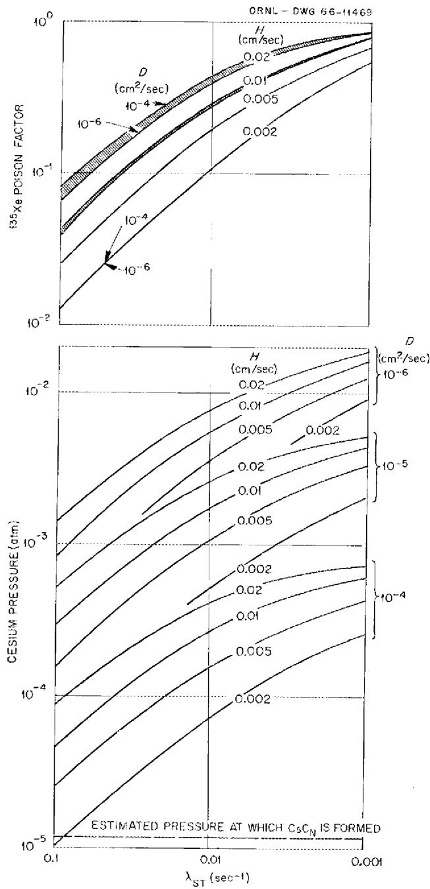  
Fig. 7.12. Calculated Steady-State Pressure of Cesium at Center of Graphite Slab as a Function of the Gas Stripping Rate $(\lambda_{\mathrm{ST}}^{\prime})$ , the Diffusion Coefficient (D), and the Film Coefficient (H). Other conditions are specified in Table 5.8. The upper curves show the corresponding variation in the $^{135}\mathrm{Xe}$ poison factor.

the diffusion coefficients (D), and the film coefficient (H) were determined.

Cesium Carbide Formation. The maximum total pressure of cesium (at the center of the graphite slab) was found to increase as D was decreased (Fig. 7.12). This is a paradoxical result since it is usually thought desirable that the graphite possess the lowest possible D values. In the range of D values tested here, however, the rate-controlling step in the diffusion of parent xenon into the graphite appeared to be at the salt-graphite interface (see below) and did not depend significantly upon D.

As a result, lowering D for xenon and cesium appreciably decreased only the diffusion of cesium out of the graphite, causing the steady-state accumulation of cesium $(\overline{\mathsf{P}_{\mathrm{CS}}})$ to be higher.

Included for comparison in Fig. 7.12 is the partial pressure of cesium at which carbide formation might be expected at $600^{\circ}\mathrm{C}$ , based on an estimate by Manowitz.[34] It appears that in all cases tested the cesium partial pressure in the graphite was high enough to produce carbide formation. As a consequence, it is likely that the actual quantities of cesium which could accumulate within the graphite will be higher than estimated in the present calculations. While no detailed calculation of this effect was attempted, considerable comfort may be found in the following observations.

1. By the present calculations the amount of cesium accumulation in the graphite is very small; even with a xenon partial pressure as high as 0.01 atm, for example, there would be only 1 atom of cesium present for every 25,000,000 atoms of carbon. At acceptably low $^{135}\mathrm{Xe}$ poisoning levels, the calculated maximum cesium concentration would be approximately 100-fold ( $10^{-4}$ atm) lower than this. Thus, although the present estimates of cesium accumulation would probably be increased if carbide formation occurs, an enormous increase (e.g., $10^{5}$ -fold) in the accumulation could occur before it would become a matter of concern.   
2. Even if it were assumed that all the cesium born in the graphite were to remain there, the rate of accumulation would be low. Thus, under the most unfavorable conditions tested (H = 0.02 cm/sec, λST = 0.001 sec⁻¹, and D = 10⁻⁶ cm²/sec, which gave a ¹³⁵xe poison factor of 0.9), the total of all xenon nuclides entered the graphite at a rate

$$
\sum J _ {X e} = \frac {V _ {c}}{R T A} \quad \sum G P _ {X e} ^ {0} = 1. 2 9 \times 1 0 ^ {- 1 1} \text {m o l e c m} ^ {- 2} \sec^ {- 1},
$$

so low that even if it all were to decay to cesium, 150 days would be required to produce a cesium-to-carbon ratio of 1:1000. With more realistic calculations and a more realistic calculation of the accumulation rate - in particular, a calculation which includes the diffusion of CsC as well as gaseous cesium out of the slab - much lower accumulation rates undoubtedly would result.

$^{135}\mathrm{Xe}$ Poisoning. For most of the values of D and H chosen here, the rate-determining step was the transfer of xenon across the film at the salt-graphite interface (i.e., F >> 1 and G/F $\rightarrow$ AH/VQH). Hence the poison fraction was not very dependent upon D, but rather was determined almost entirely by the magnitude of H and λST (Figs. 7.13 and 7.14). This result, it should be noted, is compatible with the assumption of one-dimensional diffusion in the graphite; that is, if the rate step instead had been in the graphite, such a crude model would have been more questionable.

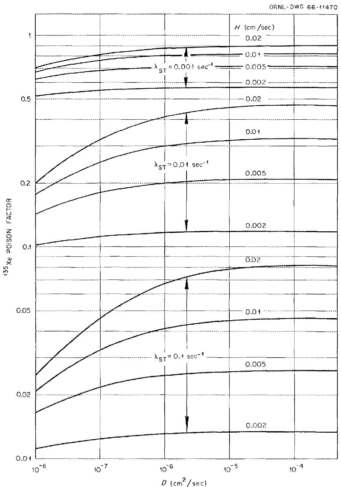  
Fig. 7.13. Dependence of the Xenon Poison Factor on the Diffusion Coefficient.

The $^{135}\mathrm{Xe}$ poison factor, as well as the cesium partial pressures, could of course be reduced either by increasing $\lambda_{\mathrm{ST}}$ or decreasing H (Fig. 7.14); however, it seems unlikely that in practice the stripping rate could greatly exceed 0.01 (corresponding to a removal half-time of approximately 1 min) or that H would normally be kept below 0.01 cm/sec. Approximately these conditions evidently must be met if the poison factor is to be held below 0.1 (poison fraction approximately 0.005).

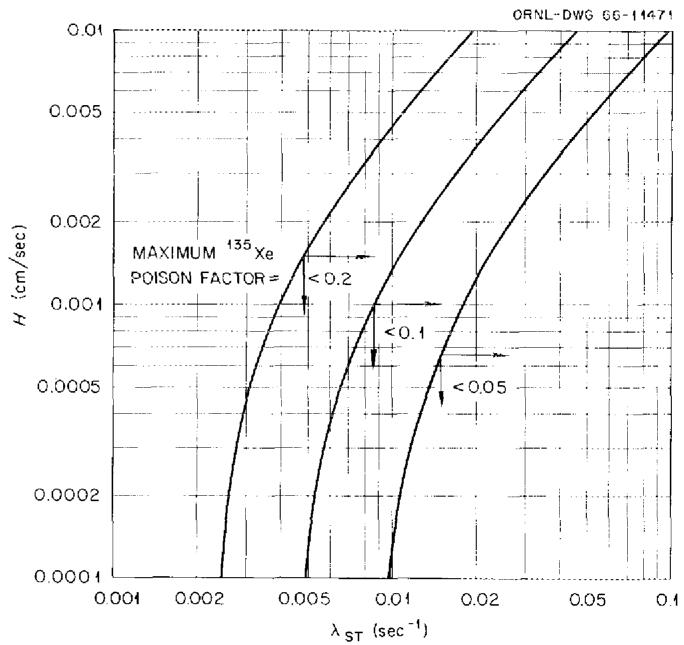  
Fig. 7.14. Approximate Boundary Values of the Stripping Rate and the Film Coefficient Calculated for Various Xenon Poisoning Limits in the Absence of Iodine Stripping.

Iodine Removal. Removal of iodine (as HI) by HF sparging of the salts would be an effective way of reducing the $^{135}\mathrm{Xe}$ poison fraction, provided the overall removal rate is large compared with the decay rate of $^{135}\mathrm{I}$ $(2.89 \times 10^{-5} \mathrm{sec}^{-1}, t_{1/2} = 6.7 \mathrm{hr})$ - and it seems likely that this could be done. $^{35}$ The amount of the reduction in the case of $^{233}\mathrm{U}$ fission-ing could be as much as a factor of 5, limited by the $18 \pm 3\%$ of the $^{135}\mathrm{Xe}$ being produced directly from fission.

This treatment is relatively ineffective in reducing the cesium partial pressure, however, because the principal contributors to it are mass numbers 137 and 138, which have short-lived iodine precursors ( $\lambda = 0.03$ and $0.12 \, \text{sec}^{-1}$ respectively).

Salt Impregnation. Impregnation of the graphite to a limited depth with the fuel salt would be an effective means to reduce the rate of xenon diffusion into the graphite by virtue of the fact that both the xenon diffusion coefficient and the xenon concentration would be roughly four orders of magnitude lower in an interstitial salt phase than in an interstitial gas phase.

This situation can be represented within the framework of the present calculations by the simple procedure of considering the interpenetration-salt-graphite barrier as the film to which H refers. Comparison of the equation which defines H in a normal film,

$$
J = H (C - C ^ {0}),
$$

with the equation which would define the diffusion coefficient in the salt-graphite barrier,

$$
J = - D \frac {d c}{d x},
$$

shows that it is reasonable to approximate $\mathbb{H}$ for such a barrier by

$$
\mathrm {H} \sim \mathrm {D} / \mathrm {t},
$$

where $t$ is the depth of salt penetration. The effective $D$ for this salt-graphite barrier should be in the range $10^{-7}$ to $10^{-8} \, \text{cm}^2/\text{sec}$ for MSRE-type graphite (i.e., $D$ for xenon in the molten salt times the porosity/tortuosity factor). Assuming a penetration depth of 0.1 cm, we can then place $H$ in the range $10^{-6}$ to $10^{-7}$ , which is at least three orders of magnitude below the minimum film factor estimated for an MSBR.

The consequences of such a small film coefficient are that diffusion of xenon into the graphite is no longer significant in determining the $^{135}\mathrm{Xe}$ poison factor (i.e., the terms containing $\mathbf{F}$ in the expression for the poison factor become negligible). The $^{135}\mathrm{Xe}$ poisoning is then determined only by $\lambda_{\mathrm{ST}}$ :

$$
P. F. = \frac {\sigma_ {1 3 5} \phi}{\left(V _ {T} / V _ {c}\right) \left(\lambda_ {1 3 5} + \lambda_ {S T}\right) + \sigma_ {1 3 5} \phi}.
$$

Summary. The present calculations indicate that cesium carbide formation can be expected to occur in an MSBR, but in such small amounts as to be of little concern. In addition, these calculations indicate that in the absence of iodine removal, xenon poisoning in a full-scale MSBR will be controlled primarily by a film coefficient H and will be reduced most effectively either by iodine removal or by some method which in effect reduces this film coefficient.

# Fission Product Behavior in the MSRE - S. S. Kirslis

The behavior of fission products in the MSRE is being studied to derive information bearing on the practical concerns of corrosion and neutron poisoning. Significant clues to the basic nature of Hastelloy N corrosion in a fissioning molten-salt environment are provided by observation of the volatilization and plating behavior of fission products whose oxidation states are relatively easily changed. The chemical fate of a number of fission product poisons is important in determining their contributions to the overall poisoning of a reactor. Thus, for example, it is of interest to determine what fraction of the $^{135}\mathrm{Xe}$ produced by fission in the melt is released to the cover gas before it becomes $^{136}\mathrm{Xe}$ by neutron capture. Likewise, it is important to determine whether noble-metal fission products which are moderate neutron poisons (Mo, Ru, Te, Nb, Pd, and Rh) remain in the circulating fuel, volatilize, or deposit

on graphite or Hastelloy N. The rare-earth fission product poisons, because of the chemical stability of their nonvolatile fluorides, are expected to remain in the circulating fuel.

There are unique advantages in carrying out fission product studies in an operating reactor rather than in small-scale laboratory or in-pile tests. First, in small-scale tests it is difficult to mock up realistically the geometry, the fuel circulation conditions, and other possibly significant factors of the reactor environment. Second, although the MSRE was not primarily designed for the chemist's convenience, several features make it rather well adapted to chemical studies. Most importantly, a facility exists for taking sizable samples of fuel salt from the pump bowl during reactor operation. In the same facility it is possible to expose selected metal samples to both the cover gas and the fuel melt in the pump bowl. Provisions exist for taking samples of the reactor cover gas and are being improved to permit continuous monitoring and the taking of concentrated samples. Finally, provisions were made for inserting removable long-term surveillance specimens of Hastelloy N and graphite in the reactor core of the MSRE. These facilities and advantages are available only with great difficulty in small-scale in-pile tests. The principal lacks from the chemist's viewpoint are facilities for direct sampling of the pump bowl cover gas and for exposing metal and graphite samples to the pump bowl atmosphere and fuel phase for longer periods of time.

This report on fission product behavior will cover the initial results from fuel salt sampling, from the exposure of metal samples to the pump bowl gas and liquid phases, from the first examination of the long-term surveillance specimens of graphite and Hastelloy N, and from the analysis of the first sample of reactor cover gas taken during reactor operation.

Fuel Salt Samples. Using the pump bowl sampling facility, a large number of 10- and 50-g fuel salt samples were taken during reactor operation to monitor changes in the concentrations of oxide, bulk fuel components, and corrosion products. Metal samples were attached to the 10-g sampling assembly for observation of the volatilization and plating behavior of fission products during five of the salt samplings. These five salt samples were delivered to the analytical hot cells within a few hours of sampling and were rapidly powdered, weighed, dissolved, and analyzed radiochemically for the 15 isotopes listed in Table 7.9. The strontium and cerium isotopes were determined as fission monitors, since these elements have convenient half-lives and stable fluorides which should remain in the melt. The ruthenium and molybdenum isotopes were representative of noble metals. The tellurium and iodine isotopes were of interest for their volatilization and plating properties as precursors of $^{135}\mathrm{Xc}$ . The $^{239}\mathrm{Np}$ and $^{239}\mathrm{Pu}$ isotopes were measured as indicators of the epithermal flux in the MSRE.

The data listed in Table 7.9 show that the strontium and cerium isotopes behaved in a regular and expected manner. The $^{91}\mathrm{Sr}$ and $^{143}\mathrm{Ce}$ isotopes appear to be the most reliable fission monitors for interrupted power operation. The average of the four values for $^{91}\mathrm{Sr}$ at the nominal

Table 7.9. Fission Products in MSRE Salt Samples   

<table><tr><td>Sample</td><td></td><td>FP6-17</td><td>FP6-19</td><td>FP7-7</td><td>FP7-10</td><td>FP7-12</td></tr><tr><td>Date and sampling time</td><td></td><td>5-23, 0400</td><td>5-26, 0400</td><td>6-27, 0243</td><td>7-6, 0208</td><td>7-13, 0336</td></tr><tr><td>Operating timea days</td><td></td><td>2.0</td><td>2.5</td><td>13.3</td><td>4.2</td><td>11.9</td></tr><tr><td>Nominal power, Mw</td><td></td><td>5.6</td><td>7.3</td><td>7.2</td><td>7.2</td><td>7.2</td></tr><tr><td></td><td>Fission Yield (%)</td><td colspan="5">Disintegrations per Minute per Gram of Saltb</td></tr><tr><td>9.67-hr 91Sr</td><td>5.81</td><td>1.08 × 1011</td><td>1.20 × 1011</td><td>1.16 × 1011</td><td>1.31 × 1011</td><td>1.32 × 1011</td></tr><tr><td>2.6-hr 92Sr</td><td>5.3</td><td>9.8 × 1010</td><td>1.19 × 1011</td><td>9.70 × 1010</td><td>1.51 × 1011</td><td>1.49 × 1011</td></tr><tr><td>51-day 89Sr</td><td>4.79</td><td>1.80 × 1010</td><td>2.23 × 1010</td><td>2.96 × 1010</td><td>2.93 × 1010</td><td>3.96 × 1010</td></tr><tr><td>33-day 141Ce</td><td>6.0</td><td>2.65 × 1010</td><td></td><td>6.10 × 1010</td><td>6.69 × 1010</td><td>6.88 × 1010</td></tr><tr><td>33-hr 143Ce</td><td>5.7</td><td></td><td>1.45 × 1011</td><td>1.5 × 1011</td><td>1.43 × 1011</td><td>1.32 × 1011</td></tr><tr><td>66-hr 99Mo</td><td>6.06</td><td>4.68 × 1010</td><td>3.51 × 1011?</td><td>9.51 × 1010</td><td>1.10 × 1011</td><td>3.15 × 1010</td></tr><tr><td>39.7-day 103Ru</td><td>3.0</td><td>1.81 × 108</td><td>7.05 × 109</td><td>2.42 × 109</td><td>6.02 × 109</td><td>7.14 × 109</td></tr><tr><td>4.45-hr 105Ru</td><td>0.9</td><td>4.9 × 1010</td><td>2.47 × 1011?</td><td>3.50 × 1010</td><td>9.67 × 1010</td><td>3.76 × 1010</td></tr><tr><td>1.01-year 106Ru</td><td>0.38</td><td>0</td><td></td><td></td><td></td><td>2.13 × 108</td></tr><tr><td>77-hr 132Te</td><td>4.7</td><td>3.12 × 1010</td><td>4.21 × 1010</td><td>5.15 × 1010</td><td>3.64 × 1010</td><td>3.81 × 1010</td></tr><tr><td>8.05-day 131I</td><td>3.1</td><td>2.45 × 1010</td><td>4.20 × 1010</td><td>5.0 × 1010</td><td>4.50 × 1010</td><td>5.36 × 1010</td></tr><tr><td>20.8-hr 133I</td><td>6.9</td><td>1.08 × 1011</td><td>1.31 × 1011</td><td>1.35 × 1011</td><td>1.40 × 1011</td><td>1.45 × 1011</td></tr><tr><td>6.7-hr 135I</td><td>6.1</td><td>9.5 × 1010</td><td>1.50 × 1011</td><td>1.17 × 1011</td><td></td><td>1.11 × 1011</td></tr><tr><td>2.33-day 239Np</td><td></td><td></td><td></td><td>5.35 × 1011</td><td>1.0 × 1012</td><td>1.08 × 1012</td></tr><tr><td>2.44 × 104-year Pu</td><td></td><td></td><td></td><td>7.00 × 105c</td><td>8.77 × 105c</td><td>1.20 × 106c</td></tr></table>

Table 7.10. Summary of Pump Bowl Test Results Averages of five runs   

<table><tr><td></td><td>99Mo</td><td>132Te</td><td>105Ru</td><td>103Rua</td><td>106Ru</td><td>135I</td><td>133J</td><td>131I</td></tr><tr><td>Salt, % of theoretical</td><td>60</td><td>30</td><td>&gt;100</td><td>30</td><td>15</td><td>90</td><td>100</td><td>98</td></tr><tr><td>Latch (Ni)</td><td>8xb</td><td>14X</td><td>10X</td><td>10X → 0.5X</td><td>6X</td><td>0</td><td>2X</td><td>1.5X</td></tr><tr><td>Silver</td><td>2X</td><td>6X</td><td>3X</td><td>3X → 1X</td><td>2X</td><td>0</td><td>1X</td><td>0.9X</td></tr><tr><td>Hastelloy N</td><td>1X</td><td>7X</td><td>3X</td><td>25X → 0.3X</td><td>1X</td><td>0</td><td>2X</td><td>0.5X</td></tr><tr><td>Liquid phase (ss)</td><td>4X</td><td>9X</td><td>5X</td><td>40X → 1X</td><td>1X</td><td>0</td><td>2X</td><td>0.8X</td></tr></table>

aPercent 103Ru deposited on metal samples uniformly decreased from first to fifth run. bX = disintegrations per minute of given isotope per gram of salt.

7.2-Mw power level is $1.25 \times 10^{11}$ dis min $^{-1}$ g $^{-1}$ . Using the formula

$$
\begin{array}{l} M w = \left[ (1. 2 5 \times 1 0 ^ {1 1} \text {d i s} \min  ^ {- 1} g ^ {- 1}) \times (4. 6 8 \times 1 0 ^ {6} g) \right. \\ \times (2 0 0 \text {M e v / f i s s i o n}) \times \left(1. 6 \times 1 0 ^ {- 1 9} \frac {\mathrm {M w}}{\mathrm {M e v / s e c}}\right) ] \div [ (\text {f r a c t i o n a l}. \\ \end{array}
$$

fission yield of $^{91}\mathrm{Sr}$ × (60 sec/min)]

the calculated fission power density is $5.4\mathrm{Mw}$ , or about $75\%$ of the nominal total power density. Using the average of the four $^{143}\mathrm{Ce}$ values at the nominal $7.2\mathrm{Mw}$ power, the calculated power is $6.3\mathrm{Mw}$ , or $87\%$ of the nominal value.

For molybdenum and ruthenium isotopes, the concentrations found in salt samples showed much more scatter, which may well be real. The first row of data in Table 7.10 shows the averages of the amounts of these isotopes found compared to the amounts calculated to be formed using $^{91}\mathrm{Sr}$ (arbitrarily) as the fission monitor in each run. The reason for the impossibly high values for $^{105}\mathrm{Ru}$ is being sought. The $^{132}\mathrm{Te}$ values varied little among the 7.2-Mw runs but represented low fractions of the total amount formed (Table 7.10). The iodine isotopes showed relatively little scatter, and the amounts found corresponded well with the amounts calculated from the $^{91}\mathrm{Sr}$ values.

The epithermal flux in the MSRE has not yet been calculated from the neptunium and plutonium values in Table 7.9.

Pump Bowl Volatilization and Plating Tests. Advantage was taken of the experimental possibilities of the pump bowl salt sampling facility to carry out some qualitative tests to detect the presence of chemically reactive fission product species in the pump bowl cover gas and to determine which fission products would plate on clean metal surfaces from the fuel salt phase.

The copper fuel salt sampling ladle is attached by a double stainless steel cable to a nickel-plated iron latch which fits into a mechanism for lowering and raising the assembly in a pipe leading from the pump bowl to the sampling cubicle above the reactor. To detect the presence of chemically reactive fission products in the gas phase, coils of 0.015-in.-diam silver and Hastelloy N wire were wound on the small stainless steel cables for a distance of 2 in. below the bottom of the latch. The latch and the wire coils were later leached and analyzed for gaseous fission products. The lower 2-in. lengths of the stainless steel cables just above the copper ladle were leached and analyzed similarly to determine which fission products plated from the fuel melt. Figure 7.15 shows the sampling assembly with wire coils attached. The sampling device was submerged in the pump bowl for times varying from 1 min to 10 min. It was then raised 2 ft and allowed to cool for 10 min and then raised to the sampling cubicle. The metal and salt samples were delivered in a carrier to the hot analytical laboratory, usually within 3 hr of the sampling time. The salt sample was prepared for analysis by the procedure summarized above. The stainless steel cables were clipped to provide separate samples of the latch, the silver coil, the Hastelloy N coil, and the stainless steel cable exposed to the fuel melt. The metal samples were leached first with an alkaline mixture of Versene, boric acid, and citric acid to remove iodine without volatilization. Then they were leached with a warm mixture of HNO₃ and HCl until the radioactivity was less than 1% of the original reading (usually greater than 500 r/hr at contact). Dilutions of the original leach solutions were sent to the radiochemical separations group for overall gamma scans and estimations of several individual isotopes.

The overall gamma scans showed that the principal activities in the metal samples exposed to the pump bowl gas phase were $^{132}\mathrm{Te}$ and $^{132}\mathrm{I}$ , with smaller amounts of $^{131}\mathrm{I}$ and $^{99}\mathrm{Mo}$ . The $^{140}\mathrm{Ba}-^{140}\mathrm{La}$ and $^{95}\mathrm{Zr}-^{95}\mathrm{Nb}$ peaks, which were prominent in the gamma spectra of fuel salt samples, were much lower in the metal samples. This indicates that the observed activities were not due to condensation of fuel salt mist on the metal specimens. Similarly, the gamma spectra of the submerged stainless steel samples were quite different from those of fuel salt. Correspondingly, no adhering particles of fuel salt were visible on any of the metal specimens. It was later found (Table 7.10) that the amounts of tellurium, ruthenium, and molybdenum deposited on the metal samples corresponded to the amounts in several grams of fuel salt.

The gamma scans indicated that quantitative radiochemical estimations for $^{132}\mathrm{Te}$ , $^{131}\mathrm{I}$ , and $^{99}\mathrm{Mo}$ would be useful. In addition, estimations were made of $^{133}\mathrm{I}$ , $^{135}\mathrm{I}$ , $^{103}\mathrm{Ru}$ , $^{105}\mathrm{Ru}$ , and $^{106}\mathrm{Ru}$ . The results of these analyses are summarized in Table 7.10. Although the exposure times for the five runs were 1, 2, 5, 10, and 10 min, there was no corresponding variation of amounts of the several isotopes deposited from either the gas or the liquid phases. The scatter of results for a given isotope between runs was large, often a factor of 2 and sometimes a factor of 5 or more. For these reasons, the averaged results given in Table 7.10 are more easily interpreted than a tabulation of the individual results. As in the case of some of the salt analyses, the observed scatter is much greater than the normal error of radiochemical analyses and undoubtedly

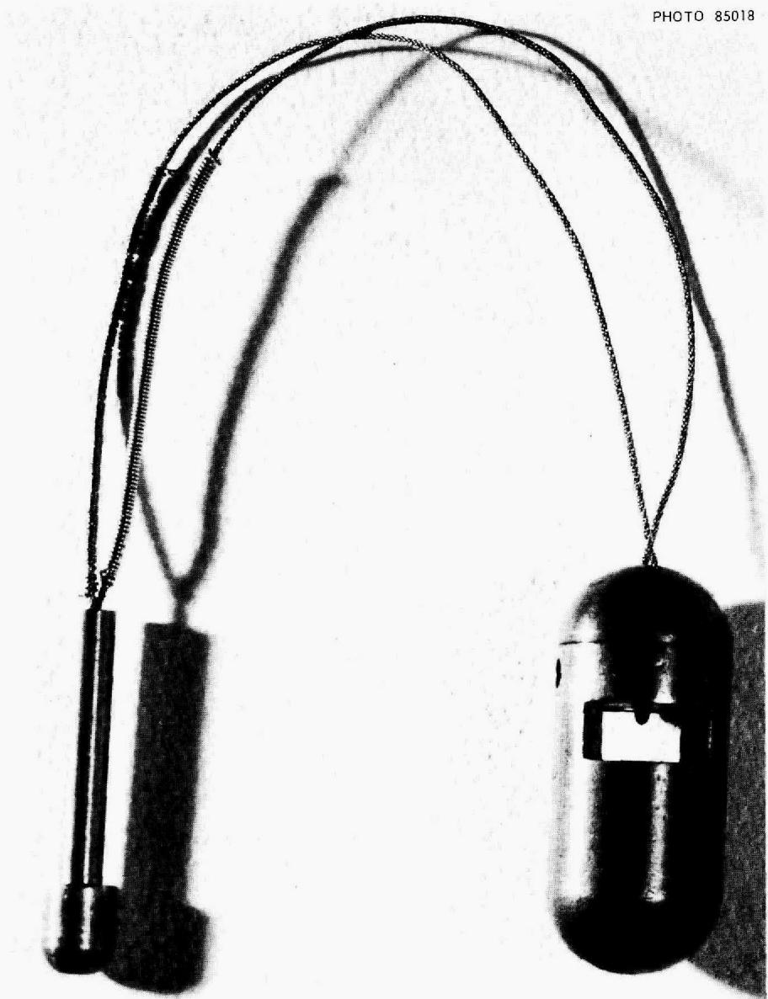

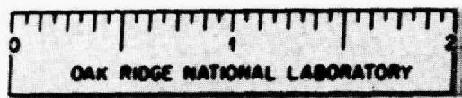  
Fig. 7.15. Pump Bowl Deposition Testing Assembly.

represents real large variations in the amounts deposited. The causes for these variations are as yet unknown.

The results in Table 7.10 reveal a striking degree of volatilization and plating of molybdenum, ruthenium, and tellurium on clean metal surfaces. Large amounts of $^{99}\mathrm{Mo}$ were found on the metal samples in both the gas phase and fuel phase of the pump bowl. Correspondingly, only about $60\%$ of the theoretical yield of $^{99}\mathrm{Mo}$ was found in the fuel salt

samples. The results for ruthenium were similarly spectacular. The fractions of the three ruthenium isotopes remaining in the salt decreased with increasing half-life, suggesting that slow reactions are removing ruthenium from the melt. In successive runs, the amount of 41-day $^{103}\mathrm{Ru}$ that deposited on metals steadily decreased from the first run to the last (although the exposure time of the samples increased from 1 to 10 min), as if the amount in solution were decreasing with time. This behavior is not explained.

For $^{132}\mathrm{Te}$ the amount remaining in the melt is also low (30%), and the corresponding gas- and liquid-phase depositions are high. For $^{131}\mathrm{I}$ , $^{133}\mathrm{I}$ , and $^{135}\mathrm{I}$ , most of the element remains in the melt, although high activities of $^{132}\mathrm{I}$ were observed on the gas-phase specimens. The short-lived $^{132}\mathrm{I}$ is, however, a daughter of the relatively long-lived $^{132}\mathrm{Te}$ , which was shown to volatilize readily. Rather less $^{133}\mathrm{I}$ and $^{131}\mathrm{I}$ was found on the metal specimens than of molybdenum, ruthenium, and tellurium. However, no $^{135}\mathrm{I}$ at all was detected on the metal specimens. Correspondingly, the tellurium precursor of $^{135}\mathrm{I}$ has a half-life of only 0.4 min, while $^{133}\mathrm{Te}$ and $^{131}\mathrm{Te}$ have half-lives of 63 and 24 min. Apparently very little tellurium can volatilize or plate in 0.4 min. It thus appears that the volatilization and plating characteristics of iodine are determined by the behavior of the precursor tellurium.

Tellurium and iodine had been detected in the gas lines of previous in-pile tests, but the volatilization of molybdenum and ruthenium was surprising. The only volatile compounds of molybdenum and ruthenium are those of valence 4 or greater. The plating behavior of tellurium, molybdenum, and ruthenium also indicates that these elements are present with valences greater than zero. However, all positively charged ions of these elements should be reduced to the metallic state by the metallic chromium in Hastelloy N. These considerations suggest that the Hastelloy N container vessel and piping of the MSRE may be protected by a layer of noble-metal fission products, permitting the existence of higher oxidation states in the melt. If it is assumed that $30\%$ of the noble metals produced by fission in the MSRE operating at $7.2\mathrm{Mw}$ are deposited on an estimated metal surface area of $10^{6}\mathrm{cm}^{2}$ , it may be calculated that the metal film would grow at the rate of about $0.3\mathrm{A/hr}$ . It is thus not unlikely that all the metal surfaces exposed to fuel in the MSRE are presently coated with several hundred angstroms of noble metals.

It is not a simple matter, however, to produce adherent pinhole-free electroplates, so that a plate hundreds of atoms thick might not protect against the reducing action of the base metal. Furthermore, it has been calculated on a very reasonable basis that approximately $1\%$ of the uranium in the fuel in the MSRE should exist in the trivalent condition. Noble-metal ion concentrations should be infinitesimal in the presence of this concentration of the strongly reducing $\mathrm{U}^{3+}$ . These very basic puzzles in elucidating noble-metal fission product behavior in the MSRE have not yet been solved.

Future pump bowl experiments will involve looking at the behavior of several more elements (noble metals, other cations with volatile fluorides, neutron-activated Hastelloy N corrosion products, etc.) and attempts to

take small samples of the pump bowl cover gas. The determination of the reducing power of the fuel salt would also be helpful in explaining fission product behavior.

Examination of the Graphite Surveillance Specimens. A package of MSRE graphite and Hastelloy N surveillance specimens has been exposed to a fissioning molten-salt environment along the central axis of the MSRE for 7800 Mwhr of power operation. After the reactor shutdown of July 17, 1966, the package was removed from the reactor and disassembled in a hot cell. Rectangular bars of graphite, 5 to 9 in. long, 0.66 in. wide, and 0.47 in. thick, from the bottom (inlet), middle, and top (outlet) of the reactor core were made available for detailed examination. The surveillance specimens were contained in a perforated cylindrical tube of Hastelloy N, 5-1/2 ft long, 2 in. in diameter, and 0.030 in. thick. Rings of this tube approximately 11/16 in. in height and 10 g in weight were sawed out of the bottom, middle, and top regions of the tube to provide Hastelloy N specimens for fission product deposition studies.

The graphite bars were first sectioned transversely with a thin Carborundum saw to provide specimens for photographic, metallographic, autoradiographic, x-radiographic, and surface x-ray examination. Specimens were saved for other possible tests (spark spectroscopy or electron probe). The remainders of the bars, 7 in. long for the middle specimen, 2-5/8 in. long for the bottom sample, and 2-7/8 in. long for the top sample, were used for milling off successive surface layers for fission product deposition studies.

(a) Visual, Autoradiographic, and X-Radiographic Examinations. The graphite specimens showed no visible signs of corrosion or chemical change. No metallic or salt films were discernible under low-power magnification, which revealed the original machining grooves on the graphite. The middle sample (Y-2) was known to have a crack near one end before insertion into the reactor. The crack was still visible after removal but had not propagated further. Some of the graphite specimens in one region of the package had cracked due to mechanical stresses caused by the uneven thermal expansion and contraction of the tightly packed Hastelloy N and graphite specimens. A small piece of the bottom sample (VA-1) had cracked off during the disassembly of the package. These cracks should not reflect on the overall integrity of the irradiated graphite specimens. Plints of an autoradiograph and an x radiograph of each of the three graphite specimens are shown in Figs. 7.16 to 7.18. The x radiographs were taken on thin (0.020- to 0.060-in.) transverse slices of the graphite bars. The autoradiographs were taken on adjacent transverse slices after mounting in epoxy resin and polishing for metallographic examination.

The x radiographs show no general deposition of fuel salt nor of heavy elements on the surface of the graphite. A hint of penetration or deposition is visible near one corner each of the bottom and top graphite samples. The crack in the middle sample is clearly penetrated by fuel salt. The edge of the cracked bottom sample shows no foreign material, indicating that the crack occurred after removal from the reactor.

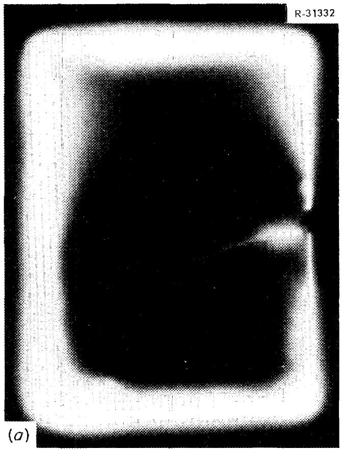

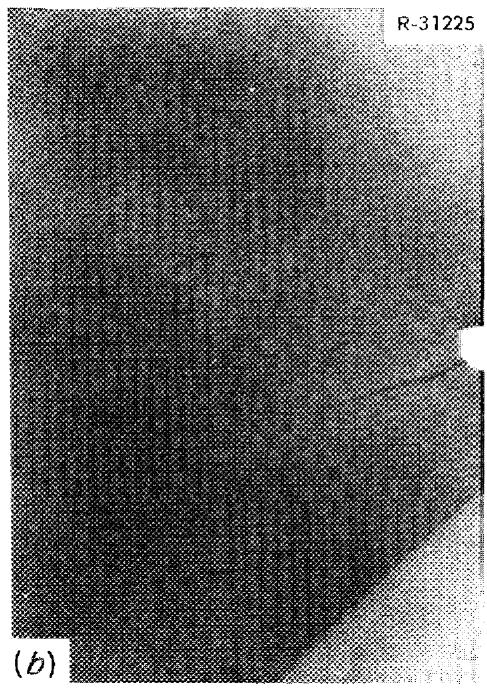  
Fig. 7.16. Autoradiograph (a) and X Radiograph (b) of Middle Graphite (Y-2).

The autoradiographs indicate a thin film of highly radioactive material on the exposed surfaces of the graphite and confirm the presence of salt in the crack of the middle specimen. These pictures also show that the penetration of the radioactive material into the interior of the graphite is by no means uniform. The nonuniform nature of the porosity of graphite has been demonstrated in gas permeability tests.

The observations described here are generally in accord with those from previous in-pile tests. The graphite is not visibly affected, and there are no signs of chemical attack, film formation, or salt penetration.

(b) Metallographic Examination. Metallographs of transverse sections of the three graphite bars are shown in Figs. 7.19 to 7.21. The structure of the graphite in all cases appeared normal and undamaged under both bright-field and polarized-light illumination. No metallic, carbide, or salt films were visible on the surfaces of the specimens. No sign of salt penetration was observed except in the case of the cracked middle specimen. Here voids were observed which probably had been filled with salt before polishing with a water suspension of the polishing compound. The other graphite specimens were polished under $\mathrm{CCl}_4$ to avoid dissolution of fuel salt.

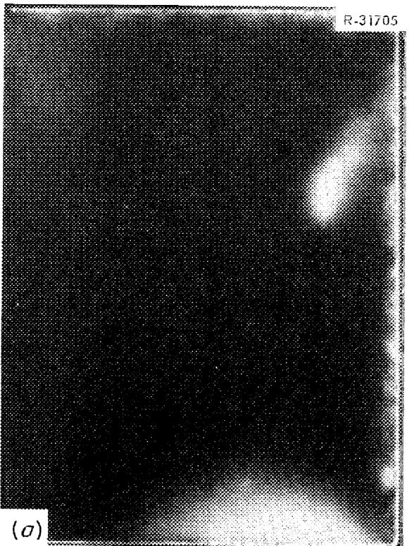

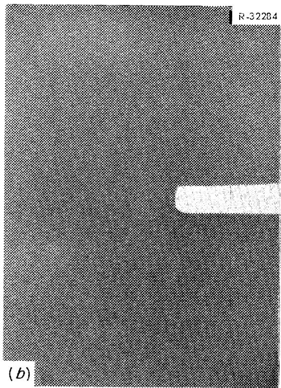  
Fig. 7.17. Autoradiograph (a) and X Radiograph (b) of Top Graphite (VH-5).

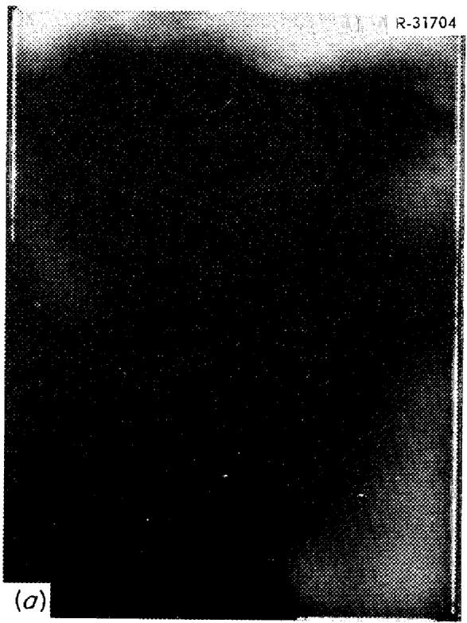

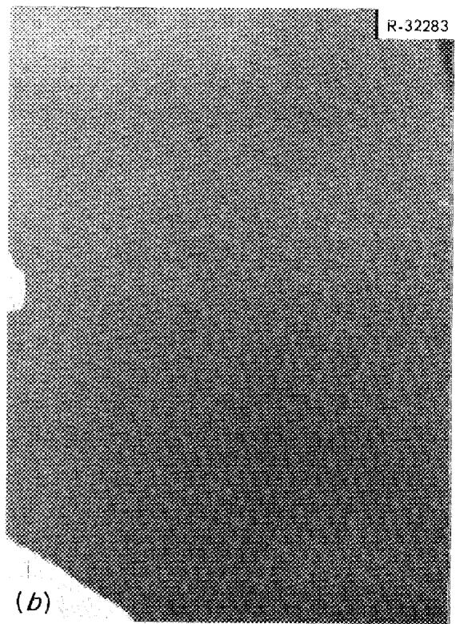  
Fig. 7.18. Autoradiograph (a) and X Radiograph (b) of Bottom Graphite (VA-1).

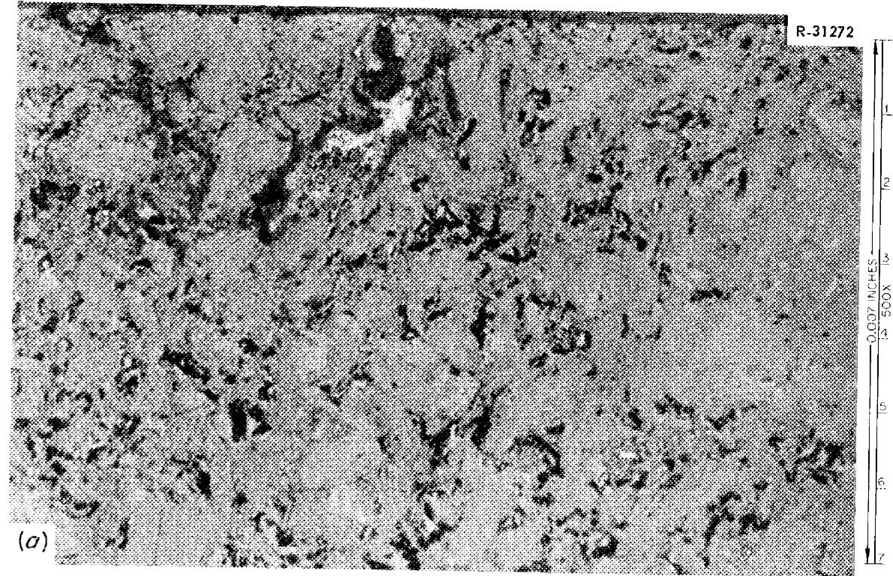

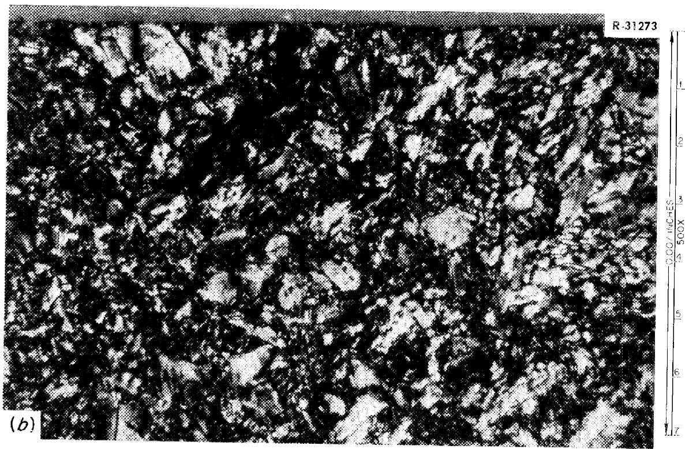  
Fig. 7.19. Metallographs of Middle Graphite (Y-2). (a) Bright field; (b) polarized light.

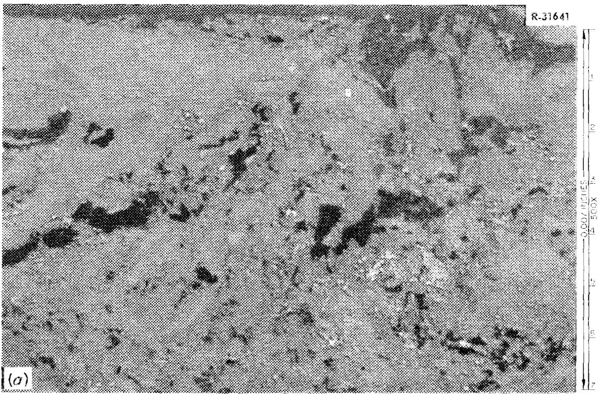

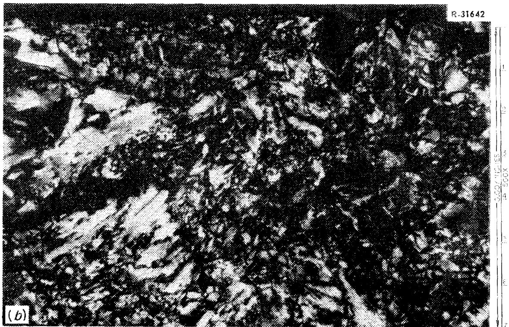  
Fig. 7.20. Metallographs of Top Graphite (VH-5). (a) Bright field; (b) polarized light.

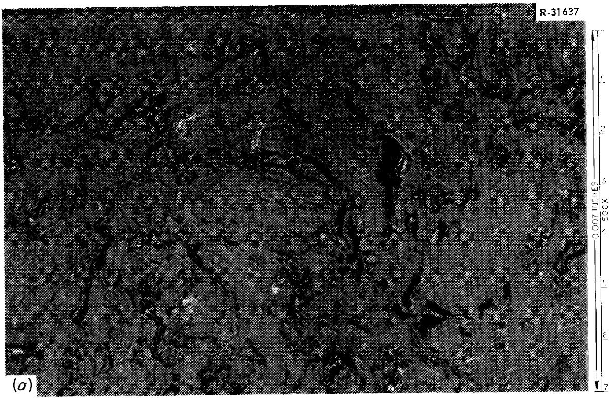

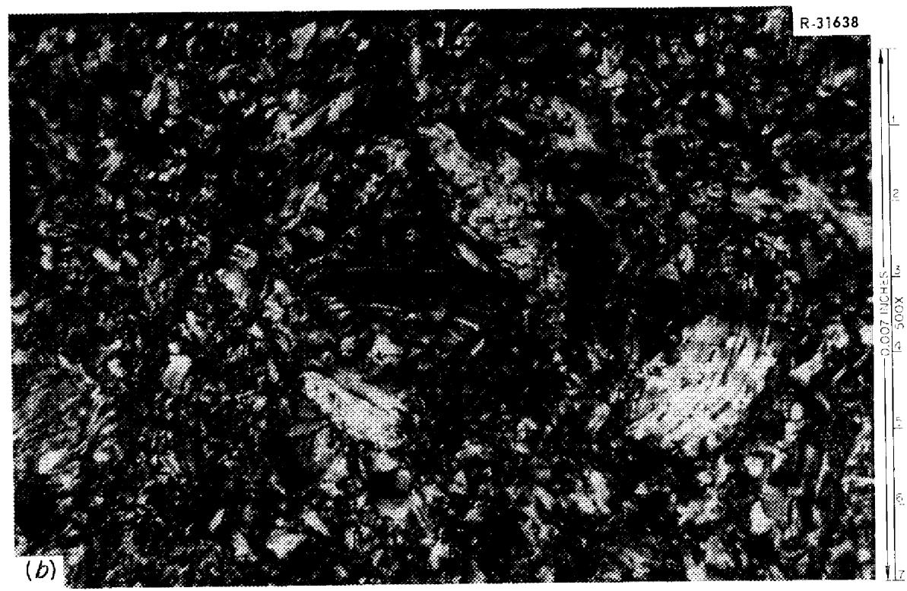  
Fig. 7.21. Metallographs of Bottom Graphite (VA-1). (a) Bright field; (b) polarized light.

A fuel-salt-exposed surface of the middle graphite bar was mounted for hot-cell x-ray examination of the surface for metallic films or other contamination. Only graphite lines were observed. Because of the negative result of this test, the other graphite specimens were not examined by the x-ray technique.

(c) Milling of Surface Layers of Graphite. The valuable contributions of J. G. Morgan, M. F. Osborne, and H. E. Robertson in planning, developing hot-cell methods for, and starting the work on the sampling of the graphite specimens are gratefully acknowledged. A very ingenious "planer" was designed and built by the Hot Cells Operation Group for milling thin layers from the four long surfaces of each of the graphite bars. The cutter and the collection system were so designed that a large fraction of the graphite dust removed was collected. By comparing the collected weights of the graphite samples with the weight loss calculated from the initial and final dimensions of the graphite bars and their known densities, the average sampling losses were $4.5\%$ for the middle bar, $18.9\%$ for the top bar, and $9.1\%$ for the bottom bar.

The patterns of sampling of the graphite surface layers are shown in Fig. 7.22. An identifying groove was cut along the length of the middle of the graphite surface which was pressed against another graphite surface in the original surveillance package. The other three surfaces were exposed to circulating fuel salt. The numbers of the layers in Fig. 7.22 indicate the order in which the layers were cut from the graphite bars. After each layer was cut from a bar, the milling apparatus and the bar were vacuumed to avoid cross contamination of samples. Each powdered graphite sample was placed in a small capped plastic bottle and weighed. The middle bar was measured with a micrometer to determine the depth of each cut. This time-consuming operation was omitted for the other two bars, since it became evident that the depth of cut could be more accurately calculated from the weight of the sample removed. The average depth of cut was 0.0075 in. for the middle bar and 0.011 in. for the other two bars. A clean unirradiated MSRE graphite specimen was sampled with the milling device in the standard manner after the ninth cut and after the last cut on the middle graphite bar to provide comparison samples to indicate the level of cross contamination in the hot-cell milling operation. As seen in Fig. 7.22, the salt-exposed surfaces of the middle bar were sampled to a depth of six or seven layers, or about 0.050 in. The surfaces in contact with graphite were more thoroughly sampled in the other bars.

(d) Fission Product Analyses in Graphite Samples. The powdered graphite samples were delivered to the Radiochemical Separations Group, and weighed portions were dissolved in a hot mixture of $\mathrm{HNO}_3$ and $\mathrm{H}_2\mathrm{SO}_4$ . The gases evolved were passed through a condenser, a charcoal trap, and an alkaline solution to recover any volatilized iodine or ruthenium. Aliquots of these solutions were analyzed radiochemically for the isotopes listed in Table 7.11. The first milled sample of each graphite surface was also analyzed for uranium by the fluorometric method. No uranium was detected with a sensitivity limit of about $30~\mu \mathrm{g}$ of uranium per square centimeter of graphite surface. This finding will be confirmed by more sensitive neutron activation methods.

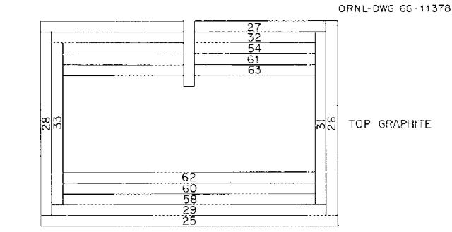

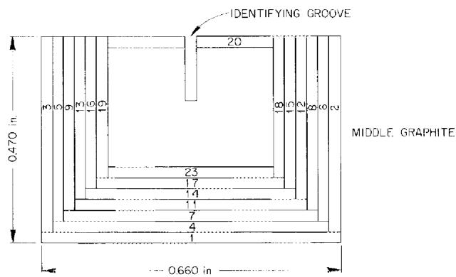

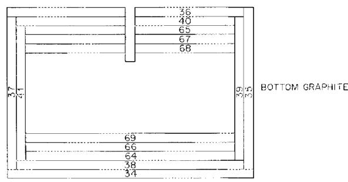  
Fig. 7.22. Scheme for Milling Graphite Samples.

The radiochemical data so far reported are given in Tables 7.11 to 7.13 for the middle, top, and bottom graphite bars respectively. The data are generally internally consistent for a given bar, and the agreement between bars is good. Very few individual values are out of line, which is to the credit of those involved in the sampling and in the analysis of the samples.

From the neutron poison standpoint, the results of most interest are those for $^{99}\mathrm{Mo}$ , $^{103}\mathrm{Ru}$ , and $^{95}\mathrm{Nb}$ . It is seen in Tables 7.12 to 7.13 that the concentrations of these isotopes are considerable in the first layer and that the activities fall off by a factor of about 100 in the second layer. Tellurium-132, which is also noble in the sense of possessing fluorides of only moderate stability, behaves rather similarly, but its concentration drops off less rapidly with penetration distance. Beyond a penetration depth of about four cuts, the activities of molybdenum,

ruthenium, and niobium approach the contamination background (samples 10 and 24 in Table 7.11), while that of $^{132}\mathrm{Te}$ is distinctly higher. It is presently thought that the deposition of molybdenum, ruthenium, and probably niobium in the graphite may be due to the reaction of volatile hexafluorides or pentafluorides with graphite, depositing lower fluorides or carbides. There is no chemical reason to expect the lower fluorides of molybdenum or ruthenium to plate on graphite. On the other hand, the pump bowl experiments definitely established the volatility of molybdenum and ruthenium, probably in the forms of $\mathrm{MoF}_6$ and $\mathrm{RuF}_5$ .

The behavior of $^{140}\mathrm{Ba}$ , $^{89}\mathrm{Sr}$ , $^{141}\mathrm{Ce}$ , $^{144}\mathrm{Ce}$ , and $^{137}\mathrm{Cs}$ , all of which have xenon or krypton precursors, is distinctly different. The gradient of activity with penetration distance is much less, and it appears to bear a relationship to the half-life of the rare-gas precursor involved. Thus the gradient for $^{140}\mathrm{Ba}$ with a 16-sec $^{140}\mathrm{Xe}$ precursor is much steeper than that for $^{89}\mathrm{Sr}$ , which has a 3.2-min $^{89}\mathrm{Kr}$ precursor. Apparently, the longer-half-life rare gases can achieve a flatter gradient by diffusion before they decay to the observed isotope, which is assumed to remain where deposited. The penetration data for $^{140}\mathrm{Ba}$ and $^{89}\mathrm{Sr}$ fitted well a simple diffusion model which led to xenon and krypton diffusion coefficients of about $1 \times 10^{-5}$ ft $^2$ /hr in MSRE graphite. To explain why $^{137}\mathrm{Cs}$ , which has a 3.8-min $^{137}\mathrm{Xe}$ precursor, has a much flatter profile than $^{89}\mathrm{Sr}$ in Table 7.11, it may further be postulated that $^{137}\mathrm{Cs}$ itself diffuses, rather than remaining where it was born. The internal $^{137}\mathrm{Cs}$ concentration of $2 \times 10^7$ dis min $^{-1}$ g $^{-1}$ , or about 1 atom of $^{137}\mathrm{Cs}$ per $10^8$ atoms of graphite, should have negligible chemical effect on the integrity of the graphite structure. Only a few values have yet been obtained for $^{95}\mathrm{Zr}$ . This element is expected to remain in the fuel salt, with little tendency to volatilize or plate. Thus the amount found in the graphite should represent only injection by fission recoil. Correspondingly, the amount in the graphite is low compared to the noble metals.

The concentration of $^{131}\mathrm{I}$ in the graphite is also low at the surface, and its gradient is similar to that of $^{132}\mathrm{Te}$ . It is possible that the 24-min $^{131}\mathrm{Te}$ diffused into the graphite as $\mathrm{TeF}_6$ or $\mathrm{TeF}_4$ and then decayed to $^{131}\mathrm{I}$ . However, it is difficult to see why the iodine did not diffuse back out of the graphite, unless it formed a nonvolatile compound with other fission product atoms in the graphite. While it is not possible at this time to account satisfactorily for the fact that the iodine concentrations in graphite are low, the implication of the low $^{131}\mathrm{I}$ concentrations is that the $^{135}\mathrm{I}$ concentrations will be similarly low. Thus little $^{135}\mathrm{Xe}$ will be born in graphite due to the previous immigration of $^{135}\mathrm{I}$ .

Since the depths of cut of the many graphite samples were not the same, especially for different bars, it is not easy to compare the amounts of the various isotopes in the first layer from the data in Tables 7.11 to 7.13. Since, also, the main practical interest is in the noble-metal fission products, the bulk of which were deposited in the first layer, Table 7.14 was prepared, giving the amount of each isotope in the first layer in disintegrations per minute per square centimeter of graphite surface. The values in Table 7.14 were obtained by multiplying the values in Tables 7.11 to 7.13 (disintegrations per minute per gram) by the weight of sample analyzed (corrected for weight loss in sampling) and dividing by the measured area of the surface from which the sample was cut. The

Table 7.11. Radiochemical Analyses of Middle Graphite Bar (Y-2)   

<table><tr><td rowspan="2">Sample</td><td rowspan="2">Weight (g)</td><td rowspan="2">Depth of Cut (mils)</td><td colspan="10">Disintegrations per Minute per Gram of Graphite</td><td></td></tr><tr><td>99Mo</td><td>132Te</td><td>103Ru</td><td>95Nb</td><td>131I</td><td>95Zr</td><td>144Ce</td><td>89Sr</td><td>140Ba</td><td>141Ce</td><td>137Cs</td></tr><tr><td colspan="13">Wide Face Exposed to Circulating Fuel</td><td></td></tr><tr><td>1</td><td>0.8463</td><td>6.02</td><td>1.88 × 1012</td><td>1.09 × 1012</td><td>2.57 × 1011</td><td>6.93 × 1011</td><td>1.28 × 1010</td><td>1.12 × 1019</td><td>3.08 × 109</td><td>1.28 × 1011</td><td>1.44 × 1011</td><td>3.17 × 1010</td><td>8.39 × 107</td></tr><tr><td>4</td><td>1.2737</td><td>9.27</td><td>1.28 × 1010</td><td>5.19 × 1010</td><td>2.40 × 109</td><td>9.16 × 109</td><td>9.45 × 108</td><td></td><td>8.43 × 107</td><td>1.10 × 1011</td><td>6.57 × 1010</td><td>6.53 × 109</td><td>2.02 × 107</td></tr><tr><td>7</td><td>0.9814</td><td>7.50</td><td>2.35 × 109</td><td>2.33 × 1010</td><td>4.24 × 108</td><td>7.76 × 108</td><td>4.17 × 108</td><td></td><td>3.80 × 107</td><td>7.65 × 1010</td><td>2.75 × 1010</td><td>1.43 × 109</td><td>1.98 × 107</td></tr><tr><td>11</td><td>0.9145</td><td>6.94</td><td>5.53 × 108</td><td>1.07 × 1010</td><td>1.52 × 108</td><td>2.94 × 108</td><td>1.77 × 108</td><td></td><td>2.22 × 107</td><td>7.08 × 1010</td><td>1.65 × 1010</td><td>7.33 × 108</td><td>2.17 × 107</td></tr><tr><td>14</td><td>0.8962</td><td>6.98</td><td>1.20 × 109</td><td>8.60 × 109</td><td>3.17 × 108</td><td>4.28 × 108</td><td>3.18 × 108</td><td></td><td>4.07 × 107</td><td>4.55 × 1010</td><td>9.71 × 109</td><td>5.55 × 108</td><td>1.86 × 107</td></tr><tr><td>17</td><td>1.0372</td><td>8.25</td><td>1.13 × 109</td><td>8.27 × 109</td><td>2.18 × 108</td><td>3.16 × 109</td><td>1.79 × 108</td><td></td><td>2.46 × 107</td><td>4.30 × 1010</td><td>7.60 × 109</td><td>3.90 × 108</td><td>1.96 × 107</td></tr><tr><td>23</td><td>0.8176</td><td>6.64</td><td>1.12 × 109</td><td>8.76 × 109</td><td>1.73 × 108</td><td></td><td>2.43 × 108</td><td></td><td></td><td></td><td>7.74 × 109</td><td></td><td></td></tr><tr><td colspan="13">Side Face Exposed to Circulating Fuel</td><td></td></tr><tr><td>2</td><td>0.7583</td><td>7.68</td><td>1.40 × 1012</td><td>1.04 × 1012</td><td>2.14 × 1011</td><td>8.33 × 1011</td><td>1.20 × 1010</td><td></td><td>2.48 × 109</td><td></td><td>1.41 × 1011</td><td>3.38 × 1010</td><td></td></tr><tr><td>6</td><td>0.9720</td><td>10.10</td><td>2.70 × 1010</td><td>4.62 × 1010</td><td>5.92 × 108</td><td>1.52 × 1010</td><td>8.98 × 108</td><td></td><td></td><td></td><td>7.68 × 1010</td><td></td><td></td></tr><tr><td>8</td><td>0.5139</td><td>5.43</td><td>3.73 × 109</td><td>2.41 × 1010</td><td>6.33 × 108</td><td></td><td>2.79 × 108</td><td></td><td>3.00 × 107</td><td></td><td>3.86 × 1010</td><td>2.50 × 109</td><td></td></tr><tr><td>12</td><td>0.3395</td><td>3.65</td><td>2.44 × 1010</td><td>3.79 × 1010</td><td>4.55 × 109</td><td></td><td>1.36 × 109</td><td></td><td></td><td></td><td>2.99 × 1010</td><td></td><td></td></tr><tr><td>15</td><td>0.6976</td><td>7.61</td><td>4.66 × 109</td><td>1.11 × 1010</td><td>7.38 × 108</td><td></td><td>2.75 × 108</td><td></td><td>2.54 × 107</td><td></td><td>1.52 × 1010</td><td>8.39 × 108</td><td></td></tr><tr><td>18</td><td>0.3737</td><td>4.15</td><td>2.41 × 1010</td><td>3.05 × 1010</td><td>4.76 × 109</td><td></td><td>6.62 × 108</td><td></td><td></td><td></td><td>2.29 × 1010</td><td></td><td></td></tr><tr><td colspan="13">Other Side Face Exposed to Circulating Fuel</td><td></td></tr><tr><td>3</td><td>0.6135</td><td>6.21</td><td>1.73 × 1012</td><td>1.09 × 1012</td><td>2.60 × 1011</td><td>6.36 × 1011</td><td>1.61 × 1010</td><td></td><td>2.45 × 109</td><td></td><td>1.75 × 1011</td><td>3.35 × 1010</td><td></td></tr><tr><td>5</td><td>0.7543</td><td>7.84</td><td>5.94 × 1010</td><td>7.01 × 1010</td><td>8.55 × 109</td><td>2.89 × 1010</td><td>1.21 × 109</td><td></td><td></td><td></td><td>7.18 × 1010</td><td></td><td></td></tr><tr><td>9</td><td>0.6198</td><td>6.55</td><td>8.53 × 109</td><td>1.96 × 1010</td><td>5.52 × 108</td><td></td><td>1.79 × 108</td><td></td><td>2.18 × 107</td><td></td><td>4.28 × 1010</td><td>3.01 × 109</td><td></td></tr><tr><td>13</td><td>1.1652</td><td>12.53</td><td>6.26 × 109</td><td>8.70 × 109</td><td>1.15 × 109</td><td></td><td>2.05 × 108</td><td></td><td></td><td></td><td>1.00 × 1010</td><td></td><td></td></tr><tr><td>16</td><td>0.8469</td><td>9.24</td><td>5.61 × 109</td><td>8.02 × 109</td><td>7.25 × 108</td><td></td><td>1.41 × 108</td><td></td><td>2.04 × 107</td><td></td><td>4.98 × 109</td><td>3.77 × 108</td><td></td></tr><tr><td>19</td><td>0.9406</td><td>10.45</td><td>5.08 × 109</td><td>5.65 × 109</td><td>6.89 × 108</td><td></td><td>6.99 × 107</td><td></td><td></td><td></td><td>4.23 × 109</td><td></td><td></td></tr><tr><td colspan="13">Face in Contact with Graphite</td><td></td></tr><tr><td>20</td><td>1.1381</td><td>9.23</td><td>3.22 × 1011</td><td>5.82 × 1011</td><td>7.88 × 1010</td><td>1.04 × 1011</td><td>1.36 × 1010</td><td>6.68 × 109</td><td>1.65 × 109</td><td></td><td>8.96 × 1010</td><td>2.15 × 1010</td><td></td></tr><tr><td colspan="13">Unexposed Graphite Blanks</td><td></td></tr><tr><td>10</td><td></td><td></td><td>4.63 × 108</td><td>2.62 × 108</td><td>7.18 × 107</td><td>2.46 × 108</td><td>3.26 × 105</td><td>4.48 × 105</td><td>1.07 × 105</td><td>2.03 × 105</td><td>Low</td><td>1.41 × 105</td><td></td></tr><tr><td>24</td><td></td><td></td><td>6.47 × 108</td><td>3.22 × 108</td><td>8.11 × 107</td><td>3.28 × 108</td><td>1.26 × 106</td><td>1.31 × 106</td><td>8.06 × 105</td><td></td><td>3.21 × 107</td><td>6.38 × 106</td><td></td></tr></table>

NOTES: 1. The samples are arranged in order of successive cuts on each face (see Fig. 7.22).   
2. The sample weights given here have been corrected for the average $4.5\%$ loss during milling.   
3. The depths of cut were calculated from the sample weights, areas, and the known graphite density.   
4. Additional analytical results are forthcoming on selected samples for $^{95}\mathrm{Nb}$ , $^{89}\mathrm{Sr}$ , $^{99}\mathrm{Tc}$ , $^{95}\mathrm{Zr}$ , $^{147}\mathrm{Nd}$ , $^{136}\mathrm{Cs}$ , $^{137}\mathrm{Cs}$ , $^{91}\mathrm{Y}$ , $^{63}\mathrm{Ni}$ , and $^{59}\mathrm{Fe}$ .   
5. The activities tabulated are corrected to the time of shutdown, 11:00 AM, July 17, 1966.

Table 7.12. Radiochemical Analyses of Top Graphite Bar (VH-5)   

<table><tr><td rowspan="2">Sample</td><td rowspan="2">Weight (g)</td><td rowspan="2">Depth of Cut (mils)</td><td colspan="10">Disintegrations per Minute per Gram of Graphite</td><td></td></tr><tr><td>99Mo</td><td>132Te</td><td>103Ru</td><td>95Nb</td><td>131I</td><td>95Zr</td><td>144Ce</td><td>89Sr</td><td>140Ba</td><td>141Ce</td><td>137Cs</td></tr><tr><td colspan="13">Wide Face Exposed to Circulating Fuel</td><td></td></tr><tr><td>25</td><td>0.3602</td><td>6.23</td><td>1.54 × 1012</td><td>9.89 × 1011</td><td>4.02 × 1011</td><td>1.56 × 1011</td><td>4.87 × 109</td><td>1.28 × 109</td><td>4.40 × 108</td><td>1.19 × 1011</td><td>1.04 × 1011</td><td>8.60 × 109</td><td>2.24 × 107</td></tr><tr><td>29</td><td>0.4355</td><td>7.93</td><td>5.45 × 109</td><td>9.24 × 109</td><td>6.30 × 108</td><td>1.06 × 109</td><td>4.92 × 107</td><td></td><td></td><td>5.74 × 1010</td><td>1.60 × 1010</td><td></td><td>1.22 × 107</td></tr><tr><td>58</td><td>0.5260</td><td>9.94</td><td>5.95 × 109</td><td>9.39 × 109</td><td>7.76 × 108</td><td>9.54 × 108</td><td>6.54 × 107</td><td></td><td></td><td>6.19 × 1010</td><td>1.98 × 1010</td><td>1.87 × 108</td><td></td></tr><tr><td>60</td><td>0.2916</td><td>5.51</td><td>1.73 × 109</td><td>3.95 × 109</td><td>1.64 × 108</td><td></td><td>3.38 × 107</td><td></td><td></td><td>3.95 × 1010</td><td>7.19 × 109</td><td></td><td></td></tr><tr><td>62</td><td>1.0783</td><td>20.38</td><td>6.22 × 108</td><td>1.63 × 109</td><td>7.96 × 107</td><td></td><td>1.34 × 107</td><td></td><td></td><td>1.51 × 1010</td><td>1.67 × 109</td><td>3.54 × 107</td><td></td></tr><tr><td colspan="13">Side Face Exposed to Circulating Fuel</td><td></td></tr><tr><td>26</td><td>0.4615</td><td>11.41</td><td>4.94 × 1011</td><td>4.38 × 1011</td><td>1.37 × 1011</td><td></td><td>2.37 × 109</td><td></td><td>2.59 × 108</td><td></td><td>4.96 × 1010</td><td>4.94 × 109</td><td></td></tr><tr><td>31</td><td>0.4564</td><td>11.88</td><td>2.24 × 109</td><td>9.06 × 109</td><td>2.82 × 108</td><td></td><td>7.26 × 107</td><td></td><td>6.11 × 106</td><td></td><td>1.45 × 1010</td><td>2.13 × 108</td><td></td></tr><tr><td colspan="13">Other Side Face Exposed to Circulating Fuel</td><td></td></tr><tr><td>28</td><td>0.6703</td><td>17.11</td><td>6.10 × 1011</td><td>5.71 × 1011</td><td>7.81 × 1010</td><td></td><td>3.44 × 109</td><td></td><td>2.69 × 108</td><td></td><td>6.38 × 1010</td><td>5.38 × 109</td><td></td></tr><tr><td>33</td><td>0.5404</td><td>14.43</td><td>2.20 × 109</td><td>5.39 × 109</td><td>2.32 × 108</td><td></td><td>3.01 × 107</td><td></td><td></td><td></td><td>8.27 × 109</td><td></td><td></td></tr><tr><td colspan="13">Wide Face in Contact with Graphite</td><td></td></tr><tr><td>27</td><td>0.6422</td><td>11.32</td><td>3.86 × 1011</td><td>2.80 × 1011</td><td>5.14 × 1010</td><td>5.59 × 1011</td><td>3.07 × 109</td><td>1.24 × 109</td><td>2.74 × 108</td><td></td><td>3.29 × 1010</td><td>4.03 × 109</td><td></td></tr><tr><td>32</td><td>0.5375</td><td>9.95</td><td>1.96 × 109</td><td>1.03 × 1010</td><td>1.91 × 108</td><td>2.28 × 108</td><td>9.26 × 107</td><td></td><td></td><td></td><td>8.51 × 109</td><td></td><td></td></tr><tr><td>59</td><td>0.3154</td><td>5.96</td><td>1.81 × 109</td><td>1.24 × 1010</td><td>2.01 × 108</td><td>6.25 × 108</td><td>7.31 × 107</td><td></td><td></td><td></td><td>8.75 × 109</td><td>2.56 × 108</td><td></td></tr><tr><td>61</td><td>0.5835</td><td>11.03</td><td>9.17 × 108</td><td>3.95 × 109</td><td>1.17 × 108</td><td></td><td>1.86 × 107</td><td></td><td></td><td></td><td>2.76 × 109</td><td></td><td></td></tr><tr><td>63</td><td>0.7310</td><td>13.82</td><td>6.08 × 108</td><td>2.41 × 109</td><td>8.16 × 107</td><td></td><td>1.11 × 107</td><td></td><td></td><td></td><td>1.58 × 109</td><td>2.17 × 107</td><td></td></tr></table>

NOTES: 1. The samples are arranged in order of successive cuts on each face (see Fig. 7.22).   
2. The sample weights given have been corrected for the average $18.9\%$ weight loss during milling.   
3. The depths of cut were calculated from the sample weights, areas, and the known graphite density.   
4. Additional analytical results are forthcoming on selected samples for $^{95}\mathrm{Nb},^{89}\mathrm{Sr},^{99}\mathrm{Tc},^{95}\mathrm{Zr},^{147}\mathrm{Nd},^{136}\mathrm{Cs},^{137}\mathrm{Cs},^{91}\mathrm{Y},^{63}\mathrm{Ni},$ and $^{59}\mathrm{Fe}$   
5. The activities tabulated are corrected to the time of shutdown, 11:00 AM, July 17, 1966.

Table 7.13. Radiochemical Analyses of Bottom Graphite Bar (VA-1)   

<table><tr><td rowspan="2">Sample</td><td rowspan="2">Weight (g)</td><td rowspan="2">Depth of Cut (mils)</td><td colspan="11">Disintegrations per Minute per Gram of Graphite</td></tr><tr><td>99Mo</td><td>132Te</td><td>103Ru</td><td>95Nb</td><td>131I</td><td>95Zr</td><td>144Ce</td><td>89Sr</td><td>140Ba</td><td>141Ce</td><td>137Cs</td></tr><tr><td colspan="14">Wide Face Exposed to Circulating Fuel</td></tr><tr><td>34</td><td>0.8032</td><td>15.04</td><td>5.39 × 1011</td><td>4.39 × 1011</td><td>8.30 × 1010</td><td>3.34 × 1011</td><td>4.25 × 109</td><td>2.40 × 109</td><td>6.39 × 108</td><td>4.17 × 1010</td><td>3.34 × 1010</td><td>8.11 × 109</td><td>2.80 × 107</td></tr><tr><td>38</td><td>0.5979</td><td>11.64</td><td>5.67 × 109</td><td>3.26 × 1010</td><td>8.22 × 108</td><td>2.49 × 109</td><td>4.44 × 108</td><td></td><td></td><td>3.86 × 1010</td><td>1.65 × 1010</td><td></td><td>1.09 × 107</td></tr><tr><td>64</td><td>0.2323</td><td>4.68</td><td>9.5 × 109</td><td>1.91 × 1010</td><td>9.76 × 107</td><td>3.12 × 108</td><td>2.63 × 108</td><td></td><td></td><td>3.52 × 1010</td><td>1.05 × 1010</td><td>6.92 × 108</td><td></td></tr><tr><td>66</td><td>0.3120</td><td>6.28</td><td>8.65 × 108</td><td>1.91 × 1010</td><td>1.20 × 108</td><td></td><td>1.40 × 108</td><td></td><td></td><td>3.62 × 1010</td><td>1.13 × 1010</td><td></td><td></td></tr><tr><td>69</td><td>0.7183</td><td>14.49</td><td>3.39 × 108</td><td>1.06 × 1010</td><td>5.14 × 107</td><td></td><td>8.01 × 107</td><td></td><td></td><td>3.08 × 1010</td><td>5.87 × 109</td><td>1.84 × 108</td><td></td></tr><tr><td colspan="14">Side Face Exposed to Circulating Fuel</td></tr><tr><td>35</td><td>0.3904</td><td>10.70</td><td>6.62 × 1011</td><td>5.31 × 1011</td><td>9.44 × 1010</td><td></td><td>7.09 × 109</td><td></td><td>8.32 × 108</td><td></td><td>4.18 × 1010</td><td>1.04 × 1010</td><td></td></tr><tr><td>39</td><td>0.4480</td><td>12.98</td><td>7.56 × 109</td><td>4.12 × 1010</td><td>5.86 × 108</td><td></td><td>5.44 × 108</td><td></td><td></td><td></td><td>2.21 × 1010</td><td></td><td></td></tr><tr><td colspan="14">Other Side Face Exposed to Circulating Fuel</td></tr><tr><td>37</td><td>0.5480</td><td>15.39</td><td>4.38 × 1011</td><td>3.64 × 1011</td><td>5.11 × 1010</td><td></td><td>4.58 × 109</td><td></td><td>6.19 × 108</td><td></td><td>6.12 × 1010</td><td>9.19 × 109</td><td></td></tr><tr><td>41</td><td>0.3520</td><td>9.62</td><td>3.95 × 109</td><td>1.81 × 1010</td><td>4.95 × 108</td><td></td><td>1.43 × 108</td><td></td><td></td><td></td><td>1.38 × 1010</td><td>7.25 × 108</td><td></td></tr><tr><td colspan="14">Wide Face in Contact with Graphite</td></tr><tr><td>36</td><td>0.4810</td><td>9.12</td><td>9.31 × 1011</td><td>5.97 × 1011</td><td>1.00 × 1011</td><td>4.20 × 1011</td><td>6.01 × 109</td><td>3.47 × 109</td><td>9.49 × 108</td><td></td><td>4.48 × 1010</td><td>1.07 × 1010</td><td></td></tr><tr><td>40</td><td>0.5936</td><td>11.77</td><td>8.23 × 109</td><td>3.70 × 1010</td><td>1.06 × 109</td><td>2.50 × 109</td><td>5.01 × 108</td><td></td><td></td><td></td><td>2.04 × 1010</td><td></td><td></td></tr><tr><td>65</td><td>0.4756</td><td>9.58</td><td>1.57 × 109</td><td>2.44 × 1010</td><td>1.74 × 108</td><td>3.07 × 108</td><td>4.31 × 108</td><td></td><td></td><td></td><td>1.48 × 1010</td><td>1.10 × 108</td><td></td></tr><tr><td>67</td><td>0.4025</td><td>8.10</td><td>1.83 × 109</td><td>2.15 × 1010</td><td>1.48 × 108</td><td></td><td>1.31 × 108</td><td></td><td></td><td></td><td>1.24 × 1010</td><td></td><td></td></tr><tr><td>68</td><td>0.6260</td><td>12.61</td><td>2.66 × 108</td><td>6.90 × 109</td><td>3.83 × 107</td><td></td><td>4.96 × 107</td><td></td><td></td><td></td><td>4.50 × 109</td><td>1.03 × 108</td><td></td></tr></table>

NOTES: 1. The samples are arranged in order of successive cuts on each face (see Fig. 7.22).   
2. The sample weights given have been corrected for the average $9.1\%$ weight loss during milling.   
3. The depths of cut were calculated from the sample weights, areas, and the known graphite density.   
4. Additional analytical results are forthcoming on selected samples for $^{95}\mathrm{Nb}$ , $^{89}\mathrm{Sr}$ , $^{99}\mathrm{Tc}$ , $^{95}\mathrm{Zr}$ , $^{147}\mathrm{Nd}$ , $^{136}\mathrm{Cs}$ , $^{137}\mathrm{Cs}$ , $^{91}\mathrm{Y}$ , $^{63}\mathrm{Ni}$ , and $^{59}\mathrm{Fe}$ .   
5. The activities tabulated are corrected to the time of shutdown, 11:00 AM, July 17, 1956.

Table 7.14. Fission Product Deposition on Surface ${}^{a}$ of MSRE Graphite   

<table><tr><td rowspan="2">Isotope</td><td colspan="2">Top Graphite</td><td colspan="2">Middle Graphite</td><td colspan="2">Bottom Graphite</td></tr><tr><td>Disintegrations per Minute per Square Centimeter</td><td>Percent of Totalb</td><td>Disintegrations per Minute per Square Centimeter</td><td>Percent of Totalb</td><td>Disintegrations per Minute per Square Centimeter</td><td>Percent of Totalb</td></tr><tr><td>99Mo</td><td>3.97 × 1010</td><td>13.36</td><td>5.14 × 1010</td><td>17.24</td><td>3.42 × 1010</td><td>11.5</td></tr><tr><td>132Te</td><td>3.22 × 1010</td><td>13.84</td><td>3.26 × 1010</td><td>13.60</td><td>2.78 × 1010</td><td>12.0</td></tr><tr><td>103Ru</td><td>8.34 × 109</td><td>11.40</td><td>7.53 × 109</td><td>10.32</td><td>4.75 × 109</td><td>6.30</td></tr><tr><td>95Nb</td><td>4.62 × 109</td><td>12.00</td><td>2.28 × 1010</td><td>59.2</td><td>2.40 × 1010</td><td>62.4</td></tr><tr><td>131I</td><td>2.09 × 108</td><td>0.162</td><td>4.22 × 108</td><td>0.328</td><td>3.27 × 108</td><td>0.252</td></tr><tr><td>95Zr</td><td>3.78 × 107</td><td>0.326</td><td>3.14 × 108</td><td>0.270</td><td>1.72 × 108</td><td>0.148</td></tr><tr><td>144Ce</td><td>1.58 × 107</td><td>0.0516</td><td>8.26 × 107</td><td>0.268</td><td>4.36 × 107</td><td>0.142</td></tr><tr><td>89Sr</td><td>3.52 × 109</td><td>3.24</td><td>3.58 × 109</td><td>3.30</td><td>2.99 × 109</td><td>2.74</td></tr><tr><td>140Ba</td><td>3.56 × 109</td><td>1.38</td><td>4.76 × 109</td><td>1.85</td><td>2.93 × 109</td><td>1.14</td></tr><tr><td>141Ce</td><td>3.16 × 108</td><td>0.194</td><td>1.03 × 109</td><td>0.632</td><td>5.83 × 108</td><td>0.356</td></tr><tr><td>137Cs</td><td>6.62 × 105</td><td>0.070</td><td>2.35 × 106</td><td>0.248</td><td>2.01 × 106</td><td>0.212</td></tr><tr><td>60Co in adjacent Hantalloy N, dis min-1g-1</td><td colspan="2">4.37 × 109</td><td colspan="2">1.57 × 1010</td><td colspan="2">6.69 × 109</td></tr></table>

$^\mathrm{a}$ Average on the three salt-exposed surfaces for first milled cut.   
bPercent of total amount of isotope in reactor system which is deposited in the $2\times 10^{6}\mathrm{cm}^{2}$ of graphite surface that is in the reactor.

data were condensed by averaging the usually well-agreeing amounts found on the three salt-exposed surfaces. The amounts found on the other graphite-contacting surfaces were, on the average, $38\%$ lower. The latter figure indicates rather free circulation of salt between the contacting graphite surfaces. Salt may be expected to circulate equally well in the interstices between the graphite stringers of the MSRE.

It is seen from Table 7.14 that the amounts of noble metals in the top, middle, and bottom samples of the graphite agree rather well, with perhaps usually somewhat larger values for the middle graphite. For the other isotopes, also, the middle graphite usually holds the highest surface concentrations, though seldom in the ratio of the prevailing neutron fluxes. The last row in Table 7.14 gives the $^{60}\mathrm{Co}$ activities in the Hastelloy N samples adjacent to the three graphite samples. These numbers are proportional to the thermal-neutron fluxes. The latter have not yet been calculated since the chemical cobalt analyses have not yet been received.

Also listed in Table 7.14 are the percentages of the total isotope produced by fission found on the graphite surface, on the assumption that all $2 \times 10^{6} \mathrm{~cm}^{2}$ of graphite held the surface concentrations listed to their left in the table. The total amount of each isotope was calculated for a fission rate based on the $^{91}\mathrm{Sr}$ activity $(1.32 \times 10^{11} \mathrm{dismin}^{-1} \mathrm{g}^{-1})$ in the last salt sample taken on July 13, 1966. The percentages in Table 7.14 would be about $20\%$ lower if the nominal power history of the reactor were used to calculate the total amount of each isotope produced by fission. It should be recognized that the percentages given actually represent the behavior of each isotope only during a few half-lives of that isotope. Thus the figures for 66-hr $^{99}\mathrm{Mo}$ characterize only a period of a week or so before the July 17, 1966, shutdown. It is quite conceivable that the deposition behavior of the various isotopes is changing with time. Several sets of surveillance specimens must be examined before firm conclusions may be drawn.

Sizable percentages of the total $^{99}\mathrm{Mo},$ 132Te, 103Ru, and $^{95}\mathrm{Nb}$ were found on the graphite surfaces. Many of the values were close to $13\%$ , but two of the $^{95}\mathrm{Nb}$ values were near $60\%$ . Much lower percentages of the other isotopes deposited on the graphite, the highest being $3.2\%$ for $^{89}\mathrm{Sr}$ and $1.8\%$ for $^{140}\mathrm{Ba}$ .

An attempt was made to analyze two of the surface graphite samples for all fission product isotopes of molybdenum by mass spectrometry, after spiking the samples with $^{92}\mathrm{Mo}$ or $^{98}\mathrm{Mo}$ . The results indicated somewhat more molybdenum deposition (20 and 32% of the total) than was measured radiochemically with $^{99}\mathrm{Mo}$ . However, confidence in these results was lessened by the fact that distinctly different combinations of fission product molybdenum, natural molybdenum, and natural zirconium (used as a carrier) had to be used to fit the mass analyses of the two samples.

(e) Fission Product Deposition on Hastelloy N. It is interesting to compare the deposition of fission products on graphite with that on the adjacent Hastelloy N. The samples of the perforated Hastelloy N obtained as described above were weighed and dissolved in a warm mixture of $\mathrm{HNO}_3$ and HCl. From the known dimensions and density of Hastelloy N, it was calculated that the surface-to-weight ratio of the perforated metal

Table 7.15. Deposition of Fission Products on Hasteelloy N   

<table><tr><td rowspan="2"></td><td colspan="3">Top</td><td colspan="3">Middle</td><td colspan="3">Bottom</td></tr><tr><td>Disintegrations per Minute per Square Centimeter</td><td>Percent of Totala</td><td>Hastelloy Nb Graphite</td><td>Disintegrations per Minute per Square Centimeter</td><td>Percent of Total</td><td>Hastelloy N Graphite</td><td>Disintegrations per Minute per Square Centimeter</td><td>Percent of Total</td><td>Hastelloy N Graphite</td></tr><tr><td>99Mo</td><td>2.12 × 1011</td><td>42.8</td><td>5.3</td><td>2.76 × 1011</td><td>55.6</td><td>5.3</td><td>2.04 × 1011</td><td>41.2</td><td>5.9</td></tr><tr><td>132Te</td><td>5.08 × 1011</td><td>131</td><td>15.8</td><td>3.41 × 1011</td><td>88</td><td>10.4</td><td>4.27 × 1011</td><td>110</td><td>15.3</td></tr><tr><td>103Ru</td><td>3.55 × 1010</td><td>29.3</td><td>4.3</td><td>2.55 × 1010</td><td>21</td><td>3.4</td><td>2.32 × 1010</td><td>19.3</td><td>4.9</td></tr><tr><td>131I</td><td>8.24 × 109</td><td>3.82</td><td>39.4</td><td>3.97 × 109</td><td>1.84</td><td>9.4</td><td>5.24 × 109</td><td>2.44</td><td>16.0</td></tr><tr><td>95Zr</td><td>1.85 × 109</td><td>0.96</td><td>48.9</td><td>1.84 × 109</td><td>0.95</td><td>5.9</td><td>2.58 × 109</td><td>1.32</td><td>15.0</td></tr><tr><td>141Ce</td><td>5.22 × 107</td><td>0.019</td><td>0.14</td><td>2.24 × 108</td><td>0.071</td><td>0.22</td><td>1.50 × 108</td><td>0.055</td><td>0.26</td></tr><tr><td>144Ce</td><td>1.07 × 107</td><td>0.020</td><td>0.68</td><td>8.95 × 107</td><td>0.175</td><td>1.1</td><td>3.51 × 107</td><td>0.068</td><td>0.83</td></tr><tr><td>60Co in adjacent Hasteleyoy N, dis min-1g-1</td><td></td><td>4.37 × 109</td><td></td><td></td><td>3.57 × 1010</td><td></td><td></td><td>6.69 × 109</td><td></td></tr></table>

aPercent of total isotope produced by fission in the reactor which was deposited on $1.2\times 10^{6}\mathrm{cm}^{2}$ of Hastelloy N surface in the reactor, assuming deposition on all surfaces is the same as on Hastelloy N in the core.   
${}^{\mathrm{b}}$ Ratio of the dis min ${}^{-1}{\mathrm{\;{cm}}}^{-2}$ of each iscope on Hastelloy N to that in the first milled cut of the adjacent graphite.

was $4.30 \, \text{cm}^2/\text{g}$ . Using this figure the analytical results (in dis $\min^{-1} g^{-1}$ ) could be converted to dis $\min^{-1} \, \text{cm}^{-2}$ . Table 7.15 gives the radiochemical results obtained to date from the solutions of the Hastelloy N specimens. It is seen that large percentages of the total $^{99}\text{Mo},^{132}\text{Te},$ and $^{103}\text{Ru}$ deposited on the Hastelloy N. Also given in Table 7.15 are the ratios of the surface concentrations of each isotope on the Hastelloy N and on the graphite. Between 3 and 14 times as much molydenum, tellurium, and ruthenium deposited on metal as on graphite. It is interesting that a fair material balance is obtained for $^{99}\text{Mo}$ by adding the percentages of the total produced found in the salt (approximately $60\%$ , Table 7.10), in the graphite (approximately $14\%$ , Table 7.14), and on the Hastelloy N (approximately $45\%$ , Table 7.15). The agreement for the other isotopes is not so good.

Much lower percentages of the total $^{131}$ I deposit on the Hastelloy N, but the amount compared to that on graphite is high. The data suggest that the precursor tellurium deposits on the metal and that not all of the $^{131}$ I is able to leave when the tellurium decays. The amount of $^{95}$ Zr on the metal was low, but higher than the surface concentration on graphite. Very little $^{141}$ Ce and $^{144}$ Ce were found on the metal, in fact, less than on graphite. The finding of more cerium isotopes in graphite may be due to their short-lived xenon precursors.

General Discussion of the Deposition Results. The principal practical interest in the fission product deposition results lies in their implications regarding neutron poisoning by noble metals in the graphite cores of molten-salt reactors. In most studies of the physics of reactors such as the MSBR, it has been assumed that the noble-metal fission products would either plate out instantaneously on metal surfaces or be removed periodically from the fluoride fuel by the fluoride volatility processing. Under these conditions, the poisoning effect of noble metals would be of minor practical concern. However, it has been calculated36 that if all of the elements Se, Br, Nb, Mo, Te, Te, and I remained in the core of the MSBR, the neutron poison fraction (capture by these elements per absorption in fissile material) would be 0.0969 in two years, 0.1652 in five years, 0.2104 in ten years, and 0.2585 at equilibrium. If $10\%$ of these materials remained in the core, the respective poison fractions would be 0.0106, 0.0179, 0.0226, and 0.0275. If this group of elements remained in the fuel and was periodically removed by fluoride volatility processing, the average poison fraction would remain constant at 0.0015. The isotopes of molybdenum and $^{99}\mathrm{Te}$ account for about $90\%$ of the poisoning effect of this group of elements. The nuclear breeding ratio for the MSBR is expected to be 1.05 to 1.07 in the absence of deposits of noble metals in the core. The numbers above indicate that the actual breeding ratio or the time that the graphite can be left in the core of a breeder can be considerably influenced by the deposition of this group of elements.

It was also reported above that five to six times more $^{99}\mathrm{Mo}$ was deposited on Hastelloy N surfaces than on adjacent graphite surfaces. In the MSRE there is approximately $2 \times 10^{6} \, \mathrm{cm}^{2}$ of graphite surface (about half in the fuel channels and half in the flats pressing against adjacent flats) and $1.2 \times 10^{6} \, \mathrm{cm}^{2}$ of Hastelloy N surface exposed to the circulating fuel. In the current MSBR design the ratio of metal surface to graphite

surface exposed to circulating fuel is about 5. It seems likely that the fraction of molybdenum deposited on the graphite in the MSBR core would be correspondingly lower than in the MSRE. The ratio of metal to graphite surface area could be further increased, but at the expense of fuel inventory, by circulating the fuel through a chamber packed with finely divided metal.

Another approach to the problem of molybdenum deposition in graphite is suggested by considerations of the probable chemistry involved. The volatility of $^{99}\mathrm{Mo}$ demonstrated in the pump bowl tests suggests the presence of $\mathrm{MoF_6}$ or $\mathrm{MoF_5}$ in the circulating fuel. The gaseous form of molybdenum would explain its observed penetration to appreciable depths into the graphite surface. On the basis of available thermochemical information, it is not clear what chemical reaction occurs to fix the molybdenum to the graphite. For example, the free energies of the reactions of $\mathrm{MoF_6}$ with graphite to form $\mathrm{CF_4}$ and molybdenum or $\mathrm{MoC_2}$ are positive by a few kilocalories. The same is true for $\mathrm{RuF_5}$ and $\mathrm{NbF_5}$ . Only in the case of tellurium is there a definitely negative free-energy change for the reaction of the fluoride with graphite. Possible chemical explanations of the observed depositions are the formation of stable mixed alloys of the noble-metal fission products or the reactions of the fluorides with reducing impurities present in the graphite. In any case, these reactions take place inside the graphite pores near the surface. The penetration of volatile molybdenum could be decreased by making the graphite surface less permeable. It is hoped that graphite specimens whose surfaces have been made less permeable by impregnation treatments can be included in future surveillance specimen packages to test whether molybdenum deposition in graphite can be decreased in this way.

If the deposition of noble-metal fission products in graphite does indeed require their prior conversion to high-valent fluorides, a third method of deposition control suggests itself: the fuel melt may be made more reducing by increasing the $\mathrm{U}^{3+}/\mathrm{U}^{4+}$ ratio. Existing thermochemical data indicate that a sizable percentage of the tetravalent uranium could be converted to the $\mathrm{U}^{3+}$ state without causing uranium carbide formation. A small percentage of the uranium could be made trivalent by adding a few percent of $\mathrm{H}_{2}$ to the helium cover gas of a reactor. Alternatively, when fresh fuel is added to compensate for burnup, the added uranium could be partly trivalent. One or both of these procedures may be feasible in the MSRE. The effects on volatilization and plating behavior could be easily observed by pump bowl tests with metal and graphite specimens.

The second major area in which illumination is desired from fission product behavior is Hastelloy N corrosion. As indicated above, it is difficult to reconcile all the observations with a single consistent chemical picture. The principal difficulty is that the high-valent forms of molybdenum, ruthenium, and tellurium indicated by their volatility and plating behavior may not exist in equilibrium with the appreciable concentrations of $\mathbf{U}^{3+}$ estimated to be present in the MSRE fuel salt. The oxidizing effect of burning up about $400\mathrm{g}$ of $^{235}\mathrm{U}$ to date is equivalent to only one-tenth of the $\mathbf{U}^{3+}$ originally present in the fuel.

If it is assumed that the $\mathrm{U}^{3+}$ concentration was actually much lower than estimated, the presence of high-valent noble metals in the fuel implies that the Hastelloy N surfaces have been protectively plated with

noble metals. Experimental observations of such platings were reported above. This protection would explain the observed low corrosion rate of Hastelloy N as indicated by chromium analyses of the fuel. However, the absence of iodine volatilization is then difficult to explain. In the presence of $\mathrm{MoF_6}$ , $\mathrm{RuF_5}$ , and $\mathrm{TeF_6}$ , it is expected that iodides would be oxidized to $\mathbf{I}_2$ . It is not expected that the solubility of $\mathbf{I}_2$ in the fuel is high enough to prevent its volatilization.

These problems of consistency make it clear that the nature of Hastelloy N corrosion reactions in an operating reactor is not understood as well as would be desirable. Of great help in solving some of these problems would be the development of a method to measure the $\mathrm{U}^{3+}$ concentration in radioactive fuel salt samples.

MSRE Cover-Gas Analyses. Samples of MSRE cover gas were isolated on June 23, 1966, during steady 7.2-Mw operation in the three shielded gas-sampling bombs provided for this purpose. The three samples (500, 500, and $1500~\mathrm{cm}^3$ ) represented pump bowl cover gas which had passed through the first holdup volume (68 ft of 4-in. stainless steel pipe), the particle trap, and the charcoal filter. The latter should have removed all heavy hydrocarbons and other impurities more easily adsorbed than xenon.

The gas analysis of prime interest was that for the $^{136}\mathrm{Xe} / ^{134}\mathrm{Xe}$ ratio, from which the fractional burnup of $^{135}\mathrm{Xe}$ in the MSRE could be determined. To obtain high-sensitivity mass spectrometric analyses for $^{136}\mathrm{Xe}$ and $^{134}\mathrm{Xe}$ , it was necessary to concentrate the sampled gas by a factor of at least 50. The concentration was accomplished by adsorbing the impurities in a helium cover-gas sample on a small volume of molecular sieve sorbent at liquid-nitrogen temperature, then warming the sorbent to $500^{\circ}\mathrm{F}$ , and flushing the liberated impurities with helium into a small (20- $\mathrm{cm}^3$ ) sample bottle. In this way, one $500\mathrm{-cm}^3$ sample was concentrated by a factor of 25 and the $1500\mathrm{-cm}^3$ sample by a factor of 75. At the same time small unconcentrated samples of the cover gas were taken for gamma spectrometry ( $1\mathrm{cm}^3$ ) and for mass spectrometry ( $2\mathrm{cm}^3$ ) to detect impurities such as $\mathrm{H}_2\mathrm{O}$ which are not readily liberated from the warmed molecular sieve sorbent. The latter sample also provided more reliable analyses for very low-boiling impurities like $\mathrm{H}_2$ , which would not be completely sorbed by the molecular sieve.

After cooling for more than two months, the radioactivity of the gas samples was low, and no activity problems were encountered in the direct sampling and concentration procedures. The activity in the gamma spectrometric sample, taken in a thin-walled 1-cm³ glass bulb, was preponderantly 5.27-day $^{133}\mathrm{Xe}$ . The observed counting rate indicated a concentration of about 7 ppm of $^{133}\mathrm{Xe}$ in the cover gas at the time of sampling. Minute traces were also detected of a 0.16-Mev activity which might be 12-day $^{131}\mathrm{Xe}$ and of a 0.5-Mev activity which might be 10.3-year $^{85}\mathrm{Kr}$ , 40-day $^{103}\mathrm{Ru}$ , or 1.0-year $^{106}\mathrm{Ru}$ .

The results of the mass analyses of the unconcentrated sample, the concentrated $500\text{-cm}^3$ sample, and the concentrated $1500\text{-cm}^3$ sample are shown in Table 7.16. From the ratio of the analyses for $\mathbf{136Xe}$ and $\mathbf{134Xe}$ for the concentrated $500\text{-cm}^3$ sample, it was calculated that $7.7\%$ of the

$^{135}\mathrm{Xe}$ produced in the fuel melt captured neutrons to become $^{136}\mathrm{Xe}$ . The corresponding more accurate result from the $1500\text{-cm}^3$ sample was $7.9\%$ $^{135}\mathrm{Xe}$ burnup, with a standard deviation of about $0.5\%$ calculated from the estimated analytical accuracy. It should be emphasized that this method of determining $^{135}\mathrm{Xe}$ burnup is not affected by sample contamination or by the exact value of the concentration factor, provided the concentrated

Table 7.16. Mass Spectrometric Analyses of MSRE Cover Gas   

<table><tr><td>Sample No.</td><td>OG-8</td><td>OG-5</td><td>OG-7</td></tr><tr><td>Concentration factor</td><td>1</td><td>25</td><td>75</td></tr><tr><td>Constituent, %</td><td></td><td></td><td></td></tr><tr><td>H2</td><td>0.022</td><td>0.81</td><td>0.49</td></tr><tr><td>He</td><td>99.71</td><td>93.65</td><td>95.27</td></tr><tr><td>CH4</td><td>&lt; 0.005</td><td>0.44</td><td>0.23</td></tr><tr><td>H2O</td><td>&lt; 0.005</td><td>0.058</td><td>0.021</td></tr><tr><td>Hydrocarbons</td><td>&lt; 0.005</td><td>0.010</td><td>0.004</td></tr><tr><td>N2 + CO</td><td>0.19</td><td>3.87</td><td>2.70</td></tr><tr><td>O2</td><td>0.066</td><td>0.49</td><td>0.26</td></tr><tr><td>Ar</td><td>0.003</td><td>0.043</td><td>0.028</td></tr><tr><td>CO2</td><td>0.006</td><td>0.53</td><td>0.54</td></tr><tr><td>Kr</td><td>&lt; 0.005</td><td>0.018</td><td>0.083</td></tr><tr><td>Xe</td><td>&lt; 0.01</td><td>0.078</td><td>0.38</td></tr><tr><td colspan="4">Isotopic Analyses</td></tr><tr><td>Sample No.</td><td>Theor.</td><td>OG-5</td><td>OG-6</td></tr><tr><td>Constituent, %</td><td></td><td></td><td></td></tr><tr><td>83Kr</td><td>14.1</td><td>14.0</td><td>14.05</td></tr><tr><td>84Kr</td><td>25.93</td><td>26.8</td><td>26.52</td></tr><tr><td>85Kr</td><td>7.60</td><td>7.6</td><td>7.47</td></tr><tr><td>86Kr</td><td>52.37</td><td>51.6</td><td>51.96</td></tr><tr><td>131Xe</td><td>13.42</td><td>8.8</td><td>9.08</td></tr><tr><td>132Xe</td><td>20.06</td><td>14.7</td><td>14.72</td></tr><tr><td>134Xe</td><td>36.92</td><td>41.1</td><td>40.90</td></tr><tr><td>136Xe</td><td>29.59</td><td>35.4</td><td>35.30</td></tr></table>

sample contains sufficient xenon for a good measurement of isotopic ratios. The low $^{135}\mathrm{Xe}$ burnup values are consistent with indications from MSRE reactivity measurements and are much lower than values predicted theoretically for the case of no helium bubbles circulating with the fuel salt through the MSRE core. Recent measurements indicated an appreciable bubble volume fraction in the circulating fuel.

From Table 7.16 it is seen that the observed fractions of $^{131}\mathrm{Xe}$ and $^{132}\mathrm{Xe}$ were much lower than the fractions calculated from the fission yields. In the case of $^{131}\mathrm{Xe}$ , this is well accounted for by the fact that the precursor 8.05-day $^{131}\mathrm{I}$ had not yet reached its equilibrium concentration when the sample was taken. For $^{132}\mathrm{Xe}$ , the observed value was somewhat lower than is indicated by a similar explanation involving the 77-hr $^{132}\mathrm{Te}$ precursor. The observed krypton isotopic percentages matched closely those calculated from fission yields (Table 7.16). The observed ratios of total xenon to total krypton were lower than the theoretical 5.7, probably because of the xenon precursor effects mentioned above. It may be noted that the total xenon and total krypton concentrations were a factor of nearly 5 higher for the $1500\mathrm{-cm}^3$ sample than for the $500\mathrm{-cm}^3$ sample, whereas a factor of 3 was expected.

The concentrations of all impurities in the three analyzed samples should have been in the ratios of their respective concentration factors. This was generally not true. Except for total xenon and total krypton, the impurity concentration in the $500\text{-cm}^3$ sample was considerably more than the expected one-third of the $1500\text{-cm}^3$ sample concentration. Most analyses for impurities are therefore uncertain by a factor of 2 or more.

The analyses for air $(\mathbb{N}_2, \mathbb{O}_2,$ and Ar) were higher than expected for the thoroughly leak-checked sampling and concentration system. A pure helium sample is being concentrated in the system to provide a quantitative blank for the air values.

The analyses indicate more than 60 ppm of $\mathsf{H}_2$ and $\mathrm{CO}_{2}$ and more than 30 ppm of $\mathrm{CH_4}$ in the MSRE off-gas. Presumably, these gases were generated from the thermal and radiolytic decomposition of the organic materials which caused plugging in the off-gas system. The low concentrations of higher hydrocarbons indicate that the particle trap and charcoal filter were still effective on June 23, 1966.

# 7.5 Development and Evaluation of Analytical Methods for Molten-Salt Reactors

Determination of Oxide in Radioactive MSRE Samples - R. F. Apple, J. M. Dale, and A. S. Meyer

The equipment for the determination of oxide37 in highly radioactive MSRE salts has been transferred to the High-Level Alpha Radiation Laboratory and installed therein. Since installation, one coolant salt and

Table 7.17. Oxide Concentrations of Coolant and Fuel Salt from the MSRE   

<table><tr><td>Sample</td><td>Code</td><td>Oxide Concentration (ppm)</td></tr><tr><td>Coolant salt</td><td>CP-4-4</td><td>25</td></tr><tr><td rowspan="8">Fuel salt</td><td>FP-6-1</td><td>49</td></tr><tr><td>FP-6-4</td><td>53</td></tr><tr><td>FP-6-12</td><td>50</td></tr><tr><td>FP-6-18</td><td>47</td></tr><tr><td>FP-7-5</td><td>66</td></tr><tr><td>FP-7-9</td><td>59</td></tr><tr><td>FP-7-13</td><td>66</td></tr><tr><td>FP-7-16</td><td>56</td></tr></table>

eight fuel samples have been analyzed for oxide. The 50-g fuel salt samples were taken at levels from zero- to full-power reactor operations. With an in-cell radiation monitor, the initial sample read 30 r at 1 ft. This activity increased to 1000 r at 1 ft at the full-power level. Results of the oxide analyses are given in Table 7.17.

The oxide in the coolant salt sample, 25 ppm, is comparable to a value of 38 ppm obtained for a coolant salt sample taken on January 25, 1966, and analyzed in the laboratory after three weeks' storage. The fuel analyses are in reasonable agreement with the samples analyzed on the bench top before the reactor was operated at power. The oxide in these nonradioactive samples gradually decreased from 106 to 65 ppm. Between the FP-6 and FP-7 series the sampler-enricher station was opened for maintenance, and the apparent increase in oxide concentration (ca. 15 ppm) may represent contamination of the samples by residual moisture in the sampling system; however, the number of determinations has not been sufficient to establish the precision of the method at these low concentration levels.

In an attempt to determine whether radiolytic fluorine is removing oxide from the fuel samples, sample FP-7-9 was removed from the transport container and stored in a desiccator for 24 hr prior to analysis. Since the oxide content, 59 ppm, is comparable to that of the remaining samples for which analyses were started 6 to 10 hr after sampling, no significant loss of oxygen is indicated. A more direct method of establishing the validity of these results by measuring the recovery of a standard addition of oxide will be attempted when reactor operations are resumed.

A method for verifying the performance of the capillary gas stream splitter and the water electrolysis cell in the remote oxide apparatus was developed. A tin capsule containing a known amount of $\mathrm{SnO}_2$ is heated to $550^{\circ}\mathrm{C}$ in the hydrofluorinator as hydrogen is passed through the system.

The $\mathrm{SnO}_2$ is reduced to the metal, and the water formed passes on to the electrolysis cell. Two standard samples of $\mathrm{SnO}_2$ were analyzed with a four-month interim, and oxide recoveries of $96.1\%$ and $95.6\%$ were obtained.

It is probable that this slight negative bias is due to momentary interruptions in the flow of the hydrofluorinator effluent gas through the water electrolysis cell. Difficulty with cell plugging was encountered throughout the period of development of the oxide method. As an attempt to eliminate the negative bias and also to provide a replacement cell for the remote oxide apparatus, it was deemed necessary to find a method of regenerating the electrolysis cell which would permit a steady gas flow at relatively low flow rates.

The water electrolysis cell contains partially hydrated $\mathrm{P_2O_5}$ in the form of a thin viscous film in contact with two spirally wound 5-mil rhodium electrode wires. The wires are retained on the inside of an inert plastic tube forming a 20-mil capillary through which the sample passes. The 2-ft-long tubing element is coiled in a helix inside of a 5/8-in.-diam pipe and potted in plastic for permanence.

During the course of the investigation of the cell, it was found that a wet gas stream in itself did not cause the electrolysis cell to plug. It was also necessary for current to be flowing through the cell for flow interruptions to occur. This indicated that the hydrogen and oxygen evolving from the electrodes create bubbles in the partially hydrated $\mathrm{P}_2\mathrm{O}_5$ film, which then grow in size sufficient to bridge the capillary and form an obstructing film.

After many unsuccessful approaches, an acceptable answer to the problem was obtained by means of a special regenerating technique using dilute acetone solutions of $\mathrm{H}_3\mathrm{PO}_4$ as the regenerating solutions. This provides a desiccant coating sufficient to absorb the water in the gas stream and gives a minimal amount of flow interruptions during electrolysis. The cells which have been successfully regenerated in this manner have yielded oxide recoveries of $99.6 \pm 1.3\%$ from standard $\mathrm{SnO}_2$ samples.

Spectrophotometric Studies of Molten-Salt Reactor Fuels - J. P. Young

Studies pertaining to a continuous spectrophotometric determination of U(III) in circulating MSBR fuels have continued. A general description of the optical design of a facility for performing this determination has been discussed. $^{38}$ The facility will be used in conjunction with a commercial instrument, a Cary model 14H recording spectrophotometer. During this period further and more detailed discussions of the optical problems involved have been carried out with the designer of this spectrophotometer and have culminated in a purchase order issued to them for the development of suitable sample-space optics. The apparatus which will result from this requisition is to be delivered in six months and will provide optimum light gathering power and optical design for use with a double convex lens-shaped drop of liquid. The apparatus will be used with existing instrumentation and will be compatible with the optical path extension which will be required in the final proposed reactor installation.

More detailed studies of the spectra of U(III) in molten 2LiF·BeF $_2$ have provided better resolution of the various absorptions in the complex ultraviolet absorption peaks of U(III). As reported before, the maximum absorption is $360~\mathrm{nm}$ , but shoulders are observed at approximately 310, 445, and $508~\mathrm{nm}$ . These shoulders might be of analytical value if as yet unknown interferences prevent the use of the absorption at $360~\mathrm{nm}$ .

On the basis of calculations made to estimate the probable valence state of fission products, it is expected that dissolved fission products will be in one of their more normal valence states and therefore will cause no interference at the concentrations expected. Concerning unusual oxidation states of rare-earth fission products, cursory spectral studies have been carried out with Sm(II) in molten 2LiF·BeF $_2$ . This lower valence state of samarium exhibits a strong, broad absorption peak with a maximum absorption at 325 nm with a shoulder at approximately 470 nm. The molar absorptivity is not yet known, but it is believed to be greater than 200. If conditions are such that Sm(II) is present, possible interference with a determination of U(III) at 360 nm may be encountered, depending on concentrations present. Interference of lower-valent rare earths will not be a general problem, but only a problem with specific ions; for example, Eu(II) exhibits no absorbance at wavelengths above 300 nm.

Although it has been assumed from other spectral studies, mainly in the solvent LiF-NaF-KF, that corrosion product ions would not interfere with the proposed determination, experimental verification has not been available until this period. The molar absorptivity of Fe(II), Cr(II), and Ni(II) at their wavelengths of maximum absorbance is 5 at $1020\mathrm{nm}$ , 6 at $760\mathrm{nm}$ , and 10 at $432\mathrm{nm}$ respectively. None of these dissolved species will interfere at concentration levels of 10 to 100 times that expected in the fuel salt. In general, the spectra of these 3d ions can be interpreted as arising from essentially octahedral coordination in the case of Ni(II) and Cr(II) and distorted octahedral symmetry in the case of Fe(II). A cursory spectral study of Cr(III) was made. The molar absorptivity at its wavelength of maximum absorbance, $706\mathrm{nm}$ , is approximately 7; Cr(III) is not expected to be present in the fuel salt.

In a study of the absorption spectrum of $\mathrm{Fe(II)}$ in several different LiF-BeF $_2$ solutions, an extraneous peak was noted at $432~\mathrm{nm}$ . The position of the peak suggested an Ni(II) impurity in the melt. Based on a subsequent spectral study of Ni(II) spectra in these melts, a molten-salt spectrophotometric analysis of Ni(II) concentration was possible. The comparison of this determination to wet chemical analysis of the same samples is given below.

<table><tr><td rowspan="2">Sample</td><td colspan="3">Ni(II) (‰ w/w)</td></tr><tr><td colspan="2">Molten-Salt Spectra</td><td>Wet Chemical</td></tr><tr><td>Fe-IB28</td><td colspan="2">0.21</td><td>0.19</td></tr><tr><td>Fe-IB33</td><td colspan="2">0.18</td><td>0.22</td></tr></table>

These melts were made in graphite containers but were stirred with a nickel stirrer. It would seem that this high nickel contamination, found originally by the molten-salt spectra, may have arisen from the stirrer.

An extremely sensitive absorption peak attributed to U(IV) which causes total absorption of most ultraviolet light has been found at 235 nm. The molar absorptivity of this peak is approximately 1500. The peak has been observed in aqueous absorption spectra at $207\mathrm{nm}$ ,39 but has not been reported previously in any molten-salt solvent. A possible analytical application of this absorption would be a continuous spectrophotometric monitoring of coolant salt for leakage of uranium-bearing fuel salt.

Voltammetric and Chronopotentiometric Studies of Uranium in Molten LiF-BeF $_2$ -ZrF $_4$ - D. L. Manning and Gleb Mamantov*

Electrochemical reduction and oxidation of U(IV) in LiF-BeF $_2$ -ZrF $_4$ (64-34-1.8 and 65.6-29.4-5.0 mole %) was investigated by rapid-scan voltammetry and chronopotentiometry. Well-defined and reproducible current-voltage curves and potential-time curves were obtained at concentrations of uranium as high as 0.8 mole % (MSRE fuel). From the data obtained so far, the results are very encouraging from the standpoint of utilizing the voltammetric approach as a means for in-line monitoring of uranium in molten fluoride systems of interest to the molten-salt reactor program. Utilizing a platinum indicator electrode, the relative standard deviation of peak current for 41 runs over a period of 36 days was $2.0\%$ ; considerably better precision (standard deviation $0.76\%$ for 8 runs) was obtained over a period of 2 hr. Other indicator electrodes tested included pyrolytic graphite, molybdenum, tungsten, and tantalum. Of the electrodes tested, better reproducibility was obtained at platinum or platinum-10% rhodium.

At $500^{\circ}\mathrm{C}$ the reduction of U(IV) at platinum is a reversible one-electron process, as determined from Nernstian log plots and the diagnostic criteria of linear sweep voltammetry. Also from chronopotentiometry, a plot of the current-density-transition-time product $(i_0\tau)$ vs (transition time)1/2 yielded a straight line, which is in agreement with theory for a reversible electrode process. From the slope of the line, the diffusion coefficient for uranium was calculated to be about $1.5 \times 10^{-6} \, \text{cm}^2/\text{sec}$ , in good agreement with the value obtained by voltammetry (1.5 to $2.0 \times 10^{-6} \, \text{cm}^2/\text{sec}$ ). The effect of temperature on the diffusion coefficient was determined over the range 480 to $600^{\circ}\text{C}$ ; and from a plot of $\log D$ vs $1/T$ the activation energy which corresponds to the reduction of U(IV) to U(III) was found to be approximately $11 \, \text{kcal/mole}$ .

Additional data are being collected to evaluate further the precision and reproducibility of the voltammetric measurements at different levels

of uranium concentrations, from which it is hoped to obtain a better assessment of this approach as an analytical method for in-line determination of U(IV) in molten fluorides.

A new voltammeter is being built that will measure a 20-fold higher current (100 ma) than existing equipment, so that electrodes with more reproducible area can be used. With present equipment the electrode is limited to a 20-gage platinum wire inserted only $5\mathrm{mm}$ into the fuel, so that slight changes in melt level introduce a significant change in reduction current. The new instrument will also provide a more rapid voltage scan, up to 500 v/sec, to minimize flow effects in an in-line cell.

In-Line Test Facility - R. F. Apple, J. M. Dale, J. P. Young, and A. S. Meyer

In view of the value and potential success of methods for the continuous analysis of circulating salt streams, a facility to provide salt streams of known composition is being considered to provide a test of equipment under simulated in-line measurements. The most practical facility commensurate with the available space in a California hood consists of a 20-kg salt reservoir fitted with a stirrer, ports for sampling and for the addition of solid and molten constituents, purge streams and electrodes for purification, and a helium gas lift to continuously transfer a stream of salt to an elevated constant-level vessel. From the constant-level vessel, salt streams can be gravity-fed to apparatuses for testing electromagnetic and spectrophotometric techniques of analysis and for determining parameters for the continuous determination of oxide by counter-current equilibration of a salt stream with anhydrous hydrogen fluoride. The analyzed salt streams will then be returned to the reservoir. This facility will also be used to test capillary and orifice techniques for the control of low salt flows and to design small freeze valves. Tests of various gas lift designs are being carried out with simulated molten fuel (aqueous zinc chloride solutions) to determine whether a 6- to 8-ft lift is practical.

Analysis of Helium Blanket Gas - C. M. Boyd, C. A. Horton, A. D. Horton, and A. S. Meyer

The Analytical Chemistry Division, together with members of the Reactor and Reactor Chemistry Divisions, participated in various experiments to determine possible sources of the organic deposits which have caused plugging of valves and filters in the MSRE off-gas system. The analytical support included:

1. the installation of a continuous hydrocarbon analyzer to monitor gas streams from Reactor Chemistry experiments40 to simulate oil leaks into the MSRE pump and to evaluate trapping systems for reducing hydrocarbon concentration, and to monitor hydrocarbons in the off-gas from the Y-12 pump test loop;41

2. the determination by gas chromatographic analysis and by selective chemical reactions of individual hydrocarbons in "grab" samples from the above experiments and in a trapped sample from a nonradioactive MSRE purge line;42   
3. the development of a technique to measure the concentration of hydrocarbons collected on an experimental charcoal trap by pyrolysis of a sample of the charcoal followed by gas chromatographic analysis of the pyrolyzate. By sampling the charcoal bed at various depths, it is possible to determine the distribution of individual hydrocarbons as a function of trap length.

The continuous hydrocarbon monitor proved to be the most useful of these techniques, particularly in measurements performed at the Y-12 test loop with P. G. Smith, of the Reactor Division, and R. G. Ross, of the Reactor Chemistry Division. Figure 7.23 is a flow schematic of the injection experiment. Although the experiment was designed to measure the effects of deliberate injection of oil into the pump tank, the initial results revealed an actual oil leak in the pump. The experiment therefore afforded an opportunity to study the oil leak and correlate the hydrocarbon level in the pump tank off-gas with an operating variable ( $\Delta p$ across the shaft annulus) and thus distinguish between possible leak locations. A typical plot of the hydrocarbon concentration in the pump tank off-gas is shown in Fig. 7.24. When the pump rotation was stopped, the shaft annulus $\Delta p$ decreased from 3 to 0.5 psi, and the hydrocarbon level in the off-gas dropped immediately to less than 10 ppm methane equivalent. After about 25 hr the $\Delta p$ began to recover, and the hydrocarbon level started to undergo a series of rapid excursions that are suggestive of discrete drops of oil entering the hot regions of the pump tank. The average hydrocarbon concentration gradually returned to a level

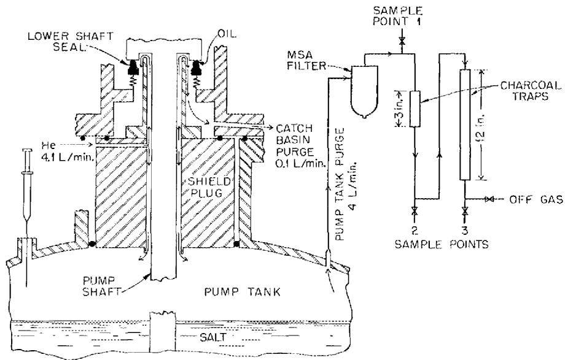  
ORNL-DWG.66-6827A   
Fig. 7.23. Flow Schematic of Oil Injection Experiment.

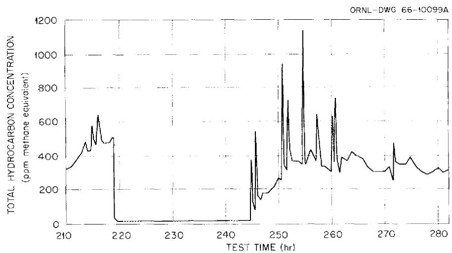  
Fig. 7.24. Hydrocarbons in Y-12 Pump Tank Off-Gas.

of about 300 ppm, in parallel with increasing $\Delta p$ . Similar fluctuations in hydrocarbon concentrations were observed during three additional changes in pump operation to reduce the $\Delta p$ , which was ultimately shown to be caused by a salt plug at the bottom of the shaft annulus. Because this differential pressure is exerted across the seals between the shield plug and the catch basin, the position of the leak was defined as through these seals rather than down the shaft annulus. This was confirmed, on disassembly, by an oil film and pyrolysis stain on the outside of the shield plug.

Injection of oil, Gulf Spin 35, into the pump tank showed that essentially all the oil entering the tank appeared as hydrocarbons in the off-gas. Table 7.18 shows gas chromatographic analyses of the off-gas together with those from helium effluents from Reactor Chemistry experiments in which the oil was injected into a helium stream entering an empty nickel pot at $600^{\circ}\mathrm{C}$ . These results revealed that, at least in the absence of radioactivity, oil entering the pump tank is predominantly cracked to light hydrocarbons, methane, ethane, and unsaturates lighter than $\mathrm{C}_5$ , which are trapped ineffectively on charcoal traps at $100^{\circ}\mathrm{C}$ . Conversely, in the Reactor Chemistry experiments the cracking was incomplete to yield a substantial fraction of $>\mathrm{C}_6$ hydrocarbons, which are trapped with high efficiency.

A thermal conductivity method to measure the total hydrocarbon concentration in the radioactive off-gas of the MSRE continuously has been developed with the Reactor Chemistry Division. In this method the off-gas sample is passed over copper oxide at $700^{\circ}\mathrm{C}$ to convert hydrocarbons to $\mathrm{CO}_{2}$ and $\mathrm{H}_{2}\mathrm{O}$ . This oxidized stream is passed through one side of a thermal conductivity detector and thence to a trap containing Ascarite and $\mathrm{Mg(ClO_4)_2}$ to yield a stream of inert gases which is directed through the reference side of the thermal conductivity cell. In bench-top tests the response of this apparatus was linear to total hydrocarbon concentration of 1000 ppm with a limit of detection below 10 ppm. A similar system with the trap and copper oxide furnace designed for one year of reactor operation will be installed in the gas-sampling station of the MSRE.

Table 7.18. Hydrocarbons Produced by Oil Injection Injection rate, $16~\mathrm{cm}^3/$ day   

<table><tr><td rowspan="4">Hydrocarbon</td><td colspan="6">Hydrocarbon Concentration (ppm methane equivalents)</td></tr><tr><td rowspan="2" colspan="2">Reactor Chemistry Simulated Leak Tests</td><td colspan="4">Y-12 Test Loop</td></tr><tr><td colspan="2">2 hr After Start of Injection</td><td colspan="2">20 hr After Start of Injection</td></tr><tr><td>Before Trap</td><td>After Trap</td><td>Before Trap</td><td>After Trap</td><td>Before Trap</td><td>After Trap</td></tr><tr><td>CH4</td><td>25</td><td>30</td><td>210</td><td>210</td><td>330</td><td>250</td></tr><tr><td>C2H6</td><td>4</td><td>12</td><td>44</td><td>42</td><td>46</td><td>40</td></tr><tr><td>C2H4</td><td>140</td><td>140</td><td>600</td><td>590</td><td>700</td><td>690</td></tr><tr><td>C3H6</td><td>100</td><td>120</td><td>170</td><td>158</td><td>230</td><td>210</td></tr><tr><td>Unsatd. C4</td><td>56</td><td>94</td><td>98</td><td>3</td><td>130</td><td>160</td></tr><tr><td>Unsatd. C5 and C6</td><td>78</td><td>4</td><td>10</td><td>7</td><td>24</td><td>4</td></tr><tr><td>Aromatics</td><td></td><td></td><td>158</td><td></td><td>206</td><td></td></tr><tr><td>&gt; C6</td><td>300</td><td></td><td></td><td></td><td></td><td></td></tr><tr><td>Total</td><td>703</td><td>400</td><td>1290</td><td>1010</td><td>1666</td><td>1354</td></tr></table>

# 7.6 Development and Evaluation of Equipment and Procedures for Analyzing Radioactive MSRE Salt Samples

F. K. Hecker C. E. Lamb L. T. Corbin

The remote apparatus for determining the oxide content of MSRE salt samples was installed in cell 3 of the High-Radiation-Level Analytical Laboratory (HRIAL) (Building 2026). Fluoride salt samples and tin oxide standards were analyzed to check the apparatus and familiarize the HRIAL personnel with the method. The results were satisfactory, and the physical manipulations required were performed adequately. Eight 50-g fuel-salt samples have been analyzed remotely.

The time required to decontaminate the transport containers was greatly reduced by using disposable mild steel plugs for each sample submitted.

# Sample Analyses

From January 1, 1966, through June 30, 1966, 43 MSRE fuel-salt samples were submitted for analysis. The samples were analyzed as shown below.

Analysis   
Number of Determinations   

<table><tr><td>Uranium</td><td>35</td></tr><tr><td>Zirconium</td><td>35</td></tr><tr><td>Chromium</td><td>35</td></tr><tr><td>Beryllium</td><td>35</td></tr><tr><td>Fluorine</td><td>35</td></tr><tr><td>Iron</td><td>35</td></tr><tr><td>Nickel</td><td>35</td></tr><tr><td>Molybdenum</td><td>7</td></tr><tr><td>Lithium</td><td>35</td></tr><tr><td>RCA Prep.</td><td>22</td></tr><tr><td>MSA Prep.</td><td>5</td></tr><tr><td>Oxide</td><td>6</td></tr><tr><td>Carbon</td><td>3</td></tr></table>

Of the 43 samples submitted, two 50-g oxide samples were not analyzed due to contaminated ladles. Three samples were analyzed for carbon and found to contain $< 50$ ppm.

Several of the samples were received with a silver and a Hastelloy N wire coiled onto the stainless steel cable between the latch and ladle. The latch, wires, and cable were separated and prepared for radiochemical analyses.

# Quality-Control Program

The quality-control program was continued during the first and second quarters of 1966. A composite of the values obtained by four different groups of shift personnel is shown in Tables 7.19 and 7.20. Molybdenum values are not shown since it was not added to the synthetic solutions.

It was evident from the second-quarter control data that a positive bias of approximately $3\%$ existed in the amperometric zirconium method. The bias was attributed to polymerization of the zirconium in the standard solutions used to standardize the cupferron titrant. Although the bias appears to have been eliminated by the preparation of new zirconium standards, more data are needed to confirm it.

The positive bias existing in the spectrophotometric nickel method has been reduced to approximately $8\%$ by changing the color filter in the filter photometer and constructing a new calibration curve. Further efforts are being made to eliminate the bias completely.

Table 7.19. Summary of Control Results, January Through February 1966   

<table><tr><td rowspan="2">Determination</td><td rowspan="2">Method</td><td rowspan="2">Number of Determinations</td><td colspan="2">Limit of Error (%)</td></tr><tr><td>Fixed</td><td>Found</td></tr><tr><td>Beryllium</td><td>Photoneutron</td><td>27</td><td>5.0</td><td>2.43</td></tr><tr><td>Chromium</td><td>Amperometric</td><td>25</td><td>15.0</td><td>7.95</td></tr><tr><td>Iron</td><td>o-Phenanthroline</td><td>34</td><td>15.0</td><td>7.93</td></tr><tr><td>Nickel</td><td>Dimethylglyoxime</td><td>30</td><td>15.0</td><td>12.74</td></tr><tr><td>Uranium</td><td>Coulometric (high sen.)</td><td>87</td><td>1.0</td><td>1.16</td></tr><tr><td>Zirconium</td><td>Amperometric</td><td>30</td><td>5.0</td><td>5.74</td></tr></table>

Table 7.20. Summary of Control Results, April Through June 1966   

<table><tr><td rowspan="2">Determination</td><td rowspan="2">Method</td><td rowspan="2">Number of Determinations</td><td colspan="2">Limit of Error (%)</td></tr><tr><td>Fixed</td><td>Found</td></tr><tr><td>Beryllium</td><td>Photoneutron</td><td>26</td><td>5.0</td><td>2.60</td></tr><tr><td>Chromium</td><td>Amperometric</td><td>36</td><td>15.0</td><td>12.46</td></tr><tr><td>Iron</td><td>o-Phenanthroline</td><td>41</td><td>15.0</td><td>7.54</td></tr><tr><td>Nickel</td><td>Dimethylglyoxime</td><td>48</td><td>15.0</td><td>7.67</td></tr><tr><td>Uranium</td><td>Coulometric (high sen.)</td><td>127</td><td>1.0</td><td>1.04</td></tr><tr><td>Zirconium</td><td>Amperometric</td><td>57</td><td>5.0</td><td>5.48</td></tr></table>

# References

1. MSR Program Semiann. Progr. Rept. Feb. 28, 1966, ORNL-3936, p. 122.   
2. The operational history of these runs is described in sect. 1.1 of this report.   
3. S. S. Kirslis, this report, sect. 7.4, subsection entitled "Fission Product Behavior in the MSRE."   
4. R. F. Apple, J. M. Dale, and A. S. Meyer, this report, sect. 7.5, subsection entitled "Determination of Oxide in Radioactive MSRE Samples."   
5. R. E. Eby, ORNL Isotopes Division.   
6. R. E. Thoma to P. N. Haubenreich, "Chemical Analysis of MSRE Flush and Coolant Salts in Prenuclear Test Period," MSR-65-19 (March 19, 1965) (internal correspondence).   
7. S. Cantor and W. T. Ward, Reactor Chem. Div. Ann. Progr. Rept. Dec. 31, 1965, ORNL-3913, pp. 27-28.   
8. L. Shartsis and S. Spinner, J. Res. Natl. Bur. Std. 46, 176 (1951).   
9. J. D. MacKenzie, J. Chem. Phys. 32, 1150 (1960).   
10. J. H. DeBoer and J. A. M. Van Liestp, Rec. Trav. Chim. 46, 124 (1927).   
11. L. J. Kinkenberg, Rec. Trav. Chim. 56, 36 (1937).   
12. Structure Reports, vol. XIII, p. 342.   
13. J. D. Edwards et al., J. Electrochem. Soc. 100, 508 (1953).   
14. S. Cantor, Reactor Chem. Div. Ann. Progr. Rept. Dec. 31, 1965, ORNL-3913, pp. 29-32.   
15. S. Cantor and W. T. Ward, ibid., p. 27.   
16. MSR Program Semiann. Progr. Rept. Feb. 28, 1966, ORNL-3936, pp. 141-45.   
17. D. G. Hill to W. R. Grimes, private communication, June 29, 1966.   
18. D. G. Hill to W. R. Grimes, private communication, July 1, 1966.   
19. W. S. Ginell, Nucl. Tech. 51, 185 (1959).   
20. J. J. Egan and R. N. Wiswall, Nucleonics 15, 104 (1957).   
21. Reactor Chem. Div. Ann. Progr. Rept. Jan. 31, 1964, ORNL-3591, p. 50.   
22. Reactor Chem. Div. Ann. Progr. Rept. Jan. 31, 1965, ORNL-3789, p. 16.   
23. MSR Program Semiann. Progr. Rept. Feb. 28, 1966, ORNL-3936, p. 145.   
24. $\mathsf{ZrO}_2$ was prepared by H. H. Stone, Reactor Chemistry Division.   
25. MSR Program Semiann. Progr. Rept. Feb. 28, 1966, ORNL-3936, p. 147.

26. R. P. Elliott, Constitution of Binary Alloys, First Supplement, p. 203, McGraw-Hill, New York, 1965.   
27. MSR Program Semiann. Progr. Rept. Feb. 28, 1966, ORNL-3936, p. 148.   
28. W. D. Burch, G. M. Watson, and H. O. Weeren, Xenon Control in Fluid Fueled Reactors, ORNL-CF-60-2-2 (July 6, 1960).   
29. I. Spiewak, "Xenon Transport in MSRE Graphite," MSR-60-28 (Nov. 2, 1960) (internal correspondence).   
30. G. M. Watson and R. B. Evans III, Xenon Diffusion in Graphite: Effects of Xenon Absorption in Molten Salt Reactors Containing Graphite, ORNL-CF-61-2-59 (Feb. 15, 1961).   
31. J. W. Miller, Xenon Poisoning in Molten Salt Reactors, ORNL-CF-61-5-62 (May 3, 1961).   
32. R. B. Evans III, "Xenon Poisoning in Molten Salt Reactors Containing Graphite," Reactor Chem. Div. Ann. Progr. Rept. Jan. 31, 1961, ORNL-3127, pp. 15-16.   
33. P. R. Kasten, E. S. Bettis, and R. C. Robertson, Design Studies of 1000-Mw(e) Molten-Salt Breeder Reactors, ORNL-3996 (August 1966).   
34. B. Manowitz, quoted by P. G. Salgado in *Nuclear Reactor Magneto-Hydrodynamics Power Generation*, IA-3368, p. 23.   
35. MSR Program Semiann. Progr. Rept. Aug. 31, 1965, ORNL-3872, p. 127.   
36. A. M. Perry, internal memorandum, July 30, 1966.   
37. MSR Program Semiann. Progr. Rept. Feb. 28, 1966, ORNL-3936, p. 154.   
38. MSR Program Semiann. Progr. Rept. Aug. 31, 1965, ORNL-3872, p. 145.   
39. Donald Cohen and W. T. Carnall, J. Phys. Chem. 64, 1933 (1960).   
40. B. F. Hitch, R. G. Ross, and H. F. McDuffie, Tests of Various Particle Filters for Removal of Oil Mists and Hydrocarbon Vapors, ORNL-TM-1623 (to be issued).   
41. A. S. Meyer, Investigation of Hydrocarbons in the Off-Gas from the Y-12 Test Loop, ORNI-CF-66-8-30 (September 1966).   
42. A. S. Meyer, "Hydrocarbons in Seal Purge of MSRE Pumps," MSR-66-10 (May 1966) (internal correspondence).

Part 3. MOLTEN-SALT BREEDER REACTOR STUDIES

# 8. MOLTEN-SALT BREEDER REACTOR DESIGN STUDIES

Paul R. Kasten

E. S. Bettis

Roy C. Robertson

J. H. Westsik

H. F. Bauman

H. T. Kerr

The MSBR reference design concept was presented previously, $^{1}$ and is a two-region, two-fluid system, with fuel salt separated from the blanket salt by graphite tubes. On-site fuel recycle is employed, using fluoride-volatility and vacuum-distillation processing. In addition, results were given for the case of direct removal of protactinium from the blanket region; the associated concept was termed MSBR(Pa). Since these studies, additional design conditions were investigated and evaluated, $^{2}$ and these are discussed below.

# 8.1 Design Changes in MSBR Plant

In reactor design studies it often occurs that certain features of the detailed design undergo changes as more understanding is obtained of the overall problems and as new ways are discovered to solve a given design problem. Such changes have taken place during the MSBR design studies; the most important are those associated with the primary heat exchanger designs and the pressures that exist in the various circulating-salt systems.

An objectionable feature of the MSBR heat exchanger design considered previously was the use of expansion bellows at the bottom of the exchanger. These bellows permit tubes in the central portion of the exchanger to change in length relative to those in the annular region due to thermal conditions. Since such bellows may be impractical to use under reactor operating conditions, a new design was developed that eliminated them.

Figure 8.1 shows the revised heat exchanger design. The expansion bellows were eliminated, and changes in the tube lengths due to thermal conditions are accommodated by the use of sine-wave type of construction, which permits each tube to adjust to thermal changes. In addition, the coolant salt now enters the heat exchanger through an annular volute at the top and passes downward through a baffled outer annular region. The coolant salt then passes upward through a baffled inner annular region and exits through a central pipe.

In Fig. 8.1 the flow of fuel salt through the pump is reversed from that given previously in order to reduce the pressure in the graphite fuel tubes. Fuel salt enters the heat exchanger in the inner annular region, passes downward through the tubes, and then flows upward through the tubes in the outer annular region before entering the reactor.

The blanket-salt heat exchanger was also revised to give a design similar to that of Fig. 8.1. The general features of these exchangers and their placement in the reactor cell are shown in Fig. 8.2. The

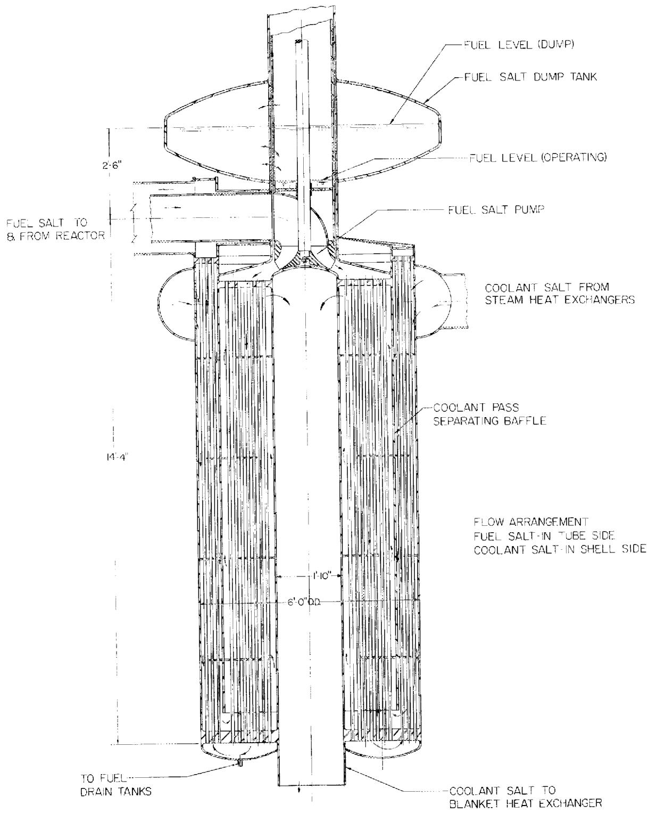  
Fig. 8.1. Revised Fuel Heat Exchanger for MSBR.

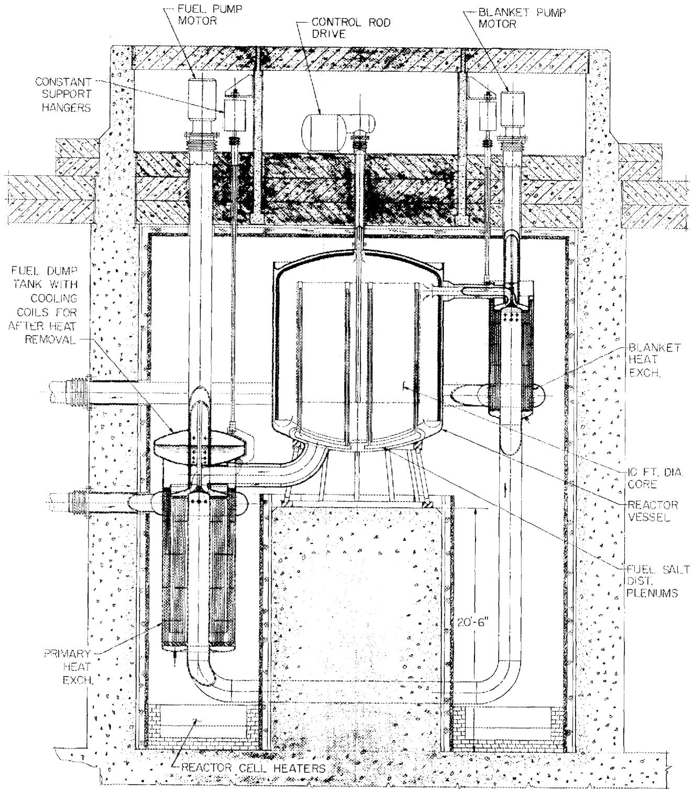  
Fig. 8.2. MSBR Cell Elevation Showing Primary Heat Exchangers and Their Placement.

blanket-salt pump was also altered so that blanket salt leaving the reactor now enters the suction side of the pump.

From the viewpoint of reactor safety, it is important that the blanket salt be at a higher pressure than the fuel salt.3 Under such circumstances, rupture of a fuel tube would result in leakage of fertile salt into the fuel and a reduction in reactivity. In order to achieve this condition with a minimum operating pressure in the reactor vessel, the fluid flow was reversed from that in the initial MSBR design as stated above. The resulting flow diagram is shown in Fig. 8.3.

In addition, it is desirable that any leakage between the reactor fluid and coolant-salt systems be from the coolant system into the fuel or blanket system. In order to achieve these conditions, the MSER operating pressures were revised to those shown in Table 8.1.

Table 8.1. Pressures in Various Parts of Revised MSBR Salt Circuits Flow diagram given in Fig. 8.3   

<table><tr><td>Location</td><td>Nominal Pressure (psig)</td></tr><tr><td>Fuel-salt system</td><td></td></tr><tr><td>Core entrance</td><td>50</td></tr><tr><td>Core exit</td><td>25</td></tr><tr><td>Pump suction</td><td>10</td></tr><tr><td>Pump outlet</td><td>150</td></tr><tr><td>Heat exchanger outlet</td><td>60</td></tr><tr><td>Blanket-salt system</td><td></td></tr><tr><td>Blanket entrance</td><td>66</td></tr><tr><td>Blanket exit</td><td>65</td></tr><tr><td>Pump suction</td><td>64</td></tr><tr><td>Pump outlet</td><td>155</td></tr><tr><td>Heat exchanger outlet</td><td>67</td></tr><tr><td>Coolant-salt system</td><td></td></tr><tr><td>Pump suction before boiler-superheaters</td><td>130</td></tr><tr><td>Pump outlet before boiler-superheaters</td><td>280</td></tr><tr><td>Inlet to fuel heat exchangers</td><td>220</td></tr><tr><td>Outlet from fuel heat exchangers</td><td>160</td></tr><tr><td>Outlet-inlet to blanket heat exchangers</td><td>142</td></tr><tr><td>Pump suction before reheaters</td><td>130</td></tr><tr><td>Pump outlet before reheaters</td><td>240</td></tr><tr><td>Reheater outlet</td><td>220</td></tr></table>

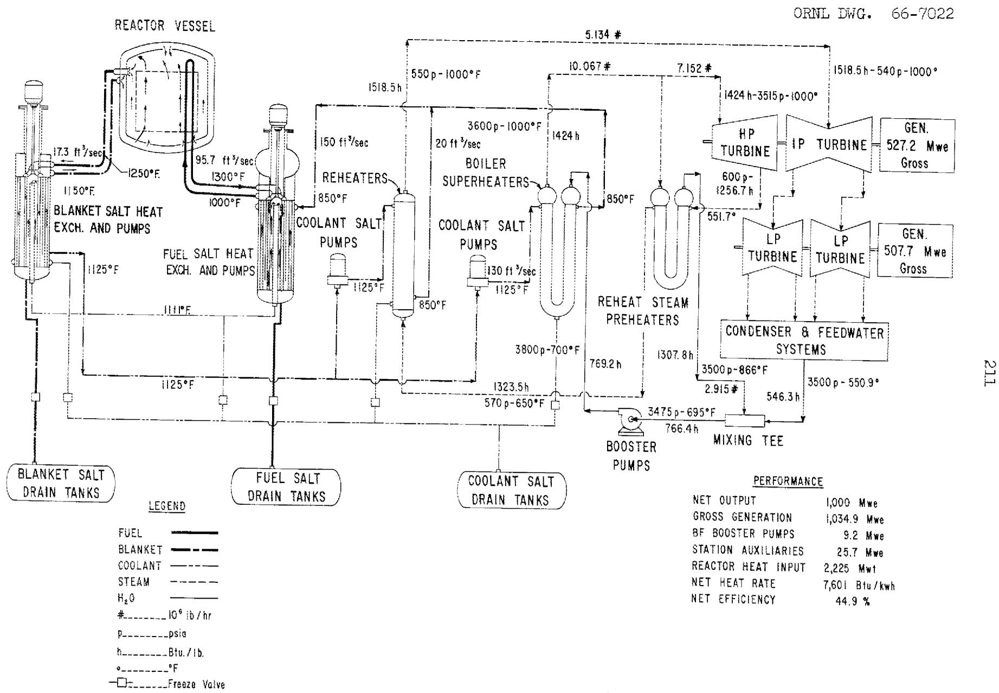  
Fig. 8.3. Revised MSBR Flow Diagram.

As given in Table 8.1, the minimum pressure difference between the core and blanket regions is about 15 psi plus the static head differential, or a minimum total difference of about 30 psi. If it is desirable to increase this pressure differential, the blanket salt pump could be changed so that it discharges into the reactor blanket region, giving a minimum differential pressure between the core and blanket fluids of about 120 psi. Whether this change is necessary or whether it would increase the reactor vessel design pressure is dependent upon the safety criteria that need to be satisfied. A design pressure of 150 psia was used in determining the thickness of the MSBR reactor vessel.

# 8.2 Modular-Type Plant

An important factor in attaining low power costs is the ability to maintain a high plant-availability factor; design features that improve this factor are desirable if these features do not themselves introduce compensating disadvantages.

In the MSBR plant, use is made of four heat exchanger circuits in conjunction with one reactor vessel in such a manner that if one pump in the fuel circuit stops, the reactor is effectively shut down. If, on the other hand, it were practicable to have four separate reactor circuits, with each connected to one of the four heat exchanger circuits, stoppage of a fuel pump would shut down only one-quarter of the station capacity, leaving $75\%$ available for power production. In order to determine the practicality of using a number of reactors in a single 1000-Mw (electrical) station, the design features of a modular-type MSBR plant, termed MMSBR, were investigated.

The MMSBR design concept considers four separate and identical reactors, along with their separate salt circuits. The only connections of the four reactors are through the fuel-recycle plant. The designs of the heat exchangers, the coolant-salt circuits, and the steam-power cycle remain essentially as for the MSBR. Each reactor module generates the thermal power required for producing 250 MW (electrical) net.

The flow diagram given previously for the MSBR (Fig. 8.3) also is essentially valid for the MMSBR. Salt flow rates and capacities of the various components remain as in the MSBR design.

Figures 8.4 and 8.5 give plan and elevation views of the four distinct reactor cells, along with their adjacent steam-generating cells. Any reactor module can be shut down and serviced while the other three remain operating.

The reactor core consists of 210 graphite fuel cells operating in parallel within the reactor tank. The design of the graphite tubes separating the fuel and blanket salts is similar to that used in the MSBR. The reactor core region is cylindrical with a diameter of about 6.3 ft and a height of about 7.9 ft. The reactor vessel is approximately

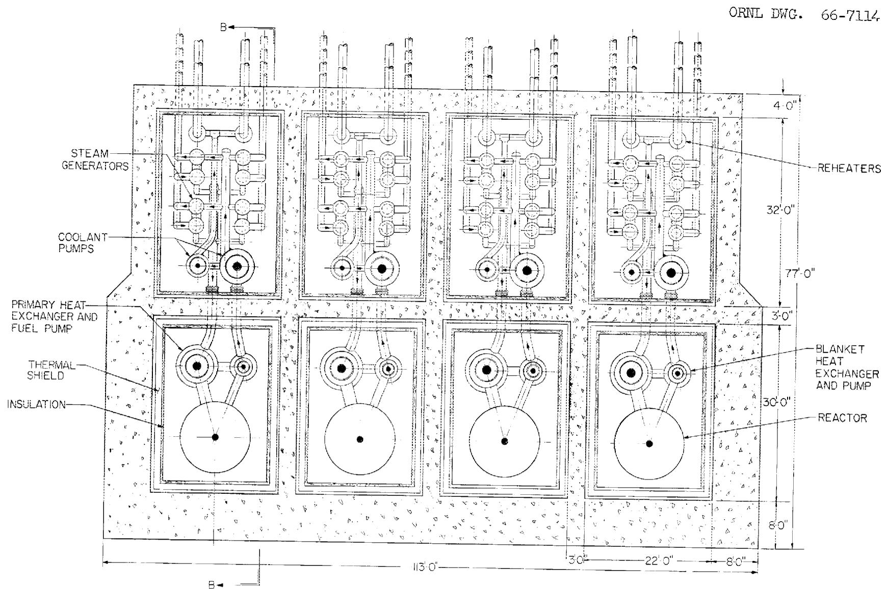  
Fig. 8.4. Modular Plant Reactor Cell - Plan AA.

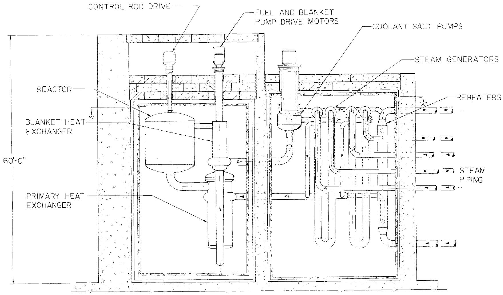  
Fig. 8.5. Modular Plant Reactor Cell - Elevation BB.

12 ft in diameter and about 14 ft high. Except for the use of four reactor vessels instead of one, all design features of the MMSBR are similar to those of the MSBR. The design conditions for one reactor module are summarized in Table 8.2.

Table 8.2. MMSBR Design Conditions for One Module   

<table><tr><td colspan="2">Power generation, Mw</td></tr><tr><td>Thermal</td><td>556</td></tr><tr><td>Electrical</td><td>250</td></tr><tr><td>Thermal efficiency, %</td><td>45</td></tr><tr><td>Plant factor</td><td>0.80</td></tr><tr><td>Dimensions, ft</td><td></td></tr><tr><td>Core</td><td></td></tr><tr><td>Height</td><td>7.87</td></tr><tr><td>Diameter</td><td>6.3</td></tr><tr><td>Blanket thickness</td><td>2</td></tr><tr><td>Radial</td><td>2</td></tr><tr><td>Axial</td><td>0.5</td></tr><tr><td>Reflector thickness</td><td></td></tr><tr><td>Reactor volumes, ft3</td><td></td></tr><tr><td>Core</td><td>245</td></tr><tr><td>Blanket</td><td>1000</td></tr><tr><td>Salt volumes, ft3</td><td></td></tr><tr><td>Fuel</td><td></td></tr><tr><td>Core</td><td>41.5</td></tr><tr><td>Blanket</td><td>7</td></tr><tr><td>Plena</td><td>22</td></tr><tr><td>Piping</td><td>25</td></tr><tr><td>Heat exchanger and pump</td><td>82</td></tr><tr><td>Processing</td><td>7.5</td></tr><tr><td>Total</td><td>185</td></tr><tr><td>Fertile</td><td></td></tr><tr><td>Core</td><td>12</td></tr><tr><td>Blanket</td><td>1000</td></tr><tr><td>Heat exchanger and piping</td><td>25</td></tr><tr><td>Processing</td><td>24</td></tr><tr><td>Total</td><td>1061</td></tr><tr><td>Salt compositions, mole %</td><td></td></tr><tr><td>Fuel</td><td></td></tr><tr><td>7LiF</td><td>63.6</td></tr><tr><td>BeF2</td><td>36.2</td></tr><tr><td>UF4(fissile)</td><td>0.22</td></tr><tr><td>Fertile</td><td></td></tr><tr><td>7LiF</td><td>71</td></tr><tr><td>BeF2</td><td>2</td></tr><tr><td>ThF4</td><td>27</td></tr><tr><td>Average power density in core fuel salt, kw/liter</td><td>473</td></tr></table>

The nuclear and fuel-cycle performance of a four-module plant generating 1000 Mw (electrical) was studied both for protactinium removal from the blanket stream and for the case of no direct protactinium removal. The same methods and bases as those for the MSBR studies were employed. Analogous to previous terminology, these cases are termed MMSBR(Pa) and MMSBR. The results obtained are summarized in Table 8.3. Comparison with the results obtained for the MSBR(Pa) and the MSBR indicates that the nuclear and fuel-cycle performance of a modular-type plant compares favorably with that of a single-reactor-type plant; the modular plant tends to have slightly higher breeding ratio, fissile inventory, and fuel-cycle cost.

Investor-owned plant: 0.8 load factor

Table 8.3. Nominal Nuclear and Fuel-Cycle Performance of 1000-Mw (electrical) Modular Plants   

<table><tr><td></td><td>MMSBR(Pa)</td><td>MMSBR</td><td>MSBR(Pa)</td></tr><tr><td>Fuel yield, %/year</td><td>7.3</td><td>5.0</td><td>7.95</td></tr><tr><td>Breeding ratio</td><td>1.073</td><td>1.053</td><td>1.071</td></tr><tr><td>Specific fissile inventory, kg/Mw (electrical)</td><td>0.76</td><td>0.80</td><td>0.68</td></tr><tr><td>Specific fertile inventory, kg/Mw (electrical)</td><td>125</td><td>310</td><td>105</td></tr><tr><td>Fuel-cycle cost, mills/kwhr (electrical)</td><td>0.38</td><td>0.48</td><td>0.35</td></tr><tr><td>Doubling time, yearsa</td><td>13.7</td><td>20</td><td>12.6</td></tr><tr><td>Power doubling time, yearsb</td><td>9.5</td><td>13.9</td><td>8.7</td></tr></table>

a. Inverse of fractional fuel yield per year.   
${}^{b}$ Based on continuous investment of bred fuel in reactor power plants.

Capital cost estimates were also made for the modular plant. The primary difference between the MMSBR- and MSBR-type plants is the use of four reactor vessels and cells in the modular plant rather than the one in the MSBR. However, the reactor vessels in the modular plant are smaller, so that their combined installed cost is only about $1 million more than that of the single large vessel. At the same time, the modular plant permits better placement of cells and a reduction in building volume. The resultant capital cost estimate for the modular plant was about $114/kw (electrical) for a privately owned plant, which is about the same as that estimated for the single-reactor plant. Using this cost estimate, along with the MSBR estimate for operation and maintenance costs, and the fuel-cycle costs from Table 8.3, gives the power-generation costs summarized in Table 8.4. These costs are nearly the same as those for the MSBR-type plants and thus indicate the desirability of a modular-type plant if the plant availability factor is improved by its use.

Investor-owner plant: 0.8 plant factor

Table 8.4. Power-Production Costs for Modular-Type Molten-Salt Breeder Reactors   

<table><tr><td rowspan="2"></td><td colspan="2">Cost [mills/kwhr(electrical)]</td></tr><tr><td>MMSBR(Pa)</td><td>MMSBR</td></tr><tr><td>Fixed charges</td><td>1.95</td><td>1.95</td></tr><tr><td>Operation and maintenance costs</td><td>0.34</td><td>0.34</td></tr><tr><td>Fuel-cycle costsa</td><td>0.38</td><td>0.48</td></tr><tr><td>Total power-production costs</td><td>2.7</td><td>2.8</td></tr></table>

aCapital charges of processing plant are included in fuel-cycle costs.

# 8.3 Steam Cycle with Alternative Feedwater Temperature

In the above molten-salt breeder reactor concepts, the feedwater temperature entering the once-through supercritical boilers was $700^{\circ}\mathrm{F}$ , and the temperature of the "cold" steam to the reheater was $650^{\circ}\mathrm{F}$ . These temperatures were specified in order to avoid any freezing of the intermediate-coolant salt $^{1,2}$ and involved diversion of prime steam. It would be a significant advantage if it were not necessary to divert almost $30\%$ of the throttle steam for heating of the feedwater and reheat steam, since this diversion leads to a loss of available energy. An even more significant saving could be achieved if the 9.2 Mw (electrical) of power required to drive the feedwater pressure-booster pumps could be eliminated; also, removal of the reheat-steam preheaters and the booster pumps would reduce capital investment requirements. Thus, savings can be achieved by lowering the temperature of the steam-cycle fluid entering the boilers and reheaters. To determine the incentive for developing a coolant salt having a low liquidus temperature, the MSBR steam-power cycle was studied with conditions of $580^{\circ}\mathrm{F}$ feedwater temperature and $550^{\circ}\mathrm{F}$ reheat steam. In order to differentiate and compare cases, use of $700^{\circ}\mathrm{F}$ feedwater and $650^{\circ}\mathrm{F}$ reheat steam is designated case A, while case B represents the alternative conditions.

The cycle arrangement for the case B conditions is shown in Fig. 8.6. In this cycle the $552^{\circ}\mathrm{F}$ steam from the high-pressure turbine exhaust is introduced into the reheaters without preheating. The feedwater is heated from 550 to $580^{\circ}\mathrm{F}$ by the addition of one more stage of feedwater heating; steam extracted from the high-pressure turbine is used. The condensate from this new heater is cascaded back through the feedwater heaters to thedeaerating heater in the usual manner. The heat balances and the analysis of the steam cycle with case B conditions were performed in the same manner as for case A conditions. Table 8.5 compares the design data for the two cases.

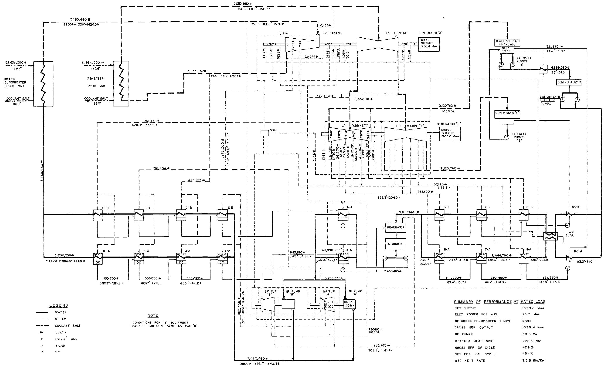  
Fig. 8.6. Alternate Steam System Flowsheet for $580^{\circ}\mathrm{F}$ Feedwater.

Table 8.5. MSBR Steam System Design and Performance Data for Case A and Case B Conditions   

<table><tr><td></td><td>Case A - MSBR Steam Cycle with 700°F Feedwater</td><td>Case B - MSBR Alternative Steam Cycle with 580°F Feedwater</td></tr><tr><td colspan="3">General performance</td></tr><tr><td>Reactor heat input, Mw</td><td>2225</td><td>2225</td></tr><tr><td>Net electrical output, Mw</td><td>1000</td><td>1009.7</td></tr><tr><td>Gross electrical generation, Mw</td><td>1034.9</td><td>1035.4</td></tr><tr><td>Station auxiliary load, Mw (electrical)</td><td>25.7</td><td>25.7</td></tr><tr><td>Boiler-feedwater pressure-booster pump load, Mw (electrical)</td><td>9.2</td><td>None</td></tr><tr><td>Boiler-feedwater pump steam-turbine power output, Mw</td><td>29.3</td><td>30.6</td></tr><tr><td>Flow to turbine throttle, lb/hr</td><td>7.152 × 10^6</td><td>7.460 × 10^6</td></tr><tr><td>Flow from superheater, lb/hr</td><td>10.068 × 10^6</td><td>7.460 × 10^6</td></tr><tr><td>Gross efficiency, %</td><td>47.83</td><td>47.91</td></tr><tr><td>Gross heat rate, Btu/kwhr</td><td>7136</td><td>7124</td></tr><tr><td>Net efficiency, %</td><td>44.9</td><td>45.4</td></tr><tr><td>Net heat rate, Btu/kwhr</td><td>7601</td><td>7518</td></tr><tr><td colspan="3">Boiler-superheaters</td></tr><tr><td>Number of units</td><td>16</td><td>16</td></tr><tr><td>Total duty, Mw (thermal)</td><td>1931.5</td><td>1837.0</td></tr><tr><td>Total steam capacity, lb/hr</td><td>10.068 × 10^6</td><td>7.460 × 10^6</td></tr><tr><td>Temperature of inlet feed-water, °F</td><td>700</td><td>580</td></tr><tr><td>Enthalpy of inlet feedwater, Btu/lb</td><td>769.2</td><td>583.6</td></tr><tr><td>Pressure of inlet feedwater, psia</td><td>~3800</td><td>~3800</td></tr><tr><td>Temperature of exit steam, °F</td><td>1003</td><td>1003</td></tr><tr><td>Pressure of exit steam, psia</td><td>~3600</td><td>~3600</td></tr><tr><td>Enthalpy of exit steam, Btu/lb</td><td>1424.0</td><td>1424.0</td></tr><tr><td>Temperature of inlet coolant salt, °F</td><td>1125</td><td>1125</td></tr><tr><td>Temperature of exit coolant salt, °F</td><td>850</td><td>850</td></tr><tr><td>Average specific heat of coolant salt, Btu lb-1 °F-1</td><td>0.41</td><td>0.41</td></tr><tr><td colspan="3">Total coolant-salt flow</td></tr><tr><td>lb/hr</td><td>58.468 × 10^6</td><td>55.608 × 10^6</td></tr><tr><td>cfs</td><td>129.93</td><td>123.57</td></tr><tr><td>gpm</td><td>58,316</td><td>55,463</td></tr><tr><td colspan="3">Steam reheaters</td></tr><tr><td>Number of units</td><td>8</td><td>8</td></tr><tr><td>Total duty, Mw (thermal)</td><td>293.5</td><td>388.0</td></tr><tr><td>Total steam capacity, lb/hr</td><td>5.134 × 106</td><td>5.056 × 106</td></tr><tr><td>Temperature of inlet steam, °F</td><td>650</td><td>551.7</td></tr><tr><td>Pressure of inlet steam, psi</td><td>~570</td><td>~600</td></tr><tr><td>Enthalpy of inlet steam, Btu/lb</td><td>1323.5</td><td>1256.7</td></tr><tr><td>Temperature of exit steam, °F</td><td>1000</td><td>1000</td></tr><tr><td>Pressure of exit steam, psia</td><td>~540</td><td>~540</td></tr><tr><td>Enthalpy of exit steam, Btu/lb</td><td>1518.5</td><td>1518.5</td></tr><tr><td>Temperature of inlet coolant salt, °F</td><td>1125</td><td>1125</td></tr><tr><td>Temperature of exit coolant salt, °F</td><td>850</td><td>850</td></tr><tr><td>Average specific heat of coolant salt, Btu lb-1 °F-1</td><td>0.41</td><td>0.41</td></tr><tr><td>Total coolant-salt flow lb/hr</td><td>8.884 × 106</td><td>11.744 × 106</td></tr><tr><td>cfs</td><td>19.742</td><td>26.098</td></tr><tr><td>gpm</td><td>8861</td><td>11.714</td></tr><tr><td>Coolant-salt pressure drop, inlet to outlet, psi</td><td>~60</td><td>~60</td></tr><tr><td colspan="3">Reheat-steam preheater</td></tr><tr><td>Number of units</td><td>8</td><td>None</td></tr><tr><td>Total duty, Mw (thermal)</td><td>100.45</td><td></td></tr><tr><td>Total heated steam capacity, lb/hr</td><td>5.134 × 106</td><td></td></tr><tr><td>Inlet temperature of heated steam, °F</td><td>551.7</td><td></td></tr><tr><td>Exit temperature of heated steam, °F</td><td>650</td><td></td></tr><tr><td>Inlet pressure of heated steam, psia</td><td>~580</td><td></td></tr><tr><td>Exit pressure of heated steam, psia</td><td>~570</td><td></td></tr><tr><td>Inlet enthalpy of heated steam, Btu/lb</td><td>1256.7</td><td></td></tr><tr><td>Exit enthalpy of heated steam, Btu/lb</td><td>1323.5</td><td></td></tr><tr><td>Total heating steam, lb/hr</td><td>2.915 × 106</td><td></td></tr><tr><td>Inlet temperature of heating steam, °F</td><td>1000</td><td></td></tr><tr><td>Exit temperature of heating steam, °F</td><td>866</td><td></td></tr><tr><td>Inlet pressure of heating steam, psia</td><td>3515</td><td></td></tr><tr><td>Exit pressure of heating steam, psia</td><td></td><td></td></tr><tr><td>Boiler-feedwater pumps</td><td></td><td></td></tr><tr><td>Number of units</td><td>2</td><td>2</td></tr><tr><td>Centrifugal pumps</td><td></td><td></td></tr><tr><td>Number of stages</td><td>6</td><td>6</td></tr><tr><td>Feedwater flow rate, 1b/hr total</td><td>7152 × 10^6</td><td>7460 × 10^6</td></tr><tr><td>Required capacity, gpm</td><td>8060</td><td>8408</td></tr><tr><td>Head, ft</td><td>~9380</td><td>~9380</td></tr><tr><td>Speed, rpm</td><td>5000</td><td>5000</td></tr><tr><td>Water inlet temperature, °F</td><td>357.5</td><td>357.5</td></tr><tr><td>Water inlet enthalpy, Btu/lb</td><td>329.5</td><td>329.5</td></tr><tr><td>Water inlet specific volume, ft^3/lb</td><td>~0.01808</td><td>~0.01808</td></tr><tr><td>Steam-turbine drive</td><td></td><td></td></tr><tr><td>Power required at rated flow, Mw (each)</td><td>14.66</td><td>15.30</td></tr><tr><td>Power, nominal hp (each)</td><td>20,000</td><td>20,000</td></tr><tr><td>Throttle steam conditions, psia/°F</td><td>1070/700</td><td>1070/700</td></tr><tr><td>Throttle flow, lb/hr (each)</td><td>413,610</td><td>431,400</td></tr><tr><td>Exhaust pressure, psia</td><td>~77</td><td>~77</td></tr><tr><td>Number of stages</td><td>8</td><td>8</td></tr><tr><td>Number of extraction points</td><td>3</td><td>3</td></tr><tr><td>Boiler-feedwater pressure-booster pump</td><td></td><td></td></tr><tr><td>Number of units</td><td>2</td><td>None</td></tr><tr><td>Centrifugal pump</td><td></td><td></td></tr><tr><td>Feedwater flow rate, lb/hr total</td><td>10.067 × 10^6</td><td></td></tr><tr><td>Required capacity, gpm (each)</td><td>9500</td><td></td></tr><tr><td>Head, ft</td><td>~1413</td><td></td></tr><tr><td>Water inlet temperature, °F</td><td>695</td><td></td></tr><tr><td>Water inlet pressure, psia</td><td>~3500</td><td></td></tr><tr><td>Water inlet specific volume, ft^3/lb</td><td>~0.03020</td><td></td></tr><tr><td>Water outlet temperature, °F</td><td>~700</td><td></td></tr><tr><td>Electric-motor drive</td><td></td><td></td></tr><tr><td>Power required at rate flow, Mw (each)</td><td>4.587</td><td></td></tr><tr><td>Power, nominal hp (each)</td><td>6150</td><td></td></tr></table>

The elimination of the feedwater pressure-booster pumps required in case A saves about 9.2 Mw (electrical) of auxiliary power, which, together with the improvement in the cycle thermal efficiency due to the additional stage of feedwater regeneration, makes about 9.7 Mw (electrical) additional power available from the case B cycle. The overall net thermal efficiency is thus improved from the $44.9\%$ obtained from case A to $45.4\%$ in case B.

To complete the discussion of case A vs case B conditions, the cost estimates for the affected items of equipment were compared; the results are summarized in Table 8.6. As shown, the case B arrangement requires about $465,000 less capital expenditure, primarily due to removal of the pressure-booster pumps. [In this cost study it was assumed that the \(580^{\circ}\mathrm{F}$ liquidus-temperature coolant salt has the same cost (about \)1.00/1b) as the MSBR coolant salt.] The lower construction cost reduces power costs by about 0.008 mill/kwhr (electrical), while the increased efficiency lowers power cost by about 0.026 mill/kwhr (electrical) (private financing), to give a total saving of about 0.034 mill/kwhr (electrical) [0.021].

Table 8.6. Cost Comparison of $700^{\circ}\mathrm{F}$ and $580^{\circ}\mathrm{F}$ Feedwater Cycles for MSBR   

<table><tr><td></td><td>Number of Units</td><td>Case A - 700°F Feedwater</td><td>Case B - 580°F Feedwater</td></tr><tr><td>Feedwater pressure-booster pumps</td><td>2</td><td>$ 400,000</td><td>None</td></tr><tr><td>Reheat-steam preheaters</td><td>8</td><td>180,000</td><td>None</td></tr><tr><td>Special mixing tee</td><td></td><td>5,000</td><td>None</td></tr><tr><td>Feedwater heater No. 0b</td><td></td><td>None</td><td>$ 150,000</td></tr><tr><td>Charge for extra extraction nozzle on turbine for heater No. 0</td><td></td><td>None</td><td>45,000</td></tr><tr><td>Boiler-superheaters</td><td>16</td><td>6,000,000c</td><td>5,900,000d</td></tr><tr><td>Reheaters</td><td>8</td><td>2,720,000e</td><td>2,880,000</td></tr><tr><td></td><td></td><td>$9,305,000</td><td>$8,975,000</td></tr><tr><td>Cost differential</td><td></td><td></td><td></td></tr><tr><td>Direct construction cost</td><td></td><td>$330,000</td><td></td></tr><tr><td>Total construction costf</td><td></td><td>$465,000</td><td></td></tr></table>

aTable shows only those costs different in the two cycle arrangements and is not a complete listing of the turbine plant costs.   
bThe high-pressure feedwater heater added in case B was designated. "No. 0" in order not to disturb the heater numbers used in case A.   
Estimated on basis of $130/ft².   
Estimated on basis of $140/ft².   
Estimated on basis of $125/ft².   
f. Indirect costs were assumed to be $41\%$ of the direct costs.

mill/kwhr (electrical) for public financing]. This saving in a 1000-Mw (electrical) plant (0.8 load factor) corresponds to about $238,000 per year. The present worth (6% discount factor) of this saving over a 25-year period is about $1.5 million. For several MSBR power plants, the saving would be proportionally greater. Thus, there is an economic incentive for developing a coolant salt with a low liquidus temperature, so long as its inventory cost does not outweigh the potential saving. If the inventory cost of the coolant salt for case B were about $2.4 million more than that for case A, the potential saving would be canceled by the increased coolant-salt inventory cost (for a privately owned plant).

# 8.4 Additional Design Concepts

Other molten-salt reactor designs were studied briefly. In general the technology required for these alternative designs is relatively undeveloped, although there are experimental data that support the feasibility of each concept. An exception is the molten-salt converter reactor (designated MSCR), whose application essentially requires only scaleup of MSRE and associated fuel-processing technology. However, the MSCR is not a breeder, although it approaches break-even breeder operation. The additional concepts are termed MSBR(Pa-Pb), SSCB(Pa), MOSEL(Pa-Pb), and MSCR. The MSBR(Pa-Pb) designation refers to the MSBR(Pa) modified by use of direct-contact cooling of the molten-salt fuel with molten lead. Lead is immiscible with molten salt and can be used as a heat exchange medium within the reactor vessel to significantly lower the fissile inventory external to the reactor. The lead also serves as a heat transport medium between the reactor and the steam generators.

The SSCB(Pa) designation refers to a Single-Stream-Core Breeder with direct protactinium removal from the fuel stream. This is essentially a single-region reactor having fissile and fertile material in the fuel stream, with protactinium removal from this stream; in addition, the core region is enclosed within a thin metal membrane and is surrounded by a blanket of thorium-containing salt. Nearly all the breeding takes place in the large core, and the blanket "catches" only the relatively small fraction of neutrons that "leak" from the core (this concept is also referred to as the one-and-one-half region reactor).

The MOSEL(Pa-Pb) designation refers to a Molten-Salt Epithermal breeder having an intermediate-to-fast energy spectrum, with direct protactinium removal from the fuel stream and direct-contact cooling of the fuel region by molten lead. No graphite is present in the core of this reactor.

The MSCR refers to a Molten-Salt Converter Reactor that has the fertile and fissile material in a single stream. No blanket region is employed, although a graphite reflector surrounds the large core.

The fuel-cycle performance characteristics for these reactors are summarized in Table 8.7; in all cases the methods, analysis procedures,

Table 8.7. Summary of Design Conditions and Fuel-Cycle Performance for Reactor Designs Studied   

<table><tr><td rowspan="2">Design Conditions</td><td colspan="7">Reactor Designa</td></tr><tr><td>MSBR(Pa)</td><td>MSBR</td><td>MMSBR(Pa)</td><td>MSBR(Pa-Pb)</td><td>SSCB(Pa)</td><td>MOSEL(Pa-Pb)</td><td>MSCR</td></tr><tr><td>Dimensions, ft</td><td></td><td></td><td></td><td></td><td></td><td></td><td></td></tr><tr><td>Core</td><td></td><td></td><td></td><td></td><td></td><td></td><td></td></tr><tr><td>Height</td><td>12.5</td><td>12.5</td><td>7.9b</td><td>12.5</td><td>16.0</td><td>3.0c</td><td>20.8</td></tr><tr><td>Diameter</td><td>10.0</td><td>10.0</td><td>6.3b</td><td>10.0</td><td>9.8</td><td>6.5c</td><td>16.6</td></tr><tr><td>Blanket thickness</td><td></td><td></td><td></td><td></td><td></td><td></td><td></td></tr><tr><td>Radial</td><td>1.5</td><td>1.5</td><td>2.0</td><td>1.5</td><td>1.2</td><td>3.0</td><td></td></tr><tr><td>Axial</td><td>2.0</td><td>2.0</td><td>2.0</td><td>2.0</td><td>0.0</td><td></td><td></td></tr><tr><td>Volume fractions, core</td><td></td><td></td><td></td><td></td><td></td><td></td><td></td></tr><tr><td>Fuel</td><td>0.169</td><td>0.169</td><td>0.17</td><td>0.169</td><td>0.193</td><td>0.5</td><td>0.105</td></tr><tr><td>Fertile</td><td>0.073</td><td>0.074</td><td>0.05</td><td>0.076</td><td>0.0</td><td>0.0</td><td>0.0</td></tr><tr><td>Moderator</td><td>0.758</td><td>0.757</td><td>0.78</td><td>0.755</td><td>0.807</td><td>0.0</td><td>0.895</td></tr><tr><td>Salt volumes, ft3</td><td></td><td></td><td></td><td></td><td></td><td></td><td></td></tr><tr><td>Fuel</td><td></td><td></td><td></td><td></td><td></td><td></td><td></td></tr><tr><td>Core</td><td>166</td><td>166</td><td>166</td><td>166</td><td>230</td><td>63.5</td><td>476</td></tr><tr><td>External</td><td>551</td><td>547</td><td>574</td><td>110</td><td>600</td><td>0.7</td><td>654</td></tr><tr><td>Total</td><td>717</td><td>713</td><td>740</td><td>276</td><td>830</td><td>64.2</td><td>1130</td></tr><tr><td>Fertile, total</td><td>1317</td><td>3383</td><td>1570</td><td>1324</td><td>983</td><td>758</td><td>0.0</td></tr><tr><td>Fuel-salt composition, mole %</td><td></td><td></td><td></td><td></td><td></td><td></td><td></td></tr><tr><td>LiF</td><td>63.6</td><td>63.6</td><td>63.6</td><td>63.6</td><td>71.0</td><td>71.0</td><td>70.0</td></tr><tr><td>BeF2</td><td>36.2</td><td>36.2</td><td>36.2</td><td>36.2</td><td>20.1</td><td>0.0</td><td>13.0</td></tr><tr><td>ThF4</td><td>0.0</td><td>0.0</td><td>0.0</td><td>0.0</td><td>8.68</td><td>24.0</td><td>16.55</td></tr><tr><td>UF4(fissile)</td><td>0.22</td><td>0.23</td><td>0.21</td><td>0.23</td><td>0.23</td><td>5.0</td><td>0.45</td></tr><tr><td>Core atom ratios</td><td></td><td></td><td></td><td></td><td></td><td></td><td></td></tr><tr><td>Th/U</td><td>41.7</td><td>39.7</td><td>28.4</td><td>41.5</td><td>37.7</td><td>4.76</td><td>36.7</td></tr><tr><td>C/U</td><td>5800</td><td>5440</td><td>5980</td><td>5520</td><td>6280</td><td>0.0</td><td>6525</td></tr><tr><td rowspan="2">Design Conditions</td><td colspan="7">Reactor Designationa</td></tr><tr><td>MSBR(Pa)</td><td>MSBR</td><td>MMSER(Pa)</td><td>MSER(Pa-Pb)</td><td>SSCB(Pa)</td><td>MOSEL(Pa-Pb)</td><td>MSCR</td></tr><tr><td>Power density, core average, kw/liter</td><td></td><td></td><td></td><td></td><td></td><td></td><td></td></tr><tr><td>Gross</td><td>80</td><td>80</td><td>80</td><td>80</td><td>66</td><td>618</td><td>17</td></tr><tr><td>In fuel salt</td><td>473</td><td>473</td><td>473</td><td>473</td><td>341</td><td>1236</td><td>165</td></tr><tr><td>Neutron flux, core average, neutrons cm-2sec-1</td><td></td><td></td><td></td><td></td><td></td><td></td><td></td></tr><tr><td>Thermal</td><td>7.2 × 1014</td><td>6.7 × 1014</td><td>7.3 × 1014</td><td>6.8 × 1014</td><td>6.1 × 1014</td><td>0.0 × 1014</td><td>1.9 × 1014</td></tr><tr><td>Fast</td><td>12.1 × 1014</td><td>12.1 × 1014</td><td>11.7 × 1014</td><td>12.1 × 1014</td><td>10.0 × 1014</td><td>72.2 × 1014</td><td>2.7 × 1014</td></tr><tr><td>Fast, over 100 kev</td><td>3.1 × 1014</td><td>3.1 × 1014</td><td>3.0 × 1014</td><td>3.1 × 1014</td><td>2.6 × 1014</td><td>23.3 × 1014</td><td>0.7 × 1014</td></tr><tr><td>Neutron production per fissile absorption (ηe)</td><td>2.227</td><td>2.221</td><td>2.229</td><td>2.226</td><td>2.226</td><td>2.260</td><td>2.201</td></tr><tr><td>Nuclear and fuel-cycle performance</td><td></td><td></td><td></td><td></td><td></td><td></td><td></td></tr><tr><td>Fuel yield, %/year</td><td>7.95</td><td>4.86</td><td>7.31</td><td>17.3</td><td>6.63</td><td>10.3</td><td></td></tr><tr><td>Breeding ratio</td><td>1.07</td><td>10.5</td><td>1.07</td><td>1.08</td><td>1.06d</td><td>1.14</td><td>0.96</td></tr><tr><td>Fuel-cycle cost, mills/kwhr</td><td>0.35</td><td>0.46</td><td>0.38</td><td>0.25</td><td>0.37d</td><td>0.13</td><td>0.57</td></tr><tr><td>Specific fissile inventory, kg/Mw (electrical)</td><td>0.68</td><td>0.77</td><td>0.76</td><td>0.34</td><td>0.68d</td><td>0.99</td><td>1.63</td></tr></table>

See text for explanation of reactor designations.   
bThe core dimensions for this case refer to one module of a four-module station.   
For this case, the core had annular geometry; the fuel annulus inside diameter was 3 ft, and the outside diameter was 6.5 ft.   
dUse of direct-contact lead cooling would lower the fuel-cycle cost to about 0.32 mill/kwhr (electrical) and the specific fissile inventory to about 0.41 kg/Mw (electrical).

and economic conditions employed were analogous to those used in obtaining the reference MSBR design data. In general, fuel recycling was based on fluoride-volatility and vacuum-distillation processing; direct protactinium removal from the reactor system was also considered in specified cases.

The results indicate the potential performance of fluoride-salt systems utilizing a direct-contact coolant such as molten lead and the versatility of molten salts as reactor fuels. They also illustrate that single-region reactors based on MSRE technology have good performance characteristics. Since the capital, operating, and maintenance costs of the MSCR should be comparable with those of the MSBR, the power-production cost of an investor-owned MSCR plant should be about 2.9 mills/kwhr (electrical), based on a load factor of 0.8. However, the lower power costs of the MSBR(Pa) and MSBR plants and their superior nuclear and fuel-conservation characteristics make development of the breeder reactors preferable.

# References

1. MSR Program Semiann. Progr. Rept. Feb. 28, 1966, ORNL-3936, p. 172.   
2. P. R. Kasten, E. S. Bettis, and R. C. Robertson, Design Studies of 1000-Mw(e) Molten-Salt Breeder Reactors, ORNL-3996 (August 1966).   
3. P. R. Kasten, Safety Program for Molten-Salt Breeder Reactors, unpublished internal report (July 29, 1966).

# M. E. Whatley

A close-coupled facility for processing the fuel and fertile streams of a molten-salt breeder reactor (MSBR) will be an integral part of the reactor system. Studies are in progress for obtaining data relevant to the engineering design of such a processing facility. The processing plant will operate on a side stream withdrawn from the fuel stream, which circulates through the reactor core and the primary heat exchanger. For a 1000-Mw (electrical) MSBR approximately 14 ft³ of salt will be processed per day, which will result in a fuel-salt cycle time of approximately 40 days.

The probable method for fuel-stream and fertile-stream processing is shown in Fig. 9.1. The salt will first be contacted with $\mathbf{F}_2$ for removal of U as volatile $\mathbf{U}\mathbf{F}_6$ . Purified $\mathbf{U}\mathbf{F}_6$ will be obtained from the fluorinator off-gas (consisting of $\mathbf{U}\mathbf{F}_6$ , excess $\mathbf{F}_2$ , and volatile fission product fluorides) by use of NaF sorption. It may be necessary to discard as much as $5\%$ of the salt leaving the fluorinator for removal of fission products such as Zr, Rb, and Cs. A semicontinuous vacuum distillation will then be carried out on the remaining salt for the removal

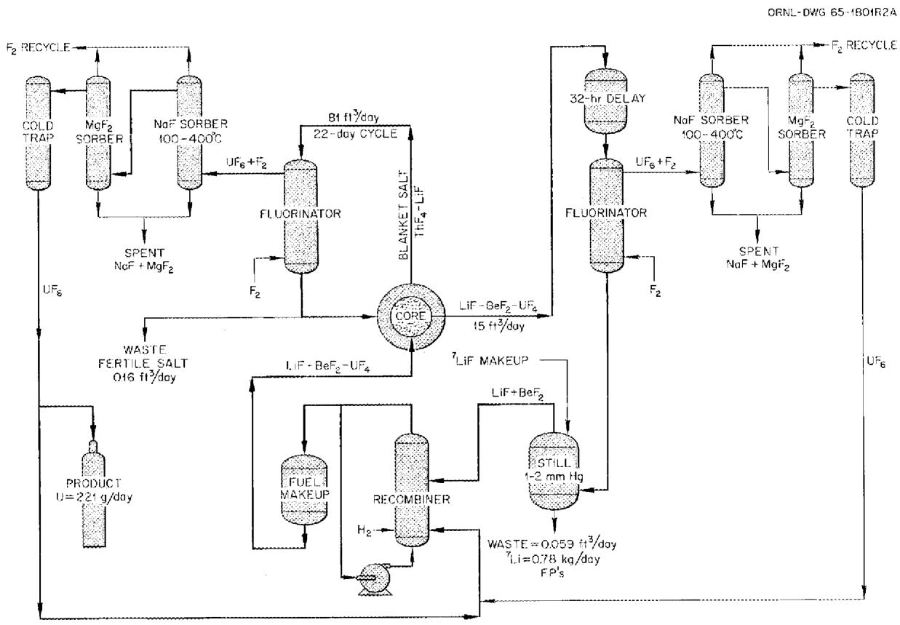  
Fig. 9.1. MSBR Fuel and Fertile Stream Processing.

of the rare earths, Ba, Sr, and Y. These fission products will be removed from the still in a salt volume equivalent to $0.5\%$ of the stream. The barren salt, the purified $\mathrm{UF}_6$ , and the makeup salt will then be recombined. This step involves reduction of $\mathrm{UF}_6$ to $\mathrm{UF}_4$ , mixing of these streams, and sparging the resultant material with an $\mathrm{H}_2$ -HF stream. Finally, the salt mixture may be filtered before return to the reactor.

# 9.1 Semicontinuous Distillation

J.R.Hightower

L.E.McNeese

New measurements of the relative volatilities of $\mathsf{NdF}_3$ and $\mathsf{LaF}_3$ in LiF have been made using a recirculating equilibrium still. These values are lower than earlier data by a factor of about 50 and are in a range (around 0.0007) where the proposed distillation step in the MSBR processing plant should work very well.

The present concept of the distillation step in the MSBR processing plant uses a continuous feed stream and vapor removal for separating rare-earth fission products (FP's) from the fuel salt; the less volatile rare-earth FP's will accumulate in the still pot and will be discharged periodically. A measure of the decontamination achieved in this step is the relative volatility of the less volatile FP's compared to the carrier salt. The relative volatility of component A compared to component B is defined as

$$
\alpha_ {\mathrm {A} - \mathrm {B}} \equiv \frac {\mathrm {Y} _ {\mathrm {A}} / \mathrm {X} _ {\mathrm {A}}}{\overline {{\mathrm {Y}}} _ {\mathrm {B}} / \overline {{\mathrm {X}}} _ {\mathrm {B}}} , \tag {1}
$$

where

$\alpha_{A-B} \equiv$ relative volatility of A compared to B,

Y $\equiv$ vapor-phase mole fraction,

X = liquid-phase mole fraction.

For systems in which the concentration of component A is small and $X_B$ is nearly unity, the relative volatility can be approximated by

$$
\alpha_ {\mathrm {A} - \mathrm {B}} \approx \mathrm {Y} _ {\mathrm {A}} / \mathrm {X} _ {\mathrm {A}}. \tag {2}
$$

To achieve good decontamination from the less volatile fission products their relative volatilities must be small.

Since the major constituent of the still pot will be LiF, experimental measurements have been made with mixtures of rare-earth fluorides in LiF. A cold-finger technique gave approximate values for the relative volatilities of six rare-earth fluorides with respect to LiF (975 to $1075^{\circ}\mathrm{C}$ ) ranging from 0.01 to 0.05. These were high enough to seriously limit the effectiveness of the proposed simple distillation scheme. More accurate measurements of the relative volatilities were called for.

ORNL-DWG 66-3933

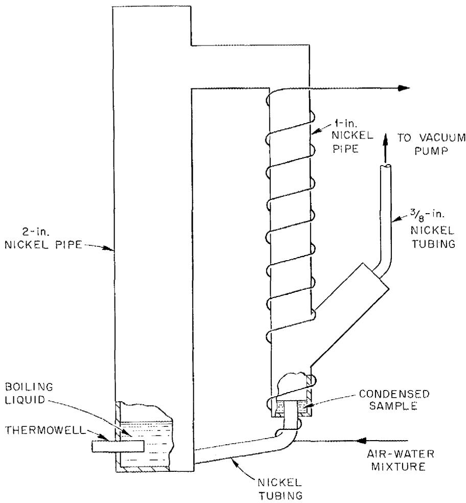  
Fig. 9.2. Diagram of Recirculating Equilibrium Still.

A diagram of the recirculating equilibrium still used in recent work is shown in Fig. 9.2. The boiling section is a 12-in. length of 2-in.-diam nickel pipe. The condensing section is made from 1-in. nickel pipe wrapped with cooling coils of $\frac{1}{4}$ -in. nickel tubing. In the bottom of the condenser is a condensate trap where liquid collects and overflows a weir to return to the still pot. The vacuum pump is connected near the bottom of the condenser section.

After charging salt of known composition, the still is welded shut and purged with argon. The desired pressure is set, and the still is heated to the desired temperature while cooling the condenser. After operating the still for a period of time at the selected conditions, the still is pressurized with argon, cooled to room temperature, and cut apart for examination and sampling. The concentrations of the rare-earth fluorides in the condensate trap and in the still pot are used to calculate relative volatilities according to Eq. (2).

In these experiments the determination of absolute values for relative volatilities has been hampered because the vapor samples have rare-earth concentrations below the analytical limit of detection. However, upper and lower limits of the relative volatilities for 0.01 to 0.02 mole fraction $\mathrm{CeF}_3$ , $\mathrm{NdF}_3$ , and $\mathrm{LaF}_3$ in LiF at $1000^{\circ}\mathrm{C}$ and $0.5\mathrm{mmHg}$ were determined and are given below:

$$
\begin{array}{l} 0. 0 0 1 3 <   \alpha_ {\mathrm {C e F} _ {3} - \mathrm {L i F}} <   0. 0 0 2 9 \\ 0. 0 0 0 5 5 <   \alpha_ {\mathrm {N d F} _ {3} - \mathrm {L i F}} <   0. 0 0 0 8 9 \\ \alpha_ {\mathrm {L a F} _ {3} - \mathrm {L i F}} \stackrel {\sim} {=} 0. 0 0 0 6 9. \\ \end{array}
$$

These values are substantially lower than those previously reported. The samples have been submitted for analysis by a more sensitive analytical method (neutron activation). Higher concentrations of rare-earth fluoride will be used in the still pot in future work in order that rare-earth fluoride concentrations in the vapor phase will be higher than the limit of detection.

The importance of relative volatility in determining the operating characteristics of the distillation system is shown by the following calculation. Consider the reboiler of a single-stage distillation system which contains V moles of LiF at any time and a quantity of $\mathrm{BeF}_2$ such that vapor in equilibrium with the liquid has the composition of MSBR fuel salt. Assume that MSBR fuel salt containing $X_0$ moles of rare-earth fluorides (REF) per mole of LiF is fed to the still pot at a rate of F moles of LiF per unit time where it mixes with the liquid in the system. Let the initial REF concentration in the liquid be $X_0$ moles of REF per mole of LiF, and let the concentration at any time $t$ be $X$ moles of REF per mole of LiF. From a material balance on REF,

$$
\frac {\mathrm {d}}{\mathrm {d} t} (\mathrm {V X}) = \mathrm {F X} _ {0} - \mathrm {F O X}, \tag {1}
$$

where

$$
\begin{array}{l} V = \text {s t i l l} \\ \mathrm {X} = \text {R E F} \text {c o n c e n t r a t i o n i n s t i l l l i q u i d , m o l e s o f R E F p e r m o l e o f} \\ F = \text {L i F} \\ \mathrm {X} _ {0} = \text {R E F} \\ \alpha = \text {r e l a t i v e} \\ \end{array}
$$

This equation has the solution

$$
X = \frac {X _ {0}}{\alpha} [ 1 - (1 - \alpha) e ^ {- F o t t / V} ]. \tag {2}
$$

The total quantity of REF fed to the system at time $t$ is $(Ft + V)X_0$ , and

the quantity of REF remaining in the liquid at that time is VX. Thus the fraction of the REF not vaporized at time t is

$$
f _ {R E F} = \frac {V X}{\left(F t + V\right) X _ {0}} = \frac {(1 / \alpha) \left[ 1 - (1 - \alpha) e ^ {- F a t / V} \right]}{1 + \left(F t / V\right)}. \tag {3}
$$

Values for the fraction of REF retained in the still as a function of dimensionless throughput (Ft/V) are given in Fig. 9.3 for various values of $\alpha$ . Approximately $91\%$ of the REF will be retained in the still when $99.5\%$ of the LiF has been recovered if the relative volatility of the REF is 0.001; a retention of greater than $95\%$ can be obtained for the same LiF recovery if $\alpha$ has a value of 0.0005.

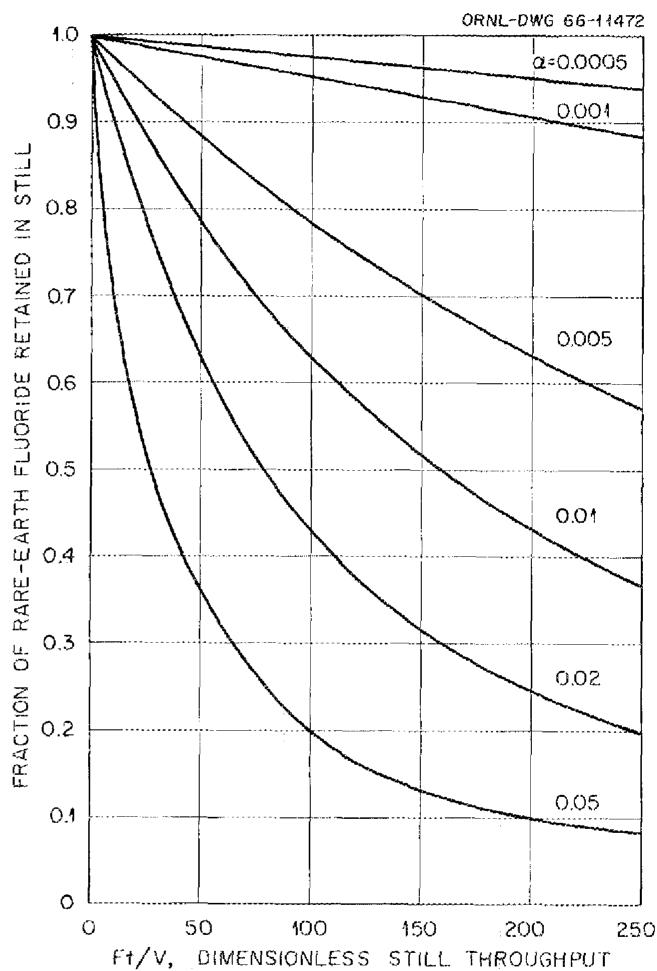  
Fig. 9.3. Fraction of Rare-Earth Fluoride Retained in Still.

# L. E. McNeese

Uranium present in the fuel stream of an MSBR must be removed prior to the distillation step since $\mathrm{UF_4}$ present in the still would not be completely volatilized and would in part be discharged to waste when the still contents are dumped periodically. Equipment is being developed for the continuous removal of $\mathrm{UF_4}$ from the fuel stream of an MSBR by contacting the salt with $\mathbf{F}_2$ in a salt-phase-continuous system. This equipment will be protected from corrosion by freezing a layer of salt on the vessel wall; the heat necessary for maintaining molten salt adjacent to frozen salt will be provided by the decay of fission products in the fuel stream. Present development work consists of two parts: (1) studies in a continuous fluorinator not protected by a frozen wall, and (2) study of a frozen-wall system suitable for continuous fluorination but with which an inert gas is used. Experimental work on the nonprotected system is well under way; the protected system is being designed.

The nonprotected system consists of a 1-in.-diam nickel fluorinator 72 in. long and auxiliary equipment (Fig. 9.4) which allows the countercurrent contact of a molten salt with $\mathbb{F}_2$ . Experiments can be carried out with molten-salt flow rates of 3 to $50~\mathrm{cm}^3/\mathrm{min}$ with fluorinator salt depths of 12 to 54 in. The system is constructed of nickel with the exception of molten-salt transfer lines, which are Hastelloy N. The fluorinator off-gas passes through a $400^{\circ}\mathrm{C}$ NaF bed for removal of chromium

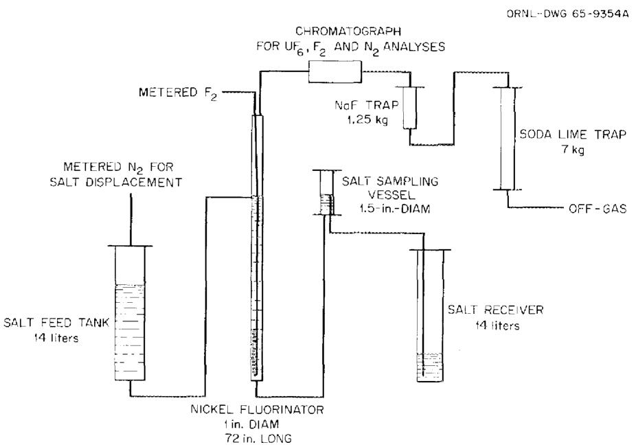  
Fig. 9.4. Equipment for Removal of Uranium from Molten Salt by Continuous Fluorination.

fluorides, a $100^{\circ}\mathrm{C}$ NaF trap for removal of $\mathrm{UF}_6$ , and a soda-lime bed for $\mathbf{F}_2$ disposal. Analysis for $\mathbf{F}_2$ , $\mathbf{UF}_6$ , and $\mathbf{N}_2$ is made prior to the $100^{\circ}\mathrm{C}$ NaF bed with a gas chromatograph.

Experiments have been carried out at 600 to $650^{\circ}\mathrm{C}$ using an NaF-LiF $\mathbf{ZrF_4}$ mixture containing 0.2 to 0.5 wt $\%$ UF $_4$ and having a melting point of $\sim 550^{\circ}\mathrm{C}$ . Salt feed rates of 5 to 21 cm $^3$ /min and F $_2$ rates of 75 to 250 cm $^3$ /min (STP) have been used with molten-salt depths of 40 to 52 in. Uranium removal during one pass through the fluorinator has varied from 95% to 99.6% as determined from salt samples. Equipment operation has been smooth although several plugs have developed in salt transfer lines and in the fluorinator off-gas.

During the best run to date (CF-10), a molten-salt feed rate of 20.7 cm³/min and an F₂ feed rate of 250 cm³/min (STP) were maintained for a 2.5-hr period. The concentration of U in the feed salt was 0.32 wt %, and the fluorinator was operated at 650°C with a salt depth of 48 in. The U concentration in the salt discharged from the fluorinator during the last hour of operation was 0.0020 wt % as determined from four salt samples taken at 15-min intervals. Based on inlet and exit U concentrations in the salt, 99.4% of the U was removed by the fluorinator. The equipment operated smoothly during the run, salt and gas feed rates were constant, and the system appeared to have reached steady state during the last hour of operation.

Continuous fluorination of the fuel stream of an MSBR with equipment of the type studied is considered feasible. Study of continuous fluorination will be continued, and the use of a frozen wall for corrosion protection will be demonstrated.

# 9.3 Alternative Chemical Processing

# Methods for an MSBR

G. I. Cathers

C. E. Schilling

Liquid-metal extraction was studied in a previous search for a salt reprocessing method to replace vacuum distillation. These tests with $\mathrm{Li}_2\mathrm{BeF}_4$ salt showed that the lanthanides were removed in most cases by a reductive coprecipitation with Be to yield refractory insoluble berylides deposited at the salt-metal interface. The present problem was to develop a reductive precipitation using minimum quantities of Li or Be as reductant and involving simple physical separation of the precipitated metals by filtration or settling. Decontamination factors were determined using initial concentrations of 30 to $1000~\mathrm{ppm}$ of Zr, Nd, Ia, Sm, Eu, Gd, and Sr either singly or in various combinations.

Further studies on the liquid-metal extraction method were made using Li-Bi alloys to test removal of the same elements with the exception of Zr and Nd.

Table 9.1. Reductive Precipitation of Neutron Poisons from $\mathsf{Li}_2\mathsf{BeF}_4$ Initial concentrations: $Zr = 70~\mathsf{ppm}$ ; Nd = 400 ppm; others 600-900 ppm   

<table><tr><td rowspan="2">Experiment Number</td><td rowspan="2">Reductant</td><td rowspan="2">Factor of Excess Reductant</td><td rowspan="2">Temperature (°C)</td><td colspan="4">DF = ppm spike in original salt</td><td rowspan="2">Species Identified in Metal Precipitates by X-Ray Analysis</td></tr><tr><td>Zr</td><td>La</td><td>Nd</td><td>Gd</td></tr><tr><td>1</td><td>Be</td><td>1</td><td>550-600</td><td></td><td>2.4</td><td></td><td>2.3</td><td>Be, α-Zr (trace), and LaBe13 (trace)</td></tr><tr><td>2</td><td>Be</td><td>4.2 (Nd) 243 (Zr)</td><td>550-60</td><td>55</td><td></td><td>2.1</td><td></td><td>Not examined</td></tr><tr><td>3</td><td>Be</td><td>4.4</td><td>550-95</td><td></td><td>9.0</td><td></td><td>8.0</td><td>LaBe13 and Be (trace)</td></tr><tr><td>4</td><td>Be</td><td>103</td><td>550-80</td><td></td><td></td><td>52</td><td></td><td>α-Zr, ZrBe2, Be, and NdBe13</td></tr><tr><td>5</td><td>Be</td><td>121</td><td>550-60</td><td>\(395^a\)</td><td></td><td></td><td></td><td>Be</td></tr><tr><td>6</td><td>Be</td><td>104</td><td>800</td><td>36</td><td></td><td></td><td></td><td>Cu (from filter) + unidentified lines</td></tr><tr><td>7</td><td>Be</td><td>162</td><td>1000</td><td>11</td><td></td><td></td><td></td><td>Not examined</td></tr><tr><td>8</td><td>Li</td><td>1.28</td><td>550-75</td><td>\(234^b\)</td><td>1.1</td><td></td><td>1.3</td><td>α-Zr; LiF + Li2BeF4in salt</td></tr><tr><td>9</td><td>Li</td><td>105</td><td>550-80</td><td>51</td><td></td><td></td><td></td><td>Cu (from filter)</td></tr><tr><td>10</td><td>Li</td><td>4.1</td><td>550</td><td></td><td>13</td><td></td><td>6</td><td>Be, LaBe13, FeBe5 (from crucible)c</td></tr><tr><td></td><td colspan="2">Process required DF&#x27;s</td><td></td><td>1.43</td><td>1.7</td><td>20</td><td>1.05</td><td></td></tr></table>

Initial concentration $= 400$ ppm Zr.   
bInitial concentration $= 11.7\%$ Zr.   
c Separation by settling.

# Reduction Precipitation

The reduction-coprecipitation studies were made on 15-g (7.5-cc) samples of $\mathrm{Li}_2\mathrm{BeF}_4$ spiked with cold neutron poisons as the fluorides; the samples were contained in mild steel under a protective atmosphere of argon. A typical test consisted of: preparation and sampling of the original salt while molten; reduction with between 1 and 243 times the theoretical amount of Li or Be at temperatures in the range 500 to $1000^{\circ}\mathrm{C}$ for about 90 min with stirring by an argon sparge; filtration through a sintered Cu filter stick; recovery of frozen samples of treated salt from the filter and, when possible, precipitated metals from the bottom of the reactor. Salt samples were analyzed for lanthanides and zirconium by neutron activation analysis, spark source mass spectrometry, or emission spectrometry. The metal precipitates were examined by x-ray diffraction.

The decontamination factors DF (La) and DF (Gd) shown in Table 9.1, when compared with the indicated process requirement at the bottom of each column, show that adequate removals could be achieved with both Li and Be using excess reductant in the range of 1 to 4 times the theoretical requirement for $\mathrm{LnBe}_{13}$ deposition. The low values obtained in experiment 8 reflect the incomplete removal of Zr, present in this one experiment as a major component (11.7%). In this case the final concentration of Zr (500 ppm) was comparable to the initial concentrations of La and Gd, and therefore sufficient to inhibit their reduction. The species identified in the metal precipitates recovered (see Table 9.1, experiments 1, 3, and 10) indicate that reduction of lanthanides in $\mathrm{Li}_{2}\mathrm{BeF}_{4}$ with either Li or Be leads exclusively to beryllides of the type $\mathrm{LnBe}_{13}$ . The x-ray identifications listed in Table 9.1 represent only the most likely specific beryllide since all the $\mathrm{LnBe}_{13}$ compounds of the lanthanide series are isostructural, with very nearly identical lattice parameters, and therefore are indistinguishable from each other when codeposited from a mixture.

Examination of zirconium DF's shown in Table 9.1 show it to be removed easily from solutions in $\mathrm{Li}_2\mathrm{BeF}_4$ over a broad range of concentration by treatment with either Li or Be. It is deposited either as free metal or from very dilute solutions (70 ppm) as $\mathrm{ZrBe}_2$ (Table 9.1, experiment 4). The value of DF $(\mathrm{Zr}) = 11$ obtained at $1000^{\circ}\mathrm{C}$ in experiment 7 is of special interest since it suggests a solution to the high volatility of $\mathrm{ZrF}_4$ , a major problem encountered at this temperature in the vacuum-distillation salt recovery method. Lithium or beryllium could be used to retain Zr in the still pot as nonvolatile free metal. In experiment 4, due to the low zirconium concentration (70 ppm), $\mathrm{ZrBe}_2$ was identified along with $\alpha$ -Zr.

In addition to the elements listed in Table 9.1, Sm, Eu, and Sr were studied as parts of the mixtures used in experiments 1, 3, and 8 plus other tests not listed. Aside from a DF (Sm) = 2 observed in experiment 3 and a DF (Sr) = 1.14 in an unlisted test using Li at $550^{\circ}$ , no encouraging results were obtained by this method for these elements.

Table 9.2. Li-Bi Alloy Extraction of Lanthanides from Molten $\mathsf{Li}_2\mathsf{BeF}_4$ Initial concentration: lanthanides $= 800 - 1000$ ppm each; Sr $\sim 200$ ppm   

<table><tr><td rowspan="2">Alloy Composition (at. %)</td><td colspan="3">Contacting Conditions</td><td colspan="5">DF = C original salt / C treated salt</td><td colspan="5">KD = mole fraction in metal / mole fraction in salt</td></tr><tr><td>Temperature (°C)</td><td>Time (min)</td><td>Volume Ratio (alloy/salt)</td><td>La</td><td>Sm</td><td>Eu</td><td>Gd</td><td>Sr</td><td>La</td><td>Sm</td><td>Eu</td><td>Gd</td><td>Sr</td></tr><tr><td>5.0 Li-94.1 Bi (C final = 2.56 at. % Li)</td><td>550-60</td><td>160</td><td>0.71</td><td>3.0</td><td>3.5</td><td>1.0</td><td>2.0</td><td>1.5</td><td>0.85</td><td>2.2</td><td>0.54</td><td>0.32</td><td>0.18</td></tr><tr><td>30 Li-70 Bi (C final = 10.05 at. % Li)</td><td>550-60</td><td>120</td><td>1.1</td><td>6.0</td><td>2.0</td><td>8.0</td><td>5.0</td><td>2.0</td><td>1.1</td><td>3.1</td><td>17.1</td><td>2.00</td><td>0.97</td></tr><tr><td></td><td>DF required</td><td></td><td></td><td>1.7</td><td>5.0</td><td>1.43</td><td>1.05</td><td>1.04</td><td></td><td></td><td></td><td></td><td></td></tr></table>

# Li-Bi Alloy Extraction

Liquid-metal extraction tests with solutions of Li in Bi were made in the same equipment but without filtration of either phase. Samples were recovered after settling, quenching to room temperature, and sacrificing the crucible. Both salt and metal slugs were cleaned of surface deposits before sampling for analysis.

The decontamination factors (DF's) and distribution coefficients $(\mathbb{K}_{\mathrm{D}})$ obtained in liquid-metal extractions of spiked carrier salt using Li-Bi alloys are summarized in Table 9.2. For the spectrum of spikes present (La, Sm, Eu, Gd, and Sr) adequate decontamination was achieved for all but Sm. The generally high DF's cannot be explained in most cases by a true extraction mechanism, a fact indicated by the low distribution coefficients shown in Table 9.2. Also, poor material balances were obtained through use of analytical results from samples of the salt and metal phases. The explanation for removal of the elements in question is precipitation as interfacial solids which were later identified by x-ray analysis to be beryllides of the InBe13 type. The high $\mathbb{K}_{\mathrm{D}}$ observed for Eu indicates that this element was removed almost exclusively by extraction when using 30 at. % Li-Bi alloy.

# References

1. C. D. Scott and W. L. Carter, Preliminary Design Study of a Continuous Fluorination - Vacuum-Distillation System for Regenerating Fuel and Fertile Streams in a Molten Salt Breeder Reactor, ORNL-3791 (January 1966).   
2. MSR Program Semiann. Progr. Rept. Feb. 28, 1966, ORNL-3936, p. 199.

__________

# OAK RIDGE NATIONAL LABORATORY

# MOLTEN-SALT REACTOR PROGRAM

JUNE 45,1966

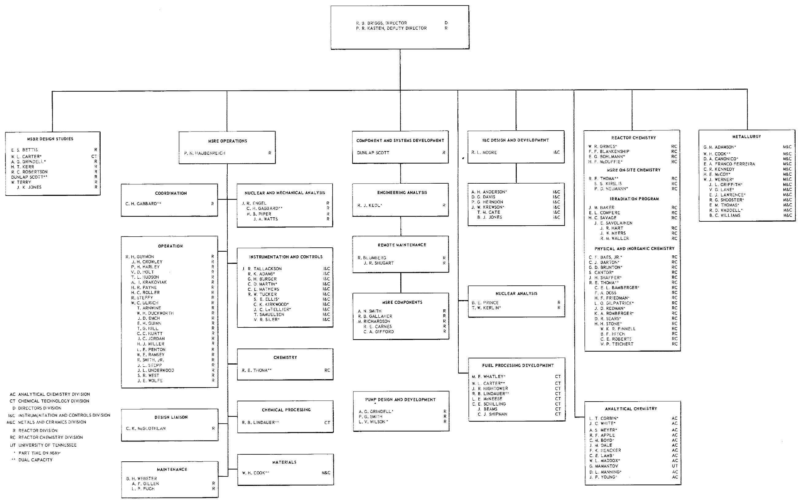

ORNL-4037

UC-80 - Reactor Technology

# INTERNAL DISTRIBUTION

1. G. M. Adamson

2. L. G. Alexander

3.C.F.Baes

4. J. M. Baker

5. S. E. Beall

6. E. S. Bettis

7. D. S. Billington

8. F. F. Blankenship

9. R. Blumberg

10. H. F. Bauman

11. A. L. Boch

12. E. G. Bohlmann

13. C. J. Borkowski

14. G. E. Boyd

15.M.A.Bredig

16. E. J. Breeding

17-26. R. B. Briggs

27. F. R. Bruce

28. C. H. Burger

29. S. Cantor

30. D. W. Cardwell

31. W. L. Carter

32. E. L. Compere

33. J. A. Conlin

34. W. H. Cook

35. L. T. Corbin

36. G. A. Cristy

37. J. L. Crowley

38. F. L. Culler

39. J. M. Dale

40. D. G. Davis

41. W. W. Davis

42. J. H. DeVan

43. R. G. Donnelly

44. D. A. Douglas

45. N. E. Dunwoody

46. J. R. Engel

47. E. P. Epler

43. W. K. Ergen

49. D. E. Ferguson

50. A. P. Fraas

51. J. H Frye, Jr.

52. C. H. Gabbard

53. W. R. Gall

54. R. B. Gallaher

55. R. G. Gilliland

56. W. R. Grimes

57. A. G. Grindell

58. R. H. Guymon

59. R. P. Hammond

60. P. H. Harley

61. C. S. Harrill

62. P. N. Haubenreich

63. P. G. Herndon

64. R. F. Hibbs (Y-12)

65. M. R. Hill

66. E. C. Hise

67. H. W. Hoffman

68. V. D. Holt

69.P.P.Holz

70. A. Hollander

71. A. S. Householder

72. T. L. Hudson

73. H. Inouye

74. W. H. Jordan

75-80.P.R.Kasten

81. R. J. Kedl

82. M. T. Kelley

83. M. J. Kelly

84. C. R. Kennedy

85. T. W. Kerlin

86. H. T. Kerr

87. A. I. Krakovijak

88. J. W. Krewson

89. C. E. Lamb

90. J. A. Lane

91. C. E. Larson

92. E. J. Lawrence

93. T. A. Lincoln

94. R. B. Lindauer

95. A. P. Litman

96. R. S. Livingston

97. M. I. Lundin

98. R. N. Lyon

99. H. G. MacPherson

100. R. E. MacPherson

101. F. C. Maienschein

102. W. R. Martin

103. C. E. Mathews

104.H.E.McCoy

105.H.F.McDuffie

106. C. K. McGlothlan

107. L. E. McNeese

108.E.C.Miller

109. C. A. Mills

110. W. R. Mixon

111. R. L. Moore

112. K. Z. Morgan

113. J. C. Moyers

114. W. R. Osborn

115-116. R. B. Parker

117. L. F. Parsly

118. P. Patriarca

119. H. R. Payne

120. W. B. Pike

121. H. B. Piper

122. B. E. Prince

123. J. L. Redford

124. M. Richardson

125. R. C. Robertson

126. H. C. Roller

127. M. W. Rosenthal

128. H. C. Savage

129. A. W. Savolainen

130. D. Scott

131. H. E. Seagren

132. J. H. Shaffer

133. E. D. Shipley

134. M. J. Skinner

135. G. M. Slaughter

136. A. N. Smith

137. P. G. Smith

138. A. H. Snell

1.39.W.F.Spencer

140. I. Spiewak

141. R. Steffy

142. C. E. Stevenson

143. C. D. Susano

144. J. R. Tallackson

145. E. H. Taylor

146. R. E. Thoma

147. G. M. Tolson

148. D. B. Trauger

149. R. W. Tucker

150. W. C. Ulrich

151. D. C. Watkin

152. G. M. Watson

153. B. H. Webster

154. A. M. Weinberg

155. J. R. Weir

156. M. E. Whatley

157. G. C. Williams

158. J. C. White

159. I. V. Wilson

160. G. J. Young

161. Biology Library

162-163. Reactor Division Library

164-168. ORNL - Y-12 Technical Library

Document Reference Section

169-171. Central Research Library

172-207. Laboratory Records Department

208. Laboratory Records, ORNL R.C.

# EXTERNAL DISTRIBUTION

209. D. F. Cope, Atomic Energy Commission, RDT Site Office (ORNL)

210. A. Giambusso, Atomic Energy Commission, Washington

211. W. J. Larkin, Atomic Energy Commission, ORO

212. W. B. McDonald, Battelle-Pacific Northwest Laboratory, Hanford Washington

213. T. W. McIntosh, Atomic Energy Commission, Washington

214. M. Shaw, Atomic Energy Commission, Washington

215. E. E. Sinclair, Atomic Energy Commission, Washington

216. W. L. Smalley, Atomic Energy Commission, ORO

217. J. A. Swartout, 270 Park Avenue, New York 17, New York

218. R. F. Sweek, Atomic Energy Commission, Washington

219. M. J. Whitman, Atomic Energy Commission, Washington

220. Research and Development Division, AEC, ORO

221-492. Given distribution as shown in TID-4500 under Reactor Technology category (25 copies - CFSTI)