LOCKHEED MARTIN ENERGY RESEARCH LIBRARIES

3445604875703

CENTRAL RESEARCH LIBRARY

DOCUMENT COLLECTION

ORNL-4069

UC-80 - Reactor Technology

DEVELOPMENT OF A MODEL FOR COMPUTING

135 Xe MIGRATION IN THE MSRE

R.J.Kedl

A. Houtzeel

OAK RIDGE NATIONAL LABORATORY

CENTRAL RESEARCH LIBRARY

DOCUMENT COLLECTION

LIBRARY LOAN COPY

DO NOT TRANSFER TO ANOTHER PERSON

If you wish someone else to see this

document, send in name with document

and the library will arrange a loan.

UCN-7969

13 3-67

OAK RIDGE NATIONAL LABORATORY

operated by

UNION CARBIDE CORPORATION

for the

U.S. ATOMIC ENERGY COMMISSION

Printed in the United States of America. Available from Clearinghouse for Federal Scientific and Technical Information, National Bureau of Standards, U.S. Department of Commerce, Springfield, Virginia 22151 Price: Printed Copy $3.00; Microfiche $0.65

# LEGAL NOTICE

This report was prepared as an account of Government sponsored work. Neither the United States, nor the Commission, nor any person acting on behalf of the Commission:

A. Makes any warranty or representation, expressed or implied, with respect to the accuracy, completeness, or usefulness of the information contained in this report, or that the use of any information, apparatus, method, or process disclosed in this report may not infringe privately owned rights; or   
B. Assumes any liabilities with respect to the use of, or for damages resulting from the use of any information, apparatus, method, or process disclosed in this report.

As used in the above, "person acting on behalf of the Commission" includes any employee or contractor of the Commission, or employee of such contractor, to the extent that such employee or contractor of the Commission, or employee of such contractor prepares, disseminates, or provides access to, any information pursuant to his employment or contract with the Commission, or his employment with such contractor.

Contract No. W-7405-eng-26

Reactor Division

DEVELOPMENT OF A MODEL FOR COMPUTING $^{135}\mathrm{Xe}$ MIGRATION IN THE MSRE

R.J.Kedl A.Houtzeel

JUNE 1967

OAK RIDGE NATIONAL LABORATORY

Oak Ridge, Tennessee

operated by

UNION CARBIDE CORPORATION

for the

U.S. ATOMIC ENERGY COMMISSION

# CONTENTS

# Page

Abstract 1

Description of the MSRE 2

Krypton-85 Experiment 7

Description of the Problem 7

Description of the Experiment 9

Procedure and Description of Runs 12

Analysis of the $^{85}\mathrm{Kr}$ Experiment 18

General Approach 18

Pump Bowl Dynamics 25

Xenon Stripper Efficiency 29

Mass Transfer to Graphite 29

Capacity Considerations 40

Xenon-135 Poisoning in the MSRE 41

General Discussion 41

Dissolved Xenon Source Terms and Considerations 41

Dissolved Xenon Sink Terms and Considerations 42

Other Assumptions and Considerations 43

Xenon-135 Generation Rate 44

Xenon-135 Decay Rate in Salt 44

Xenon-135 Burnup Rate in Salt 44

Xenon-135 Stripping Rate 44

Xenon-135 Migration to Graphite 45

Xenon-135 Migration Rate to Circulating Bubbles 47

Xenon-135 Concentration Dissolved in Salt 48

Xenon-135. Poisoning Calculations 49

Estimated $^{135}\mathrm{Xe}$ Poisoning in the MSRE Without Circulating Bubbles 49

Estimated $^{135}\mathrm{Xe}$ Poisoning in the MSRE With Circulating Bubbles 53

Conclusions 57

Acknowledgments 59

References 60

Appendix A. MSRE Parameters 65   
Appendix B. Salt-to-Graphite Coupling 66   
Appendix C. Theoretical Mass Transfer Coefficients 71   
Appendix D. Nomenclature 73

# DEVELOPMENT OF A MODEL FOR COMPUTING $^{135}\mathrm{Xe}$ MIGRATION IN THE MSRE

R.J.Kedl A.Houtzeel

# Abstract

The Molten Salt Reactor Experiment (MSRE) is a fluid-fueled reactor with a potential as a thermal breeder. Because of the importance of neutron economy to the breeder concept, it is necessary to know the dynamics of $^{135}\mathrm{Xe}$ in the circulating-fuel system. There are several "sinks" where xenon may be deposited from the fuel, notably in the gas space of the pump bowl and in the voids of the unclad graphite of the reactor core. Since $^{135}\mathrm{Xe}$ in the core impairs the neutron economy, it is important to understand the mass transfer mechanism involved and the parameters that may be varied to control it.

This report deals primarily with developing a model for computing the migration of $^{135}\mathrm{Xe}$ in the MSRE and with experiments conducted to establish the model. A preoperational experiment was run in the MSRE with $^{85}\mathrm{Kr}$ tracer, and many of the gas-transport constants were inferred from the results. Equivalent transport constants for calculating the $^{135}\mathrm{Xe}$ migration gave a poisoning of about $1.4\%$ without circulating bubbles and well below $1\%$ with bubbles. Preliminary measurements made on the critical reactor show xenon poisoning of 0.3 to $0.4\%$ . Since physical measurements confirm that there are bubbles in the system, the conclusion is drawn that the computation model, the krypton experiment, and reactor operation agree.

The goal of the Molten Salt Reactor Program is to develop an efficient power-producing, thermal-breeding reactor. The Molten Salt Reactor Experiment (MSRE) is one step toward that goal, although it is not a breeder. Nuclear poisons, notably $^{135}\mathrm{Xe}$ , can detract significantly from the breeding potential. It was therefore considered appropriate to investigate in some detail the dynamics of noble gases in this pilot-plant-scaled reactor and with this information to predict quantitatively the xenon poisoning.

The $^{135}\mathrm{Xe}$ poisoning is a function of the steady-state $^{135}\mathrm{Xe}$ concentration in the reactor core. It is computed by balancing the rates associated with the various source and sink terms involved. Since the MSRE is fluid fueled, xenon and iodine are generated directly in the salt, and

the source term is essentially a constant. The sink terms, however, are more complex. Xenon may be removed from the system via a stripping device, it can decay or be burned up in the salt, or it may be absorbed by the graphite and ultimately decay or burn up. Xenon may also be absorbed by circulating helium bubbles, which complicate the model because of their relatively unknown dynamics.

This report is concerned principally with developing a model for estimating the $^{135}\mathrm{Xe}$ poisoning in the MSRE. However, the first part discusses an experiment, referred to as the krypton experiment, in which some of the more elusive rate constants were evaluated.

# DESCRIPTION OF THE MSRE

The MSRE is a circulating-fluid-fueled graphite-moderated single-region reactor. The fuel consists of uranium fluoride dissolved in a mixture of lithium, beryllium, and zirconium fluorides. The normal operating temperature is $1200^{\circ}\mathrm{F}$ , and the thermal power level is 7.5 Mw. The reactor system consists of a primary loop containing the core and a secondary loop to remove the heat. Our concern is only with the primary loop, a schematic diagram of which is shown in Fig. 1. Essentially it consists of a pump, heat exchanger, and reactor core. A detailed description of the MSRE is contained in Ref. 1, and pertinent design parameters are listed in Appendix A.

Figure 2 shows details of the fuel pump. It is rated for $1200\mathrm{gpm}$ at a 48.5-ft head. The volute is completely enclosed in a vessel referred to as the pump bowl, which serves primarily as an expansion volume for the fuel salt. The overflow tank serves as an additional expansion volume for the system and is fed by an overflow line that penetrates up into the pump bowl. The normal operating helium pressure in the pump bowl is 5 psig, which is also the pump suction pressure. There is a continuous flow of salt and helium through the pump bowl. The principal salt flow is through the xenon stripper, which is a toroid containing numerous small holes that spray salt through the helium atmosphere. The salt flow is controlled with an orifice and has been calculated to be

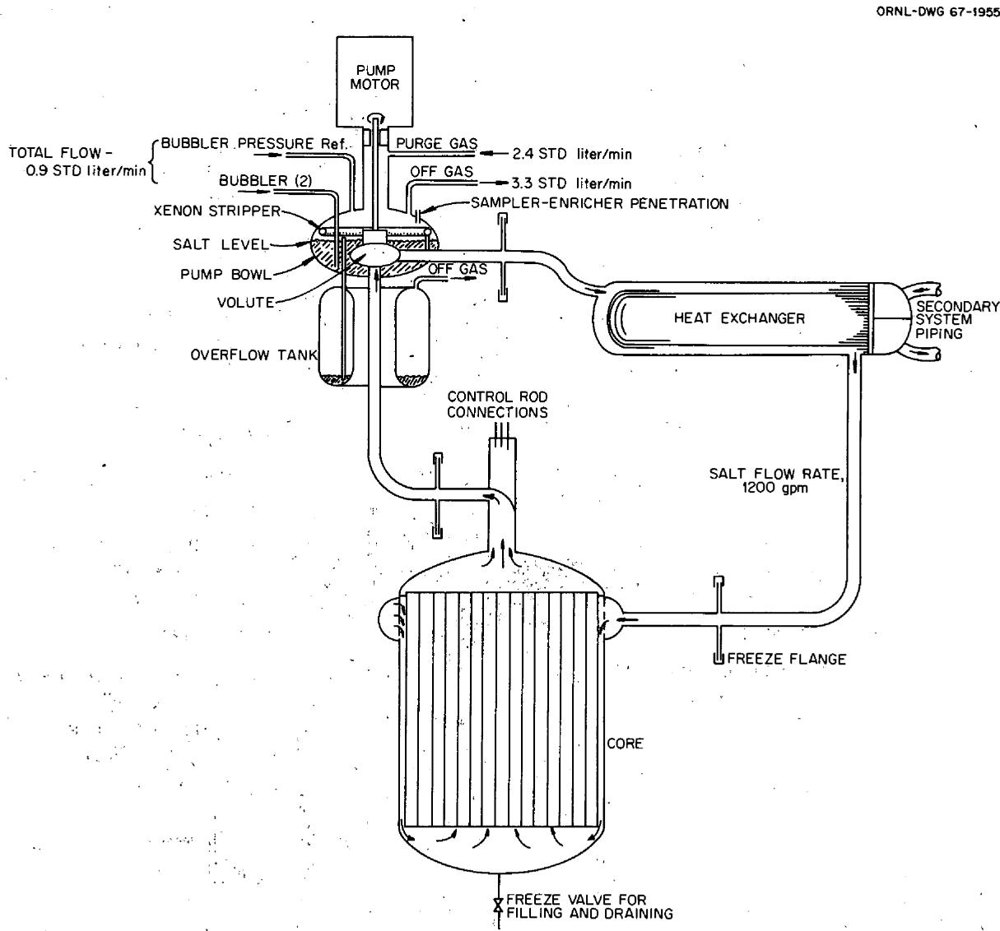  
Fig. 1. Schematic Diagram of MSRE Primary Loop.

about 50 gpm, but it has not been measured directly. The resulting high-velocity jets impinging on the molten salt cause a large amount of splashing and turbulence; consequently, bubbles are transported into the loop. It will be shown later that a very small quantity of circulating bubbles has a very pronounced effect on xenon dynamics. In addition to the stripper there is salt flow of about 15 gpm from behind the impeller, through a labyrinth along the shaft, and into the pump bowl. The principal helium flow through the pump bowl is 2.4 std liters/min purge down the shaft to prevent radioactive gases and salt mist from reaching the bearing region of the pump. There is an additional helium flow of 0.9 std liters/min

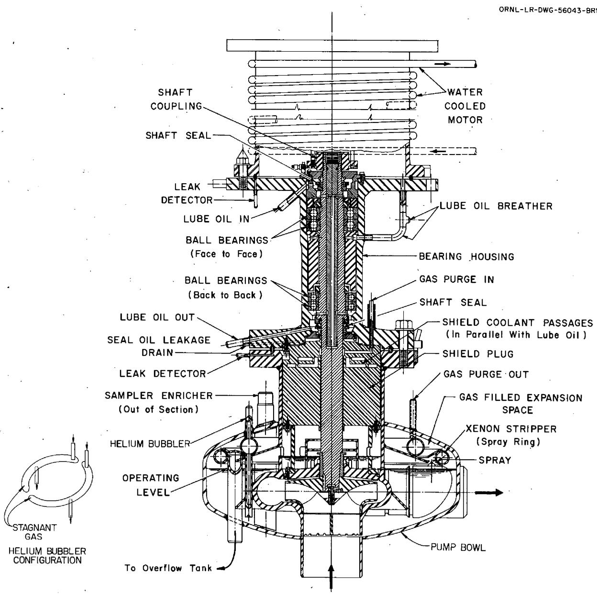  
Fig. 2. MSRE Fuel Pump.

from two bubblers and one pressure-reference leg, which comprise the bubbler level indicator. Helium for each bubbler goes through a semitoroid located in the pump bowl, as shown in Fig. 2. Helium enters the semitoroid at the end and leaves in the middle; therefore, half the semitoroid is stagnant gas. This stagnant kidney will be referred to in the analysis of the krypton experiment.

Figure 3 is an isometric view of the reactor core. Fuel salt enters the core vessel through a flow distribution volute and proceeds down an

annular region bounded by the vessel wall and the moderator container. The fuel then travels upward through the graphite moderator region and out the top exit pipe. Figure 4 shows how the moderator bars fit together to form fuel channels. The graphite is unclad and in intimate

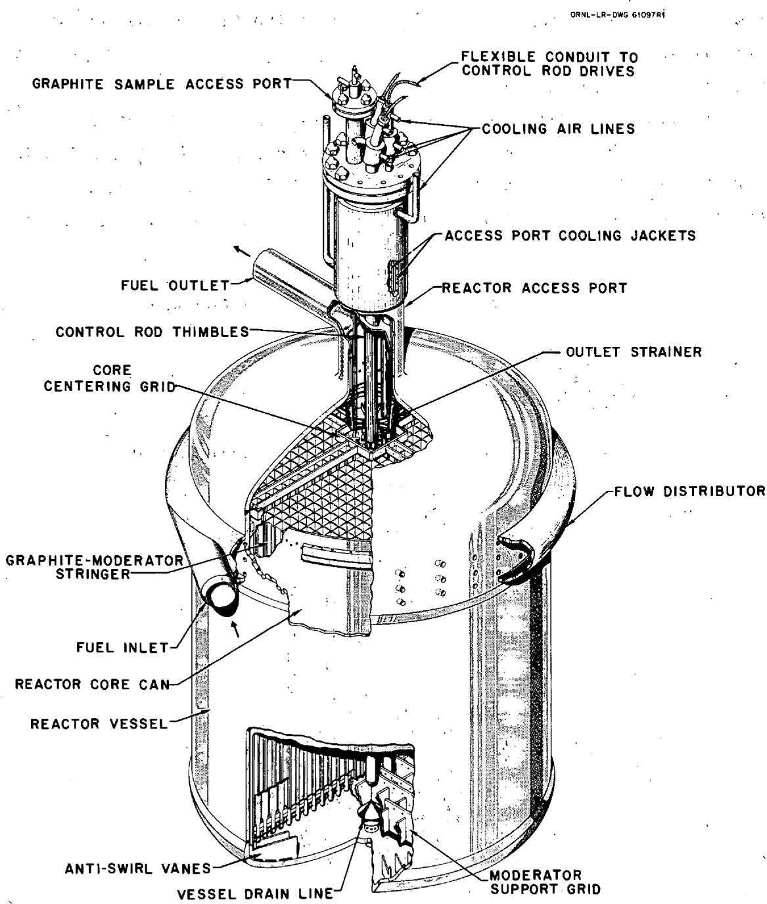  
Fig. 3. Reactor Vessel and Access Nozzle.

contact with the fuel salt, and therefore $^{135}\mathrm{Xe}$ may diffuse into its porous structure; the graphite acts as a $^{135}\mathrm{Xe}$ concentrator in the core. The theoretical void percentage of MSRE graphite (grade CGB) is $17.7\%$ , and slightly over half of it is accessible to a gas such as xenon. $^2$ Other pertinent properties of this graphite are listed in Appendix A, and more detailed information is available in Refs. 3 and 4. The rate at which $^{135}\mathrm{Xe}$ diffuses to the graphite is a function of the salt-to-graphite mass transfer coefficient, which is, in turn, a function of the fuel-salt Reynolds number.

The moderator region can be divided into three fluid dynamic regions of interest. First there is the bulk of the graphite ( $\sim 95\%$ ), which is characterized by salt velocities of about 0.7 ft/sec and a Reynolds number of about 1000. One would expect laminar flow; however, the entrance

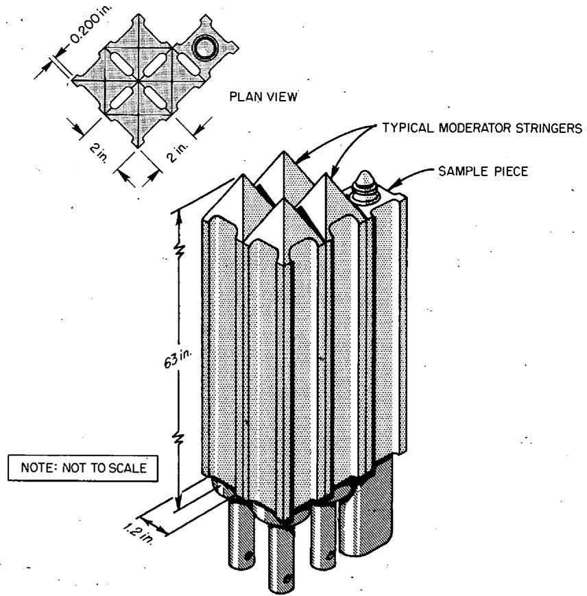  
Fig. 4. Typical Graphite Stringer Arrangement.

ORNL-LR-DWG 56874 R

to these channels is orificed and quite tortuous because of a layer of graphite grid bars across the bottom of the moderator that are used to space and support the core blocks. The effective mass transfer coefficient is probably somewhere between the coefficients for laminar flow and turbulent flow. The second fluid dynamic region is composed of the centermost channels in the core (about 18). They do not have orificing grid bars below them, so the fuel velocities are higher, about 1.8 ft/sec, and give a Reynolds number of about 2500. Accordingly the mass transfer coefficient is higher than for the bulk of the graphite and is for turbulent flow. This region comprises about $1.5\%$ of the graphite and is in a zone of high nuclear importance. The third fluid dynamic region is the lower layer of graphite grid bars mentioned above, which do the orificing. These grid bars are subject to high salt velocities, a maximum of about 5 ft/sec, and comprise a fluid dynamic entrance region. In addition, the jets formed by the grid bars impinge on the bottom of the core blocks. The entire region then is subject to much higher mass transfer coefficients than the bulk graphite. This region is not too well defined but probably comprises about $3.5\%$ of the total graphite. It is in a zone of very low nuclear importance.

KRYPTO-85 EXPERIMENT

# Description of the Problem

Xenon-135 poisoning in the MSRE was considered previously,[5-7] but these calculations were generally of an approximate design nature because of lack of information on the values of the rate constants involved. In order to calculate the steady-state $^{135}\mathrm{Xe}$ poisoning in the reactor, it was first necessary to compute the $^{135}\mathrm{Xe}$ concentration dissolved in the salt. This was done by equating the various source and sink rate terms involved and solving for the xenon concentration. The most significant $^{135}\mathrm{Xe}$ source term is that which comes from the decay of $^{135}\mathrm{I}$ ; in addition a small amount is produced directly from fission. The sink terms are discussed in some detail later, but we will initially

consider only the following terms and their associated rate constants:

135Xe Sink Term

Principal Ratenstants Involved

1. Dissolved $^{135}\mathrm{Xe}$ that may be transferred to the off-gas system via the xenon stripper

Stripping efficiency

2. Burnup of dissolved $^{135}\mathrm{Xe}$ as it passes through core

Burnup constant

3. Decay of dissolved $^{135}\mathrm{Xe}$

Decay constant

4. Migration of dissolved $^{135}\mathrm{Xe}$ to the graphite; ultimately this $^{135}\mathrm{Xe}$ will either decay or be burned up

Mass transfer coefficient, diffusion coefficient of xenon in graphite, decay constant, and burnup constant

5. Dissolved $^{135}\mathrm{Xe}$ that may be transferred into circulating helium bubbles, if present; this $^{135}\mathrm{Xe}$ will ultimately be burned up, decay, or be stripped in the pump bowl

Mass transfer coefficient, decay constant, burnup constant, and bubble stripping efficiency in the pump bowl

The stripping efficiency of the pump bowl spray ring was measured at the University of Tennessee as part of a masters degree thesis. $^{8,9}$ This work was done with a $\mathrm{CO}_{2}$ -water system maintained bubble free and later confirmed with and $\mathrm{O}_{2}$ -water system, also maintained bubble free. A prototype of the xenon stripper was used in these tests. It was felt desirable to check the results with a xenon and salt system, particularly with circulating bubbles present.

Xenon-135 burnup and decay rates are relatively well known. Migration of xenon to graphite is controlled by the mass transfer coefficient and by the diffusion coefficient of xenon in graphite. The mass transfer coefficient can be estimated from heat-mass transfer analogies (see Appendix C), but the unknown mode of fluid flow (laminar or turbulent), the unwettability of graphite by molten salt, the question of mass transfer to a porous surface rather than a continuous surface, and some natural resistance toward assuming a high degree of reliability for the heat-mass transfer analogies made the estimated coefficients seem questionable. The quantitative effect of circulating bubbles was almost completely

unknown, except that their effect would be prominent because of the extremely low solubility of xenon in salt. In addition there may be other effects not considered. Generally the state of knowledge of the rate constants was considered somewhat wanting. Each of these rate constants could be investigated individually in the laboratory, but this would be too expensive and time consuming. Rather, after other approaches were considered, it was decided to conduct a single summary experiment on the reactor and extract as many of the rate constants as possible, or at least set limits on them. The experiment was referred to as the krypton experiment.

# Description of the Experiment

Essentially the experiment was divided into two phases and took place during the precritical period of MSRE operations. The first phase was an addition phase and consisted of adding $^{85}\mathrm{Kr}$ to one of the pump-bowl level-indicator bubbler lines at a steady rate for a period of time. During this phase the pump bowl reached some equilibrium $^{85}\mathrm{Kr}$ concentration almost immediately; then the salt dissolved krypton via the xenon-stripper spray ring; and the graphite absorbed krypton from the salt. The second phase began by turning off the krypton flow but maintaining all bubbler and purge helium flows. Then the reverse processes took place. The pump bowl purged clean of krypton; the salt was stripped; and finally the graphite was leached. During the entire experiment the off-gas line was monitored continuously with a radiation counter. By analyzing the krypton concentration decay rate in the off-gas during the stripping phase of the experiment, we evaluated some of the rate constants involved. The experiment had the advantage of evaluating the actual reactor under operating conditions rather than models under simulated conditions. The experiment had the limitation that several parameters had to be evaluated from essentially a single set of data and were therefore subject to a certain amount of personal interpretation. Also, transient experiments are inherently more difficult to analyze than steady-state experiments. Krypton-85 was chosen for the experiment primarily for ease of continuous monitoring at low concentrations in the off-gas line; also its low cost and availability were considerations.

Figure 5 is a schematic diagram of the krypton experiment facilities. Basically, it consists of an addition station and a monitoring station. The addition station controls the flow of an $^{85}\mathrm{Kr}$ -He mixture into bubbler line 593. The normal bubbler flow of pure helium (0.37 std liters/min) was maintained to transport the krypton-helium mixture into the pump bowl. The reactor contains two bubblers. The second bubbler was used to perform its various reactor control functions.

The krypton-helium container was made from 12-in. sched.-80 carbon steel pipe and pipe caps and was about 5 ft long. It was hydrostatically tested at 520 psig. On one end was a U-tube and valve arrangement that was used to transfer $^{85}\mathrm{Kr}$ from its shipping container to the experiment container. The transfer was accomplished by first evacuating the experiment container and then opening the valve on the shipping container. This resulted in about $95\%$ transfer. The remaining krypton was transferred by using the U-tube as a cold trap and freezing it with liquid nitrogen.

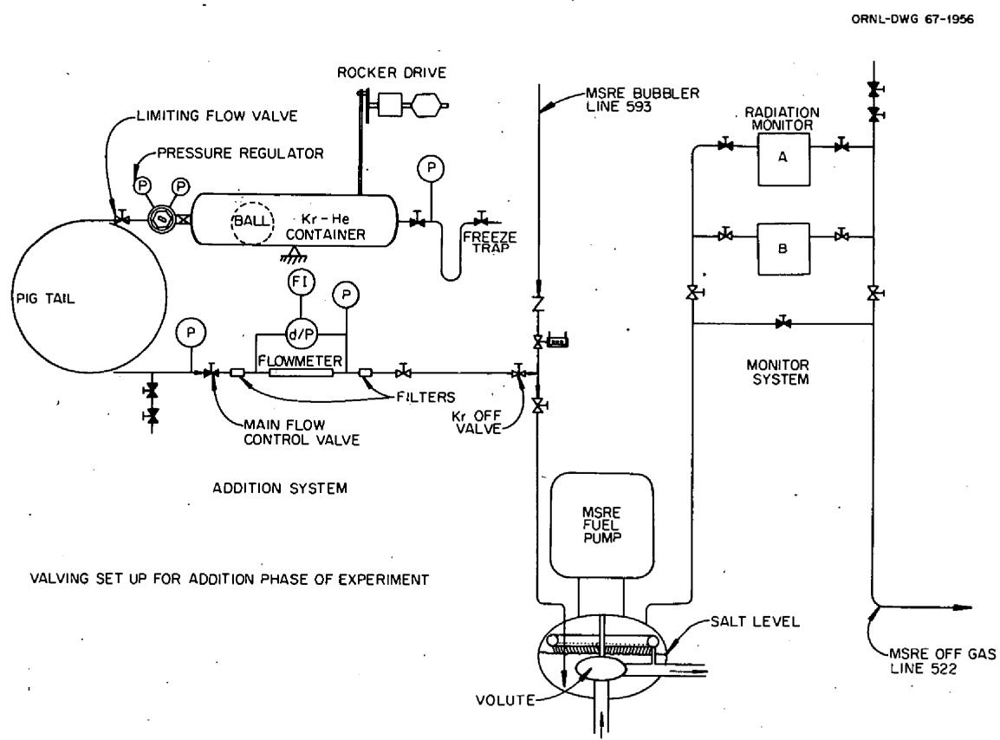  
Fig. 5. Schematic Diagram of Experimental Equipment.

This two-step process resulted in the almost perfect transfer of the 120 curies of $^{85}\mathrm{Kr}$ purchased. The experiment container was then pressurized to 180 psig with helium. After the first run it was further pressurized with helium to 275 psig. Dilution was necessary in order to have enough gas to measure and control adequately. The original 120 curies of $^{85}\mathrm{Kr}$ amounted to only about two liters, and this had to be added continuously to the reactor for a period of several days.

Based on experience of the personnel in the Isotopes Division of ORNL, krypton mixed with helium will tend to settle out over a period of time. To counter this effect the krypton-helium container was equipped with a hermetically sealed agitator. It consisted of an 8-in. aluminum ball inside the tank that rolled back and forth as the tank was rocked. A large coil of $1/4$ -in. stainless steel tubing was located between the krypton-helium container and flow control equipment to compensate for the rocking motion. The limiting flow valve was set to limit the flow from the container to about 20 std liters/hr in case of a complete rup-ture downstream. The remainder of the flow control system consisted of conventional filters (5 to $9\mu$ ), pressure gages, and low-capacity valves. The flowmeter was a Hanover matrix type and was calibrated for various outlet pressures.

As shown in Fig. 5, all the reactor off-gas from the pump bowl went through the monitoring station. It could pass through either one of two identical monitors or a bypass line. The monitors were labeled A and B. Monitor B was used for all runs. Monitor A was intended as a spare but was never needed. They were designed for a range of five decades of activity. Each consisted of four amperex 90NB GM tubes, which were shielded as follows:

GM Tube No.

Shielding

1 None

2 100 mg of plastic per cm²

3 $\sim 100\mathrm{mg / cm}^2$ plastic window $(7.62\times 2.54~\mathrm{cm})$ in $5.9\mathrm{g / cm}^2$ brass container

4 5.9 g/cm² brass container

The four GM tubes were suspended in a 2-liter stainless steel laboratory beaker. The monitors were calibrated with small samples of $^{85}\mathrm{Kr}$ . During the first run of the experiment, it was found that the plastic shielding on GM tube No. 2 absorbed $^{85}\mathrm{Kr}$ and gave a false count rate; also it affected other tubes in the array. To correct for this, the plastic was removed and GM tube No. 2 became identical with tube No. 1. The GM output was fed into a decadeScaler and a count rate meter. The decadeScaler was used for recording data, and the count rate meter was used for experiment control assistance.

Much consideration was given to the safety aspect of handling 120 curies of $^{85}\mathrm{Kr}$ . The half-life of $^{85}\mathrm{Kr}$ is 10.3 y and it gives off 0.695- and 0.15-Mev beta particles and a 0.54-Mev gamma ray. The daughter product is $^{85}\mathrm{Rb}$ , which is stable. The area in which the experiment was conducted was equipped with radiation detectors and air monitors. A continuous flow of air (17,000 to 20,000 cfm) was maintained through the reactor building and released to the atmosphere through a 100-ft stack. Bricks were stacked around the krypton-helium tank, and the activity level outside the bricks was negligible. Special beta-sensitive monitor badges were worn by personnel operating the experiment. Detailed procedures for transferring $^{85}\mathrm{Kr}$ , pressurizing the container, and conducting the addition and stripping phases of the experiment were written and approved by appropriate personnel.

# Procedure and Description of Runs

The procedure used to start the addition phase was to adjust the krypton-helium container regulator so that the pressure gage just upstream of the main flow control valve was about 10 psig, that is, about 5 psi over the pump bowl pressure. The flow rate was then controlled with the main flow control valve. During the addition phase the system was checked every $\frac{1}{2}$ to 1 hr, and the flow control was adjusted as necessary to maintain a constant activity in the off-gas line. The krypton-helium container was agitated for about 15 min every 2 to 4 hr. For various runs the krypton-helium injection rate ranged from 2 to 6.3 std liters/hr but was held constant for each run.

Zero time in the procedure was defined as the time when the krypton-helium flow was turned off. This was accomplished by closing the krypton-off valve and then the regulating valve. It took a minute or so before the monitor started dropping because all the lines had to be purged. At the start of the stripping phase, a 1-min count was taken every 1 l/2 min. The times gradually increased until at the end of the long runs (2 and 3) a 1/2-hr count was taken every hour. Note from Figs. 1 and 2 that there are two essentially stagnant lines entering the pump bowl, the sampler-enricher line and the overflow line. These lines were purged free of $^{85}\mathrm{Kr}$ before the stripping phase started and at various times during the stripping operation.

Six $^{85}\mathrm{Kr}$ addition and stripping runs were made. Table 1 summarizes the operational parameters in these runs. Figures 6 through 11 show the results of these runs. The count rate in the off-gas monitor is plotted against time during the stripping phase and has been corrected for dead time of the GM tubes. No correction was necessary for the decay of $^{85}\mathrm{Kr}$ because its half-life is so long compared with the time scale of each run. As pointed out previously, the data from run 1 are erroneous because of $^{85}\mathrm{Kr}$ absorbed on the plastic shielding a GM tube 2. This plastic was removed for subsequent runs. Nevertheless, as an added check, the monitors were purged periodically with pure helium, and a background count was measured. In all cases after run 1 the background count for tubes 3 and 4 was less than 15 cpm.

Objectives associated with each run were the following:

# Run No.

# Objective

1 Check adequacy of equipment and procedures   
2 First of two long-term runs: get a feeling for the mass transfer coefficient from salt to graphite   
3 Second long-term run: obtain good values for mass transfer coefficient to graphite   
4 Determine stripping efficiency and other short-term effects with salt level in pump bowl at $61\%$ scale   
5 Same as 4, with pump bowl level at $70\%$ scale   
6 Same as 4, with pump bowl level at $55\%$ scale

Table 1. Summary Description of Runs of Krypton Experiment   

<table><tr><td rowspan="2">Run No.</td><td colspan="2">Starting Time of Addition Phase of Experiment</td><td rowspan="2">Pressure In Kr-He Container at Start of Run (psig)</td><td rowspan="2">Pressure In Kr-He Container at End of Run (psig)</td><td rowspan="2">Kr-He Injection Flow Rate (std liters/hr)</td><td rowspan="2">Mean Count Ratea In Off-Gas Line During Addition Phase (counts/min)</td><td rowspan="2">Total Kr-He Addition (hr)</td><td rowspan="2">Total Time of Stripping Phase (hr)</td><td rowspan="2">Salt Level in Pump Bowl from Bubbler Level Indicator (% scale)</td><td rowspan="2">Total He Flow Through Pump Bowl (Purge Plus Bubbler Flows) (std liters/min)</td></tr><tr><td>Time</td><td>Date</td></tr><tr><td>1b</td><td>1420</td><td>2/5/65</td><td>180</td><td>179</td><td>2.03</td><td>3570</td><td>6</td><td>14</td><td>71</td><td>3.3</td></tr><tr><td>2c</td><td>1130</td><td>2/6/65</td><td>275</td><td>240</td><td>3.57</td><td>4470</td><td>57.5</td><td>62</td><td>60 to 70</td><td>3.3</td></tr><tr><td>3</td><td>1613</td><td>2/11/65</td><td>240</td><td>81</td><td>3.67</td><td>4429</td><td>279</td><td>149</td><td>60</td><td>3.3</td></tr><tr><td>4</td><td>1545</td><td>3/1/65</td><td>81</td><td>75</td><td>6.30</td><td>7340</td><td>5.9</td><td>5.0</td><td>61</td><td>3.3</td></tr><tr><td>5</td><td>1020</td><td>3/2/65</td><td>75</td><td>70</td><td>6.24</td><td>7081</td><td>5.5</td><td>7.2</td><td>70</td><td>3.3</td></tr><tr><td>6</td><td>0920</td><td>3/3/65</td><td>70</td><td>66</td><td>6.33</td><td>7149</td><td>5.3</td><td>12.3</td><td>55.5</td><td>3.3</td></tr></table>

${}^{a}$ Count rate as measured by monitor B4,corrected for dead time,and averaged over the entire addition phase.   
b 120 curies $^{85}\mathrm{Kr}$ added to krypton-helium container, and container pressurized to 180 psig with helium before run 1.   
cKrypton-helium container pressurized to 275 psig with helium between runs 1 and 2.

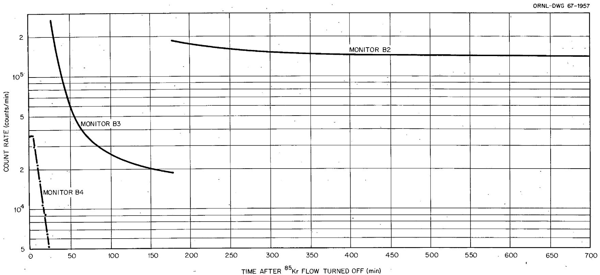  
Fig. 6. Results of Krypton Experiment Run 1. Count rate in off-gas monitor corrected for dead time.

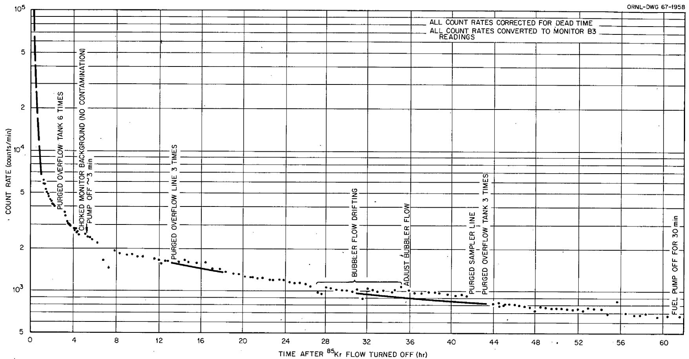  
Fig. 7. Results of Krypton Experiment Run 2.

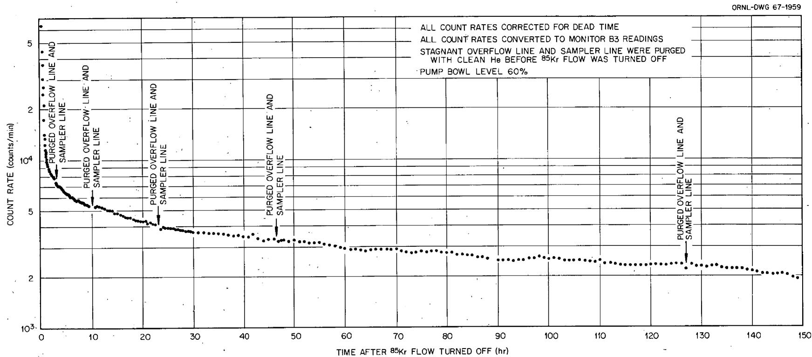  
Fig. 8. Results of Krypton Experiment Run 3.

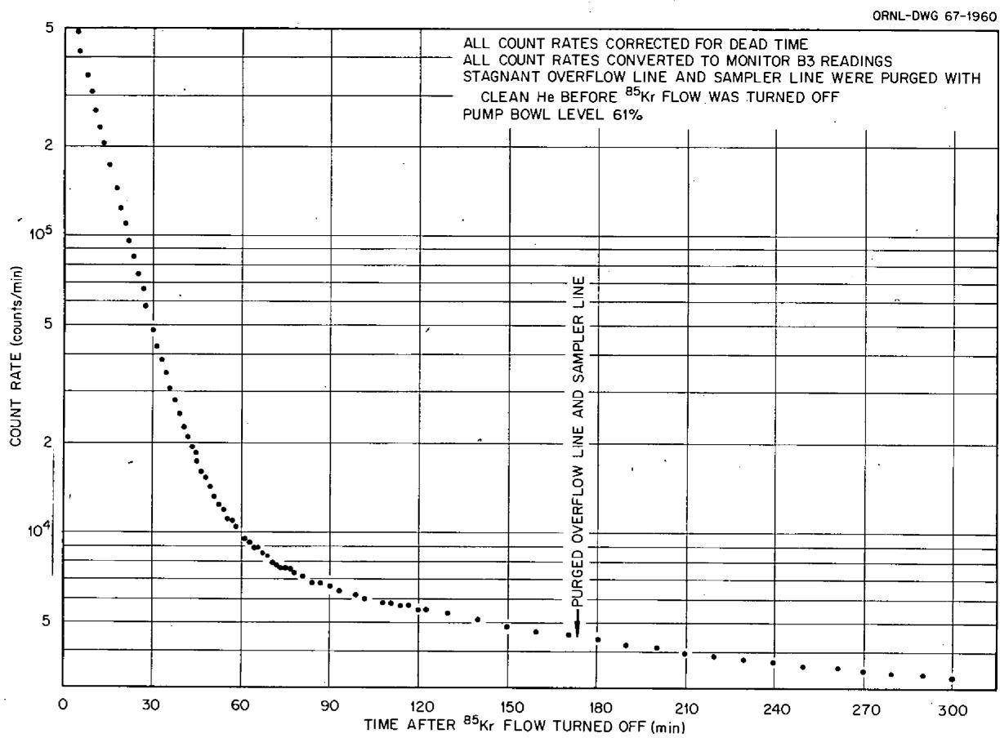  
Fig. 9. Results of Krypton Experiment Run 4.

ANALYSIS OF THE $^{8}{}^{5}\mathrm{Kr}$ EXPERIMENT

# General Approach

Analysis of the $^{85}\mathrm{Kr}$ experiment is concerned with the stripping phase of the runs. The principal stripping processes involved, in order of occurrence, are purging the pump bowl, stripping the salt and associated circulating bubbles (if present), and then leaching the graphite. Other leaching processes of no fundamental interest but of importance because they contribute to the measured flux decay curve are diffusion out of the stagnant bubbler kidney described earlier and leaching $^{85}\mathrm{Kr}$ that may have been trapped in gas pockets located in the primary loop. Locations of potential gas pockets in the loop are in the freeze flanges, graphite access port, and the spaces formed by the assembly of the core

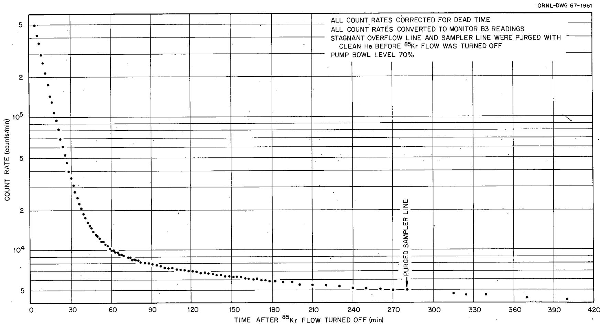  
Fig. 10. Results of Krypton Experiment Run 5.

ORNL-DWG 67-1962

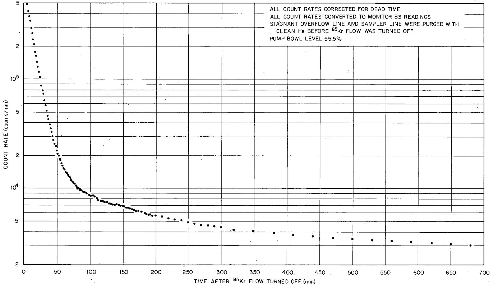  
Fig. 11. Results of Krypton Experiment Run 6.

blocks. There are various bits of evidence that pockets actually exist, although their location and capacity are not certain.

The fuel salt circuit time around the loop is 25 sec, which is short compared with the time scale of the stripping process involved, so the fuel loop can be considered as a well-stirred pot. At any specific time therefore, the krypton concentration is considered to be constant throughout the loop. In the simplest case, it can be shown that each transient stripping process, when unaffected by any other stripping process, will obey an exponential decay law; that is at time t,

$$
\mathrm {K r} \quad \text {f l u x} _ {\mathrm {t}} = \mathrm {K r} \quad \text {f l u x} _ {0} \quad \mathrm {e} ^ {- \alpha t}.
$$

In the actual case, however, each stripping process will affect every other stripping process to a greater or lesser extent. Note that pump bowl purging, salt stripping, and graphite leaching are series processes; that is, they occur in the sequence given; while leachings of the several graphite regions are parallel processes; that is, they occur simultaneously after the krypton concentration in the salt starts to drop. Qualitatively, the measured decay curve would be expected to be the sum of the contributions of each leaching process, as shown in Fig. 12. Note that

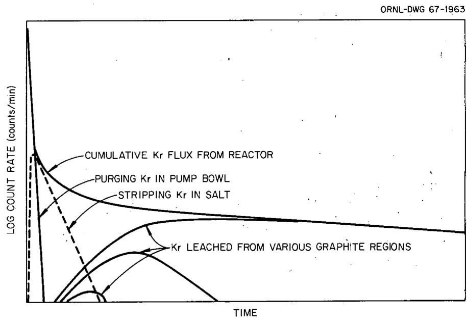  
Fig. 12. Qualitative Breakdown of Cumulative Flux Decay Curve into Its Components.

the count rate in the off-gas line is plotted on the ordinate and is a unit of concentration; however, since the off-gas is flowing at a constant rate, it also represents the $^{85}\mathrm{Kr}$ flux leaving the reactor. Each of the component curves should approach an exponential decay after the initial transient.

Now the problem is to separate these individual processes from the measured flux curve, with the realization that there may be other leaching processes not accounted for. It should be pointed out again that the breaking down of a single composite data curve into several individual processes and the determination of rate constants for each is quite complex and necessarily subject to a certain amount of personal interpretation.

Two approaches were used in analyzing the data. The most successful method consisted of an exponential peeling technique, as shown qualitatively in Fig. 13 for run 3. The assumption is made that the tail of the decay curve is determined completely by leaching the slow (bulk) rate constant graphite. The procedure was then to determine the equation for the slowest exponential that fit asymptotically on the curve and subtract it from the data. The next exponential equation that fit asymptotically

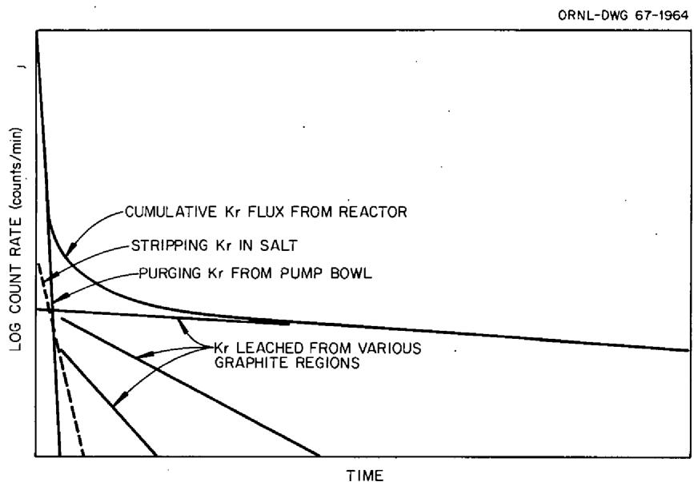  
Fig. 13. Actual Method Used to Break Down Cumulative Flux Decay Curve into Its Components.

on the remaining data was then determined and again subtracted. This procedure was repeated to a logical conclusion; that is, until continued subtracting from the data gave negligible values. This procedure for run 3 resulted in five exponentials, which is somewhat significant because of the five major stripping operations (pump bowl, salt, including bubbles, and three graphite regions). This general approach is in error in that it assumes that each stripping process starts at zero time and proceeds independently at all others. It will be seen, however, that this approach is adequate for both the very slowest rate constant processes (leaching bulk graphite) and the very fastest rate constant processes (purging pump bowl), but it is inadequate for intermediate processes (stripping salt and faster rate constant graphite). Figure 14 shows the results of this exponential peeling process on run 3. The rate constants are a function only of the slopes of the exponentials involved, so absolute calibrations of the monitor and detailed knowledge of the $^{85}\mathrm{Kr}$ concentrations are not necessary. Numerical results of peeling run 3 and their interpretation are given in Table 2. This approach to analyzing the data was the principal method used. It is of necessity confined to the fastest and slowest rate processes involved. But when applied to these processes, the results have a high degree of reliability, as will be seen.

A second method of analysis of the data was undertaken primarily as an attempt to determine rate constants for the intermediate processes involved, such as stripping efficiency and mass transfer to the faster rate constant graphite regions. In this approach, unsteady-state differential equations were set up around the pump bowl gas phase, fuel salt, and three graphite regions. The resulting five equations could be solved simultaneously for the rate constants involved. Physically this was done with a computer, and the rate constants were solved for by the method of steepest ascent. The approach was not too successful, probably for the following reasons:

1. There were actually more than five $^{85}\mathrm{Kr}$ sources in the system, so the mathematical model was overly simplified. Primarily the effects of circulating bubbles were not adequately accounted for.

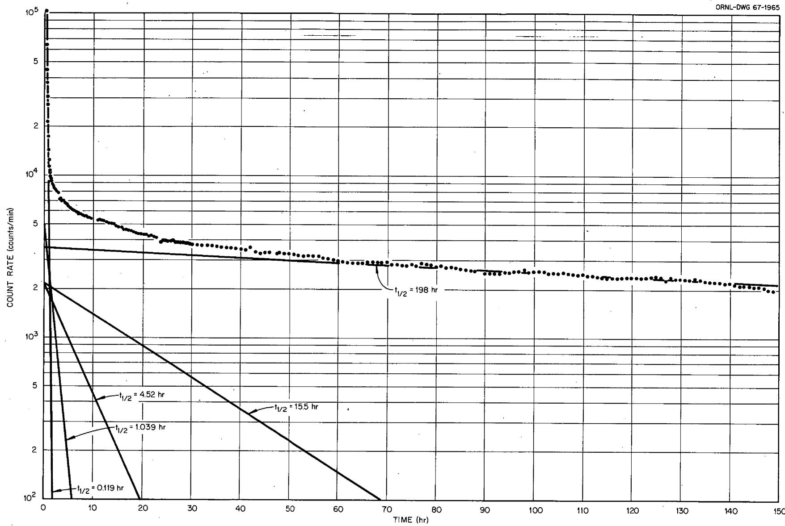  
Fig. 14. Results of Exponential Peeling of Krypton Experiment Run 3.

Table 2. Numerical Results of Peeling Run 3 of Krypton Experiment   

<table><tr><td>Peeled-Curve Half-Life (hr)</td><td>Count-Rate Intercept at Zero Time (counts/min)</td><td>Process</td><td>Rate Constant Determined</td></tr><tr><td>198</td><td>3,574</td><td>Mass transfer to slow-est rate constant (bulk) graphite</td><td>Mass transfer coeffi-cient</td></tr><tr><td>15.5</td><td>2,178</td><td>Mass transfer to next faster rate constant graphite</td><td>Mass transfer coeffi-cient</td></tr><tr><td>4.52</td><td>2,114</td><td>(a)</td><td></td></tr><tr><td>1.039</td><td>4,945</td><td>(b)</td><td></td></tr><tr><td>0.119</td><td>520,000</td><td>Pump bowl purging</td><td>Purging efficiency</td></tr></table>

${}^{a}$ Probably influenced mainly by mass transfer to fast rate constant graphite but may also be biased by other processes; generally has a low degree of confidence.   
bProbably influenced mainly by stripping of the salt but is also probably biased by other processes; has a low degree of confidence.

2. The approach required accurate knowledge of the initial concentration of the krypton in all regions involved (boundary values). This could not be done for the graphite for reasons to be discussed later in the section on Capacity Considerations.

The results of the second method will not be presented here.

# Pump Bowl Dynamics

Schematically the pump bowl can be represented as follows:

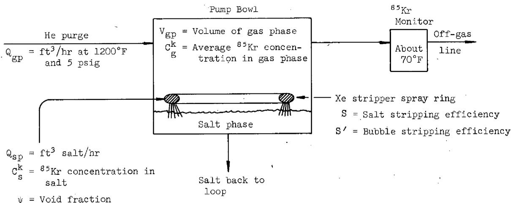

The dilution of $^{85}\mathrm{Kr}$ in the gas phase of the pump bowl is given by*

$$
\frac {d c ^ {k}}{d t} = - \frac {Q _ {g p} E}{V _ {g p}} C _ {g} ^ {k} + \frac {Q _ {s p} S}{V _ {g p}} C _ {s} ^ {k} + \frac {Q _ {s p} \psi S ^ {\prime}}{V _ {g p}} C _ {B} ^ {k}.
$$

In the first term $C_{g}^{k}$ is the mean $^{85}\mathrm{Kr}$ concentration in the gas phase of the pump bowl and the product $EC_{g}^{k}$ is the concentration in the off-gas line; therefore, $E$ can be thought of as a mixing efficiency. The second term represents the rate at which krypton is stripped from the salt, where $S$ is the stripping efficiency. The third term is the rate at which krypton is stripped from the circulating bubbles, where $\psi$ is the void fraction and $S'$ is the bubble stripping efficiency.

If these three terms are evaluated at the beginning of the stripping phase, the second term is approximately $\frac{1}{500}$ of the first term, so it can be neglected. The third term is about $\frac{1}{20}$ or less of the first term for expected values of $\psi$ and $S'$ . It must be neglected because of inadequate knowledge of $\psi$ and $S'$ . The error introduced, however, will not be great. The above equation also neglects the $^{85}\mathrm{Kr}$ contribution by the stagnant kidney in the bubbler line semitoroid, but estimates indicate that this is also an adequate assumption.

Neglecting the second and third terms, the equation is

$$
\frac {\mathrm {d} \mathrm {C} _ {\mathrm {g}} ^ {\mathrm {k}}}{\mathrm {d t}} = - \frac {\mathrm {Q} _ {\mathrm {g p}} \mathrm {E}}{\mathrm {V} _ {\mathrm {g p}}} \mathrm {C} _ {\mathrm {g}} ^ {\mathrm {k}},
$$

and, solving for $C_{g}^{k}$ at time $t$ , gives

$$
\mathrm {C} _ {\mathrm {g}} ^ {\mathrm {k}} = \mathrm {C} _ {\mathrm {g o}} ^ {\mathrm {k}} \mathrm {e} ^ {- (\mathrm {Q} _ {\mathrm {g p}} \mathrm {E} / \mathrm {V} _ {\mathrm {g p}}) \mathrm {t}},
$$

which, evaluated at concentration half-life conditions, is

$$
\frac {C _ {g} ^ {k}}{C _ {g o} ^ {k}} = 1 / 2 = e ^ {- (Q _ {g p} E / V _ {g p}) t _ {1 / 2}} = e ^ {- 0. 6 9 3},
$$

or, solving for E,

$$
E = \frac {0 . 6 9 3 V _ {g p}}{t _ {1 / 2} Q _ {g p}}.
$$

Figures 15 and 16 show the initial transients for runs 1 through 6. Since the bubbler line stagnant kidney and the salt stripping have little

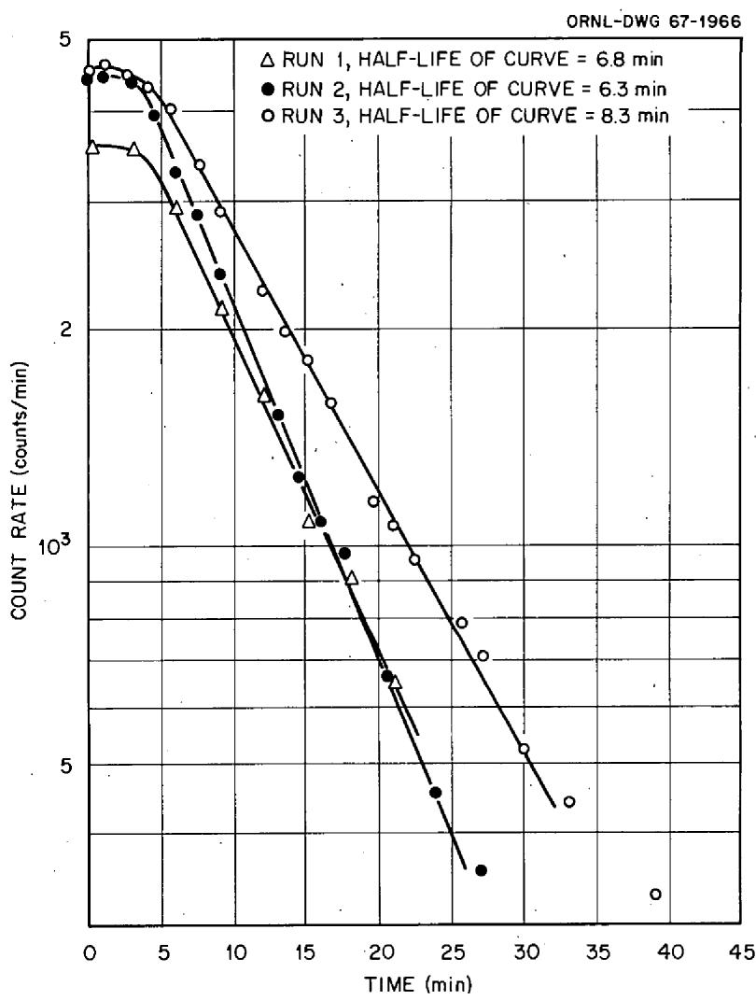  
Fig. 15. Expanded Plot of Data for the First Half Hour of Runs 1, 2, and 3. All count rate data taken with monitor B4 and corrected for dead time.

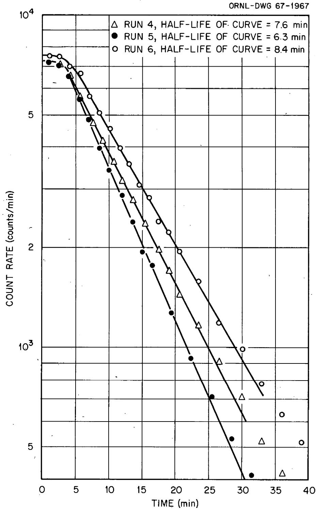  
Fig. 16. Expanded Plot of Data for the First Half Hour of Runs 4, 5, and 6. All count rate data taken with monitor B4 and corrected for dead time.

effect on the initial transients, this section of the curve is determined almost completely by pump bowl dynamics. A tangent line is shown on each curve and its half-life is given. Note that the half-life measured in the monitor at about $70^{\circ}\mathrm{F}$ is identical to the reactor half-lives where the operating temperature is $1200^{\circ}\mathrm{F}$ . Runs 1 through 6 gave the results listed in Table 3. The average pump bowl purging efficiency is $69\%$ , and it is not a strong function of pump bowl level.

Table 3. Pump Bowl Purging Efficiencies Obtained in Runs 1 Through 6 of Krypton Experiment   

<table><tr><td>Run No.</td><td>Indicated Pump Bowl Level at Start of Stripping (% scale)</td><td>Volume of Gas Phase in Pump Bowl (ft3)</td><td>Half-Life of Curve (min)</td><td>Pump Bowl Purging Efficiency (%)</td></tr><tr><td>1</td><td>71</td><td>1.75</td><td>6.8</td><td>61</td></tr><tr><td>2</td><td>60</td><td>2.23</td><td>6.3</td><td>84</td></tr><tr><td>3</td><td>60</td><td>2.23</td><td>8.3</td><td>64</td></tr><tr><td>4</td><td>61</td><td>2.19</td><td>7.6</td><td>68</td></tr><tr><td>5</td><td>70</td><td>1.79</td><td>6.3</td><td>67</td></tr><tr><td>6</td><td>55.5</td><td>2.43</td><td>8.4</td><td>68</td></tr></table>

# Xenon Stripper Efficiency

As pointed out previously, values for the stripping efficiency could not be extracted from the data with any degree of accuracy, even though runs 4, 5, and 6 were performed with this goal in mind. Very rough calculations do indicate that the stripping efficiencies are more or less consistent with those measured at the University of Tennessee in a $\mathrm{CO}_{2}$ -water system, but the calculations are so approximate and dependent on hazy assumptions that they will not be presented here.

# Mass Transfer to Graphite

To review briefly the graphite regions, recall that three regions were identified from fluid dynamic considerations. First there is the

bulk graphite region ( $\sim 95\%$ ) that is characterized by salt velocities of about 0.7 ft/sec and a Reynolds number of about 1000. The mass transfer coefficient will be between that for laminar and that for turbulent flow. Second, there is the graphite associated with the centermost fuel channels, which comprises about $1.5\%$ of the graphite. The fuel velocity and the mass transfer coefficient in this region will be higher than in the bulk graphite region. Third, there is a region of structural graphite across the bottom of the core. It is difficult to determine the exact boundary of this region, but it probably consists of approximately $3.5\%$ of the graphite and is in a zone of low nuclear importance. It is characterized by orificing effects, impingement of salt, and fluid dynamic entrance regions; therefore it will have the highest mass transfer coefficients.

The first question to be resolved concerns salt-to-graphite coupling via the mass transfer coefficient. The krypton flux from the graphite can be expressed as

$$
\operatorname {K r} \text {f l u x f r o m g r a p h i t e} = \mathrm {h} _ {\mathrm {m}} ^ {\mathrm {k}} \mathrm {A} _ {\mathrm {G}} \left(\mathrm {c} _ {\mathrm {s i}} ^ {\mathrm {k}} - \mathrm {c} _ {\mathrm {s}} ^ {\mathrm {k}}\right),
$$

where $C_{\mathrm{si}}^{\mathrm{k}}$ is conventionally defined as the krypton concentration in the salt and at the interface, where the interface is continuous. In this case the salt-gas interface is inside a pore that occupies only a small fraction of the total graphite surface area. Therefore we need a relationship between this concentration at the pore interface and the more conventional $C_{\mathrm{si}}^{\mathrm{k}}$ . This is discussed in Appendix B, where it is shown that the mean concentration of krypton in a continuous salt film across the graphite surface is approximately equal to the krypton concentration in the salt at the salt-gas interface inside a graphite pore.

The rate at which $^{85}\mathrm{Kr}$ is leached from the graphite is a function of several parameters; for instance, the diffusivity of krypton in graphite, the mass transfer coefficient, and the $^{85}\mathrm{Kr}$ concentration dissolved in the bulk salt, which is in turn a function of the xenon stripper efficiency. The general approach in the graphite analysis will be to first show that this rate is very insensitive to expected values of the diffusion coefficient of krypton in graphite. This being true, we can

determine a relationship between the mass transfer coefficient and the stripping efficiency, any combination of which will result in a flux curve as measured. Then by weighting this relationship with the value of stripping efficiency measured at the University of Tennessee, theoretical values for the mass transfer coefficient (see Appendix C), and other considerations, we will obtain a very narrow range of possible values for the mass transfer coefficient. Generally, this procedure will be followed for all the graphite regions considered. Most of the calculations will be confined to run 3, which was concerned primarily with measuring graphite rate constants.

Consider the $^{85}\mathrm{Kr}$ flux from graphite as a function only of its internal resistance $\left(\mathrm{D}_{\mathrm{G}}^{\mathrm{k}}\right)$ and its external resistance $\left(\mathrm{h}_{\mathrm{m}}^{\mathrm{k}}\right)$ . Also specify that, for times equal to or greater than zero, the krypton concentration dissolved in the fuel salt is zero. Cylindrical geometry is used; that is, each core block is considered to be a cylinder, the surface area of which is equal to the fuel channel area associated with a single core block. The volume of a graphite cylinder of this sort is very close to the volume of the actual core blocks of the same length. The differential equation that describes this case is

$$
\frac {\partial^ {2} \mathrm {C} _ {\mathrm {G}} ^ {\mathrm {k}}}{\partial r ^ {2}} + \frac {1}{r} \frac {\partial \mathrm {C} _ {\mathrm {G}} ^ {\mathrm {k}}}{\partial r} = \frac {\epsilon}{\mathrm {D} _ {\mathrm {G}} ^ {\mathrm {k}}} \frac {\partial \mathrm {C} _ {\mathrm {G}} ^ {\mathrm {k}}}{\partial t},
$$

with boundary conditions

$$
C _ {G} ^ {k} = C _ {G O} ^ {k} \text {a t} t = 0,
$$

$$
\left(\frac {\mathrm {d} C _ {G} ^ {k}}{\mathrm {d} \dot {r}}\right) = 0 \text {a t} r = 0,
$$

$$
\left(\frac {d C _ {G} ^ {k}}{d r}\right) = - \frac {h _ {m} H R T}{D _ {G} ^ {k}} C _ {G} ^ {k} a t r = r _ {b}.
$$

The solution to this equation is

$$
C _ {G} ^ {k} = 2 C _ {G O} ^ {k} \sum_ {n = 1} ^ {\infty} \frac {1}{M n} \frac {J _ {1} (M n)}{J _ {0} ^ {2} (M n) + J _ {1} ^ {2} (M n)} e ^ {- \left[ (M n) ^ {2} D _ {G} ^ {k} / r _ {b} ^ {2} \epsilon \right] t} J _ {0} \binom {m n} {r _ {b}},
$$

where the eigenfunction is

$$
\mathrm {M n} \frac {\mathrm {J} _ {1} (\mathrm {M n})}{\mathrm {J} _ {0} (\mathrm {M n})} = \frac {\mathrm {h} _ {\mathrm {m}} \mathrm {H R T r} _ {\mathrm {b}}}{\mathrm {D} _ {\mathrm {G}} ^ {\mathrm {k}}}
$$

and

$$
\mathrm {M n} = \gamma r _ {\mathrm {b}} \sqrt {\frac {\epsilon}{D _ {\mathrm {G}} ^ {\mathrm {k}}}},
$$

where $\gamma$ is the eigenvalue. Now, differentiating with respect to $r$ and evaluating at $r = r_b$ , we have

$$
\left(\frac {\mathrm {d} C _ {G} ^ {k}}{\mathrm {d} r}\right) _ {r _ {b}} = - \frac {2 C _ {G O} ^ {k}}{r _ {b}} \sum_ {n = 1} ^ {\infty} \frac {J _ {1} ^ {2} (M n)}{J _ {0} ^ {2} (M n) + J _ {1} ^ {2} (M n)} e ^ {- \left[ (M n) ^ {2} D _ {G} ^ {k} / r _ {b} ^ {2} \epsilon \right] t},
$$

and, substituting into the flux equation at the surface of the graphite,

$$
\operatorname {F l u x} _ {\mathrm {r} _ {\mathrm {b}}} ^ {\mathrm {k}} = - \frac {\mathrm {D} _ {\mathrm {G}} ^ {\mathrm {k}}}{\epsilon} \left(\frac {\mathrm {d c} _ {\mathrm {G}} ^ {\mathrm {k}}}{\mathrm {d r}}\right) _ {\mathrm {r} _ {\mathrm {b}}}
$$

we obtain

$$
\operatorname {F l u x} _ {\mathrm {r} _ {\mathrm {b}}} ^ {\mathrm {k}} = \frac {2 \mathrm {D} _ {\mathrm {G}} ^ {\mathrm {k}} \mathrm {C} _ {\mathrm {G} 0} ^ {\mathrm {k}}}{\mathrm {r} _ {\mathrm {b}} \epsilon} \sum_ {\mathrm {n} = 1} ^ {\infty} \frac {\mathrm {J} _ {1} ^ {2} (\mathrm {M n})}{\mathrm {J} _ {0} ^ {2} (\mathrm {M n}) + \mathrm {J} _ {1} ^ {2} (\mathrm {M n})} \mathrm {e} ^ {- \left[ (\mathrm {M n}) ^ {2} \mathrm {D} _ {\mathrm {G}} ^ {\mathrm {k}} / \mathrm {r} _ {\mathrm {b}} ^ {2} \epsilon \right] \mathrm {t}}.
$$

From this equation it can be seen that the krypton flux from any given graphite region is the sum of a series of exponentials, with the slope of each exponential being determined by the exponent of $e$ . The problem now is one of relating these exponents to the slopes of the peeled

flux curves. Considering run 3 it is obvious that the slowest exponent $(t_{1/2} = 198\, \text{hr})$ is related to the bulk graphite, and it is expected that the next exponential $(t_{1/2} = 15.5\, \text{hr})$ is related to the graphite region located at the center line of the core. The next exponential $(t_{1/2} = 4.52\, \text{hr})$ has a fairly low order of confidence in equating it to any specific graphite region and will not be considered. It can be shown that for each of the two graphite regions considered, only the first term of the above series is significant. Therefore the exponent of $e$ can be related to the measured half-life, as follows:

$$
\frac {\left(\mathrm {M n} _ {1}\right) ^ {2} \mathrm {D} _ {\mathrm {G}} ^ {\mathrm {k}}}{r _ {\mathrm {b}} ^ {2} \epsilon} t _ {1 / 2} = 0. 6 9 3.
$$

Now, by evaluating this equation in conjunction with the eigenfunction equation, we can relate values of $\mathbf{h}_{\mathfrak{m}}$ and $D_{G}^{k}$ . This was done with the following parameter values, and the results appear in Fig. 17:

$$
\begin{array}{l} t _ {1 / 2} (\text {b u l k g r a p h i t e}) = 1 9 8 \mathrm {h r} (\text {r u n} 3), \\ t _ {1 / 2} (\text {c e n t e r - l i n e g r a p h i t e}) = 1 5. 5 \mathrm {h r} (\text {r u n} 3), \\ \epsilon = 0. 1 0, \\ r _ {b} = 0. 0 9 0 5 f t, \\ \mathrm {H} = 8. 5 \times 1 0 ^ {- 9} \text {m o l e s / c c - a t m}, \\ H R T = 6. 4 3 \times 1 0 ^ {- 4}. \\ \end{array}
$$

The ordinate represents the range in which $D_{G}^{k}$ is expected to lie. Note that for bulk graphite the value of $h_{m}^{k}$ is almost completely independent of $D_{G}^{k}$ ; therefore the mass transfer coefficient is controlling the krypton flux from this graphite region. For the center-line graphite region, the dependence of flux on $D_{G}^{k}$ becomes significant only at low values of $D_{G}^{k}$ .

It is difficult to extract $h_m^k$ information from run 2 because the time intervals involved were too short. The krypton addition and stripping phases were about 60 hr each. During this relatively short addition time the bulk graphite reached only about $20\%$ of its saturated value, in contrast to run 3, where it reached about $70\%$ of its saturated value. For both runs the center-line graphite region ( $t_{1/2} = 15.5$ hr in run 3)

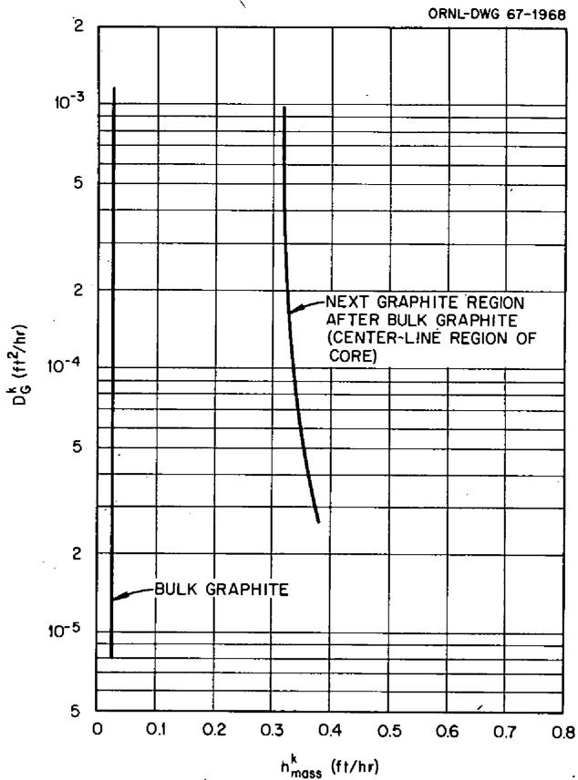  
Fig. 17. Relationship Between $D_G^k$ and $h_m^k$ That Fits Graphite Leaching Curves Peeled from Run 3.

was almost completely saturated. After stripping for 60 hr in run 2, the slope of the flux curve is not determined by a single graphite region but is still under the influence of two graphite regions, and it cannot be peeled by the same technique as run 3. Nevertheless, run 2 was looked at, and without presenting any results, it will be stated that it was consistent with run 3.

Now, since $h_m^k$ is not a strong function of $D_G^k$ , we can determine the relationship between $h_m^k$ and $S$ (stripping efficiency). This will be done for the bulk graphite region after sufficient time so that other transients are negligible. First, we will make the following rate balance:

Kr flux from xenon stripper $=$ Kr flux from graphite

+ dilution rate of Kr in salt,

where

Kr flux from xenon stripperper $= \mathbf{S}\mathbf{Q}_{\mathbf{sp}}\mathbf{C}_{\mathbf{s}}^{\mathbf{k}}$

$$
\mathrm {K r} \text {f l u x f r o m g r a p h i t e} = \mathrm {h} _ {\mathrm {m}} ^ {\mathrm {k B}} \mathrm {A} _ {\mathrm {G}} \left(\mathrm {c} _ {\mathrm {s i}} ^ {\mathrm {k}} - \mathrm {c} _ {\mathrm {s}} ^ {\mathrm {k}}\right),
$$

$$
\text {D i l u t i o n r a t e o f K r i n s a l t} = - V _ {s} \frac {\mathrm {d C} _ {s} ^ {k}}{\mathrm {d t}}.
$$

Then, substituting,

$$
\mathrm {S Q} _ {\mathrm {s p}} \mathrm {C} _ {\mathrm {s}} ^ {\mathrm {k}} = \mathrm {h} _ {\mathrm {m}} ^ {\mathrm {k B}} \mathrm {A} _ {\mathrm {G}} \left(\mathrm {C} _ {\mathrm {s i}} ^ {\mathrm {k}} - \mathrm {C} _ {\mathrm {s}} ^ {\mathrm {k}}\right) - \mathrm {v} _ {\mathrm {s}} \frac {\mathrm {d C} _ {\mathrm {s}} ^ {\mathrm {k}}}{\mathrm {d t}}.
$$

In order to solve this equation, krypton concentrations must be converted to krypton fluxes because this is the form of the data. The measured krypton flux is related to the stripping rate as follows:

$$
\text {F l u x} = \mathrm {S Q} _ {\mathrm {s p}} \mathrm {C} _ {\mathrm {s}} ^ {\mathrm {k}},
$$

and

$$
\frac {\mathrm {d} \text {f l u x}}{\mathrm {d t}} = S Q _ {\mathrm {s p}} \frac {\mathrm {d C} _ {\mathrm {s}} ^ {\mathrm {k}}}{\mathrm {d t}}.
$$

Rearranging gives

$$
C _ {s} ^ {k} = \frac {\text {F l u x}}{\text {S Q} _ {s p}},
$$

and

$$
\frac {d C _ {s} ^ {k}}{d t} = \frac {1}{S Q _ {s p}} \frac {d f l u x}{d t},
$$

and now, confining ourselves to one graphite region, and specifically the bulk graphite from run 3 ( $t_{1/2} = 198 \, \text{hr}$ ), it can be shown that

$$
\text {F l u x} = \text {F l u x} _ {0} e ^ {- 0. 6 9 3 t / t _ {1} / 2}
$$

and

$$
\frac {\mathrm {d} \text {f l u x}}{\mathrm {d} t} = \frac {- 0 . 6 9 3 \text {f l u x} _ {0}}{t _ {1 / 2}} e ^ {- (0. 6 9 3 / t _ {1 / 2}) t}.
$$

Substituting into the above equations gives

$$
C _ {s} ^ {k} = \frac {\text {F l u x} _ {0}}{\text {S Q} _ {s p}} e ^ {- (0. 6 9 3 / t _ {1 / 2}) t}
$$

and

$$
\frac {\mathrm {d} c _ {s} ^ {k}}{\mathrm {d} t} = \frac {- 0 . 6 9 3 \text {f l u x} _ {0}}{S Q _ {s p} t _ {1 / 2}} e ^ {- (0. 6 9 3 / t _ {1 / 2}) t}.
$$

Further, substituting these into the original rate balance we get

$$
\begin{array}{l} F l u x _ {0} e ^ {- (0. 6 9 3 / t _ {1 / 2}) t} = h _ {m} ^ {k B} A _ {G} \left(C _ {s i} ^ {k} - \frac {f l u x _ {0}}{S Q _ {s p}} e ^ {- (0. 6 9 3 / t _ {1 / 2}) t}\right) \\ + \frac {0 . 6 9 3 V _ {s} f l u x _ {0}}{S Q _ {s p} t _ {1 / 2}} e ^ {- (0. 6 9 3 / t _ {1 / 2}) t}. \\ \end{array}
$$

Solving for $C_{\mathsf{si}}^{\mathsf{k}}$ gives

$$
C _ {s i} ^ {k} = \frac {f l u x _ {o}}{h _ {m} ^ {k B} A _ {G}} \left(1 + \frac {h _ {m} ^ {k B} A _ {G}}{S Q _ {s p}} - \frac {0 . 6 9 3 V _ {s}}{S Q _ {s p} t _ {1 / 2}}\right) e ^ {- (0. 6 9 3 / t _ {1 / 2}) t},
$$

and in its differential form,

$$
\frac {\mathrm {d C} _ {\mathrm {s i}} ^ {\mathrm {k}}}{\mathrm {d t}} = \frac {- 0 . 6 9 3 \text {f l u x} _ {0}}{\mathrm {t} _ {1 / 2} \mathrm {h} _ {\mathrm {m}} ^ {\mathrm {k B}} \mathrm {A} _ {\mathrm {G}}} \left(1 + \frac {\mathrm {h} _ {\mathrm {m}} ^ {\mathrm {k B}} \mathrm {A} _ {\mathrm {G}}}{\mathrm {S Q} _ {\mathrm {s p}}} - \frac {- 0 . 6 9 3 \mathrm {V} _ {\mathrm {s}}}{\mathrm {S Q} _ {\mathrm {s p}} \mathrm {t} _ {1 / 2}}\right) \mathrm {e} ^ {- (0. 6 9 3 / \mathrm {t} _ {1 / 2}) \mathrm {t}},
$$

which relates $C_{\mathsf{si}}^{\mathsf{k}}$ and $\frac{\mathrm{d}C_{\mathsf{si}}^{\mathsf{k}}}{\mathrm{d}t}$ to the measured slope of the flux curve and the various physical parameters involved. At this point we will set up a rate balance on the bulk graphite, as follows:

Kr flux from graphite $=$ dilution rate of Kr in graphite,

where

$$
\operatorname {K r} \text {f l u x f r o m g r a p h i t e} = \mathrm {h} _ {\mathrm {m}} ^ {\mathrm {k B}} \mathrm {A} _ {\mathrm {G}} \left(\mathrm {c} _ {\mathrm {s i}} ^ {\mathrm {k}} - \mathrm {c} _ {\mathrm {s}} ^ {\mathrm {k}}\right),
$$

$$
\text {D i l u t i o n r a t e o f K r i n g r a p h i t e} = - V _ {G} \frac {\mathrm {d C} _ {G} ^ {k}}{\mathrm {d t}},
$$

or

$$
\frac {\mathrm {d} \mathrm {C} _ {\mathrm {G}} ^ {\mathrm {k}}}{\mathrm {d t}} = - \frac {\mathrm {h} _ {\mathrm {m}} ^ {\mathrm {k B}} \mathrm {A} _ {\mathrm {G}}}{\mathrm {V} _ {\mathrm {G}}} \left(\mathrm {c} _ {\mathrm {s i}} ^ {\mathrm {k}} - \mathrm {c} _ {\mathrm {s}} ^ {\mathrm {k}}\right),
$$

where $C_G^k$ is the mean krypton concentration in the graphite. Now in the previous analysis it was shown that for the bulk graphite, $h_m^{kB}$ is independent of $D_G^k$ over the range of interest. One consequence of this result is that the krypton concentration profile across a graphite core block is essentially flat. We can therefore say that

$$
\mathrm {c} _ {\mathrm {G}} ^ {\mathrm {k}} \cong \mathrm {c} _ {\mathrm {G i}} ^ {\mathrm {k}},
$$

and also, from Henry's law,

$$
C _ {S i} ^ {k} = \frac {H R T}{\epsilon} C _ {G i} ^ {k} = \frac {H R T}{\epsilon} C _ {G} ^ {k}.
$$

Substituting this into the graphite rate balance, we have

$$
\frac {\mathrm {d} \mathrm {c} _ {\mathrm {s i}} ^ {\mathrm {k}}}{\mathrm {d} t} = - \frac {\mathrm {h} _ {\mathrm {m}} ^ {\mathrm {k B}} \mathrm {A} _ {\mathrm {G}} \mathrm {H R T}}{\epsilon \mathrm {V} _ {\mathrm {G}}} \left(\mathrm {c} _ {\mathrm {s i}} ^ {\mathrm {k}} - \mathrm {c} _ {\mathrm {s}} ^ {\mathrm {k}}\right).
$$

Substituting previously derived relations for $C_{\mathrm{si}}^{\mathrm{k}}$ , $\frac{\mathrm{d}C_{\mathrm{si}}^{\mathrm{k}}}{\mathrm{d}t}$ , and $C_{\mathrm{s}}^{\mathrm{k}}$ into the above equation, and solving for $h_{m}^{\mathrm{kB}}$ , we have,

$$
h _ {m} ^ {k B} = \frac {\frac {0 . 6 9 3 \epsilon}{A _ {G} H R T t _ {1 / 2}} \left(1 - \frac {0 . 6 9 3 V _ {s}}{t _ {1 / 2} S Q _ {s p}}\right)}{\frac {1}{V _ {G}} - \frac {0 . 6 9 3}{S Q _ {s p} t _ {1 / 2}} \left(\frac {\epsilon}{H R T} + \frac {V _ {s}}{V _ {G}}\right)}.
$$

We now evaluate $\mathbf{h}_{\mathfrak{m}}^{\mathbf{kB}}$ as a function of S for the following values of other parameters:

$$
\begin{array}{l} t _ {1 / 2} = 1 9 8 \mathrm {h r} (\text {b u l k g r a p h i t e}), \\ \varepsilon = 0. 1 0, \\ \end{array}
$$

A = 1450 ft² (channel surface area in bulk graphite region),

$\mathbf{V}_{\mathbf{G}} = 64.8 \, \text{ft}^3$ (volume of graphite in bulk region),

$V_{s} = 70.5 ft^{3}$ (volume of salt in loop),

$$
\begin{array}{l} Q _ {s p} = 5 0 g p m, \\ H = 8. 5 \times 1 0 ^ {- 9} m o l e s / c c \cdot a t m, \\ \end{array}
$$

$$
H R T = 6. 4 3 \times 1 0 ^ {- 4}.
$$

The results of this calculation are shown in Fig. 18, where the mass transfer coefficient $\left(\mathbf{h}_{\mathfrak{m}}^{\mathbf{k}}\right)$ is plotted against stripping efficiency (S). In this figure the superscript B refers to the bulk graphite region. Also shown on this plot is the theoretical expected range of $\mathbf{h}_{\mathfrak{m}}^{\mathbf{kB}}$ based on

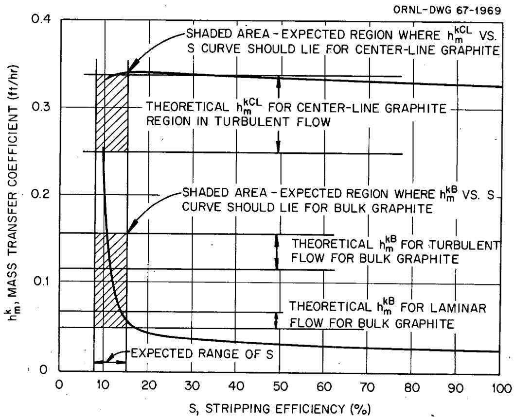  
Fig. 18. Relationship Between $h_m^k$ and S for Bulk and Center-Line Graphite Regions.

laminar and turbulent flow; it displays the uncertainty in the diffusivity of krypton in salt. In addition the expected range of stripping efficiency is outlined. Note that the calculated curves fall within the expected range.

In order to pick out more explicit values of $h_m^{kB}$ , we can weight this curve with the following two considerations. First, it is expected that some circulating bubbles were present, as will be shown in the next section on Capacity Considerations. Furthermore, it is expected that circulating bubbles increase the effective stripping efficiency to the high end of the indicated range, and likely even higher. Second, most of the salt in the bulk graphite region is of a laminar character, rather than turbulent, so $h_m^{kB}$ ought to be on the lower end of the expected range. Therefore, from Fig. 18 and with the above weighting considerations, we might pick out a probable range of $h_m^{kB}$ to bulk graphite as

$$
0. 0 5 <   h _ {m} ^ {k B} <   0. 0 9 \dot {f} t / h r.
$$

The next graphite region $(t_{1/2} = 15.5\mathrm{hr})$ , interpreted as the center-line graphite region, is more difficult to handle. The previous derivation assumes that all the krypton dissolved in salt comes from the graphite region under consideration. Now, when working with the center-line region, we must also consider the krypton dissolved in salt that originates in the bulk graphite. An equation whose derivation is similar to the above and which partially compensates for this is

$$
h _ {m} ^ {k C L} = \frac {\frac {0 . 6 9 3 \epsilon V _ {G} ^ {C L}}{A ^ {C L} t _ {1 / 2} ^ {C L} H R T} \left(1 + \frac {h _ {m} ^ {k B} A _ {G} ^ {B}}{Q _ {s p} S}\right)}{\left(1 + \frac {h _ {m} ^ {k B} A _ {G} ^ {B}}{Q _ {s p} S}\right) - \frac {0 . 6 9 3 \epsilon V _ {G} ^ {C L}}{Q _ {s p} S t _ {1 / 2} ^ {C L} H R T} \left(1 + \frac {t _ {1 / 2} ^ {C L} f l u x _ {0} ^ {B}}{t _ {1 / 2} ^ {B} f l u x _ {0} ^ {C L}}\right)},
$$

where the superscripts CL and B indicate center-line and bulk graphite regions, respectively. The equation was evaluated with the same parameter values as before and with the following additional ones, and for a given value of S the value of $h_{m}^{kB}$ was taken from the previous calculation

for the same void fraction:

$$
t _ {1 / 2} ^ {\mathrm {C L}} = 1 5. 5 \mathrm {h r} (\text {c e n t e r - l i n e g r a p h i t e r e g i o n}),
$$

$$
A C L = 1 4. 5 f t ^ {2} \text {(c h a n n e l s u r f a c e a r e a i n c e n t e r - l i n e r e g i o n)},
$$

$$
V _ {G} ^ {C L} = 0. 6 8 2 f t ^ {3} \text {(v o l u m e o f g r a p h i t e i n c e n t e r - l i n e r e g i o n)},
$$

$$
\begin{array}{l} \text {F l u x} _ {0} ^ {\mathrm {B}} = 3 5 7 4 \text {c o u n t s / m i n (i n t e r c e p t o f p e e l e d c u r v e a t t = 0 f o r} \\ \text {b u l k g r a p h i t e)}, \end{array}
$$

$$
\begin{array}{l} \text {F l u x} _ {0} ^ {\mathrm {C L}} = 2 1 7 8 \text {c o u n t s / m i n (i n t e r c e p t o f p e e l e d c u r v e a t t = 0 f o r} \\ \text {b u l k g r a p h i t e) .} \end{array}
$$

The results of this calculation appear on Fig. 18. Also shown is the theoretical range of $h_m^{kCL}$ based on turbulent flow and displaying the uncertainty in diffusivity of krypton in salt. The equation for $h_m^{kCL}$ is invalid at low values of S because $k_B^{kB}$ approaches infinity; hence the lines are terminated as they approach the equivalent line for $h_m^{kB}$ . Nevertheless, it seems that a reasonable range of $h_m^{kCL}$ for the MSRE would be between 0.25 and 0.4 ft/hr.

# Capacity Considerations

In addition to rate constant determinations from slopes of the peeled exponentials, we should be able to integrate under the curves and determine information on the capacity of the system. For instance, the integral of the bulk graphite curve $(t_{1/2} = 198\mathrm{hr})$ should yield the approximate $^{85}\mathrm{Kr}$ capacity of this graphite. Then, from knowledge of the $^{85}\mathrm{Kr}$ addition concentration, we could compute the approximate graphite void fraction available to krypton. When this calculation was performed with the addition concentration taken as the mean pump bowl concentration, the graphite void fraction came out to be about 0.40. This is obviously incorrect, even when the rough nature of the calculation is considered. The reason for this is that krypton was added through a bubbler, and it bubbled up through the salt at approximately one order of magnitude higher in concentration than in the pump bowl proper. These highly concentrated krypton bubbles were caught in the turbulent and recirculating zone formed by the spray ring. Very likely some of these bubbles, or micro bubbles, were carried into the primary loop and circulated with the salt. The result was that the concentration of dissolved krypton in the fuel salt was

much higher than it would have been based on the mean pump bowl concentration. Now, if we compute the graphite void fraction based on the dissolved krypton in the salt being in equilibrium with the bubbler addition stream, the result is about 0.04, and this is lower than would be expected. The true void fraction is between the limits of what can be calculated, and insufficient information is available to compute it more accurately. The same is true for all other graphite regions and the fuel salt, therefore little useful information on capacity is available from the data. It should be pointed out that the choice of a bubbler line for $^{85}\mathrm{Kr}$ addition as opposed to the pressure reference leg, which would not have given this deleterious effect, was dictated by other considerations.

# XENON-135 POISONING IN THE MSRE

# General Discussion

To calculate the steady-state $^{135}\mathrm{Xe}$ poisoning in the MSRE, it is first necessary to compute the steady-state $^{135}\mathrm{Xe}$ concentration dissolved in the salt. This is because the $^{135}\mathrm{Xe}$ is generated exclusively in the salt, at least it is assumed to be. The xenon concentration in the salt is computed by equating the source and sink rate terms involved. The most significant of these terms and considerations involving them are discussed below.

# Dissolved Xenon Source Terms and Considerations

1. Xenon Direct from Fission. The $^{135}\mathrm{Xe}$ generation rate direct from fission is about $0.3\%$ per fission.   
2. Xenon from Iodine Decay. The $^{135}\mathrm{I}$ generation rate is $6.1\%$ per fission, either direct or from the decay of $^{135}\mathrm{Te}$ . It in turn decays to $^{135}\mathrm{Xe}$ with a 6.68-hr half-life. The total $^{135}\mathrm{Xe}$ generation rate is therefore $6.1 + 0.3 = 6.4\%$ per fission, and, as will be seen from the next consideration, is confined completely to the salt phase. Since the principal $^{135}\mathrm{Xe}$ source is from the decay of iodine and since the $^{135}\mathrm{I}$ half-

life is long compared with the fuel-loop cycle time (25 sec), it will be assumed that $^{135}\mathrm{Xe}$ is generated homogeneously throughout the fuel loop.

3. Iodine and Tellurium Behavior. Since $^{135}\mathrm{I}$ and $^{135}\mathrm{Te}$ are precursors of $^{135}\mathrm{Xe}$ , their chemistry is important. In this model it is assumed that both elements remain in solution as ions, and therefore will not be removed from solution by the xenon stripper or diffusion into the graphite. Concerning iodine, its thermodynamic properties indicate this to be true. $^{10}$ Recent evidence from the reactor also indicates this to be true. Some iodine has been found in the off-gas system (but very little, if any, $^{135}\mathrm{I}$ ), but this is due to the volatilization of the precursor tellurium. Since $^{135}\mathrm{Te}$ has such a short half-life ( $< 0.5\mathrm{min}$ ), very little of it will have a chance to volatilize; therefore this effect is neglected. It is also assumed for this model that iodine and tellurium will not be absorbed on any internal reactor surfaces, such as the containment metal and graphite.

# Dissolved Xenon Sink Terms and Considerations

1. Xenon Decay. Xenon-135 decays with a half-life of 9.15 hr, and decay takes place throughout the entire fuel loop.   
2. Xenon Burnup. Xenon-135 has a neutron absorption cross section of $1.18 \times 10^{6}$ barns averaged over the MSRE neutron spectrum.[11]   
3. Xenon Stripper Efficiency. As noted earlier, the efficiency of the xenon stripper was measured at the University of Tennessee with a $\mathrm{CO}_{2}$ -water system and confirmed later with an $\mathrm{O}_{2}$ -water system. Both tests were for a bubble-free system. The measured rate constants were then extrapolated to a xenon-salt system. The stripping efficiency is defined as the percent of dissolved gas transferred from the salt to the gas phase in passing through the xenon stripper spray system. In magnitude it turns out to be between 8 and $15\%$ .   
4. Xenon Adsorption. Xenon is not adsorbed on graphite significantly at these temperatures, $^{13,14}$ and it is very unlikely that it will be adsorbed on metal surfaces.   
5. Xenon Migration to Graphite. The amount of xenon transferred to the graphite is a function of the mass transfer coefficient, diffusion coefficient of xenon in graphite, and the burnup and decay rate on the

graphite. During manufacture, this graphite was impregnated several times to obtain a low permeability. Diffusion experiments² with a single sample of CGB graphite yielded a diffusion coefficient of xenon in helium at $1200^{\circ}\mathrm{F}$ and 20 psig of about $2.4 \times 10^{-5} \mathrm{~cm}^2/\mathrm{sec}$ ( $9.2 \times 10^{-5} \mathrm{ft}^2/\mathrm{hr}$ ). This was measured in a single sample of graphite and may not be representative of the reactor core; however, it will be seen later that the poison fraction in the MSRE is not a strong function of the diffusivity. As previously pointed out, the core graphite may be divided into three fluid dynamic regions, bulk, center line, and lower grid. The krypton experiment did not yield any reliable information on the lower-grid region, and since it is in a region of very low nuclear importance, it will not be considered. The bulk and center-line regions will, however, be considered.

6. Xenon Migration to Circulating Bubbles. As will be seen, the effect of circulating bubbles is very significant because xenon is so insoluble in salt. Although information on circulating bubbles is meager, they will be considered.

# Other Assumptions and Considerations

1. The $^{135}\mathrm{Xe}$ concentration dissolved in the fuel salt was assumed to be constant throughout the fuel loop. From the computed results it can be shown to change less than $1\%$ .   
2. It was assumed that the $^{135}\mathrm{Xe}$ isotope behaves independently of all other xenon isotopes present.   
3. The $^{135}\mathrm{Xe}$ generated in the laminar sublayer of salt next to the graphite was considered as originating in the bulk salt.   
4. The core was considered as being composed of 72 annular rings, as shown below

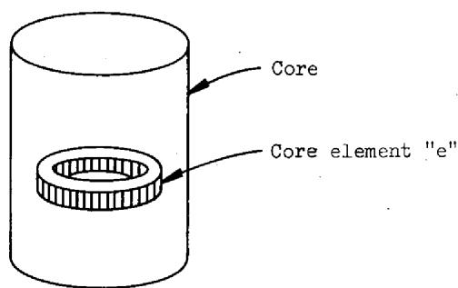

Average values of parameters such as neutron flux, percent graphite, mass transfer coefficient, etc., were used for each ring.

5. The reactor system was assumed to the isothermal at $1200^{\circ}\mathrm{F}$ .

Consistent with all previous assumptions, the rate balance of $^{135}\mathrm{Xe}$ dissolved in the fuel salt at steady state is the following:

Generation rate = Decay rate in salt + burnup rate in salt

$$
\begin{array}{l} + \text {s t r i p p i n g} + \text {m i g r a t i o n} \\ + \text {m i g r a t i o n} \\ \end{array}
$$

where the units of each term are $^{135}\mathrm{Xe}$ atoms per unit time. Each term will now be considered separately.

# Xenon-135 Generation Rate

The total $^{135}\mathrm{Xe}$ yield is $6.4\%$ per fission. The corresponding $^{135}\mathrm{Xe}$ generation rate is $5.44 \times 10^{19}$ $^{135}\mathrm{Xe}$ atoms per hour at $7.5\mathrm{Mw}$ .

# Xenon-135 Decay Rate in Salt

The decay of $^{135}\mathrm{Xe}$ dissolved in salt is represented as follows:

$$
\text {D e c a y r a t e i n s a l t} = \frac {0 . 6 9 3 V _ {S} C _ {S} ^ {X}}{t _ {1 / 2} ^ {X}}.
$$

# Xenon-135 Burnup Rate in Salt

The burnup rate of $^{135}\mathrm{Xe}$ dissolved in salt is expressed incrementally by dividing the core into the 72 elements described above and is as follows:

$$
\text {B u r n u p r a t e i n s a l t} = \sum_ {\mathrm {e} = 1} ^ {7 2} \phi_ {2 \mathrm {e}} \sigma^ {\mathrm {x}} f _ {\mathrm {e}} V _ {\mathrm {e}} C _ {\mathrm {s}} ^ {\mathrm {x}}.
$$

# Xenon-135 Stripping Rate

Recalling that the stripping efficiency (S) is defined as the percentage of $^{135}\mathrm{Xe}$ transferred from salt to helium in passing through the

pump bowl stripper, the stripping rate is expressed as

$$
\text {S t r i p p i n g} = Q _ {\mathrm {s p}} \mathrm {S C} _ {\mathrm {s}} ^ {\mathrm {x}}.
$$

# Xenon-135 Migration to Graphite

Each graphite core block will be assumed to be cylindrical. This seems to be a good compromise between the true case and ease of computation. The surface-to-volume ratio for a cylinder is very close to the channel surface area-to-volume ratio of the actual core blocks. Diffusion of $^{135}\mathrm{Xe}$ inside cylindrical core blocks at steady state and with a sink term is as follows:

$$
\frac {\mathrm {d} ^ {2} \mathrm {C} _ {\mathrm {G}} ^ {\mathrm {x}}}{\mathrm {d r} ^ {2}} + \frac {1}{r} \frac {\mathrm {d C} _ {\mathrm {G}} ^ {\mathrm {x}}}{\mathrm {d r}} = \frac {\epsilon}{\mathrm {D} _ {\mathrm {G}} ^ {\mathrm {x}}} \left(\phi_ {2} \sigma^ {\mathrm {x}} + \lambda^ {\mathrm {x}}\right) \mathrm {C} _ {\mathrm {G}} ^ {\mathrm {x}}.
$$

Solving for the following boundary conditions

$$
\begin{array}{l} C _ {G} ^ {X} = \text {f i n i t e a t} r = 0, \\ C _ {G} ^ {x} = C _ {G i} ^ {x} \text {a t} r = r _ {1}, \\ \end{array}
$$

we obtain

$$
C _ {G} ^ {x} = C _ {G i} ^ {x} \frac {I _ {0} (\beta r)}{I _ {0} (\beta r _ {1})},
$$

where

$$
\beta^ {2} = \frac {\epsilon}{D _ {G} ^ {X}} \left(\phi_ {2} \sigma^ {X} + \lambda^ {X}\right),
$$

$I_0 =$ zero-order modified Bessel function of the first kind.

Differentiating and evaluating at $r_1$ , we have

$$
\left(\frac {\mathrm {d} \mathrm {C} _ {\mathrm {G}} ^ {\mathrm {x}}}{\mathrm {d} r}\right) _ {r _ {1}} = \mathrm {C} _ {\mathrm {G i}} ^ {\mathrm {x}} \beta \frac {\mathrm {I} _ {1} (\beta r _ {1})}{\mathrm {I} _ {0} (\beta r _ {1})}.
$$

The $^{135}\mathrm{Xe}$ flux in the graphite and at the surface $(r = r_{\mathrm{i}})$ is given by

$$
F l u x _ {r _ {1}} ^ {x} = \frac {D _ {G} ^ {x}}{\epsilon} \left(\frac {d C _ {G} ^ {x}}{d r}\right) _ {r _ {1}},
$$

or, substituting the previous equation, we obtain

$$
\operatorname {F l u x} _ {r _ {1}} ^ {\mathbf {x}} = C _ {G i} ^ {\mathbf {x}} \beta \frac {D _ {G} ^ {\mathbf {x}}}{\epsilon} \frac {I _ {1} (\beta r _ {1})}{I _ {0} (\beta r _ {1})}.
$$

The $^{135}\mathrm{Xe}$ flux can also be represented by

$$
\operatorname {F l u x} _ {\mathbf {r} _ {1}} ^ {\mathbf {x}} = \mathrm {h} _ {\mathrm {m}} ^ {\mathbf {x}} \left(\mathrm {C} _ {\mathrm {s}} ^ {\mathbf {x}} - \frac {\mathrm {H R T}}{\epsilon} \mathrm {c} _ {\mathrm {G i}} ^ {\mathbf {x}}\right).
$$

Combining the last two equations by eliminating $C_{Gi}^{X}$ and then solving for $\text{Flux}_{r_1}^X$ , we obtain

$$
\operatorname {F l u x} _ {\mathbf {r} _ {1}} ^ {\mathbf {x}} = \frac {\mathrm {h} _ {\mathrm {m s}} ^ {\mathbf {x}}}{1 + \frac {\mathrm {h} _ {\mathrm {m}} ^ {\mathbf {x}} \mathrm {H R T}}{\beta \mathrm {D} _ {\mathrm {G}} ^ {\mathbf {x}}} \frac {\mathrm {I} _ {0} (\beta r _ {1})}{\mathrm {I} _ {1} (\beta r _ {1})}}
$$

in units of $^{135}\mathrm{Xe}$ atoms/hr. ft $^2$ . Because of the flux distributions, graphite distributions, and the various fluid dynamic regions, the core will be handled incrementally as the 72 regions described earlier. We can now solve for the total $^{135}\mathrm{Xe}$ flux into the graphite, as follows:

$$
\text {M i g r a t i o n r a t e} = \sum_ {\mathrm {e} = 1} ^ {7 2} \frac {\mathrm {h} _ {\mathrm {m e}} ^ {\mathrm {x}} \mathrm {Y V} _ {\mathrm {e}} \mathrm {F} _ {\mathrm {e}} \mathrm {C} _ {\mathrm {s}} ^ {\mathrm {x}}}{1 + \frac {\mathrm {h} _ {\mathrm {m e}} ^ {\mathrm {x}} \mathrm {H R T}}{\beta_ {\mathrm {e}} \mathrm {D} _ {\mathrm {G}} ^ {\mathrm {x}}} \frac {\mathrm {I} _ {0} (\beta_ {\mathrm {e}} r _ {1})}{\mathrm {I} _ {1} (\beta_ {\mathrm {e}} r _ {1})}}
$$

in units of $^{135}\mathrm{Xe}$ atoms per hour, where

$$
\begin{array}{l} V _ {e} = \text {v o l u m e o f c o r e e l e m e n t}, \\ F _ {e} = \text {g r a p h i t e v o l u m e f r a c t i o n a t V} _ {e}, \\ Y = \text {f u e l c h a n n e l s u r f a c e a r e a - t o - g r a p h i t e v o l u m e r a t i o}. \\ \end{array}
$$

It is assumed that Y is constant throughout the core moderator region and has a value of 22.08 ft $^{-1}$ .

Xenon-135 Migration Rate to Circulating Bubbles

The rate of $^{135}\mathrm{Xe}$ migration to the circulating bubbles is represented by

$$
\text {M i g r a t i o n r a t e t o b u b b l e s} = h _ {B} A _ {B} \left(C _ {s} ^ {x} - C _ {s i} ^ {x}\right)
$$

in units of $^{135}\mathrm{Xe}$ atoms per hour. The salt film is by far the controlling resistance; therefore the $^{135}\mathrm{Xe}$ concentration in the bubble is uniform and at equilibrium with the concentration in the salt at the interface. Consequently the previous equation can be written as

$$
\text {M i g r a t i o n r a t e t o b u b b l e s} = h _ {B} A _ {B} \left(C _ {s} ^ {x} - H R T C _ {B} ^ {x}\right).
$$

At steady state the migration rate to the bubbles equals the rate that $^{135}\mathrm{Xe}$ is removed from the bubbles, therefore

$$
\begin{array}{l} M i g r a t i o n \quad r a t e \quad t o \quad b u b b l e s = \text {D e c a y} \quad r a t e _ {\mathrm {B}} \\ + \text {b u r n u p} \quad \text {r a t e} _ {\mathrm {B}} + \text {b u b b l e} \quad \text {s t r i p p i n g} \quad \text {r a t e}, \\ \end{array}
$$

where

$$
\begin{array}{l} \text {D e c a y r a t e i n b u b b l e s} = \frac {0 . 6 9 3 V _ {s} \psi C _ {B} ^ {x}}{t _ {1 / 2} ^ {x}}, \\ \text {B u b b l e s t r i p p i n g r a t e} = Q _ {\mathrm {s p}} \psi S ^ {\prime} C _ {\mathrm {B}} ^ {\mathrm {x}}, \\ \text {B u r n u p r a t e i n b u b b l e s} = \sum_ {\mathrm {e} = 1} ^ {7 2} \phi_ {2 \mathrm {e}} \sigma^ {\mathrm {x}} f _ {\mathrm {e}} V _ {\mathrm {e}} \psi C _ {\mathrm {B}} ^ {\dot {\mathrm {x}}} , \\ \end{array}
$$

and the burnup rate of $^{135}\mathrm{Xe}$ in the bubbles is handled the same as in the salt, that is, by dividing the core into 72 elements of volume and adding up the burnup in each element. Substituting the individual rate terms in the removal rate balance equation we get

$$
\begin{array}{l} \text {M i g r a t i o n r a t e t o b u b b l e s} = \frac {0 . 6 9 3 V _ {s} \psi C _ {B} ^ {x}}{t _ {1 / 2} ^ {x}} \\ + \sum_ {e = 1} ^ {7 2} Q _ {2 e} \sigma^ {x} f _ {e} V _ {e} \psi C _ {B} ^ {x} + Q _ {s p} \psi S ^ {\prime} C _ {B} ^ {x}. \\ \end{array}
$$

Now, this equation may be solved simultaneously with the previous equation to eliminate $C_B^x$ . This results in

$$
\text {M i g r a t i o n r a t e t o b u b b l e s} = \frac {\mathrm {h} _ {\mathrm {B}} \mathrm {A} _ {\mathrm {B}} \mathrm {C} _ {\mathrm {s}} ^ {\mathrm {x}}}{1 + \frac {\mathrm {h} _ {\mathrm {B}} \mathrm {A} _ {\mathrm {B}} \mathrm {H R T}}{\frac {0 . 6 9 3 V _ {\mathrm {s}} \psi}{t _ {1 / 2} ^ {\mathrm {x}}} + \sum_ {\mathrm {e} = 1} ^ {7 2} Q _ {2 \mathrm {e}} \sigma^ {\mathrm {x}} f _ {\mathrm {e}} V _ {\mathrm {e}} \psi + Q _ {\mathrm {s p}} \psi S ^ {\prime}}}
$$

in units of $^{135}\mathrm{Xe}$ atoms per hour.

# Xenon-135 Concentration Dissolved in Salt

The $^{135}\mathrm{Xe}$ concentration dissolved in salt may now be solved for by substituting the individual rate equations into the original rate balance. This will yield

$$
\begin{array}{l} 5. 4 4 \times 1 0 ^ {1 9} = \frac {0 . 6 9 3 V _ {\mathrm {s}} C _ {\mathrm {s}} ^ {\mathrm {x}}}{t _ {1 / 2}} + \sum_ {\mathrm {e} = 1} ^ {7 2} \phi_ {2 \mathrm {e}} \sigma^ {\mathrm {x}} f _ {\mathrm {e}} V _ {\mathrm {e}} C _ {\mathrm {s}} ^ {\mathrm {x}} \\ + Q _ {s p} S C _ {s} ^ {x} + \sum_ {e = 1} ^ {7 2} \frac {h _ {m e} ^ {x} Y F _ {e} V _ {e s} ^ {x}}{1 + \frac {h _ {m e} ^ {x} H R T}{\beta_ {e} D _ {G} ^ {x}} \frac {I _ {0} (\beta_ {e} r _ {1})}{I _ {1} (\beta_ {e} r _ {1})}} \\ + \frac {h _ {B} ^ {A} C _ {s} ^ {x}}{1 + \frac {h _ {B} ^ {A} H R T}{\frac {0 . 6 9 3 V _ {s} \psi}{t _ {1 / 2} ^ {x}} + Q _ {s p} \psi S ^ {\prime} + \sum_ {e = 1} ^ {7 2} \phi_ {2 e} \sigma^ {X} f _ {e} V _ {e} \psi}}, \\ \end{array}
$$

where the units of each term are $^{135}\mathrm{Xe}$ atoms per hour.

# Xenon-135 Poisoning Calculations

The xenon poisoning as obtained in this report is defined as the number of neutrons absorbed by $^{135}\mathrm{Xe}$ over the number of neutrons (fast and thermal) absorbed by $^{235}\mathrm{U}$ and weighted according to neutron importance; it is expressed as a percentage. The weighting function is the adjoint flux. When considering the core incrementally it is given by

$$
P ^ {X} = \frac {\sum_ {e = 1} ^ {7 2} \sigma^ {X} \phi_ {2 e} ^ {*} \phi_ {2 e} f _ {e} V _ {e} C _ {s} ^ {X} + \sum_ {e = 1} ^ {7 2} \sigma^ {X} \phi_ {2 e} ^ {*} \phi_ {2 e} F _ {e} V _ {e} \overline {{C}} _ {G} ^ {X} + \sum_ {e = 1} ^ {7 2} \sigma^ {X} \phi_ {2 e} ^ {*} \phi_ {2 e} f _ {e} V _ {e} \psi C _ {B} ^ {X}}{\sum_ {e = 1} ^ {7 2} \left(\sigma_ {1} ^ {u} \phi_ {1 e} ^ {*} \phi_ {1 e} + \sigma_ {2} ^ {u} \phi_ {2 e} ^ {*} \phi_ {2 e}\right) f _ {e} V _ {e} C _ {s -} ^ {u}},
$$

where the first term in the numerator is the rate dissolved $^{135}\mathrm{Xe}$ is burned up, the second is the rate $^{135}\mathrm{Xe}$ in the graphite is burned up, and the third is the rate $^{135}\mathrm{Xe}$ in the bubbles is burned up; all terms are weighted with the adjoint flux. Now, the term representing the rate $^{135}\mathrm{Xe}$ in the graphite is burned up can be replaced by the $^{135}\mathrm{Xe}$ flux into the graphite times the fraction burned, that is

$$
\sigma^ {x} \phi_ {2 e F _ {e} V _ {e} \overline {{C}} _ {G} ^ {x}} = \frac {h _ {m e} ^ {x} Y V _ {e} F _ {e} C _ {s} ^ {x}}{1 + \frac {h _ {m e} ^ {x} H R T}{\beta_ {e} D _ {G} ^ {x}} \frac {I _ {0} (\beta_ {e} r _ {1})}{I _ {1} (\beta_ {e} r _ {1})}} \left(\frac {\phi_ {2 e} \sigma^ {x}}{\phi_ {2 e} \sigma^ {x} + \lambda^ {x}}\right).
$$

With this substitution the poisoning of $^{135}\mathrm{Xe}$ in the MSRE can be computed. The reactivity coefficient is related to the poisoning by a constant, which is a function only of the nuclear parameters. This has been evaluated and is

$$
\left(\delta k / k\right) ^ {x} = - 0. 7 5 2 P ^ {x}.
$$

Estimated $^{135}\mathrm{Xe}$ Poisoning in the MSRE Without Circulating Bubbles

With the equations given above, $^{135}\mathrm{Xe}$ poisoning has been computed for the MSRE for a variety of conditions subject to the assumptions discussed earlier. The procedure was to first solve for the steady-state

$^{13,5}$ Xe concentration dissolved in the salt, and then from this to compute the poisoning. A code was set up to do these calculations on a computer. The neutron fluxes used were those reported in Ref. 15 and corrected with more up to date information. $^{11}$ Values of many parameters used are given in Appendix A, and others were taken from standard reference manuals. Nominal values of various important rate constants and other variables were chosen, and the variation of poison fraction with these parameters was computed. These nominal values may be interpreted as approximate expected values. The first case to be discussed will be the bubble-free situation. Then the case of circulating bubbles will be discussed.

In the bubble-free case the following nominal values of various parameters were chosen:

Available void fraction in graphite, $\epsilon$ 0.10

Diffusion coefficient of Xe in graphite, $1 \times 10^{-4}$ DG, ft3 of void per hr per ft of graphite

Mass transfer coefficient to bulk graph- 0.0600 ite, hxB, ft/hr

Mass transfer coefficient to center-line 0.380 graphite, hCL, ft/hr

Stripping efficiency of spray ring, S, % 12

Reactor thermal power level, Mw 7.5

The pump bowl mixing efficiency was found to have a negligible effect and was not considered.

The results of the calculation are given in Figs. 19 and 20. Each plot shows the poisoning as a function of the parameter indicated, with all others being held constant at their nominal values. The circle indicates the nominal value. From these plots the following observations can be made.

1. For the bubble-free case, the $^{135}\mathrm{Xe}$ poisoning in the MSRE should be 1.3 to $1.5\%$ .   
2. Generally speaking the poisoning is a rather shallow function of all variables plotted. Note particularly the insensitivity of poisoning to available graphite void (Fig. 20) and the diffusion coefficient (Fig. 20). The reason is that $h_m^x$ controls the $^{135}\mathrm{Xe}$ flux to the graphite. This could be an important economic consideration in future reactors

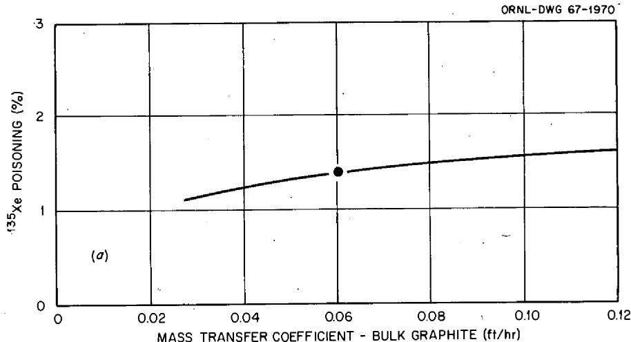

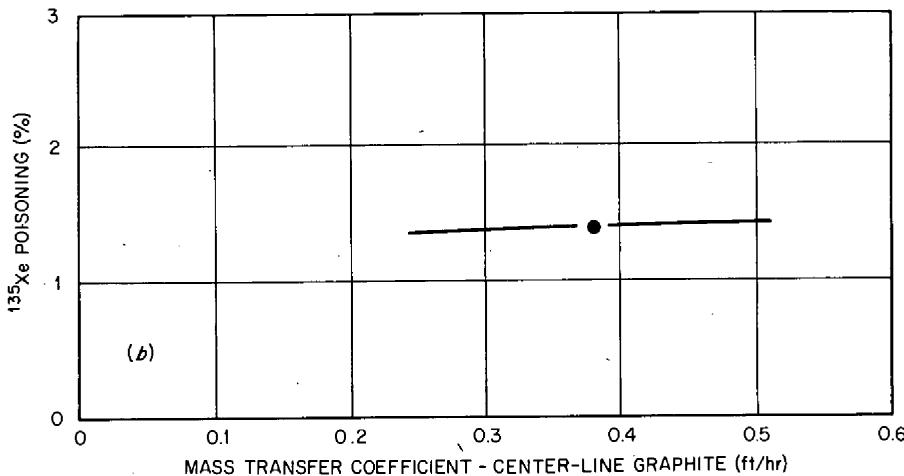

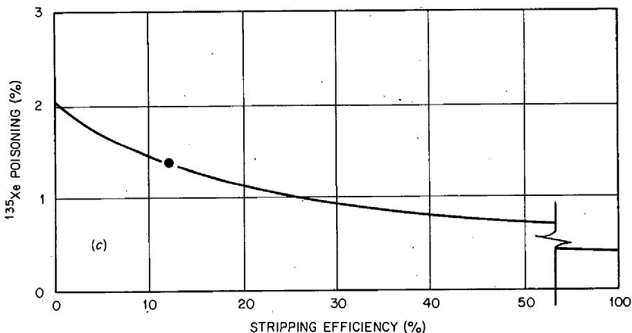  
Fig. 19. Predicted $^{135}\mathrm{Xe}$ Poison Fraction in the MSRE Without Circulating Bubbles at 7.5 Mw(t). See body of report for values of other parameters.

of this type. For instance, if xenon poisoning is the only consideration, the permeability specifications may be relaxed somewhat.

Other numbers of interest are given below. For the nominal case, the $^{135}\mathrm{Xe}$ distribution to its sink terms is

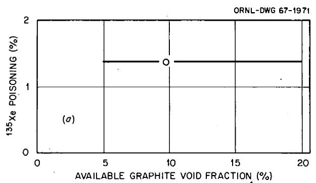

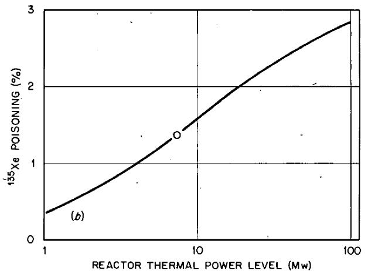

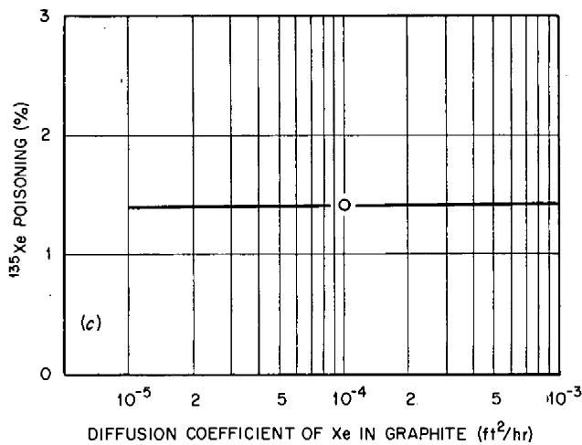  
Fig. 20. Predicted $^{135}\mathrm{Xe}$ Poison Fraction in the MSRE Without Circulating Bubbles at 7.5 Mw(t). See body of report for values of other parameters.

<table><tr><td>Decay in salt</td><td>3.4%</td></tr><tr><td>Burnup in salt</td><td>0.9</td></tr><tr><td>Stripped from salt</td><td>31.0</td></tr><tr><td>Migration to graphite</td><td>64.7</td></tr><tr><td></td><td>100.0%</td></tr></table>

Of the $^{135}\mathrm{Xe}$ that migrates to the graphite, $52\%$ is burned up and $48\%$ decays, averaged over the moderator region. Again, for the nominal case, $96.4\%$ of the total poisoning is due to $^{135}\mathrm{Xe}$ in the graphite and only $3.6\%$ is due to the $^{135}\mathrm{Xe}$ dissolved in the salt.

Estimated $^{135}\mathrm{Xe}$ Poisoning in the MSRE with Circulating Bubbles

Xenon, and all noble gases for that matter, is extremely insoluble in molten salt. From the Henry's law constant,

$$
C _ {s} ^ {x} = 2. 0 8 \times 1 0 ^ {- 4} C _ {g} ^ {x} a t 1 2 0 0 ^ {\circ} F,
$$

where the units of concentration are xenon atoms per unit volume. A simple calculation would show that with a circulating void fraction of 0.01 and the xenon in the liquid and gas phases in equilibrium, about $98\%$ of the xenon present would be in the bubbles, or if the void fraction is 0.001, $83\%$ of the xenon would be in the bubbles. We would therefore expect that a small amount of circulating helium bubbles would have a pronounced effect on $^{135}\mathrm{Xe}$ poisoning.

Circulating bubbles have been observed in the MSRE. The most significant indications come from "sudden pressure release tests." These experiments consist of slowly increasing the system pressure from 5 to 15 psig and then suddenly venting the pressure off. During the pressure release phase, the salt level in the pump bowl rises and the control rods are withdrawn; both motions indicate that circulating bubbles are present. Void fractions can be computed from these tests that range from 0 to 0.03 but are generally less than 0.01. The reactor operational parameters that control the void fraction are not completely understood, and it appears to be a quite complex phenomenon. For instance, the void fraction may be a function of how long the reactor has been operating.

The bubble diameter is extremely difficult to estimate. The only direct source of information on this point is from a water loop used for

MSRE pump testing. In this loop the pump bowl is simulated with Plexiglass so that the water flow can be observed. The bubbles that migrated from the pump bowl into the pump suction could be seen and were about the size of a "pinpoint." For lack of any better measurement they were taken to be in the order of 0.010 in. in diameter. As will be seen, this is not a critical parameter in these calculations.

Information in the literature on mass transfer to circulating bubbles is meager. Nevertheless, from Refs. 16 through 19 and other sources, the mass transfer coefficient was estimated to be in the range 1 to 4 ft/hr and practically independent of diameter. Again it turns out that this is not a critical parameter, even over this fourfold range. It is also assumed that the existence of circulating bubbles will have no effect on the salt-to-graphite mass transfer coefficient. This is equivalent to saying that the circulating bubbles do not come in contact with the graphite in any significant quantities.

A parameter that is quite critical is the bubble stripping efficiency. This is defined as the percentage of $^{135}\mathrm{Xe}$ enriched bubbles that burst in passing through the spray ring and are replaced with pure helium bubbles. At this time there is no good indication as to what this value is. It is probably a complex parameter like the circulating-void fraction and depends on many reactor operational variables. For lack of any better information, a nominal value was taken as $10\%$ , because this is about the salt stripping efficiency, but it could just as easily be in the order of $100\%$ .

Xenon-135 poisoning has been computed for the following range of variables pertaining to circulating bubbles.

<table><tr><td>Parameter</td><td>Nominal Value</td><td>Range 
Considered</td></tr><tr><td>Mean circulating void volume</td><td></td><td>0-1.0</td></tr><tr><td>Mean bubble diameter, in.</td><td>0.010</td><td>0.005-0.020</td></tr><tr><td>Mean bubble mass transfer coeffi-cient, ft/hr</td><td>2.0</td><td>0.5-4.0</td></tr><tr><td>Mean bubble stripping effi-ciency, %</td><td>10</td><td>0-100</td></tr></table>

Again the nominal value can be interpreted as the expected value but with much less certainty than in the bubble-free case. All other parameters not pertaining to the bubbles were held constant at the nominal value given for the bubble-free case. Figures 21 and 22 show the computed $^{135}\mathrm{Xe}$ poisoning as a function of circulating void volume with other parameters ranging as indicated. Parameters not listed on these plots were

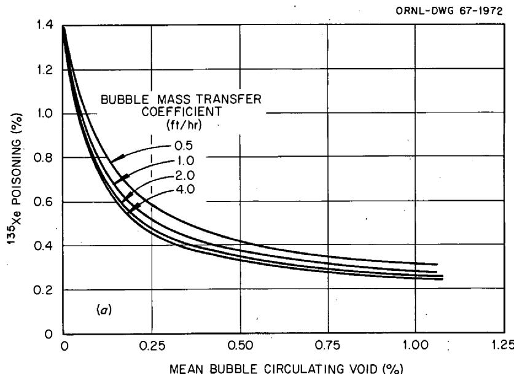

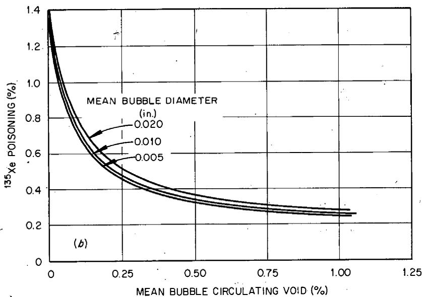  
Fig. 21. Predicted $^{135}\mathrm{Xe}$ Poison Fraction in the MSRE with Circulating Bubbles at 7.5 Mw(t). See body of report for values of other parameters.

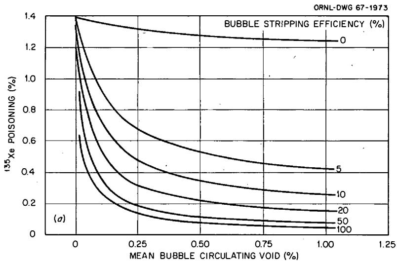

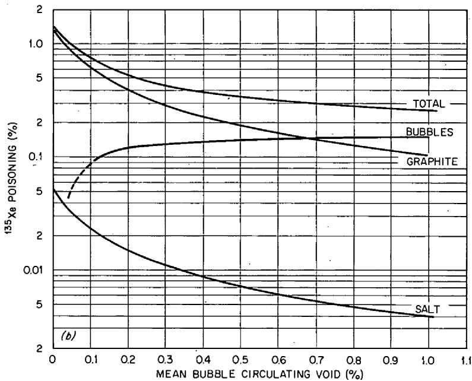  
Fig. 22. Predicted $^{135}\mathrm{Xe}$ Poison Fraction in the MSRE with Circulating Bubbles at 7.5 Mw(t). See body of report for values of other parameters.

I held constant at their nominal values. From these figures, the following observations can be made:

1. Circulating bubbles have a very pronounced effect on $^{135}\mathrm{Xe}$ poisoning, even at very low void percentages.   
2. The $^{135}\mathrm{Xe}$ poisoning is a rather weak function of the bubble mass transfer coefficient and diameter over the expected range.   
3. The poisoning is a strong function of the bubble stripping efficiency.

Figure 22 also shows the contribution of each system (salt, graphite, and bubbles) to the total $^{135}\mathrm{Xe}$ poisoning. All parameters are fixed at their nominal values. This figure illustrates how bubbles work to lower the poisoning. As the circulating void is increased, more and more of the dissolved xenon migrates to the bubbles, as noted by the rapidly increasing contribution to poisoning by the bubbles. In contrast to the bubble-free case in which the $^{135}\mathrm{Xe}$ in the graphite is the greatest contribution to poisoning, the $^{135}\mathrm{Xe}$ concentration of the salt is rapidly reduced by the bubbles and is thus not available to the graphite.

At the time this report was written, there was no accurate knowledge of the extent of $^{135}\mathrm{Xe}$ poisoning. Preliminary values based on reactivity balances indicate it is in the range 0.3 to $0.4\%$ . This is considerably below the value calculated for the bubble-free case, but it is well within the expected range when circulating helium bubbles are considered. We conclude therefore that this model probably does accurately portray the physical reactor, and good agreement depends only on reliable values of the various parameters involved. Work is currently under way to estimate more accurately the circulating void fraction and to determine what operational variables affect it. An attempt will also be made to estimate the bubble stripping efficiency, although this may be quite an elusive parameter to evaluate. Actually, the most recent information seems to indicate that the circulating void fraction $(\psi)$ is in the order of 0.1 to $0.3\%$ and the bubble stripping efficiency $(S')$ is in the range of 50 to $100\%$ . Equipment is currently being built to measure $^{135}\mathrm{Xe}$ poison fractions more accurately.

# CONCLUSIONS

The analyses presented indicate the following:

1. A transient experiment such as the $^{85}\mathrm{Kr}$ experiment can be useful in determining rate constants and other information for a complex process such as noble gas dynamics in the MSRE. There are serious limitations, however, and a detailed study should be made beforehand.

2. The krypton experiment indicated that mass transfer coefficients computed from heat-mass transfer analogies are quite good for the molten-salt porous-graphite system.   
3. If the MSRE could be operated bubble free, the computed $^{135}\mathrm{Xe}$ poisoning would be 1.3 to $1.5\%$ at 7.5 Mw. However, the reactor does not operate bubble free, so the poisoning should be considerably less. This results from the extreme insolubility of xenon in salt. When the model is modified to include circulating bubbles, the computed values can be made to agree with preliminary measured values $(0.3 - 0.4\%)$ by adjusting bubble parameters used over reasonably expected ranges. It would seem therefore that the model does portray the physical reactor. However, to prove this conclusively, we must have accurate knowledge of the bubble parameters, and with these calculate precisely the $^{135}\mathrm{Xe}$ poisoning. We think the model is quite representative of this system and can easily be extended to other fluid-fueled reactors of this type.   
4. This model should not be taken as final. For instance, it was assumed that iodine does not volatilize. If it is later determined that iodine does volatilize, the model will have to be adjusted accordingly.   
5. The circulating helium bubble concept should be considered seriously as a $^{135}\mathrm{Xe}$ removal mechanism in future molten-salt reactors. Helium bubbles could be injected into the flowing salt at the core outlet and be removed with an in-line gas separator some distance downstream.   
6. The insensitivity of $^{135}\mathrm{Xe}$ poisoning to the graphite void fraction and diffusion coefficient should be noted. This indicates that the tight specifications of these variables for the sole purpose of lowering the $^{135}\mathrm{Xe}$ poisoning might not be necessary. Considerable savings could be realized in future reactors. This phenomenon occurred in the MSRE because the film coefficient is the controlling mechanism for transfer of $^{135}\mathrm{Xe}$ to the graphite. Each future reactor concept would have to be studied in detail to assure that this was still true before the above statement was applicable.

# ACKNOWLEDGMENTS

We are indebted to H. R. Brashear of the Instrumentation and Controls Division for designing, building, and calibrating the radiation detectors used to monitor $^{85}\mathrm{Kr}$ , to T. W. Kerlin of the Reactor Division for his assistance in the unsteady-state parameter evaluation used in the krypton experiment analysis, and to the members of the MSRE operating staff for assistance in preforming the krypton experiment.

# REFERENCES

1. R. C. Robertson, MSRE Design and Operation Report, Part I, Description of Reactor System, USAEC Report ORNL-TM-728, Oak Ridge National Laboratory, January 1965.   
2. Oak Ridge National Laboratory, Reactor Chemistry Div. Ann. Progr. Rept. Jan. 31, 1965, USAEC Report ORNL-3789.   
3. Oak Ridge National Laboratory, Molten-Salt Reactor Program Semiann. Progr. Rept. July 31, 1964, USAEC Report ORNL-3708.   
4. F. F. Blankenship and A. Taboada, MSRE Design and Operation Report, Part IV, Chemistry and Materials, USAEC Report ORNL-TM-731, Oak Ridge National Laboratory (to be published).   
5. I. Spiewak, Xenon Transport in MSRE Graphite, Oak Ridge National Laboratory, unpublished internal report MSR-60-28, Nov. 2, 1960.   
6. G. M. Watson and R. B. Evans, III, Xenon Diffusion in Graphite: Effects of Xenon Absorption in Molten Salt Reactors Containing Graphite, Oak Ridge National Laboratory, unpublished internal document, Feb. 15, 1961.   
7. H. S. Weber, Xenon Migration to the MSRE Graphite, Oak Ridge National Laboratory, unpublished internal document.   
8. J. R. Waggoner and F. N. Peebles, Stripping Rates of Carbon Dioxide from Water in Spray Type Liquid-Gas Contactors, University of Tennessee Report EM 65-3-1, March 1965.   
9. Letter from F. N. Peebles to Dunlap Scott, March 31, 1965, Subject: Converting Stripping Rates from $\mathrm{CO}_{2}$ -Water System to Xe-Salt System.   
10. F. F. Blankenship, B. J. Sturm, and R. F. Newton, Predictions Concerning Volatilization of Free Iodine from the MSRE, Oak Ridge National Laboratory, unpublished internal report MSR-60-4, Sept. 29, 1960.   
ll. B. E. Prince, Oak Ridge National Laboratory, personal communication to authors.   
12. F. N. Peebles, University of Tennessee, personal communication to authors.   
13. F. J. Salzano and A. M. Eshaya, Sorption of Xenon in High Density Graphite at High Temperatures, Nucl. Sci Eng., 12: 1-3 (1962).   
14. M. C. Cannon et al., Adsorption of Xenon and Argon on Graphite, Nucl. Sci. Eng., 12: 4-9 (1962).   
15. P. N. Haubenreich et al., MSRE Design and Operation Report, Part III, Nuclear Analysis, USAEC Report ORNL-TM-730, Oak Ridge National Laboratory, Feb. 3, 1964.   
16. E. Ruckenstein, On Mass Transfer in the Continuous Phase from Spherical Bubbles or Drops, Chem. Eng. Sci., 19: 131-146 (1964).

17. Li et al., Unsteady State Mass Transfer For Gas Bubbles - Liquid Phase Controlling, Amer. Inst. Chem. Engrs. J., 11(4): 581-587 (July 1965).   
18. P. Harriott, Mass Transfer to Particles, Part I - Suspended in Agitated Tanks; Part II - Suspended in a Pipeline, Amer. Inst. Chem. Engrs. J., 8(1): 93-102 (March 1962).   
19. S. Sideman et al., Mass Transfer in Gas-Liquid Contacting Systems, Ind. Eng. Chem., 58(7): 32-47 (July 1966).   
20. R. B. Bird, W. E. Stewart, and E. N. Lightfoot, Transport Phenomena, Wiley, New York, 1960.   
21. C. V. Chester, Oak Ridge National Laboratory, personal communication to authors.

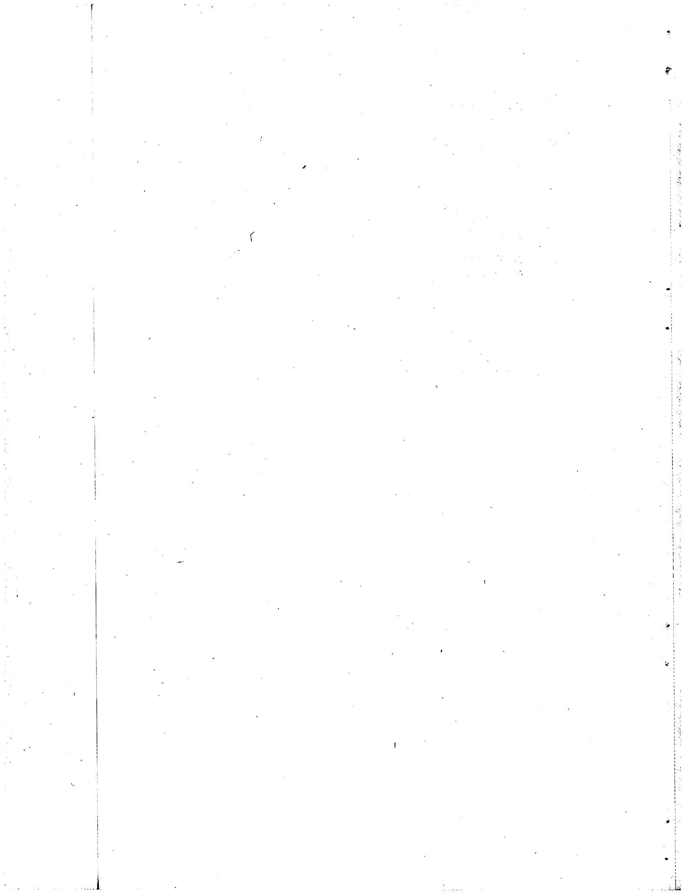

APPENDICES

# Appendix A

# MSRE PARAMETERS

# General

Normal thermal power level, Mw 7.5

Nominal operating temperature, ${}^{\circ}\mathbf{F}$ 1200

Operating pressure in pump bowl, psig 5

Fuel salt flow rate, gpm 1200

Fuel salt volume, ft3 70.5

Graphite volume, ft3 69

Xenon stripper flow rate (estimated), gpm 50

Salt flow along shaft to pump bowl, gpm 15

Total bypass flow (sum of above), gpm 65

Fuel loop circuit time, sec 25.2

# Graphite

Grade CGB

Bulk density, g/cm³ 1.82-1.87

Porosity, accessible to kerosene, % 4.0

Porosity, theoretical, % 17.7

Porosity, available to xenon and krypton,\* $\%$ 10

Fuel salt absorption at 150 psig (confined to surface), % 0.20

Wettability

Graphite surface area in fuel channels, ft² 1520

Diffusivity of Kr at $1200^{\circ}\mathrm{F}$ in graphite (filled with He), $\sim 1.0 \times 10^{-4}$ Kr atoms/hr.ft graphite (Kr atoms/ft $^3$ gas)

Diffusivity of Xe at $1200^{\circ}\mathrm{F}$ in graphite (filled with He), $\sim 0.92 \times 10^{-4}$

Xe atoms/hr·ft graphite (Xe atoms/ft $^3$ gas)

Equivalent diameter of fuel channels in bulk graphite, ft 0.0519

# Fuel Salt

Liquidus temperature, ${}^{\circ}\mathrm{F}$ 840

Density at $1200^{\circ}\mathrm{F}$ $\mathrm{lb / ft}^3$ 130

Viscosity at 1200°F, lb/ft·hr 18

Diffusivity of Kr at $1200^{\circ}\mathrm{F}$ (based on several estimated values), ft²/hr 4.3 × 10⁻⁵⁻⁷.0 × 10⁻⁵

Diffusivity of Xe at $1200^{\circ}\mathrm{F}$ (based on several estimated values), ft²/hr 3.9 × 10⁻⁵ -6.4 × 10⁻⁵

Henry's law constant for Kr at $1200^{\circ}\mathrm{F}$ , moles of Kr per cc of salt 8 × 10-9-9 × 10-9

per atmosphere

Henry's law constant for Xe at $1200^{\circ}\mathrm{F}$ , moles of Xe per cc of salt 2.75 × 10-9

per atmosphere

*From Ref. 2.

Not wet by fuel salt at operating conditions.

# Appendix B

# SALT-TO-GRAPHITE COUPLING

A question exists concerning the process of mass transfer from a fluid to a porous medium as opposed to a continuous or homogeneous medium. For example, the krypton flux from graphite to salt is given by

$$
\mathbf {F l u x} ^ {\mathrm {k}} = \mathrm {h} _ {\mathrm {m G}} ^ {\mathrm {k}} \left(\mathrm {C} _ {\mathrm {s f}} ^ {\mathrm {k}} - \mathrm {C} _ {\mathrm {s}} ^ {\mathrm {k}}\right),
$$

where $A_{G}$ is the total channel surface area of the graphite. The term $h_{m}^{k}$ is defined so that $C_{sf}^{k}$ is not the krypton concentration in salt at the salt-gas phase interface (located at a pore opening), but rather is some continuous concentration across the entire surface of the graphite. This is shown schematically below and would be similar for the case of xenon flowing from salt to graphite.

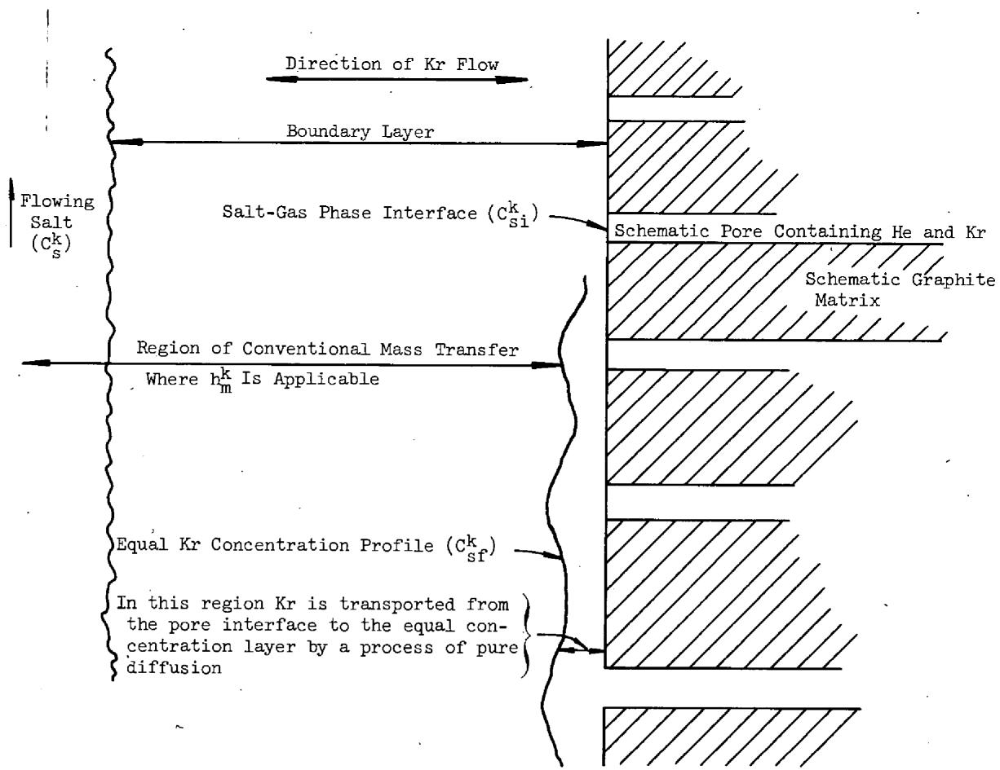

The mean pore entrance diameter for CGB graphite is less than $0.1\mu$ and probably closer to $0.02\mu$ , which is extremely small compared with the boundary layer thickness. It seems reasonable, therefore, that krypton is transported from the pore opening to the continuous concentration layer by a process of pure diffusion. Then from the continuous layer to the bulk salt, krypton will be transported by conventional fluid dynamic mass transfer. Note that since salt will not wet graphite, and because of the small pore size, the salt-gas interface will certainly not penetrate inside a pore. Also inherent in this analysis is the idea that salt will touch the solid graphite matrix, even though it will not wet it, and therefore the salt-gas phase interface will exist only at the pore opening. In order to couple the salt to the graphite, it is necessary to develop a relationship between $\mathsf{C}_{\mathsf{sf}}^{\mathsf{k}}$ and $\mathsf{C}_{\mathsf{si}}^{\mathsf{k}}$ . Actually it will be shown that $\mathsf{C}_{\mathsf{si}}^{\mathsf{k}} \approx \mathsf{C}_{\mathsf{sf}}^{\mathsf{k}}$ .

In this development we consider a simplification of the previous figure, as follows:

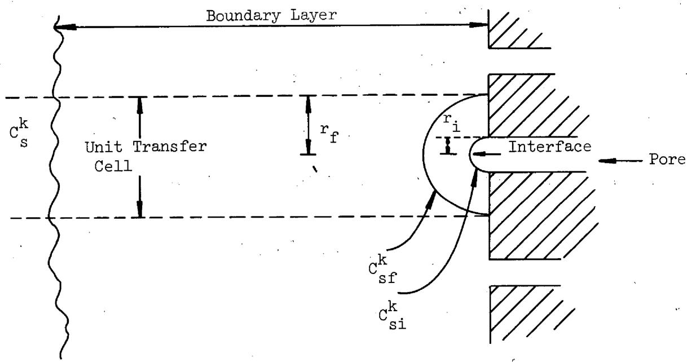

The pure diffusion region associated with a single graphite pore is approximated in spherical geometry. The inner hemisphere at constant concentration $C_{\mathrm{si}}^{\mathrm{k}}$ and radius $r_i$ is the source for krypton that diffuses through salt to the outer hemisphere at constant concentration $C_{\mathrm{sf}}^{\mathrm{k}}$ and

radius $r_f$ . Associated with each pore is a unit transfer cell of cross-sectional area $\pi r_f^2$ , through which krypton is transferred by conventional mass transfer from the position of $C_{sf}^k$ to the bulk salt at concentration $C_s^k$ . The term $r_i$ is taken as half the mean pore entrance diameter and $r_f$ is related to it with the graphite void fraction.

The general equation for diffusion in spherical coordinates at steady state, and when concentration is a function only of the radius, is

$$
\frac {d ^ {2} C _ {s} ^ {k}}{d r ^ {2}} + \frac {2}{r} \frac {d C _ {s} ^ {k}}{d r} = 0.
$$

Solving with boundary values, as discussed above,

$$
\frac {C _ {s} ^ {k} - C _ {s i} ^ {k}}{C _ {s f} ^ {k} - C _ {s i} ^ {k}} = \frac {1 - \frac {r _ {i}}{r}}{1 - \frac {r _ {i}}{r _ {f}}}
$$

Differentiating with respect to $r$ ,

$$
\frac {\mathrm {d C} _ {\mathrm {s}} ^ {\mathrm {k}}}{\mathrm {d r}} = \frac {r _ {i}}{r ^ {2}} \frac {\mathrm {C} _ {\mathrm {s f}} ^ {\mathrm {k}} - \mathrm {C} _ {\mathrm {s i}} ^ {\mathrm {k}}}{1 - \frac {r _ {i}}{r _ {\mathrm {f}}}}.
$$

Substituting into the flux equation, defined as follows,

$$
\text {F l u x} _ {\mathbf {r}} = - D _ {s} ^ {k} A _ {r} \frac {d C _ {s} ^ {k}}{d r}
$$

gives

$$
\text {F l u x} _ {\mathbf {r}} = - \mathrm {D} _ {\mathrm {s}} ^ {\mathrm {k}} \mathrm {A} _ {\mathbf {r}} \frac {\mathrm {r} _ {\mathrm {i}}}{\mathrm {r} ^ {2}} \frac {\mathrm {C} _ {\mathrm {s f}} ^ {\mathrm {k}} - \mathrm {C} _ {\mathrm {s i}} ^ {\mathrm {k}}}{1 - \frac {\mathrm {r} _ {\mathrm {i}}}{\mathrm {r} _ {\mathrm {f}}}}.
$$

Then, solving at $r = r_f$ for a hemisphere $(A_r = 2\pi r_f^2)$ , we obtain

$$
\text {F l u x} _ {\mathbf {r} _ {\mathbf {f}}} = - 2 \pi r _ {\mathbf {i}} D _ {\mathbf {s}} ^ {\mathbf {k}} \frac {C _ {\mathbf {s f}} ^ {\mathbf {k}} - C _ {\mathbf {s i}} ^ {\mathbf {k}}}{1 - \frac {r _ {\mathbf {i}}}{r _ {\mathbf {f}}}}.
$$

Without going into the considerations, we will state that a reasonable relationship between $r_i$ and $r_f$ is

$$
r _ {\text {i}} = r _ {\text {f}} \left(\frac {\epsilon}{3}\right) ^ {1 / 2}.
$$

Substituting this into the equation for flux $\mathbf{r}_{\mathrm{f}}$ gives

$$
\operatorname {F l u x} _ {\mathbf {r} _ {\mathrm {f}}} = - 2 \pi r _ {\mathrm {f}} \mathrm {D} _ {\mathrm {s}} ^ {\mathrm {k}} \frac {\left(\frac {\epsilon}{3}\right) ^ {1 / 2}}{1 - \left(\frac {\epsilon}{3}\right) ^ {1 / 2}} \left(\mathrm {c} _ {\mathrm {s f}} ^ {\mathrm {k}} - \mathrm {c} _ {\mathrm {s i}} ^ {\mathrm {k}}\right).
$$

Now, at steady state, this diffusion flux at $r_f$ must equal the convective flux through the unit cell, where

$$
\text {F l u x} _ {\text {u n i t c e l l}} = h _ {m} ^ {k} A _ {\text {u n i t c e l l}} \left(c _ {s f} ^ {k} - c _ {s}\right),
$$

or

$$
\text {F l u x} _ {\text {u n i t c e l l}} = \pi r _ {\mathrm {f}} ^ {2} h _ {\mathrm {m}} ^ {\mathrm {k}} \left(\mathrm {c} _ {\mathrm {s f}} ^ {\mathrm {k}} - \mathrm {c} _ {\mathrm {s}} ^ {\mathrm {k}}\right).
$$

Therefore, equating flux $_{r_f}$ and flux $_{unit cell}$ , we obtain

$$
\frac {C _ {\mathrm {s f}} ^ {\mathrm {k}} - C _ {\mathrm {s}} ^ {\mathrm {k}}}{C _ {\mathrm {s i}} ^ {\mathrm {k}} - C _ {\mathrm {s f}} ^ {\mathrm {k}}} = \frac {2 D _ {\mathrm {s}} ^ {\mathrm {k}}}{r _ {\mathrm {f}} h _ {\mathrm {m}} ^ {\mathrm {k}}} \frac {\left(\frac {\epsilon}{3}\right) ^ {1 / 2}}{1 - \left(\frac {\epsilon}{3}\right) ^ {1 / 2}}.
$$

Solving for the following parameter values,

$$
\begin{array}{l} D _ {S} ^ {k} = 4. 2 6 \times 1 0 ^ {- 5} f t ^ {2} / h r, \\ h _ {m} ^ {k} = 0. 0 6 f t / h r \text {(a p p r o x i m a t e f o r b u l k g r a p h i t e r e g i o n)}, \\ \mathrm {r} _ {\mathrm {i}} = 0. 1 \mu (\text {a c t u a l l y p r o b a b l y c l o s e r t 0 . 0 2 \mu}), \\ \epsilon = 0. 1 0, \\ r _ {f} = 0. 4 4 6 \mu , \\ \end{array}
$$

we obtain

$$
\frac {c _ {s f} ^ {k} - c _ {s} ^ {k}}{c _ {s i} ^ {k} - c _ {s f} ^ {k}} = 2 1 7,
$$

which says that the concentration difference between $C_{\mathrm{si}}^{\mathbf{k}}$ and $C_{\mathrm{sf}}^{\mathbf{k}}$ is negligible compared with the difference between $C_{\mathrm{sf}}^{\mathbf{k}}$ and $C_{\mathrm{s}}^{\mathbf{k}}$ . Another way of putting it is that $C_{\mathrm{si}}^{\mathbf{k}} \approx C_{\mathrm{sf}}^{\mathbf{k}}$ . The equation at the beginning of this appendix can now be written

$$
\mathrm {F l u x} ^ {\mathrm {k}} = \mathrm {h} _ {\mathrm {m}} ^ {\mathrm {k}} \mathrm {A} _ {\mathrm {G}} \left(\mathrm {C} _ {\mathrm {s i}} ^ {\mathrm {k}} - \mathrm {C} _ {\mathrm {s}} ^ {\mathrm {k}}\right).
$$

# Appendix C

# THEORETICAL MASS TRANSFER COEFFICIENTS

Theoretical mass transfer coefficients between fuel salt and graphite may be estimated by using standard heat transfer coefficient relationships and the analogy between heat and mass transfer.[20] These conversions are brought about by substitution of equivalent groups from the following table into the appropriate heat transfer coefficient relationship. They apply for either laminar or turbulent flow.

Heat Transfer Mass Transfer Quantity Quantity

$$
\mathrm {R e} = \frac {\rho d _ {e q} v}{\mu} \quad \cdot \quad \mathrm {R e} = \frac {- \rho d _ {e q} v}{\mu}
$$

$$
\mathrm {N u} _ {\mathrm {h}} = \frac {\mathrm {h} _ {\mathrm {h}} \mathrm {d e q}}{\mathrm {k}} \quad \mathrm {N u} _ {\mathrm {m}} = \frac {\mathrm {h} _ {\mathrm {m}} \mathrm {d e q}}{\mathrm {D}}
$$

$$
\Pr = \frac {C p \mu}{k} \quad S c = \frac {\mu}{\rho D}
$$

Applying these substitutions to the Dittus-Boelter equation for turbulent flow, we have,

1. for heat transfer,

$$
h _ {h} = 0. 0 2 3 \frac {k}{d _ {e q}} \left(\frac {p d _ {e q} v}{\mu}\right) ^ {0. 8} \left(\frac {C _ {p} \mu}{k}\right) ^ {0. 4},
$$

2. for mass transfer,

$$
h _ {m} = 0. 0 2 3 \frac {D}{d _ {e q}} \left(\frac {\rho d _ {e q} v}{\mu}\right) ^ {0. 8} \left(\frac {\mu}{\rho D}\right) ^ {0. 4}.
$$

For laminar flow the following equations can be used:

1. for heat transfer,

$$
h _ {h} = 1. 8 6 \frac {k}{d _ {e q}} \left(\text {R e} \Pr \frac {d _ {e q}}{L}\right) ^ {1 / 3} = 1. 8 6 \frac {k}{d _ {e q}} \left(\frac {\rho d _ {e q} ^ {2} v C _ {p}}{k L}\right) ^ {1 / 3},
$$

2. for mass transfer,

$$
h _ {m} = 1. 8 6 \frac {D}{d _ {e q}} \left(\text {R e S c} \frac {d _ {e q}}{L}\right) ^ {1 / 3} = 1. 8 6 \frac {D}{d _ {e q}} \left(\frac {d _ {e q} ^ {2} V}{D L}\right) ^ {1 / 3}
$$

Calculated values of $\mathbf{h}_{\mathfrak{m}}$ for krypton would then be as follows:

$h_m$ , Mass Transfer Coefficient (ft/hr)

<table><tr><td>Bulk Graphite</td><td>Center-Line
Graphite Region</td></tr><tr><td>0.115-0.155</td><td>0.250-0.338</td></tr><tr><td>0.048-0.067</td><td></td></tr></table>

where the range in $h_m$ reflects the range of $D_s^k$ given in Appendix A. This range in $D_s^k$ represents an expected range as determined from three sources:

1. as measured indirectly $^{21}$ from analogy of the noble gas-salt system to the heavy-metal ion-water system,   
2. estimated from the Stokes-Einstein equation,   
3. estimated from the Wilke-Chang equation.

# Appendix D

# NOMENCLATURE

<table><tr><td>Term</td><td>Definition</td><td>Units</td></tr><tr><td>A</td><td>Surface area</td><td>ft2</td></tr><tr><td>C</td><td>Noble gas concentration</td><td>atoms/ft3</td></tr><tr><td>Cg</td><td>Noble gas concentration in gas phase</td><td>atoms/ft3</td></tr><tr><td>CG</td><td>Noble gas concentration in graphite</td><td>atoms/ft3</td></tr><tr><td>Cs</td><td>Noble gas concentration in salt</td><td>atoms/ft3</td></tr><tr><td>Cp</td><td>Heat capacity</td><td>Btu/lb·°F</td></tr><tr><td>deq</td><td>Equivalent diameter of flow channel</td><td>ft</td></tr><tr><td>D</td><td>Diffusivity</td><td>ft2/hr</td></tr><tr><td>E</td><td>Pump bowl purging efficiency</td><td>%</td></tr><tr><td>ε</td><td>Void fraction of graphite</td><td></td></tr><tr><td>fe</td><td>Volume fraction of salt in element Ve</td><td></td></tr><tr><td>Fe</td><td>Volume fraction of graphite in element Ve</td><td></td></tr><tr><td>φ</td><td>Neutron flux</td><td>neutrons/cm2·sec</td></tr><tr><td>H</td><td>Henry's law constant for salt</td><td>moles/cc·atm</td></tr><tr><td>hn</td><td>Heat transfer coefficient</td><td>Btu/hr·ft2·°F</td></tr><tr><td>hm</td><td>Mass transfer coefficient</td><td>ft/hr</td></tr><tr><td>I</td><td>Modified Bessel functions of the first kind</td><td></td></tr><tr><td>J</td><td>Bessel functions of the first kind</td><td></td></tr><tr><td>k</td><td>Thermal conductivity</td><td>Btu/hr·ft·°F</td></tr><tr><td>L</td><td>Length of fuel channel</td><td>ft</td></tr><tr><td>λ</td><td>Radioactive decay constant</td><td>hr-1</td></tr><tr><td>P</td><td>Poisoning</td><td>%</td></tr><tr><td>Q</td><td>Volumetric flow rate</td><td>ft3/hr</td></tr><tr><td>Qgp</td><td>Volumetric flow rate of helium at 1200°F and 5 psig through pump bowl</td><td>ft3/hr</td></tr><tr><td>Qsp</td><td>Volumetric flow rate of salt through xenon stripper</td><td>ft3/hr</td></tr><tr><td>r</td><td>Radius</td><td>ft</td></tr><tr><td>rl</td><td>Radius at equivalent core block in cylind-edral geometry</td><td>ft</td></tr><tr><td>R</td><td>Universal gas constant</td><td>cc·atm/°K·mole</td></tr><tr><td>ρ</td><td>Density of salt</td><td>lb/ft3</td></tr><tr><td>S</td><td>Stripping efficiency, defined as the per- 
centage of dissolved gas transferred from 
liquid to gas phase as salt is sprayed 
through the xenon stripper</td><td>%</td></tr><tr><td>S'</td><td>Bubble stripping efficiency, defined as 
the percentage of 135Xe containing bub- 
bles that burst in passing through the 
stripper and are replaced with pure 
helium bubbles</td><td>%</td></tr><tr><td>σ</td><td>Absorption cross section</td><td>barns</td></tr><tr><td>t</td><td>Time</td><td>hr</td></tr><tr><td>t1/2</td><td>Half-life</td><td>hr</td></tr><tr><td>T</td><td>Absolute temperature</td><td>°C</td></tr><tr><td>v</td><td>Fluid velocity</td><td>ft/sec</td></tr><tr><td>Vs</td><td>Volume of salt in primary loop</td><td>ft3</td></tr><tr><td>VG</td><td>Volume of graphite in core</td><td>ft3</td></tr><tr><td>Vgp</td><td>Volume at gas phase in pump bowl</td><td>ft3</td></tr><tr><td>Ve</td><td>Volume of core element e</td><td>ft3</td></tr><tr><td>α</td><td>Arbitrary constant</td><td></td></tr><tr><td>μ</td><td>Viscosity</td><td>lb/ft·hr</td></tr><tr><td>Y</td><td>Ratio of fuel channel surface area to 
graphite volume in core</td><td>ft-1</td></tr><tr><td>ψ</td><td>Average void fraction of helium bubbles 
circulating with salt in primary loop</td><td></td></tr></table>

# Superscripts

x 135Xe

k 85Kr

235U

\* Adjoint flux

Mean

B Bulk graphite region

CL Center-line graphite region

# Subscripts

Fast neutrons   
2 Thermal neutrons   
b Boundary   
B Circulating bubbles   
e Element of core volume   
F Film   
g Gas phase   
G Graphite   
Heat   
i Interface   
m Mass   
o Initial conditions   
p . Pump bowl   
r At radius r   
Salt phase

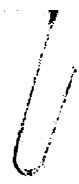

# Internal Distribution

1. C. F. Baes, Jr.   
2. S.J.Ball   
3. W.P. Barthold   
4. S. E. Beall   
5. F. F. Blankenship   
6. E. G. Bohlmann   
7. H. R. Brashear   
8. W. L. Carter   
9. C. E. Center (K-25)   
10. E. L. Compere   
ll. W.H.Cook   
12. F. L. Culler   
13. J.R. Engel   
22. R.J.Kedl   
23. G. W. Keilholtz   
24. T. S. Kress   
25. C. E. Larson (K-25)   
26. H. G. MacPherson

27. R. E. MacPherson   
28. A. P. Malinauskas   
29. C. D. Martin, Jr.   
30. H. A. McLain   
31. C.E.Miller, Jr.   
32. A. M. Perry   
33. M. W. Rosenthal   
34. A. W. Savolainen

35-40. Dunlap Scott

41. M. J. Skinner   
42. R.E.Thoma   
43. A. M. Weinberg   
44. M.E.Whatley

45-47. Central Research Library   
48-49. Y-12 Document Reference Section   
50-74. Laboratory Records Department

75. Laboratory Records, RC

# External Distribution

76. A. Giambusso, AEC, Washington   
77. T. W. McIntosh, AEC, Washington   
78. Division of Research and Development, AEC, ORO

79-80. Reactor Division, AEC, ORO

81-358. Given distribution as shown in TID-4500 under Reactor Technology Category (25 copies - CFSTI)