HeoHcTo 95hE

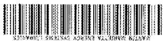

ORNL-4076

UC-4 - Chemistry

REACTOR CHEMISTRY DIVISION

ANNUAL PROGRESS REPORT

FOR PERIOD ENDING DECEMBER 31, 1966

CNINRA KUSSEALK

Document Generation

LIBRARY LOAN COPY

DO NOT TRANSFER TO ANOTHER PERSON

If you wish someone else to see thisdocument send this message with documentand the history will emerge in soon .

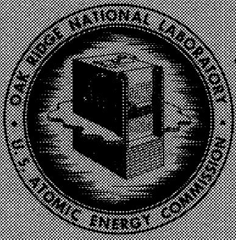

# OAK RIDGE NATIONAL LABORATORY

operated by

UNION CARBIDE CORPORATION

for the

U.S. ATOMIC ENERGY COMMISSION

Printed in the United States of America. Available from Clearinghouse for Federal

Scientific and Technical Information, National Bureau of Standards,

U.S. Department of Commerce, Springfield, Virginia 22151

Price: Printed Copy $3.00; Micrafiche $0.65

# LEGAL NOTICE

This report was prepared as an account of Government sponsored work. Neither the United States, nor the Commission, nor any person acting on behalf of the Commission:

A. Make any warranty or representation, expressed or implied, with respect to the accuracy, completeness, or usefulness of the information contained in this report, or that the use of any information, apparatus, method, or process disclosed in this report may not infringes privately owned rights; or   
8. Assume any liabilities with respect to the use of, or for damage resulting from the use of any information, apparatus, method, or process disclosed in this report.

As used in the above, "person acting on behalf of the Commission" includes any employee or contractor of the Commission, or employees of such contractor, to the extent that such employees or contractors of the Commission, or employees of such contractor prepare, disseminate, or provide access to, any information pursuant to his employment or contract with the Commission, or his employment with such contractor.

Contract No. W-7405-eng-26

# REACTOR CHEMISTRY DIVISION ANNUAL PROGRESS REPORT

# For Period Ending December 31, 1966

Director

W. R. Grimes

# Associate Directors

E. G. Bohlmann   
H. F. McDuffie   
G.M.Watson

# Senior Scientific Advisors

F. F. Blankenship   
C. H. Secoy

MARCH 1967

OAK RIDGE NATIONAL LABORATORY

Oak Ridge, Tennessee

operated by

UNION CARBIDE CORPORATION

for the

U.S. ATOMIC ENERGY COMMISSION

3445601340741

Reports previously issued in this series are as follows:

ORNL-2931 Period Ending January 31, 1960

ORNL-3127 Period Ending January 31, 1961

ORNL-3262 Period Ending January 31, 1962

ORNL-3417 Period Ending January 31, 1963

ORNL-3591 Period Ending January 31, 1964

ORNL-3789 Period Ending January 31, 1965

ORNL-3913 Period Ending December 31, 1965

# Contents

# PART I. MOLTEN-SALT REACTORS

# 1. Phase Equilibrium and Crystallographic Studies

# THE EQUILIBRIUM PHASE DIAGRAM FOR THE SYSTEM LiF-BeF $_2$ -ZrF $_4$

R.E.Thoma,H.A.Friedman,and H.Insley 3

Investigations of the equilibrium phase diagrams of the systems $\mathrm{LiF - BeF}_2\mathrm{-ZrF}_4$ and $\mathrm{BeF}_2\mathrm{-ZrF}_4$ were completed. Both systems exhibit liquid-liquid immiscibility, behavior which has heretofore been considered to be very unusual in molten fluoride systems.

# PRELIMINARY STUDY OF THE SYSTEM LiF-ThF $4 - P_{\alpha}F_{4}$

C.J.Barton,H.H.Stone,and G.D.Brunton 5

Optical examination of two slowly cooled mixtures of LiF, ThF₄, and PaF₄ indicates the probable existence of the compounds LiPaF₅ and Li₄PaF₈.

# APPARATUS FOR DIFFERENTIAL THERMAL ANALYSIS

L. O. Gilpatrick, R. E. Thoma, and S. Cantor 5

Automatic DTA apparatus was developed, tested, and found to be suitable for the study of phase transitions in mixtures of fluoroborate salts.

# SOLID-PHASE EQUILIBRIA IN THE SYSTEM $SmF_{2} - SmF_{3} - UF_{3}$

R.E.Thoma and H.A.Friedman 6

Extensive mutual solid-state solubility of components and intermediate phases were found in the $\mathbf{SmF}_2$ - $\mathbf{SmF}_3$ - $\mathbf{UF}_3$ system.

# PHASE RELATIONS IN THE SYSTEM KF-CeF3

C.J.Barton,G.D.Brunton,D.Hsu,and H.Insley 7

An incomplete investigation of the system $\mathbf{KF - CeF}_3$ showed the existence of one eutectic composition and two incongruity melting compounds, $3\mathbf{KF}\cdot \mathbf{CeF}_3$ and $\mathbf{KF}\cdot \mathbf{CeF}_3$ .

# THE CRYSTAL STRUCTURE OF $Li_{4}UF_{8}$

G.D.Brunton 7

The $\mathbf{U}^{4+}$ ion in this structure is surrounded by $\mathbf{F}^{-}$ ions at the corners of a 14-faced polyhedron. The Li-F coordinations are irregular octahedra, two of which share faces with the $\mathbf{U}^{4+}$ polyhedron.

# THE CRYSTAL STRUCTURES OF $\mathsf{NaF - LUF}_3$ SOLID SOLUTIONS

D.R.Sears and G.D.Brunton 9

Crystal structure analyses of two specimens near the 50:50 composition are described. A model structure based on that of $\mathbf{CaF}_2$ with cation vacancies and anion interstitials appears to fit the intensity data best, but there are anomalies in the thermal motion.

# THE CRYSTAL STRUCTURE OF $\gamma$ -CsBoF₃

H. Steinfink and G. D. Brunton 11

This structure is similar to that of the high-temperature form of $\mathrm{BaGeO}_3$ .

THE CRYSTAL STRUCTURE OF $\beta_{1}$ KLof

D.R.Sears 11

This compound forms merohedral twins which are almost isostructural with NaNdF 4.

CENTRAL CATION DISPLACEMENTS IN THE "TRIPYRAMIDAL" COORDINATION

D.R.Sears 13

Interatomic potential calculations suggest which anion configurations favor displacements of the cation from the medial plane and are correlated with the structures of $\beta_{1}$ -KLaf and NaNdF.

PREPARATION OF FLUORIDE SINGLE CRYSTALS FOR RESEARCH PURPOSES

R.E.Thoma,R.G.Ross,and H.A.Friedman 14

Pure single crystals of the fluorides $^{7}\mathrm{LiF}, \mathrm{Li}_{2}\mathrm{BeF}_{4}, \mathrm{Na}_{7}\mathrm{Zr}_{6}\mathrm{F}_{31},$ $^{7}\mathrm{Li}_{2}\mathrm{NaTh}_{2}\mathrm{F}_{11}, \beta\text{-CsBeF}_{3}$ , and $\mathrm{Li}_{4}\mathrm{UF}_{8}$ were grown from the melt and furnished for use in research programs at ORNL and elsewhere.

# 2. Chemical Studies of Molten Salts

A POLYMER MODEL. FOR LiF-BeF $_2$ MIXTURES

C.F.Baes, Jr. 15

A model which assumes polymeric $\mathbf{Be}_a\mathbf{F}_b^{(b - 2a)^*}$ anions containing $\mathbf{BeF}_4^{2-}$ tetrahedra, bridging $\mathbf{F}^*$ , and terminal $\mathbf{F}^-$ ions is found to be consistent with measured activities of $\mathbf{BeF}_2$ .

PHASE EQUILIBRIUM STUDIES IN THE $\mathsf{UO}_2\text{-}\mathsf{ZrO}_2$ SYSTEM

K.A.Romberger,C.F.Baes,Jr.,and H.H.Stone 17

New results from equilibration of the oxides in the presence of molten fluorides, while confirming the nearly complete exsolution of the oxides from one another below the eutectoid at $1110^{\circ}\mathrm{C}$ , show evidence of nonideal behavior in the dilute solid solutions just above this temperature.

THE OXIDE CHEMISTRY OF ThF4-UF4 MELTS

B.F.Hitch,C.E.L.Bamberger,and C.F.Baes,Jr. 18

The oxide phase at equilibrium with $2\mathrm{LiF} - \mathrm{BeF}_2 + \mathrm{UF}_4 + \mathrm{ThF}_4$ is a $(\mathrm{U} - \mathrm{Th})\mathrm{O}_2$ solid solution into which the uranium is strongly extracted.

THE OXIDE CHEMISTRY OF LiF-BeF2-ZrF4 MIXTURES

B.F.Hitch and C.F.Baes, Jr. 19

Measurements of the solubility of $\mathrm{BeO}$ and $\mathrm{ZrO}_2$ indicate the oxide tolerance of MSRE flush salt and fuel salt.

CONSTANT-VOLUME HEAT CAPACITIES OF MOLTEN SALTS

Stanley Cantor 20

Values of $C_v$ were obtained by combining published $C_p$ values, sonic velocities, and density-temperature data; in almost every case experimental $C_v$ exceeded that calculated on the basis of simple classical and/or quantum contributions.

TEMPERATURE COEFFICIENT OF $C_{\nu}$ FOR MOLTEN SALTS

Stanley Cantor 22

By using an empirical equation in which compressibility is a linear function of pressure, the temperature dependence of $C_{\nu}$ for 34 salts was calculated; where compression was necessary to sustain a fixed volume, $C_{\nu}$ increased with temperature.

TEMPERATURE COEFFICIENT OF COMPRESSIBILITY FOR MOLTEN SALTS

Stanley Cantor 24

A simple empirical equation, $\beta_{T}^{0} = Ae^{bT}$ , was found to hold for all molten salts. ( $\beta_{T}^{0}$ is the isothermal compressibility at 1 atm, $A$ and $b$ are constants, and $T$ is the absolute temperature.)

# VISCOSITY AND DENSITY IN THE LiF-BeF $_2$ SYSTEM

C. T. Moynihan and Stanley Cantor 25

Viscosity and density measurements show that the temperature coefficient of viscosity decreases when the volume expansion coefficient increases; the volume expansion coefficient is directly correlated to the temperature dependence of "free" volume in these melts.

# VAPOR PRESSURES OF MOLTEN FLUORIDE MIXTURES

Stanley Cantor, W. T. Ward, and C. E. Roberts 26

Vapor equilibria that are involved in the reprocessing by distillation have been measured. Decontamination factors of the order of 1000 for rare earths were evidenced. The vapor pressure of the composition of MSRE fuel concentrate was also measured.

# POTENTIOMETRIC MEASUREMENTS IN MOLTEN FLUORIDES

A.R.Nichols,Jr.,K.A.Romberger,and C.F.Baes,Jr. 26

Preliminary results for niobium in 2LiF-BeF ${}_{2}$ indicate the formation of stable,insoluble ${\mathrm{{NbF}}}_{2}$ .

# APPEARANCE POTENTIALS OF LITHIUM FLUORIDE AND LITHIUM BERYLLIUM FLUORIDE IONS

R.A.Strehlow and J.D.Redman 27

A study was made of appearance potentials of ions formed by electron impact from LiF and Li $_2$ BeF $_4$ vapor, and a surprising amount of structure was found in the ionization efficiency curves.

# 3. Separations Chemistry and Irradiation Behavior

# REMOVAL OF IODIDE FROM LiF-BeF $_2$ MELTS

C.E.L.Bamberger and C.F.Baes, Jr. 32

The efficiency of HF utilization during sparging shows an increase with decreasing pressure caused either by as yet unidentified side reactions or by a rate effect.

# REMOVAL OF RARE EARTH'S FROM MOLTEN FLUORIDES BY SIMULTANEOUS PRECIPITATION WITH $UF_{3}$

F.A.Doss,H.F.McDuffie,and J.H.Shaffer 33

Exposure of $\mathbf{LiF - BeF}_2$ (66-34 mole %) containing about $10^{-4}$ mole fraction $\mathrm{CeF}_3$ or $\mathrm{NdF}_3$ to excess solid $\mathbf{UF}_3$ caused removal of the rare earths from the molten solution.

# EXTRACTION OF RARE EARTH'S FROM MOLTEN FLUORIDES INTO MOLTEN METALS

J.H.Shaffer,W.P.Teichert,D.M.Moulton,F.F.Blankenship,W.K.R.Finnell,W.R.Grimes 34

The distribution of rare earths (lanthanum, cerium, neodymium, samarium, and europium) between molten LiF-BeF $_2$ (66-34 mole %) and molten bismuth was studied at $600^{\circ}\mathrm{C}$ as a function of the concentration of lithium metal added as a reducing agent.

# REMOVAL OF PROTACTINIUM FROM MOLTEN FLUORIDES BY REDUCTION PROCESSES

J.H.Shaffer,D.M.Moulton,W.K.R.Finnell,W.P.Teichert,F.F.Blankenship,and W.R.Grimes 36

The removal of protactinium from a simulated molten-salt breeder reactor blanket was demonstrated in a six-week experiment in which liquid bismuth was recirculated through the blanket salt, a bed of steel wool, and a bed of thorium metal chips. The evidence suggested that the protactinium was transported as a suspension, perhaps associated with high-melting metallic compounds of iron, chromium, and thorium.

# REMOVAL OF PROTACTINIUM FROM MOLTEN FLUORIDES BY OXIDE PRECIPITATION

J.H.Shaffer,W.P.Teichert,W.K.R.Finnell,F.F.Blankenship,and W.R.Grimes 38

The removal of protactinium from solution in molten LiF-BeF $_2$ (66-34 mole %) by oxide precipitation upon the addition of $\mathrm{ZrO}_2$ at $600^{\circ}\mathrm{C}$ was studied with a variety of $\mathrm{ZrO}_2$ powders of differing surface areas (from 1.3 to $80\mathrm{m}^2/\mathrm{g}$ ). The results were not consistent with simple theories of either complete solid solution formation or precipitation on the surface of the $\mathrm{ZrO}_2$ .

# PROTACTINIUM STUDIES IN THE HIGH-ALPHA MOLTEN-SALT LABORATORY

C.J.Barton and H.H.Stone 39

Reduction of protactinium dissolved in a molten LiF-ThF $_4$ breeder blanket mixture by exposure to solid thorium, followed by adsorption of the reduction product on an iron surface, is the most promising of the several recovery methods studied to date.

# GRAPHITE-MOLTEN-SALT IRRADIATION TO HIGH FISSION DOSE

H.C.Savage,J.M.Baker,E.L.Compere,M.J.Kelly,andE.G.Bohlmann 41

Irradiation of the first molten-salt thermal convection loop experiment in the ORR was terminated August 8, 1966, because of a leak through a broken transfer line after achieving power densities of $105\mathrm{w/cm}^3$ in the fuel channels of the graphite core. A second loop, modified to eliminate causes of failure encountered in the first, begins long-term irradiation in January 1967.

# 4. Direct Support for MSRE

# EXTENT OF $UF_4$ REDUCTION DURING MSRE FUEL PREPARATION

B.F.Hitch and C.F.Baes, Jr. 45

It is estimated that $0.16\%$ of the uranium introduced into the MSRE had been reduced to $\mathrm{UF}_{3}$ during salt purification.

# CHEMICAL BEHAVIOR OF FLUORIDES DURING MSRE OPERATION

R.E.Thoma 46

Current results of the chemical analyses of MSRE fuel, flush, and coolant salts show that after approximately 20 months in the MSRE, the molten salts have retained their original chemical composition and have not induced perceptible corrosion in the reactor.

# FISSIONPRODUCTSINMSREFUEL

S.S.Kirslis and F.F.Blankenship 48

Radiochemical analyses for fission products in MSRE fuel salt samples indicated that appreciable fractions of the $^{99}\mathrm{Mo}$ , $^{132}\mathrm{Tc}$ , $^{103}\mathrm{Ru}$ , and $^{106}\mathrm{Ru}$ produced by fission had left the fuel phase.

# FISSIONPRODUCTSINMSREEXITGAS

# Equilibrium Pressures of Noble-Metal Fluorides Under MSRE Conditions

C.F.Bacs, Jr. 49

Thermochemical data indicate that, with increasing oxidizing power, the order of appearance of volatile fluorides should be $\mathbf{NbF}_{5}$ , $\mathbf{MoF}_{6}$ , $\mathbf{RuF}_{5}$ , $\mathbf{TeF}_{6}$ .

# Analysis for Fission Products in MSRE Exit Gas

S. S. Kirslis and F. F. Blankenship 50

Small metal samples exposed to the gas phase of the MSRE pump bowl demonstrated qualitatively an appreciable volatility of $^{99}\mathrm{Mo}$ , $^{132}\mathrm{Te}$ , $^{103}\mathrm{Ru}$ , and $^{106}\mathrm{Ru}$ presumably as high-valent fluorides.

# FISSIONPRODUCTSONMETALANDGRAPHITEFROMMSRECORE

S. S. Kirslis and F. F. Blankenship 51

Samples of MSRE graphite removed from the reactor core after 7800 Mwhr of operation showed no radiation damage effects but were found to be significantly permeated or plated by noble-metal fission products and those with noble-gas precursors. Adjacent Hastelloy N samples were also undamaged and were more heavily plated with noble-metal fission products.

# XENON DIFFUSION AND FORMATION OF CESIUM CARBIDE IN AN MSBR

C.F.Baes,Jr.,and R.B.Evans III 53

Carbide formation in the moderator graphite should occur, but not in significant amounts; $^{135}\mathrm{Xe}$ poisoning could be reduced effectively either by iodine removal or by some means which reduces the salt-graphite film coefficient.

# PART II. AQUEOUS REACTORS

# 5. Corrosion and Chemical Behavior in Reactor Environments

# NASA TUNGSTEN REACTOR RADIATION CHEMISTRY STUDIES

G.H.Jenks,H.C.Savage,and E.G.Bohlmann 57

Experimental results showed that electron irradiation produces a small loss of cadmium from $\mathrm{CdSO}_4$ solutions under conditions of interest in the NASA Tungsten Water-Moderated Reactor. Equipment was designed for additional studies of the effects of agitation on the radiation stability of the solution.

# CORROSION OF ZIRCALOY-2 BY DILUTE HYDROGEN PEROXIDE AT $280^{\circ}C$

R.J.Davis,T.H.Mauney,and R.J.Hart 58

The corrosion of Zircaloy-2 in oxygenated water at $280^{\circ}\mathrm{C}$ was shown to be unaffected by the presence of $10^{-5}M\mathrm{H}_{2}\mathrm{O}_{2}$ , and it was concluded that the radiation effect on zirconium-alloy corrosion in these solutions is not a direct result of the peroxide formed during irradiation.

# ANODIC FILM GROWTH ON ZIRCONIUM AT ELEVATED TEMPERATURES

A.L.Bacarella,H.S.Gadiyar,and A.L.Sutton 58

A new expression for the anodic film growth current on zirconium was derived using the triple-barrier model with a field-dependent activation distance in the oxide phase, and our experimental data were fitted with this expression.

# AC IMPEDANCE OF OXIDE FILMS IN AQUEOUS SOLUTIONS AT ELEVATED TEMPERATURES

G. H. Jenks, A. L. Bacarella, R. J. Davis, and H. S. Gadiyar 61

Equipment, methods, and techniques are being developed and tested for measuring ac impedance of corrosion films on zirconium alloys in aqueous solutions at elevated temperatures. The immediate objective of such measurements is the detection of film porosity.

# CORROSION SUPPORT FOR REACTOR PROJECTS

J.C.Griess,Jr.,J.L.English,and P.D.Neumann 63

Corrosion investigations conducted for selecting structural materials for use in the High Flux Isotope Reactor and the Argonne Advanced Research Reactor were completed. Generally, both reactors should operate many years without major corrosion problems providing the chemistry of the coolant is properly maintained.

# 6. Chemistry of High-Temperature Aqueous Solutions

# ELECTRICAL CONDUCTANCES OF AQUEOUS ELECTROLYT ESOLUTIONS FROM 0 TO $800^{\circ}C$ AND TO 4000 BARS

A.S.Quist,W.Jennings,Jr.and W.L.Marshall 65

Continuing, extensive conductance studies on aqueous electrolytes to $800^{\circ}\mathrm{C}$ and 4000 bars have provided limiting equivalent conductances and dissociation constants of sodium chloride, differing sharply from behavior at $25^{\circ}\mathrm{C}$ , and measurements on 16 other 0.01 m-1 electrolytes.

# DISSOCIATION CONSTANT OF MAGNESIUM SULFATE TO $200^{\circ}C$ FROM SOLUBILITY MEASUREMENTS

W. L. Marshall 66

From the differences in solubility of calcium sulfate in sodium chloride and in sea-salt solutions, dissociation quotients, constants, and other thermodynamic quantities have been calculated.

# DISSOCIATION CONSTANT OF CALCIUM SULFATE TO $350^{\circ}C$ OBTAINED FROM SOLUBILITY BEHAVIOR IN MIXED ELECTROLYTES

L.B.Yeatts and W.L.Marshall 68

In perhaps the first extensive study of a four-component, mixed electrolyte system to high temperatures, solubilities of calcium sulfate were determined from 25 to $350^{\circ}\mathrm{C}$ from which dissociation quotients, solubility products, their respective constants, and thermodynamic quantities were calculated.

# SOLUBILITY OF $\mathsf{Fe}_{3}\mathsf{O}_{4}$ AT ELEVATED TEMPERATURE

F.H.Sweeton,R.W.Ray,and C.F.Baes,Jr. 70

The solubility of $\mathrm{Fe}_{3}\mathrm{O}_{4}$ in dilute HCl solutions containing dissolved $\mathbf{H}_2$ has been measured at 200, 260, and $300^{\circ}\mathrm{C}$ , and solubility products for formation of $\mathrm{Fe}^{2+}$ and $\mathrm{FeOH}^{-}$ have been calculated.

# HYDROLYSIS OF BERYLLIUM ION IN 1.0 M CHLORIDE AT $25^{\circ}C$

R.E.Mesmer and C.F.Baes, Jr. 72

The previously reported hydrolysis schemes for beryllium are not fully supported by the present data at $25^{\circ}\mathrm{C}$ . The uniqueness of other possible schemes is being tested.

# 7. Interaction of Water with Particulate Solids

# SURFACE CHEMISTRY OF THORIA

C.H.Secoy 74

# Heats of Immersion and Adsorption

E.L.Fuller,Jr.H.F.Holmes,and S.A.Taylor 74

Thoria powders composed of crystallites with an average size greater than about 1400 A yield a constant amount of heat per unit surface area upon immersion in water after outgassing at a given temperature. Powders composed of smaller crystallites react more energetically and release a portion of the heat by kinetically slow processes.

# Adsorption of Water and Nitrogen on Porous and Nonporous Thoria

H. F. Holmes and E. L. Fuller, Jr. 75

The concept that chemisorbed water decreases the pore volume is not adequate to explain the observed decreases in nitrogen and water surface areas of nonporous thoria, nor is the smaller size of the water molecule compared with nitrogen consistent with the observation of water areas much smaller than nitrogen areas.

# Infrared Spectra of Adsorbed Species on Thoria

C.S.Shoup, Jr. 77

Infrared spectra of the $\mathrm{ThO}_2\text{-H}_2\mathrm{O}$ interface obtained by both adsorption and desorption have confirmed the nonequilibrium nature of the surface interactions of thorium oxide and water.

# BEHAVIOR OF GASES WITH SOL-GEL URANIUM-THORIUM OXIDE FUELS

D.N.Hess,H.F.McDuffie,B.A.Soldano,and C.F.Weaver 78

The gases released when sol-gel microspheres of $\mathrm{ThO}_2$ or $\mathrm{UO}_2$ were heated in vacuum were identified, and the temperatures of maximum gas evolution were established. A conditioning procedure was developed which, when applied to wet, unfired microspheres, converted them into satisfactory reactor-fuel-element products of high density, low carbon content, and low O:U ratio.

# PART III. GAS-COOLED REACTORS

# 8. Diffusion Processes

# TRANSPORT PROPERTIES OF GASES

# Gaseous Diffusion Studies in Noble-Gas Systems

A.P.Malinauskas 83

Diffusion data are reported for the systems He-Kr, Ar-Kr, and Kr-Xe over the temperature range 0 to $120^{\circ}\mathrm{C}$ .

# Thermal Transpiration

B.A.Cameron and A.P.Malinauskas 84

Thermal transpiration measurements using a porous septum have been attempted. Although steady-state conditions are attained very rapidly, the thermal conductivity of the gas now enters in a pronounced manner and causes the analysis of the data to be extremely difficult.

# Gaseous Diffusion in Porous Media

A.P.Malinauskas,R.B.EvansIII,andE.A.Mason 85

A generalized treatment of gas transport in porous media has been developed on the basis of the "dusty-gas" model.

# Gas Transport Studies Related to Vented Fuel Elements for Fast Gas-Cooled Reactors

R.B.Evans III and D.E.Bruins 86

An investigation of the possibility of using direct venting devices on fuel elements in fast gas-cooled reactors has been initiated.

# RECOIL PHENOMENA IN GRAPHITES

R.B.Evans III, J.L.Rutherford,and R.B.Perez 86

The effects of density and porosity of graphitic structures on the range of "light" and "heavy" fission fragments have been determined.

# 9. Behavior of Graphite with Reactive Gases

L.G.Overholser

# OXIDATION OF GRAPHITE SLEEVES BY STEAM

C.M.Blood and G.M.Hebert 92

Oxidation rates of virgin, impregnated, and irradiated ATJ graphite sleeves were measured at $1000^{\circ}\mathrm{C}$ using a partial pressure of water vapor at $\sim 250$ torrs.

# TRANSPORT OF FISSION PRODUCTS

C.M.Blood 93

Deposition profiles for (1) $^{133}\mathrm{Ba}$ transported from barium-impregnated graphite by wet or dry helium and (2) $^{110}\mathrm{Ag}$ , $^{137}\mathrm{Cs}$ , and $^{134}\mathrm{Cs}$ transported from previously irradiated graphite by wet helium were established by sectioning and counting techniques.

# OXIDATION OF COATED FUEL PARTICLES BY WATER VAPOR

J.E.Baker 96

Rates of oxidation and incidence of coating failures were determined for various batches of coated fuel particles at 1100 to $1400^{\circ}\mathrm{C}$ using helium-water-vapor mixtures containing 500 or $1000\mathrm{ppm}$ of water vapor.

# 10. Irradiation Behavior of High-Temperature Fuel Materials

O. Sisman and J. G. Morgan

# IRRADIATION EFFECTS ON PYROLYTIC-CARBON-COATED FUEL PARTICLES

P.E.Reagan,J.G.Morgan,J.W.Gooch,M.T.Morgan,and M.F.Osborne 99

Pyrolytic-carbon-coated thorium-uranium carbide particles prepared commercially for the German AVR reactor withstood irradiation to 10 at. $\%$ heavy-metal burnup at $1300^{\circ}\mathrm{C}$ , and a barrier layer of silicon carbide added to a pyrolytic carbon coating greatly reduced the release of fission solids.

# IN-PILE TESTS OF A MODEL TO PREDICT THE PERFORMANCE OF COATED FUEL PARTICLES

P.E.Reagan,E.L.Long,Jr.,J.G.Morgan,and J.W.Gooch 100

A mathematical model developed to predict the burnup necessary to cause pyrolytic-carbon-coating failure was found to be accurate for the weakest coatings in the batch, and a thick carbon buffer layer caused uranium oxide particles to overheat and attack the coating.

# POSTIRRADIATION TESTING OF COATED FUEL PARTICLES

M. T. Morgan, C. D. Baumann, and R. L. Towns 101

Various types of pyrolytic carbon coatings applied to fuel particles of $\mathrm{UO}_2$ and $\mathrm{UC}_2$ have been annealed at high temperatures after neutron irradiation to test for coating stability, retention of fission products, and fuel migration.

# Irradiation Effects on Compatability of Fuel Oxides And Beryllium Oxide With GRAPHITE

D.R.Cuneo,C.A.Brandon,H.E.Robertson,and E.L.Long,Jr. 105

Graphite is chemically compatible with both $(\mathrm{U},\mathrm{Th})\mathrm{O}_2$ and $\mathrm{BeO}$ ; the concentration of $^6\mathrm{Li}$ found in $\mathrm{BeO}$ diminishes in smaller pieces in a direction consistent with a surface-to-volume relationship.

# FAST GAS-COOLED REACTOR DEVELOPMENT

D.R.Cuneo,H.E.Robertson,E.L.Long,Jr.,andJ.A.Conlin 107

In low-burnup irradiations no indication of fuel element failures have been found with $\mathrm{UO}_2$ in either stainless steel or Hastelloy X.

# FISSION-GAS RELEASE DURING FISSIONING OF $\mathsf{UO}_2$

R.M.Carroll,R.B.Perez,O.Sisman,G.M.Watson,and T.W.Fulton 109

Refinements have been made in the defect-trap model, and clustering of defects at about $1000^{\circ}\mathrm{C}$ in single-crystal $\mathrm{UO}_2$ was observed as predicted.

# THERMAL CONDUCTIVITY OF $\mathsf{UO}_2$ DURING IRRADIATION

C.D.Baumann,R.M.Carroll,J.G.Morgan,M.F.Osborne,and R.B.Perez 111

The thermal conductivity of a $\mathrm{UO}_2$ fuel specimen is being measured as a function of flux and temperature during irradiation.

# 11. Behavior of High-Temperature Materials Under Irradiation

# EFFECTS OF FAST-NEUTRON IRRADIATION ON OXIDES

G.W. Keilholtz and R.E. Moore 113

Translucent aluminum oxide of high density has been found to be more resistant to irradiation damage than sintered $\mathrm{Al}_{2}\mathrm{O}_{3}$ at irradiation temperatures of 300 to $600^{\circ}\mathrm{C}$ up to $3\times 10^{21}$ neutrons/cm $^2$ ( $>1$ MeV).

# BEHAVIOR OF REFRACTORY METAL CARBIDES UNDER IRRADIATION

G.W.Keilholtz,R.E.Moore,and M.F.Osborne 114

Irradiation effects on specimens of monocarbides of Ti, Zr, Nb, Ta, and W made by hot pressing, slip casting, and explosion pressing were investigated at low temperatures (300 to $700^{\circ}\mathrm{C}$ ) over the fast-neutron dose range 0.7 to $5.4 \times 10^{21}$ neutrons/cm $^2$ ( $>1$ MeV); W and Ti monocarbides were quite resistant to irradiation under these conditions.

# PART IV. OTHER ORNL PROGRAMS

# 12. Chemical Support for the Saline Water Program

# SOLUBILITY OF CALCIUM SULFATE IN SEA SALT SOLUTIONS TO $200^{\circ}\mathrm{C}$ ; TEMPERATURE-SOLUBILITY LIMITS FOR SALINE WATERS

W. L. Marshall and Ruth Slusher 119

Solubilities of calcium sulfate were determined in sea salt solutions from 30 to $200^{\circ}\mathrm{C}$ , and the data were used to calculate revised temperature-solubility limits for saline waters in general.

# CORROSION OF TITANIUM IN SALINE WATER

E.G.Bohlmann,J.F.Winesette,J.C.Griess,Jr.andF.A.Posey 121

Continuing electrochemical studies of titanium corrosion at elevated temperatures have supported the acid solution crevice corrosion mechanism and suggested that the complex inverse temperature dependence of the pitting potential is related to effects of alloy constituents on the passive oxide film.

# 13. Effects of Radiation on Organic Materials

W. W. Parkinson and O. Sisman

# EFFECTS OF RADIATION ON POLYMERS

W.W.Parkinson and W.K.Kirkland 125

The olefin groups of all isomeric forms of butadiene decrease rapidly upon irradiation, with the disappearance of side vinyl groups showing a high enough rate to suggest a chain reaction.

# RADIATION-INDUCED REACTIONS OF HYDROCARBONS

R.M.Keyser and W.K.Kirkland 127

The nonvolatile products from the irradiation of the model system naphthalene in hexane were found by chromatographic and spectral analysis to be chiefly $\alpha$ - and $\beta$ -alkyl-substituted naphthalenes (assuming no decomposition on the chromatographic column).

# ADDITION REACTIONS OF FURAN DERIVATIVES

C.D.Bopp and W.W.Parkinson 129

The major radiation products from solutions of cyclohexene in tetrahydrofuran have been tentatively identified as 1:1 adducts and dimers, with yields ranging from $G = 0.5$ to 2 at room temperature.

# DEVELOPMENT OF RADIATION-RESISTANT INSULATORS

W.W. Parkinson, B. J. Sturm, and E. J. Kennedy 130

Many samples of styrene-base polymers and samples of several other chemically simple plastics have been obtained and analyzed for common impurities, and an electrical measuring apparatus has been tested for sensitivity.

# 14. Chemical Support for the Controlled Thermonuclear Program

R. A. Strehlow and D. M. Richardson

INTERPRETATION OF DCX-2 MASS SPECTRA 131

The composition of residual gas in the DCX-2 vacuum system was analyzed in detail from mass spectra obtained during operation. Several low-molecular-weight hydrocarbons were found to be generated during beam injection.

MASS SPECTrometer CALIBRATION STUDIES 133

Improvement was made in quantitative interpretations of residual gas spectra by studies of mass discrimination in the spectrometer; the observed transmission fraction of carbon dioxide ions was one-fourth that of water ions.

WATER VAPOR CHEMISORPTION ON STAINLESS STEEL 134

The desorption of water from stainless steel after short exposures below $10^{-4}$ torr was studied in an oil-free system; the results followed chemisorption kinetics.

DECOMPOSITION OF DC-705 DIFFUSION PUMP FLUID 138

A white solid accumulation found in the inlet of a diffusion pump was identified as the decomposition product of the silicone oil pump fluid.

# PART V. NUCLEAR SAFETY

# 15. Activities of Nuclear Safety Technical Staff

W.E.Browning,Jr.,M.HFONTana,and B.A.Soldano 143

The Nuclear Safety Technical Staff, comprised of three persons, was formed early this year to aid in planning, coordinating, and directing the research and development activities within the Nuclear Safety Program.

# 16. Correlations of Fission Product Behavior

# THE LIGHT BULB MODEL FOR RELEASE OF FISSION PRODUCTS

C.E.Miller, Jr. 145

A model, based on boundary layer diffusion processes, satisfactorily describes the dependence of the fraction of fission product released from reactor fuels on (1) the composition and pressure of the surrounding atmosphere, (2) the temperature, (3) the heating time, and (4) the chemical form of the fission product species.

# EFFECT OF CONTAINMENT SYSTEM SIZE ON FISSION PRODUCT BEHAVIOR

G.M.Watson,R.B.Perez,and M.HFONTana 147

The behavior of iodine in containment systems differing in size by two orders of magnitude has been correlated with moderate success using simple mathematical relationships.

# CHEMICAL EQUILIBRIUM STUDIES OF ORGANIC-IODIDE FORMATION UNDER NUCLEAR REACTOR ACCIDENT CONDITIONS

R.H.Barnes,J.F.Kircher,and C.W.Townley 149

Computerized thermodynamic calculations indicate that there are realistic conditions under which $\mathrm{CH}_3\mathrm{I}$ could be generated in reactor accidents.

# THE ADEQUACY OF SCALEUP IN EXPERIMENTS ON FISSION PRODUCT BEHAVIOR IN REACTOR ACCIDENTS

C.E.Miller, Jr., and W.E.Browning, Jr. 150

A report has been written which describes two possible intermediate-scale experiments at 1 and $10\%$ the size of LOFT which are needed to extend the scaling range of experiments on fission product behavior over the five orders of magnitude between small experiments and LOFT.

# 17. Nuclear Safety Tests in Major Facilities

# FISSION PRODUCTS FROM FUELS UNDER REACTOR-TRANSIENT CONDITIONS

G.W.Parker,R.A.Lorenz,andJ.G.Wilhelm 152

Studies of fission product release and transport from metal-clad $\mathrm{UO}_2$ fuel transient-melted under water include the effect of and pressure rate of steam release.

# SIMULATED LOSS-OF-COOLANT EXPERIMENTS IN THE OAK RIDGE RESEARCH REACTOR

C.E.Miller,Jr.,R.P.Shields,B.F.Roberts,and R.J.Davis 153

The interpretation of data from previous experiments on fission product release and a literature review of iodine deposition have been the main activities during a period when major construction work has been under way on the reactor facility.

# IGNITION OF CHARCOAL. ADSORBERS

C.E.Miller, Jr., and R.P. Shields 155

Results of both in-pile and out-of-pile experiments on ignition temperatures of charcoal used in containment vessel air cleaning systems show that the temperature can be affected significantly by long-term exposure, slightly by moisture, and very little by adsorption of excessively large quantities of iodine.

# FISSION PRODUCTS FROM ZIRCALOY-CLAD HIGH-BURNUP $U O_{2}$

G.E.Creek,R.A.Lorenz,W.J.Martin,and G.W.Parker 157

Zircaloy-clad $\mathrm{UO}_2$ irradiated to a burnup of 7000 Mwd/ton was melted in the Containment Mockup Facility (CMF), and the behavior of released fission products in the stainless steel CMF tank was compared with that released from a stainless-steel-clad specimen irradiated to 1000 Mwd/ton.

# BEHAVIOR OF I, AND HI IN THE CONTAINMENT RESEARCH INSTALLATION TANK

G.W.Parker,W.J.Martin,G.E.Creek,and N.R.Horton 158

The relative deposition behavior of molecular iodine and hydrogen iodide has been observed in the 1200-gal CRI stainless steel containment vessel.

# 18. Laboratory-Scale Supporting Studies

# DEVELOPMENT OF FILTRATION AND ADSORPTION TECHNOLOGY

R.E.Adams,JackTruitt,J.S.Gill,andW.D.Yuille 160

The effect of accident environments on the behavior of test aerosols and on the performance of filter media is being studied in the laboratory.

# EXAMINATION OF PARTICULATE AEROSOLS WITH THE FIBROUS-FILTER ANALYZER

M.D.Silverman,JackTruitt,W.E.Browning,Jr.,andR.E.Adams 162

The fibrous-filter analyzer is being developed as a device for examining the characteristics of radioactive aerosols in terms of particle response to the major processes of filtration: diffusion, interception, and inertial impaction.

# DISTRUISHING IODINE FORMS AT HIGH TEMPERATURES AND HUMIDITIES

R.E.Adams,Zell Combs,R.L.Bennett,W.H.Hinds 163

Extensive tests of May packs, which are designed to distinguish iodine forms, have been conducted under elevated-temperature and high-humidity conditions such as those expected in water reactor accidents.

# REACTONS OF IODINE VAPOR WITH ORGANIC MATERIALS

R.E.Adams,RuthSlusher,R.L.Bennett,and Zell Combs 165

Laboratory investigations are being made to determine the reactions responsible for the production of methyl iodide, which has been observed in containment experiments involving elemental iodine.

# BEHAVIOR OF FISSION PRODUCTS IN GAS-LIQUID SYSTEMS

R.E.Adams,B.A.Soldano,and W.T.Ward 165

A study of the behavior of fission products at the gas-liquid interface has been undertaken.

# HIGH-TEMPERATURE BEHAVIOR OF GAS-BORNE FISSION PRODUCTS. TELLURIUM DIOXIDE

M.D.Silverman and A.P.Malinauskas 167

An experimental investigation of the enhanced volatility of metal oxides in the presence of water vapor has been initiated.

# THE CASCADE IMPACTOR AS A TOOL FOR THE STUDY OF SIZE DISTRIBUTION OF FISSION PRODUCT AEROSOLS

G.W.Parker and H.Buchholz 167

Calculations show that operation of the Andersen cascade impacts at pressures in the range 10 to $40\mathrm{mm}$ Hg permits extension of its useful range to particles with a diameter less than $0.1\mu$ , and apparatus has been devised, and is presently being tested, for this mode of operation.

# REACTION OF MOLECULAR IODINE AND OF METHYL IODIDE WITH SODIUM THIOSULFATE SPRAYS

G.W.Parker,W.J.Martin,G.E.Creek,and N.R.Horton 169

We have performed tests in the small (180-liter) stainless steel tank of the Containment Mockup Facility (CMF) using misting sprays containing $0.1 \, M$ sodium thiosulfate to remove molecular iodine and methyl iodide.

# STUDIES OF CSE-TYPE FISSION PRODUCT SIMULATION

G.W.Parker,R.A.Lorenz,and N.J.Horton 170

Design, construction, and preliminary testing of equipment for performing CSE-type simulant experiments in the CMF and CRI have been completed.

# RETENTION OF RADIOACTIVE METHYL IODIDE BY IMPREGNATED CHARCOALS

R.E.Adams,R.D.Ackley,J.D.Dake,J.M.Gimbel,andF.V.Hensley 172

Certain specially impregnated (iodized) charcoals have the capability of effectively trapping radioactive methyl iodide, by an isotopic exchange mechanism, from flowing air and steam-air over a wide range of conditions including 70 to $300^{\circ}\mathrm{F}$ , 14 to 60 psia, and 0 to $90\%$ relative humidity.

# PUBLICATIONS 175

# PAPERS PRESENTED AT SCIENTIFIC AND TECHNICAL MEETINGS 180

Part I

Molten-Salt Reactors

# 1. Phase Equilibrium and Crystallographic Studies

# THE EQUILIBRIUM PHASE DIAGRAM FOR THE SYSTEM LiF-BeF $_2$ -ZrF $_4$

R.E.Thoma H.A.Friedman H.Insley

Mixtures of ${}^{7}\mathrm{LiF}$ , $\mathrm{BeF}_2$ , and $\mathrm{ZrF}_4$ are of especial interest in this Laboratory because such mixtures serve as the solvent for ${}^{235}\mathrm{UF}_4$ in the Molten-Salt Reactor Experiment. Phase behavior of this ternary system and of its constituent binary subsystems has, accordingly, been examined in some detail. The binary systems $\mathrm{LiF - BeF}_2^{2,3}$ and $\mathrm{LiF - ZrF}_4^4$ have been carefully investigated here and elsewhere and have been described in available literature. Study of the $\mathrm{BeF}_2 - \mathrm{ZrF}_4$ and the $\mathrm{LiF - BeF}_2 - \mathrm{ZrF}_4$ systems was completed during the past year.

Most of the data for these systems were obtained by the technique of thermal gradient quenching followed by careful examination of the products by optical microscopy, though the older technique of thermal analysis was of value in some regions. The regions of liquid-liquid immiscibility in these systems were defined with the help of high-temperature centrifugation and careful examination of the separated products.

The combined data were used in construction of the phase diagrams shown as Figs. 1.1 and 1.2.

Invariant equilibria in these systems were found to occur at the composition-temperature locations listed in Table 1.1.

As Fig. 1.1 indicates, the binary system $\mathrm{BeF}_2\cdot$ $\mathbf{ZrF_4}$ exhibits relatively simple phase behavior, A single eutectic occurs at a relatively low $\mathbf{ZrF_4}$ concentration, and the system is free from binary compounds. Two immiscible liquids occur in mixtures containing 14 to 25 mole $\%$ $\mathbf{ZrF_4}$ ; the upper consolute temperature is near $740^{\circ}\mathrm{C}$ .

The $\mathrm{LiF - BeF_2 - ZrF_4}$ system (Fig. 1.2) is, so far as we are aware, the only ternary fluoride system yet shown to include immiscible liquids. As the temperature is increased above the liquidus, the composition interval showing two liquid phases steadily diminishes; it disappears at an upper consolute point at 25 mole % LiF and 55 mole % $\mathrm{BeF}_2$ at $955^{\circ}C$ .

This occurrence of two liquid phases in the system at high concentrations of $\mathrm{BeF}_2$ does not prejudice use of materials in the composition region near 65 mole % LiF and 30 mole % $\mathrm{BeF}_2$ as fuel solvents for molten-salt reactors.

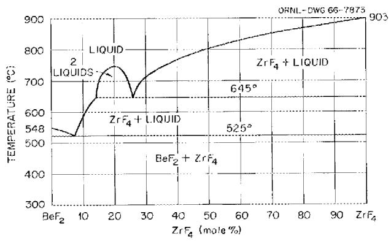  
Fig. 1.1. The System $\mathsf{BeF}_2\cdot \mathsf{ZrF}_4$

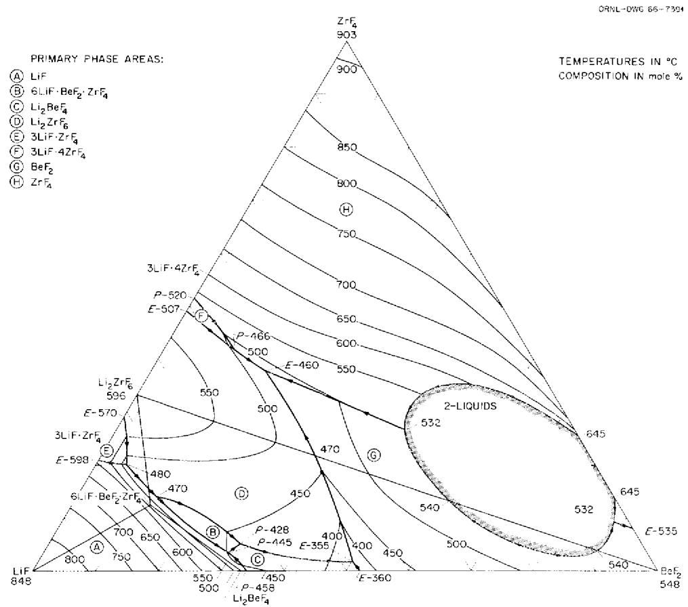  
Fig. 1.2. The System LiF-BeF $_{2}$ -ZrF $_{4}$ .

Table 1.1. Invariant Equilibrium Points in the Systems BeF $_2$ -ZrF $_4$ and LiF-BeF $_2$ -ZrF $_4$   

<table><tr><td colspan="3">Composition (mole %)</td><td rowspan="2">Temperature (℃)</td><td rowspan="2">Type of Equilibrium</td><td rowspan="2">Solid Phases Present</td></tr><tr><td>LiF</td><td>BeF2</td><td>ZrF4</td></tr><tr><td></td><td>92.5</td><td>7.5</td><td>525</td><td>Eutectic</td><td>BeF2, ZrF4</td></tr><tr><td></td><td>86</td><td>14</td><td>645</td><td></td><td>ZrF4</td></tr><tr><td></td><td>74</td><td>26</td><td>645</td><td></td><td>ZrF4</td></tr><tr><td>75</td><td>5</td><td>20</td><td>480</td><td>Peritectic</td><td>LiF, 3LiF·ZrF4, 2LiF·ZrF4</td></tr><tr><td>73</td><td>13</td><td>14</td><td>470</td><td>Peritectic</td><td>LiF, 6LiF·BeF2·ZrF4, 2LiF·ZrF4</td></tr><tr><td>67</td><td>29.5</td><td>3.5</td><td>445</td><td>Peritectic</td><td>LiF, 6LiF·BeF2·ZrF4, 2LiF·BeF4</td></tr><tr><td>64.5</td><td>30.5</td><td>5</td><td>428</td><td>Peritectic</td><td>6LiF·BeF2·ZrF4, 2LiF·ZrF4, 2LiF·BeF2</td></tr><tr><td>48</td><td>50</td><td>2</td><td>355</td><td>Eutectic</td><td>2LiF·ZrF4, 2LiF·BeF2, BeF2</td></tr><tr><td>47.5</td><td>10</td><td>42.5</td><td>466</td><td>Peritectic</td><td>2LiF·ZrF4, 3LiF·4ZrF4, ZrF4</td></tr><tr><td>44</td><td>18</td><td>38</td><td>460</td><td>Eutectic</td><td>2LiF·ZrF4, BeF2, ZrF4</td></tr><tr><td>27</td><td>46</td><td>27</td><td>532</td><td></td><td>BeF2, ZrF4</td></tr><tr><td>2</td><td>88</td><td>10</td><td>532</td><td></td><td>BeF2, ZrF4</td></tr></table>

# PRELIMINARY STUDY OF THE SYSTEM LiF-ThF-PaF

C.J.Barton H.H.Stone

G. D. Brunton

In the protactinium recovery studies described in Chap. 3 of this report it has been generally assumed that protactinium is present in the LiF-ThF $_4$ (73 mole % LiF) melts as $\mathrm{PaF_4}$ . This assumption has seemed plausible since the melts have, in every case, received a treatment with $\mathbf{H}_2$ at temperatures near $650^{\circ}\mathbf{C}$ , and since $\mathbf{H}_2$ is known to reduce pure $\mathrm{PaF_5}$ to $\mathrm{PaF_4}$ at much lower temperatures. (The $\mathrm{Pa^{4+}}$ state seems to be the lowest known in fluoride systems.) We have, however, conducted a few preliminary experiments to test this assumption and to see if the phase behavior of $\mathrm{PaF_4}$ is similar to that of $\mathrm{ThF_4}$ in mixtures with LiF.

About $100\mathrm{mg}$ of ${}^{231}\mathrm{PaF}_4$ was prepared by evaporating a measured portion of purified stock solution (9 M in HF) to dryness in platinum and heating the residue to $600^{\circ}\mathrm{C}$ in flowing HF- $\mathbf{H}_2$ mixture. Conversion to $\mathrm{PaF_4}$ was confirmed by weight and by the brown color of the material. A portion of this material was mixed with LiF-ThF (73 mole % LiF) to yield a mix with 68 mole % LiF and 32 mole $\%$ (Th,Pa)F. Another portion was mixed with LiF and the LiF-ThF mixture to yield a mix with 73 mole % LiF and 27 mole $\%$ (Th,Pa)F. Both mixtures were admixed with ammonium bifluoride (whose decomposition products on heating help to minimize possible hydrolysis), heated to $650^{\circ}\mathrm{C}$ , and cooled slowly.

Examination of the slowly cooled melts showed that segregation of $\mathrm{PaF_4}$ -rich phases from the bulk of the LiF-ThF $_4$ material occurred in both cases. Material from the mixture with 68 mole% LiF is believed to be a solid solution of $\mathrm{LiPaF_5}$ in $\mathrm{LiThF_5}$ . One of the phases from the sample with 73 mole% LiF is believed, because of its similarity to the analogous uranium compound, to be $\mathrm{Li_4PaF_8}$ . The $\mathrm{PaF_4}$ does not appear isomorphous with $\mathrm{ThF_4}$ ; the LiF-PaF $_4$ system may, in fact, be more like the LiF-UF $_4$ than the LiF-ThF $_4$ system. It is obvious that study of the binary LiF-PaF $_4$ system is needed before attempting further deductions concerning phase relations in the ternary system LiF-ThF $_4$ -PaF $_4$ .

A portion of the $\mathrm{LiF - ThF_4 - PaF_4}$ mixture with 73 mole % LiF was transferred to a small thorium

crucible and heated to $650^{\circ}\mathrm{C}$ in a helium atmosphere. Examination of the material with the polarizing microscope revealed some $\mathrm{Li}_{3}\mathrm{ThF}_{7}$ , but a large part of the mixture was in the form of opaque angular fragments, which are probably protactinium metal. X-ray examination will be required to confirm this conclusion.

# APPARATUS FOR AUTOMATIC DIFFERENTIAL THERMAL ANALYSIS

L. O. Gilpatrick

R. E. Thoma

S. Cantor

Fluoroborate mixtures containing high concentrations of $\mathrm{NaBF}_4$ appear useful as secondary coolants in molten-salt breeder reactors. Since such systems show significant $\mathrm{BF}_3$ pressures at temperatures above the liquidus, our standard techniques of thermal analysis and thermal gradient quenching are applicable only with difficulty to these materials. We have, accordingly, developed (with help from the ORNL Instrumentation and Controls Division) a sensitive automatic differential thermal analysis apparatus for study of the fluoborates.

This equipment, similar to that used by Holm, consists of a series of components assembled as illustrated in Fig. 1.3. Specimens are contained in sealed thin-walled nickel tubing, having outer dimensions $\frac{3}{8} \times 2.5$ in. Temperatures are monitored by armored 40-mil thermocouples which are positioned from below in reentrant chambers. Specimen containers and thermocouple assemblies were designed for minimal heat capacity. The specimen thermocouple supplies a signal in opposition to that from a matched cell containing fired $\mathrm{Al}_{2}\mathrm{O}_{3}$ as a comparison standard. Both cells are mounted in a massive nickel block and out of direct thermal contact with the block by means of ceramic supports. An independent thermocouple embedded in the block provides a signal which programs the temperature and heating rate of the system as a whole. Differential temperatures are recorded as a function of time on a model 7002AMR Moseley x-y recorder after amplification of from 500 to

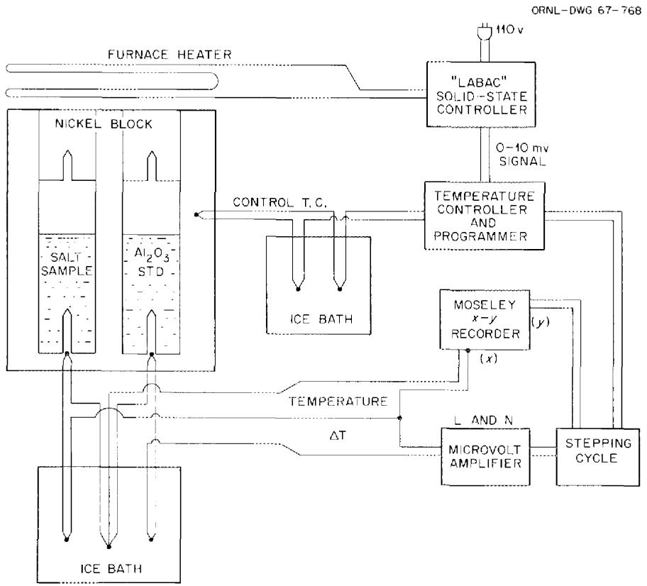  
Fig. 1.3. Block Diagram for Automatic DTA Apparatus.

20,000 as desired, via a Leeds and Northrup microvolt amplifier, model No. 9835B. The recording system is calibrated daily by a potentiometric circuit and a standard cell used to produce a known input signal. The apparatus temperature was calibrated by measuring the melting points of lead and bismuth metal standards from the National Bureau of Standards. The temperature programming unit was designed to control linear temperature changes over variable time periods from 30 to 300 min. Output from the programmer, consisting of a 0- to 10-mv signal, is fed to a solid-state power unit which controls the heat input. This device automatically programs repeated heating and cooling of specimens within preset limits and thereby enables automatic collection of phase transition data for periods of 50 hr or more.

The equipment is being applied to definition of liquid-solid and solid-solid transitions in the NaF $\mathbf{BF}_3$ system. Initial results show that the melting point of $\mathrm{NaBF}_4$ is $383.1^{\circ}\mathrm{C}$ ; this material, which contains less than 200 ppm of oxide ion, appears

to melt some $15^{\circ}C$ higher than the (probably less pure) material described by Selivanov and Stander.9

# SOLID-PHASE EQUILIBRIA IN THE SYSTEM $\mathsf{S}_{\mathsf{m}}\mathsf{F}_{2}\cdot \mathsf{S}_{\mathsf{m}}\mathsf{F}_{3}\cdot \mathsf{U}\mathsf{F}_{3}$

R. E. Thoma

H. A. Friedman

The fact that reduction potentials for the reaction $\mathrm{Ln}^{3+} \rightarrow \mathrm{Ln}^{2+}$ are lowest for the lanthanides europium and samarium (approximately 0.4 v) implies that the interactions of $\mathrm{SmF}_2$ , $\mathrm{SmF}_3$ , and $\mathrm{UF}_3$ possibly are significant in the development of molten-salt fuel reprocessing methods which would employ $\mathrm{UF}_3$ as an ion exchanger for selective removal of rare-earth fission product fluorides.

Products of the reactions of $\mathbf{S}\mathbf{m}^{\mathbf{0}}$ or $\mathbf{U}^{\mathbf{0}}$ with $\mathrm{SmF}_2$ , $\mathrm{SmF}_3$ , $\mathrm{UF}_3$ , and mixtures of these fluorides, which take place at 1300 to $1400^{\circ}\mathrm{C}$ , were analyzed.

The crystal phases were characterized with microscopic, x-ray diffraction, and electron resonance methods and were chemically analyzed. Samarium trifluoride was found to be stoichiometrically reducible with $\mathbf{Sm}^0$ to $\mathbf{SmF}_2$ , a cubic blue phase with refractive index 1.534 and $a_0 = 5.866\mathrm{A}$ . Partial reduction of $\mathbf{SmF}_3$ with $\mathbf{Sm}^0$ produces a birefringent red intermediate phase of unknown structure, inferred tentatively to be the compound $\mathbf{SmF}_2\cdot \mathbf{SmF}_3$ . The limited data which are currently available indicate that within the system $\mathbf{SmF}_2\cdot \mathbf{SmF}_3\cdot \mathbf{UF}_3$ extensive mutual solubility of the various components and intermediate phases prevails except between $\mathbf{SmF}_3$ and the intermediate phase $\mathbf{SmF}_2\cdot \mathbf{SmF}_3$ .

If this conclusion is borne out in future experiments, the reduction potentials of salts which pass through $\mathrm{UF}_3$ ion exchange beds will possibly be significant parameters in process control.

# PHASE RELATIONS IN THE SYSTEM KF- $\mathbf{C e F}_{3}$

C. J. Barton

D. Hsu $^{10}$

G. D. Brunton

H. Insley

Previous studies11,12 have shown that phase relationships in the $\mathrm{LiF - CeF_3}$ and $\mathrm{NaF - CeF_3}$ systems are very similar to those for their $\mathrm{LiF - PuF_3}$ and $\mathrm{NaF - PuF_3}$ counterparts. A brief examination of the $\mathrm{KF - CeF_3}$ system has, accordingly, been conducted to show probable behavior for $\mathrm{KF - PuF_3}$ . Work will begin on $\mathrm{KF - PuF_3}$ as soon as differential thermal analysis equipment becomes available to provide adequate sensitivity with small amounts of materials.

We obtained thermal analysis data from cooling curves obtained with a bare platinum-platinum-rhodium thermocouple immersed in the melt contained in a small (5 ml) platinum crucible. The calculated weights of KF and $\mathrm{CeF}_3$ (to give 3 to 4 g total) were placed in a crucible along with several grams of ammonium bifluoride, and the mixture was heated in a flowing stream of helium, slowly at first until the ammonium bifluoride decomposed, and then more rapidly until a tempera

ture well above the estimated liquidus temperature was reached.

Gradient quenches were performed with portions of the slowly cooled melts, and the resulting samples were examined by use of a polarizing microscope. The principal findings of the incomplete investigation are as follows: There is one eutectic composition at about 19 mole $\%$ $\mathrm{CeF}_3$ , melting at $625 \pm 5^{\circ}\mathrm{C}$ , and two incongruity melting compounds, $3\mathrm{KF} \cdot \mathrm{CeF}_3$ and $\mathrm{KF} \cdot \mathrm{CeF}_3$ . The former melts at $675 \pm 5^{\circ}\mathrm{C}$ to give $\mathrm{KF} \cdot \mathrm{CeF}_3$ and liquid and it also decomposes on cooling at $595^{\circ}\mathrm{C} \pm 5^{\circ}$ giving $\mathrm{KF}$ and $\mathrm{KF} \cdot \mathrm{CeF}_3$ . The latter compound melts at $755 \pm 5^{\circ}\mathrm{C}$ giving liquid and a cubic phase of unknown composition. Thermal analysis did not indicate the upper and lower stability limits of $3\mathrm{KF} \cdot \mathrm{CeF}_3$ , nor did it provide reliable liquidus values for mixtures containing more than 20 mole $\%$ $\mathrm{CeF}_3$ .

It was interesting to compare the data obtained for this system with the proposed diagram for the system $\mathrm{KF - NdF}_3$ recently reported by Schmutz. He reported a eutectic containing about 20 mole $\%$ $\mathrm{NdF}_3$ , melting at $625^{\circ}\mathrm{C} \pm 10^{\circ}$ , and three compounds, $3\mathrm{KF} \cdot \mathrm{NdF}_3$ , $\mathrm{KF} \cdot \mathrm{NdF}_3$ , and $\mathrm{KF} \cdot 2\mathrm{NdF}_3$ , melting incongruity at 695, 750, and $1115^{\circ}\mathrm{C}$ respectively. His phase diagram was based on differential thermal analysis data and examination of the slowly cooled melts by means of x-ray diffraction. On the basis of our studies of quenched melts it seems probable that the system is more complex than shown by Schmutz' diagram. We plan to perform further thermal analysis and quenching studies to better define the composition of the high-temperature cubic phase mentioned above. It is quite possible that it is more closely related to the $5\mathrm{NaF} \cdot 9\mathrm{YF}_3$ compound than to the simple 1 to 2 compound postulated by Schmutz.

# THE CRYSTAL STRUCTURE OF $\mathsf{Li}_4\mathsf{UF}_8$

G. D. Brunton

The compound $\mathrm{Li}_4\mathrm{UF}_8$ crystallizes in space group $Pnma$ with $a_0 = 9.960$ , $b_0 = 9.883$ , and $c_0 = 5.986$ . The x-ray density is $4.71\mathrm{g / cc}$ , and $Z = 4$ .

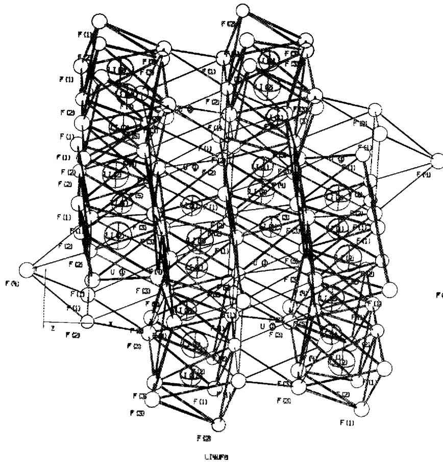

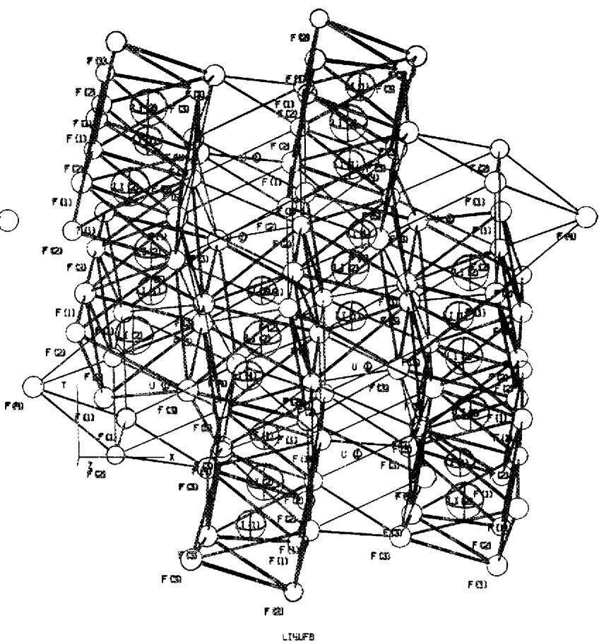  
Fig. 1.4. Stereoscopic Drawings of the Crystal Structure of $\mathsf{Li}_4\mathsf{UF}_8$

Table 1.2. Atomic Parameters for ${\mathrm{{Li}}}_{4}{\mathrm{{UF}}}_{8}$   

<table><tr><td>Atom</td><td>x ± 103σ</td><td>y ± 103σ</td><td>z ± 103σ</td><td>β11 ± 104σ</td><td>β22 ± 104σ</td><td>β33 ± 104σ</td><td>β13 ± 104σ</td></tr><tr><td>U</td><td>0.1400(0.1)</td><td>0.2500</td><td>0.3634(0.2)</td><td>0.0007(1)</td><td>0.0011(1)</td><td>0.0085(3)</td><td>0.0001(2)</td></tr><tr><td>F(1)</td><td>0.027(2)</td><td>0.107(2)</td><td>0.128(3)</td><td>0.0056(7)</td><td></td><td></td><td></td></tr><tr><td>F(2)</td><td>0.023(2)</td><td>0.121(2)</td><td>0.608(2)</td><td>0.0045(6)</td><td></td><td></td><td></td></tr><tr><td>F(3)</td><td>0.241(2)</td><td>0.031(2)</td><td>0.375(3)</td><td>0.0058(7)</td><td></td><td></td><td></td></tr><tr><td>F(4)</td><td>0.309(3)</td><td>0.250</td><td>0.117(4)</td><td>0.0059(10)</td><td colspan="3">Isotropic temperature factors:</td></tr><tr><td>F(5)</td><td>0.292(2)</td><td>0.250</td><td>0.633(4)</td><td>0.0045(9)</td><td colspan="3">β22 = b*2/a*2β11,</td></tr><tr><td>Li(1)</td><td>0.376(9)</td><td>0.055(9)</td><td>0.099(15)</td><td>0.0106(39)</td><td colspan="3">β33 = c*2/a*2β11.</td></tr><tr><td>Li(2)</td><td>0.395(13)</td><td>0.060(16)</td><td>0.649(22)</td><td>0.0174(73)</td><td></td><td></td><td></td></tr></table>

Twenty-four positional parameters, four anisotropic uranium temperature factors, and seven isotropic temperature factors (Table 1.2) were determined from 634 independent reflections measured by the $2\theta$ -scan technique with a scintillometer. The parameters were refined by least squares to an $R$ factor of 0.082. Absorption corrections were made for Cu Ka radiation on an oblate spheroid with a short $36 - \mu$ axis, [001], and a $64 - \mu$ diameter for the circular section. The $\mathbf{U}^{4 + }$ ion has eight $\mathbf{F}^{- - }$ nearest neighbors with bond distances of 2.21 to 2.39 A, Fig. 1.4. The next three nearest neighbors are two $\mathbf{L}\mathbf{i}^{+}$ and another $\mathbf{F}^{- - }$ at 3.27 and 3.39 A respectively. The nine $\mathbf{F}^{- - }$ ions are at the corners of a 14-faced polyhedron which has the form of a triangular prism with pyramids on each of the three prism faces, and the two $\mathbf{L}\mathbf{i}^{+}$ ions are at the centers of irregular $\mathbf{F}^{- - }$ octahedra which share faces with the uranium polyhedron. The $\mathbf{L}\mathbf{i}^{+}\mathbf{-}\mathbf{F}^{- - }$ distances are 1.82 to 2.28 A.

# THE CRYSTAL STRUCTURES OF $\mathsf{NaF - LuF}_3$ SOLID SOLUTIONS

D.R.Sears G.D.Brunton

A remarkable feature of the sodium fluoride-rare-earth trifluoride binary systems is the occurrence of a cubic phase whose lanthanide-rich composition limit corresponds to a formula $5\mathrm{NaF}\cdot 9\mathrm{LnF}_{3}.$ The 5:9 stoichiometry is bizarre, but its independ

ence of choice of lanthanide (i.e., of cationic radius) is even more surprising. Seeking a crystal-chemical explanation of this behavior, we have begun to determine crystal structures of cubic $\mathrm{NaF - LnF_3}$ materials of selected compositions.

Complete three-dimensional x-ray intensity data have been collected for two cubic sodium lutetium fluorides, whose compositions are 51.2 and $56.6\%$ $\mathrm{LuF}_3$ . Reflections were measured with a spectrogoniometer and single-crystal orienter, using the 2θ-scan technique. Using full-matrix least-squares and difference-synthesis methods, a variety of cation vacancy and anion interstitial models were tested and refined. Basically, all models were derived from the classical fluorite $(\mathrm{CaF}_2)$ structure.

Best goodness of fit (as judged by $R$ factors and difference syntheses) was obtained for each crystal using a model consisting of a mixed cation site at the origin, a fractionally occupied fluorine site at (0.275, 0.275, 0.275), and a second fractionally occupied fluorine site at $(\frac{1}{2}, x, x)$ . For $51.2\% \mathrm{LuF}_3$ , $x = 0.114$ , and for $56.6\% \mathrm{LuF}_3$ , $x = 0.061$ . The corresponding $R$ factors are 4.6 and $3.8\%$ respectively.

Fluorine-fluorine distances are impossibly short and would seem to be unacceptable even if $x = 0$ . The model is unrealistic also in the constraints necessarily imposed upon thermal parameters in order to assure convergence: the isotropic thermal motion parameters of the two types of fluorine were constrained to be equal.

We conclude that the anion interstitial model is tenable only if the static fluorine displacements from $(\frac{1}{4}, \frac{1}{4}, \frac{1}{4})$ and $(\frac{1}{2}, 0, 0)$ are fictitious and that anharmonic thermal motion occurs along

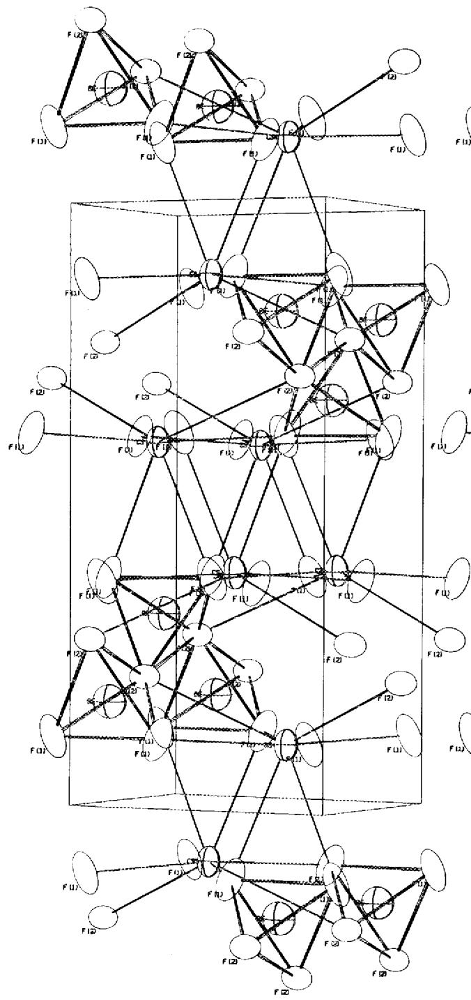

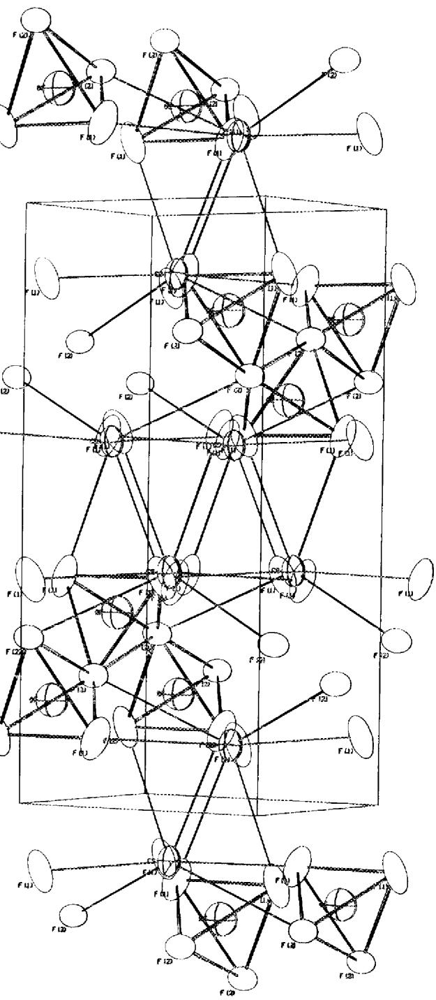  
Fig. 1.5. Stereoscopic Drawings of the Structure of $C_sBeF_3$ .

Table 1.3. Atomic Parameters for CsBeF ${}_{3}$   

<table><tr><td>Atom</td><td>x</td><td>y</td><td>z</td><td>B11</td><td>B22</td><td>B33</td><td>B12</td><td>B13</td><td>B23</td></tr><tr><td>Cs</td><td>0.265</td><td>0.250</td><td>0.107</td><td>0.0234</td><td>0.0143</td><td>0.0058</td><td>0.0</td><td>0.0007</td><td>0.0</td></tr><tr><td>Be</td><td>0.705</td><td>0.250</td><td>0.679</td><td>0.0216</td><td>0.0319</td><td>0.0063</td><td>0.0</td><td>0.0003</td><td>0.0</td></tr><tr><td>F(1)</td><td>0.244</td><td>0.042</td><td>0.783</td><td>0.0245</td><td>0.0211</td><td>0.0106</td><td>0.0031</td><td>0.0006</td><td>0.0069</td></tr><tr><td>F(2)</td><td>0.884</td><td>0.250</td><td>0.679</td><td>0.0169</td><td>0.0282</td><td>0.0033</td><td>0.0</td><td>0.0007</td><td>0.0</td></tr></table>

tetrahedral directions from these sites. This kind of motion has been postulated in the case of $\mathrm{UO}_2$ , $\mathrm{ThO}_2$ , and $\mathrm{CaF}_2$ ,[16] and the conclusion is at least consistent with the appearance of difference syntheses of the two NaF-LuF crystals hitherto examined.

We will attempt to collect intensity data from NaF-LuF $_3$ crystals near the composition limits (39 and 64.29% LuF $_3$ ) in order to reduce the calculational ambiguities and to attack directly the problems imposed by the puzzling 5:9 ratio.

# THE CRYSTAL STRUCTURE OF $\gamma$ -CsBeF₃

H. Steinfink17 G. D. Brunton

The gamma (low-temperature) form of the compound $\mathrm{CsBeF}_3$ crystallizes in space group $Pnma$ with $a_0 = 4.828\mathrm{A}$ , $b_0 = 6.004\mathrm{A}$ , and $c_0 = 12.794\mathrm{A}$ . The x-ray density is $3.56~\mathrm{g / cc}$ , and $Z = 4$ . Nine positional parameters and 16 anisotropic temperature factors (Table 1.3) were determined from reflections measured on a Norelco PAILRED automatic crystal data collector. The parameters were refined by least squares to an $R$ of 0.11.

Each $\mathbf{C}\mathbf{s}^{+}$ ion is surrounded by eight $\mathbf{F}^{-}$ nearest neighbors with bond distances of 3.02 to 3.92 A (Fig. 1.5). The $\mathrm{Be}^{2 + }$ ions have four nearest neighbor $\mathbf{F}^{-}$ ions at the corners of a tetrahedron. The $\mathrm{Be}^{2 + } - \mathrm{F}^{- - }$ distances are 1.47 to 1.62 A. The structure of this compound is similar to that of the high-temperature form of $\mathrm{BaGeO}_3$ . The repulsion of the doubly charged $\mathrm{Be}^{2 + }$ ions increases the Be-F distances where the $\mathbf{F}^{- - }$ ions are shared between two tetrahedra. This accounts for the unusually long (1.62 A) $\mathrm{Be}^{2 + } - \mathrm{F}^{- - }$ distances.

# THE CRYSTAL STRUCTURE OF $\beta_{1}$ -KLaf

D. R. Sears

Hexagonal $\beta_{1}$ -KLaF $_4$ solidified as merohederally twinned crystals of space group $P6$ , almost isostructural with NaNdF $_4$ , and not with $\beta_{1}$ -K $_2$ UF $_6$ as previously reported. $^{19}$ Seven coordinates, fourteen anisotropic thermal parameters, and one occupancy fraction (vide infra) were determined from 258 independent reflections measured with a spectrogoniometer and single-crystal orienter, using the $2\theta$ -scan technique. The structural parameters were refined to an $R$ factor of $5.8\%$ using full-matrix least-squares methods and appear in Table 1.4. The unit cell and some adjacent atoms are illustrated in Fig. 1.6.

This cell, with $a_0 = 6.530 \pm 0.002\mathrm{A}$ , $c_0 = 3.800 \pm 0.002\mathrm{A}$ , contains $\frac{3}{2}$ formula weights of $\mathrm{KLaF}_4$ and is disordered with respect to fluorine occupancy of a pair of unrelated sites on either side of the twinning planes and potassium occupancy of a pair of half-occupied, crystallographically equivalent sites above and below the horizontal mirror planes. Furthermore, there exists a cation site filled randomly by both lanthanum and potassium ions. Ordered lanthanum and disordered potassium, as well as the mixed cation sites, are all nine-coordinated by fluorines, each of which is shared with five additional (but not identical) coordination polyhedra. These polyhedra, comprising the "tripyramidal" coordination, are constructed by erecting right pyramids upon each rectangular face of a trigonal prism. In $\beta_{1}$ - $\mathrm{KLaF}_4$ , individual polyhedra lack a $\tilde{6}$ figure axis because both fluorine and potassium are disordered.

The La-F distances range from 2.36 to 2.51 A, and the K-F distances from 2.46 to 3.05 A.

Table. 1.4. Sites, Symmetry, and Least-Squares Adjusted Parameters ${}^{a}$ of ${\beta }_{1} - {KL}{\alpha }_{4}$   

<table><tr><td>Atom</td><td>Site</td><td>Occupancy Fraction</td><td>x ± 103σ</td><td>y ± 103σ</td><td>z ± 103σ</td><td>103β11 ± 103σ</td><td>103β22 ± 103σ</td><td>103β33 ± 103σ</td><td>103β12 ± 103σ</td></tr><tr><td>La</td><td>1(a)6</td><td>1</td><td>0</td><td>0</td><td>0</td><td>4.4(0.2)</td><td>b</td><td>6.3(0.4)</td><td>b</td></tr><tr><td>1/2(K + La)</td><td>1(d)6</td><td>1</td><td>1/3</td><td>2/3</td><td>1/2</td><td>3.4(0.3)</td><td>b</td><td>8(1)</td><td>b</td></tr><tr><td>K</td><td>2(i)3</td><td>1/2</td><td>2/3</td><td>1/3</td><td>0.455(4)</td><td>13(1)</td><td>b</td><td>31(9)</td><td>b</td></tr><tr><td>F(1)</td><td>3(k)m</td><td>1</td><td>0.255(2)</td><td>0.247(2)</td><td>1/2</td><td>9(2)</td><td>6(2)</td><td>22(4)</td><td>4(1)</td></tr><tr><td>F(2)</td><td>3(j)m</td><td>0.57 ± 0.02</td><td>0.380(9)</td><td>0.040(7)</td><td>0</td><td>24(12)</td><td>53(23)</td><td>52(20)</td><td>20(16)</td></tr><tr><td>F(3)</td><td>3(j)m</td><td>c</td><td>0.358(18)</td><td>-0.035(16)</td><td>0</td><td>d</td><td>d</td><td>d</td><td>d</td></tr></table>

"Coordinates were calculated in the last cycle of a "coordinates-only" refinement, thermal parameters and fluorine occupancy fraction in an earlier cycle when only they were adjusted. All standard errors, however, were calculated in a one-cycle least-squares adjustment in which all disposable parameters were allowed to vary. For the atom coordinates, these standard errors average $46\%$ higher than the errors calculated in a coordinates-only calculation.   
These parameters are fixed by symmetry relations: $\beta_{22} = \beta_{11}, \beta_{12} = \frac{1}{2}\beta_{11}$ . In addition, for all atoms $\beta_{13} - \beta_{23} = 0$ . Cf. H. A. Levy, Acta Cryst. 9, 679 (1956).   
$c$ Constrained to equal 1 minus the occupancy fraction of F(2).   
These parameters were artificially constrained to equal the corresponding parameters of atom F(2).

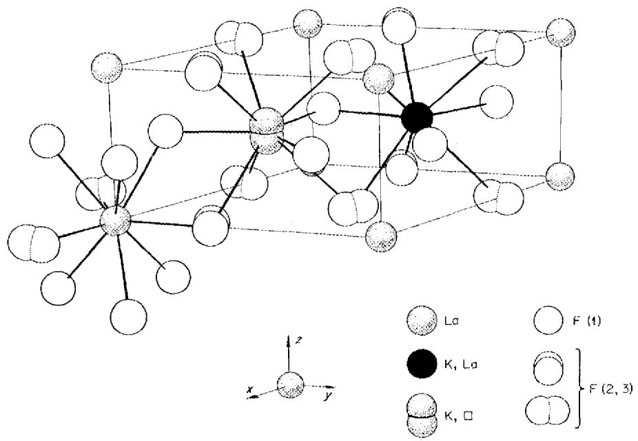  
Fig. 1.6. Schematic Perspective of the $\beta_{1}$ -KL $\alpha F_{4}$ Unit Cell and Its Environments.

# CENTRAL CATION DISPLACEMENTS IN THE "TRIPYRAMIDAL" COORDINATION

D. R. Sears

All cations in $\mathrm{NaNdF}_4^{20}$ and $\mathrm{KLaF}_4$ (preceding section) are located in "tripyramidal" coordination environments. Both sodium and potassium exhibit large displacements from their ideal positions, although it has been assumed $^{21}$ generally that the cation should lie on the polyhedron medial plane. Seeking an explanation of these data, we have calculated potential energy sums $^{22}$ of the "exponential-six" form:

$$
\sum_ {j} \frac {1}{\sigma - 6} \left[ 6 \exp \left(\sigma - \frac {\sigma r _ {i j}}{r _ {0}}\right) - \sigma \left(\frac {r _ {0}}{r _ {i j}}\right) ^ {6} \right]
$$

and of the Lennard-Jones form:

$$
\sum_ {j} \frac {1}{S - 6} \left[ 6 \left(\frac {r _ {0}}{r _ {i j}}\right) ^ {s} - S \left(\frac {r _ {0}}{r _ {i j}}\right) ^ {6} \right],
$$

as well as the Coulombic sum $\sum_{j} (1 / r_{ij})$ for various anion configurations in the tripyramidal coordination. We used values of $\sigma$ and $s$ from 7 through 12 and incremented the central cation position along the polyhedron figure axis from the medial plane to the basal plane. Interactions beyond the polyhedron were ignored, the anion framework was assumed to be rigid, and $r_0$ was taken to be the sum of Pauling radii.

For the examples studied so far (Na, Nd, and mixed $\mathrm{Na} + \mathrm{Nd}$ in $\mathrm{NaNdF}_4$ , and K, La, and mixed $\mathrm{K} + \mathrm{La}$ in $\beta_{1}$ - $\mathrm{KLaF}_{4}$ ) the Coulombic term varied less than 0.1 to $1\%$ for a 1-A displacement. By contrast, relatively larger variations in the exponential-six and Lennard-Jones functions were found. Results were nearly independent of choice of function and choice of $s$ or $\sigma$ , insofar as the qualitative conclusions are concerned, and accordingly the results are presented here only for $\sigma = 12$ in the exponential-six case. In Table 1.5, $\Delta z_{\mathrm{obs}}$ is the experimental cation displacement, $\Delta z_{\mathrm{calc}}$ is the location of the minimum in the potential function, $\Delta z(1\%)$ is the displacement from the minimum corresponding to a $1\%$ increase in potential, and $\sqrt{u_{\mathrm{obs}}^2}$ is the rms thermal displacement derived from the experimental thermal parameters $\beta_{33}$ corresponding to vibration along the polyhedron figure axis (i.e., the hexagonal $z$ axis).

Table 1.5. Results of Potential Calculations in NoNdF ${}_{4}$ and ${\beta }_{1} - {KL}{\alpha }_{4}$   

<table><tr><td>Atom</td><td>\( {\Delta }{z}_{\text{obs }} \) (A)</td><td>\( {\Delta }{z}_{\text{calc }} \) (A)</td><td>\( \sqrt{{u}_{\text{obs }}^{2}} \) (A)</td><td>\( {\Delta z}{\left( 1\% \right) }_{\text{calc }} \) (A)</td></tr><tr><td>Na in \( {\mathrm{{NaNdF}}}_{4} \)</td><td>0.58</td><td>0.71</td><td>0.19</td><td>0.15</td></tr><tr><td>K in \( {\mathrm{{KLaF}}}_{4} \)</td><td>0.17</td><td>0</td><td>0.15</td><td>0.17</td></tr><tr><td>La in \( {\mathrm{{KLaF}}}_{4} \)</td><td>0</td><td>0</td><td>0.07</td><td>0.06</td></tr><tr><td>Nd in \( {\mathrm{{NaNdF}}}_{4} \)</td><td>0</td><td>0</td><td>0.05</td><td>0.12</td></tr></table>

We conclude that the cation displacements can be rationalized in terms of the relative insensitivity of the Coulombic interactions to cation location in these structures and that displaced potential minima, or very shallow minima, in the remaining potential contributions will suggest which anion configurations will favor or permit cation displacements.

Calculations are being extended to include other framework structures containing tripyramidal co-ordination polyhedra.

# PREPARATION OF FLUORIDE SINGLE CRYSTALS FOR RESEARCH PURPOSES

R.E.Thoma

R. G. Ross

H. A. Friedman

Our efforts to develop techniques for the production of large $(350\mathrm{g})$ pure single crystals of LiF with selected isotopic ratios23 have succeeded in the production by Stockbarger-Bridgman methods of crystals of as high chemical purity as can be obtained with Czochralski techniques. Concentration of heavy-metal impurities in crystals produced this year was found to be less than 2 ppb from activation analysis and thermal conductivity data. Thermal conductivity of these crystals, as measured by investigators at Cornell University, was found to be virtually identical through the temperature range 2 to $50^{\circ}\mathrm{K}$ with the best7LiF crystals grown from our starting materials by the Czochralski method.

Since purity control has been developed to the extent that further improvement is limited by the

capabilities of the analytical methods (spectrochemical, infrared absorption, and activation analysis), most recent efforts have sought to reduce the population of crystal dislocations. By programming the reduction of annealing temperatures at a slow steady rate after crystal growth, in one experiment at $2.5^{\circ}\mathrm{C/hr}$ in the temperature range from $840^{\circ}\mathrm{C}$ to room temperature, the population of crystal dislocations in LiF crystals has been reduced significantly. Preliminary indication of the effectiveness of such programmed annealing was obtained by neutron diffraction examination of ORNL-14, $^{24}$ a 550-g crystal of lithium fluoride of 99.993 at. $\%$ ${}^{7}\mathrm{Li}$ , which showed a major volume of the crystal to be essentially free of disorder.

Part of the effort to synthesize fluoride single crystals was devoted to the preparation of crystals for use in x-ray and neutron diffraction experiments. For such purposes, neither size nor purity standards are as demanding as those imposed for LiF preparation. Single crystals (approximately 1 cm maximum dimension) of each of the three compounds $\mathrm{Li}_2\mathrm{BeF}_4$ , $\mathrm{Na}_7\mathrm{Zr}_6\mathrm{F}_{31}$ , and ${}^7\mathrm{Li}_2\mathrm{NaTh}_2\mathrm{F}_{11}$ were grown by the Stockbarger-Bridgman method. For other structural investigations[25] which employ even smaller crystals, suitable single crystals of $\beta$ -CsBeF₃ and $\mathrm{Li}_4\mathrm{UF}_8$ were grown by high-temperature anneal-quench experiments.

# 2. Chemical Studies of Molten Salts

# A POLYMER MODEL FOR LiF-BeF $_2$ MIXTURES

C. F. Baes, Jr.

The salts LiF and $\mathrm{BeF}_2$ are quite dissimilar in character; LiF is a normal ionic salt, while $\mathrm{BeF}_2$ quite evidently is more covalent since it forms a very viscous liquid which is obviously polymeric. Solid $\mathrm{BeF}_2$ has a structure analogous to $\mathrm{SiO}_2$ ; $\mathrm{Be}^{2+}$ ions are surrounded tetrahedrally by four fluoride ions, and each $\mathbf{F}^{-}$ ion is bonded to two $\mathrm{Be}^{2+}$ ions, that is, $\mathrm{BeF}_4^{2-}$ tetrahedra share corners to form a three-dimensional network. The liquid would be expected to have a similar polymeric structure. As LiF is added to molten $\mathrm{BeF}_2$ , the viscosity drops sharply, presumably because bridging fluoride linkages are broken,

$$
\begin{array}{c c}1&1\\- \mathrm {B e} - F - \mathrm {B e} - + F ^ {-} \rightleftharpoons 2 [ - \mathrm {B e} - F ],&(1)\\1&1\end{array}
$$

and the degree of polymerization decreases. The stoichiometric end point for this process occurs at the composition $2\mathrm{LiF - BeF}_2$ . Thereafter, the principal beryllium species in the melt presumably is $\mathrm{BeF}_4^{2-}$ .

This plausible qualitative picture of $\mathrm{LiF - BeF}_2$ melts has been treated more quantitatively in the following fashion. It was assumed that all of the many Be-F complexes formed would retain the same three elements of structure $-\mathrm{BeF}_4^{2-}$ tetrahedra, bridging $\mathbf{F}^{-}$ ions, and terminal $\mathbf{F}^{-}$ ions. For a given complex anion $\mathrm{Be}_a\mathrm{F}_b^{(b - 2a) - }$ it can then be shown that there are $4a - b$ bridging $\mathbf{F}^{-}$ ions and $2b - 4a$ terminal $\mathbf{F}^{-}$ ions. Hence, for the formation reaction,

$$
a \operatorname {B e F} _ {4} ^ {2 -} \rightleftharpoons \operatorname {B e} _ {a} \operatorname {F} _ {b} ^ {(b - 2 a) -} + (4 a - b) \mathrm {F} ^ {-}, \tag {2}
$$

the number of bridging $\mathbf{F}^{-}$ ions increases by $4a - b$ while twice that number of terminal $\mathbf{F}^{-}$ ions disappear. It seems reasonable, therefore, to write as an approximation for the free energy of reaction the equation

$$
\Lambda G _ {R} = (4 a - b) A, \tag {3}
$$

in which (at a given temperature) $A$ is a constant representing the free energy increase associated with the formations of 1 mole of bridging $\mathbf{F}^{-}$ bonds from 2 moles of terminal $\mathbf{F}^{-}$ bonds. The development of the model from this approximation is summarized in Table 2.1, and equation numbers given below are from that table. In the equilibrium constant expression (Eq. 4), the anion activities are represented by adaptations (Eqs. 5-7) of Flory's equation for polymer solutions, in which the volume fraction $(\phi_{a,b})$ of $\mathrm{Be}_a\mathrm{F}_b^{(b - 2a)}$ is calculated in terms of the number of $\mathbf{F}^{-}$ ions the species contains (Eq. 8). These modified Flory equations also contain a heat of mixing parameter $(B)$ and an average value of $b$ ( $\tilde{b}$ , Eq. 7) in the mixture. From Eqs. 4-9, the volume fraction of a given polymeric ion $(\phi_{a,b})$ may be calculated (Eq. 10) in terms of $a, b$ , the volume fraction of $\mathrm{BeF}_4^{2-}(\phi_{1,4})$ , the volume fraction of $\mathbf{F}^{-}(\phi_{0,1})$ and the two adjustable parameters $A$ and $B$ . Introducing this expression for $\phi_{a,b}$ into two material balance equations (11 and 12) one obtains two equations which may be solved for the unknowns $\phi_{1,4}$ and $\phi_{0,1}$ . These, in turn, were used to calculate the activity of $\mathrm{BeF}_2$ by a relationship (Eq. 13) derived from the proportionality

$$
a _ {\mathrm {B e F} _ {2}} \propto a _ {\mathrm {B e F} _ {4}} / a _ {\mathrm {F} ^ {2}} \tag {14}
$$

and Eqs. 6 and 7.

Table 2.1. Derivation of $\mathsf{BeF}_2$ Activity in LiF from Polymer Model

The formation constant for $\mathbf{Be}_a\mathbf{F}_b^{(b - 2a) - }$ is given by

$$
K _ {a, b} = \frac {\left(a _ {\mathrm {B e} _ {a} \mathrm {F} _ {b}}\right) \left(a _ {\mathrm {F}}\right) ^ {(4 a - b)}}{\left(a _ {\mathrm {B e F} _ {4}}\right) ^ {a}} = \mathrm {e} ^ {- (4 a - b) A / R T}, \tag {4}
$$

in which

$$
\ln \left(a _ {\mathrm {B e} _ {a} \mathrm {F} _ {b}}\right) = \ln \left(\phi_ {a, b}\right) - (b - 1) + b \left(1 - \frac {1}{\bar {b}}\right) \left(1 - \phi_ {0, 1}\right) + b B \phi_ {0, 1} ^ {2}, \tag {5}
$$

$$
\ln \left(a _ {F}\right) = \ln \left(\phi_ {0, 1}\right) + \left(1 - \frac {1}{b}\right) \left(1 - \phi_ {0, 1}\right) + B \left(1 - \phi_ {0, 1}\right) ^ {2} \tag {6}
$$

$$
\ln \left(a _ {\mathrm {B e F} 4}\right) = \ln \left(\phi_ {1, 4}\right) - 3 + 4 \left(1 - \frac {1}{\bar {b}}\right) \left(1 - \phi_ {0, 1}\right) + 4 B \phi_ {0, 1} ^ {2}, \tag {7}
$$

$$
\phi_ {a, b} = b N _ {a, b} / \sum_ {a b} (b N _ {a, b}), \tag {8}
$$

$$
\bar {b} = \sum_ {a b} \sum (b N _ {a, b}) / \sum_ {a b} \sum (N _ {a, b}) = 1 / \sum_ {a b} \sum (\phi_ {a, b} / b), \tag {9}
$$

gives the volume fraction of $\mathbf{Be}_a\mathbf{F}_b^{(b - 2a) - }$

$$
\phi_ {a, b} = \frac {\left(e \phi_ {1 , 4}\right) ^ {a}}{e} \left[ \frac {e ^ {2 B \phi_ {0 , 1}}}{\phi_ {0 , 1} e ^ {\left(1 + B + A / R T\right)}} \right] ^ {4 a - b}. \tag {10}
$$

This is introduced into the material balance expressions

$$
1 = \sum_ {a b} \sum_ {\phi_ {a, b}} \tag {11}
$$

$$
X _ {\mathrm {B e F} _ {2}} = \frac {\sum_ {a b} \left(\frac {a}{b} \phi_ {a , b}\right)}{1 - \sum_ {a b} \left(\frac {a}{b} \phi_ {a , b}\right)}, \tag {12}
$$

to obtain $\phi_{1,4}$ and $\phi_{0,1}$ , which are introduced into

$$
\ln a _ {\mathrm {B e r} _ {2}} = \ln \left[ \phi_ {1, 4} / \phi_ {0, 1} ^ {2} \right] - 2 \phi_ {0, 1} - \frac {2}{b} \left(1 - \phi_ {0, 1}\right) + 2 B \phi_ {0, 1} \left(2 + \phi_ {0, 1}\right) \tag {13}
$$

to give the activity of $\mathbf{BeF}_2$ .

The calculation of $a_{\mathrm{BeF_2}}$ by this model thus involves three double summations,

$$
\sum_ {a b} \sum (\phi_ {a, b}), \sum_ {a b} \sum_ {\frac {a}{b}} \phi_ {a, b}), \text {a n d} \sum_ {a b} \left(\frac {\phi_ {a , b}}{b}\right).
$$

These were extended to include all values of $a$ and, for each value of $a$ , values of $b$ beginning at $b = 2a + 2$ , until each series converged. Using the CDC 1604 computer, the adjustable parameters $A$ and $B$ were varied by a least-squares procedure until the calculated values of $a_{\mathrm{BeF}_2}$ were the most consistent with values3,4 calculated from measurements of the equilibrium

$$
\begin{array}{l} \mathrm {H} _ {2} \mathrm {O} _ {(g)} + \mathrm {B e F} _ {2 (d)} \rightleftharpoons \mathrm {B e O} _ {(s)} + 2 \mathrm {H F} _ {(g)}, (15) \\ K = \frac {P ^ {2}}{P _ {\mathrm {H} _ {2} \mathrm {O}} a _ {\mathrm {B e F} _ {2}}} (16) \\ \end{array}
$$

While the present calculations of $a_{\mathrm{BeF}_2}$ were lengthy, the model at its present stage is a simple one which fits the data well enough to suggest that it offers a reasonable representation of the structure of LiF-BeF_2 mixtures. In this representation, the mixtures contain $\mathrm{Li}^+$ as the only cation; the anions are $\mathrm{F}^-$ , $\mathrm{BeF}_4^{2-}$ , and numerous polymeric anions $\mathrm{Be}_a\mathrm{F}_b^{(b-2a)-}$ which include chains of varying length and cross-linked structures containing rings in various numbers, and in sizes down to $\mathrm{Be}\left\langle\begin{array}{c}\mathrm{F}\\ \mathrm{F}\end{array}\right\rangle\mathrm{Be}$ . The distribution of $\mathrm{Be}^{2+}$ and $\mathrm{F}^-$ among all these possible structures depends primarily upon the $\mathrm{F}^-/\mathrm{Be}^{2+}$ ratio in a given mixture and upon the relative stability of $-\mathrm{Be}-\mathrm{F}-\mathrm{Be}-$ plus $\mathrm{F}^-$ compared to two $-\mathrm{Be}-\mathrm{F}$ groups.

# PHASE EQUILIBRIUM STUDIES IN THE $\mathsf{UO}_2\cdot \mathsf{ZrO}_2$ SYSTEM

K.A.Romberger C.F.Baes, Jr. H.H.Stone

The previously described study of the $\mathrm{UO}_2\text{-ZrO}_2$ system in which a molten-salt flux was used to achieve equilibrium between the oxide phases has been completed during the past year. The composition assigned to the tetragonal solid solutions at the eutectoid temperature $(1110^{\circ}\mathrm{C})$ has been

increased from the value 1 mole $\%$ $\mathrm{UO}_2$ reported previously to 2.7 mole $\%$ on the basis of recent measurements which indicate that the previous result had not corresponded to equilibrium. In addition, analyses have been obtained on a mixture of cubic $\mathrm{UO}_2$ and monoclinic $\mathrm{ZrO}_2$ which had been equilibrated with a molten salt at $\sim 600^{\circ}\mathrm{C}$ for 60 days giving $\sim 0.3$ mole $\%$ $\mathrm{ZrO}_2$ in $\mathrm{UO}_2$ and $\sim 0.07$ mole $\%$ $\mathrm{UO}_2$ in $\mathrm{ZrO}_2$ . These results indicate a lower rate of exsolution of the two phases with decreasing temperature than previously estimated.

The revised phase boundaries in Fig. 2.1 reflect these changes. In addition, the boundaries below $1150^{\circ}\mathrm{C}$ reflect the distribution behavior expected for dilute solid solutions in the three two-phase regions $\mathbf{C} \rightleftharpoons \mathbf{M}, \mathbf{M} \rightleftharpoons \mathbf{T}$ , and $\mathbf{C} \rightleftharpoons \mathbf{T}$ . In particular, it was assumed that the distribution coefficient $(D$ , a ratio of mole fractions) for one component between two solid solutions at equilibrium would obey the relationship

$$
\log D = a + b / T. \tag {17}
$$

In the case of the M $\rightleftharpoons$ T equilibrium, the estimated dependence of $X_{\mathrm{ZrO}_2}(\mathrm{T}) / X_{\mathrm{ZrO}_2}(\mathrm{M})$ on temperature indicates the enthalpy of the M $\rightarrow$ T transition in pure $\mathrm{ZrO}_2$ $(1170^{\circ}\mathrm{C})$ to be $1.7\pm 1\mathrm{kcal / mole}$ This compares favorably with a measured value of $\sim 1.4$ kcal. Just above $1150^{\circ}\mathrm{C}$ (the upper limit of the present measurements) it is clear that values of $D$ must deviate markedly from those predicted by Eq.(17) (corresponding to the sharply bending dashed curves in Fig. 2.1) if the $\mathbf{C}\rightleftharpoons \mathbf{T}$ phase boundaries are to be consistent with the published higher temperature data. Such pronounced deviations from ideal behavior in solid solutions that are still quite dilute seem unusual. Consequently, additional measurements between 1150 and $1500^{\circ}\mathrm{C}$ by the methods used here would be of considerable interest.

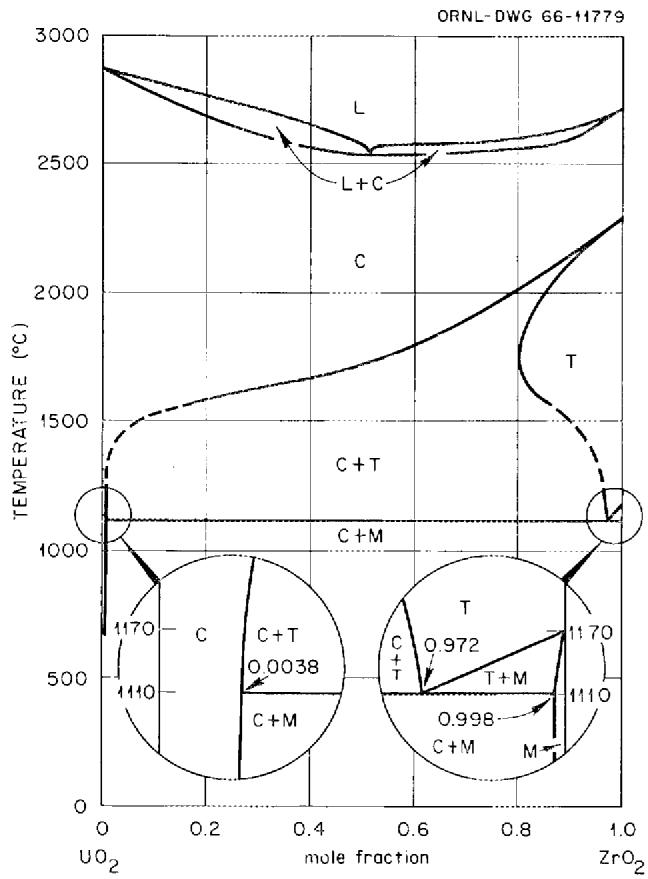  
Fig. 2.1. Revised $\mathsf{UO}_2\text{-ZrO}_2$ Phase Diagram. L, liquid; C, face-centered cubic; T, face-centered tetragonal; M, monoclinic.

# THE OXIDE CHEMISTRY OF $\mathsf{ThF}_4\cdot \mathsf{UF}_4$ MELTS

B. F. Hitch

C. E. L. Bamberger

C. F. Baes, Jr.

The precipitation of protactinium and uranium from $\mathrm{LiF - BeF}_2\mathrm{-ThF}_4$ mixtures by addition either of $\mathrm{BeO}$ or $\mathrm{ThO}_2$ was demonstrated several years ago by Shaffer et al. as a possible method for processing an MSBR blanket salt. The purpose of the present investigation is (1) to verify that the oxide solid phase formed at equilibrium with $\mathrm{UF}_4\mathrm{-ThF}_4$ containing melts is the expected solid

solution of $\mathrm{UO}_2$ and $\mathrm{ThO}_2$ and (2) to determine the distribution behavior of $\mathrm{Th}^{4+}$ and $\mathrm{U}^{4+}$ between the oxide and the fluoride solutions,

$$
\mathrm {U} ^ {4 +} (f) + \mathrm {T h} ^ {4 +} (o) \rightleftharpoons \mathrm {U} ^ {4 +} (o) + \mathrm {T h} ^ {4 +} (f) \tag {18}
$$

(here $f$ and $\mathcal{O}$ denote the fluoride and the oxide phases).

The experimental technique is similar to that used in the $\mathrm{UO}_2\text{-ZrO}_2$ phase study (see preceding section); $\mathrm{ThO}_2$ and $\mathrm{UO}_2$ were contacted with 2LiF $\mathrm{BeF}_2$ containing $\mathrm{UF}_4$ and $\mathrm{ThF}_4$ within nickel capsules under a hydrogen atmosphere in a rocking furnace. The equilibrated oxide solids were allowed to settle before the samples were frozen. Good phase separation was obtained provided sufficient quantity of the fluoride phase had been added originally.

A $(\mathrm{U - Th})\mathrm{O}_2$ solid solution has been found in every sample examined thus far; the lattice parameter determined by x-ray diffraction was consistent with the composition calculated for such an oxide phase. The equilibrium quotient for the metathesis reaction shown above was determined by analysis of the fluoride phase for the small amount of uranium which it contained. The results obtained thus far give

$$
Q = \frac {X _ {\mathrm {U} (o)} X _ {\mathrm {T h} (f)}}{X _ {\mathrm {U} (f)} X _ {\mathrm {T h} (o)}} = 1 0 0 0 \text {t o} 2 0 0 0 \tag {19}
$$

at $600^{\circ}\mathrm{C}$ . The mole fraction of uranium in the oxide phase, $X_{U(o)}$ , was varied from 0.2 to 0.9 while the mole fraction of thorium in the fluoride phase was varied from 0.01 to 0.07.

It thus appears that the $\mathbf{U}^{4+}$ present is strongly extracted from the fluoride phase by the oxide solid solution formed at equilibrium. This confirms the effective precipitation of $\mathbf{U}^{4+}$ by oxide first reported by Shaffer et al. In addition, the formation of a single oxide solution phase offers a much more flexible and effective oxide separation method for breeder blankets than would be the case if only the separate oxides $\mathrm{ThO}_2$ and $\mathrm{UO}_2$ were formed.

We plan to continue these measurements in order to extend the range of oxide composition and $\mathbf{ThF}_4$ concentration in the melts and to determine the temperature coefficient of the distribution quotient.

# THE OXIDE CHEMISTRY OF LiF-BeF $_2$ -ZrF $_4$ MIXTURES

B. F. Hitch

C. F. Baes, Jr.

Measurements of the solubility of BeO in LiF- $\mathrm{BeF}_2$ melts and of $\mathrm{ZrO}_2$ in 2LiF- $\mathrm{BeF}_2 + \mathrm{ZrF}_4$ melts (simulating mixtures of MSRE flush salt and fuel salt) have been completed. As described previously,12,13 the procedure consisted in withdrawing from an oxide-saturated melt a filtered sample which was then sparged with an HF-H mixture to remove the dissolved oxide as water. The total amount of water liberated was determined by Karl Fischer titration. The principal difficulty encountered with the method was in filtering the samples. Particularly in the case of BeO-saturated melts, the oxide crystals evidently were sometimes small enough to pass through or to plug the filter. The BeO solubility measurements were found to be reproducible only after several days of equilibration at temperatures above $600^{\circ}\mathrm{C}$ . Considerably less difficulty was encountered with melts saturated with $\mathrm{ZrO}_2$ .

The results of these measurements are represented adequately $(\sim \pm 20\%)$ by the following expressions; the concentration unit employed is the mole fraction:

$$
X _ {i} = n _ {i} / \left(n _ {\mathrm {L i F}} + n _ {\mathrm {B e F} _ {2}} + n _ {\mathrm {Z r F} _ {4}}\right). \tag {20}
$$

The solubility of $\mathbf{BeO}$ in $\mathrm{LiF - BeF_2}$ , with $X_{\mathrm{BeF_2}} = 0.3$ to 0.5 and $T = 750$ to $1000^{\circ}\mathrm{K}$ , is given by

$$
\log X _ {\mathrm {O} ^ {2 -}} = - 0. 9 0 1 + 1. 5 4 7 X _ {\mathrm {B e F} _ {2}} - 2 6 2 5 / T. \tag {21}
$$

The solubility product of $\mathsf{ZrO}_2$ in $2\mathsf{LiF - BeF}_2 + \mathsf{ZrF}_4$ , with $X_{\mathsf{ZrF}_4} = 0.001$ to 0.05 and in the same temperature range, is given by

$$
Q _ {Z r O _ {2}} = \left(X _ {Z r ^ {4 +}}\right) \left(X _ {O _ {2} - - } ^ {2}\right) = \left(a + b X _ {Z r ^ {4 +}} ^ {2}\right) ^ {2}, \tag {22}
$$

where

$$
\log a = - 1. 5 3 0 - 2 9 7 0 / T,
$$

$$
\log b = 1. 1 9 5 - 2 0 5 5 / T.
$$

The results are reasonably consistent with previous, less direct estimates14 based upon measurements of the following equilibria:

$$
\mathrm {H} _ {2} \mathrm {O} (g) + 2 \mathrm {F} ^ {-} (d) \rightleftharpoons \mathrm {O} ^ {2 -} (d) + 2 \mathrm {H F} (g), \tag {23}
$$

$$
\mathrm {H} _ {2} \mathrm {O} (g) + \operatorname {B e F} _ {2} (d ^ {\prime}) \rightleftharpoons \operatorname {B e O} (s) + 2 \mathrm {H F} (g), \tag {24}
$$

$$
2 \mathrm {H} _ {2} \mathrm {O} (g) + Z r \mathrm {F} _ {4} (d) \rightleftharpoons Z r \mathrm {O} _ {2} (\mathrm {s}) + 4 \mathrm {H F} (g). \tag {25}
$$

The tolerance of MSRE flush salt for oxide should be determined by the solubility of $\mathrm{BeO}$ (Fig. 2.2). When the flush salt becomes contaminated with enough fuel salt ( $\sim 1.6\%$ by weight) to produce a $\mathrm{ZrF}_4$ concentration of $\sim 0.0008$ mole fraction, $\mathrm{ZrO}_2$ should appear as the least soluble oxide. The oxide tolerance should then decrease with increasing fuel salt content because of the mass action effect of the increasing concentration of $\mathrm{ZrF}_4$ . This oxide tolerance should pass through a minimum at $X_{\mathrm{ZrF}_4} \sim 0.01$ (Fig. 2.2), and then it should increase because of the effect of the medium upon $\mathrm{ZrO}_2$ solubility. The oxide tolerance of such fuel-salt-flush-salt mixtures is given by

$$
X _ {\text {O} ^ {2 -}} = \frac {a}{\left(X _ {Z r ^ {4 +}}\right) ^ {1 / 2}} + b \left(X _ {Z r ^ {4 +}}\right) ^ {3 / 2}. \tag {25}
$$

The solubility of $\mathsf{ZrO}_2$ was also measured in a salt mixture whose composition (65.5% LiF-29.4% BeF $_2$ -5.1% ZrF $_4$ ) simulated more closely the MSRE fuel composition than did the 2LiF-BeF $_2$ + ZrF $_4$ mixtures. The results (Fig. 2.2) differ little from the values given by the equation immediately above for the case where $X_{\mathsf{Zr}^4+} = 0.05$ .

The effect of salt composition on the $\mathrm{ZrO}_2$ solubility product may be caused, at least in part, by specific chemical effects, that is, complex formation. For example, the form of the expression for the variation in the $\mathrm{ZrO}_2$ solubility product is consistent with - though it does not prove the existence of - the following complex-forming reaction,

$$
2 Z r ^ {4 +} + O ^ {2 -} \rightleftharpoons Z t _ {2} O ^ {6 +}. \tag {27}
$$

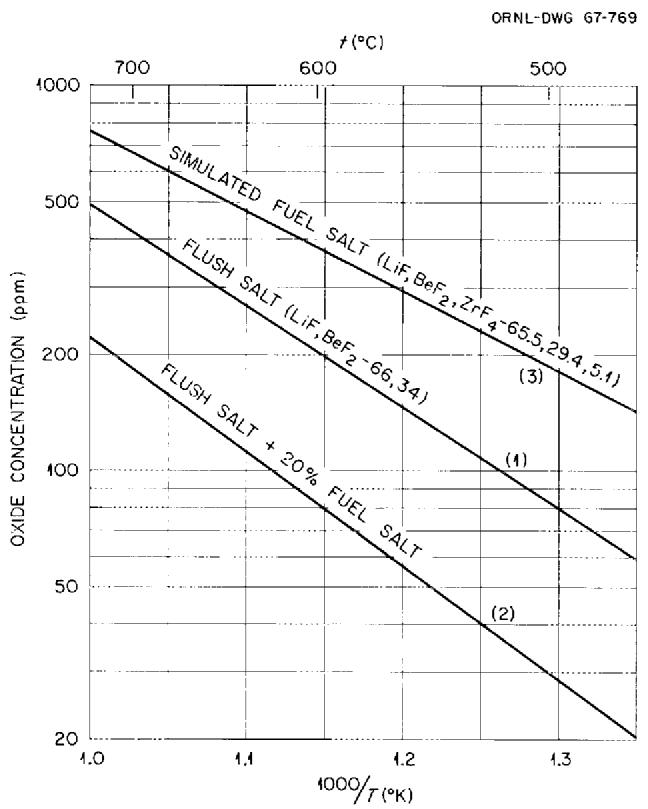  
Fig. 2.2. Estimated Oxide Tolerance in MSRE Salt Mixtures. (1) Flush salt saturated with BeO, (2) flush salt-fuel salt mixture of minimum oxide tolerance, and (3) fuel salt.

The activity coefficient of $\mathbf{Zr}^{4+}$ , $\mathrm{O}^{2-}$ , and any oxide complex of $\mathbf{Zr}^{4+}$ will vary with the melt composition, however, and no quantitative interpretation of the present results in terms of complex formation is warranted until more can be learned about such activity coefficient variations.[15]

# CONSTANT-VOLUME HEAT CAPACITIES OF MOLTEN SALTS

Stanley Cantor

From the magnitude of the constant-volume heat capacity $(C_{\nu})$ of molten salts one can infer what kinds of motion are executed by the ions. An attempt has been made, therefore, to derive accurate values of $C_{\nu}$ and to relate these values

to ionic motions. In this study, $C_{\nu}$ was calculated from the relationship

$$
C _ {v} = \frac {C _ {p}}{1 + \left(\alpha^ {2} \mu^ {2} M T / C _ {p}\right)}, \tag {28}
$$

where $C_p$ is the heat capacity at constant pressure of 1 gram-formula weight, $\alpha$ is the volume expansivity, $\mu$ is the velocity of sound in the molten salt, $M$ is the gram-formula weight, and $T$ is the absolute temperature. The volume expansivity is obtained from density-temperature data by

$$
\alpha = \dots \frac {1}{\rho} \left(\frac {\partial \rho}{\partial T}\right) _ {p},
$$

where $\rho$ is density and $\rho$ is pressure.

For systematic study, it is necessary to compare $C_{v}$ of the salts at corresponding temperatures. An obvious corresponding temperature is the melting point. Other corresponding temperatures were defined empirically by the equation

$$
T = T _ {M} + \theta \left(T _ {B} - T _ {M}\right), \tag {29}
$$

where $T_{M}$ and $T_{B}$ are the normal melting and boiling points respectively, and $\theta$ is a constant that may vary between 0 and 1.

Values of $C_v$ at $T_M$ and at some other corresponding temperature are given in Tables 2.2 and 2.3. An obvious limitation of this treatment is that, since virtually all available data were obtained at atmospheric pressure, the values calculated for a single salt at the various temperatures (as in Table 2.2) do not refer to precisely the same volume. A method for calculating the effect of temperature on a truly constant-volume heat capacity is described briefly in the following section.

The "experimental" $C_{\nu}$ 's listed in Tables 2.2 and 2.3 exceed in almost all cases those calculated on the basis of contributions due to (1) harmonic oscillation, (2) molecular rotation, (3) intraionic vibrations. For the halides, it may be shown that for contributions 1 through 3, the highest calculated $C_{\nu}$ would be based on the assumption that each ion executes harmonic oscillations in three coordinates. For instance, for an alkaline-earth halide, if we assume only harmonic oscillation, then $C_{\nu}$ for 1 gram-formula weight would be 9R cal/deg. If we assume a model for

Table 2.2. Constant-Volume Heat Capacities of Molten Halides   

<table><tr><td rowspan="2">Halide</td><td rowspan="2">References</td><td colspan="2">Cv(cal/deg)</td><td rowspan="2">Calculated
Cb(cal/deg)</td></tr><tr><td>TM(melting point)</td><td>θ=0.1°</td></tr><tr><td>LiF</td><td>c,d,e</td><td>12.54</td><td>12.45</td><td>6R(≈11.92)</td></tr><tr><td>LiCl</td><td>f,g,h</td><td>12.73</td><td>12.59</td><td></td></tr><tr><td>LiBr</td><td>f,g,h</td><td>12.99</td><td>12.84</td><td></td></tr><tr><td>NaF</td><td>i,d,j</td><td>12.36</td><td>12.30</td><td></td></tr><tr><td>NaCl</td><td>f,g,h</td><td>12.79</td><td>12.68</td><td></td></tr><tr><td>NaBr</td><td>f,g,h</td><td>12.65</td><td>12.51</td><td></td></tr><tr><td>NaI</td><td>c,g,h</td><td>12.52</td><td>12.37</td><td></td></tr><tr><td>KF</td><td>c,d,h</td><td>11.6</td><td>11.5</td><td></td></tr><tr><td>KCl</td><td>c,g,h</td><td>12.62</td><td>12.49</td><td></td></tr><tr><td>KBr</td><td>f,g,h</td><td>11.74</td><td>11.59</td><td></td></tr><tr><td>KI</td><td>f,g,h</td><td>12.21</td><td>12.07</td><td></td></tr><tr><td>CsCl</td><td>f,g,h</td><td>13.29</td><td>13.13</td><td></td></tr><tr><td>CsBr</td><td>f,g,h</td><td>13.29</td><td>13.16</td><td></td></tr><tr><td>MgCl2</td><td>c,k,h</td><td>21.23</td><td>21.15</td><td>9R(≈17.88)</td></tr><tr><td>CaCl2</td><td>l,k,h</td><td>19.55</td><td>19.32</td><td></td></tr><tr><td>CaBr2</td><td>l,k,h</td><td>24.52</td><td>24.49</td><td></td></tr><tr><td>CaI2</td><td>l,k,h</td><td>20.98</td><td>20.85</td><td></td></tr><tr><td>SrCl2</td><td>l,k,h</td><td>21.73</td><td>21.46</td><td></td></tr><tr><td>SrBr2</td><td>l,k,h</td><td>23.11</td><td>22.77</td><td></td></tr><tr><td>SrI2</td><td>l,k,h</td><td>21.9</td><td>21.5</td><td></td></tr><tr><td>BaCl2</td><td>l,k,h</td><td>19.95</td><td>19.73</td><td></td></tr><tr><td>BaBr2</td><td>l,k,h</td><td>18.73</td><td>18.56</td><td></td></tr><tr><td>BaI2</td><td>l,k,h</td><td>20.7</td><td>20.3</td><td></td></tr><tr><td>CdCl2</td><td>m,g,h</td><td>24.0</td><td>23.7(at θ=0.5)</td><td></td></tr><tr><td>CdBr2</td><td>m,k,h</td><td>18.9</td><td>18.0(at θ=0.5)</td><td></td></tr><tr><td>CdI2</td><td>m,k,h</td><td>22.4</td><td>21.9(at θ=0.5)</td><td></td></tr><tr><td>HgCl2</td><td>c,k,h</td><td>17.7(at TM+8)</td><td></td><td></td></tr><tr><td>HgBr2</td><td>c,k,h</td><td>17.9</td><td>16.7(at TB)</td><td></td></tr><tr><td>HgI2</td><td>c,k,h</td><td>17.8</td><td>17.6(at TB)</td><td></td></tr></table>

aSee Eq. (29).   
${}^{b}$ Based on harmonic oscillations only (see text).   
cJANAF Thermochemical Tables.   
$^d$ M. Blanc et al., Compt. Rend. 254, 2532 and 255, 3131 (1962); 258, 491 (1964).   
$^{\mathrm{e}}$ D. G. Hill, S. Cantor, and W. T. Ward, J. Inorg. Nucl. Chem. (in press).   
fA.S.Dworkin,OakRidgeNationalLaboratory,personalcommunication.   
J. O'M. Bockris and N. E. Richards, Proc. Roy. Soc. 241A, 44 (1957).   
hG. J. Janz et al. (eds.), Molten Salt Data, Tech. Bull. Series, Rensselaer Polytechnic Institute, Troy, N.Y., July 1964.   
K.K.Kelley,U.S.Bur.Mines Bull.584(1960).  
J.D.Edwards et al.,J.Electrochem.Soc.100,508 (1953).   
$^{k}$ J. O'M. Bockris et al., Rev. Chin., Acad. Rep. Populaire Roumaine 7(1), 59 (1962).   
${}^t\mathrm{A}$ S. Dworkin and M. A. Bredig, J. Phys. Chem. 67, 697 (1963).   
mL.E.Topol et al.,J.Phys.Chem.64,1339 (1960).

Table 2.3. Constant-Volume Heat Capacities of Nitrates and Sulfates at the Melting Temperature   

<table><tr><td rowspan="2">Compound</td><td rowspan="2">References</td><td colspan="2">Cv(cal/deg)</td></tr><tr><td>Experimental</td><td>Calculateda</td></tr><tr><td>LiNO3</td><td>b, c, d</td><td>24.0</td><td>21.47</td></tr><tr><td>NaNO3</td><td>c, c, d</td><td>26.5</td><td>22.12</td></tr><tr><td>KNO3</td><td>b, c, f</td><td>23.2</td><td>22.44</td></tr><tr><td>AgNO3</td><td>g, c, f</td><td>25.0</td><td>21.37</td></tr><tr><td>Li2SO4</td><td>h, i, f</td><td>42.5</td><td>37.21</td></tr><tr><td>Na2SO4</td><td>b, i, f</td><td>39.6</td><td>37.27</td></tr></table>

aHarmonic oscillations (6R, nitrates; 9R, sulfates) plus rotation of the nitrate or sulfate ion (1.5R) plus vibrational contribution of nitrate or sulfate.   
$^{b}$ K. K. Kelley, U.S. Bur. Mines Bull. 584 (1960).   
$^{\mathrm{c}}$ R. Higgs and T. A. Litovitz, J. Acoust. Soc. Am. 32, 1108 (1960).   
${}^{d}$ G. P. Smith et al., J. Chem. Eng. Data 6, 493 (1961).   
G. J. Janz et al., J. Chem. Eng. Data 9, 133 (1964).   
$^{t}$ G. J. Janz et al. (eds.), Molten Salt Data, Tech. Bull. Series, Rensselaer, Polytechnic Institute, Troy, N.Y., July 1964.   
G. J. Janz et al., J. Phys. Chem. 67, 2848 (1963).   
$^{h}$ N. K. Voskresenskaya et al., Izv. Sektora Fiz.-Khim. Analiza, Inst. Obshch, Neorgan. Khim., Akad. Nauk SSSR 25, 150 (1954).   
$^{i}$ M. Blanc et al., Compt. Rend. 254, 2532 and 255, 3131 (1962); 258, 491 (1964).

a liquid alkaline-earth halide in which the cations are associated, for example, $[\mathbf{MX}]^{+}$ and $\mathbf{X}^{-}$ , then $C_{v}$ would be less than $9R$ ; for the example chosen, assuming that the vibration of the ion $[\mathbf{MX}]^{+}$ is fully excited, $C_{v}$ equals $8R$ . Since experimental $C_{v}$ 's for mercuric salts are less than $9R$ , it is quite probable the same associated species exist in these salts.

Experimental $C_v$ 's of nitrates and sulfates are especially interesting because these salts contain bona-fide complex ions, that is, nitrate or sulfate ions. Furthermore, the measured vibrational spectra16 provide the means for calculating vibrational contributions of nitrate or sulfate to the heat capacity of each salt. The rotational

contribution for these complex ions may be safely assumed as $\frac{3}{2} R$ . Contributions due to harmonic oscillation for the nitrates were assumed equal to $6R$ , and for the sulfates, $9R$ . Note in Table 2.3 that the experimental $C_v$ for these salts always exceeded the value calculated based on the contributions just noted.

Two general patterns are clear from this study: (1) experimental $C_v$ exceeds that calculated on the basis of simple classical and/or quantum contributions; (2) $C_v$ decreases with increasing volumes. Pattern 1 may be partly explained by correcting the notion that these ions execute harmonic oscillations; almost certainly these ions may be better represented as anharmonic oscillators whose potential energy contribution exceeds the $\frac{3}{2} kT$ per ion that is associated with harmonic motion (see following section); this excess cannot presently be calculated with very much accuracy. Pattern 2 probably reflects the decrease in average potential energy per ion that occurs when the volume of the liquid increases. In other words, the liquid exhibits more gaslike behavior as volume increases; the kinetic energy contribution per ion probably remains at $\frac{3}{2} kT$ , but the potential energy contribution slowly decreases with volume.

# TEMPERATURE COEFFICIENT OF $C_v$ FOR MOLTEN SALTS

Stanley Cantor

As noted in the previous section, experimental values of $C_{\nu}$ for molten salts exceeded values calculated from the expected contributions (i.e., degrees of freedom). To determine how the internal energy is changing with temperature alone, it is necessary to evaluate $C_{\nu}$ maintaining the volume constant with changing temperature. The method of evaluation used here is similar to that published by Harrison and Moelwyn-Hughes.[17]

The variation of $C_v$ with volume at constant temperature is given by

$$
\left(\frac {\partial C _ {v}}{\partial V}\right) _ {T} = T \left(\frac {\partial^ {2} P}{\partial T ^ {2}}\right) _ {V}. \tag {30}
$$

Integrating between the molar volume at a reference pressure $(V^{0})$ and any volume, $V$ , one obtains

$$
C _ {v} = C _ {V ^ {0}} + T \int_ {V ^ {0}} ^ {V} \left(\frac {\partial^ {2} P}{\partial T ^ {2}}\right) _ {V} d V, \tag {31}
$$

where $C_{V^0}$ is what one actually obtains from the equations of the preceding section.

Moelwyn-Hughes18 has shown that, for liquids which obey a simple potential function of the form

$$
\phi = D R ^ {- n} - B R ^ {- m} \tag {32}
$$

(where $D$ and $B$ are constants, $m$ and $n$ are integers, and $R$ is the interatomic distance), the constant c in a Tait equation19 of the form

$$
\frac {d \left(1 / \beta_ {T}\right)}{d P} = c \tag {33}
$$

is given by

$$
c = \frac {1}{3} (m + n + 6) \tag {34}
$$

$(\beta_{t}$ is the isothermal compressibility).

Owens'20 data on nitrates afford the only experimental tests of whether these equations are valid for molten salts. His work suggests that the formulas are obeyed at constant temperature but that c varies somewhat with temperature. For $\mathrm{NaNO}_3$ for example, $c = 4.5$ at $400^{\circ}\mathrm{C}$ and 5.0 at $500^{\circ}\mathrm{C}$ .

Integration of the Tait equation between a standard reference pressure $(P^0)$ and pressure $P$ yields

$$
\frac {\left(V ^ {0} / V\right) ^ {\mathrm {c}} - 1}{c \beta_ {T} ^ {0}} + P ^ {0} = P, \tag {35}
$$

where the superscripts refer to the reference conditions. Successive differentiation of this with respect to $T$ at constant volume and substitution in Eq. (31) yields

$$
\begin{array}{l} C _ {V} - C _ {V ^ {0}} = \frac {T (V - V ^ {0})}{c \beta_ {T} ^ {0}} \left[ - \frac {2}{(\beta_ {T} ^ {0}) ^ {2}} \left(\frac {d \beta_ {T} ^ {0}}{d T}\right) ^ {2} + \frac {1}{\beta_ {T} ^ {0}} \frac {d ^ {2} \beta_ {T} ^ {0}}{d T ^ {2}} \right] - \left[ \left(\frac {V ^ {0}}{V}\right) ^ {c - 1} - 1 \right] \\ \times \left[ \frac {T V ^ {0}}{(c - 1) \beta_ {T} ^ {0}} \right] \left[ c (\alpha^ {0}) ^ {2} - \frac {2 \alpha^ {0}}{\beta_ {T} ^ {0}} \frac {d \beta_ {T} ^ {0}}{d T} + \frac {d \alpha^ {0}}{d T} + \frac {2}{c (\beta_ {T} ^ {0}) ^ {2}} \left(\frac {d \beta_ {T} ^ {0}}{d T}\right) ^ {2} - \frac {1}{c \beta_ {T} ^ {0}} \frac {d ^ {2} \beta_ {T} ^ {0}}{d T ^ {2}} \right]. \tag {36} \\ \end{array}
$$

Fortunately, this complicated expression can be simplified by use of the relation

$$
\beta_ {T} ^ {0} = A \mathrm {e} ^ {b T}, \tag {37}
$$

where $A$ and $b$ are constants, which holds remarkably well for all molten salts and which is discussed more fully in the next section.

Differentiating $\beta_T^0$ with respect to temperature and substituting in Eq. (36) yields

$$
\begin{array}{l} C _ {v} = C _ {v ^ {0}} + \frac {T (V ^ {0} - V) b ^ {2}}{c \beta_ {T} ^ {0}} - \frac {T V ^ {0}}{(c - 1) \beta_ {T} ^ {0}} \\ \times \left[ c \left(\alpha^ {0}\right) ^ {2} - 2 \alpha^ {0} b + \frac {d \alpha^ {0}}{d T} + \frac {b ^ {2}}{c} \right] \left[ \left(\frac {V ^ {0}}{V}\right) ^ {c - 1} - 1 \right]. \tag {38} \\ \end{array}
$$

This equation was then used to generate (with the aid of a computer) many values of $C_v$ for 34 salts. For the cases of the nitrates, experimental values of $c$ were used. For all other salts, values of $c$ were estimated from Eqs. (32) and (35) by setting $m = 1$ and allowing $n$ to vary between 5 and 14. For all salts, $C_v$ increased with temperature when compression was necessary to maintain constant volume. When pressure was decreased, $C_v$ decreased with temperature. Some typical results are shown in Tables 2.4 and 2.5.

These increases of $C_{\nu}$ may be correlated with a decrease in the elastic forces holding the ions together. Such a decrease in elastic forces for the crystalline state usually means that the average potential energy exceeds the average kinetic energy.[21] Because the temperature range examined was in the vicinity of the melting point rather

than the critical point, the liquid is probably more solid-like in character; it would then follow that these molten salts similarly possess an average

Table 2.4. $C_{\nu}$ of LiF at 14.662 cm3   
$(V^{0}$ at $1204^{\circ}\mathrm{K})$   

<table><tr><td>T(°K)</td><td>C=4</td><td>C=6</td><td>CV0</td></tr><tr><td>1121 (mp)</td><td>12.23</td><td>12.36</td><td>12.54</td></tr><tr><td>1204</td><td>12.45</td><td>12.45</td><td>12.45</td></tr><tr><td>1287</td><td>12.68</td><td>12.53</td><td>12.38</td></tr><tr><td>1370</td><td>12.89</td><td>12.59</td><td>12.32</td></tr></table>

Table 2.5. $C_{v}$ of $\mathrm{NaNO}_3$ at 44.61 cm $^3$   
$(V^0$ at $580^{\circ}\mathrm{K})$   

<table><tr><td>T(°K)</td><td>C = 4.5</td><td>C = 5.0</td><td>CV0</td></tr><tr><td>580 (mp)</td><td>26.53</td><td>26.53</td><td>26.53</td></tr><tr><td>650</td><td>26.84</td><td>26.71</td><td>26.22</td></tr><tr><td>723</td><td>27.19</td><td>26.90</td><td>25.94</td></tr><tr><td>800</td><td>27.54</td><td>27.07</td><td>25.71</td></tr></table>

potential energy greater than the average kinetic energy. Assuming that the kinetic energy component of $C_{\nu}$ is $\frac{3}{2} k$ per ion (for simple ions), then it is understandable why the total $C_{\nu}$ per ion exceeds $3k$ .

# TEMPERATURE COEFFICIENT OF COMPRESSIBILITY FOR MOLTEN SALTS

Stanley Cantor

The temperature variation of isothermal compressibility at 1 atm was found to follow the simple equation (see previous section)

$$
\beta_ {T} ^ {0} = A e ^ {b T}. \tag {37}
$$

Individual values of $\beta_T^0$ at temperature $T$ were obtained from the expression

$$
\beta_ {T} ^ {0} = \frac {1}{\mu^ {2} \rho} + \frac {\alpha^ {2} V T}{C _ {p}} \tag {39}
$$

(all symbols were defined in the previous two sections). The sources of data for substitution in

Eq. (39) are the same as those for calculating $C_{\nu}$ (see Tables 2.2 and 2.3).

The magnitudes of the constants $A$ and $b$ are given in Table 2.6. Both constants are roughly correlated with the position of the ions in the periodic table. The anomalous values for $\mathrm{MgCl}_2$ reflect the observation that sonic velocity in this medium does not vary with temperature; this observation is most likely erroneous.

Since the constants $A$ and $b$ are rather restricted in magnitude, it is an easy matter to empirically estimate $\beta_T^0$ for salts as yet unmeasured. For instance, one might predict, by a rough interpolation between KCl and CsCl, that for RbCl, $A = 6.5 \times 10^{-12}$ and $b = 1.77 \times 10^{-3}$ .

The reasons that simple Eq. (37) successfully correlates $\beta_T^0$ with $T$ are not as yet known. The

Table 2.6. Constants for Equation of Isothermal Compressibility at 1 atm vs Temperature   
$\beta_{T}^{0}(\mathrm{cm}^{2} / \mathrm{dyne}) = Ae^{bT(^{\circ}\mathrm{K})}$   

<table><tr><td>Salt</td><td>A</td><td>b</td><td>Salt</td><td>A</td><td>b</td></tr><tr><td></td><td>×10-12</td><td>×10-3</td><td></td><td>×10-12</td><td>×10-3</td></tr><tr><td>LiF</td><td>2.31</td><td>1.35</td><td>CdCl2</td><td>11.6</td><td>1.07</td></tr><tr><td>LiCl</td><td>5.96</td><td>1.38</td><td>CdBr2</td><td>13.5</td><td>1.49</td></tr><tr><td>LiBr</td><td>6.81</td><td>1.33</td><td>CdI2</td><td>17.9</td><td>1.32</td></tr><tr><td>NaF</td><td>2.29</td><td>1.51</td><td>HgBr2</td><td>21.1</td><td>1.78</td></tr><tr><td>NaCl</td><td>4.92</td><td>1.61</td><td>HgI2</td><td>10.9</td><td>3.34</td></tr><tr><td>NaBr</td><td>6.64</td><td>1.54</td><td></td><td></td><td></td></tr><tr><td>NaI</td><td>8.63</td><td>1.59</td><td>LiNO3</td><td>8.99</td><td>1.43</td></tr><tr><td>KF</td><td>3.83</td><td>1.53</td><td>NaNO3</td><td>6.20</td><td>1.89</td></tr><tr><td>KCl</td><td>5.88</td><td>1.74</td><td>KNO3</td><td>6.49</td><td>2.08</td></tr><tr><td>KBr</td><td>7.20</td><td>1.72</td><td>AgNO3</td><td>5.23</td><td>1.53</td></tr><tr><td>KI</td><td>8.13</td><td>1.82</td><td></td><td></td><td></td></tr><tr><td>CsCl</td><td>6.92</td><td>1.82</td><td>Li2SO4</td><td>3.36</td><td>1.00</td></tr><tr><td>CsBr</td><td>7.39</td><td>1.94</td><td>Na2SO4</td><td>4.16</td><td>1.02</td></tr><tr><td>MgCl2</td><td>44.41</td><td>0.239</td><td></td><td></td><td></td></tr><tr><td>CaCl2</td><td>4.42</td><td>1.07</td><td></td><td></td><td></td></tr><tr><td>CaBr2</td><td>6.06</td><td>0.969</td><td></td><td></td><td></td></tr><tr><td>CaI2</td><td>8.30</td><td>1.13</td><td></td><td></td><td></td></tr><tr><td>SrCl2</td><td>4.14</td><td>1.00</td><td></td><td></td><td></td></tr><tr><td>SrBr2</td><td>4.80</td><td>1.06</td><td></td><td></td><td></td></tr><tr><td>SrI2</td><td>7.51</td><td>1.03</td><td></td><td></td><td></td></tr><tr><td>BaCl2</td><td>3.70</td><td>1.08</td><td></td><td></td><td></td></tr><tr><td>BaBr2</td><td>3.94</td><td>1.22</td><td></td><td></td><td></td></tr><tr><td>BaI2</td><td>5.88</td><td>1.13</td><td></td><td></td><td></td></tr></table>

narrow ranges for $A$ and $b$ are perhaps more understandable. Compressibility at low pressure most likely represents squeezing against the volume not occupied by the ions, that is, the "free" volume. Since the forces exerted by the ions on this free volume should be virtually independent of the kind of ions, it follows that increases in free volume which occur with temperature should be roughly the same for all ionic liquids; hence the temperature dependence of squeezing against the free volume would also be essentially independent of the ions involved.

# VISCOSITY AND DENSITY IN THE LiF-BeF $_2$ SYSTEM

C. T. Moynihan 22 Stanley Cantor

Densities and viscosities of selected compositions in the $\mathrm{LiF - BeF}_2$ system were measured to determine if temperature coefficients of viscosity are correlated with coefficients of volume expansion.

The viscosity of pure $\mathrm{BeF}_2$ was measured over the temperature range 573 to $985^{\circ}\mathrm{C}$ , using Brookfield LVT and HBF 5X viscometers. In this range the viscosity, $\eta$ , varied from 10 to $10^{6}$ poises and was about $10\%$ greater than previously reported.[23] The plot of $\log \eta$ vs $1 / T(^{\circ}\mathrm{K})$ showed only slight curvature. A least-squares fit of the data to an equation quadratic in $1 / T$ yielded

$$
\begin{array}{l} \log \eta (\text {p o i s e s}) = - 8. 1 1 9 \\ + \frac {1 . 1 4 9 4 \times 1 0 ^ {4}}{T \left(^ {\circ} \mathrm {K}\right)} + \frac {6 . 3 9 \times 1 0 ^ {5}}{T ^ {2}} \tag {40} \\ \end{array}
$$

(standard error in $\log \eta = 0.013$ ). This equation yields an activation energy for viscous flow of $57.3~\mathrm{kcal / mole}$ at $985^{\circ}\mathrm{C}$ and $59.6~\mathrm{kcal / mole}$ at $575^{\circ}\mathrm{C}$ . These are relatively small activation energy changes; thus the temperature dependence of viscosity for $\mathbf{BeF}_2$ is basically Arrhenius over the range covered in this investigation (10 to $10^{6}$ poises).

For LiF-BeF $_2$ mixtures, viscosity measurements confirmed earlier results $^{23}$ which showed marked

Table 2.7. Densities, Molar Volumes, and Expansivities of LiF-BeF $_2$ Melts at $800^{\circ}$ C   

<table><tr><td>Mole Fraction BeF2</td><td>Density (g/cm3)</td><td>Molar Volume (cm3)</td><td>Expansivity</td></tr><tr><td>0.000</td><td>1.831a</td><td>14.17a</td><td>2.6×10-4</td></tr><tr><td>0.502</td><td>1.894</td><td>19.28</td><td>2.3</td></tr><tr><td>0.749</td><td>1.902</td><td>21.93</td><td>1.3</td></tr><tr><td>0.892</td><td>1.916</td><td>23.35</td><td>0.8</td></tr><tr><td>1.000</td><td>1.921b</td><td>24.47b</td><td>0.4b</td></tr></table>

Extrapolated below freezing point of salt.   
bExtrapolated from composition-volume or composition-expansivity curves.

decreases of viscosity and its temperature coefficient with LiF concentration.

The densities of three $\mathrm{BeF}_2$ -LiF mixtures (see Table 2.7) were determined by the Archimedean method by measuring the apparent weight loss of a platinum sinker upon immersion in the melt. Volume expansion coefficients (i.e., expansivities) derived from the density data decreased with decreasing LiF concentration. Molar volumes, also derived from these data, appeared to be additive at $800^{\circ}\mathrm{C}$ .

Density measurements of pure $\mathrm{BeF}_2$ were attempted by adapting the Archimedean method to the technique of zero velocity extrapolation. In none of the four attempts to measure the $\mathrm{BeF}_2$ density was it possible to eliminate the few small bubbles that adhered to the sinker. The buoyant effect of the bubbles leads to low values of the apparent weight of the sinker and hence the high values of the density. If a surface tension of 200 dynes/cm is assumed for $\mathrm{BeF}_2$ , the best of our density results yielded a value of $1.96 \pm 0.01 \, \mathrm{g/cm}^3$ for $\mathrm{BeF}_2$ at $850^\circ \mathrm{C}$ . This result must be considered only as an upper limit to the real $\mathrm{BeF}_2$ density, but it may be compared to $1.95 \pm 0.01 \, \mathrm{g/cm}^3$ at $800^\circ \mathrm{C}$ reported by MacKenzie and to $1.968 \, \mathrm{g/cm}^3$ measured for the $\mathrm{BeF}_2$ glass at room temperature. These results suggest that the expansivity of liquid $\mathrm{BeF}_2$ is quite small.

The results thus far obtained indicate that the temperature coefficient of viscosity decreases with increasing volume expansion coefficient and in particular (1) the Arrhenius behavior of pure $\mathrm{BeF}_2$ , like that of $\mathrm{SiO}_2$ , is associated with the temperature-independence of "free" volume (i.e., volume unoccupied by the ions),[26] and (2) LiF, when dissolved in $\mathrm{BeF}_2$ , not only breaks up the network of linkages between beryllium and fluorine, but also increases the temperature dependence of the free volume, thereby decreasing the activation energy of viscous flow.

# VAPOR PRESSURES OF MOLTEN FLUORIDE MIXTURES

Stanley Cantor

W. T. Ward

C. E. Roberts

# Transpiration Studies in Support of the Vacuum Distillation Process

To determine the equilibrium vapor separation of rare-earth fission products from MSR carrier salts, a series of vapor pressures have been measured by the transpiration (i.e., gas-entrainment) method. The melts were composed of 87.5-11.9-0.6 mole $\%$ LiF-BeF $_2$ -LaF $_3$ . The concentrations of LiF and BeF $_2$ are approximately those expected in the still pot of the vacuum distillation process. The lanthanum concentration is many times greater than what would be permitted as total rare-earth concentration in the still; this high concentration of lanthanum in the melt was required in order to give lanthanum concentrations in the vapor that were high enough to analyze.

Measurements were carried out in the temperature interval 1000 to $1062^{\circ}\mathrm{C}$ ; dry argon, the entraining gas, flowed over each melt at the rate of about $30~\mathrm{cm}^3/\mathrm{min}$ . Salt vapor, condensing in a nickel tube, was analyzed by spectrochemical and neutron activation methods. The latter method gave higher, more consistent, and probably more reliable lanthanum analyses. The most consistent results have been obtained at the two temperatures shown below.

<table><tr><td>Temperature</td><td>Decontamination Factorafor Lanthanum</td></tr><tr><td>1000°C</td><td>910</td></tr><tr><td>1028°C</td><td>1150</td></tr></table>

${}^{a}$ Defined as (mole fraction of lanthanum in liquid)/(mole fraction of lanthanum in vapor).

At six other temperatures, transpiration pressure measurements have yielded much higher (up to 7300) decontamination factors; however, these determinations either were based on insufficient sample or else duplicate analyses gave widely different results. It did appear that the higher the temperature the higher the decontamination factors.

Although much more study is required before the vacuum distillation process is shown to be practical, it seems that decontamination factors close to 1000 can probably be demonstrated.

# Vapor Pressures of 73-27 Mole % LiF-UF4

The manometric pressure of this mixture, which is the composition of the MSRE fuel concentrate, was measured by the Rodebush-Dixon method in the temperature range 1090 to $1291^{\circ}\mathrm{C}$ . The results fit the equation

$$
\log p (\mathrm {m m}) = 7. 7 4 4 - 1 0, 0 4 0 / T (^ {\circ} \mathrm {K}). \tag {41}
$$

Transpiration studies have also been carried out to determine the composition of the vapor. The results to date indicate that at $1050^{\circ}\mathrm{C}$ , the mole ratio of LiF to $\mathbf{U}\mathbf{F}_{4}$ in the vapor equals 3.3.

# POTENTIOMETRIC MEASUREMENTS IN MOLTEN FLUORIDES

A.R.Nichols, Jr.28 K.A.Romberger

C. F. Baes, Jr.

Continuing the program of potentiometric measurements in molten fluorides, it is planned to

explore the chemistry and thermodynamics of a variety of substances which can occur in a molten-salt reactor, either in container materials or as fission products. Previously, the development of an $\mathrm{H}_{2}\mathrm{HF} / \mathrm{F}^{-}$ electrode and a $\mathrm{Be}^{0} / \mathrm{Be}^{2+}$ electrode as suitable reference electrode half-cells for use in 2LiF-BeF $_2$ melts has been described.[29]

Presently investigations are being made of niobium in molten $2\mathrm{LiF}\cdot \mathrm{BeF}_2$ . Several attempts to measure the voltage of the cell

$$
\mathrm {B e} ^ {0} \left| \mathrm {B e F} _ {2}, \mathrm {L i F} \right| \left| \mathrm {B e F} _ {2}, \mathrm {L i F}, \mathrm {N b F} _ {X} \right| \mathrm {N b} ^ {0} \tag {42}
$$

(in which the electrode compartments were of graphite and, later, copper) have been only partially successful because the voltage of this cell invariably decreased with time. It is inferred, but has not yet been proved, that the cell voltage decreased because a small amount of beryllium metal dissolved in the $2\mathrm{LiF}\cdot \mathrm{BeF}_2$ solvent and internally shorted the cell. However, before these decreases became marked, reasonably stable voltages were observed, in one case for as long as three days.

Measurements of the cell voltage were made as a function of increasing $\mathrm{NbF}_x$ concentration. $(\mathrm{NbF}_x$ was added to the melt by anodic dissolution of niobium metal.) The voltage first increased and then remained constant, an indication that the melt had become saturated with $\mathrm{NbF}_x$ . Based upon the number of faradays which were required to reach saturation and the amount of melt within the niobium compartment, it is estimated that at $597^{\circ}\mathrm{C}$ the solubility was $\sim 3\times 10^{-3}$ equivalent of the niobium salt per kilogram of solvent. The cell voltage at saturation was $0.96\pm 0.04\mathrm{v}$ . This value can be combined with the free energy of formation of dissolved $\mathrm{BeF}_2$ $(-214.6\mathrm{kcal / mole})^{30}$ to yield the free energy of formation of $\mathrm{NbF}_x$ ,

$$
\begin{array}{l} \frac {1}{X} \Delta G _ {\mathrm {N b F} _ {X}} ^ {\circ} = \frac {1}{2} \Delta \bar {G} _ {\mathrm {B e F} _ {2}} (d) + F E \\ = - 8 5. 1 + 0. 9 \mathrm {k c a l} \tag {43} \\ \end{array}
$$

$(F$ is the Faraday constant, 23.06 kcal per equivalent). This preliminary result suggests a surprising stability of the lower fluoride. Compared to the $\mathrm{H}_{2},\mathrm{HF} / \mathrm{F}^{-}$ reference couple, the $\mathrm{NbF}_x / \mathrm{Nb}^0$ couple would have the potential

$$
\begin{array}{l} \frac {1}{X} \mathrm {N b F} _ {X} + e \stackrel {\text {一}} {\Longrightarrow} \frac {1}{X} \mathrm {N b} ^ {0} \\ + \mathbf {F} ^ {-}, E ^ {0} (5 9 7 ^ {\circ} \mathrm {C}) \sim - 0. 8 5 \mathrm {v}. \tag {44} \\ \end{array}
$$

This indicates that $\mathbf{Nb}^0$ should be more electropositive than chromium in $2\mathrm{LiF - BeF}_2$ . This result is difficult to reconcile with the evident corrosion resistance of Nb toward $\mathrm{NaF - ZrF_4 - UF_4}$ melts observed in early loop tests, but it is reasonably consistent with potentials reported recently by Senderoff and Mellors.

The beryllium electrode has now been replaced by an $\mathrm{H}_{2}\mathrm{HF} / \mathrm{F}^{-}$ half-cell. The latter, while less convenient to use than the $\mathrm{Be}^{0} / \mathrm{Be}^{2 + }$ half-cell, is expected to yield voltages which are more stable and reproducible. No results are yet available from this new cell.

The value of $X$ , that is, the oxidation state of the niobium in the presence of the metal and the fluoride salt, appears to be +2. This is a tentative conclusion based upon the results of a transpiration experiment in which a known amount of gaseous HF was used to partially oxidize niobium metal in contact with the melt. The value of the oxidation number was then determined from the amount of metal which was consumed. No apparent evolution of $\mathrm{NbF}_5$ occurred, which is consistent with a stable lower valence state.

# APPEARANCE POTENTIALS OF LITHIUM FLUORIDE AND LITHIUM BERYLLIUM FLUORIDE IONS

R. A. Strehlow

J. D. Redman

A study was made of appearance potentials of ions formed by electron impact from LiF and $\mathrm{Li}_{2}\mathrm{BeF}_{4}$ vapor. This work was undertaken in order

to assist in the interpretation of sublimation heats determined mass spectrometrically. A surprising amount of structure was found in the ionization efficiency curves, and it is this aspect of the work which is emphasized here.

The study of sublimation heats with a mass spectrometer requires either a knowledge of fragmentation patterns of polymeric vapor molecules or the assumption that a given ion, for example, $\mathrm{Li}^{+}$ or $\mathrm{Li}_{3}\mathrm{F}_{2}^{+}$ , has only one neutral precursor. This assumption, called the specificity rule, has been found not to apply to lithium halides. $^{33}$ The fragmentation patterns of $(\mathrm{LiF})_{2}$ have been the subject of study. $^{33,34}$ In addition, for lithium-beryllium fluoride species, the need to postulate structures such as (I) to account for the mass spectrometric observations $^{35}$ led to the expectation that a detailed study of appearance potentials might help to clarify the phenomena which have been observed.

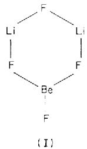

The ionization efficiency (I.E.) curves obtained in this study possess structure to an unexpected degree (considering that the vapor density for some of the species corresponded to less than $10^{-8}$ torr). Selected I.E. curves are shown in Fig. 2.3.

The data were obtained using the retarding potential difference method and a Bendix time-of-flight mass spectrometer. Simultaneous determinations were made for a reference gas with appropriate appearance potentials and for two salt ions. The reference gas was admitted (at a pressure of $1 \times 10^{-7}$ torr) to permit voltage calibration as well as to detect possible instrumental vagaries. The simultaneous monitoring of two salt vapor peaks

eliminated temperature changes of the furnace as a serious source of error.

As has often been observed for other gases, a current of singly charged ions appears at some onset potential and then increases linearly with electron energy until a subsequent appearance potential (AP) due to an added process of ion generation. These AP's for fragment ions may arise in several ways: ion pair formation, ion-neutral reaction, rearrangement, fragmentation of the neutral moiety, formation of excited states in the neutral or ion, and others. Unambiguous assignment of a process to an AP other than onset is not often possible. For the species studied here most of these possibilities, however, may be eliminated. Table 2.8 lists the AP's found for various of the ions from LiF and $\mathrm{Li}_{2}\mathrm{BeF}_{4}$ . The range of values and the number of determinations are shown to give an indication of precision. The existence of $\mathrm{AP}_{\mathrm{II}}(\mathrm{Li}^{+})$ appears to be slight, but real. There seems to be little question of the existence of structure for the other species.

The observed onset appearance potential for $\mathbf{L}\mathbf{i}^{+}$ of 11.21 v with the ionization potential $(\mathbf{L}\mathbf{i}^{+})$ of $5.36\mathrm{v}$ leads to a value of $D(\mathrm{LiF}) = 5.84\pm 0.10\mathrm{ev},$ which is in agreement with the literature value of 5.95 ev.36 The onset is therefore probably characterized by formation of $\mathbf{L}\mathbf{i}^{+}$ and $\mathbf{F}^{\circ}$ in ground states from LiF in its ground state. The small differences between the onsets for $\mathbf{L}\mathbf{i}^{+}$ $\mathbf{L}\mathbf{i}_{2}\mathbf{F}^{+}$ ,and $\mathbf{Li}_3\mathbf{F}_2^+$ are believed to be due principally to the successively greater values of the bond strengths, $D(\mathrm{Li}_2\mathrm{F} - \mathrm{F})$ and $D(\mathrm{Li}_3\mathrm{F}_2 - \mathrm{F})$ . This belief is corroborated by a consideration of the appearance potentials for negative ions.37 Using the value of 2.90 for the electron affinity of $\mathbb{F}^{\circ}$ and considering the process

$$
\mathrm {L i} _ {2} \mathrm {F} _ {2} \dots \rightarrow \mathrm {L i} _ {2} \mathrm {F} + \mathrm {F} ^ {\dots}, \quad \mathrm {A P} = 3. 5 5 \mathrm {v}, \tag {45}
$$

one obtains $\bar{D}(\mathrm{Li}_2\mathrm{F} - \bar{\mathrm{F}}) = 6.45$ ev. This value is about 0.5 ev greater than $D(\mathrm{LiF})$ and does not conflict with the value of

$$
\left[ \mathrm {A P} _ {\mathrm {I}} \left(\mathrm {L i} _ {2} \mathrm {F} ^ {+}\right) \dots \mathrm {A P} _ {\mathrm {I}} \left(\mathrm {L i} ^ {+}\right) \right] = 0. 1 4 \mathrm {e v},
$$

since the ionization potential of the neutral $\mathbf{L}\mathbf{i}_{2}\mathbf{F}$ may be less than that for Li. Similar reasoning

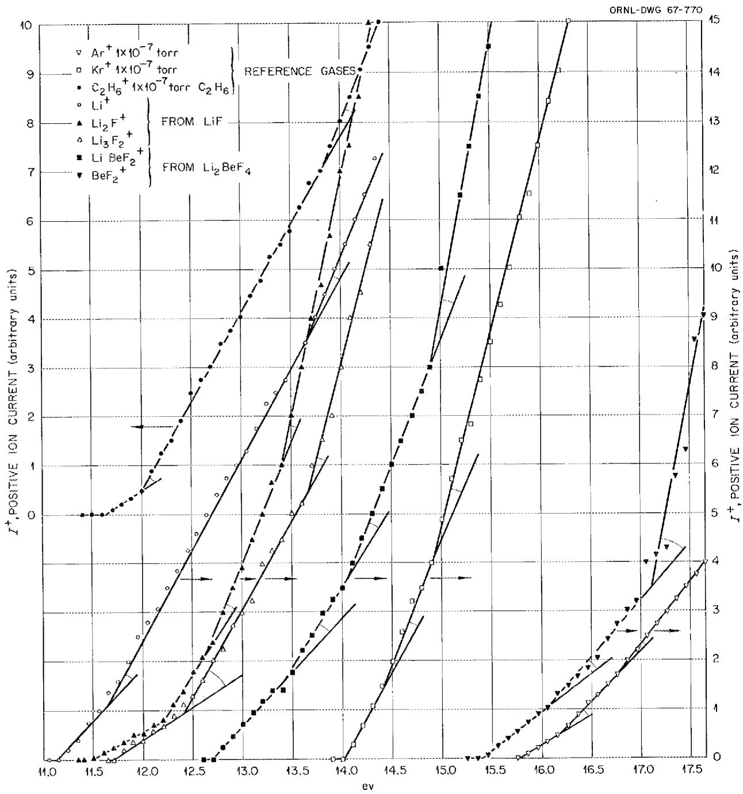  
Fig. 2.3. Ionization Efficiency Curves.

$T = 800$ to $920^{\circ}C$

Table 2.8. Appearance Potentials of Ions from LiF and $\mathsf{Li}_2\mathsf{BeF}_4$ Vapor   

<table><tr><td rowspan="2">Sample</td><td rowspan="2">Ion</td><td rowspan="2">Quantitya</td><td colspan="4">Appearance Potential</td></tr><tr><td>I</td><td>II</td><td>III</td><td>IV</td></tr><tr><td rowspan="9">LiF</td><td rowspan="3">Li+</td><td>AP</td><td>11.21</td><td>11.73</td><td>13.59</td><td></td></tr><tr><td>w</td><td>±0.10</td><td>+0.24 - 0.13</td><td>+0.24 - 0.36</td><td></td></tr><tr><td>n</td><td>5</td><td>5</td><td>5</td><td></td></tr><tr><td rowspan="3">Li2F+</td><td>AP</td><td>11.35</td><td>11.84</td><td>12.78</td><td>13.51</td></tr><tr><td>w</td><td>±0.16</td><td>+0.40 - 0.13</td><td>±0.42</td><td>±0.17</td></tr><tr><td>n</td><td>11</td><td>11</td><td>9</td><td>6</td></tr><tr><td rowspan="3">Li3F2+</td><td>AP</td><td>11.61</td><td>12.12</td><td>13.69</td><td></td></tr><tr><td>w</td><td>±0.10</td><td>+0.30 - 0.40</td><td>+0.23 - 0.19</td><td></td></tr><tr><td>n</td><td>3</td><td>3</td><td>3</td><td></td></tr><tr><td rowspan="11">Li2BeF4</td><td rowspan="2">Li+</td><td>AP</td><td>(11.7)</td><td>(12.2)</td><td>(14.1)</td><td></td></tr><tr><td>n</td><td>1</td><td>1</td><td>1</td><td></td></tr><tr><td rowspan="3">Li2F+</td><td>AP</td><td>11.90</td><td>12.44</td><td>13.72</td><td></td></tr><tr><td>w</td><td>+0.22 - 0.12</td><td>+0.19 - 0.14</td><td>±0.15</td><td></td></tr><tr><td>n</td><td>3</td><td>3</td><td>3</td><td></td></tr><tr><td rowspan="3">LiBeF2+</td><td>AP</td><td>12.79</td><td>13.46</td><td>14.52</td><td>(14.9)</td></tr><tr><td>w</td><td>±0.02</td><td>±0.02</td><td>±0.29</td><td></td></tr><tr><td>n</td><td>2</td><td>2</td><td>2</td><td>1</td></tr><tr><td rowspan="3">BeF2+</td><td>AP</td><td>15.38</td><td>(16.31)</td><td>17.22</td><td></td></tr><tr><td>w</td><td>±0.02</td><td>±0.07</td><td>±0.10 - 0.08</td><td></td></tr><tr><td>n</td><td>3</td><td>3</td><td>3</td><td></td></tr><tr><td colspan="7">Reference gases</td></tr><tr><td>C2H6</td><td>C2H6+</td><td>AP</td><td colspan="4">11.60 (Li-F ions)</td></tr><tr><td>Kr</td><td>Kr+</td><td>AP</td><td colspan="4">14.00 (LiBeF2+)</td></tr><tr><td>Ar</td><td>Ar+</td><td>AP</td><td colspan="4">15.75 (BeF2+)</td></tr></table>

${}^{\mathrm{a}}\mathrm{AP} =$ appearance potential in volts; $w =$ range; $n =$ number of determinations.

applies to $D(\mathrm{Li}_3\mathrm{F}_2 - \mathbf{F})$ . From other data, estimates of some other bond strengths and electron affinities for some of the pertinent species may be made. These include:

<table><tr><td>D(LiF - Li)</td><td>3.0 ev</td></tr><tr><td>D(LiF2 - Li)</td><td>8.0</td></tr><tr><td>D(LiF - F)</td><td>1.6</td></tr><tr><td>Ed(LiF -- LiF)</td><td>3.35</td></tr><tr><td>EA(Li)</td><td>0.29</td></tr><tr><td>EA(Li2F)</td><td>-0.25</td></tr></table>

The value for $\mathrm{EA}(\mathrm{Li}_2\mathrm{F})$ indicates the general degree of uncertainty in these values.

With the derived value of $D(\mathrm{LiF}_{2} - \mathrm{Li}) = 8.00\mathrm{ev}$ , one would anticipate the possibility of producing $\mathrm{Li^{+}}$ from the dimer at an AP of $8.00 + 5.36 = 13.36\mathrm{v}$ . Our value of $\mathrm{AP}_{\mathrm{III}}(\mathrm{Li^{+}}) = 13.6 \pm 0.3$ indicates that this process is responsible for $\mathrm{AP}_{\mathrm{III}}(\mathrm{Li^{+}})$ . The second appearance potential, $\mathrm{AP}_{\mathrm{II}}(\mathrm{Li^{+}})$ , is, if real, not readily explainable since the lowest excitation level for $\mathbf{F}^0$ is 14.4 ev and for $\mathrm{Li^{+}}$ , much more. Invoking possible precursor excitation is not a happy explanation in view of the 0.5-v difference between $\mathrm{AP}_{\mathrm{I}}(\mathrm{Li^{+}})$ and $\mathrm{AP}_{\mathrm{II}}(\mathrm{Li^{+}})$ and the agreement of our value of $D(\mathrm{LiF})$ with the literature.

The onset potential for the mixed species $\mathrm{LiBeF}_{2}^{+}$ can be used to estimate a $D(\mathrm{LiBeF}_{2}-\mathrm{F})=7.9 \mathrm{~V}$ , which is near $D(\mathrm{BeF})=8.02$ . This indicates that the fluoride atoms are all associated with the beryllium in the vapor species $\mathrm{LiBeF}_{3}$ . Consideration of the energies and bond strengths and the near agreement between $\mathrm{AP}_{1}(\mathrm{Li}_{2} \mathrm{~F}^{+})$ from LiF with

that from $\mathbf{L}\mathbf{i}_{2}\mathbf{B}\mathbf{e}\mathbf{F}_{4}$ make it seem unlikely that $\mathbf{L}\mathbf{i}_{2}\mathbf{B}\mathbf{e}\mathbf{F}_{4}$ is a precursor of $\mathbf{L}\mathbf{i}_{2}\mathbf{F}^{+}$ .

For $\mathbf{BeF}_2^+$ an additional set of possibilities must be considered as causes of structure in the I.E. curve. These include autoionization and metastable ion formation. Since all of the ions except possibly $\mathbf{Li}^+$ present marked similarity of structure, it seems most plausible that even for the species from $\mathbf{Li}_2\mathbf{BeF}_4$ the structure observed is attributable to ionic excitation, either vibrational or electronic.

The energies determined can be used to predict possible appearance potentials beyond the limited range used in these studies. For examples,

$$
\left(\operatorname {L i F}\right) _ {2} \rightarrow \operatorname {L i F} ^ {+} + \operatorname {L i F}, \quad 1 4. 6 \mathrm {v}, \tag {46}
$$

$$
- \dots \gg \operatorname {L i} \mathbf {F} ^ {+} + \operatorname {L i} + \mathbf {F}, \quad 2 0. 6 \mathrm {v}, \tag {47}
$$

$$
\mathrm {L i F} \quad \dots \rightarrow \mathrm {L i} ^ {+} + \mathrm {F} ^ {+}, \quad 2 5 \text {t o} 2 8 \mathrm {v}, \tag {48}
$$

$$
\rightarrow \operatorname {L i} ^ {0} + \mathrm {F} ^ {+}, \quad 2 3 \mathrm {v}. \tag {49}
$$

The ion $\mathrm{Li}_{2}\mathrm{BeF}_{3}^{+}$ was also observed but in too small amounts for AP determinations. During the melting of one sample of $\mathrm{Li}_{2}\mathrm{BeF}_{4}$ many bursts of $\mathrm{CO}_{2}$ were observed; these bursts total about $2\times 10^{-4}$ atm cc g $^{-1}$ , but we believe this did not cause any irregularity in the Knudsen cell operation.

Some initial determinations were made of slopes of $\log (\mathbf{I}^{+}T)$ vs $1 / T$ for LiF species in order to provide some comparison with the literature values before undertaking the more difficult task of studying the LiF-BeF system vaporization. The results of numerous determinations are shown in Table 2.9 without further discussion of details.

Table 2.9. Second Law Apparent $\Lambda {H}^{ * }$ ’s for lons from LiF   

<table><tr><td></td><td>Average This Work</td><td>a</td><td>b</td><td>c</td><td>d</td></tr><tr><td>Li+</td><td>65.7 ± 0.7</td><td>67.4</td><td></td><td></td><td></td></tr><tr><td>F+</td><td>64.1 ± 1.3</td><td></td><td></td><td></td><td></td></tr><tr><td>LiF+</td><td>62.3 ± 0.6</td><td>64.8 ± 2</td><td>66.5 ± 1</td><td>62.4 ± 1.5</td><td>(62.7)</td></tr><tr><td>Li2F+</td><td>67.7 ± 1.3</td><td>68.3 ± 2</td><td>71.6 ± 2</td><td>65.3 ± 1.7</td><td>(70.4)</td></tr><tr><td>Li3F2+</td><td>70.4 ± 0.7</td><td>73.9 ± 3</td><td></td><td>74.9 ± 1.0</td><td></td></tr></table>

$^{a}$ A. Buchler, CPIA Publ. No. 44 (February 1964).   
D. L. Hildenbrand et al., J. Chem. Phys. 40, 2882-90 (1961).   
P. A. Akishin, L. N. Gorokhov, and L. N. Siderov, Russ. J. Phys. Chem. 33, 648-49 (1959).   
dA. C. P. Pugh and R. F. Barrow, Trans. Faraday Soc. 54, 671 (1958). Note: Values are torsion-effusion $\Delta H$ 's (sublimation heats for monomer and dimer).

# 3. Separations Chemistry and Irradiation Behavior

# REMOVAL OF IODIDE FROM LiF-BeF $_2$ MELTS

C.E.L.Bamberger C.F.Baes, Jr.

The removal of iodide from LiF-BeF $_2$ mixtures by HF sparging, presumably by the reaction

$$
\mathrm {H F} (\hat {g}) + \mathrm {I} ^ {-} (d) = \mathrm {F} ^ {-} (d) + \mathrm {H I} (\hat {g}), \tag {1}
$$

was previously described $^{1,2}$ as a promising method for removing 6.7-hr $^{135}\mathrm{I}$ from an MSBR fuel at a rate greater than the rate of decay of this nuclide to $^{135}\mathrm{Xe}$ .

One difficulty with the results reported previously was that poor recoveries (typically $80\%$ ) of iodide were obtained by HF sparging. In continued studies the cause of this has been traced to small particles of salt entrained in the gaseous mixture of HF, HI, and $\mathbf{H}_{2}$ emerging from the reaction vessel. Evidently these particles caused condensation of the HF and HI with water vapor in the NaOH bubbler used to trap the HI. The condensed droplets of acidic solution, readily visible as a fog in the gas phase of the trap, evidently did not react completely with the NaOH solution, thus causing low recoveries. Introduction of a filter of sintered Teflon or gold in the effluent gas stream ahead of the trap has resulted in iodide recoveries greater than $95\%$ .

It was found previously that the fraction of iodide remaining in the melt $([\mathrm{I}^{-}] / [\mathrm{I}^{-}]^{0})$ decreased logarithmically with the number of moles of HF passed per kilogram of melt $(n_{\mathrm{HF}} / w)$

$$
\ln \left(\left[ I ^ {-} \right] / \left[ I ^ {-} \right] ^ {0}\right) = - Q \left(n _ {H F} / w\right). \tag {2}
$$

With the assumption that reaction (1) was the only reaction involved, the negative slope $(Q / 2.3)$ of a plot of $\log ([\mathrm{I}^{-}] / [\mathrm{I}^{-}]^{0})$ vs $n_{\mathrm{HF}} / w$ was equated to the equilibrium quotient $Q_{1}$ of reaction (1),

$$
Q _ {1} = \frac {P _ {\mathrm {H I}}}{P _ {\mathrm {H F}} [ \mathrm {I} ^ {* *} ]} \mathrm {k g / m o l e .} \tag {3}
$$

This interpretation of the previous data was supported by the observation that, within the scatter of the measurements, $Q$ was independent of the flow rate and the partial pressure of HF. In the subsequent measurements, however, a fuller study of the effect of the HF pressure at different temperatures and as a function of melt composition has shown a pronounced effect. It has been found (Fig. 3.1) that $Q$ varies approximately inversely with $P_{\mathrm{HF}}$ as follows:

$$
\frac {1}{Q} = a + b P _ {\mathrm {H F}}.
$$

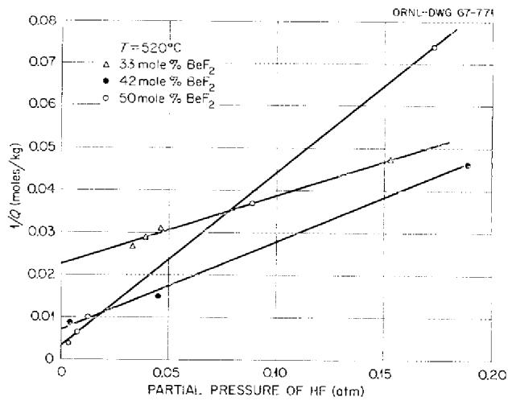  
Fig. 3.1. Variation of $Q$ for Iodide Removal (Eq. 2) with the HF Sparging Pressure in LiF-Bef $_2$ Melts.

While the cause of this effect is still being investigated, it may be noted that if, in addition to reaction (1), there is an appreciable solubility of HI in the melt,

$$
\mathrm {H I} (g) \rightleftharpoons \mathrm {H I} (d); Q _ {2} = [ \mathrm {H I} ] / P _ {\mathrm {H I}}, \tag {4}
$$

the above expression can be accounted for with $a = 1 / Q_1$ and $b = Q_2$ . Sparging with HI as well as HF is presently being used to determine whether or not equilibrium conditions are being attained during the measurements and to determine the solubility or other possible reactions of HI in these melts.

Whether the dependence of $Q$ on $P_{\mathrm{HF}}$ is due to a rate effect or to the occurrence of other equilibria in addition to reaction (1), it seems evident that, in the application of this treatment to the processing of an MSBR fuel, better HF utilization (higher $Q$ values) will be obtained at lower HF partial pressures. The limiting (maximum) value of $Q$ obtained as $P_{\mathrm{HF}}$ approaches zero is plotted vs the mole fraction of $\mathrm{BeF}_2$ in Fig. 3.2.

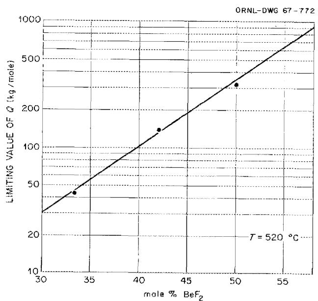  
Fig. 3.2. The Dependence of the Limiting Value of $Q$ upon the $\text{BeF}_2$ Concentration in LiF-BeF $_2$ Melts.

# REMOVAL OF RARE EARTH'S FROM MOLTEN FLUORIDES BY SIMULTANEOUS PRECIPITATION WITH UF3

F.A.Doss H.F.McDuffie J.H.Shaffer

The relatively low solubility of $\mathrm{UF}_3$ in fluoride mixtures of interest to the MSR program and the known similarities of the crystal structure of rare-earth trifluorides with $\mathrm{UF}_3^4$ provide a basis for studies of the precipitation of solid solutions of these compounds from fluoride melts. Since fission product rare earths represent a major portion of the poison fraction in the fuel of a molten-salt nuclear reactor, this study may be applicable toward the development of suitable reprocessing methods for rare-earth removal. Initial experiments conducted in this program considered the reduction of $\mathrm{UF}_4$ contained in a reactor fuel mixture to $\mathrm{UF}_3$ and the simultaneous precipitation of rare-earth trifluorides with $\mathrm{UF}_3$ as the temperature of the fuel mixture was reduced. A second series of experiments is in progress to examine the precipitation of rare earths from a simulated fuel solvent upon addition of solid $\mathrm{UF}_3$ .

If all $\mathrm{UF}_4$ contained in the current MSRE fuel mixture, $\mathrm{LiF - BeF_2 - ZrF_4 - UF_4}$ (65.0-29.1-5.0-0.9 mole % respectively), were reduced to $\mathrm{UF}_3$ , the solution would be saturated with $\mathrm{UF}_3$ at approximately $725^{\circ}\mathrm{C}$ . By lowering the melt temperature to $550^{\circ}\mathrm{C}$ , approximately $83.5\%$ of the uranium would be precipitated from solution. Results of preliminary experiments designed to investigate this reprocessing method demonstrated that $\mathrm{LaF}_3$ , $\mathrm{CeF}_3$ , and $\mathrm{NdF}_3$ could be precipitated with $\mathrm{UF}_3$ . Europium and samarium were probably reduced to their divalent states by the in situ reduction of uranium with added zirconium metal and showed little or no loss from solution during the precipitation of $\mathrm{UF}_3$ . Subsequent experiments with excess reducing agent showed that cerium removal could be related to the $\mathrm{U}^{3+}$ concentration in solution by the equation

$$
\ln N _ {\mathrm {R E}} = k \ln N _ {\mathrm {U} ^ {3} +} + \text {c o n s t}, \tag {5}
$$

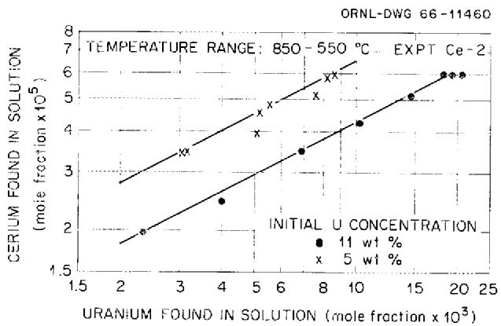  
Fig. 3.3. Simultaneous Precipitation of $\mathsf{CeF}_3$ and $\mathsf{UF}_3$ from Simulated MSRE Fuel Mixture.

where $N_{\mathrm{RE}}$ and $N_{\mathrm{U}^{3+}}$ are respective mole fractions of rare earth and trivalent uranium. As illustrated by Fig. 3.3, a value of about 0.55 was obtained for $k$ in Eq. (5) for the simultaneous precipitation of $\mathrm{CeF}_3$ . Further investigation would be needed to verify this experimental relationship for other rare earths of interest to the program.

A more recent experimental program has been concerned with the retention of rare-earth trifluorides on a bed of solid $\mathbf{U}\mathbf{F}_{3}$ as an alternate reprocessing technique. In the first experiment $\mathbf{U}\mathbf{F}_{3}$ was added in 30-g increments to approximately $2.2\mathrm{kg}$ of $\mathrm{LiF - BeF_2}$ (66-34 mole %) that initially contained $10^{-4}$ mole fraction of $\mathrm{CeF}_3$ with about $1\mathrm{mc}$ of $^{144}\mathrm{Ce}$ as a radiotracer. Filtered samples of the salt mixture were taken approximately 48 hr after each addition of $\mathbf{U}\mathbf{F}_{3}$ and analyzed radiochemically for cerium. The results illustrated a somewhat linear decrease in cerium concentration as $\mathbf{U}\mathbf{F}_{3}$ was added and corresponded to a solid phase which contained about 1 mole $\%$ $\mathrm{CeF}_3$ . Similar results were obtained in a separate experiment with $\mathrm{NdF}_{3}$ , except that the solid phase corresponded to about $0.2\mathrm{mole}\% \mathrm{NdF}_{3}$ in $\mathbf{U}\mathbf{F}_{3}$ .

# EXTRACTION OF RARE EARTHSH FROM MOLTEN FLUORIDES INTO MOLTEN METALS

J. H. Shaffer

F. F. Blankenship

W.P.Teichert

W. K. R. Finnell

D. M. Moulton

W. R. Grimes

This experimental program has been oriented toward the development of a liquid-liquid ex

traction process for removing rare-earth fission products from the fuel of a two-region molten-salt breeder reactor. In processing schemes proposed for the reference design MSBR, uranium will be removed by fluorination. Thus, for purposes of this investigation, the barren fuel solvent has been simulated by dissolving selected rare-earth fluorides into a mixture containing 66 mole % LiF and 34 mole % BeF $_2$ . When this mixture is contacted with a molten bismuth-lithium mixture, rare earths are reduced to the metallic state and dissolved in the molten metal phase. The program further envisions a similar back-extraction process for concentrating rare-earth fission products in a second salt mixture for disposal or further utilization. Experiments conducted thus far have examined the distribution of rare earths between the two liquid phases as functions of the lithium concentration in the metal phase. Studies of the equilibrium

$$
2 \mathrm {L i} ^ {0} + \mathrm {B e F} _ {2} \rightleftharpoons 2 \mathrm {L i F} + \mathrm {B e} ^ {0} \tag {6}
$$

in the extraction system are currently in progress to ascertain activity coefficients of lithium and rare earths in bismuth and to study effects of salt composition on rare-earth distribution coefficients.

Fluoride starting materials were prepared in nickel equipment by treatment with $\mathrm{HF - H_2}$ mixtures at $600^{\circ}\mathrm{C}$ to remove oxide impurities and at $700^{\circ}\mathrm{C}$ with $\mathbf{H}_2$ alone to reduce concentrations of structural metal difluorides in the fluoride melts. Selected rare-earth fluorides were added prior to this treatment in quantities sufficient to attain concentrations of about $10^{-4}$ mole fraction in the salt mixture. Bismuth was further purified by treatment with $\mathbf{H}_2$ at $600^{\circ}\mathrm{C}$ in the 304L stainless steel, low-carbon-steel-lined extraction vessel. Following this treatment the prepared salt mixture was transferred as a liquid to the extraction vessel. Each experiment typically contained $2.35\mathrm{kg}$ of bismuth and about $2\mathrm{kg}$ of the salt mixture. Lithium, for incremental additions to the experiment, was freshly cut and tared under mineral oil, affixed to a small-diameter steel rod, rinsed in benzene, and dried in the flowing inert atmosphere of the loading port prior to its insertion into the molten bismuth. This loading port extended near the bottom of the extraction vessel to avoid contact of lithium with the salt phase prior to its dissolution into the molten metal phase. Filtered samples of each phase were taken under assumed equilibrium conditions after each

addition of lithium. Radiochemical analyses of each phase for rare-earth gamma activity and spectrographic analyses of the metal phase for rare-earth and lithium concentrations provided data for calculating the distribution of rare earth in the system and its dependence on the lithium concentration of the metal phase. A summary of these results, illustrated in Fig. 3.4, shows that a mixture containing 0.02 mole fraction of lithium metal sufficed for removing essentially all cerium, lanthanum, and neodymium and substantial quantities of samarium and europium from the barren fuel solvent under separate but comparative conditions. In all experiments rare earths that were reduced from solution in the salt phase were found as dissolved components of the metal phase.

The reduction of rare-earth fluorides by lithium is expected to proceed by the reaction

$$
m \mathrm {L i} ^ {0} + (\mathrm {R E}) ^ {m ^ {+}} \rightleftharpoons (\mathrm {R E}) ^ {0} + m \mathrm {L i} ^ {+}, \tag {7}
$$

where $m$ is the effective valence of the rare-earth cation. If unit activities prevail for all metal species in the salt phase and for all ionic species in the metal phase, then the activity of lithium dissolved in the metal phase can be expressed

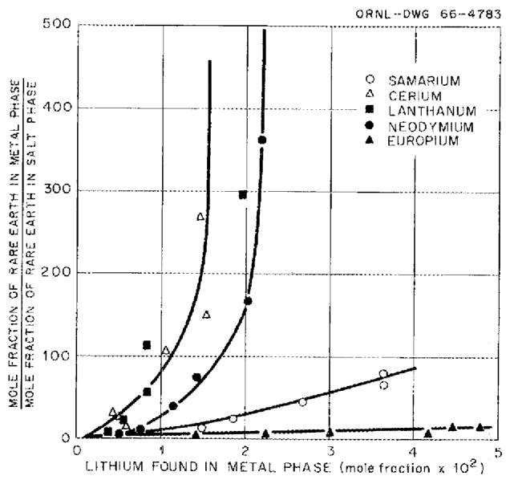  
Fig. 3.4. Extraction of Rare Earths from LiF-BeF $_2$ (66-34 Mole %) into Bismuth by the Addition of Lithium Metal at $600^{\circ}\mathrm{C}$ .

as a function of other activities in the system as

$$
A _ {\mathrm {L i} ^ {0}} ^ {m} = \frac {\left(A _ {\mathrm {R E} 0}\right) _ {\text {m e t a l}} \left(A _ {\mathrm {L i F}}\right) _ {\text {s a l t}} ^ {m}}{K _ {a} \left(A _ {\mathrm {R E}}\right) _ {\text {s a l t}}}. \tag {8}
$$

By assuming that the activity of LiF and the activity coefficients of $\mathbf{L}\mathbf{i}^{\mathbf{0}}$ $\mathbf{R}\mathbf{E}^{\mathbf{0}}$ ,and $\mathbf{R}\mathbf{E}^{m + }$ remain constant, the dependence of rare-earth distribution on the lithium concentration can be expressed as

$$
D = K _ {Q} N _ {\text {L i} ^ {0}} ^ {m}, \tag {9}
$$

where $D$ is the ratio of the mole fraction of rare earth in the metal phase to the mole fraction of rare earth in the salt phase and

$$
K _ {Q} = \frac {K _ {\mathrm {a}} \cdot \left(\gamma_ {\mathrm {L i} 0}\right) _ {\text {m e t a l}} ^ {m} \cdot \left(\gamma_ {\mathrm {R E}}\right) _ {\text {s a l t}}}{\left(\gamma_ {\mathrm {R E} 0}\right) _ {\text {m e t a l}} \cdot \left(A _ {\mathrm {L i F}}\right) ^ {m}}. \tag {10}
$$

A plot of the experimental data according to the logarithmic form of Eq. (9) is shown as Fig. 3.5. Values for $m$ and $K_{Q}$ calculated from the slopes and intercepts of this plot are as follows:

<table><tr><td>Rare Earth</td><td>m</td><td>KQ</td></tr><tr><td>Lanthanum</td><td>2.7</td><td>2.5 × 107</td></tr><tr><td>Cerium</td><td>2.3</td><td>3.8 × 106</td></tr><tr><td>Neodymium</td><td>2.5</td><td>2.5 × 106</td></tr><tr><td>Samarium</td><td>1.6</td><td>1.8 × 104</td></tr><tr><td>Europium</td><td>1.9</td><td>5.9 × 103</td></tr></table>

Although the apparent fractional exponents for the reductions are as yet unexplained, the results

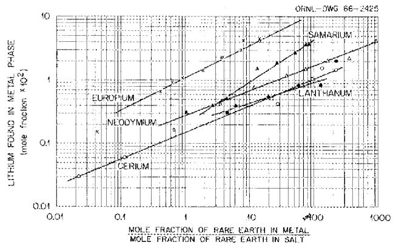  
Fig. 3.5. Effect of Lithium Concentration in Metal Phase on the Distribution of Rare Earths Between LiF-BeF $_2$ (66-34 Mole %) and Bismuth at $600^{\circ}\mathrm{C}$

are in rough agreement with the occurrence of lanthanum, cerium, and neodymium as trivalent ions in the salt mixture; samarium and europium are probably reduced to their divalent states prior to their extraction into the metal phase.

In earlier experiments the extraction of rare earths from a salt phase into molten bismuth was achieved by the addition of beryllium metal to the system. This reduction process also resulted in a measurable increase of the lithium concentration of the molten metal phase. Accordingly, further study of the reaction

$$
2 \mathrm {L i F} + \mathrm {B e} ^ {0} \rightleftharpoons 2 \mathrm {L i} ^ {0} + \mathrm {B e F} _ {2} \tag {11}
$$

in the two-phase extraction system was initiated by experimental procedures similar to those employed for the rare-earth extractions. The intention of these experiments was to measure the activity coefficient of lithium in bismuth by bringing it to equilibrium with metallic beryllium. It was found, however, that the stoichiometric amount of lithium did not appear in the metal phase. In experiments where lithium metal was added to the system, the lithium loss was proportional to the square of the mole fraction of lithium in bismuth. Such behavior suggests the presence of a reduced divalent species at less than unit activity, for which the most obvious choice is $\mathrm{Be}^0$ dissolved in the melt. When $\mathrm{Be}^0$ was added to the melt, the lithium loss was proportional to the first power of $X_{\mathrm{Li(Bi)}}$ , which is consistent with the formation of neither $\mathrm{Be}^0 (d)$ nor $\mathrm{Be}^{+}(d)$ . For a third set of experiments, where salt was added to bismuth containing lithium, the loss was independent of the lithium concentration, indicating the presence of some easily reduced impurity in the melt. No simple mechanism has been devised to explain all three of these reactions.

It is known that certain properties of this melt [e.g., heats of solution of HF and solubilities of $\mathrm{PuF}_3$ and $(\mathrm{RE})\mathrm{F}_3]$ show extreme values at the ratio 2Li:Be. The salt composition used in the described experiments started at about this concentration and went to opposite sides of it. One can conceive, therefore, that further experimentation may reveal solvent effects which are as yet unexplained.

In the beryllium-addition experiments at $600^{\circ}\mathrm{C}$ a limiting mole fraction of lithium in bismuth was reached. As this was well below the solubility, it was assumed that the lithium was in equilibrium with metallic beryllium. From this it was possible to calculate an activity coefficient for lithium of $9.8 \times 10^{-5}$ to $1.3 \times 10^{-4}$ (two experiments) for the mole fraction of lithium referred to a standard state of unit activity (i.e., pure lithium). A similar analysis gave the activity coefficient of lithium in lead as $1.5 \times 10^{-3}$ .

# REMOVAL OF PROTACTINIUM FROM MOLTEN FLUORIDES BY REDUCTION PROCESSES

J.H.Shaffer W.P.Teichert   
D.M.Moulton F.F.Blankenship   
W. K. R. Finnell W. R. Grimes

The removal of protactinium from solution in $\mathrm{LiF - BeF_2 - ThF_4}$ (73-2-25 mole %) has been demonstrated by adding thorium metal that was either put directly in the salt mixture or initially dissolved in molten lead or bismuth that was in contact with the salt.6 More recent studies have examined methods by which this reduction reaction might be used for reprocessing the fertile blanket of a two-region molten-salt breeder reactor. The results of several batch-type laboratory experiments led to the design and operation of a small pump-loop experiment which has demonstrated, in principle, the removal of protactinium from the fluoride mixture by a liquid-liquid extraction technique.

In static batch-type experiments, only minor fractions of $^{233}\mathrm{Pa}$ removed from the salt phase, on adding thorium metal, were found as soluble components of the metal phase. Subsequent examinations of the low-carbon-steel containers used in these experiments indicated that most of the precipitated protactinium had deposited on the vessel walls that were in contact with the salt phase. Although this behavior may have resulted from nonwetting characteristics of the two liquid phases, an experiment was conducted to examine the absorption of $^{233}\mathrm{Pa}$ on iron surfaces in the absence of a molten metal phase. As a result of adding thorium metal, $^{233}\mathrm{Pa}$ was found uniformly

distributed on steel wool that had been immersed in a blanket salt mixture. When this salt mixture was drained from the vessel and filtered through sintered nickel, essentially no $^{233}\mathrm{Pa}$ activity could be found in the salt mixture or on the filter.

In other experiments in which no salt phase was used, solutions of $^{233}\mathrm{Pa}$ in molten lead or bismuth, obtained by the addition of irradiated thorium metal, were not stable in either metal solvent. However, a much larger fraction of $^{233}\mathrm{Pa}$ activity was retained in bismuth than in lead during 48-hr contact periods. Subsequent examination of the low-carbon-steel vessels used in these experiments showed a distribution of $^{233}\mathrm{Pa}$ on the container walls which resembled sedimentary deposition of insoluble materials rather than surface absorption. In view of earlier results, tentative conclusions assumed that $^{233}\mathrm{Pa}$ was preferentially absorbed on insoluble particles that were initially present in the molten metals or formed by reactions with added thorium.

Since the anticipated function of the molten metal phase in the extraction process is that of an intermediate carrier for protactinium, the rate at which $^{233}\mathrm{Pa}$ can be extracted from the blanket salt and concentrated in a second salt mixture by back extraction with HF need only depend on the mass transfer rate of protactinium dissolved in a recirculating molten metal stream. Thus a pump-loop experiment, shown schematically in Fig. 3.6, was tried in an endeavor to achieve the transport of $^{233}\mathrm{Pa}$ in bismuth while maintaining its concentration or that of its carrier at relatively low values. Thorium was introduced into the system by contacting the liquid metal with thorium chips just prior to its reentry into the extraction vessel. At low bismuth flow rates protactinium could be reduced at the surfaces of free-falling droplets. For simplicity the recirculating molten metal stream was pumped through a bed of steel wool to provide for the collection of protactinium, presumably by absorption, and to provide coarse filtration of the bismuth in the event that $^{233}\mathrm{Pa}$ was being carried by suspended solid particles. Surface areas of steel wool columns used in the experiment were at least tenfold greater than those of other iron surfaces exposed to the molten metal elsewhere in the loop. The extraction vessel was also provided with a niobium sleeve to isolate the salt phase from the iron surfaces of the loop.

The pump-loop experiment was operated discontinuously for approximately 60 hr over a period of about six weeks and was terminated because of pump failure. Material balance calculations on the system at the conclusion of the experiment showed that approximately $96\%$ of the ${}^{233}\mathrm{Pa}$ had been removed from the salt mixture. At least $43\%$ of the ${}^{233}\mathrm{Pa}$ originally in the system had been pumped as a solution or a suspension with molten bismuth and deposited on rather small volumes of steel wool. Since only $4\%$ of the ${}^{233}\mathrm{Pa}$ remained in solution in the bismuth, approximately $49\%$ of the ${}^{233}\mathrm{Pa}$ was lost as solids in the system. The collection of ${}^{233}\mathrm{Pa}$ on the columns was, in fact, better identified with a filtration process even though some surface absorption was apparent. Spectrographic analyses of high-melting metallic plugs taken from the system associated relatively high concentrations of thorium with iron and chromium. These observations suggest that a more inert containment material will be needed before a satisfactory

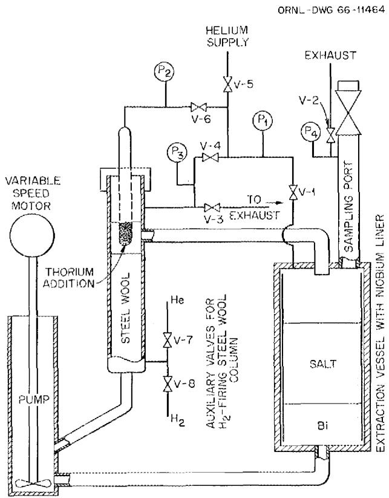  
Fig. 3.6. Schematic Diagram of $^{233}\mathrm{Pa}$ Extraction Pump Loop.

demonstration of the liquid-liquid extraction process can be achieved.

# REMOVAL OF PROTACTINIUM FROM MOLTEN FLUORIDES BY OXIDE PRECIPITATION

J. H. Shaffer

W. K. R. Finnell

W. P. Teichert

F. F. Blankenship

W. R. Grimes

In a previous experiment protactinium was removed from solution in a solvent mixture of LiF-BeF $_2$ (66-34 mole %) which also contained $\mathrm{ZrF}_4$ (0.5 mole per kg of salt) by the addition of $\mathrm{ZrO}_2$ at $600^{\circ}\mathrm{C}$ . An interpretation of the experimental data according to the equation

$$
\frac {1}{F _ {\mathrm {P a}}} = 1 + \frac {D}{W _ {\mathrm {s a l t}}} \cdot W _ {\mathrm {Z r o} _ {2}}, \tag {12}
$$

where $D = (\mathrm{Pa})_{\mathrm{oxide}} / (\mathrm{Pa})_{\mathrm{salt}}, F_{\mathrm{Pa}} =$ fraction of protactinium in the salt, and $W =$ weight of the designated phase, showed that the distribution of protactinium between the two phases remained constant over the protactinium concentration range of the experiment. These results could be explained as the formation of labile oxide solid

solutions or as surface absorption of $^{233}\mathrm{Pa}$ on the solid $\mathrm{ZrO}_2$ . Further studies of this oxide precipitation method were conducted in the same fluoride solvent with $\mathrm{ZrO}_2$ powders having varied surface areas.

Zirconium dioxide used in the original experiment was purchased commercially and had a surface area of about $19.6\mathrm{m}^2 /\mathrm{g}$ Material having higher surface areas was prepared from $\mathbf{Zr(OH)}_4$ by dehydration.8 Sufficient $\mathsf{ZrO}_2$ for this experimental series was fired at 600, 700, and $1000^{\circ}\mathrm{C}$ in separate batches that yielded average surface areas of 80, 50, and $1.32\mathrm{m}^2 /\mathrm{g}$ respectively. About $3.55\mathrm{kg}$ of a salt mixture having a nominal composition of $\mathsf{LiF - BeF}_2\mathsf{-ZrF}_4$ (64.8- 33.6-1.6 mole $\%$ ) with about 1 mc of $^{233}\mathrm{Pa}$ as irradiated $\mathsf{ThO}_2$ was prepared in nickel by conventional HF- $\mathsf{H}_2$ treatment at $600^{\circ}\mathrm{C}$ and $\mathbf{H}_{2}$ sparging at $700^{\circ}\mathrm{C}$ for further purification and dissolution of protactinium as its fluoride salt. Selected $\mathsf{ZrO}_2$ was added to the salt mixture in 10-g increments; the mixture was then sparged

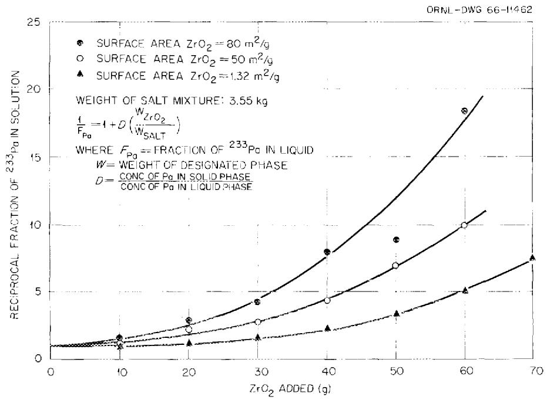  
Fig. 3.7. Effect of Surface Area of $\mathsf{ZrO}_2$ on the Removal of $^{233}\mathsf{Pa}$ from LiF-BeF $_2$ -ZrF $_4$ (64.8-33.6-1.6 Mole %) at $600^{\circ}\mathsf{C}$ .

with helium at a rate of about 1 liter/min during 24-hr equilibration periods. Filtered samples of the salt mixture were taken after each equilibration period and analyzed radiochemically for $^{233}\mathrm{Pa}$ by counting its 310-kv photopeak on a single-channel gamma spectrometer. At the conclusion of the experiment the mixture was hydrofluorinated to convert added $\mathrm{ZrO}_2$ to its fluoride salt and to restore $^{233}\mathrm{Pa}$ activity in the molten-salt phase. This experimental procedure was repeated with the same salt mixture for all three lots of $\mathrm{ZrO}_2$ .

In each experiment the addition of $\mathsf{ZrO}_2$ to the fluoride mixture resulted in the loss of protactinium from solution. However, as shown by Fig. 3.7, a plot of the reciprocal fraction of $^{233}\mathrm{Pa}$ in solution vs $\mathsf{ZrO}_2$ added, yielded, according to Eq. (12), distribution coefficients for $^{233}\mathrm{Pa}$ between the two phases which varied continuously as the precipitation reaction approached completion. Although these experimental results are contrary to those obtained previously, with respect to the constancy of the $^{233}\mathrm{Pa}$ distribution coefficients, they indicate that $^{233}\mathrm{Pa}$ removal from the salt mixture is probably not singularly dependent on the surface area of the added oxide particles nor on solid solution formation.

# PROTACTINIUM STUDIES IN THE HIGH-ALPHA MOLTEN-SALT LABORATORY

C.J.Barton H.H.Stone

The High-Alpha Molten-Salt Laboratory was briefly described in the previous report, and results of the first experiments performed in this facility were given. Attention has been focused on development of methods of removing protactinium at realistic concentrations (25 ppm) from breeder blankets, but a few experiments have been performed in an effort to obtain a better understanding of the chemistry of protactinium in molten fluoride systems. Because of the variety of experimental methods that have been applied to the protactinium removal problem, only a brief summary is presented here, with emphasis on the experiments that gave the most promising results. Some information from these experiments has been previously reported.

# Protactinium Recovery Experiments

We found that protactinium dissolved to the extent of 20 to $30~\mathrm{ppm}$ in molten $\mathrm{LiF - ThF_4}$ (73-27 mole %) could be readily reduced by solid thorium or by thorium dissolved in lead. In the latter case, only a small fraction of the reduced protactinium was found in the molten metal phase. Reduction experiments with solid thorium in three different container materials (nickel, copper, and graphite) showed that more than half the reduced protactinium remained suspended in the molten fluoride mixture. We believe that the reduced protactinium is attached to small particles of a structural metal such as iron or nickel which are large enough to be removed by the sintered copper filter material through which the samples are drawn but small enough to remain suspended for a reasonable length of time in the high-density molten salt.

Partial reduction of protactinium was effected by electrolysis with various electrode arrangements, but very little protactinium was found in the bismuth layer that underlay the molten-salt mixture in most of the electrolysis experiments. The aim of these experiments, to transfer protactinium from the fluoride mixture to bismuth or to some other electrode material that could be readily separated from the salt mixture, was not realized.

Efforts to collect tracer quantities of reduced $^{233}\mathrm{Pa}$ on steel wool have been reported. A series of three experiments of this type were recently performed with $^{231}\mathrm{Pa}$ concentrations in an LiF-ThF ${}_{4}$ (73-27 mole %) mixture in the range 24 to 81 ppm. The principal variable was the ratio of milligrams of $^{231}\mathrm{Pa}$ to grams of steel wool. These ratios were 1.1, 3.1, and 6.5 for the three experiments. Detailed results are given only for one experiment ( $^{231}\mathrm{Pa}$ to Fe ratio 6.5), but conclusions are based on findings of all three experiments, which gave similar results.

A weighed quantity of LiF-ThF4, previously purified, was placed in a welded nickel reaction

vessel, irradiated $\mathrm{ThF}_4$ containing a known amount of $^{233}\mathrm{Pa}$ and $^{231}\mathrm{Pa}$ was added to the mixture, and it was treated first with a mixture of HF and $\mathbf{H}_{2}$ and then with $\mathbf{H}_{2}$ alone. Four grams of steel wool (grade 00, $0.068\mathrm{m}^2/\mathrm{g}$ surface area) was placed in a low-carbon-steel liner inside another nickel vessel. The contents of the vessel were then treated with purified hydrogen at $800^{\circ}\mathrm{C}$ for several hours to remove as much as possible of the oxide surface contamination of the steel wool and liner. The two vessels were then connected together at room temperature and heated to about $650^{\circ}\mathrm{C}$ , and the salt was transferred to the steel-lined vessel. After two separate exposures of the salt to a solid thorium surface, as indicated in Table 3.1, the salt was transferred back to its original container and allowed to cool in helium. The steel-lined vessel was cut up, and samples were submitted for analysis.

The data in Table 3.1 show that $99\%$ of the protactinium was precipitated in a form that would not pass through a sintered copper filter after a fairly short exposure to solid thorium, but nearly $7\%$ was in the unfiltered salt that was transferred back to the nickel vessel after exposure to thorium. About $69\mathrm{g}$ of salt was associated with the steel wool in the steel liner in the form of a hard ball. Partial separation of the salt from steel wool was effected by use of a magnet after crushing the ball, and the iron-rich fraction had the higher protactinium concentration. The small amount of protactinium found on the vessel wall is especially notable. The last column in Table 3.1 shows that a reduction in the iron concentration occurred concurrently with the reduction in protactinium concentration. It may be significant that the ratio of precipitated iron to precipitated protactinium was much smaller in this experiment than in the other two experiments,

Table 3.1. Precipitation of Protactinium from Molten LiF-ThF₄ (73-27 Mole %) by Thorium Reduction in the Presence of Steel Wool   

<table><tr><td>Sample</td><td>231Pa Concentration (mg/g)</td><td>Total 231Pa (mg)</td><td>Total Iron (mg)</td></tr><tr><td>Salt after HF-H2treatment</td><td>0.0634</td><td>20.3</td><td>&lt;15</td></tr><tr><td>Salt just before transfer</td><td>0.081</td><td>26.1</td><td>116</td></tr><tr><td>Salt 35 min after transfer</td><td>0.079</td><td>24.9</td><td>85</td></tr><tr><td>Salt after 50 min thorium exposure</td><td>0.0026</td><td>0.69</td><td>22</td></tr><tr><td>Salt after 45 min thorium exposure</td><td>0.0009</td><td>0.27</td><td>18</td></tr><tr><td>Nonmagnetic fraction of material in steel liner</td><td>0.20</td><td>11.5</td><td>994</td></tr><tr><td>Magnetic fraction of material in steel liner</td><td>0.628</td><td>10.2</td><td>2750</td></tr><tr><td>Unfiltered salt after transfer to nickel vessel</td><td>0.0076</td><td>1.75</td><td>&lt;15</td></tr><tr><td>Steel liner wall</td><td></td><td>0.0006</td><td></td></tr><tr><td>Stainless steel dip leg</td><td></td><td>0.53</td><td></td></tr><tr><td>Filings from thorium rod</td><td></td><td>0.29</td><td></td></tr><tr><td>All salt samples</td><td></td><td>1.35</td><td></td></tr><tr><td>Total protactinium recovered</td><td></td><td>25.5</td><td></td></tr></table>

where the retention of protactinium by the steel wool was more efficient. Coprecipitation of metallic protactinium and iron (and possibly nickel) would help to account for the manner in which protactinium settled out on, and adhered to, the steel wool surface.

On the basis of presently available information, thorium reduction of protactinium from molten breeder blanket mixtures in the presence of steel wool is believed to be a promising recovery method warranting further investigation.

# GRAPHITE--MOLTEN-SALT IRRADIATION TO HIGH FISSION DOSE

H.C.Savage E.L.Compere

J.M.Baker M.J.Kelly

E. G. Bohlmann

Irradiation of the first molten-salt convection loop experiment in ORR beam hole HN-1 was terminated on August 8, 1966, after development of $1.1 \times 10^{18}$ fissions/cm $^3$ (0.27% $^{235}\mathrm{U}$ burnup) in the $^{7}\mathrm{LiF - BeF}_2 - ZrF_4 - UF_4$ (65.16-28.57-4.90-1.36 mole %) fuel. Average fuel power densities up to 105 w per cubic centimeter of salt were attained in the fuel channels of the core of MSRE-grade graphite.

Successful operation of the major heating, cooling, temperature-control, and sampling systems was demonstrated; however, leaks developed in two of the four cooling systems. The experiment was terminated after radioactivity, resulting from fuel leakage from a break in the sample line near the loop, was detected in the secondary containment.

Irradiation of a second loop, modified to eliminate causes of failures encountered in the first, will begin in January 1967. Operation at an average core fuel power density of $200\mathrm{w/cm}^3$ for a period of the order of a year will be sought.

# Objectives and Description

The loop is designed to irradiate a representative molten-salt fuel circulating at typical temperature differences in contact with graphite and Hastelloy N at desired core power densities of $200\mathrm{w/cm}^3$ with provisions for gas removal and salt sampling. In particular, it is desired to

study the interaction of fission products with graphite, metal, fuel, and gas phases and the stability of the fuel salt at high levels of burn-up. $^{14-17}$

The core of the first loop consisted of a 2-in.-diam by 6-in.-long cylinder of graphite obtained from MSRE stock. Through the core, eight vertical $\frac{1}{4}$ -in. holes for salt flow were bored, arranged octagonally with centers $\frac{5}{8}$ in. from the graphite center line. A horizontal gas separation tank connected the top of the core to a return line to the core bottom, completing the loop. The tank, lines, and the core shell were fabricated of Hastelloy N. The heaters and the cooling tubes in the core and return line were embedded in sprayed-on nickel, as was the 12-ft sample tube leading from the loop to the sample station in the external equipment chamber.

Operations. - The loop was operated with MSRE solvent salt for 187 hr at Y-12, and several salt samples were taken. It was inserted in beam hole HN-1 of the ORR on June 9, 1966, and operated 1100 hr with solvent salt; during this period calibration and testing of equipment and performance were conducted. The loop was inserted to the position nearest the reactor lattice on July 21, and water injection into the air streams to the tubular core coolers and the jacket around the gas separation tank was tested. One of the two core coolers leaked and was plugged off. Water injection was discontinued until after uranium addition.

On July 27, after sampling, eutectic $^{7}\mathrm{LiF - UF}_{4}$ (93% enriched) fuel salt was added to develop a uranium inventory concentration of 1.36 mole%. At this time a capillary tube in the sample removal system broke, precluding further sampling. An associated inleakage of air impelled solvent salt to a cold spot in the gas sample line, thereby plugging it.

During subsequent operation fission heat was determined. During this period water was released into the loop container from what proved

to be a leak in the cooling jacket around the gas separation tank. After a short reactor shutdown on August 8 to permit removal of the water accumulated as a result of the leak, the irradiation was resumed. That evening, release of substantial radioactivity into the loop container indicated fuel leakage. The loop temperature was lowered to freeze the salt, and the loop was retracted to $2\%$ flux. It was removed to the hot cells for disassembly and examination on August 11, 1966.

Chemical Analysis of Salt. -- Samples of solvent salt taken prior to irradiation and after 1100 hr in pile and of irradiated fuel salt obtained after dismantling were analyzed chemically and radiochemically. A sample of salt found between the metal core shell and the graphite was also analyzed. Results are given in Table 3.2 and are discussed below.

Corrosion. - The level of corrosion products, particularly chromium and nickel, in the salt increased in the successive samples. This was possibly due to uptake of moisture by the solvent salt prior to loading, with consequent corrosion of the Hastelloy N. This appears to have occurred in the addition tank, since a sample taken directly from the addition tank without entering the loop showed similar levels of corrosion products.

Fission Products. -- Fission products were counted in a fuel sample after 110 days' cooling; concentrations are given below as a percentage of the amount produced, calculated on the basis of observed fission heat $(4.8 \times 10^{17}$ fissions/g).

Cerium-144 and -141 (77, 64%) and zirconium-89 (65%) were somewhat below the calculated production. Cesium-137 (41%) and strontium-89 (42%), with noble-gas precursors of ~3 min half-life, could have thereby been lost to the gas space or graphite voids. Tellurium-127 (10%) was largely removed from the salt. Ruthenium-103 and -106, which were expected to deposit on Hastelloy N surfaces, were not detected (<0.03%) in the salt.

Nuclear Heat and Neutron Flux. - Nuclear heat was measured at various loop insertion positions by comparing electrical heat requirements under similar conditions with the reactor at zero and full power. Reactor gamma heat fully inserted was 2900 w (with unfueled salt). With fuel containing 1.36 mole % uranium (93% enriched), fission heat in the fully inserted position was 5800 w. The corresponding overall average fis

sion heat density was 80 w per cubic centimeter of salt at $650^{\circ}\mathrm{C}$ , and in the graphite core the average fission heat density was 105 w per cubic centimeter of fuel salt.

The overall effective thermal-neutron flux in the salt was estimated independently from nuclear heat, from activation of solvent salt zirconium, from cobalt monitors in the loop exterior, and by neutron transport calculation. The results agreed well, ranging between 0.9 and $1.2 \times 10^{13}$ neutrons $\mathrm{cm}^{-2} \sec^{-1}$ .

Hot-Cell Examination of Components. After separation from other parts of the package, the loop proper was kept for about three months in a furnace at $300^{\circ}\mathrm{C}$ to prevent fluorine evolution by fission product radiolysis of the salt. At this time it was removed for detailed examination.

The type 304 stainless steel tubular core cooler was found to have broken entirely loose without ductility at its outlet end as it left the core near a tack weld to the core shell. Intergranular cracks originated on the outer circumference of the coiled tube.

The cooling jacket on the gas separation tank leaked at a weld. The fuel leak resulted from a nonductile break in the Hastelloy N sample line tubing near the attachment to the core bottom. The sprayed nickel was also cracked in this region.

Fuel salt in the form of a scale a few mils thick was found on the interior of the core shell, between it and the closely fitting graphite core. The analysis shown in Table 3.2 appears to be a mixture of fuel salt and Hastelloy N (probably metal debris from cutup operation).

Hot-cell metallurgical examination of the interior surfaces of the Hastelloy N comprising the core bottom and core shell wall showed no evidence of any interaction with salt or carbon, or other change.

# Evaluation of System Performance

Heaters. - The molten-salt loop package used 21 continuous or intermittent heaters, all $\frac{1}{8}$ -in.-OD, Inconel-sheathed, MgO-insulated, with Ni-chrome V elements designed for $870^{\circ}$ continuous operation. No failures occurred.

Coolers. - The heat removal rate of the loop coolers was entirely adequate to remove the 8.8 kw of fission and gamma heat, even after

Analyses as mg/g or mole %

Table 3.2. Loading and Samples from In-Pile Molten-Salt Convection Loop   

<table><tr><td></td><td>7Li</td><td>Be</td><td>Zr</td><td>Ua</td><td>F</td><td>Cr</td><td>Fe</td><td>Ni</td><td>Mo</td></tr><tr><td colspan="10">Composition as Loaded</td></tr><tr><td>Solvent salt</td><td></td><td></td><td></td><td></td><td></td><td></td><td></td><td></td><td></td></tr><tr><td>Composition as manufactured, mole %b</td><td>(64.78)</td><td>(30.06)</td><td>(5.16)</td><td></td><td></td><td></td><td></td><td></td><td></td></tr><tr><td>mg/g</td><td>114.5</td><td>68.4</td><td>118.9</td><td></td><td>698.2</td><td></td><td></td><td></td><td></td></tr><tr><td>Average production analysis, mg/g</td><td>108.6</td><td>72.5</td><td>119.5</td><td></td><td>699.4</td><td>~0.020</td><td>~0.020</td><td>~0.100</td><td></td></tr><tr><td>Fuel, eutectic, mole %</td><td>(72.46)</td><td></td><td></td><td>(27.54)</td><td></td><td></td><td></td><td></td><td></td></tr><tr><td>mg/g</td><td>48.5</td><td></td><td></td><td>619.6</td><td>331.9</td><td></td><td></td><td></td><td></td></tr><tr><td>Fueled loop mixture (calcd), mole %</td><td>(65.16)</td><td>(28.57)</td><td>(4.90)</td><td>(1.36)</td><td></td><td></td><td></td><td></td><td></td></tr><tr><td>mg/g</td><td>106.5</td><td>60.2</td><td>104.5</td><td>74.8</td><td>654.0</td><td></td><td></td><td></td><td></td></tr><tr><td>Hastelloy N, representative analysis, c mg/g</td><td></td><td></td><td></td><td></td><td></td><td>70.400</td><td>46.000</td><td>696.200</td><td>161.000</td></tr><tr><td colspan="10">Analyses of Loop Samples, mg/g</td></tr><tr><td>Hours</td><td>Radiation</td><td>Sample</td><td></td><td></td><td></td><td></td><td></td><td></td><td></td></tr><tr><td>Molten</td><td>Hours</td><td>No.</td><td></td><td></td><td></td><td></td><td></td><td></td><td></td></tr><tr><td>120</td><td>0</td><td>1 (solvent salt)</td><td>98.0</td><td>66.5</td><td>119.5</td><td>683</td><td>0.310</td><td>0.275</td><td>0.137</td></tr><tr><td>166</td><td>0</td><td>3 (solvent salt)</td><td>97.5</td><td>66.1</td><td>122.0</td><td>673</td><td>0.355</td><td>0.285</td><td>0.455</td></tr><tr><td>1260</td><td>208</td><td>6 (solvent salt)</td><td>116.5</td><td>69.1</td><td>120.0</td><td>704</td><td>0.670d</td><td>0.092</td><td>0.540</td></tr><tr><td colspan="10">After shutdown</td></tr><tr><td>1578</td><td>329</td><td>9 (fueled mixture)</td><td>113.0</td><td>58.5</td><td>99.4</td><td>71.5</td><td>0.780</td><td>0.258</td><td>0.555</td></tr><tr><td colspan="3">Graphite-Inor annulus specimen S-1</td><td>105.0</td><td>56.1</td><td>101.5</td><td>71.7</td><td>3.250</td><td>3.800</td><td>25.300</td></tr></table>

a92.96% 235U.   
bJ. H. Shaffer, MSR Program Semiannual Progr. Rept. Feb. 28, 1965, ORNL-3812, pp. 150-52.   
Heat SP-19 for comparison.   
$^{d_{51}}$ Cr activation gave a chromium concentration of 0.990 mg per gram of salt.

the loss described earlier of one of the two cooling coils around the loop core section. The air plus water-injection technique appears adequate and responsive. The use of water injection was not necessarily the cause of failure of the two cooling units, but only made the failures evident.

Temperature Control. - The response of the heating and cooling systems to rapid changes in the nuclear heat could only be tested under full fission conditions in pile. Since this was regarded as important, reactor setback tests were conducted. Temperature-control system response was adequate to maintain the salt molten during a reactor setback with resultant loss of $8.8\mathrm{kw}$ of nuclear heat, and to return the loop to normal operating condition during a rapid (11-min) return to full power.

Sampling and Addition. -- Sampling and addition systems and procedures were adequate to permit addition and removal of molten salt while operating the loop in pile and to transport shielded samples under an inert-gas atmosphere to the analytical laboratory. A broken capillary connecting tube prevented additional sampling.

Salt Circulation. Convective salt circulation, at rates of 5 to $10~\mathrm{cm}^3/\mathrm{min}$ , was achieved by causing the return line to operate at temperatures below the core temperature. Flow stoppages occurred from time to time. These were attributed to bubble formation resulting from different solubility of argon cover gas at the varied temperatures around the loop. Salt flow was reestablished by evacuation and readdition of cover gas. Loss of flow had no adverse effect on loop operation.

Second In-Pile Irradiation Assembly. - A second in-pile molten-salt convection loop, essentially identical to the first convection loop experiment,[16] has been constructed, and it is anticipated that in-pile irradiation will begin early in 1967. Problems encountered in the first convection loop experiment and subsequent post-irradiation hot-cell examination, described above, have led to modifications to the second loop which are designed to eliminate these problems.

The coolant tubes, embedded in nickel spray around the core section, are now of $\frac{1}{4}$ -in.-OD × 0.035-in.-wall Inconel tubing instead of the $\frac{1}{4}$ -in.-OD × 0.035-in.-wall 304 stainless steel used on

the first loop. The stainless steel tubing should have been entirely adequate for the service, but Inconel is the preferred material for exposure to the high-temperature steam $(\sim 400^{\circ}\mathrm{C})$ generated when air-water mixtures are used as coolant. Since the rupture of one of the core coolant tubes occurred adjacent to a point where the tube was tack welded to the core wall, the tack weld was eliminated in favor of a mechanical strap attachment. An expansion loop to relieve stresses has been included in each of the coolant outlet lines. A mockup of the modified cooling coil was operated at temperature with air-water mixtures for more than $400\mathrm{hr}$ , including 120 thermal shock cycles $(600\rightarrow 350^{\circ}\mathrm{C})$ , with no sign of difficulty. Thermal cycling occurs during a reactor setback and startup, and it is estimated that no more than about 20 such thermal cycles will occur during a year of operation.

The two failures which occurred in the capillary tubing (0.100 in. $\mathrm{OD} \times 0.050$ in. ID) used in the salt transfer system appear to have resulted from excessive mechanical stress. Consequently, the wall thickness of this line has been increased to 0.050 in., and additional mechanical support has been added such that there is now no part of the salt sample line which is unsupported - as was the case in the first loop assembly.

The $\frac{1}{16}$ -in.-thick stainless steel cooling jacket surrounding the reservoir tank has been replaced by an Inconel tube wrapped around the outside of the tank and attached by means of sprayed-on nickel metal, as is done on the core section and cold leg. Also, provisions for use of an air-water mixture as coolant have been added, since it was found that air alone did not provide sufficient cooling in the first experiment.

Continuous salt circulation by thermal convection was not maintained in the first experiment. It was concluded that loss of circulation was caused by gas accumulation in the top of the core section. Accordingly, the salt flow channels at the top and bottom of the eight $1/4$ in. holes for salt flow in the graphite core were redesigned to provide better flow conditions at the inlets and exits of the vertical holes. Further, the top and bottom of the core section, horizontally oriented on the first loop, were inclined at $5^{\circ}$ to minimize trapping of gas.

# 4. Direct Support for MSRE

# EXTENT OF $UF_4$ REDUCTION DURING MSRE FUEL PREPARATION

B. F. Hitch

C. F. Baes, Jr.

Uranium was added to the barren fuel salt of the MSRE as a binary mixture of 27 mole $\%$ UF in LiF. This fuel concentrate had first been purified by the usual sparging with an HF-H $_2$ mixture to remove oxide, followed by sparging with hydrogen alone to complete the reduction of structural metal fluorides such as NiF $_2$ and FeF $_2$ . During this final reduction step, a small portion of the UF $_4$ should also have been reduced, the amount depending upon the duration of the treatment and the equilibrium constant for the reaction

$$
\mathrm {U F} _ {4} (d) + \mathrm {H} _ {2} (g) \rightleftharpoons \mathrm {U F} _ {3} (d) + \mathrm {H F} (g).
$$

The exact amount of $\mathbf{U}\mathbf{F}_{3}$ thus introduced into the MSRE fuel has become a matter of special interest with continued operation of the MSRE, owing to evidence that significant amounts of some fission products are far more oxidized (see following section) than would seem compatible with the presence of significant amounts of $\mathbf{U}\mathbf{F}_{3}$ in the MSRE fuel. Consequently, the data collected by Shaffer et al.3 during the purification of the fuel salt concentrate at the production facility recently have been examined in detail in an attempt to determine the equilibrium quotient for the above reaction,

$$
Q = \frac {P _ {\mathrm {H F}} X _ {\mathrm {U F} _ {3}}}{P _ {\mathrm {H} _ {2}} ^ {1 / 2} X _ {\mathrm {U F} _ {4}}}, \tag {1}
$$

and to determine the extent of $\mathbf{U}\mathbf{F}_{4}$ reduction in the LiF-UF $^4$ mixture.

For small amounts of reduction, the $\mathrm{UF}_3 / \mathrm{UF}_4$ ratio may be related to $Q$ and the volume, $V$ , of $\mathrm{H}_2$ passed per mole of $\mathrm{UF}_4(n_{\mathrm{U}})$ by

$$
\left(n _ {\mathrm {U F} _ {3}} / n _ {\mathrm {U}}\right) ^ {2} = 2 Q P _ {\mathrm {H} _ {2}} ^ {1 / 2} \left(V / n _ {\mathrm {U}} R T\right) + \left(n _ {\mathrm {U F} _ {3}} ^ {0} / n _ {\mathrm {U}}\right) ^ {2}, \tag {2}
$$

provided equilibrium conditions are maintained during sparging. The last term on the right is the initial $n_{\mathbf{U}\mathbf{F}_3} / n_{\mathbf{U}}$ ratio. Replacing $n_{\mathbf{U}\mathbf{F}_3} / n_{\mathbf{U}}$ by $QP_{\mathrm{H_2}}^{1 / 2} / P_{\mathrm{HF}}$

$$
\frac {1}{P _ {\mathrm {H F}} ^ {2}} = \frac {2}{Q P _ {\mathrm {H} _ {2}} ^ {1 / 2}} \left(\frac {V}{n _ {\mathrm {U}} R T}\right) + \frac {1}{\left(P _ {\mathrm {H F}} ^ {0}\right) ^ {2}}. \tag {3}
$$

In accord with this equation, plots of $1 / P_{\mathrm{HF}}^{2}$ vs $V$ based on data collected at $700^{\circ}\mathrm{C}$ during the purification of the various batches of fuel concentrate, were found to be linear. All plots could be fitted reasonably well with lines of slopes corresponding to $Q \sim 0.9 \times 10^{-6} \mathrm{atm}^{1/2}$ . By measuring $V$ from the intercept of each plot at

$1 / P_{\mathrm{HF}}^{2} = 0$ the average amount of uranium reduction at the end of the hydrogen treatment was estimated to be $0.16\%$ .

In an attempt to confirm this estimate of $Q$ and the amount of reduced uranium present initially in the MSRE fuel, an $11.4\mathrm{-kg}$ portion of unused fuel concentrate was studied further in the laboratory. Hydrogen sparging was initiated at $510^{\circ}\mathrm{C}$ . At this relatively low temperature, no significant reduction of $\mathbf{U}^{4+}$ to $\mathbf{U}^{3+}$ should occur; however, HF evolution was detected immediately and continued at a significant level until 250 liters of $\mathbf{H}_2$ had been passed and 0.0019 mole of HF per mole of uranium had been evolved. This indicated that inadvertent exposure of the salt to oxidizing impurities such as water or oxygen had occurred during prior storage, during transfer of the sample to the reaction vessel, or in later handling. Since the HF at this temperature in the amounts seen should have quickly oxidized the $\mathbf{UF}_3$ present, it was not possible to confirm the amount of $\mathbf{UF}_3$ initially present in the fuel concentrate. In two subsequent $\mathbf{H}_2$ sparging runs at $700^{\circ}\mathrm{C}$ , however, data were obtained which permitted improved estimates of $Q$ from plots of $1 / P_{\mathrm{HF}}^2$ vs $V$ :

<table><tr><td></td><td>Temperature (°C)</td><td>H2Flow (ml min-1kg-1)</td><td>Q (atm-1/2)</td></tr><tr><td>Run 1</td><td>707</td><td>53</td><td>1.74 × 10-6</td></tr><tr><td>Run 2</td><td>705</td><td>35</td><td>1.85 × 10-6</td></tr></table>

The resulting values of $Q$ are about twice those estimated from the salt production data. It is not reasonable to attribute this discrepancy entirely to the differences in temperature, since, judging from Long's measurements of the temperature dependence of $Q$ in LiF-BeF $_2$ melts, more than a $30^{\circ}\mathrm{C}$ difference would be required. It seems more likely that the discrepancy is due partly to nonequilibrium sparging conditions in the production treatment. The present value of $Q = 1.8 \times 10^{-6}$ atm $^{1/2}$ determined for the fuel concentrate is somewhat lower than the value $\sim 4 \times 10^{-6}$ atm $^{1/2}$ which may be estimated for the MSRE fuel salt at $700^{\circ}\mathrm{C}$ from Long's measurements. This indicates that $\mathrm{UF}_4$ is not as easily reduced in the fuel concentrate as in the fuel salt.

Even though equilibrium conditions might not have prevailed during purification of the fuel con

centrate, $0.16\%$ reduction of $\mathbf{U}\mathbf{F}_{4}$ remains a valid estimate, since, in effect, it is based upon the integrated amount of HF evolved by reduction, which, in turn, is related by material balance to the amount of $\mathbf{U}\mathbf{F}_{3}$ formed.

# CHEMICAL BEHAVIOR OF FLUORIDES DURING MSRE OPERATION

R. E. Thoma

The Molten-Salt Reactor Experiment operated during six separate periods in 1966; virtually all of the operating time accumulated after mid-May was at the maximum possible power of about 7.5 Mw. The reactor accumulated approximately 11,200 Mwhr during the year.

During periods of reactor operation, samples of the reactor salts were removed routinely and were analyzed for major constituents, corrosion products, and (less frequently) oxide contamination. Standard samples of fuel are drawn three times per week; the $\mathrm{LiF - BeF}_2$ coolant salt is sampled every two weeks.

Current chemical analyses suggest no perceptible composition changes for the salts since they were first introduced into the reactor some 20 months ago.

While analyses for $\mathbf{ZrF}_4$ and for $\mathbf{UF}_4$ agree quite well with the material balance on quantities charged to the reactor tanks, the values for $^7\mathrm{LiF}$ and $\mathbf{BeF}_2$ have never done so; analyses for LiF have shown higher and for $\mathbf{BeF}_2$ have shown lower values than the book value since startup. Table 4.1 shows a comparison of current analysis with the original inventory value. While the discrepancy in LiF and $\mathbf{BeF}_2$ concentration remains a puzzle, there is nothing in the analysis (or in the behavior of the reactor) to suggest that any changes have occurred. The burnup of uranium totaling some $0.3\mathrm{kg}$ out of $230\mathrm{kg}$ in the system should be perceptible (and does not seem to be) within the experimental scatter. A chronological summary of all MSRE fuel salt analyses is shown in Fig. 4.1; periods of reactor operation are indicated by the shaded areas of the figure.

The chromium concentration in MSRE fuel is 64 ppm at present; the entire operation seems to

have increased the chromium concentration only 26 ppm. This increase corresponds to removal of about $130\mathrm{g}$ of chromium from the metal of the fuel circuit. If this were removed uniformly it would represent removal of chromium to a depth of about 0.1 mil. Analyses for iron and nickel in the system are relatively high (120 and 50 ppm respectively) and do not seem to represent dissolved $\mathbf{Fe}^{2+}$ and $\mathbf{Ni}^{2+}$ . While there is consider-

Table 4.1. Current and Original Composition of MSRE Fuel Mixture   

<table><tr><td>Constituent</td><td>Original Valuea(mole %)</td><td>Current Analysis(mole %)</td></tr><tr><td>7LiF</td><td>63.40 ± 0.49</td><td>64.88</td></tr><tr><td>BeF2</td><td>30.63 ± 0.55</td><td>29.26</td></tr><tr><td>ZrF4</td><td>5.14 ± 0.12</td><td>5.04</td></tr><tr><td>UF4</td><td>0.821 ± 0.008</td><td>0.82</td></tr></table>

From amounts of materials charged to system.

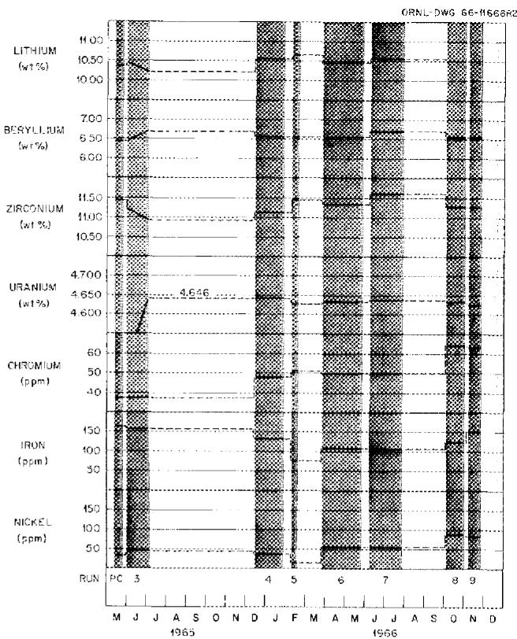  
Fig. 4.1. Summary of MSRE Fuel Salt Analyses.

able scatter in these analyses, there seems to be no indication of corrosion of the Hastelloy N by the salt.

The fuel mixture in the MSRE contained (see preceding section) considerably less $\mathbf{U}\mathbf{F}_{3}$ than the quantity intended; $1.5\%$ of the added uranium was to be as $\mathbf{U}^{3+}$ . Furthermore, the fission process should prove oxidizing to $\mathbf{U}\mathbf{F}_{3}$ in the melt7 (or to chromium in the Hastelloy N). The extent to which the fission process should prove oxidizing depends on several variables including (1) the extent to which Kr and Xe are swept from the reactor, (2) the redox potential of the fuel-metal system, and (3) the extent to which evolution of "unstable" species (such as $\mathbf{MoF}_{6}$ or $\mathbf{RuF}_{5}$ ) occurs through nonequilibrium behavior. It seems very likely, however, that fission of about $0.3\mathrm{kg}$ of uranium (perhaps aided by a small amount of inadvertent oxidation within the MSRE) can have used up most of the $\mathbf{U}\mathbf{F}_{3}$ added. An attempt to determine $\mathbf{U}\mathbf{F}_{3}$ concentration in the MSRE after about 11,000 Mwhr of operation (by $\mathbf{H}_{2}$ -HF equilibrium, a method similar to that employed in the preceding section) showed less than $0.10\%$ of the uranium to be in the trivalent state.8

Accordingly, the lack of corrosion in the MSRE seems to be somewhat surprising. It can be rationalized by the assumption (1) that the Hastelloy N has been depleted in Cr (and Fe) at the surface so that Mo and Ni only are under attack, with Cr (and Fe) reacting only at the slow rate at which it is furnished to the surface by diffusion, or (2) that the noble-metal fission products (see section on Fission Products on Metal and Graphite from MSRE Core) are forming an adherent and protective plate on the reactor metal.

Though neither of the analyses nor the reactor behavior suggests appreciable corrosion, plans are under way, and techniques are being studied, for reducing about $1\%$ of the MSRE $\mathrm{UF}_{4}$ to $\mathrm{UF}_{3}$ within the reactor. Such a reduction (which would surely take the MSRE fuel to near its intended $\mathrm{UF}_{3}$ concentration) should remove all apprehension about possible corrosion and should, we believe, alleviate some of the problems of volatile fission product fluorides (see subsequent sections).

Routine determinations of oxide (by study of salt- $\mathbf{H}_2\mathbf{O}$ -HF equilibria) continue to show low values (about 50 ppm) for $\mathrm{O}^{2 - }$ . There is no reason to believe that contamination of the fuel has been significant in operations to the present.

MSRE maintenance operations have necessitated flushing the interior of the drained reactor circuit on four occasions. The salt used for this operation consisted originally of an $^7\mathrm{LiF - BeF}_2$ (66.0-34.0 mole %) mixture. Analysis of this salt before and after each use shows that 215 ppm of uranium is added to the flush salt in each flushing operation, corresponding to the removal of 22.7 kg of fuel-salt residue (about 0.5% of the charge) from the reactor circuit.

The MSRE coolant salt has circulated within the reactor for approximately 6400 hr. Current analysis of this salt indicates no corrosion or leakage in the coolant salt circuit. On one occasion, coolant salt was inadvertently partially

frozen in the radiator. No damage was sustained by the radiator either as the salt froze or thawed. It is believed that the remarkably low volume change which the coolant salt undergoes in freeze-thaw cycles (less than $5\%$ ) is a consequence of the large free space found in the $\mathrm{Li}_2\mathrm{BeF}_4$ crystal structure.[9]

# FISSION PRODUCTS IN MSRE FUEL

# S. S. Kirslis F. F. Blankenship

It has been possible to analyze samples of the MSRE fuel for the 12 fission product isotopes shown in Table 4.2 and for $^{239}\mathrm{Np}$ and the $2.44 \times 10^4$ year $^{239}\mathrm{Pu}$ produced in the reactor fuel.

Table 4.2. Fission Products in MSRE Fuel Samples During Full Power Operation   

<table><tr><td colspan="2">Sample No.</td><td>FP6-19</td><td>FP7-7</td><td>FP7-12</td></tr><tr><td colspan="2">Sample date</td><td>5-26</td><td>6-27</td><td>7-13</td></tr><tr><td colspan="2">Accumulated Mwhr</td><td>2800</td><td>5100</td><td>7200</td></tr><tr><td colspan="2">Operating time, daysa</td><td>2.5</td><td>13.3</td><td>11.9</td></tr><tr><td>Isotope</td><td>Half-Life</td><td>Fission Yield (%)</td><td colspan="2">Disintegrations per Minute per Gramb</td></tr><tr><td></td><td></td><td></td><td>(x 1011)</td><td>(x 1011)</td></tr><tr><td>91Sr</td><td>9.67 hr</td><td>5.81</td><td>1.20</td><td>1.16</td></tr><tr><td>92Sr</td><td>2.6 hr</td><td>5.3</td><td>1.19</td><td>0.97</td></tr><tr><td>89Sr</td><td>51 days</td><td>4.79</td><td>0.223</td><td>0.296</td></tr><tr><td>141Ce</td><td>33 days</td><td>6.0</td><td></td><td>0.61</td></tr><tr><td>143Ce</td><td>33 hr</td><td>5.7</td><td>1.45</td><td>1.5</td></tr><tr><td>99Mo</td><td>66 hr</td><td>6.06</td><td>3.51</td><td>0.951</td></tr><tr><td>103Ru</td><td>39.7 days</td><td>3.0</td><td>0.070</td><td>0.024</td></tr><tr><td>105Ru</td><td>4.45 hr</td><td>0.9</td><td></td><td>0.35</td></tr><tr><td>132Te</td><td>77 hr</td><td>4.7</td><td>0.421</td><td>0.515</td></tr><tr><td>131I</td><td>8.05 days</td><td>3.1</td><td>0.42</td><td>0.50</td></tr><tr><td>133I</td><td>20.8 hr</td><td>6.9</td><td>1.31</td><td>1.35</td></tr><tr><td>135I</td><td>6.7 hr</td><td>6.1</td><td>1.50</td><td>1.17</td></tr><tr><td>239Np</td><td>2.33 days</td><td></td><td></td><td>5.35</td></tr></table>

aContinuous operating time since shutdown of more than 12 hr or since appreciable change in power.   
${}^{b}$ Calculated as of sampling time.

Typical results obtained for these materials are shown in the table.

The strontium and cerium isotopes are of special interest as fission monitors since they have convenient half-lives and stable, nonvolatile fluorides which would be expected to remain almost completely in the circulating fuel. The concentration of these monitors, however, is in only fair agreement with calculations based on power level of the reactor from heat balance; fission power based on $^{91}\mathrm{Sr}$ is $75\%$ of nominal power, while that based on $^{143}\mathrm{Ce}$ shows $88\%$ of normal reactor power.

Molybdenum and ruthenium are typical of a class of metals expected to deposit, at least in part, as elements. These analyses of the salt show that these materials are present in less than the expected concentration; if calculations of total yield are based on $^{91}\mathrm{Sr}$ , about $60\%$ of the $^{99}\mathrm{Mo}$ and about $30\%$ of the $^{103}\mathrm{Ru}$ are accounted for in the salt. It is not possible to decide whether these isotopes are present as colloidal particles or are soluble chemical species.

Isotopes of tellurium and iodine are of interest as xenon precursors and as elements which might show appreciable volatility from the melt. Only about $30\%$ of the ${}^{132}\mathrm{Te}$ appears in the salt, but the expected quantities (90 to $100\%$ ) of the iodine isotopes were found in the salt samples.

Analyses of the MSRE fuel samples do not, therefore, seem surprising except for the low concentration of $^{132}\mathrm{Te}$ . Examination of graphite and metal samples and, especially, of specimens from the vapor phase as described in subsequent sections do show several surprises.

# FISSIONPRODUCTSINMSREEXITGAS

# Equilibrium Pressures of Noble-Metal Fluorides Under MSRE Conditions

C. F. Baes, Jr.

As the following sections of this document describe in brief, volatile species of Mo, Te, Ru, and (probably) Nb have been found in the helium cover gas of the MSRE. In addition, sizable fractions of these elements appear (presumably as metal) on the metallic surfaces of the reactor. Their unexpected behavior prompted a review of the thermodynamic data on the volatile fluorides of these elements and an assessment of their

equilibrium pressures under some hypothetical MSRE conditions.

The formation free energies for $\mathsf{NbF}_5$ , $\mathsf{MoF}_6$ , and $\mathsf{UF}_6$ may be calculated with relatively good accuracy because of recent measurements at Argonne of the heats of formation of these compounds by fluorine bomb calorimetry. $^{10-13}$ The entropies and heat capacity data also are available. $^{13}$ While the people at Argonne have measured $\mathsf{RuF}_5$ , $^{14}$ no entropy or heat capacity data seem to be available:

<table><tr><td></td><td>\( \Delta H_{298}^{f} \)</td><td>\( \Delta S_{298}^{f} \)</td><td>Reference</td></tr><tr><td>MoF6(g)</td><td>-372.35 ± 0.22</td><td>-72.13</td><td>11</td></tr><tr><td>UF6(g)</td><td>-510.77 ± 0.45</td><td>-67.01</td><td>12</td></tr><tr><td>NbF5(s)</td><td>-433.5 ± 0.15</td><td>-91.56</td><td>10</td></tr><tr><td>RuF5(s)</td><td>-213.41 ± 0.35</td><td></td><td>14</td></tr></table>

From these values and the available heat capacity data the following expressions for $\Delta G^{\mathrm{f}}$ were derived. In the case of $\mathbf{R}\mathbf{u}\mathbf{F}_{5}$ , Glassner's earlier estimate was corrected to be consistent with the above $\Delta H^{\mathrm{f}}$ measurement:

$$
\begin{array}{l} \Delta G ^ {f} \left(\mathrm {N b F} _ {5}, g\right) = - 4 1 6. 7 0 + 5 4. 4 0 (T / 1 0 0 0), \\ \Lambda G ^ {f} \left(\mathrm {R u F} _ {5}, g\right) = - 2 0 0 + 2 5 (T / 1 0 0 0), \\ \Delta G ^ {f} \left(\mathrm {M o F} _ {6}, g\right) = - 3 7 0. 9 9 + 6 9. 7 (T / 1 0 0 0), \\ \Lambda G ^ {f} \left(\mathrm {U F} _ {6}, g\right) = - 5 0 9. 9 4 + 6 5. 1 5 (T / 1 0 0 0). \\ \end{array}
$$

The following values of $\Delta G^f$ have been reported previously for $\mathrm{UF}_3$ and $\mathrm{UF}_4$ in 2LiF-BeF $_2$ :16

$$
\begin{array}{l} \Lambda \bar {G} ^ {f} (\mathrm {U F} _ {3}, d) = - 3 3 6. 7 3 + 4 0. 5 4 (T / 1 0 0 0), \\ \Delta \bar {G} ^ {f} \left(\mathrm {U F} _ {4}, d\right) = - 4 4 4. 6 1 + 5 8. 1 3 (T / 1 0 0 0). \\ \end{array}
$$

From these free-energy values the following equilibrium constants have been calculated for the

formation of the volatile fluorides by reaction with $\mathbf{U}\mathbf{F}_{4}(d)$ in the MSRE from the equation

$$
\log K = a + b \left(1 0 ^ {3} / T\right):
$$

Tellurium hexafluoride has not been included in this listing, but this compound seems certain to be less stable than any shown here. No data

<table><tr><td>Reaction</td></tr><tr><td>Nb(s) + 5UF4(d) ⇌ NbF5(g) + 5UF3(d)</td></tr></table>

$$
\mathrm {R u} (s) + 5 \mathrm {U F} _ {4} (d) \rightleftharpoons \mathrm {R u F} _ {5} (g) + 5 \mathrm {U F} _ {3} (d)
$$

$$
\mathrm {M o} (s) + 6 \mathrm {U F} _ {4} (d) \rightleftharpoons \mathrm {M o F} _ {6} (g) + 6 \mathrm {U F} _ {3} (d)
$$

$$
3 \mathrm {U F} _ {4} (d) \rightleftharpoons \mathrm {U F} _ {6} (\varepsilon) + 2 \mathrm {U F} _ {3} (d)
$$

<table><tr><td>K</td><td>a</td><td>b</td></tr><tr><td>PNbF5X5UF3/X5UF4</td><td>7.33</td><td>-26.82</td></tr><tr><td>PRuF5X5UF3/X5UF4</td><td>13.76</td><td>-74.17</td></tr><tr><td>PMoF6X6UF3/X6UF4</td><td>7.83</td><td>-60.38</td></tr><tr><td>PUF6X2UF3/X3UF4</td><td>6.15</td><td>-32.88</td></tr></table>

In Fig. 4.2, calculated equilibrium partial pressures of the gases are plotted vs the $\mathrm{UF}_3 / \mathrm{UF}_4$ ratio in the melt. As the oxidizing power of the melt is increased, $\mathrm{NbF}_5$ is expected to appear first, followed by $\mathrm{MoF}_6$ , and then $\mathrm{RuF}_5$ . Uranium hexafluoride has a lower dependence on oxidizing power because its reduction product is $\mathrm{UF}_4$ rather than the metal. It was assumed in the case of $\mathrm{NbF}_5$ , $\mathrm{MoF}_6$ , and $\mathrm{RuF}_5$ that the reduction product was the metal. The $\mathrm{UF}_6$ should not be formed in significant amounts until the melt is oxidizing enough to produce $\mathrm{RuF}_5$ . If any stable intermediate fluorides of Nb, Mo, and Ru are formed in the melt, the result would be correspondingly lowered equilibrium gas pressures and lowered power dependences on the $\mathrm{UF}_4 / \mathrm{UF}_3$ ratio.

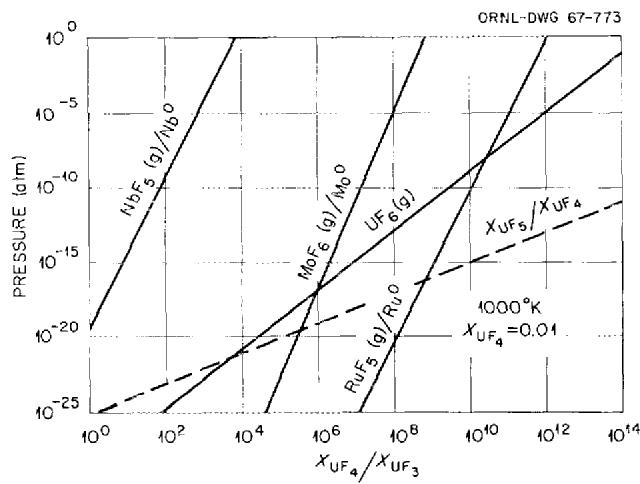  
Fig. 4.2. Equilibrium Pressures of Volatile Fluorides as Function of $UF_4 / UF_3$ Ratio in MSRE Fuel.

which would permit inclusion of the fluorides of technetium seem to be available.

# Analysis for Fission Products in MSRE Exit Gas

# S. S. Kirslis F. F. Blankenship

The only gas-liquid interface in the MSRE (except for the contact between liquid and the gas-filled pores of the moderator graphite) exists in the pump bowl. There a salt flow of about 60 gpm (5% of the total system flow) contacts a helium cover gas which flows through the bowl at 4 liters/min. Provisions for direct sampling of this exit gas are planned but have not yet been installed in the MSRE.

Samples of the liquid fuel are obtained by lowering a sampler, on a stainless steel cable, through this cover gas and into the liquid. It has been possible, accordingly, to detect chemically active fission product species in this cover gas by radiochemical analysis of the stainless steel cable and its accessories which contact only the gas phase and by analysis of special getter materials which are attached to the cable. Coils of silver wire and specimens of Hastelloy N have generally been used as getters for this purpose.

No quantitative measure of the isotopes present in the gas phase is possible, since no good estimate can be made of the gas volume sampled. The quantity of material deposited on the wire specimen does not correlate well with contact time (in the range 1 to $10\mathrm{min}$ ) or with the getter materials studied.

The quantity of material deposited, however, is relatively large. Table 4.3 indicates relative

Table 4.3. Qualitative Indication of Fission Product in MSRE Exit Gas   

<table><tr><td rowspan="2">Isotope</td><td colspan="4">Amounta</td></tr><tr><td>On Ni</td><td>On Ag</td><td>On Hastelloy</td><td>From Liquidb</td></tr><tr><td>99Mo</td><td>8</td><td>2</td><td>1</td><td>4</td></tr><tr><td>132Te</td><td>14</td><td>6</td><td>7</td><td>9</td></tr><tr><td>105Ru</td><td>10</td><td>3</td><td>3</td><td>5</td></tr><tr><td>106Ru</td><td>6</td><td>2</td><td>1</td><td>1</td></tr><tr><td>135I</td><td>0</td><td>0</td><td>0</td><td>0</td></tr><tr><td>133I</td><td>2</td><td>1</td><td>2</td><td>2</td></tr><tr><td>131I</td><td>1.5</td><td>0.9</td><td>0.5</td><td>0.8</td></tr></table>

The unit of quantity is that amount of the isotope in 1 g of salt.   
$b$ On stainless steel cable.

amounts found in typical tests. Volatile species of Mo, Te, and Ru must certainly be presumed to exist in the gas phase. The iodine isotopes show perceptibly different behavior. Iodine-135, whose tellurium precursor has a short half-life, does not appear, while $^{131}\mathrm{I}$ and $^{133}\mathrm{I}$ , both of which have tellurium precursors of appreciable half-life, are found. These findings - along with the fact that these iodine isotopes are present in the salt at near their expected concentration - suggest that any iodine in the vapor phase comes as a result of volatilization of the tellurium precursors.

Attempts to detect deposition of uranium (from evolution of $\mathrm{UF}_{6}$ ) on the wires have so far been unsuccessful. This fact - along with the failure to find many of the fission products which have no volatile compounds - rules out the possibility that salt spray is responsible for these observations.

It seems most unlikely that these data can be reconciled as equilibrium behavior of the volatile fluorides. It is possible that the MSRE metal is plated with a noble-metal alloy whose thickness is several hundred angstroms, and it is conceivable that the $\mathrm{UF}_4 / \mathrm{UF}_3$ ratio is near $10^4$ . The compound $\mathrm{NbF}_5$ (not tested for in the gas phase) could show an appreciable pressure under these circumstances. The other possibilities such as $\mathrm{MoF}_6$ , $\mathrm{TeF}_6$ , and $\mathrm{RuF}_5$ would require much higher

$\mathrm{UF}_4 / \mathrm{UF}_3$ ratios, and it seems most unlikely that any single redox potential can yield the relative abundance observed for these isotopes.

The following speculation may be relevant: As the fission products, which originate in highly electron-deficient states, thermalize and acquire electrons in the melt, they pass through these "unstable" but volatile valence conditions. If the plated reactor metal is sufficiently unreactive and if (as it seems to be at present) the MSRE fuel is quite deficient in $\mathrm{UF}_3$ , it is conceivable that some fraction of these materials might appear in the gas phase and enter the MSRE graphite or leave the system in the exit gas. If this is true, then a considerable increase in $\mathrm{UF}_3$ concentration in MSRE fuel might well markedly decrease the fraction in the vapor phase. It is clear that additional study will be required before the situation becomes clear.

# FISSION PRODUCTS ON METAL AND GRAPHITE FROM MSRE CORE

S. S. Kirslis

F. F. Blankenship

An assembly of MSRE graphite and Hastelloy N specimens was exposed on the central stringer within the MSRE core during its initial operation. This assembly was removed during the July 17 shutdown after 7800 Mwhr of reactor operation, and many specimens have been carefully examined.

No evidence of alteration of the graphite was found under examination by visual, x-radiographic, and metallographic examination. Autoradiographs showed that penetration of radioactive materials into the graphite was not uniform and disclosed a thin (perhaps 1- to 2-mil) layer of highly radioactive materials on or near the exposed graphite surfaces. Examination of the metal specimen showed no evidence of corrosion or other danger.

Rectangular bars of graphite from the top (outlet), middle, and bottom (inlet) region of this central stringer were milled in the hot cell to remove six successive layers from each surface. The removed layers were then analyzed for several fission product isotopes. $^{17}$

The results of analysis of the outer layer from the graphite specimen are shown in Table 4.4.

Table 4.4. Fission Product Deposition on Surface ${}^{a}$ of MSRE Graphite   

<table><tr><td rowspan="3">Isotope</td><td colspan="6">Graphite Location</td></tr><tr><td colspan="2">Top</td><td colspan="2">Middle</td><td colspan="2">Bottom</td></tr><tr><td>dpm/cm2</td><td>Percent of Totalb</td><td>dpm/cm2</td><td>Percent of Totalb</td><td>dpm/cm2</td><td>Percent of Totalb</td></tr><tr><td></td><td>(x·109)</td><td></td><td>(x·109)</td><td></td><td>(x·109)</td><td></td></tr><tr><td>99Mo</td><td>39.7</td><td>13.4</td><td>51.4</td><td>17.2</td><td>34.2</td><td>11.5</td></tr><tr><td>132Te</td><td>32.2</td><td>13.8</td><td>32.6</td><td>13.6</td><td>27.8</td><td>12.0</td></tr><tr><td>103Ru</td><td>8.3</td><td>11.4</td><td>7.5</td><td>10.3</td><td>4.8</td><td>6.3</td></tr><tr><td>95Nb</td><td>4.6</td><td>12</td><td>22.8</td><td>59.2</td><td>24.0</td><td>62.4</td></tr><tr><td>131I</td><td>0.21</td><td>0.16</td><td>0.42</td><td>0.33</td><td>0.33</td><td>0.25</td></tr><tr><td>95Zr</td><td>0.38</td><td>0.33</td><td>0.31</td><td>0.27</td><td>0.17</td><td>0.15</td></tr><tr><td>144Ce</td><td>0.016</td><td>0.052</td><td>0.083</td><td>0.27</td><td>0.044</td><td>0.14</td></tr><tr><td>89Sr</td><td>3.52</td><td>3.24</td><td>3.58</td><td>3.30</td><td>2.99</td><td>2.74</td></tr><tr><td>140Ba</td><td>3.56</td><td>1.38</td><td>4.76</td><td>1.85</td><td>2.93</td><td>1.14</td></tr><tr><td>141Ce</td><td>0.32</td><td>0.19</td><td>1.03</td><td>0.63</td><td>0.58</td><td>0.36</td></tr><tr><td>137Cs</td><td>6.6×10-4</td><td>0.07</td><td>2.3×10-3</td><td>0.25</td><td>2.0×10-3</td><td>0.212</td></tr></table>

${}^{a}$ Average of values in 7- to 10-mil cuts from each of three exposed graphite faces.   
bPercent of total in reactor deposited on graphite if each $\mathbf{cm}^2$ of the $2\times 10^{6}\mathrm{cm}^{2}$ of moderator had the same concentration as the specimen.

It is clear that, with the assumption of uniform deposition on or in all the moderator graphite, appreciable fractions of Mo, Te, and Ru and a large fraction of the Nb are associated with the graphite. No analyses for Tc have been obtained. The concentrations of these noble metals would be sufficient to exert significant poisoning in a breeder reactor.

The behavior of $^{140}\mathrm{Ba}$ , $^{89}\mathrm{Sr}$ , $^{141}\mathrm{Ce}$ , $^{144}\mathrm{Ce}$ , and $^{137}\mathrm{Cs}$ , all of which have xenon or krypton precursors, can be accounted for in terms of laws of diffusion and half-lives of the precursors. Figure 4.3 shows the change in concentration of the fission product isotope with depth in the graphite. Those isotopes (such as $^{140}\mathrm{Ba}$ ) which penetrated the graphite as noble gases show straight lines on the logarithmic plot; they seem to have remained at the point where the noble gas decayed. As expected, the gradient for $^{140}\mathrm{Ba}$ with a 16-sec $^{140}\mathrm{Xe}$ precursor is much steeper than that for $^{89}\mathrm{Sr}$ , which has a 3.2-min $^{89}\mathrm{Kr}$ precursor. All the others shown

show a much steeper concentration dependence. Generally the concentration drops a factor of 100 from the top 6 to 10 mils to the second layer.

It is possible that carbide formation is responsible for the deposition of Nb and possibly for that of Mo, but it seems quite unlikely for Ru and Te; the iodine probably got in as its tellurium precursor. Since these materials have been shown to appear in the exit gas as volatile species, it seems likely that they entered the graphite by the same mechanism. The possibility that the strongly oxidizing fluorides such as $\mathrm{MoF}_6$ were present raised the question as to whether $\mathrm{UF}_6$ was accumulating in the graphite. An average of $0.23\mu \mathrm{g} / \mathrm{cm}^2$ was found in the surface of the graphite; much less was present in interior samples. This amount of uranium, equivalent to less than $1\mathrm{g}$ in the core, was considered to be negligible.

Table 4.5 shows the extent to which various fission product isotopes are deposited on the

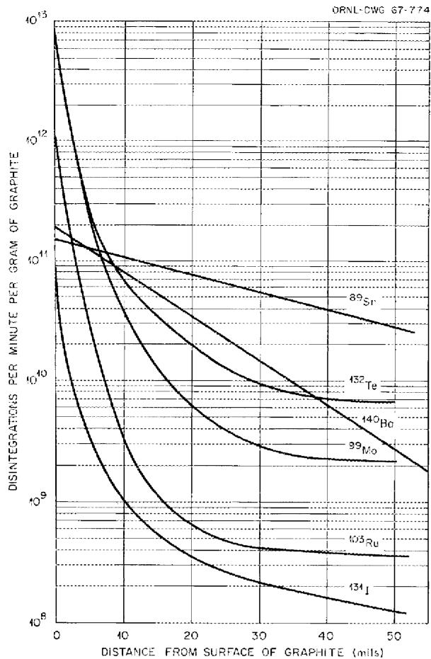  
Fig. 4.3. Concentration Profile of Fission Products in MSRE Core Graphite After 8000 Mwhr.

Hastelloy N specimens in the core. A large fraction of the molybdenum and tellurium and a substantial fraction of the ruthenium seem to be so deposited. It seems possible that the ${}^{131}\mathbf{I}$ was carried into the specimen as its tellurium precursor. The values for ${}^{95}\mathrm{Zr}$ seem surprisingly high, since those for the ${}^{141}\mathrm{Ce}$ and ${}^{144}\mathrm{Ce}$ with noble-gas precursors probably reflect the amount expected by direct recoil at the moment of fission.

If the Nb and Tc are assumed to behave like the Mo, Te, and Ru, it may be noted that the MSRE could have been uniformly plated during its operation with several hundred angstroms of relatively noble metals.

# XENON DIFFUSION AND FORMATION OF CESIUM CARBIDE IN AN MSBR

C. F. Baes, Jr.

R. B. Evans III

Compared to the MSRE, a full-scale molten-salt breeder reactor is expected to have approximately 50-fold greater neutron flux and 25-fold greater flow velocity through the core. Calculations have been made in order to consider the extent of

18 C. F. Baes, Jr., and R. B. Evans III, MSR Program Semiann. Progr. Rept. Aug. 31, 1966, ORNL-4037, pp. 158-65.

Table 4.5. Deposition of Fission Products on Hastelloy N in MSRE Core   

<table><tr><td rowspan="3">Isotope</td><td colspan="6">Hastelloy Location</td></tr><tr><td colspan="2">Top</td><td colspan="2">Middle</td><td colspan="2">Bottom</td></tr><tr><td>dpm/cm2</td><td>Percent of Totala</td><td>dpm/cm2</td><td>Percent of Totala</td><td>dpm/cm2</td><td>Percent of Totala</td></tr><tr><td rowspan="2">99Mo</td><td>(x109)</td><td></td><td>(x109)</td><td></td><td>(x109)</td><td></td></tr><tr><td>212</td><td>42.8</td><td>276</td><td>55.6</td><td>204</td><td>41.2</td></tr><tr><td>132Te</td><td>508</td><td>131</td><td>341</td><td>88</td><td>427</td><td>110</td></tr><tr><td>103Ru</td><td>35.5</td><td>29.3</td><td>25.5</td><td>21</td><td>23.2</td><td>19.1</td></tr><tr><td>131I</td><td>8.2</td><td>3.8</td><td>4.0</td><td>1.8</td><td>5.2</td><td>2.4</td></tr><tr><td>95Zr</td><td>1.8</td><td>1.0</td><td>1.8</td><td>1.0</td><td>2.6</td><td>1.3</td></tr><tr><td>141Ce</td><td>0.05</td><td>0.02</td><td>0.22</td><td>0.07</td><td>0.15</td><td>0.06</td></tr><tr><td>144Ce</td><td>0.01</td><td>0.02</td><td>0.09</td><td>0.18</td><td>0.35</td><td>0.07</td></tr></table>

aPercent of total present in reactor which would deposit on the $1.2 \times 10^{6} \, \text{cm}^{2}$ of Hastelloy N if deposition on all surfaces was the same as on the specimen.

xenon diffusion and the behavior of daughter cesium born in the moderator graphite of an MSBR operating under such conditions. A one-dimensional steady-state diffusion model was assumed in which the moderator was represented as a slab of graphite infinite in two dimensions, with a thickness of 1 cm, immersed in the fuel salt. It was further assumed that all cesium born in the graphite was in the elemental (gaseous) form. The parameters varied were: (1) the diffusion coefficients $D$ of xenon and cesium in the graphite (assumed to be equal), (2) the film coefficient $H$ associated with the salt-graphite interface, and (3) the rate at which gas is stripped from the fuel, $\lambda_{ST}$ .

Over the range chosen for these parameters, the rate step in the diffusion of xenon into the graphite was found to be at the salt-graphite interface and was dependent on the value of $H$ (Fig. 4.4). As a consequence, a decrease in $D$ did not materially decrease the inward diffusion of xenon; however, it did decrease the rate at which gaseous cesium diffused to the graphite surface, where it was assumed to react instantaneously with the fuel salt:

$$
\mathrm {C s} ^ {0} + \mathrm {U} ^ {4 +} \rightleftharpoons \mathrm {U} ^ {3 +} + \mathrm {C s} ^ {+}.
$$

Thus, somewhat paradoxically, the maximum partial pressure of $\mathbf{C}\mathbf{s}^0$ (at the center of the slab) was found to increase as $D$ was decreased.

Under all combinations of $H, D,$ and $\lambda_{ST}$ values chosen, the calculated cesium partial pressure at steady state was high enough to cause the formation of lamellar cesium carbides (Fig. 4.4):

$$
\mathrm {C s} ^ {0} (\dot {g}) + n \mathrm {C} (s) \rightleftharpoons \mathrm {C s C} _ {n} (s).
$$

However, the calculated accumulation rate of Cs was so low that the amounts of $\mathrm{CsC}_n$ which could be formed did not appear to be significant.

Finally, these calculations indicate that in the absence of iodine removal (i.e., 6.7-hr $^{135}\mathrm{I}$ ), Xe poisoning in a full-scale MSBR will be controlled primarily by the film coefficient $H$ (Fig. 4.4) and will be difficult to reduce to an acceptable value by gas stripping alone. It could be reduced more effectively either by iodine removal or by some means which effectively reduces the film coefficient.

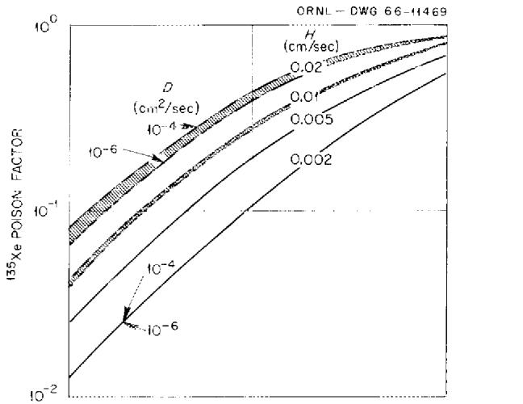

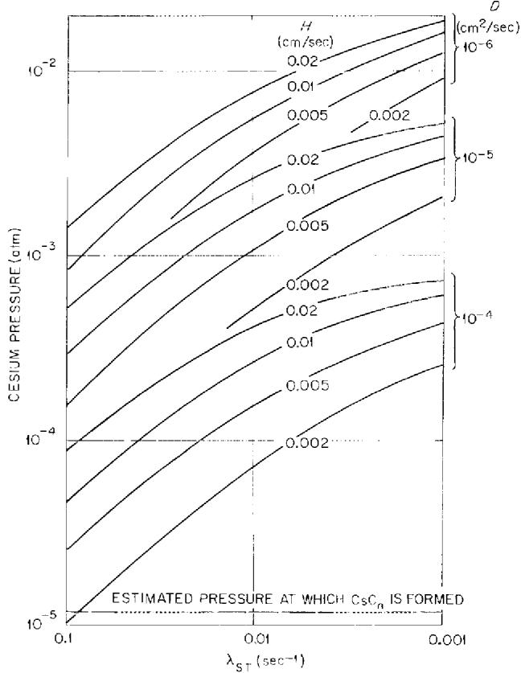  
Fig. 4.4. Calculated Steady-State Pressures of Cesium at Center of a $1\text{-cm}$ Graphite Slab and $^{135}\mathrm{Xe}$ Poisoning as a function of the Gas Stripping Rate $(\lambda_{\mathrm{ST}})$ , the Diffusion Coefficient $(D)$ , and the Film Coefficient $(H)$ . The $^{135}\mathrm{Xe}$ poisoning is represented as the fraction of the maximum possible value (a poison fraction of 0.05). The flux is $7\times 10^{14}$ neutrons $\mathrm{cm}^{-2}$ sec $^{-1}$ and the graphite porosity is 0.05.

# Part II

# Aqueous Reactors

# 5. Corrosion and Chemical Behavior in Reactor Environments

# NASA TUNGSTEN REACTOR RADIATION CHEMISTRY STUDIES

G.H.Jenks H.C.Savage E.G.Bohlmann

' Poison control solutions of $\mathrm{CdSO_4}$ are being considered by NASA Lewis Research Center for possible use in the NASA Tungsten Water-Moderated Reactor (TWMR). Information regarding the effects of irradiation on the stability of these solutions toward loss of Cd was needed in evaluations of this poison control system.1,2

We have conducted experimental investigations of the stability of $\mathrm{CdSO_4}$ solution under electron irradiation using the following experimental conditions:

Solution composition, 0.02 and $0.067\text{M}$ $\mathrm{CdSO_4}$ in water Temperature, 60 to $120^{\circ}\mathrm{C}$

Radiation intensity, 73 and 145 w per cm³ of solution Container, Zircaloy-2 with titanium filter

Agitation, static solution Surface-area-to-volume ratio, $61~\mathrm{cm}^2/\mathrm{cm}^3$

The container was in the form of a loop of 26- mil-ID tubing with the titanium filter $(3\mu)$ at one end. The solution was exposed within the tubing for a period of time and then expelled through the filter; the expelled solution was analyzed for Cd.

Small amounts of Cd were lost from the solution during 30-min irradiations at each tested combination of the above set of conditions. With $0.02M$ $\mathrm{CdSO}_4$ solutions, the loss at $120^{\circ}\mathrm{C}$ and $145\mathrm{w / cm}^3$ was $5.0\pm 3.4\%$ error at $80\%$ confidence. The loss at $77^{\circ}\mathrm{C}$ was $3.3\pm 2.8\%$ and that at $77^{\circ}\mathrm{C}$ and 73 $\mathrm{W / cm}^3$ was $2.0\pm 2.7\%$ . One experiment with 0.02 $M$ $\mathrm{CdSO}_4$ and $\mathrm{H}_{2}\mathrm{SO}_{4}$ , pH 2, indicated negligible loss.

With $0.06M\mathrm{CdSO}_4$ the loss at $60^{\circ}\mathrm{C}$ and 145 $\mathrm{W / cm}^3$ was $1.5\pm 1.0\%$ .At $120^{\circ}\mathrm{C},$ the best indication was about $4 \%$ loss. The results of experiments with 5- and 50-min irradiations of O.067 M $\mathrm{CdSO}_4$ at $60^{\circ}\mathrm{C}$ and $145~\mathrm{W / cm}^3$ indicated that the amount of Cd lost was greatest at the longer time.

Experimental information on recovery of the separated Cd after irradiation indicated that the rates of redissolution are slow.

Considerations of these results and of theory suggest that Cd metal is formed under irradiation and that this separates as relatively insoluble material by agglomeration or by plating on solid surfaces. Additional experimental investigation of effects of agitation and of surface-area-to-volume ratios would be required to predict the effects of radiation on stability in a reactor in which these parameters differ from those in our experiments.

Design and development work was done on a system which could be used to study effects of electron irradiation on stability in a dynamic system. The planned dynamic experiment was to be conducted with a small, high-speed (35,000 rpm) centrifugal pump with which solution was to be circulated through a 26-mil-ID tube forming

a loop in front of the cover plate of the pump. The entire solution inventory was to be irradiated continuously. The purpose of the tube was to provide a channel in which film conditions could be made comparable to those in the TWMR. The results of component tests showed that the proposed design was feasible. Detailed design drawings of the equipment were reported.5

Work on this program was discontinued prior to construction of the dynamic system because of a lack of funds.

# CORROSION OF ZIRCALOY-2 BY DILUTE HYDROGEN PEROXIDE AT $280^{\circ}C$

R.J.Davis T.H.Mauney

R.J.Hart

Heavy-particle bombardment accelerates the corrosion of Zircaloy-2 in oxygenated aqueous media $^{6-8}$ but probably does not accelerate corrosion in hydrogenated aqueous media. $^{8}$ Ionizing radiations (beta or gamma) do not accelerate Zircaloy-2 corrosion in aqueous media. $^{9,10}$

The above observations, along with interpretation11 of recent corrosion data12 and recent calculations of the concentration of radiolytically formed species in aqueous solutions,13 led to the following hypothesis. Hydrogen peroxide is responsible for the acceleration of corrosion by heavy-particle irradiation. Beta-gamma irradiation produces peroxide concentrations too low for notable corrosion acceleration. Heavy-particle bombardment also results in low peroxide concen

trations in aqueous solutions with excess hydrogen, but relatively high concentrations are formed with excess oxygen. A peroxide concentration of $10^{-5}M$ was estimated for a fast-neutron (energy above 1 MeV) flux of $10^{13}$ neutrons $\mathrm{cm}^{-2}$ sec $^{-1}$ .

An experiment14 was run in which Zircaloy-2 specimens were exposed to $10^{-5}M\mathrm{H}_2\mathrm{O}_2$ at $280^{\circ}\mathrm{C}$ for 297 hr. The peroxide concentration was maintained by a continuous feed of $10^{-2}M$ peroxide. Control specimens were exposed to oxygenated water in the same experimental setup.

The specimens and controls all gained weight at average rates of 7 to $8\mu \mathrm{gcm}^{-2}$ day-1.There was no significant effect due to peroxide. This rate of increase in weight is about a factor of 10 less than that known to occur as a result of a fast-neutron flux of $10^{13}$ neutrons $\mathbf{cm}^{-2}$ sec-1 on a system of Zircaloy-2 in oxygenated water at $280^{\circ}\mathrm{C}$

It follows that the acceleration of corrosion of Zircaloy-2 in oxygenated aqueous media by heavy-particle bombardment is not due, solely at least, to the hydrogen peroxide generated in the aqueous environment.

# ANODIC FILM GROWTH ON ZIRCONIUM AT ELEVATED TEMPERATURES

A. L. Bacarella H. S. Gadiyar15

A. L. Sutton

In our previous report16 we postulated that the current $(i)$ for anodic film growth on zirconium in oxygenated, dilute $\mathrm{H}_2\mathrm{SO}_4$ at temperatures from 174 to $284^{\circ}\mathrm{C}$ is an exponential function of the field strength, $V_{2} / X$ , across the oxide film. This relation is given by

$$
i = i _ {0} \exp \frac {(q \partial) ^ {*} V _ {2}}{k T X}, \tag {1}
$$

where $i$ is the anodic current (amp), $i_0$ is the current at zero field strength (amp), $(qa)^*$ is the product of the charge of the mobile ion (e) and the

activation distance (cm), $V_{2}$ is the potential difference across the oxide layer (v), $X$ is the film thickness (cm), and $kT$ is the thermal energy equivalent (ev). Calculation of the magnitude of the "activation dipole," $(q\alpha)^*$ , showed that the activation distance (a) increased from 13.5 A at $25^{\circ}\mathrm{C}$ to 37 A at $284^{\circ}\mathrm{C}$ . These large values were explained according to a model which considers dielectric polarization of the oxide and predicts that the effective field causing ion migration is greater than the average applied field. Using the Mossotti-Lorentz field, the apparent activation dipole is

$$
(q \partial) ^ {*} = \frac {(\epsilon + 2)}{3} (q \partial),
$$

where $\varepsilon$ is the dielectric constant of the oxide (dimensionless) and $(qa)$ is the "true" activation dipole.

We showed further that at large film thickness (small field strength), current flow of mobile charge carriers against the field becomes significant and that the net film growth current may be expressed by a hyperbolic sine function of the field strength:

$$
\begin{array}{l} i = i _ {0} \left[ \exp \frac {(q a) ^ {*} V _ {2}}{k T X} - \exp \frac {- (q a ^ {*}) V _ {2}}{k T X} \right] \\ = 2 i _ {0} \sinh \frac {\rightarrow (q a) ^ {*} V _ {2}}{k T X}. \tag {2} \\ \end{array}
$$

More recent measurements in dilute $\mathrm{K}_2\mathrm{SO}_4$ solution, particularly measurements of the Tafel slope at constant film thickness, $(\partial \log i / \partial V_2)_x$ , showed the need for two additional modifications to the model. In $\mathrm{K}_2\mathrm{SO}_4$ solution, it was found that the deviations from expected behavior at large film thickness were greater than could be accounted for by the current flow of mobile charge carriers against the field. Also, measurements of polarization curves and Tafel slopes at constant film thickness were not in satisfactory agreement with Eq. (2). Differentiation of Eq. (2) shows

that the Tafel slope is given by Eq. (3), where $B = (qa)^{*} / kT$ :

$$
\left(\frac {\partial \log i}{\partial V _ {2}}\right) _ {X} = \frac {B}{2 . 3 X} + \frac {2 B \left(i _ {0} / i\right)}{2 . 3 X} \exp \left(- \frac {B V _ {2}}{X}\right). \tag {3}
$$

The experimental results from Eqs. (2) and (3) were found to be greatly improved if a constant 150 A were added to all film thicknesses $(X)$ . Furthermore, with the use of this correction, deviations observed at very small film thicknesses $^{16,17}$ were also accounted for.

Use of an additional constant in Eqs. (2) and (3) can be justified by a more general derivation of the relation for anodic film growth. Equation (2) was derived on the assumption that the fraction of the total potential difference, from metal to solution, which affects ion transport is that portion which exists across the oxide film. The potential differences at the metal-oxide and oxide-solution interfaces were considered to be constant and independent of $i$ . In a more general treatment, we take into account the possibility that charge transport across each interface may also affect the potential distribution. We have therefore extended the formalism of the so-called dual-barrier model $^{20-23}$ to a triple-barrier problem and derived the rate expression of Eq. (4):

$$
\begin{array}{l} i = k _ {1} ^ {2 a / (X + 6 a)} k _ {2} k _ {2} ^ {- 6 a / (X + 6 a)} k _ {3} ^ {4 a / (X + 6 a)} \\ \times \exp \left[ \left(\frac {2 a}{X + 6 a}\right) \frac {V}{k T} \right]. \tag {4} \\ \end{array}
$$

In Eq. (4), $V = V_{1} + V_{2} + V_{3}$ is the total potential difference between metal and solution phases; it equals the sum of $V_{1}$ (potential difference between metal and oxide phases), $V_{2}$ (potential difference across oxide layer), and $V_{3}$ (potential difference between oxide and solution phases). The parameters $k_{1}, k_{2}$ , and $k_{3}$ are the corresponding rate constants of the charge transfer processes at each barrier. The fractional exponents are obtained from the assumptions that the electrochemical transfer coefficient at the metal-oxide barrier

is given by $q\alpha_{1} = (2)(0.5) = 1$ , while that for the oxide barrier is $q\alpha_{2} = 2a / X$ and that for the oxide-solution barrier is $q\alpha_{3} = 0.5$ . Differentiation of Eq. (4) shows that the Tafel slope is given by Eq. (5):

$$
\left(\frac {\partial \log i}{\partial V}\right) _ {X} = \frac {B}{2 . 3 (X + 6 a)}, \tag {5}
$$

where $B = 2a / kT$ . Equations (4) and (5) were found to be very satisfactory in accounting for the data in both $\mathrm{H}_2\mathrm{SO}_4$ and $\mathrm{K}_2\mathrm{SO}_4$ media, where to a first approximation the activation distance $a = 2(\epsilon + 2) / 3$ .

In a great majority of the experiments performed, the potential of the zirconium electrode was maintained constant at $\pm 0.0\mathrm{v}$ vs a Pt reference electrode. This potential is about $+1.0\mathrm{v}$ more noble than the open-circuit corrosion potential, $E_0$ (cf. Fig. 5.1). The Tafel slopes were determined over a range of about 0.3 to 0.4 v from this potential. Over this potential range the Tafel slopes,

$(\partial \log i / \partial V)_{X}$ were apparently linear, and Eqs. (4) and (5) described the data satisfactorily. Results of a much more extensive anodic polarization measurement (covering a 9-v range) are presented in Fig. 5.1. We find that the Tafel slope is not constant but decreases somewhat with increasing $V$

The foregoing observation may be rationalized on the basis of Diguam's $^{18-24}$ theory, which postulates a field-dependent transfer coefficient in the oxide phase. Incorporation of this theory in our triple-barrier model leads to Eq. (6), expressed in logarithmic form:

$$
\begin{array}{l} \ln i = \frac {2 a [ 1 - (2 a V _ {2} / c \phi X) ]}{X + 6 a [ 1 - (2 a V _ {2} / c \phi X) ]} \left[ 1 n \left(\frac {k _ {1} k _ {3} ^ {2}}{k _ {2} ^ {3}}\right) + \frac {V}{k T} \right] \\ + \ln k _ {2}. \tag {6} \\ \end{array}
$$

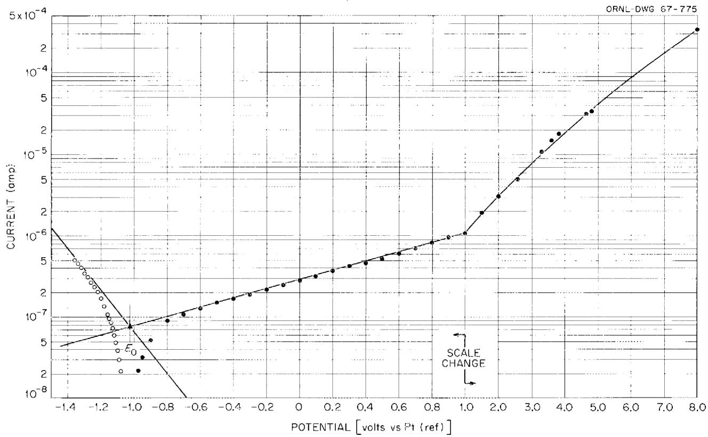  
Fig. 5.1. Polarization Curve for Zirconium in Oxygenated $0.05 \, \text{m} \, \text{K}_2\text{SO}_4$ Solution at $203^{\circ}\text{C}$ and Constant Film Thickness 700 A.

In Eq. (6) the potential $V_{2}$ (the potential difference across the oxide layer) appears implicitly in the rate expression, and $\phi$ is the activation energy of the anodic reaction. The parameter $c$ is not an independent constant in Dignam's theory; it is a function of the quantity $2aV_{2} / \phi X$ . Values of $c$ may be computed on the assumption that the interaction potential between the mobile ion and its immediate surroundings can be represented by a Morse function for small displacements. The validity of Eq. (6), which was applied to data shown in Fig. 5.1, is indicated by the results shown in Fig. 5.2. Here the activation energy $\phi = 1.35\mathrm{ev}$ was determined by us in previous experiments, and $V_{2} = 2.3\mathrm{v}$ was assumed to be a good first approximation. We find that a value of $a = 26.5\mathrm{A}$ may be estimated from plots of $\log i$ vs $1 / (X + 6a)$ for large $X$ . This value of the activation distance seems to be quite reasonable. We conclude that this model is capable of describing the anodic film growth process in zirconium over a wide range of electrode potentials and film thicknesses with satisfactory accuracy by use of reasonable values of physical parameters.

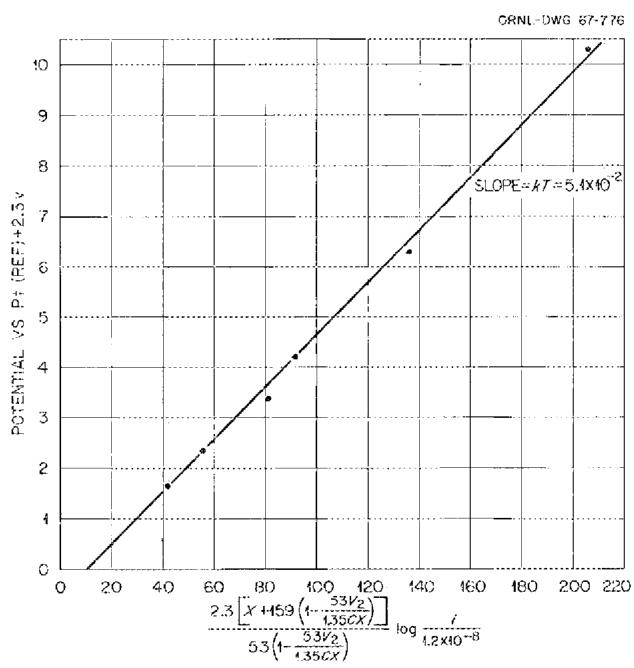  
Fig. 5.2. Polarization Data of Fig. 5.1 Plotted According to Eq. (6).

# AC IMPEDANCE OF OXIDE FILMS IN AQUEOUS SOLUTIONS AT ELEVATED TEMPERATURES

G. H. Jenks

R. J. Davis

A. L. Bacarella

H. S. Gadiyar15

We are in the process of developing equipment, methods, and techniques which will permit us to measure the ac impedance of corrosion films on zirconium and its alloys in aqueous solutions at elevated temperatures. The immediate objective of these measurements is to determine whether pores or fissures which admit aqueous solutions occur in these films during corrosion at temperatures up to about $300^{\circ}\mathrm{C}$ . If these determinations can be made satisfactorily, we will then attempt to conduct similar experiments in-pile. It is expected that valuable information on the electrical properties of the high-temperature corrosion films will be obtained also during the course of the measurements.

In the method employed, the specimen is immersed in an electrolyte which, together with the metal container, comprises one electrode for impedance measurements of the oxide film on the specimen. The metal of the specimen is the second electrode. Measurements are made of the capacitance and resistance of the oxide over a range of frequencies and at two or more electrolyte concentrations. The results are examined for behavior expected to result from penetration of the electrolyte into fissures within the oxide.

The principles upon which this method of pore detection is based were discussed by Young.25 Wanklyn and co-workers26,27 have used ac impedance measurements at room temperature in studies of the protective and electrical properties of oxide films formed on zirconium alloys during high-temperature corrosion.

Our measurements to date have covered a temperature range of 25 to $200^{\circ}\mathrm{C}$ and have been made on a single zirconium specimen bearing a 1500-A film formed anodically (0.0 v vs Pt at $55^{\circ}\mathrm{C}$ ) in oxygenated $0.05\ \mathrm{mH}_{2}\mathrm{SO}_{4}$ at 220 to $230^{\circ}\mathrm{C}$ in the Ti electrochemical cell.[28] The electrolyte for

one series (25, 50, 100, and $198^{\circ}\mathrm{C}$ ) of impedance measurements was oxygenated $0.05 \, \text{m} \, \text{H}_2\text{SO}_4$ . For a subsequent series (25, 50, 100, and $150^{\circ}\mathrm{C}$ ), the electrolyte was oxygenated $0.05 \, \text{m} \, \text{K}_2\text{SO}_4$ .

The impedance cell was made up of a small Zircaloy-2 autoclave containing an insulated gold cup $\frac{1}{4}$ in. in inside diameter $\times \frac{1}{2}$ in. long, which held the electrolyte. The 0.2-cm rod-shaped specimen was positioned along the axis of the cup and protruded into the gas-steam phase. The bottom end of the specimen was covered and sealed with Teflon, so that only the axial surfaces were in contact with the electrolyte. Electrical leads from the specimen, gold cup, and from a small platinum reference electrode which dipped into the electrolyte were passed through the gas-steam phase and out of the autoclave through a Teflon seal. In operation, gas $(\mathrm{O}_2\text{-He})$ pressurization was used to prevent gas-bubble formation within the electrolyte of the gold cup. This was accomplished by adjusting the pressure upward as the temperature was raised, so that the pressure of dissolved gas never exceeded the overpressure. A General Radio 1615-A bridge with three terminal connections was employed in impedance measurements.

The results of series capacitance measurements on the single specimen over a range of temperatures and frequencies are illustrated in Fig. 5.3. The slopes of these straight lines are listed in Table 5.1. The results of the corresponding series resistance measurements for the film fell near straight lines in plots of $R_{s}$ vs $1/f$ . These lines passed through the origin after correction for the electrolyte resistance. The slopes of the lines in these data plots are also listed in Table 5.1.

Tentative evaluations of these data with regard to overall consistency and with regard to evidence of penetration of electrolyte were based on the theoretical expressions for $R_{s}$ and $C_{s}$ discussed by Young,25

$$
\begin{array}{l} 1 / C _ {s} = \frac {4 7 9 \times 1 0 ^ {1 1} d}{\varepsilon A \log_ {1 0} [ \rho (d) / \rho (0) ]} \\ \times \left[ \log_ {1 0} f + \log_ {1 0} \frac {\epsilon \rho (d)}{1 8 \times 1 0 ^ {1 1}} \right], \tag {7} \\ \end{array}
$$

$$
R _ {s} = \frac {\pi 9 \times 1 0 ^ {1 1} d}{\epsilon A \log_ {e} [ \rho (d) / \rho (0) ]} \frac {1}{f}. \tag {8}
$$

Young derived these equations by employing a model in which the resistivity, $\rho$ , varies exponentially with distance through the oxide. The resistivities at the opposite surfaces of the oxide of thickness $d$ are $\rho(0)$ and $\rho(d)$ respectively; $\epsilon$ is the dielectric constant and $A$ is the area. These equations reproduced Young's experimental results for anodic films on Nb with respect to straight-line formation in plots of $1 / C_s$ vs log $f$ and of $R_s$ vs $1 / f$ and with respect to the relationship between the slopes of the $1 / C_s$ and $R_s$ plots.[25] The frequency dependencies of $C_s$ and $R_s$ observed by others for anodic and corrosion films on Zr have been ascribed to conductivity gradients through the oxide.[27]

Values of $\rho (d)$ and $\rho (0)$ determined from our capacitance data employing Eq. (7) are listed in Table 5.1. Plots of the $\rho (d)$ values are shown in Fig. 5.4. The ratios of the slopes of the $1 / C_{s}$ and

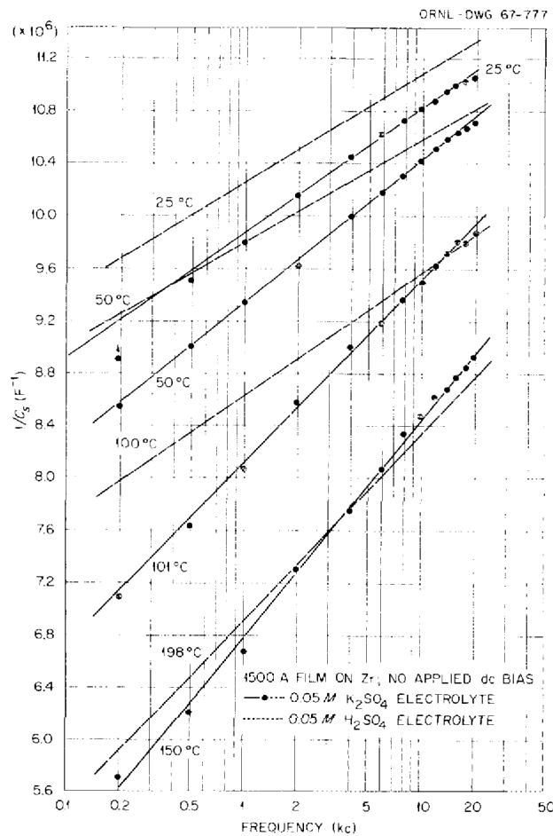  
Fig. 5.3. Variation of $1 / C_{s}$ with Frequency and Temperature.

Table 5.1. Electrical Properties of Zirconium Oxide Corrosion Film at Temperatures Up to ${198}^{ \circ  }\mathrm{C}$   

<table><tr><td rowspan="2">Temperature (°C)</td><td colspan="2">M1aA(cm2, f-1)</td><td colspan="2">M2bA(ohms, cm2, cycles)</td><td colspan="2">ρ(d)c(ohm-cm)</td><td colspan="2">ρ(0)c(ohm-cm)</td></tr><tr><td>H2SO4</td><td>K2SO4</td><td>H2SO4</td><td>K2SO4</td><td>H2SO4</td><td>K2SO4</td><td>H2SO4</td><td>K2SO4</td></tr><tr><td></td><td>×105</td><td>×105</td><td>×104</td><td>×104</td><td></td><td></td><td></td><td></td></tr><tr><td>25</td><td>4.3</td><td>4.9</td><td>5.02</td><td>5.94</td><td>2.3 × 1020</td><td>2.0 × 1018</td><td>3.7 × 105</td><td>3.1 × 106</td></tr><tr><td>50</td><td>4.1</td><td>5.7</td><td>4.98</td><td>6.42</td><td>2.2 × 1020</td><td>2.7 × 1016</td><td>4.5 × 105</td><td>2.7 × 106</td></tr><tr><td>100</td><td>5.1</td><td>7.3</td><td>5.78</td><td>7.52</td><td>5.2 × 1016</td><td>3.8 × 1013</td><td>6.5 × 105</td><td>2.7 × 106</td></tr><tr><td>150</td><td></td><td>8.7</td><td></td><td>9.15</td><td></td><td>6.1 × 1011</td><td></td><td>2.4 × 106</td></tr><tr><td>198</td><td>7.8</td><td></td><td>8.70</td><td></td><td>2.9 × 1012</td><td></td><td>2.9 × 106</td><td></td></tr></table>

${}^{a}$ Slope of line in plot of $1/{C}_{s}$ vs ${\log }_{10}f$ .   
bSlope of line in plot of total series resistance vs 1/f.   
Dielectric constant at $20\mathrm{kc}$ employed in calculations.

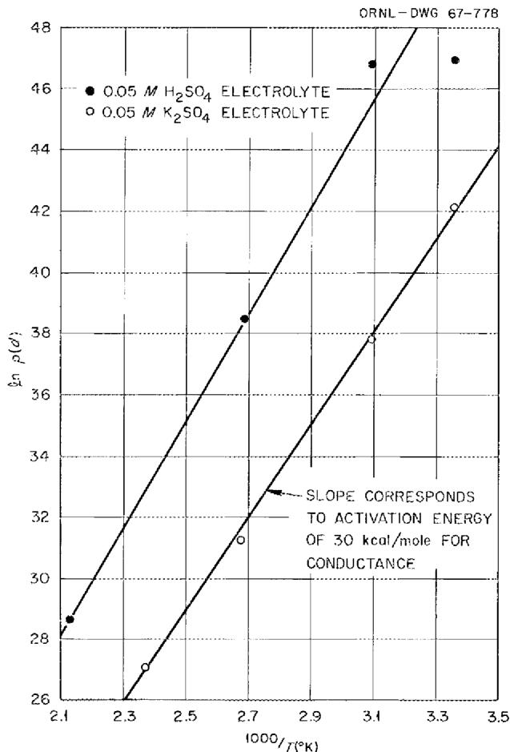  
Fig. 5.4. Variation with Temperature of Resistivity of Outer Surface of Zirconium Film.

$R_{s}$ plots varied between 8.3 and 9.7. A value of 9.2 is predicted by Eqs. (7) and (8).

Our tentative conclusions are that the observed frequency, temperature, and electrolyte dependence of the impedance components can be reasonably ascribed to resistivity gradients through the oxide and to changes, with temperature and with electrolyte, of the resistivity of the layers of oxide in contact with the electrolyte. There is no evidence for fissures which admit electrolyte into the oxide. Additional work is needed to confirm these conclusions and to permit more complete explanations of the impedance behavior.

We expect to continue these studies. Some modifications of the cell will probably be necessary to permit measurements with smaller specimen areas. Also, it may be necessary to modify the method of pressurization to permit better control of pressure on the electrolyte.

# CORROSION SUPPORT FOR REACTOR PROJECTS

J.C.Griess,Jr. J.L.English

P. D. Neumann

Experimental programs conducted for the purpose of selecting and estimating the corrosion damage to engineering materials in the High Flux Isotope Reactor (HFIR) and the Argonne Advanced Research

Reactor (AARR) were completed during the past year, and the results were presented in two reports.29,30 Summaries of the pertinent results are given below. Results concerning the corrosion of the aluminum-clad HFIR fuel elements have been reported previously31 and are not included here.

The HFIR, which is presently operating at the design power of 100 Mw, uses water adjusted to a pH of 5.0 with nitric acid as coolant; all tests were conducted in this environment at $100^{\circ}\mathrm{C}$ . Aluminum alloys (6061, 1100, and X-8001) corroded at rates of 0.2 mil/year or less at all flow rates up to 81 fps. Contacting aluminum with aluminum, beryllium, nickel, or stainless steel resulted in pitting of the aluminum in contact areas only. The pits were of appreciable depth, but they were randomly spread and should not be of major consequence in the HFIR system. At velocities of 13 to 81 fps, beryllium corroded at a constant rate of 2 mils/year and showed only a slight tendency to pit. Corrosion damage to the beryllium reflector in the HFIR should be negligibly small. Both nickel and electroless nickel deposits corroded excessively in the acidified water and are not usable in the HFIR. Electrolyzed coatings (a proprietary process for coating materials with chromium) on stainless steel exhibited excellent corrosion resistance and good adherence to stainless steel. Similar deposits flaked and peeled from aluminum surfaces. Hardened types 416 and 420 stainless steel were shown to be unsuitable; the former alloy blistered, and the latter underwent stress-corrosion cracking.

The results of this testing program and the experience gained during operation of other water

cooled production and research reactors were fully used in the design of the HFIR. Assuming adequate control of the water chemistry, the HFIR should be free of major corrosion problems.

The primary areas of concern in the AARR were the beryllium reflector, the 6061-T6 aluminum beam tubes, and the stainless steel fuel element cladding. All tests were conducted in deionized water at $93^{\circ}\mathrm{C}$ $(200^{\circ}\mathrm{F})$ . The results indicated that the corrosion rate of the beryllium reflector in the AARR will be between 1 and 3 mils/year with a minimum of localized attack.

The corrosion of 6061-T6 aluminum in water results in the formation of an insulating layer of corrosion products on the surface. Since heat generated in the beam tubes must be transferred across this insulating layer, the corrosion rate of aluminum must be minimized to prevent excessive temperatures in the beam-tube walls. The AARR beam-tube cooling system in its initial design would allow surface temperatures up to $260^{\circ}\mathrm{F}$ ; under these conditions excessive film formation would occur and would cause increases in temperature of as much as $66^{\circ}\mathrm{C}$ ( $150^{\circ}\mathrm{F}$ ) during 75 days of operation. Tests showed that the cooling system would have to be capable of keeping the temperature at the aluminum-water interface at $200^{\circ}\mathrm{F}$ or less if frequent replacement of beam tubes was to be avoided.

Type 304 stainless steel did not develop appreciable deposits on water-cooled surfaces when exposed under thermal conditions similar to and even more severe than those anticipated in the AARR fuel elements. However, after a 1000-hr exposure at a heat flux of $3.8 \times 10^{6}$ Btu hr $^{-1}$ ft $^{-2}$ , numerous shallow cracks were present on the cooled surface. In a comparable test in which the heat flux was $2 \times 10^{6}$ Btu hr $^{-1}$ ft $^{-2}$ (hot-spot heat flux for 100 Mw operation of the AARR) and the exposure time was 2000 hr, no cracks were found. The cause of the observed cracks was not determined, but it is possible that they were related to high thermal stresses existing in the specimen.

# 6. Chemistry of High-Temperature Aqueous Solutions

# ELECTRICAL CONDUCTANCES OF AQUEOUS ELECTROLYTESOLUTIONS FROM 0 TO $800^{\circ}C$ AND TO 4000 BARS

A. S. Quist W. Jennings, Jr. W. L. Marshall

There is relatively little information available on the properties of aqueous electrolyte solutions at supercritical temperatures and pressures. The simplest and most direct method for obtaining information about the existence and behavior of ions in these solutions is to measure their electrical conductances. By using this method, we have studied aqueous solutions of $\mathrm{K}_2\mathrm{SO}_4$ , $\mathrm{KHSO}_4$ , and $\mathrm{H}_2\mathrm{SO}_4$ to $800^{\circ}\mathrm{C}$ and to 4000 bars; from these measurements we have calculated first and second ionization constants of sulfuric acid. $^{1,2}$ After these studies, extensive conductance measurements were made on NaCl solutions (0.001 to $0.1\mathrm{m}$ ) in order to observe the behavior of a strong uni-univalent electrolyte under the same conditions. $^{3}$ The experimental data were evaluated with the usual theoretical equations that describe equivalent conductance as a function of concentration. By using a digital computer to fit the data to the equations by nonlinear least-squares methods, limiting equivalent conductances were calculated at integral temperatures (0 to $800^{\circ}\mathrm{C}$ ) and densities (0.4 to $1.0\mathrm{g/cm}^{3}$ ). These values are shown graphically in Fig. 6.1, where limiting equivalent

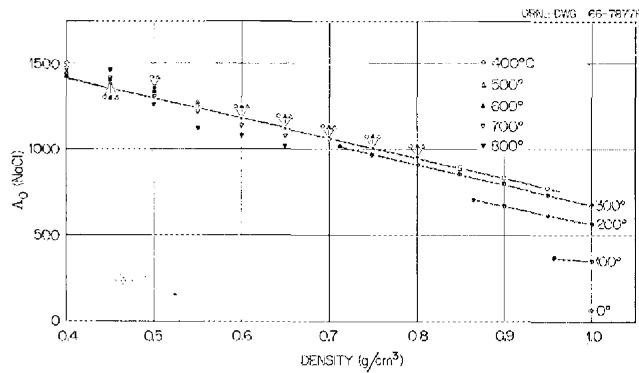  
Fig. 6.1. Limiting Equivalent Conductance of NaCl as a Function of Density at Temperatures to $800^{\circ}C$ .

conductances are plotted as a function of density. This graph indicates that the limiting equivalent conductance of NaCl is a linear function of solution density (at constant temperature). Figure 6.1 also reveals that at temperatures of $400^{\circ}\mathrm{C}$ and above, the limiting equivalent conductance of NaCl appears to be independent of temperature (at constant density). Although the values at $800^{\circ}\mathrm{C}$ are slightly below the 400 to $700^{\circ}\mathrm{C}$ values, this difference is mostly a consequence of increasing ion-pair formation at higher temperatures. As NaCl becomes a weaker electrolyte, the extrapolated limiting equivalent conductances become somewhat uncertain and tend to fall below their true values. These solutions showed this behavior at densities below $0.4\mathrm{g/cm}^3$ and at temperatures above $700^{\circ}\mathrm{C}$ . Dissociation constants for ion-pair formation in NaCl solutions were calculated from the Shedlovsky equation at densities from 0.3 to $0.75\mathrm{g/cm}^3$ and temperatures from 400 to $800^{\circ}\mathrm{C}$ .

Figure 6.2 shows the dependence of the logarithm of these dissociation constants on the logarithm of the density of the solution at the several temperatures.

An extensive series of measurements were made using 0.01 demal (0.01 mole per $1000\mathrm{g}$ of solution) KCl solutions. As was mentioned previously, a KCl solution of this concentration appears to be the logical choice as a reference for conductance measurements at elevated temperatures and pressures, since it is used as a standard solution for cell constant determinations at $25^{\circ}\mathrm{C}$ . Accordingly, many measurements have been made in this Laboratory over a period of several years on 0.01 demal KCl solutions. Some of the results are shown in Fig. 6.3, where the specific conductances are plotted as a function of temperature at a constant pressure of 4000 bars. This graph represents the results of 50 separate runs, using three conductance cells and seven different inner electrode assemblies.

A comprehensive investigation of the electrical conductances of alkali metal halide solutions and solutions of related compounds was initiated and is presently nearing completion. Measurements have been completed from 0 to $800^{\circ}\mathrm{C}$ and to 4000 bars on $0.01m$ solutions of the following electrolytes: NaCl, NaBr, NaI, KC1, KBr, KI, RbF, RbCl, RbBr, RbI, CsCl, CsBr, CsI, $\mathrm{NH}_4\mathrm{Br}$ , $(\mathrm{CH}_3)_4\mathrm{NBr}$ , HBr, and $\mathrm{NH}_4\mathrm{OH}$ . Some preliminary results are

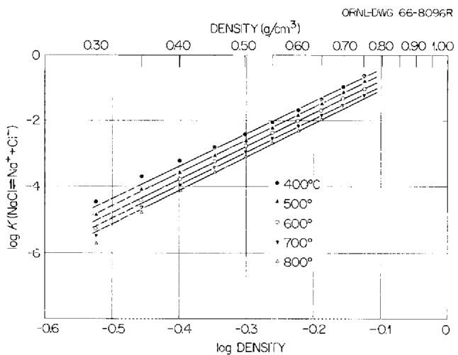  
Fig. 6.2. Log $K(\mathsf{NaCl} \rightleftharpoons \mathsf{Na}^{+} + \mathsf{Cl}^{-})$ as a Function of Log Density at Temperatures from 400 to $800^{\circ}\mathsf{C}$ . $K$ in molar units.

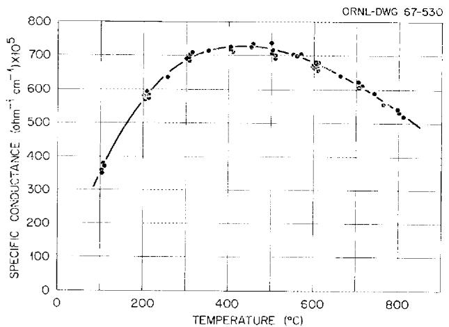  
Fig. 6.3. Specific Conductance of 0.01-demal KCl as a Function of Temperature. Pressure, 4000 bars.

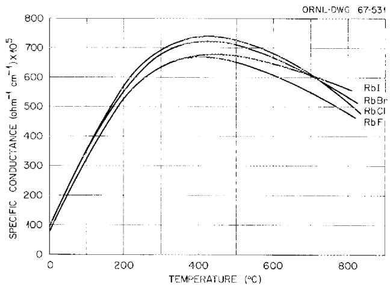  
Fig. 6.4. Comparison of the Specific Conductance of $0.01 \, \text{m}$ Solutions of RbF, RbCl, RbBr, and Rbl as a Function of Temperature. Pressure, 4000 bars.

shown in Fig. 6.4, where specific conductances of the rubidium halide solutions are plotted against temperature at a pressure of 4000 bars.

# DISSOCIATION CONSTANT OF MAGNESIUM SULFATE TO $200^{\circ}C$ FROM SOLUBILITY MEASUREMENTS

W. L. Marshall

There are relatively few experimentally determined values for dissociation constants at high

temperatures, as contrasted to the very large number at $25^{\circ}\mathrm{C}$ . In this Division, values above $100^{\circ}\mathrm{C}$ have been obtained from conductance and solubility measurements. Any contribution to the equilibrium behavior of electrolytes at high temperature, especially the behavior of 2-2 electrolytes, is of very much fundamental and applied interest. The equilibrium of considerable interest to the high-temperature behavior of seawater and other saline waters is the dissociation equilibrium of magnesium sulfate represented by

$$
\mathrm {M g S O} _ {4} ^ {0} \xleftarrow {Q _ {d}} \mathrm {M g} ^ {2 +} + \mathrm {S O} _ {4} ^ {2 -}, \tag {1}
$$

where $Q_{d}$ is the dissociation quotient at an ionic strength $l$ . From the increase in solubility of calcium sulfate (or its hydrates) in seawater concentrates compared to its behavior in aqueous sodium chloride solutions, and with the assumption that this increase is due predominantly to the formation of the magnesium sulfate complex, dissociation quotients could be calculated at many ionic strengths. The equilibrium of Eq. (1) and the following solubility product equilibrium,

$$
\mathrm {C a S O} _ {4} (s) \xrightarrow {\text {K} _ {\mathrm {s p}} >} \mathrm {C a} ^ {2 +} + \mathrm {S O} _ {4} ^ {2 -}, \tag {2}
$$

where $K_{\mathfrak{sp}}$ equals the solubility product at $I$ and includes any contribution from a neutral species, $\mathrm{CaSO}_4^0$ , were used to obtain the following equations:

$$
I ^ {\prime} = I \left(\text {f o r m a l}\right) \dots 4 \cdot \left[ \mathrm {M g S O} _ {4} ^ {0} \right], \tag {3}
$$

$$
\begin{array}{l} K _ {\mathrm {s p}} ^ {\prime} = \left[ \mathrm {C a} ^ {2 +} \right] \left[ \text {t o t a l} \quad \text {s u l f a t e} \right] \\ = \left[ \mathrm {C a} ^ {2 +} \right] \left[ \mathrm {S O} _ {4} ^ {2 -} + \mathrm {M g S O} _ {4} ^ {0} \right] \\ = K _ {\text {s p}} + \left\{\mathrm {C a} ^ {2 +} \right\} \left[ \mathrm {M g S O} _ {4} ^ {0} \right], \tag {4} \\ \end{array}
$$

$$
\left[ \mathrm {M g S O} _ {4} ^ {0} \right] = \left(K _ {\mathrm {s p}} ^ {\prime} - K _ {\mathrm {s p}}\right) / \left[ \mathrm {C a} ^ {2 +} \right], \tag {5}
$$

$$
Q _ {d} = \frac {\left[ \text {t o t a l m a g n e s i u m} - \mathrm {M g S O} _ {4} ^ {0} \right] \left[ \text {t o t a l s u l f a t e} - \mathrm {M g S O} _ {4} ^ {0} \right]}{\left[ \mathrm {M g S O} _ {4} ^ {0} \right]}. \tag {6}
$$

Values for $K_{\mathfrak{sp}}'$ , $[\mathrm{Ca}^{2+}]$ , total magnesium, and total sulfate were obtained from the experimental results

given elsewhere in this report. The values for $K_{\mathrm{sp}}$ as a function of ionic strength were calculated from the solubility behavior in sodium chloride solutions. By an iterative process, where $I'$ is initially assumed to equal $I$ (formal), Eqs. (3-6) were solved to obtain values of $Q_d$ and $I'$ at the many different ionic strengths. These values were extrapolated at each temperature by means of an extended Debye-Hückel equation,

$$
\log Q _ {d} = \log K _ {d} ^ {0} + 8 S \sqrt {\bar {I} ^ {\prime}} / (1 + \sqrt {\bar {I} ^ {\prime}}), \tag {7}
$$

where $S$ is the Debye-Hückel limiting slope for a 1-1 electrolyte, to obtain the dissociation constant $K_{d}^{0}$ (at $I = 0$ ).

Values of the constant to $200^{\circ}\mathrm{C}$ obtained by this method are plotted as the logarithm of $K_{d}^{0}$ vs $1 / T(^{\circ}\mathrm{K})$ in Fig. 6.5. Included in Fig. 6.5 are many published values for this constant obtained by several different methods at temperatures up to $40^{\circ}\mathrm{C}$ , the highest temperature of previously published work. The present results appear to be in good agreement and extend the values for the constant to $200^{\circ}\mathrm{C}$ .

By least-squares fitting the values of Nancollas, $^{11}$ Jones and Monk, $^{12}$ others at $0^{\circ}C$ , $^{13,14}$ and those to $200^{\circ}C$ from this present study to the van't Hoff isochore,

$$
\frac {d \ln K _ {d} ^ {0}}{d (1 / T)} = - \Delta H ^ {\circ} / R, \tag {8}
$$

with $\Delta H^{\circ}$ expressed as a function of $\Delta C_p^\circ$ (a constant) and $T(^{\circ}\mathrm{K})$ , thermodynamic quantities were calculated; the results are given in Table 6.1.

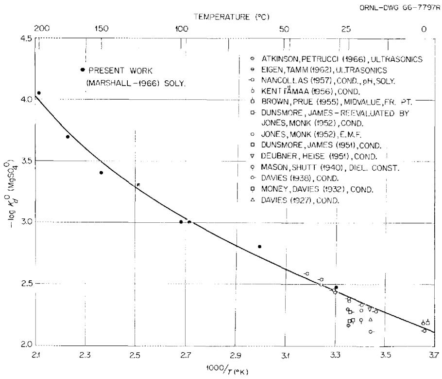  
Fig. 6.5. Dissociation Constant of Magnesium Sulfate from 0 to $200^{\circ}\mathrm{C}$ .

Table 6.1. Thermodynamic Quantities for the Dissociation of Magnesium Sulfate in Aqueous Solution, 0 to $200^{\circ}\mathrm{C}$ ; Average $\Delta C_p^0$ Found = 25 cal mole $^{-1}$ deg $^{-1}$   

<table><tr><td>T(℃)</td><td>--log Kd</td><td>ΔF° (kcal/mole)</td><td>ΔH° (kcal/mole)</td><td>ΔSo (cal mole-1 deg-1)</td></tr><tr><td>0</td><td>2.129</td><td>2.66</td><td>-4.08</td><td>-24.7</td></tr><tr><td>25</td><td>2.399</td><td>3.27</td><td>-4.01</td><td>-24.4</td></tr><tr><td>50</td><td>2.631</td><td>3.89</td><td>-4.22</td><td>-25.1</td></tr><tr><td>100</td><td>3.057</td><td>5.22</td><td>-5.41</td><td>-28.5</td></tr><tr><td>150</td><td>3.501</td><td>6.78</td><td>-7.67</td><td>-34.1</td></tr><tr><td>200</td><td>4.002</td><td>8.66</td><td>-11.0</td><td>-41.5</td></tr></table>

# DISSOCIATION CONSTANT OF CALCIUM SULFATE TO $350^{\circ}C$ OBTAINED FROM SOLUBILITY BEHAVIOR IN MIXED ELECTROLYTES

L.B.Yeatts W.L.Marshall

The dissociation quotients, $Q_{d'}$ for $\mathrm{CaSO}_4^0$ were determined from extensive solubility measurements of calcium sulfate (or the dihydrate at $25^\circ$ ) in an aqueous system of mixed electrolytes, varying from pure $\mathrm{NaNO}_3$ to pure $\mathrm{Na}_2\mathrm{SO}_4$ when possible. Measurements were made at several constant ionic strengths from 0.25 to 6 m at 25, 150, 250, and $350^\circ \mathrm{C}$ .

When solid calcium sulfate dissolves in aqueous solutions, it may be assumed that an equilibrium is reached with undissociated molecules:

$$
\mathrm {C a S O} _ {4} (s) \stackrel {\text {一}} {\rightleftharpoons} \mathrm {C a S O} _ {4} ^ {0} (a q), \tag {9}
$$

which at saturation can be expressed by

$$
Q _ {u} = \left[ \mathrm {C a S O} _ {4} ^ {0} \right] (\text {m o l a l u n i t s}). \tag {10}
$$

The neutral species can be considered also to undergo partial dissociation:

$$
\mathrm {C a S O} _ {4} ^ {0} (a q) \stackrel {\rightharpoonup} {=} \mathrm {C a} ^ {2 +} (a q) + \mathrm {S O} _ {4} ^ {2 -} (a q), \tag {11}
$$

in which case the equilibrium quotient expression is

$$
Q _ {d} = \left[ \mathrm {C a} ^ {2 +} \right] \left[ \mathrm {S O} _ {4} ^ {2 -} \right] / \left[ \mathrm {C a S O} _ {4} ^ {0} \right] (\text {m o l a l u n i t s}). \tag {12}
$$

The solubility product quotient in this study was then defined as

$$
Q _ {\mathrm {s p}} \approx [ \mathrm {C a} ^ {2 +} ] [ \mathrm {S O} _ {4} ^ {2 -} ] \approx Q _ {d} Q _ {u}. \tag {13}
$$

With these assumptions, the molal solubility of calcium sulfate, $s$ , at various ionic strengths and temperatures can be expressed by

$$
s = \left[ \mathrm {C a S O} _ {4} ^ {0} \right] + \left[ \mathrm {C a} ^ {2 +} \right]. \tag {14}
$$

Since

$$
\left[ \mathrm {C a} ^ {2 +} \right] = Q _ {\mathrm {s p}} / \left[ \mathrm {S O} _ {4} ^ {2 -} \right] \tag {15}
$$

and

$$
\begin{array}{l} \left[ \mathrm {S O} _ {4} ^ {2 -} \right] = \text {t o t a l s u l f a t e} - \left[ \mathrm {C a S O} _ {4} ^ {0} \right] \\ = \left[ \mathrm {S O} _ {4} \right] _ {(t)} - \left[ \mathrm {C a S O} _ {4} ^ {0} \right], \tag {16} \\ \end{array}
$$

then

$$
s = \left[ \mathrm {C a S O} _ {4} ^ {0} \right] + Q _ {\mathrm {s p}} / \left(\left[ \mathrm {S O} _ {4} \right] _ {(t)} - \left[ \mathrm {C a S O} _ {4} ^ {0} \right]\right). \tag {17}
$$

A plot of values of s vs $1 / ([\mathrm{SO}_4]_{(t)} - [\mathrm{CaSO}_4^0])$ with the assumption of constancy (or near constancy) of activity coefficients at constant ionic strength, should yield a straight line of slope $Q_{\mathrm{sp}}$ and intercept $[\mathrm{CaSO}_4^0]$ . The results obtained at $25^{\circ}\mathrm{C}$ at constant ionic strengths of 0.25, 0.5, 1, 2, and $6m$ , at $150^{\circ}\mathrm{C}$ at 0.25, 0.5, 1, and $6m$ , at $250^{\circ}\mathrm{C}$ at 0.25, 0.5, 1, and $6m$ , and at $350^{\circ}\mathrm{C}$ at 1 and $6m$ were treated by a method of least squares to yield values for $Q_{d'}$ , $Q_{\mathrm{sp}}$ , and $[\mathrm{CaSO}_4^0]$ for each set of measurements. As examples, data at $25^{\circ}\mathrm{C}$ , and a representative series at $I = 1$ from 150 to $350^{\circ}\mathrm{C}$ , so treated are shown in Figs. 6.6 and 6.7; the solubilities are observed to be a linear function of $1 / ([\mathrm{SO}_4]_{(t)} - [\mathrm{CaSO}_4^0])$ within the precision of the measurements.

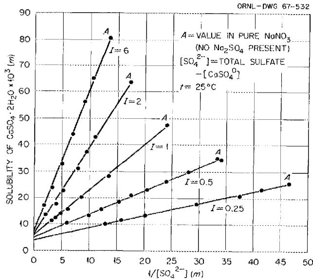  
Fig. 6.6. Solubility at $25^{\circ} \mathrm{C}$ of Calcium Sulfate Dihydrate in Sodium Sulfate-Sodium Nitrate Solutions at Several Ionic Strengths.

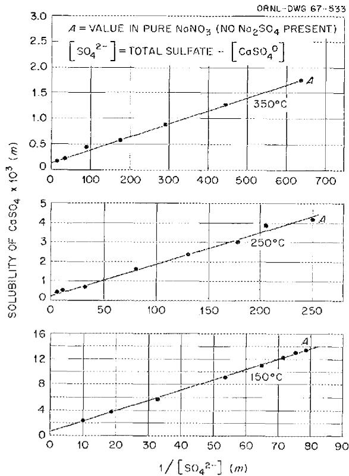  
Fig. 6.7. Solubility of Calcium Sulfate at High Temperatures in Sodium Sulfate-Sodium Nitrate Solutions at a Constant Ionic Strength of 1 (Representative also of Results at Other Ionic Strengths Stated in Text).

In order to determine whether the above linear relationships were an artifact of Harned's rule, values of the logarithm of the analytical solubility product, $m(\text{total calcium}) \cdot m(\text{total sulfate})$ , were plotted against the molality of added sulfate at constant ionic strength. Harned's rule would be expected to yield a linear relationship if the plot were made at constant molality (which for 1-1 electrolyte mixtures would be constant ionic strength). The plots were not linear nor were they linear by estimating the nature of the plots at constant molality.

The values of $Q_{d}$ , $Q_{\mathrm{sp}}$ , and $Q_{u}$ obtained at the several constant ionic strengths and temperatures were extrapolated to zero ionic strengths to yield dissociation constants for $\mathrm{CaSO}_4^0$ , values for solubility product constants, and $K_{u}^{0}$ . When the previously obtained $^{15}$ values of $K_{\mathrm{sp}}^{0}$ were corrected for neutral $\mathrm{CaSO}_4^0$ , there was relatively good agreement (within $\sim 10\%$ ) between the two sets of values. With the solubility behavior in the mixed electrolyte system, the mean activity coefficients of calcium sulfate were obtainable over essentially the entire four-component system by the relationship

$$
y _ {\pm \left(\mathrm {C a S O} _ {4}\right)} ^ {\prime} = \frac {K _ {\mathrm {s p}} ^ {0}}{\sqrt {m _ {\mathrm {c a l c i u m}} \cdot m _ {\mathrm {s u l f a t e}}}}, \tag {18}
$$

where the $m$ 's in this expression refer to the total molality of calcium and sulfate, respectively, and $K_{\mathrm{sp}}^0$ is defined as the thermodynamic solubility product constant defined by Eq. (13) at $I = 0$

Values for the constants of $\mathrm{CaSO}_4$ are tabulated in Table 6.2, from which thermodynamic quantities were calculated. No values for dissociation constants for $\mathrm{CaSO}_4^0$ have been published at temperatures higher than $40^{\circ}\mathrm{C}$ . Our own $pK_d^0$ value at $25^{\circ}\mathrm{C}$ of 2.00 compares with a literature value of 2.31. Characteristic of the behavior of several other 1-1, 1-2, and 2-2 electrolytes studied at elevated temperatures in our Laboratory, the dissociation constant of $\mathrm{CaSO}_4^0$ decreased mark

Table 6.2. The Negative Logarithms of the (^{2}True^{*}) Solubility Product Constant $(K_{\mathfrak{sp}}^0)$ , Dissociation Constant $(K_{d}^{0})$ , and $K_{u}^{0}$ (molality of CaSO4 at $I = 0$ ) of Calcium Sulfate, 25 to $350^{\circ}C$ (the Dihydrate at $25^{\circ}C$   

<table><tr><td>Temperature (℃)</td><td>pKsp0</td><td>pKd0</td><td>pKu0</td></tr><tr><td>25</td><td>4.70</td><td>2.0</td><td>2.68</td></tr><tr><td>150</td><td>6.0</td><td>2.7</td><td>3.55</td></tr><tr><td>250</td><td>8.05</td><td>4.46</td><td>4.68</td></tr><tr><td>350</td><td>11.0</td><td>8.8</td><td>7.0</td></tr></table>

edly with rising temperature, reflecting the predominating effect of the decreasing dielectric constant of water over that of increasing kinetic energy.

# SOLUBILITY OF $\mathsf{Fe}_3\mathsf{O}_4$ AT ELEVATED TEMPERATURE19

F.H.Sweeton R.W.Ray C.F.Baes, Jr.

This study of the solubility of $\mathrm{Fe}_{3}\mathrm{O}_{4}$ in HCl solutions is being carried out because $\mathrm{Fe}_{3}\mathrm{O}_{4}$ is a corrosion product of the steel-water systems used in pressurized-water reactors. Measurements previously reported have been extended in temperature and in HCl concentration.

The method used was essentially the same as before. An HCl solution in a reservoir of Pyrex glass was equilibrated at room temperature with $\mathrm{H}_{2}$ at a pressure of 1.0 atm. Then it was pumped

through a pressurized heated column of the specially prepared $\mathrm{Fe}_3\mathrm{O}_4$ . The equilibrated solution was cooled and then passed through a cation exchanger to strip out the dissolved iron. The iron was later eluted and analyzed spectrochemically by means of $o$ -phenanthroline.

After obtaining most of the data reported here, we modified the system for eventual use of alkaline solutions. A copper reservoir was substituted for the glass one, and provision was made for injecting an HCl solution into the stream of hot equilibrated solution to prevent precipitation of dissolved iron on cooling.

The data are shown in Fig. 6.8, where the logarithm of the iron concentration is plotted against the $\mathrm{Cl}^-$ concentration obtained from the electrolytic conductivity of the makeup solution. The lines on the graph have been calculated on the basis of iron being in solution as the two ions, $\mathrm{Fe}^{2+}$ and $\mathrm{FeOH}^+$ , formed in these equilibria:

$$
\begin{array}{l} \frac {1}{3} \mathrm {F e} _ {3} \mathrm {O} _ {4} (\mathrm {s}) + 2 \mathrm {H} ^ {+} + \frac {1}{3} \mathrm {H} _ {2} (\mathrm {g}) \\ = \mathrm {F e} ^ {2 +} + _ {3} ^ {4} \mathrm {H} _ {2} \mathrm {O} (I), \tag {19} \\ \end{array}
$$

$$
\begin{array}{l} \mathrm {^ 1 _ {3} F e} _ {3} \mathrm {O} _ {4} (s) + \mathrm {H} ^ {\dagger} + \mathrm {^ 1 _ {3} H} _ {2} (g) \\ = \mathrm {F e O H} ^ {+} + \frac {1}{3} \mathrm {H} _ {2} \mathrm {O} (I), \tag {20} \\ \end{array}
$$

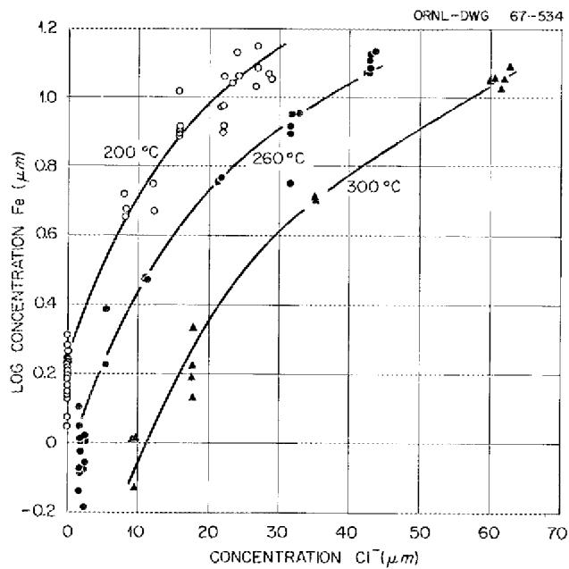  
Fig. 6.8. Measured Solubility of $\mathsf{Fe}_3\mathsf{O}_4$ in HCl Solutions Saturated at $25^{\circ}\mathsf{C}$ with 1 atm $\mathsf{H}_2$ .

with the corresponding solubility products:

$$
K _ {\mathrm {F e}} = \frac {[ \mathrm {F e} ^ {2 +} ]}{[ \mathrm {H} ^ {+} ] ^ {2} P _ {\mathrm {H} _ {2}} ^ {1 / 3}}, \quad m ^ {- 1} \mathrm {a t m} ^ {- 1 / 3},
$$

and

$$
K _ {\mathrm {F e O H}} = \frac {[ \mathrm {F e O H} ^ {+} ]}{[ \mathrm {H} ^ {+} ] P _ {\mathrm {H} _ {2}} ^ {1 / 3}}, \quad \mathrm {a t m} ^ {- 1 / 3}.
$$

Using trial values of these products at each temperature, the known $\mathrm{Cl}^-$ concentration for each point, and the known ionization constant of $\mathrm{H}_2\mathrm{O}$ , we calculated the $\mathrm{H}^+$ concentration that gave a charge neutrality for the ionic species at the experiment temperature. The logarithm of the corresponding concentration of iron was then compared with the experimental value. After treating all the data this way, a least-squares procedure was used to adjust the solubility products to values that minimized the differences between calculated and observed iron concentrations. These constants, which include the effective $\mathrm{H}_2$ pressure as calculated from the solubility data of Gilpatrick and Stone, are given below:

<table><tr><td>Temperature (°C)</td><td>KFe</td><td>KFeOH</td></tr><tr><td>200</td><td>1.79 (±0.10) × 106</td><td>&lt;0.2</td></tr><tr><td>260</td><td>0.0037 (±0.0045) × 106</td><td>0.53 (±0.05)</td></tr><tr><td>300</td><td>0.0109 (±0.0015) × 106</td><td>0.072 (±0.026)</td></tr></table>

These calculated solubility products indicate that the fraction of iron in the $\mathbf{Fe}^{2+}$ form was $100\%$ at $200^{\circ}$ , $15\%$ or less at $260^{\circ}$ , and 55 to $85\%$ at $300^{\circ}$ . The apparent change in the signs of the temperature coefficients of the solubility products over this temperature range is of interest, as this is in the same temperature range where the dissociation constant of water goes through a maximum.

In future work we will extend the $\mathbf{H}^{+}$ concentration range by using alkaline solutions, for which

the present system is adapted. Such data should increase the precision of the calculated solubility products and their temperature coefficients, and perhaps indicate the presence of other complexes of iron. We will also go to lower temperatures if we are able to achieve equilibrium at practical flow rates.

# HYDROLYSIS OF BERYLLIUM ION IN 1.0 M CHLORIDE AT $25^{\circ}C$

R. E. Mesmer

C. F. Baes, Jr.

The aqueous chemistry of $\mathrm{Be(II)}$ solutions is not yet satisfactorily defined. There have been a great number of studies on the hydrolysis of beryllium beginning with the work of Prytz $^{23}$ in 1929. Probably the most authoritative studies are those coming from Sillén's school in Stockholm since 1956. $^{24-27}$ These workers favor a scheme of three species to explain potentiometric data below $1M$ beryllium concentration in acidic perchlorate media, that is, $\mathrm{Be}_2(\mathrm{OH})^{3+}$ , $\mathrm{Be}_3(\mathrm{OH})_3^{3+}$ , and $\mathrm{Be}(\mathrm{OH})_2$ . Over the years a great many other schemes have been proposed which were not supported by the work of Sillén and his co-workers.

The neutral species $\mathrm{Be(OH)_2}$ is the least acceptable of those in the above scheme. The existence of such a species implies a lower limit for the solubility of beryllium hydroxide. This limit would be $10^{-4}M$ based upon hydrolysis equilibria $^{24}$ and the solubility product. $^{28}$ However, the work of Gilbert and Garrett $^{28}$ has indicated solubilities less than this and even as low as $10^{-7}M$ . A cursory examination of the data in ref. 24 indicates that comparable or better fits to the data are obtained with the scheme $\mathrm{Be}_3(\mathrm{OH})_2^{4+}$ , $\mathrm{Be}_3(\mathrm{OH})_3^{3+}$ , and $\mathrm{Be}_3(\mathrm{OH})_4^{2+}$ as well as other schemes containing $\mathrm{Be}_3(\mathrm{OH})_3^{3+}$ . The logarithm for the stability constant for the species $\mathrm{Be}_3(\mathrm{OH})_3^{3+}$ is $-8.94 \pm 0.01$ , compared with the value of $-8.66 \pm 0.01$ reported by Sillén $^{24}$ in 3 M perchlorate.

As part of a program to reinvestigate the hydrolysis behavior of beryllium ion, potentiometric mea

surements have been completed at $25^{\circ}\mathrm{C}$ in the $\mathsf{pH}$ region 2 to 7 and at beryllium concentrations between 0.001 and $0.05\textbf{m}$ using quinhydrone and calomel electrodes. The factors limiting the $\mathsf{pH}$ or hydroxide-to-metal concentration ratios which can be attained are the equilibration rate and the solubility. Generally, equilibrium ratios up to about 1.1 were achieved without precipitation within 1 hr.

Analysis of our data at $25^{\circ}$ indicates that no pair of species with up to five metal ions or hydroxide ions per species is sufficient to explain the data within experimental error. Least-squares calculations for 33 pairs led to this conclusion. The schemes involving three or more species have not yet been examined in detail. However, preliminary results indicate that a polynuclear species is more suitable than $\mathrm{Be(OH)}_2$ .

As Kakihana and Sillén24 have pointed out, the presence of the species $\mathrm{Be(OH)}_2$ leads to an intersection of all $\bar{n}$ vs pH curves at $\bar{n}$ of 1.0 and pH ca. 5.5. Clearly such an intersection is absent in the data shown in Fig. 6.9. This observation is consistent with data reported in 1965 by Bertin et al.,29 although these investigators also chose to interpret their data in terms of $\mathrm{Be(OH)}_2$ as suggested earlier by Sillén.

In order to better define the most representative hydrolysis scheme, similar studies are being conducted at higher temperatures.

23 M. Prytz, Z. Anorg. Allgem. Chem. 180, 355 (1929).   
24 H. Kakihana and L. G. Sillén, Acta Chem. Scand. 10, 985 (1956).   
25 B. Carell and A. Olin, Acta Chem. Scand. 15, 1875 (1961).   
26 B. Carell and A. Olin, Acta Chem. Scand. 16, 2357 (1962).   
27S. Hietanen and L. G. Sillén, Acta Chem. Scand. 18, 1015 (1964).   
28 R. A. Gilbert and A. B. Garrett, J. Am. Chem. Soc. 78, 5501 (1956).   
$^{29}$ F. Bertin, G. Thomas, and J. Merlin, Compt. Rend. 260, 1670 (1965).

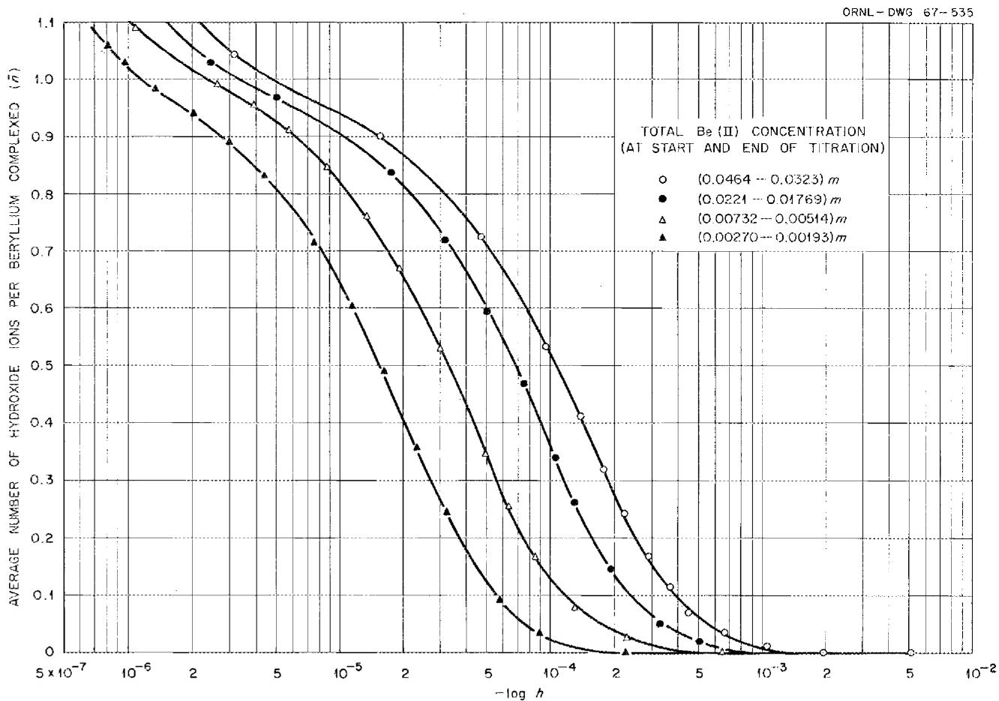  
Fig. 6.9. Average Number of Hydroxide Ions per Beryllium Complexed as a Function of $-\log h$ as Determined by Potentiometric Titration with NaOH.

# 7. Interaction of Water with Particulate Solids

# SURFACE CHEMISTRY OF THORIA

C. H. Secoy

# Heats of Immersion and Adsorption

E. L. Fuller, Jr. H. F. Holmes

S. A. Taylor

Heats of immersion of samples of thoria in water at $25.0^{\circ}\mathrm{C}$ have been measured for various pretreatments. The base material for this series was obtained by a $650^{\circ}\mathrm{C}$ calcination of thorium oxalate

(ORNL lot No. DT 102W) to produce thoria with a specific surface area of $35.5\mathrm{m}^2/\mathrm{g}$ . Portions of this material were calcined for $4\mathrm{hr}$ at higher temperatures to successively decrease the specific surface area. The specific surface areas $(\Sigma)$ and crystallite dimensions (from x-ray line-broadening data) are given as a function of calcining temperature in Fig. 7.1. This graph also shows the variations of the heats of immersion with respect to

$^{1}$ Professor of Chemistry, Centenary College, Shreveport, La.

ORNL-DWG67-536

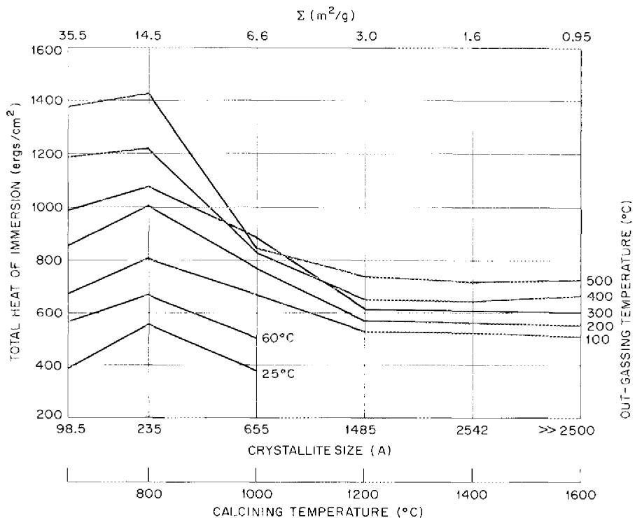  
Fig. 7.1. Heats of Immersion of Thoria in Water.

these parameters for outgassing temperatures ranging from 25 to $500^{\circ}\mathrm{C}$ . The samples were maintained at a pressure less than $10^{-5}$ torr for 24 hr at each temperature, prior to sealing under vacuum. Each point represents the mean of at least two experimental determinations. The calorimetric and associated techniques have been described previously.

As observed earlier, the materials from the lower-temperature calcination liberated a portion of the heat slowly after an initial instantaneous burst of heat. The slow heat effects for the 650 and $800^{\circ}\mathrm{C}$ calcined thoria are best characterized as two concurrent first-order processes: a slow heat effect with a half-life of ca. 4 min and a very slow heat with a half-life of ca. 40 min. The $1000^{\circ}\mathrm{C}$ calcined thoria exhibited only one slow process (half-life of ca. 12 min) in addition to the instantaneous process. The higher calcination temperatures (1200 to $1600^{\circ}\mathrm{C}$ ) produce materials which release all the immersional heat instantaneously, with no detectable slow processes present.

The heat of immersion at any given outgassing temperature shows an increase with increasing crystallite size (decreasing specific surface area) for the lowest-fired materials, followed by a decrease to an essentially constant value for the larger crystallites. The variation of the heats of immersion with respect to crystallite size is not well understood and has been the object of investigations with other oxides, as reviewed recently by Zettlemoyer. The invariance of the immersional heat per unit area for our larger crystallites suggests that these values may be truly representative of an "ideal" thoria surface, with some sort of perturbations present for the smaller crystallites. Such a conclusion must receive justification from other techniques that will allow construction of a creditable model. The inversion of the data for the $300^{\circ}\mathrm{C}$ -outgassed, $1000^{\circ}\mathrm{C}$ -calcined material is probably due to experimental error, with the heat of immersion being $850 \pm 20$ ergs/cm² for 300 to $500^{\circ}\mathrm{C}$ outgassing of this material.

In an attempt to see if the aforementioned behavior is the result of the oxalate preparation of

thoria, a similar series was checked for a thoria prepared by the steam denitration of thorium nitrate. The low-fired, high-surface-area materials also showed slow heat effects, with none present for the higher-fired materials.

# Adsorption of Water and Nitrogen on Porous and Nonporous Thoria

H. F. Holmes

E. L. Fuller, Jr.

Previous calorimetric $^{2,4}$ and gravimetric $^{5}$ investigations of the interaction of water with the surface of thoria have revealed the very complex nature of this process. Material used in the previous work consisted entirely of porous thoria derived from the oxalate. Two samples of comparable surface area were used in the present work. Sample C is a typical oxalate material, while sample S was prepared in an attempt to minimize the internal surface, that is, decrease the porosity. $^{6,7}$

The porous and nonporous character of samples C and S, respectively, are clearly revealed from the typical adsorption isotherms shown in Figs. 7.2 and 7.3. Inflections in the desorption branch for sample C at a relative pressure of about 0.35 indicate pore sizes ranging down to about 10 A in radius. The nonporous character of sample S is further confirmed by the fact that the x-ray crystallite size is compatible with the nitrogen surface area. However, both samples exhibited the low-pressure hysteresis and irreversible retention of water discussed previously. The quantities of irreversibly adsorbed water listed in Table 7.1 are much greater than would be required to form a single layer of surface hydroxyl groups. On the basis of the present results, it is concluded that the irreversible retention of water in such large quantities is not a unique property of porous material. The phenomenon has been described as an immobile association adsorption to give the surface analog of a hydrated bulk hydroxide.

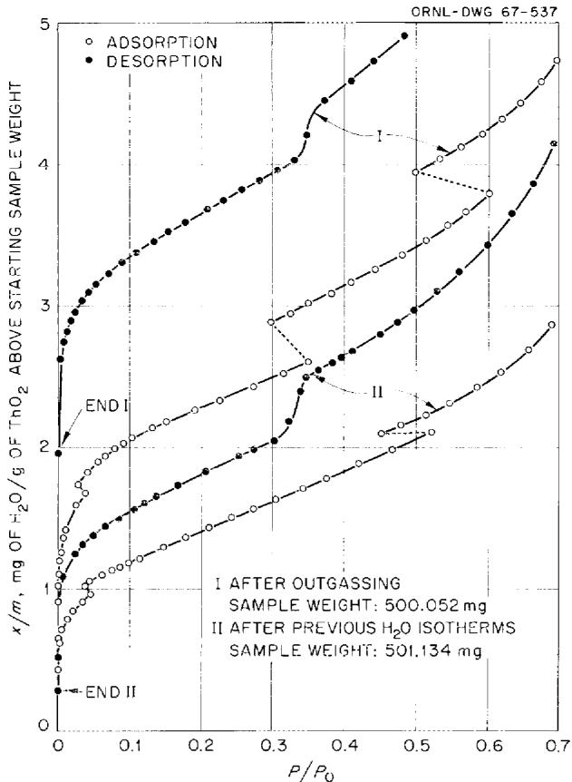  
Fig. 7.2. Adsorption of Water on Sample C at $25.00^{\circ}$

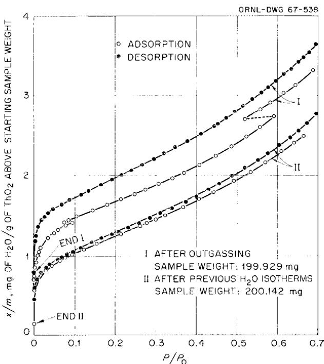  
Fig. 7.3. Adsorption of Water on Sample S at $25.00^{\circ}$

Table 7.1. Summary of Nitrogen Adsorption Measurements   

<table><tr><td>Sample</td><td>Sample Weighta (mg)</td><td>Micrograms of H2O per Square Meter of Surfaceb</td><td>N2Surface Areac (m2/g)</td><td>BET C Constant</td></tr><tr><td>C</td><td>499.810</td><td>4</td><td>5.52</td><td>1050</td></tr><tr><td>C</td><td>500.276</td><td>174</td><td>4.78</td><td>152</td></tr><tr><td>C</td><td>501.264</td><td>533</td><td>4.40</td><td>40</td></tr><tr><td>C</td><td>499.803</td><td>2</td><td>5.48</td><td>1270</td></tr><tr><td>S</td><td>199.815</td><td>56</td><td>5.96</td><td>490</td></tr><tr><td>S</td><td>200.012</td><td>222</td><td>5.46</td><td>85</td></tr><tr><td>S</td><td>200.108</td><td>302</td><td>5.50</td><td>82</td></tr><tr><td>S</td><td>200.170</td><td>354</td><td>5.25</td><td>72</td></tr><tr><td>S</td><td>200.338</td><td>496</td><td>5.29</td><td>53</td></tr><tr><td>S</td><td>199.813</td><td>55</td><td>5.96</td><td>390</td></tr></table>

${}^{a}$ Sample weight in vacuum at start of experiment.   
bChemisorbed H2O in excess of sample weight in vacuum at 500°C. Computed using N2 surface area measured after outgassing at 500°C.   
cAssumes that an adsorbed nitrogen molecule occupies 16.2 A².

Application of the BET theory to the water isotherms yields interesting information concerning the apparent surface areas. The data for sample C indicate that the effective surface area decreases with increasing amounts of irreversibly adsorbed water. Ultimately the effective surface area decreased to about $75\%$ of the area determined by nitrogen after outgassing at $500^{\circ}\mathrm{C}$ . This is not unexpected, since chemisorbed water should decrease the total pore volume. However, in the case of the nonporous sample S, the effective surface area decreased to about $40\%$ of the original nitrogen value. In opposition to this, the amount of water adsorbed at the higher relative pressures indicated an effective surface area roughly equal to the original nitrogen surface area. Surface areas were calculated from the water data on the assumption of a liquid-like monolayer, that is, each molecule occupies 10.6 A². Tentatively, the anomaly with sample S can be explained by assuming that each water molecule in the first physically adsorbed layer is hydrogen bonded to two underlying chemisorbed water molecules. Calculations based on this assumption give surface

areas which are much more compatible with the nitrogen surface areas.

Results from the nitrogen adsorption experiments are summarized in Table 7.1, which gives the BET parameters obtained from the isotherms. It is evident that increasing amounts of irreversibly adsorbed water decrease both the measured nitrogen surface area and the BET C constant. A decreasing value of C implies a smaller average heat of adsorption in the first monolayer, a less sharp "knee" of the isotherm, and that higher pressures are required to fill the first statistical monolayer. Decreasing nitrogen surface areas for sample C, like those obtained from the water, can perhaps be explained on the basis of the chemisorbed water decreasing the pore volume. This concept cannot, however, explain the decreasing nitrogen surface areas observed with sample S. Explanations for the effect of chemisorbed water on the nitrogen surface areas of sample S are, at best, tentative. The effect of the magnitude of the BET C constant and of the substrate lattice on the area occupied by a nitrogen molecule is currently being investigated.

# Infrared Spectra of Adsorbed Species on Thoria

# C. S. Shoup, Jr.

Infrared spectral studies of adsorbed species on thorium oxide have continued with higher outgassing temperatures than were previously attainable. Initial room-temperature outgassing of a pressed disk of $\mathrm{ThO}_2$ which had been calcined in air at $650^{\circ}$ (see Fig. 7.1) produced a prominent absorption band at $3740~\mathrm{cm}^{-1}$ , attributed to unperturbed surface hydroxyl groups, and a band at $3660~\mathrm{cm}^{-1}$ . In addition, a dramatic reduction in the intensity and increase in the frequency at maximum absorbance of a broad band due to the stretching mode of hydrogen-bonded OH groups occurred. In contrast to most other oxides, however, increasing the outgassing temperature above $100^{\circ}$ reduced the intensity of the band at $3740~\mathrm{cm}^{-1}$ . After outgassing at $500^{\circ}$ , this band had virtually dis

appeared, leaving a doublet at 3645 to $3660\mathrm{cm}^{-1}$ and a weaker band at $3520\mathrm{cm}^{-1}$ superimposed on a weak, broad contour, indicating some residual polymeric hydrogen bonding.

Although this thoria had previously been calcined in air at only $650^{\circ}$ , the sample was nevertheless outgassed at increasingly higher temperatures, thus producing some sintering action.11 Outgassing at $650^{\circ}$ left only weak bands in the OH stretching region at 3656 and $3503\mathrm{cm}^{-1}$ . No surface hydroxyl groups were spectroscopically evident after outgassing at $800^{\circ}$ , but other bands in the 1200 to $1700\mathrm{cm}^{-1}$ region were present. These latter bands disappeared after outgassing at $950^{\circ}$ . However, bands at 1040 and about $730\mathrm{cm}^{-1}$ were very little affected by the outgassing treatment, and their intensities were hardly reduced after in vacuo sintering at $950^{\circ}$ . Examination of other samples of $\mathrm{ThO}_2$ indicated that these bands were properties of the total mass, either as thorium oxide or bulk impurities.

The discoloration of $\mathrm{ThO}_2$ , which has been observed often after outgassing at $500^{\circ,2}$ has been shown to be due to the presence of a small amount of carbon residue from organic contamination deposited during the initial outgassing steps (indicated by the presence of carbon-hydrogen stretching bands in the 2850 to $3000~\mathrm{cm}^{-1}$ region). This carbon residue can be removed by oxidation at $400^{\circ}$ , with an accompanying weight loss, or by volatilization at 900 to $1000^{\circ,5}$ . In the absence of prior organic contamination, heating to $500^{\circ}$ in vacuo produced no discoloration. The fact that the infrared spectra and the energetics of water adsorption were independent of color and oxygen treatment (in contrast to rutile10) indicates that oxygen defects, as proposed elsewhere,12 do not play an important role in the discoloration of thoria.

In the presence of pure water vapor at a relative humidity of $60\%$ , the $\mathrm{H - O - H}$ deformation mode of physically adsorbed $\mathrm{H}_2\mathrm{O}$ at $1630~\mathrm{cm}^{-1}$ was the only absorption band to appear (except in the OH stretching region) that was not present after outgassing at $950^{\circ}$ . After room-temperature evacuation, a brief exposure of the thoria to the laboratory atmosphere at $40\%$ relative humidity produced

several absorption bands. Even after evacuating the cell for 24 hr, strong and fairly sharp bands remained at 861, 1020, 1303, 1416, and $1583\mathrm{cm}^{-1}$ in addition to those present before the $\mathrm{ThO}_2$ was exposed to the atmosphere. It is apparent from this that atmospheric carbon dioxide is rapidly and strongly adsorbed on thoria, at least in the presence of water vapor.

When water vapor was adsorbed on $\mathrm{ThO}_2$ which had been outgassed at $950^{\circ}$ , sharp bands at 3740, 3695, and $3668~\mathrm{cm}^{-1}$ appeared with constant relative intensities up to approximately one monolayer coverage (10 to 12 doses of $\mathrm{H}_2\mathrm{O}$ ), as shown in Fig. 7.4. With increasing coverage, the 3668-

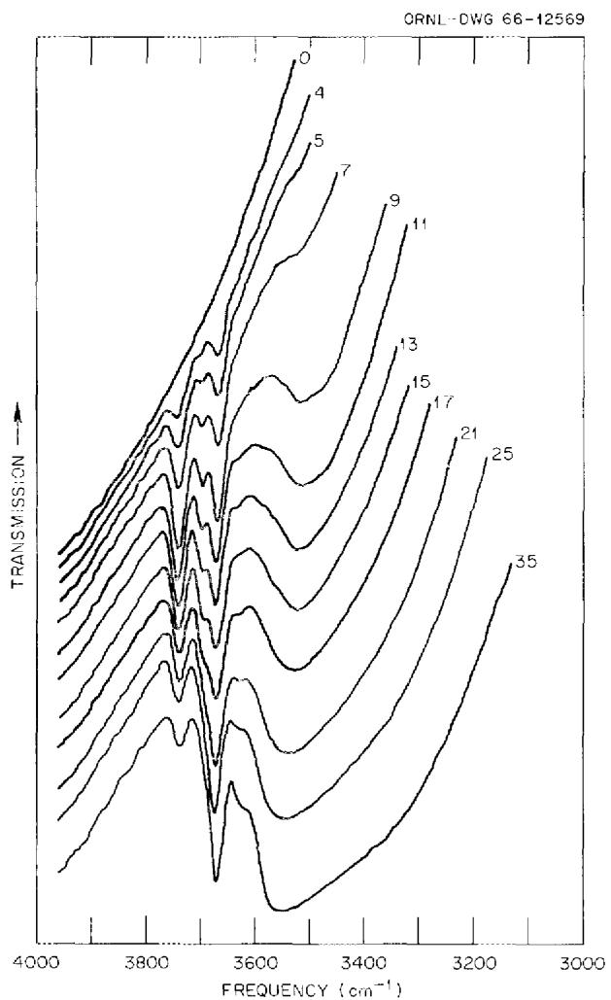  
Fig. 7.4. Infrared Spectra of the OH Stretching Region After Adsorption of the Indicated Number of Equal-Volume Doses of $\mathsf{H}_2\mathsf{O}$ Vapor on $\mathsf{ThO}_2$ . Ordinates displaced slightly for clarity.

$\mathbf{cm}^{-1}$ band continued to increase in intensity, but the intensities of the 3740- and $3695\mathrm{-cm}^{-1}$ bands decreased. In addition, a broad band at 1630 $\mathbf{cm}^{-1}$ began to appear, proving the adsorption of molecular water. Nevertheless, the growth of the broad band in the OH stretching region showed that polymeric hydrogen bonding was present at significantly less than one monolayer coverage.

The nonequilibrium nature of water adsorption was further demonstrated by successive adsorption-desorption cycles between 4.58 torrs (for 1 to 150 hr) and $< 10^{-5}$ torr (for 24 hr). Each successive in vacuo spectrum showed a decrease in the intensity of the $3740\text{-cm}^{-1}$ band and an increase in the intensity of the broad band around $3440\text{cm}^{-1}$ . In addition, bands at 1564.5 (strong), 1430, 1375 (sharp), and $1362\text{cm}^{-1}$ (sharp) appeared. These bands increased in intensity with each successive adsorption-desorption cycle, although their relative intensities remained unchanged. These bands appear to be due to the adsorbed water rather than to any contamination, but a firm interpretation of their nature awaits further experimental data.

# BEHAVIOR OF GASES WITH SOL-GEL URANIUM-THORIUM OXIDE FUELS

D. N. Hess

B. A. Soldano

H. F. McDuffie

C. F. Weaver

Sol-gel microspheres of $\mathrm{ThO}_2$ or $\mathrm{UO}_2$ have been found to evolve gases when heated, as did the thoria- $3\%$ $\mathrm{UO}_2$ sol-gel materials previously reported.13,14 Efforts have been made to remove these gases, as well as the carbon, which are generated by interaction and pyrolysis of the water, nitrates, organic solvents, and surfactants included in the sol-gel materials during their preparation. Such removal is considered desirable because excess gas pressure or reactions between the gas and metal might occur in sealed fuel elements, causing rupture during reactor operation.

The air-dried $\mathrm{ThO}_2$ microspheres yielded $\mathrm{CO}_2$ , $\mathrm{CO}$ , $\mathrm{H}_2$ , $\mathrm{NO}$ , $\mathrm{N}_2$ , and organics upon heating in vacuum. The first three were dominant. The

largest amount of gas evolution occurred at the following centigrade temperature intervals: 240 to 260, 400 to 460, and 700 to 760. Above $760^{\circ}\mathrm{C}$ , only a negligible amount of gas remained.

The wet $\mathrm{UO}_2$ microspheres yielded $\mathrm{CO}_{2}$ , $\mathrm{CO}$ , $\mathrm{H}_{2}$ , $\mathrm{N}_{2}$ , $\mathrm{O}_{2}$ , $\mathrm{NO}$ , and organics when heated with steam and evacuated. The temperature intervals of maximum gas evolution appear to be 150 to $250^{\circ}\mathrm{C}$ and 400 to $650^{\circ}\mathrm{C}$ . The principal gas evolved (primarily in the 300 to $350^{\circ}$ range) was $\mathrm{CH}_4$ . This is in direct contrast with the production of higher-molecular-weight organic products previously noted in the case of the $\mathrm{ThO}_2$ microspheres.

A possible explanation for the difference is that in dry $\mathrm{ThO}_2$ catalytic cracking of the included organics occurs, while in the wet $\mathrm{UO}_2$ matrix thermal cracking is dominant. The latter case is expected to produce lower-molecular-weight products.

A conditioning scheme, successful with respect to producing a low carbon content, a low O:U ratio, and high density, is shown in detail in Table 7.2. The flow of water vapor was necessary for the removal of carbonaceous material and, thus, for production of a low final concentration of carbon in the $\mathrm{UO}_2$ microspheres. The water vapor also seems to prevent fragmentation of the spheres.

The mixture of $\mathrm{CO}_{2}$ and $\mathrm{H}_{2} \mathrm{O}$ was superior to either compound separately for increasing the rate of sintering. It was of prime importance that the carbon removal be complete before the mixture of $\mathrm{CO}_{2}$ and $\mathrm{H}_{2} \mathrm{O}$ was added, since the densification step trapped any remaining carbonaceous material. The final use of pure $\mathrm{H}_{2}$ to counter the oxidizing effect of the mixture of $\mathrm{CO}_{2}$ and $\mathrm{H}_{2} \mathrm{O}$ produced the low $\mathrm{O}: \mathrm{U}$ ratios.

It is expected that the same processing scheme would be applicable to microspheres consisting of any member of the $\mathrm{ThO}_2\cdot \mathrm{UO}_2$ solid-solution system, although no experimental information is avail

able for such materials. For pure $\mathrm{ThO}_{2}$ , the $\mathbf{H}_{2}$ gas in the processing scheme is both unnecessary and harmless.

Table 7.2. Successful Gas Flow Conditioning Scheme for Sol-Gel $\mathsf{UO}_2$ Microspheres   
Batch p-9-12-1153; weight: 9.976 g   

<table><tr><td colspan="3">Treatment Schedule</td></tr><tr><td>16 hr</td><td>170°C</td><td>Ar-H2O</td></tr><tr><td>2</td><td>250</td><td>Ar-4% H2--H2O</td></tr><tr><td>2</td><td>350</td><td>Ar-4% H2--H2O</td></tr><tr><td>2</td><td>450</td><td>Ar-4% H2--H2O</td></tr><tr><td></td><td>Cool</td><td>Ar-4% H2--H2O</td></tr><tr><td>16 hr</td><td>Store</td><td>Helium</td></tr><tr><td></td><td>25 → 550</td><td>Ar-4% H2--H2O</td></tr><tr><td>2</td><td>550</td><td>Ar-4% H2--H2O</td></tr><tr><td>2</td><td>650</td><td>Ar-4% H2--H2O</td></tr><tr><td>2</td><td>750</td><td>Ar-4% H2--H2O</td></tr><tr><td></td><td>Cool</td><td>Ar-4% H2--H2O</td></tr><tr><td></td><td>Store</td><td>Helium</td></tr><tr><td></td><td>25 → 850</td><td>Ar-4% H2--H2O</td></tr><tr><td>1/3hr</td><td>850</td><td>Ar-4% H2--H2O</td></tr><tr><td>2</td><td>850</td><td>CO2-H2O</td></tr><tr><td>1/2</td><td>850</td><td>H2</td></tr><tr><td>3/4</td><td>1000</td><td>H2</td></tr></table>

Physical and Analytical Data   

<table><tr><td>Weight Loss</td><td>O/U</td><td>Percent C</td><td>Density at 210 psi</td><td>Appearance</td></tr><tr><td>15%</td><td>2.001</td><td>0.008</td><td>10.82</td><td>Shiny black; no fines; nonuniform size</td></tr></table>

Part III

Gas-Cooled Reactors

# 8. Diffusion Processes

# TRANSPORT PROPERTIES OF GASES

# Gaseous Diffusion Studies in Noble-Gas Systems

A. P. Malinauskas

Gaseous diffusion experiments have been conducted with the gas pairs He-Kr, Ar-Kr, and Kr-Xe over the temperature range 0 to $120^{\circ}\mathrm{C}$ to provide additional data for use in an investigation of the interaction characteristics of noble-gas molecules. This work represents the second phase of a systematic study of the binary diffusion process in systems involving all possible combinations of the noble gases. The third part of this research, involving the systems He-Ne, Ne-Ar, Ne-Kr, and Ne-Xe, is in progress.

All the diffusion data available concerning the systems He-Kr, Ar-Kr, and Kr-Xe are graphically summarized in Figs. 8.1 to 8.3, where the diffusion coefficient $D_{12}$ , at 1 atm pressure, is plotted as a function of the absolute temperature $T$ . The solid lines in the figures have been constructed using the usual Chapman-Enskog expression for the diffusion coefficient, in which the Lennard-Jones (12-6) potential energy parameters presented in Table 8.1 have been employed. These parameters yield the best representation of the experimental data; they likewise give favorable agreement with diffusion coefficient values deduced from measurements of the composition dependence of the viscosities of the corresponding gas mixtures. On the other hand, a similar comparison with values obtained from the measured thermal conductivities of the mixtures is not as good, and the deviations appear to

worsen as the mass difference of the gas pair increases. Unfortunately, it is not possible to pursue this aspect further, since experimental thermal conductivity data are neither plentiful

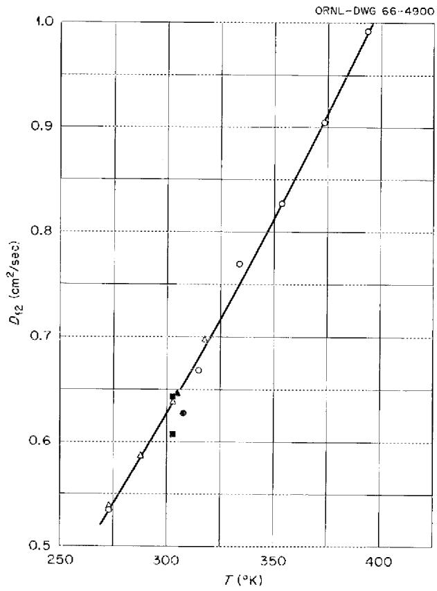  
Fig. 8.1. Experimental Values of the Diffusion Coefficient of the System He-Kr at 1 atm Pressure. Solid line: Lennard-Jones (12-6) potential. H. Watts, Trans. Faraday Soc. 60, 1745 (1964). B. N. Srivastava and R. Paul, Physica 28, 646 (1962). L. Durbin and R. Kobayashi, J. Chem. Phys. 37, 1643 (1962). K. P. Srivastava and A. K. Barua, Ind. J. Phys. 33, 229 (1959). O this work.

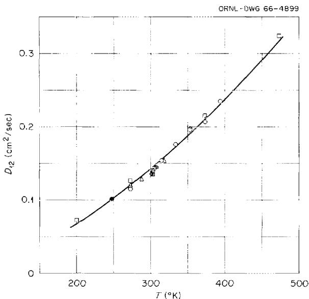  
Fig. 8.2. Experimental Values of the Diffusion Coefficient of the System Ar-Kr at 1 atm Pressure. Solid line: Lennard-Jones (12-6) potential. H. Watts, Trans. Faraday Soc. 60, 1745 (1964). R. Paul, Ind. J. Phys. 36, 464 (1962). L. Durbin and R. Kobayashi, J. Chem. Phys. 37, 1643 (1962). K. Schafer and K. Schuhmann. Z. Elektrochem. 61, 246 (1957). B. N. Srivastava and K. P. Srivastava, J. Chem. Phys. 30, 984 (1959). O this work.

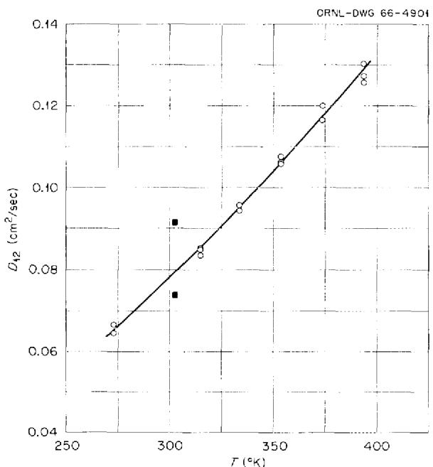  
Fig. 8.3. Experimental Values of the Diffusion Coefficient of the System Kr-Xe at 1 atm Pressure. Solid line: Lennard-Jones (12-6) potential. H. Watts, Trans. Faraday Soc. 60, 1745 (1964). O this work.

Table 8.1. Lennard-Jones (12-6) Potential Energy Parameters Obtained from the Diffusion Studies   

<table><tr><td>Gas Pair</td><td>σ(A)</td><td>ε/k (°K)</td></tr><tr><td>Hc-Kr</td><td>3.071</td><td>58.8</td></tr><tr><td>Ar-Kr</td><td>3.609</td><td>121</td></tr><tr><td>Kr-Xe</td><td>3.923</td><td>170</td></tr></table>

nor sufficiently accurate for other than a superficial analysis.

# Thermal Transpiration

B. A. Cameron

A. P. Malinauskas

We had demonstrated earlier that thermal transpiration data may be employed to obtain information regarding the interchange of energy associated with translational and internal molecular motion by collision.5 Experimentally, this entails the careful measurement of small pressure drops, under steady-state conditions, which result by imposing a temperature gradient across a gas confined in a capillary.

In the previous work, fourteen 0.1-mm-ID capillaries had been employed, and the method used was satisfactory from all aspects except one: 6 hr were required to obtain a single datum point. In an attempt to remove this shortcoming, we sought to replace the capillaries with a fritted glass disk.

Experiments were conducted with the porous disk arrangement; although the time interval for a given experiment was reduced to 5 min, it was no longer possible either to measure or to control the temperature gradient accurately, since the use of the porous plate permitted the thermal conductivity of the gas to markedly affect the temperature conditions. Consequently, the reproducibility of the data obtained was quite poor, and the method was therefore abandoned.

In the meantime, a more sensitive pressure-sensing device than that employed in the earlier work has been procured. Since the instrument will permit us to employ capillaries of a larger size, thereby increasing the rate of attainment of steady-state conditions, we are currently constructing a modified version of the original capillary design.

# Gaseous Diffusion in Porous Media

A. P. Malinauskas

R. B. Evans III

E. A. Mason

A generalized treatment of gas transport in porous media has been realized; as a result, it is now possible to account for a variety of phenomena involving gas transport from a single viewpoint having a sound theoretical foundation.

The treatment has been developed on the basis of the "dusty-gas" model, a model in which a porous septum is described as consisting of uniformly distributed giant molecules (dust) held stationary in space. Although this description is not as palatable as the more common "bundle of capillaries" concept, it does possess two distinct advantages from a mathematical standpoint. First, the geometrical part of the problem neatly separates from that part which deals with the dynamics of the gas transport. Second, the importance of gas-surface collisions relative to gas-gas interactions is readily assessed; one merely varies the "mole fraction" of the dust. In other words, it is unnecessary to postulate one mechanism for free-molecule conditions and another for hydrodynamic transport and then attempt to reconcile the two in the transition region; the validity of the dusty-gas model applies throughout. Moreover, the results are likewise applicable to describe gas transport through capillaries simply by a suitable substitution for geometric parameters.

The following brief summary indicates the number of phenomena which have been described as special forms of the general case (some of these have been presented previously).

Binary Gaseous Diffusion at Uniform Temperature and Pressure. - This phenomenon is treated as three-component diffusion in terms of the dusty-gas model; the most notable result is a theoretical formulation for the observation that the ratio of the fluxes of the two diffusing gases is approximately inversely proportional to the square roots of their molecular weights, not only under conditions of free-molecule transport but in the region

of hydrodynamic transport as well. Parenthetically, this observation appears to have been made first by Graham in 1833, but has either become forgotten or confused with his work on effusion (transport into a vacuum), which was done about 13 years later.

Isothermal Transport in the Presence of a Pressure Gradient. - When only a single gas is considered, the mathematical expression which results from an application of the model represents an analogous form of Poiseuille's flow equation with viscous slip. However, the viscous part arises from Stokes' law, whereas the slip term is developed from a consideration of pure gas diffusion in a static dust environment. Moreover, the Knudsen minimum, which has yet to be rigorously described utilizing the capillary concept, is satisfactorily taken into account by considering the next-higher approximation to the diffusion coefficient.

Whether a pure gas or a binary gas mixture is considered, it turns out that it is possible to separate (mentally) the viscous flow contribution from that due to diffusive transport; but in the latter case the equations remain coupled through the composition dependence of the characteristic transport coefficients. Consequently, few situations can be conveniently handled without recourse to numerical methods. One of these is known as the Kramer-Kistemaker effect, wherein a pressure gradient develops in a closed system because of diffusion. In this instance the equation derived from the dusty-gas concept appears to be the first description of the phenomenon that is applicable at all pressures.

Pure Gas Transport Under the Combined Influence of Gradients of Pressure and Temperature. This phenomenon is known as thermal transpiration or the thermomolecular pressure difference. Prior to the application of the dusty-gas model, the effect was primarily investigated only because of its influence on accurate pressure measurement. As stated in the section "Thermal Transpiration," the phenomenon now appears to provide a particularly simple approach to an investigation of inelastic collisions.

Binary Gas Transport Under Nonuniform Temperature and Pressure Conditions. -- All the previous items represent special cases of this rather complex situation, and only two aspects of the problem have been considered in detail. The first of these is the pressure difference, at steady-state conditions, which is produced in a binary

gas mixture under the influence of a temperature gradient, without regard for variations in composition; the resultant expression describes thermal transpiration in a binary gas mixture.

The second case also concerns a steady-state solution; the problem considered is the relative separation produced in a binary gas mixture as the result of a temperature gradient, without regard for pressure variations. The expression derived for this case describes the variation of the thermal diffusion factor with pressure, as one proceeds from the free-molecule region to the region of hydrodynamic transport.

It is interesting to note that in neither of these last two cases does there appear to be any experimental data with which the theoretical relationships may be verified.

# Gas Transport Studies Related to Vented Fuel Elements for Fast Gas-Cooled Reactors

R. B. Evans III

D. E. Bruins

Tentative reference designs for a 2500-Mw (thermal) fast-flux helium-cooled reactor call for utilization of fuel pins comprising $(\mathrm{U},\mathrm{Pu})\mathrm{O}_2$ bushings stacked in free-standing stainless steel cladding. Requirements for high power densities demand very high fuel temperatures, close pin spacing, and minimum cladding wall thickness. One might envision 0.38-in.-OD claddings (0.010-in. walls) containing 6-ft sections of $80\%$ effective density fuel. Cladding temperature will be $815^{\circ}\mathrm{C}$ at steady-state conditions; helium coolant pressure will be about 1000 psi.

If, for any reason, the coolant pressure exceeds the internal pin pressure by 200 psi at $815^{\circ}\mathrm{C}$ , the claddings might collapse. A means for pressure equalization is clearly needed. In the present investigation the possibility of using direct venting devices to ensure pressure equalization is being examined under the realization that direct vents pose special problems regarding fission product release and coolant contamination.

We have elected to initiate our work by giving first consideration to the release problems and means for their mitigation. This approach was adopted to take advantage of the only established criterion available for studies of this type, namely, the maximum allowable release-to-birth ratio, $R / B$ , of fission products as legislated in the PBRE11 fuel specifications, modified to account for zero retention by fuel at fast flux reactor temperatures.12 The reference criterion turns out to be a constant $R / B$ of $1.8 \times 10^{-2}$ for all fission products.

Venting efficiencies have been left as somewhat of a dependent variable because, once a suitable venting device has been contrived, dimensioned, and evaluated, venting capabilities as well as inherent limitations can be determined. Under this approach we need not be concerned (for the time being) with rather nebulous considerations that might govern venting criteria in the future, for example, "maximum credible" coolant pressure and/or fuel-temperature excursions.

In summary, we seek selective venting devices, materials, or configurations that can discriminate gradients in total pressure and partial pressures; thus forced-coolant flow admittances will be high when $\Delta p \neq 0$ , and diffusive-flow admittances will be low when $\Delta p = 0$ . Both laboratory and desk studies have been initiated to obtain the objectives cited above.

# RECOIL PHENOMENA IN GRAPHITES

R.B.Evans III J.L.Rutherford

R.B.Perez13

Pyrolytic-carbon-coated $(\mathrm{Th},\mathrm{U})\mathrm{C}_{2}$ and $(\mathrm{Th},\mathrm{U})\mathrm{O}_{2}$ microspheres have demonstrated adequate irradi

ation stability $^{14}$ under design conditions of existing high-temperature gas-cooled reactors. However, extension of current technology to include performance estimates for advanced concepts and optimization of coating designs $^{15}$ has required additional and supporting studies of phenomena related to coating failure.

One mode of failure concerns spearheads, gaps, and fractures that are initiated in recoil damage and fragment-densified regions at coating layer interfaces. Recent irradiation tests have indicated, for example, that premature failure occurs when inner-buffer layers are too thin to provide sufficient recoil-damage protection for outer containment layers. Accordingly, our present objective is to determine what fraction of the total coating thickness constitutes effective stopping regions for recoiled fission fragments. Studies of this kind should provide supporting information for one aspect of the optimization analysis mentioned above.

Results obtained in this investigation stem directly from the experimental determination of the penetration distances of fission fragments that have recoiled into target specimens from thin-layer source regions. These regions are formed by placing $^{235}\mathrm{U}$ on one surface of dense pyrocarbon coupons using an electromagnetic-separator technique. Target specimens are placed against this surface, and source-target pairs are subjected to a thermal-neutron flux to induce fission and subsequent fragment recoil. Under this configuration, fragments enter the target (and source) as nearly monoenergetic but randomly directed beams. The targets are then ground, and grinding increments are assayed by gamma counting so that integral forms of the distribution curves can be constructed. Activity values for several fragments are extracted from the overall count data with the aid of computer program ALPHA. The

integral curves yield information concerning recoil distances along $z$ normal to the source plane. They also give information concerning the fragment distributions $f(z)$ as they occur in coatings and the distributions $f(r)$ as they occur either in "r space" or along $z$ in collimated beam experiments.

The basic range concept is given in microscopic terms by simple relationships between $n_t$ , the density of scattering centers in the target; $T$ , the specific energy loss to target electrons and atoms; and $d\sigma$ , the differential cross section for such loss. The macroscopic range-energy $[R(E) - E]$ relationship is derived from

$$
R (E) = \int_ {E} ^ {0} \frac {d E}{(d E / d R)} = \frac {1}{n _ {t}} \int_ {E} ^ {0} \frac {d E}{S (E)}, \tag {1}
$$

where

$$
S (E) = \int T d T \tag {2}
$$

is the stopping cross section per scattering center, and

$$
d E / d R = - n _ {t} \cdot S (E) \tag {3}
$$

is the average energy loss per unit path length. One assumes that this average loss is a continuous function and finds that $(dE / dR)_{\mathrm{e}}$ for electronic contributions is similar to energy losses in constant deceleration processes in elementary mechanics. The theoretical problem reduces to derivation of relationships between atomic properties and $S(E)$ , $T$ , and $d\sigma$ .

In most treatments the range-density product is taken to be constant, as in Eq. (1). Thus, in principle, range values for all target densities are known if this product is determined for any one given target density. Implied restrictions are: materials in question must be homogeneous to satisfy the condition $\frac{dn_t}{dR} = 0$ , and $n_t$ must be the same for all beams. Along these lines we note that current local trends favor the use of very-low-density carbons ( $d \sim 0.8$ to $1.2 \, \text{g/cm}^3$ ) for inner coatings of fuel particles. These are in many instances quite porous. The implied restrictions on $n_t$ will obviously be violated, and this feature of the macroscopic theory provides the major justification for our work.

A solution to Eqs. (1 to 3), as given by Lindhard et al., is simply

$$
\bar {r} (\epsilon) = \bar {r} _ {\mathrm {e}} (\epsilon) - \Delta (k, \epsilon) = (2 \varepsilon^ {1 / 2}) / (\mathrm {k}) - \Lambda (k, \epsilon). \tag {4a}
$$

Here the reduced quantities $\epsilon, \bar{\tau}(\epsilon)$ , and $t$ correspond to the original variables $E, R(E)$ , and $T$ . Contributions of nuclear stopping are given as a correction term $\Delta(k, \epsilon)$ to be applied to the electronic range $\bar{r}_{\mathrm{e}}(\epsilon)$ . The $k$ is sort of an integration constant involving the masses and changes of fragment and target atoms. Lindhard presents values of $\Delta(k, \epsilon)$ in graphical form as well as theoretical fluctuation values $\Delta[\rho(\epsilon)]^2$ which relate to the straggling factors $\alpha$ . These factors are negligibly small compared with those introduced by instrumentation. At fission recoil energies, $^{21}$ $\Delta(k, \epsilon)$ values are such that

$$
\rho (\epsilon) \sim C \epsilon^ {2 / 3} \text {a n d} R (E) \sim C ^ {\prime} E ^ {2 / 3}, \tag {4b}
$$

where $C$ and $C'$ are arbitrary constants. This is merely Rutherford's equation, modified forms of

which form the basis for a recent generalized range-energy correlation reported by Frank. Some predicted and experimental range values are presented in the top section of Table 8.2.

Successful correlation of penetration data depends heavily upon a proper selection of an r-space distribution function as dictated by the structure of the target material under investigation. For uniform structures we have assumed validity of the normal-Laplace distribution given in Fig. 8.4. Since r-space distributions are not measured directly in our experiments, the $f(r)$ function must be converted to $f(z)$ to derive applicable equations. The connection between these functions is obtained by pretending that all source points can

20 J. Lindhard, M. Scharff, and H. E. Schiott, Kgl. Danske Videnskab. Selskab, Mat.-Phys. Medd. 33(14), 1 (1963).   
$^{21}$ J. M. Alexander and M. F. Gazdik, Phys. Rev. 120, 874-86 (1960).   
22P. W. Frank, Bettis Technical Review, WAPD-BT-30 (April 1964), pp. 47-53.

Table 8.2. Comparison of Experimental and Predicted recoil Ranges Applicable to Ideal and Porous Carbon Matrices   

<table><tr><td rowspan="2">Target Material</td><td rowspan="2">Target Density (g/cm3)</td><td colspan="4">R·d, Range-Density Product (mg/cm2)</td><td rowspan="2">Number of Experiments</td></tr><tr><td>141Xe(Cea)</td><td>140Xe(Laα)</td><td>103Ruα</td><td>95Y(Zra)</td></tr><tr><td colspan="7">Ideal Target Materials</td></tr><tr><td>Predictedbfor carbons</td><td></td><td>2.21</td><td>2.24</td><td>2.91</td><td>2.93</td><td></td></tr><tr><td>Dense pyrolytic carbon (massive deposit)</td><td>2.192</td><td>2.54</td><td>2.50</td><td>2.94</td><td>3.01</td><td>6</td></tr><tr><td>Predictcdfor carbons</td><td></td><td>2.63</td><td>2.70</td><td>3.54</td><td>3.59</td><td></td></tr><tr><td colspan="7">Porous Target Materials</td></tr><tr><td>Isotropic pyrolytic carbon (disk coating)</td><td>1.49</td><td>2.47</td><td>2.42</td><td>2.89</td><td>2.96</td><td>3</td></tr><tr><td>Impregnated graphite (CGB)</td><td>1.865</td><td>2.52</td><td>2.52</td><td>3.09</td><td>3.16</td><td>3</td></tr><tr><td>Very porous graphite (C-18)</td><td>1.636</td><td></td><td>2.94</td><td>3.33</td><td>3.41</td><td>3</td></tr></table>

Species counted.   
$b$ Based on Frank's correlation and tabulated energies (ref. 22).   
Based on Lindhard's correlation (ref. 20) using energies as plotted by Alexander and Gasdik (ref. 21).

be collected at a single point corresponding to the origin of a spherical coordinate system, where $\theta$ is the polar angle measured from $z$ , $r = \sqrt{\rho^2 + z^2}$ is the radius vector, $d\omega$ is an element of solid angle, and $\rho = 2\pi r \sin \theta$ . Thus

$$
f (z) = \int_ {\omega} \frac {2 f (r) \cos \theta d \omega}{4 \pi} = \int_ {0} ^ {\infty} \frac {f (\rho , z) \rho d \rho}{\left(\rho^ {2} + z ^ {2}\right)}. \tag {5}
$$

An additional integration of $f(z)$ over $z$ is required to obtain the result sought, namely,

$$
F. R. = \int_ {z ^ {\prime}} ^ {\infty} f (z) d z = 1 - z ^ {\prime} / R + f _ {c} (z, \alpha / R). \tag {6}
$$

This approximate relationship gives F.R., the fraction of activity remaining after grinding to a penetration $z$ , as a function of $z$ in homogeneous

(uniform) targets. The curve is essentially a straight line with a small tail accounted for by the $f_{\mathrm{c}}$ term that reflects effects of straggling. These are greatly attenuated by the integration and can, in theory, be safely neglected. Most of the straggling shown in our results is the result of experimental imperfections. Experimental data that follow the normal-distribution correlations appear on the left side of Fig. 8.5.

An equation giving a close approximation to $f(z)$ in uniform particle coatings develops when the point source pertaining to Eq. (5) is extended as an infinite line source positioned along the negative $z$ axis. This gives rise to an additional integration and equations that are one degree higher with respect to $z / R$ than Eqs. (5) and (6). It turns out that the $f(z)$ for the line source is identical to the right side of the integral function

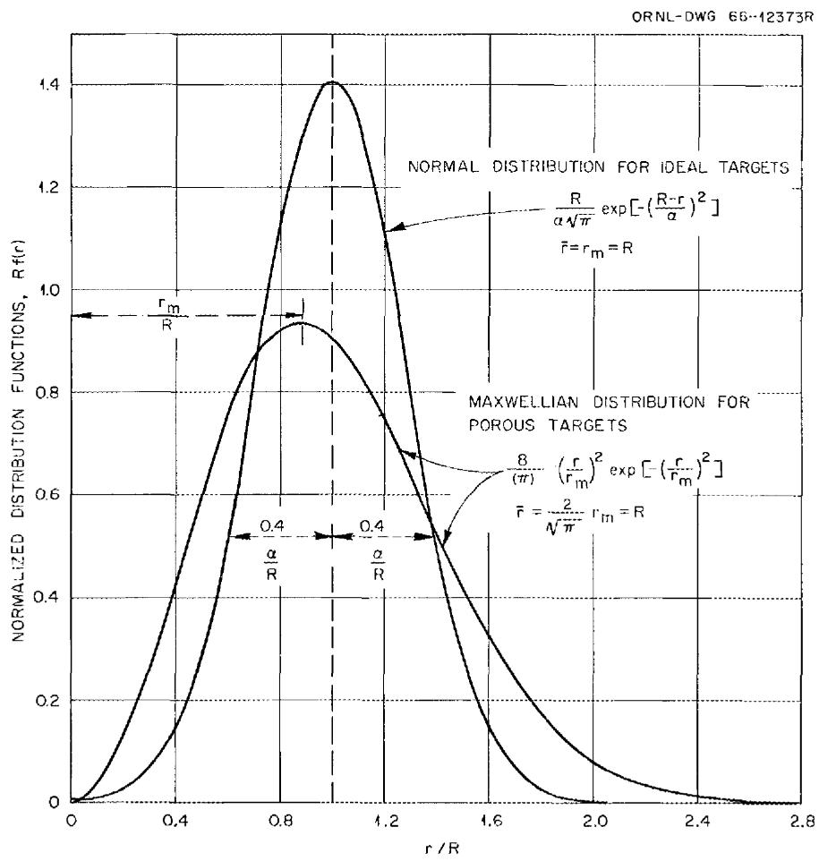  
Fig. 8.4. Plots of the Normalized Distribution Functions Used to Correlate Recoil Data. These "r-space" distributions correspond to concentration vs penetration curves for perfectly collimated beam experiments. In the present investigation beams are not collimated, but the observed stopping behavior does relate to the curves shown above.

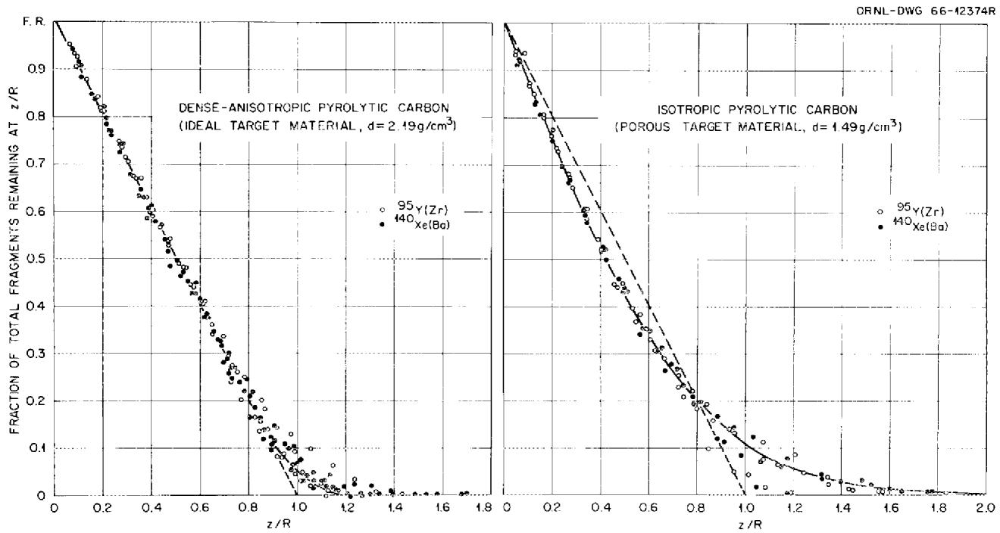  
Fig. 8.5. Penetration Data for "Light and Heavy" Fragments in Dense and Porous Pyrocarbons. Penetrations are referred to $R$ values peculiar to given experiments and species. The curve that passes through the porous pyrocarbon data was plotted on the basis of F.R. vs $z / R$ values as given by Eq. (7).

for a point source [Eq. (6)] multiplied by a factor slightly less than 2. This factor is required to normalize the new distribution curve. Therefore the experimental plot of Fig. 8.4 is also a plot of the distribution as it would occur in a coating, diffusion and densification neglected.

For the case of porous carbons and graphites, we find that Eq. (6) does not give a good fit of experimental data plots. Obviously, the normal $r$ -space distribution does not hold, because well-collimated beams would "see" density variations in porous targets. The probability for stopping $f(r) dr$ about a mean $R$ would not be symmetrical, as it is for a normal distribution. In terms of bulk volume most of the matrices of our porous targets are composed of solids (open porosities range from 10 to 20 vol%), and the most probable range $r_m$ should correspond to a "low" value which might be predicted using a "high" porosity-corrected density. Thus, on the $r$ -space distribution, $r_m$ should reside to the left of the average $\langle r \rangle$ or $R$ , while portions of the curve to the right of $R$ should "tail out" slowly to account for fragments that encountered nonstopping regions (pores).

Several skewed distribution functions were tested for applicability to this problem; the most successful candidate appears to be that shown in Fig. 8.4 for porous targets. This function is simply Maxwell's speed distribution for gases with $v / v_{m}$ replaced by $r / r_{m}$ .

When the Maxwellian distribution is subjected to the same manipulations employed to develop Eq. (6), one finds that

$$
\mathrm {F . R .} = \operatorname {e r f c} \left[ \left(\frac {\sqrt {f f}}{2}\right) \left(\frac {z}{R}\right) \right] \tag {7}
$$

exactly. As before, the F.R. function also represents the $f(z)$ distribution in coatings. Typical porous target data are shown on the right side of Fig. 8.5. The solid line represents a plot of Eq. (7), and the dotted line represents a plot of Eq. (6), which clearly does not apply.

Average range values for porous targets appear in Table 8.2. Values for two of the porous materials show good agreement with ideal values. Range values for the very porous graphite are somewhat high; however, a large fraction of the pores in this material were several times greater

than $R$ . Our original intentions were to use these data to establish an upper limit on pore sizes, and in this respect the experiments failed because Eq. (7) was followed (except at large $z / R$ ) and the ranges were only slightly greater than the ideal values.

In summary, we have found that effects of porosity and variations in $n_t$ can be taken into account through a proper selection of the primitive r-space distribution function. When this is ac

complished, the mean range for porous targets should be approximately the same as those observed or predicted for homogeneous (ideal) materials. Specific details concerning porosity characteristics are of little importance, if the pores are not too large or well connected, because the range correlation depends only on the bulk density and/or total porosity. Finally, we note that straggling factors, as given by the theory, are of little consequence with respect to the present investigation.

# 9. Behavior of Graphite with Reactive Gases

L.G.Overholser

# OXIDATION OF GRAPHITE SLEEVES BY STEAM

C. M. Blood

G. M. Hebert

Leakage of steam into the coolant circuit of an HTGR having coated fuel particles and graphite structural elements in the core could result in damage to the fuel coatings and graphite components due to extensive oxidation if appreciable partial pressures of steam were present during the period in which the core components were at high temperatures. At this time, such parameters as partial pressure of steam and temperature of the various core components under accident conditions cannot be precisely defined. Consequently the steam-graphite reaction must be examined experimentally using fairly wide ranges of temperatures and partial pressures of steam in an attempt to cover the abnormal conditions which may prevail. Some fission products catalyze the oxidation of graphite, and if such products have moved from the fuel particle to the adjacent graphite abnormal reaction rates may be expected. The reaction also may be mass transport controlled at very high reaction rates resulting from excessively high temperatures or strong catalysis at lower temperatures.

The oxidation of ATJ graphite spheres by steam was studied previously. More recently, ATJ graphite sleeves have been oxidized at $1000^{\circ}\mathrm{C}$ using a helium-steam mixture having a partial pressure of $\sim 250$ torrs and a total pressure of 1 atm. Mullite reaction tubes and quartz deposition tubes used in these studies have been replaced recently with alumina tubes, and studies now are being performed in the temperature range of 1100 to $1500^{\circ}\mathrm{C}$ . Graphite sleeves $(^{15}_{16}$ -in.-OD, $^{11}_{16}$ -

in.-ID) were machined from ATJ graphite stock and various lengths used in the oxidation studies. These dimensions approximated those of graphite specimens available from irradiation studies. Graphite sleeves (2 in. long) were impregnated with barium using $^{133}\mathrm{BaCl}_2$ and $\mathrm{Ba(OH)}_2$ solution, drying the impregnated specimen at $\sim 125^{\circ}\mathrm{C}$ , and finally heat-treating in dry helium at 800 or $1000^{\circ}\mathrm{C}$ for various periods of time. Sectioning and counting of impregnated specimens are incomplete, but preliminary measurements suggest that the treated specimens contained $\sim 0.1$ wt % of barium and that the barium was not uniformly distributed through the graphite. One specimen of graphite previously irradiated in loop 1, experiment 14 (ref. 2) was oxidized and examined for transport of fission products.

Reaction rates measured for various graphite specimens are given in Table 9.1. Average rates determined from weight changes are expressed on a weight basis, but essentially the same relative rates would be obtained if geometric surface areas were employed instead of weights because of the geometry of the specimens. A superficial comparison of the rates obtained for the untreated specimens of various lengths suggests that the rates increased with decreasing sleeve lengths. The reaction rates increased with increasing burnoff, and any critical comparison of reaction rates must take this effect into account. The length effect appears to be small in those cases where burnoffs are comparable. Reaction rates given for the specimens impregnated with barium show that the steam-graphite reaction was definitely catalyzed. Data are too fragmentary to indicate whether or not length of the specimen had any effect on reaction rates. Data given for the one previously irradiated graphite specimen

$$
(P _ {\mathrm {H} _ {2} \mathrm {O}} = 2 5 0 \text {t o r r s})
$$

Table 9.1. Reactivity of ATJ Graphite Sleeves with Steam at ${1000}^{ \circ  }\mathrm{C}$   

<table><tr><td rowspan="2">Specimen Designation</td><td rowspan="2">Length (in.)</td><td rowspan="2">Flow Ratea(cm3/min, STP)</td><td rowspan="2">Reaction Time (hr)</td><td rowspan="2">Initial Weight (g)</td><td rowspan="2">Burnoff (wt %)</td><td rowspan="2">Reaction Rateb(mg g-1hr-1)</td><td colspan="2">Surface Areac(m2/g)</td></tr><tr><td>Original</td><td>Final</td></tr><tr><td>11-B</td><td>0.5</td><td>900</td><td>3.3</td><td>3.931</td><td>27.4</td><td>96</td><td>0.16</td><td>8.2</td></tr><tr><td>18-B</td><td>0.5</td><td>900</td><td>3.4</td><td>3.952</td><td>33.4</td><td>116</td><td>0.15</td><td>9.9</td></tr><tr><td>UNL-1-EXP 14-Ed</td><td>0.5</td><td>900</td><td>3.4</td><td>4.140</td><td>50.6</td><td>200</td><td>0.09</td><td>e</td></tr><tr><td>ATJ-2-CYL-9Bf</td><td>0.5</td><td>900</td><td>1.1</td><td>3.798</td><td>32.9</td><td>365</td><td>e</td><td>e</td></tr><tr><td>18-A</td><td>1</td><td>900</td><td>3.2</td><td>7.888</td><td>19.6</td><td>68</td><td>0.15</td><td>7.8</td></tr><tr><td>11-A</td><td>1</td><td>900</td><td>3.3</td><td>7.791</td><td>21.6</td><td>73</td><td>0.16</td><td>7.2</td></tr><tr><td>UNL-1-EXP 14-Ad</td><td>1</td><td>900</td><td>3.3</td><td>8.427</td><td>24.8</td><td>85</td><td>0.09</td><td>13.8</td></tr><tr><td>ATJ-3-CYL-3A</td><td>1</td><td>900</td><td>1.1</td><td>8.290</td><td>3.1</td><td>30</td><td>0.14</td><td>2.6</td></tr><tr><td>ATJ-3-CYL-2A</td><td>1</td><td>900</td><td>2.1</td><td>8.530</td><td>8.2</td><td>41</td><td>0.13</td><td>5.2</td></tr><tr><td>ATJ-2-CYL-6At</td><td>1</td><td>900</td><td>1.2</td><td>7.412</td><td>40.9</td><td>420</td><td>0.17</td><td>8.5</td></tr><tr><td>10</td><td>2</td><td>400</td><td>3.4</td><td>14.912</td><td>14.1</td><td>45</td><td>e</td><td>e</td></tr><tr><td>12</td><td>2</td><td>400</td><td>2.7</td><td>15.608</td><td>9.2</td><td>36</td><td>e</td><td>e</td></tr><tr><td>17</td><td>2</td><td>900</td><td>3.7</td><td>15.211</td><td>13.0</td><td>37</td><td>0.15</td><td>7.3</td></tr><tr><td>IR-GI-2d</td><td>1.6</td><td>900</td><td>3.3</td><td>12.424</td><td>13.4</td><td>43</td><td>0.18</td><td>1.4</td></tr><tr><td>ATJ-2-CYL-8f</td><td>2</td><td>900</td><td>2.1</td><td>15.330</td><td>39.8</td><td>240</td><td>0.16</td><td>16</td></tr></table>

${}^{a}$ Flow rate given for helium.   
${}^{b}$ Average reaction rate based on average burnoff.   
cBET surface area obtained with nitrogen.   
$d$ Sleeve from ATJ graphite stock used in loop 1, experiment 14.   
Not determined.   
Impregnated with barium.   
$\mathbf{g}_{\mathrm{ATJ}}$ graphite sleeve from loop 1, experiment 14 following irradiation.

from loop 1, experiment 14 (ref. 2) indicate that neither the prior irradiation nor the presence of small amounts of fission products had any significant effect on the reaction rate.

Surface area data included in Table 9.1 indicate, as would be expected, that the reaction rates of the unimpregnated sleeves increased, in general, with increasing surface area although no quantitative relationship is evident. Limited data available for the impregnated sleeves suggest that a different relationship between reaction rate and surface area development prevailed in the presence of barium. The low value found for the surface area of the one irradiated graphite specimen after

oxidation may or may not be significant; additional data from other irradiated specimens are needed to resolve this question.

The studies are continuing with emphasis being placed on the effect of higher temperatures (1100 to $1500^{\circ}\mathrm{C}$ ) on the steam-graphite system.

# TRANSPORT OF FISSION PRODUCTS

C. M. Blood

Quartz deposition tubes were used in the runs in which the barium-impregnated and the previously irradiated graphite sleeves were oxidized by

steam, as well as during the prior heat treatment of the impregnated sleeves in dry helium. These tubes were utilized to determine any movement of barium downstream from the impregnated specimens in wet or dry helium and (in the case of previously irradiated graphite specimens) to capture any fission products transported by wet helium. A number of the deposition tubes have been sectioned by cutting into 1.5-cm lengths, and the gamma activity due to $^{133}\mathrm{Ba}$ has been measured in each section.

Studies using graphite sleeves impregnated with $^{133}\mathrm{Ba}$ and subsequently heat-treated at 800 or $1000^{\circ}\mathrm{C}$ employing a flow of $330~\mathrm{cm}^3 /\mathrm{min}$ (STP) of dry helium showed that very small quantities

of $^{133}\mathrm{Ba}$ deposited on the deposition tubes. Even smaller quantities of transported $^{133}\mathrm{Ba}$ were found on the deposition tubes from runs in which heat-treated impregnated graphite specimens were oxidized by steam-helium mixtures [900 cm³/min (STP) of helium] at 1000°C. The data suggest that barium is less readily transported by wet helium than by dry helium. The fact that all the impregnated graphite specimens had received a heat treatment in dry helium prior to oxidation complicates the comparison, however, because there is evidence that barium is fixed in graphite to some extent by the prior heat treatment. The flow rate of the dry helium during the heat treatment at 1000°C appears to have had an important effect

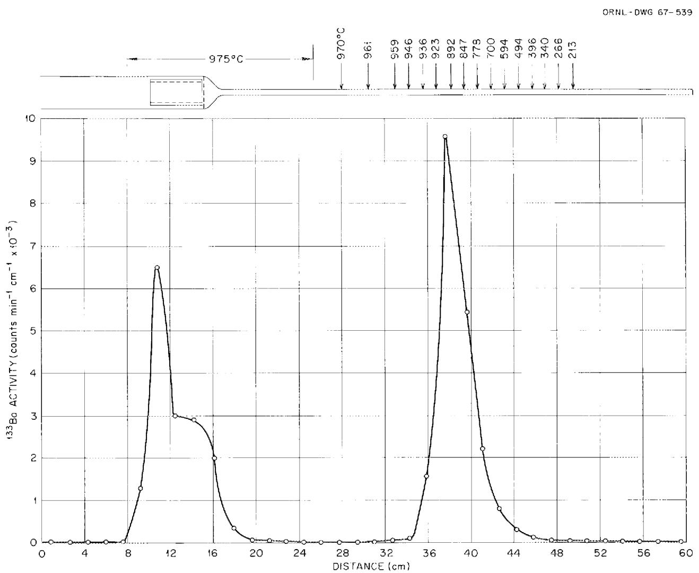  
Fig. 9.1. Distribution of $^{133}\mathrm{Ba}$ Activity as a Function of Distance (Temperature) Along the Deposition Tube.

on the movement of barium. The one run made at $975^{\circ}\mathrm{C}$ using a flow rate of $930~\mathrm{cm}^3 /\mathrm{min}$ (STP) of dry helium showed a much larger transport of $^{133}\mathrm{Ba}$ than those runs made at the lower flow rate of $330~\mathrm{cm}^3 /\mathrm{min}$ (STP). Counting data obtained from the sectioned deposition tube used in the run at the higher flow rate of dry helium are given in Fig. 9.1. The marked temperature dependence of the $^{133}\mathrm{Ba}$ deposition suggests that condensation of some species occurred over a relatively short length of the deposition tube. At this stage, however, the transported species has not been identified, and the available data do not permit an accurate determination of the condensation temperature or heat of sublimation. A gamma scan of the tube did not provide a better profile than that obtained by sectioning. A smaller temperature gradient and improved sectioning or scanning techniques are required to provide the more precise data needed for further study of the transported material.

Sectioning and counting of the deposition tube used in the run in which irradiated graphite from

loop 1, experiment 14 was oxidized by steam (Table 9.1) revealed that appreciable activity had been transported downstream by the wet helium. The deposition profile is given in Fig. 9.2, in which the total gamma activity is shown as a function of distance (temperature) along the deposition tube. The two maxima indicate that at least two radioactive species had been transported by the wet helium. Further examination of the sections by means of a gamma spectrometer gave the data included in Fig. 9.3. It was possible to separate the activities due to $^{110}\mathrm{Ag}$ , $^{134}\mathrm{Cs}$ , and $^{137}\mathrm{Cs}$ . Silver-110 was produced from structural materials which were used in the irradiation experiment and which subsequently migrated to the graphite. Low levels of activity from other nuclides are probably masked by silver and cesium. Experimental difficulties similar to those indicated for $^{133}\mathrm{Ba}$ transport preclude any rigorous analyses of data obtained for $^{110}\mathrm{Ag}$ , $^{134}\mathrm{Cs}$ , and $^{137}\mathrm{Cs}$ transport at this time.

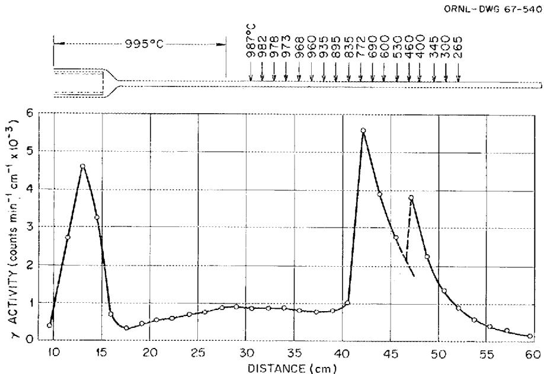  
Fig. 9.2. Distribution of Gamma Radioactivity as a Function of Distance (Temperature) Along the Deposition Tube.

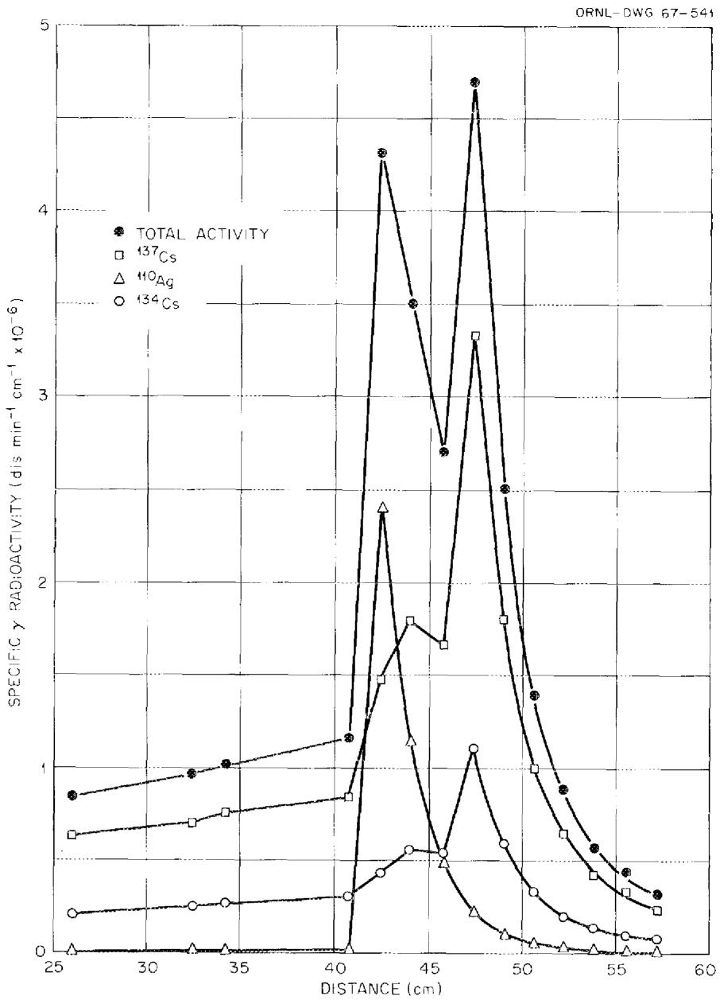  
Fig. 9.3. Spectra of Specific Gamma Radioactivities as a Function of Distance Along the Deposition Tube.

# OXIDATION OF COATED FUEL PARTICLES BY WATER VAPOR

J. E. Baker

The pyrolytic-carbon coating on the fuel particle is expected to retain gaseous fission products until the coating fails; nonvolatile fission products may diffuse slowly into the coating during pro

longed use at high temperatures. If leakage of water vapor into the reactor occurs, subsequent oxidation of the coating on the fuel particle may cause failure of the coating and release of gaseous fission products. The nonvolatile fission products may be transported by the coolant and deposited on various surfaces within the reactor following failure of the coating.

Earlier studies $^{3,4}$ of the oxidation of pyrolytic-carbon-coated fuel particles by water vapor were performed at temperatures of $1000^{\circ}\mathrm{C}$ or less and utilized partial pressures of water vapor ranging from 4.5 to 560 torrs. The effects of higher temperatures and lower concentrations of water vapor have been examined in more recent studies. $^{5}$ Rates of reaction of pyrolytic-carbon coatings present on unirradiated fuel particles were determined at temperatures of 1100 to $1400^{\circ}\mathrm{C}$ . Helium-water-vapor mixtures containing 500 to 1000 ppm (parts per million by volume) of water vapor and

having a total pressure of 1 atm were used in a single-pass system. Reaction rates were obtained from weight changes given by a continuously re

3C. M. Blood and L. G. Overholser, GCR Program Semiann. Progr. Rept. Sept. 30, 1965, ORNL-3885, pp. 125-30.   
4C. M. Blood and L. G. Overholser, Compatibility of Pyrolytic-Carbon Coated Fuel Particles with Water Vapor, ORNL-4014 (November 1966).   
5J. E. Baker and L. G. Overholser, GCR Program Semiann, Progr. Rept. Sept. 30, 1966, ORNL-4036 (in press).

Table 9.2. Rates of Reaction of Pyrolytic-Carbon-Coated Fuel Particles with Water Vapor   

<table><tr><td>Coated Fuel \(Particles^a\)</td><td>Temperature (°C)</td><td>Water Vapor Concentration (ppm)</td><td>Flow Rate (cm3/min, STP)</td><td>Exposure Time (hr)</td><td>Percent of Coating Oxidized</td><td>Reaction Rateb(mg g-1hr-1)</td><td>Coating Failurec(%)</td></tr><tr><td rowspan="4">Isotropic Vd</td><td>1100</td><td>1000</td><td>200</td><td>72</td><td>31</td><td>5.0</td><td>e</td></tr><tr><td>1200</td><td>1000</td><td>200</td><td>24</td><td>39</td><td>16</td><td>44</td></tr><tr><td>1300</td><td>1000</td><td>200</td><td>20</td><td>53</td><td>27</td><td>52</td></tr><tr><td>1400</td><td>1000</td><td>200</td><td>15</td><td>52</td><td>33</td><td>87</td></tr><tr><td rowspan="6">Isotropic VI d</td><td>1100</td><td>1000</td><td>200</td><td>23</td><td>1.7</td><td>0.5</td><td>0.2</td></tr><tr><td>1200</td><td>1000</td><td>200</td><td>23</td><td>3.6</td><td>1.5</td><td>0.2</td></tr><tr><td>1300</td><td>1000</td><td>200</td><td>23</td><td>12</td><td>5.6</td><td>0.1</td></tr><tr><td>1300</td><td>1000</td><td>400</td><td>24</td><td>17</td><td>7.4</td><td>0.1</td></tr><tr><td>1300</td><td>500</td><td>400</td><td>24</td><td>10</td><td>4.2</td><td>0.1</td></tr><tr><td>1400</td><td>1000</td><td>200</td><td>24</td><td>43</td><td>19</td><td>32</td></tr><tr><td>Isotropic VII d</td><td>1300</td><td>1000</td><td>400</td><td>24</td><td>19</td><td>8.7</td><td>1.6</td></tr><tr><td rowspan="2">Granular IV d</td><td>1200</td><td>1000</td><td>200</td><td>24</td><td>12</td><td>4.7</td><td>51</td></tr><tr><td>1300</td><td>1000</td><td>400</td><td>24</td><td>46</td><td>16</td><td>72</td></tr><tr><td>OR-688f</td><td>1200</td><td>1000</td><td>200</td><td>24</td><td>21</td><td>8.1</td><td>6.7</td></tr><tr><td rowspan="2">OR-689f</td><td>1200</td><td>500</td><td>200</td><td>24</td><td>8.3</td><td>4.4</td><td>e</td></tr><tr><td>1200</td><td>1000</td><td>200</td><td>24</td><td>19</td><td>8.4</td><td>e</td></tr><tr><td>YZ-134f</td><td>1200</td><td>1000</td><td>200</td><td>24</td><td>38</td><td>20</td><td>e</td></tr><tr><td>YZ-135f</td><td>1200</td><td>1000</td><td>200</td><td>24</td><td>48</td><td>20</td><td>17</td></tr><tr><td>YZ-136f</td><td>1200</td><td>1000</td><td>200</td><td>24</td><td>31</td><td>18</td><td>16</td></tr></table>

$100\mathrm{-mg}$ sample used in all cases.   
Reaction rate based on weight of pyrolytic-carbon coating; rates given for less than $5\%$ burnoff.   
cCalculated from quantity of uranium (thorium) in acid leach solution and total quantity of uranium (thorium) originally present in $100\mathrm{mg}$ of coated fuel particles.   
$d$ Supplied by General Atomic Division, General Dynamics Corp.   
Not available.   
Supplied by Metals and Ceramics Division, Oak Ridge National Laboratory.

cording semimicro balance and from analyses of effluent gases performed by a sensitive gas chromatograph. The extent of coating failures was determined by microscopic examination and acid leach of the oxidized coated fuel particles.

Experiments performed in mullite reaction tubes during the early part of these studies gave results which were so erratic that it was impossible to determine the effect of temperature and water vapor concentration on the reaction rates. In virtually all cases, the observed reaction rates decreased with time, and in some instances the final rates were an order of magnitude lower than the initial rates. Consistent data obtained after replacing the mullite tube with an alumina tube indicate that mullite was responsible for the erratic results. Gearey and Littlewood also observed a decrease in reaction rate with time and attributed it to catalysis of the steam-graphite reaction by silica from the mullite tube.

Reaction rates obtained for various batches of coated fuel particles using an alumina reaction tube are given in Table 9.2. The most interesting feature of these data is the large variation in reaction rates found for the different batches.

Isotropic VI and VII particles, for example, were less reactive than Isotropic V particles. The lower coating density (1.55 compared to 2.00 g/cm³ for Isotropic VI) of Isotropic V particles may be responsible for the higher reaction rates. Some of the YZ and OR batches of particles, however, have properties (including density) very similar to those of Isotropic VI particles but were considerably more reactive.

The long exposure times combined with relatively high reaction rates resulted in oxidation of a large portion of the coatings present on a number of batches of particles. In view of this, it is not surprising that severe damage and high percentages of failures occurred. Microscopic examination suggests that a pitting attack followed by cracking of the coatings occurred at all temperatures. Conditions were more favorable for Isotropic VI particles because of lower reaction rates and less burnoff of the coatings. These and other data indicate that $\sim 10$ wt $\%$ of the coatings may be removed before failure occurs with Isotropic VI particles. Subsequent studies, in which failures will be detected by bursts of activity from irradiated materials, will utilize higher partial pressures of water vapor to reduce failure time, particularly when oxidizing the more resistant types of coatings.

# 10. Irradiation Behavior of High-Temperature Fuel Materials

O. Sisman

J. G. Morgan

# IRRADIATION EFFECTS ON PYROLYTIC-CARBON-CoATED FUEL PARTICLES

P.E.Reagan J.G.Morgan J.W.Gooch M.T.Morgan M.F.Osborne

We are studying the irradiation effects on coated fuel particles by measuring the fission-gas release rates during irradiation at high temperatures, and by postirradiation examination to determine what damage was done. These studies are being performed in cooperation with the groups who are developing the coatings for fuel particles at ORNL, General Atomic, and the Carbon Products Division of Union Carbide Corporation. The integrity of production-run coated particles for the AVR reactor was studied during a long-term test. The effectiveness of silicon carbide barrier to solid fission product release is being studied, and the effectiveness of a gas gap in retarding solid fission product release is also being investigated.

Pyrolytic-carbon-coated thorium-uranium (4.59 to 1) carbide particles, prepared commercially for fuel elements for the pebble-bed gas-cooled German AVR reactor, were irradiated to 10 at. $\%$ heavy-metal burnup at $1300^{\circ}\mathrm{C}$ . These were a blend of several batches of duplex-coated particles that were representative of the production-run coated particles. The fractional fission-gas release for ${}^{88}\mathrm{Kr}$ was $5\times 10^{-6}$ at the beginning of the test and increased with burnup to $4\times 10^{-5}$ . No bursts of fission gas were released during the test, and no broken coatings were found on post-irradiation examination. Metallographic examination revealed some damage to the inner coating, but nothing that indicated potential failure of the coated particles.

Pyrolytic carbon coatings on fuel particles will contain essentially all of the fission gases, but at elevated temperatures some of the solid fission products (notably Sr, Ba, and Cs) will diffuse through the coating. To reduce the migration of fission solids, a silicon carbide barrier layer may be deposited between layers of pyrolytic carbon. One experiment (capsule A9-7) containing thorium-uranium carbide-coated particles of this type (batch GA-327) was irradiated at $1300^{\circ}\mathrm{C}$ for 1800 hr. The fission-gas release was low (the $R / B$ for ${}^{88}\mathrm{Kr}$ was in the $10^{-8}$ range), and postirradiation examination at $30\times$ showed no damaged coatings. Postirradiation metallography and fission solid analysis are not complete, but preliminary results on postirradiation heating experiments have indicated very low release of the solid fission products at temperatures up to $2000^{\circ}\mathrm{C}$ .

One irradiation capsule assembly (A9-6), after being irradiated for 1100 hr at $1500^{\circ}\mathrm{C}$ , was examined for the location of the principal solid fission products. In this experiment the graphite fuel particle holder was isolated from a graphite shell by an annular gas gap as shown in Fig. 10.1. Seven components of the assembly, including the fuel particles, were either acid leached or dissolved for recovery of ${}^{89}\mathrm{Sr}$ , ${}^{95}\mathrm{Zr}$ , ${}^{137}\mathrm{Cs}$ ,

and $^{144}\mathrm{Ce}$ . Some data were obtained for $^{140}\mathrm{Ba}$ but the decay time was too long for conclusive results. No appreciable fractions $(< 10^{-3})$ of the zirconium and cerium were found outside the fuel. About $5\%$ of the cesium had escaped from the fuel and graphite holder and had condensed on the relatively cold metal surfaces of the capsule. Strontium appeared to be considerably more mobile; more than $50\%$ of the $^{89}\mathrm{Sr}$ had escaped the fuel and was found in significant fractions $(>1\%)$ in the graphite holder and shell and on the metal capsule. With the exception of some $2\%$ of the $^{137}\mathrm{Cs}$ found in the lead tube, no significant fractions of any of the fission products were found outside the irradiation capsule. This is the first of a series of experiments to study the release of solid fission products during irradiation. Future

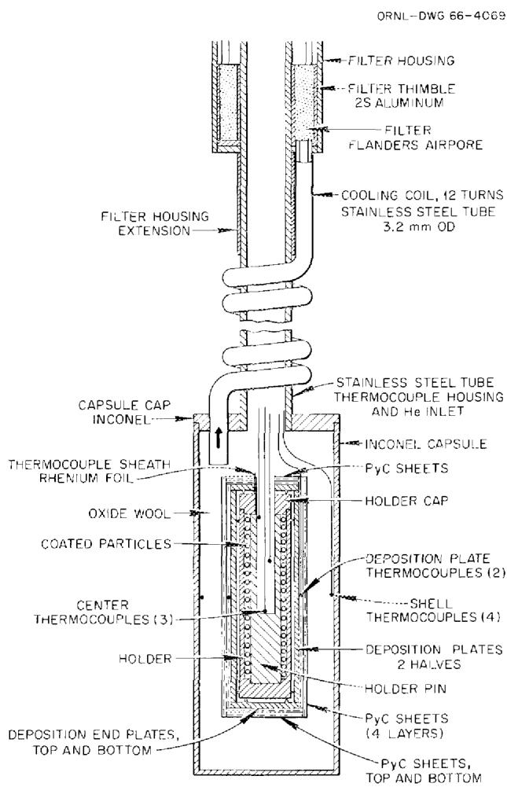  
Fig. 10.1. Gas-Gap Fission Solid Capsule.

studies in this series will include an improved filter design and analysis for other fission products, especially $^{140}\mathrm{Ba}$ .

# IN-PILE TESTS OF A MODEL TO PREDICT THE PERFORMANCE OF COATED FUEL PARTICLES

P. E. Reagan

J. G. Morgan

E. L. Long, Jr.

J.W.Gooch

A mathematical model that will predict the conditions under which a pyrolytic-carbon-coated particle will fail has been formulated by Prados and Scott. This model takes into consideration the combined effects of fuel swelling and fission-gas pressure from fuel burnup, and fast neutron damage to the coating. To test the model, we irradiated a capsule containing about 4000 coated particles with structural characteristics for which the model was readily applicable. These were sol-gel $\mathrm{UO}_2$ particles, coated with a high-density laminar pyrolytic carbon inner coating and a high-density isotropic carbon outer coating. The average fuel particle diameter was $202\mu$ , and the average coating thickness was $123\mu$ . These particles (designated OR-YZ66) were irradiated at $1400^{\circ}\mathrm{C}$ in the B9 facility. After $1209\mathrm{hr}$ (15 at. $\%$ uranium burnup), the particles began to release bursts of fission gas at irregular intervals. The bursts continued, and at the end of the test ( $23\%$ burnup) we had observed 197 bursts. Postirradiation examination of the coated particles showed that about 5 to $10\%$ of the coatings had indeed broken and in many cases were completely separated from the uranium oxide particles, as shown in Fig. 10.2. Metallographic examinations are in progress, and postirradiation burnup determinations are being made to check the values obtained by argon activation during irradiation.

The mathematical model had predicted coating failure at 14.2 at. $\%$ burnup. Since the first failure occurred at $15\%$ burnup and a rather small fraction of the coated particles had failed even at $23\%$ burnup, it appears that the calculation gave

a low value. If the postirradiation burnup value proves this to be true, the constants in the equations can be changed to increase the accuracy of the calculation.

To study the effect of the ratio of thickness of porous carbon to dense pyrolytic carbon in the particle coating, uranium oxide particles were coated with three different ratios of dense to porous coating but with the same total coating

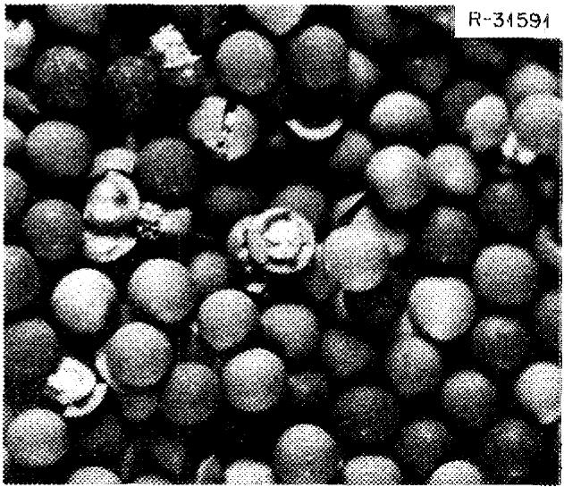  
Fig. 10.2. Pyrolytic-Carbon-Coated Uranium Oxide Particles from Batch OR-YZ66, Irradiated to 23 at. $\%$ Uranium Burnup at $1400^{\circ}\mathrm{C}$ in Capsule B9-31. $30\times$ .

Table 10.1. Pyrolytic-Carbon-Coated $\mathsf{UO}_2$ Particles Irradiated to Study Optimum Coating-Thickness Ratio   

<table><tr><td></td><td>OR-491</td><td>OR-493</td><td>OR-494</td></tr><tr><td colspan="4">Average particle dimensions (μ)</td></tr><tr><td>Total diameter</td><td>713</td><td>703</td><td>704</td></tr><tr><td>Fuel particle</td><td>429</td><td>419</td><td>412</td></tr><tr><td>Porous carbon coating thickness</td><td>28</td><td>61</td><td>93</td></tr><tr><td>Pyrolytic carbon coating thickness</td><td>114</td><td>81</td><td>63</td></tr><tr><td>Total coating thickness</td><td>142</td><td>142</td><td>146</td></tr><tr><td>Porous coating to pyrolytic coating ratio</td><td>0.25</td><td>0.70</td><td>1.47</td></tr><tr><td>Number of particles irradiated</td><td>5</td><td>10</td><td>570</td></tr></table>

thickness. The coated-particle dimensions are given in Table 10.1. These coated particles were irradiated in capsule B9-30 at $1400^{\circ}\mathrm{C}$ for 159 hr (1.9 at. $\%$ uranium burnup). At the beginning of the test, the fractional release of ${}^{83}\mathrm{Kr}$ was in the $10^{-7}$ range, but it increased suddenly to the $10^{-4}$ range near the end of the test when particles from batch OR-494 (which had the largest ratio of porous coating to pyrolytic coating) began to rupture. None of the 15 low- and intermediate-ratio particles (batches OR-491 and -493) failed; in both cases about half of the thickness of the porous carbon coating had been consumed during irradiation; but there was no evidence of uranium carbide formation. Most of the high-ratio particles (batch OR-494) either failed or were damaged almost to the point of failure. Failure was by unilateral movement of the $\mathrm{UO}_2$ through both layers of the coating. The fuel in these particles appears to have operated at a higher temperature than particles with the thinner porous carbon coating. Crystals of $\mathrm{UC}_2$ were found at the fuel surface of the totally failed particles.

When the experiment was designed, it was assumed that the five coated particles with the thinnest porous carbon layer would fail first, because there is little room for expansion of the fuel and accumulation of fission gas. The coated particles with thick layers of porous carbon were not supposed to fail. The burnup was too low to cause failure in any of these particles. We have observed, however, that a very thick buffer layer of porous carbon will insulate the fuel particle and may cause failure because of excessively high temperature in the fuel.

# POSTIRRADIATION TESTING OF COATED FUEL PARTICLES

M. T. Morgan C. D. Baumann R. L. Towns

To aid in the development of better coatings for coated fuel particles, a series of postirradiation anneals have been made on four types of pyrolytic carbon coatings applied to $\mathrm{UC}_2$ and $\mathrm{UO}_2$ fuel particles. Fuel migration studies by metallography

and microradiography have been made, and fission products released during anneals are being analyzed. Anisotropy, density, and crystallite size were the variables in the four types of outer coatings, the details of which are given in Figs. 10.3 and 10.4. These coatings were applied over identical inner coatings. The coated particles were all irradiated in the same capsule at the same temperature $(1400^{\circ}\mathrm{C})$ and to the same burnup $(14.5\%$ of the heavy metal). Samples of ten coated particles from each batch were annealed at $1700^{\circ}\mathrm{C}$ , and duplicate samples were annealed at $2000^{\circ}\mathrm{C}$ for a total of $19\frac{1}{2}$ hr for each sample in steps of $6\frac{1}{2}$ hr.[7,8]

# Evaluation of Fuel Migration by Metallography and Microradiography

Microradiographs and metallographic photomicrographs were made on each of the eight batches of coated particles as coated, on the irradiated coated particles before heating, and on the irradiated coated particles after the 1700 and $2000^{\circ}\mathrm{C}$ anneals. The photomicrographs are shown in Figs. 10.3 and 10.4. The microradiographs are not shown, but the outer diameter of the dense areas in the radiographs corresponds to that of the shaded or spotted areas of the coatings in the photomicrographs, indicating uranium diffusion into these areas.

Reaction areas in the coated $\mathrm{UO}_2$ particles were restricted to the inner coating. Spearhead-type attack occurred during irradiation in coated particles with low-temperature outer coatings, and the $\mathrm{UO}_2$ seemed to expand to fill the void areas. In the coated $\mathrm{UO}_2$ particles with outer coatings deposited at $2000^{\circ}\mathrm{C}$ , spearhead attack is not evident, and penetration of the inner coating is slight; this is probably a result of the $2000^{\circ}\mathrm{C}$ heat treatment received during the deposition of the outer coatings. The $\mathrm{UO}_2$ particles lost

crystalline detail during irradiation, and void areas were redistributed as smaller voids. No carbide formation was evident.

The $\mathrm{UC}_2$ fuel showed no apparent fine porosity after irradiation. Heat treatment at $2000^{\circ}\mathrm{C}$ seemed to have consolidated the fine porosity into larger pores or voids. Some graphite flakes were seen around the periphery of the fuel particles. The particle-coating reaction areas in the coated carbide particles were not as local as the spearhead attack in the coated oxide particles and were associated with a progressive, more extensive diffusion of fuel into the coating. The microradiographs of the unirradiated carbide particles indicated that fuel diffusion into the inner coatings started during the manufacture of the particles. Penetration of the inner coatings was complete in all coated carbide particles after irradiation, as indicated by the spotted areas in the micrographs. Diffusion of fuel deep into the low-density outer coating was evident in the irradiated YZ-13 coated particles. Large voids and separation of the inner coating from the outer coating were apparent in the YZ-15 and YZ-19 coated particles after heat treatment at 1700 and $2000^{\circ}\mathrm{C}$ .

# Coating Stability

No coating failures were observed in the eight groups during irradiation at $1400^{\circ}\mathrm{C}$ . Coatings of the $\mathrm{UC}_2$ particles failed during the postirradiation tests at both 1700 and $2000^{\circ}\mathrm{C}$ , but no failures occurred with the $\mathrm{UO}_2$ particles. Based on $^{85}\mathrm{Kr}$ release, approximately $30\%$ of the YZ-4 sample and $25\%$ of the YZ-13 sample failed at $1700^{\circ}\mathrm{C}$ . At $2000^{\circ}\mathrm{C}$ , $80\%$ of the YZ-4, $70\%$ of the YZ-13, and $45\%$ of the YZ-19 samples failed. Failures all occurred during heatup or within a few minutes after the annealing temperature was reached.

The two samples of coated $\mathrm{UC}_{2}$ particles which did not fail at $1700^{\circ}\mathrm{C}$ (one of which also survived the $2000^{\circ}\mathrm{C}$ anneal) had undergone the heat treatment during fabrication. We think that the migration of fuel into the coatings of $\mathrm{UC}_{2}$ particles weakened the coating and caused the high percentage of failures.

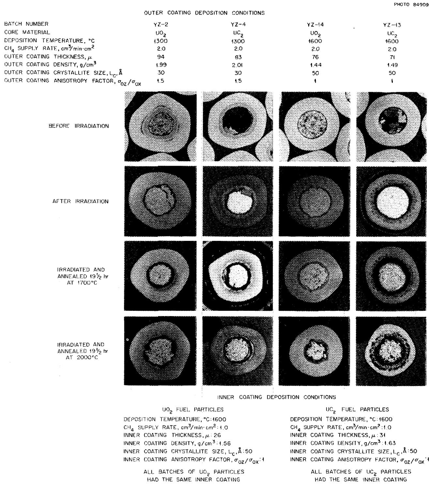  
Fig. 10.3. Photomicrographs of Pyrolytic-Carbon-Coated $\mathsf{UO}_2$ and $\mathsf{UC}_2$ Particles Before and After Irradiation and After Postirradiation Heat Treatment at 1700 and $2000^{\circ}\mathsf{C}$ Respectively. Groups YZ-2, YZ-4, YZ-14, and YZ-13.

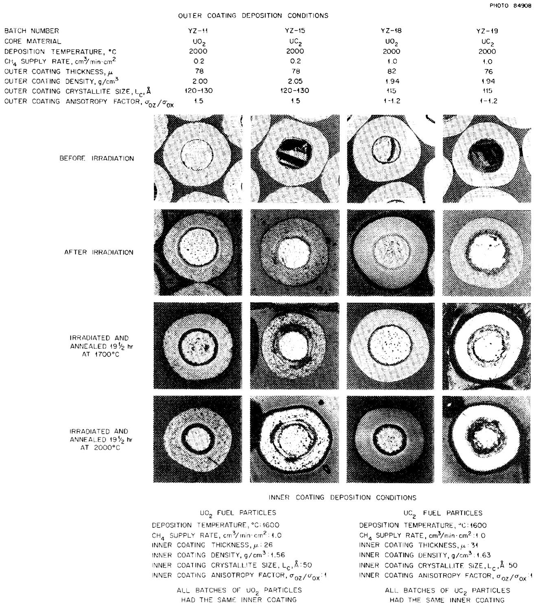  
Fig. 10.4. Photomicrographs of Pyrolytic-Carbon-Coated $\mathsf{U}\mathsf{O}_2$ and $\mathsf{UC}_2$ Particles Before and After Irradiation and After Postirradiation Heat Treatment at 1700 and $2000^{\circ}\mathsf{C}$ Respectively. Groups YZ-11, YZ-15, YZ-18, and YZ-19.

# IRRADIATION EFFECTS ON COMPATIBILITY OF FUEL OXIDES AND BERYLLIUM OXIDE WITH GRAPHITE

D. R. Cuneo

H. E. Robertson

C. A. Brandon

E. L. Long, Jr. 10

The compatibility of $(\mathbf{U},\mathrm{Th})\mathbf{O}_2$ with graphite and the compatibility of beryllium oxide with graphite were studied in separate experiments in the ORR.

# (U, Th)O $_2$ -Graphite Experiment

The objectives of this experiment were to study, at a fuel center temperature of $1650^{\circ}\mathrm{C}$ and a surface temperature of $1370^{\circ}\mathrm{C}$ , irradiation effects on chemical compatibility of $(\mathrm{U},\mathrm{Th})\mathrm{O}_2$ with graphite and fission-gas release, and to determine possible fuel swelling and its effects on the graphite.

The assembly was swept with helium containing 250 ppm of CO to suppress the reaction of the fuel oxides with graphite. The fuel loading and operating conditions are given in Table 10.2.

During the last six weeks of irradiation, the $^{133}\mathrm{Xe}$ release rate increased from 1.5 to $18\%$ ; the temperature drop from fuel center to surface

increased from 315 to $390^{\circ}\mathrm{C}$ . The gamma scan of the capsule after irradiation and before disassembly showed about 12 individual peaks of activity for the space occupied by eight hollow pellets in the upper fuel region. This indicated that the pellets were broken and pieces had separated; this was verified upon disassembly. The seven solid pellets in the upper region showed general deterioration of their outer surfaces. The 12 pellets in the lower region appeared intact; however, attempts to determine dimensions caused one of them to powder.

Metallography revealed that because of densification there was much less porosity in the irradiated sample (compared to an unirradiated control), and shrinkage cracks were apparent. In spite of this shrinkage, the diameters of two pellets which we were able to measure did not change. Weight and dimensional changes of the graphite disks and spacers were negligible.

We conclude that no carbide formation occurred from the following:

9ORNL Reactor Division.

10 ORNL Metals and Ceramics Division.

Table 10.2. Fuel Loading and Operating Conditions for (U, Th)O₂-Graphite Compatibility Test   

<table><tr><td rowspan="2">Fuel Pellet Position</td><td colspan="2">Composition (wt %)</td><td rowspan="2">Density (% of theoretical)</td><td rowspan="2">Power Density (w/cm3)</td><td rowspan="2">ID (in.)</td><td rowspan="2">OD (in.)</td><td rowspan="2">Height (in.)</td><td colspan="2">Integrated Fluxa(neutrons/cm2)</td><td colspan="2">Burnup</td></tr><tr><td>UO2</td><td>ThO2</td><td colspan="2">Thermal &gt;4 Mev</td><td>(at. % U fissioned)</td><td>(% total heavy metal)</td></tr><tr><td></td><td></td><td></td><td></td><td></td><td></td><td></td><td></td><td>×1020</td><td>×1018</td><td></td><td></td></tr><tr><td>Upper Region</td><td></td><td></td><td></td><td></td><td></td><td></td><td></td><td>1.3</td><td>3.5</td><td>8.9</td><td>0.8</td></tr><tr><td>1-8 (hollow)</td><td>9.2</td><td>90.8</td><td>87</td><td>600</td><td>0.140</td><td>0.258</td><td>0.125</td><td></td><td></td><td></td><td></td></tr><tr><td>9-15 (solid)</td><td>9.2</td><td>90.8</td><td>87</td><td>600</td><td></td><td>0.156</td><td>0.100</td><td></td><td></td><td></td><td></td></tr><tr><td>Lower Regionb</td><td></td><td></td><td></td><td></td><td></td><td></td><td></td><td>1.3</td><td>3.5</td><td>7.3</td><td>2.4</td></tr><tr><td>16, 18, 20, 22, 24, 26 (hollow)</td><td>33</td><td>67</td><td>95</td><td>2400</td><td>0.070</td><td>0.200</td><td>0.069</td><td></td><td></td><td></td><td></td></tr><tr><td>17, 19, 21, 23, 25, 27 (solid)</td><td>33</td><td>67</td><td>87</td><td>2200</td><td></td><td>0.200</td><td>0.061</td><td></td><td></td><td></td><td></td></tr></table>

$^{2}$ Experiment operated for 83 days at equivalent full power of $30 \, \text{Mw}$ in the ORR; it was at design temperature of $1650^{\circ} \text{C}$ for 54 days.   
bThe pellets in the lower fuel region were individually inserted in graphite disks and sandwiched between unfueled graphite spacers.

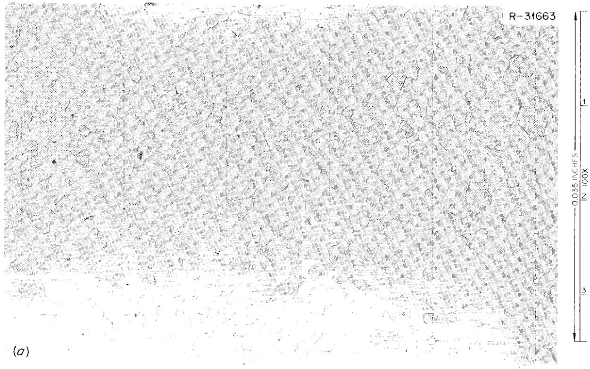

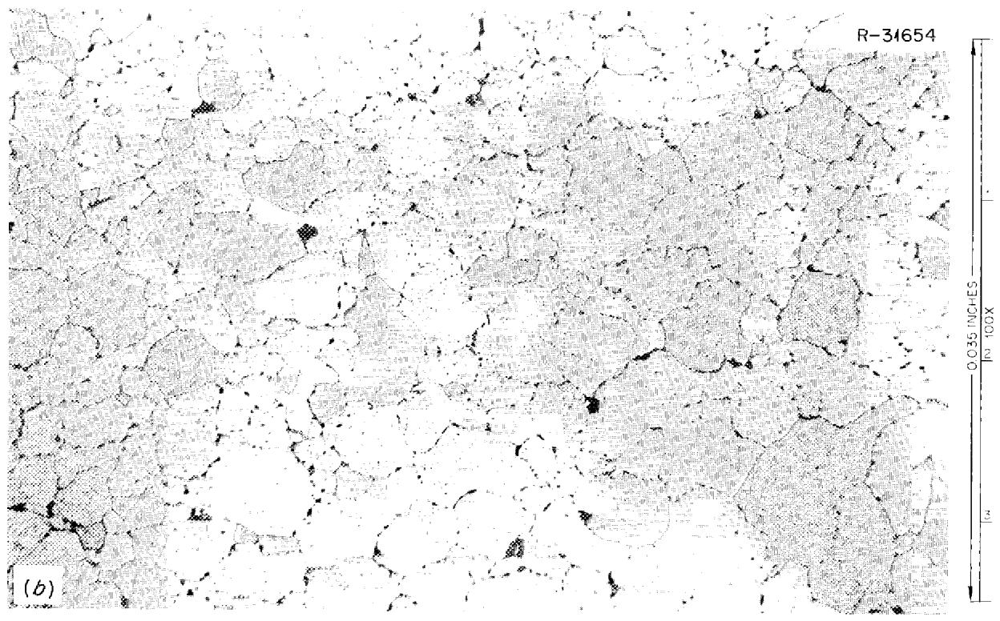  
Fig. 10.5. Comparison of (a) Unirradiated $\mathsf{B}\mathsf{o}$ with (b) an Irradiated Specimen from the $\mathsf{B}\mathsf{o}$ -Graphite Compatibility Test. Etched; $100\times$

1. No reaction was obtained with powdered fuel pellets in aqueous media (2 M HCl at $80^{\circ}\mathrm{C}$ for 8 hr).   
2. The x-ray diffraction pattern of a graphite spacer which had been in contact with a fuel pellet showed no carbides.   
3. Metallographic studies showed no evidence of any reaction products on the surfaces of five pellets or on matching graphite pieces.

# BeO-Graphite Experiment

The BeO-graphite test was designed to study irradiation effects at $1500^{\circ}\mathrm{C}$ on the chemical compatibility of graphite with BeO, to investigate the distribution of ${}^{6}\mathrm{Li}$ formed in the BeO, and to determine weight, dimensional, and structural changes in the graphite and BeO. A BeO ring and a graphite ring were in close contact on flat surfaces and were nested over a solid BeO core within a graphite sleeve.

The experiment was not fueled. The desired temperature was achieved for about four months by gamma heating. During the last five months of irradiation, the temperature gradually fell to about $1280^{\circ}\mathrm{C}$ , probably because of formation of soot $(\mathrm{CO} \rightarrow \mathrm{CO}_{2} + \mathrm{C})$ , resulting in loss in effectiveness of reflective insulation in the capsule. The total irradiation dose was $1.0 \times 10^{21}$ neutrons/cm² ( $E > 0.18$ MeV).

There was no physical damage to the BeO or graphite during irradiation. Metallographic examination of selected surfaces showed no reaction products, and x-ray diffraction of the BeO ring showed no $\mathrm{Be}_2\mathrm{C}$ . There was a deposit of $\mathrm{Mo}_2\mathrm{C}$ on the graphite sleeve adjacent to several large holes which appeared in a molybdenum heat shield.

Examination of the irradiated graphite showed no microstructural changes. Examination of the irradiated BeO showed that the grain size doubled, and each grain was outlined by gas bubbles, as seen in Fig. 10.5. Analyses of experimental components for $^6\mathrm{Li}$ concentrations showed that the major portion of the $^6\mathrm{Li}$ stayed in the BeO core where it was formed. A surface-to-volume relationship for $^6\mathrm{Li}$ retention was found by comparing the BeO ring with the BeO core. This is in agreement with work by Stieglitz and Zumwalt.[11]

Weight and dimensional changes for the BeO and graphite showed about $1\%$ shrinkage for the graphite and $0.5\%$ expansion for the BeO.

# FAST GAS-COOLED REACTOR DEVELOPMENT

D. R. Cuneo E. L. Long, Jr. 10

H. E. Robertson J. A. Conlin

During the past year we have begun postirradiation evaluations of experimental assemblies related to fuel elements for fast gas-cooled reactors. This is a cooperative program with General Atomic Division (GA) of General Dynamics Corporation. Details of test conditions and procedures were determined by the ORNL Reactor Division in cooperation with GA, and the fuel specimens were supplied by GA. The present series of tests is designed to investigate the effects of irradiation, thermal cycling, external pressure, and fuel-cladding interactions on the integrity and behavior of metal-clad $\mathrm{UO}_2$ fuel elements having design features that approximate those for the General Atomic fast gas-cooled reactor design. Design and operation of these experimental assemblies and details of postirradiation findings have been reported elsewhere.[12-15]

Two types of elements are being studied in the first group of tests: the fuel-supported type, in which the cladding is designed to collapse onto the fuel pellets at the outset of pressure and temperature application, and the free-standing fuel or "flexcan" type. The latter has a deformed section of cladding above the fueled region that is capable of flexing with pressure changes, and the internal void is filled with sodium.

We have completed examinations of four assemblies (lacking metallography for the fourth) which contained six of the fuel-supported elements and two of the sodium-filled flexcan types. All elements were fueled with $\mathrm{UO}_2$ pellets.

Operating data and metallographic findings are given in Table 10.3, while the appearance of two of the test elements is shown in Fig. 10.6.

Table 10.3. Operating Conditions and Metallographic Observations for Fast Gas-Cooled Reactor Fuel Elements   

<table><tr><td rowspan="2">Experiment No.</td><td rowspan="2">Fuel Element No.</td><td rowspan="2">Thermal Flux Dose (neutrons/cm2)</td><td colspan="2">Burnup</td><td rowspan="2">Cladding Material</td><td rowspan="2">Maximum Cladding Temperature (°C)</td><td rowspan="2">Metallographic Observations</td></tr><tr><td>(‰ U235)</td><td>(% heavy metal)</td></tr><tr><td rowspan="3">P4B1</td><td>GA1</td><td>4 × 1019</td><td>1.6</td><td>0.35</td><td>Hastelloy X</td><td>760+</td><td>Capsule badly flattened (see Fig. 10.6). Columnar grain growth observed in the fuel. No evidence of fuel melting or lenticular voids. General subsurface voids in inner surface region of cladding to depth of 1 mil. Formation of thin oxide layer (~2 μ) and thin metallic layer found on ID surface.</td></tr><tr><td>GA2</td><td>4 × 1019</td><td>1.6</td><td>0.35</td><td>Hastelloy X</td><td>760+</td><td>No evidence of fuel melting. Partial collapse of UO2 resulted in slight wrinkling of cladding. Pellet interfaces had sintered together. Large radial cracks found at pellet midlengths. No evidence of attack on cladding.</td></tr><tr><td>GA3 (unfueled, unconnected flexcan)</td><td></td><td></td><td></td><td></td><td></td><td></td></tr><tr><td rowspan="2">P4B2</td><td>GA4</td><td>5.2 × 1019</td><td>1.4</td><td>0.46</td><td>Hastelloy X</td><td>650</td><td>Fuel element not sampled for metallographic examination.</td></tr><tr><td>GA5</td><td>5.2 × 1019</td><td>1.4</td><td>0.46</td><td>Hastelloy X</td><td>650</td><td>No evidence of fuel melting. Columnar grain growth noted. Central hole in fuel pellet moved 14 mils off center. Reshap-ing of central hole was observed as seen in Fig. 10.6. No microstructural changes observed in cladding.</td></tr><tr><td rowspan="2">P4B3</td><td>GA6 (fueled flexcan)</td><td>5.2 × 1019</td><td>2.4</td><td>0.58</td><td>304 SS</td><td>650</td><td>No evidence of microstructural changes in cladding. Neither high- nor low-density fuel pellet showed evidence of columnar grain growth or central voids. No deleterious effects from sodium in capsule.</td></tr><tr><td>GA7</td><td>5.2 × 1019</td><td>2.4</td><td>0.59</td><td>Hastelloy X</td><td>650</td><td>No evidence of microstructural changes in cladding. No evidence of central voids or columnar grain growth in fuel pellets.</td></tr><tr><td rowspan="2">P4B4</td><td>GA8</td><td>1.3 × 1020</td><td>4.0</td><td>0.86</td><td>304 SS</td><td>650</td><td>Examination continuing.</td></tr><tr><td>GA9</td><td>1.3 × 1020</td><td>3.0</td><td>0.90</td><td>Hastelloy X</td><td>600</td><td>Examination continuing.</td></tr></table>

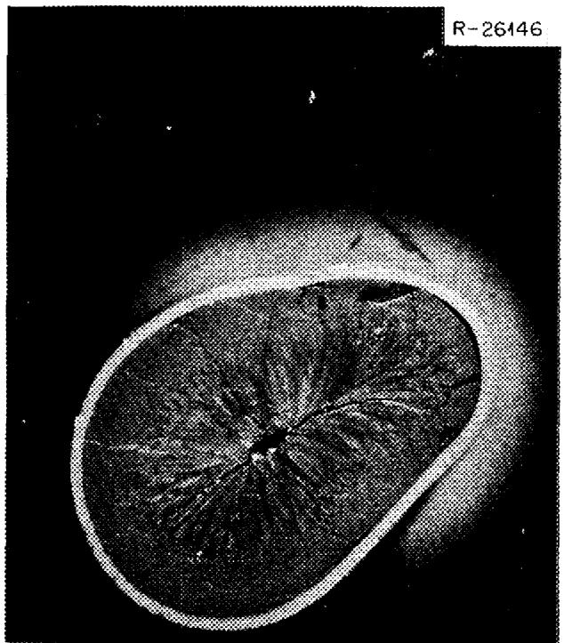  
（a）

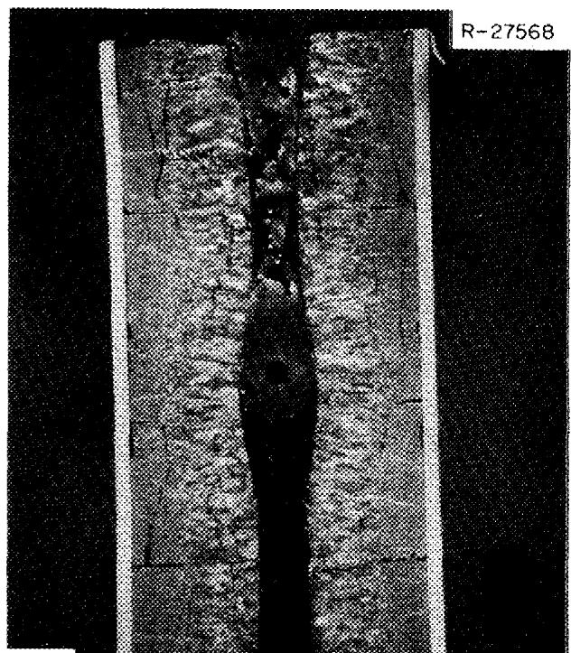  
(b)   
Fig. 10.6. (a) Transverse Section of Element GA1, Showing Columnar Grain Growth in Central Region of $\mathsf{UO}_2$ as Well as Severe Flattening of Cladding; (b) Longitudinal Section of Element GAS, Showing that $\mathsf{UO}_2$ Moved Out Against Cladding in Grooved Portion of Pellet, Accounting for Increase in Size of Central Hole in Pellet.

To summarize the postirradiation findings:

1. In all cases the cladding showed no indications of failure, despite the fact that element GA1 was badly deformed and GA2 was deformed to a lesser extent. (Some more recent elements have been prepressurized to avoid large pressure differences across the cladding.)   
2. There was no evidence of incompatibility between the cladding and the fuel in the elements tested, except for subsurface voids (to a depth of about $10\%$ of the wall thickness) noted in the inner surface regions of GA1 (Hastelloy X).   
3. There was no evidence of fuel melting in any element.   
4. The flexcan elements which contained sodium in the free volume did not reveal any deleterious effects from the sodium.

# FISSION-GAS RELEASE DURING FISSIONING OF $\mathsf{UO}_2$

R.M.Carroll O.Sisman

R. B. Perez16 G. M. Watson

T.W.Fulton

In all reactor systems the fission gas which escapes from the fuel must be controlled by containment within the fuel element or by removal from the fuel coolant. In high-temperature reactors this problem is especially important.[17] Some empirical formulas have been developed for estimating the fission-gas release under certain conditions,[18] but most values are obtained by

experiments simulating specific reactor operating conditions. We are seeking a general solution to this problem by studying the behavior of fission-gas release under well-controlled conditions in an attempt to understand the basic mechanisms of fission-gas release. $^{19-21}$

# Defect-Trap Model

As a result of these studies, we believe that the fission gas is released by a combination trapping and diffusion process, where the trapping is the dominant factor determining the time for the gas to escape. We have formed a defect-trap theory which postulates that defects in the $\mathrm{UO}_2$ crystal structure will trap migrating xenon and krypton atoms.[22] Some defects, such as grain boundaries and closed pores, are naturally present in the $\mathrm{UO}_2$ , and others can be formed by irradiation. The irradiation-formed defects start as point defects which may be destroyed by annealing but may cluster to form larger defects that will require longer times to anneal. Experiments have shown that the model has the correct general characteristics[23] and that grain boundaries will trap fission gas.[24] This model predicts that higher fission rates, which will produce more fission gas, will also produce more traps; therefore, the fission-gas release rate will not change much with a change in fission rate.

Fission-gas release measurements have been made during fission-rate and temperature oscillations. These data are being fitted into a computer code to determine the parameters of the defect-trap model. One complication was caused by the mixing of the fission gas with the flowing helium sweep gas. We developed an apparatus to measure the amount of mixing, using argon to simulate the fission gas and a thermal conductivity cell to measure argon concentration in the sweep gas. The mixing transfer function has now

19 R. M. Carroll and P. E. Reagan, Nucl. Sci. Eng. 21, 141-46 (1965).   
20 R. M. Carroll and O. Sisman, Nucl. Appl. 2(2), 142--50 (1966).   
$^{21}$ R. B. Perez, Nucl. Appl. 2(2), 151-57 (1966).   
22 R. M. Carroll and O. Sisman, Nucl. Sci. Eng. 21, 147-58 (1965)   
23 R. M. Carroll, R. B. Perez, and O. Sisman, J. Am. Ceram. Soc. 48(2), 55-59 (1965).   
24 R. M. Carroll and O. Sisman, J. Nucl. Mater. 17(4), 305-12 (1965).

been determined and will be used to correct the fission-gas release transfer function for the in-pile experiment.

Fission fragments which recoil free of the specimen surface will knock out $\mathrm{UO}_2$ molecules along with any fission gas in the immediate vicinity. The knockout release depends on the fission rate, the total surface area of the specimen, and possibly the condition of the surface. In order to study the effects of surface condition on fission-gas release, the gas release rates from $\mathrm{UO}_2$ single-crystal specimens with highly polished surfaces were compared with those from unpolished specimens.[25] The fission-gas release from unpolished specimens decreased with time in the early stages of irradiation, while the fission-gas release from the polished single crystals showed no change with time. We feel this confirms our theory that the surface is smoothed by irradiation, causing a reduction in area.

Measurement of krypton release from a polished single-crystal specimen is compared with that from a polycrystalline specimen in Fig. 10.7. At

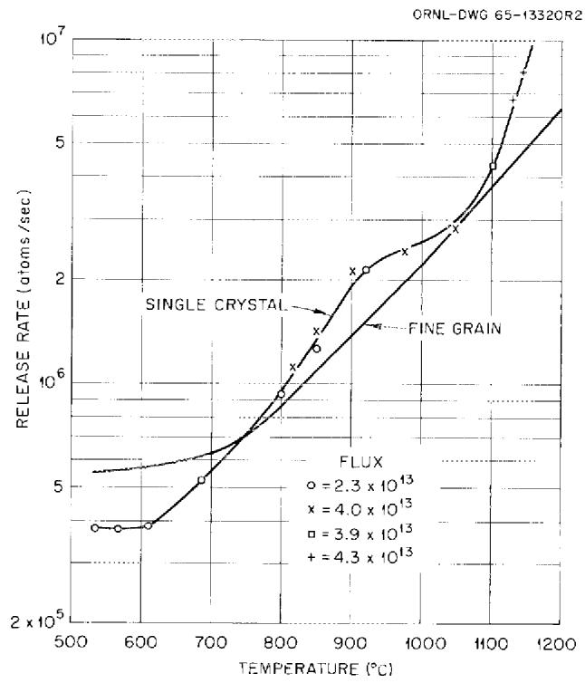  
Fig. 10.7. Release Rate of $^{88}\mathrm{Kr}$ from Fine-Grain and Single-Crystal $\mathsf{UO}_2$ .

temperatures up to about $600^{\circ}\mathrm{C}$ , knockout release predominates, and the gas release shows little temperature dependence. The tougher surfaced polycrystalline specimen shows greater knockout release (both specimens are the same size). At temperatures above $700^{\circ}\mathrm{C}$ the gas release is from point-defect traps for both specimens. At 950 to $1050^{\circ}\mathrm{C}$ the point defects are mobile enough to form clusters, slow down the gas release, and thus cause the step in the curve for the single-crystal specimen. The point defects are trapped by grain boundaries in the polycrystalline specimen before they can cluster, and therefore the step is absent. At higher temperatures, the clusters in the single-crystal specimen may anneal and migrate, and once again the release rate has an exponential temperature dependence, but the dependence differs from that where release is primarily from point defects. The temperature dependence of gas release from the polycrystalline specimen, where the gas release is always from point defects, is constant to $1200^{\circ}\mathrm{C}$ . All of these observations were predictable by the defect-trap model.

# THERMAL CONDUCTIVITY OF $\mathsf{UO}_2$ DURING IRRADIATION

C. D. Baumann

J. G. Morgan

R. M. Carroll

M. F. Osborne

R. B. Perez16

Studies of the effect of irradiation on the thermal conductivity of $\mathrm{UO}_2$ have, for the most part, been limited to postirradiation tests. Annealing tests show that irradiation at a low $(< 100^{\circ}\mathrm{C})$ temperature causes a decrease in thermal conductivity which can be recovered in stages near 150 and $400^{\circ}\mathrm{C}$ . [26] Effects of density, grain size, and burnup have also been studied after irradiation. [27] Data are lacking, however, on the actual thermal conductivity during irradiation as it is affected by fission rate and temperature. We have begun our in-pile testing with a single crystal of $\mathrm{UO}_2$ to eliminate the parameter of grain-boundary effects. [28]

We are evaluating data obtained while the specimen was at three different neutron flux levels and three temperatures at each neutron flux. The evaluation is not complete, but we can see some rather definite trends: (1) the thermal conductivity is lowered by increasing the fission rate at a given temperature, and (2) the thermal conductivity increases with temperature up to about $900^{\circ}\mathrm{C}$ and then decreases with further increase in temperature.

These changes of thermal conductivity with temperature, while fissioning, are consistent with the concept that disorder lowers the thermal conductivity. When the temperature of the specimen is changed (for example from 600 to $700^{\circ}\mathrm{C}$ ) while at a constant fission rate, two different processes are in competition which affect the thermal conductivity: (1) the conductivity of the undamaged matrix tends to decrease as the temperature is increased, and (2) the increased temperature would increase the conductivity by annealing the accumulated radiation damage. When the temperature is increased from 600 to $700^{\circ}\mathrm{C}$ , the thermal conductivity increases because annealing the radiation damage is the dominant process. At temperatures higher than about $900^{\circ}\mathrm{C}$ , the equilibrium amount of damage is small enough so that the change in conductivity caused by the increase in temperature will result in a net lowering of the conductivity.

The specimen is moved sinusoidally in the reactor neutron flux. The fission rate and, thus, the heat production within the specimen respond instantaneously to the change in neutron flux, but the temperature does not. If the oscillations are so rapid that the temperature does not have a

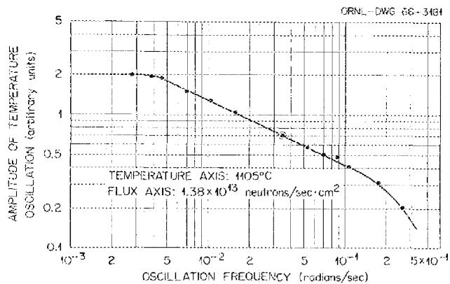  
Fig. 10.8. Uranium Dioxide Single Crystal Temperature Response to Oscillating Fission Rate.

chance to reach its maximum value, then the amplitude of the temperature oscillations will decrease as the oscillation frequency increases (see Fig. 10.8). The time delay or phase shift between the neutron flux oscillations and the resultant temperature oscillations will also change with frequency. The phase shift and amplitude relation of the temperature oscillations in comparison with the neutron flux oscillations over a range of frequencies will yield data to determine the thermal conductivity of the specimen.

The analysis of the temperature response of the sample to small oscillating changes in neutron flux (heat generation) has been completed, and the necessary mathematical relations to obtain the thermal conductivity have been derived. [29] Measurements of the thermal conductivity of single-crystal $\mathrm{UO}_2$ at three neutron flux levels and three temperatures at each neutron flux are in progress.

29R. M. Carroll, J. G. Morgan, and O. Sisman, *Fuels and Materials Development Program Quart. Progr. Rept.*, ORNL-TM-1500 (June and September 1966).

# 11. Behavior of High-Temperature Materials Under Irradiation

# EFFECTS OF FAST-NEUTRON IRRADIATION ON OXIDES

G. W. Keilholtz

R.E.Moore

A comparison of the effects of fast-neutron irradiation on sintered compacts of BeO, MgO, and $\alpha\text{-Al}_2\mathrm{O}_3$ has been reported previously. During the past year we have initiated an investigation of the irradiation behavior of a commercially available translucent aluminum oxide of high density which is of interest as a possible insulator in thermionic emitters. The objectives were (1) to establish its limits of stability toward fast neutrons and (2) to determine whether grain boundary separation would occur at very high doses, as it does in BeO at doses well below $1\times 10^{21}$ neutrons/cm². The experimental techniques used in the irradiations, which are carried out in the Engineering Test Reactor (Idaho), are described elsewhere.

The results of postirradiation examinations and measurements of translucent $\alpha\text{-Al}_{2}\mathrm{O}_{3}$ specimens irradiated at 300 to $600^{\circ}\mathrm{C}$ over the dose range

0.6 to $5.2 \times 10^{21}$ neutrons/cm $^2$ (>1 MeV) are given below.

# Gross Damage

At low irradiation doses, translucent $\mathrm{Al}_{2}\mathrm{O}_{3}$ is much more resistant to fracturing than sintered $\mathrm{Al}_{2}\mathrm{O}_{3}$ . Below $3\times 10^{21}$ neutrons/cm $^2$ (>1 MeV), there was virtually no fracturing of translucent $\mathrm{Al}_{2}\mathrm{O}_{3}$ , but severe fracturing along intergranular paths occurred at higher doses.

# Metallographic Examinations

Grain boundary separation begins to appear at a dose of $2.3 \times 10^{21}$ neutrons/cm $^2$ ( $>1$ MeV). This separation is very extensive at a dose of $4.7 \times 10^{21}$ ( $>1$ MeV). The same degree of grain boundary separation occurs in BeO at doses smaller by a factor of 5 to 10. Grain boundary separation in translucent Al $_2$ O $_3$ is probably the predecessor of gross fracturing.

# Dimensional Measurements

The translucent $\mathrm{Al}_{2}\mathrm{O}_{3}$ expanded in volume by about $1.3\%$ over the dose range 0.5 to $1.4\times 10^{21}$ neutrons/cm2 $(>1$ Mev); this is approximately the same expansion observed in the cold-pressed-sintered $\mathrm{Al}_{2}\mathrm{O}_{3}$ irradiated previously. Above $2\times$ $10^{21}$ neutrons/cm2 $(>1$ Mev), the volume expansion

of translucent $\mathrm{Al}_{2}\mathrm{O}_{3}$ increases nearly linearly with neutron dose to about $5\%$ at a dose of $5\times 10^{21}$ neutrons/cm² (>1 Mev).

# X-Ray Diffraction Examinations

The volume increase calculated from the lattice parameter expansion was less than $1.5\%$ over the dose range 1.3 to $4.7 \times 10^{21}$ neutrons/cm². The anisotropic expansion ratio $(\Delta c / c_0) / (\Delta a / a_0)$ was about 2 to 3, as compared with that of BeO, which is about 20 for doses less than $1 \times 10^{21}$ neutrons/cm² (>1 MeV).

Grain boundary separation in BeO compacts irradiated at low temperatures is generally believed to result from anisotropic lattice parameter expansion. In the case of $\mathrm{Al}_{2}\mathrm{O}_{3}$ , however, the lattice parameter expansion in itself probably does not produce the grain boundary separation, which is observed in increasing degree as the neutron dose is increased from 2.3 to $4.7 \times 10^{21}$ neutrons/cm $^2$ ( $>1$ MeV). The lattice parameter expansion in $\mathrm{Al}_{2}\mathrm{O}_{3}$ is small and does not increase with increasing neutron dose over this range. It is possible, however, that defect agglomerates too large to affect the lattice parameters cause an additional anisotropic crystal expansion large enough at high doses to produce separation of grains. The grain boundary separation appears to limit the usefulness of translucent $\mathrm{Al}_{2}\mathrm{O}_{3}$ to fast-neutron exposures of less than 2 to $3 \times 10^{21}$ neutrons/cm $^2$ ( $>1$ MeV) at temperatures below $600^{\circ}\mathrm{C}$ . The neutron dose limit at higher temperatures will be established when specimens now being irradiated in high-temperature assemblies are examined.

# BEHAVIOR OF REFRACTORY METAL CARBIDES UNDER IRRADIATION

G.W. Keilholtz

R.E.Moore

M. F. Osborne

Refractory metal carbides have potential uses in nuclear reactors designed to operate at very high temperatures. We are investigating the changes in the physical and mechanical properties of these materials during exposure to fast-neutron doses as high as $5.4 \times 10^{21}$ neutrons/cm $^2$ (>1 MeV) at temperatures ranging upward to $1400^{\circ}\mathrm{C}$ . The monocarbides of Ti, Zr, Nb, Ta, and W in the

form of $\frac{1}{2} \times \frac{1}{2}$ in. cylinders made by (1) hot pressing, (2) slip casting and sintering, and (3) explosion pressing and sintering were selected for these studies. Low-temperature (300 to $700^{\circ}\mathrm{C}$ ) irradiations are now complete, a high-temperature ( $\sim 1000^{\circ}\mathrm{C}$ ) irradiation is in progress, and assemblies for higher-temperature irradiations are being designed. The experimental techniques used in the irradiations are described elsewhere.[5]

Hot-pressed specimens and slip-cast-sintered specimens of each of the five monocarbides behaved very similarly in low-temperature irradiations (300 to $700^{\circ}\mathrm{C}$ ) over the neutron dose range 0.7 to $5.4 \times 10^{21}$ neutrons/cm $^2$ (>1 MeV). The results are summarized below.

# Gross Damage

Tungsten carbide and titanium carbide were generally undamaged over the entire dose range of the irradiations. Figure 11.1 is a bar graph showing the approximate neutron dose ranges where fracturing occurred in each of the five carbides.

$^{6}$ G. W. Keilholtz, M. F. Osborne, and R. E. Moore, Reactor Chem. Div. Ann. Progr. Rept. Dec. 31, 1965, ORNL-3913, p. 104.

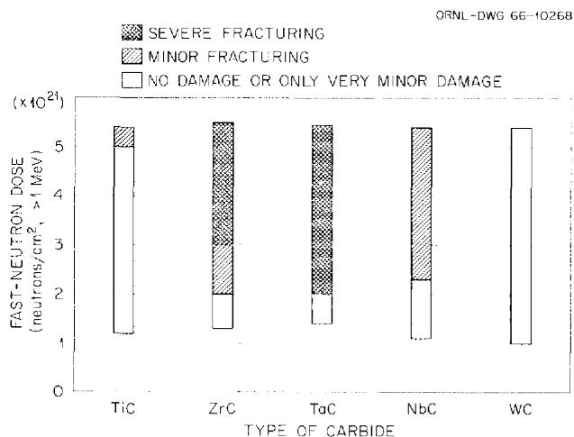  
Fig. 11.1. Gross Damage to Specimens of Hot-Pressed and Slip-Cast-Sintered Refractory Metal Monocarbides in the Form of $\frac{1}{2} \times \frac{1}{2}$ in. Solid Cylinders Irradiated at Low Temperatures (300 to $700^{\circ} \mathrm{C}$ ) as a Function of the Fast-Neutron Dose.

# Metallographic Examinations

No grain boundary separation could be seen in photomicrographs of any of the carbide specimens.

# Dimensional Measurements

As shown in Fig. 11.2, in which the volume expansion data are summarized, the carbides expanded on exposure to a dose of $1 \times 10^{21}$ neutrons/cm $^2$ ( $>1$ MeV) and then shrank at different rates as the neutron dose increased to $5.4 \times 10^{21}$ neutrons/cm $^2$ ( $>1$ MeV).

# X-Ray Diffraction Examinations

The volume increases calculated from the lattice parameter changes account for only 30 to $50\%$ of the gross volume expansions.

Fracturing of explosion-pressed specimens with $\sim 1\%$ nickel additive generally occurred at lower neutron doses than with the corresponding hot-pressed and slip-cast carbide specimens with no additive. This was particularly true for explosion-pressed titanium and tungsten carbides, which were damaged on exposure to doses above $\sim 2 \times 10^{21}$ neutrons/cm² (>1 MeV). The volume expansion of explosion-pressed samples was approximately the same as that of the corresponding carbides fabricated by the other methods.

The following conclusions were drawn from the results of the low-temperature (300 to $700^{\circ}\mathrm{C}$ ) irradiations.

1. The gross volume expansion is the sum of the lattice parameter expansion and agglomerates of defects too large to affect measured values of the lattice parameters.

2. A collapse of the large agglomerates as the neutron dose is increased from 1 to $5 \times 10^{21}$ neutrons/cm $^2$ (>1 MeV) is the principal cause of the shrinkage in gross volume over this dose range.

3. The leveling effect on gross damage to the five carbides when explosion-pressed samples were irradiated indicates that the nickel additive is primarily responsible for the increased fracturing observed.

4. Hot-pressed and slip-cast-sintered tungsten carbide and titanium carbide prepared without additives are more resistant to fast-neutron irradiation at low temperatures $(< 700^{\circ}\mathrm{C})$ than any of the other types of carbide specimens investigated.

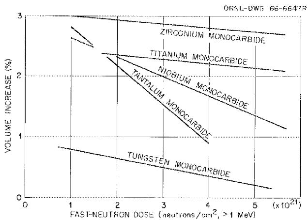  
Fig. 11.2. Volume Increase of Monocarbides of Ti, Zr, Ta, Nb, and W irradiated at Low Temperatures (300 to $700^{\circ}\mathrm{C}$ ) as a Function of Fast-Neutron Dose.

# Part IV

# Other ORNL Programs

# 12. Chemical Support for the Saline Water Program

# SOLUBILITY OF CALCIUM SULFATE IN SEA SALT SOLUTIONS TO $200^{\circ}\mathrm{C}$ ; TEMPERATURE-SOLUBILITY LIMITS FOR SALINE WATERS

W. L. Marshall Ruth Slusher

In a previous study the extensive solubility measurements of calcium sulfate and its hydrates in sodium chloride solutions were used to estimate solubility limits for these species in saline waters in general, since such estimates are of great value to those concerned with distillation of saline waters. The effect of divalent ions (magnesium in particular), which can partially complex the sulfate ion and thereby increase the solubility of calcium sulfate over that "normally" expected, could not be taken into account in these estimates. We have, therefore, measured the solubility of calcium sulfate (or of the dihydrate at temperatures below $100^{\circ}\mathrm{C}$ ) in sea salt solutions (aqueous solutions containing the salt composition of seawater but with varying degrees of concentration or dilution) at temperatures from 30 to $200^{\circ}\mathrm{C}$ and at ionic strengths to $6\mathrm{~m}$ , and have compared the results with those obtained in sodium chloride solutions. Figure 12.1 shows all solubility values obtained experimentally; in this figure the logarithm of the solubility product, $K_{sp}^{\prime}$ , is plotted against a function of the formal ionic strength, $I$ . The term $K_{sp}^{\prime}$ is defined as the molal solubility of calcium sulfate times the molality of total sulfate. The analogous, comparative behavior in sodium chloride solutions

is shown by the undashed lines, the experimental data for which are given elsewhere. Our evaluations of some published solubilities in sea salt solutions are also included in this figure; the comparative results appear to be in good agreement. In the temperature interval 30 to $90^{\circ}\mathrm{C}$ the only significant difference in solubility in the two systems is observed at very high ionic strengths. The solubilities for temperatures from 100 to $200^{\circ}\mathrm{C}$ are greater in sea salt solutions, but the values do not show a continuous (monotonic) increase in the difference with increasing temperature. This behavior can be explained by the formation of an $\mathrm{MgSO}_4^0$ neutral species that allows the molal solubility of calcium sulfate to increase until the limiting value of the solubility product, $K_{sp}$ , obtained from the comparative solubility in sodium chloride solutions, is reached. The change with increasing temperature in solubility between that in sea salt (containing approximately 2 moles of magnesium per mole of sulfate) and in sodium chloride solutions is then explained by an interrelated function of an increasing association constant of magnesium sulfate and the decreasing solubility product constant of calcium sulfate.

With the dissociation quotients (at ionic strengths, $I$ ) and constants (at $I = 0$ ) for magnesium sulfate, calculated from the solubility behavior shown in Fig. 12.1 and presented elsewhere in this report, $^6$

a previously developed computer method² was revised to obtain refined temperature-solubility limits for saline waters in general within which precipitation of calcium sulfate or its hydrates can be avoided. The values needed for the calculations are the molalities of calcium, magnesium, and sulfate, and the (molal) ionic strength of the

saline water. A representation of the revised solubility limits for seawater is shown in Fig. 12.2; in this figure CF equals the concentration factor on a molal, molar (at $25^{\circ}\mathrm{C}$ ), or weight fraction basis. If calcium and magnesium are removed initially from a saline water, other sets of concentration limits can be obtained with ease.

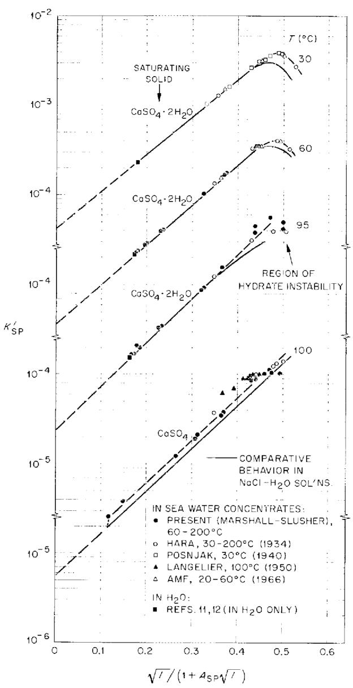

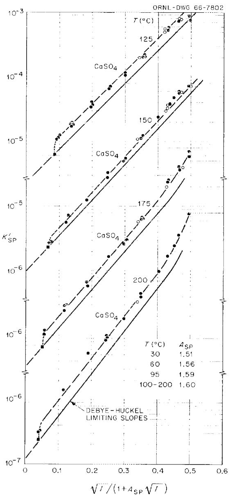  
Fig. 12.1. Solubility Products, $K_{\mathfrak{sp}}'$ vs $\sqrt{I} / (1 + A_{\mathfrak{sp}} \sqrt{I})$ , of $\mathrm{CaSO}_4 \cdot 2\mathrm{H}_2\mathrm{O}$ and $\mathrm{CaSO}_4$ in seawater Concentrates Compared with Their Behavior in NaCl-H₂O Solutions, 30-200°C.

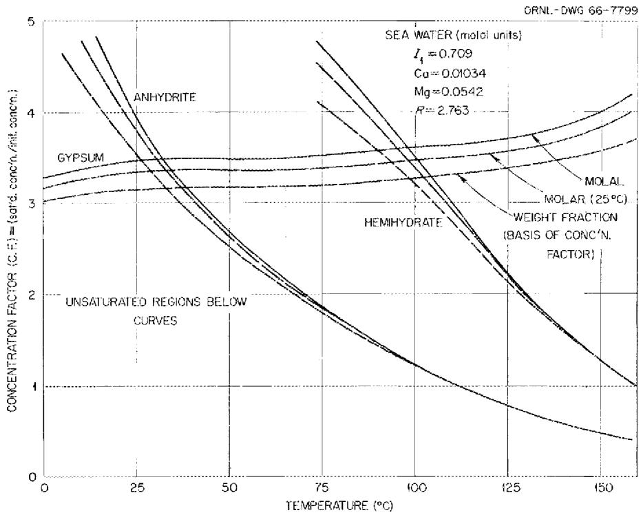  
Fig. 12.2. Calculated Limits of Solution Stability to Avoid Precipitation of Gypsum $(\mathsf{CaSO}_4\cdot 2\mathsf{H}_2\mathsf{O})$ , Hemihydrate $(\mathsf{CaSO}_4\cdot \frac{1}{2}\mathsf{H}_2\mathsf{O})$ , and Anhydrite $(\mathsf{CaSO}_4)$ from Seawater Concentrates. $I_{1} =$ molal ionic strength of seawater; Ca, Mg = original molalities of Ca and Mg; R = molal ratio, $\mathsf{SO}_4 / \mathsf{Ca}$ .

# CORROSION OF TITANIUM IN SALINE WATER

E. G. Bohlmann

J.C.Griess, Jr.

J. F. Winesette

F. A. Posey

# Crevice Attack

Titanium has excellent resistance to saline waters, but at temperatures of $150^{\circ}\mathrm{C}$ and higher it is subject to severe corrosion damage in crevices. Studies to determine the cause and to find ways to mitigate such attack are in progress.

Electrochemical polarization studies at temperatures up to $150^{\circ}\mathrm{C}$ showed that it was not possible to produce corrosion of the same magnitude as observed in crevices when the $\mathsf{pH}$ of 1 M NaCl solutions was 3 or higher; this suggests that the

small volume of solution in the crevice becomes appreciably acid (more than $10^{-3}M$ ) before crevice corrosion can occur. To determine the approximate pH of the solution in a corroding crevice, specimens were prepared in which the tip of a fine titanium capillary extended into the crevice. The capillary tubing passed through the head of an autoclave, and with appropriate valving a small volume of the solution from the crevice region could be sampled while the specimen was at $150^{\circ}\mathrm{C}$ . The pH of single small drops of solution was about 1 in those cases where crevice corrosion was observed and 4 to 5 when significant corrosion was absent. The pH of the bulk solution was 6 to 7.

Figure 12.3 shows a series of partial anodic polarization curves obtained potentiostatically in a solution containing $0.1M\mathrm{HCl}$ and $0.9M\mathrm{NaCl}$ . The curves originate at the corrosion potential, and the potential was changed in a noble direction at 3-min intervals. In the active region the current density achieved a steady-state value in less than 3 min, whereas in the passive region the current density decreased slowly for long periods. Although

not shown, the passive region extends up to the pitting potential, which is higher the lower the temperature (see section on "Pitting"). The critical current for passivation increased with temperature, corresponding to an activation energy of about 11 kcal/mole. The actual maximum current density at $150^{\circ}\mathrm{C}$ corresponds to a corrosion rate of 360 mils/year, which is close to, but less than, the maximum corrosion rate observed in the crevice regions (as high as 500 mils/year) at the same temperature.

The corrosion of titanium in crevices is not confined to chloride systems. Titanium crevice specimens exposed to neutral aerated $1M\mathrm{NaBr}$ , $\mathrm{NaI}_2$ or $\mathrm{Na_2SO_4}$ at $150^{\circ}\mathrm{C}$ underwent corrosion in the crevices to about the same extent as observed in chloride solutions. Anodic polarization curves obtained in boiling acidified solutions of these salts were essentially the same as those obtained in chloride systems (though the pitting potential is different). These results show that crevice corrosion of titanium is not peculiar to chloride solutions, but that it is associated with the development of an acid environment within the crevice.

The preceding results imply that a titanium alloy resistant to dilute acid solutions at $100^{\circ}\mathrm{C}$ may be immune to crevice corrosion at higher temperatures; conversely, an alloy showing active corrosion in dilute acid solutions at lower temperatures probably will be susceptible to crevice attack at high temperatures. It was of interest, therefore, to determine the anodic polarization characteristics of a number of commercially available titanium alloys and of alloys prepared in small quantities by the Metals and Ceramics Division. The nominal compositions of the commercial alloys tested were: $0.15\%$ Pd; $4\%$ Mn- $4 \%$ Al; $5\%$ Cr- $3 \%$ Al; $4 \%$ V- $6 \%$ Al; $14 \%$ V- $11 \%$ Cr- $4 \%$ Al; $2.5 \%$ Sn- $5 \%$ Al; $2 \%$ Nb- $1 \%$ Ta- $8 \%$ Al; and $8 \%$ Zr- $1 \%$ (Nb + Ta)- $8 \%$ Al. Alloys produced locally contained individually 1, 5, 10, 20, and $30 \%$ Mo; $0.5 \%$ Nb; $0.5 \%$ Ta; $0.5 \%$ Cu; $1 \%$ Sn; $1 \%$ Al; $2 \%$ Ni; and $1 \%$ Ni- $1 \%$ Mo. Potentiostatic anodic polarization curves were obtained for each alloy in a solution containing $0.1 M \text{HCl}$ and $0.9 M \text{NaCl}$ at the atmospheric boiling temperature. Of all the alloys tested, only the $0.15 \%$ Pd alloy, those containing $5 \%$ or more Mo, and both alloys containing nickel showed

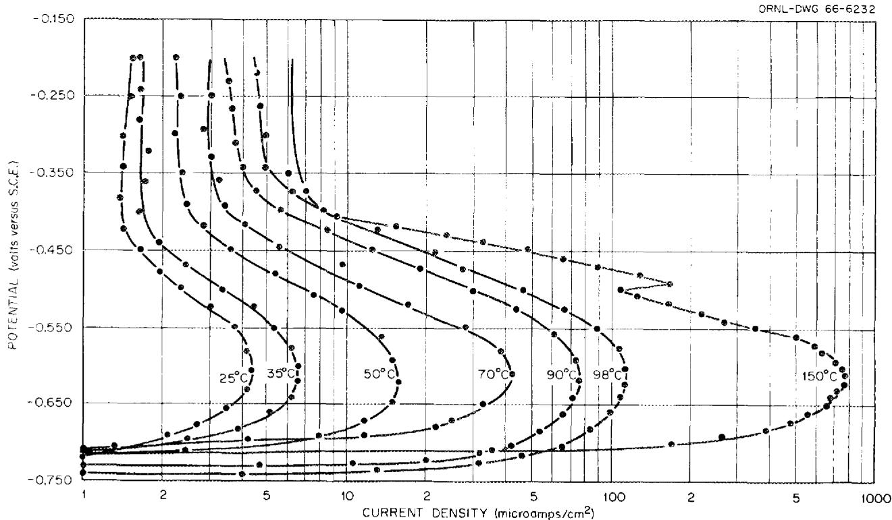  
Fig. 12.3. Effect of Temperature on the Anodic Polarization of Titanium in a $0.9\text{M}$ $\mathrm{NaCl} - 0.1\text{M}$ HCl Solution.

no active region. Open-circuit potentials of freshly abraded or pickled surfaces for the latter group of alloys were greater than the active potential (more than $-0.4$ vs S.C.E.), whereas all the other alloys had polarization curves similar to that observed with commercial purity titanium. The critical current density for passivation, however, varied somewhat from alloy to alloy.

Additional anodic polarization curves were obtained in boiling $1\text{M}$ HCl with those alloys exhibiting passivity in the $0.1\text{M}$ HCl- $0.9\text{M}$ NaCl solution. In this environment only the alloys containing 20 and $30\%$ Mo and the $0.15\%$ Pd alloy did not develop a potential characteristic of actively corroding titanium. The $2\%$ Ni alloy was passive initially, but after exposure to the $1\text{M}$ HCl for several days or after cathodic polarization, the alloy developed an active potential and corroded at about the same rate as pure titanium. The $1\%$ Ni- $1\%$ Mo alloy exhibited borderline passivity. Most of the time the potential of the alloy was about $-0.3\text{v}$ vs S.C.E., but periodically it decreased to $-0.47$ , at which potential the alloy corroded with evolution of hydrogen. After a few minutes at the latter value, the potential returned to $-0.30\text{v}$ vs S.C.E. The time between periods of active corrosion was 20 to $30\text{min}$ .

On the basis that crevice corrosion occurs because of the production and maintenance of an acid solution in the crevice, the alloys which would tend to resist such attack are $2\%$ Ni, $5\%$ Mo, $1\%$ Ni + $1\%$ Mo, $10\%$ Mo, $0.15\%$ Pd, $20\%$ Mo, and $30\%$ Mo, with the last being the most resistant. Observations on a large number of specimens exposed in high-temperature (150 to $200^{\circ}\mathrm{C}$ ) loop experiments are qualitatively consistent with this ranking, but a satisfactory quantitative means of assessing and demonstrating susceptibility has not been devised.

# Pitting

Titanium, in common with many other metallic materials of construction, owes its immunity to corrosion to the existence of a passive oxide layer at the metal-solution interface. Except in strongly acidic solutions under reducing conditions, titanium normally corrodes spontaneously at a very low rate in the passive state, and the current density of the anodic process (formation of a $\mathrm{TiO}_2$ passive layer) is independent of the value of the electrode potential over a wide potential

range. However, in solutions containing a sufficient concentration of chloride ions (also bromide or iodide ions), localized breakdown of the passive layer occurs, and titanium exhibits a pitting potential similar to that observed for aluminum, iron, stainless steel, and other metals and alloys which are capable of existing in both active and passive states.

Electrochemical studies of titanium alloys in saline waters have shown a sharp inverse dependence of the pitting potential on temperature. Thus, whereas most such alloys require anodic potentials of the order of $10\mathrm{v}$ or higher to initiate breakdown of the protective oxide and consequent pitting attack at approximately $25^{\circ}\mathbf{C}$ , we have found that the potential required is only 0.5 to $2.0\mathrm{v}$ at elevated temperatures. Details of the variation of the pitting potential with temperature are dependent on alloy and solution composition but have been shown to be quite reproducible under a given set of conditions.

The effect of temperature on the pitting potentials of a number of titanium alloys is shown in Fig. 12.4. These data were obtained by variation of the temperature of the $1\textbf{M}$ NaCl solution while the titanium electrodes were polarized to their pitting

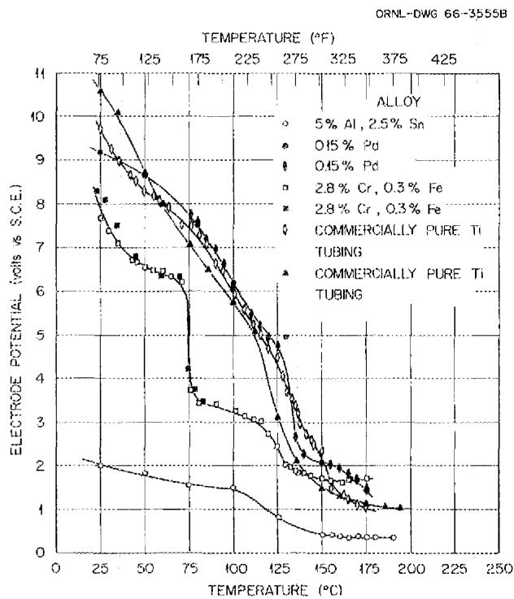  
Fig. 12.4. Effect of Temperature on Pitting Potentials of Titanium Alloys in $1M\mathsf{NoCl}$

potentials by passage of a constant high anodic current. Commercially pure Ti alloys and the $0.15\%$ Pd alloy, with small amounts of added elements, show high pitting potentials (9 to 11 v) in the vicinity of room temperature. With increasing temperature the pitting potentials of these materials decrease more or less uniformly to values of the order of $+1$ to $2\mathrm{v}$ at 175 to $200^{\circ}\mathrm{C}$ . A relatively sudden change $(-2\mathrm{v})$ in the pitting potential of the $0.15\%$ Pd alloy occurs in the vicinity of $125^{\circ}\mathrm{C}$ . The type 150 A alloy ( $28\%$ Cr, $0.3\%$ Fe) shows a similar sharp drop in the value of its pitting potential in the vicinity of $70^{\circ}\mathrm{C}$ ; the pitting potential changes about $2.5\mathrm{v}$ over a temperature range of only a few degrees. Pitting potentials of the type 110-AT alloy ( $5.5\%$ Al, $2.5\%$ Sn) are generally low and attain values of only about $+0.4\mathrm{v}$ at $190^{\circ}\mathrm{C}$ .

Qualitatively, the curves of Fig. 12.4 show that in general the addition of alloying elements decreases the value of the pitting potential of titanium. This is consistent with observations of Fischer on effects of various surface treatments and of intentionally added impurities on the initiation of titanium pitting corrosion. One way to rationalize these differences in pitting potentials of titanium alloys is to suppose that the presence of alloying elements affects the ionic as well as the electronic conductivity of the protective oxide layer. It is known that the presence of certain impurities or lattice defects considerably enhances the electronic conductivity of rutile $(\mathrm{TiO}_2)$ crystals. Analogous effects on the kinetics of

the anodic process have been observed as a result of incorporation of alloying elements into the $\mathrm{TiO}_2$ lattice. $^{14,15}$ In addition to direct effects on anodic reaction mechanisms, the presence of additional electronic energy levels in a semiconductor of the type in question and the resulting enhanced electronic conductivity imply a simultaneous increase in hole concentration in the valence band (weakened bonds), so that a further increase in the mobility of ionic charge carriers can be expected.

An analysis based on a simple resistance analogy suggests that differences in the mobility of ionic charge carriers, which affect the kinetics of the anodic processes occurring in the passive oxide film, can account for observed variation in values of pitting potentials as a function of alloy composition.

9W.R.Fischer, Tech. Mitt. Krupp, Forsch. Ber. 22(3), 65-82 (1964).   
10K. Hauffe, H. Grunewald, and R. Tränckler-Greese, Z. Elektrochem. 56(10), 937-44 (1952).   
11R. G. Breckenridge and W. R. Hosler, Phys. Rev. 91(4), 793--802 (1953).   
12W. Kleber, H. Pcibst, and W. Schroder, Z. Physik. Chem. (Leipzig) 215, 63-76 (1960).   
13L.E.Hollander, Jr., and P.L.Castro, Phys. Rev. 119(6), 1882-85 (1960).   
14F.A.Grant,Rev.Mod.Phys.3l(3),646-74 (1959).   
15J. Maserjian, Conduction Through Thin Titanium Dioxide Films, Jet Propulsion Laboratory Technical Report No. 32-976, October 1966.

# 13. Effects of Radiation on Organic Materials

W. W. Parkinson

O. Sisman

# EFFECTS OF RADIATION ON POLYMERS

W. W. Parkinson

W. K. Kirkland

Radiation-induced processes in polybutadiene are significant because the polymer has a simple hydrocarbon structure related to natural and many of the synthetic rubbers and because the olefin groups of this polymer undergo rapid changes upon irradiation. Furthermore, types of polybutadiene are obtainable having a high fraction of the olefin groups in any one of the three possible isomeric forms. These forms are cis, trans, and side vinyl, as shown:

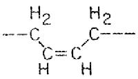  
CIS

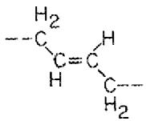  
TRANS

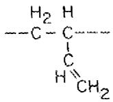  
SIDE VINYL

Changes in these groups may be studied by infrared spectra, since each has at least one absorption band at a characteristic frequency: cis at $740~\mathrm{cm}^{-1}$ , trans at 967, and side vinyl at 910. Previous reports described infrared spectral measurements on polybutadiene specimens of various types irradiated in ${}^{60}\mathrm{Co}$ gamma sources and in a nuclear reactor. $^{1,2}$ The four types

studied were high cis (92%), high trans (95%), and two mixed polymers, one 73% trans and the other 71% side vinyl.

To derive actual concentrations of the olefin groups from the spectral measurements, it proved necessary to use the unirradiated specimens themselves as calibration standards. Calibration curves developed from liquid olefins proved inapplicable. However, they were adequate to determine the small content of cis groups in the two mixed polymers. Since the total unsaturation was known, this permitted the solution of simultaneous equations relating the concentration of trans and side vinyl groups to the optical densities at 967 and $910~\mathrm{cm}^{-1}$ . The absorptivities thus calculated, coupled with the accepted value for the total unsaturation in high-cis polybutadiene, enabled us to determine the cis concentration in the polymer of this type from its spectrum. The integrated band area at $740~\mathrm{cm}^{-1}$ , calculated from theoretical band shapes, $^{3,4}$ was required for the calibration and concentration determination of the cis group because of the dependence of the simple absorptivity on groups adjacent to the cis species in the molecule.

From this treatment of the infrared spectra, the concentrations of olefin groups were obtained for specimens irradiated under various conditions. The changes in these groups for high-cis polybutadiene are plotted vs dose in Fig. 13.1. The decrease in cis groups at the lower doses appears to be independent of their concentration (zero-order), whereas the decrease in trans and side vinyl groups in the other types of polybutadiene followed first-order kinetics. In addition, the high

cis polymer was the only type showing an increase in concentration of one of the olefin isomeric forms. In this polymer there was a conversion of cis groups to the trans form, the more stable isomer thermodynamically. The radiation

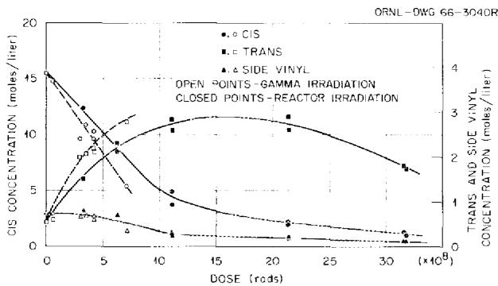  
Fig. 13.1. Concentration of Olefin Groups in Irrodiated Cis Polybutadiene.

yields, rate constants, and activation energies calculated for all the polymers from these changes in concentration are listed in Table 1.3.1.

The activation energies were calculated from radiation yields at room temperature and at $110^{\circ}\mathrm{C}$ . They are similar to activation energies in other radiation-induced reactions and indicate that low-energy processes such as the addition of radicals and the diffusion of relatively small species are the rate-controlling steps.

The high yields and high rate constants indicate efficient transfer of radiation energy from the points of absorption to reactive sites, either through charge or excitation transfer. It is also possible that the high rate constants observed for the side vinyl groups result from short chain reactions.

The products resulting from these reactions are unidentified as yet. Because the cross-link yields are far too low to account for the loss in olefin groups, it has been speculated that intramolecular

Table 13.1. Radiation Yields and Reaction Rate Constants   

<table><tr><td rowspan="2"></td><td colspan="4">Type of Polybutadiene</td></tr><tr><td>High Cis-1,4</td><td>High Trans-1,4</td><td>Amorphous Trans (Emulsion)</td><td>Side Vinyl (Sodium)</td></tr><tr><td colspan="5">Cis Groups</td></tr><tr><td>Initial yield, G0, groups per 100 ev</td><td>~15.2 ± 0.8</td><td>&lt;+1.0</td><td>&lt;+0.5</td><td>0</td></tr><tr><td>Activation energy, E, kcal/mole</td><td>3.7</td><td></td><td></td><td></td></tr><tr><td>Reactor yield, G0, groups per 100 ev</td><td>-12</td><td></td><td></td><td></td></tr><tr><td colspan="5">Trans Groups</td></tr><tr><td>Rate constant, k, g/ev</td><td></td><td>(1.4-3.3) × 10-23</td><td>2.2 × 10-23</td><td>2.4 × 10-23</td></tr><tr><td>Initial yield, G0, groups per 100 ev</td><td>+6.8</td><td>-11 to -22</td><td>-19</td><td>-7</td></tr><tr><td>Activation energy, E, kcal/mole</td><td>1.5 ± 0.3</td><td></td><td>3.4</td><td>4.0</td></tr><tr><td>Reactor yield, G0, groups per 100 ev</td><td>+4.4</td><td></td><td></td><td></td></tr><tr><td>Reactor rate constant, k, g/ev</td><td></td><td></td><td>0.9 × 10-23</td><td>~1 × 10-23</td></tr><tr><td colspan="5">Side Vinyl Groups</td></tr><tr><td>Rate constant, k, g/ev</td><td>0 ... 1.4</td><td>0.5 × 10-23</td><td>4.3 × 10-23</td><td>5.4 × 10-23</td></tr><tr><td>Initial yield, G0, groups per 100 ev</td><td>0</td><td>-0.2</td><td>-12</td><td>-40</td></tr><tr><td>Activation energy, E, kcal/mole</td><td></td><td></td><td>3.8</td><td>3.9</td></tr><tr><td>Reactor rate constant, k, g/ev</td><td></td><td></td><td>1.6 × 10-23</td><td>~1 × 10-23</td></tr><tr><td colspan="5">Net Change, All Groups (Gamma Radiation)</td></tr><tr><td>Initial yield, G0, groups per 100 ev</td><td>-8.4</td><td>-11 to -22</td><td>-31</td><td>-47</td></tr></table>

ring links are formed, but these have not been identified definitely in irradiated polybutadiene because of difficulties in both spectral and chemical observations of such cyclic structures.2,5

# RADIATION-INDUCED REACTIONS OF HYDROCARBONS

R.M.Keyser W.K.Kirkland

The irradiation of coal together with a condensed-phase source of hydrogen atoms and alkyl free radicals offers the possibility of the synthesis of useful hydrocarbon chemicals from inexpensive raw materials in a chemonuclear reactor. Initial irradiations have been confined to a model system for experimental convenience: $n$ -hexane (simulating liquefied petroleum gases) the condensed source of hydrogen and radicals, with naphthalene simulating coal. It is expected that the overall course of the reaction, the addition of radiation-generated hydrogen atoms and alkyl free radicals to aromatic rings, will be similar in both the model and coal systems.

Samples irradiated with $^{60}\mathrm{Co}$ gamma radiation have been analyzed by gas chromatography on a 5-m column containing Apiezon L as the separating medium. The results of a typical run are shown in Fig. 13.2, from which it is apparent that irradiation of naphthalene-hexane solutions yields a quite complex array of products. Efforts to date have been directed toward identification of the compounds responsible for the peaks in Fig. 13.2.

The six dimers of hexane, the peaks labeled 4,5-diethyloctane through $n$ -dodecane in Fig. 13.2, have been identified by using chromatographic retention times to obtain estimates of the boiling points of the compounds in question and comparing these with literature values. Apiezon L, a nonpolar liquid, separates saturated hydrocarbons essentially on the basis of their boiling points. It

5M. A. Golub, J. Phys. Chem. 69, 2639 (1965).   
$^{6}$ W. W. Parkinson et al., Reactor Chem. Div. Ann, Progr. Rept. Jan. 31, 1965, ORNL-3789, p. 320.

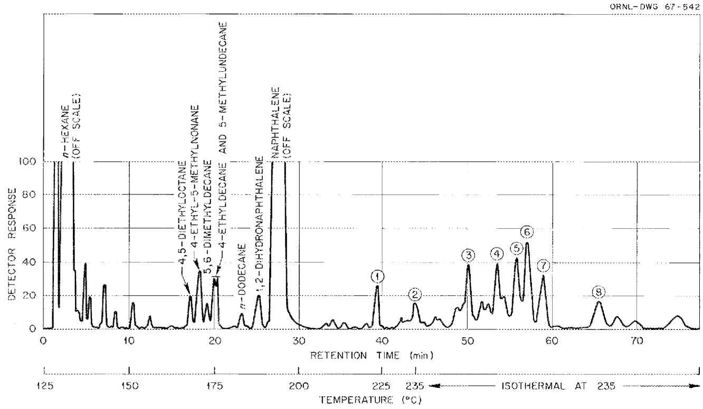  
Fig. 13.2. Gas Chromatogram on a 5-m Apiezon L Column of a Sample Consisting of 0.10 Mole Fraction of Naphthalene in n-Hexane Irradiated to a Dose of $1.0 \times 10^{22} \, \text{ev} \cdot \text{g}^{-1}$ .

can be shown, from thermodynamics, that the following relation should hold:

$$
\log t _ {r} = K + (4. 5 / T) T _ {b}, \tag {13.1}
$$

where $t_r$ is retention time, $T$ is gas chromatograph column temperature, $T_b$ is boiling point, and $K$ can be regarded as a constant provided the operating parameters of the chromatograph are closely duplicated from run to run.

Values of $\log t_{\tau}$ for standard samples of $n$ -heptane, $n$ -decane, and $n$ -dodecane were plotted against their respective boiling points, and the relationship predicted by Eq. (13.1) was found to hold. Boiling points of the compounds corresponding to the peaks indicated in Fig. 13.2 were then

obtained from their respective retention times and the $\log t_{\tau}$ vs $T_{b}$ plot. The boiling points obtained in this way agreed within 1 to $2^{\circ}$ of the literature values for the hexane dimers.

The identification of one of the radiation products as $n$ -dodecane was further confirmed by the coincidence of its retention time with that of a standard sample of $n$ -dodecane. This same technique was also used to tentatively identify the peak preceding naphthalene as 1,2-dihydronaphthalene.

Compounds corresponding to peaks 1 to 8 in the chromatogram of Fig. 13.2 have been individually trapped in glass capillaries at liquid-nitrogen temperature upon elution from the chromatograph. These collected fractions were used to obtain ultraviolet absorption spectra in cyclohexane solution of compounds 1 through 8. Some typical results are shown in Fig. 13.3 for the 240- to $330\mathrm{m}\mu$ region. Differences in overall intensities are

7See, for example, J. H. Knox, Gas Chromatography, chap. 2, Wiley, New York, 1962.

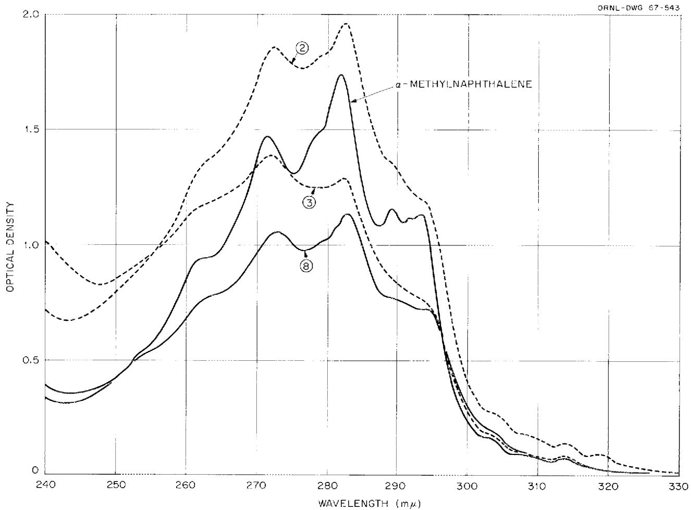  
Fig. 13.3. Ultraviolet Absorption Spectra of Compounds Corresponding to Peaks 2, 3, and 8 in the Chromatogram of Fig. 13.2. Solvent is cyclohexane and concentrations are different for each compound.

not significant, since the spectra were obtained at different concentrations.

The uv spectrum of $\alpha$ -methylnaphthalene, included in Fig. 13.3 for comparison, exhibits absorption bands in these same regions also, and the comparison strongly suggests that compounds 1, 2, 3, 4, 6, and 8 are $\alpha$ -substituted alkylnaphthalenes. Since the chromatographic retention time of $\alpha$ -methylnaphthalene is less than that of compound 1, the alkyl substituents must be larger than methyl. The uv spectra of compounds 5 and 7 indicate that these compounds are $\beta$ -substituted alkylnaphthalenes.

Additional amounts of these compounds are being trapped from the chromatograph effluent, and it is planned to use these to obtain mass, infrared, and nuclear magnetic resonance spectra, which, in conjunction with the uv data, should enable us to make a positive identification of the unknowns.

# ADDITION REACTIONS OF FURAN DERIVATIVES

C. D. Bopp

W. W. Parkinson

The radiation-induced addition of saturated furan derivatives to olefinic groups is being studied to develop high-yield reactions which could utilize radioisotopes in chemical synthesis. An earlier survey covered chiefly monoolefinic and saturated furan derivatives and cyclohexene. The results were promising in that the array of products was limited; there were only three or four major products, consisting of dimers, 1:1 adducts, and a nonvolatile residue probably comprising trimers and higher adducts. Furthermore, the yield of major products was enhanced by irradiation at higher temperatures, while the yield of minor products was reduced. On the other hand, none of the mixtures containing saturated furan compounds gave the high yields characteristic of chain reactions.

The system cyclohexene-tetrahydrofuran has been investigated in detail, since the radiation-induced reactions of cyclohexene are better known than those of the other reagents. Solutions of cyclohexene in tetrahydrofuran in concentrations of 1:3 and 1:7 were irradiated at room tempera

ture, and solutions of 1:3 concentration were irradiated at 150 and $300^{\circ}\mathrm{C}$ . The irradiated mixtures were subjected to chromatographic analysis on a butanediol succinate polar column and on a silicone rubber nonpolar column. At room temperature there were four products in the range of dimers and 1:1 adducts, plus the nonvolatile residue. At the higher temperatures one of the products disappeared.

To identify the radiation products observed by chromatographic analysis, compounds which were probable products were synthesized by conventional chemical methods. The chromatographic retention times of the synthesized compounds were then matched with those of the radiation products on columns of at least two types.

The methods used for preparation of the dimeric compounds were Wurtz-type condensations of organic halides with active zinc-copper and condensations with $\mathrm{CH}_3\mathrm{MgI}$ . For adducts the synthetic method was the Grignard reaction, condensing the cyclohexenyl or furanyl magnesium halide with the proper halide. The halides in all these reactions were prepared by accepted methods. For example, 2-chlorotetrahydrofuran was obtained by direct chlorination of tetrahydrofuran at $-50^{\circ}\mathrm{C}$ ; allyl-type bromides, such as 3-bromocyclohexene and 2-bromo-2,5-dihydrofuran, were obtained by bromination with a suspension of $N$ -bromosuccinimide in carbon tetrachloride. By these methods the ten possible allyl-type or alpha isomers of the dimers and 1:1 adducts of cyclohexane, cyclohexene, tetrahydrofuran, and dihydrofuran were prepared.

By comparing retention times of these synthetic products with those of the irradiated mixture, the compounds listed in Table 13.2 were tentatively identified as the major radiation products. The identification remains tentative because of the presence of the products of side reactions in the synthesized compounds. The synthesized compounds are now being isolated, by distillation and extraction, for infrared spectra to eliminate uncertainties. Chromatographic fractions are also being collected from the radiation products for similar examination to confirm our identifications.

The tabulated product yields were obtained from chromatographic peak areas utilizing dodecane as an internal standard. Evaporation of the irradiated mixture indicated that the yield of polymeric nonvolatile residue was greater than $G = 6$ , probably exceeding the combined yields of dimers and $1:1$

Table 13.2. Radiation Products from Cyclohexene-Tetrahydrofuran Solutions   

<table><tr><td rowspan="3">Product</td><td colspan="3">Yield (molecules per 100 ev)</td></tr><tr><td>25°C</td><td>150°C</td><td>300°C</td></tr><tr><td>1.7°</td><td>1.3°</td><td>1.3°</td></tr><tr><td>2(Cyclohexene-3-yl)-tetrahydrofuran</td><td>~2</td><td>~4</td><td>~8</td></tr><tr><td>2,2&#x27;-Di(tetrahydrofuran)</td><td>~1.5</td><td>~3</td><td>~6</td></tr><tr><td>3,3&#x27;-Dicyclohexenyl</td><td>~0.5</td><td>~1</td><td>~2</td></tr><tr><td>2,2&#x27;-Di(dihydrofuran){?})</td><td>~1</td><td>0</td><td>0</td></tr></table>

Concentration of cyclohexene in tetrahydrofuran by volume.

adducts. Additional derivatives of furan and furfural are being irradiated to explore the nature of the reactions and to look for the high yields of chain reactions.

# DEVELOPMENT OF RADIATION-RESISTANT INSULATORS

W.W. Parkinson B.J.Sturm E.J.Kennedy

A program has been initiated under the sponsorship of the Office of Civil Defense to develop radiation-resistant insulators for personnel dosimeters. Since the dosimeters are small fiber electrometers, the electrical resistance of the construction materials must be very high, both before and after irradiation.

A copolymer of styrene and $\alpha$ -methylstyrene with a moderate impurity content has been found to have high resistance before irradiation and extremely low postirradiation conductivity. Objectives of the program, then, are to correlate the electrical conductivity of plastics with the molecular structure

of the base polymers and also with the chemical nature of the impurities, since these are known to affect the conductivity prior to irradiation and appear to play a part in reducing the postirradiation conduction.

The correlations should permit the selection of materials and the development of fabrication methods suitable for both the bulk insulators and the capacitor dielectric in the dosimeters. We also hope to identify the mechanism of the impurity effects; it could be a surface process or a process in the bulk of the polymer involving supplying and trapping charge carriers.

Analytical work on styrene-base plastics has indicated that the content of unpolymerized styrene varies widely in these materials. The copolymer of low conductivity showed a monomer content of $\sim 0.1\%$ . The solvent-cast film (the form for capacitor dielectric and specimen material for resistance measurement) showed less than $0.01\%$ monomer. Since the unsaturated nature of styrene monomer makes it chemically different from the polymer, the role of the monomer in electrical processes in the plastic will be investigated early in the program.

A vibrating-reed electrometer has been modified slightly to permit electrical measurements in the required low-current range. Tests have indicated that its minimum sensitivity is of the order of $10^{-16}$ amp. This will be suitable for postirradiation measurements and at least some of the pre-irradiation measurements.

The procurement of sample materials has been confined to simple polymers, either hydrocarbons or polymers of carbon, hydrogen, and either oxygen or nitrogen, and to materials of relatively high purity, with the emphasis on the glassy, amorphous plastics. Common commercial additives, for example, ultraviolet stabilizers and antioxidants, have also been obtained.

Measurements and irradiations will be made first on polymers of simple chemical and physical structure in the hope of obtaining data amenable to interpretation in terms of the basic composition of the material.

# 14. Chemical Support for the Controlled Thermonuclear Program

R. A. Strehlow

D. M. Richardson

# INTERPRETATION OF DCX-2 MASS SPECTRA

Twenty DCX-2 mass spectra obtained during a single day were subjected to detailed examination. Four types of impurity gases (viz., not hydrogen) were distinguished by peak height comparisons. These four types were:

1. those species generated or evolved near the spectrometer,   
2. the so-called base pressure gases,   
3. impurity gases introduced with intentionally admitted gas,   
4. impurity gases generated during beam injection.

As noted earlier, the spectrometer species decayed rapidly for 30 to 50 min after the spectrometer filament was turned on. Those species, primarily organic, apparently have no significant relation to gases impinging on the DCX-2 plasma. Quantitative interpretation of the mass spectra is complicated by their presence.

Of far more significance is the behavior of the base-pressure species other than hydrogen. Air leaks have been only occasionally responsible for a significant part of the background gases. Water vapor, carbon dioxide, and methane were the principal identifiable species in the background gas on the day of the study (August 11, 1966). Water vapor constituted about three-quarters of the impurity background gases. Although the water partial pressure increased during admission of hydrogen, it was possible to notice the variation of this component of the background during the day. This variation is shown in Fig. 14.1. This domi

nant change, except during a period of probe adjustment at noon, indicates that the water offgassing rate increased during the morning and presumably was a thermal effect. Because of the dominance of water vapor and its slow removal from unbaked vacuum systems, some of the parameters affecting water behavior (in unbaked stainless steel systems) have been separately studied. The partial pressure of carbon dioxide has been generally observed to follow that of water vapor. The average carbon dioxide partial pressure appeared to be about $15\%$ of the water vapor pressure during the day. Methane (present during the titanium evaporation) was about $5\%$ of the water partial pressure. Other organic species and carbon monoxide comprised the balance of the base-pressure gases, but were not studied.

Of the gases which are introduced along with intentionally admitted gas, water vapor and air have been observed. Air from leaks in the gas manifold is present in amounts which depend upon the length of time subsequent to manifold evacuation, as well as the leak rate. Water vapor is usually the dominant manifold impurity and was so for this study. The water partial pressure variation with ion-gage reading for a hydrogen leak is shown in Fig. 14.2. The linearity of the data points and the times involved in the exposure indicated that this increase was not an artifact of the spectrometer but was a net increase of water partial pressure admitted with or due to admission of the hydrogen. The water pressure was observed to vary only slightly during beam injection. It was therefore concluded not to be a gas of the fourth type (gases produced during beam injection).

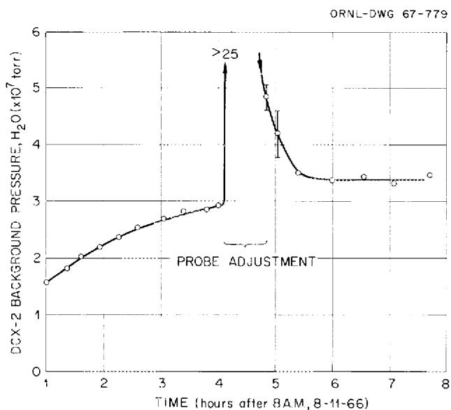  
Fig. 14.1. $p_{\mathrm{H}_2\mathrm{O}}$ in DCX-2 (8-11-66) as a Function of Time (Background Impurity).

Figure 14.3 shows the variation of identifiable species with ion-gage reading during beam injection. The fractional contribution of these species is shown in parentheses. Water, though not produced by the injection process, is shown for comparison. The variation of mass 28 (primarily from ethane, ethylene, carbon dioxide, carbon monoxide, and nitrogen) after adjusting for $\mathrm{CO}_{2}$ and ethane appeared, from consideration of fragmentation patterns, to be primarily carbon monoxide and ethylene in about equal amounts. The variation of mass 28 so adjusted contributed slightly less to the total pressure than did methane. A fractional abundance of 0.003 to 0.004 for each of these gases relative to hydrogen was indicated. This behavior appeared to be typical for the mode of DCX-2 operation at the time this work was done.

The principal organic species identified as being produced during beam injection are methane, ethylene, acetylene, and ethane. The partial pressure of these gases was found for one day to be about $2.5\%$ of the indicated pressure.

For many plasma experiments in DCX-2, it has not been as necessary to maintain a high-purity environment as to have some knowledge of the purity level. A purity index can be defined as

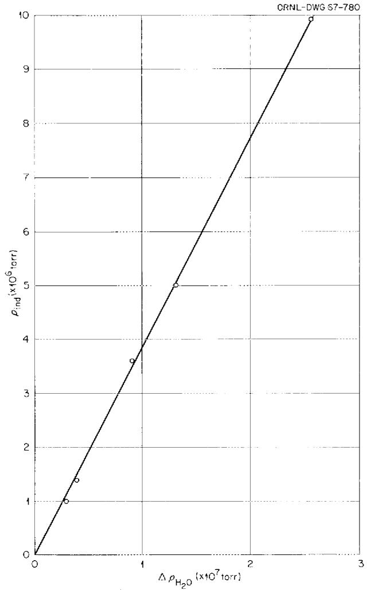  
Fig. 14.2. Increase of $p_{\mathrm{H}_2\mathrm{O}}$ with $\mathrm{H}_2$ Bleed (Manifold Impurity).

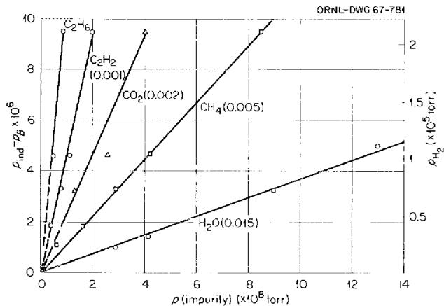  
Fig. 14.3. Partial Pressures of $\mathsf{CH}_4$ , $\mathsf{CO}_2$ , $\mathsf{C}_2\mathsf{H}_2$ and $\mathsf{C}_2\mathsf{H}_6$ (Produced Impurities) in DCX-2 (8-11-66) During Injection at Different $\mathsf{H}_2$ Partial Pressures. $p_{\mathsf{H}_2\mathsf{O}}$ (see Fig 14.2) is shown for comparison.

$p_{H_2} / (p_{\text{total}} - p_{H_2})$ . This index (P.I.) is approximately given by

$$
\frac {2 . 2 \left(p _ {\text {i n d}} - p _ {B ^ {\prime}}\right) (1 - x)}{x p _ {\text {i n d}} + p _ {B ^ {\prime}}} ,
$$

where

2.2 is the ion-gage factor for $\mathbf{H}_2$

$p_{\mathrm{ind}}$ is the indicated ion-gage pressure,

$\rho_{B^{\prime}}$ is the partial pressure of "base" pressure contaminants other than $\mathbf{H}_2$

$x$ is the fraction of the ion-gage reading $(p_{\mathrm{ind}})$ due to contaminants produced by the injection, introduced with bleed gas, or generated by these species (a gage factor of unity is assumed).

For the data described here, using the values

$$
P _ {\text {i n d}} = 2 \times 1 0 ^ {- 6} \text {t o r r a n d} 9 \times 1 0 ^ {- 6} \text {t o r r},
$$

$$
p _ {B ^ {\prime}} = 3. 5 \times 1 0 ^ {- 7} \text {t o r r},
$$

$\mathbf{x} = 0.057$ (based on the mass spectral analysis),

one obtains, for the two indicated pressures, values of the purity index of 7.0 and 20.8, respectively, for the two pressure levels. The data obtained on August 11 yielded the purity index variations shown in Fig. 14.4. These data were obtained over a period of several hours in the morning when the water partial pressure was increasing as discussed above. The points at indicated pressures of 1.0 and $1.3 \times 10^{-6}$ torr, which were obtained later, were, accordingly, somewhat lower than the values interpolated from the earlier determinations. The agreement of the calculated values of P.I. with those shown in Fig. 14.4 indicates that unidentified species are not present in significant amounts.

Residual gas analysis strongly depends on the useful mass range of the spectrometer, the existence of identifiable parent mass peaks, and a knowledge of fragmentation patterns. We have little knowledge of species with molecular weights higher than 44 u for the DCX-2 spectrometer, or higher than about 92 u for the instrument used in the calibration and chemistry studies. A spectrometer design study has begun with the goal of improving the analytical capability in the ORNL mirror machines.

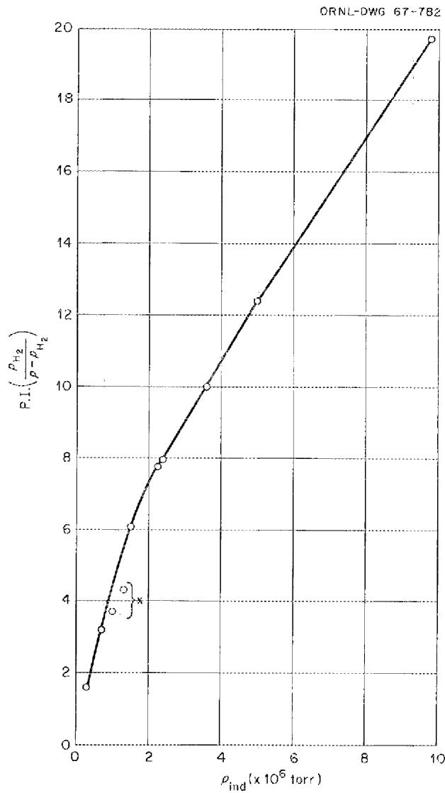  
Fig. 14.4. Purity Index Variation (DCX-2, 8-11-66) vs Uncorrected Ion Gage Reading.

# MASS SPECTROMETER CALIBRATION STUDIES

Dispersion of mass spectrometer ion beams affects both the cracking patterns and the relative partial pressure sensitivities for different gases. Calibration studies carried out using the type of mass spectrometer used on DCX-2 (Veeco model No. RGA-3) showed that the instrument has a significant degree of mass dispersion. This dispersion is attributable to space-charge effects and to thermal velocities in the direction parallel to the magnetic field during the ion's life.

Space-charge effects at higher pressures were observed as a diminution of ion intensities upon increasing the hydrogen pressure. As expected, this effect is most pronounced for gases of higher molecular weight (e.g., argon and krypton). Hydrogen pressures of as much as 2 to $3 \times 10^{-5}$ torr were needed before a significant decrease of the 28 and 18 mass peaks occurred.

At lower pressures the mass discrimination can be attributed principally to thermal drift in the direction of the magnetic field during the flight time of ions to the collector. Estimation of this effect for the analyzer region only, using as parameters the flight path (23 cm), the ion velocity derived from the ion energy meter, the average thermal velocity (at $100^{\circ}\mathrm{C}$ ), and relative spectrometer slit lengths, leads to the estimated transmissions listed in Table 14.1 along with the transmission as determined from experimental data described below. The observed transmission fractions were uniformly lower than those estimated. This is presumably due to mass discrimination in the source. For this $60^{\circ}$ spectrometer (supplied with almost equal source and collector slit lengths), it should be possible to decrease the mass discrimination of the analyzer region by perhaps $60\%$ ,

Table 14.1. Relative Transmissions for the RGA-3 Spectrometer   

<table><tr><td>M e</td><td>Species</td><td>Estimated Fraction Transmitted, Analyzer Region Only</td><td>Experimental Fraction Transmitted, Entire Flight Path</td></tr><tr><td>12</td><td>CO</td><td>1.0</td><td>1.0</td></tr><tr><td>18</td><td>H2O</td><td>0.9</td><td>0.8</td></tr><tr><td>28</td><td>CO</td><td>0.7</td><td>≈0.4 to 0.5</td></tr><tr><td>44</td><td>CO2</td><td>0.5</td><td>0.2</td></tr><tr><td>78</td><td>C6H6</td><td>0.2</td><td></td></tr><tr><td>2</td><td>Low mass range, H2a</td><td>0.98</td><td></td></tr><tr><td>18</td><td>Low mass range, H2O</td><td>0.1</td><td>≈0.1</td></tr></table>

${}^{a}$ Low masses are obtained by shunting the magnet, which reduces the field by a factor of about 0.55 .

but probably with little overall improvement of this parameter because of the source contribution.

The method used to experimentally determine the extent of mass discrimination was simply to measure the peak height ratios for argon $(+1, +2, \text{and} +3)$ and compare these with the literature values. (The electron energy for the RGA-3 is $145 \pm 4\mathrm{~v.}$ ) The same technique applied to the spectrometer on DCX-2 yielded similar results. The data shown in Table 14.1 were estimated using a smooth curve drawn through the points at $M / e = 13.3, 20,$ and 40. Relative calibration of the spectrometer to an ion gage for nitrogen and water vapor yielded additional points within 15 and $5\%$ , respectively, of the derived argon transmission curve. The ion-gage sensitivity factor for water vapor was incidentally determined from measured flow rates, assuming the pumping speed for water vapor to be $\sqrt{28 / 18}$ that of nitrogen (with water cooling of the trap). This value of the gage sensitivity of water vapor was found to be $0.9 \pm 0.03$ that of nitrogen.

These data were used in the measurement of contaminant levels in the DCX-2 work described above. These results should not be indiscriminately applied to other similar analyzers, because the extent of mass discrimination is strongly affected by operating parameters such as repeller potential. In order to avoid overly harsh evaluation two things should be noted. The first is that residual gas analyzers are designed primarily for qualitative assessment of vacuum conditions and that their application to quantitative work is usually restricted to individual mass peaks or simple ratios. The second is that the analytical capability is restricted generally to masses less than 44 u. The spectrometer model used in our studies performs these tasks well. The need for more quantitative data, however, does markedly strain the instrument's capability.

# WATER VAPOR CHEMISORPTION ON STAINLESS STEEL

The dominance of water vapor impurity in DCX-2 and the lack of information about its sorption kinetics prompted a study of water sorption at low partial pressures. The results of the study

showed distinctly that chemisorption occurred in the experimental vacuum system. The experiments were conducted in a manner to give assurance that the observed chemisorption occurred primarily on stainless steel surfaces. Thus, since a large body of information on chemisorption exists, the description of water vapor behavior in vacuum systems can be greatly simplified. Specifically, a selection from empirical relations between the extent of sorption and time, exposure, pressure, or temperature which are observed for other chemisorption reactions may be applied to studies of water vapor.

Chemisorption may be distinguished from physical adsorption using several criteria, including the following:

1. Chemisorption requires an appreciable $(>0.1$ ev) heat of activation.   
2. It usually involves sorption heat values greater than about 0.5 to 1.0 ev, whereas physical adsorption is usually associated with smaller values.   
3. Chemisorption or chemidesorption is (as a consequence of criterion 1) a slow process.   
4. The quantity of substance chemisorbed often is related to time by the empirical relation:

$$
\frac {d q}{d t} = a e ^ {- \alpha q}, \tag {1}
$$

where $q$ is the amount sorbed at time $t$ and where $\alpha$ and $\alpha$ are constant during any single experiment or at the very least have discontinuous derivatives with respect to time during a single experiment.

Water chemisorption studies have been made for $\mathrm{ThO}_2$ , $^{5,6}$ $\mathrm{Al}_2\mathrm{O}_3$ , $^{5,7}$ $\mathrm{TiO}_2$ , $^{8,9}$ and silica $^{10}$ sorbents, principally calorimetrically. (Infrared, gravimetric, and pressure-change techniques have also

been used.) No report has been found in the literature on water sorption kinetics at low pressures $(< 10^{-4}$ torr) or on metals.

The technique used in this study was to observe the pressure fall after water vapor exposures at different pressures and durations in a dynamically pumped vacuum system (Fig. 14.5). The apparatus was designed to have two regions (A and B) which could be separately heated. To minimize temperature nonuniformity, region A, a steel tube with $1.1 \times 10^{4} \mathrm{~cm}^{2}$ area, was baked by resistance heaters strapped to the outside of an aluminum pipe which fitted concentrically around the steel tube with a uniform $\frac{1}{2}$ -in. gap. Insulation material and aluminum foil were applied around the aluminum pipe. A copper tubing cooling circuit was strapped to the steel tube in order to achieve a rapid cooling capability. Region B, down to below the conductance-limiting baffle, was heated using strapped-on and serpentine heaters, and a hot air assembly to heat the trap. The mass spectrometer (Veeco RGA-3) was heated with tape heaters. Glass ion gages (used only for early experiments) were heated by heat lamps. Only metal seals were used.

The water was admitted through a valve from a regulated pressure of 1 or 2 torrs. The gas line was periodically baked and operated with cold water cooling to minimize organic contamination. Water vapor with less than $0.03\%$ total organic

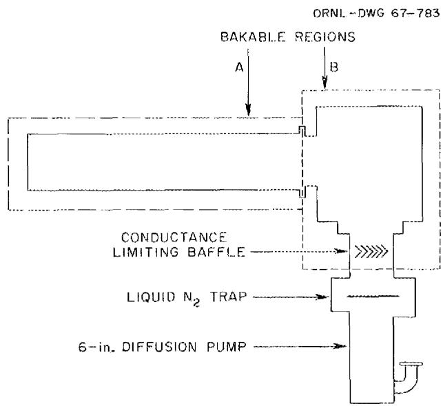  
Fig. 14.5. Vacuum System Used for the Studies of Water Vapor Chemisorption.

contamination could be admitted to the system. Two temperature conditions were studied. The elevated temperature condition was $180 \pm 20^{\circ}\mathrm{C}$ (as monitored by several thermocouples) for all regions of the apparatus. The lower temperature condition was reached following a rapid cooling of region $A$ to $28^{\circ}\mathrm{C}$ . The temperature of region $B$ was not changed. At the elevated temperature, typical partial pressures in torrs were $3 \times 10^{-8} \mathrm{H}_{2}$ , 4 to $8 \times 10^{-10} \mathrm{H}_{2} \mathrm{O}$ , 1 to $2 \times 10^{-9} \mathrm{CO}$ (produced almost entirely by gage and spectrometer filaments). No effort was made to reduce the hy

drogen pressure by higher-temperature baking since the gas under study was water.

Water was admitted for periods of time ranging from about 0.5 sec to as long as $30\mathrm{min}$ , after which the valve was closed and the exhaust curve was obtained. The partial pressure of water was followed by monitoring mass 18 with the spectrometer. As was expected, agreement with glass ion gages was good only when the gages were heated. For most of the determinations, however, to minimize the possibility that the glass might be affecting the results, they were replaced by nude gages.

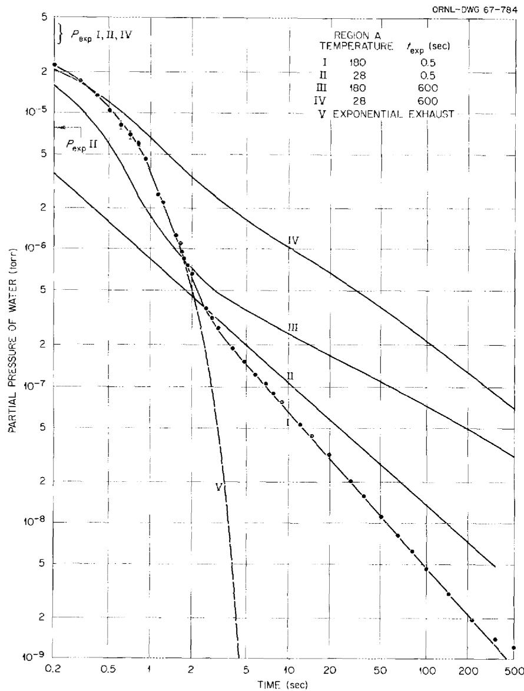  
Fig. 14.6. Typical Log $p_{\mathsf{H}_2\mathsf{O}}$ vs Log t (sec) Plots for Four Exposure Conditions.

For the hot-system, short-exposure cases, the slope of $\log p_{\mathrm{H_2O}}$ vs $t$ (the usual exhaust relation) initially corresponded to a value of 540 liters/sec $\pm$ $10\%$ except when the initial pressure exceeded $1\times 10^{-5}$ significantly, for which cases the mass 18 spectrometer peak was not exactly proportional to pressure.

Four typical log $p_{\mathrm{H_2O}}$ vs log $t$ plots are shown in Fig. 14.6 for the cases of hot and cold region $A$ and for 0.5-sec and 10-min exposures. The exposure pressures, $p_{\mathrm{exp}}$ , were all within 20% except for case II, where $p_{\mathrm{exp}}$ was about a factor of 5 lower. Exponential exhaust, indicated for water by curve V, was observed for $\mathbf{N}_2$ over almost four orders of magnitude of pressure.

We observed that the log $p_{\mathrm{H}_2\mathrm{O}}$ vs log $t$ plot of our data closely approximated straight lines of reproducible slopes, which, of course, varied with exposure conditions. Integration of each curve from the extrapolated limit of 0.1 sec to 1000 sec and multiplying the result by our measured $\mathrm{H}_2\mathrm{O}$ pumping speed (590 liters/sec ± 3%) yielded the quantity desorbed isothermally following the exposure. The value of $q$ (quantity absorbed) is believed to be within 20% of the measured quantity desorbed.

The Elovich plots [Eq. (1)] from our data for two temperatures and normalized to the same exposure pressure (assuming variation of $q$ with the first power of $p_{\mathrm{exp}}$ ) are shown in Fig. 14.7. The exposure pressures were from 0.7 to $4.0 \times 10^{-5}$ torr. Determination of $q$ for exposure pressures as low as $4 \times 10^{-7}$ torr led to the relation of $q$ and $p_{(\mathrm{exp})}$ ;

$$
q = p _ {\exp} ^ {1. 0 5 \pm 0. 1} f (t _ {\exp}).
$$

The only study found in the literature of the pressure dependence of $q$ is that of Winfield, who reported an exponent of 1.2 with thoria at, of course, higher water vapor pressures. The value of 1.2 introduces an error band of somewhat less than $15\%$ to our data. The quantities observed correspond to about 0.1 monolayer at room temperature following a 10-min exposure and about 0.15 monolayer after 30 min. Dust or other impurities could be responsible for some or even all of the observed sorption. We believe, however, that the method is reliable and that sufficient care

was exercised to be able to attribute the observed chemisorption to the steel surface.

Some effect on water chemisorption kinetics by ion or electron bombardment is to be anticipated by analogy to other chemisorption phenomena. Neither the magnitude nor the direction of change seems to be presently predictable. Water sorption by unbaked and baked stainless steel during a pressure excursion to atmosphere of different humidities has been observed and is reported in the literature but with inadequate reported data to permit scaling the parameters studied here over the required five to six orders of magnitude. Samples with different specific surface areas may be expected to show different sorption capabilities.

The conclusion that chemisorption phenomena exist leads to possible practical application in

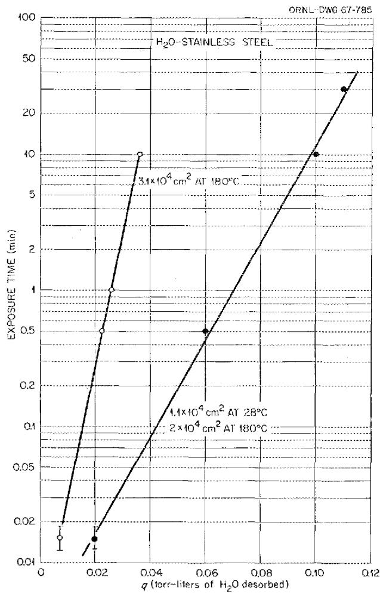  
Fig. 14.7. Elovich Plots for Water Chemisorption on Stainless Steel.

Table 14.2. Proton NMR Spectra of DC-705 Diffusion Pump Oil and a Decomposition Product   

<table><tr><td>Signal Position</td><td>Height of Integral (mm)</td><td>Height × 0.1344</td><td>Protons per Signal</td><td>Assignment</td></tr><tr><td colspan="5">Structure 1, 34 protons</td></tr><tr><td>0</td><td></td><td></td><td></td><td>(CH3)4Si, reference</td></tr><tr><td>19</td><td>22</td><td>2.96</td><td>3</td><td>--Me</td></tr><tr><td>32</td><td>46</td><td>6.18</td><td>6</td><td>2 equivalent Me</td></tr><tr><td>435</td><td>185</td><td>24.86</td><td>25</td><td>5 equivalent φ</td></tr><tr><td></td><td>253 mm</td><td></td><td></td><td></td></tr><tr><td></td><td>0.1344 protons/mm</td><td></td><td></td><td></td></tr><tr><td colspan="5">Unknown Solid</td></tr><tr><td>Signal Position</td><td>Height of Integral (mm)</td><td>Assumed Group</td><td>Height Protons per Group</td><td>Assignment</td></tr><tr><td>0</td><td></td><td></td><td></td><td>Me4Si, reference</td></tr><tr><td>34</td><td>57</td><td>Me</td><td>19</td><td>2 equivalent methyl groups per</td></tr><tr><td>436</td><td>196</td><td>φ</td><td>39.6</td><td>4 equivalent phenyl groups</td></tr></table>

operating nonbakeable vacuum systems. First, since chemisorption occurs at even very low pressures and is a strong function of exposure time, maintenance of very low partial pressures of water by liquid-nitrogen cooling of appreciable areas in the system, followed by intermittent warming of the cooled areas, desorption, and rapid exhaust, should result in a lower water impurity level than the same period of pumping would produce. Another consequence of the observations reported here is that even small water impurity levels introduced from gas manifolds are expected to result in significant impairment of the "base" pressure of water vapor.

# DECOMPOSITION OF DC-705 DIFFUSION PUMP FLUID

A white solid was found condensed on the cold caps and wall of one 10-in. diffusion pump on the DCX-2 vacuum system. It was found to melt sharply at $47^{\circ}\mathrm{C}$ . The infrared spectrum12 was

not distinguishable from that of the diffusion pump fluid, a pentaphenyl trimethyl trisiloxane, structure I.

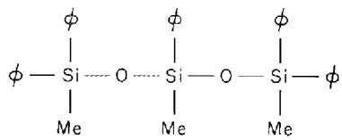

$$
\phi = C _ {6} H _ {5}
$$

$$
M e = C H _ {3}
$$

I

The manufacturer indicated that decomposition to the dimer might occur if the operating temperature is too high, in a radiation field, or if the fluid is heated in the presence of alkali impurities in

the pump. Proton nuclear magnetic resonance (60 Mc) spectra were obtained for the solid and for a sample of the pump fluid with the results summarized in Table 14.2.

The dimer structure II may therefore be assigned to the solid material. It would appear that for the pump in question some period of excessive-temperature operation probably occasioned the decomposition. The observed lowered pumping speed of this pump was presumably caused by the deposit.

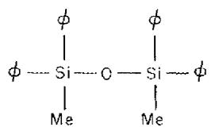  
II

13J.R.Lund,Analytical Chemistry Division.

# Part V

# Nuclear Safety

# 15. Activities of Nuclear Safety Technical Staff

W. E. Browning, Jr.

M. H. Fontana

B. A. Soldano

The Nuclear Safety Technical Staff, comprised of three persons, was formed early this year to aid in planning, coordinating, and directing the research and development activities within the Nuclear Safety Program.

One of the first activities of the technical staff was to survey work being done in the Nuclear Safety Program on the development of analytical models for fission product behavior in various stages of reactor accidents and to recommend the initiation of additional theoretical and experimental activities which were needed, preferably in existing groups outside the technical staff.

In a new activity, theoretical treatment of the chemical behavior of gas-borne fission products at high temperatures is combined with a laboratory investigation. There are separate studies of dynamic transport phenomena (continuing) and of surface phenomena (new) of fission product deposition at high temperatures. Models are being developed for the transport and deposition of fission products in containment vessels and for the convective circulation of gases. Other theoretical work covers the behavior of aerosols. A new program on behavior of fission products in gas-liquid systems was started with studies on the fission product removal by sprays at ORNL and by suppression pools at General Electric, San Jose, under subcontract. Another subcontract, with Battelle Memorial Institute, supports work on the theoretical chemical yield of methyl iodide.

A continuing program has been maintained for computing thermochemical equilibria of fission product fuel mixtures at high temperatures and for predicting vapor pressures in the gas phase above a condensed-phase solution. A multi-component equilibrium program has been obtained and debugged, and thermochemical data tapes have been made for U, Sr, SrO, UO, $\mathrm{UO}_2$ , and

$\mathrm{UO}_3$ in addition to 140 compounds from the JANAF Tables. Computer programs have been written to generate thermochemical tables in the JANAF format for compounds of interest, given some spectroscopic or experimental data. An experimental program to check theoretical calculations by mass spectrometric measurements has been initiated, and preliminary shakedown runs have been made.

One member has assisted in the development of a theoretical model describing fission product behavior in containment vessels and in planning an experimental program of scaling, flow visualization, and pilot-plant experiments to test the model. At the invitation of the AEC, the staff has participated in the management of an AEC contract with Professor N. C. Ozisik at North Carolina State University, who is working on the theory of diffusional transport as it applies to containment vessels.

One member has been assigned full-time to the program on spray effectiveness (Sect. 18) during its formative stages. A study undertaken by the Chemical Technology Division at the instigation of the technical staff has led to a report on the theory of foam decontamination as it might be applied to a reactor containment vessel.

Recently, one man has spent half time on the special core melt-through problem assisting the task force directed by W. K. Ergen. The work involved estimating amounts of fission products released from masses of molten core materials in large water-cooled reactors. Estimates were made on release by diffusion from the melt in various configurations, and rough approximations

were made for the case where natural convection within the melt exists.

The Technical Staff participated in several information dissemination activities. Assistance is given at the Nuclear Safety Information Center in abstracting literature on accident analysis, heat transfer, thermodynamics, and fluid mechanics, and providing consultation services. Information on filter and adsorber efficiency and pool decontamination in reactor safeguards was prepared

for the United States representative at a meeting held in November 1966 by the Committee on Reactor Safety Technology of the European Nuclear Energy Agency. The technical staff assisted the AEC in the production of a document describing the Water Reactor Safety Program, its bases, the interrelationships of the various projects, a delineation of the problems that are to be solved, the relationship of the program standards and codes, and other factors.

# 16. Correlations of Fission Product Behavior

# THE LIGHT BULB MODEL FOR RELEASE OF FISSION PRODUCTS

C. E. Miller, Jr.

Experiments in various laboratories and in reactors have accumulated much data on release of fission products under conditions which simulate reactor accidents. The effects of important variables on fission product behavior have generally been recognized, but interpretations of the data have been at best empirical. The "light bulb" model of fission product release presented below seems to explain in a simple fashion most, if not all, of the available release data.

Fonda, in studies of the incandescent lamp, observed that tungsten filaments lost weight (at a given temperature) more rapidly in a vacuum than in the presence of a nonreactive gas. He related this to Langmuir's theory that heat loss from incandescent wires in gases is controlled by conduction of heat through a stationary gas film around the wire. Fonda proposed that evaporation of material from the filament in a nonreactive gas is controlled by diffusion through a similar stationary gas layer. If it is assumed that a heated specimen of reactor fuel has such a nonreactive gaseous boundary layer and that diffusion (by Fick's law) through this layer controls the rate of release of fission products, then the theories of Langmuir and of Fonda may be applied in a straightforward manner.

If the rate of evaporation of species $A$ is controlled by Fick's law diffusion of $A$ through a boundary layer of species $B$ ,

$$
J _ {A} = - D _ {A B} \frac {d c _ {A}}{d z}, \tag {1}
$$

where

$J_{A} =$ molar diffusion flux (moles $\mathrm{cm}^{-2}$ sec-1), $D_{AB} =$ binary diffusion coefficient in which subscripts $A$ and $B$ denote the two diffusing species $(\mathrm{cm}^2 /\mathrm{sec})$

$c =$ concentration (moles/cm $^3$ ),

$\mathcal{Z} =$ distance (cm).

The concentration of fission products at the surface of the melt is given by Henry's law,

$$
P = k X = k ^ {\prime} P ^ {0} X, \tag {2}
$$

where

$P =$ partial pressure of fission product (atm),

$k =$ Henry's law constant,

$X =$ mole fraction of fission product in reactor fuel,

$k^{\prime}$ temperature-independent portion of Henry's law constant,

$P^0 =$ vapor pressure of pure fission product - temperature-dependent portion of Henry's law constant (atm).

The complete derivation yields Eq. (3), which expresses fractional release of fission products as

$$
\begin{array}{l} \operatorname {f r} = 1 - \exp \left\{- 2. 2 6 4 \right. \\ \left. \times 1 0 ^ {- 5} \frac {\left(1 / M _ {A} + 1 / M _ {B}\right) ^ {1 / 2} A T ^ {1 / 2} k _ {A} ^ {\prime} p _ {A} ^ {0} t}{p _ {B} \left[ \left(\sigma_ {A} + \sigma_ {B}\right) / 2 \right] ^ {2} u \delta} \right\}, \tag {3} \\ \end{array}
$$

where

fr - fraction released,

$M_{A} =$ molecular weight for fission product $(\mathrm{g / mole})$

$M_B$ : molecular weight of inert gas (g/mole),

Table 16.1. Comparison of Calculated and Measured Release of Fission Products from $\mathsf{UO}_2$ During Grain Growtha   

<table><tr><td rowspan="2">Run</td><td rowspan="2">Temperature (°C ± 50°C)</td><td rowspan="2">Time (hr)</td><td colspan="14">Fraction Released</td></tr><tr><td>Calc. TeO2</td><td>Meas. 132Te</td><td>Calc. Cs</td><td>Meas. 137Cs</td><td>Calc. SrO</td><td>Meas. 89Sr</td><td>Calc. BaO</td><td>Meas. 140Ba</td><td>Calc. Ru</td><td>Meas. 106Ru</td><td>Calc. CeO</td><td>Meas. 144Ce</td><td>Calc. UO2</td><td>Meas. U</td></tr><tr><td>D/94</td><td>2000</td><td>2.1</td><td>0.37</td><td>0.18</td><td>0.11b</td><td>0.11</td><td>0.09b</td><td>0.09</td><td>0.09</td><td>0.05</td><td>0.04</td><td>0.01</td><td>0.02</td><td>0.02</td><td>0.03</td><td></td></tr><tr><td>D/64</td><td>2000</td><td>4.5</td><td>0.50</td><td>0.59</td><td>0.14</td><td>0.12</td><td>0.16</td><td>0.14</td><td>0.16</td><td>0.17</td><td>0.08</td><td>0.12</td><td>0.04</td><td>0.05</td><td>0.05</td><td>0.04</td></tr><tr><td>D/88</td><td>2050</td><td>1.5</td><td>0.41</td><td>0.66</td><td>0.12</td><td>0.21</td><td>0.13</td><td>0.19</td><td>0.12</td><td>0.20</td><td>0.07</td><td>0.22</td><td>0.03</td><td>0.08</td><td>0.04</td><td>0.10</td></tr><tr><td>D/95</td><td>2150</td><td>1.5</td><td>0.46</td><td>0.39</td><td>0.12</td><td>0.06</td><td>0.21</td><td>0.15</td><td>0.18</td><td>0.15</td><td>0.15</td><td>0.15</td><td>0.06</td><td>0.06</td><td>0.08</td><td></td></tr><tr><td>D/65</td><td>2200</td><td>2.0</td><td>0.59</td><td>0.68</td><td>0.09</td><td>0.11</td><td>0.49</td><td>0.52</td><td>0.36</td><td>0.54</td><td>0.58</td><td>0.63</td><td>0.21</td><td>0.25</td><td>0.23</td><td>0.26</td></tr><tr><td>D/66</td><td>2200</td><td>5.0</td><td>0.94b</td><td>0.94</td><td>0.25</td><td>0.33</td><td>0.85</td><td>0.83</td><td>0.74b</td><td>0.74</td><td>0.78b</td><td>0.78</td><td>0.47b</td><td>0.47</td><td>0.45b</td><td>0.45</td></tr></table>

The measured values in this table are taken from D. Davies, G. Long, and W. F. Stanaway, The Emission of Volatile Fission Products from Uranium Dioxide, AERE-R-4342, p. 11, (1963).   
b.These values were preset to calculate $\delta$ or $k^{\prime} / \delta$

$A =$ surface area of melt $(\mathrm{cm}^2)$

$T =$ temperature of melt $(^{\circ}\mathrm{K})$

$t =$ time during which the specimen is molten (sec),

$p_{B} =$ pressure of gas (atm),

$u =$ moles of melt,

$\sigma_{A} =$ collision diameter of fission product molecule (A),

$\sigma_{B} =$ collision diameter of inert gas molecule (A),

$\delta =$ boundary layer thickness (cm).

The fission products are, of course, the dilute solute in a solute-solvent mixture. Equation (3) describes the behavior of the solute. During long heating periods the reactor fuel may vaporize appreciably. If this phenomenon is to be accounted for, the $u$ term in Eq. (3) must be expressed as a function of time. A similar release expression has also been derived for the solvent, in which case Raoult's law,

$$
P = P ^ {0} H, \tag {4}
$$

was used rather than Henry's law. The corresponding equation for the fraction of fuel vaporized is given by

$$
\begin{array}{l} \mathrm {f r} = \frac {u _ {0} - u}{u _ {0}} = 2. 2 6 4 \\ \times 1 0 ^ {- 5} \left(\frac {1}{M _ {1}} + \frac {1}{M _ {B}}\right) ^ {1 / 2} \frac {A T ^ {1 / 2} p _ {1} ^ {0} t}{p _ {B} \left[ \left(\sigma_ {1} + \sigma_ {B}\right) / 2 \right] ^ {2}} \delta u _ {0}, \tag {5} \\ \end{array}
$$

where the subscript 1 refers to the fuel material.

The model has been tested with data from several sources and satisfactorily explains the observed behavior of fission products and fuel. One such set was presented by Davies, Long, and Stanaway on the emission of fission products on postirradiation heating of $\mathrm{UO}_2$ . The results of the comparison of the calculated and measured values for $\mathrm{UO}_2$ and several fission products are given in Table 16.1. A detailed description of this application of the model is given elsewhere. The model describes the dependence of the fraction released on the atmosphere, that is, its composition and pressure; the solvent, that is, its surface area and amount; and the chemical form of the fission products, the temperature, and time at temperature.

# EFFECT OF CONTAINMENT SYSTEM SIZE ON FISSION PRODUCT BEHAVIOR

G.M.Watson

R. B. Perez

M. H. Fontana

Simple mathematical models to aid in the determination of effect of containment size on rate and extent of deposition of iodine from the gaseous phase have been postulated. Two general classes of systems (those with and without condensing steam) have been considered.

In the absence of steam the principal assumptions made were: (1) homogeneous mixing within the gas, (2) boundary gas layer enveloping all surfaces, (3) diffusion through this boundary layer as the rate-limiting process, and (4) iodine present in the molecular form with combined forms such as methyl iodide absent. Mathematical relations in terms of mass transfer coefficients, surface-to-volume ratios of containers, and surface-characterization parameters were developed for cases with and without desorption from partially covered surfaces.

In the presence of condensing steam, there is bulk flow of steam toward the walls. In such cases, it has been assumed that the iodine flux, which consists of diffusive and bulk flow components, may be approximated by the bulk flow component alone. Furthermore, it has been assumed that the solubility of iodine in steam condensate is high enough to permit the iodine and the steam to condense together with the same composition as the gas phase. As a result of these assumptions, mathematical relations have been derived for the concentration of iodine as a function of time in terms of the surface-to-volume ratios, condensing steam fluxes, and steam concentrations.

The case of molecular iodine-methyl iodide-condensing steam has been considered. It was assumed that the deposition of methyl iodide is limited by its smaller solubility in steam condensate.

Development of the model for predicting mass transfer coefficients using film theory and boundary layer analysis for cases in which no steam was present was based on rough approximations concerning the flow velocity structure within the containment shell; flows were assumed to be induced by natural convection. The model shows that observable mass transfer coefficients can be

predicted if the temperature differences causing the flow are very small $(0.001^{\circ}\mathrm{K})$ . Both the velocities and the temperature differences are too small to be observed using currently available instrumentation. The model also predicts size- and pressure-scaling effects which appear to be substantiated by limited available data.

Some correlations of the mathematical expressions with experimental data have been performed. Results of iodine-air experiments in the CMF, CRI, and NSPP have been compared with the simple theoretical expressions with moderate success. The results of the correlations of experiments with dry atmospheres are shown elsewhere. The values of the mass transfer coefficient and of the asymptotic concentration were obtained empirically for the Nuclear Safety Pilot Plant (NSPP) from results of experiments with iodine in dry air.

Corresponding values for the Containment Mockup Facility (CMF) and for the Containment Research Installation (CRI) were obtained by scaling with size and pressure the NSPP parameters in a manner prescribed by relationships obtained from the model. For the asymptotic concentrations, the surface-chemistry effects were assumed equal in all three systems.

An example of the correlation of data obtained in the absence of steam in the NSPP and in the CMF is shown in Fig. 16.1. We can conclude from the results that the model predicts the general behavior of the concentration-time curve in the absence of steam. It appears quite successful in the extrapolation of mass transfer coefficients as indicated by the agreement between the predicted and experimental initial slopes. The necessity for additional research on the surface chemistry of containment materials is apparent from the relatively poor agreement of the asymptotic concentrations using the simple assumption of equal surface behavior in all three facilities.

5G. M. Watson, R. B. Perez, and M. H. Fontana, Effects of Containment System Size on Fission Product Behavior, ORNL.-4033 (in press).

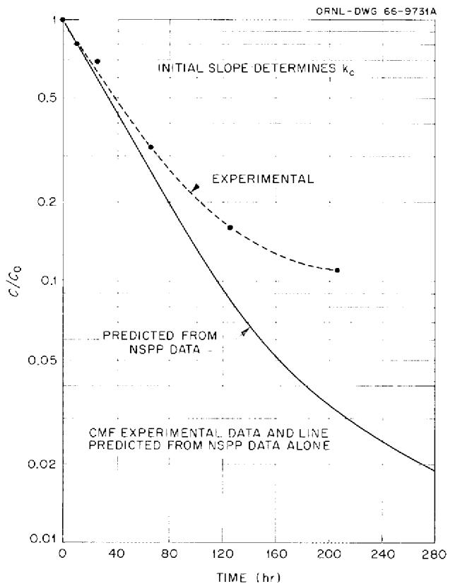  
Fig. 16.1. CMF Experimental Iodine Concentration and Values Predicted from NSPP Data.

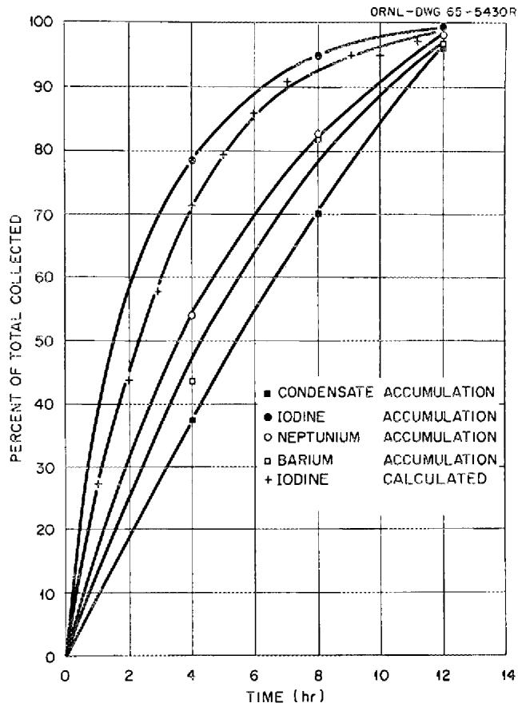  
Fig. 16.2. Accumulation of Condensate and of Fission Products in Condensate vs Time, NSPP Run 8.

The simple assumptions of the condensing steam model have been tested using the experimental data on an NSPP experiment which provides information on both iodine and water condensate collection as well as system pressure and temperature as a function of time. Figure 16.2 shows a comparison of the calculated and experimental values of the iodine collected. The agreement appears to be quite satisfactory.

Based on a very limited number of tests, it appears that the behavior of iodine in containment systems differing in size by two orders of magnitude may be correlated with moderate success utilizing simple mathematical relationships.

# CHEMICAL EQUILIBRIUM STUDIES OF ORGANIC-IODIDE FORMATION UNDER NUCLEAR REACTOR ACCIDENT CONDITIONS

R.H.Barnes J.F.Kircher C.W.Townley

The presence of $\mathrm{CH}_3\mathrm{I}$ in nuclear reactor environments poses a potential hazard because of the difficulties involved in removing this compound from gases using conventional trapping techniques. To gain insight into the chemical processes leading to $\mathrm{CH}_3\mathrm{I}$ formation, a study was performed of calculated equilibrium concentrations of $\mathrm{CH}_3\mathrm{I}$ and other important species for a range of conditions typical of reactor-accident systems. A report of this work has been issued.[7]

The results of this study indicated that chemical systems containing iodine and simple compounds such as $\mathrm{CO}_{2}, \mathrm{H}_{2}\mathrm{O}, \mathrm{C}_{2}\mathrm{H}_{4}$ , and $\mathrm{CH}_{4}$ would be expected to generate $\mathrm{CH}_{3}\mathrm{I}$ . Such materials are found as trace pollutants in the atmosphere, even if some of them are thermodynamically unstable[8,9]

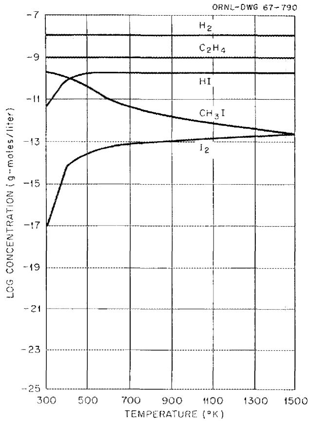  
Fig. 16.3. Species Concentrations as a Function of Temperature for the Chemical Equilibrium Systems Containing $\mathsf{C}_2\mathsf{H}_4$ , $\mathsf{H}_2$ , $\mathsf{HI}$ , $\mathsf{I}_2$ , and $\mathsf{CH}_3\mathsf{I}$ . Based on total concentrations equivalent to $1 \times 10^{-8}$ g-mole per liter of $\mathsf{H}_2$ , $1 \times 10^{-9}$ g-mole per liter of $\mathsf{C}_2\mathsf{H}_4$ , and $1 \times 10^{-10}$ g-mole per liter of $\mathsf{I}_2$ .

and may exist only in transient conditions. Accordingly, equilibrium calculations were made postulating the presence of several possibly significant pollutants. The calculated equilibrium composition in the presence of ethylene is shown in Fig. 16.3, which shows that at 300 to $500^{\circ}\mathrm{K}$ a major fraction of the iodine appears as $\mathrm{CH}_3\mathrm{I}$ .

These chemical equilibrium calculations indicate that there are realistic conditions under which $\mathrm{CH}_3\mathrm{I}$ could be generated if sufficient reaction time were available. Chemical kinetic calculations are now being made for promising reactions and conditions identified in the equilibrium studies in order to assess rates of formation of methyl iodide.

# THE ADEQUACY OF SCALEUP IN EXPERIMENTS ON FISSION PRODUCT BEHAVIOR IN REACTOR ACCIDENTS

C. E. Miller, Jr.

W. E. Browning, Jr.

We concluded in a previous report10 that scaling of experiments on fission product release and transport in the U.S. Nuclear Safety Program does not seem adequate; a very large extrapolation will be necessary to compare presently available data to that obtained from the projected Loss-of-Fluid Test (LOFT).11 In a subsequent report12 we propose experiments at 1 and $10\%$ of the size of LOFT (based on the mass of fuel) in order to fill the gap in scaling.

Intermediate-scale experiments to study fission product release and transport should be designed so that they (1) generate fission products with maximum practical realism as a function of various simulated loss-of-coolant accident environments and heatup rates and (2) simulate core geometry sufficiently to achieve proper temperature profiles and heatup rates, to allow natural movement of core components during the heatup cycle, and to provide a realistic escape path for fission products through remaining core materials.

The following general characteristics and capabilities should be incorporated into the experiments:

1. The experiments should be performed in-pile on multipin fuel subassemblies to give maximum realism to the time-temperature-position profiles.   
2. Where possible the experiments should be designed to accommodate water, liquid metal, and gas-cooled fuel systems.   
3. The released fission products should be transported through a representative primary system in which the transport rates result from realistic thermal gradients and natural steam flow.

4. Parameters of interest in the experiments are (1) maximum operating temperature (the experiment should be capable of operating at initial conditions similar to those of real reactor operation), (2) core environment (steam, steam-hydrogen, steam-air), (3) cladding and core materials, and (4) burnup.   
5. Measurements of interest are: (1) temperatures of fuel and cladding, (2) observation of geometrical changes, (3) permanent and temporary fission product plateau (on fuel materials, cladding, and oxidized cladding in the unmelted part of the fuel subassembly, and on the walls of the primary, etc.) as a function of time and temperature in the primary system, (4) extent of fuel oxidation, fuel melting, and fuel melting point lowering via eutectic formation, (5) extent and rate of metal-water reaction, (6) particle size, (7) fission product transport as a function of flow (diffusion or forced), and (8) physical and chemical form of radioactive aerosols which remain in the gas phase as a function of time.

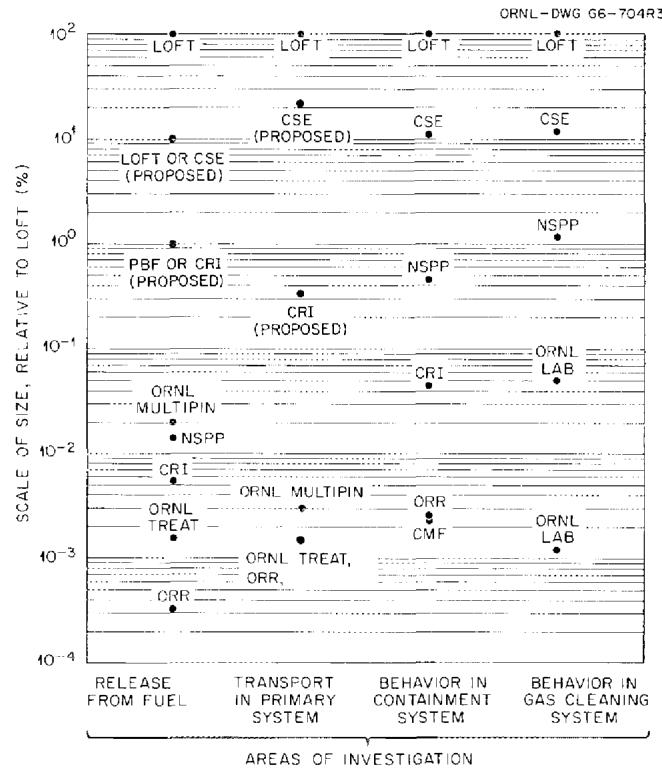  
Fig. 16.4. Comparison of Size of Planned Nuclear Safety Experiments with Regard to Various Stages of Fission Product Behavior (Including the Proposed Experiments).

The proposed experiments on the release and transport of fission products from $\mathrm{UO}_2$ are described in some detail elsewhere. They are scaled at 1 and $10\%$ of the size of the LOFT experiment based upon the mass of fuel in the LOFT core. The fuel in these experiments is to be melted by nuclear self-heating in a reactor facility using a driver core. The suggested facilities are the Power Burst Facility for the $1\%$ scale experiment using approximately one LOFT fuel element, and the LOFT itself for the $10\%$ scale experiment using approximately five LOFT fuel elements.

Alternative experiments at the same scale using a nonnuclear method of heating are proposed to fill the gap in scaling if for reasons of expense or scheduling the nuclear experiments cannot be performed. The $1\%$ scale experiment is proposed for the Containment Research Installation, $^{14}$ and the $10\%$ scale experiment is proposed for the Containment Systems Experiment. $^{15}$ An electrical method of heating the fuel is proposed, which is presently under development in an AEC-sponsored program. $^{12}$

The capability of performing any of the proposed experiments appears to be near at hand. All four facilities are under construction, and the capability

of electrical heating is being developed. However, three of the four possible experiments involve facilities which are already scheduled for experimental programs. These are the LOFT, CSE, and CRI facilities. The addition of these proposed experiments would cause delays in programs which are very much needed in other phases of nuclear safety work. The remaining facility, the Power Burst Facility, which is still to be constructed, seems the most promising.

With the addition of these experiments to the AEC Nuclear Safety Program, the comparison of size of planned nuclear safety experiments will be as shown in Fig. 16.4. The accomplishment of these experiments will produce a scaling range which should cover all possible mechanisms of fission product behavior and make extrapolation of data from one experiment to the other more reliable.

# 17. Nuclear Safety Tests in Major Facilities

# FISSION PRODUCTS FROM FUELS UNDER REACTOR-TRANSIENT CONDITIONS

G. W. Parker R. A. Lorenz J. G. Wilhelm

ORNL fission product release experiments are performed in the TREAT reactor to study the release and transport of fission products from fuel during reactor transients in which fuel is heated and melts rapidly. In the current series of experiments, various components of the equipment are designed to simulate the core, pressure vessel, containment vessel, and the filter and charcoal cleanup system of a typical large pressurized- or boiling-water power reactor. Experiments 9, 10Z, 11Z, and 12Z were recently completed and reported in detail elsewhere, making a total of six experiments in which stainless-steel- or Zircaloy-2-clad $\mathrm{UO}_2$ fuel specimens were melted underwater by transient heating. The letter Z indicates experiments in which Zircaloy-2 cladding was used. Each of these experiments used $32\mathrm{g}$ of $10.7\%$ enriched $\mathrm{UO}_2$ sintered into pellets 0.400 in. in diameter, with 0.020-in.-thick cladding. Heat input to the fuel by internal fissioning during the transient was approximately 520 calories per gram of $\mathrm{UO}_2$ ; this treatment heated the $\mathrm{UO}_2$ well above its melting point.

In each experiment a reactor accident was simulated by first preheating the fuel autoclave to about $120^{\circ}\mathrm{C}$ , executing the transient which melted the fuel specimen, and allowing the transient-generated steam aerosol to leave the fuel autoclave. Steam was condensed and collected in water traps, and noncondensable gases passed through a series of filter papers and charcoal

loaded papers into a gas collection tank. In simulation of accident after-heat, the fuel autoclave was then heated electrically to about $300^{\circ}\mathrm{C}$ for 1 hr to boil out any remaining water.

We wished to determine the maximum fission product release; so in addition to using the two different cladding materials, the rate of steam release from the melting region was varied. In experiments 7 and $8Z$ , only about $5\%$ of the water surrounding the fuel specimen boiled out of the fuel autoclaves in the first minute following the transient. In experiments 9 and $10Z$ , approximately $75\%$ of the water boiled out in the first minute, and essentially all of the water boiled out of the $11Z$ and $12Z$ fuel autoclaves in $1\mathrm{min}$ . These two latest experiments also explored the effect of pressure during melting by enclosing the fuel and water in sealed primary vessels. Experiment $11Z$ used a 300-psi rupture disk to release the steam, and experiment $12Z$ used a 2500-psi rupture disk along with 500 psi of helium as preliminary pressurization. Examination of these two experiments is in progress.

The fuel and cladding melted completely in experiments 7, 8Z, 9, and 10Z, except for portions of the metal end caps. The melted residue from experiments 7 and 9, which used stainless steel cladding, appeared to be foamy and more porous than the residue from experiments 8Z and 10Z. In Fig. 17.1 the front half of the crucible in experiment 10Z has been removed to reveal some of the nonporous solidified fuel and cladding around the sample holder pedestal and some material splattered onto the crucible and flux monitor capsule.

Approximately 24 and $16\%$ of the stainless steel cladding reacted with steam to form hydrogen in

experiments 7 and 9. Forty-one and forty-nine percent of the Zircaloy-2 cladding reacted in experiments 8Z and 10Z. These results all agree well with those found by workers at Argonne National Laboratory in metal-water reaction studies in TREAT.4

Fission product release and transport was similar in all four experiments except that transport of the volatile elements tellurium, cesium, and iodine out of the fuel autoclave in experiments 9 and 10Z (6 to $19\%$ ) was about twice that in experiments 7 and 8Z (2 to $7\%$ ). The larger release

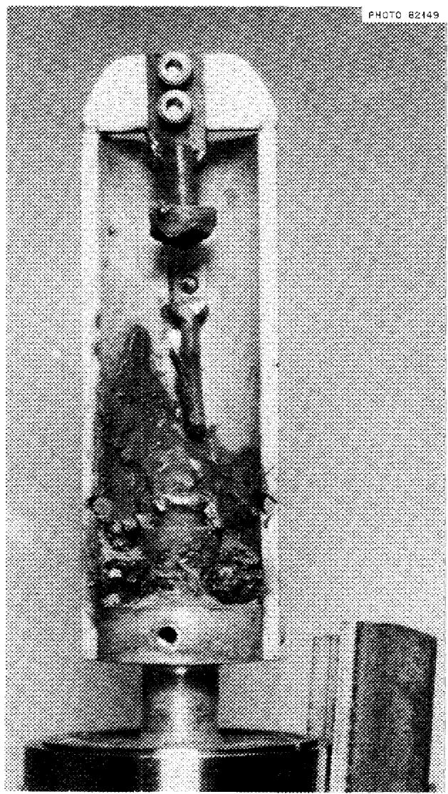  
Fig. 17.1. Opened Crucible from TREAT Experiment 102, Showing Upper End Cap, Flux Monitor Capsule, and Part of Nonporous Fuel-Cladding Residue Around Sample Holder and on Crucible Wall.

in 9 and $10Z$ is attributed to the faster steam release. About $1\%$ of the barium and strontium, $0.3\%$ of the ruthenium, and less than $0.1\%$ of the cerium, zirconium, and $\mathrm{UO}_2$ were carried out of the fuel autoclave with the released steam in each of the four experiments. The condensation process was highly efficient in trapping fission products and $\mathrm{UO}_2$ in these experiments; a decontamination factor of about $10^3$ for nonvolatile materials was observed. No significant effect of cladding material was evident.

In experiments 9 and $10Z$ , distilled-water rinses of the fuel autoclave walls contained 33 to $44\%$ of the total cesium and iodine; this behavior suggested rapid formation of nonvolatile water-soluble compounds, possibly cesium hydroxide and various metal iodides.

The amount of unreactive or penetrating iodine was only a small fraction of the total in all four experiments. Sixty to eighty percent of the total 131I was released from the melted fuel specimens, but only 0.0006 to $0.005\%$ was found on the charcoal-loaded papers and in the gas collection tank. This iodine was characterized as unreactive or penetrating, based on its poor sorbability in the bed of 27 charcoal-loaded papers.

# SIMULATED LOSS-OF-COOLANT EXPERIMENTS IN THE OAK RIDGE RESEARCH REACTOR

C. E. Miller, Jr.

B. F. Roberts

R. P. Shields

R. J. Davis

The simulated loss-of-coolant experiments, conducted in previously described facilities at the ORR, are designed to provide information on release and transport of fission products in reactor accidents. It is intended that the information obtained can be used to predict fission product behavior under conditions beyond those tested so that hypothetical accidents can be more realistically evaluated.

The interpretation of data from previous experiments on fission product release and behavior has been the main activity during a period when major

construction work has been under way on the reactor facility.

A major construction program has been carried on during the past year involving the reactor facility in which the in-pile fission product release experiments are performed. The modifications are in line with the emphasis on fission product transport. They include the construction and installation of a simulated reactor containment vessel, the installation of on-line analyzers for the determination of water, hydrogen, oxygen, and carbon oxides in the sweep gas, and of increased capability for temperature measurement and control in the experiment system. A schematic diagram of the new system is shown in Fig. 17.2. The availability of this modified facility will allow the complete study of realistic fission product release, transport, and behavior in a vessel.

The considerable literature has been examined in a study of the extent and the rate of sorption of iodine on a variety of surfaces and possible components of reactor systems. The practical re

sults of this study, from nuclear safety considerations, are as follows:

1. Sorption of iodine on several materials (notably clean steel, clean stainless steel, and soiled steel with oxide coatings) can be interpreted very well by mechanisms involving monolayer adsorption with dissociation.   
2. Absorption of iodine in water or in aqueous solutions can be treated by use of models involving diffusion through boundary layers. Such mechanisms for iodine deposition will be important when surfaces are covered with water films during steam condensation within a containment vessel.   
3. Sorption of iodine on stainless steel and some other metals covered with an oxide layer (e.g., as-received stainless steel) seems to involve complicated mechanisms and to follow relatively complex kinetics. Since stainless steel is likely to be an abundant material in containment systems, it will be necessary to study the sorption-desorption process as a function of oxide thickness and temperature.

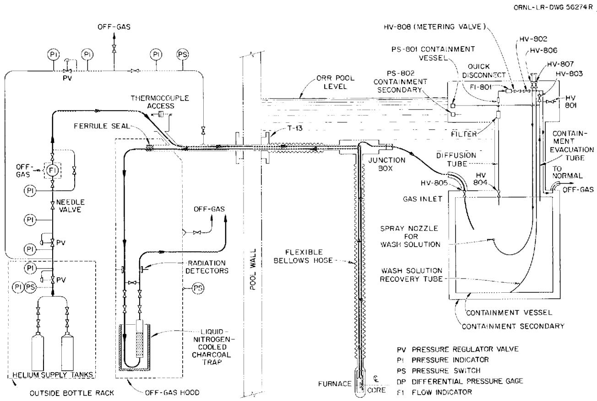  
Fig. 17.2. ORNL In-Pile Fuel Destruction Experiment: Flow Diagram.

# IGNITION OF CHARCOAL ADSORBERS

C. E. Miller, Jr.

R. P. Shields

Charcoal adsorbers are used in many present and proposed reactor safety systems to remove iodine from the containment system atmosphere. The High Flux Isotope Reactor uses such a safety system. Such charcoal adsorbers will ignite and burn if temperatures and air flows are sufficiently high. Reactor accidents would discharge large quantities of fission products whose radioactive decay could produce serious overheating (especially in local hot spots) of the adsorber beds. Such accidents might also permit air to enter the containment system and the adsorber bed. Accordingly, we have initiated a program of tests both in the laboratory and in-pile to establish the effect of fission products and of irradiation on the ignition temperature of charcoal adsorbers.

Laboratory studies have been conducted primarily with Barnebey-Cheney type KE (BC-KE) and Mine Safety Appliances (MSA) No. 85851 charcoal, both of which have been widely used in adsorbers. The data from small-scale investigations of these materials show that ignition temperatures vary somewhat for various lots of the same charcoal; initial ignition temperatures differed by $30^{\circ}\mathrm{C}$ for two lots of MSA charcoal, while subsequent ignition temperatures differed by 15 to $20^{\circ}\mathrm{C}$ . Ignition temperatures seem independent of apparatus material (glass or metals such as stainless steel) and of tubing size over the small range (0.5 and 0.7 in. in diameter) studied. Initial ignition temperature was unaffected by change in air flow rate from 20 to 40 fpm, but subsequent ignition occurred at temperatures 10 to $15^{\circ}\mathrm{C}$ lower at the higher flow rates. Ignition temperatures were lowered measurably (about $6^{\circ}\mathrm{C}$ ) when moist air was substituted for dry air at the same velocity. The ignition temperatures for the BC-KE charcoals were increased by addition of iodine.

A most important finding in this study is that charcoal from adsorbers which had been in service for one year on the NS "Savannah" showed ignition temperatures 150 to $200^{\circ}\mathrm{C}$ lower than unexposed samples of the same charcoal. The reason for this difference is not yet known.

In-pile tests have been conducted in an experimental unit (see Fig. 17.3) designed for use in the fuel melting facility in the ORR. This facility and the first in-pile ignition test of this series were described in a previous report. A total of 100 ignitions have been performed with ten ignition cycles per position. Control of the position of the $\mathrm{UO}_2$ cylinder (from which fission products were emitted to the charcoal adsorber) permitted study at three levels of fission product concentration in the charcoal; iodine concentrations corresponded to 4.3, 5.0, and $7.0\mathrm{w}$ per square inch of charcoal surface. These energy release rates are greater by a factor of 8 than those expected in HFIR, LOFT, or NPR adsorbers.

Ignition temperatures for the in-pile experiments differed in several regards from those observed in the laboratory experiments. Typical experiments with a BC-KE charcoal showed that initial ignition, which took place after the iodines were at equilibrium, occurred at $336^{\circ}\mathrm{C}$ ; this value is not significantly different from the value $341^{\circ}\mathrm{C}$ which is the average of ten fast ignitions in the same apparatus out-of-pile. However, subsequent ignitions in the in-pile assembly occurred at temperatures up to $40^{\circ}\mathrm{C}$ higher. This increase in ignition temperature (which is quite unlike the laboratory behavior) persisted even after the unit was retracted to stop fission product (and iodine) generation. When an in-pile ignition experiment was resumed (in the retracted position) after a 45-day lapse following an equipment malfunction, the ignition temperature remained at some $20^{\circ}\mathrm{C}$ above its laboratory value, even though virtually all iodine activity had decayed. Some factor in addition to iodine and the short-lived fission products seems responsible for a part of this temperature increase.

Future in-pile experiments will be performed to study the ignition temperature behavior of high-ignition charcoal and impregnated charcoal. In these experiments a controller will be used to reproductively control the heating rate of the adsorber. Future out-of-pile experiments will include the further development of a standard ignition apparatus and the study of ignition characteristics of various charcoal.

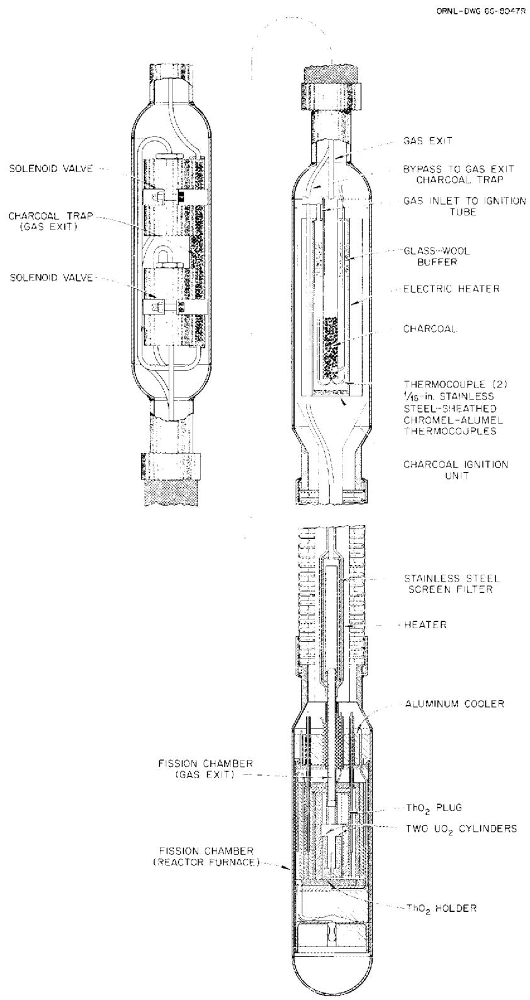  
Fig. 17.3. Experimental Equipment for In-Pile Charcoal Ignition Experiment IGR-2.

# FISSION PRODUCTS FROM ZIRCALOY-CLAD HIGH-BURNUP $\mathsf{U}\mathsf{O}_{2}$

G. E. Creek

W.J.Martin

R. A. Lorenz

G. W. Parker

The previous report gave results of an experiment performed in the Containment Mockup Facility (CMF) with stainless-steel-clad $\mathrm{UO}_2$ irradiated to a burnup of 1000 Mwd/ton. Data obtained in a similar experiment (run 4-11) with Zircaloy-clad $\mathrm{UO}_2$ irradiated to a burnup of 7000 Mwd/ton are reported below.

The conditions used in this experiment were quite close to those prevailing in the previous high-burnup experiment. The total pressure in the CMF, furnished by a mixture of air and steam, was about 29 psig before heating the fuel. Heating of the fuel was started with a mixture of steam and air flowing through the pressurized furnace tube, but steam flow was discontinued before the fuel temperature reached an estimated $2200^{\circ}\mathrm{C}$ because of steam condensation in the furnace tube. Dry air flow continued during the balance of the heating period (10 min total) and for 20 min thereafter. During most of the 20-min cooling period, burning of the specimen was observed at irregular intervals; such behavior has been observed with previous Zircaloy-clad $\mathrm{UO}_2$ specimens that had been melted and then cooled in air.

The distribution of iodine observed in this experiment is compared in Table 17.1 with the data obtained with the 1000 Mwd/ton burnup fuel6 (run 10-29). The distribution of four other important fission products is similarly compared in Table 17.2. In both tables the observed differences are not large enough to be considered significant without further, confirmatory, data. The high transport of iodine observed in the 7000 Mwd/ton experiment (21.6% as compared with 9% for the 1000 Mwd/ton experiment and 6 to 10% in simulant experiments) was an unexpectedly large difference. The difference in iodine collection on plateau samples is due, at least in part, to a larger number of painted carbon-steel samples in run 4-11 as compared with run 10-29. There appears to be no obvious explanation for the smaller fraction of iodine in the condensate in the 7000 Mwd/ton experiment.

Table 17.1. Distribution $(\%)$ of lodine Released from High-Burnup $\mathsf{UO}_2$   

<table><tr><td></td><td colspan="2">Burnup</td></tr><tr><td></td><td>1000Mwd/ton</td><td>7000Mwd/ton</td></tr><tr><td>Iodine released</td><td>~100</td><td>90.8</td></tr><tr><td>Iodine held in containment tank</td><td></td><td></td></tr><tr><td>Retained on tank walls</td><td>19.8</td><td>20.3</td></tr><tr><td>Collected on plateau samples</td><td>7.2</td><td>23.7</td></tr><tr><td>Collected in condensate</td><td>57.6</td><td>19.2</td></tr><tr><td>Total iodine retained</td><td>84.6</td><td>63.2</td></tr><tr><td>Iodine removed from tank after aging by</td><td></td><td></td></tr><tr><td>Pressure release</td><td>2.9</td><td>7.7</td></tr><tr><td>Argon displacement</td><td>4.8</td><td>11.5</td></tr><tr><td>Air sweep</td><td>1.2</td><td>2.6</td></tr><tr><td>Total iodine transported from tank</td><td>8.9</td><td>21.8</td></tr><tr><td>Retention of airborne iodine from tank</td><td></td><td></td></tr><tr><td>On filters</td><td>0.35</td><td>2.1</td></tr><tr><td>On silver or copper screens</td><td>5.6</td><td>5.0</td></tr><tr><td>In charcoal cartridges</td><td>2.2</td><td>11.7</td></tr><tr><td>Iodine in penetrating form</td><td>0.6</td><td>\( 0.6^a \)</td></tr></table>

${}^{a}$ Based on the ratio of activity on the silver section of the diffusion tube to that on the charcoal-lined section.

Data on airborne fission products in the containment tank as a function of time were also obtained from analysis of gas samples taken at various intervals. Comparison of the data with those for the 1000 Mwd/ton experiment shows little difference in airborne I, Cs, Mo, and Ru. The airborne tellurium values are lower for the 7000 Mwd/ton experiment, reflecting the alloying effect of the zirconium cladding, while the barium and strontium values are higher as the result of the reducing effect of the zirconium. Both phenomena have been observed earlier.

Fission products released from Zircaloy-clad 7000 Mwd/ton burnup fuel in the CMF differed from those released from stainless-steel-clad 1000

Table 17.2. Distribution of Fission Products Released from High-Burnup $\mathsf{UO}_2$ (Runs 10-29 and 4-11)   

<table><tr><td rowspan="2">Fission Product Element</td><td rowspan="2">Burnup Level (Mwd/ton)</td><td colspan="5">Amount of Fission Product Found (% of total inventory)</td></tr><tr><td>Furnace Tube and Duct to Tank</td><td>Aerosol Tank Wallis</td><td>Condensate</td><td>Filters</td><td>Total Release from Fuel</td></tr><tr><td rowspan="2">Cesium</td><td>1000</td><td>3.0</td><td>15.1</td><td>43.6</td><td>0.8</td><td>62.5</td></tr><tr><td>7000</td><td>8.6</td><td>13.8</td><td>6.2</td><td>1.5</td><td>30.0</td></tr><tr><td rowspan="2">Tellurium</td><td>1000</td><td>0.3</td><td>6.9</td><td>0.8</td><td>0.45</td><td>8.4</td></tr><tr><td>7000</td><td>0.7</td><td>1.4</td><td>0.04</td><td>0.112</td><td>2.3</td></tr><tr><td rowspan="2">Ruthenium</td><td>1000</td><td>0.07</td><td>0.35</td><td>0.12</td><td>0.0006</td><td>0.54</td></tr><tr><td>7000</td><td>0.16</td><td>0.05</td><td>0.002</td><td>0.004</td><td>0.22</td></tr><tr><td rowspan="2">Strontium</td><td>1000</td><td>0.01</td><td>0.04</td><td>0.0003</td><td>0.0004</td><td>0.05</td></tr><tr><td>7000</td><td>0.05</td><td>0.11</td><td>0.015</td><td>0.0026</td><td>0.18</td></tr></table>

Mwd/ton fuel in a way that could have been predicted from the difference in cladding materials. No variations were observed that could be attributed to the difference in burnup level of the fuel specimens.

# BEHAVIOR OF I AND HI IN THE CONTAINMENT RESEARCH INSTALLATION TANK

G. W. Parker

G. E. Creek

W.J.Martin

N. R. Horton

The Containment Research Installation (CRI) has been constructed at Oak Ridge National Laboratory for the investigation of fission product release, transport, and plateau as a function of burnup, fuel and containment temperature, time at temperature, and atmospheric and containment surface composition.

The primary objective of the initial experiments in the CRI was to compare the deposition behavior of molecular iodine (run 100) and HI (run 101) in a stainless steel system under ambient conditions of temperature and humidity and an internal air pressure of 30 psig.

In run 100 an initial concentration of $2\mathrm{mg / m}^3$ of elemental iodine tagged with ${}^{130}\mathrm{I}$ was introduced into the CRI containment vessel by compressing a thin-wall stainless steel tube which contained an iodine-filled glass ampule. An air stream passed through the heated tube for 12 min to transport iodine to the containment vessel.

Over a period of 22 hr, approximately $98\%$ of the airborne iodine was deposited on the tank walls. Depletion of the iodine occurred very rapidly during the first 12 min and then more slowly for the remainder of the experiment. The results are summarized in Table 17.3. The fraction of iodine retained by the absolute filter media increased with time, while the fractions which passed such filters did not. It appears that the filterable fraction of the iodine has a rate of deposition on the tank which differs from that of the other forms of iodine present.

In run 101, hydrogen iodide was formed by passing a hydrogen gas stream over a crushed capsule containing $\mathbf{I}_2$ tagged with $^{130}\mathrm{I}$ and combining these components on a platinum catalyst at $400^{\circ}\mathrm{C}$ . The product was formed and injected into the CRI tank during a period of about 35 min.

The total weight of iodine used was again sufficient to give an initial concentration of about $2\mathrm{mg / m}^3$ .In this run, as well as in run 100, approximately $98\%$ of the activity was deposited on the containment vessel surfaces during the course of the experiment. Table 17.4 summarizes the sampling data, which show that the rate of deposition of HI over the first 3 hr was faster than that of $\mathbf{I}_2$ in run 100. The slower deposition rate after 3 hr possibly indicates that the HI has changed the adsorption characteristics of the stainless steel surfaces, rendering them more inactive, or that it reacted to give an unidentified form of iodine which was only slightly reactive with the stainless steel containment vessel.

Table 17.3. Distribution of Iodine Among CRI Gas Sampler Components in Molecular ${\mathrm{I}}_{2}$ Experiment (Run 100)   

<table><tr><td rowspan="2">Time After Completing I2Injection into Tank (min)</td><td rowspan="2">Percent of Total Iodine Inventory Airborne in Tank</td><td colspan="3">Fraction of Sample Iodine Activity Collected by</td></tr><tr><td>Absolute Filtersa</td><td>Silver Membranesb</td><td>Charcoal Cartridgesc</td></tr><tr><td>12</td><td>32.4</td><td>0.093</td><td>0.898</td><td>0.009</td></tr><tr><td>38</td><td>26.3</td><td>0.083</td><td>0.911</td><td>0.006</td></tr><tr><td>76</td><td>22.7</td><td>0.074</td><td>0.922</td><td>0.004</td></tr><tr><td>161</td><td>10.5</td><td>0.074</td><td>0.922</td><td>0.004</td></tr><tr><td>285</td><td>6.9</td><td>0.089</td><td>0.904</td><td>0.007</td></tr><tr><td>400</td><td>3.2</td><td>0.128</td><td>0.860</td><td>0.012</td></tr><tr><td>710</td><td>1.0</td><td>0.417</td><td>0.539</td><td>0.044</td></tr><tr><td>832</td><td>0.77</td><td>0.506</td><td>0.434</td><td>0.060</td></tr><tr><td>1020</td><td>0.47</td><td>0.594</td><td>0.328</td><td>0.078</td></tr><tr><td>1155</td><td>0.42</td><td>0.59</td><td>0.328</td><td>0.080</td></tr><tr><td>1255</td><td>0.41</td><td>0.588</td><td>0.329</td><td>0.083</td></tr></table>

Note: See Table 17.4 for explanation of footnotes.

Table 17.4. Distribution of lodine Among CRI Gas Sampler Components in HI Experiment (CRI Run 101)   

<table><tr><td rowspan="2">Time After Completing HI Injection into Tank (min)</td><td rowspan="2">Percent of Total Iodine Inventory Airborne in Tank</td><td colspan="3">Fraction of Sample Iodine Collected by</td></tr><tr><td>Absolute Filtersa</td><td>Silver Membranesb</td><td>Charcoal Cartridgesc</td></tr><tr><td>16</td><td>12.0</td><td>0.16</td><td>0.83</td><td>0.01</td></tr><tr><td>40</td><td>8.5</td><td>0.07</td><td>0.84</td><td>0.09</td></tr><tr><td>76</td><td>6.1</td><td>0.05</td><td>0.48d</td><td>0.47</td></tr><tr><td>151</td><td>4.2</td><td>0.04</td><td>0.91</td><td>0.05</td></tr><tr><td>477</td><td>2.8</td><td>0.04</td><td>0.94</td><td>0.02</td></tr><tr><td>604</td><td>2.5</td><td>0.03</td><td>0.96</td><td>0.01</td></tr><tr><td>728</td><td>2.3</td><td>0.04</td><td>0.95</td><td>0.01</td></tr><tr><td>842</td><td>2.0</td><td>0.04</td><td>0.90</td><td>0.06</td></tr><tr><td>918</td><td>1.9</td><td>0.05</td><td>0.93</td><td>0.02</td></tr><tr><td>996</td><td>1.7</td><td>0.04</td><td>0.94</td><td>0.02</td></tr><tr><td>1093</td><td>0.9</td><td>0.05</td><td>0.93</td><td>0.02</td></tr></table>

${}^{a}$ Absolute filter media - Flanders filter 7H70A.   
bSilver membrane filter - Flowtronics silver membrane, $5\mu$ pore size, four or eight filters were used.   
Charcoal cartridge $\sim 1 / 2$ in. of unimpregnated charcoal and $\frac{1}{2}$ in. of impregnated charcoal.   
$d_{\mathrm{F}}$ Faulty mounting of silver membranes apparently caused low HI retention on silver membranes and high charcoal collection value.

# 18. Laboratory-Scale Supporting Studies

# DEVELOPMENT OF FILTRATION AND ADSORPTION TECHNOLOGY

R. E. Adams  
Jack Truitt

J. S. Gill  
W. D. Yuille

This program is intended to advance the technology of removal of fission product gases and colloidal dispersions by adsorption and filtration techniques in order to increase the confidence in the reliability of the effectiveness of various air cleaning systems under accident conditions. As this confidence is achieved, a wider acceptance of air cleaning systems as engineered safeguards will be accomplished.

Results of these studies are reported in detail elsewhere.2 Prior results and experimental techniques have been reported previously.3,4 Briefly, a reproducible aerosol containing stainless steel and oxides of uranium is used for these tests. The test aerosol is prepared by striking an electric arc between electrodes consisting of $\mathrm{UO}_2$ (with thoriated tungsten) and a stainless steel tube packed with $\mathrm{UO}_2$ . Under dry conditions the test aerosol (median size of primary particles $0.018\mu$ ) is easily filtered out of air streams by any of the so-called "high-efficiency (absolute)" filters with efficiencies of removal in excess of $99.9\%$ .

Prior experiments at room temperature have shown that a moist atmosphere may reduce the efficiency of the same filter medium toward the same test aerosol to as low as $93\%$ under $\sim 95\%$ relative humidity.

The effect of moisture had not been anticipated by reactor designers, and, because of its implications in case of reactor accidents, recent research efforts have been directed toward defining the mechanism of moisture in reducing filtration efficiency. The effect of moisture may be due to changes in the properties of the aerosol, changes in the filter media, or both.

A difference has been noted in the physical characteristics of aerosols produced under humid and under dry conditions. Electron photomicrographs of an aerosol produced under high relative humidity reveal that the particles are covered with a thin film of unknown composition and that agglomerates are in the form of chains (Fig. 18.1) rather than clusters as observed under dry conditions. Evidently the stability and filtration characteristics of these two types of aerosols differ in some respects.

Tests have established that activity profiles obtained by filtration of moist and dry aerosols through fibrous-filter analyzers are quite different. In a dry atmosphere as much as $90\%$ of the aerosol passed through the fibrous-filter analyzer is retained on the first fiber mat, whereas under high humidity conditions a flat activity profile is obtained as a result of more even distribution of particles on the successive fiber mats. Interpretation of results under wet conditions can be taken to mean that the fibrous filter mat efficiencies are being reduced, or moisture is affecting the aerosol in some way, making it more difficult to filter, or both. In any case, a flat distribution of particles through the filter pack would result.

To resolve the anomalous filtration behavior in the presence of moisture, a series of experi

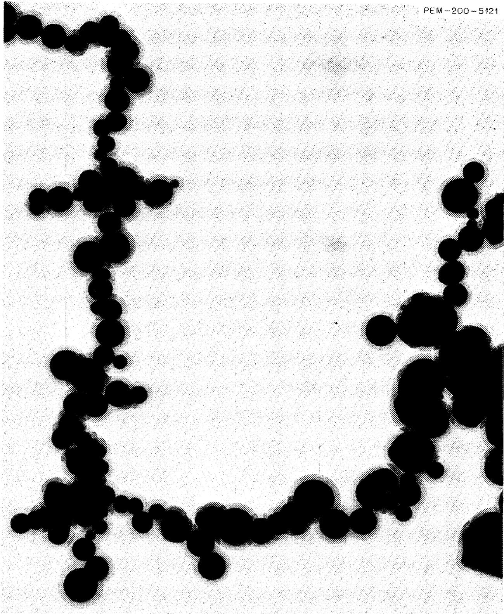  
Fig. 18.1. Appearance of Aerosol Formed in a High-Humidity Atmosphere. Note thin film covering the particles. $165,000 \times$ Reduced $6.5\%$ .

ments was made in which an aerosol generated in a high-humidity air atmosphere was sampled by two filter packs. One pack was held at room temperature, and the fibers were saturated with water vapor from the high-humidity carrier gas. To reduce the moisture content of the fibers, the other pack was heated to $100^{\circ}\mathrm{C}$ under similar conditions. In another set of experiments the aerosol was generated in a dry air atmosphere and once more sampled with two packs. One pack was dry, and the other was wetted by pretreating it with $90\%$ relative humidity air immediately prior to its use in an experiment. The conclusion drawn from these experiments was that moisture does not affect the efficiency of a fibrous filter but that it influences the physical properties of the aerosol, making it more difficult to filter. However, not all the results from these experiments were equally unambiguous. At aerosol concentrations estimated to be at the level of $10^{9}$ nuclei/cm³, the activity profile obtained in the presence of a wet atmosphere was not characteristically flat. It is probable that at these higher concentrations, agglomeration will occur regardless of the presence of moisture. Study of the effects of moisture is continuing.

Construction of a recirculating aerosol facility for laboratory aerosol studies has been proceeding parallel to the moisture effects study just described. This recirculating facility consists of a 100-liter stainless steel vessel with associated piping which will allow the behavior of an aerosol, or a scaled-down air cleaning system, to be studied under a variety of accident conditions ranging from temperatures of 25 to $120^{\circ}\mathrm{C}$ and humidities from $\sim 0$ to $\sim 100\%$ . The recirculating aerosol facility has been installed, and shakedown tests are in the final phase.

# EXAMINATION OF PARTICULATE AEROSOLS WITH THE FIBROUS-FILTER ANALYZER

M. D. Silverman

Jack Truitt

W.E.Browning, Jr.

R. E. Adams

The fibrous-filter analyzer (FFA) is being developed for measuring the characteristics of radioactive aerosols in terms of their response to filtration processes by determining their distribution vs depth in a filter under carefully controlled conditions. Moisture does not significantly

affect the performance of the FFA, although the test aerosol itself was affected. The filtration efficiency data agreed well with the theoretical treatment of filtration developed by Torgeson. The analyzer was calibrated against particles 150 to 1500 A in diameter, measured by electron microscopy.

A summary report on this project has been completed, and only a brief review of the subject material will be presented here.

The FFA is an "in situ" analytical device which characterizes radioactive aerosols dynamically by particle response to the major processes of filtration: diffusion, interception, and inertial impaction. The concept of the FFA originated from a note by Sisefsky, who determined the penetration of "fallout" material in a commercial filter by radioassay by peeling off layers of the filters with pressure-sensitive cellophane tape. By contrast, the fibrous-filter analyzer is made from uniform-diameter Dacron fiber (which is formed into a uniform web by a carding machine) into a layered structure to facilitate separation of the fiber bed into discrete layers for radioassay. The test aerosol containing $^{65}\mathrm{Zn}$ was produced by using a Tesla coil to generate a spark between two preirradiated zinc electrodes. A stream of air passing over the electrodes carried the aerosol through the system containing the filters. Electron micrographs of samples of the aerosol collected on carbon-covered Millipore membrane filters yielded information regarding the size of the particles. Depending on the experimental conditions, aerosols have been prepared over the size range 50 to 10,000 A (0.05 to 1 μ).

The data were analyzed graphically by means of the Chen equation to estimate single-fiber efficiencies. These were compared with theoretical fiber efficiencies calculated according to Torgeson, who used an adaptation of Davies' interception and impaction theory combined with a new

interception and diffusion theory. The Torgeson theory was selected by Whitby10 as that which agreed most closely with experimental data accumulated in numerous researches. A computer program developed specifically for these FFA calculations is given in Appendix II of the summary report.5

Calibration of the FFA was performed by comparing particle sizes estimated from electron photomicrographs of the inlet and outlet aerosols with those calculated according to the Torgeson treatment. The best correlations were observed in dry experiments and at low velocities. Additional calibrations will be performed at the University of Minnesota under a subcontract.

# Distinguishing IODINE FORMS AT HIGH TEMPERATURES AND HUMIDITIES

R. E. Adams

Zell Combs

R. L. Bennett

W. H. Hinds

In the event of a nuclear accident, radioiodine is the most hazardous fission product which may be released. Iodine may exist in elemental or in chemically combined species in molecular form or as aerosols dispersed on particulate material from the fuel or structural members of the reactor core. The various species exhibit different behavior toward removal, and information is needed on their behavior in order to design adequate gas cleaning systems. A program is in progress to develop tools for distinguishing the various vapor forms of iodine which occur in the laboratory and in larger-scale experiments. The identifying devices should be capable of remote operation and preferably should keep their effectiveness under extreme conditions of temperature and humidity that may occur in a reactor accident.

The analytical devices most commonly used for radioiodine studies are composite diffusion tubes and May packs. The adverse effects of high humidity on the response of diffusion tubes and the application of selective desiccants and impregnated charcoal linings in improving their performance have been reported. $^{11,12}$ Extensive tests of May packs under elevated temperatures and high-humidity conditions, such as those expected in the LOFT experiments, are in progress.

The May pack is an assembly of filter materials and adsorbent beds intended to separate iodine forms of different reactivity or adsorption tendency. Since high specificity is difficult to obtain for wide ranges of temperature and humidity, considerable testing is needed to establish the range of reliability of the optimum components of the pack. Initial emphasis has been placed on a configuration suggested for the LOFT program. This arrangement consists of a sequence of three high-efficiency filters, eight silver screens, five charcoal-impregnated filters, two in. charcoal beds, and finally one more high-efficiency filter section. The initial filter section is intended to remove particulate forms of iodine, the silver screens remove elemental iodine, and the charcoal filters retain the iodine species which are not removed by the silver screens but which are easily adsorbed by charcoal-impregnated filter papers. The more penetrating forms, such as methyl iodide, are adsorbed in the charcoal beds. The last high-efficiency filter section is designed to trap any charcoal particles which might be dislodged from the beds.

Duplicate May packs were usually tested with two associated diffusion tube assemblies, one at room temperature under dry conditions and the other at the same conditions as the May packs. The tests were made at $90^{\circ}\mathrm{C}$ with a superficial face velocity of 10 bpm. Dry or $90\%$ relative-humidity air streams were used in tests with elemental iodine and methyl iodide.

Results and discussion of a large number of these tests have been reported.13

Briefly, the effect of moisture on penetration of methyl iodide into the pack is illustrated in Fig. 18.2. Under dry conditions the $\mathrm{CH}_3\mathrm{I}$ was about evenly distributed between the charcoal-loaded filters and the first charcoal bed, while at $90\%$ relative humidity most of the $\mathrm{CH}_3\mathrm{I}$ was swept into the beds. The sharp separation of a

mixture of $16\%$ $\mathrm{CH}_3\mathrm{I}$ with elemental iodine is shown in Fig. 18.3. The elemental iodine deposited on the first two sections, and the $\mathrm{CH}_3\mathrm{I}$ deposited on the charcoal beds. The penetration of the $\mathrm{CH}_3\mathrm{I}$ into the second bed can be greatly reduced by use of iodine-impregnated charcoal.

Several tests have revealed that the elemental iodine deposition on the first high-efficiency filter

section is erratic and often large. Filter materials investigated include Hollingsworth-Vose HV-70, Millipore AP-20, Flanders F-700, Cambridge 1G, Reeves Angel 934AH, and Zitex 5- to $10 - \mu$ pore membranes. It appears that separation of particulate iodine from elemental iodine by use of a high-efficiency filter in the first section of the May pack is not reliable under the conditions

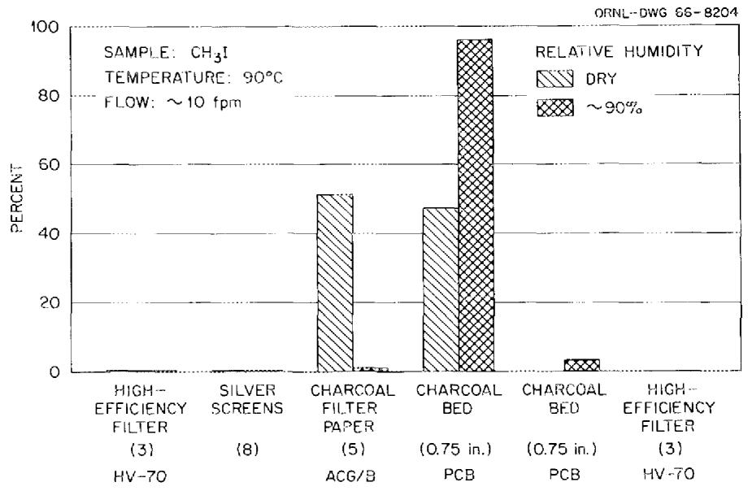  
Fig. 18.2. Retention of Methyl Iodide by May-Pack Components in Dry and High-Humidity Air Streams.

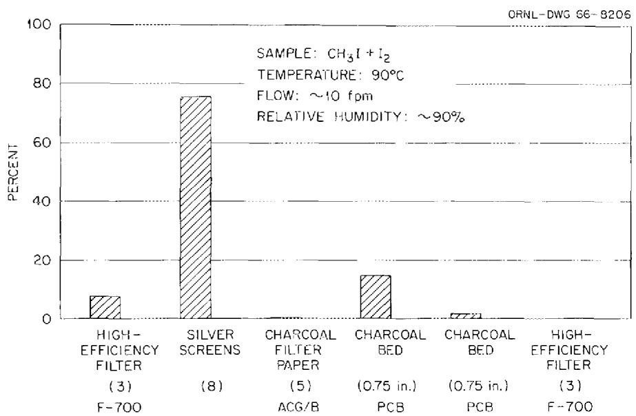  
Fig. 18.3. Retention of Mixed Methyl Iodide and Elemental Iodine by May-Pack Components in a High-Relative-Humidity Air Stream.

tested. Alternate pack configurations without the initial section of filters are being studied. Both silver screens and silver membrane filters were found to be effective for removal of elemental iodine from streams of $90\%$ relative humidity. The charcoal beds should be of the iodine-impregnated type for maximum retention of methyl iodide under moist conditions.

# REACTONS OF IODINE VAPOR WITH ORGANIC MATERIALS

R. E. Adams

R. L. Bennett

Ruth Slusher

Zell Combs

When radioiodine is released into a closed environment, such as in a containment test facility, it has been noted that a generally small, but possibly significant, fraction may appear in the form of methyl iodide and other alkyl iodides. In an accident situation, methyl iodide may be formed in the containment atmosphere by gas-phase reactions with organic contaminants, or on the various types of surfaces within the containment vessel with subsequent desorption into the gas phase. This investigation, which is an extension of some earlier efforts, is concerned with the methods of formation of methyl iodides to avoid, if possible, conditions or materials conducive to its formation in a reactor system.

Possible reactions between painted surfaces and elemental iodine to produce methyl iodide have been investigated.

Preliminary work has been done using gas chromatography, with electron capture detectors for analysis of the reaction products. Calibration of methyl iodide response has been made with samples in the gas and in the liquid phase (cyclohexane).

The first experiments were performed using a reaction vessel painted with two coats of Amercoat 64 primer and two coats of Amercoat 66 seal coat

and heated at $100^{\circ}\mathrm{C}$ . Periodic sampling gave chromatograms with about six major peaks, none of which fell near the methyl iodide peak. About 1 mg of elemental iodine was placed in another painted vessel and heated at $100^{\circ}\mathrm{C}$ . Chromatographic analysis indicated the presence of methyl iodide, with a total mass in the vapor phase of about $10^{-5}$ mg. Additional studies will be made with coating formulations of interest in the LOFT program. When a dual detection chromatograph which is on order becomes available, it will be used to examine the paint and reaction product vapors in more detail. These techniques will also be employed to investigate the reaction of iodine with trace organic components in the gas phase.

# BEHAVIOR OF FISSION PRODUCTS IN GAS-LIQUID SYSTEMS

R.E.Adams B.A.Soldano

W. T. Ward

Removal of fission product dispersions from containment atmospheres by application of liquid systems has been proposed as an engineered safeguard. Examples of these systems are pressure suppression pools and containment sprays. An experimental program has been initiated to study both the chemical and physical aspects of such gas-liquid systems. A study of the adsorption of gases, or particles in gases, by a liquid in a spray system involves a situation wherein there exists a large amount of gas and a relatively small amount of liquid under highly dynamic conditions. On the other hand, a study of fission product trapping in a pressure suppression pool represents a situation in which there is a very large amount of water under relatively static conditions in contact with a small amount of gas. Since the two systems involve the two extremes of the gas-liquid spectrum, the study has been divided into two parts. This dualistic approach will hopefully permit extrapolation of information to intermediate conditions and will allow one to fix experimental conditions such that a chemical-physical description of our experiments becomes feasible.

An experimental study of the efficacy of water sprays in the removal of released fission products in reactor containment vessels requires a knowledge of the hydrodynamics of these systems as

well as an understanding of their kinematic behavior. Since single liquid drops under highly dynamic conditions constitute a primary element of the spray itself, we propose to study the behavior of liquid drops suspended in a low-velocity wind tunnel.[17] Such a tunnel can be used to simulate the gas-liquid environment accompanying a fission release accident. Some of the pertinent variables are drop size, height of fall, time of contact, composition of both gas and liquid phases, pressure, temperature, and the volume of tunnel gases.

The advantages of a wind tunnel in such dynamic studies are, in part, as follows:

1. The time of contact of each drop with the gas stream can be widely varied.   
2. Drops suspended by the gas stream in the tunnel can be directly observed and photographed so that shape and oscillation factors can be properly accounted for.   
3. Random convection effects are eliminated.   
4. Close temperature control can be achieved in the working area.   
5. Homogeneity of the gas mixtures and therefore reproducibility of results is, in principle, attainable with such a probe.

The second part of this program involves a study of the behavior of fission products in a pressure suppression pool. General Electric Company is incorporating such pools in their design of commercial power reactors and, for this reason, is conducting research into the behavior of suppression pools during and subsequent to a reactor accident. Negotiations are under way with General Electric, San Jose, for a subcontract under which they would perform theoretical and laboratory investigations of the effectiveness of pressure suppression pools for fission product trapping.

At present, engineering designs have been completed on both the wind tunnel and the supporting drop collection equipment. It is estimated that approximately $75\%$ of the parts have been fabricated.

Prior to initiation of the wind tunnel investigation, studies were undertaken to determine the efficiency of various solutions in removing methyl iodide from air. The experimental procedure con

sists in bubbling air containing methyl iodide vapor through a $1\frac{1}{2}$ -in.-diam glass column containing 800 ml of the solution at approximately $25^{\circ}\mathrm{C}$ (depth of solution = 28 in.) for approximately 2 hr, followed by a "clean" air sparge of from 16 to 20 hr. The air entering the bottom of the column is dispersed through a porous glass disk. The air leaving the column is passed through two or three beds of iodine-impregnated activated charcoal to remove the methyl iodide that is not captured by the solution. Iodine-131 tracer is used; the radioactivity of the charcoal and solution indicates the iodine distribution. All the activity on the charcoal was found to be in the first bed.

A comparison of the efficiencies of the various solutions tested to date is given in Table 18.1. Tests of other solutions are planned, as well as tests to determine the effect of increasing the temperature.

Table 18.1. Efficiency of Scrubbing Solutions for Methyl Iodide Removal from Air   

<table><tr><td>Solution</td><td>Concentration</td><td>Amount of Activity Retained by Solution (%)</td></tr><tr><td>Distilled water</td><td></td><td>0</td></tr><tr><td>Sodium hydroxide</td><td>0.01 M</td><td>0</td></tr><tr><td>Hydrogen peroxide</td><td>15 wt %</td><td>0</td></tr><tr><td>Iodic acid</td><td>0.1 M</td><td>0</td></tr><tr><td>Sodium acetate</td><td>4.2 M</td><td>0</td></tr><tr><td>Ammonium hydroxide</td><td>0.5 M</td><td>16</td></tr><tr><td>Potassium iodide</td><td>0.1 M</td><td>25</td></tr><tr><td>Sodium thiosulfate</td><td>0.01 M</td><td>59.9</td></tr><tr><td></td><td>0.05 M</td><td>87.3</td></tr><tr><td></td><td>0.10 M</td><td>93.5</td></tr><tr><td></td><td>0.25 M</td><td>96.8</td></tr><tr><td>Hydrazine</td><td>27 wt %</td><td>99.8</td></tr><tr><td>Solution Aa</td><td>0.1 wt %</td><td>84.7</td></tr><tr><td></td><td>1%</td><td>99.6</td></tr><tr><td></td><td>5%</td><td>99.92</td></tr><tr><td></td><td>12%</td><td>99.99+</td></tr></table>

${}^{a}$ The identity of solution $\mathrm{A}$ is being withheld pending patent evaluation by the USAEC.

# HIGH-TEMPERATURE BEHAVIOR OF GAS-BORNE FISSION PRODUCTS. TELLURIUM DIOXIDE

M. D. Silverman

A. P. Malinauskas

Recent experimental studies18 indicate an enhanced volatility of a rather broad class of metal oxides in the presence of water vapor. This enhancement is believed to be the result of the generalized reaction

$$
\operatorname {o x i d e} (s) + H _ {2} O (g) = \text {h y d r o x i d e} (g), \tag {1}
$$

in which the hydroxide so formed is stable only at high temperatures. The present investigations are directed toward a study of this reaction.

The research has been initiated using tellurium dioxide, $\mathrm{TeO}_{2}$ , as the compound under investigation. Although reaction (1) has yet to be unequivocally established in this case, the increase in the apparent vapor pressure, due to water vapor, has been experimentally demonstrated over the temperature range 600 to $700^{\circ}\mathrm{C}$ . Our immediate objective is to verify these data and to extend the temperature range.

The transport method (also called the "transfer" or "transpiration" method) has been chosen for use in the current research. In brief, the procedure involves saturating a suitable carrier gas with the material under study in one section of the apparatus and allowing this substance to be transported and collected in another region. A detailed description of the experimental and theoretical aspects can be found elsewhere.[18-20]

Since the program has only recently been initiated, much of the work has been concerned thus far with the design, construction, and testing of the apparatus itself. Data obtained from two of the preliminary runs, however, rather dramatically demonstrate the effect of water vapor on the volatility of $\mathrm{TeO}_2$ . These data are presented in Table 18.2.

Table 18.2. Effect of Water Vapor on the Volatility of $\mathsf{TeO}_2$ (Preliminary Results)   

<table><tr><td>Sample temperature (℃)</td><td>653</td><td>661</td></tr><tr><td>Duration of experiment (hr)</td><td>5</td><td>26</td></tr><tr><td>Oxygen carrier gas flow rate (moles/min)</td><td>7.00 × 10-4</td><td>7.85 × 10-4</td></tr><tr><td>H2O transported (g)</td><td>19.92</td><td>0</td></tr><tr><td>TeO2transported (g)</td><td>0.0245</td><td>0.0016</td></tr><tr><td>Apparent vapor pres-sure of TeO2(torr)</td><td>8.72 × 10-2</td><td>0.61 × 10-2</td></tr></table>

# THE CASCADE IMPACTOR AS A TOOL FOR THE STUDY OF SIZE DISTRIBUTION OF FISSION PRODUCT AEROSOLS

G.W.Parker

H. Buchholz $^{21}$

Cascade impactors $^{22}$ are instruments used to separate aerosols into fractions of a discrete range of particle size. They are frequently used for analyzing radioactive aerosols to collect a range of size groups which may later be examined for their radioactivity. Several theoretical and experimental studies of cascade impactors have been reported. $^{23-27}$ Impactors are limited to relatively large particles, usually above $0.5\mu$ , and, in order to make this instrument genuinely useful in nuclear safety research, it is necessary to extend their range to particles below $0.1\mu$ . The basic theory of these devices is quite simple. When a gas jet carrying particles is directed toward a surface, all particles having sufficient inertia in the first stage will leave their stream lines and settle on the surface. Smaller particles will remain within the jet stream. In the next stage the

gas passes through smaller holes, and the jet is accelerated to a higher velocity. The probability of smaller particles settling is thus increased.

If the pressure within the cascade impactor is lowered until the particle diameter is comparable to the mean free path of the gas molecules, there are fewer collisions between particles and gas molecules. Particles having small inertia are able

under reduced pressure to leave the jet. By this slip effect, described by the Cunningham correction, the cascade impactor becomes more efficient for separating smaller particles. Using an equation based on May's theory,[2] we calculated the size of particles that have a $50\%$ probability of depositing on each stage of the Andersen sampler. The results for the case where the inlet gas flow

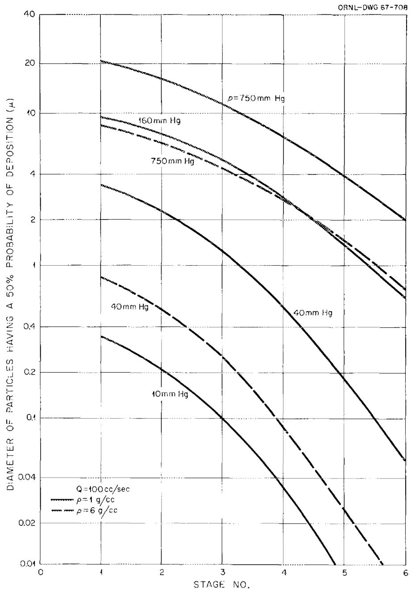  
Fig. 18.4. Calculated Particle Distribution in the Andersen Sampler as a Function of Internal Pressure and Particle Density.

rate is $100\mathrm{cm}^3/\mathrm{sec}$ and the density is 1 or 6 g/cm³ are displayed in Fig. 18.4. It is clear from this graph that pressures less than 40 mm Hg will allow the cascade impactor range to be extended to particles smaller than 0.1 μ.

The original Andersen sampler was modified for subatmospheric operation. Each stage of the sampler is connected to a separate manometer to allow measurement of differences in internal pressure. The modified apparatus will be calibrated by collecting particles directly on electron microscope grids at each stage.

# REACTION OF MOLECULAR IODINE AND OF METHYL IODIDE WITH SODIUM THIOSULFATE SPRAYS

G.W.Parker

G. E. Creek

W.J.Martin

N. R. Horton

Addition of chemicals to water used in reactor containment misting sprays to aid in the rapid scavenging of radioiodine from steam-filled reactor containment shells has been proposed in many recent applications for power reactor construction permits presented to the Atomic Energy Commission. Pure water sprays do not provide the desired iodine removal rate.

The removal of heat in most large reactor designs is effected primarily by air-recirculation cooling units, and the removal of inorganic vapor forms of iodine $\left(\mathbf{I}_{2}\right.$ and HI) is the major requirement of the sprays. Griffiths described a method for predicting the rate of iodine removal from gases by sprays and presented most of the parameters for making such calculations in a comprehensive report which was summarized in Nuclear Safety.[29] The most useful experimental examination of Griffiths' theory was performed by Taylor,[30] using glass columns in which he varied both the liquid flow rate and the gas velocity. From these experiments the mass transfer process through the liquid film was confirmed. It is clear that elemental iodine, as it is absorbed by a

liquid drop containing reducing material, is chemically altered to the form of iodide by the reducing agent. Thus, there is a sharp reduction in the vapor pressure of iodine near the liquid surface, and, since the total quantity of iodine available from a reactor is almost negligible (by comparison with the quantity of reducing agent in the spray), there is essentially no change in efficiency as the drop continues to fall. The iodine present as HI is even more soluble in the droplet, and it should be removed at a faster rate than $\mathrm{I}_2$ .

In order to test the spray removal concept under conditions used in fission product transport studies and in order to be able to assess the limitations of the process for the nonreactive forms of iodine, we decided to carry out spray experiments in the Containment Mockup Facility (CMF) with characteristic forms of radioiodine. The design of the spray system allowed very small quantities of liquid to be used, and therefore the liquid-to-gas ratio could be adjusted to reactor containment proportions.

The spray system chosen for test contained six atomizing nozzles, each of which delivered 0.1 liter/min at 80 psig. Since the test containment was small (180 liters), the sprays were generally operated for only 15 to 30 sec. Operation for 30 sec produced a liquid volume of 0.3 liter or 1/600 of the containment tank volume. A concentration of $\mathrm{Na}_2\mathrm{S}_2\mathrm{O}_3$ of 0.1 mole/liter (1.6%) was used in these tests.

# Test with Molecular lodine $(\mathbb{I}_2)$

The conditions selected for the molecular iodine test were typical of those used in previous CMF steam-air runs. The initial pressure was about 35 psig, of which about 20 psig was due to steam. The tank atmosphere temperature was about $130^{\circ}\mathrm{C}$ at the injection time, and the cooling rate without sprays was about $30^{\circ}\mathrm{hr}$ . Since the natural removal rate for molecular iodine in the CMF $(t_{1/2} = 30\mathrm{min})$ was fairly well known, the effect of thiosulfate sprays on the removal rate could be readily calculated. We found that addition of sodium thiosulfate spray at a rate of 1/300 of the containment tank volume per minute decreased the half-life of disappearance of $\mathbf{I}_2$ from the tank atmosphere to 3.9 sec. This value agreed quite well with the calculated value of 2.6 sec for the half-time of removal of $\mathbf{I}_2$ by $200 - \mu$ droplets of $0.1\mathrm{mNa}_2\mathrm{S}_2\mathrm{O}_3$ .

# Tests with Methyl Iodide $(\mathsf{CH}_3\mathsf{I})$

In two experiments conducted in a similar manner to the molecular iodine experiment described above, methyl iodide injected at similar concentrations $(2\mathrm{mg} / \mathrm{m}^{3})$ was first exposed to steam and to the condensation process and then to sodium thiosulfate spray. The results were encouraging, but the rate of removal of $\mathrm{CH}_3\mathrm{I}$ is only a fraction of the corresponding iodine rate. However, the $\mathrm{CH}_3\mathrm{I}$ removal rate is of sufficient magnitude to warrant its consideration in safety analysis calculations. The calculated half-times for depletion of $\mathrm{CH}_3\mathrm{I}$ were approximately 2 hr in one run and 4 hr in the other.

# Conclusions

A model for removing reactive iodine by thiosulfate sprays was tested in the stainless steel CMF tank. Excellent agreement between the calculated and the experimental iodine removal rates was found.

Tests of methyl iodide removal with $\mathrm{Na}_2\mathrm{S}_2\mathrm{O}_3$ sprays gave encouraging results but showed much slower removal rates than the corresponding iodine rates. More efficient scavenging agents will be required for methyl iodide removal.

# STUDIES OF CSE-TYPE FISSION PRODUCT SIMULATION

G.W.Parker

R. A. Lorenz

N. J. Horton

Fission product aerosols will be simulated in experiments to be performed in the Containment Systems Experiment (CSE) at Hanford using a different technique from that used at ORNL. Rogers31 pointed out that, in the 30,000-ft3 CSE containment tank, use of irradiated fuel to furnish realistic fission product levels is impractical. Neither is it feasible to use simulated high-burnup fuel pellets of the type used in the CMF32 and in

the NSPP.33 The simulation technique devised for the CSE experiments, described by Hilliard and McCormack,34 involves vaporization of suitable quantities of fission product elements containing radioactive tracers and passing the vapor over molten unirradiated $\mathrm{UO}_2$ before it enters the containment vessel. In order to determine how well the aerosols produced by this technique imitate those produced by overheated high-burnup fuel, it will be necessary to make direct comparisons under similar conditions. We plan to do this in the CMF, where experiments with high-burnup fuel have already been performed, and perhaps later in the Containment Research Installation (CRI).

We have completed the design, construction, and preliminary testing of equipment for performing CSE-type simulation experiments either in the CMF or the CRI (the fuel-melting cans of these systems are interchangeable). It was necessary to modify the experimental arrangement described by Hilliard and McCormack $^{34}$ rather extensively in order to adapt it to the CMF-CRI fuel meltdown arrangement, but the differences relate mainly to methods of getting the vaporized materials into the pressurized meltdown furnace. In addition, we chose to provide a steam-air environment in the vicinity of the molten $\mathrm{UO}_2$ and in the containment tank, both at 30 lb total pressure, rather than air, because our recent experiments with high-burnup fuel were all carried out using a steam-air atmosphere.

As shown by Fig. 18.5, two ribbon heating units are inserted through the glass envelope, which is fitted to the end of the quartz meltdown tube by means of a tapered joint. A platinum ribbon which can be operated at a temperature between 1400 and $1600^{\circ}\mathrm{C}$ in the furnace tube atmosphere will be used to vaporize tellurium (in the form of $\mathrm{TeO}_2$ ), cesium (introduced as $\mathrm{Cs}_2\mathrm{CO}_3$ ), and ruthenium metal. Cesium will probably be vaporized as the metal but will quickly be reoxidized in the furnace atmosphere. Ruthenium metal will undoubtedly be converted to a volatile oxide, $\mathrm{RuO}_3$

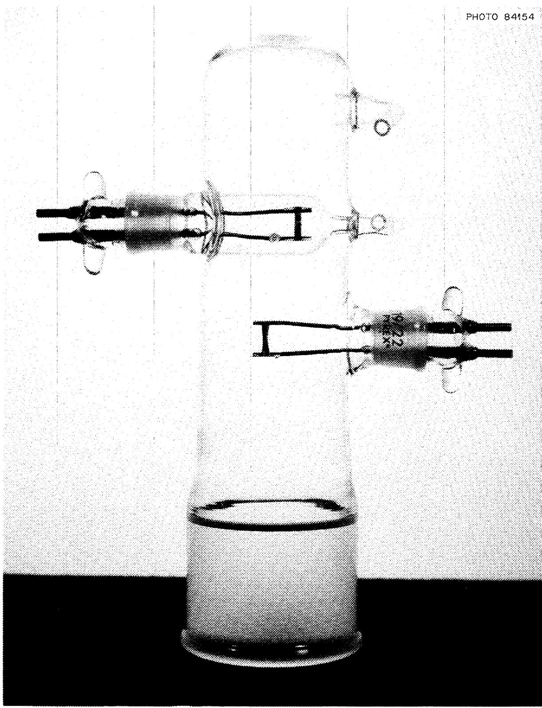  
Fig. 18.5. Glass Envelope Used in CSE Fission Product Simulation Tests, Showing Platinum (Lower) and Tungsten (Upper) Ribbon Filament Heating Elements.

or $\mathbf{RuO}_4$ . The other heater, which has a tantalum ribbon ( $1/8$ in. wide and $1/2$ in. long, V shaped), operates in a helium atmosphere in a small glass envelope having a $1/16$ -in.-diam hole through which helium carrying the vaporized material flows into the furnace tube. A mixture of $\mathrm{BaCO}_3$ and finely divided zirconium metal is placed on the tantalum ribbon to increase the volatility of barium by reducing the oxide to the more volatile metal.

Iodine in the form of $\mathbf{I}_2$ is introduced through a side arm attached to the outside pressurized tube extension. A glass capsule containing the $\mathbf{I}_2$ is inserted in a Teflon-lined side arm, and it is crushed while a stream of air flows through the tube to carry the iodine into the inner (furnace) tube.

Finally, steam is introduced through a ball joint at the end of the glass envelope. Water supplied under pressure at a carefully controlled rate is converted to steam by a miniature water vaporizer located in the outer pressurized shell, quite close to the ball-joint entrance to the furnace tube.

Preliminary testing has centered on achieving satisfactory volatilization of barium, the least volatile species expected to be used in these experiments. We found that a temperature of $1800^{\circ}\mathrm{C}$ was needed to volatize half the barium activity from a $\mathrm{BaCO_3 - Zr}$ mixture in a flowing helium atmosphere.

# RETENTION OF RADIOACTIVE METHYL IODIDE BY IMPREGNATED CHARCOALS

R. E. Adams

J. D. Blake35

R. D. Ackley

J. M. Gimbel36

F. V. Hensley

Methyl iodide, which is more difficult to trap than elemental iodine, may be generated in reactor accidents. It readily penetrates beds of the common types of activated charcoal at ambient temperatures except when the relative humidity is low. However, certain specially impregnated (iodized) charcoals have been observed to have the capability of effectively trapping radioactive methyl iodide from air streams of fairly high relative humidity at temperatures as high as $115^{\circ}\mathrm{F}$ . These charcoals, which are impregnated with one

or more iodine-containing substances, appear to possess this unusual capability as the result of an isotopic exchange mechanism. To obtain information pertaining to the applicability of impregnated charcoals under various reactor accident situations is the objective of this work, which has been reported in more detail elsewhere.[39,40]

A rather large number of screening tests on various laboratory-impregnated charcoals and on various types of commercially impregnated charcoal were performed. The manner of conducting these tests is illustrated in Fig. 18.6. The tests are made at ambient temperature and pressure and usually at around $70\%$ relative humidity. Four commercial products were observed to be effective for $\mathrm{CH}_3^{131}\mathrm{I}$ trapping. They are BC-727 (from Barnebey-Cheney), MSA-85851 and MSA-24207 (from Mine Safety Appliances Company), and G601 (from North American Carbon, Inc.). Results from these room-temperature tests for the four commercial charcoals are given in Table 18.3. A number of laboratory-impregnated charcoals also gave promising results, although at present none of them are regarded to have any especial advantage over the commercial charcoals mentioned.

The conditions corresponding to the earlier tests $^{38}$ and those discussed above are less severe than the conditions which have been postulated for the atmosphere in a reactor containment vessel in which steam is released, causing considerable elevation of temperature, pressure, and humidity. Consequently, tests have also been made under the more severe conditions characteristic of steam-air systems. Methyl iodide labeled with $\mathrm{CH}_3^{131}\mathrm{I}$ is employed. Typical results are shown in Fig. 18.7, where the deleterious effect of very high relative humidity is displayed. The use of charcoal laboratory impregnated with triethylenediamine was prompted by results of United Kingdom researchers. $^{41}$ To the extent they have been tested, the other commercial charcoals identified

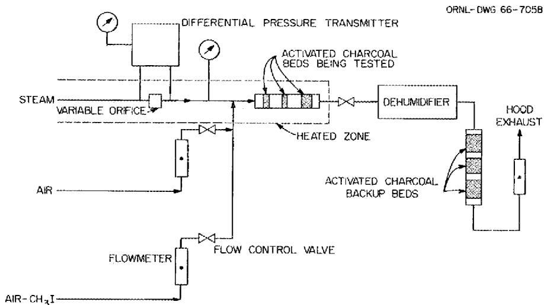  
Fig. 18.6. Simplified Drawing of Setup for Investigation of Removal of Radioactive Methyl Iodide from Flowing Steam-Air by Impregnated Charcoals.

Charcoal bed diameter: 1 in.

Charcoal bed depths: 0.5, 0.5, and 1 in. in series or 1 and 1 in.

Air velocity (superficial): 40 fpm

Duration of air flow measured from start of $\mathrm{CH}_3\mathrm{I}$ injection: 6 hr

Duration of CH injection: 2 hr (1st 2 of above 6 hr)

Table 18.3. Radioactive Methyl iodide Removal Tests on Commercially Impregnated Charcoals at ${25}^{ \circ  }\mathrm{C}$   

<table><tr><td rowspan="2">Charcoal, Mesh Size</td><td rowspan="2">Relative Humidity (%)</td><td rowspan="2">Amount of CH3I Injected Relative to Amount of Charcoal (mg/g)</td><td colspan="3">CH3131I Removal Efficiency (%) for Bed Depth of:</td></tr><tr><td>0.5 in.</td><td>1 in.</td><td>2 in.</td></tr><tr><td>Unimpregnated activated charcoal, 6 × 16</td><td>70</td><td>1.4</td><td>4.6</td><td>8.9</td><td>17.3</td></tr><tr><td>MSA-85851 lot No. 23, 8-14 (11)a</td><td>70</td><td>1.4</td><td>56.3</td><td>82.3</td><td>97.1</td></tr><tr><td>MSA-85851 lot No. 53, 8-14</td><td>68</td><td>1.4</td><td>52.0</td><td>79.2</td><td>97.0</td></tr><tr><td>MSA-85851 No. 93066, 8-14 (3)</td><td>70</td><td>1.0</td><td>c</td><td>88.0</td><td>98.7</td></tr><tr><td>MSA-24207b (2)</td><td>72</td><td>1.2</td><td>52.8</td><td>81.2</td><td>97.5</td></tr><tr><td>BC-727, 8-14 (6)</td><td>69</td><td>1.4</td><td>64.8</td><td>88.7</td><td>98.9</td></tr><tr><td>G-601, 12 × 16 (2)</td><td>78</td><td>0.8</td><td>c</td><td>85.9</td><td>98.1</td></tr></table>

$^\mathrm{a}$ Number in parentheses denotes results are averages for that number of tests.   
No mesh size furnished (appears to be 8-14).   
${}^{c}$ Test beds were 1 and 1 in. rather than 0.5,0.5,and 1 in.

above behave similarly under these conditions to the charcoals for which results are shown. In addition to the tests at room temperature and at approximately $280^{\circ}\mathrm{F}$ , a series was also conducted at $\sim 212^{\circ}\mathrm{F}$ .

According to the various results obtained and subject to certain qualifications, a number of commercially available impregnated charcoals are highly effective for trapping radioactive methyl

iodide from flowing air and steam-air over a wide range of conditions including 70 to $300^{\circ}\mathrm{F}$ and 14 to 60 psia. The qualifications are (1) that the samples tested are representative of the commercial material; (2) that the charcoal has not been damaged, for example, by severe weathering or by poisoning from adsorbed foreign substances such as oil vapor; and (3) that the prevailing relative humidity in the charcoal does not greatly exceed $90\%$ .

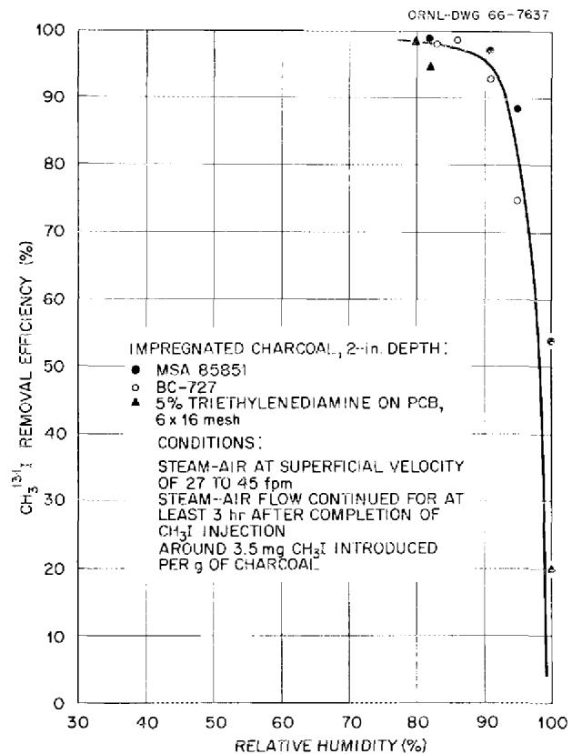  
Fig. 18.7. Effect of Relative Humidity on the Removal of Radioactive Methyl Iodide by Impregnated Charcoals at Temperatures and Pressures Around $280^{\circ}$ F and 60 psia.

# Publications

# JOURNAL ARTICLES

# AUTHOR(s)

Bacarella, A. L., and A. L. Sutton   
Barton, C. J., and W. B. Cottrell   
Brunton, G. D.   
Burns, J. H., and E. K. Gordon   
Cantor, S., D. G. Hill, and W. T. Ward   
Carroll, R. M., and O. Sisman   
Davis, R. J., T. H. Mauney, and J. R. Hart   
De Bruin, H. J., G. M. Watson, and C. M. Blood   
Fuller, E. L., Jr., H. F. Holmes, and C. H. Secoy   
Holmes, H. F., E. L. Fuller, Jr., and C. S. Secoy   
Jenks, G. H.   
Keilholtz, G. W.   
Keilholtz, G. W., J. E. Lee, Jr., and R. E. Moore   
Malinauskas, A. P.

# TITLE

Anodic Film Growth on Zirconium at Temperatures from $200^{\circ}$ to $300^{\circ}\mathrm{C}$   
Fission Product Release and Transport Under Accident Conditions   
The Crystal Structure of $\mathrm{LiUF}_5$   
Refinement of the Crystal Structure of $\mathbf{L}\mathbf{i}_{2}\mathbf{B}\mathbf{e}\mathbf{F}_{4}$   
Density of Molten $\mathbf{ThF}_4$ ; Increase of Density on Melting   
Fission-Gas Release During Fissioning in $\mathbf{U}\mathbf{O}_{2}$   
Corrosion of Zircaloy 2 by Hydrogen Peroxide at Elevated Temperature   
Cation Self-Diffusion and Electrical Conductivity in Polycrystalline Beryllium Oxide   
Gravimetric Adsorption Studies of Thorium Oxide. II. Water Adsorption at $25.00^{\circ}\mathrm{C}$   
Heats of Immersion in the Thorium Oxide-Water System. II. Net Differential Heats of Adsorption   
Prediction of Radiation Effects on Reactor Water and Solutions   
Release and Transport of Fission-Product Iodine and Its Removal from Reactor-Containment Systems   
Irradiation Damage to Sintered Beryllium Oxide as a Function of Fast-Neutron Dose and Flux at 110, 650, and $1100^{\circ}\mathrm{C}$   
Thermal Transpiration. Rotational Relaxation Numbers for Nitrogen and Carbon Dioxide

# PUBLICATION

Electrochem. Technol. 4, 117 (1966)   
Nucl. Safety 7(2), 203 (1966)   
Acta Cryst. 21(5), 814 (1966)   
Acta Cryst. 20, 135 (1966)   
Inorg.Nucl.Chem.Letters2,15 (1966)   
Nucl. Appl. 2, 142 (1966)   
J. Electrochem. Soc., 113, 1222 (1966)   
J.Appl.Phys.37,4543 (1966)   
J.Phys.Chem.70,1633(1966)   
J.Phys.Chem.70,436 (1966)   
Trans. Am. Nucl. Soc. 9(2), 382 (1966)   
Nucl. Safety 7(1), 72 (1965)   
Nucl. Sci. Eng. 26, 329 (1966)   
J. Chem. Phys. 44(3), 1196 (1966)

<table><tr><td>AUTHOR(s)</td><td>TITLE</td><td>PUBLICATION</td></tr><tr><td>Malinauskas, A. P.</td><td>Gaseous Diffusion - the Systems He-Kr, Ar-Kr, and Kr-Xe</td><td>J. Chem. Phys. 45, 4704 (1966)</td></tr><tr><td>Marshall, W. L., and E. V. Jones</td><td>Second Dissociation Constant of Sulfuric Acid from 25 to 350Evaluated from Solubilities of Calcium Sulfate in Sulfuric Acid Solutions</td><td>J. Phys. Chem. 70, 4028 (1966)</td></tr><tr><td>Marshall, W. L., and Ruth Slusher</td><td>Thermodynamics of Calcium Sulfate Dihydrate in Aqueous Sodium Chloride Solutions, 0--110°</td><td>J. Phys. Chem. 70, 4015 (1966)</td></tr><tr><td>Perez, R. B.</td><td>A Dynamic Method for In-Pile Fission-Gas Release Studies</td><td>Nucl. Appl. 2, 151 (1966)</td></tr><tr><td>Quist, A. S., and W. L. Marshall</td><td>Electrical Conductances of Aqueous Solutions at High Temperatures and Pres-sures. III. The Conductances of Potassium Bisulfate Solutions from 0 to 700Eand at Pressures to 4000 Bars</td><td>J. Phys. Chem. 70, 3714 (1966)</td></tr><tr><td>Reagan, P. E., J. G. Morgan, and O. Sisman</td><td>Performance of Pyrolytic Carbon Coated Uranium Oxide Particles During Irradiation at High Temperatures</td><td>Trans. Am. Nucl. Soc. 9(1), 2829 (1966)</td></tr><tr><td>Sisman, O.</td><td>Preface - Fission-Gas Release Symposium</td><td>Nucl. Appl. 2, 116 (1966)</td></tr><tr><td>Soldano, B. A., and P. B. Bien</td><td>Osmotic Behaviour of Aqueous Salt Solu-tions at Elevated Temperatures. Part IV</td><td>J. Chem. Soc. (A) 1966, 1825</td></tr><tr><td>Thoma, R. E., H. A. Friedman, and R. A. Penneman</td><td>Isomorphous Complex Fluorides of Tri-, Tetra-, and Pentavalent Uranium</td><td>J. Am. Chem. Soc. 88, 2046 (1966)</td></tr><tr><td>Thoma, R. E.</td><td>Selected Topics in High Temperature Chemistry (book review)</td><td>J. Am. Ceram. Soc. 49, 292 (1966)</td></tr><tr><td>Thoma, R. E., H. Insley, and G. M. Hebert</td><td>The Sodium Fluoride--Lanthanide Tri-fluoride Systems</td><td>Inorg. Chem. 5, 1222 (1966)</td></tr><tr><td>Thoma, R. E., and R. H. Karraker</td><td>The Sodium Fluoride--Scandium Tri-fluoride System</td><td>Inorg. Chem. 5(11), 1933 (1966)</td></tr><tr><td>Thoma, R. E., and G. D. Brunton</td><td>Equilibrium Dimorphism of Lanthanide Trifluorides</td><td>Inorg. Chem. 5(11), 1937 (1966)</td></tr></table>

# REPORTS ISSUED

<table><tr><td>Friedman, H. A., and R. E. Thoma</td><td>Chemical Stability of Refractory Ceramics in MSRE Fuel</td><td>ORNL-TM-1406 (January 1966)</td></tr><tr><td>Griess, J. C., and J. L. English</td><td>Materials Compatibility and Corrosion Studies for the Argonne Advanced Research Reactor</td><td>ORNL-4034 (November 1966)</td></tr><tr><td>Hitch, B. F., R. G. Ross, and H. F. McDuffie</td><td>Tests of Various Particle Filters for Removal of Oil Mists and Hydrocarbon Vapor</td><td>ORNL-TM-1623 (September 1966)</td></tr><tr><td>AUTHOR(s)</td><td>TITLE</td><td>PUBLICATION</td></tr><tr><td>Jenks, G. H., H. C. Savage, and E. G. Bohrmann</td><td>NASA Tungsten Reactor Radiation Chemistry Studies - Final Report</td><td>ORNL-TM-1630 (October 1966)</td></tr><tr><td>Jenks, G. H., H. C. Savage, and E. G. Bohrmann</td><td>NASA Tungsten Reactor Radiation Chemistry Studies. I. Experiment Design</td><td>ORNL-TM-1403 (March 1966)</td></tr><tr><td>Keilholtz, G. W.</td><td>Filters, Sorbents, and Air-Cleaning Systems as Engineered Safeguards in Nuclear Installations</td><td>ORNL-NSIC-13 (October 1966)</td></tr><tr><td>Kelly, M. J.</td><td>An Analytical Approach to Waterlogging Failure</td><td>ORNL-3867 (December 1966)</td></tr><tr><td>McQuilkin, F. R., D. R. Cuneo, J. W. Prados, E. L. Long, Jr., and J. H. Coobs</td><td>An Irradiation Test of AVR Production Fuel Spheres in the Oak Ridge Research Reactor</td><td>ORNL-TM-1512 (June 1966)</td></tr><tr><td rowspan="2">Miller, C. E., Jr., and W. E. Browning, Jr.</td><td>The Adequacy of Scale-Up in Experiments on Fission Product Behavior in Reactor Accidents. Part I. An Analysis of Scale-Up in the U.S. Nuclear Safety Program</td><td>ORNL-3901 (July 1966)</td></tr><tr><td>The Adequacy of Scale-Up in Experiments on Fission Product Behavior in Reactor Accidents. Part II. Recommended Additional Nuclear Safety Scale-Up Experiments</td><td>ORNL-4021 (December 1966)</td></tr><tr><td>Morgan, J. G., M. F. Osborne, and E. L. Long, Jr.</td><td>Postirradiation Examination of EGCR Prototype Capsule 03A-6</td><td>ORNL-TM-1378 (February 1966)</td></tr><tr><td>Morgan, J. G., P. E. Reagan, and E. L. Long, Jr.</td><td>Evaluation and Irradiation Effects Studies on Pyrolytic Carbon Coated Fuel Particles</td><td>ORNL-3923 (March 1966)</td></tr><tr><td>Nicely, V. A., and R. J. Davis</td><td>Some Electrical Measurements on Anodic Films on Zirconium</td><td>ORNL-TM-1435 (December 1965)</td></tr><tr><td>Osborne, M. F., E. L. Long, Jr., and J. G. Morgan</td><td>Postirradiation Examination of High Bumup EGCR Prototype Fuel Capsules</td><td>ORNL-TM-1511 (June 1966)</td></tr><tr><td>Redman, J. D.</td><td>A Literature Review of Mass Spectrometric Thermochemical Technique -- Supplement I</td><td>ORNL-TM-989 (July 1966)</td></tr><tr><td>Reed, S. A.</td><td>Corrosion of Carbon and Alloy Steels in Water and Seawater</td><td>ORNL-TM-1612 (October 1966)</td></tr><tr><td>Rutherford, J. L., J. P. Blakely, and L. G. Overholser</td><td>Oxidation of Unfueled and Fueled Graphite Spheres by Steam</td><td>ORNL-3947 (May 1966)</td></tr><tr><td>Savage, H. W., E. L. Compe, W. R. Huntley, B. Fleischer, R. E. MacPherson, and A. Taboada</td><td>SNAP-8 Corrosion Program Summary Report</td><td>ORNL-3898 (December 1965)</td></tr></table>

# BOOKS AND PROCEEDINGS

<table><tr><td>AUTHOR(s)</td><td>TITLE</td><td>PUBLICATION</td></tr><tr><td>Ackley, R. D., R. E. Adams, and W. E. Browning, Jr.</td><td>Removal of Radioactive Methyl Iodide from Steam-Air Systems</td><td>Proc. 9th AEC Air Cleaning Conf., Boston, Mass., Sept. 14-16, 1966, CONF-660904 (1966)</td></tr><tr><td>Adams, R. E., J. S. Gill, W. D. Yuille, L. F. Parsly, W. E. Browning, Jr., and C. E. Guthrie</td><td>Performance of Filter System Under Accident Conditions</td><td>Proc. 9th AEC Air Cleaning Conf., Boston, Mass., Sept. 14-16, 1966, CONF-660904 (1966)</td></tr><tr><td>Baes, C. F., Jr.</td><td>The Chemistry and Thermodynamics of Molten Salt Reactor Fluoride Solutions</td><td>SM-66/60 in Thermodynamics, vol. 1, IAEA, Vienna, 1966</td></tr><tr><td>Bennett, R. L., R. E. Adams, and W. E. Browning, Jr.</td><td>Characterization of Volatile Iodine Forms</td><td>Proc. 9th AEC Air Cleaning Conf., Boston, Mass., Sept. 14-16, 1966, CONF-660904 (1966)</td></tr><tr><td>Carroll, R. M., and O. Sisman</td><td>In-Pile Properties of Reactor Fuels by Oscillating Techniques</td><td>Proc. Intern. Symp. Capsule Irradiation Experiments, Pleasanton, Calif., May 3-5, 1966, TID-7697 (September 1966)</td></tr><tr><td>Keilholtz, G. W., J. E. Lee, Jr., and R. E. Moore</td><td>Properties of Magnesium, Aluminum, and Beryllium Oxide Compacts Irradiated to Fast-Neutron Doses Greater than \(10^{21}\)neutrons/cm2at 150, 800, and 1100°C</td><td>Proc. Conf. Nuclear Applications of Non-Fissionable Ceramics, Washington, D. C., May 9-11, 1966, ed. by Alvin Boltax and J. H. Handwerk, Interstate, Danville, Ill. (1966)</td></tr><tr><td>Blakely, J. P., and L. G. Overholser</td><td>Oxidation of ATJ Graphite by Low Concentrations of Water Vapor and Carbon Dioxide in Helium</td><td>Carbon 3, 269--75 (1966)</td></tr><tr><td>Keilholtz, G. W., R. E. Moore, M. F. Osborne, B. W. Wieland, and A. F. Zulliger</td><td>Techniques for Irradiating High Temperature Materials in a Steep Flux Gradient</td><td>Proc. Intem. Symp. Capsule Irradiation Experiments, Pleasanton, Calif., May 3-5, 1966, TID-7697 (September 1966)</td></tr><tr><td>Park, G. W., G. E. Creek, and A. Ferreli</td><td>Retention of Methyl Iodide by Impregnated Carbons Under Ambient Conditions</td><td>Proc. 9th AEC Air Cleaning Conf., Boston, Mass., Sept. 14-16, 1966, CONF-660904 (1966)</td></tr><tr><td>Savage, H. C., J. M. Baker, M. J. Kelly, and E. L. Compere</td><td>An Assembly for Irradiation of Molten Fluoride Fuel to High Burnups in the Oak Ridge Research Reactor</td><td>Proc. Intem. Symp. Capsule Irradiation Experiments, Pleasanton, Calif., May 3-5, 1966, TID-7697 (September 1966)</td></tr><tr><td>Silverman, M. D., J. Truitt, W. E. Browning, Jr., L. F. Franzen, and R. E. Adams</td><td>Characterization of Radioactive Particulate Aerosols by the Fibrous Filter Analyzer</td><td>Proc. 9th AEC Air Cleaning Conf., Boston, Mass., Sept. 14-16, 1966, CONF-660904 (1966)</td></tr><tr><td>Watson, G. M., R. B. Perez, and M. H. Fontana</td><td>Effects of Containment System Size on Fission Product Behavior</td><td>Proc. 9th AEC Air Cleaning Conf., Boston, Mass., Sept. 14-16, 1966, CONF-660904 (1966)</td></tr><tr><td>Thoma, R. E.</td><td>The Rare Earth Halides</td><td>Progress in the Science and Technology of the Rare Earths, vol. II, pp. 90-122, Pergamon, New York, 1966</td></tr><tr><td></td><td>Complex Compounds in the Sodium Fluoride-Rare Earth Trifluoride Systems</td><td>Rare Earth Res. III, 561-70 (1966)</td></tr><tr><td colspan="3">THEESIS</td></tr><tr><td>Weaver, Clayton F.</td><td>Kinetics of Formation of Xenon Fluorides</td><td>Thesis submitted in partial fulfillment of the requirements for the Ph.D. degree, University of California, Berkeley, 1966</td></tr><tr><td colspan="3">PATENTS</td></tr><tr><td>Compere, E. L., and E. G. Bohmann</td><td>Method of Removing Hydrogen from Liquid Alkali Metals</td><td>U. S. Pat. 3,243,280, Mar. 29, 1966</td></tr><tr><td>Keilholtz, G. W., and C. C. Webster</td><td>Method for Analyzing Inert Gas for Presence of Oxygen or Water Vapor</td><td>U. S. Pat. 3,262,756, July 26, 1966</td></tr><tr><td>Thoma, R. E., M. R. Bennett, and J. W. Ullmann</td><td>Method for Processing Aluminum-Containing Nuclear Fuels</td><td>U. S. Pat. 3,273,973, Sept. 20, 1966</td></tr></table>

# Papers Presented at Scientific and Technical Meetings

<table><tr><td>AUTHOR(s)</td><td>TITLE</td><td>PLACE PRESENTED</td></tr><tr><td>Ackley, R. D., R. E. Adams, and W. E. Browning, Jr.</td><td>Removal of Radioactive Methyl Iodide from Steam-Air Systems</td><td>9th AEC Air Cleaning Conference, Boston, Mass., Sept. 13-16, 1966</td></tr><tr><td>Adams, R. E., J. S. Gill, W. D. Yuille, W. E. Browning, Jr., L. F. Parsly, and C. E. Guthrie</td><td>Performance of Filter Systems Under Accident Conditions</td><td>9th AEC Air Cleaning Conference, Boston, Mass., Sept. 13-16, 1966</td></tr><tr><td>Apple, R. F., J. M. Dale, F. L. Whiting, A. S. Meyer, and C. F. Baes, Jr.</td><td>Determination of Oxide in Highly Radio-active Fused Fluoride Salts</td><td>Analytical Chemical Society, Phoenix, Ariz., Jan. 16-21, 1966</td></tr><tr><td>Bennett, R. L., R. E. Adams, and W. E. Browning, Jr.</td><td>Characterization of Volatile Iodine Forms</td><td>9th AEC Air Cleaning Conference, Boston, Mass., Sept. 13-16, 1966</td></tr><tr><td>Bennett, R. L., R. E. Adams, and W. E. Browning, Jr.</td><td>Characterization of Volatile Forms of Radioiodine Under High Humidity Conditions</td><td>American Chemical Society, New York, Sept. 11-16, 1966</td></tr><tr><td>Bien, P. B.</td><td>The Corresponding States of Aqueous Salt Solutions</td><td>American Chemical Society, New York, Sept. 11-16, 1966</td></tr><tr><td>Blankenship, F. F.</td><td>Chemical Separations in Molten Fluorides</td><td>2nd Intern. Thorium Fuel Cycle Symposium, Gatlinburg, Tenn., May 3-6, 1966</td></tr><tr><td>Blood, C. M., and L. G. Overholser</td><td>Compatibility of Pyrolytic-Carbon Coated Fuel Particles with Water Vapor</td><td>Libby-Cockcroft Graphite Chem. Meeting, Harwell, England, Apr. 25-27, 1966</td></tr><tr><td>Bopp, C. D., and W. W. Parkinson, Jr.</td><td>Radiation-Induced Codimerization of Ether-Unsaturate Mixtures</td><td>6th Annual Contractors Meeting, Process Radiation Development Program, Washington, D.C., Sept. 26-27, 1966</td></tr><tr><td>Brunton, G. D.</td><td>The Crystal Structure of LiUF5</td><td>American Crystallographic Assoc., Austin, Tex., Feb. 28-Mar. 2, 1966</td></tr><tr><td>Cantor, S.</td><td>Predicting Density, Specific Heat and Thermal Conductivity of Fluoride Melts</td><td>American Chemical Society, New York, Sept. 11-16, 1966</td></tr><tr><td></td><td>Constant Volume Heat Capacities of Molten Salts</td><td>American Chemical Society, SW Regional Meeting, Albuquerque, N. Mex., Nov. 30-Dec. 2, 1966</td></tr><tr><td>Carroll, R. M., and O. Sisman</td><td>In-Pile Properties of Reactor Fuels by Oscillating Techniques</td><td>International Symposium on Capsule Irradiation Experiments, Pleasanton, Calif., May 3-5, 1966</td></tr><tr><td>Coobs, J. H., and J. G. Morgan</td><td>Coated Particle Fuels Development at Oak Ridge National Laboratory</td><td>11th AEC Coated-Particle Working Group Meeting, Los Alamos, N. Mex., June 1-2, 1966</td></tr><tr><td>Field, P. E., and J. H. Shaffer</td><td>The Solubilities of Hydrogen Fluoride and Deuterium Fluoride in Molten Fluorides</td><td>American Chemical Society, New York, Sept. 11-16, 1966</td></tr><tr><td rowspan="2">Grimes, W. R.</td><td>Molten Fluorides as Nuclear Reactor Fuels</td><td>EUCHEM Conference on Molten Salt Chemistry, Ulvik, Norway, May 10-13, 1966</td></tr><tr><td>Molten Fluorides as Fuels and Coolants in the Molten Salt Reactor Experiment</td><td>American Chemical Society, New York, Sept. 11-16, 1966</td></tr><tr><td>Jenks, G. H.</td><td>Prediction of Radiation Effects on Reactor Water and Solutions</td><td>American Nuclear Society, Pittsburgh, Pa., Oct. 31-Nov. 4, 1966</td></tr><tr><td>Keilholtz, G. W., R. E. Moore, M. F. Osborne, B. W. Wieland, and A. F. Zulliger</td><td>Techniques for Irradiating High Temperature Materials in a Steep Flux Gradient</td><td>International Symposium on Capsule Irradiation Experiments, Pleasanton, Calif., May 3-5, 1966</td></tr><tr><td>Keilholtz, G. W., J. E. Lee, Jr., and R. E. Moore</td><td>Properties of Magnesium, Aluminum, and Beryllium Oxide Compacts Irradiated to Fast-Neutron Doses Greater than 1021 neutrons/cm2at 150, 800, and 1100°C</td><td>Joint American Nuclear Society and American Ceramic Society Meeting, Washington, D. C., May 9-11, 1966</td></tr><tr><td>Keilholtz, G. W., R. E. Moore, and M. F. Osborne</td><td>Properties of the Refractory Metal Carbides of Titanium, Zirconium, Tantalum, Niobium, and Tungsten Irradiated to Fast Neutron Doses Greater than 1021 neutrons/cm2(Greater than 1 MeV)</td><td>American Ceramic Society, Pacific Coast Regional Meeting, Portland, Ore., October 1966</td></tr><tr><td rowspan="3">Marshall, W. L.</td><td rowspan="3">Aqueous Solutions at High Temperatures and Pressures</td><td>Princeton University, Chemistry Seminar, Feb. 10, 1966</td></tr><tr><td>New York University, Chemistry Seminar, Feb. 11, 1966</td></tr><tr><td>Northwestern University, Chemistry Seminar, Feb. 24, 1966</td></tr><tr><td rowspan="2">Marshall, W. L., and Ruth Slusher</td><td>Thermodynamics of Gypsum in Aqueous Sodium Chloride Solutions, 0-110°C</td><td>American Chemical Society, Pittsburgh, Pa., Mar. 28-31, 1966</td></tr><tr><td>Solubilities of Calcium Sulfate in Sea Salt Solutions to 200°C - Temperature Concentration Limits for Saline Water in General</td><td>American Chemical Society, SW Regional Meeting, Albuquerque, N. Mex., Nov. 30-Dec. 2, 1966</td></tr><tr><td>Parker, G. W., R. A. Lorenz, and J. G. Wilhelm</td><td>Chemical Factors Affecting the Distribution of Fission Products from UO2Fuel Melted Under Water During Transient Accidents</td><td>American Chemical Society, New York, Sept. 11-16, 1966</td></tr><tr><td>AUTHORS(s)</td><td>TITLE</td><td>PLACE PRESENTED</td></tr><tr><td>Parker, G. W.</td><td>Chemical Factors in the Removal of Radio-iodine by Reactor Filter Systems</td><td>American Chemical Society, New York, Sept. 11--16, 1966</td></tr><tr><td>Parker, G. W., G. E.</td><td>Retention of Methyl Iodide by Impregnated Carbons Under Ambient Conditions</td><td>9th AEC Air Cleaning Conference, Boston, Mass., Sept. 14--16, 1966</td></tr><tr><td>Creek, and A. Ferreli</td><td>The Effect of Radiation on the Olefinic Groups in Polybutadiene</td><td>American Chemical Society, Pittsburgh, Pa., Mar. 22--31, 1966</td></tr><tr><td>Parkinson, W. W., Jr., and W. C. Sears</td><td>Electrical Conductances of Aqueous Sodium Chloride Solutions to 800°C and 4000 Bars</td><td>American Chemical Society, New York, Sept. 11--16, 1966</td></tr><tr><td>Quist, A. S., and W. L. Marshall</td><td>Electrical Conductances of Aqueous Solu-tions to 800°C and 4000 Atmospheres</td><td>University of Nebraska, Dept. of Chemistry Seminar, Lincoln, Neb., Dec. 14, 1966</td></tr><tr><td>Quist, A. S.</td><td>Performance of Pyrolytic Carbon Coated Uranium Oxide Particles During Irradiation at High Temperatures</td><td>American Nuclear Society, Denver, Colo., June 20--23, 1966</td></tr><tr><td>Reagan, P. E., J. G. Morgan, and O. Sisman</td><td>Phase Equilibrium Studies in the UO2-ZrO2System</td><td>American Chemical Society, Pittsburgh, Pa., Mar. 22--31, 1966</td></tr><tr><td>Romberger, K. A., C. F. Baes, and H. H. Stone</td><td>Oxidation of Unfueled and Fueled Graphite Spheres by Steam</td><td>Libby-Cockcroft Graphite Chemistry Meeting, Harwell, England, Apr. 25--27, 1966</td></tr><tr><td>Rutherford, J. L., J. P. Blakely, and L. G. Overholser</td><td>An Assembly for Irradiation of Molten Fluoride Fuel to High Burnups in the Oak Ridge Research Reactor</td><td>International Symposium on Capsule Irradiation Experiments, Castlewood Country Club, Pleasanton, Calif., May 3-5, 1966</td></tr><tr><td>Savage, H. C., J. M. Baker, M. J. Kelly, and E. L. Compere</td><td>The Crystal Structure of Beta-1 KLaF4</td><td>American Crystallographic Association, Austin, Tex., Feb. 28-Mar. 2, 1966</td></tr><tr><td rowspan="2">Sears, D. R., and J. H. Burns</td><td>Electro-Kinetic Transport at Phase Boundaries</td><td>ORAU Traveling Lecture Program, University of Toledo, Mar. 9, 1966</td></tr><tr><td>Adsorption of Water on Refractory Oxides</td><td>ORAU Traveling Lecture Program, Hendrix College, Conway, Ark., Apr. 15, 1966</td></tr><tr><td>Secoy, C. H.</td><td>Characterization of Radioactive Particu-late Aerosols by the Fibrous Filter Analyzer</td><td>9th AEC Air Cleaning Conference, Boston, Mass., Sept. 14--16, 1966</td></tr><tr><td>Silverman, M. D., J. Truitt, R. E. Adams, and L. F. Franzen</td><td>Lithium Fluoride Heats of Sublimation</td><td>Bendix Time-of-Flight Symposium, Cincinnati, Ohio, October 1966</td></tr><tr><td>Strehlow, R. A.</td><td>The Solubility of Ferrosoferric Oxide in Aqueous Solutions at Elevated Tempera-tures</td><td>American Chemical Society, SE Regional Meeting, Louisville, Ky., Oct. 27-29, 1966</td></tr><tr><td>Sweeton, F. H., C. F. Baes, and R. W. Ray</td><td>Corrosion Behavior of the MSRE in Zero-and Low-Power Tests</td><td>15th AEC Corrosion Symposium, Oak Ridge, Tenn., May 23--25, 1966</td></tr><tr><td>AUTHOR(s)</td><td>TITLE</td><td>PLACE PRESENTED</td></tr><tr><td rowspan="3">Thoma, R. E.</td><td rowspan="3">Molten Salt Reactor Technology</td><td>ORAU Traveling Lecture Program, University of Texas, Nov. 7, 1966</td></tr><tr><td>ORAU Traveling Lecture Program, North Texas State College, Nov. 9, 1966</td></tr><tr><td>ORAU Traveling Lecture Program, Texas Technological University, Nov. 10, 1966</td></tr><tr><td>Thoma, R. E., R. G. Ross, and C. F. Weaver</td><td>Production of Lithium Fluoride Crystals with Selected Isotopic Ratios of Lithium</td><td>International Conference on Crystal Growth, Boston, Mass., June 20--24, 1966</td></tr><tr><td>Thoma, R. E., H. Insley, H. A. Friedman, and G. M. Hebert</td><td>The Lithium-Beryllium-Zirconium Fluoride System in Molten Salt Reactor Technology</td><td>American Chemical Society, New York, Sept. 11-16, 1966</td></tr><tr><td>Watson, G. M., R. B. Perez, and M. H. Fontana</td><td>Effects of Containment System Size on Fission Product Behavior</td><td>9th AEC Air Cleaning Conference, Boston, Mass., Sept. 13-16, 1966</td></tr><tr><td rowspan="6">Watson, G. M.</td><td>Defect-Trap Theory of Fission Gas Release</td><td>Reactor Chemistry Information Ex-change Meeting, General Atomic, San Diego, Calif., Nov. 8-9, 1966</td></tr><tr><td>Recoil Range of Fission Fragments in Graphitic Systems</td><td>Reactor Chemistry Information Ex-change Meeting, General Atomic, San Diego, Calif., Nov. 8-9, 1966</td></tr><tr><td>Gas-Graphite Reactions</td><td>Reactor Chemistry Information Ex-change Meeting, General Atomic, San Diego, Calif., Nov. 8-9, 1966</td></tr><tr><td>Carbon Deposition Studies</td><td>Reactor Chemistry Information Ex-change Meeting, General Atomic, San Diego, Calif., Nov. 8-9, 1966</td></tr><tr><td>Migration of Actinides in Graphite and Pyrocarbons</td><td>Reactor Chemistry Information Ex-change Meeting, General Atomic, San Diego, Calif., Nov. 8-9, 1966</td></tr><tr><td>Effects of Containment Size on Fission Product Behavior</td><td>Reactor Chemistry Information Ex-change Meeting, General Atomic, San Diego, Calif., Nov. 8-9, 1966</td></tr></table>

# INTERNAL DISTRIBUTION

2-4. Central Research Library

5. Laboratory Shift Supervisor

6~7. ORNL Y-12 Technical Library (Document Reference Section

8-58. Laboratory Records Department

59. Laboratory Records, ORNL R.C.   
60. C. E. Larson   
61. A. M. Weinberg   
62. H. G. MacPherson

63-77. G.E. Boyd

1. Biology Library   
78. F. R. Bruce   
79. F. L. Culler   
80. W.H. Jordan   
81. A. H. Snell   
82. G. Young   
83. A. F. Rupp   
84. M. Bender   
85. A. L. Boch   
86. R. B. Briggs   
87. W. B. Cottrell   
88. A. P. Fraas   
89. K. A. Kraus   
90. J. A. Lane   
91. A. J. Miller   
92. M. W. Rosenthal   
93. D. B. Trauger   
94. G. D. Whitman   
95. S.E.Beall   
96. D. S. Billington   
97. D, E. Ferguson   
98. J.H Frye, Jr.   
99. M. T. Kelley   
100. E. H. Taylor   
101. E. S. Bettis   
102. M. A. Bredig   
103. L. T. Corbin   
104. J. E. Cunningham   
105. J. H. Crawford   
106. P. N. Haubenreich   
107. P. R. Kasten   
108. M. A. Kastenbaum   
109. E.M. King   
110. R. N. Lyon

111-112. R. B. Parker

113. M. J. Skinner

114. J.C. White   
115. G.C. Williams   
116. W. R. Grimes   
117. E. G. Bohlmann   
118. H. F. McDuffie   
119. G.M. Watson   
120. F. F. Blankenship   
121. C. H. Secoy   
122. R. D. Ackley   
123. R.E.Adams   
124. A. L. Bacarella   
125. C. F. Baes   
126. J. E. Baker   
127. J. M. Baker   
128. C. E. Bamberger   
129. C. J. Barton   
130. C. D. Baumann   
131. R. L. Bennett   
132. P. B. Bien   
133. C. M. Blood   
134. C. D. Bopp   
135. J. Braunstein   
136. W. E. Browning, Jr.   
137. G. D. Brunton   
138. H. Buchholz   
139. S. Cantor   
140. R. M. Carroll   
141. Zell Combs   
142. E. L. Compere   
143. G. E. Creek   
144. D. R. Cuneo   
145. R. J. Davis   
146. F. A. Doss   
147. J. L. English   
148. R. B. Evans, III   
149. L. L. Fairchild   
150. M. H. Fontana   
151. S. H. Fried   
152. H. A. Friedman   
153. E. L. Fuller, Jr.   
154. H. S. Gadiyar   
155. J. S. Gill   
156. L. O. Gilpatrick   
157. J. C. Griess, Jr.   
158. G. M. Hebert   
159. D. N. Hess

160. H. F. Holmes   
161. G.H. Jenks   
162. G.W. Keilholtz   
163. M. J. Kelly   
164. R.M. Keyser   
165. S. S. Kirslis   
166. R.A. Lorenz   
167. A. P. Malinauskas   
168. W. L. Marshall, Jr.   
169. W.J. Martin   
170. T. H. Mauney   
171. R.E.Mesmer   
172. C. E. Miller, Jr.   
173. R.E.Moore   
174. J. G. Morgan   
175. D. M. Moulton   
176. M. T. Morgan   
177. J. J. Myron   
178. P. D. Neumann   
179. M. F. Osborne   
180. L. G. Overholser   
181. G.W. Parker   
182. W. W. Parkinson, Jr.   
183. A. S. Quist   
184. P. E. Reagan   
185. J. D. Redman   
186. S. A. Reed   
187. D. M. Richardson   
188. B. F. Roberts   
189. H.E.Robertson   
190. K. A. Romberger   
191. H. C. Savage   
192. J. E. Savolainen   
193. D.R. Sears   
194. J. H. Shaffer   
195. R.P. Shields   
196. A. J. Shor   
197. M. D. Silverman

198. O. Sisman   
199. Ruth Slusher   
200. B. A. Soldano   
201. H. H. Stone   
202. R.A. Strehlow   
203. B. J. Sturm   
204. F. H. Sweeton   
205. R.E.Thoma, Jr.   
206. J. Truitt   
207. W. T. Ward   
208. G.C.Warlick   
209. C. F. Weaver   
210. J. F. Winesette   
211. L. B. Yeatts   
212. W. D. Yuille   
213. Leo Brewer (consultant)   
214. J. W. Cobble (consultant)   
215. R.W. Dayton (consultant)   
216. P. H. Emmett (consultant)   
217. H. S. Frank (consultant)   
218. N. Hackerman (consultant)   
219. D. G. Hill (consultant)   
220. H. Insley (consultant)   
221. E.V. Jones (consultant)   
222. T. N. McVay (consultant)   
223. G. Mamantov (consultant)   
224. J. L. Margrave (consultant)   
225. E. A. Mason (consultant)   
226. R. F. Newton (consultant)   
227. R. B. Perez (consultant)   
228. J. E. Ricci (consultant)   
229. Howard Reiss (consultant)   
230. G. Scatchard (consultant)   
231. D. A. Shirley (consultant)   
232. H. Steinfink (consultant)   
233. R.C.Vogel (consultant   
234. T. F. Young (consultant)

# EXTERNAL DISTRIBUTION

235. D. F. Bunch, Health Physics Branch, AEC, Washington   
236. Paul E. Field, Dpt. of Chemistry, Virginia Polytechnic Institute   
237. Research and Development Div., AEC, ORO   
238. Reactor Div., AEC, ORO   
239. Asst. General Manager for Research and Development, AEC, Washington   
240. Division of Research, AEC, Washington   
241. Division of Isotopes Development, Washington   
242. Asst. General Manager for Reactors, AEC, Washington

243. Division of Reactor Development and Technology, AEC, Washington   
244. Space Nuclear Propulsion Office, AEC, Washington   
245. J. A. Swartout, 270 Park Ave., New York, N.Y.   
246. Milton Shaw, AEC, Washington   
247. W. W. Grigorieff, Assistant to the Executive Director, Oak Ridge Associated Universities   
248-510. Given distribution as shown in TID-4500 under Chemistry category (25 copies - CFSTI)