ORNL-4119

UC-80 - Reactor Technology

MOLTEN-SALT REACTOR PROGRAM

SEMIANNUAL PROGRESS REPORT

FOR PERIOD ENDING FEBRUARY 28, 1967

OAK RIDGE NATIONAL LABORATORY

CENTRAL RESEARCH LIBRARY

DOCUMENT COLLECTION

LIBRARY LOAN COPY

DO NOT TRANSFER TO ANOTHER PERSON

If you wish someone else to see this

document, send in name with document

and the library will arrange a loan.

UCN-7269

3-67

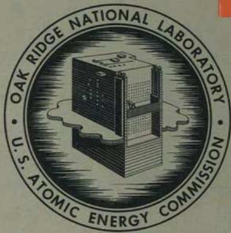

OAK RIDGE NATIONAL LABORATORY

operated by

UNION CARBIDE CORPORATION

for the

U.S. ATOMIC ENERGY COMMISSION

Printed in the United States of America. Available from Clearinghouse for Federal

Scientific and Technical Information, National Bureau of Standards,

U.S. Department of Commerce, Springfield, Virginia 22151

Price: Printed Copy $3.00; Microfiche $0.65

# LEGAL NOTICE

This report was prepared as an account of Government sponsored work. Neither the United States, nor the Commission, nor any person acting on behalf of the Commission:

A. Makes any warranty or representation, expressed or implied, with respect to the accuracy, completeness, or usefulness of the information contained in this report, or that the use of any information, apparatus, method, or process disclosed in this report may not infringe privately owned rights; or   
B. Assumes any liabilities with respect to the use of, or for damages resulting from the use of any information, apparatus, method, or process disclosed in this report.

As used in the above, "person acting on behalf of the Commission" includes any employee or contractor of the Commission, or employee of such contractor, to the extent that such employee or contractor of the Commission, or employee of such contractor prepares, disseminates, or provides access to, any information pursuant to his employment or contract with the Commission, or his employment with such contractor.

ORNL-4119

UC-80 - Reactor Technology

Contract No. W-7405-eng-26

MOLTEN-SALT REACTOR PROGRAM

SEMIANNUAL PROGRESS REPORT

For Period Ending February 28, 1967

M. W. Rosenthal, Program Director

R. B. Briggs, Associate Director

P. R. Kasten, Associate Director

JULY 1967

OAK RIDGE NATIONAL LABORATORY

Oak Ridge, Tennessee

operated by

UNION CARBIDE CORPORATION

for the

U.S. ATOMIC ENERGY COMMISSION

This report is one of a series of periodic reports in which we describe briefly the progress of the program. Other reports issued in this series are listed below. ORNL-3708 is an especially useful report, because it gives a thorough review of the design and construction and supporting development work for the MSRE. It also describes much of the general technology for molten-salt reactor systems.

ORNL-2474 Period Ending January 31, 1958

ORNL-2626 Period Ending October 31, 1958

ORNL-2684 Period Ending January 31, 1959

ORNL-2723 Period Ending April 30, 1959

ORNL-2799 Period Ending July 31, 1959

ORNL-2890 Period Ending October 31, 1959

ORNL-2973 Periods Ending January 31 and April 30, 1960

ORNL-3014 Period Ending July 31, 1960

ORNL-3122 Period Ending February 28, 1961

ORNL-3215 Period Ending August 31, 1961

ORNL-3282 Period Ending February 28, 1962

ORNL-3369 Period Ending August 31, 1962

ORNL-3419 Period Ending January 31, 1963

ORNL-3529 Period Ending July 31, 1963

ORNL-3626 Period Ending January 31, 1964

ORNL-3708 Period Ending July 31, 1964

ORNL-3812 Period Ending February 28, 1965

ORNL-3872 Period Ending August 31, 1965

ORNL-3936 Period Ending February 28, 1966

ORNL-4037 Period Ending August 31, 1966

# Contents

SUMMARY 1

INTRODUCTION 9

# PART 1. MOLTEN-SALT REACTOR EXPERIMENT

# 1.MSRE OPERATIONS 11

1.1 Chronological Account of Operations and Maintenance 11   
1.2 Reactivity Balance 14   
Experience 14   
Circulating Bubbles 17

1.3 Thermal Effects of Operation 18

Radiation Heating 18   
Thermal Cycle History 19

1.4 Reactor Dynamics 20

1.5 Equipment Performance 21

Heat Transfer 21   
Main Blowers 25   
Radiator Enclosure 26   
Off-Gas Systems 27   
Cooling-Water Systems 31   
Component-Cooling System 32   
Salt-Pump Oil Systems 34   
Electrical System 34   
Heaters 35   
Control Rods and Drives 36   
Samplers 36   
Containment 37

# 2. COMPONENT DEVELOPMENT 39

2.1 Sampler-Enricher 39

Contamination 39   
Capsule Support Wire 40   
Seal Leakage 40   
Maintenance 40

2.2 Coolant Sampler 41   
2.3 Fuel Processing Sampler 41   
2.4 Off-Gas Sampler 41   
2.5 Off-Gas Filter - Mk II 42

2.6Feltmetal Capacity Test 45

Assumptions 46   
Experimental Procedure 46   
Results 47

2.7 Examination of the Mk I Off-Gas Filter 47

Pressure Drop Tests 48   
Disassembly 50   
Observations 50   
Analytical Results 55

2.8 Migration of Short-Lived Gaseous Products into the Graphite 56   
2.9 Remote Maintenance 59

Summary of Remote Maintenance Tasks Performed 60   
Radiation Levels 61   
Contamination 63   
Conclusion 63

3.PUMP DEVELOPMENT 64

3.1 MSRE Pumps 64

Molten-Salt Pump Operation in the Prototype Pump Test Facility 64   
MK-2 Fuel Pump 64   
Stress Tests of Pump Tank Discharge-Nozzle Attachment 65   
Spare Rotary Elements for MSRE Fuel and Coolant Salt Pumps 65   
Lubrication System 66

3.2 Other Molten-Salt Pumps 66

Fuel-Pump High-Temperature Endurance Test Facility 66

4. INSTRUMENT DESIGN AND DEVELOPMENT 67

4.1 Instrumentation and Controls Design 67

Off-Gas Sampler Design 67   
Control System Design 68

4.2 MSRE Operating Experience 71

Control System Relays 71   
Temperature Scanner System 71   
Valves 71   
Nuclear Instrumentation 71   
Electronic Switches 72   
Thermocouples 72   
Coolant-Pump Radiation Monitor 72   
Safety System 72

4.3 Data System 73

4.4 Instrument Development 75

Performance - General 75   
Temperature Scanner 75   
High-Temperature NaK-Filled Differential Pressure Transmitter 76   
Ultrasonic Level Probe 76   
MSRE Fuel Distillation System Level Probe 76   
Bell-Float-Type Level Indicator for the Mark II Pump 76

# 5.MSRE REACTOR ANALYSIS 79

5.1 Neutron Reaction Rates in the MSRE Spectrum 79   
5.2 Isotopic Changes and Associated Long-Term Reactivity Effects During Reactor Operation 83   
5.3 Analysis of Transient $^{135}\mathrm{Xe}$ Poisoning 86

# PART 2. MATERIALS STUDIES

# 6. MOLTEN-SALT REACTOR PROGRAM MATERIALS 95

6.1 MSRE Surveillance Program - Hastelloy N 95   
6.2 Mechanical Properties of Hastelloy N 103   
6.3 Precursors of MSBR Graphite 108   
6.4 Graphite Irradiations 110   
6.5 Brazing of Graphite 111  
Large Graphite-to-Hastelloy-N Assemblies 111   
6.6 Corrosion Resistance of Graphite-to-Metal Brazed Joints 111   
6.7 Thermal Convection Loops 115   
6.8 Evaluation of MSRE Radiator Tubing Contaminated with Aluminum 116

# 7. CHEMISTRY 118

7.1 Chemistry of the MSRE 118

Fuel Salt Composition and Purity 118   
MSRE Fuel Circuit Corrosion 120   
Extent of $\mathbf{UF}_4$ Reduction During MSRE Fuel Preparation 121   
Adjustment of the UF $^3$ Concentration in the MSRE Fuel Salt 123

7.2 Fission Product Behavior in the MSRE 124

Long-Term Surveillance Specimens 125   
Uranium Analyses of Graphite Specimens 128   
Fuel Salt Samples 130   
Effect of Operating Conditions 131   
Effect of Beryllium Additions 131   
Pump Bowl Volatilization and Plating Tests 134   
Uranium on Pump Bowl Metal Specimens 138   
Freeze Valve Capsule Experiments 138   
Special Pump Bowl Tests 141   
General Discussion of Fission Product Behavior 142

7.3 Physical Chemistry of Fluoride Melts 144

The Oxide Chemistry of LiF-BeF $^2$ -ZrF $^4$ Mixtures 144   
Solubilities of $\mathbf{SmF}_3$ and $\mathbf{NdF}_3$ in Molten LiF-BeP2 (66-34 mole %) 144   
Possible MSBR Blanket-Salt Mixtures 146

7.4 Separations in Molten Fluorides 149

Removal of Rare Earths from Molten Fluorides by Precipitation on Solid UF 149   
Extraction of Protactinium from Molten Fluorides into Molten Metals 150   
Extraction of Rare Earths from Molten Fluorides into Molten Metals 152   
Protactinium Studies in the High-Alpha Molten-Salt Laboratory 153   
Preliminary Study of the System LiF-ThF-PaF 155

7.5 Development and Evaluation of Analytical Methods for Molten-Salt Reactors 156

Determinations of Oxide in MSRE Salts 156

Determination of $\mathrm{U}^{3+}/\mathrm{U}^{4+}$ Ratios in Radioactive Fuel by a Hydrogen Reduction

Method 158

EMF Measurements on the Nickel-Nickel(II) Couple in Molten Fluorides 162

Studies of the Anodic Uranium Wave in Molten LiF-BeF2-ZrF 163

Spectrophotometric Studies of Molten-Salt Reactor Fuels 163

7.6 Analytical Chemistry Analyses of Radioactive MSRE Fuels 164

Sample Analyses 165

Quality Control Program 165

8. MOLTEN-SALT CONVECTION LOOPS IN THE ORR 167

8.1 Objectives and Description 167

8.2 First Loop Experiment 168

In-Pile Irradiation Assembly 168

Operations 168

Chemical Analysis of Salt 168

Corrosion 169

Fission Products 169

Nuclear Heat and Neutron Flux 169

Hot-Cell Examination of Components 169

8.3 Evaluation of System Performance 171

Heaters 171

Coolers 171

Temperature Control 171

Sampling and Addition 171

Salt Circulation 172

8.4 Second In-Pile Irradiation Assembly 172

Operation 173

# PART 3. BREEDER REACTOR DESIGN STUDIES

9. MOLTEN-SALT BREEDER REACTOR DESIGN STUDIES 174

9.1 General 174

9.2 Flowsheet 177

9.3 Reactor Cell Component Arrangement 179

9.4 Component Design 182

Reactor Vessel 182

Fuel Heat Exchanger. 186

Blanket Heat Exchanger 190

9.5 Reactor Physics 193

9.6 MSBR Gas Handling System 199

Xenon Removal. 199

Mechanical Design 200

GasInjector System. 200

Bubble Separator System 202

Volume Holdup System 202

Noncritical Components 203

# 10. MOLTEN-SALT REACTOR PROCESSING STUDIES 204

10.1 Continuous Fluorination of a Molten Salt 204

Nonprotected System 204

Protected System 205

10.2 Molten-Salt Distillation Studies 206

Relative Volatility Measurement 206

Vaporization Rate Studies 206

Buildup of Nonvolatiles at a Vaporizing Surface 208

10.3 Vacuum Distillation Experiment with MSRE Fuel Salt 211

# Summary

# PART 1. MOLTEN-SALT REACTOR EXPERIMENT

# 1. MSRE Operations

The maintenance and other shutdown operations started during the last period were completed, and power operation of the MSRE was resumed in October with only one of the main radiator blowers in service. After 17 days' operation (run 8) at the maximum power attainable with one blower, the second blower was installed, and a 12-day run (run 9) was made with both blowers in service. The next run (run 10) began in December and was continued at full power for 30 days without interruption. A fourth power run (run 11) was in progress at the end of the report period with 31 days accumulated.

Further refinements were made in the reactivity balance, and on-line calculations were used as a guide during operation. Application of these refinements showed that the unaccounted-for reactivity change was only about $+0.05\% \delta k / k$ through the end of run 10 (16,450 Mwhr). Additional dynamics tests were performed at the start of run 11, which showed that the dynamic characteristics of the system were unchanged.

The performance of equipment in the primary and auxiliary systems was generally satisfactory. Detailed study has revealed no change with time in the heat-transfer coefficients of the main heat exchanger or the radiator. Salt plugs in the reactor off-gas line, from an accidental overfill of the fuel pump, caused some difficulty, but the line was finally cleared before run 10, and this problem has not recurred. Partial plugging of the particle trap and charcoal beds in the off-gas system was also encountered, but this did not restrict power operation. A new particle trap, of different design, was installed, and no further plugging was noted at that location. Only routine maintenance problems were encountered with other equipment.

# 2. Component Development

The sampler-enricher was used to isolate thirty-six 10-g samples and eleven 50-g samples on a routine basis. In addition, eight special samples for use in cover-gas analysis and five capsules for beryllium addition to the fuel were handled. In an effort to reduce the contamination level in the sampler and adjacent areas, the inside of the sampler was cleaned with sponges, and an additional ventilation duct was installed near the transport cask position. The design of the

sample capsules was changed to provide a nickel-plated magnetic steel top instead of the original copper top, so that a magnet can be used for retrieval in the event a capsule is dropped. A mechanical method of assuring that the maintenance valve is closed is being substituted for the existing pneumatic system, which has given difficulty because of the gradual increase in leakage of buffer gas through the upper seat. The valve itself will not be replaced at this time. Several minor maintenance tasks were performed, including replacement of the manipulator boots, inspection of the vacuum pumps, and replacement of a small hinge pin and cotter key which had worked loose inside the sampler.

Eight 10-g coolant salt samples were isolated. The valve seats of the removal valve in the coolant sampler were replaced.

Installation of the fuel process sampler is complete except for the shielding, and the operational checks have been completed.

The off-gas sampler was altered to include a hydrocarbon analyzer section in place of the chromatographic cell, which was not ready. The internal piping was also rearranged to permit sampling upstream of the 522 line filter.

A redesigned MK II off-gas filter was installed in place of the old particle trap and charcoal filter assembly. The filter was enlarged from 4 to 6 in. ID and was arranged so that the Yorkmesh entrance section can be heated above the temperature of the rest of the filter. There were other changes in the arrangement of the internals, which were made to correct deficiencies found in the first filter. Measurements showed that the pressure drop was less than 1 in. $\mathrm{H}_2\mathrm{O}$ at three times rated flow and that both filters had efficiencies greater than $99.9\%$ . Tests of the Feltmetal sections of the filter indicated that the expected life might be as little as three weeks or as great as 70 years, depending on the character of the particles in the reactor off-gas system.

The old particle trap was taken to the hot cells for testing and examination. Tests indicated an increase in the pressure drop by a factor of 20 over the clean filter and that the Fiberfrax section was essentially clean. We concluded that most of the pressure drop was in the Yorkmesh entrance section, where material had filled in the space between the wires and plugged the opening of the inlet pipe. Since the inlet pipe expanded longitudinally due to fission product decay heat, it is believed that operation at power caused the inlet pipe to push into the plugging material, thereby increasing the resistance to flow in the manner of a thermal valve. Metallographic examination of the deposit area of the Yorkmesh showed heavy carburization of the wire, and there were indications that the wire had been heated to at least $1200^{\circ}\mathrm{F}$ . The deposit itself contained much carbonaceous material, as well as high Ba and Sr fractions. There was very little Be or Zr, indicating that there was essentially no salt carried to this point, and most of the fission products found were daughter products of Xe and Kr. The Fiberfrax section was very clean except for a small deposit of oil in the first layer.

A model was developed which evaluates the concentration of “very short lived” noble gases in the graphite while the reactor is at power. Reasonable agreement with measured concentration distributions was obtained for $^{140}\mathrm{Ba}$ , $^{141}\mathrm{Ce}$ , and $^{91}\mathrm{Y}$ .

Among the maintenance tasks completed were: (1) replacement of all of the air line quick disconnects in the reactor cell with metal compression fittings after the elastomer in the original disconnects became embrittled from radiation, (2) replacement of the particle trap in the off-gas line, (3) removal of frozen salt obstructions in several of the lines coming from the pump bowl, (4) replacement of the core sample array, and (5) replacement of a control rod and drive.

# 3. Pump Development

The restriction in the annulus between the pump shaft and shield plug in the MK-1 prototype pump, which was discussed in the previous semiannual report, was found to have been caused by the salt level being raised accidentally into the annulus during a fill of the system.

The MK-1 fuel pump tank was removed from the prototype pump facility and installed on a test stand. This stand was constructed for room-temperature measurement of the stresses produced in the weld attachment of the discharge nozzle by forces and moments imposed by the pump-tank discharge piping. During initial testing, a crack was found in the heat-affected zone of the weld attachment. The crack was repaired by welding, and further exploratory tests are being made to measure the stresses.

The spare rotary element for the MSRE fuel pump was prepared for reactor service and is being held in standby. The shaft-seal oil leakage problem on the spare rotary element for the MSRE coolant pump was resolved, and the assembly is being completed for standby service. The lubrication pump endurance test was continued. Shaft deflection and critical speed tests were completed on the MK-2 fuel pump rotary element, and the MK-2 pump tank is about $70\%$ fabricated.

# 4. Instrument Design and Development

The design of instrumentation and controls for the off-gas sampler is essentially complete. Changes in the design of the sampler system required changes in the instrumentation and controls design.

Performance of developmental instrumentation has continued to be generally satisfactory. No problems were encountered that required redesign or initiation of new development.

Results of investigation indicate that none of the commercially available solid-state multiplexers are suitable for use as a direct replacement for the mercury switches used in the MSRE temperature scanner. No further progress has been made in determining the cause of failure of an NaK-filled differential-pressure transmitter in MSRE service.

The effectiveness of modifications to ultrasonic level probe circuitry has not been determined because no salt has been transferred to the fuel storage tank.

A new conductivity level probe was developed for use in a fuel distillation system. Design of this probe is similar to that of probes used in the MSRE drain tank but differs in that it is smaller in size and will provide a usable indication of level changes.

# 5. MSRE Reactor Analysis

Neutron energy spectra in the MSRE were calculated and used to estimate important isotopic changes and associated long-term reactivity effects during power operation. The changes considered include depletion of $^{234}\mathrm{U}$ , $^{235}\mathrm{U}$ , and $^{238}\mathrm{U}$ , production of $^{236}\mathrm{U}$ and $^{239}\mathrm{Pu}$ , burnout of initial $^{6}\mathrm{Li}$ in the salt and $^{10}\mathrm{B}$ in the graphite, and production of tritium and $^{16}\mathrm{O}$ as products of $n,a$ reactions. With the exception of $^{235}\mathrm{U}$ , the principal contributors to long-term reactivity changes were found to be the $^{6}\mathrm{Li}$ burnout and $^{239}\mathrm{Pu}$ production.

Further studies were made in the correlation of the observed time behavior of the $^{135}\mathrm{Xe}$ poisoning in the MSRE with calculations from a theoretical model. Graphic comparisons are given of calculated buildup and removal of $^{135}\mathrm{Xe}$ reactivity, following changes in power level, with some of the experimental reactivity transients observed from operation to date. The results, in good accord with previously reported evidence, point to the conclusion that a small amount of undissolved helium gas is in circulation with the salt, which enhances the mass transfer and removal of xenon from the reactor. In addition, the transient analysis supports the assumption of a fairly high efficiency of removal of xenon directly from the gas bubbles by the external stripping apparatus. Approximate ranges of the circulating bubble volume fraction and bubble-stripping efficiency obtained from the analysis were 0.10 to 0.15 vol % and 50 to 100% respectively.

# PART 2. MATERIALS STUDIES

# 6. Molten-Salt Reactor Program Materials

There was no microscopically visible corrosion or coatings on the Hastelloy N reactor-vessel-wall surveillance specimens exposed to molten fluoride fuel in the core during a 7800-Mwhr operation in which the specimens accumulated a thermal neutron dose of approximately $1.3 \times 10^{20} \mathrm{~nvt}$ . However, a carbide deposit about 0.001 in. thick was found on specimens in contact with the graphite.

A loss in ductility of the irradiated specimens was found at elevated temperatures, as expected. In addition, however, there was an unexpected $20\%$ reduction in ductility at low temperature, which is thought to be related to extensive grain-boundary carbide precipitation. The doses received by the metal specimens are higher than the reactor vessel is anticipated to receive over its lifetime, and the test results give reassurance that the mechanical properties of Hastelloy N are more than adequate for the service planned.

A family of curves was obtained from tests of Hastelloy N at various strain rates and temperatures. These curves will allow one to predict the strain rate sensitivity of the ductility of Hastelloy N at any given temperature. The strain rate sensitivity changes markedly with temperature.

We examined seven experimental grades of isotropic graphite. None satisfied all the requirements for molten-salt breeder reactors, but one had a good pore spectrum, and four appeared to have potential for MSBR use.

Experiments have been designed and are being fabricated which will permit irradiation of graphite to the high exposures that will be incurred in an MSBR. Irradiations in HFIR, DFR, EBR-II, and ORR are planned.

The search is continuing for corrosion-resistant alloys that are suitable for brazing graphite to Hastelloy N. A furnace for brazing large graphite-to-Hastelloy-N assemblies is being constructed.

The long-term thermal convection loops of Hastelloy N and type 304L stainless steel have continued to circulate fused salts, acquiring 43,024 and 31,749 hr respectively. Weight losses from specimens inserted in the stainless steel loop are less than what was measured on earlier samples.

# 7. Chemistry

Chemical analyses of the uranium concentration in the fuel salt show a measurable decrease. This results from dilution of fuel salt by the remnants of flush salt that remain in the reactor after flushing and from the transfer of about $7\mathrm{kg}$ of uranium from the fuel to the flush salt in each drain-flush-fill sequence.

The chromium concentration has remained steady at about 60 ppm, indicating the absence of corrosion in the reactor fuel circuit.

At termination of MSRE run 7, 1.66 gram-atoms of uranium had been burned, and, as a consequence, about 1.66 equivalents of oxidizing species had been produced in the fuel. To neutralize this oxidizing effect, and to make the fuel more reducing in character, the fuel was treated with beryllium metal to reduce a small amount of $\mathrm{UF}_4$ to $\mathrm{UF}_3$ . To date, $27.94\mathrm{g}$ of beryllium has been introduced; this has converted $0.65\%$ of the $\mathrm{UF}_4$ to $\mathrm{UF}_3$ .

Most fission products behaved as expected with the exception of rather noble metals, which continued to show an apparent tendency to volatilize and to plate on metal surfaces. Attempts to decrease the volatilization by chemical reduction of the fuel with elemental beryllium were unsuccessful. Detectable volatilization apparently continued for long periods after shutdown; a three-day shutdown reduced the volatilization of molybdenum by a factor of only 5.

Further studies of the solubility of oxide in fuel-flush-salt mixtures have been carried out. A minimum solubility occurs when the mole fraction of $\mathbf{ZrF}_4$ reaches 0.01.

In connection with a study of methods of reprocessing MSBR fuel, the solubilities of $\mathbf{SmF}_3$ and $\mathbf{NdF}_3$ in fuel solvent have been measured as a function of temperature. Salt compositions for possible use as a blanket for the MSBR have been reviewed.

The feasibility of removing rare earths from fuel by precipitation on solid $\mathbf{U}\mathbf{F}_{3}$ has been studied, and the results are moderately favorable. Activity coefficients associated with the reductive extraction of rare earths from fuel into bismuth amalgams have been measured. The process appears quite attractive.

The use of reducing agents for protactinium removal from blanket melts was investigated further. Electrolytic reduction gave disappointing results, but the use of thorium as a reducing

agent gave good results, especially when there was a large surface area of iron metal available to receive the protactinium.

In addition to the regular salt samples, several special samples were analyzed. These included capsules used to make beryllium additions to the fuel salt, MSRE off-gas samples, and highly purified LiF $\cdot$ BeF $_2$ samples. The absolute standard deviation for oxide determined in ten radioactive fuel samples taken from the MSRE over an eight-month period was 8 ppm.

A transpiration method has been developed for the determination of $\mathrm{U}^{3+}/\mathrm{U}^{4+}$ ratios in radioactive fuel samples. The method is based on the measurement of the HF produced by the reduction of oxidized species when the molten fuel is sparged with hydrogen. Increases in the $\mathrm{U}^{3+}/\mathrm{U}^{4+}$ ratio from about 0.0005 to 0.005 were observed when metallic beryllium was added to the fuel in the reactor.

An experimental reference electrode, consisting of an Ni/Ni $^{2+}$ half-cell electrically connected to the fluoride melt through a wetted boron nitride "membrane," exhibited satisfactory Nernstian reversibility. On the basis of limited stability tests, this electrode appears to be suitable as a reference for electrochemical measurements in molten fluorides. An anodic oxidation wave resulting from the voltametric oxidation of $\mathbf{U}^{4+}$ at $+1.4\mathrm{~V}$ was studied and found to have properties most consistent with oxidation of $\mathbf{U}^{4+}$ to $\mathbf{U}^{5+}$ , followed by catalytic disproportionation of the $\mathbf{U}^{5+}$

The spectrophotometric determination of $\mathbf{U}^{3+}$ in molten fluoride salts was investigated by a new technique in which $\mathbf{U}^{3+}$ is generated voltametrically in the optical path of a captive-liquid cell. The feasibility of determining 50 ppm of $\mathbf{U}^{3+}$ in the presence of $2\% \mathbf{U}^{4+}$ was demonstrated. Measurements of the absorption spectra of $\mathbf{Er}^{3+}$ , $\mathbf{Sm}^{3+}$ , and $\mathbf{Ho}^{3+}$ in $\mathbf{LiF - BeF}_2$ indicated that these ions would not interfere with the determination of $\mathbf{U}^{3+}$ .

# 8. Molten-Salt Convection Loops in the ORR

Irradiation of the first molten-salt thermal convection loop experiment in the Oak Ridge Research Reactor was terminated August 8, 1966, because of a leak through a broken transfer line. A power density of $105\mathrm{w/cm}^3$ was achieved in the fuel channels of the graphite core before failure of the loop. A second loop, modified to eliminate causes of failure encountered in the first, began long-term irradiation in January 1967. An average core power density of $160\mathrm{w}$ per cubic centimeter of fuel salt was attained and maintained in the first ORR irradiation cycle.

# PART 3. BREEDER REACTOR DESIGN STUDIES

# 9. Molten-Salt Breeder Reactor Design Studies

Breeder reactor design studies have been concerned primarily with making a choice of the basic reactor on which design effort will be concentrated. The modular concept has been chosen, and the power for which the module is to be used is set for the moment at 556 Mw (thermal). The

average core power density, and therefore the flux, has been arbitrarily cut from the $80\mathrm{kw / liter}$ used in previous studies to $39\mathrm{kw / liter}$ to give greater core life expectancy.

Further optimization studies have been made on reactor parameters. A durable core configuration has been established. The core is 10 ft high and contains 336 fuel cells. The volume is $503\mathrm{ft}^3$ , of which $16.5\%$ is fuel salt, $6\%$ fertile salt, and $77.5\%$ graphite. A blanket $1_{4}^{1}$ ft thick axially and $1_{2}^{1}$ ft thick radially surrounds the core. A 6-in. graphite reflector is placed between the blanket region and the container vessel. The fuel cells are joined to the dished head plenum by pipe thread connections.

The fuel heat exchanger and the blanket heat exchanger are flanged into place, reducing the number of pipes to be remotely cut and welded if replacement of these items is necessary. A concentric coolant line connects the primary and blanket coolant circuits. Flowsheets and design criteria are being developed for the gas sparging system and the off-gas system.

The layout of the reactor cell has been revised to eliminate some stress problems that were found in the original layout. A first attempt at a better mounting for reactor cell components has been made and is being analyzed.

Some of the more basic MSBR nuclear calculations have been started, and from the first results some changes have been made in the unit cell dimensions of the core. The reactor as now contemplated has a yield of approximately $6\%$ per year, a breeding ratio of 1.07, and a fuel cycle cost of 0.43 mill/kwhr on an $80\%$ plant factor.

Work on reactor physics included (1) a series of cell calculations performed to examine the sensitivity of the MSBR cross sections and reactivity to various changes in cell structure and composition and (2) several two-dimensional calculations of the entire reactor. The reference cell contained $\sim 0.2$ mole $\%$ $^{233}\mathrm{U}$ in the fuel salt and 27 mole $\%$ $^{232}\mathrm{Th}$ in the fertile salt. The fuel volume fraction was $16.48\%$ and the fertile volume fraction $5.85\%$ . The results of the cell calculations indicated a reactivity advantage associated with increasing cell diameter, and a nominal diameter (flat to flat) of 5 in. was selected. Detailed radial and axial flux distributions were obtained from the two-dimensional calculations. The radial and axial peak-to-average flux ratios calculated from these distributions were 1.58 and 1.51, respectively, giving a total peak-to-average ratio of 2.39.

The central cell of the reactor was examined for reactivity control purposes. If a completely empty graphite tube of 5 in. OD and 4 in. ID is filled with fertile salt, the change in reactivity is $\delta k / k = -0.018\%$ . If the empty tube is filled with graphite the reactivity change is $\delta k / k = +0.0012\%$ . Thus there appears to be a substantial amount of reactivity control available by varying the height of the fertile column in the tube.

# 10. Moltén-Salt Reactor Processing Studies

The concept of an integral processing plant based on a fluorination and distillation flowsheet has matured in the last year. Studies on continuous fluorination techniques have ascertained that

high recoveries and good fluorine utilization are feasible, and the measurements of relative volatilities for the distillation step have been highly encouraging. Further analysis of the operations has revealed no new problems which could thwart this approach.

Continuous Fluorination of a Molten Salt. - The recovery of uranium from the fuel salt of an MSBR by continuous fluorination embraces two significant problems: (1) the establishment of an adequate concentration gradient in the tower to effect both high recovery and reasonable fluorine utilization and (2) the operation of the system with a frozen layer of salt on all surfaces to protect them from oxidation by fluorine. Studies with nonprotected systems using 1-in.-diam towers have demonstrated steady-state recoveries up to $99.9\%$ of the uranium with fluorine utilization of $15\%$ . Studies on column protection involve the construction of a 5-in.-diam nickel tower with provision to generate heat fluxes to create a frozen wall of salt.

Molten-Salt Distillation Studies. - Relative volatilities measured at $1000^{\circ}\mathrm{C}$ and $0.5\mathrm{mmHg}$ pressure for $\mathrm{CeF}_3$ , $\mathrm{LaF}_3$ , $\mathrm{NdF}_3$ , and $\mathrm{SmF}_3$ with respect to LiF were $3\times 10^{-3}$ , $3\times 10^{-4}$ , $6\times 10^{-4}$ , and $2\times 10^{-4}$ respectively. The consistency of the results assures that these relative volatilities are accurate. Data have been acquired on rate of vaporization as a function of system pressure which show that the processing rates necessary in an MSBR system can be achieved in stills of reasonable size. However, analysis of the buildup of nonvolatile salts at the vaporizing surface indicates that some method of salt circulation is mandatory.

Vacuum Distillation Experiment with MSRE Fuel Salt. -- An experiment is planned in which about 48 liters of MSRE fuel salt will be processed by vacuum distillation after the $^{235}\mathrm{U}$ has been removed by fluorination. The equipment, which has been designed and is being fabricated, will be used in an experimental program with nonradioactive salt to study still performance before it is installed at the reactor site for use with irradiated salt.

# Introduction

The objective of the Molten-Salt Reactor Program is the development of nuclear reactors which use fluid fuels that are solutions of fissile and fertile materials in suitable carrier salts. The program is an outgrowth of the effort begun 17 years ago in the ANP program to make a molten-salt reactor power plant for aircraft. A molten-salt reactor – the Aircraft Reactor Experiment – was operated at ORNL in 1954 as part of the ANP program.

Our major goal now is to achieve a thermal breeder reactor that will produce power at low cost while simultaneously conserving and extending the nation's fuel resources. Fuel for this type of reactor would be $^{233}\mathrm{UF}_4$ or $^{235}\mathrm{UF}_4$ dissolved in a salt of composition near 2LiF-BeF $_2$ . The blanket would be ThF $_4$ dissolved in a carrier of similar composition. The technology being developed for the breeder is also applicable to advanced converter reactors.

Our major effort at present is being applied to the operation and testing of the Molten-Salt Reactor Experiment. This reactor was built to test the types of fuels and materials that would be used in thermal breeder and converter reactors and to provide several years of experience with the operation and maintenance of a small molten-salt reactor. The experiment is demonstrating on a small scale the attractive features and the technical feasibility of these systems for large civilian power reactors. The MSRE operates at $1200^{\circ}\mathrm{F}$ and at atmospheric pressure and produces about 7.5 Mw of heat. Initially, the fuel contains 0.9 mole $\%$ UF $_4$ , 5 mole $\%$ ZrF $_4$ , 29.1 mole $\%$ BeF $_2$ , and 65 mole $\%$ LiF, and the uranium is about $30\%$ ${}^{235}\mathrm{U}$ . The melting point is $840^{\circ}\mathrm{F}$ . In later operation we expect to use highly enriched uranium in the lower concentration typical of the fuel for a breeder. The composition of the solvent can be adjusted in each case to retain about the same liquidus temperature.

The fuel circulates through a reactor vessel and an external pump and heat-exchange system. All this equipment is constructed of Hastelloy N, $^{1}$ a nickel-molybdenum-chromium alloy with exceptional resistance to corrosion by molten fluorides and with high strength at high temperature. The reactor core contains an assembly of graphite moderator bars that are in direct contact with the fuel. The graphite is a new material $^{2}$ of high density and small pore size. The fuel salt does not wet the graphite and therefore does not enter the pores, even at pressures well above the operating pressure.

Heat produced in the reactor is transferred to a coolant salt in the heat exchanger, and the coolant salt is pumped through a radiator to dissipate the heat to the atmosphere. A small facility installed in the MSRE building will be used for processing the fuel by treatment with gaseous HF and $\mathbf{F}_{2}$ .

Design of the MSRE was begun early in the summer of 1960. Orders for special materials were placed in the spring of 1961. Major modifications to Building 7503 at ORNL, in which the reactor is installed, were started in the fall of 1961 and were completed by January 1963.

Fabrication of the reactor equipment was begun early in 1962. Some difficulties were experienced in obtaining materials and in making and installing the equipment, but the essential installations were completed so that prenuclear testing could begin in August of 1964. The prenuclear testing was completed with only minor difficulties in March of 1965. Some modifications were made before beginning the critical experiments in May, and the reactor was first critical on June 1, 1965. The zero-power experiments were completed early in July. Additional modifications, maintenance, and sealing of the containment were required before the reactor began to operate at appreciable power. This work was completed in December.

Operation at a power of 1 Mw was begun in January 1966. At that power level, trouble was experienced with plugging of small ports in the control valves in the off-gas system by heavy liquid and varnish-like organic materials. These materials are believed to be produced from a very small amount of oil that leaks through a gasketed seal and into the salt in the tank of the fuel circulating pump. The oil vaporizes and accompanies the gaseous fission products and helium cover gas purge into the off-gas system. There the intense beta radiation from the krypton and xenon polymerizes some of the hydrocarbons, and the products plug small openings. This difficulty was largely overcome by installing a specially designed filter in the off-gas line.

Full power – about 7.5 Mw under design conditions – was reached in May. The power is limited by the heat-removal capability of the salt-to-air radiator heat-dump system. The plant was operated until the middle of July to the equivalent of about one month at full power when one of the radiator-cooling blowers – which were left over from the ANP program – broke up from mechanical stress. While new blowers were being procured, an array of graphite and metal surveillance specimens was taken from the core and examined.

Power operation was resumed in October with one blower; then in November the second blower was installed, and full power was again attained. After a shutdown to remove salt that had accidentally gotten into an off-gas line, the MSRE was operated in December and January at full power for 30 days without interruption. A fourth power run was begun late in January and was still in progress after 31 days at the end of this report period.

In most respects the reactor has performed very well: the fuel has been completely stable, the fuel and coolant salts have not corroded the Hastelloy N container material, and there has been no detectable reaction between the fuel salt and the graphite in the core of the reactor. Mechanical difficulties with equipment have been largely confined to peripheral systems and auxiliaries. Except for the small leakage of oil into the pump bowl, the salt pumps have run flawlessly for over 10,000 hr.

Because the MSRE is of a new and advanced type, substantial research and development effort is provided in support of the operation. Included are engineering development and testing of reactor components and systems, metallurgical development of materials, and studies of the chemistry of the salts and their compatibility with graphite and metals both in-pile and out-of-pile.

Conceptual design studies and evaluations are being made of large power breeder reactors that use the molten-salt technology. Some research and development is being directed specifically to the requirements of two-region breeders, including work on materials, on the chemistry of fuel and blanket salts, and on processing methods.

# Part 1. Molten-Salt Reactor Experiment

# 1. MSRE Operations

P. N. Haubenreich

# 1.1 CHRONOLOGICAL ACCOUNT OF OPERATIONS AND MAINTENANCE

R. H. Guymon   
J. L. Crowley   
T. L. Hudson   
P. H. Harley   
H. R. Payne   
R. Blumberg

H. C. Roller   
R.C.Steffy   
V. D. Holt

A. I. Krakoviak   
B.H.Webster   
C. K. McGlothlan

The reactor shutdown that started in July1 continued through September. The first of the two specially constructed replacement blowers was delivered on September 28, ten weeks after the reactor was shut down. Meanwhile, the time was fully occupied with a host of other jobs that were completed about the time the replacement blower was received. These included removing and replacing core samples, work on control-rod drives, replacement of the special fuel off-gas filter, modification of the radiator door seals, and repairs and modifications in the cooling-water system.

The first step in the reactor startup in run 8 was seven days of flush-salt circulation (see Fig. 1.1). During this time the salt that had frozen in the sampler line at the pump bowl was thawed. After the temporary heaters for this job were removed, the reactor cell was sealed, and the leakage was shown to be acceptable by a test at 10 psig. By this time the first blower was ready to run, but delivery of the second replacement unit was not expected for several weeks. Therefore, nuclear operation was resumed early in October with only one blower.

The reactor was operated for 17 days at the maximum power attainable with one blower: 5.8 Mw. During this time the pressure drop across the new off-gas particle trap increased to several psi. The inlets to the main charcoal beds also became restricted and had to be relieved by backblowing with helium. Two days after the start of power operation, the fuel off-gas line became plugged near the pump bowl, causing the off-gas to be diverted through the overflow tank. This

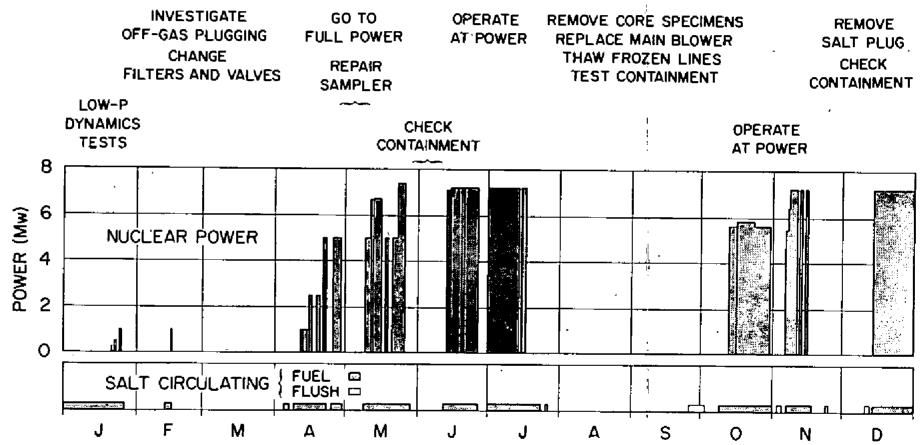  
Fig. 1.1. MSRE Activities in 1966.

complicated the routine recovery of salt that gradually accumulates in the tank, and during some recovery operations, activity was forced into the line that drains oil leakage away from the pump.

The reactor was shut down to install the second blower unit, which had just been delivered, and to attempt to relieve the plugged line at the pump bowl. The system was flushed, the reactor cell was opened, and heat was applied to the line. While the line was hot, pressure was applied and the line opened up. Tests showed that, within the accuracy of the available instrumentation, the pressure drop was then normal. The heaters were removed, the cell was sealed, and nuclear operation was resumed seven days after the fuel was drained for the shutdown. Also during this time, a gas flow element in the vent from the oil catch tank was removed and an alternative flow measurement provided. The flow element had become plugged when, as the last step in the fuel drain, the overflow tank was emptied and gas from the pump bowl again vented out through the oil drain line.

When the power was raised on November 7 for run 9, the temperature of the off-gas line showed that it was already plugged and that the gas was again bypassing through the overflow tank. To prevent the transfer of activity into the oil drain line when salt was recovered from the overflow tank, the nuclear power was reduced several hours before each transfer. Limitations on the amount of salt that can be tolerated in the overflow tank and the heel that remains after a recovery required that the power be reduced for a transfer every two days after the initial heel had accumulated. Nuclear operation was continued in this fashion for 12 days while heaters, tools, and procedures for more positively clearing the off-gas line were devised. Then the reactor was shut down to work on the line and also to check what appeared to be a high inleakage of air into the reactor cell.

Search for the restriction in the off-gas line revealed thin plugs in the flanges at both ends of a removable section near the pump bowl. The plugs were easily poked out, and the line was then shown to be clear by viewing, probing, and pressure-drop measurements. The plugs were attributed to flush salt almost completely blocking the line as a result of the overfill in July. An inconsequential amount of this salt was also seen in the 4-in. holdup pipe.

The high inleakage into the reactor cell proved to be from valve-operator pneumatic lines. Since these lines are protected by automatic block valves, the leaks did not violate containment. Therefore, flowmeters were installed so their input could be taken into account in the routine monitoring of cell leak rate during operation.

During this three-week shutdown, we also made some repairs and modifications to the component cooling blowers and removed and repaired an air valve in the reactor cell.

Run 10 began on December 14 and continued for 30 days at full power.

During the first two weeks of the run, the pressure drop across the particle trap in the fuel off-gas line repeatedly built up and had to be relieved by forward- or back-blowing with helium. Examination of the first particle trap, removed in August, had shown that heating the central inlet tube would tend to jam it into the first-stage filtering medium (see p. 47). To test the effect of reducing the heating, for the last two weeks of run 10, the off-gas was delayed on its way to the particle trap by routing it through the two empty drain tanks. When this route was followed, the particle trap pressure drop came down and stayed down.

The inlets to the main charcoal beds had to be back-blown during the first week of run 10 but not afterward.

During this run the UF3 concentration in the fuel salt was increased by the addition of 16 g of beryllium metal through the sampler-enricher. One purpose of increasing the reducing power of the salt was to investigate the effects on volatile fission product compounds (see p. 123). Another was to alleviate concern over possible corrosion. Practically no corrosion had been seen (<0.1 mil of generalized corrosion in 20 months), but the absence of corrosion depends on maintaining a reducing environment, and a larger margin was desired.

Operation at full power was to be interrupted after 30 days to permit inspection of the new blower hubs and blades, which had by then been run over $1000\mathrm{hr}$ . But toward the end of the run two conditions developed which caused us to drain the reactor and extend the shutdown. The heat exchanger between the treated-water and tower-water systems began to leak at an increasing rate, and the leakage from the air lines in the reactor cell became so large that the measurement errors clouded the determination of the cell leak rate.

When the reactor was shut down, inspection showed that the blowers were in excellent condition. The leaks in the air lines were traced to deterioration of neoprene seals in some quick-disconnects. All the disconnects in the reactor cell were replaced with metal-compression fittings, and the leakage was stopped. The heat exchanger leaking water was replaced. The filter assembly and the pressure control valve in the fuel off-gas line were removed, and a new filter assembly was installed. This consisted of two filters in parallel, each with much larger frontal area than the old filter (see p. 42).

Nuclear operation was resumed in run 11 on January 28 and continued without interruption (except for 2 hr to investigate a false temperature alarm) through the end of the report period, February 28. No difficulties of any consequence were encountered, and the program of adjusting the fuel $\mathrm{UF}_{3}$ concentration and observing the effect on volatile fission products continued.

Details of operations and maintenance during this report period are given in the sections which follow. Although the emphasis tends to be on the troubles, the reactor was in operation most of the time, and the operation was in most respects quite satisfactory. Table 1.1 summarizes some of the history. Salt was circulated in the fuel and coolant loops for 60 and $82\%$ , respectively, of the time in this report period. The reactor was critical $53\%$ of the time.

Table 1.1. Summary of Some MSRE Operating Data   

<table><tr><td></td><td>Aug. 31, 1966</td><td>Feb. 28, 1967</td><td>Increase</td></tr><tr><td>Time critical, hr</td><td>1775</td><td>4092</td><td>2317</td></tr><tr><td>Integrated power, Mwhr</td><td>7823</td><td>21,514</td><td>13,691</td></tr><tr><td>Salt circulation, hr</td><td></td><td></td><td></td></tr><tr><td>Fuel system</td><td>4691</td><td>7337</td><td>2646</td></tr><tr><td>Coolant system</td><td>5360</td><td>8946</td><td>3586</td></tr></table>

# 1.2 REACTIVITY BALANCE

J. R. Engel

The purpose of the reactivity-balance calculation during power operation of the reactor is to provide current information about the nuclear condition of the system. During this report period, improvements were made in the calculations, making it possible to detect very small anomalies in reactivity behavior; none was observed. Calculations made during previous periods $^2$ of operation did not include the $^{135}\mathrm{Xe}$ poisoning term because the mathematical model, with the coefficients then available, did not adequately reflect the xenon behavior in the reactor. When power operation was resumed in October 1966 (run 8), we included a calculation of the xenon effect to provide complete reactivity balances. Subsequently, the overall calculation was improved by modifying some xenon stripping parameters to improve the description of the xenon transients, and by including long-term isotopic change effects that had been previously neglected.

# Experience

Figure 1.2 shows the results of some of the on-line reactivity balances calculated in runs 8, 9, and 10. During runs 8 and 9 the parameters used to calculate the xenon poisoning were

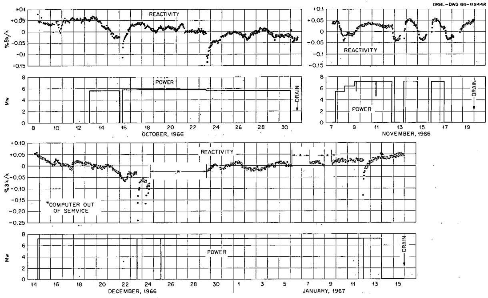  
Fig. 1.2. Residual Reactivity During Power Operation in Runs 8, 9, and 10.

found to describe the steady-state condition reasonably well, but the transients were not well described. This difference between the calculated and actual xenon transients produced the cyclic variation in the residual reactivity in November when the nuclear power was cycled between 0 and $7.2\mathrm{Mw}$ . Detailed analysis of the observed xenon transients led to changes in some parameters which produced much better agreement between the calculated and observed transients in run 10. However, there is still a small difference $(\sim 0.03\% \delta k / k)$ between the calculated and observed steady-state poisoning at $7.2\mathrm{Mw}$ . This causes the apparent change in residual reactivity between zero power and the condition with steady-state xenon poisoning.

The larger negative reactivity transients in Fig. 1.2 are all due to off-normal operating conditions not accounted for in the reactivity balance. In all except one of these transients, the negative reactivity resulted from an increase in the circulating void fraction while the salt level in the fuel-pump tank was abnormally low. The low level, in turn, was caused by low system temperatures which followed instrument-initiated power reductions. In all these cases the excess voids were stripped out and the reactivity recovered when the normal pump level was restored by increasing the system temperature. The negative reactivity excursion on October 23, 1966, was caused by an abnormally high salt level in the pump tank which reduced the efficiency of xenon removal by the pump spray ring. The negative reactivity was produced by the transport of additional $^{135}\mathrm{Xe}$ into the graphite moderator. Since the removal of xenon from the graphite is a slower process than bubble stripping, the recovery in this transient was slower than in the other cases.

Operation at power was resumed on January 28, 1966, and has continued without major interruption through the end of this report period. After the initial buildup of $^{135}\mathrm{Xe}$ poisoning, the residual reactivity has been between 0 and $+0.04\% \delta k / k$ except for one incident in which excess circulating voids were introduced by abnormal operation (low salt level in the pump tank).

The long-term drift in the reactivity balance is summarized in Fig. 1.3, which shows the residual reactivity as a function of integrated power from the start of power operation through run 10 (ending January 15, 1967). The reference condition for this figure is the system condition at the start of run 4 (December 20, 1965). Because of the remaining small uncertainty in the $^{135}\mathrm{Xe}$ term, the representative results shown here are taken at zero power with no xenon present. There appears to have been a positive shift of about $0.05\% \delta k / k$ during the first 1000 Mwhr of operation that has remained relatively constant since that time. No specific cause has yet been established for this shift. However, the change is nearly as small as the estimated confidence limits of the calculation $(\pm 0.04\% \delta k / k)$ and is much smaller than the operating limit on the reactivity anomaly, which is $\pm 0.5\% \delta k / k$ .

Previous reports of the reactivity behavior2 suggested the possibility of a significantly larger positive reactivity anomaly. However, those tentative conclusions were based on data from early results which have since been corrected. The earlier balances did not include the reactivity effects of isotopic changes (other than $^{235}\mathrm{U}$ ) or of flush-salt dilutions. Correction for these effects made a net reduction in the magnitude of the apparent anomaly. (The calculation of the isotopic-change effects is described on p. 83 of this report.) In addition, preliminary analysis of some pressure-release experiments indicated a circulating void fraction of 1 to $2\%$ by volume in the fuel salt.3 If such a void fraction had been present at steady state, the negative effect of the

3 Ibid., pp. 22-24.

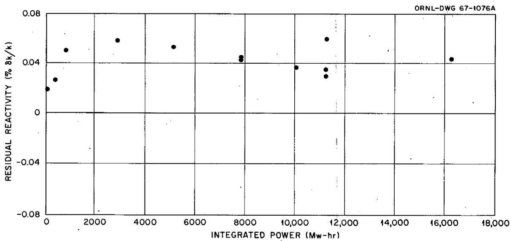  
Fig. 1.3. Long-Term Residual Reactivity in the MSRE.

voids would have required an anomalous positive reactivity effect of 0.1 to $0.2\% \delta k / k$ in order to produce the net results that were observed. However, as explained in the following section, later experiments indicate that the bubble fraction is much less.

# Circulating Bubbles

We have concluded, after intensive analysis of the data, that the pressure-release experiments do not permit explicit evaluation of the steady-state circulating void fraction. In the preliminary analysis of these experiments, the level rise in the pump tank and the reactivity loss associated with a pressure release were attributed entirely to circulating voids, and a void fraction of 1 to 2 vol % was required to account for the observed effects. However, the excess voids in circulation immediately after the pressure release disappeared from the system very rapidly (indicated bubble stripping efficiencies for the spray ring in the pump tank were 50 to 100%), and this was inconsistent with a large steady-state void fraction. In addition, the reactivity loss due to 1 or 2 vol % voids (0.2 to 0.4% $\delta k / k$ ) that should have been observed upon starting circulation was apparently absent.

The existence of circulating voids immediately after a rapid decrease in pressure does not require the presence of a comparable circulating void fraction prior to the decrease; it requires only a source of gas inside the body of the liquid. This source could be fixed void that is inaccessible to the salt so that its volume is essentially independent of the system overpressure. (One possibility might be the pores in the graphite and the spaces between the graphite stringers in the core.) The inventory of gas in such void would increase with increasing overpressure, and, when the pressure is released, this excess inventory would go into circulation with the salt. The pressure-release experiments give only an upper limit of 1 to $2\%$ for the circulating void fraction, if circulation of all the voids is assumed. Therefore, we have used other measurements to estimate the circulating void fraction.

At the start of run 8, in October 1966, a test was performed to evaluate the reactivity loss associated with the buildup of the steady-state circulating void fraction. Prior to this startup the fuel salt had been in a drain tank for 11 weeks and should have been free of bubbles. When the circulating loop was filled with this salt, there was no tendency for the pump-tank level to decrease with increasing overpressure. This incompressibility of the fluid supported the assumption that no voids were present initially. The reactivity change from stationary fuel salt to steady-state circulation was $-0.23$ to $-0.25\% \delta k / k$ . An early measurement of this effect, when there was no evidence for circulating voids, gave a reactivity change of $-0.21\%$ , in good agreement with the calculated effect due to the loss of delayed neutrons. Thus the reactivity loss due to circulating voids could be only about 0.02 to $0.04\% \delta k / k$ . This corresponds to a circulating void fraction of 0.1 to $0.2\%$ by volume. A void fraction in this range is consistent with the results obtained from the detailed analysis of the $^{135}\mathrm{Xe}$ transients and is also within the range of values that would explain the observations in the pressure-release experiments. Therefore we conclude that the circulating bubble fraction is in fact only 0.1 to $0.2\%$ , under normal conditions, and the presence of

the bubbles does not seriously affect the conclusions regarding the long-term changes in residual reactivity.

# 1.3 THERMAL EFFECTS OF OPERATION

# Radiation Heating

C. H. Gabbard

H. B. Piper

The evaluation of radiation heating effects on the fuel pump and on the reactor vessel continued.

Fuel-Pump Tank. - The temperature distribution on the upper surface of the pump tank as a function of reactor power was presented in the previous semiannual report4 for the condition of 30-cfm cooling-air flow. Since the startup for run 8, there has been an unexplained shift downward in these temperatures. A comparison of the present temperatures with those observed previously is shown in Fig. 1.4. The two lines show the variation in temperatures with reactor power that existed during runs 6 and 7 with 30-cfm cooling air. The solid points are the temperatures observed during runs 8 and 9 with 30-cfm cooling air. The open points are those observed during runs 9, 10, and 11 after the cooling air was turned off. The points at 5.5 Mw were taken when the reactor outlet temperature was at $1225^{\circ}\mathrm{F}$ rather than the normal $1210^{\circ}\mathrm{F}$ . This downward shift in tempera-

4 Ibid., pp. 27-28.

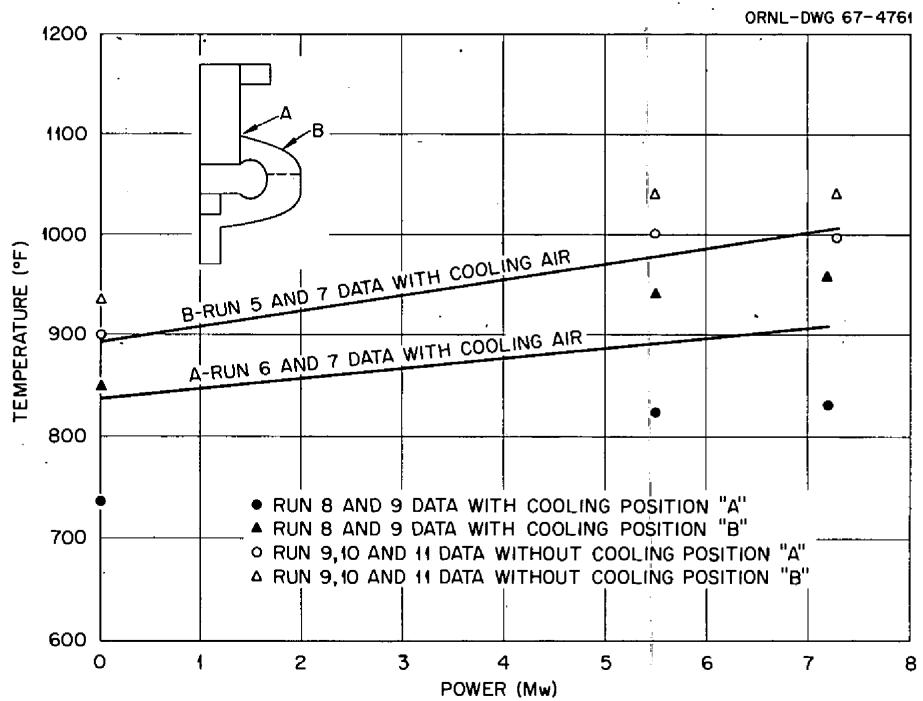  
Fig. 1.4. Comparison of Fuel-Pump-Tank Temperatures.

ture was first believed to be the result of a salt cake that remained on the metal surfaces after the overfill incident at the end of run 7. However, a review of the pump-tank temperatures during this and other filling operations showed that the temperatures were normal before the salt reached the pump and before the cooling air was turned on. The calibration of the air-flow meter was checked and was found to be correct.

The cooling air to the pump tank was turned off during the attempts to melt out the salt plug in the 522 line, and although the temperatures on the pump-tank surface were higher than with the cooling air, the temperature gradient was less. Since this temperature distribution is satisfactory and may actually be better than with the air cooling, the use of air cooling was discontinued during run 9. Fuel-pump cooling air had been used during all power operation of the reactor prior to run 8, and no comparison with previous data is possible. The temperature distribution for full-power operation has remained essentially constant since the use of air cooling was discontinued.

The thermocouple response when the air was turned off was checked to see if there was any indication that the thermocouple attachments had loosened. The transient data indicated that the largest temperature error, caused by air flow over the thermocouple, was of the order of 20 to $40^{\circ}\mathrm{F}$ . Although a direct comparison is not possible, these results appear to be consistent with previous data. The most probable explanation for the decrease in temperatures is either that the cooling shroud was accidentally shifted during the maintenance operations between runs 7 and 8 or that some shift has occurred in the air-flow measurement even though the calibration of the differential pressure cell was correct.

Reactor Vessel. - Certain temperatures on the reactor vessel are monitored continuously to determine the effects of radiation heating and to determine if there is any indication of a sedimentation buildup in the vessel. The temperature differences between the reactor inlet and the lower head and between the inlet and the core-support lugs are monitored by the computer. Previous data5 indicated temperature differences of 1.5 and $2.0^{\circ}\mathrm{F} / \mathrm{Mw}$ for the lower head and for the core-support lugs respectively. The temperature differences have now increased to 1.64 and $2.44^{\circ}\mathrm{F} / \mathrm{Mw}$ , but this increase is not believed to be serious or indicative of a sedimentation buildup, because this represents a maximum increase of only $3^{\circ}\mathrm{F}$ at 7.2 Mw, which could easily be the result of temperature measurement errors. The past and future data will be examined more closely to determine if a trend in the temperature differences does exist.

# Thermal Cycle History

C. H. Gabbard

One of the factors that limits the life of the reactor system is the degree of thermal cycling on certain critical components, particularly the freeze flanges. The current thermal-cycle history of all the components thought to be sensitive to thermal-cycle damage is shown in Table 1.2. Of

Table 1.2. MSRE Cumulative Cycle History Through February 1967   

<table><tr><td>Component</td><td>Heat/Cool</td><td>Fill/Drain</td><td>Power</td><td>On/Off</td><td>Thaw</td><td>Thaw and Transfer</td></tr><tr><td>Fuel system</td><td>7</td><td>32</td><td>40</td><td></td><td></td><td></td></tr><tr><td>Coolant system</td><td>5</td><td>10</td><td>36</td><td></td><td></td><td></td></tr><tr><td>Fuel pump</td><td>8</td><td>28</td><td>40</td><td>409</td><td></td><td></td></tr><tr><td>Coolant pump</td><td>6</td><td>11</td><td>36</td><td></td><td>103</td><td></td></tr><tr><td>Freeze flanges 100, 101, 102</td><td>7</td><td>28</td><td>40</td><td></td><td></td><td></td></tr><tr><td>Freeze flanges 200, 201</td><td>6</td><td>10</td><td>36</td><td></td><td></td><td></td></tr><tr><td>Penetrations 200, 201</td><td>6</td><td>10</td><td>36</td><td></td><td></td><td></td></tr><tr><td>Freeze valve 103</td><td>5</td><td></td><td></td><td></td><td>29</td><td>30</td></tr><tr><td>Freeze valve 104</td><td>11</td><td></td><td></td><td></td><td>8</td><td>22</td></tr><tr><td>Freeze valve 105</td><td>15</td><td></td><td></td><td></td><td>17</td><td>42</td></tr><tr><td>Freeze valve 106</td><td>17</td><td></td><td></td><td></td><td>25</td><td>38</td></tr><tr><td>Freeze valve 107</td><td>10</td><td></td><td></td><td></td><td>11</td><td>18</td></tr><tr><td>Freeze valve 108</td><td>9</td><td></td><td></td><td></td><td>17</td><td>14</td></tr><tr><td>Freeze valve 109</td><td>9</td><td></td><td></td><td></td><td>20</td><td>18</td></tr><tr><td>Freeze valve 110</td><td>2</td><td></td><td></td><td></td><td>2</td><td>3</td></tr><tr><td>Freeze valve 111</td><td>5</td><td></td><td></td><td></td><td>4</td><td>4</td></tr><tr><td>Freeze valve 112</td><td>2</td><td></td><td></td><td></td><td>1</td><td>2</td></tr><tr><td>Freeze valve 204</td><td>6</td><td></td><td></td><td></td><td>15</td><td>22</td></tr><tr><td>Freeze valve 206</td><td>6</td><td></td><td></td><td></td><td>13</td><td>20</td></tr></table>

the cycles shown, the “Fill/Drain,” “Heat/Cool,” and “Power” cycles are the most important, in that order. The “Fill/Drain” cycle consists in filling the system at $1200^{\circ}\mathrm{F}$ , starting circulation, and then draining the system. The “Heat/Cool” cycle consists in heating the empty system from room temperature to $1200^{\circ}\mathrm{F}$ and then cooling the empty system back to room temperature. The power cycle consists in raising the reactor power from zero to full power and then returning to zero power.

Some of the reactor operations do not fall clearly into single cycles of the types shown; partial power cycles and overall system temperature changes are examples. These effects are accumulated and charged as equivalent power cycles, which is why there are more power cycles in the fuel system than in the coolant system. Approximately $54\%$ of the design cycles have been used to date.

# 1.4 REACTOR DYNAMICS

S. J. Ball

Dynamics tests made during the initial approach to full power $^{6}$ had indicated that the inherent stability characteristics of the MSRE were quite satisfactory and in good agreement with the

predicted behavior. $^{7}$ Subsequent frequency response tests were made at the start of run 11 with the reactor at three different power levels in order to detect any changes in reactor dynamic behavior resulting from a year of power operation (16,750 Mwhr). Pseudorandom binary reactivity insertions were used in tests at power levels of 1, 5, and 7 Mw.

The results of these tests showed no detectable changes in the MSRE dynamic characteristics due to aging, thus indicating continuing satisfactory behavior.

Two problems encountered in the analysis of the first series of tests were offsets, or biases, in the magnitude ratio curves for tests run at a given power level, and some unexpected low-frequency periodic inputs that showed up as spikes in the autocorrelation functions of the rod motion input signal. Neither of these problems recurred in the latest tests. The appearance and disappearance of these anomalies are as yet unexplained.

# 1.5 EQUIPMENT PERFORMANCE

# Heat Transfer

C. H. Gabbard H. B. Piper

Primary Heat Exchanger. - The evaluation of the effects of prolonged operation on the heat transfer in the salt-to-salt heat exchanger was continued. Heat transfer data at six different time periods were evaluated, using the derivative method, $^{9}$ with the results shown in Fig. 1.5. Although the calculated coefficients show a slight downward trend with time, we believe the apparent trend in heat transfer is within the uncertainty band of the calculations. A simple but sensitive indicator of any change in heat transfer is obtained by dividing the reactor power by the overall temperature difference between the fuel leaving the core and the coolant leaving the radiator. A lower value of this ratio indicates poorer heat transfer, since the fuel and coolant flow rates are not variable. Data from full-power operation in runs 6-11 are shown in this form in Fig. 1.5. Taking into consideration both the calculated coefficients and the simple indexes, we conclude there has been little or no change in the heat transfer performance of the heat exchanger.

Radiator. - The reactor was operated at various power levels at the beginning of run 11, and data were taken to evaluate the heat removal at different radiator settings: The heat-removal capability of the radiator as a function of radiator setting is shown in Fig. 1.6.

The same set of data was used to calculate the overall heat transfer coefficient of the radiator as a function of the air pressure drop across the radiator. The results of these calculations are shown in Fig. 1.7. The increase in the heat transfer coefficient when the second blower was energized is probably caused by direct impingement of the air from the blower discharge against the radiator tubes. The various air pressure drops were obtained with the radiator doors fully

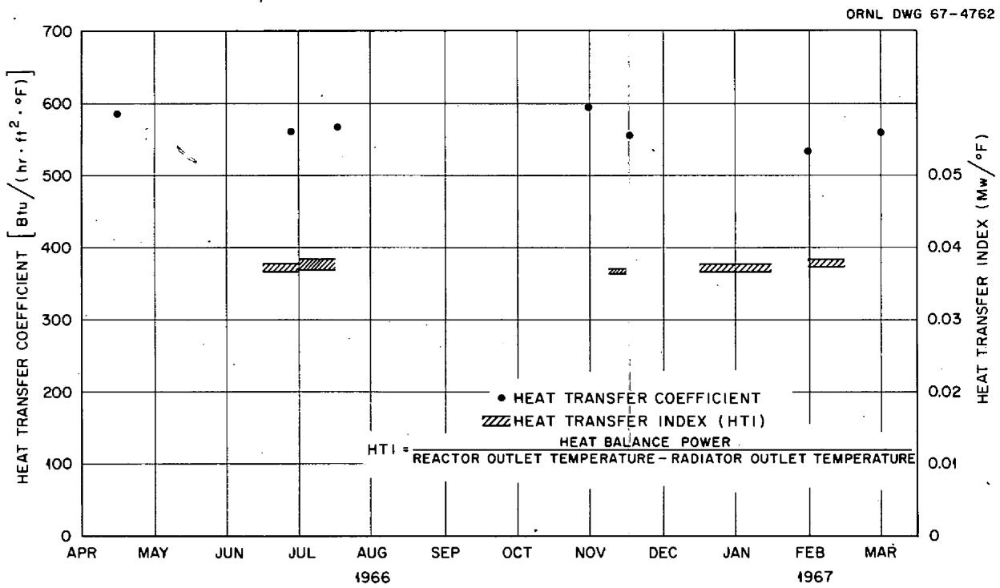  
Fig. 1.5. Observed Performance of MSRE Main Heat Exchanger.

open by changing the bypass-damper position. A direct measure of the radiator-air outlet temperature can be made only when the bypass is fully closed, and even then the air from the annulus blowers would cause an error in the measured temperature rise across the radiator. The outlet air temperatures for the other conditions were calculated from air and salt heat balances around the radiator. Corrections were applied for the effects of the annulus blowers. However, the measured temperature rise of the air across the radiator tubes was about $17\%$ higher than the calculated rise in the two cases where the bypass damper was closed and a measurement was possible. This discrepancy indicates that either the air-flow measurement, the temperature measurement, or the reactor heat balance is incorrect. The heat balance and the temperature measurements were assumed to be correct, and the calculated outlet air temperatures for the other radiator conditions were corrected to be consistent with the values measured when the bypass damper was closed.

The coefficients for the two conditions when the bypass damper was closed were 28.5 and 38.5 Btu hr $^{-1}$ ft $^{-2}$ (°F) $^{-1}$ . These are the same values that were calculated from June 1966 data for similar operating conditions.

The apparent error mentioned above is about the same as the 15 to $16\%$ discrepancy between the air heat balance and the salt heat balance reported previously10 for similar conditions. This

seems to indicate that the discrepancies are the result of some specific error in measurement rather than random variations in the data. The radiator air instrumentation was not intended to be accurate enough to permit a precise heat balance on the air. The stack is not sufficiently long to ensure either a uniform velocity distribution or a uniform temperature distribution across the stack cross section. Since the velocity and temperature are measured only at a single point in the stack, any flow or temperature asymmetry could cause a significant error. There is also the possibility that the initial calibration of the air flow instrument was incorrect.

Methods of Improving the Heat Transfer. - A study was completed to determine whether the maximum power capability of the reactor could be raised by some convenient method.

For normal operating conditions, an upper limit of $1210^{\circ}\mathrm{F}$ has been placed on the reactor outlet temperature. This temperature was selected on the basis of thermal stress cycling and

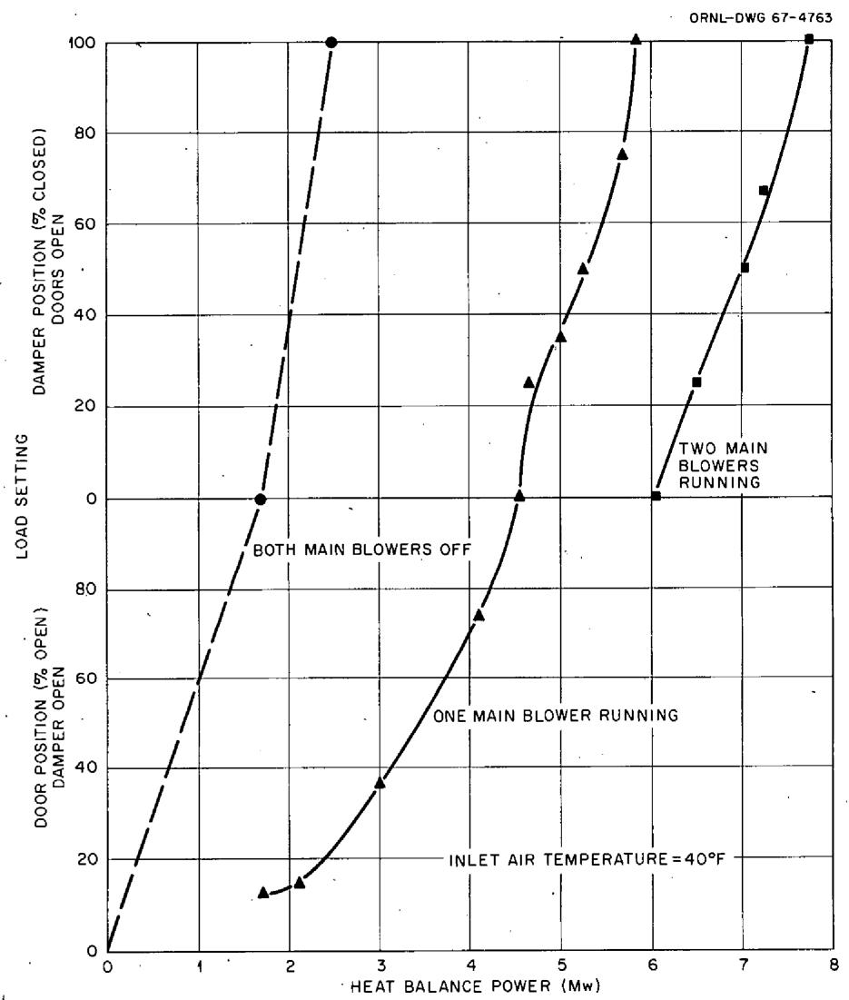  
Fig. 1.6. MSRE Radiator Performance.

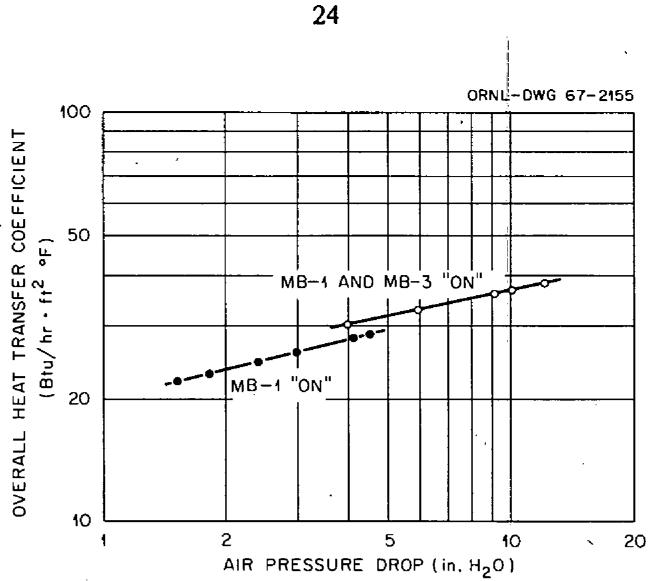  
Fig. 1.7. Effect of Air Pressure Drop on Radiator Heat Transfer Coefficient.

stress rupture life of the reactor system. The minimum coolant salt temperature in normal operation has been set at $1000^{\circ}\mathrm{F}$ , in order to reduce the probability of freezing the radiator in case salt flow is interrupted. These two temperature limitations and the heat transfer capability of the main heat exchanger limit the reactor power to about 7.4 Mw. In the summer months this power limitation about coincides with the capacity of the coolant radiator. However, during colder weather the radiator heat transfer capacity increases, and a portion of the cooling air must be bypassed to avoid overcooling the coolant salt.

The reactor power can be increased only by improving the heat transfer performance of both the radiator and the main heat exchanger. Other than replacement with a larger unit, the heat-exchanger capability can be increased only by increasing the flow rates of the fuel and coolant systems. Increasing the temperature difference between the fuel and coolant system is undesirable because of adverse effects on the thermal-cycle and stress-rupture life of the reactor system.

A study was completed to determine the maximum flow rates that could be obtained and to determine the increase in heat transfer performance that would result from these flow increases. The pumps are capable of accepting larger-diameter impellers and of operating at a higher horsepower rating so that increased flow is possible. The flow can also be increased by using a higher-frequency power supply to increase the rotational speed of the pumps. Slightly higher flow rates can be obtained with the higher rotating speed, because the horsepower rating of the drive motors can be increased at the higher speed. Calculations indicate that the maximum possible flow rates for the fuel and coolant systems would be 1530 and 1044 gpm respectively, assuming that the pumps themselves are the limiting factor. Using these maximum flow rates and operating between the temperature limits that now permit 7.2 Mw, the heat transfer capability of the heat exchanger would be increased to 8.1 Mw. Even this modest increase might not be practical, how-

ever, because of undesirable effects of increasing the flow. For example, development tests suggest that increasing the flow causes more gas bubbles to be introduced into the circulating salt by the stripper jets in the pump bowl. This would be undesirable, because it would introduce more uncertainty into the reactivity balance.

In the radiator, increasing the salt flow has very little effect, since over $95\%$ of the heat transfer resistance is on the air side of the tubes. There is no way to improve the radiator performance without major expense. Additional surface area could be provided by adding more tubes or by adding some type of fins to the tubes, but either would be difficult and time consuming. Additional air capacity could be provided, but this too would be a major undertaking. The radiator air flow would have to be increased by a factor of about 1.8 to remove 10 Mw. This would increase the air pressure drop to $\sim 35$ in. $\mathrm{H}_2\mathrm{O}$ and the power requirements of the blowers to about 2900 hp, as compared with 500 hp for the present blowers. Neither the present blowers nor the building electrical system is capable of meeting these requirements. One additional blower could possibly increase the radiator heat removal to the 8.1-Mw level, which would be consistent with the maximum possible power of the heat exchanger. However, the blowers would be operating very close to their surge limit, new drive motors might be required to avoid an overload condition, and the existing building electrical system would be unable to supply the third blower.

In conclusion, the difficulties in raising the power capability of the reactor far outweigh any advantages that could be gained from the relatively small power increase that can be reasonably achieved. Since the objectives of the MSRE can be met with the present heat removal system, no attempts to increase the power capability are planned.

# Main Blowers

# C. H. Gabbard.

The main blowers, MB-1 and MB-3, which had failed at the end of run 7, $^{11}$ were rebuilt by the manufacturer and returned to normal service. By the end of the report period, MB-1 and MB-3 had operated without difficulty for 2100 and $1675\mathrm{hr}$ , respectively, since they were repaired. Main blower 1 has been inspected twice since it was repaired, and main blower 3 was inspected once, the first inspection of MB-1 coming after $350\mathrm{hr}$ of operation while MB-3 was being installed. Both blowers were inspected at the end of run 10 -- after 1350 and $930\mathrm{hr}$ of operation. The inspections included dye-penetrant inspections of the blading and hubs, a visual inspection of the coupling, an alignment check, and a rerouting of all the bolts. With the exception of a few bolts that were retightened, both blowers were completely satisfactory.

We attempted to find the cause of the failures at the end of run 7, but the specific cause is uncertain. The best explanation appears to be that one of the blades failed first along one of several existing cracks and that the resulting unbalance, or impact with the blade fragments,

caused the remaining damage. The origin of the existing cracks is also unknown, but they probably occurred either during fabrication or during the overspeed test.

The rebuilt units have reinforced hubs and have magnesium alloy blades that are $35\%$ lighter than the original aluminum ones. The new units were also given a $30\%$ overspeed test, with a dye-penetrant inspection of the hubs and blading before and after the test. The manufacturer had difficulty in casting the magnesium alloy blades free of heavy surface porosity and cracks.

Rotor assemblies were rejected on three occasions because of cracking in the blades after the overspeed test. In each of these cases, cracking had been present prior to the test, but it had been removed by surface grinding. The units that were accepted, including a spare unit, were free of objectional defects.

The rebuilt rotor assemblies were installed in MB-1 and MB-3 under the supervision of the manufacturer's service engineer. The rotor and drive-motor shafts were carefully aligned, and the rotors were dynamically balanced in place. Instrumentation was provided to monitor the vibrations and the bearing temperatures of the two blowers while they are in operation. Vibration normally runs below 1 mil, although greater vibrations developed on two occasions, once when ice built up on the blades of MB-1 and once when its bearings became very cold (below $15^{\circ}\mathrm{F}$ ).

# Radiator Enclosure

# M. Richardson

The coolant-salt radiator operated continuously with salt circulating at temperatures between 1000 and $1200^{\circ}\mathrm{F}$ for the last five months of the report period.

The modifications of the door seals1,2 proved effective in reducing air leakage and consequent heat losses to a satisfactory minimum. Although close examination was not possible after the radiator went into operation, external examination on January 17 showed little deterioration in more than $3400\mathrm{hr}$ at high temperature. The inlet door was in excellent condition, with good contact at top and bottom between the linked hard seals and the soft seal on the face of the enclosure. On the outlet door the hard seals appeared to be in good condition. There was a tight seal across the top but a gap of $\frac{1}{8}$ to $\frac{3}{8}$ in. across the bottom of the door. A 1-ft section of the soft seal that had become detached was found in the outlet duct.

Heat leakage through penetrations in the top and sides was no problem. The thermocouples and power wiring showed no evidence of overheating.

As a result of the blower failure in July 1966, some antimissile protection was provided between the blowers and the radiator. A grid of $\frac{1}{4}$ -in. stainless steel aircraft cables, shock mounted, on 2-in. centers was installed just downstream of the blowers. Heavy wire screens with 0.4-in. mesh were installed just ahead of the radiator.

The performance of the magnetic brakes on the door-lifting mechanism became marginal toward the end of run 10, and some slipping occurred when door positions were adjusted. Preparations were made for replacement of the worn and broken brake shoes at the next shutdown or if the brakes become inoperable.

# Off-Gas Systems

# P. N. Haubenreich

The fuel off-gas system continued to present some problems throughout the period. One problem area was associated with the overfill of the fuel pump that got flush salt in some gas lines near the pump. The other was a continuation of the difficulty that appeared when the reactor first operated at power: the accumulation of polymerized oil residues in small passages. The former interfered with operations and required considerable work in the reactor cell to remedy. The latter was a nuisance through run 10, but after the installation of a new particle trap caused no more trouble.

Plugging near Fuel Pump. - After the accidental overfill of the fuel pump, $^{13}$ the bubbler reference line was cleared by remotely applied, external heaters. Salt in the sampler line was melted the same way, but ran down and froze at the junction with the pump bowl. The obstruction that formed here cleared out when the pump was heated up with salt in the bowl. No further trouble was encountered with these lines. The off-gas line, shown in Fig. 1.8, was a different matter.

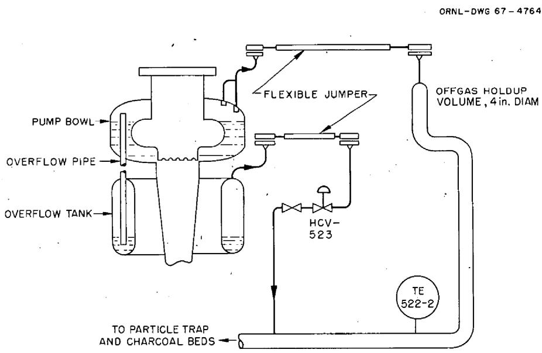  
Fig. 1.8. Off-Gas Piping Near Fuel Pump and Overflow Tank.

Although some salt entered the off-gas line, as indicated by a temporary rise in temperature at TE-522-2, pressure drop measurements showed no significant difference from the clean condition. This was attributed to the blast of compressed helium from the drain tank that was released backward through the off-gas line, before the salt had time to freeze completely, when the overfill triggered an automatic drain. Therefore the only action taken before the startup in September was to replace the short, flexible "jumper" section of the line, where the convolutions would certainly hold some salt.

The off-gas flowed freely, with no unusual pressure drop through 26 days of circulating helium, flush salt, and fuel salt at low power. Then, two days after power operation was resumed at 5.8 Mw, a plug developed in line 522 somewhere between the pump bowl and the junction of the overflow tank vent with the 4-in. holdup line. The first indication was a decrease over a few hours from $225^{\circ}\mathrm{F}$ to $160^{\circ}\mathrm{F}$ at TE-522-2, as the plug caused the off-gas to bypass through the holdup tank. The presence of the plug was confirmed when HCV-523 was closed to build up pressure to return salt from the overflow tank to the pump bowl: pressure in the pump bowl also built up. Efforts to remove the restriction by applying a 10-psi differential either forward or backward were unsuccessful.

The bypassing of the off-gas through the overflow tank did not hinder operation, except for one specific job: recovery of salt from the overflow tank. Salt slowly but continuously accumulates in the tank during operation, and it is therefore essential to return salt to the pump bowl two or three times a week in order to maintain proper levels. With the plug in the line from the pump bowl, it was necessary to greatly reduce helium flows into the pump so that the overflow tank pressure could be increased faster than that in the pump bowl to make the salt transfer. Through the remainder of run 8, salt was returned from the overflow tank six times, and on at least four of these occasions some fission product activity was blown or diffused up the pump shaft annulus into the oil collection space. This was a consequence of the reduced helium purge down the shaft annulus and the unavoidable, sudden pressurization of the pump bowl that occurred at times in the procedure. The charcoal trap in the vent from the oil catch tank prevented any serious release of activity to the stack. The activity level in the oil tank and the line increased, however, and the last two releases from the pump bowl caused the flow element in the vent to plug partially and then completely.

After run 8 was terminated, steps were taken to clear the plug from the off-gas line so that the normal salt recovery procedure could be used. Frozen salt was suspected of causing the plug, so the fuel loop was flushed to reduce radiation levels, the reactor cell was opened, and specially built electrical heaters were applied to the line between the pump bowl and the first flange. Heating alone did not clear the plug, but when, with the line hot, 10 psi was applied backward across the plug, it blew through. The pressure drop came down as more helium was blown through until it became indistinguishable from the normal drop in a clean pipe. The temporary heating apparatus was then removed.

In run 9 the power was raised only $8\mathrm{hr}$ after fuel circulation had commenced, but TE-522-2 came up to only $150^{\circ}\mathrm{F}$ , indicating that the line was already plugged again. Plans were immediately set in motion to do a more thorough job of clearing. While tools and procedures were being devised, the reactor was kept in operation, but great care was taken to avoid getting fission products or salt spray up the pump shaft annulus again. This entailed lowering the power to 10 kw, 24 hr before the overflow tank was to be emptied, then stopping the pump 4 hr beforehand to let the salt mist settle. Then the fuel pump was vented through the sampler and the auxiliary charcoal bed during the transfer. After three cycles of this, the reactor was drained and flushed again in preparation for working on the off-gas line.

This time heat was applied to the short section of line between the second flange and the top of the 4-in. decay pipe. When heating to about $1100^{\circ}\mathrm{F}$ did not open the line, the flexible jumper was disconnected to permit clearing the obstruction mechanically. In the flange above the 4-in. line, the $\frac{1}{2}$ -in. bore was completely blocked, but the weight of a chisel tool broke through what appeared to be only a thin crust of salt. Borescope inspection showed that the rest of the vertical line was practically clean, and there was only a thin layer of salt in the bottom of the horizontal run of the 4-in. pipe. Helium was blown through the line at five times the normal flow, and the pressure drop indicated no restriction. Turning then toward the pump bowl, we saw a similar plug in that flange. This too was thin and was easily broken out. A $\frac{1}{4}$ -in. flexible tool was then inserted all the way into the pump bowl to prove that a good-sized passage existed. A new jumper line was installed and operation was resumed. No further difficulty was encountered with this section of the off-gas system.

Because obtaining samples remotely without spreading contamination would have been most difficult, no analyses were made of the material in the flanges. But it appeared that salt had frozen in the line, almost completely blocking it, during the overfill. Material in the off-gas stream during operation then plugged the small passages. The heaters melted the salt out of the pipe, but the flanges were not as hot, and a thin bridge remained.

Particle Trap. - The first particle trap was designed on the basis of a rather brief period of investigation and development after plugging in the off-gas system halted the planned approach to full power. It served its purpose in that it protected the pressure control valve and to some extent the main charcoal beds, permitting the experimental program to proceed. When the pressure drop across the trap began to build up, an identical replacement was prepared, so that the first could be removed and examined as an aid in designing a better trap while operation continued. This replacement was deferred until after run 7, because the pressure drop across the trap never became prohibitive.

The examination of the first particle trap and the design of the new model are described on p. 47. The second unit served through runs 8, 9, and 10. This unit behaved in runs 8 and 9 much as had the first particle trap. The pressure drop occasionally built up to 5 to 10 psi, beginning two days after power operation started in run 8, but backblowing with helium was effective in reducing the pressure to 2 to 4 psi. In run 10, however, after the first week of power operation, backblowing

effected only temporary relief at best. Various tactics were used to get gas to the particle trap with as little delay as possible, to see if increasing the fission product heating would drive off organic material from the place where it was causing plugging. After these efforts proved ineffective, the opposite approach was used: the off-gas was delayed as long as possible. This was done in recognition that heating caused the central inlet tube to expand farther into the Yorkmesh filtering material. The delay was obtained by routing the gas through an equalizing line to the empty drain tank, through the tank and the salt fill lines to the other tank where it bubbled up through several inches of salt heel, then out through the drain-tank vent line to the particle trap. This gave the gas about 8 hr of delay and also bubbled it through salt in the freeze valves and drain tank before it reached the particle trap. The pressure drop across the trap was 16 psi when the gas was rerouted, but within a few hours it was below 2 psi. For the last two weeks of run 10, the pressure drop across the particle trap remained below 2 psi when the delayed route was followed, but began to build up almost immediately when the original route was used.

The charcoal filter, just after the particle trap, held up fission products, as shown by the heating during power operation, but the temperature profile showed no significant change to indicate poisoning by organics. The pressure control valve was operated full open, with the pump-bowl pressure determined by the drop in other parts of the system. Therefore it appeared that nothing would be lost by removing these items to make room for new, dual-particle traps.

The new (third) particle trap had been in service for 5100 Mwhr of reactor operation by the end of the report period. The measured pressure drop showed no increase at all, remaining below 0.1 psi. At 7.4 Mw the temperature measured near the Yorkmesh was around $275^{\circ}\mathrm{F}$ , the thermocouple nearest the Feltmetal (but shielded by a pipe and a bellows) average $108^{\circ}\mathrm{F}$ , and the lowest couple indicated $61^{\circ}\mathrm{F}$ , only $10^{\circ}\mathrm{F}$ above the temperature of the water surrounding the trap (see p. 42 for a description of the new traps).

Main Charcoal Beds. - The main charcoal beds continued to perform their function of holding up the fission products: there was no breakthrough of activity other than the normal 10-year $^{85}$ Kr. Some difficulty was encountered at times, however, when the pressure drop at the inlet built up to an inconvenient level.

Bed sections 1A and 1B had been used almost exclusively during earlier runs, and they were on line when run 8 started. As had happened before, the pressure drop at the inlet of these sections began to increase a few hours after the power was raised. When the pressure drop reached 7 psi, sections 2A and 2B were also brought on line. The pressure drop through the four sections in parallel remained below 1 psi through the end of the run, but the pressure drop through 1A and 1B remained high, and backblowing did not bring their pressure drop below 4 psi.

A situation similar to that in 1A and 1B also existed in the auxiliary charcoal bed, where the pressure drop was abnormally high and did not respond to backblowing. Tests showed that the restriction was near the inlet end, and it was strongly suspected that it was due to organic material clogging the steel wool at the opening of the inlet pipe into the bed. Therefore, a remotely plausible assembly of electric heaters was designed for this section, and in the brief shutdown

between runs 8 and 9 it was tried. Some improvement was observed when the heater temperatures reached $720^{\circ}\mathrm{F}$ , and after these temperatures were raised to $1235^{\circ}\mathrm{F}$ and then cooled, the pressure drop was down by a factor of 5, to a satisfactory level.

In light of this success an attempt was made to clear up the restriction in section 1B by heating the inlet with a torch. (Electric heaters to fit this bed were not then available.) Although the temperature in the bed reached $870^{\circ}\mathrm{F}$ , there was no improvement in pressure drop. In run 9 all four sections of the main bed were operated in parallel, with no further effort to clear 1A and 1B and no indication of any change in pressure drop. After this run, electric heaters were installed on the inlets of 1A and 1B. Heating to $750^{\circ}\mathrm{F}$ for 8 hr brought the pressure drop back to the normal range for clean beds. Although the heaters could not be used in normal operation because the cooling-water level is above the inlet sections, they were left in place with leads brought out through the shield.

Run 10 began with 1A and 1B on line, but after one day of power operation the pressure drop began to build up, and the flow was switched to 2A and 2B. Three days later, for the first time, the pressure drop across these beds began to increase, reaching 5 psi before they were backblown to reduce the drop below 2 psig. The flow was returned to 1A and 1B, after their pressure drop had been reduced below 3 psi by backblowing. For the last three weeks of run 10, the pressure drop did not again build up.

In run 11, through February, only 1A and 1B were used. The pressure drop remained about 2.5 psi for two weeks and then began slowly to increase. After four weeks of operation it had reached 5 psi.

The early finding of organic material in the original charcoal-bed inlet valves14 and the response of the pressure drop to heating are good evidence that most of the trouble with pressure drop was caused by organics. Why the restriction built up so slowly in run 11 is not known.

Designs were completed during run 11 for more positive remedies for the high pressure drop. These include a particle trap just ahead of the bed inlet manifold and piping to bypass the inlet section of each bed where the plug is believed to be.

# Cooling-Water Systems

R. B. Lindauer

Treated-Water Cooler. - Before run 8, 17 leaking tubes in the treated-water cooler were plugged. $^{15}$ In runs 8 and 9 and through part of run 10 the leakage from the treated-water system averaged 2 gal/day or less. Then early in January the leakage increased to about 6 gal/day and a few days before the end of run 10 began to increase again, reaching about 50 gal/day by the shutdown. Leakage in the cooler to the tower-water system was confirmed by the appearance of lithium in the tower water. Before run 11 the cooler was replaced by an available surplus heat

exchanger. The new exchanger has only two-thirds the tube area of the old cooler, but the heat transfer coefficient is higher, resulting in about the same performance. Through the end of February there was no evidence of leakage in the new cooler.

Space Coolers. -- Leaks had occurred in both reactor-cell space coolers at brazed joints on the brass tubing headers, and repairs had proved to be difficult because repair of one joint tended to open adjacent joints. Prior to run 8, both coolers (and all other in-cell components) were proved to be leak-tight, but when operation was resumed, condensed moisture began to appear in the system recirculating the cell atmosphere. Although leakage from the space coolers was suspected, they could not be isolated for leak testing because of the high temperatures in the cell. In view of the discouraging experience with repairs, two replacement coolers were procured in which the headers and nipples were made of copper and the troublesome joints were welded. (The Heliarc welding of copper to copper was done at ORNL.)

Radiolytic Gas. - As reported previously, $^{14}$ when the reactor is at full power about 3 scfh of radiolytic hydrogen and oxygen is evolved in the treated-water system. Steady-state accumulation in the system was reduced from $8\mathrm{ft}^3$ to $6\mathrm{ft}^3$ by supplying the thermal shield slides with water pumped from a small vented tank. Before run 8, a 350-gal degassing tank was installed in the return line from the main thermal shield and slides. With this tank in the system, the gas accumulation at full power was reduced to $3\mathrm{ft}^3$ . The holdup was the same whether or not the slide supply tank was used in conjunction with the main degassing tank. The radiolytic gas being stripped from the water is diluted with air to below the explosive limit in the degassing tank and is then vented outside the reactor building.

Chemical Treatment. - In the course of testing and repair of leaks in the treated-water cooler, cooling-tower water leaked into the treated-water system. Before the reactor was started up in September, the resultant sodium contamination was reduced by dilution with condensate, after which the required corrosion inhibitor concentration was restored by adding more lithium nitrite. Power operation was resumed with 1.6 ppm sodium in the treated water. Activation of the sodium raised the radiation levels around the water system, but did not interfere with operation. After September, no more additions of corrosion inhibitor were required until January, when some makeup was needed because of leaks.

In the cooling-tower system, corrosion inhibition was by daily additions of balls of Nalco 360 (sodium chromate and phosphate). To eliminate troublesome deposition of calcium phosphate on flowmeter tubes, the inhibitor was changed to a mixture of potassium dichromate and zinc sulfate. Continuous-feed addition equipment was also installed at the cooling tower.

# Component-Cooling System

# P. H. Harley

During this report period the component-cooling pumps, CCP-1 and CCP-2, operated 1490 and 2159 hr respectively. Although some difficulties were encountered with the system, the output was adequate and there was no interference with reactor operation.

Previous operation of the pumps had indicated insufficient capacity, and the speed of both units was increased during the shutdown after run 7. Operation was satisfactory in run 8, but in run 9 it became evident that there was a malfunction either in the output-pressure transmitter or in the pressure-control valve, PdCV-960. During the shutdown after run 9, inspection of PdCV-960 showed that the valve stem was stuck with the valve partly open. Deterioration in the operation of this valve probably also accounted for at least part of the apparent loss of capacity of the pumps. The valve operated satisfactorily after the valve was repacked and the stem polished and lightly lubricated. A drain was installed at the discharge of the gas cooler which should reduce moisture collection in the valve bonnet, and PdCV-960 is cycled periodically to ensure free stem operation. The pressure transmitter was also checked and found to be operating properly. However, the piping was rerouted to eliminate sections where condensate could collect.

During this same maintenance period, the butterfly check valve from CCP-1 was found to be inoperative and was repaired. The failure occurred at a silicone rubber hinge which supports the two wings of the check valve. This check valve would prevent CCP-2 from developing pressure, because the gas could short-circuit back through CCP-1 to the blower suction. This was the second reported failure of a check valve; it had been in service between 1548 and 3074 hr. A similar check valve had failed on CCP-2 in January 1966, after 1640 hr of operation, and had been replaced by one made at ORNL as there was no spare on hand. The locally fabricated check valve was replaced in September 1966, although it had not failed after $\sim 1800$ hr.

Pump CCP-1 had to be stopped during run 10 because of low oil pressure, and CCP-2 was used for the remainder of the run. After run 10, a cracked copper fitting in the oil system was repaired, and 2 gal of oil was added to bring the oil level back to normal.

The drive belts on the component-cooling pumps caused intermittent difficulties through run 7. Prior to run 8 the motor mounts were strengthened to reduce flexing, and deflectors were installed to try cooling of the belts with the incoming gas. Even with the deflectors, a thermocouple near the belt of CCP-1 indicated an ambient temperature of 150 to $160^{\circ}\mathrm{F}$ . Although this is above the $130^{\circ}\mathrm{F}$ for which the belts are rated, inspection in December, after 1400 hr of operation, showed that the belts were in good condition and only moderate tightening was required. There has been no evidence of belt slippage since the motor mounts were reinforced.

The rupture disk installed to eliminate the pressure relief valve leakage would not withstand the shock of starting the blowers and has been removed.

No inspection has been made on the strainer installed in the gas piping in August. However, there has been no increase in system pressure drop to indicate collection of material in the strainer.

Pump CCP-3, which cools out-of-cell freeze valves, operated the entire period without trouble.

# Salt-Pump Oil Systems

# J. L. Crowley

The systems supplying oil for lubrication and cooling in the salt pumps operated continuously for the last $5\frac{1}{2}$ months of this report period. Operation was practically free of trouble.

Oil leaking past the lower shaft seal in a salt pump collects in an external tank. Oil from the fuel pump, which had accumulated in earlier months at rates up to 20 cc/day, $^{16}$ accumulated in October and November at about 5 cc/day. There was no accumulation in December, but in January the oil began to collect again at about 5 cc/day. Seal leakage from the coolant pump, which had accumulated previously at about 2 cc/day, increased to about 17 cc/day. These rates are far below the 1000 cc/day that was originally set as acceptable.

Leakage of oil into the salt pump bowls is, in principle, detectable by changes in oil inventories. The inventories in the two systems both indicated a small, unaccounted loss over the $5 \frac{1}{2}$ months of operation, as shown in Table 1.3. In four months of earlier operation, $^{16}$ the calculated loss from the fuel system was $-0.3$ liter (an apparent gain), and from the coolant system there was an apparent loss of 0.3 liter. The significance of these changes is somewhat questionable because uncertainties in the inventories are relatively large (around 1 liter or more). But during the last months of operation, the decrease in reservoir levels was rather steady, and there was no evidence of more oil being trapped in the motor housings.

Table 1.3. Oil Systems Inventory Changes   
September 1966—February 1967   

<table><tr><td rowspan="2">Item</td><td colspan="2">Change (liters)</td></tr><tr><td>Fuel System</td><td>Coolant System</td></tr><tr><td>Removed in samples</td><td>6.49</td><td>5.64</td></tr><tr><td>Accumulation in catch tank</td><td>0.57</td><td>1.35</td></tr><tr><td>Total accounted for</td><td>7.06</td><td>6.99</td></tr><tr><td>Decrease in reservoir</td><td>8.34</td><td>7.56</td></tr><tr><td>Apparent loss</td><td>1.28</td><td>0.57</td></tr></table>

# Electrical System

T. Mullinix

T. L. Hudson

R. H. Guymon

During the shutdown prior to run 8, the entire electrical system at the reactor site was overhauled and put in good operating condition. Most of the major electrical breakers were tested and

calibrated to assure proper operation. One of the emergency-power diesel generators (DG-3), which had a cracked engine block, was replaced with a unit of the same size obtained from another installation. In addition, the 250-hp motors for the main radiator blowers and the two 48-v dc generators were inspected and reconditioned.

In general, the electrical system performed satisfactorily during this period. The emergency-power generators are operated under load routinely for test purposes, and they have always operated when required. On September 30 a major power failure in the X-10 area caused an automatic transfer to the alternate feeder for the MSRE. During this outage, two of the MSRE diesel generators were operated in parallel with TVA to help supply the X-10 electrical load. This operation was entirely satisfactory. The only difficulty encountered with the electrical system was a fuse failure in the high-reliability ac power supply (static dc-ac inverter) which resulted in an unscheduled control-rod scram.

# Heaters

# T. L. Hudson

During the shutdown (in September) a resistance check was made on all in-cell heaters at junction boxes located outside the reactor and drain-tank cell. Other than heater HX-1, which had partly failed before the shutdown, only one heater, H102-1S, was found that had failed. This was one of three installed spare heaters on 'the vertical section of pipe under the heat exchanger. No repairs were required, since there is adequate capacity in the other heaters on this section of pipe.

The resistances of the coolant-system heaters located outside of the reactor cell were also checked. Three heaters were found that had failed. One was on the coolant system 5-in. piping, one on the coolant-pump furnace, and the other one, a spare heater, was on the fill-line piping. It was necessary to replace only the heater on the 5-in. piping, since there was adequate heater capacity at the other locations to preheat the coolant system.

Aside from heater-element failures, a remote disconnect for one of the fuel-pump heaters (heater FP-1) was damaged during remote operations associated with the thawing of the salt plug in the fuel-pump off-gas line. The heater was plugged into a spare disconnect to restore it to service.

Some additional heater-element failures have occurred since the operation of the reactor system was resumed. As mentioned above, part of the elements in heater HX-1 had failed earlier. On October 12, additional elements failed in this heater, and on October 28 the last of the elements failed. Using the other heaters, it has been possible to keep this section of the heat exchanger adequately heated. This was aided by the coolant system, since coolant-salt circulation was maintained during the period. When the fuel and coolant systems are drained, tests will be made to determine whether this heater must be replaced.

One of the elements on heater H-106-4 failed on January 19, 1967. However, it has been possible to maintain adequate temperatures using the other elements and adjacent heaters.

# Control Rods and Drives

R. H. Guymon

M. Richardson

The performance of the control rods and drives has been within the operating limits throughout the operation. None of the rods has ever failed to scream on request, but some difficulty was encountered in withdrawing one of the rods.

After run 7 we found that the drop time for control rod 3 had increased slightly. $^{17}$ While we were investigating this problem during the shutdown before run 8, the drop time increased still further and approached the limit of 1.3 sec. In addition, occasional hanging was observed when the rod was raised 2 in. from its fully inserted position. We removed the rod-drive assembly and found that the long drop times were caused by a bent cooling-air tube. The air tube presumably was bent when the drive unit was last reinstalled (February 1966). The hanging on rod withdrawal was attributed to interference between sharp edges at the bottom of the rod and a protrusion of a warped guide in the thimble. We replaced both the rod drive and the control rod with spare units after first rounding the sharp corners at the lower end of the spare rod. This relieved the hanging problem and gave an initial average rod-drop time (for 35 drops) of 0.92 sec with a maximum drop time of 0.95 sec. Subsequent measurements of the drop for rod 3 gave 0.85 sec. (The drop time normally decreases because of increasing flexibility of the rod with continued use.)

Shortly after the new assembly for control rod 3 was put in service, we observed a shift of about 0.4 in. in the reference zero position as indicated by a special single-point indicator near the bottom of the rod thimble. There has been no subsequent change in the reference position, and the cause of the shift is not definitely known. However, when a similar shift occurred previously, $^{18}$ it was attributed to slippage of a drive chain on a sprocket gear.

The lower-limit switch on rod 3 sometimes sticks after a scream, and the rod must be fully withdrawn to dislodge it. This may be a recurrence of a similar, previously reported difficulty, $^{18}$ but it presents no difficulty in normal operation.

On February 13, 1967, the fine synchro on rod 2 failed. The coarse synchro is functioning properly and provides sufficient information for continued operation.

# Samplers

R. H. Guymon

R. B. Gallaher

The fuel and coolant salt samplers met the requirements of the experimental program without delays or serious difficulties. As reported previously, flush salt that froze in the fuel sampler line during an accidental overfill was melted with external heaters. However, some obstruction remained at the top of the pump tank until the system was heated when there was flush salt in

the pump. Thereafter there was no interference with sampling, nor any mechanical trouble of any consequence throughout the report period. Contamination, although adequately controlled, did become more of a problem because of the higher activity of the salt and the nature of some of the special devices that were lowered into the fuel pump.

During this report period 66 samples were removed from the fuel system and 8 were removed from the coolant system. Of the fuel-system samples, 43 were routine 10-g salt samples, 6 were large salt samples (50 g) for oxide analyses, and 17 were special-purpose samples related to studies of the oxidation state of the uranium and fission product behavior.

# Containment

P.H.Harley H.B.Piper

Reactor Cell Leakage. - The secondary containment, consisting of the reactor and drain-tank cells and the closure devices in their penetrations, was shown to have acceptably low leakage at the beginning of the report period. It remained so throughout the period, but the routine measurement of cell inleakage during operation gave erroneously high results in run 9 and was somewhat uncertain in run 10 because of leaking pneumatic lines.

In a comprehensive test of penetration block valves and check valves before run 8, only 8 of 160 valves showed leakage above the specified allowable rate. Metal filings and bits of Teflon pipe tape were found in some of the valves, and cleaning and replacement of some soft seats corrected all of the leaks.

The reactor and drain-tank cells were tested at 10 psig three times during the period. Before run 8 the measured leak rate was 65 scfd; before run 10, 43 scfd. These rates are factors of 3.0 and 4.5 below the acceptable rate at 10 psig. The 10-psig test before run 11 was only long enough to show that the leak rate was acceptably low; no exact figure was obtained.

For normal operation the cell is held at $-2$ psig, and the permissible inleakage has been set conservatively at 85 scfd. (This was based on an extrapolation from accident conditions which assumed orifice flow through all leaks.) In run 8 the measured rate was 65 scfd, within the prescribed limit, but by a much smaller factor than was obtained in the 10-psig test just before the run. In run 9 the calculated inleakage increased to more than 300 scfd, and one reason for terminating the run was to investigate this problem. Several valve-operator pneumatic lines were found to be leaking in the cell, but when the run 9 measurements were corrected for their contributions, the net rate was only 62 scfd. In run 10 the pneumatic-line leaks were measured continuously and deducted from the total inleakage, giving a net inleakage rate around 50 scfd. In run 11, after the air-line leaks were stopped, the measured inleakage was only about 10 scfd.

Leaks in the pneumatic lines do not represent possible routes for activity release in the event of a spill in the cell, because block valves just outside the cell automatically shut off the lines if the cell goes above atmospheric pressure. Of course these leaks must be taken into account in the calculations of the inleakage through other routes, and, during run 10, flowmeters were used in the air lines to obtain the necessary information. The leakage from eight lines became quite large,

however (up to 3500 scfd), causing considerable uncertainty in the cell inleakage measurement. Nitrogen was substituted for air in the leaking lines to keep the oxygen concentration in the cell below $4\%$ (to rule out fire in the event of an oil leak).

After run 10 the pneumatic-line leaks were traced to quick-disconnects in which the neoprene seals had become embrittled. There were 18 disconnects with elastomer seals; eight disconnects, all near the center of the reactor cell, were leaking. Seventeen of these disconnects were replaced with special adaptors sealed at one end by an aluminum gasket and at the other by a standard metal-tubing compression fitting. (One disconnect was left because it was on a line that is always at cell pressure.) After the replacements, all 17 lines were proved to be leak-tight.

Activity Releases. - Operation of the reactor was the direct cause of only two minor releases of activity to the ventilation stack. These occurred while capsules containing gas from the pump bowl were being removed through the sampler-enricher and involved 1 and $2\mathrm{mc}$ of iodine. There was also minor contamination of the work area at the sampler-enricher, which was easily cleaned up.

Continuous monitoring of the ventilation stack showed that a total of 206 mc of iodine and 9 mc of particulate activity were released during the six-month report period. Most of this (192 mc) was released in December while the fuel off-gas line at the pump bowl was being probed and inspected.

Replacement of the fuel off-gas particle traps in September and again in January resulted in considerable contamination of the interior of the vent house. The area was cleaned to below contamination-zone levels before operation was resumed, but after the January incident, this cleaning necessitated replacing the floor grating and the top layer of stacked concrete block under the grating.

Stack Fans and Filters. - Stack flow was maintained continuously at a safe level throughout the period. The east stack fan was improved by the installation of new bearings, sheaves, and belts as had been done earlier on the west fan. Before run 8, after other maintenance was finished, the roughing filters were replaced to reduce pressure drop and increase stack flow.

# 2. Component Development

Dunlap Scott

The effort of the development group consisted in work on the fission product off-gas removal system, on the sampler-enricher, and evaluation of the radioactive maintenance of the components. Several problems with the evaluation of their probable causes and solutions are given below.

# 2.1 SAMPLER-ENRICHER

R. B. Gallaher

Forty-seven routine samples were taken during reactor runs 8, 9, 10, and part of 11. Of these, 11 were $50\mathrm{-g}$ samples for oxide and $\mathrm{U}^{3+}/\mathrm{U}^{4+}$ analysis. In addition to routine sampling, the sampler-enricher was used to perform a number of special sampling and addition operations as follows:

1. three samples containing absorptive wire for investigation of cover gas constituents,   
2. two CuO capsules for determination of hydrocarbons in the cover gas,   
3. three gas bombs for general cover gas analysis,   
4. five capsules for addition of beryllium to the fuel.

Refer to Chap. 7 of this report for a detailed discussion of the special samples. Cumulative totals to date for the sampler-enricher are 189 samples (including special samples) and 87 enrichments. Operation of the sampler was for the most part satisfactory. A brief summary of nonroutine operating and maintenance experience is given below.

# Contamination

There has been a gradual increase in the radiation level inside the sampler. This is attributed to small particles of salt which cling to the outside of the capsule and are dislodged during handling in the 1C and 3A areas. Some difficulty has been encountered with the spread of contamination in the area adjacent to the sampler, caused apparently by the release of small quantities of gas or solid material during transfer of the sample into the transport cask. Two steps were taken to reduce this problem: (1) the interior areas of the sampler were decontaminated by wiping with adhesive tape and damp sponges, and (2) a ventilation duct, connected to the main building ventilator system, was installed near the transport cask position.

# Capsule Support Wire

As an empty capsule assembly was being attached to the drive unit latch, the wire which connects the capsule to the key pulled free from the key. Fortunately, the operator retained his grip on the capsule so that it was not dropped into the sample withdrawal pipe. It was found that the knot on the end of the wire was too small and had pulled through the key. Since then all existing capsule assemblies have been reinspected. Also, new capsules have been fabricated using nickel-plated mild-steel tops in place of the original copper tops, so that a magnet can be used for retrieval in the event a capsule is dropped into the withdrawal pipe.

# Seal Leakage

There has been a gradual increase in leakage of buffer gas through the upper seat of the maintenance valve. This condition is apparently caused by an accumulation of salt particles on the seating surface. While the leak rate is relatively small (approximately $25\mathrm{cm}^3/\mathrm{min}$ ), it is sufficient to cause difficulty with proper operation of the interlock which indicates that the valve is closed. Since cleanup of the seating surfaces would be difficult, and since replacement of the valve is not warranted by the leak rate alone, a mechanical method of assuring that the valve is closed is being substituted for the existing pneumatic system. The design of this section of the sampler-enricher does permit ready replacement of the maintenance valve should this become necessary.

# Maintenance

The sample withdrawal pipe (line 999) was plugged with flush salt on July 24, 1966 (see Chap. 1, this report). The plug, which was located about 2 ft above the pump bowl, was melted by means of electrical heaters clamped to the outside of the pipe. The melted salt drained down the pipe and formed a new plug immediately above the pump. This second plug was finally melted out by a combination of external heaters and heat from the pump bowl after the reactor system was brought up to normal operating temperature. $^{1}$

Manipulator Buffer System. - At some time during the maintenance period, a small leak developed in the manipulator buffer system, and both boots were replaced. A small "pinhole" was found in the atmosphere-side boot. The cause of the hole was not determined. This set of boots had been used for 35 sample cycles.

Access Door Mechanism. - During one sampling cycle, a cotter key was noticed on the floor of area 3A. Close examination of the access port door mechanism showed that the key had come out of the top of the lower hinge pin. The hinge pin had then worked down out of the top of the hinge. Using only the one hand manipulator, the pin was repositioned properly in the hinge, a new

cotter key was inserted into the 0.100-in.-diam hole in the pin, and the key was then spread to lock it in place. In doing this the lower key was knocked out and had to be replaced also. This repair work did not interfere with reactor operation or the sampling schedule.

Vacuum Pumps. - The radiation level in the vacuum-pump enclosure was checked after a two-month cooling-off period (following shutdown on July 17, 1966). It was found that the radiation level was less than $100\mathrm{mr/hr}$ , which is low enough to permit direct maintenance work in this area. The oil level was checked on both pumps, and oil was added to one of the pumps.

Spare Parts. - In an attempt to minimize the time required for maintenance, arrangements have been made to stock certain critical subassemblies. These include a manipulator arm, an area 1C subassembly, and an operational valve assembly.

# 2.2 COOLANT SAMPLER

R. B. Gallaher

Eight 10-g samples were isolated by the coolant sampler. A total of 53 samples, including two 50-g samples, have been taken with this equipment.

The leak rate of the removal valve-seat buffer increased after one sample. This was corrected by replacing the valve seats. Also, an extra washer was added to the valve to permit more pressure to be applied to the seals.

# 2.3. FUEL PROCESSING SAMPLER

R. B. Gallaher

Installation of the fuel processing sampler is complete except for the shielding. Leak testing and operational checks have been completed. The system was found to be satisfactory except for a defective part in the containment buffer system.

The shielding has been designed and fabricated and is ready for installation.

# 2.4 OFF-GAS SAMPLER

A. N. Smith

R. B. Gallaher

A system is being fabricated for installation in the reactor off-gas stream to permit analysis for fission product and other gases. Originally2 it was planned that the system would include a thermal conductivity cell, a chromatographic cell, and a refrigerated molecular sieve trap. Three changes have been made to the sampler system since it was last reported:

1. Several development problems associated with the chromatographic cell could not be resolved by the scheduled startup date for the sampler. The chromatograph has therefore been omitted from the system.

2. A hydrocarbon oxidizer, a $\mathrm{CO}_{2} - \mathrm{H}_{2}\mathrm{O}$ absorber, and a second thermal conductivity cell have been added to the system. These components, acting in concert, will provide a measure of the level of hydrocarbon contamination in the off-gas stream. In addition, the oxidizer unit, by virtue of its position upstream of the molecular sieve trap, will serve to protect the latter from fouling by organic material.   
3. The original design provided for sampling the off-gas stream at a point immediately downstream of the particle filter in the reactor off-gas line, specifically line 522. The piping has now been rearranged to provide an additional sample point immediately upstream of the 522 filter. Except for the approximate 40-min delay time, samples from the upstream point should be identical with pump bowl exit gas. Also, by using the hydrocarbon detector (see item 2 above), results from the two sample points may be used to judge the relative effectiveness of the off-gas filter. Gas will be routed to the sampler by way of existing lines (533, 561, and 538), so that the changes associated with the new sample point will be restricted to piping internal to the sampler.

A diagram of the revised sampler system is shown in Fig. 2.1. Structural and piping work on the sampler proper is complete. Instrument and electrical work is approximately $90\%$ complete.

# 2.5 OFF-GAS FILTER - MK II

A. N. Smith

The off-gas filter installed in line 522 in March 1966 consisted of a particle trap, or prefilter, and a charcoal filter (see ORNL-4037). Experience during operations plus hot-cell examination of the particle trap after removal from the system (see elsewhere, this section) indicated that the particle trap was too small and that the charcoal filter was unnecessary. Accordingly, the particle trap and the charcoal filter assembly were replaced with two particle traps in parallel. The new particle traps, shown in Fig. 2.2, are similar to the old unit except for the following revisions:

1. The trap housing was increased from 4 to 6 in. ID, resulting in an increase in cross-sectional area of $225\%$ in both the Yorkmesh and Fiberfrax sections.   
2. The unit was in effect turned upside down so that the Yorkmesh section is at the top of the unit and the Fiberfrax section is at the bottom. This change was made to permit heating of the Yorkmesh section (using beta decay heat and lowering the water level) while still maintaining cooling on the other two sections. Pipe connections were adjusted to compensate for this change, so that the flow path is now downward through the filter.   
3. The disposition of the Yorkmesh was modified to provide increased frontal area in the direction normal to the flow.   
4. Only the coarse Feltmetal was used. The original particle trap used a coarse section (removes $98\%$ of particles $< 1.4 \mu$ ) and a fine section ( $98\% < 0.1 \mu$ ) in series. Since the first trap had shown very little loading in the final section, it was not believed that the fine Feltmetal was needed.

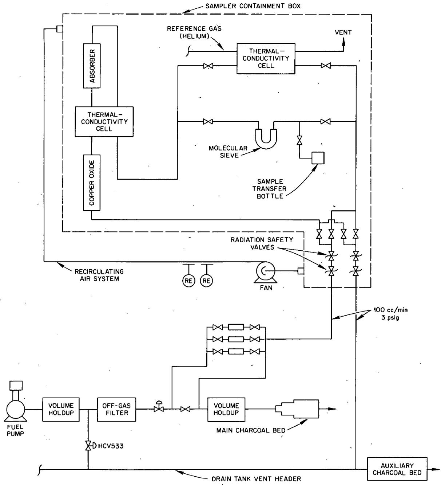  
Fig. 2.1. Schematic Diagram - MSRE Off-Gas Sampler.

5. The total area of the filter elements was increased to 288 in. $^{2}$ . The two new traps, however, differ in that the No. 1 unit has the support screen on the upstream side of the Feltmetal, resulting in an effective filter area of $30\%$ of the total area. The original particle trap had an effective filter area of 22 in. $^{2}$ , so that the relative increase is $4\times$ for unit No. 1 and $13\times$ for unit No. 2.

ORNL-DWG67-4766

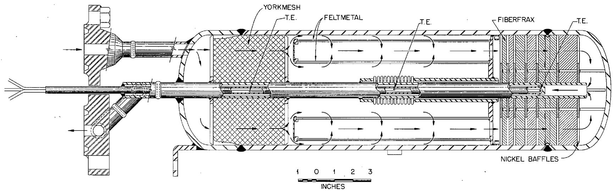  
Fig. 2.2. Line 522 Particle Trap Mark II, Particle Trap Subassembly.

6. The depth of the Fiberfrax section was reduced by about $50\%$ (from $6\frac{3}{4}$ to $3\frac{1}{2}$ in.), because examination of the first trap did not show much oil, even in the first Fiberfrax section.

Specific design data are as follows:

Yorkmesh Section   

<table><tr><td>Material</td><td>304 SS</td></tr><tr><td>Overall size</td><td>6 in. in diam × 4 in. deep</td></tr><tr><td>Total weight</td><td>0.62 lb</td></tr><tr><td>Bulk density</td><td>0.16 g/cm3</td></tr><tr><td>Wire diam</td><td>0.011 in.</td></tr><tr><td>Calculated surface area</td><td>894 in.2</td></tr></table>

Feltemetal Section   

<table><tr><td>Material</td><td>Huyck No. FM 225</td></tr><tr><td>Removal rating - gas service</td><td>98% &lt;1.4 μ</td></tr><tr><td>Size of inner element</td><td>3 in. in diam × 101/2 in. long</td></tr><tr><td>Size of outer element</td><td>51/2 in. in diam × 101/2 in. long</td></tr><tr><td>Effective surface area</td><td></td></tr><tr><td>Unit No. 1 (effective area is reduced by perforated support plate)</td><td>85 in.2</td></tr><tr><td>Unit No. 2</td><td>281 in.2</td></tr></table>

Fiberfrax Section   

<table><tr><td>Material</td><td>Carborundum Co. Long Staple Fiberfrax</td></tr><tr><td>Mean fiber diam</td><td>5 μ</td></tr><tr><td>Packing density</td><td>8 1/2 to 9 lb/ft3</td></tr><tr><td>Total weight</td><td>213.5 g</td></tr><tr><td>Geometry</td><td>Six annular compartments; two each at 
1/4 in., 1/2 in., and 1 in. deep</td></tr></table>

Efficiency and pressure drop tests were made on the new particle traps prior to installation. The results were as follows:

<table><tr><td>Unit No.</td><td>DOP* Efficiency</td><td>Pressure Drop at 15 liters/min</td></tr><tr><td>1</td><td>99.988</td><td>&lt;1 in. H2O</td></tr><tr><td>2</td><td>99.960</td><td>&lt;1 in. H2O</td></tr></table>

\*Dioctylphthalate-polydisperse mean particle size, $0.8\mu$

# 2.6 FELTMETAL CAPACITY TEST

A. N. Smith

The particle trap used in the MSRE off-gas system3 (line 522) contains three filter elements in series: a loose-knit bundle of stainless wire (Yorkmesh), a porous stainless steel cylinder

(Huyck Feltmetal No. FM 225), and a bed of inorganic fibers (Fiberfrax long staple). Sizing calculations for the unit have been hampered in part by a lack of information as to the loading capacity of the Feltmetal. Accordingly, a bench test was performed to develop data which might be used to estimate the life expectancy of the Feltmetal under reactor conditions.

# Assumptions

In designing the experiment the following assumptions were made regarding the reactor off-gas stream:

1. The character of the suspended particles is variable, ranging from crystalline (noble-gas daughter product), to tarlike (oil decomposition products), with various intermediate mixtures.   
2. The particle size is on the order of $1\mu$   
3. The concentration of particles in the off-gas stream is such that the rate of accumulation on the filter is on the order of $1\mathrm{g/day}$ . This estimate is based on the assumption that salt entrainment is negligible, the daughter product deposition rate is $\sim 0.1\mathrm{g/day}$ (approximately $1\%$ of $7.5\mathrm{g}$ of $^{235}\mathrm{U}$ per day), and the pump oil leakage averages $4\mathrm{g/day}$ , of which $25\%$ is converted to solids which are deposited on the particle trap.

# Experimental Procedure

Particles suspended in a helium carrier stream were passed through samples of the Feltmetal (see Fig. 2.3). Ducting upstream and downstream of the filter was glass, permitting direct observation of the flowing stream. The geometry was such that particles on the order of $5\mu$ and larger could be expected to settle out before reaching the filter element.

The particles were generated by evaporation of hexane from very fine droplets of hexane solution containing the solid under study, which was aspirated into the flowing gas stream. The concentration of these solutions and the flow conditions at the aspirator were held constant, such that the particle size could be expected to be the same for the three solids studied. Dave Moulton of Reactor Chemistry was responsible for conception and development of the particle generator. The test was divided into two phases:

1. The change in load capacity as a function of particle character was checked by using three different solids: naphthalene, stearic acid, and paraffin.   
2. Using stearic acid, the effect of support screen position on load capacity was measured. The support screen, a thin perforated metal sheet, is normally placed on the downstream side of the Feltmetal to provide mechanical support in the event of excessive pressure drop across the filter. In the MSRE, however, routine backblowing operations had made excessive pressure drop in the reverse-flow direction more likely. It was thus desirable to know the effect of providing mechanical support on the upstream side of the filter.

Helium flow during all tests was maintained at 5.3 liters/min. Collection of solids was continued until the pressure drop across the Feltmetal rose to about 3.5 psi. The quantity of solids collected was determined by weighing.

ORNL-DWG67-4767

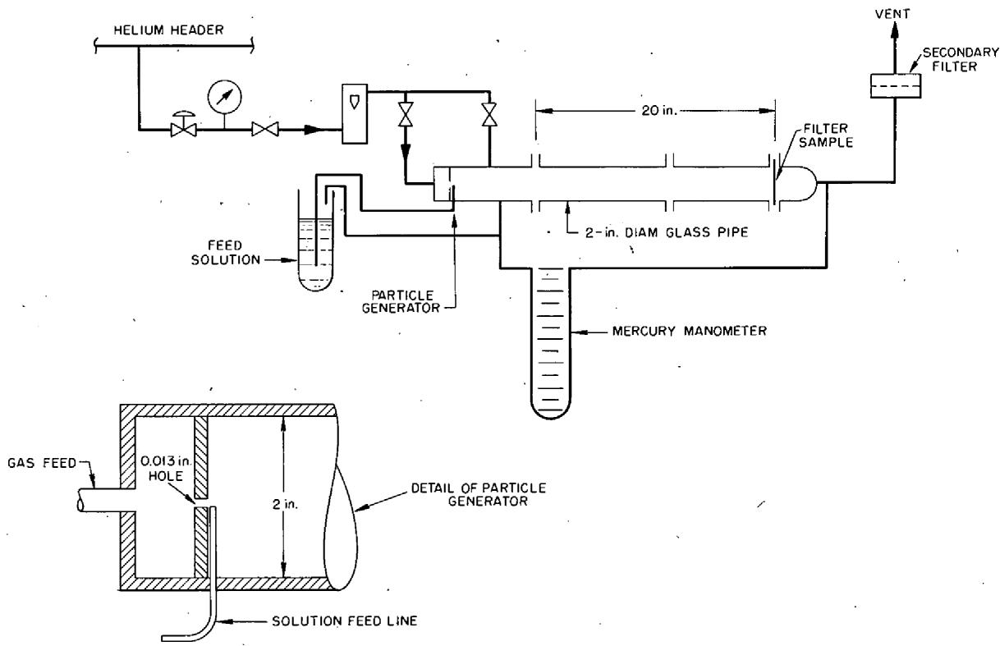  
Fig. 2.3. Capacity Test - Feltmetal (Huyck No. FM 225).

# Results

The test results are summarized in Table 2.1. The relative capacity of the Feltmetal for naphthalene/stearic acid/paraffin was found to be about $1000 / 5 / 1$ . If these figures are applied to the reactor system at a collection rate of $1\mathrm{g/day}$ , the life expectancy of the new MSRE particle trap (see Sect. 2.5) might be as little as 3 weeks or as much as 70 years, depending on the character of the material collected. This estimate is based on a Feltmetal area of 280 in. $^2$ and a permissible pressure drop of 5 psi.

The capacity of the Feltmetal with the support plate on the upstream side was found to be about $25\%$ of the capacity obtained with the support plate on the downstream side. This result is in reasonable agreement with the calculated value of $30\%$ free area for the support screen.

# 2.7 EXAMINATION OF THE MK I OFF-GAS FILTER

Dunlap Scott

A. N. Smith

The Mark I particle trap, which had been installed in the fuel system off-gas line in April 1966, was replaced in September 1966 with a new trap of identical design. In October 1966 the old.

Table 2.1. Loading Capacity of Huyck Feltmetal No. FM ${225}^{a}$   

<table><tr><td>Type of Solid</td><td>Weight Collected (g/in.2)</td><td>Final ΔP (psi)</td><td>Unit ΔP (psi g-1in.2)</td></tr><tr><td colspan="4">Capacity for Different Types of Solids</td></tr><tr><td>Naphthalene</td><td>0.96</td><td>0.058</td><td>0.06</td></tr><tr><td>Stearic acid</td><td>0.31</td><td>3.6</td><td>12</td></tr><tr><td>Paraffin</td><td>0.06</td><td>3.9</td><td>65</td></tr><tr><td>Support Plate</td><td>Final ΔP (psi)</td><td colspan="2">Weight Collected (g)</td></tr><tr><td colspan="4">Capacity vs Support-Plate Position</td></tr><tr><td>Upstream</td><td>3.6</td><td colspan="2">0.186</td></tr><tr><td>Downstream</td><td>3.5</td><td colspan="2">0.73</td></tr></table>

${}^{a}$ Carrier gas was helium at a flow of 5.3 liters/min.

trap was taken to the hot cells for testing and examination. Pressure drop tests were performed, after which disassembly, examination, and sampling were done; the samples were analyzed by the Analytical Chemistry Division. A description of this work is given below.

# Pressure Drop Tests

The setup for the pressure drop tests is shown in Fig. 2.4. Helium was metered to the particle trap through a calibrated flowmeter at a metering pressure of 10 psig. Flow was controlled at V-1, and the pressure drop was assumed to be the PI reading, since the gas was vented to the hot cell (cell pressure controlled at -1.5 in. $\mathrm{H}_2\mathrm{O}$ ). After the total drop through the unit was determined at various flows, three $1/4$ -in.-diam holes were drilled through the wall of the trap to permit the flow to short-circuit to the cell without passing through the Fiberfrax section, and the pressure drop measurements were repeated. The test results are plotted in Fig. 2.5. Also shown in Fig. 2.5 are the results of the pressure drop measurements made on the clean filter before installation in the MSRE off-gas system.

The pressure drop data before and after reactor service indicate the following:

1. The pressure drop after service was about 20 times the "clean" pressure drop. Assuming orifice-type flow, this would represent a reduction in flow area of about $80\%$ .   
2. The bulk of the pressure drop occurred in the Yorkmesh and Feltmetal sections of the filter. Thus the Fiberfrax section was essentially clean.

The particle trap was in service in the reactor off-gas line during the operating period from April 1966 through July 1966. During this time the pressure drop across the particle trap exhibited wide fluctuations. Increases were usually, but not necessarily, associated with periods of power

ORNL-DWG 67-4768

① YORKMesh 304 STAINLESS STEEL   
② COARSE FELTMETAL   
③ FINE FELTMETAL   
④ FIBERFRAX

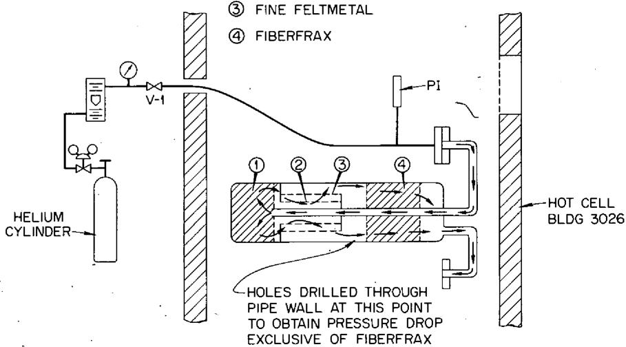  
Fig. 2.4. Pressure Drop Test - MSRE Particle Trap No.1.

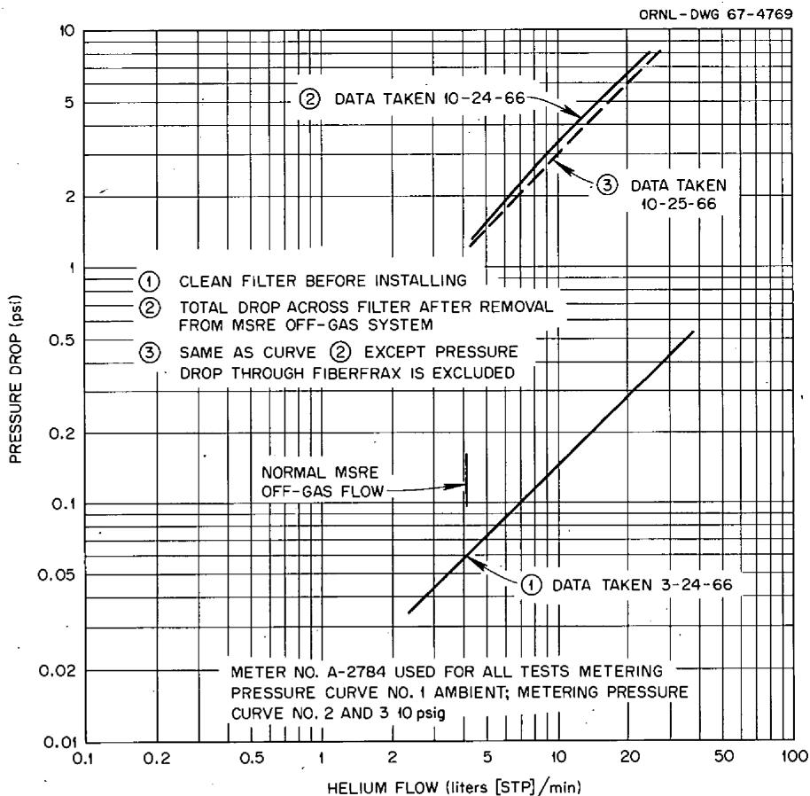  
Fig. 2.5. Pressure Drop Results - MSRE Trap No. 1.

operation. Decreases were sometimes unexplained and at other times were associated with deliberate attempts to clear the trap, such as reverse-blowing with helium. Table 2.2 shows steady-state values for the particle-trap pressure drop at various times during the April to July 1966 period. The fluctuations in pressure drop seem to indicate that material was alternately deposited and then removed by increased pressure drop or breakdown (such as by thermal or radiation effects). The maximum pressure drop of 9.7 psi would indicate a flow area reduction of about $95\%$ .

# Disassembly

The particle trap was disassembled to permit examination of the three main sections of the trap. The cuts were made with a band saw which is part of the hot-cell equipment in the HRLEL. All operations of handling, cutting, shifting, disassembling, sampling, weighing, photographing, and preparing samples for shipment were done by the experienced operators of the HRLEL using manipulators with direct and periscopic viewing, and the work suffered very little from the remote handling requirement.

The first cut was made at section A-A, 5 in. above the lower weld (Fig. 2.6). This point was chosen to permit removal of the bellows section of the inlet pipe as well as the upper section of the coarse and fine filter sections.

A second saw cut was made through the upper filter at section B-B to get a closer look at a deposit on the lower surface of the upper end flange.

# Observations

Yorkmesh Section. - The area of the Yorkmesh which had been immediately below the inlet pipe was covered with a blue-gray to black mat which had completely filled the space between the wires of the mesh (Fig. 2.7). The shape of the mat corresponded to the bottom of the inlet

ORNL-DWG 66-11444R

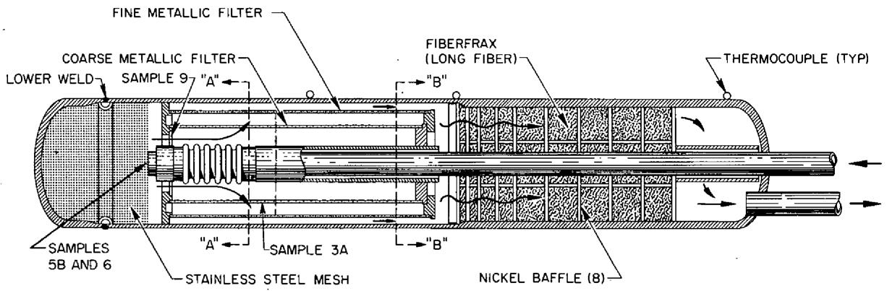  
Fig. 2.6. Location of Sample Points in Particle Trap.

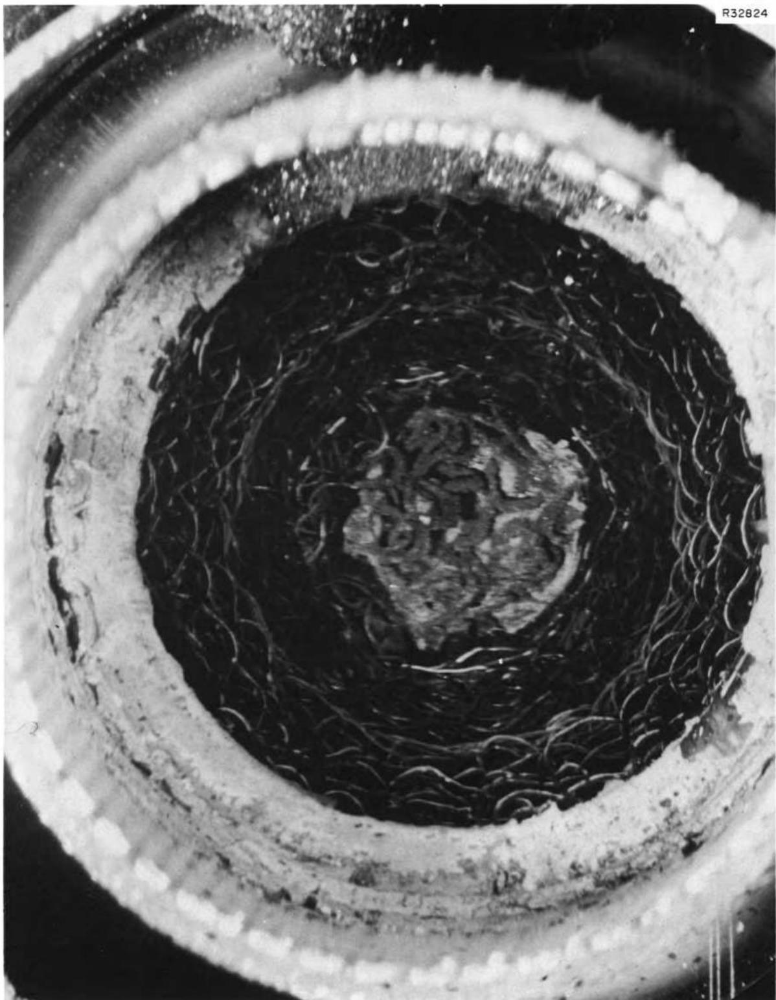  
Fig. 2.7. Inlet to Yorkmesh Section MSRE Particle Trap Mark I.

Table 2.2. Pressure Drop Experience - Particle Trap Mark I   

<table><tr><td>Date and Time</td><td>Particle Trap Pressure Drop at 4.2 liters of Helium per min (psi)</td><td>Reactor Power at Time of Reading (Mw)</td></tr><tr><td>Before installation</td><td>0.06</td><td></td></tr><tr><td>4-4-66</td><td>&lt;0.1</td><td>0</td></tr><tr><td>4-8-66</td><td>1.1</td><td>0</td></tr><tr><td>4-9-66</td><td>0.9</td><td>0</td></tr><tr><td>4-10-66</td><td>2.8</td><td>0</td></tr><tr><td>5-20-66</td><td>9.7</td><td>6</td></tr><tr><td>5-31-66</td><td>2.2</td><td>0</td></tr><tr><td>6-8-66</td><td>0.8</td><td>0</td></tr><tr><td>7-16-66</td><td>8.7</td><td>7.1</td></tr><tr><td>7-16-66</td><td>2.8</td><td>0</td></tr><tr><td>9-16-66</td><td>1.3</td><td></td></tr><tr><td>(2 months after shutdown)</td><td></td><td></td></tr><tr><td>Hot-cell test</td><td>1.2</td><td></td></tr></table>

pipe, and it is likely that this material was the major restriction to gas flow during the operation in the reactor.

Since the inlet pipe temperature probably increased several hundred degrees during power operation of the reactor, it is believed that this restriction behaved much like a thermal valve. This could account for the unexpected increase in pressure drop while at power and the decrease in pressure drop when the power was reduced. In laboratory tests using a sample of the porous metal to filter an oil mist, a rise in temperature caused a decrease in the pressure drop of a loaded filter. This predictable-result was attributed to boil-off of the oil.

A radiation survey made around the outside surface of this lower section of the trap gave readings ranging from 6900 to $8000\mathrm{r / hr}$ . The probe read $11,400~\mathrm{r / hr}$ when inserted into the position formerly occupied by the inlet pipe. The radiation level dropped off to $4100\mathrm{r / hr}$ at the bottom of the trap. The bottom of the inlet pipe had a deposit of blackish material which corresponded to that in the Yorkmesh. The inside of the inlet pipe at the upper end of the bellows appeared clean and free of deposit. The exterior of the bellows had some of the light-yellow powdery material on a background of dark brown.

The outer shell of the lower section was slit at the weld, and the Yorkmesh was removed. It was found that the surface of the outer wires of the mesh bundle was covered with a thin layer of amber-colored organic material. Much of this material evaporated from the heat of the floodlamp used to make the photographs.

As the bundle was unrolled, the color of the film on the wire changed from amber to brown to black near the center. The black material was thicker than the wire by a factor of 2 or 3. This material was brittle, as was the wire, and much of it came loose as the wire was flexed. Samples of this material, designated Nos. 5B and 6, were taken for examination and chemical analysis.

A piece of the wire covered with the black material was removed and mounted for metallographic examination, and it was found to be heavily carburized with a continuous network of carbide in the grain boundaries. There was no evidence of melting of the wire; however, the grain growth and other changes indicated operating temperatures of at least $1200^{\circ}\mathrm{F}$ . The nonmetallic deposit observed on the wire mesh was apparently of a carbonaceous nature and appeared to have been deposited in layers. These "growth rings" were probably the result of off-gas temperature and flowrate changes.

Porous Metal Section. - The perforated plate of the coarse filter section and the lower flange of the filter assembly were covered with a stratified scale (view A-A, Fig. 2.6). The color varied from a very light yellow to orange. One stratum in the lower flange area appeared gray, almost black. A sample (No. 9) was taken of the light-colored material, including some of the black. The perforated plate of the fine filter section was covered with a thin, dark-brown coating, which seemed to be evenly distributed over the surface of the plate. The inner surface of the outer wall of the trap was covered with a light-amber coating, which was also evenly distributed. It is believed that these coatings were deposited by condensation and sputtering of the oil from the adjacent filter and that the dark-brown color indicates that the porous metal screen had operated at a much higher temperature than had the outer wall. The lower surface of the upper flange (view B-B, Fig. 2.6) contained a deposit which had the appearance of organic residue. The deposit was amber colored, and the fractured edge (Fig. 2.8) gave the impression that the material was brittle. There is as yet no explanation for formation of this deposit or how it came to be formed in this particular location.

The radiation level on the outside of this section of the filter read from 200 to $360\mathrm{r / hr}$ . A piece of the inner (coarse) Feltmetal and perforated plate (sample 3A) was removed and examined in the hot cell.

Fiberfrax Section. - The upper section of the filter containing the Fiberfrax was slit open, and the layers were examined. The material at the entrance showed an oillike discoloration, but there was no evidence of any significant accumulation of material. Comparison of the weights of the different layers with the weights of the material originally loaded indicated changes of less than $0.2\mathrm{g}$ .

An interesting observation relates to the very low radioactivity level in this material, even in the entrance section which is separated only by the Feltmetal filter from an area containing material with activity levels of thousands of $\mathrm{r / hr}$ . The only detectable activity above the examination

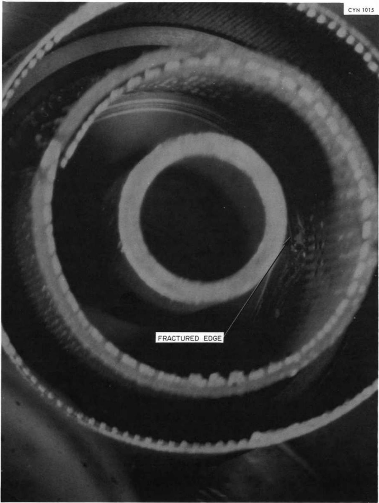  
Fig. 2.8. Upper End of Porous Metal Section - MSRE Particle Trap Mark I.

cell background (4.2 r/hr) was at the discharge end of the Fiberfrax section. It is probable that this activity resulted from pressure transients which could have carried gaseous decay products from the charcoal trap back upstream into the particle trap. Even so, the activity level was only 1.8 r/hr above background.

# Analytical Results

A total of four samples from three different locations (Fig. 2.6) were subjected to a variety of analytical tests. The samples were identified as follows:

# Sample No.

# Taken from

3A

Coarse section of porous metal filter

9

Scale on lower flange of porous metal section

5B

Mat at inlet to Yorkmesh section

6

Mat at inlet to Yorkmesh section

For sections of sample 3A it was found that about the same weight loss (0.2% of sample weight) resulted from heating to $600^{\circ}\mathrm{C}$ in helium as from dipping in a trichlorethylene bath. The material removed by heating was cold trapped and found to be effectively decontaminated; however, the trichlorethylene wash was contaminated with fission products.

Samples 5B and 9 were compared for low-temperature volatiles; at $150^{\circ}\mathrm{C}$ No. 9 lost $5\%$ and No. 5B lost none. When raised to $600^{\circ}\mathrm{C}$ , the weight losses were about the same, $35\%$ for sample 5B and $32\%$ for sample 9. Analysis of the carbon content gave none for sample 9 and $9\%$ for sample 5B. This indicates that sample 9 had not reached as high a temperature as had sample 5B.

The mass spectrographic analysis of sample 6 indicated that there was a very high fraction of fission products. These are estimated to be 20 wt % Ba, 15 wt % Sr, and 0.2 wt % Y. In the same analysis the salt constituents Be and Zr were estimated to be 0.01 and 0.05 wt % respectively.

In addition the material in samples 5B and 6 contained small quantities of Cr, Fe, and Ni, while sample 9 did not. The reliability of these values is compromised by difficulties caused by the presence of organics and small sections of wire in the sample.

The gamma-ray spectrographic work indicated the presence of the following isotopes: $^{137}\mathrm{Cs}$ , $^{89}\mathrm{Sr}$ , $^{103}\mathrm{Ru}$ or $^{106}\mathrm{Ru}$ , $^{110\mathrm{m}}\mathrm{Ag}$ , $^{95}\mathrm{Nb}$ , and $^{140}\mathrm{La}$ .

All three samples were chemically analyzed for Be, and the level was below the detectable limit of $0.1\%$ . Attempts to analyze for Zr were complicated by the presence of large quantities of Sr.

The fraction of soluble hydrocarbons was determined using $\mathrm{CS}_2$ , and the values were 5B, $60\%$ ; 6, $73\%$ ; and 9, $80\%$ . The extract solutions from samples 5B and 6 were allowed to evaporate, and a few milligrams of the residue was mounted between salt crystals for infrared analysis. The samples were identical and were characteristic of long-chain hydrocarbons. There was no evidence of

any functional groups other than those involving carbon and hydrogen. Nor was there any evidence suggesting double or triple bonds. There was an indication of a possible mild cross-linkage. It is likely that there is more cross-linkage of the organic in the gas stream than appeared in these samples, and the low indication could be due to the insolubility of the cross-linked organic and the high operating temperatures of the wire mesh, which would cause breakdown of the organic into elemental carbon and volatiles.

The following conclusions can be drawn from the results of the examination:

1. Since the spectrographic analysis indicated that the concentrations of Be and Zr were very small compared with those of the fission products Ba and Sr, the amount of entrained salt mist carried to the filter was negligible.   
2. The high activity and the large amount of barium and strontium in the inlet section of the particle trap indicate that a large fraction of the solid daughters of Kr and Xe which decay in the line is carried down the line with the off-gas stream.   
3. The distribution of activity indicates that entrance areas of the Yorkmesh were unexpectedly effective in trapping the solid fission products. Decay heat in this area resulted in temperatures above $1200^{\circ}\mathrm{F}$ .   
4. The collection of hydrocarbon mist on the Yorkmesh had probably enhanced the collecting efficiency of the mesh for solid particles.

# 2.8 MIGRATION OF SHORT-LIVED GASEOUS PRODUCTS INTO THE GRAPHITE

# R. J. Kedl

The measured concentrations of various fission products in the MSRE graphite samples were listed as a function of depth in the samples in the previous progress report. Three of these materials are daughters of very short-lived noble gases, $^{140}\mathrm{Ba}$ from (16-sec) $^{140}\mathrm{Xe}$ , $^{141}\mathrm{Ce}$ from (1.7-sec) $^{141}\mathrm{Xe}$ , and $^{91}\mathrm{Y}$ from (10-sec) $^{91}\mathrm{Kr}$ . A model has been developed which evaluates the concentration of "very short-lived" noble gases in the graphite while the reactor is at power. It can be shown that with the reactor at power,

$$
C _ {\hat {g}} = \frac {Q}{\lambda} \sqrt {D _ {s} \in / D _ {\hat {g}}} e ^ {- x \sqrt {\epsilon \lambda / D _ {\hat {g}}}},
$$

where

$C_{g} =$ noble-gas concentration in graphite (atoms per volume of graphite),

$Q =$ noble-gas generation rate in fuel salt (atoms/time, volume of salt),

$\lambda =$ noble-gas decay constant,

$D_{s} =$ noble-gas diffusion coefficient in molten salt,

$D_{\pmb{g}} =$ noble-gas diffusion coefficient in graphite,

$\epsilon =$ graphitevoidfractionavailabletogas,

$\mathbf{x} =$ distance in graphite.

The very short-lived noble-gas concentration distribution in graphite is approached very shortly after the reactor is brought to power. We can therefore compute the longer-lived daughter product concentration distribution as a function of time with the reactor at power. Also, the daughter product concentration can be taken through the period when the reactor is shut down by considering decay only. This model assumes that once a noble gas decays, its daughter is immediately adsorbed by graphite and does not migrate.

Concentration distributions were computed for $^{140}\mathrm{Ba}$ , $^{141}\mathrm{Ce}$ , and $^{91}\mathrm{Y}$ in the MSRE core graphite samples using values of $D_{g}$ obtained from the slope of the distribution curve. The computed values of the concentrations at the surface of the sample are shown in Figs. 2.9, 2.10, and 2.11, together with the measured distributions. For sake of clarity, the computed concentration is shown only at the surface, but the computed internal distribution would be roughly parallel to the measured internal distribution.

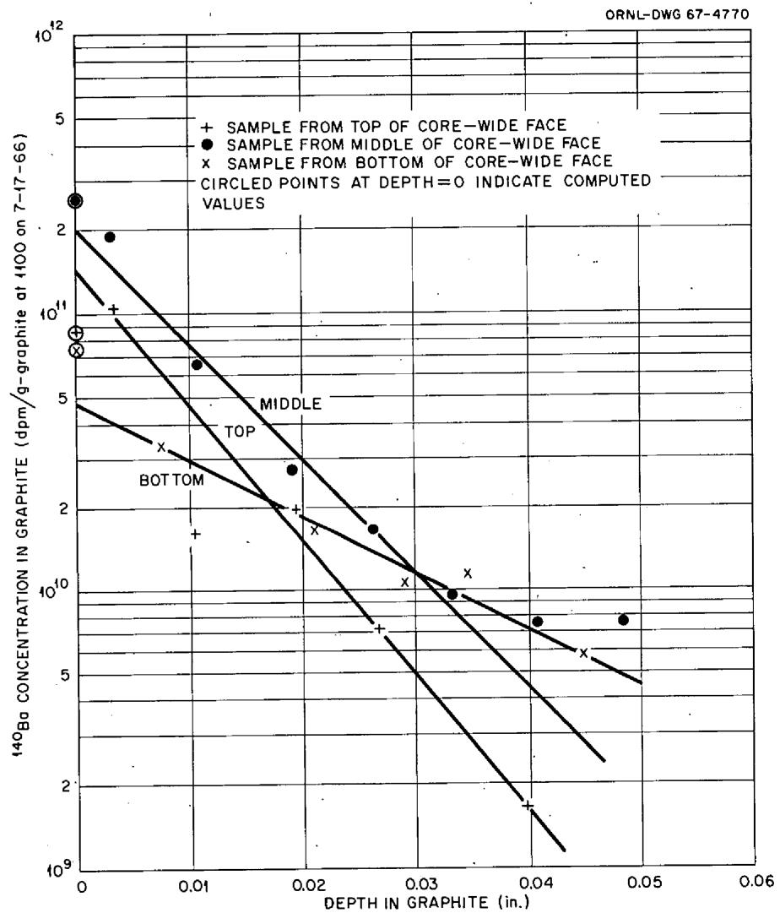  
Fig. 2.9. $^{140}\mathrm{Ba}$ Distribution in MSRE Graphite Samples.

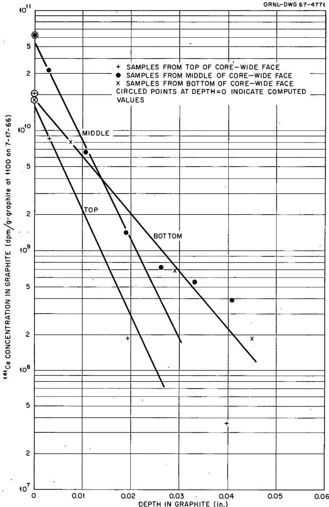  
Fig. 2.10. $^{141}\mathrm{Ce}$ Distribution in MSRE Graphite Samples.

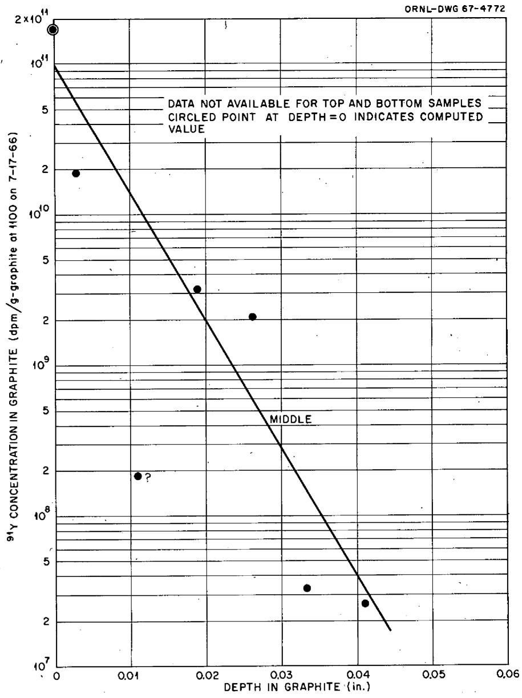  
Fig. 2.11. 91Y Distribution in MSRE Graphite Samples.

# 2.9 REMOTE MAINTENANCE

# R. Blumberg

The reactor shutdown which began in July 1966 extended through October 30. After that the reactor cell membrane was cut three separate times to carry out maintenance operations in the cell. During this period, power production increased from 7822 Mwhr to 16,277 Mwhr at the beginning of the last maintenance operation.

# Summary of Remote Maintenance Tasks Performed

August 26, 7822 Mwhr. - A removable section of off-gas line 522 was replaced. This spool piece was replaced because it was suspected of having a plug of frozen salt. This was the hottest piece removed from the reactor, approximately 2000 r/hr. It was removed with blind flanges on both ends for containment.

September 7, 7822 Mwhr. - Both a control rod and a rod drive from position 3 were replaced. This was routine from a handling standpoint. The lower end of the rod measured $250\mathrm{r / hr}$ on contact.

September 9. - The west space cooler that had been removed the previous period for repair of a water leak was replaced. The assembly had some wipable contamination which was removed at the decontamination facility. There were some local spots of induced radiation of up to $400\mathrm{mr/hr}$ at 6 in. The leak, which existed in a brazed joint, was rebazed directly, under Health Physics supervision.

September 10, October 30. - The sampler withdrawal pipe (line 999, see Sect. 2.1) was thawed. By using a series of remotely manipulated external heaters, we managed to move the frozen salt down the pipe to within 3 in. of the end. The final thawing of this line required using the heat from the circulating flush salt plus that from several small ceramic heaters which had to be remotely positioned in the complex area around the pump tank and line 999. This was a totally unanticipated job, and much of the difficulty was due to the crowding of various equipment into one area.

September 15. - The line 522 particle trap was removed and replaced. The trap which was removed was stored in a dry well at the burial ground using blind flanges for containment. This unit was later retrieved and examined at the HRLEL.

September 16, 7822 Mwhr. - We completed installation of the new graphite and Hastelloy N surveillance samples. This went very smoothly and quickly. (The above operation completed the shutdown which started in July.)

November 5, 10,067 Mwhr. - We installed three external heaters on line 522 at the pump in an attempt to thaw a salt plug (see Chap. 1). This proved to be ineffective. The radiation level at open tool penetration in the portable maintenance shield was $70 \mathrm{r/hr}$ .

November 23, 11, 236 Mwhr. - The plug in line 522 was removed by direct means. External heaters, chisel-type rods, a flexible shaft snake to clear a pipe with two $90^{\circ}$ bends, and a borescope were used on this job. The flexible pipe spool piece was replaced in order to make sure that this line was open; 70 r/hr at tool penetrations was a definite factor in slowing down the work.

December 5, 11,236 Mwhr. - We removed, repaired, and reinstalled valve 960, which controls the component cooling air. Gamma radiation was significantly lower here than for the job on line 522. Induced radiation in the valve (less than $20\mathrm{mr / hr}$ ) was low enough to allow contact repair of the valve stem.

January 16, 16,277 Mwhr. - We replaced 17 "snap-tite" quick disconnects in lines which supply air to operate valves. These disconnects had developed leaks due to radiation embrittlement of an elastomer seal. The replacement fitting does not have any elastomers. The work was started with only three days of decay, and the radiation at open tool holes in the maintenance shield was $60\mathrm{r/hr}$ . The difficult part of this job, from a mechanical handling standpoint, consisted in making up a $\frac{3}{8}$ -in. tubing joint on horizontal tubing at a distance of 20 ft.

While the air lines were being refitted in the reactor cell, a particle trap of improved design was installed in the off-gas system. In this operation all of the existing parts were removed from the area of the old trap, leaving only the inlet and outlet flanges. The new assembly was fabricated in jigs to assure that it would fit the existing flanges. During the course of this job the working area became severely contaminated and had to be cleaned several times.

# Radiation Levels

Radiation levels increased significantly in almost every situation. These are described in Table 2.3, and a plot of in-cell radiation levels vs time is given in Fig. 2.12.

There are several things of interest that one may note from these curves:

1. Both the reactor cell and drain cell radiation levels are increasing as more power is produced.   
2. The radiation level in the reactor cell, with the fuel salt drained, decays at a faster rate than the radiation level in the drain cell with the fuel in the drain tank.   
3. The dramatic increase in radiation level in the drain tanks during the period that the off-gas was vented through the drain tanks (December 23-January 14) gives some indication of how radio-actively hot the off-gas is.   
4. On December 11 after some 23 days of decay, we find that the radiation level at the north wall of the reactor cell is down to $250\mathrm{r / hr}$ from a level of $2000\mathrm{r / hr}$ on November 18. This is an indication of the residual radiation effects that may be of consequence in a shutdown involving handling of major components.

# Table 2.3. Description of Radiation Levels That Affect Maintenance

General background just above portable maintenance shield (PMS) when in place. Usually less than $5\mathrm{mr/hr}$ ; however, over the off-gas line it was 10 to $20\mathrm{mr/hr}$ .

At an open tool penetration. Up to 100 r/hr recorded. Generally 70 r/hr over the off-gas line. 60 r/hr on PCV 919 air disconnect work.

High bay levels when two roof blocks are off. The handling of these blocks and movement of the PMS slide must now be done routinely from the remote maintenance control room. During this operation, there were readings of $20\mathrm{mr/hr}$ in the reactor control room and 40 to $60\mathrm{mr/hr}$ in the hot change house.

Hot spots on top of reactor cell before removal of lower shield blocks but after removal of the upper blocks. We have run into local hot spots as high as $400\mathrm{mr/hr}$ before, but during the most recent shutdown, there was an area reading $2\mathrm{r/hr}$ located along the south edge of block R above the heat exchanger.

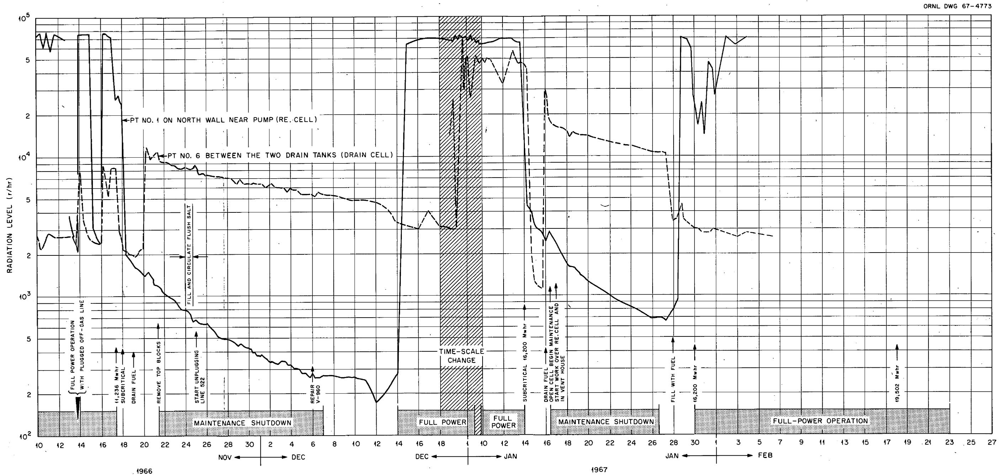  
Fig. 2.12. In-Cell Radiation Levels at the MSRE.

# Contamination

Control of the spread of contamination is becoming more difficult and requires a greater portion of our time and effort. In the effort to remove the plug of frozen salt in the off-gas line 522 (see entry for November 23), a number of very contaminated long-handled tools were accumulated. Rather than risk the spread of contamination in the high bay, these tools were stored in the reactor cell in a sheath of 4-in. pipe. During the replacement of the particle trap in the off-gas system (see entry for January 16), airborne contamination required the use of gas masks and many man-hours of cleanup work.

# Conclusion

The work that was accomplished involved the off-gas system and auxiliary valves. Much of this work was unanticipated, requiring new tools and procedures. In all cases there were tight schedule demands which were met. One may conclude that the increase in skill and experience has been at least equalled by an increase in difficulty arising from the radiation and contamination.

# 3. Pump Development

# 3.1 MSRE PUMPS

# Molten-Salt Pump Operation in the Prototype Pump Test Facility

During the 2631-hr test of the MK-1 prototype pump reported previously, $^{1}$ there was evidence of a restriction in the annulus between the pump shaft and the shield plug at the lower end. Post-test examination revealed the restriction to be salt of a composition similar to that circulated by the pump; so it could not have been produced by condensation of salt vapor. We believe that this salt entered the annulus during a previous loop filling operation. The test loop is filled by pressurizing the drain tank with helium to displace salt into the loop through a fill and drain line. Because there was insufficient salt in the drain tank, the liquid level in the tank dropped to the fill-line entrance before the loop was filled to the desired level. Gas then passed through the line into the loop and raised the level in the pump tank high enough to carry salt into the annulus. Some of the salt froze there and remained when the level subsided as the gas entered the pump tank.

All the loop tests for the MK-1 pump and the testing of spare rotary elements for the MSRE pumps were completed; so the prototype pump tank was removed from the test facility to make way for the MK-2 pump tank.

# MK-2 Fuel Pump

The MK-2 pump was designed to replace the MSRE fuel pump if the pump tank in the reactor system were to fail. The MK-2 pump tank has the same diameter as the MK-1 tank but was made longer to provide the desired expansion volume for salt without an overflow tank below the pump. The longer pump tank made it necessary to increase the unsupported length of the pump shaft. Also, some changes were made in the mechanics of contacting salt and cover gas to remove gaseous fission products from the salt. These and other features of the new pump will be tested before it is considered suitable for use in the MSRE.

Shaft deflection and critical speed tests were performed on the rotary element for the MK-2 pump. The measured critical frequency was 1860 cpm, which compares favorably with the predicted value of 1800 cpm. Fabrication of the pump tank2 is about $70\%$ complete.

# Stress Tests of Pump Tank Discharge-Nozzle Attachment

The discharge nozzles of the MK-1 and MK-2 pumps penetrate the pump tank in the region of the junction of the bottom head with the cylindrical side. This unusual configuration greatly increases the uncertainty in calculation of stresses in the nozzle and the tank wall. Hence we decided to use the MK-1 pump tank to obtain a simple comparison between calculated and measured stresses produced by internal pressure and by forces and moments imposed by the discharge pipe.

A fixture was designed and fabricated for holding the tank and for applying forces and moments to the discharge nozzle. Stress-Coat tests were initiated, and a crack in the tank was found in the heat-affected zone of the weld joining the nozzle to the tank. The Hastelloy N from which the tank and weldments were made came from early experimental heats which are now known to be crack sensitive. We believe that microfissures were present in the welds when the pump was new, and that they enlarged to form a visible crack either under the stresses present during 15,000 hr of operation at temperatures from 1000 to $1500^{\circ}\mathrm{F}$ or during the initial Stress-Coat test. The crack was repaired by welding, and exploratory strain measurements are being made to determine whether we can obtain valid data.

# Spare Rotary Elements for MSRE Fuel and Coolant Salt Pumps

We reported previously on the testing of the spare rotary elements for the fuel and coolant pumps of the MSRE. The spare element for the coolant pump ran satisfactorily, but the one for the fuel pump leaked oil excessively through the lower shaft seal. The rotary elements are identical except for the impellers and the arrangement of service piping, which is installed at the reactor site. For a time it appeared that replacement of the rotary element of the fuel pump in the reactor might be necessary to overcome the problems of the off-gas system; so we converted the spare rotary element for the coolant pump into a spare for the fuel pump. It is being held in standby for the reactor.

The cause for the excessive seal leakage in the other rotary element was investigated. The stationary part of the seal has a Graphitar ring supported on a stainless steel bellows. The Graphitar ring bears on a carbon steel ring on the pump shaft. The bellows has a weld down one side which increases the stiffness of that side. This lack of uniformity and possibly the way in which the seal was assembled caused the seal surfaces to be not quite parallel or concentric, and the seal leaked excessively. The bellows was adjusted to improve the parallelism and concentricity of the seal rings, the pump was reassembled, and the testing was completed. The rate of oil leakage through the lower seal was only $21\mathrm{cm}^3/$ day at reactor operating conditions.

A fixture for holding the stationary seal element to attain the required machining precision was designed and fabricated and will be used for making seal assemblies in the future.

# Lubrication System

The lubrication pump endurance test $^2$ was continued, and the pump has now run for 31,350 hr, circulating oil at $160^{\circ}\mathrm{F}$ and $70~\mathrm{gpm}$ .

# 3.2 OTHER MOLTEN-SALT PUMPS

# Fuel-Pump High-Temperature Endurance Test Facility

A new drive motor rated for 200 hp at 1800 rpm is being purchased for the salt pump. With the delivery of the motor, the facility will be ready for operation with molten salt at high temperature.

# 4. Instrument Design and Development

# 4.1 INSTRUMENTATION AND CONTROLS DESIGN

R. L. Moore

J. R. Tallackson

# Off-Gas Sampler Design

D. G. Davis

The design of instrumentation and controls for the off-gas sampler1 was continued. This design work was temporarily stopped in April 1966 because of uncertainties concerning the chromatograph and the possible effects of particulate matter found to be present in the off-gas system.2,3 Work on the design of a revised off-gas sampler system was resumed in August and is now essentially complete.

Changes in the original design which affected instrumentation and control were as follows:

1. The chromatograph system included in the original design was removed.   
2. A copper oxide scrubber was added for removal of hydrocarbons from the sample gas.   
3. A second thermal conductivity cell was added for checking efficiency of the copper oxide scrubber.

Revisions to instrumentation and controls included:

1. new heater controls for both the copper oxide scrubber and the thermal conductivity cell,   
2. replacing the single-pen Brown recorder with a two-pen recorder for recording the outputs of two thermal conductivity cells,   
3. additional thermocouples,   
4. changes in power and control wiring and in panel layout.

Except for the above changes, the instrumentation and control for the off-gas sampler remains as previously reported.

Panel fabrication of the new design is approximately $95\%$ complete, and assembly work inside the containment box is approximately $75\%$ complete.

# Control System Design

P. G. Herndon

Control Instrumentation Additions and Modifications. - Further additions to and modifications of the instrumentation and controls systems were made to provide additional protection, improve performance, and provide more information for the operators. Fifty-nine requests for changes in the instrumentation and controls system (or in systems affecting instrumentation and controls) were received and reviewed during the past report period. Of these, 29 requests resulted in changes in instrumentation and controls, 1 was canceled, 9 did not require changes in the instrumentation or controls, and 7 are active requests for which design revisions are either in progress or pending. The remaining 13 requests required changes to process switch operating setpoints. Some examples of these changes follow.

Master Control Circuits. - Two new jumpers and associated circuitry were installed to provide a bypass around the frozen permissive contacts of freeze valves 105 and 106 in the drain tank helium supply valve control circuit. This makes it possible for the operator to transfer fuel salt between drain tanks FD1 and FD2 through the reactor fill lines 105 and 106. To prevent inadvertent transfer of fuel salt to the reactor core, the circuits were originally designed to prevent transfers by this route. Transfers were permitted through the transfer lines only. Operating experience, however, has proved that direct transfers between tanks FD1 and FD2 are quicker and less complicated operations under most circumstances than going through the transfer line.4

The design of the jumper board graphic panel was revised to incorporate recent control circuit changes and a newly devised system of identification for all jumper plug receptacles and lamps. Procurement of four new metal-photoengraved graphic panels, required for this revision, is under way.

Fuel and Coolant Pumps. - The design and installation of circuitry that permits the operators to override all protective interlocks in the coolant-salt circulating-pump control circuit were completed. New operating criteria stipulated that preventing salt from freezing in the radiator is more important than protecting the pump from possible damage resulting from the bypassed interlocks. The design included a manual switch connected directly in the power circuit breaker "close" and "trip" coil circuits. The power distribution system was not altered.

As part of the system revisions made to prevent plugging of the off-gas system, the fuel pump bowl pressure control valve was removed from the system. The change was made because the desired degree of control can be effected by other means, and the space was needed for installation of a particle trap.

Fuel Off-Gas Systems. - To help overcome the operating difficulties caused by intermittent plugging in the main reactor off-gas line, a helium gas supply system was installed in the vent

house. The instrumentation and controls for this system, which include double-stage pressure regulation, high-pressure alarms, variable area flowmeters, and several pressure indicators, were designed to protect the reactor fuel system from the possible application of overpressure and to maintain the integrity of primary containment.

A capillary flow element, FE-524B, was designed, fabricated, and installed in the fuel-pump upper-gas-leddown line 524. This element replaces the matrix type of flow element originally installed in this line. Efforts to remove foreign matter that was plugging this element were unsuccessful.

A bubbler type of level measuring system was installed in the vent house to indicate the water level in the charcoal filter pit. By use of valves, this system can also be used to check the water level in the 522 line filter can. A second 12-point temperature recorder was also installed in the vent house to record charcoal filter bed temperatures. These thermocouples were originally connected to a single-point indicator through a manual selector switch.

To provide additional information, three thermocouples were installed on the electric heater used to heat the top of the charcoal-bed filters.

Load Control. - An instrument system that monitored vibration in the coolant-salt-radiator cooling-air blowers was designed and installed. The system consists of four self-generating elements connected to an electronic vibration signal analyzer. One element is mounted on each bearing of the two large blowers, and each element produces electrical signals proportional to the velocity of the mechanical vibrations. The vibration signal analyzer indicates the average velocity and the peak-to-peak displacement of the vibrations. Prior to installation, the system, including the interconnecting cables, was tested on a calibrated shake table in the ORNL engineering mechanics laboratory in the Y-12 area. All the components, valued at $2500, were obtained from Reactor Division stores and were surplus items obtained from CANEL. In addition to the vibration instruments, a thermocouple was installed in a well drained into each of the four bearing housings and was connected to the data logger through the thermocouple patch panel.

The load setback interlocks were removed from the load control circuits. This action, designed to lower the radiator doors, under certain conditions, to the intermediate or 1-Mw output position, was ineffective because of the difference between predicted and actual loading characteristics of the radiator system. Operating experience has shown that this action reduces the load much less than expected, mainly because the radiator is so well ventilated with the doors closed that the 1-Mw output position is actually at the lower travel limit of the doors.

Auxiliary Systems. - Additional instrumentation was provided for the treated cooling water system, which was modified to eliminate radiolytic gas. The newly installed degassing tank was equipped with an automatic level control system consisting of a differential pressure transmitter, pneumatic recording controller, and a 4-in. valve in the tank discharge line. A new air purge system was also installed to serve both the degassing and surge tanks. Secondary containment was maintained by installing two solenoid block valves, one in the purge supply and one in the

vent line. A low-air-flow alarm switch was also installed in the vent line to give warning that an explosive $\mathbf{H}_2$ mixture may exist in the degassing tank.

A pressure-actuated switch was installed in line 917 at a point upstream from a newly installed filter to annunciate high component-coolant-pump discharge pressure.

A number of instruments in one safety circuit channel are supplied from the 48-v dc bus through a 1-kw inverter; a loss of power to these instruments could cause the reactor to drain unnecessarily. A circuit was designed and installed that will automatically transfer the load from the 1-kw inverter to the reliable power distribution panel IPP3 if the inverter should fail.

Four additional thermocouples were added to the sampler surveillance rig.

Secondary Containment. - Just before the January shutdown of the reactor it was becoming increasingly difficult to maintain the proper atmosphere in the reactor cell because of leaks from the lines supplying air to the in-cell control valves. Several temporary corrective measures such as installing flowmeters to locate the leaks and connecting the operators to a nitrogen supply were taken so that operations could continue until the time for a scheduled shutdown. During the shutdown it was determined that the neoprene O-ring seals in the remote disconnects had failed on some valves. These disconnects were replaced with standard $\frac{3}{8}$ -in. compression-type fittings. The system is now operating satisfactorily.

A fixed bypass restriction is installed between the operator supply and vent lines to provide a path for pressures on the valve operator to equalize so that the valve can move to the fail-safe position when the reactor cell containment block valves close. During normal operations the flow through these restrictors was large enough to cause a pressure buildup in the vent header which produced undesirable effects on other valves connected to the same header. To correct this problem, the vent lines from the reference side of the operators on in-cell control valves $\mathbf{P}_{\mathbf{d}} \mathbf{C} \mathbf{V}-960 \mathbf{A}$ , HCV-919A, FCV-903, and HCV-919B were disconnected from the common vent header and connected to a containment ventilation duct through separate $1/4$ -in.-OD tube lines.

During a routine test, one of the two high-level switches in the vapor-suppression tank was found to be defective. Loss of this switch caused the loss of one channel of information needed to establish that the water level in the tank was correct. Since a second switch failure might require that the reactor be shut down until the switches could be repaired, and since the removal of the switches from the tank is a difficult operation, a bubbler-type level measuring system, which includes a containment block valve and associated safety circuits in the purge supply, was designed and was installed in the reactor-cell vapor suppression tank. This installation utilized a dip tube which was included in the original design in anticipation of such need. This new level system will also enable the operator to check the water level in the tanks as a routine procedure.

Sampling and Enriching Systems. - Except for adjustments to operating switch setpoints and annunciator revisions, the instrumentation and controls on the fuel sampler-enricher have not been changed. Increasing leakage, however, from the fuel sampler-enricher operational valve buffer zone into the sample removal area 1C has made operations difficult with the existing safety interlock arrangement. Alternate circuit arrangements are now being considered.

The annunciator circuits for high radiation in the containment areas of the fuel sampler-enricher were revised for the convenience of the operator. The existing circuits annihilate high radiation directly each time it occurs, and frequent annunciations are normal during certain stages of sampling. The revised circuit operates to block out the annunciator after the first alarm is silenced until the safety interlock circuits are manually reset.

The installation of the fuel processing sampler was completed. Several instrument and control circuit changes which have improved the operation of the fuel and coolant salt samplers were incorporated in this facility.

# 4.2 MSRE OPERATING EXPERIENCE

C. E. Mathews

J. L. Redford

R. W. Tucker

# Control-System Relays

The coils in four of the 120-v ac relays failed during this period. All the relays were in freeze-valve control circuits and had been energized continuously for long periods of time.

Replacements were received for all 139 relays that operate from the 48-v dc system. These relays were overheating and destroying the Bakelite frame due to faulty relay coil design. Twenty of the relays were replaced, and the rest will be replaced at the next convenient shutdown.

# Temperature Scanner System

The oscillosopes on the scanner system that used vacuum tubes were replaced with transistorized units. This has resulted in better operation and reduced maintenance of the scanner system.

A calibrating system was added to the scanners to permit calibration without making external connections to instruments.

# Valves

Control valve PCV-960 for the component-coolant pumps stopped operating properly but could not be repaired until it could be removed from the reactor cell. Repairs were effected by cleaning and lubricating the valve stem and packing.

Equalizing valves were installed on FT-903, which senses cooling-air flow to the pump shroud, so that this instrument loop can be checked with the reactor operating.

# Nuclear Instrumentation

A modified drive tube unit, which provides for controlled cable bends, was installed in wide-range counting channel 1 after a short occurred in the cable to the preamplifier.

A capacitor was installed in the servo system to prevent noise from a Foxboro converter from causing the servo to oscillate.

The fast-trip comparators used in the nuclear system were found to be inoperative if a sufficiently large signal was applied to the input. A diode added to the FTC circuit removed this possibility and was installed on MSRE FTC modules.

Operation of the relay matrix in the nuclear system generated considerable noise, making it difficult to reset the safety-system channels. The existing resistor-diode combination for damping the voltage induced by relay operation was replaced by a Zener diode and a diode combination that was more satisfactory.

# Electronic Switches

A capacitor in an Electra-systems module failed, causing a reactor shutdown. All capacitors in these modules will be tested during the next shutdown. Multiple setpoints were detected on several modules. These were fixed by changing resistors to compensate for transistor aging. The zero bias windings in the magnetic amplifiers in four modules were found to be open-circuited. The magnetic amplifiers were replaced.

# Thermocouples

Thermocouple performance has continued to be excellent.

# Coolant-Pump Radiation Monitor

Radiation monitor RM 6010 has its output recorded by the data logger. However, the range of this instrument can be changed by a switch on the front panel. Since the range was not recorded by the data logger, the actual radiation level recorded was not definite. Additional contacts were added to the selector switch to provide the data logger with the necessary range information.

# Safety System

Five spurious rod scams were experienced during the reporting period. None were caused by malfunction or failure in the reliable rod scam instrumentation. Three of these scams were the result of human errors, and the remaining two were caused by equipment failures. One of these equipment failures was in the radiation monitoring instrumentation, RM-528, on the off-gas line from the coolant circulating pump. This is a two-channel system, and a failure in either channel will stop the fuel circulating pump and thereby reduce the rod scam setpoint to 15 kw. At the time this failure occurred, the reactor was developing over 7 Mw. The other equipment failure was in an overvoltage relay in the 60-kva power supply. The resulting momentary loss of power produced a scam.

# 4.3 DATA SYSTEM

G. H. Burger

C. D. Martin

The reactivity-balance calculation was refined to the point where it now produces meaningful numbers. In order to maintain system continuity in the event of a shutdown and subsequent restart, a program was added that writes information necessary for initialization of the system on the drum memory once each minute and on magnetic tape once each hour. Certain reactivity-balance parameters are among these data. In event of a computer malfunction, which causes an automatic restart of the system, the initialization information last written on the magnetic drum memory is used to restore the core memory. For restart after shutdowns involving malfunctions which may have destroyed the drum data, the last information written on magnetic tape is used to initialize the system. The availability and use of these drum and magnetic-tape data have made the system easier to use and have given an extra margin of continuity assurance against system faults.

Several new operator request functions were added to the system, and a number of others were modified to eliminate some possible conflicts between functions. Functions added included three demand log-type requests that list those scan points on which alarm functions have been modified by previous operator requests. Also added was a request function to facilitate updating (when fuel is added) the numerical quantity of fuel used in the reactivity-balance calculation. Though no new analog signals were added to the scan lists, four contact inputs were added to indicate the range selector switch setting of the electrometer amplifier for the high-level gamma chamber in the coolant cell (RE-6010). The engineering units conversion equation for this signal was modified to read the selector switch position and convert the analog input signal accordingly. This change was made to provide the best possible resolution of the instrument reading under all operating conditions, as this radiation level varies from a few milliroentgens per hour to several hundred roentgens per hour, depending upon the status of the reactor.

The fully implemented Reactor Operator's Computer Manual was completed and was made available in one volume. The manual contains all of the information required for maximum effective utilization of the system in conjunction with reactor operations.

During the reporting period the system was used extensively for routine daily operation and analysis of the reactor. Its utility was very strongly impressed upon us in December when the failure of a bearing in the drum memory unit rendered the system totally useless for several days. With the system out of service, those functions normally performed automatically by the computer had to be done manually – and sometimes painfully. Replacement of the failed bearing was prompt, and the drum was quickly back in service. For some time after the system was restarted, sporadic failures of short duration were experienced. When the drum failed, all system power was shut off. These sporadic failures are thought to have originated with slow changes in the electronics as the system reestablished thermal and electrical equilibrium during the restart.

ON" T1

ME

SCHEDULED SHUTDOWNS

FOR MAINTENANCE AND MODIFICATIONS

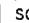

SCHEDULED SHUTDOWNS

FOR MAINTENANCE OF PERIPHERAL EQUIPMEN

ORNL-DWG 67-4774

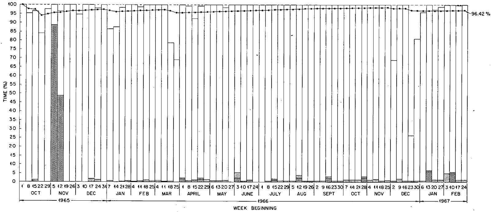  
MSRE COMPUTER TIME AVAILABLE   
Fig. 4.1. MSRE Data System Service Record from Date of Acceptance Oct. 1, 1965, to Mar. 1, 1967.

The failures cited above reduced the overall availability of the system (Fig. 4.1) from the date of acceptance to just over $96\%$ , as compared with $97.31\%$ at the end of the last reporting period. Although the system is operating satisfactorily, there are still several minor problems, apparently in the hardware; they act as follows:

1. occasionally cause the system to block out requests from the operator's console,   
2. cause an automatic restart,   
3. cause erroneous, unreadable data to be written on magnetic tape.

These problems are not very serious, and we have devised methods of circumventing them. They do constitute minor annoyance which we hope to eliminate in the future.

# 4.4 INSTRUMENT DEVELOPMENT

R. L. Moore

G. H. Burger

J. W. Krewson

# Performance - General

Performance of developmental instrumentation installed on the MSRE continued to be generally satisfactory. Although some isolated failures and some deviations from optimum performance occurred, they were minor in nature and were correctable by routine repair and adjustment. No problems were encountered which required the redesign of any of the developmental instrumentation presently installed on the MSRE or the initiation of development of new instrumentation.

Since operation of MSRE developmental instrumentation has become routine, the details of performance are reported in Sect. 4.2. Comments on performance in the following paragraphs are limited to those associated with the initiation or termination of development efforts. Where no mention is made of the performance of a developmental instrument, it may be assumed that performance has been satisfactory and that no modifications or unusual attention has been required.

# Temperature Scanner

Investigation of the feasibility of replacing the mercury switches used in the temperature scanner system with solid-state multiplexers was continued. Results of these investigations showed that none of the commercially available devices considered was suitable for use as a direct replacement for the MSRE switches, and that the cost of all was prohibitive for the intended service. Several of the devices, however, showed promise for use in more conventional temperature-scanning systems in their present form or, with further development, for use in future MSRE-type systems. We have located sufficient mercury-switch spare parts to satisfy foreseeable MSRE requirements, and further investigation of solid-state multiplexers has been indefinitely postponed.

# High-Temperature NaK-Filled Differential Pressure Transmitter

No further progress was made in determining the cause of zero and span shifts in the coolant salt system flow transmitter that failed in service at the MSRE or in the repair and reconditioning of this instrument.[7]

Negotiations with the manufacturer for repair or replacement of the transmitter ordered for use as an MSRE spare are continuing:

# Ultrasonic Level Probe

Since no salt has been transferred to or from the fuel storage tank during this report period, there has been no opportunity to check the effectiveness of modifications of probe circuitry previously reported. They were made to eliminate the excessive frequency drift experienced in the excitation oscillator associated with this probe.

# MSRE Fuel Distillation System Level Probe

A conductivity-type level indicator has been developed for use in a fuel distillation system which will be installed at the MSRE and has been successfully tested in the MSRP level test facility. This level indicator is similar in operation and construction to the conductivity-type system used to obtain single-point indication of level in the MSRE drain tanks, but differs in that the probe is smaller in size, and the new system will provide a usable indication of level changes. The range of this instrument is limited to approximately $30\%$ of the length of the signal generating section, because the signal becomes increasingly nonlinear with changes in maltensalt level outside that range (see Fig. 4.2). With the modification described below, it is considered adequate for use in the fuel distillation system.

A way of reducing the effect of this nonlinearity in the molten-salt level ranges required for this experiment is to increase the length of the signal generating section so that the bottom $30\%$ of the probe covers the desired range. This was accomplished, without exceeding the limitations on overall length of the instrument, by folding the excitation section as shown in Fig. 4.3. The limitations on overall length were due to the limited space around the still. Preliminary drawings for this system have been completed and are now being circulated for approval. This level indicator will be constructed of INOR-8.

# Ball-Float-Type Level Indicator for the Mark II Pump

The design of a float level indicator for the Mark II pump was completed, and fabrication is under way. This instrument differs from the level indicator now installed on the coolant salt

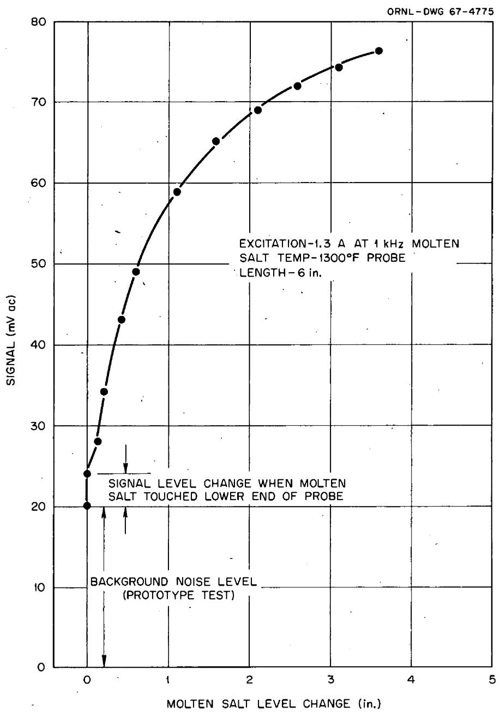  
Fig. 4.2. Conductivity-Type Level Indicator for Fuel Distillation System - Signal Output vs Level.

pump at the MSRE in that the float is inside the pump bowl, and the range is 7 in. instead of 5 in. Also, as previously reported, $^{10}$ the method of transformer mounting will not permit removal for repair or replacement. Once installed, it must remain on the pump bowl until the pump is removed.

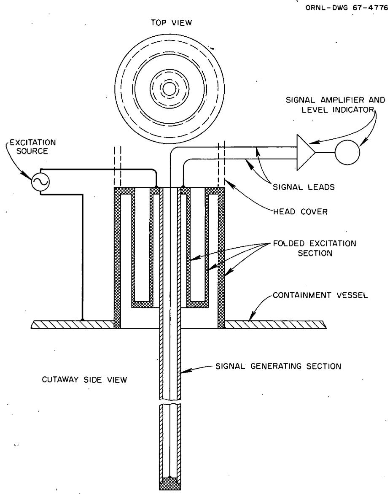  
Fig. 4.3. Conductivity-Type Level Indicator for Fuel Distillation System - Simplified Schematic.

# 5. MSRE Reactor Analysis

# 5.1 NEUTRON REACTION RATES IN THE MSRE SPECTRUM

B. E. Prince

Computer programs presently used for reactor physics analysis permit a fairly detailed representation of the neutron energy spectrum in the central, or most important, region of the reactor core. In the MSRE a small fraction of the total neutron reactions do occur in the regions which surround the central graphite-moderated region (i.e., the peripheral downcomer and the lower and upper salt plenums). In these locations the neutron spectrum can differ somewhat from that in the central region. However, it can be shown that this fraction of the total reactions is quite small, and that reaction cross sections averaged over the neutron spectrum in the graphite-moderated region are accurate enough for estimating important isotopic changes and their associated reactivity effects during MSRE operation.

Programs which have been used extensively for MSRE physics analysis are the GAM-II1 and the THERMOS2 codes. The former calculates the epithermal energy spectrum of the neutron flux (the flux above energies where thermal motion of the moderator nuclei exerts a strong influence on the neutron spectrum). The latter calculates the spectrum in the thermal energy region, together with its dependence on position within the individual cells comprising the lattice of fuel salt and graphite. In each of these programs the actual energy spectrum is approximated by a finite number of energy groups (99 groups in GAM-II spanning the interval 15 Mev to 0.414 ev, and 30 groups in THERMOS spanning the interval 0 to 0.876 ev). The programs intrinsically utilize library tapes of neutron cross sections for each nuclide and energy group, which represent the best current evaluation of experimental cross-section data. The GAM-II program was acquired subsequent to many of the early studies of the nuclear characteristics of the MSRE, most of which are summarized in ref. 3. Results of later analysis using these two programs, in conjunction with few-group diffusion calculations, have been found to be in good agreement with experimental observations in the MSRE.4

The energy dependence of the epithermal and the thermal neutron spectra in the MSRE core at $1200^{\circ}\mathrm{F}$ , obtained from calculations with these programs, is shown in Figs. 5.1 and 5.2. In these calculations the core was represented as a right circular cylinder $(\mathbf{R} \times \mathbf{H} = 29 \times 78$ in.). This choice ensures that the epithermal neutron leakage calculated in the GAM-II idealized model closely approximates the actual gross epithermal leakage from the graphite-moderated region of the MSRE core. For the THERMOS calculations the fuel salt channel and graphite lattice cell was represented as an idealized one-dimensional cell in cylindrical geometry. The control rods were assumed to be withdrawn, and localized perturbations in the spectra caused by the control-rod thimbles were neglected.

In Fig. 5.1 the epithermal neutron flux spectrum is plotted vs lethargy, a dimensionless variable proportional to the logarithm of the neutron energy, namely,

lethargy $= -\ln$ (energy/10 Mev).

In this energy region, where most of the important resonance effects in the neutron reactions occur, the lethargy variable is used for theoretical and computational convenience. For ease of interpretation of Fig. 5.1, we have included a logarithmic energy scale. The calculated fluxes per unit lethargy for each group in GAM-II are shown as solid points, with the points connected by straight line segments. The flux spectrum in Fig. 5.1 is normalized to one source neutron produced from fission. In the GAM-II model this flux spectrum corresponds

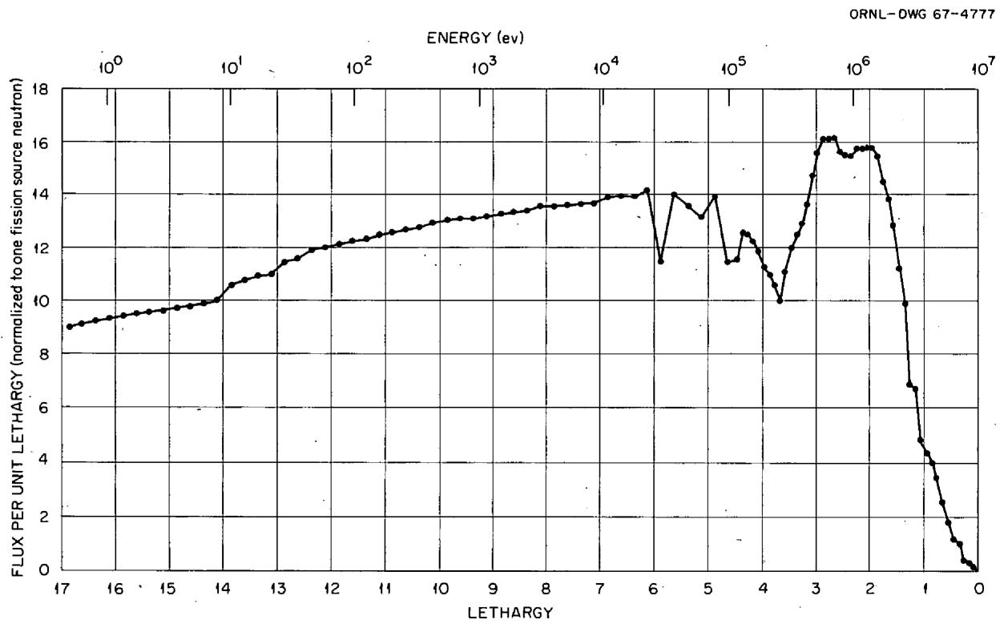  
Fig. 5.1. Calculated Epithermal Neutron Spectrum in the MSRE.

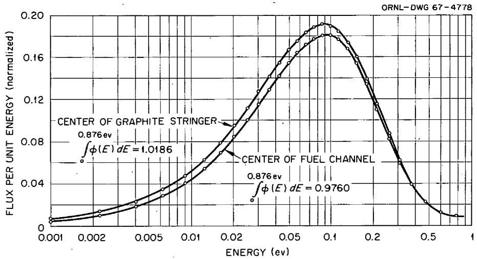  
Fig. 5.2. Calculated Thermal Neutron Spectrum in the MSRE.

to that in a single-region reactor, consisting of a homogeneous mixture of graphite and fuel salt, in which corrections have been introduced for the fuel channel geometric self-shielding of the absorption resonances in $^{238}\mathrm{U}$ . The physical neutron spectrum corresponding most closely to this theoretically calculated flux should be the spectrum within the graphite stringers. From Fig. 5.1 it may be seen that the flux spectrum above about 0.1 Mev exhibits the general characteristics of the fission spectrum. At lower energies (increased lethargies), there is a transition to the spectrum of scattered and moderated neutrons. The irregular dependence on energy of some of the group fluxes in the transition region can be identified with the effects of neutron resonance scattering in the light elements in the fuel salt ( $^{7}\mathrm{Li}$ , $^{9}\mathrm{Be}$ , and $^{19}\mathrm{F}$ ).

Figure 5.2 shows the flux spectrum in the energy region below about 1 ev (0.876 ev has been chosen as the effective upper cutoff energy for the thermal group in the MSRE calculations). In this energy region the cross sections of the important nuclides in the MSRE do not exhibit strong resonance effects, and therefore a smooth curve has been drawn through the calculated group fluxes. Comparison of the curves in Fig. 5.2 shows that, within the fuel salt channel, there is a slight depression or flux disadvantage, together with an energy "hardening," or preferential removal of low-energy neutrons, relative to the graphite. This spatial flux depression is relatively small from the standpoint of estimating reaction rates (maximum depression in the energy-integrated flux is less than $5\%$ , volume averages over the graphite and fuel regions less than $3\%$ ). The local flux spectra shown in Fig. 5.2 are normalized such that the energy-integrated thermal flux, averaged over the total volume of fuel channel and associated graphite, is unity.

Cross sections for the important nuclide constituents in the MSRE, averaged over the spectra shown in Figs. 5.1 and 5.2, are listed in Table 5.1. To obtain the effective cross

Table 5.1. Average Cross Sections for Thermal and Epithermal Neutron Reactions in the MSRE Spectrum   

<table><tr><td>Nuclide</td><td>Cross Section Averaged Over Thermal Spectrum, Energy &lt;0.876 ev (barns)</td><td>Cross Section Averaged Over Epithermal Spectrum, Energy &gt;0.876 ev (barns)</td><td>Effective Cross Section in Thermal Flux (barns)</td></tr><tr><td>\( ^6Li^a \)</td><td>417.5</td><td>17.4</td><td>457.6</td></tr><tr><td>\( Boron^b \)</td><td>330.4</td><td>13.8</td><td>362.4</td></tr><tr><td>\( ^{149}Sm \)</td><td>\( 3.57 \times 10^4 \)</td><td>90.8</td><td>\( 3.6 \times 10^4 \)</td></tr><tr><td>\( ^{151}Sm \)</td><td>\( 2.63 \times 10^3 \)</td><td>126.7</td><td>\( 2.9 \times 10^3 \)</td></tr><tr><td>\( ^{135}Xe \)</td><td>\( 1.18 \times 10^6 \)</td><td>84.6</td><td>\( 1.18 \times 10^6 \)</td></tr><tr><td>\( Nonsaturating^c \)fission products</td><td>20.0 (barns/fission)</td><td>10.0 (barns/fission)</td><td>43.1 (barns/fission)</td></tr><tr><td>\( ^{234}U \)</td><td>39.7</td><td>35.4</td><td>121.4</td></tr><tr><td>\( ^{235}U (abs) \)</td><td>271.9</td><td>24.8</td><td>329.1</td></tr><tr><td>\( ^{235}U (\nu \times fission) \)</td><td>555.4</td><td>37.4</td><td>641.8</td></tr><tr><td>\( ^{236}U \)</td><td>2.6</td><td>17.7</td><td>43.5</td></tr><tr><td>\( ^{238}U \)</td><td>1.2</td><td>9.4</td><td>22.9</td></tr><tr><td>\( ^{239}Pu (abs) \)</td><td>1404.0</td><td>20.5</td><td>1451.3</td></tr><tr><td>\( ^{239}Pu (\nu \times fission) \)</td><td>2411.9</td><td>36.7</td><td>2496.7</td></tr><tr><td>\( ^{58}Fe^d \)</td><td>0.53</td><td>0.036</td><td>0.61</td></tr><tr><td>\( ^{59}Co^d \)</td><td>16.3</td><td>2.6</td><td>22.25</td></tr></table>

$^{\text{a}}$ Cross section for the reaction $^6\mathrm{Li}(n,\alpha)^3\mathrm{H}$   
bNatural-enrichment boron (19.8% 10B).   
Estimated from L. L. Bennett, Recommended Fission Product Chains for Use in Reactor Evaluation Studies, ORNL-TM-1658 (Sept. 26, 1966).   
$d_{\mathrm{Used}}$ in flux wire monitoring.

sections given in the final column of this table, we have used reactor theory to calculate the average ratio of integrated epithermal to thermal flux over the moderated region of the core. These effective cross sections, when multiplied by the magnitude of the thermal flux, give the total reaction rates per atom for neutrons of all energies in the MSRE spectrum. Unless otherwise specified, the cross sections listed in Table 5.1 are for $(n,\gamma)$ reactions. Those nuclide reactions which are of importance in the interpretation of reactivity changes during operation, plus two nuclide reactions which have been used for thermal-flux wire monitoring, are listed in Table 5.1.

Certain high-energy reactions, also of interest in interpreting MSRE operations, are listed in Table 5.2. These include two reactions which have been used for high-energy flux wire monitoring, and those reactions which produce isotopic constituents of interest from the standpoint of fuel-salt chemistry. In general, the reactivity effects of isotopic changes' due to re

Table 5.2. Average Cross Sections and Fluxes for High-Energy Reactions in the MSRE   

<table><tr><td>Nuclide</td><td>Reaction</td><td>E0, Lower Energy Cutoff (Mev)</td><td>Cross Section, Averaged Over Energy Spectrum Above E0 (barns)</td><td>Total Neutron Flux Above E0, Averaged Over Core Volume (1011 neutrons cm-2sec-1Mw-1)</td></tr><tr><td>9Be</td><td>n,2n</td><td>1.83</td><td>0.234</td><td>0.750</td></tr><tr><td>9Be</td><td>n, α</td><td>1.00</td><td>0.0408</td><td>1.563</td></tr><tr><td>19F</td><td>n, p</td><td>4.50</td><td>0.0250</td><td>0.0974</td></tr><tr><td>19F</td><td>n, α</td><td>3.01</td><td>0.0988</td><td>0.271</td></tr><tr><td>54Fea</td><td>n, p</td><td>2.02</td><td>0.1644</td><td>0.629</td></tr><tr><td>58Ni a</td><td>n, p</td><td>1.22</td><td>0.1262</td><td>1.288</td></tr><tr><td>238U</td><td>n, 2n</td><td>6.06</td><td>0.2490</td><td>0.0291</td></tr></table>

${}^{a}$ Used for flux wire monitoring.

actions in this group are quite small compared with those associated with the reactions listed in Table 5.1.

As indicated in Table 5.2, the cross sections are averaged over that portion of the high-energy spectrum of Fig. 5.1 for which the magnitude of the cross section is significant. The lower cutoff energy listed is that value chosen from the GAM-II group structure which corresponds most closely with the physical cutoff energy for the particular reaction considered. The upper cutoff energy is 15 MeV for all reactions. The calculated magnitudes of the neutron fluxes in these energy intervals, averaged over the volume of the core, are also given in Table 5.2.

The effects of isotopic changes due to the reactions considered in Tables 5.1 and 5.2 are described in the following section.

# 5.2 ISOTOPIC CHANGES AND ASSOCIATED LONG-TERM REACTIVITY EFFECTS DURING REACTOR OPERATION

In the MSRE the rate of depletion of the $^{235}\mathrm{U}$ fuel charge is sufficiently low that some convenient first-order approximations can be used in calculating the changes in isotopic composition of the fuel salt. We have assumed that the magnitude and energy spectrum of the neutron flux remain constant during operation at a given power level, and we have used the calculated effective cross sections listed in Tables 5.1 and 5.2. For all isotopic changes occurring in the fuel salt, account has to be taken of the "flux dilution" effect of the time the fuel spends in that part of the circulating system external to the core, out of the neutron flux. Thus the calculated volume-average thermal flux for the entire fuel loop is $6.7 \times 10^{11}$ neutrons $\mathrm{cm}^{-2}$ sec $^{-1}$ Mw $^{-1}$ , whereas the average thermal flux over the core region is $2.0 \times 10^{12}$ neutrons

$\mathbf{cm}^{-2}\sec^{-1}\mathbf{Mw}^{-1}$ . Of the isotopic changes being considered here, only the burnout of the residual $^{10}\mathrm{B}$ in the graphite is determined by the latter flux level.

Rates of production or depletion of important isotopic constituents of the fuel salt, calculated on the basis outlined above, are listed in Table 5.3. The light-element reactions explicitly considered for this tabulation are

$$
{ } ^ { 1 9 } \mathrm { F } ( n , p ) { } ^ { 1 9 } \mathrm { O } \xrightarrow [ 2 9 \text { s e c } ] { \beta ^ { - } } \quad ( { } ^ { 1 } \mathrm { H } \text { ~ p r o d u c t i o n } ) ,
$$

$$
{ } ^ { 6 } \mathrm { L i } ( n , \alpha ) { } ^ { 3 } \mathrm { H } \quad ( { } ^ { 6 } \mathrm { L i } \text { ~ d e p l e t i o n ~ a n d ~ } { } ^ { 3 } \mathrm { H } \text { ~ p r o d u c t i o n ~ } ) ,
$$

$$
{ } ^ { 9 } \mathrm { B e } ( n , \alpha ) { } ^ { 6 } \mathrm { H e } \xrightarrow [ 0 . 8 4 \sec ] { \beta ^ { - } } { } ^ { 6 } \mathrm { L i } \quad \left( { } ^ { 6 } \mathrm { L i } \right. \text { p r o d u c t i o n ) ~ , ~ }
$$

$$
{ } ^ { 1 9 } \mathrm { F } ( n , a ) { } ^ { 1 6 } \mathrm { N } \xrightarrow [ 7 . 4 \text { s e c } ] { \beta ^ { - } } { } ^ { 1 6 } \mathrm { O } \quad \left( { } ^ { 1 6 } \mathrm { O } \right. \text { p r o d u c t i o n ) } .
$$

To a good approximation, all the rates given in Table 5.3 may be assumed constant during a large fraction of the exposure life of the current fuel charge. For example, after one year's operation of the MSRE at $7.5\mathrm{Mw}$ , the maximum corrections due to saturation effects would reduce the concentrations of ${}^{239}\mathrm{Pu}$ and tritium, calculated according to the linear approximation, by about 11 and $4\%$ respectively.

Table 5.3. Isotopic Changes in the Fuel Salt During Reactor Operation   

<table><tr><td>Nuclide</td><td>Rate of Production (+) or Depletion (-) in Fuel-Salt Circulating Systema(g/Mwd)</td></tr><tr><td>1H</td><td>+1.3 × 10-6</td></tr><tr><td>3H</td><td>+4.1 × 10-4</td></tr><tr><td>6Li</td><td></td></tr><tr><td>Depletion</td><td>78.3 × 10-4</td></tr><tr><td>Production</td><td>+0.4 × 10-4</td></tr><tr><td>Net depletion</td><td>-7.9 × 10-4</td></tr><tr><td>16O</td><td>+2.2 × 10-4</td></tr><tr><td>234U</td><td>-5.2 × 10-3</td></tr><tr><td>235U</td><td>-1.30</td></tr><tr><td>236U</td><td>+0.26</td></tr><tr><td>238U</td><td>-0.19</td></tr><tr><td>239Pu</td><td>+0.19</td></tr></table>

$^a$ Calculations based on fuel salt volume of 70.5 ft³.

In addition to the burnup of $^{235}\mathrm{U}$ during power operation, the changes in the concentrations of $^{6}\mathrm{Li}, ^{234}\mathrm{U}, ^{236}\mathrm{U}, ^{238}\mathrm{U}, ^{239}\mathrm{Pu}$ , and the nonsaturating fission products, all in the salt, and the residual $^{10}\mathrm{B}$ in the graphite induce reactivity changes which are important in the analysis of the nuclear behavior of the core. We shall exclude $^{235}\mathrm{U}$ from consideration here, since separate detailed account is taken of its inventory-reactivity changes in the analysis of operations. Most of the remaining effects given above manifest themselves as very slowly developing positive reactivity changes, dependent on the time integral of the power or energy generated. The exceptions are $^{236}\mathrm{U}$ (for which there is a slight increase in concentration resulting from radiative capture in $^{235}\mathrm{U}$ ) and the buildup of nonsaturating fission product poisons.

As a typical example, reactivity effects at 10,000 Mwhr (the approximate exposure at the end of MSRE run 8), corresponding to these isotopic changes, were estimated from reactor theory. The results are given in Table 5.4. In this group the terms of largest magnitude were found to arise from the production of $^{239}\mathrm{Pu}$ and the burnout of the $^6\mathrm{Li}$ initially present in the fuel salt. In addition to the results listed in Table 5.4, an algebraic formula was developed for the irradiation dependence of all reactivity effects included in this group. This is being used in the on-line calculations of reactivity changes during MSRE operation.5

Table 5.4. Reactivity Effects Due to Isotopic Changes in the MSRE   

<table><tr><td>Nuclide</td><td>Approximate Reactivity
Effect at 10,000 Mwhr
(% Δk/k)</td></tr><tr><td>6Li</td><td>0.017</td></tr><tr><td>10Ba</td><td>0.007</td></tr><tr><td>234Ub</td><td>0.001</td></tr><tr><td>236U</td><td>-0.003</td></tr><tr><td>238U</td><td>0.004</td></tr><tr><td>239Pu</td><td>0.051</td></tr><tr><td>Nonsaturating
fission products</td><td>-0.005</td></tr><tr><td>Total</td><td>0.072</td></tr></table>

aThe boron concentration present initially in the MSRE graphite was estimated from MSR Program Semiann. Progr.Rept.July 31,1964,ORNL-3708,p.376.The calculation of the reactivity effect neglects a correction factor accounting for the spatial dependence of the boron burnout in the graphite.   
bIncludes reactivity effects of both depletion of $^{234}\mathrm{U}$ and associated production of $^{235}\mathrm{U}$

# 5.3 ANALYSIS OF TRANSIENT $^{135}\mathrm{Xe}$ POISONING

Studies were continued with the purpose of correlating the time behavior of the $^{135}\mathrm{Xe}$ poisoning observed in the MSRE with calculations from a theoretical model. The mathematical model used for this purpose has been previously described in refs. 6 and 7. In the present section we will give only a qualitative description of the main aspects and assumptions in the theoretical model. We will then compare graphically the calculated buildup and removal of $^{135}\mathrm{Xe}$ reactivity, following changes in power level, with some of the experimental reactivity transients which have been observed from operation to date. Finally, we discuss some tentative conclusions which can be drawn from the currently available evidence.

The theoretical model is an extension of the steady-state model described in ref. 8, to include the transient behavior of the $^{135}\mathrm{Xe}$ reactivity following a step change in reactor power level. In the model chosen, we have assumed that all the $^{135}\mathrm{I}$ produced from fission remains in circulation with the salt. After decay to $^{135}\mathrm{Xe}$ , the xenon migrates to the accessible pores of the graphite at the boundaries of the fuel channels and also to minute helium bubbles distributed through the circulating salt stream. An effective mass transfer coefficient was used to describe the transfer of xenon from solution in the circulating salt to the interface between the liquid and the graphite pores at the channel boundaries. Equilibrium Henry's law coefficients were used for the mass transfer of xenon between the liquid phase at the interface and the gas phase in the graphite pores. The numerical value used for the mass transfer coefficient between the circulating salt and the graphite was based on krypton injection experiments with flush salt circulating in the fuel loop, performed prior to nuclear operation of the MSRE. $^{8}$

Similar considerations were assumed to apply to the mass transfer of xenon from liquid solution to the gas bubbles. The coefficient of mass transfer from the liquid to a small gas bubble, of the order of 0.010 in. in diameter, moving through the main part of a fuel channel, was estimated from theoretical mass transfer correlations. The equilibrium $^{135}\mathrm{Xe}$ poisoning was found to be relatively insensitive to the bubble diameter and mass transfer coefficient, over a reasonable range of uncertainty for these parameters.

The computational model provides for different efficiencies of removal by the external stripping apparatus of xenon dissolved in the salt and that contained in the gas bubbles. The efficiency of removal (fraction of xenon removed per unit circulated through the spray ring) of xenon dissolved in the salt was estimated to be between 10 and $15\%$ , based on some early mockup experiments to evaluate the performance of the xenon removal apparatus.

Calculations of the steady-state $^{135}\mathrm{Xe}$ poisoning, reported in ref. 7, indicated that the low apparent poisoning as a function of power level could be described by a variety of combinations of circulating bubble volume fractions and bubble stripping efficiency. One of the purposes of the transient calculations, therefore, was to attempt to separate those parameter effects which could not be separated in the steady-state calculations.

A number of transient reactivity curves were calculated, with the aid of an IBM 7090 program, based on the theoretical model described above. These calculations were compared with experimental data logged by the reactor's BR 340 on-line computer. The apparent transient $^{135}\mathrm{Xe}$ poisoning was determined by subtracting all other known power-dependent reactivity effects from the reactivity change represented by movement of the regulating rod following a step change in the power level.

In Figs. 5.3-5.13 we have compared some of the transient reactivity curves obtained from this analysis with some experimental transients, in the chronological order in which they were obtained. In each of these figures the solid curves represent the calculated behavior, and the plotted points show the observed experimental reactivity effect. At this date, only a few relatively clean experimental transients corresponding to step changes in power level (for which the 7090 program was devised) have been obtained. However, several characteristics of the $^{135}\mathrm{Xe}$ behavior are indicated from these curves. These will be discussed by considering the figures in order.

Figure 5.3 shows the calculated and observed xenon transients for a step increase in reactor power from 0 to $7.2\mathrm{Mw}$ . The calculations (solid curves) were made for a variety of circulating void fractions $(\alpha_{b})$ to show the effect of this parameter on the xenon poisoning. A single bubble stripping efficiency $(\epsilon_{b})$ of $10\%$ was used for this figure. This relatively low efficiency is approximately equal to the efficiency estimated for the stripping of xenon dissolved in the salt; it was considered to be a lower limit and a reasonable first approximation for this parameter, in the absence of strong evidence for assuming a higher value for the bubbles. The effectiveness of the circulating gas in reducing the poison level is due to the combined effects of the large overall gas-liquid surface area for mass transfer to the bubbles and of the large xenon storage capability of the bubbles (because of the extreme insolubility of xenon in molten salt). Thus the bubbles compete effectively with the graphite for removal of xenon from the liquid, and xenon in the circulating fluid is a less effective poison than that in the graphite because about two-thirds of the fluid is outside the core at any instant. The plotted points represent the observed $^{135}\mathrm{Xe}$ reactivity transient at the beginning of run 7 (July 1, 1966). The data indicate that the low apparent xenon poisoning can be explained by a large void fraction (between 0.5 and 1.0 vol %) and a low bubble stripping efficiency. Note, however, that the transient buildup is not closely fitted by these parameter values.

In Fig. 5.4 the curves indicate the calculated effect of increasing the bubble stripping efficiency for a fixed, relatively small (0.1 vol %) circulating void fraction. The plotted points are for the same reactor xenon transient shown in Fig. 5.3. A comparison of Figs.

5.3 and 5.4 shows that the steady-state xenon poisoning is described as well by a low void fraction with a high bubble stripping efficiency as it is by a high void fraction with a low stripping efficiency. However, the shape of the experimental transient poison buildup is described more closely by the parameter values in Fig. 5.4.

Figures 5.5 and 5.6 show the calculated and observed transient buildup of $^{135}\mathrm{Xe}$ poisoning after a step increase in power from 0 to 5.7 Mw in run 8 (October 1966). The ranges of values of $\alpha_{b}$ and $\epsilon_{b}$ used in these calculations are the same as those used in Figs. 5.3 and 5.4. Again, one finds that the shape of the observed transient is matched more closely by the calculations which assume a low void fraction and a high bubble stripping efficiency.

Figure 5.7 shows the calculated and observed $^{135}\mathrm{Xe}$ reactivity transients for a power reduction from $5.7\mathrm{Mw}$ to 0, with the $^{135}\mathrm{Xe}$ initially at equilibrium. Only the experimental data for the early part of the transient are shown in this figure, since the reactor was made subcritical before the complete xenon transient could be recorded. However, the calculated curves reveal an important characteristic of the transient xenon behavior, which is due to variations in the overall xenon distribution that result from the choice of values for $\alpha_{b}$ and $\epsilon_{b}$ . If the circulating void fraction is low, most of the poisoning effect is due to xenon in the graphite, and only a small amount of xenon is in the circulating fluid. Xenon that is produced in the fluid from iodine decay continues to migrate to the graphite for a period of time after the power (and, hence, the burnout rate in the neutron flux) has been reduced. This produces a shutdown peak in the xenon poisoning. Eventually, the stripping process reduces the xenon concentration in the fluid so that some of the xenon in the graphite can escape and be stripped out. This results in a more rapid decrease in xenon poisoning than simple radioactive decay. As the circulating void fraction is increased, a larger fraction of the xenon inventory (or poisoning) is associated with the bubbles, and there is less xenon migration to the graphite. In this case the shutdown peak tends to disappear. This characteristic makes the shutdown transients somewhat more sensitive to the values of the bubble parameters and, potentially, more useful in the analysis of the xenon behavior.

For the same experimental decay transient as that plotted in Fig. 5.7, Figs. 5.8 and 5.9 show the effect of increasing the bubble stripping efficiency, with the circulating void fraction held fixed at two representative low values (0.10 and 0.15 vol % respectively). Although the section of experimental data for this transient is too limited to allow a valid comparison to be made, it is again seen that the high bubble stripping efficiencies and low circulating void fractions also provide reasonable representation of the observed data. The lack of any apparent shutdown peak in the experimental data, however, seems to suggest that a larger amount of gas may have been in circulation at the beginning of the shutdown (termination of run 8) than was apparent at the beginning of the run (Fig. 5.6).

A second $^{135}\mathrm{Xe}$ stripping out decay transient, somewhat longer than the preceding, was observed during run 9 (November 1966), following reduction in the power level from 7.4 Mw to 0. This transient is shown in Figs. 5.10 and 5.11, where the calculated curves are again based on the assumption of relatively high bubble stripping efficiencies and low circulating void fractions.

In this case a slight rise in the apparent poisoning following shutdown was indeed observed. From comparisons of the results given in these two figures, it appears that, under normal operating conditions, $\alpha_{b}$ and $\epsilon_{b}$ might be bracketed between 0.1 and 0.15 vol %, and 50 to 100% respectively.

Finally, in Figs. 5.12 and 5.13, we show the most recent shutdown transient obtained at the termination of run 10 (Jan. 14, 1967). In this case the apparent $^{135}\mathrm{Xe}$ reactivity transient was recorded for more than 40 hr after the reduction in power level. The results are also in good accord with the conclusions indicated above.

Although substantial progress has been made in interpreting the xenon behavior in the MSRE, the experimental data which have thus far been accumulated for the transient behavior of the $^{135}\mathrm{Xe}$ poisoning are as yet insufficient for any final conclusions to be drawn concerning the "best" values of the circulating void fraction and bubble stripping efficiency. As one example, it should be noted that, if gas bubbles are continuously being ingested into the main circulating stream as the evidence indicates, the volume of gas in circulation is probably not constant, but rather is a slowly varying quantity depending on the level of the liquid in the fuel-pump tank and the transfer rate of salt to the overflow tank. This dependence is as yet not well understood, and future operation is expected to shed further light in this area.

Other refinements of the model for the xenon behavior may be required as reactor operating data are accumulated. These refinements are not expected to strongly affect the conclusions indicated in the preceding description.

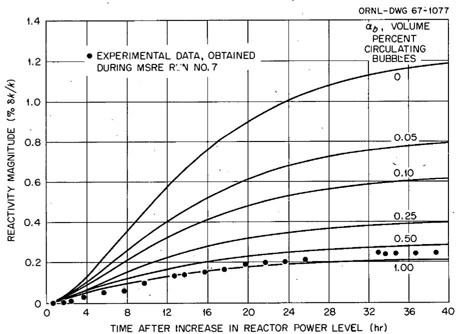  
Fig. 5.3. Effect of Volume of Circulating Gas on Transient Buildup of $^{135}\mathrm{Xe}$ Reactivity. Step increase in power level from 0 to 7.2 Mw; bubble stripping efficiency, $10\%$ .

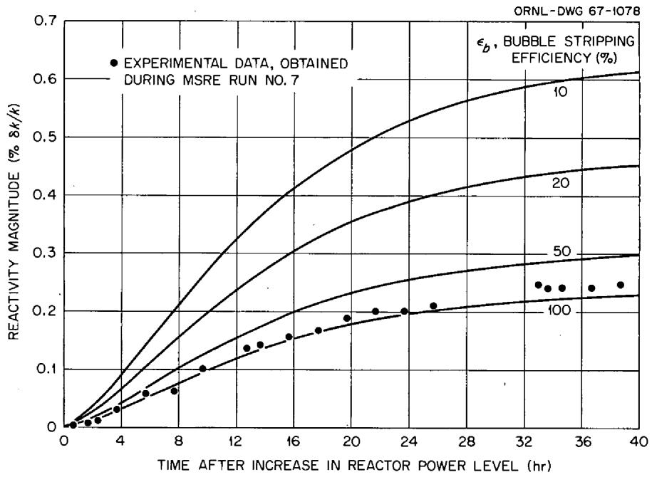  
Fig. 5.4. Effect of Bubble Stripping Efficiency on Transient Buildup of $135\mathrm{Xe}$ Reactivity. Step increase in power level from 0 to $7.2\mathrm{Mw}$ ; vol % circulating bubbles, 0.10.

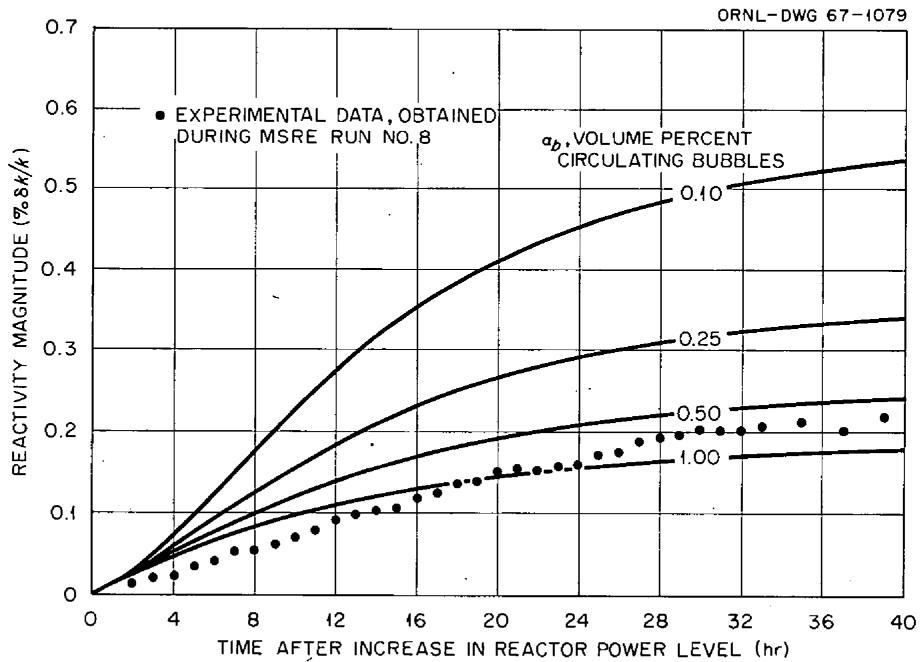  
Fig. 5.5. Effect of Volume of Circulating Gas on Transient Buildup of $^{135}\mathrm{Xe}$ Reactivity. Step increase in power level from 0 to 5.7 Mw; bubble stripping efficiency, $10\%$ :

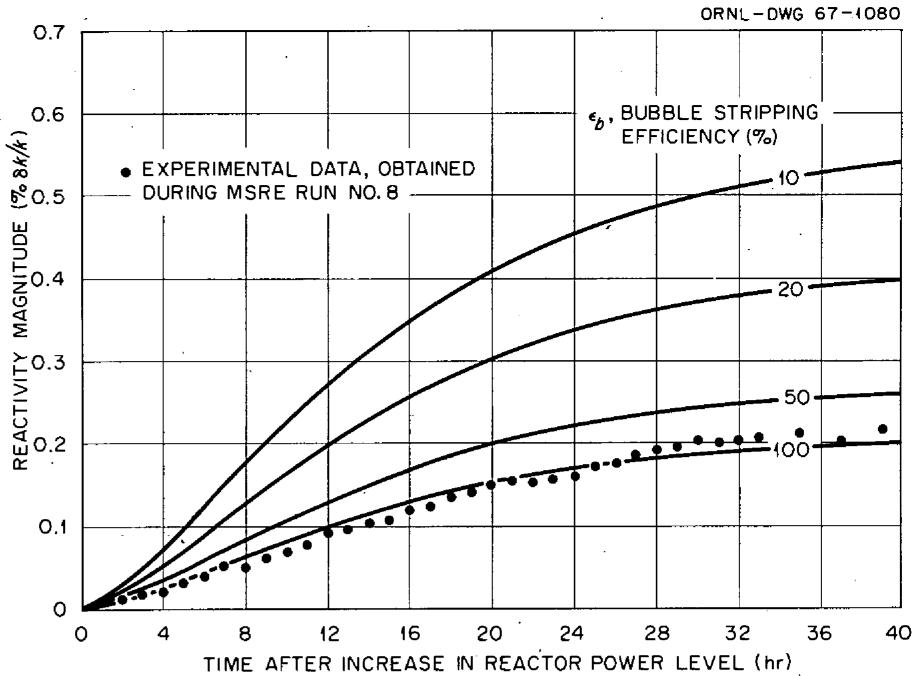  
Fig. 5.6. Effect of Bubble Stripping Efficiency on Transient Buildup of $135\mathrm{Xe}$ Reactivity. Step increase in power level from 0 to 5.7 Mw; vol % circulating bubbles, 0.10.

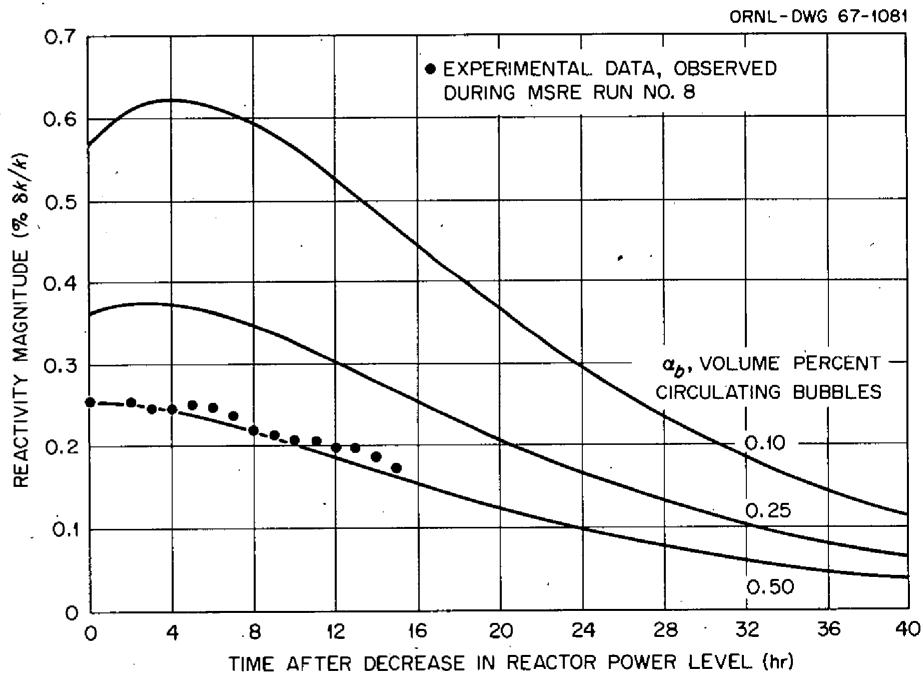  
Fig. 5.7. Effect of Volume of Circulating Gas on Transient Decay of $^{135}\mathrm{Xe}$ Reactivity. Step decrease in power level from 5.7 Mw to 0; bubble stripping efficiency, 10%.

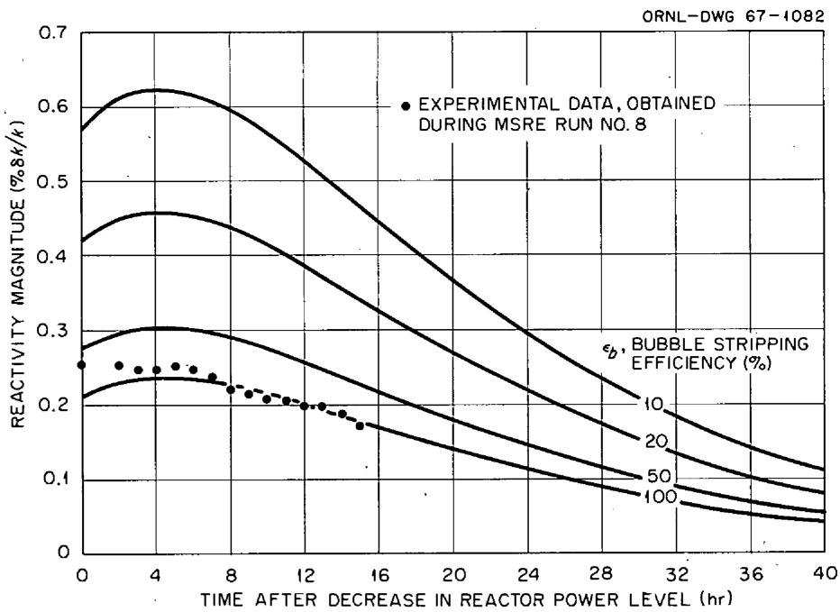  
Fig. 5.8. Effect of Bubble Stripping Efficiency on Transient Decay of $^{135}\mathrm{Xe}$ Reactivity. Step decrease in power level from 5.7 Mw to 0; vol % circulating bubbles, 0.10.

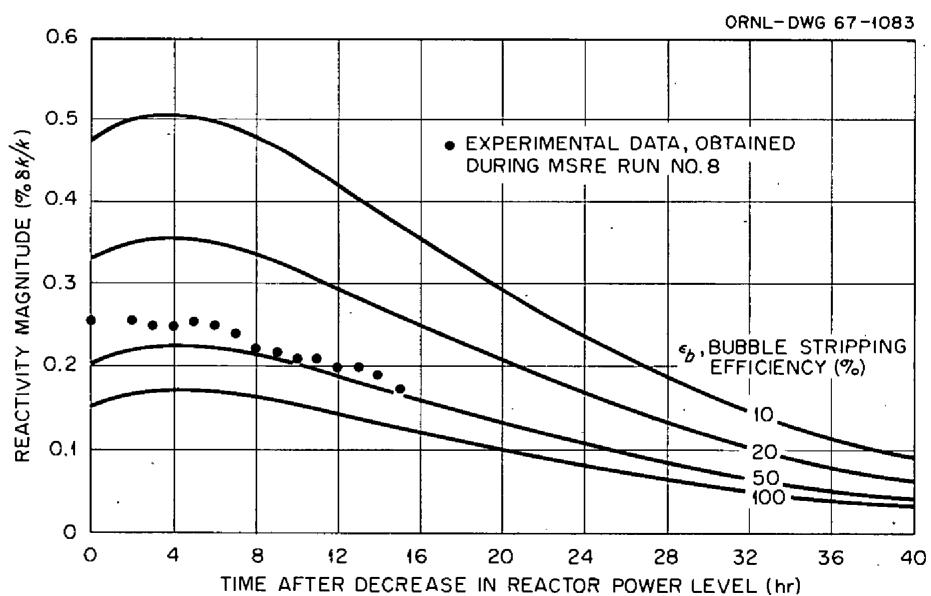  
Fig. 5.9. Effect of Bubble Stripping Efficiency on Transient Decay of $^{135}\mathrm{Xe}$ Reactivity. Step decrease in power level from 5.7 Mw to 0; vol % circulating bubbles, 0.15.

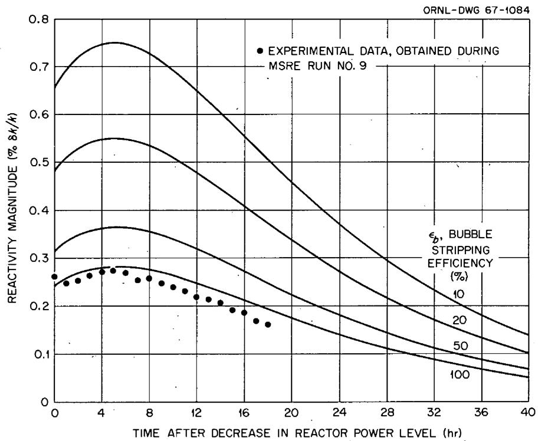  
Fig. 5.10. Effect of Bubble Stripping Efficiency on Transient Decay of $135\mathrm{Xe}$ Reactivity. Step decrease in power level from 7.4 Mw to 0; vol % circulating bubbles, 0.10.

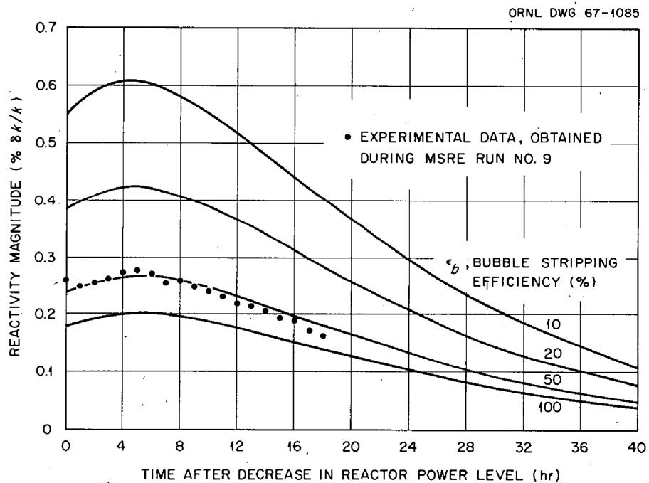  
Fig. 5.11. Effect of Bubble Stripping Efficiency on Transient Decay of $135\mathrm{Xe}$ Reactivity. Step Decrease in power level from 7.4 Mw to 0; vol % circulating bubbles, 0.15.

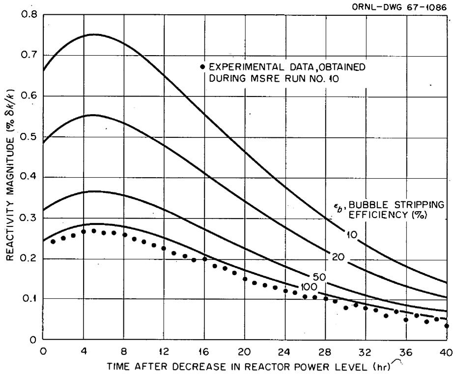  
Fig. 5.12. Effect of Bubble Stripping Efficiency on Transient Decay of $135\mathrm{Xe}$ Reactivity. Step decrease in power level from 7.4 Mw to 0; vol % circulating bubbles, 0.10.

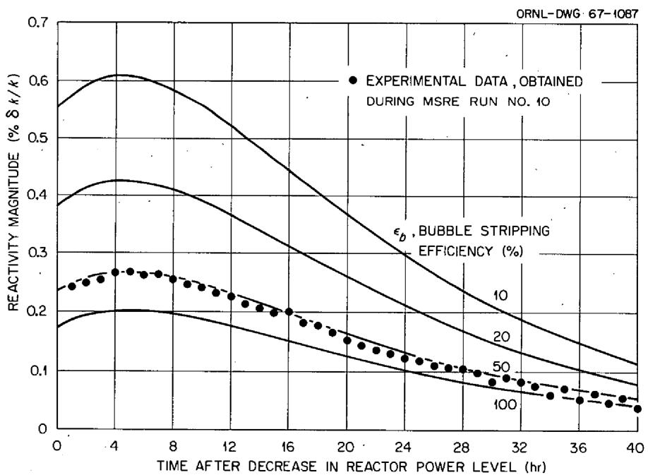  
Fig. 5.13. Effect of Bubble Stripping Efficiency on Transient Decay of $135\mathrm{Xe}$ Reactivity. Step decrease in power level from 7.4 Mw to 0; vol % circulating bubbles, 0.15.

# Part 2. Materials Studies

# 6. Molten-Salt Reactor Program Materials

# 6.1 MSRE SURVEILLANCE PROGRAM - HASTELLOY N

W.H.Cook H.E.McCoy

Several stringers of Hastelloy N test specimens were located in an axial position near the center line of the MSRE for surveillance purposes. These specimens were from heats 5085 (cylindrical vessel) and 5081 (miscellaneous parts). They were removed after $4800\mathrm{hr}$ at $645 \pm 10^{\circ}\mathrm{C}$ , during which the reactor had operated 7612 Mwhr. The peak thermal dose was $1.3 \times 10^{20}$ nvt, and the peak fast dose ( $>1.2$ Mev) was $3 \times 10^{19}$ nvt. $^{1}$ The peak-to-minimum thermal flux over the length of the test specimen array was a factor of 5, but this was not found to be a significant variable in this evaluation. The details of the removal of the specimens have been described previously, $^{2}$ but we want to mention again that there was some bowing at various points along the surveillance assembly. We used an optical comparator to eliminate those specimens bowed by more than 0.001 in, over the gage length.

The surveillance control specimens were exposed to MSRE-type fuel salt and duplicated the thermal history of the in-reactor specimens. They were also bowed, and the ones bowed by more than 0.001 in. were not used.

Samples of both reactor and control specimens were metallographically examined. While the reactor samples had structures that were dirtier than the controls, no major changes in structure were found. No evidence of attack or deposition was found within the gage lengths of any of the samples. However, all test specimens from heat 5085 (both irradiated and control) were found to have a surface layer on the $\frac{1}{4}$ -in.-diam portion of the samples on the sides which were in contact or near contact with the graphite. Such layers were not found on the smaller $\frac{1}{8}$ -in.-diam gage length of the specimens. Figure 6.1 shows the nature of the surface layer on these samples.

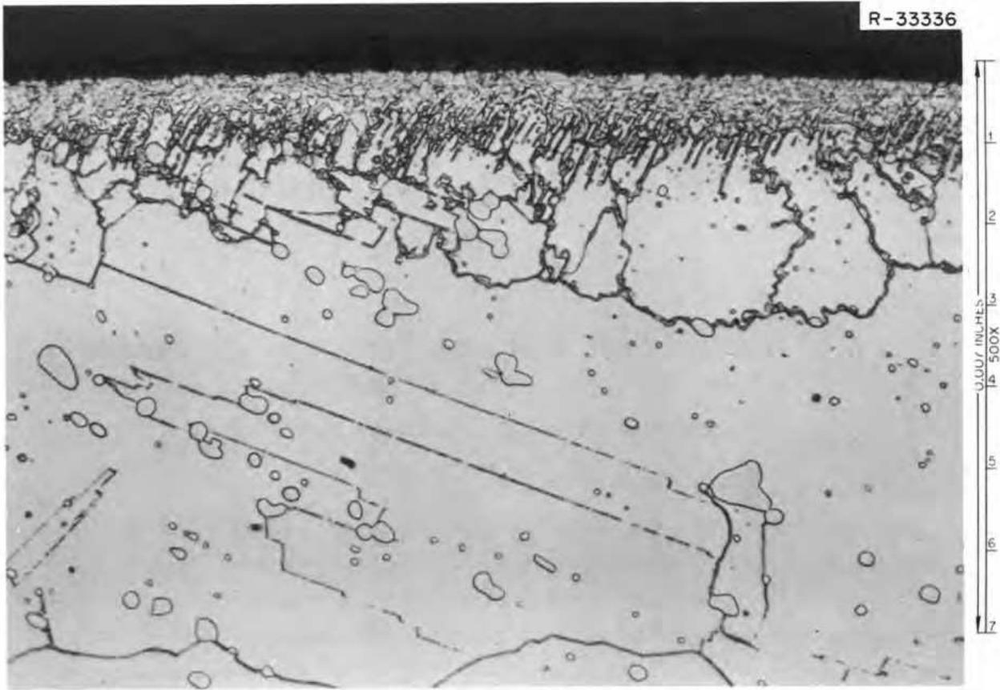  
Fig. 6.1. Hastelloy N Surface from Exposed MSRE Surveillance Samples. Surface deposit from Hastelloy N in near contact with graphite.

Note also the extensive carbide precipitation that has occurred along the grain and twin boundaries during the exposure. A similar surface reaction layer was noted on samples from heat 5081 but did not occur as frequently. The 20-mil-thick Hastelloy N straps (heat 5055) that bound the graphite specimens also had such a reaction product on the sides that contacted the graphite. These straps showed limited ductility when bent at room temperature. They tended to break intergranularly in the reaction region when bent sharply. Although we have not made a positive identification of the surface layer, we assume that it is a carbide produced by a reaction between Hastelloy N and graphite.

Both tensile and creep-rupture tests have been conducted on the surveillance specimens. The creep-rupture testing is not yet complete, so only the results of the tensile tests will be reported.

The total elongation at fracture when deformed at a strain rate of $0.05\mathrm{min}^{-1}$ is shown as a function of temperature in Fig. 6.2. Both heats show some reduction in ductility in the irradiated condition. Heat 5085 exhibited a slight reduction in ductility when tested unirradiated at room temperature, while the irradiated specimen of heat 5081 exhibited the same effect. With the ex

ception of these values, the ductilities remained essentially constant up to temperatures of $500^{\circ}\mathrm{C}$ . At temperatures above $500^{\circ}\mathrm{C}$ , the ductility of the irradiated and the control material decreases with increasing temperature, with the irradiated material showing a greater loss in ductility. At temperatures above 650 to $700^{\circ}\mathrm{C}$ , the control material exhibits improved ductility, whereas the ductility of the irradiated material continues to decrease.

Figure 6.3 compares the properties of the irradiated and control specimens at a lower strain rate, $0.002\mathrm{min}^{-1}$ . Qualitatively, the behavior is very similar to that noted at a strain rate of $0.05\mathrm{min}^{-1}$ . However, the loss in ductility is magnified at the lower strain rate. The variations in the properties of the two heats of material have been reduced to where the differences are minimal.

Figures 6.4 and 6.5 show how the ratio of the irradiated to the unirradiated tensile property varies for heats 5081 and 5085, respectively, as a function of temperature. For both heats, the yield strength is unchanged by irradiation. The ultimate tensile stress is reduced about $8\%$ up to a temperature of about $500^{\circ}\mathrm{C}$ , where the reduction becomes considerably greater. The reduction in ductility at room temperature and at elevated temperatures is also clearly demonstrated.

We have compared the irradiated and control surveillance specimens. Let us now look at how the properties of the control specimens have changed during their 4800 hr of thermal exposure to molten salt. Table 6.1 shows representative properties of heat 5085 after several different heat treatments. The first group of tests was run with the material in the as-received condition (mill annealed 1 hr at $1177^{\circ}\mathrm{C}$ ). Annealing for 600 hr at $650^{\circ}\mathrm{C}$ had no appreciable effects on the properties. The MSRE surveillance specimens were given a 2-hr anneal at $900^{\circ}\mathrm{C}$ before insertion

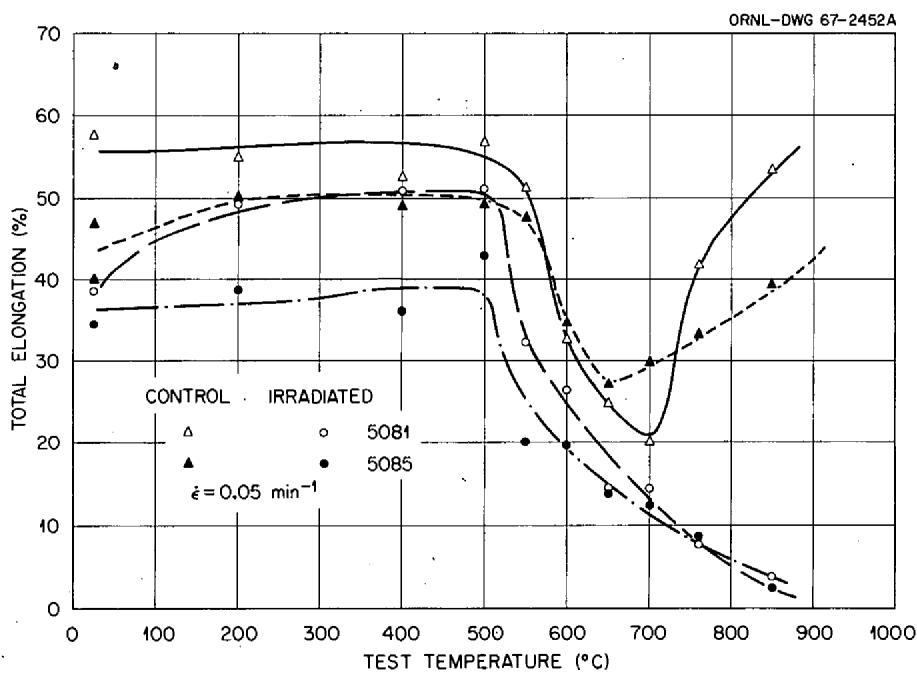  
Fig. 6.2. Comparative Tensile Ductilities of MSRE Surveillance Specimens and Their Controls at a Strain Rate of $0.05\mathrm{min}^{-1}$ .

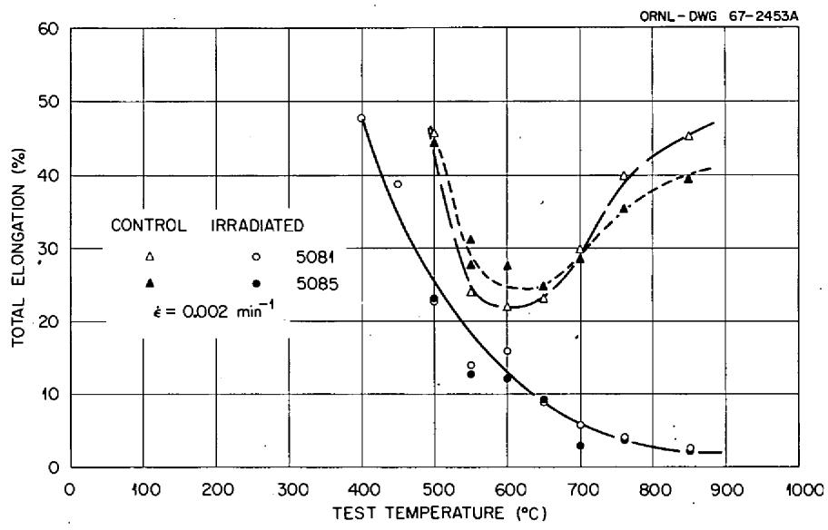  
Fig. 6.3. Comparative Tensile Ductilities of MSRE Surveillance Specimens and Their Controls at a Strain Rate of $0.002\mathrm{min}^{-1}$ .

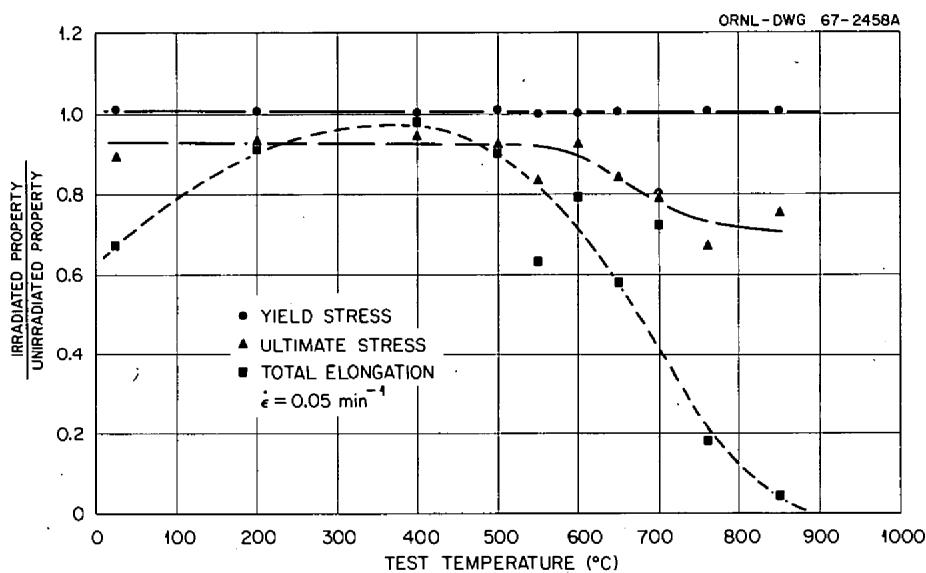  
Fig. 6.4. Comparative Tensile Properties of Irradiated and Unirradiated MSRE Surveillance Specimens, Heat 5081.

into the reactor, and the properties of the material in this state are also indicated in Table 6.1. The properties at $25^{\circ}\mathrm{C}$ were unchanged, and slight reductions in tensile strength and ductility were noted at a test temperature of $650^{\circ}\mathrm{C}$ . After exposure to salt for 4800 hr at $650^{\circ}\mathrm{C}$ , there is a further reduction of $10\%$ in the tensile strength and the ductility. Table 6.2 shows that heat 5081 underwent similar changes at elevated temperatures but did not suffer the reduction in ductility at $25^{\circ}\mathrm{C}$ noted for heat 5085.

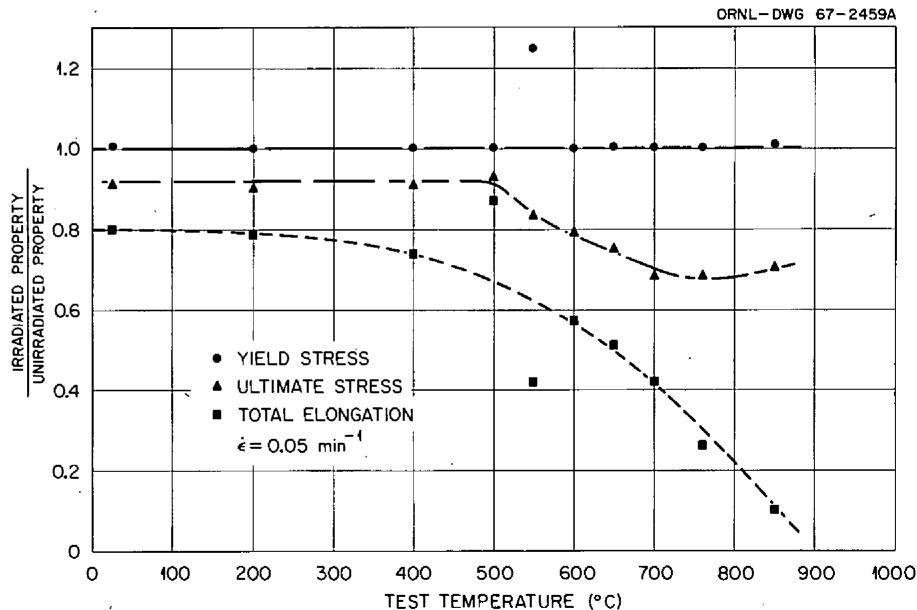  
Fig. 6.5. Comparative Tensile Properties of Irradiated and Unirradiated MSRE Surveillance Specimens, Heat 5085.

Table 6.1. Tensile Properties of Hastelloy N - Heat 5085   

<table><tr><td>Specimen No.</td><td>Heat Treatment</td><td>Test Temp (°C)</td><td>Strain Rate (min-1)</td><td>Yield Stress (psi)</td><td>Ultimate Stress (psi)</td><td>Uniform Elongation (%)</td><td>Total Elongation (%)</td><td>Reduction in Area (%)</td></tr><tr><td>76</td><td>As received</td><td>25</td><td>0.05</td><td>52,200</td><td>116,400</td><td>51.3</td><td>52.5</td><td>56.3</td></tr><tr><td>77</td><td>As received</td><td>427</td><td>0.05</td><td>30,700</td><td>102,900</td><td>57.6</td><td>59.4</td><td>49.9</td></tr><tr><td>284</td><td>As received</td><td>600</td><td>0.02</td><td>32,200</td><td>85,100</td><td>46.6</td><td>47.6</td><td>40.4</td></tr><tr><td>78</td><td>As received</td><td>650</td><td>0.05</td><td>28,700</td><td>80,700</td><td>35.5</td><td>36.7</td><td>33.2</td></tr><tr><td>285</td><td>As received</td><td>650</td><td>0.02</td><td>31,900</td><td>65,000</td><td>25.8</td><td>31.8</td><td>27.2</td></tr><tr><td>283</td><td>As received</td><td>650</td><td>0.002</td><td>30,500</td><td>64,300</td><td>22.6</td><td>24.1</td><td>28.8</td></tr><tr><td>79</td><td>As received</td><td>760</td><td>0.05</td><td>32,100</td><td>61,500</td><td>24.7</td><td>27.0</td><td>31.9</td></tr><tr><td>80</td><td>As received</td><td>871</td><td>0.05</td><td>30,700</td><td>42,300</td><td>9.0</td><td>31.8</td><td>33.4</td></tr><tr><td>81</td><td>As received</td><td>982</td><td>0.05</td><td>23,100</td><td>23,100</td><td>1.8</td><td>40.2</td><td>43.9</td></tr><tr><td>1339</td><td>A.R. + 600 hr at 650°C</td><td>25</td><td>0.05</td><td>41,100</td><td>115,700</td><td>52.5</td><td>52.8</td><td>41.7</td></tr><tr><td>1340</td><td>A.R. + 600 hr at 650°C</td><td>650</td><td>0.05</td><td>33,800</td><td>76,000</td><td>36.8</td><td>37.5</td><td>36.4</td></tr><tr><td>4295</td><td>A.R. + 2 hr at 900°C</td><td>25</td><td>0.05</td><td>41,500</td><td>120,800</td><td>52.3</td><td>53.1</td><td>42.2</td></tr><tr><td>4298</td><td>A.R. + 2 hr at 900°C</td><td>500</td><td>0.05</td><td>32,600</td><td>94,800</td><td>51.2</td><td>54.1</td><td>40.9</td></tr><tr><td>4299</td><td>A.R. + 2 hr at 900°C</td><td>500</td><td>0.002</td><td>33,500</td><td>100,200</td><td>52.0</td><td>53.3</td><td>41.7</td></tr><tr><td>4296</td><td>A.R. + 2 hr at 900°C</td><td>650</td><td>0.05</td><td>29,600</td><td>75,800</td><td>31.7</td><td>33.7</td><td>34.6</td></tr><tr><td>FC-3</td><td rowspan="5">A.R. + 2 hr at 900°C + 4800 hr in MSRE salt at 650°C</td><td>25</td><td>0.05</td><td>45,500</td><td>111,200</td><td>46.8</td><td>46.8</td><td>31.5</td></tr><tr><td>DC-19</td><td>500</td><td>0.05</td><td>33,600</td><td>94,300</td><td>48.8</td><td>49.3</td><td>41.5</td></tr><tr><td>DC-26</td><td>500</td><td>0.002</td><td>33,400</td><td>91,700</td><td>43.3</td><td>44.3</td><td>37.8</td></tr><tr><td>DC-14</td><td>650</td><td>0.05</td><td>31,800</td><td>70,100</td><td>25.8</td><td>26.8</td><td>30.0</td></tr><tr><td>DC-25</td><td>650</td><td>0.002</td><td>31,500</td><td>62,500</td><td>22.8</td><td>24.3</td><td>27.2</td></tr></table>

Table 6.2. Tensile Properties of Hastelloy N - Heat 5081   

<table><tr><td>Specimen No.</td><td>Heat Treatment</td><td>Test Temp (℃)</td><td>Strain Rate (min-1)</td><td>Yield Stress (psi)</td><td>Ultimate Stress (psi)</td><td>Uniform Elongation (%)</td><td>Total Elongation (%)</td><td>Reduction in Area (%)</td></tr><tr><td>4300</td><td>A.R. + 2 hr at 900°C</td><td>25</td><td>0.05</td><td>52,600</td><td>125,300</td><td>56.7</td><td>59.5</td><td>50.5</td></tr><tr><td>4303</td><td>A.R. + 2 hr at 900°C</td><td>500</td><td>0.05</td><td>32,000</td><td>100,300</td><td>57.8</td><td>60.7</td><td>44.4</td></tr><tr><td>4301</td><td>A.R. + 2 hr at 900°C</td><td>650</td><td>0.05</td><td>32,200</td><td>81,800</td><td>31.7</td><td>33.9</td><td>29.9</td></tr><tr><td>4302</td><td>A.R. + 2 hr at 900°C</td><td>650</td><td>0.002</td><td>32,900</td><td>74,900</td><td>29.0</td><td>29.5</td><td>31.8</td></tr><tr><td>AC-8</td><td rowspan="2">A.R. + 2 hr at 900°C</td><td>25</td><td>0.05</td><td>47,700</td><td>118,700</td><td>55.9</td><td>57.6</td><td>48.8</td></tr><tr><td>AC-19</td><td>500</td><td>0.05</td><td>35,800</td><td>97,800</td><td>53.6</td><td>56.6</td><td>46.2</td></tr><tr><td>BC-9</td><td rowspan="3">+ 4800 hr in MSRE salt at 650°C</td><td>500</td><td>0.002</td><td>36,200</td><td>95,300</td><td>46.2</td><td>47.0</td><td>38.1</td></tr><tr><td>AC-27</td><td>650</td><td>0.05</td><td>32,400</td><td>68,400</td><td>23.8</td><td>24.6</td><td>23.1</td></tr><tr><td>AC-17</td><td>650</td><td>0.002</td><td>33,600</td><td>66,700</td><td>22.8</td><td>23.2</td><td>21.6</td></tr></table>

Some of the test specimens have been examined metallographically. Figure 6.6 shows the microstructure of control specimen No. AC-8 from heat 5081, which was tested at $25^{\circ}\mathrm{C}$ . This specimen exhibited good ductility, and this is reflected in the intragranular, shear-type fracture and the lack of intergranular cracking. Figure 6.7 shows the irradiated specimen from the same heat that was tested at $25^{\circ}\mathrm{C}$ . The fracture is largely intergranular, and there are numerous intergranular cracks. The control and irradiated specimens from heat 5085 tested at $25^{\circ}\mathrm{C}$ exhibited the same general characteristics as those illustrated in Fig. 6.7. The other specimens examined were tested at $650^{\circ}\mathrm{C}$ . The failures were all intergranular, with the irradiated specimens exhibiting the typical characteristics of a high-temperature, low-ductility, intergranular fracture.

We compared the ductilities of the surveillance specimens with those for specimens irradiated in other experiments without salt present. Heat 5081 had been irradiated previously in the ORR. $^3$ The ORR experiment was run at $700^{\circ}\mathrm{C}$ to a thermal dose of $9 \times 10^{20} nvt$ , and the material was in the as-received condition. The MSRE surveillance specimens were run at $650^{\circ}\mathrm{C}$ to a thermal dose of $1.3 \times 10^{20} nvt$ , and the preirradiation anneal was different. However, none of these differences are thought to be particularly significant, and the results compare rather well. Figure 6.8 shows that the postirradiation ductilities of heat 5081 after both experiments are very similar.

The most important question to be answered concerning these data is how they apply to the operation of the MSRE.

The surveillance specimens were exposed to a thermal dose of $1.3 \times 10^{20} \, \text{nvt}$ . (The MSRE vessel will reach this dose after about 150,000 Mwhr of operation.) This burned out about $30\%$ of the $^{10}$ B and produced a helium content of about $10^{-5}$ atom fraction in both heats. The high-temperature tensile properties are exactly what we would expect for this dose. Our in-cell and postirradiation creep tests, on several MSRE heats, indicate that the creep ductility will be in the range of 0.5 to $3\%$ , with the higher values being noted for lower stresses (or longer rupture

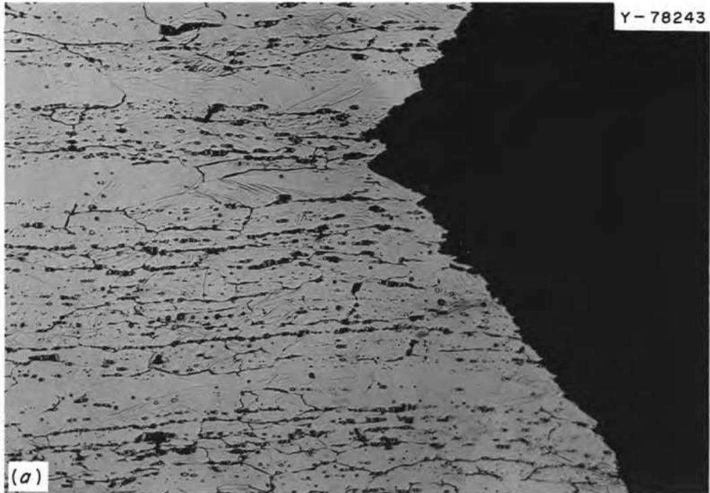  
0.035 INCHES 100X

Fig. 6.6. Microstructure of Hastelloy N (Heat 5081) Exposed to Salt for 4800 hr at $650^{\circ}\mathrm{C}$ . Tested at $25^{\circ}\mathrm{C}$ at a strain rate of $0.05\mathrm{min}^{-1}$ (specimen No. AC-8). Etchant: glyceria regia. (a) Fracture. (b) Edge about $\frac{1}{2}$ in. from fracture.   
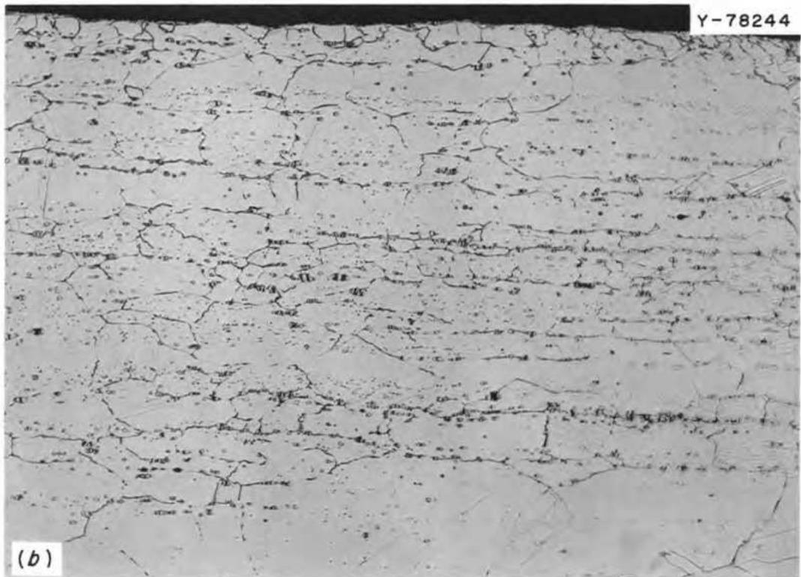  
0.02S INCHES 100x

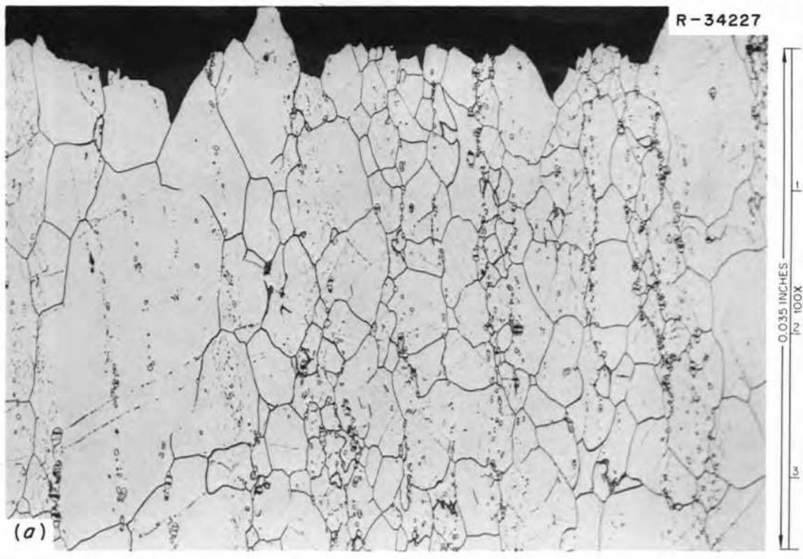

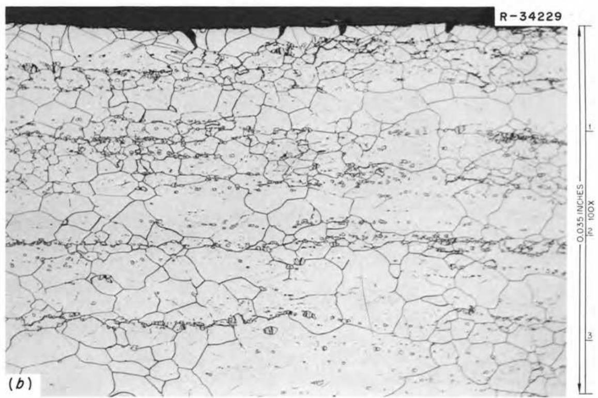  
Fig. 6.7. Microstructure of Hastelloy N (Heat 5081) Exposed for 4800 hr in the MSRE at $650^{\circ}\mathrm{C}$ . Tested at $25^{\circ}\mathrm{C}$ at a strain rate of $0.05\mathrm{min}^{-1}$ (specimen No. D-16). Etchant: glyceria regia. (a) Fracture. (b) Edge about $\frac{1}{2}$ in, from fracture.

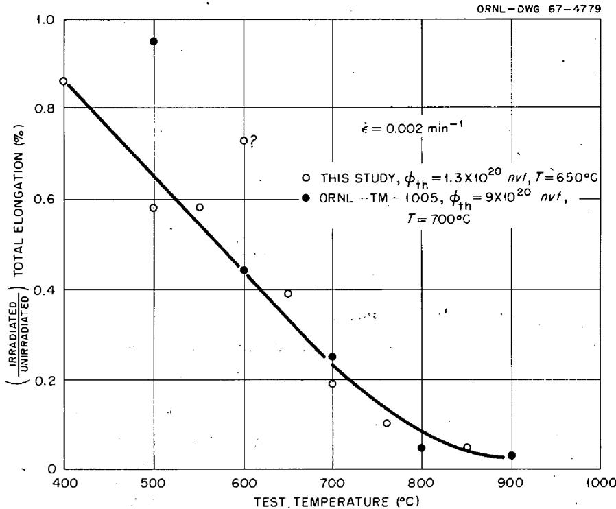  
Fig. 6.8. Comparative Effects of Irradiation in MSRE and ORR on the Ductility of Hastelloy N, Heat 5081.

lives).4 We are reasonably confident that our tests on the surveillance specimens will indicate a similar behavior. Our work also seems to indicate a saturation in the degree of radiation damage at a helium atom fraction of about $10^{-5}$ , and we feel that the properties of the material will not deteriorate further. The low-temperature ductility reduction was not expected. It is probably a result of grain-boundary precipitates forming due to the long thermal exposure. Irradiation plays some role in this process that is yet undefined. The low-temperature properties are not "brittle" by any standards but will be monitored closely when future sets of surveillance specimens are removed.

# 6.2 MECHANICAL PROPERTIES OF HASTELLOY N

H. E. McCoy

Since the surveillance assembly holder was deformed, it was not possible to remove only part of the specimens and return the remainder to the MSRE; therefore, all 162 specimens were removed. The number of specimens required for actual surveillance purposes was rather small, and we used the others for learning more about the general radiation damage characteristics of Hastelloy N. These data are included along with other tests in the following discussion.

Table 6.3 shows the postirradiation tensile properties of several heats of Hastelloy N. Heat 5085 shows properties that are very similar to those observed for the surveillance specimens. Using a test condition of $650^{\circ}\mathrm{C}$ and a strain rate of $0.002\mathrm{min}^{-1}$ , heat 5065 has a total elongation of 10 to $14\%$ if irradiated cold and about $6\%$ if irradiated hot. This is slightly less than observed for heats 5085 and 5067. Note that heat 5085 is the only heat irradiated at an elevated temperature that shows a significant reduction in ductility at $25^{\circ}\mathrm{C}$ .

Several of the specimens from heat 5081 were tested at various strain rates and temperatures to determine how the properties varied with these parameters. The variation of the total elongation with strain rate for the control specimens is shown in Fig. 6.9. The ductilities at 400, 500, 760, and $850^{\circ}\mathrm{C}$ are reasonably independent of strain rate. At $650^{\circ}\mathrm{C}$ , the ductility is very dependent on strain rate down to rates of about $0.05\mathrm{min}^{-1}$ . Figure 6.10 shows that the ductility of the irradiated material is only slightly strain-rate-dependent at $400^{\circ}\mathrm{C}$ . At $500^{\circ}\mathrm{C}$ (Fig. 6.11), the ductility decreases markedly with decreasing strain rates below values of about $0.05\mathrm{min}^{-1}$ . This probably corresponds to the transition from transgranular to intergranular fracture. At $650^{\circ}\mathrm{C}$ (Fig. 6.12), the ductility depends very heavily upon strain rate, showing a rapid decrease at rates of $2\mathrm{min}^{-1}$ and not having reached a constant value at a strain rate of $0.002\mathrm{min}^{-1}$ . At $760^{\circ}\mathrm{C}$ (Fig. 6.13), the ductility is a strong function of strain rate down to rates of $0.005\mathrm{min}^{-1}$ , where the dependence on strain rate becomes much less. At $850^{\circ}\mathrm{C}$ (Fig. 6.14), the ductility is strongly dependent on strain rate down to rates below $0.05\mathrm{min}^{-1}$ , where it becomes fairly constant. This family of curves will allow one to predict the strain-rate sensitivity of the ductility of Hastelloy N at a given temperature.

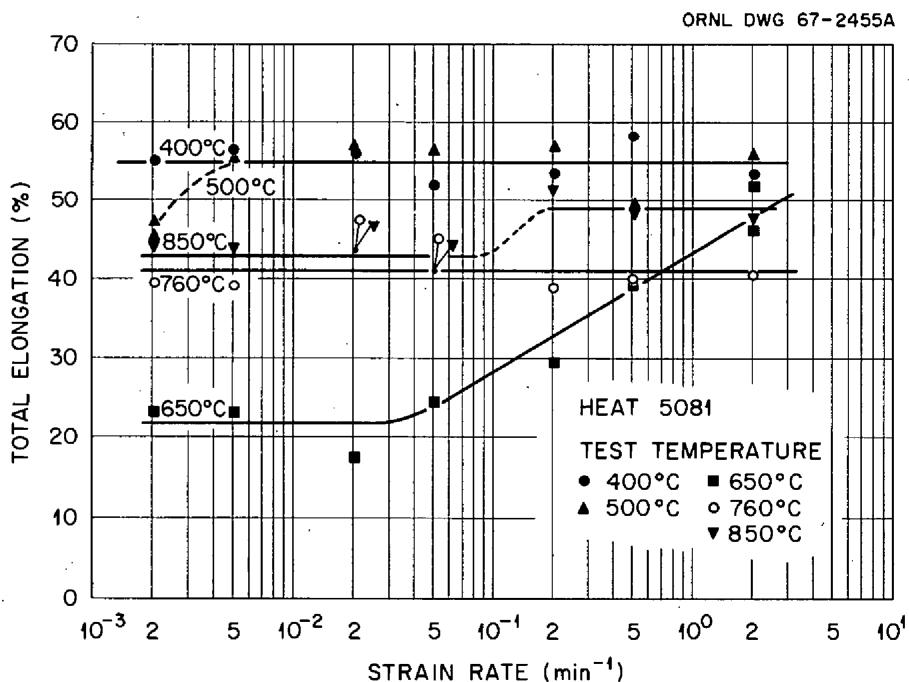  
Fig. 6.9. Influence of Strain Rate on the Ductility of MSRE Surveillance Control Specimens, Heat 5081.

Table 6.3. Postirradiation Tensile Properties of Several Heats of MSRE Hastelloy N After Irradiation in a Helium Environment   

<table><tr><td>Heat No.</td><td>Condition</td><td>Boron Level (ppm)</td><td>Experiment No.</td><td>Irradiation Temp (°C)</td><td>nvt, Thermal Dose</td><td>Test Temp (°C)</td><td>ε</td><td>Yield Stress (psi)</td><td>Ultimate Stress (psi)</td><td>Uniform Elongation (%)</td><td>Total Elongation (%)</td><td>Reduction in Area (%)</td><td>Specimen No.</td></tr><tr><td></td><td></td><td></td><td></td><td colspan="3">×1020</td><td></td><td></td><td></td><td></td><td></td><td></td><td></td></tr><tr><td>5065</td><td>A.R.</td><td>20</td><td>ORR-149</td><td>43</td><td>8.5</td><td>25</td><td>0.05</td><td>102,900</td><td>135,100</td><td>31.5</td><td>35.5</td><td>52.0</td><td>570</td></tr><tr><td>5065</td><td>A.R.</td><td>20</td><td>ORR-149</td><td>43</td><td>8.5</td><td>200</td><td>0.05</td><td>82,300</td><td>119,600</td><td>36.1</td><td>39.2</td><td>54.8</td><td>571</td></tr><tr><td>5065</td><td>A.R.</td><td>20</td><td>ORR-149</td><td>43</td><td>8.5</td><td>650</td><td>0.05</td><td>44,600</td><td>76,900</td><td>26.3</td><td>27.3</td><td>24.5</td><td>572</td></tr><tr><td>5065</td><td>A.R.</td><td>20</td><td>ORR-149</td><td>43</td><td>8.5</td><td>650</td><td>0.002</td><td>40,800</td><td>57,400</td><td>12.2</td><td>13.1</td><td>21.9</td><td>574</td></tr><tr><td>5065</td><td>A.R.</td><td>20</td><td>ORR-149</td><td>43</td><td>8.5</td><td>871</td><td>0.05</td><td>33,500</td><td>36,400</td><td>1.7</td><td>1.8</td><td>3.25</td><td>573</td></tr><tr><td>5065</td><td>A.R.</td><td>20</td><td>ORR-149</td><td>43</td><td>8.5</td><td>871</td><td>0.002</td><td>23,200</td><td>23,400</td><td>0.9</td><td>1.8</td><td>6.07</td><td>575</td></tr><tr><td>5065</td><td>8 hr</td><td>20</td><td>ORR-149</td><td>43</td><td>8.5</td><td>25</td><td>0.05</td><td>101,500</td><td>132,200</td><td>30.0</td><td>33.6</td><td>55.2</td><td>581</td></tr><tr><td>5065</td><td>at</td><td>20</td><td>ORR-149</td><td>43</td><td>8.5</td><td>200</td><td>0.05</td><td>78,600</td><td>118,300</td><td>37.3</td><td>39.8</td><td>45.9</td><td>582</td></tr><tr><td>5065</td><td>871°C</td><td>20</td><td>ORR-149</td><td>43</td><td>8.5</td><td>650</td><td>0.05</td><td>35,100</td><td>77,700</td><td>25.3</td><td>25.8</td><td>22.6</td><td>583</td></tr><tr><td>5065</td><td></td><td>20</td><td>ORR-149</td><td>43</td><td>8.5</td><td>650</td><td>0.002</td><td>38,100</td><td>66,200</td><td>13.7</td><td>14.3</td><td>17.3</td><td>585</td></tr><tr><td>5065</td><td></td><td>20</td><td>ORR-149</td><td>43</td><td>8.5</td><td>871</td><td>0.05</td><td>37,100</td><td>38,500</td><td>1.7</td><td>1.9</td><td>2.94</td><td>584</td></tr><tr><td>5065</td><td></td><td>20</td><td>ORR-149</td><td>43</td><td>8.5</td><td>871</td><td>0.002</td><td>25,900</td><td>25,900</td><td>0.8</td><td>1.6</td><td>5.26</td><td>586</td></tr><tr><td>5067</td><td>A.R.</td><td>20</td><td>ORR-155</td><td>500-700</td><td>1.4</td><td>25</td><td>0.05</td><td>59,000</td><td>123,700</td><td>49.4</td><td>51.2</td><td>45.4</td><td>2289</td></tr><tr><td>5067</td><td>A.R.</td><td>20</td><td>ORR-155</td><td>500-700</td><td>1.4</td><td>650</td><td>0.05</td><td>38,400</td><td>66,800</td><td>14.0</td><td>14.0</td><td>20.5</td><td>2290</td></tr><tr><td>5067</td><td>A.R.</td><td>20</td><td>ORR-155</td><td>500-700</td><td>1.4</td><td>650</td><td>0.002</td><td>36,400</td><td>59,900</td><td>9.6</td><td>9.6</td><td>16.0</td><td>2291</td></tr><tr><td>5085</td><td>A.R.</td><td>38</td><td>ORR-155</td><td>500-700</td><td>1.4</td><td>25</td><td>0.05</td><td>46,300</td><td>110,600</td><td>41.1</td><td>41.2</td><td>40.3</td><td>2285</td></tr><tr><td>5085</td><td>A.R.</td><td>38</td><td>ORR-155</td><td>500-700</td><td>1.4</td><td>650</td><td>0.05</td><td>30,800</td><td>64,400</td><td>18.0</td><td>21.2</td><td>19.1</td><td>2286</td></tr><tr><td>5085</td><td>A.R.</td><td>38</td><td>ORR-155</td><td>500-700</td><td>1.4</td><td>650</td><td>0.002</td><td>30,200</td><td>51,800</td><td>9.3</td><td>9.9</td><td>15.4</td><td>2287</td></tr><tr><td>5065</td><td>A.R.</td><td>20</td><td>ORR-155</td><td>500-700</td><td>1.4</td><td>25</td><td>0.05</td><td>50,100</td><td>117,000</td><td>54.4</td><td>56.1</td><td>53.2</td><td>1857</td></tr><tr><td>5065</td><td>A.R.</td><td>20</td><td>ORR-155</td><td>500-700</td><td>1.4</td><td>650</td><td>0.05</td><td>37,400</td><td>62,100</td><td>12.3</td><td>12.4</td><td>17.2</td><td>1858</td></tr><tr><td>5065</td><td>A.R.</td><td>20</td><td>ORR-155</td><td>500-700</td><td>1.4</td><td>650</td><td>0.002</td><td>34,800</td><td>49,100</td><td>6.4</td><td>6.5</td><td>15.3</td><td>1859</td></tr><tr><td>5065</td><td>A.R.</td><td>20</td><td>ETR-41-31</td><td>600 ± 100</td><td>3.5</td><td>550</td><td>0.002</td><td>49,100</td><td>68,600</td><td>9.1</td><td>9.4</td><td></td><td>1273</td></tr><tr><td>5065</td><td>A.R.</td><td>20</td><td>ETR-41-31</td><td>600 ± 100</td><td>3.5</td><td>600</td><td>0.002</td><td>42,200</td><td>56,300</td><td>8.2</td><td>8.5</td><td></td><td>1276</td></tr><tr><td>5065</td><td>A.R.</td><td>20</td><td>ETR-41-31</td><td>600 ± 100</td><td>3.5</td><td>650</td><td>0.05</td><td>41,200</td><td>59,000</td><td>10.8</td><td>11.3</td><td></td><td>1270</td></tr><tr><td>5065</td><td>A.R.</td><td>20</td><td>ETR-41-31</td><td>600 ± 100</td><td>3.5</td><td>650</td><td>0.002</td><td>42,600</td><td>51,800</td><td>5.9</td><td>6.1</td><td></td><td>1271</td></tr><tr><td>5065</td><td>A.R.</td><td>20</td><td>ETR-41-31</td><td>600 ± 100</td><td>3.5</td><td>760</td><td>0.002</td><td>41,900</td><td>46,000</td><td>2.8</td><td>2.8</td><td></td><td>1274</td></tr><tr><td>5065</td><td>A.R.</td><td>20</td><td>ETR-41-30</td><td>&lt;150</td><td>5</td><td>650</td><td>0.05</td><td>46,700</td><td>76,200</td><td>21.6</td><td>22.2</td><td>28.8</td><td>383</td></tr><tr><td>5065</td><td>A.R.</td><td>20</td><td>ETR-41-30</td><td>&lt;150</td><td>5</td><td>650</td><td>0.002</td><td>37,700</td><td>53,300</td><td>9.3</td><td>10.0</td><td>10.1</td><td>380</td></tr><tr><td>5065</td><td>A.R.</td><td>20</td><td>ETR-41-30</td><td>&lt;150</td><td>5</td><td>650</td><td>0.002</td><td>40,000</td><td>57,500</td><td>11.4</td><td>11.6</td><td>17.5</td><td>384</td></tr></table>

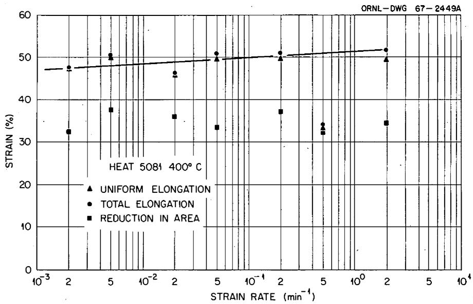  
Fig. 6.10. Influence of Strain Rate on the Ductility of MSRE Surveillance Specimens at $400^{\circ}\mathsf{C}$ . Line based on total elongation values.

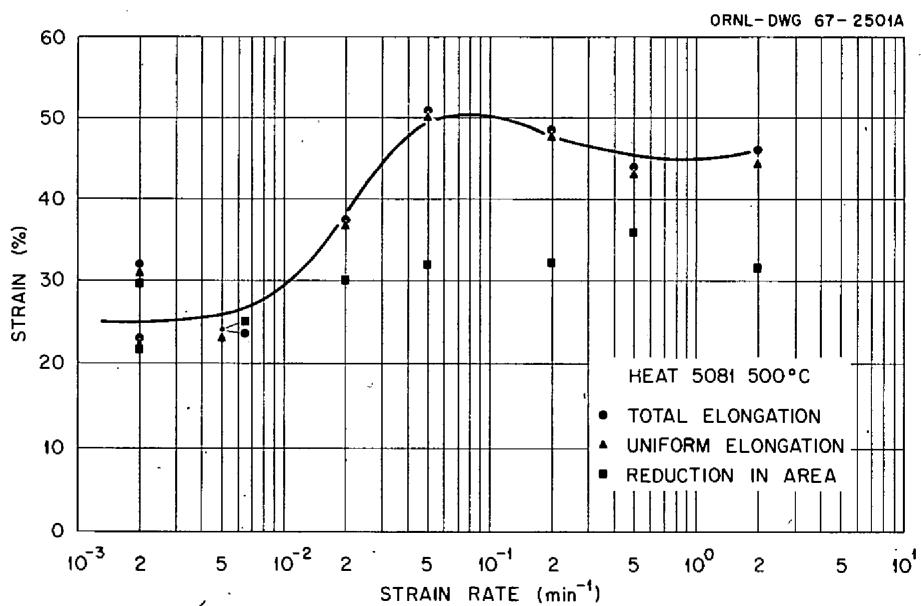  
Fig. 6.11. Influence of Strain Rate on the Ductility of MSRE Surveillance Specimens at $500^{\circ}\mathrm{C}$ . Line based on total elongation values.

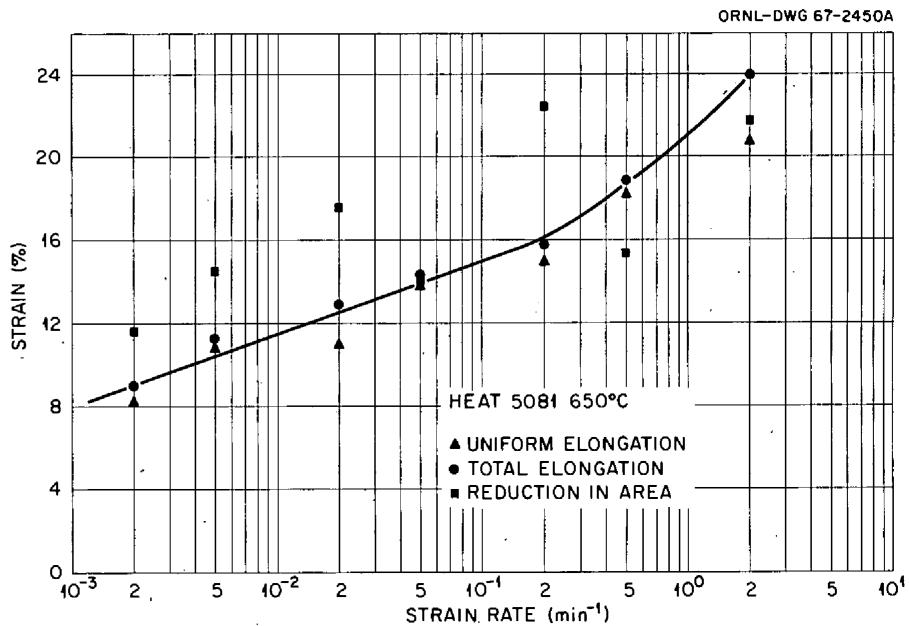  
Fig. 6.12. Influence of Strain Rate on the Ductility of MSRE Surveillance Specimens at $650^{\circ}\mathsf{C}$ . Line based on total elongation values.

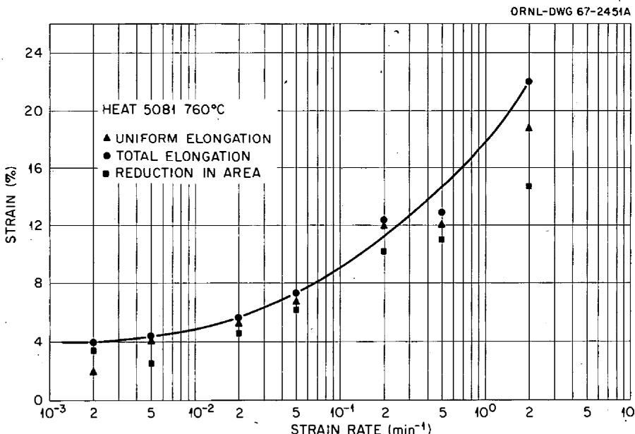  
Fig. 6.13. Influence of Strain Rate on the Ductility of MSRE Surveillance Specimens at $760^{\circ}\mathrm{C}$ . Line based on total elongation values.

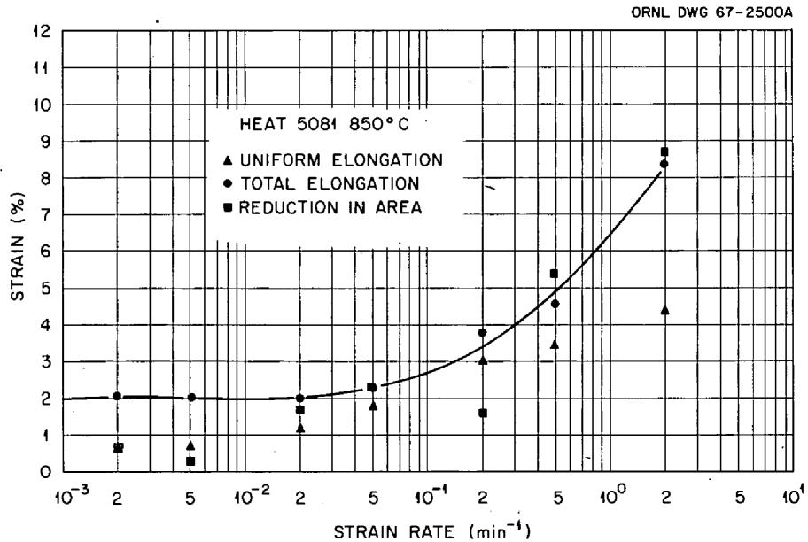  
Fig. 6.14. Influence of Strain Rate on the Ductility of MSRE Surveillance Specimens at $850^{\circ}\mathbf{C}$ . Line based on total elongation values.

# 6.3 PRECURSORS OF MSBR GRAPHITE

W. H. Cook

Basically, the isotropic graphite sought for molten-salt breeder reactors (MSBR) should have these properties:

Permeability to helium $10^{-7}$ to $10^{-3} \mathrm{~cm}^{2} / \mathrm{sec}$

Pore entrance diameter None larger than $1\mu$

Electrical resistivity <1000 microhms cm² cm⁻¹

Coefficient of thermal expansion Approx $4.5\times 10^{-6}(\mathrm{^o C})^{-1}$

Ash content <150 ppm

Boron $< 1$ ppm

Bulk density $>1.86\mathrm{g/cm}^3$

In addition, it should be a well-crystallized graphite without fillers such as lampblack or carbon black. Other parameters, such as mechanical properties, probably would follow satisfactorily if the preceding requirements were met.

Our immediate needs are modest quantities (50 lb) for general evaluations and for the specific and important radiation damage studies.

We have made initial examinations on seven experimental grades of graphite. None satisfy all the basic requirements listed above; however, one shows a good pore spectrum and four appear to have potential. Two do not show promise.

The Chemical Engineering Development Department of the Y-12 Plant5 has made some experimental MSBR-type graphite that has a microstructure as shown in Fig. 6.15. This has been fired to $3000^{\circ}\mathrm{C}$ and has not had any impregnations to decrease its pore sizes. Except for some minor flaws, the structure is unusually tight. This is also shown by the pore spectrum shown in Fig. 6.16, in which the major portion of the pore entrance diameters are less than $0.3\mu$ . The larger pore entrances shown may be the result of the small cracks and voids visible in Fig. 6.15. It was fabricated as a small piece, 1.6 in. diam $\times$ 0.8 in. long, and there are some problems in fabrication, purity, and high electrical resistivity, but it does look encouraging in these early stages of development. It is the only one of the seven different grades that was fabricated specifically for MSBR requirements.

The other grades are materials that were originally developed for other purposes. As one might expect, the major problems with these are high gas permeabilities and pores that are too large. All these had pore entrance diameters as large as $3\mu$ , whether they had uniform or only surface graphitic impregnations. Four of the grades, which had uniform impregnations through

5Y-12 Plant, operated by the Union Carbide Corporation for the Atomic Energy Commission, Post Office Box Y, Oak Ridge, Tenn.

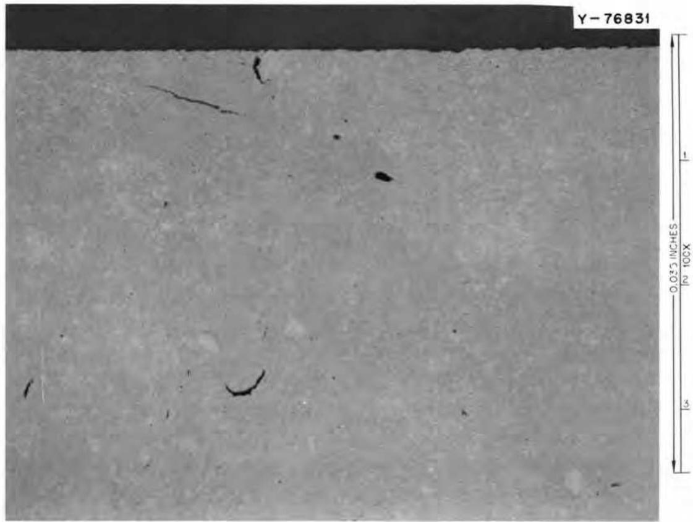  
Fig. 6.15. An Experimental Isotropic Graphite, Grade B-5-1, Showing Low Porosity and a Few Flows. As polished. $100 \times$

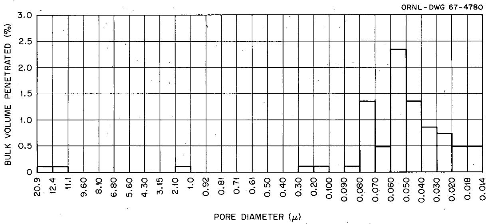  
Fig. 6.16. A Pore Spectrum Plot of an Experimental Isotropic Graphite, Grade B-5-1.

out the structure, had sufficient properties to warrant further investigation. Two are being purchased in 50-lb quantities for irradiation studies and general evaluations:

An interesting feature of six of the grades of graphite above that had pore entrance diameters as large as $3\mu$ was that the impregnations appeared to decrease the accessible void volumes but did not lower the range of the pore entrance diameters.

Decreasing the accessible void volume is helpful, but having the pore entrance diameters less than $1\mu$ is of greater importance. Both MSBR and impregnation requirements appear to dictate that the base stock must have the major amount of its accessible voids with pore entrance diameters approximately $1\mu$ .

# 6.4 GRAPHITE IRRADIATIONS

C. R. Kennedy

Irradiation experiments to demonstrate the ability of graphite to sustain massive neutron exposures have been designed and are being fabricated or are in progress. Graphite of MSBR quality will be irradiated in the DFR, HFIR, EBR-II, and ORR. The major irradiations will be obtained from capsules placed in the HFIR. The specimens will be located in two rod assemblies, which will replace two of the californium production rod assemblies. All the 32 graphite ring specimens in the rod assembly are designed to be irradiated at $700 \pm 25^{\circ}\mathrm{C}$ . After a one-reactor-cycle experiment to verify the design temperature, the specimens will be removed, examined, and recycled alternately every six months until a total irradiation time of $2^{1/2}$ years is obtained. At this time, the total irradiation exposure will range from 5 to $10 \times 10^{22} \mathrm{mvt}(E > 0.18 \mathrm{Mev})$ . The specimens will be examined for dimensional stability, gas permeability, and mechanical integrity.

Irradiations in the DFR are essentially backup experiments to the HFIR irradiations. These irradiations will be used primarily to obtain relative comparisons of experimental grades to more standard grades. The exposures in these irradiations will not exceed $5 \times 10^{21} \, \text{nvt}$ ( $E > 0.18 \, \text{Mev}$ ).

Irradiations in the EBR-II will be restrained growth experiments to confirm the ability of the MSBR graphite to sustain plastic creep deformation under irradiation. Again, the exposure obtained will be much less than that obtained in HFIR, with a maximum of about $10^{22} \mathrm{vvt}$ ( $E > 0.18 \mathrm{Mev}$ ). The maximum tensile strains obtainable from these experiments will be about $3\%$ .

The experimental program in the ORR consists of very closely controlled creep experiments to obtain quantitative creep coefficients. These data, although obtained at a very low exposure rate and thus low exposures, are essentially for a stress analysis of the graphite bodies. These experiments will be very limited in scope in view of the base of existing information available on the creep behavior of graphite. The current experiment has been constructed and installed in the ORR.

# 6.5 BRAZING OF GRAPHITE

# W.J.Werner

Studies were continued to develop methods for brazing large graphite pipes to Hastelloy N. Our current activities consist of work in the following areas: (1) development of a corrosion-resistant alloy which will readily wet and flow on graphite but which does not suffer from the transmutation problem associated with gold-containing alloys and (2) devising techniques for the manufacture of graphite-to-Hastelloy-N assemblies of the size and configuration required for loop experiments.

# Large Graphite-to-Hastelloy-N Assemblies

A vacuum or inert-atmosphere induction brazing furnace for brazing graphite-to-metal assemblies up to 4 in. in diameter by 12 in. long has been designed and is currently under construction. Several pieces of graphite, molybdenum, and Hastelloy N have been prepared for brazing, using the tapered-joint design reported previously.[6] Figure 6.17 shows the size and configuration of the components. The graphite is ATJ grade due to the unavailability of MSRE-grade material in the desired size and configuration.

# 6.6 CORROSION RESISTANCE OF GRAPHITE-TO-METAL BRAZED JOINTS

# W. H. Cook

It was reported that the braze joining grade CGB graphite to molybdenum did not have any microscopically visible attack after a 5000-hr exposure to LiF-BeF $_2$ -ZrF $_4$ -ThF $_4$ -UF $_4$ salts at

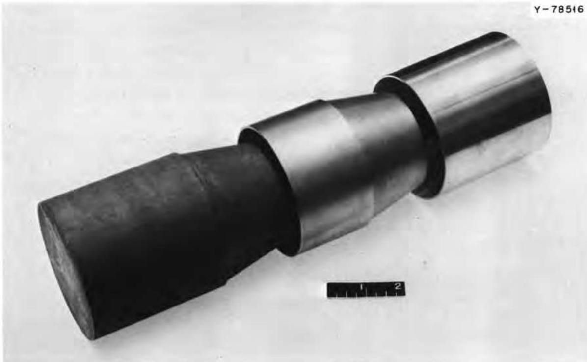  
Fig. 6.17. As-Machined Components for Graphite-to-Molybdenum-to-Hastelloy-N Tapered Joint.

$1300^{\circ}\mathrm{F}$ $(705^{\circ}\mathrm{C})$ contained in Hastelloy N. The brazing alloy was 60 Pd-35 Ni-5 Cr (wt%). The chemical analyses of the test salt did not show any significant changes from the analyses of the as-received salt.

The microstructure of the brazed joint is shown again in Fig. 6.18 for reference purposes. Electron-probe microanalyses show that molybdenum diffused into the brazing alloy, as was deduced by Jones and Werner from its microstructure. There was some migration of nickel and palladium into the molybdenum, along with a slight amount of chromium.

The speckled precipitates in the brazing alloy are primarily Mo, Ni, Cr, and C in descending quantities. The long, acicular crystals located toward the graphite sides of the brazed joint are primarily Mo, Cr, Ni, and C in descending quantities. These are believed to be essentially mixed carbides of molybdenum and chromium.

The microstructures suggest that this is a well-formed joint that has not been appreciably altered by the corrosion exposure. A deposit is present on the surface of the braze metal. The deposit has been identified as pure palladium except for some nickel in the region adjacent to the brazing alloy. While it extends slightly over the graphite, it seems to be attached only to the braze metal. Figure 6.19 shows another view of the deposit with a rough surface and a spotty

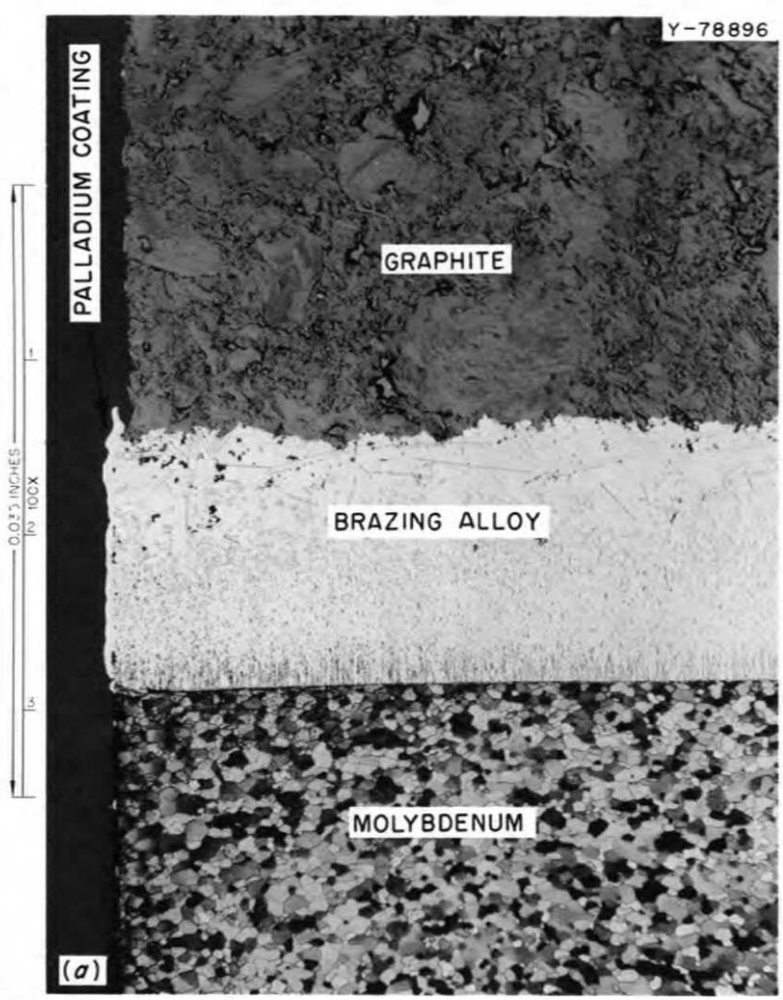

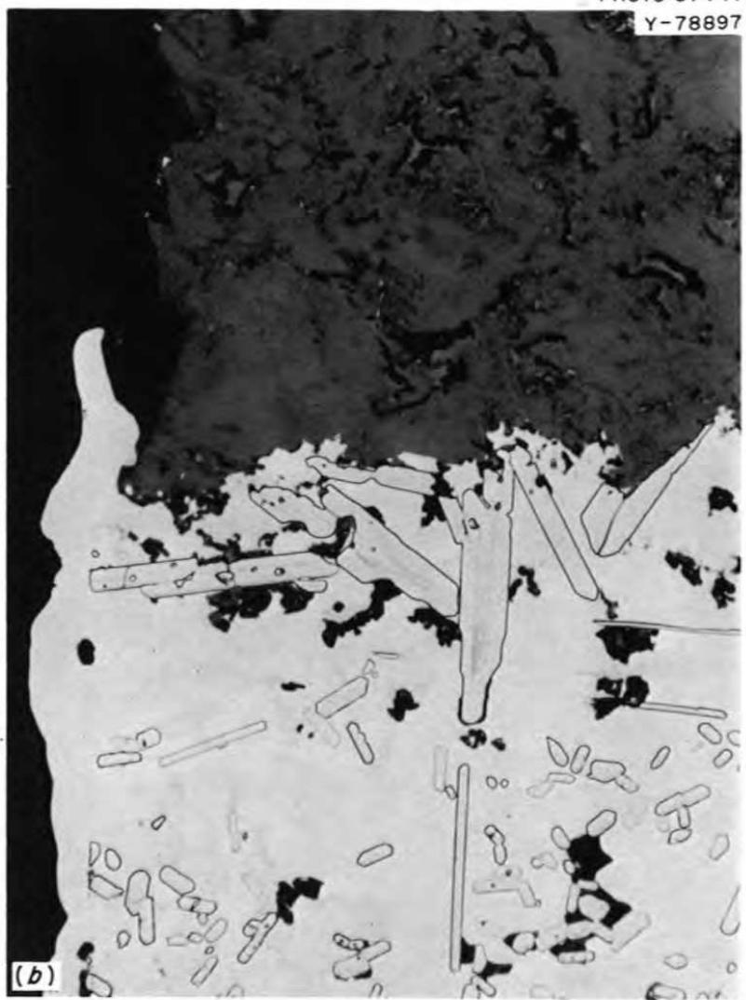  
0.007 INCHES   
Fig. 6.18. Microstructures of the 60 Pd-35 Ni-5 Cr (wt %) Brazing Alloy Used to Join Grade CGB Graphite to Molybdenum. (a) After 5000-hr exposure to molten fluoride salts at $1300^{\circ}\mathrm{F}$ ( $705^{\circ}\mathrm{C}$ ). Etchant: $10\%$ oxalic acid. $100\times$ . (b) Enlarged microstructure of palladium coating located primarily on the brazing alloy. Etchant: oxalic acid. $500\times$ .

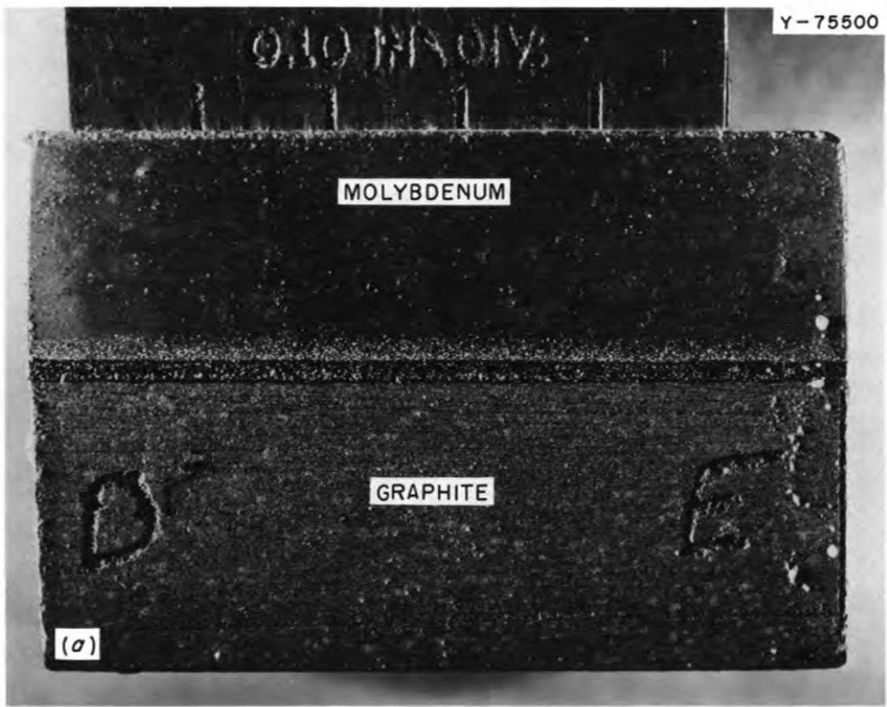

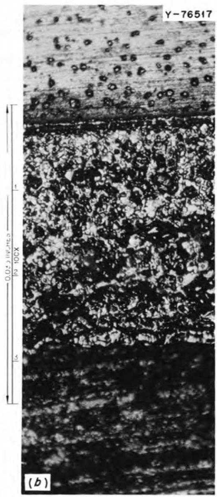  
Fig. 6.19. External Appearance of Palladium Coating on Brazing Alloy (60 Pd-35 Ni-5 Cr, wt %) of the Grade CGB Graphite Brazed to Molybdenum After 5000-hr Exposure to Molten Fluoride Salts at $1300^{\circ}\mathrm{F}$ ( $705^{\circ}\mathrm{C}$ ). (a) Elevation view. (b) High magnification ( $100x$ ) of typical appearance.

deposit on the molybdenum. No evidence of palladium was found in the fluoride salts or on the walls of the Hastelloy N container. While the palladium must have been leached from the braze metal and then redeposited, the mechanism for the transfer is not clear. The thickness of the coating appears to be dependent on the test time. However, since it was only 0.001 in. thick after the 5000-hr exposure to the molten fluoride salts at $1300^{\circ}\mathrm{F}$ ( $705^{\circ}\mathrm{C}$ ) and seems to be present only on the braze, it seems valid to say that the braze was essentially unattacked for this period.

An amorphous-appearing, metallic-like coating on the graphite9 surfaces exposed to the molten salts was found to be $\mathrm{Cr}_3\mathrm{C}_2$ by x-ray diffraction. Electron-probe microanalyses indicated that some vanadium is also present. There is no explanation for the presence of vanadium unless it came from the salts, because the graphite and Hastelloy N normally contain vanadium in average quantities of 0.0009 and $0.5\%$ respectively.

# 6.7 THERMAL CONVECTION LOOPS

# A. P. Litman

We are continuing to study the compatibility of structural materials with fuels and coolants of interest to the Molten-Salt Reactor Program. Natural-circulation loops of the type described previously10,11 are used as the standard test in these studies.

Three loops are now in operation, and details of their service are shown in Table 6.4. The long-term loops, Nos. 1255 and 1258, fabricated from Hastelloy N and type 304 stainless steel,

9 Ibid., p. 117.   
10G. M. Adamson, Jr., et al., Interim Report on Corrosion by Zirconium Base Fluorides, ORNL-2338 (Jan. 3, 1961).   
11MSR Program Semiann. Progr. Rept. Aug. 31, 1965, ORNL-3872, pp. 81-87.

Table 6.4. Thermal Convection Loop Operation Through February 28, 1967   

<table><tr><td>Loop No.</td><td>Loop Material</td><td>Hot-Leg Specimens</td><td>Heat-Transfer Medium</td><td>Maximum Temp (°F)</td><td>ΔT (°F)</td><td>Hours Operated</td></tr><tr><td>1255</td><td>Hastelloy N</td><td>Hastelloy N + 2% Nb (permanent)</td><td>LiF-BeF2-ZrF4-UF4-ThF4(70-23-5-1-mole %)</td><td>1300</td><td>160</td><td>43,024</td></tr><tr><td>1258</td><td>Type 304 L stainless steel</td><td>Type 304 L stainless steel (removable)</td><td>LiF-BeF2-ZrF4-UF4-ThF4(70-23-5-1-mole %)</td><td>1250</td><td>180</td><td>31,749</td></tr><tr><td>10</td><td>Hastelloy N</td><td>None</td><td>NaF-KF-BF3(48-3-49 mole %)</td><td>1125</td><td>265</td><td>6,734</td></tr><tr><td>9</td><td>Type 446 stainless-steel-clad Nb-1% Zr</td><td>None</td><td>LiF-BeF2-ZrF4-UF4(65-29.1-5-0.9 mole %)</td><td>1400</td><td>300</td><td>5,255a</td></tr></table>

Loop plugged on 10-1-66.

respectively, and circulating MSRE-type fuel salt plus approximately 1 mole $\%$ $\mathrm{ThF}_4$ continue to operate without incident.

Recently, we installed specimens in the hot leg of the stainless steel circuit so as to generate additional data on that system. It is of interest to compare the compatibility of the salt which has now reached maturity in the loop with earlier results. To date, the specimen in the hottest portion of the loop, $1250^{\circ}\mathrm{F}$ , has experienced weight losses as shown in Table 6.5. Interpolation of these results indicates a rate loss of approximately $3.6\mathrm{mgcm}^{-2}$ month $^{-1}$ . This is lower than the rate revealed in the previous test.

Table 6.5. Effect of Time on Weight Change of Type 304 L Stainless Steel Specimen in Contact with LiF-BeF $_2$ -ZrF $_4$ -UF $_4$ -ThF $_4$ (70-23-5-1-1 Mole %) at $1250^{\circ}$ F   

<table><tr><td>Time (hr)</td><td>Weight Change (mg/cm2)</td></tr><tr><td>25</td><td>-1.6</td></tr><tr><td>115</td><td>-2.1</td></tr><tr><td>450</td><td>-2.95</td></tr><tr><td>1125</td><td>-4.4</td></tr></table>

Loop No. 10, fabricated from Hastelloy N and circulating a fluoroborate mixture, is now scheduled to operate for one year, after which time it will be dismantled and examined. It continues to circulate without difficulty.

# 6.8 EVALUATION OF MSRE RADIATOR TUBING CONTAMINATED WITH ALUMINUM

D. A. Canonico

D. M. Haseltine

The failure of the aluminum blower blades at the MSRE site and the resultant damage were discussed in the last semiannual report. $^{12}$ It was concluded that no damage was visually observed; however, the possibility that some undetected aluminum still might be in intimate contact with the Hastelloy N tubes did exist. An experiment was conducted to determine the effect of a prolonged exposure to aluminum at $1200^{\circ}\mathrm{F}$ .

Aluminum pieces from the blower blades and a Hastelloy N tube similar to those used in the heat exchanger were placed in intimate contact and held for times up to 1000 hr. The results of the 1000-hr exposure are shown in Fig. 6.20a. For comparative purposes, the 5-hr exposure is shown in Fig. 6.20b. It is evident that the penetration (approx 0.010 in.) is similar in both

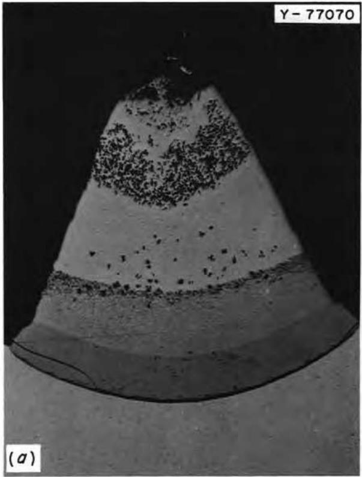

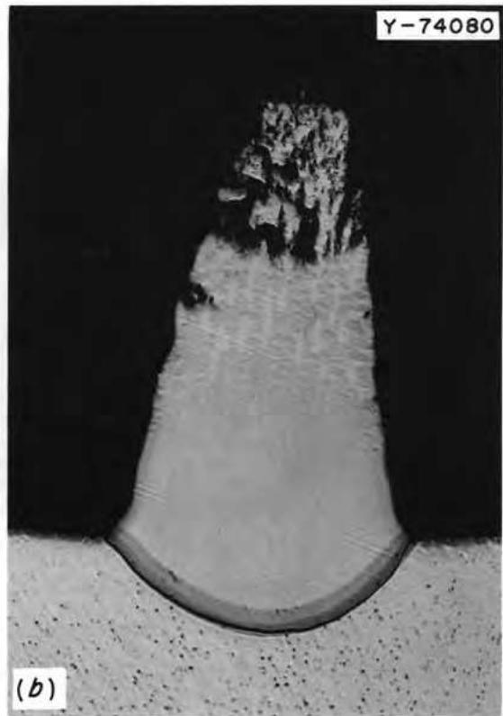  
Fig. 6.20. Metallographic Sections Through Aluminum Cone and Hastelloy N Tube. Samples were held at $1200^{\circ}$ F for (a) 1000 hr and (b) 5 hr.

photomicrographs. The Hastelloy N tubing has a wall thickness of approximately $\frac{1}{16}$ in. The penetration after 5 hr was about $16\%$ , and after the 1000-hr exposure it had not increased.

The microstructure seen in the specimen held for 1000 hr is considerably different from that in the 5-hr sample. The extended exposure has allowed the various phases to grow and has resulted in a diffusion couple of aluminum-nickel complicated somewhat by the presence of zinc and other minor elements.

This work supports the conclusions reported previously, that the radiator system is satisfactory for further operation.

# 7. Chemistry

# 7.1 CHEMISTRY OF THE MSRE

# Fuel Salt Composition and Purity

R. E. Thoma

More than half the total power generated by the MSRE (21,464 Mwhr) was produced during the current report period. Heat balance and nuclear calculations indicate that a total of $1.083\mathrm{kg}$ of ${}^{235}\mathrm{U}$ , $0.473\%$ of the original uranium inventory, has now been consumed by fission. Table 7.1 summarizes the results of fuel composition and purity analyses for the MSRE fuel in each of the power runs, including the three conducted in the last six months, Nos. 8 to 10, and the current run, No. 11. These data show that the uranium concentration of the fuel salt has decreased appreciably since power operation began. It should not be inferred, however, that burnup is evident in the results of chemical analysis for runs 4 to 10, for virtually all the decrease noted in Table 7.1 is the result of dilutions of the fuel salt by flush salt. Figure 7.1 shows a comparison of MSRE inventory values with the results of chemical analyses for runs 6 to 10. Analytical values shown here have been adjusted to compensate for changes in isotopic composition of uranium and for those periodic variations in analytical bias as determined by the Analytical Quality Control Group. $^3$

Step decreases in the inventory values reflect the dilution of the fuel salt by residues of flush salt remaining in the reactor fuel circuit after flushing operations are completed. Fuel salt is also removed from the fuel circuit by sampling procedures and by transfer of fuel to flush salt. From the-results of analyses of flush salt specimens we have deduced that each drain-flush-fill sequence results in a net transfer of $7.1\mathrm{kg}$ of uranium from the fuel to flush salt. The computation of this value has involved a number of assumptions, such as those concerned with the precision of uranium analyses in the 100-to-800-ppm concentration range, as well as the configuration and dimensions of MSRE fuel circuit components where salt residues may reside.

Figure 7.1 also shows values which should have been obtained in the absence of dilution-transfer

Table 7.1. Summary of MSRE Fuel Salt Analyses   

<table><tr><td rowspan="2">Run No.</td><td rowspan="2">Number of Samples</td><td colspan="4">Concentration (wt %)</td><td colspan="2">\( U^a \) Inventory Values (wt %)</td><td colspan="4">Concentration (mole %)</td><td colspan="3">Concentration (ppm)</td></tr><tr><td>\( ^7Li \)</td><td>Be</td><td>Zr</td><td>\( U^a \)</td><td>x</td><td>y</td><td>\( ^7LiF \)</td><td>\( BeF_2 \)</td><td>\( ZrF_4 \)</td><td>\( UF^a_4 \)</td><td>Fe</td><td>Cr</td><td>Ni</td></tr><tr><td>4</td><td>22</td><td>10.51 ± 0.137</td><td>6.55 ± 0.161</td><td>11.14 ± 0.295</td><td>4.642 ± 0.028</td><td>4.622</td><td>4.622</td><td>63.36 ± 0.567</td><td>30.65 ± 0.583</td><td>5.15 ± 0.116</td><td>0.83 ± 0.011</td><td>131 ± 65</td><td>48 ± 7</td><td>40 ± 20</td></tr><tr><td>5</td><td>1</td><td>10.65</td><td>6.53</td><td>11.45</td><td>4.625</td><td>4.622</td><td>4.622</td><td>63.63</td><td>30.30</td><td>5.25</td><td>0.816</td><td>68</td><td>51</td><td>15</td></tr><tr><td>6</td><td>13</td><td>10.51 ± 0.289</td><td>6.54 ± 0.200</td><td>11.31 ± 0.231</td><td>4.630 ± 0.027</td><td>4.622</td><td>4.619</td><td>63.35 ± 1.072</td><td>30.60 ± 0.946</td><td>5.23 ± 0.145</td><td>0.825 ± 0.013</td><td>111 ± 44</td><td>50 ± 8</td><td>56 ± 24</td></tr><tr><td>7</td><td>11</td><td>10.55 ± 0.054</td><td>6.67 ± 0.174</td><td>11.34 ± 0.215</td><td>4.640 ± 0.017</td><td>4.619</td><td>4.614</td><td>63.04 ± 0.495</td><td>30.95 ± 0.580</td><td>5.20 ± 0.118</td><td>0.819 ± 0.009</td><td>88 ± 32</td><td>48 ± 6</td><td>48 ± 16</td></tr><tr><td>4-7</td><td>47</td><td>10.523 ± 0.178</td><td>6.572 ± 0.179</td><td>11.239 ± 0.271</td><td>4.638 ± 0.025</td><td>4.622</td><td>4.614</td><td>63.290 ± 0.722</td><td>30.698 ± 0.696</td><td>5.188 ± 0.126</td><td>0.824 ± 0.011</td><td>114 ± 55</td><td>49 ± 7</td><td>46 ± 21</td></tr><tr><td>8</td><td>8</td><td>11.78 ± 1.406</td><td>6.53 ± 0.199</td><td>11.16 ± 0.193</td><td>4.632 ± 0.011</td><td>4.601</td><td>4.599</td><td>65.84 ± 2.486</td><td>28.57 ± 2.123</td><td>4.82 ± 0.347</td><td>0.771 ± 0.058</td><td>122 ± 45</td><td>64 ± 7</td><td>61 ± 36</td></tr><tr><td>9</td><td>4</td><td>10.99 ± 0.099</td><td>6.63 ± 0.068</td><td>11.15 ± 0.370</td><td>4.603 ± 0.031</td><td>4.587</td><td>4.586</td><td>64.17 ± 0.096</td><td>30.04 ± 0.147</td><td>4.99 ± 0.185</td><td>0.794 ± 0.011</td><td>150 ± 17</td><td>61 ± 5</td><td>52 ± 20</td></tr><tr><td>4-9</td><td>59</td><td>10.528 ± 0.159</td><td>6.570 ± 0.175</td><td>11.222 ± 0.266</td><td>4.635 ± 0.026</td><td>4.622</td><td>4.586</td><td>63.312 ± 0.679</td><td>30.685 ± 0.665</td><td>5.179 ± 0.125</td><td>0.824 ± 0.011</td><td>118 ± 52</td><td>51 ± 9</td><td>48 ± 24</td></tr><tr><td>10</td><td>10</td><td>11.14 ± 0.079</td><td>6.58 ± 0.188</td><td>11.05 ± 0.152</td><td>4.609 ± 0.020</td><td>4.575</td><td>4.569</td><td>64.65 ± 0.450</td><td>29.64 ± 0.480</td><td>4.92 ± 0.064</td><td>0.791 ± 0.010</td><td>150 ± 30</td><td>60 ± 4</td><td>74 ± 35</td></tr><tr><td>4-10</td><td>69</td><td>10.785 ± 0.641</td><td>6.571 ± 0.179</td><td>11.197 ± 0.260</td><td>4.631 ± 0.026</td><td>4.622</td><td>4.586</td><td>63.835 ± 1.342</td><td>30.258 ± 1.163</td><td>5.095 ± 0.212</td><td>0.811 ± 0.029</td><td>122 ± 51</td><td>53 ± 9</td><td>52 ± 27</td></tr><tr><td>8-10</td><td>22</td><td>11.345 ± 0.883</td><td>6.569 ± 0.173</td><td>11.106 ± 0.212</td><td>4.616 ± 0.022</td><td>4.601</td><td>4.569</td><td>64.998 ± 1.614</td><td>29.320 ± 1.402</td><td>4.898 ± 0.226</td><td>0.784 ± 0.036</td><td>140 ± 36</td><td>62 ± 5</td><td>65&#x27; ± 33</td></tr></table>

$^a$ Corrected to compensate for isotopic composition. x.denotes beginning of run; y denotes end of run.

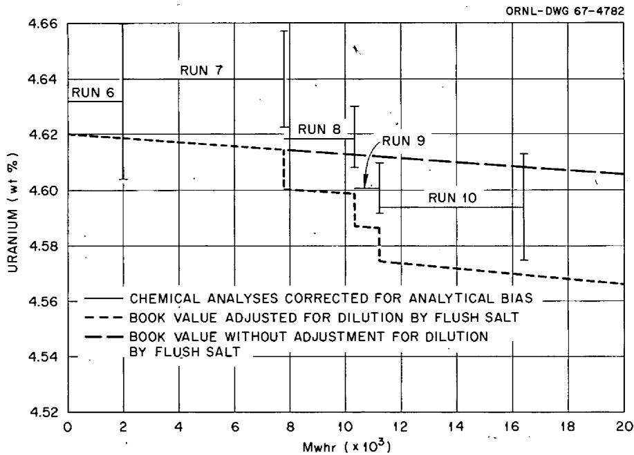  
Fig. 7.1. Weight Percent of Uranium in MSRE Fuel Salt During Runs 6 to 10.

losses; these values indicate that while chemical analyses were heretofore not sensitive enough to reflect burnup losses, it may be possible that such losses will be reflected in subsequent operations with the present fuel salt.

# MSRE Fuel Circuit Corrosion

# R.E.Thoma

Since oxidative corrosion of the MSRE fuel circuit results in the formation of chromous fluoride, the concentration of chromium in the fuel salt serves as the principal indicator of the extent of generalized corrosion. The chromium content of the fuel salt has remained very low throughout the operating history of the MSRE. In the current report period the chromium concentration of the salt has remained at $62 \pm 5$ ppm (Table 7.1), corresponding to a uniform removal of chromium from the walls of the reactor circuit from a maximum depth of about 0.1 mil.

Prior to the removal and replacement of the original metal and graphite surveillance specimens in August 1966,4 the average chromium concentration of the fuel salt was $48 \pm 7$ ppm (Table 7.1), a value which was attained during the first power operations with the reactor. A sample taken early in October 1966, which followed the change of the surveillance specimens, showed the chromium content had reached about $62$ ppm. All subsequent specimens of fuel salt analyzed after that time have shown the presence of approximately $62$ ppm of chromium, indicating the

introduction of about $85\mathrm{g}$ of chromium into the fuel since October 1966. The increase in chromium concentration from 48 to $62~\mathrm{ppm}$ may possibly be assignable to corrosion of the new surveillance assembly. If so, the corrosion sustained by the assembly must be greater than that previously experienced by the entire fuel circuit from December 1965 up to the present time. The metal surface exposed to the salt in the surveillance assembly is about 1000 in.². To produce $85\mathrm{g}$ of chromium would require the leaching of chromium from this surface, if uniform, to an implausible depth of about 10 mils.

The MSRE fuel salt contained a very low concentration of $\mathbf{U}^{3+}$ at the outset of power operations, with possibly a maximum of $0.16\%$ of the uranium (366 g, 1.54 gram atoms) in the $\mathbf{U}^{3+}$ form (cf. section entitled "Extent of UF_4 Reduction During MSRE Fuel Preparation"). At the termination of MSRE run 7, fuel burnup had consumed 1.66 gram atoms of uranium. Just how much oxidizing capacity is produced by fuel burnup is uncertain because it involves unverified inferences as to the final chemical identity of many fission products, but between 0.6 and 1.0 equivalent of oxidizing capacity should result for each gram atom of $^{235}\mathrm{U}$ fissioned. If 1.0 equivalent was produced, the fuel salt would have become slightly oxidizing by the end of run 7. No such conclusion is justified, however, from the results of chromium analyses. These results indicate rather that oxidation corrosion ceased before the MSRE had generated a total of 1 Mwhr of power. Absence of corrosion in runs 4 to 7 should probably be attributed at the beginning to the presence of $\mathbf{U}^{3+}$ and perhaps subsequently to the deposition of noble-metal fission product films. At the termination of run 7 (7800 Mwhr) a uniform film formed by the deposition of all the Mo, Nb, and Ru produced would have a thickness of approximately 150 A.

The current experiment with the MSRE is scheduled to be terminated at the end of 30,000 Mwhr of operation. At that time the present surveillance specimens will be removed for inspection and testing. It will be of considerable value to learn whether the present assembly has sustained the amount of corrosion which has been observed in the fuel samples since last October.

# Extent of $\mathsf{UF}_4$ Reduction During MSRE Fuel Preparation

B.F.Hitch C.F.Baes, Jr.

Uranium was added to the barren fuel salt of the MSRE as a binary mixture of 27 mole $\%$ UF $_4$ in $^{7}\mathrm{LiF}$ . This fuel concentrate had first been purified by the usual sparging with an HF- $\mathbf{H}_2$ mixture to remove oxide, followed by sparging with hydrogen alone to complete the reduction of structural metal fluorides such as NiF $_2$ and FeF $_2$ .[5,6] During this final reduction step, a small portion of the UF $_4$ should also have been reduced, the amount depending upon the duration of the treatment and the equilibrium constant for the reaction

$$
\mathrm {U F} _ {4} (d) + \frac {1}{2} \mathrm {H} _ {2} (g) \rightleftharpoons \mathrm {U F} _ {3} (d) + \mathrm {H F} (g).
$$

The exact amount of $\mathrm{UF}_{3}$ thus introduced into the MSRE fuel has become a matter of special interest with continued operation of the MSRE owing to evidence that significant amounts of some fission products are far more oxidized than would seem compatible with the presence of significant amounts of $\mathrm{UF}_{3}$ in the MSRE fuel. Consequently, the data collected by Shaffer et al.7 during the purification of the fuel salt concentrate at the production facility recently has been examined in detail in an attempt to determine the equilibrium quotient for the above reaction:

$$
Q = \frac {P _ {\mathrm {H F}} X _ {\mathrm {U F} _ {3}}}{P _ {\mathrm {H} _ {2}} ^ {1 / 2} X _ {\mathrm {U F} _ {4}}}
$$

and to determine the extent of $\mathbf{U}\mathbf{F}_{4}$ reduction in the LiF- $\mathbf{U}\mathbf{F}_{4}$ mixture.

For small amounts of reduction, the $\mathrm{UF}_3 / \mathrm{UF}_4$ ratio may be related to $Q$ and the volume $(V)$ of $\mathrm{H}_2$ passed per mole of $\mathrm{UF}_4(n_{\mathrm{U}})$ by

$$
\left(n _ {\mathrm {U F} _ {3}} / n _ {\mathrm {U}}\right) ^ {2} = 2 Q P _ {\mathrm {H} _ {2}} ^ {1 / 2} \left(V / n _ {\mathrm {U}} R T\right) + \left(n _ {\mathrm {U F} _ {3}} ^ {0} / n _ {\mathrm {U}}\right) ^ {2},
$$

provided equilibrium conditions are maintained during sparging. The last term on the right is the initial $n_{\mathrm{UF}_3} / n_{\mathrm{U}}$ ratio. Replacing $n_{\mathrm{UF}_3} / n_{\mathrm{U}}$ by $QP_{\mathrm{H}_2^{1/2}}^1 / P_{\mathrm{HF}}$ ,

$$
\frac {1}{P _ {\mathrm {H F}} ^ {2}} = \frac {2}{Q P _ {\mathrm {H} _ {2}} ^ {1 / 2}} \left(\frac {V}{n _ {\mathrm {U}} R T}\right) + \frac {1}{\left(P _ {\mathrm {H F}} ^ {0}\right) ^ {2}}.
$$

In accord with this equation, plots of $1 / P_{\mathrm{HF}}^2$ vs $V$ , based on data collected at $700^\circ \mathrm{C}$ during the purification of the various batches of fuel concentrate, were found to be linear. All plots could be fitted reasonably well with lines of slopes corresponding to $Q \sim 0.9 \times 10^{-6} \, \mathrm{atm}^{1/2}$ . From the final value of $P_{\mathrm{HF}}$ , knowing $Q$ and $P_{\mathrm{H}_2}$ , the average amount of uranium reduction at the end of the hydrogen treatment was estimated to be $0.16\%$ .

In an attempt to confirm this estimate of $Q$ and the amount of reduced uranium present initially in the MSRE fuel, an 11.4-kg portion of unused fuel concentrate was studied further in the lab

oratory. Hydrogen sparging was initiated at $510^{\circ}\mathrm{C}$ . At this relatively low temperature, no significant reduction of $\mathbf{U}^{4+}$ to $\mathbf{U}^{3+}$ should occur; however, HF evolution was detected immediately and continued at a significant level until 250 liters of $\mathbf{H}_{2}$ had passed and 0.0019 mole of HF per mole of uranium had been evolved. This indicated that inadvertent exposure of the salt to oxidizing impurities such as water or oxygen had occurred during prior storage, during transfer of the sample to the reaction vessel, or in later handling. Since the presence of HF at this temperature in the amounts seen should have quickly oxidized the $\mathbf{UF}_{3}$ present, it was not possible to confirm the amount of $\mathbf{UF}_{3}$ initially present in the fuel concentrate. In two subsequent $\mathbf{H}_{2}$ sparging runs at $700^{\circ}\mathrm{C}$ , however, data were obtained which permitted improved estimates of $Q$ from plots of $1 / P_{\mathbf{HF}}^{2}$ vs $V$ . The resulting values of $Q$ are about twice that estimated from the

$$
\begin{array}{l} \text {T e m p e r a t u r e} \quad \begin{array}{l l} H _ {2} \text {F l o w} \\ (\mathrm {m l} \min  ^ {- 1} \mathrm {k g} ^ {- 1}) & Q (\mathrm {a t m} ^ {1 / 2}) \end{array} \\ \text {R u n} 1 \quad 7 0 7 \quad 5 3 \quad 1. 7 4 \times 1 0 ^ {- 6} \\ \text {R u n} 2 \quad 7 0 5 \quad 3 5 \quad 1. 8 5 \times 1 0 ^ {- 6} \\ \end{array}
$$

salt production data. It is not reasonable to attribute this discrepancy entirely to the differences in temperature since, judging from Long's measurements of the temperature dependence of $Q$ in LiF-BeF $_2$ melts, $^9$ more than a $30^{\circ}\mathrm{C}$ difference would be required. It seems more likely that the discrepancy is due partly to nonequilibrium sparging conditions in the production treatment. The present value of $Q = 1.8 \times 10^{-6} \, \mathrm{atm}^{1/2}$ determined for the fuel concentrate is somewhat lower than the value $\sim 4 \times 10^{-6} \, \mathrm{atm}^{1/2}$ which may be estimated for the MSRE fuel salt at $700^{\circ}\mathrm{C}$ from Long's measurements. This indicates that $\mathrm{UF}_4$ is not as easily reduced in the fuel concentrate as in the fuel salt.

Even though equilibrium conditions might not have prevailed during purification of the fuel concentrate, $0.16\%$ reduction of $\mathrm{UF}_4$ remains a valid estimate since, in effect, it is based upon the integrated amount of HF evolved by reduction which, in turn, is related by material balance to the amount of $\mathrm{UF}_3$ formed.

# Adjustment of the UF3 Concentration in the MSRE Fuel Salt

W.R.Grimes R.E.Thoma

The fission product isotopes of molybdenum, niobium, technetium, ruthenium, and tellurium were expected to appear principally in their elemental forms in the MSRE system. While some might be carried as suspended metal or even in solution as moderately unstable fluorides of low valence state, they were expected to precipitate, in large part, on the metallic portions of the reactor. Although this suggested behavior has indeed taken place in the MSRE, appreciable quantities of molybdenum, ruthenium, and tellurium (and probably technetium and niobium) have also

been observed in the cover gas in the MSRE pump bowl. Substantial fractions of the fission product niobium, molybdenum, tellurium, and ruthenium have been found on or in the MSRE moderator graphite. $^{10}$ The presence of these materials as gas-phase species suggested that the fuel salt contained, at the outset and until this year, much less uranium trifluoride than intended and very much less than is tolerable.

The fuel as charged into the MSRE for start of the power operation probably had $N_{\mathrm{UF}_4}$ at very near $9 \times 10^{-3}$ mole fraction and, at most, $N_{\mathrm{UF}_3}$ at $1.4 \times 10^{-5}$ mole fraction, which corresponds to $0.16\%$ of the uranium being $\mathrm{UF}_3$ . The $\mathrm{UF}_3$ content of the MSRE fuel was determined11 after approximately 11,000 Mwhr of operation by study of the equilibrium corresponding to

$$
\mathrm {U F} _ {4} (d) + \frac {1}{2} \mathrm {H} _ {2} (g) \rightleftharpoons \mathrm {U F} _ {3} (d) + \mathrm {H F} (g).
$$

The result showed that the concentration of $\mathrm{UF}_3$ corresponded to less than $0.05\%$ of the total uranium and probably to less than $0.02\%$ . The MSRE fuel salt was considered to be far more oxidizing than was necessary or desirable and certain to become more so as additional power was produced unless adjustment was made in the $\mathrm{UF}_3$ concentration. A program was therefore initiated to reduce $1\%$ of the 228.5-kg inventory of $\mathrm{U}^{4+}$ , or 9.64 gram atoms, to $\mathrm{U}^{3+}$ by the addition of small quantities of beryllium metal to the circulating salt. Initially, $4\mathrm{~g}$ of beryllium was introduced into the fuel salt by melting a mixture of ${}^7\mathrm{LiF - BeF}_2$ carrier salt and powdered beryllium in the MSRE pump bowl sampler cage. Subsequently, three additions have been made by suspending specimens of ${}^3\mathrm{g}$ -in. beryllium rods in the salt in the pump bowl. The capsules used for adding beryllium were similar in size and construction to those used for sampling for oxide analysis but were penetrated with numerous holes to permit reasonable flow of fuel salt. The beryllium rods have reacted with the fuel salt at a steady rate, dissolving at approximately $1.5\mathrm{~g/hr}$ . To date, $27.94\mathrm{~g}$ of beryllium has been introduced into the MSRE fuel salt, a quantity corresponding to the conversion of $0.65\%$ of the $\mathrm{U}^{4+}$ to $\mathrm{U}^{3+}$ .

# 7.2 FISSION PRODUCT BEHAVIOR IN THE MSRE

# S. S. Kirslis F. F. Blankenship

The initial results of tests on the chemical behavior of fission products in the MSRE were reported previously, $^{1,1}$ with descriptions of the experimental facilities used and a discussion of the objectives of this work. Most fission products behaved as expected, with the exception of the noble metals, which showed an unexpected tendency to volatilize and to deposit on metal surfaces and in graphite. This observation, implying that the fuel salt was more oxidizing than was desirable, contributed to the decision to reduce the fuel by repeated small additions of beryllium

metal. The special pump bowl tests in this report period were mainly directed toward following the effect of beryllium additions on the volatilization and deposition behavior of the noble metals. Also completed in the period were the radiochemical analyses on the first set of long-term surveillance specimens of graphite and Hastelloy N exposed in the MSRE core.

# Long-Term Surveillance Specimens

The bulk of the radiochemical analyses were reported previously $^{12}$ on the graphite and Hastelloy N specimens exposed in the MSRE core for 7800 Mwhr of power operation. Further analyses were made on selected graphite samples for $^{95}\mathrm{Zr}$ , $^{95}\mathrm{Nb}$ , $^{141}\mathrm{Ce}$ , $^{144}\mathrm{Ce}$ , and $^{137}\mathrm{Cs}$ to provide a more complete picture of the behavior of these isotopes. A few samples were also analyzed for $^{147}\mathrm{Nd}$ and $^{91}\mathrm{Y}$ because of the interest in rare-earth-type isotopes themselves, as well as in their rare-gas precursors. The new data are tabulated, along with previous results on these elements, in Tables 7.2-7.4. In a few cases, the previous results were slightly corrected on final evaluation of the counting data. (Similar corrections for the other previously reported fission products seldom exceeded the $10\%$ analytical error; the revised values will not be reported here.)

The new data generally followed the indications from previous results. The flat profile of $^{95}\mathrm{Zr}$ in the interior of the middle graphite bar, at a level 100 times that of the blanks, suggests a slight volatility of zirconium, since $^{95}\mathrm{Zr}$ has no long-lived gaseous precursor. Some of the $^{95}\mathrm{Nb}$ in the interior may have arisen from the decay of $^{95}\mathrm{Zr}$ , but this correction is negligible for the first two surface samples. Even in the interior, the concentration of $^{95}\mathrm{Nb}$ in a given layer was always higher than that of $^{95}\mathrm{Zr}$ , whereas the reverse would have been true if most of the $^{95}\mathrm{Nb}$ had been formed in place from $^{95}\mathrm{Zr}$ . Thus the observed high concentrations of $^{95}\mathrm{Nb}$ in the graphite may not be ascribed to precursor behavior.

The additional data on $^{141}\mathrm{Ce}$ , $^{144}\mathrm{Ce}$ , $^{91}\mathrm{Y}$ , and $^{147}\mathrm{Nd}$ confirmed the previous conclusion that the distribution of the rare earths and alkaline earths in graphite reflects the diffusion behavior of the precursor rare gas. The species with short-lived gaseous precursors showed steep concentration gradients, whereas those whose gaseous precursors had half-lives of several minutes showed relatively flat interior concentration profiles. A diffusion model has been developed13 which satisfactorily accounts for the observed distributions of the fission products with rare-gas precursors.

The very flat interior concentration profile of $^{137}\mathrm{Cs}$ in graphite was confirmed by the new results in Table 7.2. A distribution similar to that of $^{89}\mathrm{Sr}$ was expected on the basis of precursor behavior. The data suggest a mobility of $^{137}\mathrm{Cs}$ itself, in accord with the known volatility of elemental cesium over cesium carbide. $^{14}$

Since $^{99}\mathrm{Tc}$ is the worst neutron poison after $^{95}\mathrm{Mo}$ in the noble-metal fission product group, radiochemical analysis for it was attempted on several graphite samples. It proved extremely

Table 7.2. Radiochemical Analyses of Middle Graphite Bar   

<table><tr><td rowspan="2">Sample</td><td rowspan="2">Weight (g)</td><td rowspan="2">Depth of Cut (mils)</td><td colspan="7">Disintegrations per Minute per Gram of Graphite</td></tr><tr><td>95Zr</td><td>95Nb</td><td>144Ce</td><td>141Ce</td><td>137Cs</td><td>147Nd</td><td>91Y</td></tr><tr><td colspan="10">Wide Face Exposed to Circulating Fuel</td></tr><tr><td>1</td><td>0.8463</td><td>6.02</td><td>1.12 × 1010</td><td>6.93 × 1011</td><td>3.08 × 109</td><td>3.17 × 1010</td><td>1.53 × 109</td><td>5.71 × 108</td><td>1.90 × 1010</td></tr><tr><td>4</td><td>1.2737</td><td>9.27</td><td>1.37 × 108</td><td>9.16 × 109</td><td>8.43 × 107</td><td>6.53 × 109</td><td>2.02 × 107</td><td>&lt;1 × 109</td><td>1.83 × 108</td></tr><tr><td>7</td><td>0.9814</td><td>7.50</td><td>1.16 × 108</td><td>7.76 × 108</td><td>3.80 × 107</td><td>1.43 × 109</td><td>1.98 × 107</td><td>&lt;4 × 108</td><td>3.12 × 109</td></tr><tr><td>11</td><td>0.9145</td><td>6.94</td><td>8.20 × 107</td><td>2.94 × 108</td><td>2.22 × 107</td><td>7.33 × 108</td><td>2.17 × 107</td><td>8.9 × 106</td><td>2.07 × 109</td></tr><tr><td>14</td><td>0.8962</td><td>6.98</td><td>1.51 × 108</td><td>4.28 × 108</td><td>4.07 × 107</td><td>5.55 × 108</td><td>1.86 × 107</td><td>5.1 × 107</td><td>3.33 × 107</td></tr><tr><td>17</td><td>1.0372</td><td>8.25</td><td></td><td>3.16 × 109</td><td>2.46 × 107</td><td>3.90 × 108</td><td>1.96 × 107</td><td>4.26 × 107</td><td>2.66 × 107</td></tr><tr><td>23</td><td>0.8176</td><td>6.64</td><td>1.09 × 108</td><td></td><td></td><td></td><td></td><td></td><td></td></tr><tr><td colspan="10">Side Face Exposed to Circulating Fuel</td></tr><tr><td>2</td><td>0.7583</td><td>7.68</td><td></td><td>8.33 × 1011</td><td>2.48 × 109</td><td>3.38 × 1010</td><td>1.27 × 107</td><td>3.82 × 108</td><td>2.46 × 1010</td></tr><tr><td>6</td><td>0.9720</td><td>10.10</td><td></td><td>1.52 × 1010</td><td>2.41 × 107</td><td>7.26 × 109</td><td>5.12 × 106</td><td></td><td></td></tr><tr><td>8</td><td>0.5139</td><td>5.43</td><td></td><td>4.87 × 108</td><td>3.00 × 107</td><td>2.50 × 109</td><td></td><td></td><td></td></tr><tr><td>12</td><td>0.3395</td><td>3.65</td><td></td><td></td><td></td><td></td><td></td><td></td><td></td></tr><tr><td>15</td><td>0.6976</td><td>7.61</td><td></td><td></td><td>2.54 × 107</td><td>8.39 × 108</td><td></td><td></td><td></td></tr><tr><td>18</td><td>0.3737</td><td>4.15</td><td></td><td></td><td></td><td></td><td></td><td></td><td></td></tr><tr><td colspan="10">Other Side Face Exposed to Circulating Fuel</td></tr><tr><td>3</td><td>0.6135</td><td>6.21</td><td></td><td>6.36 × 1011</td><td>2.45 × 109</td><td>3.35 × 1010</td><td>8.58 × 107</td><td>2.59 × 108</td><td>1.60 × 1010</td></tr><tr><td>5</td><td>0.7543</td><td>7.84</td><td></td><td>2.89 × 1010</td><td>1.08 × 108</td><td>7.76 × 109</td><td>1.99 × 107</td><td></td><td></td></tr><tr><td>9</td><td>0.6198</td><td>6.55</td><td></td><td>2.34 × 109</td><td>2.18 × 107</td><td>3.01 × 109</td><td></td><td></td><td></td></tr><tr><td>13</td><td>1.1652</td><td>12.53</td><td></td><td></td><td></td><td></td><td></td><td></td><td></td></tr><tr><td>16</td><td>0.8469</td><td>9.24</td><td></td><td></td><td>2.04 × 107</td><td>3.77 × 108</td><td></td><td></td><td></td></tr><tr><td>19</td><td>0.9406</td><td>10.45</td><td></td><td></td><td></td><td></td><td></td><td></td><td></td></tr><tr><td colspan="10">Face in Contact with Graphite</td></tr><tr><td>20</td><td>1.1381</td><td>9.23</td><td>6.68 × 109</td><td>1.04 × 1011</td><td>1.56 × 109</td><td>2.15 × 1010</td><td></td><td></td><td>4.8 × 1010</td></tr><tr><td colspan="10">Unexposed Graphite Blanks</td></tr><tr><td>10</td><td></td><td></td><td>4.48 × 105</td><td>2.46 × 108</td><td>1.07 × 105</td><td>1.41 × 105</td><td>2.90 × 104</td><td>&lt;1 × 103</td><td>1.97 × 105</td></tr><tr><td>24</td><td></td><td></td><td>1.31 × 106</td><td>3.28 × 108</td><td>8.06 × 105</td><td>6.38 × 106</td><td>≤8.3 × 104</td><td>&lt;3 × 106</td><td>1.41 × 105</td></tr></table>

Notes: 1. The samples are arranged in order of successive cuts on each face (see Fig. 7.22 of Ref. 25, p. 179).   
2. The sample weights given here have been corrected for the average $4.5\%$ loss during milling.   
3. The depths of cut were calculated from the sample weights and areas and the known graphite density.   
4. The activities tabulated are corrected to the time of shutdown, 11:00 AM, July 17, 1966.

Table 7.3. Radiochemical Analyses of Top Graphite Bar   

<table><tr><td rowspan="2">Sample</td><td rowspan="2">Weight (g)</td><td rowspan="2">Depth of Cut (mils)</td><td colspan="7">Disintegrations per Minute per Gram of Graphite</td></tr><tr><td>95Zr</td><td>95Nb</td><td>144Ce</td><td>141Ce</td><td>137Cs</td><td>147Nd</td><td>91Y</td></tr><tr><td colspan="10">Wide Face Exposed to Circulating Fuel</td></tr><tr><td>25</td><td>0.3602</td><td>6.23</td><td>1.28 × 109</td><td>1.56 × 1011</td><td>4.06 × 108</td><td>8.60 × 109</td><td>2.24 × 107</td><td>&lt;1 × 109</td><td>3.59 × 1010</td></tr><tr><td>29</td><td>0.4355</td><td>7.93</td><td></td><td>1.06 × 109</td><td></td><td></td><td>1.22 × 107</td><td>&lt;2 × 107</td><td>5.72 × 109</td></tr><tr><td>58</td><td>0.5260</td><td>9.94</td><td></td><td>9.54 × 108</td><td>4.73 × 106</td><td>1.87 × 108</td><td>1.57 × 107</td><td></td><td></td></tr><tr><td>60</td><td>0.2916</td><td>5.51</td><td></td><td></td><td></td><td></td><td>1.49 × 107</td><td></td><td></td></tr><tr><td>62</td><td>1.0783</td><td>20.38</td><td></td><td></td><td>1.11 × 106</td><td>3.54 × 107</td><td>1.49 × 107</td><td></td><td></td></tr><tr><td colspan="10">Side Face Exposed to Circulating Fuel</td></tr><tr><td>26</td><td>0.4615</td><td>11.41</td><td></td><td>5.97 × 1010</td><td>2.38 × 108</td><td>4.94 × 109</td><td></td><td></td><td></td></tr><tr><td>31</td><td>0.4564</td><td>11.88</td><td></td><td>2.59 × 108</td><td>5.22 × 106</td><td>2.13 × 108</td><td></td><td></td><td></td></tr><tr><td colspan="10">Other Side Face Exposed to Circulating Fuel</td></tr><tr><td>28</td><td>0.6703</td><td>17.11</td><td></td><td>5.20 × 1010</td><td>2.46 × 108</td><td>5.38 × 109</td><td></td><td></td><td></td></tr><tr><td>33</td><td>0.5404</td><td>14.43</td><td></td><td>8.62 × 107</td><td></td><td></td><td></td><td></td><td></td></tr><tr><td colspan="10">Wide Face in Contact with Graphite</td></tr><tr><td>27</td><td>0.6422</td><td>11.32</td><td>1.24 × 109</td><td>5.59 × 1011</td><td>2.57 × 108</td><td>4.03 × 109</td><td>2.50 × 107</td><td>1.85 × 108</td><td>1.55 × 1010</td></tr><tr><td>32</td><td>0.5375</td><td>9.95</td><td></td><td>2.28 × 108</td><td></td><td></td><td>1.0 × 107</td><td>&lt;4 × 107</td><td>2.79 × 107</td></tr><tr><td>59</td><td>0.3154</td><td>5.96</td><td></td><td>6.25 × 108</td><td>1.05 × 107</td><td>2.56 × 108</td><td>1.87 × 107</td><td></td><td></td></tr><tr><td>61</td><td>0.5835</td><td>11.03</td><td></td><td></td><td></td><td></td><td></td><td></td><td></td></tr><tr><td>63</td><td>0.7310</td><td>13.82</td><td></td><td></td><td>2.04 × 105</td><td>2.17 × 107</td><td>9.93 × 106</td><td></td><td></td></tr></table>

Notes: 1. The samples are arranged in order of successive cuts on each face (see Fig. 7.22 of Ref. 25, p. 179).   
2. The sample weights given have been corrected for the average $18.9\%$ weight loss during milling.   
3. The depths of cut were calculated from the sample weights and areas and the known graphite density.   
4. The activities tabulated are corrected to the time of shutdown, 11:00 AM, July 17, 1966.

difficult to purify $^{99}\mathrm{Tc}$ from contaminating activities sufficiently well to provide an accurate count of this low-specific-activity isotope. The results indicated qualitatively amounts of $^{99}\mathrm{Tc}$ to be expected from the decay of the determined amounts of its parent $^{99}\mathrm{Mo}$ . In view of this test and the chemical similarity of $\mathrm{Tc}$ and $\mathrm{Mo}$ , it is fairly safe to calculate $^{99}\mathrm{Tc}$ concentrations from observed $^{99}\mathrm{Mo}$ concentrations on the assumption that $^{99}\mathrm{Tc}$ will remain where the $^{99}\mathrm{Mo}$ was found.

The nature of the distribution of various fission products in the graphite surveillance specimens is shown graphically in Fig. 7.2. The lines are rough averages obtained by visually drawing smooth curves through individual points, often widely scattered, representing all of the available data. The steepness of the concentration gradients of the noble metals and the very different gradients of species with noble-gas precursors ( $^{140}\mathrm{Ba}$ and $^{89}\mathrm{Sr}$ ) are strikingly apparent.

Table 7.4. Radiochemical Analyses of Bottom Graphite Bar   

<table><tr><td rowspan="2">Sample</td><td rowspan="2">Weight (g)</td><td rowspan="2">Depth of Cut (mils)</td><td colspan="7">Disintegrations per Minute per Gram of Graphite</td></tr><tr><td>95Zr</td><td>95Nb</td><td>144Ce</td><td>141Ce</td><td>137Cs</td><td>147Nd</td><td>91Y</td></tr><tr><td colspan="10">Wide Face Exposed to Circulating Fuel</td></tr><tr><td>34</td><td>0.8032</td><td>15.04</td><td>2.40 × 109</td><td>3.34 × 1011</td><td>6.05 × 108</td><td>8.11 × 109</td><td>2.80 × 107</td><td>&lt;3 × 108</td><td>1.20 × 108</td></tr><tr><td>38</td><td>0.5979</td><td>11.64</td><td></td><td>2.49 × 109</td><td></td><td></td><td>1.09 × 107</td><td></td><td></td></tr><tr><td>64</td><td>0.2323</td><td>4.68</td><td></td><td>3.12 × 108</td><td>8.40 × 106</td><td>6.92 × 108</td><td></td><td></td><td></td></tr><tr><td>66</td><td>0.3120</td><td>6.28</td><td></td><td></td><td></td><td></td><td></td><td></td><td></td></tr><tr><td>69</td><td>0.7183</td><td>14.49</td><td></td><td></td><td>7.63 × 105</td><td>1.84 × 108</td><td></td><td></td><td></td></tr><tr><td colspan="10">Side Face Exposed to Circulating Fuel</td></tr><tr><td>35</td><td>0.3904</td><td>10.70</td><td></td><td>2.63 × 1011</td><td>7.89 × 108</td><td>1.04 × 1010</td><td></td><td>7.27 × 107</td><td>3.69 × 109</td></tr><tr><td>39</td><td>0.4480</td><td>12.98</td><td></td><td>9.00 × 108</td><td>1.09 × 107</td><td>2.29 × 109</td><td></td><td></td><td></td></tr><tr><td colspan="10">Other Side Face Exposed to Circulating Fuel</td></tr><tr><td>37</td><td>0.5480</td><td>15.39</td><td></td><td>3.05 × 1011</td><td>5.81 × 108</td><td>9.19 × 109</td><td></td><td></td><td></td></tr><tr><td>41</td><td>0.3520</td><td>9.62</td><td></td><td>4.49 × 108</td><td>3.05 × 106</td><td>7.25 × 108</td><td></td><td></td><td></td></tr><tr><td colspan="10">Wide Face in Contact with Graphite</td></tr><tr><td>36</td><td>0.4810</td><td>9.12</td><td>3.47 × 109</td><td>4.20 × 1011</td><td>9.05 × 108</td><td>1.07 × 1010</td><td></td><td>1.12 × 108</td><td>5.10 × 109</td></tr><tr><td>40</td><td>0.5936</td><td>11.77</td><td></td><td>2.50 × 109</td><td></td><td></td><td></td><td>&lt;3 × 108</td><td>7.69 × 107</td></tr><tr><td>65</td><td>0.4756</td><td>9.58</td><td></td><td>3.07 × 108</td><td>2.72 × 106</td><td>1.10 × 108</td><td></td><td></td><td></td></tr><tr><td>67</td><td>0.4025</td><td>8.10</td><td></td><td></td><td></td><td></td><td></td><td></td><td></td></tr><tr><td>68</td><td>0.6260</td><td>12.61</td><td></td><td></td><td>4.09 × 105</td><td>1.03 × 108</td><td></td><td></td><td></td></tr></table>

Notes: 1. The samples are arranged in order of successive cuts on each face (see Fig. 7.22 of Ref. 25, p. 179).   
2. The sample weights given have been corrected for the average $9.1\%$ weight loss during milling.   
3. The depths of cut were calculated from the sample weights and areas and the known graphite density.   
4. The activities tabulated are corrected to the time of shutdown, 11:00 AM, July 17, 1966.

# Uranium Analyses of Graphite Specimens

Since appreciable quantities of uranium had been found in graphite from previous in-pile tests in which the fuel was allowed to cool and radiolyze, a number of the milled graphite samples were analyzed for uranium by a chemical fluorometric method and by delayed-neutron counting. The chemical method on dissolved samples showed only that the uranium concentrations were less than 30 ppm by weight. The very sensitive delayed-neutron counting method gave the results shown in Table 7.5.

The very low surface and volume concentrations of $^{235}\mathrm{U}$ shown in Table 7.5, corresponding to about $1\mathrm{g}$ in the complete graphite core, could have no discernible nuclear or chemical effect

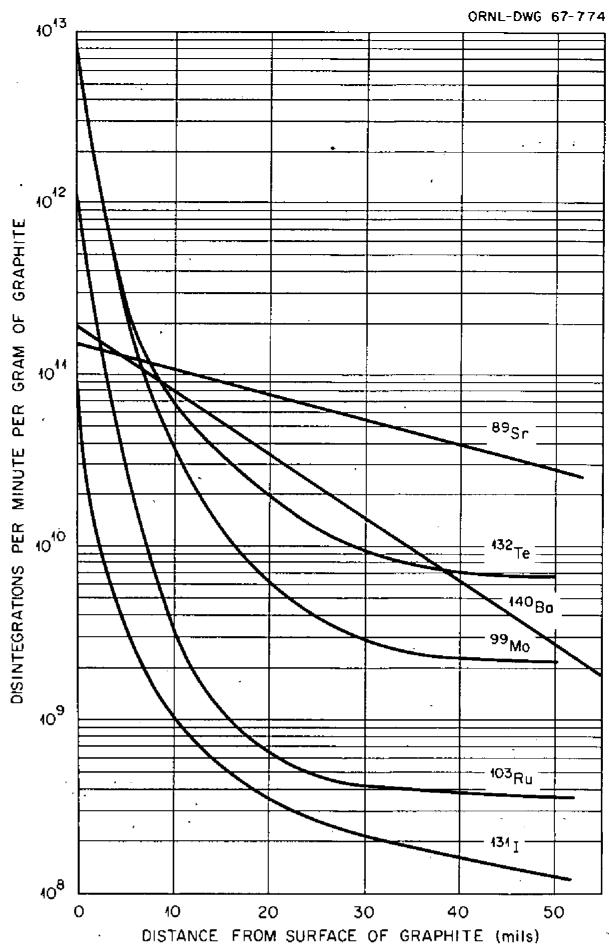  
Fig. 7.2. Distribution Profile of Fission Products in Graphite from MSRE Core.

on the operation of the reactor. The interior uranium concentrations in the top and bottom graphite were near the blank graphite value, but those in the middle graphite bar were distinctly higher and exhibited no concentration gradient.

It is interesting to compare the deposition of uranium and molybdenum in the first layer of graphite. The average value for uranium from Table 7.5 is $0.072\mu \mathrm{g}$ of $^{235}\mathrm{U}$ or $0.22\mu \mathrm{g}$ of total uranium per square centimeter. The average amount of $^{99}\mathrm{Mo}$ on the graphite surfaces at the time of reactor shutdown was $0.039\mu \mathrm{g}$ of $^{99}\mathrm{Mo}$ per square centimeter. Assuming that $^{99}\mathrm{Mo}$ indicates the deposition behavior of the stable molybdenum fission products, there must have been nearly $2\mu \mathrm{g}$ of total molybdenum per square centimeter of graphite after 7800 Mwhr of reactor operation. Thus the weight of total molybdenum depositing in the first layer of graphite was nearly ten times that of total uranium.

The amounts of seven fission products deposited on top, middle, and bottom samples of Hastelloy N from the surveillance assembly were previously reported. In addition, the following val

Table 7.5. Uranium in Graphite Surveillance Specimens   

<table><tr><td>Sample No.</td><td>Graphite Bar</td><td>Milled Layer</td><td>Micrograms of 235U per Gram of Graphite</td><td>Micrograms of 235U per Square Centimeter</td></tr><tr><td>25</td><td>Top</td><td>1</td><td>2.72a</td><td>0.080</td></tr><tr><td>29</td><td></td><td>2</td><td>0.15</td><td></td></tr><tr><td>58</td><td></td><td>3</td><td>0.16</td><td></td></tr><tr><td>60</td><td></td><td>4</td><td>0.36</td><td></td></tr><tr><td>1</td><td>Middle</td><td>1</td><td>3.56a</td><td>0.090</td></tr><tr><td>4</td><td></td><td>2</td><td>1.26</td><td></td></tr><tr><td>7</td><td></td><td>3</td><td>1.07</td><td></td></tr><tr><td>11</td><td></td><td>4</td><td>0.87</td><td></td></tr><tr><td>23</td><td></td><td>6</td><td>1.18</td><td></td></tr><tr><td>34</td><td>Bottom</td><td>1</td><td>0.66a</td><td>0.047</td></tr><tr><td>38</td><td></td><td>2</td><td>0.06</td><td></td></tr><tr><td>64</td><td></td><td>3</td><td>0.07</td><td></td></tr><tr><td>66</td><td></td><td>4</td><td>0.11</td><td></td></tr><tr><td>Graphite blank</td><td></td><td></td><td>≤0.082</td><td></td></tr></table>

${}^{a}$ Average of duplicate samples which agreed within about 10%.

ues were obtained for $^{95}\mathrm{Nb}$ deposition: top, $2.68 \times 10^{10}$ dis $\min^{-1}$ cm $^{-2}$ ; middle, $2.74 \times 10^{10}$ dis $\min^{-1}$ cm $^{-2}$ ; and bottom, $3.79 \times 10^{10}$ dis $\min^{-1}$ cm $^{-2}$ . If the niobium were distributed uniformly over the $1.2 \times 10^{6}$ cm² of Hastelloy surface in the MSRE, these values correspond to 42, 43, and 90%, respectively, of the calculated total $^{95}\mathrm{Nb}$ present at reactor shutdown in the reactor system. Thus, on the average, about half the $^{95}\mathrm{Nb}$ produced was deposited on the reactor metal walls. A similar average for the deposition of $^{95}\mathrm{Nb}$ on graphite was nearly half the total present. Correspondingly, analyses for $^{95}\mathrm{Nb}$ in recent fuel salt samples, after correction for $^{95}\mathrm{Zr}$ decay since sampling, indicated that only a low fraction of the total present remained in the salt.

The Hastelloy N samples were also analyzed for $^{60}\mathrm{Co}$ , $^{54}\mathrm{Mn}$ , Co, and Fe. The thermal and fast fluxes calculated from these values agreed satisfactorily with values from the analysis of dosimeter wires included in the surveillance package. For $^{95}\mathrm{Nb}$ , as for the fission products previously reported, there was no correlation between flux and the amount deposited on Hastelloy N.

# Fuel Salt Samples

Six additional 10-g samples of circulating molten fuel, taken primarily in connection with recent pump bowl tests to assess the effect of beryllium metal additions on the volatilization

and plating behavior of noble-metal fission products, were analyzed radiochemically for the 13 isotopes listed in Table 7.6. The data from the last of the previous five samples, FP7-12, are included in Table 7.6 for comparison. The noble-metal activities are plotted in Fig. 7.3.

# Effect of Operating Conditions

In the period of reactor operation covered by the seven tabulated samples, there were four reactor drains and a number of shutdowns, the longer of which lasted 83.5 days, 14.5 days, and 14.1 days. Sample FP8-5 was taken to test the effect of reactor drain and long shutdown (83.5 days) on the concentrations of fission products. The activities were calculated back to the time of shutdown (July 17, 1966) and should thus be comparable with the results of sample FP7-12, taken a few days before the shutdown. It is seen that the concentrations of alkaline earths, rare earths, and $^{95}\mathrm{Zr}$ were not significantly altered. The small rise in $^{131}\mathrm{I}$ concentration is attributed to a slight contamination of the sample, which would have a large apparent effect when multiplied by the large correction factor for decay for more than ten half-lives. There were, however, significant decreases by a factor of 4 in the concentrations of $^{103}\mathrm{Ru}$ , $^{106}\mathrm{Ru}$ , and $^{129}\mathrm{Te}$ , suggesting a slow deposition of these species on the metal walls of the drain tank. Similarly, the noble-metal concentrations were lower in sample FP11-22, taken 3.2 days after shutdown, than in the previous sample FP11-12, taken during power operation. The other species increased in concentration due to the 16 days of power operation between the two samples.

# Effect of Beryllium Additions

It is difficult to conclude from the data in Table 7.6 that there was a significant effect of fuel reduction on the noble-metal concentrations in the fuel. The concentrations frequently rose rather than fell, as expected, after adding beryllium. It was interesting that the $^{99}\mathrm{Mo}$ , $^{103}\mathrm{Ru}$ , $^{106}\mathrm{Ru}$ , and $^{132}\mathrm{Te}$ showed parallel rises and falls. The $^{99}\mathrm{Mo}$ results were impossibly high for samples FP11-8 and FP11-12. The high values were checked by reruns on fresh samples. If all the $^{99}\mathrm{Mo}$ produced by fission remained uniformly distributed in the fuel, the calculated concentration would be $1.4 \times 10^{11}$ dis min $^{-1}$ g $^{-1}$ . A simple calculation shows that if all the $^{99}\mathrm{Mo}$ produced by neutron activation of the $^{98}\mathrm{Mo}$ in the first 0.1-mm thickness of the Hastelloy N reactor containment vessel diffused instantaneously into the fuel melt, the increase in $^{99}\mathrm{Mo}$ concentration would be only about $10^9$ dis/min per gram of fuel. It thus appears that a mechanism is required which either concentrates fission-produced $^{99}\mathrm{Mo}$ and other noble metals in the pump bowl or results in large temporal and spatial variations in their concentrations. Dissolved $^{99}\mathrm{Mo}$ would undoubtedly be uniformly distributed. If the noble metals circulated as a suspension of insoluble metal particles, it is conceivable that they might concentrate in the pump bowl or vary in concentration with pump bowl level, cover gas pressure, and other operating variables. Since clean metal surfaces are not wet by the fuel salt, there might also be a tendency for metal particles to collect around helium bubbles, which are probably most numerous in the pump bowl. The froth or flotation hypothesis can be checked experimentally in several ways.

Table 7.6. Analyses of Fuel Salt Samples   

<table><tr><td>Experiment</td><td>FP7-12</td><td>FP8-5</td><td>FP10-12</td><td>FP10-20</td><td>FP11-8</td><td>FP11-12</td><td>FP11-22</td></tr><tr><td>Sampling date</td><td>7-13-66</td><td>10-8-66</td><td>12-28-66</td><td>1-9-67</td><td>2-13-67</td><td>2-21-67</td><td>3-9-67</td></tr><tr><td>Operating time, daysa</td><td>4.1 off, 11.9 on</td><td>11.9 on, 83.5 off</td><td>14.5 off, 13.2 on</td><td>14.5 off, 25.4 on</td><td>14 off, 16.1 on</td><td>14 off, 24.1 on</td><td>40 on, 3.2 off</td></tr><tr><td>Nominal power, Mw</td><td>7.2</td><td>0</td><td>7.4</td><td>7.4</td><td>7.4</td><td>7.4</td><td>0</td></tr><tr><td>Accumulated Mwhr</td><td>7200</td><td>7800</td><td>13,800</td><td>15,800</td><td>19,000</td><td>20,400</td><td>22,400</td></tr><tr><td>Be addition, g</td><td></td><td>5.5</td><td>10.65</td><td>11.65</td><td></td><td></td><td></td></tr><tr><td>Isotope</td><td>Fission Yield (%)</td><td></td><td colspan="5">Disintegrations per Minute per Gram of Saltb</td></tr><tr><td>9.6 hr 91Sr</td><td>5.81</td><td>1.32 × 1011</td><td></td><td>1.28 × 1011</td><td>1.31 × 1011</td><td>1.33 × 1011</td><td>1.53 × 1011</td></tr><tr><td>51 day 89Sr</td><td>4.79</td><td>3.96 × 1010</td><td>3.70 × 1010</td><td>3.83 × 1010</td><td>4.70 × 1010</td><td>4.78 × 1010</td><td>6.50 × 1010</td></tr><tr><td>33 day 141Ce</td><td>6.0</td><td>6.88 × 1010</td><td>7.20 × 1010</td><td>4.63 × 1010</td><td>4.11 × 1010</td><td>9.23 × 1010</td><td>1.10 × 1011</td></tr><tr><td>285 day 144Ce</td><td>6.0</td><td>1.91 × 1010</td><td>1.79 × 1010</td><td>2.43 × 1010</td><td>9.68 × 1010?</td><td></td><td></td></tr><tr><td>66 hr 99Mo</td><td>6.06</td><td>3.15 × 1010</td><td></td><td>3.56 × 1010</td><td>4.77 × 1010</td><td>3.20 × 1011?</td><td>2.54 × 1011?</td></tr><tr><td>39.7 day 103Ru</td><td>3.0</td><td>7.14 × 109</td><td>1.42 × 109</td><td>8.02 × 108</td><td>6.08 × 108</td><td>5.22 × 109</td><td>5.33 × 109</td></tr><tr><td>1.01 year 106Ru</td><td>0.9</td><td>-2.13 × 108?</td><td>5.00 × 107</td><td>~4.0 × 107</td><td>2.78 × 107?</td><td>1.62 × 108</td><td>~1.9 × 108</td></tr><tr><td>77 hr 132Te</td><td>4.7</td><td>3.81 × 1010</td><td></td><td>1.56 × 1010</td><td>2.04 × 1010</td><td>5.50 × 1010</td><td>3.76 × 1010</td></tr><tr><td>33 day 129mTe</td><td>0.35</td><td>4.94 × 108</td><td>1.38 × 108</td><td>1.49 × 108</td><td>~3.1 × 108</td><td></td><td></td></tr><tr><td>8.05 day 131I</td><td>3.1</td><td>5.36 × 1010</td><td>7.94 × 1010</td><td>5.46 × 1010</td><td>7.16 × 1010</td><td>4.96 × 1010</td><td>7.55 × 1010</td></tr><tr><td>35 day 95Nb</td><td>6.2</td><td>(2.45 × 1011)?</td><td>4.77 × 1010?</td><td>6.73 × 109</td><td>2.36 × 1010?</td><td>1.14 × 109</td><td>1.21 × 1010?</td></tr><tr><td>65 day 95Zr</td><td>6.2</td><td>6.55 × 1010</td><td>6.01 × 1010</td><td>5.42 × 1010</td><td>5.21 × 1010</td><td>9.34 × 1010</td><td>9.25 × 1010</td></tr><tr><td>12.8 day 140Ba</td><td>6.32</td><td></td><td></td><td>1.42 × 1011</td><td>9.00 × 1010</td><td>9.97 × 1010</td><td>1.30 × 1011</td></tr><tr><td>30 year 137Cs</td><td>6.0</td><td>3.13 × 108</td><td>4.04 × 108</td><td></td><td></td><td></td><td></td></tr></table>

${}^{a}$ Duration of previous shutdown and of continuous operating time just before sample was taken; vice versa for the two samples taken during shutdown.   
${}^{b}$ Calculated to the time of sampling or to the previous shutdown.

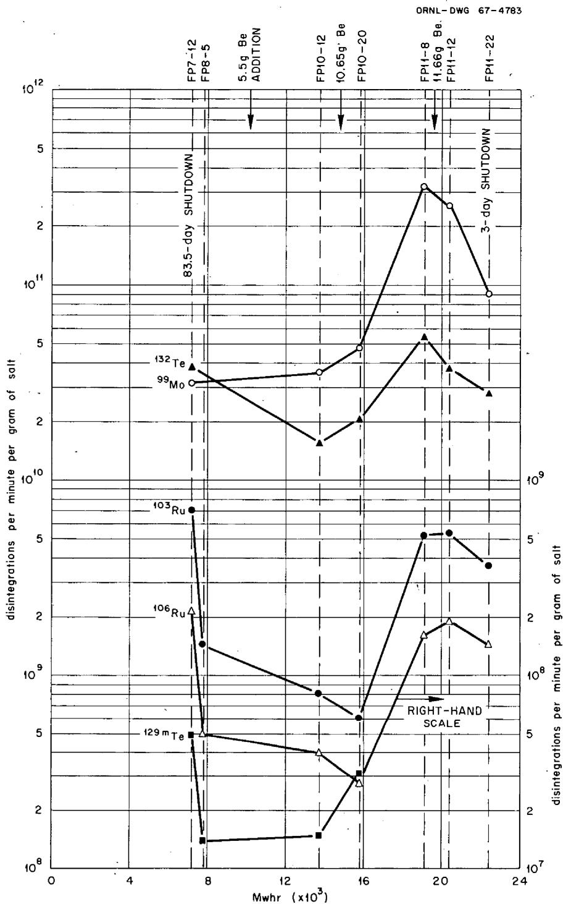  
Fig. 7.3. Nobel-Metal Activities in Fuel Samples. Calculated back to the time of sampling or to the previous shutdown.

The $^{95}\mathrm{Nb}$ concentrations in Table 7.6 varied erratically and did not parallel the behavior of the other noble metals. This is ascribed to analytical difficulties, which are being further investigated. An unavoidable difficulty is that a large correction for $^{95}\mathrm{Zr}$ decay must be made for each salt analysis.

The other fission products ( $^{91}\mathrm{Sr}$ , $^{89}\mathrm{Sr}$ , $^{141}\mathrm{Ce}$ , $^{144}\mathrm{Ce}$ , $^{131}\mathrm{I}$ , $^{95}\mathrm{Zr}$ , and $^{140}\mathrm{Ba}$ ) generally showed approximately the expected yields in the salt phase within analytical error. It was reported previously that reactor power levels calculated from the observed concentrations of elements like strontium and cerium, which remain in the fuel phase, were consistently about 20% lower than the power levels calculated from coolant heat balances. This discrepancy has persisted in the analyses of the new fuel salt samples. To date there have been several dozen radiochemical analyses, all of which indicate lower than nominal power levels.

# Pump Bowl Volatilization and Plating Tests

Six pump bowl tests were run in this report period in which metal specimens were exposed to the gas phase and the fuel phase of the pump bowl for $10\mathrm{min}$ . The previous technique17 was modified slightly in that the coils of silver and Hastelloy N were attached beside the capsule cables rather than being wound on them. This facilitated sample disassembly in the hot cell and furnished an additional specimen of stainless steel cable in the gas phase. Each of the four gas-phase specimens (Hastelloy N, silver, nickel-plated key, and stainless steel cable) and the single fuel-immersed specimen (stainless steel cable) were leached or dissolved, and the solutions were analyzed for at least nine fission products and for $^{235}\mathrm{U}$ .

The gross features of fission product behavior in these runs were similar to those reported previously, with heavy deposition of the noble-metal fission products on all specimens and light contamination by $^{95}\mathrm{Zr}$ , rare earths, and alkaline earths. All the analytical data obtained will not be presented since the mass of detail would be confusing. However, to make clear the effect of the three beryllium additions, the depositions on the Hastelloy N specimens in the gas phase and the stainless steel samples in the fuel phase are presented in detail in Tables 7.7 and 7.8. The results on the other gas-phase specimens were generally qualitatively similar to those on the Hastelloy N samples.

It is seen from Table 7.7 that noble-metal volatilization usually increased after the first and third beryllium additions and decreased as expected only after the second addition. Nevertheless, the average deposition on the gas-phase specimens was slightly lower after the three additions than it had been previously. Much larger decreases in volatilization followed reactor shutdown. Experiment FP8-5 was run just before power operation was resumed after an 83.5-day shutdown, and FP11-12 after a 3.2-day shutdown. In each case, activities were calculated back to the time of shutdown. The deposition on the gas-phase specimens of elements with stable

Table 7.7. Fission Product Deposition on Hastelloy N   

<table><tr><td>Experiment</td><td>FP7-12</td><td>FP8-5</td><td>FP10-12</td><td>FP10-20</td><td>FP11-8</td><td>FP11-12</td><td>FP11-22</td></tr><tr><td>Sampling date</td><td>7-13-66</td><td>10-8-66</td><td>12-28-66</td><td>1-9-67</td><td>2-13-67</td><td>2-21-67</td><td>3-9-67</td></tr><tr><td>Operating time, daysa</td><td>4.1 off, 11.9 on</td><td>11.9 on, 83.5 off</td><td>14.5 off, 13.2 on</td><td>14.5 off, 25.4 on</td><td>14 off, 16.1 on</td><td>14 off, 24.1 on</td><td>40 on, 3.2 off</td></tr><tr><td>Nominal power, Mw</td><td>7.2</td><td>0</td><td>7.4</td><td>7.4</td><td>7.4</td><td>7.4</td><td>0</td></tr><tr><td>Accumulated Mwhr</td><td>7200</td><td>7800</td><td>13,800</td><td>15,800</td><td>19,000</td><td>20,400</td><td>22,400</td></tr><tr><td>Be addition, g</td><td></td><td>5.5</td><td>10.65</td><td></td><td>11.66</td><td></td><td></td></tr><tr><td>Isotope</td><td>Fission Yield (%)</td><td></td><td colspan="5">Disintegrations per Minute on Total Specimenb</td></tr><tr><td>66 hr 99Mo</td><td>6.06</td><td>3.35 × 1010</td><td>4.00 × 1010</td><td>1.36 × 1011</td><td>5.61 × 1010</td><td>1.51 × 1011</td><td>2.49 × 1010</td></tr><tr><td>39.7 day 103Ru</td><td>3.0</td><td>2.14 × 109</td><td>3.60 × 108</td><td>1.03 × 109</td><td>4.71 × 108</td><td>2.25 × 109</td><td>1.14 × 109</td></tr><tr><td>1.01 year 106Ru</td><td>0.9</td><td>~7.2 × 107</td><td>~7.0 × 106</td><td>3.63 × 107</td><td>1.5 × 107</td><td>7.1 × 107</td><td></td></tr><tr><td>77 hr 132Te</td><td>4.7</td><td>3.67 × 1011</td><td>1.55 × 1011</td><td>3.36 × 1011</td><td>1.20 × 1011</td><td>1.56 × 1011</td><td>2.74 × 1010</td></tr><tr><td>33 day 129mTe</td><td>0.35</td><td></td><td>8.79 × 108</td><td>2.5 × 109</td><td></td><td></td><td></td></tr><tr><td>8.05 day 131I</td><td>3.1</td><td>2.71 × 1010</td><td>1.77 × 1010</td><td>1.01 × 1010</td><td>5.77 × 109</td><td>7.58 × 109</td><td>9.68 × 108</td></tr><tr><td>35 day 95Nb</td><td>6.2</td><td></td><td>≤1.1 × 107</td><td></td><td></td><td></td><td></td></tr><tr><td>65 day 95Zr</td><td>6.2</td><td></td><td>&lt;3.6 × 106</td><td>&lt;4.0 × 106</td><td>≤4.5 × 106</td><td>≤3.2 × 106</td><td>~6.54 × 106</td></tr><tr><td>12.8 day 140Ba</td><td>6.32</td><td></td><td>1.84 × 108</td><td>2.73 × 108</td><td>1.72 × 108</td><td>1.35 × 108</td><td>7.40 × 107</td></tr><tr><td>235U, μg total</td><td></td><td>2.63</td><td>0.64</td><td>0.91</td><td>0.423</td><td>1.88</td><td>1.79</td></tr></table>

Duration of previous shutdown and of continuous operating time just before sample was taken; vice versa for the two samples taken during shutdown.   
$b$ Calculated to the time of sampling or of previous shutdown.

Table 7.8. Fission Product Deposition from Fuel on Stainless Steel   

<table><tr><td>Experiment</td><td>FP7-12</td><td>FP8-5</td><td>FP10-12</td><td>FP10-20</td><td>FP11-8</td><td>FP11-12</td><td>FP11-22</td></tr><tr><td>Sampling date</td><td>7-13-66</td><td>10-8-66</td><td>12-28-66</td><td>1-9-67</td><td>2-13-67</td><td>2-21-67</td><td>3-9-67</td></tr><tr><td>Operating time, daysa</td><td>4.1 off, 11.9 on</td><td>11.9 on, 83.5 off</td><td>14.5 off, 13.2 on</td><td>14.5 off, 25.4 on</td><td>14 off, 16.1 on</td><td>14 off, 24.1 on</td><td>40 on, 3.2 off</td></tr><tr><td>Nominal power, Mw</td><td>7.2</td><td>0</td><td>7.4</td><td>7.4</td><td>7.4</td><td>7.4</td><td>0</td></tr><tr><td>Accumulated Mwhr</td><td>7200</td><td>7800</td><td>13,800</td><td>15,800</td><td>19,000</td><td>20,400</td><td>22,400</td></tr><tr><td>Be addition, g</td><td></td><td>5.5</td><td>10.65</td><td></td><td>11.66</td><td></td><td></td></tr><tr><td>Isotope</td><td>Fission Yield (%)</td><td colspan="6">Disintegrations per Minute per Specimenb</td></tr><tr><td>66 hr 99Mo</td><td>6.06</td><td>1.30 × 1011</td><td></td><td>2.23 × 1011</td><td>3.13 × 1011</td><td>7.28 × 1011</td><td>4.20 × 1011</td></tr><tr><td>39.7 day 103Ru</td><td>3.0</td><td>3.10 × 109</td><td>5.90 × 108</td><td>2.24 × 109</td><td>9.50 × 109</td><td>1.88 × 108?</td><td>1.38 × 109</td></tr><tr><td>1.01 year 106Ru</td><td>0.9</td><td>6.60 × 107</td><td>1.77 × 107</td><td>~9.2 × 107</td><td>2.96 × 108</td><td>5.6 × 106?</td><td>4.04 × 107</td></tr><tr><td>77 hr 132Te</td><td>4.7</td><td>2.21 × 1011</td><td></td><td>3.59 × 1011</td><td>1.96 × 1011</td><td>3.84 × 1010</td><td>3.67 × 1010</td></tr><tr><td>33 day 129mTe</td><td>0.35</td><td></td><td>3.17 × 108</td><td>1.09 × 108</td><td>1.34 × 109</td><td></td><td></td></tr><tr><td>8.05 day 131I</td><td>3.1</td><td>3.85 × 1010</td><td>1.23 × 109</td><td>1.71 × 1010</td><td>1.19 × 1010</td><td>3.38 × 109</td><td>2.15 × 109</td></tr><tr><td>35 day 95Nb</td><td>6.2</td><td></td><td>7.87 × 1010</td><td>≤1.7 × 107</td><td></td><td></td><td></td></tr><tr><td>65 day 95Zr</td><td>6.2</td><td></td><td>2.84 × 107</td><td>&lt;6.5 × 106</td><td>&lt;1.2 × 107</td><td>≤1 × 107</td><td>~6.3 × 106</td></tr><tr><td>12.8 day 140Ba</td><td>6.32</td><td></td><td></td><td>4.81 × 108</td><td>1.71 × 108</td><td>4.34 × 107</td><td>3.25 × 107</td></tr><tr><td>235U, μg total</td><td></td><td></td><td></td><td>24</td><td>17.6</td><td></td><td>1.65</td></tr></table>

${}^{a}$ Duration of previous shutdown and of continuous operating time just before sample was taken; vice versa for the two samples taken during shutdown.   
$b$ Calculated to the time of sampling or of previous shutdown.

fluorides was not affected either by fuel reduction or reactor shutdown. The fact that noble-metal fission products volatilized to a considerable degree after reactor shutdown indicated that the process of fission was not directly related to the volatilizing process.

As in previous runs, it was observed that deposition on the four different metal specimens was of similar magnitude for all species. Less reaction of noble-metal fluorides with silver in particular was expected since AgF is relatively unstable. In experiment FP11-22 a gold wire coil was substituted for the silver one, and it picked up as much of the noble metals as the other metal specimens. This lack of chemical discrimination is puzzling and casts some doubt on the supposition that the noble-metal fission products leave the fuel phase as high-valent fluorides. To eliminate the possibility that the observed deposition was due to reaction with oxide films on the metal specimens, experiments are planned in which the specimens will be reduced before insertion into the pump bowl. These observations of deposition indicate the value of laboratory experiments to identify the chemical nature of the noble-metal species that volatilize from radioactive fuel salt. Such experiments appear to be feasible using either mass spectrometric or gas chromatographic techniques.

The data in Table 7.8 show that the average deposition of noble metals was heavier on the stainless steel cable immersed in fuel than on Hastelloy N in the gas phase, although contamination by salt, as indicated by $^{95}\mathrm{Zr}$ , $^{140}\mathrm{Ba}$ , etc., was no greater. It was interesting that the plating behavior generally paralleled the volatilization behavior. Thus on the average, the amount of noble metals plated decreased after the second beryllium addition but increased after the first and third additions, as did deposition on the gas-phase specimens. Also, the amount plated was distinctly lower in the two runs made after reactor shutdown. This parallelism is consistent with the theory that high-valent noble-metal species in the fuel take part in both the plating and volatilization processes. More information on the nature of the high-valent species in the fuel may be obtained by immersing specimens of other metals besides stainless steel in future pump bowl tests.

Because of the practical interest in the behavior of the molybdenum and $^{99}\mathrm{Tc}$ fission products, the results of these pump bowl tests for $^{99}\mathrm{Mo}$ are given in detail in Table 7.9. The questionable effect of fuel reduction and the definite effect of reactor shutdown are shown clearly. It is seen that deposition on the nickel-plated key was relatively heavy, as observed previously, while depositions on the other specimens were of similar lower magnitudes. The larger size of the nickel specimen probably accounts for the larger total amount deposited. The heavy deposit on the key suggests the truly gaseous nature of the $^{99}\mathrm{Mo}$ species, since the key is surrounded by the latch and only its bottom tip projects into the pump bowl space. The qualitative nature of these tests is shown by the data in Table 7.9. It might be concluded from Table 7.9 that deposition of $^{99}\mathrm{Mo}$ on silver was uniformly higher than on Hastelloy N. This is not borne out by previous data, nor by the behavior of the other noble metals. Individual values are probably reproducible only within a factor of about 4. On this basis, only sizable changes in deposition, such as between the last two runs, are to be considered significant.

Table 7.9. Deposition of ${}^{99}\mathrm{{Mo}}$ on Pump Bowl Specimens   

<table><tr><td>Experiment</td><td>FP7-12</td><td>FP10-12</td><td>FP10-20</td><td>FP11-8</td><td>FP11-12</td><td>FP11-22</td></tr><tr><td>Sampling date</td><td>7-13-66</td><td>12-28-66</td><td>1-9-67</td><td>2-13-67</td><td>2-21-67</td><td>3-9-67</td></tr><tr><td>Operating time, daysa</td><td>11.9/4.1</td><td>13.2/14.5</td><td>25.4/14.5</td><td>16.1/14</td><td>24.1/14</td><td>40/3.2</td></tr><tr><td>Nominal power, Mw</td><td>7.2</td><td>7.4</td><td>7.4</td><td>7.4</td><td>7.4</td><td>0</td></tr><tr><td>Accumulated Mwhr</td><td>7200</td><td>13,800</td><td>15,800</td><td>19,000</td><td>20,400</td><td>22,400</td></tr><tr><td>Be addition, g</td><td colspan="2">5.5</td><td>10.65</td><td colspan="2">11.66</td><td></td></tr><tr><td>Sample</td><td colspan="6">Disintegrations per Minute per Specimenb</td></tr><tr><td></td><td>×1010</td><td>×1010</td><td>×1010</td><td>×1010</td><td>×1010</td><td>×1010</td></tr><tr><td>Hastelloy N</td><td>3.35</td><td>4.00</td><td>13.6</td><td>5.61</td><td>15.1</td><td>2.49</td></tr><tr><td>Silver</td><td>12.7</td><td>67.0?</td><td>16.2</td><td>18.2</td><td>29.3</td><td>2.82 (Au)</td></tr><tr><td>SSGc</td><td></td><td>9.57</td><td>12.7</td><td>8.90</td><td>20.2</td><td>1.83</td></tr><tr><td>Nickeld</td><td>17.6</td><td>141</td><td>105</td><td>26.7</td><td>54.6</td><td>14.4</td></tr><tr><td>SSLe</td><td>13.0</td><td>22.3</td><td>31.3</td><td>72.8</td><td>42.0</td><td>0.71</td></tr><tr><td>Fuel, dis min-1g-1f</td><td>3.15</td><td>3.56</td><td>4.77</td><td>32.0?</td><td>25.4?</td><td>9.09</td></tr></table>

The slash separates the durations of the previous shutdown and of continuous operating time just before the sample was taken; vice versa for sample FP11-22, taken during shutdown.   
$b$ Calculated to the time of sampling or of previous shutdown.   
${}^{c}$ Stainless steel cable in gas phase.   
$d_{\mathrm{Nickel - plated}}$ key.   
${}^{e}$ Stainless steel cable immersed in fuel phase.   
${}^{f99}\mathrm{Mo}$ activity in fuel sample taken simultaneously.

# Uranium on Pump Bowl Metal Specimens

Also recorded in Tables 7.7 and 7.8 are the quantities of $^{235}\mathrm{U}$ determined by delayed-neutron counting in the leaches of the metal specimens exposed in the MSRE pump bowl. The reported results varied from 0.4 to $24\mu \mathrm{g}$ of $^{235}\mathrm{U}$ per sample. Of the total of 25 samples run, only five exceeded $5\mu \mathrm{g}$ of $^{235}\mathrm{U}$ , with the remainder averaging $2\mu \mathrm{g}$ of $^{235}\mathrm{U}$ . No correlation was apparent between the deposition of uranium and that of fission products; thus the uranium found did not merely represent contamination of the samples by fuel salt. It is not surprising that uranium shows different chemical behavior from the noble metals. What is difficult to explain chemically is that it volatilizes or plates at all. Fortunately the extent of uranium volatilization and plating is small (as shown more conclusively in the examination of the long-term surveillance specimens) and is of negligible practical concern.

# Freeze Valve Capsule Experiments

Although valuable qualitative information was derived from the tests in which metal specimens were exposed in the pump bowl, these tests suffered from the drawback that the results could not be interpreted quantitatively. Therefore, a capsule was designed to take a pump bowl gas sample of known volume from whose analysis the gaseous concentrations of fission product species

could be calculated. It was required that the sampling device be small enough to pass freely through the bends of the $1 \frac{1}{2}$ -in.-diam sampling pipe and that it should operate automatically when it reached the pump bowl.

The device shown in Fig. 7.4 operated satisfactorily to furnish 20-cc samples of pump bowl gas. The capsule is evacuated and heated to $600^{\circ}\mathrm{C}$ , then cooled under vacuum to allow the $\mathrm{Li}_2\mathrm{BeF}_4$ in the seal to freeze. The double seal prevents loss of $\mathrm{Li}_2\mathrm{BeF}_4$ from the capsule during sampling. The weighed, evacuated capsule is lowered into the pump bowl through the salt-sampling pipe and positioned with the bottom of the capsule 1 in. above the fuel salt level for $10\mathrm{min}$ . The freeze seal melts at the $600^{\circ}\mathrm{C}$ pump bowl temperature, and pump bowl gas fills the 20-cc volume. The capsule is then withdrawn to 2 ft above the pump bowl, and the capsule is allowed to cool. There is a slight "breathing" action of the capsule when the initial sample is partially exhaled as the capsule warms from the $\mathrm{Li}_2\mathrm{BeF}_4$ liquidus temperature $(457^{\circ}\mathrm{C})$ to $600^{\circ}\mathrm{C}$ . As the capsule cools from 600 to $457^{\circ}\mathrm{C}$ in the sampling pipe, additional gas is drawn into the capsule. The double freeze seal prevents loss of the salt seal during the exhalation.

ORNL-DWG 67-4784

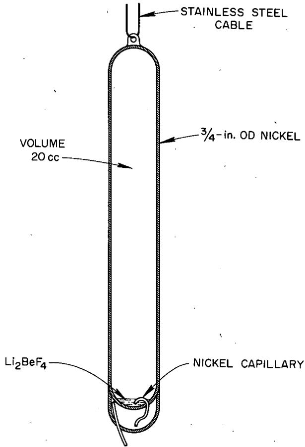  
Fig. 7.4. Freeze Valve Capsule.

It is thought that the reactive fission product gases first inhaled react rapidly with the interior metal (nickel or stainless steel) walls of the capsule, so that correction need not be made for loss during the exhalation. The final inhalation is 2 ft up the pipe, where the atmosphere should be relatively pure helium.

The cooled resealed capsule is withdrawn from the sampling pipe and transported in a carrier to the analytical hot cells. Here a Teflon plug is placed over the protruding capillary and the exterior of the capsule is thoroughly leached free of fission product activities. The top of the capsule is cut off, and the interior metal surface is leached with basic and acid solutions for 1 hr. The bottom of the capsule is then cut at two levels to expose the bottom chamber of the capsule. The four capsule pieces are placed in a beaker and thoroughly leached with $8N\mathrm{HNO}_3$ until the remaining activity is less than $0.1\%$ of the original activity. The three leach solutions are radiochemically analyzed for the activities shown in Table 7.10 and for ${}^{235}\mathrm{U}$ by delayed-neutron counting.

Table 7.10 gives the total activities in the leach solutions for the freeze valve capsule runs made before and after the first 5.5-g beryllium addition to the fuel. The runs made after the next two beryllium additions failed since the capsules were lowered a little two far into the pump bowl and withdrew salt samples. In the two successful runs, the final leach of the segmented capsule contained about nine-tenth of the total of each of the activities. The activities either were trapped by the sealing salt or reacted very rapidly with the walls of the bottom chamber or the capillaries.

The results of Table 7.10 generally confirmed the qualitative indications from the pump bowl tests. For comparison, Table 7.10 includes the analysis of fuel salt sample FP10-20, which was taken between the two freeze valve capsule runs. It is seen that the 20-cc gas samples contained more $^{99}\mathrm{Mo}$ , $^{103}\mathrm{Ru}$ , $^{106}\mathrm{Ru}$ , and $^{132}\mathrm{Te}$ than were contained per gram of fuel salt. The slight decrease in most of these activities after adding $5.5\mathrm{g}$ of beryllium is probably within analytical error. The $^{95}\mathrm{Nb}$ activities were relatively low and may reflect the analytical difficulties with this isotope. On the other hand, the $^{95}\mathrm{Zr}$ and $^{140}\mathrm{Ba}$ activities were very low, indicating that less than $0.5\mathrm{mg}$ of fuel salt had entered the capsules. The small amounts of these activities found may have been due to the slight volatility of $\mathrm{ZrF}_4$ and to the 16-sec $^{140}\mathrm{Xe}$ precursor of $^{140}\mathrm{Ba}$ . The quantities of $^{235}\mathrm{U}$ found were low, but higher than expected. Although $0.5\mathrm{mg}$ of fuel salt would more than account for the amount of $^{235}\mathrm{U}$ found, this explanation is difficult to accept since the values for $^{95}\mathrm{Zr}$ and $^{140}\mathrm{Ba}$ were lower in the sample for which the $^{235}\mathrm{U}$ value was higher. Tentatively, the $^{235}\mathrm{U}$ values are taken as representing volatilization of uranium. The sharp drop in the uranium value after adding $5.5\mathrm{g}$ of beryllium metal was not reflected in the amounts of uranium found on the metal specimens of the corresponding pump bowl tests (see Table 7.7). This correspondence will be examined in future tests.

The known volume of the gas samples permits us to calculate quantitatively the molar gaseous concentrations of the noble metals and of uranium in the helium cover gas, also given in Table 7.10. It is seen that the gaseous concentrations represent significant partial pressures of uranium, molybdenum, ruthenium, and tellurium. The concentrations for $^{99}\mathrm{Mo}$ multiplied by the

Table 7.10. Freeze Valve Capsule Results   

<table><tr><td>Experiment</td><td colspan="2">FP10-11</td><td colspan="2">FP10-22</td><td>FP10-20</td><td></td></tr><tr><td>Sampling date</td><td colspan="2">12-27-66</td><td colspan="2">1-11-67</td><td>1-9-67</td><td></td></tr><tr><td>Operating time, daysa</td><td colspan="2">14.5 off, 12.6 on</td><td colspan="2">14.5 off, 27.7 on</td><td>14.5 off, 25.4 on</td><td></td></tr><tr><td>Nominal power, Mw</td><td colspan="2">7.4</td><td colspan="2">7.4</td><td>7.4</td><td></td></tr><tr><td>Accumulated Mwhr</td><td colspan="2">13,600</td><td colspan="2">16,200</td><td>15,800</td><td></td></tr><tr><td>Be addition, g</td><td></td><td>5.5</td><td></td><td></td><td></td><td></td></tr><tr><td rowspan="2">Isotope</td><td rowspan="2">Fission Yield (%)</td><td colspan="2">Before Be</td><td colspan="2">After Be</td><td rowspan="2">Fuel Salt (dis min-1g-1)b</td></tr><tr><td>Dis/min Totalb</td><td>Ppm</td><td>Dis/min Totalb</td><td>Ppm</td></tr><tr><td>66 hr 99Mo</td><td>6.06</td><td>2.04 × 1011</td><td>5.4</td><td>1.36 × 1011</td><td>3.6</td><td>4.77 × 1010</td></tr><tr><td>39.7 day 103Ru</td><td>3.0</td><td>3.80 × 109</td><td>1.4</td><td>2.63 × 109</td><td>1.0</td><td>6.08 × 108</td></tr><tr><td>1.01 year 106Ru</td><td>0.9</td><td>~6.7 × 107</td><td>~0.24</td><td>7.74 × 107</td><td>0.27</td><td>2.78 × 107</td></tr><tr><td>77 hr 132Te</td><td>4.7</td><td>5.73 × 1010</td><td>1.7</td><td>5.08 × 1010</td><td>1.6</td><td>2.04 × 1010</td></tr><tr><td>8.05 day 131I</td><td>3.1</td><td>9.75 × 109</td><td>0.75</td><td>2.03 × 109</td><td>0.18</td><td>7.16 × 1010</td></tr><tr><td>35 day 95Nb</td><td>6.2</td><td>≤3.26 × 107</td><td></td><td>2.09 × 108</td><td></td><td>2.36 × 1010</td></tr><tr><td>65 day 95Zr</td><td>6.2</td><td>&lt;2.9 × 106</td><td>&lt;0.0018</td><td>≤2.2 × 107</td><td>≤0.012</td><td>5.21 × 1010</td></tr><tr><td>12.8 day 140Ba</td><td>6.32</td><td>2.75 × 108</td><td>0.034</td><td>3.48 × 108</td><td>0.042</td><td>9.00 × 1010</td></tr><tr><td>235U</td><td></td><td>3.86 μg</td><td>46</td><td>0.55 μg</td><td>6.5</td><td>14,000 μg/g</td></tr></table>

${}^{a}$ Duration of previous shutdown and of continuous operating time just before sample was taken.   
${}^{b}$ Disintegrations per minute calculated to the time of sampling or of previous shutdown.

total cover gas flow (5000 liters/day) correspond to more than half the total $^{99}\mathrm{Mo}$ produced per day. Since previous material balances indicated that the bulk of the $^{99}\mathrm{Mo}$ should deposit on the Hastelloy N surfaces or remain in the salt, it is suspected that the gas concentration in the sampling volume surrounded by the mist shield is higher than in the remainder of the pump bowl gas phase. A similar calculation for the gas sample before beryllium addition indicates that more than $2\mathrm{g}$ of uranium per day would be swept out by the cover gas. The next gas sample indicated much lower uranium loss. Clearly, more analyses of freeze valve capsule samples are needed to determine more accurately the volatilization of uranium.

# Special Pump Bowl Tests

A special capsule has been designed (Fig. 7.5) to determine the concentrations of hydrocarbons and volatile fluorides in the pump bowl gas. A known volume of the sample gas is made to pass through a weighable stainless steel cloth container containing CuO. From the weight change and the fluoride analysis of the CuO, the gaseous concentrations of hydrocarbons and volatile fluorides can be calculated. A single test of this type with flush salt in the reactor has been successfully run and showed detectable amounts of hydrocarbons and HF. Quantitative results will be reported when results are available on several tests.

ORNL-DWG67-4785

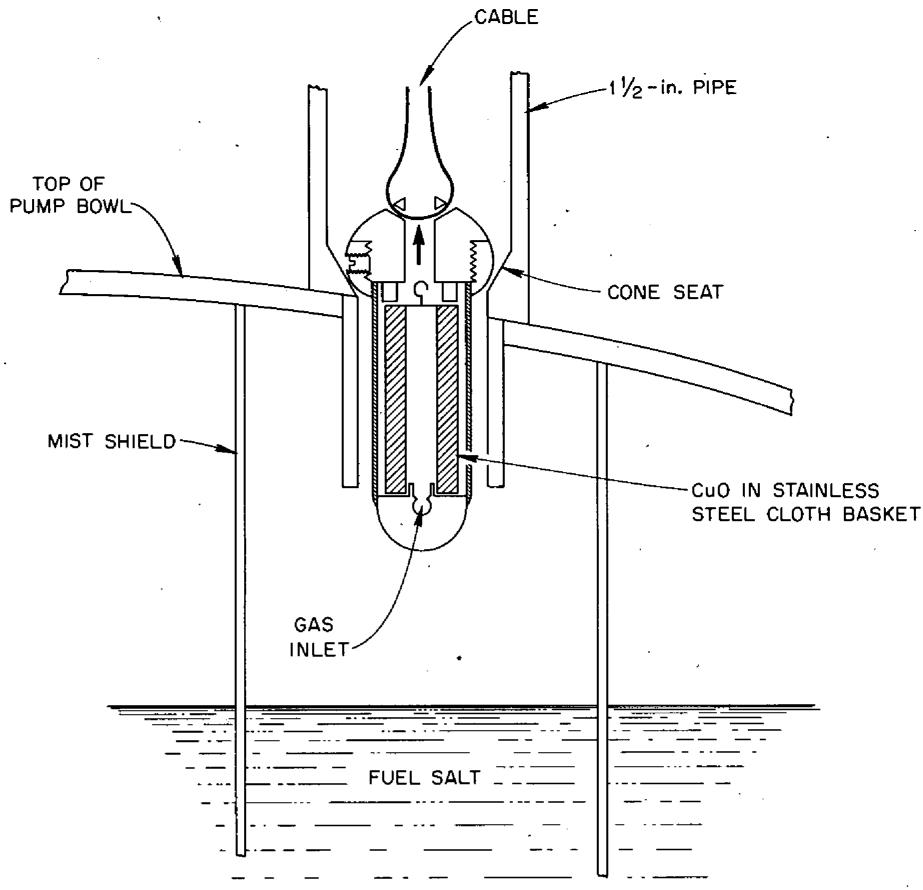  
Fig. 7.5. Hydrocarbon Analyzer.

The above test can be run only with the reactor fuel pump turned off. A variation is being developed which can be run with the reactor at power and the fuel circulating.

Another special capsule has been designed for exposing graphite specimens to both the fuel phase and the gas phase of the MSRE pump bowl. This test will permit the evaluation of noble-metal deposition on graphite under various specific short-term operating conditions.

# General Discussion of Fission Product Behavior

Additional qualitative pump bowl tests and new quantitative freeze valve capsule tests have confirmed the previously reported tendency of the noble-metal fission products to leave the fuel by volatilization and by plating on Hastelloy N. The observed behavior was difficult to interpret thermodynamically, as discussed previously. These difficulties were compounded by the currently reported observations that uranium also volatilized and that the behavior of noble metals was not significantly affected by the addition of $27.8\mathrm{g}$ of beryllium metal to the fuel, sufficient to reduce

0.65% of the $\mathbf{U}^{4+}$ content to $\mathbf{U}^{3+}$ . Analyses of the reduced salt for $\mathbf{U}^{3+}$ by a recently developed method indicated that the $\mathbf{U}^{4+}/\mathbf{U}^{3+}$ ratio was far too low to produce the observed partial pressures of volatile high-valent fluorides of noble metals and uranium.

In order to retain the volatile fluoride hypothesis, recourse must be had to kinetic explanations. It may be postulated that sizable steady-state stoichiometrically equivalent concentrations of $\mathrm{U}^{5+}$ and $\mathrm{U}^{3+}$ are produced radiolytically in the fuel melt. This postulate implies that the oxidized and reduced species do not undergo back reaction fast enough for their concentrations to fall to very low values. In the radiolysis of water at high temperatures, steady-state concentrations of $\mathrm{H}_2$ and $\mathrm{O}_2$ are produced and maintained analogously. $\mathrm{U}^{3+}$ and $\mathrm{U}^{5+}$ are logical choices for the surviving oxidized and reduced species, since $\mathrm{U}^{4+}$ is the bulk fuel constituent that is most easily reduced and most easily oxidized. Now the $\mathrm{U}^{5+}$ can oxidize the noble-metal fission products to high-valent volatile states. Bubbles of helium known to be circulating with the salt can act as kinetic traps to preserve the oxidized species from reaction with $\mathrm{U}^{3+}$ . The probability of reduction is much poorer in the dilute gas phase. The oxidized fluorides may in this way be delivered to the pump bowl and swept out.

A difficulty with this theory, aside from its several assumptions, is that noble-metal volatilization was nearly as great three days and 83.5 days after reactor shutdown (Table 7.7) as during reactor operation, whereas the radioactivity of the fuel melt and consequently its rate of radiolysis had changed by several orders of magnitude. A very strong dependence of the rate of back reaction of $\mathbf{U}^{3+}$ and $\mathbf{U}^{5+}$ on their concentrations would be required to reconcile this fact to the theory.

An alternate theory postulates that the noble metals circulate as metal sols in the fuel melt. Since the fuel melt does not wet clean metals, the sol would tend to accumulate at the interfaces of the fuel with the gas phase, such as helium bubbles. When the helium bubbles go through the spray ring and burst, some of the metal sol may be sprayed into the gas phase as a gaseous suspension, which would act like a volatile species.

Difficult to explain by this theory are the volatilization of uranium and the appreciable penetration of noble metals into the surfaces of the graphite surveillance specimens.

It is clear that information is needed on the nature of the volatilizing uranium and noble-metal species before a credible account of their behavior can be given. Experiments in this direction are planned.

The reduction of the fuel melt by adding beryllium metal will be continued until at least $1\%$ of the $\mathrm{U}^{4+}$ has been converted to $\mathrm{U}^{3+}$ . This additional reduction may have some effect on noble-metal volatilization. The addition of a little hydrogen to the helium cover gas may be effective if volatile fluorides are involved. The effectiveness of hydrogen in reducing noble-metal volatilization may be tested in the hot cell by measuring the volatilization from a large sample of molten MSRE salt during sparging with helium and with hydrogen.

# 7.3 PHYSICAL CHEMISTRY OF FLUORIDE MELTS

The Oxide Chemistry of LiF-BeF $_2$ -ZrF $_4$ Mixtures

B. F. Hitch

C. F. Baes, Jr.

Previously described measurements $^{18,19}$ of the solubility of $\mathrm{BeO}$ in $\mathrm{LiF - BeF}_2$ mixtures and of the solubility of $\mathrm{ZrO}_2$ in simulated MSRE fuel-salt-flush-salt mixtures have been completed. The results, which have been reported more fully elsewhere, $^{20}$ may be summarized by the following expressions:

In $\mathbf{LiF - BeF}_2$ saturated with BeO at 500 to $700^{\circ}\mathrm{C}$

$$
\log X _ {\mathrm {o} ^ {2 -}} = - 0. 9 0 1 + 1. 5 4 7 X _ {\mathrm {B e F} _ {2}} - 2 6 2 5 / T.
$$

In $(2\mathrm{LiF - BeF}_2) + \mathrm{ZrF}_4$ saturated with $\mathrm{ZrO}_2$ at 500 to $700^{\circ}\mathbf{C}$ ,

$$
X _ {0 ^ {2 -}} = \frac {a}{\left(X _ {Z r F _ {4}}\right) ^ {1 / 2}} + b \left(X _ {Z r F _ {4}}\right) ^ {3 / 2},
$$

wherein

$$
\log a = - 1. 5 3 0 - 2 9 7 0 / T,
$$

$$
\log b = - 1. 1 9 5 - 2 0 5 5 / T.
$$

In these expressions, the mole fraction is defined

$$
\dot {X} _ {i} = \frac {n _ {i}}{n _ {\mathrm {L i F}} + n _ {\mathrm {B e F} _ {2}} + n _ {\mathrm {Z r F} _ {4}}}
$$

$\mathrm{ZrO}_2$ replaces BeO as the least soluble oxide when $X_{\mathrm{ZrF}_4}$ exceeds 0.0008. This corresponds to 1.6 wt % fuel salt in flush salt. With further increases in the amount of fuel salt, the oxide tolerance decreases at a given temperature, passes through a minimum at $X_{\mathrm{ZrF}_4}$ approximately equal to 0.01, corresponding to approximately 20 wt % fuel salt, and then increases (Fig. 7.6).

Solubilities of $\mathsf{SmF}_3$ and $\mathsf{NdF}_3$ in Molten LiF-BeF $_2$ (66-34 Mole %)

F. A. Doss

F. F. Blankenship

J. H. Shaffer

Measurements of rare-earth fluoride solubilities in molten LiF-BeF $_2$ mixtures have been resumed to supplement earlier data on rare-earth trifluoride solubility behavior in molten fluoride systems.[21] This experimental program will examine the behavior of those rare earths which are

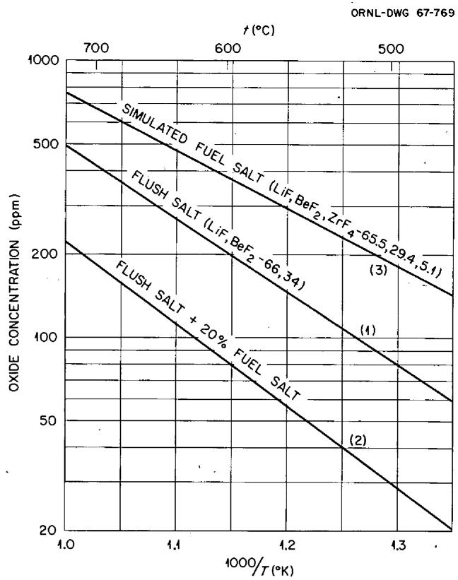  
Fig. 7.6. Estimated Oxide Tolerance in MSRE Salt Mixtures. (1) Flush salt saturated with BeO, (2) flush-salt-fuel-salt mixture of minimum oxide tolerance, and (3) fuel salt.

of interest to fuel reprocessing studies for the reference design MSBR and whose solubilities in the proposed MSBR fuel solvent have not been previously measured. The solubility of $\mathbf{SmF}_3$ in LiF-BeF $_2$ (66-34 mole %) was determined for comparison with previous data in a similar fluoride solvent and with anticipated measurements of $\mathbf{SmF}_2$ solubilities in the same solvent.

The experimental method essentially duplicated that of the earlier investigation. Filtered samples of the saturated solvent were withdrawn at $50^{\circ}$ temperature intervals while heating and cooling the molten mixture between 550 and $800^{\circ}\mathrm{C}$ . Rare-earth concentrations in the filtered samples were determined by radiochemical techniques. In the current study rare earths were labeled in situ with an appropriate radioisotope at temperatures in excess of that required for complete dissolution of the added rare-earth fluoride. Earlier studies incorporated the radiotracer during the preparation of the rare-earth trifluoride.

Experimental values of the solubility of $\mathrm{SmF}_3$ in LiF-BeF $_2$ (66-34 mole %) at 600, 700, and $800^{\circ}\mathrm{C}$ were 0.013, 0.024, and 0.040 mole fraction respectively. Solubilities of $\mathrm{NdF}_3$ in the same solvent were 0.010, 0.019, and 0.035 mole fraction at 600, 700, and $800^{\circ}\mathrm{C}$ respectively. Heats of solution of 10.5 kcal/mole for $\mathrm{SmF}_3$ and 11.5 kcal/mole for $\mathrm{NdF}_3$ were calculated from the linear dependence of the logarithm of the solubility values on the reciprocal of the absolute temperature, as shown in Fig. 7.7.

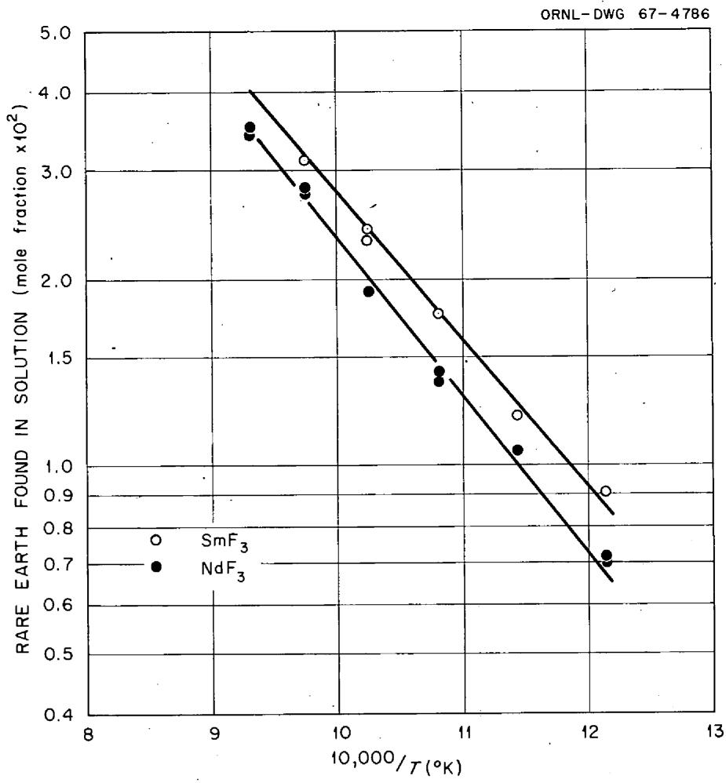  
Fig. 7.7. Temperature Dependence of the Solubility of $\mathsf{SmF}_3$ and $\mathsf{NdF}_3$ in Molten LiF-BeF $_2$ (66-34 Mole%).

Current solubility values for $\mathsf{SmF}_3$ coincide with those obtained previously in the solvent LiF $\mathsf{BeF}_2$ - $\mathsf{UF}_4$ (62.8-36.4-0.8 mole % respectively) only at $650^{\circ}\mathsf{C}$ . The heat of solution of $\mathsf{SmF}_3$ by the previous data is about 13.9 kcal/mole. Although no discrepancies in the two experimental procedures are apparent, further studies would be required to resolve possible solvent effects.

# Possible MSBR Blanket-Salt Mixtures

S. Cantor

R. E. Thoma

The blanket salt proposed in the MSBR reference design report is an $^7\mathrm{LiF - BeF}_2$ -ThF $_4$ mixture (71-2-27 mole %), whose liquidus temperature is $1040^{\circ}\mathrm{F}$ ( $560^{\circ}\mathrm{C}$ ). Alternate compositions of $^7\mathrm{LiF - BeF}_2$ -ThF $_4$ may appear to be attractive as blanket salts if the advantages of lower liquidus

temperatures are not offset by the attendant reduction of thorium concentration. (The concentrations of $\mathsf{BeF}_2$ are not sufficient to affect the viscosity adversely.) Mixtures of $^7\mathsf{LiF - BeF}_2$ -ThF_4 whose compositions lie along the even-reaction boundary curve

$$
L \rightleftharpoons 3 \mathrm {L i F} \cdot \mathrm {T h F} _ {4} (s s) + 7 \mathrm {L i F} \cdot 6 \mathrm {T h F} _ {4}
$$

appear to qualify as the best blanket salts from phase behavior considerations. The $\mathrm{ThF}_4$ concentration of these mixtures varies from 6.5 to 29 mole % as LiF concentrations change from 63 to 71 mole %. Liquidus temperatures for this range of compositions vary from $448^{\circ}\mathrm{C}$ ( $838^{\circ}\mathrm{F}$ ) to $568^{\circ}\mathrm{C}$ ( $1044^{\circ}\mathrm{F}$ ). In the molten state these mixtures contain thorium concentrations ranging from 850 to 2868 g/liter at approximately $600^{\circ}\mathrm{C}$ . These data are summarized in Figs. 7.8 and 7.9 and in Table 7.11. Optimization of thorium concentration and liquidus temperatures may be made with the aid of Fig. 7.8; if 2000 g/liter of thorium is adequate to achieve good breeding gain, the composition containing 17.5 mole % $\mathrm{ThF}_4$ may be used, and the liquidus temperature of this mixture is $516^{\circ}\mathrm{C}$ ( $960^{\circ}\mathrm{F}$ ).

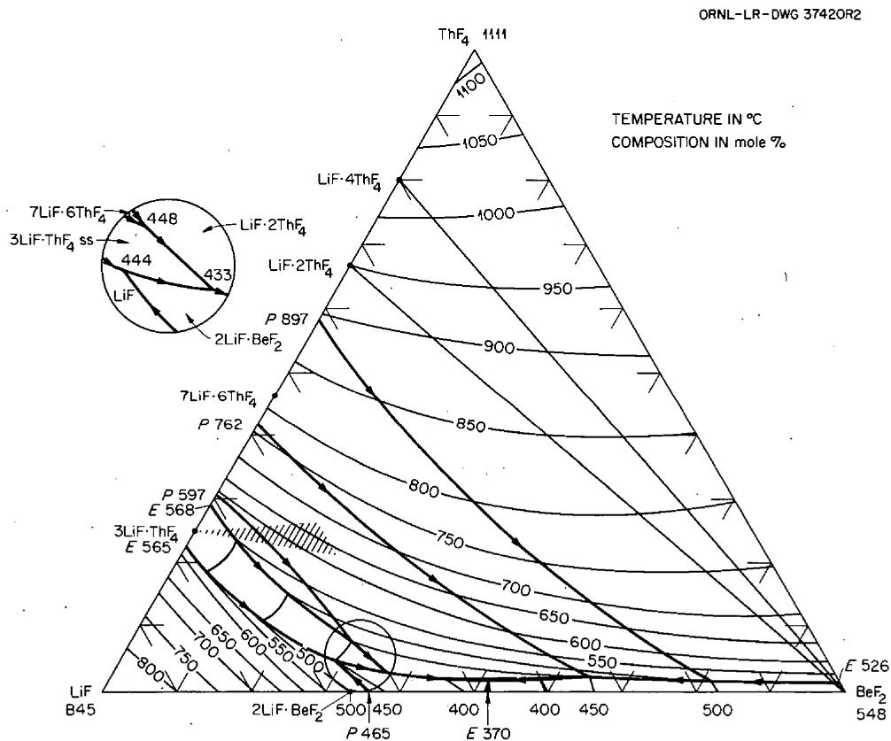  
Fig. 7.8. Phase Diagram of the System LiF-BeF $_2$ -ThF $_4$ .

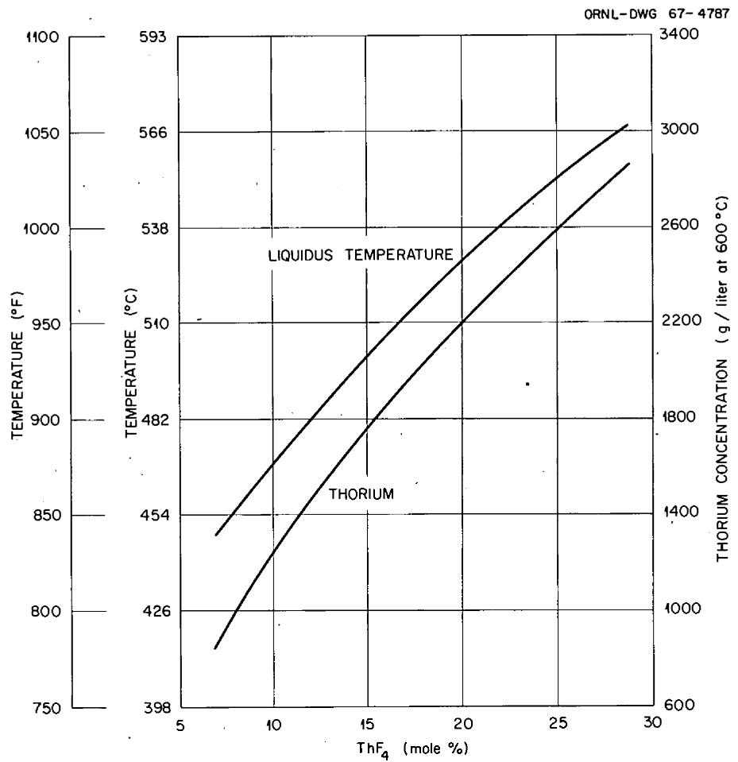  
Fig. 7.9. Thorium Content of LiF-BeF $_2$ -ThF $_4$ Compositions on the Even-Reaction Boundary Curve $L \rightleftharpoons 3LiF\cdot ThF_{4}(ss) + 7LiF\cdot 6ThF_{4}$ .

Table 7.11. MSBR Blanket Compositions   

<table><tr><td rowspan="2">Thorium Concentration1(g/liter)</td><td colspan="2">Liquidus Temperature</td><td colspan="3">Composition (mole %)</td></tr><tr><td>Degrees C</td><td>Degrees F</td><td>ThF4</td><td>LiF</td><td>BeF2</td></tr><tr><td>863</td><td>450</td><td>842</td><td>7</td><td>63</td><td>30</td></tr><tr><td>1207</td><td>469</td><td>876</td><td>10</td><td>66</td><td>24</td></tr><tr><td>1828</td><td>500</td><td>932</td><td>16</td><td>69</td><td>15</td></tr><tr><td>2419</td><td>550</td><td>1022</td><td>22.5</td><td>71</td><td>6.5</td></tr><tr><td>2868</td><td>568</td><td>1054</td><td>29</td><td>71</td><td></td></tr></table>

# 7.4 SEPARATIONS IN MOLTEN FLUORIDES

Removal of Rare Earths from Molten Fluorides by Precipitation on Solid $\mathbf{U}\mathbf{F}_{3}$

F. A. Doss

H. F. McDuffie

J. H. Shaffer

Studies of the precipitation of rare-earth trifluorides from solution in $\mathrm{LiF - BeF}_2$ (66-34 mole %) on solid $\mathrm{UF}_3$ have continued.[22] This program is concerned with the retention of rare-earth fission products on a bed of solid $\mathrm{UF}_3$ as a possible method for reprocessing the fuel solvent of the reference design MSBR. Experiments conducted thus far have examined the removal of selected rare earths from the simulated fuel solvent upon addition of solid $\mathrm{UF}_3$ . Results obtained for the removal of $\mathrm{NdF}_3$ are illustrated in Fig. 7.10. Material balance calculations of the system indicate that the composition of the solid phase varied from 0.54 to 0.22 mole % $\mathrm{NdF}_3$ in $\mathrm{UF}_3$ as $\mathrm{UF}_3$ was added to the salt mixture. Subsequent changes in the concentration of $\mathrm{NdF}_3$ and $\mathrm{UF}_3$ in the salt mixture, as the temperature was varied from 550 to $800^{\circ}\mathrm{C}$ , corresponded to a constant solid composition of 0.22 mole % $\mathrm{NdF}_3$ in $\mathrm{UF}_3$ over the temperature region.

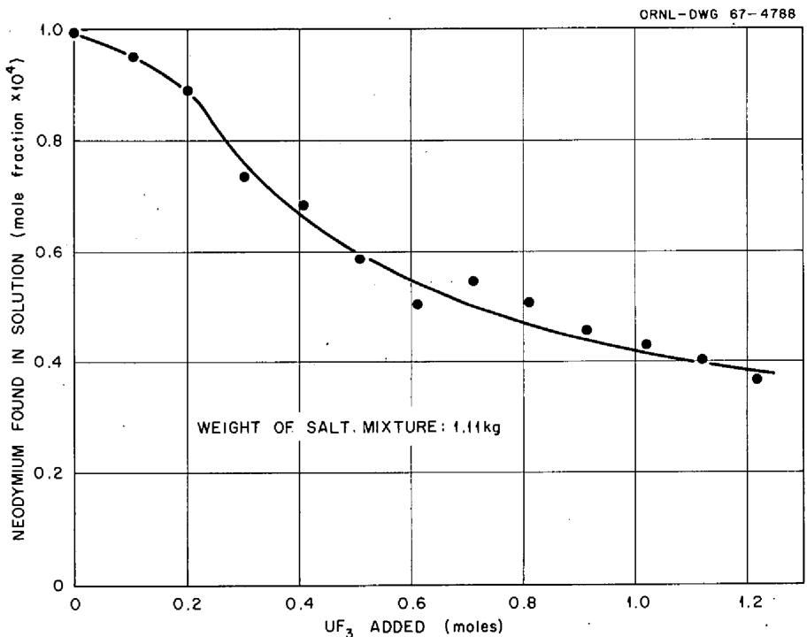  
Fig. 7.10. Removal of $\mathsf{NdF}_3$ from LiF-BeF $_2$ (66-34 Mole %) at $550^{\circ}\mathsf{C}$ by Precipitation on Solid UF $_3$ .

# Extraction of Protactinium from Molten Fluorides into Molten Metals

D. M. Moulton

W. R. Grimes

F. F. Blankenship

J. H. Shaffer

Studies of the extraction of protactinium from the MSBR blanket salt (73LiF-2BeF $_2$ -25ThF $_4$ ) by reduction with thorium-bismuth amalgams have continued. In an experiment at $650^{\circ}\mathrm{C}$ in which the salt originally contained about 600 ppm $\mathrm{UF}_4$ and a trace of $\mathrm{PaF}_4$ , thorium was added to the bismuth in several successive small increments, and after equilibration the concentrations of Li, U, Th, and Pa in the bismuth and U and Pa in the salt were measured (Li and Th in the salt stayed constant).

Letting $X_{m}$ and $X_{s}$ denote mole fractions in the metal and salt phases and with activity coefficients of unity, we can define a half-cell voltage for each metal:

$$
\mathfrak {E} = \mathfrak {E} _ {0} ^ {1} - \frac {R T}{n \bar {\mathcal {G}}} \ln \frac {X _ {m}}{X _ {s}}, \tag {1}
$$

where $\mathfrak{E}_0^1$ is a constant to be evaluated later. Plotting $\ln (X_m / X_s)$ for each of the four metals vs the amount of added thorium gave four parallel lines. This was taken to mean that the metals were indeed in equilibrium; therefore, all the $\mathfrak{E}$ 's were set equal to each other, requiring that the $\mathfrak{E}_0^1$ be adjusted to fit.

The standard half-cell potential $\mathfrak{E}_0$ of a metal is normally defined for the reaction $\mathbf{M} = \mathbf{M}^{n+} + n\mathbf{e}^{-}$ , where $\mathbf{M}$ is the pure metal in the physical state appropriate to the temperature and $\mathbf{M}^{n+}$ is the ion in solution referred to some standard state. Baes²³ has tabulated $\mathfrak{E}_0$ for a number of elements, using as the standard state of the ion a hypothetical unit mole fraction solution in the MSBR fuel solvent (extrapolated from dilute solution), except for Li and Be, for which the standard state is the $\mathrm{Li}_2\mathrm{BeF}_4$ mixture. These values are for the $\mathrm{Li}_2\mathrm{BeF}_4$ fuel salt but are taken here as a reasonable approximation of the Li-Th-Be blanket salt. Any variation in the concentration of the ion in the salt can be accounted for by writing

$$
\mathcal {E} = \mathcal {E} _ {0} - \frac {R T}{n \bar {\mathcal {O}}} \ln \frac {1}{\gamma_ {s} X _ {s}}, \tag {2}
$$

where $\gamma_{s}$ is the activity coefficient in the salt; thus $\mathfrak{E}_0 = \mathfrak{E}$ at unit ion activity $(\gamma_sX_s = 1)$ , and $\gamma_{s} = 1$ at low concentrations, so $\mathfrak{E}_0$ is, as stated, the voltage at an extrapolated hypothetical unit mole fraction solution.

Highly electropositive metals dissolved in bismuth do not form ideal solutions at all, even at low concentration; these are intermetallic compounds formed with substantial free energies. Nevertheless, preserving the form of Eq. (2), we can write

$$
\mathcal {E} = \mathcal {E} _ {0} - \frac {R T}{n \mathcal {G}} \ln \frac {\gamma_ {m} X _ {m}}{\gamma_ {s} X _ {s}}. \tag {3}
$$

Here $\gamma_{m} <   <   1$ even in very dilute solutions.

At this point an alternative choice of standard states is useful. In the extraction process we do not deal with pure metals but with amalgams exclusively, and we are concerned not with activities but with concentrations. If we write (3) in the form of (1) having $X_{m} / X_{s}$ , the measured quantity, as the independent variable, we find

$$
\mathcal {E} = \mathcal {E} _ {0} - \frac {R T}{n \tilde {\mathcal {G}}} \ln \frac {\gamma_ {m}}{\gamma_ {s}} - \frac {R T}{n \tilde {\mathcal {G}}} \ln \frac {X _ {m}}{X _ {s}}. \tag {3'}
$$

Since we are dealing with solutions of constant composition (Li and Th in the salt) or dilute (all the others), all of the $\gamma$ 's may be taken as constant with composition. Then we can define an alternate standard potential $\mathfrak{C}_{0}^{1}$ :

$$
\mathcal {E} _ {0} ^ {1} = \mathcal {E} _ {0} - \frac {R T}{n ^ {\prime}} \ln \frac {\gamma_ {m}}{\gamma_ {s}},
$$

and substituting this into $(3')$ we obtain (1). We see at once that $\mathfrak{E}_0^1$ is the voltage of the half-cell when $X_{m} = X_{s}$ . Here the standard states or hypothetical unit mole fraction solutions have the properties corresponding to infinite dilution. To evaluate the $\mathfrak{E}_0^{1'}$ 's we need know $\mathfrak{E}_0$ and $\gamma_{m} / \gamma_{s}$ for one of the four metals and just the ratio $X_{m} / X_{s}$ for the others. This will enable us to construct an electromotive series for the system amalgam-salt which will include protactinium, for which we do not know $\gamma$ or $\mathfrak{E}_0$ . It should be stressed that $\gamma_{m}$ and $\mathfrak{E}_0^1$ are alternate ways of accounting for the same phenomenon, the formation of intermetallic compounds with bismuth.

For lithium we have $\gamma_{m} = 9.8 \times 10^{-5}$ . Assuming that this salt acts like $\mathbf{Li}_{2}\mathbf{BeF}_{4}$ , we say that $\gamma_{s} = 2.2$ [extrapolating from (1)], which gives $\mathfrak{E}_0^{1}(\mathrm{Li}) = 1.803$ . Now we may use this to find the other $\mathfrak{E}_0^{1}$ 's, which are shown in the accompanying table.

<table><tr><td>M</td><td>-Σ0(923°K)a</td><td>-Σ1b0</td><td>γmc</td></tr><tr><td>Li</td><td>2.601</td><td>1.80</td><td>9.8 × 10-5</td></tr><tr><td>Th</td><td>1.772</td><td>1.47</td><td>4 × 10-7</td></tr><tr><td>Pa</td><td></td><td>1.32</td><td></td></tr><tr><td>U</td><td>1.368</td><td>1.28</td><td>4 × 10-3</td></tr></table>

$a - \sum_{0}^{G}(v)$ at $923^{\circ}\mathbf{K}$ is half-cell potential for pure metal $\rightarrow$ ion at hypothetical unit mole fraction in Li $_2$ BeF $_4$ (except to 0.67 mole fraction for Li).   
$\mathbf{b} - \mathbf{C}_{0}^{1}$ (v) at $923^{\circ}\mathrm{K}$ is half-cell potential for amalgam $\rightarrow$ ion in $\mathrm{Li}_2\mathrm{BeF}_4$ at $X_{m} = X_{s}$ .   
$c_{\gamma_m}$ is activity coefficient used to describe activity when referred to standard state described by $\mathfrak{S}_0$

Values of $\gamma_{s}$ can be estimated for Th and U. The salt concentration of uranium is low, so $\gamma_{s}$ may be set equal to 1. A rather crude approximation to $\gamma_{s}$ for Th is an extrapolation of $\gamma_{s}$ for U in

$\mathrm{Li}_2\mathrm{BeF}_4;^{23}$ giving $\gamma_{s} = 7.5$ . Using these and the tabulated values of $\mathfrak{E}_0$ , we find $\gamma_{m}$ as shown. Interpolation of values obtained at Brookhaven25 gives $\gamma_{m}$ for Th and U as $10^{-7}$ and $1.7 \times 10^{-4}$ respectively. An error of an order of magnitude in $\gamma_{m} / \gamma_{s}$ for Li gives four orders of error in $\gamma_{m}$ for Th and U, so considering the approximations in the calculations, the agreement is reasonable. On the other hand, $\mathfrak{E}_0^1$ changes by the same amount for all valences, so that the difference in $\mathfrak{E}_0^1$ , which is the quantity most directly related to the extraction efficiency, is not affected by errors in $\gamma_{m}$ . Therefore, although the absolute values should not be taken too seriously, they indicate fairly well the relative ease of extraction of the four elements into bismuth.

# Extraction of Rare Earths from Molten Fluorides into Molten Metals

D. M. Moulton

W. R. Grimes

F. F. Blankenship

J. H. Shaffer

As part of the program of removing lanthanide fission products from MSBR fuel solvent by reductive extraction into liquid metal, the study of the activity of lithium in bismuth amalgams has been continued. The method used has been the equilibration of amalgam-salt systems with metallic beryllium, which is insoluble in bismuth and thus has a known unit activity. An analysis of data reported earlier26 reveals that, regardless of whether the amalgam was prepared by adding Li or Be to the bismuth-salt system, only about two-thirds of the reductant metal appeared as amalgamated lithium. Because of the difficulty in accurately measuring very small changes in salt composition, mass balances were made on the basis of the metal phase only, so that it was not possible to tell whether the missing one-third was due to some systematic experimental error or represented an actual reduction process.

The use of barium as a reductant has allowed both salt and metal phases to be analyzed accurately. In this experiment Ba was added on top of the salt, through which it sank and dissolved in the bismuth. A similar procedure had been used for Be (which floats, however), while Li had been added through a dip leg directly to the bismuth. Here again it was found that only about $60\%$ of the Ba could be accounted for by Ba and Li in the bismuth. Now, however, the lost barium all appeared in the salt phase, with the mass balance generally 95 to $105\%$ . It is clear, therefore, that some unexpected reduction process was going on.

The equilibrium constant for the reaction

$$
\mathrm {B a} (m) + 2 \mathrm {L i} ^ {+} = \mathrm {B a} ^ {2 ^ {+}} + 2 \mathrm {L i} (m)
$$

is found to be 0.016, corresponding to a $\Delta F^0$ of $+7.14\mathrm{kcal / mole}$ [assuming $\gamma (\mathbf{Li}^{+}) = 1.4,$ $\gamma (\mathbf{Ba}^{2 + }) = 1]$ . $\mathbb{C}_0^1$ for the reaction $\mathbf{Ba}(m) = \mathbf{Ba}^{2 + } + 2\mathbf{e}^{-}$ is $-1.63\mathrm{v}$ using $\mathfrak{E}_0^1$ of Li as -1.80. All of these values are based on the amalgamated metal at unit mole fraction as the standard and

not on the pure element. By comparison, $\mathfrak{E}_0$ for Be is $-1.72$ , and $\mathfrak{E}_0$ for Ba is probably about $-2.2$ to $-2.3$ .

The only reducible material present in sufficient quantities to explain this behavior is beryllium ion. Excluding for the present the possibilities of $\mathrm{Be}^{+}$ and $\mathrm{Be}^{0}$ dissolved in the salt, metallic beryllium can be present only at unit activity. Thus, at equilibrium a lithium amalgam mole fraction of about 0.18 can be reached before any beryllium is formed, while Ba amalgam should not reduce $\mathrm{Be}^{2+}$ at all. However, one can imagine the formation of Be either by the metallic Ba sinking through the salt or by Li amalgam at locally high concentration before it is thoroughly mixed. If, then, any Be so formed, or Be introduced as such, should be physically disposed in such a way that it no longer can be made to contact the bismuth by agitation, it will never come to a true equilibrium. For instance, since Be floats, it may splash onto the container walls and not drain back. It is intended to test this explanation by trying to observe beryllium on the container walls, but this had not been done at the time of this writing. At least, it can be shown that the amount of lost reductant is roughly proportional to the amount added, which would be expected if this is the case. Unfortunately, some other old work, in which, when salt was contacted with an already equilibrated amalgam, more Li disappeared,[26] is still not explained.

# Protactinium Studies in the High-Alpha Molten-Salt Laboratory

C.J.Barton H.H.Stone

Data given in the previous progress report $^{27}$ showed that a large fraction of the protactinium dissolved in molten LiF-ThF $_4$ (73-27 mole %) is converted by exposure to solid thorium to a form that does not pass through a sintered copper filter. However, more than half the reduced protac-tinium remained suspended in the molten salt. It was also reported that efforts to convert the dis-solved protactinium into a more readily recoverable form by electrolytic reduction had been un- successful. Further studies of the reduction process and other potential recovery methods are briefly summarized here.

Electrolytic Reduction. - Three experiments were performed in an effort to transfer protactinium from molten LiF-ThF $_4$ (73-27 mole %) to liquid bismuth by electrolysis. The fraction of the protactinium reduced to a form that would not pass through a sintered copper filter varied from 0.5 to 0.95. In all three cases, analysis of samples of the bismuth layer that had passed through sintered stainless steel filters indicated that only a few percent of the original protactinium content of the salt phase was dissolved in the molten metal. Because of lack of encouraging results, we have temporarily discontinued the electrolytic approach to protactinium recovery.

Thorium Reduction in a Bismuth-Containing Melt. - An experiment was performed to determine whether transfer of reduced protactinium from the salt phase to bismuth would be improved by carrying out the reduction in the presence of dissolved bismuth. This experiment was carried out

in a niobium-lined nickel pot equipped with a niobium dip leg. The $^{231}\mathrm{Pa}$ , $^{233}\mathrm{Pa}$ (in irradiated LiF-ThF $_4$ ), and $0.55\mathrm{g}$ of $\mathrm{Bi}_2\mathrm{O}_3$ were mixed with LiF-ThF $_4$ (73-27 mole %) and given a 30-min treatment with mixed HF and $\mathrm{H}_2$ . After adding bismuth metal to the molten salt, the salt phase was exposed to a freshly cleaned thorium rod, approximately $\frac{1}{4}$ in. in diameter, for three consecutive 45-min periods. After the third exposure the protactinium concentration had been reduced to about $12\%$ of the initial value.

The crusts collected from the three thorium rods used in this experiment (13.0 g total) contained approximately 6.5 g of bismuth, far more than could be accounted for by the change in bismuth content of the filtered samples. The bismuth recovered as a separate phase weighed 51 g, as compared with the calculated value of 89 g. Further experimentation will be required to provide a satisfactory explanation of these observations.

Thorium Reduction in the Presence of Iron Surface (Brillo Process). Shaffer reported $^{28}$ that when a tracer quantity of $^{233}\mathrm{Pa}$ precipitated from molten LiF-BeF $_2$ -ThF $_4$ (73-2-25 mole %) in the presence of a large amount of iron surface in the form of steel wool (Brillo), most of the $^{233}\mathrm{Pa}$ activity remained with the steel wool when the salt drained away. We have performed a series of experiments that confirm Shaffer's finding with $^{231}\mathrm{Pa}$ concentrations in the approximate range 30 to 100 ppm of $^{231}\mathrm{Pa}$ .

The experiments were performed in three steps. A weighed quantity of previously purified $\mathrm{LiF - ThF_4}$ (73-27 mole %) was mixed with $^{231}\mathrm{Pa}$ and $^{233}\mathrm{Pa}$ in a nickel vessel, treated with mixed HF and $\mathbf{H}_2$ to remove oxides, and then treated with $\mathbf{H}_2$ to reduce $\mathrm{NiF}_2$ to metal and $\mathrm{PaF}_5$ to $\mathrm{PaF}_4$ . A weighed amount of grade 00 steel wool $(0.068\mathrm{m}^2 /\mathrm{g}$ surface area) was placed in a mild steel liner which was enclosed in a welded nickel vessel equipped with a stainless steel dip leg. A stream of purified hydrogen flowed through the vessel while it was heated to 800 to $820^{\circ}\mathrm{C}$ for about 4 hr and then cooled in flowing helium. The dip legs of the two vessels were then connected by a short transfer line and heated to about $650^{\circ}\mathrm{C}$ . Helium pressure applied to the salt vessel transferred the salt to the steel-lined vessel, and helium continued to flow through both vessels to provide mixing of the molten salt. A thorium rod, attached to a ${}_{8}$ -in. nickel rod, was inserted in the salt with its lower end about ${}_{4}$ in. above the bed of steel wool. After the thorium was exposed in the salt for the desired length of time, it was withdrawn, and a filtered sample of the salt was obtained with a sintered copper filter stick. This procedure was repeated, usually with a clean thorium rod, until a gross gamma count of $^{233}\mathrm{Pa}$ in the filtered sample showed that most of the protactinium had been removed from solution. The vessel connections were then reversed to transfer the salt back to the nickel vessel. Both vessels were cooled with helium flowing through them.

After it had reached room temperature, the steel-lined vessel was cut through with a small saw and the contents of the liner, consisting primarily of a ball of salt enclosing the steel wool, were removed and weighed. This material was crushed and, in some experiments, separated into mag-

netic and nonmagnetic fractions by use of a small magnet. A sample of the unfiltered salt in the nickel vessel was also removed for analysis. Alpha pulse-height analysis was used to determine the $^{231}\mathrm{Pa}$ content of all samples.

We found that thorium exposure of 1.5 to $2.2\mathrm{hr}$ reduced 95 to $99\%$ of the protactinium to a form that would not pass through the sintered copper filter medium. From 93 to $98\%$ of the protactinium remained with the steel wool, along with about $20\%$ of the salt initially present in the experiment. A surprisingly large amount of iron was found in the filtered salt samples before the salt was exposed to the steel wool. The source of this iron has not been determined, but analysis of the filtered samples indicated that, in general, the iron content of the salt decreased as the protactinium was reduced by exposure to thorium. This suggested the possibility that iron coprecipitated with the reduced protactinium was carrying the protactinium to the surface of the steel wool. We performed a pair of experiments to test this theory in which we attempted to hold all the variables constant except the iron/proctinium ratio. The results were not conclusive because repeated analyses of the salt samples have shown such a large scatter in the iron values that it was difficult to calculate reliable iron/proctinium ratios. We are currently conducting experiments with $^{59}\mathrm{Fe}$ tracer in an effort to establish the role of dissolved or colloidal iron in the retention of reduced protactinium by steel wool and to test the reliability of the currently used analytical procedure for the determination of iron in fluoride, samples. Additional experiments will be required to establish the important variables in the Brillo protactinium recovery process and to explore modifications that would make it more readily adaptable to a large-scale process.

Conclusions. - The results of our efforts to transfer protactinium from a molten breeder blanket mixture to liquid bismuth, either by electrolytic reduction or by exposure of the salt to thorium metal, have not been favorable in the small-scale glove-box experiments conducted to date. Nevertheless, the encouraging results obtained in tracer-level experiments with protactinium and rare earths suggest that continued studies are desirable.

# Preliminary Study of the System LiF-ThF $_4$ -PaF $_4$

C.J.Barton

H. H. Stone

G. D. Brunton

In the protactinium recovery studies described in the preceding section of this report, it has been generally assumed that protactinium is present in the LiF-ThF $_4$ (73 mole % LiF) melts as PaF $_4$ . This assumption has seemed plausible since the melts have, in every case, received a treatment with H $_2$ at temperatures near $650^{\circ}\mathrm{C}$ , and H $_2$ is known to reduce pure PaF $_5$ to PaF $_4$ at much lower temperatures. (The Pa $^{4+}$ state seems to be the lowest known in fluoride systems.) We have, however, conducted a few preliminary experiments to test this assumption and to see if the phase behavior of PaF $_4$ is similar to that of ThF $_4$ in mixtures with LiF.

About $100\mathrm{mg}$ of ${}^{231}\mathrm{PaF}_{4}$ was prepared by evaporating a measured portion of purified stock solution (9 M in HF) to dryness in platinum and heating the residue to $600^{\circ}\mathrm{C}$ in flowing $\mathrm{HF - H_2}$ mixture. Conversion to $\mathrm{PaF}_{4}$ was confirmed by weight and by the brown color of the material. A portion of this material was mixed with LiF-ThF ${}_{4}$ (73 mole % LiF) to yield a mix with 68 mole %

LiF and 32 mole % (Th,Pa) $\mathbf{F}_4$ . Another portion was mixed with LiF and the LiF-ThF $_4$ mixture to yield a mix with 73 mole % LiF and 27 mole % (Th,Pa) $\mathbf{F}_4$ . Both mixtures were admixed with ammonium bifluoride (whose decomposition products on heating help to minimize possible hydrolysis), heated to $650^{\circ}\mathrm{C}$ , and cooled slowly.

Examination of the slowly cooled melts showed that segregation of $\mathsf{PaF}_4$ -rich phases from the bulk of the LiF-ThF₄ material occurred in both cases. Material from the mixture with 68 mole % LiF is believed to be a solid solution of $\mathsf{LiPaF}_5$ in $\mathsf{LiThF}_5$ . One of the phases from the sample with 73 mole % LiF is believed, because of its similarity to the analogous uranium compound, to be $\mathsf{Li}_4\mathsf{PaF}_8$ . The $\mathsf{PaF}_4$ does not appear isomorphous with $\mathsf{ThF}_4$ ; the $\mathsf{LiF-PaF}_4$ system may, in fact, be more like the $\mathsf{LiF-UF}_4$ than the $\mathsf{LiF-ThF}_4$ system. It is obvious that study of the binary $\mathsf{LiF-PaF}_4$ system is needed before attempting further deductions concerning phase relations in the ternary system $\mathsf{LiF-ThF}_4$ - $\mathsf{PaF}_4$ .

A portion of the LiF-ThF $_4$ -PaF $_4$ mixture with 73 mole% LiF was transferred to a small thorium crucible and heated to $650^{\circ}\mathrm{C}$ in a helium atmosphere. Examination of the material with the polarizing microscope revealed some $\mathrm{Li}_3\mathrm{ThF}_7$ , but a large part of the mixture was in the form of opaque angular fragments, which are probably protactinium metal. X-ray examination will be required to confirm this conclusion.

# 7.5 DEVELOPMENT AND EVALUATION OF ANALYTICAL METHODS FOR MOLTEN-SALT REACTORS

Determinations of Oxide in MSRE Salts

R. F. Apple

J.M.Dale

A. S. Meyer

The analyses of oxide in radioactive salt samples from the MSRE are summarized in Table 7.12.

Table 7.12. Oxide Concentrations of MSRE Fuel-Salt Samples   

<table><tr><td>Sample</td><td>Date Received</td><td>Oxide Concentration (ppm)</td></tr><tr><td>FP-6-1</td><td>4-7-66</td><td>49</td></tr><tr><td>FP-6-4</td><td>4-14-66</td><td>55</td></tr><tr><td>FP-6-12</td><td>5-10-66</td><td>50</td></tr><tr><td>FP-6-18</td><td>5-25-66</td><td>47</td></tr><tr><td>FP-7-5</td><td>6-22-66</td><td>66</td></tr><tr><td>FP-7-9</td><td>7-4-66</td><td>59</td></tr><tr><td>FP-7-13</td><td>7-15-66</td><td>66</td></tr><tr><td>FP-7-16</td><td>7-22-66</td><td>56</td></tr><tr><td>FP-8-7</td><td>10-14-66</td><td>44</td></tr><tr><td>FP-9-2</td><td>11-9-66</td><td>44</td></tr></table>

The abrupt decrease in concentration between samples FP-7-16 and FP-8-7 coincided with the change from copper to nickel sampling ladles and may reflect an oxide blank of about 15 ppm. The overall standard deviation of these results, 8 ppm absolute, includes any variation in the oxide content of the fuel in the reactor and in oxide contamination during sampling and transfer. The results of standardization with $\mathrm{SnO}_2$ samples $^{29}$ performed during this period indicate that the precision of measurement of the water evolved by hydrofluorination is about 3 to 4 ppm absolute.

During the last week of December the oxide apparatus became inoperative. Because of hydrogen reduction experiments being performed in the same hot cell, it was not possible to enter the cell and investigate the equipment until early February. It was found that the electrolytic moisture-monitor cell was not functioning, and it was removed from the apparatus. With the current MSRE sampling schedules it should be possible to install a new cell with an improved coating30 and resume oxide determinations of radioactive salt samples during the month of March.

This replacement will be the first major maintenance required for the hot-cell apparatus since its installation in February 1966. The moisture-monitor cell had been in operation for several additional months during laboratory tests of the apparatus. This one-year operation represents a reasonable service life for a moisture-monitor cell, even under normal operating conditions in a nonradioactive environment.

During the period when the hot-cell equipment was inoperable, the oxide development apparatus in Building 4500S was reactivated. Several samples of nonradioactive fuel and solvent salt from the second ORR molten-salt loop were analyzed for oxide content. The results of these analyses are summarized in Table 7.13.

It is probable that the high oxide levels found in the third and fourth samples were in part due to the contamination during the brief period of exposure when the crushed samples were transferred to the hydrofluorinator. When possible, future samples from this source will be melted into a nickel ladle in a dry box.

$^{29}$ MSR Program Semiann. Progr. Rept. Aug. 31, 1966, ORNL-4037, p. 192.   
30 Ibid., p. 193.

Table 7.13. Oxide Concentrations of Fuel and Solvent Salt Samples from the Second ORR Molten-Salt Loop   

<table><tr><td>Sample Designation</td><td>Salt Condition as Received</td><td>Sample Weight (g)</td><td>Oxide Concentration (ppm)</td></tr><tr><td>9-29-66</td><td>Pellets</td><td>10.4</td><td>200</td></tr><tr><td>10-17-66</td><td>Pellets</td><td>10.1</td><td>220</td></tr><tr><td>11-21-66</td><td>Crushed</td><td>18.8</td><td>420</td></tr><tr><td>F-194</td><td>Crushed</td><td>18.4</td><td>820</td></tr><tr><td>Solvent salt batch No. 2</td><td>Fused into ladle</td><td>48.4</td><td>115</td></tr><tr><td>Solvent salt batch No. 17</td><td>Fused into ladle</td><td>13.1</td><td>520</td></tr></table>

The increase in oxide between the last two samples represents the oxide pickup when the flush salt was circulated in the loop.

# Determination of $\mathsf{U}^{3 + } / \mathsf{U}^{4 + }$ Ratios in Radioactive Fuel by a Hydrogen Reduction Method

J.M.Dale

R. F. Apple

A. S. Meyer

A proposed explanation of the unexpected distribution of certain fission products in the MSRE system is that the fuel had become sufficiently oxidizing to produce significant partial pressures of volatile fission product fluorides such as $\mathrm{MoF}_6$ , $\mathrm{TeF}_6$ , and $\mathrm{RuF}_6$ , which then migrated into the graphite and the blanket gas. Because the accumulation of fission products in graphite is vitally important to breeder reactors, a method for the determination of $\mathrm{U}^{3+}/\mathrm{U}^{4+}$ ratios in the radioactive fuel samples was needed.

The possibility that a significant fraction of the iron and nickel is present in the fuel as colloidal metal-particles31 precluded any adaptation of the hydrogen evolution method for $\mathbf{U}^{3+}$ , because these metallic components would also yield hydrogen on acidic dissolution. An alternate approach, suggested by C. F. Baes, is based on a transpiration method in which a sample of the molten fuel is sparged with hydrogen to reduce oxidized species according to the reaction

$$
\mathrm {M F} _ {n} + \frac {n - m}{2} \mathrm {H} _ {2} \longrightarrow \mathrm {M F} _ {m} + (n - m) \mathrm {H F},
$$

in which $\mathbf{MF}_n$ may be $\mathbf{U}\mathbf{F}_5$ , $\mathbf{NiF}_2$ , $\mathbf{FeF}_2$ , $\mathbf{CrF}_2$ , or $\mathbf{U}\mathbf{F}_4$ in order of their observed reduction potentials. The rate of production of HF is a function of the ratio of oxidized to reduced species in the melt.

Some components of the oxide apparatus $^{32}$ were adapted for the transpiration measurement on radioactive fuel samples. The inlet of a modified “hydrofluorinator” is connected to a source of thoroughly dried hydrogen and helium (see Fig. 7.11), and the outlet is connected to a heated manifold fitted with six liquid-nitrogen-cooled NaF traps. This arrangement permits the collection of the HF from four successive reduction steps with hydrogen and two blank spargings with helium on the same 50-g fuel sample. When the transpiration run is completed, the traps are disconnected from the manifold and removed from the hot cell for desorption and titration of the collected HF.

Interpretation of these titrations in terms of $\mathrm{U}^{3+}/\mathrm{U}^{4+}$ ratios in the samples is made by comparing the HF yields for the reduction steps with those calculated for hypothetical salt compositions. If $\mathrm{U}^{4+}$ is the only reducible species in the melt, a derivation based on a material balance and the hydrogen reduction equilibrium yields the rather simple relationship for $\mathrm{U}^{3+}$ as a function of hydrogen exposure:

$$
\mathrm {U} \ln \left(\frac {\mathrm {U}}{\mathrm {U} - \mathrm {U} ^ {3 +}}\right) - \mathrm {U} ^ {3 +} = B t, \tag {1}
$$

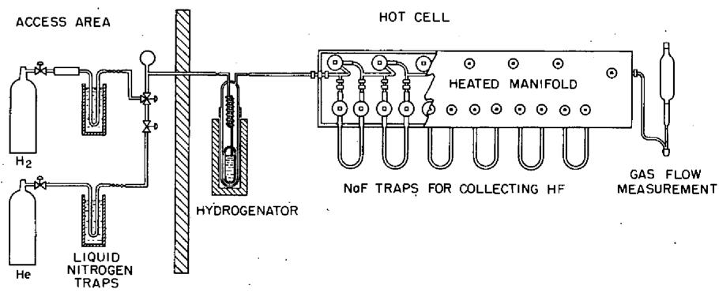  
Fig. 7.11. Diagram of the Hydrogenation Apparatus for Determination of $\mathsf{U}^{3+}/\mathsf{U}^{4+}$ Ratios in MSRE Fuel.

in which

U, $\mathbf{U}^{3+}$ are concentrations of total and trivalent uranium expressed as mole fractions,

$t$ is the reduction time from "0" $\mathbf{U}^{3+}$ concentration, min,

$$
B = \frac {K P _ {\mathrm {H} _ {2}} ^ {1 / 2} V _ {G}}{S R T},
$$

where

$$
K = \frac {U ^ {3 +} P _ {\mathrm {H F}}}{U ^ {4 +} P _ {\mathrm {H} _ {2}} ^ {1 / 2}}, \text {a t m} ^ {1 / 2},
$$

$P_{\mathbf{H}_2} =$ partial pressure of $\mathbf{H}_2$ , atm,

$P_{\mathbf{HF}} =$ partial pressure of HF, atm,

$V_{G} =$ purge flow, liters/min,

$S =$ quantity of fuel sample, moles,

$R =$ gas constant, liters atm $(^{\circ}\mathrm{K})^{-1}$ mole-1,

$T =$ temperature at which the sparge flow is measured, ${}^{\circ}\mathrm{K}$

When corrosion products $(\mathbb{M}_j^{2+})$ are present, the relationship assumes a different form as each corrosion product ion successively undergoes reduction to the metal:

$$
\alpha_ {n} \mathrm {U} - \mathrm {U} ^ {3 +} + \mathrm {U} \ln \left(\frac {\mathrm {U} - \alpha_ {n} \mathrm {U}}{\mathrm {U} - \mathrm {U} ^ {3 +}}\right) + 4 \sum_ {j = 1} ^ {j = n} \frac {K ^ {2}}{K _ {\mathrm {M} _ {j}} ^ {2}} \left(\frac {1}{\alpha_ {n}} - \frac {\mathrm {U}}{\mathrm {U} ^ {3 +}}\right) = B t _ {n}, \tag {2}
$$

in which

$$
a _ {j} = \frac {1}{1 + \left(K _ {\mathrm {M} _ {j}} / K\right) \left(\mathrm {M} _ {j} ^ {2 +}\right) ^ {1 / 2}},
$$

$\mathbf{M}_j^{2+} = \text{concentration, mole fraction, of the } j$ th corrosion product in order of reduction, at

$$
t _ {n} = 0,
$$

$t_{n}$ , min, is measured from the instant reduction of the $n$ th corrosion product starts,

$$
K _ {\mathbf {M} _ {j}} = \frac {P _ {\mathbf {H F}}}{\left(\mathbf {M} _ {j} ^ {2 +}\right) ^ {1 / 2} P _ {\mathbf {H} _ {2}} ^ {1 / 2}}.
$$

The yield of HF from any reduction step is calculated from the initial and final concentrations of $\mathbf{U}^{3+}$ and corrosion products as follows:

$$
\text {m i c r o m o l e s} \mathrm {H F} = \left\{\left(\mathrm {U} _ {f} ^ {3 +} - \mathrm {U} _ {i} ^ {3 +}\right) + 2 \sum_ {j = 1} ^ {j = n} \left[ \left(\mathrm {M} _ {j} ^ {2 +}\right) _ {i} - \left(\mathrm {M} _ {j} ^ {2 +}\right) _ {f} \right] \right\} S \times 1 0 ^ {6}. \tag {3}
$$

The relationship of Eqs. (1) and (2) is illustrated in Fig. 7.12, in which the yield of HF is plotted as a function of $Bt$ for an oxidized fuel containing $\mathrm{U}^{4+}$ and $\mathrm{Fe}^{2+}$ in concentrations approximating the elemental analyses of the MSRE fuel. On a logarithmic plot the accumulated HF yield follows a near-linear relationship [Eq. (1)] derived for an iron-free melt until a critical $\mathrm{U}^{3+} / \mathrm{U}^{4+}$ ratio is reached and reduction of $\mathrm{Fe}^{2+}$ starts. The reduction of $\mathrm{Fe}^{2+}$ then predominates, with the rate of change of $\mathrm{U}^{3+}$ reduced in accordance with Eq. (2) until substantially all of the iron is reduced and the HF yield approaches that derived from uranium reduction alone.

A computer program is being developed by the Mathematics Division to calculate HF yields for any preselected reduction steps on any melt composition. This will permit optimization of reduction steps for best distinction of $\mathrm{U}^{3+}/\mathrm{U}^{4+}$ ratios. In the absence of such a program it was possible to select four reduction steps on the criteria that the first two steps at $496^{\circ}\mathrm{C}$ would reduce at least $99.9\%$ of the $\mathrm{Fe}^{2+}$ and $\mathrm{Ni}^{2+}$ without materially affecting the $\mathrm{U}^{3+}$ concentration and that the last two steps at $596^{\circ}\mathrm{C}$ would reduce $\mathrm{U}^{3+}$ without reducing $\mathrm{Cr}^{2+}$ . The latter reductions thus serve as an indication of the "oxidation state" of the fuel. Hydrogen fluoride yields from sample FP-9-4 and from various hypothetical initial fuel compositions are plotted in Fig. 7.13. Broken lines connect calculated yield points, and a solid line connects the experimentally measured HF yields from the sample. The relatively low yields of HF in the first two steps are in agreement with earlier experimental evidence31 that only a small fraction of the iron and nickel is present in the ionic state. The high yields in the last two steps indicate that the fuel is in oxidizing or near-oxidizing condition. On the basis of the HF yield of step III and in consideration of estimated experimental errors, a ratio of $\mathrm{U}^{3+}/\mathrm{U}^{4+}$ of 0.000 to 0.001 was assigned. Sample FP-10-25, taken after the addition of sufficient beryllium metal to increase the $\mathrm{U}^{3+}/\mathrm{U}^{4+}$ ratio by 0.0037, was analyzed similarly, and the HF yield at step III corresponded to an approximate $\mathrm{U}^{3+}/\mathrm{U}^{4+}$ ratio of 0.005. This represents an increase of 0.004 to 0.005 over sample FP-9-4, in reasonable agreement with that calculated from the beryllium reduction. Hydrogen fluoride yields from sample FP-11-5, taken after a possible exposure of the fuel to air, agreed within estimated experimental error with sample FP-10-25.

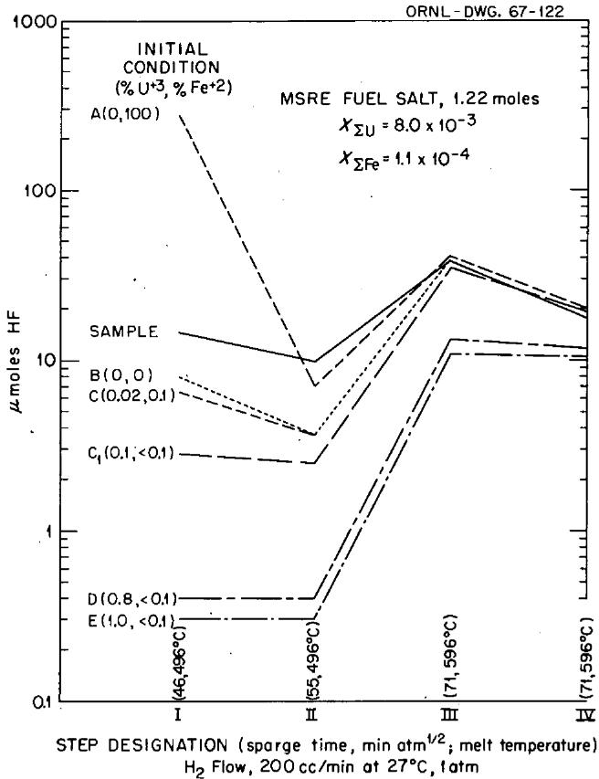  
Fig. 7.12. Calculated Yields of HF from the Hydrogenation of a 50-g Fuel Sample at $1000^{\circ}\mathrm{K}$ .

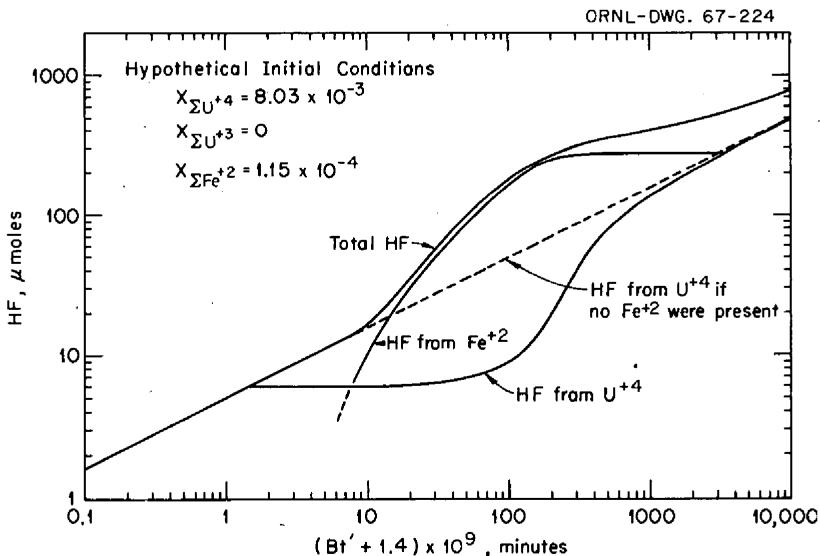  
Fig. 7.13. Calculated and Observed Yields of HF from MSRE Fuel Sample FP-9-4.

A sample (IPSL-21) taken from the second ORR molten-salt loop has also been analyzed and found to contain about $1\%$ of the uranium as $\mathrm{U}^{3+}$ . Because the composition of this sample is in the region in which $\mathrm{Cr}^{2+}$ is also reduced, a more accurate estimation of $\mathrm{U}^{3+} / \mathrm{U}^{4+}$ ratios must be deferred until the computer program is available.

Although tentative analyses by this technique are being reported, it should be recognized that the method is still in the developmental state, and adjustment of the reported values may be necessary as experience is gained. The agreement in the observed increase in $\mathrm{U}^{3+}/\mathrm{U}^{4+}$ ratios with that predicted from the beryllium addition supports the validity of the method. Preliminary calculations indicate that it may be possible to apply the method to continuous in-line analysis of the fuel for the determination of both $\mathrm{U}^{3+}/\mathrm{U}^{4+}$ ratios and significant ionic concentrations of corrosion products.

# EMF Measurements on the Nickel-Nickel(II) Couple in Molten Fluorides

D. L. Manning

H. W. Jenkins $^{33}$

Gleb Mamantov3

This study was initiated to evaluate, by potentiometric measurements on concentration-type cells, several metal-metal-ion couples for use as possible reference electrodes in molten fluorides. The approach is similar in principle to the utilization by Laitinen and Lui35 of the $\mathrm{Pt} / \mathrm{Pt}^{2+}$ couple as a reference electrode in molten chlorides.

The apparatus used to contain the melt is a small vacuum dry box (24 in. long, 20 in. deep, and 15 in. high) which is outfitted with a furnace, vacuum and controlled atmosphere facilities, and a moisture monitor. Utmost care is exercised to protect the molten fluorides from moisture contamination because of the affinity of the molten fluorides to moisture and the resultant precipitation of oxides. The melt ( $\sim$ 400 ml) is contained in a graphite cell; a spiral nickel electrode, platinum stirrer, Pt-10% Rh thermocouple, and the inner electrode compartment are positioned in the melt. The inner compartment of the cell consists of a thin-walled boron nitride compartment which contains the same fluoride melt and a fixed concentration of dissolved $\mathrm{NiF}_2$ . A nickel electrode is inserted into this compartment. Hot-pressed boron nitride is an insulator in molten fluorides but is slowly penetrated by them. As a result of this effect, BN can be utilized to separate the two half-cells and yet achieve electrical contact, because such contact is made when the BN becomes wetted by the melt. For molten LiF-NaF-KF, penetration of the BN ( $1/3_2$ -in. wall thickness) occurs within a day or so; however, it is much slower for LiF-BeF $_2$ -ZrF $_4$ melts. Approximately a week is required for the resistance through the BN to drop to $\sim$ 1000 ohms or less.

With stirring, weighed portions of $\mathrm{NiF}_2$ were added to the melt. After each addition, emf measurements were made and a sample withdrawn for nickel analysis. From the equation $\Delta E = (RT / 2.3nF) \log (X_1 / X_2)$ and plots of $\Delta E$ vs $\log X_{\mathrm{Ni}}$ , it was demonstrated that the nickel system

exhibits reasonable Nernstian behavior at $500^{\circ}\mathrm{C}$ . The concentration of nickel varied from approximately $10^{-5}$ to $10^{-3}$ mole fraction. From the standpoint of Nernstian reversibility, therefore, the nickel couple appears to be a good choice for a reference electrode in molten fluorides.

Stability studies conducted so far are encouraging. For a run in molten LiF-NaF-KF, the emf remained constant to within $\pm 2\mathrm{mv}$ over a two-week period. These studies are continuing, and longer stability tests are planned.

# Studies of the Anodic Uranium Wave in Molten LiF-BeF $_2$ -ZrF $_4$

D. L. Manning

Additional observations were made of the anodic wave at $\sim +1.4$ v vs a platinum quasi-reference electrode in fluoride melts that contain $\mathbf{U}^{4+}$ . It is tentatively postulated that the wave is due to the anodic oxidation of $\mathbf{U}^{4+}$ to $\mathbf{U}^{5+}$ . The reduction of $\mathbf{U}^{4+}$ to $\mathbf{U}^{3+}$ is observed at approximately $-1.2$ v. For simple charge-transfer processes, the wave heights for the two electrode reactions should be the same for the same rate of voltage scan. The anodic wave, however, is larger than the cathodic wave when a platinum- $10\%$ rhodium electrode is used. This suggests that the anodic wave may be a charge transfer followed by a catalytic reaction, that is, disproportionation of $\mathbf{U}^{5+}$ . The observations, however, were not the same when the waves were recorded at a Pt- $40\%$ Rh electrode. At this electrode, the anodic and cathodic wave heights were about the same. It would thus appear that the electrode material itself may be influencing the magnitude of the anodic wave, that is, acting as a catalyst for the disproportionation of $\mathbf{U}^{5+}$ . Also, the possibility that the products of the electrode reaction $(\mathbf{U}^{5+}, \mathbf{U}^{6+}, \text{etc.})$ are attacking the electrode should not be overlooked. These studies are continuing, and it is planned to test other electrode materials.

# Spectrophotometric Studies of Molten-Salt Reactor Fuels

J.P．Young

The determination of changes in the ppm concentration level of $\mathbf{U}^{3+}$ in molten fluoride fuel salts which contain $\mathbf{U}^{4+}$ is one of the expected applications of the proposed in-line spectrophotometer $^{36}$ for the MSBR. In cooperation with F. L. Whiting $^{33}$ and Gleb Mamantov, $^{34}$ the voltametric generation and simultaneous spectrophotometric observation of ppm concentrations of $\mathbf{U}^{3+}$ are being investigated in LiF-BeF $_2$ -ZrF $_4$ melts which contain $2\%$ w/w $\mathbf{U}^{4+}$ . Such studies are carried out in a nickel captive-liquid cell $^{37}$ which was modified to include a three-electrode voltametric system. The cell is designed so that spectrophotometric measurements can be made in the immediate region of the indicator electrode during the time that a redox reaction is occurring. The cell holds about 1 ml of molten fluoride salt solution. A preliminary description of the cell

and its operation has been published. $^{38}$ The results obtained have demonstrated that changes of 50 ppm in the $\mathrm{U}^{3+}$ concentration could be easily seen in a 1-cm path length of molten salt which contains $2\%$ w/w $\mathrm{U}^{4+}$ and up to ca. 500 ppm $\mathrm{U}^{3+}$ . This does not imply that the method would not work at higher concentration levels of $\mathrm{U}^{3+}$ ; rather, this is the highest concentration level that was studied experimentally.

Several spectrophotometric determinations of $\mathbf{U}^{4+}$ in LiF-BeF $_2$ and LiF-BeF $_2$ containing ca. $4\%$ w/w ZrF $_4$ or ThF $_4$ have been carried out using the very sensitive $\mathbf{U}^{4+}$ absorption peak at 235 nm. $^{39}$ Transparency of fluoride solvents in the region around 235 nm is a necessary requirement for this type of determination; therefore, the optical behavior of fluoride solvents of interest is under study. Moderate absorbance has been observed in the region of 235 nm in LiF-BeF $_2$ melts which contain ca. $10\%$ w/w ThF $_4$ . It is believed, however, that this absorbance is caused by a contaminant in the ThF $_4$ that was added.

The study of the spectra of solute species which might interfere with the proposed spectrophotometric determination of $\mathbf{U}^{3+}$ in molten fluoride salts was continued. The spectra of several trivalent rare-earth ions in molten $\mathrm{LiF - BeF}_2$ at $550^{\circ}\mathrm{C}$ were recorded. Although $\mathrm{Er}^{3+}$ and $\mathrm{Sm}^{3+}$ exhibit absorption peaks at 377 and $400\mathrm{nm}$ respectively, in the vicinity of the $\mathbf{U}^{3+}$ absorption at $360\mathrm{nm}$ , the molar absorptivity of these absorptions is under 10 and no interference would be expected. The spectrum of $\mathrm{Ho}^{3+}$ in $\mathrm{LiF - BeF}_2$ was also obtained. This solute species likewise exhibits relatively weak absorbance; the molar absorptivity of its most intense absorption peak, $452\mathrm{nm}$ , is less than 10. All of the absorption peaks observed for these three rare-earth ions, over the wavelength range of 250 to $2000\mathrm{nm}$ , are transitions within the $f$ orbitals and would be expected to be relatively weak.

# 7.6 ANALYTICAL CHEMISTRY ANALYSES OF RADIOACTIVE MSRE FUELS

F. K. Heacker

C. E. Lamb

L. T. Corbin

The remote apparatus for determining the oxide content of MSRE salt samples was modified to permit measurement of the oxidation state of 50-g fuel samples. The method is based on the equation:

$$
\mathrm {M F} _ {\dot {n}} + \frac {n - m}{2} \mathrm {H} _ {2} \longrightarrow \mathrm {M F} _ {m} + (n - m) \mathrm {H F},
$$

where $\mathbf{MF}_n$ may be $\mathbf{U}\mathbf{F}_5$ , $\mathbf{NiF}_2$ , $\mathbf{FeF}_2$ , or $\mathbf{U}\mathbf{F}_4$ . The reaction is driven to the right by sparging the molten sample with hydrogen. The liberated HF is collected on NaF traps cooled by liquid nitrogen. After the HF from the hydrogenation steps is collected, the traps are removed from the hot cell, and the HF is desorbed at $300^{\circ}\mathrm{C}$ and titrated. The oxidation-state measurements were made in conjunction with beryllium additions to the MSRE fuel salt. To date, three samples have been analyzed.

# Sample Analyses

In addition to the oxidation-state samples, several other special samples were analyzed. These included MSRE off-gas samples, beryllium addition samples, and six highly purified $\mathbf{LiF} \cdot \mathbf{BeF}_2$ samples.

For the past two years, beryllium determinations made on radioactive MSRE fuel-salt samples have exhibited a $2\%$ positive bias from book values. In an attempt to locate the source of the bias, six highly purified $\mathsf{LiF}\cdot \mathsf{BeF}_2$ samples were submitted to the High-Radiation-Level Analytical Laboratory. Three of the samples were fused at $700^{\circ}\mathrm{C}$ to simulate the conditions of the fuel salt. The results obtained on these samples are shown in Table 7.14.

Table 7.14. Results Obtained on Analysis of Highly Purified Lithium-Beryllium Fluoride Samples   

<table><tr><td rowspan="2">Sample</td><td colspan="2">Weight Percent Beryllium</td><td rowspan="2">Difference (%)</td></tr><tr><td>True</td><td>Founda</td></tr><tr><td>LB 1</td><td>3.05</td><td>3.07</td><td>+0.66</td></tr><tr><td>LB 2</td><td>6.98</td><td>7.01</td><td>+0.43</td></tr><tr><td>LB 3</td><td>10.19</td><td>10.11</td><td>-0.79</td></tr><tr><td>RT 1b</td><td>13.76</td><td>13.74</td><td>-0.15</td></tr><tr><td>RT 2b</td><td>15.13</td><td>15.10</td><td>-0.20</td></tr><tr><td>RT 3b</td><td>18.06</td><td>17.95</td><td>-0.61</td></tr></table>

${}^{a}$ Values listed as found are average values calculated from approximately 20 determinations.   
$b_{\mathrm{Samples}}$ fused at $700^{\circ}\mathrm{C}$

Although the individual determinations exhibited a $\pm 2\%$ spread, no significant bias is evident from the data shown in Table 7.14. In addition to the above results, determinations made on synthetic solutions similar to dissolved MSRE fuel-salt samples show no appreciable bias in the method.

From July 1, 1966, through December 31, 1966, 48 routine salt samples were analyzed as shown in Table 7.15. Several of the MSRE fuel-salt samples were submitted with silver and INOR-8 wires coiled around the stainless steel cable between the latch and ladle. The latch, wires, and cable were separated and prepared for radiochemical analyses.

# Quality Control Program

A summary of the MSRE control results for the third and fourth quarters of 1966 is shown in Tables 7.16 and 7.17. The values shown in Tables 7.16 and 7.17 are a composite of the values obtained by four different groups of shift personnel.

Table 7.15. Analysis of Radioactive MSRE Fuel Samples from July 1, 1966, Through December 31, 1966   
Number of Analyses Made   

<table><tr><td>U</td><td>Zr</td><td>Cr</td><td>Be</td><td>F</td><td>Fe</td><td>Ni</td><td>Mo</td><td>Li</td><td>RCAaPrep</td><td>MSAbPrep</td><td>Oxide</td></tr><tr><td>38</td><td>38</td><td>38</td><td>38</td><td>38</td><td>38</td><td>38</td><td>2</td><td>38</td><td>38</td><td>8</td><td>6c</td></tr></table>

Radiochemical analysis.   
$b_{\text{Mass spectrographic analysis}}$ .   
cTwo 50-g oxide samples are being held for future analysis, and two were lost due to a malfunction in the oxide apparatus moisture monitor.

Table 7.16. Summary of Control Results for July, August, and September 1966   

<table><tr><td rowspan="2">Determination and Method</td><td rowspan="2">Determinations Made</td><td colspan="2">2S (%)</td><td rowspan="2">Bias (%)</td></tr><tr><td>Fixed</td><td>Found</td></tr><tr><td>Be photoneutron</td><td>21</td><td>5.0</td><td>2.75</td><td>+0.43</td></tr><tr><td>Cr amperometric</td><td>35</td><td>15.0</td><td>14.69</td><td></td></tr><tr><td>Fe spectrophotometric</td><td>33</td><td>15.0</td><td>6.65</td><td></td></tr><tr><td>Ni spectrophotometric</td><td>33</td><td>15.0</td><td>8.89</td><td>+5.21</td></tr><tr><td>U coulometric</td><td>24</td><td>1.0</td><td>1.90</td><td></td></tr><tr><td>Zr amperometric</td><td>26</td><td>5.0</td><td>4.47</td><td></td></tr></table>

Table 7.17. Summary of Control Results for October, November, and December 1966   

<table><tr><td rowspan="2">Determination and Method</td><td rowspan="2">Determinations Made</td><td colspan="2">2S (%)</td><td rowspan="2">Bias (%)</td></tr><tr><td>Fixed</td><td>Found</td></tr><tr><td>Be photoneutron</td><td>146</td><td>5.0</td><td>1.77</td><td>-0.28</td></tr><tr><td>Cr amperometric</td><td>86</td><td>15.0</td><td>8.06</td><td>-4.33</td></tr><tr><td>Fe spectrophotometric</td><td>60</td><td>15.0</td><td>5.43</td><td>+2.28</td></tr><tr><td>Ni spectrophotometric</td><td>54</td><td>15.0</td><td>5.71</td><td>+1.80</td></tr><tr><td>U coulometric</td><td>172</td><td>1.0</td><td>0.66</td><td>+0.36</td></tr><tr><td>Zr amperometric</td><td>77</td><td>5.0</td><td>3.21</td><td>+1.35</td></tr></table>

# 8. Molten-Salt Convection Loops in the ORR

H.C.Savage E.L.Compere

J.M.Baker M.J.Kelly

E. G. Bohlmann

Irradiation of the first molten-salt convection loop experiment in the Oak Ridge Research Reactor beam hole HN-1 was terminated on August 8, 1966, after development of $1.1 \times 10^{18}$ fissions/cc $(0.27\%^{235}\mathrm{U}$ burnup) in the $^7\mathrm{LiF - BeF}_2 - \mathrm{ZrF}_4 - \mathrm{UF}_4$ (65.16-28.57-4.90-1.36 mole %) fuel. Average fuel power densities up to 105 w per cc of salt were attained in the fuel channels of the core of MSRE-grade graphite.

Successful operation of the major heating, cooling, temperature control, and sampling systems was demonstrated; however, leaks developed in two of the four cooling systems. The experiment was terminated after radioactivity was detected in the secondary containment system as a result of fuel leakage from a break in the sample line near the loop.

Irradiation of a second loop, modified to eliminate causes of failures encountered in the first, was begun in January 1967. Fueled operation began January 30, 1967. Operation is continuing at an average core fuel power density estimated at 160 w per cc of salt.

# 8.1 OBJECTIVES AND DESCRIPTION

The loop is designed to irradiate a representative molten-salt fuel circulating in contact with graphite and Hastelloy N at typical temperature differences and at a core power density of 200 w/cc. In particular, it allows us to study the interaction of fission products with graphite, metal, and fuel and gas phases, and the chemistry of the fuel salt at high levels of burnup. Provisions for sampling and replacement of both gas and salt permit conditions in the loop to be determined and to be altered during operation. $^{1-4}$

# 8.2 FIRST LOOP EXPERIMENT

# In-Pile Irradiation Assembly

The core of the first loop consisted of a 2-in.-diam by 6-in.-long cylinder of graphite obtained from MSRE stock. Eight vertical $\frac{1}{4}$ -in. holes for salt flow were bored through the core in an octagonal pattern with centers $\frac{5}{8}$ in. from the graphite center line. A horizontal gas separation tank connected the top of the core through a return line to the core bottom, completing the loop. These, and the core shell, were fabricated of Hastelloy N. The heaters, and the cooling tubes in the core and return line, were embedded in sprayed-on nickel, as was the 12-ft sample tube leading from the loop to the sample station in the equipment chamber at the ORR shield face.

# Operations

The loop was operated with MSRE solvent salt for 187 hr at Y-12, and several salt samples were taken. It was inserted in beam hole HN-1 of the ORR on June 9, 1966, and operated 1100 hr with solvent salt; during this period the equipment was calibrated and tested, and its performance was evaluated. The loop was advanced to the position nearest the reactor lattice on July 21, and water injection into the air streams to the tubular core coolers and the jacket around the gas separation tank was tested. One of the two core coolers leaked and was plugged off. Water injection was discontinued until after uranium was added.

On July 27, after sampling, eutectic $^{7}\mathrm{LiF - UF}_{4}$ (93% enriched) fuel salt was added to develop a uranium concentration of 1.36 mole%. At this time a capillary tube in the sample removal system broke, precluding further sampling. An associated in-leakage of air impelled solvent salt to a cold spot in the gas sample line, thereby plugging it.

During subsequent operation the fission heating rate was determined. Water was released into the loop container during this period from what proved to be a leak in the cooling jacket around the gas separation tank. After a short reactor shutdown on August 8 to permit removal of water accumulated in the container, the irradiation was resumed. That evening, release of substantial radioactivity into the loop container indicated fuel leakage. The loop temperature was lowered to freeze the salt, and the loop was retracted to $2\%$ flux. It was removed to hot cells for disassembly and examination on August 11, 1966.

# Chemical Analysis of Salt

Samples of solvent salt taken prior to irradiation and after 1100 hr in-pile, and of irradiated fueled salt obtained after dismantling, were analyzed chemically and radiochemically. A sample of salt found between the metal core shell and the graphite was also analyzed. Results are given in Table 8.1 and discussed below.

# Corrosion

The level of corrosion products, particularly chromium and nickel, in the salt increased in the successive samples. This was possibly due to uptake of moisture by the solvent salt prior to loading, with consequent corrosion of the Hastelloy N. The corrosion appears to have occurred in the addition tank, since a sample which was taken directly from the addition tank, without entering the loop, showed similar levels of corrosion products.

# Fission Products

Fission products were counted in a fuel sample after 110 days of cooling, and concentrations are given below as a percentage of the amount produced, calculated on the basis of observed fission heat $(4.8 \times 10^{17}$ fissions/g).

Cerium-144 and -141 (77, 64%) and $^{89}\mathrm{Zr}$ (65%) were somewhat below the calculated production. Cesium-137 (41%) and $^{89}\mathrm{Sr}$ (42%), both with noble-gas precursors of $\sim 3$ min half-life, were still lower and could thereby have been lost to the gas space or graphite voids. Tellurium-127 was present in 10% of the amount produced in the salt. Ruthenium-103 and -106, which were expected to deposit on Hastelloy N surfaces, were not detected (< 0.03%) in the salt.

# Nuclear Heat and Neutron Flux

Nuclear heat was measured at various loop insertion positions by comparing electrical heat requirements under similar conditions with the reactor at zero and at full power. Reactor gamma heat with the loop fully inserted was 2900 w (with unfueled salt). With fuel containing 1.36 mole % uranium (93% enriched), fission heat in the fully inserted position was 5800 w. The corresponding overall average fission heat density was 80 w per cc of salt at $650^{\circ}\mathrm{C}$ , and in the graphite core the average fission heat density was 105 w per cc of fuel salt.

The average effective thermal neutron flux in the salt was estimated independently from the nuclear heat, from activation of solvent salt zirconium, from cobalt monitors on the loop exterior, and by neutron transport calculation. The results agreed well, ranging between 0.9 and $1.2 \times 10^{13}$ neutrons $\mathrm{cm}^{-2} \sec^{-1}$ .

# Hot-Cell Examination of Components

After separation from other parts of the package, the loop proper was kept for approximately three months in a furnace at $300^{\circ}\mathrm{C}$ to prevent fluorine evolution by fission product radiolysis of the salt. At this time it was removed for detailed examination.

The tubular core cooler, type 304 stainless steel, was found to have broken entirely loose without ductility at its outlet end as it left the core near a tack weld to the core shell. Intergranular cracks originated on the outer circumference of the coiled tube.

Table 8.1. Loading and Samples from First In-Pile Molten-Salt Convection Loop   
(analyses as mg/g or mole %)   

<table><tr><td></td><td colspan="2">7Li</td><td>Be</td><td>Zr</td><td>Ua</td><td>F</td><td>Cr</td><td>Fe</td><td>Ni</td><td>Mo</td></tr><tr><td colspan="11">Composition as loaded Solvent salt</td></tr><tr><td rowspan="2">Composition as manufactured (mole %)b(mg/g)</td><td>(64.78)</td><td>(30.06)</td><td>(5.16)</td><td></td><td></td><td></td><td></td><td></td><td></td><td></td></tr><tr><td>114.5</td><td>68.4</td><td>118.9</td><td></td><td>698.2</td><td>~0.020</td><td>~0.020</td><td>~0.100</td><td></td><td></td></tr><tr><td rowspan="2">Fuel, eutectic (mole %)(mg/g)</td><td>(72.46)</td><td></td><td></td><td>(27.54)</td><td></td><td></td><td></td><td></td><td></td><td></td></tr><tr><td>48.5</td><td></td><td></td><td>619.6</td><td>331.9</td><td></td><td></td><td></td><td></td><td></td></tr><tr><td rowspan="2">Fueled loop mixture (calcd) (mole %)(mg/g)</td><td>(65.16)</td><td>(28.57)</td><td>(4.90)</td><td>(1.36)</td><td></td><td></td><td></td><td></td><td></td><td></td></tr><tr><td>106.5</td><td>60.2</td><td>104.5</td><td>74.8</td><td>654.0</td><td></td><td></td><td></td><td></td><td></td></tr><tr><td>Hastelloy N - representative analysisc(mg/g)</td><td></td><td></td><td></td><td></td><td></td><td>70.400</td><td>46.000</td><td>696.200</td><td>161.000</td><td></td></tr><tr><td colspan="11">Analyses of loop samples (mg/g)</td></tr><tr><td>Hours Molten</td><td>Hours of Radiation</td><td>Sample No.</td><td></td><td></td><td></td><td></td><td></td><td></td><td></td><td></td></tr><tr><td>120</td><td>0</td><td>1</td><td>(solvent salt)</td><td>98.0</td><td>66.5</td><td>119.5</td><td>683</td><td>0.310</td><td>0.275</td><td>n.d.</td></tr><tr><td>166</td><td>0</td><td>3</td><td>(solvent salt)</td><td>97.5</td><td>66.1</td><td>122.0</td><td>673</td><td>0.355</td><td>0.285</td><td>n.d.</td></tr><tr><td>1260</td><td>208</td><td>6</td><td>(solvent salt)</td><td>116.5</td><td>69.1</td><td>120.0</td><td>704</td><td>0.670d</td><td>0.092</td><td>n.d.</td></tr><tr><td colspan="11">After shutdown.</td></tr><tr><td>1578</td><td>329</td><td>9</td><td>(fueled mixture)</td><td>113</td><td>58.5</td><td>99.4</td><td>71.5</td><td>0.780</td><td>0.258</td><td>&lt;0.015</td></tr><tr><td colspan="4">Graphite-Hastelloy N annulus specimen S-1</td><td>105</td><td>56.1</td><td>101.5</td><td>71.7</td><td>3.250</td><td>3.800</td><td>4.740</td></tr></table>

a92.96% 235U.   
bJ. H. Shaffer, MSR Program Semiann. Progr. Rept. Feb. 28, 1965, ORNL-3812, pp. 150-52.   
Heat SP-19 for comparison.   
$d_{51}$ Cr activation gave a Cr concentration of 0.990 mg per g of salt.

The cooling jacket on the gas separation tank leaked at a weld. The fuel leak resulted from a nonductile break in the Hastelloy N sample line tubing near the attachment to the core bottom. The sprayed nickel was also cracked in this region.

Fuel salt in the form of a scale a few mils thick was found on the interior of the core shell, between it and the closely fitting graphite core. The analysis in Table 8.1 indicates that the scale is a mixture of fuel salt and Hastelloy N (probably metal debris from cutup operation).

Hot-cell metallurgical examination of the interior surfaces of the Hastelloy N comprising the core bottom and core shell wall revealed no evidence of any interaction with salt or carbon, or other change.

# 8.3 EVALUATION OF SYSTEM PERFORMANCE

# Heaters

The molten-salt loop package used 21 continuous or intermittent heaters, all $\frac{1}{8}$ -in.-OD Inconel sheathed, MgO insulated, with Nichrome V elements designed for continuous operation at $870^{\circ}\mathrm{C}$ . No failures occurred.

# Coolers

The heat removal rate of the loop coolers was entirely adequate to remove the $8.8\mathrm{kw}$ of fission and gamma heat, even after the loss (described earlier) of one of the two cooling coils around the loop core section. The air plus water-injection technique appears adequate and responsive. The use of water injection was not necessarily the cause of failure of the two cooling units, but only made the failures evident.

# Temperature Control

The response of the heating and cooling systems to rapid changes in the nuclear heat could be tested only under full fission conditions in-pile. Since this was regarded as important, reactor setback tests were conducted. Temperature control system response was adequate to maintain the salt molten during a reactor setback with resultant loss of $8.8\mathrm{kw}$ of nuclear heat, and to return the loop to normal operating condition during a rapid (11-min) return to full power.

# Sampling and Addition

The sampling and addition system and operating procedures were adequate to permit several additions and removals of molten salt while operating the loop in-pile, and to transport shielded samples under inert gas atmosphere to the analytical laboratory. A broken capillary connecting tube prevented additional sampling.

# Salt Circulation

Convective salt circulation, at rates of 5 to $10~\mathrm{cc / min}$ , was achieved by causing the return line to operate at temperatures below the core temperature. Flow stoppages occurred from time to time. These were attributed to bubble formation resulting from different solubility of the argon cover gas at the varied temperatures around the loop. Salt flow was reestablished by evacuation and readdition of cover gas. Loss of flow had no adverse effect on loop operation.

# 8.4 SECOND IN-PILE IRRADIATION ASSEMBLY

A second in-pile molten-salt convection loop, essentially identical to the first convection loop experiment, $^{3}$ was constructed, and in-pile irradiation began early in January 1967. Problems encountered in the first convection loop experiment and information from subsequent postirradiation hot-cell examinations led to modifications to the second loop to eliminate these problems.

The coolant tubes embedded in sprayed-on nickel around the core section are now $\frac{1}{4}$ -in.-OD × 0.035-in.-wall Inconel tubing instead of the $\frac{1}{4}$ -in.-OD × 0.035-in.-wall type 304 stainless steel used on the first loop. The stainless steel tubing should have been entirely adequate for the service, and no reason for the failure observed has been uncovered; but Inconel is the preferred material for exposure to the high-temperature steam-air mixture ( $\sim 400^{\circ}\mathrm{C}$ ) generated when air-water mixtures are used as coolant. Since the rupture of one of the core coolant tubes occurred adjacent to a point where the tube was tack welded to the core wall, the tack weld was eliminated in favor of a mechanical strap attachment. An expansion loop to relieve stresses has also been included in each of the coolant outlet lines. A mockup of the modified cooling coil was operated at temperature with air-water mixtures for more than 400 hr, including 120 thermal shock cycles (600 to $310^{\circ}\mathrm{C}$ ), with no sign of difficulty. Thermal cycling occurs during a reactor setback and startup, and it is estimated that no more than about 20 such thermal cycles will occur during a year of operation.

The two failures which occurred in the capillary tubing (0.100 in. $\mathrm{OD} \times 0.050$ in. ID) used in the salt transfer system appear to have resulted from excessive mechanical stress. Consequently, the wall thickness of this line has been increased to 0.050 in., and additional mechanical support has been added such that there is now no part of the salt sample line which is unsupported - contrary to the case in the first loop assembly.

The cooling jacket of $\frac{1}{16}$ -in.-thick stainless steel surrounding the reservoir tank has been replaced by an Inconel tube wrapped around the outside of the tank and attached by means of sprayed-on nickel metal, as is done on the core section and cold leg. Also, provisions for use of an air-water mixture as coolant have been added, since it was found that air alone did not provide sufficient cooling in the first experiment.

Continuous salt circulation by thermal convection was not maintained in the first experiment. It was concluded that loss of circulation was caused by gas accumulation in the top of the core section. Accordingly, the salt flow channels at the top and bottom of the eight $\frac{1}{4}$ -in. holes for salt flow in the graphite core were redesigned to provide better flow conditions at the inlets and exits of

the vertical holes. Further, the top and bottom of the core section, horizontally oriented on the first loop, were inclined at $5^{\circ}$ to minimize trapping of gas.

# Operation

The loop was placed under irradiation in beam hole HN-1 of the ORR on January 16, 1967, after 325 hr of satisfactory preirradiation test operation. Preirradiation operation included complete removal and replacement of an original flush charge of solvent salt, providing a good demonstration of the operability of the sampling and addition system.

The loop operated satisfactorily under irradiation at $650^{\circ}\mathrm{C}$ with MSRE solvent salt ( $^{7}\mathrm{LiF - BeF}_{2}-\mathrm{ZrF}_{4}$ , 64.8, 30.1, 5.1 mole %) during checkout and calibration measurements.

On January 27, 1967, samples of irradiated solvent salt were taken and submitted for chemical and radiochemical analyses.

On January 30, 1967, $^{7}\mathrm{LiF - UF}_4$ (63-27 mole %) eutectic fuel (93% $^{235}\mathrm{U}$ ) was added, along with additional solvent salt, resulting in a fuel composition of $^{7}\mathrm{LiF - BeF}_2 - \mathrm{ZrF}_4 - \mathrm{UF}_4$ of 65.26-28.17-4.84-1.73 mole %. Irradiation began January 30, 1967, with the experiment in a relatively low flux position. Convective circulation was established at an estimated rate of 30 to 50 cc/min ( $\sim 2$ min circuit time), and the loop was operated in several flux positions. Controls were tested and adjusted, and nuclear heat was determined as a function of position. Samples of fuel salt were withdrawn February 6, 1967.

Operation in the fully inserted, highest flux position was achieved February 21, 1967, and has since been maintained. The average flux effective in all the salt is estimated to be slightly above $1 \times 10^{13}$ . The average power density in the fuel salt in the core is estimated to be about $160\mathrm{w / cc}$ . The total fission heat generation is about $9\mathrm{kw}$ ; with a gamma heat of about $4\mathrm{kw}$ , the system heat generation is about $13\mathrm{kw}$ . The loop is operating satisfactorily.

Sampling and addition systems have operated reliably and without difficulty in all cases. It is anticipated that additional samples will be taken and fuel and solvent salt additions made from time to time during the course of the experiment.

# Part 3. Breeder Reactor Design Studies

# 9. Molten-Salt Breeder Reactor Design Studies

E. S. Bettis

C. E. Bettis

D. A. Dyslin

G. H. Llewellyn

W. Terry

R. J. Braatz

H. F. Kerr

T. W. Pickel

L. V. Wilson

# 9.1 GENERAL

The Breeder Reactor design $^{1-3}$ has been considerably narrowed in scope during this period. A modular concept has been adopted as the basic design, and our effort has been concentrated on more clearly defining the features of one 250-Mw (electrical) module. No work has been done on overall plant design during this period, and no attention has been given to the steam system.

With minor exceptions, all design effort has been concerned with components and layout within the reactor cell. A layout was made of the drain tanks with interconnecting piping for all three salt circuits. Figure 9.1 is a plan view of the general arrangement. This preliminary layout was made to get an idea of the magnitude of the "tank farm" problem, and it appears that a satisfactory solution to this question will not be overly difficult.

Again, in order to get a preliminary evaluation of the nature of the communication problem between reactor plant and chemical processing plant, one method of effecting this interconnection was developed. Basically this plan involves a batch transfer between plants, the batches being moved between the two plants by gas pressure. Transfer to and from the chemical plant is in control of the reactor plant operator. Although the system of communication between reactor and chemical plant has not been worked out in any detail, it appears that the communication scheme can be done with certainty and safety.

We believe that the optimization of the reactor is now accurate enough to warrant serious detailing of the design. A basic concept of fuel cell, blanket, plenum chambers, and reflector

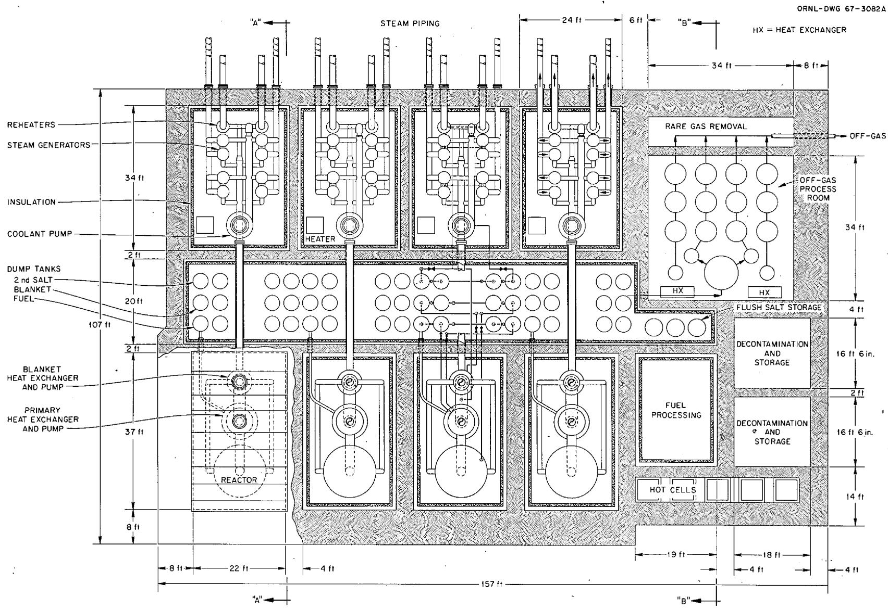  
Fig. 9.1. Reactor and Steam Cell Plan.

thickness for a reactor with an average power density of approximately $40\mathrm{kw / liter}$ has reached a firm status. It is this module which will receive detailed attention. For comparison purposes a module of equal power but having twice the average power density was calculated. Table 9.1 shows the comparison between these two reactors regarding performance and economy.

The blanket and fuel heat exchangers are also considered to be in a sufficiently firm design to justify detailing of these components. Both heat exchangers have undergone significant changes in physical arrangement and will be discussed in some detail later.

Table 9.1. Comparison of the Effects of Core Power Density on the Characteristics of a 250-Mw (Electrical) Molten-Salt Breeder Reactor   

<table><tr><td>Average core power density, kw/liter</td><td>78</td><td>39</td></tr><tr><td>Power, Mw</td><td>556</td><td>556</td></tr><tr><td>Vessel diameter, ft</td><td>11.4</td><td>12</td></tr><tr><td>Vessel height, ft</td><td>~12</td><td>17</td></tr><tr><td>Core diameter, ft</td><td>6.34</td><td>8</td></tr><tr><td>Core height, ft</td><td>8</td><td>10</td></tr><tr><td>Core volume, ft3</td><td>252</td><td>503</td></tr><tr><td>Fraction of fuel in core</td><td>0.164</td><td>0.165</td></tr><tr><td>Fraction of blanket in core</td><td>0.05</td><td>0.06</td></tr><tr><td>Fraction of graphite in core</td><td>0.786</td><td>0.775</td></tr><tr><td>Blanket thickness, ft</td><td>2</td><td>1.5</td></tr><tr><td>Fraction of salt in blanket</td><td>0.65</td><td>0.60</td></tr><tr><td>Breeding ratio</td><td>1.06</td><td>1.07</td></tr><tr><td>Fuel yield, %/year</td><td>6.79</td><td>6.02</td></tr><tr><td>Fuel cycle cost, mills/kwhr</td><td>0.42</td><td>0.43</td></tr><tr><td>Fissile inventory, kg</td><td>175</td><td>218</td></tr><tr><td>Fertile inventory, 1000 kg</td><td>41</td><td>43</td></tr><tr><td>Specific power, Mw (thermal)/kg</td><td>3.18</td><td>2.55</td></tr><tr><td>Number of core elements</td><td>336</td><td>336</td></tr><tr><td>Velocity of fuel in core, fps</td><td>9.7</td><td>6</td></tr><tr><td>Average flux, e&gt;100 kev</td><td>2.9×1014</td><td>1.5×1014</td></tr><tr><td>Fuel volume, ft3</td><td></td><td></td></tr><tr><td>Reactor core</td><td>41.3</td><td>83.0</td></tr><tr><td>Plena</td><td>10.0</td><td>24.0</td></tr><tr><td>Entrance nipples</td><td>5.6</td><td>8.5</td></tr><tr><td>Heat exchangers and piping</td><td>102.0</td><td>105.0</td></tr><tr><td>Processing</td><td>10.5</td><td>8.8</td></tr><tr><td>Total</td><td>169.4</td><td>231.3</td></tr><tr><td>Radial peak average flux ratio</td><td></td><td>1.58</td></tr><tr><td>Axial peak average flux ratio</td><td></td><td>1.51</td></tr></table>

The arrangement of components in the reactor cell as previously reported posed some very difficult stress problems. A new arrangement of these components appears to have removed or greatly lessened these problems. Analyses are currently in progress which will indicate whether or not further changes are required.

Operational experience with the MSRE has indicated clearly that the handling of fission gases from a molten-salt reactor requires very careful design. The gas system for the breeder reactor is a most important part of the plant, and a start has been made in the design of this system. A flowsheet which seems to describe this system has been developed. Also, analytical studies of gas stripping efficiencies and parameters which determine or define the nature of the gas sparging system have been initiated.

Associated with the gas handling problem is the matter of draining the reactor in the event of a pump stoppage. Modifications in the primary heat exchanger indicated by the sparge gas handling and core drainage influenced us to put an overflow line from the sump tank of the pump into a fuel dump tank. These changes in the primary heat exchanger have been rather extensive, although the basic heat exchanger remains very much as the original concept.

# 9.2 FLOWSHEET

Since the reference design is based on the modular reactor concept, the flowsheet of Fig. 9.2 is for one module. The number of the various components in this module is shown. The steam system is shown very sketchily for the 1000-Mw (electrical) plant, and an indication of a steam header fed by the four modules is shown.

It will be noted that the maximum coolant-salt pressure is somewhat higher than has been reported previously. This pressure occurs at the discharge of the coolant pump, and, of the 260 psi at this point, 110 psi comes from a gas overpressure at the suction side of the coolant pump.

We believe it to be imperative that, in the event of a failure in any part of the salt systems, the pressures should be such that blanket salt would flow into fuel salt, and coolant salt would flow into blanket and fuel salt, depending on the location of the failure. This made it necessary to put a high bias pressure on the coolant salt. The pressures shown on the flow diagram represent design-point pressures and take into account static heads and dynamic pressure drops in all cases.

In previous flowsheets a separate coolant pump circulated salt through the reheater. We now bypass the discharge of the main coolant pump through a salt-flow regulating valve to the reheater. This valve is little more than a variable orifice, and we believe the use of such a valve is justified.

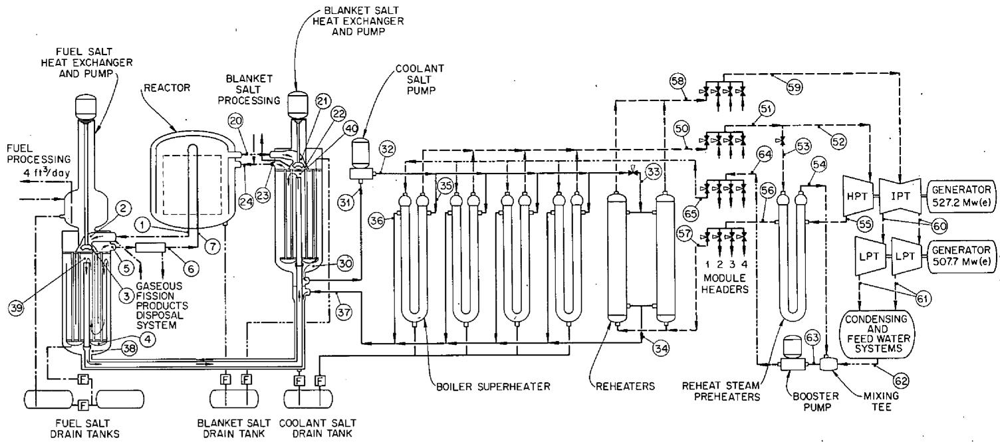  
Fig. 9.2. Module Flowsheet.

<table><tr><td colspan="4">FUEL</td><td colspan="4">COOLANT</td><td colspan="4">STEAM</td><td colspan="2">PERFORMANCE DATA</td></tr><tr><td>POINT</td><td>ft3/sec</td><td>psig</td><td>TEMP (°F)</td><td>POINT</td><td>ft3/sec</td><td>psig</td><td>TEMP (°F)</td><td>POINT</td><td>106lb/hr</td><td>psig</td><td>TEMP (°F)</td><td colspan="2">1000 Mw(e) GENERATION PLANT</td></tr><tr><td>①</td><td>25.0</td><td>13</td><td>1300</td><td>③0</td><td>37.5</td><td>122</td><td>1125</td><td>⑤0</td><td>2.52</td><td>3600</td><td>1000</td><td>NET OUTPUT</td><td>1000 Mw(e)</td></tr><tr><td>②</td><td>25.0</td><td>9</td><td>1300</td><td>③1</td><td>37.5</td><td>110</td><td>1125</td><td>⑤1</td><td>10.07</td><td>3600</td><td>1000</td><td>GROSS GENERATION</td><td>1034.9 Mw(e)</td></tr><tr><td>③</td><td>25.0</td><td>137</td><td>1300</td><td>③2</td><td>37.5</td><td>260</td><td>1125</td><td>⑤2</td><td>7.15</td><td>3515</td><td>1000</td><td>BOILER FEED PUMPS</td><td>29.4 Mw</td></tr><tr><td>④</td><td>25.0</td><td>110</td><td></td><td>③3</td><td>5.0</td><td>208</td><td>1125</td><td>⑤3</td><td>2.92</td><td>3515</td><td>1000</td><td>BOOSTER PUMPS</td><td>9.2 Mw(e)</td></tr><tr><td>⑤</td><td>25.0</td><td>50</td><td>1000</td><td>③4</td><td>5.0</td><td>212</td><td>850</td><td>⑤4</td><td>2.92</td><td>3500</td><td>866</td><td>STATION AUXILIARY</td><td>25.7 Mw(e)</td></tr><tr><td>⑥</td><td>25.0</td><td>31</td><td>1000</td><td>③5</td><td>8.1</td><td>252</td><td>1125</td><td>⑤5</td><td>5.13</td><td>600</td><td>552</td><td>REACTOR HEAT INPUT</td><td>2225 Mw(t)</td></tr><tr><td>⑦</td><td>25.0</td><td>18</td><td>1000</td><td>③6</td><td>8.1</td><td>194</td><td>850</td><td>⑤6</td><td>5.13</td><td>570</td><td>650</td><td>NET HEAT RATE</td><td>7601 Btu/kwhr</td></tr><tr><td></td><td></td><td></td><td></td><td>③7</td><td>37.5</td><td>203</td><td>850</td><td>⑤7</td><td>1.28</td><td>570</td><td>650</td><td>NET EFFICIENCY</td><td>44.9 %</td></tr><tr><td></td><td colspan="2">BLANKET</td><td></td><td>③8</td><td>37.5</td><td>198</td><td>850</td><td>⑤8</td><td>1.28</td><td>540</td><td>1000</td><td></td><td>LEGEND</td></tr><tr><td>②0</td><td>4.3</td><td>12.5</td><td>1250</td><td>③9</td><td>37.5</td><td>161</td><td>1111</td><td>⑤9</td><td>5.13</td><td>540</td><td>1000</td><td>FUEL</td><td></td></tr><tr><td>②1</td><td>4.3</td><td>6.0</td><td>1250</td><td>④0</td><td>37.5</td><td>138</td><td>1111</td><td>⑥0</td><td>5.00</td><td>172</td><td>706</td><td>BLANKET</td><td></td></tr><tr><td>②2</td><td>4.3</td><td>111.0</td><td>1250</td><td></td><td></td><td></td><td></td><td>⑥1</td><td>4.30</td><td>1.5 in.Hg</td><td>92</td><td>COOLANT</td><td></td></tr><tr><td>②3</td><td>4.3</td><td>20.0</td><td>1150</td><td></td><td></td><td></td><td></td><td>⑥2</td><td>7.16</td><td>3500</td><td>551</td><td>STEAM</td><td></td></tr><tr><td>②4</td><td>4.3</td><td>14.5</td><td>1150</td><td></td><td></td><td></td><td></td><td>⑥3</td><td>10.07</td><td>3475</td><td>695</td><td>WATER</td><td></td></tr><tr><td></td><td></td><td></td><td></td><td></td><td></td><td></td><td></td><td>⑥4</td><td>10.07</td><td>3800</td><td>700</td><td>FREEZE VALVE</td><td></td></tr><tr><td></td><td></td><td></td><td></td><td></td><td></td><td></td><td></td><td>⑥5</td><td>2.52</td><td>3800</td><td>700</td><td>DATA POINT</td><td></td></tr></table>

# 9.3 REACTOR CELL COMPONENT ARRANGEMENT

Because of the relatively high melting point of the blanket salt, it is desirable to connect the coolant circuits of the fuel heat exchanger and the blanket heat exchanger in series. Coolant salt leaving the fuel heat exchanger at a temperature of $1111^{\circ}\mathrm{F}$ enters the blanket heat exchanger, where it picks up $14^{\circ}\mathrm{F}$ to attain the design-point temperature of $1125^{\circ}\mathrm{F}$ . The coolant-salt line, carrying 37.5 ft³/sec, is a large pipe ( $\sim$ 20 in. in diameter) and therefore rigidly connects these two heat exchangers. Since the blanket heat exchanger is located high in the reactor cell while the fuel heat exchanger must be located below the bottom of the reactor vessel, there is a shift in the center of gravity of the coupled heat exchangers when they are filled with salt.

In the original layout of the reactor cell which had the reactor, fuel heat exchanger, and blanket heat exchanger in a triangular array, a twisting moment resulted about the axis of the fuel connection between the reactor and the fuel heat exchanger. Also, the method of suspension mounting of the heat exchangers from constant load cells could not provide accommodation for the differential thermal expansion of the system under all conditions.

A new layout of the reactor cell shown in Fig. 9.3 was made. In this configuration the three components, reactor, fuel heat exchanger, and blanket heat exchanger, are mounted in line. The coolant lines connecting the fuel and the blanket exchanger are made concentric, and the shortest possible spacing between exchangers is used. The connection from fuel heat exchanger to reactor is as short as possible, using concentric piping for this as we have been doing previously.

The connection from the blanket heat exchanger to the reactor vessel has been changed. Instead of the short concentric pipe used previously, the inlet and outlet lines from reactor vessel to blanket exchanger are run independently. These lines are purposely made long and flexible by running them through four $90^{\circ}$ bends. Thus we intend to decouple the interconnection between the reactor and the blanket heat exchanger by use of flexible piping.

The three components, reactor, fuel exchanger, and blanket exchanger, are rigidly interconnected then by only one link for each; the reactor connects by the concentric fuel line to the fuel exchanger, which connects by one concentric coolant line to the blanket exchanger. At design point these connecting lines are very near the ambient cell temperature of $1000^{\circ}\mathrm{F}$ . The fuel line is actually at $1000^{\circ}\mathrm{F}$ , and the coolant line is very near $850^{\circ}\mathrm{F}$ . With the three cell components in line, a different plan of support is now proposed. Let us point out that this arrangement has not yet been analyzed for stresses, so we cannot be sure it is satisfactory in its present conception.

The plan now involves mounting a stainless steel bed plate in the reactor cell in such a way as to be tied at one end but free to expand with cell temperature. This bed plate is located horizontally below the bottom of the reactor vessel and is mounted through necessary insulated supports to the load-bearing concrete of the cell. The reactor vessel and both heat exchangers are mounted rigidly to the plate as shown in Fig. 9.4. We believe that this general arrangement will work and that any overstressing found by analysis of the system can be corrected without departing drastically from the concept.

ORNL-DWG 67-3083A

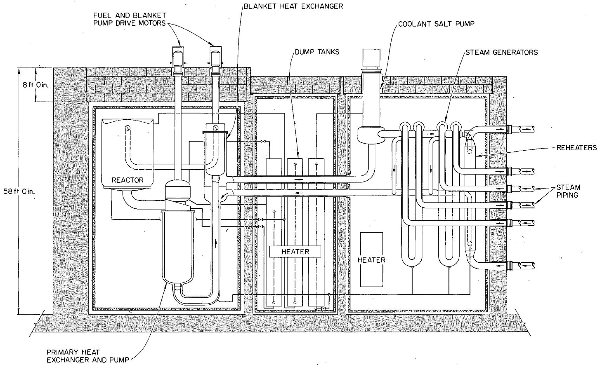  
Fig. 9.3. Reactor and Steam Cell Elevation.

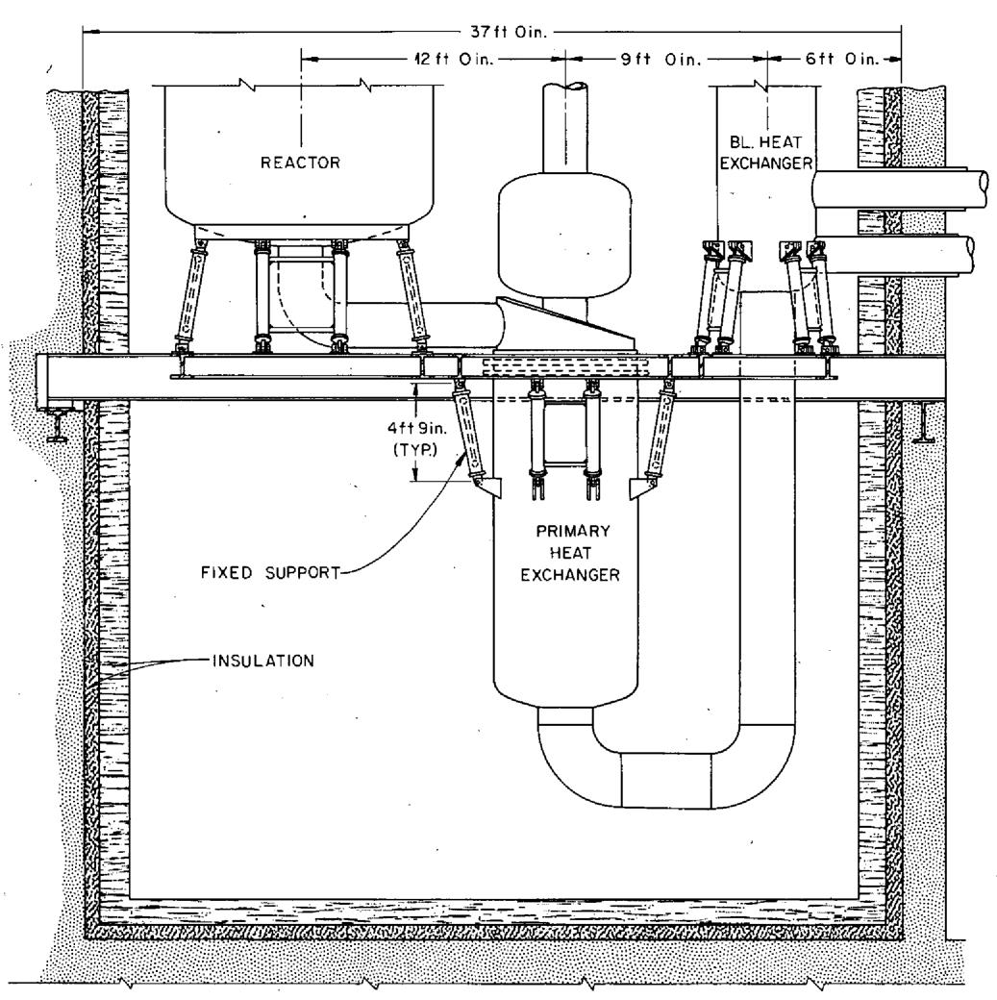

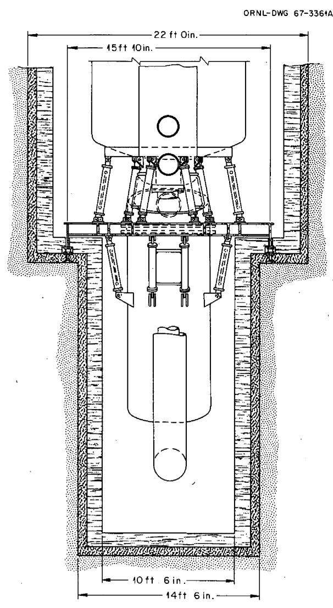  
Fig. 9.4. Reactor Cell Mounting.

Vertical growth of all components can take place independently, and the only accommodation needed is a low-temperature sealing bellows at each pump-drive penetration through the cell membrane. Any control-rod drive mechanism would involve a similar bellows seal.

The treatment of the reactor cell has not received any attention, but it is certain that some form of radiation shield must cover the structural concrete and this shield must have cooling. Inside the radiation shield, between it and the furnace of the cell, there must be some thermal insulation.

# 9.4 COMPONENT DESIGN

# Reactor Vessel

The reactor is shown in the elevation drawing of Fig. 9.5. The reactor vessel has a cylindrical body 12 ft in diameter and approximately 17 ft high with dishes heads on top and bottom. A heavy supporting ring essentially the diameter of the core carries legs which weld to the bed plate and provide the mechanical mounting for the vessel. From the center of the bottom head a concentric fuel line communicates with the fuel heat exchanger. This fuel line has an outside diameter of 24 in. with a concentric return line 16 in. in outside diameter. Fuel flows in these lines at a rate of approximately 18 fps.

Inside the reactor vessel are dishes heads forming plenum chambers for distribution of the fuel cells which rise from these heads. These plenum chambers are removable from the reactor vessel, being held in place by a flanged mounting ring equipped with clamps. This flange has not been completely designed, but we are considering the use of flat graphite gaskets to prevent bonding of the flange surfaces under the high temperature and rather high loading pressure obtained at design conditions. The inner head communicates with the inner concentric line through a slip joint which permits movement of the head relative to the pipe. Such movement results from thermal expansion and must be accommodated. In addition, the slip joint allows removal of the core when the flange seal is broken.

The core of the reactor is made up of 336 cylindrical graphite fuel cells mounted as close together as tolerances permit to form essentially a cylindrical array approximately 8.3 ft in diameter. The graphite cells are extruded cylinders with center holes $1\frac{1}{2}$ in. in diameter, surrounded at $120^{\circ}$ angles with three $\frac{7}{8}$ -in.-diam holes. At the top of each cell there is a graphite cap machined to provide a smooth communication between the four holes of the cell. Figure 9.6 shows the arrangement of one of these cells.

At the bottom of a cell, the graphite cylinder is joined to a transition nipple. This joining is done by a combination of a short threaded engagement for mechanical attachment and a rather longer brazed joint for leak-tightness. The connection to this nipple is a matter of development, and work is proceeding to establish the best practice for effecting this connection. The lower end of the nipple is threaded to screw into tapped holes in the upper curved head.

ORNL-DWG 67-3078A

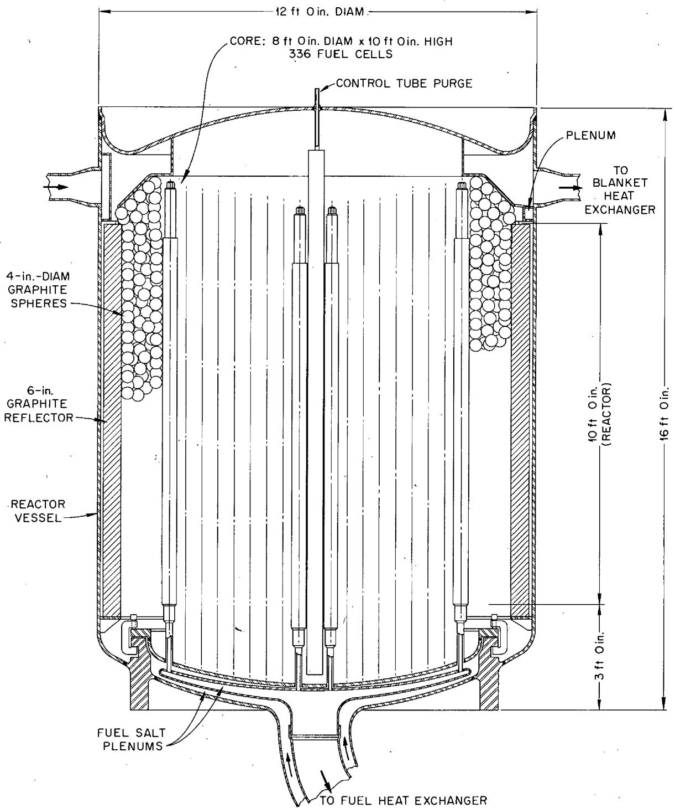  
Fig. 9.5. The 250-Mw (Electrical) Reactor.

ORNL-DWG 67-2677A

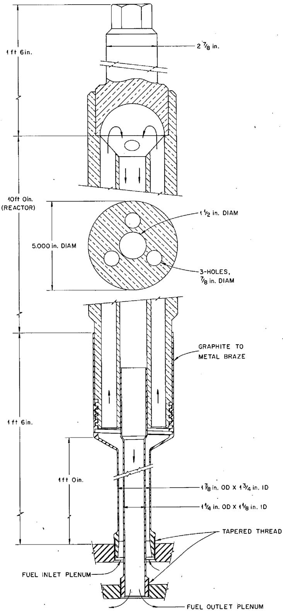  
Fig. 9.6. Fuel Cell Element.

From smaller holes in the inner head, concentric with the upper one, smaller nipples extend through the upper head. These nipples are also attached to the inner head by a pipe thread, each one being screwed into place before attaching the fuel cells above.

As a fuel cell is put into place, the $1 \frac{1}{2}$ -in. center hole is slipped over the inner nipple. This engagement is a slip joint and allows for screwing the cell into place, and in operation it permits the necessary differential expansion between the cell and the inner nipple. After all cells are in place, the entire core can be leak-tested, the graphite-to-metal transition joints having previously been tested individually. When the assembled core has been tested, it can be lowered into the reactor vessel and the flanged joint can be clamped.

Just inside the reactor vessel there is a graphite reflector 6 in. thick. This reflector is only on the vertical walls; there is none below or above the core. It is made of rectangular-shaped pieces with mortised joints to form a self-supporting wall resting on a ledge at the bottom of the vessel. The volume between the reflector and the vessel provides a flow passage for the blanket salt as it discharges through holes in the bottom of the distribution ring located near the top of the vessel.

We are considering the use of 4-in.-diam graphite balls in the region between the core and the reflector. These balls have holes in them so that graphite occupies $40\%$ of the volume in this $1 \frac{1}{2}$ -ft-thick region. A retainer of perforated metal prevents the balls, which float in the blanket salt, from crowding into the top head of the reactor vessel. Instead, by floating up against this retainer, a measure of support is afforded the core structure, the floating balls tending to exert a considerable force on the fuel cells.

With this core configuration a two-fluid reactor is achieved. Fuel salt enters the outer concentric pipe at the bottom of the reactor. It flows out to the outer radius of the core and in between the upper inner dished heads, feeding salt into the nipples emerging from the upper head. Fuel passes up through the three $\frac{7}{8}$ -in. holes of each fuel cell and down through the center $1\frac{1}{2}$ -in. hole through the inner pipe nipple into the collecting plenum. From there it flows through the slip joint into the inner concentric fuel line to the pump suction at the center of the fuel heat exchanger.

The blanket salt flows into a distributor at the top of the reactor, and, emerging through holes in the bottom of this header, it flows behind the graphite reflector to the bottom of the reactor. There it flows up through the balls in the blanket annulus and out of the suction line near the top of the reactor.

Some of the blanket salt fills the interstices between the fuel nipples and the fuel cells. Circulation of the blanket salt is governed by thermal convection. Heat generation and temperature calculations are in progress to determine whether this flow is adequate.

The center location for a fuel cell is left vacant. This is for a control rod. In Fig. 9.6 this control rod is represented as a hollow graphite cylinder 5 in. in outside diameter, 4 in. in inside diameter, and equipped with a gas inlet at the top. By controlling the gas pressure,

blanket salt can be positioned at any height within this cylinder, and this blanket volume controls the reactivity of the core. Calculations indicate a change of $1.8\%$ in reactivity between the full and empty condition of this cylinder.

It may be that, instead of a hollow cylinder, a graphite rod 5 in. or less in diameter will be used to displace blanket salt from this position in the core. Effective control can be obtained by driving this rod in a more conventional way. In the event of failure of the drive, the rod would be lifted out of the core by the more dense blanket, thereby reducing the reactivity.

The reactor has been optimized as far as nuclear performance is concerned. There is no very sensitive parameter, and rather large changes in all dimensions can be tolerated without changing the characteristics materially. Table 9.1 gives the calculated performance of this reactor. This core volume is $503\mathrm{ft}^3$ , with a fuel volume in the core of $83\mathrm{ft}^3$ . This gives an average power density in the core of $39\mathrm{kw/liter}$ .

For comparison, the performance of a reactor having a power density of $78\mathrm{kw / liter}$ is given in Table 9.2. This reactor has half the volume in the core and would give somewhat better performance. At present we do not know just what the limit is on graphite radiation tolerance. The smaller reactor, whatever the graphite limit, would be expected to have approximately half the core life of the larger one, which is used as the reference design.

Some general comments can be made about the reactor as it is currently conceived. As we stated above, the nuclear performance is so insensitive to parameters that the final reactor design is likely to be close to the present concept. We would prefer to have the core removable in modules rather than having to remove it in one piece. This is particularly desirable if we have to maintain the lower power density and if it becomes desirable to make reactor modules larger than the 556-Mw (thermal) size with which we are concerned at present. We do not yet have what we consider an acceptable way of making these core submodules, but work is continuing to try to develop one.

The thickness of the heads has not received rigorous attention. At present the top or load-bearing head is 1 in. thick. This is thicker than the load seems to require but is used to give an adequate thickness for tapping for the nipples. The analysis of all stresses in these heads is being made but has not yet been completed. The same is true for the pressure drops.

The top of the reactor as shown has a welded joint which can be ground off for removal and rewelded when a new core has been installed. Probably this access joint will be moved up outside at least one layer of shielding in the final core design. In this case some of the shielding blocks would be supported by the top of the reactor vessel. The closure point for the reactor would, by this means, be more accessible.

# Fuel Heat Exchanger

The heat transfer work which had been done for the Breeder Reactor study was reevaluated. This was made necessary by the results obtained from the MSRE. It was found that the salt

Table 9.2. Fuel Heat Exchanger Data Sheet   
Fuel-coolant-salt exchanger, counterflow, two-shell pass, two-tube pass with donut-type baffles   

<table><tr><td>Number required</td><td>1</td></tr><tr><td>Rate of heat transfer, Mw</td><td>528.5</td></tr><tr><td>Rate of heat transfer, Btu/hr</td><td>1.8046 × 109</td></tr><tr><td>Shell side</td><td></td></tr><tr><td>Hot fluid or cold fluid</td><td>Cold (coolant salt)</td></tr><tr><td>Entrance temperature, °F</td><td>850</td></tr><tr><td>Exit temperature, °F</td><td>1111</td></tr><tr><td>Entrance pressure, psi</td><td>198</td></tr><tr><td>Exit pressure, psi</td><td>161</td></tr><tr><td>ΔP across exchanger, psi</td><td>37</td></tr><tr><td>Mass flow rate, lb/hr</td><td>1.685 × 107</td></tr><tr><td>Tube side</td><td></td></tr><tr><td>Hot fluid or cold fluid</td><td>Hot (fuel salt)</td></tr><tr><td>Entrance temperature, °F</td><td>1300</td></tr><tr><td>Exit temperature, °F</td><td>1000</td></tr><tr><td>Entrance pressure, psi</td><td>137</td></tr><tr><td>Exit pressure, psi</td><td>50</td></tr><tr><td>ΔP across exchanger, psi</td><td>87</td></tr><tr><td>Mass flow rate, lb/hr</td><td>1.093 × 107</td></tr><tr><td>Tube material</td><td>Hastelloy N</td></tr><tr><td>Tube OD, in.</td><td>0.375</td></tr><tr><td>Tube thickness, in.</td><td>0.035</td></tr><tr><td>Tube length, tube sheet to tube sheet, ft</td><td>Inner annulus, 13.53
Outer annulus, 14.50</td></tr><tr><td>Shell material</td><td>Hastelloy N</td></tr><tr><td>Shell thickness, in.</td><td>1</td></tr><tr><td>Shell ID, in.</td><td>66.7</td></tr><tr><td>Tube sheet material</td><td>Hastelloy N</td></tr><tr><td>Tube sheet thickness, in.</td><td>Top outer annulus, 1½
Top inner annulus, 2½
Floating head, 3¾</td></tr><tr><td>Number of tubes</td><td>Inner annulus, 4347
Outer annulus, 3794</td></tr><tr><td>Pitch of tubes, in.</td><td>Inner annulus, 0.600 radial;
0.673 circumferential
Outer annulus, 0.625 triangular</td></tr><tr><td>Type of baffle</td><td>Donut</td></tr><tr><td>Number of baffles</td><td>Inner annulus, 4
Outer annulus, 10</td></tr></table>

thermal conductivity was less by about a factor of 3 than the value used in the original heat transfer calculations. This difference resulted in degradation of the overall heat transfer coefficient, necessitating an increase in heat transfer surface of the heat exchanger of approximately $20\%$ . A new heat exchanger design with a larger number of tubes and a slight change in the baffle arrangement was developed. The parameters of this new heat exchanger are given in Table 9.2.

While the new heat exchanger has a higher fuel holdup by reason of the additional tubes, a more favorable arrangement of the header and other reductions in parasitic volumes compensated for this larger number of tubes, so that the net fuel inventory in the heat exchanger-pump complex did not change significantly from that required in the first heat exchanger used in the reactor study.

A significant change in the heat exchanger design concerns the method of flanging the heat exchanger into the coolant circuit piping. The coolant flows up around the heat exchanger and is discharged symmetrically across the outer bank of fuel tubes. In this arrangement the toroidal coolant header is replaced by a jacket around the tubes. Figure 9.7 shows the arrangement of this new heat exchanger.

After traversing the outside of the fuel tubes in a countercurrent flow pattern, the coolant salt leaves the heat exchanger through a central discharge pipe which connects to the center of the concentric coolant-salt line through a slip joint. The entire heat exchanger can be removed from the circuit by opening the large flange, cutting the large fuel pipe communicating with the reactor, and disengaging the center fuel pipe by slipping it out of the slip joint provided for this purpose. The drain and overflow lines and auxiliary pump lines must also be cut to remove the exchanger.

Removing and replacing a primary heat exchanger is a major repair. However, with the design as shown, the difficulties appear to be less formidable than if both coolant lines had to be cut and welded to perform the task. Adequate remote cutting, aligning, welding, and inspecting equipment and methods must be demonstrated for this application.

Because of the expansion of the fuel tubes, the toroidal header at the bottom of the exchanger will move relative to the vessel enclosing the exchanger. For this reason and also to permit removal of the exchanger, a drain line cannot be connected to this header. Instead, a dip line for draining fuel extends into this header from the top of the exchanger. This line connects through a freeze valve to the fuel drain tanks for the reactor. When the drain valve is thawed and the drain tank is vented, the fuel salt in the heat exchanger flows through this line into the drain tank. The gas pressure in the pump bowl is sufficient to effect a complete drain of the fuel salt from the system.

In case of a pump stoppage with the attendant necessity to drain the reactor, the following sequence takes place. Upon pump stoppage the reactor automatically drains into the pump sump tank and through the 5-in. overflow line; the salt goes to the drain tank. A gas flow into the reactor inlet plenum is furnished by the gas separator lines from the pump sump cover gas. This automatic drainage takes place in the order of a few seconds. However, the concentric lines

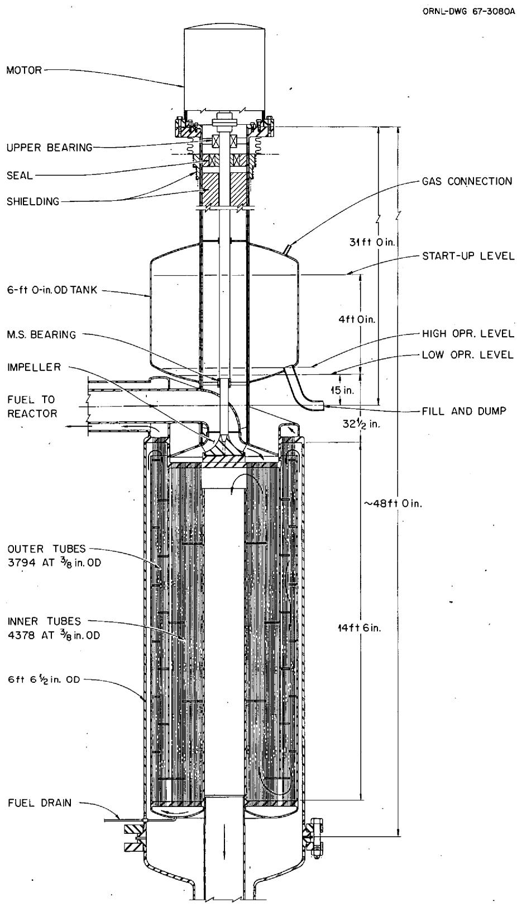  
Fig. 9.7. Primary Heat Exchanger and Pump.

to the reactor and the head space above the fuel tubes in the heat exchanger remain full of salt and will overheat if not cooled.

When the pump stops, the pressure in the lower header of the heat exchanger drops to the static pressure of the salt, about 14 psi. If now the gas valves in the line are opened, the stored gas will flow into the bottom of the heat exchanger, displacing the fuel into the pump sump from which it overflows into the drain tank. By proper sizing of this tank, enough fuel can be displaced from the heat exchanger to bring the level at equilibrium below the top tube sheet of the exchanger. The lines and volumes above the tube sheets will be empty of salt, and no overheating will result.

We have calculated the cooling required for fuel in the tubes of the heat exchanger under the stagnant conditions. Because of the geometry of the coolant salt system, there is convective flow of coolant salt even when no coolant pump is running. This convective flow of coolant is adequate to remove afterheat from the stagnant fuel in the tubes.

To provide cooling but to avoid overcooling requires some modification of the steam circuit of a module. We have not studied the modifications in sufficient detail to justify a discussion at this time.

The large sump tank on top of the heat exchanger is not intended to hold the drained fuel from the reactor. Because of the undesirability of installing the afterheat cooling system in the reactor cell and also in order to be able to drain the lines to the reactor, an overflow pipe was installed from the sump tank to a separate dump tank. This tank is equipped with a cooling system adequate for afterheat removal.

The sump tank on top of the heat exchanger appears to be larger than necessary inasmuch as excess fuel flows through the 5-in. drain line to the drain tank. The size of the tank is dictated by the fact that it must hold the reactor volume (83 ft³) upon starting the reactor. Fuel cannot be forced by gas pressure out of the drain tank fast enough to keep the fuel pump primed on startup. The fuel must be displaced into the sump tank and held there by gas overpressure in the drain tank until the reactor is filled by the action of the pump.

Not shown in the drawing of the heat exchanger is the gas separator and associated apparatus for handling the sparge gas for the fuel system. The plans for handling this gas are being worked out, and drawings of the equipment are not yet ready. The criteria and flowsheet are discussed in Sect. 4.

# Blanket Heat Exchanger

The blanket heat exchanger is shown in Fig. 9.8. This heat exchanger is similar to the fuel heat exchanger but considerably smaller and less complicated. There is no need for the gas sparge system, and there is no afterheat problem that has to be provided for here. In addition, the coolant flow is less complicated since counterflow is unnecessary. The temperature difference is modest between blanket salt and coolant, and the total rise in temperature is only $11^{\circ}\mathrm{F}$ as the coolant passes through. Table 9.3 gives the characteristics of the blanket exchanger.

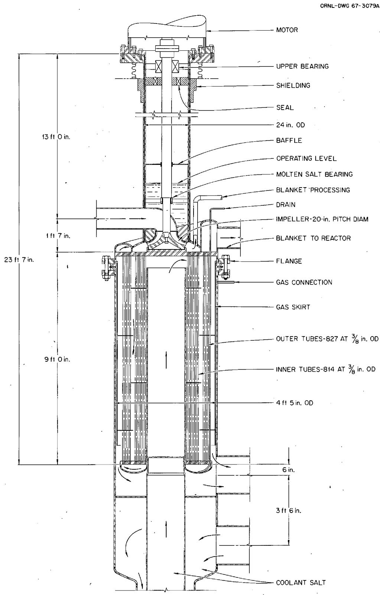  
Fig. 9.8. Blanket Heat Exchanger and Pump.

Blanket-coolant-salt exchanger, one-shell pass, two-tube pass with disk- and donut-type baffles

Table 9.3. Blanket Heat Exchanger Data Sheet   

<table><tr><td>Number required</td><td>4</td></tr><tr><td>Rate of heat transfer, Mw</td><td>27.75</td></tr><tr><td>Rate of heat transfer, Btu/hr</td><td>9.471 × 10^7</td></tr><tr><td>Shell side</td><td></td></tr><tr><td>Hot fluid or cold fluid</td><td>Cold (coolant salt)</td></tr><tr><td>Entrance temperature, °F</td><td>1111</td></tr><tr><td>Exit temperature, °F</td><td>1125</td></tr><tr><td>Entrance pressure, psia</td><td>138</td></tr><tr><td>Exit pressure, psia</td><td>129</td></tr><tr><td>ΔP across exchanger, psi b</td><td>15</td></tr><tr><td>Mass flow rate, lb/hr</td><td>1.685 × 10^7</td></tr><tr><td>Tube side</td><td></td></tr><tr><td>Hot fluid or cold fluid</td><td>Hot (blanket salt)</td></tr><tr><td>Entrance temperature, °F</td><td>1250</td></tr><tr><td>Exit temperature, °F</td><td>1150</td></tr><tr><td>Entrance pressure, psi a</td><td>111</td></tr><tr><td>Exit pressure, psi a</td><td>20</td></tr><tr><td>ΔP across exchanger, psi b</td><td>91</td></tr><tr><td>Mass flow rate, lb/hr</td><td>4.3 × 10^6</td></tr><tr><td>Velocity, fps</td><td>10.5</td></tr><tr><td>Tube material</td><td>Hastelloy N</td></tr><tr><td>Tube OD, in.</td><td>0.375</td></tr><tr><td>Tube thickness, in.</td><td>0.035</td></tr><tr><td>Tube length, tube sheet to tube sheet, ft</td><td>8.3</td></tr><tr><td>Shell material</td><td>Hastelloy N</td></tr><tr><td>Shell thickness, in.</td><td>1/4</td></tr><tr><td>Shell ID, in.</td><td>40:78</td></tr><tr><td>Tube sheet material</td><td>Hastelloy N</td></tr><tr><td>Tube sheet thickness, in.</td><td>1</td></tr><tr><td rowspan="2">Number of tubes</td><td>Center section, 810</td></tr><tr><td>Annular section, 810</td></tr><tr><td>Pitch_of_tubes, in.</td><td>0.8125</td></tr><tr><td>Total heat transfer area, ft²</td><td>1318</td></tr><tr><td>Basis for area calculation</td><td>Tube OD</td></tr><tr><td>Type of baffle</td><td>Disk and donut</td></tr><tr><td>Number of baffles</td><td>4</td></tr><tr><td>Baffle spacing, in.</td><td>19.80</td></tr><tr><td>Disk OD, in.</td><td>33.65</td></tr><tr><td>Donut ID, in.</td><td>31.85</td></tr><tr><td>Overall heat transfer coefficient, U, Btu hr-1ft-2</td><td>1027</td></tr></table>

# 9.5 REACTOR PHYSICS

O. L. Smith

In addition to optimization studies described above, work on MSBR reactor physics included (1) a series of cell calculations performed to examine the sensitivity of the MSBR cross sections and reactivity to various changes in cell structure and composition, and (2) several two-dimensional calculations of the entire reactor. All of the calculations were based upon the most accurate description of the system that was available as of January 1, 1967. The graphite-moderated portion of the core was 10 ft in length and 8 ft in diameter, contained $\sim 0.2$ mole $\%$ $^{233}\mathrm{U}$ , 27 mole $\%$ $^{232}\mathrm{Th}$ , and had a fuel volume fraction of $16.48\%$ and a fertile volume fraction of $5.85\%$ . The reactor had a 1.75-ft-thick radial blanket consisting of $60\%$ fertile salt and $40\%$ graphite, surrounded by a graphite reflector 6 in. thick. The top axial blanket was 1.5 ft thick and contained $60\%$ fertile salt and $40\%$ graphite. The bottom axial blanket was 1 ft thick and contained $3.18\%$ Hastelloy N, $16.48\%$ fuel salt, and $80.34\%$ fertile salt. A number of structural details below the lower blanket were included in the two-dimensional calculations.

Figure 9.9 shows the geometry of a cell in the graphite-moderated core. Graphite dowels of appropriate size are located at the six corners of the cell to yield the desired fertile salt volume fraction. The cell calculations were performed with the code TONG and involved varying (1) cell diameter, (2) fuel distribution (i.e., fuel separation distance, s), (3) $^{233}\mathrm{U}$ concentration, (4) $^{232}\mathrm{Th}$ concentration, (5) fuel volume fraction, and (6) fertile volume fraction. Each of these parameters was varied separately while holding the others constant. Table 9.4 and Fig. 9.10 show the effect on reactivity of varying the parameters. The variations are shown relative to a reference cell which had a diameter (flat to flat) of 3.156 in. and a fuel separation distance, s, of $\frac{1}{8}$ in.

Fig. 9.9. Cell Geometry.   
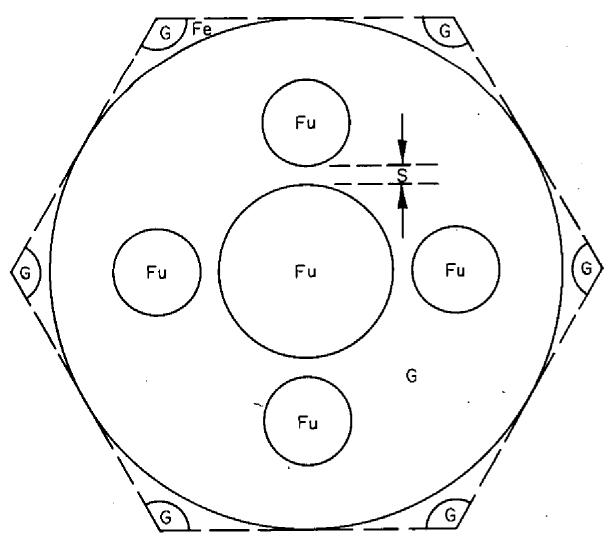  
ORNL-DWG 67-4789   
FU = FUEL   
G = GRAPHITE   
FE = FERTILE   
S =FULL SEPARATION

Table 9.4. Effect on Reactivity of Varying Cell Properties   

<table><tr><td>Case</td><td></td><td>Percent Variation</td><td>Δkeff</td></tr><tr><td>1</td><td>Reference cell</td><td></td><td>0</td></tr><tr><td>2</td><td>Cell diameter</td><td>-36.7</td><td>-0.0271</td></tr><tr><td>3</td><td>Cell diameter</td><td>+58.4</td><td>+0.0317</td></tr><tr><td>4</td><td>Fuel separation, s</td><td>-100</td><td>-0.0011</td></tr><tr><td>5</td><td>Fuel separation, s</td><td>+200</td><td>+0.0003</td></tr><tr><td>6</td><td>233U concentration</td><td>-25</td><td>-0.1031</td></tr><tr><td>7</td><td>233U concentration</td><td>+25</td><td>+0.0763</td></tr><tr><td>8</td><td>232Th concentration</td><td>-25</td><td>+0.0936</td></tr><tr><td>9</td><td>232Th concentration</td><td>+25</td><td>-0.0768</td></tr><tr><td>10</td><td>Fuel volume fraction</td><td>-25</td><td>-0.0851</td></tr><tr><td>11</td><td>Fuel volume fraction</td><td>+25</td><td>+0.0512</td></tr><tr><td>12</td><td>Fertile volume fraction</td><td>-25</td><td>+0.1048</td></tr><tr><td>13</td><td>Fertile volume fraction</td><td>+25</td><td>-0.0845</td></tr></table>

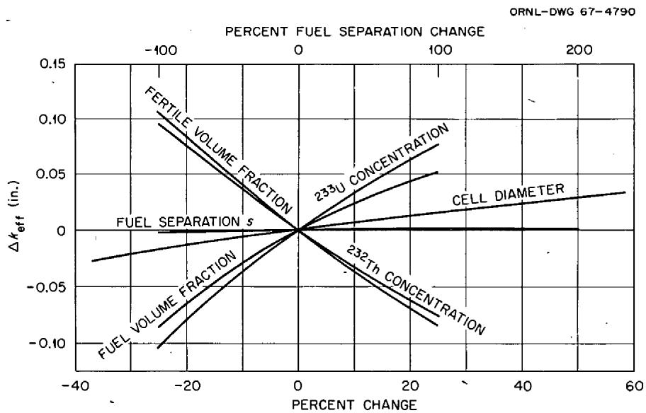  
Fig. 9.10. Effect on Reactivity of Changing Cell Properties.

The results of these calculations (compare cases 1 and 3) indicate that there may be a reactivity advantage (attributable to increased self-shielding of the $^{232}\mathrm{Th}$ resonances) to using a cell somewhat larger than the 3.156-in. reference cell. If the conversion ratio is not adversely affected, use of a 5-in. cell may, for example, permit reduction of the $^{233}\mathrm{U}$ inventory. Pending further study, case 3 (which differs from case 1 only in cell size) is considered to represent the current cell dimensions used in the design.

Table 9.5 and Fig. 9.11 show information about the flux distribution for case 3. Table 9.5 shows the ratio of the average flux in the fuel to the cell average flux, the ratio of the average flux in the graphite to the cell average flux, and the ratio of the average flux in the fertile salt to the cell average flux for the epithermal and fast flux ranges. Figure 9.11 shows the thermal flux distribution in the cell. The results in Fig. 9.11 are based upon an annular approximation to the cell of Fig. 9.9.

The two-dimensional calculations used the 5-in.-diam cell composition and cross sections for the core, and they were performed with the diffusion theory code EXTERMINATOR-2. Nine

Table 9.5. Flux Ratios in Epithermal and Fast Energy Ranges   

<table><tr><td>Energy Range</td><td>Fuel</td><td>Graphite</td><td>Fertile</td></tr><tr><td>0.821–10 Mev</td><td>1.226</td><td>0.929</td><td>0.878</td></tr><tr><td>0.0318–0.821 Mev</td><td>1.090</td><td>0.984</td><td>0.958</td></tr><tr><td>1.234–31.82 kev</td><td>1.014</td><td>0.998</td><td>0.991</td></tr><tr><td>0.0479–1.234 kev</td><td>1.0</td><td>1.0</td><td>1.0</td></tr><tr><td>1.86–47.9 ev</td><td>1.0</td><td>1.0</td><td>1.0</td></tr></table>

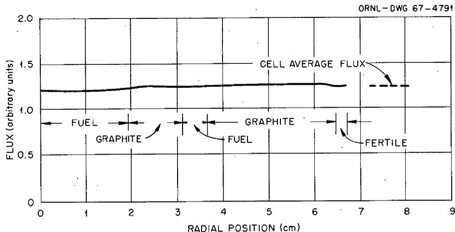  
Fig. 9.11. Thermal Flux Distribution in Cell $(E < 1.86\mathrm{ev})$

energy groups were used and are shown in Table 9.6. Figure 9.12 shows the radial flux distribution in the core midplane for neutron energy groups 1 and 6 separately, and Fig. 9.13 shows the total flux distribution. The radial peak-to-average flux ratio in the graphite-moderated part of the core is 1.58. Figure 9.14 shows the axial flux distribution for groups 1 and 6 at a radial distance 18 in. from the axis of the core, and Fig. 9.15 shows the total flux distribution. The axial peak-to-average flux ratio in the graphite-moderated core region is 1.51. Thus the total peak-to-average flux ratio is 2.39, the peak occurring at the geometric center of the graphite-moderated core.

The central cell of the reactor is intended for control purposes and consists of a graphite tube 5 in. in outside diameter and 4 in. in inside diameter. It is envisioned that control will be achieved by regulating the height of the fertile salt in the tube. If the completely empty tube is filled with fertile salt, the change in reactivity is $\delta k / k = -0.018\%$ . If the empty tube is filled with graphite, the reactivity change is $\delta k / k = +0.0012\%$ . Thus there appears to be a substantial amount of reactivity control available by varying the height of the fertile column in the tube.

Table 9.6. Neutron Energy Groups Used in Two-Dimensional Calculations   

<table><tr><td>Group</td><td>Energy Range</td></tr><tr><td>1</td><td>0.821-10 Mev</td></tr><tr><td>2</td><td>0.0318-0.821 Mev</td></tr><tr><td>3</td><td>1.234-31.82 kev</td></tr><tr><td>4</td><td>0.0479-1.234 kev</td></tr><tr><td>5</td><td>1.86-47.9 ev</td></tr><tr><td>6</td><td>0.776-1.86 ev</td></tr><tr><td>7</td><td>0.18-0.776 ev</td></tr><tr><td>8</td><td>0.06-0.18 ev</td></tr><tr><td>9</td><td>0.01-0.06 ev</td></tr></table>

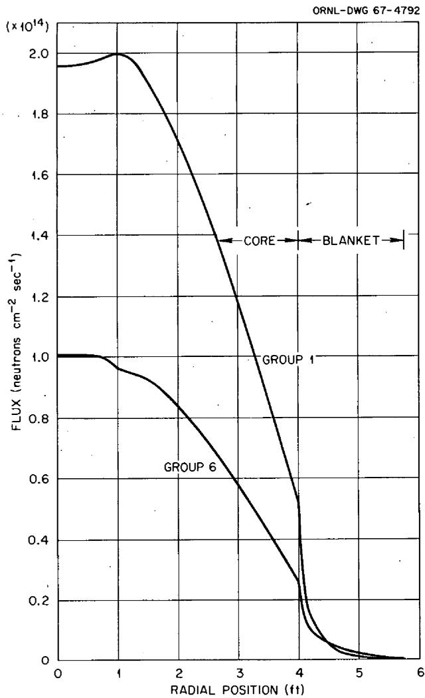  
Fig. 9.12. Radial Distribution of Neutron Flux in Groups 1 and 6 at Core Midplane.

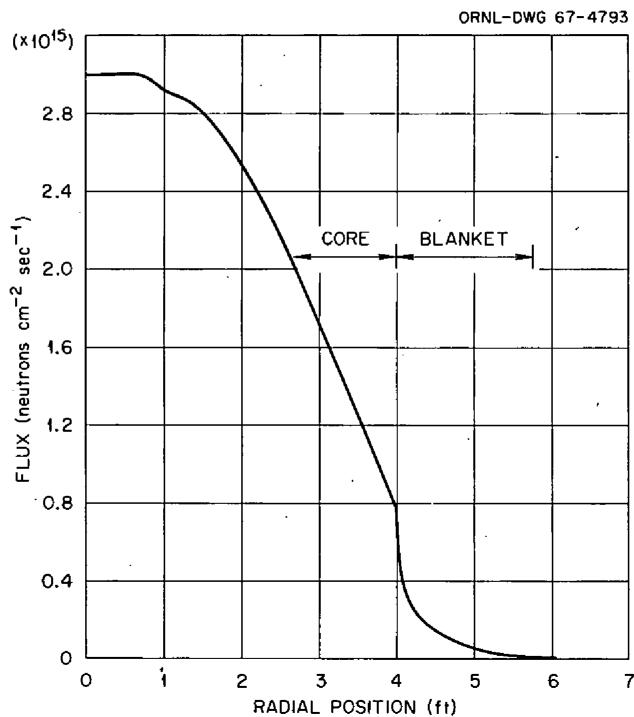  
Fig. 9.13. Radial Distribution of Total Neutron Flux at Core Midplane,

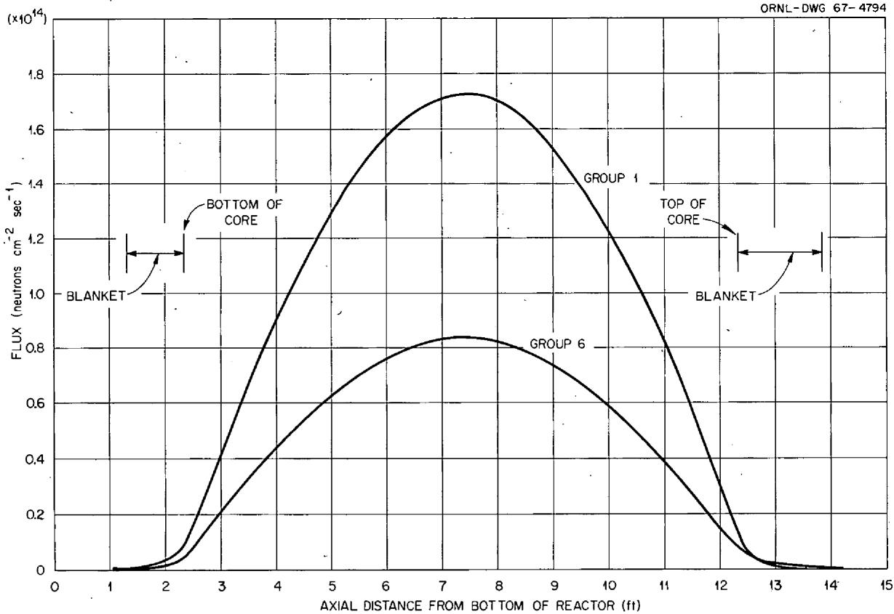  
Fig. 9.14. Axial Distribution of Neutron Flux in Energy Groups 1 and 6 at a Distance 18 in. from Core Axis.

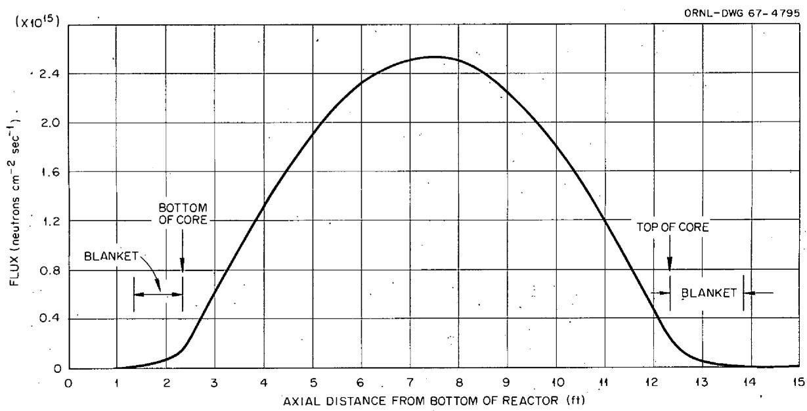  
Fig. 9.15. Axial Distribution of Total Neutron Flux at a Distance 18 in. from Core Axis.

# 9.6 MSBR GAS HANDLING SYSTEM

Dunlap Scott A.N. Smith R.J.Kedl

The gas handling system for the MSBR serves several functions in the operation of the plant. These include: supplying helium for purging and pressurization of the gas spaces; rapidly removing $^{135}\mathrm{Xe}$ from the salt; transporting, removing, and storing the radioactive fission product gases; and processing the helium for recycle into the gas supply or disposal to the atmosphere. A scheme for accomplishing these functions is described below.

# Xenon Removal

Preliminary studies of the migration of $^{135}\mathrm{Xe}$ to the graphite in molten-salt breeder reactors indicated that it would be possible to reduce the $^{135}\mathrm{Xe}$ poison fraction to an acceptable value of $\frac{1}{2}\%$ if a gas stripping system could be devised which would process the entire reactor fuel-salt inventory in about 30 sec. Since the reactor system salt circuit time is about 9 sec, it is required that the entire inventory be processed every 3 to 4 passes around the circuit.

The required xenon processing time could be extended by processing the fuel for removal of the precursor, $^{135}\mathrm{I}$ . However, the advantages of $^{135}\mathrm{I}$ processing are limited by the fact that $20\%$ of the total $^{135}\mathrm{Xe}$ produced in the fissioning of $^{233}\mathrm{U}$ appears directly, and very high processing rates would be required to obtain even modest gains. For example, if the entire fuel inventory were processed for $^{135}\mathrm{I}$ removal once every hour, the xenon removal process rate would only be extended to about 80 sec, and a very high $^{135}\mathrm{I}$ processing rate would increase the xenon

processing time to only about 110 sec. Therefore, processing for iodine is not, at this time, being considered as a method of removing $^{135}\mathrm{Xe}$ .

The method proposed for removal of $^{135}\mathrm{Xe}$ involves stripping of xenon-enriched helium bubbles from the fuel stream by means of a gas separator located at the heat exchanger outlet. The bubbles will be generated by injecting helium into the salt at the fuel pump suction, and transfer of xenon from the salt to the gas will be effected during passage through the heat exchanger.

# Mechanical Design

The flowsheet for the MSBR off-gas system is given in Fig. 9.16. Helium is injected into the suction of the fuel salt pump and is removed by centrifugal separation at the heat exchanger outlet. The liquid-gas mixture from the separator is then fed into a cyclone separator where the entrained liquid is removed and returned to the pump bowl. The gas from the pump shaft purge and the instrument lines is combined with that from the cyclone separator and fed into the 48-hr xenon holdup system. A small portion of the flow from this system is fed into the long-term xenon holdup and then through the noble-gas separator to a recycle system for supplying clean helium to the pump shaft purge and the instrument gas lines. The remainder of the gas from the 48-hr xenon holdup system is fed into the gas injector system at the fuel pump suction. It is the salt-powered gas injector that serves as the prime mover for the high-gas-flow recycle system. Some of the design criteria of the critical components are described below.

# Gas Injector System

1. The gas addition rate shall be sufficient to produce about $1\%$ void volume in the salt at the pump suction.   
2. The location and manner of gas injection shall provide a balanced distribution of bubbles in the liquid entering the pump impeller. This consideration affects the bubble distribution in the heat exchanger and the bubble size, as well as the pump dynamic balance.   
3. There shall be operator control over the gas addition rate into the gas injector.   
4. The supply for the gas injector shall be taken from the outlet line from the 48-hr xenon holdup helium recirculation system. There shall be a backflow preventer arrangement at this gas supply point to prevent salt from getting back into the charcoal beds as a result of a sudden pressure transient in either the salt or gas system.   
5. The method of injecting bubbles into the pump suction shall be a fuel-salt-powered jet pump taking its salt supply from the heat exchanger discharge.

The suction pressure for the salt-powered jet pump shall be less than 10 psia at a flow rate of 6.5 scfm of helium.

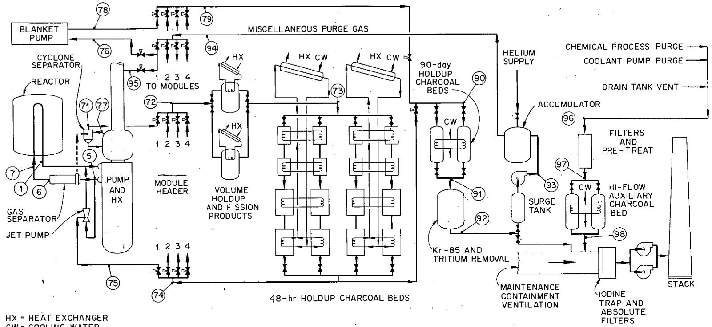  
Fig. 9.16. MSBR Gas Flow Diagram.

<table><tr><td colspan="13">DATA</td></tr><tr><td>POINT</td><td>ft3/sec</td><td>psia</td><td>TEMP (°F)</td><td>POINT</td><td>scfm</td><td>psia</td><td>TEMP (°F)</td><td>POINT</td><td>scfm</td><td>psia</td><td>TEMP (°F)</td><td></td></tr><tr><td>1</td><td>25</td><td>27.7</td><td>1000</td><td>71</td><td>6.75</td><td>24.7</td><td>1000</td><td>90</td><td>2.00</td><td>18.0</td><td>100</td><td></td></tr><tr><td></td><td></td><td></td><td></td><td>72</td><td>27.00</td><td>24.0</td><td>1000</td><td>91</td><td>2.00</td><td>16.5</td><td>70</td><td></td></tr><tr><td></td><td></td><td></td><td></td><td>73</td><td>27.00</td><td>23.0</td><td>230</td><td>92</td><td>2.00</td><td>15.0</td><td>70</td><td></td></tr><tr><td></td><td></td><td></td><td></td><td>74</td><td>26.00</td><td>18.0</td><td>230</td><td>93</td><td>2.00</td><td>44.7</td><td>70</td><td></td></tr><tr><td>5</td><td>25</td><td>64.7</td><td>1000</td><td>75</td><td>6.50</td><td>7.0</td><td>1000</td><td>94</td><td>2.00</td><td>44.7</td><td>70</td><td></td></tr><tr><td>6</td><td>25</td><td>45.7</td><td>1000</td><td>76</td><td>0.25</td><td>24.7</td><td>—</td><td>95</td><td>0.25</td><td>24.7</td><td>—</td><td></td></tr><tr><td>7</td><td>25</td><td>32.7</td><td>1000</td><td>77</td><td>0.25</td><td>24.7</td><td>1000</td><td>96</td><td>50 MAX</td><td>17.7 MAX</td><td>100</td><td></td></tr><tr><td></td><td></td><td></td><td></td><td>78</td><td>0.25</td><td>—</td><td>—</td><td>97</td><td>50 MAX</td><td>17.2 MAX</td><td>100</td><td></td></tr><tr><td></td><td></td><td></td><td></td><td>79</td><td>1.00</td><td>—</td><td>—</td><td>98</td><td>50 MAX</td><td>14.7</td><td>70</td><td></td></tr></table>

NOTE: TOTAL HEAT LOAD ON 48-hr DELAY SYSTEM IS $\sim 5$ Mw

# Bubble Separator System

1. The bubble separator shall be installed within the outer annulus of the fuel-salt line from the heat exchanger to the reactor.   
2. The separator, including the entrance region, shall be kept as short as is reasonably possible, and the separator shall be as close to the heat exchanger as good design permits. The purpose of this restriction is to permit removal of the separator along with the heat exchanger and at the same time permit locating the heat exchanger close to the reactor.   
3. The design of the system shall include assurance that the separator will not admit gas into the salt line to the reactor except when the fuel pump stops. Check valves or liquid submersion of the discharge will not be used to prevent backflow, since the reactor drain scheme will use the separator outlet as a gas source.   
4. The bubble fraction of the salt as it enters the reactor shall be less than $0.1\%$ during steady-state operation.   
5. The fuel line outside the gas separator shall be free of protrusions all the way to the heat exchanger outlet. Equipment for cutting and welding the 24-in.-diam fuel line will occupy this space during some maintenance operations.   
6. The gas outlet from the bubble separator and the gas line to the pump bowl shall stay within the salt line if possible. This will reduce the number of penetrations through the pipe wall.   
7. A modified gas cyclone separator shall be an integral part of the bubble separator discharge stream. The liquid would be discharged to the pump bowl, and the gaseous discharge would go to the xenon holdup system.

# Volume Holdup System

The first stage of the high-flow 48-hr xenon holdup is a gas volume holdup whose several functions are listed below.

1. The first stage shall be a cooled volume for the decay of the very short-lived gaseous fission products. A reentrant tube system similar to the one in the fuel drain tank of the MSRE will be investigated for providing the cooling.   
2. There shall be a provision for a final demisting of the gas as it comes from the cyclone separator.   
3. Since there will be a total of more than a kilogram of fission products produced each day in the reactor complex, and since a sizable fraction is involved in the short-lived gaseous products, a method of collecting, cooling, and conveying to a disposal area must be included. The collecting device should pass only gas which has resided in the volume holdup for at least the specified minimum transit time.   
4. The volume holdup system shall be sized to reduce significantly the heat load and particulate loading rate from short-half-life fission products in the first stage of the charcoal bed, which is immediately downstream.

# Noncritical Components

Many of the remaining components in the off-gas handling system are reasonably well understood, and, while they must be designed and ultimately tested, it is believed that they will offer no critical problems. Some of these are listed below:

1. High-gas-flow charcoal bed design.   
2. Biological charcoal bed design (low flow).   
3. Noble-gas separator and disposal system. This includes $^{85}\mathrm{Kr}$ and tritium removal from the helium which is to be returned to the recycle system.   
4. Helium compressor for recycle of clean helium.   
5. Gas sampling system for purity control and for surveillance of the chemical condition of the salt.   
6. Instrumentation and controls for operating the gas system.

# 10. Molten-Salt Reactor Processing Studies

M. E. Whatley

A close-coupled facility for processing the fuel and fertile streams of a molten-salt breeder reactor (MSBR) will be an integral part of the reactor system. Studies are in progress for obtaining data relevant to the engineering design of such a processing facility.

The fuel processing plant will operate on a side stream withdrawn from the fuel stream which circulates through the reactor core and primary heat exchanger. For a 1000-Mw (electrical) MSBR, approximately $14.1\mathrm{ft}^3$ of salt will be processed per day, which will result in a fuel-salt cycle time of approximately 40 days. The presently envisioned process has been described previously; the significant process steps are recovery of the uranium by continuous fluorination, recovery of the carrier fuel salt by vacuum distillation, and recombination of the purified $\mathrm{UF}_6$ and barren carrier salt.

# 10.1 CONTINUOUS FLUORINATION OF A MOLTEN SALT

L.E.McNeese B.A.Hannaford

Uranium present in the fuel stream of an MSBR must be removed prior to the distillation step, since $\mathrm{UF}_4$ present in the still would not be completely volatilized and would in part be discharged to waste in material rejected from the distillation system. Equipment is being developed for the continuous removal of $\mathrm{UF}_4$ from the fuel stream of an MSBR by contacting the salt with $\mathbf{F}_2$ in a salt-phase-continuous system. The equipment will be protected from corrosion by freezing a layer of salt on the vessel wall; the heat necessary for maintaining molten salt adjacent to frozen salt will be provided by the decay of fission products in the fuel stream. Present development work consists of two parts: (1) studies in a continuous fluorinator not protected by a frozen wall and (2) study of a frozen-wall system which is suitable for continuous fluorination, but with an inert gas substituted for fluorine in the experiments. Work on the two systems is described in the following sections.

# Nonprotected System

The experimental system has been described previously1 and consists of a 1-in.-diam fluorinator 72 in. long and auxiliary equipment which allows the countercurrent contact of a molten salt

with $\mathbf{F}_{2}$ . It is intended to demonstrate the effectiveness of this type of system for uranium recovery and to obtain engineering design data on backmixing and $\mathbf{F}_{2}$ utilization. The present work has used salt containing no beryllium, but LiF-BeF $_2$ mixtures will be used when suitable facilities for handling beryllium are made available.

This system also allows development of techniques and auxiliaries required for continuous fluorinators. These include means for controlling and measuring molten-salt flow rates and methods for sampling and analyzing molten-salt streams and gas streams. A gas chromatograph is used for analysis of the fluorinator off-gas for $\mathrm{UF}_{6}$ , $\mathbf{F}_{2}$ , and $\mathbf{N}_{2}$ . Uranium concentration in the salt during fluorination is determined from salt samples taken at 15-min intervals.

Data obtained from this system have been reported previously; three additional experiments have been made at $600^{\circ}\mathrm{C}$ using an NaF-LiF-ZrF mixture containing 0.37 to 1.16 wt $\%$ UF and having a melting point of $\sim 475^{\circ}\mathrm{C}$ . Salt feed rates of 9.8 to $30~\mathrm{cm}^3/\mathrm{min}$ and F rates of 235 to $335~\mathrm{cm}^3/\mathrm{min}$ (STP) have been used with molten-salt depths of $\sim 48$ in. Uranium removal during one pass through the fluorinator varied from 99.36 to $99.89\%$ , as determined from salt samples.

During the best run to date, a molten-salt feed rate of $10.2\mathrm{cm}^3/\mathrm{min}$ and an $\mathbf{F}_2$ feed rate of $235\mathrm{cm}^3/\mathrm{min}$ (STP) were maintained for a 2.5-hr period. At steady state, $99.89\%$ of the uranium was removed by the fluorinator, as determined from inlet and exit concentrations of uranium in the salt. Later in the run, a molten-salt feed rate of $22.5\mathrm{cm}^3/\mathrm{min}$ and an $\mathbf{F}_2$ rate of $270\mathrm{cm}^3/\mathrm{min}$ (STP) were maintained for a 2.5-hr period. With these conditions, the uranium removal at steady state was $99.62\%$ . The uranium concentration in the feed salt was $1.16\mathrm{wt}\%$ , and fluorine utilizations were 15.6 and $30\%$ respectively. The equipment operated smoothly during the run, salt and gas feed rates were constant, and the system was operated at steady state for $2\mathrm{hr}$ at each of the above conditions.

The available design parameters include the ratio of salt and fluorine flows and the height of the tower. Any recovery can be attained, and an economic optimum will probably fall above $99.9\%$ .

# Protected System

Components for the protected system have been fabricated and are being installed. This system will be operated with a frozen layer of salt on the fluorinator wall and will allow the countercurrent contact of an inert gas with molten salt in equipment suitable for continuous fluorination.

The fluorinator is constructed from 5-in.-diam sched-40 nickel pipe and will provide a section protected by a frozen wall $\sim 6$ ft high. Internal heat generation is provided by Calrod heaters placed inside a $3/4$ -in.-diam nickel tube along the center line of the vessel. The frozen-wall thickness will be dependent on the radial heat flux and can be varied from $3/8$ to $1\frac{1}{2}$ in. Frozen-wall thickness will be determined from temperature gradients measured by two sets of four internal thermocouples located at different radii with respect to the vessel center line. A feed tank and receiver vessel will allow the feeding of a salt volume equivalent to approximately ten fluorinator volumes through the system.

The system will be operated with a salt mixture (66 mole % LiF-34 mole % ZrF₄) having a phase diagram similar to that of the LiF-BeF₂ fuel salt for the MSBR and should point out problems associated with the operation of a frozen-wall fluorinator.

# 10.2 MOLTEN-SALT DISTILLATION STUDIES

J.R.Hightower L.E.McNeese

Relative volatilities of several rare-earth fluorides with respect to lithium fluoride have been measured in an equilibrium still operated at $1000^{\circ}\mathrm{C}$ and $0.50\mathrm{mmHg}$ pressure. Recent work has refined previously reported values for $\mathrm{CeF}_3$ , $\mathrm{LaF}_3$ , and $\mathrm{NdF}_3$ and has added the relative volatility for $\mathrm{SmF}_3$ . The rate of vaporization of LiF has been measured at $1000^{\circ}\mathrm{C}$ at several pressures; these data are useful in estimating the probable error in measured relative volatilities and for predicting vaporization rates in equipment suitable for MSBR processing. The results of a study on the buildup of materials of low volatility at a surface where vaporization is occurring are also given.

# Relative Volatility Measurement

A distillation step will be used in the MSBR processing plant to remove rare-earth fission products from the fuel stream. To design the still it is necessary to know relative volatilities of the rare-earth fluorides with respect to LiF, the major constituent of the still pot. The equilibrium still used for these measurements and the operating procedure have been previously described.2 Relative volatilities of four of the rare-earth trifluorides with respect to LiF at $1000^{\circ}\mathrm{C}$ and $0.50\mathrm{mmHg}$ have been obtained from recent experiments and are listed below.

Rare-Earth Fluoride Mole Fraction Relative Volatility with Respect to LiF   

<table><tr><td>CeF3</td><td>0.02</td><td>3 × 10-3</td></tr><tr><td>LaF3</td><td>0.02</td><td>3 × 10-4</td></tr><tr><td>NdF3</td><td>0.05</td><td>6 × 10-4</td></tr><tr><td>SmF3</td><td>0.05</td><td>2 × 10-4</td></tr></table>

These relative volatilities allow the required rare-earth fluoride (REF) removal efficiencies in a still of simple design without rectification.

# Vaporization Rate Studies

Data on the variation of vaporization rate with total pressure are necessary to assess the error in relative volatilities measured in the recirculating equilibrium still, and to predict vaporization rates in equipment suitable for MSBR processing. A diagram of the equipment used for the

measurement of vaporization rates is shown in Fig. 10.1. The distillation unit was made from 1-in. nickel tubing bent into an inverted U. The salt was vaporized from a graphite crucible in the left leg of the still, and the condensate was collected in a similar crucible in the right leg.

For operation of the still, a mixture of LiF and a rare-earth trifluoride having a known composition was placed in a crucible in the vaporizing section of the still, and a second crucible was placed below the condenser. The system was purged with argon while being heated to the desired temperature. When the temperature in the vaporizing section reached $1000^{\circ}\mathrm{C}$ , the still pressure was decreased to the desired value, and the condenser cooling air was turned on. The condenser temperature of about $500^{\circ}\mathrm{C}$ caused the salt vapor to solidify on the condenser walls. After a given length of time the still was pressurized with argon and the cooling air turned off; this allowed the condensate to melt and drain into the crucible below the condenser. Vaporization rates were determined from the decrease in weight of the salt in the vaporizing section of the still, since only part of the salt vaporized was collected in the other crucible. Results of these tests are given in Table 10.1.

At pressures near the vapor pressure of LiF, the LiF vaporization rate increased slowly as the pressure was lowered. At a pressure significantly lower than the LiF vapor pressure, the rate increased by an order of magnitude. When the total pressure is higher than the vapor pressure of

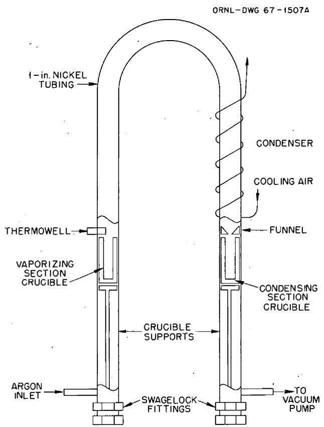  
Fig. 10.1. Apparatus for Vaporization Rate Measurement.

Table 10.1. Variation of LiF Vaporization Rate with Total Pressure at ${1000}^{ \circ  }\mathrm{C}$   

<table><tr><td>Condenser Pressurea(mm Hg)</td><td>Vaporization Rate(g cm-2sec-1)</td></tr><tr><td>1.0</td><td>7.8 × 10-6</td></tr><tr><td>0.50</td><td>3.3 × 10-5</td></tr><tr><td>0.35</td><td>4.8 × 10-5</td></tr><tr><td>0.1</td><td>2.4 × 10-4</td></tr></table>

The vapor pressure of LiF at $1000^{\circ}\mathrm{C}$ is about 0.53 mm Hg.

the salt, the rate of vaporization should be controlled by the rate of diffusion of LiF and REF through the argon present in the system; the measured rate at $1.0 \mathrm{~mm} \mathrm{Hg}$ was comparable with the rate calculated by assuming the rate to be diffusion controlled. Since these data indicate that the recirculation rate in the equilibrium still is controlled by diffusion of the salt vapor through argon, an error in the measured relative volatilities could arise because of differences in the rates of diffusion of LiF and REF vapor. Calculations indicate that the error in the relative volatility from this source is only about $1\%$ and that other effects such as a nonuniform concentration gradient in the liquid are much more important.

# Buildup of Nonvolatiles at a Vaporizing Surface

During vaporization of a multicomponent mixture, materials less volatile than the bulk of the mixture tend to remain in the liquid phase and are removed from the liquid surface by the processes of convection and molecular diffusion. Low-pressure vaporization does not generate deeply submerged bubbles and therefore provides little convective mixing in the liquid. An appreciable variation in the concentration of materials of low volatility may occur if these materials are removed by diffusion only.

Consider as an exemplary case a continuous still of the type shown in Fig. 10.2. Fuel carrier salt $(\mathrm{LiF - BeF}_2)$ containing fission product fluorides is fed to the bottom of the system continuously. Most of the $\mathrm{LiF - BeF}_2$ fed to the system is vaporized, and a salt stream containing most of the nonvolatile materials is withdrawn continuously. The positive $x$ direction will be taken as vertically upward, and the liquid withdrawal point and the liquid surface will be located at $x = 0$ and $x = 1$ respectively. Assume that above the liquid withdrawal point, molten LiF containing REF flows upward at a constant velocity $V$ . At the surface, a fraction $v / V$ of the LiF vaporizes, and the remaining LiF is returned to the bottom of the still.

Above the withdrawal point, the concentration of REF satisfies the relation

$$
D \frac {d ^ {2} C}{d x ^ {2}} - V \frac {d C}{d x} = 0, \tag {1}
$$

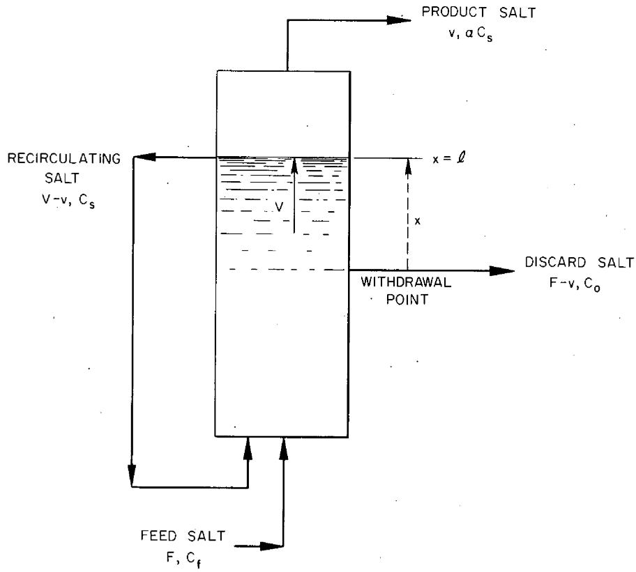  
Fig. 10.2. Continuous Still Having External Circulation and a Nonuniform Liquid Phase Rare-Earth Fluoride Concentration Gradient.

and the boundary conditions are, at $x = 1$

$$
- D \left. \frac {d C}{d x} \right| _ {x = l} + V C _ {s} = v \alpha C _ {s} + (V - v) C _ {s}, \tag {2}
$$

and at $x = 0$

$$
- D \left. \frac {d C}{d x} \right| _ {x = 0} + V C _ {0} = (V - v) C _ {s} + F C _ {f} - (F - v) C _ {0}, \tag {3}
$$

where

$D =$ diffusivity of REF in molten salt of still pot concentration, $\mathrm{cm}^2/\mathrm{sec}$ ,

$C =$ concentration of REF in molten salt at position $x$ , moles of REF per $\mathrm{cm}^3$ of salt,

$x =$ position in molten salt measured from liquid withdrawal point, cm,

$V =$ velocity of molten salt with respect to liquid surface, cm/sec,

$C_{s} =$ concentration of REF at $x = 1$ moles of REF per $\mathrm{cm}^3$ of salt,

$$
F = \operatorname {L i F} \text {f e e d r a t e}, \frac {\mathrm {c m} ^ {3} \operatorname {L i F} (\text {l i q u i d})}{\mathrm {c m} ^ {2} \text {v a p o r i z i n g s u r f a c e} \cdot \sec},
$$

$$
v = \operatorname {L i F} \text {v a p o r i z a t i o n} \text {r a t e}, \frac {\mathrm {c m} ^ {3} \operatorname {L i F} (\text {l i q u i d})}{\mathrm {c m} ^ {2} \text {v a p o r i z i n g} \text {s u r f a c e} \cdot \sec},
$$

$$
a = \text {r e l a t i v e}
$$

$$
C _ {0} = \text {c o n c e n t r a t i o n} \text {R E F} \text {a t} x = 0, \text {m o l e s} \text {o f} \text {R E F} \text {p e r} \mathrm {c m} ^ {3} \text {o f s a l t},
$$

$$
C _ {f} = \text {c o n c e n t r a t i o n} \text {R E F} \text {i n f e e d s a l t}, \text {m o l e s} \text {o f} \text {R E F} \text {p e r} \mathrm {c m} ^ {3} \text {o f s a l t}.
$$

Equation (1) has the solution

$$
C (x) = \frac {F C _ {f} \left\{1 - (v / V) (1 - a) [ 1 - \exp (- V (1 - x) / D) ] \right\}}{v a + (F - v) \left\{1 - (v / V) (1 - a) [ 1 - \exp (- V I / D) ] \right\}}. \tag {4}
$$

The fraction of the REF removed by the still is

$$
\begin{array}{l} \text {f r a c t i o n R E F r e m o v e d} = \frac {(F - v) C _ {0}}{F C _ {f}} \\ = \frac {F - v}{F - v + \left\{\mathrm {v} a / [ 1 - (\mathrm {v} / V) ] (1 - a) [ 1 - \exp (- V l / D) ] \right\}} \tag {5} \\ \end{array}
$$

The fractional removal of REF for a continuous still having a perfectly mixed liquid phase is

$$
\text {f r a c t i o n R E F r e m o v e d} = \frac {1}{1 + [ v a / (F - v) ]}. \tag {6}
$$

The ratio of the fractional removal of REF in a system having a nonuniform concentration to that in a still having a uniform concentration will be denoted as $\phi$ and can be obtained by dividing Eq. (5) by Eq. (6). Thus

$$
\phi = \frac {1 + [ v a / (F - v) ]}1 + [ v a / (F - v) ] / \left[ 1 - (v / V) \right] (1 - a) \left[ 1 - \exp (- V I / D) \right] \}. \tag {7}
$$

-Values of $\phi$ calculated for a still in which $99.5\%$ of the LiF fed to the still is vaporized $[v/(F - v) = 199]$ and in which the relative volatility of REF is $5 \times 10^{-4}$ are given in Fig. 10.3. The following two effects should be noted:

1. The value of $\phi$ is essentially unity for $V I / D < 0.1$ for any value of $v / V$ (fraction of LiF vaporized per circulation through still). Within this region, a near-uniform REF concentration is maintained by diffusion of REF within the liquid, and mixing by liquid circulation is not required.   
2. The value of $\phi$ is strongly dependent on $v / V$ for $Vl / D > 1$ . Within this region, a near-uniform REF concentration can be maintained only if liquid circulation is provided. For $Vl / D =$

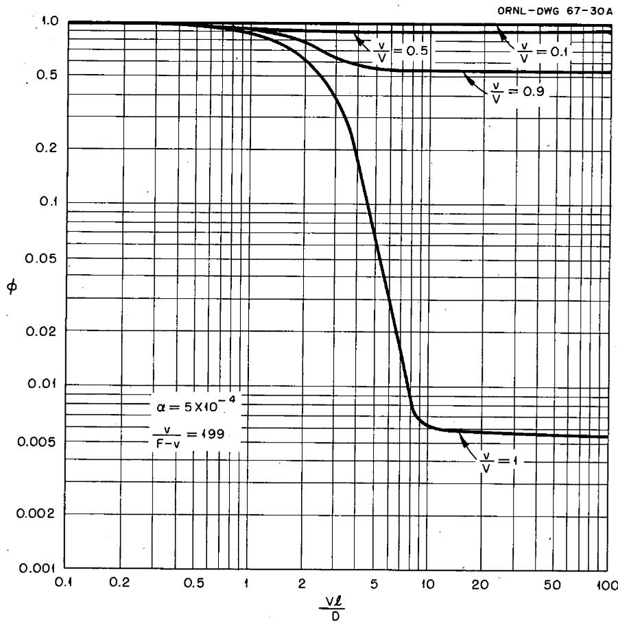  
Fig. 10.3. Ratio of Fraction of Rare-Earth Fluoride Removed in Still Having Nonuniform Concentration to That in Still Having Uniform Concentration.

100, $\phi$ has a value of 0.0055 with no liquid circulation and a value of 0.99 if $90\%$ of the LiF is returned to the bottom of the still.

An actual still would probably operate in the region $Vl / D > 1$ ; so the importance of liquid circulation cannot be overemphasized. Liquid phase mixing by circulation is believed to be an essential feature of an effective distillation system.

# 10.3 VACUUM DISTILLATION EXPERIMENT WITH MSRE FUEL SALT

W. L. Carter

Experimental equipment has been designed for an engineering-scale demonstration of vacuum distillation of molten-salt reactor fuel. The distillation will be carried out at about $1000^{\circ}\mathrm{C}$ and 1 mm Hg pressure to separate LiF-BeF $_2$ carrier salt from less volatile fission products, primarily the rare earths. Uranium tetrafluoride will not be present during distillation, having been previously removed by fluorination.

This experiment is part of a program to develop all unit operations (see Fig. 10.4) in the processing of a molten-salt breeder reactor fuel. Vacuum distillation is the key step in the process because it recovers the bulk of the valuable $\mathrm{LiF - BeF}_2$ carrier, decontaminated from fission products, for recycle to the reactor. Feasibility of distilling fluoride salts was established in batch laboratory experiments by Kelly; the present experiment will demonstrate the operation on an engineering scale and furnish data on the relative volatilities of the components of the mixture.

In the interest of simplicity, fabrication time, and economy, no attempt is being made in this experiment to reproduce actual MSBR operating conditions, such as high internal heat generation rate in the still volume or the design of a still that can serve in a processing plant for a breeder. Such advances are the next logical step after an engineering-scale demonstration. However, it is the purpose of this experiment to show that molten salt containing fission products can be fed continuously to the still at the same rate at which it is being distilled, with the simultaneous accumulation of fission products in the bottoms. The still can also be operated batchwise to concentrate fission products in some small fraction of the original charge.

3M. J. Kelly, "Removal of Rare Earth Fission Products from Molten Salt Reactor Fuels by Distillation," a talk presented at the 11th annual meeting of the American Nuclear Society, Gatlinburg, Tenn., June 21-24, 1965.

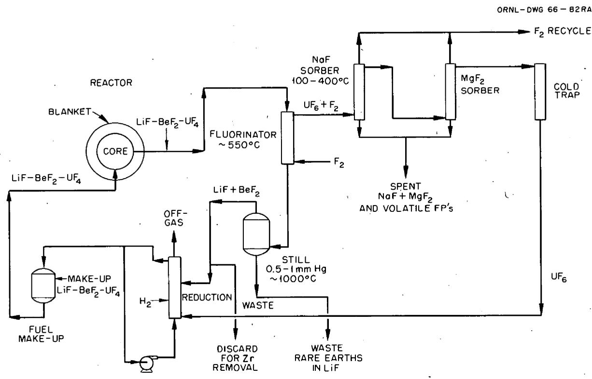  
Fig. 10.4. Principal Steps in Processing Irradiated Fuel from a Molten-Salt Reactor.

The experimental program is in two parts: About $90\%$ of the time will be devoted to nonradioactive operation, and the remaining $10\%$ to radioactive operation in distilling a small quantity of fuel from the MSRE. The first phase is expected to log 500 to 1000 hr of operation. The same equipment is to be used in the radioactive experiment after being thoroughly inspected at the conclusion of nonradioactive operation. Radioactive runs will be carried out in an MSRE cell.

Components of the experiment are a feed tank (48 liters), still (12 liters), condenser, condensate receiver (48 liters), associated temperature and pressure instrumentation, and vacuum system. The still, condenser, and receiver are fabricated as a unit. The vessels are mounted in an angle-iron frame, which is $3 \times 6 \times 7$ ft high, allowing transport of the entire facility as a unit once instrumentation, power, and service lines have been disconnected. Each process piece is surrounded on all sides by shell-type electric heaters; these in turn are enclosed in 4 to 8 in. of thermal insulation. A diagram of the assembly, which shows the feed and sampling mechanisms, is shown in Fig. 10.5.

An experiment is carried out by charging a molten mixture of carrier salt and fission product fluorides into the feed tank, which is held at a temperature slightly above the melting point. In most cases this is 500 to $550^{\circ}\mathrm{C}$ . Concurrently the still, condenser, and condensate receiver are heated and evacuated, and the space above the liquid in the feed tank is evacuated. The final pressure is adjusted to about 0.5 atm in the feed tank and $0.5\mathrm{mmHg}$ in the rest of the equipment.

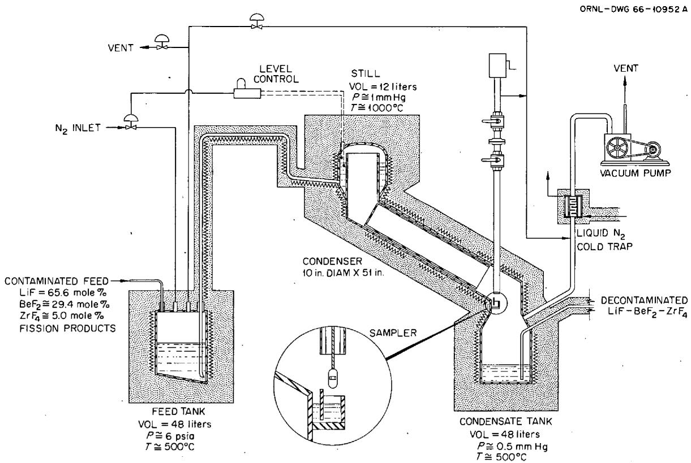  
Fig. 10.5. Vacuum Distillation of LiF-BeF $_2$ -ZrF $_4$ .

When the still temperature reaches that of the feed liquid, a 12-liter charge is forced into the still through a heated line, and the temperature is raised to 950 to $1000^{\circ}\mathrm{C}$ , the temperature range in which distillation begins.

The still pot is the highest point of the system and is an annular volume surrounding the top of the condenser. Salt vapors flow into the top of the condenser and condense along its length by losing heat to the surroundings. Freezing is prevented by supplying the necessary external heat to keep the condenser surface above the liquidus temperature. In leaving the condenser the distillate passes through a small cup from which samples can be removed for analyses.

Liquid-level instrumentation in the still allows control of feed rate to correspond to the distillation rate, which is estimated to be 400 to $500\mathrm{cm}^3$ of distillate per hour. Determining the actual distillation rate for molten-salt systems is an important part of this experiment.

All vessels and lines that contact molten salt are fabricated of Hastelloy N. In the region of the still and upper section of the condenser, the normal use temperature for this alloy may be exceeded by as much as $200^{\circ}\mathrm{C}$ . Consequently, the vessels are to be examined thoroughly by dimensional, radiographic, and ultrasonic methods before and after nonradioactive operation. Provision is made for hanging test specimens of candidate metals of construction in the still.

# OAK RIDGE NATIONAL LABORATORY

# MOLTEN-SALT REACTOR PROGRAM

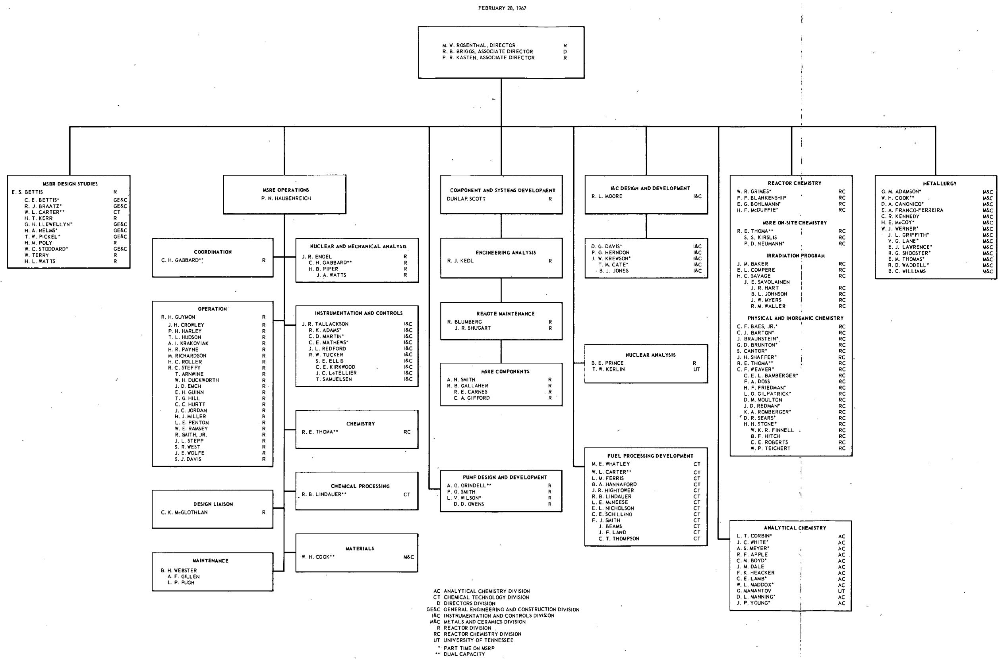

# INTERNAL DISTRIBUTION

1. R. K. Adams   
2. G. M. Adamson   
3. R. G. Affel   
4. L. G. Alexander   
5. R. F. Apple   
6. C. F. Baes   
7. J. M. Baker   
8. S. J. Ball   
9. W. P. Barthold   
10. H. F. Bauman   
11. S. E. Beall   
12. M. Bender   
13. E. S. Bettis   
14. D. S. Billington   
15. R. E. Blanco   
16. F. F. Blankenship   
17. J. O. Blomeke   
18. R. Blumberg   
19. A. L. Boch   
20. E. G. Bohlmann   
21. C. J. Borkowski   
22. G. E. Boyd   
23. J. Braunstein   
24. M. A. Bredig   
25. E. J. Breeding   
40. R. B. Briggs   
41. H. R. Bronstein   
42. W. E. Browning   
43. F. R. Bruce   
44. G. D. Brunton   
45. G. H. Burger   
46. D. A. Canonico   
47. S. Cantor   
48. D. W. Cardwell   
49. W. L. Carter   
50. G. I. Cathers   
51. J. M. Chandler   
52. E. L. Comperes   
53. J. A. Conlin   
54. W. H. Cook   
55. L. T. Corbin   
56. W. B. Cottrell   
57. G.A.Cristy

58. J. L. Crowley   
59. F. L. Culler   
60. J.M.Dale   
61. D. G. Davis   
62. W.W.Davis   
63. J. H. DeVan   
64. S. J. Ditto   
65. R. G. Donnelly   
66. N. E. Dunwoody   
67. W. P. Eatherly   
68. J. R. Engel   
69. E.P.Epler   
70. W. K. Ergen   
71. D. E. Ferguson   
72. L. M. Ferris   
73. A. P. Fraas   
74. H. A. Friedman   
75. J.H Frye, Jr.   
76. C. H. Gabbard   
77. W.R.Gall   
78. R. B. Gallaher   
79. R.G. Gilliland   
80. H. E. Goeller   
81. W.R.Grimes   
82. A. G. Grindell   
83. R. H. Guymon   
84. R. P. Hammond   
85. B. A. Hanniaford   
86. P. H. Harley   
87. D.G.Harman   
88. C. S. Harrill   
89. P. N. Haubenreich   
90. F. A. Heddleson   
91. P. G. Herndon   
92. R. F. Hibbs (Y-12)   
93. J. R. Hightower   
94. M. R. Hill   
95. E. C. Hise   
96. H. W. Hoffman   
97. V. D. Holt   
98. P. P. Holz   
99. R.W.Horton   
00. A. S. Householder

101. T. L. Hudson   
102. H. Inouye   
103. W. H. Jordan

104-108. P. R. Kasten   
109. R. J. Kedl   
110. M. T. Kelley   
111. M. J. Kelly   
112. C. R. Kennedy   
113. T. W. Kerlin   
114. H. T. Kerr   
115. R. F. Kimball   
116. S. S. Kirslis   
117. D. J. Knowles   
118. A. I. Krakoviak   
119. J. W. Krewson   
120. C. E. Lamb   
121. J. A. Lane   
122. C. E. Larson   
123. E. J. Lawrence   
124. T. A. Lincoln   
125. R. B. Lindauer   
126. A. P. Litman   
127. J. L. Liverman   
128. R. S. Livingston   
129. M. I. Lundin   
130. R. N. Lyon   
131. H. G. MacPherson   
132. R. E. MacPherson   
133. F. C. Maienschein   
134. C. D. Martin   
135. W. R. Martin   
136. C. E. Mathews   
137. R.W. McClung   
138. H. E. McCoy   
139. H. F. McDuffie   
140. C. K. McGlothlan   
141. C. J. McHargue   
142. L. E. McNeese   
143. A. S. Meyer   
144. E. C. Miller   
145. C. A. Mills   
146. W. R. Mixon   
147. R. L. Moore   
148. K. Z. Morgan   
149. J. C. Moyers   
150. J. P. Nichols   
151. E. L. Nicholson   
152. L. C. Oakes   
153. W. R. Osborn

154-155. R. B. Parker

156. L. F. Parsly   
157. P. Patriarca

158. H. R. Payne   
159. A. M. Perry   
160. W. B. Pike   
161. H. B. Piper   
162. B. E. Prince   
163. J. L. Redford   
164. P. M. Reyling   
165. M. Richardson   
166. R. C. Robertson   
167. H.C. Roller

168-244. M.W.Rosenthal   
245. H. C. Savage   
246. A. W. Savolainen   
247. W. F. Schaffer   
248. C. E. Schilling   
249. Dunlap Scott   
250. H. E. Seagren   
251. J. H. Shaffer   
252. E. D. Shipley   
253. M. J. Skinner   
254. G. M. Slaughter   
255. A. N. Smith   
256. F. J. Smith   
257. G.P. Smith   
258. O. L. Smith   
259. P. G. Smith   
260. A. H. Snell   
261. W. F. Spencer   
262. I. Spiewak   
263. R. C. Steffy   
264. C. E. Stevenson   
265. H. H. Stone   
266. D. A. Sundberg   
267. J. R. Tallackson   
268. E. H. Taylor   
269. W. Terry   
270. R. E. Thoma   
271. G. M. Tolson   
272. D. B. Trauger   
273. R. W. Tucker   
274. W. C. Ulrich   
275. D. C. Watkin   
276. G.M. Watson   
277. J. S. Watson   
278. C. F. Weaver   
279. B. H. Webster   
280. A. M. Weinberg   
281. J. R. Weir   
282. W. J. Werner   
283. K.W. West   
284. M. E. Whatley   
285. J. C. White

286. G. C. Williams   
287. L. V. Wilson   
288. G.J. Young   
289. Biology Library

290-294. ORNL--Y-12 Technical Library

Document Reference Section

295-297. Central Research Library   
298-339. Laboratory Records Department   
340. Laboratory Records, ORNL R.C.

# EXTERNAL DISTRIBUTION

341. J. C. Bowman, Union Carbide Technical Center, 12900 Snow Road, Parma, Ohio 44130   
342. J. H. Brannan, Carbon Products Division, 270 Park Avenue, New York, New York 10017   
343. R. A. Charpie, UCC Electronics Division, 270 Park Avenue, New York, New York 10017   
344. D. F. Cope, Atomic Energy Commission, RDT Site Office (ORNL)   
345. J. W. Crawford, Atomic Energy Commission, Washington 20545   
346. D. A. Douglas, Materials Systems Division, UCC, Kokomo, Indiana 46901   
347. A. Giambusso, Atomic Energy Commission, Washington 20545   
348. W. J. Larkin, Atomic Energy Commission, ORO   
349. J. A. Lieberman, Atomic Energy Commission, Washington   
350. W. D. Manly, Material Systems Division, UCC, 270 Park Avenue, New York, N.Y. 10017   
351. C. L. Matthews, Atomic Energy Commission, RDT Site Office (ORNL)   
352. W. B. McDonald, Battelle-Pacific Northwest Laboratory, Hanford, Washington   
353-354. T. W. McIntosh, Atomic Energy Commission, Washington 20545   
355. M. A. Rosen, Atomic Energy Commission, Washington 20545   
356. H. M. Roth, Atomic Energy Commission, ORO   
357. M. Shaw, Atomic Energy Commission, Washington 20545   
358. E. E. Sinclair, Atomic Energy Commission, Washington 20545   
359. W. L. Smalley, Atomic Energy Commission, ORO   
360. L. D. Stoughton, UCC, P. O. Box 500, Lawrenceburg, Tennessee   
361. J. A. Swartout, UCC, 270 Park Avenue, New York, New York 10017   
362. R. F. Sweek, Atomic Energy Commission, Washington 20545   
363. J. W. Ullmann, UCC, P. O. Box 278, Tarrytown, New York 10591   
364. M. J. Whitman, Atomic Energy Commission, Washington 20545   
365. James Wright, Westinghouse Electric, P. O. Box 355, Pittsburgh, Pa. 15230   
366. Research and Development Division, AEC, ORO

367-368. Reactor Division, ORO   
369. W. W. Grigorieff, Assistant to the Executive Director, Oak Ridge Associated Universities   
370-647. Given distribution as shown in TID-4500 under Reactor Technology category (25 copies - CFSTI)