ORNL-4123

MSRE CONTROL ELEMENTS: MANUFACTURE,

INSPECTION, DRAWINGS, AND SPECIFICATIONS

G.M.Tolson

A. Taboada

OAK RIDGE NATIONAL LABORATORY

CENTRAL RESEARCH LIBRARY

DOCUMENT COLLECTION

LIBRARY LOAN COPY

DO NOT TRANSFER TO ANOTHER PERSON

If you wish someone else to see this

document, send in name with document

and the library will arrange a loan.

UCN-7969

(3) 3-671

OAK RIDGE NATIONAL LABORATORY

operated by

UNION CARBIDE CORPORATION

for the

U.S. ATOMIC ENERGY COMMISSION

Printed in the United States of America. Available from Clearinghouse for Federal

Scientific and Technical Information, National Bureau of Standards,

U.S. Department of Commerce, Springfield, Virginia 22151

Price: Printed Copy $3.00; Microfiche $0.65

# LEGAL NOTICE

This report was prepared as an account of Government sponsored work. Neither the United States, nor the Commission, nor any person acting on behalf of the Commission;

A. Makes any warranty or representation, expressed or implied, with respect to the accuracy, completeness, or usefulness of the information contained in this report, or that the use of any information, apparatus, method, or process disclosed in this report may not infringe privately owned rights; or   
B. Assumes any liabilities with respect to the use of, or for damages resulting from the use of any information, apparatus, method, or process disclosed in this report.

As used in the above, "person acting on behalf of the Commission" includes any employee or contractor of the Commission, or employee of such contractor, to the extent that such employee or contractor of the Commission, or employee of such contractor prepares, disseminates, or provides access to, any information pursuant to his employment or contract with the Commission, or his employment with such contractor.

ORNL-4123

Contract No. W-7405-eng-26

METALS AND CERAMICS DIVISION

MSRE CONTROL ELEMENTS: MANUFACTURE, INSPECTION, DRAWINGS, AND SPECIFICATIONS

G. M. Tolson and A. Taboada

JULY 1967

OAK RIDGE NATIONAL LABORATORY

Oak Ridge, Tennessee

operated by

UNION CARBIDE CORPORATION

for the

U.S. ATOMIC ENERGY COMMISSION

# CONTENTS

Page

Abstract 1   
Introduction 1   
Development of Specification and Fabrication Methods 2   
Component Manufacture 4   
Control Element Assembly 6   
Summary 9   
Appendix A. 11   
Appendix B. 35   
Appendix C 39

# MSRE CONTROL ELEMENTS: MANUFACTURE, INSPECTION, DRAWINGS, AND SPECIFICATIONS

G. M. Tolson1 and A. Taboada2

# ABSTRACT

The control elements for the Molten Salt Reactor are $\mathrm{Gd}_{2}\mathrm{O}_{3}-\mathrm{Al}_{2}\mathrm{O}_{3}$ bushings canned in Inconel. The report includes material selection and development of fabrication methods. The can was made from fully inspected Inconel closed by four TIG welds. The $\mathrm{Gd}_{2}\mathrm{O}_{3}-\mathrm{Al}_{2}\mathrm{O}_{3}$ bushings were made by conventional pressing and sintering methods after a special prereaction step was used. The bushings were given thermal shock tests, weighed, dimensionally inspected, and given a final visual inspection for chips or cracks. As-built drawings, specifications, and manufacturing procedures are included. By methods described in this report, 160 MSRE control rod elements were manufactured.

# INTRODUCTION

The Molten Salt Reactor Experiment (MSRE) is a high-temperature $(675^{\circ}\mathrm{C})$ low-pressure (50 psi) system designed to provide a thermal output of about 10 Mw. A fuel mixture of LiF-BeF $_2$ -ZrF $_4$ -UF $_4$ is circulated through a cylindrical 5-ft-diam reactor vessel (containing a graphite core) to a heat exchanger, where heat is transferred to an unfueled fluoride salt and then to the atmosphere. The control elements are $\mathrm{Gd}_2\mathrm{O}_3 - 30\% \mathrm{Al}_2\mathrm{O}_3$ bushings clad with Inconel as shown in Fig. 1. They are about 1 l/2 in. long with an inner diameter slightly larger than 3/4 in. and a wall thickness of about 3/8 in. The MSRE has three control rods, each of which has 36 control elements strung on a flexible stainless steel hose to form a 56-in.-long control rod. The flexibility of the control rod prevents binding due to misalignment or thermal expansion. Although

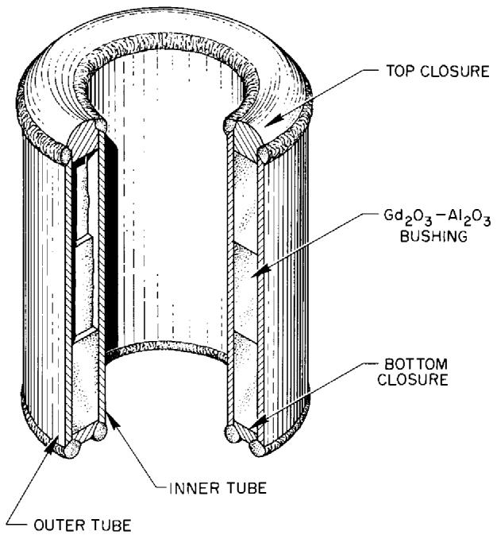  
UNCLASSIFIED ORNL-DWG64-1105R  
Fig. 1. A Cutaway of an MSRE Control Element.

cooling air will be blown down the inside of the flexible hose and control element and then back up over the outside of the element, the element must be designed to withstand the temperature generated at full power without cooling, about $815^{\circ}\mathrm{C}$ .

# DEVELOPMENT OF SPECIFICATION AND FABRICATION METHODS

To prove the feasibility of the control rod design, four prototype elements were manufactured on a research contract with Dresser Products. The prototype elements differed from the final element in that the prototype pellets were produced by hot pressing and were canned in stainless steel rather than Inconel. The prototype elements were subjected to x-ray, penetrant, and dimensional inspection and to testing that included exposure in a rig designed to determine under simulated reactor conditions soundness, dimensional stability, and general suitability for reactor use.

In the control-rod testing rig, two canned elements were exposed to repeated thermal and mechanical shocks. They were examined radiographically and dimensionally after 24, 350, and 600 hr of testing that included approximately 11,000 cycles and 1700 scrams. Holes were made in one can to expose the $\mathrm{Gd}_{2}\mathrm{O}_{3}-\mathrm{Al}_{2}\mathrm{O}_{3}$ to air for the final 250 hr of testing.

Dimensions of the metal cans were not altered by the testing. Axial cracks in the pellets were observed radiographically after the first cycle, and severe cracks in both the axial and transverse directions were observed at later stages. However, no crumbling or ratcheting was evident, and no condition was observed that might affect the nuclear or mechanical performance of the control rod elements.

Inconel was chosen as a canning material for the poison bushings because of its high-temperature strength, good weldability, and availability. Inconel was chosen over stainless steel for the following reasons:

1. Inconel will not catastrophically oxidize, while many stainless steels will under certain conditions.4   
2. Inconel will not stress-corrosion crack.   
3. Inconel is more resistant to nitric acid attack than is sensitized stainless steel. Nitric acid can form in radiation fields by reaction of the nitrogen and water vapor in the air.[5]   
4. If salt should leak into the control element, Inconel would have better corrosion resistance than stainless steel.

Although there was only a slight possibility that these conditions might occur, the small cost factor in favor of stainless steel did not warrant the risk involved.

Boron and boron-containing materials were ruled out as poison materials, since under certain conditions they react with stainless steel

and nickel-base alloys. In addition helium is one of the products when boron is irradiated, which would require a venting system on the element or design for high internal pressure. A rare earth oxide was chosen as the poison material on the basis of work done by ORNL6 and Knolls Atomic Power Laboratory7 and irradiation testing by General Electric on dysprosium oxide mixtures.8

Since the cross section of dysprosium oxide was not sufficiently high, the choice of materials was between $\mathrm{Gd}_2\mathrm{O}_3$ and $\mathrm{Eu}_2\mathrm{O}_3$ . Gadolinium was chosen because it was from one-third to one-fourth less expensive than $\mathrm{Eu}_2\mathrm{O}_3$ . Because pure gadolinium oxide reacts with water in the air, it was diluted with aluminum oxide. A series of tests was run in boiling water and water-saturated air at $700^{\circ}\mathrm{C}$ to determine the aluminum oxide content needed. Although $20\% \mathrm{Al}_{2}\mathrm{O}_{3}$ performed satisfactorily, $30\% \mathrm{Al}_{2}\mathrm{O}_{3}$ was chosen as added protection.

To prevent the "self welding" of the elements during operation, a preoxidation was specified. It was necessary to perform this operation on the finished element to avoid contamination of the closure welds.

From experience gained in the manufacture of the prototype control rods, specifications (Appendix A) and drawings (Appendix B) were prepared. Quotations were obtained from several control rod manufacturers and were carefully evaluated. The prime contract for manufacturing the control elements was awarded to Westinghouse Atomic Power Division.

# COMPONENT MANUFACTURE

The top and bottom closures were machined from Inconel bar stock. The inner and outer tubes were made from tubing drawn to the correct size. The manufacture and inspection procedures for the Inconel parts

are given in Appendix A. In the case of the tubing, the ORNL Tubing Specification (JS-81-183, Part II) was rewritten by the vendor, who added additional manufacturing requirements and purchased the material from a tubing vendor. The tubing vendor performed the inspection and certified the material to ORNL specifications. In the case of the bar, Westinghouse purchased the material to ASTM specification, performed the necessary inspection, and certified to the ORNL specification (JS-81-183, Part III). In both cases, the material was inspected by ultrasonic and penetrant methods as raw stock and examined by penetrant methods after final machining. All of the raw material had certified chemical analyses and mechanical properties, and samples of each heat of material were retained. A flowsheet for cladding components is given in Appendix C, Procedure 1.

The $\mathrm{Gd}_{2}\mathrm{O}_{3}-\mathrm{Al}_{2}\mathrm{O}_{3}$ bushings for the prototype control element were hot pressed, but Westinghouse proposed to manufacture the production bushings by conventional pressing and sintering. In work performed previously at ORNL, a chemical reaction occurred at $1650^{\circ}\mathrm{C}$ , and the pellets became severely distorted; at $1750^{\circ}\mathrm{C}$ they melted.[9] Westinghouse could manufacture bushings that would meet the specifications except that they were so hygroscopic that they dissolved in boiling water. Experiments at ORNL showed that bushings could be made that were not hygroscopic by prereacting the powder at $1650^{\circ}\mathrm{C}$ and then pressing and sintering.[9] To manufacture a bushing that would not react with water, Westinghouse used a prereacting step on all production bushings.

The manufacturing procedure used for the bushing is outlined in Appendix C, Procedure 2. The process started with mixing the $\mathrm{Al}_{2}\mathrm{O}_{3}$ and $\mathrm{Gd}_{2}\mathrm{O}_{3}$ powder, pressing, and prereacting at $1700^{\circ}\mathrm{C}$ . The reaction products were crushed, ball-milled, sized, pressed into bushings, presintered, and then sintered at $1450^{\circ}\mathrm{C}$ . Bushings made by this method were boiled in water for 48 hr without any appreciable weight loss. Each bushing was then given a thermal shock test by heating to $1400^{\circ}\mathrm{C}$ and quenching

in water. After surface grinding, the bushings were visually inspected for chips or cracks. Bushings were rejected if they had chips longer than 1/8 in. or deeper than 1/32 in. Each bushing was weighed and dimensionally inspected with go-no-go gages. The content of $\mathrm{Gd}_{2}\mathrm{O}_{3}$ was also determined spectrographically for each batch.

Three bushings were selected for each control element so their combination would yield the proper stack height and total weight of $\mathrm{Gd}_2\mathrm{O}_3$ . The $\mathrm{Gd}_2\mathrm{O}_3$ content was computed from the weight of the bushing and the results of the spectrographic analysis for $\mathrm{Gd}_2\mathrm{O}_3$ .

Experience showed that even after a $150^{\circ}\mathrm{C}$ bake, the bushings could actually release enough gas to bulge the Inconel can during the pre-oxidation of it. To prevent bulging, it was necessary to outgas the bushings at $815^{\circ}\mathrm{C}$ before loading.

# CONTROL ELEMENT ASSEMBLY

Before production assembly, welding procedures were written and qualified for each of the four weld joints required in a control element. It was necessary that the procedures consistently produce a defect-free weld with a minimum of 0.20 in. penetration. The weld must not contain buildup or distort the can sufficiently that the element would not pass final dimensional inspection. Appendix C, Procedure 3, gives the welding procedure used, and Fig. 2 shows sections through typical top and bottom welds. If the outer top weld was made last, the weld would blow out due to buildup of gas pressure inside the element. If the inner bottom joint was welded last, no difficulty was encountered. This was probably because less gas was heated during welding as a result of the configuration of the weld joint (see Fig. 2).

The assembly is described in Appendix C, Procedure 4. After both top welds were made, the bushings were loaded into the subassembly in a helium-filled dry box, and the bottom closure was pressed into place. The final two bottom welds were then made. The element was then dimensionally inspected with go and no-go gages, and, if necessary, excess weld buildup was removed. An identification number was electro-etched

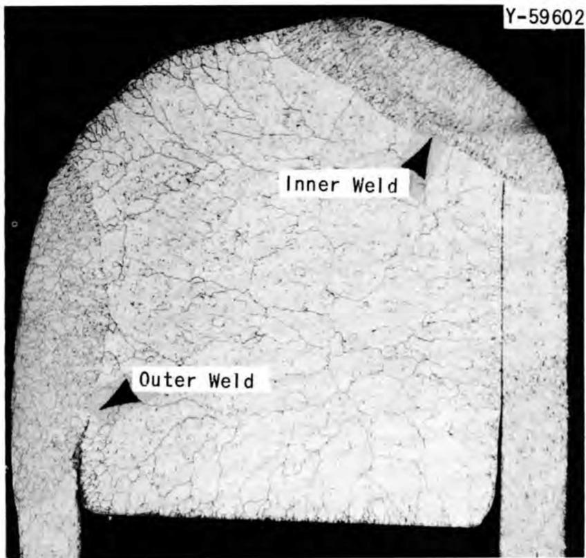

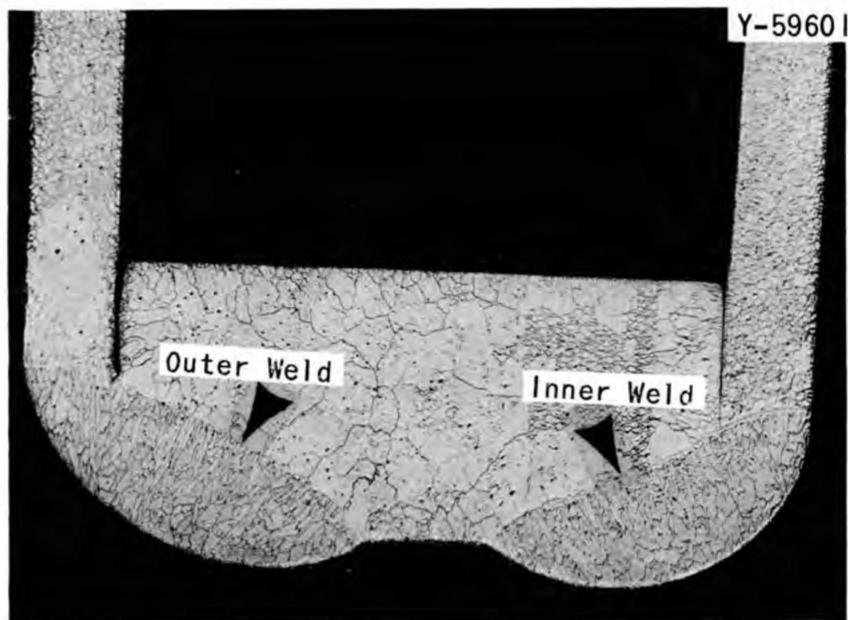  
Fig. 2. Sections Through Closure Welds on MSRE Control Elements. (a) Top closure. (b) Bottom closure.

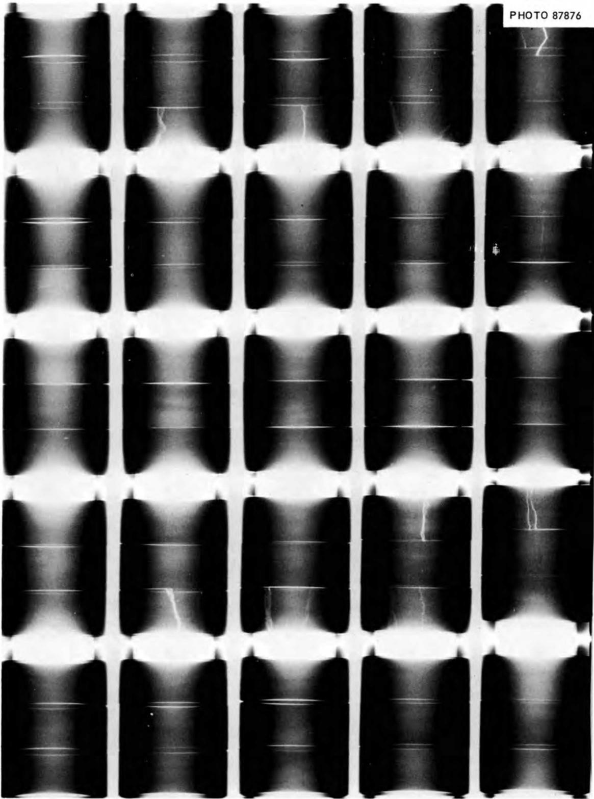  
Fig. 3. Radiographic of MSRE Control Elements, Showing Cracked Bushings.

into each of the elements, and each part used in the manufacture of that element was recorded. The element was given a careful visual inspection, helium leak checked, and inspected at the welds with post-emulsified fluorescent penetrant. To prevent self-welding of the segments or components during service, the elements were oxidized by heating to $927^{\circ}\mathrm{C}$ . They were then given a final visual and dimensional inspection, packaged, and shipped.

During receiving inspection at ORNL, radiographic examination (see Fig. 3) revealed that 51 of the elements contained cracked bushings. These cracks had developed during welding or during preoxidation. Since tests on the prototype element showed the bushings would crack during the first few reactor cycles in any event, the elements were accepted.

The control elements that will be used in the MSRE were run in the control rod test facility for a total of 2000 cycles. No dimensional changes were noted. The elements were then put into position in the MSRE, where they are presently operating.

# SUMMARY

By the methods described in this report, 160 MSRE control rod elements were successfully manufactured. Figure 4 shows a group of the finished elements.

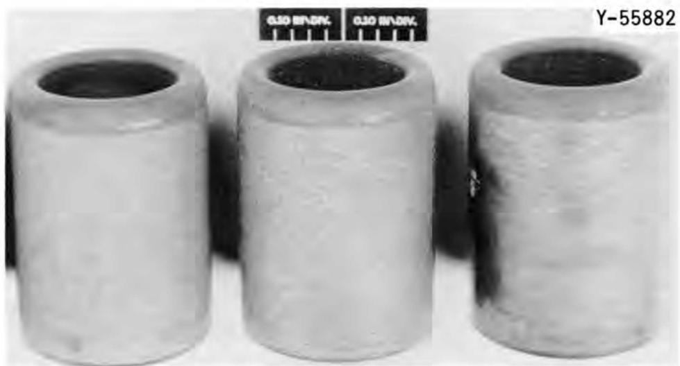  
Fig. 4. Three MSRE Control Elements.

# APPENDIX A

Master Specification for the Control Rod Elements for the Molten Salt Reactor 13

Tentative Specification for Seamless Inconel Tubing for Molten Salt Reactor Control Rods 23

Tentative Specification for Inconel Rods for the Molten Salt Reactor Control Rod 27

Tentative Specification for Gadolinium Oxide - Aluminum Oxide Bushings for Molten Salt Reactor Experiment 30

MSR CONTROL ROD SPECIFICATION METALS AND CERAMICS DIVISION OAK RIDGE NATIONAL LABORATORY

Spec. No. JS-81-183

Part I

Date: September 21, 1962

Page 1 of 10

Union Carbide Nuclear Company

A Division of Union Carbide Corporation
Oak Ridge, Tennessee

Subject: MASTER SPECIFICATION FOR THE CONTROL ROD ELEMENTS FOR THE MOLTEN SALT REACTOR

# I. SCOPE

This specification covers the control rod elements for the Molten Salt Reactor. The element consists of Inconel-clad gadolinium oxide-aluminum oxide bushing.

# II. REFERENCES

A. JS-81-183, Part II, "Tentative Specification for Seamless Inconel Tubing for Molten Salt Reactor Control Rods"   
B. JS-81-183, Part III, "Tentative Specification for Inconel Rods for the Molten Salt Reactor Control Rod"   
C. JS-81-183, Part IV, "Tentative Specification for Gadolinium Oxide-Aluminum Oxide Bushings for the Molten Salt Reactor Experiment.   
D. ASTM Designation: E 2-49 T, "Methods of Preparation of Micrographs of Metals and Alloys"   
E. ASTM Designation: E 3-58 T, "Methods of Preparation of Metallographic Specimens"   
F. Mil-C-19874 (Ships), 14 May, 1957, "Military Specification Cleaning Requirements for Nuclear Primary Coolant Equipment Including Piping Systems"   
G. MET-NDT-4, Revision 2, "Tentative Methods for Liquid-Penetrant Inspection"   
H. Dwg. D-BB-B40600, "MSRE Control Rod Assembly and Details"

# III. MANUFACTURING REQUIREMENTS

The elements shall be manufactured in accordance with ORNL-DWG 64-1104, 64-1107, 64-1108, and 64-1106 and in accordance with this specification.

Subject: MASTER SPECIFICATION FOR THE CONTROL ROD ELEMENTS FOR THE MOLTEN SALT REACTOR

# IV. MATERIALS

Each element shall consist of the following components:

<table><tr><td>Item No.</td><td>Component</td><td>Material</td><td>ORNL DWG. No.</td><td>Specification No.</td><td>Quantity</td></tr><tr><td>1</td><td>Bushing</td><td>Gd2O3-Al2O3</td><td>64-1108</td><td>MET-RM-C 301</td><td>1</td></tr><tr><td>2</td><td>Inner Tube</td><td>Inconel</td><td>64-1104</td><td>JS-81-183, Part II</td><td>1</td></tr><tr><td>3</td><td>Outer Tube</td><td>Inconel</td><td>64-1107</td><td>JS-81-183, Part II</td><td>1</td></tr><tr><td>4</td><td>Top Closure</td><td>Inconel</td><td>64-1106</td><td>JS-81-183,* Part III</td><td>1</td></tr><tr><td>5</td><td>Bottom Closure</td><td>Inconel</td><td>64-1106</td><td>JS-81-183,* Part III</td><td>1</td></tr></table>

# V. WELDING REQUIREMENTS

A. The closures shall be joined to the inner and outer tube by means of a fusion weld made by the TIG process.   
B. All welds shall have a minimum of 0.020-in. penetration and determined according to Section XI of this specification.   
C. The welds shall be tight so that no leak will be detected by a mass spectrometer calibrated to detect a standard helium leak of $7 \times 10^{-9}$ std cc/sec at room temperature, as specified in Section VIII of this specification.   
D. Each closure weld shall be free of surface cracks, surface porosity, or craters that can be detected visually or with the aid of dye penetrant as specified in Sections XIV and IX of this specification.   
E. Each weld shall be smooth, bright, and free of contamination as determined by visual inspection.

# VI. WELD QUALIFICATION

A. The welding procedure shall be submitted to the Company for approval. No qualification will be performed before the Company has approved the welding procedure.   
B. No production welding shall be performed before the welding procedure has been qualified.

Subject: MASTER SPECIFICATION FOR THE CONTROL ROD ELEMENTS FOR THE MOLTEN SALT REACTOR

# WELD QUALIFICATION (Continued)

C. The welding procedure shall be qualified by making three welds of each type.

D. The welding parameters on the qualification test shall be set to give the minimum penetration with the range of parameters allowed in the procedures.

E. Qualification welds shall meet the requirements of Section V of this specification and shall be inspected in accordance with Sections XIV and IX of this specification.

F. All qualification welds shall be sectioned by the Seller longitudinally through the weld area at approximately 90-degree intervals, thus permitting four penetration measurements on each weld. (One section shall be made at the location where welding was stopped.) One half of the sample elements shall be sectioned at the initial closure weld and the remainder at the final weld. The sections shall be prepared for examination, metallographically measured, and photographed as specified in ASTM Designations: E 2 - 49 T and E 3 - 58 T unless otherwise specified in this specification. The photographs shall become the property of the Company and shall be delivered with or prior to final shipment.

1. The sections shall be free of cracks.   
2. The sections shall be free of voids, porosity, or inclusions greater than 0.005 in. in their largest dimension.

# VII. INTERNAL ATMOSPHERE

A. The atmosphere within the welded element shall not exceed atmospheric pressure by more than 2 psi at room temperature.   
B. The atmosphere within the welded element shall contain at least $50\%$ He.

Subject: MASTER SPECIFICATION FOR THE CONTROL ROD ELEMENTS FOR THE MOLTEN SALT REACTOR

# VIII. LEAK TEST

A. Each element shall be helium-leak tested before penetrant inspection or oxidation is performed. Helium-leak testing shall be carried out in accordance with the following procedure:

1. Scope: This section applies to the bell-jar method of testing the assembled, helium-containing elements after the final closure weld has been accomplished.   
2. Reference: The Manufacturer's operating manual for the particular instrument used in the inspection.   
3. Equipment: A mass-spectrograph type, helium-sensitive instrument, similar to the Veeco Type MS-9 or Consolidated Engineering Corporation Type 24-l10, which includes the following as incorporated in the instrument or as additions or modifications:

a. A cold trap (liquid nitrogen or liquid air).   
b. A helium-leak source of $7 \times 10^{-9}$ std cc/sec.   
c. An external or auxiliary roughing vacuum pump connected to the instrument manifold and to the specimen or test chamber through a vacuum valve.   
d. A throttling or modulating valve between the instrument manifold and the instrument.   
e. A low-pressure supply of helium with a nozzle less than 1/16 in. in diameter for use in checking for leak-tight connections.   
f. One or more leak-tight chambers, each of which is capable of accommodating an element for the final closure weld inspection and having no less than 3/8-in. diametral clearance between the element and the wall of the chamber.

4. Technical Requirements:

a. The instrument sensitivity shall be such that the stable signal from the standard leak, as determined in Section VIII A5c of this specification, is at least two times as large as the signals produced by background noise.

Subject: MASTER SPECIFICATION FOR THE CONTROL ROD ELEMENTS FOR THE MOLTEN SALT REACTOR

# LEAK TEST (Continued)

b. The inspection shall be performed in a force-ventilated location to facilitate the removal of any helium background.   
c. The connecting lines between the test chamber and the instrument manifold shall be as short as is practical and should have a minimum inside diameter of $\frac{1}{2}$ in. All connections shall be leak-tight.   
d. Care shall be exercised to avoid plugging leaks with any sealant prior to attempted detection with helium.   
e. All assembled elements shall be either helium-leak tested within 48 hr after the final closure weld is completed or stored in a helium atmosphere of pressure equal to or greater than the internal pressure of the element until such time as they can be helium-leak tested. If an element is to be retested or if the testing procedure is interrupted, as in Section VIIIIA5-a, -f, and -g of this specification, the element shall be stored in a helium atmosphere as described until such time as testing can be completed. No assembled element shall be allowed to remain in a non-helium atmosphere for more than a total of 48 hr between the time of its assembly and the completion of helium-leak testing.

# 5. Testing Procedure:

a. The performance of the leak-detector equipment shall be verified after each inspection. If at any time this equipment fails to function properly as described in the Manufacturer's operating manual, and/or if the sensitivity as determined in Section VIIIIA5c of this specification decreases below the minimum level prescribed in Section VIIIIA4a, the equipment shall be readjusted to function as specified and recalibrated, and all elements which have been inspected during the interim since the last satisfactory performance verification of the equipment shall be inspected again.

Subject: MASTER SPECIFICATION FOR THE CONTROL ROD ELEMENTS FOR THE MOLITEN SALT REACTOR

# LEAK TEST (Continued)

b. The element shall be inspected as follows: The assembled, helium-containing elements shall be inspected after the final closure weld has been accomplished by placing the element in the inspection chamber, evacuating the chamber, and searching for helium leaks as prescribed in the instrument Manufacturer's operating manual.

c. The instrument shall be calibrated as follows: The standard leak source $(7 \times 10^{-9}$ std cc/sec) shall be connected to one end of the test chamber. The opposite end of the test chamber shall be connected to the manifold, and the time which is required to produce a signal two times as large as the background noise shall be measured. This measurement shall be accomplished while examining a $100\%$ sample from the test chamber and with all valves between the standard leak source and the helium-sensing device completely open. This portion of the calibration shall be continued until the signal from the standard leak reaches a stable amplitude. The signal amplitude and manifold pressure shall be measured at this point.

d. The inspection shall be made taking a sample from the test chamber. All valves between the element and the helium-sensing device shall be completely open and the time of inspection shall be no less than one minute and at least twice as long as the time, as determined in Section VIIIIA5c of this specification for that particular method, required for the standard leak to produce a signal two times as large as the background noise.

e. The manifold pressure at which the inspection is made shall be the same as the pressure at which the instrument is calibrated, as measured in Section VIII.A5c of this specification.

f. Excessive pump-down time shall be indicative of an external leak. The leak shall be located and corrected before further testing is accomplished.

Subject: MASTER SPECIFICATION FOR THE CONTROL ROD ELEMENTS FOR THE MOLTEN SALT REACTOR

# LEAK TEST (Continued)

g. During the inspection, any signal which produces an indication two times as large as the background noise level shall be indicative of a through path or leak in the element being inspected and that element shall be rejected. If more than one assembled element is being inspected at the time a leak is detected, the elements shall be inspected again such that the leaking element or elements are identified and rejected.

h. All rejected, assembled elements shall be disassembled. Any salvageable parts of the rejected elements may be reused in the assembly of other elements. A salvageable item is one that is reinspected and found to conform to the specification.

# IX. PENETRANT INSPECTION OF ELEMENT

Each element shall be $100\%$ examined for discontinuities by means of penetrant inspection in accordance with MET-NDT-4, Revision 2. The process times shall be that listed in Table 2 of NDT-4 for "All forms with machine finish 125 rms or better." The penetrant inspection shall be performed before the elements are oxidized and before the elements are leak tested.

# X. SURFACE OXIDIZING REQUIREMENTS

A. The outer surface of the closures shall be oxidized with a black, adherent high-temperature oxide film to prevent self-welding of the elements. The entire outer surface of the element may be oxidized.   
B. The process and procedure utilized by the Seller to provide the oxide coating on the required surfaces shall be subject to the Company's approval.   
C. For each oxidizing operation, the Seller shall include a control sample for testing purposes. The sample shall be material of identical size and composition to that specified for the closure. The sample shall be processed with and shall receive the same treatment as the production parts. The samples shall become the property of the Company and shall be delivered with or prior to final shipment.

Subject: MASTER SPECIFICATION FOR THE CONTROL ROD ELEMENTS FOR THE MOLTEN SALT REACTOR

# XI. DESTRUCTIVE TEST OF WELDMENT

A. A sample of $1 \%$ of the elements will be selected by the Company's inspectors. The sample may be selected immediately after welding or after all nondestructive testing has been performed at the Seller's option.   
B. All the welds on the elements selected for test will be sectioned, examined, and photographed in accordance with Section VIF of this specification. The photographs and sectioned samples shall become the property of the Company and shall be delivered with or prior to final shipment.   
C. The sections shall be free of cracks. The sections shall be free of porosity or other inclusions greater than 0.005 in. in their largest dimension.   
D. The welds shall show a minimum of 0.020-in. penetration on all sections.   
E. If one or more elements of the $1\%$ random sample are rejected, then double the number of elements shall be selected for testing. If one or more of the second group are determined to be rejectable, then the entire lot will be considered rejectable and the Seller will be responsible for initiation of corrective action. After initiation of corrective action, sampling shall again go into effect as described above.

# XII. DIMENSIONAL INSPECTION

A. After oxidization, the elements shall be inspected for inside and outside diameter and length, using the following gages:

<table><tr><td>Inspection Area</td><td>Go Gage (in.)</td><td>No Go Gage (in.)</td><td>Length of Gage (in.)</td></tr><tr><td>ID</td><td>0.785 min</td><td>0.795 max</td><td>1 3/4 min</td></tr><tr><td>OD</td><td>1.150 max</td><td>1.130 min</td><td>1 3/4 min</td></tr><tr><td>Length</td><td>1.578 max</td><td>1.547 min</td><td></td></tr></table>

B. The gages shall become the property of the Government.   
C. Any reworking performed on the element to pass the above test must be approved by the Company.

Subject: MASTER SPECIFICATION FOR THE CONTROL ROD ELEMENTS FOR THE MOLTEN SALT REACTOR

# XIII. IDENTIFICATION AND RECORDS

A. Immediately after assembly, each element shall be given an identifying number. The number shall be marked on each element by means of an electrolytic etch.

B. The Seller shall be responsible for maintaining a complete record of all materials and process treatments which are required in the fabrication of the completed element. The information to be included shall be such as the following: heat numbers, batch or blend numbers, process numbers, weight and density of the $\mathrm{Gd}_2\mathrm{O}_3$ - $\mathrm{Al}_2\mathrm{O}_3$ , inspection results, test results, dimensional measurements, and process treatments. A complete report of all such data on each element shall be furnished in five copies to the Company prior to shipment of the completed elements. Additionally, the Seller shall submit to the Company five copies of certified chemical analyses, physical properties data, and such other test reports as are required in the individual component specifications immediately upon receipt of these or upon completion of fabrication in his shop.

The maintenance and submission of these records along with a certificate of compliance that the elements conform to the requirements of this specification shall be a condition of acceptance of the elements.

C. The Seller shall submit to the Company for information any internal procedures used in the manufacture of the elements or any specification written for a subvendor, provided the information is not considered proprietary.

# XIV. VISUAL INSPECTION

A. Each element will be given a careful visual inspection by a qualified inspector under 100 footcandles just prior to shipment.   
B. Any visual indication questioned by the Company's inspector must be removed. If the element will not meet any provision of the specification after removal of the indication, the element shall be rejected. After removal of the indication, the element will be completely inspected.

MSR CONTROL ROD SPECIFICATION METALS AND CERAMICS DIVISION OAK RIDGE NATIONAL LABORATORY

Spec. No. JS-81-183 Part I Date: September 21, 1962 Page 10 of 10

Subject: MASTER SPECIFICATION FOR THE CONTROL ROD ELEMENTS FOR THE MOLTEN SALT REACTOR

# VISUAL INSPECTION (Continued)

C. The element shall be free of oil, grease, dirt, or other foreign matter as specified in Mil-C-19874.

# XV. SAMPLES

A. Samples from each lot of Inconel material used in the element shall be furnished by the Seller with or prior to final shipment.

# XVI. FINAL INSPECTION

Final inspection will be performed at Oak Ridge by the Company.

REACTOR MATERIAL SPECIFICATION Spec. No. JS-81-183 METALS AND CERAMICS DIVISION Part II OAK RIDGE NATIONAL LABORATORY Date: September 21, 1962

Union Carbide Nuclear Company  
A Division of Union Carbide Corporation  
Oak Ridge, Tennessee

Subject: TENTATIVE SPECIFICATION FOR SEAMLESS INCONEL TUBING FOR MOLTEN SALT REACTOR CONTROL RODS

# SCOPE

1. (a) This specification covers seamless Inconel tubing for the control rod elements for the Molten Salt Reactor.

Tubing shall be produced in strict accordance with requirements for the specified grade of Tentative Specifications for Nickel-Chromium-Iron Alloy Seamless Pipe and Tube (ASTM Designation: A 167 - 61 T) except as modified herein.

ASTM A 167 - 61 T shall be considered part of this specification. Modifications are arranged under corresponding headings, sections, paragraphs, and table numbers of that standard. Additional requirements are given under appropriate headings.

# MANUFACTURE

4. (a) The tubes shall be cold-drawn and annealed

# CHECK ANALYSIS

6. (b) A check analysis shall be made by the Manufacturer or Seller on one tube from each lot of finished material.

# SPECIAL REQUIREMENTS

15. (a) Ultrasonic testing shall be performed on all tubes as given below:

(1) Technical Requirements: The tubing shall be inspected at the completion of the manufacturing process. No drawing operation shall be accomplished after the ultrasonic inspection.   
(2) Inspection Equipment: The instruments and accessory equipment shall be of the pulse-reflection type with sufficient sensitivity to distinguish the reference notches as required during calibration. The transducer employed shall have no dimension greater than 1 in.

Subject: TENTATIVE SPECIFICATION FOR SEAMLESS INCONEL TUBING FOR MOLTEN SALT REACTOR CONTROL RODS

# SPECIAL REQUIREMENTS (Continued)

(3) Calibration Standards: A calibration standard shall be prepared from tubing taken from the same heat and manufactured by the same processes as the tubing to be inspected and shall be free of defects; the tubing used for the calibration standard shall be the same size as the tubing to be inspected and shall be in the as-polished condition. A longitudinal reference notch, 1/4 in. long and with a maximum depth of 0.0025 in. (the depth shall include the highest point of the metal due to upset, although "deburring" is permitted), shall be machined on the outside and inside surfaces of the standard. The notch may be made by the electric arc discharge method. If both reference notches are on the same end of the standard, they shall be at least 120 deg apart. The width of the reference notch shall not exceed twice its depth.

(4) Equipment Calibration: Using the calibration standard specified in Section 15 (a) (3), the equipment shall be adjusted to produce indications the same height from both the inside and outside reference notches. The rejection alarm shall be adjusted to signal at the indication of the lesser amplitude.

The equipment shall be calibrated at the same circumferential speed and rate of translation (feed helix) of the crystal with respect to the tube shall be the lesser of 3/8 in. per revolution or $1/2$ the crystal or collimator width or diameter.

(5) Inspection Procedure: The material shall be tested for radial-type defects in both circumferential directions under identical conditions which are used for calibration of the equipment.

The equipment shall be recalibrated as specified in Section 15 (a) (3) after the inspection of 10 lengths of tubing or when any adjustment to the equipment is made.

When significant adjustment of the equipment is required during the calibration check (any time the inside and outside reference notches do not present a rejectable signal), the preceding ten tubes shall be reinspected in accordance with Section 15 of this specification.

Subject: TENTATIVE SPECIFICATION FOR SEAMLESS INCONEL TUBING FOR MOLTEN SALT REACTOR CONTROL RODS

# SPECIAL REQUIREMENTS (Continued)

(6) Defects and Rejection: All indications of discontinuities equal to or greater than the lesser indication of the reference notches as described in Section 15 (a) (3) shall be considered as defects and shall be rejected. If the defect is reworkable, it may be removed and reinspected ultrasonically. Reworked material shall conform to the dimensional requirements of this specification.

(c) The material is intended for use in nuclear applications.

# SURFACE FINISH AND WORKMANSHIP

16. The finished tubing shall be free from oxide or scale and any other foreign material.

The finished tubing shall be free of cracks, seams, laps, gouges, tears, or other defects which exceed 0.002 in. Such defects of less depth which have sharp contours shall be removed at request of the Company.

Defects may be removed by grinding, provided the wall thicknesses are not decreased to less than 0.018 in. Ground areas shall have the same surface finish requirements as unground areas of the tube. Ground areas shall merge smoothly with the adjacent surface.

# MARKING

17. Each length of tubing shall be marked with the following information:

(1) Specification No. (JS-81-183),   
(2) Lot number,   
(3) Manufacturer's private identifying mark, and   
(4) Heat number.

# CERTIFICATION AND INSPECTION

18. (b) The Seller shall submit to the Company the Manufacturer's certified statement of compliance that all tubing conforms to requirements of ASTM B 167 - 61 T and JS-81-183, Part II.

Subject: TENTATIVE SPECIFICATION FOR SEAMLESS INCONEL TUBING FOR MOLTEN SALT REACTOR CONTROL RODS

# CERTIFICATION AND INSPECTION (Continued)

(c) The Seller shall submit the results of all required tests. Each test report shall identify form, size, heat number, and lot number. The following test reports shall be furnished by the Seller:

(1) Chemical analyses (ladle and check),   
(2) Tensile properties,   
(3) Hydrostatic test, and   
(4) Ultrasonic test.

(e) The Seller shall notify the Company five days in advance of date set for test in order that the Company's inspector may be present to witness ultrasonic inspection, to review test reports, to check dimensions, and to visually inspect the tubing.

REACTOR MATERIAL SPECTIFICATION METALS AND CERAMICS DIVISION OAK RIDGE NATIONAL LABORATORY

Spec. No. JS-81-183 Part III Date: September 21, 1962 Page 1 of 3

Union Carbide Nuclear Company  
A Division of Union Carbide Corporation  
Oak Ridge, Tennessee

Subject: TENTATIVE SPECIFICATION FOR INCONEL RODS FOR THE MOLTEN SALT REACTOR CONTROL ROD

# SCOPE

This specification covers Inconel centerless-ground rods for the Molten Salt Reactor.

The rods shall be produced in strict accordance with requirements of the Tentative Specification for Nickel-Chromium from Alloy Rod and Bar (ASTM Designation: B 166 - 61 T) except as modified herein. ASTM B 166 - 61 T shall be considered part of this specification. Modifications are arranged under corresponding headings, sections, paragraphs, and table numbers of that standard. Additional requirements are given under other appropriate headings.

# MANUFACTURER

4. (a) The rod shall be hot-worked, annealed, and centerless-ground.

(b) Dimensional requirements are at the Seller's option. Finished parts must be in accordance with Dwg. D-BB-B40600.

# SAMPLES FOR CHEMICAL ANALYSIS

6. (b) A check analysis shall be made by the Manufacturer or Seller on each lot of finished material.

# SPECIAL REQUIREMENTS

16. (a) An ultrasonic test will be performed as follows:

1. The reference standard shall consist of two 1/16-in.-diam flat-bottomed holes positioned at least 2 in. apart, one of which shall be drilled to a depth of one-fourth of the bar diameter and the other to a depth of three-fourths of the bar diameter; a 1/32-in.-diam hole drilled to a depth of at least 3/4 in. into the end of the standard, parallel to the axis, and at a distance of one-fourth of the bar diameter from the axis; and a notch 0.005 in. in depth (of optional cross section) cut parallel to the longitudinal axis.

2. The reference standard shall be made from bar material similar to the bars under test in size, type, temper, form, and surface finish.

3. All surfaces, except the ends, shall be scanned in a circumferential direction with a minimum overlap of $50\%$ of the crystal width and at a surface speed not to exceed 6 in./sec.

Subject: TENTATIVE SPECIFICATION FOR INCONEL RODS FOR THE MOLTEN SALT REACTOR CONTROL ROD

# SPECIAL REQUIREMENTS (Continued)

4. The transducer shall be no larger than $3 / 4$ in. in diameter.

5. The equipment shall be calibrated with the use of the appropriate reference standard. Clear indications shall be demonstrated from the flat bottom of each radial hole, from the side of the hole parallel to the axis, and from the side of the reference notch. The response from the hole parallel to the axis shall be discernible when the hole is rotated approximately 90 deg from the crystal position. If adequate indications from all notches and holes can be demonstrated with a single test setup, this shall be considered sufficient for the required inspection. However, it may be necessary to make separate inspection setups and calibrations to achieve the specified sensitivity for a particular reference standard. The amplitude of the back surface reflection at a reduced-sensitivity setting shall be noted for determination of differences in ultrasonic attenuation properties in the test material as compared to the reference standard. The equipment shall be calibrated at the same speed and rate of translation that will be used for the inspection.

6. The maximum indication from any detected discontinuity shall be related to the reference defect which is most nearly comparable in regard to cross-sectional position and with the reference and detected discontinuities being, as near as practical, the same distance from the transducer. Bars containing discontinuities which produce indications equal to or greater than the proper reference defect, after consideration of differences in ultrasonic attenuation properties between the standard and the test material, shall be rejected.

# WORKMANSHIP AND FINISH

17. All defects shall be explored for depth. When the depth encroaches on the minimum specified dimensions, the bar shall be rejected.

Subject: TENTATIVE SPECIFICATION FOR INCONEL RODS FOR THE MOLTEN SALT REACTOR CONTROL ROD

# CERTIFICATION AND INSPECTION

18. (b) The Seller shall submit to the Company the Manufacturer's certified statement of compliance that all bars conform to the requirements of ASTM B 169 - 61 and JS-81-183, Part III and shall attach certified reports of results of all required tests.   
(c) Each test report shall adequately identify the material as to form, size, and heat number. The following reports shall be furnished by the Seller:   
(1) Chemical analyses (ladle and check),   
(2) Tensile properties, and   
(3) Ultrasonic test.   
(e) The Seller shall notify the Company five days in advance of date set for the test in order that the Company's inspector may be present to witness the ultrasonic and fluid-penetrant tests, to check dimensions, to visually inspect the bars, and to review the test reports.

NUCLEAR REACTOR SPECIFICATION METALS AND CERAMICS DIVISION OAK RIDGE NATIONAL LABORATORY

Spec: JS-81-183, Part IV  
Date: September 3, 1964  
Rev. No:  
Page: 1 of 5

Union Carbide Nuclear Company  
A Division of Union Carbide Corporation  
Oak Ridge, Tennessee

Subject: TENTATIVE SPECIFICATION FOR GADOLINIUM OXIDE - ALUMINUM OXIDE BUSHINGS FOR MOLTEN SALT REACTOR EXPERIMENT

I. SCOPE:

This specification covers gadolinium oxide - aluminum oxide $(\mathrm{Gd}_{2}\mathrm{O}_{3} - \mathrm{Al}_{2}\mathrm{O}_{3})$ bushings for use in control rods for nuclear reactors.

II. REFERENCES:

ORNL Dwg. 64-1108.

III. MANUFACTURING REQUIREMENTS:

Individual gadolinium oxide - aluminum oxide $(\mathrm{Gd}_2\mathrm{O}_3 - \mathrm{Al}_2\mathrm{O}_3)$ bushings and stacks of bushings ready for canning shall be manufactured in accordance with this specification.

IV. DEFINITIONS:

A. A lot of gadolinium oxide power consists of all $\mathrm{Gd}_{2}\mathrm{O}_{3}$ powder identified by the same lot number.   
B. A lot of aluminum oxide powder consists of all $\mathrm{Al}_{2}\mathrm{O}_{3}$ powder of the same grade designation received at the same time.   
C. A blend lot consists of all $\mathrm{Al}_{2} \mathrm{O}_{3} - \mathrm{Gd}_{2} \mathrm{O}_{3}$ powder and recycles sintered or green material which are mixed together at the same time for pre-reacting.   
D. A pressing lot consists of all shapes pressed from a blend lot to the same green density range.   
E. A sintering lot consists of all shapes pushed through the sintering furnace at the same time.

V. CHEMICAL COMPOSITION:

A. Starting aluminum oxide powder shall be $99.9\%$ minimum purity based on ignited weight and aluminum oxide content.   
B. Starting gadolinium oxide powder shall be of $99.9\%$ purity based on ignited weight and rare earth content.

NUCLEAR REACTOR SPECIFICATION

METALS AND CERAMICS DIVISION

OAK RIDGE NATIONAL LABORATORY

Spec: JS-81-183, Part IV

Date: September 3, 1964

Rev. No:

Page: 2 of 5

Union Carbide Nuclear Company

A Division of Union Carbide Corporation

Oak Ridge, Tennessee

Subject: TENTATIVE SPECIFICATION FOR GADOLINIUM OXIDE - ALUMINUM

OXIDE BUSHINGS FOR MOLTEN SALT REACTOR EXPERIMENT

# V. CHEMICAL COMPOSITION: (Continued)

C. Finished shapes ready for canning shall consist primarily of $\mathrm{Al}_{2} \mathrm{O}_{3}$ and $\mathrm{Gd}_{2} \mathrm{O}_{3}$ or compounds thereof and shall have a completion of 65-74 wt $\%$ $\mathrm{Gd}_{2} \mathrm{O}_{3}$ .

# VI. DENSITY:

A. For purpose of density calculations, the following parameters shall be used:

Theoretical density of $\mathrm{Al}_{2}\mathrm{O}_{3} - 3.96\mathrm{gm / cc}$

Theoretical density of $\mathrm{Gd}_2\mathrm{O}_3 - 7.407\mathrm{gm / cc}$

Theoretical density $30\% \mathrm{Al}_{2}\mathrm{O}_{3} - 70\% \mathrm{Ga}_{2}\mathrm{O}_{3} - 5.873 \mathrm{gm} / \mathrm{cc}$

Theoretical density $29\% \mathrm{Al}_{2}\mathrm{O}_{3} - 71\% \mathrm{Gd}_{2}\mathrm{O}_{3} - 5.914 \mathrm{gm} / \mathrm{cc}$

Theoretical density $28\% \mathrm{Al}_{2}\mathrm{O}_{3} - 72\% \mathrm{Gd}_{2}\mathrm{O}_{3} - 5.955 \mathrm{gm} / \mathrm{cc}$

B. The sintered bushings shall have a minimum density of $95\%$ of theoretical.

C. A stack of bushings ready for canning shall have dimensions falling within the envelope defined by ORNL-Dwg. 64-1108 and shall weigh a minimum of 41.100 gms.

D. The total $\mathrm{Gd}_2\mathrm{O}_3$ content of the stack shall be computed by multiplying the stack weight by the average analyzed $\mathrm{Gd}_2\mathrm{O}_3$ content. The analyzed $\mathrm{Gd}_2\mathrm{O}_3$ content is that obtained by analysis of sintered bushings from each blend lot (Par. 9.b.3). If more than one blend lot is represented in a stack of bushings, the $\mathrm{Gd}_2\mathrm{O}_3$ content shall be computed for each bushing and the results then summed to get the total stack $\mathrm{Gd}_2\mathrm{O}_3$ content.

In either case the minimum total stack $\mathrm{Gd}_2\mathrm{O}_3$ content shall be no less than 28.770 gms.

NUCLEAR REACTOR SPECIFICATION METALS AND CERAMICS DIVISION OAK RIDGE NATIONAL LABORATORY

Spec: JS-81-183, Part IV  
Date: September 3, 1964  
Rev. No:  
Page: 3 of 5

Union Carbide Nuclear Company  
A Division of Union Carbide Corporation  
Oak Ridge, Tennessee

Subject: TENTATIVE SPECIFICATION FOR GADOLINIUM OXIDE - AIJUMINUM OXIDE BUSHINGS FOR MOLTEN SALT REACTOR EXPERIMENT

# VII. DIMENSIONS:

A. Not more than three bushings may be stacked to make an assembly (stack) falling within the envelope defined by ORNL-Dwg. 64-1108.   
B. Individual bushings and stacks of bushings shall be shown in ORNL-Dwg. 64-1108.

# VIII. SURFACE FINISH AND CONDITION:

Chipping on the inner and outer cylinder surfaces shall not exceed $5\%$ of the inner and outer cylindrical surface areas, respectively. Chipping on the surface of each end of the bushings shall not exceed $5\%$ of the surface area of one end of the bushings. No chipped area shall be greater than 1/16 in. in largest lateral dimension nor greater than 1/32 in. deep. The finished material shall be free of cracks.

# IX. TEST REQUIREMENTS:

# A. Non-Destructive

1. Visual - All bushings shall be subjected to visual inspection under direct daylight-type fluorescent lighting of at least 100 footcandles to insure conformance with this specification.   
2. Dimensional - All individual bushings shall be subjected to dimensional inspection to determine conformance with wall thickness variation requirements set forth in ORNL-Dwg. 64-1108.

All stacks of bushings shall be subjected to dimensional inspection to determine conformance with overall envelope dimensions set forth in ORNL-Dwg. 64-1108.

3. Weight - All stacks of bushings shall be weighed to determine conformance with stack weight requirements set forth under "Density" above.

# B. Destructive

1. A sample of each lot of aluminum oxide powder shall be analyzed to determine conformance with purity set forth under "Chemical Composition."

# NUCLEAR REACTOR SPECIFICATION METALS AND CERAMICS DIVISION OAK RIDGE NATIONAL LABORATORY

Spec: JS-81-183, Part IV  
Date: September 3, 1964  
Rev. No:  
Page: 4 of 5

Union Carbide Nuclear Company  
A Division of Union Carbide Corporation  
Oak Ridge, Tennessee

Subject: TENTATIVE SPECIFICATION FOR GADOLINIUM OXIDE - ALUMINUM OXIDE BUSHINGS FOR MOLTEN SALT REACTOR EXPERIMENT

IX. TEST REQUIREMENTS: (Continued)

2. A sample of each lot of gadolinium oxide powder shall be analyzed to determine conformance with purity set forth under "Chemical Composition".   
3. Two sintered bushings from each blend lot (one each from two different sintering lots) shall be broken into quarters and two opposite quarters analyzed separately to determine the $\mathrm{Gd}_{2}\mathrm{O}_{3}$ content. The remaining quarters shall be forwarded to the Company for check analysis.

X. CERTIFICATION AND INSPECTION:

A. The Seller shall submit to the Company the certified statements and reports required in Section 10 (b) of this specification.   
B. Statements that the material complies with requirements of this specification shall accompany the test reports which shall include the following results:

1. Chemical analyses on starting virgin aluminum oxide powder and starting virgin gadolinium oxide powder.   
2. Chemical analyses on sintered bushings.   
3. Visual inspection of sintered bushings.   
4. Results of GO-NO GO ID and OD bushing inspection.   
5. Individual heights and summation of heights of bushings in each stack.   
6. Bushing stack weight.

C. Remaining quarters of sintered bushings Section 9.b.3. shall be identified and supplied to the Company for check analysis.

D. The Seller shall notify the Company five (5) days in advance of date set for starting of production testing in order that Company's inspector may be present to witness testing.

NUCLEAR REACTOR SPECIFICATION METALS AND CERAMICS DIVISION OAK RIDGE NATIONAL LABORATORY

Spec: JS-81-183, Part IV  
Date: September 3, 1964  
Rev. No:  
Page: 5 of 5

Union Carbide Nuclear Company  
A Division of Union Carbide Corporation  
Oak Ridge, Tennessee

Subject: TENTATIVE SPECIFICATION FOR GADOLINIUM OXIDE - ALUMINUM OXIDE BUSHINGS FOR MOLTEN SALT REACTOR EXPERIMENT

# XI. THERMAL CYCLE TEST:

A. A thermal cycle test shall be performed by the Seller on each bushing from a temperature of $1475 \pm 25^{\circ}\mathrm{F}$ to room temperature in 10 sec. The method of thermal cycling shall be as follows:

1. Heat $\mathrm{Gd}_{2}\mathrm{O}_{3} - \mathrm{Al}_{2}\mathrm{O}_{3}$ bushings in air in a furnace operating at $1475 \pm 25^{\circ}\mathrm{F}$ for at least the time necessary for the bushings to approach the same color as the interior of the furnace as judged by eye. As an alternative, bushings may be placed in a cold or a warm furnace and both furnace and bushings raised in temperature to a furnace temperature of $1475 \pm 25^{\circ}\mathrm{F}$ before bushings are removed (next step).   
2. Remove bushings from furnace one at a time and quench immediately in a container of cold tap water. Allow bushings to remain in water for at least 1/2 min.   
3. Dry bushings by air drying and/or heating for a minimum of one hour at $250^{\circ}\mathrm{F}$ or higher in air.   
4. Inspect bushings for cracks.   
5. Any bushings having cracks shall be rejected.

# APPENDIX B

Fig. 5. Bushing and Bushing Stack Dimensions 37   
Fig. 6. Dimensions of Inner Tube 37   
Fig. 7. Dimensions of Outer Tube 38   
Fig. 8. Assembly and Closure of Control Element 38

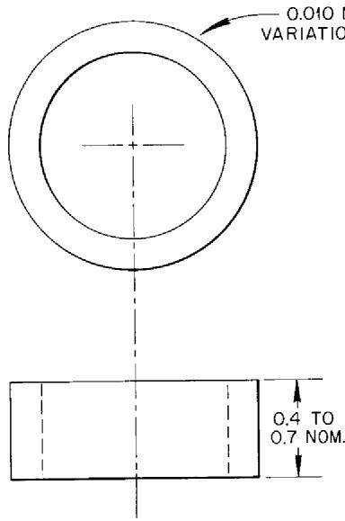  
INDIVIDUAL BUSHING

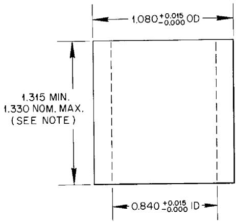  
BUSHING STACK

NOTE:

TOTAL LENGTH SHALL BE DETERMINED BY THE DIMENSION

OF THE MINIMUM LENGTHS OF EACH BUSHING IN STACK. BUSHING

MINIMUM LENGTH TO BE DETERMINED BY INDICATING OUTER

PERIPHER OF EXPOSED FLAT FACE OF BUSHING LYING ON FLAT

EACE USING EQUIPMENT SIMILAR TO STARRETT BENCH GAGE NO.652.

DIMENSIONS ARE IN INCHES

Fig. B-1. Bushing and Bushing Stack Dimensions.

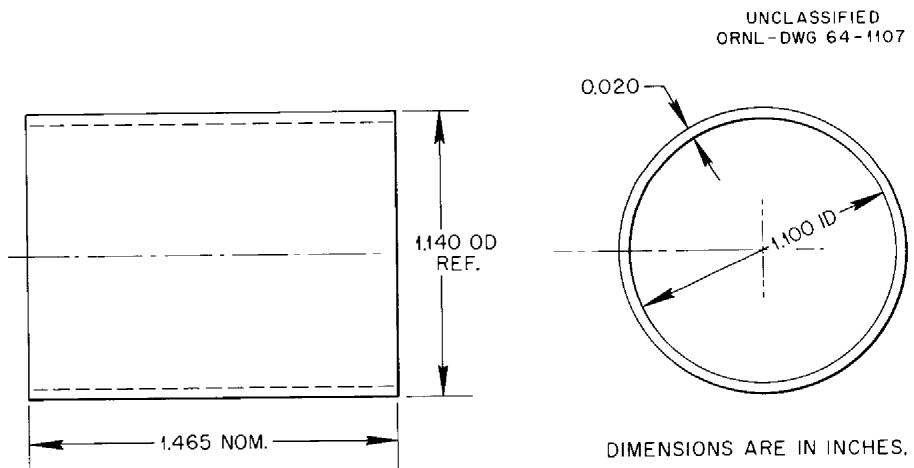  
Fig. B-2. Dimensions of Outer Tube.

TOLERANCE: ±0.002 U.O.S.

OD AND ID TO BE CONCENTRIC

WITHIN 0.002 TIR.

REMOVE ALL BURRS

NOTE:

NO SURFACE DEFECTS GREATER

THAN 0.002 DEEP PERMITTED

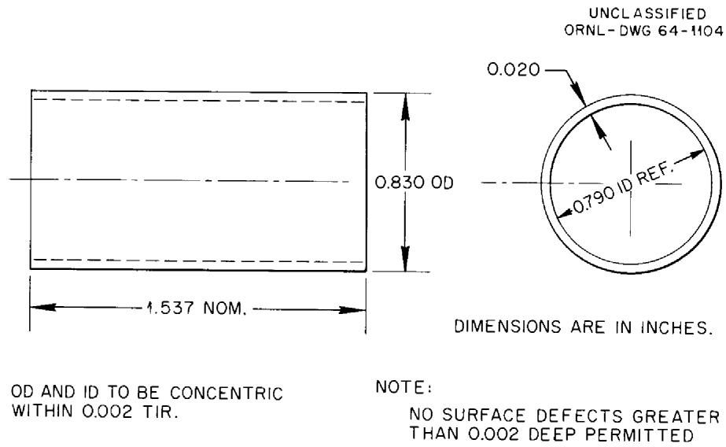  
Fig. B-3. Dimensions of Inner Tube.

Fig. B-4. Assembly and Closure of Control Element.   
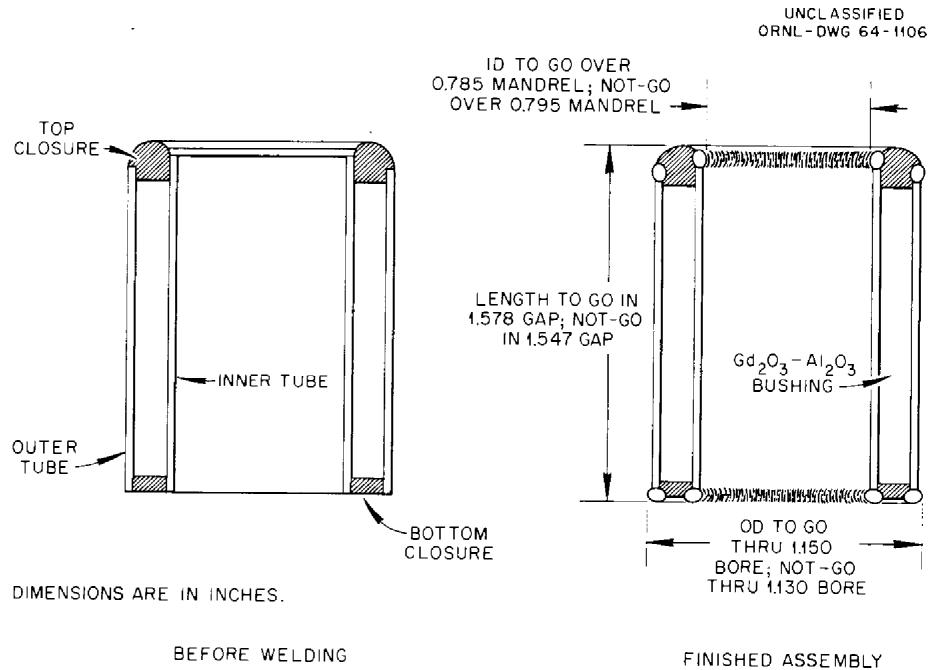  
NOTE:   
MACHING OF WELDS TO MEET DIMENSIONS PERMITTED PROVIDED THAT WELD METAL IS NOT MACHINED BELOW THE LEVEL OF SURROUNDING UNMETTLED METAL AND THAT METAL IS NOT MACHINED.

# APPENDIX C

Westinghouse's Manufacturing Procedure for Cladding Components 41

Westinghouse's Welding Procedure for MSRE Control Elements 42

Westinghouse's Manufacturing Procedure for the $\mathrm{Gd}_2\mathrm{O}_3 - \mathrm{Al}_2\mathrm{O}_3$ Bushings. 47

Westinghouse Assembly Procedure for the MSRE Control Elements 50

Westinghouse's Manufacturing Procedure

for Cladding Components

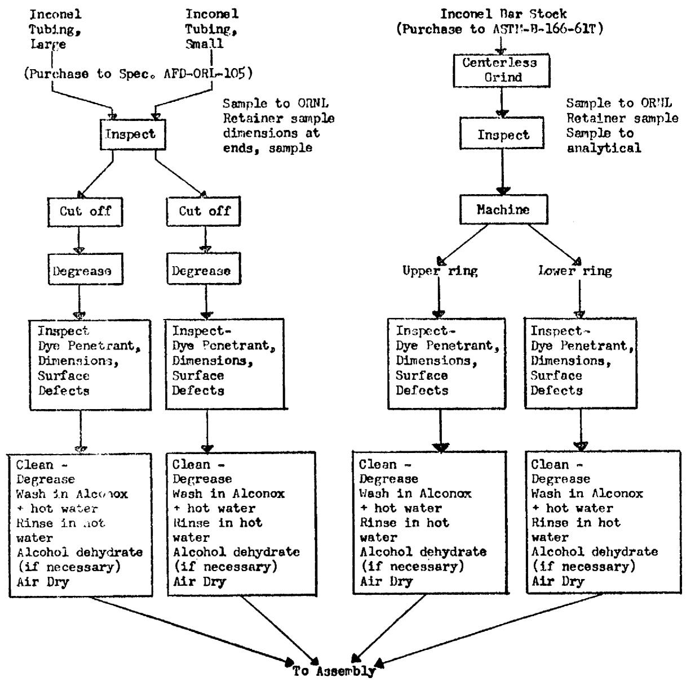

Westinghouse's Welding Procedure

for MSRE Control Elements

Four welds will be made on each control element assembly. The top welds will be made using copper chills. The control element assembly will be positioned in two different planes to make the top closures. The inner weld will be made first and the electrode will be positioned as shown:

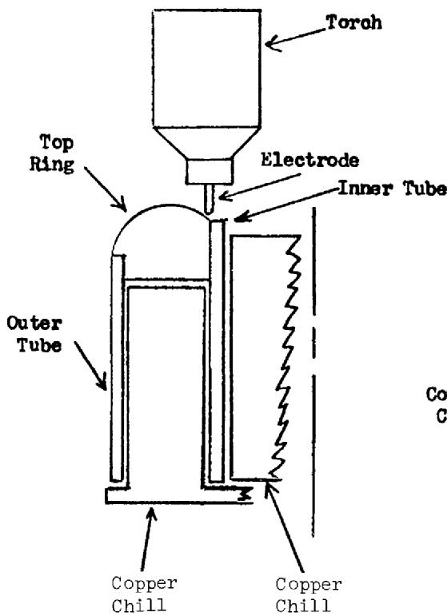  
Top Inside Weld

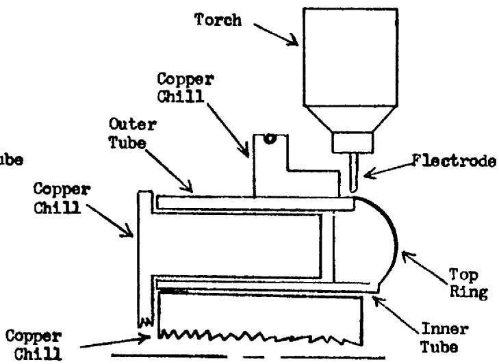  
Top Outside Weld

On the bottom ring the outer weld will be made first. Chills will be used to make both welds. The electrode will be positioned as shown:

# Bottom Outside Weld

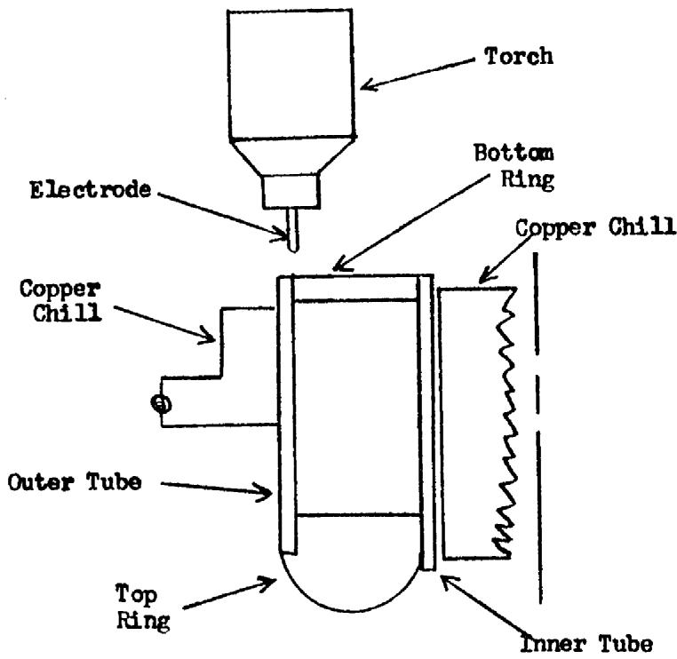  
NOTE: The electrode will be positioned over the I.D. of the bottom closure just as it is shown for the O.D.

# I. Welding Specifications

The following parameters have been found to produce welds of desired width and penetration with acceptable characteristics. Where a range occurs, the operator may adjust settings within the range given. Where settings are marked fixed, the operator will not make any changes without specific engineering approval.

# II. Welding Operating Parameters

A. Welding Current

1. Top Closure - 5u-5u amperes (range)   
2. Bottom Closure - 30-40 amperes (range)

B. Welding Voltage

1. Top Closure 8.5-11 Volts (range)   
2. Bottom Closure 8.5-11 Volts (range)

C. Rotational Speed

1. Top Closure inside weld 11.2 sec./rev. (fixed)   
2. Tcp Closure outside weld 11.2 sec./rev. (fixed)   
3. Bottom Closure inside weld 11.2 sec./rev. (fixed)   
4. Bottom Closure outside weld 12.2 sec./rev. (fixed)

D. Weld Time

1. Bottom Closure outside weld 15.5 sec.(fixed)   
2. Bottom Closure inside weld sec.(fixed)   
3. Top Closure outside weld sec. (fixed)   
4. Top Closure inside weld 13 sec.(fixed)

E. Tail Time

1. Bottom Closure outside weld 3.l sec.(fixed)   
2. Botton Closure inside weld 2.25 sec. (fixed)   
3. Top Closure outside weld 2.25 sec.(fixed)   
4. Top Closure inside weld 2.25 sec. (fixed)

F. Arc Gap

Arc gap fixed before welding with automatic head at - 0.025 in.

G. Vickers Welder Control

1. Arc Control - 10 (fixed)   
2. Current Control - 90 (fixed)   
3. Switches

a. Panel - Off (fixed)   
b. Hi-frequency/manual - Hi-frequency (fixed)   
c.Current Remote (fixed)   
d. Voltage - Remote (fixed)   
e. Polarity - Straight (fixed)

H. Vickers Welder Remote Control

1. Arc Control - 9-10 (range) use for small changes in

welding current.

2. Current Control (use outer calibration only)

a. Bottom Closure outside weld - 2.0 - 5.5 (range)   
b. Bottom Closure inside weld - 2.0 - 5.5 (range)   
c. Top Closure outside weld $= 6.0 - 9.5$ (range)   
d. Top Closure inside weld - 6.0 - 9.5 (range)

# I. Slope Control

1. Top Current Dial 0-3 (range)   
2. Top Time Dial 0-3 (range)   
3. Bottom Current Dial 0-5 (range)   
14. Bottom Time Dial 1-5 (range)   
5. Switches

a. Start Slope - Up (fixed)   
b. Start and Tail On (fixed)   
c. Start and Tail - Tail Slope Only (fixed)   
d. Tail Slope Down (fixed)

# J. Control Panel Internal Settings for Automatic Head

1. Stability 3.2 (fixed)   
2. Manual Speed Control 1.5 (fixed)   
3. Start Compensator 0 (fixed)   
4. AC/DC Arc Switch DC Arc (fixed)

# K. Remote Control Arc Voltage

1. Bottom Closure outside weld 0.7 - 1.0 (Range)   
2. Bottom Closure inside weld 0.7 - 1.0 (Range)   
3. Top Closure outside weld $0.7 - 1.0$ (Range)   
4. Top Closure inside weld 0.7 - 1.0 (Range)

# L。 Hi-Frequency Oscillator

1. Dial 70 - 100 (Range)   
2. AC/DC Switch DC (fixed)   
3. On/Off Switch - On (fixed)

# No. Inert Gas

1. Purity - Welding grade (fixed)   
2. Flow - 10 CFH of He#

10 CFH of Ar

* Flow of each gas is to be adjusted with the other gas flowing. Cases are in approximately a 50-50 ratio.

# No. Electrode

1. Material - 2% Thoriated Tungsten, centerless ground (fixed)

2. Size - 1/16" diameter (fixed)

3. Point - Rounded

4. Projection

from Nozzle - 1/16" - 1/1" (range)

# O. Nozzle

Material - Ceramic   
2. Size 3/8" opening

# Westinghouse's Manufacturing Procedure

for the $\mathrm{Gd}_{2}\mathrm{O}_{3} - \mathrm{Al}_{2}\mathrm{O}_{3}$ Bushings

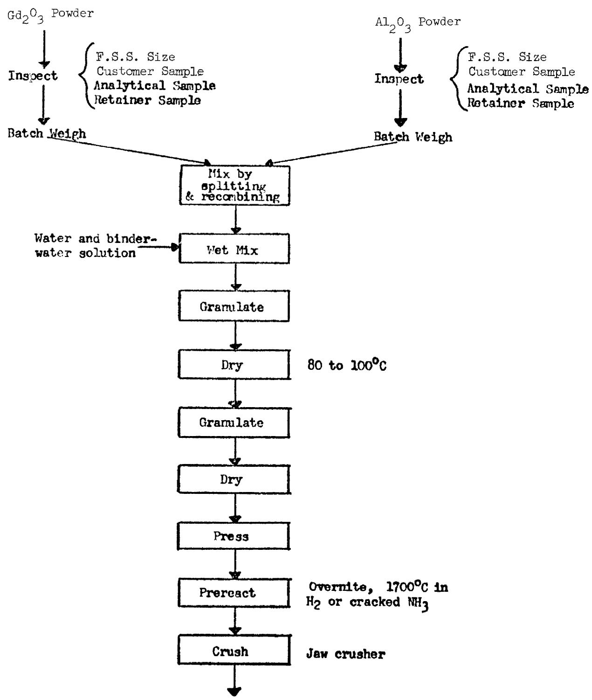

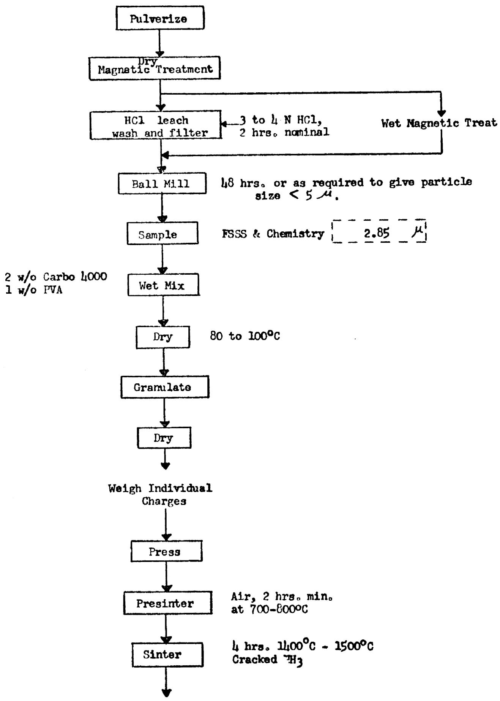

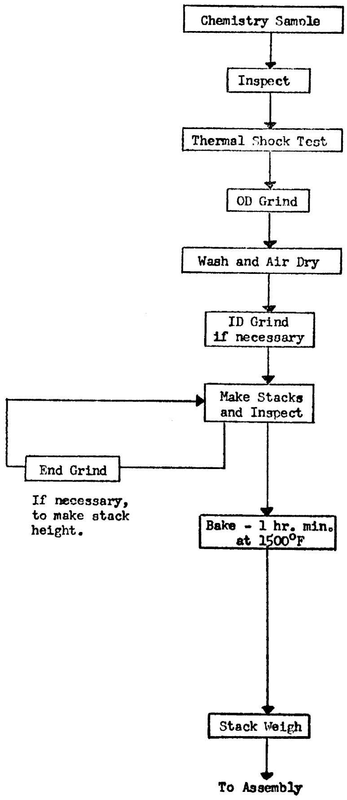

Sample - Visual Dimensions

Heat to 1175 + 250F, quench in cold tap water

Inspect -  
Individual Length  
OD, ID Envelope  
Wall Thickness Variation  
Soundness  
Chips

# Westinghouse Assembly Procedure for the MSRE Control Elements

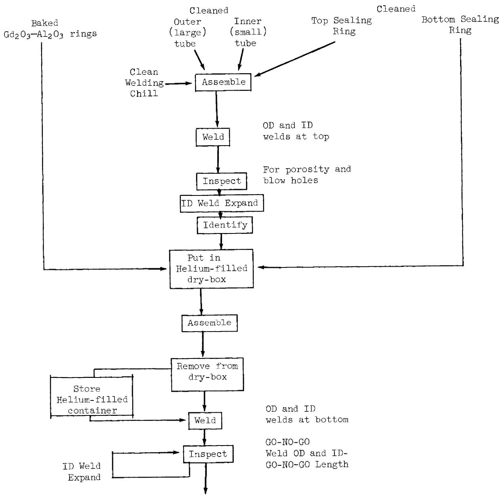

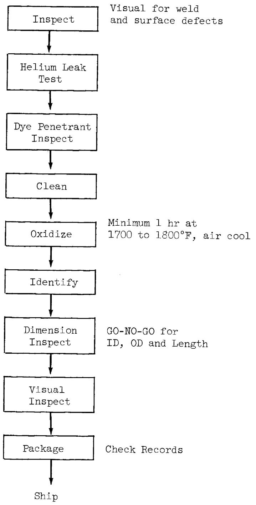

ORNL-4123

UC-25 - Metals, Ceramics, and Materials

# INTERNAL DISTRIBUTION

1-3. Central Research Library

44. A. P. Litman

4-5. ORNL - Y-12 Technical Library Document Reference Section

45. H. G. MacPherson

6-25. Laboratory Records Department

46. R. E. MacPherson

26. Laboratory Records, ORNL R.C.

47. G. B. Marrow

27. ORNL Patent Office

48. H. E. McCoy, Jr.

28. G. M. Adamson, Jr.

49. C. K. McGlothlan

29. J. W. Arendt (K-25)

50. C. J. McHargue

30. R.J.Beaver

51. J. A. Parsons (K-25)

31. H. Beutler

52. M. W. Rosenthal

32. G. E. Boyd

53. A. E. Richt

33. Ji Young Chang

54. C. E. Sessions

34. W.H.Cook

64. G. M. Tolson

35. F. L. Culler

65. T. N. Washburn

36. J. E. Cunningham

66. A. M. Weinberg

37. D. E. Ferguson

67. W. J. Werner

38. J. H Frye, Jr.

68. M. L. Winton

39. V. O. Haynes

69. M. B. Bever (consultant)

42. M.R.Hill

70. A. R. Kaufmann (consultant)

43. C. E. Larson

71. J. A. Krumhansl (consultant)

# EXTERNAL DISTRIBUTION

72. D. F. Cope, RDT, SSR, AEC, Oak Ridge National Laboratory

73. A. Giambusso, AEC, Washington

74. J. L. Gregg, Bard Hall, Cornell University

75. W. J. Larkin, AEC, Oak Ridge Operations

76. T. W. McIntosh, AEC, Washington

77. H. M. Roth, AEC, Oak Ridge Operations

78. J. Simmons, AEC, Washington

79. W. L. Smally, AEC, Oak Ridge Operations

80. E. E. Stansbury, University of Tennessee

81. D. K. Stevens, AEC, Washington

82. J. A. Swartout, Union Carbide Corp., New York

83. A. Taboada, AEC, Washington

84-355. Given distribution as shown in TID-4500 under Metals, Ceramics, and Materials Category (25 copies - CFSTI)