ORNL-4148

UC-80 - Reactor Technology

GAS TRANSPORT IN MSRE MODERATOR GRAPHITE.

I. REVIEW OF THEORY AND

COUNTERDIFFUSION EXPERIMENTS

A. P. Malinauskas   
J. L. Rutherford   
R. B. Evans III

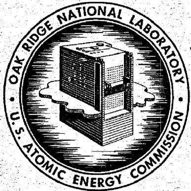

OAK RIDGE NATIONAL LABORATORY

operated by

UNION CARBIDE CORPORATION

for the

U.S. ATOMIC ENERGY COMMISSION

Printed in the United States of America. Available from Clearinghouse for Federal Scientific and Technical Information, National Bureau of Standards, U.S. Department of Commerce, Springfield, Virginia 22151 Price: Printed Copy $3.00; Microfiche $0.65

# LEGAL NOTICE

This report was prepared as an account of Government sponsored work. Neither the United States, nor the Commission, nor any person acting on behalf of the Commission:

A. Makes any warranty or representation, expressed or implied, with respect to the accuracy, completeness, or usefulness of the information contained in this report, or that the use of any information, apparatus, method, or process disclosed in this report may not infringe privately owned rights; or   
B. Assumes any liabilities with respect to the use of, or for damages resulting from the use of any information, apparatus, method, or process disclosed in this report.

As used in the above, "person acting on behalf of the Commission" includes any employee or contractor of the Commission, or employee of such contractor, to the extent that such employee or contractor of the Commission, or employee of such contractor prepares, disseminates, or provides access to, any information pursuant to his employment or contract with the Commission, or his employment with such contractor.

Contract No. W-7405-eng-26

COSTI PRICES

Hg 3.00, MN 65

REACTOR CHEMISTRY DIVISION

GAS TRANSPORT IN MSRE MODERATOR GRAPHITE.

I. REVIEW OF THEORY AND COUNTERDIFFUSION EXPERIMENTS

A. P. Malinauskas   
J. L. Rutherford   
R. B. Evans III

SEPTEMBER 1967

OAK RIDGE NATIONAL LABORATORY

Oak Ridge, Tennessee

operated by

UNION CARBIDE CORPORATION

for the

U.S. ATOMIC ENERGY COMMISSION

# LEGAL NOTICE

This report was prepared as an account of Government sponsored work. Neither the United States nor the U.S. are responsible for or against the publication of this report.   
States, nor the Commission, nor any person acting on behalf of the Commission. A. Makes any warranty or representation, expressed or implied, with respect to the accu   
accuracy, completeness, or usefulness of the information contained in this report, or that the use of any of our information, apparatus, method, or process disclosed in this report may not infringe   
of any information, apparatus, device, or process intended to be used for any purpose; or   
E. Assumes any liabilities with respect to the use of, or for damages resulting from the use of any information, proprietary, method, or process disclosed in this report.   
As used in the above, "person acting on behalf of the Commission" includes any em   
employee or contractor of the Commission, or employee of such contractor, to the extent that such employees are contractors of the Commission, or employees of such contractor prepares.   
such employee or contractor of the Commission , or employee or former contractor , proposes, disseminates , or provides access to , any information pursuant to his employment or contract   
with the Commission, or his employment with such contractor.

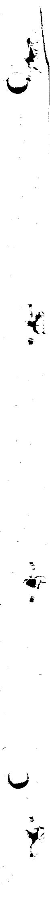

# CONTENTS

Abstract 1

I. Introduction 1   
II. Nomenclature 2   
III. Theory of Gas Flow in Porous Media 5

Velocity and Flux Definitions 5   
Permeability Concepts 8   
Binary Gas Mixture Transport 12   
Summary 23

IV. Experimental 23

Description of MSRE Graphite and the Experimental Specimen 23   
Gas Transport Characterization of the Diffusion Septum 26   
Summary 37

V. Appendix 37

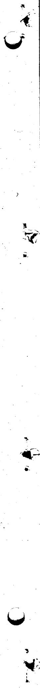

# GAS TRANSPORT IN MSRE MODERATOR GRAPHITE.

# I. REVIEW OF THEORY AND COUNTERDIFFUSION EXPERIMENTS

A. P. Malinauskas

J. L. Rutherford

R. B. Evans III

# ABSTRACT

The authors develop equations describing gas transport in porous media. Since the report is directed chiefly to those with little familiarity with gas transport, many simplifying assumptions are made in deriving the formulas. Development of the theory proceeds logically from gas transport of a pure gas in a single capillary, to transport of a binary gas mixture in a single capillary, to gas flow through a bundle of capillaries, and, finally, to gas flow through a porous medium. Equations are given for each type of transport. Practical applications of the theoretical concepts are also shown for a moderator graphite of the type used in the Molten-Salt Reactor Experiment (MSRE).

The experimental findings are limited but significant. Under MSRE conditions it appears quite justifiable to ignore normal diffusion effects in gas transport computations. This means that all the gaseous diffusion information necessary to correlate fission product migration data may be gained through simple permeability measurements; the more complex interdiffusion experiments are not required. Thus a complete flow-property survey of all MSRE moderator materials can be performed with a minimum expenditure of time and effort.

# I. INTRODUCTION

Much has been written on the subject of gas transport in porous media; hence one is somewhat apprehensive in writing another report on the subject, lest he add to the extant confusion rather than clarify some of the concepts which have become confused. Nonetheless, we have encountered sufficient misinterpretations or misapplications of derived expressions to warrant an additional work as desirable, particularly for those with little or no familiarity with gas transport.

Furthermore, the complications introduced by the presence of a porous medium have spawned numerous models, most of which do little more than add computational complexity or can easily mislead the uninitiated into making totally incorrect correlations among geometric parameters. This report has therefore been written with two primary purposes in mind: first, we seek to convey to the reader an appreciation of the concepts associated with gas transport in general, and second, we attempt to demonstrate how the geometric aspects of the problem which are introduced in dealing with porous septa may be handled efficiently.

Since our principal audience is intended to be those wishing to become familiar with the subject, rather than co-workers in the field, we have striven to keep the theoretical treatment as simple as possible. Thus, for example, only isothermal transport is considered. Similarly, in some instances mathematical rigor has been compromised for clarity in presentation, although the rigorously derived expressions are likewise given and noted accordingly. Bibliographical references have also been omitted; all too frequently these prove to be bothersome interruptions. For those wishing a more detailed treatment, we strongly recommend the treatises listed in the Appendix.

We shall begin our discussion by introducing the various definitions of velocity and flux which will be encountered throughout this work, and then turn our attention to the actual task at hand, namely, the presentation of the concepts associated with gas transport. This will be done by considering several types of gas transport. The simplest of these, hence the first to be treated, involves pure gas flow in a single capillary as the result of an applied pressure drop. Next, transport in a binary gas mixture will be considered; here pressure- and concentration-induced transport will be treated, but we shall still limit the discussion to only a single capillary. This limitation will then be removed by first allowing the gas to be transported through a bundle of identical capillaries, in order to gain some familiarity with the geometrical aspects of the problem, and then we shall proceed to the case involving a porous medium.

The theoretical portion will be essentially completed with the latter problem, but to conclude here would probably be an injustice to those seeking practical applications of the theory. Accordingly, we have included a second section; this part is experimental in scope. In order to demonstrate the application of the theoretical concepts and to present a reasonably detailed description of the experimental aspects, the gas transport characteristics of a particular graphite specimen are determined by way of example. Although any porous medium would have sufficed, the experimental data which are presented have been determined for a graphite of the type employed in the Molten-Salt Reactor Experiment (MSRE). The data thus serve an additional purpose; they may be used at least as an estimate of the extent of gaseous fission product migration in the MSRE graphite.

# II. NOMENCLATURE

$a_{j} =$ Scattering factor for ith gas component.

$A =$ Superficial area normal to flow in porous media, $\mathbf{cm}^2$

$B_{0} =$ Viscous flow parameter for a porous medium, $\mathbf{cm}^2$

$\mathbf{c} =$ Subscript or superscript indicating a capillary or capillary model.

$\overline{c}_j =$ Mean thermal speed of an ith gas particle, cm/sec.

$c_{0} =$ Modified transport coefficient with $\mathbf{r}_0$ contributions factored out.

$\mathbf{C} =$ Transport coefficient referred to $\pmb{L}$

$C_0 =$ Modified transport coefficient referred to $l$

$\mathbf{d} =$ Subscript or superscript indicating dust or dust model.

$d_{i} =$ Inner diameter of diffusion septum, cm.

$d_{ij} =$ Diameter of collision for $i - j$ hard spheres, cm.

$d_{j} = \mathbf{A}$ combination of driving forces, $\mathbf{cm}^{-1}$ .

$d_{o} =$ Outer diameter of diffusion septum, cm.

$\mathbf{D} =$ Subscript indicating diffusive flow component.

$d\mathbf{v}_j =$ Volume element in velocity space, $\mathrm{cm}^3 /\mathrm{sec}^3$

$D_{id} =$ Gas-dust diffusion coefficient, $\mathrm{cm}^2/\mathrm{sec}$ .

$\mathbf{D}_i =$ Combined Knudsen-normal coefficient for ith-component diffusion, $\mathrm{cm}^2/\mathrm{sec}$ .

$\mathfrak{D}_{ij} =$ Normal diffusion coefficient for an $i - j$ binary mixture in free space, $\mathrm{cm}^2 /\mathrm{sec}$

$\mathbf{D}_{i_{\mathbf{K}}} =$ Knudsen diffusion coefficient, $\mathbf{cm}^2/\mathbf{sec}$

$\left\langle \mathbf{D}_{\mathbf{K}}\right\rangle = \text{Knudsen diffusion coefficient for a uniform gas mixture, cm}^2/\text{sec.}$

$f =$ Fraction of diffuse reflections or scattering.

$f(\mathbf{v}_j) = \text{Velocity distribution function, particles sec}^3\mathbf{cm}^{-6}$ .

$\pmb{F_{d}} = \pmb{\mathcal{F}}$ oce exerted on a dust particle, dynes.

$h =$ Height of a cylinder, cm.

$J = \text{Net flux}^1$ of all particles, particles or moles per cm² sec.

$J_{0} =$ Flux of particles through any one of identical pores, mole per $\mathrm{cm}^2$ sec.

$J_{i} =$ Diffusive flux of ith particles, particles or moles per cm2 sec.

$k =$ Boltzmann's constant, $p / nT,$ ergs particle-1 $(^{\circ}\mathbf{K})^{-1}$

$\mathbf{K} =$ Subscript indicating Knudsen diffusion.

$K =$ Combined Knudsen-viscous flow permeability coefficient for porous medium, $\mathrm{cm}^2/\mathrm{sec}$ .

$K_{0} =$ Knudsen flow coefficient.

$I =$ True length of a tortuous capillary or connected pore, cm.

$L =$ Superficial length along flow path in a porous medium, cm.

$\mathbf{m} =$ Subscript denoting a particular pore in a-porous medium, cm.

$m_{i} =$ Particle mass, g/particle.

$M_{j} =$ Molecular weight, $\mathbf{g}/$ mole.

$M_{ij} =$ Rate of momentum transfer from ith to jth component, $\mathbf{g}$ cm sec-2.

$M_{lk} =$ Rate of momentum transfer from ith component to wall, $\mathbf{g}\mathrm{cm}\sec^{-2}$

$n =$ Total particle density of real gases, particles or moles per $\mathbf{cm}^3$

$n_{\mathbf{d}} =$ Density of dust particles, particles or moles per $\mathrm{cm}^3$

$n_{j} =$ Particle density of ith component, particles or moles per $\mathrm{cm}^3$

$n^{\prime} =$ Total particle density including $\pmb{n}_{\mathrm{d}}$ particles or moles per cm3.

$N =$ Number of capillaries.

$p =$ Total gas pressure, dynes or atm per $\mathbf{cm}^2$

$p_{\theta} =$ Atmospheric pressure, dynes or atm per $\mathrm{cm^2}$

$p_{i} =$ Partial pressure of ith component, dynes or atm per cm2.

$p^{\prime} =$ Fictitious gas pressure referred to $n^{\prime}$ dynes or atm per cm².

$\left\langle p \right\rangle =$ Arithmetic mean pressure, dynes or atm per cm².

$\Delta p =$ Pressure drop across specimen, dynes or atm per $\mathrm{cm}^2$

$q^{\prime} =$ Effective tortuosity factor for porous media.

$\overline{q} =$ Tortuosity factor, for identical capillary bundle $= (l / L)^2$

$\overline{q}_j =$ Tortuosity factor referred to a particular transport coefficient.

$Q_{a} =$ Volumetric flow rate measured at atmospheric pressure, $p_a$ , $\mathrm{cm}^3/\mathrm{sec}$ .

$r =$ Radial coordinate, in general, cm.

$r_j =$ Particle radius of ith component, cm.

$\pmb{r_0} =$ Capillary radius, cm.

$\langle \mathbf{r}\rangle =$ Mean pore radius, cm.

$\left\langle r^2 \right\rangle = \text{Mean-square pore radius, cm.}$

$\Delta r =$ Distance defining average plane of last collision, cm.

$R = \mathrm{Gas}$ constant, atm cm $^3$ ( $\circ \mathrm{K}$ ) $^{-1}$ mole $^{-1}$ .

$T =$ Absolute temperature, ${}^{\circ}\mathbf{K}$

$u =$ Total number-average velocity, $^1 J / n$ , cm/sec.

$u_{j} =$ Average linear velocity,1 same as $\overline{\nu}_j$ , cm/sec.

$u_{0} =$ Slip velocity at $\pmb{r_0}$ ,cm/sec.

$\mathbf{v} =$ Subscript indicating viscous flow component.

$v_{0} =$ Total mass-average velocity, $\mathbf{\Omega}^1\mathrm{cm / sec}$

$\overline{\nu}_i = \text{Average linear velocity}^1$ (same as $u_i$ ), $J_i / n_i$ , cm/sec.

$\overline{V}_i = \text{Average diffusion velocity}^1$ referred to $\mathbf{v}_0$ , also called "peculiar velocity," cm/sec.

$x_{i} =$ Particle or mole fraction of ith component.

$x_{i}^{\prime} =$ Particle or mole fraction of ith component referred to $n^{\prime}$

$\pmb{z} =$ Linear flow coordinate, cm.

$o =$ Subscript generally indicating capillary or pore radius.

$\alpha_{j} = \text{Any quantity which is a function of } v_{j}$ .

$\overline{\alpha}_j =$ Average value of any quantity which is a function of $\nu_{j}$

$\gamma_{j} =$ Normal fraction of total admittance for $i$ diffusion.

$\Gamma =$ The parameter causing a flux.

$\delta_{j} = \text{Knudsen fraction of total admittance for } i \text{ diffusion.}$

$\partial/\partial \mathbf{r} =$ Operator indicating partial derivative, $\mathbf{cm}^{-1}$ .

$\epsilon =$ Fraction of bulk volume comprised of open pores. Porosity "seen" by equilibrium gas (no flow).

$\epsilon^{\prime} =$ Fraction of open porosity engaged in linear steady-state flow.

$\epsilon / q =$ Porosity-tortuosity ratio for a capillary bundle.

$\epsilon^{\prime} / q^{\prime} =$ Effective porosity-tortuosity ratio, $D_{ij} / \mathfrak{N}_{ij}$ , for porous media.

$\eta =$ Coefficient of viscosity,poises,dynes cm sec-2.

$\nu =$ Number of components in system.

$\pi =$ Transcendental number, 3.1416.

$\rho =$ Total mass density of real gases, $\mathrm{g / cm^3}$

$\rho^{\prime} =$ Total mass density including dust particles, $\mathrm{g / cm^3}$

$\sigma_{ij} =$ Modified diameter for an $i - j$ collision, cm.

$\Sigma =$ Symbol indicating sum.

$\Omega_{ij}^{(1,1)\star} = \text{Collision integral for diffusion.}$

# III. THEORY OF GAS FLOW IN POROUS MEDIA

# Velocity and Flux Definitions

The molecules which comprise an ordinary gas mixture do not possess a single, common velocity but exhibit a broad range of values. Thus, in describing the motion of a gas in terms of the motions of the individual molecules, one utilizes a statistical approach. It is convenient therefore to define a "velocity distribution function" $f(\nu)$ which represents the number of molecules per unit volume whose velocities lie within the range $d\nu$ about $\nu$ (where $\nu$ is a volume vector in velocity space). In a gas mixture, one such distribution function $f(\nu_i)$ is defined for each component. If $n_i$ is the total number of molecules of type $i$ per unit volume, then

$$
n _ {i} = \int f \left(v _ {i}\right) d v _ {i}, \tag {1}
$$

where the integration is carried out over a velocity volume containing all possible values of $\mathbf{v}_i$ .

The average value $\overline{\alpha}_i$ of any quantity which is a function of $\mathbf{v}_i$ is given by

$$
\bar {\alpha} _ {i} = \frac {\int a \left(v _ {i}\right) f \left(v _ {i}\right) d v _ {i}}{\int f \left(v _ {i}\right) d v _ {i}} = \left(1 / n _ {i}\right) \int a \left(v _ {i}\right) f \left(v _ {i}\right) d v _ {i}; \tag {2}
$$

thus, as an example, the average velocity of component $i$ in a gas mixture is

$$
\bar {v} _ {i} = \left(1 / n _ {i}\right) \int v _ {i} f \left(v _ {i}\right) d v _ {i}. \tag {3}
$$

In a uniform gas mixture at rest,

$$
\overline {{v}} _ {i} = 0 (\text {a l l} i);
$$

this should not be confused with the average speed $\overline{c}_i$ , however, since its value under the same conditions is

$$
\overline {{c}} _ {i} = \left(\frac {8 k T}{\pi m _ {i}}\right) ^ {1 / 2}, \tag {4}
$$

where $m_{i}$ denotes the mass of the $i$ -type molecules, $k$ is Boltzmann's constant, and $T$ is the absolute temperature. The difference between these two quantities is that $\overline{c}_{i}$ represents the average value of $v_{i}$ when only the magnitude, but not the direction, is considered.

We are concerned in most laboratory experiments with the number of $i$ molecules which traverse a given cross section during a specified period of time, and for this purpose we introduce the flux $J_{i}$ ,

$$
J _ {i} = n _ {i} \bar {v} _ {i}, \tag {5}
$$

which is defined as the rate of transport of the $i$ -type molecules per unit area. The total flux of the gas is obtained simply by adding up the fluxes of the individual components, so for a $\nu$ -component mixture,

$$
J = \sum_ {i = 1} ^ {\nu} J _ {i} = \sum_ {i = 1} ^ {\nu} n _ {i} \bar {v} _ {i}. \tag {6}
$$

Alternatively, we could write an expression for $J$ which is similar in appearance to Eq. (5), thus:

$$
J = n u, \tag {7}
$$

in which $n = \Sigma_{i}n_{i}$ represents the molecular density of the gas as a whole. If we compare Eqs. (6) and (7), we see that the equations are consistent provided

$$
u = (1 / n) \sum_ {i = 1} ^ {\nu} n _ {i} \bar {v} _ {i}; \tag {8}
$$

thus $u$ turns out to be just the number-average velocity of the gas mixture. Note, however, that a gas mixture at rest ( $u = 0$ ) does not necessarily imply that transport within the mixture is absent.

Similarly, when momentum transport is of interest, it is convenient to employ a "mass-average velocity" $v_{0}$ such that one can describe the momentum of the gas per unit volume as if all of the molecules possess the same velocity. This quantity is defined by the relation

$$
v _ {0} = (1 / \rho) \sum_ {i = 1} ^ {\nu} n _ {i} m _ {i} \bar {v} _ {i}, \tag {9}
$$

where $\rho = \sum_{i=1}^{V} n_i m_i$ is the mass density of the gas. Finally, it is often advantageous to employ what is described as the "peculiar velocity" $\overline{V}_i$ , which is defined by the relation

$$
\bar {V} _ {i} = \bar {v} _ {i} - v _ {0}. \tag {10}
$$

The peculiar velocity thus represents the average velocity of the $i$ -type molecules measured with respect to the mass-average velocity of the gas as a whole. In other words, we allow our coordinate system itself to move with the velocity $\mathbf{v}_0$ . From Eqs. (9) and (10) we therefore obtain the relation

$$
\sum_ {i} n _ {i} m _ {i} \bar {V} _ {i} = 0. \tag {11}
$$

Unfortunately, $\overline{V}_i$ is also referred to as the "diffusion velocity"; as a consequence, $n_i\overline{V}_i$ is often misinterpreted as the diffusive flux of component $i$ , and Eq. (11) misapplied to yield er

roneous results. Later on in this report we shall have occasion to define a diffusive velocity, and we caution the reader that Eq. (10) is not to be equated with this quantity. Accordingly, we will differentiate between the velocities by referring to $\overline{V}_j$ as the peculiar velocity, and will introduce another symbol for the diffusion velocity.

Thus far we have accepted the fact that either the gas as a whole or several of the components which comprise it are in motion, and we have formulated various definitions to aid us in describing the motion. In order to introduce additional, equally useful quantities, we now consider the mechanisms of gas transport. Under isothermal conditions, these modes of transport fall into two distinct categories: (1) forced or viscous flows, which result from gradients of the total pressure, and (2) diffusive flows, in which gradients of partial pressure provide the driving force. We now associate with each of these types of flow a corresponding flux, so that $J_{iv}$ is interpreted as the flux of component $i$ due to viscous transport, and $J_{iD}$ represents the flux resulting from diffusive transport. Each of these fluxes is associated with a corresponding velocity. Thus the viscous velocity of component $i$ may be defined as

$$
u _ {i v} = J _ {i v} / n _ {i}, \tag {12}
$$

and the diffusive velocity by the expression

$$
u _ {i \mathbf {D}} = J _ {i \mathbf {D}} / n _ {i}. \tag {13}
$$

Now consider the flow of a binary gas mixture, of components 1 and 2, in a capillary. If the flux of component 1 is $J_{1}$ , and that for component 2 is $J_{2}$ , we can immediately write

$$
J _ {1} = J _ {1 \mathrm {v}} + J _ {1 \mathrm {D}}, \tag {14a}
$$

$$
J _ {2} = J _ {2 \mathrm {v}} + J _ {2 \mathrm {D}}, \tag {14b}
$$

The total flux $J$ , on the other hand, may be written either in the form

$$
J = J _ {\mathrm {v}} + J _ {\mathrm {D}} \tag {15a}
$$

or

$$
J = J _ {1} + J _ {2}. \tag {15b}
$$

The problem now is to ensure that there is no external coupling between the $J_{i\nu}$ and the $J_{iD}$ ; in other words, we must define the fluxes (or the velocities) in such a manner that viscous terms do not appear in the expression for $J_{iD}$ , nor that diffusive terms appear in the formula for $J_{i\nu}$ . It turns out that this can be done very easily provided we account for surface effects in terms of a diffusive mechanism. To be sure, the equations are still coupled, but this coupling is indirect; it occurs through the boundary conditions and the composition dependence of the transport coefficients associated with the two modes of transport. As a result, it is usually necessary to solve the viscous flow equation and the diffusive flow equation simultaneously, and this can become quite complicated.

The viscous part, when defined as outlined above, is nonseparative; this permits us to apportion the total viscous flux to the individual components in accordance with their mole fractions, thus:

$$
J _ {1 v} = x _ {1} J _ {v}, \tag {16a}
$$

$$
J _ {2 \mathbf {v}} = x _ {2} J _ {\mathbf {v}}. \tag {16b}
$$

In terms of velocity, this implies that the viscous velocity associated with $J_{\mathbf{v}}$ is common to all of the components in the mixture. That is, in the case in question,

$$
u _ {1 v} = u _ {2 v}.
$$

Unfortunately, a similar apportionment for the diffusive part is not possible. The reason for this stems primarily from the two different viewpoints which are used to describe the mechanisms; in treating viscous transport, we can look upon the gas as a continuum, but in dealing with diffusive flow (including surface effects) one must differentiate among the types of encounters which the individual gas molecules undergo.

The solution to a given problem can therefore be reduced to obtaining expressions for the relations

$$
J _ {1} = J _ {1 D} + x _ {1} J _ {v},
$$

$$
J _ {2} = J _ {2 D} + x _ {2} J _ {v},
$$

$$
J = J _ {\mathrm {D}} + J _ {\mathrm {v}},
$$

in terms of the driving forces and the characteristics of the gas and porous septum. Although the most general case would involve a multicomponent mixture with an unspecified number of components, the most complicated case considered to date has been that for which only two components are involved. This presents no difficulty in applying the equations to multicomponent systems in which all but one of the components are present in trace quantities, however, because under this condition all other trace components can be safely ignored when considering the transport of any one.

It is now instructive to take up the problem of the flow of a pure gas through a single straight capillary, since this provides the simplest illustration of the concepts and definitions which have been presented above. In this case the problem degenerates to writing a solution only for the equation

$$
J = J _ {v} + J _ {D}.
$$

# Permeability Concepts

Viscous Flow in Capillaries. - In this section we consider the isothermal steady-state transport of a pure gas through a long, straight capillary under the influence of a pressure

gradient. If we do not allow turbulence and confine the treatment to the hydrodynamic region, then the equation of motion of the gas is given by

$$
\left(d p / d z\right) = \left(1 / r\right) \left(\partial / \partial r\right) \left[ \eta r \left(\partial v _ {0} / \partial r\right) \right], \tag {17}
$$

in which $(dp/dz)$ represents the pressure gradient, $r$ is the radial distance parameter, and $\eta$ denotes the viscosity coefficient of the gas. Integration of this equation over the limits $r = 0$ and $r = r$ yields, after some manipulation,

$$
\pi \tau^ {2} d p = (2 \pi \tau d z) [ \eta (\partial v _ {0} / \partial r) ], \tag {18}
$$

which is simply the force balance expression for a cylinder of fluid of cross-sectional area $\pi r^2$ and length $dz$ . The left-hand side denotes the applied force on the fluid, whereas the right-hand side represents the shear force (tangential stress). If the fluid is not accelerated, then these forces are, of course, equal.

An expression for the mass-average velocity $\nu_{0}$ can now be obtained by integrating Eq. (18) over the limits $r = r$ and $r = r_{0}$ , where $r_{0}$ is the radius of the capillary. Thus

$$
v _ {0} (r) = \left[ \left(r _ {0} ^ {2} - r ^ {2}\right) / 4 \eta \right] (- d p / d z) + u _ {0}, \tag {19}
$$

in which $u_0 \equiv v_0(r_0)$ . We therefore see that under conditions of laminar flow, the mass-average velocity profile is parabolic.

So far we have found it convenient to describe the gas transport in terms of the mass-average velocity, but in the laboratory we are concerned instead with the number-average velocity. At this point it is therefore advantageous to seek out a relation between these two average quantities. In the case of a pure gas no difficulty is encountered; as can be readily seen from Eqs. (8) and (9), the two velocities turn out to be identical, and we can immediately write

$$
u (r) = v _ {0} (r) = \left[ \left(r _ {0} ^ {2} - r ^ {2}\right) / 4 r \right] (- d p / d z) + u _ {0}. \tag {20}
$$

All that remains to be done now is to average $u(r)$ over the (assumed uniform) cross section of the capillary. The result is given by

$$
u = \left(r _ {0} ^ {2} / 8 \eta\right) (- d p / d z) + u _ {0}. \tag {21}
$$

The flux of molecules which pass through any given cross section of the tube is then obtained from the relation

$$
J = n u.
$$

Thus, by substituting for $n$ the well-known formula

$$
n = p / k T,
$$

we derive an expression which relates the measured flux to the viscosity of the gas, the geometry of the capillary, and the pressure gradient which causes the gas to flow; this is given by

$$
J = \left(r _ {0} ^ {2} / 8 \eta\right) (p / k T) (- d p / d z) + n u _ {0}. \tag {22}
$$

Nothing has been said about the extra term, $nu_0$ , which appears in Eq. (22). We shall maintain this silence for a little while longer, except to point out that it appears as the result of a boundary condition.

If we retrace the derivation of $\mathbf{v}_0$ , this time for a gas mixture, we again find that the mass-average velocity averaged over the cross section of the capillary is given by

$$
v _ {0} = \left(r _ {0} ^ {2} / 8 \eta\right) (- d p / d z) + u _ {0},
$$

where $\eta$ now refers to the viscosity of the mixture. One can therefore always write

$$
u _ {v} \equiv v _ {0} - u _ {0} = \left(r _ {0} ^ {2} / 8 \eta\right) (- d p / d z), \tag {23}
$$

or

$$
J _ {\mathbf {v}} = n u _ {\mathbf {v}} = \left(r _ {0} ^ {2} / 8 \eta\right) (p / k T) (- d p / d z). \tag {24}
$$

This is the definition of the viscous flux which we had mentioned earlier. In order to obtain an expression for the diffusive flux, we manipulate Eq. (8) into the form

$$
u = (1 / n) \sum_ {i} n _ {i} (\bar {v} _ {i} + u _ {0} - v _ {0}) + u _ {v};
$$

thus the individual diffusive fluxes, $J_{i\mathbf{D}}$ , are given by

$$
J _ {i \mathrm {D}} = n _ {i} u _ {i \mathrm {D}} = n _ {i} \left(\bar {v} _ {i} + v _ {0} - v _ {0}\right) = n _ {i} \left(\bar {V} _ {i} + u _ {0}\right). \tag {25}
$$

The corresponding diffusive velocities therefore represent the average velocities of the molecules measured with respect to a hypothetical mass-average velocity which is derived from the equation of motion under the assumption $v_{0}(r_{0}) = 0$ [see Eq. (19)].

By means of these definitions we have solved the viscous or forced-flow part for all of the cases in which it arises; the answer is

$$
J _ {\mathbf {v}} = \left(r _ {0} ^ {2} / 8 \eta\right) (p / k T) (- d p / d z); \tag {26}
$$

we shall now turn our attention to the diffusive part of the problem.

Slip Flow in Capillaries. - Equation (26) turns out to be a rather good approximation at high pressures for flow through large tubes, but at low pressures and for small-diameter tubes, the "slip flow" contribution, $nu_0$ , can become quite significant. We must therefore express $nu_0$ in terms of those quantities which are amenable to measurement in the laboratory. To do this, we shall take advantage of the separability of the viscous and diffusive parts of the problem. Conceptually, then, in the case of a pure gas, we are considering the transport of $n$ molecules per unit volume which have a drift velocity $u_0$ and are under the influence of a pressure gradient. Now consider a volume element $-\pi r_0^2 dz$ within the capillary. The molecules will receive a net forward momentum per unit time equal to $-\pi r_0^2 (dp/dz) dz$ . If the gas is not to be accelerated, this momentum per unit time must be lost to the capillary walls.

Of the $n\pi r_0^2 dz$ molecules, let the fraction $(1 - t)$ collide with the wall in a specular manner; in this type of collision the angle of incidence equals the angle of rebound, and there is no change in the $z$ component of the velocity (in this case $u_0$ , on the average). For these collisions there is no net transport of momentum; thus they can be ignored in the rate-of-momentum-transfer balance. On the other hand, let the remaining fraction $f$ be collisions in which the molecules rebound from the wall in a completely random manner (diffuse scattering). For these collisions, on the average, the $z$ component of the momentum which is transferred in the direction from the wall to the gas is zero, so that the net rate at which the momentum is lost to the wall is simply the rate at which it is transferred in the direction from the gas to the wall. The rate at which the molecules strike the surface is $(1/4)n\overline{c}(2\pi r_0 dz)$ , and of these collisions, per unit time, $(t/4)n\overline{c}(2\pi r_0 dz)$ actually transfer momentum to the wall. In each case, on the average, the momentum $mu_0$ is transferred, so the momentum balance is given by

$$
(m u _ {0}) (t / 4) (n \bar {c}) (2 \pi r _ {0} d z) = - \pi r _ {0} ^ {2} (d p / d z) d z;
$$

thus

$$
n u _ {0} = \left(r _ {0} / m \bar {c}\right) (2 / f) (- d p / d z). \tag {27}
$$

Although the derivation just presented is by no means rigorous, it is correct in spirit and is consistent conceptually with a similar type of derivation which will be given later in connection with binary gaseous diffusion. Another derivation, which likewise is lacking in mathematical rigor, yields $(2 - f) / f$ in place of the factor $2 / f$ . Since $f$ appears to be very nearly equal to unity, the two expressions differ by about a factor of 2. Equation (27) does in fact overestimate the effect of slip flow, primarily because of simplifications in the derivation, so we shall adopt the commonly quoted result,

$$
n u _ {0} = \left(r _ {0} / m \overline {{c}}\right) [ (2 - f) / f ] (- d p / d z). \tag {28}
$$

The diffusive flux $J_{\mathbf{D}}$ is therefore given by

$$
J _ {\mathrm {D}} = n u _ {0} = \left(r _ {0} / m \overline {{c}}\right) \left[ (2 - f) / f \right] (- d p / d z), \tag {29}
$$

and the total flux is obtained by adding Eqs. (26) and (29) to yield

$$
J = J _ {\mathrm {v}} + J _ {\mathrm {D}} = \left\{\left(r _ {0} ^ {2} / 8 \eta\right) (p / k T) + \left(\pi / 8\right) \left(r _ {0} \overline {{c}} / k T\right) [ (2 - f) / f ] \right\} (- d p / d z). \tag {30}
$$

This expression is usually presented in the form

$$
J = \left[ \frac {B _ {0}}{\eta} p + \frac {4}{3} \bar {c} K _ {0} \right] \left(\frac {1}{k T}\right) \left(- \frac {d p}{d z}\right), \tag {31}
$$

where the "viscous-flow coefficient" $B_0$ and the "Knudsen-flow coefficient" $K_0$ are defined by

$$
B _ {0} \equiv r _ {0} ^ {2} / 8, \tag {32a}
$$

$$
K _ {0} \equiv (3 \pi / 1 6) \left(r _ {0} / 2\right) [ (2 - f) / f ]. \tag {32b}
$$

Since the slip term was regarded as a diffusive flux, we could have immediately written

$$
J _ {\mathrm {D}} = - D _ {\mathrm {K}} (d n / d z), \tag {33}
$$

and then attempted to express the "Knudsen diffusion coefficient," $D_{\mathbf{K}}$ , in terms of the characteristics of the capillary and the gas. By comparing the slip term in Eq. (31) with Eq. (33), we see that the result should be equivalent to

$$
D _ {\mathrm {K}} = \frac {4}{3} \bar {c} K _ {0}, \tag {34}
$$

and we shall accept this result without further justification.

This completes the discussion of pure gas transport; we now turn our attention to the transport characteristics of binary gas mixtures. Since the viscous part of the problem has already been worked out, we need only consider the diffusive aspects. We shall therefore begin by ignoring viscous flow completely.

# Binary Gas Mixture Transport

Counterdiffusion in Capillaries. - A typical experimental setup for investigating diffusion processes in capillaries or porous media is sketched in Fig. 1. The septum (either a single capillary, an array of parallel capillaries, or a porous medium) is sealed into a container so that its ends may be swept with two initially pure component gases. The extent of the counterdiffusion through the barrier is then determined from measurements of the degree of contamination of the two sweep streams.

To simplify the sign convention, we shall choose the positive $z$ direction as the direction of transport of the lighter component; this component will always be designated as component 1. We now seek to describe the transport, in particular the diffusive transport, in terms of the characteristics of the two components and the geometry of the septum (in this case a single capillary). To accomplish this end, we again consider the rate of transport of momentum under steady-state conditions.

Within the volume element $\pi r_0^2 dz$ in the capillary, the molecules of component 1 will receive a net forward momentum per unit time which is equal to $-\pi r_0^2 (dp_1 / dz)dz$ . This is the same expression written down earlier, except that we now employ a gradient of partial pressure. However, it is now possible for the component 1 molecules to lose this momentum in two ways: (1) to the capillary walls, as in the previous case, and (2) to component 2 molecules.

Note that there can be no transfer of momentum due to collisions among molecules of the same component. This is readily demonstrated by considering a head-on collision (partly for simplicity) between two molecules which are identical in every respect except velocity. Let molecule A, with velocity $\mathbf{v}_{\mathbf{A}}$ , collide head-on with molecule B, whose velocity is $\mathbf{v}_{\mathbf{B}}$ . As a result of the conservation of momentum, the velocity of molecule A will be $\mathbf{v}_{\mathbf{B}}$ after the collision, whereas that of molecule B will be $\mathbf{v}_{\mathbf{A}}$ . But since the molecules are identical, we can interchange even our designations A and B after the collision. In other words, to an observer

ORNL-LR-DWG 57904R

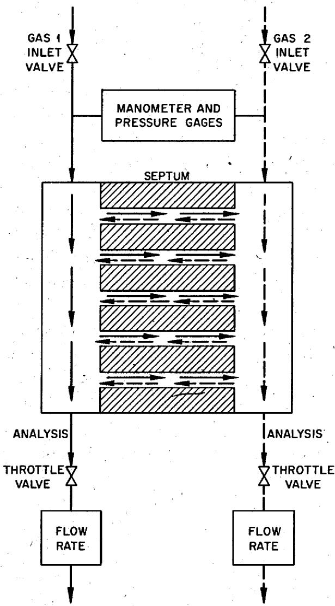  
Fig. 1. Diagram of a Typical Counterdiffusion Experiment.

who is watching the event it would appear that the two molecules never really did collide but passed through one another instead!

If we denote by $M_{1K}$ the rate of transfer of momentum from the component 1 molecules to the wall and by $M_{12}$ the rate of transfer to component 2 molecules, the momentum balance equation for the component 1 molecules becomes

$$
M _ {1 K} + M _ {1 2} = - \pi r _ {0} ^ {2} \left(d p _ {1} / d z\right) d z, \tag {35}
$$

and a similar equation can likewise be written for component 2.

As a result of the derivation of $M_{1K}$ which was presented in connection with the diffusive transport of a pure gas, we can immediately write

$$
M _ {1 K} = \left(m u _ {1 D}\right) \left[ \frac {f}{2 (2 - f)} \right] \left(n _ {1} \bar {c} _ {1}\right) \left(2 \pi r _ {0} d z\right), \tag {36}
$$

where $u_{1D}$ represents the average diffusive velocity of the component 1 molecules, and the factor $(f/4)$ has been adjusted to comply with Eq. (29). This result, it is recalled, was obtained by considering the average number of collisions which the molecules make with the walls in unit time, and then muplying by the average momentum which is transferred in a single collision. We shall employ the same procedure to evaluate $M_{12}$ , but once more emphasize that although the method is correct in principle, it is lacking in mathematical rigor. Note also that we are only employing the diffusive velocities, $u_{iD}$ . In other words, our reference frame is moving along the tube with the viscous velocity $u_v$ . Subsequent addition of the diffusive and viscous velocities, or more properly the diffusive and viscous fluxes, in effect fixes the reference frame to correspond to the laboratory coordinate system.

The average number of collisions which occur between unlike molecules in the volume element $\pi r_0^2 dz$ in unit time is given by $n_1 n_2 \pi d_{12}^2 (\overline{c}_1^2 + \overline{c}_2^2)^{1/2} (\pi r_0^2 dz)$ , where $\pi d_{12}^2$ represents the cross section of the sphere of influence for unlike-molecule collisions. In each of these collisions, the average amount of momentum which is transferred in the $z$ direction from molecule 1 to molecule 2 is $[m_1 m_2 / (m_1 + m_2)] (u_{1D} - u_{2D})$ , so the momentum lost by the component 1 molecules per unit time as a result of collision with component 2 molecules is given by

$$
M _ {1 2} = n _ {1} n _ {2} \pi d _ {1 2} ^ {2} \left(\bar {c} _ {1} ^ {2} + \bar {c} _ {2} ^ {2}\right) ^ {1 / 2} \left[ m _ {1} m _ {2} / \left(m _ {1} + m _ {2}\right) \right] \left(u _ {1 D} - u _ {2 D}\right) \left(\pi r _ {0} ^ {2} d z\right). \tag {37}
$$

If we insert this expression, along with Eq. (36), into Eq. (35) and simplify, we obtain

$$
\begin{array}{l} J _ {1 \mathrm {D}} \left\{r _ {0} \left[ \frac {(2 - f)}{f} \right] \left(\frac {\pi \bar {c} _ {1}}{8 k T}\right) \right\} ^ {- 1} + \left(x _ {2} J _ {1 \mathrm {D}} - x _ {1} J _ {2 \mathrm {D}}\right) \left\{\left(\frac {\pi}{8 k T}\right) ^ {1 / 2} \left[ \frac {\left(m _ {1} + m _ {2}\right)}{m _ {1} m _ {2}} \right] ^ {1 / 2} \frac {1}{n \pi d _ {1 2} ^ {2}} \right\} ^ {- 1} \\ = - \left(\frac {d p _ {1}}{d z}\right), \\ \end{array}
$$

or

$$
\begin{array}{l} J _ {1 \mathrm {D}} \left\{r _ {0} \left[ \frac {(2 - f)}{f} \right] \left(\frac {\pi \bar {c} _ {1}}{8}\right) \right\} ^ {- 1} + \left(x _ {2} J _ {1 \mathrm {D}} - x _ {1} J _ {2 \mathrm {D}}\right) \left\{\left(\frac {\pi k T}{8}\right) ^ {1 / 2} \left[ \frac {\left(m _ {1} + m _ {2}\right)}{m _ {1} m _ {2}} \right] ^ {1 / 2} \frac {1}{\pi \pi d _ {1 2} ^ {2}} \right\} ^ {- 1} \\ = - \left(\frac {d n _ {1}}{d z}\right). \tag {38} \\ \end{array}
$$

The first term in braces is just the Knudsen diffusion coefficient for component 1, $D_{1\mathbf{K}}$ , whereas the second term in braces is the binary diffusion coefficient $\emptyset_{12}$ of the system 1-2. (Note that $\emptyset_{12} = \emptyset_{21}$ ; this can be shown by interchanging subscripts in the flux equations.) Equation (38) can therefore be written in the form

$$
\frac {J _ {1 \mathrm {D}}}{D _ {1 \mathrm {K}}} + \frac {x _ {2} J _ {1 \mathrm {D}} - x _ {1} J _ {2 \mathrm {D}}}{\mathcal {I} _ {1 2}} = - \frac {d n _ {1}}{d z}. \tag {39}
$$

Had we accounted for the transport of momentum via intermolecular collision in a mathematically rigorous manner, the actual expression for the binary diffusion coefficient would be given by

$$
\mathcal {D} _ {1 2} = \frac {3}{4} \left(\frac {\pi k T}{8}\right) ^ {1 / 2} \left[ \frac {\left(m _ {1} + m _ {2}\right)}{m _ {1} m _ {2}} \right] ^ {1 / 2} \frac {1}{m \pi \sigma_ {1 2} ^ {2} \Omega_ {1 2} ^ {(1 , 1) \star}}, \tag {40}
$$

in which $\pi \sigma_{12}^{2}\Omega_{12}^{(1,1)\star}$ represents the collision cross section for diffusion. Unlike the simple expression $\pi d_{12}^{2}$ , this quantity is temperature-dependent and is evaluated from a detailed consideration of the dynamics of the collision process. The simple derivation once again gives an overestimate of the momentum transported, being approximately four-thirds times the rigorously derived result.

In order to account for viscous effects, we need only insert the expressions

$$
J _ {1} = J _ {1 D} + x _ {1} J _ {v}, \quad 7
$$

$$
J _ {2} = J _ {2 D} + x _ {2} J _ {v},
$$

$$
J = J _ {1} + J _ {2}
$$

into Eq. (39), remembering that $J_{\mathbf{v}}$ is given by Eq. (26). The final result is conveniently expressed by the relation

$$
J _ {1} = - D _ {1} \left(\frac {d n _ {1}}{d z}\right) + x _ {1} \delta_ {1} J - x _ {1} \gamma_ {1} \frac {B _ {0} p}{\eta k T} \left(\frac {d p}{d z}\right), \tag {41}
$$

where

$$
\frac {1}{D _ {1}} \equiv \frac {1}{D _ {1 K}} + \frac {1}{D _ {1 2}}, \tag {42a}
$$

$$
\delta_ {1} \equiv \frac {D _ {1}}{\mathcal {V} _ {1 2}} = \frac {D _ {1 K}}{D _ {1 K} + \mathcal {V} _ {1 2}}, \tag {42b}
$$

$$
\gamma_ {1} \equiv \frac {D _ {1}}{D _ {1 K}} = \frac {\vartheta_ {1 2}}{D _ {1 K} + \vartheta_ {1 2}} = 1 - \delta_ {1}. \tag {42c}
$$

Equation (41) is symmetric with respect to an interchange of species subscripts; hence the corresponding equation for $J_{2}$ is

$$
J _ {2} = - D _ {2} \left(\frac {d n _ {2}}{d z}\right) + x _ {2} \delta_ {2} J - x _ {2} \gamma_ {2} \frac {B _ {0} p}{\eta k T} \left(\frac {d p}{d z}\right). \tag {43}
$$

A third equation is obtained by adding Eq. (39) and the corresponding expression for component 2,

$$
\frac {J _ {1 \mathrm {D}}}{D _ {1 \mathrm {K}}} + \frac {J _ {2 \mathrm {D}}}{D _ {2 \mathrm {K}}} = - \frac {d n}{d z}.
$$

The result can likewise be cast into a form which involves the total fluxes $J_{1}$ and $J_{2}$ (i.e., the fluxes actually measured in the laboratory). Thus

$$
\frac {J _ {1}}{D _ {1 \mathbf {K}}} + \frac {J _ {2}}{D _ {2 \mathbf {K}}} = - \left[ 1 + \left(\frac {x _ {1}}{D _ {1 \mathbf {K}}} + \frac {x _ {2}}{D _ {2 \mathbf {K}}}\right) \frac {B _ {0} p}{\eta} \right] \left(\frac {d n}{d z}\right). \tag {44}
$$

Although we have written three equations to describe binary gas transport through capillaries, namely, Eqs. (41), (43), and (44), only two of these are independent; any one can be derived by suitably combining the other two. The limiting forms of these relations in the free-molecule region $(p \rightarrow 0)$ and the hydrodynamic region $(p \rightarrow \infty)$ can be readily obtained by inserting the values presented in Table 1 for the various diffusion parameters.

Table 1. High and Low Pressure Limits of Diffusion Parameters ${}^{a}$   

<table><tr><td>Limit as</td><td>n</td><td>θ12</td><td>D1</td><td>δ1</td><td>γ1</td><td>ny1</td></tr><tr><td>p→0</td><td>0</td><td>∞</td><td>D1K</td><td>0</td><td>1</td><td>0</td></tr><tr><td>p→∞</td><td>∞</td><td>0</td><td>θ12</td><td>1</td><td>0</td><td>nθ12/D1K</td></tr></table>

${}^{a}$ Note that $n!_{12}$ and $D_{1K}$ are pressure-independent quantities.

A very important result is obtained from Eq. (44) for diffusion under conditions of uniform pressure. For this case the right-hand side of the equation vanishes, and one therefore obtains

$$
- \frac {J _ {1}}{J _ {2}} = \frac {D _ {1 K}}{D _ {2 K}}.
$$

Since the quantity $(2 - f) / f$ is reasonably independent of the gas, the ratio of the Knudsen diffusion coefficients can easily be reduced to yield

$$
- \frac {J _ {1}}{J _ {2}} = \left(\frac {m _ {2}}{m _ {1}}\right) ^ {1 / 2}. \tag {45}
$$

This result is expected for transport under free-molecule conditions and is generally accepted as Graham's law of effusion. Equation (45) has been derived under no special conditions relative to the pressure of the system; it is therefore applicable at all pressures, not only in the free-molecule region. Although this relation was also stated quite explicitly by Graham, in fact

several years prior to his effusion studies, it apparently was either forgotten or misinterpreted. Nonetheless, this is Graham's law of diffusion, and has been experimentally verified by many investigators. Note also that it is impossible to obtain zero net flow $(J = 0)$ under uniform pressure conditions unless $D_{1\mathbf{K}} = D_{2\mathbf{K}}$ .

Thus far we have restricted the treatment to transport through a single capillary; in the next section we extend this treatment first to a bundle of parallel capillaries and then to porous media.

Pore Geometry and Overall Coefficients. - Consider a cylindrical solid with a bulk volume given by $\pi r^2 L$ which contains $N$ identical capillaries, each of volume $\pi r_0^2 l$ . If the axes of the individual capillaries do not coincide with the axis of the cylinder, then the length $l$ will be greater than $L$ ; therefore let $\overline{q}^{1/2} \equiv l / L$ . The porosity or relative void volume $\epsilon$ of the cylinder is given by

$$
\epsilon = \frac {N \left(\pi r _ {0} ^ {2} I\right)}{\pi r ^ {2} L}.
$$

If we insert the definition of the tortuosity $\overline{q}$ into the above expression and rearrange, we find that the number of identical capillaries in the cylinder can be described by the relation

$$
N = \frac {\epsilon}{\overline {{q}} ^ {1 / 2}} \left(\frac {r ^ {2}}{r _ {0} ^ {2}}\right).
$$

The total flow of molecules measured relative to the geometry of the solid is $J(\pi r^2)$ ; this must be numerically equivalent to $N J_0(\pi r_0^2)$ , where $J_0$ denotes the flux of molecules through any one of the $N$ identical pores. Hence

$$
\frac {J}{J _ {0}} = \frac {N \left(\pi r _ {0} ^ {2}\right)}{\pi r ^ {2}} = \frac {\epsilon}{\bar {q} ^ {1 / 2}}.
$$

However, the flux $J$ is expressed as the product of two quantities, the gradient of some parameter which is causing the flux and a proportionality constant. In general, then,

$$
J = - C \left(\frac {\partial \Gamma}{\partial L}\right),
$$

and

$$
J _ {0} = - C _ {0} \left(\frac {\partial \Gamma}{\partial I}\right).
$$

By suitably rearranging these two expressions and by inserting for $J / J_{0}$ the relationship given previously, we see that the ratio of the coefficients is given by

$$
\frac {C}{C _ {0}} = \frac {\epsilon}{\bar {q}}. \tag {46}
$$

Two of the coefficients of interest incorporate $r_0$ to some power; thus it is advantageous to account for this fact by writing $C_0 = c_0 r_0^{j-2}$ , so that Eq. (46) may be rewritten in the form

$$
C / c _ {0} = (\epsilon / \overline {{q}}) r _ {0} ^ {j - 2} \quad (j = 2, 3, 4). \tag {47}
$$

In the case of normal diffusion, $c_{0} = 0_{i2}$ and $(j - 2) = 0$ , but for Knudsen diffusion,

$$
c _ {0} = \frac {\pi}{8} \bar {c} _ {i} [ (2 - t) / t ]
$$

and the exponent $(j - 2)$ is unity, whereas for viscous transport, $c_{0} = p / 8\eta$ and $(j - 2) = 2$

The situation involving a bundle of uniform identical capillaries is highly idealized; although we can consider many other geometrical models which are more complex but still tractable mathematically, their exposition will provide little insight concerning the geometrical characteristics of a typical porous medium. In the language of the pore or capillary concept, such septa must be regarded as consisting of a myriad of nonuniform interconnected capillaries of widely varying lengths. One is therefore faced not only with averaging the pore radius $r_m$ over the number of capillaries (from $m = 0$ to $m = N$ ), but also over the individual lengths $l_m'$ of the capillaries. Moreover, all of the void volume $\epsilon$ need not contribute to flow (blind pores, for example), and we shall denote this fact by using the symbol $\epsilon'$ to signify that part of $\epsilon$ which is actually involved in gas transport.

It is therefore quite obvious that the specification of the geometry of a porous medium requires such fine detail that a complete solution of the problem will almost certainly never be obtained. Nonetheless, we can set up the gas transport equations in a formal manner and thereby reduce the problem to obtaining only a few parameters experimentally.

We start by defining the effective porosity $\epsilon^{\prime}$ in the following way:

$$
\epsilon^ {\prime} \equiv \frac {\pi \sum_ {m} r _ {m} ^ {2} l _ {m}}{\pi r ^ {2} L}, \quad \epsilon^ {\prime} <   \epsilon . \tag {48}
$$

Now, however, the equivalent expressions for the flux yield

$$
J (\pi \tau^ {2}) = \sum_ {m} J _ {m} \left(\pi \tau_ {m} ^ {2}\right),
$$

or, in terms of the transport coefficients,

$$
C \left(\pi r ^ {2}\right) (- \partial \Gamma / \partial L) = \pi c _ {0} \sum_ {m} r _ {m} ^ {j} (- \partial \Gamma / \partial l _ {m}) \quad (j = 2, 3, 4).
$$

This immediately gives

$$
\frac {C}{c _ {0}} = \frac {\sum_ {m} r _ {m} ^ {j} / \overline {{q}} _ {m} ^ {1 / 2}}{r ^ {2}}, \tag {49}
$$

where $r$ again represents the radius of the medium which contains the capillaries. If we insert Eq. (48) into the above expression, we obtain

$$
\frac {C}{c _ {0}} = \frac {\epsilon^ {\prime} \sum_ {m} \left(r _ {m} ^ {j} / \overline {{q}} _ {m} ^ {1 / 2}\right)}{\sum_ {m} r _ {m} ^ {2} \overline {{q}} _ {m} ^ {1 / 2}}.
$$

Finally, we can obtain a form similar to Eq. (47) provided we define the tortuosity $\overline{q}_j$ and the average value of $r^{j - 2}$ by

$$
\frac {\left\langle r ^ {j - 2} \right\rangle}{\bar {q} _ {j}} = \frac {\sum_ {m} \left(r _ {m} ^ {j} / \bar {q} _ {m} ^ {1 / 2}\right)}{\sum_ {m} r _ {m} ^ {2} \bar {q} _ {m} ^ {1 / 2}}; \tag {50}
$$

thus

$$
\frac {C}{c _ {0}} = \frac {\epsilon^ {\prime}}{\bar {q} _ {j}} \left\langle r ^ {j - 2} \right\rangle . \tag {51}
$$

We should like to impress upon the reader that $\overline{q}_j$ , unlike $\epsilon'$ , is a function of the parameter $j$ , and we have added the subscript to indicate this fact. Furthermore, except for the case $j = 2$ , $\left\langle r^{j - 2} \right\rangle$ and $\overline{q}_j$ are defined as a group; for the one exception we have

$$
\bar {q} _ {2} = \frac {\sum_ {m} r _ {m} ^ {2} \bar {q} _ {m} ^ {1 / 2}}{\sum_ {m} \left(r _ {m} ^ {2} / \bar {q} _ {m} ^ {1 / 2}\right)}.
$$

The permeability equation, that is, the gas transport equation for a single gas under the influence of a pressure gradient, is commonly written in the form

$$
J = \left[ \frac {B _ {0} p}{\eta} + \frac {4}{3} \bar {c} K _ {0} \right] \left(\frac {1}{k T}\right) \left(- \frac {d p}{d z}\right), \tag {52}
$$

in which the flux $J$ and the pressure gradient are measured relative to the geometry of the porous medium. Equation (51) is identical to Eq. (31), the expression for a single capillary, only in appearance, for $B_0$ and $K_0$ have been redefined;

$$
B _ {0} = \frac {1}{8} \left(\frac {\epsilon^ {\prime}}{\bar {q} _ {4}}\right) \left\langle r ^ {2} \right\rangle , \tag {53a}
$$

$$
K _ {0} = \frac {3 \pi}{3 2} \left[ \frac {(2 - t)}{t} \right] \left(\frac {\epsilon^ {\prime}}{\bar {q} _ {3}}\right) \langle r \rangle , \tag {53b}
$$

where $\epsilon'$ and the grouping $\left\langle r^{j-2} \right\rangle / \overline{q}_j$ are given by Eqs. (48) and (49). Note also that the averages $\left\langle r^{j-2} \right\rangle$ actually represent a second averaging process. In other words, we have tacitly assumed that such factors as cross-linking, nonuniformity down the length of a given pore, and shape have already been taken into account.

Fortunately for everyone's sanity, permeability measurements are not too difficult to perform, so we let nature do the averaging processes for us. Except for the factor $f$ in $K_{0}$ , which is independent of the gas to a good approximation anyway, both $B_{0}$ and $K_{0}$ depend only upon the geometry of the medium. Under steady-state conditions, then, we can integrate Eq. (52) to yield

$$
\frac {J k T L}{\Delta p} = \frac {B _ {0}}{\eta} \left\langle p \right\rangle + \frac {4}{3} \bar {c} K _ {0}, \tag {54}
$$

where $\Delta p \equiv p(0) - p(L)$ , $\langle p \rangle = \frac{1}{2} [p(0) + p(L)]$ , in which $p(0)$ and $p(L)$ are the pressures at the two faces of the porous medium, and $JkT$ is the flow, in pressure-volume units per unit time, per unit cross section of the medium. Hence $B_0$ and $K_0$ can be obtained from the slope and intercept, respectively, of a plot of the left-hand side of Eq. (54) vs $\langle p \rangle$ . Once determined, these parameters are invariant to the choice of gas and appear to remain reasonably constant with respect to temperature and time.

It can likewise be shown that, for transport in porous media, the diffusion equations given earlier for diffusion in capillaries remain unchanged in form provided we replace the diffusion coefficient $\mathfrak{D}_{12}$ by an effective diffusion coefficient, $D_{12}$ , where

$$
D _ {1 2} = \left(\epsilon^ {\prime} / q ^ {\prime}\right) D _ {1 2}, \tag {55}
$$

$$
q ^ {\prime} = \bar {q} _ {2} \equiv \frac {\sum_ {m} r _ {m} ^ {2} \bar {q} _ {m} ^ {1 / 2}}{\sum_ {m} r _ {m} / \bar {q} _ {m} ^ {1 / 2}}. \tag {55a}
$$

The quantity $(\epsilon'/q')$ is likewise dependent only upon the geometry of the septum and is most conveniently determined through counterdiffusion experiments which are performed at uniform pressure.

In concluding this section, we should like at least to partially dispel the impression which the reader may have received from our discussion with regard to the utility of porosity and pore-size distribution data. It is quite true that if one is interested in small differences in the transport characteristics of two septa, for example, any inferences which are drawn from the pore-size distributions of the two samples and later verified by experiment are unquestionably fortuitous. As a rule of thumb, however, one can state that the permeability generally increases with increasing porosity and that of two specimens having approximately the same porosity, the one with the larger pores will give the higher permeability values. Moreover, one can make inferences from pore-size distribution data if large differences are involved, but even these should be verified by experiment.

Gas Transport in a Static Dust Environment. - In our derivations of the diffusive part of the gas transport problem, we nonchalantly made a number of assumptions in order to keep the presentation and the mathematics as simple as possible. For example, we assumed that the average rate of momentum transfer was equal to the average number of collisions times the average momentum transferred per collision. The average of a product, in general, only approximates the product of the averages. In fact, such approximations led to overestimates of the rate of momentum transfer in the simplified treatments, but it was a relatively simple matter to "properly" adjust the coefficients because we knew what the answer was beforehand. The correct expressions were not: an application of the capillary flow concept, but rather from a theoretical investigation of gas 'transport in a static dust environment, so perhaps we should at least outline how the rigorous derivations were obtained.

The physical description is as follows: Suppose we have an agglomerate of giant gas molecules (dust) which are uniformly distributed and fixed in space. For simplicity, let all of these molecules be of exactly the same size. If two gases are allowed to interdiffuse through the agglomerate, the process can be described as diffusion of a ternary gas mixture, that is, a mixture of gases 1 and 2 and the dust d.

The diffusive flux relationships for such systems under isothermal conditions are obtained from the Stefan-Maxwell diffusion equations:

$$
\sum_ {i \neq j} ^ {\nu} \left[ n ^ {\prime} D _ {i j} ^ {\prime} \right] ^ {- 1} \left(n _ {j} J _ {i \mathrm {D}} - n _ {i} J _ {j \mathrm {D}}\right) = n ^ {\prime} d _ {j},
$$

where $d_{j}$ represents a combination of driving forces. The primed quantities indicate that the dust is to be included in the counting process; thus $n' = n_{1} + n_{2} + n_{d} = n + n_{d}$ , where the unprimed quantities refer only to the gas. This poses no problems, since $n'D_{ij}' = nD_{ij}$ and $dn'/dz = dn/dz$ , the latter by virtue of the postulated uniform density of the dust ( $dn_{d}/dz = 0$ ).

For the ternary mixture considered here, we have three equations of the form given above -- one each for $j = 1, 2$ , and $d -$ but only two of these are independent. Also note that although the gases are not acted upon by an external force, there is an external force $F_{d}$ which acts upon the dust, namely, that clamping force which keeps the dust particles stationary. The clamping force is

$$
F _ {\mathrm {d}} = \frac {1}{\pi_ {\mathrm {d}}} \left(\frac {d p}{d z}\right),
$$

where $\pmb{p}$ refers to the true gas pressure. For $j = 1$ , the Stefan-Maxwell equation becomes

$$
\frac {x _ {1} J _ {2 \mathrm {D}} - x _ {2} J _ {1 \mathrm {D}}}{D _ {1 2}} - \frac {n _ {\mathrm {d}} J _ {1 \mathrm {D}}}{n D _ {1 \mathrm {d}}} = \frac {n ^ {\prime} d x _ {1} ^ {\prime}}{d z} + n ^ {\prime} \left(x _ {1} ^ {\prime} - \frac {n _ {1} m _ {1}}{\rho^ {\prime}}\right) \frac {d \ln p ^ {\prime}}{d z} + \frac {n ^ {\prime} n _ {1} m _ {1}}{p ^ {\prime} \rho^ {\prime}} n _ {\mathrm {d}} F _ {\mathrm {d}}.
$$

If we insert the expression above for $F_{\mathbf{d}}$ into the equation, the relationship simplifies to yield

$$
\frac {n _ {\mathrm {d}} J _ {1 \mathrm {D}}}{n D _ {1 \mathrm {d}}} + \frac {x _ {2} J _ {1 \mathrm {D}} - x _ {1} J _ {2 \mathrm {D}}}{D _ {1 2}} = - \frac {d n _ {1}}{d z},
$$

which is identical to Eq: (39) with

$$
\frac {n D _ {1 d}}{n _ {d}} = D _ {1 K}.
$$

The gas-dust diffusion coefficient $D_{id}$ is given by

$$
D _ {i d} = \frac {3}{4} \left(\frac {\pi k T}{8}\right) ^ {1 / 2} \left(\frac {1}{m _ {i}}\right) ^ {1 / 2} \left[ n \pi r _ {d} ^ {2} \left(1 + \frac {a _ {i}}{8}\right) \right] ^ {- 1},
$$

where $r_d$ denotes the radius of the dust particles and $a_i$ represents a scattering factor which is related to $f$ .

The viscous flux, on the other hand, is obtained from Stokes' law. The force $F_{\mathbf{d}}$ on the particles due to viscous drag is given by

$$
F _ {d} = - 6 \pi r _ {d} \eta \left(\frac {J _ {v}}{n}\right).
$$

If we equate the right side of this equation to the right side of the clamping force expression and rearrange, we obtain

$$
J _ {\mathrm {v}} = \left(\frac {1}{6 \pi r _ {\mathrm {d}} n _ {\mathrm {d}} \eta}\right) \left(\frac {p}{k T}\right) \left(- \frac {d p}{d z}\right).
$$

We have made no assumptions which would prevent us from orienting the dust in such a manner as to form a capillary. However, this model is couched in a language which fortunately excludes a direct connection between $r_d$ , the radius of the dust, and $r_0$ , the radius of the capillary. Only the simplest sort of “geometrical factor” is required, namely, $\epsilon'/q'$ , as in Eq. (55), and this will apply in the same form to all parameters. The important point is that the model separates the geometrical aspects of the problem from the characteristics of the gas, and moreover does so in a mathematically rigorous manner.

The extension to a porous medium is performed in much the same way as that done previously, except that one now takes some suitably averaged value of the dust radii. The transport coefficient expressions for gas flow in porous media which are obtained from the capillary model and the dusty-gas model are presented for comparison in Table 2.

Table 2. Mathematical Expressions of the Gas Transport Coefficients for Flow in Porous Media   

<table><tr><td rowspan="2">Transport Coefficient</td><td colspan="2">Modela</td></tr><tr><td>Capillary</td><td>Dusty-Gasb</td></tr><tr><td>D12, cm2/sec (normal diffusion)</td><td>(ε′/q′)012</td><td>(ε′/q′)012</td></tr><tr><td>K0, cm (Knudsen diffusion)</td><td>(ε′/q3)(3π/32)[(2-f)/f](r03)</td><td>(ε′/q′)(1/16)[nd(r2d)2/9]−1</td></tr><tr><td>B0, cm2 (viscous flow)</td><td>(ε′/q4)(1/8)(r40)</td><td>(ε′/q′)[6πnd(r_d)]-1</td></tr></table>

The expression for $\mathbb{D}_{12}$ in terms of molecular properties is given by Eq. (40). The quantities $\overline{q}_j$ and $q'$ are defined by Eqs. (50) and (55a) respectively.   
$^\text{b}$ Note that we have retained the capillary concept in defining $(\epsilon^{\prime} / q^{\prime})$ for the dusty-gas model.

# Summary

In the preceding sections of this report we have attempted to present, in as simple a manner as possible, the various flow equations which are encountered in dealing with isothermal transport in porous media. We can best summarize this portion by pointing out that any isothermal gas transport problem involving a porous septum is completely specified by Eqs. (41) and (44), provided the coefficients $D_{i\mathbf{K}}$ , $D_{12}$ , and $B_0$ are modified to take into account the nuances of pore geometry.

Unfortunately, an a priori method for evaluating the suitably modified coefficients is unlikely to be had; recourse must therefore be made to experiment. However, the only measurements required are a few permeability determinations with a single gas and a few counterdiffusion experiments with a single gas pair. This is relatively easy to accomplish. Once this is done, the septum is completely characterized; that is, the transport behavior of any gas under a given set of conditions may be predicted with confidence.

In the experimental portion of this work we shall demonstrate: (1) how the geometry of the septum is characterized through permeability and counterdiffusion experiments, and (2) how the results may be applied to gases and conditions other than those employed in the experiments. Appropriately, we have chosen to use a graphite specimen of the MSRE type.

# IV. EXPERIMENTAL

# Description of MSRE Graphite and the Experimental Specimen

Little will be gained at this time if we consider details of the manufacture of the MSRE graphite. To be sure, the fabrication procedures significantly affect the transport characteristics of the finished material and become quite important if property variations within the specimen or an intercomparison of various types of graphite are of interest. However, in the present case we concern ourselves only with a single type of graphite and moreover concentrate on the transport characteristics of the material as a whole. A detailed consideration of its manufacture thus becomes academic, so only those aspects which are pertinent to this limited objective are presented.

In the original design concepts of the molten-salt reactor, intrusion of the salt into the graphite was regarded as an intolerable contingency. As a result, a material of low permeability was demanded. Such low-permeability graphite is usually obtained by applying additional, special treatments, beginning with a modified porous nuclear-grade graphite. These treatments involve injecting a suitable impregnant into the base stock which, upon undergoing heat treatment, deposits a char within the pores of the graphite.

As is illustrated by the photomicrograph comparison of NC-CGB-BS (base stock) and NC-CGB (impregnated stock) in Fig. 2, impregnation treatments considerably lessen the pore space within the graphite. This difference in pore size likewise accounts for the observed difference in the penetrability of the two graphites by molten salt, which is also shown in Fig. 2.

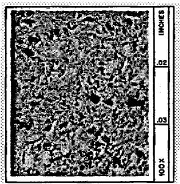  
BASE STOCK (NC-CGB-BS)

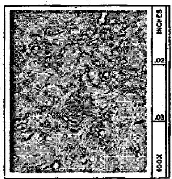  
AFTER TREATMENT (NC-CGB)

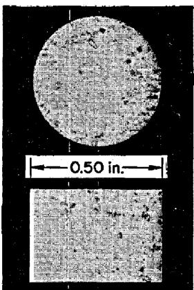

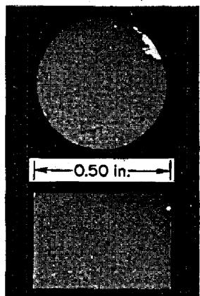  
Fig. 2. Photographs Showing the Effect of Multiple Impregnation Treatments on the Microstructure and Molten-Salt Penetration of NC-CGB Graphite. Light areas in the upper photomicrographs indicate void spaces (pores). Light areas in the lower radiographs indicate the presence of a "nonwetting" salt (BULT, 14-0-50) which invaded the samples during a 100-hr exposure to molten salt at $704^{\circ}C$ and 11 atm pressure.

One might logically expect that, as a result of impregnation treatments, the end product would exhibit property variations along directions normal to the impregnation surfaces, particularly near the surfaces of the graphite, where impregnation should be especially effective. Insofar as MSRE graphite is concerned, the nonhomogeneity is probably mitigated somewhat by subsequent machining operations which are required to produce the final dimensions of the material, and we shall explore this facet in a later report. For the present, however, we choose to concentrate on the material as a whole.

The MSRE utilizes the graphite in the form of 6-ft-long bars which have a cross section of 3.08 in.². All four sides of each bar are slotted along the entire 6-ft length; these slots provide the flow channels for the molten salt. The flow specimen was machined from one of these bars.

Our choice of sample geometry and location in the MSRE graphite bar was governed by the following objective, namely, to obtain information regarding the relative contributions of Knudsen and hydrodynamic transport to the overall flow pattern. This requires both permeability and countdiffusion experiments, and these, in turn, require samples which have a large surface-area-to-thickness ratio, as well as a reasonable degree of uniformity. Since the bar was expected to exhibit considerable nonuniformity and a high Knudsen contribution in the regions near its surfaces, we decided to obtain the flow specimen from its center. This position is defined in Fig. 3; in this location uniformity, normal diffusion effects, and porosity may be considered maximal.

ORNL-DWG 66-12740

DIMENSIONS ARE IN INCHES

PERMEABILITY-DIFFUSION

SEPTUM DIMENSIONS (6 in. LONG)

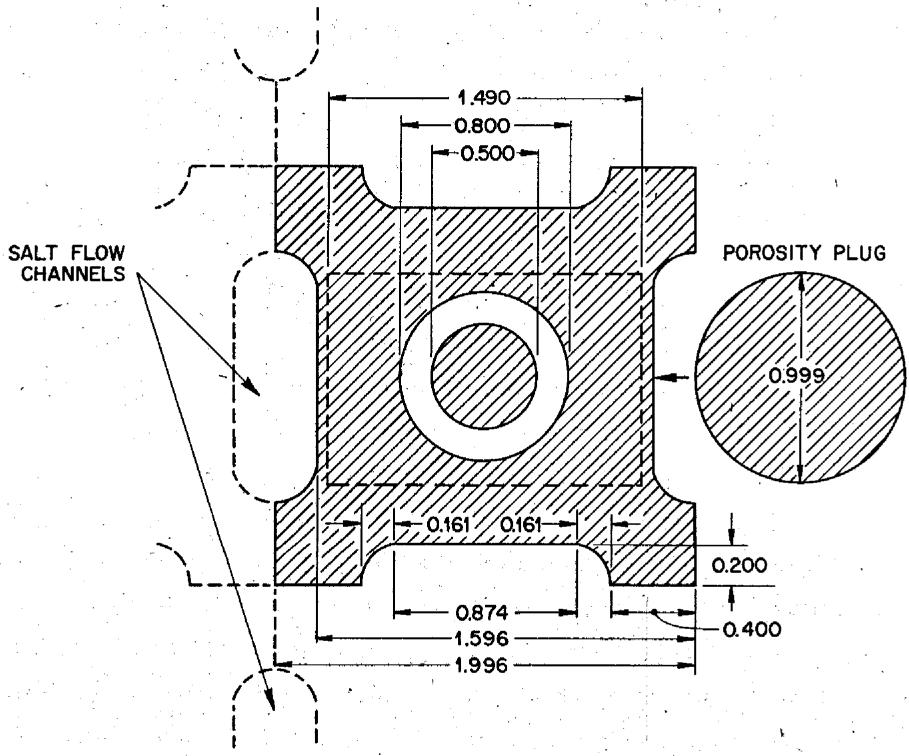  
Fig. 3. Position and Dimensions of the Diffusion Septum and Porosity Sample.

The specimen, hereafter designated as the diffusion septum, was in the form of a thin-walled cylinder whose axis coincided with the extrusion axis of the bar. For this geometry, the area-to-length ratio $A / L$ is obtained from the radial steady-state flow relationship for a uniform material,

$$
A / L = 2 \pi h [ \ln (d _ {o} / d _ {i}) ] ^ {- 1},
$$

where $h$ denotes the height of the cylinder (not to be confused with the length of the flow path $L$ ) and $d_{o}$ and $d_{i}$ represent the outer and inner diameters respectively. The septum is thus characterized by the following geometrical parameters:

$$
\begin{array}{l} h = 6 \text {i n .}, \\ d _ {o} = 0. 8 0 0 \text {i n .}, \\ d _ {j} = 0. 6 0 0 \text {i n .}, \\ A / L = 2 0 3. 6 \mathrm {c m}, \\ A = 7 7. 5 7 \mathrm {c m} ^ {2}. \\ \end{array}
$$

# Gas Transport Characterization of the Diffusion Septum

Apparatus and Procedure. - Mutual diffusion coefficient determinations involving binary gas mixtures are generally made under transient conditions in an apparatus whose geometry is well defined and known. Moreover, the system is closed throughout the course of the experiment, thereby forcing the diffusion rates of the two components to be equal. In the present work, however, we employed a steady-state method, and this required that the system be open.

The approach used by us was originally developed by Wicke for his investigations of adsorbed $\mathrm{CO}_{2}$ surface diffusion in porous media; a $\mathrm{CO}_{2} - \mathrm{N}_{2}$ mixture was swept across one face of a porous septum, whereas the opposite face was swept with a stream of pure $\mathrm{N}_{2}$ in such a manner that no pressure gradient was imposed across the septum. Although the $\mathrm{CO}_{2}$ diffusion rate was determined in his studies, Wicke unfortunately ignored the $\mathrm{N}_{2}$ diffusion rate. Somewhat later, Hoogschagen adopted the Wicke procedure and added one important modification; he monitored the degree of contamination of both sweep streams. This led to the rediscovery of Graham's law of diffusion. (Ironically, Hoogschagen's rediscovery of Graham's law and Soret's earlier use of this law to verify the formula $\mathrm{O}_{3}$ for ozone were also confused by workers in the field!)

Figure 4 is a photograph of the diffusion cell assembly which was used in this work; the components, from left to right in the figure, are: Ar sweep-gas outlet tube and thermocouple; septum container; diffusion septum, container cap, and fittings; and the He sweep-gas flow guide and septum end cap. The end caps were attached to the graphite cylinder with epoxy resin to effect a gas-tight seal and to define the surface of the septum available to gaseous diffusion. The countdiffusion experiments were performed by sweeping the inner surface of the diffusion septum with He and the outer surface with Ar and analyzing the effluent streams for the corresponding contaminant. Pure helium was introduced into the upper T-joint which is shown in Fig. 4 and made to flow down the annulus formed by the $\frac{1}{4}$ - and $\frac{1}{8}$ -in. tubing. The gas then entered the inner section of the septum in the region of the upper end cap and was withdrawn at the base of the flow guide through the $\frac{1}{8}$ -in. tubing. In a similar manner, pure argon was admitted to the outer surface of the specimen through the T-joint adjacent to the container cap and withdrawn at the base of the container through the $\frac{3}{8}$ -in. outlet tube.

A drawing of the entire flow system is shown in Fig. 5. Uniform pressure conditions were obtained by adjusting the control valves $R_{1}, R_{2}, R_{3}$ , and $R_{4}$ until the pressure drop $\Delta p$ across

PHOTO 36002

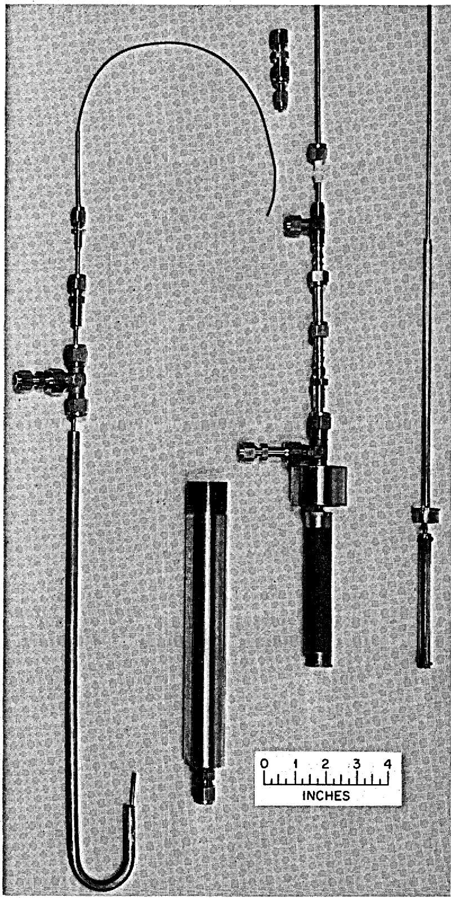  
Fig. 4. Diffusion Cell Assembly for NC-CGB Diffusion Septum.

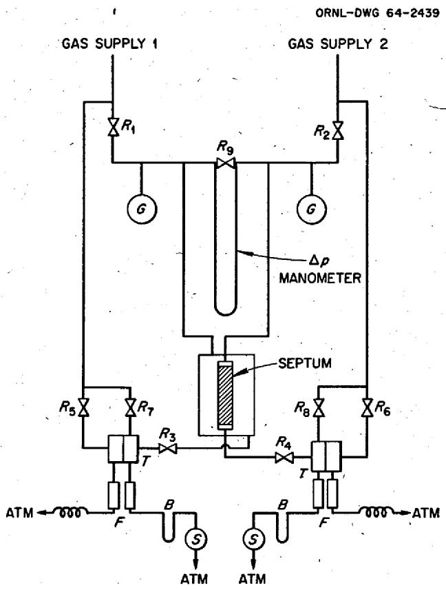  
Fig. 5. Line Drawing of the Diffusion and Permeability Measurement Apparatus.

the sample (as determined with a mercury differential manometer) was zero. After sweeping its respective side of the porous medium, each effluent stream was passed through one of a pair of thermostated thermal conductivity cells $(T)$ for gas composition analysis. Continuous comparison with streams of the corresponding pure gases under identical flow conditions was accomplished by adjusting the control valves $R_{5}$ and $R_{6}$ until the rotameter pairs $(F)$ indicated equal flow rates. Back-diffusion of air into these reference streams was minimized by venting the gases through 12 ft of coiled $\frac{1}{8}$ -in. copper tubing, whereas the sweep streams were passed through dibutyl phthalate bubblers $(B)$ before being admitted into the calibrated wet-test meters (S). In about half the experiments the gas composition analyses were obtained with a mass spectrometer. For these runs the samples were withdrawn from sampling ports located at $T$ . Previously calibrated Bourdon gages $(G)$ provided measurements of the pressures at which the experiments were performed.

The permeability data were likewise obtained with this apparatus. This was accomplished by closing one of the inlet valves and the outlet valve of the opposite flow stream (e.g., $R_{1}$ and $R_{4}$ ).

All of the gases employed in this work were found to be at least $99.9\%$ pure. Analyses of the helium and argon supplies indicated a free oxygen content in the range between 1 and 4 ppm and water contents from 10 to 15 ppm. Thus, no further attempts at purification were undertaken.

Permeability Results. - Since the techniques usually employed to obtain permeability data appear in abundance in the open literature, a detailed discussion on our part is unwarranted. We therefore merely outline the calculational procedure in this section.

The integrated steady-state equation that applies to the diffusion septum permeability measurements is given by

$$
p _ {a} Q _ {a} = K _ {i} (A / L) \Delta p,
$$

where the permeability coefficient of component $i$ is

$$
K _ {i} = \left(B _ {0} / \eta_ {i}\right) \left\langle p \right\rangle + D _ {i K}. \tag {56}
$$

In our experiments, the effluent volumetric flow rate $Q_{a}$ is determined at the barometric pressure $p_{a}$ by means of the calibrated wet-test meters; the pressure drop $\Delta p = p(0) - p(L)$ across the septum is measured with the mercury differential pressure manometer which is shown in Fig. 5; and, finally, the arithmetic mean pressure $\left\langle p \right\rangle = \frac{1}{2} [p(0) + p(L)]$ is determined from readings of the barometric pressure and the calibrated Bourdon gages.

Diffusion septum permeability coefficients were determined at $22.5^{\circ}\mathrm{C}$ for three gases: hydrogen, helium, and argon. The resultant experimental data are presented in Table 3 and are graphically displayed in Fig. 6 as a function of the mean pressure $\langle p\rangle$ . In accord with the linear relation, Eq. (56), these data have been smoothed using a linear least-squares procedure; the solid lines which appear in Fig. 6 thus represent the smoothed data and form the basis for the determination of the permeability parameters which are tabulated in Table 4.

Although the quantity $\sqrt{M_i} D_{i\mathbf{K}}$ and the viscous-flow coefficient $B_0$ should depend only upon the graphite structure and therefore be independent of the gas, some variation in these values has been noted. These discrepancies are probably indicative of the experimental errors involved; hence an average of the values for $\sqrt{M_i} D_{i\mathbf{K}}$ and $B_0$ which were obtained from the helium and the argon data has been taken to be representative of these quantities when we consider the He-Ar counterdiffusion data.

Helium-Argon Counterdiffusion Results. - All of the counterdiffusion experiments were conducted under conditions of uniform pressure; hence the data were correlated in accordance with the constant-pressure form of Eq. (41),

$$
J _ {\mathrm {H e}} = - n D _ {\mathrm {H e}} \left(\frac {d x _ {\mathrm {H e}}}{d z}\right) + x _ {\mathrm {H e}} \delta_ {\mathrm {H e}} J. \tag {57}
$$

For this case $D_{\mathbf{H}\bullet}$ and $\delta_{\mathbf{H}\bullet}$ are constant over the length $z = 0$ to $z = L$ , and Eq. (57) can be integrated and rearranged to yield an expression for the effective diffusion coefficient $D_{\mathbf{H}\bullet \mathbf{A}\mathbf{r}}$ in

Table 3. Experimental Values of the Permeability Coefficient of the NC-CGB Graphite Diffusion Septum at $22.5^{\circ}\mathrm{C}$ as Determined with Hydrogen, Helium, and Argon   

<table><tr><td colspan="2">Hydrogen</td><td colspan="2">Helium</td><td colspan="2">Argon</td></tr><tr><td>(p) atm</td><td>K (cm2/sec)</td><td>(p) atm</td><td>K (cm2/sec)</td><td>(p) atm</td><td>K (cm2/sec)</td></tr><tr><td>×100</td><td>×10-4</td><td>×100</td><td>×10-4</td><td>×100</td><td>×10-4</td></tr><tr><td>1.366</td><td>7.891</td><td>1.275</td><td>5.366</td><td>1.318</td><td>2.016</td></tr><tr><td>1.406</td><td>8.000</td><td>1.450</td><td>5.453</td><td>1.506</td><td>2.112</td></tr><tr><td>1.525</td><td>8.096</td><td>1.674</td><td>5.550</td><td>1.782</td><td>2.264</td></tr><tr><td>1.652</td><td>8.250</td><td>1.925</td><td>5.689</td><td>2.083</td><td>2.352</td></tr><tr><td>1.756</td><td>8.411</td><td>2.176</td><td>5.813</td><td>2.265</td><td>2.449</td></tr><tr><td>1.848</td><td>8.452</td><td>2.451</td><td>5.980</td><td>2.482</td><td>2.564</td></tr><tr><td>1.935</td><td>8.582</td><td>2.732</td><td>6.105</td><td>2.827</td><td>2.705</td></tr><tr><td>2.032</td><td>8.763</td><td>2.970</td><td>6.248</td><td>3.073</td><td>2.816</td></tr><tr><td>2.195</td><td>8.841</td><td>3.197</td><td>6.350</td><td>3.258</td><td>2.853</td></tr><tr><td>2.286</td><td>8.983</td><td>3.712</td><td>6.638</td><td>3.526</td><td>2.998</td></tr><tr><td>2.490</td><td>9.174</td><td>4.205</td><td>6.874</td><td>3.794</td><td>3.073</td></tr><tr><td>2.704</td><td>9.420</td><td>4.685</td><td>7.091</td><td>4.049</td><td>3.214</td></tr><tr><td>2.964</td><td>9.759</td><td>5.252</td><td>7.391</td><td>4.331</td><td>3.348</td></tr><tr><td>3.257</td><td>10.05</td><td>5.729</td><td>7.650</td><td>4.983</td><td>3.614</td></tr><tr><td>3.537</td><td>10.37</td><td>6.216</td><td>7.900</td><td>5.291</td><td>3.763</td></tr><tr><td>3.759</td><td>10.63</td><td>6.740</td><td>8.200</td><td>5.725</td><td>3.929</td></tr><tr><td>3.986</td><td>10.91</td><td>7.185</td><td>8.418</td><td>6.030</td><td>4.074</td></tr><tr><td>4.241</td><td>11.16</td><td>7.630</td><td>8.667</td><td>6.277</td><td>4.200</td></tr><tr><td>4.485</td><td>11.44</td><td></td><td></td><td>6.590</td><td>4.333</td></tr><tr><td>4.985</td><td>11.95</td><td></td><td></td><td>6.970</td><td>4.449</td></tr><tr><td>5.243</td><td>12.34</td><td></td><td></td><td>7.269</td><td>4.582</td></tr><tr><td>5.567</td><td>12.71</td><td></td><td></td><td>7.529</td><td>4.688</td></tr><tr><td>5.993</td><td>13.14</td><td></td><td></td><td></td><td></td></tr><tr><td>6.530</td><td>13.73</td><td></td><td></td><td></td><td></td></tr><tr><td>7.001</td><td>14.20</td><td></td><td></td><td></td><td></td></tr><tr><td>7.514</td><td>14.87</td><td></td><td></td><td></td><td></td></tr></table>

Table 4. Summary of the Permeability Parameters of the NC-CGB Graphite Septum at ${22.5}^{ \circ  }\mathrm{C}$   

<table><tr><td>Gas</td><td>η (poise)</td><td>√Ml(g/mole)1/2</td><td>DfK(cm2/sec)</td><td>B0(cm2)</td><td>√MlDfK(g1/2cm2sec-1mole-1/2)</td></tr><tr><td></td><td>×10-4</td><td>×100</td><td>×10-4</td><td>×10-15</td><td>×10-4</td></tr><tr><td>Hydrogen</td><td>0.8863</td><td>1.420</td><td>6.40</td><td>9.82</td><td>9.09</td></tr><tr><td>Helium</td><td>1.971</td><td>2.001</td><td>4.70</td><td>10.07</td><td>9.40</td></tr><tr><td>Argon</td><td>2.235</td><td>6.320</td><td>1.48</td><td>9.47</td><td>9.35</td></tr><tr><td>He-Ar average</td><td></td><td></td><td></td><td>9.77</td><td>9.38</td></tr></table>

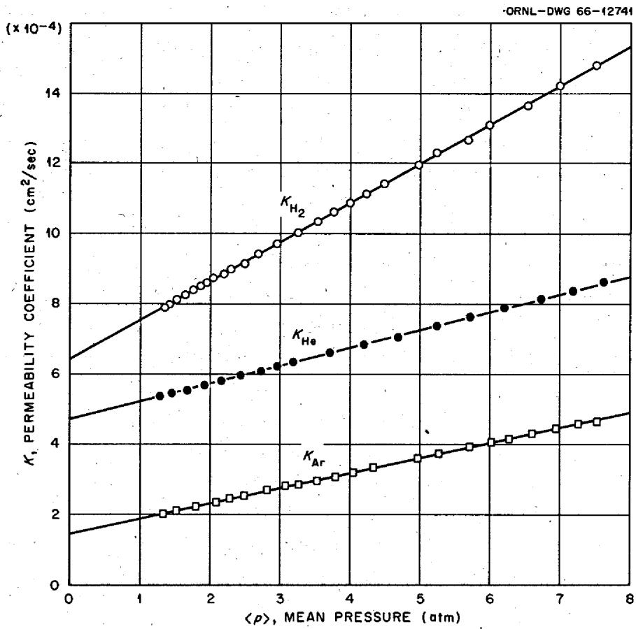  
Fig. 6. Pressure Dependence of the Pemeability Coefficients of the NC-CGB Graphite Diffusion Septum at $22.5^{\circ}\mathrm{C}$ .

terms of the experimentally determined variables. Thus

$$
D _ {\mathrm {H e A r}} = \frac {J A}{n} \left\{\frac {A}{L} \ln \left[ \frac {1 - \delta_ {\mathrm {H e}} (J / J _ {\mathrm {H e}}) x _ {\mathrm {H e}} (L)}{1 - \delta_ {\mathrm {H e}} (J / J _ {\mathrm {H e}}) x _ {\mathrm {H e}} (0)} \right] \right\} ^ {- 1}, \tag {58}
$$

where

$$
\delta_ {\mathrm {H e}} = D _ {\mathrm {H e K}} \left[ D _ {\mathrm {H e K}} + D _ {\mathrm {H e A r}} \right] ^ {- 1}. \tag {59}
$$

In view of the theoretical relation for uniform-pressure diffusion, namely,

$$
- \frac {J _ {\mathrm {H e}}}{J _ {\mathrm {A r}}} = \left(\frac {M _ {\mathrm {A r}}}{M _ {\mathrm {H e}}}\right) ^ {1 / 2} = 3. 1 6,
$$

a measurement of either $J_{\mathbf{H}\bullet}$ or $J_{\mathbf{A}\mathbf{r}}$ is in effect a measurement of the net flux $J$ . One therefore obtains two independent values of $J$ if both individual fluxes are determined, and these may be averaged in order to enhance the accuracy of the results. This procedure was in fact employed in analyzing the present data.

The importance of obtaining values of the Knudsen coefficient $D_{\text{HeK}}$ before performing diffusion experiments is readily realized by noting its appearance in Eq. (59). Furthermore, as a result of this auxiliary equation the expression for $D_{\text{HeAr}}$ , Eq. (58), is a transcendental relation. Accordingly, it must be solved by an iterative technique. The number of iterations required of course depends upon the value that is chosen as a first approximation to $D_{\text{HeAr}}$ , and if one makes a poor choice the convergence can be painfully slow. It is therefore desirable to obtain as good a first approximation as possible. If several diffusion experiments are performed at different pressures, the most convenient method is as follows: For each experiment one calculates an "apparent" value of $nD_{\text{HeAr}}$ from Eq. (58) by taking $\delta_{\text{He}} = 1$ . If the reciprocals of the values so obtained are then plotted against $1/p$ , the intercept corresponds to the "true" value of $nD_{\text{HeAr}}$ since, as we have remarked earlier, $\delta \rightarrow 1$ as $1/p \rightarrow 0$ . Moreover, the plots frequently appear to be almost linear, so that the required extrapolation is generally straightforward.

The He-Ar counterdiffusion data which were obtained with the diffusion septum are presented in Table 5. Two series of experiments were performed: in the first, the extent of contamination of the two sweep streams was adjusted to be about 1 mole % and the analyses were performed with a mass spectrometer; in the second series, the degree of contamination was held at about 0.2 mole %, and thermal conductivity cells were employed in the sweep-stream analyses. The diffusion coefficients which are tabulated have been computed in accordance with Eq. (58), where the value of $D_{\text{HeK}}$ has been taken to be $4.69 \times 10^{-4} \, \text{cm}^2/\text{sec}$ , as discussed previously. The first approximation to $nD_{\text{HeAr}}$ , as determined by the intercept method described above, was $2.85 \times 10^{-8} \, \text{mole cm}^{-1} \, \text{sec}^{-1}$ ; the rapid convergence which was obtained by this method is readily seen by comparing this value with the "final" results in the table.

Except for the geometric factor $(\epsilon'/q')$ , the diffusion coefficient $D_{\text{HeAr}}$ is given by Eq. (40); thus the values presented in Table 5 should vary linearly with reciprocal pressure. This dependence is illustrated in Fig. 7.

Parameters for Fission Product Diffusion in MSRE Graphites. - We are now in a position to apply the information which has been obtained thus far to cases of interest to the Molten-Salt Reactor Experiment. Typical of these is the migration of xenon and krypton against a helium atmosphere in the graphite. However, we shall not work out the problem in detail, nor shall we even write down the flux expressions; instead, we confine ourselves only to a discussion of the flow parameters.

We begin this section by once more emphasizing that if all but one of the components of a gas mixture are present only in trace quantities, one can safely ignore all other trace components in describing the diffusion characteristics of any one component. For example, if we wish to characterize the transport of trace amounts of xenon and krypton in a helium atmosphere, it is unnecessary to consider the effect of xenon on the transport of krypton and vice versa. Our object here, therefore, is simply to obtain values for the quantities $D_{i\mathbf{K}}$ and $D_{\mathrm{He}i}$ , where $i$ represents either krypton or xenon, which may be applied to the MSRE conditions. These two parameters are sufficient to completely describe the migration of the two fission products.

Table 5. Helium-Argon Interdiffusion Data Obtained at ${24}^{ \circ  }\mathrm{C}$ with the NC-CGB Graphite Diffusion Septum   

<table><tr><td rowspan="2">Pressure, p (atm)</td><td colspan="3">Diffusion Rate (mole/sec)</td><td rowspan="2">Rate Ratio, -JHe/JAr</td><td colspan="2">Diffusion Coefficient (cm2/sec)</td><td rowspan="2">Normal Diffusion Constant, nDHeAr (mole cm-1sec-1)</td></tr><tr><td>(JHeA)exp</td><td>(JArA)exp</td><td>(JA)av</td><td>DHe</td><td>DHeAr</td></tr><tr><td>×100</td><td>×10-6</td><td>×10-6</td><td>×10-6</td><td>×100</td><td>×10-4</td><td>×10-4</td><td>×10-8</td></tr><tr><td colspan="8">XHe(L) = XAr(0) ~ 0.91 Mole %</td></tr><tr><td>1.36</td><td>3.30</td><td>-1.07</td><td>2.28</td><td>3.08</td><td>2.45</td><td>5.16</td><td>2.88</td></tr><tr><td>1.57</td><td>3.57</td><td>-1.14</td><td>2.45</td><td>3.13</td><td>2.30</td><td>4.51</td><td>2.86</td></tr><tr><td>1.78</td><td>3.96</td><td>-1.19</td><td>2.63</td><td>3.33</td><td>2.12</td><td>3.86</td><td>2.82</td></tr><tr><td>2.11</td><td>4.29</td><td>-1.37</td><td>2.94</td><td>3.13</td><td>1.94</td><td>3.31</td><td>2.87</td></tr><tr><td>2.71</td><td>4.78</td><td>-1.63</td><td>3.39</td><td>2.93</td><td>1.68</td><td>2.62</td><td>2.91</td></tr><tr><td>3.73</td><td>5.43</td><td>-1.84</td><td>3.85</td><td>2.95</td><td>1.35</td><td>1.90</td><td>2.90</td></tr><tr><td>4.91</td><td>6.11</td><td>-1.93</td><td>4.17</td><td>3.17</td><td>1.07</td><td>1.39</td><td>2.81</td></tr><tr><td>7.70</td><td>6.95</td><td>-2.33</td><td>4.89</td><td>2.98</td><td>0.76</td><td>0.91</td><td>2.88</td></tr><tr><td colspan="7">Av 3.09 ± 0.10</td><td>Av 2.87 ± 0.03</td></tr><tr><td colspan="8">XHe(L) = XAr(0) ~ 0.19 Mole %</td></tr><tr><td>1.22</td><td>3.07</td><td>-0.97</td><td>2.10</td><td>3.16</td><td>2.55</td><td>5.61</td><td>2.81</td></tr><tr><td>1.36</td><td>3.29</td><td>-1.06</td><td>2.27</td><td>3.10</td><td>2.44</td><td>5.10</td><td>2.84</td></tr><tr><td>1.53</td><td>3.52</td><td>-1.13</td><td>2.42</td><td>3.12</td><td>2.29</td><td>4.48</td><td>2.81</td></tr><tr><td>1.73</td><td>3.78</td><td>-1.12</td><td>2.61</td><td>3.09</td><td>2.14</td><td>3.96</td><td>2.81</td></tr><tr><td>2.00</td><td>4.15</td><td>-1.32</td><td>2.85</td><td>3.14</td><td>1.98</td><td>3.43</td><td>2.82</td></tr><tr><td>2.54</td><td>4.74</td><td>-1.56</td><td>3.30</td><td>3.04</td><td>1.74</td><td>2.76</td><td>2.88</td></tr><tr><td>3.09</td><td>5.37</td><td>-1.74</td><td>3.72</td><td>3.09</td><td>1.56</td><td>2.34</td><td>2.96</td></tr><tr><td>4.32</td><td>6.02</td><td>-1.94</td><td>4.16</td><td>3.10</td><td>1.21</td><td>1.63</td><td>2.89</td></tr><tr><td>5.00</td><td>6.19</td><td>-1.94</td><td>4.22</td><td>3.19</td><td>1.05</td><td>1.36</td><td>2.78</td></tr><tr><td>5.68</td><td>6.66</td><td>-2.17</td><td>4.62</td><td>3.07</td><td>0.99</td><td>1.25</td><td>2.92</td></tr><tr><td>6.42</td><td>7.10</td><td>-2.29</td><td>4.90</td><td>3.10</td><td>0.91</td><td>1.13</td><td>2.99</td></tr><tr><td>7.48</td><td>7.40</td><td>-2.43</td><td>5.15</td><td>3.04</td><td>0.81</td><td>0.98</td><td>3.01</td></tr><tr><td colspan="7">Av 3.10 ± 0.03</td><td>Av 2.88 ± 0.06</td></tr></table>

We have selected Kr and Xe for present considerations because the properties of these gases are, to a close approximation, representative of the average values for the volatile species in the so-called light and heavy fractions of the total products formed by fission.

First, however, it is necessary for us to make a few assumptions. The most obvious of these is that all of the MSRE graphite bars do not significantly deviate from the diffusion septum with respect to internal geometry. In other words, $(\epsilon'/q')$ is about the same throughout. Further, we shall assume that $(\epsilon'/q')$ is reasonably independent of temperature, so that the only temperature dependence which is exhibited by the gas transport is due to the gases themselves. Finally, we shall choose $T = 936^{\circ}\mathrm{K}$ and $p = 2.36$ atm (20 psig) as the conditions characteristic of gas transport in the MSRE.

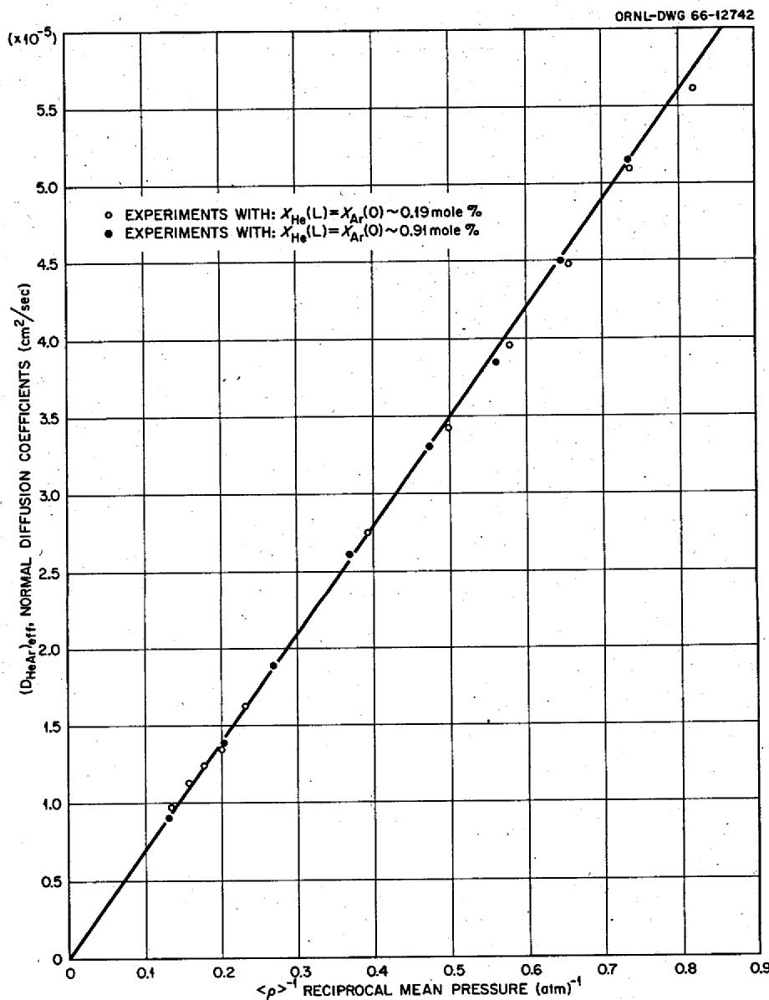  
Fig. 7. Pressure Dependence of the Normal Diffusion Coefficient of the NC-CGB Graphite Diffusion Septum for the System Helium-Argon at $24^{\circ}\mathrm{C}$ .

If we insert the expression for the average speed $\overline{c}_j$ into Eq. (34), we obtain

$$
D _ {i \mathbf {K}} = \frac {4}{3} \left(\frac {8 R T}{\pi M _ {i}}\right) ^ {1 / 2} K _ {0}, \tag {60}
$$

where $K_{0}$ is given by the relation presented in Table 2 and depends almost completely upon the geometry of the medium. Simply by rearranging Eq. (60) we see that the grouping $(M_{i} / T)^{1 / 2}D_{i\kappa}$ is likewise dependent only on the geometry of the graphite. Thus, if the characteristic value of

$\sqrt{M_i} D_{i\kappa}$ is taken to be equal to $9.38\mathrm{g}^{1 / 2}\mathrm{cm}^2\sec^{-1}\mathrm{mole}^{-1 / 2}$ at $22.5^{\circ}\mathbf{C}$ , as discussed previously, we obtain

$$
(M _ {i} / T) ^ {1 / 2} D _ {i \mathbf {K}} = 5. 4 5 \cdot 1 0 ^ {- 5} \mathrm {g} ^ {1 / 2} \mathrm {c m} ^ {2} \sec^ {- 1} \mathrm {m o l e} ^ {- 1 / 2} \deg^ {- 1 / 2}. \tag {61}
$$

With this result it is then possible to obtain the Knudsen diffusion coefficients of the three gases concerned. These results are listed in Table 6.

Table 6. Parameters for He-Xe and He-Kr Diffusion in MSRE Graphites at $936^{\circ}\mathrm{K}$ and 2.36 atm Pressure (MSRE Operating Conditions)   

<table><tr><td>Gas</td><td>\( \sqrt{{M}_{i}} \) (g/mole) \( {}^{1/2} \)</td><td>\( {D}_{i\mathrm{\;K}} \) (cm \( {}^{2} \) /sec)</td><td>\( {0}_{\text{HeI }} \) (cm \( {}^{2} \) /sec)</td><td>\( {D}_{\text{HeI }} \) (cm \( {}^{2} \) /sec)</td><td>\( {D}_{i} \) (cm \( {}^{2} \) /sec)</td></tr><tr><td></td><td></td><td>\( \times  {10}^{-4} \)</td><td></td><td>\( \times  {10}^{-3} \)</td><td>\( \times  {10}^{-4} \)</td></tr><tr><td>He</td><td>2.001</td><td>8.33</td><td></td><td></td><td></td></tr><tr><td>Kr</td><td>9.154</td><td>1.82</td><td>1.81</td><td>1.69</td><td>1.64</td></tr><tr><td>Xe</td><td>11.46</td><td>1.45</td><td>1.63</td><td>1.52</td><td>1.32</td></tr></table>

We now turn to an evaluation of the normal diffusion coefficient. As is shown in Table 2, this coefficient is the product of two factors:

$$
D _ {\text {H e i}} = \left(\varepsilon^ {\prime} / q ^ {\prime}\right) D _ {\text {H e i}}, \tag {62}
$$

in which the "free-space" coefficient $\mathfrak{D}_{\mathbf{H e l}}$ is simply the normal diffusion coefficient as determined for a known pore geometry. The difference between the script and the printed coefficient is that the internal structure, so to speak, has been removed from the former coefficient, but is still retained in $D_{\mathbf{H e l}}$ .

Thus far, all we have is a value for $nD_{\text{HeAr}}$ which is characteristic of the diffusion septum; the value adopted from the data in Table 5 is

$$
n D _ {\text {H e A r}} = (2. 8 7 \pm 0. 0 5) \times 1 0 ^ {- 8} \text {m o l e c m} ^ {- 1} \sec^ {- 1}, \tag {63}
$$

which refers to a temperature of $24^{\circ}\mathbf{C}$ . However, it turns out for our purposes to be more convenient to work with the group $pD_{\mathbf{HeAr}}$ , where the pressure $\pmb{p}$ is expressed in atmospheres. The corresponding value for the diffusion septum is then given by

$$
p D _ {\text {H e A r}} = 6. 9 9 \times 1 0 ^ {- 4} \mathrm {a t m} \mathrm {c m} ^ {3} \sec^ {- 1}. \tag {64}
$$

The problem now reduces to solving Eq. (62) for $(\epsilon' / q')$ with the value of $pD_{\mathbf{HeAr}}$ given above and a value of $p\mathcal{O}_{\mathbf{HeAr}}$ . This latter quantity can be determined from Eq. (40) provided the collision cross section for diffusion, $\pi \sigma_{12}^2 \Omega_{12}^{(1,1)\star}$ , is known. Alternatively, one can employ experimentally determined values of the diffusion coefficients if these are available. The results are often expressed in the form

$$
\log_ {1 0} \left(p ^ {\Omega} _ {1 2}\right) = A \left(\log_ {1 0} T\right) + B, \tag {65}
$$

where $T$ is the temperature in $^\circ \mathbf{K}$ and $A$ and $B$ are constants. For the systems of interest in this work, the following equations have been proposed in the literature:

He-Ar:

$$
\log_ {1 0} \left(p ^ {\mathrm {D}} _ {\text {H e A r}}\right) = 1. 6 8 4 \left(\log_ {1 0} T\right) - 4. 2 9 0 2, \tag {66a}
$$

He-Kr:

$$
\log_ {1 0} (p \mathbb {Q} _ {\text {H e K r}}) = 1. 6 8 8 (\log_ {1 0} T) - 4. 3 8 4 4, \tag {66b}
$$

He-Xe:

$$
\log_ {1 0} (p \mathbb {O} _ {\text {H e X e}}) = 1. 7 2 0 (\log_ {1 0} T) - 4. 5 2 5 1. \tag {66c}
$$

Although these equations reproduce the experimental data only over the temperature range 0 to $120^{\circ}\mathrm{C}$ , the error introduced in employing the equations at higher temperatures is normally quite small. From Eq. (66a) we obtain, at $24^{\circ}\mathrm{C}$ ,

$$
p ^ {\text {H e A r}} = 0. 7 4 8 \mathrm {a t m} \mathrm {c m} ^ {2} \sec^ {- 1}; \tag {67}
$$

thus

$$
\left(\epsilon^ {\prime} / q ^ {\prime}\right) = 9. 3 4 \times 1 0 ^ {- 4}. \tag {68}
$$

It is now possible to obtain normal diffusion coefficient values for any gas pair for this particular graphite simply by employing the relation

$$
D _ {1 2} = \left(9. 3 4 \times 1 0 ^ {- 4}\right) D _ {1 2}. \tag {69}
$$

As an example, we have also presented in Table 6 the characteristic values for He-Xe and He-Kr diffusion for approximate MSRE operating conditions.

Similarly, one can predict the overall coefficient for diffusion $D_{i}$ from the relation

$$
\frac {1}{D _ {i}} = \frac {1}{D _ {i K}} + \frac {1}{D _ {\text {H e i}}} \cdot \tag {70}
$$

These coefficients for Kr and Xe diffusion are also listed in Table 6. The important thing to note is that $D_{i}$ and the corresponding $D_{i\mathbf{K}}$ differ by only about $10\%$ ; in other words, normal diffusion associated with the coefficient $D_{\mathrm{He}}$ does not contribute significantly to overall transport in the diffusion septum. Moreover, this septum was sectioned from the MSRE graphite in that region where normal diffusion can reasonably be assumed to be maximal. It therefore appears quite justifiable to ignore normal diffusion effects in considering gas transport in MSRE graphite.

# Summary

In the experimental section of this report our primary concern was the determination of the parameters $D_{i\mathbf{K}}$ , $B_0$ , and $D_{12}$ (or $\epsilon' / q'$ ) for a given septum. We have demonstrated that the former two coefficients can be evaluated on the basis of the pressure dependence of the permeability coefficient, whereas $D_{12}$ is conveniently determined from diffusion experiments which are performed under conditions of constant total pressure.

The importance of these parameters lies in the fact that they specify completely the characteristics of the medium geometry; once evaluated, these quantities may then be manipulated so as to describe gas transport under a variety of conditions. In other words, additional experiments need not be performed if gases other than those employed in the "calibration" of the medium are of interest, or if the pressure and/or temperature conditions are varied.

Perhaps the most significant feature with regard to MSRE application is that the Knudsen mechanism predominates in describing gaseous diffusion through this type of graphite. This finding provides a most welcome simplification to analyses of fission product migration.

Although the data presented here for the MSRE graphite may be employed to obtain rough estimates of its gas transport characteristics, we wish to caution the reader of the possibility that the sample used in this work may or may not be typical of all of the MSRE material. Our specimen was machined from Bar # 23 [ORNL lot # 1, NCC lot # 12 (of 14)]. Provided the fabrication of this bar has been reasonably duplicated in the manufacture of the remainder of the material, the flow parameters may be adopted with a fair degree of confidence. Otherwise, however, the results presented here can be least typical of MSRE graphites.

In conclusion, we also wish to emphasize that impregnation treatments frequently impart nonhomogeneity in the structure of the finished graphite material. This can lead to rather different results regarding fission product transport and retention, particularly since radioactive decay must be taken into account. We shall consider this problem for the case of MSRE graphites in a later report.

# V. APPENDIX

More detailed presentations of the kinetic theory of gases and gas transport through porous media may be had by consulting the following selected references:

P. C. Carman, Flow of Gases Through Porous Media, Academic, New York, 1956.   
R. D. Present, Kinetic Theory of Gases, McGraw-Hill, New York, 1958.   
J. O. Hirschfelder, C. H. Curtiss, and R. B. Bird, Molecular Theory of Gases and Liquids, John Wiley & Sons, New York, 1954.   
R. D. Present and A. J. deBethune, Phys. Rev. 75, 1050 (1949).   
E. A. Mason, A. P. Malinauskas, and R. B. Evans III, J. Chem. Phys. 46, 3199 (1967).

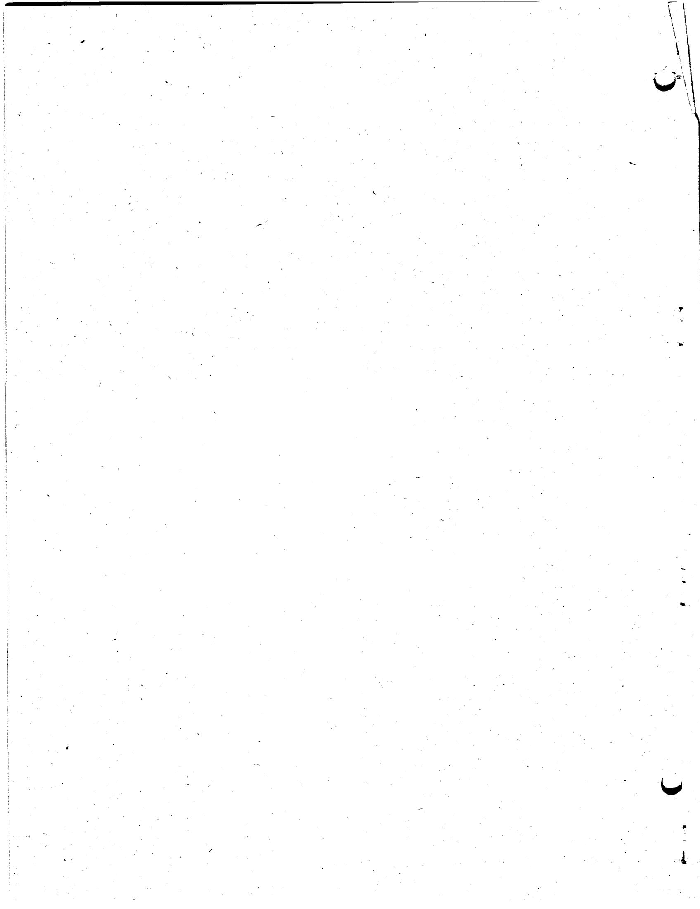

# ORNL-4148

# UC-80 - Reactor Technology

# INTERNAL DISTRIBUTION

1. Biology Library   
2-4. Central Research Library   
5-6. ORNL - Y-12 Technical Library Document Reference Section

7-40. Laboratory Records Department   
41. Laboratory Records, ORNL R.C.   
42. R. E. Adams   
43. C. F. Baes   
44. C. D. Baumann   
45. R. L. Bennett   
46. E. S. Bettis   
47. H. Beutler   
48. F. F. Blankenship   
49. C. M. Blood   
50. E. G. Bohlmann   
51. G.E. Boyd   
52. R. B. Briggs   
53. H. R. Bronstein   
54. T. J. Burnett   
55. M. M. Chiles   
56. W.H. Cook   
57. S. J. Cromer   
58. F. L. Culler   
59. W. Davis, Jr.   
60. S. J. Ditto   
61. W. P. Eatherly

62-71. R. B. Evans III

72. J. I. Federer   
73. D. E. Ferguson   
74. S.H. Freid   
75. M. Fontana   
76. W. R. Grimes   
77. A. G. Grindell   
78. R. P. Hammond   
79. W. O. Harms   
80. P. N. Haubenreich   
81. G.H.Jenks   
82. P. R. Kasten   
83. R. J. Kedl

84. G. W. Keilholtz   
85. C. R. Kennedy   
86. M. E. Lackey   
87. C. E. Larson   
88. T. B. Lindemer   
89. R. A. Lorenz   
90. H. G. MacPherson   
91. R. E. MacPherson

92-101. A. P. Malinauskas   
02. H. E. McCoy   
03. J. P. Moore   
04. R. L. Moore   
05. E. L. Nicholson   
06. L. C. Oakes   
07. M. F. Osborne   
08. R. B. Parker   
09. A. M. Perry   
10. M. W. Rosenthal

111-119. J. L. Rutherford   
20. D. Scott   
21. C. E. Sessions   
22. O. Sisman   
23. M. J. Skinner   
24. J. R. Tallackson   
25. R. E. Thoma   
26. D. B. Trauger   
27. J.L. Wantland   
28. G.M. Watson   
29. A. M. Weinberg   
30. J. R. Weir   
31. R.C.Weir   
32. M. E. Whatley   
33. J. C. White   
34. R. P. Wichner   
35. Norman Hackerman (consultant)   
36. J. L. Margrave (consultant)   
37. H. Reiss (consultant)   
38. R. C. Vogel (consultant)

# EXTERNAL DISTRIBUTION

139. J. A. Swartout, Union Carbide Corporation, New York

140-417. Given distribution as shown in TID-4500 under Reactor Technology category (25 copies-CFSTI)