ORNL-4191

UC-80 - Reactor Technology

HOLT TENS SALT REACTOR PROGRAM

SEMIANNUAL PROGRESS REPORT

FOR PERIOD ENDING AUGUST 31, 1967

Crlf Flows of Mottic Bacchetti

D

4

DID NOT TRANSFER TO AND THEN PERSON

If x - mth someone does not see this

#

tis a long well organized text

OAK RIDGE NATIONAL LABORATORY

operated by

UNION CARBIDE CORPORATION

for the

U.S. ATOMIC ENERGY COMMISSION

Printed in the United States of America. Available from Clearinghouse for Federal Scientific and Technical Information, National Bureau of Standards, U.S. Department of Commerce, Springfield, Virginia 22151 Price: Printed Copy $3.00; Microliche $2.65

# LEGAL NOTICE

This report was prepared as an account of Government sponsored work. Neither the United States, nor the Commission, nor any person acting on behalf of the Commission:

A. Make any warranty or representation, expressed or implied, with respect to the accuracy, completeness, or usefulness of the information contained in this report, or that the use of any information, apparatus, method, or process disclosed in this report may not infringe privately owned rights; or   
B. Assumes any liabilities with respect to the use of, or for damages resulting from the use of any information, apparatus, method, or process disclosed in this report.

As used in the above, "person dating on behalf of the Commission" includes any employee or contractor of the Commission, or employee of such contractor, to the extent that such employee or contractor of the Commission, or employee of such contractor prepares, disseminates, or provides access to, any information pursuant to his employment or contract with the Commission, or his employment with such contractor.

Contract No. W-7405-eng-26

# MOLTEN-SALT REACTOR PROGRAM

# SEMIANNUAL PROGRESS REPORT

# For Period Ending August 31, 1967

M. W. Rosenthal, Program Director   
R. B. Briggs, Associate Director   
P. R. Kasten, Associate Director

DECEMBER 1967

OAK RIDGE NATIONAL LABORATORY

Oak Ridge, Tennessee

operated by

UNION CARBIDE CORPORATION

for the

U.S. ATOMIC ENERGY COMMISSION

This report is one of a series of periodic reports in which we describe briefly the progress of the program. Other reports issued in this series are listed below. ORNL-3708 is an especially useful report, because it gives a thorough review of the design and construction and supporting development work for the MSRE. It also describes much of the general technology for molten-salt reactor systems.

ORNL-2474 Period Ending January 31, 1958

ORNL-2626 Period Ending October 31, 1958

ORNL-2684 Period Ending January 31, 1959

ORNL-2723 Period Ending April 30, 1959

ORNL-2799 Period Ending July 31, 1959

ORNL-2890 Period Ending October 31, 1959

ORNL-2973 Periods Ending January 31 and April 30, 1960

ORNL-3014 Period Ending July 31, 1960

ORNL-3122 Period Ending February 28, 1961

ORNL-3215 Period Ending August 31, 1961

ORNL-3282 Period Ending February 28, 1962

ORNL-3369 Period Ending August 31, 1962

ORNL-3419 Period Ending January 31, 1963

ORNL-3529 Period Ending July 31, 1963

ORNL-3626 Period Ending January 31, 1964

ORNL-3708 Period Ending July 31, 1964

ORNL-3812 Period Ending February 28, 1965

ORNL-3872 Period Ending August 31, 1965

ORNL-3936 Period Ending February 28, 1966

ORNL-4037 Period Ending August 31, 1966

ORNL-4119 Period Ending February 28, 1967

# Contents

INTRODUCTION 1

SUMMARY 3

# PART 1. MOLTEN-SALT REACTOR EXPERIMENT

1.MSRE OPERATIONS 13

1.1 Chronological Account of Operations and Maintenance 13

1.2 Reactivity Balance 19

Balances at Power 19

Balances at Zero Power 21

1.3 Thermal Effects of Operation 22

Radiation Heating 22

Thermal Cycle History 22

Temperature Measurement 22

Fuel Salt Afterheat 24

1.4 Equipment Performance 25

Heat Transfer 25

Main Blowers 26

Radiator Enclosure 26

Off-Gas Systems 27

Cooling Water Systems 29

Component Cooling System 29

Salt Pump Oil Systems 30

Electrical System 31

Heaters 31

Control Rods and Drives 31

Salt Samplers 31

Containment 33

2. COMPONENT DEVELOPMENT 36

2.1 Off-Gas Sampler 36

2.2 Remote Maintenance 36

Preparations for Shutdown After Run 11 36

Evaluation of Remote Maintenance After Run 11 37

Repair of Sampler-Enricher and Recovery of Latch 37

2.3 Decontamination Studies 40

2.4 Development of a Scanning Device for Measuring the Radiation Level of Remote Sources 40  
Experiment with a 5-curie $^{137}\mathrm{Cs}$ Gamma Source 41  
Gamma Scan of the MSRE Heat Exchanger 43  
Gamma Energy Spectrum Scan of the MSRE Heat Exchanger 43   
2.5 Pumps 45  
Mark-2 Fuel Pump 45  
Spare Rotary Elements for MSRE Fuel and Coolant Salt Pumps 45  
Stress Tests of Pump Tank Discharge Nozzle Attachment 46  
MSRE Oil Pumps 46  
Oil Pump Endurance Test 46

# 3. INSTRUMENTS AND CONTROLS 47

3.1 MSRE Operating Experience 47  
Control System Components 47  
Nuclear Instruments 47  
Safety System 48   
3.2 Control System Design 48

# 4.MSRE REACTOR ANALYSIS 50

4.1 Introduction 50   
4.2 Neutron Energy Spectra in MSRE and MSBR 50   
4.3 Other Neutronic Characteristics of MSRE with $^{233}\mathrm{U}$ Fuel 54  
Critical Loading, Rod Worth, and Reactivity Coefficients 54  
Fission Rate and Thermal Flux Spatial Distributions 55  
Reactor-Average Fluxes and Reaction Cross Sections 55  
Effect of Circulation on Delayed-Neutron Precursors 58  
Samarium Poisoning Effects 60   
4.4 MSRE Dynamics with $^{233}\mathrm{U}$ Fuel 61

# PART 2. MSBR DESIGN AND DEVELOPMENT

# 5. DESIGN 63

5.1 General 63   
5.2 Cell Arrangement 65   
5.3 Reactor 71   
5.4 Fuel Heat Exchanger 76   
5.5 Blanket Heat Exchanger 76   
5.6 Fuel Drain Tanks 79   
5.7 Blanket and Coolant Salt Drain Tanks 79   
5.8 Steam Generator-Superheater and Reheater 81

# 6. REACTOR PHYSICS 82

6.1 MSBR Physics Analysis 82  
Optimization of Reactor Parameters 82  
Useful Life of Moderator Graphite 84  
Flux Flattening 87  
Temperature Coefficients of Reactivity 88

# 7. SYSTEMS AND COMPONENTS DEVELOPMENT 90

7.1 Noble-Gas Behavior in the MSBR 90   
7.2 MSBR Fuel Cell Operation with Molten Salt 95   
7.3 Sodium Fluoroborate Circulating Loop Test 95   
7.4 MSBR Pumps 96

Survey of Pump Experience Circulating Liquid Metals and Molten Salts 96   
Introduction of MSBR Pump Program 96   
Fuel and Blanket Salt Pumps 97   
Coolant Salt Pumps 99   
Water Pump Test Facility 99   
Molten-Salt Bearing Tests 100   
Rotor-Dynamics Feasibility Investigation 100   
Other Molten-Salt Pumps 101

# PART 3. CHEMISTRY

# 8. CHEMISTRY OF THE MSRE 102

8.1 MSRE Salt Composition and Purity 102   
Fuel Salt 103   
Coolant Salt 103   
Flush Salt 103   
Implications of Current Experience in Future Operations 108   
8.2 MSRE Fuel Circuit Corrosion Chemistry 110   
8.3 Adjustment of the UF 3 Concentration of the Fuel Salt 110

# 9. FISSION PRODUCT BEHAVIOR IN THE MSRE 116

9.1 Fission Products in MSRE Cover Gas 116   
9.2 Fission Products in MSRE Fuel 119   
9.3 Examination of MSRE Surveillance Specimens After 24,000 Mwhr 121

Examination of Graphite 121   
Examination of Hastelloy N 124   
Fission Product Distribution in MSRE 125

9.4 Deposition of Fission Products from MSRE Gas Stream on Metal Specimens 128   
9.5 Deposition of Fission Products on Graphites in MSRE Pump Bowl 131

# 10. STUDIES WITH LiF-BeF, MELTS 136

10.1 Oxide Chemistry of $\mathrm{ThF}_4\text{-UF}_4$ Melts 136   
10.2 Containment of Molten Fluorides in Silica 137

Chemistry 137   
Spectrophotometric Measurements with Silica Cells 139

10.3 Electrical Conductivity of Molten Fluorides and Fluoroborates 140

# 11. BEHAVIOR OF MOLYBDENUM FLUORIDES 142

11.1 Synthesis of Molybdenum Fluorides 142   
11.2 Reaction of Molybdenum Fluorides with Molten $\mathbf{LiF - BeF}_2$ Mixtures 143   
11.3 Mass Spectrometry of Molybdenum Fluorides 144

12. SEPARATION OF FISSION PRODUCTS AND OF PROTACTINIUM FROM MOLTEN FLUORIDES 148

12.1 Extraction of Protactinium from Molten Fluorides into Molten Metals 148   
12.2 Stability of Protactinium-Bismuth Solutions Contained in Graphite 149   
12.3 Attempted Electrolytic Deposition of Protactinium 151   
12.4 Protactinium Studies in the High-Alpha Molten-Salt Laboratory 153  
Reduction of Iron Dissolved in Molten LiF-ThF 4 153  
Thorium Reduction in the Presence of an Iron Surface (Brillo Process) 153  
Thorium Reduction Followed by Filtration 154  
Conclusion 154   
12.5 MSBR Fuel Reprocessing by Reductive Extraction into Molten Bismuth 154   
12.6 Reductive Extraction of Cerium from $\mathrm{LiF - BeF}_2$ (66-34 Mole %) into Pb-Bi Eutectic Mixture 156

13. BEHAVIOR OF $\mathrm{BF}_3$ AND FLUOROBORATE MIXTURES 158

13.1 Phase Relations in Fluoroborate Systems 158   
13.2 Dissociation Vapor Pressures in the $\mathrm{NaBF}_4$ -NaF System 159   
13.3 Reactions of Fluoroborates with Chromium and Other Hastelloy N Constituents 161  
Apparent Mass Transfer of Nickel 163   
13.4 Reaction of $\mathrm{BF}_3$ with Chromium Metal at $650^{\circ}\mathrm{C}$ 163   
13.5 Compatibility of $\mathbf{BF}_3$ with Gulfspin-35 Pump Oil at $150^{\circ}\mathrm{F}$ 164

14. DEVELOPMENT AND EVALUATION OF ANALYTICAL METHODS FOR MOLTEN-SALT REACTORS 166

14.1 Determination of Oxide in MSRE Salts 167   
14.2 Determination of $\mathbf{U}^{3+}$ in Radioactive Fuel by a Hydrogen Reduction Method 167   
14.3 In-Line Test Facility 169   
14.4 Electroreduction of Uranium(IV) in Molten LiF-BeF $_2$ -ZrF $_4$ at Fast Scan Rates and Short Transition Times 169   
14.5 Spectrophotometric Studies of Molten Fluoride Salts 171   
14.6 Analysis of Off-Gas from Compatibility Tests of MSRE Pump Oil with $\mathbf{BF}_3$ 172   
14.7 Development of a Gas Chromatograph for the MSRE Blanket Gas 172

# PART 4. MOLTEN-SALT IRRADIATION EXPERIMENTS

15. MOLTEN-SALT CONVECTION LOOP IN THE ORR 176

15.1 Loop Description 176   
15.2 Operation 177   
15.3 Operating Temperatures 179   
15.4 Salt Circulation by Convection 180   
15.5 Nuclear Heat, Neutron Flux, and Salt Power Density 180   
15.6 Corrosion 181

15.7 Oxygen Analysis 182   
15.8 Crack in the Core Outlet Pipe 182   
15.9 Cutup of Loop and Preparation of Samples 184   
15.10 Metallographic Examination 185   
15.11 Isotope Activity Calculation from Flux and Inventory History 187   
15.12 Isotope Activity Balance 190   
15.13 Uranium-235 Observed in Graphite Samples 190   
15.14 Penetration of Fission Products into Graphite and Deposition onto Surfaces 192   
15.15 Gamma Irradiation of Fuel Salt in the Solid Phase 193

# PART 5. MATERIALS DEVELOPMENT

16.MSRESURVEILLANCEPROGRAM 196

16.1 General Description of the Surveillance Facility and Observations on Samples Removed 196   
16.2 Mechanical Properties of the MSRE Hastelloy N Surveillance Specimens 200

17. GRAPHITE STUDIES 208

17.1 Materials Procurement and Property Evaluation 208   
17.2 Graphite Surface Sealing with Metals 211   
17.3 Gas Impregnation of MSBR Graphites 212   
17.4 Irradiation of Graphite 215

18. HASTELLOY N STUDIES 217

18.1 Improving the Resistance of Hastelloy N to Radiation Damage by Composition Modifications 217   
18.2 Aging Studies on Titanium-Modified Hastelloy N 217   
18.3 Phase Identification Studies in Hastelloy N 219   
18.4 Hot-Ductility Studies of Zirconium-Bearing Modified Hastelloy N 221   
18.5 Residual Stress Measurements in Hastelloy N Welds 223   
18.6 Corrosion Studies 226  
Fuel Salts 226  
Coolant Salts 227  
Equipment Modifications 230   
18.7 Titanium Diffusion in Hastelloy N 230   
18.8 Hastelloy N-Tellurium Compatibility 233

19. GRAPHITE-TO-METAL JOINING 236

19.1 Brazing of Graphite to Hastelloy N 236  
Joint Design 236  
Brazing Development 237   
19.2 Compatibility of Graphite-Molybdenum Brazed Joints with Molten Fluoride Salts 237

# PART 6. MOLTEN-SALT PROCESSING AND PREPARATION

20. VAPOR-LIQUID EQUILIBRIUM DATA IN MOLTEN-SALT MIXTURES 239   
21. RELATIVE VOLATILITY MEASUREMENT BY THE TRANSPRATION METHOD 242   
22. DISTILLATION OF MSRE FUEL CARRIER SALT 243   
23. STEADY-STATE FISSION PRODUCT CONCENTRATIONS AND HEAT GENERATION IN AN MSBR AND PROCESSING PLANT 245

Heat Generation in a Molten-Salt Still 247

24. REDUCTIVE EXTRACTION OF RARE EARTH'S FROM FUEL SALT 248   
25. MODIFICATIONS TO MSRE FUEL PROCESSING FACILITY FOR SHORT DECAY CYCLE 251   
26. PREPARATION OF $^{233}\mathrm{UF}_{4}$ - $^{7}\mathrm{LiF}$ FUEL CONCENTRATE FOR THE MSRE 252

Process 252   
Equipment and Operations 252   
Status 253

# Introduction

The objective of the Molten-Salt Reactor Program is the development of nuclear reactors which use fluid fuels that are solutions of fissile and fertile materials in suitable carrier salts. The program is an outgrowth of the effort begun 17 years ago in the Aircraft Nuclear Propulsion (ANP) program to make a molten-salt reactor power plant for aircraft. A molten-salt reactor - the Aircraft Reactor Experiment - was operated at ORNL in 1954 as part of the ANP program.

Our major goal now is to achieve a thermal breeder reactor that will produce power at low cost while simultaneously conserving and extending the nation's fuel resources. Fuel for this type of reactor would be $^{233}\mathrm{UF}_4$ or $^{235}\mathrm{UF}_4$ dissolved in a salt of composition near 2LiF-BeF $_2$ . The blanket would be $\mathrm{ThF}_4$ dissolved in a carrier of similar composition. The technology being developed for the breeder is also applicable to advanced converter reactors.

Our major effort at present is being applied to the operation of the Molten-Salt Reactor Experiment (MSRE). This reactor was built to test the types of fuels and materials that would be used in thermal breeder and converter reactors and to provide experience with the operation and maintenance of a molten-salt reactor. The experiment is demonstrating on a small scale the attractive features and the technical feasibility of these systems for large civilian power reactors. The MSRE operates at $1200^{\circ}\mathrm{F}$ and at atmospheric pressure and produces about 7.5 Mw of heat. Initially, the fuel contains 0.9 mole $\%$ UF $_4$ , 5 mole $\%$ ZrF $_4$ , 29 mole $\%$ BeF $_2$ , and 65 mole $\%$ LiF, and the uranium is about $33\%$ $^{235}\mathrm{U}$ . The melting point is $840^{\circ}\mathrm{F}$ . In later operation we expect to use $^{233}\mathrm{U}$ in the lower concentration typical of the fuel for a breeder.

The fuel circulates through a reactor vessel and an external pump and heat exchange system. All this equipment is constructed of Hastelloy N, a

nickel-molybdenum-chromium alloy with exceptional resistance to corrosion by molten fluorides and with high strength at high temperature. The reactor core contains an assembly of graphite moderator bars that are in direct contact with the fuel. The graphite is new material of high density and small pore size. The fuel salt does not wet the graphite and therefore does not enter the pores, even at pressures well above the operating pressure.

Heat produced in the reactor is transferred to a coolant salt in the heat exchanger, and the coolant salt is pumped through a radiator to dissipate the heat to the atmosphere. A small facility installed in the MSRE building will be used for processing the fuel by treatment with gaseous HF and $\mathbf{F}_{2}$ .

Design of the MSRE started early in the summer of 1960, and fabrication of equipment began early in 1962. The essential installations were completed and prenuclear testing was begun in August of 1964. Following prenuclear testing and some modifications, the reactor was taken critical on June 1, 1965, and zero-power experiments were completed early in July. After additional modifications, maintenance, and sealing of the containment, operation at a power of 1 Mw began in January 1966.

At the 1-Mw power level, trouble was experienced with plugging of small ports in control valves in the off-gas system by heavy liquid and varnish-like organic materials. These materials are believed to be produced from a very small amount of oil that leaks through a gasketed seal and into the salt in the tank of the fuel circulating pump. The oil vaporizes and accompanies the gaseous fission products and helium cover gas purge into the off-gas system. There the intense beta radiation from the krypton and xenon polymerizes some of the hydrocarbons, and the products plug small openings. This difficulty was largely

overcome by installing a specially designed filter in the off-gas line.

Full power - about 7.5 Mw - was reached in May. The plant was operated until the middle of July to the equivalent of about six weeks at full power, when one of the radiator cooling blowers - which were left over from the ANP program - broke up from mechanical stress. While new blowers were being procured, an array of graphite and metal surveillance specimens was taken from the core and examined.

Power operation was resumed in October with one blower; then in November the second blower was installed, and full power was again attained. After a shutdown to remove salt that had accidentally gotten into an off-gas line, the MSRE was operated in December and January at full power for 30 days without interruption. A fourth power run was begun later in January and was continued for 102 days until terminated to remove a second set of graphite and metal specimens. The end of that run came almost a year after full power was first attained. In spite of the time required to replace the blowers, the load factor for that year was $50\%$ . An additional operating period of 46 days during the summer was interrupted for maintenance work on the sampler-enricher when the cable drive mechanism jamued.

The reactor has performed very well in most respects: the fuel has been completely stable, the fuel and coolant salts have not corroded the Hastelloy N container material, and there has been no detectable reaction between the fuel salt and the graphite in the core of the reactor. Mechanical difficulties with equipment have been largely confined to peripheral systems and auxiliaries. Except for the small leakage of oil into the pump bowl, the salt pumps have run flawlessly for over 14,000 hr. The reactor has been refueled twice, both times while operating at full power.

Because the MSRE is of a new and advanced type, substantial research and development effort is provided in support of the operation. Included are engineering development and testing of reactor components and systems, metallurgical development of materials, and studies of the chemistry of the salts and their compatibility with graphite and metals both in-pile and out-of-pile.

Conceptual design studies and evaluations are being made of large power breeder reactors that use the molten-salt technology. An increasing amount of research and development is being directed specifically to the requirements of two-region breeders, including work on materials, on the chemistry of fuel and blanket salts, and on processing methods.

# Summary

# PART 1. MOLTEN-SALT REACTOR EXPERIMENT

# 1. MSRE Operations

There were two long runs at full power during this report period. The first, run 11, began in January and lasted into May. After 102 consecutive days of nuclear operation (over $90\%$ of the time at full power), the reactor was shut down to retrieve and replace part of the graphite and metal specimens in the core. The six-week shutdown also included scheduled maintenance and annual tests of containment, instruments, and controls. Run 12 included 42 days in which the reactor was at full power continuously except for two brief periods after spurious screams. The run ended when the fuel sampler-enricher drive mechanism jammed, making it inoperative. The reactor was then shut down, the drive was removed, and the sampler latch, which had accidentally been severed from the cable, was retrieved from the fuel pump bowl.

During the long runs at high power, interest focused primarily on reactivity behavior and on fuel chemistry. Slow changes in reactivity due to fission product ingrowth and uranium burnup followed expectations, and no anomalous effect was observed outside the very narrow limits of precision of measurement $(\pm 0.02\% \delta k / k)$ . Over $2\mathrm{kg}$ of $^{235}\mathrm{U}$ was added to the fuel during full-power operation. The operation, using the sampler-enricher, demonstrated quick but smooth melting and mixing into the circulating fuel. Six additions of beryllium metal were made to the fuel during operation to maintain reducing conditions in the salt. Corrosion in the salt systems was practically nil, as evidenced by chromium analyses and examination of the core specimens. Studies of the behavior of certain fission products continued.

Component performance, on the whole, was very good. There was no deterioration of heat transfer

capability or evidence of unusual heat generation in the reactor vessel. Six thermocouples in the reactor cell began giving anomalous readings during run 11, but all other thermocouples showed no tendency to become less accurate. The new off-gas filter showed no increase in pressure drop and apparently remained quite efficient. Restrictions that built up slowly at the main charcoal bed inlets were effectively cleared by the use of built-in heaters. While the reactor was down in May for sample removal, two conditions that had existed for some time were remedied: an inoperative position indicator on a control rod drive and a leaking space cooler in the reactor cell were replaced.

Until the sampler failure at the end of run 12, the only delays in the experimental program due to equipment difficulties were brief ones caused by the main blowers and a component cooling pump. A main blower bearing was replaced in run 11, and shortly after the start of run 12 a main blower motor mount was stiffened to alleviate a resonance condition. Also at the start of run 12, low oil pressure made a component coolant pump inoperative until the relief valve was replaced. Secondary containment leakage remained well within prescribed limits, and there was no leakage from primary systems during operation. During the six-month period, the reactor was critical $2925\mathrm{hr}$ (66% of the time), and the integrated power increased by 2597 to a total of 5557 equivalent full-power hours.

# 2. Component Development

Extensive preparations were made for remote maintenance in the May-June shutdown, including training of 30 craftsmen and foremen. Work proceeded during the shutdown on two shifts. Procedures and tools prepared in advance worked well in replacing core specimens, repairing a control-rod

drive, replacing a reactor cell space cooler, and inspecting equipment in the reactor cell.

When the sampler became inoperative, preparations were first made for shielding and containment during replacement of the mechanism and retrieval of the latch. The mechanism was then removed, and a maintenance shield was set up for the latch retrieval. Various long, flexible tools were designed and tested in a mockup before use in the sampler tube. The latch was grasped readily, but difficulties were encountered in bringing it up until a tool was designed that enclosed the upper end of the latch. Tools removed from the sampler tube were heavily contaminated, and a shielded carrier with disposable liner was devised to handle them. The sample capsule had broken loose from the latch and cable and was left in the pump bowl after an effort to retrieve it with a magnet failed. The sampler repair and capsule retrieval were accomplished without spread of contamination and with very moderate radiation exposures.

A sampler manipulator was successfully decontaminated for reuse in a test of decontamination methods.

A scheme for mapping and identifying fission product sources remotely was tested in the reactor cell during the May shutdown. A lead-tube collimator and an ionization chamber mounted in the movable maintenance shield were used to map gamma-ray sources in the heat exchanger and adjacent piping; then a collimator and a gamma energy spectrometer were used to characterize the source at various points. Results were promising.

Installation of the off-gas sampler was delayed when the valve manifold had to be rebuilt because of imperfect Monel-stainless steel welds.

Stress tests on a Mark-1 pump tank nozzle were completed. Results compared favorably with calculated stresses, and the design was judged adequate. The Mark-2 replacement fuel pump tank for the MSRE was completed, and preparations for a test with salt proceeded.

Oil pumps removed from the MSRE were repaired and tested. A replacement rotary element for the coolant salt pump was modified by seal welding a mechanical seal that might have become a path for oil leakage to the pump bowl.

# 3. Instruments and Controls

During the May shutdown a complete functional check of instrumentation and control systems was made. Preventive maintenance at that time included

modifying 139 relays and replacing capacitors in 33 electronic control modules. The type of component failures that occurred did not compromise safety or cause excessive inconvenience. Four of the eight neutron chambers were replaced, one because of a short and three because of moisture inleakage.

Separate power supplies were installed for each safety channel to improve continuity of operation and preclude a single compromising failure.

Various other modifications to circuits or components were made to provide more information, to improve performance, or to increase protection.

# 4. MSRE Reactor Analysis

As part of planning for future operation of the MSRE, computational studies were made of the neutronic properties of the reactor with $^{233}\mathrm{U}$ in the fuel salt instead of the present $^{235}\mathrm{U}$ (33% enriched). The neutron energy spectrum was computed and compared in detail with that for a core-lattice design being considered for a molten-salt breeder reactor. The strong similarities indicate that the results of the MSRE experiment will be useful in evaluating design methods for the MSBR. Other computations were made, with the following results. The critical loading will be 33 kg of $^{233}\mathrm{U}$ , compared with 70 kg of $^{235}\mathrm{U}$ in the first critical experiment. Control rod worth will be higher by a factor of about 1.3. The important reactivity coefficients will also be considerably larger than with $^{235}\mathrm{U}$ fuel. The thermal-neutron flux will be up by more than a factor of 2, and the steady-state samarium concentrations will consequently be lower. Since more samarium will be left in the salt from $^{235}\mathrm{U}$ operation, it will act at first as a burn-able poison, causing the reactivity to rise for several weeks despite $^{233}\mathrm{U}$ burnup. Fission power densities and importance functions will be similar to those for $^{235}\mathrm{U}$ fuel. The effective delayed-neutron fraction in the static system will be 0.0026, decreasing to 0.0017 when fuel circulation starts. (Corresponding fractions for $^{235}\mathrm{U}$ are 0.0067 and 0.0046.)

The dynamic behavior with $^{233}\mathrm{U}$ was also analyzed from the standpoint of the inherent stability of the system. Because of the small delayed-neutron fraction, the neutron level responds more sensitively to changes in reactivity, but the response of the total system is such that the margins of inherent stability are greater with $^{233}\mathrm{U}$ fuel.

# PART 2. MSBR DESIGN AND DEVELOPMENT

# 5. Design

The conceptual design work on molten-salt breeder reactors during the past six months has been concerned largely with a general advance in the design of cells, containment, piping, and components, and with stress analysis. In addition, major effort has been devoted to preparation and evaluation of a reactor design in which the average core power density is reduced to $20\mathrm{kw / liter}$ from the $40\mathrm{kw / liter}$ we were using during the previous reporting period. At this lower power density the core life before replacement is required would be adequate even if the graphite behavior under irradiation is no better than that which has been achieved to date. The performance at the lower power density is more nearly representative of current technology, and better performance should be achievable as better graphite is developed. Going from 40 to $20\mathrm{kw / liter}$ increases the capital cost by $\$6/kwhr$ (electrical). No new design work was performed on the steam system, but all salt systems (fuel, blanket, and coolant) have been investigated more thoroughly than has been done heretofore. Afterheat removal and thermal shield cooling have been evaluated.

# 6. Reactor Physics

Parametric studies have been carried out which reveal the dependence of MSBR performance on such key design features as the average core power density. They indicate that the power density may be reduced from $80\mathrm{w / cm}^3$ to $20\mathrm{w / cm}^3$ with a penalty not greater than $2\%$ /year in annual fuel yield or 0.1 mill/kwhr (electrical) in power cost. At $20\mathrm{w / cm}^3$ the life of the graphite will be in excess of ten years.

Studies of power flattening in the MSBR core show that a maximum-to-average power density ratio of 2 or less can be achieved with no loss of performance.

Calculations of temperature coefficients of reactivity show that the large negative component due to fuel expansion is dominant, and yield an overall temperature coefficient of $-4.3 \times 10^{-5} / ^{\circ}\mathrm{C}$ .

# 7. Systems and Components Development

An analytical model was developed to compute the steady-state migration of noble gases to the

graphite and other sinks in the MSBR. Work done to date indicates that the mass transfer coefficient from the circulating salt to the graphite is more important than the diffusion coefficient of xenon in graphite in minimizing the poisoning due to xenon migration to the graphite. In addition, the work has shown that removal of xenon from molten-salt fuels is strongly controlled by the mass transfer coefficient to entrained gas bubbles as well as by the surface area of those bubbles. Studies indicate that the xenon poison fraction in the MSBR is greater than $0.5\%$ with the parameter values considered previously and that the poison fraction may be about $1\%$ with those parameters. The xenon poisoning can be decreased slightly by increasing the surface area of once-through bubbles, decreased significantly by increasing the surface area of recirculating bubbles, decreased significantly by increasing the mass transfer coefficient to circulating bubbles, decreased proportionately by reducing the graphite surface area exposed to salt, and decreased significantly if the diffusion coefficient of xenon into graphite can be decreased to $10^{-7}$ ft $^2$ /hr or less. Similar studies of the afterheat in the graphite from the disintegration of the radioactive noble gases and their decay products show that the afterheat is affected by a variation of the parameters in very much the same manner as the xenon poisoning.

An experimental program was started to provide an early demonstration of the compatibility of a full-sized graphite fuel cell with a flowing salt stream. The cell will include the graphite-to-graphite and the graphite-to-metal joints.

As part of a program to qualify sodium fluoro-borate $\left(\mathrm{NaBF}_{4}\right)$ for use as a coolant for the MSBR, an existing MSRE-scale loop is being prepared to accept $\mathrm{NaBF}_{4}$ as the circulating medium under isothermal conditions. The principal alterations are to the cover gas system, to include the equipment necessary for handling and controlling the required overpressure of $\mathrm{BF}_{3}$ . The objective will be to uncover any problems associated with the circulation of $\mathrm{NaBF}_{4}$ and to devise and test suitable solutions or corrective measures.

A report was issued of a survey of experience with liquid-metal and molten-salt pumps. An approach to producing the breeder salt pumps, which invites the strong participation of U.S. industry, was evolved. The dynamic response and critical speeds for preliminary layouts of the MSBR fuel salt pump are being calculated, and a survey of fabrication methods applicable to the pump is being

made. Preliminary layouts are being made of molten-salt bearing and water pump test facilities for the MSBR fuel salt pump. The pump with the molten-salt bearing was fitted with a new salt bearing and a modified gimbals support and was satisfactorily tested with oil.

# PART 3. CHEMISTRY

# 8. Chemistry of the MSRE

Results of regular chemical analyses of MSRE fuel, coolant, and flush salts showed that after 40,000 Mwhr of power operation generalized corrosion in the fuel and coolant circuits is practically absent and that the salts are currently as pure as when charged into the reactor. Although statistically satisfactory, fuel composition analyses are much less sensitive to variations in uranium concentration than is the reactivity balance, and improved methods will be required for future MSR fuels whose uranium concentrations need to be only 0.25 that of the MSRE fuel salt.

A program for adjusting the relative concentration of $\mathrm{U}^{3+}/\Sigma \mathrm{U}$ to approximately $1.5\%$ by addition of small amounts of beryllium metal to the MSRE fuel was completed. Specimens of fuel salt taken from the pump bowl during this program showed occasional temporary perturbation in the chromium concentration, giving evidence that the identity and concentrations of the phases present at the salt-gas interface of the pump bowl are not necessarily typical of the salt in the fuel circuit.

# 9. Fission Product Behavior in the MSRE

A second set of graphite and Hastelloy N long-term surveillance specimens, exposed to fissioning molten salt in the MSRE core for 24,000 Mwhr, was examined and analyzed. As for the first set, exposed for 7800 Mwhr, examination revealed no evidence of chemical damage to the graphite and metal. Very similar fission product behavior was observed, with heavy deposition of the noble-metal fission products - $^{99}\mathrm{Mo}$ , $^{132}\mathrm{Te}$ , $^{103}\mathrm{Ru}$ , $^{106}\mathrm{Ru}$ , $^{95}\mathrm{Nb}$ , and $^{111}\mathrm{Ag}$ on both metal and graphite specimens. A refined method of sampling of the graphite surfaces showed that about $99\%$ of the $^{99}\mathrm{Mo}$ , $^{95}\mathrm{Nb}$ , $^{103}\mathrm{Ru}$ , and $^{106}\mathrm{Ru}$ was deposited within the outer 2 mils of the surface. By contrast, appreciable fractions of the $^{132}\mathrm{Te}$ , $^{95}\mathrm{Zr}$ ,

$^{140}\mathrm{Ba}$ , and ${}^{89}\mathrm{Sr}$ penetrated 50 mils or farther into the graphite.

Ten additional exposures of metal specimens in the MSRE pump bowl and five additional samplings of pump bowl cover gas were carried out. The results from tests under normal operating conditions were similar to those of previous tests; they showed heavy depositions of noble metals on specimens exposed to the cover gas and the fuel phase. Of special interest were the observations under unusual operating conditions: nearly as much deposition occurred after reactor shutdown with the fuel pump stopped and with the reactor drained as occurred under normal conditions.

Analysis of the time dependence of fission product deposition on Hastelloy N indicated that there was a short-term rapid process that reached saturation in about 1 min and a long-term process that proceeded at slow constant rate for over 3000 hr. Results from only three exposures of graphite specimens indicated that deposition rate decreased with exposure time for long exposures.

# 10. Studies with LiF-BeF $_2$ Melts

Equilibrium data have been obtained for the reaction

$$
\begin{array}{l} \mathrm {U} ^ {4 +} (\mathrm {f}) + \mathrm {T h} ^ {4 +} (\mathrm {o}) \rightleftharpoons \mathrm {T h} ^ {4 +} (\mathrm {f}) + \mathrm {U} ^ {4 +} (\mathrm {o}); \\ K = \frac {(\mathrm {X} _ {\mathrm {T h}}) _ {\mathrm {f}} (\mathrm {X} _ {\mathrm {U}}) _ {\mathrm {o}}}{(\mathrm {X} _ {\mathrm {T h}}) _ {\mathrm {o}} (\mathrm {X} _ {\mathrm {U}}) _ {\mathrm {f}}} , \\ \end{array}
$$

where (f) indicates that the species is dissolved in molten $2\mathrm{LiF}\cdot \mathrm{BeF}_2$ and (o) indicates that the species is in the sparingly soluble oxide solid solution $(\mathbf{U},\mathbf{Th})\mathbf{O}_2$ . These data show that, over the interval 0.2 to 0.9 for mole fraction uranium in the oxide phase and 0.01 to 0.07 for mole fraction $\mathrm{Th}^{4 + }$ in the molten fluoride, the equilibrium constant is in excess of 1000. Uranium is strongly extracted from the fluoride phase to the oxide solid solution. It seems very likely that protactinium is even more strongly extracted. If so, equilibration of an LiF-BeF- $\mathrm{ThF_4 - UF_4 - PaF_4}$ melt with the proper (stable) $(\mathbf{U},\mathbf{Th})\mathbf{O}_2$ solid solution should remove protactinium. Recovery of $^{233}\mathrm{Pa}$ from a one-region breeder fuel would, accordingly, be possible.

Vitreous silica $(\mathrm{SiO}_2)$ has been shown to be a feasible container material for LiF-BeF2 melts,

especially when the system is stabilized by a small overpressure of $\mathrm{SiF}_4$ . Preliminary measurements have shown that the solubility of $\mathrm{SiF}_4$ in $2\mathrm{LiF}\cdot \mathrm{BeF}_2$ is moderately low (about 0.035 mole of $\mathrm{SiF}_4$ per kilogram of melt per atmosphere of $\mathrm{SiF}_4$ ) at $550^{\circ}\mathrm{C}$ and at least threefold less at $700^{\circ}\mathrm{C}$ . No evidence for silicon oxyfluorides has been observed. It appears that, at least for temperatures near $500^{\circ}\mathrm{C}$ and for short times, an electrically insulating and optically transparent container for $\mathrm{LiF - BeF}_2$ solutions is available.

Optical cells of transparent $\mathrm{SiO}_2$ have been used to establish, with a Cary model 14M spectrophotometer, that solutions of $\mathbf{U}\mathbf{F}_{4}$ in 2LiF $\cdot$ BeF $_2$ under $400\mathrm{mm}$ of $\mathrm{SiF}_4$ were stable for $48\mathrm{hr}$ at temperatures up to $700^{\circ}\mathrm{C}$ . These studies have led to a considerably more precise definition of molar absorptivity of $\mathbf{U}^{4+}$ as a function of temperature and incident wavelength than had previously been possible with windowless optical cells. In similar spectrophotometric studies with silica cells, the solubility at $550^{\circ}\mathrm{C}$ of $\mathrm{Cr}^{3+}$ in 2LiF $\cdot$ BeF $_2$ was shown to be at least $0.43\mathrm{mole\%}$ .

Silica apparatus has also been shown to be feasible for studies of electrical conductivity of $2\mathrm{LiF - BeF}_2$ of the $\mathrm{LiF - ThF_4}$ eutectic mixture, and of $\mathrm{NaBF}_4$ . Preliminary values obtained in this study are to be refined in the near future by use of an improved cell design which will provide a much longer current path length through the melts.

# 11. Behavior of Molybdenum Fluorides

Molybdenum hexafluoride, the only commercially available fluoride of this element, has been used as raw material for preparation of $\mathsf{MoF}_5$ and $\mathsf{MoF}_3$ . Direct reduction of $\mathsf{MoF}_6$ by molybdenum metal in glass apparatus at 30 to $100^{\circ}\mathrm{C}$ yields, as shown by other investigators, $\mathsf{MoF}_5$ of good quality. Disproportionation of $\mathsf{MoF}_5$ under vacuum at $200^{\circ}\mathrm{C}$ yields pure $\mathsf{MoF}_3$ as the solid residue; we have prepared several samples of the material by this method, which seems not to have been described before. The $\mathsf{MoF}_3$ reacts on heating with LiF to form at least two binary compounds; the optical and x-ray characteristics of these materials have been determined, but their stoichiometry has not yet been established.

Molybdenum hexafluoride has been shown to react rapidly with $\mathbf{U}\mathbf{F}_{3}$ in $\mathrm{LiF - BeF}_2$ solution and with nickel in contact with such solutions. Molybdenum trifluoride has been shown to be relatively

stable when heated to $700^{\circ}\mathrm{C}$ under its vapor in sealed capsules of nickel or copper. However, when such heating is done in the presence of $2\mathrm{LiF} \cdot \mathrm{BeF}_2$ , the $\mathrm{MoF}_3$ reacts readily with nickel, yielding $\mathrm{NiF}_2$ and Mo; the reaction is less marked if the capsule is of copper. Molybdenum trifluoride has been shown to react completely at $500^{\circ}\mathrm{C}$ with $\mathrm{UF}_3$ in $\mathrm{LiF} \cdot \mathrm{BeF}_2$ mixtures; the products are $\mathrm{UF}_4$ and Mo.

Vaporization behavior of $\mathsf{MoF}_3$ has been shown, by examination with a time-of-flight mass spectrometer, to be complex and temperature dependent. The behavior observed may suggest that the free energies of formation (per fluorine atom) of these intermediate molybdenum fluorides are so nearly equal that the descriptive chemistry of these substances is dominated by kinetic factors.

# 12. Separation of Fission Products and of Protactinium from Molten Fluorides

Very dilute solutions of $^{233}\mathrm{Pa}$ in bismuth have been shown to be stable for extended periods in graphite containers, but the protactinium appears to be strongly adsorbed upon any added metal or any precipitated phase. More than $90\%$ of the contained $^{233}\mathrm{Pa}$ has been successfully transferred from LiF-BeF $_2$ -ThF $_4$ blanket mixtures through a molten Bi-Sn metal phase and recovered in an LiF-NaF-KF salt mixture by adding Th reductant to the blanket mixture and oxidant HF to the recovery salt; successful operation of this experimental assembly suggests that a redox transfer process for Pa should be feasible. More concentrated solutions of $^{231}\mathrm{Pa}$ plus $^{233}\mathrm{Pa}$ in realistic blanket mixtures continue to be successfully reduced to insoluble solid material by the addition of thorium metal. Passage of such reduced mixtures through sintered nickel filters produces a virtually protactinium-free filtrate but fails to localize the Pa in a readily manageable form.

Preliminary attempts to reduce $^{231}\mathrm{Pa}$ plus $^{233}\mathrm{Pa}$ solutions in simulated blanket mixtures to insoluble materials by electrochemical means were unsuccessful; such reduction certainly seems feasible, and the experiments will continue.

Rare-earth fluorides in uranium-free LiF-BeF $_2$ solutions are readily reduced to the metallic state and are transferred to the molten bismuth upon contact with a molten alloy of lithium in bismuth. Preliminary evidence suggests that separations of uranium from the rare earths and, perhaps, of

uranium from zirconium may be possible by this reductive extraction technique. Material balances on the reductant are poor in experiments to date; this problem will receive additional attention in future experiments. Use of a Pb-Bi alloy with 51 at. $\%$ Bi as a substitute for pure bismuth in similar extractions gave generally unsatisfactory results.

# 13. Behavior of $\mathbf{BF}_3$ and Fluoroborate Mixtures

Recrystallization of $\mathrm{NaBF}_4$ and of $\mathrm{KBF}_4$ from dilute (usually $0.5\mathrm{M}$ ) aqueous hydrofluoric acid solutions yields preparations which melt at higher temperatures and which are almost certainly more pure than those reported by previous investigators. These preparations, and our standard differential thermal analysis and quenching techniques, have been used to examine the binary systems $\mathrm{NaF}-\mathrm{NaBF}_4$ and $\mathrm{KF}-\mathrm{KBF}_4$ and the $\mathrm{NaBF}_4-\mathrm{KBF}_4$ and $\mathrm{NaF}-\mathrm{KBF}_4$ joins in the ternary system $\mathrm{NaF}-\mathrm{KF}-\mathrm{BF}_3$ The $\mathrm{NaF}-\mathrm{NaBF}_4$ and the $\mathrm{KF}-\mathrm{KBF}_4$ systems show single simple eutectics; phase diagrams which we consider to be correct, but which are at variance with data from other laboratories, are presented in this report.

Pressures of $\mathbf{BF}_3$ in equilibrium with NaF-NaBF mixtures over the composition interval 65 to 100 mole $\%$ NaBF have been measured at temperatures of interest to the MSRE. Introduction of chromium metal chips into the system with the NaF-NaBF eutectic (92 mole $\%$ NaBF) led to perceptible reaction. After the sample had been above $500^{\circ}\mathrm{C}$ for 26 hr, the $\mathbf{BF}_3$ pressure observed was twice that from the melt without added chromium. Subsequent examination of the materials revealed $\mathbf{NaCrF}_6$ as one of the reaction products with an additional unidentified black material also present. Other experiments with Hastelloy N, iron, and molybdenum showed little or no visual evidence of attack; these tests (for which dissociation pressure was not monitored) did show perceptible weight losses for both the Hastelloy N and iron specimens. In addition, nickel vessels used in the routine decomposition pressure measurements showed shiny interior surfaces, which suggest that some mass transfer had occurred.

Boron trifluoride gas has been shown to react at $650^{\circ}\mathrm{C}$ with essentially pure metallic chromium in the form of thin flakes. Weight gain of the chromium sample increased linearly with square root of time; x-ray diffraction techniques have revealed the

mixed fluoride $\mathrm{CrF}_2\cdot \mathrm{CrF}_3$ as a reaction product.

Gulfspin-35 pump oil (the type used in MSRE) has been exposed for 600 hr at $150^{\circ}\mathrm{F}$ to helium gas containing $0.1\mathrm{vol}\% \mathrm{BF}_3$ . In these tests the gas mixture was bubbled at 1 liter/min through 1.5 liters of the lubricating oil. Some discoloration of the oil was noted, but there was no distinguishable increase in viscosity.

# 14. Development and Evaluation of Analytical Methods for Molten-Salt Reactors

The determination of oxide in highly radioactive MSRE fuel samples was continued. The replacement of the moisture monitor cell was the first major maintenance performed since the oxide equipment was installed in the hot cell.

The $\mathbf{U}^{3+}$ concentrations in the fuel samples run to date by the transpiration technique do not reflect the beryllium additions which have been made to reduce the reactor fuel. This may be accounted for by an interference stemming from the radiolytic generation of fluorine in the fuel samples. This problem will receive further investigation. Experimental work is also being carried out to develop a method for the remote measurement of ppm concentrations of HF in helium or hydrogen gas streams.

Design work was continued on the experimental molten-salt test loop which will be used to evaluate electrometric, spectrophotometric, and transpiration methods for the analysis of flowing molten-salt streams.

Controlled-potential voltammetric and chronopotentiometric studies were carried out on the reduction of U(IV) in molten fluoride salts using a new cyclic voltammeter. It was concluded that the $\mathrm{U}(\mathrm{IV})\rightarrow \mathrm{U}(\mathrm{III})$ reduction in molten $\mathrm{LiF - BeF}_2\cdot$ $\mathbf{ZrF}_{4}$ is a reversible one-electron process but that adsorption phenomena must be taken into account for voltammetric measurements at fast scan rates or for chronopotentiometric measurements at short transition times.

An investigation of the spectrum of U(VI) in molten fluoride salts has been initiated. It was found that the spectrum of $\mathrm{Na}_2\mathrm{UF}_8$ dissolved in LiF-BeF $_2$ in an SiO $_2$ cell with $\mathrm{SiF}_4$ overpressure was identical to the spectrum of $\mathrm{UO}_2\mathrm{F}_2$ dissolved under identical conditions. It appears that the equilibrium concentration of $\mathrm{O}^{2-}$ may be sufficient to react with the components of the melt. An attempt to use the $\mathrm{SiO}_2\text{-SiF}_4$ system in the spectrophotometric investigation of electrochemically

generated species in molten fluorides also met with difficulties. The $\mathrm{SiF}_4$ overpressure interferes with cathodic voltammetric studies by causing very high cathodic currents.

It is planned to install a spectrophotometric facility with an extended optical path adjacent to a high-radiation-level hot cell to permit the observation of absorption spectra of highly radioactive materials. The basic spectrophotometer and associated equipment have been ordered.

Measurements were made of increases in hydrocarbon concentrations of an $\mathrm{He - BF}_3$ gas stream after contact with MSRE pump oil. A thermal conductivity detector was used to monitor the $\mathrm{BF}_3$ concentration in the test gas stream.

Development studies are being made on the design of a gas chromatograph to be used for the continuous determination of sub-ppm, low-ppm, and high concentrations of permanent gas impurities and water in the helium blanket gas of the MSRE. This problem of analyzing radioactive gas samples prompted the design and construction of an all-metal six-way pneumatically actuated diaphragm valve. A helium breakdown voltage detector with a glass body was designed and constructed to permit the observation of the helium discharge. Under optimum conditions, this detector has exhibited a minimum detectable limit below 1 ppb of impurity. It appears to be possible that the detector will also operate in the less-sensitive mode necessary for the determination of high-level concentrations of impurities in the blanket gas.

# PART 4. MOLTEN-SALT IRRADIATION EXPERIMENTS

# 15. Molten-Salt Convection Loop in the ORR

Irradiation of the second molten-salt convection loop in beam hole HN-1 of the Oak Ridge Research Reactor was terminated after the development of $8.2 \times 10^{18}$ fissions/cc in the $^7\mathrm{LiF - BeF}_2\text{-ZrF}_4\text{-UF}_4$ (65.3-28.2-4.8-1.7 mole %) fuel. Average fuel power densities up to 150 w per cubic centimeter of salt were attained in the fuel channels of the core of MSRE-grade graphite.

The experiment was terminated after radioactivity was detected in the secondary containment systems as a result of gaseous fission product leakage from a crack in the core outlet tube. Salt samples were removed routinely during irradiation, and the fuel

salt was drained from the loop before removal from the reactor beam hole.

Metallurgical examination revealed a nonductile crack in the Hastelloy N core outlet pipe. The loop was made from unmodified material, and we believe that the failure was caused by loss of strength and ductility under operating conditions of high temperature $(\sim 730^{\circ}\mathrm{C})$ and irradiation $(\sim 5\times 10^{19}nvt)$ .

The distribution of various fission products in the system was obtained by the examination of samples of core graphite and loop metal. Some adherence of fuel salt to the graphite and entry into cracks in the graphite were found. Molybdenum and tellurium (and probably ruthenium) were largely deposited on graphite and metal surfaces. Other isotopes, including $^{131}\mathrm{I},^{89}\mathrm{Sr},^{140}\mathrm{Ba}$ , and $^{95}\mathrm{Nb}$ , which could have been transported as gases, were found to have penetrated the graphite.

Solid MSR fuel salt (LiF-BeF $_2$ -ZrF $_4$ -UF $_4$ , about 65-28-5-2 mole %) was subjected to very high-intensity gamma irradiation in a spent HFIR fuel element at a temperature of $320^{\circ}\mathrm{C}$ to determine possible radiation effects on the salt and its compatibility with graphite and Hastelloy N. Post-irradiation examination did not reveal any significant effects.

# PART 5. MATERIALS DEVELOPMENT

# 16. MSRE Surveillance Program

The materials surveillance program for following the changes in the properties of the two major MSRE structural materials - graphite and Hastelloy N has been maintained. Graphite and metal specimens were removed for examination on July 28, 1966 (7820 Mwhr), and on May 9, 1967 (32,450 Mwhr). We plan to run various physical and mechanical property tests on the graphite, but we have not considered this an urgent item since the doses are quite low (approximately $1 \times 10^{21}$ neutrons/cm $^2$ , $E > 0.18$ MeV). Extensive mechanical property tests have been run on the Hastelloy N. Its high-temperature creep-rupture life and rupture ductility were reduced, but these changes are quite comparable with what we have observed for Hastelloy N irradiated in the ORR. There was a slight reduction in the low-temperature ductility, which we attribute to the irradiation-induced precipitation of intergranular $\mathbb{M}_6\mathbb{C}$ .

A set of Hastelloy N specimens located outside the reactor core was removed on May 9, 1967, after about $11,000\mathrm{hr}$ of exposure to the cell environment. There was some surface oxidation, about 0.003 in., but no evidence of nitriding.

The surveillance program has been expanded to include some heats of modified Hastelloy N, and specimens that contained $0.5\%$ Ti and $0.4\%$ Zr were removed from the core on May 9, 1967. The mechanical testing has not been completed, but metallographic studies revealed no significant corrosion.

# 17. Graphite Studies

Much of our materials program is directed toward finding suitable materials for future molten-salt reactors. In our present concept of a molten-salt breeder reactor, graphite tubes will be the structural element that separates the fuel and fertile salts. This will require a graphite with very special properties, particularly with respect to a small pore spectrum, low gas permeability, and dimensional stability under high neutron doses. We are looking closely at many grades of graphite that are available from commercial vendors. Several grades look promising, but none completely satisfies our requirements.

Low gas permeability in graphite seems very hard to obtain, and we feel that producing monolithic graphite bodies with helium permeabilities of $< 10^{-6}\mathrm{cm}^2/\mathrm{sec}$ will be quite difficult. However, we may be able to satisfy this requirement by surface-sealing techniques. Our initial efforts with pyrocarbon and molybdenum sealants look very promising. The proof test will be to demonstrate that graphite sealed in this manner retains its low permeability after neutron exposure.

The dimensional instability of graphite continues to be a major problem. We are analyzing very critically all the data obtained to date in an effort to determine what types of graphite appear most stable. We have started our own experiments in the HFIR, where we can obtain doses of $4 \times 10^{22}$ nvt ( $E > 0.18$ MeV) in one year.

# 18. Hastelloy N Studies

Although the Hastelloy N will not be in the core, it will be located in peripheral areas where it will receive rather high doses. We have found that the

properties of this basic alloy can be improved significantly by slight modifications in the composition. Reducing the molybdenum from 16 to $12\%$ suppresses the formation of $\mathbf{M}_{\mathfrak{b}}\mathbf{C}$ , and small amounts (approximately $0.5\%$ ) of either Ti, Zr, or Hf improve the resistance to radiation damage. The titanium-modified alloy looks very good, and we are proceeding further with its development. Experiments are being run to determine the stability of this alloy at elevated temperatures, and specimens aged at 1200 and $1400^{\circ}\mathrm{F}$ actually show some improvement in ductility. Our electron microscopy studies show that TiC and $\mathrm{Ti}_{2}\mathrm{O}$ precipitates are present in the "solution annealed" condition. The changes in distribution and quantity of these precipitates in the aged specimens will be determined.

Since titanium can be leached from Hastelloy N by fluoride salts in a manner analogous to chromium, we must consider the corrosion resistance of the titanium-modified alloy. The process is likely controlled by the diffusion rate of titanium in Hastelloy N, and measurements we have made indicate that titanium diffuses at a rate comparable with that of chromium at $2000^{\circ}\mathrm{F}$ . Thus, our small titanium addition will probably not adversely affect the corrosion resistance of the alloy.

Our welding studies have shown that Ti and Hf additions to Hastelloy N do not affect the weldability adversely, but that Zr is quite detrimental. However, the postirradiation ductility of the Zr-modified alloy is quite high, and we have tried to find a suitable technique for joining this alloy. Since residual stresses from welding can cause dimensional changes and even cracking, we have developed a technique for measuring these stresses. We now can adjust welding parameters and post-weld heat treatments to minimize the magnitude of the residual stresses.

We have two thermal convection loops running which contain an $\mathrm{LiF - BeF_2 - ZrF_4 - UF_4 - ThF_4}$ fuel salt. One loop is constructed of Hastelloy N and has operated satisfactorily at $1300^{\circ}\mathrm{F}$ for 47,440 hr. The second loop is constructed of type 304L stainless steel with removable hot-leg specimens of the same material. The loop has operated at $1250^{\circ}\mathrm{F}$ for 36,160 hr, and the removable specimens have indicated a corrosion rate of 2 mils/year. Two loops have also been run using NaF-KF-BF3, which is a possible coolant salt. One loop, constructed of Croloy 9M, plugged in 1440 hr because of mass transfer and the deposition of iron crystals in the

cold leg. The second loop, of Hastelloy N, was terminated as scheduled after 8765 hr of operation, but it was partially plugged and considerable corrosion had occurred. Effort is being concentrated on the compatibility of Hastelloy N and the fluoroborate salts.

Of the various fission products that will be produced in the MSBR, tellurium appears to be the only one that may not be compatible with Hastelloy N. We have coated specimens with tellurium and annealed them for long periods of time. There is a very slight penetration of tellurium into the metal, but the mechanical properties are not affected adversely for the conditions investigated.

# 19. Graphite-to-Metal Joining

We are investigating several joint designs for brazing graphite to Hastelloy N. One approach has proven successful, but we are trying to develop a cheaper and simpler type of joint. One promising braze is the 60 Pd-35 Ni-5 Cr alloy, and we have run corrosion tests that confirm its compatibility with molten salts.

# PART 6. MOLTEN-SALT PROCESSING AND PREPARATION

The concept of processing the fuel salt continuously by fluorination and distillation persists essentially in its initial form. The critical operation in this flowsheet is the distillation of the carrier salt, and most of the effort in this period has been concentrated here.

# 20. Vapor-Liquid Equilibrium Data in Molten-Salt Mixtures

The relative volatilities of $\mathsf{ZrF}_4$ , $\mathsf{NdF}_3$ , $\mathsf{CeF}_3$ , $\mathsf{BaF}_2$ , $\mathsf{YF}_3$ , $\mathsf{LaF}_3$ , and $\mathsf{SrF}_2$ in the ternary system $\mathsf{REF}_3$ -LiF-BeF have been measured using an equilibrium still at $1000^{\circ}\mathbf{C}$ . Most values are in close agreement with those predicted by Raoult's law.

# 21. Relative Volatility Measurement by the Transpiration Method

Results from initial experiments using the transpiration method for measuring the vapor pressure of LiF-BeF $_2$ over the range 920 to $1055^{\circ}\mathrm{C}$ conformed to the correlation of log vapor pressure vs $1 / T$ . These data are also in good agreement with data obtained from equilibrium still measurements.

# 22. Distillation of MSRE Fuel Carrier Salt

Equipment for demonstration of vacuum distillation using MSRE fuel salt has been built and assembled in its supporting framework. It is being installed in a test facility to perform nonradioactive experiments. This unit has been subjected to extensive examination, and numerous dimensional measurements have been taken to afford a reference for postoperational examination. Only if the unit appears to be in good condition after nonradioactive tests will it be installed at the MSRE for carrier salt distillation demonstration.

# 23. Steady-State Fission Product Concentrations and Heat Generation in an MSBR and Processing Plant

A computer code that considers individual fission products has been prepared to provide information on fission product heat generation in the various components of an MSR processing plant. This program allows for the generation and removal of fission products by several different processes which can differ according to their chemical nature. It has been used to compute heat-generation curves for a fuel processing still, and the results compare favorably with other programs based on gross fission product heat data.

# 24. Reductive Extraction of Rare Earths from Fuel Salt

One alternative to the distillation process for decontaminating MSBR fuel salt uses the reductive extraction of the rare earths from the salt after

uranium has been recovered by fluorination. Experiments have been performed using lithium dissolved in molten bismuth as a reductant. Although the results are complicated by an unexplained loss of metallic lithium to the salt phase, the distribution of rare earths between the salt and metal phases can be correlated with the lithium metal concentration in the metal phase.

# 25. Modifications to MSRE Fuel Processing Facility for a Short Decay Cycle

Provisions are being made for processing the MSRE fuel salt for uranium recovery on the shortest possible cycle after shutdown of the MSRE in early 1968. The flush salt will be processed first, and then the fuel salt will be treated with $\mathrm{H}_{2}$ -HF to establish the oxygen concentration. Allowing time for these operations, the fuel salt may be fluorinated after 35 days (initial plans called for a 90-day cooling time). This shorter cooling time requires some modification of the processing facility at the MSRE. The higher concentration of iodine requires improvement of the off-gas system, and the pres

ence of molybdenum requires increased shielding around the $\mathbf{U}\mathbf{F}_{6}$ product absorbers.

# 26. Preparation of $^{233}\mathrm{UF}_4$ -7LiF Fuel Concentrate for the MSRE

Refueling and operating the MSRE with $^{233}\mathrm{U}$ fuel early in 1968 is planned; this will require approximately $40\mathrm{kg}$ of $^{233}\mathrm{U}$ as $^{233}\mathrm{UF}_4 - 7\mathrm{LiF}$ (27 and 73 mole %) eutectic salt. This fuel concentrate will be prepared in a cell in the TURF building because of the radiation from the $^{232}\mathrm{U}$ daughters in the $^{233}\mathrm{U}$ . The uranium will arrive as an oxide in cans, which will be opened and dumped into a reaction vessel. Lithium fluoride will be added, and the mixture will be treated with hydrogen and finally HF to produce the eutectic melt. Three $12\mathrm{-kg}$ $^{233}\mathrm{U}$ batches will be prepared for the major additions to the barren MSRE salt and one $7\mathrm{-kg}$ $^{233}\mathrm{U}$ batch will be loaded into 60 enriching capsules. The engineering design is almost complete, and most of the equipment has been fabricated.

# Part 1. Molten-Salt Reactor Experiment

P. N. Haubenreich

In the six-month period reported here the promise of the MSRE as a practical and reliable reactor was, in a large measure, realized. From the beginning, operation of the reactor had strengthened our confidence in the basic technical feasibility of molten-salt reactors. At first, however, mechanical problems with the peripheral equipment did not allow the practical virtues of the molten-salt system to be emphasized by a long period of sustained operation at high power. But the delays were not excessive, and within a year after the first operation at full power, the reactor did complete a very satisfactory demonstration of sustained operation. Between January and May 1967, there were 102 consecutive days of nuclear opera

tion with remarkably few difficulties; operation was terminated only because of scheduled removal of specimens from the core.

The first part of this report details the experience with operation and maintenance of the MSRE. Then it covers development efforts directly related to the reactor. Finally there is a section relating to a future experiment, namely, the predicted nuclear characteristics of the MSRE with $^{233}\mathrm{U}$ fuel. We plan to strip the present uranium from the fuel salt and replace it with $^{233}\mathrm{U}$ in the spring of 1968 in an experiment that promises to lend worthwhile support to design calculations for $^{233}\mathrm{U}$ -fueled breeder reactors.

# 1. MSRE Operations

P. N. Haubenreich

# 1.1 CHRONOLOGICAL ACCOUNT OF OPERATIONS AND MAINTENANCE

Robert Blumberg

J. L. Crowley

R. H. Guymon

P. H. Harley

T. L. Hudson

A. I. Krakoviak

C. K. McGlothlan

R. R. Minue

M. Richardson

H. C. Roller

R.C.Steffy

B. H. Webster

Run 11 began in January and continued into May for 102 consecutive days of nuclear operation (see Fig. 1.1). Between February 1 and May 8, the reactor was at full power (7.3 Mw) $93\%$ of the time. The longest interruption in full-power operation was four days, initiated because of excessive vibration in a bearing on a main blower. On this

occasion the reactor operated at 5.9 Mw on one blower for a day; then the power was lowered to 10 kw for the bearing replacement and was held there for three days to allow the xenon to strip out for a special reactivity measurement. Once the power was reduced to 10 kw for 7 hr to permit replacement of the coolant off-gas filter, and once one blower was off for 9 hr after unusual cold $(9^{\circ}\mathrm{F})$ caused bearing vibrations. Twice, spurious scams caused by false signals produced brief interruptions (1 to 2 hr). Three times the power was lowered for periods from 6 to 38 hr for experimental purposes.

In addition to demonstrating the capability of the MSRE for sustained operation, the lengthy period at high power in run 11 afforded useful information on long-term reactivity changes due to samarium

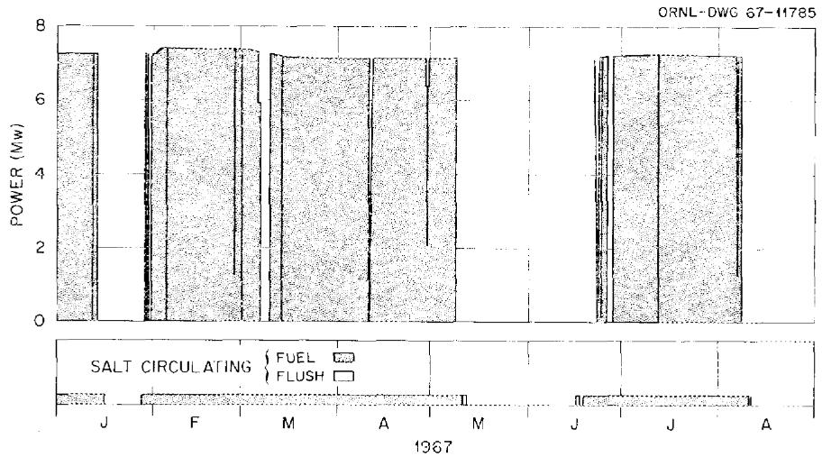  
Fig. 1.1. Outline of MSRE Power Operation from January to August 1967.

and other fission products. There were no significant reactivity anomalies. Fuel chemistry, in particular the behavior of volatile fission products, was investigated throughout the run by taking an average of three samples per week from the fuel pump. Twice, a few grams of beryllium was added to the fuel to counteract the tendency of the fission process to make the salt chemically less reducing. An adequate margin against corrosive, oxidizing conditions was maintained, and chromium analyses showed practically no corrosion.

Run 11 ended with a scheduled shutdown to remove core samples. After the fuel system was flushed and cooled, the array of metal and graphite specimens was removed to a hot-cell facility. There the array was disassembled, new samples were substituted for one of the three stringers, and the array was reassembled. Meanwhile, maintenance and inspection were carried out on the reactor. Several maintenance and inspection jobs were performed in the reactor cell with semi-remote techniques (see p. 37 on development and evaluation of procedures and tools). One control rod drive was removed for replacement of a position-indicating device and inspection of the grease. A set of metallurgical specimens adjacent to the reactor vessel was replaced, and a new americium-curium-beryllium neutron source was installed in the source tube in the thermal shield. One of the two space coolers in the reactor cell was replaced after it proved to be leaking as suspected. The maintenance shield was then set up over the salt heat exchanger to test an experimental device for mapping radiation sources.

Equipment in the reactor cell was viewed in an attempt to determine the cause of some anomalous thermocouple readings, and four new thermocouples to read ambient temperature were installed. White dust observed in the reactor cell was analyzed and found to be aluminum oxide, presumably from thermal insulation in the cell, but the source could not be located. After the core samples were reinstalled and the inspection of the cells completed, the reactor and drain-tank cells were sealed on June 9.

Other maintenance work at the same time included overhaul and repair of the radiator door brakes and enclosure, overhaul of the main blower motors, inspection of the main blowers, preventive maintenance on component coolant pump 2, replacement of a differential pressure element on the fuel off-gas system, and planned modifications and improvements in the instrumentation and control systems.

During the shutdown the annual tests of instrumentation and control systems and secondary containment were conducted. The latter included leak-testing all containment valves and measuring the reactor cell leak rate at 20 psig.

The shutdown work was completed ahead of schedule, and nuclear operation in run 12 began on June 19, 39 days after the reactor was taken subcritical at the end of run 11.

Run 12 was another period of extended operation at full power. The first week of nuclear operation was marked by difficulties with some of the equipment. These were remedied, however, and there followed 42 days in which the reactor

was at full power continuously except for two brief periods following screams - one accidental and one from loss of normal power due to lightning.

Part of the delay in the first week was caused by vibration of a main blower motor. After overhaul the motor had a slight imbalance which would have been acceptable, except that the resonant frequency of the motor mount was very near the operating speed. Stiffening the mount by welding on reinforcing plates solved this problem. During the first weekend, a component coolant pump lost oil pressure, so it was necessary to switch to the standby. A few hours later the reactor scrambled when lightning knocked out the main power supply and damaged a period safety amplifier. Full-power operation was suspended for two days for modifying the blower motor mount, repairing the oil system on the component coolant pump, and restoring the safety amplifiers to service. Then began the seven weeks at full power.

During the weeks at full power, there were no other equipment problems that threatened continuity of operation, and interest focused primarily on the studies of the fuel salt. Four additions of beryllium, ranging from 8 to $12\mathrm{g}$ each, were made in the first three weeks. After the fourth addition, there was an anomalous, temporary rise in chromium concentration in the salt samples, and over the next week ten fuel salt samples were taken to follow the behavior as the chromium concentration returned to normal. Next came a series of uranium additions: 18 capsules in seven days. This brought the ${}^{235}\mathrm{U}$ inventory up enough for six months of power operation without further additions. Operating for a period of considerable burnup without refueling will make it possible to determine the capture-to-fission ratio for ${}^{235}\mathrm{U}$ in the MSRE neutron spectrum from the changes in uranium isotopic ratios.

Run 12 was brought to an end because of difficulties with the fuel sampler-enricher. During an attempt to take a routine 10-g fuel sample on August 5, the cable latch became hung as the capsule was being lowered. There was no external sign of trouble; however, as the cable unreeled, it coiled up in the drive unit housing. Then, as it was being rewound, it tangled in the gears. The exact situation could not be diagnosed, and when the isolation valves between the sampler and the pump bowl were closed, the drive cable was severed just above the latch (see discussion on p. 32). After two days of low-power operation

to obtain reactivity data in the absence of xenon, the fuel was drained, and the loop was flushed and cooled down to permit replacement of the sampler mechanism and retrieval of the latch.

A temporary containment enclosure was erected around the sampler, and a filtered exhaust system was connected to the sampler housing to minimize contamination problems. After the sampler mechanism was removed in a shielded carrier to the equipment storage cell, a steel work shield was set up on top of the sampler to permit insertion of retrieval tools down the sampler tube. By this time several long, flexible retrieval tools had been designed and tested in a mockup (see p. 38). A noose-type tool was used first, but broke because the latch was stuck at the latch stop. After an effort to dislodge the latch, it was engaged with another noose tool. The latch was still stuck, and it was necessary to heat up the pump bowl to loosen it. (Apparently salt mist on the latch stop had frozen the latch in place.) The latch was lifted until it became hung in the tube, and the noose again broke. The latch was picked up again with a corkscrew-type tool, but it pulled loose at the first bend in the sampler tube. Then another tool was designed to slip down over the latch and clutch it with a knob on the end of a cable. Figure 1.2 shows workers atop the shield, inside the enclosure, manipulating this tool onto the latch 20 ft below. The latch was retrieved successfully this time, but as shown in Fig. 1.3, the capsule was missing.

After the latch was removed, a go gage was to be inserted to determine whether the tube was clear. It had already been concluded that leaving the capsule in the sample cage in the pump bowl would cause no harm, but it was simple to modify the go gage to house a retractable magnet that could pick up the capsule. When the tool was inserted, the tube was clear, but the capsule was not found in the cage. Figure 1.4 shows details of the sampler installation in the pump bowl. There is enough clearance for the capsule to slip out under the ring at the bottom of the cage, but the capsule is then confined by the baffle. The capsule, with a copper body and nickel-plated steel cap, should not deteriorate in the salt, nor are the salt currents strong enough to cause movement and erosion. Therefore, no more efforts were made to remove the capsule.

Startup for run 13 then began while a new sampler mechanism was being installed and checked out.

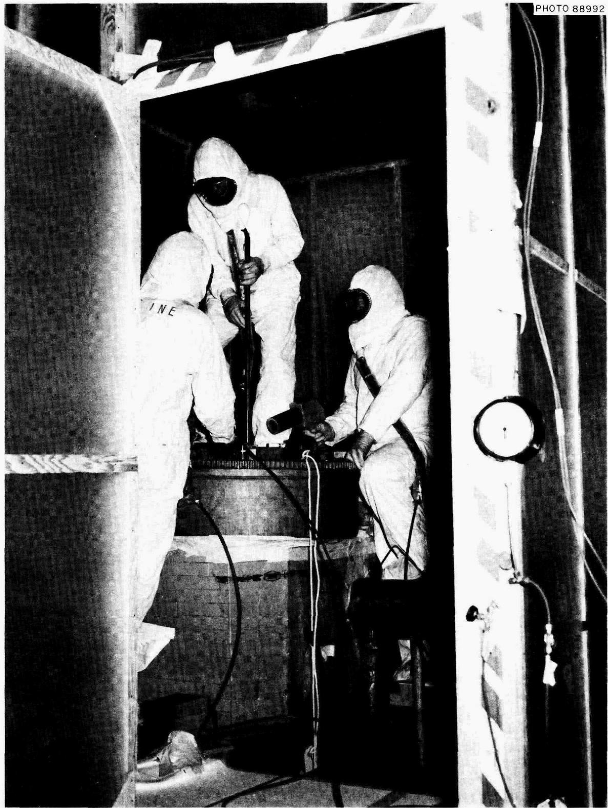  
Fig. 1.2. Team Fishing for MSRE Sampler Latch.

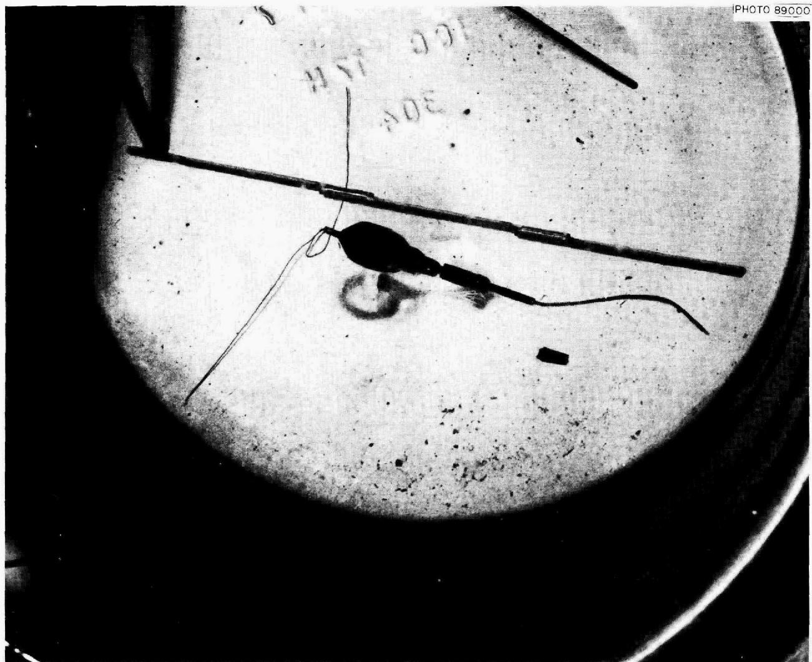  
Fig. 1.3. Sampler Latch, Key, and Cable After Retrieval.

Analysis and details of operations and maintenance are given in the sections which follow.

Table 1.1 summarizes some operating statistics.

Table 1.1. Summary of Some MSRE Operating Statistics   

<table><tr><td></td><td>March-August 1967</td><td>Total Through Aug. 31, 1967</td></tr><tr><td>Critical time, hr</td><td>2925 (66%)</td><td>7018</td></tr><tr><td>Integrated power, Mwhr</td><td>18,795</td><td>40,307</td></tr><tr><td>Equivalent full power hours</td><td>2597 (59%)</td><td>5557</td></tr><tr><td>Salt circulation</td><td></td><td></td></tr><tr><td>Fuel loop, hr</td><td>3024 (68%)</td><td>10,361</td></tr><tr><td>Coolant loop, hr</td><td>3113 (71%)</td><td>12,059</td></tr></table>

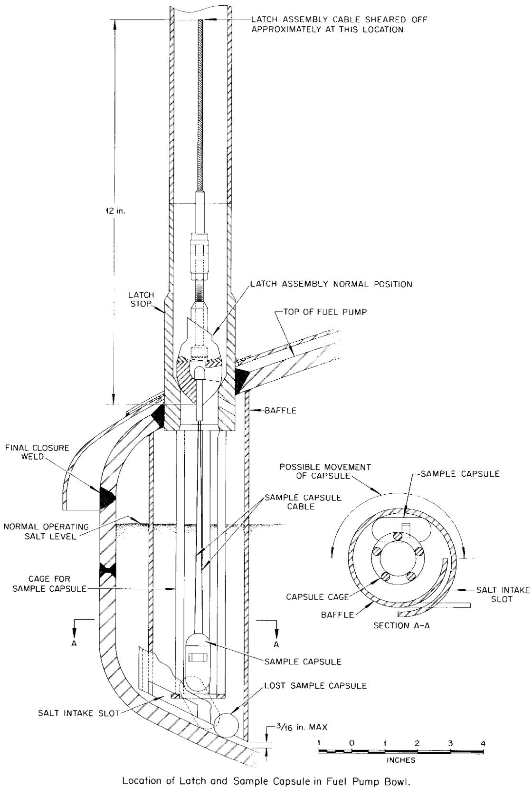  
Fig. 1.4. Location of Sampler Latch and Capsules in Fuel Pump Bowl.

# 1.2 REACTIVITY BALANCE

# J.R.Engel

The extended periods of full-power reactor operation in runs 11 and 12 have provided the most severe tests to date of the on-line reactivity balance calculation. Runs 11 and 12 increased the integrated power by 16,200 and 7650 Mwhr, respectively, to a total of 40,307 Mwhr. In addition to the usual calculations of power- and time-dependent factors, calculations were required in each of these runs to compensate for $^{235}\mathrm{U}$ additions that were made with the reactor at full power. The overall performance of the calculation was highly satisfactory, and no anomalous reactor behavior was indicated at any time. However, some additional calculation modifications were required to eliminate errors that developed.

# Balances at Power

Figures 1.5 and 1.6 summarize the results of the on-line calculations during this report period. These results are reproduced exactly as they were generated, with no corrections for computer-induced errors. For legibility, only about $2\%$ of the data points are shown, but each plotted point is the result of an individual calculation. Thus the scatter in the plotted points is an indication of the precision of the calculation. The points at which changes were made to correct errors are indicated by notes.

Except for one negative excursion caused by circulating voids immediately after a power shutdown in run 11 (Fig. 1.5), all the calculated values of residual reactivity were between $-0.03$ and $+0.10\% \delta k / k$ . An apparent gradual decline in

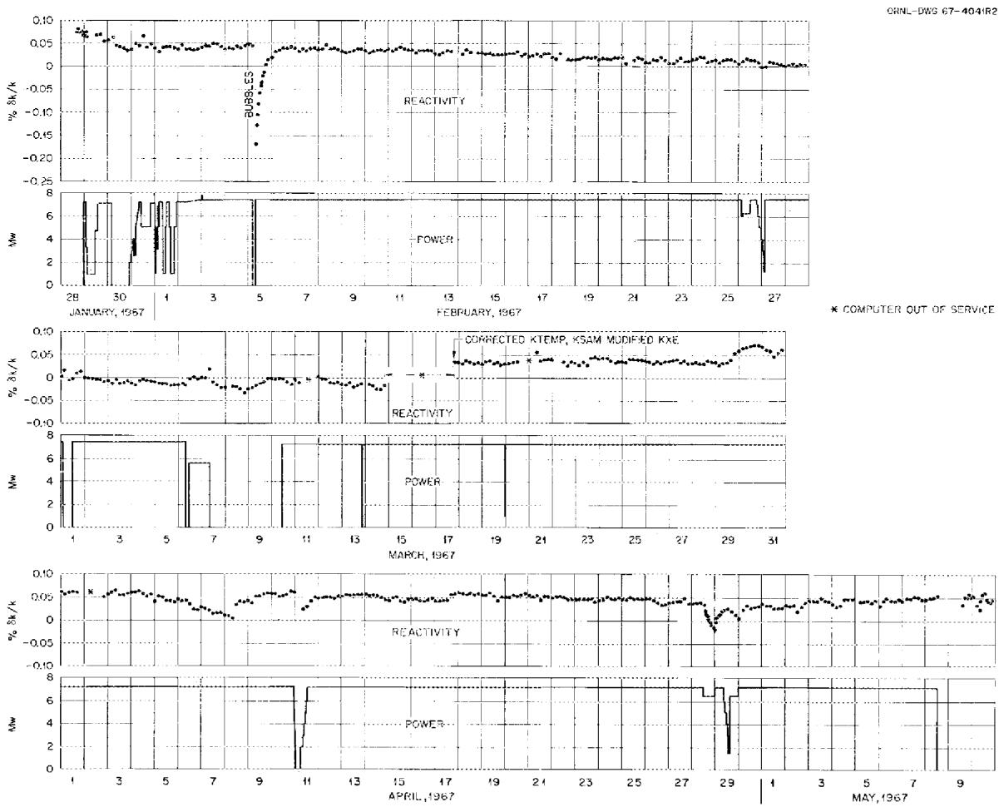  
Fig. 1.5. Residual Reactivity During MSRE Run 11.

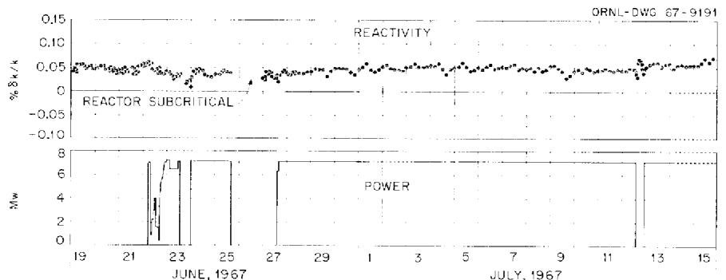

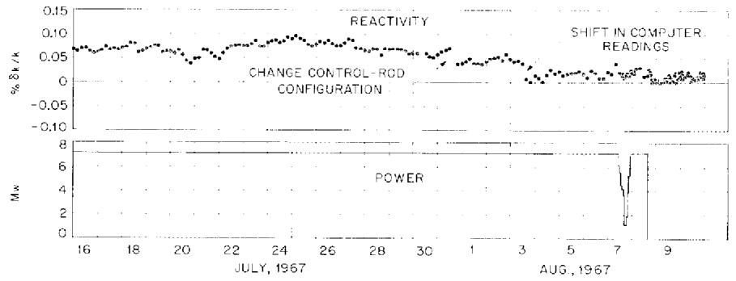  
Fig. 1.6. Residual Reactivity During MSRE Run 12.

residual reactivity occurred during the first several weeks of run 11. Detailed analysis of the individual terms revealed two sources of error. One was a gradual downward drift in the temperature indicated by two of the four thermocouples used to calculate the average reactor outlet temperature. These two thermocouples were eliminated and replaced by one other that had not drifted. The second error was caused by loss of significance in the calculation of the $^{149}\mathrm{Sm}$ concentration. In the program, only the change in samarium concentration is computed, and that change is added to the last value to obtain the current value. As the $^{149}\mathrm{Sm}$ concentration approached $85\%$ of its equilibrium value, the incremental concentration change computed for the 5-min time step between routine reactivity balances was outside the five-decimal-digit precision of the computer. As a result, these increments were lost when the concentration was updated. To avoid using double-precision arithmetic, the program was modified to only update the $^{149}\mathrm{Sm}$ and the $^{151}\mathrm{Sm}$ concentrations every 4 hr while the reactor is at steady power. Summary calculations made off line were used to verify the adequacy of this change.

When these corrections were introduced on March 17, the apparent downward drift in reactivity disappeared. At the same time, minor changes were made in some of the $^{135}\mathrm{Xe}$ stripping parameters to make the calculated steady-state xenon poisoning agree more closely with the observed value.

Other small reactivity variations were observed in run 11, for example, from March 29 to April 9. These changes are directly related to changes in the helium overpressure on the fuel loop; a 1-psi pressure increase leads to a reversible reactivity decrease of slightly less than $0.01\% \delta k / k$ . The mechanism through which pressure and reactivity are coupled has not yet been established. The direct reactivity effect of the change in circulating voids caused by a change in absolute pressure is at least a factor of 10 smaller than the observed effect of pressure on reactivity. The time constant of the pressure-reactivity effect is relatively long, suggesting a possible connection through the xenon poisoning.

Fuel additions were made for the first time in run 11 with the reactor at full power. Nine capsules containing a total of $761\mathrm{g}$ of $^{235}\mathrm{U}$ were added between April 18 and 21. The reactivity

balance results during this time show good agreement between the calculated and observed effects of the additions. The transient effects of the actual fuel additions were very mild. Figure 1.7 shows an on-line plot of the position of the regulating control rod made during a typical fuel addition with the reactor on servo control. Control rod movement to compensate for the additional uranium in the core started about 30 sec after the fuel capsule reached the pump bowl, and the entire transient was complete about 2 min later. This indicates rapid melting of the enriching salt and quick, even dispersion in the circulating fuel. The weights of the emptied fuel capsules indicated that essentially all their contained $^{235}\mathrm{U}$ was transferred to the fuel loop.

The reactivity-balance results in run 12 (Fig. 1.6) were essentially the same as those in the preceding run. Minor variations, associated with pressure and power changes, were again observed.

Another series of fuel additions at full power was made in this run between July 19 and 26. This series consisted of 18 capsules containing $1527\mathrm{g}$ of ${}^{235}\mathrm{U}$ . The purpose of this large addition was to provide sufficient excess uranium so that a large amount of integrated power could be produced without intermediate fuel additions. We plan to perform a detailed evaluation of the uranium isotopic-change effects associated with power operation, and substantial burnup is required to make the analyses of isotopic composition useful. A secondary result of this large fuel addition $(0.5\% \delta k / k)$ was a drastic change in the control rod configuration. At the end of the additions the separation between the tips of the shim rods

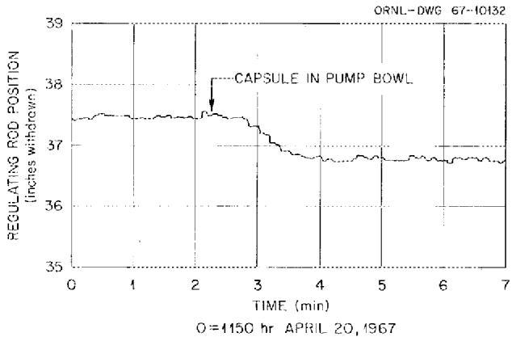  
Fig. 1.7. Regulating Control Rod Position During Fuel Addition.

and that of the regulating rod was 15.5 in., whereas the normal separation has been 4 to 8 in. The variation in apparent residual reactivity as a function of control rod configuration was reexamined, and we observed a decrease of $0.02\% \delta k / k$ when the more usual configuration was established. This was consistent with an earlier evaluation (May 1966) of the accuracy of the analytic expression used in the computer to calculate control rod poisoning as a function of rod configuration.

On August 3 a computer failure occurred which required recalibration of the analog-signal amplifiers after service was restored. As a result of this recalibration, there were small shifts in the values of several of the variables used in the reactivity balance. Errors in reactor-outlet temperature and regulating-rod position caused a downward shift of $0.03\% \delta k / k$ in the residual reactivity.

# Balances at Zero Power

Figure 1.8 shows the long-term variation in residual reactivity since the start of power operation (December 1965). The values shown are average results at zero power with no xenon present. Corrections have also been applied for computer-induced errors such as those at the end of run 12. The results are plotted to show their relationship to the reactor operating limits at $\pm 0.5\% \delta k / k$ . The discovery of a 0.5-in. shift in the absolute position of rod 1 at the end of run 12 (see p. 31) adds some uncertainty to the last point in this figure. This shift represents a reactivity effect of $+0.02\% \delta k / k$ , which would have been detected if it had occurred during a run. However, the dilution corrections which must be applied

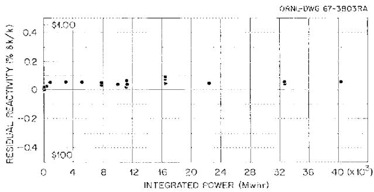  
Fig. 1.8. Long-Term Drift in Residual Reactivity of the MSRE at Zero Power.

between runs contain enough uncertainty that an error of this magnitude could be lost. Thus the shift in rod position cannot be assigned to either the beginning or end of run 12. Even with this uncertainty in residual reactivity, the zero-power results fall within a very narrow band, which demonstrates the continuing good performance of both the reactor system and the reactivity-balance calculation.

# 1.3 THERMAL EFFECTS OF OPERATION

C. H. Gabbard

# Radiation Heating

Reactor Vessel. - The temperature differences between certain thermocouples on the reactor vessel and the reactor inlet temperature are monitored by the computer to determine whether there is any evidence of a sedimentation buildup in the lower head or on the core support flange. In the previous semiannual report, it was stated that these temperature differences had increased. Full-power data were reviewed from runs 6 through 12, and it now appears that the increase reported is within the data scatter. The average temperature differences for run 6 were 2.11 and $1.54^{\circ}\mathrm{F} / \mathrm{Mw}$ for the core support flange and the lower head, respectively, and were 2.205 and $1.55^{\circ}\mathrm{F} / \mathrm{Mw}$ for run 12.

Fuel Pump Tank. - An unexplained downward shift in the temperature of the upper pump-tank surface was mentioned in the previous semiannual report. Past data for the pump-tank temperature and for the heat removal by the oil system were reviewed to determine if a better thermal coupling could have developed between the pump tank and the shield-plug oil cooler. No evidence of increased heat removal by the oil system was found.

The temperature distribution remained essentially the same throughout run 11, with pump operation continuing without cooling air. When the reactor was taken to power in run 12, the full-power temperature distribution had shifted downward another 15 to $30^{\circ}\mathrm{F}$ , and the pump tank continued through

the run at the lower temperatures. The temperatures at zero power were consistent with the run 11 zero-power data. This would seem to indicate that less fission product activity was being released in the pump tank. The lower temperatures are not detrimental to the operation or to the life of the pump tank.

# Thermal Cycle History

The accumulated thermal cycle history of the various components sensitive to thermal cycle damage is shown in Table 1.2. Approximately $63\%$ of the design thermal cycle life of the fuel system freeze flanges has been used to date; $54\%$ had been used at the time of the previous semiannual report.

# Temperature Measurement

Salt Systems. -- Approximately 330 thermocouples are used to measure the temperature at various locations on the fuel and coolant circulating salt systems. Only two thermocouple wells are provided, one each in the coolant radiator inlet and outlet pipes. The remaining thermocouples are attached to the pipe or vessel walls. The thermocouples on the radiator tubes are insulated to protect them from the effects of the high-velocity air that flows over them during power operation; the others are not insulated and thus are subject to error because of exposure to heater shine and to thermal convection flow of the cell atmosphere within the heater insulation. In March 1965, with the fuel and coolant systems circulating salt at isothermal conditions, a complete set of readings was taken from all the thermocouples that should read the temperature of the circulating salt. A similar set of data was taken in June 1967 at the start of run 12. The results of the two sets of measurements are shown in Table 1.3. Comparison of the standard deviations for the radiator thermocouples with those for the other thermocouples shows the effect of insulation on reducing the scatter. Comparison of the sets of data taken over two years apart shows very little change, certainly no greater scatter. Figure 1.9 shows that the statistical distribution of the deviations

Table 1.2. MSRE Cumulative Thermal Cycle History Through August 1967   

<table><tr><td>Component</td><td>Heat/Cool</td><td>Fill/Drain</td><td>Power</td><td>On/Off</td><td>Thaw</td><td>Thaw and Transfer</td></tr><tr><td>Fuel system</td><td>8</td><td>37</td><td>57</td><td></td><td></td><td></td></tr><tr><td>Coolant system</td><td>6</td><td>11</td><td>53</td><td></td><td></td><td></td></tr><tr><td>Fuel pump</td><td>9</td><td>32</td><td>57</td><td>428</td><td></td><td></td></tr><tr><td>Coolant pump</td><td>7</td><td>12</td><td>53</td><td>113</td><td></td><td></td></tr><tr><td>Freeze flanges 100, 101, 102</td><td>8</td><td>33</td><td>57</td><td></td><td></td><td></td></tr><tr><td>Freeze flanges 200, 201</td><td>7</td><td>11</td><td>53</td><td></td><td></td><td></td></tr><tr><td>Penetrations 200, 201</td><td>7</td><td>11</td><td>53</td><td></td><td></td><td></td></tr><tr><td>Freeze valve</td><td></td><td></td><td></td><td></td><td></td><td></td></tr><tr><td>103</td><td>6</td><td></td><td></td><td></td><td>29</td><td>35</td></tr><tr><td>104</td><td>14</td><td></td><td></td><td></td><td>9</td><td>25</td></tr><tr><td>105</td><td>16</td><td></td><td></td><td></td><td>18</td><td>43</td></tr><tr><td>106</td><td>18</td><td></td><td></td><td></td><td>26</td><td>38</td></tr><tr><td>107</td><td>10</td><td></td><td></td><td></td><td>11</td><td>18</td></tr><tr><td>108</td><td>9</td><td></td><td></td><td></td><td>17</td><td>14</td></tr><tr><td>109</td><td>9</td><td></td><td></td><td></td><td>20</td><td>18</td></tr><tr><td>110</td><td>2</td><td></td><td></td><td></td><td>2</td><td>3</td></tr><tr><td>111</td><td>5</td><td></td><td></td><td></td><td>4</td><td>4</td></tr><tr><td>112</td><td>2</td><td></td><td></td><td></td><td>1</td><td>2</td></tr><tr><td>204</td><td>8</td><td></td><td></td><td></td><td>15</td><td>26</td></tr><tr><td>206</td><td>8</td><td></td><td></td><td></td><td>13</td><td>24</td></tr></table>

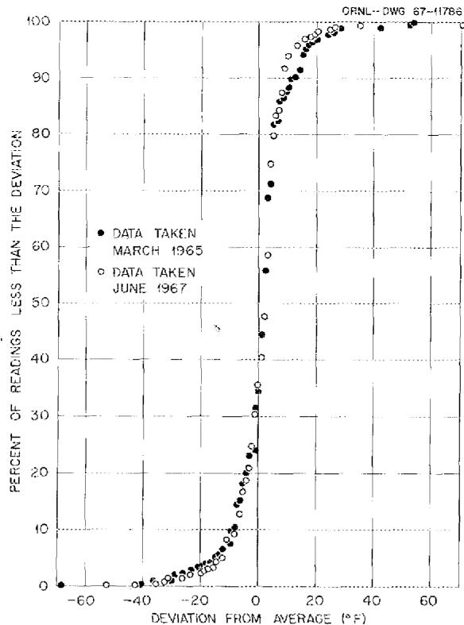  
Fig. 1.9. Comparison of MSRE Thermocouple Data from March 1965 and June 1967.

Table 1.3. Comparison of Readings of Thermocouples of Salt Piping and Vessels Taken with the Salt Isothermal   

<table><tr><td rowspan="2">Thermocouple Location</td><td colspan="2">Indicated Temperature (°F)</td></tr><tr><td>March 1965</td><td>June 1967</td></tr><tr><td>Radiator tubes</td><td>1102.6 ± 6.7</td><td>1208.5 ± 3.3</td></tr><tr><td>Other</td><td>1102.1 ± 13.0</td><td>1206.7 ± 12.3</td></tr><tr><td>All</td><td>1102.3 ± 10.6</td><td>1207.4 ± 9.8</td></tr></table>

of individual thermocouples from the mean also changed little in the two years.

The scatter in the various thermocouple readings is reduced to an acceptable level by using biases to correct each reading to the overall average measured while both fuel and coolant systems are circulating salt at isothermal conditions. These biases are entered into the computer and are automatically applied to the thermocouple readings. The biases are revised at the beginning of each run and are checked when isothermal conditions exist during the run. Generally the biased

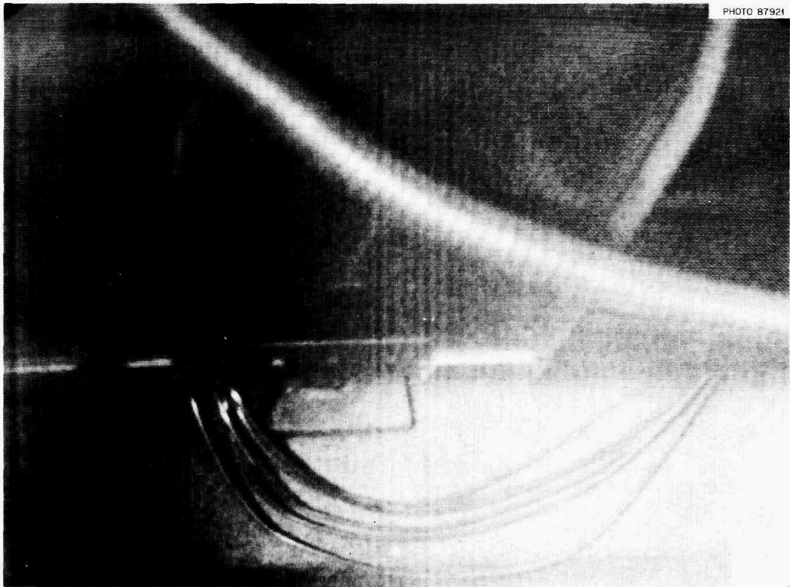  
Fig. 1.10. East Side of Heat Exchanger Showing Heater Box HX-1 and the Cocked Spacer on the Right.

thermocouple readings have been reliable, but there have been a relatively few cases when there have been shifts in thermocouple readings that have resulted in calculation errors.

Temperature Disturbance in Reactor Cell. - During run 11, a shift upward of a reactor cell ambient thermocouple was noted. This upward shift, which occurred on only one of ten ambient couples, took place the day after reaching maximum power. A rather extensive investigation revealed that several other thermocouples were affected at the same time, all in the area between the fuel pump and the heat exchanger.

Many tests were performed to determine the cause of this temperature disturbance, but none gave any conclusive answers. This area was viewed with closed-circuit television during the run 11 shutdown in May and June. The only ab

normality noted which might have caused this increase was a cocked heater spacer between heaters HX-1 and HX-2 on the heat exchanger. This spacer is shown in Fig. 1.10, a photograph of the television screen. It was concluded that this cocked spacer, which was viewed only after the fuel system was drained and cooled, was an indication of an even larger opening which existed during operation.

# Fuel Salt Afterheat

At the conclusion of run 11 power operation, an experiment was run to determine the amount of fission product afterheat in the fuel salt. Power operation of run 11 was terminated by a rod and load scram from full power, and the temperature

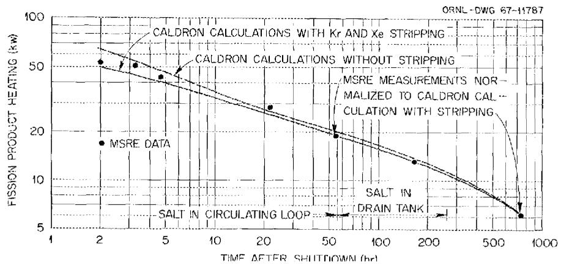  
Fig. 1.11. Results of M5RE Afterheat Measurement.

transient that followed was recorded by the computer. The net heat input to the system was evaluated several times from the combined effects of the temperature slope and thermal capacity of the system, the power to the electric heaters, and the $10\mathrm{kw}$ of nuclear power when the reactor was critical. The fuel was drained shortly after the final heat input data were taken in the fuel loop 55.5 hr after the scram. Two additional sets of heat input data were taken in the fuel drain tank at times of 168.5 and 745 hr, but there was no experimental method to correlate the drain-tank data with the fuel-loop data because of the difference in heat losses. The analysis of the experimental data gave the change in afterheat between the 55.5-hr data and the various other sets of data taken in the fuel loop and between the two sets of data in the fuel drain tank.

The computer program CALDRON was used to check the experimental results and to provide reference points at decay times of 55.5 and 765 hr. The results of the CALDRON calculations and the afterheat measurements are shown in Fig. 1.11. Two sets of CALDRON calculations are shown, one set without krypton or xenon stripping and the other with krypton and xenon stripping at a rate equivalent to the removal from the MSRE fuel salt. The MSRE experimental data were normalized to the 55.5- and 745-hr CALDRON calculations that included stripping. (The heat losses required to make the observations agree with the calculation at these points were assumed to exist at all other times in the same system.)

We had hoped to obtain useful data within about 10 min after the scram. However, there was ap

parently an air leak through the radiator enclosure which healed itself in about 1.5 to 2 hr. Since the calculation procedure required that the heat losses from the reactor system be nearly constant, the first 2 hr of data could not be used.

Actually the calculations made 2 hr after shutdown also appear to be somewhat low, as seen in Fig. 1.11.

The thermal capacity of the fuel and coolant systems for the afterheat calculation was calibrated during the run 12 startup. The temperature transient was recorded following a step increase in nuclear power of $148\mathrm{kw}$ . The thermal capacity of the system was found to be $16.22\mathrm{Mw - sec} / {}^{\circ}\mathrm{F}$

# 1.4 EQUIPMENT PERFORMANCE

# Heat Transfer

C. H. Gabbard

The monitoring of the heat transfer performance of the salt-to-salt heat exchanger continued, both by periodic measurement of the heat transfer coefficient and by practically continuous observation of the "heat transfer index." (The heat transfer index is defined as the ratio of reactor power to the temperature difference between the fuel leaving the core and the coolant leaving the radiator.) Six sets of data were taken for evaluation of the heat transfer coefficient during runs 11 and 12.

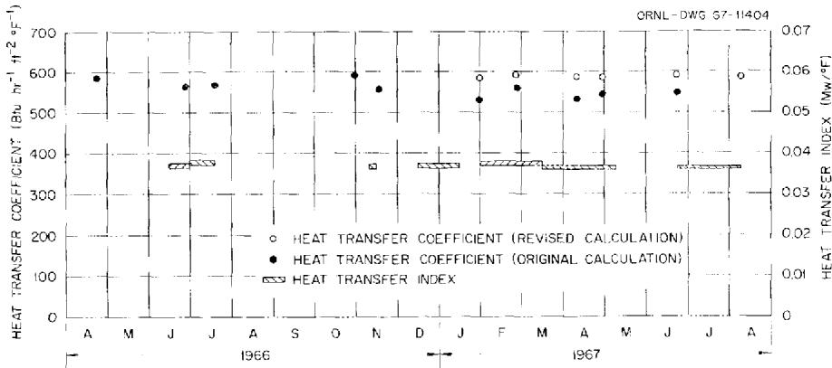  
Fig. 1.12. Observed Performance of MSRE Main Heat Exchanger.

Coefficients were computed from these data by a procedure used since the beginning of power operation and by a revised procedure whose principal difference is that it uses only the most reliable thermocouples. Coefficients computed both ways are shown in Fig. 1.12 along with the heat transfer index. The coefficients and the index indicate that the performance of the heat exchanger has remained practically unchanged. (The downward shift in the heat transfer index in March 1967 is the result of revising the temperature biases in the computer.)

# Main Blowers

C. H. Gabbard

The rebuilt main blowers, MB-1 and MB-3, have now accumulated 4640 and $4220\mathrm{hr}$ of operation, respectively, since they were installed in October and November 1966. The main bearing on MB-3 was replaced in early March after $1800\mathrm{hr}$ of operation, when the vibration amplitude started increasing. The balls and races of the bearing were severely scored and pitted. The replacement bearing also gave an indication of trouble and was scheduled for replacement during the run 11 shutdown. However, the problem turned out to be the result of a loose vibration pickup.

A complete inspection of the blowers and drive motors was made after the run 11 shutdown. Both blowers were again in excellent condition after 3585 and $3162\mathrm{hr}$ of operation, with no indication of cracking in the blades or hubs. The slip rings and brushes on the drive motors had become scored, and the motors were removed for repair. The re

pairs included refinishing the slip rings, replacing the brushes and bearings, and balancing the rotors. Vibration pickups were added at each motor bearing, and filters were installed to protect the slip rings from dirt and grit. When the blowers were test run, there were excessive vibrations on the drive motor of main blower 3. The motor vibration had been satisfactorily low when the motor was loosened on its mount, indicating that the motor was not badly unbalanced. The rotation speed of the motors was found to be very near the natural frequency of the motor mount. The vibration amplitude was reduced to an acceptable level (below 1 mil) by stiffening the mount.

Insulation Dust in the Reactor Cell. During observation in the reactor cell between runs 11 and 12, a nonuniform coating of white material was seen on most of the horizontal surfaces of the reactor cell (see Fig. 1.13). Samples of the white coating were obtained with long-handled tools and identified as being mostly $\mathrm{Al}_{2}\mathrm{O}_{3}$ (insulation). Attempts to further identify it as one of the two specific types of insulation known to be in the cell were unsuccessful. The possible sources are the insulation covering the fuel pump and overflow tank, the reactor vessel, the fuel drain line, or the fuel line under the heat exchanger. The drain-tank cell was also viewed, but no covering of insulation dust was noted.

# Radiator Enclosure

# M. Richardson

The brake shoes in the brakes of the radiator door lifting mechanism were found to be worn and

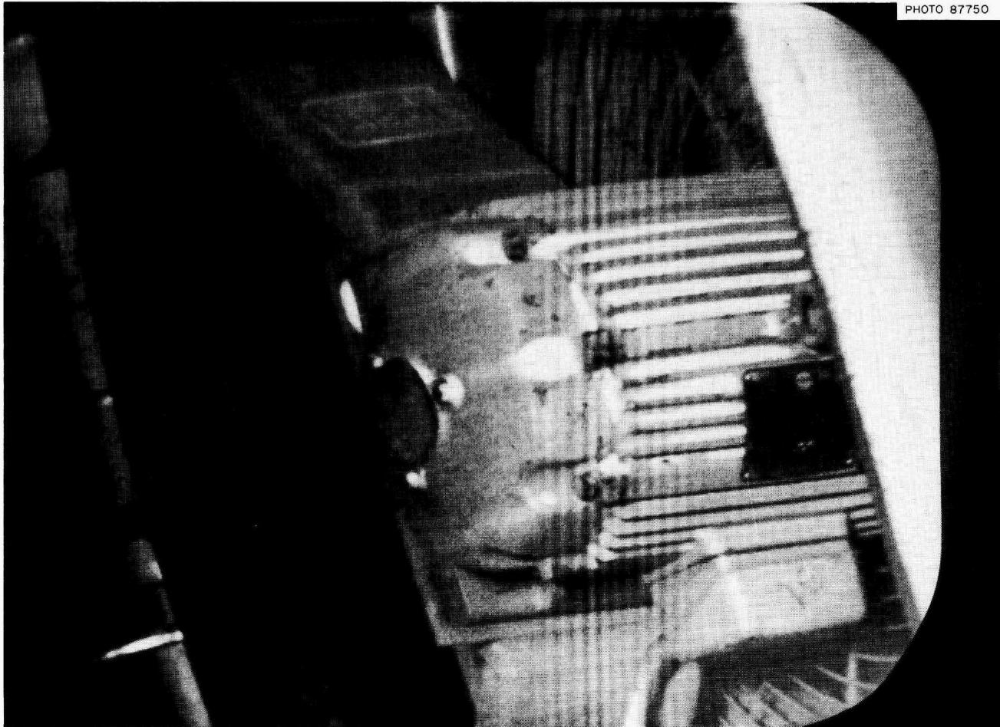  
Fig. 1.13. Motor of Reactor Cell Cooler No. 1 Showing Dust Accumulation.

were replaced after run 11. This reduced the coastdown after the doors were partially lowered to 3 in. It was also necessary to replace part of the outlet door soft seal gasket material which had burned and blown loose. Operation of the doors has been without incident, and the radiator seals have been adequate for operation.

# Off-gas Systems

J. R. Engel

Operational difficulties with the off-gas systems were greatly reduced during this period of operation. One 7-hr power reduction was required to replace a filter in the coolant off-gas line. Otherwise, only minor inconvenience, which had no effect on power operation, was experienced.

Particle Trap. - The new off-gas filter (particle trap) installed in the fuel off-gas line before the start of run 11 continued to function satisfactorily with no evidence of increasing pressure drop. The pressure drop across this unit, with one section valved out, remained below 0.1 psi throughout the operation. The temperatures near the various filter media depend to some extent on operating conditions other than power. Increased pump tank pressure or reduced purge-gas flow increases the transport time for fission products from the pump tank to the particle trap. This permits more radioactive decay en route and results in lower temperatures at the particle trap. Nevertheless, under similar conditions the steady-state temperature near the coarse filtering material

(Yorkmesh) was $\sim 275^{\circ}\mathrm{F}$ when the particle trap was first used and $\sim 380^{\circ}\mathrm{F}$ near the end of run 12. The temperatures decrease rapidly when the reactor power is reduced, however, and the zero-power steady-state temperatures are essentially unchanged. These effects indicate the accumulation of some material, presumably organic, on the filtering media that enhances the retention of short-lived fission products.

Main Charcoal Beds. - The performance of the charcoal beds in holding up noble-gas fission products has continued to be satisfactory. The gradual development of restrictions at the inlet ends of the beds has also continued, but this has not limited the reactor operation in any way, since effective measures can be taken to reduce the restriction when necessary.

Run 11 was started in January 1967 with the charcoal bed sections 1A and 1B in service with an initial pressure drop of 2.5 psi at normal off-gas flow. The pressure drop increased very slowly, reaching 7 psi on March 29, two months after the start of the run. At that time the standby beds, 2A and 2B, were put in service, and the restricted sections were valved out. The pressure drop across these sections built up from 2.6 to 9 psi in only ten days. We then cleared the restrictions from all four sections by forcing clean helium through sections 2A and 2B in the normal flow direction and heating the inlet ends of sections 1A and 1B with previously installed electric heaters. These operations did not require a reactor shutdown but only a temporary lowering of the water level in the charcoal bed pit to allow the heaters to function.

After the restrictions in both sets of beds had been cleared, sections 1A and 1B were put back in service. In the ensuing three weeks the pressure drop increased from 2.4 to 3.5 psi. At that time, we decided to increase the helium purge flow by 1 liter/min to see if the xenon poisoning would be affected by lower concentrations in the fuel pump gas space. To accommodate the higher gas flow without an increase in fuel pump pressure, sections 1A and 1B were valved out and 2A and 2B were put in service. The next day section 1A had to be reopened to keep the fuel pump pressure at 5 psig. The normal purge flow was restored after three days, and, just before the power shutdown at the end of run 11, the partial restric

tions in all four beds were again removed by heating sections 1A and 1B and forward blowing sections 2A and 2B.

Owing to the success of the heaters in clearing the restrictions from sections 1A and 1B, we installed similar heaters at the inlets of sections 2A and 2B during the shutdown between runs 11 and 12. The differential pressure transmitter that senses charcoal bed pressure drop directly was also replaced. This instrument had failed earlier, possibly because of the pressure differences imposed during blowouts of the charcoal beds. However, all these pressure differences were within the specified overrange capability of the instrument.

Power operation in run 12 was started with sections 1A and 1B in service. The gradual increase in pressure drop made it necessary to change to sections 2A and 2B after about three weeks. The pressure drop across the second sections reached an unsatisfactory level after only six days. Then the restrictions were cleared from all four sections by heating the inlet ends. The remainder of run 12 was completed with sections 1A and 1B in service.

The development of flow restrictions at the charcoal beds appears to be related to the accumulation of volatile organic matter on the steel wool packing at the bed inlets. Physical variations in this packing probably account for the different times required to plug various individual sections. The experience in runs 11 and 12 indicates that the restrictions can be effectively removed by electrically heating the inlet ends of the beds. Presumably, this heating drives the volatile matter off the steel wool packing in the inlets and moves it farther downstream where the flow areas are larger. There is no evidence from the charcoal temperatures that this material has reduced the fission product retention capability of the charcoal. Since the heating operations do not affect reactor performance, there are no plans at present to make further modifications at the charcoal beds.

Coolant Off-gas System. - Very slow plugging of the coolant off-gas system at the filter that precedes the coolant-loop pressure control valve has been encountered throughout the reactor operation. The originally installed filter was replaced in February 1965, during the preoperational checkout of the system. Subsequent replacements were made in March and September 1966 and on March 1, 1967. The replacement on March 1, 1967, required a reactor power reduction for 7 hr to permit

personnel access to the area where the filter is located. By the end of run 11 (May 1967) the filter was plugged again, and periodic venting of the coolant system through an auxiliary line (L-536) was required to keep the loop overpressure below 10 psig.

During the shutdown between runs 11 and 12, the filter was replaced again, and a minor piping modification was made to permit the coolant off-gas activity monitoring to monitor gas vented through line 536. Before this change, any activity release would have been detected and stopped by another monitor on the combined fuel and coolant off-gas, but identification of the source of the activity would have been more difficult. No activity has ever been detected in the coolant off-gas.

# Cooling Water Systems

# A. I. Krakoviak

The cooling water systems performed satisfactorily during this report period. The systems functioned relatively trouble free except for a few leaks. In July a 15-gpd leak from the treated water system was detected and was traced to a faulty pressure-relief valve in the line leading to one of the reactor cell coolers. Replacement of the faulty relief valve restored the system to normal operation.

Space Coolers. - As reported previously, leaks have occurred in the reactor cell space coolers at the brazed joints on the brass tubing headers. During the scheduled shutdown at the end of run 11, both space coolers were leak-tested. One cooler (RCC-1) leaked less than $125~\mathrm{cm}^3/\mathrm{day}$ and was not replaced; however, the other (RCC-2), which leaked at the rate of 9 liters/day, was replaced with a cooler whose headers and nipples were fabricated of copper. Copper weldments were used on the new cooler instead of the brazed joints.

Radiation levels around the removed unit were sufficiently low that it could be disassembled directly. The radiator was the most radioactive component, with readings up to 1000 millirems/hr at contact. (The radiation was very soft and caused no contamination problem.) This unit was discarded. However, the fan motor was retained

for possible future use, and the new fan, motor, and radiator were mounted on the original frame for installation in the cell.

Reactor Cell Annulus. -- Sometime prior to or during run 11, the fill line to the biological shield plugged, and water additions to the reactor cell annulus were made through the level measuring line. Since the plug in the fill line could not be cleared, the overflow pipe from the cell annulus was modified to also serve as a fill line.

Steam Dome Feedwater Tanks. - Water is dumped automatically from a feedwater tank (FWT) to a steam dome if cooling of a fuel drain tank (FD) is required after a fuel drain. During run 12, small amounts of water from FWT-1 had randomly appeared in the steam dome of FD-1, causing a temperature decrease in the fuel drain tank. To ensure that this drain tank remained available for a possible emergency drain, the water was removed from the feedwater tank, which is now in normal service after having a faulty temperature switch replaced.

# Component Cooling System

# P. H. Harley

Although some difficulties were encountered, the component cooling system operated satisfactorily during this report period. The two main blowers (CCP-1 and CCP-2) operated 1536 and 2375 hr respectively; CCP-2 has operated for a total of 3340 hr without a failure.

The discharge check valve on CCP-2 was replaced and the belt drive was tightened as part of the preventive maintenance program. There was no indication of any significant aging of the silicone rubber in the removed check valve.

Trouble was encountered in the CCP-1 oil circulating system. First, a loose tubing connection caused the loss of $\sim 2$ gal of oil during run 12; this irregularity was easily repaired. Then, following the run 12 shutdown, intermittent low-oil-pressure alarms again occurred. An investigation indicated no significant loss of oil, but a slow oil-pressure response was observed when the blower was started. The suspected oil pump and pressure-relief valve on CCP-1 were replaced with spare units to correct the trouble. The removed pressure-relief valve was found to be relieving before the normal oil pressure developed. In spite of these

difficulties in the system, there was sufficient lubrication, and no noticeable damage was observed.

Although the temporary strainer in the CCP discharge line worked satisfactorily, a more efficient strainer, which had been on order for a year, was received and installed in the line. Over an eight-month period the temporary strainer accumulated $\sim 30$ to $50\mathrm{g}$ of black, dry powdery material that appeared to be dust from abrasion of the drive belts. The new strainer, however, has a 100-mesh screen and a 0.2-psi pressure drop as compared with a ${}_{16}^{1}$ -in. pore size and a 0.5-psi pressure drop in the old strainer.

The improved performance of the blower belt drives, which have not needed replacing during the past nine months, is attributed to less frequent starting and stopping of the blowers as well as to the reinforced motor support. During early operation, the blowers were alternated twice a month; now one blower is operated continuously during a run.

The stainless steel strainer which was removed had been in contact with condensate containing dilute $\mathrm{HNO}_3$ while in service (see "Containment," p. 33). After being decontaminated, the strainer was examined and was found to be in very good condition. The surface was slightly etched, but no more than would be caused by the decontamination process.

Blower CCP-3, which cools out-of-containment freeze valves, failed on April 19 after more than $5000\mathrm{hr}$ of operation. A bearing galled and damaged the drive shaft. Operation continued without interruption by using air from the service air compressor. Blower CCP-3 has been repaired and can now be used when required.

# Salt Pump Oil Systems

# A. I. Krakoviak

The lubricating oil systems for both salt pumps have been in continuous service except during the planned oil change during the shutdown after run 11. At this time the oil was sampled, drained, and replaced with new oil. The oil, which had been in service since August 1966, showed no significant change in its physical or chemical properties.

During the steady full-power operation in run 11, very good balances were obtained on the oil system inventory changes, indicating little or no loss

by leakage into the pump bowl. The measured amounts removed for analysis and accumulated in the catch tanks actually slightly exceeded the observed decreases in supply reservoir contents. In March and April the difference was $65~\mathrm{cm}^3$ in the fuel pump system and $210~\mathrm{cm}^3$ in the coolant pump system.

The oil leakage through the lower seal of the fuel-pump shaft had previously accumulated at the rate of $5\mathrm{cm}^3/\mathrm{day}$ ; it has now decreased to $\sim 1$ $\mathrm{cm}^3/\mathrm{day}$ . The leakage past the lower seal of the coolant salt pump averaged $17\mathrm{cm}^3/\mathrm{day}$ during run 11 and $30\mathrm{cm}^3/\mathrm{day}$ during run 12; the present accumulation rate is 15.

Automatic siphons were originally installed on the oil collection tanks from both pumps to measure and dispose of seal leakage without manual draining to keep the level in the sensitive (reduced cross-sectional area) range of the level-measuring leg of the collection tanks. These siphons have failed to function properly at the low oil leakage rates that actually occurred. The oil simply flows over the high point of the siphon tube, much like a liquid flowing over a weir, without bridging the tube to form a siphon. The overflow points for the coolant pump and fuel pump oil collection tanks were reached in March and April respectively. For the remainder of run 11 the only indicators of leakage rate were the supply reservoirs, which are much less sensitive than the leakage collection tanks. After run 11 the collection tanks were drained, and the average leakages for the latter part of the run were determined by measuring the total accumulated oil leakage. The collection tanks were drained again after run 12, and periodic drainings are planned to keep the oil level below the siphon (overflow) level. Because there is a high radiation field at the collection tanks, during power operation the draining operations must be performed only when the nuclear power is low. If high leakage rates (500 to $1000\mathrm{cm}^3/\mathrm{day}$ ) develop, the automatic siphons are expected to function as designed.

Although the oil from the coolant pump seal when sampled had a dark appearance, spectrographic and infrared spectrophotometric analyses showed no significant difference between the seal leakage oil and a sample of unused oil. The dark appearance and the somewhat increased leakage rate past the seal could be an indication of abnormal wear at the Graphitar-stainless steel rotary seal of the salt pump. The somewhat lower

accumulation rate at present indicates that the seal may have reseated itself.

# Electrical System

# T. L. Hudson

Power to the MSRE electrical system is supplied from the ORNL substation by either of two 13.8-kv TVA power lines, a preferred line or an alternate. During this report period, while operating on the preferred feeder, there were two unscheduled electrical interruptions when the reactor was at power. During a thunderstorm on June 25, the reactor operation was interrupted by the loss of both feeders. Two amplifiers were damaged on the reactor period safety system. Approximately 32 hr later, the reactor was returned to critical operation after the period safety amplifiers had been repaired. On July 12, the other interruption was caused by the loss of the preferred feeder during another thunderstorm. Emergency power from the diesel generators was in service within 2 min, and low-power nuclear operation was resumed in about 13 min. After repairs had been completed on the preferred feeder, full-power operation was resumed in approximately 6 hr.

Difficulty was experienced in run 12 when restarting main blower 1. The breaker tripped off the blower during the starting sequence for several attempted starts. On a later occasion, the breaker tripped several times before main blower 1 was started. This erratic behavior was explained when a loose gasket was found in one of the time-delay orifices when the breaker was checked in August. Tests have been made that indicate the total time of the starting sequence is too long when compared with maximum time delay of the breaker overload element. Therefore, the total time of the start sequence will be reduced from 25 to 12 sec.

# Heaters

# T. L. Hudson

The last of six heating elements in heater HX-1 failed on October 28, 1966. Satisfactory heat exchanger temperatures were maintained without this heater, even with the fuel loop empty. However, continuous circulation of the coolant salt was maintained until after run 11, so the full effect of the heater failure could not be determined. Tests

were performed with both the fuel and coolant loops empty after run 11 to determine the need for this heater in preheating the system from a cold condition. When helium circulation was stopped in the fuel system, the temperature distribution was satisfactory for a fill without heater HX-1 operating. However, with helium circulation in the fuel system, "cold" helium was introduced - possibly from the fuel pump - and one temperature decreased to below $800^{\circ}\mathrm{F}$ . Since satisfactory temperatures could be achieved without it, the failed heater was not replaced.

Radiator heater CR6-4B failed on March 30, 1967, and was replaced with a spare heater (CR4-3C). During the shutdown after run 11 the electrical lead to heater CR6-4B was repaired, and the heater was placed back in service. Several broken ceramic bushings were also replaced at this time.

# Control Rods and Drives

# M. Richardson

Performance of the control rods and drives has been within the operating limits this period. No mechanical failures of the rods or drives have occurred. The fine-position synchro of rod 2, which had failed during the previous period, was replaced prior to the beginning of run 12. The drive unit for this rod was inspected at the same time and found to be in excellent condition. The grease in the drive unit appeared unchanged after a total radiation dose of about $10^{8}$ rads and therefore was not replaced.

After run 12, routine checks of absolute rod position using the single-point indicators in the rod thimbles revealed an apparent upward shift of 0.5 in. for rod 1. Since there was an equivalent shift in the upper and lower limit switches, it is believed that this shift was caused by slippage of the drive chain on one of the sprockets after a rod scream. The exact time of the shift is not known because, between the absolute position measurements, there were control rod scams before and after run 12.

# Salt Samplers

# R. B. Gallaher

Fuel Sampler-Enricher. -- The fuel sampler-enricher was used intensively during this report period with only a few minor difficulties until the

failure that brought run 12 to an end. Between March 1 and August 5 there were 111 operations, as follows:

Salt samples 71

Freeze-valvesamplesofcovergas 6

Exposure of graphite to salt and cover gas 1

Beryllium additions 6

Uranium additions 27

Of the salt samples, 14 were $50\mathrm{-g}$ samples and 2 were taken in special three-compartment capsules. The special samples are described in the section "Reactor Chemistry." These operations brought the total, since the sampler-enricher was installed in March 1965, to 114 uranium enrichments and 279 samples and special exposures.

The uranium additions, the first made with the reactor critical, provided information on mixing between salt in the sample enclosure and the main circulating stream. Response of the reactivity (Fig. 1.7) revealed a time constant close to that for mixing between the pump bowl and the main stream, indicating rapid melting of the enriching salt and good circulation through the sample enclosure.

Near the end of run 11 the manipulator arm and boot assembly was replaced after a small leak appeared in one ply of the boot. The arm was quite contaminated (300 r/hr at 3 in.), but it was successfully decontaminated and saved for possible future use (see p. 40). At the start of run 12, one ply of the boot was ruptured when excessive differential pressure was inadvertently applied, and again the assembly was replaced. This time a slightly different boot was used. The new boot was thicker and more durable (at the expense of ease of manipulation), and the outside was coated with a white plastic spray which effectively improved viewing in the sampler by decreasing light absorption.

One of the beryllium addition capsules was dropped while it was being removed from the 1-C area with the manipulator. The capsule fell onto the gate of the operational valve, where it was retrieved by a magnet lowered on a cable.

Enriching capsules occasionally jammed in the transport container until the difficulty was eliminated by increasing the length of the cavity in the disposable portion to give more room for the long capsule and attached key.

The neoprene seals on the 1-C access port began to show increased leakage, possibly due to radiation damage. Fission products, mostly the species found in cover-gas samples, produced radiation levels in area 3A of several hundred rads per hour. Before run 12, the radiation in this area was reduced a factor of 10 by using the manipulator to wipe down surfaces with damp sponges. In run 12, increased leakage from the buffer zone between the seals on the 1-C access port was met by increasing the size of the helium supply flow restrictor so that a satisfactory buffer pressure could be maintained. Operation of the pneumatic clamps on the 1-C access door occasionally resulted in gaseous fission products being vented through the operator vent line. A small charcoal filter was added to prevent this activity from reaching the stack.

As described on p. 15, a situation developed on August 5 that led to a shutdown of the reactor and replacement of the 1-C assembly. It now appears that the trouble started when the latch hung at the maintenance valve. Indications were that both isolation valves were fully open and that the capsule key was hanging properly in the latch at the outset; so the exact cause of the hangup is not known. But there is convincing evidence that the drive cable was severed by the operational-valve gate while the latch was at the maintenance valve. The length of the latch and remaining drive cable (Fig. 1.3) equals the distance from the maintenance valve up to the gate of the operational valve, and the cable end appeared to have been cut. It was believed that the operational valve was practically closed before substantial resistance was felt, but it would have been easy to mistake the torque and motion involved in shearing the cable and seating the valve for simply seating the valve. (The handwheel torque required to shear the cable was subsequently calculated to be less than 100 in.-lb.)

Once before, in December 1965, the latch apparently hung up at one of the isolation valves, causing the drive cable to coil up in the 1-C area and in the drive unit. Following that occasion, the travel of the valve gates on opening was increased slightly, and when the 1-C assembly was removed after the recent trouble, the valve gates were observed to completely clear the sample tube. The valves were also observed to function reliably, so no changes were made.

The retrieval of the sample latch would have been facilitated had it been magnetic. Therefore, the replacement latch was made of magnetic type 430 stainless steel instead of type 304 stainless steel. Another change in the replacement unit was the addition of a sleeve to bridge the 2-in. gap between the cable drive reel and the floor of the drive compartment. This will prevent the cable from escaping into this compartment if it meets resistance while being unreeled.

As explained on p. 15, the detached capsule is positively confined by the baffle so that it cannot escape. Swirl velocities observed in the bowl of the prototype salt pump were less than 0.1 fps, indicating that continual movement of the loose capsule is very unlikely. Nor should the capsule corrode. The body of the capsule is copper, and the cap is mild steel with a thin nickel plating that probably leaves some ferrous metal exposed. On exposure to the molten salt, the copper-iron-nickel assemblage in contact with the chromium-containing Hastelloy of the baffle and lower head will temporarily constitute an electrochemical cell, in which $\mathrm{Cr}^0$ from the Hastelloy surfaces will be oxidized to $\mathrm{Cr}^{2+}$ and reduced once again to $\mathrm{Cr}^0$ metal on the capsule surface. This reaction slows down as the chromium activity in the capsule surface approaches that of the Hastelloy surfaces. Eventually the transfer diminishes to the rate at which the chromium can diffuse into the capsule metal. The amount of chromium that can be transferred in this way will have negligible effect on nearby Hastelloy surfaces. The conclusion is, therefore, that no ill effects will result from the presence of the capsule in the pump bowl.

Coolant Sampler. - During this report period, seven 10-g samples were isolated from the coolant salt pump, bringing the total with this sampler to 60. There were no operating difficulties and no maintenance was required.

Fuel Processing Sampler. - The shielding around the fuel processing sampler was finished, completing the installation of this sampler. The nylon guide in the removal area and the manipulator arm were subsequently removed for use in the fuel sampler. Other spares are now on hand but will not be installed until near time for use of the processing facility.

# Containment

P. H. Harley

R.C.Steffy

Secondary Containment. -- During run 11, the containment cell inleakage was measured to be $\sim 10$ scf/day with the cell at $-2$ psig. This determination was made by monitoring the cell pressure with the Hook gage (a sophisticated water manometer) and by measuring all known purges into and out of the containment cell. The cell pressure and system purges remained virtually constant, with small pressure oscillations occurring as the outside temperature fluctuated. These oscillations were particularly noticeable during the colder months.

Between May 16 and June 13, an extensive containment check was made. Thirteen block valves out of a total of 160 were found to be leaking and were repaired. Five were instrument air block valves, three were in the cover-gas (helium) system, and five were in the treated-water system. The most common cause of leakage was aging elastomer O-rings; a few, however, had scale, metal filings, or dirt on the seating surfaces. None of the valves leaked excessively, and seven of them are backed by a closed system. Two others are in use $< 0.1\%$ of the time and are normally backed by closed hand valves.

At the beginning of run 12, the secondary containment vessel leakage was checked with the containment cell at 20 psig. At this pressure the cell leaked only $\sim 28$ scf/day. The cell was then evacuated to $-2$ psig, and reactor filling operations were started.

As during earlier runs, there was a water leak in the cell during run 12 (this leak is discussed later in the section). As a result of the water leak the first determinations placed the cell leak rate at $\sim 70$ scf/day. However, as soon as the cell air became saturated, the indicated leak rate dropped to $< 20$ scf/day. This took only about seven days. For the major part of run 12, the indicated cell leak rate remained essentially constant at $\sim 14$ scf/day.

For both runs 11 and 12, the cell leak rate values were well below the 85 scf/day permissible (extrapolated from accident conditions at a 39-psig cell pressure).

Although the Hook gage has been the primary means of determining the cell leak rate, an online oxygen analyzer (Beckman model F3) was installed at the MSRE with the expectation that it could be used as a means of calculating the cell leak rate as well as keeping track of the cell oxygen content. Cell oxygen content is held $>3\%$ to prevent nitriding of the Hastelloy N and $< 5\%$ to eliminate the possibility of combustion in the cell in case of an oil leak.

To obtain consistent data from the analyzer, we have found it necessary to calibrate the instrument every 8 hr. In spite of this calibration frequency the indicated oxygen content often changes 0.2 or $0.3\%$ between readings taken every 4 hr. Since a $0.1\%$ change in oxygen corresponds to $\sim 60$ scf of air, it is evident that only data taken on a long-term basis are meaningful.

During both runs 11 and 12, data from the oxygen analyzer indicated a negative cell leak rate (the cell was leaking out instead of in). A possible explanation for this negative cell leak is that something is combining with the oxygen in the cell. If it is assumed that the Hook gage is correct, then $\sim 3.7$ scf/day of oxygen must be removed from the cell atmosphere to explain the oxygen results. Oxidation of a small amount of oil on hot surfaces could easily consume this amount of oxygen. Additional investigation will be required to resolve the discrepancy between the two methods of cell leak-rate measurement.

Activity Releases. - The total activity release to the atmosphere during this report period consisted of $3.99\mathrm{mc}$ of iodine and $< 0.23\mathrm{mc}$ of particulate matter. The largest single release was $1\mathrm{mc}$ of iodine, released while removing graphite samples from the reactor core on May 15. Other measurable releases included $0.7\mathrm{mc}$ of iodine activity while preparing to remove the broken sample-cable latch and $0.05\mathrm{mc}$ of iodine released when the Fuel Storage Tank was vented to the stack prior to modification of the fuel processing piping.

Ventilation. - No difficulties were encountered with the ventilation fans during the past six months. The ventilation discharge filters showed an increase in $\Delta P$ from 1.13 to 1.85 in. $\mathbf{H}_2\mathbf{O}$ across the roughing filter section. There was no increase across the absolute filter section. The annual filtering efficiency test of the absolute filters in the ventilation discharge was performed on June

5, 1967. Results of the standard DOP (dioctyl phthalate) test for the three banks of filters were 99.994, 99.998, and $99.979\%$ ; the minimum acceptable efficiency is $99.95\%$ .

Contamination experience in the vent house during maintenance operations and the preparations for the off-gas sampler led to several revisions in the ventilation piping in that area. A new 6-in. line was installed between the main ventilation line and the instrument and valve box of the reactor off-gas system in the immediate vicinity of the particle traps. The existing vent line from the valve box was increased from 2 in. to 4 in. in diameter, and a 4-in. branch was installed to vent the off-gas sampler box. These lines will improve the ventilation of the affected areas and reduce the release of contamination during maintenance when the areas are open to the atmosphere.

Moisture in Reactor Cell Atmosphere. - In both runs 11 and 12, it appeared that the atmosphere in the reactor and drain-tank cells increased in humidity for the first few days after the containment was sealed, until finally moisture began to condense in cooler points in the component cooling system. Condensate was drained daily from the inlets of the component cooling blowers and the shell of the air cooler at the discharge of the blowers. During runs 11 and 12 the total condensate collected was 100 and 50 gal, respectively, averaging about 0.9 gpd.

At least part of the inleakage in run 11 was from a space cooler (RCC-2) in the reactor cell which was definitely leaking before it was replaced at the end of that run. The source of the leakage during run 12 was not located, not even as to whether it was in the reactor or drain-tank cell, since no water appeared in the sump in either cell in run 11 or 12.

To determine whether the leak might be in the nuclear instrument penetration, the water for shielding and cooling this penetration was spiked with $6\mathrm{kg}$ of $\mathbf{D}_2\mathbf{O}$ during run 12. Analysis of the condensate showed no detectable increase in deuterium content above the normal water concentration. The sensitivity of the deuterium analyses was such that a leak of 0.01 gpd into the containment from the instrument penetration would have been detectable.

The moisture condensed from the cell atmosphere was mildly acidic and contained considerable tritium. Results of analyses during each run were as follows:

<table><tr><td>Date</td><td>Sample</td><td>3H (dis min-1ml-1)</td><td>pH</td><td>NO3-(ppm)</td></tr><tr><td>2-21-67</td><td>LW-11-1</td><td>2.8 × 109</td><td>2.7</td><td>221</td></tr><tr><td>7-27-67</td><td>LW-12-1</td><td>2.7 × 109</td><td>2.5</td><td>321</td></tr></table>

The condensate collected in runs 11 and 12 contained a total of about 700 curies of tritium, which was stored in the MSRE waste tank before being transferred to the Melton Valley waste system. The source of the tritium is presumably neutron reactions with $^{6}\mathrm{Li}$ in the thermal insulation around the reactor vessel. A spectrographic analysis of Careytemp insulation like that used in the thermal shield shows the lithium content to be $0.1\%$ . Calculations show that with approximately 1200 lb of insulation containing $0.1\%$

natural lithium, exposed to a thermal-neutron flux of about $10^{12}$ neutrons $\mathrm{cm}^{-2}\sec^{-1}$ , the amount of tritium observed is entirely reasonable.

The nitrate ion in the condensate, which makes it acidic, is presumably caused by ionization of nitrogen in the cell atmosphere. (The nitrogen content is kept at 95 to $97\%$ by addition of nitrogen through the cell sump bubblers.) The acid concentration in the condensate is relatively low, and little corrosion is evident. A general spectrographic analysis of a condensate sample taken in August gave the following results:

<table><tr><td>Element</td><td>ppm</td><td>Element</td><td>ppm</td></tr><tr><td>Al</td><td>0.03</td><td>Mg</td><td>0.02</td></tr><tr><td>B</td><td>0.20</td><td>Mn</td><td>0.04</td></tr><tr><td>Ca</td><td>0.80</td><td>Ni</td><td>1.60</td></tr><tr><td>Cr</td><td>0.02</td><td>Pb</td><td>1.00</td></tr><tr><td>Cu</td><td>0.44</td><td>Zn</td><td>0.20</td></tr><tr><td>Fe</td><td>2.20</td><td></td><td></td></tr></table>

# 2. Component Development

Dunlap Scott

# 2.1 OFF-GAS SAMPLER

R.B.Gallaher

A. N. Smith

The system developed for sampling and analyzing the fuel off-gas was described in the last progress report. During this report period, installation of all peripheral equipment was completed, but the installation of the actual sampling mechanism was delayed. (Peripherals include shielding, external tubing and connection points, power and instrument wiring, panels, and instruments.)

During final inspection and checkout of the sampling mechanism, a failure was detected in a Monel-to-stainless-steel weld. Further detailed radiographic inspection revealed some other welds, mostly Monel to stainless steel, that were judged to be marginal or unacceptable for primary reactor containment. Therefore, the mechanism was modified to eliminate many of the dissimilar-metal welds (by substituting stainless steel valves for Monel in the valve manifold) and to reduce mechanical stresses at the welds. The valve substitution eliminated brazed joints at the valve bodies, and other minor modifications were made to improve the containment integrity of the assembly and the sample transport bottle. The sampler was reassembled, with all welds fully certified, but installation was deferred because of other work during the shutdown following run 12.

# 2.2 REMOTE MAINTENANCE

# Robert Blumberg

During this report period the trend for more remote maintenance to be handled routinely was ac

accelerated, but development efforts remained considerable and varied.

The shutdown in May and June was planned, and considerable effort was spent in advance on development of procedures, preparation of tools and equipment, and training of maintenance personnel. As a result, most of the remote maintenance work during this shutdown was handled by the normal maintenance forces. Development personnel also participated and afterward reevaluated procedures and tools. The next shutdown was unscheduled. Although some equipment and general techniques already developed for other jobs proved to be adaptable, intensive work was required to develop tools and procedures for retrieving the sample latch.

# Preparations for Shutdown After Run 11

At the beginning of MSRE operation, when tools and procedures for all remote maintenance jobs were still being tested and revised, development personnel provided direct guidance and much of the actual work. But the work planned for the shutdown after run 11 consisted mainly of jobs for which tools and procedures had already been proved. Therefore, the contribution of the development group shifted more toward training maintenance personnel, helping plan the operations, and putting the maintenance equipment in readiness.

The training program consisted of a series of lectures, demonstrations, and practice sessions conducted by members of the maintenance development group and attended by some 30 people, including 5 craft skills and their supervision. The lectures covered health physics, safety considerations, general requirements of all remote maintenance, remote maintenance strategy used at the

MSRE, details of some of the equipment, and descriptions of specific problems. The demonstrations involved the viewing equipment, the remote cranes, the portable maintenance shield, and some of the long-handled tools. Practice sessions on core sample removal and replacement served both to train personnel and to shake down the equipment.

The planning part of the preparation involved the writing or updating of step-by-step procedures for each job. These procedures were used to draw up lists of required tools, equipment, and material, and to estimate time and manpower requirements. Possible problem areas were recognized for prior testing and mockup practice. Before the shutdown began, the procedures were used to provide information to the foremen and the working crews.

A large effort was required to put all the physical equipment into readiness. This meant fabrication of new equipment; cleaning, maintenance, and repair of existing equipment; and procurement of some special items. Numerous long-handled tools, containers for hot pulls, materials for contamination control, handling equipment, and devices for shielding, lighting, and viewing were prepared.

# Evaluation of Remote Maintenance After Run 11

The maintenance work during this shutdown was done on a two-crew, two-shift-per-day basis. Although there were drawbacks, such as spreading more thinly the knowledgeable personnel and lost motion at shift change, the work proceeded safely and smoothly. Radiation levels were about the same as at the last shutdown and did not require any changes in procedure. Some bothersome delays were caused by breakdowns of the cranes and maintenance shield, but the schedule was not seriously affected. Comments on individual jobs follow.

Removing and replacing the sample array in the core was the most difficult task of the shutdown, involving as it did an extremely intense source of radiation and contamination. The standpipe above the reactor access flange contained the assembly and maintained an inert atmosphere on it. Before the operation a new charcoal filter was installed in the vent line from the standpipe to prevent iodine releases. The procedure used previously was changed to minimize the time of exposure for the uncontained sample within the standpipe and to provide complete containment

and shielding during the transfer of the sample from the standpipe to the shielded carrier. Two unanticipated situations arose. The bushing which supports the sample assembly and which is supposed to stay locked in position in the vessel outlet strainer actually came out on the sample basket. After visually ascertaining that the strainer was not damaged, a new bushing was inserted. When difficulty was encountered later in obtaining a satisfactory seal while replacing the reactor access flange, four bolts were replaced, and all the threads on the nuts were cleaned by tapping. This permitted an increase in gasket loading which eliminated the leak.

Removal, repair, inspection, and replacement of a control rod drive went smoothly.

The leaking east space cooler was disconnected through the portable maintenance shield and then was removed by using the crane, television, and remotely operated maintenance-shield slide from the maintenance control room. A new unit, reassembled on the old frame, was reinstalled the same way without excessive difficulty.

The metallurgical specimens which hang in the reactor vessel furnace were replaced without difficulty. The carrier for the core samples was used to transport the specimens to the hot cell. The fresh neutron source was transferred from a carrier and placed in the source tube (on top of the original source) without incident.

Visual inspection in the cell was by use of a periscope, binoculars, and remote television. Thermocouple junction boxes were tested, and four thermocouples were plugged into a spare disconnect box by using long-handled tools through the maintenance shield.

As a result of the experience during this shutdown, procedures were reviewed and revised where desirable, and some tools and equipment were revised or overhauled. The television camera mounts were changed for greater flexibility, and revisions were made to the track and to the roller and guide bearings on the maintenance shield.

# Repair of Sampler-Enricher and Recovery of Latch

After the failure of the sampler-enricher drive unit, a lead carrier was built, and detailed procedures for the removal of the defective unit were prepared and reviewed. The actual removal of this component was without incident.

Meanwhile, retrieval tools for the latch were designed and tested in a mockup of the sampler tube. All the tool shafts had flexible sections 16 ft long to negotiate the two bends in the $1_{2}^{1}$ in. pipe. One noose, one corkscrew, and two gripper tools were tested originally. All the tools proved capable of grasping a dummy latch, but the noose tool (Fig. 2.1) gave the most secure grip and a positive indication when the latch was snared. After the latch was found to be stuck in place (see p. 15), the dislodging tool shown in Fig. 2.1 was developed and proved capable of greater lateral force and considerable impact.

Later, when the latch became hung in the tube as it was being lifted with the noose and again while it was being lifted with the corkscrew, the conclusion was that the latch stem was being forced against the tube wall, causing it to hang. A tool was then devised that slipped down over the latch to hold it securely and keep it from hanging on the way up the tube. This is the third tool in Fig. 2.1 and the one that eventually brought up the latch. The tool that was developed to check the sampler tube for obstructions above the latch stop and to retrieve the capsule is shown last in Fig. 2.1.

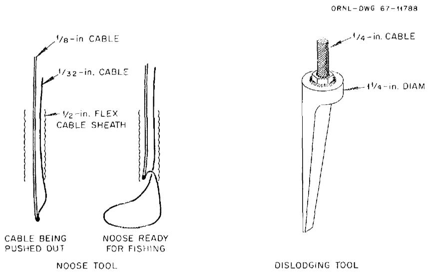

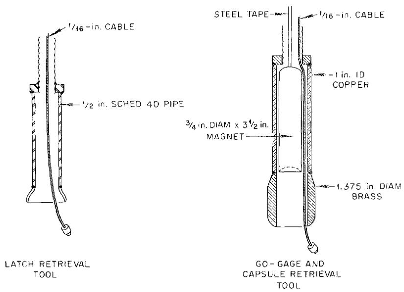  
Fig. 2.1. Tools Developed for Retrieval of Latch and Capsule from Sampler-Enricher.

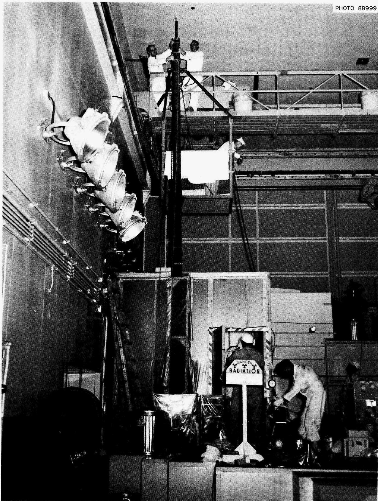  
Fig. 2.2. General View of Latch Recovery Operation with Tool Retrieval Shield in Place.

Some delays were encountered in the retrieval operation because of the necessity of building shielded carriers into which to pull the contaminated tools. As a result a very convenient arrangement was developed. A hollow lead cylinder, 24 ft long with 1- to $1_{/2}^{1}$ -in. walls, strapped to a steel I-beam formed the body of the carrier. A 24-ft length of $1_{/2}^{1}$ -in. pipe, with a gate valve at the lower end, fitted into the shield and could easily be dropped out at the burial ground with the contaminated tool safely contained inside. Figure 2.2 shows the containment enclosure around the restricted work area, with the shielded carrier suspended from the crane bridge. The workers on the bridge are in position to pull a tool out of the sampler tube with a cable dropped through a seal on the upper end of the pipe liner. This system was used for five hot pulls, with no spread of contamination or excessive radiation.

When the replacement sampler drive unit was installed, some difficulties were encountered in fitting up pipe and tubing connections, but containment joints were made up leak-tight.

The procedures and tools developed for this shutdown proved effective. The tool retrieval shield, in particular, was a useful development.

Measures for control of contamination and radiation prevented spread of activity outside the restricted work zone, and the highest quarterly dose for any worker was only 300 millirems. In view of the intense sources involved, this record attests to the effectiveness of the controls.

# 2.3 DECONTAMINATION STUDIES

# T. H. Mauney

The maintenance scheme for molten-salt breeder reactors proposes that components which can be easily decontaminated will be repaired and reused as spare parts. As an aid in evaluating this proposal, a study was started to determine the effectiveness of decontamination procedures in reducing the activity of contaminated parts from the MSRE.

The first item used in the study was the manipulator hand which had been used in the sampler-enricher system during months of power operation, until it was replaced because of a leak in the boot. When removed from the sampler-enricher, the unit was contaminated by mixed fission products to a level of approximately $300\mathrm{r / hr}$ at 3 in.

It was necessary to first remove the two-ply plastic boot which had provided fission product containment for the manipulator while in use. Since the ORNL facility used for routine decontamination can handle only up to $50\mathrm{r / hr}$ of gamma radiation, it was necessary to use a facility at the High-Radiation-Level Analytical Laboratory. This facility was equipped with remote handling equipment and high-pressure sprays which were used in the procedure.

The decontamination began with spraying the manipulator hand with a 500-psi jet of detergent. The unit was then soaked in several solutions. After the radiation level was reduced to less than $3\mathrm{r / hr}$ , the manipulator was removed to a laboratory hood and hand scrubbed with a wire brush and another detergent. The radiation level was finally reduced from the initial reading of $\sim 300\mathrm{r / hr}$ to a final level of $300\mathrm{mr / hr}$ , which was low enough to permit controlled direct contact for repair. The detailed results of the various treatments in reducing the radiation level are shown in Table 2.1.

One of the complicating factors affecting the decontamination of the manipulator hand was the presence of many crevices in the linkages and pins which could not be reached by the jet spray. Extending the cleaning time per step might have resulted in greater decontamination factors. Further studies will be made of this effect as other components become available.

The decontamination of the manipulator hand served a dual purpose. It not only helped determine the effectiveness of decontamination procedures in reducing the activity of MSRE contaminated components, but also made available at a decontamination cost of $300 a spare part that would have cost about$ 2000 to duplicate.

# 2.4 DEVELOPMENT OF A SCANNING DEVICE FOR MEASURING THE RADIATION LEVEL OF REMOTE SOURCES

Robert Blumberg T. H. Mauney

Dunlap Scott

A method for locating and evaluating concentrations of radioactive materials in areas having high background radiation would be useful in following the deposition of fission products in components of circulating fuel reactors and in chemical process plants. Location of unusual deposits would aid in understanding the operation of the

Table 2.1. Radiation Levels Following Steps in Decontamination of an MSRE Sampler-Enricher Manipulator Hand   

<table><tr><td>Cleaning Treatment</td><td>Cleaning Time (min)</td><td>Radiation Level After Treatment (r/hr)</td></tr><tr><td>None (as received)</td><td></td><td>300</td></tr><tr><td>Detergent (Duz) jet spray</td><td>5</td><td>100</td></tr><tr><td>Rinse (water)</td><td></td><td></td></tr><tr><td>Detergent (Duz) jet spray</td><td>5</td><td>75</td></tr><tr><td>Formula 50</td><td>10</td><td>25</td></tr><tr><td>Dilute HNO3</td><td>10</td><td>7.5</td></tr><tr><td>Bolt freeing solvent with acetone rinse</td><td>5</td><td>5.0</td></tr><tr><td>Concentrated HNO3</td><td>10</td><td>3.0</td></tr><tr><td>Scrub with scouring powder (BaB-O)a</td><td>5</td><td>0.5-1.0</td></tr><tr><td>Scrub with scouring powder (BaB-O)</td><td>5</td><td>0.2-1.0</td></tr><tr><td>Formula 50</td><td>5</td><td>No reduction</td></tr><tr><td>Concentrated HNO3</td><td>5</td><td>No reduction</td></tr><tr><td>Scrub with scouring powder (BaB-O)</td><td>5</td><td>No reduction</td></tr><tr><td>Clean with concentrated HNO3</td><td>5</td><td>0.2-0.3</td></tr><tr><td>Acetone rinse</td><td>5</td><td>No reduction</td></tr><tr><td>Smearsb</td><td></td><td>800-13,000c</td></tr></table>

aRemoved to laboratory hood.   
$^{b}$ Zirconium and ruthenium.   
cIn disintegrations per minute.

system and in planning for maintenance of the components. On the basis of these needs, a study of possibly useful devices was started.

The concept of the pinhole camera using radiation shielding and gamma-ray-sensitive film was evaluated along with a system using a portable collimator and a small gamma-sensitive dosimeter. It was determined that while the camera method was feasible, the results to date did not provide very good resolution of position, intensity, and size. The problem of calibration of the film for use in radiation fields of unknown energy appeared difficult. However, the time required to survey an area would be short, approximately equal to the required exposure time for the film. The use of the collimator method would take longer to complete a survey, but possibly could yield better resolution. This method also offered the potential of giving information on the gamma-ray energy spectrum of the source. A series of experiments with the collimator was conducted to evaluate the method, with the results described below.

# Experiment with a 5-curve $^{137}\mathrm{Cs}$ Gamma Source

A collimator was constructed by casting lead in a 4-in.-diam steel pipe 48 in. long and providing a 1-in.-diam hole the length of the tube. The collimator tube was placed in a suitable hole in the portable shield which was positioned over a pit containing a 5-curie $^{137}\mathrm{Cs}$ source.

Radiation measurements were made with the equipment and source arranged as shown in Fig. 2.3. The radiation source could be raised and lowered, and the collimator tube could be moved horizontally over the source. Measurements were made with the source 13 ft and 15 ft 6 in. below the top of the portable shield. The source was about $\frac{1}{4}$ in. in diameter and 2 in. long and was enclosed in a 1-in.-diam tube 5 in. deep in the carrier.

The results of the radiation measurements are shown in Fig. 2.4. It will be noted that as the collimated ion chamber was moved horizontally over the source, the radiation readings changed

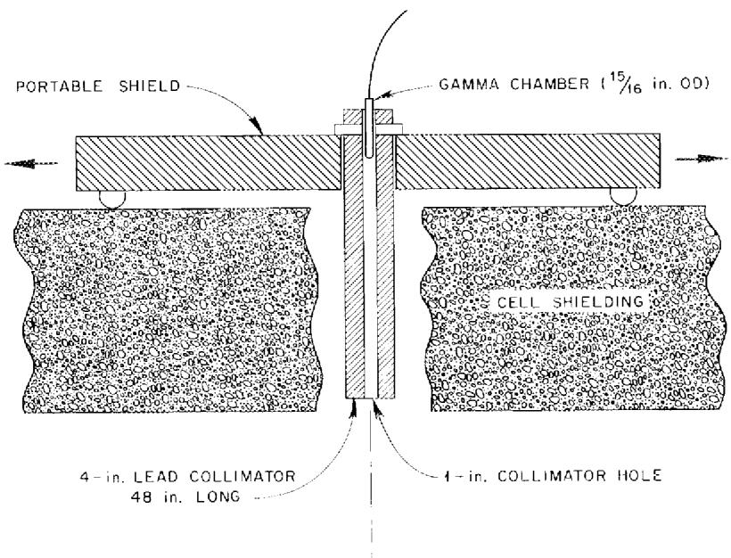

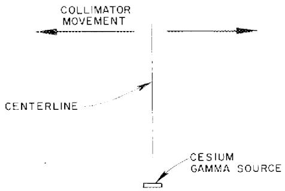  
Fig. 2.3. Collimator-Source Geometry for Point-Source Test.

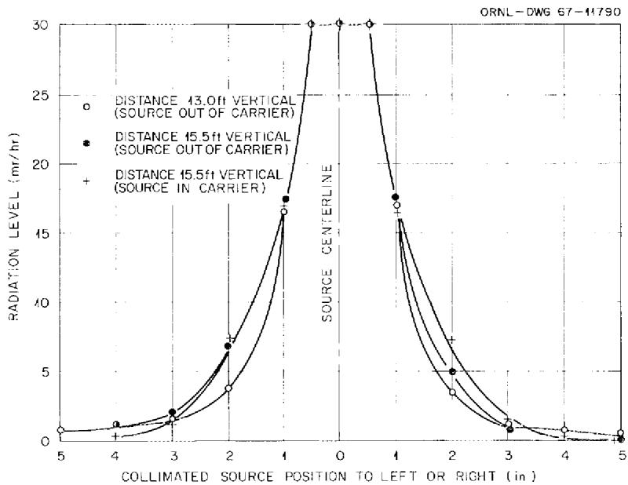  
Fig. 2.4. Collimated Radiation from 5-curve $^{137}\mathrm{Cs}$ Source.

significantly, indicating clearly the collimating effect. The flat top at the peak was of the same width as the collimator hole and represents the resolution of the collimator when used with a point source.

# Gamma Scan of the MSRE Heat Exchanger

A gamma radiation scan was made on May 19, 1967, over the area in the reactor cell containing the fuel-to-coolant-salt heat exchanger and fuel salt line 102.

To accomplish the radiation scan, the portable maintenance shield was located over an opening in the reactor cell above the heat exchanger, and the collimator and gamma ion chamber were installed in a hole in the portable shield. Measurements were made by moving the portable shield until the ion chamber was directly above the de

sired points in the cell. Figure 2.5 shows the vertical distances from the tip of the ion chamber to items in the cell.

The orientation of the various ion chamber traverses of the cell along with lines of equal radiation levels are shown superimposed over the heat exchanger and line 102 in Fig. 2.6. It will be noted that the maximum radiation levels were $3.5\mathrm{r / hr}$ above the heat exchanger center line and $300\mathrm{mr / hr}$ above line 102. When the collimator was removed, the radiation level at the top of the hole in the portable shield was $100\mathrm{r / hr}$ .

These results show that the collimated gamma ion chamber measures radiation levels with very good resolution of position, even in the presence of high background radiation levels. Therefore, this method of radiation measurement should be useful in locating accumulations of fission products in reactor components and in planning maintenance operations.

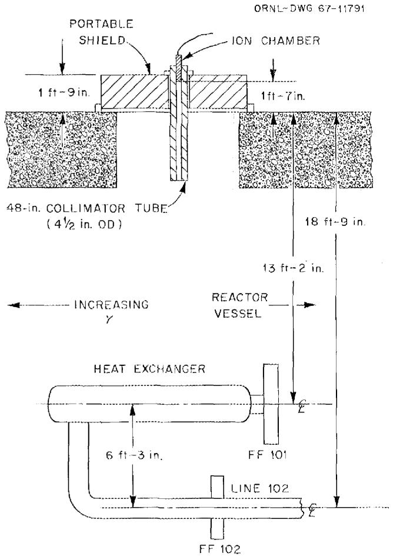  
Fig. 2.5. Source-Detector Geometry for Gamma Scan of MSRE Heat Exchanger.

# Gamma Energy Spectrum Scan of the MSRE Heat Exchanger

On May 20, 1967, a gamma energy spectrometer was set up over the same area in the reactor cell, and measurements were made at several points over the fuel-to-coolant-salt heat exchanger. This exploratory experiment was made primarily to evaluate the method.

The measurements were made by using a 3- by 3-in. NaI crystal and photomultiplier tube mounted in a lead shield which had a collimating hole $\frac{1}{32}$ in. in diameter and 7 in. long under the crystal. The array was mounted on the hole in the portable shield in the same manner as the collimator for the gamma scan described earlier.

There were strong, well-defined peaks at about 0.48 and 0.78 MeV corresponding to $^{103}\mathrm{Ru}$ and $^{95}\mathrm{Zr - }^{95}\mathrm{Nb}$ . The resolution of the NaI crystal was not good enough to determine whether the second peak was from $^{95}\mathrm{Nb}$ only or from the $^{95}\mathrm{Zr}$ decay chain. The energy resolution could be improved by using a different crystal, since the collimator did not appear to degrade the peaks. The problem of assigning absolute disintegration rates to these isotopes is complicated by the geometrical arrangement of the heat exchanger and heaters, the effect of gamma energy on absorption by the collimator, the source distribution in the heat exchanger, and the counter efficiency. It is believed, however, that some measure of the relative

ORNL-DWG 67-11792

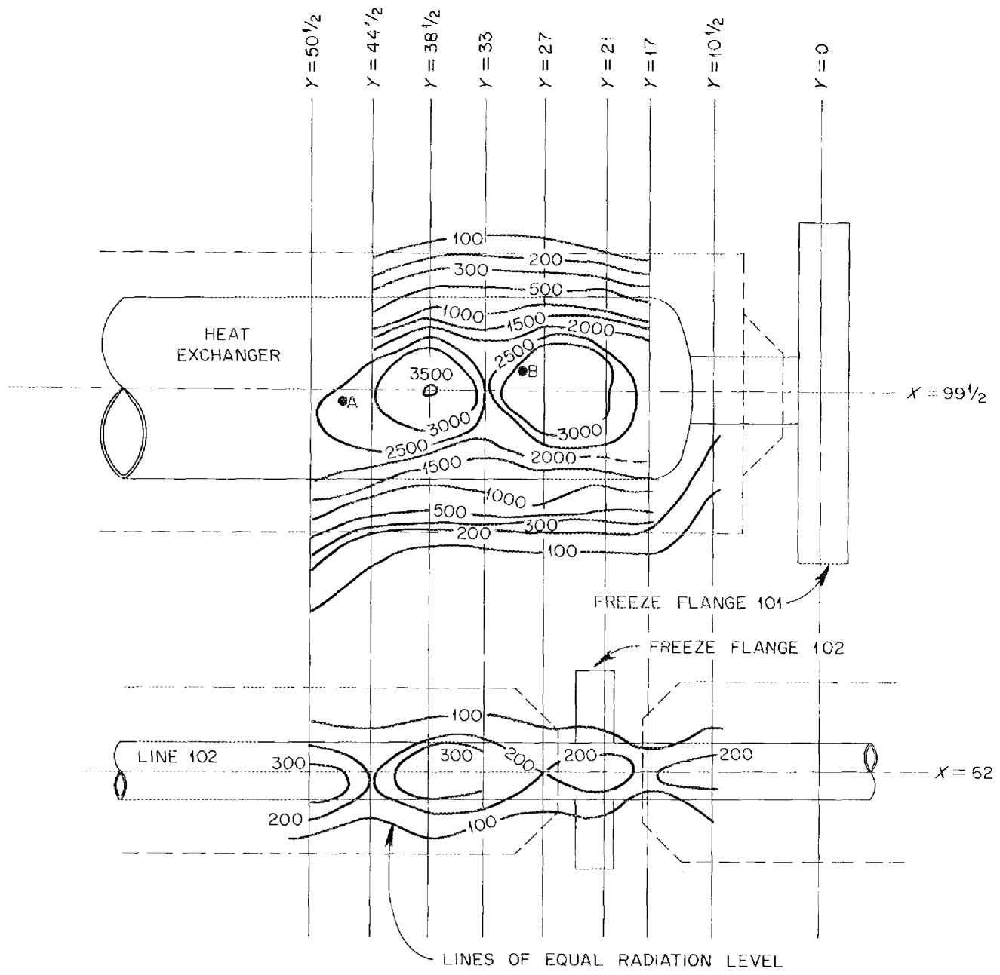  
Fig. 2.6. Results of Gamma Scan of the MSRE Heat Exchanger.

disintegration rates can be obtained by comparing the ratio of the areas under the counting peaks for different isotopes at one position with the ratio found at other positions. For the measurements made at point $A$ on Fig. 2.6, the ratio of Ru to Zr-Nb was 0.66, while at point $B$ the ratio was 1.20.

Although not clearly understood at this time, it

is believed that these differences in the ratios represent a difference in the deposition of the two isotopes at the two positions. Much additional work would be necessary to establish the method for quantitative measurement under a particular set of conditions, but it might be the only nondestructive method for making such deposition measurements.

# 2.5 PUMPS

P. G. Smith

A. G. Grindell

# Mark-2 Fuel Pump

As reported previously, the Mark-2 (Mk-2) fuel pump was designed to give more salt expansion space in the pump bowl, thus eliminating the need for an overflow tank. As a consequence of the deeper bowl, the Mk-2 rotary element has a longer unsupported length of shaft than the Mk-1. The device for removing gaseous fission products from the salt is also different in the Mk-2 bowl.

Fabrication of the Mk-2 pump tank was completed, and the rotary element was modified so that the joint between the bearing housing and shield plug can be seal-welded should the pump be

needed at the MSRE. The pump tank is being installed in the pump test facility, and the facility is being prepared for tests with molten salt to investigate the adequacy of the running clearances and the performance of the xenon stripper.

# Spare Rotary Elements for MSRE Fuel and Coolant Salt Pumps

The spare rotary element for the coolant salt pump was assembled, tested, and fitted for service at the MSRE. The joint between the bearing housing and the shield plug was sealwelded to eliminate the possibility of an oil leakage path from the lower seal catch basin to the

2 Ibid., p. 64.   
3 Ibid., p. 65.

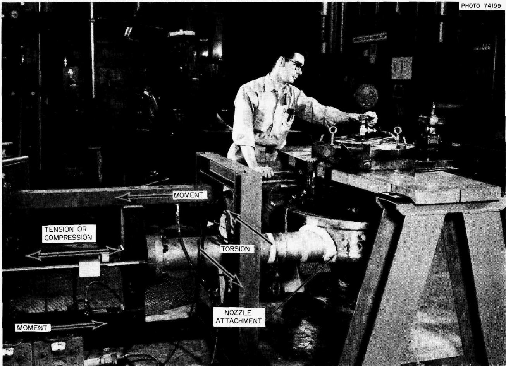  
Fig. 2.7. Experimental Apparatus for Nozzle Stress Tests.

pump tank. It is now available, along with a spare fuel pump rotary element, for service in the MSRE.

# Stress Tests of Pump Tank Discharge Nozzle Attachment

The stress tests of the discharge nozzle on the Mk-1 prototype pump tank were completed, and the tank assembly was transferred to the Metals and Ceramics Division for examination. A photograph of the experimental apparatus is shown in Fig. 2.7. Strain data were obtained under a pressure of 50 psi in the tank and a moment of 48,000 in.-lb applied to the nozzle. The measured strains were converted into stresses by use of conventional relationships. For comparison, the stresses were calculated by means of the CERL-II code, which is written for a nozzle attached radially to a spherical shell. The actual configuration is a nonradial nozzle attached to a cylindrical shell near the junction of the shell to a formed head. The computer code underestimated the experimentally measured pressure stresses by a factor of about 4.6 and overestimated the moment stresses by about 3.5 times. When the stresses are combined, the code-calculated stresses are higher than the measured stresses for the test

conditions. Based on our present knowledge, the nozzle attachment appears to be adequate for the intended service.

# MSRE Oil Pumps

Two oil pumps were removed from service at the MSRE, one because of excessive vibration and the other because of an electrical short in the motor winding. The one with excessive vibration had one of two balancing disks loose on the shaft. The loose disk was reattached, and the rotor, including shaft assembly and impeller, was dynamically balanced. This pump has been reasssembled, has circulated oil up to $145^{\circ}\mathrm{F}$ , and is ready for service at the MSRE. The pump with the shorted motor winding has been rewound, reasssembled, and is circulating oil.

# Oil Pump Endurance Test

The oil pump endurance test was continued, and the pump has now run for 35,766 hr, circulating oil at $160^{\circ}\mathrm{F}$ and 70 gpm.

# 3. Instruments and Controls

L.C.Oakes

# 3.1 MSRE OPERATING EXPERIENCE

C.E.Mathews J.L.Redford

R. W. Tucker

Instrumentation and control systems continued to perform their intended functions. Component failures did not compromise safety nor cause excessive inconvenience in the reactor operation. A moderate amount of maintenance was required, as described in the sections that follow.

# Control System Components

The 48-v dc relays continued to suffer damage because of heat developed in the resistors built into the operating coil circuits. Because of this problem, redesigned relays had been procured and some had been installed. After several months, some of these also showed signs of deterioration. Therefore, following run 11, all 139 relays operating from the 48-v dc system were modified by replacing the built-in resistors with externally mounted resistors. This was done with the relays in place, without disconnecting control circuit wiring, thus avoiding the possibility of wiring mistakes inherent in relay replacement. No trouble was experienced after the modification.

Component failures were as follows. The coil in a solenoid valve for the main blower 3 backflow damper developed an open circuit. The fine-position synchro on rod drive 2 developed an open circuit in the stator winding and was replaced at the shutdown in May. The fuel overflow tank level transmitter was replaced after a ground developed in the feedback motor. The ground was subsequently found

and corrected. The span and zero settings of the differential pressure transmitter (PdT-556) across the main charcoal beds shifted drastically. Although the pressure capability had never been exceeded, the diaphragm had apparently suffered damage. Thus, when a new transmitter was installed in June, hand valves were installed in the lines connecting to the off-gas system to be used in protecting against unusual pressures during system operations. The 1-kw 48-v-dc-to~120-v-ac inverter, which supplies ac power to one of the three safety channels, failed during switching of the 48-v dc supply. It was repaired by replacement of two power transistors. Only one thermocouple (TE-FP-10B) failed due to an open circuit. (See p. 22 for discussion of thermocouple performance.) Water was admitted to the steam dome on fuel drain tank 1 on several occasions before the cause was found to be an intermittent fault in a control module. A freeze-flange temperature control module failed because of excessive condenser leakage. At the next shutdown, all similar condensers were checked, and 33 were replaced because of leakage.

# Nuclear Instruments

Four of the eight neutron chambers had to be replaced. The fission chamber for wide-range counting channel 1 was replaced because of a short circuit from the high-voltage lead to ground. The fission chamber for wide-range counting channel 2 was replaced after moisture penetrated the protective cover on the cable. Moisture leakage into the cable to the $\mathrm{BF}_3$ chamber required that the cable and chamber be replaced. The output of the ion chamber in safety channel 2 decreased drastically during a nonoperating period, and the chamber was replaced prior to resumption of operations. The

trouble proved to be a failure in a glass seal that allowed water to enter the magnesia insulation in the cable, which is an integral part of the chamber.

# Safety System

A period safety amplifier failed when lightning struck the power line to the reactor site, and a replacement amplifier failed as it was being installed. The field-effect transistor in this type of amplifier is susceptible to damage by transient voltages, and it was found that under some conditions, damaging transients could be produced when the amplifier is removed from or inserted into the system. A protective circuit was designed, tested, and installed on the spare unit; in the interim, a different and more stable field-effect transistor was installed. The module replacement procedure has been modified to reduce the possibility of damage incurred on installation of the module.

Experience at other sites with the type of flux safety amplifiers used in the MSRE had shown that the input transistor could be damaged, causing erroneous readings, if the input signal became too large too rapidly. Therefore, a protective network of a resistor and two diodes was added to the input circuit of each of these amplifiers.

Two relays in the safety relay matrices failed, both with open coil circuits. A chattering contact on the fuel pump motor current relay caused safety channel 2 to trip several times before the problem was overcome by paralleling two contacts on the same relay. A defective switch on the core outlet temperature also caused several channel trips and one reactor scram before the trouble was identified and the switch was replaced.

Four rod scams, all spurious, occurred during operation in the report period. Two were caused by general power failures during electrical storms. Another occurred during a routine test of the safety system when an operator accidentally failed to reset a tripped channel before tripping a second channel. The other scam, also during a routine test, came when a spurious signal from the switch on the core outlet temperature tripped a channel while another channel was tripped by the test.

# 3.2 CONTROL SYSTEM DESIGN

# P. G. Herndon

As experience showed the need or desirability of more information for the operators, improved per

formance, or increased protection, the instrumentation and controls systems were modified or added to. During the report period there were 25 design change requests directly involving instruments or controls. Six of these required only changes in process switch operating set points. Fourteen requests resulted in changes in instruments or controls, one was canceled, and the remaining four were not completed. The more important changes are described below.

The single $\pm 32\text{-}\mathbf{v}$ dc power supply formerly serving the nuclear safety and controls instrumentation was replaced with three independent power supplies, one for each safety channel. Each obtains $\pm 32\text{-}\mathbf{v}$ dc from $110\text{-}\mathbf{v}$ ac, but the ac power sources are different. One is the normal building ac system. Another is $110\text{-}\mathbf{v}$ ac from a 50-kw static inverter powered by the 250-v dc system. The third comes from a 1-kw inverter operating on the 48-v dc system. Thus continuity of control circuit operation is ensured in the event of a single power supply or power source failure. It also increased the reliability of the protection afforded by the safety system by ruling out the possibility that malfunction of a single voltage-regulating circuit could compromise more than one channel. (Before the change, on one occasion, a failure in part of the regulating circuit caused its voltage output to increase from 32 to 50 v, and only a second regulator in series prevented this increase from being imposed on all the safety circuits.)

To prevent the reactor from dropping out of the "Run" control mode when a single nuclear safety channel is de-energized, the "nuclear sag bypass" interlocks were changed from three series-connected contacts to a two-of-three matrix.

Circuits were installed to annunciate loss of power to the control rod drive circuits. This reminds the operator that he cannot immediately return to power simply by manually withdrawing the rods after the controls have dropped out of the "Run" mode.

A wiring error in a safety circuit was discovered and corrected. Interlocks had recently been added in the "load scram" channels to drop the load when the control rods scram. A wiring design error resulted in these interlocks being bypassed by a safety jumper. Although the circuits were wired this way for a time before being discovered, the scram interlocks were always operative during power operation, since the reactor cannot go into the "Operate" mode when any safety jumper is inserted.

The rate-of-fill interlocks, including the pneumatic instrument components in the drain-tank weighing system, were removed from the control circuits for the fuel drain tank helium supply valve. Experience had shown that these interlocks, intended to limit the rate at which fuel could be transferred to the core, were not required, since physical restrictions in the helium supply positively prevent filling as fast as the design set point on the interlock.

Four new photoengraved graphic panels incorporating recent circuit changes were installed on the control and safety circuit jumper board. The main control board graphics were also revised to show changes in the fuel off-gas system.

Test circuits were originally provided to check the operability of electronic safety instruments on fuel loop pressure and overflow tank level. These were revised to make it possible to observe the value of the test signal current at which the relays operate.

The measuring range of the matrix-type flow element on the upper seal gas flow from the coolant

pump was increased from 5 to 12 liters/hr. This was to keep the instrument on scale at pump bowl pressures higher than originally anticipated. A new capillary flow element was designed to replace the element that measures the reactor cell evacuation rate, raising the range from 1 to 4 liters/min.

To avoid reducing the reactor system helium supply pressure below the minimum limit when large quantities of helium are required for fuel processing, the fuel processing system helium supply line was removed from the 40-psig supply header and reconnected upstream to the 250-psig main supply header. Pressure-regulating instruments were installed.

To provide more information to the operator, 20 additional pairs of thermocouple lead wires were installed between the vent house and the data logger. Connections at the patch panel were made available by removing unused lead wires from some radiator thermocouples. A new conduit for these lead wires was also installed between the vent house and the existing cable trough in the coolant drain cell.

# 4. MSRE Reactor Analysis

# 4.1 INTRODUCTION

P. N. Haubenreich

B. E. Prince

The experimental program planned for the MSRE includes operation for over half a year with $^{233}\mathrm{U}$ as the fissile material. The fuel salt presently in the reactor will be fluorinated in the MSRE processing facility to remove the uranium (33% $^{235}\mathrm{U}$ ). Then $^{233}\mathrm{U}$ will be added to the stripped carrier salt as the LiF-UF $_4$ eutectic (73-27 mole %).

During this report period, we calculated most of the important neutronic properties of the reactor, operating with $^{233}\mathrm{U}$ fuel. These results will be used in a safety analysis and in planning the startup experiments. We also made some computations of neutron spectra to use in evaluating the relevance of MSRE $^{233}\mathrm{U}$ experiments to molten-salt breeder design calculations. The techniques of analysis were similar to those used previously for the MSRE with $^{235}\mathrm{U}$ fuel. The results are discussed in the sections which follow, and references are given which provide more detailed descriptions of the methods of analysis.

The fluorination process removes uranium and some fission products, but leaves plutonium and most fission products in the carrier salt. It was necessary, therefore, to make some assumptions regarding these concentrations at the time of the startup with $^{23}$ U. It was assumed that all the uranium is removed and that all the plutonium and samarium remain in the salt. We assumed that the changeover would be made at an integrated power of 60,000 Mwhr and computed the plutonium and samarium concentrations from the time-integrated production and removal rates for these nuclides. Fission products other than samarium were not considered explicitly in the base-line calculations, since their net effect on the core reactivity is quite small. The uranium isotopic composition

Table 4.1. Isotopic Composition of ${}^{233}\mathrm{U}$ Available for MSRE   

<table><tr><td>Uranium Isotope</td><td>Fraction (at. %)</td></tr><tr><td>232</td><td>0.022</td></tr><tr><td>233</td><td>91.5</td></tr><tr><td>234</td><td>7.6</td></tr><tr><td>235</td><td>0.7</td></tr><tr><td>236</td><td>0.05</td></tr><tr><td>238</td><td>0.14</td></tr></table>

aORNL communication, J. M. Chandler to J. R. Engel, May 1967.

for the new fuel (Table 4.1) is the actual composition of the uranium available for use.

# 4.2 NEUTRON ENERGY SPECTRA IN MSRE AND MSBR

B. E. Prince

In a recent report, we described the results of computational studies of MSRE neutron spectra for the present $^{235}\mathrm{U}$ fuel salt. We have extended these studies to the spectra with the $^{233}\mathrm{U}$ fuel and have compared the results with corresponding spectra for a typical MSBR core lattice currently under design study.

The characteristics of the MSBR core design used for these calculations were taken from ref. 2. The graphite-moderated portion of the core was 10 ft long and 8 ft in diameter and contained fuel and

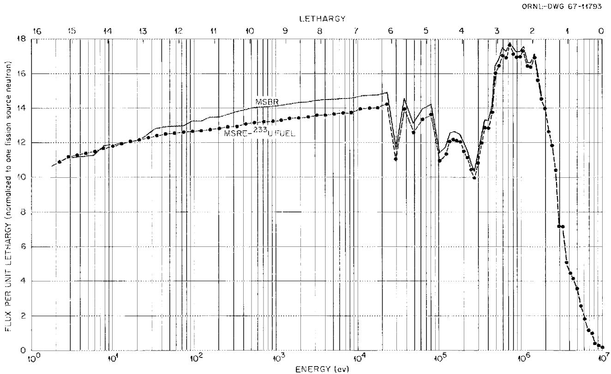  
Fig. 4.1. Calculated Epithermal Neutron Spectra in the $^{233}\mathrm{U}$ -Fueled MSRE and in the MSBR.

fertile salt volume fractions of 16.48 and $5.85\%$ respectively. The fuel salt contained approximately 2.84 mole $\% \mathrm{UF}_4$ ( $\sim 64\%$ of total U is $^{233}\mathrm{U}$ and $\sim 5.9\%$ is $^{235}\mathrm{U}$ ), and the fertile salt contained 27 mole $\% \mathrm{ThF}_4$ . By comparison, the model of the MSRE core used for this analysis was a cylinder with effective dimensions of 58 in. in diameter by 78 in. in height. The fuel salt volume fraction is $22.5\%$ , and there is no fertile salt. The uranium content of the fuel salt was approximately 0.125 mole $\% \mathrm{UF}_4$ ( $\sim 91.4\%$ $^{233}\mathrm{U}$ ), based on calculations summarized in the following section.

As described in ref. 1, the epithermal and thermal neutron spectra calculations were made with the GAM and THERMOS programs respectively. In the choice of an effective "thermal cutoff" energy separating these spectra, there is a considerable degree of latitude, with the single restriction that the cutoff energy be high enough that important calculated neutronic properties at operating temperature are not strongly influenced by neglect of upscattering corrections above the cutoff energy.

In previous studies of the MSRE, $^{1,3}$ we used 0.876 ev (for which the present energy group structures for the GAM and THERMOS programs coincide). This value was found to be sufficiently high to satisfy the preceding criterion. $^{3}$ However, because current design calculations for the MSBR are based on the higher value of 1.86 ev, to make a valid comparison we calculated the MSRE thermal spectra for this higher cutoff energy.

The results of GAM-II calculations of the epithermal neutron spectra in the two reactors are shown in Fig. 4.1. As in ref. 1, use is made of the lethargy variable, proportional to the logarithm of the neutron energy, in plotting the results. This relation is

$$
\text {l e t h a r g y} = - \ln (\text {e n e r g y / 1 0 M e v}).
$$

For a unit fission source the calculated fluxes per unit lethargy for each GAM-II neutron group are

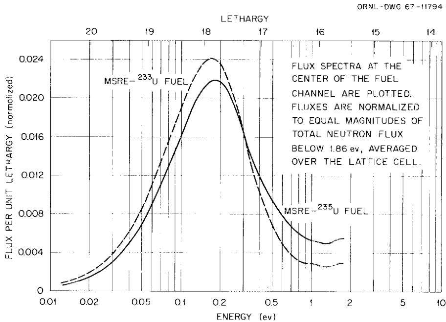  
Fig. 4.2. Calculated Thermal Neutron Spectra in the MSRE with $^{235}\mathrm{U}$ and $^{233}\mathrm{U}$ Fuel Salts.

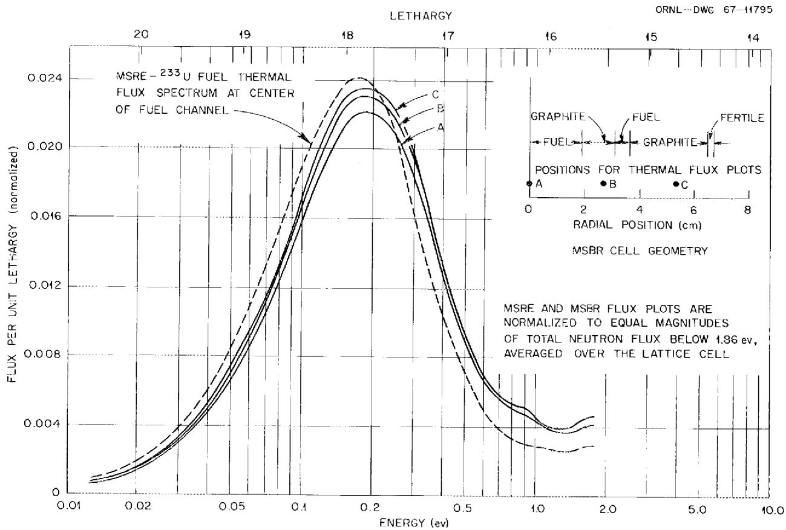  
Fig. 4.3. Calculated Thermal Neutron Spectra in the $^{233}\mathrm{U}$ -Fueled MSRE and in the MSBR.

shown as solid points in Fig. 4.1 (points shown only for the MSRE $^{233}\mathrm{U}$ spectra). The calculated points are connected by straight line segments. As might be expected from the gross similarities between the two reactor systems (temperatures, moderating materials, total salt volume fractions), there is a marked similarity between the two spectra. Above energies of about 1 kev, the MSBR flux spectra lie above that of the MSRE, due to the smaller neutron leakage from the MSBR core. Below about 1 kev the spectrum in the MSBR becomes progressively reduced by resonance neutron absorption in the fertile material, and the two flux spectra tend to approach one another in magnitude.

Results of THERMOS thermal spectra calculations are shown in Figs. 4.2 and 4.3. Figure 4.2 compares the MSRE spectrum for the $^{233}\mathrm{U}$ fuel salt with that for the current $^{235}\mathrm{U}$ fuel loading. The spectra at the center of the fuel channel are chosen as a basis of comparison. In Fig. 4.3, the MSRE thermal spectrum with the $^{233}\mathrm{U}$ fuel salt is compared with the corresponding spectra at several points in the MSBR lattice. Note that curve A has the same relative position in the MSBR lattice (center of the larger fuel salt channel) as that of the MSRE. For both these reactors the flux spectra of Figs. 4.2 and 4.3 are normalized to give the same total integrated neutron flux below 1.86 ev, averaged over the total volume of salt and graphite. On this basis, relative comparisons can be made of the energy (or lethargy) distributions and position dependence of the spectra in each reactor. One should note, however, that the actual magnitudes

of the total thermal flux will be quite different in the systems, depending on the relative fission densities and the fissile material concentrations.

In Fig. 4.2, the slight "energy hardening," or preferential removal of low-energy neutrons for the $^{235}\mathrm{U}$ fuel loading, reflects the larger uranium concentration for this case ( $\sim 0.9$ mole % total $\mathrm{UF}_4$ , $33\%$ enriched in $^{235}\mathrm{U}$ ). Again, in Fig. 4.3 the higher concentration and absorptions in fissile uranium in the MSBR and also the absorptions in the fertile salt produce a hardening of the energy spectrum as compared with the MSRE. Just as in the case of the epithermal spectra, however, the similar temperatures and gross material compositions result in a marked similarity in the spectra

An alternate means of comparing the neutron spectra in the two systems is shown in Figs. 4.4 and 4.5. Here the calculated group fluxes have been multiplied by the corresponding group microscopic fission cross section for $^{233}\mathrm{U}$ , summed over the energy groups above each energy point, and normalized to one fission event in $^{233}\mathrm{U}$ occurring in each of the thermal ( $E < 1.86\mathrm{ev}$ ) and epithermal ( $E > 1.86\mathrm{ev}$ ) energy regions. In the latter case, most of the fission reactions occur between the lower cutoff energy and about 30 ev, where the flux spectra are quite close to one another (Fig. 4.1). As a result, there is a close correspondence in the normalized distribution of epithermal fission events in the two systems. Larger differences are encountered in the thermal fissions, as shown in Fig. 4.5. Note, however, that the spectra at the center of the fuel channels

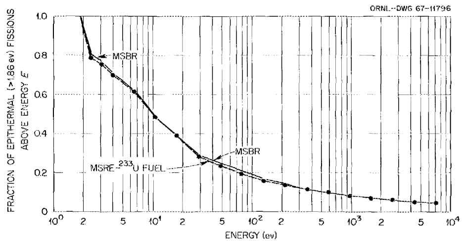  
Fig. 4.4. Normalized Distributions of Epithermal Fission Events in the $^{233}$ U-Fueled MSRE and in the MSBR.

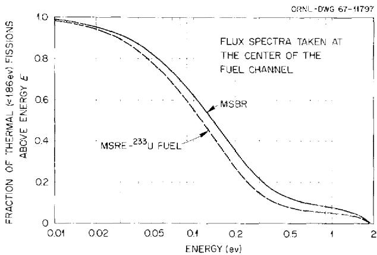  
Fig. 4.5. Normalized Distributions of Thermal Fission Events in the 233U-Fueled MSRE and in the MSBR.

are chosen as a basis for this comparison, so that the curves in Fig. 4.5 should represent an upper limit of the difference between the energy distribution of thermal fissions in these systems. The overall ratio of epithermal to thermal fissions calculated for the MSRE lattice was 0.15; this is also very close to that obtained for the MSBR lattice.

The general conclusion obtained from these studies is that there is sufficient similarity in the neutron spectra in these two reactors that inferences drawn from physics experiments with the $^{233}\mathrm{U}$ -fueled MSRE (i.e., critical experiments, measurements of the effective capture-to-fission ratio in the reactor spectra, etc.) should bear a strong relation to the nuclear design of the MSBR. These inferences include the adequacy of the library of $^{233}\mathrm{U}$ cross sections and the computational techniques used to evaluate the experiments. The present studies, however, do not consider the equally important questions of control of error and uncertainty in such measurements, and the sensitivity of the measurement analysis to uncertainties in cross-section data and theoretical modeling techniques. Further studies along these lines are planned, in order to better determine the relevance of MSRE experiments with $^{233}\mathrm{U}$ fuel to the design of the MSBR.

# 4.3 OTHER NEUTRONIC CHARACTERISTICS OF MSRE WITH $^{233}\mathrm{U}$ FUEL

B. E. Prince

# Critical Loading, Rod Worth, and Reactivity Coefficients

A summary of the important parameters calculated for the $^{233}\mathrm{U}$ fuel loading is given in Table 4.2.

Table 4.2. Neutronic Characteristics of MSRE with ${}^{233}\mathrm{U}$ Fuel Salt at ${1200}^{ \circ  }\mathrm{F}$   

<table><tr><td colspan="2">Minimum critical uranium loadinga</td></tr><tr><td>Concentration, grams of U per liter of salt</td><td>15.82</td></tr><tr><td>UF4, mole %</td><td>0.125</td></tr><tr><td>Total uranium inventory, kgb</td><td>32.8</td></tr><tr><td>Control rod worth at minimum critical loading, % δk/k</td><td></td></tr><tr><td>One rod</td><td>-2.75</td></tr><tr><td>Three rods</td><td>-7.01</td></tr><tr><td>Increase in uranium equivalent to insertion of one control rod, c %</td><td>6.78</td></tr><tr><td>Prompt neutron generation time, sec</td><td>4.0 × 10-4</td></tr><tr><td colspan="2">Reactivity coefficientsd</td></tr><tr><td>Fuel salt temperature, (°F)-1</td><td>-6.13 × 10-5</td></tr><tr><td>Graphite temperature, (°F)-1</td><td>-3.23 × 10-5</td></tr><tr><td>Fuel salt density</td><td>+0.447</td></tr><tr><td>Graphite density</td><td>+0.444</td></tr><tr><td>Uranium concentratione</td><td>+0.389</td></tr><tr><td colspan="2">Individual nuclide concentrations in salt</td></tr><tr><td>6Li</td><td>-0.0313</td></tr><tr><td>7Li</td><td>-4.58 × 10-4</td></tr><tr><td>9Be</td><td>+0.0259</td></tr><tr><td>19F</td><td>+0.0706</td></tr><tr><td>40Zr</td><td>-0.00813</td></tr><tr><td>149Sm</td><td>-0.0132</td></tr><tr><td>151Sm</td><td>-0.00163</td></tr><tr><td>233U</td><td>+0.4100</td></tr><tr><td>234U</td><td>-0.0132</td></tr><tr><td>235U</td><td>+0.00216</td></tr><tr><td>236U</td><td>-2.58 × 10-5</td></tr><tr><td>238U</td><td>-4.93 × 10-5</td></tr><tr><td>239Pu</td><td>+0.0122</td></tr></table>

${}^{a}$ Fuel not circulating,control rods withdrawn to upper limits.   
${}^{b}$ Based on ${73.2}{\mathrm{{ft}}}^{3}$ of fuel salt at ${1200}^{ \circ  }\mathrm{F}$ in circulating system and drain tanks.   
cIncrease in uranium concentration required to maintain criticality with one rod inserted to lower limit of travel, fuel not circulating.   
$^d$ At initial critical concentration. Where units are shown, coefficients for variable $x$ are of the form $\delta k / k\delta x$ ; otherwise, coefficients are of the form $x\delta k / k\delta x$ .   
$^{\mathfrak{e}}$ Isotopic compositions of uranium as given in Table 4.1.

These are the results of two-dimensional, four-group diffusion calculations, with the group cross sections averaged over the neutron spectra shown in the preceding section. Both $RZ$ and $R\theta$ geometric approximations of the reactor core were considered, in the manner used previously to analyze the physics experiments with the $^{235}\mathrm{U}$ fuel. One innovation was the use of the two-dimensional multigroup EXTERMINATOR-2 program, a new version which includes criticality search options and a convenient perturbation and reactivity coefficient calculation.

The properties listed in Table 4.2 differ in several important respects from the corresponding properties of the present $^{235}\mathrm{U}$ fuel salt. The fissile material concentration is only about one-half that for the present fuel, an effect which results mainly from the absence of a significant quantity of $^{238}\mathrm{U}$ in the new loading. This same effect produces an increase in the thermal diffusion length in the core, thereby increasing the thermal-neutron leakage (as reflected in the larger magnitudes of the fuel temperature and density coefficients of reactivity). The increased diffusion length also results in an increase in control rod effectiveness $(2.75\% \delta k / k$ calculated for one rod, as compared with $2.11\%$ calculated and $2.26\%$ measured worth of one rod in the present $^{235}\mathrm{U}$ -fueled reactor). On the percentage basis given in Table 4.2, the uranium concentration coefficient is higher for the $^{233}\mathrm{U}$ fuel by a factor of about 1.8, owing to the absence of the $^{238}\mathrm{U}$ and also to the greater neutron productivity of the $^{233}\mathrm{U}$ . On the basis of $1\mathrm{g}$ of excess uranium added to the fuel circulating system $(70.5\mathrm{ft}^3)$ , the reactivity change is $+0.00123\% \delta k / k$ . This is about 3.8 times the corresponding reactivity change when $1\mathrm{g}$ of $^{235}\mathrm{U}$ is added to the present fuel salt.

# Fission Rate and Thermal Flux Spatial Distributions

Spatial distributions of the fission density in the fuel salt, obtained from the EXTERMINATOR diffusion calculations described in the preceding section, are shown in Figs. 4.6 and 4.7. Figure

4.6 shows the axial distribution of the fission density at a radial position of about 7.3 in. from the core center line, which is the approximate radial position of maximum flux with all control rods withdrawn. The fission density in the salt is normalized to $10^{6}$ fission events occurring in the entire system. Also shown in Fig. 4.6 is the axial distribution of neutron importance for the fast group, which is used in the calculation of the effects of circulation on the delayed precursors (see later section).

Figure 4.7 shows the corresponding radial distributions of fission density in the salt, both with all rods withdrawn and with one and three rods fully inserted. These curves are based on calculations with an $R\theta$ model of the core geometry. The approximate geometry used for the control element and sample-holder configuration is indicated schematically in the figure, and the angular position of the flux traverse along the reactor diameter is also shown. In the position where the traverse intersects the control element (Fig. 4.7), the curves for the center portion of the salt-graphite lattice are connected with those for the major part of the lattice by dashed straight lines extending through the control region.

The corresponding distributions of thermal flux are very similar in shape to the fission density distributions. These are given in Figs. 4.8 and 4.9. The magnitudes of these fluxes are based on $1\mathrm{Mw}$ of fission energy deposited in the system, using the conversion factor of $3.17\times 10^{16}$ fissions/Mwsec. The flux magnitudes are also normalized to the minimum critical uranium loading, so that renormalization of these values would be necessary to apply them to the exact operating concentration. For this purpose the flux can be assumed to be inversely proportional to the $^{233}\mathrm{U}$ concentration. Note also that, in these calculations, the thermal neutron flux is defined as the integral flux below a cutoff energy of 0.876 ev (see the discussion in Sect. 4.2).

# Reactor-Average Fluxes and Reaction Cross Sections

Cross sections for important nuclide reactions in the MSRE $^{233}\mathrm{U}$ spectrum are listed in Table 4.3. These values of the thermal and epithermal averages are based on a cutoff energy of 0.876 eV. To obtain the final column, we have used the average

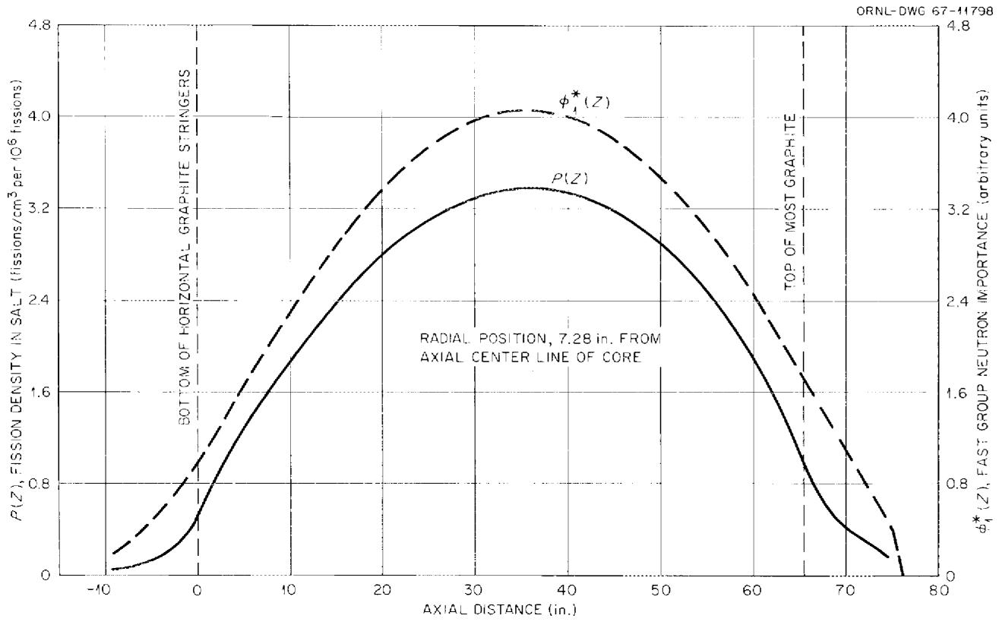  
Fig. 4.6. Axial Distributions of Fission Density and Fast Group Importance in the MSRE with $^{233}\mathrm{U}$ Fuel Loading.

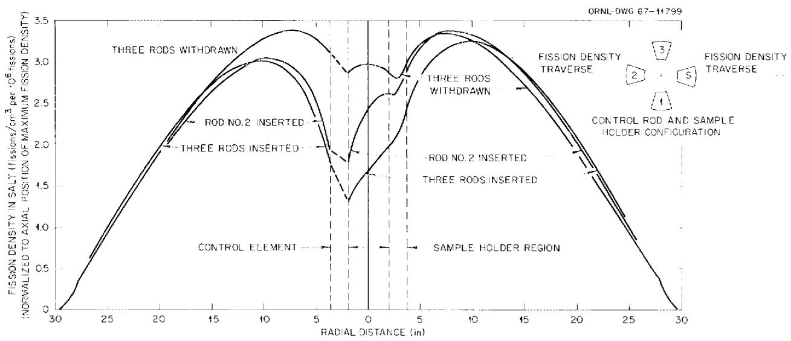  
Fig. 4.7. Radial Distributions of Fission Density in the MSRE with $^{233}\mathrm{U}$ Fuel Loading.

epithermal-to-thermal flux ratios, determined by averaging the EXTERMINATOR group fluxes over the volume of the fuel circulating system. These effective cross sections, when multiplied by the

magnitude of the thermal fluxes, give the approximate total reaction rates per atom for neutrons of all energies in the spectrum. Table 4.3 also gives the calculated magnitudes of thermal and epithermal

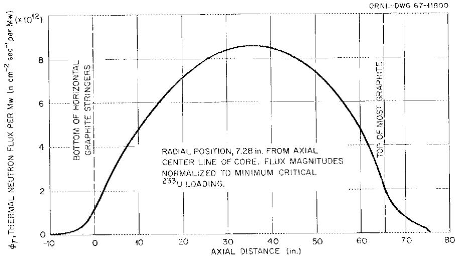  
Fig. 4.8. Axial Distribution of Thermal Neutron Flux in the MSRE with $^{233}\mathrm{U}$ Fuel Loading.

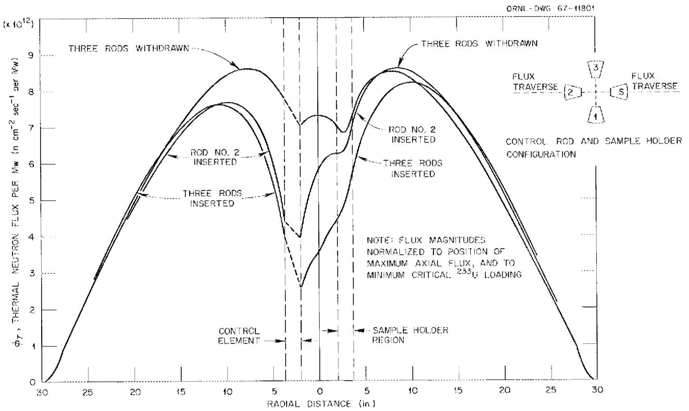  
Fig. 4.9. Radial Distributions of Thermal Neutron Flux in the MSRE with $^{233}\mathrm{U}$ Fuel Loading.

flux, averaged over the volume of the fuel circulating system and normalized to 1 Mw. As discussed in the preceding section, these magnitudes are normalized to the minimum critical uranium concentration. Note also that these values include the "flux dilution" effect of the time the fuel

spends in the external piping and heat exchanger. (The corresponding value of the thermal flux, averaged only over the graphite-moderated region of the core, is $3.60 \times 10^{12}$ neutrons $\mathrm{cm}^{-2}$ sec $^{-1}$ $\mathrm{Mw}^{-1}$ .)

Table 4.3. Average Cross Sections for Thermal- and Epithermal-Neutron Reactions in the MSRE Spectrum with ${}^{233}\mathrm{U}$ Fuel   

<table><tr><td>Nuclide</td><td>Cross Section Averaged over Thermal Spectrum, Energy &lt;0.876 ev (bams)</td><td>Cross Section Averaged over Epithermal Spectrum, Energy &gt;0.876 ev (bams)</td><td>Effective Cross Section in Thermal Flux (barns)</td></tr><tr><td>\( ^{6}\text{Li}^{\text{a}} \)</td><td>442.1</td><td>17.7</td><td>473.6</td></tr><tr><td>\( ^{7}\text{Li} \)</td><td>0.017</td><td>0.0007</td><td>0.018</td></tr><tr><td>\( ^{9}\text{Be} \)</td><td>0.0047</td><td>0.0040</td><td>0.012</td></tr><tr><td>\( Boron^b \)</td><td>353.1</td><td>14.1</td><td>378.2</td></tr><tr><td>\( ^{12}\text{C} \)</td><td>0.0019</td><td>&lt;10-4</td><td>0.0020</td></tr><tr><td>\( ^{19}\text{F} \)</td><td>0.0047</td><td>0.0023</td><td>0.0088</td></tr><tr><td>\( Zirconium^b \)</td><td>0.0865</td><td>0.0764</td><td>0.222</td></tr><tr><td>\( ^{135}\text{Xe} \)</td><td>1.32 × 106</td><td>83.3</td><td>1.32 × 106</td></tr><tr><td>\( ^{149}\text{Sm} \)</td><td>3.91 × 104</td><td>92.1</td><td>3.93 × 104</td></tr><tr><td>\( ^{151}\text{Sm} \)</td><td>2900.0</td><td>128.7</td><td>3127.0</td></tr><tr><td>\( ^{233}\text{U} \) (abs)</td><td>272.1</td><td>45.6</td><td>353.2</td></tr><tr><td>\( ^{233}\text{U} \) (fission)</td><td>249.2 (ν = 2.50)</td><td>38.4</td><td>317.6</td></tr><tr><td>\( ^{234}\text{U} \)</td><td>43.5</td><td>38.1</td><td>111.3</td></tr><tr><td>\( ^{235}\text{U} \) (abs)</td><td>290.3</td><td>22.3</td><td>330.0</td></tr><tr><td>\( ^{235}\text{U} \) (fission)</td><td>244.2 (ν = 2.43)</td><td>13.6</td><td>268.5</td></tr><tr><td>\( ^{236}\text{U} \)</td><td>2.8</td><td>18.9</td><td>36.4</td></tr><tr><td>\( ^{238}\text{U} \)</td><td>1.3</td><td>16.7</td><td>31.0</td></tr><tr><td>\( ^{239}\text{Pu} \) (abs)</td><td>1402.6</td><td>22.5</td><td>1442.7</td></tr><tr><td>\( ^{239}\text{Pu} \) (fission)</td><td>836.0 (ν = 2.89)</td><td>13.9</td><td>860.8</td></tr><tr><td colspan="4">\( System-average^c neutron fluxes (neutrons cm^{-2} sec^{-1} Mw^{-1}) \)</td></tr><tr><td colspan="4">Thermal: 1.48 × 1012</td></tr><tr><td colspan="4">Epithermal: 2.64 × 1012</td></tr></table>

$^{6}$ Cross section for the reaction $^{6}\mathrm{Li}(n,\alpha)^{3}\mathrm{H}$ .   
Natural isotopic composition.   
${}^{c}$ Based on ${2.00} \times  {10}^{6}{\mathrm{\;{cm}}}^{3}$ of circulating fuel.

# Effect of Circulation on Delayed-Neutron Precursors

In previous studies, we described a mathematical model found to be in close correlation with measured values of the delayed-neutron loss caused by circulation of the present $^{235}\mathrm{U}$ fuel. We have

applied this same computational model to the $^{233}\mathrm{U}$ -fueled reactor in order to obtain the reactivity change due to circulation and also to obtain the reactivity increments necessary to produce a given stable period during circulation. In these calculations, temperature feedback effects are neglected. Plutonium-239 is present in sufficiently small amounts to be negligible also.

The net effect of the circulation in changing the shape of the distribution of delayed neutron emission within the reactor is shown in Fig. 4.10. This

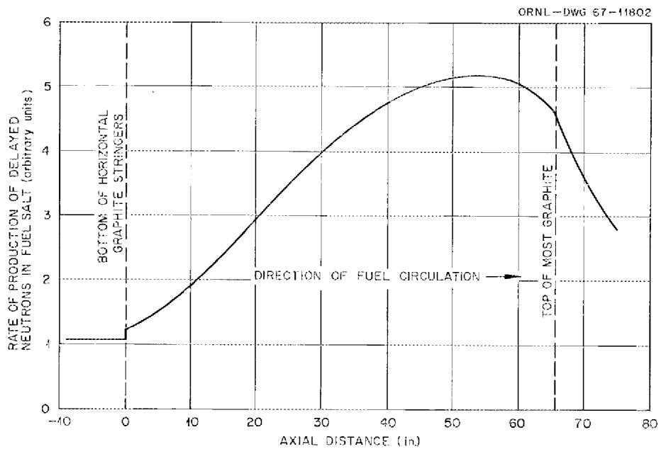  
Fig. 4.10. Axial Distribution of the Total Source of Delayed Neutrons in the MSRE with $^{233}\mathrm{U}$ Fuel Loading.

corresponds to the just-critical, circulating condition. By comparison, the distribution of the prompt-neutron source, as well as the delayed-neutron source in the noncirculating condition, is proportional to the fission density curve in Fig. 4.6.

The effective (reduced) values of $\beta_{i}$ , the delayed fractions for group $i$ , in the critical, circulating condition are listed in column 4 of Table 4.4. To obtain these values, the components of the total delayed-neutron source distribution shown in Fig. 4.10 must be weighted by the fuel salt volume fraction and also by the distribution of fast-group importance shown in Fig. 4.6. These calculations were made by using an IBM 7090 numerical integration program, based on the theory given in ref. 6. The difference between the sums of the $\beta_{i}$ columns of Table 4.4 for the stationary and circulating conditions is equal to the reactivity loss due to circulation. In normal reactor operation, this difference will be observed as an additional increment of regulating rod withdrawal, asymptotically required to maintain criticality when going from noncirculating to circulating conditions.

Table 4.4. Delayed-Neutron Fractions in the MSRE with ${}^{233}\mathrm{U}$ Fuel   

<table><tr><td rowspan="2">Delay Group</td><td rowspan="2">Decay Constant (sec-1)a</td><td colspan="2">Delay Fractions (n/n)</td></tr><tr><td>Stationarya</td><td>Circulating</td></tr><tr><td></td><td></td><td colspan="2">×10-4</td></tr><tr><td>1</td><td>0.0126</td><td>2.28</td><td>1.091</td></tr><tr><td>2</td><td>0.0337</td><td>7.88</td><td>3.848</td></tr><tr><td>3</td><td>0.139</td><td>6.64</td><td>4.036</td></tr><tr><td>4</td><td>0.325</td><td>7.36</td><td>5.962</td></tr><tr><td>5</td><td>1.130</td><td>1.36</td><td>1.330</td></tr><tr><td>6</td><td>2.500</td><td>0.88</td><td>0.876</td></tr><tr><td>Total</td><td></td><td>26.40</td><td>17.14</td></tr></table>

$^{\mathbf{a}}$ G. R. Keepin, Physics of Nuclear Kinetics, p. 90, Addison-Wesley, Reading, Mass., 1965.

In Fig. 4.11 are curves showing the reactivity addition required to produce a given positive stable period, starting from the critical condition $(\omega = 0$ at zero point of reactivity). Curve $A$ , for the non-circulating condition, is calculated with the

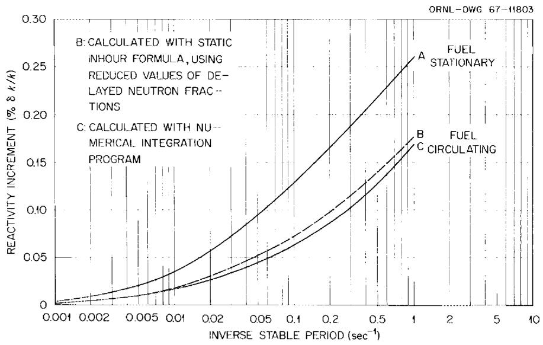  
Fig. 4.11. Reactivity Addition Required to Produce a Given Stable Period in the MSRE with $^{233}\mathrm{U}$ Fuel Loading.

"static" inhour equation, using the $\beta_{i}$ given in column 3 of Table 4.4. As a first approximation to the corresponding relation for the circulating condition, curve $B$ is also calculated with the static inhour equation, using the reduced $\beta_{i}$ given in column 4 of Table 4.4. Finally, in curve $C$ , we show the relation obtained from the numerical integration program, which gives the complete treatment of the precursor production, motion, and decay, when the reactor is on a stable period. In the range $0.001 \leq \omega \leq 1.0$ , curve $C$ "bows" away from curve $B$ , illustrating the fact that the effective reductions in the delay fractions are actually dependent on the reactor period. As $\omega$ becomes large compared with the precursor decay constants, $\lambda_{i}$ , it can be shown that curve $C$ approaches curve $B$ asymptotically. Furthermore, curve $B$ differs asymptotically from curve $A$ , on the vertical reactivity scale, by an amount equal to the initial reactivity loss caused by circulation (0.093% $\delta k / k$ , from Table 4.4).

# Samarium Poisoning Effects

At the end of 60,000 Mwhr of operation with the current fuel charge, the $^{149}\mathrm{Sm}$ will be very near its equilibrium concentration corresponding to 7.4 Mw.

The $^{151}\mathrm{Sm}$ will achieve approximately $30\%$ of its equilibrium concentration. After shutdown the $^{149}\mathrm{Sm}$ will be further enhanced by about $8\%$ , owing to decay of $^{149}\mathrm{Pm}$ . These samarium poison concentrations will be present in the salt when the reactor is brought to power with the $^{233}\mathrm{U}$ fuel loading. For this new loading, however, the thermal flux will be approximately 2.2 times that for the $^{235}\mathrm{U}$ fuel. In addition, the yields of the 149 and 151 fission product chains are lower than those for the $^{235}\mathrm{U}$ (0.77 and $0.35\%$ for $^{233}\mathrm{U}$ , vs 1.13 and $0.44\%$ for $^{235}\mathrm{U}$ , based on ref. 9). The net result is that the samarium initially present in the salt will act as a burnable poison during the first part of reactor operation with $^{233}\mathrm{U}$ . Figure 4.12 (top curve) shows the result of calculations of the reactivity change corresponding to burnout of the initial samarium and achievement of the equilibrium poisoning at the higher flux level. Continuous operation at a power level of $7.4\mathrm{Mw}$ is assumed. The lower curve in Fig. 4.12 shows the corresponding reactivity change caused by burnup of $^{233}\mathrm{U}$ during this period. The algebraic sum of these two curves (dashed curve) gives the approximate reactivity effect which must be compensated for by motion of the regulating rod. (There will be additional corrections due to other isotopic changes, but these will be small compared with the samarium

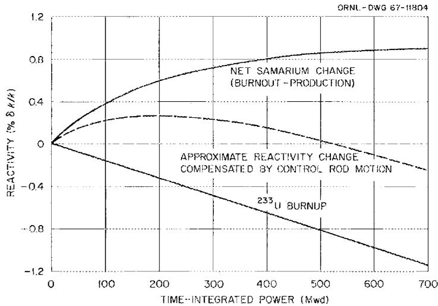  
Fig. 4.12. Time Dependence of Samarium Poisoning and Approximate Control Rod Reactivity During the First Period of Operation of MSRE with $^{233}\mathrm{U}$ Fuel Loading.

and $^{233}\mathrm{U}$ burnup effects.) The resultant curve in Fig. 4.12 indicates that regulating rod insertion will be required for about the first 70 days of operation.

Because the samarium acts as a burnable poison, the amount of excess uranium required for operation will be largely governed by the requirements for calibration of the control rods. There should be considerable latitude in this choice, determined in part by criteria of control rod sensitivity at the operating point and by the maximum time of operation desired before refueling.

# 4.4 MSRE DYNAMICS WITH $^{233}\mathrm{U}$ FUEL

# S. J. Ball

The dynamic behavior of the MSRE has been analyzed for the case of $^{233}\mathrm{U}$ -bearing fuel salt by using the MSRE frequency response code MSFR. The only differences in input data for the $^{233}\mathrm{U}$ and the reference $^{235}\mathrm{U}$ calculations are in those parameters compared in Table 4.5. The most important difference is the lower delayed-neutron fraction for the $^{233}\mathrm{U}$ , which makes the neutron level more responsive to changes in reactivity. For a given fast change in rod reactivity, the immediate flux response would be two to three times greater with $^{233}\mathrm{U}$ than with $^{235}\mathrm{U}$ . This effect will probably require a minor modification in

the present MSRE rod control system to compensate for the higher system gain.

The predicted effect of $^{233}\mathrm{U}$ on the MSRE inherent stability, as indicated by the phase margin, and the natural period of oscillation are shown as a function of power level in Fig. 4.13. The phase margin is a typical measure of system stability, the smaller phase margins indicating reduced stability. A general rule of thumb in control practice is that a phase margin of at least $30^{\circ}$ is desirable; phase margins of $20^{\circ}$ or less indicate lightly damped oscillations and thus poor control. Hence the predicted inherent stability for the $^{233}\mathrm{U}$ system is greater than for $^{235}\mathrm{U}$ for all power levels.

The faster response of the $^{23}$ system, as indicated by the smaller natural periods of oscillation, is due to the higher gain of the neutron kinetics. Experimentally determined values of period of oscillation for the $^{23}$ system are also shown in Fig. 4.13 for comparison. $^{12}$ Although direct measurements of phase margin were not made, the stability characteristics as indicated by frequency response measurements were also in good agreement with the predictions.

It is concluded that no serious operational difficulties are to be expected due to the differences in dynamic behavior resulting from the $^{23}$ U fuel loading.

Static delayed-neutron fractions, $\beta$ , and precursor decay constants, $\lambda$ (sec $^{-1}$ )

Table 4.5. Comparison of MSRE Nuclear Data for ${}^{233}\mathrm{U}$ - and ${}^{235}\mathrm{U}$ -Bearing Fuel Salts   

<table><tr><td rowspan="2">Group</td><td colspan="2">233U</td><td colspan="2">235U</td></tr><tr><td>λi</td><td>βi</td><td>λi</td><td>βi</td></tr><tr><td>1</td><td>0.0126</td><td>0.228 × 10-3</td><td>0.0124</td><td>0.223 × 10-3</td></tr><tr><td>2</td><td>0.0337</td><td>0.788 × 10-3</td><td>0.0305</td><td>1.457 × 10-3</td></tr><tr><td>3</td><td>0.139</td><td>0.664 × 10-3</td><td>0.111</td><td>1.307 × 10-3</td></tr><tr><td>4</td><td>0.325</td><td>0.736 × 10-3</td><td>0.301</td><td>2.628 × 10-3</td></tr><tr><td>5</td><td>1.13</td><td>0.136 × 10-3</td><td>1.14</td><td>0.766 × 10-3</td></tr><tr><td>6</td><td>2.50</td><td>0.088 × 10-3</td><td>3.01</td><td>0.280 × 10-3</td></tr><tr><td>Total static β</td><td></td><td>0.00264</td><td></td><td>0.00666</td></tr><tr><td>Prompt-neutron generation time, sec</td><td></td><td>4.0 × 10-4</td><td></td><td>2.4 × 10-4</td></tr><tr><td>Temperature coefficients of reactivity, (°F)-1</td><td></td><td></td><td></td><td></td></tr><tr><td>Fuel salt</td><td></td><td>-6.13 × 10-5</td><td></td><td>-4.84 + 10-5</td></tr><tr><td>Graphite</td><td></td><td>-3.23 × 10-5</td><td></td><td>-3.70 × 10-5</td></tr></table>

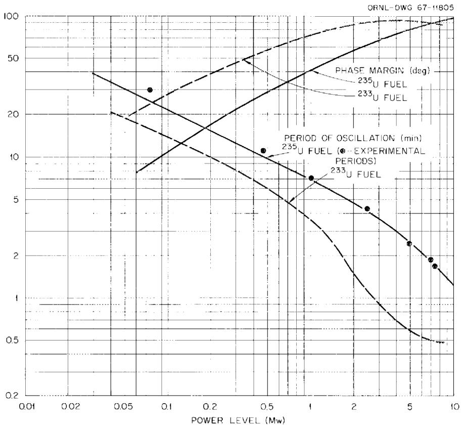  
Fig. 4.13. Comparison of MSRE Predicted Phase Margins and Natural Periods of Oscillation vs Power Level for $233_{\mathrm{U}}$ and $235_{\mathrm{U}}$ -Bearing Fuel Salt Loadings.

# Part 2. MSBR Design and Development

R. B. Briggs

The primary objective of the engineering design and development activities of the MSR program is to design a molten-salt breeder experiment (MSBE) and develop the components and systems for that reactor. The MSBE is proposed to be a model of a large power breeder reactor and to operate at a power level of about 150 Mw (thermal).

A reference design of a 1000-Mw (electrical) molten-salt breeder reactor power plant is to provide the basis for most of the criteria and for much of the design of the MSBE. We have been spending most of our effort on the reference design. Several concepts were described in ORNL-4037, our progress report for the period ending August 1966, and in ORNL-3996, which was published in August 1966. We selected the modular concept -- four 250-Mw (electrical) reactors per 1000-Mw (electrical) station - that has fissile and fertile materials in separate streams as being the most promising for immediate development and have proceeded with more detailed study of a plant based on that concept. Initial results of those studies were reported in ORNL-4119, our progress report for the

period ending February 1967. During this report period, we continued to examine the details of the reference plant and its equipment. We also summarized the objectives and program for development of the MSBE in ORNL-TM-1851.

To date, the component and systems development activity has been concerned largely with support of the design and with planning. The development program was outlined in ORNL-TM-1855 and in ORNL-TM-1856. Salt circulation loops and other test facilities are being modified for tests of the sodium fluoroborate coolant salt, models of graphite fuel cells for the reactor, and molten-salt bearings and other crucial components of the fuel circulation pump. Essentially no experimental work has been done yet.

We plan to complete essential parts of the reference design during the next report period and to begin to design the MSBE. Experimental work will begin also but will be limited to a few of the more obvious important problems. Design and development on a large scale are planned to start early in FY 1969.

# 5. Design

E. S. Bettis

# 5.1 GENERAL

E. S. Bettis

R.C.Robertson

The design program during the past period has primarily been directed toward refinement and modification of the previously reported concepts for the reactor and other major equipment and revisions to the cell layouts and piping.

The major effort was redesign of the reactor to accommodate the new data on radiation effects in graphite. New approaches were tried to arrive at a core design which could compensate for dimensional changes in the graphite, but it was finally decided to simply double the volume of the core to lower the power density from 40 to $20\mathrm{kw / liter}$ and thereby assure a stable core life of at least ten years. It was also decided to include provisions for replacing the complete reactor vessel

BLANKET SALT

HEAT EXCHANGCR

AND PUMP

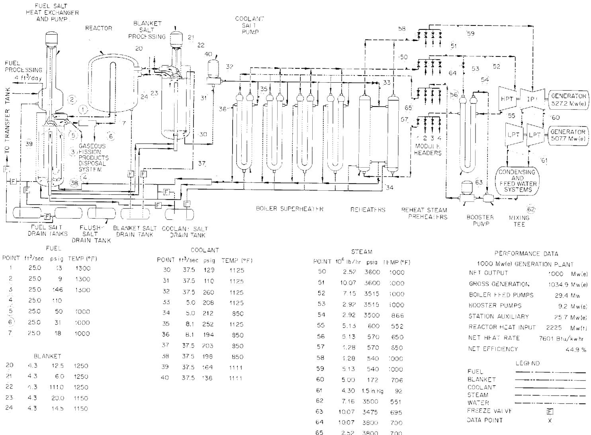  
Fig. 5.1. 250 Mw (Electrical) Module Heat Flow Diagram.

rather than just the core and to provide space to store the spent reactor within the biological shielding of the reactor cell. While this new design represents the present status of graphite technology, we believe that an improved graphite will be developed within the next few years and that longer core life or higher power density than used here can be expected in the future.

Analysis of the thermal expansion stresses in the various systems indicated that rather extensive modifications were needed. Changes were therefore made in the plant layouts, the equipment supports, and in the arrangement of the salt piping, with the result that the calculated stresses in the vessel attachments, supports, and piping systems now fall well within the acceptable values.

Calculations of the radiation flux levels at the reactor cell walls allowed designs to be prepared for the thermal shielding used to protect the concrete from excessive temperatures. Drawings were also made for the general cell wall design, including the closure blocks at the top, the cell penetrations, etc.

Relatively few changes were required in the MSBR flowsheet during the past period, but for convenience it is presented again in Fig. 5.1.

The MSBR design study is expected to be complete within the next few months. The description, cost, and performance data for the steam system will probably need little change but will be updated as required. The August 1966 design study report on a 1000-Mw (electrical) molten-salt breeder reactor power station (ORNL-3996) will be revised to present firmer cost estimates based on the new and more detailed designs for the reactor plant.

# 5.2 CELL ARRANGEMENT

C.E.Bettis W.Terry

H. L. Watts C. W. Collins

H.A.Nelms W.K.Crowley

J.R.Rose H.M.Poly

The reactor is now designed on the basis that the entire vessel will be of all-welded construction and arranged for relatively simple replacement after the useful life of the core has been expended. Replacement of the reactor would of course require provisions for disposal of the spent assembly. Rather than lift this relatively large and radioactive piece of equipment from the reactor plant

biological shielding, which would require a large amount of heavily shielded transport equipment, room has been provided in the reactor cell to store the spent unit until the second reactor vessel is replaced. In the intervening period the activity level of the first spent unit would have decayed to a more manageable value. This is the basis of the present design, but, of course, the maintenance procedures will continue to receive careful study and review.

Storage of the spent reactor vessel in the cell will require an enlargement of the cell volume by about $40\%$ . Since simplification and rearrangement of the interconnecting salt piping were also required to satisfy stress requirements, the layout of the entire reactor plant was rearranged. The new layout is shown in Fig. 5.2.

The plant consists of four modules, each having a reactor with a thermal output of about 556 Mw. Steam is generated at 3500 psi-1000°F and reheated to 1000°F in each of the modules, but the flows are combined to serve a single 1000-Mw electrical turbine-generator unit.

As shown in Fig. 5.3, each module consists of a reactor cell, a steam-generating and steam reheat cell, and a drain-tank cell, the last being shared with one other module. A drain-tank cell thus contains four fuel drain tanks, two for each reactor. The blanket and coolant salt drain tanks are also contained in the two drain-tank cells.

The reactor and steam cell elevations are shown in Fig. 5.4. The equipment in these cells is mounted on rigid supports, with thermal expansion loops being provided in the connecting piping to maintain the stresses within the allowable limits. The reactor vessel is shown mounted on a single column that is pinned at the bottom to allow some lateral movement of the reactor. This arrangement apparently presents few major design problems and reduces the stresses within certain elements of the system; but, since the stresses are not prohibitive even without use of the pinned column support, this arrangement may receive further review.

In previously reported MSBR concepts the reactor was connected to the heat exchangers through concentric pipes in an arrangement designed to minimize the salt volumes and to simplify the thermal expansion problems. As will be explained subsequently, however, the doubling of the reactor core volume made minimization of the fuel salt volume in the piping less important, and this piping change had relatively little effect on fuel cycle

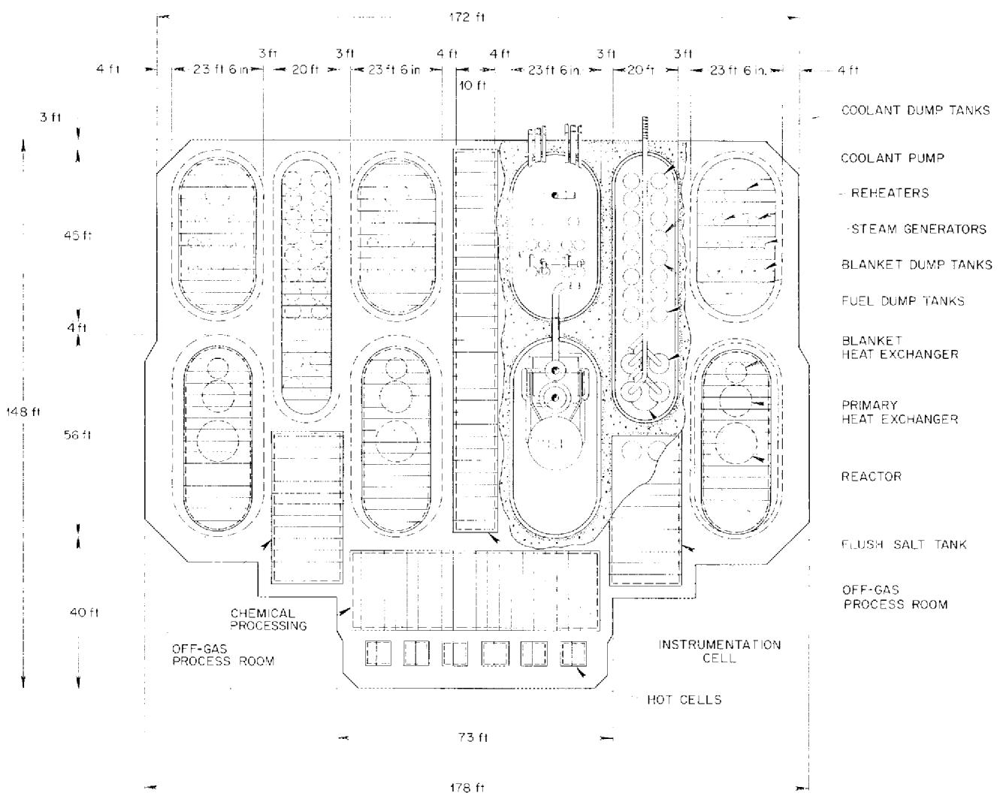  
Fig. 5.2. Reactor Salt System Layout. Plan and piping for $\sim 1000$ Mw (electrical) unit.

costs. The concentric piping was also found to present stress problems at certain temperatures of operation. For these reasons the piping was changed to provide separate reactor inlet and outlet lines for the fuel and blanket salt streams. The separate piping will also simplify the maintenance procedures with remotely operated tooling.

The coolant, or secondary, salt piping in the steam cell was also modified to include thermal expansion loops and to include fixed supports for the equipment. The location of the coolant salt circulating pump was changed in order to gain the necessary flexibility in the piping.

Radiation shielding, formed of 3-in.-thick steel plates, lines the reactor cell to protect the con

crete from excessive temperatures due to absorbed radiation. This thermal shield was designed to attenuate a flux of $1 \times 10^{12} \, \text{J-Mev gamas cm}^{-2} \, \text{sec}^{-1}$ and assures a concrete temperature of less than $200^{\circ}\text{F}$ . As shown in Fig. 5.5, the mounting columns for the components are fitted with double bellows seals where they penetrate the thermal shield. It may also be noted that the columns are supported on shock mounts to provide the requisite protection against seismic disturbances.

The walls of the reactor cell present the most serious design problem. They are exposed to gamma flux heating and to an ambient temperature as high as $1150^{\circ}\mathrm{F}$ inside the cell, they must be leak-tight to maintain containment integrity, and

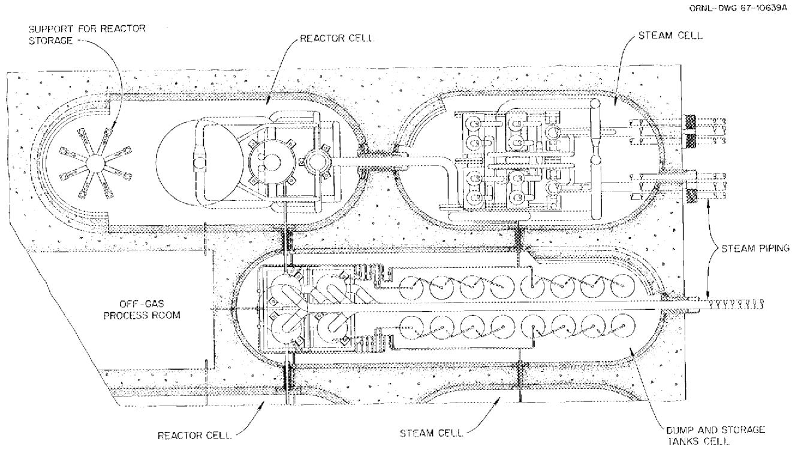  
Fig. 5.3. Reactor and Steam Generator Cells - Plan. 250 Mw (electrical) module.

ORNL-DWG67-10645A

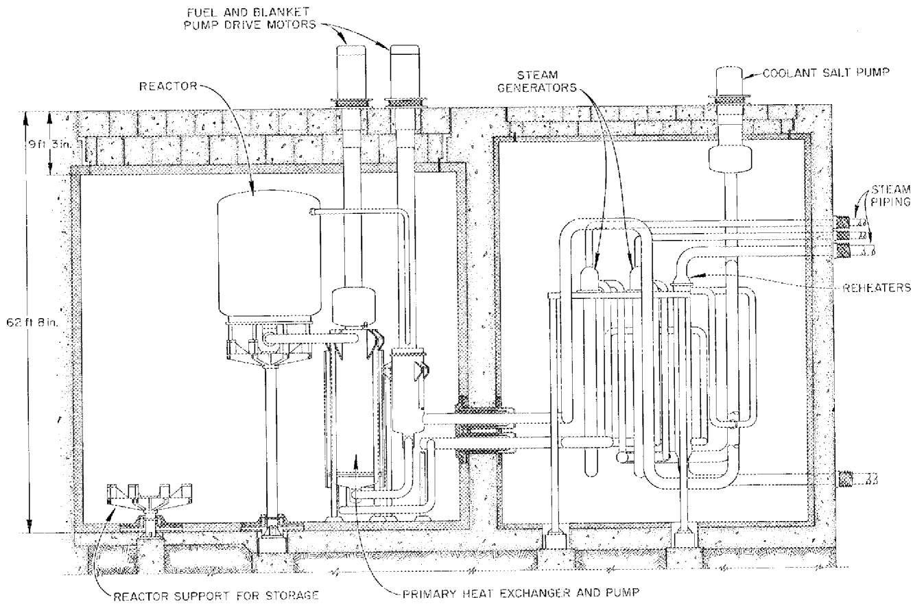  
Fig. 5.4. Reactor and Steam Generator Cells - Elevation. 250 Mw (electrical) module, section A-A.

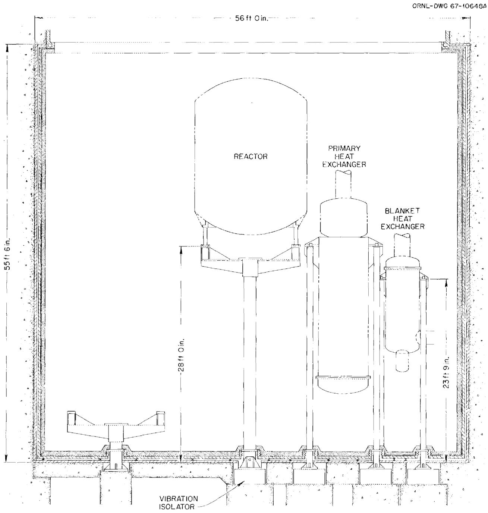  
Fig. 5.5. Reactor Cell Thermal Shield and Component Supports.

they must also provide the necessary biological shielding for the reactor.

As shown in Figs. 5.6 and 5.7, the reactor cell biological shielding consists of 7-ft-thick reinforced ordinary concrete around all sides below grade and an 8-ft thickness above grade. The top consists of removable concrete roof plugs having

a total thickness of 8 ft. The method of construction would be to first pour the 2-ft-thick reinforced floor pad. A 3-in.-thick carbon steel floor plate would be laid over this, and the 3-in.-steel vertical wall plates would be welded to it, the latter serving as forms for pouring the side walls. A second 3-in.-thick steel plate would be erected inside the

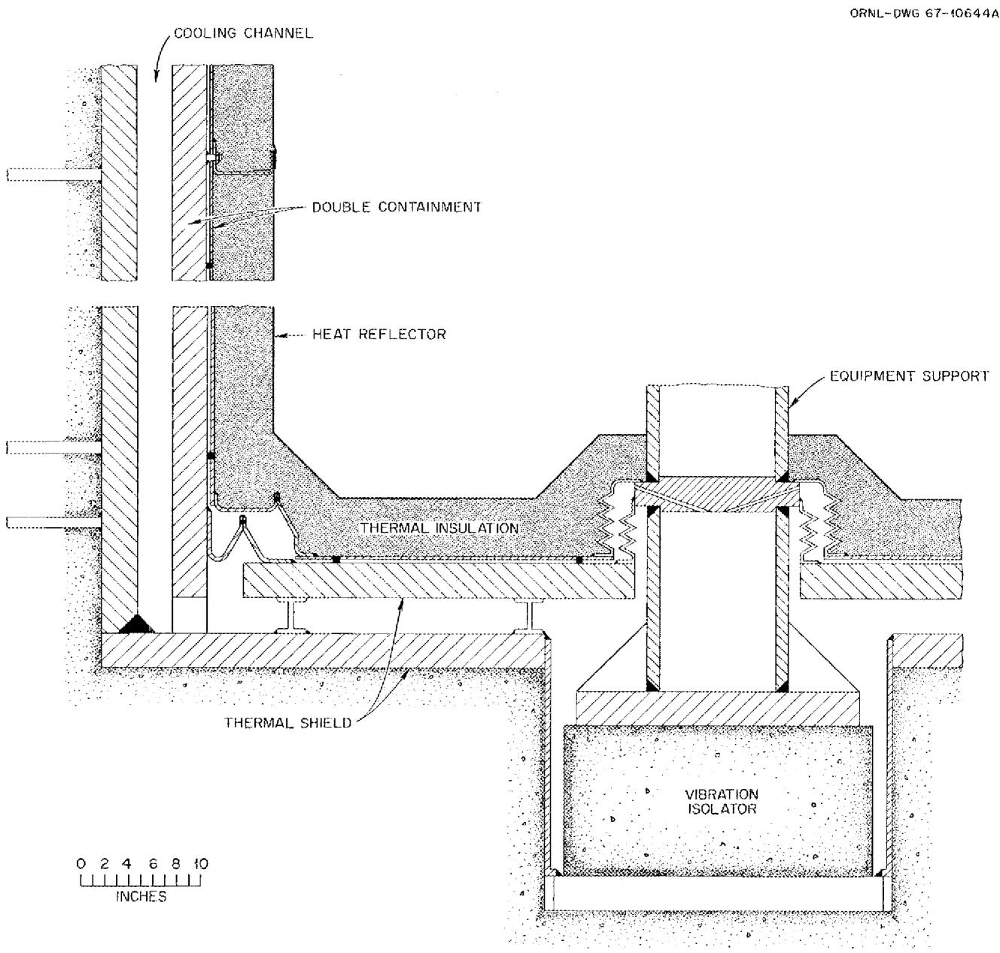  
Fig. 5.6. Reactor Cell Construction - Component Support Penetration.

first with a 3-in. air gap between the two. A similar second plate and air gap would be provided for the floor. During reactor operation, cooling air would be circulated through the gap at a velocity of about 50 fps to remove the heat generated by gamma absorptions in the wall. Cooling air is also used in the removable roof plugs, the air duct connections being flanged to facilitate removal. The total heat losses from the reactor cell are estimated to be a maximum of 800,000

Btu/hr. The thermal shield could tolerate loss of cooling air for up to 1 hr without an excessive temperature rise.

A $3_{16}$ -in.-thick carbon steel membrane is installed inside the inner 3-in.-thick steel wall mentioned above. This membrane is hermetically tight and would satisfy the containment leak-rate requirements. The membrane is continuous around the top plugs and also at the penetrations of the cell, as shown in Fig. 5.7. The space between it

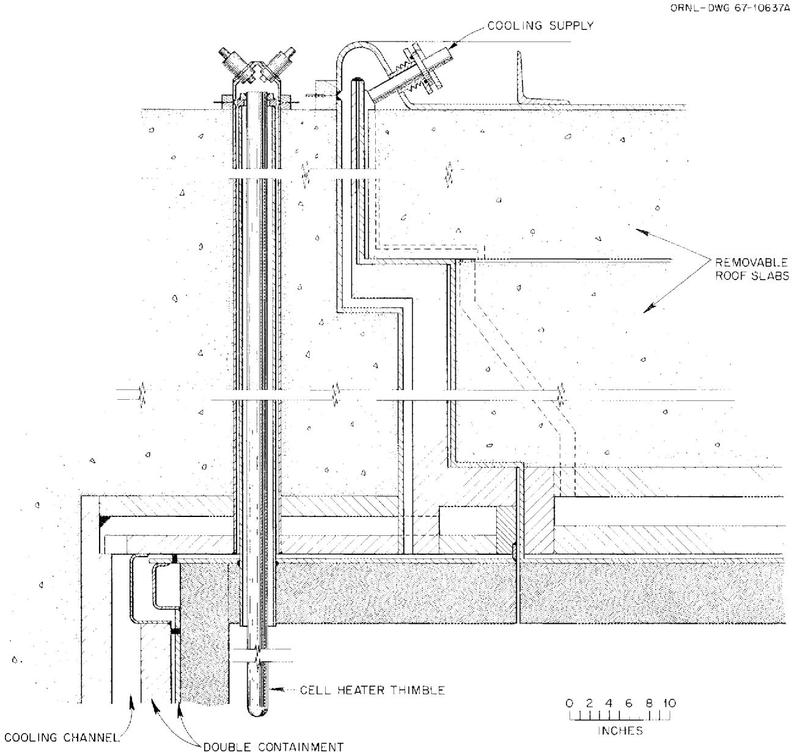  
Fig. 5.7. Reactor Cell Construction - Maintenance and Heater Access Details.

and the 3-in. plate is exhausted by a vacuum pump which discharges into the cell atmosphere; this "pumped-back" system thus provides opportunity for continuous monitoring of the double containment system.

The inside surface of the sealing membrane is covered with a 6-in.-thick blanket-type thermal insulation protected on the inside by a $\frac{1}{16}$ -in. skin of stainless steel. This skin also serves

as a radiant heat reflector to reduce heat flow into the wall.

The fuel, blanket, and coolant salts will be maintained above their liquidus temperatures by operating the interior of the cells at temperatures up to $1150^{\circ}\mathrm{F}$ . During normal operation the temperature is self-sustaining, and, as mentioned above, the problem is one of heat removal from the wall. For warmup and low-power operation,

however, electric heaters are provided in thimbles around the inner walls of the cells, as shown in Fig. 5.7. The electric leads for the heaters are brought out through sealed bushings in the thimble caps.

The off-gas cells and the drain-tank cells have double containment but do not need the thermal shield to protect against the radiation flux. The steam cells require only the thermal insulation and cooling air, since the radiation levels will be relatively low and double containment is not required in these spaces.

# 5.3 REACTOR

G. H. Llewellyn

W.C.George

W.C.Stoddart

W. Terry

H. L. Watts

H. M. Poly

During the past report period, the new data discussed in Sect. 6.1 became available on the dimensional changes that occur in graphite as a result of neutron irradiation. Because of this experimental evidence, we decided to redesign the reactor even though there is optimism that a more stable graphite will be developed within the next few years. The MSBR cost and performance characteristics continue to be attractive even though penalized by designing on the basis of the immediate technology. We also decided that the reactor should be designed in such a way that major redesign or modification would not be required, to take advantage of a more stable graphite when it becomes available.

Several new approaches were tried for the core design, one of which was to put the fertile salt in the flow passages through the core graphite and to allow the fuel salt to move through the in

terstices. This so-called "inside-out" design could probably accommodate the dimensional changes in the graphite, assuming that suitable adjustments were also made in the fuel enrichment. A major disadvantage, however, is that the fuel salt would also penetrate into the interstices of the radial blanket, a position in which it is exposed to relatively low neutron flux and thus produces relatively little power. Since the flow in this area would also be somewhat indeterminant, this design of the reactor was not pursued further.

Attempts to design a removable graphite core for the reactor led to the conclusion that such an arrangement would probably be impractical. One major problem would be containment of the highly radioactive fission products associated with removal of a bare reactor core. There would also be the problem of assuring leak-tightness of a large-diameter flanged opening which must be sealed only by use of remotely operated tooling. As previously mentioned, it was decided to replace the entire reactor vessel.

Selection of a ten-year life for the reactor, or about $5 \times 10^{22} \mathrm{vvt}$ (greater than $50 \mathrm{keV}$ ) total maximum neutron dose for any point in the core, meant that the power density would be reduced from the $40 \mathrm{kw}/\mathrm{liter}$ used in previous concepts to $20 \mathrm{kw}/\mathrm{liter}$ . This involved doubling the core volume from $503 \mathrm{ft}^3$ to about $1040 \mathrm{ft}^3$ , and also required that the reactor vessel size be increased correspondingly. The factors entering into selection of these conditions are given in Table 5.1, which shows the effect of power density on the performance factors for the plant. At $20 \mathrm{kw}/\mathrm{liter}$ , it may be noted that the fuel cycle cost is $0.5 \mathrm{mill/kwhr}$ and the yield is $4\%/\mathrm{year}$ . This appears to be the most practical design point, although it is without benefit of improved graphite. It should be pointed out that the differences in capital costs shown in

Table 5.1. Performance Factors of MSBR as Function of Average Core Power Density   

<table><tr><td rowspan="2">Power Density (kw/liter)</td><td colspan="2">Core Size (ft)</td><td rowspan="2">Yield (%/year)</td><td rowspan="2">Fuel Cycle Cost (mills/kwhr)</td><td rowspan="2">Capital Cost ($/kw (electrical))</td><td rowspan="2">Life (years)</td><td rowspan="2">Fissile Inventory [kg for 1000 Mw (electrical)]</td></tr><tr><td>Diameter</td><td>Height</td></tr><tr><td>80</td><td>6.3</td><td>8</td><td>5.6</td><td>0.44</td><td>117</td><td>2.5</td><td>880</td></tr><tr><td>40</td><td>8</td><td>10</td><td>5.0</td><td>0.46</td><td>119</td><td>5</td><td>1040</td></tr><tr><td>20</td><td>10</td><td>13.2</td><td>4.1</td><td>0.52</td><td>125</td><td>10</td><td>1260</td></tr><tr><td>10</td><td>12</td><td>18</td><td>2.7</td><td>0.62</td><td>132</td><td>20</td><td>1650</td></tr></table>

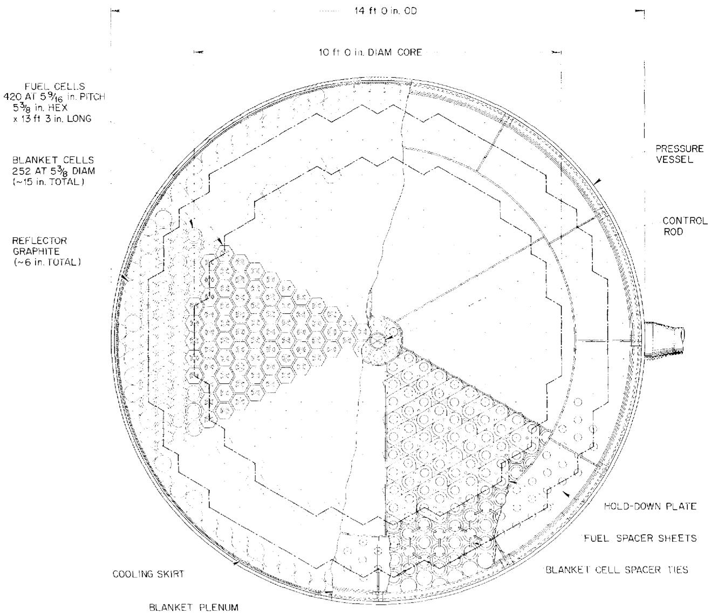  
Fig. 5.8. 250 Mw (Electrical) Reactor - Plan. 420 $5\frac{3}{8}$ -in. cells.

Table 5.1 do not take into account the cost of replacing the graphite moderator at intervals determined by radiation damage to the graphite. The frequency of replacement and the contribution to the power cost are greater at the higher power densities, and this effect essentially offsets the difference in initial cost.

Plan and elevation views of the reactor are shown in Figs. 5.8 and 5.9. The design parameters are given in Table 5.2.

There are 420 two-pass fuel flow channels in the reactor core graphite. As shown in Fig. 5.10,

each of these channels is formed from two graphite extrusions. The outer, and longer, of the pieces is hexagonally shaped, $5^{3}_{8}$ in. across the flats, and has a $2^{23}_{32}$ -in.-diam hole in the center. The total length of the extrusion is about $14^{1}_{2}$ ft. The inner piece is a cylinder, $2^{1}_{4}$ in. $\mathrm{OD} \times 1^{1}_{2}$ in. ID, and fits inside the hole of the hexagonal extrusion.

The fuel salt enters the reactor through the inlet plenum at the bottom of the core and flows upward through the annulus between the inner and outer graphite extrusions to the top of the reactor, where it turns and flows through six $\frac{1}{2}$ -by $1 \frac{1}{2}$ -in. slots

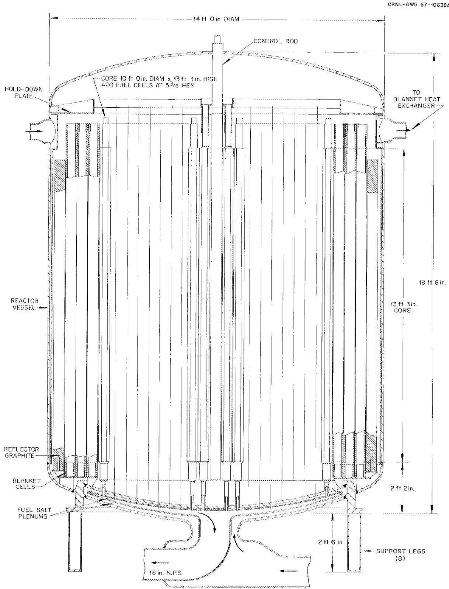  
Fig. 5.9. 250 Mw (Electrical) Reactor-Elevation, 420 $5\frac{3}{8}$ -in. cells.

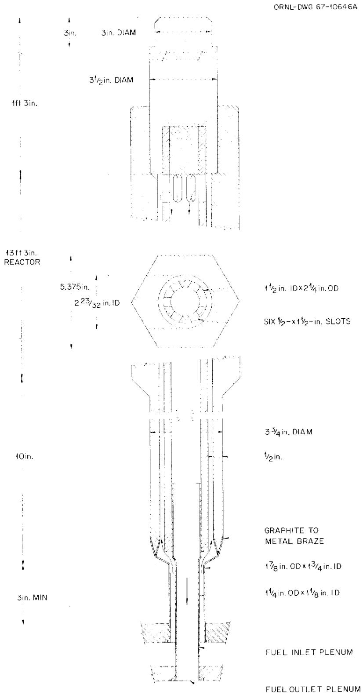  
Fig. 5.10. Fuel Cell Element.

Table 5.2. Reactor Specifications   

<table><tr><td>Average core power density, kw/liter</td><td>20</td></tr><tr><td>Power, Mw</td><td>556</td></tr><tr><td>Number required for 1000 Mw (eElectrical)</td><td>4</td></tr><tr><td>Vessel diameter, ft</td><td>14</td></tr><tr><td>Vessel height, ft</td><td>22</td></tr><tr><td>Core diameter, ft</td><td>10</td></tr><tr><td>Core height, ft</td><td>13.2</td></tr><tr><td>Core volume, ft3</td><td>1040</td></tr><tr><td>Fraction of fuel in core</td><td>0.134</td></tr><tr><td>Fraction of blanket in core</td><td>0.064</td></tr><tr><td>Fraction of graphite in core</td><td>0.802</td></tr><tr><td>Blanket thickness, ft</td><td>1.25</td></tr><tr><td>Fraction of salt in blanket</td><td>0.58</td></tr><tr><td>Breeding ratio</td><td>1.06</td></tr><tr><td>Fuel yield, %/year</td><td>4.1</td></tr><tr><td>Fuel cycle cost, mills/kwhr</td><td>0.52</td></tr><tr><td>Fissile inventory, kg</td><td>314</td></tr><tr><td>Fertile inventory, kg</td><td>54,000</td></tr><tr><td>Specific power, Mw (thermal)/kg</td><td>1.8</td></tr><tr><td>Number of core elements</td><td>420</td></tr><tr><td>Velocity of fuel in core, fps</td><td>4.8</td></tr><tr><td>Average flux &gt;0.82 Mev</td><td>3.33 × 1013</td></tr><tr><td>Fuel volume, ft3</td><td></td></tr><tr><td>Reactor core</td><td>139</td></tr><tr><td>Plenums</td><td>37</td></tr><tr><td>Entrance nipples</td><td>13</td></tr><tr><td>Heat exchangers and piping</td><td>160</td></tr><tr><td>Processing</td><td>6</td></tr><tr><td>Total</td><td>355</td></tr><tr><td>Peak/average flux ratio</td><td>~2</td></tr></table>

to the inside of the cylindrical graphite extrusion and returns to the bottom of the reactor and the outlet plenum. The average velocity of the fuel in the core is about 4.8 fps as it is heated from $1000^{\circ}\mathrm{F}$ to $1300^{\circ}\mathrm{F}$ . The effective height of the core is approximately $13\frac{1}{4}$ ft, and the total length of the two-pass flow channel, plenum to plenum, is about 27 ft.

The hexagonal graphite pieces have a cylindrical portion about 12 in. long turned at the bottom to which a Hastelloy N nipple, $1\frac{7}{8}$ in. OD by $\frac{1}{16}$ in. in wall thickness, is brazed. The other ends of these nipples are welded to discharge openings in the upper plate of the inlet fuel plenum. Inner Hastelloy N nipples, $1\frac{1}{4}$ in. OD by $\frac{1}{16}$ in. in wall thickness, are welded to the outlet plenum tube sheet and have an enlarged upper end which fits

snugly, but is not brazed, into the inner $1\frac{1}{2}$ -in.-ID hole in the inner graphite cylinder of the fuel element. The lower end of the core assembly is thus fixed in place by attachment to the plenums, but the upper end is free to expand or contract in the vertical direction.

The graphite fuel pieces extend 15 in. above the end of the fuel flow passages in order to serve as the top axial reflector for the core. The top 3 in. of each fuel element is turned to a smaller diameter to establish a shoulder, as shown in Fig. 5.10. Triangular stampings of Hastelloy N sheet are slipped down to this shoulder and engage three of the elements, as shown in Fig. 5.8. These stampings are interleaved to maintain the radial spacing of the fuel channels, yet eliminate the need for a large-diameter upper diaphragm drilled to close tolerances. The center six fuel channels engage a ring which is attached through six ribs to the vessel itself, thus stabilizing the entire assembly.

Immediately outside the core region of the reactor are graphite tubes around and through which the fertile salt of the radial blanket is circulated. These tubes displace the more expensive fertile salt and also, by scattering the neutrons, promote more effective capture by the thorium atoms in the blanket. The ratio of fertile fraction to graphite is about $58\%$ in this region, as determined by the code used for optimization of the reactor design. The graphite tubes are slipped over short nipples extending from a mounting plate at the bottom of the reactor, as shown in Fig. 5.9. The tubes are radially positioned at the top by overlapping connectors in much the same manner as the fuel elements.

Solid cylinders of graphite, 5 in. in diameter, are arranged on the outer circumference of the reactor to serve as a reflector. A can of $\frac{1}{4}$ -in. wall thickness surrounds the reflector graphite and serves to direct the entering fertile salt down the inside wall of the vessel and to the bottom of the core. The fertile salt stream then divides; part of it moves upward through the interstices between the fuel elements, while the major portion flows through the graphite tubes in the blanket region.

It may be noted that the fuel channels themselves provide sufficient graphite for moderation of the reactor and for the top reflector without use of any special shapes or pieces, as was required in earlier MSBR concepts. All the graphite consists of extrusions which require little in the way

of machining or close tolerances. These design improvements were made possible by relaxing the restriction that the wall be thin enough to permit reduction of the permeability to the $10^{-7}\text{-cm}^2/\text{sec}$ range by impregnation. This requirement was eliminated because, as discussed in Part 5, there appears to be more hope for obtaining very low permeability through a surface sealing technique, which would not be limited by wall thickness, than through impregnation, which requires thin sections.

The fuel enters and leaves the reactor through separate pipes rather than by the concentric pipe arrangement employed in the previous concepts. The new design eliminates the need for the inner slip joint and also relieves the thermal stress problems that existed in certain temperature ranges. The thermal expansion loops now shown in the salt piping add to the fuel salt volume in the system, but this is of less significance than it would have been in the $40\mathrm{-w/cm}^3$ reactor, which had only one-half the core volume.

# 5.4 FUEL HEAT EXCHANGER

T. W. Pickel

W. Terry

The heat exchanger for transferring heat from the fuel salt to the coolant salt remains essentially unchanged since the last report. The exchanger is shown in Fig. 5.11, and the design data are given in Table 5.3. As mentioned previously, there has been some change in the salt headers. Design of the gas sparging system has not been completed.

# 5.5 BLANKET HEAT EXCHANGER

T. W. Pickel

W. Terry

No major changes have been made in the heat exchanger which transfers heat from the fertile, or blanket, salt to the coolant salt. The exchanger is shown in Fig. 5.12, and the pertinent data are listed in Table 5.4. The blanket heat exchanger has been lowered in the cell so that the pump drive shaft will be the same length as the fuel pump drive shaft and thus allow interchangeability of parts. The coolant salt piping has also been modified to replace the concentric piping formerly used.

Table 5.3. Fuel Heat Exchanger Specifications   

<table><tr><td>Number required per reactor module</td><td>1</td></tr><tr><td>Rate of heat transfer, Mw</td><td>529</td></tr><tr><td>Rate of heat transfer, Btu/hr</td><td>\( 1.80 \times 10^9 \)</td></tr><tr><td>Shell side</td><td></td></tr><tr><td>Hot fluid or cold fluid</td><td>Cold(coolant salt)</td></tr><tr><td>Entrance temperature, \( ^\circ F \)</td><td>850</td></tr><tr><td>Exit temperature, \( ^\circ F \)</td><td>1110</td></tr><tr><td>Entrance pressure, psi</td><td>198</td></tr><tr><td>Exit pressure, psi</td><td>164</td></tr><tr><td>\( \Delta P \) across exchanger, psi</td><td>34</td></tr><tr><td>Mass flow rate, lb/hr</td><td>\( 1.68 \times 10^7 \)</td></tr><tr><td>Tube side</td><td></td></tr><tr><td>Hot fluid or cold fluid</td><td>Hot(fuel salt)</td></tr><tr><td>Entrance temperature, \( ^\circ F \)</td><td>1300</td></tr><tr><td>Exit temperature, \( ^\circ F \)</td><td>1000</td></tr><tr><td>Entrance pressure, psi</td><td>146</td></tr><tr><td>Exit pressure, psi</td><td>50</td></tr><tr><td>\( \Delta P \) across exchanger, psi</td><td>96</td></tr><tr><td>Mass flow rate, lb/hr</td><td>\( 1.09 \times 10^7 \)</td></tr><tr><td>Tube material</td><td>Hastelloy N</td></tr><tr><td>Tube OD, in.</td><td>0.375</td></tr><tr><td>Tube thickness, in.</td><td>0.035</td></tr><tr><td>Tube length, tube sheet to tube sheet, ft</td><td></td></tr><tr><td>Inner annulus</td><td>15.3</td></tr><tr><td>Outer annulus</td><td>16.7</td></tr><tr><td>Shell material</td><td>Hastelloy N</td></tr><tr><td>Shell thickness, in.</td><td>1</td></tr><tr><td>Shell ID, in.</td><td>67</td></tr><tr><td>Tube sheet material</td><td>Hastelloy N</td></tr><tr><td>Tube sheet thickness, in.</td><td></td></tr><tr><td>Top outer annulus</td><td>1.5</td></tr><tr><td>Top inner annulus</td><td>2.5</td></tr><tr><td>Floating head</td><td>3.5</td></tr><tr><td>Number of tubes</td><td></td></tr><tr><td>Inner annulus</td><td>4347</td></tr><tr><td>Outer annulus</td><td>3794</td></tr><tr><td>Pitch of inner annulus tubes, in.</td><td></td></tr><tr><td>Radial</td><td>0.600</td></tr><tr><td>Circumferential</td><td>0.673</td></tr><tr><td>Pitch of outer annulus tubes, in.</td><td>0.625, triangular</td></tr><tr><td>Type of baffle</td><td>Doughnut</td></tr><tr><td>Number of baffles</td><td></td></tr><tr><td>Inner annulus</td><td>4</td></tr><tr><td>Outer annulus</td><td>10</td></tr></table>

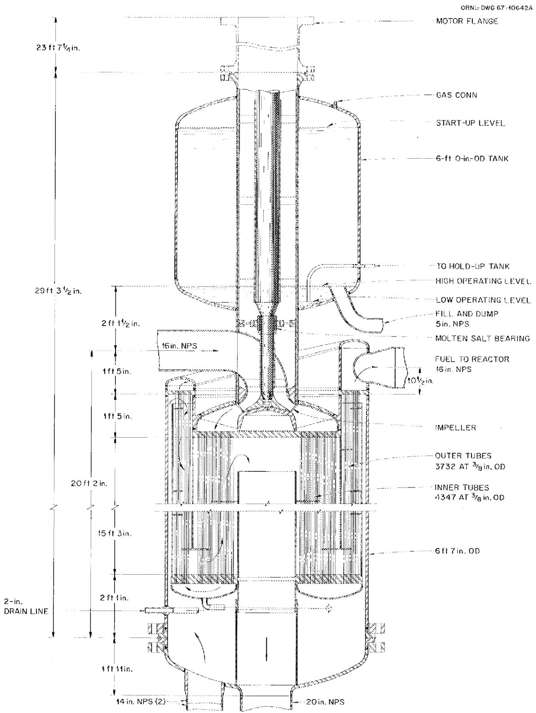  
Fig. 5.11. Fuel Heat Exchanger and Pump. 250 Mw (electrical) unit.

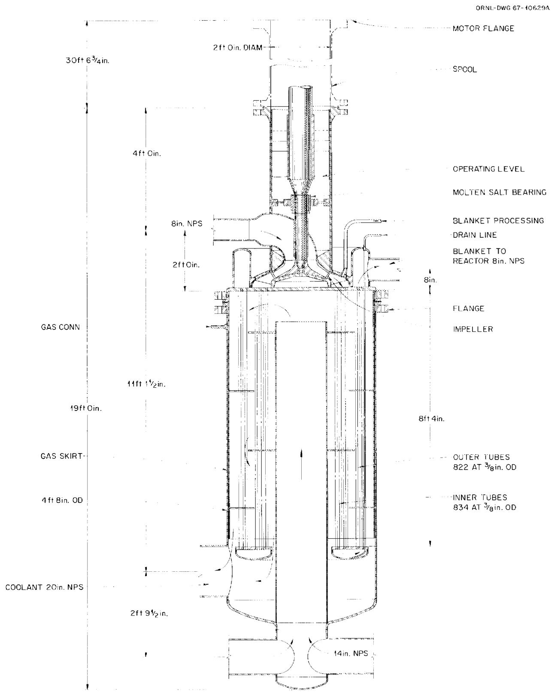  
Fig. 5.12. Blanket Heat Exchanger and Pump. 250 Mw (electrical) unit.

Table 5.4. Blanket Heat Exchanger Specifications   

<table><tr><td>Number required</td><td>4</td></tr><tr><td>Rate of heat transfer, Mw</td><td>27.8</td></tr><tr><td>Rate of heat transfer, Btu/hr</td><td>9.47 × 107</td></tr><tr><td>Shell side</td><td></td></tr><tr><td>Hot fluid or cold fluid</td><td>Cold
(coolant salt)</td></tr><tr><td>Entrance temperature, °F</td><td>1110</td></tr><tr><td>Exit temperature, °F</td><td>1125</td></tr><tr><td>Entrance pressure, a psi</td><td>138</td></tr><tr><td>Exit pressure, a psi</td><td>129</td></tr><tr><td>ΔP across exchanger, b psi</td><td>15</td></tr><tr><td>Mass flow rate, lb/hr</td><td>1.68 × 107</td></tr><tr><td>Tube side</td><td></td></tr><tr><td>Hot fluid or cold fluid</td><td>Hot
(blanket salt)</td></tr><tr><td>Entrance temperature, °F</td><td>1250</td></tr><tr><td>Exit temperature, °F</td><td>1150</td></tr><tr><td>Entrance pressure, a psi</td><td>111</td></tr><tr><td>Exit pressure, a psi</td><td>20</td></tr><tr><td>ΔP across exchanger, b psi</td><td>91</td></tr><tr><td>Mass flow rate, lb/hr</td><td>4.3 × 106</td></tr><tr><td>Velocity, fps</td><td>10.5</td></tr><tr><td>Tube material</td><td>HasteLloy N</td></tr><tr><td>Tube OD, in.</td><td>0.375</td></tr><tr><td>Tube thickness, in.</td><td>0.035</td></tr><tr><td>Tube length, tube sheet to tube sheet, ft</td><td>8.3</td></tr><tr><td>Shell material</td><td>HasteLloy N</td></tr><tr><td>Shell thickness, in.</td><td>0.50</td></tr><tr><td>Shell ID, in.</td><td>55</td></tr><tr><td>Tube sheet material</td><td>HasteLloy N</td></tr><tr><td>Tube sheet thickness, in.</td><td>1</td></tr><tr><td>Number of tubes</td><td></td></tr><tr><td>Inner annulus</td><td>834</td></tr><tr><td>Outer annulus</td><td>822</td></tr><tr><td>Pitch of tubes, in.</td><td>0.8125, triangular</td></tr><tr><td>Total heat transfer area, ft2</td><td>1318</td></tr><tr><td>Basis for area calculation</td><td>Tube OD</td></tr><tr><td>Type of baffle</td><td>Disk and doughnut</td></tr><tr><td>Number of baffles</td><td>4</td></tr><tr><td>Baffle spacing, in.</td><td>19.8</td></tr><tr><td>Disk OD, in.</td><td>33.6</td></tr><tr><td>Doughnut ID, in.</td><td>31.8</td></tr><tr><td>Overall heat transfer coefficient, U, Btu hr-1 ft-2</td><td>1030</td></tr></table>

Includes pressure due to gravity head.   
Pressure loss due to friction only.

# 5.6 FUEL DRAIN TANKS

H. L. Watts T. W. Pickel

Two 60-in.-diam by 20-ft-high dump tanks are required for draining the fuel salt from each of the reactor systems. These are shown in Fig. 5.13. One drain tank is connected to the 5-in.-diam overflow connection on the sump tank of the fuel circulating pump and receives all the salt from the reactor when it is drained. The drain time is estimated to be short, probably less than 10 sec, and this method could be used for emergency shutdown if necessary. The other drain tank is connected to the fuel heat exchanger and fills through a siphon action due to the differences in elevation.

The maximum heat to be removed in each fuel drain tank is 12 Mw (thermal). The two tanks are cooled by a total of 422,000 lb/hr of steam taken from the high-pressure turbine-generator exhaust at about 550 psia. The steam is heated from $650^{\circ}\mathrm{F}$ to about $1000^{\circ}\mathrm{F}$ in vertical thimbles spaced on 3-in. centers in each dump tank. There are 271 of these thimbles per tank, extending to within 1 in. of the bottom. The reentrant-type steam thimbles are inserted in 2-in.-OD INOR-8 thimbles which contact the fuel salt, the 0.025-in. radial clearance between the two thimbles being filled with stagnant inert fuel salt to serve as a heat transfer medium. The double thimble arrangement provides the necessary double barrier between the steam and the enriched fuel salt. Steam leaves the thimbles at about 72 fps and enters the steam chest at the top of the dump tank.

# 5.7 BLANKET AND COOLANT SALT DRAIN TANKS

H. L. Watts W. C. George

The drain tanks for the blanket salt and for the secondary coolant salt are essentially simple storage reservoirs. Cooling systems such as those used in the fuel salt tanks are not required. The details of the designs for these tanks have not been completed. The location of the tanks in the cells is shown in Fig. 5.3.

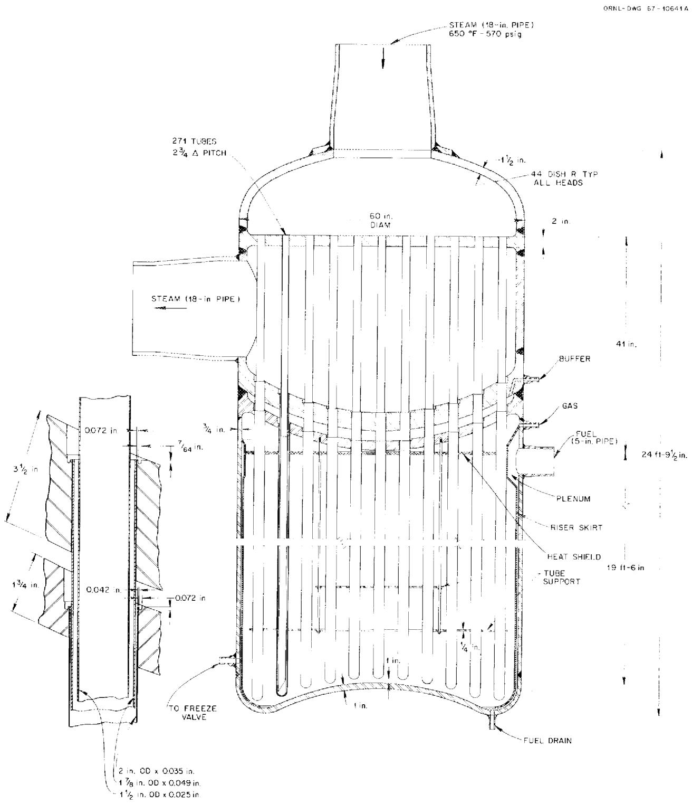  
Fig. 5.13. Fuel Drain Tank with Decay-Heat Removal System Details.

# 5.8 STEAM GENERATOR-SUPERHEATER AND REHEATER

C. E. Bettis

T. W. Pickel

Some work was continued on the design of the steam generator-superheater and on the reheater.

The initial concepts have changed little, however, and the design work has consisted primarily of detailing tube sheets, supports, headers, etc.

Details of this equipment will be covered in subsequent reports.

# 6. Reactor Physics

A. M. Perry

# 6.1 MSBR PHYSICS ANALYSIS

O. L. Smith

# Optimization of Reactor Parameters

H. T. Kerr

The two principal indices by which the performance of the Molten-Salt Breeder Reactor is customarily evaluated are the cost of power and the annual fuel yield, that is, the annual fractional increase in the inventory of fissionable material. These are used as figures of merit in assessing the influence of various design parameters or the effect of design changes that may be contemplated, and, in fact, we customarily combine them into a composite figure of merit,

$$
F = y + 1 0 0 (C + X) ^ {- 1},
$$

in which $y$ is the annual fuel yield in percent per year, $C$ is that part of the power cost which depends on any of the parameters considered, and $X$ is an adjustable constant, having no physical significance, whose value merely determines the relative sensitivity of $F$ to $y$ and $C$ . Since a large number of reactor parameters are usually involved, we make use of an automatic search procedure, carried out on an IBM 7090 computer, which finds that combination of the variable design parameters that maximizes the figure of merit, $F$ , subject to whatever constraints may be imposed by the fixed values of other design parameters not allowed to vary. This procedure, called OPTIMERC, incorporates a multigroup diffusion calculation (synthesizing a two-space-dimensional description of the flux by alternating one-dimensional flux calculations), a determination of the fissile, fertile, and fission product concentrations consistent with the proc

essing rates of the fuel and fertile salt streams, and a method of steepest gradients for optimizing the values of the variables. By choosing different values for the constant $X$ in the figure of merit, $F$ , we can generate a curve showing the minimum cost associated with any attainable value of the fuel yield, and by carrying out the optimization procedure for different, successive fixed values of selected design parameters, we can generate families of such curves of $C$ vs $y$ . (In OPTIMERC any of some 20 parameters may either be assigned fixed values or be allowed to vary within specified limits subject to the optimization procedure.)

One of the design parameters which has a significant influence on both yield and power cost is the power density in the core. (Actually, the core dimensions for a given total power are the parameters used.) The performance of the reactor is better at high power densities. At the same time, the useful life of the graphite moderator, which is dependent on the total exposure to fast neutrons, is inversely proportional to the power density (see next section). It is necessary, therefore, to determine the effect of power density on performance with considerable care.

In Fig. 6.1 the fuel-cycle cost is used because it contains, in fact, most of the variation of power cost with the parameters being varied. It may be seen from Fig. 6.1 that a reduction in power density from 80 to $20\mathrm{w/cm^3}$ involves a fuel-cycle cost penalty of about 0.1 mill/kwhr (electrical) and a reduction in annual fuel yield of perhaps $1.5\%$ . There is, of course, also an increase in capital cost (cf. Chap. 5), but this is essentially offset by a reduction in the cost of replacing the graphite and reactor vessel at intervals determined by radiation damage to the graphite. The combined penalty for having to replace the graphite, compared with a high-power-density core not requiring replacement, is about 0.2 mill/kwhr (electrical),

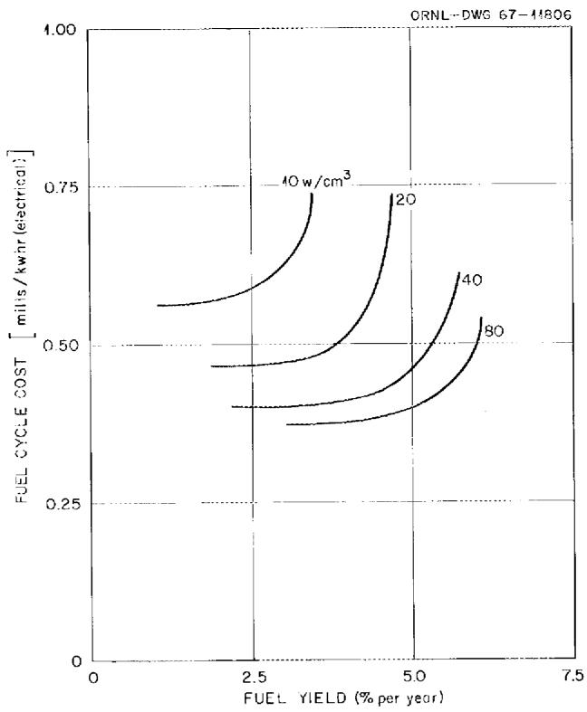

whether this comprises higher capital cost plus lower replacement cost at low power densities, or lower capital cost plus higher replacement cost at higher power densities. Figures 6.2 and 6.3 show the variation of other selected parameters both with power density and with the adjustable constant $X$ .

It is apparent from these results that the useful life of the graphite is not increased by reducing core power density without some sacrifice in other aspects of reactor performance. The reduction in yield and the increase in cost are quite modest for a reduction of power density from 80 to $40\mathrm{w/cm^3}$ , but they become increasingly more significant for each further factor-of-two reduction in power density. Nonetheless, it appears that with an average power density as low as $20\mathrm{w/cm^3}$ , the MSBR can still achieve an annual fuel yield of 3.5 to $4\%$ and a fuel-cycle cost of less than 0.5 mill/kwhr (electrical).

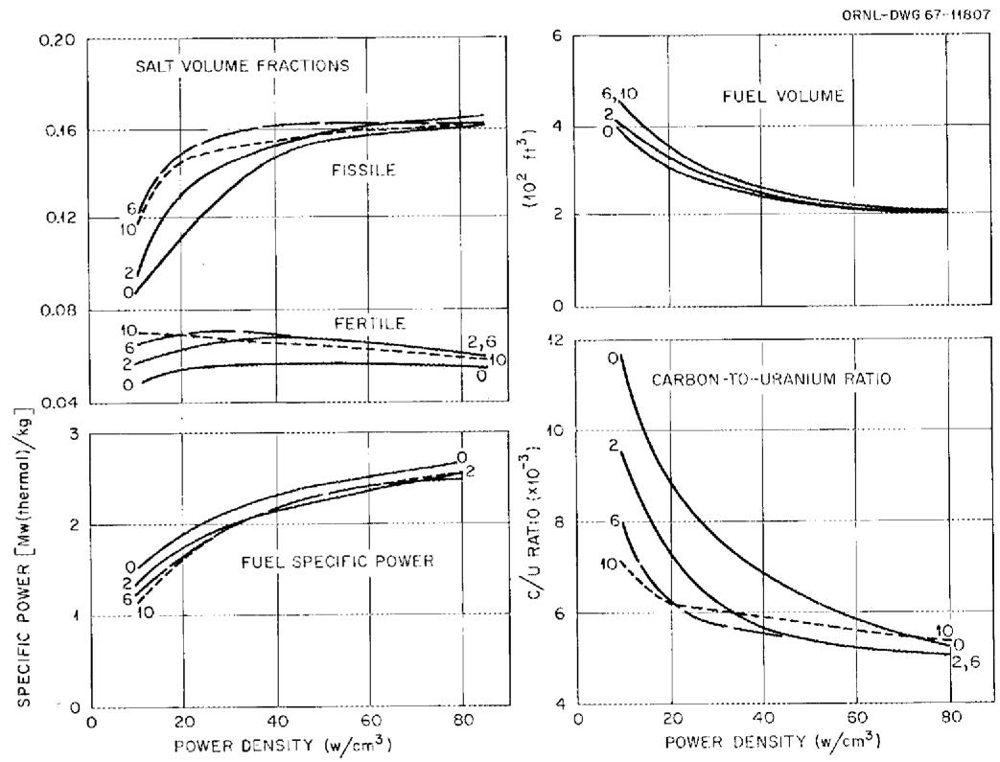  
Fig. 6.1. MSBR Fuel-Cycle Cost vs Annual Fuel Yield.   
Fig. 6.2. Variation of MSBR Parameters with Average Core Power Density. Numbers attached to curves are values of the adjustable constant $X$ .

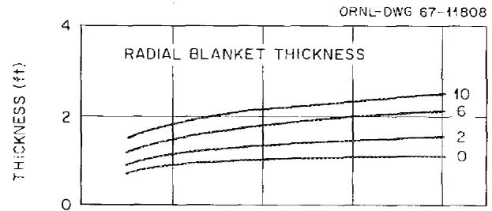

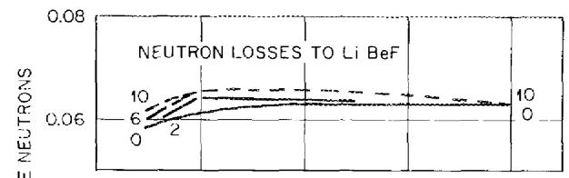

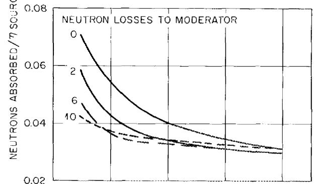

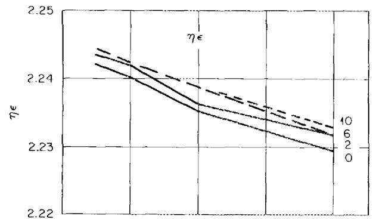

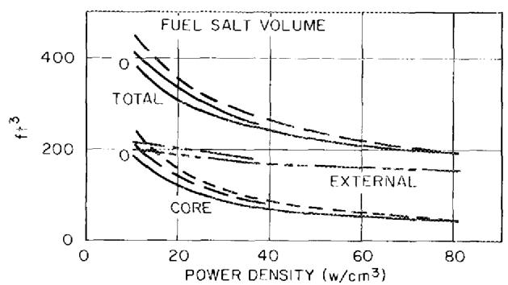  
Fig. 6.3. Variation of MSBR Parameters with Average Core Power Density. Numbers attached to curves are values of the adjustable constant $X$ .

# Useful Life of Moderator Graphite

# A. M. Perry

Information currently used in the MSR project regarding the dependence of graphite dimensional changes on fast neutron dose is derived primarily from experiments carried out in the Dounreay Fast Reactor (DFR).

A curve of volume change vs fast neutron dose for a nearly isotropic graphite at temperatures in the range 550 to $600^{\circ}\mathrm{C}$ is shown in Fig. 6.4, which is taken from the paper of Henson, Perks, and Simmons. (The neutron dose in Fig. 6.4 is expressed

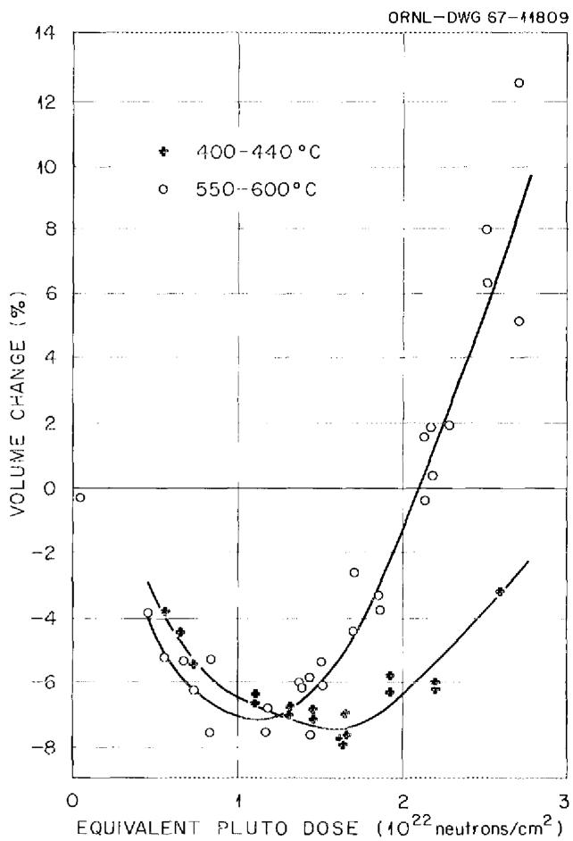  
Fig. 6.4. Volume Changes of Near-Isotropic Graphite Resulting from Neutron Irradiation. See text for dose in terms of MSBR flux.

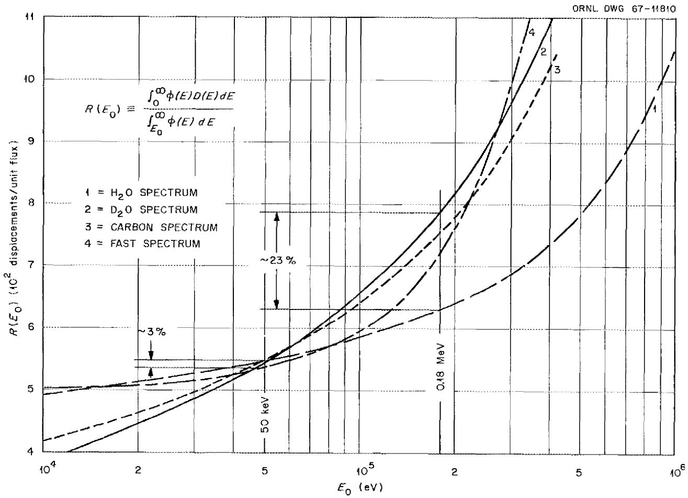  
Fig. 6.5. Fast Flux as a Measure of Radiation Damage.

in terms of an equivalent Pluto dose; the total DFR dose, that is,

$$
\int_ {0} ^ {T} \int_ {0} ^ {\infty} \phi (E, t) d E d t,
$$

is 2.16 times the equivalent Pluto dose.) From an inspection of all the available data, we have concluded that a dose of about $2.5 \times 10^{22}$ neutrons/ cm $^2$ (equivalent Pluto dose) could be sustained without any significant deterioration of the physical properties of the graphite, and this has been adopted as an allowable dose, pending further detailed consideration of mechanical design problems that might be associated with dimensional changes in the graphite.

In order to interpret these experiments to obtain predictions of graphite damage vs time in the MSBR, it is necessary to take into account the difference in neutron spectra in the two reactors.

This, in turn, requires assumptions regarding the

effectiveness of neutrons of different energies for producing the observable effects with which one is concerned. At present the best approach available is to base one's estimates of neutron damage effectiveness on the theoretical calculations of graphite lattice displacements vs carbon recoil energy carried out by Thompson and Wright. The Thompson and Wright "damage function" is integrated over the distribution of carbon recoil energies resulting from the scattering of a neutron of a given energy, and the result is then multiplied by the energy-dependent scattering cross section and integrated over the neutron spectrum in the reactor. Tests of the model have been made by Thompson and Wright by calculating the rate of electrical resistivity change in graphite relative to the $5^{8}\mathrm{Ni}(n,p)^{5^{8}}\mathrm{Co}$ reaction, in different reactor

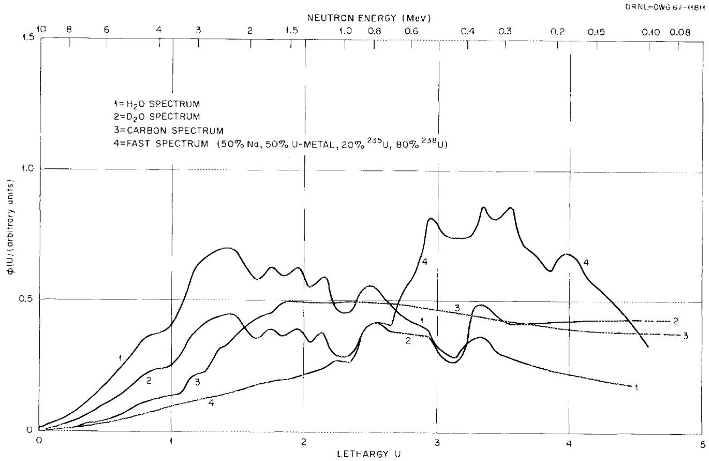  
Fig. 6.6. Neutron Flux Per Unit Lethargy vs Lethargy. Normalized for equal damage in graphite.

spectra, and comparing it with experimental determinations of the same quantities. The results indicate that the model is useful at least for predicting relative damage rates in different spectra.

A useful simplification arises from the observation that the damage per unit time is closely proportional to the total neutron flux above some energy $E_0$ , where $E_0$ has the same value for widely different reactor spectra. We have reconfirmed this observation, to our own satisfaction, by comparing the (calculated) damage per unit flux above energy $E_0$ as a function of $E_0$ for spectra appropriate to three different moderators (H₂O, D₂O, and C) and for a "typical" fast reactor spectrum. The results, plotted in Fig. 6.5, show that the flux above about 50 kev is a reliable indication of the relative damage rate in graphite for quite different spectra. Figure 6.6 shows the spectra for which these results were derived. The equivalence between MSBR and DFR experiments is simply found by equating the doses due to neutrons above 50 kev in the two reactors. We have not yet calculated the DFR spectrum explicitly, but we expect it to

be similar to the "fast reactor" spectrum of Fig. 6.6, in which $94\%$ of the total flux lies above 50 kev. Since the damage flux in the MSBR is essentially proportional to the local power density, we postulate that the useful life of the graphite is governed by the maximum power density rather than by the average, and thus depends on the degree of power flattening that can be achieved (see next section). In the MSBR the average flux above 50 kev is about $0.94 \times 10^{14}$ neutrons $\mathrm{cm}^{-2} \sec^{-1}$ at a power density of $20 \mathrm{~W/cm}^3$ . From the DFR irradiations it has been concluded that a dose of $5.1 \times 10^{22} \mathrm{mV}$ ( $>50$ kev) can be tolerated. The lifetime of the graphite is then easily computed; this useful life is shown in Table 6.1 for an assumed plant factor of 0.8 and for various combinations of average power density and peak-to-average power-density ratio.

It must be acknowledged that in applying the results of DFR experiments to the MSBR, there remain some uncertainties, including the possibility of an appreciable dependence of the damage on the rate at which the dose is accumulated

Table 6.1. Useful Life of MSBR Graphite   

<table><tr><td>Average Power Density (w/cm3)</td><td>(Pmax/Pav)</td><td>Life (years)</td></tr><tr><td>40</td><td>2.0</td><td>5.4</td></tr><tr><td>40</td><td>1.5</td><td>7.2</td></tr><tr><td>20</td><td>2.0</td><td>10.8</td></tr><tr><td>20</td><td>1.5</td><td>14.4</td></tr></table>

as well as on the total dose. The dose rate in the DFR was approximately ten times greater than that expected in the MSBR, and if there is a significant dose-rate effect, the life of the graphite in an MSBR might be rather longer than shown in Table 6.1.

# Flux Flattening

O. L. Smith H. T. Kerr

Because the useful life of the graphite moderator in the MSBR depends on the maximum value of the damage flux rather than on its average value in the core, there is obviously an incentive to reduce the maximum-to-average flux ratio as much as possible, provided that this can be accomplished without serious penalty to other aspects of the reactor performance. In addition, there is an incentive to make the temperature rise in parallel fuel passages through the core as nearly uniform as possible, or at least to minimize the maximum deviation of fuel outlet temperature from the average value. Since the damage flux (in effect, the total neutron flux above 50 kev) is essentially proportional to the fission density per unit of core volume, the first incentive requires an attempt to flatten the power density per unit core volume throughout the core, that is, in both radial and axial directions in a cylindrical core. Since the fuel moves through the core only in the axial direction, the second incentive requires an attempt to flatten, in the radial direction, the power density per unit volume of fuel. Both objectives can be accomplished by maintaining a uniform volume fraction of fuel salt throughout the core and by flattening the power density distribution in both directions to the greatest extent possible.

The general approach taken to flattening the power distribution is the classical one of providing a central core zone with $k_{\infty} \simeq 1$ , that is, one which is neither a net producer nor a net absorber of neutrons, surrounded by a "buckled" zone whose surplus neutron production just compensates for the neutron leakage through the core boundary. Since the fuel salt volume fraction is to be kept uniform throughout the core, and since the concentrations of both the fuel and the fertile salt streams are uniform throughout their respective circuits, the principal remaining parameter that can be varied with position in the core to achieve the desired effects is the fertile salt volume fraction. The problem then reduces to finding the value of the fertile salt volume fraction that gives $k_{\infty} = 1$ for the central, flattened zone, with fixed values of the other parameters, and finding the volume fraction of the fertile salt in the buckled zone that makes the reactor critical for different sizes of the flattened zone. As the fraction of the core volume occupied by the flattened zone is increased, the fertile salt fraction in the buckled zone must be decreased, and the peak-to-average power density ratio decreases toward unity. The largest flattened zone and the smallest power density ratio are achieved when the fertile material is removed entirely from the outer core zone. Increasing the fuel salt concentration or its volume fraction (with an appropriate adjustment of the fertile salt volume fraction in the flattened zone) would permit a still larger flattened zone and smaller $P_{\max} / P_{\mathrm{avg}}$ , but would be expected to compromise the reactor performance by increasing the fuel inventory, at least if carried too far.

There are obviously many possible combinations of parameters to consider. It is not a priori obvious, for example, whether the flattened zone should have the same height-to-diameter ratio as the entire core, or whether the axial buckled zones should have the same composition as the radial buckled zone. While we have by no means carried the investigation of these questions as far as we need to, we have gone far enough to recognize several important aspects of the problem.

First, by flattening the power to various degrees in the radial direction only and performing fuel-cycle and economic calculations for each of these cases, we find that the radial power distribution can be markedly flattened with very little effect either on fuel cost or on annual fuel yield, our

chief indicators of performance. That is, the radial peak-to-average power density ratio, which is about 2.0 for the uniform core (which is surrounded, of course, by a heavily absorbing blanket region and hence behaves essentially as if it were unreflected), can be reduced to 1.25 or less with changes in fuel cost and yield of less than 0.02 mill/kwhr (electrical) and $0.2\%$ per year respectively. The enhanced neutron leakage from the core, which results from the power flattening, is taken up by the fertile blanket and does not represent a loss in breeding performance.

Second, attempts at power flattening in two dimensions have shown that the power distribution is very sensitive to details of composition and placement of the flattened zone. Small differences in upper and lower blanket composition, which are of no consequence in the case of the uniform core, produce pronounced axial asymmetry of the power distribution if too much axial flattening is attempted. In addition, the axial and radial buckled zones may interact through the flattened zone, to some extent, giving a distribution that is concave upward in one direction and concave downward in the other, even though the integrated neutron current over the entire boundary of the central zone vanishes. In view of these tendencies, it may be anticipated that a flattened power distribution would be difficult to maintain if graphite dimensional changes, resulting from exposure to fast neutrons, were allowed to influence the salt volume fractions very strongly. Consequently, some revisions in the details of the core design are under consideration as a means of reducing the sensitivity of the power distribution to graphite dimensional changes.

# Temperature Coefficients of Reactivity

O. L. Smith C. O. Thomas

In analyzing power transients in the Molten-Salt Breeder Reactor -- as indeed for most reactors -- one must be able to determine the reactivity effects of temperature changes in the individual components of the core, for example, the fuel salt, the fertile salt, and the graphite moderator. Since the fuel is also the coolant, and since only small fractions of the total heat are generated in the fertile salt and in the moderator, one expects very much smaller temperature changes in the latter compo

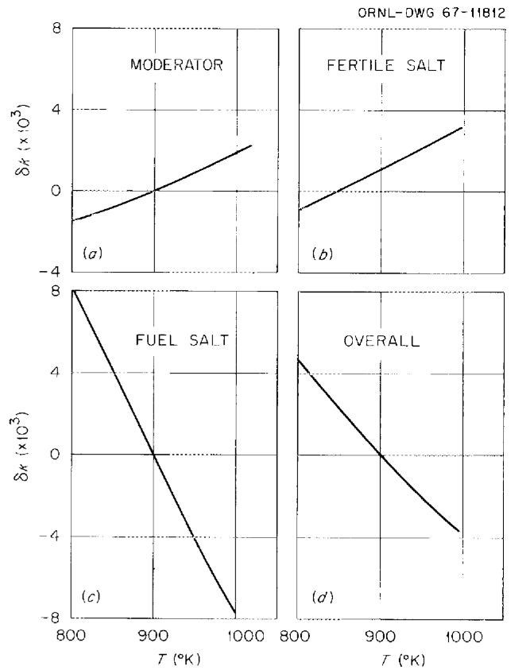  
Fig. 6.7. MSBR Multiplication Factor vs Temperature.

nents than in the fuel during a power transient. Expansion of the fuel salt, which removes fuel from the active core, is thus expected to be the principal inherent mechanism for compensating any reactivity additions to the MSBR.

We have accordingly calculated the magnitudes of the temperature coefficients of reactivity separately for the fuel salt, the fertile salt, and the graphite over the range of temperatures from 800 to $1000^{\circ}\mathrm{K}$ . The results of these calculations are shown in Fig. 6.7.

In Fig. 6.7a we show a curve of change in multiplication factor vs moderator temperature (with $\delta k$ arbitrarily set equal to zero at $900^{\circ}\mathrm{K}$ ). Similar curves of $\delta k$ vs temperature for fuel and fertile salts are shown in Figs. 6.7b and 6.7c, and the combined effects are shown in Fig. 6.7d. These curves are all nearly linear, the slopes being the temperature coefficients of reactivity. The magnitudes of the coefficients at $900^{\circ}\mathrm{K}$ are shown in Table 6.2.

The moderator coefficient comes almost entirely from changes in the spectrum-averaged cross sec

Table 6.2. Temperature Coefficients of Reactivity   

<table><tr><td rowspan="2">Component</td><td>Coefficient</td></tr><tr><td>1 dk / k dT (°K)-1</td></tr><tr><td>Moderator</td><td>+1.66 × 10-5</td></tr><tr><td>Fertile salt</td><td>+2.05 × 10-5</td></tr><tr><td>Fuel salt</td><td>-8.05 × 10-5</td></tr><tr><td>Overall</td><td>~4.34 × 10-5</td></tr></table>

tions. It is particularly worthy of note that the moderator coefficient appears to be quite insensitive to uncertainties in the energy dependence of the $^{233}\mathrm{U}$ cross sections in the energy range below 1 ev; that is, reasonable choices of cross

sections based on available experimental data yield essentially the same coefficient.

The fertile-salt reactivity coefficient comprises a strong positive component due to salt expansion (and hence reduction in the number of fertile atoms per unit core volume) and an appreciable negative component due to temperature dependence of the effective resonance-absorption cross sections, so that the overall coefficient, though positive, is less than half as large as that due to salt expansion alone.

The fuel salt coefficient comes mainly from expansion of the salt, which of course reduces the average density of fuel in the core. Even if all core components should undergo equal temperature changes, the fuel-salt coefficient dominates; and in transients in which the fuel temperature change is far larger than that of the other components, the fuel coefficient is even more controlling.

# 7. Systems and Components Development

Dunlap Scott

Work related to the Molten-Salt Breeder Reactor was initiated during this period. Studies were made of the problems related to the removal of the noble gases from the circulating salt to help identify the equipment and systems required to keep the $^{135}\mathrm{Xe}$ poison fraction and the fission product afterheat to an acceptable level. Preparations were begun for operation of a small out-of-pile loop in which a molten salt will be circulated through a graphite fuel cell and for operation of an isothermal MSRE-scale loop with sodium fluoroborate.

The major effort of the program at this time is to help establish the feasibility of improved concepts and to define problem areas. Since the production of suitable and reliable salt pumps is one of the longest lead-time items for molten-salt reactors, a major emphasis is being placed on this program.

Some of the work related to problems of the MSBR but actually performed on the MSRE is discussed in the MSRE section of this report. The other work is described below.

# 7.1 NOBLE-GAS BEHAVIOR IN THE MSBR

R.J.Kedl

In the MSBR conceptual designs, the graphite in the reactor core is unclad and in intimate contact with fuel salt. Noble gases generated by fission and any gaseous compounds can diffuse from the salt into the porous structure of the graphite, where they will serve as heat sources and nuclear poisons.

A steady-state analytical model was developed to compute the migration of noble gases to the

graphite and other sinks in the MSBR. The sink terms considered are:

1. Decay.   
2. Burnup - takes place in the graphite and in the fuel salt passing through the core.   
3. Migration to graphite - these gases ultimately decay or are burned up.   
4. Migration to circulating bubbles ... these gases are stripped from the fuel loop to go to the off-gas system.

Two source terms are considered: generation directly from fission, which is assumed to occur only in the core, and generation from decay of the precursor, which occurs throughout the fuel loop. The model is based on conventional mass transfer concepts. Some degree of success has been experienced with similar models developed for the MSRE, for example:

1. Xenon-135 poison fraction calculations. The steady-state model is developed in ORNL-4069. Results of the time-dependent form of the model are summarized in ORNL-TM-1796.   
2. A model was developed to compute the concentrations of daughters of very short-lived noble gases in graphite (ORNL-TM-1810). Computed concentrations check very well with measured values.

With this model, steady-state $^{135}\mathrm{Xe}$ poisoning calculations have been made for the MSBR [556 Mw (thermal) fueled with $^{233}\mathrm{U}$ and moderated with unclad graphite] to show the influence of various design parameters involved. The reactor considered here is essentially that described in ORNL-3996 [P. R. Kasten et al., Design Studies of 1000-Mw (e) Molten-Salt Breeder Reactors], with specific design parameters as listed in Table 7.1.

Table 7.1. Design Parameters   

<table><tr><td>Reactor power, Mw (thermal)</td><td>556</td></tr><tr><td>Fuel</td><td>233U</td></tr><tr><td>Fuel salt flow rate, ft3/sec</td><td>25.0</td></tr><tr><td>Core diameter, ft</td><td>8</td></tr><tr><td>Core height, ft</td><td>10</td></tr><tr><td>Volume fuel salt in core, ft3</td><td>83</td></tr><tr><td>Volume fuel salt in heat exchanger, ft3</td><td>83</td></tr><tr><td>Volume fuel salt in piping between core and heat exchanger, ft3</td><td>64</td></tr><tr><td>Fuel cell cross section</td><td></td></tr><tr><td colspan="2">3-7/8in.HolesDOWNFLOW CHANNELO O O 11/2in. 5in. U PFLLOW CHANNEL</td></tr><tr><td>Total graphite surface area exposed to salt, ft2</td><td>3630</td></tr><tr><td>Mass transfer coefficient to graphite - upflow, ft/hr</td><td>0.72</td></tr><tr><td>Mass transfer coefficient to graphite - downstream, ft/hr</td><td>0.66</td></tr><tr><td>Mean thermal flux, neutrons sec-1cm-2</td><td>5.0 × 1014</td></tr><tr><td>Mean fast flux, neutrons sec-1cm-2</td><td>7.6 × 1014</td></tr><tr><td>Thermal neutron cross section for 233U, barns</td><td>253</td></tr><tr><td>Fast neutron cross section for 233U, barns</td><td>36.5</td></tr><tr><td>Total core volume - graphite and salt, ft3</td><td>503</td></tr><tr><td>233U concentration in core - homogenized, atoms barn-1cm-1</td><td>1.11 × 10-5</td></tr><tr><td>Graphite void available to xenon, %</td><td>10</td></tr><tr><td>135Xe parameters</td><td></td></tr><tr><td>Decay constant, 1/hr</td><td>7.53 × 10-2</td></tr><tr><td>Generation direct from fission, %</td><td>0.32a</td></tr><tr><td>Generation from iodine decay, %</td><td>6.38a</td></tr><tr><td>Cross section for MSBR neutron spectrum, barns</td><td>9.94 × 105</td></tr></table>

The values for the yield of $^{135}\mathrm{Xe}$ from the fission of $^{233}\mathrm{U}$ are from an old source and were used in the screening calculations. Recent values of $1.11\%$ for generation direct from fission and $6.16\%$ for generation from iodine decay as reported by C. B. Bigham et al. in Trans. Am. Nucl. Soc. 8(1), June 1965, will be used in the future.

The xenon stripping mechanism consists in circulating helium bubbles with the fuel salt and then removing them from the system. These bubbles are injected at the inlet to the heat exchanger in the region of the pump. Xenon-135 migrates to the bubbles by conventional mass transfer, and the mass transfer coefficient controls the rate of migration. The circulating bubbles are then stripped from the salt by a pipeline gas separator at the heat exchanger outlet. The heat exchanger, then, is the xenon stripper region of the fuel loop.

The principal parameters to be discussed here will be:

1. Diffusion coefficient of xenon in graphite.   
2. Parameters associated with circulating bubbles. (a) Mass transfer coefficient to the bubbles. (b) The surface area of the bubbles.   
3. The surface area of graphite exposed to salt in the core.

In the plots that follow, the diffusion coefficient of xenon in graphite at $1200^{\circ}\mathrm{F}$ with units of $\mathrm{ft}^2/\mathrm{hr}$

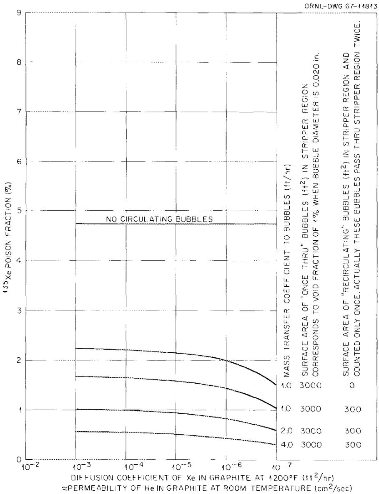  
Fig. 7.1. Effect of Diffusion Coefficient in Graphite on $^{135}\mathrm{Xe}$ Poison Fraction.

is used as a parameter. Numerically, this is approximately equal to the permeability of helium in graphite at room temperature with units of $\mathrm{cm}^2/\mathrm{sec}$ , if Knudsen flow prevails. Knudsen flow should be the dominant flow character for permeabilities less than $10^{-5}\mathrm{cm}^2/\mathrm{sec}$ . For permeabilities greater than $10^{-5}\mathrm{cm}^2/\mathrm{sec}$ , viscous flow becomes important and this direct relationship does not exist.

The gas circulated through the system is handled in these calculations as two groups of bubbles. The first group, referred to as the "once-through" bubbles, is injected at the bubble generator and removed with $100\%$ efficiency by the gas separator.

The second group, referred to as the "recirculated" bubbles, is injected at the bubble generator, completely bypasses the gas separator, and recirculates through the system until the bubbles are removed with $100\%$ efficiency on their second pass through the gas separator. In the accompanying plots the bubble surface area is the quoted parameter. For proper orientation, note that $3000\mathrm{ft}^2$ of bubble surface area corresponds to an average void fraction of $1\%$ in the stripper region of the fuel loop with bubbles 0.020 in. in diameter, and also corresponds to a gas flow rate of about 40 scfm.

Figure 7.1 shows the $^{135}\mathrm{Xe}$ poison fraction as a function of the diffusion coefficient in graphite.

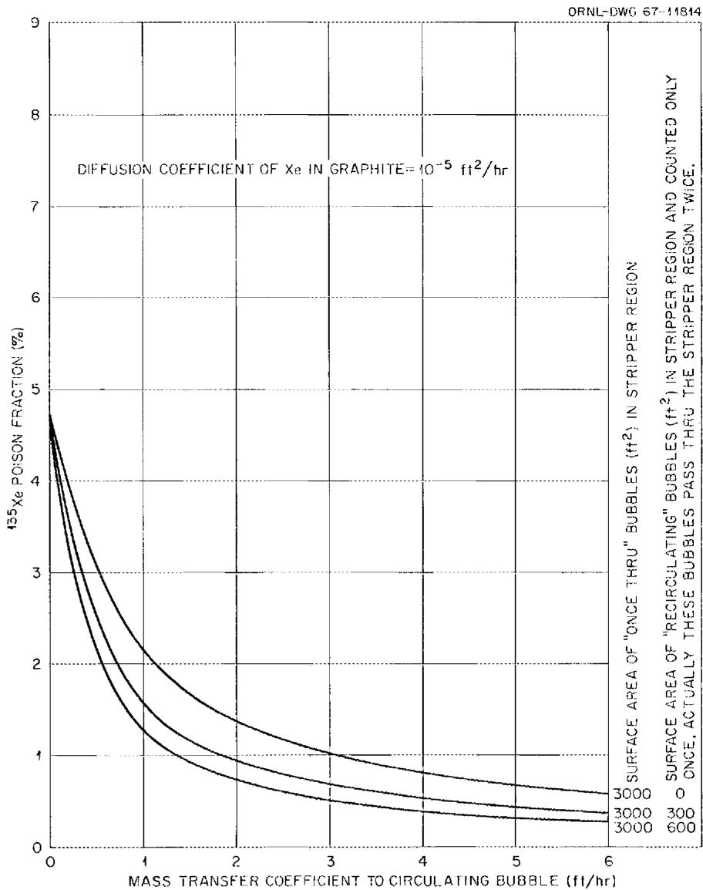  
Fig. 7.2. Effect of Bubble Mass Transfer Coefficient on $^{135}\mathrm{Xe}$ Poison Fraction.

The top line is for no xenon removal through circulating bubbles, and the poison fraction approaches that for a solid-fueled reactor. The other lines are for various circulating bubble parameters as indicated. From this figure it can be seen that the poison fraction is not a strong function of the diffusion coefficient over the range from $10^{-3}$ to $10^{-6}$ . This is because the mass transfer coefficient from salt to graphite is the controlling resistance for migration of $^{135}\mathrm{Xe}$ into the graphite. Since $^{135}\mathrm{Xe}$ in the graphite is the greatest contributor to the total poison fraction, the parameters that control its migration will, in turn, control the poison fraction. For permeabilities $\times 10^{-6}$ the resistance of

the graphite starts becoming significant. The mass transfer coefficients to graphite were computed from the Dittus-Boelter equation as modified by the heat-mass transfer analogy.

Figure 7.2 shows the effect of the mass transfer coefficient to the bubble on the poison fraction. This mass transfer coefficient is one of the least well known and most significant of the parameters involved. Available information indicates its extreme values to be 0.7 and approximately 6 ft/hr. Values of 0.7 to 0.8 ft/hr were estimated assuming that the bubbles behave as solid spheres and have a fluid dynamic boundary layer. Values near 3.5 ft/hr were estimated assuming that as the

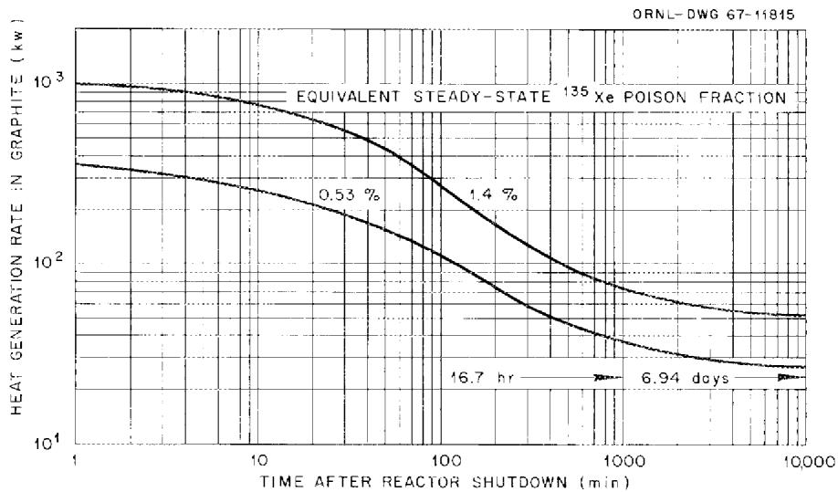  
Fig. 7.3. Afterheat in MSBR [556 Mw (thermal)] Graphite from Noble Cases and Their Daughters After 10 Years of Power Operation.

bubble rises, its interface is continually being replaced by fresh fluid (penetration theory). Both of these cases are for a bubble rising at its terminal velocity in a stagnant fluid. There is very little information in the literature concerning the effect of fluid turbulence on the bubble mass transfer coefficient. Nevertheless, from turbulence theory it has been estimated that mass transfer coefficients as high as 6 ft/hr could be realized under MSBR conditions. The analyses that lead to this number are generally optimistic in their assumptions.

The target $^{135}\mathrm{Xe}$ poison fraction for the MSBR is $0.5\%$ . From Fig. 7.2 it can be seen that this goal will be easy to attain if the mass transfer coefficient is over 4.0 ft/hr. It is still attainable if the mass transfer coefficient is between 2.0 and 4.0, but with more difficulty. From this figure it is apparent that a small amount of recirculating bubbles is as effective as a large amount of once-through bubbles. One reason is that the contact time for recirculating bubbles is about four times that for the once-through bubbles.

Another variable that will strongly affect the poison fraction is the graphite surface area in the core. Calculations indicate that if the graphite surface area is doubled, all other parameters remaining constant, the poison fraction will increase by 50 to $70\%$ .

This model has also been used to compute the noble gas contribution to afterheat of the unclad graphite. Xenon and krypton are involved in over 30 fission product decay chains. The model was used to compute the flux of each xenon and krypton isotope into the graphite, assuming that this flux is constant for the entire time the reactor is at power. From this we computed the concentration of each noble gas and all its daughters in the graphite as a function of time that the reactor is maintained at power. Results of calculations for the reactor after ten years at full power are shown in Fig. 7.3. The reactor parameters are the same as used in the $^{135}\mathrm{Xe}$ poisoning calculations. Two curves are shown in the figure. Rather than listing all the circulating bubble parameters involved (e.g., void fraction, mass transfer coefficient, etc.), it is sufficient to list the equivalent $^{135}\mathrm{Xe}$ poison fraction. The afterheat is proportional to this value.

Work is under way in two areas. First, we are considering ways to introduce circulating bubbles of uniform size and about 0.020 in. in diameter. A small model of a mechanical bubble generator that operates somewhat like a mixer has been built for testing with air and water. No quantitative results are yet available. Second, a closer look is being taken at the bubble mass transfer coefficients. An experiment is being considered that will yield a measured value to this parameter.

# 7.2 MSBR FUEL CELL OPERATION WITH MOLTEN SALT

Dunlap Scott

P. G. Smith

We have started an experimental program designed to give an early demonstration of the compatibility of a full-sized graphite fuel cell with a flowing salt stream. The cell will include graphite-to-graphite and the graphite-to-metal joints. An existing facility, the Engineering Test Loop from the MSRE development program, is being reactivated for this work.

The loop will be operated with a single cell over a range of conditions expected in the MSBR. These are:

Flow rate 18 to 35 gpm

Temperature 1000 to $1300^{\circ}\mathrm{F}$

Helium overpressure 5 to 20 psig

Design of the alterations needed for the loop to accept the fuel cell was begun, the circulating

pump was completely renovated, and the procurement of some loop materials was started. The procurement of a representative graphite for the fuel cell is expected to be a critical item, and, therefore, the size of the cell in the initial tests will be controlled by the available graphite.

# 7.3 SODIUM FLUOROBORATE CIRCULATING LOOP TEST

P. G. Smith

A. N. Smith

An existing MSRE-scale forced convection salt loop is being altered to accept sodium fluoroborate $(\mathrm{NaBF}_4)$ as the circulating medium. This test is part of a program to qualify $\mathrm{NaBF}_4$ for use as a coolant for the MSBR.

The salt loop is part of the Fuel Pump High-Temperature Endurance Test Facility and normally uses Li-Be-U fluoride salts, which have very low vapor pressures at the temperatures of interest. Since the $\mathrm{NaBF}_4$ exerts a $\mathrm{BF}_3$ partial pressure of

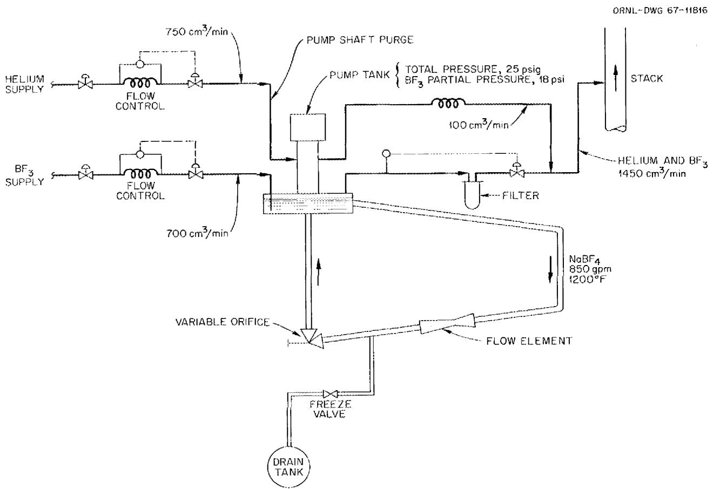  
Fig. 7.4. Cover Gas Control System for the Fluoroborate Test.

about $500\mathrm{mmHg}$ at the test operating temperature $(1200^{\circ}\mathrm{F})$ , it will be necessary to maintain an overpressure of $\mathbf{BF}_3$ in the pump bowl vapor space to avoid a loss of $\mathbf{BF}_3$ from the salt with the resultant increase in salt liquidus temperature. The cover gas system is being revised to include the necessary equipment for handling and controlling the $\mathbf{BF}_3$ . This system, shown schematically in Fig. 7.4, includes some of the features of the cover gas system used with the MSRE coolant salt, and the information developed in the test will be useful in planning the revisions which will be necessary to prepare for testing of NaBF in the MSRE coolant system.

The operating conditions for the loop are:

Temperature 1200°F

Flow rate 800 gpm

Pump head 120 ft

Pump speed 1800 rpm

The tendency of $\mathrm{BF}_3$ to induce polymerization of organic materials could cause problems in the pump lubrication system and in the off-gas line. The helium purge to the shaft annulus will be adjusted to minimize diffusion of $\mathrm{BF}_3$ into the pump bearing chamber, and filters are provided in the off-gas line to protect the pump tank pressure control valve. The $\mathrm{BF}_3$ flow required will be dictated by the total pump bowl pressure, the desired $\mathrm{BF}_3$ partial pressure, and the required helium purge flow.

It is planned to operate the loop isothermally for a period of about six months. The objective will be to uncover any problems associated with the circulation of $\mathrm{NaBF}_4$ and to devise and test suitable solutions or corrective measures.

# 7.4 MSBR PUMPS

A. G. Grindell

P. G. Smith

L. V. Wilson

# Survey of Pump Experience Circulating Liquid Metals and Molten Salts

A survey of experience with pumps for liquid metals and molten salt was made, and a report1

was issued relating pump descriptions, operating hours, and the problems encountered during operation.

# Introduction of MSBR Pump Program

The objectives of the salt pump program for the MSBR include the production of suitable and reliable pumps for the fuel, blanket, and coolant salt circuits of the Molten-Salt Breeder Experiment (MSBE) and its nonnuclear prototype, the Engineering Test Unit (ETU). Table 7.2 presents the pump requirements as they are presently envisioned. A single conditional objective requires that the pumps developed for the MSBE should be capable of flow capacity scale-up by a factor of approximately 4 to the 550-Mw (thermal) MSBR with little or no additional development work.

Our approach is to invite the strong participation of U.S. pump industry in the design, development, and production of these pumps. We will prepare pump specifications along with a preliminary pump assembly drawing, pertinent rotorodynamic and heat transfer analyses, and the results of a survey of fabrication methods for submission to pump manufacturers. The pump manufacturers would be asked to make an independent analysis of the pump specifications and supporting material and to define all the changes and improvements they believe necessary. Parenthetically, it may prove necessary to pay for several independent analyses. The pump manufacturers would then be asked to bid on the production of the detailed pump design and shop drawings, the fabrication and assembly for shop inspection of the required quantities of salt pumps, and the shipment of disassembled pumps to ORNL for further testing.

Two important implicit requirements are provided in this approach. The individual pump configurations are matched to the various MSBE systems requirements by and at ORNL, and the responsibility for approval of the final pump design and the detailed drawings rests with ORNL.

The principal pump components requiring development effort are the molten-salt bearing, if used, the shaft seal, and a full-scale rotor-dynamic simulator, if supercritical operation of a salt pump is required, that is, operation of the pump at speeds above the first critical shaft speed. The pump manufacturers would be invited to participate in this and other development work they may

Table 7.2. Pumps for Breeder Reactors   

<table><tr><td></td><td>Fuel</td><td>Blanket</td><td>Coolant</td></tr><tr><td colspan="4">2225 Mw (thermal) MSBR</td></tr><tr><td>Number required</td><td>4a</td><td>4a</td><td>4a</td></tr><tr><td>Design temperature, °F</td><td>1300</td><td>1300</td><td>1300</td></tr><tr><td>Capacity, gpm</td><td>11,000</td><td>2000</td><td>16,000</td></tr><tr><td>Head, ft</td><td>150</td><td>80</td><td>150</td></tr><tr><td>Speed, rpm</td><td>1160</td><td>1160</td><td>1160</td></tr><tr><td>Specific speed, Ns</td><td>2830</td><td>2150</td><td>3400</td></tr><tr><td>Net positive suction head required, ft</td><td>25</td><td>8</td><td>32</td></tr><tr><td>Impeller input power, hp</td><td>990</td><td>250</td><td>1440</td></tr><tr><td colspan="4">150 Mw (thermal) MSBE</td></tr><tr><td>Number required</td><td>1</td><td>1</td><td>1</td></tr><tr><td>Design temperature, °F</td><td>1300</td><td>1300</td><td>1300</td></tr><tr><td>Capacity, gpm</td><td>4500</td><td>540</td><td>4300</td></tr><tr><td>Head, ft</td><td>150</td><td>80</td><td>150</td></tr><tr><td>Speed, rpm</td><td>1750</td><td>1750</td><td>1750</td></tr><tr><td>Specific speed, Ns</td><td>2730</td><td>1520</td><td>2670</td></tr><tr><td>Net positive suction head required, ft</td><td>27</td><td>5</td><td>26</td></tr><tr><td>Impeller input power, hp</td><td>410</td><td>61</td><td>390</td></tr></table>

${}^{a}$ The same total number of pumps is required for a 1000-Mw (electrical) plant of the MSBR reference design or modular design.

deem necessary. However, it would appear more economical to perform the molten-salt bearing development work at ORNL, where the fuel production facilities and the handling techniques are already available. Proof testing of completed pumps in molten salt prior to operation in either the ETU or the MSBE will be conducted at ORNL. Endurance testing of prototype pumps in molten salt will also be conducted at ORNL in the proof-testing facilities.

Because experience indicates that production of suitable and reliable salt pumps is one of the longest lead-time items for molten-salt reactor experiments, it is important to get an early start in the pump program.

If study indicates that the MSBE salt pumps can be operated subcritically but that the MSBR pumps must be operated supercritically, then the conditional objective may require operation of a salt pump at supercritical speeds during the course of the MSBE program to build confidence in the reliability of a pump with such a long shaft.

# Fuel and Blanket Salt Pumps

Preliminary layouts have been made for the fuel salt pump, blanket salt pump, and coolant salt pump. The concepts of the fuel salt pumps, shown

in Fig. 7.5, and the blanket salt pump are similar, having a shaft of the order of 34 ft long, supported by an oil-lubricated radial and thrust bearing at the upper end and a molten-salt-lubricated journal bearing near the impeller at the lower end. The main differences in the two pumps lie in (1) the size of the fluid flow passages to, through, and from the impeller, (2) the absence of a pump tank on the blanket salt pump, and (3) the sizes of the drive motors. The similarity of the pumps which is derived from their common environment and placement within the cell results in common analytical and developmental efforts in the areas of bearings, seals, rotor dynamics, motor containment, general layout, direct and remote maintenance, ancillary systems, fabrication and assembly, and nuclear heating.

The fuel salt and blanket salt pumps are designed so that the rotary element which contains all the moving parts can be replaced by remote maintenance without having to cut any of the salt lines to or from the pump. Direct maintenance can be performed on the drive motor and the bearing-seal assembly at the upper end of the pump. A static seal can be brought into play to separate and protect the maintenance area from the radio-activity in the pump when the bearing-seal assembly is to be removed.

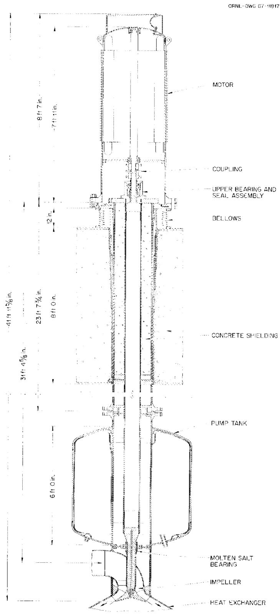  
Fig. 7.5. Preliminary Layout of the MSBR Fuel Salt Pump.

Nuclear heating of the pump tank and the support structure within the pump tank is removed by circulating a portion of the fuel salt from the main salt stream over the heated surfaces. To remove the nuclear heat from the shaft, a small amount of salt is bled up the center of the shaft and fed into an annulus between the shaft and a cooling tube that extends the length of the pump tank. A labyrinth seal at the lower end of the tube forces most of the salt to flow to the upper end of the tube, where it spills over into the pump tank. An added benefit is the increased damping and stiffness provided to the shaft by the salt in the annulus.

Analyses are being made of the nuclear heating in that portion of the pump casings and shaft for which no cooling is provided. If a problem is found, we can provide cooling or shielding and thermal insulation where needed to reduce the heat generation in the pump structure to an acceptable level.

The seal arrangement at the upper end of the shaft is similar to that used in the MSRE salt pumps. It consists of a face-type seal (Graphitar against tool steel) with the lubricating oil on one side and the helium in the shaft annulus on the other. Helium is brought into the annulus to serve as a split purge between the salt and gaseous fission products at the lower end of the shaft and any lubricating oil that leaks through the face seal into a leak-off line. Part of the helium passes down the shaft through a close-fitting labyrinth, where the increased gas velocity reduces the upward diffusion of molten-salt vapor and gaseous fission products. Concurrently, that portion of the helium passing upward through the labyrinth seal prevents the downward movement of lubricating oil vapors and also serves to scavenge oil leakage and vapors overboard from the pump.

# Coolant Salt Pumps

Two preliminary layouts of the MSBR coolant salt pump have been prepared. One layout utilizes a pump with a short overhung shaft mounted on two oil-lubricated rolling element bearings, and the other is a long shaft with an oil-lubricated bearing at the top end of the shaft and a molten-salt bearing located just above the impeller. One criterion for the pump requires variable-speed operation over the range 300 to $1200\mathrm{rpm}$ . The dif

ficulty with the short-shaft pump is that to have the pump operate below the first critical speed, the shaft diameter would have to be greater than 8 in., which would present a formidable seal design and development problem. If it were designed to operate above the first critical and below the second critical speed, the shaft diameter would be approximately 3 in., which is inadequate to transmit the torque. For the long-shaft pump configuration, however, a shaft with a diameter selected on the basis of torque requirements would have a first critical speed well above the maximum operating speed. The long-shaft pump would also use the same upper bearing and seal configuration planned for the fuel and blanket salt pumps. Hence the long-shaft concept appears to be preferable for the coolant pumps.

The coolant salt pump will have the impeller and volute mounted in a pump tank of sufficient volume to accommodate the thermal expansion of the coolant salt for the most adverse thermal condition that might arise during reactor operation. A double volute pump casing has been selected to reduce radial loads on the impeller and the resultant loads on the molten-salt bearing, particularly when operating at off-design conditions, and to reduce the diameter of the bridge tube, which provides a flexible connection from the volute to the pump tank nozzle.

We believe that the coolant pump drive motor, although having a greater horsepower, can be designed to fit the same containment vessel as that for the fuel pump drive motor.

# Water Pump Test Facility

Preliminary layouts have been prepared of a facility for testing the fuel pump with water. The configuration does not incorporate the long shaft of the high-temperature pump but only locks up those portions which affect the fluid flow. The layout also includes a mockup of the inlet to the heat exchanger tube sheet with sufficient instrumentation to monitor the flow distribution in the heat exchanger tubes. The distribution of the gas injected to remove the xenon will be monitored also.

The configuration has been designed to permit water testing of the blanket pump in the same facility. The purpose of the water test facility in the pump development program is (1) to determine

head and flow characteristics of the impeller-diffuser design, (2) to measure radial hydraulic forces acting on the impeller (needed for designing the molten-salt bearing), (3) to measure and reduce to an acceptable level the axial forces acting on the impeller, and to determine the relationship between the axial clearance at the bottom end of the impeller and the axial force, (4) to observe the fluid behavior in the pump tank, and to make the necessary changes to reduce gas entrainment to an acceptable level, (5) to assure that the mocked-up molten-salt bearing will run submerged under all operating conditions, and (6) to check the point of cavitation inception and the required net positive suction head of the impeller.

# Molten-Salt Bearing Tests

The present layouts of the MSBE and MSBR salt pumps require a molten-salt journal bearing near the impeller. A molten-salt bearing presents three important considerations: (1) the hydrodynamic design of the bearing to provide the requisite lubricating film, (2) the selection of the kind and form of the bearing materials, and (3) the design of a bearing mounting arrangement which will preserve the lubricating film despite thermal distortions between pump shaft and casings.

We are studying the use of hard, wear-resistant coatings on the journal and bearing surfaces. Such coatings present advantages over the sintered, solid-body journal and bearing inserts most often used in high-temperature process fluid lubrication. The hard coatings are convenient to apply and hopefully eliminate the differential thermal expansion problems. Mechanical Technology, Inc., of Latham, New York, has been engaged to produce Hastelloy N specimens with each of four different hard coatings: (1) cobalt (6 to $8\%$ ) bonded tungsten carbide, (2) nickel $(7\%)$ bonded tungsten carbide and mixed tungsten-chromium carbides, (3) nickel-chromium $(15\%)$ bonded chromium carbide, and (4) molybdenum $(7\%)$ bonded tungsten carbide.

These coatings will be subjected to corrosion and thermal cycling tests in molten salt at ORNL. A test in molten salt will be made with a $3 \times 3$ in. bearing using one of these coatings, if one should prove satisfactory.

A layout is being made of a tester to accommodate a full-scale molten-salt bearing for the

MSBE fuel salt pump. The tester will be capable of subjecting the bearing and its mounting arrangement to start-stop wear tests and thermal cycling and endurance tests in molten salt.

# Rotor-Dynamics Feasibility Investigation

Mechanical Technology, Inc., is performing an analysis (Reactor Division subcontract No. 2942) of the rotor dynamics of the preliminary layout of the MSBR fuel salt pump to determine its flexural and torsional critical speeds and flexural response to a dynamic unbalance. Interim results2 of the analysis show that the pump will operate between the fourth and fifth flexural critical speeds of the pump system, which includes the pump shaft, inner and outer pump casings, and the drive motor. The third and fifth system criticals are essentially the first and second simply supported beam criticals of the shaft. The critical-speed results also show that the pump-system criticals are relatively independent of the bearing stiffness over a range representative of practical bearing designs. The stiffness characteristics of the drive motor coupling also have little effect on system criticals.

The synchronous response amplitudes resulting from a "bowed-shaft" unbalance condition have been calculated over the complete range of pump speeds. The response results show only one system critical to be significant from a bearing load standpoint ... namely, the "first shaft critical" which occurs at about 700 rpm.

In addition to passing through one shaft critical speed, three additional system criticals must be traversed as the pump accelerates to design speed. These three criticals are basically cantilever resonances of the outer casing. The first two cantilever modes occur at quite low speeds and hence should not be a problem from a steady-state standpoint. However, if the pump system should be transiently excited during normal operation, these cantilever beam modes would be the primary contributors to the resulting transient vibration response of the pump system.

The third cantilever beam mode of the outer casing also excites a simply supported resonance of the inner casing. This mode occurs between

800 and 930 rpm and makes it appear advisable to separate the inner and outer casing frequencies by suitable changes in the wall thicknesses and diameters of the two casings.

A preliminary undamped torsional critical-speed analysis has been made for the pump system, and the results indicate that the two torsional critical speeds that might affect pump operation can be strongly dependent upon the electromagnetic torsional stiffness of the drive motor. We believe that by changing some of the component dimensions and accounting for inherent system damping, the pump will operate satisfactorily between the first and second torsional critical speeds.

Fabrication Methods Survey. - Based on the preliminary layout of the MSBR fuel salt pump, the shaft and inner and outer casings were detailed, and a survey is being made of potential fabrication methods to identify fabrication problems. For the shaft, it is important to determine the straightness and concentricity tolerances that can be supplied. These tolerances have considerable effect on the provisions that must be made for the dynamic balancing of the shaft, which must be done rather precisely when the pump is to operate above the first shaft critical speed. A manufacturer was found who could fabricate shafts in the range 7 to 10 in. outside diameter with a wall thickness as small as $\frac{1}{2}$ in., and who would guarantee the straightness from end to end to 0.005 total indicator reading (TIR) and the outside diameter-inside diameter concentricity to 0.005 in., but at considerable expense. As these two tolerances are relaxed, more manufacturing capability is available, and the fabrication costs are reduced; however, dynamic balancing of the shaft becomes a more important portion of the fabrication process.

An investigation is under way to determine the relationship between shaft precision and total shaft cost (fabrication plus dynamic balancing) as well as its effect on pump design.

Several manufacturers have been found who are capable of fabricating the inner and outer casings to the tolerances shown on the preliminary layout, but also at considerable expense. The effects on pump design of relaxing the preliminary values of the tolerances are being studied.

# Other Molten-Salt Pumps

Fuel Pump High-Temperature Endurance Test Facility. - The facility, including the salt pump, gas systems, instrumentation, and handling equipment, is being prepared for operation with sodium fluoroborate $(\mathrm{NaBF}_4)$ . The new drive motor, rated 200 hp at 1800 rpm, was delivered, and the existing motor support was modified to suit the new motor. Also, the pump rotary element was removed from the facility, disassembled, cleaned, and reassembled.

Molten-Salt Bearing Pump Endurance Test Facility. -- A new salt bearing constructed of Hastelloy N was installed on this pump.4 The gimbals support for the bearing was modified to reduce the possibility of the support becoming disassembled during operation. The bearing and gimbals arrangement was satisfactorily tested with oil as the pumped fluid at room temperature.

# Part 3. Chemistry

W. R. Grimes

The chemical research and development effort in close support of the MSBR program includes, as described in this chapter, a variety of studies. A major share of this effort is still devoted to the immediate and anticipated problems of the operating Molten-Salt Reactor Experiment.

Sampling of the MSRE fuel and coolant salts and interpretation of the analyses for major and minor constituents of the melt, and examination of metal and graphite surveillance specimens from the core and of specimens exposed to the pump bowl gases, continue as routine, though obviously necessary, portions of the total effort. Minor fractions of several fission products continue to appear in the pump-bowl gas space. The possibility that these may occur as volatile compounds has prompted examination of the chemistry and the vaporization behavior of the little-known intermediate valence fluorides of molybdenum.

Oxide-fluoride equilibria in the $\mathrm{LiF - BeF}_2$ system and its more complex counterparts with added $\mathrm{UF}_4$ and $\mathrm{ThF}_4$ are under study, since such equilibria may well lead to separation processes of value and seem to have shown us container

materials that will greatly aid our experimental program.

The plans to substitute a lower melting and more economical coolant for the LiF-BeF $_2$ mixture in the MSRE have required examination of phase behavior among the alkali fluoroborates and of ancillary questions of the decomposition pressure of these materials and of possible undesirable interactions of BF $_3$ with metals and lubricants to which it would be exposed.

While recovery of uranium by fluorination (both from fuel and blanket) and recovery of fuel salt by vacuum distillation remain as the design reprocessing methods, the recovery of protactinium from the blanket and the removal of fission products from the fuel by reductive extraction into molten metals continue to show promise and are actively pursued.

Development studies in analytical chemistry have been directed primarily to improvement in analysis of radioactive samples of fuel for oxide and uranium trifluoride and for impurities in the helium gas from the MSRE.

# 8. Chemistry of the MSRE

R. E. Thoma

# 8.1 MSRE SALT COMPOSITION AND PURITY

Molten fuel, flush, and coolant salts have been intermittently circulated and stored in the MSRE for approximately two years. In use, these salts have been subjected to chemical analysis on a regular basis. The results of these analyses

signify that generalized corrosion in the fuel and coolant circuits is practically absent, and that

the salts are currently in essentially as pure condition as when charged into the reactor.

# Fuel Salt

MSRE runs 11 and 12 were completed within the current report period. During this period, small amounts of beryllium metal were dissolved into the fuel salt to adjust the oxidation-reduction potential of the salt. The total concentration of uranium in the fuel was also increased by addition of $^7\mathrm{LiF - }^{235}\mathrm{UF}_4$ to the circulating salt. Currently, the uranium concentration of the fuel salt is approximately 4.590 wt %, of which the $\mathbf{U}^{3 + }$ fraction of the total uranium is 1.5%. The effects of the beryllium and $^7\mathrm{LiF - }^{235}\mathrm{UF}_4$ additions are evident in the results of the chemical analyses of the fuel salt shown in Table 8.1. A refinement of analytical procedure was introduced during run 11; preliminary values for the determination of uranium concentrations were confirmed by a second group of analysts before final values were reported. Continuous control methods were employed by both groups. This innovation in procedure resulted in a significant improvement in precision. Average scatter was reduced from ±0.5% to ±0.4% of the value, corresponding to ±0.03 and ±0.02 wt % uranium.

MSRE fuel salt is analyzed by $\mathrm{HIF - H_2}$ purge methods for evidence of oxide contamination. The results of analyses obtained during runs 11 and 12 indicated that the fuel salt does not contain more than 50 to $60~\mathrm{ppm}$ of oxide; that is, it is currently as free of oxide as when it was originally charged into the MSRE.

# Coolant Salt

When run 12 was terminated in August 1967, the coolant salt had circulated in the MSRE for a period of 12,047 hr. Coolant salt specimens were submitted at one-month intervals during 1967. Results of those analyses show the composition and purity of the salt to be

<table><tr><td>Li</td><td>Be</td><td>F</td><td>Fe</td><td>Cr</td><td>Ni</td><td>O</td></tr><tr><td></td><td>(wt %)</td><td></td><td></td><td colspan="3">(ppm)</td></tr><tr><td>13.04</td><td>9.47</td><td>76.30</td><td>63</td><td>27</td><td>12</td><td>~200</td></tr></table>

as compared with the composition and purity it was known to possess a year ago:

<table><tr><td>Li</td><td>Be</td><td>F</td><td>Fe</td><td>Cr</td><td>Ni</td><td>O</td></tr><tr><td></td><td>(wt %)</td><td></td><td></td><td>(ppm)</td><td></td><td></td></tr><tr><td>13.03</td><td>9.46</td><td>76.16</td><td>58</td><td>36</td><td>16</td><td>~200</td></tr></table>

The two compositions are not differentiable within the precision of the analytic methods. The constancy of the trace concentrations of the impurities attests to the fact that the cover gas, which is supplied to both the fuel and coolant circuits from a common source, has been maintained in a state of high purity throughout the entire operational period.

# Flush Salt

Whenever the MSRE fuel circuit is flushed with flush salt, there is cross mixing of fuel and flush salts by residues which remain in the reactor after each is drained. We need to know the amounts of material transferred between the fuel and flush salts because they enter into the calculation of the book-value concentration of uranium in the fuel salt. Sufficient analytical data are now available to enable us to deduce the average mass of these residues.

The concentration of uranium in the flush salt appears to change in nearly equal increments during each flush operation, as shown in Table 8.2. These data indicate that fuel salt which remains in the fuel circuit after drainage of the fuel increases the uranium concentration of the flush salt by $200\mathrm{ppm}$ each time the drained reactor is cleaned with flush salt. An increase of $200\mathrm{ppm}$ of uranium corresponds to the addition of approximately $850\mathrm{g}$ of uranium to the flush salt. This is the amount of uranium in $19.20 \pm 0.10\mathrm{kg}$ of fuel salt in which the uranium concentration is between 4.570 to $4.622\mathrm{wt}\%$ U, the range for the MSRE during the period considered.

On filling the MSRE with fuel salt, $^{7}\mathrm{LiF - BeF}_2$ (66-34 mole %) flush salt residue is incorporated in the fuel salt, diluting its concentration of $\mathrm{UF}_4$ and $\mathrm{ZrF}_4$ slightly. This dilution is reflected in the uranium and zirconium analyses shown in Fig. 8.1. The decrease in zirconium concentration of the fuel salt from a mean value of 11.33 wt % to 10.85 wt % corresponds to dilution of the fuel by 12.7 kg of salt on each drain-flush-fill cycle.

Table 8.1. Summary of MSRE Fuel Salt Analyses, Runs 11 and 12   

<table><tr><td>Sample No.</td><td>Li (wt %)</td><td>Be (wt %)</td><td>Zr (wt %)</td><td>\( U^{a}_{analyt} \) (wt %)</td><td>\( U_{book} \) (wt %)</td><td>F (wt %)</td><td>Fe (ppm)</td><td>Cr (ppm)</td><td>Ni (ppm)</td><td>Total (wt %)</td></tr><tr><td>FP11-01</td><td>11.18</td><td>6.28</td><td>10.90</td><td>4.603</td><td>4.576</td><td>67.46</td><td>131</td><td>66</td><td>54</td><td>100.44</td></tr><tr><td>FP11-02</td><td>11.10</td><td>6.27</td><td>10.65</td><td>4.599</td><td>4.576</td><td>69.16</td><td>112</td><td>75</td><td>63</td><td>101.81</td></tr><tr><td>FP11-03</td><td>10.42</td><td>6.21</td><td>11.08</td><td>4.604</td><td>4.575</td><td>65.72</td><td>150</td><td>61</td><td>64</td><td>99.06</td></tr><tr><td>FP11-04</td><td>11.10</td><td>6.33</td><td>11.10</td><td>4.592</td><td>4.575</td><td>67.87</td><td>145</td><td>62</td><td>22</td><td>101.01</td></tr><tr><td>FP11-05</td><td></td><td></td><td></td><td>\( U^{3+}/\Sigma U = 0.37\% \)</td><td></td><td></td><td></td><td></td><td></td><td></td></tr><tr><td>FP11-06</td><td>11.25</td><td>6.31</td><td>10.97</td><td>4.555</td><td>4.574</td><td>67.44</td><td>131</td><td>67</td><td>33</td><td>100.54</td></tr><tr><td>FP11-07</td><td>11.38</td><td>6.70</td><td>11.27</td><td>4.558</td><td>4.574</td><td>69.92</td><td>172</td><td>62</td><td>50</td><td>103.86</td></tr><tr><td>FP11-08</td><td>11.50</td><td>6.62</td><td>10.81</td><td>4.569</td><td>4.573</td><td>68.89</td><td>312</td><td>54</td><td>107</td><td>102.43</td></tr><tr><td>FP11-09</td><td></td><td></td><td></td><td rowspan="2">Gas sample Be0addition, 11.66 g</td><td></td><td></td><td></td><td></td><td></td><td></td></tr><tr><td>FP11-10</td><td></td><td></td><td></td><td></td><td></td><td></td><td></td><td></td><td></td></tr><tr><td>FP11-11</td><td>10.67</td><td>6.57</td><td>10.87</td><td>4.551</td><td>4.572</td><td>69.94</td><td>165</td><td>73</td><td>43</td><td>102.62</td></tr><tr><td>FP11-12</td><td>10.93</td><td>6.27</td><td>10.88</td><td>4.567</td><td>4.572</td><td>69.96</td><td>76</td><td>75</td><td>34</td><td>102.62</td></tr><tr><td>FP11-13</td><td></td><td></td><td></td><td>\( U^{3+}/\Sigma U = 0.42\% \)</td><td></td><td></td><td></td><td></td><td></td><td></td></tr><tr><td>FP11-14</td><td>10.98</td><td>6.35</td><td>11.26</td><td>4.539</td><td>4.571</td><td>67.83</td><td>98</td><td>78</td><td>75</td><td>100.98</td></tr><tr><td>FP11-15</td><td>11.11</td><td>6.49</td><td>10.74</td><td>4.552</td><td>4.571</td><td>68.89</td><td>71</td><td>62</td><td>37</td><td>101.80</td></tr><tr><td>FP11-16</td><td></td><td></td><td></td><td>Gas sample</td><td></td><td></td><td></td><td></td><td></td><td></td></tr><tr><td>FP11-17</td><td>11.33</td><td>6.47</td><td>11.21</td><td>4.553</td><td>4.571</td><td>70.25</td><td>67</td><td>58</td><td>47</td><td>103.83</td></tr><tr><td>FP11-18</td><td>10.73</td><td>6.67</td><td>11.17</td><td>4.576</td><td>4.570</td><td>68.68</td><td>120</td><td>56</td><td>43</td><td>101.85</td></tr><tr><td>FP11-19</td><td>10.47</td><td>6.57</td><td>11.11</td><td>4.589</td><td>4.570</td><td>67.12</td><td>117</td><td>68</td><td>42</td><td>99.88</td></tr><tr><td>FP11-20</td><td>10.51</td><td>6.72</td><td>10.98</td><td>4.561</td><td>4.570</td><td>67.60</td><td>122</td><td>59</td><td>49</td><td>100.39</td></tr><tr><td>FP11-21</td><td>10.50</td><td>6.36</td><td>10.89</td><td>4.576</td><td>4.570</td><td>66.83</td><td>168</td><td>63</td><td>46</td><td>99.19</td></tr><tr><td>FP11-22</td><td>10.55</td><td>6.57</td><td>10.92</td><td>4.572</td><td>4.569</td><td>66.05</td><td>104</td><td>62</td><td>63</td><td>98.68</td></tr><tr><td>FP11-23</td><td>10.53</td><td>6.49</td><td>10.95</td><td>4.583</td><td>4.569</td><td>69.70</td><td>136</td><td>63</td><td>55</td><td>102.28</td></tr><tr><td>FP11-24</td><td>10.55</td><td>6.51</td><td>10.90</td><td>4.547</td><td>4.569</td><td>68.50</td><td>173</td><td>67</td><td>63</td><td>101.04</td></tr><tr><td>FP11-25</td><td></td><td></td><td></td><td>Sample for oxide analysis; analysis unsuccessful</td><td></td><td></td><td></td><td></td><td></td><td></td></tr><tr><td>FP11-26</td><td>10.43</td><td>6.49</td><td>10.91</td><td>4.570</td><td>4.568</td><td>67.17</td><td>118</td><td>52</td><td>53</td><td>99.59</td></tr><tr><td>FP11-27</td><td>10.52</td><td>6.85</td><td>10.85</td><td>4.577</td><td>4.568</td><td>66.04</td><td>72</td><td>63</td><td>80</td><td>99.84</td></tr><tr><td>FP11-28</td><td></td><td></td><td></td><td>Sample for oxide analysis; oxide concentration, 58 ppm</td><td></td><td></td><td></td><td></td><td></td><td></td></tr><tr><td>FP11-29</td><td>10.48</td><td>6.46</td><td>10.92</td><td>4.584</td><td>4.567</td><td>64.62</td><td>126</td><td>64</td><td>56</td><td>97.08</td></tr><tr><td>FP11-30</td><td>10.48</td><td>6.39</td><td>11.02</td><td>4.597</td><td>4.567</td><td>64.51</td><td>115</td><td>66</td><td>71</td><td>97.01</td></tr><tr><td>FP11-31</td><td>10.53</td><td>6.58</td><td>11.06</td><td>4.559</td><td>4.566</td><td>67.06</td><td>80</td><td>64</td><td>50</td><td>99.81</td></tr><tr><td>FP11-32</td><td></td><td></td><td></td><td>\( U^{3+}/\Sigma U = 0.34\% \)</td><td></td><td></td><td></td><td></td><td></td><td></td></tr><tr><td>FP11-33</td><td>10.53</td><td>6.43</td><td>11.14</td><td>4.567</td><td>4.566</td><td>66.38</td><td>142</td><td>72</td><td>72</td><td>99.07</td></tr><tr><td>FP11-34</td><td>10.55</td><td>6.33</td><td>11.37</td><td>4.582</td><td>4.566</td><td>68.99</td><td>146</td><td>64</td><td>64</td><td>101.85</td></tr><tr><td>FP11-35</td><td>10.53</td><td>6.35</td><td>11.12</td><td>4.566</td><td>4.565</td><td>67.24</td><td>194</td><td>73</td><td>64</td><td>99.84</td></tr><tr><td>FP11-36</td><td></td><td></td><td></td><td colspan="7">Gas sample</td></tr><tr><td>FP11-37</td><td>10.55</td><td>6.33</td><td>10.75</td><td>4.541</td><td>4.565</td><td>65.93</td><td>79</td><td>80</td><td>49</td><td>96.12</td></tr><tr><td>FP-11-38</td><td></td><td></td><td></td><td colspan="7">Sample for \( U^{3+}/\Sigma U \) analysis; analysis unsuccessful</td></tr><tr><td>FP11-39</td><td>11.57</td><td>6.44</td><td>10.92</td><td>4.536</td><td>4.565</td><td>66.55</td><td>182</td><td>69</td><td>52</td><td>100.05</td></tr><tr><td>FP11-40</td><td></td><td></td><td></td><td colspan="7">\( Be^0 \)addition, 8.40 g</td></tr><tr><td>FP11-41</td><td>10.42</td><td>6.37</td><td>10.77</td><td>4.579</td><td>4.564</td><td>68.5</td><td>135</td><td>56</td><td>58</td><td>100.74</td></tr><tr><td>FP11-42</td><td></td><td></td><td></td><td colspan="7">Gas sample</td></tr><tr><td>FP11-43</td><td></td><td></td><td></td><td colspan="7">\( U^{3+}/\Sigma U - no analysis performed \)</td></tr><tr><td>FP11-44</td><td>10.50</td><td>6.60</td><td>11.01</td><td>4.561</td><td>4.564</td><td>69.88</td><td>140</td><td>59</td><td>44</td><td>102.57</td></tr><tr><td>FP11-45</td><td>10.58</td><td>6.50</td><td>10.65</td><td>4.548</td><td>4.563</td><td>67.13</td><td>88</td><td>54</td><td>41</td><td>99.43</td></tr><tr><td>Average</td><td>10.80 ± 0.35</td><td>6.46 ± 0.15</td><td>10.97 ± 0.18</td><td>4.570 ± 0.018</td><td></td><td>67.81 ± 1.46</td><td>131 ± 48</td><td>64 ± 6</td><td>54 ± 6</td><td></td></tr><tr><td>FP11-46</td><td></td><td></td><td></td><td colspan="7">Gas sample</td></tr><tr><td>FP11-47</td><td>10.95</td><td>6.48</td><td>10.96</td><td>4.604</td><td>4.582</td><td>66.65</td><td>169</td><td>71</td><td>75</td><td>99.67</td></tr><tr><td>FP11-48</td><td>10.45</td><td>6.52</td><td>10.85</td><td>4.578</td><td>4.581</td><td>67.23</td><td>210</td><td>49</td><td>58</td><td>99.66</td></tr><tr><td>FP11-49</td><td></td><td></td><td></td><td colspan="7">\( U^{3+}/\Sigma U - no analysis performed \)</td></tr><tr><td>FP11-50</td><td></td><td></td><td></td><td colspan="7">Gas sample</td></tr><tr><td>FP11-51</td><td>11.20</td><td>6.45</td><td>10.97</td><td>4.571</td><td>4.580</td><td>69.61</td><td>114</td><td>61</td><td>61</td><td>102.83</td></tr><tr><td>FP11-52</td><td>11.33</td><td>6.45</td><td>10.79</td><td>4.566</td><td>4.580</td><td>69.27</td><td>80</td><td>60</td><td>25</td><td>102.43</td></tr><tr><td>FP11-53</td><td></td><td></td><td></td><td colspan="7">Gas sample</td></tr><tr><td>FP11-54</td><td>10.93</td><td>6.63</td><td>10.95</td><td>4.551</td><td>4.579</td><td>69.91</td><td>158</td><td>61</td><td>63</td><td>103.00</td></tr><tr><td>FP11-55</td><td></td><td></td><td></td><td colspan="7">Special 50-g sample</td></tr><tr><td>FP11-56</td><td></td><td></td><td></td><td colspan="7">Sample for oxide analysis; oxide concentration, 50 to 100 ppm</td></tr><tr><td>FP11-57</td><td></td><td></td><td></td><td colspan="7">No sample obtained</td></tr><tr><td>FP11-58</td><td>10.48</td><td>6.66</td><td>11.27</td><td>4.607</td><td>4.578</td><td>70.95</td><td>131</td><td>81</td><td>42</td><td>104.00</td></tr><tr><td>Average</td><td>10.82 ± 0.35</td><td>6.47 ± 0.15</td><td>10.97 ± 0.17</td><td>4.571 ± 0.019</td><td></td><td>67.99 ± 1.33</td><td>133 ± 47</td><td>64 ± 7</td><td>54 ± 16</td><td></td></tr><tr><td>FP11-59</td><td>13.43</td><td>7.57</td><td>0.345</td><td>0.0292</td><td></td><td>76.10</td><td>222</td><td>68</td><td>40</td><td>97.51</td></tr><tr><td>FP11-60</td><td>13.40</td><td>9.36</td><td>0.260</td><td>0.0268</td><td></td><td>79.23</td><td>119</td><td>74</td><td>34</td><td>102.30</td></tr><tr><td>FP12-01</td><td>13.40</td><td>8.64</td><td>&lt;0.20</td><td>0.0778</td><td></td><td>80.22</td><td>108</td><td>66</td><td>26</td><td>102.56</td></tr><tr><td>FP12-02</td><td>13.70</td><td>9.50</td><td>&lt;0.20</td><td>0.0793</td><td></td><td>75.40</td><td>104</td><td>70</td><td>23</td><td>98.90</td></tr><tr><td>FP12-03</td><td>13.60</td><td>9.38</td><td>&lt;0.20</td><td>0.0826</td><td></td><td>77.40</td><td>93</td><td>68</td><td>24</td><td>100.68</td></tr><tr><td>FP12-04</td><td></td><td></td><td></td><td colspan="7">Sample for oxide analysis</td></tr><tr><td>FP12-05</td><td>11.20</td><td>6.74</td><td>10.94</td><td>4.550</td><td>4.548</td><td>66.32</td><td>123</td><td>52</td><td>60</td><td>99.77</td></tr><tr><td>FP12-06</td><td></td><td></td><td></td><td>\( U^{3+}/\Sigma U = 0.37\% \)</td><td></td><td></td><td></td><td></td><td></td><td></td></tr><tr><td>FP12-07</td><td></td><td></td><td></td><td colspan="7">Gas sample</td></tr><tr><td>FP12-08</td><td></td><td></td><td></td><td colspan="7">Be addition, 7.93 g</td></tr><tr><td>FP12-09</td><td></td><td></td><td></td><td colspan="7">Be addition, 9.840 g</td></tr><tr><td>FP12-10</td><td>11.60</td><td>6.91</td><td>10.57</td><td>4.525</td><td>4.547</td><td>67.27</td><td>134</td><td>71</td><td>72</td><td>101.90</td></tr><tr><td>FP12-11</td><td></td><td></td><td></td><td colspan="2">\( U^{3+}/\Sigma U = 1.2\% \)</td><td></td><td></td><td></td><td></td><td></td></tr><tr><td>FP12-12</td><td>11.60</td><td>6.54</td><td>10.91</td><td>4.545</td><td>4.547</td><td>66.66</td><td>113</td><td>64</td><td>62</td><td>100.78</td></tr><tr><td>FP12-13</td><td></td><td></td><td></td><td colspan="2">Be addition, 8.33 g</td><td></td><td></td><td></td><td></td><td></td></tr><tr><td>FP12-14</td><td>11.50</td><td>6.50</td><td>11.22</td><td>4.557</td><td>4.546</td><td>67.95</td><td>145</td><td>82</td><td>47</td><td>101.76</td></tr><tr><td>FP12-15</td><td></td><td></td><td></td><td colspan="2">Be addition, 11.68 g</td><td></td><td></td><td></td><td></td><td></td></tr><tr><td>FP12-16</td><td>11.40</td><td>6.40</td><td>10.62</td><td>4.567</td><td>4.546</td><td>68.27</td><td>269</td><td>110</td><td>68</td><td>101.31</td></tr><tr><td>FP12-17</td><td>11.30</td><td>6.40</td><td>10.66</td><td>4.532</td><td>4.545</td><td>66.92</td><td>216</td><td>144</td><td>53</td><td>99.85</td></tr><tr><td>FP12-18</td><td></td><td></td><td colspan="8">Sample for oxide analysis; oxide concentration, 57 ppm</td></tr><tr><td>FP12-19</td><td>11.50</td><td>6.19</td><td>11.00</td><td>4.522</td><td>4.545</td><td>65.05</td><td>100</td><td>102</td><td>62</td><td>98.29</td></tr><tr><td>FP12-20</td><td>10.60</td><td>6.36</td><td>10.76</td><td>4.557</td><td>4.545</td><td>65.76</td><td>81</td><td>64</td><td>44</td><td>98.06</td></tr><tr><td>FP12-21</td><td></td><td></td><td></td><td colspan="2">\( U^{3+}/\Sigma U = 0.5\% \)</td><td></td><td></td><td></td><td></td><td></td></tr><tr><td>FP12-22</td><td>10.50</td><td>6.52</td><td>10.43</td><td>4.566</td><td>4.544</td><td>66.18</td><td>247</td><td>90</td><td>50</td><td>98.22</td></tr><tr><td>FP12-23</td><td>10.60</td><td>6.68</td><td>10.58</td><td>4.526</td><td>4.544</td><td>65.26</td><td>154</td><td>78</td><td>76</td><td>97.67</td></tr><tr><td>FP12-24</td><td>11.38</td><td>6.36</td><td>10.67</td><td>4.567</td><td>4.544</td><td>66.46</td><td>176</td><td>67</td><td>56</td><td>99.47</td></tr><tr><td>FP12-25</td><td>10.70</td><td>6.46</td><td>10.53</td><td>4.496</td><td>4.544</td><td>66.10</td><td>208</td><td>68</td><td>62</td><td>98.32</td></tr><tr><td>FP12-26</td><td></td><td></td><td></td><td colspan="2">Gas sample</td><td></td><td></td><td></td><td></td><td></td></tr><tr><td>FP12-27</td><td>10.70</td><td>6.61</td><td>10.78</td><td>4.550</td><td>4.544</td><td>67.50</td><td>195</td><td>75</td><td>72</td><td>100.18</td></tr><tr><td>FP12-28</td><td>10.70</td><td>6.44</td><td>10.66</td><td>4.569</td><td>4.544</td><td>69.00</td><td>150</td><td>68</td><td>52</td><td>101.40</td></tr><tr><td>FP12-29</td><td>10.70</td><td>6.41</td><td>10.87</td><td>4.529</td><td>4.543</td><td>67.11</td><td>177</td><td>84</td><td>78</td><td>99.65</td></tr><tr><td>FP12-30-35</td><td></td><td></td><td></td><td colspan="2">\( ^{7}\text{LiF}-^{235}\text{U}_{4} \) additions</td><td></td><td></td><td></td><td></td><td></td></tr><tr><td>FP12-36</td><td>10.50</td><td>6.68</td><td>10.96</td><td>4.554</td><td>4.556</td><td>66.40</td><td>156</td><td>84</td><td>350</td><td>99.15</td></tr><tr><td>FP12-37-40</td><td></td><td></td><td></td><td colspan="2">\( ^{7}\text{LiF}-^{235}\text{U}_{4} \) additions</td><td></td><td></td><td></td><td></td><td></td></tr><tr><td>FP12-41</td><td>10.60</td><td>6.52</td><td>10.68</td><td>4.562</td><td>4.565</td><td>68.00</td><td>110</td><td>64</td><td>192</td><td>100.40</td></tr><tr><td>FP12-42-46</td><td></td><td></td><td></td><td colspan="2">\( ^{7}\text{LiF}-^{235}\text{U}_{4} \) additions</td><td></td><td></td><td></td><td></td><td></td></tr><tr><td>FP12-47</td><td>10.60</td><td>6.50</td><td>10.50</td><td>4.586</td><td>4.576</td><td>66.34</td><td>120</td><td>72</td><td>70</td><td>98.56</td></tr><tr><td>FP12-48-50</td><td></td><td></td><td></td><td colspan="2">\( ^{7}\text{LiF}-^{235}\text{U}_{4} \) additions</td><td></td><td></td><td></td><td></td><td></td></tr><tr><td>FP12-51</td><td>11.22</td><td>6.60</td><td>10.32</td><td>4.588</td><td>4.576</td><td>66.32</td><td>94</td><td>72</td><td>39</td><td>99.07</td></tr><tr><td>FP12-52</td><td>10.70</td><td>6.47</td><td>10.71</td><td>4.594</td><td>4.576</td><td>65.98</td><td>119</td><td>72</td><td>92</td><td>98.48</td></tr><tr><td>FP12-53</td><td>10.50</td><td>6.39</td><td>10.66</td><td>4.503</td><td>4.575</td><td>65.48</td><td>182</td><td>72</td><td>60</td><td>97.56</td></tr><tr><td>FP12-54</td><td></td><td></td><td></td><td colspan="2">Sample for isotopic dilution analysis</td><td></td><td></td><td></td><td></td><td></td></tr><tr><td>FP12-55</td><td>10.75</td><td>6.44</td><td>11.12</td><td>4.577</td><td>4.574</td><td>65.72</td><td>156</td><td>72</td><td>300</td><td>98.66</td></tr><tr><td></td><td>10.80</td><td>6.42</td><td>10.95</td><td>4.575</td><td>4.574</td><td>64.57</td><td>136</td><td>58</td><td>720</td><td>97.42</td></tr><tr><td>FP12-56</td><td></td><td></td><td></td><td colspan="2">Be addition, 9.72 g</td><td></td><td></td><td></td><td></td><td></td></tr><tr><td rowspan="2">FP12-57</td><td>11.33</td><td>6.59</td><td>11.08</td><td>4.587</td><td>4.574</td><td>65.14</td><td>156</td><td>34</td><td>170</td><td>98.77</td></tr><tr><td>11.30</td><td>6.74</td><td>11.28</td><td>4.549</td><td>4.574</td><td>66.53</td><td>160</td><td>64</td><td>424</td><td>100.46</td></tr><tr><td>FP12-58</td><td>11.00</td><td>6.58</td><td>10.77</td><td>4.600</td><td>4.574</td><td>66.62</td><td>138</td><td>74</td><td>66</td><td>99.60</td></tr><tr><td>FP12-59</td><td></td><td></td><td></td><td colspan="2">Sample Iadle remained in pump bowl</td><td></td><td></td><td></td><td></td><td></td></tr><tr><td rowspan="2">Average</td><td>10.93</td><td>6.25</td><td>10.78</td><td></td><td></td><td>66.50</td><td></td><td></td><td></td><td></td></tr><tr><td>±0.40</td><td>±0.15</td><td>±0.24</td><td></td><td></td><td>±0.03</td><td></td><td></td><td></td><td></td></tr></table>

$^{a}$ Corrected to compensate for isotopic composition.

Table 8.2. Chemical Analyses of MSRE Flush Salt Specimens   

<table><tr><td>Run No.</td><td>Average Uranium Found (ppm)</td><td>Number of Samples Analyzed</td><td>Average Increase in Uranium for Flush (ppm)</td></tr><tr><td>FP-3 (final)</td><td>195</td><td>1</td><td>195</td></tr><tr><td>FP-4 (initial)</td><td>218</td><td>6</td><td>218</td></tr><tr><td>FP-8 (initial)</td><td>460</td><td>3</td><td>230</td></tr><tr><td>FP-8 (final)</td><td>616</td><td>1</td><td>205</td></tr><tr><td>FP-9 (final)</td><td>840</td><td>1</td><td>210</td></tr><tr><td>FP-11 (final)</td><td>930</td><td>1</td><td>186</td></tr><tr><td>FP-12 (initial)</td><td>799</td><td>3</td><td>160</td></tr><tr><td>FP-13 (initial)</td><td>1186</td><td>3</td><td>197</td></tr><tr><td></td><td></td><td></td><td>Overall average = 200 ppm</td></tr></table>

# Implications of Current Experience in Future Operations

Currently, the MSRE is entering its final period of operation with $^{235}\mathrm{U}$ fuel salt. It is planned that the MSRE will operate with $^{233}\mathrm{U}$ fuel in 1968, as will the MSBE later, and that the concentration of uranium tetrafluoride in those fuels will be only one-fourth that employed in the MSRE.

Several inferences may be drawn from the experience developed during previous operation which have significant implications regarding operation of the MSRE when it is charged with $^{23}$ U fuel, as well as for larger molten-salt reactors. In general, we must conclude that if chemical analyses are to function as operational controls, appreciably greater precision than is now available must characterize the methods for determining the concentration of uranium as well as the $\mathrm{U}^{3+}$ fraction in the total uranium.

The overall composition of the present fuel salt may be determined in routine chemical analysis with a precision of 0.2 to 0.3 wt % (Fig. 8.1). Precision in the determination of the uranium concentration is considerably better, $\pm 0.02$ wt % on a statistical basis (Fig. 8.2). Such precision in the determination of the uranium concentration is, however, only one-tenth that which is obtained in routine computations of reactivity balance. The

high sensitivity in the reactivity balance to variations in uranium concentration vitiates application of periodic batch analysis of fuel as a significant control parameter in reactor operations; such analyses have come to function primarily as an independent basis for cross-checking burnup and inventory computations. It is anticipated that when the reactor is fueled with $^{23}$ U, the precision of the reactivity balance will be improved by a factor of at least 4, while the precision of the chemical assay of uranium will fall in proportion to the uranium concentration as it is reduced from 0.83 to 0.20 mole%. The limitations on the present methods of analyzing the MSRE fuel indicate, therefore, that it will be necessary to develop improved methods for determining fuel composition. In reactor systems in which frequent or nearly continuous chemical reprocessing is carried out, composition of the fuel and blanket systems will undergo constant change. Unquestionably, composition determination will then be necessary by way of on-line techniques supplemented by methods which have high intrinsic accuracy.

The intrinsic corrosion potential of the fuel salt is proportional to the $\mathrm{UF}_3$ concentration, which, to date, has been determined directly only by an intricate and difficult method which is probably near its limit of capability with salt of

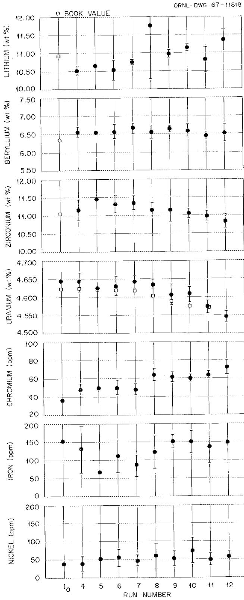  
Fig. 8.1. Summary of MSRE Fuel Salt Analyses.

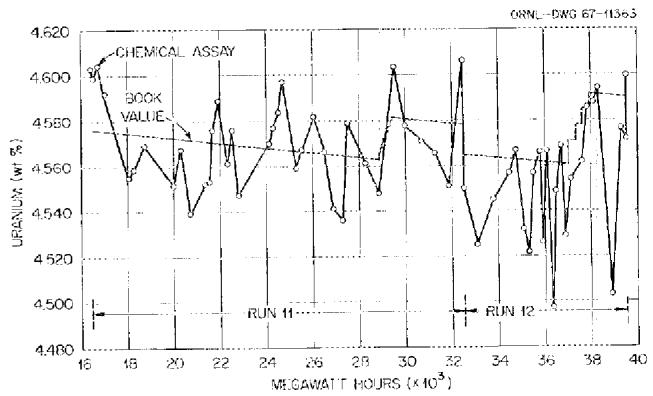  
Fig. 8.2. Uranium Concentration in MSRE Fuel Salt.

the present uranium concentration.4 While this method has been used with moderate success with the MSRE fuel salt, the low total concentration of uranium which is anticipated in future fuel salts makes it improbable that this method can have continued application. It will be of considerable importance in the near future to employ direct spectrophotometric methods for the determination of $\mathbf{U}^{3 + }$ concentration in the fuel salt. Results of recent laboratory experiments indicate that this approach is feasible.5

In the future, the MSRE fuel salt as well as the fuel salts in the large reactor plants will be subjected to fluorination and to $\mathrm{HF - H}_2$ purge streams during chemical reprocessing. Salt streams in those reactors may be expected to contain even lower concentrations of contaminant oxides than currently exist in the MSRE and should therefore not require oxide analysis.

Results of the chemical analysis for chromium have shown sufficient precision (±10%) that the method has come to serve as an excellent and reliable measure of generalized corrosion within the MSRE. The utility of this analysis as an indicator results from the fact that at present the total concentration of chromium in the fuel salt is low (~70 ppm). Relatively minor changes in corrosion are, therefore, reflected in significant changes in chromium concentration. In future operation it is possible that the total concentration of chromium in the fuel circuit will increase

tenfold or more as a consequence of chemical reprocessing. Unless either the precision of chromium analysis is improved or low concentration of chromium is maintained in the salt which is returned to the reactor fuel circuit, much of the capability for immediate detection of corrosion will have been lost.

It is anticipated that gas chromatographic methods for analysis of gas streams will be tested soon at the MSRE. If application of such methods to cover gas analysis succeeds in providing a sensitive means for the quantitative determination of volatile fluoride, hydrogen, and oxygen-bearing phases, a major advance toward on-line analysis of salt purity will have been achieved.

# 8.2 MSRE FUEL CIRCUIT CORROSION CHEMISTRY

Corrosion on salt-metal interfaces in the MSRE is signaled by an increase of chromium concentration in salt specimens. An increase of 10 ppm corresponds to the removal of approximately $40\mathrm{g}$ of chromium from the Hastelloy N surfaces. Currently, the chromium concentration of the fuel salt is $72 \pm 7$ ppm; this concentration represents an increase of only 34 ppm and removal of about $170\mathrm{g}$ of chromium from the Hastelloy N container since operation of the MSRE began in 1965. If the total amount of chromium represented by this increase were leached uniformly from the fuel circuit, it would correspond to removal of chromium from a depth of $0.22\mathrm{mil}$ . Recent evidence indicates, however, that only half the chromium increase observed in the fuel salt may be attributed to corrosion in the fuel circuit.

On termination of run 7, graphite and metal surveillance specimens were removed from the core of the reactor and were replaced with specimens contained in a new perforated metal basket. Fuel specimens taken throughout the next run, No. 8, were found to contain a chromium concentration of $62~\mathrm{ppm}$ , rather than $48~\mathrm{ppm}$ , the average concentration which had persisted almost from the beginning of power operations. Since the only known environmental alteration was the installation of the new surveillance specimen assemblage, we speculated that the container basket and the Hastelloy N specimens had sustained most of the corrosion responsible for the observed increase in chromium, and that corrosion might be evident

to a depth of 10 mils. However, recent inspection of specimens from the basket (see Part 5, this report) did not disclose that the anticipated corrosion of the metal had occurred.

On several previous occasions, salt was returned to the fuel circuit after storage in the drain tanks without developing evidence of an increase. Nevertheless, we are forced to conclude that the increase of chromium in the fuel salt took place while it was stored in the drain tank during the ten-week interval between runs 7 and 8.

Although it is not evident how the drain tank may have become contaminated, its surface seems to be the source of the additional chromium in the fuel salt. If all the chromium was leached uniformly, corrosion in the drain tank will have reached a depth of 0.7 mil. If the increase of 48 to 62 ppm is attributed to the drain tank, the total increase of chromium resulting from fuel-circuit corrosion is only 20 ppm throughout the entire operation of the MSRE, and corresponds to $\sim 100\mathrm{g}$ of chromium, or 0.13 mil of generalized corrosion in the fuel circuit.

# 8.3 ADJUSTMENT OF THE UF3 CONCENTRATION OF THE FUEL SALT

The fuel salt, free of moisture and HF, should remove chromium from Hastelloy N only by the equilibrium reaction

$$
{ } _ { 2 } ^ { 1 } \mathrm { C r } ^ { 0 } + \mathrm { U F }  \rightleftharpoons { } _ { 2 } ^ { 1 } \mathrm { C r F }  + \mathrm { U F }  .
$$

When the above corrosion equilibrium was first established in MSRE power operations, the $\mathrm{UF}_{3}$ produced in this reaction, together with that originally added to the fuel concentrate, should have totaled $1500\mathrm{g}$ , with the result that as much as $0.65\%$ of the uranium of the system could have been trivalent soon after the beginning of power operation. The $\mathrm{UF}_{3}$ content of the MSRE fuel was determined after approximately 11,000 Mwhr of operation to be no greater than $0.05\%$ . The fuel salt was considered to be far more oxidizing than was necessary and certain to become more so as additional power was produced unless adjustment was made in the $\mathrm{UF}_{3}$ concentration. A program was initiated early in 1967 to reduce 1 to $1.5\%$ of the uranium inventory to the trivalent state. The $\mathrm{U}^{3+}$ concentration has been increased

since that time by addition of $84\mathrm{g}$ of beryllium metal. The method of addition was described previously.

The low corrosion sustained by the MSRE fuel circuit, which is in general accord with the results from a wide variety of out-of-pile corrosion tests, might have been expected to be greater during the first 10,000 Mwhr of operations because the $\mathrm{UF}_3$ concentration of the fuel was markedly less than was intended. According to Grimes, "The lack of corrosion in the MSRE melts which appear to be more oxidizing than intended can be rationalized by the assumption (1) that the Hastelloy N has been depleted in Cr (and Fe) at the surface so that only Mo and Ni are exposed to attack, with Cr (and Fe) reacting only at the slow rate at which it is furnished to the surface by diffusion, or (2) that the noble-metal fission products are forming an adherent and protective plate on the reactor metal."

If it is assumed that corrosion of the fuel produced 3.3 equivalents of $\mathbf{U}\mathbf{F}_{3}$ and that fission has resulted in the oxidation of 0.8 equivalent of $\mathbf{U}\mathbf{F}_{3}$

per gram-atom of fissioned uranium, the additions of beryllium metal to the fuel have been followed by the concentrations listed in Table 8.3. The calculated values are for the most part higher than the measured values. The cause of this disparity is not currently understood, but is under investigation.

All dissolutions of beryllium metal into the fuel salt proceeded smoothly; the bar stock which was withdrawn after exposure to the fuel was observed to be smooth and of symmetrically reduced shape.

No significant effects on reactivity were observed during or following the beryllium additions, nor were chemical analyses indicative that such additions were made until after run 12 was begun. The additions preceding run 12 had increased the $\mathbf{U}^{3+}$ concentration in the total uranium by approximately $0.6\%$ . Four exposures of beryllium were made at close intervals during the early part of that run. Samples taken shortly after the last of these four exposures (FP12-16 et seq., Table 8.1) began to show an unprecedented increase in the concentration of chromium in the specimens, followed by a similar decrease during the subsequent sampling period.

Previous laboratory experience has not disclosed comparable behavior, and no well-defined

Table 8.3. Concentration of UF ${}_{3}$ in the MSRE Fuel Salt ${}^{a}$   

<table><tr><td>Sample No.</td><td>Mwhr</td><td>Uranium Burned (g)</td><td>Uranium Burned (moles)</td><td>\( U^{3+} \)Oxidized (moles)</td><td>Be Added (g)</td><td>Be Added (equivalents)</td><td>Net Equivalents Reduced</td><td>\( U^{3+}/\Sigma U \)Calculated (%)</td><td>\( U^{3+}/\Sigma U \)Analysis (%)</td></tr><tr><td>9-4</td><td>10,978</td><td>554</td><td>2.34</td><td>1.87</td><td>0</td><td>0</td><td>3.13</td><td>0.31</td><td>0.1</td></tr><tr><td>10-25</td><td>16,450</td><td>829</td><td>3.50</td><td>2.80</td><td>16.28</td><td>3.61</td><td>5.81</td><td>0.58</td><td>0.5</td></tr><tr><td>11-5</td><td>17,743</td><td>953</td><td>4.02</td><td>3.20</td><td>16.28</td><td>3.61</td><td>5.21</td><td>0.53</td><td>0.37</td></tr><tr><td>11-13</td><td>20,386</td><td>1029</td><td>4.34</td><td>3.46</td><td>27.94</td><td>6.20</td><td>8.74</td><td>0.88</td><td>0.42</td></tr><tr><td>11-32</td><td>25,510</td><td>1287</td><td>5.43</td><td>4.34</td><td>27.94</td><td>6.20</td><td>6.86</td><td>0.69</td><td>0.34</td></tr><tr><td>11-38</td><td>27,065</td><td>1365</td><td>5.76</td><td>4.60</td><td>27.94</td><td>6.20</td><td>6.60</td><td>0.66</td><td></td></tr><tr><td>11-49</td><td>30,000</td><td>1514</td><td>6.39</td><td>5.10</td><td>36.34</td><td>8.06</td><td>7.96</td><td>0.80</td><td></td></tr><tr><td>12-6</td><td>32,450</td><td>1637</td><td>6.91</td><td>5.50</td><td>36.34</td><td>8.06</td><td>7.76</td><td>0.77</td><td>0.37</td></tr><tr><td>12-11</td><td>33,095</td><td>1670</td><td>7.05</td><td>5.60</td><td>54.11</td><td>12.01</td><td>11.40</td><td>1.14</td><td>1.2</td></tr><tr><td>12-21</td><td>35,649</td><td>1798</td><td>7.59</td><td>6.10</td><td>74.12</td><td>16.45</td><td>15.35</td><td>1.5</td><td>0.5</td></tr></table>

These numbers assume that the salt originally was $0.16\%$ reduced; that the increase in $\mathbf{Cr}$ from 38 to 65 ppm was real, occurred before 11-14-66, and resulted in reduction of $\mathbf{U}^{4+}$ to $\mathbf{U}^{3+}$ ; that each fission results in oxidation of 0.8 atom of $\mathbf{U}^{3+}$ ; and that there have been no other losses of $\mathbf{U}^{3+}$ .

mechanism is available which satisfactorily accounts for the observed behavior. A possible cause, which is partially supported by experimental data, is described as follows.

On the two occasions when the most rapid rates of dissolution of the beryllium rods were observed, chromium values for the next several fuel samples, FP11-10 et seq., and FP12-16 et seq., rose temporarily above the $1\sigma$ level and subsequently returned to normal. That the increase in chromium levels in samples FP12-16 to -19 was temporary indicates that the high chromium concentration of fuel samples removed from the pump bowl was atypical of the salt in the fuel circuit and implies that surface-active solids were in suspension at the salt-gas interfaces in the pump bowl.

That atypical distribution of species in this location does indeed take place was demonstrated earlier by the analysis of sample capsule support wires that were (1) submerged below the pump-bowl salt surface, (2) exposed to the salt-gas interface, and (3) exposed to the pump-bowl cover gas. The results showed that the noble-metal fission products, Mo, Nb, and Ru, were deposited in abnormally high concentrations at the salt-gas interface. Such behavior suggests that the high chromium concentrations in the fuel specimens were caused by the occurrence of chromium in the

pump bowl in nonwetting, surface-active phases in which its activity was low. A possible mechanism which would cause such a phenomenon is the reduction of $\mathrm{Cr}^{2+}$ by $\mathrm{Be}^0$ with the concurrent reaction of $\mathrm{Cr}^0$ with graphite present on the salt surface to form one or more of the chromium carbides, for example, $\mathrm{Cr}_3\mathrm{C}_2$ ( $\Delta H_0^f = -21$ kcal at $298^\circ \mathrm{K}$ ). Such phases possess relatively low stability and could be expected to decompose, once dispersed in the fuel-circuit salt.

The possibility that surface-active solids were formed as a consequence of the $\mathrm{Be}^0$ additions was tested late in run 12 by obtaining salt specimens at the salt-gas interface as well as below the surface. First, specimens were obtained in a three-compartment sample capsule that was immersed so that the center hole was expected to be at the interface. Next, a beryllium metal rod was exposed to the fuel salt for $8\mathrm{hr}$ with the result that $9.71\mathrm{g}$ of beryllium metal was introduced into the fuel salt. Twelve hours later a second three-compartment capsule was immersed in the pump bowl. Chemical analyses of the fuel salt specimens FP12-55 and -57 (Table 8.3) do not show significant differences in chromium; however, the salt-gas interface in FP12-57 is blackened as as compared with FP12-55 (see Fig. 8.3).

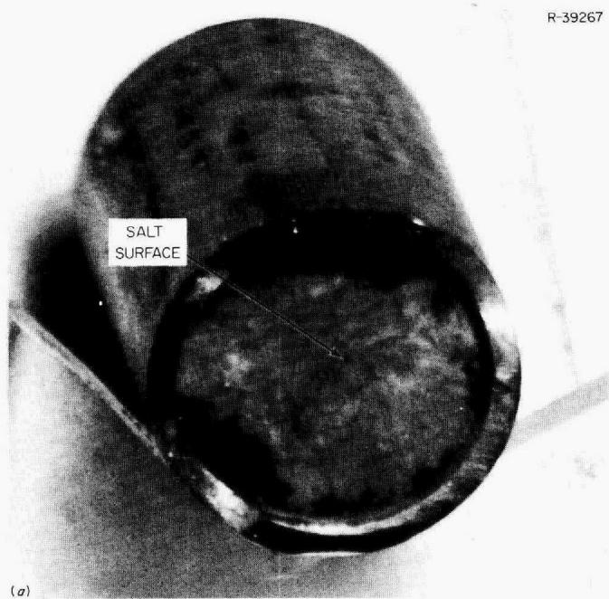

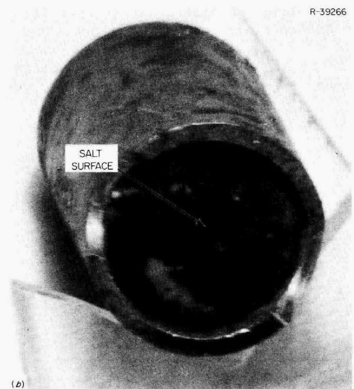  
Fig. 8.3. Surface Appearances of Fuel Salt Specimens Taken Before and After Beryllium Addition. (a) FP12-55, (b) FP12-57.

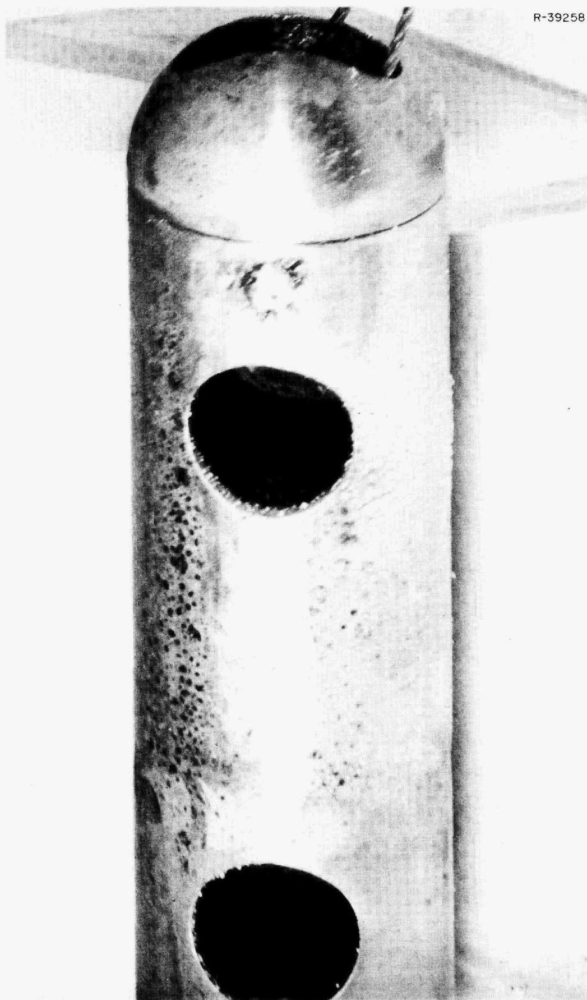  
Fig. 8.4. Appearance of Upper Part of Three-Compartment Sample Capsule FP12-57 After Use.

An additional purpose of sampling with the three-compartment capsule was to determine whether foamlike material was present in the sampler area and would be collected in the upper compartment. However, analysis of the upper compartment has not yet been performed. Globules were noted on the upper part of FP12-57 (Fig. 8.4), indicating that conditions in the pump bowl were different when samples FP12-57 and -55 were obtained.

Examination of the metal basket which contained the beryllium rod while it was exposed to the fuel showed the presence of dendritic crystals along with a small amount of salt residue (Fig. 8.5). Spectrochemical analysis of material removed from the basket (Fig. 8.6) indicated that the material contained $7.8\mathrm{wt}\%$ chromium and less than $10~\mathrm{ppm}$ of iron and nickel.

The evidence obtained to date does not permit inference as to the identity of the phases which have formed within the pump bowl as a consequence of the beryllium additions. It does strongly imply that nonwetted flotsam can be formed and accumulated temporarily in the MSRE pump bowl.

The overflow tank has not been mentioned as a possible factor in the behavior of chromium following a beryllium addition. It could, however, bear some responsibility for the persistence of chromium for several days following an exposure of the salt to beryllium. Fuel salt accumulates in the overflow tank steadily during operation and remains there in relative isolation from the fuel stream. At intervals of about one day, part of the salt (60 lb) is returned to the fuel stream. Recognizing that chromium might be injected into the pump bowl as the salt returns, we performed an experiment in which salt samples were obtained from the pump bowl within an hour after fuel was returned from the overflow tank to the pump bowl. The purpose of the experiment was to determine whether material from the overflow tank contributed appreciably to the perturbations in the chromium concentration. The results were negative, possibly, in part, because sampling and salt transfer operations were not performed concurrently for safety reasons.

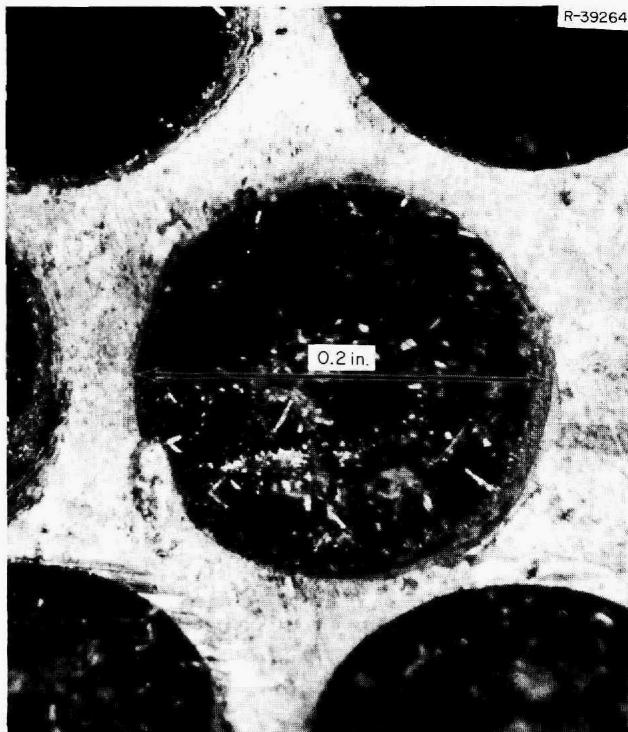  
Fig. 8.5. Dendritic Crystals and Salt on Basket of Beryllium Addition Capsule FP12-56.

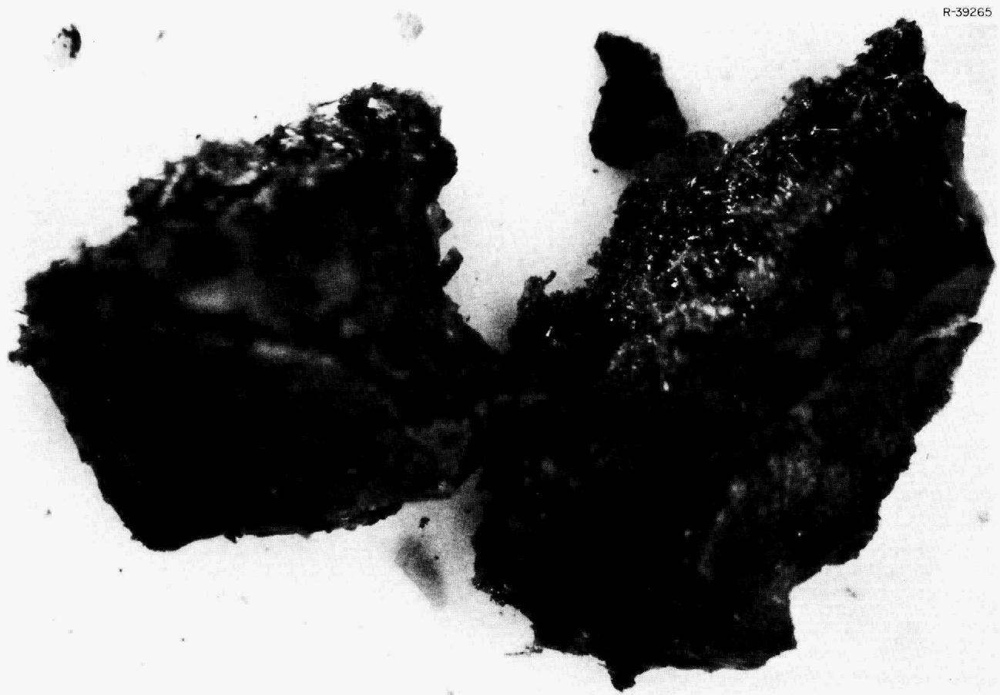  
Fig. 8.6. Residue from Beryllium Addition Capsule FP12-56.

# 9. Fission Product Behavior in the MSRE

S. S. Kirslis

F. F. Blankenship

Results of previous tests in-pile and in the MSRE have been very reassuring regarding most aspects of the chemical compatibility of graphite and Hastelloy N with molten fissioning salt. The aspect of chemical behavior currently causing some practical concern is the observed tendency of noble-metal fission products (Mo, Ru, Tc, Te, and Nb) to deposit on graphite surfaces exposed to fissioning fuel in the MSRE. Some of the isotopes of these elements have neutron cross sections high enough to affect significantly the neutron economy of an MSBR after several years of operation if a large fraction of these isotopes deposited in the graphite core. Recent work in the MSRE has been directed mainly toward elucidating the behavior of these noble-metal fission products.

Information derived from several kinds of tests is reported in some detail in the following sections. These include (1) quantitative measurements of the concentration of fission product species in samples of the MSRE pump bowl cover gas captured during a number of diverse reactor operating conditions, (2) analysis of fuel samples for fission products, (3) examinations and analyses of graphite and Hastelloy N specimens exposed to molten fissioning fuel salt in the MSRE for 24,000 Mwhr of power operation, and (4) qualitative measurements of fission product deposition on metal and on one set of graphite samples exposed to the cover gas and fuel phases in the MSRE pump bowl under a variety of reactor operating conditions.

# 9.1 FISSION PRODUCTS IN MSRE COVER GAS

Sampling of the cover gas in the MSRE pump bowl has been continued in an effort to define the nature and the quantity of the gas-borne species.

Five gas samples were obtained and analyzed during the period covered by this report. In these studies we attempted to determine how the nature and amount of gas-borne species are affected by (1) addition of beryllium to the fuel, (2) stopping the MSRE fuel pump, (3) a long reactor shutdown, and (4) increasing the volume of helium bubbles in the fuel.

All samples were taken in evacuated 20-cc capsules sealed by fusible plugs of $2\mathrm{LiF}\cdot \mathrm{BeF}_2$ ; these plugs melted and permitted the capsules to fill with the cover gas upon insertion into the heated pump bowl. Samplers, sampling procedures, and analytical operations were, in each case, very similar to those previously described. $^1$

Since it was not possible to instrument the sampling assemblies, no definitive information concerning the temperature of the gas at time of sampling is available. Temperatures were certainly higher than the melting point of the fusible plug $(\sim 450^{\circ}\mathrm{C})$ . It seems likely that the temperature is near $600^{\circ}\mathrm{C}$ and that the capsule actually drew 20 cc of gas at this temperature and 5 psig; the sampled volume of gas at STP was, therefore, about 8.5 cc.

The results obtained from these five samples are shown in Table 9.1. All values (except those for uranium) are given in disintegrations per minute for the total sample, and all have been corrected to correspond to the time of sampling if the reactor was operating, or to time of shutdown for the two cases where the reactor was not at power. The uranium values are in micrograms of uranium per sample. Conditions of reactor operation and special features of each test are indicated in Table 9.1.

Table 9.1. Fission Products in MSRE Pump Bowl Gas as Determined from Freeze Valve Capsules   

<table><tr><td>Experiment No.</td><td>FP11-42</td><td>FP11-46</td><td>FP11-53</td><td>FP12-7</td><td>FP12-26</td><td></td></tr><tr><td>Sampling date</td><td>4/11/67, 02:49</td><td>4/18/67, 02:28</td><td>5/2/67, 10:43</td><td>6/2/67, 06:50</td><td>7/17/67, 06:03</td><td></td></tr><tr><td>Operating time, days</td><td>On 65, off 1.5 hr</td><td>Off 14, on 72</td><td>Off 14, on 86</td><td>On 92.3, off 42.5</td><td>Off 46, on 23</td><td></td></tr><tr><td>Nominal power, Mw</td><td>0</td><td>7.2</td><td>7.2</td><td>0</td><td>7.2</td><td></td></tr><tr><td>Be addition</td><td>After 8.40 g</td><td>No</td><td>No</td><td>No</td><td>After 37.8 g</td><td></td></tr><tr><td>Features</td><td>Pump off 1.2 hr</td><td>Regular</td><td>Helium bubbles</td><td>Power off 42.5 days</td><td>Regular</td><td></td></tr><tr><td>Accumulated Mwhr</td><td>27,900</td><td>29,100</td><td>31,700</td><td>32,650</td><td>36,500</td><td></td></tr><tr><td>Isotope</td><td>Yield</td><td colspan="4">Disintegrations per Minute in Total Sample</td><td></td></tr><tr><td>99Mo</td><td>6.06</td><td>1.05 × 1011</td><td>2.31 × 1011</td><td>1.57 × 1011</td><td></td><td>2.74 × 1011</td></tr><tr><td>103Ru</td><td>3.0</td><td>2.51 × 109</td><td>4.64 × 109</td><td>1.12 × 1010</td><td></td><td>4 × 109</td></tr><tr><td>106Ru</td><td>0.38</td><td>8.2 × 107</td><td>9.49 × 107</td><td>4.03 × 108</td><td></td><td>1.7 × 108</td></tr><tr><td>132Te</td><td>~4.7</td><td>1.15 × 1011</td><td>3.35 × 1011</td><td>1.88 × 1011</td><td>4.17 × 107</td><td>3.16 × 1010?</td></tr><tr><td>129Te</td><td>0.35</td><td></td><td>7.98 × 108</td><td>3.51 × 109</td><td>2.17 × 108</td><td>6.6 × 108</td></tr><tr><td>95Nb</td><td>6.2</td><td>6.45 × 108</td><td>1.3 × 109</td><td>1.05 × 1010</td><td>2.26 × 109?</td><td>3.52 × 109</td></tr><tr><td>95Zr</td><td>6.2</td><td>&lt;4.4 × 107</td><td>~2 × 107</td><td>1.8 × 108</td><td>8.64 × 107</td><td>2.98 × 107</td></tr><tr><td>140Ba</td><td>6.35</td><td></td><td>6.16 × 108</td><td></td><td></td><td></td></tr><tr><td>131I</td><td>~3.1</td><td>5.7 × 109</td><td>9.81 × 108</td><td>8.63 × 109</td><td></td><td>1.67 × 1010</td></tr><tr><td>89Sr</td><td>4.79</td><td>2.13 × 108</td><td>4.08 × 109</td><td>3.72 × 109</td><td>8.35 × 108</td><td>3.71 × 109</td></tr><tr><td>111Ag</td><td>0.019</td><td></td><td></td><td>5.5 × 108</td><td></td><td>1.33 × 108</td></tr><tr><td>141Ce</td><td>~6.0</td><td></td><td></td><td></td><td>4.79 × 108</td><td></td></tr><tr><td>144Ce</td><td>~6.0</td><td></td><td></td><td></td><td>4.17 × 107</td><td></td></tr><tr><td>235U (μg)</td><td></td><td>59</td><td>9.2</td><td>23</td><td></td><td>25</td></tr></table>

The considerable scatter in the data for $^{95}\mathrm{Zr}$ probably reflects scatter in the quantity of salt mist in the sampling region and trapped in the gas samples. The largest value $(1.8 \times 10^{8} \, \text{dis/ min})$ of $^{95}\mathrm{Zr}$ was found under conditions in which helium bubbles in the fuel were at a maximum. If this $^{95}\mathrm{Zr}$ were present as fuel mist, it would represent about $1.3 \times 10^{-3} \, \text{g}$ of salt per sample or about $1.6 \times 10^{-4} \, \text{g}$ of salt per cubic centimeter of helium in the sampling region. In all other cases studied the $^{95}\mathrm{Zr}$ , and presumably the mist, was two- to tenfold more dilute.

The values for 50.5-day $^{89}\mathrm{Sr}$ , which is born from 3.2-min $^{89}\mathrm{Kr}$ , afford an opportunity to check whether the mist shield which encloses the sampling station permits equilibrium mixing with the rest of the gas in the pump bowl. The values for $^{89}\mathrm{Sr}$ are nearly an order of magnitude higher in every case than are those for $^{95}\mathrm{Zr}$ . A small

fraction of the $^{89}\mathrm{Sr}$ probably arises from salt mist; it seems virtually certain that most of it arises in the vapor phase through decay of the $^{89}\mathrm{Kr}$ . In the three gas samples taken while MSRE was at power, the $^{89}\mathrm{Sr}$ activity in the samplers averaged $3.8 \times 10^{9}$ dis/min.

The total number of $^{89}\mathrm{Sr}$ atoms per standard cubic centimeter of gas deduced from calculating the $^{89}\mathrm{Sr}$ counting rate back to the time of sampling was, therefore, $4.7 \times 10^{13}$ . If the sample as taken is assumed to represent a uniform mixture of the pump bowl gas containing $^{89}\mathrm{Kr}$ and its daughters $^{89}\mathrm{Rb}$ and $^{89}\mathrm{Sr}$ formed since the $^{89}\mathrm{Kr}$ left the salt, then the $^{89}\mathrm{Kr}$ was being stripped at $2 \times 10^{17}$ atoms/min or at some $31\%$ of its production rate. If, on the other hand, it is assumed that all the $^{89}\mathrm{Rb}$ and $^{89}\mathrm{Sr}$ are washed back to the salt phase by the spray from the spray ring, then the quantity of $^{89}\mathrm{Kr}$ that must have

been stripped is more nearly $50\%$ of the production rate.

With the simplifying assumptions that (1) no $^{89}\mathrm{Kr}$ is lost to the moderator graphite, (2) no $^{89}\mathrm{Kr}$ is lost through burnup, and (3) the fuel which flows through the pump bowl is stripped of $^{89}\mathrm{Kr}$ with $100\%$ efficiency, it may be simply shown that

$$
\frac {^ {8 9} \mathrm {K r s t r i p p e d / m i n}}{^ {8 9} \mathrm {K r p r o d u c e d / m i n}} = \frac {F}{\lambda + F},
$$

where $F$ is that fraction of the fuel volume which passes the stripper (pump bowl) per minute and $\lambda$ is the decay constant (0.693/3.2 min) for $^{89}\mathrm{Kr}$ . For MSRE, with the pump bowl flow rate at 4% of total flow, this expression yields the value 29% for the $^{89}\mathrm{Kr}$ lost to the stripper gas. It is unlikely that the stripping efficiency in the pump bowl is 100%; moreover, it is certain that some fraction of the $^{89}\mathrm{Kr}$ is lost by penetration into the graphite. This rate of loss of $^{89}\mathrm{Kr}$ to the moderator – which is probably less than 30% of the production rate – will in effect introduce a third term to the denominator of the equation and lower the fraction lost to the off-gas. From these data, therefore, it seems possible that the gas at the sampling station may be more concentrated in $^{89}\mathrm{Sr}$ than is the average gas in the pump bowl, but the concentration factor is not large.

The absolute amounts of $^{99}\mathrm{Mo}$ , corrected back to sampling time or time of previous shutdown, show rather minor variations with reactor operating conditions. The lowest value is for run FP11-42, in which the sample was taken 1.5 hr after shutdown and 1.2 hr after stopping the fuel pump. The normal runs showed the higher $^{99}\mathrm{Mo}$ concentrations, although the highest value might have been expected for FP11-53, in which the off-gas pressure was suddenly lowered just before sampling to ensure a release of helium bubbles from the pressurized graphite bars into the circulating fuel. From the amount of $^{99}\mathrm{Mo}$ found in these samples (mean value $1.9 \times 10^{11}$ dis/min or $2.2 \times 10^{10}$ dis min $^{-1}$ cc $^{-1}$ or $1.3 \times 10^{14}$ atoms $^{99}\mathrm{Mo} / \mathrm{cc}$ ), the effective partial pressure of the volatile species is calculated to be $4 \times 10^{-6}$ atm. The total $^{99}\mathrm{Mo}$ lost at 4.2 liters/min of helium flow is $7.8 \times 10^{20}$ atoms/day. This is about $18\%$ of the total inventory of $4.4 \times 10^{21}$ atoms, or about $70\%$ of the daily production rate. If it is assumed that the material is lost as $\mathrm{MoF}_6$ ,

this corresponds to a loss of $4.6 \times 10^{21}$ fluorine atoms/day, or an equivalent of $\mathbf{F}^{-}$ per 150 days. The very considerable quantities of $^{99}\mathrm{Mo}$ found on the graphite and the Hastelloy surveillance specimens as well as in the fuel stream do not seem consistent with such large losses to the gas system.

The $^{103}\mathrm{Ru}$ , $^{106}\mathrm{Ru}$ , $^{129}\mathrm{Te}$ , and $^{132}\mathrm{Te}$ concentrations generally showed parallel behavior over all the runs, with particularly good correspondence between the $^{103}\mathrm{Ru}$ and $^{106}\mathrm{Ru}$ values. The ratios for the two isotopic pairs agreed satisfactorily with the ratios of fission yields divided by half-lives. The effect of short shutdown and pump stoppage was minor on this set of isotopes. The highest values for $^{103}\mathrm{Ru}$ , $^{106}\mathrm{Ru}$ , and $^{129}\mathrm{Te}$ were obtained during the pressure release run, FP11-53. However, $^{132}\mathrm{Te}$ , like $^{99}\mathrm{Mo}$ , did not show a high value during this particular test.

The appreciable concentrations of $^{89}\mathrm{Sr}$ found in samples FP11-42 and FP12-7 are puzzling. In each case the reactor had been shut down long enough to permit the complete decay of $^{89}\mathrm{Kr}$ before the sample was taken. The $^{95}\mathrm{Zr}$ analyses indicated fuel mist concentrations too low to account for the $^{89}\mathrm{Sr}$ values. It may be that other activities interfered with the beta counting required for $^{89}\mathrm{Sr}$ analysis. If these values are accepted as real (and further sampling must be done to confirm them) it would appear that, at least when the pump is off or the reactor is not at power, the sampling volume is poorly flushed by the cover gas system.

The $^{95}\mathrm{Nb}$ values showed a fivefold increase of magnitude from the first run to the fifth, with a marked peak at the pressure release run, FP11-53. Not all of the overall increase could be ascribed to the increase of $^{95}\mathrm{Nb}$ inventory in the reactor system with continued reactor operation (cf. moderate increases in $^{103}\mathrm{Ru}$ and $^{106}\mathrm{Ru}$ ).

The analyses for $^{235}\mathrm{U}$ from four of these runs yielded values higher by at least a factor of 10 than those observed in earlier tests. These relatively high values for $^{235}\mathrm{U}$ are, at best, difficult to explain. If, as noted above, the values for $^{95}\mathrm{Zr}$ are taken to indicate the existence, and quantity, of salt mist in the sample, then sample FP11-53 might have been expected to have about $20\mu \mathrm{g}$ of $^{235}\mathrm{U}$ in such mist. However, in no other case of those shown in Table 9.1 can such an explanation account for more than $20\%$ of the observed uranium.

The losses indicated by these samples are appreciable. The mean of four samples shows nearly $30~\mu \mathrm{g / }$ sample or about $3.5\mu \mathrm{g}$ per cubic centimeter of helium. This would correspond to somewhat less than $20\mathrm{g / day}$ of $^{235}\mathrm{U}$ or nearly $60~\mathrm{g / day}$ of the uranium in the fuel. (The figure remains at nearly one-half this level if the highest figure is rejected.) It seems absolutely certain that the reactivity balances on the reactor through 250 days of full-power operation would have speedily disclosed losses of far smaller magnitude than these. It is difficult to conceive of a mechanism other than volatile UF to account for losses of uranium to the vapor. It is, however, extremely difficult to see how losses of this sort could be reconciled with the nuclear behavior (and the chemical analyses) of MSRE. Further samples of the gas system will be made to help resolve this apparent dilemma.

The effect of short shutdown and pump stoppage (FP11-42) on noble-metal volatilization was insignificant. This suggests that the volatilization process does not depend on fuel nor bubble circulation nor on the fissioning process itself, but is probably a local phenomenon taking place at the fuel-salt-gas interface. Beryllium additions to the fuel had no discernible effect on the volatilization of noble-metal fission products. This fact is reinforced in some detail (see subsequent sections of this chapter) by data obtained by insertion ofgetter wires into the pump bowl vapor space.

The effect of reactor drain and long shutdown (FP12-7) was consistently to lower observed noble-metal volatilization (observed activities were, of course, calculated back to the time of previous shutdown). This observation is consistent with all previous data on the effect of long shutdowns. Presumably an appreciable fraction of the noble metals is deposited on the walls of the drain tank and reactor system during a long shutdown. The minor effect of short shutdown and the incomplete deposition during long shutdown seem to indicate a slow deposition process.

The pressure release experiment (FP11-53) resulted in an appreciable increase of volatilization of most fission products but not of $^{99}\mathrm{Mo}$ or $^{132}\mathrm{Te}$ . Niobium-95 showed the most distinct increase. It is particularly puzzling that the $^{129}\mathrm{Te}$ concentration increased markedly while the $^{132}\mathrm{Te}$ concentration fell slightly. Clearly, further experiments

of this kind would be required to permit definite interpretations.

It cannot be claimed that the mechanism for volatilization of many of these materials is known. As has been shown elsewhere[1,2] the volatile fluorides of many of these materials (notably Mo, Ru, Te, and, probably, Nb) are too unstable to exist as equilibrium components of a fuel system containing appreciable quantities of $\mathbf{U}\mathbf{F}_{3}$ . It is true that, for example,[9]Mo formed at about $5\times 10^{21}$ atoms/day probably exceeds greatly the solubility limit for this material in the salt. Since it is born in the salt in an atomic dispersion, it may, in effect, behave as a supersaturated solution; that is, the activity of molybdenum may, in fact, be markedly greater than unity. It seems most unlikely that it can have activities greater than $10^{-10}$ , which would be required if $\mathrm{MoF}_6$ were to be stable. Such findings as the presence of $^{111}\mathrm{Ag}$ , for which it is difficult to imagine volatile fluorides, seem to render the volatile fluoride mechanism more unlikely. It still seems more likely that an explanation based upon the finely divided metallic state will prove true, though such explanations also have their drawbacks.

# 9.2 FISSION PRODUCTS IN MSRE FUEL

The program of sampling and analysis of samples of MSRE fuel for fission product species has been continued by use of apparatus and techniques described previously.1-3 Table 9.2 shows data for 16 fission product isotopes and for $^{239}\mathrm{Np}$ obtained from a series of four samples from a long stable run of MSRE, from a sample obtained shortly after shutdown in this run, a sample after the salt had been cooled for 42.5 days, and a sample from a relatively early stage in the subsequent power run.

Captions in this table show the operating history of MSRE and the special conditions prevailing in the reactor at the time the sample was taken. Table 9.2 also includes estimates of the fraction of the isotope represented by these analyses in the $4860\mathrm{kg}$ of circulating fuel.

Table 9.2. Fission Products in Fuel Samples   

<table><tr><td>Sample No.</td><td colspan="2">FP11-45</td><td colspan="2">FP11-51</td><td colspan="2">FP11-52</td><td colspan="2">FP11-54</td><td colspan="2">FP11-58</td><td colspan="2">FP12-6</td><td colspan="2">FP12-27</td><td></td></tr><tr><td>Accumulated Mwh:</td><td colspan="2">29,000</td><td colspan="2">30,800</td><td colspan="2">31,250</td><td colspan="2">32,000</td><td colspan="2">32,650</td><td colspan="2">32,650</td><td colspan="2">36,550</td><td></td></tr><tr><td>Nominal power, Mw</td><td colspan="2">7.2</td><td colspan="2">7.2</td><td colspan="2">7.2</td><td colspan="2">7.2</td><td colspan="2">0</td><td colspan="2">0</td><td colspan="2">7.2</td><td></td></tr><tr><td>Operating time, days*</td><td colspan="2">Off 14, on 71</td><td colspan="2">Off 14, on 82.5</td><td colspan="2">Off 14, on 85</td><td colspan="2">Off 14, on 89</td><td colspan="2">On 92.3, off 0.1</td><td colspan="2">On 92.3, off 42.5</td><td colspan="2">Off 46, on 23.5</td><td></td></tr><tr><td>Exposure time, min</td><td colspan="2">1</td><td colspan="2">1</td><td colspan="2">1</td><td colspan="2">2</td><td colspan="2">1</td><td colspan="2">2</td><td colspan="2">6</td><td></td></tr><tr><td>Features</td><td colspan="2">No purge,b after 8.4 g of Be added</td><td colspan="2">Minimum level in pump bowi</td><td colspan="2">Regular</td><td colspan="2">Regular</td><td colspan="2">Pump off 2 hr, power off 2.3 hr</td><td colspan="2">Before startup, after shutdown</td><td colspan="2">After 38 g of Be added</td><td></td></tr><tr><td>Isotope</td><td>Fission Yield (%)</td><td>dis min-1g-1</td><td>Percent of Totalc</td><td>dis min-1g-1</td><td>Percent of Totalc</td><td>dis min-1g-1</td><td>Percent of Totalc</td><td>dis min-1g-1</td><td>Percent of Totalc</td><td>dis min-1g-1</td><td>Percent of Totalc</td><td>dis min-1g-1</td><td>Percent of Totalc</td><td>dis min-1g-1</td><td>Percent of Totalc</td></tr><tr><td>67-hr 99Mo</td><td>6.06</td><td>1.53 × 1011</td><td>108</td><td>7.22 × 1010</td><td>51</td><td>8.17 × 1010</td><td>58</td><td>3.50 × 1010</td><td>25</td><td>3.19 × 1010</td><td>23</td><td>Decayed</td><td>1.24 × 1011</td><td>88</td><td></td></tr><tr><td>39.7-day 103Ru</td><td>3.0</td><td>1.40 × 1010</td><td>28</td><td>3.8 × 109</td><td>7.1</td><td>8.86 × 1010</td><td>165</td><td>1.82 × 109</td><td>3</td><td>9.5 × 109</td><td>17</td><td>6.9 × 109</td><td>12</td><td>5.55 × 109</td><td>23</td></tr><tr><td>1.02-year 106Ru</td><td>0.38</td><td>~4 × 108</td><td></td><td>~1 × 108</td><td></td><td>2.38 × 108</td><td></td><td>7.51 × 107</td><td></td><td>3.6 × 108</td><td></td><td>3.9 × 108</td><td></td><td>2.43 × 108</td><td></td></tr><tr><td>78-hr 132Te</td><td>~4.7</td><td>3.50 × 1010</td><td>32</td><td>1.68 × 1010</td><td>15</td><td>1.56 × 1010</td><td>14</td><td>1.07 × 1010</td><td>10</td><td>8.39 × 109</td><td>8</td><td>Decayed</td><td>1.27 × 1010</td><td>12</td><td></td></tr><tr><td>37-day 129Te</td><td>0.35</td><td></td><td></td><td>5.20 × 108</td><td>8</td><td>5.00 × 108</td><td>8</td><td></td><td></td><td>5.45 × 108</td><td>8</td><td>2.06 × 109</td><td>3.1 × 108</td><td>10</td><td></td></tr><tr><td>35-day 95Nb</td><td>6.2</td><td>2.61 × 1010</td><td></td><td>4.0 × 109</td><td></td><td>1.91 × 109</td><td></td><td>3.11 × 1010</td><td></td><td>2.15 × 1010</td><td></td><td>8.04 × 1010</td><td></td><td>1.91 × 1010</td><td></td></tr><tr><td>65-day 95Zr</td><td>6.2</td><td>2.97 × 1010</td><td></td><td>1.20 × 1011</td><td></td><td>1.34 × 1011</td><td></td><td>1.34 × 1011</td><td></td><td>1.54 × 1011</td><td></td><td>1.46 × 1011</td><td></td><td>1.00 × 1011</td><td></td></tr><tr><td>12.8-day 140Ba</td><td>6.35</td><td>1.67 × 1011</td><td>115</td><td>1.82 × 1011</td><td>125</td><td>2.17 × 1011</td><td>149</td><td></td><td></td><td>1.74 × 1011</td><td>119</td><td></td><td></td><td></td><td></td></tr><tr><td>50.5-day 89Sr</td><td>4.79</td><td>8.6 × 1010</td><td>123</td><td>8.02 × 1010</td><td>106</td><td>8.11 × 1010</td><td>106</td><td></td><td></td><td>1.02 × 1011</td><td>128</td><td>8.89 × 1010</td><td>111</td><td>6.07 × 1010</td><td>116</td></tr><tr><td>9.7-hr 91Sr</td><td>5.81</td><td></td><td></td><td>1.29 × 1011</td><td>95</td><td></td><td></td><td></td><td></td><td></td><td></td><td></td><td></td><td></td><td></td></tr><tr><td>33-hr 143Ce</td><td>5.7</td><td></td><td></td><td>1.14 × 1011</td><td>86</td><td>7.67 × 1010</td><td>58</td><td></td><td></td><td>1.78 × 1011</td><td>134</td><td></td><td></td><td></td><td></td></tr><tr><td>33-day 141Ce</td><td>~6.0</td><td></td><td></td><td>1.48 × 1011</td><td>129</td><td>1.64 × 1011</td><td>142</td><td></td><td></td><td>1.71 × 1011</td><td>143</td><td>1.37 × 1011</td><td>115</td><td></td><td></td></tr><tr><td>280-day 144Ce</td><td>~6.0</td><td></td><td></td><td>6.36 × 1010</td><td></td><td>6.05 × 1010</td><td></td><td></td><td></td><td>6.24 × 1010</td><td></td><td>6.01 × 1010</td><td></td><td></td><td></td></tr><tr><td>7.6-day 111Ag</td><td>0.019</td><td>5.1 × 107</td><td>12</td><td>6.5 × 107</td><td>15</td><td>4.9 × 107</td><td>11</td><td></td><td></td><td>1.63 × 107</td><td>4</td><td></td><td></td><td></td><td></td></tr><tr><td>3-hr 112Ag</td><td>0.010</td><td></td><td></td><td>8.0 × 107</td><td>34</td><td>8.9 × 107</td><td>38</td><td></td><td></td><td></td><td></td><td></td><td></td><td></td><td></td></tr><tr><td>8.05-day 131I</td><td>~3.1</td><td>9.17 × 1010</td><td>128</td><td>8.20 × 1010</td><td>114</td><td>8.22 × 1010</td><td>115</td><td>6.97 × 1010</td><td>97</td><td>1.15 × 1010</td><td>16</td><td></td><td>7.12 × 1010</td><td>114</td><td></td></tr><tr><td>2.33-day 239Np</td><td></td><td></td><td></td><td>5.6 × 1012</td><td></td><td>5.36 × 1011</td><td></td><td></td><td></td><td>3.29 × 1012</td><td></td><td></td><td></td><td></td><td></td></tr></table>

Duration of previous shutdown and of continuous operating time just before sample was taken; vice versa for samples taken after shutdown.   
Usually a 200-cc/min gas purge was passed down the sample line.   
cPercent of calculated total amount in reactor based on fission yields and power history.

As in previous analyses of the reactor fuel, it is clear that a very high fraction of isotopes (such as $^{140}\mathrm{Ba}$ , $^{89}\mathrm{Sr}$ , $^{141}\mathrm{Ce}$ , $^{143}\mathrm{Ce}$ , and $^{91}\mathrm{Sr}$ ) that form very stable and soluble fluorides is present in the circulating fuel. As judged by the behavior of $^{131}\mathrm{I}$ , the isotopes of iodine also seem to be present in a high fraction.

On the other hand the more noble elements, such as Mo, Nb, Te, and Ru, are generally present in much lower fractions. It is worthy of note that these materials seem to show a much wider scatter than do the "salt seekers"; this may indicate that they are not present in true solution. It must also be noted that these noble metals are present in considerable quantity in the gas stream and that they adhere tenaciously to metal specimens exposed to them. It is possible, therefore, that a considerable fraction of the material found in the "salt" is due to the fact that the sampler is lowered and then raised through this gas phase. It is possible that the relatively high values obtained for $^{99}\mathrm{Mo}$ , $^{109}\mathrm{Ru}$ , and $^{132}\mathrm{Te}$ in FP11-45, where no gas was used, may be due to this phenomenon. This possibility will be verified, if possible, experimentally in the near future.

# 9.3 EXAMINATION OF MSRE SURVEILLANCE SPECIMENS AFTER 24,000 Mwhr

A second set of long-term surveillance specimens of MSRE graphite and Hastelloy N was examined after exposure to circulating molten-salt fuel in an axial core position of the MSRE for 24,000 Mwhr of power operation. During the last 92 days of this exposure, the MSRE operated at a steady power of $7.2\mathrm{Mw}$ essentially without interruption, whereas power operation was frequently interrupted during the previous 7800-Mwhr exposure. Examinations of the specimens gave results very much like those previously reported after a 7800-Mwhr exposure. $^{1-3}$

# Examination of Graphite

As before, three rectangular graphite bars were available for examination: a $9.5 \times 0.47 \times 0.66$ in. bar from the middle of the core, and $4.5 \times 0.47 \times 0.66$ in. bars from the bottom (inlet) and top (outlet) of the core. Visually, the graphite appeared undamaged except for occasional bruises incurred during the dismantling. The two 4.5-in.-long bars

gained $0.002 \pm 0.002$ in. in length and $13\mathrm{mg}(0.03\%)$ in weight. Metallographic examination showed no radiation or chemical alteration of the graphite structure and no evidence of surface films.

X radiography of thin transverse slices showed occasional salt penetration into previously existing cracks that happened to extend to the surface of the sample. Similar penetration was observed in control samples that were exposed to molten salt but were not irradiated. X-ray diffraction by the graphite surface exposed to fuel gave the normal graphite lines except for a very slightly expanded lattice spacing. A few weak foreign lines that were probably due to fuel salt were observed. Autoradiography of the samples showed a high concentration of activity within 10 mils of the surface, with diffuse irregular penetration to the center of the cross section. These observations confirmed previous demonstration of the satisfactory compatibility of graphite with fissioning molten salt as far as damage and permeation by fuel are concerned.

Concentration profiles for fission products in the graphite were determined by milling off layers, which were dissolved and analyzed radiochemically. Near the surface, layers as thin as 1 mil were obtained; farther in, layers as thick as 10 mils were collected until a total depth of about 50 mils was reached. The predominant activities found were molybdenum, tellurium, ruthenium, and niobium. These elements can be classed as noble elements since their fluorides (which are generally volatile) are relatively unstable. The practical concern, because of long-term neutron economy, is with $^{95}\mathrm{Mo}$ , $^{97}\mathrm{Mo}$ , $^{99}\mathrm{Tc}$ , and $^{101}\mathrm{Ru}$ , but these particular isotopes are either stable or long-lived and thus were not amenable to direct analysis. However, we considered as sound the assumption that their deposition behavior was indicated by either that of a radioactive isotope of the same element or that of a radioactive noble-metal precursor with a suitable half-life.

Over $99\%$ of the noble-metal activities were encountered within the first 2 or 3 mils of the graphite surface; the same was true for ${}^{95}\mathrm{Zr}$ . This is illustrated in Figs. 9.1-9.4. The values for blanks shown in the figures were obtained from samples of about 0.2-g (1 mil) size that were milled from fresh unexposed graphite in the hot cell and with the equipment used for the irradiated specimens. The blanks show that the apparent tails on the curves for ${}^{99}\mathrm{Mo}$ , ${}^{95}\mathrm{Nb}$ , and ${}^{106}\mathrm{Ru}$ are

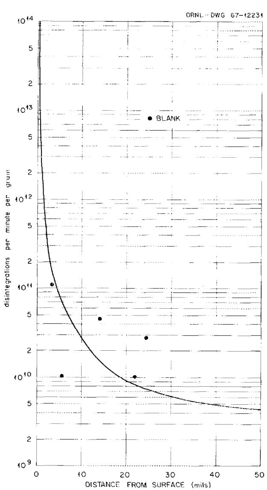  
Fig. 9.1. Distribution Profile of $^{99}\mathrm{Mo}$ in Graphite from MSRE Core.

meaningless. Figure 9.4 indicates that there probably was measurable penetration of $^{95}\mathrm{Zr}$ to a depth of 50 mils.

Figure 9.5 shows that $^{132}\mathrm{Te}$ concentrates, as do the noble metals, at the surface; however, a measurable concentration of this element penetrates to a depth of 50 mils. The behavior of fission products with rare-gas precursors is shown in Figs. 9.6 ( $^{140}\mathrm{Ba}$ ) and 9.7 ( $^{89}\mathrm{Sr}$ ).

Because of the concentration at the surface, the amounts present in the several layers near the surface were representative of the total

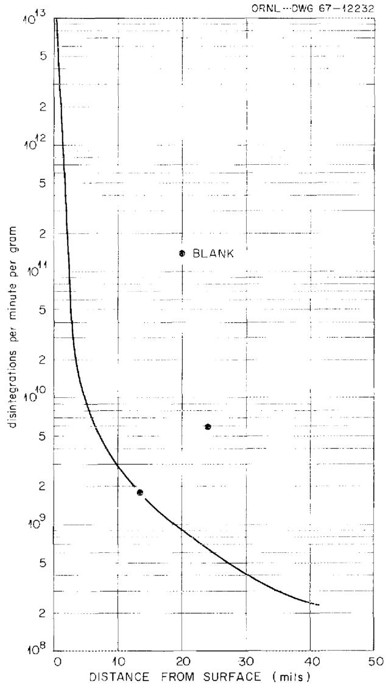  
Fig. 9.2. Distribution Profile of $^{95}\mathrm{Nb}$ in Graphite from MSRE Core.

amount of many isotopes in the graphite. Table 9.3 shows the quantity of several materials (in disintegrations per minute per square centimeter) on graphite specimens as functions of position and of exposed face. In each case, face No. 3 was in contact with other graphite and was not exposed to salt. In general, this face contained about as much activity as those exposed to salt; this finding supports the view that the deposited activities were gas borne.

In Table 9.4 the values (averaged for all faces of the graphites) obtained in the specimens exposed for 24,000 Mwhr are compared with the

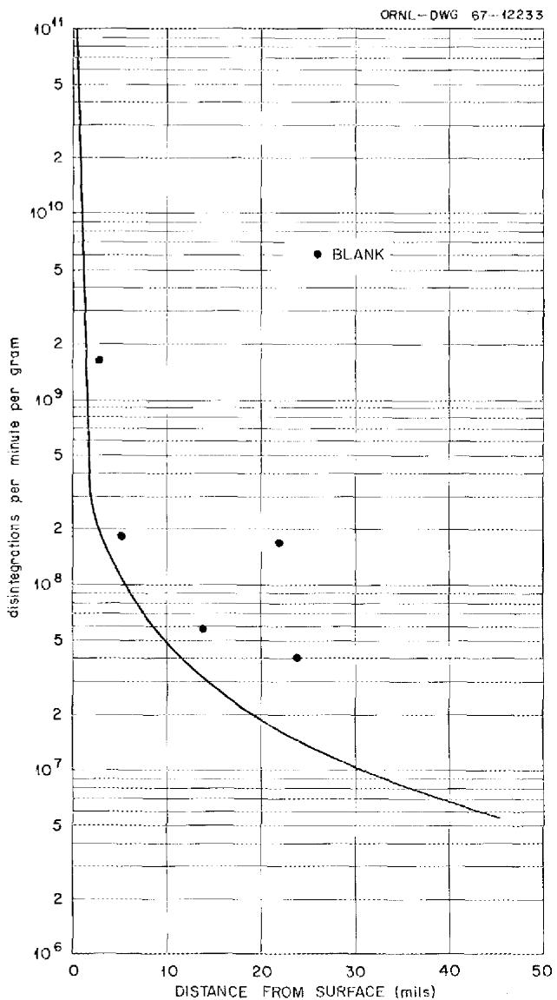  
Fig. 9.3. Distribution Profile of $^{106}\mathrm{Ru}$ in Graphite from MSRE Core.

values previously obtained after 7800 Mwhr. It is clear from this table that the data for $^{99}\mathrm{Mo}$ , $^{132}\mathrm{Te}$ , and $^{103}\mathrm{Ru}$ are generally similar, while the values obtained for $^{95}\mathrm{Nb}$ and $^{95}\mathrm{Zr}$ are appreciably higher for the longer exposures. It should be noted that the data for $^{95}\mathrm{Nb}$ are obtained from gamma scans without chemical separations and are probably less certain than the others.

The graphite samples accumulated by milling these bars were analyzed for uranium by neutron activation. Typical data from one of these bars

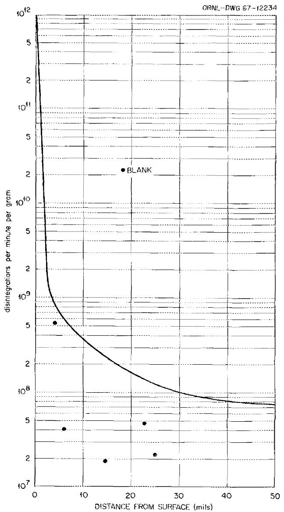  
Fig. 9.4. Distribution Profile of $^{95}\mathbf{Zr}$ in Graphite from MSRE Core.

are shown as Table 9.5. It is clear from this table that the $^{235}\mathrm{U}$ is present in all faces of the graphite and that the concentration diminishes with the depth of milling. The small concentration in the blank (as in blanks from other specimens) indicates strongly that these uranium concentrations are real.

The absolute quantity of $^{235}\mathrm{U}$ or of uranium in the graphite moderator is apparently very small. If these analyses are, in fact, typical of those in the $2 \times 2$ in. moderator bars, then the average concentration of $^{235}\mathrm{U}$ in and through the bars

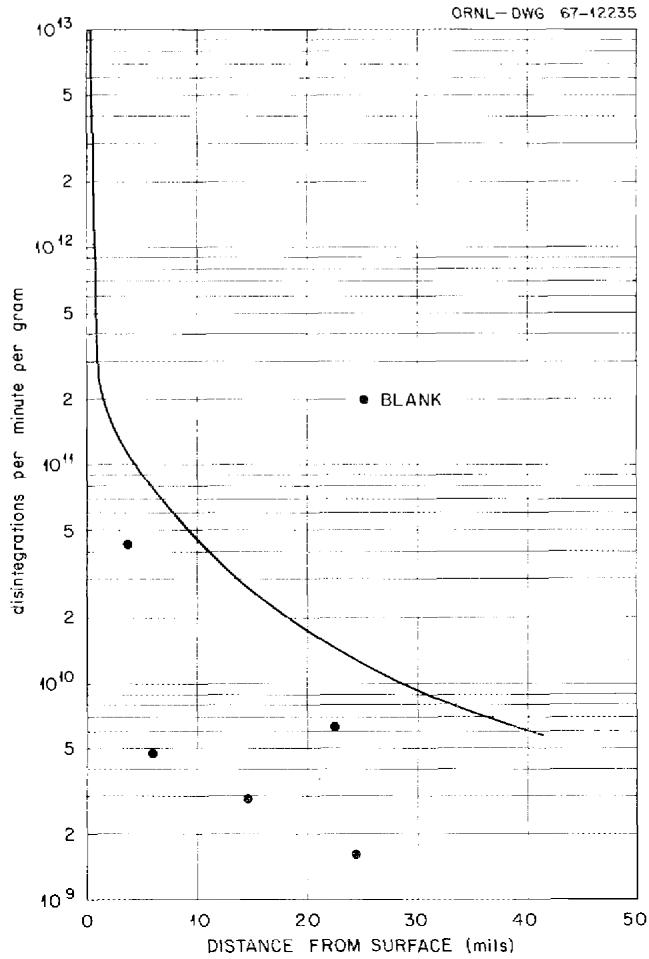  
Fig. 9.5. Distribution Profile of $^{132}\mathrm{Te}$ in Graphite from MSRE Core.

is much less than 1 ppm. Since the MSRE contains about 70 ft³ or slightly less than 4000 kg of graphite, the total $^{235}\mathrm{U}$ in the moderator stack is almost certainly less than 4 g. Since the MSRE fuel is slightly more than 30% enriched in $^{235}\mathrm{U}$ , the total uranium in the moderator should be, at most, 10 to 15 g.

# Examination of Hastelloy N

The graphite specimens described above were, as was the case for the specimens examined after 7800 Mwhr, contained in a cylindrical, perforated holder of Hastelloy N. Samples were cut from this cylinder as before $^{1-3}$ and analyzed by standard techniques for several fission products and for $^{235}\mathrm{U}$ .

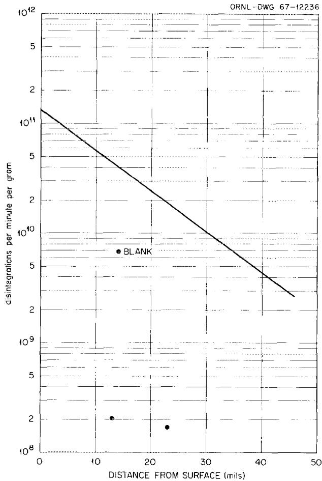  
Fig. 9.6. Distribution Profile of $^{140}\mathrm{Ba}$ in Graphite from MSRE Core.

Data are shown in Table 9.6 for seven fission product isotopes and for uranium at five positions from the top to the bottom of this Hastelloy N assembly. Data are also shown for the comparable samples examined after 7800 Mwhr of operation in mid-1966.

It is clear from these data that the behavior of $^{99}\mathrm{Mo}$ was similar in the two sets of specimens, with the 24,000-hr exposures generally showing somewhat more deposited activity. Behavior of the $^{132}\mathrm{Te}$ seems generally similar in the two exposures. Somewhat more $^{103}\mathrm{Ru}$ was found on the 24,000-Mwhr specimens than on those previously examined, while $^{95}\mathrm{Zr}$ (present in small amounts, in any case) seems less concentrated on the specimens exposed to the higher dosage. Iodine-131, which is present in appreciable concentrations, shows some scatter with location of the

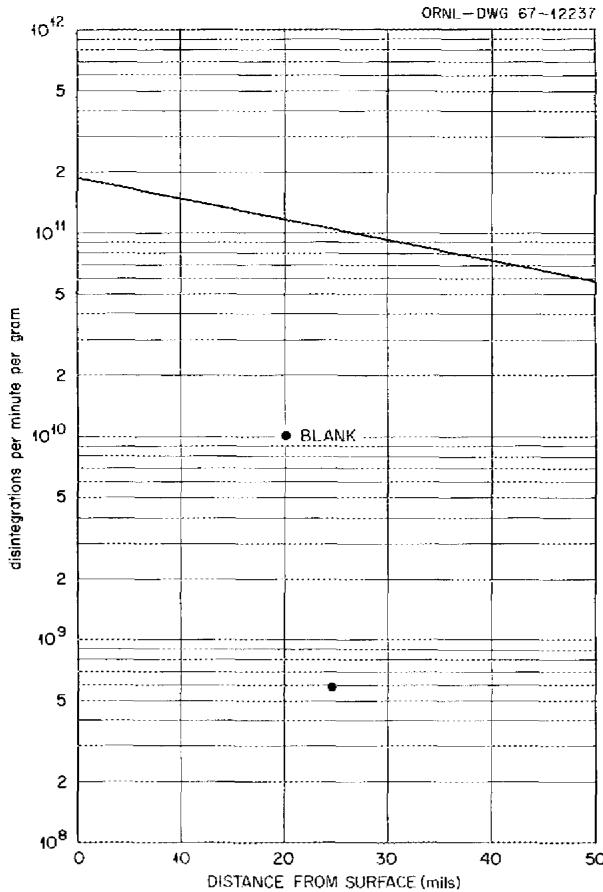  
Fig. 9.7. Distribution Profile of $^{89}\mathrm{Sr}$ in Graphite from MSRE Core.

specimen but about the same deposited activity in the two series of tests.

The uranium values correspond in every case to negligible quantities. It appears that, if these analyses are typical of all metal surfaces in the system, about $1\mathrm{g}$ of $^{235}\mathrm{U}$ may be deposited on or in the Hastelloy of the MSRE.

# Fission Product Distribution in MSRE

The computer code for calculation of total inventory of many fission product nuclides in the operating MSRE has not yet been completed. Accordingly, no detailed information as to expected quantities of several isotopes is available. However, from the data given in previous sections of this chapter approximate values can be given for the distribution of several important fission products among the salt, graphite, and metal phases of the reactor system. These are presented in Table 9.7. Such approximate values must, of course, assume that the fission products found on the relatively small samples from the surveillance specimens in midcore are those to be found on all graphite and metal in MSRE.

Since there is, as yet, no test of this assumption we regard the values in Table 9.7 as tentative.

Table 9.3. Fission Product Deposition on MSRE Graphite Faces After 24,000 Mwhr   

<table><tr><td rowspan="2">Graphite Location</td><td rowspan="2">Face</td><td colspan="6">Fission Product (dis min-1cm-2)</td></tr><tr><td>66-hr 99Mo</td><td>78-hr 132Te</td><td>37.6-day 103Ru</td><td>1.02-year 106Ru</td><td>35-day 95Nb</td><td>65-day 95Zr</td></tr><tr><td rowspan="3">Top</td><td>1</td><td>×1010</td><td>×1010</td><td>×109</td><td>×108</td><td>×1010</td><td>×108</td></tr><tr><td>2</td><td>2.10</td><td>1.45</td><td>4.54</td><td>2.26</td><td>5.00</td><td>2.26</td></tr><tr><td>3</td><td>3.59</td><td>1.75</td><td>8.86</td><td>3.58</td><td>6.15</td><td>3.58</td></tr><tr><td rowspan="3">Middle</td><td>1</td><td>2.76</td><td>1.74</td><td>6.97</td><td>2.77</td><td>4.77</td><td>2.77</td></tr><tr><td>2</td><td>6.30</td><td>3.52</td><td>15.9</td><td>3.08</td><td>9.16</td><td>3.08</td></tr><tr><td>3</td><td>6.30</td><td>3.52</td><td>15.9</td><td>3.08</td><td>9.16</td><td>3.08</td></tr><tr><td rowspan="8">Bottom</td><td>1</td><td>2.28</td><td>2.51</td><td>6.92</td><td>3.51</td><td>2.00</td><td>3.51</td></tr><tr><td>2</td><td>5.32</td><td>3.47</td><td>12.9</td><td>6.33</td><td>17.8</td><td>6.33</td></tr><tr><td>3</td><td>6.16</td><td>3.31</td><td></td><td>7.94</td><td></td><td>7.94</td></tr><tr><td>4</td><td>5.41</td><td>4.68</td><td>15.9</td><td>6.98</td><td>15.4</td><td>6.98</td></tr><tr><td>1</td><td>3.24</td><td>1.79</td><td>6.95</td><td>3.11</td><td>11.6</td><td>3.11</td></tr><tr><td>2</td><td>8.05</td><td>4.50</td><td>18.6</td><td>8.04</td><td>30.6</td><td>8.04</td></tr><tr><td>3</td><td>2.85</td><td>2.22</td><td>9.72</td><td>3.64</td><td>14.2</td><td>3.64</td></tr><tr><td>4</td><td>3.43</td><td>2.14</td><td>8.65</td><td>3.74</td><td>13.3</td><td>3.74</td></tr></table>

Table 9.4. Fission Product Deposition on MSRE Graphite After 7800 and 24,000 Mwhr   

<table><tr><td rowspan="3">Graphite Location</td><td colspan="11">Fission Product (dis min-1cm-2)a</td></tr><tr><td colspan="2">67-hr 99Mo</td><td colspan="2">78-hr 132Tc</td><td colspan="2">39.7-day 103Ru</td><td colspan="2">1.02-year 106Ru</td><td colspan="2">35-day 95Nb</td><td>65-day 95Zr</td></tr><tr><td>Ab</td><td>Bb</td><td>A</td><td>B</td><td>A</td><td>B</td><td>A</td><td>B</td><td>A</td><td>B</td><td>A</td></tr><tr><td></td><td>×1010</td><td>×1010</td><td>×1010</td><td>×1010</td><td>×1010</td><td>×1010</td><td>×1010</td><td>×1010</td><td>×1010</td><td>×1010</td><td>×1010</td></tr><tr><td>Top</td><td>3.97</td><td>3.69</td><td>3.22</td><td>2.12</td><td>0.83</td><td>0.91</td><td>0.003</td><td>0.46</td><td>6.2</td><td>0.0004</td><td>0.001</td></tr><tr><td>Middle</td><td>5.14</td><td>4.79</td><td>3.26</td><td>3.82</td><td>0.75</td><td>1.19</td><td>0.006</td><td>2.28</td><td>1.17</td><td>0.003</td><td>0.007</td></tr><tr><td>Bottom</td><td>3.42</td><td>4.39</td><td>2.78</td><td>2.66</td><td>0.48</td><td>1.10</td><td>0.005</td><td>2.40</td><td>17.4</td><td>0.002</td><td>0.02</td></tr></table>

${}^{a}$ Mean values for all four faces.   
${}^{b}$ A: value obtained after 7800 Mwhr; B: value obtained after 24,000 Mwhr.

Table 9.5. Uranium in Millings from Top Graphite Bar in MSRE After 24,000 Mwhr   

<table><tr><td>Sample Location</td><td>Sample Number</td><td>Cumulative Depth (mils)</td><td>Specimen Weight (g)</td><td>235U Analysis (ppm)</td><td>235U in Specimen (μg)</td></tr><tr><td rowspan="12">Side 1 (facing salt)</td><td>1</td><td>1.56</td><td>0.145</td><td>9</td><td>1.3</td></tr><tr><td>5</td><td>4.04</td><td>0.224</td><td>2.1</td><td>0.47</td></tr><tr><td>7</td><td>5.51</td><td>0.132</td><td>2.4</td><td>0.32</td></tr><tr><td>9</td><td>7.50</td><td>0.172</td><td>0.80</td><td>0.13</td></tr><tr><td>11</td><td>10.75</td><td>0.295</td><td>0.03a</td><td>0.009a</td></tr><tr><td>13</td><td>13.60</td><td>0.256</td><td>0.72</td><td>0.19</td></tr><tr><td>17</td><td>17.40</td><td>0.340</td><td>0.48</td><td>0.16</td></tr><tr><td>21</td><td>21.75</td><td>0.390</td><td>0.29</td><td>0.11</td></tr><tr><td>25</td><td>25.64</td><td>0.350</td><td>0.49</td><td>0.17</td></tr><tr><td>26</td><td>30.57</td><td>0.445</td><td>0.39</td><td>0.017</td></tr><tr><td>27</td><td>36.58</td><td>0.540</td><td>0.28</td><td>0.15</td></tr><tr><td>89</td><td>48.18</td><td>1.05</td><td>0.15</td><td>0.15</td></tr><tr><td rowspan="9">Side 2 (facing salt)</td><td>2</td><td>5.58</td><td>0.360</td><td>8.8</td><td>3.2</td></tr><tr><td>6</td><td>8.60</td><td>0.190</td><td>3.0</td><td>0.57</td></tr><tr><td>8</td><td>11.84</td><td>0.210</td><td>3.6</td><td>0.76</td></tr><tr><td>10</td><td>14.03</td><td>0.140</td><td>2.6</td><td>0.36</td></tr><tr><td>12</td><td>16.62</td><td>0.165</td><td>1.4</td><td>0.23</td></tr><tr><td>14</td><td>24.44</td><td>0.500</td><td>1.6</td><td>0.80</td></tr><tr><td>Blank</td><td></td><td></td><td>0.28</td><td></td></tr><tr><td>18</td><td>31.90</td><td>0.480</td><td>0.99</td><td>0.48</td></tr><tr><td>22</td><td>40.94</td><td>0.580</td><td>1.33</td><td>0.77</td></tr><tr><td rowspan="4">Side 3 (facing graphite)</td><td>3</td><td>5.50</td><td>0.495</td><td>6.7</td><td>3.3</td></tr><tr><td>15</td><td>8.79</td><td>0.300</td><td>1.2</td><td>0.36</td></tr><tr><td>19</td><td>12.98</td><td>0.470</td><td>0.84</td><td>0.39</td></tr><tr><td>23</td><td>18.56</td><td>0.505</td><td>0.78</td><td>0.39</td></tr></table>

${}^{a}$ Questionable value.

Table 9.6. Fission Product Deposition on Hastelloy N in MSRE Core After 7800 and After 24,000 Mwhr   

<table><tr><td rowspan="3">Isotope</td><td colspan="7">Hastelloy N Locationa</td><td></td></tr><tr><td rowspan="2">Extreme Top Bb</td><td colspan="2">Top</td><td colspan="2">Middle</td><td colspan="2">Bottom</td><td rowspan="2">Extreme Bottom B</td></tr><tr><td>Ab</td><td>B</td><td>A</td><td>B</td><td>A</td><td>B</td></tr><tr><td>67-hr 99Mo</td><td>2.84 × 1011</td><td>3.12 × 1011</td><td>3.94 × 1011</td><td>2.76 × 1011</td><td>2.86 × 1011</td><td>2.04 × 1011</td><td>4.42 × 1011</td><td>0.74 × 1011</td></tr><tr><td>78-hr 132Te</td><td>6.66 × 1011</td><td>5.08 × 1011</td><td>5.66 × 1011</td><td>3.41 × 1011</td><td>2.06 × 1011</td><td>4.27 × 1011</td><td>4.02 × 1011</td><td>1.94 × 1011</td></tr><tr><td>37.6-day 103Ru</td><td>0.99 × 1010</td><td>3.55 × 1010</td><td>10.6 × 1010</td><td>2.55 × 1010</td><td>1.56 × 1010</td><td>2.32 × 1010</td><td>6.02 × 1010</td><td></td></tr><tr><td>35-day 95Nb</td><td>1.04 × 1011</td><td></td><td>2.32 × 1011</td><td></td><td>2.32 × 1011</td><td></td><td>1.66 × 1011</td><td>0.16 × 1011</td></tr><tr><td>65-day 95Zr</td><td>2.32 × 108</td><td>18.5 × 108</td><td>1.56 × 108</td><td>18.4 × 108</td><td>8.62 × 108</td><td>25.8 × 108</td><td>4.10 × 108</td><td>0.32 × 108</td></tr><tr><td>50.5-day 89Sr</td><td>1.69 × 108</td><td></td><td>10.3 × 108</td><td></td><td>46.1 × 108</td><td></td><td>5.93 × 108</td><td>0.834 × 108</td></tr><tr><td>8.05-day 131I</td><td>1.60 × 109</td><td>8.24 × 109</td><td>3.93 × 109</td><td>3.97 × 109</td><td>3.18 × 109</td><td>5.24 × 109</td><td>7.67 × 109</td><td></td></tr><tr><td>235U (μg/cm2)</td><td>≤1.3</td><td></td><td>1.51</td><td></td><td>0.92</td><td></td><td>0.61</td><td>0.61</td></tr></table>

a1 surveillance specimens in center axis of core.   
$b$ A:after7800MwhrB:after24,000Mwhr.

Table 9.7. Approximate Fission Product Distributions ${}^{a}$ in MSRE After 24,000 Mwhr   

<table><tr><td>Isotope</td><td>Fuel (total dis/min)</td><td>Graphite (total dis/min)</td><td>Hastelloy N (total dis/min)</td></tr><tr><td>99Mo</td><td>1.7 × 1017b</td><td>8.6 × 1016</td><td>3.2 × 1017</td></tr><tr><td>132Te</td><td>5.3 × 1016b</td><td>5.9 × 1016</td><td>4.1 × 1017</td></tr><tr><td>103Ru</td><td>2.9 × 1016b</td><td>2.2 × 1016</td><td>5 × 1016</td></tr><tr><td>95Nb</td><td>9.6 × 1016b</td><td>1.6 × 1017</td><td>1.5 × 1017</td></tr><tr><td>95Zr</td><td>7.3 × 1017</td><td>1.8 × 1014</td><td>3.6 × 1014</td></tr><tr><td>89Sr</td><td>4.9 × 1017</td><td></td><td>1.3 × 1015</td></tr><tr><td>131I</td><td>3.5 × 1017</td><td></td><td>4 × 1015</td></tr></table>

${}^{a}$ Selected mean value from fuel analyses; assume concentrations on graphite and fuel specimens are typical of all such surface in core.   
$b$ Mean of considerably scattered values.

# 9.4 DEPOSITION OF FISSION PRODUCTS FROM MSRE GAS STREAM ON METAL SPECIMENS

Access to the pump bowl provided by the sampler-enricher tube has been used in a continuing series of studies of deposition of gas-borne activities on metal specimens. The tests carried out since the previous report have attempted to observe the effect of duration of previous reactor operation, addition of metallic beryllium, level of liquid in the pump bowl, exposure time of specimens, stopping of the reactor pump, length of shutdown time of the reactor, and draining of fuel from the reactor.

Exposure conditions were generally similar to those used in previous tests of this kind, $^{1-3}$ but in these studies the stainless steel cables which hold the sampler were used without additionalgetter materials. To reduce the increasing fission product contamination of the sampler-enricher assembly, a downward flow of some 200 cc of helium was used with all insertions after FP11-45. The cables (in all cases except FP11-50, described in some detail in the following section) attached to standard samplers for obtaining specimens of fuel were exposed under conditions and for times shown in Table 9.2. The cables were then segmented into approximately equal lengths

that had been exposed to the liquid phase, the gas phase, or the interface region. In all cases, the nickel-plated key exposed at the very top of the gas phase was analyzed, but these results are not included here. Data from seven separate tests are shown as Table 9.8. In addition, the behavior of $^{106}\mathrm{Ru}$ is shown in Fig. 9.8.

In virtually every case the specimens were leached first with an aqueous chelating agent and then with an oxidizing acid solution. Some iodine and ruthenium may have been lost from the acid leach solutions, and it is not unlikely that some of these values are low. Table 9.8 reports, in all cases, the sum of values obtained with both types of leach solution.

A number of conclusions from the data, of which those in Table 9.8 are typical, follow.

The deposition of noble metals on the pump bowl specimens under normal reactor operating conditions was quantitatively quite similar to that previously reported.3 Added purge flow down the

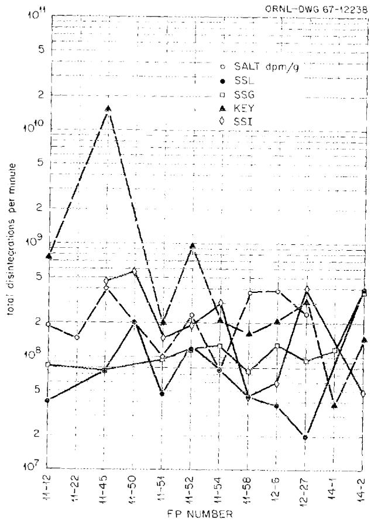  
Fig. 9.8. Deposition of $^{106}\mathrm{Ru}$ in Pump Bowl Tests.

Table 9.8. Deposition of Various Fission Products on Metal Specimens Inserted in MSRE Pump Bowl   

<table><tr><td>Run No.a</td><td>Exposure Condition</td><td>99Mo</td><td>131I</td><td>103Ru</td><td>132Te</td><td>95Zr</td><td>235U(μg/sample)</td></tr><tr><td></td><td></td><td>×1011</td><td>×1010</td><td>×1010</td><td>×1011</td><td>×107</td><td></td></tr><tr><td rowspan="3">FP11-45</td><td>Liquid</td><td>0.65</td><td>0.46</td><td>0.2</td><td>0.9</td><td>0.035</td><td>21</td></tr><tr><td>Interface</td><td>1.8</td><td>1.0</td><td>1.4</td><td>1.3</td><td>10</td><td>20</td></tr><tr><td>Gas</td><td>1.1</td><td>1.1</td><td>0.2</td><td>0.35</td><td>0.80</td><td>5.2</td></tr><tr><td rowspan="3">FP11-50b</td><td>Liquid</td><td>3.5</td><td>12</td><td>0.7</td><td>14</td><td>250</td><td>35</td></tr><tr><td>Interface</td><td>26</td><td>90</td><td>2.8</td><td>100</td><td>320</td><td>190</td></tr><tr><td>Gas</td><td>0.2</td><td>9.2</td><td></td><td>23</td><td>17</td><td>60</td></tr><tr><td rowspan="3">FP11-51</td><td>Liquid</td><td>0.3</td><td>0.1</td><td>0.13</td><td>0.14</td><td>1</td><td>3.5</td></tr><tr><td>Interface</td><td>0.85</td><td>0.85</td><td>0.5</td><td>0.52</td><td>1.5</td><td>19</td></tr><tr><td>Gas</td><td>0.4</td><td>0.6</td><td>0.25</td><td>0.3</td><td>3</td><td>6.0</td></tr><tr><td rowspan="3">FP11-54</td><td>Liquid</td><td>0.42</td><td>0.22</td><td>0.25</td><td>0.17</td><td>1.6</td><td>6.4</td></tr><tr><td>Interface</td><td>0.72</td><td>0.70</td><td>1.0</td><td>0.61</td><td>3.5</td><td>5.6</td></tr><tr><td>Gas</td><td>0.42</td><td>0.55</td><td>0.40</td><td>0.28</td><td>3.5</td><td>2.0</td></tr><tr><td rowspan="3">FP11-58</td><td>Liquid</td><td>0.05</td><td>0.11</td><td>0.13</td><td>0.17</td><td>0.3</td><td>8.4</td></tr><tr><td>Interface</td><td>0.15</td><td>0.28</td><td>0.15</td><td>0.07</td><td>0.6</td><td>3.3</td></tr><tr><td>Gas</td><td>0.18</td><td>0.60</td><td>0.23</td><td>0.04</td><td>0.7</td><td>2.5</td></tr><tr><td rowspan="3">FP12-6</td><td>Liquid</td><td></td><td></td><td>0.11</td><td></td><td>0.82</td><td>22</td></tr><tr><td>Interface</td><td></td><td></td><td>0.17</td><td></td><td>0.60</td><td>46</td></tr><tr><td>Gas</td><td></td><td></td><td>0.38</td><td></td><td>0.30</td><td>60</td></tr><tr><td rowspan="3">FP12-27</td><td>Liquid</td><td>0.06</td><td>0.14</td><td>0.05</td><td>0.09</td><td>0.9</td><td>8.2</td></tr><tr><td>Interface</td><td>0.2</td><td>0.24</td><td>0.04</td><td>0.18</td><td>1.0</td><td>5.6</td></tr><tr><td>Gas</td><td>0.23</td><td>0.37</td><td>0.22</td><td>0.40</td><td>1.3</td><td>6.6</td></tr></table>

Sampling conditions are those shown in Table 9.2.   
bSpecial sample connecting two sets of graphite immersion samples immersed for 8 hr; experimental details are in the following section.

sampler-enricher tube during exposures had no significant effect on deposition on fresh metal specimens. The considerable additional reactor operating time also apparently had little effect, except for possibly a slight decrease in $^{99}\mathrm{Mo}$ and $^{132}\mathrm{Te}$ deposition for the later runs.

The deposition of noble metals was usually heavier on the interface sections of the stainless steel cable than on either the gas-phase or fuel-immersed sections. This suggests the presence of a sticky scum or froth containing noble metals on the surface of the fuel in the pump bowl.

As previously observed3 and as verified by the results from sampling the MSRE gas stream, the reduction of the MSRE fuel with beryllium caused no discernible change in deposition behavior. This observation is difficult to reconcile with the hy-

pothesis that deposition behavior is related to the presence of volatile noble-metal fluorides.

The deposition of noble metals on the sections of stainless steel cable immersed in the fuel usually paralleled their concentrations in the fuel (see Table 9.2).

The 8-hr exposure (FP11-50) revealed curious differences in the deposition behavior of the various fission products. The deposition of $^{132}\mathrm{Te}$ and $^{95}\mathrm{Zr}$ was about 100 times that observed in 1- or 10-min exposures. The corresponding factor was 30 or less for $^{140}\mathrm{Ba}$ , 10 or less for $^{99}\mathrm{Mo}$ , 3 or less for $^{103}\mathrm{Ru}$ and $^{106}\mathrm{Ru}$ , and less than 1 for $^{95}\mathrm{Nb}$ . Usually, comparisons between runs have shown similar factors for all the noble-metal fission products. This unusual observation indicates that the noble metals do not travel together

(e.g., in metallic colloidal aggregates) but deposit individually by separate mechanisms.

In all but one of these tests, the exposure times varied from 1 to $6\mathrm{min}$ . The amounts of noble metals deposited during these intervals showed no increase with exposure time (if anything a decrease) and were not significantly different from the results of previous 10-min exposures. Even in the case of $^{132}\mathrm{Te}$ , which deposited heavily in the 8-hr exposure, no significant differences were observed for exposure times between 1 and $10\mathrm{min}$ . This and related information will be discussed in more detail later.

The deposition behaviors of 40-day $^{103}\mathrm{Ru}$ and 1.0-year $^{106}\mathrm{Ru}$ were fairly closely parallel. The incomplete data for 33-day $^{129}\mathrm{Te}$ also followed well the variations among runs of the 77-hr $^{132}\mathrm{Te}$ deposition data. At production-decay equilibrium, the number of disintegrations per minute of each fission product should be proportional to its fission yield. For the tellurium isotopes the ratio of activities deposited was about 20, while the ratio of fission yields is 13.4. The ratio of activities of the two isotopes in the fuel was also about 20. The discrepancy between 20 and 13.4 may be partly due to the fact that the $^{129}\mathrm{Te}$ may not have reached equilibrium activity. In the case of the ruthenium isotopes the much larger discrepancy between the ratio of activities and the ratio of fission yields is very probably due to the fact that the one-year $^{106}\mathrm{Ru}$ had not nearly reached equilibrium activity.

Experiment FP11-51 was carried out with the pump bowl level as low as possible, with the objective of introducing more than the usual amount of circulating helium bubbles into the fuel. Normal deposition of noble metals was observed. Therefore, the fraction of circulating helium bubbles has no effect on fission product deposition.

Experiment FP11-58 was carried out after 92.3 days of virtually uninterrupted power operation, 2.3 hr after shutdown, and 2 hr after stopping the fuel pump. Under these conditions, the deposition of noble metals decreased by a factor of 2 to 9, most sharply for tellurium and least for ruthenium. The concentrations in the salt (see Table 9.2) remained nearly constant except for ruthenium, for which the data show a fivefold increase.

The rather moderate decreases in noble-metal deposition with the reactor shut down for $2.3\mathrm{hr}$ and particularly with the fuel pump off are difficult to explain by the previously mentioned

metal colloid theory of deposition. Any suspended species in the pump bowl cover gas should have been swept out by the 4-liter/min helium flow through the pump bowl gas space. The 3-in.-diam by 6-in. volume inside the mist shield was additionally swept by the 200-cc/min purge flow prior to and during the exposure. The result is one of the most conclusive indications that truly gaseous species originating from the fuel surface are responsible for the observed concentrations of noble-metal fission products in the pump bowl gas space.

Experiment FP12-6 was carried out after a reactor drain and refill after 42.5 days of reactor shutdown and prior to resumption of power operation. Only slightly lower than normal deposition of noble metals was observed. After long shutdowns in the past, sharp decreases in deposition occurred. Also contrary to past experience, the concentrations of noble metals in the fuel either remained constant (ruthenium) or increased (tellurium and niobium).

An additional experiment (FP14-1, not shown in the table) was carried out after the MSRE had been shut down for 38.1 days, then at full power for 2.5 days, then shut down and drained for 2.0 days. The fuel pump continued to circulate helium in the drained reactor with the temperature of the pump bowl top at $700^{\circ}\mathrm{F}$ . Specimens were exposed for 11 min. The only specimens available for analysis were the gas-exposed stainless steel cable and the key.

The analyses are not complete, but the available results are remarkable. Compared with the previous "normal" run (FP12-27), the activity (calculated back to the end of the 2.5-day operation) deposited on the cable was slightly higher for $^{99}\mathrm{Mo}$ , $^{106}\mathrm{Ru}$ , and $^{95}\mathrm{Nb}$ , distinctly higher for $^{131}\mathrm{I}$ and $^{235}\mathrm{U}$ , slightly lower for $^{132}\mathrm{Te}$ and $^{103}\mathrm{Ru}$ , and distinctly lower for $^{95}\mathrm{Zr}$ . Most of the activities on the key dropped by a factor of about 10 from the previous run. These high depositions are all the more remarkable when it is considered that there was a two-day shutdown before sampling and that even the short-lived fission products could not have reached equilibrium activities in the 2.5-day period of power operation following the 38.1-day shutdown.

It is not clear whether the observed deposits originated from material previously deposited on the graphite or metal walls of the reactor system

or whether it came from the 40 lb of fuel salt which remains in the reactor system after a fuel drain. Some of this fuel salt is in the form of shallow puddles in the internals of the fuel pump where contact with the circulating helium should be good. Another possibly pertinent fact is that gas circulation through the reactor and pump bowl with the pump operating in the drained reactor is much faster than when the reactor is filled with fuel. Thus the pump bowl specimens may contact a larger volume of gas per unit time. The fuel may also act as a scrubbing fluid to remove gaseous or suspended activities from the pump bowl gas, even while it is the source of these activities at a different time and place. Sorbed gaseous activities or loosely deposited solids from the reactor surfaces may conceivably move to and stay in the gas phase more readily in the absence of fuel salt.

A few analytical results are available from test FP14-2, which was run one day after test FP14-1 and after the reactor had been refilled with fuel but before power operation was resumed. For the gas-phase stainless steel cable specimen, the deposition of $^{99}\mathrm{Mo}$ , $^{132}\mathrm{Te}$ , and $^{131}\mathrm{I}$ was lower than for FP14-1 by an order of magnitude. The ruthenium and niobium activities increased slightly, and that of $^{95}\mathrm{Zr}$ decreased slightly. The amount of $^{235}\mathrm{U}$ deposition increased by a factor of 4. The decreases in activity are difficult to explain. The curious fact appears to stand that deposition of noble metals in the drained reactor is the same within an order of magnitude as with fuel in the reactor.

Occasional radiochemical analyses were carried out on the leaches of the metal specimens for two additional noble-metal fission products, $^{111}\mathrm{Ag}$ and $^{112}\mathrm{Pd}$ . These behaved like the other noble metals, with heavy deposition on the gas-phase and submerged specimens. This behavior is of chemical interest since no highly volatile fluorides of silver and palladium are known to exist. This observation favors the gaseous metal suspension theory of noble-metal volatilization.

Occasional analyses were also made for other alkaline-earth and rare-earth species such as $^{91}\mathrm{Sr},$ $^{141}\mathrm{Ce},$ $^{143}\mathrm{Ce},$ $^{144}\mathrm{Ce},$ and $^{147}\mathrm{Nd}$ . These species remained in the fuel melt and showed light deposition on the pump bowl specimens. Most of the pump bowl specimens were analyzed for $^{235}\mathrm{U}$ deposition by delayed-neutron counting

of their leaches. Unusually high values were obtained for the FP11-50 (8-hr exposure) specimens, averaging $70\mu \mathrm{g}$ of $^{235}\mathrm{U}$ on each specimen. Another set of high values averaging $35\mu \mathrm{g}$ of $^{235}\mathrm{U}$ per specimen was obtained on run FP12-6 (42.5-day shutdown). The deposition of $^{95}\mathrm{Nb}$ was also unusually high for this run. The values for run FP11-45 (normal) were also high, averaging about $30\mu \mathrm{g}$ of $^{235}\mathrm{U}$ per specimen. The results for $^{235}\mathrm{U}$ did not parallel those for any other fission product, and the reasons for the wide variations between runs are not known.

# 9.5 DEPOSITION OF FISSION PRODUCTS ON GRAPHITES IN MSRE PUMP BOWL

Graphite specimens have been exposed in the MSRE pump bowl to observe fission product deposition under a known set of short-term conditions. Such an exposure has been carried out for 8 hr during steady 7.2-Mw operation of MSRE. Since this exposure, with the sampler-enricher tube opened to its separate containment for 8 hr, posed some problems in reactor operation, the test was designed to yield a considerable amount of information. Three graphite samples, two of CGB grade and one of pyrolytic graphite, were exposed in the gas phase, while similar specimens were exposed to the liquid. A comparison sample of Hastelloy N was exposed in each phase. Assemblies used in this experiment consisted of a pair of the holders shown in Fig. 9.9. These holders, for safety reasons, enclosed the graphite and Hastelloy specimens in perforated metal cylinders. They were connected by a loop of stainless steel cable of a length such that the bottom holder was completely immersed in the molten fuel while the top holder was exposed only to the gas phase. This assembly was exposed in the pump bowl for 8 hr with 200 cc/min of helium purge except for the last 10 min. After the exposure, tiny droplets ( $\sim$ 0.2 mm in diameter) of greenish white fuel salt were seen adhering loosely to the gas-phase graphite specimens. The mechanical disturbance involved in removing the specimens from the holder was sufficient to dislodge the droplets from the graphite surfaces. Nevertheless, two of the graphite specimens were wiped with small squares of cloth, which were analyzed radiochemically. The remaining graphite and metal specimens were then leached in a neutral mixture of sodium versusenate, boric acid, and citric acid, which dis

ORNL-DWG67-12239

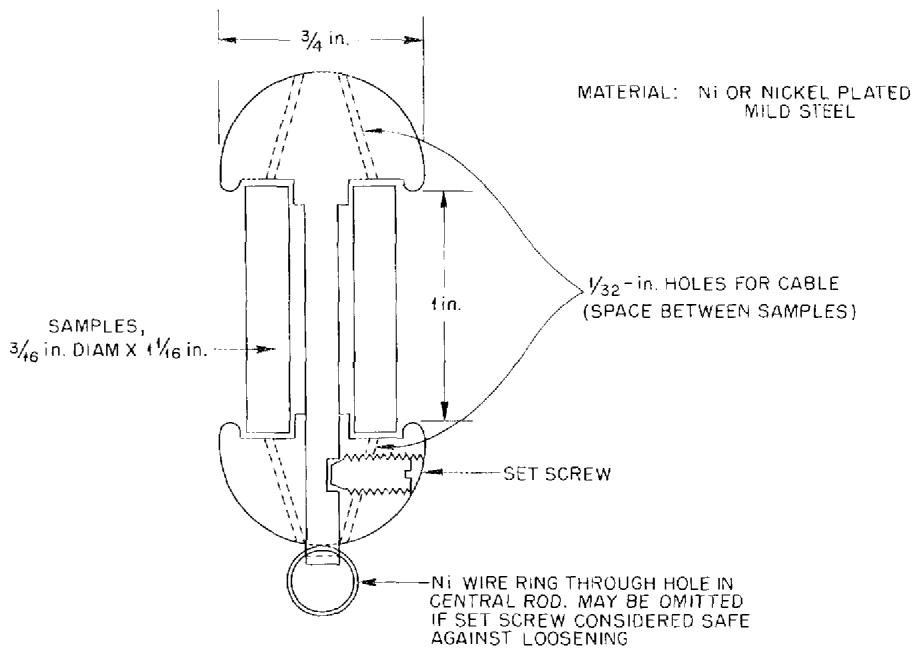

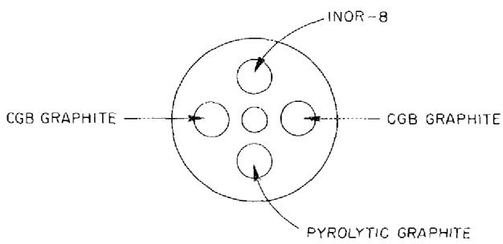  
Fig. 9.9. Graphite Sample Assembly.

solves fuel salt but which should not attack metal. Finally, the graphite specimens were dissolved in $\mathrm{H}_2\mathrm{SO}_4$ - $\mathrm{HNO}_3$ , and the metal specimens were leached free of activity with $8N$ nitric acid. All leaches were analyzed separately.

Deposition of noble metals on the sections of stainless steel cable (shown in Table 9.8 as FP11-50) was as much as two orders of magnitude higher than that on the graphite and Hastelloy N specimens of similar surface area. Deposition was heaviest on the interface section of the cable and least on the vapor-phase section. It is likely that the perforated sample holders (which surrounded the specimens and which could

not be analyzed) intercepted much of the activities which would otherwise have deposited on the graphite and Hastelloy N specimens.

The fraction of activity removed by the aqueous chelating leach, which preceded the acid leach or dissolution, varied markedly from one isotope to the next. As Table 9.9 indicates for several typical leaches, a sizable fraction of the $^{99}\mathrm{Mo}$ and $^{95}\mathrm{Nb}$ (and often the predominant amount) was found in the chelating leach. By contrast, this leach usually removed only about $10\%$ of the $^{132}\mathrm{Te}$ and ruthenium from both graphite and metal samples, but it generally removed more than half of the $^{131}\mathrm{I},^{95}\mathrm{Zr},^{140}\mathrm{Ba},$ and $^{89}\mathrm{Sr}$ .

Table 9.9. Comparison of Aqueous Chelating Agent with $\mathsf{HNO}_3$ Leach for Removing Deposited Fission Products from Graphite and Hastelloy   

<table><tr><td rowspan="2">Exposed in -</td><td rowspan="2">Samplea</td><td colspan="4">Disintegrations per Minute in Total Sample</td></tr><tr><td>99Mo</td><td>132Te</td><td>103Ru</td><td>95Zr</td></tr><tr><td></td><td></td><td>×1010</td><td>×1010</td><td>×109</td><td>×107</td></tr><tr><td rowspan="3">Gas</td><td>CGB V</td><td>4.6</td><td>2.99</td><td>0.15</td><td>4.3</td></tr><tr><td>A</td><td>1.75</td><td>32.1</td><td>1.19</td><td>0.89</td></tr><tr><td>T</td><td>6.35</td><td>35.1</td><td>1.34</td><td>5.23</td></tr><tr><td rowspan="3">Liquid</td><td>CGB V</td><td>4.60</td><td>2.99</td><td>0.154</td><td></td></tr><tr><td>A</td><td>3.24</td><td>2.25</td><td>3.00</td><td>0.13</td></tr><tr><td>T</td><td>7.84</td><td>5.24</td><td>3.15</td><td>4.47</td></tr><tr><td rowspan="3">Gas</td><td>Hastelloy N V</td><td>4.65</td><td>5.89</td><td>0.12</td><td>1.49</td></tr><tr><td>A</td><td>0.21</td><td>70.2</td><td></td><td>&lt;5.3</td></tr><tr><td>T</td><td>4.87</td><td>76.1</td><td></td><td>&lt;6.79</td></tr><tr><td rowspan="3">Liquid</td><td>Hastelloy N V</td><td>2.24</td><td>1.99</td><td>0.07</td><td>0.35</td></tr><tr><td>A</td><td>1.51</td><td>15.5</td><td>0.66</td><td>&lt;2.3</td></tr><tr><td>T</td><td>3.75</td><td>17.5</td><td>0.73</td><td>~2.7</td></tr></table>

$^{\mathrm{a}}$ V represents leaching in aqueous chelating solution; A represents leaching in acid; T represents total.

Since this solvent dissolves salts but not metals, these observations may possibly indicate that $^{99}\mathrm{Mo}$ and $^{95}\mathrm{Nb}$ are present as oxidized species (fluorides?), while tellurium and ruthenium are present as metals. Wiping with a cloth removed larger fractions of $^{99}\mathrm{Mo}$ and $^{95}\mathrm{Nb}$ than of activities such as $^{132}\mathrm{Te}$ , $^{131}\mathrm{I}$ , $^{95}\mathrm{Zr}$ , $^{140}\mathrm{Ba}$ , and $^{89}\mathrm{Sr}$ which penetrated the graphite.

The deposition of fission products on pyrolytic graphite (see Table 9.10) in the gas phase was similar to that on CGB graphite, although $^{132}\mathrm{Te}$ deposited to a smaller extent on the pyrolytic graphite. In the liquid phase, $^{99}\mathrm{Mo}$ and $^{132}\mathrm{Te}$ deposited slightly more heavily on pyrolytic graphite than on the CGB.

The deposition of $^{95}\mathrm{Nb}$ was markedly heavier on Hastelloy N in the liquid phase than in the gas phase. Tellurium-132 and $^{140}\mathrm{Ba}$ deposited more heavily on the metal exposed in the gas phase. Other isotopes deposited similarly on metal in the two environments.

When metal and graphite were exposed to the gas phase, somewhat more $^{132}\mathrm{Te}$ , $^{131}\mathrm{I}$ , and $^{95}\mathrm{Zr}$ deposited on the metal. When both were exposed to the liquid phase, less $^{99}\mathrm{Mo}$ , $^{140}\mathrm{Ba}$ , and $^{89}\mathrm{Sr}$ and more $^{132}\mathrm{Te}$ and $^{131}\mathrm{I}$ deposited on the Hastelloy. The deposition per square centimeter of a given isotope varied by less than a

factor of 10 between any Hastelloy N or graphite samples.

When the activity, in disintegrations per minute per square centimeter, of fission products on the graphite samples from the 24,000-Mwhr core exposure is compared with that on submerged graphite specimens from the 8-hr exposure (Tables 9.4 and 9.10) the ratios were 0.9 for $^{99}\mathrm{Mo}$ , 1.7 for $^{132}\mathrm{Te}$ , 3.5 for $^{103}\mathrm{Ru}$ , 14.0 for $^{106}\mathrm{Ru}$ , 95 for $^{95}\mathrm{Nb}$ , and 56 for $^{95}\mathrm{Zr}$ . A similar comparison of the activities on the Hastelloy N specimens from the two exposures (Tables 9.6 and 9.10) gives ratios of 20 for $^{99}\mathrm{Mo}$ , 6 for $^{132}\mathrm{Te}$ , 170 for $^{103}\mathrm{Ru}$ , 400 for $^{106}\mathrm{Ru}$ , 75 for $^{95}\mathrm{Nb}$ , and 30 for $^{95}\mathrm{Zr}$ . The ratio of full-power exposure times is 417; the ratio of total exposure times is, of course, considerably greater. Both sets of activity ratios may be biased high since the sample holder in the 8-hr exposure may have intercepted a sizable fraction of the depositing activities.

Examination of the ratios given above shows that only deposition of $^{106}\mathrm{Ru}$ on Hastelloy N proceeds at approximately the same rate for 8 as for 3340 full-power hours. However, the measured deposit of a given radioactive nuclide actually reflects the deposition rate only over the last two or three half-lives of exposure time for that nuclide. Thus the measured ac

Table 9.10. Deposition of Fission Products During B-hr Exposure in MSRE Pump Bowls   

<table><tr><td rowspan="2">Exposed in -</td><td rowspan="2">Sample</td><td rowspan="2">Area (cm2)</td><td colspan="10">Disintegrations per minute in Total Samplea</td><td rowspan="2">235U (μg)</td></tr><tr><td>99Mo</td><td>132Te</td><td>131I</td><td>95Zr</td><td>89Sr</td><td>140Ba</td><td>103Ru</td><td>106Ru</td><td>95Nb</td><td>143Ce</td></tr><tr><td></td><td></td><td></td><td>×1010</td><td>×1011</td><td>×109</td><td>×107</td><td>×108</td><td>×109</td><td>×109</td><td>×107</td><td>×108</td><td>×108</td><td></td></tr><tr><td>Gas</td><td>CBG No. 1G</td><td>3.68</td><td>6.35</td><td>3.51</td><td>3.42</td><td>5.23</td><td>8</td><td>1.62</td><td>1.34</td><td>4.0</td><td>4.84</td><td></td><td>5.14</td></tr><tr><td>Gas</td><td>CBG No. 2G</td><td>3.68</td><td>5.56</td><td>4.44</td><td>1.65</td><td>1.4</td><td></td><td>0.47</td><td>2.16</td><td>6.0</td><td>8.8</td><td></td><td>1.31</td></tr><tr><td>Gas</td><td>PG</td><td>2.76</td><td>6.13</td><td>0.371</td><td>1.25</td><td>0.91</td><td>7.52</td><td>1.09</td><td>2.3</td><td>6.0</td><td>5.3</td><td></td><td>0.71</td></tr><tr><td>Liquid</td><td>CBG No. 1L</td><td>3.68</td><td>7.8</td><td>0.52</td><td>3.14</td><td>4.47</td><td>13.0</td><td>1.58</td><td>3.15</td><td>9.27</td><td>4.0</td><td></td><td>4.76</td></tr><tr><td>Liquid</td><td>CBG No. 2L</td><td>3.68</td><td>11.2</td><td>0.464</td><td>2.34</td><td>0.58</td><td></td><td>0.33</td><td>5.29</td><td>15.9</td><td>4.0</td><td>0.27</td><td>1.55</td></tr><tr><td>Liquid</td><td>PG</td><td>2.76</td><td>33.4</td><td>0.79</td><td>2.81</td><td>2.4</td><td>158</td><td>0.59</td><td>25.2</td><td>8.06</td><td>5.4</td><td>15.5</td><td>1.37</td></tr><tr><td>Gas</td><td>Hastelloy N</td><td>2.46</td><td>4.87</td><td>7.61</td><td>15.6</td><td>6.8</td><td>10.9</td><td>1.09</td><td></td><td></td><td>2.3</td><td></td><td>6.55</td></tr><tr><td>Liquid</td><td>Hastelloy N</td><td>2.46</td><td>3.75</td><td>1.75</td><td>6.77</td><td>2.7</td><td>1.97</td><td>0.063</td><td>0.73</td><td>2.0</td><td>63.5</td><td></td><td>13.8</td></tr></table>

$^{8}$ A11 activities calculated for time of sampling.

tivities of $^{99}\mathrm{Mo}$ and $^{132}\mathrm{Te}$ deposited in a long exposure are a measure of deposition rate over only the last week or so of exposure. If we assume a constant deposition rate, the amount deposited in time $t$ is given by the familiar equation:

$$
N = \frac {k}{\lambda} (1 - e ^ {- \lambda t}),
$$

where $k$ is the constant deposition rate and $\lambda$ is the decay constant. Using this equation a theoretical ratio can be calculated for each isotope for exposure times of 3340 and 8 hr:

$$
R = \frac {N _ {3 3 4 0}}{N _ {8}} = \frac {1 - \mathrm {e} ^ {- \lambda \times 3 3 4 0}}{1 - \mathrm {e} ^ {- \lambda \times 8}}.
$$

These ratios turn out to be 12.6 for $^{99}\mathrm{Mo}$ , 14.5 for $^{132}\mathrm{Te}$ , 157 for $^{103}\mathrm{Ru}$ , 365 for $^{106}\mathrm{Ru}$ , 142 for $^{95}\mathrm{Nb}$ , and 218 for $^{95}\mathrm{Zr}$ . Whether fortuitous or not, these calculated ratios agree with the observed ratios for deposition on Hastelloy N very well for the ruthenium isotopes and within a factor of 2 for molybdenum, tellurium, and niobium. This agreement suggests that the deposition of noble metals on Hastelloy N does indeed proceed at approximately the same constant rate for a 3340-hr exposure as for an 8-hr exposure.

By contrast, the calculated ratios are much higher (usually by tenfold or more) than the observed ratios for deposition on graphite except for $^{95}\mathrm{Nb}$ and $^{95}\mathrm{Zr}$ , whose calculated ratios are high by factors of only 1.5 and 4 respectively. This indicates that the deposition rate of noble metals (except $^{95}\mathrm{Nb}$ ) on graphite decreases with exposure time. Neutron economy in MSRE would benefit if the deposition rate of noble-metal fission products on graphite decreases with exposure time while that on Hastelloy N remains constant. As the data in Table 9.10 indicate, the 8-hr deposition rates are not greatly different

on graphite and metal, and the activities of $^{99}\mathrm{Mo},^{132}\mathrm{Te},^{103}\mathrm{Ru}$ , and $^{106}\mathrm{Ru}$ were similar for the 7800- and 24,000-Mwhr exposures. This suggests no change of rate between 7800 and 24,000 Mwhr for $^{99}\mathrm{Mo},^{132}\mathrm{Te}$ , and $^{103}\mathrm{Ru}$ and a decreased rate for the long-lived $^{106}\mathrm{Ru}$ .

The discussion above gives a generally satisfactory picture of noble-metal deposition for exposures of 8 hr or longer. The picture is greatly complicated by the inclusion of results from the short (1 to 10 min) exposures of the stainless steel cable specimens in the pump bowl fuel (see Table 9.8). For most isotopes, the depositions were only slightly greater (a factor less than 5) for the 8-hr exposure than for 1- to 10-min exposures. Tellurium-132 and $^{95}\mathrm{Zr}$ deposits in 8 hr were about 100 times larger than for the short exposures.

The calculated ratios from the formula given above would be very close to the time ratios for these short exposures. Comparing the 8-hr run with a 1-min run, the time ratio is 480. The short-exposure data thus indicate that (except for $^{132}\mathrm{Te}$ and $^{95}\mathrm{Zr}$ ) the original deposition rate is very fast compared with the rate after 8 hr. It may be that when fresh samples of metal are exposed to fuel salt two deposition mechanisms come into play. The first process rapidly deposits noble metals on the stainless steel in less than a minute and then stops (or reaches equilibrium). The second (slow) process then continues to deposit noble metals at a fairly constant rate for exposure times up to 3340 hr. It may be speculated that the first process is a rapid pickup of colloidal noble-metal particles from the fuel on the metal surface; the second may be a slow plating of noble metals in higher valence states present at very low concentrations in the fuel.

It will be interesting to expose graphite samples in the fuel for short times to see whether a short-term mechanism also exists for deposition on graphite.

# 10. Studies with LiF-BeF $_2$ Melts

# 10.1 OXIDE CHEMISTRY OF $\mathsf{ThF}_4\mathsf{-UF}_4$ MELTS

B. F. Hitch

C. E. L. Bamberger

C. F. Baes, Jr.

The precipitation of protactinium and uranium from $\mathrm{LiF - BeF}_2\text{-ThF}_4$ mixtures by addition either of $\mathrm{BeO}$ or $\mathrm{ThO}_2$ was demonstrated several years ago by Shaffer et al. $^{1-3}$ as a possible method for processing an MSBR blanket salt. The purpose of the present investigation is (1) to verify that the oxide solid phase formed at equilibrium with $\mathrm{UF}_4\text{-ThF}_4$ containing melts is the expected solid solution of $\mathrm{UO}_2$ and $\mathrm{ThO}_2$ and (2) to determine the distribution behavior of $\mathrm{Th}^{4+}$ and $\mathrm{U}^{4+}$ between the oxide and the fluoride solutions:

$$
\mathrm {U} ^ {4 +} (\mathrm {f}) + \mathrm {T h} ^ {4 +} (\mathrm {o}) = \mathrm {U} ^ {4 +} (\mathrm {o}) + \mathrm {T h} ^ {4 +} (\mathrm {f}) \tag {1}
$$

(where $f$ and $o$ denote the fluoride and the oxide phases).

The experimental technique is similar to that used in a $\mathrm{UO}_2\text{-}\mathrm{ZrO}_2$ phase study.4 The $\mathrm{ThO}_2$ and $\mathrm{UO}_2$ were contacted with 2LiF $\cdot$ BeF $^2$ containing UF $^4$ and ThF $^4$ within nickel capsules under a hydrogen atmosphere in a rocking furnace. The equilibrated oxide solids were allowed to settle before the samples were frozen. Provided sufficient fluoride phase had been added originally, good phase separation was thus obtained.

A $(\mathbf{U}\cdot \mathbf{Th})\mathbf{O}_{2}$ solid solution has been found in every sample examined thus far, and, moreover,

the lattice parameter determined by x-ray diffraction was consistent with the composition calculated for such an oxide phase. The equilibrium quotient for the above metathetic reaction was determined by analysis of the fluoride phase for the small amount of uranium which it contained. The results obtained thus far give

$$
Q \sim \frac {X _ {\mathrm {U} (\mathrm {o})} X _ {\mathrm {T h} (\mathrm {f})}}{X _ {\mathrm {U} (\mathrm {f})} X _ {\mathrm {T h} (\mathrm {o})}} = 1 0 0 0 \text {t o} 2 0 0 0 \tag {2}
$$

at $600^{\circ}\mathrm{C}$ . The mole fraction of uranium in the oxide phase $[X_{\mathrm{U(o)}}]$ was varied from 0.2 to 0.9, while the mole fraction of thorium in the fluoride phase was in the range 0.01 to 0.07.

It thus appears that relative to $\mathrm{Th}^{4+}$ , the $\mathrm{U}^{4+}$ present is strongly extracted from the fluoride phase by the oxide solid solution formed at equilibrium. There is every reason to expect that $\mathrm{Pa}^{4+}$ will distribute even more strongly to the oxide phase. This is in agreement with the effective precipitation of $\mathrm{U}^{4+}$ and $\mathrm{Pa}^{4+}$ by oxide first reported by Shaffer et al. The formation of a single oxide solution phase to which $\mathrm{Th}^{4+}$ , $\mathrm{U}^{4+}$ , and $\mathrm{Pa}^{4+}$ all could distribute offers a much more flexible and effective oxide separation method for a single-region breeder reactor fuel than would be the case if only the separate oxides $(\mathrm{ThO}_2$ and $\mathrm{UO}_2)$ were formed. For example, a possible processing scheme for an MSBR might involve some sort of a countercurrent contactor (Fig. 10.1) in which a $(\mathrm{U}-\mathrm{Th})\mathrm{O}_2$ solid solution of

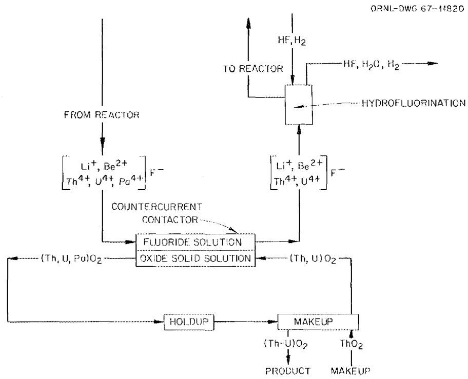  
Fig. 10.1. Suggested Flow Diagrams for Protactinium Removal by Oxide Extraction.

controlled initial composition is equilibrated with the blanket salt. It is expected that $^{233}\mathrm{Pa}$ will distribute strongly to the oxide phase, while the amount of $^{233}\mathrm{U}$ removed will be controlled by the uranium content of the influent oxide phase. Subsequently, the oxide phase might be stored while the $^{233}\mathrm{Pa}$ decays and then largely recycled to the contactor with some adjustment of the composition and with removal of a portion of the $(\mathrm{Th - U})\mathrm{O}_2$ solid solution as product. Before returning the salt to the reactor, the dissolved oxide could be removed by $\mathrm{HF - H}_2$ sparging. This processing concept might be applicable to a one-region breeder fuel. It should only be necessary to adjust the uranium content of the oxide phase upward in order to be compatible with the higher uranium content necessary for a fuel salt.

It is planned to continue the present measurement of the distribution of $\mathbf{U}^{4+}$ , and perhaps $\mathrm{Pa}^{4+}$ between fluoride and oxide phases as a function of composition and temperature. In these measurements, vigorous agitation will be used in the hope of shortening the equilibration times. If the results should warrant, a more detailed study of the rate-controlling factors in the distribution of $\mathbf{U}^{4+}$ and $\mathrm{Pa}^{4+}$ will then be made.

# 10.2 CONTAINMENT OF MOLTEN FLUORIDES IN SILICA

# Chemistry

C. E. L. Bamberger

R.B.Allen

J. P. Young

C. F. Baes, Jr.

The advantages of silica as a container material for molten salts in spectrophotometric, emf, and other measurements include high thermal shock resistance, good ultraviolet transmittance, high electric resistivity, low price, and ease of fabrication. For the containment of molten LiF-BeF $_2$ mixtures, an obvious disadvantage is possible chemical attack as a result of the reaction

$$
2 \operatorname {B e F} _ {2} (d) + \operatorname {S i O} _ {2} (s) \rightleftharpoons \operatorname {S i F} _ {4} (g) + 2 \operatorname {B e O} (s). \tag {3}
$$

However, when the equilibrium partial pressure of $\mathrm{SiF}_4$ was calculated for this reaction from available formation free energies for crystalline $\mathrm{SiO}_2$ , crystalline $\mathrm{BeO}$ , gaseous $\mathrm{SiF}_4$ , and dissolved

$\mathrm{BeF}_2$ in $2\mathrm{LiF} \cdot \mathrm{BeF}_2$ , this partial pressure was found to be surprisingly low, that is, $0.03\mathrm{mm}$ at $700^{\circ}\mathrm{K}$ to $21\mathrm{mm}$ at $1000^{\circ}\mathrm{K}$ . Furthermore, preliminary direct measurements now in progress confirm the low range of these partial pressures. This suggested that an overpressure of $\mathrm{SiF}_4$ might prevent, or at least reduce, the attack of the silica container and prevent the precipitation of $\mathrm{BeO}$ .

The compatibility of $\mathrm{SiO}_2$ with these LiF-BeF $_2$ melts is primarily associated with the relative stability of $\mathrm{BeF}_2$ compared with that of BeO; the standard free energies of formation at $1000^{\circ}\mathrm{K}$ are $-206$ and $-120\mathrm{kcal / mole}$ respectively. Since many other metallic fluorides show even greater stability compared with their corresponding oxides, it seems that $\mathrm{SiO}_2$ should not be ruled out as a container material for molten fluorides without first estimating the equilibrium position of such reactions as

$$
\begin{array}{l} \frac {x}{4} \mathrm {S i O} _ {2} (s) + \mathrm {M F} _ {x} (\text {s o r} l) \rightleftharpoons \mathrm {M O} _ {x / 2} (s) \\ + \underset {4} {\overset {x} {\cdot}} \operatorname {S i F} _ {4} (g), \tag {4} \\ \end{array}
$$

which involve the pure metal fluoride and metal oxide, and

$$
\mathrm {S i O} _ {2} (s) + 4 \mathrm {F} ^ {-} = 2 \mathrm {O} ^ {2 -} + \mathrm {S i F} _ {4} (g). \tag {5}
$$

The latter reaction is the one of most interest, since it gives the level of oxide contamination of the fluoride melt. Its equilibrium position may be judged if activity coefficients or solubilities can be assigned to $\mathbf{MF}_x$ and $\mathbf{MO}_{x / 2}$ in the melt under consideration. In the present case the activity of $\mathrm{BeF}_2$ in 2LiF $\cdot \mathrm{BeF}_2$ $(\sim 0.03)$ and the solubility of BeO $(\sim 0.01$ mole of $\mathrm{O}^{2 - }$ per kg of salt at $600^{\circ}\mathrm{C})$ have been measured.7 From these and the available thermochemical data the following equilibrium quotient may be estimated for the above reaction [Eq. (5)] in 2LiF $\cdot \mathrm{BeF}_2$ at $600^{\circ}\mathrm{C}$ :

$$
\begin{array}{l} Q = \left[ O ^ {2 -} \right] ^ {2} P _ {\text {S i F} _ {4}} \\ = 4 \times 1 0 ^ {- 7} \text {a t m m o l e} ^ {2} / \mathrm {k g} ^ {2}. \tag {6} \\ \end{array}
$$

From this, it can in turn be estimated that in the presence of 1 atm of $\mathrm{SiF}_4$ the oxide ion concentration at equilibrium with $\mathrm{SiO}_2$ should be only $6\times 10^{-4}$ mole/kg.

Another factor to be considered when using silica is the possible formation of silicates; for example,

$$
\begin{array}{l} 2 \mathrm {M F} _ {2} (s \text {o r} l) + 2 \mathrm {S i O} _ {2} (s) \\ \rightleftharpoons \mathrm {M} _ {2} \mathrm {S i O} _ {4} (s) + \mathrm {S i F} _ {4} (g). \tag {7} \\ \end{array}
$$

In the present case, for example, $\mathrm{Be}_{2}\mathrm{SiO}_{4}$ (phenacite) should be formed as the stable reaction product rather than $\mathrm{BeO}$ at low $\mathrm{SiF}_{4}$ partial pressures; however, phenacite is not very stable relative to $2\mathrm{BeO} + \mathrm{SiO}_{2}$ and should not alter the above conclusions about the compatibility of silica with $\mathrm{LiF - BeF}_{2}$ melts. In other fluoride systems, the formation of metallic silicates may be the controlling factor.

The solubility of $\mathrm{SiF}_4$ in the molten fluoride must be considered because possible reactions such as

$$
\mathrm {S i F} _ {4} (\underline {{g}}) + 2 \mathrm {F} ^ {-} \rightleftharpoons \mathrm {S i F} _ {6} ^ {2 -} \tag {8}
$$

could produce high solubilities which not only would alter the salt phase, but also would cause the reaction with $\mathrm{SiO}_2$ to proceed farther than otherwise expected. Accordingly, the solubility of $\mathrm{SiF}_4$ in $2\mathrm{LiF} \cdot \mathrm{BeF}_2$ was estimated by means of transpiration measurements. The prepurified salt was saturated with $\mathrm{SiF}_4$ by bubbling a mixture of 0.1 atm of $\mathrm{SiF}_4$ in He through the salt until the effluent and influent compositions were the same. The dissolved gas was then stripped with helium and trapped in an aqueous NaOH bubbler, the amount of $\mathrm{SiF}_4$ being equivalent to the amount of NaOH consumed by its hydrolysis:

$$
\mathrm {S i F} _ {4} (\hat {g}) + 4 \mathrm {O H} ^ {-} \rightleftharpoons 4 \mathrm {F} ^ {-} + 2 \mathrm {H} _ {2} \mathrm {O} + \mathrm {S i O} _ {2} (s). \tag {9}
$$

The solubility was calculated by means of

$$
K _ {\mathrm {H}} = \frac {[ \mathrm {S i F} _ {4} ]}{P _ {\mathrm {S i F} _ {4}}}, \tag {10}
$$

$$
\left[ \mathrm {S i F} _ {4} \right] _ {d} = \left[ \sum n _ {\text {S i F} _ {4}} - \sum \left(P _ {\text {S i F} _ {4}} V / R T _ {m}\right) \right] / w, \tag {11}
$$

in which

$$
\sum n _ {\mathrm {S i F} _ {4}} = \text {t o t a l n u m b e r o f m o l e s o f S i F} _ {4}
$$

$$
P _ {\mathrm {S i F} _ {4}} = \begin{array}{l} \mathrm {S i F} _ {4} \text {p r e s s u r e a t e q u i l i b r i u m} \\ \text {w i t h t h e m e l t ,} \end{array}
$$

$$
\begin{array}{l} \Sigma \left(P _ {\mathrm {S i F} _ {4}} V / R T _ {m}\right) = \text {c o r r e c t i o n} \quad \text {t e r m w h i c h i n c l u d e s} \quad \text {t h e v a r i o u s d e a d v o l u m e s a t d i f f e r e n t t e m p e r a t u r e s}, \quad T _ {m}, \\ w = \text {w e i g h t o f t h e m e l t i n k g}. \\ \end{array}
$$

Using Eqs. (10) and (11) the solubility was found to be

$$
K _ {\mathrm {H}} = 0. 0 3 2 \pm 0. 0 0 5 \mathrm {m o l e} \mathrm {k g} ^ {- 1} \mathrm {a t m} ^ {- 1} \mathrm {a t} 4 9 9 ^ {\circ} \mathrm {C},
$$

$$
K _ {\mathrm {H}} = 0. 0 3 5 \pm 0. 0 0 5 \mathrm {m o l e k g} ^ {- 1} \mathrm {a t m} ^ {- 1} \mathrm {a t} 5 4 0 ^ {\circ} \mathrm {C}.
$$

These solubilities are of the same order of magnitude as the solubility of HF in $2\mathrm{LiF}\cdot \mathrm{BeF}_2(\sim 0.01$ mole $\mathrm{kg}^{-1}$ atm-1).8 At higher temperatures, in the range 600 to $700^{\circ}\mathrm{C},$ the solubility was so low that by the rather insensitive method of measurement only an upper limit could be set: $K_{H} <   0.01$ mole $\mathrm{kg}^{-1}$ atm-1. The data obtained indicate that at $1000^{\circ}\mathbf{K},$ using an SiF4 pressure close to the equilibrium value over $2\mathrm{LiF}\cdot \mathrm{BeF}_{2},$ the solubility of $\mathrm{SiF_4}$ is $\sim 0.003$ mole $\%$

Another undesirable side reaction that should be considered in these systems is the formation of silicon oxyfluorides; for example,

$$
\mathrm {S i F} _ {4} (g) + \mathrm {S i O} _ {2} (s) \rightleftharpoons 2 \mathrm {S i O F} _ {2} (g), \tag {12}
$$

$$
3 \operatorname {S i F} _ {4} (g) + \operatorname {S i O} _ {2} (s) \rightleftharpoons 2 \operatorname {S i} _ {2} \operatorname {O F} _ {6} (g). \tag {13}
$$

Such silicon oxyfluorides have been identified by Novoselova et al.9 during the synthesis of phenacite from $\mathrm{SiO}_2$ , BeO, and $\mathrm{Na}_2\mathrm{BeF}_4$ at temperatures in the range 700 to $800^{\circ}\mathrm{C}$ . In one measurement they report equilibrium partial pressures of 0.162 atm of $\mathrm{SiF}_4$ and 0.07 atm of $\mathrm{SiOF}_2$ over the reaction mixture at $813^{\circ}\mathrm{C}$ . In other experiments wherein equilibrium was not reached, they were able to identify $\mathrm{Si}_2\mathrm{OF}_6$ . We performed tests in which He after passage through molten 2LiF $\cdot$ $\mathrm{BeF}_2$ containing powdered BeO and $\mathrm{SiO}_2$ at temperatures up to $650^{\circ}\mathrm{C}$ was analyzed by means of a mass spectrometer. No silicon oxyfluorides were found to be present.

# Spectrophotometric Measurements with Silica Cells

C.E.L.Bamberger J.P.Young

C.F.Baes, Jr.

Behavior of $\mathbf{U}^{4+}$ . - To estimate the extent to which an $\mathrm{SiF}_4$ overpressure would prevent reaction (5), $\mathrm{UF}_4$ , a colored solute which would produce an even less soluble oxide than does $\mathrm{BeF}_2$ , was added to $\mathrm{LiF-BeF}_2$ melts in $\mathrm{SiO}_2$ containers. Tetravalent uranium thus should act as a sensitive "internal indicator" of the reaction of $\mathbf{F}^{-}$ with $\mathrm{SiO}_2$ . It has a known absorption spectrum of suitable intensity, and hence its concentration can be followed spectrophotometrically. For the reaction

$$
\mathrm {U F} _ {4} (d) + \operatorname {S i O} _ {2} (s) \rightleftharpoons \operatorname {S i F} _ {4} (g) + \operatorname {U O} _ {2} (s), \tag {14}
$$

equilibrium partial pressures of $\mathrm{SiF}_4$ were predicted to be reasonably low; for example, with 0.002 mole fraction $\mathrm{UF}_4$ in $2\mathrm{LiF} \cdot \mathrm{BeF}_2$ , calculated $\mathrm{SiF}_4$ pressures varied from $3\mathrm{mm}$ at $700^{\circ}\mathrm{K}$ to $115\mathrm{mm}$ at $1000^{\circ}\mathrm{K}$ . Spectrophotometric monitoring of the concentration of $\mathrm{U}^{4+}$ provides a very good means for studying the stability of the system.

Melts of $2\mathrm{LiF}\cdot \mathrm{BeF}_2$ containing variable concentrations of $\mathbf{U}\mathbf{F}_{4}$ (0.0053 to 0.13 mole $\%$ or 0.003 to 0.008 mole/liter) were held under $\mathrm{SiF}_4$ (~400 mm) at temperatures ranging from 490 to $700^{\circ}\mathrm{C}$ in sealed silica tubes. The tubes were placed directly in a special furnace located in the light path of a Cary spectrophotometer, model 14M, or in a heated nickel metal block and later transferred to the furnace inside the instrument. Temperatures were controlled to $\pm 1^{\circ}\mathrm{C}$ by means of a Capacitrol 471 controller.

Constancy of the $\mathbf{U}^{4+}$ absorbance peaks at 1090 and $640\mathrm{nm}$ showed the uranium concentration in the melt to be constant within the precision of the spectral measurement (about $1\%$ ) for at least $48\mathrm{hr}$ . It was, therefore, evident that no significant attack of the silica container or significant contamination of the melt occurred. During longer periods of time

(up to one week) the transparency of the containers was noticeably affected, and the base line of the spectra rose. The net absorbance of the $\mathbf{U}^{4+}$ peaks, however, remained reproducible even though in some experiments the temperature was cycled from 500 to $700^{\circ}\mathrm{C}$ . No spectral experiment was continued for longer than a week. However, in other studies, melts of $2\mathrm{LiF} \cdot \mathrm{BeF}_2$ were maintained as long as one month at $500^{\circ}\mathrm{C}$ without noticeable damage except loss of transparency (presumably due to some process of devitrification) of the fused silica.

The precision of these quantitative spectral measurements of $\mathbf{U}^{4 + }$ was better than that possible with windowless cells.12 The molar absorptivity $(A_{m})$ of $\mathbf{U}^{4 + }$ had been observed 10 to be $14\pm 10\%$ and $7\pm$ $10\%$ at 1090 and $640~\mathrm{nm}$ , respectively, in molten LiF-BeF2 at $550^{\circ}\mathrm{C}$ contained in windowless cells. With the melts contained in the present silica cells the $A_{m}$ of $\mathbf{U}^{4 + }$ is $14.4\pm 0.5$ and $7.3\pm 0.3$ at 1090 and $640~\mathrm{nm}$ , respectively, in molten 2LiF $\cdot$ BeF2 at $560^{\circ}\mathrm{C}$ . The effect of temperature on the $A_{m}$ of several absorption peaks of $\mathbf{U}^{4 + }$ in 2LiF $\cdot$ BeF2 was studied. The results are summarized in Table 10.1.

Behavior of $\mathbf{Cr}^{3+}$ . - The solubility of $\mathbf{CrF}_3$ in $\mathrm{LiF - BeF}_2$ is being investigated spectrophotometrically with the melts contained in $\mathrm{SiO}_2$ cells. A minimum solubility of 0.43 mole $\% \mathrm{Cr}^{3+}$ was obtained at a temperature of $550^{\circ}\mathrm{C}$ . This is not the solubility limit, but the solutions are too opaque to observe spectrophotometrically in a 1-cm path length. Further studies will be carried out with $\mathrm{SiO}_2$ cells of a shorter path length. The spectrum of $\mathrm{Cr}^{3+}$ in $\mathrm{LiF - BeF}_2$ at $500^{\circ}\mathrm{C}$ consists of three peaks at 302, 442, and $690\mathrm{nm}$ , all arising from transitions within the $3d$ level. The molar absorptivity of the $690\mathrm{-nm}$ peak was calculated to be 6.6. This value compares favorably with an

Table 10.1. Effect of Temperature on the Molar Absorptivity of Several Peaks of ${\mathrm{U}}^{4 + }$ in Molten 2LiF・BeF。  

<table><tr><td rowspan="2">Temperature (℃)</td><td colspan="2">Molar Absorptivity</td></tr><tr><td>1090 nm</td><td>640 nm</td></tr><tr><td>498</td><td>16.4</td><td>8.0</td></tr><tr><td>560</td><td>14.4</td><td>7.3</td></tr><tr><td>650</td><td>13.8</td><td>6.2</td></tr><tr><td>698</td><td>12.9</td><td>5.7</td></tr></table>

approximate value of 7 reported from a cursory study of the system in windowless cells. The molar absorptivity of the two other peaks is somewhat higher, about 10, but further work will be necessary to establish a more precise value.

# 10.3 ELECTRICAL CONDUCTIVITY OF MOLTEN FLUORIDES AND FLUOROBORATES

J. Braunstein

K. A. Romberger

Studies have been initiated to measure the electrical conductivity of molten fluorides and fluoroborates of interest as fuel, blanket, and coolant salts for the Molten-Salt Breeder Reactor. Preliminary measurements were made to provide estimates of the electrical conductivities for engineering use in the design of electrical circuits for instrumentation in the MSBE. Cell design has been investigated, including the use of silica in view of recent indications that dry fluorides may be stable to silica in the presence of low concentrations of $\mathrm{SiF}_4$ (see Sect. 10.2).

Preliminary measurements were made of the conductivity of 2LiF-BeF, of LiF-ThF eutectic (29 mole $\%$ ThF), and of NaBF by observing current-voltage curves at 100 hertz and using platinized platinum wire electrodes in a silica cell at 4000 hertz. Potassium nitrate at $390^{\circ}\mathrm{C}$ was used to determine the effective cell constant. Temperature coefficients were estimated from data on mixtures of alkaline-earth fluorides with alkali fluorides or with cryolite and from the data of Greene on FLINAK and NaF-ZrF-UF mixtures.

The cell used for the current-voltage measurements was similar to that used by Greene $^{16}$ and consisted of a pair of platinum wire electrodes of $0.07\mathrm{-cm}$ diameter separated by about $2\mathrm{cm}$ and immersed to a measured depth in the melt contained

in a silica tube. (The standard, $\mathrm{KNO}_3$ , was contained in a Pyrex beaker.) The voltage drop across a resistor in series with the electrodes and electrolyte was measured with an oscilloscope whose vertical amplifier was provided with a calibrated voltage offset. Bridge measurements also were made with the same cell, using a General Radio model 1650A impedance bridge. In order to improve the sensitivity and reproducibility of the measurements, a bridge was constructed with a 100-ohm Helipot to provide the ratio arms and with a decade resistance box and variable parallel capacitance in the balancing arm. An oscilloscope served as the phase balance and null detector. The preliminary results listed in Table 10.2 are probably in error by 20 to $50\%$ , the limiting factor being the small cell constant in the initial experiments.

A new dipping cell has been constructed to provide a cell constant of the order of 100 by in

creasing the current path length through the electrolyte. In the new cell, the electrodes will enter the melt through silica tubes of about $0.3\mathrm{cm}$ ID and extending $3\mathrm{cm}$ below the surface of the melt. The dependence of the measured conductivity on the temperature and composition of the melts and on frequency is under investigation.

Table 10.2. Electrical Conductivity of Molten Fluorides and Fluoroborates   

<table><tr><td></td><td>Conductivity (ohm-1cm-1)</td><td>Temperature (°C)</td><td>Temperature Coefficient [(^C) - 1]</td></tr><tr><td>2LiF-BeF2</td><td>1.5</td><td>650</td><td>1 × 10-3</td></tr><tr><td>LiF-ThF4</td><td>2.0</td><td>650</td><td>3 × 10-3</td></tr><tr><td>NaBF4</td><td>0.8</td><td>450</td><td>2 × 10-3</td></tr></table>

# 11. Behavior of Molybdenum Fluorides

The appearance in appreciable concentrations of several fission product species in the gas space of the MSRE pump bowl remains the biggest chemical surprise in MSRE operation. This behavior does not, of itself, seem to pose serious problems for the MSRE or for subsequent large molten-fluoride reactors, but it is clearly important to establish the mechanism by which these diverse species, notably $^{99}\mathrm{Mo}$ , $^{95}\mathrm{Nb}$ , $^{103}\mathrm{Ru}$ , $^{105}\mathrm{Ru}$ , $^{132}\mathrm{Te}$ , and even $^{110}\mathrm{Ag}$ get into the gas stream.

It is possible that at least some of the gas-borne species listed above have volatilized from the melt as fluorides. We have, accordingly, initiated studies of the (less well known) lower fluorides of these materials both as pure compounds and as their solutions in molten $\mathrm{LiF - BeF}_2$ preparations. The preliminary studies performed to date have been devoted to the fluorides of molybdenum, but it is anticipated that, should the results warrant, the study will be broadened to include other elements on the list.

# 11.1 SYNTHESIS OF MOLYBDENUM FLUORIDES

C. F. Weaver

H. A. Friedman

Molybdenum is a constituent of Hastelloy N, the MSRE structural metal, as well as an important high-yield fission product. Consequently, and especially since molybdenum is one of the elements appearing in the MSRE exit gas stream, the behavior of molybdenum and its fluorides in molten fluoride fuels in contact with graphite and Hastelloy N is of considerable interest. $^{1-3}$

A search of the literature on the fluorides and oxyfluorides has been completed and reported.4 The fluorides $\mathsf{MoF}_3$ $\mathsf{MoF}_4$ $\mathsf{Mo}_{2}\mathsf{F}_{9}$ $\mathsf{MoF}_{5}$ ,and $\mathsf{MoF}_{6}$ have been shown to exist, but of these only $\mathsf{MoF}_{6}$ is commercially available. It has been necessary, therefore, to refine methods for preparation,

and to prepare gram quantities, of the lowervalence compounds for study.

Preparation of $\mathbf{MoF}_5$ by the reaction

$$
5 \mathrm {M o F} _ {6} + \mathrm {M o} \longrightarrow 6 \mathrm {M o F} _ {5}
$$

has been described by Edwards, Peacock, and Small, $^{5}$ who have also established the crystal structure of $\mathsf{MoF}_5$ . We have successfully employed this method in which $\mathsf{MoF}_6$ is refluxed over metallic molybdenum at temperatures in the interval 35 to $100^{\circ}\mathrm{C}$ in glass apparatus.

Molybdenum pentafluoride is a yellow, hygroscopic material which melts at about $65^{\circ}\mathrm{C}$ to a yellow liquid of high viscosity. Its vapor pressure at the melting point is about $2\mathrm{mm}$ , and it boils at about $212^{\circ}\mathrm{C}$ .

Disproportionation behavior of $\mathsf{MoF}_5$ appears to be very complex. We have observed that heating of the material to $100^{\circ}\mathrm{C}$ while maintaining a good vacuum leaves the $\mathsf{MoF}_5$ unchanged. However, we have shown that if $\mathsf{MoF}_5$ is heated at $200^{\circ}\mathrm{C}$ and if the volatile product is removed by pumping, the reaction is

$$
3 \mathrm {M o F} _ {5} \longrightarrow 2 \mathrm {M o F} _ {6} + \mathrm {M o F} _ {3}.
$$

The $\mathbf{MoF}_3$ so obtained has been identified by its x-ray diffraction pattern established by LaValle et al.6 on the material synthesized by other methods. This convenient method of preparation, which seems not to have been used before, has served to prepare several pure batches of $\mathbf{MoF}_3$ .

When $\mathrm{MoF}_5$ is pumped, in this same way at $150^{\circ}\mathrm{C}$ , the reaction has been reported5,7 to be

$$
2 \mathrm {M o F} _ {5} \longrightarrow \mathrm {M o F} _ {4} + \mathrm {M o F} _ {6}.
$$

We have established that the solid product is not $\mathrm{MoF}_3$ (as produced in the $200^{\circ}\mathrm{C}$ reaction), but we have not yet completed our identification of the material.

The compound $\mathbf{MoF}_3$ has been shown to react with LiF to form at least two binary compounds. These materials, whose stoichiometry has not yet been established, are both birefringent. The mean index of refraction for compound I is at 1.520, while its major x-ray diffraction peaks (copper x-ray target; $2\theta$ values in degrees) are at 21.4, 19.4, and 27.0; for compound II, the mean refractive index is 1.480 and the major diffraction peaks are at 22.3 and 20.3. The stoichiometry and the optical and x-ray data will be established as soon as well-crystallized samples are available.

# 11.2 REACTION OF MOLYBDENUM FLUORIDES WITH MOLTEN LiF-BeF2 MIXTURES

C. F. Weaver H. A. Friedman

The appearance of $^{99}\mathrm{Mo}$ in the exit gas from the MSRE has suggested the possibility that a volatile fluoride of molybdenum exists in the MSRE. We have accordingly begun an examination of reactions of molybdenum fluorides with MSRE fuel and fuel solvent mixtures.

Molybdenum hexafluoride is a very volatile material (boiling point, $34^{\circ}\mathrm{C}$ ) and is a very strong oxidant. The nickel container was rapidly attacked when $\mathrm{MoF}_6$ diluted to $\sim 50\%$ with helium was passed through the MSRE fuel mixture (in which all of the uranium was as $\mathrm{UF}_4$ ) at $650^{\circ}\mathrm{C}$ ; after 1 hr the fuel melt contained 9500 ppm of nickel. A small quantity of uranium was transported (presumably as $\mathrm{UF}_6$ ) by the gas, but, as expected, no appreciative reaction occurred.

cable reaction of the $\mathsf{MoF}_6$ with the melt was observed. When $\mathsf{MoF}_6$ was passed through a fuel mixture to which 0.08 mole $\%$ UF $_3$ had been added, the UF $_3$ was rapidly oxidized to UF $_4$ . A small quantity of uranium was again observed in the exit gas lines, and violent corrosion of the nickel was observed. The valence state to which the MoF $_6$ was reduced was not determined in these experiments. It is probable, however, that the molybdenum was present as either molybdenum metal or MoF $_3$ , since MoF and MoF $_2$ have not been reported to exist and MoF $_4$ , Mo $_2$ F $_9$ , and MoF $_5$ seem to be thermally unstable above $200^{\circ}\mathrm{C}$ .

The compound $\mathsf{MoF}_3$ disproportionates readily under a vacuum at temperatures greater than about $600^{\circ}\mathrm{C}$ to form molybdenum and $\mathsf{MoF}_6$ . However, this material has been heated under its own pressure in closed nickel and copper capsules at 500 and $710^{\circ}\mathrm{C}$ , respectively, for periods in excess of ten days without disproportionation. In addition, it has been shown that $\mathsf{MoF}_6$ at $500\mathrm{mm}$ will react at $560^{\circ}\mathrm{C}$ with molybdenum to form $\mathsf{MoF}_3$ . Consequently, an equilibrium

$$
2 \mathrm {M o F} _ {3} \xrightarrow {\text {一}} \mathrm {M o} + \mathrm {M o F} _ {6}
$$

must exist in this temperature range with $\mathbf{MoF}_6$ pressures of a fraction of an atmosphere. When $\mathbf{MoF}_3$ was heated in a nickel capsule to $500^{\circ}\mathrm{C}$ in the presence of 2LiF·BeF $_2$ (50-50 mole %), the reaction

$$
2 \mathrm {M o F} _ {3} + 3 \mathrm {N i} \longrightarrow 3 \mathrm {N i F} _ {2} + 2 \mathrm {M o}
$$

occurred. Apparently the $2\mathrm{LiF}\cdot \mathrm{BeF}_2$ liquid dissolved the protective coating on the nickel wall. Repeating the experiment with copper indicated that much less corrosion occurred. In this case the molybdenum was found both as $\mathsf{MoF}_3$ and as the 1.480 refractive index LiF-MoF compound of unknown stoichiometry. The reaction

$$
\mathrm {M o F} _ {3} (1 \text {m o l e} \%) + 3 \mathrm {U F} _ {3} (4 \text {m o l e} \%) \longrightarrow \mathrm {M o} + 3 \mathrm {U F} _ {4}
$$

was demonstrated to proceed essentially to completion at $500^{\circ}\mathrm{C}$ in a copper container. The reverse reaction was not observed, although it is possible that equilibrium was achieved with very small concentrations of $\mathsf{MoF}_3$ and $\mathsf{UF}_3$ .

Present information suggests that the following events (equations unbalanced) may be significant in the kinetics of the reduction of $\mathbf{MoF}_6$ to molybdenum metal by $\mathbf{U}\mathbf{F}_3$ :

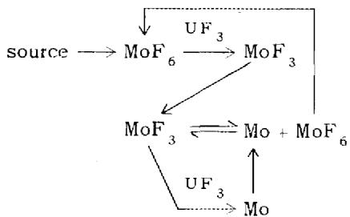

This scheme allows the molybdenum to be "trapped" in the trivalent state until the source of $\mathsf{MoF}_6$ is removed. Then the molybdenum is converted to the metal by the above reactions, which continue to produce the volatile $\mathsf{MoF}_6$ at a decreasing rate until the process is complete. Attention is now being given to experimentally checking this hypothesis with molybdenum concentrations in the ppm range.

# 11.3 MASS SPECTROMETRY OF MOLYBDENUM FLUORIDES

R.A. Strehlow

J. D. Redman

The volatilization behavior of molybdenum and other fission product fluorides in the MSRE has led to a study of molybdenum fluorides. Mass spectrometrically derived information is of particular value in studies involving volatilization, since, at least in principle, the vaporizing species are analyzed with a minimum time lapse. This gives an opportunity to observe some transient phenomena and to distinguish among various oxidation states and impurities which may be present.

The work so far has been concerned with the mass analysis of vapors from three molybdenum fluoride samples. The first objectives were to assess

material purity and to establish the mass spectrometric cracking patterns for these materials which have not previously been subjected to mass analysis. The three samples are designated and described in Table 11.1.

Sample I, during an increase of temperature from 400 to $725^{\circ}\mathrm{C}$ , yielded first $\mathrm{MoO}_2\mathrm{F}_2$ at the lowest temperature. As the temperature was increased, the peaks associated with this species decreased in magnitude and a family of peaks attributed to $\mathrm{MoOF}_4$ appeared. Near the upper limit of the temperature excursion, a mass peak family was observed which is attributed to $\mathrm{MoF}_5$ and $\mathrm{MoF}_3$ vapor species. The large amount of volatile oxides indicated that an oxidation-hydrolysis had occurred and that better, or at least fresher, material was needed. A somewhat increased amount of mass 96 was observed from this sample, which is attributed to orthosilicic acid $(\mathrm{H}_4\mathrm{SiO}_4)$ rather than to the molybdenum, since its peak height was not a constant multiple of the other $\mathrm{Mo}^{+}$ peak heights.

Sample II, $\mathrm{MoF}_3$ , was prepared by C. F. Weaver and H. A. Friedman and was heated in the Knudsen cell inlet system of the Bendix time-of-flight mass spectrometer. The compound $\mathrm{MoO}_2\mathrm{F}_2$ was not observed, but some $\mathrm{MoOF}_3$ was evident (along with the usual $\mathrm{SiF}_{3,2,1}$ ions) at temperatures as low as $350^{\circ}\mathrm{C}$ . Beginning at $275^{\circ}\mathrm{C}$ , $\mathrm{MoF}_5^+$ , $\mathrm{MoF}_4^+$ , $\mathrm{MoF}_3^+$ , $\mathrm{MoF}_2^+$ , and $\mathrm{MoF}^+$ were also observed. The $\mathrm{MoF}_5^+/ \mathrm{MoF}_4^+$ peak height ratio was about unity, indicating some $\mathrm{MoF}_6$ as well as $\mathrm{MoF}_5$ (or $\mathrm{MoF}_4$ ). We have insufficient evidence to demonstrate that $\mathrm{MoF}_4$ has been part of our sampled vapor. At temperatures greater than $600^{\circ}\mathrm{C}$ , only fluoride species were observed. The spectra for sample II at temperatures of 250, 300, and $725^{\circ}\mathrm{C}$ are shown in Fig. 11.1. A photograph of an oscilloscope trace of

Table 11.1. Mass Analysis of Vapors from Three Molybdenum Fluoride Samples   

<table><tr><td>Sample</td><td>Nominal Composition</td><td>Source</td><td></td></tr><tr><td>I</td><td>MoF3</td><td>Exposed to air for several years</td><td>D. E. LaValle, Analytical Chemistry Division</td></tr><tr><td>II</td><td>MoF3</td><td>Recent synthesis</td><td>C. F. Weaver and H. A. Friedman, Reactor Chemistry Division</td></tr><tr><td>III</td><td>MoF5</td><td>Recent synthesis</td><td>C. F. Weaver and H. A. Friedman, Reactor Chemistry Division</td></tr></table>

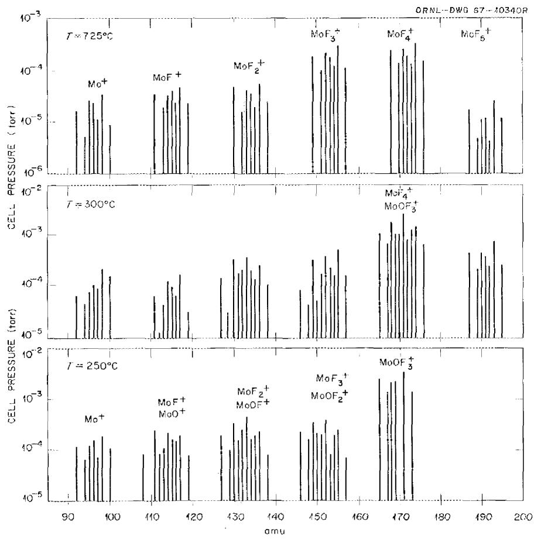  
Fig. 11.1. Mass Spectra of Sample II (MoF $_3$ ) During a Heating Cycle from $250^{\circ}$ C to $725^{\circ}$ C.

the $\mathrm{MoOF}_{2}^{+} / \mathrm{MoF}_{3}^{+}$ , $\mathrm{MoOF}_{3}^{+} / \mathrm{MoF}_{4}^{+}$ , and $\mathrm{MoF}_{5}^{+}$ peaks at $375^{\circ}\mathrm{C}$ is shown in Fig. 11.2. This shows, for illustrative purposes, the combined spectra for the various isotopes and compounds in the mass range from 150 to 194 amu. At $725^{\circ}\mathrm{C}$ the peak height for the $\mathrm{MoF}_{3}^{+}$ relative to the height of the $\mathrm{MoF}_{4}^{+}$ peaks as compared with the spectrum at $375^{\circ}$ allowed calculation of a tentative cracking pattern assigned to $\mathrm{MoF}_{3}$ . This is seen only at elevated temperatures. An impurity at $m / e = 167$ was assigned the probable formula $\mathrm{Si}_{2}\mathrm{OF}_{6}$ .

Mass analysis of these species is facilitated by the unique isotopic abundance ratios of molybdenum isotopes and the difference of 3 amu between oxygen and fluorine. This yields, if one selects adjacent pairs of species from the $\mathrm{MoO}_2\mathrm{F}_2^+ /\mathrm{MoOF}_3^+ /$ MoF $^+$ family of peaks, three unique peaks for each species, allowing a precise calculation of the peak height ratios for the "overlapping" peaks to be

made. The dimer $\mathrm{Mo}_{2}\mathrm{F}_{9}$ has, of course, the 15 peaks which would be expected from the seven stable molybdenum isotopes. Figure 11.3 shows the good agreement between the calculated and the

PHOTO 89172

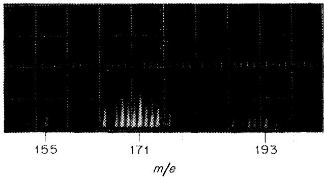  
Fig. 11.2. Oscilloscope Trace of Mass Spectrum of Sample II $(\mathsf{MoF}_3)$ .

observed peak heights for $\mathbf{Mo}_2\mathbf{F}_9^+$ . This, with the observed precision of the analyses of the various families of peaks, gives a satisfactory level of confidence in the applicability of mass spectral information to the molybdenum fluoride studies.

Sample III, $\mathsf{MoF}_5$ , yielded the spectrum shown in Fig. 11.4 at $125^{\circ}\mathrm{C}$ . The presence of $\mathsf{Mo}_2\mathsf{F}_9^+$ is attributed to $\mathsf{Mo}_2\mathsf{F}_9$ rather than to dimer $\mathsf{MoF}_5$ , since $\mathsf{Mo}_2\mathsf{F}_9$ is a reported compound which could be expected to yield a parent ionic species in the spectrometer. The Knudsen cell with the sample in it was removed from the vacuum system, exposed to air for $\frac{1}{2}$ hr, remounted, evacuated, and heated. No species was observed until a temperature greater than $450^{\circ}\mathrm{C}$ was reached. A scan at $525^{\circ}\mathrm{C}$ was made which yielded the spectrum shown in Fig. 11.4. The sole parent species yielding this spectrum appeared to be $\mathsf{MoO}_2\mathsf{F}_2$ .

Cracking patterns have been derived for the various species primarily based on scans in which the dominant or sole species was well characterized. Since $\mathsf{MoF}_6$ has not yet been studied in our equipment, we have assumed the applicability of the reported data (see Table 11.2). Our derived cracking patterns are shown in this table. The compound designation for $\mathsf{MoOF}_4$ is uncertain ( $\mathsf{MoOF}_3$ is possible as far as we know). The compound designated $\mathsf{MoF}_5$ may be a mixture of $\mathsf{MoF}_5$ and perhaps 5 to $10\%$ MoF.

The observation of $\mathbf{Mo}_2\mathbf{F}_9^{\circ +}$ at temperatures of $325^{\circ}C$ and of $\mathbf{MoF}_5$ at temperatures up to $725^{\circ}C$ is noteworthy. The compound $\mathbf{Mo}_2\mathbf{F}_9$ is reported to decompose completely at $200^{\circ}C$ , and $\mathbf{MoF}_5$ is reportedly not stable at the temperatures at which we have observed it. One may, therefore, infer that the free energies of formation of these fluorides per fluorine atom are so nearly equal that kinetic factors are expected to dominate the descriptive chemistry of these substances.

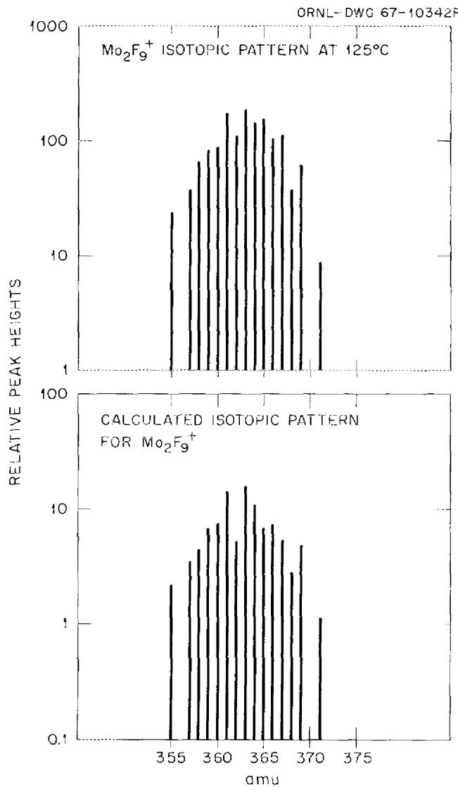  
Fig. 11.3. Comparison of Calculated and Observed Isotopic Abundance for the Dimer $\mathsf{Mo}_2\mathsf{F}_9$

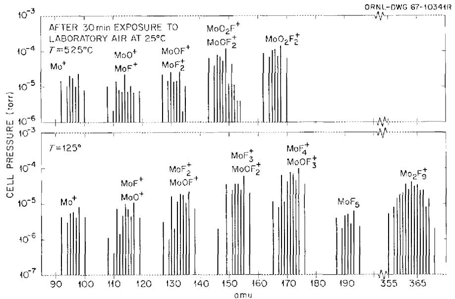  
Fig. 11.4. Mass Spectra of Sample III $(\mathsf{MoF}_5)$ at $125^{\circ}\mathsf{C}$ (Note Dimer, $\mathsf{Mo}_2\mathsf{F}_9^{+}$ ) and at an Elevated Temperature After Exposure to Air.

Table 11.2. Mass Spectrometric Cracking Patterns for Various Molybdenum Compounds   

<table><tr><td colspan="2">MoF5</td><td colspan="2">MoF3</td><td colspan="2">MoF6a</td><td colspan="2">MoOF4(?)</td><td colspan="2">MoO2F2</td></tr><tr><td>MoF+5</td><td>&lt;7</td><td>MoF3</td><td>100</td><td>MoF5</td><td>100</td><td>MoOF3</td><td>100</td><td>MoO2F2</td><td>100</td></tr><tr><td>MoF4</td><td>100</td><td>MoF2</td><td>15</td><td>MoF4</td><td>30.4</td><td>MoF3</td><td>6</td><td>MoO2F</td><td>65</td></tr><tr><td>MoF3</td><td>56</td><td>MoF+</td><td>10</td><td>MoF3</td><td>17.5</td><td>MoOF2</td><td>10+</td><td>MoOF2</td><td>6</td></tr><tr><td>MoF2</td><td>18</td><td>Mo+</td><td>10</td><td>MoF2</td><td>13.1</td><td>MoF2</td><td>11</td><td>MoF2</td><td>2</td></tr><tr><td>MoF+</td><td>8</td><td></td><td></td><td>MoF+</td><td>6.9</td><td>MoOF+</td><td>10</td><td>MoOF+</td><td>23</td></tr><tr><td>Mo+</td><td>8</td><td></td><td></td><td>Mo+</td><td>4.5</td><td>MoF+</td><td>9</td><td>MoF+</td><td>5</td></tr><tr><td></td><td></td><td></td><td></td><td></td><td></td><td>MoO+</td><td>3.5</td><td>MoO+</td><td>7</td></tr><tr><td></td><td></td><td></td><td></td><td></td><td></td><td>Mo+</td><td>5</td><td>Mo+</td><td>16</td></tr></table>

aFrom J.C.Horton, ORGDP.

# 12. Separation of Fission Products and of Protactinium from Molten Fluorides

# 12.1 EXTRACTION OF PROTACTINIUM FROM MOLTEN FLUORIDES INTO MOLTEN METALS

J. H. Shaffer

F. F. Blankenship

D. M. Moulton

W. R. Grimes

The removal of protactinium from solution in LiF $\mathrm{BeF}_2$ -ThF $_4$ (73-2-25 mole %) by addition of thorium or beryllium metal has been demonstrated as a method for reprocessing the fertile blanket of a two-region molten-salt breeder reactor. $^1$ This investigation has been directed toward the development of a liquid-liquid extraction process where reduced $^{233}\mathrm{Pa}$ would redissolve into a molten metal phase for subsequent back extraction by hydrofluorination into a second storage salt mixture. Upon its radiolytic decay, fissionable $^{233}\mathrm{U}$ could be returned to the reactor fuel via fluoride volatility.

Earlier experiments on static systems where the simulated blanket salt, in contact with bismuth, was contained in mild steel further substantiated the reduction of protactinium from the salt mixture but failed to demonstrate its quantitative dissolution into the metal phase. Since the extraction method utilizes the molten metal only as a transport medium, the apparent very low solubility of $^{233}\mathrm{Pa}$ or that of its carrier in molten metal is not necessarily detrimental to the process. A dynamic system was constructed and was operated by recirculating bismuth containing dissolved thorium through the simulated blanket mixture. Recovery of protactinium on a steel wool column in the bismuth circuit accounted for about $43\%$ of the $^{233}\mathrm{Pa}$ initially in the salt phase. How-

ever, the recovery of $^{233}\mathrm{Pa}$ was predominantly by filtration rather than by absorption. These filtered solids showed that $^{233}\mathrm{Pa}$ was associated with both iron and thorium.

More recent experiments have been designed to demonstrate the reductive extraction of $^{233}\mathrm{Pa}$ from the blanket salt mixture into molten metal and its back extraction by hydrofluorination into a second salt mixture. This apparatus, shown schematically in Fig. 12.1, contained all liquid phases in graphite to preclude the indicated absorption of $^{233}\mathrm{Pa}$ on solid metal surfaces. The initial experiment of this series demonstrated essentially complete removal of $^{233}\mathrm{Pa}$ from the blanket; only $65\%$ of the $^{233}\mathrm{Pa}$ was found in the recovery salt. The loss of $^{233}\mathrm{Pa}$ in this experiment and in a later experiment was attributed to its absorption on metal particles formed by reduction of iron impurities in the blanket mixture.

The solubility of iron in bismuth at $650^{\circ}\mathrm{C}$ is about 90 ppm. Thus, the addition of a second component to the metal phase which would increase the solubility of iron might promote the ${}^{233}\mathrm{Pa}$ extraction process. The solubility of iron in tin at temperatures proposed for the extraction process is in excess of 1000 ppm. Since tin is completely miscible with bismuth below its melting point of $271^{\circ}\mathrm{C}$ , it was chosen as an additive for bismuth in a recent experiment. In this experiment approximately $1.78\mathrm{kg}$ of the simulated blanket salt, $\mathrm{LiF - BeF}_2$ -ThF (73-2-25 mole %), with $1\mathrm{mc}$ of ${}^{233}\mathrm{Pa}$ was in contact with $2.98\mathrm{kg}$ of bismuth which contained $0.41\mathrm{kg}$ of tin. Approximately $0.533\mathrm{kg}$ of $\mathrm{LiF - BeF}_2$ (60-40 mole %) was also in contact with the molten metal mixture as

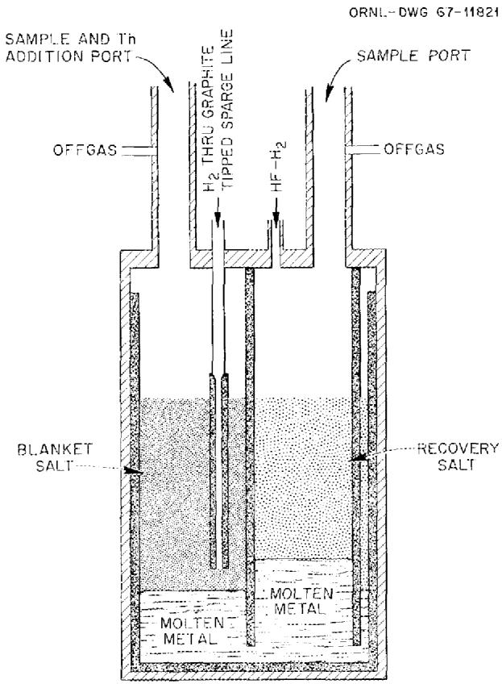  
ALL MATERIAL IN CONTACT WITH SALT AND METAL PHASES IS GRAPHITE   
Fig. 12.1. Extraction Vessel for $^{233}\mathrm{Pa}$ Removal from Molten Fluorides.

a recovery salt. The results of $^{233}\mathrm{Pa}$ transfer during reduction by $\mathrm{Th}^0$ additions to the blanket salt and hydrofluorination of the recovery salt are shown in Fig. 12.2. Approximately $90\%$ of the $^{233}\mathrm{Pa}$ activity was found in the recovery salt mixture, $2\%$ was present in the molten metal phase, and $8\%$ remained in the blanket salt. Thus, this experiment demonstrates quantitative accountability of $^{233}\mathrm{Pa}$ by analyses of samples taken from the three liquid phases. Subsequent experiments will further evaluate the effects of tin, as a metal phase additive, on the extraction process.

# 12.2 STABILITY OF PROTACTINIUM-BISMUTH SOLUTIONS CONTAINED IN GRAPHITE

D. M. Moulton J. H. Shaffer

Previous experiments on the extraction of $^{233}\mathrm{Pa}$ from LiF-ThF $_{4}$ -BeF $_{2}$ into Bi by Th or Li have re-

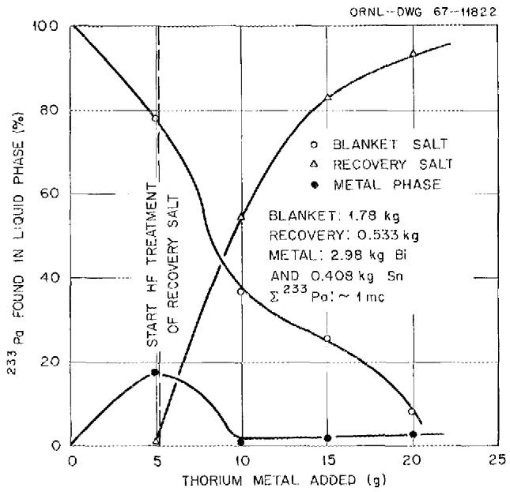  
Fig. 12.2. Extraction of $^{233}\mathrm{Pa}$ from LiF-BeF $_2$ -ThF $_4$ (73-2-25 mole %) by Reduction with Thorium Metal into LiF-BeF $_2$ (60-40 mole %) by Hydrofluorination via Molten Bismuth-Tin Mixture at $650^{\circ}\mathrm{C}$ .

sulted in an apparent disappearance of Pa from the system. It seems as though protactinium is stable as an ion in the salt, and only begins to act peculiarly when it enters the liquid metal phase. We accordingly carried out an experiment in which thorium irradiated to produce $^{233}\mathrm{Pa}$ was dissolved in and kept in bismuth in an all-graphite apparatus. Data obtained in this experiment are shown in Fig. 12.3, upon which the $^{233}\mathrm{Pa}$ decay curve has been superimposed.

The solution of 1 mc of protactinium with carrier thorium showed an initial $^{233}\mathrm{Pa}$ count about one-third of that expected on the basis of 1-mc solutions made previously in salt. The protactinium stayed constant (though with wide scatter) for 16 days at 600 and $750^{\circ}\mathrm{C}$ with more thorium addition. When the metal was cooled to $350^{\circ}\mathrm{C}$ so that $\sim 98\%$ of the thorium should precipitate, the protactinium fell (after an unexplained one-day lag) to $\sim 12\%$ of its former value. Reheating to $700^{\circ}\mathrm{C}$ and then to $725^{\circ}\mathrm{C}$ (where all of the thorium should redissolve) brought the protactinium back to only $30\%$ of its initial value. When salt was added, protactinium did not appear until enough $\mathrm{BiF}_3$ had been added to oxidize half the thorium added; then 82 to $86\%$ of it appeared in the salt phase. In fact, protactinium should not have appeared until practically all the thorium was oxidized, so there must have been about a $50\%$ reductant loss.

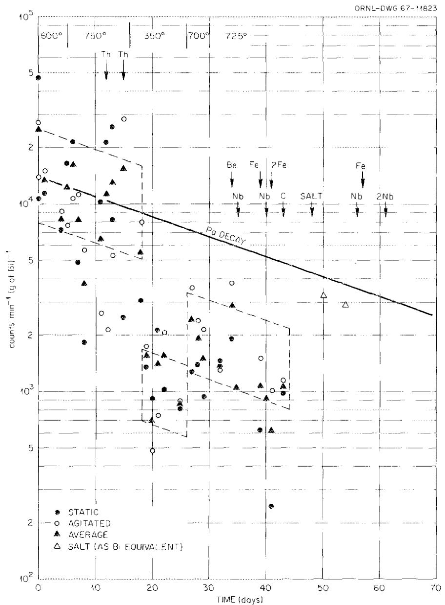  
Fig. 12.3. Stability of Solutions of Protactinium in Bismuth.

Behavior of this sort cannot be explained by a simple mechanism. However, slow reversible adsorption (negligible at high temperature) followed by irreversible diffusion into a solid (but oxidizable) phase is consistent with the data. This phase does not seem to be the thorium-bismuth intermetallic. After the cooling step, the metal samples, which were taken with an open dipper, tended to show more protactinium when the liquid metal was being stirred

vigorously, suggesting that the protactinium was on a dispersed phase rather than on the vessel walls.

Stripes of various metals were immersed for 5 min and 2 hr in the bismuth to see how much protactinium was adsorbed; results are shown in Table 12.1. When the metals were dipped directly into bismuth, niobium picked up the most protactinium, with beryllium, iron, and carbon picking up less (carbon, much less). Adsorption on iron reached about one-third of its 2-hr

Table 12.1. Adherence of Protactinium to Metal Samples at ${725}^{ \circ  }\mathrm{C}$   

<table><tr><td rowspan="2">Metal</td><td rowspan="2">Exposure Time</td><td rowspan="2">Area (cm2)</td><td colspan="2">Pa on Metal (counts/min)</td><td rowspan="2">Pa in Bi (counts min-1g-1)</td><td colspan="2">Bi Equivalent to Counts of Pa (g)</td></tr><tr><td>Total</td><td>Per cm2</td><td>Total</td><td>Per cm2</td></tr><tr><td></td><td></td><td></td><td>×104</td><td>×104</td><td>×103</td><td></td><td></td></tr><tr><td>Be-1</td><td>2 hr</td><td>5.52</td><td>6.27</td><td>1.14</td><td>5.9</td><td>11</td><td>1.9</td></tr><tr><td>Nb-1</td><td>2 hr</td><td>5.22</td><td>15.4</td><td>2.95</td><td>5.8</td><td>27</td><td>5.1</td></tr><tr><td>Fe-1</td><td>2 hr</td><td>5.52</td><td>2.84</td><td>0.514</td><td>5.2</td><td>5.5a</td><td>0.99</td></tr><tr><td>Nb-2</td><td>2 hr</td><td>4.34</td><td>11.2</td><td>2.58</td><td>5.1</td><td>22a</td><td>5.1</td></tr><tr><td>Fe-2</td><td>5 min</td><td>5.52</td><td>0.796</td><td>0.144</td><td>4.9</td><td>1.6</td><td>0.29</td></tr><tr><td>Fe-3</td><td>2 hr</td><td>5.52</td><td>2.59</td><td>0.469</td><td>4.9</td><td>5.3a</td><td>0.96</td></tr><tr><td>C-1</td><td>2 hr</td><td>11.94</td><td>0.170</td><td>0.014</td><td>4.7</td><td>0.36</td><td>0.03</td></tr><tr><td colspan="8">After C-1, a salt layer of 72.5 mole % LiF and 27.5 mole % BeF2was added to the experiment. Metal samples were held in this salt for about 2 hr to remove surface oxides before exposure to the bismuth.</td></tr><tr><td>Nb-3</td><td>2 hr</td><td>4.34</td><td>0.292</td><td>0.0673</td><td>3.4</td><td>0.86</td><td>0.20</td></tr><tr><td>Nb-4</td><td>5 min</td><td>4.34</td><td>1.07</td><td>0.247</td><td>3.0</td><td>3.6</td><td>0.82</td></tr><tr><td>Nb-5</td><td>2 hr</td><td>4.34</td><td>0.617</td><td>0.142</td><td>3.0</td><td>2.1</td><td>0.47</td></tr><tr><td>Fe-4</td><td>2 hr</td><td>5.52</td><td>3.66</td><td>0.663</td><td>3.3</td><td>11</td><td>2.0</td></tr></table>

aWeight gain (adhering bismuth) less than 1 g. Pa counted differentially at 305 to 315 kev.

value in 5 min. When the metals had been exposed to salt to remove oxides, the amounts of adsorption were similar; but now, niobium picked up less protactinium than did iron, and the process was much faster. In all cases the protactinium adsorbed was not a large amount of the total.

# 12.3 ATTEMPTED ELECTROLYTIC DEPOSITION OF PROTACTINIUM

D. G. Hill5 H. H. Stone

A number of unsuccessful attempts to deposit protactinium electrolytically from molten fluoride mixes have been reported.6,7 None of these experiments involved the use of a standard reference electrode such as the hydrogen-hydrogen fluoride couple.8 Summarized here are an experiment to

measure the deposition potential for thorium by using an $\mathbf{H}_2$ -HF anode and a nickel cathode, and an unsuccessful attempt to deposit protactinium with the same electrolytic cell.

A nickel pot was fabricated for these experiments. The salt compartment had a diameter of 2.5 in. and was 8 in. high. It was fitted with two 0.5-in.-ID chimneys welded to the top of the pot and extending 9 in. above the pot, high enough above the furnace to permit the use of Teflon insulators for the electrodes or electrode supports. One of the chimneys also extended to $1\mathrm{cm}$ above the bottom of the pot, and it was closed at the lower end by porous nickel filter material. Thus anode and cathode compartments were isolated in such a manner that bulk diffusion would be very slight, but ions could migrate between electrodes.

The pot was loaded with $1556\mathrm{g}$ of purified LiF- $\mathrm{BeF}_2\text{-ThF}_4$ (73-2-25 mole%). We calculated that the material would have a volume of $275~\mathrm{cm}^3$ at $600^{\circ}\mathrm{C}$ and would fill the pot to a depth of $9\mathrm{cm}$ at this temperature. Initially, $\frac{1}{8}$ -in. nickel tubing was inserted in both chimneys so that gas could be passed through each compartment. A cylinder of platinum gauze closed at the bottom and extending $1.5\mathrm{cm}$ below the end of the tube was tightly wired

to the end of the nickel anode. A mixture of $\mathrm{H}_{2}$ and HF that passed through this electrode established the reaction at the anode as

$$
1 / 2 \mathrm {H} _ {2} + \mathrm {F} ^ {-} = \mathrm {H F} + \mathrm {e} ^ {-}.
$$

The cathode reaction was the deposition of any of the cations present, particularly thorium at above its deposition potential, and hopefully protactinium after it was added to the melt.

For the preliminary study of the decomposition potential of $\mathrm{ThF}_4$ , the vessel was maintained at $650^{\circ}\mathrm{C}$ while the cathode compartment was swept for 3 hr with HF and then overnight with $\mathbf{H}_{2}$ . The cathode compartment was capped both at the inlet and the outlet, and a stream of $\mathrm{HF - H_2}$ was introduced through the anode tube. The gas flow was adjusted to approximately $100~\mathrm{cm}^3 /\mathrm{min}$ . The mixture was analyzed at the exit tube and was found to contain 3.8 mole % HF.

Electrolysis was performed with dry cells as the source of power. The voltage was tapped off a slide-wire voltage divider, and simultaneous readings were taken of the voltage and the current. Four runs were made, starting each time at zero voltage and measuring the current at 0.2-v intervals. The plot of current vs voltage given in Fig. 12.4 shows a decomposition potential in this cell of $-0.86\mathrm{v}$ .

The mole fractions of each of the reactants are related by the equation

$$
\begin{array}{l} E = E _ {0} - \frac {R T}{F} \ln \frac {[ \mathrm {H F} ]}{[ \mathrm {H} _ {2} ] ^ {1 / 2} [ \mathrm {T h F} _ {4} ] ^ {1 / 4}}, \\ - 0. 8 6 = E _ {0} - \frac {4 . 5 9 (9 2 3)}{2 . 3 \times 1 0 ^ {4}} \\ \end{array}
$$

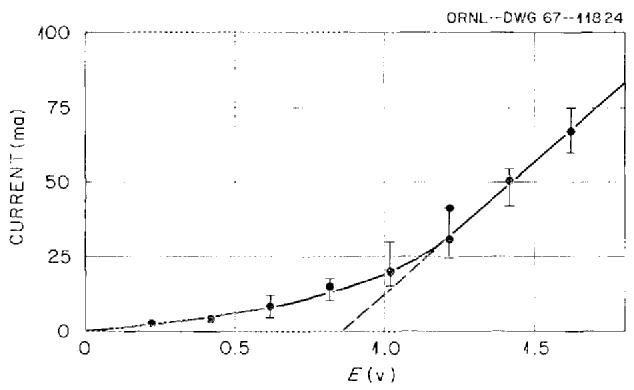  
Fig. 12.4. Current-Voltage Curve.

$$
\times \log \frac {(0 . 0 3 8)}{(0 . 9 6 2) ^ {1 / 2} (0 . 2 5) ^ {1 / 4}}, \tag {1}
$$

from which $E_0 = -1.09$ is calculated for the reaction

$$
2 \mathrm {H} _ {2} + \mathrm {T h F} _ {4} = 4 \mathrm {H F} + \mathrm {T h}.
$$

After completing these measurements the flow of HF was cut off, while $\mathrm{H}_{2}$ flow continued. After 1 hr, both electrodes were raised out of the melt, and the $\mathrm{H}_{2}$ flow was allowed to continue until the pot was cold.

For the study of protactinium removal, the cathode compartment was opened with as much care as possible to avoid the entrance of moisture, and to that compartment was added $5\mathrm{g}$ of $\mathbf{LiF - ThF}_4$ which had been irradiated in a reactor to give a $^{233}\mathrm{Pa}$ activity of about $1\mathrm{mc}$ . The salt also contained approximately $27\mathrm{mg}$ of $^{231}\mathrm{Pa}$ . The vessel was closed and installed in the furnace in a glove box in the High-Alpha Molten-Salt Laboratory. After HF treatment for $4\mathrm{hr}$ , followed by $\mathbf{H}_2$ overnight, a filtered salt sample was counted for $^{233}\mathrm{Pa}$ .

The anode gas mixture was adjusted to be approximately the same as that used in the previous run except that a slightly higher HF concentration, 7.5 mole $\%$ was used. The decomposition potential for $\mathrm{ThF}_4$ at this concentration of HF from Eq. (1) should be $-0.92\mathrm{v}$ , so electrolysis was carried out at $-0.90\mathrm{v}$ . The current averaged about $10\mathrm{ma}$ , although it was less for the first $20\mathrm{min}$ , after which it rose rather rapidly to the $10\mathrm{-ma}$ value expected from the earlier experiment. Assuming $100\%$ Faraday efficiency, the deposition of $27\mathrm{mg}$ of protactinium would require $75\mathrm{min}$ at $10\mathrm{ma}$ . Electrolysis was carried out for $165\mathrm{min}$ , more than twice the minimum time for complete deposition.

The gas at the end of the experiment contained only $4.1\mathrm{~mol}\% \mathrm{HF}$ , although the $\mathrm{H}_{2}$ rate was unchanged. There is no indication at what time during the electrolysis the decrease in HF occurred. At this lower concentration of HF the decomposition potential is calculated to be $-0.87\mathrm{v}$ ; so that if the decrease in rate took place early in the electrolysis period, the applied potential was too high.

At the conclusion of the run the cathode was raised out of the melt, thus interrupting electrolysis. A sample of melt was then taken, and both cathode and sample were counted with a multichannel analyzer.

The sample of melt gave essentially the same count as before electrolysis. A number of gamma peaks were observed in the cathode spectrum, but none corresponded to the $^{233}\mathrm{Pa}$ peaks, which were strong in the

melt sample. The location of the peaks and the limited data on their decay rates indicate that these activities can be attributed to various members of the thorium decay series, such as $^{212}\mathrm{Pb}$ , $^{212}\mathrm{Bi}$ , and $^{208}\mathrm{Tl}$ , although insufficient decay rate data were obtained for conclusive identification. The lack of $^{233}\mathrm{Pa}$ activity on the cathode, coupled with almost identical counts on samples of melt taken before and after electrolysis, indicated that deposition of a significant amount of protactinium on the cathode did not take place in this experiment.

The failure to reduce protactinium in this experiment may be explained by its low concentration in the melt. The amount added, $27\mathrm{mg}$ in $1556\mathrm{g}$ of $\mathrm{LiF - BeF}_2\cdot \mathrm{ThF}_4$ is approximately equal to a mole fraction of $2\times 10^{-5}$ . If the protactinium is four-valent in the melt, and if it is assumed that its $E_0$ is close to that of thorium, that is, $1\mathrm{v}$ , the potential required to reduce it at that concentration and at the $\mathrm{HF - H}_2$ ratio used in the electrolysis is $1.007\mathrm{v}$ . The very small denominator makes the logarithm term positive, so that the reduction potential is even more negative than $E_0$ in spite of the low HF pressure.

The same argument would deny that protactinium can be reduced by thorium at this concentration, which is contrary to fact. The nickel cathode did not provide a low-activity alloy in this attempt. This suggests the possibility of using a cathode that would form a thorium alloy in which protactinium dissolves at low enough activity to permit reaction. For further experiments of this type we recommend a potential of 1.1 v, at which thorium will be deposited, hopefully, along with protactinium, and stopping the experiment when five equivalents of thorium have been deposited. This would give a concentration of about 0.2 for protactinium in the metal, and thus a low enough activity to permit reduction of essentially all the protactinium.

# 12.4 PROTACTINIUM STUDIES IN THE HIGH-ALPHA MOLTEN-SALT LABORATORY

C.J.Barton H.H.Stone

In the previous progress report7 we mentioned the possibility that iron coprecipitated with protactinium, when solid thorium was exposed to molten LiF-ThF4, might be carrying the reduced protactinium to the steel wool surface in the Brillo process. It was also pointed out that variable iron analyses made it difficult to determine the role of iron in protactinium re

duction experiments. We performed one reduction experiment with $^{59}\mathrm{Fe}$ tracer dissolved in LiF-ThF $_4$ (73-27 mole %) in the absence of protactinium, and the results are summarized below. Most of the protactinium recovery experiments performed during the current report period were thorium reduction tests. An unsuccessful effort to deposit protactinium electrolytically is discussed in the preceding section of this report.

# Reduction of Iron Dissolved in Molten LiF-ThF4

We studied the reduction of iron dissolved in molten LiF-ThF $_4$ (73-27 mole %) by using hydrogen and metallic thorium as the reducing agents. The tracer iron results indicated that more than 40 hr was required to reduce the iron concentration from 330 to 2 ppm with hydrogen at a temperature of $600^{\circ}\mathrm{C}$ . During a 3-hr exposure to metallic thorium at the same temperature, the iron concentration in filtered samples, calculated from tracer counts, diminished from 550 to 13 ppm.

Colorimetric iron determinations performed by two different laboratories agreed with the tracer iron data for about half the samples. In general, agreement was poorest for samples that gave $^{59}\mathrm{Fe}$ counts indicating an iron concentration less than $0.1\mathrm{mg / g}$ . It appears that the colorimetric iron method tends to give high results with samples having a low iron concentration. This finding is in agreement with results of earlier unpublished studies performed by Reactor Chemistry Division personnel.

The results of this experiment will be discussed in more detail in another report.

# Thorium Reduction in the Presence of an Iron Surface (Brillo Process)

One Brillo experiment of the type discussed in the previous report7 was performed during this report period. A salt solvent, LiF-ThF4 (73-27 mole %), containing initially 17 mg of 231Pa and 57 mg of Fe was exposed to thorium rods for two 1-hr periods in the presence of 4 g of steel wool (0.068 m2 per g of surface area). The tracers 233Pa and 59Fe were added to aid in following the behavior of these elements in the experiment. The first thorium exposure removed 95% of the protactinium, as determined by analysis of a filtered sample of salt, and almost all the iron. The second thorium exposure resulted in only a slight further decrease in protactinium con

centration (97% removed). The distribution of protactinium was as follows: 72.8% in the steel wool plus untransferred salt, 4.3% in the unfiltered salt transferred away from the steel wool, 8.7% in the steel liner and dip leg, and 12.0% in samples, for a total of 97.8% recovered. The data obtained in this experiment confirmed the results of previously reported experiments that indicate the Brillo process may warrant further examination.

# Thorium Reduction Followed by Filtration

We reported earlier6 that a large fraction of the reduced protactinium that would not pass through a sintered copper filter was found in samples of unfiltered salt. This suggested the possibility of collecting the reduced protactinium on a metal filter from which it could presumably be removed by dissolving it in a molten salt after passing HF through the filter. We performed several experiments to test the efficiency of protactinium recovery by filtration. The initial treatment of molten LiF-ThF4 (73-27 mole %) mixed with enough 231Pa to give a concentration of 20 to 60 ppm was performed in unlined nickel pots. The molten salt was treated first with mixed hydrogen and HF, followed by a brief hydrogen treatment before it was transferred through a nickel filter into a graphite-lined pot equipped with a graphite dip leg. Here the reduction of protactinium was carried out in the usual fashion, either by exposure to a solid thorium rod or to thorium turnings suspended in a nickel basket, taking samples of filtered and unfiltered salt after each thorium treatment of the melt. The reduced melt was then transferred back into the nickel pot through the transfer filter.

In four experiments the amount of protactinium found in the transfer filter varied from 10 to $30\%$ of the total amount present. This represented 40 to $95\%$ of the amount of protactinium suspended in the reduced salt (average, $69\%$ ). The amount of protactinium in the graphite liner and dip leg varied from 20 to $57\%$ of the total (average, $33\%$ ). The data show that a filtration method will not catch protactinium on the filter, but nevertheless the removal of protactinium from a melt does appear feasible.

One experiment was attempted with a niobium liner and dip leg. The reduction of protactinium with thorium proceeded normally (12% of the Pa remained in the filtered salt after 2 hr of thorium treatment), but transfer of the reduced salt through the filter could not be effected because of a clogged

filter. A considerable amount of grayish material was found in the bottom of the pot after it cooled to room temperature. A sample of this material was reported to contain only $0.35\mathrm{mg}$ of $\mathbf{N}\mathbf{b}$ per g, but it is quite possible that this amount of impurity in the molten salt would have been sufficient to clog the filter.

The effect of iron on the behavior of protactinium in thorium reduction experiments has not been defined unambiguously as yet, but we continue to find reasonably good correlation between the distribution of iron and protactinium in these experiments. Counting of $^{233}\mathrm{Pa}$ and $^{59}\mathrm{Fe}$ in both solid samples and solutions of samples provided a check on the accuracy of $^{231}\mathrm{Pa}$ alpha pulse-height analyses and colorimetric iron determinations.

# Conclusion

Thorium metal is an effective agent for reducing protactinium in molten fluoride breeder blanket mixtures, but further study will be required to determine the best method of separating the reduced protactinium from the salt mix.

# 12.5 MSBR FUEL REPROCESSING BY REDUCTIVE EXTRACTION INTO MOLTEN BISMUTH

D. M. Moulton

W. R. Grimes

F. F. Blankenship

J. H. Shaffer

An electromotive series for the extraction of fission products from $2\mathrm{LiF}\cdot \mathrm{BeF}_2$ into liquid bismuth has been constructed in the way described for the MSBR blanket materials in the preceding report in this series. Briefly, standard half-cell reduction potentials are calculated for each metal, using as the standard states the ideal solutions in salt and bismuth extrapolated from infinite dilution to unit mole fraction. The exception is lithium, for which the standard state in salt is $2\mathrm{LiF}\cdot \mathrm{BeF}_2$ . (This standard state is also used for beryllium, but it is not assigned a standard state in bismuth because of its very low solubility.) This choice of standard states is the normal practice when dealing with dilute solutions. These standard potentials are called $\mathbb{S}_0^{\prime}$ to distinguish them from $\mathbb{S}_0$ ,

the standard potential for reduction to pure metal. Thus, $\mathbb{S}_0^{\prime}$ is the potential corresponding to the extraction process and does not require the simultaneous use of metal activity coefficients that are far from 1 at infinite dilution.

It should perhaps be noted that the electromotive series is thermodynamically equivalent to other means of expressing the free energy of the extraction process, such as equilibrium constants or decontamination factors. It is used because it permits ranking the metals in an order which directly indicates their relative ease of extraction regardless of their ionic valence and because it has proven useful in the experiments where a beryllium reference electrode is used to monitor the reduction process.

From data previously reported10 the series has been constructed as shown in Table 12.2. The numbers in parentheses after the rare earths are the potentials calculated by using the experimental fractional valences. For beryllium, $\mathbb{C}_0$ , the potential for reduction to the pure metal, is shown. All of these except $\mathrm{Be}^{2+}$ are calculated relative to the $\mathrm{Li}^+$ value.

Although better measurements may change these values somewhat, they indicate the relative ease of extraction. The numbers in parentheses are probably a better approximation to the true values despite the peculiar valences. All elements up through europium can be extracted completely before metallic beryllium begins to form; this formation of $\mathrm{Be}^0$ represents the ultimate limit of the process. An order of magnitude change in the ratio [(mole fraction in metal)/(mole fraction in salt)] corresponds to 0.087 v for divalent and 0.058 v for trivalent species.

Table 12.2. $= \sum_{0}^{n} a_{i}$ at $600^{\circ} \mathrm{C}$ (volts vs $H_2 - HF = 0.00$ )   

<table><tr><td>Li+</td><td>1.92</td><td></td></tr><tr><td>Be2+</td><td>1.81</td><td>(C0)</td></tr><tr><td>Ba2+</td><td>1.79</td><td></td></tr><tr><td>Eu2+</td><td>1.62</td><td>(1.61)</td></tr><tr><td>Nd3+</td><td>1.58</td><td>(1.51)</td></tr><tr><td>Sm2+</td><td>1.58</td><td>(1.49)</td></tr><tr><td>Ce3+</td><td>1.57</td><td>(1.45)</td></tr><tr><td>La3+</td><td>1.52</td><td>(1.47)</td></tr></table>

We have begun a reinvestigation of fission product extraction. In this study we will measure fission product distribution as a function both of lithium concentration and of temperature with (hopefully) improved accuracy. Preliminary results of the first of this series, using cerium, are shown in Fig. 12.5. A failure ended the experiment before good concentration data could be gotten, but those we did get indicate a valence close to 3, not 2.3 as before. The apparent minimum of $\tilde{C}_0^{\prime}$ (Ce) at $700^{\circ}C$ is not explained and is rather hard to believe. For lithium, $\tilde{C}_0^{\prime}$ was calculated from the measured lithium concentration and the potential between the bismuth pool and beryllium metal electrode, for which the temperature coefficient is known. $^{11}$ The

$^{10}$ MSR Program Semiann. Progr. Rept. Feb. 28, 1966, ORNL-3936, p. 141.   
11C.F.Baes, Jr., Reactor Chem. Div. Ann. Progr. Rept. Dec. 31, 1965, ORNL-3913, p. 20.

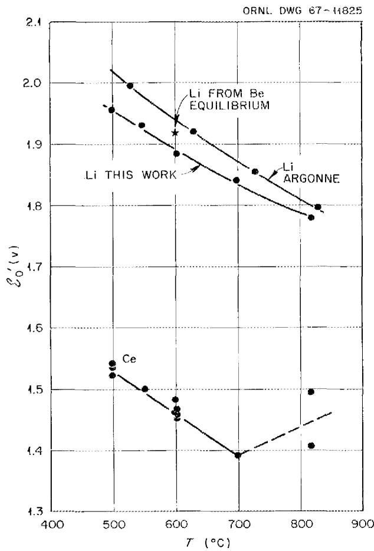  
Fig. 12.5. $\xi_0^{\prime}$ for Lithium and Cerium.

point marked with a cross is the value of $\mathfrak{S}_{0(Li)}^{\prime}$ found earlier by equilibrating metallic beryllium with Li-Bi amalgams. Its distance from the line in this experiment may be the result of slightly increased lithium activity at higher concentration $[X_{Li(Bi)} = 0.16]$ . The line marked "Argonne" is $\mathfrak{S}_{0}^{\prime}$ for lithium calculated from the data of Foster and Eppley $^{12}$ on the excess chemical potential of Li in Bi. The rather small uncertainty here probably does not matter much in the separation process, but it is important, in preparing the electromotive series, to refer all potentials to the same lithium or beryllium potential. The potentials at $600^{\circ}\mathrm{C}$ measured in this experiment are $-1.89$ , $-1.81$ , and $-1.46$ for Li, Be, and Ce respectively.

The extraction coefficients for the reaction are given in Table 12.3. This method of presentation shows more clearly than the potentials the substantial decrease in extraction with rising temperature.

The difference between this value of $Q$ at $600^{\circ} \mathrm{C}$ and that reported earlier by Shaffer13 is mainly due to his use of 2.3 rather than 3 as the exponent.

The extraction equilibria look very favorable for using this process in MSBR fuel reprocessing. Recovery of $^7\mathrm{Li}$ from the bismuth will be helpful and should not be difficult. A perplexing problem which has occurred frequently is the apparent loss of total reductant species during the course of the extraction. The extent of this loss is not easy to measure because of uncertainties in the lithium analyses, but averages 25 to $50\%$ of the lithium added. We think we have eliminated the possibility that the loss is due to extraneous reactions such as lithium volatilization, dissolution of Li, $\mathrm{Be}$ , or $\mathrm{Bi}^{3-}$ in the salt, or formation of solid beryllium or beryllides. In the Zr-U separation, the usual experimental technique was changed to minimize the possibility of air coming in the access ports (normally filled with hot helium) during additions or sampling. The reductant loss was cut sharply to $\sim 10\%$ , which is within the accuracy of the measurements. In another experiment we observed a substantial increase in oxide content over the initial value; because of probable $\mathrm{BeO}$ precipitation, the amount of oxygen added could not be

Table 12.3. Extraction Coefficient for Cerium Extraction into Bismuth   

<table><tr><td colspan="2">XCe(m)/XCe(s) = Q · X3Li(m)</td></tr><tr><td>Q</td><td>T (℃)</td></tr><tr><td>9.1 × 108</td><td>496</td></tr><tr><td>4.0 × 108</td><td>545</td></tr><tr><td>8.7 × 107</td><td>600</td></tr><tr><td>2.1 × 107</td><td>697</td></tr><tr><td>2.1 × 105</td><td>817</td></tr></table>

determined. A few back oxidations with a measured amount of $\mathbf{BiF}_3$ have given more or less $100\%$ efficiency, indicating that no unknown reduced species takes part in the reoxidation step. It seems, therefore, that at least a substantial part of the reductant loss is due to air entry and can be eliminated by improved experimental techniques. Since there is no evidence that any other reduction process is going on, we do not feel that this reductant balance anomaly in the laboratory experiments will have any important bearing on the process when it is put on a practical scale.

# 12.6 REDUCTIVE EXTRACTION OF CERIUM FROM LiF-BeF $_2$ (66-34 MOLE %) INTO Pb-Bi EUTECTIC MIXTURE

W.J.Hunt14 W.E.Bull1S J.H.Shaffer

Current investigations on liquid-liquid extraction as a method for reprocessing the MSBR fuel are directed toward the use of bismuth-lithium mixtures for removing fission products from the reactor fuel solvent. A complementary program will survey other metal phase extractants for possible adaptation in the reprocessing method. This proposed experimental program will treat the distribution of cerium, for reference purposes, between $\mathrm{LiF - BeF}_2$ (66-34 mole %) and various molten metal mixtures

as functions of temperature and metal-phase composition. Experimental procedures will essentially duplicate those developed for the primary program. The results presented here on the reductive extraction of cerium from $\mathrm{LiF - BeF}_2$ (66-34 mole %) into the Bi-Pb eutectic mixture (56.3 at. % Bi) are the first of this experimental program.

As in previous related experiments, the distribution of cerium between the two liquid phases was followed as a function of the lithium concentration in the metal phase. However, only small fractions of lithium added incrementally to the metal phase remained in solution under equilibrium conditions. Typical results obtained at $700^{\circ}\mathrm{C}$ (Fig. 12.6) show that only $32\%$ of the cerium could be removed from the salt phase. In addition, analysis of the metal phase could account for no more than 1 to $2\%$ of the cerium activity. Variations in temperature from 500 to $700^{\circ}\mathrm{C}$ had little or no effect on either the distribution of cerium between the two phases or on the lithium concentration of the metal phase.

Attempts were made initially to measure the electrical potential between a beryllium metal electrode inserted in the salt phase and the molten metal pool. Despite short contact periods of the $\mathrm{Be}^0$ rod with the salt mixture, substantial quantities of cerium activity accumulated on the beryllium electrode. A large fraction of cerium activity missing from the two liquid phases collected on the beryllium electrode during its accidental overnight exposure to the salt mixture.

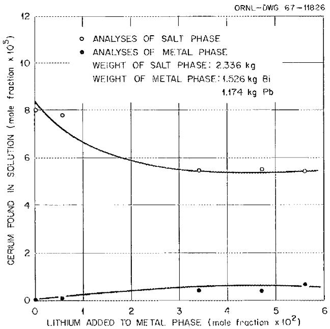  
Fig. 12.6. Reductive Extraction of Cerium from LiF-BeF $_2$ (66.34 mole %) into Molten Lead-Bismuth Eutectic Mixture at $700^{\circ}\mathrm{C}$ .

Although the results of this experiment are somewhat inconclusive, they indicate that solid rare-earth beryllides might be stable in this extraction system. Because of this rather pronounced effect of lead, the system Pb-Bi can probably be excluded from use in the liquid-liquid extraction process for rare-earth removal from the MSBR fuel solvent.

# 13. Behavior of $\mathbf{BF}_3$ and Fluoroborate Mixtures

# 13.1 PHASE RELATIONS IN FLUOROBORATE SYSTEMS

C. J. Barton

J. A. Bornmann1

L. O. Gilpatrick

H. Insley

T. N. McVay

H. H. Stone

Interest in low-melting, low-cost molten salts for use as the coolant in molten-salt breeder reactors has prompted reexamination of phase relations in fluoroborate systems. The system $\mathrm{NaBF}_{4}$ KBF was studied earlier at this Laboratory, while Selivanov and Stender reported low-melting eutectics in the systems NaF-NaBF and KFB. More recently, Pawlenko investigated the ternary system KBF-KF-KBF OH and its associated binary systems. Varying melting points reported in the literature for the compounds NaBF and KBF indicated the need for pure compounds and care in heating them to prevent hydrolysis or loss of BF.

We found that recrystallization of commercial preparations of $\mathrm{NaBF}_4$ and $\mathrm{KBF}_4$ from dilute hydrofluoric acid solutions, usually $0.5M$ , gave compounds with higher melting points than any previously reported. We find $569^{\circ}\mathrm{C}$ for $\mathrm{KBF}_4$ (previous high, $552^{\circ})^{5}$ and $406^{\circ}\mathrm{C}$ for $\mathrm{NaBF}_4$ (previous high, $368^{\circ}$ ). The differential thermal analysis (DTA) $^6$ melting curve for $\mathrm{KBF}_4$ was much

sharper than that of $\mathrm{NaBF}_4$ ; this probably indicates higher purity of the potassium compound, but repeated crystallizations of $\mathrm{NaBF}_4$ from dilute HF solutions failed to give a preparation having a melting point above $406^{\circ}$ . We are considering alternative methods of purifying this compound.

The principal techniques used in the investigation of phase relations in fluoroborate systems were DTA and quenching. By use of these techniques we have examined the binary systems NaF-NaBF and KF-KBF as well as the compound joins NaBF-KBF and NaF-KBF in the ternary system NaF-KF-BF. Diagrams for these systems are presented in Figs. 13.1 to 13.4. All except NaBF-KBF are simple eutectic systems, although a small thermal effect at $435^{\circ}\mathrm{C}$ in KBF-rich NaF-KBF mixtures suggests that the compositions used were slightly off the compound join and that a small amount of NaF-KF-KBF eutectic liquid was formed. Large thermal effects due to the KBF phase transition $(283\pm 2^{\circ}\mathrm{C})$ and the NaBF transition $(243\pm 2^{\circ}\mathrm{C})$ were noted in the DTA curves. Efforts to retain the high-temperature forms of the pure compounds and their mixtures with NaF or KF by rapid quenching were unsuccessful.

The phase diagram for the NaF-NaBF $_4$ system (Fig. 13.1) indicates that the previously reported data on this system $^4$ showing a eutectic melting at $304^{\circ}\mathrm{C}$ and containing 37.5 wt $\%$ NaBF $_4$ is grossly in error. The most recently reported work $^5$ on the KF-KBF $_4$ system agrees with our data (Fig. 13.2) on the location of the eutectic composition, but we found that the eutectic temperature was $14^{\circ}$ higher than reported. We found no evidence of the compounds KF·KBF $_4$ and KF·2KBF $_4$ reported $^5$ in this system. The system NaF-KBF $_4$ (Fig. 13.3) has apparently not been studied by other investigators. The diagram for the NaBF $_4$ -KBF $_4$ system (Fig. 13.4)

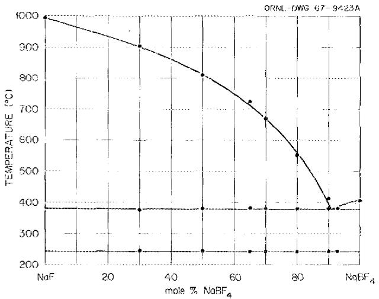  
Fig. 13.1. The System NaF-NaBF $_4$ .

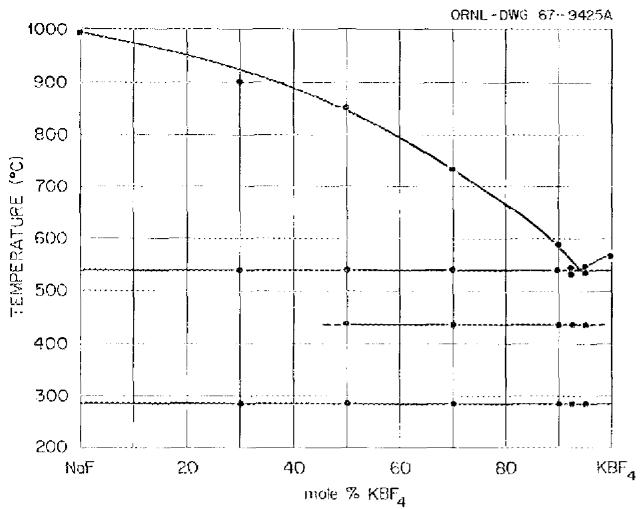  
Fig. 13.3. The System NaF-KBF4.

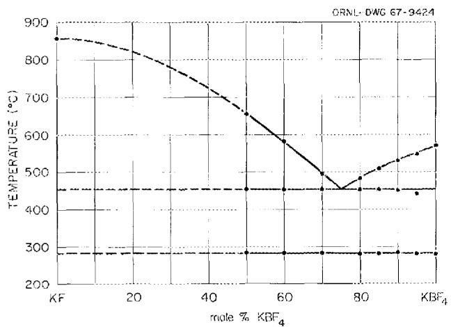  
Fig. 13.2. The System KF-KBF.

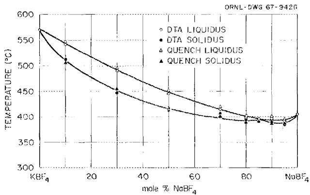  
Fig. 13.4. The System $\mathsf{NaBF}_4$ -KBF.

indicates that the high-temperature modifications of $\mathrm{NaBF}_4$ and $\mathrm{KBF}_4$ , believed to be cubic, form a complete series of solid solutions exhibiting a shallow minimum $(392^{\circ}\mathrm{C})$ near 15 mole $\%$ $\mathrm{KBF}_4$ . Subsolidus relations are not clear at present. A thermal effect at about $190^{\circ}\mathrm{C}$ is evident in all mixtures in the system, while other subsolidus effects vary with composition. Because of the previously mentioned difficulty in quenching in the high-temperature forms of the compounds and their mixes, resolution of the subsolidus relations in this system may require detailed investigation with a high-temperature x-ray diffractometer.

We have started to map the phase boundaries and isotherms in the region of the ternary system bounded by the compounds NaF-NaBF-KBF-KF.

Only a few compositions in addition to the two compound joins (Figs. 13.3 and 13.4) have been examined to date. Compositions in the ternary system containing more than 50 mole $\%$ BF $_3$ probably exist in equilibrium with very high pressures of BF $_3$ .

# 13.2 DISSOCIATION VAPOR PRESSURES IN THE $\mathsf{NaBF}_4$ -NaF SYSTEM

Stanley Cantor

To determine $\mathrm{BF}_3$ dissociation pressures from salt mixtures composed of sodium fluoride and sodium fluoroborate, a static method is being used in which the melt and its vapor are essentially enclosed in a metal-glass system. The apparatus

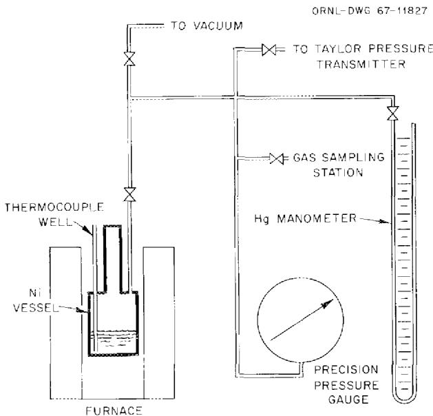  
Fig. 13.5. Apparatus for Measuring Decomposition Pressure of Fluoroborate Melts.

is shown schematically in Fig. 13.5. The melt, contained in nickel, exerts its vapor pressure on a mercury manometer and on diaphragm gages. To remove adsorbed gases, the vessel, containing a weighed salt sample, is initially evacuated at 100 to $125^{\circ}\mathrm{C}$ for at least $15\mathrm{hr}$ . Then to release gases encapsulated within the salt crystals the sample is heated about $25^{\circ}\mathrm{C}$ above its liquidus temperature. The sample is subsequently cooled down to room temperature. If the apparent pressure is greater than $0.5\mathrm{mm}$ at room temperature, the system is reevacuated and then reheated and cooled until the vapor pressure at room temperature is essentially nil.

After this desorbing procedure, the observed vapor pressures should be caused only by the dissociation

$$
\mathrm {N a B F} _ {4} (l) = \mathrm {B F} _ {3} (g) + \mathrm {N a F} (l).
$$

Gas samples collected during the vapor pressure measurements and analyzed mass spectrometrically confirmed that the vapor was virtually pure $\mathbf{BF}_{3}$ . Usually about $1\%$ $\mathrm{SiF}_4$ is observed in the vapor; this probably originates from the reaction of desorbed HF with the glass parts of the apparatus.

After completing vapor pressure measurements, the containment vessel is cut open and the contents

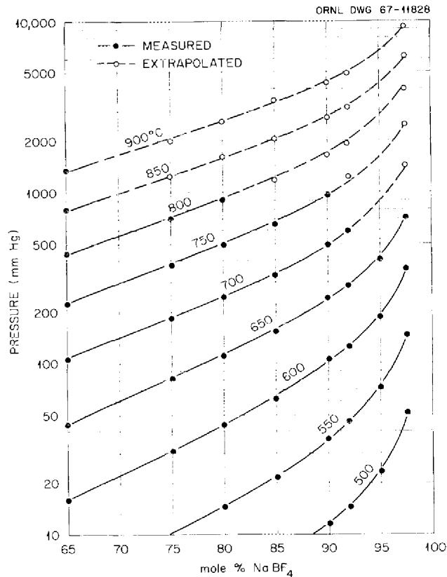  
Fig. 13.6. Smoothed Vapor Pressures in the NaBF₄-NaF System.

are weighed and chemically analyzed for oxygen and boron. The oxygen analysis is used as confirmation that the system had been leak-tight. The boron analysis and change in weight are complementary measurements of how much $\mathrm{BF}_3$ was lost during the course of desorption and vapor pressure measurement. To obviate composition changes in the melt because of the inevitable loss of some $\mathrm{BF}_3$ , a relatively large sample of salt is charged into the containment vessel.

Measurements have been taken on compositions between 65 and 100 mole $\%$ NaBF. Some results are depicted in Fig. 13.6. To a fair approximation, the data may be represented by the equilibrium quotient

$$
\begin{array}{l} Q _ {p} = \left(\text {p r e s s u r e o f B F} _ {3}\right) \\ \times \frac {\text {(m o l e f r a c t i o n o f N a F)}}{\text {(m o l e f r a c t i o n o f N a B F} _ {4})}. \\ \end{array}
$$

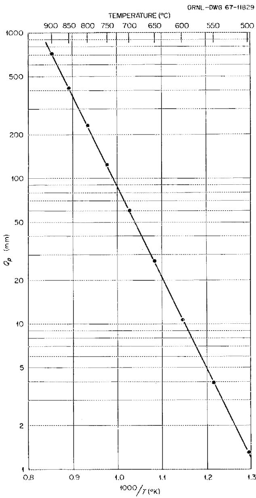  
Fig. 13.7. Equilibrium Quotient As a Function of Temperature for the Reaction $\mathsf{NaBF}_4(I) = \mathsf{NaF}(I) + \mathsf{BF}_3(g)$ .

Values of $Q_{p}$ vs temperature are plotted in Fig. 13.7; as might be expected, $\log Q_{p}$ is linear with $1 / T(^{\circ}\mathrm{K})$ .

From the $\mathbf{BF}_3$ pressure data, thermodynamic activities of $\mathrm{NaBF}_4$ and NaF can be evaluated. This evaluation will be carried forth in the very near future.

# 13.3 REACTIONS OF FLUOROBORATES WITH CHROMIUM AND OTHER HASTELLOY N CONSTITUENTS

Stanley Cantor

This investigation seeks to determine the corrosion reactions of Hastelloy N and its constituents with fluoroborate salt melts. Thus far, three initial experiments have been carried out; the conditions and results are summarized in Table 13.1. The nickel containment vessels and the procedure for desorbing gases other than $\mathrm{BF}_3$ used in these experiments were the same as those used in the vapor pressure measurements (see Sect. 13.2). The salt mixture was composed of 92-8 mole $\% \mathrm{NaBF}_4$ -NaF; this mixture, which is the only known eutectic in the $\mathrm{NaBF}_4$ -NaF system, is under consideration as a substitute coolant for the MSRE.

In the experiment containing chromium metal chips (see Table 13.1), the vapor pressures were measured at several temperatures between 500 and $700^{\circ}\mathrm{C}$ . After the sample had been at $500^{\circ}\mathrm{C}$ or above for 26 hr, $\mathbf{BF}_3$ vapor pressures were twice those from the melt alone; that is, the reaction between chromium metal and salt had yielded $\mathbf{BF}_3$ gas.

In the postexperimental examination of the vessel's contents, the chromium metal chips appeared blackened and corroded and weighed less than prior to the experiment. The solidified salt mixture contained a green solid. Both the chromium metal chips and the green solid were separated from adhering fluoroborate by dissolving the water-soluble fluoroborate. The green solid, when examined microscopically, showed relatively large (as much as $50\%$ in volume) black inclusions. From an x-ray powder pattern the green solid was identified as predominantly crystalline $\mathrm{Na}_{3}\mathrm{CrF}_{6}$ . Two moderately intense lines in the pattern could not be identified; these, however, cannot be attributed to chromium metal or to any boride of chromium for which an x-ray diffraction pattern is available.

Chemical analysis of the green solid showed $27.2\%$ chromium and $0.64\%$ boron. In stoichiometric $\mathrm{Na}_{3}\mathrm{CrF}_{6}$ , the chromium content is $22.1\%$ . Presumably, all the boron and the chromium in excess of $22.1\%$ can be assigned to the black inclusions. An electron microprobe examination of the green solid, scanning $360\mu^{2}$ , confirmed the presence of B, Cr, Na, and F. A limited area scan directed at a black surface (of $1\mu^{2}$ ) on one crystal yielded

Table 13.1. Summary of Initial Corrosion Experiments   
All experiments were carried out in nickel vessels with 92-8 mole $\%$ NaBF4-NaF   

<table><tr><td>Metal</td><td>Form of Specimen</td><td>Total Hours at 500°C or Above</td><td>Maximum Temperature (°C)</td><td>Results</td></tr><tr><td>Cr</td><td>Large irregular-shaped chips</td><td>26</td><td>710</td><td>Increase of vapor pressure with time. Formation of green crystals, largely Na3CrF6, but containing black inclusions whose Cr content is higher than in pure Na3CrF3; green crystals also contain boron (valence unknown). Relatively extensive corrosion - loss of 0.56 g of Cr out of 20 g.</td></tr><tr><td>Hastelloy N</td><td>Cylindrical rods</td><td>59</td><td>600</td><td>Small weight loss (0.017 g out of 37.8 g of metal). No visible color in salt.</td></tr><tr><td>Fe</td><td>Wirea</td><td>28</td><td>650</td><td>Loss of 20% by weight of wire -- no change in salt color.</td></tr><tr><td>Mo</td><td>Stripsa</td><td>28</td><td>650</td><td>No weight loss or discernible attack.</td></tr></table>

$\mathbf{a}_{\mathrm{In}}$ the same experiment.

a chromium concentration approximately twice as large as for the sample as a whole. Boron, a difficult element to determine by microprobe analysis, was not detected in this latter scan.

Thus, this first experiment indicates rather substantial chemical reaction of chromium with molten $\mathrm{NaBF}_4$ - $\mathrm{NaF}$ . Two certain reaction products are $\mathrm{Na}_3\mathrm{CrF}_6$ and $\mathrm{BF}_3$ . The chemical nature of the black inclusions is not readily apparent. The presence of boron and the high concentration of chromium, not as metal, suggest that the black inclusions (in the green solid) may be a boride of chromium whose x-ray diffraction pattern is as yet

unknown. A chemical reaction that describes the above observations may be written as follows:

$$
\begin{array}{l} 3 \mathrm {N a B F} _ {4} (l) + (1 + x) \mathrm {C r} (s) = \mathrm {N a} _ {3} \mathrm {C r F} _ {6} (s) \\ + 2 \mathrm {B F} _ {3} (g) + \mathrm {C r} _ {x} \mathrm {B} (s), \\ \end{array}
$$

where $x > 2$ . For this reaction, $\Delta G_{1000}^{0}$ , the standard free energy at $1000^{\circ}\mathrm{K}$ , is estimated to be $-14 \pm 20$ kcal. The following table gives the free energies of formation:

$$
- \Delta G _ {1 0 0 0} ^ {0} (\text {F o r m a t i o n})
$$

Reference or Method of Estimation

$$
\mathrm {N a B F} _ {4} \quad 3 6 8 \pm 4
$$

$$
\mathrm {N a} _ {3} \mathrm {C r F} _ {6} \quad 5 8 1 \pm 1 5
$$

$$
\mathrm {B F} _ {3} \quad 2 5 6 \pm 1
$$

$$
\operatorname {C r} _ {x} B \quad 2 5 \pm 1 0
$$

$$
\text {F r o m} \mathbf {B F} _ {3} \text {d i s s o c i a t i o n e q u i l i b r i a}
$$

$$
\text {B y} \mathrm {N a} _ {3} \mathrm {A l F} _ {6}
$$

$$
\text {J A N A F T h e r m o c h e m i c a l T a b l e s}
$$

$$
\begin{array}{l} \text {B a s e d o n e s t i m a t e o f C r} _ {2} \mathrm {B b y K . E . S p e a r ,} \\ \text {M e t a l s a n d C e r a m i c s D i v i s i o n} \end{array}
$$

The two other experiments, one with Hastelloy N and the other with iron and molybdenum, were not monitored for vapor pressure. After desorbing the gaseous impurities from the sample charge (metal plus salt), the vessels were brought to the temperatures shown in Table 13.1 and were kept there for the indicated time. After completing these two experiments the samples were examined; very little or no visible attack was apparent on the metal specimens. Also, there were no visible color changes in the salt mixtures. However, the weight losses in the Hastelloy and in the iron specimens (see Table 13.1) suggest the need for more thorough investigation of the corrosion reactions of chromium and iron with fluoroborate salt melts.

# Apparent Mass Transfer of Nickel

After completing vapor pressure measurements on each fluoroborate mixture, the nickel vessels are always cut open for examination of the contents. In almost every case, the top surface of the solidified salt contains a small amount of black material. In all cases the inner metal surfaces are shiny. The top portions of two salt cakes (one 97.5-2.5 mole %, the other 65-35 mole % NaBF $_4$ NaF) when dissolved in water yielded silvery residues. These residues were ferromagnetic, and, by x-ray diffraction, were identified as nickel metal.

The reason that nickel metal particles appeared on the melt is not readily evident. It is unlikely that metal particles were present in the vessel prior to loading with salt, nor is it likely that the stock salts contained nickel metal. The luster of the walls in contact with salt suggests that nickel may have been mass transferred. Further investigation should provide additional information on this unexpected deposition of nickel metal on the salt.

# 13.4 REACTION OF $\mathsf{BF}_3$ WITH CHROMIUM METAL AT $650^{\circ}C$

J. H. Shaffer

H. F. McDuffie

Current plans to replace the secondary coolant of the MSRE with a fluoroborate mixture have prompted studies of the compatibility of these materials with structural metals of the reactor system. Since fluoroborates of interest to this program exert measurable vapor pressure of $\mathrm{BF}_{3}$ at operating temperatures, covering atmospheres

containing equivalent concentrations of $\mathbf{BF}_3$ must be maintained in the free volume of the pump bowl of dynamic systems or used for gas sparge operations. This experimental program will examine the reactions of $\mathbf{BF}_3$ with various structural metals and alloys that might be applicable to the program. Preliminary results obtained by contacting $\mathbf{BF}_3$ with chromium metal at $650^{\circ}\mathrm{C}$ are presented here.

The experimental method utilizes a 30-in. length of 2-in. IPS nickel pipe, mounted horizontally in a 3-in. tube furnace, as the reaction chamber. The reacting gases are admitted through a penetration in the end plate that is welded to one end of the nickel pipe. A sheathed thermocouple also penetrated the end plate and extended into the central region of the heat zone. The other end of the reaction chamber, which extends some 10 in. out of the tube furnace, is closed by Teflon in a threaded pipe cap. The gas manifold system provides for the introduction of helium, $\mathrm{BF}_{3}$ , or mixtures of these gases at known flow rates into the reaction chamber. The system is sealed from the atmosphere by bubbling the gas effluent through a fluorocarbon oil. Concentrations of $\mathrm{BF}_{3}$ in helium can be determined continuously from the recorded signal of a calibrated thermal conductivity cell. Metal samples or specimens are carried in nickel boats inserted through the threaded access port.

The reaction of $\mathrm{BF}_3$ with chromium metal was followed by periodic determination of weight gain of about $10.88\mathrm{g}$ of prepared chromium flakes during a 60-hr reaction period at $650^{\circ}\mathrm{C}$ . The chromium metal was prepared by electrolytic deposition on a copper sheet which was subsequently dissolved by an acid leach. The thin film of chromium metal which remained was broken into small flakes for this investigation. Reaction periods commenced by introducing $\mathrm{BF}_3$ at 1 to 2 cc/min after heating the sample to $650^{\circ}\mathrm{C}$ in flowing helium. The sample was also cooled to room temperature under flowing helium to permit inspection and weight gain determinations.

As shown by Fig. 13.8, the weight gain of the chromium sample showed a linear dependence on the square root of reaction time. The overall reaction period showed that the chromium sample increased its weight by about $4\%$ ; there was no significant difference in the weight or appearance of the nickel boat during this experiment. Examination by x-ray diffraction techniques showed that the chromium sample contained substantial quantities of $\mathrm{Cr}_2\mathrm{O}_3$ ; minor fractions of the mixed fluoride,

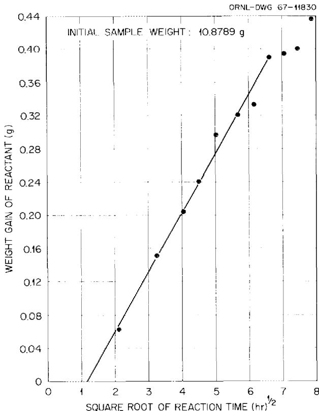  
Fig. 13.8. Reaction of $\mathsf{BF}_3$ with Chromium Metal at $650^{\circ}\mathsf{C}$ .

$\mathrm{CrF}_2 \cdot \mathrm{CrF}_3$ were identified by petrographic techniques. The material is currently being chemically analyzed for boron.

Although these results are inconclusive with respect to identification of the oxidation species in the gas phase, they do illustrate that the direct use of chemically pure, commercially available $\mathrm{BF}_3$ in high-temperature systems will promote the oxidation of nearly pure chromium. Further studies will evaluate the effects of $\mathrm{BF}_3$ concentrations on oxidation rates and will investigate methods for improving the purity of $\mathrm{BF}_3$ .

# 13.5 COMPATIBILITY OF BF3 WITH GULFSPIN-35 PUMP OIL AT 150°F

F. A. Doss

P. G. Smith

J. H. Shaffer

The proposed use of a fluoroborate mixture as the secondary coolant in the MSRE will require that a covering atmosphere containing $\mathbf{BF}_3$ be maintained above the salt in the pump bowl. Since $\mathbf{BF}_3$ is

known to catalyze the polymerization of certain organic materials, its effect on the lubricating properties of the pump oil needs evaluation. Although these effects will be observed directly during the planned operation of the PKP-1 loop with a fluoroborate salt mixture, a preliminary experiment is in progress to determine relative polymerization rates of Gulfspin-35 oil under conditions which can be related to actual pump operations. The degree of polymerization should be indicated by measured changes in oil viscosity during the experiment.

MSRE-type pumps use a helium purge down the pump shaft to isolate the lubricated parts of the pump assembly from the gas environment of the pump bowl. Previous tests on the prototype pump loop, using $^{85}\mathrm{Kr}$ as an indicator, showed that this isolation technique reduced the concentration of pump bowl gases at the oil-gas interface to about 1 part in 20,000. Accordingly, this current study provides accelerated test conditions by contacting the pump oil with helium containing about 1000 ppm of $\mathrm{BF}_3$ at a maximum operating temperature of $150^{\circ}\mathrm{F}$ .

Two experimental assemblies have been operated concurrently to provide comparative data. In each assembly, helium was bubbled at a rate of about 1 liter/min through 1.5 liters of pump oil. The $\mathbf{BF}_{3}$ was introduced into the helium influent stream to one experiment at a rate of about $1\mathrm{cc / min}$ . Samples of the oil were drained from each experiment periodically and submitted to the Analytical Chemistry Division for viscosity measurements. As described in a later section, a continuous gas analysis system was installed and calibrated by A. S. Meyer, Jr., and C. M. Boyd of the Analytical Chemistry Division. Concentrations of $\mathbf{BF}_{3}$ in the gas influent and effluent of the experiment are recorded from the output signal of a thermal conductivity cell. The light hydrocarbon content (products of oil polymerization) of the gas effluent can also be monitored on a semicontinuous basis.

The results obtained through approximately 600 hr of continuous operation of the experiments are illustrated in Fig. 13.9. Although some discoloration of the oil exposed to $\mathbf{BF}_3$ was noted, there is no distinguishable difference in oil viscosity between comparative samples. The increase in oil viscosity (original value, 15.7 centistokes) during

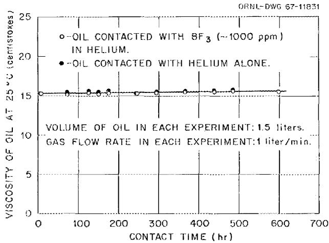  
Fig. 13.9. Effect of $\mathsf{BF}_3$ on Viscosity of MSRE Pump Oil (Gulfspin-35) at $150^{\circ}\mathsf{F}$ .

the experiment is no more than 0.3 centistoke at $25^{\circ}\mathrm{C}$ . Concentrations of $\mathbf{BF}_3$ in the gas effluent have remained essentially the same as influent concentrations throughout the experiment. Hydrocarbon concentrations in the gas effluent were insignificantly low. On the basis of these results, the introduction of $\mathbf{BF}_3$ as a covering atmosphere in MSRE-type pump bowls should have negligible effects on this lubricating property of the pump oil. The experiment will be continued to examine long-term effects of $\mathbf{BF}_3$ on the pump oil.

# 14. Development and Evaluation of Analytical Methods for Molten-Salt Reactors

J. C. White

The determination of oxide in highly radioactive MSRE fuel samples was continued. The replacement of the moisture-monitor cell was the first major maintenance performed since the oxide equipment was installed in the hot cell.

The $\mathbf{U}^{3+}$ concentrations in the fuel samples run to date by the transpiration technique do not reflect the beryllium additions which have been made to reduce the reactor fuel. This may be accounted for by an interference stemming from the radiolytic generation of fluorine in the fuel samples. This problem will receive further investigation. Experimental work is also being carried out to develop a method for the remote measurement of ppm concentrations of HF in helium or hydrogen gas streams.

Design work was continued on the experimental molten-salt test loop which will be used to evaluate electrometric, spectrophotometric, and transpiration methods for the analysis of flowing molten-salt streams.

Controlled-potential voltammetric and chronopotentiometric studies were carried out on the reduction of U(IV) in molten fluoride salts using a new cyclic voltammeter. It was concluded that the U(IV) $\rightarrow$ U(III) reduction in molten LiF-BeF $_2$ -ZrF $_4$ is a reversible one-electron process but that adsorption phenomena must be taken into account for voltammetric measurements at fast scan rates or for chronopotentiometric measurements at short transition times.

An investigation of the spectrum of U(VI) in molten fluoride salts has been initiated. It was found that the spectrum of $\mathrm{Na}_2\mathrm{UF}_8$ dissolved in LiF-BeF in an SiO cell with SiF overpressure was identical to the spectrum of $\mathrm{UO}_2\mathrm{F}_2$ dissolved under identical conditions. It appears that the

equilibrium concentration of $\mathrm{O}^{2-}$ may be sufficient to react with the components of the melt. An attempt to use the $\mathrm{SiO}_2\text{-SiF}_4$ system in the spectrophotometric investigation of electrochemically generated species in molten fluorides also met with difficulties. The $\mathrm{SiF}_4$ overpressure interferes with cathodic voltammetric studies by causing very high cathodic currents.

It is planned to install a spectrophotometric facility with an extended optical path adjacent to a high-radiation-level hot cell to permit the observation of absorption spectra of highly radioactive materials. The basic spectrophotometer and associated equipment have been ordered.

The effects of $\mathrm{BF}_3$ on MSRE pump oil have been investigated. Measurements were made of increases in hydrocarbon concentrations of an He- $\mathrm{BF}_3$ gas stream after contact with the oil. A thermal conductivity detector was used to monitor the $\mathrm{BF}_3$ concentration in the test gas stream.

Development studies are being made on the design of a gas chromatograph to be used for the continuous determination of sub-, low-, and high-ppm concentrations of permanent gas impurities and water in the helium blanket gas of the MSRE. This problem of analyzing radioactive gas samples prompted the design and construction of an all-metal six-way pneumatically actuated diaphragm valve. A helium breakdown voltage detector with a glass body was designed and constructed to permit the observation of the helium discharge. Under optimum conditions this detector has exhibited a minimum detectable limit below 1 ppb of impurity. It appears to be possible that the detector will also operate in the less-sensitive mode necessary for the determination of high-level concentrations of impurities in the blanket gas.

# 14.1 DETERMINATION OF OXIDE IN MSRE SALTS

R.F.Apple J.M.Dale A.S.Meyer

During the last week of December the moisture-monitor cell in the oxide apparatus became inoperative. Because of other experiments being performed in the same hot cell, the moisture-monitor cell was not replaced until March. The insensitive cell showed some superficial evidence of radiation damage in that the potting compound (an RTV preparation which is used to seal the tube containing the spiral electrodes in a stainless steel housing) had shrunk and cracked. Flow checks revealed that substantially all the flow was still passing through the electrolysis tube, so that the damage to the potting compound could not have been responsible for the cell failure. Resistance measurements indicated that the failure was caused by either removal of or some alteration to the $\mathbf{P}_2\mathbf{O}_5$ electrolyte film.

The analyses of oxide in radioactive salt samples from the MSRE for this period are summarized in Table 14.1.

Two samples of radioactive fuel (IPSL-19 and IPSL-24), submitted from the In-Pile Salt Loop 2, were found to contain 265 and 240 ppm of oxide respectively. Sample IPSL-24 was stored under helium at $200^{\circ}\mathrm{C}$ for a period of about six months from the time of sampling until the analysis was made.

# 14.2 DETERMINATION OF U $^{3+}$ IN RADIOACTIVE FUEL BY A HYDROGEN REDUCTION METHOD

J.M.Dale R.F.Apple A.S.Meyer

A transpiration method is currently being used to determine the $\mathbf{U}^{3+}$ concentration in molten radioactive MSRE fuel. The molten fuel is sparged with hydrogen to reduce oxidized species according to the reaction

$$
\mathrm {M F} _ {n} + \frac {n - m}{2} \mathrm {H} _ {2} \longrightarrow \mathrm {M F} _ {m} + (n - m) \mathrm {H F},
$$

in which $\mathbf{MF}_n$ may be $\mathbf{UF}_5$ , $\mathbf{NiF}_2$ , $\mathbf{FeF}_2$ , $\mathbf{CrF}_2$ , or $\mathbf{UF}_4$ in order of their observed reduction potentials.

Table 14.1. Oxide Concentrations of MSRE Salt Samples   

<table><tr><td>Sample</td><td>Date Received</td><td>Oxide Concentration (ppm)</td></tr><tr><td>FP-11-28 (fuel)</td><td>3-21-67</td><td>58</td></tr><tr><td>FP-12-4 (flush)</td><td>6-17-67</td><td>41</td></tr><tr><td>FP-12-18 (fuel)</td><td>7-11-67</td><td>57</td></tr></table>

The rate of production of HF is a function of the ratio of oxidized to reduced species in the melt. The theory of the method has been described previously.

The computer program which was under development has been completed and permits the calculation of expected HF yields for any preselected reduction steps on any melt composition. Using the present fuel composition and the experimental conditions of the transpiration experiment as input data to the program, HF yields were calculated for varying initial concentrations of $\mathbf{U}^{3+}$ . Sample concentrations of $\mathbf{U}^{3+}$ were determined from the comparison of the experimental and calculated HF yields. Table 14.2 shows the $\mathbf{U}^{3+}$ results obtained from the HF yields of the third and fourth reduction steps of the analyses and compares them with expected values calculated by W. R. Grimes.

The calculated results assume that $0.16\%$ of the uranium in the fuel was originally present as $\mathbf{U}^{3+}$ , that the chromium concentration increase from 38 to 65 ppm which occurred before the first sample was taken resulted in the reduction of $\mathbf{U}^{4+}$ to $\mathbf{U}^{3+}$ , that each fission event results in the oxidation of 0.8 atom of $\mathbf{U}^{3+}$ , and that there have been no other losses of $\mathbf{U}^{3+}$ .

It will be noted that no analysis results are listed for samples FP-11-38 and FP-11-49. Although these samples were run in the normal manner, a total of over 2000 micromoles of HF was evolved for the four hydrogen reduction steps for each sample as compared with about 55 micromoles for the previous runs. Since this increased HF yield coincided with an increase in activity in the traps used to collect the HF, it appeared likely that the buildup in sample activity during the extended period of reactor operation might be responsible.

Table 14.2. Concentration of ${\mathrm{U}}^{3 + }$ in MSRE Fuel Salt   

<table><tr><td rowspan="2">Sample No.</td><td rowspan="2">Mwhr</td><td rowspan="2">ΔU3+Burnup Oxidation (equivalents)</td><td rowspan="2">Be Added (equivalents)</td><td rowspan="2">U3+/total&#x27; Calculated (%)</td><td colspan="2">U3+/total&#x27; Analysis (%)</td></tr><tr><td>Step III</td><td>Step IV</td></tr><tr><td>FP-9-4</td><td>10,978</td><td>1.87</td><td></td><td>0.31</td><td>0</td><td>0.1</td></tr><tr><td>FP-10-25</td><td>16,450</td><td>0.93</td><td>3.61</td><td>0.58</td><td>0.35</td><td>0.45</td></tr><tr><td>FP-11-5</td><td>17,743</td><td>0.40</td><td></td><td>0.54</td><td>0.37</td><td>0.37</td></tr><tr><td>FP-11-13</td><td>20,386</td><td>0.26</td><td>2.59</td><td>0.77</td><td>0.37</td><td>0.42</td></tr><tr><td>FP-11-32</td><td>25,510</td><td>0.88</td><td></td><td>0.69</td><td>0.33</td><td>0.34</td></tr><tr><td>FP-11-38</td><td>27,065</td><td>0.26</td><td></td><td>0.66</td><td></td><td></td></tr><tr><td>FP-11-49</td><td>30,000</td><td>0.50</td><td>1.86</td><td>0.80</td><td></td><td></td></tr><tr><td>FP-12-6</td><td>32,450</td><td>0.40</td><td></td><td>0.76</td><td>0.42</td><td>0.37</td></tr><tr><td>FP-12-11</td><td>33,095</td><td>0.10</td><td>3.95</td><td>1.14</td><td>0.38</td><td>1.2</td></tr><tr><td>FP-12-21</td><td>35,649</td><td>0.50</td><td>4.44</td><td>1.54</td><td>0.39</td><td>0.50</td></tr></table>

If the induction period for the radiolytic generation of fluorine were shortened due to the increased activity level of the sample, the fluorine evolved during the loading of the sample could react with the inner walls of the Monel hydrogenation vessel. The copper and nickel fluorides formed would be subsequently reduced during the hydrogenation steps to produce HF.

The above hypothesis appears to be supported by the results of the following experiment. One of the samples which produced the high HF yields was allowed to stand in the hydrogenator at room temperature for about a week. The sample was then subjected to additional hydrogenation steps, and HF was produced in quantities comparable with that obtained in the original runs. After standing several more days at room temperature, the sample was removed from the hydrogenator. Smaller but significant quantities of HF were obtained when the empty hydrogenator was subjected to the high-temperature hydrogenation procedure.

The last three samples, FP-12-6, FP-12-11, and FP-12-21, were all taken after a relatively brief period of reactor operation following a lengthy reactor shutdown period. None of these analyses produced the excessively high HF yields which were observed for the previous two samples. This appears to be further confirmation that the excessive HF yields resulted from a buildup in sample activity with extended reactor operation.

Since the first addition of beryllium to the fuel, all the determinations of $\mathbf{U}^{3+}$ not obviously affected

by radioactivity have fallen in the 0.33 to $0.50\%$ range (the one result of sample FP-12-11 could be explained by a leaky valve) and do not reflect the beryllium additions in the periods between the samplings. This could be accounted for by the evolution of fluorine in much smaller quantities than appeared to be the case in samples FP-11-38 and FP-11-39. If this is the case, the only permanent solution would be to maintain the samples at $200^{\circ}\mathrm{C}$ during the time of transfer to the hot cell for analysis. However, an apparatus is now being designed which will permit the hydrogenation of synthetic fuel samples under carefully controlled conditions. It is felt that this experiment will provide a check of the validity of the transpiration method and will give further evidence as to whether or not the fluorine evolution is a real problem.

Experimental work is also being carried out to develop a method for the remote measurement of ppm concentrations of HF in helium or hydrogen gas streams. The technique is primarily for application to the $\mathbf{U}^{3+}$ transpiration experiment but, if successful, should also be applicable to the determination of HF in the MSRE off-gas. The method is based on the collection of HF on a small NaF trap which is held at $70^{\circ}\mathrm{C}$ to prevent the adsorption of water. This is followed by a desorption at a higher temperature to give a concentrated pulse of HF that can be measured by thermal conductivity techniques.

A components testing facility has been set up which includes a dilution system to produce HF "standards" as low as 20 ppm, a thermostatted

trap with self-resistance heating for fast heatup, and a thermal conductivity cell with nickel filaments. Initial tests have revealed that the thermal conductivity cell presently being used is too sensitive to perturbations in the carrier flow and that the last traces of HF are desorbed too slowly from commercial pelletized NaF. The use of thermal conductivity cells of different geometry and better flow-control valves is expected to eliminate the first of these problems. The second problem will require further development studies to determine whether the slow desorption rate represents an inherent property of the NaF or is a result of impurities in the NaF. Other trapping materials will also be investigated.

A special Monel valve has been made and will be used in the remote HF measuring system. The valve incorporates two valving systems in the same metal body and will provide for the simultaneous adsorption and desorption of HF from alternate traps. Figure 14.1 shows a schematic of the flow pattern. This arrangement will eliminate any dead legs in the HF trapping system and will permit the measurement of incremental quantities of HF evolved from one hydrogenation step in the $\mathbf{U}^{3+}$ transpiration experiment.

One additional step is being taken with regard to the computer program which is being used for data analysis. Due to equilibrium shifts of oxidized and reduced species in the molten fuel salt with temperature changes, the starting $\mathbf{U}^{3+}$ concentration in the analysis sample at the temperature of the initial hydrogenation steps will necessarily be different from the $\mathbf{U}^{3+}$ concentra

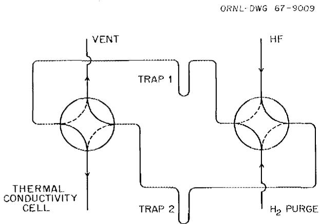  
Fig. 14.1. Schematic Flow Diagram of HF Trapping System.

tion in the fuel in the reactor. The computer program is presently being modified to take this into account.

# 14.3 IN-LINE TEST FACILITY

J.M.Dale R.F.Apple

A. S. Meyer

Design work has been continuing with the assistance of J. H. Evans on the experimental molten-salt test loop which will be used to evaluate electrometric, spectrophotometric, and transpiration methods for the analysis of flowing molten-salt streams. The operation of flow equipment such as capillaries, orifices, and freeze valves will also be tested. A schematic flow diagram of the proposed test loop is shown in Fig. 14.2. The first draft engineering drawings have been completed, and it is planned to start construction of the various components of the system.

# 14.4 ELECTROREDUCTION OF URANIUM(IV) IN MOLTEN LiF-BeF $_2$ -ZrF $_4$ AT FAST SCAN RATES AND SHORT TRANSITION TIMES

D. L. Manning Gleb Mamantov

Controlled-potential voltammetric and chrono-potentiometric studies were carried out on the reduction of U(IV) in molten LiF-BeF $_2$ -ZrF $_4$ (65.5-29.4-5.0 mole %). The controlled-potential, controlled-current cyclic voltammeter was constructed in the Instrumentation Group of the Analytical Chemistry Division at ORNL. In the controlled-potential mode, scan rates from 0.005 to 500 v/sec are available and cell currents to 100 mA can be measured. In the controlled-current mode, currents ranging from a few microamperes to 100 mA can be passed through the cell. The built-in time base allows transition times from 400 sec to 4 msec to be measured. The instrument can also be operated in a potential-step mode for chronoamperometric experiments. Readout of the curves is accomplished with a Tektronix type 549 storage oscilloscope.

ORNL-DWG.67-379R

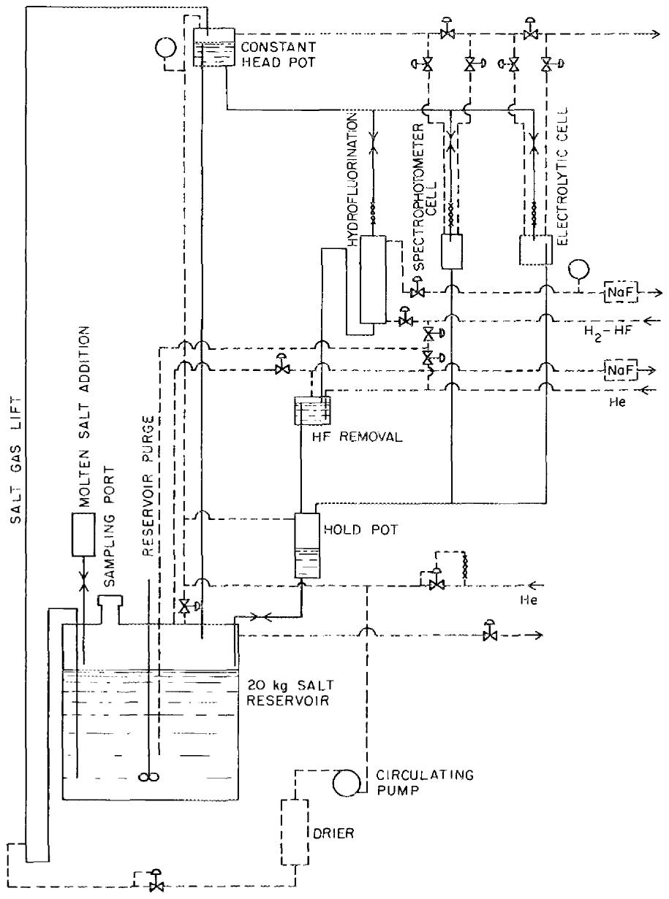  
Fig. 14.2. Schematic Flow Diagram of an Experimental Molten-Salt Test Loop.

In $\mathrm{LiF - BeF}_2\mathrm{-ZrF}_4$ at $500^{\circ}\mathrm{C}$ , U(IV) is reduced to U(III) at approximately $-1.2\mathrm{v}$ vs a platinum quasi-reference electrode. For voltammetry with linearly varying potential, the peak current $(i_p)$ at $500^{\circ}\mathrm{C}$ is given by the Randles-Sevcik equation as

$$
i _ {p} = 1. 7 5 \times 1 0 ^ {5} n ^ {3 / 2} A D ^ {1 / 2} C v ^ {1 / 2},
$$

where $\nu$ is the rate of voltage scan (v/sec) and the symbols $n$ , $A$ , $D$ , and $C$ represent electron change, electrode area $(\mathrm{cm}^2)$ , diffusion coefficient $(\mathrm{cm}^2/\mathrm{sec})$ , and concentration of electroactive species $(\mathrm{moles}/\mathrm{cm}^3)$ respectively. The peak current is proportional to the concentration of uranium and also to the square root of the rate of voltage scan $(\nu^{1/2})$ from approximately 0.02 to 1 v/sec. The

diffusion coefficient at $500^{\circ}\mathrm{C}$ is approximately $2\times 10^{-6}\mathrm{cm}^2 /\mathrm{sec}$ . At faster scan rates, however, the $i_p$ vs $\nu^{1 / 2}$ plots frequently exhibited upward curvature, particularly at platinum and platinum-rhodium indicator electrodes. It is believed that this deviation from the Randles-Sevcik equation is caused in part by adsorption of uranium on the surface of the electrode. Conway4 postulated that for a charge transfer examined by the voltage sweep method there are three contributions to the time-dependent current: (1) a non-Faradaic current $C_{dl}dv/dt$ associated with charging or discharging of the ionic double layer, (2) a pseudo-Faradaic current $C dv/dt$ associated with the change of extent of coverage by adsorbed species formed or removed in the electrochemical step, and (3) Faradaic current $i_F$ associated with any net reactions which can occur within the range of potential scans employed. Therefore the net current $i_t$ that is recorded as a function of time during a potential sweep is

$$
i _ {t} = C _ {d I} d v / d t + C d v / d t + i _ {F}.
$$

Since $dv/dt$ is the scan rate (v) and $i_{F} = k\nu^{1/2}$ , $i_{t}$ can be written as

$$
\frac {i _ {t}}{v ^ {1 / 2}} = v ^ {1 / 2} \left(C _ {d l} + C\right) + k,
$$

where $k = 1.75 \times 10^{5} n^{3/2} AD^{1/2} C$ . Corrections for adsorption plus charging effects, when encountered at fast scan rates, were made by plotting $i_p / v^{1/2}$ vs $v^{1/2}$ , where the slope reflects adsorption phenomena and the intercept contains the Faradaic term. The diffusion coefficient for U(IV) calculated from the intercept was in good agreement with the value from the linear $i_p$ vs $v^{1/2}$ plots.

In chronopotentiometry, adsorption of reactant causes the $i_0\tau^{1 / 2}$ product, where $i_0 =$ current density $(\mathrm{amp} / \mathrm{cm}^2)$ , to increase as $\tau$ (transition time) decreases; this effect was observed for uranium at short transition times (<100 msec). The potential-time traces were not as well defined as the voltammograms; however, reasonably precise transition times could be established. Approximate corrections for adsorption effects were made utilizing a method set forth by Tatwawadi and

Bard. The diffusion coefficient calculated from chronopotentiometry was in agreement with the voltammetric value.

It is concluded that the $\mathrm{U}(\mathrm{IV})\rightarrow \mathrm{U}(\mathrm{III})$ reduction in molten LiF-BeF $^2 -\mathrm{ZrF}_4$ is a reversible one-electron process. However, for the analyses of current-potential curves at fast rates of voltage scan or potential-time traces at short transition times, adsorption phenomena could be pronounced and must be taken into account.

# 14.5 SPECTROPHOTOMETRIC STUDIES OF MOLTEN FLUORIDE SALTS

# J. P. Young

Spectrophotometric studies of interest to molten-salt reactor problems have continued. A major portion of the work for this period has been concerned with the use of $\mathrm{SiO}_2$ as a container for LiF-BeF $_2$ melts. Spectrophotometric techniques were applied to the evaluation of the compatibility problems involved. This work is reported in a preceding section of this report. An investigation of the spectrum of U(VI) in molten fluoride salts has been initiated. By means of spectral measurements it should be possible to measure the solubility of U(VI) in these solutions. The spectral measurements can also be used analytically to measure concentrations of U(VI) and to follow the change in concentration of this species during various reactions. This work is being done in cooperation with G. I. Cathers, who has furnished the solute salt, $\mathrm{Na}_2\mathrm{UF}_8$ . The container material for molten-salt solutions of U(VI) must be inert to oxidation. It was hoped that $\mathrm{SiO}_2$ would satisfy these requirements. It was found, however, that the spectrum of $\mathrm{Na}_2\mathrm{UF}_8$ dissolved in LiF-BeF $_2$ in an $\mathrm{SiO}_2$ cell with $\mathrm{SiF}_4$ overpressure was identical to the spectrum of $\mathrm{UO}_2\mathrm{F}_2$ dissolved under identical conditions. This would suggest that the oxide concentration in the melt was sufficient to cause the formation of uranyl ion. The dissolved species at $550^{\circ}\mathrm{C}$ exhibited an absorption peak at $419~\mathrm{nm}$ and the foot of a strong absorption peak in the ultraviolet with a shoulder at $310~\mathrm{nm}$ . The absorption peaks generally correspond quite well to that reported for $\mathrm{UO}_2^{2+}$ in aqueous $\mathrm{HClO}_4$ .

This uranium species disappeared slowly when iron wire was introduced into the melt. The resultant spectrum was that of tetravalent uranium; thus, it is demonstrated that an oxidized species of uranium was originally present. It would appear, then, that although $\mathrm{SiO}_2$ containers are stable to oxidation, the equilibrium $\mathrm{O}^{2-}$ concentration may react with components of the melt.

The work on electrochemical generation of solute species and their spectrophotometric characterization is continuing. This work is carried out in cooperation with F. L. Whiting and Gleb Mamantov. Again $\mathrm{SiO}_2$ would offer several advantages in this study compared with windowless cell techniques which had been used. Under the experimental conditions presently required, however, it was found that the presence of 1 atm of $\mathrm{SiF}_4$ gas over the melt under study interferes with cathodic voltammetric studies by causing very high cathodic currents. The reasons for this are not yet understood, but the U(IV)/U(III) reduction wave is completely lost in the presence of $\mathrm{SiF}_4$ . Conversely, $\mathrm{SiF}_4$ does not affect anodic voltammograms. Since $\mathrm{SiF}_4$ is a product of fluoride salt reaction with $\mathrm{SiO}_2$ , these results suggest that $\mathrm{SiO}_2$ containers may have limited use in voltametric studies.

The development of a recording spectrophotometric system is continuing that will permit spectral measurements of highly radioactive solutions to be obtained on samples located in a high-radiation-level cell. The system will make use of the extended optical path length similar to that being considered for use in the in-line spectral measurements of molten-salt reactors. The basic spectrophotometer and associated equipment have been ordered, and the design of the physical and optical arrangements of the components for the extended path is being considered. The optical arrangement will be such that both windowed and windowless cells can be used.

# 14.6 ANALYSIS OF OFF-GAS FROM COMPATIBILITY TESTS OF MSRE PUMP OIL WITH $\mathsf{BF}_3$

C. M. Boyd

A total hydrocarbon detector and a thermal conductivity detector have been used to determine the hydrocarbons and $\mathbf{BF}_3$ in the gas from tests on the effects of $\mathbf{BF}_3$ on MSRE pump oil (Gulf-

spin 35). These tests are described in an earlier section. A gas sampling manifold permits the measurement of increases in hydrocarbon concentration of an He-BF3 stream on contact with the oil. A parallel stream of helium through a separate oil reservoir serves as a reference. The hydrocarbon analyzer was modified by the addition of a sampling pump which draws in the gas at near atmospheric pressure, compresses it, and then passes it through the analyzer. The portions of the test gas to be analyzed were first passed through a saturated solution of KF to remove the BF3 and thereby protect the pump and other components of the analyzer. This solution has a low water vapor pressure, which prevents water condensation in the analyzer. In the first tests, with the BF3 at the 2000-ppm level and the oil at $150^{\circ}\mathrm{F}$ , the hydrocarbon level in the off-gas was less than 50 ppm.

The thermal conductivity detector was used to monitor the $\mathrm{BF}_3$ concentration in the test gas, which was produced by mixing flows of pure $\mathrm{BF}_3$ and He. The detector and flow capillary were calibrated by passing a known volume of the gas mixture through the detector and then through a trap of dilute NaOH. The solution was analyzed for boron and fluoride, and the $\mathrm{BF}_3$ concentration of the gas was then calculated. The sensitivity of this detector under the conditions used was $+10\mathrm{ppm}$ of $\mathrm{BF}_3$ .

# 14.7 DEVELOPMENT OF A GAS CHROMATOGRAPH FOR THE MSRE BLANKET GAS

C. M. Boyd

A. S. Meyer

Development studies are being made on the design of a gas chromatograph to be used for the continuous determination of permanent gas impurities and water in the helium blanket gas of the MSRE. The chromatograph will require two columns to separate the components desired. Tests have shown that a parallel column system composed of a 5A molecular sieves column and a Porapak S column should be practical for analyzing gases which are not highly radioactive. The $\mathbf{H}_{2},\mathbf{O}_{2}$

$\mathbf{N}_{2}$ , $\mathrm{CH}_4$ , and $\mathrm{CO}$ are separated on the molecular sieves column, and the $\mathrm{H}_2\mathrm{O}$ and $\mathrm{CO}_2$ are separated on the Porapak column. The chromatograph will require separate compartments controlled at different constant temperatures. The sample valve, columns, and detectors may require different temperatures for optimum operation.

The requirement that determination of impurities be made at sub-, low-, and also at higher-ppm levels necessitates the use of two different types of systems or detectors. A helium breakdown detector can be operated in either the high- and low-sensitivity modes or in the high-sensitivity mode in conjunction with a thermal conductivity detector.

The chromatograph which is used for analyzing the reactor off-gas will be subjected to radiation from samples at the 1-curie/cc level. This requires a system free of organic construction materials. An all-metal sampling valve and a detector unaffected by this radiation are necessary. The organic Porapak column cannot be used at this level of radiation. This eliminated the possibility of $\mathbf{H}_2\mathbf{O}$ analysis on these samples. A silica gel column will be used to resolve $\mathrm{CO}_{2}$ .

The problem of radioactive samples and the transmittal of gas samples containing ppm levels of $\mathrm{H}_2\mathrm{O}$ from the source to the detector require the use of a heated all-metal sampling valve. Such a valve has been designed and constructed. The valve is similar to the conventional Phillips six-way pneumatically actuated diaphragm valve (Fig. 14.3). The Teflon diaphragm has been replaced by a 1-mil-thick Inconel diaphragm which contacts and seals the redesigned entry orifices (Fig. 14.4). With this metal diaphragm a spacer is required to allow gas flow without excessive backpressure. Spacers made from 2-mil gold were necessary to give a leak-tight seal between the diaphragm and the valve faces. The gold was annealed at $1500^{\circ}\mathrm{F}$ and, after installation in the valve, subjected to 32,000 psi pressure. Pressure maintained by the assembly screws was sufficient for retaining this seal.

The choice of detectors which are sensitive to sub-ppm levels of permanent gases is limited to the helium ionization types. A helium breakdown

voltage detector was used on the MTR Capsule Test Facility (test 47-6) $^9$ and was not affected by the radiation present in the gas samples. This may be explained by the relatively high current levels (microamperes) used with this type of detector. A constant-current power supply is used with this detector, and a decrease in breakdown voltage, rather than an increase in ionization current, indicates an increase in the electrical conductivity of the gas. The breakdown voltage of pure helium is about $500\mathrm{~V}$ and is lowered by about $50\mathrm{~V}$ by $1\mathrm{ppm}$ of impurity. The minimum detectable limit is controlled primarily by the noise level present, but under optimum conditions is below $1\mathrm{ppb}$ .

In previous attempts to improve the stability of the detector discharge, various electrode radii were used with the anode and cathode in a concentric arrangement. In this early model of the detector, which was contained inside a Swagelok tube fitting, it was impossible to observe the helium discharge. A test detector was therefore constructed which has a glass body with Kovar seal tube connections through which the electrodes are mounted (Fig. 14.5). These electrodes have removable tips which allow the testing of various electrode shapes and spacings. The effects on the helium discharge can be observed through the glass. Tests with this detector indicate that a minimum noise level is obtained with a smooth flow discharge on the anode probe. Maximum sensitivity dictates the use of a very pure helium carrier gas, but this purity level also causes a sparking or arcing in the helium discharge. The addition of mercury vapor by the presence of a small source of the metal in the tip of the anode stabilized the discharge. The more practical solution of adding a contaminant by a controllable gas flow is being tested. This approach may also permit addition of larger amounts of contaminant to allow the detector to operate in the less-sensitive mode necessary for the determination of high levels of impurities in the blanket gas samples.

ORNL-DWG.65-77

Fig. 14.3. Conventional "Phillips" Valve.   
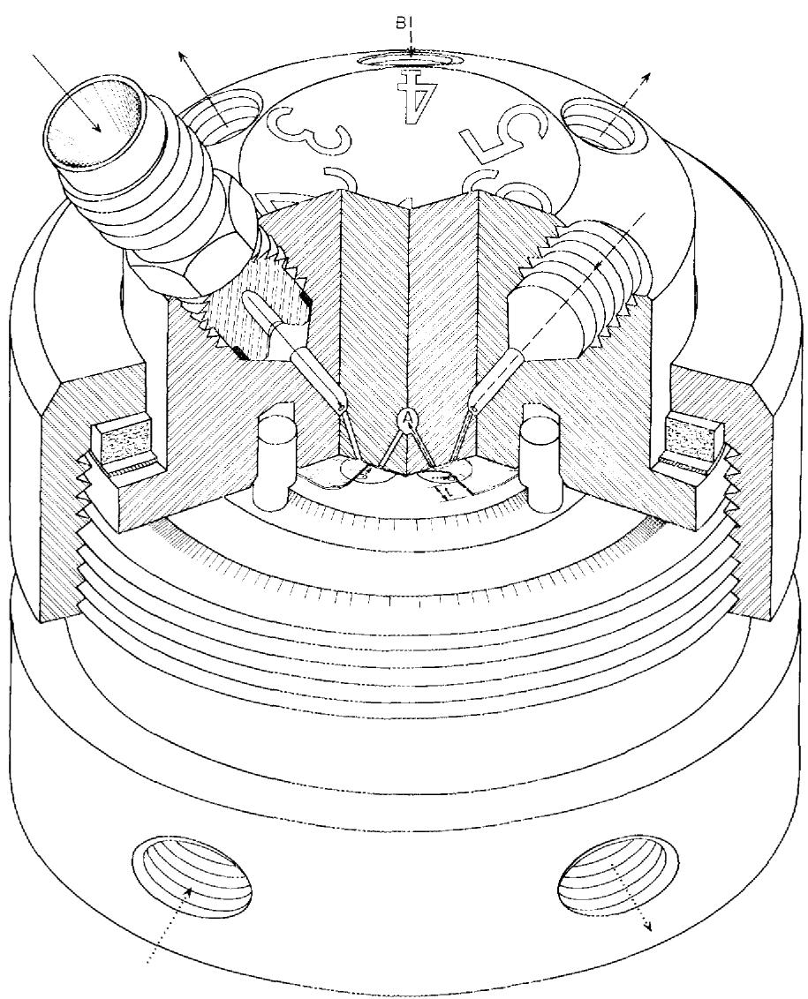  
#   
CARRIER   
#   
SAMPLE   
A   
TO SAMPLING LOOP   
B-→   
FROM SAMPLING LOOP   
.   
ACTUATING GAS

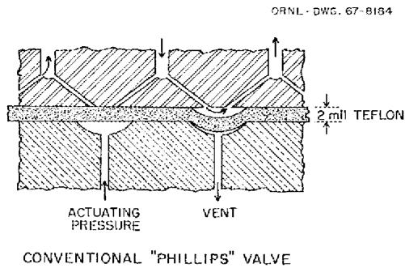

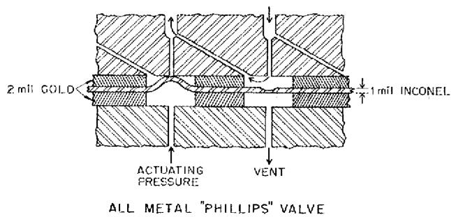  
Fig. 14.4. Modified All-Metal Sample Valve.

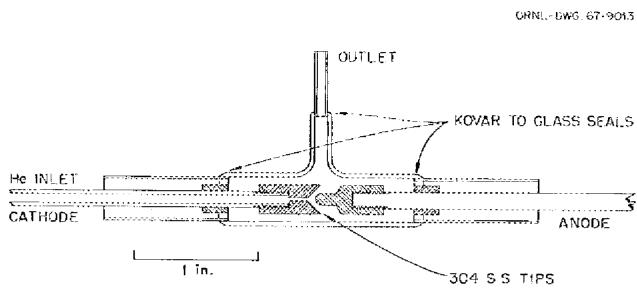  
Fig. 14.5. Diagram of Helium Breakdown Detector.

# Part 4. Molten-Salt Irradiation Experiments

E. G. Bohlmann

Molten-salt breeder reactors are expected to operate with a high rate of production of fission products as a result of fuel salt power densities in excess of 200 w/cc. The effects of long-term exposure under such conditions on the stability of fuel salt, the compatibility of salt with graphite and metal (Hastelloy N), and the fate of the fission products are of interest. Undue buildup of fission product poison on core graphite, for example, could reduce the breeding efficiency of the reactor if not mitigated. Initial loop experiments are being directed largely at understanding the fate of important fission products.

The second thermal convection in-pile loop experiment was terminated by the appearance of a

crack in the core outlet pipe, probably caused by radiation embrittlement of the alloy and stresses encountered during a reactor setback. Sufficient operating time had, however, been achieved to produce fission product concentration levels equivalent to those estimated to be present at processing equilibrium in a breeder; therefore, an exhaustive evaluation of the experiment is in progress.

Future loops will be fabricated of Hastelloy N modified by titanium additions shown to inhibit the radiation effects. Experiment objectives include study of materials compatibility, fission product behavior, and effects of operation at off-design conditions.

# 15. Molten-Salt Convection Loop in the ORR

E. L. Compere

H. C. Savage

J.M.Baker

Results of the first in-pile molten-salt convection loop experiment in this program have been reported. Irradiation of the second molten-salt convection loop in beam hole HN-1 of the Oak Ridge Research Reactor began1 January 12, 1967, and was terminated April 4, 1967, after development of $8.2 \times 10^{18}$ fissions/cc (1.2%235 U burnup) in the 7LiF-BeF2-ZrF4-UF4 (65.3-28.2-4.8-1.7 mole %) fuel. Average fuel power densities up to 150 w per cc of salt were attained in the fuel channels of the core of MSRE-grade graphite.

The experiment was terminated after radioactivity was detected in the secondary containment systems as a result of gaseous fission product leakage from a crack in the core outlet tube.

Operation and postirradiation examination of the second loop are described below.

# 15.1 LOOP DESCRIPTION

A diagram of the second in-pile molten-salt convection loop is shown in Fig. 15.1. The core section of the loop consists of a 2-in.-diam by 6-in.-long cylinder of MSRE graphite. Eight vertical $\frac{1}{4}$ -in.-diam holes for salt flow are bored through the core in an octagonal pattern with

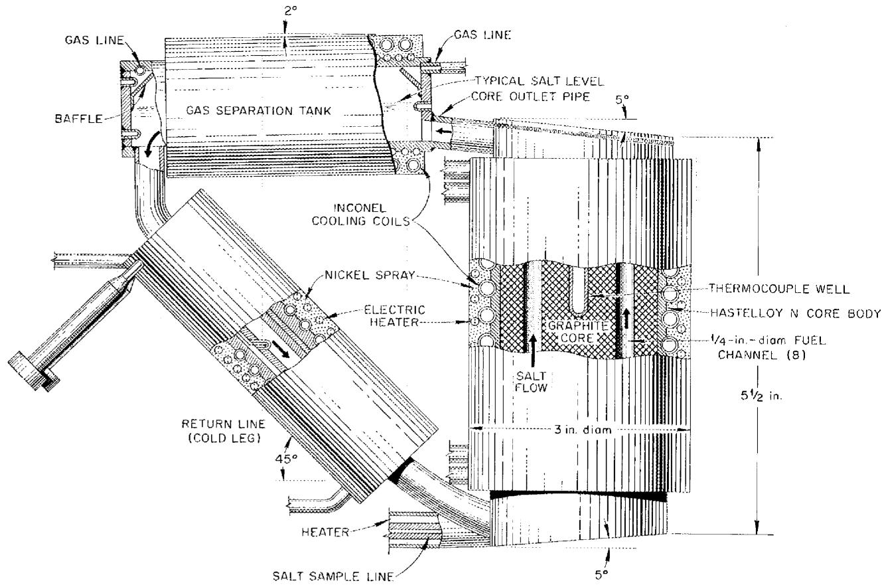  
Fig. 15.1. Diagram of Molten-Salt In-Pile Loop 2.

centers in. from the graphite center line. A horizontal gas separation tank connects the top of the core through a return line to the bottom of the core, completing the loop circuit. These and the core shell were fabricated of Hastelloy N, as was the 12-ft-long sample tube which connects the loop to the sample station in the equipment chamber at the ORR shield face. The Hastelloy N was from material in fabrication of the MSRE and which had not been modified to improve its resistance to irradiation embrittlement. The electric heating elements and cooling tubes surrounding the component parts of the loop were embedded in sprayed nickel.

Figure 15.2 is a photograph of the partially assembled loop showing the configuration of the salt flow channels in the top of the graphite core. An identical configuration was used for the bottom of the core section. Total volume of the loop was $110~\mathrm{cc}$ , with a 43-cc salt volume in the graphite.

# 15.2 OPERATION

After assembly, the loop was tested for leak-tightness, flushed with argon gas, and vacuum pumped at $600^{\circ}\mathrm{C}$ for 20 hr to remove air and moisture. The loop was flushed with solvent salt, then recharged with fresh solvent salt and operated at temperature for 248 hr in the mockup facilities in Building 9204-1, Y-12.

During the out-of-pile test period, 15 salt samples were removed from the loop and 12 salt additions were made, providing a good demonstration of the salt sample and addition system.

The loop package containing the solvent salt used in the preirradiation test period was installed in beam hole HN-1 of the ORR, and pile operation was started on January 12, 1967. Samples of the solvent salt $\left({}^{7}\mathrm{LiF}-\mathrm{BeF}_{2}-\mathrm{ZrF}_{4}, 64.8-30.1-5.1 \text{ mole}\%\right)$ were taken on January 13 before the start of irradiation and again on

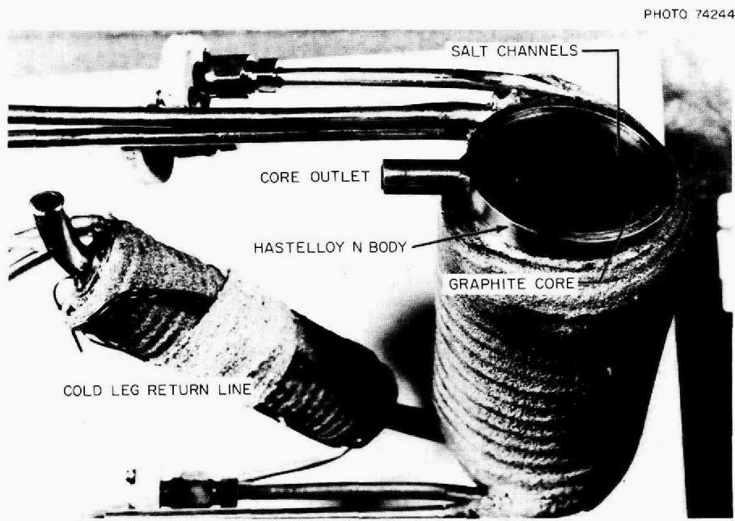  
Fig. 15.2. Photograph of Partially Assembled In-Pile Convection Loop 2 Showing Design of Salt Flow Channels in Graphite Core.

January 16, 1967, after the reactor was brought to its full power of $30\mathrm{Mw}$ . Loop operation was continued with solvent salt under irradiation at temperatures ranging between 550 and $650^{\circ}\mathrm{C}$ . During this period the equipment and instrumentation were calibrated and tested, loop performance was evaluated, and reactor gamma heat was determined as a function of the depth of insertion of the loop into the beam hole. Loop operation was entirely satisfactory during this period, and on January 30, 1967, ${}^{7}\mathrm{LiF - UF}_{4}$ (63-27 mole %) eutectic fuel ( $93\%$ $^{235}\mathrm{U}$ ) was added, along with additional solvent salt, resulting in a fuel composition of ${}^{7}\mathrm{LiF - BeF}_{2} - ZrF_{4} - UF_{4}$ of 65.26-28.7-4.84-1.73 mole %. The nuclear heat generated in the loop (fission plus gamma) was again determined as a function of the depth of insertion, two fuel salt samples were removed from the loop, and on February 21, 1967, operation at the fully inserted, highest flux position was achieved. Operation in the highest flux position was continued to the end of ORR cycle No. 71 (March 5, 1967).

The ORR was down from March 5 until March 11, 1967, for the regular between-cycle maintenance and refueling operations. Loop operation continued throughout this period. A fuel salt sample was removed, and, by the addition of eutectic fuel and solvent salt, the uranium concentration

of the fuel salt in the loop was increased to the composition of ${}^{7}{\mathrm{{LiF} - {BeF}}}_{2} - {\mathrm{{ZrF}}}_{4} - {\mathrm{{UF}}}_{4}$ of 65.4- 27.8-4.8-2.0 mole % in order to attain the experimental objective of ${200}\mathrm{\;w}/\mathrm{{cc}}$ fission-power densities in the fuel salt. Also a sample of the cover gas in the loop was taken for analysis.

The ORR was brought to full power of $30\mathrm{Mw}$ on March 11, 1967. When the molten-salt loop was placed in the fully inserted, highest flux position on March 14, 1967, it was found that the fuel fission-power density in the graphite core was $150\mathrm{W / cc}$ instead of the expected $200\mathrm{W / cc}$ . This resulted from a rearrangement of the ORR fuel between cycles 71 and 72 which caused a reduction in thermal flux in beam hole HN-1 in an amount sufficient to compensate for the increased uranium in the loop fuel salt. This reduction in flux was qualitatively confirmed by other experimenters in an adjacent beam hole facility.

When the ORR was started up on March 11, 1967, it was observed that the radiation monitor on a charcoal trap in the loop container sweep-gas line read $5\mathrm{mr / hr}$ whereas normally this monitor read zero. We concluded that this increased activity was caused by radiation from a nearby ORR primary coolant water line instead of fission product leakage from the loop into the secondary containment, and loop operation was continued.

Shortly after full power operation was reached on March 14, the radiation monitor on the charcoal trap in the container sweep-gas line increased to $18\mathrm{mr / hr}$ . Some 8 hr later a further increase to $\sim 3.4\mathrm{r / hr}$ was noted. No further increase occurred until March 17, when the radiation from the charcoal trap increased rapidly (over a period of $\sim 3\mathrm{hr}$ ) to $\sim 100\mathrm{r / hr}$ , indicating a significant leakage of fission products from the loop. At this point the loop was retracted out of the high-flux region to a position at 1 to $2\%$ of the highest flux, and the fuel salt in the loop was frozen by reducing the loop temperatures to $\sim 400^{\circ}\mathrm{C}$ in order to prevent possible salt leakage from the loop. As a result of these actions, the charcoal trap activity decreased to $\sim 1\mathrm{r / hr}$ over a 15-hr period.

From March 17 to March 23, 1967, the loop was operated in a retracted position at 1 to $2\%$ of full power, and the fuel salt was kept frozen at a temperature of 350 to $400^{\circ}\mathrm{C}$ , except for brief periods of melting to determine the location of the leak. It was concluded that the fission product leak was in the vicinity of the gas separation tank and that loop operation could not be continued. Three fuel salt samples were removed from the loop during this period.

Beginning on March 27, 1967, the fuel salt was drained from the loop by sampling to facilitate the removal of the loop from the reactor and subsequent examination in hot-cell facilities. By this procedure the fuel salt inventory in the loop was

reduced from $151.6\mathrm{g}$ to $2.1\mathrm{g}$ , requiring ten samples (12 to $25\mathrm{g}$ per sample). On April 4, 1967, the ORR was shut down, and on April 5, 1967, the loop package was removed from the reactor into a shielded carrier and transferred into a hot cell without difficulty.

During the in-pile operating period, fuel salt containing enriched uranium was exposed to reactor irradiation for 1366 hr at average fission-power densities up to 150 w/cc in the graphite core fuel channels. For both out-of-pile and in-pile operating periods, various salt additions and removals were made, including samples for analysis. During the in-pile period, the reactor power was altered appreciably 38 times, and the distance of the loop from the reactor lattice, that is, the loop position, was changed 122 times. Thus, the equivalent time at full loop power during fueled operation was 547 hr, while the ORR was operated for 937 hr. Table 15.1 summarizes the operating periods under the various conditions for moltensalt loop No. 2.

Details of some of the more significant observations made during operation and results of hot-cell examinations and analyses are given in sections which follow.

# 15.3 OPERATING TEMPERATURES

The salt in the loop was kept molten $(>490^{\circ}\mathrm{C})$ during all in-pile operations until it was frozen on

Table 15.1. Summary of Operating Periods for In-Pile Molten-Salt Loop 2   

<table><tr><td rowspan="2"></td><td colspan="3">Operating Period (hr)</td><td colspan="3">Salt Additions and Withdrawals</td></tr><tr><td>Total</td><td>Irradiation</td><td>Full Power Dose Equivalent</td><td>Additions</td><td>Samples</td><td>Salt Removal</td></tr><tr><td colspan="7">Out-of-Pile</td></tr><tr><td>Flush</td><td>77.8</td><td></td><td></td><td>7</td><td>1</td><td>13</td></tr><tr><td>Solvent salt</td><td>171.9</td><td></td><td></td><td>5</td><td>1</td><td>0</td></tr><tr><td colspan="7">In-Pile</td></tr><tr><td>Preirradiation</td><td>73.7</td><td></td><td></td><td>1</td><td>2</td><td>0</td></tr><tr><td>Solvent salt</td><td>343.8</td><td>339.5</td><td>136.0</td><td>1</td><td>2</td><td>0</td></tr><tr><td>Fueled salt</td><td>1101.9</td><td>937.4</td><td>547.0</td><td>2</td><td>3</td><td>0</td></tr><tr><td>Retracted-fuel removala</td><td>435.0</td><td>428.3</td><td>11.2</td><td>0</td><td>4</td><td>9</td></tr><tr><td>Total</td><td>2204.1</td><td>1705.2</td><td>694.2</td><td>16</td><td>13</td><td>22</td></tr></table>

${}^{a}$ Maintained at 350 to ${400}^{ \circ  }\mathrm{C}$ (frozen) except during salt-removal operations and fission product leak investigations.

March 17 following the fission product leak. At full power, temperatures in the fuel salt ranged from $\sim 545^{\circ}\mathrm{C}$ in the cold leg return line up to $\sim 720^{\circ}\mathrm{C}$ in the core outlet pipe. Since nuclear heat was removed through the core graphite to the cooling coils around the outside of the Hastelloy N core body, the graphite temperature was $\sim 550^{\circ}\mathrm{C}$ , or some $70^{\circ}\mathrm{C}$ below the average fuel salt temperature in the core. Temperatures of the metal walls of the component parts of the loop (Hastelloy N) ranged from a low of $510^{\circ}\mathrm{C}$ in the core body (where maximum cooling was used) to $\sim 730^{\circ}\mathrm{C}$ in the core outlet pipe, where there were no provisions for cooling.

The temperature distribution of the salt and loop components was significantly altered when the reactor was down. Under this condition, salt temperatures ranged between $\sim 535^{\circ}\mathrm{C}$ in the cold-leg return line to $\sim 670^{\circ}\mathrm{C}$ in the top of the core graphite fuel passages. The core outlet pipe was $670^{\circ}\mathrm{C}$ with no nuclear heat, as compared with $\sim 730^{\circ}\mathrm{C}$ for full power operation. The core outlet pipe temperature of $730^{\circ}\mathrm{C}$ is believed to have contributed to the outlet pipe failure as discussed in a following section.

# 15.4 SALT CIRCULATION BY CONVECTION

In the first in-pile molten-salt convection loop, the salt circulation rate of 5 to $10\mathrm{cm}^3/\mathrm{min}$ was substantially below the calculated rate of $\sim 45$ $\mathrm{cm}^3/\mathrm{min}$ at operating temperature, and frequent loss of flow occurred. In order to improve salt circulation rate and reliability in the second loop, the salt flow channels at the top and bottom of the graphite core were redesigned to increase the flow area and improve the flow path (refer to Fig. 15.2). Further, the top and bottom of the core section that were horizontally oriented in the first loop were inclined $5^\circ$ to minimize trapping of any gas released from the salt, since it is believed that formation of gas pockets often resulted in flow stoppage.

Salt circulation in the second loop was estimated to be 30 to $40~\mathrm{cm}^3 /\mathrm{min}$ ; this was determined by making heat-balance measurements around the cold-leg return line and by adding an increment of heat in a stepwise fashion to one point in the loop and recording the time required for the heated salt to traverse a known distance as monitored by thermocouples around the loop circuit. This flow

rate is a fivefold increase over that observed in the first loop and is attributed to the modification described. However, occasional loss of flow still occurred. One possible explanation for this is that a sufficient temperature difference was not maintained between the salt in the hot and cold legs. This is supported by the fact that flow, when lost, could be restored by adjusting the temperatures around the loop circuit. Since occasional flow loss did not adversely affect in-pile operation, this was not considered to be a problem of any serious consequence.

# 15.5 NUCLEAR HEAT, NEUTRON FLUX, AND SALT POWER DENSITY

Nuclear heat was determined at various loop positions by comparing electric heat input and cooling rates with the reactor down and at full power (30 Mw). Figure 15.3 shows the results of these measurements. Although nuclear heat measurements based on such heat balances are not precise because of variations in the temperature distribution around the loop and variations in heat loss at different loop positions (different power levels) as well as necessary estimates of the exact inlet and outlet temperatures of the several air-water coolant mixtures, they provided a good basis for determining nuclear heat and resultant fission-power density during operation. Based on these determinations, reactor gamma heat with the loop fully inserted and filled with unfueled salt was $4200\mathrm{~W}$ . Fission heat was computed by subtracting this value from the total heat generation obtained when fuel salt was in the loop.

In the earlier part of the operation with fueled salt (1.73 mole % U), the loop contained 17.84 g of uranium, 93% enriched, in a salt volume of 76.2 cc. A fission heat of 8600 w in the fully inserted position was determined, leading to an estimate of the average thermal neutron flux of $1.18 \times 10^{13}$ neutrons $\mathrm{cm}^{-2} \sec^{-1}$ , or an average fuel-salt power density of 113 w/cc. Assuming from a neutron transport calculation by H. F. Bauman that the core/average flux ratio was 1.33, the average power density in the core salt was 150 w/cc at full power. The power density in the forward core tubes is estimated by using Bauman's results to be 180 w/cc.

The average thermal neutron flux in the salt was also independently determined from flux monitors

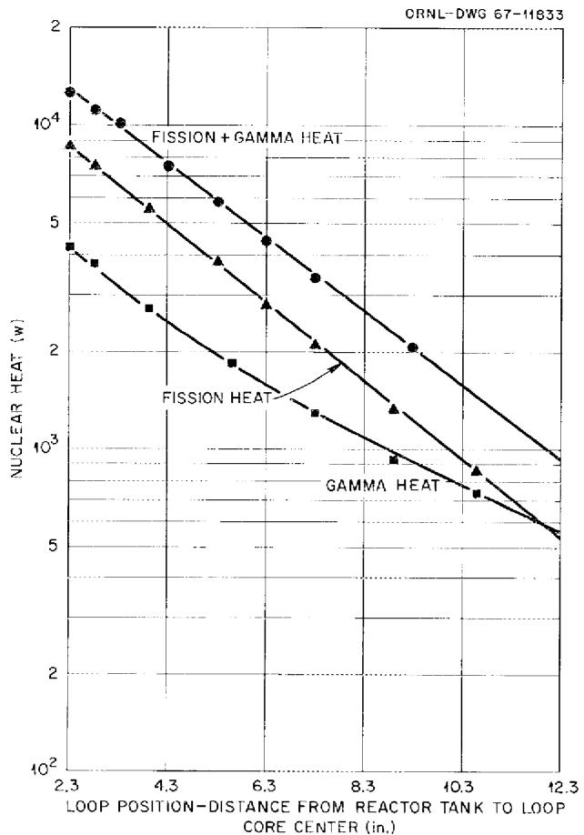  
Fig. 15.3. Nuclear Heat Generation in Molten-Salt Loop 2.

recovered during postirradiation disassembly of the loop and from the fission product activity in the final salt samples, as discussed below.

Calculations involving activity of type 304 stainless steel monitor wires or of fission products in salt samples required taking into account the relative flux history for the particular isotope as described in the section on activity calculation. Thermal neutron flux levels calculated from type 304 stainless steel monitor wires attached to various regions on the outside of the loop were (in units of neutrons $\mathrm{cm}^{-2}$ sec $^{-1}$ ): core shell, front, 4.4 to $5.5\times 10^{13}$ ; core shell, bottom (rear to front), 1.7 to $3.8\times 10^{13}$ ; central well in core graphite, 2.7 to $3.4\times 10^{13}$ ; core shell, rear, 1.4 to $1.9\times 10^{13}$ ; gas separation tank, 1.4 to $2.6\times 10^{13}$ . Applying a calculated attenuation factor of 0.6 and a fuel blackness factor of 0.8 to a

Table 15.2. Mean Neutron Flux in Salt as Calculated from Fission Product Activity   

<table><tr><td rowspan="2">Isotope</td><td colspan="2">Flux Estimate (neutrons cm-2sec-1)</td></tr><tr><td>Sample 23</td><td>Sample 26</td></tr><tr><td></td><td>×1013</td><td>×1013</td></tr><tr><td>30-y 137Cs (6.0%)</td><td>0.82</td><td>0.90</td></tr><tr><td>284-d 144Ce (5.6%)</td><td>0.93</td><td>1.05</td></tr><tr><td>65-d 95Zr (6.3%)</td><td>0.65</td><td>0.96</td></tr><tr><td>58.3-d 91Y (5.8%)</td><td>1.14</td><td>0.58</td></tr><tr><td>50.4-d 89Sr (4.79%)</td><td>0.61</td><td>0.76</td></tr><tr><td>32.8-d 141Ce (6.0%)</td><td>0.64</td><td>0.70</td></tr><tr><td>12.8-d 140Ba (6.4%)</td><td>0.27</td><td>0.28</td></tr><tr><td>11.1-d 147Nd (2.6%)</td><td>0.59</td><td>0.66</td></tr></table>

weighted mean monitor flux of $2.4 \times 10^{13}$ results in an estimated mean flux available to the fuel of $1.15 \times 10^{13}$ .

The flux was estimated on the basis of the activity of various fission products in final salt samples after accounting for the relative flux history of the salt. Table 15.2 shows flux estimates based on the activity of a number of isotopes that might be expected to remain in the salt.

As is frequently the case, the flux estimates based on fission product activity in salt samples are somewhat lower than the values obtained in other ways. Generally, chemical separations are used prior to counting. Because of favorable half-lives, well-established constants, low neutron cross sections, good separations, and less interference from other isotopes in counting, $^{137}$ Cs, $^{144}$ Ce, and $^{95}\mathrm{Zr}$ are regarded as the more reliable measures of fissions (or flux). The average of the flux estimates for these three isotopes is $0.88 \times 10^{13}$ .

The results from the different methods of estimating flux are compared in Table 15.3. The value of $0.88 \times 10^{13}$ obtained from the fission product activity is the most direct measure of fissions in the fuel, and, therefore, it will be used in estimates of the expected activity of other fission products produced in the loop.

# 15.6 CORROSION

Evidence of corrosion was obtained from chemical analysis of salt samples withdrawn from the

Table 15.3. Comparison of Values for Mean Neutron Flux in Salt Obtained by Various Methods   

<table><tr><td>Method</td><td>Mean Neutron Flux (neutrons cm-2sec-1)</td></tr><tr><td>Power generation rate</td><td>1.18 × 1013</td></tr><tr><td>Type 304 stainless steel monitor wires</td><td>1.15 × 1013</td></tr><tr><td>Activities of 137Cs, 144Ce, and 95Zr</td><td>0.88 × 1013</td></tr></table>

loop and from metallographic examination of samples cut from various regions of the loop.

A dissolved-chromium inventory based on analysis of samples indicated that $13\mathrm{mg}$ of chromium was dissolved by the flush salt, an additional $35\mathrm{mg}$ was dissolved during preirradiation operation, $20\mathrm{mg}$ more during solvent salt in-pile operation, and $19\mathrm{mg}$ more during the ensuing fueled operation with fissioning, for a total of $87\mathrm{mg}$ overall. The flowing salt contacted about $110\mathrm{cm}^2$ of loop surface. A uniform 0.5-mil thickness of metal $(7\% \mathrm{Cr})$ from over this area would contain about $87\mathrm{mg}$ of chromium.

The largest increases in dissolved chromium came during the first part of the run; this is consistent with out-of-pile behavior reported by DeVan and Evans. There was no indication of any aggravation of corrosion by irradiation.

The regions of the loop contacted by flowing salt, particularly the core outlet and cold leg, were seen on metallographic photographs to be attacked to depths of $\frac{1}{10}$ to 1 mil. This agrees reasonably with the chemical value, which of necessity was calculated on an overall basis.

The gas separation tank between the core outlet line and the cold leg showed less attack than the tubing sections, thereby indicating varying susceptibility of different items of metal.

Examination of metallographic photographs of Hastelloy N from the core shell and end pieces showed darkened areas $\frac{1}{2}$ to 1 mil deep in regions where the metal was in contact with the core graphite, indicative of carburization there.

Similar darkening along the core outlet tube bottom could be either carburization or corrosion.

# 15.7 OXYGEN ANALYSIS

Oxygen in the salt may come from moisture (or other oxygen compounds) absorbed by the salt, either from the atmosphere, the graphite, or elsewhere, or from the dissolution of metal oxides previously formed. Three oxygen determinations on salt samples were made. The original solvent salt contained 115 ppm. Solvent salt withdrawn from the loop after 353 hr of in-pile circulation contained 260 ppm. The increase is equivalent to about 25 mg of oxygen (or 80 mg of chromium oxidized to $\mathrm{Cr}^{2+}$ ). Fueled salt withdrawn from the loop after retraction and freezing showed 241 ppm of oxygen. These values are well below levels expected to cause precipitation of zirconium or uranium oxides. However, some or all of the 69-mg increase in chromium content of the salt noted during the solvent-salt operation could have been due to corrosion if the oxygen increase in this period is attributed to moisture, all of which reacted to dissolve chromium from the metal.

An analysis for the $\mathrm{U}^{3+} / \mathrm{U}^{4+}$ ratio in a salt sample was attempted, but a valid determination has not been reported.

# 15.8 CRACK IN THE CORE OUTLET PIPE

Following its removal from beam hole HN-1, the loop was transferred to hot-cell facilities for examination. Cutup of the loop is described in a later section. After the containment vessel was opened, no evidence of salt leakage from the loop was seen by visual examination. The loop was then pressurized to $\sim 100$ psig with helium, and Leak-Tec solution was applied to the external loop surfaces. By this technique a gas leak was observed in the core outlet pipe adjacent to its point of attachment to the core body. Subsequently, the loop was sectioned for metallographic examination, and a crack through the wall of the Hastelloy N outlet pipe (0.406 in. OD × 0.300 in. ID) was found. Figures 15.4 and 15.5 are photomicrographs of the crack, which extended almost completely around the circumference of the pipe.

Analysis of the cause of failure in the core outlet pipe indicates that this failure was probably

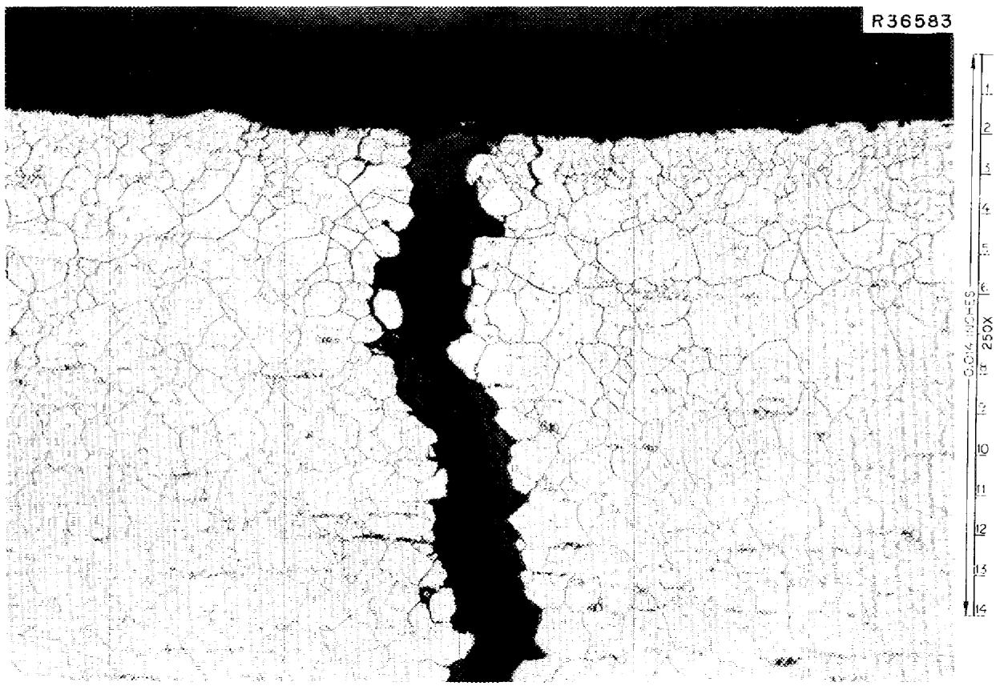  
Fig. 15.4. Inner Surface and Crack in Core Outlet Pipe of In-Pile Loop 2. Top side, near core. $250\times$

caused by stresses resulting from differential thermal expansion of the loop components.

Calculation of the piping stresses in the loop has been made for two conditions: (1) for the temperature profile around the loop at normal, full-power in-pile operation, and (2) for the temperature profile observed during a reactor setback (change from full power to zero in $\sim 1\frac{1}{2}\min$ ).

For both conditions (1) and (2) the piping stress analysis indicates that the maximum stress from thermal expansion occurs in the core outlet pipe where the failure occurred. For the normal operating condition the bending movement produces a stress of $\sim 10,000$ psi in the pipe wall (tension on the top and compression on the bottom). For the temperature distribution encountered during a reactor setback, the direction of the bending movement is reversed, causing a stress of $\sim 17,000$ psi in the pipe wall (compression on top and tension on the bottom).

It appears that two factors could have caused the failure in the core outlet pipe. First, the

section of pipe where failure occurred was at a temperature of $\sim 1350^{\circ}\mathrm{F}$ . Stress-rupture properties of Hastelloy N at $1350^{\circ}\mathrm{F}$ ( $732^{\circ}\mathrm{C}$ ) are below those at $1200^{\circ}\mathrm{F}$ ( $650^{\circ}\mathrm{C}$ ) used for design purposes, and these properties are further reduced by the accumulated irradiation dose of $\sim 5 \times 10^{19} nvt$ . Under these conditions ( $1350^{\circ}\mathrm{F}$ and $5 \times 10^{19} nvt$ ), it is estimated that stresses of about 10,000 psi could produce rupture within moderate times, possibly of the order of days. Further, the ductility of Hastelloy N is reduced such that strains of 1 to $3\%$ can result in fracture. Thus the thermal stress of $\sim 10,000$ psi calculated to exist in the outlet pipe at full power operation may have been sufficient to cause failure. A second and more

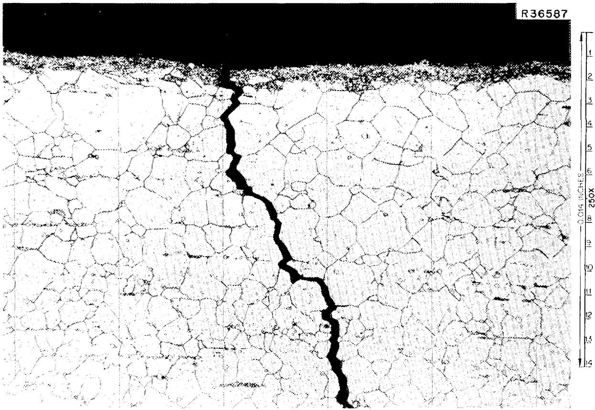  
Fig. 15.5. Inner Surface and Crack in Core Outlet Pipe of In-Pile Loop 2. Bottom side, near core. $250\times$

likely cause of failure is the rapid stress reversal $(+10,000$ to $-17,500$ psi) calculated for the thermal shock caused by the rapid loss of fission heat during a reactor setback. Approximately half a dozen such cycles were encountered during in-pile operation. In particular, one such cycle occurred on March 3 after a dose accumulation of $\sim 4\times 10^{19}$ nvt, and it was on March 11 that evidence of fission product leakage from the loop was first observed. Thus the stress reversals resulting from such cycles are very likely to have contributed to failure of the loop, since the rupture occurred at the point where the stress was a maximum, the temperature was $1350^{\circ}\mathrm{F}$ , and a radiation dose sufficient to affect the strength and ductility of Hastelloy N had been accumulated.

It is evident that for future in-pile loops with similar configuration and temperatures, a material superior to the present Hastelloy N in high-temperature strength under irradiation is required.

# 15.9 CUTUP OF LOOP AND PREPARATION OF SAMPLES

Promptness in the examination of the loop was essential. Major irradiation of the loop had ceased on March 17, 1967, when the loop was retracted following the identification of the fission gas leak. Since such short-lived isotopes as $66\text{-hr}^{99}\text{Mo}$ and $78\text{-hr}^{132}\text{Te}$ were of interest, it was necessary that all such samples should be counted within less than about eight weeks after this time.

On April 5, 1967, following the ORR shutdown on April 4, the loop package was removed from the beam hole and transferred to the segmenting facility. The sample and addition system was stored, and inlet ("cold") and outlet ("hot") gas tubing sections were obtained from the external equipment chamber region and submitted for radiochemical analysis.

The assembly was segmented into shield plug, connector, and loop container regions. Sections of the gas addition and gas sample tubing and sections of the salt sample line from these regions were obtained for radiochemical analysis. The loop container region was opened; no evidence of salt leakage from the loop was seen. Several sections of the gas addition and sample lines and of the salt sample line were taken. The loop was then pressurized with dry argon, and bubbles from a leak-detecting fluid indicated the crack on the top of the core outlet tubing near the core.

During these operations, the core region was kept at $300^{\circ}\mathrm{C}$ in a furnace when not being worked on to keep radiolytic fluorine from being generated in residual salt, although the salt inventory was only about $2\mathrm{g}$ . The loop was cut into three segments - gas separation tank, cold-leg return line, and core - and was transferred to the High-Radiation-Level Examination Laboratory for further cutup and examination. There the Hastelloy N core body was removed, and the graphite was cut into upper and lower sections with thin sections removed at top, middle, and bottom for metallographic examination.

Samples of loop metal were taken such that surfaces representing all regions of the loop were submitted for both radiochemical and metallographic examination. In total, some 16 samples of loop metal, 8 of the salt sample line, 11 of the "hot" gas sample tubes, and 9 of the "cold" gas addition tube were submitted for radiochemical analysis. A dozen specimens of metal from the loop, some of which contained parts of several regions of interest, have been subjected to metallographic examination. The results of these analyses and examinations are described in sections which follow.

Small amounts of blackened salt were found in the gas separation tank near the outlet, in the core bottom flow channels, and in the first few inches of salt sample line near the core. A droplet also clung to the upper thermocouple well in the fuel channel. The total residual salt in the loop did not appear to exceed the inventory value of $2\mathrm{g}$ .

The penetration profiles of the various fission products in graphite were determined by collecting concentric thin shavings of core graphite from representative fuel tubes for radiochemical analysis. For this purpose a graduated series of

broaches or cylindrical shaving tools were designed by S. E. Dismuke. Fourteen broaches permitted sampling of the core graphite fuel channels $\left(\frac{1}{4}\right.$ in. ID) to a depth of 45 mils, in steps nominally ranging from 0.5 mil for the first few mils in depth up to 10 mils each for the final two cuts. In some cases, two or three cuts were collected in the same bottle in order to reduce the number of samples to be analyzed.

A sample bottle was attached directly below the hole being sampled, and the broach with shaved graphite was pushed through the hole into the bottle from which it was subsequently retrieved after brushing into the bottle any adhering graphite particles. The bottle was closed, a new bottle clipped into place, and the next larger broach used. For each bottle, all the graphite sample was weighed and dissolved for radiochemical analysis.

Total recovery from given holes ranged from 94 to $111\%$ of values calculated from the broach diameter and graphite density. The higher values were almost entirely due to high initial cuts, indicating fuel channels narrower than the nominal 0.250-in.-diam, irregular original holes, or in some cases, some salt adhering to the surfaces. Since penetration depth should be measured from the original surface, actual depths were calculated from the cumulated weight of material actually removed. Forward, next-to-forward, next-to-rear, and rear fuel tubes, in top and bottom sections, were sampled in this way; a total of 76 such samples were submitted for analysis.

Graphite was also shaved from the outer surface of the core cylinder in four samples to a depth of 19 mils. In addition, eight $\frac{1}{8}$ by $\frac{3}{4}$ in. core drillings were taken of the interior central part of the graphite.

# 15.10 METALLOGRAPHIC EXAMINATION

Samples of loop metal taken from the core outlet, gas separation tank inlet and outlet ends, cold leg, and other regions were subjected to metallographic examination. This examination defined the nature of the break in the core outlet line and gave evidence of some carburization and corrosion of loop metal surfaces.

Bottom and top inner surfaces of the core outlet tube near the core are shown in Figs. 15.4 and 15.5. These photographs give a metallographic view of the break in this tube. The break appears

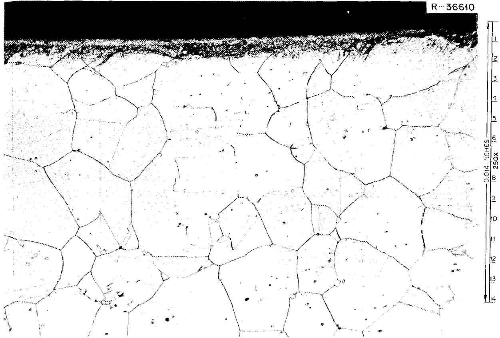  
Fig. 15.6. Inner Surface of Cold-Leg Tubing from In-Pile Loop 2 (Hastelloy N). $250 \times$

to have been intergranular and without any indication of ductility. Such behavior at temperatures in excess of $650^{\circ}\mathrm{C}$ and at a thermal neutron dose of $5 \times 10^{19}$ neutrons/cm $^2$ is consistent with recent ORNL studies $^3$ of the effect of irradiation on elevated-temperature properties of Hastelloy N, as discussed in Sect. 15.8 in connection with the break in the core outlet pipe.

Some evidence of attack on the inner surface of the core outlet may be noted in Figs. 15.4 and 15.5. The upper inner surface shows evidence of corrosion, even though part of the 1-mil, more finely grained layer had been removed by reaming prior to the assembly of the loop. The lower surface does not show corrosive pitting but does have a darkened bank almost 1 mil deep that could be carburization.

The bottom surface (not shown) at the core end of the gas separation tank showed no evidence of either corrosion or carburization.

The cold leg of the loop showed substantial corrosive attack - probably largely intergranular

in the 1-mil, more finely grained inner layer as shown in Fig. 15.6. An unexposed piece of the same tubing is shown for comparison in Fig. 15.7. This tubing was also used for fabrication of the core outlet pipe.

The depth of the attack on the cold-leg pipe is of the same magnitude as would be anticipated from chromium and oxygen analyses of the salt reported above. The tubing used to fabricate the cold leg and core outlet appears to be more sensitive to corrosion than materials used in other parts of the system.

Carburization to a depth of about 1 mil appears to have occurred in the inner surface of the core shell wall in contact with the graphite core, as shown in Fig. 15.8. Similar carburization was also noted on core top and bottom pieces (not shown). Hardness tests were taken at various depths below the surface of the metal, the nearest about 1 mil. The test nearest the surface showed definitely greater hardness, as would be expected from carburization.

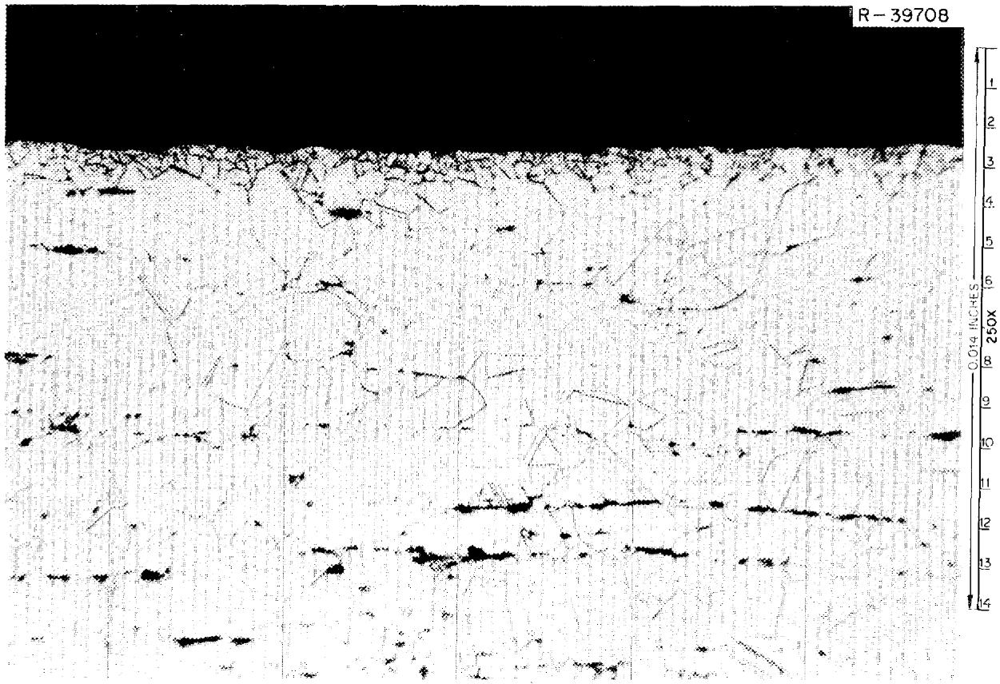  
Fig. 15.7. Inner Surface of Unexposed Hastelloy N Tubing Used in Cold Leg and, After Slight Reaming, in Core Outlet of In-Pile Loop 2. $250 \times$

# 15.11 ISOTOPE ACTIVITY CALCULATION FROM FLUX AND INVENTORY HISTORY

It was useful to estimate how much of a given isotope (either fission product or activation product in flux monitors, etc.) was to be expected in the system at a particular time. This may be done by detailed application of standard equations to the individual irradiation and inventory periods with appropriate adjustment for decay to a standard reference time (reactor shutdown, 4-4-67, 0800). Counting data on the various samples were also referred to this time. In the in-pile period of the experiment, 38 changes in ORR power and 122 changes in experiment position altered the neutron flux, 3 salt additions altered the fuel composition, and 18 withdrawals, including 9 samples, were made.

The equations described below, along with the detailed flux and inventory history, were programmed for computer calculation and estimates of activity of the respective isotopes made as described below. The equations will be discussed in terms of fission products but are readily adapted to activation products. The activities $(A\cdot \lambda_{1}$ and $B\cdot \lambda_{2})$ of isotopes that are the first and second significant members of a decay chain produced by a given period, $t_i$ , of steady irradiation followed by a decay period, $t_d$ , are given by

$$
A \cdot \lambda_ {1} = Y \cdot F \cdot (1 - e ^ {- \lambda_ {1} t _ {i}}) \left(e ^ {- \lambda_ {1} t _ {d}}\right),
$$

$$
\begin{array}{l} B \cdot \lambda_ {2} = Y \cdot F \cdot \frac {\lambda_ {2} \lambda_ {1}}{\lambda_ {2} - \lambda_ {1}} \left[ \left(\frac {1 - e ^ {- \lambda_ {1} t _ {i}}}{\lambda_ {1}}\right) \left(e ^ {- \lambda_ {1} t _ {d}}\right) \right. \\ \left. - \left(\frac {1 - e ^ {- \lambda_ {2} t _ {i}}}{\lambda_ {2}}\right) \left(e ^ {- \lambda_ {2} t _ {d}}\right) \right] \\ \end{array}
$$

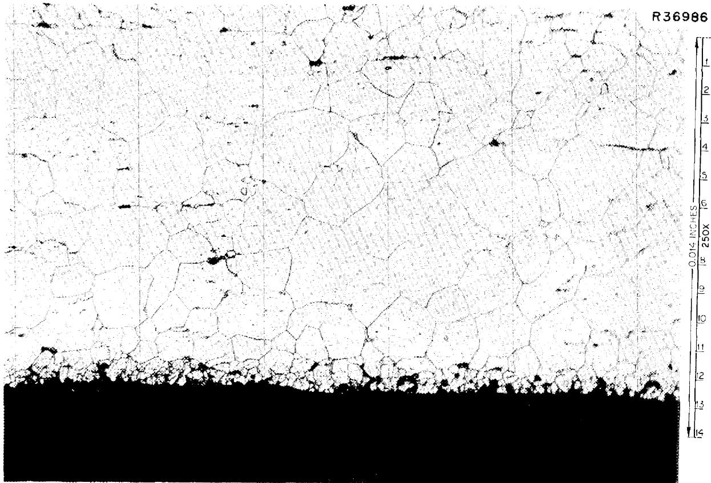  
Fig. 15.8. Inner Surface of Core Shell in Contact with Graphite Core of In-Pile Loop 2. $250 \times$

These equations permit the calculation of activity if flux is given, or of flux if activity has been measured.

The $Y \cdot F$ term is the chain production rate at a given flux or power density for the quantity of material under consideration. It was useful to treat the $Y \cdot F$ term in the case of fissioning as a product of fission yield $Y$ , a standard fission rate $F^{\circ}$ per gram of uranium (at a given flux), a uranium inventory for the interval $j$ (from salt inventory actually under irradiation, $w_{j}$ , times uranium concentration $U_{j}$ ), and the irradiation intensity factors, $p_{j}$ and $q_{j}$ , relative to full reactor power and fully inserted position. Thus for any set of intervals, for example,

$$
\begin{array}{l} \frac {\sum \left(A \cdot \lambda_ {1}\right) j}{Y \cdot F ^ {\circ}} = \sum w _ {j} \cdot U _ {j} \cdot p _ {j} \cdot q _ {j} \\ \cdot \left(1 - e ^ {- \lambda_ {1} \cdot t _ {i j}}\right) \cdot \left(e ^ {- \lambda_ {1} \cdot t _ {d j}}\right) \\ \end{array}
$$

A similar expression can be written for the daughter isotope (such as the 35-day $^{95}\mathrm{Nb}$ daughter of 65-day $^{95}\mathrm{Zr}$ ).

The term on the right may be computed for any given isotope from a knowledge of decay rate, irradiation, and inventory history. The term on the left represents the count to be expected, divided by the saturation value from $1\mathrm{g}$ of uranium at full power.

In practice, the total loop inventory was corrected for the amount of salt not under irradiation, at the time, in sample lines and the purge tank. The activity withdrawn with each removal and that remaining in the loop were calculated. The total activity (at reference time) of a given isotope produced during the experiment was thus estimated.

As mentioned in an earlier section, it appears reasonable to use the activities of certain fission products in the salt samples, in particular $^{137}\mathrm{Cs}$ , $^{144}\mathrm{Ce}$ , and $^{95}\mathrm{Zr}$ , as internal standards to estimate the flux. A mean flux to the salt of $0.88 \times 10^{13}$ was thus estimated from activities measured

Table 15.4. Comparison of Fission Product Activity Produced with Activity Found in Various Loop Regions   
All activities in units of $10^{10}$ dis/min, referred to ORR shutdown, 4-4-67, 0800   

<table><tr><td>Isotope</td><td>99Mo</td><td>103Ru</td><td>106Ru</td><td>132Te</td><td>129Te</td><td>95Nba</td><td>95Zr</td><td>131I</td><td>140Ba</td><td>89Sr</td><td>91Y</td><td>137Cs</td><td>141Ce</td><td>144Ce</td><td>147Nd</td></tr><tr><td>Half-life</td><td>66 h</td><td>39.7 d</td><td>366.6 d</td><td>77.7 h</td><td>33 d</td><td>35 d</td><td>65 d</td><td>8.05 d</td><td>12.8 d</td><td>50.4 d</td><td>58.3 d</td><td>30 y</td><td>32.8 d</td><td>284 d</td><td>11.1 d</td></tr><tr><td>Fission yield, %</td><td>6.1</td><td>3.0</td><td>0.38</td><td>4.3</td><td>0.34</td><td>6.2</td><td>6.2</td><td>2.93</td><td>6.35</td><td>4.79</td><td>5.8</td><td>6.0</td><td>6.0</td><td>5.6</td><td>2.6</td></tr><tr><td>Total activity formedb</td><td>940</td><td>8100</td><td>190</td><td>1140</td><td>970</td><td>7400</td><td>12,800</td><td>5000</td><td>16,500</td><td>11,500</td><td>12,900</td><td>108</td><td>17,300</td><td>3500</td><td>6100</td></tr><tr><td>Found in salt samplesc</td><td>2</td><td>6</td><td>d</td><td>9</td><td>d</td><td>1530</td><td>8900</td><td>1520</td><td>4800</td><td>7550</td><td>15,600</td><td>94</td><td>12,100</td><td>3830</td><td>4400</td></tr><tr><td></td><td></td><td></td><td></td><td>20</td><td></td><td>1290</td><td>13,300</td><td>1570</td><td>5000</td><td>9370</td><td>7900</td><td>103</td><td>13,500</td><td>4330</td><td>3900</td></tr><tr><td>Found in residual salt</td><td></td><td></td><td></td><td></td><td></td><td></td><td>1110</td><td></td><td>180</td><td></td><td></td><td></td><td></td><td>226</td><td>902</td></tr><tr><td>Found in graphite</td><td>385</td><td>d</td><td>d</td><td>360</td><td>57+</td><td>1001</td><td>126</td><td>24</td><td>410</td><td>753</td><td>d</td><td>d</td><td>277</td><td>68</td><td>146</td></tr><tr><td>Found on loop metal</td><td>220</td><td>d</td><td>d</td><td>160</td><td>55+</td><td>1300</td><td>77</td><td>80</td><td>220</td><td>122</td><td>d</td><td>d</td><td>77</td><td>16</td><td>42</td></tr><tr><td>Found in salt sample line</td><td>93</td><td>d</td><td>d</td><td>82</td><td>5+</td><td>246</td><td>104</td><td>57</td><td>150</td><td>84</td><td>d</td><td>d</td><td>114</td><td>23</td><td>115</td></tr><tr><td>Found in hot-gas sample line</td><td>0.2</td><td>d</td><td>d</td><td>0.4</td><td>&lt;0.1</td><td>&lt;1</td><td>&lt;1</td><td>5</td><td>&lt;1</td><td>15</td><td>d</td><td>d</td><td>&lt;1</td><td>0.01</td><td>&lt;1</td></tr><tr><td>Found in cold-gas inlet line</td><td>&lt;0.1</td><td>d</td><td>d</td><td>&lt;0.1</td><td>&lt;0.1</td><td>&lt;1</td><td>&lt;1,</td><td>1</td><td>&lt;1</td><td>1</td><td>d</td><td>d</td><td>&lt;1</td><td>&lt;0.01</td><td>&lt;1</td></tr></table>

aDaughter of 95Zr.   
${}^{b}$ Assuming a mean flux to salt of ${0.88} \times  {10}^{13}$ ,based on average of values from ${}^{95}\mathrm{{Zr}},{137}\mathrm{{Cs}}$ ,and ${}^{144}\mathrm{{Ce}}$ in final salt samples.   
Estimated for total salt based on each of two final samples.   
$d$ Determinations not sufficiently complete to be given here.

on final salt samples. This value was used in calculating total activities of the various isotopes produced in the experiment.

# 15.12 ISOTOPE ACTIVITY BALANCE

The calculations above provide an estimate of the amount of isotope to be accounted for. We can estimate how much was actually found in a kind of "isotope activity balance" by accounting for all regions of the loop in terms of the measured activity of samples.

For the various samples of metal, graphite, and salt obtained from the loop, activity determinations for the 15 isotopes shown in Table 15.4 were requested. The concentration of $^{235}\mathrm{U}$ was also determined. Because of the short half-life of such isotopes as $^{99}\mathrm{Mo}$ and $^{132}\mathrm{Te}$ , these were run as promptly as possible, and others were determined later. Results for some isotopes are not yet complete. The available data will be examined in terms of activity balances for the respective isotopes and the penetration profiles of these isotopes in graphite.

The ratio of the area of each loop (or fuel channel) region to the sample representing the region was determined so that the total loop area was accounted for in terms of samples. The cumulative activity of all shavings from a graphite channel section was used as the sample from that channel. The sample activities multiplied by the proper ratios have been totaled for each isotope under the categories of graphite, loop metal, salt sample lines, gas lines, and salt. These values, plus values for salt based on the final sample activities, are shown in Table 15.4. Estimated total activities from the calculations based on irradiation and inventory history are also shown.

From Table 15.4 it may be seen that over half (and generally less than all) the expected activity appeared to be accounted for in the cases of $^{99}\mathrm{Mo},^{132}\mathrm{Te},^{95}\mathrm{Nb},^{95}\mathrm{Zr},^{89}\mathrm{Sr},^{137}\mathrm{Cs},^{141}\mathrm{Ce},$ $^{144}\mathrm{Ce}$ , and $^{147}\mathrm{Nd}$ . A substantial proportion, although less than half, was accounted for in the cases of $^{140}\mathrm{Ba}$ and $^{131}\mathrm{I}$ . Inasmuch as iodine readily volatilizes from all samples, without doubt especially from the powdered graphite, it is to be expected that iodine determinations shall be low. Determinations are not yet complete in the cases of $^{103}\mathrm{Ru},^{106}\mathrm{Ru},^{129}\mathrm{Te},^{91}\mathrm{Y}$ , and $^{137}\mathrm{Cs}$ .

Molybdenum, tellurium, and ruthenium are almost entirely departed from the salt, along with substantial proportions of $^{89}\mathrm{Sr}$ , $^{95}\mathrm{Nb}$ , $^{140}\mathrm{Ba}$ , and most probably $^{131}\mathrm{I}$ . Except for $^{89}\mathrm{Sr}$ and possibly $^{140}\mathrm{Ba}$ , which favor graphite, these elements show no strong preference for graphite or metal but seem to deposit on whatever surface is available. The alkali-metal and rare-earth isotopes, including $^{91}\mathrm{Y}$ , $^{137}\mathrm{Cs}$ , $^{141}\mathrm{Ce}$ , $^{144}\mathrm{Ce}$ , and $^{147}\mathrm{Nd}$ , and also $^{95}\mathrm{Zr}$ , remain almost completely in the salt, the amounts found in graphite generally being ascribed to salt contained in the samples, as discussed later.

# 15.13 URANIUM-235 OBSERVED IN GRAPHITE SAMPLES

Uranium-235 on the various graphite and metal samples was also determined. An activation technique was used in which delayed neutrons were counted; it is sensitive to less than $1\mu \mathrm{g}$ of $^{235}\mathrm{U}$ . The determinations served the dual purpose of measuring small quantities of salt which could have adhered to surface samples and of determining the penetration of uranium in one form or another into the graphite.

In seven of the eight graphite channels from which samples were taken, the quantity of $^{235}\mathrm{U}$ ranged from 1.6 to $2.8\mathrm{mg}$ (per 8.3 to $9.5\mathrm{cm}^2$ ) with over half being found within the first mil and over $80\%$ generally within the first 3 mils. However, some uranium was detected even in the 35- to 45-mil cuts. The first sample from the remaining channel weighed $290\mathrm{mg}$ and contained $18.9\mathrm{mg}$ of $^{235}\mathrm{U}$ , equivalent to $190\mathrm{mg}$ of fuel salt. The samples from deeper cuts contained uranium at levels only moderately higher than those from other channels. Thus, it appears that this sample probably contained a small piece of fuel salt which had remained on the surface.

X-ray diffraction patterns obtained from the surface of a specimen of graphite cut from an exit fuel channel surface showed patterns of $\mathrm{Li}_{2}\mathrm{BeF}_{4}$ and $\mathrm{Li}_{2}\mathrm{ZrF}_{6}$ , with no indication of oxides or uranium compounds. Such a pattern is characteristic of normally frozen fuel salt, so these observations indicated that fuel salt had adhered to the graphite surface even though not directly visible under ordinary hot-cell viewing conditions.

Table 15.5. Salt Constituents in Graphite at Given Depths   

<table><tr><td rowspan="3"></td><td colspan="6">Method of Determination</td></tr><tr><td colspan="5">Mass Spectrograph (MS-7)</td><td rowspan="2">Activation, U(μg/mg)</td></tr><tr><td>Li(mole %)</td><td>Be(mole %)</td><td>Zr(mole %)</td><td>U(mole %)</td><td>U(μg/mg)</td></tr><tr><td>Loop inventory:</td><td>27.8</td><td>65.3</td><td>4.8</td><td>2.0</td><td></td><td></td></tr><tr><td colspan="7">Graphite - top section next-to-front channel</td></tr><tr><td>0.2 to 0.4 mil</td><td>22</td><td>71</td><td>5.3</td><td>1.8</td><td>39</td><td>49</td></tr><tr><td>0.4 to 2.05 mils</td><td>21</td><td>73</td><td>3.8</td><td>2.2</td><td>2.6</td><td>3.6</td></tr><tr><td>2.05 to 4.4 mils</td><td>15</td><td>80</td><td>3.5</td><td>1.7</td><td>2.2</td><td>0.91</td></tr><tr><td>4.4 to 9.8 mils</td><td>16</td><td>80</td><td>4.5</td><td>a</td><td>(&lt;0.34)</td><td>0.32</td></tr></table>

$a_{\mathrm{Not}}$ determined.

The MS-7 spark mass spectrograph was used to examine solutions of graphite shaved from a typical fuel tube for salt constituents. Total amounts used were at the microgram level. Results are shown in Table 15.5.

The salt ingredients Li, Be, Zr, and U are in the proper molar ratio (with the proper total of $^7\mathrm{Li}$ and $^9\mathrm{Be}$ , but some drift in their ratio). Furthermore, the absolute quantity of uranium agrees reasonably with the values from the activation analysis by delayed neutron counting.

Consequently, the uranium entering the graphite did so in the form of salt. The difficult question is whether it permeated the pores or adhered to the surface and filled the cracks.

Three-phase contact of graphite, molten LiF $\mathrm{BeF}_2$ or MSRE fuel salt, and slightly moist gas at elevated temperatures has been shown by Kreyger, Kirslis, and Blankenship to result in the formation of adherent oxide films on the graphite, presumably BeO, with wetting of this oxide (and thereby the graphite) by molten salt. But similar adherence was reported not to occur under the salt where the graphite and molten salt were in contact before the moisture entered. Our oxygen analyses of the fuel, reported above, do not indicate any great uptake of moisture, and such as did enter appears to have been involved in cor

rosion processes and is not necessarily to be associated with adherence of salt to graphite.

Prior to admission of any salt to the loop, the graphite was heated at $600^{\circ}\mathrm{C}$ for 20 hr under vacuum, whereas evacuation for several minutes at $400^{\circ}\mathrm{C}$ has been shown to be sufficient to remove normal moisture from graphite. Thus, internal moisture in the graphite is not believed to account for adherence of the salt to graphite.

Examinations of autoradiographs indicate that several fuel channels had one or two cracks extending from them and that appreciable radioactivity was located along such cracks. Uranium-235 was detected by alpha radiography in cracks as well as on the hole surface. Although some or all might be a polishing artifact (or from hot-cell contamination), this does not dispute, and possibly supports, the idea that salt entered cracks. Thus, we think that the presence of the uranium in the graphite can be associated with the entry of salt into cracks and the substantial adherence of thin films of salt to irregularities in graphite surfaces.

The adherence to graphite by the salt, which we will not further expound here, is believed to have resulted in only coverage of surface (including cracks), with no penetration of graphite pores being indicated. Recognition of this unexpected entry of uranium-containing salt into cracks did assist in understanding the behavior of certain fission products, as discussed below.

# 15.14 PENETRATION OF FISSION PRODUCTS INTO GRAPHITE AND DEPOSITION ONTO SURFACES

The average concentrations of individual fission products in the graphite at different depths from the surfaces were determined by radiochemical analysis of the samples shaved concentrically from the fuel passages. Results for the individual elements will be discussed below. It may be said here that they are generally consistent with determinations on the first and second set of MSRE surveillance specimens after taking into consideration the adherence of small amounts of uranium-containing salt to the graphite surfaces in the loop and its entry into cracks, as discussed in Sect. 15.13. By also considering the deposition onto loop metal surfaces, some tentative conclusions are drawn below.

The results were consistent from channel to channel for a given isotope except for variations

attributed to the presence of salt and irregularities in the original surface. Consideration of such variation is not complete but is not expected to alter the conclusions below. At this time, we will therefore consider data obtained from a single representative channel (bottom graphite section, front channel). The samples from this channel contained a total of $2.84\mathrm{mg}$ of ${}^{235}\mathrm{U}$ , and the original channel surface was $8.3\mathrm{cm}^2$ . The activities of the various fission products that would be generated in this amount of uranium during the total irradiation period were calculated and are compared in Table 15.6 with the activities found in the channel.

The isotopes shown in Table 15.6 are grouped into three sections which are related to different kinds of behavior. The first section includes the elements Zr, Ce, Nd, and Cs. The isotopes found in the samples appear to be as expected from the amount of salt present and do not represent any interaction with the graphite. The concentration-

Table 15.6. Activities of Isotopes in Graphite Compared with the Activities That Would Be Generated in the $235\text{U}$ in the Sample   

<table><tr><td>Isotope</td><td>Half-Life</td><td>Chain Yield (%)</td><td>Calculated Activity (dis/min)</td><td>Total Observed Activity (dis/min)</td><td>Ratio, Observed/Calculated</td></tr><tr><td></td><td></td><td></td><td>×1010</td><td>×1010</td><td></td></tr><tr><td>95Zr</td><td>65 d</td><td>6.2</td><td>2.52</td><td>2.96</td><td>1.2</td></tr><tr><td>144Ce</td><td>284 d</td><td>5.6</td><td>0.73</td><td>0.88</td><td>1.2</td></tr><tr><td>141Ce</td><td>32.8 d</td><td>6.0</td><td>3.21</td><td>4.81</td><td>1.5</td></tr><tr><td>147Nd</td><td>11.1 d</td><td>2.6</td><td>1.04</td><td>1.70</td><td>1.6</td></tr><tr><td>137Cs</td><td>30 y</td><td>6.0</td><td>0.0225</td><td>b</td><td>b</td></tr><tr><td>131I</td><td>8.05 d</td><td>2.93</td><td>0.86</td><td>1.54+</td><td>1.8+</td></tr><tr><td>140Ba</td><td>12.8 d</td><td>6.35</td><td>2.83</td><td>15.4</td><td>5.5</td></tr><tr><td>89Sr</td><td>50.4 d</td><td>4.79</td><td>2.22</td><td>28.5</td><td>13</td></tr><tr><td>95Nb</td><td>35 dc</td><td>6.2</td><td>1.64</td><td>23.7</td><td>14</td></tr><tr><td>129Te</td><td>33 d</td><td>0.34</td><td>0.18</td><td>2.04+</td><td>11+</td></tr><tr><td>132Te</td><td>3.25 d</td><td>4.3</td><td>0.36</td><td>14.9</td><td>41</td></tr><tr><td>99Mo</td><td>2.75 d</td><td>6.1</td><td>0.44</td><td>22.1</td><td>50</td></tr><tr><td>103Ru</td><td>39.7 d</td><td>3.0</td><td>1.53</td><td>b</td><td>b</td></tr><tr><td>106Ru</td><td>366.6 d</td><td>0.38</td><td>0.039</td><td>b</td><td>b</td></tr></table>

${}^{a}$ Cumulative values of samples from bottom front fuel passage containing a total of ${2.84}\mathrm{{mg}}$ of ${}^{235}\mathrm{U}$ ; all counts referred to reactor shutdown (4-4-67,0800). Calculation based on average loop flux at full power of ${0.88} \times  {10}^{13}$ neutrons ${\mathrm{{cm}}}^{-2}{\mathrm{{sec}}}^{-1}$ .   
$b$ Determinations not completed.   
Daughter of 65-day $^{95}\mathrm{Zr}$ .

depth profile of these isotopes (plotted semilogarithmically) parallels that of the uranium in the graphite. Fission product zirconium, of course, had to remain mostly in the salt because it necessarily mingled with the 5 mole % of Zr in the salt itself.

The next group of elements (I, Ba, Sr, and Nb) shows an appreciably greater activity in the samples than can be accounted for by the amount of uranium present. These elements (except possibly $^{95}\mathrm{Nb}$ ) also show concentration-depth profiles that do not fall off nearly as rapidly as does the uranium concentration. Such behavior has been described by Kedl and others (based on MSRE surveillance specimen data obtained by Kirslis) as being due to gaseous transport of the isotope or a short-lived precursor. Niobium-95 could exist as a volatile pentafluoride, $^{89}\mathrm{Sr}$ has a 3-min krypton precursor, and $^{140}\mathrm{Ba}$ has a 16-sec xenon precursor. Iodine-131 is included in this group, since iodine volatilizes readily from samples, and the true values should doubtless be higher than those reported.

The comparatively flat profiles (except for the first mil or two) imply rapid transport through pores in the graphite without very strong tendency for adherence to graphite surfaces. Niobium-95, the profile of which is not as flat as the others, appeared to be adsorbed appreciably on the graphite surface, though not as strongly as elements of the group to follow.

The third group contains elements Te, Mo, and Ru. (The inclusion of ruthenium is a guess, at present, based on MSRE surveillance specimen studies by Kirslis, since our data are incomplete for the ruthenium isotopes.) This group is characterized by the highest concentrations in the samples, relative to the uranium present. The concentration-depth profiles are even steeper than for uranium. It appears evident that these elements are strongly adsorbed by graphite surfaces and are able to penetrate cracks readily, either by rapid diffusion in the salt in the crack or by surface diffusion. They do not tend to penetrate bulk graphite pores to a comparable degree. The highest concentration of $^{99}\mathrm{Mo}$ and $^{132}\mathrm{Te}$ per unit of surface, either graphite or metal, was reported for the Hastelloy N thermowell in the front core

fuel channel. This implies that the elements in this group tend to deposit on the first surface encountered, whether metal or graphite.

# 15.15 GAMMA IRRADIATION OF FUEL SALT IN THE SOLID PHASE

The fuel salt in molten-salt in-pile loop 2 was kept frozen at temperatures generally above $300^{\circ}\mathrm{C}$ for a number of days before the salt was removed from the loop. At temperatures below $100^{\circ}\mathrm{C}$ , fission product or gamma radiolysis of fluoride salt is known to result in the generation of fluorine gas to appreciable pressures. Fluorine could oxidize various species (U, Mo, Ru, Nb, etc.) to produce volatile fluorides which could then be transported to other parts of the system. Although a temperature of $300^{\circ}\mathrm{C}$ was expected to be more than adequate to suppress such radiolysis completely, direct data were not available but appeared readily obtainable. Since the phenomenon is also of general interest in the MSR program, the experiment described below was undertaken.

Solid MSR fuel salt $(\mathrm{LiF - BeF}_2\cdot \mathrm{ZrF}_4\cdot \mathrm{UF}_4,$ about 65-28-5-2 mole $\%$ ) from the stock used to supply fuel for in-pile loop 2 was subjected to very-high-intensity gamma irradiation in a spent HFIR fuel element at a temperature of $320^{\circ}\mathrm{C}$ to determine possible radiation effects on the salt and its compatibilities with graphite and Hastelloy N.

For the irradiation experiment, HFIR fuel element 9 was placed in a storage rack in the HFIR pool, and the experiment assembly was placed in the center of the fuel element as shown in Fig. 15.9. The capsule-type irradiation assembly consisted of a Hastelloy N capsule, 0.93 in. $\mathrm{OD} \times 0.78$ in. $\mathrm{ID} \times 3.5$ in. long, containing two CGB graphite test specimens, $3.0 \times 0.87 \times 0.125$ in., placed back to back in the capsule. Twenty-five grams of fuel salt was added to the capsule, melted, and then allowed to solidify. A pressure transducer was connected to the gas space above the salt, and the capsule assembly was welded shut. A heater assembly using Nichrome V heater wire surrounded the capsule, and thermocouples were located in the capsule wall to monitor temperatures. The experiment assembly was then placed in an aluminum container to isolate it from the pool water, as shown in Fig. 15.10.

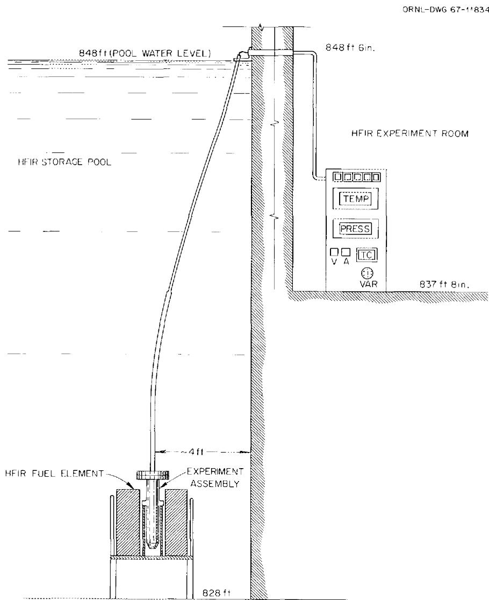  
Fig. 15.9. Equipment Layout for Gamma Irradiation Experiment in an HFIR Fuel Element.

The gamma flux of the spent fuel element used for the irradiation experiment was measured by the reduction of a $0.02M\mathrm{Ce(SO_4)_2}$ solution irradiated in the center of the fuel element. Such measurements indicated that the gamma intensity was $8.06\times 10^{7}\mathrm{r / hr}$ before the start of irradiation (6 days decay time) and $2.23\times 10^{7}\mathrm{r / hr}$ after termination of irradiation (30 days decay time).

The capsule assembly was placed in the center of HFIR fuel element 9 on July 20, 1967. This element had been removed from the reactor on July 7, 1967, after 23 days of operation at $100\mathrm{Mw}$ . The salt temperature reached $320^{\circ}\mathrm{C}$ from gamma heat alone (calculated to be $0.2\mathrm{w / g}$ ). The assembly was removed on August 14, 1967, after

600 hr (25 days) of irradiation, accumulating an estimated absorbed dose of $1.5 \times 10^{24}$ ev per g of salt based on the irradiation intensity measurements described above. The temperature of the fuel salt was held constant at $320^{\circ}\mathrm{C}$ throughout the irradiation period by adding furnace heat as the fuel element gamma flux decayed. No significant pressure change was noted; a decrease from $\sim 19$ psia to $\sim 18$ psia appeared to be associated with the change from internal gamma heating to external electrical heating. Analysis of a sample of the argon cover gas obtained during postirradiation examination showed no evidence of radiolysis products.

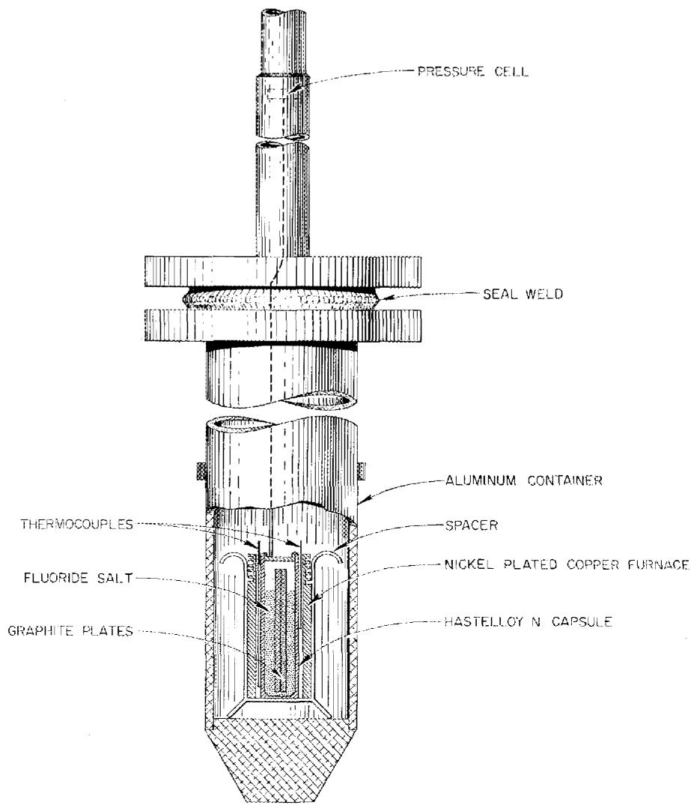  
Fig. 15.10. Autoclave Assembly for Gamma Irradiation of Fluoride Salt in an HFIR Fuel Element.

The Hastelloy N capsule containing salt and graphite test specimens was cut up for examination in an inert-atmosphere dry box. Preliminary examination did not reveal any gross effects. Thin salt films adhered to the Hastelloy N container with no evidence of noteworthy interaction. Parts of the salt were darkened to a dull grey-black, an expected result of irradiation of $\mathrm{Li}_2\mathrm{BeF}_4$ and $\mathrm{LiZrF}_5$ crystals. Zirconium-95 and $^{140}\mathrm{Ba}$ activity in the salt indicated $3\times 10^{10}$ total fissions per g of salt (a relatively trivial figure), presumably from beryllium photoneutrons (the uranium was $93\%$ enriched). Graphite from below the salt surface showed slight stains or films.

X-ray diffraction examination of the surface showed only graphite lines. Samples of graphite from gas and solid phase regions were analyzed, showing $1\mu \mathrm{g}$ of $^{235}\mathrm{U}$ per $\mathrm{cm}^2$ in the gas phase and 15 to $35~\mu \mathrm{g / cm}^2$ in the graphite contacting solid salt. This appeared to be due to traces of salt adhering to the graphite. The quantity is much lower than was noted on graphite from fuel channels of in-pile loop 2, where $350~\mu \mathrm{g}$ of $^{235}\mathrm{U}$ per $\mathrm{cm}^2$ was characteristic.

We find no evidence of radiolytic generation of fluorine or transport of uranium or other substances due to irradiation at $320^{\circ}\mathrm{C}$ .

# Part 5. Materials Development

H. E. McCoy

J. R. Weir

Our materials program has been concerned both with the operation of the MSRE and with the development of materials for an advanced MSBR. The primary role of the materials program in the operation of the MSRE has been a surveillance program in which we follow the property changes of the MSRE graphite and Hastelloy N as the reactor operates. We have surveillance facilities in the reactor core and on the outside of the core tank.

The successful operation of the MSRE has strengthened our confidence in the molten-salt re

actor concept, and we have initiated a materials program in support of an MSBR. In this reactor the graphite will be a primary structural material, since it separates the breeder and the fuel salts.

Hastelloy N will be the metallic structural material, and it will be necessary to develop a joint between graphite and Hastelloy N. Thus, most of our research effort is concerned with the structural materials, graphite and Hastelloy N, and the joint between them.

# 16. MSRE Surveillance Program

# 16.1 GENERAL DESCRIPTION OF THE SURVEILLANCE FACILITY AND OBSERVATIONS ON SAMPLES REMOVED

W. H. Cook

The effects of the operational environments of the MSRE on its unclad moderator of grade CGB graphite and its structural alloy of Hastelloy N continue to be monitored periodically with surveillance specimens of these materials. The surveillance assembly, the general sampling schedule, and the examination program have been described previously.

The second group of reactor core specimens, stringer RS2, has been removed from the core after accumulating peak fast- $(E > 0.18\mathrm{MeV})$ and thermal-neutron doses of approximately $1\times 10^{21}$ and $4\times$ $10^{20}$ neutrons/cm² respectively. These specimens were subjected to a temperature of $1190\pm 18^{\circ}\mathbf{F}$ for 5500 hr. The first group of vessel specimens,

stringer X1, was also removed. The peak thermal-neutron dose on these is approximately $2.5 \times 10^{19}$ neutrons/cm $^2$ . The estimated temperature range on these specimens was 900 to $1200^{\circ}\mathrm{F}$ , and the time at temperature was approximately 11,000 hr. Initial results of examination of these groups have not revealed any unexpected or serious effects. These two groups have been replaced with new sets of specimens which are being exposed in the MSRE environments together with other groups that were not sampled at this time.

To review briefly, the reactor core surveillance specimens consist of both graphite and Hastelloy N mounted approximately 3 in. away from, and parallel with, the axial center line of the moderator core. The reactor vessel specimens are Hastelloy N mounted approximately $4^{1/2}$ in. outside the reactor vessel. The reactor core specimens are exposed to the molten fluoride fuel, and the reactor vessel specimens are exposed to the nitrogen-2 to 5 vol % oxygen atmosphere of the reactor containment cell. The result is that the current and future irradiation

Table 16.1. Status of and Future Plans for the MSRE Surveillance Program   

<table><tr><td rowspan="3">Sampling No.</td><td rowspan="3">Total Reactor Power (MWhr)</td><td rowspan="3">Approximate Date</td><td colspan="4">Stringer Pulled</td><td colspan="3">Peak Neutron Dose</td><td colspan="5">Stringer Inserted</td><td></td><td></td><td></td></tr><tr><td colspan="2">Core</td><td colspan="2">Vessel</td><td colspan="2">Stringer</td><td>\( Vessel^f \)</td><td rowspan="2" colspan="3">Core</td><td colspan="2">Vessel</td><td></td><td></td><td></td></tr><tr><td>\( Designation^b \)</td><td>\( Graphite^c \)</td><td>Hastelloy N Heat No. \( ^d \)</td><td>Designation</td><td>Hastelloy N Heat No.</td><td>\( Paste^e \)</td><td>Thermal</td><td>Designation</td><td>Graphite</td><td>Hastelloy N Heat No.</td><td>Designation</td><td>Hastelloy N Heat No.</td></tr><tr><td rowspan="6">1</td><td rowspan="6">7,820</td><td rowspan="6">7-28-66</td><td rowspan="6">RS1, RRL, RL1</td><td rowspan="6">CGB</td><td rowspan="6">50815085</td><td rowspan="6">None</td><td rowspan="6">None</td><td rowspan="6">\( 3.2 \times 10^{20} \)</td><td rowspan="6">\( 1.3 \times 10^{20} \)</td><td rowspan="6">\( 6.5 \times 10^{18} \)</td><td rowspan="2">RS2</td><td rowspan="2">CGB</td><td>\( 21545^g \)</td><td rowspan="6">None</td><td rowspan="6">None</td><td></td><td></td></tr><tr><td>\( 21554^h \)</td><td></td><td></td></tr><tr><td rowspan="2">RL2</td><td rowspan="2">CGB</td><td>5065</td><td></td><td></td></tr><tr><td>5085</td><td></td><td></td></tr><tr><td rowspan="2">RK2</td><td rowspan="2">CGB</td><td>5065</td><td></td><td></td></tr><tr><td>5085</td><td></td><td></td></tr><tr><td rowspan="4">2</td><td rowspan="4">32,450</td><td rowspan="4">5-9-67</td><td rowspan="4">RS2</td><td rowspan="4">CGB</td><td rowspan="4">2154521554</td><td rowspan="2"></td><td rowspan="2"></td><td rowspan="2">\( 9.9 \times 10^{20} \)</td><td rowspan="2">\( 4.1 \times 10^{20} \)</td><td rowspan="2"></td><td rowspan="2">RS3</td><td>CGB</td><td>\( 67-502^k \)</td><td rowspan="2">X4</td><td>67-502</td><td></td><td></td></tr><tr><td>\( AXF-5QBG \)</td><td>\( 67-504^l \)</td><td>67-504</td><td></td><td></td></tr><tr><td rowspan="2">X1</td><td rowspan="2">50655085</td><td rowspan="2"></td><td rowspan="2">\( 2.7 \times 10^{19} \)</td><td rowspan="2">\( 2.7 \times 10^{19} \)</td><td rowspan="2"></td><td>\( CBG-I^j \)</td><td></td><td></td><td></td><td></td><td></td></tr><tr><td>\( BJ^l \)</td><td></td><td></td><td></td><td></td><td></td></tr><tr><td rowspan="4">3</td><td rowspan="4">50,000</td><td rowspan="4">January 1968</td><td rowspan="2">RS3</td><td>CGB</td><td>67-502</td><td></td><td></td><td rowspan="2">\( 7.1 \times 10^{20} \)</td><td rowspan="2">\( 2.9 \times 10^{20} \)</td><td rowspan="2">\( 4.1 \times 10^{19} \)</td><td rowspan="2">RS4</td><td>CGB</td><td>Exptl heat 5</td><td></td><td></td><td></td><td></td></tr><tr><td>AXF-5QBG</td><td>67-504</td><td></td><td></td><td>\( AXF-5QBG \)</td><td>Exptl heat 6</td><td></td><td></td><td></td><td></td></tr><tr><td rowspan="2">RR2</td><td rowspan="2">CGB</td><td rowspan="2">50655085</td><td rowspan="2"></td><td rowspan="2"></td><td rowspan="2">\( 1.7 \times 10^{21} \)</td><td rowspan="2">\( 7.0 \times 10^{20} \)</td><td rowspan="2"></td><td rowspan="2">RR3</td><td>CGB</td><td>Exptl heat 7</td><td></td><td></td><td></td><td></td></tr><tr><td>Exptl graphite</td><td>Exptl heat 8</td><td></td><td></td><td></td><td></td></tr><tr><td rowspan="4">4</td><td rowspan="4">70,000</td><td rowspan="4">July 1968m</td><td rowspan="2">RS4</td><td>CGB</td><td>Exptl heat 5</td><td></td><td></td><td rowspan="2">\( 8.1 \times 10^{20} \)</td><td rowspan="2">\( 3.3 \times 10^{20} \)</td><td rowspan="2">\( 5.8 \times 10^{19} \)</td><td rowspan="2">RS5</td><td>CGB</td><td>Exptl heat 9</td><td></td><td></td><td></td><td></td></tr><tr><td>AXF-5QBG</td><td>Exptl heat 6</td><td></td><td></td><td>Exptl graphite</td><td>Exptl heat 10</td><td></td><td></td><td></td><td></td></tr><tr><td rowspan="2">RR3</td><td>CGB</td><td>Exptl heat 7</td><td></td><td></td><td rowspan="2">\( 8.1 \times 10^{20} \)</td><td rowspan="2">\( 3.3 \times 10^{20} \)</td><td rowspan="2"></td><td rowspan="2">RR4</td><td>CGB</td><td>Exptl heat 11</td><td></td><td></td><td></td><td></td></tr><tr><td>Exptl graphite</td><td>Exptl heat 8</td><td></td><td></td><td>Exptl graphite</td><td>Exptl heat 12</td><td></td><td></td><td></td><td></td></tr><tr><td rowspan="7">5</td><td rowspan="7">90,000</td><td rowspan="7">March 1969</td><td>RL2</td><td>CGB</td><td>50655085</td><td></td><td></td><td>\( 3.3 \times 10^{21} \)</td><td>\( 1.4 \times 10^{21} \)</td><td>\( 7.4 \times 10^{19} \)</td><td></td><td></td><td></td><td></td><td></td><td></td><td></td></tr><tr><td>RS5</td><td>CGB</td><td>Exptl heat 9</td><td></td><td></td><td rowspan="2">\( 8.1 \times 10^{20} \)</td><td rowspan="2">\( 3.3 \times 10^{20} \)</td><td rowspan="2"></td><td rowspan="2"></td><td></td><td></td><td></td><td></td><td></td><td></td></tr><tr><td rowspan="5">RR4</td><td>Exptl graphite</td><td>Exptl heat 10</td><td></td><td></td><td></td><td></td><td></td><td></td><td></td><td></td></tr><tr><td>CGB</td><td>Exptl heat 11</td><td></td><td></td><td rowspan="2">\( 8.1 \times 10^{20} \)</td><td rowspan="2">\( 3.3 \times 10^{20} \)</td><td rowspan="2"></td><td rowspan="2"></td><td></td><td></td><td></td><td></td><td></td><td></td></tr><tr><td>Exptl graphite</td><td>Exptl heat 12</td><td></td><td></td><td></td><td></td><td></td><td></td><td></td><td></td></tr><tr><td></td><td></td><td>X2, X3</td><td>50655085</td><td></td><td>\( 7.4 \times 10^{19} \)</td><td></td><td></td><td></td><td></td><td></td><td></td><td></td><td></td></tr><tr><td></td><td></td><td>X4</td><td>67-50267-504</td><td></td><td>\( 4.8 \times 10^{19} \)</td><td></td><td></td><td></td><td></td><td></td><td></td><td></td><td></td></tr></table>

${}^{a}$ Planned and compiled by W. H. Cook, H. E. McCoy, A. Taboada, and others.   
bAll these reactor core specimens have control specimens exposed to a static fuel salt under MSRE conditions except that there is no neutron radiation.   
Graphite grade designations: Grade CGB is the MSRE moderator graphite which is anisotropic. Grade AXF-5QBG is an isotropic graphite. Exptl graphite refers to other experimental grades of isotropic graphite.   
${}^{a}$ Hastelloy N heat no. refers to the heat number of a standard Hastelloy N composition unless noted otherwise. Exptl heat refers to modifications of the basic If Hastelloy N that are to be determined later.   
Based on a calculated flux supplied by J. R. Engel for neutrons with $E > 0.18$ MeV.

Approximate values for both the reactor vessel wall and the reactor vessel specimens.

Experimental heat 1 which contains an addition of 0.52 wt % Ti.

hExperimental heat 2 which contains an addition of 0.42 wt $\%$ Zr.

Impregnated with graphitized pitch.

Grade AXF-5QBG graphite brazed to Mo with 60 Pd-35 Ni-5 Cr (wt %) brazing alloy.

Experimental heat 3 which contains additions of 0.5 Ti and 2 W wt %

Experimental heat 4 which contains an addition of 0.5 wt % Hf.

To be concurrent with salt change to one using $^{233}\mathrm{U}$ .

ORNL-DWG 67-10918R

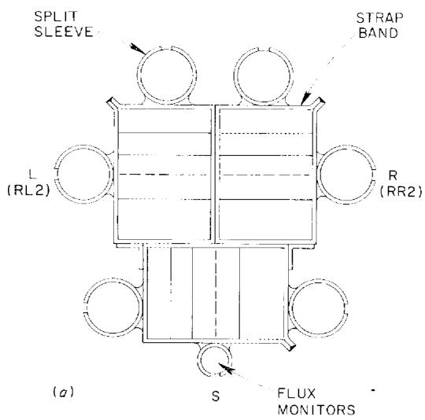

(b)

Fig. 16.1. MSRE Reactor Core Surveillance Specimens. (a) Assembled detailed plan view and (b) Unassembled. The RL2 and RR2 stringers were not disassembled for the removal of RS2 and the installation of RS3 stringers.   
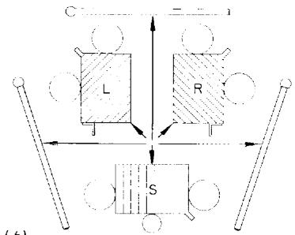  
(RS2) REMOVED   
(RS3) INSTALLED

effects on the Hastelloy N can be monitored by the reactor vessel and reactor core specimens respectively. The radiation dose on the structural Hastelloy N, because of its location, is less than that on the Hastelloy N reactor core specimens (see Table 16.1). This is a desirable condition of the surveillance specimens of the MSRE, because Hastelloy N is more strongly affected by the radiation than is graphite under the MSRE conditions.

The previous reactor core specimen assembly for the first sampling had nonnuclear, mechanical damage that broke some of the graphite and bent some of the Hastelloy N specimens. This assembly was replaced by a slightly modified one, from which the current sampling was made. The complete assembly is withdrawn from the reactor in order to remove any one of the three stringers. This time, the assembly appeared to be in the same condition as it was prior to its exposure, except that the surfaces of the Hastelloy N specimens had been dulled. One-third of the assembly, stringer RS2, was removed, and a new stringer, RS3, was joined to the other two stringers (Fig. 16.1). These were returned to

the reactor in a new containment basket, as is our standard practice. This completed our second sampling operation, shown as sampling 2 in Table 16.1.

The controls for the reactor core specimens, which are exposed to fuel salt under MSRE conditions except that the salt is static and there is no radiation, were also removed from the controlled test rig. The typical appearance of the reactor core specimens and their controls is shown in Fig. 16.2. Visually, the graphite, with the exception of a few salt droplets, appeared unchanged; note that Hastelloy N tensile specimens are reflected in the bright surfaces of the graphite (Fig. 16.2c).

The graphite specimens were pinned at their tongue-and-groove joints within Hastelloy N straps with 0.030-in.-diam Hastelloy N wire. The movement of the graphite column of specimens relative to that of the Hastelloy N tensile specimen rods was sufficiently difficult to deform the pins in the reactor core specimens. These pins had to be drilled out during disassembly. The pins of the control specimens were not deformed, but the control assembly is less complex, since space limitations are not as restricted for it as for those in the reactor. Each control stringer is separate from the

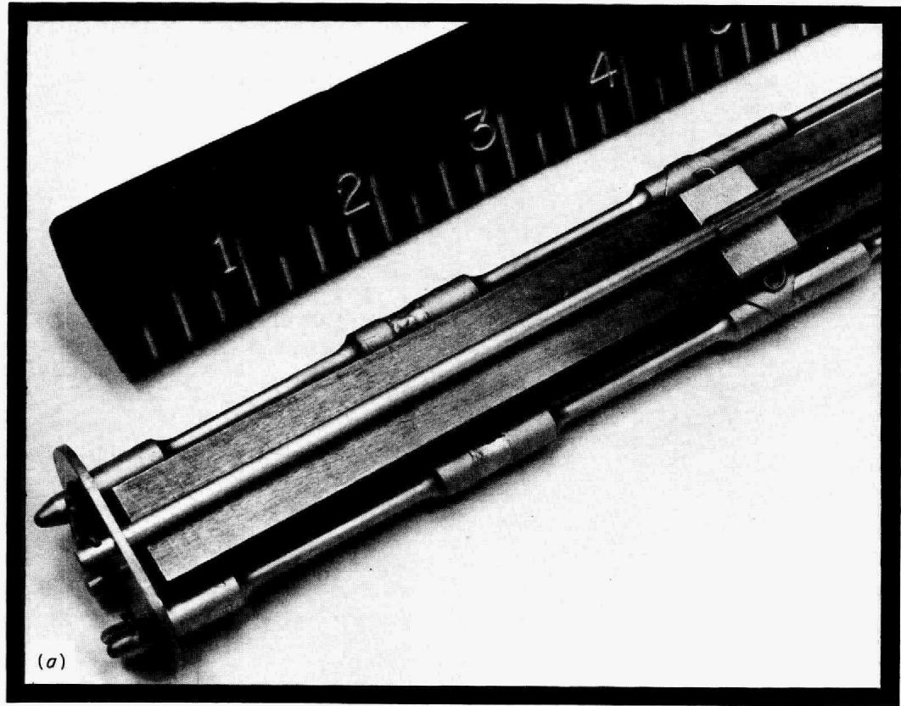

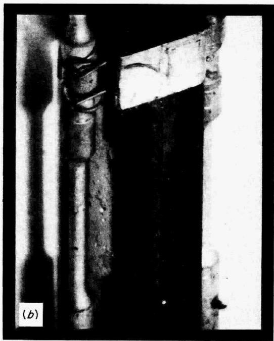

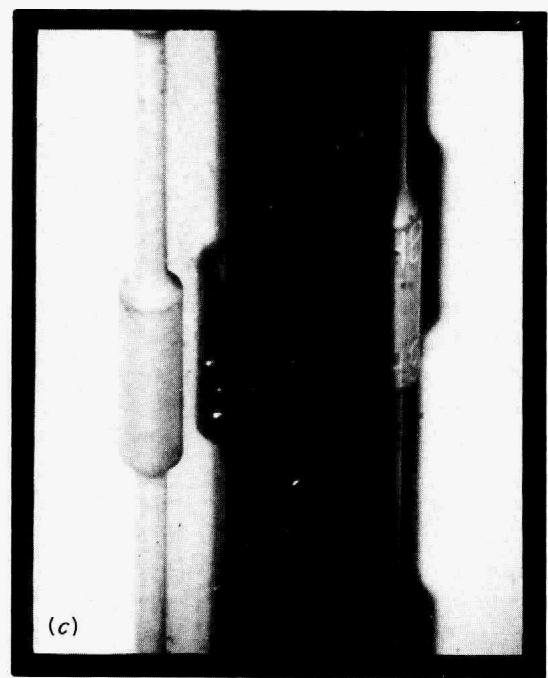  
Fig. 16.2. MSRE Reactor Core Specimens of Grade CGB Graphite and Hastelloy N after Run 11. (a) Controls, stringer CS2, exposed to salt under MSRE conditions except the salt was static and there was no radiation. (b) and (c) Stringer RS2, exposed to the fuel in the reactor core for 27,630 Mwhr operation of the MSRE.

others, but all three stringers in the reactor are bound together. The new stringers for the reactor core specimens and their controls are all pinned at the joints with 0.040-in.-diam Hastelloy N in order to eliminate the pin deformation problem.

Studies of the deposition of fission products on the graphite and the Hastelloy N are being conducted by the Reactor Chemistry Division. For their work, they used the graphite specimens from the bottom, middle, and top of the reactor core specimen stringer, plus matching controls and selected Hastelloy N samples from the stringer and basket. The results of their examinations are reported in Chap. 9.

The remaining graphite samples are being measured for dimensional changes. Tests of the types outlined in ref. 3 will be made when the dimensional measurements are completed.

The results of the examination of the Hastelloy N tensile specimens from the core position and from outside the reactor vessel are reported in detail in Sect. 16.2.

We have begun to expose samples in the MSRE core that are of interest for future molten-salt reactors and thus have extended the scope of these studies beyond surveillance of the MSRE. In the specimens just removed, the tensile specimen rods were made of heats of Hastelloy N modified to yield increased resistance to radiation damage. One of the rods had an addition of 0.52 wt % Ti, and the other had 0.42 wt % Zr. Besides evaluating the radiation resistance of these modified alloys, we should also be able to obtain data on their corrosion resistance in the MSRE environment.

The alloy modification study was continued in the new stringer, RS3, just returned to the MSRE. One of the tensile specimen rods had an addition of 0.5 wt % Ti and 2 wt % W; the other had an addition of 0.5 wt % Hf.

The graphite samples included the anisotropic MSRE graphite (grade CGB), graphitized-pitch impregnated grade CGB graphite, isotropic graphite, pyrolytic graphite, and a joint of isotropic graphite brazed to molybdenum with a 60 Pd-35 Ni-5 Cr (wt %) alloy. This test of the brazed joint with radiation and in flowing salt should supplement the data on corrosion of such joints in static salt without radiation that are discussed later in this section. Since the radiation dose received in the

MSRE is small compared with what will be encountered in an MSBR, the primary purpose for including various grades of graphite is to extend the study of fission product behavior with these grades.

The principal objective of this program is to ensure the safe operation of the MSRE. We are, therefore, continuing to retain $65\%$ or more of the space in the assembly for exposure of the MSRE grades of Hastelloy N and graphite (see Table 16.1).

# 16.2 MECHANICAL PROPERTIES OF THE MSRE HASTELLOY N SURVEILLANCE SPECIMENS

H. E. McCoy

The results of tensile tests run on the first group of specimens removed from the MSRE were reported previously. These specimens were removed after 7823 Mwhr of reactor operation, during which they were held at $1190 \pm 18^{\circ}\mathrm{F}$ for 4800 hr and accumulated a thermal dose of $1.3 \times 10^{20}$ neutrons/cm $^2$ . The creep-rupture tests on these specimens have now been completed, and the results are summarized in Table 16.2. The times to rupture for the surveillance specimens and the controls are compared in Fig. 16.3. The rupture life is reduced greatly as a result of the neutron exposure. However, Fig. 16.4 shows that the minimum creep rate is not appreciably affected. Although the reduction in the rupture life is large, it is quite comparable with what we have observed for specimens irradiated to comparable doses in the ORR in a helium environment. This point is illustrated in Fig. 16.5. The superior rupture life of heat 5081 is evident. The fracture strain is the parameter of greatest concern, since the rupture life does not appear to be reduced greatly by irradiation at low stress levels. The fracture strains for the various heats of irradiated material are compared in Fig. 16.6. The data indicate a minimum ductility for a rupture life of 1 to 10 hr, with ductility increasing with increasing rupture life. A lower ductility of heat 5085 after irradiation in the MSRE is also indicated, although the data scatter will not permit this as an unequivocal conclusion. The superior ductility of heat 5081 and the least ductility of heat 5085 (heat used for the top and bottom heads of the MSRE) are clearly illustrated.

Table 16.2. Postirradiation Creep-Rupture Properties of MSRE Hostelloy N Surveillance Specimensa Irradiated and Tested at $1202^{\circ}$ F   

<table><tr><td>Test No.</td><td>Heat No.</td><td>Stress (psi)</td><td>Rupture Life (hr)</td><td>Rupture Strain (%)</td><td>Minimum Creep Rate (%/hr)</td></tr><tr><td>R-230</td><td>5085</td><td>47,000</td><td>0.8</td><td>1.45</td><td>0.81</td></tr><tr><td>R-266</td><td>5085</td><td>40,000</td><td>24.2</td><td>1.57</td><td>0.031</td></tr><tr><td>R-267</td><td>5085</td><td>32,400</td><td>148.2</td><td>1.05</td><td>0.006</td></tr><tr><td>R-250</td><td>5085</td><td>27,000</td><td>25.2</td><td>1.86</td><td>0.004</td></tr><tr><td>R-229</td><td>5081</td><td>47,000</td><td>8.7</td><td>2.28</td><td>0.20</td></tr><tr><td>R-231</td><td>5081</td><td>40,000</td><td>98.7</td><td>2.65</td><td>0.017</td></tr><tr><td>R-226</td><td>5081</td><td>32,400</td><td>474.0</td><td>3.78</td><td>0.0059</td></tr><tr><td>R-233</td><td>5081</td><td>27,000</td><td>2137.1</td><td>4.25</td><td>0.0009</td></tr></table>

aAnnealed 2 hr at $1652^{\circ}\mathrm{F}$ prior to irradiation.

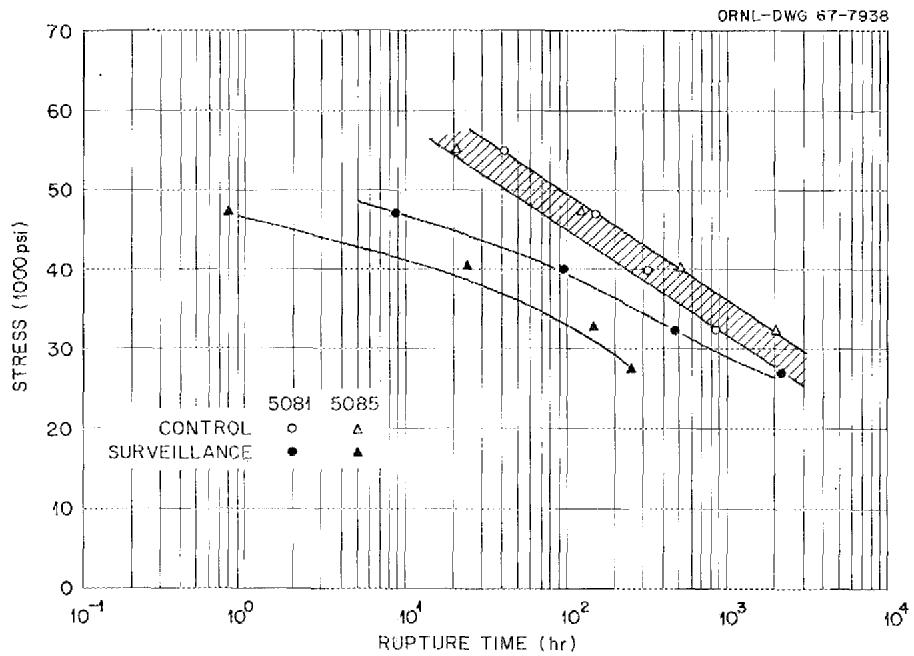  
Fig. 16.3. Comparative Creep-Rupture Properties of MSRE Hastelloy N Surveillance and Control Specimens Irradiated and Tested at $1200^{\circ}$ F.

We also did some further work to determine the cause of the reduction in the low-temperature ductility reported previously. Using the extraction replica technique, we found that the irradiated specimens had extensive intergranular precipitation,

whereas the amount of precipitate in the control specimens was much less. Hence, the reduction in low-temperature ductility is probably due to the irradiation-enhanced nucleation on the growth of grain-boundary precipitates.

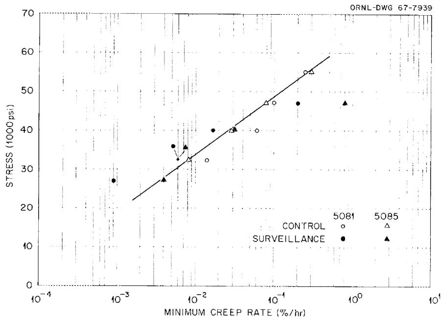  
Fig. 16.4. Comparative Creep Rates for MSRE Hastelloy N Surveillance and Control Specimens Irradiated and Tested at $1200^{\circ}$ F.

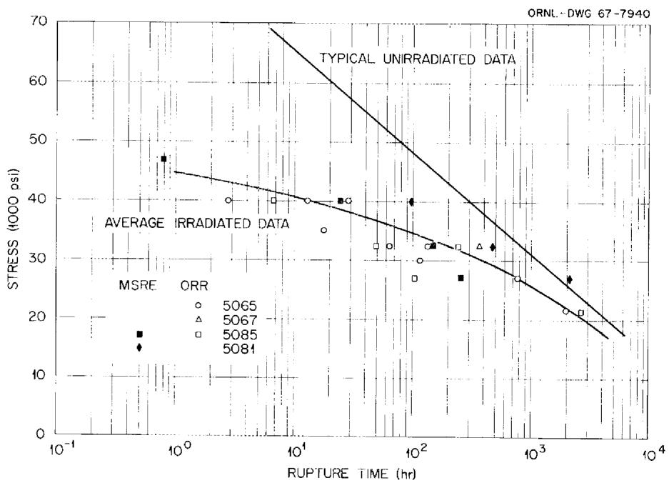  
Fig. 16.5. Comparative Stress-Rupture Properties at $1200^{\circ}\mathrm{F}$ for Various Heats of Hastelloy N Irradiated in the MSRE and the ORR at $1200^{\circ}\mathrm{F}$ .

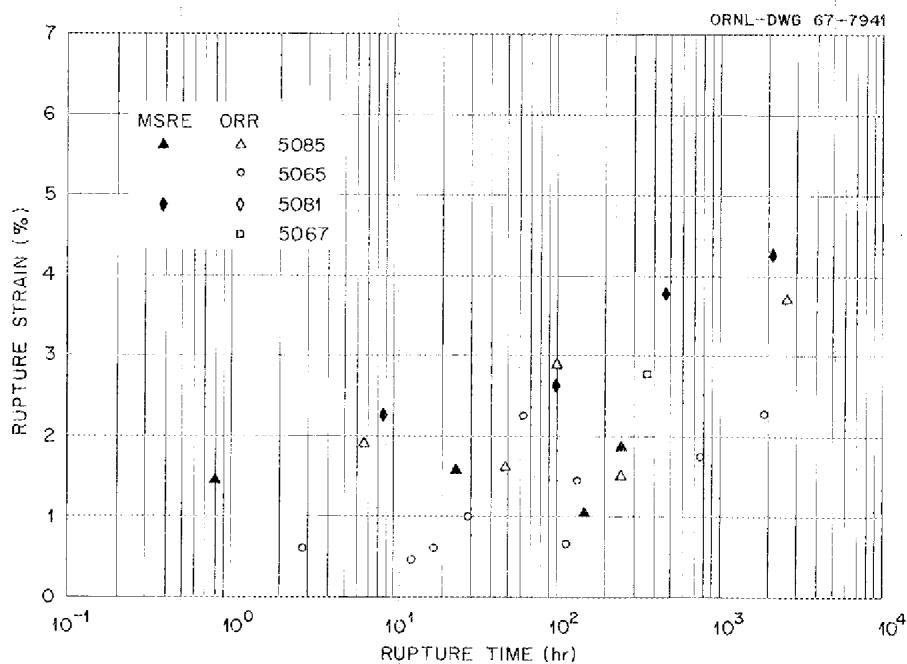  
Fig. 16.6. Comparative Rupture Strains for Various Heats of Hastelloy N Irradiated and Tested at $1200^{\circ}$ F.

We removed a second set of Hastelloy N specimens in June 1967. The specimens removed from the core had been at temperature for $5500\mathrm{hr}$ and had accumulated a peak thermal dose of approximately $4\times 10^{20}$ neutrons $\mathbf{\mu} / \mathbf{cm}^2$ .The core specimens were modified alloys containing approximately $0.5\%$ Ti (heat 21545) and $0.5\%$ Zr (heat 21554).A stringer of vessel specimens was also removed. These specimens had been exposed to the MSRE cell environment for about 11,000 hr and had accumulated a peak thermal dose of about $3\times 10^{19}$ neutrons $\mathbf{\mu} / \mathbf{cm}^2$ The vessel specimens were made of the same heats used in constructing the MSRE.

We have not completed the mechanical testing of these materials, but preliminary metallographic studies have been completed. The primary concern with the vessel specimen was whether they were being nitrided by the cell environment. Figure 16.7 shows the surface of heat 5085. There is no evidence of nitriding, and the maximum depth of oxidation is about 0.003 in. The specimen taken from

heat 5065 happened to be a weld made in constructing the stringer. This specimen is shown in Fig. 16.8. The amount of surface oxidation is greater, but the depth of oxidation is still small, and there is no evidence of nitriding.

Heat 21545 contained $0.5\%$ Ti, and our main concern was whether the alloy would corrode in the fused salt environment. Figure 16.9 shows that there is some slight surface reaction but no extensive corrosion. Heat 21554 contained $0.5\%$ Zr, and we were again concerned with the corrosion resistance. Figure 16.10 shows the surfaces of the surveillance specimens of this heat and indicates the lack of significant corrosion.

Thus we are encouraged by the observations that (1) the MSRE grades of Hastelloy N are not being oxidized at a high rate, and there is no evidence of nitriding in the cell environment; and (2) the small zirconium and titanium additions that we are making to Hastelloy N do not appear detrimental.

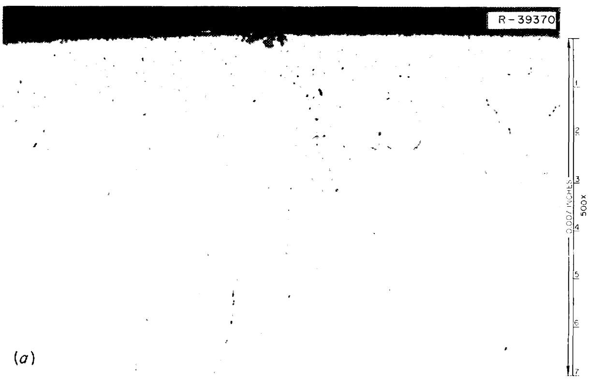

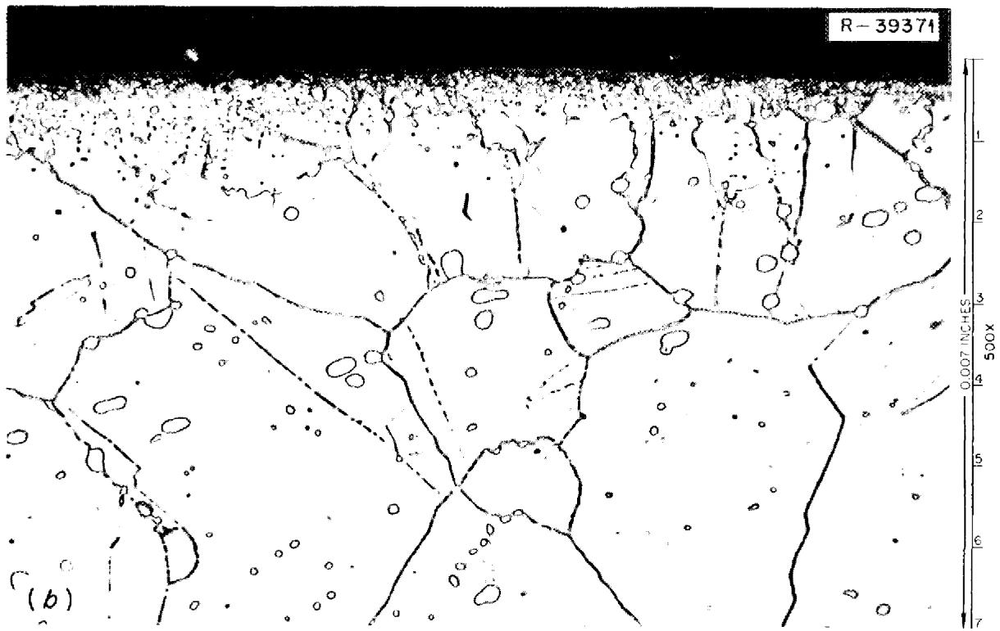  
Fig. 16.7. Photomicrographs of Surface of Hastelloy N Heat 5085 Exposed to the MSRE Cell Environment for 11,000 hr. (a) As polished. (b) Etched: glyceria regia. The long thermal treatment has resulted in extensive intergranular carbide precipitation in addition to the oxidation near the surface.

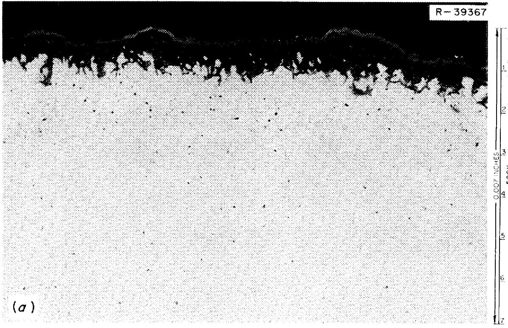

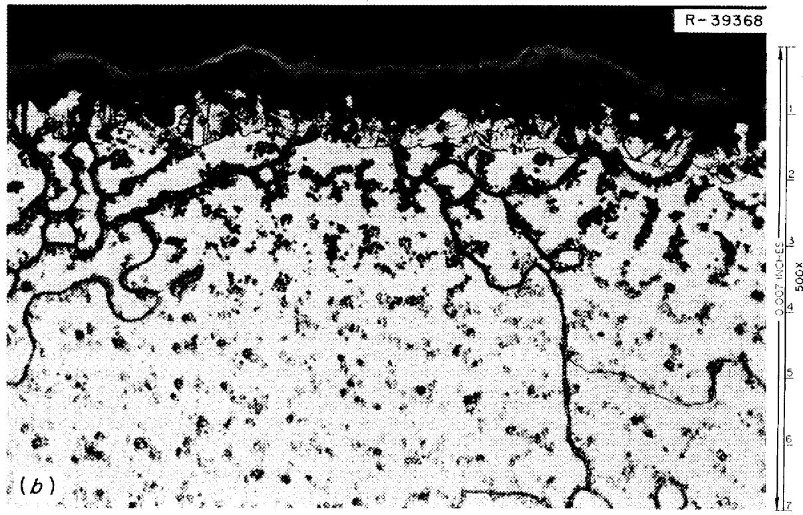  
Fig. 16.8. Photomicrographs of the Surface of a Weld in Hastelloy N Heat 5065 After Exposure to the MSRE Cell Environment for 11,000 hr. (a) As polished. (b) Etched: glyceria regia.

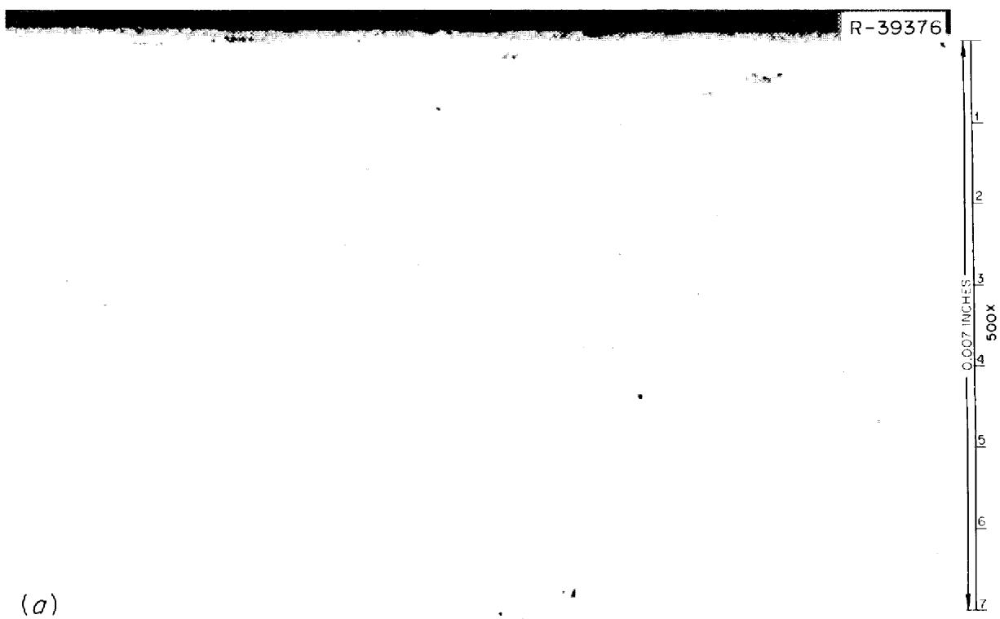

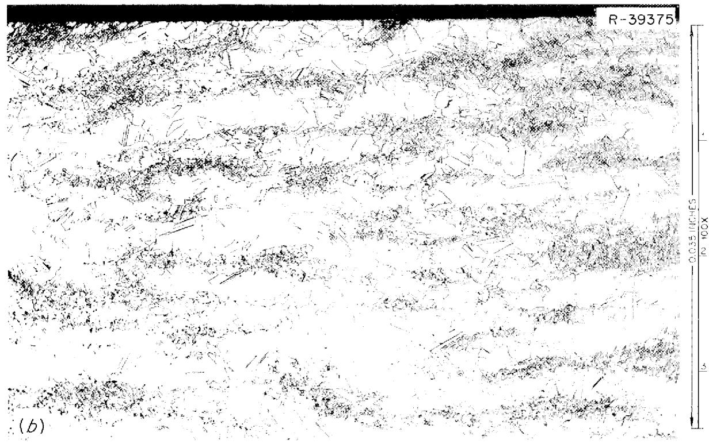  
Fig. 16.9. Photomicrographs of the Surface of a Specimen of Titanium-Modified Hastelloy N Exposed to the MSRE Fuel Salt for 4300 hr. (a) As polished. (b) Etched: glyceria regia.

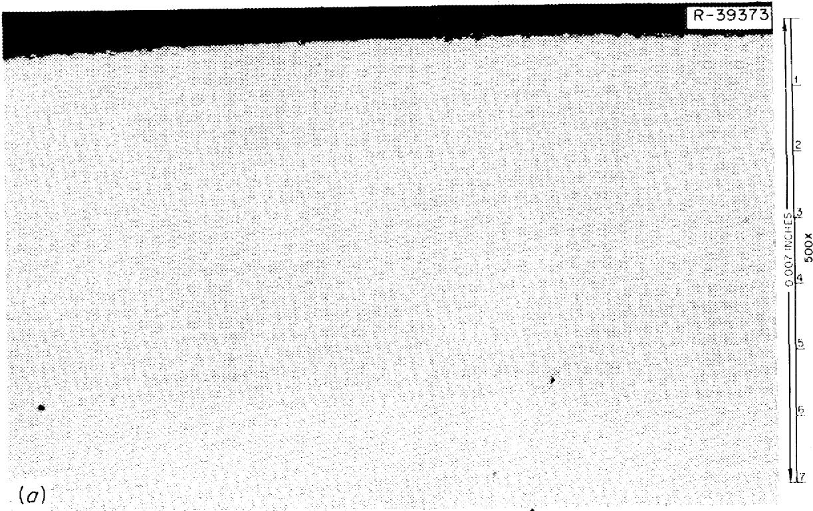

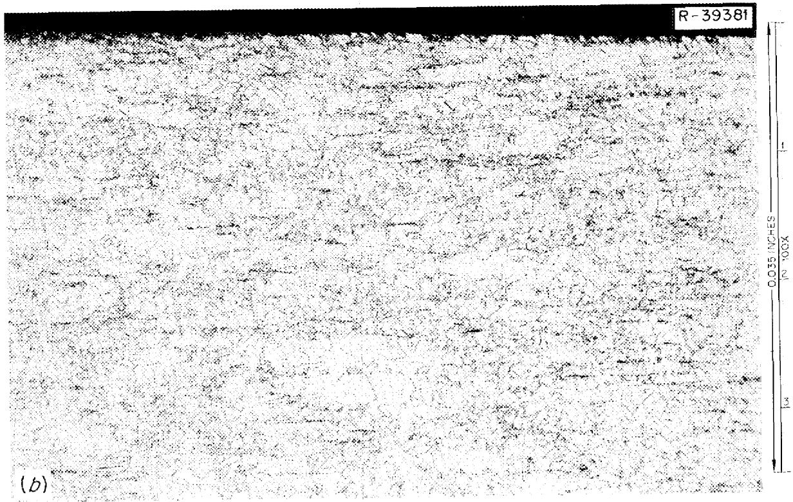  
Fig. 16.10. Photomicrographs of the Surface of a Specimen of Zirconium-Modified Hostelloy N Exposed to the MSRE Fuel Salt for 4300 hr. (a) As polished. (b) Etched: glyceria regio.

# 17. Graphite Studies

# 17.1 MATERIALS PROCEDURE AND PROPERTY EVALUATION

W. H. Cook

The procurement and evaluation of potential grades of graphite for the MSBR remain largely limited to experimental grades of graphite. Generally, most of these were not fabricated specifically for MSBR requirements.1 Consequently, they tend to have pore entrance diameters larger than the specified $1\mu$ and gas permeabilities greater than the desired $10^{-6}\mathrm{cm}^2/\mathrm{sec}$ for helium. Other properties are reasonably good. The latest graphites, discussed below, fall into these classifications.

Precursory examinations of five experimental and two specialty grades of isotropic graphite have been made using 0.125-in.-diam by 1.000-in.-long specimens machined from stock and tested in a mercury porosimeter. The pore entrance diameter distributions are summarized in Fig. 17.1. The insets on each plot give the grade designation, the bulk density, and accessible porosity of the specimens tested. The data indicate trends rather than absolute values for each grade.

Grades AXF-5QBG and H-315A are the specialty grades, and the others are experimental grades. Grade AXF-5QBG is an impregnated version of grade AXF (previous designation, EP-1924), which looked promising in previous tests in that the entrance diameters of most pores were less than $1\mu$

The specimens for grade AXF-5QBG, 1-1, and 16-1 (Fig. 17.1) were taken perpendicular and specimens 1-4 and 16-4 were taken parallel with the $4 \times 6$ in. plane of two different plates, each $1_{\frac{1}{2}}^1 \times 4 \times 6$ in. Individual results on these were plotted to show the variations of properties. The pore

sizes of the impregnated materials vary more than those of the base stock but are around the $1 - \mu$ size sought. It would be desirable for the pore entrance diameters to be smaller and more uniformly distributed. The impregnation of the base stock reduced its accessible porosity approximately $30\%$ .

The experimental grade H17-T174 has a pore distribution similar to that of grade AXF-5QBG.

Grades H-335, -336, -337, and -338 were small samples of isotropic graphite that had been impregnated and the impregnate graphitized. Grade H-315A was the base stock impregnated to make grade H-335. The similar pore size distributions of H-315A and H-335 illustrate again the well-known fact that graphite with pore entrance diameters greater than $1\mu$ is not changed much by conventional impregnation techniques. The plot for H-315A is an average of measurements on four specimens machined from different locations of a $4^{1}\%$ -in.-OD $\times 3^{1}\%$ -in.-ID $\times 11\%$ -in. pipe section; the uniformity of the spectrum of pore entrance diameters was good.

The three materials H-336, -337, and -338 appear to have been made from base stocks with pore spectra similar to that of H-315A. The accessible porosities measured for H-337 and -338 are relatively low for the small size of test specimens used.

Some mechanical properties, specific resistivities, and gas permeabilities are given in Table 17.1 for H-315A and -335 through -338. The mechanical properties and specific resistivities of these grades are satisfactory for MSBR graphite. The gas permeabilities are high relative to those sought but seem to be typical for grades of graphite

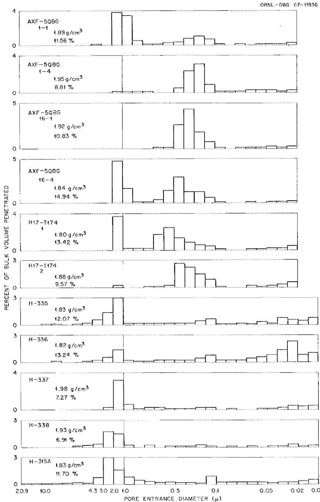  
Fig. 17.1. Comparison of the Distributions of the Pore Entrance Diameters for Various Grades of Graphite.

Table 17.1. Summary of Some of the Properties of Isotropic Graphite   

<table><tr><td>Graphite Grade</td><td>Orientationa</td><td>Bulk Density (g/cm3)</td><td>Specific Resistance (microhms /cm)</td><td>Flexural Strength (psi)b</td><td>Fracture Strain (%)b</td><td>Modulus of Elasticity (psi)b</td><td>Permeability to Helium (cm2/sec)c</td><td>Porosity (%)</td></tr><tr><td></td><td></td><td></td><td></td><td></td><td></td><td>×106</td><td>×10-3</td><td></td></tr><tr><td rowspan="2">H-315A</td><td>||-L</td><td>1.830(29)d</td><td>985(8)</td><td>4790(4)</td><td>0.49(4)</td><td>1.35(4)</td><td>8.9e</td><td>11.70(4)5</td></tr><tr><td>C</td><td></td><td>890(8)</td><td>5880(4)</td><td>0.49(4)</td><td>1.65(4)</td><td></td><td></td></tr><tr><td>H-335</td><td>||-L</td><td>1.820(13)</td><td>973(13)</td><td>4240(6)</td><td>0.48(6)</td><td>1.29(6)</td><td>6.8</td><td>12.07</td></tr><tr><td>H-336</td><td>||-L</td><td>1.823(13)</td><td>850(13)</td><td>4900(6)</td><td>0.49(6)</td><td>1.47(6)</td><td>3.6</td><td>13.24</td></tr><tr><td>H-337</td><td>||-L</td><td>1.967(13)</td><td>901(13)</td><td>7210(6)</td><td>0.70(6)</td><td>1.82(6)</td><td></td><td>7.27</td></tr><tr><td>H-338</td><td>||-L</td><td>1.920(13)</td><td>1235(13)</td><td>6320(6)</td><td>0.54(6)</td><td>1.81(6)</td><td></td><td>6.91</td></tr></table>

\(\left.\left.\left.\left.\left.\left.\left.\left.\left.\left.\left.\left.\left.\left.\left.\left.\left.\left.\left.\left.\left.\left.\left.\left.\left.\left.\left.\left.\left.\left.\left.\left.\left.\left.\left.\left.\left.\left.\left.\left.\left.\left.\left.\left.\left.\left.\left.\left.\left.\left.\left.
\ddot{\mathbf{L}}_{i, i}\right)\right)\right)\right)\right)\right)\right)\right)\right)\right)\right)\right)\right)\right)\right)\right)\right)\right)\right)\right)\right)\right)\right)\right)\right)\right)\right)\right)\) indicates that the length of the specimen was taken parallel with the length of the stock.   
"C" indicates that the length of the specimen was taken parallel with a chord in the pipe circle.   
bWork performed by C. R. Kennedy.   
cWork performed by R. B. Evans III.   
The superscript numbers in parentheses indicate the number of values averaged. Absence of superscript numbers indicates that the data are from a single specimen.   
Measured perpendicular to the length of the stock.

Table 17.2. Current Fabrication of Graphite Pipe for MSBR Studies   

<table><tr><td rowspan="2">Graphite Grade</td><td rowspan="2">Manufacturer</td><td rowspan="2">Type</td><td colspan="3">Nominal Pipe Dimensions (in.)</td><td rowspan="2">Remarks</td></tr><tr><td>OD</td><td>ID</td><td>Total Length</td></tr><tr><td>1425-64</td><td>A</td><td>Anisotropic</td><td>39/16</td><td>21/2</td><td>306a</td><td>Received 12-23-66</td></tr><tr><td>H-337</td><td>B</td><td>Isotropic</td><td>5</td><td>223/32</td><td>36b</td><td>To be shipped by 10-1-67 or sooner</td></tr><tr><td></td><td></td><td></td><td>21/4</td><td>11/2</td><td>768b</td><td></td></tr><tr><td>BY12</td><td>C</td><td>Isotropic</td><td>5</td><td>223/32</td><td>c</td><td>To be supplied during FY 1968</td></tr><tr><td></td><td></td><td></td><td>21/4</td><td>11/4</td><td>c</td><td></td></tr></table>

Random lengths, 38 to 51 in.   
Random lengths, 10 to 36 in.   
cRandom lengths, 10 to 48 in.; total lengths not fixed at this time.

that approach MSBR requirements. Reducing the permeability below these by orders of magnitude appears to be difficult with conventional techniques. This has prompted the backup work on sealing graphite with metal or pyrolytically deposited graphite that is discussed later in this section.

We are receiving potential irradiation samples of anisotropic and isotropic graphites in small quantities from Carbon Products Division of Union Carbide Corporation, the Chemical Engineering Development Department of the Y-12 Plant, Great Lakes

Carbon Corporation, Poco Graphite, Inc., Stackpole Carbon Company, and Speer Carbon Company.

The first grades of graphite that have been received or will be received in larger quantities are listed in Table 17.2. Grade 1425-64 is being used in irradiation studies and graphite-to-metal joint investigations. Grades H-337 and BY12 will be used in graphite-to-metal and graphite-to-graphite joint studies and in an engineering test loop. This loop will be used to determine the operating characteristics of the proposed MSBR fuel cell, with special emphasis on gas permeability studies to aid in evaluation of the fission-gas behavior in the MSBR.

# 17.2 GRAPHITE SURFACE SEALING WITH METALS

W.C.Robinson, Jr.

Chemical vapor deposition is one of the methods being investigated to decrease the gas permeability of the graphite. The two metals presently being considered for a sealant are molybdenum and niobium. The initial objective will be to obtain a helium permeability of $10^{-7}\mathrm{cm}^2/\mathrm{sec}$ or less with a minimum thickness of metal deposit. The deposition parameters will be varied in order to determine the conditions which produce an optimum coating.

The basic technique involves the deposition of metal on a heated substrate by hydrogen reduction of the metal halide. In this particular case a halide-hydrogen gas mixture is passed over graphite that is contained in a sealed furnace chamber. The metal halides being used are $\mathsf{MoF}_6$ and $\mathsf{NbCl}_5$ .

The initial studies are being carried out on a nearly isotropic grade of graphite, designated R-0025, which has a helium permeability of approximately $10^{-1}\mathrm{cm}^2/\mathrm{sec}$ and an accessible pore spectrum with maxima at 0.7 and $4\mu$ . Molybdenum is deposited via the reaction

$$
\mathrm {M o F} _ {6} + 3 \mathrm {H} _ {2} \longrightarrow \mathrm {M o} + 6 \mathrm {H F}.
$$

Nine runs have been completed using the experimental parameters given in Table 17.3.

An assembly was built for estimating the helium permeability of the coated samples. This assembly, which attaches to a Veeco leak detector, is shown in Fig. 17.2. Two coated and one uncoated graphite sample are shown. Qualitative measurements of the helium permeability have been performed to demonstrate the utility of the assembly. The leak detector will be calibrated with known leak sources to make quantitative measurements possible. The present qualitative evidence indicates that the helium permeability of these samples can be made less than $10^{-6}$ with 0.05 mil or less of molybdenum.

Table 17.3. Molybdenum Coatings on R-0025 Graphite   

<table><tr><td rowspan="2">Run Number</td><td colspan="2">Gas Flow Rates (cm3/min)</td><td rowspan="2">Temperature (°C)</td><td rowspan="2">Pressure (torrs)</td><td rowspan="2">Time (min)</td></tr><tr><td>MoF6</td><td>H2</td></tr><tr><td>M-Mo-1</td><td>50</td><td>800</td><td>700</td><td>5</td><td>5</td></tr><tr><td>M-Mo-2</td><td>50</td><td>800</td><td>700</td><td>5</td><td>10</td></tr><tr><td>M-Mo-3</td><td>50</td><td>800</td><td>700</td><td>10</td><td>5</td></tr><tr><td>M-Mo-4</td><td>50</td><td>800</td><td>700</td><td>5</td><td>5</td></tr><tr><td>M-Mo-5</td><td>50</td><td>800</td><td>700</td><td>10</td><td>10</td></tr><tr><td>M-Mo-6</td><td>50</td><td>800</td><td>800</td><td>5</td><td>5</td></tr><tr><td>M-Mo-7</td><td>50</td><td>800</td><td>800</td><td>5</td><td>10</td></tr><tr><td>M-Mo-8</td><td>50</td><td>800</td><td>800</td><td>10</td><td>5</td></tr><tr><td>M-Mo-9</td><td>50</td><td>800</td><td>800</td><td>10</td><td>10</td></tr></table>

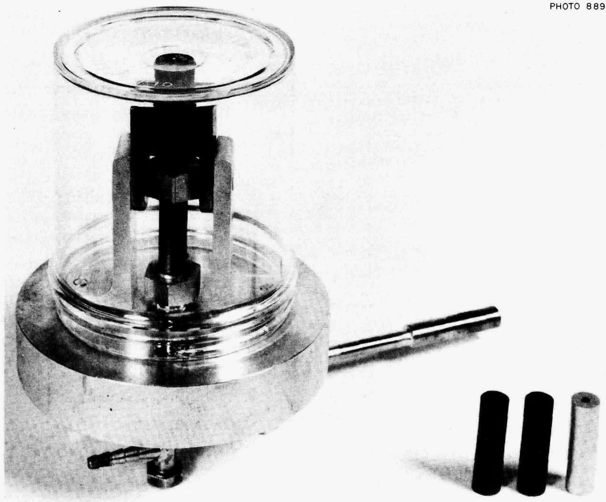  
Fig. 17.2. Apparatus for Measuring the Helium Permeability of Graphite Cylinders; It Is Used with a Standard Leak Detector.

# 17.3 GAS IMPREGNATION OF MSBR GRAPHITES

# H. Beutler

We are exploring the feasibility of impregnating graphites with pyrocarbon to reduce the permeation of gaseous fission products into graphite components of the MSBR core. It has been estimated that the permeability should be reduced to below $10^{-6}\mathrm{cm}^2/\mathrm{sec}$ (for helium) to prevent diffusion of fission products effectively. So far, we have carried out a number of exploratory experiments which demonstrate that this objective can be attained with a gas-phase impregnation technique.

Gas impregnation of graphite for a similar purpose has been studied by Watt et al. They found that the gas permeability could be effectively reduced by passing hydrocarbon vapors (mainly benzene) in a nitrogen carrier gas over graphite specimens at 1472 to $1652^{\circ}\mathrm{F}$ . The process relied entirely on diffusion to carry reactants into the pores, and there was no need for a pressure differential across the specimen. With benzene as a reactant, temperatures near $1382^{\circ}\mathrm{F}$ were required for maximum penetration. Above $1472^{\circ}\mathrm{F}$ , a definite concentration of deposit on or near the surface

was found. In view of the low reaction temperatures, very long treatment times (up to $800\mathrm{hr}$ ) were required; however, the permeability of tube specimens (1 in. OD, 0.5 in. ID, 1 in. long) was successfully reduced from $8.5 \times 10^{-3}$ to $5.4 \times 10^{-8}$ $\mathrm{cm}^2/\mathrm{sec}$ . By machining off surface layers it was found that the thickness of the impervious layer was relatively thin (less than $100\mu$ ). The most desirable attribute of the starting material to be impregnated was found to be a uniform pore size distribution.

In the course of our High-Temperature Gas-Cooled Reactor coated-particle development, we gained considerable experience with the deposition of high-density pyrocarbon outer coatings from propylene over porous buffer coatings. Extensive infiltration of pyrocarbon into the porous buffer layers was noted, even under fast-deposition rate conditions, if propylene was decomposed at low temperatures $(2282^{\circ}\mathbf{F}$ and lower). We reasoned that the same procedure might effectively reduce the permeability of graphite.

We have carried out a few exploratory experiments using propylene as an impregnant. The graphite specimens used so far were made from NCC graphite type R-0025, with the following dimensions and properties: 0.400 in. OD, 0.120 in. ID, 1.5 in. length, $1.9\mathrm{g/cm}^3$ density, and $1 \times 10^{-1}$ cm²/sec.

Table 17.4. Condition and Results of Gas Impregnation Experiment   

<table><tr><td>Specimen number</td><td>GI-7</td></tr><tr><td>Impregnant</td><td>C3H6(partial pressure, 32 torrs)</td></tr><tr><td>Temperature of impregnation</td><td>2012°F</td></tr><tr><td>Treatment time</td><td>5½hr</td></tr><tr><td>Weight increase due to impregnation</td><td>1.2%</td></tr><tr><td>Thickness of surface deposit</td><td>25 μ</td></tr><tr><td>Helium permeability</td><td></td></tr><tr><td>As received</td><td>~1 × 10-3cm2/sec</td></tr><tr><td>After impregnationa</td><td>1.4 × 10-7cm2/sec</td></tr><tr><td>After impregnation and subsequent heat treatmenta</td><td>1.7 × 10-7cm2/sec</td></tr></table>

${}^{a}$ Determined at room temperature by helium probe gas technique after 16 hr equilibration.

Each specimen was immersed in fluidized coke particles so that it would be supplied uniformly with a mixture of propylene decomposition products. The conditions and results of a typical experiment are given in Table 17.4.

For the evaluation of impregnated specimens, we determined weight and dimensional changes and measured the helium permeability before and after subsequent heat treatments up to $5432^{\circ}\mathrm{F}$ in argon. We are determining the gas permeability of impregnated specimens using a helium gas probe technique in apparatus similar to that shown in Fig. 17.2.

For a cylindrical specimen, the permeability coefficient $(K)$ is given by:

$$
F = \frac {2 \pi l K}{\ln \gamma_ {o} / \gamma_ {i}} \left(\frac {P}{R T}\right),
$$

where

$$
F = \text {m a s s f l o w r a t e , m o l e s / s e c},
$$

$$
K = \text {p e r m e a b i l i t y} \quad \text {c o e f f i c i e n t}, \mathrm {c m} ^ {2} / \sec ,
$$

$$
l = \text {l e n g t h} \text {o f} \text {s p e c i m e n}, \mathrm {c m},
$$

$$
\gamma_ {o} = \text {o u t s i d e r a d i u s , c m},
$$

$$
\gamma_ {j} = \text {i n s i d e r a d i u s}, \mathrm {c m},
$$

$$
P = \text {p r e s s u r e}, \text {a t m},
$$

$$
R = \text {g a s} \quad \text {c o n s t a n t}, \mathrm {c m} ^ {3} - \text {a t m} (^ {\circ} \mathrm {K}) ^ {- 1} \text {m o l e} ^ {- 1},
$$

$$
T = \text {t e m p e r a t u r e}, ^ {\circ} \mathrm {K}.
$$

The principal source of error using this technique is due to inaccuracy in calibration. More important, it suffers the disadvantage that it yields a lower value for $K$ than the true value if measurements are made before steady-state conditions have been established. We have therefore equilibrated our specimens with helium for at least 16 hr prior to determining helium permeability coefficients. We have, however, noted that the rubber gaskets which we employed for sealing the specimens are slightly permeable to helium, and our quoted permeability coefficients are probably slightly too high.

The results in Table 17.4 indicate that we successfully reduced the permeability coefficient from $1 \times 10^{-3}$ to $1.4 \times 10^{-7} \mathrm{~cm}^{2} / \mathrm{sec}$ after impregnation for $5\%$ hr. A subsequent heat treatment to $5432^{\circ} \mathrm{F}$ did not significantly increase the permeability of the specimen. We noted an increase in specimen

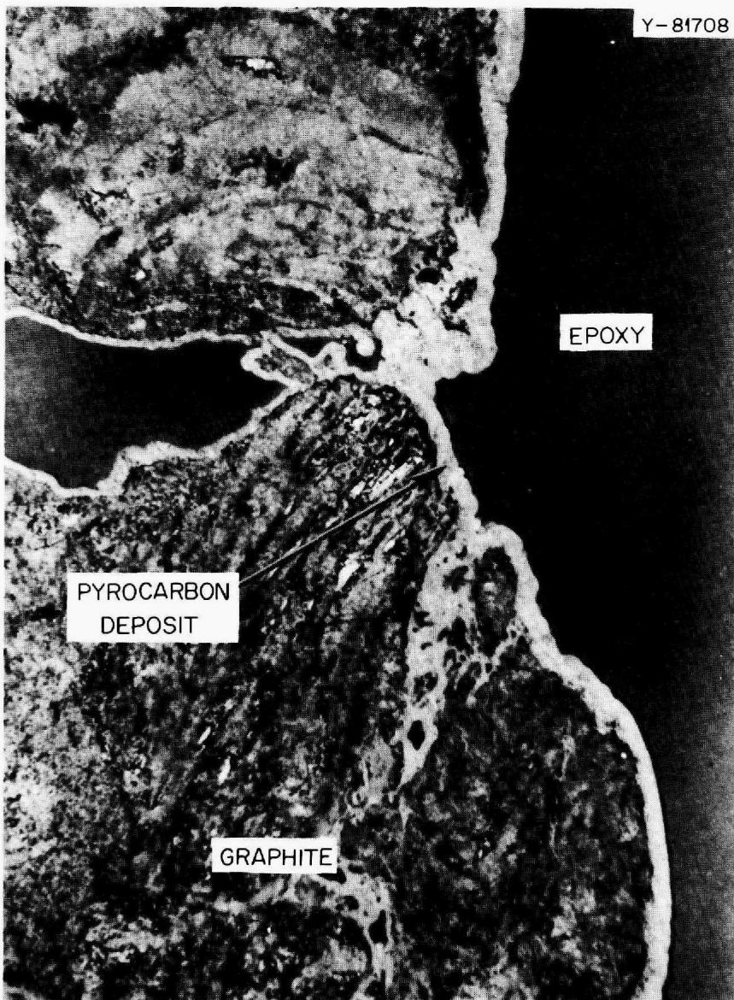  
Fig. 17.3. Micrograph of Gas-Impregnated Graphite Specimen, GI-5. Graphite NCC R0025. Impregnation, $2012^{\circ}F / 6\mathrm{hr} / \mathrm{C}_{3}\mathrm{H}_{6}$ . Bright field. $750\times$

diameter, which suggested a buildup of a surface layer. Metallographic examination indeed revealed a surface buildup of approximately $15\mu$ We found it difficult to resolve pyrocarbon deposits inside the graphite pores by optical microscopy; but in isolated areas (see Fig. 17.3), there was clear evidence of a buildup of pyrocarbon in internal pores. We machined approximately 4 mils from the specimen surface and found that the permeability increased $(K > 10^{-5}\mathrm{cm}^2 /\mathrm{sec})$ rapidly, which indicates that the low-permeability layer is very thin. At present we are optimizing our depo

sition conditions to increase the depth of the impervious layer.

We are also preparing irradiation specimens for a future HFIR experiment. Although our preliminary results are encouraging, the feasibility of the technique can only be assessed by fast-flux irradiation experiments. Because of the dimensional instability of graphite when irradiated, we must determine whether the low permeability of the graphite will be maintained or whether the pyrocarbon will change dimensions at a different rate and the permeability increase.

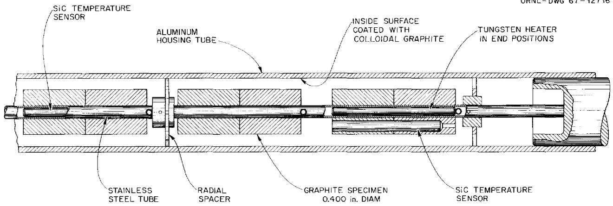  
Fig. 17.4. Schematic Drawing of the Graphite Irradiation Experiment Inserted in the HFIR.

# 17.4 IRRADIATION OF GRAPHITE

# C. R. Kennedy

Experiments to irradiate graphite in target-rod positions in the core of the High Flux Isotope Reactor have begun. The first two experimental containers have been installed in HFIR for a one-cycle (three-week) exposure to determine the accuracy of heating rate and thermal analysis calculations. After this experiment has been removed and analyzed and the design parameters have been altered, the long-term graphite irradiations will be started. It should be possible to obtain integrated doses $(E > 0.18\mathrm{MeV})$ of $4\times 10^{22}$ neutrons/cm² in one year.

The facility shown in Fig. 17.4 is designed to operate by nuclear heating at 1292 to $1328^{\circ}\mathrm{F}$ . A uniform axial heating rate will be maintained by adding tungsten susceptors along the axis of the samples to compensate for the axial falloff in nuclear heating. The HFIR control rod design is excellent for constancy of heating rate, and the temperature will vary only about $2\%$ during a reactor cycle.

Irradiation temperatures will be determined using beta SiC located in a center hole in each graphite specimen. The method of temperature determination using the dimensional expansion and annealing characteristics of SiC is that described by Thorne et al. This procedure has been verified by irradiation of three SiC specimens in the ORR

at a controlled temperature of $1400^{\circ}\mathbf{F}$ . The results indicate that temperatures can be determined within $9^{\circ}\mathbf{F}$ of the operating temperature.

Past graphite irradiations to exposures greater than $10^{22}$ (refs. 7 and 8) have been limited to graphite grades that are similar, with only slight variations in the filler material or the coke used in their manufacture. When irradiated at about $1200^{\circ}\mathrm{F}$ all graphites seem to be characterized by an initial shrinkage and then a very rapid expansion. This rapid expansion corresponds closely to that observed in the axial direction for single crystals, so it appears that the binder has deteriorated and the axial expansion of the individual crystals is controlling the growth. There are, however, indications obtained from short-term irradiations that there may be potential modifications of the coke materials that could extend the exposure required to cause the binder degradation.

It is the purpose of our studies to develop grades of graphite which will circumvent the breakdown of the binder phase that limits the lifetime expectancy of the graphite core. The tailoring of a graphite for use in a molten-salt reactor will very likely require the use of impregnates and/or surface-sealing techniques to obtain the required pore size and permeability. Therefore, studies of the

effects that these treatments will have on the irradiation behavior will be made. The studies must include examinations to demonstrate that the core lifetime is not reduced either through the loss of effectiveness of the sealing techniques or through an enhanced potential of breakdown of the binder phase.

# 18. Hastelloy N Studies

# 18.1. IMPROVING THE RESISTANCE OF HASTELELOY N TO RADIATION DAMAGE BY COMPOSITION MODIFICATIONS

H. E. McCoy

Although Hastelloy N has suitable properties for long-term use at elevated temperatures, we have found that the properties deteriorate when it is exposed to neutron irradiation. This type of radiation damage manifests itself through a reduction in the creep-rupture life and the rupture ductility. This damage is a function of the thermal neutron dose and is thought to be associated with the helium that is produced by the $^{10}\mathrm{B}(n,\alpha)$ transmutation. However, the threshold helium content required for damage is so low that the property deterioration cannot be prevented by reducing the $^{10}\mathrm{B}$ level in the alloy. We have found that slight modifications to the composition offer considerable improvement.

Our studies have shown that the normal massive precipitate, identified as $\mathbf{M}_6\mathbf{C}$ , can be eliminated by reducing the molybdenum level to the 12 to $13\%$ range. The strength is not reduced significantly, and the grain size is more uniform and more easily controlled. The addition of small amounts of titanium, zirconium, or hafnium reduces the irradiation damage problem significantly. Figure 18.1 illustrates the fact that several alloys have been developed with postirradiation properties that are superior to those of unirradiated standard Hastelloy N. We are beginning work to optimize the compositions and heat treatments of these alloys. We

are also initiating the procurement of 1500-lb commercial melts of some of the more attractive alloys.

The properties of the modified Hestelloy N in the unirradiated condition seem very attractive.

Strengths are slightly better than standard Hastelloy N, and fracture ductilities are about double.

# 18.2.AGING STUDIES ON TITANIUMMODIFIED HASTELLOY N

C. E. Sessions

Although normal Hastelloy N is not known to suffer from detrimental aging reactions, the addition of titanium to increase the resistance to radiation damage introduces another variable which might possibly affect the aging tendencies. Thus, aging studies are in progress to evaluate the creep and tensile properties of small commercial heats of modified Hastelloy N containing varying amounts of titanium.

Initial tests on heat 66-548, which contains $0.45\%$ Ti and $0.06\%$ C, have been completed. Specimens of this alloy were fabricated by two different procedures and were then annealed at either 2150 or $2300^{\circ}\mathrm{F}$ . They were aged for 500 hr at temperatures of 1200 and $1400^{\circ}\mathrm{F}$ and tested at $1200^{\circ}\mathrm{F}$ . The results of these tests are given in Table 18.1.

These results indicate that there are no deleterious effects of aging up to $500\mathrm{hr}$ on the tensile properties of modified Hastelloy N containing $0.5\%$ Ti. There are significant changes in the strength; the changes in the yield stress do not seem to follow a pattern, but the ultimate strength is consistently increased by aging. The elongation at fracture is increased by aging in most cases, remains unchanged in a few cases, but is never reduced significantly.

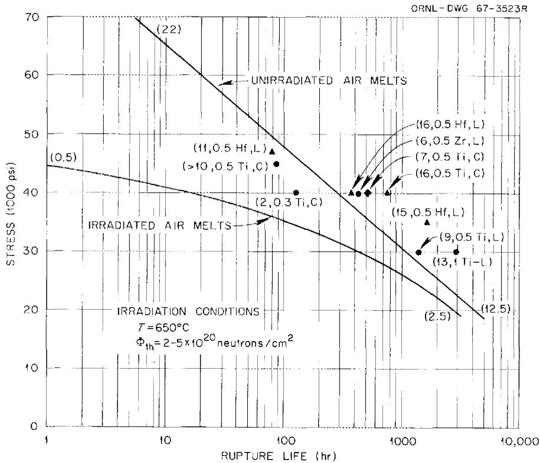  
Fig. 18.1. Comparison of the Postirradiation Creep Properties of Several Hastelloy N Alloys Irradiated and Tested at $1200^{\circ}$ F.

Table 18.1. Effect of Aging at 1400 and $1200^{\circ}$ F on Tensile Properties of Titanium-Modified Hastelloy N (Heat 66-548)   

<table><tr><td rowspan="2">Solution
Annealing
Temperaturea
(°F)</td><td rowspan="2">Grain
Sizeb</td><td rowspan="2">Test Condition</td><td colspan="3">Tensile Propertiesc</td></tr><tr><td>Yield
Strength
(psi)</td><td>Ultimate
Strength
(psi)</td><td>Total
Elongation
(%)</td></tr><tr><td></td><td></td><td></td><td>×103</td><td>×103</td><td></td></tr><tr><td rowspan="6">2300</td><td rowspan="3">Large</td><td>No age</td><td>18.5</td><td>60.5</td><td>50.0</td></tr><tr><td>500 hr at 1200°F</td><td>18.3</td><td>65.5</td><td>61.9</td></tr><tr><td>500 hr at 1400°F</td><td>23.8</td><td>68.1</td><td>50.0</td></tr><tr><td rowspan="3">Small</td><td>No age</td><td>26.6</td><td>64.8</td><td>33.7</td></tr><tr><td>500 hr at 1200°F</td><td>22.5</td><td>79.1</td><td>63.7</td></tr><tr><td>500 hr at 1400°F</td><td>27.5</td><td>81.0</td><td>51.4</td></tr><tr><td rowspan="6">2150</td><td rowspan="3">Large</td><td>No age</td><td>17.7</td><td>52.8</td><td>37.0</td></tr><tr><td>500 hr at 1200°F</td><td>17.8</td><td>64.0</td><td>61.5</td></tr><tr><td>500 hr at 1400°F</td><td>19.2</td><td>62.4</td><td>51.0</td></tr><tr><td rowspan="3">Small</td><td>No age</td><td>21.7</td><td>71.3</td><td>53.0</td></tr><tr><td>500 hr at 1200°F</td><td>21.9</td><td>77.7</td><td>60.1</td></tr><tr><td>500 hr at 1400°F</td><td>25.3</td><td>77.4</td><td>50.5</td></tr></table>

${}^{a}$ Anncaled 2 hr at temperature.   
Large and small grain sizes resulted from the two different fabrication procedures.   
Tests were conducted at $1200^{\circ}\mathrm{F}$ in air using a strain rate of 0.05 min $^{-1}$ .

These aging studies will be expanded to include longer aging times, alloys with varying titanium and carbon levels, and complete metallographic examination to ascertain metallurgical changes.

# 18.3. PHASE IDENTIFICATION STUDIES IN HASTELLOY N

R. E. Gehlbach

The effects of thermomechanical treatments on the mechanical properties of Hastelloy N indicated the need for an electron microscope investigation to understand the nature of the elevated-temperature embrittlement problem. It was noticed that the transition from transgranular to intergranular failure in the temperature range of the ductility decrease indicated probable formation of a brittle grain-boundary product - either a fine precipitate or segregation of impurity elements to grain boundaries.

Preliminary examination of thinned foils by transmission electron microscopy showed precipitation occurring in the same temperature range as that of the pronounced ductility change. Thus a detailed study of precipitation in Hastelloy N was initiated to identify the various types, morphologies, and compositions of precipitates and to determine their relationship to the mechanical properties.

Several complementary approaches are being used for the purposes of precipitate identification. Thin-foil transmission microscopy is employed for observations of fine matrix precipitate, dislocation structure, and, to a lesser extent, grain-boundary precipitate. Due to the heterogeneous nature of precipitation in Hastelloy N, sampling problems are encountered with transmission microscopy. This technique is also limited in that the true nature of the precipitates is not apparent and that very thin grain-boundary films are frequently undetectable.

Extraction replication techniques overcome the transmission limitations. Here, conventional metallographic specimens are lightly etched to remove the polished surface and to reveal precipitates and are then coated with a layer of carbon. Extraction replicas are obtained by heavy electrolytic etching through the carbon film, which dissolves the matrix, leaving the precipitates adhering to the carbon substrate. This permits observation of precipitates in the same distribution

as that existing in the bulk sample with the exception that grain-boundary precipitates are no longer supported by the matrix and collapse against the substrate as shown in Fig. 18.2. This allows direct observation of the grain-boundary precipitates on essentially the surface of the original grain boundary, providing information on true precipitate morphology and permitting examination of thin films.

Identification of precipitates is simplified with extraction replicas, since interference from the matrix is eliminated. Selected area electron diffraction is being used for the identification of crystal structure and the determination of lattice parameters.

Semiquantitative compositional analysis of individual particles is being performed using an electron probe microanalyzer accessory on one of the electron microscopes. Thus, by coordinating various approaches available in electron microscopy, precipitation processes may be studied carefully.

Much of our effort has been concentrated on standard Hastelloy N. The microstructure of this material is characterized by stringers of massive $\mathbf{M}_6\mathbf{C}$ carbides, the metallic constituents being primarily nickel and molybdenum with some chromium.3 The carbides are very rich in silicon compared with the matrix. On aging or testing in the temperature range 1112 to $1652^{\circ}\mathrm{F}$ , a fine grain-boundary precipitate forms (Fig. 18.2). This precipitate is also $\mathbf{M}_6\mathbf{C}$ with the same lattice parameter (approximately 11.0 A) as the large blocky carbides. Work is in progress to attempt to detect any compositional differences between the two morphologies of $\mathbf{M}_6\mathbf{C}$ carbides. Initial microprobe work using extraction replicas indicates that the grain-boundary carbides are richer in silicon than the large blocky type. All precipitates found in Hastelloy N which has not been subjected to temperatures in excess of $2372^{\circ}\mathrm{F}$ have been $\mathbf{M}_6\mathbf{C}$ carbides.

When standard Hastelloy N is annealed at temperatures above about $2372^{\circ}\mathrm{F}$ , the $\mathbf{M}_6\mathbf{C}$ begins to transform to an intergranular lamellar product. Autoradiography, using $^{14}\mathrm{C}$ as a tracer, shows that this product is not a carbide and that the carbon seems to be rejected (Fig. 18.3). The blocky precipitates (Fig. 18.3) are seen to be

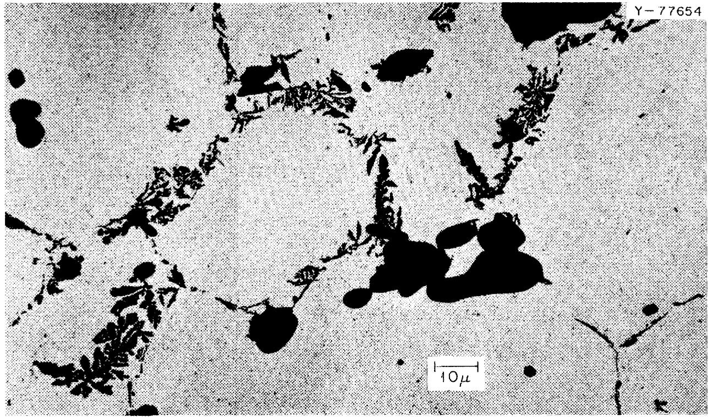  
Fig. 18.2. Extraction Replica from Hastelloy N (Heat 5065) Aged 4 hr at $1600^{\circ}\mathrm{F}$ . All precipitates are $\mathsf{M}_6\mathsf{C}$ carbides. $1000\times$

carbides. Figure 18.4 shows the correspondence between the morphologies of the extracted precipitate and that indicated by the autoradiograph. A selected area diffraction pattern and an electron probe microanalyzer trace are also included. This type of precipitate has not yet been identified, but the diffraction pattern does not correspond to $\mathbf{M}_6\mathbf{C}$ . A comparison of the microprobe results with standards shows that the noncarbon constituents are about $90\%$ Mo and $10\%$ Cr. However, some $\mathbf{M}_6\mathbf{C}$ carbides are also present after high-temperature anneals and exist in several morphologies.

We are concluding our investigation of precipitation in standard Hastelloy N and will be evaluating the information generated and attempting to relate our observations to observed changes in mechanical properties.

Because of the attractive in-reactor properties of the titanium-modified Hastelloy N, we are expanding our studies to include this material. Optical metallography shows the alloy to be quite free of precipitate. Initial electron microscopy studies of two experimental heats revealed that

a considerable amount of very thin, fine precipitate was present in the grain boundaries. This was rarely detected in thin-foil transmission microscopy but was readily seen by the extraction replica technique.

Selected area electron diffraction studies on the fine grain-boundary precipitates have revealed at least two phases, which exist in many morphologies. Although these precipitates have not been positively identified, indications are quite good that $\mathrm{Ti}_{2}\mathrm{O}$ is one phase and that it is present in conjunction with the second type. The other phase has a face-centered cubic structure with a lattice parameter of about 4.27 A and may exist independently of the former. Considering chemical composition, TiC seems to be the most likely composition of the second phase. However, the reported lattice parameter for TiC is 4.33 A, compared with our measured value of 4.27 A. TiN and TiB have lattice parameters more closely related to the measured value; however, chemical analyses of the heats involved show the boron and nitrogen contents to be extremely low.

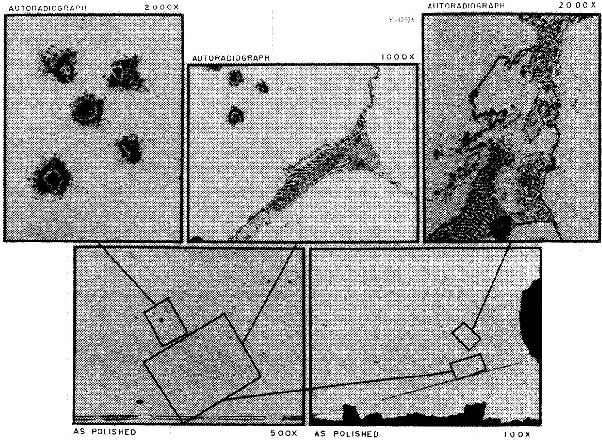  
Fig. 18.3. Hastelloy N Containing $^{14}$ C Annealed 1 hr at $2400^{\circ}$ F. Autoradiographs made in situ on lightly etched surface using Kodak NTE liquid emulsion; 312-hr exposure. Reduced $38\%$ .

The thin film of precipitate in Fig. 18.5a is of the face-centered cubic type with "Ti $_2$ O" existing as the "spines" and polyhedral particles. The threadlike morphology of the face-centered cubic precipitate is seen in Fig. 18.5b.

The final objectives of this work are to identify all precipitates present and to correlate their formation with the mechanical behavior of the alloy.

# 18.4. HOT-DUCTILITY STUDIES OF ZIRCONIUM-BEARING MODIFIED HASTELLOY N

D. A. Canonico

Our previous work has shown that zirconium additions cause weld-metal cracking in Hastelloy

N. However, the zirconium addition appears to be very desirable from the standpoint of improving the resistance of the material to embrittlement by neutron irradiation. For this reason, we are continuing studies to determine how we can improve the weldability of zirconium-bearing alloys.

One tool that we are using in our study is the Gleeble. The Gleeble permits us to assess the hot ductility of the base material as it is being subjected to a thermal cycle simulating that received by the heat-affected zone (HAZ) of a weldment.

Specimens are fractured, on heating, at increasing temperatures until they no longer exhibit any

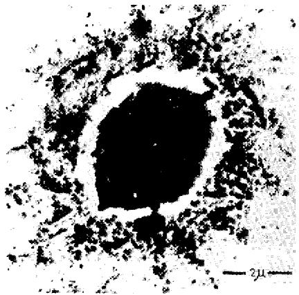  
EXTRACTION REPLICA

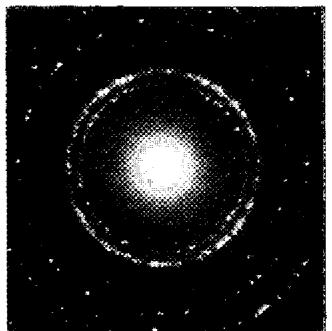  
SELECTED AREA ELECTRON DIFFRACTION

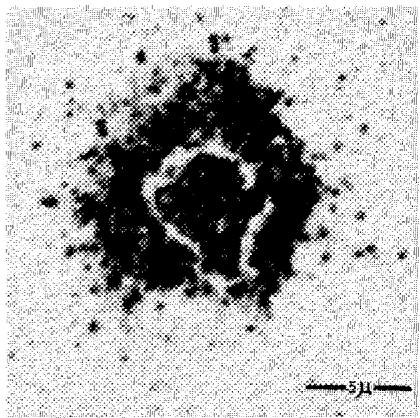  
AUTORADIOGRAPH

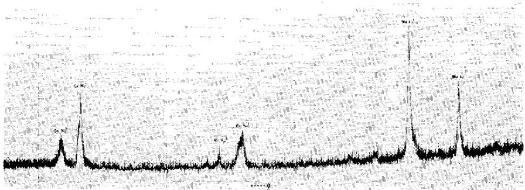  
ELECTRON MICROPROBE OUTPUT  
Fig. 18.4. Hastelloy N Containing $^{14}\mathrm{C}$ Annealed 1 hr at $2400^{\circ}\mathrm{F}$ . Correlation of extraction replication, autoradiography, selected area electron diffraction, and microprobe analysis for effective precipitate identification.

degree of ductility (as measured by reduction in area). This zero ductility temperature (ZDT) is then set as the maximum temperature, and subsequent specimens are subjected to the ZDT, cooled at a rate which simulates that experienced by the HAZ, and fractured at a predetermined temperature. The ductility exhibited at these temperatures is compared with the on-heating ductility at the same temperature. The criteria for evaluating the weldability of the base metal are its ZDT and, even more important, its ability to recover its ductility after being exposed to the ZDT.

The nominal analyses of the experimental alloys studied in this program are given in Table 18.2. For comparative purposes, a hot-ductility study was conducted on an MSRE grade of Hastelloy N. Its nominal composition is also given in Table 18.2. The zirconium levels in the experimental alloys ranged from 0 (No. 168) to $0.7\%$ (No. 172).

The influence of the zirconium on the ZDT is summarized in Table 18.2. It can be seen that the presence of $0.3\%$ $\mathrm{Zr}$ lowered the ZDT by $225^{\circ}\mathrm{F}$ . This is a rather significant decrease; however, as has been pointed out earlier, the ZDT is not the sole criterion for evaluating the effect of zirconium. The recovery of ductility upon cooling is equally important. The on-heating and on-cooling results of the hot-ductility study are shown in Fig. 18.6. It can be seen that alloy 168, which contained no zirconium, had both a high ZDT and a satisfactory recovery of its ductility. Alloy 169 had a ZDT identical to 168; however, its ductility upon cooling is unsatisfactory. Alloys 170 and 171 both had ZDT's of approximately $2150^{\circ}\mathrm{F}$ and both exhibited good ductilities on cooling.

Figure 18.7 shows the results obtained from alloys 168, 171, and 174. The results obtained from an MSRE grade of Hastelloy N have also

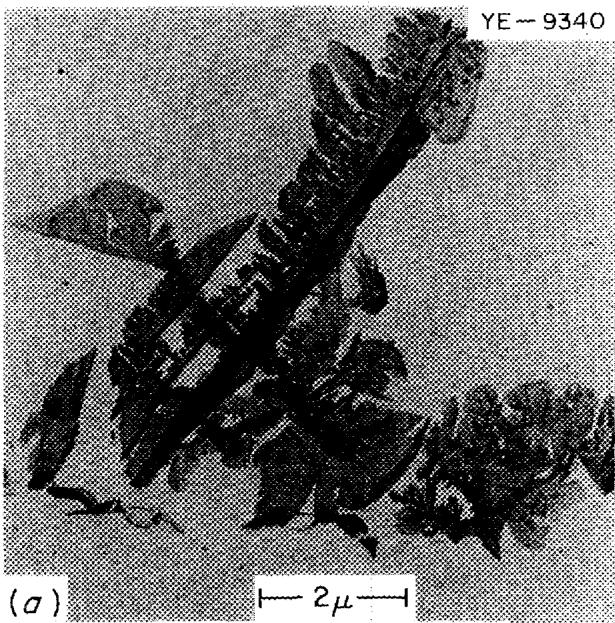

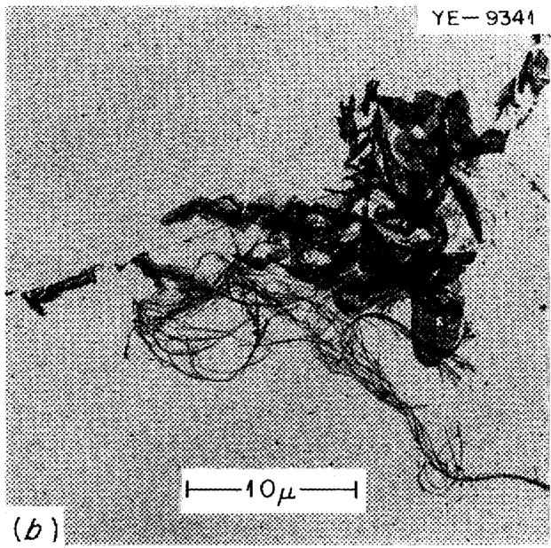  
Fig. 18.5. Hastelloy N (Titanium Modified, Heat 66-548) Annealed 1 hr at $2150^{\circ}\mathrm{F}$ , Aged 30 min at About $1200^{\circ}\mathrm{F}$ . Typical precipitate morphologies determined by extraction replica technique.

been included. It can be seen in Fig. 18.7a that the Hastelloy N modified by reducing the molybdenum content (No. 168) is superior to the commercial material (MSRE grade Hastelloy N). The addition of $0.5\%$ Zr to the modified alloy lowers the ZDT by $225^{\circ}\mathrm{F}$ . As is shown in Fig. 18.7b,

Table 18.2. The Zero Ductility Temperature of the Base Materials Studied   

<table><tr><td rowspan="2">Identification 
Number</td><td colspan="5">Composition (wt %)</td><td rowspan="2">ZDT 
(°F)</td><td rowspan="2">Reduction 
in Areaa 
(%)</td></tr><tr><td>Ni</td><td>Mo</td><td>Cr</td><td>Fe</td><td>Zr</td></tr><tr><td>168</td><td>ba1</td><td>12</td><td>7</td><td></td><td></td><td>2350</td><td>22</td></tr><tr><td>169</td><td>ba1</td><td>12</td><td>7</td><td></td><td>0.1</td><td>2350</td><td>21</td></tr><tr><td>170</td><td>ba1</td><td>12</td><td>7</td><td></td><td>0.3</td><td>2125</td><td>20</td></tr><tr><td>171</td><td>ba1</td><td>12</td><td>7</td><td></td><td>0.5</td><td>2125</td><td>32</td></tr><tr><td>172</td><td>ba1</td><td>12</td><td>7</td><td></td><td>0.7</td><td>2120</td><td>5</td></tr><tr><td>MSRE grade 
Hastelloy N</td><td>ba1</td><td>16</td><td></td><td>4</td><td></td><td>2300</td><td>3</td></tr></table>

Measured at $50^{\circ}\mathrm{F}$ below ZDT.

the recovery of all four of these alloys is quite good. Excellent recovery is exhibited by alloy 174. Its recovery of ductility was nearly instantaneous and to a rather high level; however, from the standpoint of weldability, its low ZDT is not acceptable.

Further efforts will be made to develop a zirconium-bearing alloy with a higher ZDT. If we can find a combination of alloying elements that will raise the ZDT and retain the good recovery characteristics, we shall proceed further with the development of this alloy system.

# 18.5. RESIDUAL STRESS MEASUREMENTS IN HASTELLOY N WELDS

A. G. Cepolina

Welding inherently leads to large residual stresses. These stresses can lead to dimensional changes and can even be large enough to cause cracks in the weldment. For these reasons we have initiated a study to investigate the stress distribution in and near welds in Hastelloy N. A technique was developed which allowed continuous reading of the stress values, thus making it possible to know, with sufficient precision, the stress gradient adjacent to the weld axis. For this study, a 12-in.-diam, $\frac{1}{2}$ -in.-thick piece of Hastelloy N base metal was used. Two circular bead-on-plate welds were simultaneously made, one on each side of the plate. The diameter of the

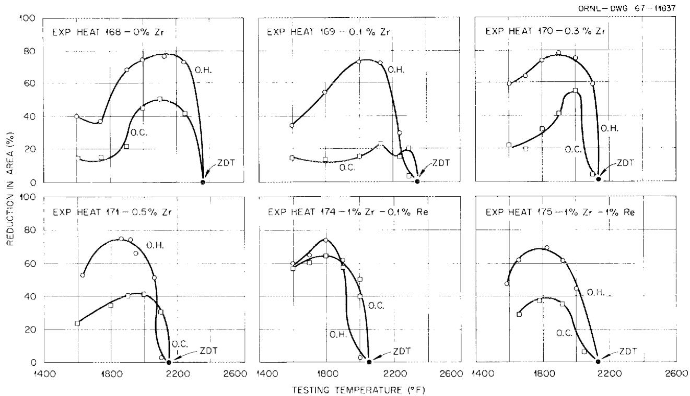  
Fig. 18.6. Results of the Hot-Ductility Study Showing the Effect of Zirconium on the Modified Hastelloy N. Symbols: O.H., tested on heating; O.C., tested on cooling.

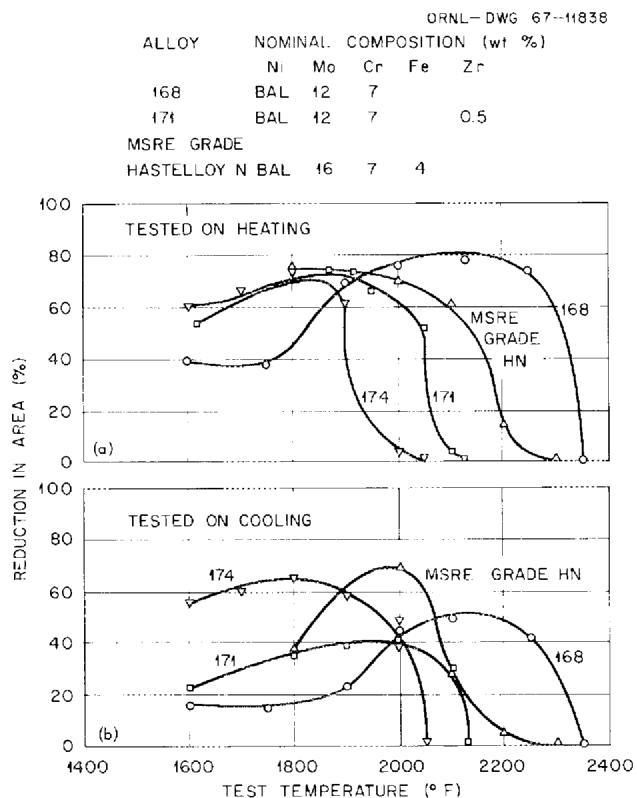  
Fig. 18.7. The Hot-Ductility Results of Selected Alloys.

circular weld beads was 6 in. (see Fig. 18.8). The welds were made with stationary inert-gas tungsten arc torches while the disk rotated around its center in a vertical plane. This technique was selected in order to minimize the bending effect associated with the transverse shrinkage. For the radius and thickness ratio of our specimen, it is correct to assume that the stress distribution associated with the weld shrinkage is planar. The perpendicular shrinkage is negligible; that is, there are no stresses perpendicular to the plane of the disk.

With these assumptions, the stress distribution may be determined by measuring only the tangential strain on the rim of the disk while machining a series of concentric sections beginning at the disk center.

We followed essentially the "boring Sachs" method which was set up for pipes. Since plane

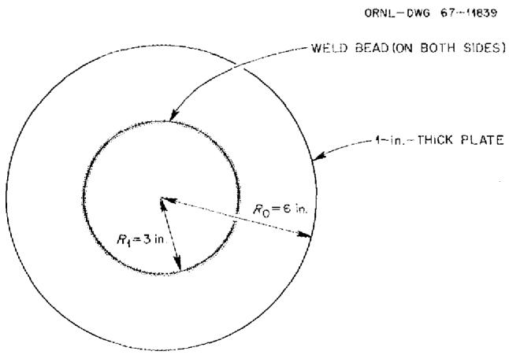  
Fig. 18.8. Sketch Showing the Location of the Weld Bead in Relation to the Overall Specimen Geometry.

strain and stress problems can be studied with the same equations, the relationships for the pipe will be valid for the disk with the elimination of the terms due to the longitudinal stresses:

$$
\sigma_ {r} = \frac {E e}{2} \left(\frac {R _ {0} ^ {2}}{R ^ {2}} - 1\right),
$$

$$
\sigma_ {t} = E \left[ \left(A _ {0} - A\right) \frac {d e}{d A} - \frac {A _ {0} + A}{2 A} e \right]
$$

(see Fig. 18.9),

where

$\sigma_{r} =$ radial stress,

$\sigma_{t} =$ tangential stress,

$E =$ Young's modulus for the disk material,

$\mathbf{c} =$ total tangential strain measured on the external rim,

$R_0 =$ disk radius,

$R =$ internal hole radius,

$A_0 =$ initial disk area,

$A =$ hole area.

The tangential strain is measured by strain gages that are mounted on the external rim with their axes oriented along the middle of the rim thickness (see Fig. 18.10). We used the gages recommended for stress measurement, type MM EA06 500 BH. These self-compensated strain gages have low transversal sensitivity and are stable over a relatively long time period. The

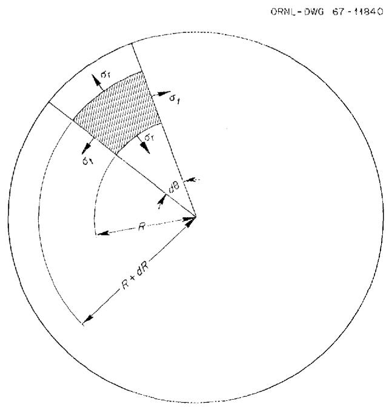  
Fig. 18.9. Pictorial Explanation of the Symbols Used in the Stress Distribution Equations.

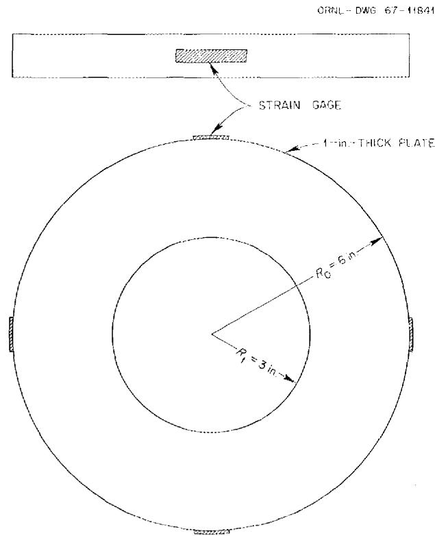  
Fig. 18.10. Location of the Strain Gages Used to Measure the Tangential Strain.

epoxy used for bonding was EA500, and the protective coatings (GageKote Nos. 2 and 5) further assure their stability. A Budd model P350 strain measuring device was used to obtain the strain values.

The metal was removed by a milling cutter. This machining process eliminated the need to remove the electrical connections to the strain gages between readings. Thermal effects were avoided by submerging the specimen in a cutting fluid solution that was continuously circulated during machining. To avoid any errors due to the holders, eccentric clamping was used in order that the pressure could be easily relieved before readings were taken.

Currently, we are analyzing the results obtained from the first welds and checking the reproducibility of results with identically prepared specimens.

We intend to study the residual stress distribution that results from welds made by various processes and from varying parameters within a given welding process. We initiated the program with bead-on-plate welds. The investigation will be expanded to include the effect of multipass welds in a V-groove joint configuration. Each weld pass will be deposited under identical welding parameters, thus permitting us to study the influence of joint geometry.

The metal-arc inert-gas process will also be investigated in order to study the influence of this mode of filler metal addition on the residual stress distribution. The effect of postweld heat treatment on the residual stress level will also be determined. The completion of this program should allow us to define the welding process, optimum parameters within that process, and the correct postweld heat treatment that will minimize the residual stress level in Hastelloy N.

# 18.6. CORROSION STUDIES

# A. P. Litman

We are continuing to study the compatibility of structural materials with fuels and coolants of interest to the Molten-Salt Reactor Program. Natural-circulation loops are used as the standard test in these studies.

Two loops are presently in operation, Nos. 1255 and 1258. One loop, No. 10, has recently completed its scheduled circulation time; one loop, No. 12, prematurely plugged recently; and four new loops, Nos. 13-16, will start operation as test salts become available. The latter loops will contain candidate MSBR fuel, blanket, or coolant salts. Table 18.3 details the service parameters of these test units.

# Fuel Salts

Loop 1255, constructed of Hastelloy N and containing a simulated MSRE fuel salt plus 1 mole $\%$ $\mathrm{ThF}_4$ , continues to operate without difficulty after more than 5.4 years. Loop 1258, constructed of type 304L stainless steel and containing the same salt as loop 1255, has logged 4.1 years' circulation time with only minor changes in flow characteristics. To examine the corrosive behavior of the relatively old simulated fuel salt in this loop, ten fresh stainless steel specimens were placed in the hot leg last January. A plot of the weight change for the new specimens at the hottest point in the system and a comparison with earlier data as a function of time are shown in Fig. 18.11. It is clear that very rapid attack occurs in the first 50

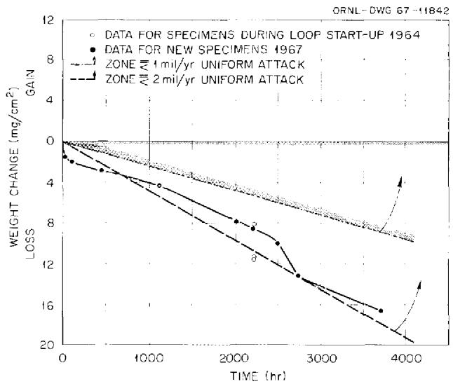  
Fig. 18.11. Weight Change as a Function of Time for Type 304L Stainless Steel Specimens Exposed at $1250^{\circ}\mathrm{F}$ in Loop 1258 Containing LiF-BeF $_2$ -ZrF $_4$ -UF $_4$ -ThF $_4$ (70-23-5-1-1 mole %).

Table 18.3. Thermal Convection Loop Operation Through August 31, 1967   

<table><tr><td>Loop No.</td><td>Loop Material</td><td>Hot-Leg Specimens</td><td>Test Fluid</td><td>Maximum Temperature (°F)</td><td>\( \Delta T \) (°F)</td><td>Time Operated (hr)</td></tr><tr><td>1255</td><td>Hastelloy N</td><td>Hastelloy \( \mathrm {N} + 2\% \mathrm {Nb}^{a} \)</td><td>LiF-BeF \( {}_{2} \)-ZrF \( {}_{4} \)-UF \( {}_{4} \)-ThF \( {}_{4} \)(70-23-5-1-1 mole %)</td><td>1300</td><td>160</td><td>47,440</td></tr><tr><td>1258</td><td>Type 304L stainless steel</td><td>Type 304L stainless steel</td><td>LiF-BeF \( {}_{2} \)-ZrF \( {}_{4} \)-UF \( {}_{4} \)-ThF \( {}_{4} \)(70-23-5-1-1 mole %)</td><td>1250</td><td>180</td><td>36,160</td></tr><tr><td>10</td><td>Hastelloy N</td><td>None</td><td>NaF-KF-BF \( {}_{3} \)(48-3-49 mole %)</td><td>1125</td><td>265</td><td>\( 8,765^b \)</td></tr><tr><td>12</td><td>Croloy \( 9M^a \)</td><td>Croloy \( 9M^a \)</td><td>NaF-KF-BF \( {}_{3} \)(48-3-49 mole %)</td><td>1125</td><td>260</td><td>1,440 (plugged)</td></tr><tr><td>13</td><td>Hastelloy N</td><td>Ti-modified Hastelloy N</td><td>LiF-BeF \( {}_{2} \)-UF \( {}_{4} \)(65.5-34-0.5 mole %)</td><td>1300</td><td>300</td><td>(c)</td></tr><tr><td>14</td><td>Hastelloy N</td><td>Ti-modified Hastelloy \( N^d \)</td><td>LiF-ThF \( {}_{4} \)(71-29 mole %)</td><td>1250</td><td>100</td><td>(c)</td></tr><tr><td>15</td><td>Hastelloy N</td><td>Ti-modified Hastelloy \( N^d \)</td><td>NaF-BF \( {}_{3} \)(50-50 mole %)</td><td>1125</td><td>300</td><td>(e)</td></tr><tr><td>16</td><td>Hastelloy N</td><td>Ti-modified Hastelloy \( N^d \)</td><td>NaF-BF \( {}_{3} \)(50-50 mole %)</td><td>1125</td><td>300</td><td>(e)</td></tr></table>

aPermanent specimens.   
$b$ Scheduled 1oop shutdown 5-23-67.   
${}^{c}$ Scheduled to start operation 9-30-67.

$d_{\text{Removable specimens}}$

${}^{e}$ Scheduled to start operation 9-15-67.

hr of exposure, and the rate of weight loss subsequently declines with time. While several perturbations in the rates are obvious, in general, the rate loss has remained constant at between 1 and 2 mils per year equivalent uniform attack. This is many times the corrosion rate observed for Hastelloy N under similar conditions.

# Coolant Salts

Loops 10 and 12, both of which have ceased operation, contained a fluoroborate salt which is a candidate coolant salt because of its low cost and low melting point. Loop 12, constructed of Croloy $9\mathrm{M},$ plugged after 1440 hr circulation due to mass-transfer and deposition of essentially pure iron crystals in the coldest portion of the loop. Similar crystals were found adhering to specimens in the hot leg. A green deposit with a variable composition of 15 to $17\%$ Fe, 11 to $14\%$ Cr, 2 to $4\%$ B, $1.5\%$ Mn, 10 to $15\%$ Na, and $46\%$ F was noted in the drain pipe (Fig. 18.12). A best

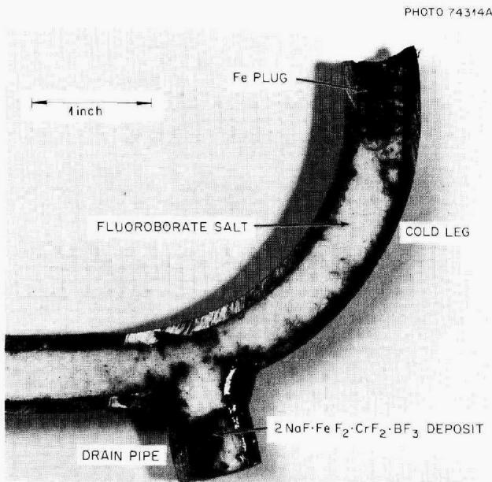  
Fig. 18.12. Plugging in Croloy 9M Loop 12 Containing NaF-KF-BF3 (48-3-49 mole %) after 1440 hr at 1125°F. ΔT = 260°F.

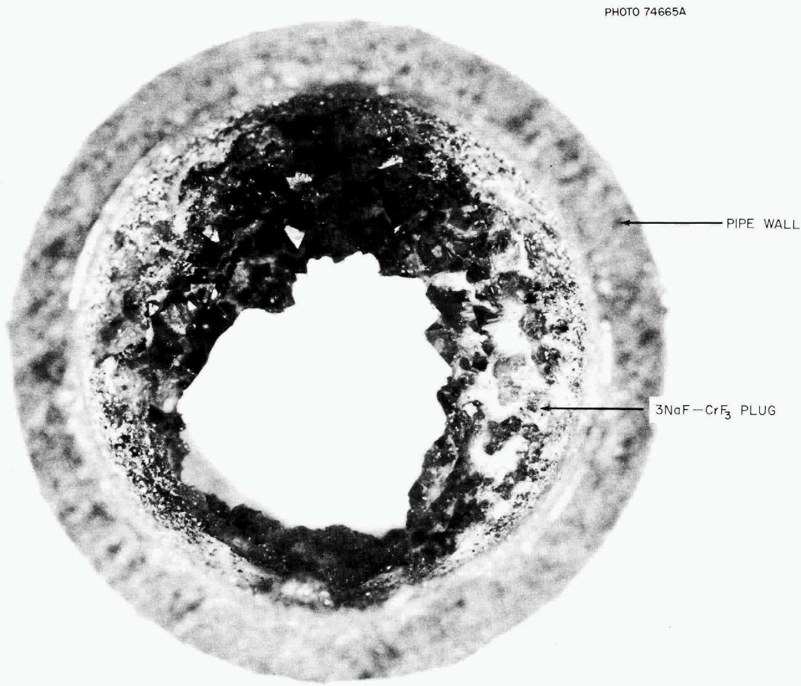  
Fig. 18.13. Plug Formed in Hastelloy N Loop 10 Containing NaF-KF-BF₃ (48-3-49 mole %) After 8765 hr at $1125^{\circ}\mathrm{F}$ . $\Delta T = 265^{\circ}\mathrm{F}$ . 8x. Reduced 23.50%.

estimate of the stoichiometry of the deposit is $2\mathrm{NaF - FeF}_2\mathrm{-CrF}_2\mathrm{-BF}_3$ Metallographic examination of the hot-leg specimens disclosed only moderate surface roughening.

Loop 10, fabricated from Hastelloy N, operated without incident for $8335\mathrm{hr}$ at which time the hot-leg temperature increased about $50^{\circ}\mathrm{F}$ , accompanied by a simultaneous temperature decrease of the same magnitude in the cold leg. A perturbation of this type is usually an indication of plugging. The temperature fluctuations ceased after $1\mathrm{hr}$ and no further incidents occurred during the life of this loop. The loop was shut down after its 1-year scheduled operation. Examination

of the loop piping disclosed a partial plug in the lower portion of the cold leg (Fig. 18.13). The plug, which closed approximately $75\%$ of the cross-sectional area of the pipe, was emerald green in color and analyzed to be essentially single crystals of $3\mathrm{NaF - CrF}_3$ .

Analysis of the drain salt cake from loop 10, Fig. 18.14, revealed extensive increases in the concentrations of Ni, Mo, Fe, and Cr when compared with the before-test salt. Nickel was particularly high in the bottom and top portions of

ORNL-DWG 67-10980 Impurity Analysis: NaF-KF-BF3 (48-3-49 mole $\%$   

<table><tr><td rowspan="2"></td><td colspan="7">Analysis (ppm)</td></tr><tr><td>Ni</td><td>Cr</td><td>Mo</td><td>Fe</td><td>O</td><td>H2O</td><td>S</td></tr><tr><td>Before test</td><td>87</td><td>83</td><td>7</td><td>146</td><td>\( \left\{ \begin{array}{l} 1400 \\ 3000 \\ 4850 \end{array} \right\} \)</td><td>400900</td><td>2,6</td></tr><tr><td colspan="8">After test</td></tr><tr><td>Top slag</td><td>\( 11.15^a \)</td><td>1000</td><td>\( 1.35^a \)</td><td>4200</td><td>12001750</td><td>1800</td><td>5</td></tr><tr><td>Center layer</td><td>90</td><td>210</td><td>160</td><td>270</td><td>35403120</td><td>1300</td><td>2,&lt;5</td></tr><tr><td>Bottom layer</td><td>\( 4.47^a \)</td><td>1500</td><td>7300</td><td>1500</td><td>35503660</td><td>2800</td><td>&lt;5,19</td></tr></table>

a wt. 0%

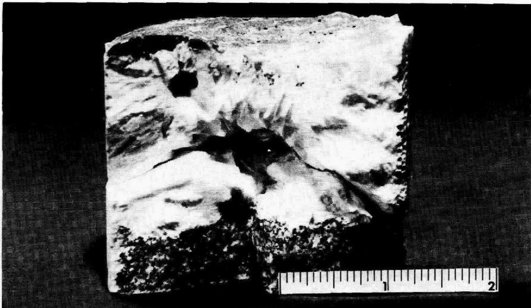  
Fig. 18.14. Drain Salt Cake from Loop 10.

the cake, 4.47 and 11.15 wt % respectively. Micrometer measurements and metallographic examination of the hot leg of the loop disclosed 1 to 2 mils of metal loss and slight surface roughening. The crossover line to the cold leg, the cold leg, and the crossover line to the hot leg all showed slight increases in wall thickness due to deposition of complex surface layers (Fig. 18.15). Chemical analysis of the layers disclosed that they were primarily metallic nickel (60 to 90 wt %) and molybdenum. Iron was present at locations close to the base metal, but chromium was absent in all the corrosion product layers examined. This is reasonable in view of the complex fluoride plug and the observation that in the cold leg two complex iron fluorides, $3\mathrm{NaF - FeF}_3$ and $\mathrm{NaF - FeF}_2,$ were identified.

Analysis of this loop is still proceeding, but the mode of attack appears to be dissolution of the container material in the hot leg, followed by temperature-gradient mass transfer. Chromium and iron, the latter to a lesser extent, tend to form complex fluorides, while nickel and molybdenum plate out in metallic form. The findings to date indicate that corrosion damage was due to (a) an impure salt containing residual HF or $\mathrm{H}_2\mathrm{O}$ from processing or (b) the intrinsic corrosive characteristics of the fluoroborate salt $(\mathrm{BF}_3$ is probably the active agent). In any case, while the effect on the Hastelloy N is small in terms of metal loss from the hot section, the formation of metallic layers and complex fluorides in the colder sections is disturbing. Blockage of flow and modification of heat transfer characteristics

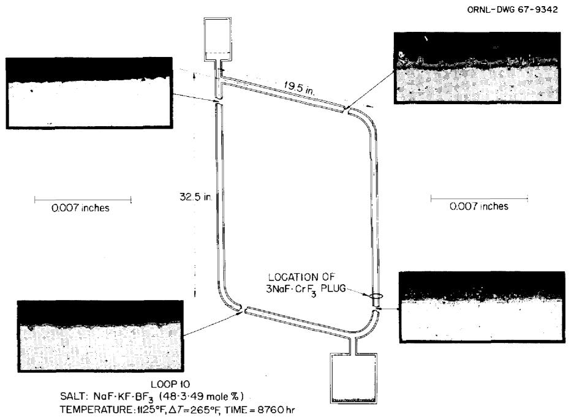  
Fig. 18.15. Surface Layers in Loop 10 after 8760 hr Operation.

are, of course, the deleterious results of primary concern.

# Equipment Modifications

During the last six months extensive modifications were made to the thermal convection loop area in Building 9201-3 so as to make it more suitable for advanced studies on the compatibility of MSBR salts with Hastelloy N and modified Hastelloy N (0.5% Ti). All instrumentation has been or is in the process of being upgraded, outmoded furnaces are being replaced, and special facilities have been installed to handle toxic $\mathbf{BF}_{3}$ gas. Two loops ready to be charged with $\mathbf{BF}_{3}$ -bearing salts are shown in Fig. 18.16. Our future program includes operation of natural-circulation and possibly forced-circulation loops with the prime candidate fuel, blanket, and coolant salts for the MSBR (loops 13-16). A study will be made of the compatibility of graphite-Hastelloy N braze joints in fuel salt. Capsule tests to determine the effect of $\mathbf{BF}_{3}$ pressure on the compatibility of the fluoroborate salts with Hastelloy N will also be conducted.

# 18.7. TITANIUM DIFFUSION IN HASTELLOY N

C. E. Sessions

T. S. Lundy

Titanium additions to Hastelloy N improve the resistance of this alloy to damage by neutron irradiation. However, we have some concern about how the addition of titanium will influence the corrosion resistance. Evans et al.7 have shown that the primary corrosion mechanism of standard Hastelloy N in pure fluoride salts is the leaching of chromium by the reaction

$$
\mathrm {U F} _ {4} + \mathrm {C r} \rightarrow \mathrm {U F} _ {3} + \mathrm {C r F} _ {2}.
$$

They demonstrated that the process was controlled by the diffusion of chromium in the alloy. Titanium will tend to undergo a similar reaction, since the standard free energy of formation of $\mathrm{TiF}_3$ is even more negative than that for $\mathrm{CrF}_2$

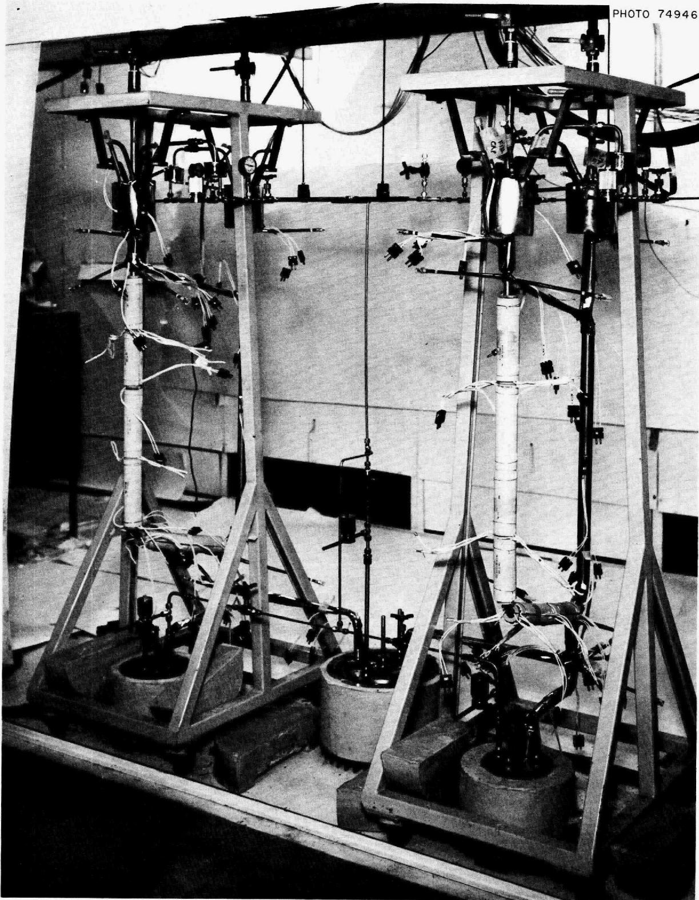  
Fig. 18.16. Hastelloy N Thermal Convection Loops Ready for Charging with $\mathsf{BF}_3$ -Bearing Salts.

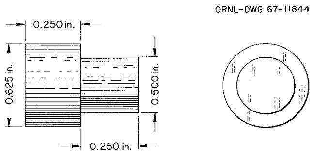  
Fig. 18.17. Geometry of Diffusion Specimen.

(at $1110^{\circ}\mathrm{F}$ , $\Delta F^{\circ}$ for $\mathrm{TiF}_3$ is $-90\mathrm{kcal}$ per gram-atom of F and $\Delta F^{\circ}$ for $\mathrm{CrF}_2$ is $-77\mathrm{kcal}$ per gram-atom of F). Since protective films do not seem to form in fluoride systems, we would assume that both the chromium and the titanium will be removed as rapidly as these elements can diffuse. Our previous studies indicate that the corrosion rate of the standard alloy is acceptable, and the question of paramount importance is whether the addition of titanium will accelerate the corrosion rate.

To answer this question we are measuring the rate of titanium diffusion in modified Hastelloy N. The following technique is being used. Diffusion samples, 0.625-in.-diam cylinders (Fig. 18.17), were machined from small commercial heats of modified Hastelloy N (heat 66-548). They were heat treated 1 hr at $2400^{\circ}\mathrm{F}$ to establish a stable grain size and impurity distribution. The radioactive ${}^{4}\mathrm{Ti}$ isotope was deposited on the polished face of the sample using a micropipet. The isotope was supplied in an HF-HCl acid solution; therefore, additions of $\mathrm{NH}_4\mathrm{OH}$ were made after depositing the isotope to neutralize the solution. The sample was then heated in vacuum for 0.5 hr at $932^{\circ}\mathrm{F}$ to decompose the mixture to leave a thin layer of ${}^{4}\mathrm{Ti}$ .

Each sample was given a diffusion anneal for appropriate times in flowing argon at precisely controlled temperatures. Sections were then taken on a lathe at 0.001-in. increments, and the activity of the turnings was measured using a single-channel gamma spectrometer with an NaI(Tl) scintillation crystal detector. At lower diffusion anneal temperatures, a hand-grinding technique

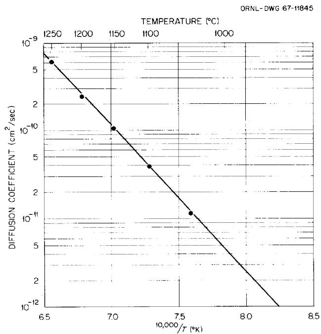  
Fig. 18.18. Diffusivity of Titanium in Modified Hastelloy N.

was used to obtain smaller increments since the penetration distances were less. From a plot of the specific activity of each section against the square of the distance from the original interface, a value of titanium diffusivity was obtained for the diffusion anneal temperature of that specimen.

To date we have determined the diffusivity of titanium at five temperatures from 2282 to $1922^{\circ}\mathrm{F}$ . The results of these measurements are shown in Fig. 18.18. Although the temperature range over which we have data is considerably higher than the proposed reactor operating temperature, we can compare the rates of titanium diffusion with that of chromium to get some ideas of the relative mobilities of the two constituents. At $2012^{\circ}\mathrm{F}$ the diffusion rate of chromium in an $\mathrm{Ni}-20\%$ Cr alloy is reported to be approximately $8 \times 10^{-11} \mathrm{~cm}^{2} / \mathrm{sec}$ . From our data at $2012^{\circ}\mathrm{F}$ the diffusivity of titanium in modified Hastelloy N is $3.9 \times 10^{-11} \mathrm{~cm}^{2} / \mathrm{sec}$ , which is a factor of 2 lower than for chromium at this temperature.

Thus on a very rough basis there does not appear to be too much difference in the rate of diffusivity of these constituents at these higher temperatures. However, we cannot conclude at this

time what the effective diffusivities of titanium will be in the alloy at 1100 to $1400^{\circ}\mathrm{F}$ , because at these lower temperatures short-circuit diffusion paths become an important factor in the material transport. Since we currently have no estimate of this latter contribution to the net diffusivity for titanium, we must extend our diffusion measurements to lower temperatures before concluding what the expected behavior would be under reactor operating conditions.

# 18.8. HASTELLOY N-TELLURIUM COMPATIBILITY

C. E. Sessions

The compatibility of Hastelloy N with fission products in the MSRE is of concern, since the strength and ductility of the structural material could be reduced after prolonged exposure at elevated temperatures. Consideration as to which of the products might be detrimental to the strength of the alloy revealed that tellurium was a potentially troublesome element. Tellurium is in the same periodic series as sulfur, a known detrimental element in nickel-base alloys.

To evaluate the possible effects of tellurium on Hastelloy N, several tensile samples were vapor plated with tellurium and then heat treated in quartz capsules to allow interdiffusion of the tellurium with the alloy. Also, several samples were

vapor coated with tellurium and then coated with an outer layer of pure nickel in order to reduce the vaporization of the tellurium during subsequent heat treatments.

After heat treatment of the coated samples, the specimens were tensile tested at either room temperature or $1200^{\circ}\mathrm{F}$ using a strain rate of 0.05 $\min^{-1}$ . Table 18.4 lists the test conditions and results for 12 samples of Hastelloy N. No effect of the tellurium coating on the ductility of Hastelloy N was found at either test temperature. At $1200^{\circ}\mathrm{F}$ , the ductility following the various treatments ranged from 20 to $34\%$ elongation, which is within the range normally obtained in the absence of tellurium. At room temperature the ductility was in the range 52 to $57\%$ , which again is normal.

Metallographic examination of the specimens was made after testing to evaluate the interaction of tellurium with Hastelloy N. A representative area on the shoulder of one sample is shown in Fig. 18.19. Irregular surface protuberances are evident in a localized region of the edge of the Hastelloy N. The gray phase around the protuberances is tellurium metal that remained on the sample after mechanical testing in air at room temperature. The roughness of the Hastelloy N specimens resulted from corrosive interaction of the vapor or liquid tellurium during the heat treatment. At higher magnifications it is evident that a slight amount of grain-boundary penetration of the tellurium into the Hastelloy N had taken place.

Table 18.4. Tensile Properties of Tellurium-Hustelloy N Compatibility Studies   

<table><tr><td>Sample Coating Technique</td><td>Maximum Annealing Temperature (°F)</td><td>Annealing Time (hr)</td><td>Test Témperture (°F)</td><td>Yield Strength (psi)</td><td>Total Elongation (%)</td></tr><tr><td rowspan="4">Tellurium in capsule with specimen</td><td>2012</td><td>24</td><td>75</td><td>49,100</td><td>57</td></tr><tr><td>2012</td><td>24</td><td>1200</td><td>31,300</td><td>22</td></tr><tr><td>2012</td><td>150</td><td>75</td><td>49,800</td><td>57</td></tr><tr><td>2012</td><td>150</td><td>1200</td><td>37,000</td><td>20</td></tr><tr><td rowspan="2">Vapor coated with tellurium and nickel</td><td>1652</td><td>100</td><td>75</td><td>53,200</td><td>52</td></tr><tr><td>1652</td><td>100</td><td>1200</td><td>36,700</td><td>27</td></tr><tr><td rowspan="2">Vapor coated with tellurium</td><td>1472</td><td>100</td><td>75</td><td>52,800</td><td>54</td></tr><tr><td>1472</td><td>100</td><td>1200</td><td>40,500</td><td>34</td></tr></table>

${}^{8}$ Tested at a strain rate of ${0.05}{\mathrm{\;{min}}}^{-1}$ .

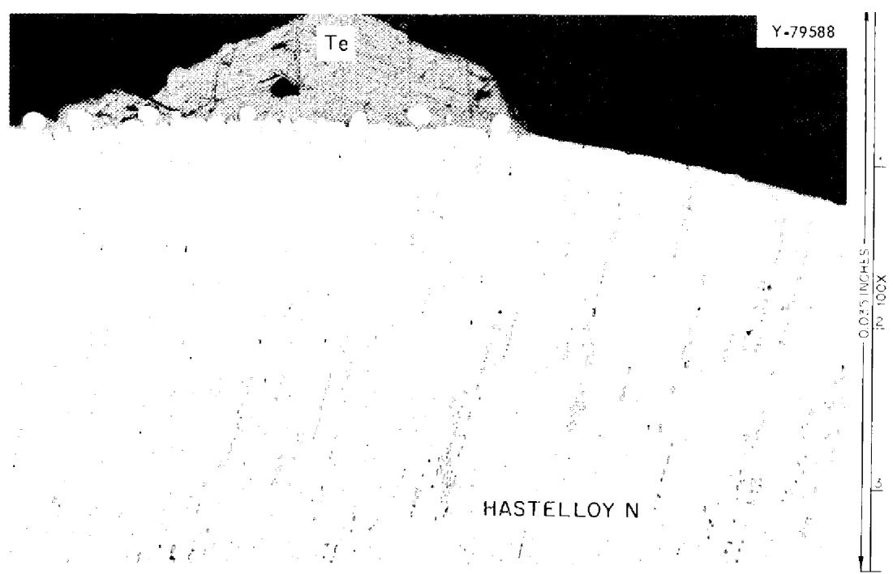  
Fig. 18.19. Hastelloy N Tensile Specimen Following Exposure to Tellurium Vapor for 150 hr at $1832^{\circ}\mathrm{F}$ . $100\times$ .

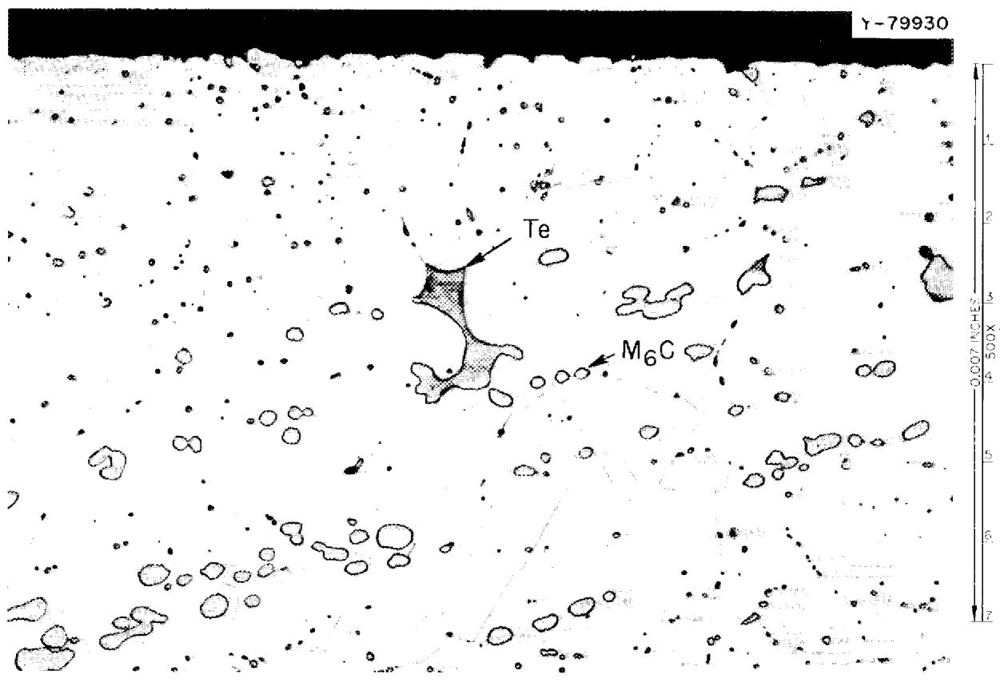  
Fig. 18.20. Hastelloy N Sample Showing Slight Intergranular Penetration by Metallic Tellurium. $500 \times$

Figure 18.20 shows an area near the edge of the sample, where grain boundaries contain a tellurium-rich phase. Electron microprobe examination of this region confirmed the presence of tellurium and indicated that it was preferentially associated with the large carbide precipitates within grain boundaries.

The penetration of the tellurium into the alloy was only about 0.005 in. following the $1832^{\circ}\mathrm{F}$ heat treatment. No penetration was found for samples heat treated at 1472 or $1652^{\circ}\mathrm{F}$ .

Elemental scans of the microprobe within the tellurium phase shown in Fig. 18.19 indicated

that manganese and chromium were also present. These elements were preferentially segregated into bands within the tellurium matrix and undoubtedly resulted from the leaching of these elements from the Hastelloy N during the $1832^{\circ}\mathrm{F}$ heat treatments.

The results of these tests indicate that liquid and/or vaporized tellurium metal interacts with Hastelloy N to a minor extent under the conditions tested, which included up to 150 hr in contact at $1832^{\circ}\mathrm{F}$ . No reduction in room-temperature or elevated-temperature ductility was found. These tests will be extended to longer exposure times.

# 19. Graphite-to-Metal Joining

# 19.1. BRAZING OF GRAPHITE TO HASTELLOY N

W. J. Werner

Studies were continued to develop methods for brazing large graphite pipes to Hastelloy N. At the present time, three different joint designs are being tested for circumventing the differential thermal expansion problem associated with joining the two materials. Concurrently, two different brazing techniques are under development for joining graphite to graphite and to Hastelloy N. In addition to wettability and flowability of the brazing alloy on graphite, the brazing technique development takes under consideration the application-oriented problems of service temperature, joint strength, compatibility with the reactor environment, and braze stability under irradiation in neutron fluxes.

# Joint Design

The first joint design, which has been reported previously, $^{1}$ is based on the incorporation of a transition material between the graphite and Hastelloy N that has an expansion coefficient between those of the two materials. Molybdenum and tungsten are two applicable materials, and, in addition, they possess adequate compatibility with the reactor system. The transition joint design is illustrated in Fig. 19.1. The design incorporates a $10^{\circ}$ tapered edge to reduce shear stresses arising from thermal expansion differences.

The second design is the same as the first except that the transition portion of the joint is deleted and the graphite is joined directly to the Hastelloy

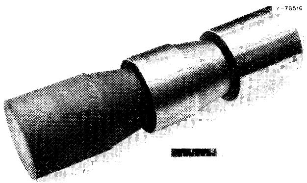

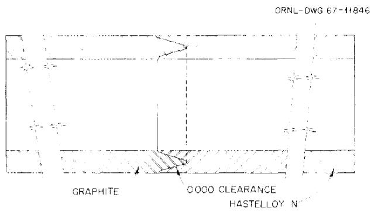  
Fig. 19.1. Transition Joint Design with 10-deg Tapered Edges to Reduce Shear Stresses. From left to right the materials are graphite, molybdenum, and Hastelloy N.   
Fig. 19.2. Schematic Illustration of a Direct Hastelloy N-to-Graphite Joint.

N. This joint is, of course, more desirable from the standpoint of simplicity. In addition, the graphite is in compression, which is highly desirable for a brittle material. The amount of compressive strain induced in a $3^{1} / 2$ -in.-OD by $\frac{1}{2}$ -in.-wall graphite tube using this design is approximately $1\%$ , which is postulated to be an acceptable compressive strain for high-density, low-permeability graphite.

The third design, which is also a direct graphite-to-Hastelloy N joint, is shown schematically in Fig. 19.2. Once again we have the graphite in compression; however, in this case allowance is made for keeping the joint in compression even if the graphite should shrink under irradiation.

# Brazing Development

We are continuing work on the development of alloys suitable for joining graphite to graphite and to structural materials. We are currently looking at several alloys based on the corrosion-resistant Cu-Ni, Ni-Pd, Cu-Pd, and Ni-Nb binary systems. Quaternary compositions were prepared containing a carbide-forming element plus a melting-point depressant. Preliminary discrimination between the various alloys was obtained through wettability tests on high-density graphite. Poor flowability was obtained with the Ni-Nb and Cu-Pd alloys. In the Pd-Ni system, the carbide-forming elements and melting-point depressant were added to the 70-30, 60-40, and 50-50 binary alloys. In the Cu-Ni system, the carbide-forming elements and melting-point depressant were added to the 80-20 and 70-30 binary alloys. Most of the alloys seemed to wet graphite well at temperatures ranging from 2102 to $2192^{\circ}\mathrm{F}$ .

Concurrent with the brazing development work, we are investigating the radiation stability of the brazing alloys. We are currently irradiating four batches of Hastelloy N Miller-Peaslee braze specimens in the ORR. The specimens will receive a dose (thermal) of approximately $2 \times 10^{20}$ neutrons/cm $^2$ at $1400^{\circ}\mathbf{F}$ .

# 19.2. COMPATIBILITY OF GRAPHEMOLYBDENUM BRAZED JOINTS WITH MOLTEN FLUORIDE SALTS

W. H. Cook

The salt-corrosion studies of joints of grade CGB graphite brazed to molybdenum with 60 Pd-35 Ni-5 Cr (wt %) have continued. The specimens are exposed to static LiF-BeF $_2$ -ZrF $_4$ -ThF $_4$ -UF $_4$ (70-23.6-5-1-0.4 mole %) at $1300^{\circ}\mathrm{F}$ in Hastelloy N. We

have reported previously $^{2,3}$ that there was no visible attack on the braze after a 5000-hr exposure, but there was a coating of palladium on the braze and some $\mathrm{Cr}_3\mathrm{C}_2$ on the graphite. A 10,000-hr test has now been concluded with similar results.

All salt-corrosion tests of this series were sealed at room temperature with a pressure of approximately $4 \times 10^{-6}$ torr by TIG welding. A thermal control for the 10,000-hr salt test was made in which the test components and test history were the same except that no salt was present. The results are shown in the microstructures of the two joints in Fig. 19.3b and c. The diffusion of the palladium out of the brazing alloy to form a nearly pure palladium coating on the surfaces of the braze occurred both in the control (the one exposed to a vacuum) and the one exposed to the salt. The coating formed in the vacuum may be more uniform. Formation of the coating in the vacuum eliminates the salt as an agent in its formation. The more probable explanation is that the palladium is diffusing to the surface of the braze metal. The thickness of the coating appeared to be a function of time in the 5000-hr test, but this time dependence does not seem to continue for as long as 10,000 hr.

There is some possibility that the palladium coating may help prevent corrosion of the brazing alloy by decreasing or preventing exposure of the alloy to the salt.

The chemical analyses of the salts remained essentially unchanged, as shown in Table 19.1, with the exception that the chromium content of the salt in the 10,000-hr test rose sharply relative to the others. This is higher than one would expect with Hastelloy N in these types of tests.

This particular test series for this brazing alloy will be terminated by a 20,000-hr test which is in progress. Another corrosion test of this brazing alloy in a similar joint configuration is being made in the MSRE core surveillance assembly, where the joint is being exposed to radiation and flowing fuel salt.

Other potential brazing alloys will be subjected to similar tests as they are developed. The most promising alloys will be more rigorously tested in dynamic salts and irradiation fields.

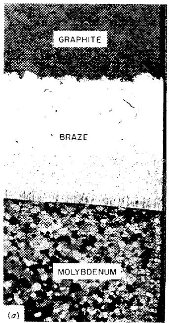

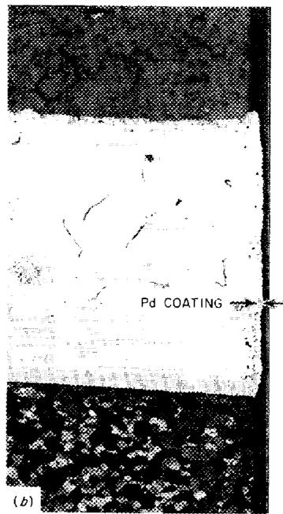

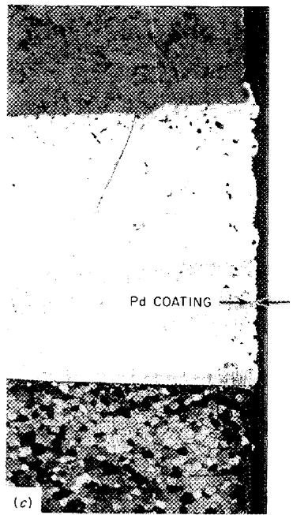  
PHOTO 89483  
Fig. 19.3. Microstructure of Joints of Grade CGB Graphite Brazed to Molybdenum with 60 Pd-35 Ni-5 Cr (wt %). (a) As brazed, (b) after 10,000-hr exposure at $1300^{\circ}\mathrm{F}$ to vacuum, and (c) after 10,000-hr exposure at $1300^{\circ}\mathrm{F}$ to LiF $\mathsf{BeF}_2$ -ZrF $_4$ -ThF $_4$ -UF $_4$ (70-23.6-5-1-0.4 mole %). The exposed surfaces are to the right. Etchant: $10\%$ oxalic acid. $100\times$ .

Table 19.1. A Summary of the Results of the Chemical Analyses of LiF-BeF $_2$ -ZrF $_4$ -ThF $_4$ -UF $_4$ (70-23.6-5-1-0.4 Mole %) Salts Before and After Various Periods of Exposure in Hastelloy N to Grade CGB Graphite Joints Brazed with 60 Pd-35 Ni-5 Cr (wt %) $^a$   

<table><tr><td rowspan="2">Test No.</td><td rowspan="2">Test Period (hr)</td><td colspan="7">Analysis (%)</td></tr><tr><td>Pd</td><td>Cr</td><td>Fe</td><td>Ni</td><td>Mo</td><td>C</td><td>O</td></tr><tr><td>Control</td><td>0</td><td>&lt;0.005</td><td>0.047</td><td>0.018</td><td>0.013</td><td>&lt;0.001</td><td>&lt;0.01</td><td>0.133</td></tr><tr><td>A2361</td><td>100</td><td>&lt;0.005</td><td>0.055</td><td>0.015</td><td>0.016</td><td>&lt;0.003</td><td>0.048</td><td>0.038</td></tr><tr><td>A2362</td><td>1000</td><td>&lt;0.005</td><td>0.056</td><td>0.012</td><td>0.006</td><td>&lt;0.003</td><td>0.049</td><td>0.026</td></tr><tr><td>A2363</td><td>5000</td><td>&lt;0.00006</td><td>0.053</td><td>0.004</td><td>0.003</td><td>&lt;0.005</td><td>0.20</td><td>0.22</td></tr><tr><td>A2365</td><td>10,000</td><td>&lt;0.0003</td><td>0.4000</td><td>0.0040</td><td>0.005</td><td>&lt;0.0003</td><td>0.0012</td><td>0.0748</td></tr></table>

${}^{a}$ The salt components remained constant within the tolerances of the chemical analyses.

# Part 6. Molten-Salt Processing and Preparation

M. E. Whatley

We have continued development work on the more critical parts of the fuel processing system for an MSBR. The basic concept of an on-site plant which will continuously process $14\mathrm{ft}^3$ of fuel salt per day through a fluorination operation to recover the uranium, a distillation operation to separate the carrier salt from the less-volatile fission products, and a recombination of the purified carrier salt and uranium remains unchanged. The area of work which has received most attention during this period is the distillation operation. Relative volatility values have been more accurately determined and extended to additional fission product poisons. The technique of using a transpirational method for relative volatility measurement is being exploited. We have fabricated the experimental still which will be used

at the MSRE to demonstrate distillation of radioactive salt, and it will be tested soon. The alternative process, removal of rare-earth fission products by reductive extraction, still appears promising; therefore, this work is continuing. The problem of heat generation in the various components of the processing plant is being elucidated by a new computer code which will provide concentrations of individual fission products with adequate accuracy for this purpose.

We now plan to recover the uranium from the MSRE in early 1968, with a cooling time of only 35 days; for this procedure some modification of the processing cell will be necessary. The new loading of the MSRE in 1968 will use $^{233}\mathrm{U}$ . Plans for the preparation of this fuel are reported here.

# 20. Vapor-Liquid Equilibrium Data in Molten-Salt Mixtures

J. R. Hightower

L. E. McNeese

Relative volatilities of several rare-earth trifluorides and alkaline-earth fluorides with respect to LiF have been measured in an equilibrium still at $1000^{\circ}\mathrm{C}$ . The measured relative volatilities are in close agreement with those predicted by Raoult's law and are low enough that a simple distillation system will work well for removing rare-earth fission products from the MSRE fuel stream.

The equilibrium still used for these measurements is shown in Fig. 20.1. The still consists of a $1_{\frac{1}{2}}$ - in.-diam still pot, a 1-in.-diam condenser, and a trap through which condensate flows prior to its return to the still pot. For each experiment, a salt charge

having the desired composition was melted in a graphite crucible. The mixture was then cooled to room temperature, and the resulting salt ingot was loaded into the $1_{2}^{1}$ -in.-diam section of the still. The still was welded shut, the condenser section was insulated, and the still was suspended in the furnace. Air was purged from the system by repeatedly evacuating the system and filling to atmospheric pressure with argon, and the pressure was set at the desired level. The furnace temperature was raised to $1000^{\circ}\mathrm{C}$ and the condenser temperature set at the desired value. During runs with a given component dissolved in LiF, the operating

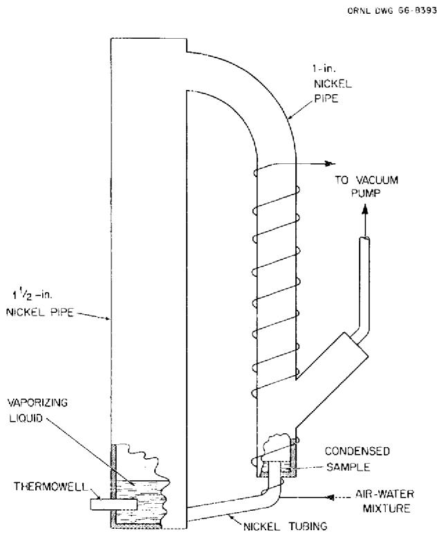  
Fig. 20.1. Molten-Salt Still Used for Relative Volatility Measurements.

Table 20.1. Relative Volatilities of Rare-Earth Trifluorides, $YF_{3}, BaF_{2}, SrF_{2}, ZrF_{4}$ and $BeF_{2}$ at $1000^{\circ}C$ with Respect to LiF   

<table><tr><td>Compound</td><td>Relative Volatility in LiF-BeF2-REF Mixture</td><td>Relative Volatility in LiF-REF Mixtures</td></tr><tr><td>CeF3</td><td>3.3 × 10-4</td><td>4.2 × 10-4</td></tr><tr><td>LaF3</td><td>1.4 × 10-4</td><td>3 × 10-4</td></tr><tr><td>NdF3</td><td>&lt;3 × 10-4</td><td>6.3 × 10-4</td></tr><tr><td>PrF3</td><td>1.9 × 10-3</td><td>2.3 × 10-4</td></tr><tr><td>SmF3</td><td>&lt;3 × 10-4</td><td></td></tr><tr><td>YF3</td><td>3.4 × 10-5</td><td></td></tr><tr><td>BaF2</td><td>1.1 × 10-4</td><td></td></tr><tr><td>SrF2</td><td>5.0 × 10-5</td><td></td></tr><tr><td>ZrF4</td><td>0.76 to 1.4</td><td></td></tr><tr><td>BeF2</td><td>4.73</td><td></td></tr></table>

pressure was $0.5\mathrm{mmHg}$ and the condenser outlet temperature was 855 to $875^{\circ}C$ during runs with the $\mathrm{LiF - BeF}_2$ mixture, the pressure was $1.5\mathrm{mmHg}$ and the condenser outlet temperature was 675 to $700^{\circ}C$

An experiment was continued for approximately 30 hr, after which the system was cooled to room temperature. The still was then cut open in order to remove the salt samples from the still pot and condensate trap. The samples were analyzed for all components used in the experiment.

Experimentally determined relative volatilities of six rare-earth trifluorides, $\mathrm{YF}_3$ , $\mathrm{BaF}_2$ , $\mathrm{SrF}_2$ , $\mathrm{BeF}_2$ , and $\mathrm{ZrF}_4$ with respect to LiF (measured at $1000^{\circ}\mathrm{C}$ and $1.5\mathrm{mmHg}$ in a ternary system having a molar ratio of LiF to $\mathrm{BeF}_2$ of approximately 8.5) are given in Table 20.1. The mole fraction of the component of interest varied from 0.01 to 0.05. The relative volatilities of the fluorides of the rare earths, Y, Ba, and Sr are lower than $3.3\times 10^{-4}$ , with the exception of Pr, which has a relative volatility of $1.9\times 10^{-3}$ . The relative volatility of $\mathrm{ZrF}_4$ varied between 0.76 and 1.4 as the $\mathrm{ZrF}_4$ concentration was increased from 0.03 to 1.0 mole%. The average value of the relative volatility of $\mathrm{BeF}_2$ was found to be 4.73, which indicates that vapor having the MSBR fuel carrier salt composition (66 mole% LiF-34 mole% $\mathrm{BeF}_2$ ) will be in equilibrium with liquid having the composition 91.2 mole% LiF-9.8 mole% $\mathrm{BeF}_2$ .

Relative volatilities are also given for five rare-earth trifluorides in a binary mixture of a rare-earth fluoride and LiF. These measurements were made at $1000^{\circ}\mathrm{C}$ and $0.5\mathrm{mmHg}$ using mixtures having rare-earth fluoride concentrations of 2 to 5 mole $\%$ Except for $\mathrm{PrF}_3$ (and possibly $\mathrm{SmF}_3$ ) the relative volatilities for the rare-earth fluorides are slightly lower when $\mathrm{BeF}_2$ is present.

If the molten salt solutions were ideal, the relative volatility of the respective fluorides could be calculated using Raoult's law and the vapor pressure of the fluorides and LiF. The relative volatility of a fluoride with respect to LiF would be the ratio of the fluoride vapor pressure to that of LiF. In Table 20.2, experimentally determined relative volatilities are compared with calculated relative volatilities for several fluorides for which vapor-pressure data are available.

Since the experimental errors in measuring relative volatilities or vapor pressures could be as large as the discrepancies between the experimental and the calculated relative volatilities (except in the case of $\mathbf{SrF}_2$ ) shown in Table 20.2, one can infer

that the behavior of the rare-earth fluorides, $\mathrm{YF}_{3}$ , and $\mathrm{BaF}_{2}$ in both LiF and the $\mathrm{LiF - BeF}_{2}$ mixture studied can be approximated by assuming Raoult's law. The deviation of $\mathrm{SrF}_{2}$ and, in the binary system, $\mathrm{LaF}_{3}$ from this pattern is unexplained.

The relative volatilities of the fluorides of the rare earths, yttrium, barium, and strontium are low enough to allow adequate removal in a still of simple design. Zirconium removal, however, will be insignificant.

Table 20.2. Comparison of Experimental Relative Volatilities with Calculated Values   

<table><tr><td>Component</td><td>Calculated Relative Volatility</td><td>Measured Relative Volatility in Ternary System</td><td>aexperimental/acalculated</td><td>Relative Volatility in Binary System</td><td>aexperimental/acalculated</td></tr><tr><td>NdF3</td><td>3.0 × 10-4</td><td>&lt;3 × 10-4</td><td>&lt;1</td><td>6 × 10-4</td><td>2.0</td></tr><tr><td>CeF3</td><td>2.5 × 10-4</td><td>3.3 × 10-4</td><td>1.32</td><td>4.2 × 10-4</td><td>1.68</td></tr><tr><td>BaF2</td><td>1.0 × 10-4</td><td>1.1 × 10-4</td><td>0.69</td><td></td><td></td></tr><tr><td>YF3</td><td>5.9 × 10-4</td><td>3.3 × 10-5</td><td>0.56</td><td></td><td></td></tr><tr><td>LaF3</td><td>4.1 × 10-5</td><td>1.4 × 10-4</td><td>3.4</td><td>3 × 10-4</td><td>7.3</td></tr><tr><td>SrF2</td><td>6.8 × 10-6</td><td>5.0 × 10-5</td><td>7.4</td><td></td><td></td></tr></table>

# 21. Relative Volatility Measurement by the Transpiration Method

F. J. Smith

C. T. Thompson

L. M. Ferris

The transpiration method for obtaining liquid-vapor equilibrium data is being used (1) to corroborate data obtained by the equilibrium still technique and (2) to determine relative volatilities for compounds of interest that have not yet been studied. The apparatus being used closely resembles that described by Cantor.

The initial experiments were made with LiF $\mathrm{BeF}_2$ (86-14 mole $\%$ ) over the temperature range 920 to $1055^{\circ}\mathrm{C}$ . Plots of the logarithms of the apparent vapor pressures of LiF and $\mathrm{BeF}_2$ (based on the assumption that only LiF and $\mathrm{BeF}_2$ were present in the vapor phase) vs $1 / T$ were linear, although some scatter was evident in the data points for $\mathrm{BeF}_2$ . The relative volatility of $\mathrm{BeF}_2$ with respect to LiF was $4.0 \pm 0.2$ over the temperature range investigated. This is in reasonable agreement with a value of 3.8 reported by Cantor for LiF- $\mathrm{BeF}_2$ (88-12 mole $\%$ ) at $1000^{\circ}\mathrm{C}$ .

Recent experiments with $\mathrm{LiF - BeF}_2$ (90-10 mole %) gave a relative volatility of 4.7 (BeF $_2$ with respect to LiF), which is in good agreement with the average value of 4.71 obtained by Hightower and McNeese using an equilibrium still. Experiments with $\mathrm{LiF - BeF}_2$ - $\mathrm{CeF}_3$ (85.5-9.5-5 mole %) gave vapor samples in which the concentration of $\mathrm{CeF}_3$ was below the limit of detection by spectrochemical methods. The relative volatility ( $\mathrm{CeF}_3$ with respect to LiF) was less than $1 \times 10^{-3}$ , in agreement with the reported value of $3.33 \times 10^{-4}$ .

# 22. Distillation of MSRE Fuel Carrier Salt

L. E. McNeese

W. L. Carter

J. R. Hightower

Equipment for demonstration of vacuum distillation using MSRE fuel salt has been built and assembled in its supporting framework. Installation of the unit is in progress in Building 3541, where experiments using nonradioactive salt are to be carried out. During construction, a series of radiographic and ultrasonic examinations were made over areas of the vessels that will be subjected to 850 to $1000^{\circ}\mathrm{C}$ temperatures, and numerous dimensional measurements were taken between points on the still, condenser, and condensate receiver. Similar data will be obtained after nonradioactive operation and will be compared with

initial data in evaluating vessel integrity for subsequent radioactive operation. The assembled unit was stress relieved by an 8-hr anneal at $1600^{\circ}\mathrm{F}$ in an argon atmosphere in order to preclude dimensional changes during operation due to stresses arising during fabrication.

Specimens of candidate materials of construction for vacuum distillation equipment were installed in the still so that each is exposed to molten-salt vapor and liquid in the region of highest temperature. The test specimens are attached to the drain tube and include Hastelloy N, grade AXF-5QBG isotropic graphite, Mo-TZM, Haynes

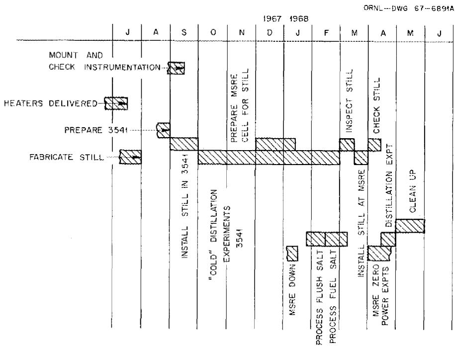  
Fig. 22.1. Schedule of Activities Associated with Distillation of MSRE Fuel Carrier Salt.

alloy No. 25, and an experimental alloy (alloy No. 82) having the composition $18\mathrm{Mo} - 0.2\mathrm{Mn} - 0.05$ Cr-bal Ni.

Activities associated with the system during the past two months and scheduled activities through completion of radioactive operation are shown in Fig. 22.1. Still fabrication has been completed, and the thermal insulation and electric heaters have been received. Four faulty heaters out of a total of 41 were rejected, and replacements have been ordered. Instrumentation work is $90\%$ complete. The first of several 48-liter salt charges for nonradioactive operation is being prepared by Reactor Chemistry Division personnel. Experiments using nonradioactive salt will begin

in early October and will continue through February 1968. The still will then be inspected for radioactive operation and installed at the MSRE site in the spare cell adjacent to the fuel processing cell.

The equipment will then be used for distilling 48 liters of radioactive MSRE fuel salt (decayed 90 days) from which uranium has been removed by fluorination. It was determined that the roof plugs in the spare cell do not provide adequate biological shielding for 90-day-old salt; the plugs have been redesigned and will consist of 30-in.-thick barytes concrete rather than the present 24-in. ordinary concrete.

# 23. Steady-State Fission Product Concentrations and Heat Generation in an MSBR and Processing Plant

J. S. Watson L. E. McNeese W. L. Carter

Concentrations of fission products and the heat generation associated with their decay are required for design of systems for processing the fuel and fertile streams of an MSBR. A method for calculating the steady-state concentration of fission products in an MSBR will be described, and heat-generation rates in the fuel stream will be given. Changes in heat-generation rate resulting from removal of fission products in both the reactor and the fuel-stream processing system will be shown.

Several simplifying assumptions were made in calculating the concentration of fission products in the fuel stream of an MSBR. The differential equation used to define the concentration of a given isotope was

$$
\begin{array}{l} \frac {d N _ {Z , A}}{d t} = K P Y + N _ {Z, A - 1} \phi_ {C Z, A - 1} \frac {V _ {c}}{V _ {t}} \\ + N _ {Z - 1, A} \lambda_ {Z - 1, A} - \lambda_ {Z, A} N _ {Z, A} \\ - \phi \sigma_ {Z, A} \frac {V _ {c}}{V _ {t}} N _ {Z, A} + \frac {N _ {Z , A}}{T _ {Z}}, \\ \end{array}
$$

where

$$
\begin{array}{l} \begin{array}{r l} N _ {Z, A} & = \text {n u m b e r o f a t o m s o f a n i s o t o p e w i t h} \\ & \text {a t o m i c n u m b e r Z a n d m a s s n u m b e r A}, \\ P & = \text {p o w e r (w)}, \end{array} \\ \begin{array}{l} Y = \text {p r i m a r y y i e l d o f i s o t o p e o f a t o m i c} \\ \text {n u m b e r Z a n d m a s s n u m b e r A (a t o m s /} \\ \text {f i s s i o n)}, \end{array} \\ \phi = f l u x \left(n e u t r o n s \sec^ {- 1} c m ^ {- 2}\right), \\ \sigma_ {Z, A} = \text {c r o s s s e c t i o n o f i s o t o p e w i t h a t o m i c} \quad \text {n u m b e r Z a n d m a s s n u m b e r A (c m ^ {2})}, \\ \end{array}
$$

$$
\begin{array}{l} V _ {c} / V _ {t} = \text {c o r e v o l u m e / t o t a l f u e l v o l u m e}, \\ T _ {Z} = \text {p r o c e s s i n g c y c l e t i m e f o r i s o t o p e s} \\ \text {w i t h a t o m i c n u m b e r Z (s e c)}, \\ t = \text {t i m e (s e c)}. \end{array}
$$

The reactor was assumed to be at steady state with respect to all fission products. At steady state, $\frac{dN_{Z,A}}{dt} = 0$ ; so the differential equation reduces to

$$
N _ {Z, A} = \frac {K P Y + N _ {Z , A - 1} \phi_ {Z , A - 1} \left(V _ {c} / V _ {t}\right) + N _ {Z - 1 , A} \lambda_ {Z - 1 , A}}{\lambda_ {Z , A} + \phi_ {Z , A} \left(V _ {c} / V _ {t}\right) + \left(1 / T _ {z}\right)},
$$

which defines the steady-state concentration of each isotope. This equation was solved for each isotope using an IBM 7090. The calculations used $^{235}\mathrm{U}$ yields given by Blomeke and Todd; yields for $^{233}\mathrm{U}$ were obtained by distributing "mass yields" reported by England among the isotopes in each mass chain so that each isotope had the same fraction of the mass yield as reported for $^{235}\mathrm{U}$ . Decay chains were simplified and approximated by "straight" chains considering only beta decay. Where isomeric transitions or other complications were noted, personal judgment was used to approximate the real process with straight beta decay.

Effective "one group" cross sections were calculated from results from OPTIMERC (a reactor analysis code) for the MSBR reference design. The fuel salt was assumed to be completely mixed, and capture terms were reduced by a factor equal to the ratio of the core volume to the total fuel salt volume.

Heat-generation rates, both at the instant of removal from the reactor and after various decay periods, were calculated from the steady-state fission product concentrations in the fuel using CALDRON, a fission product heat-generation and decay code,

Heat-generation rates obtained with $^{235}\mathrm{U}$ yields were in good agreement with rates calculated by a modified (to treat a steady-state reactor with continuous processing) version of PHOBE, a code written by E. D. Arnold and based on experimental data for decay of fission products. Agreement with a reputable code indicates that the simplifications in the present calculations were reasonable.

In the MSBR, some fission products will be removed from the fuel by the gas purge or by plating on solid surfaces, and other fission products will be removed in processing (fluorination) before the

salt reaches the still. Removal of fission products by plating and gas stripping was taken into account by assigning appropriate residence times, $T_{Z}$ , for volatile or noble elements. After withdrawal from the reactor, the fuel salt was assumed to be retained in a hold tank for 12 hr, after which specified fractions of elements having volatile fluorides were removed. The remaining fission products were then allowed to decay for an additional 12 hr before entering the still.

Figure 23.1 shows fuel salt heat-generation rates calculated for various times after removal from the reactor. These calculations were made with MSBR design conditions: $2220\mathrm{Mw}$ (thermal), $3.7\times 10^{14}$ neutrons $\mathrm{sec}^{-1}\mathrm{cm}^{-2}$ , core volume of 9400 liters, fuel salt volume of 25,400 liters, and $4.5\times 10^{6}$ sec (52 days) processing cycle. The uppermost curve represents no fission product removal in the reactor or in the fluorinator. The next lower solid curve represents Kr and Xe removal from the reactor with a 30-sec residence time, and the lowest solid curve represents removal of Kr and Xe (30-sec residence) along with removal of Mo, Tc, Ru, Rh, Pd, Ag, In, Nb, Te, and Se with a mean residence time of $1.8\times 10^{5}$

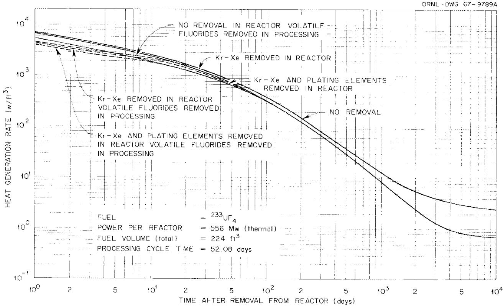  
Fig. 23.1. Fission Product Heat Generation Rate in MSBR Fuel After Removal from the Reactor.

sec (50 hr). These latter residence times are rough estimates, and as better information becomes available from fission product behavior in the MSRE, more reliable estimates of the residence times for these elements will be possible. This lowest solid curve in Fig. 23.1 is shown only to suggest the general range of conditions under which the fuel processing plant may operate.

The dashed curves in Fig. 23.1 were obtained from the same reactor calculations, but some fission products were assumed to be removed in the fluorinator. The elements Xe, Kr, Br, I, Mo, Tc, Te, and Se were considered to be completely removed, and $15\%$ of the Ru, Rh, Nb, and Sb were removed. After fluorination, however, these elements may "grow" back into the system.

# HEAT GENERATION IN A MOLTEN-SALT STILL

Buildup of heat generation in a molten-salt distillation system was calculated using the heat-generation data given in Fig. 23.1. The reactor and that part of the processing system prior to the still were assumed to be at steady state, although the transient associated with buildup of fission products in the still was considered. Fuel salt containing fission products remaining after fluorination was fed to a distillation system, and complete retention of fission products was assumed. The fuel salt was assumed to have been held up $24\mathrm{hr}$ in processing prior to entering the still (12 hr before fluorination and 12 hr after).

The heat-generation data from Fig. 23.1 was fitted by the method of least squares to the relation

$$
H (t) = \sum_ {i = 1} ^ {1 5} A _ {i} e ^ {- k _ {i} t},
$$

where

$$
\begin{array}{r l} H (t) & = \text {h e a t - g e n e r a t i o n r a t e a t t i m e} t (\text {B t u} \\ & \quad \mathrm {h r} ^ {- 1} \mathrm {f t} ^ {- 3}), \end{array}
$$

$$
\begin{array}{r l} A _ {i}, k _ {i} & = \text {c o n s t a n t s}, \\ t & = \text {t i m e a f t e r s a l t l e v e s f l u o r i n a t o r (d a y s)}. \end{array}
$$

The rate of heat generation in the still is then given as

$$
Q (t) = F \int_ {0} ^ {t} H (x) d x = F \sum_ {i = 1} ^ {1 5} \frac {A _ {i}}{k _ {i}} \left(1 - e ^ {- k _ {i} t}\right),
$$

where

$$
\begin{array}{l} Q (t) = \text {h e a t g e n e r a t i o n i n s t i l l a f t e r o p e r a t i n g} \\ \text {f o r a t i m e} t (\mathrm {B t u / h r}), \end{array}
$$

$$
F = \text {f u e l s a l t p r o c e s s i n g r a t e} (\mathrm {f t} ^ {3} / \text {d a y}),
$$

$$
t = \text {l e n g t h}
$$

Calculated heat-generation rates in the still are shown in Fig. 23.2 for a processing rate of 15 ft³/day for several assumed removal efficiencies (the same assumptions noted for Fig. 23.1) in processing steps prior to the still. The still system will be near steady state in two to three years, and heat generation rates as high as 3.0 Mw can be expected. Removal of fission products by gas stripping, plating on metal surfaces, and formation of volatile fluorides during fluorination will reduce this rate to about 2.2 Mw.

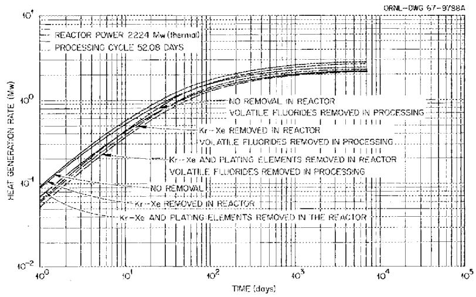  
Fig. 23.2. Fission Product Decay Heat in MSBR Still and Accumulation Tank.

# 24. Reductive Extraction of Rare Earths from Fuel Salt

L. M. Ferris

C. E. Schilling

J. F. Land

One alternative to the distillation process for decontaminating MSBR fuel salt involves reductive extraction of the rare earths (and other fission products) after the uranium has been recovered from the salt by fluorination. $^{1-3}$ The reductant currently being considered is $^7\mathrm{Li}$ dissolved in molten metals such as bismuth or lead which are immiscible with the salt. Studies in the Reactor Chemistry Division $^{1,2,4}$ have defined the equilibrium distribution of several rare earths between Li-Bi solutions and $\mathrm{LiF - BeF}_2$ (66-34 mole %) at $600^{\circ}\mathrm{C}$ . The results of these studies indicate that the rare earths can be effectively extracted in such a system.

The apparent stoichiometry of the extraction reaction is such that, under the experimental conditions employed, the lithium concentration in the metal phase should not change detectably, even if the rare earth were quantitatively extracted. However, in these, and similar, experiments, usually 50 to $75\%$ of the lithium originally present in the Li-Bi solution apparently was consumed. The mechanism by which lithium is "lost" in these systems has not yet been elucidated.

In order to properly evaluate the practicality of the reductive extraction process, the behavior of lithium in these systems must be clearly defined. Knowledge of its behavior is especially important in designing a multistage extraction system, because the extent to which the rare earths are ex

tracted (at equilibrium) is directly related to the lithium concentration in the metal phase. $^{1,2,4}$ Consequently, more experiments have been conducted, with the primary objective being the determination of the cause of the apparent lithium loss. As discussed below, these experiments did not produce a definite answer to the question, and more study will be required. In each experiment a rare-earth fluoride, usually $\mathrm{EuF}_3$ , was added to the salt to provide a basis for comparison with the results of earlier studies and to allow us to obtain preliminary information on the effect of temperature on the distribution of europium between the two phases.

Experimentally, solutions of lithium in bismuth (usually about 7 at. $\%$ Li) and of $\mathrm{EuF}_3$ in LiF $\mathrm{BeF}_2$ (66-34 mole $\%$ ; mole fraction of $\mathrm{EuF}_3$ , about $10^{-4}$ ) were prepared at $600^{\circ}\mathrm{C}$ in separate mild steel or graphite crucibles, using pure argon as a blanket gas. Then, the salt was transferred to the crucible containing the Li-Bi alloy, and the system was equilibrated at high temperature in an argon atmosphere. Filtered samples (stainless steel samplers) of both phases were removed periodically for analysis.

No detectable "loss" of lithium occurred during preparation of the Li-Bi alloys in either mild steel or graphite crucibles. When the system was not agitated (by sparging with argon), the time required to achieve equilibrium was generally about 24 hr. The low rate of dissolution of lithium in bismuth when the system is quiescent has been observed by others. The rate-controlling step may be the dissolution of $\mathrm{Li}_3\mathrm{Bi}$ , a high-melting, insoluble compound that probably forms rapidly when mixtures of the two metals are heated. After about 24 hr at $600^{\circ}\mathrm{C}$ , the lithium concentration in the solution, as determined by chemical

analysis of filtered samples and thermal analysis of the system, usually reached the expected value. When the system was sparged with argon, equilibrium was reached in 1 to 2 hr or less.

As was the case in other studies, a significant (30 to $70\%$ ) decrease in the lithium concentration in the metal phase occurred during equilibration of salt and Li-Bi solutions at 500 to $700^{\circ}\mathrm{C}$

Several possible causes of this phenomenon were considered: (1) dissolution of lithium in the salt, (2) reduction of $\mathbf{BeF}_2$ from the salt by lithium with formation of LiF and beryllium metal (which is insoluble in both the salt and bismuth), and (3) reaction of the lithium with water that was inadvertently admitted to the system. Neither of the first two mechanisms seems likely, based on the experimental evidence. If either lithium or beryllium metal were present in the salt in the amounts expected from the lithium "loss," dissolution of the salt in hydrochloric acid should have resulted in the evolution of more than 10 cc (STP) of hydrogen per gram of salt. However, it was found that samples of both filtered and unfiltered salt generally gave less than 0.2 cc of $\mathbf{H}_2$ per gram. This finding, along with thermo

dynamic considerations,² appears to rule out either of these mechanisms.

The inadvertent admittance of water into the system (as a contaminant in the salt and/or blanket gas, or during sampling) seems to be a more reasonable explanation for the consumption of lithium. Although this hypothesis has not yet been confirmed, several observations have been made which support this mechanism. The salt after equilibration is invariably permeated with an insoluble material which tends to concentrate at the salt-metal interface. The presence of this phase does not appear to be related to the presence of a rare earth, and, on the basis of chemical analysis, is not the result of corrosion of the crucible or samplers. High oxygen concentrations (about $0.5\%$ ) have been detected in salt samples, and, in a few instances, the presence of $\mathrm{BeO}$ in the system has been confirmed. These results, if caused by the presence of water, are consistent with a mechanism in which the water reacts first with $\mathrm{BeF}_2$ to form insoluble $\mathrm{BeO}$ and gaseous HF which, in turn, reacts with lithium to form LiF that dissolves in the salt. Accordingly, the LiF concentration in the salt would increase and the

Table 24.1. Distribution of Europium Between LiF-BeF $_2$ (66-34 Mole %) and Lithium-Bismuth Solutions   

<table><tr><td>Experiment</td><td>Sample</td><td>Lithium Concentration in Metal Phase (mole %)</td><td>Temperature (°C)</td><td>Approximate Amount of Europium in Metal Phase (%)</td><td>Da</td></tr><tr><td>CES75</td><td>1</td><td>0.85b</td><td>608</td><td>52b</td><td>1.2b</td></tr><tr><td>CES66</td><td>3</td><td>2.6b</td><td>602</td><td>81b</td><td>5.4b</td></tr><tr><td>CES66</td><td>2</td><td>3.4b</td><td>583</td><td>93b</td><td>17.1b</td></tr><tr><td>JFL64</td><td>3</td><td>3.9b</td><td>500</td><td>92c</td><td>14.8c</td></tr><tr><td>JFL64</td><td>1</td><td>4.0b</td><td>605</td><td>84c</td><td>6.7c</td></tr><tr><td>JFL64</td><td>2</td><td>4.0b</td><td>700</td><td>88c</td><td>9.1c</td></tr><tr><td>JFL64</td><td>1</td><td>4.8d</td><td>605</td><td>84c</td><td>6.7c</td></tr><tr><td>CES66</td><td>1</td><td>5.0b</td><td>583</td><td>93b</td><td>16.8b</td></tr><tr><td>JFL64</td><td>2</td><td>5.1d</td><td>700</td><td>88c</td><td>9.1c</td></tr></table>

${}^{a}$ Defined as $D = \frac{\text{ mole fraction of Eu in metal phase }}{\text{ mole fraction of Eu in salt phase }}$ .   
$b$ Emission spectrographic analyses.   
Neutron activation analyses.   
$d_{\mathrm{Flame}}$ photometric analyses.

$\mathrm{BeF}_2$ concentration would decrease. The changes in salt composition calculated from the amount of lithium consumed were too small to be detected by chemical analysis; however, in some instances x-ray diffraction analyses of salt samples that had been cooled to room temperature revealed the presence of LiF, a phase that would be expected if the $\mathrm{LiF} / \mathrm{BeF}_2$ mole ratio in the salt were higher than its original value of about 2. Obviously, more work, conducted under very carefully controlled conditions, will be required to confirm or refute the tentative hypothesis that water is the cause of the apparent loss of lithium in reductive extraction experiments.

Despite significant changes in the lithium concentration in the metal phase during an experiment, it was possible to determine the distribution of europium between the two phases at various temperatures. This distribution is expressed as a ratio, $D$ , defined4 as

$$
D = \frac {\text {m o l e f r a c t i o n o f E u i n m e t a l p h a s e}}{\text {m o l e f r a c t i o n o f E u F} _ {3} \text {i n s a l t p h a s e}}.
$$

The values of $D$ obtained in this study are given in Table 24.1 and are compared in Fig. 24.1 with those obtained by Shaffer, Moulton, et al. at $600^{\circ}\mathrm{C}$ . Agreement between the two sets of data is reasonably good. It also appears that temperature has no marked effect on the equilibrium distribution of europium between the two phases.

An emission-spectrographic or a neutron-activation method was used to analyze for europium in both the salt and metal phases. The data reported are from experiments in which the europium balance was 90 to $110\%$ . Each sample of the metal phase

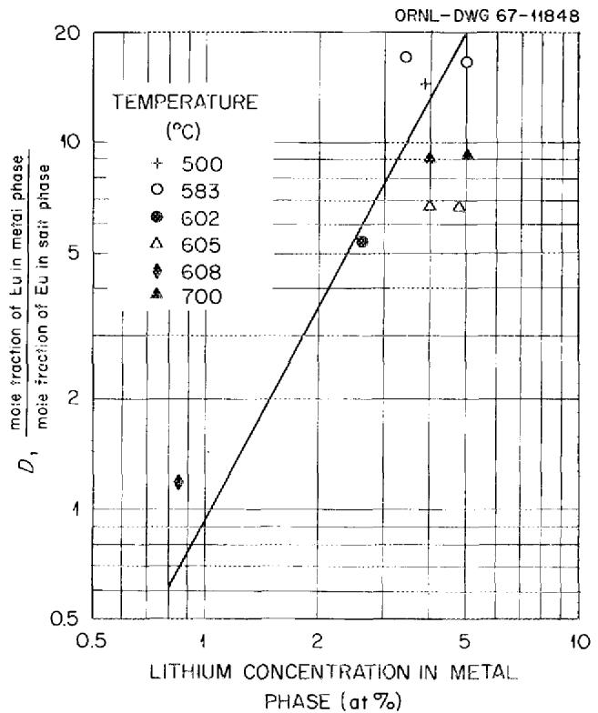  
Fig. 24.1. Distribution of Europium Between LiF-BeF $_2$ (66-34 mole %) and Li-Bi Solutions. Data points, this study; solid line, data of Shaffer, Moulton, et al. (see Reactor Chem. Div. Ann. Progr. Rept. Dec. 31, 1966, ORNL-4076).

was analyzed for lithium by both an emission spectrographic and a flame photometric method. In some instances, the values obtained were markedly different; this is readily apparent in the data obtained from experiment JFL.64 (Table 24.1).

# 25. Modifications to MSRE Fuel Processing Facility for Short Decay Cycle

R. B. Lindauer

In order to keep reactor downtime to a minimum during the next planned shutdown, it has been proposed that the flush and fuel salts be processed with a minimum decay time.

Problems anticipated because of the short decay are due to the much larger amount of $^{131}\mathrm{I}$ and to the radiation level at the $\mathrm{UF}_{6}$ absorbers because of coabsorbed $^{99}\mathrm{Mo}$ . The processing schedule, with pertinent radiation information, is given in Table 25.1. Design of modifications to the MSRE fuel processing facility is in progress to permit safe operation at these increased activity levels. These consist of:

1. A deep-bed backup charcoal trap downstream of the existing charcoal canisters. These traps will be tested under simulated operating conditions to demonstrate at least $99.998\%$ removal of $^{131}\mathbf{I}$ .   
2. An activated alumina trap downstream of the $\mathrm{SO}_2$ system for excess fluorine disposal. This will prevent fluorine from releasing iodine on the charcoal beds in case of a malfunction of the $\mathrm{SO}_2$ system.   
3. Shielding and revised handling procedures for removal of the loaded $\mathrm{UF}_{6}$ absorbers from the absorber cubicle.

Table 25.1. MSRE Processing Schedule and Pertinent Radiation Levels   

<table><tr><td rowspan="2">Operation</td><td rowspan="2">Decay Time (days)</td><td colspan="2">\( ^{131}\mathrm{I} \)</td><td rowspan="2">Uranium to Be Volatilized (kg)</td><td rowspan="2">Radiation Dose Rate 2 ft from Absorber (millirems/hr)</td></tr><tr><td>Curies in Salt</td><td>Required Removal in Charcoal Traps \( {}^{a} \)(%)</td></tr><tr><td>\( {\mathrm{H}}_{2} \)-HF treatment of flush salt</td><td>6</td><td>600</td><td>99.95</td><td></td><td></td></tr><tr><td>Fluorination of flush salt</td><td>18</td><td>210</td><td>99.88</td><td>7</td><td>620</td></tr><tr><td>\( {\mathrm{H}}_{2} \)-HF treatment of fuel salt</td><td>28</td><td>23,000</td><td>99.999</td><td></td><td></td></tr><tr><td>Fluorination of fuel salt</td><td>35</td><td>12,000</td><td>99.997</td><td>230</td><td>170</td></tr></table>

$^{\text{3}}$ For 0.3 curie release.

# 26. Preparation of $^{233}\mathsf{UF}_4^{-7}\mathsf{LiF}$ Fuel Concentrate for the MSRE

J.M.Chandler E.L.Nicholson

Plans are now being made for refueling and operating the MSRE with $^{233}\mathrm{U}$ fuel early in 1968; approximately $40\mathrm{kg}$ of $^{233}\mathrm{U}$ as $^{233}\mathrm{UF}_{4} - ^{7}\mathrm{LiF}$ (27 and 73 mole %) eutectic salt will be required. This material must be prepared in a shielded facility because of the high $^{232}\mathrm{U}$ content (240 ppm) of the $^{233}\mathrm{U}$ . The following sections describe the process, equipment, and status of the fuel preparation process.

# PROCESS

The process for preparing eutectic- $\mathrm{UF}_4$ -LiF (27 and 73 mole $\%$ ) salt for the original MSRE charge started with $\mathrm{UF}_4$ and LiF. Since $^{233}\mathrm{U}$ is available only as the oxide, the process was modified. The $\mathrm{UO}_3$ is charged to a nickel-lined vessel, and LiF is added on top of it. The charge is heated, under helium, to $900^{\circ}\mathrm{C}$ to melt the LiF, which wets the oxide and thermally decomposes the $\mathrm{UO}_3$ to an average composition of $\mathrm{UO}_{2.6}$ . The charge is treated with $\mathbf{H}_2$ to reduce the $\mathrm{UO}_{2.6}$ to $\mathrm{UO}_2$ and then hydrofluorinated with $\mathbf{H}_2$ -HF (approximately 10:1 mole ratio) to convert the $\mathrm{UO}_2$ to $\mathrm{UF}_4$ . The progress of the reaction of $\mathrm{UO}_2$ to form $\mathrm{UF}_4$ is followed by the changes in the liquidus temperature of the binary mixture as the melting point of the charge decreases from the initial melting point of $845^{\circ}\mathrm{C}$ for the LiF to $490^{\circ}\mathrm{C}$ for the $\mathrm{UF}_4$ -LiF (27 and 73 mole $\%$ ) eutectic product. Hydrogen fluoride utilization and water production are also indicative of the progress of the reaction. After

a final $\mathrm{H}_{2}$ sparge to reduce impurities, such as iron and nickel fluorides, to metals and to sweep out dissolved HF, the salt is sampled, filtered, and stored in a product container. This process has been satisfactorily tested on a small scale, and the results indicate that the processing time will be about 15 days/batch.

Tentative plans are to make three $12\text{-kg}^{233}\text{U}$ batches of salt, which will be used for the major additions to the barren salt in the MSRE, and one $7\text{-kg}^{233}\text{U}$ batch, which will be loaded into 60 enriching capsules.

# EQUIPMENT AND OPERATIONS

The schematic equipment flowsheet for salt preparation is shown in Fig. 26.1. The cans of $\mathrm{UO}_3$ , each containing about $500\mathrm{g}$ of uranium, will be transported in a shielded cask from the $^{233}\mathrm{U}$ storage facility in Building 3019 to the TURF building (7930) and introduced into cell G. All operations in cell G will be done remotely. By the use of manipulators, the cans will be loaded into the alpha-sealed can opener and the damper box, which discharges the oxide into the heated nickel-lined 8-in.-diam by 3-ft-high reaction vessel and routes the empty cans to storage for subsequent removal from the cell. The $^{7}\mathrm{LiF}$ is charged to the reaction vessel via the damper. Process gases are supplied from outside the cell, and instrumentation is provided to control gas flows and processing temperatures. Waste gases are filtered to remove entrained $^{233}\mathrm{U}$ and scrubbed with KOH to remove unreacted HF before disposal to the radioactive off-gas system. After sampling, the product is transferred via a heated

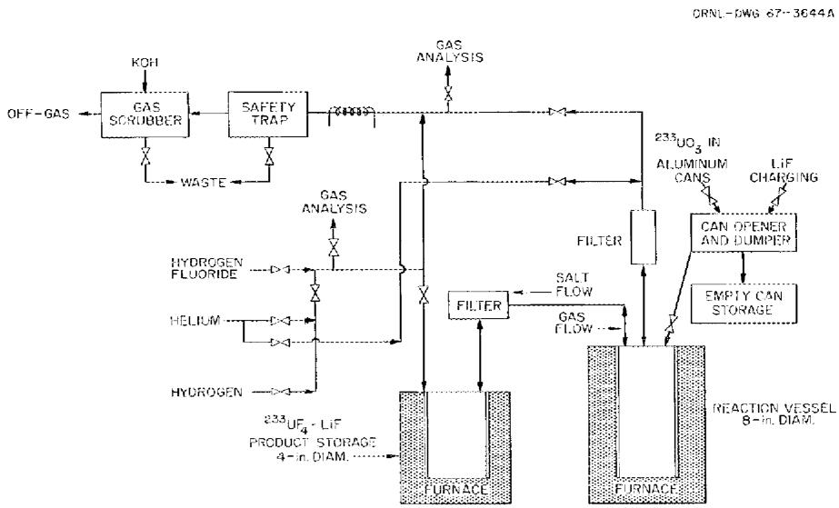  
Fig. 26.1. MSRE $^{233}$ U Fuel Salt Preparation System.

nickel line through a sintered metal filter into heated 4-in.-diam by 3-ft-high nickel product storage vessels. The capsule-filling operation is not illustrated but will consist in transferring salt from a product vessel to an array of 60 enriching capsules in a furnace. Product vessels and enriching capsules will be stored in cell G until needed at the MSRE.

# STATUS

Engineering design is estimated to be $95\%$ completed, and fabrication of the equipment is $85\%$

completed. The project has been delayed because the TURF building is not completed; consequently, the cost-plus-fixed-fee (CPFF) contractor and the laboratory forces have been delayed in starting the installation of equipment. Assuming that the building will be available on September 15, 1967, and that the CPFF contractor and ORNL forces each require about one month for their portions of the job, the full-scale cold run should start December 1, 1967; hot runs should start January 20, 1968, and be completed in mid-April 1968.

# OAK RIDGE NATIONAL LABORATORY

# MOLTEN-SALT REACTOR PROGRAM

AUGUS:31,1967

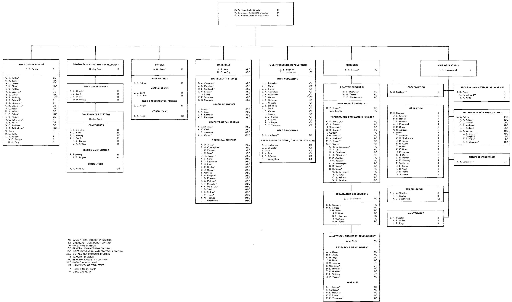

# INTERNAL DISTRIBUTION

1. R.K. Adams

2. G.M. Adamson

3. R. G. Affel

4. L. G. Alexander

5. R. F. Apple

6. C. F. Baes

7. J.M. Baker

8. S. J. Ball

9. C. J. Barton

10. H. F. Bauman

11. S. E. Beall

12. M. Bender

13. C. E. Bettis

14. E. S. Bettis

15. D. S. Billington

16. R.E. Blanco

17. F. F. Blankenship

18. J. O. Blomeke

19. R. Blumberg

20. A. L. Boch

21. E. G. Bohlmann

22. C. J. Borkowski

23. G.E. Boyd

24. J. Braunstein

25. M. A. Bredig

26. E. J. Breeding

27-41. R. B. Briggs

42. H. R. Bronstein

43. W. E. Browning

44. F. R. Bruce

45. G. D. Brunton

46. G.H. Burger

47. D. A. Canonico

48. S. Cantor

49. D. W. Cardwell

50. W. L. Carter

51. G. I. Cathers

52. J. M. Chandler

53. C. W. Collins

54. E. L. Compere

55. J. A. Conlin

56. W. H. Cook

57. L. T. Corbin

58. W. B. Cottrell

59. G. A. Cristy

60. S. J. Cromer (K-25)

61. J. L. Crowley

62. F. L. Culler

63. J.M.Dale

64. D. G. Davis

65. W.W. Davis

66. R.J. DeBakker

67. J. H. DeVan

68. S. J. Ditto

69. R. G. Donnelly

70. N. E. Dunwoody

71. A. S. Dworkin

72. D. A. Dyslin

73. W. P. Eatherly

74. M. C. Edlund (K-25)

75. J. R. Engel

76. E.P. Epler

77. W. K. Ergen

78. D. E. Ferguson

79. L.M. Ferris

80. A. P. Fraas

81. H. A. Friedman

82. J.H Frye, Jr.

83. C. H. Gabbard

84. W.R.Gall

85. R. B. Gallagher

86. R. G. Gilliland

87. H. E. Goeller

88. W. R. Grimes

89. A. G. Grindell

90. R.H.Guymon

91. R. P. Hammond

92. B. A. Hannaford

93. P.H. Harley

94. D. G. Harman

95. C. S. Harrill

96. P, N. Haubenreich

97. F. A. Heddleson

98. P. G. Herndon

99. R. F. Hibbs (Y-12)

100. J. R. Hightower

101. M. R. Hill

102. E. C. Hise

103. H. W. Hoffman   
104. V. D. Holt   
105. P. P. Holz   
106. R.W.Horton   
107. A. S. Householder   
108. T. L. Hudson   
109. H. Inouye   
110. W.H. Jordan

111-115. P. R. Kasten   
116. R. J. Kedl   
117. M. T. Kelley   
118. M. J. Kelly   
119. C. R. Kennedy   
120. T. W. Kerlin   
121. H. T. Kerr   
122. R.F. Kimball   
123. S. S. Kirslis   
124. D. J. Knowles   
125. A. I. Krakoviak   
126. J.W. Krewson   
127. C, E, Lamb   
128. J. A. Lane   
129. C. E. Larson   
130. E. J. Lawrence   
131. T. A. Lincoln   
132. R. B. Lindauer   
133. A. P. Litman   
134. J. L. Liverman   
135. R.S. Livingston   
136. G.H.Llewellyn   
137. M. I. Lundin   
138. R.N.Lyon   
139. H. G. MacPherson   
140. R.E. MacPherson   
141. F. C. Maienschein   
142. D. L. Manning   
143. C. D. Martin   
144. W. R. Martin   
145. C. E. Mathews   
146. T. H. Mauney   
147. H. McClain   
148. R. W. McClung   
149. H. E. McCoy   
150. H. F. McDuffie   
151. C. K. McGlothlan   
152. C. J. McHargue   
153. L. E. McNeese   
154. A. S. Meyer   
155. E.C.Miller   
156. C. A. Mills   
157. R.L. Minue

158. W. R. Mixon   
159. R. L. Moore   
160. K. Z. Morgan   
161. J. C. Moyers   
162. H. A. Nelms   
163. J. P. Nichols   
164. E. L. Nicholson   
165. L., C. Oakes   
166. W. R. Osborn

167-168. R.B.Parker

169. L. F. Parsly   
170. P. Patriarca   
171. H. R. Payne   
172. A.M. Perry   
173. T.W. Pickel   
174. H. B. Piper   
175. B. E. Prince   
176. G. L. Ragan   
177. J. L. Redford   
178. M. Richardson   
179. R.C. Robertson   
180. W. C. Robinson   
181. H. C. Roller

182-316. M.W.Rosenthal

317. H. C. Savage   
318. A. W. Savolainen   
319. W. F. Schaffer   
320. C, E. Schilling   
321. Dunlap Scott   
322. J.L. Scott   
323. H. E. Seagren   
324. C. E. Sessions   
325. J.H.Shaffer   
326. E.D. Shipley   
327. M.J. Skinner   
328. G.M.Slaughter   
329. A.N. Smith   
330. F.J. Smith   
331. G.P. Smith   
332. O.L. Smith   
333. P. G. Smith   
334. A. H. Snell   
335. W. F. Spencer   
336. I. Spiewak   
337. R.C.Steffy   
338. C.E. Stevenson   
339. W. C. Stoddart   
340. H. H. Stone   
341. R. A. Strehlow   
342. D. A. Sundberg   
343. J. R. Tallackson

344. E.H. Taylor   
345. W. Terry   
346. R. E. Thoma   
347. G.M. Tolson   
348. L.M. Toth   
349. D. B. Trauger   
350. R.W. Tucker   
351. W. C. Ulrich   
352. D. C. Watkin   
353. G.M. Watson   
354. J. S. Watson   
355. H. L. Watts   
356. C. F. Weaver   
357. B. H. Webster   
358. A. M. Weinberg   
359. J.R.Weir

360. W.J.Werner   
361. K.W. West   
362. M. E. Whatley   
363. J. C. White   
364. G. C. Williams   
365. L. V. Wilson   
366. G.J. Young   
367. J. P. Young   
368. F. C. Zapp   
369. Biology Library

370-373. ORNL - Y-12 Technical Library Document Reference Section

374-376. Central Research Library   
377-411. Laboratory Records Department   
412. Laboratory Records, ORNL R.C.

# EXTERNAL DISTRIBUTION

413. W. O. Allen, Atomics International, P.O. Box 309, Canoga Park, California 91304   
414. J. G. Asquith, Atomics International, P.O. Box 309, Canoga Park, California 91304   
415. J. C. Bowman, Union Carbide Technical Center, 12900 Snow Road, Parma, Ohio 44130   
416. G. D. Brady, Materials Systems Division, UCC, Kokomo, Indiana 46901   
417. J. H. Brannan, Carbon Products Division, 270 Park Avenue, New York, New York 10017   
418. W. S. Butler, Dow Chemical Company, Ludington, Michigan   
419. R. A. Charpie, UCC Electronics Division, 270 Park Avenue, New York, New York 10017   
420. Paul Cohen, Westinghouse Electric Corp., P.O. Box 355, Pittsburgh, Pennsylvania 15230   
421-422. D. F. Cope, Atomic Energy Commission, RDT Site Office (ORNL)   
423. J W. Crawford, Atomic Energy Commission, Washington 20545   
424. M. W. Croft, Babcock and Wilcox Company, P.O. Box 1260, Lynchburg, Virginia 24505   
425. C. B. Deering, Atomic Energy Commission, RDT Site Office (ORNL)   
426. D. A. Douglas, Materials Systems Division, UCC, Kokomo, Indiana 46901   
427. H. L. Falkenberry, Tennessee Valley Authority, 303 Power Building, Chattanooga, Tenn. 37401   
428. C. W. Fay, Wisconsin Michigan Power Company, 231 W. Michigan Street, Milwaukee, Wisconsin   
429. Gregory Flynn, General Motors, 12 Mile and Mound Roads, Warren, Michigan   
430. A. Giambusso, Atomic Energy Commission, Washington 20545   
431. Gerald Golden, Argonne National Laboratory, 9700 S. Cass Avenue, Argonne, Illinois 60439   
432. W. W. Grigorieff, Assistant to the Executive Director, Oak Ridge Associated Universities   
433. J. T. Kehoe, Burns and Roe, Inc., 700 Kinderkamack, Oradell, New Jersey 07649   
434. L. W. Lang, Douglas United Nuclear, 703 Bldg., Richland, Washington 99352   
435. W.J. Larkin, Atomic Energy Commission, ORO   
436. J. A. Lieberman, Atomic Energy Commission, Washington 20545   
437. R. A. Lorenzini, Foster Wheeler, 110 S. Orange, Livingston, N.J. 07039   
438. W. D. Manly, Material Systems Division, UCC, 270 Park Avenue, New York, New York 10017   
439. C. L. Matthews, Atomic Energy Commission, RDT Site Office (ORNL)   
440. J. P. Mays, Great Lakes Research Corporation, Elizabethton, Tennessee   
441. W. B. McDonald, Battelle-Pacific Northwest Laboratory, Hanford, Washington 99352

442-443. T. W. McIntosh, Atomic Energy Commission, Washington 20542

444. W. J. Mordarski, Nuclear Development, Combustion Engineering, Windsor, Connecticut   
445. Sidney Parry, Great Lakes Carbon, P.O. Box 667, Niagara Falls, New York 14302   
446. Worth Percival, General Motors, 12 Mile and Mound Roads, Warren, Michigan   
447. G. J. Petretic, Atomic Energy Commission, Washington 20545   
448. M. A. Rosen, Atomic Energy Commission, Washington 20545   
449. H. M. Roth, Atomic Energy Commission, ORO   
450. R. W. Schmitt, General Electric Co., Schenectady, N.Y. 12301   
451. M. Shaw, Atomic Energy Commission, Washington 20545   
452. Remo Silvestrini, United Nuclear Corporation, 5 New Street, White Plains, N.Y. 10601   
453. E. E. Sinclair, Atomic Energy Commission, Washington 20545   
454. W. L. Smalley, Atomic Energy Commission, ORO   
455. T. M. Snyder, General Electric Co., 175 Curtner Ave., San Jose, California 95103   
456. L. D. Stoughton, UCC, P.O. Box 500, Lawrenceburg, Tennessee 38464   
457. J. A. Swartout, UCC, 270 Park Avenue, New York, New York 10017   
458. R. F. Sweek, Atomic Energy Commission, Washington 20545   
459. Richard Tait, Poco Graphite, P.O. Box 1524, Garland, Texas 75040   
460. D. R. Thomas, Commonwealth Associates, Inc., 209 E. Washington Ave., Jackson, Michigan 49201   
461. M. Tsou, General Motors, 12 Mile and Mound Roads, Warren, Michigan   
462. J. W. Ullmann, UCC, P.O. Box 278, Tarrytown, New York 10591   
463. C. H. Waugaman, Tennessee Valley Authority, 303 Power Building, Chattanooga, Tenn. 37401   
464. D. B. Weaver, Tennessee Valley Authority, New Sprankle Bldg., Knoxville, Tennessee   
465. G. O. Wessenauer, Tennessee Valley Authority, Chattanooga, Tennessee 37401   
466. M. J. Whitman, Atomic Energy Commission, Washington 20545   
467. H. A. Wilber, Power Reactor Development Company, 1911 First Street, Detroit, Michigan   
468. James Wright, Westinghouse Electric, P.O. Box 344, Pittsburgh, Pa. 15230   
469-470. Laboratory and University Division (ORO)   
471-733. Given distribution as shown in TID-4500 under Reactor Technology category (25 copies-CFSTI)