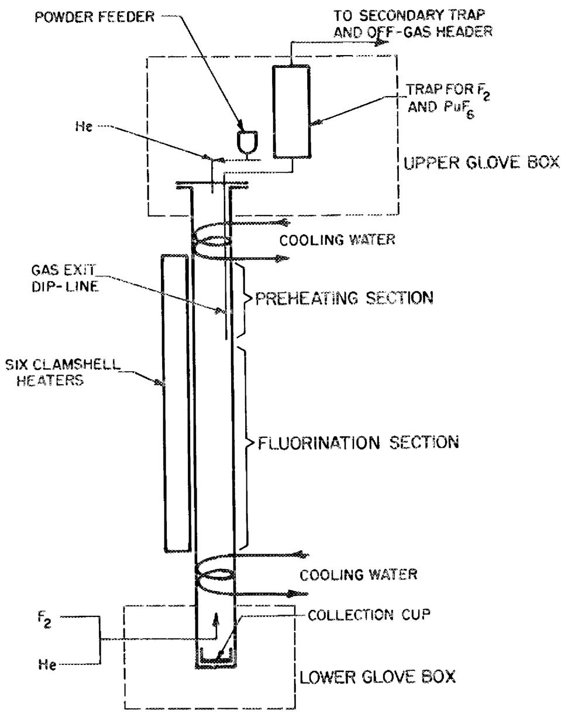
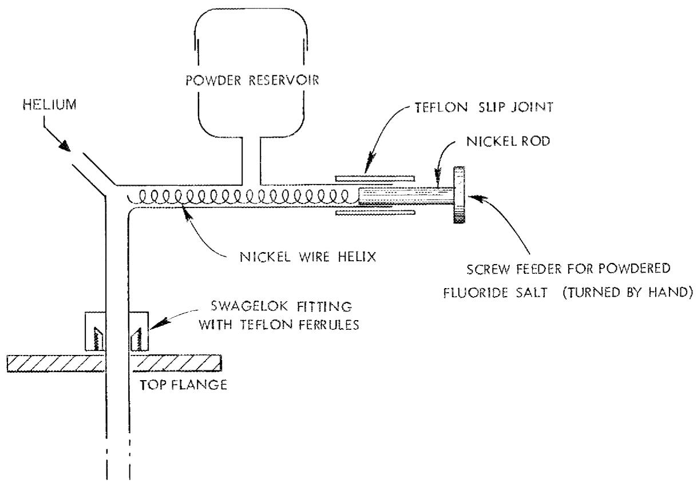
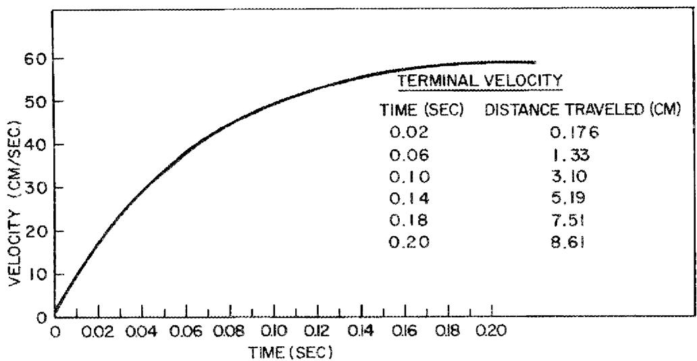
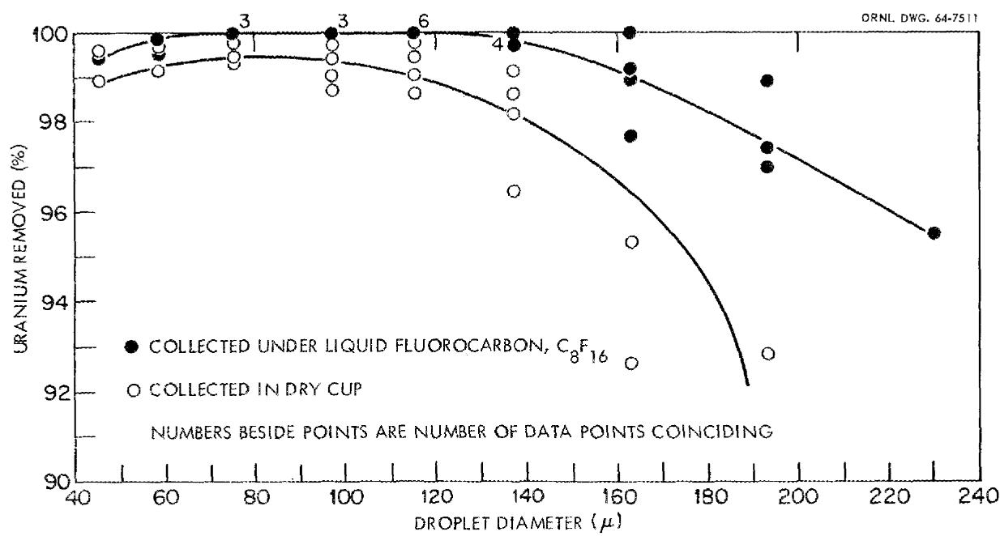
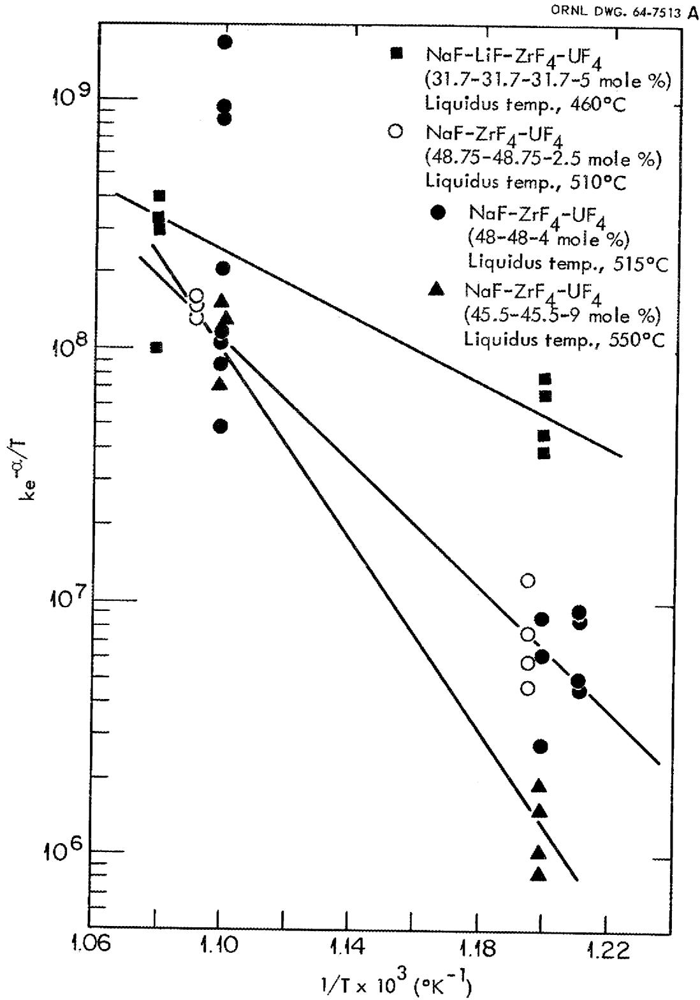
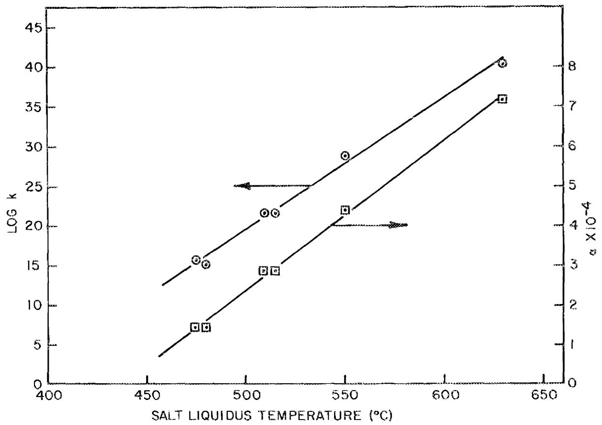
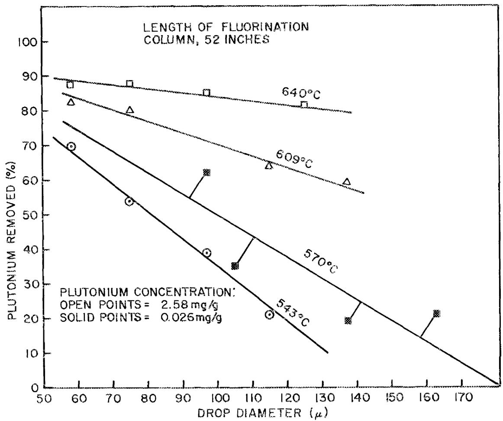

ORNL-4224

UC-10 - Chemical Separations Processes

for Plutonium and Uranium

FLUORINATION OF FALLING DROPLETS OF

MOLTEN FLUORIDE SALT AS A MEANS OF

RECOVERING URANIUM AND PLUTONIUM

J.C.Moilen

G. I. Cathers

OAK RIDGE NATIONAL LABORATORY

operated by

UNION CARBIDE CORPORATION

for the

U.5. ATOMIC ENERGY COMMISSION

CASK HIDGE NATIONAL SALDRAFTED

CENTRAL FINGER DATA LTER

TILABARY LOAN COPY

10107 1345136789 AND 1218313679

documentary and in some with document

and the history will bring a new

Printed in the United States of America. Available from Clearinghouse for Federal

Scientific and Technical Information, National Bureau of Standards,

U.S. Department of Commerce, Springfield, Virginia 22191

Prices: Printed Copy $3.00; Microphone $0.65

# LEGAL NOTICE

This report was prepared as an account of Government sponsored work. Neither the United States nor the Commission, nor any person acting on behalf of the Commission.

A. Makes any warranty or representation, expressed or implied, with respect to the accuracy, completeness, or usefulness of the information contained in this report, or that the use of any information, apparatus, method, or process disclosed in this report may not infringe privately owned rights; or   
B. Assumes any liabilities with respect to the use of, or for damages resulting from the use of any information, apparatus, method, or process disclosed in this report.

As used in the above, "person acting on behalf of the Commission" includes any employee or contractor of the Commission, or employee of such contractor, to the extent that such employee or contractor of the Commission, or employee of such contractor prepares, disseminates, or provides access to, any information pursuant to his employment or contract with the Commission, or his employment with such contractor.

Contract No. W-7405-eng-26

CHEMICAL TECHNOLOGY DIVISION

Chemical Development Section B

FLUORINATION OF FALLING DROPLETS OF MOLTEN FLUORIDE SALT AS A MEANS OF RECOVERING URANIUM AND PLUTONIUM

J. C. Mailen and G. I. Cathers

NOVEMBER 1968

OAK RIDGE NATIONAL LABORATORY

Oak Ridge, Tennessee

operated by

UNION CARBIDE CORPORATION

for the

U.S. ATOMIC ENERGY COMMISSION

# CONTENTS

Abstract 1

1. Introduction 1   
2. Experimental 2

2.1 Fluoride Salts Used 2   
2.2 Apparatus and Procedure 3   
2.3 Velocity and Time of Fall of Droplets 6

3. Results 6

3.1 Sorption of UF $6$ and $\mathsf{PuF}_6$ on the Surfaces of Frozen Droplets 6   
3.2 Fluorination of Uranium-Containing Salts 8   
3.3 Fluorination of Plutonium-Containing Salts 11   
3.4 Fluorination of Protactinium-Containing Salts 17

4. Possible Applications 17

4.1 Removal of Uranium from Molten-Salt Breeder Reactor Fuel 17   
4.2 Processing of Low-Enrichment Reactor Fuels 18

5. Acknowledgments 19   
6. References. 19

# FLUORINATION OF FALLING DROPLETS OF MOLTEN FLUORIDE SALT AS A MEANS OF RECOVERING URANIUM AND PLUTONIUM

J. C. Mailen and G. I. Cathers

# ABSTRACT

A falling-drop fluorination method was devised for the recovery of uranium and plutonium from molten fluoride salts. This method, in which molten-fluoride droplets fall countercurrently through fluorine, has several advantages over methods in which fluorine is bubbled through the molten salt. Among these are: (1) higher removal rates for both uranium and plutonium, (2) lower rates of corrosion of the containment vessel (since the molten salt does not contact the wall), (3) the possibility of continuous operation, and (4) minimal corrosion-product contamination of the fluorinated salt. The low corrosion-product content and longer fluorinator life are especially attractive from the standpoint of molten-salt reactor processing, where the fluorinated salt must be recycled to the reactor and the fluorinator must be very durable.

Experimental equipment was developed, and small-scale fluorination experiments were made, using several salt solutions. With the data obtained from these experiments, we calculated that, by using a 5-ft-long fluorination column at $650^{\circ}\mathrm{C}$ , $99.9\%$ of the uranium can be removed from $100\mu$ -diam droplets of Molten-Salt Breeder Reactor fuel. With an 11-ft-long tower at $640^{\circ}\mathrm{C}$ , $99\%$ of the plutonium can be removed from $100\mu$ -diam droplets of salt.

In similar experiments using salt droplets containing $^{231}\mathrm{Pa}$ , no protactinium was fluorinated, even at temperatures as high as $614^{\circ}\mathrm{C}$ .

# 1. INTRODUCTION

In the molten-salt fluoride volatility process1 and in molten-salt reactor fuel processing,2 uranium and/or plutonium are removed from molten fluoride salts by fluorination. Sparging of a pool of molten salt with fluorine would appear to be the simplest method, but it results in undesirably high corrosion3 of the vessel and a low rate of plutonium removal.4 The latter is caused, in part, by the thermodynamic

necessity, at $600^{\circ}\mathrm{C}$ , to have at least 69 moles of fluorine in the gas for each mole of $\mathsf{PuF}_6$ in order to overcome the tendency of the plutonium to remain as nonvolatile $\mathsf{PuF}_4$ . However, a falling-drop fluorinator circumvents both problems. In it, corrosion is reduced because only small amounts of molten salt contact the fluorinator wall, and rates of fluorination are high since diffusion distances are short. This is particularly advantageous for plutonium since the fluorine:plutonium atom ratio is inherently high in the fluorinator.

A spray-fluorination system for recovering uranium from molten fluoride salt was previously studied by other workers. In this method, the molten fluoride mixture was sprayed downward into a fluorination tower. The maximum uranium removal obtained was about $30\%$ . This low removal is partially attributed to the contact of the molten droplets with "cold" fluorine (maximum temperature, $200^{\circ}\mathrm{C}$ ), which permitted them to solidify too soon. Also, the gas flow was concurrent with the salt flow, thus allowing UF in the gas to sorb on the frozen salt particles. In our studies, the fluoride salt mixture was pulverized and then dropped into a fluorination tower, where the particles melted and were contacted with fluorine, flowing upward through the tower, at 500 to $700^{\circ}\mathrm{C}$ . This approach resulted in much higher recoveries.

# 2. EXPERIMENTAL

# 2.1 Fluoride Salts Used

In experiments in which the fluorination of plutonium was studied, the solvent salt was $\mathrm{NaF - ZrF_4}$ (50-50 mole %) containing either 0.026 or 2.58 mg of plutonium (as $\mathrm{PuF}_3$ ) per g of salt.

Six different compositions were used in experiments involving uranium:

1. NaF-ZrF4-UF4 (48.75-48.75-2.5 mole %)   
2. NaF-ZrF4-UF4 (48-48-4 mole %)   
3. NoF-ZrF4-UF4 (45.5-45.5-9 mole %)   
4. NaF-ZrF4-UF4 (37.4-56.1-6.5 mole %)

5. NaF-LiF-ZrF4-UF 4 (31.7-31.7-31.7-5 mole %)   
6. LiF-BeF $_2$ (66-34 mole %) containing 9.4 mg of uranium per g of salt

The salt used in the protactinium experiments consisted of NaF-ZrF₄ (50-50 mole %) containing about 0.25 mg of $^{231}\mathrm{Pa}$ per g of salt.

# 2.2 Apparatus and Procedure

The main parts of the equipment for the falling-drop fluorination experiments involving plutonium and protactinium (Fig. 1) were: a powder feeder, a preheater section, a 52-in.-long fluorination section, and a salt receiver. In addition, there were the necessary gas supplies and regulators, electrical heaters and controls, traps for fluorine and $\mathsf{PuF}_{6^{\prime}}$ and glove boxes for plutonium and protactinium containment. The equipment used for experiments involving uranium was essentially the same, except that glove boxes were not required. Also, in the experiments with uranium, fluorination sections of different lengths (28, 44, and 56 in.) were used.

The procedure consisted in pulverizing and sizing the fluoride salt, and then feeding the sized powder through the glass feeder (Fig. 2), by turning a nickel-wire helix, into the preheater section of the column. (Helium flowing through the powder feeder protected it from fluorine and served as a blanket gas for the preheater section of the column.) The small drops (58 to $210\mu$ in diameter) of molten salt, obtained when the sized powders were melted in the preheater section, then fell through the fluorination section. In some of the experiments with uranium, large drops (about $3000\mu$ in diameter) were produced directly by means of a high-temperature pipet.

Before the start of each experiment, the column was flushed, first with helium, admitted at both the top and bottom of the column, and then with helium and fluorine (equal volumetric flow rates) admitted at the top and the bottom of the column, respectively. During each experiment, the fluorine and helium flow rates were also kept equal.

After passing through the fluorination section, the "depleted" salt drops were frozen and collected in a stainless steel cup located in the bottom of the column. In

ORNL DWG.68-876

  
Fig. 1. Equipment for Fluorinating Falling Droplets of Plutonium-Containing Salts. Apparatus for recovering uranium was essentially the same.

ORNL-DWG 68~7627

  
Fig.2. Powder Feeder.

almost all of the experiments with uranium-containing salt, this cup contained a chilled liquid fluorocarbon to prevent $\mathsf{UF}_6$ in the gas from sorbing on the frozen salt. After collection, the frozen droplets were sieved; then, the different size fractions were sampled for chemical analysis.

# 2.3 Velocity and Time of Fall of Droplets

The velocity of the droplets must be known in order to calculate the time of contact in the fluorination tower. The velocity of $137\mu$ -diam droplets falling through fluorine at $600^{\circ}\mathrm{C}$ was calculated as a function of time, using drag coefficients. Figure 3 is a plot of these calculated velocities. At $600^{\circ}\mathrm{C}$ and 1 atm, the falling droplet reaches its terminal velocity of about $60~\mathrm{cm / sec}$ after falling only $8.7~\mathrm{cm}$ . Thus, the important velocity for the droplets (except for the $3000\mu$ droplets, which do not attain terminal velocity in a short fall) is the terminal velocity. Terminal velocities for particles of other sizes were easily calculated because, for small droplets, the terminal velocity is nearly proportional to the square of the diameter. Since most of the fluorination experiments were done at $600\pm 50^{\circ}\mathrm{C}$ , the rate of fall was not corrected for temperature. In these experiments, the residence time of a small drop in the fluorination tower can be expressed as:

$$
t _ {c} (\sec) = \frac {L}{1 . 2 4 6 \times 1 0 ^ {- 3} d ^ {2}},
$$

where $d$ is the particle diameter in microns, and $L$ is the length of the fluorination section in inches.

# 3. RESULTS

# 3.1 Sorption of UF $_6$ and PuF $_6$ on the Surfaces of Frozen Droplets

Since, in our system, the frozen salt was collected in the bottom of the falling-drop tower, it was necessary to examine the possibility that uranium and plutonium hexafluorides were being sorbed on this salt and biasing the experimental results. In

  
Fig. 3. Calculated Rate of Fall of $137\mu$ -diam Salt Droplets in Fluorine at $600^{\circ}\mathrm{C}$ and 1 atm.

most of the uranium experiments, the droplets were caught in a pool of chilled liquid fluorocarbon, which prevented direct contact between the frozen salt and the UF6. A significant increase in uranium removal was obtained in these runs, particularly when the particle diameter was large (Fig. 4); the maximum removal without use of the fluorocarbon was about $99.5\%$ , whereas the maximum removal with its use was greater than $99.9\%$ .

In the plutonium work, this procedure was not used because the potential hazard of contacting fluorine with a fluorocarbon was considered to be too great. If it had been used, some sorption on the frozen salt undoubtedly would have been prevented. However, by analogy with the uranium results (Fig. 4), only 1 to $2\%$ of the volatilized plutonium would have been expected to sorb on the frozen droplets. Since less than $88\%$ of the plutonium was volatilized in any experiment (Sect. 3.3), surface sorption would change the amount of plutonium found in a drop by less than $15\%$ . This is less than the experimental variation.

The data shown in Fig. 4 suggest that, in a large-scale falling-drop fluorination tower, some method of preventing contact of the gas and the depleted salt would be desirable. Probably the best solution would be to admit fluorine at the bottom of the column at a flow rate sufficient to prevent significant amounts of $\mathsf{UF}_6$ and $\mathsf{PuF}_6$ from contacting the solidified salt.

# 3.2 Fluorination of Uranium-Containing Salts

Table 1 shows a few examples of the data obtained in these experiments. In general, the recoveries increased with decreasing particle diameter and with increasing temperature, other conditions being the same. The uranium recovery data obtained with the six salt compositions were correlated by using the following equation:

$$
1 / C _ {U} - 1 / C _ {o, U} = \left(k t / D ^ {2}\right) e ^ {- \alpha / T}, \tag {1}
$$

where

$$
\begin{array}{l} D = \text {d r o p l e t d i a m e t e r}, \mu , \\ T = \text {f l u o r i n a t i o n} ^ {\circ} K, \\ \end{array}
$$

  
Fig. 4. Removal of Uranium as a Function of Droplet Diameter Using Different Methods for Collecting the Frozen Droplets.

Table 1. Results of Uranium Falling-Drop Fluorinations in a 44-in.-long Fluorinator   
Initial salt: NaF-ZrF $_4$ (50-50 mole %) containing UF $_4$   

<table><tr><td>Initial Uranium Conc. in Salt (ppm)</td><td>Temp. (℃)</td><td>Range of Drop Diameters (μ)</td><td>Final Uranium Conc. in Salt (ppm)</td><td>Uranium Removed from Salt (%)</td></tr><tr><td rowspan="4">170,000</td><td rowspan="4">556</td><td>88-105</td><td>1,700</td><td>99.0</td></tr><tr><td>105-125</td><td>2,700</td><td>98.4</td></tr><tr><td>125-149</td><td>9,700</td><td>94.3</td></tr><tr><td>149-177</td><td>21,900</td><td>87.1</td></tr><tr><td rowspan="4">54,400</td><td rowspan="4">559</td><td>63-88</td><td>202</td><td>99.6</td></tr><tr><td>88-105</td><td>212</td><td>99.6</td></tr><tr><td>105-125</td><td>419</td><td>99.2</td></tr><tr><td>125-149</td><td>1,724</td><td>96.8</td></tr><tr><td>80,000</td><td>580</td><td>~3200</td><td>74,600</td><td>6.6</td></tr><tr><td>80,000</td><td>582</td><td>~3200</td><td>74,200</td><td>7.2</td></tr><tr><td rowspan="3">51,600</td><td rowspan="3">638</td><td>125-149</td><td>75</td><td>99.9</td></tr><tr><td>149-177</td><td>126</td><td>99.8</td></tr><tr><td>177-210</td><td>260</td><td>99.5</td></tr><tr><td rowspan="3">186,000</td><td rowspan="3">640</td><td>105-125</td><td>70</td><td>99.96</td></tr><tr><td>125-149</td><td>65</td><td>99.96</td></tr><tr><td>149-177</td><td>162</td><td>99.91</td></tr></table>

$$
\begin{array}{l} t = \text {f l u o r i n a t i o n} \\ C _ {0, U} = \text {i n i t i a l u r a n i u m c o n c e n t r a t i o n i n t h e s a l t , w t f r a c t i o n ,} \\ C _ {U} = \text {f i n a l u r a n i u m c o n c e n t r a t i o n i n t h e s a l t , w t f r a c t i o n , a n d} \\ k \text {a n d} \alpha \text {a r e e m p i r i c a l c o n s t a n t s .} \\ \end{array}
$$

Values for log k and $\alpha$ are given in Table 2, and plots of Eq. (1), using data for four of the salt compositions, are shown as Fig. 5. In Fig. 6, the empirical constants are plotted vs the liquidus temperature of the salt. No explanation for the linear relationships between log k and the liquidus temperature and between $\alpha$ and the liquidus temperature is known.

All the results indicate that, in a 4-ft-long fluorination column at $650^{\circ}\mathrm{C}$ , more than $99.5\%$ of the uranium can be removed from droplets that are less than $200\mu$ in diameter.

# 3.3 Fluorination of Plutonium-Containing Salts

Table 3 summarizes the results of seven experiments in which NaF-ZrF $_4$ (50-50 mole %), containing either 0.026 or 2.58 mg of plutonium (added as PuF $_3$ ) per g of salt, was fluorinated. The salt may not have been completely molten at $506^{\circ}\mathrm{C}$ because this temperature is below the liquidus temperature of the salt ( $510^{\circ}\mathrm{C}$ ). The data from these experiments are correlated in Fig. 7, which consists of plots of the fraction of the plutonium removed vs drop diameter. These constant-temperature plots are linear, and at the higher temperatures, the diameter dependence is low. Thus, plutonium removal is most efficient at high temperatures where the size of the droplets is not a critical parameter. The following empirical equation correlates the plutonium removal data, and can probably be used to predict removals within the temperature range of these experiments:

$$
F = (- 5. 0 + 7. 6 5 \times 1 0 ^ {- 3} T) d - 0. 2 2 T + 2 3 6,
$$

where

$$
\begin{array}{l} F = \text {plutonium removed}, \% (\text {fluorinator length}, 52 \text {in.}), \\ T = \text {f l u o r i n a t i o n} ^ {\circ} C, \text {a n d} \\ d = \text {d r o p l e t d i a m e t e r}, \mu . \\ \end{array}
$$

Table 2. Correlation Constants for Equation (1) for Six Salts Containing Uranium Tetrafluoride   

<table><tr><td colspan="5">Salt Composition (mole %)</td><td rowspan="2">Weight Fraction Uranium In Salt</td><td rowspan="2">Liquidus Temp. of Salt (℃)</td><td rowspan="2">Log k</td><td rowspan="2">α</td></tr><tr><td>NaF</td><td>LiF</td><td>ZrF4</td><td>UF4</td><td>BeF2</td></tr><tr><td>31.7</td><td>31.7</td><td>31.7</td><td>5</td><td></td><td>0.132</td><td>475a</td><td>15.78</td><td>1.45</td></tr><tr><td>48.75</td><td></td><td>48.75</td><td>2.5</td><td></td><td>0.0542</td><td>510</td><td>21.58</td><td>2.84</td></tr><tr><td>48.0</td><td></td><td>48.0</td><td>4</td><td></td><td>0.0843</td><td>515</td><td>21.58</td><td>2.84</td></tr><tr><td>45.5</td><td></td><td>45.5</td><td>9</td><td></td><td>0.1733</td><td>550</td><td>28.79</td><td>4.35</td></tr><tr><td>37.4</td><td></td><td>56.1</td><td>6.5</td><td></td><td>0.119</td><td>630</td><td>40.25</td><td>7.16</td></tr><tr><td></td><td>66.58</td><td></td><td>0.13</td><td>33.29</td><td>0.00942</td><td>480</td><td>15.00</td><td>1.42</td></tr></table>

$a_{\text{By}}$ cooling curve.

  
Fig. 5. Plots of Equation (1), Using Data Obtained with Four Salts.

ORNL.DWG68-887

  
Fig. 6. Plots of Liquidus Temperature of the Salt vs Constants from Equation (1) for Salt Solutions Containing Uranium.

Initial salt: NaF-ZrF₄ (50-50 mole %) containing PuF₃

Length of fluorinator: 52 in.

Table 3. Results of Fluorination of Plutonium in Falling Molten-Salt Droplets   

<table><tr><td>Average Temperature (℃)</td><td>Range of Drop Diameters (μ)</td><td>Initial Plutonium Concentration (mg/g)</td><td>Final Plutonium Concentration (mg/g)</td><td>Plutonium Removed From Salt (%)</td><td>Fluorination Time (sec)</td></tr><tr><td rowspan="3">528</td><td>88-105</td><td>0.026</td><td>0.020</td><td>22.9</td><td>4.5</td></tr><tr><td>105-125</td><td></td><td>0.0223</td><td>14.3</td><td>3.2</td></tr><tr><td>125-149</td><td></td><td>0.0220</td><td>15.3</td><td>2.2</td></tr><tr><td rowspan="4">570</td><td>88-105</td><td>0.026</td><td>0.0098</td><td>62.1</td><td>4.5</td></tr><tr><td>105-125</td><td></td><td>0.0171</td><td>34.4</td><td>3.2</td></tr><tr><td>125-149</td><td></td><td>0.0209</td><td>19.7</td><td>2.2</td></tr><tr><td>149-177</td><td></td><td>0.0205</td><td>21.0</td><td>1.6</td></tr><tr><td rowspan="3">624</td><td>63-88</td><td>0.026</td><td>0.0156</td><td>40.0</td><td>7.3</td></tr><tr><td>88-105</td><td></td><td>0.0055</td><td>79.0</td><td>4.5</td></tr><tr><td>105-125</td><td></td><td>0.0088</td><td>66.0</td><td>3.2</td></tr><tr><td rowspan="5">506</td><td>63-88</td><td>2.58</td><td>1.232</td><td>52.2</td><td>7.3</td></tr><tr><td>88-105</td><td></td><td>1.45</td><td>43.8</td><td>4.5</td></tr><tr><td>105-125</td><td></td><td>1.58</td><td>38.7</td><td>3.2</td></tr><tr><td>125-149</td><td></td><td>1.09</td><td>57.8</td><td>2.2</td></tr><tr><td>149-177</td><td></td><td>1.34</td><td>48.2</td><td>1.6</td></tr><tr><td rowspan="4">543</td><td>53-63</td><td>2.58</td><td>0.79</td><td>69.5</td><td>12.4</td></tr><tr><td>63-88</td><td></td><td>1.19</td><td>53.8</td><td>7.3</td></tr><tr><td>88-105</td><td></td><td>1.56</td><td>39.3</td><td>4.5</td></tr><tr><td>105-125</td><td></td><td>2.04</td><td>21.0</td><td>3.2</td></tr><tr><td rowspan="4">609</td><td>53-63</td><td>2.58</td><td>0.45</td><td>82.7</td><td>12.4</td></tr><tr><td>63-88</td><td></td><td>0.50</td><td>80.4</td><td>7.3</td></tr><tr><td>105-125</td><td></td><td>0.93</td><td>64.0</td><td>3.2</td></tr><tr><td>125-149</td><td></td><td>1.06</td><td>58.8</td><td>2.2</td></tr><tr><td rowspan="4">640</td><td>53-63</td><td>2.58</td><td>0.33</td><td>87.4</td><td>12.4</td></tr><tr><td>63-88</td><td></td><td>0.32</td><td>87.6</td><td>7.3</td></tr><tr><td>88-105</td><td></td><td>0.39</td><td>85.0</td><td>4.5</td></tr><tr><td>105-125</td><td></td><td>0.48</td><td>81.3</td><td>3.2</td></tr></table>

  
Fig. 7. Plutonium Removal as a Function of Drop Diameter at Constant Temperature. Length of fluorinator, 52 in.

The plutonium removal in a tower having a length other than 52 in. can be estimated from the following equation:

$$
F ^ {\prime} / 1 0 0 = 1 - (1 - F / 1 0 0) ^ {L ^ {\prime} / 5 2},
$$

where

F = plutonium removed in 52-in.-long fluorinator (drop diameter and temperature constant), %,

$F^{\prime} =$ plutonium removed in fluorinator of length $L^{\prime},\% ,$ and

$L^{\prime} =$ fluorinator length, in.

# 3.4 Fluorination of Protactinium-Containing Salts

Two fluorination experiments, at 547 and $614^{\circ}C$ , were made using NaF-ZrF $_4$ (50-50 mole %) containing $^{231}\mathrm{Pa}$ . Gamma counting was used for analysis of the protactinium. No detectable amount of protactinium was volatilized in either experiment. However, the fluorine used throughout this entire investigation contained about 10 vol % impurities, including about $1\%$ oxygen. The studies of Stein $^9$ at Argonne National Laboratory indicated that, when the oxygen concentration in fluorine is this high, nonvolatile $\mathrm{Pa}_2\mathrm{OF}_8$ is formed in preference to the more-volatile $\mathrm{PaF}_5$ .

# 4. POSSIBLE APPLICATIONS

# 4.1 Removal of Uranium from Molten-Salt Breeder Reactor Fuel

One possible application of the falling-drop fluorination scheme is for processing Molten-Salt Breeder Reactor (MSBR) fuel. This fuel contains about 1.6 wt % uranium and must be processed at the rate of about $16\mathrm{ft}^3/\mathrm{day}$ ( $\rho = 2.0\mathrm{g/cm}^3$ ). The total fuel salt volume will be about $680\mathrm{ft}^3$ and will contain about $6.2 \times 10^5\mathrm{g}$ of uranium. The annual increase in uranium due to breeding will be about $7\%$ . For procedures yielding a $99\%$ removal of uranium in the reprocessing step (assuming that the other $1\%$ is lost), we calculate that the annual loss of uranium would be about $2.6\%$ of the total charge, which is more than one-third of the uranium that is produced by the reactor. Thus,

processing schemes that do not permit recovery of at least $99.9\%$ of the uranium would be considered as economically infeasible. Using a falling-drop fluorinator having a fluorination section that is 5 ft long (to keep the unit relatively compact), we calculated that the maximum diameters of drops from which $99.9\%$ of the uranium could be removed at temperatures of 600, 650, and $700^{\circ}\mathrm{C}$ would be 90, 112, and $137\mu$ , respectively.

Drops of these sizes can be generated using a two-fluid spray nozzle. With such a nozzle, the Unit Operations Section of the Chemical Technology Division has succeeded in producing droplets, most of which are 25 to $100\mu$ in diameter. Significantly, several thousand volumes of driving gas per volume of molten salt are required to obtain droplets of this size. Nitrogen has been proposed as the driving gas since fluorine is too corrosive to the spray nozzle; however, such a quantity of inert gas in the fluorination tower would dilute the effluent fluorine too much to allow its recycle. In Molten-Salt Breeder Reactor fuel processing, disposal of the unreacted fluorine probably would not be prohibitive since, for $50\%$ utilization, this would amount to only about 7500 lb/year. Another approach might consist in forming droplets (using a two-fluid spray nozzle), freezing them in an inert atmosphere, and feeding the frozen droplets into the top of a fluorination tower. This method would require a suitable means for removing decay heat from the frozen droplets to prevent premature melting.

# 4.2 Processing of Low-Enrichment Reactor Fuels

At the present time, it appears unlikely that molten-salt volatility methods will be used for processing reactor fuels that contain plutonium. If such processing is contemplated, it should be noted that the falling-drop method is the only approach that has shown promise for the rapid removal of plutonium with low reaction-vessel corrosion rates. For example, our experimental data indicate that fluorination in an 11-ft-high tower will result in the removal of $99\%$ of the plutonium from $100\mu$ -diam drops at $640^{\circ}\mathrm{C}$ . This corresponds to a fluorination time of about 11 sec. In the processing of salt containing plutonium, the fluorine would probably have to be recycled

in order to maintain a high fluorine: $\mathsf{PuF}_6$ mole ratio in the exit gas from the column (to prevent decomposition of the $\mathsf{PuF}_6$ ). Recycling the fluorine would, in turn, require that the droplets be formed in a separate tower, where the driving gas for the spray nozzle would not dilute the fluorine in the fluorination tower. The drops would then be frozen and fed to the top of the fluorination tower.

# 5. ACKNOWLEDGMENTS

The authors wish to acknowledge the assistance of J. R. Knox, T. E. Crabtree, and H. F. Board in the initial work on uranium falling-drop fluorination; and, the valuable contributions of the entire Process Design Section, especially J. B. Ruch, to the design of the plutonium falling-drop equipment. Gratitude is also expressed to the Analytical Chemistry Division for performing the many chemical analyses for uranium and plutonium.

# 6. REFERENCES

1. G. I. Cathers, Nucl. Sci. Eng. 2, 768-77 (1957).   
2. W. L. Carter and M. E. Whatley, Fuel and Blanket Processing Development for Molten Salt Breeder Reactors, ORNL-TM-1852 (June 1967).   
3. A. P. Litman and A. E. Goldman, Corrosion Associated with Fluorination in the Oak Ridge National Laboratory Fluoride Volatility Process, ORNL-2832 (June 5, 1961).   
4. G. I. Cathers and R. L. Jolley, Recovery of $\mathsf{PuF}_6$ by Fluorination of Fused Fluoride Salts, ORNL-3298 (Sept. 24, 1962).   
5. A. E. Florin et al., J. Inorg. Nucl. Chem. 2, 368 (1956).   
6. J. D. Gabor et al., Spray Fluorination of Fused Salt as a Uranium Recovery Process, ANL-6131 (March 1961).

7. J. H. Perry (ed.), Chemical Engineering Handbook, pp. 1018-20, McGraw-Hill, New York, 1950.   
8. S. I. Cohen, W. D. Powers, and N. D. Greene, A Physical Property Summary for ANP Fluoride Mixtures, ORNL-2150 (Aug. 23, 1956).   
9. L. Stein, Inorg. Chem. 3, 995 (1964).   
10. Unit Operations Section Monthly Progress Report for June 1961, ORNL-TM-34, pp. 44-55.

# ORNL-4224

UC-10 - Chemical Separations Processes

for Plutonium and Uranium

# INTERNAL DISTRIBUTION

1. Biology Library   
2-4. Central Research Library   
5-6. ORNL - Y-12 Technical Library Document Reference Section   
7-26. Laboratory Records Department   
27. Laboratory Records, ORNL R.C.   
28. L. L. Bennett   
29. M. R. Bennett   
30. R. E. Blanco   
31. C. A. Brandon   
32. K. B. Brown   
33. W. L. Carter   
34. W. H. Carr   
35. G. I. Cathers   
36. F. L. Culler   
37. D. E. Ferguson   
38. L. M. Ferris   
39. G. Goldberg   
40. J. K. Jones   
41. P. R. Kasten   
42. C. E. Larson   
43. K. H. Lin   
44. A. P. Litman

45. R. Lowrie   
46. H. G. MacPherson   
47. J. C. Mailen   
48. L. E. McNeese   
49. J. R. McWherter   
50. R. P. Milford   
51. E. L. Nicholson   
52. J. T. Roberts   
53. M. W. Rosenthal   
54. M. J. Skinner   
55. D. A. Sundberg   
56. R. E. Thoma   
57. J. R. Tallackson   
58. A. M. Weinberg   
59. M. E. Whatley   
60. E. L. Youngblood   
61. J. P. Young   
62. J. H. Emmett (consultant)   
63. J. J. Katz (consultant)   
64. J. P. Margrave (consultant)   
65. E. A. Mason (consultant)   
66. R. B. Richards (consultant)

# EXTERNAL DISTRIBUTION

67. D. E. Bloomfield, Battelle Northwest, Richland, Washington

68. J. A. Swartout, Union Carbide Corporation, New York

69. Laboratory and University Division, AEC, ORO

70-214. Given distribution as shown in TID-4500 under Chemical Separations Processes for Plutonium and Uranium category (25 copies - CFSTI)