3445603568734

${C}_{y.14}$

ORNL-4233

UC-80 - Reactor Technology

ZERO-POWER PHYSICS EXPERIMENTS ON THE

MOLTEN-SALT REACTOR EXPERIMENT

B.E.Prince   
S.J.Ball   
J.R.Engel   
P.N.Haubenreich   
T.W.Kerlin

OAK RIDGE NATIONAL LABORATORY

operated by

UNION CARBIDE CORPORATION

for the

J.S. ATOMIC ENERGY COMMISSION

OAK RIDGE NATIONAL LABORATORY

CENTRAL RESEARCH LIBRARY

CIRCULATION SECTION

4500N ROOM 175

LIBRARY LOAN COPY

DO NOT TRANSFER TO ANOTHER PERSON.

if you wish someone else to see this report. send in name with report and the library will arrange a loan.

ORNL-118 (6-97)

Printed in the United States of America. Available from Clearinghouse for Federal

Scientific and Technical Information, Notional Bureau of Standards,

U.S. Department of Commerce, Springfield, Virginia 22151

Price: Printed Copy $3.00; Microfiche $0.65

# LEGAL NOTICE

This report was prepared as an account of Government sponsored work. Neither the United States, nor the Commission, nor any person acting on behalf of the Commission:   
A. Makes any warranty or representation, expressed or implied, with respect to the accuracy, completeness, or usefulness of the information contained in this report, or that the use of any information, apparatus, method, or process disclosed in this report may not infringe privately owned rights; or   
B. Assumes any liabilities with respect to the use of, or for damages resulting from the use of any information, apparatus, method, or process disclosed in this report.   
As used in the above, "person acting on behalf of the Commission" includes any employee or contractor of the Commission, or employee of such contractor, to the extent that such employee or contractor of the Commission, or employee of such contractor prepares, disseminates, or provides access to, any information pursuant to his employment or contract with the Commission, or his employment with such contractor.

Contract No. W-7405-eng-26

Reactor Division

ZERO-Power Physics EXPERIMENTS ON THE MOLTEN-SALT REACTOR EXPERIMENT

B. E. Prince J. R. Engel

S.J.Ball P.N.Haubenreich

T. W. Kerlin

FEBRUARY 1968

OAK RIDGE NATIONAL LABORATORY

Oak Ridge, Tennessee

operated by

UNION CARBIDE CORPORATION

for the

U. S. ATOMIC ENERGY COMMISSION

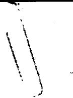

# PREFACE

This report is a revised and expanded version of an internal memorandum titled "Preliminary Report on Results of MSRE Zero-Power Experiments," issued in the summer of 1965, immediately following the completion of these experiments. It contains a complete description of all the measurements made of the neutronic behavior of the reactor, before the reactor was operated with substantial nuclear heat generation. Many of the sections in the original internal memorandum have been carried over essentially intact. In addition to these results, however, several other experiments had been performed which could not be properly evaluated by the time of the preliminary report writing, and which were of necessity omitted or mentioned only briefly in that writing. Subsequently, the priority given to analysis of data obtained from power operation of the reactor necessitated a delay in preparing a formal report on this work. Rather than issue a separate report pertaining only to these experiments, we feel that a coherent account of all the MSRE zero-power nuclear experiments, in a single report, might be interesting to a wider range of readers as well as provide useful retrospect in later stages of development of the molten-salt reactor program.

Both the performance of the zero-power nuclear experiments and the writing of this report were a group effort, with the former involving a much larger group than the latter. General areas of responsibility, however, were as follows: The rod calibration experiments and the "static" reactivity coefficient measurement program were planned and analyzed by J. R. Engel and B. E. Prince. Frequency response measurements and experiments involving the dynamic effects of temperature and pressure on reactivity were devised by S. J. Ball and T. W. Kerlin. Flux noise measurements were made by D. N. Fry and D. P. Roux. P. N. Haubenreich supervised the initial critical experiment and coordinated the remainder of the activities. Many members of the reactor operations staff provided indispensable aid in carrying out all of these experiments.

# CONTENTS

Page

Preface iii   
Abstract 1

1. Introduction 1   
2. Initial Critical Experiment 3   
3. Control-Rod Calibration 11

3.1 General Description 11   
3.2 Theoretical Guidelines 12   
3.3 Differential-Worth Measurement: Fuel Stationary 15   
3.4 Reactivity Equivalent of $^{235}\mathrm{U}$ Additions 18   
3.5 Rod-Shadowing Experiments 19   
3.6 Reactivity Effects of Fuel Circulation 23   
3.7 Rod-Drop Experiments 25   
3.8 Comparison of Measurements with Theoretical Analysis of Control-Rod Worth 31

4. Temperature and Pressure Reactivity Effects 37

4.1 Isothermal Temperature Coefficient of Reactivity 37   
4.2 Fuel Temperature Coefficient of Reactivity 41   
4.3 Effect of Pressure on Reactivity 42

5. Dynamics Tests 45

5.1 Purpose of Tests 45   
5.2 Frequency-Response Measurements 45   
5.3 Pulse Tests 46   
5.4 Pseudorandom Binary Sequence Tests 47   
5.5 Neutron Fluctuation Measurements 50   
5.6 Transient Flow-Rate Tests 51   
5.7 Conclusions from Dynamics Tests 54

6. General Conclusions 54

References 56

# LIST OF FIGURES

<table><tr><td>Fig. No.</td><td>Title</td><td>Page</td></tr><tr><td>1</td><td>Source and Instrumentation in Initial Critical Experiment</td><td>5</td></tr><tr><td>2</td><td>Relation of Rod Position and Levels in Reactor Vessel</td><td>6</td></tr><tr><td>3</td><td>Count Rate Ratios After First Four Additions of 235U. (Vessel full, rods at 51 in., source at 829 ft-9 in., chamber locations as in Fig. 1.)</td><td>7</td></tr><tr><td>4</td><td>Graphical Description of Control-Rod Calibration Experiments</td><td>13</td></tr><tr><td>5</td><td>Differential Worth of Control Rod No. 1, Measured with Fuel Stationary. (Normalized to initial critical 235U loading.)</td><td>17</td></tr><tr><td>6</td><td>Integral Worth of Control Rod No. 1</td><td>18</td></tr><tr><td>7</td><td>Effect of 235U Mass on Reactivity</td><td>19</td></tr><tr><td>8</td><td>Change in Critical Position of Rod 1 as Shim Rods 2 and 3 are Inserted into Core</td><td>20</td></tr><tr><td>9</td><td>Lattice Arrangement of MSRE Control Rods and Sample Holder</td><td>21</td></tr><tr><td>10</td><td>Differential Worth of Control Rod 1, Measured with Fuel Circulating. (Normalized to initial critical 235U loading.)</td><td>25</td></tr><tr><td>11</td><td>Results of Rod-Drop Experiments After 30 Capsule Additions</td><td>29</td></tr><tr><td>12</td><td>Results of Rod-Drop Experiments After 65 Capsule Additions</td><td>30</td></tr><tr><td>13</td><td>Results of Rod-Drop Experiments After 87 Capsule Additions</td><td>30</td></tr><tr><td>14</td><td>Sensitivity of Rod-Drop Experiment to Changes in Magnitude of Reactivity Insertion</td><td>31</td></tr><tr><td>15</td><td>Geometric Models of MSRE Core Used for Nuclear Calculations</td><td>33</td></tr><tr><td>16</td><td>Effect of Slow Changes in Core Temperature on the Reactivity</td><td>38</td></tr><tr><td>17</td><td>Photograph of a Three-Dimensional Plot of the Reactivity Measurement Data</td><td>40</td></tr><tr><td>18</td><td>Conditions During Rapid Pressure Release While Circulating Helium Bubbles</td><td>44</td></tr><tr><td>19</td><td>Reactivity-Pressure Frequency Response with 2% to 3% Void Volume in Circulating Fuel. (Calculated from pressure release experiment using Samulon's method with 0.2 min sampling interval.)</td><td>45</td></tr><tr><td>20</td><td>Frequency Response of (δn/n0)/(δk/k0) at Zero Power; Fuel Stationary</td><td>48</td></tr><tr><td>21</td><td>Frequency Response of (δn/n0)/(δk/k0) at Zero Power; Fuel Circulating</td><td>49</td></tr><tr><td>22</td><td>Pump Speed and Flow Startup Transients</td><td>52</td></tr><tr><td>23</td><td>Pump Speed and Flow Coastdown Transients</td><td>53</td></tr><tr><td>24</td><td>Control-Rod Response to Fuel-Pump Startup and Coastdown</td><td>54</td></tr></table>

# ZERO-Power Physics EXPERIMENTS ON THE MOLTEN-SALT REACTOR EXPERIMENT

B. E. Prince J. R. Engel

S.J.Ball P.N.Haubenreich

T. W. Kerlin

# ABSTRACT

This report describes the techniques and results of a program of experiments designed to measure the important neutronic characteristics of the MSRE, under conditions of negligible nuclear heat generation. The program includes the initial critical $^{235}\mathrm{U}$ loading, the control-rod calibration (period-differential worth and rod drop-integral worth measurements), determinations of the reactivity loss due to fuel circulation, the "static" reactivity coefficients of excess $^{235}\mathrm{U}$ concentration and isothermal core temperature, the fuel salt temperature reactivity coefficient, the pressure effects on reactivity, and a series of system dynamics tests (frequency response, transient flow, and neutron flux noise measurements). These measurements, carried out in June 1965, form much of the experimental baseline for current evaluation of the nuclear operation at full power. The report includes discussions of the comparisons of the measurement results with the corresponding neutronic characteristics calculated from theoretical models.

# 1. INTRODUCTION

A program of zero-power nuclear experiments, including the initial critical experiment, was conducted on the Molten-Salt Reactor Experiment (MSRE) in June 1965. The purpose of this program was to establish the basic nuclear characteristics of the reactor system and provide a baseline for evaluation of the system performance in nuclear operation. A secondary purpose was to evaluate the calculational techniques and models used in predicting the properties of the MSRE.

The initial critical experiment established the minimum critical concentration of $^{235}\mathrm{U}$ in the fuel under the simplest possible condition; that is, with core isothermal, fuel salt stationary, and control rods withdrawn to their upper limits. The remainder of the tests were designed to provide information about control-rod worths, various reactivity coefficients, and dynamic behavior of the system, all under zero-power conditions.

With the initial critical concentration established, more $^{235}\mathrm{U}$ was added to the circulating loop in increments to permit the attainment of criticality with the salt circulating and with various control-rod configurations. Measurements were made of the differential worth of one control rod as a function of position, both with the fuel salt stationary and with it circulating. In addition, rod-drop experiments were performed to provide an independent determination of the integral worth of various control-rod configurations. Measurements of the critical control-rod configurations as a function of uranium concentration, both with and without fuel circulation, provided information about the $^{235}\mathrm{U}$ concentration coefficient of reactivity, the effect of circulation on reactivity, and control-rod shadowing effects. At several fixed $^{235}\mathrm{U}$ concentrations, the reactor system temperature was varied to provide data on the isothermal temperature coefficient of reactivity. Tests were also made in which the system overpressure was varied to evaluate the pressure coefficient of reactivity. Several types of measurements were made to provide information about the reactor dynamics. These included the response of the system to single and pseudorandom sequences of reactivity pulses, the response to flow and temperature transients, and neutron flux noise data.

Sufficient excess uranium was added during this program to permit calibration of one control rod over its entire length of travel. This was expected to provide enough excess reactivity to compensate for all transient effects associated with full power operation.

Since the principal independent variable in these experiments was the $^{235}\mathrm{U}$ concentration in the fuel, the various tests were scheduled around the uranium additions. Thus, many of the experimental tests were

interwoven chronologically to provide the required data. The results presented in this report deal with individual topics without regard for the actual chronology of the tests.

In describing the results of the experiments, some reference to the reactor physics theoretical background is often an indispensable aid in interpretation. For the purpose of this report, we have limited this either to brief qualitative descriptions or to summaries of calculated core characteristics. Sources of details of the MSRE physics analysis are ref. 1 and various MSRE semiannual progress reports cited in the following sections.

# 2. INITIAL CRITICAL EXPERIMENT

The purpose of this experiment was to provide a check on the calculations of critical concentration under the simplest conditions, that is, with the core isothermal, the control rods fully withdrawn, and the fuel stationary. It also served to establish the basepoint from which the $^{235}\mathrm{U}$ additions necessary to reach the operating concentration could be made with confidence.

The fuel salt composition specified for power operation is 65LiF-29.2BeF $_2$ -5ZrF $_4$ -0.8UF $_4$ (expressed as molar percentages). The total uranium content is considerably above the minimum required for criticality if highly enriched uranium were used, and was chosen for reasons of chemistry. With this total uranium content, theoretical calculations* predicted that the reactor would be critical at 1200°F, rods out, fuel stationary with 0.256 mole % 235UF $_4$ (0.795 mole % total UF $_4$ ).2

Instead of using $32\%$ -enriched uranium to make up the fuel salt, we decided to start with depleted uranium in the salt and add the required amount of $^{235}\mathrm{U}$ as highly enriched uranium ( $93\%$ $^{235}\mathrm{U}$ ). This permitted preliminary operation with uranium in the salt before the beginning of nuclear operation and also facilitated the manufacture of most of the uranium-bearing salt. The salt was prepared in three lots: the carrier

salt, containing the beryllium, zirconium and most of the lithium fluorides; 73LiF-27UF $_4$ eutectic containing 150 kg of depleted uranium; and eutectic containing 90 kg of $^{235}\mathrm{U}$ in the highly enriched form.

Thirty-five cans of carrier salt and two cans of eutectic containing the depleted uranium were blended as they were charged into a drain tank. This mixture of salt was then circulated for 10 days at $1200^{\circ}\mathrm{F}$ while the sampler-enricher was tested and 18 samples were analyzed to establish the initial composition. The critical experiment then consisted of adding enriched uranium in increments to bring the $^{235}\mathrm{U}$ concentration up to the critical point.

Nuclear instrumentation for the experiment consisted of two fission chambers, two $\mathrm{BF}_3$ chambers, and an $^{241}\mathrm{Am - }^{242}\mathrm{Cm - }$ Be source, located as shown in Fig. 1. The fuel salt itself also constituted a neutron source, due to reaction of alpha particles from $^{234}\mathrm{U}$ with beryllium and fluorine.

The enriching salt was added in two ways: by transfer of molten salt from a heated can into a drain tank, and by lowering capsules of frozen salt into the pump bowl via the sampler-enricher. The latter method was limited to $85\mathrm{g}^{235}\mathrm{U}$ per capsule, only 0.0012 of the expected critical loading. Therefore the bulk of the $^{235}\mathrm{U}$ was added in four additions to the drain tank. After each addition the core was filled and count-rate data were obtained to monitor the increasing multiplication.

The amount of $^{235}\mathrm{U}$ expected to make the reactor critical was calculated to be $68.7\mathrm{kg}$ , using the volumetric concentration from the criticality calculations and the volume of salt in the fuel loop and drain tank.

Before the addition of enriched uranium, count rates had been determined with barren salt at several levels in the core. Then as the core was filled after each $^{235}\mathrm{U}$ addition, the ratio of count rates at each level was used to monitor the multiplication. (Figure 2 shows elevations; count rates were determined with salt at 0.4, 0.6, 0.8, and 1.0 of the graphite matrix and with the vessel full.)

Count-rate ratios with the vessel full after each of the four major additions are shown in Fig. 3. Each addition, fill, and drain took between one and two days, so only four major additions had been planned.

ORNL-DWG65-7575

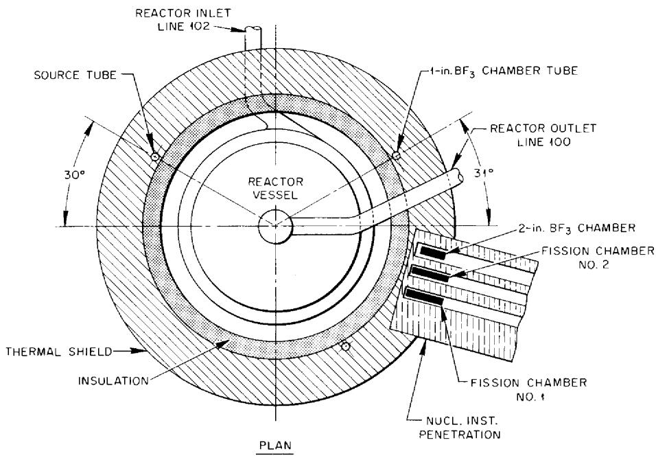

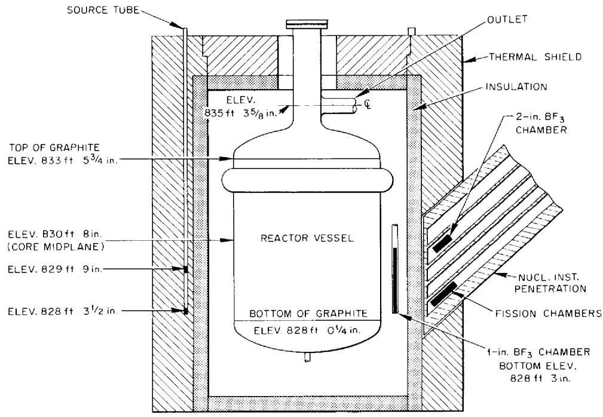  
ELEVATION   
Fig. 1. Source and Instrumentation in Initial Critical Experiment.

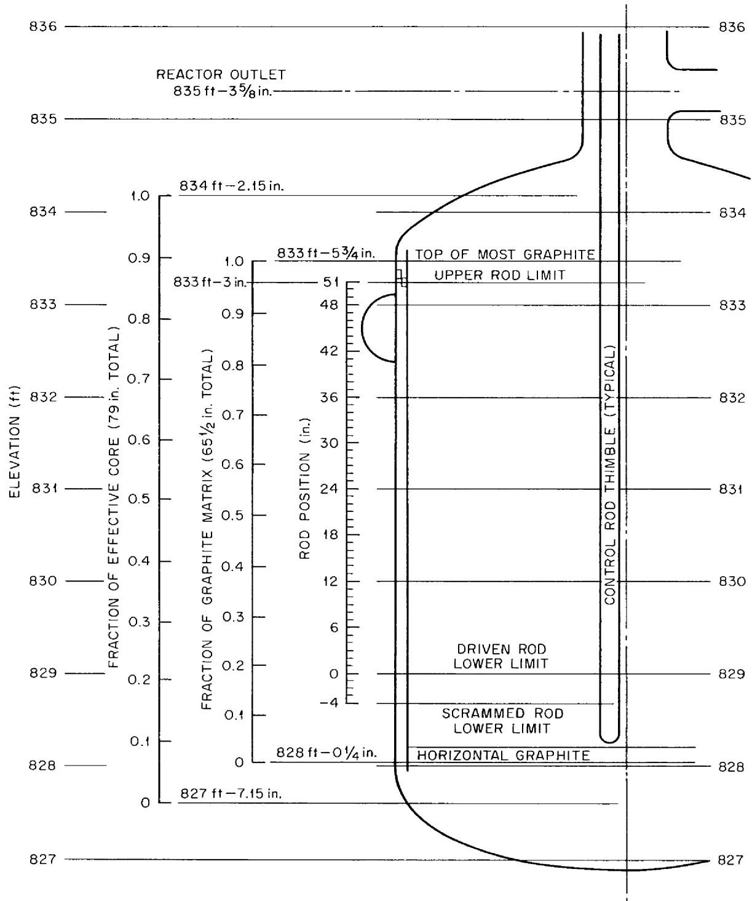  
Fig. 2. Relation of Rod Position and Levels in Reactor Vessel.

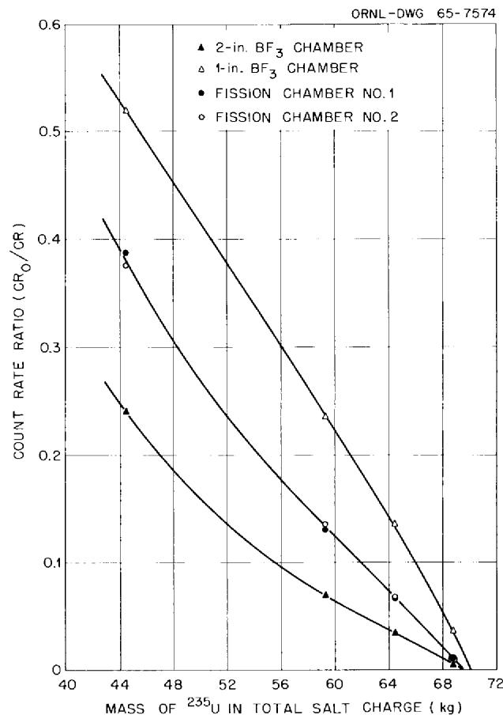  
Fig. 3. Count Rate Ratios After First Four Additions of $^{235}\mathrm{U}$ . (Vessel full, rods at 51 in., source at 829 ft-9 in., chamber locations as in Fig. 1.)

After the third addition, with $64.54\mathrm{kg}^{235}\mathrm{U}$ in the salt, the projected critical loading was $70.0 \pm 0.5\mathrm{kg}^{235}\mathrm{U}$ . (The l-in. $\mathrm{BF}_3$ chamber, located in the thermal shield, whose count rates extrapolated to a higher value was known to be strongly affected by neutrons coming directly from the source.) The fourth addition was intended to bring the loading to about $1\mathrm{kg}$ below the critical point. After $4.38\mathrm{kg}$ of $^{235}\mathrm{U}$ was added, the count rates showed the loading was within $0.8\mathrm{kg}$ of critical when the rods were withdrawn and circulation was stopped. Preliminary estimates of rod worth and circulation effect, based on changes in subcritical multiplication, were approximately the expected values.

In the final stage, enriching capsules were added through the pump bowl to bring the loading up 85 g at a time. After each addition, circulation was stopped, the rods were withdrawn, and count rates were measured.

With the reactor within $0.2\%$ 8k/k of critical, slight variations in temperature caused considerable changes in multiplication. (Variations in the voltage of the area power supply change the heater inputs slightly, requiring fine adjustments of the heater controls to keep the temperature precisely at a specified value.) After seven capsules, it appeared that after one more, the reactor could be made critical. The eighth was added, circulation was stopped, and the rods were carefully withdrawn. At approximately 6:00 p.m., June 1, 1965, the reactor reached the critical point, with two rods at full withdrawal and the other inserted 0.03 of its worth. Criticality was verified by leveling the power at successively higher levels with the same rod position. The $^{235}\mathrm{U}$ loading was 69.6 kg.

During the approach to critical, a substantial internal source of neutrons was observed. The MSRE fuel mixture has an inherent source of neutrons produced by the interaction of alpha particles (primarily from $^{234}\mathrm{U}$ ) with the beryllium and fluorine. Measurements were made with the reactor only slightly subcritical to evaluate the intensity of this source. Count-rate determinations with and without the external neutron source in place, under otherwise identical conditions, showed that the internal source supplied 0.03 to 0.05 as many neutrons to the core as the external source. The external source at that time had an absolute intensity of $1 \times 10^{8}$ neutrons/sec. However, because of the source location in the thermal shield (Fig. 1), some distance from the reactor vessel, only a small fraction of these neutrons are effective in reaching the core. If this fraction were $10\%$ ,* the effective external source contribution would be $1 \times 10^{7}$ neutrons/sec, and thus the internal source strength would be in the range of $3 \times 10^{5}$ to $5 \times 10^{5}$ neutrons/sec. The calculated intensity of the internal source was within this range. $^{1}$

Predicted and observed $^{235}\mathrm{U}$ requirements for criticality are compared most logically on the basis of volumetric concentration. The required volumetric concentration of $^{235}\mathrm{U}$ is nearly invariant with regard to the fuel salt density (unlike the required mass fraction, which

varies inversely with salt density) and depends not at all on system volume or total inventory. The observed $^{235}\mathrm{U}$ concentrations, however, are obtained in the first instance on a weight basis, either from inventory records or from chemical analyses. These weight fractions must therefore be converted to volumetric concentrations by multiplying by the fuel salt density.

The amounts of $^{235}\mathrm{U}$ and salt weighed into the system gave a $^{235}\mathrm{U}$ mass fraction of $1.414 \pm 0.005$ wt % at the time of the initial criticality. The chemical analyses during the precritical operation and the zero-power experiments gave uranium mass fractions which were 0.985 of the "book" fractions. Applying this bias to the book fraction at criticality gave an "analytical" $^{235}\mathrm{U}$ mass fraction of 1.393 wt %. On a statistical basis, the uncertainty in the mass fractions obtained from chemical analyses is about $\pm 0.007$ wt %.

At the time of the zero-power experiments, we recognized that a small amount of dilution of the fuel salt should occur, due to residues of flush salt left in freeze valves and drain-tank heels when the fuel salt was charged. (During the initial fill operations, $^7\mathrm{LiF - BeF_2}$ flush salt was admitted to the fuel circulating system.) Experience with drain-flush-fill cycles obtained from MSRE operation subsequent to the zero-power experiments has indicated that the fuel salt would have been diluted by $20 \pm 10$ kg of flush salt. If we assume that this amount of dilution occurred, the corrected value of the book mass fraction of $^{235}\mathrm{U}$ would be $1.408 \pm 0.007$ wt%.

The density of the fuel salt at $1200^{\circ}\mathrm{F}$ was determined after the uranium was added to the fuel drain tank, using pre-calibrated drain tank weigh cells and salt level probes within the tanks. The average of four measurements was 145.1 lb/ft³, with a maximum deviation of 1.1 lb/ft³. These weigh cell measurements were in close agreement with an indirect determination of the density, inferred as follows. The density of the fuel carrier salt (65LiF-30BeF₂-5ZrF₄) was measured as the salt was charged to the fuel drain tank. This measured density, computed from externally measured weights and the volume between the level probes within the tanks was 140.6 lb/ft³ at 1200°F. Addition of all the uranium added

during the zero-power experiments would be expected to increase the density to about 145.9 lb/ft³.

Concurrent with the zero-power experiments, laboratory glove-box measurements of the fuel salt density were made. These experiments gave an average density very slightly larger than the MSRE measurements, but the statistical uncertainty was sufficiently large that little additional information could be provided. For the calculations given below, we have used $145 \pm 1\mathrm{lb / ft}^3$ as our best estimate of the density of the fuel salt at $1200^{\circ}\mathrm{F}$ , and with the uranium concentration at the time of initial criticality.

In comparing the observed and calculated critical concentration of $^{235}\mathrm{U}$ , a small temperature correction should be applied to the salt density given above, since the core temperature at the time of criticality was $1181^{\circ}\mathrm{F}$ instead of $1200^{\circ}\mathrm{F}$ . Based on a fractional change in density of $-1.2 \times 10^{-4} / {}^{\circ}\mathrm{F}$ (see discussion in Sec. 4.1), the density at $1181^{\circ}\mathrm{F}$ would have been $145.3 \pm 1.0 \, \text{lb/ft}^3$ . Finally, corrections must also be applied to the calculated critical concentration, both for the lower temperature and the fact that one rod was at 46.6 in., compared to the reference conditions of $1200^{\circ}\mathrm{F}$ and all three rods at maximum withdrawal, 51 in. These two effects nearly compensated for one another. The calculated $^{235}\mathrm{U}$ concentration for criticality at the reference conditions was 32.87 g/liter; corrected to the actual conditions, using measured values of the temperature coefficient of reactivity and the control-rod worth increment (see later sections), it is 32.77 g/liter. This "predicted" value is compared with "observed" $^{235}\mathrm{U}$ concentrations in Table 1. Concentrations corresponding to both the book mass fraction, corrected for the flush salt dilution, and the analytical mass fraction, described above, are listed in Table 1. The predicted concentration was found to be in remarkably close agreement with the observed concentration corresponding to the corrected book value of the mass fraction, and to be very slightly higher than the concentration calculated from the analytical mass fraction.

Table 1. Comparison of Critical $^{235}\mathrm{U}$ Concentrations (1181°F, pump off; 0.08% sk/k rod poisoning)   

<table><tr><td></td><td>235U Mass Fraction (wt %)</td><td>Fuel Density (1b/ft3)</td><td>235U Concentration (g/liter)</td></tr><tr><td>Predicted</td><td></td><td></td><td>32.77</td></tr><tr><td>Corrected book</td><td>1.408 ± 0.007</td><td>145 ± 1</td><td>32.8 ± 0.3</td></tr><tr><td>Analytical</td><td>1.393 ± 0.007</td><td>145 ± 1</td><td>32.4 ± 0.3</td></tr></table>

# 3. CONTROL-ROD CALIBRATION

# 3.1 General Description

The addition of $^{235}\mathrm{U}$ beyond the minimum critical loading had a twofold objective: to end with enough excess reactivity to permit operation at full power and in the process to make measurements which could be analyzed to give control-rod worth and various reactivity coefficients. The final amount of $^{235}\mathrm{U}$ was to be enough to be critical at $1200^{\circ}\mathrm{F}$ with the fuel stationary and one rod fully inserted. The general method was to add $85\mathrm{g}^{235}\mathrm{U}$ at a time through the sampler-enricher, after the addition determine the new critical rod position, and at longer intervals do other experiments.

Following the initial critical experiment, another eight capsules were required before the reactor could be made critical at $1200^{\circ}\mathrm{F}$ with the fuel pump running. This was a consequence of the effective loss of delayed neutrons due to precursor decay in the part of the circulating system external to the core. Once this $^{235}\mathrm{U}$ concentration had been reached, the critical position of the control rod to be calibrated (designated as the regulating rod) was measured after addition of each capsule, with the fuel pump running. At intervals of four capsules, period measurements to determine control-rod differential worth were also

made with the pump running. Then the pump was turned off, the critical rod position with the fuel stationary was determined, and period measurements were made with the fuel stationary. This went on until a total of 87 capsules had been added. Three times during the course of additions of $^{235}\mathrm{U}$ (after 30, 65, and 87 capsules) rod-drop effects were observed. The results of all these experiments are considered separately in the following sections.

# 3.2 Theoretical Guidelines

Some useful theoretical guidelines in interpreting the control-rod experiments described in the sequel can be obtained by reference to the curves in Fig. 4. Each curve is a qualitative graphical description of the change in the static reactivity* as a function of regulating-rod position, with the other two rods withdrawn to their upper limits (position 0). The various curves represent different total loadings of $^{235}\mathrm{U}$ , increasing in the direction shown by the arrow. The static reactivity, $\rho_{\mathrm{s}}$ , corresponding to each specific rod position and $^{235}\mathrm{U}$ loading is defined by the equation:

$$
\rho_ {s} = \frac {\nu - \nu_ {c}}{\nu}, \tag {1}
$$

where $\pmb{\nu}$ is the actual number of neutrons emitted per fission, and $\pmb{\nu}_{\mathbf{c}}$ is the fictitious value for which the reactor with the specified rod position

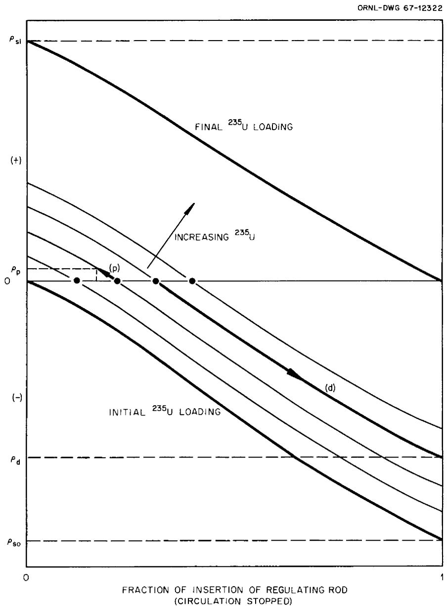  
Fig. 4. Graphical Description of Control-Rod Calibration Experiments.

and material composition, and with the fuel stationary, would be just critical. An equivalent expression is:

$$
\rho_ {s} = \frac {k _ {e} - 1}{k _ {e}}, \tag {2}
$$

where $\mathrm{k_e}$ is the effective multiplication constant of the reactor. Since $\mathrm{k_e}$ (or equivalently, $\rho_s$ ) is the quantity normally calculated in reactor

physics analysis programs, it is convenient to attempt to interpret the experimental measurements of reactivity on a basis consistent with the theoretical analysis (Sec. 3.8).

One may observe from Fig. 4 that, if the reactivity equivalent of the $^{235}\mathrm{U}$ addition is known, a direct means of calibration of the reactivity worth of the regulating rod is provided, simply by relating the critical position of the rod (solid points shown as examples in Fig. 4) to the $^{235}\mathrm{U}$ loading. Alternatively, calibration of the rod by independent experiments provides an empirical determination of the reactivity worth of the additional $^{235}\mathrm{U}$ , or the concentration coefficient of reactivity. This latter approach was chosen, and the experiments specifically aimed at determining rod worth were the stable-period measurements and the rod-drop experiments. In Fig. 4 a typical measurement of the stable period corresponds to a motion from the critical position upward and to the left along the short segment marked (p). The measured change in reactivity along the vertical axis, $\rho_{\mathrm{p}}$ , is divided by the increment in rod motion, and this sensitivity, or differential worth, is ascribed to the mean position. A typical rod-drop experiment is indicated in Fig. 4 by the segment marked (d), extending from the initial critical position into the subcritical region. The purpose of this experiment is to measure the negative reactivity inserted by the drop, marked $\rho_{\mathrm{d}}$ .

One other characteristic of some importance is indicated in Fig. 4. Because the reactivity worth of the rods is affected by the $^{235}\mathrm{U}$ concentration in the core, one finds that $\rho_{\mathrm{sl}} < |\rho_{\mathrm{so}}|$ , or equivalently, that the curves representing different fuel loadings are not exactly parallel. Although the $^{235}\mathrm{U}$ loading was continually being increased during the course of these experiments, it is useful for purposes of consistency to interpret the combined reactivity measurements, over the whole range of rod movement, on the basis of a single mass of $^{235}\mathrm{U}$ . Theoretical calculations of the rod costs, summarized later, were used to determine the effects of the $^{235}\mathrm{U}$ concentration on total cost, and these corrections were used as an aid in normalizing the experimental reactivity measurements to a single $^{235}\mathrm{U}$ loading.

# 3.3 Differential-Worth Measurement: Fuel Stationary

Period measurements were generally made in pairs. The rod being calibrated was first adjusted to make the reactor critical at about 10 w. Then it was pulled a prescribed distance and held there until the power had increased by about two decades. The rod was then inserted to bring the power back to 10 w and the measurement was repeated at a somewhat shorter stable period. Two fission chambers driving log-count-rate meters and a two-pen recorder were used to measure the period. The stable period was determined by averaging the slopes of the two curves (which usually agreed within about $2\%$ ). Periods observed were generally in the range of 30 to 150 sec.

For the measurements with the pump off, the standard inhour relation5 was used to calculate the reactivity increment corresponding to $\omega$ , the observed stable inverse period, viz.,

$$
\rho = \omega \Lambda + \sum_ {i = 1} ^ {6} \frac {\beta_ {i} \omega}{\omega + \lambda_ {1}}. \tag {3}
$$

The decay constants, $\lambda_{i}$ , and the effective delay fractions, $\beta_{i}$ , used in these calculations, are listed in the second and fourth columns of Table 2. These delay fractions contain approximate corrections for the increased importance of delayed neutrons because of their emission at lower energies relative to the prompt fission neutrons in the MSRE. $^{8}$ The neutron generation time, $\Lambda$ , was $2.6 \times 10^{-4}$ sec for the initial critical loading, obtained from theoretical analysis. When applied to the analysis of period-rod sensitivity measurements, Eq. (3) is quite insensitive to neutron generation time.

Prior to pulling the rod for each period measurement, the attempt was made to hold the power level at 10 w for at least 3 min, in an effort to help insure initial equilibrium of the delayed neutron precursors. Generally, however, it was difficult to prevent a slight initial drift in the power level (as observed on a linear recorder), and corrections were therefore introduced for this initial period. The difference between the reactivity during the stable transient and the initial reactivity,

Table 2. Delayed Neutron Fractions in the MSRE   

<table><tr><td rowspan="2">Group</td><td rowspan="2">Decay Constant (sec-1)</td><td colspan="2">10^4 × Delay Fraction (n/n)</td></tr><tr><td>Actual</td><td>Effective (static fuel)</td></tr><tr><td>1</td><td>0.0124</td><td>2.11</td><td>2.23</td></tr><tr><td>2</td><td>0.0305</td><td>14.02</td><td>14.57</td></tr><tr><td>3</td><td>0.1114</td><td>12.54</td><td>13.07</td></tr><tr><td>4</td><td>0.3013</td><td>25.28</td><td>26.28</td></tr><tr><td>5</td><td>1.140</td><td>7.40</td><td>7.66</td></tr><tr><td>6</td><td>3.010</td><td>2.70</td><td>2.80</td></tr></table>

both computed from Eq. (3), was divided by the rod movement to obtain the rod sensitivity at the mean position.

The differential-worth measurements made with the fuel pump off are plotted in Fig. 5. As discussed above, theoretical corrections have been applied to these measurements to put them all on the basis of one $^{235}\mathrm{U}$ concentration, arbitrarily chosen as the initial critical concentration at the beginning of the rod-calibration experiments. Theoretical calculations described in Sec. 3.8 indicated that the static reactivity worth of a single rod is reduced by nearly $9\%$ of its total worth for the total addition of $^{235}\mathrm{U}$ made during the course of these experiments. The approximate correction factors which were applied to the rod sensitivity measurements summarized in Fig. 5 increase linearly with $^{235}\mathrm{U}$ concentration, up to 1.087 for the measurements made near the final concentration (corresponding to the points between 1 and 2 in. withdrawal).

Some imprecision (scatter) is evident in the data shown in Fig. 5, because the differential worth is the ratio of the increment in reactivity to the increment in rod withdrawal, each of which is subject to experimental error. The root-mean-square deviation of the data points of Fig. 5 from the curve is about $2.8 \times 10^{-4}\%$ $\mathrm{sk / k / in}$ , or $\sim 0.7\%$ of the mean differential worth; the maximum deviation of a single point was $8.7\%$ . For the short term type of experiments described in this report,

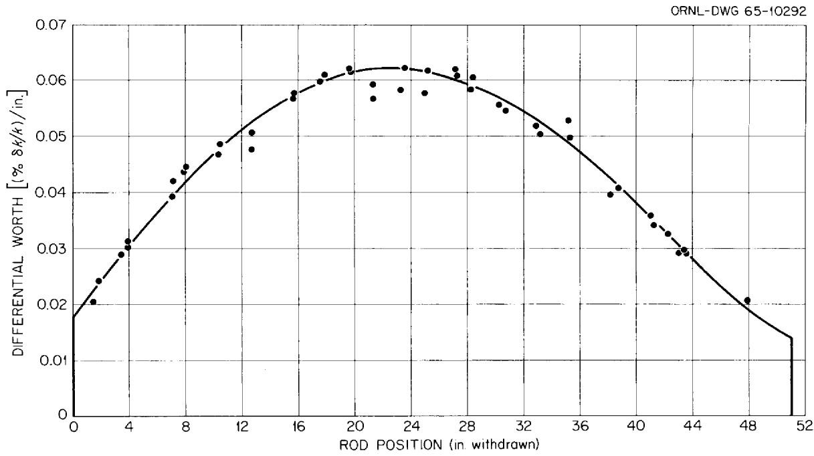  
Fig. 5. Differential Worth of Control Rod No.1, Measured with Fuel Stationary. (Normalized to initial critical $^{235}\mathrm{U}$ loading.)

the precision of determining the rod position was about $\pm 0.01$ in. Probably the most important source of imprecision in the differential worth was in the measurement of reactor period. As described above, only the conventional reactor instrumentation was used in recording this data. Determination of the period in each measurement involved laying a straight-edge along the pen line record of the log n chart and reading the time interval graphically along the horizontal scale which corresponded to a change of several decades in the neutron level. Since these charts, together with the pen speeds, are subject to variations, this was a probable source of error in the rod sensitivity measurements.

Figure 6 shows a curve of the magnitude of rod reactivity vs position, which is the integral of the differential worth curve in Fig. 5. An integral worth curve is also shown which is normalized to the final $235\mathrm{U}$ concentration. This latter is simply the first curve reduced by a factor of 1.087.

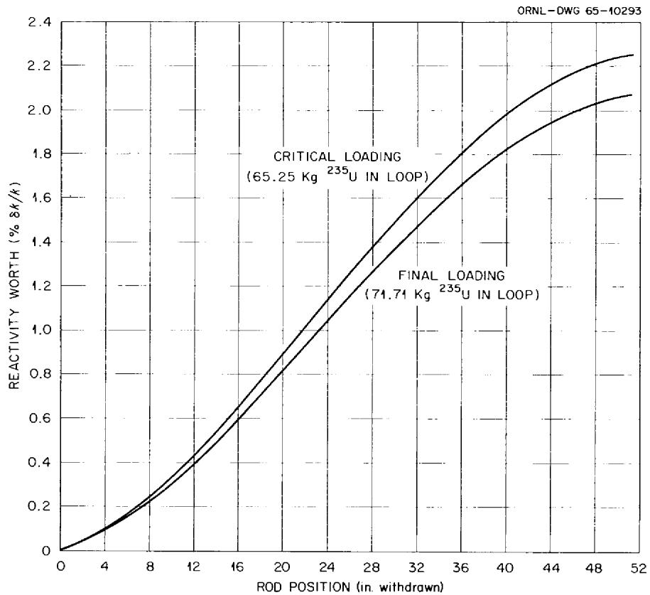  
Fig. 6. Integral Worth of Control Rod No. 1.

# 3.4 Reactivity Equivalent of $^{235}\mathrm{U}$ Additions

Following the initial achievement of criticality with the fuel pump running, the effect of each capsule addition on the critical position of the control rod was measured. The critical position of the control rod was measured with the pump off after every fourth capsule. Critical rod positions at each $^{235}\mathrm{U}$ level were then converted to reactivity by using Fig. 6 and linearly interpolating between the initial and final loadings to correct for the $^{235}\mathrm{U}$ concentration effect on the total rod worth. The results are shown in Fig. 7. In this figure, the ordinate is the total excess static reactivity which would result from withdrawing the rod from its critical position at that $^{235}\mathrm{U}$ loading to the upper limit of rod travel. The separation between the two curves reflects the net reduction in reactivity due to emission of delayed neutrons in the external piping and heat exchanger (see later discussion).

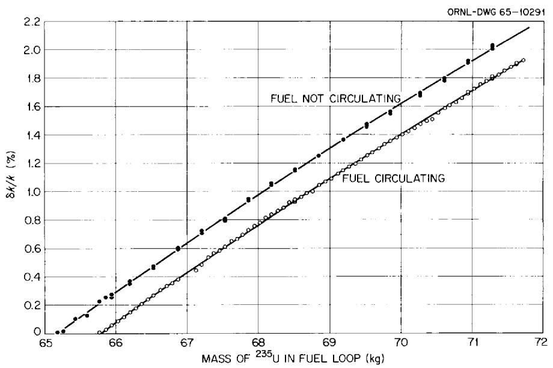  
Fig. 7. Effect of $^{235}\mathrm{U}$ Mass on Reactivity.

The $^{235}\mathrm{U}$ concentration coefficient of reactivity is given by the ratio of the change in reactivity to the fractional change in $^{235}\mathrm{U}$ concentration, or circulating mass, as a result of a small addition. This is the slope of the curves in Fig. 7 at any particular concentration, multiplied by that concentration. The value of $(\delta\mathrm{k}/\mathrm{k}) / (\delta\mathrm{m}/\mathrm{m})$ obtained from the experimental curves was 0.223, which was very nearly independent of $^{235}\mathrm{U}$ mass over the range shown in Fig. 7. The theoretically calculated value of this quantity was 0.248 for the approach to the initial critical mass, and 0.234 for the average during the excess uranium additions.

# 3.5 Rod-Shadowing Experiments

During the course of additions of enriching capsules, three separate experiments were performed in which the change in the critical position of the regulating rod (rod No. 1) was recorded as the shim rods (rods Nos. 2 and 3) were inserted into the core. These experiments were performed with the pump running. They included observations of both the effect of inserting a single shim rod (rod No. 2) with rod No. 3 held fixed in the fully withdrawn position, and the effect of inserting rods

2 and 3 as a bank, that is, with their tips at identical elevations. Figure 8 shows the data obtained from these experiments. Each experiment was terminated at the 45-deg line, where the tips of all three control rods are at equal insertions.

Some useful information concerning the reactivity worths of various shim and regulating-rod combinations can be obtained from the results shown in Fig. 8. To the critical position of the regulating rod at the start of each experiment with a given $^{235}\mathrm{U}$ loading, there corresponds an equivalent excess reactivity, relative to the reference conditions. This reactivity may be determined from the curves in Fig. 6. Then, since each curve in Fig. 8 represents control rod positions at conditions of criticality, it follows that the curve pairs corresponding to a given $^{235}\mathrm{U}$ loading represent various shim-regulating-rod combinations which are equal in excess reactivity worth. In addition, these curves can be used to determine the reactivity worth corresponding to full insertion of the banks of two and three control rods, if use is made of an approximate device. If we assume that the shape of the banked worth curve is sufficiently close to that for the single regulating rod, shown in Fig. 6,

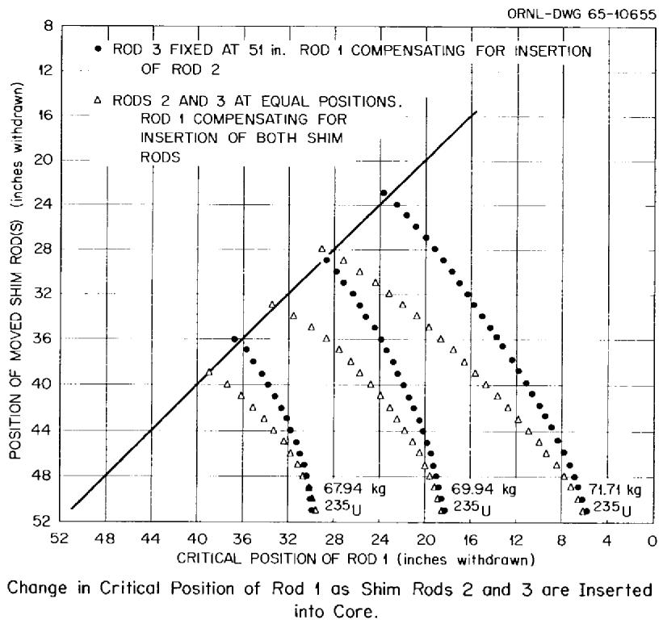  
Fig. 8. Change in Critical Position of Rod 1 as Shim Rods 2 and 3 Are Inserted into Core.

a simple ratio converts each of the three reactivity levels to the corresponding reactivity with the rod bank fully inserted in the core. (This relative invariance of the shape of the worth vs position curves is supported by theoretical calculations.) The conversion of the reactivity measurements in the manner described above is summarized in Table 3.

In addition to the experiments described above, at each of the three $^{235}\mathrm{U}$ levels, an experimental check was made to determine if there was any asymmetry in the control-rod worths, depending on the rod designated as the regulating rod. The configuration of control rods and graphite sample holder is shown in Fig. 9. Since the three control rods are of identical design, they could only differ in relative poisoning effect by virtue of

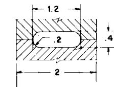  
TYPICAL FUEL PASSAGE

ORNL DMO 4-8814

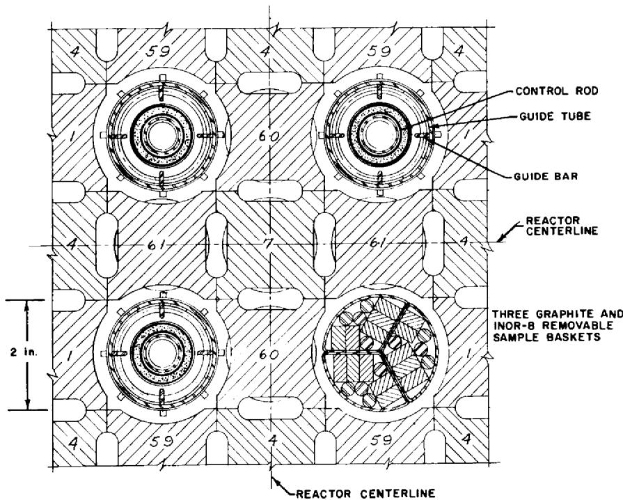  
NOTE: STRINGERS NOS. 7, 60 AND 61 (FIVE) ARE REMOVABLE.   
Fig. 9. Lattice Arrangement of MSRE Control Rods and Sample Holder.

Table 3. Worth of Control-Rod Banks Measured in Rod Shadowing Experiments   

<table><tr><td>Experiment No.</td><td>Rod Group (Nos.)</td><td>Total 235U in Loop (kg)</td><td>Excess Re-activitya (% δk/k)</td><td>Banked Critical Position (inches withdrawn)</td><td>Worth at Banked Critical Position Worth at Full Insertion</td><td>Total Worth at Full Insertion (% δk/k)</td></tr><tr><td>1</td><td>1-2</td><td>67.94</td><td>0.780</td><td>36.4</td><td>0.1903</td><td>4.099</td></tr><tr><td>2</td><td>1-2</td><td>69.94</td><td>1.460</td><td>28.8</td><td>0.3673</td><td>3.975</td></tr><tr><td>3</td><td>1-2</td><td>71.71</td><td>2.095</td><td>23.3</td><td>0.5142</td><td>4.075</td></tr><tr><td>Average</td><td></td><td></td><td></td><td></td><td></td><td>4.050</td></tr><tr><td>1</td><td>1-2-3</td><td>67.94</td><td>0.780</td><td>39.0</td><td>0.1394</td><td>5.596</td></tr><tr><td>2</td><td>1-2-3</td><td>69.94</td><td>1.460</td><td>33.3</td><td>0.2602</td><td>5.611</td></tr><tr><td>3</td><td>1-2-3</td><td>71.71</td><td>2.095</td><td>28.4</td><td>0.3761</td><td>5.570</td></tr><tr><td>Average</td><td></td><td></td><td></td><td></td><td></td><td>5.592</td></tr></table>

a Normalized to initial critical loading in loop (65.25 kg $^{235}\mathrm{U}$ ), zero point of reactivity with all three rods at 51 in.

their position with respect to the graphite sample holder. At a given $235\mathrm{U}$ loading and core temperature, the critical positions of each of the three rods were measured and compared, with the other two rods held in the fully withdrawn position. The amount of asymmetry in rod worths observed in these experiments was negligible ( $<0.005\%$ 8k/k).

# 3.6 Reactivity Effects of Fuel Circulation

The reactivity effect of circulation, given by the vertical difference between the two curves in Fig. 7, is $0.212 \pm 0.004\% \delta \mathrm{k} / \mathrm{k}$ . Early in the theoretical studies of MSRE physics, the effect of the change in delayed-neutron precursor distributions due to circulation had been predicted to be $-0.30\% \delta \mathrm{k} / \mathrm{k}$ . It was expected that another $-0.2\% \delta \mathrm{k} / \mathrm{k}$ might be present due to entrained helium bubbles in the circulating salt. As will be discussed later, the evidence indicates there were no circulating gas bubbles except for a brief period when the fuel level in the pump bowl was lowered. Therefore, the measured gas effect attending circulation was practically nil.

Following these experiments, the discrepancy between the predicted and observed delayed-neutron losses was subjected to study. Prior calculations of this effect had accounted for the subsequent contribution to fission of only those delayed neutrons emitted in the graphite-moderated (channeled) region of the reactor core. By extending this analysis to include the contribution of the delayed neutrons emitted while the fuel is in the upper and lower plenums, just outside the graphite region, a reactivity difference of $0.222\% \text{sk/k}$ was calculated from theoretical analysis. The importance of including the upper and lower heads (particularly the former) appears to be a consequence of the relatively large fuel volume fractions, or fluid residence times in these regions, as well as the net displacement of the equilibrium precursor distributions in the direction of the upper plenum, due to the fuel circulation.

This same theoretical model was also extended to include the case when the flux is increasing on a stable asymptotic period. This results in an inhour-type formula for the circulating condition, which must be used in place of Eq. (3) to analyze the period measurements made with the

fuel pump running. The equations basic to this analysis are:

$$
\rho = \omega \Lambda + \frac {\sum_ {i = 1} ^ {6} \beta_ {i} \left[ \phi^ {*} , \alpha_ {i} P \phi \right] - \sum_ {i = 1} ^ {6} \lambda_ {i} \left[ \phi^ {*} , \alpha_ {i} C _ {i} \right]}{\left[ \phi^ {*} , \alpha_ {i} P \phi \right]}, \tag {4}
$$

$$
\beta_ {i} P \phi - (\lambda_ {i} + \omega) C _ {i} = V _ {z} \frac {\mathrm {d} C _ {i}}{\mathrm {d} z}, \text {i n r e a c t o r ,} \tag {5}
$$

$$
- \left(\lambda_ {i} + \omega\right) C _ {i} = V _ {z} \frac {\mathrm {d} C _ {i}}{\mathrm {d} z}, \text {i n e x t e r n a l p i p i n g ,} \tag {6}
$$

$$
i = 1, 2, \dots , 6,
$$

together with boundary conditions requiring that the precursor concentration in the salt, $C_{i}$ , be continuous around the circulating path of the fuel. The symbols not already defined in Eqs. (2) and (3) are as follows:

$\mathsf{P}\phi =$ local rate of production of prompt neutrons plus delayed precursors $(\nu \times$ fissions per unit volume of fuel salt, per unit time),

$C_{i} =$ concentration of precursors of ith group delayed neutrons, per unit volume of fuel salt,

$\phi^{*} =$ fast group adjoint flux, or importance, $\alpha_{f} =$ local volume fraction of fuel salt,

$z =$ position variable in the direction of fuel circulation,

$\mathbf{V}_{\mathbf{z}} =$ local velocity in direction of circulation,

$\left[\mathbf{g}, \mathbf{h}\right] =$ symbol for the scalar product of functions $\mathbf{g}$ and $\mathbf{h}$ , representing their multiplication and integration over the spatial and energy variables of the neutron population in the reactor.

The results of applying this analysis to the observed period-rod sensitivity measurements made during fuel circulation are shown in Fig. 10. In this figure, the solid curve has been reproduced from Fig. 5, in order to provide a direct basis for comparison of rod sensitivities measured with the fuel stationary and with it circulating. The solid curve does indeed give a fair representation of the latter measurements. However, the problem of maintaining adequate precision in the period measurements, also present to some extent in the data shown in Fig. 5,

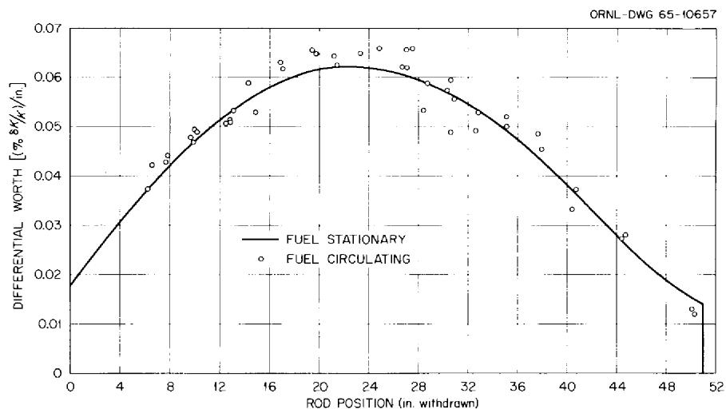  
Fig. 10. Differential Worth of Control Rod 1, Measured with Fuel Circulating. (Normalized to initial critical $^{235}\mathrm{U}$ loading.)

is magnified for the measurements made with the fuel circulating. Suggestions concerning the improvement of the precision of these measurements are included in ref. 9. However, the agreement between the calculated and observed value of the gross reactivity loss due to circulation, together with the stable-period measurement results shown in Fig. 10, provides considerable support for the model used to calculate the transport of delayed-neutron precursors due to fuel circulation.

# 3.7 Rod-Drop Experiments

The rod-drop experiment consists of the intentional scream of a rod, or rod group, from an initially critical configuration and the recording of the decay of the neutron flux as a function of time following the scream. One then determines the amount of negative reactivity required to produce this flux decay trajectory. The trajectory is characterized by a sharp drop in the flux immediately following the scream, which corresponds closely with the actual fall of the rod. The curve rapidly and continuously evolves into one with a much slower rate of flux decrease, governed by the decay of the initial distribution of delayed-neutron precursors.

Due to the requirement imposed by this experiment of accurately recording the flux while it is rapidly falling by about two decades, the

graphical record obtained from the trace of a log n recorder is of limited usefulness. The combined requirements of fast response, good counting statistics, and reproducibility can be served, however, by recording the integrated count as a function of time following the drop.

In order that the integrated flux-time curve could be recorded without requiring scalers with special, accurately timed cycles for count accumulation and recording, three scalers, together with a photographic technique of rapid recording, were employed in the following way. One of the scalers was driven by one of the fission-chamber channels. The other two were operated as 60 cycles/sec timing devices. One of these timers was synchronized to start with the scram of the rod, while the other timer and the count-accumulating scalar were synchronized and started a few seconds before the scram was initiated. The three scalers were stacked together in a vertical array, and a rapid-action camera was used to photograph the records on the three scalers simultaneously approximately once every second, starting a few seconds before the scram and ending about 30 sec after the scram. From these photographs, the count rate at the initial critical condition, the time of the scram signal, and the integral of the flux, or count rate, as a function of time following the scram could be accurately determined. In these experiments, the position of the fission chambers was adjusted to obtain an initial count rate at criticality of $\sim 30,000$ counts/sec, which was low enough to result in quite small counting-rate losses due to dead-time. Also, the remote position of the MSRE instrument shaft, relative to the reactor core (see Fig. 1), would be expected to minimize errors due to changes in the spatial flux shape during the rod-drop experiment. The experiments described here were performed with the fuel stationary.

The method used to analyze the experiments was that of comparison with theoretical flux decay curves. These latter curves corresponded to a negative reactivity insertion with magnitude determined from the integral worth vs position curves already obtained from the period measurements and rod-shadowing experiments described in the preceding sections. In this way, the results of the rod-drop experiments were used as a check for consistency with the rod calibrations obtained from these former measurements. The rate of reactivity insertion corresponded to

the rate of the fall of the rod, or rod group, from the initial critical positions.

The theoretical time-integrated flux decay curves were calculated using the MATEXP program10 to integrate the standard space-independent reactor kinetics equations. Since this program is designed to integrate a general system of first-order differential equations, the theoretical time-integrated flux following the scram could be obtained by solving the system:

$$
\frac {d \psi (t)}{d t} = n (t), \tag {7}
$$

$$
\frac {\mathrm {d n} (t)}{\mathrm {d t}} = \frac {\Delta \rho (t) - \beta}{\Lambda} \mathrm {n} (t) + \sum_ {\mathrm {i} = 1} ^ {6} \lambda_ {\mathrm {i}} \mathrm {C} _ {\mathrm {i}} (t), \tag {8}
$$

$$
\frac {d C _ {i} (t)}{d t} = - \lambda_ {i} C _ {i} (t) + \frac {\beta_ {i} n (t)}{\Lambda}, i = 1, 2, \dots , 6, \tag {9}
$$

where

$$
\psi (t) = \text {t i m e - i n t e g r a t e d}
$$

$$
n (t) = \text {d e t e c t o r}
$$

$$
C _ {i} (t) = \text {d e l a y e d - n e u t r o n p r e c u s o r c o n c e n t r a t i o n s , n o r m a l i z e d t o}
$$

$$
\Delta \rho (t) = \text {r e a c t i v i t y}
$$

$$
\beta_ {i} = \text {p r o d u c t i o n f r a c t i o n f o r i t h g r o u p o f d e l a y e d n e u t r o n s},
$$

$$
\lambda_ {i} = \text {r a d i o a c t i v e}
$$

$$
\Lambda = \text {p r o m p t n e u t r o n g e n e r a t i o n}
$$

$$
\beta = \sum_ {i = 1} ^ {6} \beta_ {i}.
$$

The initial conditions for performing the integrations of Eqs. (7), (8), and (9) are:

$$
\psi (0) = 0, \tag {10}
$$

$$
n (0) = \text {i n i t i a l} \quad \text {c o u n t r a t e} \quad \text {a t c r i t i c a l} \quad \text {c o n d i t i o n}, \tag {11}
$$

$$
\mathrm {C} _ {\mathrm {i}} (0) = \frac {\beta_ {\mathrm {i}} \mathrm {n} (0)}{\Lambda \lambda_ {\mathrm {i}}} \cdot \tag {12}
$$

The time variation of the reactivity is governed implicitly by the equations;

$$
\Delta \rho (t) = \rho \left(y _ {0}\right) - \rho [ y (t) ], \tag {13}
$$

$$
\begin{array}{l} \mathbf {y} (t) = \mathbf {y} _ {0} \quad 0 \leqslant t \leqslant t _ {e} \\ = y _ {o} - \frac {1}{2} a t ^ {2} \quad t _ {e} \leqslant t \leqslant t _ {e} + t _ {m} \\ = y _ {s} \quad t _ {e} + t _ {m} \leqslant t \tag {14} \\ \end{array}
$$

where

$$
\begin{array}{l} \begin{array}{l} \mathbf {y} = \text {r o d p o s i t i o n , i n c h e s w i t d r a w n (0 \leqslant y \leqslant 5 l i n .) ; i n i t i a l} \\ \text {p o s i t i o n , y _ {o} ; s c r a m p o s i t i o n , y _ {s} ,} \end{array} \\ \begin{array}{l} \rho (y) = \text {m a g n i t u d e o f r e a c t i v i t y w o r t h c o r r e s p o n d i n g t o r o d p o s i t i o n} \\ \text {y , n o r m a l i z e d t o z e r o r e a c t i v i t y a t f u l l y w i t d r a w n p o s i t i o n ,} \end{array} \\ \begin{array}{l} t _ {e} = \text {e f f e c t i v e l a g t i m e b e t w e e n s c r a m s i g n a l a n d s t a r t o f r o d} \\ \text {d r o p (\sim 2 0 m s e c)}, \end{array} \\ a = \text {a c a l c e l e r a t i o n d u r i n g f a l l} (\sim 1 5 \mathrm {f t} / \sec^ {2}) ^ {*}, \\ t _ {m} = \text {t i m e t o f a l l t o s c r a m p o s i t i o n}. \\ \end{array}
$$

As described previously, the value of $\rho(y)$ used in this analysis was determined by integration of the period differential-worth measurements. We have also used an algebraic representation of these experimental curves, obtained by a least-squares curve-fitting procedure.[11]

In applying the above analysis to the experiments in which rod groups were dropped, the magnitude of the total negative reactivity insertion was determined by combining the calibration curve for the single rod with the results of rod-shadowing experiments, in the manner already described in Sec. 3.5. Typical ganged rod-drop experiments consisted of the simultaneous scream of the regulating rod from its initial critical position and one or both of the shim rods from the fully withdrawn position. The normalized shape of the reactivity insertion curve for the

rod group was approximated by that corresponding to a single rod, falling from the fully withdrawn position. The results of the rod-drop experiments made after additions of 30, 65, and 87 capsules of enriching salt are shown in Figs. 11, 12, and 13 respectively. In all three sets of experiments, the analysis of the single rod drops shows very good consistency with the rod-worth calibration obtained by integration of the differential-worth measurements. A similar consistency was obtained from the experiments involving the scream of all three rods. In the case of the two-rod experiments, results obtained after 65 and 87 capsules appear to be slightly anomalous with respect to the experiment with the same rod group after 30 capsules. Multiplication of the magnitude of the negative reactivity insertion by a factor of about 1.05 brings the calculated and experimental curves for these experiments into better agreement. However, another source of this discrepancy could be in the approximation of the shape of reactivity insertion vs time for the tandem fall of the rods by that corresponding to a single rod. This source would be expected to have its greatest influence on the two-rod experiments.

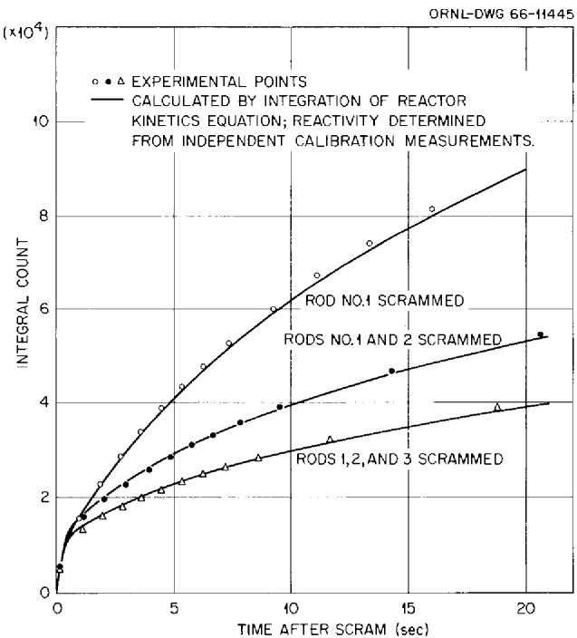  
Fig. 11. Results of Rod-Drop Experiments After 30 Capsule Additions.

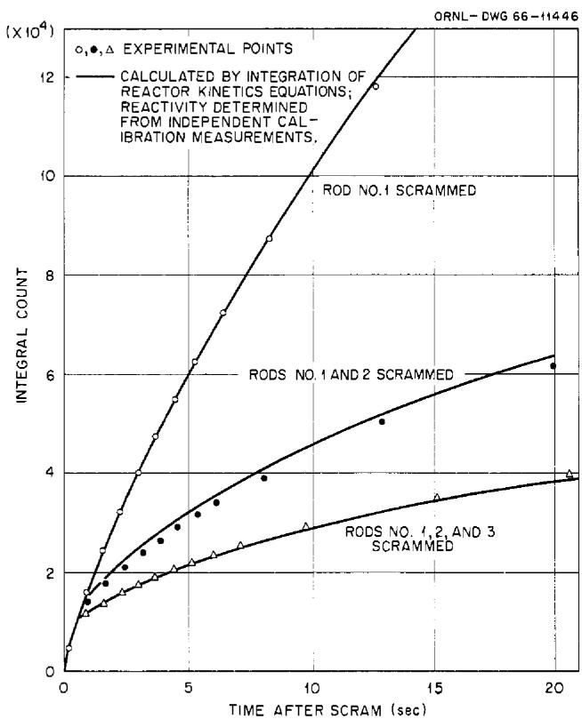  
Fig. 12. Results of Rod-Drop Experiments After 65 Capsule Additions.

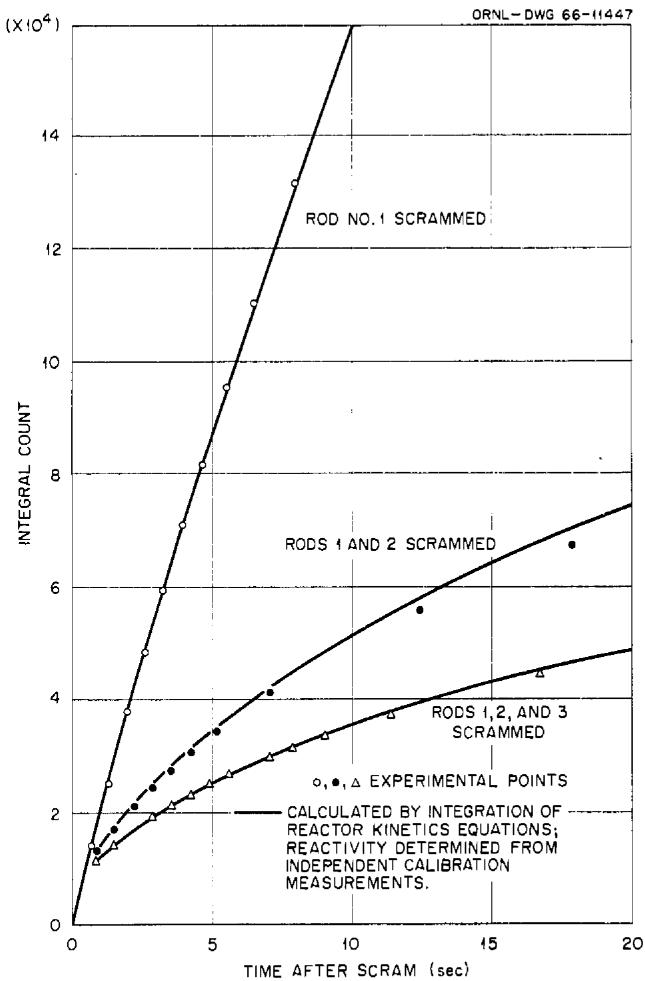  
Fig. 13. Results of Rod-Drop Experiments After 87 Capsule Additions.

The sensitivity of these experiments to variations in the magnitude of the reactivity insertion is illustrated in Fig. 14. Here the analysis of the experiment where rod No. l was scrambled after addition of 30 capsules is reproduced from Fig. 11; the theoretical curves are added which correspond to an increase and a decrease of $5\%$ of the total magnitude of negative reactivity insertion. For this particular experiment, this corresponds to an increment of $0.007\% \text{8k/k}$ in the magnitude of reactivity. With the largest apparent differences occurring in the experiments involving the scram of two rods, the results of all these experiments were within the $5\%$ band of self-consistency with the rod calibration results obtained from the differential-worth measurements.

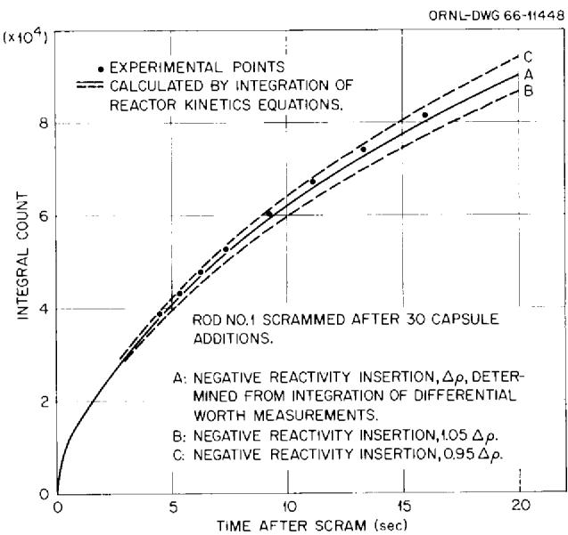  
Fig. 14. Sensitivity of Rod-Drop Experiment to Changes in Magnitude of Reactivity Insertion.

# 3.8 Comparison of Measurements with Theoretical Analysis of Control-Rod Worth

In the period before test operations were begun on the MSRE, detailed theoretical studies were made in order to predict the neutronic characteristics of the reactor, as closely as practical. These studies first focused on such characteristics as the expected critical $^{235}\mathrm{U}$ concentration, the control-rod reactivity worth, and the various reactivity

coefficients. In these studies, use was made of a synthesis of results, ranging from "zero-dimensional" multigroup calculations of the average neutron spectrum in the central region of the reactor core to few-group diffusion calculations with two-dimensional models made to represent the actual MSRE core geometry.*

The programs which were used to calculate the expected neutron energy spectrum over most of the reactor core were the GAM-II and the THERMOS codes. $^{12,13}$ The former calculates the epithermal energy spectrum of the neutron flux (the flux above energies where thermal motion of the moderator nuclei exerts a strong influence on the neutron spectrum). The latter calculates the spectrum in this thermal energy region, together with its dependence on position within the individual cells comprising the lattice of fuel salt and graphite. In each of these programs, the actual energy spectrum is approximated by a finite number of energy groups (99 groups in GAM-II spanning the interval 15 Mev to 0.414 ev, and 30 groups in THERMOS, spanning the interval 0 to 0.876 ev). The programs intrinsically utilize library tapes of neutron cross sections for each nuclide and energy group, which represent the best current evaluation of experimental cross-section data.

In the GAM-II model, the calculated flux spectrum corresponds to that in a single-region reactor, consisting of a homogeneous mixture of graphite and fuel salt, with corrections introduced for the fuel-channel geometric self-shielding of the absorption resonances in $^{238}\mathrm{U}$ . The GAM-II and THERMOS models sacrifice consideration of the gross variation in the core geometry and material composition (such as correspond to the control rod thimbles or the upper and lower salt plenums) and their effect on the neutron flux distribution in order to gain detail in describing the energy spectrum in the most important region of the core. The gross

spatial variation of the neutron flux was studied with the aid of one- and two-dimensional group-diffusion models. Slightly simplified versions of these latter models are shown in Fig. 15. These represent radial (R), radial-axial (R-Z), and radial-angular (R-θ) models of the actual core. The process of synthesis was one of first determining the detailed neutron spectrum in the graphite-salt lattice with the GAM-II and THERMOS programs. Individual nuclide cross sections were then averaged over this spectrum to obtain "broad group" cross sections, and these were applied in group diffusion calculations for the models shown in Fig. 15.

The names for the group-diffusion codes used for these calculations14,15,16 are given under each model shown in Fig. 15. The predicted

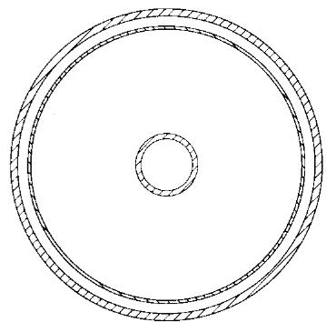  
$(\alpha)$ ONE DIMENSIONAL MODEL-MULTIGROUP DIFFUSION CALCULATIONS IN RADIAL GEOMETRY (MOORIC)

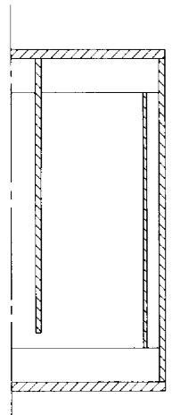  
(b) TWO DIMENSIONAL MODEL-TWO GROUP DIFFUSION CALCULATIONS IN R-Z GEOMETRY (EQUIPOISE)

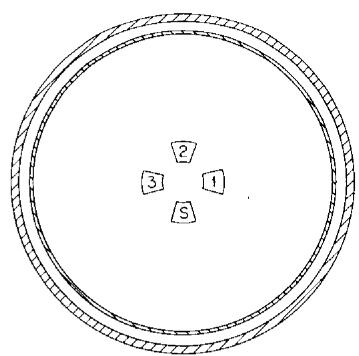  
(c) TWO DIMENSIONAL MODEL-FOUR GROUP DIFFUSION CALCULATIONS IN R-8 GEOMETRY (EXTERMINATOR)   
Fig. 15. Geometric Models of MSRE Core Used for Nuclear Calculations.

critical concentration reported in ref. 2 was based on the one-dimensional (radial) MODRIC calculations. Calculations ranging from 33 to 4 broad groups showed very small differences in the predicted critical $^{235}\mathrm{U}$ concentration. However, calculations with the radial model sacrifice detail concerning the variation in core composition in the axial dimension, by assuming a uniform rate of axial neutron leakage (characterized by an approximate transverse geometric buckling). In addition, this model requires that the control-rod group be represented as an annular region. The first of these approximations was checked by two-group, two-dimensional calculations with the R-Z model shown in Fig. 15b, using the $^{235}\mathrm{U}$ concentration found to be critical in the MODRIC calculations Later, when the EXTERMINATOR program became available, we checked the second approximation by employing the R- $\theta$ model of Fig. 15c. In this calculation, use was still made of the transverse leakage approximation, but now we were permitted a much closer representation of the actual geometry of the three control rods and the graphite sample holder (designed by S in Fig. 15c). We found that, for the same $^{235}\mathrm{U}$ concentration, these two corrections in the calculated multiplication constant very nearly cancelled one another. (In the R-Z model, $k_{e}$ was 1.0106 with an annular poison region inserted to an elevation corresponding to the position of maximum rod withdrawal. In the R- $\theta$ model, $k_{e}$ was 0.9903.) Therefore, we concluded that no corrections to the MODRIC predictions of the critical concentration were necessary.

The theoretical calculations of the control-rod worth were based on the R-θ model of Fig. 15c. When the gadolinium poison rods are inserted in the core, diffusion theory cannot be applied routinely within the indicated rod regions. Approximate blackness coefficients at the region boundaries (fraction of neutrons incident on the rod thimbles which are ultimately absorbed in the control region) were obtained from a simplified transport-theory calculation for the control region geometry. These boundary conditions were then applied in the R-θ group-diffusion calculations. Table 4 summarizes the results of these calculations. The change in the effective multiplication constant between the conditions of rods completely withdrawn from the core and rods inserted all the way

Table 4. Comparison of Theoretical Calculations of Control Rod Effects with Experimental Measurements   

<table><tr><td>Uranium Concentration</td><td>Control Rods 
Inserted 
(Rod Nos.)</td><td>δk a e</td><td>δps 
(% δk/k)</td><td>δps (51 in.) 
(% δk/k)</td><td>δpexp 
(% δk/k)</td></tr><tr><td rowspan="2">Initial critical 
concentration</td><td>2</td><td>0.0218</td><td>2.278</td><td>2.111</td><td>2.26</td></tr><tr><td>1-2-3</td><td>0.0546</td><td>5.894</td><td>5.463</td><td>5.59</td></tr><tr><td>1.1 × initial critical 
concentration</td><td>2</td><td>0.0211</td><td>2.094</td><td>1.941</td><td>2.08</td></tr></table>

a $\delta k = k_{e}(0) - k_{e}(1)$ ; $(0) =$ rods completely removed, $(1) =$ rods completely inserted through a cylindrical core with an effective nuclear height of 78.2 in.

through the core are tabulated for a single rod and for the bank of all three rods. For the single rod, calculations were made both for a uranium concentration very nearly equal to the initial critical concentration (at the beginning of the excess uranium additions and rod-calibration experiments) and for a $^{235}\mathrm{U}$ concentration increased by $10\%$ . This latter value corresponds very closely to the uranium concentration at the termination of the zero-power experiments. Table 4, column 4, also lists the change in static reactivity, $\delta \mathfrak{o}_{\mathrm{s}}$ , due to the rod insertions, as determined from Eq. (2). As was discussed in Sec. 3.2, this quantity should be used as a consistent basis of comparison of calculations with the experimental measurements of reactivity.* To make this comparison, however, the calculated values of $\delta \mathfrak{o}_{\mathrm{s}}$ given in column 4 of Table 4 must be reduced by a factor to account for the available rod travel (51 in.) relative to the calculated effectiveness of the rods inserted all the way through the core. For this purpose, approximate calculations of the worth of the partially inserted, banked rods were made using the R-Z model shown in Fig. 15b. These results indicated that the available travel of 51 in. covered 0.927 of the worth of rods inserted all the way through the core. (The effective, or "nuclear" height of the core, extending into the upper and lower heads, was 78.2 in.) The values of the static reactivity worth of the rods corrected by this factor, together with the measured values of the rod worths, are given in the last two columns of Table 4.

Early studies $^{17}$ had indicated that the worth of rod Nos. 1 and 3 might be about $4 \%$ higher than that for rod No. 2, due to the positions of these rods with respect to the graphite sample holder (see Fig. 9). In these calculations, however, the difference between the composition of the sample holder and the main core region was neglected. The later calculations made with the R- $\theta$ model included a composition of graphite, fuel salt, and INOR-8 specimens very nearly equal to that of the actual sample holder. In this case, no asymmetry in the worth of the three

rods was found to occur, primarily because the sample holder tends to cause a depression in the thermal flux which is about equal to that caused by the empty INOR-8 control element thimbles. As described earlier, this conclusion is further supported by experiment, since negligible asymmetry was observed in the calibration experiments.

# 4. TEMPERATURE AND PRESSURE REACTIVITY EFFECTS

# 4.1 Isothermal Temperature Coefficient of Reactivity

The effect of temperature on reactivity was measured in three separate experiments in which we adjusted the electric heaters to change the system temperature slowly (about $15^{\circ}\mathrm{F/hr}$ ) while we observed the critical position of the regulating rod. This experiment gave the overall temperature coefficient, that is, the sum of fuel and graphite coefficients. These experiments were performed with the fuel circulating.

Figure 16 shows the results of the three experiments involving slow changes in temperature. The changes in critical position of the regulating rod was converted to reactivity by use of the rod calibration results described in the preceding sections. Here, the magnitude of the reactivity change about the nominal $1200^{\circ}\mathrm{F}$ operating point is plotted as a function of the fuel, or system temperature (temperature changes were induced so slowly that the fuel and graphite could be safely assumed to remain in thermal equilibrium). This temperature was the average of a preselected set of thermocouples used throughout the nuclear experiments. Since the slopes of the reactivity curves in Fig. 16 are the quantities of interest, the positions of the curves have been translated parallel to the vertical axis in order that the three curves might be plotted on the same scale and still be distinguished. The first experiment, with $67.9\mathrm{kg}$ of $^{235}\mathrm{U}$ in the loop gave a line whose slope ranges from $-(6.6$ to $8.3)\times 10^{-5}{}^{\circ}\mathrm{F}^{-1}$ . At $69.9\mathrm{kg}^{235}\mathrm{U}$ , the experiment gave a straight line with a slope of $-7.24\times 10^{-5}{}^{\circ}\mathrm{F}^{-1}$ . In the last experiment, at $71.7\mathrm{kg}^{235}\mathrm{U}$ , the slope of the curve above about $1140^{\circ}\mathrm{F}$ is $-7.3\times 10^{-5}{}^{\circ}\mathrm{F}^{-1}$ .

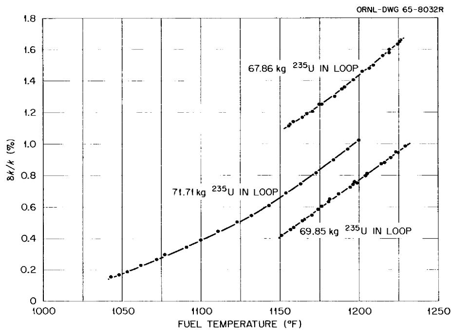  
Fig. 16. Effect of Slow Changes in Core Temperature on the Reactivity.

Calculations consistent with the models described in the preceding section gave a value of $-8.1 \times 10^{-5} \circ \mathrm{F}^{-1}$ for the total isothermal temperature coefficient of reactivity. The associated components for the fuel salt and graphite were $-4.1 \times 10^{-5} \circ \mathrm{F}^{-1}$ and $-4.0 \times 10^{-5} \circ \mathrm{F}^{-1}$ , respectively. Since the fuel coefficient is very nearly proportional to the value of the coefficient of thermal expansion of the salt, it is necessary to qualify the calculated coefficients with this value. These calculations were based on an expansion coefficient of $-1.18 \times 10^{-4} \circ \mathrm{F}^{-1}$ , obtained from an early empirical correlation of temperature with density. This value was later found to be in good agreement with the expansion coefficient determined from observations of the change in salt level in the MSRE fuel pump bowl with loop temperature (two separate measurements gave $-1.09 \times 10^{-4}$ and $-1.15 \times 10^{-4} \circ \mathrm{F}^{-1}$ ).3

The experiment at 71.7 kg $^{235}\mathrm{U}$ shows a lower slope below about $1140^{\circ}\mathrm{F}$ . We do not believe that the temperature coefficient is lower in this range but that another phenomenon became significant during this part of the experiment. That is the appearance of an increasing amount of helium

bubbles in the circulating salt as the temperature was lowered. The evidence for this is discussed in the section on pressure effects. The effect, so far as the temperature experiment is concerned, was that the bubbles tended to reduce the amount of fuel salt in the core, compensating to some extent for the increase in density of the salt itself as the temperature was lowered. Thus the slope of the lower part of the curve cannot be interpreted as a temperature coefficient of reactivity in the usual sense.

The influence of the core temperature on reactivity, as reflected in the change in critical position of the regulating rod, is also illustrated in Fig. 17. This is a photograph of a three-dimensional model* showing the critical position of the regulating rod (vertical axis) as a function of the $235\mathrm{U}$ concentration (horizontal axis, nearly in the plane of the page), and core temperature (depth axis, front-to-back of the model). The measured critical position of the regulating rod with fuel circulating at $1200^{\circ}\mathrm{F}$ vs the $235\mathrm{U}$ concentration is represented by the relatively "dense" curve sloping downward to the right. Each point represents the addition of one capsule of enriching salt. The critical position of the regulating rod with circulation stopped, measured after every fourth capsule, is the curve with the "sparse" points lying vertically below and in the same plane as the first curve. The separation between the two curves represents the increment of rod insertion required to compensate for the loss in delayed neutrons due to circulation.

The three experiments in which the core temperature was varied are shown in Fig. 17 as the segments sloping upward from the front-to-back of the model and crossing the upper curve of critical position vs $^{235}\mathrm{U}$ concentration at $1200^{\circ}\mathrm{F}$ . The points at the extreme upper left of the model represent the data taken at the time of the initial critical experiment (when the temperature was $\sim 1180^{\circ}\mathrm{F}$ and the rods were poisoning $0.08\%$ sk/k).

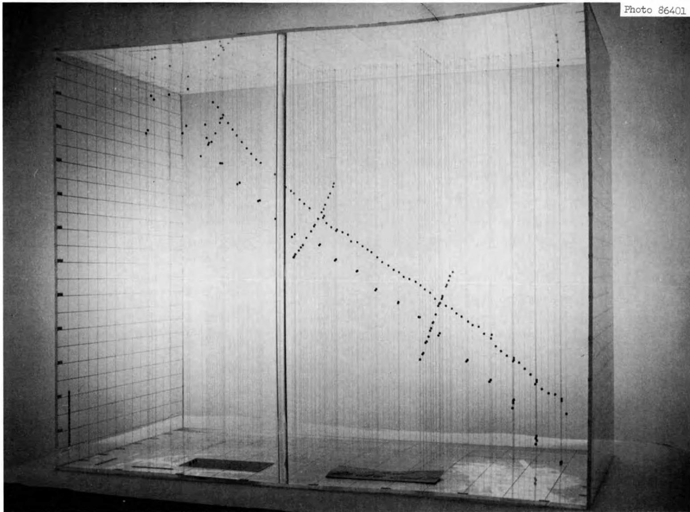  
Fig. 17. Photograph of a Three-Dimensional Plot of the Reactivity Measurement Data.

# 4.2 Fuel Temperature Coefficient of Reactivity

An attempt was made to separate the fuel (rapid) and graphite (slug-gish) temperature coefficients by an experiment in which the coolant system was used to increase the fuel salt temperature rather abruptly. This was done by stopping the fuel pump, raising the temperature of the circulating coolant salt and the stagnant fuel in the heat exchanger, then restarting the fuel pump to pass the hotter fuel salt through the core. The reactor power was controlled at 10 w by the flux servo.\* For these experiments, use was made of a Bunker-Ramo 340 on-line digital computer and data logger, installed as part of the MSRE instrumentation.\*\* The output of a thermocouple in the reactor vessel outlet, logged digitally at 1/4-sec intervals, showed a brief increase of 5 to $6^{\circ}\mathrm{F}$ as the hot salt first passed. It then leveled at about $3.5^{\circ}\mathrm{F}$ for a few loop transit times before decreasing gradually. The noise in the analog-to-digital conversion $(\pm 1^{\circ}\mathrm{F})$ limited the accuracy of the measurement, but by taking an average of 50 points during the level period after mixing and before the graphite temperature had time to change significantly, a value was obtained for the increment in fuel temperature. The reactivity change was obtained from the change in rod position using the rod calibration results, corrected for the decrease due to circulation, and ascribed to the fuel-temperature increase. The resulting coefficient was $-(4.9 \pm 2.3) \times 10^{-5} \circ \mathrm{F}^{-1}$ . Predicted values of the fuel-temperature coefficient lie in this range.

This experiment was later repeated in a slightly different manner, with the intent of improving upon the first measurement. The reactor inlet and outlet temperature thermocouple signals were preamplified and filtered before digitizing, reducing the noise to about $\pm 0.1^{\circ}\mathrm{F}$ . This

time the fuel was kept in circulation and the coolant loop was stagnant. After heating the stagnant coolant salt about $20^{\circ}\mathrm{F}$ hotter than the fuel salt, the coolant pump was started, introducing a hot slug of fuel into the heat exchanger and subsequently into the core. In this test, then, the change in reactivity was due entirely to the change in temperature, and the rod-induced reactivity required to keep the reactor critical was approximately equal and opposite to that due to the fuel and graphite temperature change. If the immediate effects could be attributed to the fuel temperature coefficient alone, a value of $-4.7 \pm 0.7) \times 10^{-5} \circ \mathrm{F}^{-1}$ was obtained from this test. However, noise effects relative to the temperature changes involved and also special problems due to temperature measurement lag effects still prevented us from obtaining a good assessment of the uncertainty in this measurement.

# 4.3 Effect of Pressure on Reactivity

The possibility exists for a pressure coefficient of reactivity in the MSRE, because undissolved helium can be entrained in the circulating fuel through the action of the fission product gas stripping device. A small fraction of the fuel pump discharge stream (about 50 gpm out of 1250 gpm) is diverted into a spray ring in the gas space in the pump bowl. The purpose of the spray, or stripper, is to provide contact so that $^{135}\mathrm{Xe}$ in the salt can escape into the gas space, which is continuously purged. Salt jetting from holes in the spray ring impinges on the surface of the liquid pool in the pump bowl with sufficient velocity to carry under considerable quantities of gas, and a small fraction of the submerged bubbles can be swept through the ports at the pump suction into the main circulating stream of fuel. A steady state is reached when the helium concentration in the main stream has increased to the point where loss of helium through the stripper flow equals the rate of injection.

At steady state, the volume fraction of gas in the circulating stream varies around the loop proportionally to the inverse of the local pressure, which changes with elevation, velocity, and head losses. If, after steady state is established, the loop pressure is changed rapidly, the mass ratio of undissolved gas to liquid would be expected to remain

practically constant and the volume fraction of gas in the loop would decrease with increasing pressure. This would give rise to a positive pressure coefficient of reactivity. On the other hand, for very slow increases in pressure, the volume fraction of gas at the pump suction would tend to remain constant, and the volume of gas in the core would increase, because the ratio of absolute pressures between the core and pump suction is reduced. These slow changes could give rise to a small negative pressure coefficient of reactivity.

We performed three tests to explore the effect on reactivity of changing the system overpressure. In each of the three tests the loop overpressure was slowly increased from the normal 5 psig to 15 psig and then quickly relieved, through a bypass valve, to a drain tank that had previously been vented to atmospheric pressure.

The first two tests were carried out at normal system temperature with the normal operating level of salt in the fuel-pump bowl. No change in control-rod position was required to maintain criticality and no significant change in pump-bowl level was observed during either of the tests. These indicated that the pressure coefficient was negligibly small and that essentially no helium bubbles were circulating with the salt. Further evidence of the lack of circulating voids was obtained from a gamma-ray densitometer on the reactor inlet line; this instrument showed no change in mean salt density during the tests.*

The third test was performed at an abnormally low pump-bowl level which was obtained by lowering the operating temperature to $1050^{\circ}\mathrm{F}$ . Figure 18 shows the pressure transient and the responses of the regulating control rod, densitometer, and fuel-pump level during the rapid pressure release. For these conditions, a change of one unit on the densitometer was equivalent to a change of about 0.15 vol % in the circulating void fraction. Independent evaluations of the void fraction from these three parameters all gave values between $2\%$ and $3\%$ by volume. The frequency response characteristics of the effects of pressure on

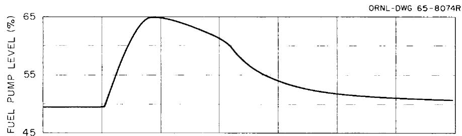

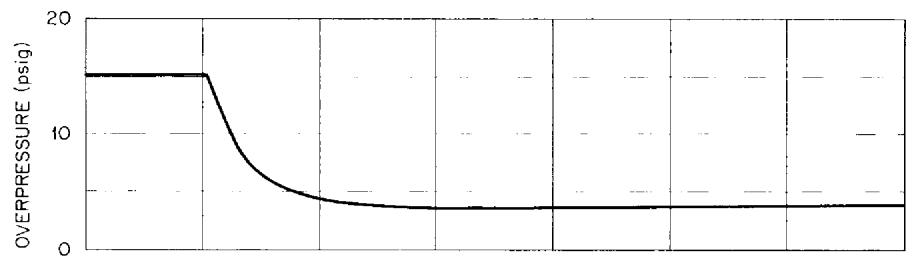

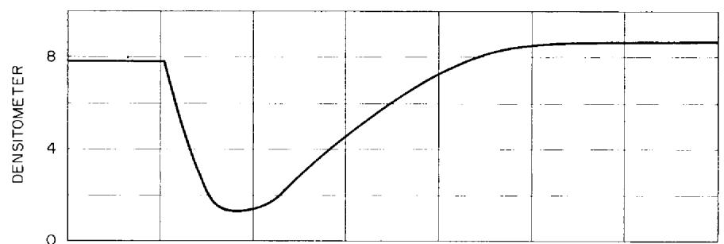

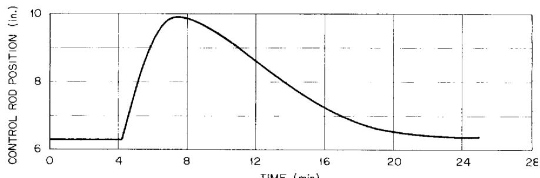  
Fig. 18. Conditions During Rapid Pressure Release While Circulating Helium Bubbles.

reactivity were calculated, using Samulon's method, $^{19}$ from the pressure and rod motion. These results are shown in Fig. 19 along with the predicted high-frequency response for a void fraction of $1.2\%$ . Extrapolation to the observed curve gives a void fraction of $2\%$ to $2\frac{1}{2}\%$ . The low- and high-frequency pressure coefficients were $+0.0003$ and $+0.014$ ( $\% \delta k / k$ )/psi, respectively, for this particular condition.

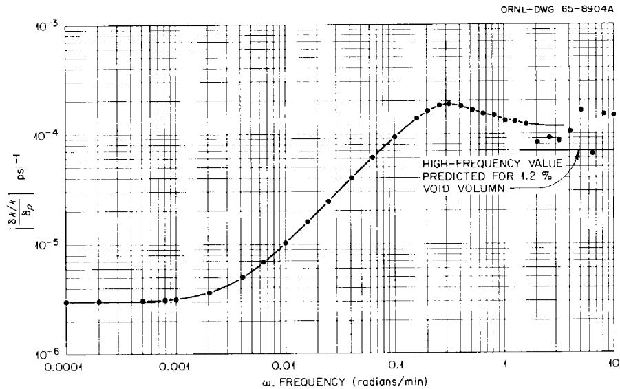  
Fig. 19. Reactivity-Pressure Frequency Response with 2 to $3\%$ Void Volume in Circulating Fuel. (Calculated from pressure release experiment using Samulon's method with 0.2-min sampling interval.)

# 5. DYNAMICS TESTS

# 5.1 Purpose of Tests

We performed a variety of dynamic tests during the operation at zero power. These tests were the start of an extensive program to evaluate experimentally the inherent nuclear stability of the MSRE at all power levels. The reactor system was analyzed on a theoretical basis,[20] and the tests were designed not only to characterize the present system but also to evaluate the techniques and mathematical models used in the theoretical analysis. Results from the analysis of the zero-power tests are presented below. An extensive discussion of the subsequent at-power tests is given in ref. 21.

# 5.2 Frequency-Response Measurements

A series of tests was run to determine the frequency response of neutron level to reactivity perturbations. These experiments included pulse tests, pseudorandom binary reactivity-perturbation tests, and measurements of the inherent noise in the flux signal. Tests were run

with the fuel pump on and with it off. Noise measurements were also made during a special run with a low pump-bowl level where there were entrained bubbles in the core.

The frequency response is a convenient measure of the dynamic characteristics of a reactor system. Classically the frequency response is obtained by disturbing the reactor with a sinusoidal reactivity perturbation, and observing the resulting sinusoidal neutron-level variations. The magnitude ratio is defined as the ratio of the amplitude of the output sinusoid to that of the input sinusoid. The phase angle is defined as the phase difference between the output sinusoid and the input sinusoid. Other procedures, such as those described in this report, can be used to yield the same results as the classical method but with less experimental effort.

The zero-power frequency response tests serve to check the theoretical, zero-power frequency-response predictions, but they do not furnish direct information on the stability of the power producing reactor. The zero-power tests, however, do serve as an indirect, partial check on the at-power predictions because the dynamic behavior at power is simply the zero-power case with the addition of reactivity feedback from the system resulting from power-induced temperature changes. Thus, the verification of the zero-power kinetics predictions lends some support to the predictions regarding power operation.

# 5.3 Pulse Tests

In the pulse tests a control rod was withdrawn $1/2$ in., held there for 3.5 or 7 sec., then returned to its original position. The precise rod positioning was done using a special analog computer timing circuit. The rod was located such that $1/2$ -in. travel caused a change in reactivity of about $0.03\%$ . The rod position signal and flux signal were recorded digitally at 0.25 sec intervals using the BR-340 on-line digital computer. The frequency-response characteristics are generally determined from pulse-response tests by obtaining, numerically, the Fourier transforms of the input and output signals. One requirement, however, is that the Fourier integrals must be closed; that is, both input and

output signals must eventually return to their initial values. The zero-power reactor, however, is an "integrating" system, since a temporary reactivity perturbation can cause the flux to level out at a new value. To circumvent this problem, the flux output signal was filtered with a 50-sec time-constant, high-pass digital filter. The output of this filter, which eventually returns to its initial value, was then Fourier-transformed, and the resulting transform corrected for the filter response.

"Practice" tests on a simulated zero-power reactor indicated that reasonably accurate results could be expected from these tests only if the fuel-temperature drift during a test could be held essentially to zero, and if the control rod could be repositioned to its initial location within an accuracy of better than 0.01 in.

The results of the pulse tests, shown in Figs. 20 and 21 for the cases of the fuel stationary and circulating, are in adequate agreement with the theoretical frequency response curves. This agreement provides indirect evidence that the stringent accuracy requirements described above were actually achieved in these tests.

# 5.4 Pseudorandom Binary Sequence Tests

The pseudorandom binary sequence (PRBS) is a specially selected series of positive and negative rod movements which repeats itself after a certain number of basic pulse or bit times. The principle advantage of a PRBS in frequency response testing is that its frequency spectrum typically consists of a large number of harmonics of approximately equal size.[22] This means that the response may be analyzed at many frequencies generated in a single test, and the signal-to-noise ratio at these known frequencies is typically very good.

A PRBS is characterized by the number of bits in the sequence and the bit duration. The bit time is defined as the minimum possible pulse duration in the sequence. All pulses in a PRBS are minimum width or integral multiples thereof. Numerous sequences may be generated, but they are restricted to certain specific numbers of bits. For a sequence of Z bits and a bit duration at $\Delta t$ sec, the PRBS period is $Z\Delta t$ sec. The lowest harmonic radian frequency $\omega_{0}$ and the spacing between harmonics $\Delta \omega$

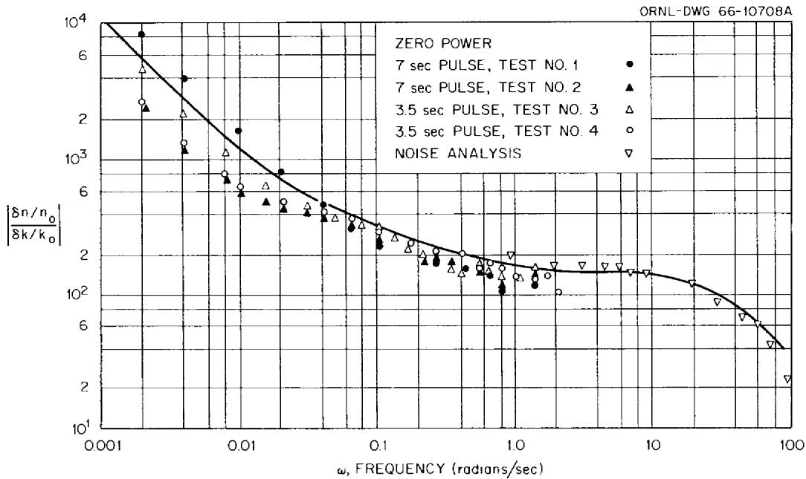

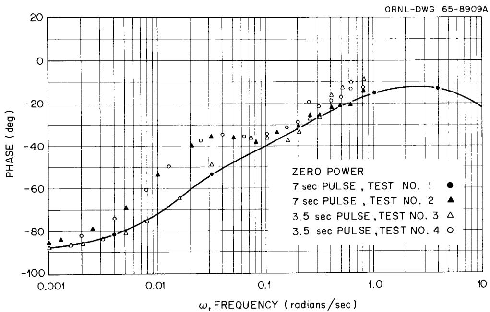  
Fig. 20. Frequency Response of $(\delta n / n_0) / (\delta k / k_0)$ at Zero Power; Fuel Stationary.

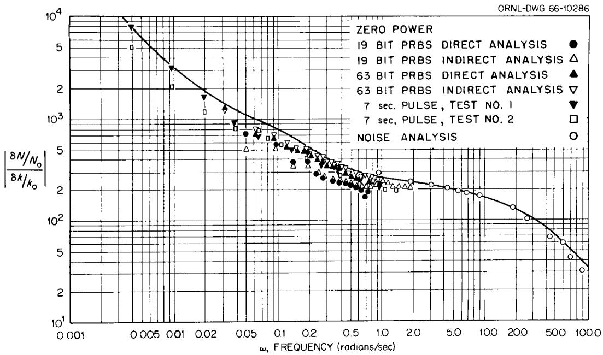

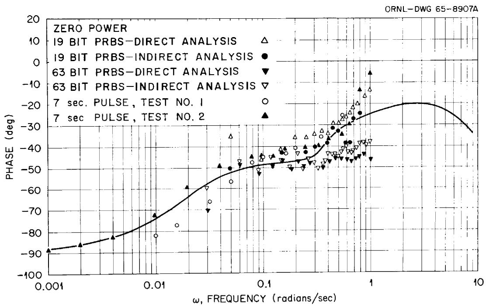  
Fig. 21. Frequency Response of $(\delta n / n_0) / (\delta k / k_0)$ at Zero Power; Fuel Circulating.

are given by

$$
\omega_ {0} = \Delta \omega = \frac {2 \pi}{Z \Delta t}. \tag {15}
$$

Sequences of 19 and 63 bits were used in the zero-power tests with bit times of 6.58 and 3.35 sec, respectively. The 19-bit sequence was generated manually, while the 63-bit test sequence, which was run after the on-line computer was operational, was generated automatically by a special shift-register algorithm. In both cases, analog computer timer circuits were used to control the rod-drive motor insert and withdraw "on" times.

The rod motion about the average position was adjusted to give a reactivity perturbation of about $\pm 0.015\%$ . As with the pulse tests, the rod-position and neutron-level signals were recorded digitally at 0.25-sec intervals using the MSRE computer. The frequency response was obtained by two different methods. The direct method used a digital filtering technique to obtain the power spectrum of the input and the cross-power spectrum of the input and output. The frequency response at some frequency is the ratio of the component of the cross-power spectrum at that frequency to the component of the input power spectrum at that frequency. The indirect method involved calculation of correlation functions and subsequent numerical Fourier transformation. Both methods gave essentially the same results. A description of the indirect method is given in ref. 23, and the direct method is discussed in ref. 21.

The results of the PRBS tests for the circulating fuel case are compared in Fig. 21 with the results from both the pulse-tests and the predicted curves. The agreement is reasonably good, considering that the stringent conditions of no temperature drift and extremely accurate rod positioning, described in Sec. 5.3 for the pulse tests, had also to be imposed on the PRBS tests.

# 5.5 Neutron Fluctuation Measurements

Flux-noise measurements were made by Roux and Fry $^{24}$ at three different zero-power conditions: fuel-salt stationary, normal fuel-salt circulation, and circulating fuel with entrained bubbles. The

fluctuations were recorded on an analog band-pass filter power-spectral-density (PSD) analyzer. One run was also digitized and analyzed by autocorrelation and digital filter techniques for comparison. All methods gave essentially equivalent results. Results of the PSD analysis for stationary and circulating fuel are shown in Figs. 20 and 21. These points were obtained by taking the square root of the measured PSD after subtracting the asymptotic high-frequency value of PSD due to noise in the neutron detection process.[25] This computation results in an amplitude-ratio vs frequency curve if one assumes that the input reactivity noise is white, that is, has a constant PSD in the frequency range of interest. Since the magnitude of the input PSD is unknown, only the relative magnitude of the noise results are available; thus the curves were arbitrarily normalized to the theoretical results at 9 radians/sec. Based on the good correspondence of noise response and theoretical response, the assumption of white noise input appears valid.

The results of the noise analysis of the case where bubbles are entrained in the fuel salt showed a substantial increase in PSD in the frequency range of 1 to 10 radians/sec over the no-bubble case, indicating an increase in the input reactivity fluctuation. Previous experiments with the MSRE core hydraulic mockup indicated that random, hydraulically induced pressure fluctuations in the core would probably cause a significant modulation of the core void fraction, thus causing reactivity fluctuations. Hence, additional flux noise in this frequency range was expected, although it was not possible to predict the "shape" or characteristics of this spectrum.

# 5.6 Transient Flow-Rate Tests

Several transient flow-rate tests were run in order to: (1) obtain startup and cooldown characteristics for fuel- and coolant-pump speeds and for coolant-salt flow rate; (2) infer fuel-salt flow-rate cooldown characteristics from the results of (1), since there is no flowmeter in the fuel loop; and (3) determine the transient effects of fuel flow-rate changes on reactivity.

Figures 22 and 23 show the fuel-pump speed, coolant-pump speed, and coolant-salt flow rate vs time for pump startup and cooldown. Data were taken with the on-line computer and with a Sanborn oscillograph. The output of a differential-pressure cell across the coolant-salt venturi was recorded directly on the oscillograph, and the square root of that signal was taken as flow rate. The lag in the response of the computer flow signal is due to the response characteristics of the EMF-to-current converter and the square-root converter between the differential-pressure transmitter and the computer input.

It was hoped that the coolant-pump speed and coolant flow rate would coast down in unison so that the fuel flow-rate coastdown could be inferred directly from the fuel-pump speed coastdown curve. This was not the case, however, and attempts to infer the fuel-flow coastdown transient were abandoned.

Reactivity effects of fuel flow-rate transients were measured by letting the flux servo controller hold the reactor critical during the transients; the reactivity added by the rod is then equal (and opposite) to the reactivity change due to the flow perturbations. Due to the absence of voids in the fuel loop during normal operation, this transient is due entirely to flow effects. Figure 24 shows the response of the

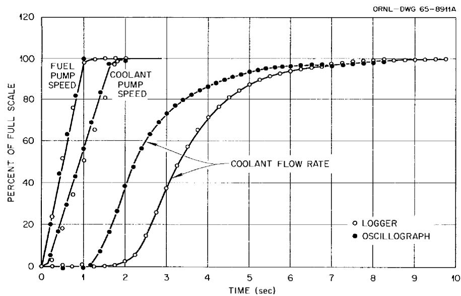  
Fig. 22. Pump Speed and Flow Startup Transients.

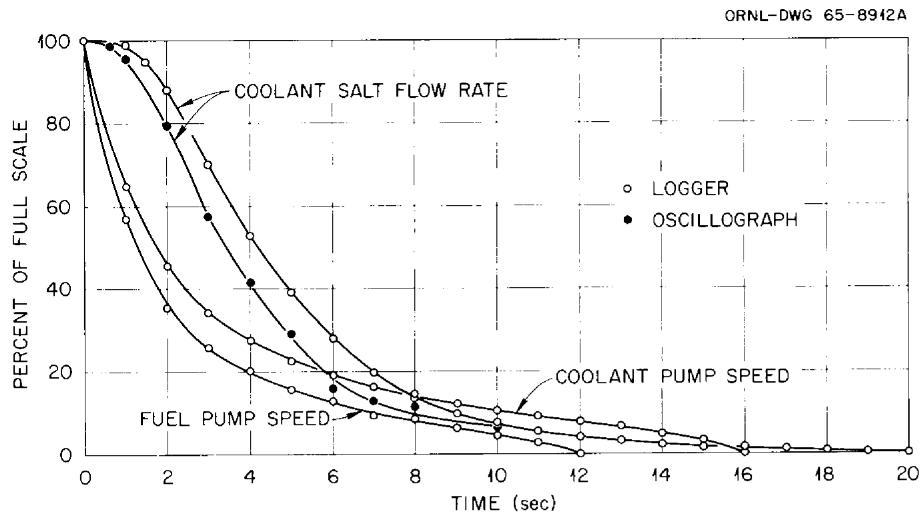  
Fig. 23. Pump Speed and Flow Coastdown Transients.

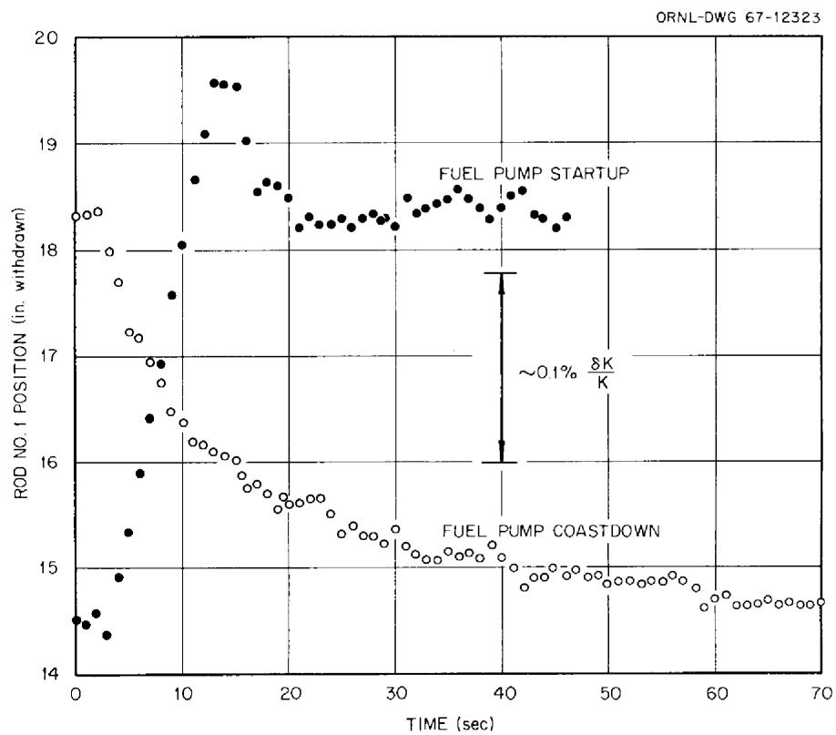  
Fig. 24. Control-Rod Response to Fuel-Pump Startup and Coastdown.

control rod in attempting to maintain the reactor critical during fuel-pump startup and cooldown. The positive reactivity effect of the recirculated precursors entering the core 13 sec after pump startup is clearly shown.

# 5.7 Conclusions from Dynamics Tests

The two most significant conclusions obtained from the dynamic tests were: (1) these tests gave results which show good agreement with theoretical predictions, giving increased confidence in the theoretical model and in the predictions for stable power operation, and (2) the selected testing procedures were, on the whole, quite satisfactory. Later tests performed over the full range of operating power levels have provided additional evidence in support of these conclusions.[21]

# 6. GENERAL CONCLUSIONS

This completes our account of the techniques and results of the program of zero-power physics measurements on the MSRE. Because the predicted neutronic characteristics were untested by experiment prior to the beginning of nuclear operation on June 1, 1965, these experiments provided an interesting test of the ability of then-available calculational programs and neutron data for the nuclear design predictions of an unusual new system. The principal interest in the results of these measurements, however, stems from their applications in interpreting the neutronic behavior during operation of the reactor at power. The essential conclusions of this program can be summarized as follows:

1. The predicted minimum critical loading of $^{235}\mathrm{U}$ in the clean fuel salt agreed with the observed $^{235}\mathrm{U}$ loading, within the limits of uncertainty in the measured fuel-salt density at operating conditions.   
2. In comparison to the calculated values of the remaining important functional neutronic characteristics of the reactor, the measured integral reactivity worths of the control rods were within $10\%$ , the $^{235}\mathrm{U}$ concentration coefficient of reactivity was within $5\%$ , and the temperature

coefficients of reactivity were within $20\%$ of the calculated quantities. This provides confidence in pre-operational nuclear-safety studies which were based on these calculations.

3. The loss of reactivity due to the transport of delayed-neutron precursors by circulation at first appeared to be smaller than would be expected from calculations. Subsequent analysis revealed the importance of including the top and bottom plenums of the reactor core in the theoretical calculations of this effect. Although these are regions of low neutron importance, they are not "out" of the neutron flux, and the increased fuel-salt volume fraction and relatively long residence times in these regions both tend to enhance the reactivity contribution of delayed neutrons emitted in transit through these regions.   
4. At normal operating levels of salt in the fuel-pump bowl, and with the "clean" fuel-salt conditions throughout the zero-power experiments, no evidence of circulating helium bubbles, entrained in the salt by the action of the pump-bowl spray-ring apparatus, was detected. In pressure transient tests at abnormally low pump-bowl levels, both the control-rod reactivity response and direct densitometer measurements indicated that $2\%$ to $3\%$ of voids by volume were in circulation with the fuel salt.   
5. Dynamics tests at zero power, which were the initial measurements in a continuing program to assess the MSRE dynamic behavior at various stages of operation, gave no evidence to support any expectation of operational stability problems in the reactor system.

# REFERENCES

1. P. N. Haubenreich et al., MSRE Design and Operations Report: Part III. Nuclear Analysis, USAEC Report ORNL-TM-730, Oak Ridge National Laboratory, February 3, 1964.   
2. MSR Program Semiann. Progr. Rept. Jan. 31, 1964, USAEC Report ORNL-3626, p. 54, Oak Ridge National Laboratory.   
3. MSR Program Semiann. Progr. Rept. Aug. 31, 1965, USAEC Report ORNL-3872, pp. 30-31, Oak Ridge National Laboratory.   
4. MSR Program Semiann. Progr. Rept. Aug. 31, 1965, USAEC Report ORNL-3872, pp. 119-121, Oak Ridge National Laboratory.   
5. A. F. Henry, "The Application of Reactor Kinetics to the Analysis of Experiments," Nucl. Sci. Eng., 3(1): 52-70 (January 1958).   
6. T. Gozani, "The Concept of Reactivity and Its Application to Kinetics Measurements," Nukleonik, 5(2): 55 (February 1963).   
7. T. Auerbach, T. Gozani, and P. Schnid, "Determination of Excess Reactivity and Control-Rod Worth," Nucl. Sci. Eng., 21(2): 186-193 (February 1965).   
8. P. N. Haubenreich, Predictions of Effective Yields of Delayed Neutrons in the MSRE, USAEC Report ORNL-TM-380, Oak Ridge National Laboratory, October 13, 1962.   
9. B. E. Prince, Period Measurements on the MSRE During Fuel Circulation: Theory and Experiment, USAEC Report ORNL-TM-1626, Oak Ridge National Laboratory, October 1966.   
10. S. J. Ball and R. K. Adams, MATEXP - A General Purpose Digital Computer Program for Solving Ordinary Differential Equations by the Matrix Exponential Method, USAEC Report ORNL-TM-1933, August 1967.   
11. MSR Program Semiann. Progr. Rept. Feb. 28, 1966, USAEC Report ORNL-3936, pp. 82-87, Oak Ridge National Laboratory.   
12. G. D. Joanou and J. S. Dudek, GAM-II - A B₃ Code for the Calculation of Fast-Neutron Spectra and Associated Multigroup Constants, GA-4265, General Atomic, September 1963.   
13. H. C. Honeck, THERMOS - A Thermalization Transport Theory Code for Reactor Lattice Calculations, USAEC Report BNL-5826, Brookhaven National Laboratory, September 1961.

14. J. Replogle, MODRIC - A One-Dimensional Neutron Diffusion Code for the IBM-7090, USAEC Report K-1520, Oak Ridge Gaseous Diffusion Plant, September 6, 1962.   
15. T. B. Fowler and M. L. Tobias, EQUIPOISE-3: A Two-Dimensional, Two-Group, Neutron-Diffusion Code for the IBM-7090 Computer, USAEC Report ORNL-3199, Oak Ridge National Laboratory, February 7, 1962.   
16. T. B. Fowler, M. L. Tobias, and D. R. Vondy, EXTERMINATOR: A Multi-group Code for Solving Neutron Diffusion Equations in One and Two Dimensions, USAEC Report ORNL-TM-842, February 1965.   
17. MSR Program Semiann. Progr. Rept. Aug. 31, 1961, USAEC Report ORNL-3215, p. 83, Oak Ridge National Laboratory.   
18. MSR Program Semiann. Progr. Rept. Aug. 31, 1965, USAEC Report ORNL-3872, pp. 62-65, Oak Ridge National Laboratory.   
19. H. A. Samulon, "Spectrum Analysis of Transient Response Curves," Proc. I. R. E., 39: 175-186 (February 1951).   
20. S. J. Ball and T. W. Kerlin, Stability Analysis of the Molten-Salt Reactor Experiment, USAEC Report ORNL-TM-1070, Oak Ridge National Laboratory, December 1965.   
21. T. W. Kerlin and S. J. Ball, Experimental Dynamic Analysis of the Molten-Salt Reactor Experiment, USAEC Report ORNL-TM-1647, Oak Ridge National Laboratory, October 13, 1966.   
22. T. W. Kerlin, The Pseudorandom Binary Signal for Frequency Response Testing, USAEC Report ORNL-TM-1662, Oak Ridge National Laboratory, September 1966.   
23. T. W. Kerlin and J. L. Lucius, CABS - A Fortran Computer Program for Calculating Correlation Functions, Power Spectra, and the Frequency Response from Experimental Data, USAEC Report ORNL-TM-1663, September 1966.   
24. D. N. Fry and D. P. Roux, Oak Ridge National Laboratory, personal communication, October 1965. These measurements are also reported in "Neutron Noise, Waves, and Pulse Propagation," ABC Symposium Series, No. 9, pp. 463-474 (May 1967).   
25. C. W. Ricker, S. H. Hanauer, and E. R. Mann, Measurement of Reactor Fluctuation Spectra and Subcritical Reactivity, USAEC Report ORNL-TM-1066, Oak Ridge National Laboratory, April 1965.

__________

# Internal Distribution

1. R.K. Adams   
2. R.G.Affel   
3. R.F.Apple   
4. D. S. Asquith   
5. C.F.Baes   
6. S.J.Ball   
7. H.F. Bauman   
8. S.E.Beall   
9. M. Bender   
10. E. S. Bettis   
11. F. F. Blankenship   
12. R. Blumberg   
13. E. G. Bohlmann   
14. C. J. Borkowski   
15. G. E. Boyd   
16. R. B. Briggs   
17. R.H. Bryan   
18. J.M.Chandler   
19. R.H.Chapman   
20. F. H. Clark   
21. C. E. Clifford   
22. W.R.Cobb   
23. W.H.Cook   
24. L. T. Corbin   
25. W. B. Cottrell   
26. J. L. Crowley   
27. F. L. Culler, Jr.   
28. D. G. Davis   
29. R.J.DeBakker   
30. S.J.Ditto   
31. F. A. Doss   
32. W.P.Eatherly   
33. J. R. Engel   
34. E.P.Epler   
35. D. E. Ferguson   
36. A. P. Fraas   
37. D. N. Fry   
38. J.H.Frye, Jr.   
39. H. A. Friedman   
40. C. H. Gabbard   
41. R. B. Gallaher   
42. W. R. Grimes   
43. A. G. Grindell   
44. E. D. Gupton   
45. R.H.Guymon

46. P. H. Harley

47. P. N. Haubenreich

48. P. G. Herndon

49. T. L. Hudson

50. E. B. Johnson

51. W.H.Jordan

52. S. I. Kaplan

53. P. R. Kasten

54. R.J.Kedl

55. M. T. Kelley

56. T. W. Kerlin

57. S. S. Kirslis

58. A. I. Krakoviak

59. J. W. Krewson

60. R.C.Kryter

61. J.A.Lane

62. C. E. Larson

63. R. B. Lindauer

64. M. I. Lundin

65. R. N. Lyon

66. H. G. MacPherson

67. R. E. MacPherson

68. C. D. Martin

69. T. H. Mauney

70. H. E. McCoy

71. H.C.McCurdy

72. H. F. McDuffie

73. C. K. McGlothlan

74. A. J. Miller

75. R. L. Moore

76. E. L. Nicholson

77. L.C.Oakes

78. A. M. Perry

79. H. B. Piper

80-84. B. E. Prince

85. G. L. Ragan

86. J. L. Redford

87. M. Richardson

83. R.C.Robertson

89. J. C. Robinson

90-114. M. W. Rosenthal

115. A. W. Savolainen

116. D. Scott, Jr.

117. J.H.Shaffer

118. E.G.Silver

119. M. J. Skinner   
120. A.N. Smith   
121. O. L. Smith   
122. P.G. Smith   
123. I. Spiewak   
124. D. A. Sundberg   
125. R.C.Steffy, Jr.   
126. H. H. Stone   
127. J. R. Tallackson   
128. R.E.Thoma   
129. D. B. Trauger   
130. C. S. Walker   
131. B.H. Webster

132. A. M. Weinberg   
133. J.R.Weir   
134. K. W. West   
135. M. E. Whatley   
136. J.C. White   
137. G. D. Whitman   
138. Gale Young

139-141. Central Research Library

142-143. Y-12 Document Reference Section

144-209. Laboratory Records Department

210. Laboratory Records Department, ORNL-RC

# External Distribution

211. C. B. Deering, USAEC, ORO, Oak Ridge   
212-213. K. E. Elliott, USAEC, ORO, Oak Ridge   
214. H. M. Roth, USAEC, ORO, Oak Ridge   
215. J. W. Lewellyn, USAEC, Division of Reactor Development and Technology, Washington, D. C.   
216-223. T. W. McIntosh, USAEC, Division of Reactor Development and Technology, Washington, D. C.   
224. E. E. Purvis, USAEC, Division of Reactor Development and Technology, Washington, D. C.   
225. T. G. Schleiter, USAEC, Division of Reactor Development and Technology, Washington, D. C.   
226. M. Shaw, USAEC, Division of Reactor Development and Technology, Washington, D. C.   
227. Laboratory and University Division, USAEC, ORO, Oak Ridge   
228-484. Given distribution as shown in TID-4500 under Reactor Technology category (25 copies - CFST1)