ORNL-4254

UC-80 - Reactor Technology

MOLTEN-SALT REACTOR PROGRAM

SEMIANNUAL PROGRESS REPORT

FOR PERIOD ENDING FEBRUARY 29, 1968

ORNL TECHNICAL INFORMATION DIVISION

Y-12 TECHNICAL LIBRARY

Document Reference Section

LOAN COPY ONLY

Do NOT transfer this document to any other person. If you want others to see it, attach their names, return the document, and the Library will arrange the loan as requested.

UCN-1624  
[3 5-60]

MOAK RIDGE NATIONAL LABORATORY

operated by

UNION CARBIDE CORPORATION

for the

U.S. ATOMIC ENERGY COMMISSION

Printed in the United States of America. Available from Clearinghouse for Federal

Scientific and Technical Information, National Bureau of Standards,

U.S. Department of Commerce, Springfield, Virginia 22151

Price: Printed Copy $3.00; Microfiche $0.65

# LEGAL NOTICE

This report was prepared as an account of Government sponsored work. Neither the United States, nor the Commission, nor any person acting on behalf of the Commission:

A. Makes any warranty or representation, expressed or implied, with respect to the accuracy, completeness, or usefulness of the information contained in this report, or that the use of any information, apparatus, method, or process disclosed in this report may not infringe privately owned rights; or   
B. Assumes any liabilities with respect to the use of, or for damages resulting from the use of any information, apparatus, method, or process disclosed in this report.

As used in the above, "person acting on behalf of the Commission" includes any employee or contractor of the Commission, or employee of such contractor, to the extent that such employee or contractor of the Commission, or employee of such contractor prepares, disseminates, or provides access to, any information pursuant to his employment or contract with the Commission, or his employment with such contractor.

Contract No. W-7405-eng-26

MOLTEN-SALT REACTOR PROGRAM

SEMIANNUAL PROGRESS REPORT

For Period Ending February 29, 1968

M. W. Rosenthal, Program Director   
R. B. Briggs, Associate Director   
P. R. Kasten, Associate Director

AUGUST 1968

OAK RIDGE NATIONAL LABORATORY

Oak Ridge, Tennessee

operated by

UNION CARBIDE CORPORATION

for the

U.S. ATOMIC ENERGY COMMISSION

This report is one of a series of periodic reports in which we describe briefly the progress of the program. Other reports issued in this series are listed below. ORNL-3708 is an especially useful report, because it gives a thorough review of the design and construction and supporting development work for the MSRE. It also describes much of the general technology for molten-salt reactor systems.

ORNL-2474 Period Ending January 31, 1958

ORNL-2626 Period Ending October 31, 1958

ORNL-2684 Period Ending January 31, 1959

ORNL-2723 Period Ending April 30, 1959

ORNL-2799 Period Ending July 31, 1959

ORNL-2890 Period Ending October 31, 1959

ORNL-2973 Periods Ending January 31 and April 30, 1960

ORNL-3014 Period Ending July 31, 1960

ORNL-3122 Period Ending February 28, 1961

ORNL-3215 Period Ending August 31, 1961

ORNL-3282 Period Ending February 28, 1962

ORNL-3369 Period Ending August 31, 1962

ORNL-3419 Period Ending January 31, 1963

ORNL-3529 Period Ending July 31, 1963

ORNL-3626 Period Ending January 31, 1964

ORNL-3708 Period Ending July 31, 1964

ORNL-3812 Period Ending February 28, 1965

ORNL-3872 Period Ending August 31, 1965

ORNL-3936 Period Ending February 28, 1966

ORNL-4037 Period Ending August 31, 1966

ORNL-4119 Period Ending February 28, 1967

ORNL-4191 Period Ending August 31, 1967

# Contents

INTRODUCTION ix

SUMMARY xi

# PART 1. MOLTEN-SALT REACTOR EXPERIMENT

1.MSRE OPERATIONS 1

1.1 Chronological Account of Operations and Maintenance 1   
1.2 Operations Analysis 3

1.2.1 Reactivity Balance 3   
1.2.2 Variations in Reactor Access Nozzle Temperatures 7   
1.2.3 Radiation Heating 9   
1.2.4 Thermal Cycle History 9   
1.2.5 $^{236}\mathrm{U}$ Indication of Integrated Power 10

1.3 Equipment Performance 11

1.3.1 SaltPumps 11   
1.3.2 Heat Transfer 11   
1.3.3 Salt Samplers 12   
1.3.4 Control Rods and Drives 13   
1.3.5 Radiator Enclosure 13   
1.3.6 Off-Gas Systems 13   
1.3.7 Main Blowers 14   
1.3.8 Heaters 15   
1.3.9 Electrical System 15   
1.3.10 Salt Pump Oil Systems 16   
1.3.11 Cooling Water System 16   
1.3.12 Component Cooling Systems 17   
1.3.13 Containment and Ventilation 17

2. COMPONENT DEVELOPMENT 19

2.1 Off-Gas Sampler 19   
2.2 Fuel Sampler-Enricher 20   
2.3 Decontamination Studies 20   
2.4 Study of Pin-Hole Camera for Gamma Source Mapping 22   
2.5 Freeze-Flange Thermal Cycle Tests 23   
2.6Pumps 29

2.6.1 Mark 2 Fuel Pump 29   
2.6.2 MSRE Oil Pumps 29   
2.6.3 Oil Pump Endurance Test 29

# 3. INSTRUMENTS AND CONTROLS 30

3.1 MSRE Operating Experience 30

3.1.1 Safety System Components 30   
3.1.2 Thermocouples 30   
3.1.3 Other Instruments and Controls 31

3.2 Control System Design 31

3.3 MSRE Neutron Noise Analysis 32   
3.4 Test of MSRE Rod Control System Under Simulated $^{233}\mathrm{U}$ Loading Conditions 32   
3.5 Analog Computer Studies of the MSRE System with $^{23}$ U Fuel Loading 35

# 4.MSRE REACTOR ANALYSIS 36

4.1 Introduction 36   
4.2 Simulation of Nuclear Excursion Incidents 37

4.2.1 Uncontrolled Rod Withdrawal 37   
4.2.2 Return of Separated Uranium to the Core 40

4.3 Detection of Anomalous Reactivity Effects 47

# PART 2. MSBR DESIGN AND DEVELOPMENT

# 5. DESIGN 51

5.1 General 51   
5.2 Flow Diagram 51   
5.3 Plant Layout 53   
5.4 Reactor Vessel and Core 55   
5.5 Primary Heat Exchanger 61   
5.6 Fuel Drain Tank 61

# 6. REACTOR PHYSICS 66

6.1 MSBR Physics Analysis 66

6.1.1 Reference Reactor 66   
6.1.2 Fuel-Cycle Costs 70   
6.1.3 Cell Calculations 70   
6.1.4 Reactivity Coefficients 71   
6.1.5 Measurements of Eta for $^{233}\mathrm{U}$ and $^{235}\mathrm{U}$ in the MSRE 72

# 7. SYSTEMS AND COMPONENTS DEVELOPMENT 74

7.1 Noble Gas Behavior in an MSBR 74   
7.2 Sodium Fluoroborate Circulating Loop Test 75

7.3 MSBR Pumps 75

7.3.1 Pump Program 75   
7.3.2 Fuel Salt Pump. 76   
7.3.3 Coolant Salt Pump 78   
7.3.4 Molten-Salt Pump Test Facility 78   
7.3.5 Molten-Salt Bearing Program 79   
7.3.6 Rotor-Dynamics Feasibility Investigation 82

7.4 Remote Maintenance 82

8. MSBR INSTRUMENTATION AND CONTROLS 85

8.1 Analog Computer Studies 85

# PART 3. CHEMISTRY

9. CHEMISTRY OF THE MSRE 88

9.1 Fuel Salt Composition and Purity 89   
9.2 MSRE Fuel Circuit Corrosion Chemistry 90   
9.3 Isotopic Composition of Uranium in MSRE Fuel Salt 93

10. FISSION PRODUCT BEHAVIOR 94

10.1 Fission Product Behavior in the MSRE 94

10.1.1 Fission Products in the MSRE Fuel 94   
10.1.2 Fission Products in the MSRE Cover Gas 96   
10.1.3 Deposition of Fission Products from MSRE Cover Gas on Metal Specimens 96   
10.1.4 Examination of MSRE Surveillance Specimens After 24,000 Mwhr 99   
10.1.5 Hot-Cell Tests on Fission Product Volatilization from Molten MSRE Fuel 100   
10.1.6 Miscellaneous Tests 108

10.2 Fission Product Distribution in an MSRE Graphite Surveillance Specimen 115   
10.3 Proton Reaction Analysis for Lithium and Fluorine in MSR Graphite 119   
10.4 Surface Phenomena in Molten Salts 125

11. CHEMISTRY OF FISSION PRODUCT FLUORIDES 129

11.1 Properties of Molybdenum Fluorides 129

11.1.1 Synthesis of $\mathbf{MoF}_3$ and $\mathbf{MoF}_5$ 129   
11.1.2 Lithium Fluoromolybdates(III) 130   
11.1.3 Kinetics of $\mathsf{MoF}_3$ Behavior in 2LiF-BeF 2 131

11.2 Mass Spectrometry of the Molybdenum Fluorides 134   
11.3 Spectroscopic Studies of Fission Product Fluorides 136   
11.4 Preparation of Niobium Pentafluoride 137

12. PHYSICAL CHEMISTRY OF MOLTEN SALTS 138

12.1 Thermodynamics of $\mathrm{LiF - BeF}_2$ Melts by EMF Measurements 138   
12.2 Electrolysis of LiF-BeF, Mixtures with a Bismuth Cathode 140   
12.3 A Review of Electrical Conductivities in Molten Fluoride Systems 141   
12.4 Measurement of Specific Conductance in LiF-BeF $_2$ (66-34 mole %) 144   
12.5 A Stirred Reaction Vessel for Molten Fluorides 146   
12.6 The Chemistry of Silica in Molten LiF-BeF 2 146   
12.7 A Silica Cell and Furnace for Electrochemical Measurements with Fused Fluorides 149   
12.8 Status of the Molten-Salt Chemistry Information Center 149

13. CHEMISTRY OF MOLTEN-SALT REACTOR FUEL REPROCESSING TECHNOLOGY 152

13.1 MSBR Fuel Reprocessing by Reductive Extraction into Molten Bismuth 152   
13.2 Removal of Structural Metal Fluorides from a Simulated MSRE Fuel Solvent 155

13.2.1 Reduction of Structural Metal Fluorides 155   
13.2.2 Salt Filtration Studies. 157

13.3 Protactinium Studies in the High-Alpha Molten-Salt Laboratory 159

13.3.1 Protactinium Reduction by Solid Thorium in the Near Absence of Iron 159   
13.3.2 Reduction of Protactinium by Bismuth-Uranium Alloy 159   
13.3.3 Reduction of Protactinium by Bismuth-Thorium Alloys 160   
13.3.4 Two-Region Breeder Blanket Composition 160   
13.3.5 Single-Region Fuel Composition 161

14. BEHAVIOR OF $\mathbf{BF}_3$ AND FLUOROBORATE MIXTURES 166

14.1 Phase Relations in Fluoroborate Systems 166   
14.1.1 The System NaF-NaBF $^4$ -KBF $^4$ -KF 166

14.2 Nonideality of Mixing in Potassium Fluoroborate-Sodium (or Potassium) Fluoride Systems 167   
14.3 Heat Content of $\mathrm{NaBF}_4$ -NaF (92.5-7.5 mole %) 168   
14.4 The Solubility of Thorium Metal in Lithium Fluoride-Thorium Tetrafluoride Mixtures 168   
14.5 Dissociation Pressure of $\mathbf{BF}_3$ for the MSRE Substitute Coolant 169   
14.6 Chemical Thermodynamics of the System NaBF 4NaF 170   
14.7 Corrosion of Hastelloy N and Its Constituents in Fluoroborate Melts 171   
14.8 Compatibility and Immiscibility of Molten Fluorides 171

# PART 4. MOLTEN-SALT IRRADIATION EXPERIMENTS

15. MOLTEN-SALT CONVECTION LOOP IN THE ORR 174

15.1 Isotope Activity Balance (Loop 2) 175   
15.2 Penetration of Fission Products into Graphite and Deposition onto Surfaces 175   
15.3 Studies of Surface Wetting of Graphite by Molten Salt 178   
15.4 Design of a Third In-Pile Molten-Salt Loop 178

16. GAMMA IRRADIATION OF FLUOROBORATE 180

# PART 5. MATERIALS DEVELOPMENT

17. MSRE SURVEILLANCE PROGRAM 183

17.1 General Comments 183   
17.2 Examination of Hastelloy N Specimens from MSRE Surveillance Facility 184

18. GRAPHITE STUDIES 188

18.1 Procurement of Special Grades of Graphite 188   
18.2 Porosity Created in Grade AXF Graphite by Oxidation Pretreatment 189   
18.3 X-Ray Studies on Graphite 190

18.4 Gas Impregnation of Graphite with Carbon 191   
18.5 Graphite Surface Sealing with Metals 192   
18.6 Graphite Irradiation Program 195   
18.7 Nondestructive Testing Studies 196   
18.7.1 Graphite Ultrasonic Velocity Measurements 196   
18.7.2 Low-Voltage Radiography 197

19. HASTELLOY N 198

19.1 Influence of Strain Rate on the Fracture Strain of Hastelloy N 198   
19.2 Status of Development of the Modified Alloy 201   
19.3 Effect of Carbon and Titanium on the Unirradiated Creep-Rupture Properties of Ni-Mo-Cr Alloys 204   
19.4 Electrical Resistivity of Titanium-Modified Hastelloy N 205   
19.5 Electron Microscope Studies of Hastelloy N 206

19.5.1 Phase Identification Studies in Hastelloy N 206   
19.5.2 Effect of Silicon on Precipitation in Hastelloy N. 209   
19.5.3 Titanium-Modified Hastelloy N 212   
19.5.4 Summary 213

19.6 Diffusion of Titanium in Modified Hastelloy N. 213   
19.7 Measurement of Residual Stresses in Hastelloy N Welds 215   
19.7.1 Experimental Results 216

19.8 Application of the Narrow-Gap Welding Process to the Joining of Hastelloy N 217

19.9 Natural Circulation Loops and Test Capsules 218

19.9.1 Fuel Salts 218   
19.9.2 Blanket Salts 221   
19.9.3 Coolant Salts 221

19.10 Forced Circulation Loop 226   
19.11 Oxidation of Hastelloy N 228

20. GRAPHITE-TO-METAL JOINING 231

20.1 Graphite Brazing Development 231   
20.2 Radiation Stability of Brazing Alloys of Interest for Brazing Graphite 234   
20.3 Graphite-to-Hastelloy N Transition Joint 235

20.3.1 Conceptual Design 235   
20.3.2 Heavy-Metal Alloy Development 236

20.4 Nondestructive Testing Evaluation of Graphite-to-Metal Joints 238

21. SUPPORT FOR COMPONENTS DEVELOPMENT PROGRAM 240   
21.1 Remote Welding 240

# PART 6. MOLTEN-SALT PROCESSING AND PREPARATION

22. MEASUREMENT OF DISTRIBUTION COEFFICIENTS IN MOLTEN-SALT-METAL SYSTEMS 241

22.1 Extraction of Uranium and Rare Earths from Fuel Salt of Two-Fluid MSBR's 242   
22.2 Extraction of Uranium from Single-Fluid MSBR Fuel 243   
22.3 Experimental Procedure and Lithium "Loss" 247

23. PROTACTINIUM REMOVAL FROM A SINGLE-FLUID MSBR 248   
24. CONTINUOUS FLUORINATION OF MOLTEN SALT 252   
25. RELATIVE VOLATILITY MEASUREMENTS BY THE TRANSPiration METHOD 255   
26. DISTILLATION OF MSRE FUEL CARRIER SALT 258   
27. PROTACTINIUM REMOVAL FROM A TWO-FLUID MSBR 260   
28. RECOVERY OF URANIUM FROM MSRE FUEL SALT BY FLUORINATION 264

28.1 Fluorination-Corrosion Study 264   
28.2 Fission Product Behavior - Analytical Assistance Program 266

29.MSRE FUEL SALT PROCESSING 269   
30. PREPARATION OF $^7\mathrm{LiF - }^{233}\mathrm{UF}_4$ FUEL CONCENTRATE FOR THE MSRE 270

30.1 Equipment Changes 270   
30.2 Equipment and Process Status 271

31. DECAY HEAT GENERATION RATE IN A SINGLE-REGION MOLTEN-SALT REACTOR 275

# Introduction

The objective of the Molten-Salt Reactor Program is the development of nuclear reactors which use fluid fuels that are solutions of fissile and fertile materials in suitable carrier salts. The program is an outgrowth of the effort begun over 18 years ago in the Aircraft Nuclear Propulsion (ANP) program to make a molten-salt reactor power plant for aircraft. A molten-salt reactor - the Aircraft Reactor Experiment - was operated at ORNL in 1954 as part of the ANP program.

Our major goal now is to achieve a thermal breeder reactor that will produce power at low cost while simultaneously conserving and extending the nation's fuel resources. Fuel for this type of reactor would be $^{233}\mathrm{UF}_4$ or $^{235}\mathrm{UF}_4$ dissolved in a salt that is a mixture of LiF and $\mathrm{BeF}_2$ . The fertile material would be $\mathrm{ThF}_4$ dissolved in the same salt or in a separate blanket salt of similar composition. The technology being developed for the breeder is also applicable to advanced converter reactors.

A major program activity is the operation of the Molten-Salt Reactor Experiment (MSRE). This reactor was built to test the types of fuels and materials that would be used in thermal breeder and converter reactors and to provide experience with the operation and maintenance of a molten-salt reactor. The MSRE operates at $1200^{\circ}\mathrm{F}$ and at atmospheric pressure and produces about 7.5 Mw of heat. The initial fuel contains 0.9 mole $\%$ UF $_4$ , 5 mole $\%$ ZrF $_4$ , 29 mole $\%$ BeF $_2$ , and 65 mole $\%$ LiF, and the uranium is about $33\%^{23}5\mathrm{U}$ . The melting point is $840^{\circ}\mathrm{F}$ .

The fuel circulates through a reactor vessel and an external pump and heat exchange system. All this equipment is constructed of Hastelloy N, a nickel-molybdenum-chromium alloy with exceptional resistance to corrosion by molten fluorides and with high strength at high temperature. The reactor core contains an assembly of graphite moderator bars that are in direct contact with the fuel. The

graphite is a new material having high density and small pore size. The fuel salt does not wet the graphite and therefore does not enter the pores, even at pressures well above the operating pressure.

Heat produced in the reactor is transferred to a coolant salt in the primary heat exchanger, and the coolant salt is pumped through a radiator to dissipate the heat to the atmosphere.

Design of the MSRE started early in the summer of 1960, and fabrication of equipment began early in 1962. The essential installations were completed, and prenuclear testing was begun in August of 1964. Following prenuclear testing and some modifications, the reactor was taken critical on June 1, 1965, and zero-power experiments were completed early in July. After additional modifications, maintenance, and sealing of the containment, operation at a power of 1 Mw began in January 1966.

At the 1-Mw power level, trouble was experienced with plugging of small ports in control valves in the off-gas system by heavy liquid and varnish-like organic materials. These materials are believed to be produced from a very small amount of oil that leaks through a gasketed seal and into the salt in the tank of the fuel circulating pump. The oil vaporizes and accompanies the gaseous fission products and helium cover gas purge into the off-gas system. There the intense beta radiation from the krypton and xenon polymerizes some of the hydrocarbons, and the products plug small openings. This difficulty was overcome by installing a specially designed filter in the off-gas line.

Full power, about 7.5 Mw, was reached in May 1966. The plant was operated until the middle of July for about six weeks at full power, when one of the radiator cooling blowers (which were left over from the ANP program) broke up from mechanical stress. While new blowers were being procured, an array of graphite and metal surveillance

specimens was taken from the core and examined.

Power operation was resumed in October with one blower; then in November the second blower was installed, and full power was again attained. After a shutdown to remove salt that had accidentally gotten into an off-gas line, the MSRE was operated in December and January at full power for 30 days without interruption. The next power run was begun later in January and was continued for 102 days until terminated to remove a second set of graphite and metal specimens. An additional operating period of 46 days during the summer was interrupted for maintenance work on the sampler-enricher when the cable drive mechanism jammed.

In September 1967, a run was begun which continued for six months until terminated on schedule in March 1968. Power operation during this run had to be interrupted once when the reactor was taken to zero power to repair an electrical short in the sampler-enricher.

Completion of this six-month run brings to a close the first phase of MSRE operation, in which the objective was to demonstrate on a small scale the attractive features and technical feasibility of these systems for civilian power reactors. We believe this objective has been achieved and that the MSRE has shown that molten fluoride reactors can be operated at temperatures above $1200^{\circ}\mathrm{F}$ without corrosive attack on either the metal or graphite parts of the system, that the fuel is completely stable, that reactor equipment can operate satisfactorily at these conditions, that xenon can be removed rapidly from molten salts, and that, when necessary, the radioactive equipment can be repaired or replaced.

The second phase of MSRE operation will be operation with $^{233}\mathrm{U}$ fuel in place of $^{235}\mathrm{U}$ . A small facility in the MSRE building will be used to remove the uranium presently in the fuel salt by treatment with gaseous $\mathbf{F}_2$ . Highly pure $^{233}\mathrm{U}$ will then be added to the present carrier salt, and critical, low-power, and full-power tests will be performed.

A large part of the Molten-Salt Reactor Program is now being devoted to the requirements of future molten-salt reactors. Conceptual design studies and evaluations are being made of large breeder reactors, and an increasing amount of work on materials, on the chemistry of fuel and coolant salts, and on processing methods is included in the research and development program.

For several years, most of our work on breeder reactors has been aimed specifically at two-fluid systems in which graphite tubes are used to separate uranium-bearing fuel salts from thorium-bearing fertile salts. We think attractive reactors of this type can be developed, but the core designs we have been working on are complex, and several years of experience with a prototype reactor would be required to prove that graphite can serve as a plumbing material while exposed to high fast-neutron irradiations. As a consequence, a one-fluid breeder has been a long-sought goal.

Two developments of the past year have established the feasibility of a one-fluid breeder. The first was establishment of the chemical steps in a process which uses liquid bismuth to extract protactinium and uranium selectively from a salt that also contains thorium. The second was the recognition that a fertile blanket can be obtained with a salt in which there is uranium as well as thorium by reducing the graphite-to-fuel ratio in the outer part of the core. Our studies show that a one-fluid, two-region breeder can be built that has fuel utilization characteristics comparable to our two-fluid designs, and probably better economics. Since the graphite serves only as moderator, the one-fluid reactor is more nearly a scaleup of the MSRE.

These features have caused us to change the emphasis of our breeder program from the two-fluid to the one-fluid breeder. Work on both performed during the past six months is described in this report, but most of our design and development effort is now directed to the one-fluid system.

# Summary

# PART 1. MOLTEN-SALT REACTOR EXPERIMENT

# 1. MSRE Operations

This report period was almost completely occupied with a long run that began in September and was still going at the end of February. When operations were first resumed after the fuel sampler mechanism was replaced, some difficulties were encountered with a radiator door and a component cooling pump. Once the long run was under way, however, the only delay was occasioned by a wiring failure in the sampler-enricher in November.

The very long run, without the complicating effects of drains and dilutions or fuel additions, afforded opportunity for very close comparison of predicted and observed long-term changes in reactivity. A gradual deviation between observed and computed reactivity of $-3.5 \times 10^{-6} (\% \delta k / k)$ Mwhr was seen.

An experiment on the effect of minor variations in fuel temperature, system pressure, and fuel salt level on fission gas stripping extended over a two-month period. There were several different indications that lower temperature, higher pressure, and lower salt level increased the volume of gas circulating with the fuel and delayed the stripping of fission gases into the cover gas.

Component performance was generally quite good. Two bearings on the main blowers were replaced during a period at low power in January, and the standby component cooling pump was not operable during most of the run. However, neither of these delayed the operation. The wiring failure in the sampler-enricher interrupted high-power operation for nine days, but it was not necessary to drain the fuel.

During the six-month period, the reactor was critical $89\%$ of the time, and the integrated power increased to 8581 equivalent full-power hours.

# 2. Component Development

The installation and preoperational testing of the off-gas sampler were completed. Four samples of reactor off-gas were removed for xenon isotopic analysis.

The isolation chamber and drive assembly that was removed from the sampler-enricher was examined and disassembled in a hot cell. After successful decontamination, the major part of the unit was returned for use as a spare. A proximity switch was tested that promises to help prevent cable snarls such as that which rendered the sampler inoperative. A heated carrier utilizing molten babbitt was built to keep samples hot in transit to the analytical laboratory.

Tests of a pinhole gamma-ray camera for locating radiation sources showed promise.

Thermal cycling of a prototype freeze flange was resumed to lend confidence to predictions of fatigue life.

The hot-test facility for the Mark 2 fuel pump was prepared, and the rotary element assembly was nearly finished.

# 3. Instruments and Controls

Only a moderate amount of maintenance on the reactor systems was required. Five of the fifteen relays in the rod scram coincidence circuit failed, leading to a decision to replace them with a different type of relay. Water leaks in nuclear chamber cables continued to give trouble, and two fission chambers and an ionization chamber had to be replaced. A second failure occurred in a position synchro on one of the control rods.

A few minor modifications were made, and some design required for salt processing was completed.

Equipment and procedures for analysis of neutron noise spectra were tested and used to obtain data pertinent to reactor operation under various conditions.

The adequacy of the rod servo control system with $^{23}$ fuel was investigated. No need for modification appeared.

# 4. MSRE Reactor Analysis

Reactor physics studies in support of planned operation of the MSRE with $^{233}\mathrm{U}$ were extended to help evaluate the nuclear safety of the system. As was the case with the present $^{235}\mathrm{U}$ fuel loading, the potentially most severe nuclear excursions were associated with two hypothetical incidents: reactivity addition by the simultaneous withdrawal of the three control rods, and the gradual separation of uranium from the mainstream of circulating salt, followed by its sudden resuspension and rapid return to the core in concentrated form. Both incidents were analyzed with the aid of a digital kinetics program supplemented by analog simulation. In the first incident, we found that rod scram initiated by the action of the safety system would limit the temperature-pressure rises in the nuclear excursion to inconsequential proportions. This same conclusion would apply in the case of the second incident, unless the abnormal reactivity loss represented by the uranium separation became larger than about $0.95\% \delta k / k$ . This abnormal reactivity loss would be easily detectable by routine computer monitoring of the reactivity balance, which should reveal any anomaly as large as $0.1\% \delta k / k$ .

# PART 2. MSBR DESIGN AND DEVELOPMENT

# 5. Design

Developments in fuel processing and reactor core configurations that enable a one-fluid molten-salt reactor to be an efficient breeder have led us to set aside our work on the design of a two-fluid breeder reactor and to undertake studies of a one-fluid breeder. The fuel for the one-fluid breeder consists of fissile uranium and fertile thorium as tetrafluorides dissolved in a lithium fluoride-beryllium fluoride carrier salt. We have been working on the design of a 2000 Mw (electrical) reactor in which the fuel circulates upward around vertical graphite bars in a reactor vessel and then completes the circuit through four pumps and four heat exchangers. As in our designs for two-fluid reactors, the reactor vessel, heat exchangers, and

pumps are installed in a heated and shielded cell. Steam generating equipment is installed in cells adjacent to the reactor cell, and sodium fluoroborate salt circulates between the primary heat exchangers and the steam generators to transfer the fission heat to supercritical steam.

Also communicating with the reactor cell are a fuel processing cell, an off-gas disposal cell, and a drain tank cell for storing fuel salt when the reactor is drained.

Basic piping layouts have been made for the fuel and coolant salt systems. A system has been conceived for cooling the drain tank by thermal convection of sodium fluoroborate salt between coils in the drain tank and air-cooled coils in a natural-draft chimney outside the reactor building.

# 6. Reactor Physics

Neutronic calculations of a single-fluid maltensalt breeder reactor, with fissile and fertile materials carried in the same salt stream, have shown that breeding performance comparable with that of a two-fluid MSBR can be achieved, provided the core is properly designed to minimize neutron leakage. Breeding ratios of 1.05 to 1.07, fuel specific power of 2 to $2.5\mathrm{Mw}$ (thermal)/kg, and annual fuel yields of about $5\%$ /year appear to be attainable with fuel processing rates which probably imply fuel-cycle costs less than 0.5 mill/kwhr (electrical).

Such a reactor would have a small negative overall isothermal temperature coefficient of reactivity and a substantially negative prompt coefficient, that is, $\sim -3\times 10^{-5}\delta k / ^{\circ}C$ associated with a change in salt temperature alone.

# 7. Systems and Components Development

The analytical model used to compute the steady-state migration of noble gases to the graphite and other sinks in an MSBR was extended to study the effects of graphite surface area and surface coatings on the xenon poison fraction. It was shown that an 8-mil coating of material with a diffusion coefficient of $10^{-8}$ ft $^2$ /hr would reduce the poison fraction from $2\frac{1}{4}\%$ to the target value of $0.5\%$ .

The alterations to and checkout of the test facility for operation with sodium fluoroborate were completed, and a flush charge of 900 Ib of sodium fluoroborate was added to the sump. The flush charge is intended to remove residues of the Li-Be

salt previously circulated in the loop and will be replaced after several days of operation. The loop will be operated to study the pumping characteristics of the salt and the problems associated with control and monitoring of the salt composition.

A preliminary layout was made of a fuel salt pump configuration applicable to the single-fluid molten-salt breeder concept. Preliminary layouts were made of a molten-salt pump test facility and a molten-salt bearing tester suitable for the MSBE salt pumps. Work was initiated on specifications for the MSBE fuel salt pump. The rotor-dynamics feasibility investigation was completed for the long-shaft pump configuration that requires a molten-salt-lubricated bearing and was specified for our two-fluid molten-salt breeder concept. Specimens of cernet hard coatings which are plasmasprayed on Hastelloy N substrate were received, and they are being evaluated as candidate materials for molten-salt bearings.

Studies of the problems associated with the maintenance of the MSBR concepts were started. The initial effort is to evaluate the problems caused by scaleup of the general maintenance system used at the MSRE. The three specific areas under active study are (1) the application of the portable maintenance shield concept to the various cells of the MSBR, (2) remote welding for vessel entry and component replacement, and (3) replacement of the graphite moderator elements of the core on a routine basis. The early development of remotely operated vessel and pipe closures is important to the program, and the study of remote welding as an initial approach is being expedited.

# 8. MSBR Instrumentation and Controls

Analog computer studies of the dynamic behavior of the Molten-Salt Breeder Reactor were begun. A model of the two-fluid system was developed, and several transient cases were investigated to determine uncontrolled core behavior during reactivity changes, fuel salt flow reductions, and simulated load losses. The results obtained lead us to the tentative conclusion that the plant would be inherently load following at the expense of modest temperature changes. They also indicate that it should be quite easy to accommodate rather large load changes using a control system to maintain some desired temperature condition.

A model of the steam generator was also developed. The complexity of this model exhausts the capacity of the ORNL analog computer, leaving no equipment available for the simulation of the rest of the plant. Alternative methods for studying the dynamics of the entire Molten-Salt Breeder Reactor power plant are being studied, with the most promising approach being one using a simpler linearized model of the steam generator on a hybrid computer.

# PART 3. CHEMISTRY

# 9. Chemistry of the MSRE

Chemical behavior in the salt, gas, oil, and water systems has been under continuous surveillance since the beginning of MSRE operations. The results continued to show excellent materials compatibility. There was, however, an unexplained difference of about 0.02 wt % between the chemical analyses for uranium and the uranium concentration computed from operational data. The chromium concentration reached a steady-state value of 85 ppm; this represents an insignificant amount of corrosion, and the view has been advanced that much of the chromium content of the fuel came from the drain tanks.

Mass spectrometric analyses of the uranium isotope distribution in the fuel promised to be useful in rating the reactor output.

# 10. Fission Product Behavior

The fate of fission products in the reactor was established in considerable detail. The only unusual behavior continued to be that of the more noble metals such as Mo, Ru, Te, and Nb. These left the fuel not only by depositing on walls but also apparently as a smoke that was carried away in the gas phase.

A new method of examining the concentration profile of fission products in graphite from the MSRE confirmed the results from the older method. Concentrations of Li and F in the same graphite were obtained by a highly sensitive method involving proton bombardment. Traces of these elements penetrated deeply, but the amounts found, though unexplained, were not chemically significant.

Samples of fuel from the MSRE were studied in the hot cell; the same type of emanation of fission

products was found as that previously encountered in the MSRE pump bowl. This emanation was identified as having the form of aerosols, and pictures of the particles were obtained by electron microscopy. Tests were initiated to explore the nature of colloids in molten salts.

# 11. Chemistry of Fission Product Fluorides

Because of the peculiar behavior of fission products like molybdenum in the MSRE, an exploration of the chemical behavior of molybdenum fluorides and niobium fluorides was continued. Methods of preparing and characterizing $\mathsf{MoF}_3$ , $\mathsf{MoF}_5$ , and other compounds were perfected. The rate of auto-oxidation and -reduction of $\mathsf{MoF}_3$ in LiF- $\mathsf{BeF}_2$ melts was measured.

A mass spectrometric investigation of molybdenum vaporization was extended to higher pressures where the vapor-phase species were measured at varying temperatures. The dimer $\mathbf{Mo}_{2}\mathbf{F}_{10}$ was encountered.

Spectrophotometric studies were attempted for $\mathbf{MoF}_3$ and $\mathbf{NbF}_4$ in LiF-BeF $_2$ , and $\mathbf{NbF}_5$ was synthesized.

# 12. Physical Chemistry of Molten Salts

Electrochemical measurements have revealed the solution thermodynamics of $\mathrm{LiF - BeF}_2$ melts over the whole composition range. Experiments on the electrolysis of $\mathrm{LiF - BeF}_2$ mixtures with a bismuth cathode were initiated; these were of interest in connection with extractive reprocessing of breeder melts.

An improved method for balancing cell impedance was employed in measuring the electrical conductivity of molten fluorides. The specific conductivity of $\mathrm{LiF - BeF}_2$ (66-34 mole %) rises with temperature and is about 1.6 mhos/cm at $510^{\circ}\mathrm{C}$ .

In the past the lack of vigorous agitation has seriously handicapped work on heterogeneous equilibria in molten fluorides; an improved stirred vessel was therefore designed and constructed. The inleakage of air to this vessel was scarcely detectable. Such a vessel was used in unraveling the chemistry of silica in LiF-BeF $_2$ . The use of an overpressure of SiF $_4$ permitted electrochemical cells involving LiF-BeF $_2$ to be constructed of silica.

A Molten-Salt Chemistry Information Center has been established and is operating successfully.

# 13. Chemistry of Molten-Salt Reactor Fuel Reprocessing Technology

Laboratory-scale studies of the reductive extraction of protactinium, uranium, and rare earths continued to demonstrate the feasibility of reprocessing two-region molten-salt breeders. As applied to one-fluid breeders, the results were less favorable. The difficulty is that thorium tends to reduce before the rare earths.

The fluorination step for removing uranium in reprocessing fuel leads to the accumulation of a large amount of corrosion products in the form of structural metal fluorides. Modes of reducing and removing these products have been studied.

Experiments on the reductive extraction of protactinium were carried out in a facility that allowed realistic amounts of alpha-active $^{231}\mathrm{Pa}$ to be followed. The reductive extractions usually employed bismuth alloys as the reducing and extracting medium.

# 14. Behavior of $\mathbf{BF}_3$ and Fluoroborate Mixtures

A strong candidate as a secondary coolant was the NaF-KF-BF $_3$ (47-5-48 mole %) mixture, which had a melting point of $350 \pm 5^{\circ}\mathrm{C}$ . Experimental phase diagrams for fluoroborates were revised to be consistent with the heats of fusion of NaF and KF. Using a copper block calorimeter, the heat of fusion of the NaBF $_4$ -NaF eutectic was found to be 31 cal/g, and the heat of transition was 14.7 cal/g. The heat capacity of the liquid was 0.36 cal g $^{-1}$ °C $^{-1}$ .

The pressure of $\mathbf{BF}_3$ above fluoroborate mixtures was measured; from these measurements the chemical thermodynamics of the system NaF-NaBF $_4$ were elucidated.

# PART 4. MOLTEN-SALT IRRADIATION EXPERIMENTS

# 15. Molten-Salt Convection Loop in the ORR

During this report period we have completed additional analyses of the fuel salt, graphite, and

metal in contact with fissioning fuel salt and cover gas from the second in-pile molten-salt convection loop. These data permitted completion of the isotope activity balance.

Molybdenum, tellurium, ruthenium, and niobium are almost entirely departed from the salt. These elements showed no dominant preference for graphite or metal but seemed to deposit on whatever surface was available. Short-lived noble gases appeared to have diffused appreciably into the graphite, as shown by the presence of daughter isotopes such as $^{89}\mathrm{Sr}$ , $^{140}\mathrm{Ba}$ , and others. However, the major proportions of these, and almost all of the other alkali, alkaline-earth, and rare-earth isotopes (all of which form relatively stable, nonvolatile fluorides), were found in the salt.

Design of a third molten-salt convection loop has been completed. Design features include the use of a modified Hastelloy N containing titanium for improved resistance to radiation-induced high-temperature embrittlement, graphite surveillance specimens in the core section to permit better postirradiation determination of the interaction of graphite and salt, and gas adsorption traps to help identify the gas-borne fission product species.

# 16. Gamma Irradiation of Fluoroborate

Gamma irradiation experiments with sodium fluoroborate salt are being conducted in the central channel of spent HFIR fuel elements to determine the effects, if any, of such irradiations on the sodium fluoroborate and its compatibility with Hastelloy N.

One gamma irradiation experiment and an unirradiated control have been completed to date. Both experiments used an NaF-NaBF $_4$ eutectic mixture (normally 8-92 mole %) in a Hastelloy N capsule containing a Hastelloy N corrosion test specimen. The unirradiated experiment was operated for 840 hr (mostly at $600^{\circ}\mathrm{C}$ ). The irradiation experiment was operated for 533 hr in spent fuel element 34 ( $\sim 8 \times 10^{7} \mathrm{r/hr}$ at the start of the experiment, compared with an estimated $5 \times 10^{7} \mathrm{r/hr}$ in the MSRE heat exchanger), and the salt accumulated an estimated absorbed dose of $\sim 1 \times 10^{24} \mathrm{ev/g}$ . The gas space in the capsule was maintained at a nominal temperature of $600^{\circ}\mathrm{C}$ . We were not able to monitor salt temperatures in the lower part of the capsule after thermocouples in this region were lost early in the experiment. However, it is estimated that

at least part of the NaF-NaBF $_4$ salt in the capsule remained frozen (melting point $\sim 380^{\circ}\mathrm{C}$ ) for most of the run, since water entered the container can and soaked the magnesia insulating pad under the capsule.

Salt from the irradiated capsule was discolored, while that from the unirradiated capsule was entirely white except for some small green crystals, identified as $\mathrm{Na}_{3}\mathrm{CrF}_{6}$ , found near metal surfaces.

Hastelloy N coupons exposed in the irradiated and unirradiated tests exhibited negligible attack.

Analysis of residual gas from the irradiated and unirradiated tests showed no trace of $\mathbf{BF}_{3}$ .

A second gamma irradiation capsule assembly has been placed in operation, and we plan to irradiate this experiment to a higher total dose than the first experiment.

# PART 5. MATERIALS DEVELOPMENT

# 17. MSRE Surveillance Program

We have removed two sets of surveillance specimens from the core of the MSRE and one set of metal specimens from outside the core. Metallographic studies did not reveal any evidence of corrosion of the graphite and Hastelloy N by the fluoride salt environment. The Hastelloy specimens from outside the core were exposed to the cell environment and had an oxide film of about 0.002 in. Testing showed that the mechanical properties of the Hastelloy N changed during exposure, but these changes are equivalent to those noted for materials exposed to equivalent fluences in the ORR. The reduction in the ductility seems to be about saturated for the vessel, and the properties are more than adequate for operation under design conditions.

# 18. Graphite Studies

We continue to obtain samples of several grades of graphite that are potentially applicable for use in molten-salt breeder reactors. Some graphites have been obtained from the Y-12 Plant for which we have detailed information on the raw materials and processing variables. These materials will be included in all phases of our graphite work.

We are evaluating several techniques for surface sealing graphite to obtain a low surface perme-

ability. Carbon coatings have been applied previously in a fluidized bed, and two new methods are under study. One involves passing the carbonaceous gas through the wall of a graphite tube, with the location of deposition being controlled by a radial temperature gradient. A second method utilizes a cyclic technique in which the sample environment is cycled between hydrocarbon mixtures and vacuum. Samples coated by both techniques are being evaluated. Sealing the graphite by the deposition of molybdenum is complicated by the need to minimize the quantity of metal present in the core of the reactor. Our work shows that the graphite can be sealed adequately by about 1 mil of molybdenum if the graphite substrate has a small, uniform pore size of about $1\mu$

We have designed an experimental assembly for irradiating graphite in the HFIR. This facility will allow us to irradiate small graphite cylinders to a fluence of $4 \times 10^{22}$ neutrons $\mathrm{cm}^{-2}$ year $^{-1}$ at $700^{\circ}\mathrm{C}$ . We have run two short experiments in the HFIR to check the design, have made the necessary changes, and presently have two assemblies in the HFIR. Changes in the specimen dimensions will be measured, and techniques have been developed to measure the velocity of sound in the graphite to determine changes in the elastic modulus.

# 19. Hastelloy N

The radiation damage in Hastelloy N continues to receive considerable attention. Although the strength at elevated temperatures is reduced by irradiation, the reduction in the fracture strain is of primary concern. We have found that the fracture strain is dependent upon the strain rate, showing a minimum fracture strain of about $0.5\%$ at a strain rate of $0.1\%/\mathrm{hr}$ . The titanium-modified Hastelloy shows the same behavior, but the minimum fracture strain is about $3\%$ compared with $0.5\%$ for the standard alloy.

We are continuing the development of the titanium-modified Hastelloy N. We have obtained from commercial vendors about twenty-five 100-lb melts and one 5000-lb melt of the modified composition. The yield of fabricated shapes from the 5000-lb melt was about $50\%$ , a respectable value for standard mill practice. Studies on several small melts show that both carbon and titanium contribute to the strength of the modified alloy in the unirradiated condition. The object of these studies is to

determine the titanium and carbon contents to give optimum properties. Diffusion measurements have been made to estimate how rapidly titanium can be removed from the alloy by corrosion. The results indicate that titanium diffuses less rapidly than chromium and should not cause a significant increase in the corrosion rate.

Electron microscopy of standard Hastelloy N has shown that the large precipitates are basically carbides of the $\mathbf{M}_{6}\mathbf{C}$ type and that they contain several percent silicon. The segregation of silicon to the precipitates probably accounts for incipient melting and weld cracking in the alloy. The silicon specification has been lowered to $0.1\%$ maximum to minimize these adverse effects.

The residual stresses that develop during welding can cause subsequent cracking of the weldment during service. We have developed a technique for measuring these stresses in welded plates that will allow us to determine welding parameters and postweld heat treatments to minimize the residual stresses. Measurements on Hastelloy N show that the maximum residual stress is reduced from about 61,000 to 5000 psi by a postweld anneal of 6 hr at $871^{\circ}\mathrm{C}$ .

We have several thermal convection loops in operation to investigate the compatibility of structural metals with various fluoride salts. A loop constructed of type 304L stainless steel and containing a modified fuel salt has operated for 40,510 hr at a peak temperature of $677^{\circ}\mathrm{C}$ without incident. Removable tabs of stainless steel indicate that the corrosion rate is about 2 mils/year for the first several hundred hours and then decreases, consistent with the behavior expected for a diffusion-controlled process. Analysis of the salt indicates that only the chromium level is increasing. A Hastelloy N loop containing the same salt has operated without incident at a peak temperature of $704^{\circ}\mathrm{C}$ for 51,810 hr. Two loops constructed of Hastelloy N and containing the potential coolant salt $\mathrm{NaBF}_{4}$ - $\mathrm{NaF}$ (92-8 mole %) have operated for about 3000 hr at a peak temperature of $607^{\circ}\mathrm{C}$ . These loops are constructed so that samples can be removed for weighing and salt samples taken during loop operation. Chemical analysis of the salt indicates that the chromium and iron levels are both increasing at a rate consistent with a diffusion-controlled corrosion process. Weight changes of the removable specimens indicate a maximum corrosion rate of a few tenths of a mil

per year. One of these loops contains specimens of modified Hastelloy N (contains no iron), and it was found that this material corroded at a lower rate. Several other loops have been started very recently to investigate the compatibilities of other salts and Hastelloy N.

A forced-convection loop is in the final stages of construction to investigate the compatibility of Hastelloy N and $\mathrm{NaBF}_4$ -NaF (92-8 mole %) under realistic service conditions. This loop will have a liquid velocity of 7 fps, a $\mathrm{BF}_3$ control system, and capabilities for sampling the salt during operation.

Studies of the oxidation of Hastelloy N indicate that silicon plays a critical role in the scaling resistance. Silicon is usually present in air-melted heats at a level of about $0.6\%$ , and we would like to reduce this further to improve the weldability. Levels of less than $0.1\%$ silicon can be obtained routinely by vacuum melting. However, the heats with lower silicon have higher scaling rates. The further addition of titanium to the low-silicon materials does not cause any appreciable changes in the scaling resistance. Although we have established these trends, the oxidation resistance in all cases is quite acceptable at $760^{\circ}\mathrm{C}$ .

# 20. Graphite-to-Metal Joining

We have been able to join graphite to Hastelloy N in small sizes (1 in. in diameter) by direct brazing with copper or with an Ni-Pd-Cr alloy. However, the matching of surfaces to obtain good joints in large pipe sizes requires extremely good control over dimensional tolerances, so we have not been able to make the direct joint consistently. However, joints can be made repeatedly when a molybdenum transition piece is used between the Hastelloy N and the graphite. A nondestructive testing technique has been developed for determining whether all areas of the joint are bonded. We have investigated the effects of irradiation on several brazing alloys that are potentially suitable for this joint including Cu, Ni-Pd-Cr, Cu-Ni-Cr-Be, and Cu-Ni-Ta-Be. The strength and ductility changes indicate that all the alloys have acceptable properties after irradiation to fluences of the order of $10^{20}$ neutrons/cm².

Another approach for joining Hastelloy N to graphite is a transition joint in which thin layers of alloys having slightly different coefficients of

thermal expansion are brazed together with a very ductile brazing alloy such as copper. Suitable tungsten-base alloys presently exist for the joint, and the development of molybdenum-base alloys seems imminent.

# 21. Support for Components Development Program

We are setting up the equipment to evaluate several welding processes that are potentially applicable to the remote joining of Hastelloy N. The aim of this study is to choose a welding process that can be further developed for making joints remotely in a high radiation field.

# PART 6. MOLTEN-SALT PROCESSING AND PREPARATION

# 22. Measurement of Distribution Coefficients in Molten-Salt-Metal Systems

Distribution of uranium, thorium, and rare earths between selected molten fluoride salts and lithium-bismuth solutions is being studied in support of reductive extraction processes for MSR fuels. Data obtained so far show that uranium can easily be preferentially extracted from the fuel salt of a two-fluid or a single-fluid MSBR. Separation of the uranium from rare earths is good (separation factors of at least $10^{3}$ ) with each type of fuel. In the processing of single-fluid MSBR fuel, uranium can be separated from thorium by a factor of at least $10^{4}$ . Rare earths can probably be separated from thorium, but more data are required to establish the optimum conditions.

# 23. Protactinium Removal from a Single-Fluid MSBR

The steady-state performance of a system for isolating protactinium from a single-fluid MSBR by reductive extraction was examined. Calculations based on available tentative equilibrium data indicate that adequate protactinium isolation can be obtained with a system consisting of an extraction column equivalent to about 12 ideal stages, an electrolytic oxidizer-reducer, and a protactinium decay tank having a volume of about $400\mathrm{ft}^3$ . Required salt and metal flow rates are about $2\mathrm{gpm}$ .

The system was found to be quite sensitive to minor variations in operating conditions, and several methods for stabilizing the system have been explored. Details will be revised as more accurate data are available, but qualitative conclusions are believed valid.

# 24. Continuous Fluorination of Molten Salt

Studies are under way on protecting a continuous fluorinator from corrosion by freezing a layer of salt on the vessel wall. Operability of such a system was demonstrated by countercurrently contacting molten salt and an inert gas in the presence of a frozen layer of salt in a 5-in.-diam, 8-ft-high column. An internal heat source consisting of Calrod heaters in a $\frac{3}{4}$ -in.-diam pipe along the center line of the system was used to simulate the volume heat source provided by fission product decay in the molten salt. Frozen wall thicknesses and temperature profiles in the frozen salt were in general agreement with values predicted by relations based on radial heat transfer from a volume heat source. Frozen wall thickness ranged from 0.3 to 0.8 in., depending on experimental conditions.

# 25. Relative Volatility Measurements by the Transpiration Method

Relative volatilities for several solutes were measured in the temperature range from 900 to $1050^{\circ}\mathrm{C}$ using $\mathrm{LiF - BeF}_2$ (90-10 mole %) as the solvent. Values obtained with respect to LiF at $1000^{\circ}\mathrm{C}$ were about 0.04 for $\mathrm{UF}_4$ , 25 for $\mathrm{RbF}$ , 95 for $\mathrm{CsF}$ , and about 2 for $\mathrm{ZrF}_4$ (when present in solution at a concentration of 0.083 mole %).

# 26. Distillation of MSRE Fuel Carrier Salt

Study of low-pressure distillation of MSRE carrier salt is under way in equipment which includes a 48-liter feed tank, a 12-liter still, a condenser, and a 48-liter condensate receiver. Two runs were made using a still pot temperature of about $1000^{\circ}\mathrm{C}$ and a condenser pressure of 0.06 to $2\mathrm{mmHg}$ ; the total salt volume distilled during the runs was about 60 liters. With the lower condenser pressures, salt distillation rates of 1.2 and $1.5\mathrm{ft}^3$ day $^{-1}$ ft $^{-2}$ were observed at still pot temperatures of 990 and $1005^{\circ}\mathrm{C}$ respectively.

# 27. Protactinium Removal from a Two-Fluid MSBR

Protactinium removal processes based on reductive extraction using liquid bismuth containing thorium were analyzed to evaluate feasibility of removing protactinium from the fertile stream of a two-fluid MSBR. Calculations indicate that adequate protactinium removal can be achieved with a system consisting of an extraction column equivalent to about three ideal stages, an electrolytic oxidizer-reducer, a protactinium decay tank having a volume of about $400\mathrm{ft}^3$ , and a fluorinator for removal of uranium from the decay tank. Required fertile salt and metal flow rates are about 25 and $0.1\mathrm{gpm}$ , respectively, for a $1000\mathrm{Mw}$ (electrical) reactor.

# 28. Recovery of Uranium from MSRE Fuel Salt by Fluorination

Small-scale tests are being made with simulated MSRE fuel salt to determine the effects of temperature, fluorine concentration, and fluorine flow rate on the rate of uranium volatilization and the rate of corrosion of Hastelloy N. Preliminary results indicate that uranium can be readily removed from the salt with fluorine at 450 to $500^{\circ}\mathrm{C}$ ; however, corrosion rates of up to $0.5\mathrm{mil/hr}$ can be expected during the fluorination period.

Fluorination is also being considered for use as the first step in a precise method for analyzing for uranium in MSRE fuel salt. The UF $\mathbf{\Phi}_{6}$ produced would be collected and decontaminated using the NaF sorption-desorption method; then the UF $\mathbf{\Phi}_{6}$ -NaF complex could be transferred to a low-level radiation area for precision coulometric analysis of the uranium. Decontamination factors for $^{103}\mathrm{Ru}$ , $^{95}\mathrm{Nb}$ , and $^{132}\mathrm{Te}$ have been greater than $10^5$ ; however, attempts to achieve an adequate decontamination factor (greater than $10^3$ ) for iodine have been unsuccessful so far.

# 29. MSRE Fuel Salt Processing

Modifications to the MSRE fuel processing facility have been completed except for the installation of the salt filter. Processing plans call for fluorination, reduction, and filtration of both flush and fuel salts.

# 30. Preparation of $^{7}\mathrm{LiF - }^{233}\mathrm{UF}_4$ Fuel Concentrate for the MSRE

Refueling and operating the MSRE with $^{233}\mathrm{U}$ fuel in 1968 will require approximately $39.5\mathrm{kg}$ of $91.4\%$ -enriched $^{233}\mathrm{U}$ as $^{7}\mathrm{LiF}-^{233}\mathrm{UF}_4$ (73-27 mole %) eutectic salt. This fuel concentrate will be prepared in cell G of the TURF building because of the radiation from the high $^{232}\mathrm{U}$ (222 ppm) content of the $^{233}\mathrm{U}$ . Engineering design and installation of the process equipment in TURF are essentially completed. Additional equipment has been designed and built for drilling holes in the enrichment capsules and for packaging the bulk charge of salt in nine small salt cans. A shakedown run using $^{238}\mathrm{UO}_3$ was started January 15, 1968. By the end of February, 90 to $95\%$ of the uranium had been converted to $\mathrm{UF}_4$ by treatment with $\mathrm{H}_2\text{-HF}$ . Progress of the reaction has been difficult to follow in the remote facility, and the conversion is slower than expected, probably because of scaleup problems in the production equipment.

Equipment changes to eliminate operating problems encountered in the shakedown run are almost completed.

# 31. Decay Heat Generation Rate in a Single-Region Molten-Salt Reactor

Studies of heat generation by gross fission products and $^{233}\mathrm{Pa}$ in a one-region 2000 Mw (electrical) MSR show that at equilibrium with continuous processing these components are generating 289.4 and 0.74 Mw, respectively, in the fuel stream. When noble gases are sparged from the circulating fuel loop, the fission product decay heat decreases to 257 Mw; if, in addition to sparging, the noble metals are removed by reaction with reactor surfaces, the rate is 255.8 Mw. The value above for $^{233}\mathrm{Pa}$ decay heat corresponds to a fuel stream concentration of 0.256 g of $^{233}\mathrm{Pa}$ per liter, the equilibrium quantity when $^{233}\mathrm{Pa}$ is removed on a 3-day processing cycle. The fission product processing cycle time is 38 days. This processing scheme requires decay storage of 190.5 kg of $^{233}\mathrm{Pa}$ in the processing plant. At equilibrium, this $^{233}\mathrm{Pa}$ produces 9.7 Mw of heat.

Calculations of the heat-generation rate at times after reactor shutdown show that as much as $33\%$ less heat is generated in fuel from which both noble gases and noble metals have been removed. The difference between this rate and the gross rate is not always this large, but it does average about $20\%$ lower over the first year.

# Part 1. Molten-Salt Reactor Experiment

P. N. Haubenreich

The six-month period reported here was remarkable for an unprecedented run that began in September and was still going at the end of February, after more than five months. This run, coupled with the very successful operation in the preceding report period, successfully completed the phase of the experimental program whose principal objective

was demonstration of reliability in sustained operation.

The first part of this report describes the experience with operation of the MSRE, development directly connected with the reactor, and analysis of the planned operation with $^{23}$ U fuel.

# 1. MSRE Operations

P. N. Haubenreich

# 1.1 CHRONOLOGICAL ACCOUNT OF OPERATIONS AND MAINTENANCE

R. Blumberg   
J. L. Crowley   
R. H. Guymon   
P. H. Harley   
T. L. Hudson   
A. I. Krakoviak   
R. B. Lindauer   
C. K. McGlothlan   
M. Richardson   
H. C. Roller   
R.C.Steffy,Jr.   
B. H. Webster

At the beginning of this report period, the reactor was down because of trouble with the fuel sampler-enricher. The sample latch had been retrieved from the pump bowl, but the drive unit and isolation chamber had not yet been replaced. This job was completed during the first week in September while the salt systems were being preheated for the resumption of operation.

The first operation in run 13 was the circulation of flush salt for six days to permit testing of the

new sampler mechanism. Also during this time the coolant salt system was filled, drained for repairs on the radiator door lifting mechanism, and again refilled. The fuel loop was filled with fuel, and full-power operation started on Friday, September 15. During the weekend, an oil leak shut down a component cooling pump. Operation continued on the second pump, but rather than start off what was expected to be a long run without a standby component cooling pump, we decided to shut down and repair the ailing unit.

Repairs took only two days, and on September 20 the fuel system was refilled to start run 14. It was more than six months before the fuel was again drained.

Plans were to operate the reactor at high power for several months in connection with several studies. These included neutron irradiation of Hastelloy N specimens in the core to higher fluences than this alloy had ever before received, measurement of uranium isotopic changes over a period of substantial burnup to provide information on cross sections, observation of long-term reac

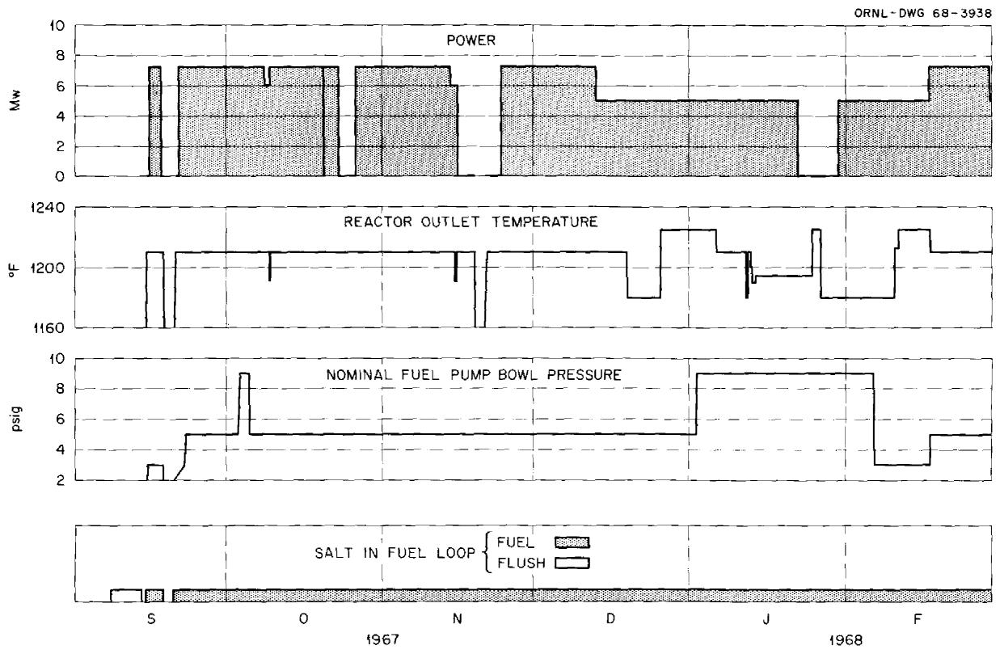  
Fig. 1.1. Outline of MSRE Operations, September 1967 to February 1968.

tivity behavior as fission products and plutonium built in, and continued studies on fission product distributions. The power history can be seen in Fig. 1.1.

For the first two months of power operation, the experimental objectives were pursued practically without incident. On October 8 and 9, the power was lowered to $6\mathrm{Mw}$ to permit a low-temperature, low-salt-level experiment on gas ingestion into the circulating fuel. On October 20 the power was down briefly after an area power failure. Three days at $10\mathrm{kw}$ , October 23 to 26, allowed the $^{135}\mathrm{Xe}$ to clear out of the fuel so that a reference measurement of the reactivity balance could be made. The only equipment problem was an oil leak that shut down a component cooling pump, but operation continued without interruption on the standby unit.

Power operation was interrupted in mid-November by trouble with the wiring in the fuel sampler-enricher. Electrical leads between the outer and inner containment boxes shorted out, leaving a sample stranded in the tube. The reactor power was

lowered to 10 kw while repairs were made. A containment tent was erected, and a hole was cut in the outer box. This exposed the fault in the cable, so it was not necessary to drain the fuel and go into the inner box. Repairs were made, and tests showed all circuits were operable except one non-essential position switch.

While the power was down for the sampler repair, an abnormal pressure drop developed in the fuel off-gas line near the pump bowl. The cause was not known, but to minimize the chance of salt mist causing a worse blockage while the pressure was being kept low for the sampler work, the fuel pump was shut off. After two days, repairs permitted the sample to be retrieved and the isolation valves to be closed. The restriction in the gas line was then blown clear, and nuclear operation was resumed. For about 15 hr after the reactor was returned to full power, indications were that the off-gas restriction was causing some flow to bypass through the overflow tank. Then the pressure drop decreased and was not detectable for the next two months.

From the beginning of run 14, the xenon effect at full power had been about $0.32\% \delta k / k -$ about what it was in early power operation but up measurably from the $0.27\% \delta k / k$ observed in runs 11 and 12. The reason for this small shift was not apparent, but there had been indications that the xenon stripping was affected to a slight degree by fuel temperature, liquid level in the pump bowl, and system pressure. Therefore an investigation was started into the effects of minor changes in these variables on the stripping of xenon and other fission gases from the fuel. In order to lower the fuel temperature without bringing the coolant salt below $1000^{\circ}\mathrm{F}$ at the radiator outlet, the power was first reduced to $5\mathrm{Mw}$ . As can be seen from Fig. 1.1, the experimental operation at various temperatures and pressures extended over the two months from the middle of December to the middle of February.

Beginning on January 22, the reactor power was held at $10\mathrm{kw}$ for eight days while the temperature and salt level were varied to observe reactivity effects in the absence of xenon. Small changes were observed, reflecting variations in the amount of bubbles circulating with the fuel salt (around 0.1 to $0.2\mathrm{vol}\%$ normally).

Early in the 10-kw operation the main blower bearings were inspected, and two were replaced because of damaged balls. The filter in the coolant off-gas line that had plugged a few weeks earlier was also replaced while the power was down.

After 18 more days of 5-Mw operation, which completed the planned experiments on gas stripping, the reactor was returned to full power. Analysis of the data suggested that the system gas stripping may have changed characteristics during the ex

periments. Therefore, on February 29, the power was again reduced to $5\mathrm{Mw}$ for a recheck of the xenon under conditions outwardly the same as those that had been tested in December.

While reactor operations were proceeding, preparations were being made for the shutdown scheduled to begin late in March. These included preparing the chemical processing system for fluorination of the salt to remove the uranium and designing and building equipment for adding $^{233}\mathrm{U}$ enriching salt to the fuel carrier left after the fluorination.

Operation was continuing at the end of the report period, more than five months after the startup in September. Statistics for the six-month period and totals at the end are given in Table 1.1.

# 1.2 OPERATIONS ANALYSIS

# 1.2.1 Reactivity Balance

J. R. Engel

The continuous operation for over five months in this period afforded an unprecedented opportunity to study long-term changes in reactivity. The reactivity balance under the simplest conditions (low power and no xenon) was checked five times over a period of substantial fuel burnup without any complications of fuel additions or intervening fuel loop drains and flushes. In addition, there was time to vary operating conditions to observe effects on xenon removal.

Table 1.1. Some MSRE Operating Statistics   

<table><tr><td></td><td>September 1967–February 1968</td><td>Total Through Feb. 29, 1968</td></tr><tr><td>Critical time, hr</td><td>3891 (89%)</td><td>10,909</td></tr><tr><td>Integrated power, Mwhr</td><td>21,823</td><td>62,130</td></tr><tr><td>Equivalent full-power hours</td><td>3014 (69%)</td><td>8581</td></tr><tr><td>Salt circulation, hr</td><td></td><td></td></tr><tr><td>Fuel loop</td><td>4054 (93%)</td><td>14,415</td></tr><tr><td>Coolant loop</td><td>4170 (95%)</td><td>16,229</td></tr></table>

Effects of Gas in Fuel Salt. - Prior to the current run (run 14) the reactor had operated outside of a relatively narrow range of operating conditions for only brief periods of time. The normal conditions were $1210^{\circ}\mathrm{F}$ at the reactor outlet, 5 psig helium overpressure at the fuel pump, and a narrow range of fuel salt levels in the pump bowl. Previous deviations from these conditions showed that at least temperature and pressure affected the value of the residual term in the reactivity balance. However, the effects had not been clearly defined.

During run 14, we performed a series of tests in an effort to evaluate the effects of fuel system temperature and overpressure and fuel pump level on residual reactivity. In these tests the reactor outlet temperature was varied between 1180 and $1225^{\circ}\mathrm{F}$ and the overpressure between 3 and 9 psig. Since the fuel pump level is restricted by the pump hydraulic performance, only the normal variation in fuel pump level was allowed. This study was performed at a reactor power of $5\mathrm{Mw}$ to provide the required latitude for the temperature changes (see Fig. 1.1).

Small but significant variations in reactivity were observed. The major part of the variations was caused by changes in the $^{135}\mathrm{Xe}$ poisoning in the reactor, apparently induced by variations in the effectiveness of gas stripping caused by the parameter changes. Table 1.2 presents a summary of the net observed $^{135}\mathrm{Xe}$ poisoning terms at the various conditions. In general, the xenon poisoning increases with decreasing temperature and increasing overpressure. However, the pressure effect practically disappears at the higher temperatures. Conversely, the temperature effect is smaller at the lower pressures. The effect of fuel pump level is much less pronounced than the temperature and pressure effects, but decreasing level leads to higher xenon poisoning for the range of levels investigated.

The details of the changes in $^{135}\mathrm{Xe}$ poison were obtained from the reactivity balance. In addition, several samples of the fuel off-gas were obtained under various operating conditions, so that the $^{136}\mathrm{Xe}/^{134}\mathrm{Xe}$ ratio might be measured to verify that the apparent xenon poisoning was in fact due

to $^{135}\mathrm{Xe}$ . Preliminary results are in substantial agreement with the poisoning measured by the reactivity balance.

Aside from the variations in xenon poisoning, there was other independent evidence which clearly indicated changes in the effectiveness of removal of gaseous fission products to the reactor off-gas system. Poorer removal of the gases coincided with the higher poison levels. The temperatures of the off-gas holdup volume in the reactor cell (L-522) and the particle trap are sensitive indicators of the fission product concentration in the off-gas stream. At constant system pressure, where no changes in transit (decay) time are encountered, this concentration directly reflects the effectiveness of the fission product stripping. The observed temperatures at L-522 and near the coarse filtering medium at the entrance to the particle trap are listed in columns 5 and 6 of Table 1.2.

Another effect observed during these tests was significant variation in the amount of undissolved gas in circulation with the fuel salt. These changes were measured by the small reactivity effects at zero power with no $^{135}\mathrm{Xe}$ in the system. Additional qualitative support for variations in void fraction was obtained during power operation from spectral measurements of the inherent neutron-flux noise and from temperature observations at the reactor access nozzle. (See also Sects. 1.2.2 and 3.3.) The reactivity balance gave a reactivity loss of $0.032\% \delta k / k$ between the condition with the fewest circulating voids $(1225^{\circ}\mathrm{F}$ and 3 psig over-pressure) and that with the most $(1180^{\circ}\mathrm{F}$ and 9 psig). This implies a change of 0.15 to $0.2\%$ by volume in the void fraction between these two conditions. No change in void fraction with fuel pump level was detected, and there was no observable pressure effect at $1225^{\circ}\mathrm{F}$ . However, at $1180^{\circ}\mathrm{F}$ over half of the total change between the two extremes was due to the pressure difference. Column 7 of Table 1.2 shows the approximate magnitude of the additional circulating void fraction at each condition (The void fraction at $1225^{\circ}\mathrm{F}$ and 5 psig is thought to be 0.1 to $0.15\%$ by volume.)

The tests in this run indicated at least the qualitative nature of the effects of system temperature and pressure on xenon poisoning and circulating voids. However, they also demonstrated that the effects are not necessarily completely reproducible. During run 12 and earlier runs, the typical value for $^{135}\mathrm{Xe}$ poisoning at $7.2\mathrm{Mw}$ was $0.27\% \delta k / k$ .

Table 1.2. Effects of Fuel System Pressure, Temperature, and Level on ${}^{135}\mathrm{X}$ e Poisoning at 5 Mw   

<table><tr><td rowspan="2">Fuel Pump Overpressure (psig)</td><td rowspan="2">Reactor Outlet Temperature (°F)</td><td rowspan="2">Fuel Pump Level (in.)</td><td rowspan="2">Net Xenon \( {}^{a} \) Poisoning (% δk/k)</td><td colspan="2">Off-Gas System Temperature (°F)</td><td rowspan="2">Change from Minimum Circulating Void Fraction (vol %)</td></tr><tr><td>Holdup Volume, Line 522</td><td>Particle Trap, Yorkmesh Section</td></tr><tr><td>5</td><td>1225</td><td>6.2</td><td>0.182</td><td>234</td><td>292</td><td>0</td></tr><tr><td>5</td><td>1225</td><td>5.6</td><td>0.187</td><td>228</td><td>272</td><td>0</td></tr><tr><td>5</td><td>1210</td><td>6.1</td><td>0.206</td><td>231</td><td>264</td><td>0.03</td></tr><tr><td>5</td><td>1210</td><td>5.6</td><td>0.219</td><td>229</td><td>260</td><td>0.03</td></tr><tr><td>5</td><td>1210</td><td>5.3</td><td>0.233</td><td>228</td><td>258</td><td>0.03</td></tr><tr><td>5</td><td>1180</td><td>5.7</td><td>0.336</td><td>221</td><td></td><td>0.11</td></tr><tr><td>5</td><td>1180</td><td>5.6</td><td>0.358</td><td>220</td><td>251</td><td>0.11</td></tr><tr><td>5</td><td>1180</td><td>5.3</td><td>0.374</td><td>219</td><td>246</td><td>0.11</td></tr><tr><td>9</td><td>1225</td><td>6.2</td><td>0.191</td><td>236</td><td>236</td><td>0</td></tr><tr><td>9</td><td>1225</td><td>5.6</td><td>0.201</td><td>232</td><td>231</td><td>0</td></tr><tr><td>9</td><td>1210</td><td>6.0</td><td>0.227</td><td>230</td><td>222</td><td>0.04</td></tr><tr><td>9</td><td>1210</td><td>5.6</td><td>0.232</td><td>228</td><td>224</td><td>0.04</td></tr><tr><td>9</td><td>1210</td><td>5.3</td><td>0.241</td><td>224</td><td>217</td><td>0.04</td></tr><tr><td>9</td><td>1195</td><td>5.9</td><td>0.263</td><td>221</td><td>214</td><td>0.10</td></tr><tr><td>9</td><td>1195</td><td>5.6</td><td>0.289</td><td>214</td><td>202</td><td>0.10</td></tr><tr><td>9</td><td>1195</td><td>5.3</td><td>0.346</td><td>204</td><td>180</td><td>0.10</td></tr><tr><td>9</td><td>1180</td><td>5.6</td><td>\( {0.371}^{b} \)</td><td>\( {193}^{c} \)</td><td>\( {152}^{c} \)</td><td>0.18</td></tr><tr><td>9</td><td>1180</td><td>5.3</td><td>\( {0.374}^{b} \)</td><td>\( {195}^{c} \)</td><td>\( {155}^{c} \)</td><td>0.18</td></tr><tr><td>3</td><td>1225</td><td>6.2</td><td>\( {0.175}^{b} \)</td><td>187</td><td>244</td><td>0</td></tr><tr><td>3</td><td>1225</td><td>5.6</td><td>\( {0.182}^{b} \)</td><td>193</td><td>227</td><td>0</td></tr><tr><td>3</td><td>1180</td><td>5.8</td><td>\( {0.240}^{b} \)</td><td>\( {185}^{c} \)</td><td>\( {230}^{c} \)</td><td>0.10</td></tr><tr><td>3</td><td>1180</td><td>5.5</td><td>\( {0.248}^{b} \)</td><td>\( {188}^{c} \)</td><td>\( {226}^{c} \)</td><td>0.10</td></tr><tr><td>3</td><td>1180</td><td>5.3</td><td>\( {0.260}^{b} \)</td><td>\( {189}^{c} \)</td><td>\( {220}^{c} \)</td><td>0.10</td></tr><tr><td>5</td><td>1180</td><td>5.6</td><td>\( {0.294}^{b} \)</td><td>217</td><td>265</td><td>0.11</td></tr><tr><td>5</td><td>1180</td><td>5.3</td><td>\( {0.295}^{b} \)</td><td>216</td><td>255</td><td>0.11</td></tr></table>

${}^{a}$ Corrected for drift in zero-power residual reactivity and for direct reactivity effect of differences in circulating void fraction.   
These data were taken after a period of operation at 10 kw, during which the pattern of xenon behavior changed toward less pressure-temperature-level sensitivity.   
Partial restriction in off-gas line at fuel pump caused change in flow path and holdup time.

For the first four months of run 14, the characteristic value for this term was $0.33\% \delta k / k$ . After the period of low-power operation in January 1968, the xenon term reverted to the old value. Since this change occurred in the middle of the 5-Mw tests to define xenon behavior, no explicit quantitative evaluation can be made. This is illustrated by two nominally identical tests made under conditions of high xenon poisoning before and after this change. Tests on December 23 to 25, 1967, and March 3 to 6, 1968, both involved operation at 5 Mw and $1180^{\circ}\mathrm{F}$ with 5 psig overpressure. The respective xenon poisoning terms were 0.35 and $0.30\% \delta k / k$ .

Long-Term Changes. - Because of variations in the xenon poisoning, the best data on the long-term drift in residual reactivity are obtained at very low power with no xenon present. In earlier operations, these data were taken only near the beginning and the end of the various reactor runs, and many runs were relatively short in terms of fuel burnup and net control rod movement. Comparison of data between runs was further complicated by the need to compensate for the dilution effects of fuel drains and flushing operations. All these results were scattered within a relatively narrow band of reactivity values with no particular trend in evidence.

During the six months of run 14, zero-power reactivity data were collected on five separate occasions. These data showed a very small but remark-

ably constant negative trend in residual reactivity as a function of integrated power. The average reactivity slope during run 14 was $-3.5 \times 10^{-6} (\% \delta k / k) / \text{Mwhr}$ . Reexamination of earlier data showed considerable scatter around this value but no real inconsistency with it. Some of this scatter occurred because significant scatter was encountered between individual reactivity balances at some conditions. Figure 1.2 shows the zero-power reactivity balance results for the entire $^{235}\text{U}$ operation. Data points taken within a particular reactor run, that is, after a reactor fill and before the subsequent drain, are connected by straight lines. Where lines are drawn from two points at a given condition, the points represent the extremes of significant reactivity balance variations at that condition. At conditions where only trivial variations were observed, only a single point was plotted.

If the negative reactivity slope observed in run 14 were applied to the entire power history, a total negative deviation of $0.22\% \delta k / k$ from the beginning of operation would be expected. The fact that a total change of this magnitude has not been observed suggests the presence of errors that tend to compensate for the negative drift observed during operation. A possible source of such an error is the corrections that must be applied for the dilution effects of reactor drains and flushes between runs.

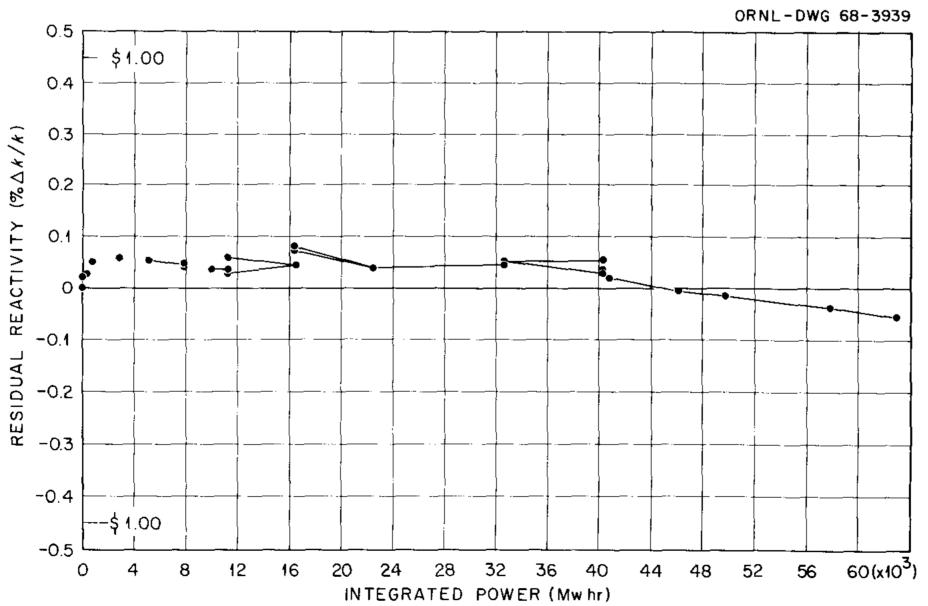  
Fig. 1.2. Residual Reactivity at Zero Power.

A reactor flush results in a net transfer of uranium (and other fuel constituents) from the fuel salt to the flush salt. If the amount of uranium transferred in such a flush is overestimated in the correction that is applied to the reactivity balance, the residual reactivity is shifted in the positive direction - opposite to the direction of drift during operation. An overcorrection of $2.6\mathrm{kg}$ in total uranium would be required to compensate for a drift of $-0.22\% \delta k / k$ . To date, total uranium corrections in the amount of $4.9\mathrm{kg}$ have been applied to the reactivity balance; analyses of the flush salt when it was last in the fuel loop indicated a total uranium content of $5.0\mathrm{kg}$ . In applying the calculated corrections, it is assumed that the total volumes of fuel salt and flush salt remain constant. A gain of $0.7\mathrm{ft}^3$ in the actual flush salt inventory at the expense of the fuel salt could also conceal the expected negative reactivity drift. However, the system physical inventories indicate that if there has been any shift at all, it has been to increase the fuel salt volume at the expense of the flush salt. Thus it does not appear that errors in corrections between reactor runs are compensating for the downward drift during the runs. The source of the compensating effect has not yet been identified.

There are a number of possible causes for the negative reactivity drift during any one run. However, none of these appears to be large enough to explain the drift. For example, if the drift were due to an error in power calibration, an error of about $30\%$ would be required. The data on the buildup of ${}^{236}\mathrm{U}$ in the fuel (see Sect. 1.2.5) indicate that the power calibration error is less than $10\%$ . This is further supported by the rate of ${}^{239}\mathrm{Pu}$ buildup in the fuel and various fission product studies. Another possible source of error is nonuniform deposition of fission products in the fuel loop. Even if all the nonvolatile nonsaturating fission products were deposited on the core graphite (uniformly), the negative reactivity effect would be less than one-half the drift rate in run 14. Therefore the small negative trend in reactivity remains unexplained at the present time. It is worth noting, however, that the magnitude is well within the allowable reactivity anomaly of $0.5\% \delta k / k$ . (This limit is based on reactor safety studies that placed conservative interpretations on reactivity losses and their possible consequences.)

# 1.2.2 Variations in Reactor Access Nozzle Temperatures

J. L. Crowley

The reactor access nozzle is one of the two places in the fuel loop where there is a gas-liquid interface; the other is the fuel pump bowl. Variations in liquid level in the access nozzle, which can be inferred from thermocouple readings, afford some information on the gas circulating with the fuel.

As shown in Fig. 1.3, the reactor access nozzle (RAN) is a 10-in. pipe with a cooling-air jacket on the outside. Inside is an air-cooled plug attached to the closure flange. In the large plug is a smaller nozzle and an air-cooled plug, providing access to the sample assembly in the core. It was intended that frozen salt plugs be established in the annuli between the cooled plugs and nozzles to prevent molten salt from coming in contact with the metal ring seals at the access flanges. In actual operation, however, the indications are that it is trapped gas in the annulus and not a frozen salt plug which prevents liquid salt from rising to the seal area.

Two mechanisms transport gas to and from the RAN annuli. Owing to the higher static pressure at the RAN, helium is transferred from the RAN to the pump bowl gas space as a solute. This effect was previously noted on the Engineering Test Loop in the operation of the forerunner of the reactor access nozzle. The mechanism which delivers gas to the RAN is the collection of circulating bubbles from the fuel passing by the lower ends of the annuli. The equilibrium condition between these two mechanisms determines the gas inventories and the liquid levels in the RAN annuli. Changes in the liquid levels can be detected by monitoring the thermocouples attached to the RAN. In general it has been noted that the RAN salt levels run higher when the system operates at lower pressure or higher temperature.

An example of the above effect is provided in Fig. 1.4. This is a plot of two RAN thermocouples (see Fig. 1.3 for location), the fuel pump helium

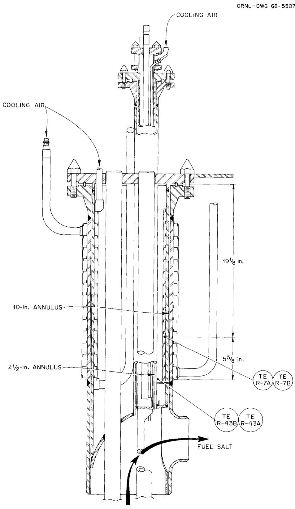  
Fig. 1.3. Reactor Access Nozzle Showing 10- and $2\frac{1}{2}$ -in. Annuli.

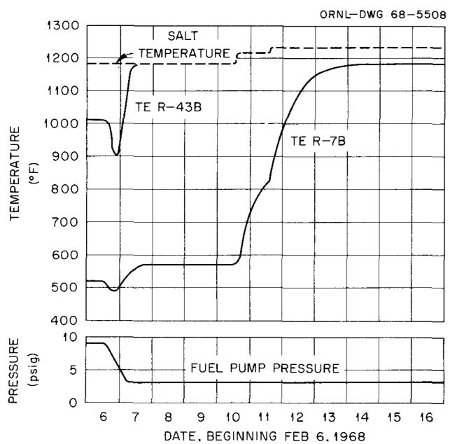  
Fig. 1.4. Effect of Reactor Outlet Temperature and Fuel Pump Pressure on Reactor-Access-Nozzle Temperatures.

pressure, and the reactor outlet salt temperature for a period of ten days in February. The test in progress at that time was one to determine the effects of pressure and temperature on reactivity while operating at 5 Mw power. The fuel pump helium pressure was first lowered from 9 to 5 psig with the reactor outlet at $1180^{\circ}\mathrm{F}$ . On February 10 and 11, the reactor outlet was increased to $1225^{\circ}\mathrm{F}$ , while the fuel pump pressure was maintained at 3 psig. At the beginning condition, that is, high system pressure and low salt temperature, the molten-salt levels in the annuli are below the levels of the two thermocouples. When the pressure was lowered on February 6, RAN temperatures dropped initially, indicating the lowering of the salt level due to expansion of gas trapped in the RAN annuli. Very soon, however, the molten salt rose to or above the R43B thermocouple location. Thus it would appear that bubbles were bringing gas into the annuli at a lower rate. The next changes, increases in circulating fuel temperature on February 10 and 11, also resulted in rises in the molten-salt level in the annuli. After the second temperature increase, the level apparently rose over a period of about two days, until it was near thermocouple R7B. Thus the increase in circulating fuel tem

perature also appeared to reduce the amount of bubbles bringing gas to the annuli.

The variations in circulating gas concentrations with changes in fuel temperature and pressure, inferred from RAN temperatures, agree with the changes indicated by the reactivity (see Sect. 1.2.1).

# 1.2.3 Radiation Heating

C. H. Gabbard

The temperature differences between the reactor inlet and the lower head and between the inlet and the core support flange continue to be the indicator for possible sedimentation buildup within the reactor vessel. These temperature differences agree satisfactorily with previous data and indicate that there has been no significant solids accumulation within the reactor vessel. Table 1.3 shows a comparison of the data collected during run 14 with those collected and reported previously.

The temperature distribution on the upper surface of the fuel pump tank during run 14 was about the same as that in run 12. As reported previously, the temperatures are somewhat lower than in earlier power runs, and the reason for the difference has not been established.

Table 1.3. Power-Dependent Temperature Differences Between Fuel Salt Entering, and Points on, the Reactor Vessel   

<table><tr><td rowspan="2">Run No.</td><td rowspan="2">Dates</td><td colspan="2">Temperature Difference (°F/Mw)</td></tr><tr><td>Core Support Flange</td><td>Lower Head</td></tr><tr><td>6</td><td>4/66–5/66</td><td>2.11</td><td>1.54</td></tr><tr><td>11</td><td>1/67–5/67</td><td>2.14</td><td>1.50</td></tr><tr><td>12</td><td>6/67–8/67</td><td>2.20</td><td>1.55</td></tr><tr><td>14</td><td>9/67–2/68</td><td>2.25</td><td>1.42</td></tr></table>

# 1.2.4 Thermal Cycle History

C. H. Gabbard

The accumulated thermal cycle history of the various components sensitive to thermal cycle

Table 1.4. MSRE Cumulative Thermal Cycle History Through February 1968   

<table><tr><td>Component</td><td>Heat/Cool</td><td>Fill/Drain</td><td>Power</td><td>On/Off</td><td>Thaw</td><td>Thaw and Transfer</td></tr><tr><td>Fuel system</td><td>9</td><td>40</td><td>66</td><td></td><td></td><td></td></tr><tr><td>Coolant system</td><td>7</td><td>13</td><td>62</td><td></td><td></td><td></td></tr><tr><td>Fuel pump</td><td>12</td><td>35</td><td>66</td><td>447</td><td></td><td></td></tr><tr><td>Coolant pump</td><td>8</td><td>14</td><td>62</td><td>127</td><td></td><td></td></tr><tr><td>Freeze flanges 100, 101, 102</td><td>9</td><td>36</td><td>66</td><td></td><td></td><td></td></tr><tr><td>Freeze flanges 200, 201</td><td>8</td><td>13</td><td>62</td><td></td><td></td><td></td></tr><tr><td>Penetrations 200, 201</td><td>8</td><td>13</td><td>62</td><td></td><td></td><td></td></tr><tr><td>Freeze valve</td><td></td><td></td><td></td><td></td><td></td><td></td></tr><tr><td>103</td><td>7</td><td></td><td></td><td></td><td>29</td><td>62</td></tr><tr><td>104</td><td>15</td><td></td><td></td><td></td><td>9</td><td>27</td></tr><tr><td>105</td><td>17</td><td></td><td></td><td></td><td>18</td><td>45</td></tr><tr><td>106</td><td>19</td><td></td><td></td><td></td><td>28</td><td>38</td></tr><tr><td>107</td><td>10</td><td></td><td></td><td></td><td>11</td><td>18</td></tr><tr><td>108</td><td>9</td><td></td><td></td><td></td><td>17</td><td>14</td></tr><tr><td>109</td><td>9</td><td></td><td></td><td></td><td>20</td><td>18</td></tr><tr><td>110</td><td>2</td><td></td><td></td><td></td><td>2</td><td>3</td></tr><tr><td>111</td><td>5</td><td></td><td></td><td></td><td>4</td><td>4</td></tr><tr><td>112</td><td>2</td><td></td><td></td><td></td><td>1</td><td>2</td></tr><tr><td>204</td><td>9</td><td></td><td></td><td></td><td>15</td><td>32</td></tr><tr><td>206</td><td>9</td><td></td><td></td><td></td><td>13</td><td>30</td></tr></table>

damage is shown in Table 1.4. Approximately $69\%$ of the design thermal cycle life of the fuel system freeze flanges has been used to date. This compares with a value of $63\%$ of the design life that had been consumed at the end of the previous report period. Essentially no thermal cycle damage has been accumulated on the fuel system flanges since the fuel system was last filled on September 20, 1967, at the beginning of run 14.

# 1.2.5 $^{236}\mathbf{U}$ Indication of Integrated Power

R.C.Steffy, Jr. J.R.Engel

The basic measurement of the nuclear power of the MSRE is by the overall system heat balance.

The preponderant term in this balance is the heat removed from the system by the secondary (coolant) salt. Its accuracy is therefore strongly dependent on the accuracy with which that term is evaluated. Other indications of reactor power - radiator air heat balances, fission product inventories, and nuclear instrument readings - have provided only reasonable $(\pm 20\%)$ confirmation of the heat-balance power calibration. Since all these techniques could involve substantial systematic errors, an effort has been made to check the power calibration by an independent technique.

A potentially accurate standard as a monitor for integrated power in a nuclear reactor is the change in the isotopic composition of the uranium fuel. The accuracy of this method depends on the existence of an isotope whose concentration changes

significantly and in a manner that can be accurately related to energy production. The $^{236}\mathrm{U}$ in the MSRE fuel is well suited to this purpose. The fraction of $^{236}\mathrm{U}$ in the uranium mixture has increased by a factor of 3 in the course of power operation with the $^{235}\mathrm{U}$ fuel. Since $^{236}\mathrm{U}$ is produced only by parasitic neutron captures in $^{235}\mathrm{U}$ and since the rate of burnup of $^{236}\mathrm{U}$ is very low, the net production of this isotope per fission event depends primarily on the value of $\alpha (= \bar{\sigma}_{\mathrm{c}} / \bar{\sigma}_{\mathrm{f}})$ for $^{235}\mathrm{U}$ in the MSRE neutron spectrum. Extension of this relationship to total energy production depends only on the effective energy yield per fission in this reactor.

The absolute rate of production of $^{236}\mathrm{U}$ in the MSRE was inferred from several fuel samples in which the uranium isotopic composition was measured. These data were combined with "book" inventories for total uranium and corrected for various reactor reactions (drains, flushes, and fuel additions) to obtain loop inventories for $^{236}\mathrm{U}$ . Since chemical results for total uranium have consistently been within 1% of the "book" values and the precision of the isotopic assays is high, the accuracy of the $^{236}\mathrm{U}$ inventory is probably within ±5%. Figure 1.5 shows the calculated $^{236}\mathrm{U}$ inventory plotted against the integrated power based on

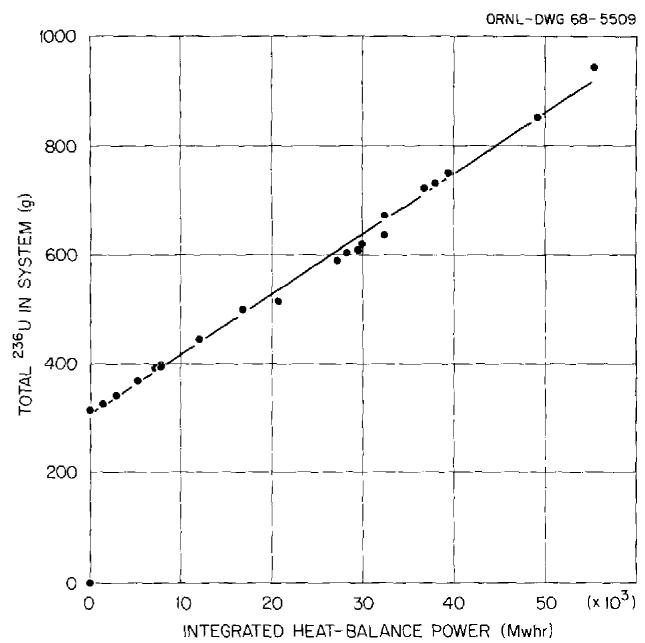  
Fig. 1.5. 236U Buildup in MSRE vs Power Production.

the heat balance measurements. The solid line is a least-squares fit to the data points and has a slope of $0.0110 \pm 0.002\mathrm{g}$ of $^{236}\mathrm{U}$ per megawatt-hour. The theoretical slope, based on the ratios of effective $^{235}\mathrm{U}$ neutron cross sections and fission energy yield in the MSRE, is $0.0109\mathrm{g / Mwhr}$ , within $1\%$ of the observed slope. The uncertainty in the theoretical slope is probably less than $10\%$ , so the actual integrated power is probably within $10\%$ of the value indicated by the heat balances.

# 1.3 EQUIPMENT PERFORMANCE

# 1.3.1 SaltPumps

# P. N. Haubenreich

The 1200-gpm pump that circulates fuel salt and the 850-gpm pump that circulates coolant salt continued to run uneventfully. By the end of the report period the fuel pump had run for 18,400 hr, 14,415 hr circulating salt and 3985 hr circulating helium. The coolant pump had pumped salt for 16,229 hr and helium for 3082 hr, for a total of 19,311 hr. As reported in Sect. 1.3.6 and 1.3.10, there is probably some oil leakage into the pump bowls, but the rates must be very small since they do not produce significant changes in the oil inventories. The replacement rotary elements for both pumps are seal-welded to prevent such inleakage, but the oil problem is so minor that replacement is not contemplated.

# 1.3.2 Heat Transfer

# C. H. Gabbard

The heat transfer performance of the fuel-to-coolant-salt heat exchanger continues to be monitored by periodic evaluations of the heat transfer coefficient and by the heat transfer index. The heat transfer index was evaluated a number of times during run 14 with the reactor at full power. However, only one additional heat transfer coefficient measurement over a range of powers was made during this report period. This measurement gave a value of the overall heat transfer coefficient of

605 Btu hr $^{-1}$ ft $^{-2}$ ( $^\circ \mathbf{F}$ ) $^{-1}$ , compared with 586 Btu hr $^{-1}$ ft $^{-2}$ ( $^\circ \mathbf{F}$ ) $^{-1}$ , which is the average of the six previous measurements. The average heat transfer index increased during run 14 to $0.0376 \, \text{Mw} /^\circ \text{F}$ , which is also slightly higher than the previous data. The apparent increase in heat transfer was caused entirely by a recalibration of one of the coolant salt flow elements, which increased the indicated coolant salt flow rate and the calculated heat removal rate at the radiator. (This increased the calculated heat balance power by about 100 to $200 \, \text{kw}$ at full power.) Thus the conclusion is that the heat transfer performance of the heat exchanger has remained unchanged since the beginning of operation.

# 1.3.3 Salt Samplers

# R. B. Gallaher

During this six-month report period, operation of the sampler-enricher was resumed with a new isolation chamber and cable drive assembly. Except for the wiring failure that occurred in November, only minor difficulties were encountered. A total of 70 sampling operations were made during the report period, as follows:

10-g salt samples 45

50-g salt samples 16

Salt samples in freeze-valve capsules 2

Gas sample in freeze-valve capsule 1

Capsule exposure in gas space 5

Nickel rod exposure in salt 1

Three of the 10-g samples were of flush salt; the others were of fuel salt. The 50-g samples were taken for uranium isotopic analyses, determination of oxide level or $\mathrm{U}^{3+}/\mathrm{U}^{4+}$ ratio, and other special analyses, as reported in Part 3 of this report. All the sampling attempts were successful, except that one 50-g capsule collected only $5\mathrm{g}$ of fuel salt. The attempt appeared normal in every other respect, and the explanation for the small amount of salt is not known. Operations during the period brought the total use of the sampler-enricher to 114 uranium enrichments and 349 samples and special exposures.

Since the maintenance period that ended in September, the pressure transducer in the removal

valve buffer system has been sensitive to heat from the illuminator, drifting by $25\%$ of full scale when the light is turned on. A reflective metal shield was placed over the thermal insulation around the transducer. This helped, but it did not eliminate the effect.

The wiring fault appeared in the following manner. On November 14, as a sample was being withdrawn from the pump bowl, the 0.3-amp fuse in the drive motor circuit blew. Subsequent tests showed that the insert mode drew the normal 0.2 amp, but in withdrawal the current rose to 1.0 or 1.5 amp. Since the locked-rotor current is only 0.3 amp, the high current indicated leakage. During further tests, three circuits opened, disabling the motor "insert" and "withdraw" circuits and the upper limit switch.

The most likely location for the failure was believed to be at or between the outer and inner containment penetrations. This area was suspected because of its small clearances and tight bends in the cable. High-frequency capacitance measurements with a Grid-Dip meter indicated that the length of cable to the point of failure was consistent with this guess. Therefore, after a nonflammable plastic tent was erected over the sampler-enricher to prevent spread of possible contamination, a 3-in.-diam hole was sawed in the cover plate directly above the cable penetration into the inner box (1-c area). The failure was found where the wires were bent back down against the side of the plug on the lower end of the cable between the inner and outer boxes. A temporary connection showed that everything inside the inner box was operable. The sample capsule was retrieved, and the isolation valves were closed at this time. The damaged section of cable was abandoned, and a new cable was installed having a penetration through a 4-in. pipe cap welded over the sawed hole in the top cover.

While the cap was being welded in place, a heavy current evidently went to ground through another cable that penetrated the top cover near the new cap. The receptacle and plug were destroyed. Repairs were made by cutting out and replacing this penetration. As a result of this experience, an isolation transformer and a fuse were added to each of the three drive unit cables (see Sect. 3.1.3). This allows one ground without interference with operation.

After the repairs, all circuits were operable except the upper limit switch. This switch normally stopped the drive motor when the latch reached the latch stop. Because the motor and circuit can stand blocked-rotor current, the upper limit switch was bypassed, and the motor is now turned off manually when the position indicator shows the latch is fully withdrawn.

Containment has been quite good. A minor release of activity to the stack occurred at least once while area 3A was being evacuated. After all disconnects in the sampler off-gas system were checked and tightened, no further detectable release occurred.

During the report period the coolant salt sampler was used to take five 10-g samples, bringing the total to 65. No operating difficulties were encountered.

# 1.3.4 Control Rods and Drives

# M. Richardson

The control rods continued to operate freely throughout the report period. Tests in September and late January showed no shift in position reading and no appreciable change in rod drop times. The only mechanical difficulty was with the fine-position synchro transmitter on drive No. 2, which developed an open circuit in January. This synchro was one that was installed in May 1967, so its service life was relatively short for some reason as yet unknown.

# 1.3.5 Radiator Enclosure

# M. Richardson

During the flush salt operation in September, at the beginning of run 13, the outlet door tended to jam because it was hanging crooked. The trouble appeared to be in one of the housings for the springs through which the cables lift the door. A piece of some material, apparently weld slag, had fallen in and jammed the piston in that housing, preventing it from moving up. The piston in the other housing was free. Both coil springs were found to have become permanently compressed, probably because of subjection to high temperatures in the startup period before hoods were installed over the doors. Since the springs were not

essential, they were replaced with pipe sleeves that hold the pistons down.

The brakes in the lifting mechanism remained adequate, limiting coastdown to about 3 in. The door seals continued to provide adequate heat containment with the doors closed.

# 1.3.6 Off-Gas Systems

# A. I. Krakoviak

The off-gas systems of both the fuel and coolant system developed partial restrictions that caused minor inconveniences but did not interfere with normal power operation.

Fuel Off-Gas System. - A restriction became evident in the off-gas line somewhere between the pump bowl and the junction of the overflow tank vent with the 4-in. holdup line. The first indication appeared after $2^{\frac{1}{2}}$ days of operation at $10\mathrm{kw}$ following the sampler-enricher wiring failure of November 14. During this period the operational and maintenance valves were open, and a 0.6-liter/min helium purge was maintained down the sampler tube to the pump bowl to prevent contamination of the sampler by fission gases. The restriction was evidenced by an increase (0.5 psig) in the fuel pump bowl pressure when the overflow tank vent valve was closed during a routine return of salt from the overflow tank to the pump bowl. After the wiring repairs had been finished, the sample had been retrieved into area 1C, and the operational and maintenance valves had been closed, the restriction was relieved by pressurizing the pump bowl to 6.0 psig and suddenly venting the gas into a drain tank which was at 3 psig. The pressure drop then appeared normal (<0.1 psi), but after three more days of low-power operation, an abnormal pressure rise (0.2 psi) was again observed when salt was being returned from the overflow tank. Repetition of the mild blow-through to the drain tank had little or no effect this time. The line was not completely blocked, however, and full-power operation was resumed. At first, temperatures on the overflow tank and the off-gas line (responding to fission product heating) clearly indicated that there was enough pressure drop at the pump bowl outlet to cause much of the off-gas to bubble through the overflow tank and out its vent line. Then, after 15 hr at full power, the bypass flow stopped, indicating that the pressure drop through the restriction had decreased significantly.

The pressure drop remained below the limits of detection throughout the next nine weeks while the reactor was operating at $7.2\mathrm{Mw}$ or $5\mathrm{Mw}$ . Then after two days at $10\mathrm{kw}$ , the pressure again became detectable and continued to increase over the next six days at very low power. When power operation was resumed at $5\mathrm{Mw}$ , temperatures indicated that there was again bypass flow through the overflow tank. The restriction increased during two weeks of operation at $5\mathrm{Mw}$ , but the line never became completely plugged. Then while the overflow tank was being emptied, four days after the resumption of full-power operation, the restriction partially blew out, bringing the pressure drop again below the limit of detection. The pressure drop remained just at or below the limit thereafter.

The behavior was quite unlike the plugging that occurred earlier in the same section of line as a result of the overfill with flush salt,7 mainly in that it never completely plugged and there was a suggestion of some effect of power level. Plans were made to investigate this restriction in the off-gas line at the next shutdown. Tools were prepared like those used earlier to clear out the off-gas line at the pump bowl. Preparations were made to remove the short flanged section of the off-gas line for examination and replacement with a line instrumented with thermocouples.

Main Charcoal Beds. - The performance of the charcoal beds was very good; none of the annoying plugging problems experienced previously8,9 appeared during this report period. During run 13 and the early part of run 14, with sections 1A and 1B in service, the maximum pressure drop across the beds in parallel was 3.0 psi.

The main charcoal beds were conservatively designed to delay the krypton and xenon long enough (7 days for Kr, 90 days for Xe) so that the major radioactive constituent in the effluent gas would be 10-year $^{85}\mathrm{Kr}$ . The beds were designed to provide these holdup times when the off-gas flow was equally divided between two sections in parallel, but there were some indications during early operation that adequate holdup might be provided with all the flow through only one section. Therefore, in November a test of the capability of a single

section was started, with only section 1A on line. Only a very moderate rise in effluent activity materialized. Section 1A remained in service alone for the remainder of the run with the exception of a ten-day reactivity test at low fuel pump pressure, when two beds were in service to permit lower pressure.

Coolant Off-Gas System. - The coolant pump off-gas system has experienced chronic plugging at the small $50 - \mu$ sintered-metal filter upstream of the pressure control valve. This filter has plugged regularly and has been replaced seven times over the three years since the start of preoperational checkout of the system. The plugging appears to be due to liquefaction of oil vapors from the coolant pump in the pores of the sintered metal. The filter plugged again during this report period, and the coolant pump pressure was controlled by venting through a line bypassing the plugged filter.[9,10] The output from the coolant pump pressure controller was switched from the normal control valve to the vent valve to give satisfactory pressure control.

# 1.3.7 Main Blowers

# C. H. Gabbard

The two main blowers, MB-1 and MB-3, continued to run when needed and by the end of the report period had accumulated 7361 and 6685 hr, respectively, since they were rebuilt in the fall of 1966. The main bearings on both blowers had to be replaced in January, but it happened that there was no interference with reactor operation. The reactor was being operated at 5 Mw on one blower, MB-3, when routine monitoring showed the bearing vibration increasing from 0.8 to 1.5 mils. When an oscilloscope trace showed abnormal high-frequency noise in the bearing, MB-1 was brought on line and MB-3 shut down. A week later, the reactor power was lowered to 10 kw as part of the reactivity experiments; so for several days neither blower was needed. Although the vibration meter on MB-1 bearings had shown no trouble during operation, there was some periodic noise and roughness that could be detected during a coastdown. Therefore, while the power was down, the thrust bearing on each blower was replaced.

In the MB-1 bearing, one ball had a relatively large surface pit, accounting for the noise and

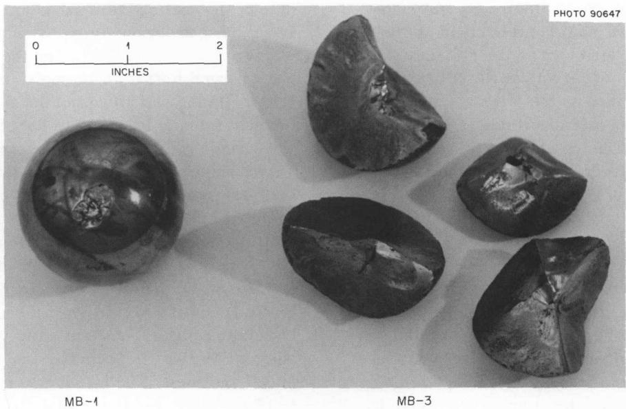  
Fig. 1.6. Ball Bearing Failures from MSRE Main Blowers MB-1 and MB-3.

roughness. The MB-3 bearing was in much worse condition, with one ball actually fractured into four large pieces. The damaged balls from the two bearings are shown in Fig. 1.6.

The MB-1 bearing was the one supplied with the rebuilt blower in the fall of 1966 and had seen $6633\mathrm{hr}$ of service. The MB-3 bearing was a replacement, installed in March 1967, that had accumulated $4801\mathrm{hr}$ . Lubrication appeared to have been adequate, so the relatively short service life could not be attributed to improper lubrication (which was the suspected cause in an earlier bearing failure). Analysis of the bearing loading and stresses revealed that according to accepted design correlations the expected service life was only $5000\mathrm{hr}$ , about what was actually attained. The original bearings were radial-type ball bearings in which thrust load produced high stresses. Therefore, they were replaced with angular-contact-type ball bearings having a greater thrust capacity and much longer expected life.

# 1.3.8 Heaters

# T. L. Hudson

While the reactor system was being heated up for run 13, heater FV-103 was lost by an open circuit. This 1.5-kw bent-tubular-type heater normally supplies about 200 w of heat to a 4-in. section of the

fuel drain line within the reactor vessel furnace, between the freeze valve and the resistance-heated section of the line. The purpose of the heater was to help control the temperature profile through the freeze valve. After the heater failed, tests with flush salt showed that by proper adjustment of the cooling air controls, the freeze valve could be maintained reliably with thaw times in an acceptable range. (Thaw time was around 12 min when the reactor vessel was at $1180^{\circ}\mathrm{F}$ and the center of the freeze valve was at $495^{\circ}\mathrm{F}$ .) Therefore this heater was not replaced.

The last of six heating elements in heater HX-1 on the primary heat exchanger failed during the previous semiannual report period. In December a lead to the adjacent heater, HX-2, opened, thereby reducing the output of this heater by $50\%$ . A week later a second partial failure further reduced the output to only $33\%$ of normal. Although these failures do not affect operations so long as salt is kept circulating, the lack of heat in the two adjacent heaters will make it necessary to repair or replace them during the next shutdown.

# 1.3.9 Electrical System

# T. L. Hudson

Power to the MSRE electrical system is supplied from the ORNL substation by either of two 13.8-kv

power lines, a preferred line or an alternate. Originally the two main blowers could not be operated while the area was on the alternate feeder, but rearrangement of feeders at the ORNL substation reduced the load on the alternate supply to the MSRE. During this report period the reactor was operated for the first time at full power while on the alternate feeder. The occasion was a manual switchover for 2 hr, while a defective insulator was replaced at the substation.

A building power failure occurred on a foggy morning in October, when an arc developed between a 13.8-kv line to the main transformer for the building and a parallel metal activator rod to the 13.8-kv line fuse. The cause of the arc is unexplained: Although the weather was foggy, it was not unusually wet. This fault caused the operation of the preferred feeder overcurrent ground relay located at the ORNL substation, which tripped the feeder breaker before the line overcurrent relay located at the MSRE could operate to prevent an automatic transfer to the alternate feeder. When the MSRE was transferred, the alternate feeder overcurrent ground relay operated and the alternate feeder breaker also tripped. (To prevent an automatic transfer to the alternate feeder on a similar fault, an overcurrent ground relay was later installed at the MSRE.) After an interruption of 37 min, low-power nuclear operation was resumed on emergency electrical power from the diesel generators. The damage was repaired, the spacing between the line and the activator rod was increased, and normal service was restored after an interruption of 2 hr.

The three diesel generators at the MSRE have proved to be quite reliable. They are started and operated unloaded for about an hour each week. Once a month they are tested under load. They have never failed to start when required during a power outage. Under emergency conditions they are usually running within 2 min after a failure of the normal power supply.

# 1.3.10 Salt Pump Oil Systems

# A. I. Krakoviak

The lubricating oil systems for both salt pumps operated continuously and without incident throughout this six-month report period. The only problem was the recurring, gradual fouling of the water

side of the cooling coils on the oil reservoirs. By December the temperature of the oil supplied to the pumps was up to $150^{\circ}\mathrm{F}$ ; so the water supply was changed from tower water to cooler process water. During about two months on process water, the heat transfer improved to the point that tower water again gave acceptable cooling.

Accumulation of shaft seal oil leakage from the fuel pump was steady at about $12\mathrm{cm}^3/$ day from September through November. For the next two months there was no measurable accumulation in the oil collection tank. Then about February 10, leakage began to collect again and averaged 6 $\mathrm{cm}^3/$ day for the remainder of the month. Oil accumulation from the coolant pump shaft seal leakage also varied. In September and October it was only $7\mathrm{cm}^3/$ day. The rate increased in November to $15\mathrm{cm}^3/$ day, and in the last three months was relatively steady at about $20\mathrm{cm}^3/$ day. These accumulation rates are in the range observed in earlier operation of the salt pumps.

During power operation, samples were taken at weekly intervals, and they showed no significant deterioration of the oil quality. To compensate for these samples and shaft seal leakage, 2.8 gal of oil was added to the fuel pump lubrication system and 2.0 gal to the coolant pump system. Inventories based on additions, sample removals, and accumulation of seal leakage showed, during this six-month report period, a net apparent gain in the coolant oil system of $114\mathrm{cm}^3$ and a net apparent loss from the fuel oil system of $545\mathrm{cm}^3$ . Because of inaccuracy in the inventories and a slight systematic error as unmeasured losses in sampling the fuel pump oil, the probable error in net change is about $1200\mathrm{cm}^3$ . Thus the apparent changes are well within the probable error.

# 1.3.11 Cooling Water System

# P. H. Harley

Operation of the cooling water systems continued satisfactorily throughout the report period. The only disturbance of normal operation occurred when a 6-in. cast-iron pipe supplying water for the building fire protection system and the potable water system cracked underground just outside the building. To isolate the leak, it was necessary to shut off both this line and the line supplying the process cooling water system. Adequate cooling was main

tained while the break was being repaired by shifting some items from process water to tower water and running a temporary hose connection from the water main to the process water system. A dry fire hose was laid from the nearby Nuclear Safety Pilot Plant for possible emergency use.

Although leak tests in June 1967 detected no leakage from treated-water components in the reactor cell, a small leak apparently persists. Throughout this six-month period, condensate collection in the component cooling system averaged about 0.73 gpd. There was no accumulation of water in the reactor cell sump. Measured losses from the treated-water system averaged 1.5 gpd. About 0.75 gpd is lost by evaporation from the degassing tank that strips radiolytic hydrogen and oxygen from the treated water. Thus the unmeasured loss agreed closely with the condensate collection rate.

During a short period in December the treated-water loss increased to about 4 gcd. The increase was traced to a leak across a pressure-relief valve which discharges to the waste system to prevent excessive pressure buildup in the event the radiation block valves close. The leaking valve was replaced.

# 1.3.12 Component Cooling Systems

# P. H. Harley

Oil leaks in the lubrication systems of the main component cooling pumps were troublesome during this period. In run 13, after six days of flush salt circulation and two days of nuclear operation, CCP-2 was shut down by low oil pressure, leading to the decision to terminate the run (see Sect. 1.1). Repairs consisted in capping a leaking drain line and tightening several packing nuts and fittings. The other blower, CCP-1, was used for the first $873\mathrm{hr}$ of run 14. At that time a serious oil leak was indicated by low oil pressure and accumulation of about 2 gal of oil in the condensate collection tank connected to the blower containment. The standby unit, CCP-2, was immediately started up and operated without further difficulties throughout the remainder of the period, 3036 hr.

The strainer in the discharge of the component cooling pumps developed an excessive pressure drop during run 13, and the screen was replaced at the time of the repairs to CCP-2. The strainer basket that was removed had been installed before

run 12. In $1800\mathrm{hr}$ of operation its 100-mesh screen had become partially plugged with rubber dust from the drive belts. The screen was damaged in removal, and a replacement basket was made using 16-mesh 0.023-in.-wire screen. This screen showed no pressure buildup over the five months to the end of the period.

Cooling air for the coolant salt freeze valves was supplied most of the time by the service air compressor, AC-3. Component cooling pump 3 was kept in standby and used only when AC-3 was undergoing programmed maintenance. Once while CCP-3 was in service, a bearing seized, requiring replacement of the bearing and drive belt. The blower had been operated for a total of only about 200 hr since a similar bearing failure.[11]

# 1.3.13 Containment and Ventilation

P. H. Harley

R.C.Steffy,Jr.

Throughout all the operations in this period the reactor and drain tank cells were held near $-2$ psig. The air inleakage into these cells was about 15 scfd, less than the acceptable maximum by about a factor of 5.

Inleakage rates are measured by a balance that includes purge and exhaust flows and changes in cell temperature and pressure. At the beginning of runs 13 and 14, a familiar pattern was repeated. The pattern consists of three stages:

1. In the first day after the cell is closed, while temperatures are coming up to equilibrium, the indicated inleakage rate is quite high, sometimes as much as 200 scfd.   
2. For three days or so after the first stage, the indicated inleakage stays up around 75 to 100 scfd. This high apparent rate is attributed to gradual saturation of the cell atmosphere with water vapor.   
3. When the cell atmosphere becomes saturated at the component cooling pump cooler, condensate begins to appear there, and the indicated cell leak rate breaks down sharply to the actual in-leakage rate, usually 15 to 20 scfd.

The cell atmosphere is maintained at about $3\%$ oxygen by supplying a continuous purge of nitrogen. Oxygen analyzer readings can, in principle, be used with other data to compute air inleakage. However, assumption of no oxygen consumption in the cell led to a calculated negative inleakage of air. Therefore the inleakage measured by the flows and pressure changes was assumed to be correct, and the oxygen analyses were used to compute oxygen consumption in the cells. Results showed an apparent consumption of 3 to 4 scfd of oxygen, presumably by reaction with some substance in the cells.

Moisture condensed in the component cooling system (which is an extension of the reactor cell) is drained once a day. Collection rates averaged 0.73 gpd over the five months of run 14 in this report period. Daily amounts ranged from practically none to several gallons when the temperature outdoors (and in the special equipment room) was changing.

Ventilation through operating areas of the reactor building (and the reactor cell during maintenance)

is maintained by one of two stack fans. Stack fan No. 1 is normally kept in service, with No. 2 on standby. After almost continuous service since lubrication system modifications in March 1966, fan No. 1 developed roughness in a bearing and the bearing was replaced in February 1968.

During maintenance work in September 1967, the pressure drop across the roughing filters at the ventilation stack increased to the point that stack flow was significantly reduced. The filters in two of the three parallel banks were replaced, and dust filters were installed on inlets to ducts in all accessible areas to retard buildup on the roughing filters. Pressure drop across the high-efficiency particulate filters downstream of the roughing filters remained practically unchanged.

Activity released through the stack during the six-month report period amounted to less than 0.25 mc of particulate activity and only $2.3\mathrm{mc}$ of iodine. Nearly half $(1.0\mathrm{mc})$ of the iodine was released during the maintenance work at the fuel sampler early in September. The remainder came from the sampler at various times.

# 2. Component Development

Dunlap Scott

# 2.1 OFF-GAS SAMPLER

R.B.Gallaher A.N.Smith

The system developed for sampling and limited on-line analysis of the fuel off-gas has been described in previous progress reports. During this report period, the installation of the off-gas sampler was completed, and the system was given a preoperational check, including leak tests, pressure tests, and test operation of the instruments. Operational use then began with the removal of several samples for off-site analysis of xenon isotopic composition.

Prior to the removal of reactor gas samples, three samples of a standard gas containing krypton, xenon, and carbon tetrafluoride were trapped with the refrigerated molecular sieve adsorber. The adsorbed gases were swept into removable sample bombs, whose contents were then analyzed to determine the fraction of the sample passed through the bed that was recovered. The fractions recovered were calculated to be 67, 76, and $86\%$ for the three samples. (The fraction recovered was practically the same for Kr, Xe, and $\mathrm{CF}_4$ .)

The molecular sieve and removal bombs were used to remove four samples of reactor gas that had been isolated for three to seven weeks in the permanent isolation chambers in the off-gas system. The first sample contained about $50\%$ air, possibly because of incomplete purging of the system piping before the sample was removed. No air was detected in subsequent samples. Xenon isotopic ratios were measured, but the concentration of xenon was too low to obtain the de

sired accuracy. Therefore, after the third sample, the procedure was changed to obtain a higher concentration of gases in the bomb.

One sample was trapped directly from the reactor off-gas stream while the reactor was operating at full power. When the sample was first transferred to the removal bomb, the radiation level in the containment box was over $100\mathrm{r / hr}$ , but the radioactivity decayed rapidly, and the sample was successfully removed after four days of decay.

Several equipment problems were encountered, but all could be remedied. During preliminary testing, half the elements on one of the thermal conductivity cells burned out for some undetermined cause. A new cell was procured and installed, and no further trouble occurred. Just before the first off-gas sample was removed from the isolation chamber, one of the two pressure transducers failed. By modifying the procedure, it was possible to operate without the failed element. It was replaced, however, when the containment box was opened for another reason. The box had to be opened because of considerable difficulties with the valve extension handles. When the extension handles were first being installed, several of the operating fingers broke off easily at welds. It turned out that a piece of Inconel had accidentally been used instead of stainless steel in making the handles, and the welds were brittle. All the handles were rewelded, using proper welding procedures. Later, while the third off-gas sample was being removed, a valve handle extension was lifted up and improperly reengaged. The extension was then damaged when an attempt was made to operate the valve. The top of the containment box had to be removed to repair the damage, and in this operation three other extensions were damaged. A slight modification was made in the top to improve

alignment between the valve handles and extensions, and changes in the design of the extensions were planned.

# 2.2 FUEL SAMPLER-ENRICHER

R. B. Gallaher

The tangling of the drive cable that led to the reactor shutdown in August2 apparently started with the capsule or latch jamming at the lower isolation valve (the maintenance valve). Then, since the jam was undetected, the drive cable was forced off the reel into the isolation chamber above the valves, causing it to tangle and kink. The new drive unit that was installed in September has a latch of magnetic material, and during this report period, a device was developed to sense the passage of the latch past a point in the tube. The device is a commercially available unit that actuates a switch when a magnetic object moves into and out of its field. The device was tested and proved capable of sensing the latch inside the sampler tube. The available unit is not resistant to radiation damage and is therefore not suitable for mounting inside the reactor cell. A design was prepared to mount the switch about 10 in. below the maintenance valve to indicate when the latch has passed through both valves in the line. Thus if the latch hangs up before reaching this point, it should be detected in time to prevent enough excess cable being unreeled to cause a serious tangle.

Some additional information on one aspect of the sampler trouble in August was uncovered when the inoperative drive assembly and isolation chamber (1-C assembly) were disassembled in a hot cell. When the cover was removed in the hot cell, it was not possible to obtain a clear view of the drive unit. However, when the unit was removed from the box, it was evident that the Teleflex drive cable was not tangled in the gears as had been supposed. In fact, there was little or no slack in the cable between the reel cover and the hole in the latch positioner through which the cable passed to the isolation chamber below. The probable reason that the cable could not be driven up or down was found to be a sharp kink in the drive

cable. This kink was lodged in the $\frac{1}{3}$ -in.-diam hole, about $\frac{5}{8}$ in. from the bottom of the hole and $1^{\frac{1}{3}}$ in. from the top. The kink could not be pulled easily through the hole, probably explaining why the motor stalled and then could not start the cable moving in either direction.

In the removal of the drive unit from the assembly in the hot cell, most of the electrical insulation was accidentally stripped from the lead wires. It appeared that for some reason, probably radiation, the insulation had become quite brittle. After disassembly and decontamination the 1-C assembly less the cable drive unit was returned to the reactor area. Replacement parts for the drive unit were ordered so that a complete assembly could be prepared as a spare.

At low temperatures, radiation from fission products can produce free fluorine in frozen fuel salt. Because of concern over possible effects of fluorine in samples intended for oxide or $\mathbf{U}^{3+}$ analyses, a carrier was designed and built to keep a fuel sample at about $500^{\circ}\mathrm{F}$ from the time it is removed from the sampler until it is unloaded at the analytical laboratory. The carrier uses molten babbitt (85% Pb-10% Sb-5% Sn) as shielding and a heat reservoir. Built-in electric heaters melt the babbitt before the sample is loaded, and the heat of fusion keeps the temperature from decreasing significantly for about 9 hr. The sample is unavoidably cooled below $400^{\circ}\mathrm{F}$ in the sampler after it is removed from the pump bowl. The time required to get the sample from the pump bowl to the carrier cannot be reduced much below $2^{1/2}$ hr, but the hot carrier prevents this period from being extended during shipment or storage.

# 2.3 DECONTAMINATION STUDIES

T. H. Mauney

Decontamination of the inoperative sampler-enricher mechanism was used to develop further the cleaning treatments tried previously on the manipulator from the sampler-enricher.3

The unit was grossly contaminated with fission products carried up from the pump bowl during sampling operations, so that great care was necessary in transporting and handling. The unit was

taken from the sampler-enricher into a specially prepared open-bottomed lead coffin, bagged, and stored in a spare cell at the reactor site until plans could be worked out for decontamination. These plans were complicated because a facility had to be found that could contain the 3000-lb coffin, with capabilities for removing the coffin from the assembly, disassembling the mechanism, and then decontaminating it. Such a facility was found in the Fission Products Development Laboratory of the Isotopes Division.

Some indication of the complexity of the disassembly and decontamination job is given by the photograph of the complete assembly (actually the replacement) shown in Fig. 2.1. Disassembly began with the very difficult task of remotely uncoupling seven tubing fittings and four bolts to remove the upper plate. Fourteen bolts were then removed from the cover plate. Removing the cover

plate permitted some inspection of the drive unit, but it was necessary to unbolt two more bolts to lift out that mechanism. It was not practical to attempt decontamination of the drive unit, especially since the drive cable was kinked and cut off and the wiring insulation was damaged. All the rest of the assembly was involved in the decontamination.

Decontamination was done in two stages: the first in the Fission Products Development Laboratory and the second in the Equipment Decontamination Building. Table 2.1 lists the treatments given in each stage and radiation levels before and after. The readings shown before the first stage were made 15 weeks after the last sample was taken with the mechanism, and the readings after the final stage were taken two weeks later.

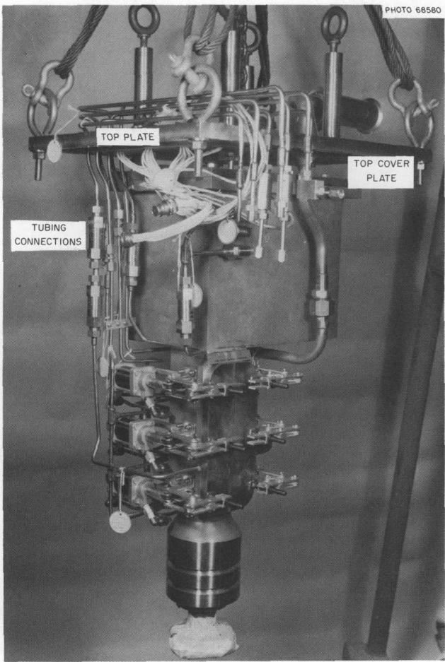  
Fig. 2.1. 1-C Area Unit from Sampler-Enricher (MSRE).

Table 2.1. Steps in Decontamination of 1-C Assembly   

<table><tr><td>Stage 1 - Fission Products Development Laboratory
Initial radiation level (11-22-67), 100-500 r/hr
Initial contamination (smears), 5-1500 mr/hr
103Ru, 95Zr-Nb</td></tr><tr><td>Treatment (80-90°C spray, scrub with fiber brush)
1. Water, 30 min
2. 5% nitric acid, 60 min
3. Water, 30 min
4. 5% oxalic acid, 30 min
5. 5% Turco 4502, 30 min
6. Water, 30 min</td></tr><tr><td>Final radiation level (12-1-67), 2-5 r/hr
Final contamination (smears), 1-20 mr/hr 103Ru,
95Zr-Nb</td></tr></table>

# Stage 2 - Equipment Decontamination Building

Treatment $(80 - 90^{\circ}\mathrm{C})$

1. Bab-O-oxalic acid, 30-min scrub with wire brush   
2. $0.40M$ oxalic acid, $0.34M$ hydrogen peroxide, 0.16 M citric acid, 30-min soak   
3. Bab-O, 30-min scrub with wire brush

Final radiation level (12-6-67), 200 mr/hr (1 tube at 1 r/hr)

Final contamination (smears), 1-5 mr/hr

At the conclusion of the decontamination procedure, levels were low enough that the unit could be worked on directly. Thus the decontamination made available a spare component at substantially less cost than a new one. In addition, it demonstrated that the standard solutions used in the decontamination of stainless components are quite effective on the kind of contamination present in a salt sampler, giving an overall decontamination factor between 500 and 2500.

# 2.4 STUDY OF PINHOLE CAMERA FOR GAMMA SOURCE MAPPING

T. H. Mauney

Studies on the uses of a gamma-ray pinhole camera were resumed. Although our original survey of the literature was not promising, information was later turned up on a technique which is capable of high-quality photographs. The objective in the investigations reported here was to develop the capability for making photographs that could accurately map radiation sources in the MSRE reactor cell for maintenance and experimental planning.

The camera used in the studies is shown in Fig. 2.2. It consists essentially of a thick-walled lead box with an aperture that allows gamma rays and visible light to strike film at the other end of the box. Sheet film is inserted in a slot using a standard 4- by 5-in. film cassette. The aperture is a thin section of aluminum, $\frac{1}{8}$ in. in diameter, through which gamma rays can penetrate, pierced with a 0.016-in.-diam hole to admit visible light. There is no shutter - exposures are long and are satisfactorily controlled by other means. In the tests described here, the lights were turned on and off, and the gamma ray source was moved into and out of the field. In a field application the film would simply be inserted and removed.

Test photographs were made of a 20-curie $^{192}$ Ir source, located in a well-lit shielded room. Some were made with the camera only 12 in. from the source, giving a radiation level at the camera of $110\mathrm{r / hr}$ , which is about the radiation level at the top of the MSRE reactor cell. Other photographs were made with the camera 15 ft from the source and other objects, which is typical of distances in the MSRE cells. Photographs were made with various exposure times, with both x-ray film and

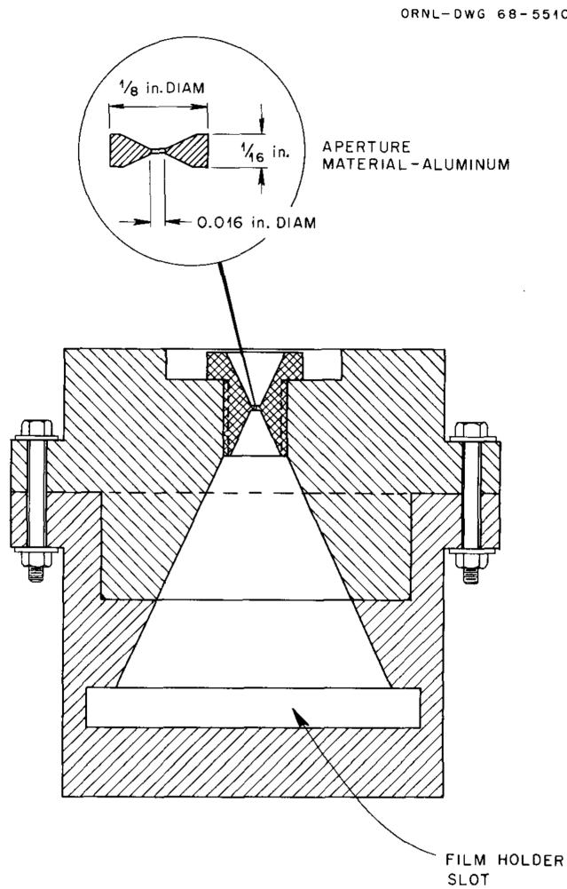  
Fig. 2.2. Pinhole Camera Used in Tests.

visible-light film. Data and results are given in Table 2.2.

Two of the most significant photographs are Figs. 2.3 and 2.4. Figure 2.3 is a photograph on visible-light film exposed for $12\mathrm{min}$ . The source is a $\frac{1}{4}$ -in. pellet inside a $\frac{3}{4}$ -in.-diam capsule, held 12 in. from the camera, in front of a scarred wooden table leg. The poster is about $2^{\frac{1}{2}}$ ft behind the source. Visible details were reproduced clearly, but the gamma radiation produced only a dim spot. Figure 2.4 is a photograph of the same setup, but on x-ray film exposed for $3\mathrm{min}$ . The source spot shows up very clearly, and the visible scene was reproduced well enough to identify the location of the source relative to other objects. In tests with the camera 15 ft from the source, the radiation at the camera was only $0.5\mathrm{r/hr}$ , and the

Table 2.2. Data on Test Photographs with Pinhole Camera   

<table><tr><td rowspan="2">Test</td><td rowspan="2">Type of Filma</td><td rowspan="2">Distance</td><td colspan="2">Exposure Time</td><td rowspan="2">Remarks</td></tr><tr><td>Gamma Rays</td><td>Light</td></tr><tr><td>B</td><td>X ray</td><td>15 ft</td><td>61/2min</td><td>0</td><td>Small spot, underexposed</td></tr><tr><td>C</td><td>Visible</td><td>15 ft</td><td>10 min</td><td>10 min</td><td>Good picture, no spot</td></tr><tr><td>D</td><td>X ray</td><td>15 ft</td><td>10 min</td><td>0</td><td>Good spot</td></tr><tr><td>A</td><td>X ray</td><td>12 in.</td><td>30 sec</td><td>0</td><td>Good spot</td></tr><tr><td>1</td><td>X ray</td><td>12 in.</td><td>30 sec</td><td>45 sec</td><td>Good picture, no spot</td></tr><tr><td>2</td><td>X ray</td><td>12 in.</td><td>3 min</td><td>3 min</td><td>Good picture, good spot → Fig. 2.4</td></tr><tr><td>3</td><td>Visible</td><td>12 in.</td><td>3 min</td><td>11/2min</td><td>Dim spot</td></tr><tr><td>4</td><td>Visible</td><td>12 in.</td><td>6 min</td><td>6 min</td><td>Good picture; no spot</td></tr><tr><td>5</td><td>Visible</td><td>12 in.</td><td>12 min</td><td>12 min</td><td>Good picture, dim spot → Fig. 2.3</td></tr></table>

$^{a}$ X-ray film was Kodak KK, "visible" film was Kodak Tri-X.

source spot was swamped by visible light when film was exposed simultaneously to light and gamma rays. However, a very clear source spot could be produced on x-ray film exposed only to gamma rays. In this case an acceptable picture was obtained by superimposing two negatives: KK x-ray film exposed $6\frac{1}{2}$ min to gamma rays only and Tri-X visible-light film exposed 10 min. The source was hardly distinguishable on a composite print, but its location could be determined fairly well by comparison of the two negatives.

The results indicate that the pinhole camera can be useful in surveying the MSRE reactor cell for gamma-ray sources, and plans are to photograph portions of the cell at the next shutdown.

# 2.5 FREEZE-FLANGE THERMAL CYCLE TESTS

# F. E. Lynch

In the development of the freeze flanges for the MSRE, a prototype flanged joint was subjected to 103 thermal cycles to determine the sealing and distortion characteristics in simulated reactor startups and shutdowns. These thermal cycles were typical of heating and salt-filling operations

but were more severe than those encountered in the MSRE. A satisfactory leak-tight gas seal was obtained at both elevated temperature and room temperature. This number of cycles was greater than the number anticipated for the flanges in the MSRE. Thus it was concluded that the MSRE flanges should be satisfactory from the standpoint of sealing and distortion.

Examination of the prototype flange during and after the 103 cycles showed no cracks such as would be produced by thermal fatigue. Predictions, based on low-cycle fatigue analyses, were that cracks should be expected at about 300 test cycles. The permissible number of cycles of various kinds on the reactor flanges was based on the same kind of analysis, but the permissible number was set a factor of 10 below the number at which cracking would be expected. Now, as reported in Sect. 1.2.3, the reactor flanges have reached $69\%$ of the permissible life. Although they may not reach the permissible limit, it was decided to reactivate the flange thermal cycle test. The purpose is to lend further confidence in the fatigue calculations, and plans are to continue thermal cycling the prototype

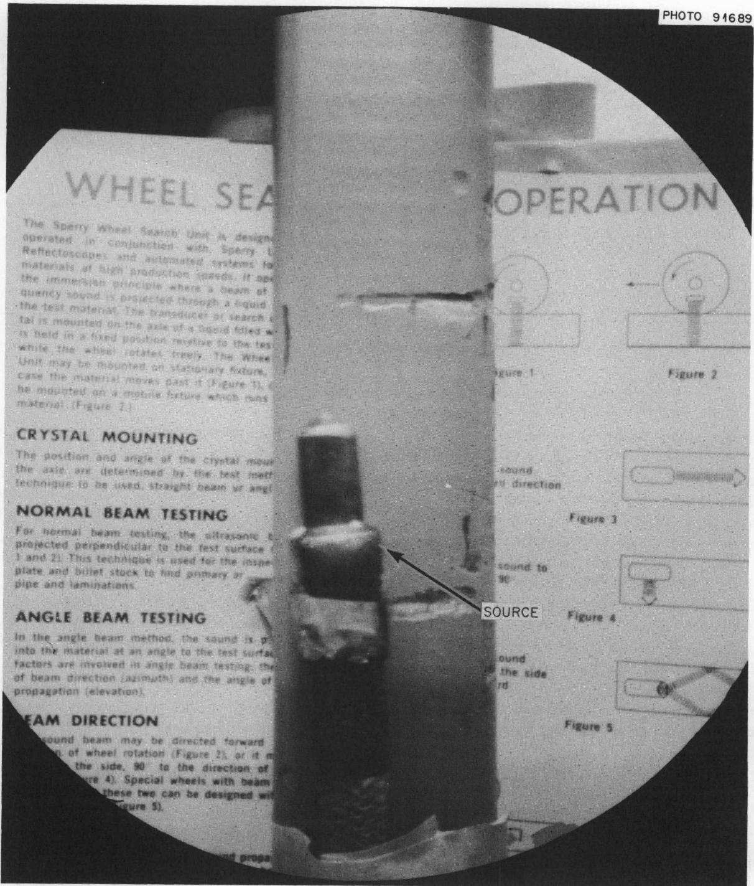  
Fig. 2.3. Test Photograph on Visible-Light Film. Tri-X ortho film, $^{192}\mathrm{I}_{\mathrm{r}}$ source, $100~\mathrm{r / hr}$ at camera, 12-min exposure, 5-min development in x-ray developer.

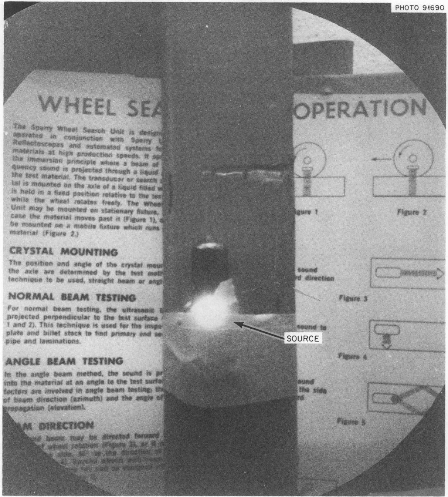  
Fig. 2.4. Test Photograph on X-Ray Film. KK x-ray film, $^{192}\mathrm{Ir}$ source, $110~\mathrm{r / hr}$ at camera, 3-min simultaneous exposure to light and source, 8-min development.

freeze flange until it cracks or until the MSRE is finally shut down.

The Freeze-Flange Thermal Cycle Facility consists of an upper and a lower tank with interconnecting pipe containing the test flange. In the

course of the test, molten salt is oscillated between the two tanks. Salt is forced to flow to the upper tank by pressurizing the lower tank with gas, and it returns to the lower tank by gravity when the pressure between the two tanks is equalized. A

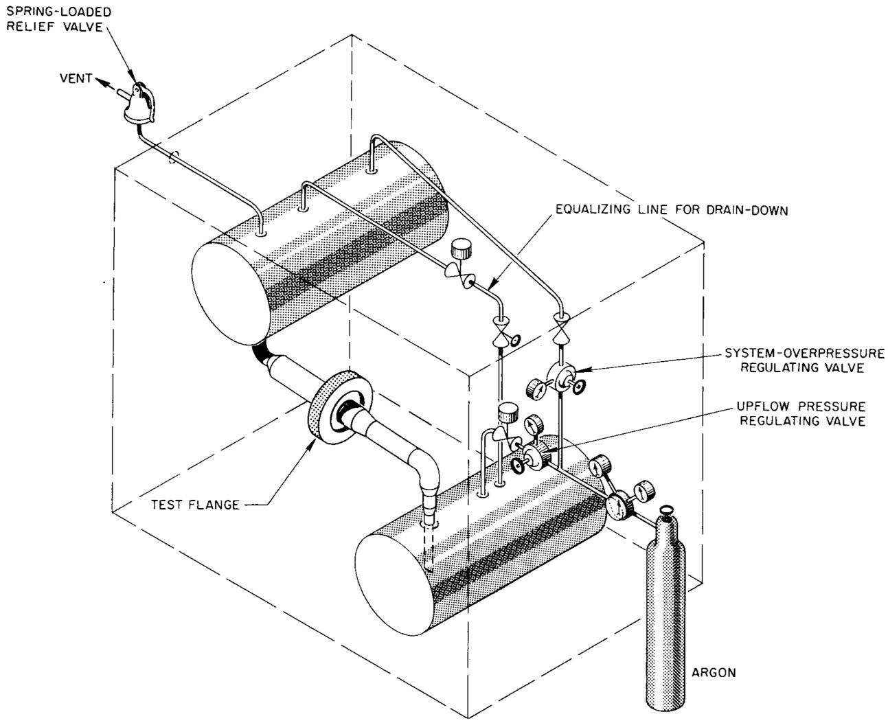  
Fig. 2.5. Freeze-Flange Thermal Cycle Facility.

schematic of the test facility is shown in Fig.

2.5. Figure 2.6 shows the cross section of the 5-in. MSRE-type Hastelloy N flange.

The two tanks remain heated at all times, with the molten salt in the lower tank when the system is not in operation. At the start of a thermal cycle, heaters adjacent to the flanges are turned on, and the system is heated until the flange hub reaches a preset temperature. When this temperature is obtained, contacts within a temperature controller are closed, the lower sump is pres

surized with helium, and a timer is simultaneously started. Level probes control the flow of salt between the two tanks by alternately pressurizing the lower tank and equalizing the gas pressure. This oscillating flow of the salt between the two tanks continues until the preset time on the timer elapses. The timer then turns off the pipe heaters, and the salt drains to the lower sump tank. A controlled cooldown is obtained by reducing the setting on the pipe heaters and reenergizing them for a period of time.

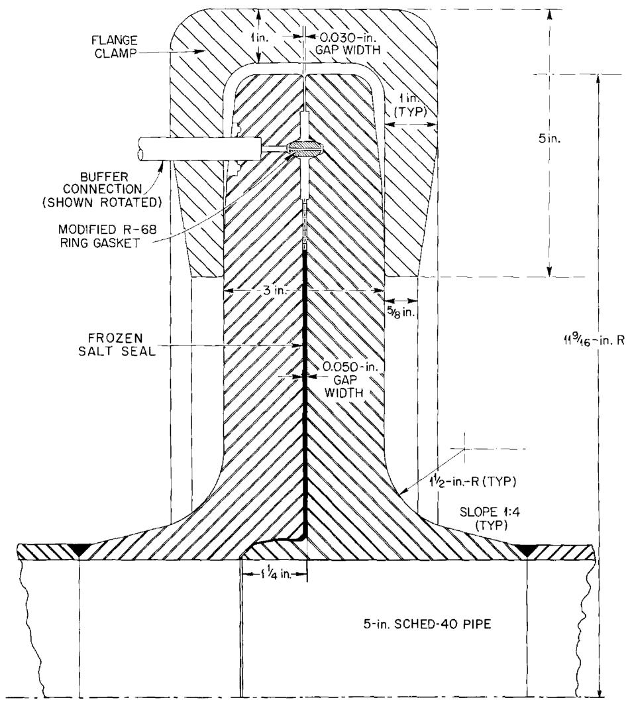  
Fig. 2.6. Cross Section of 5-in. Molten-Salt Freeze Flange.

The tank temperatures are maintained between 1300 and $1350^{\circ}\mathrm{F}$ with corresponding pipe temperatures of approximately $1300^{\circ}\mathrm{F}$ . The temperature at the hub of the uninsulated flange at the time the salt starts to oscillate is between 500 and $600^{\circ}\mathrm{F}$ . Eight to nine hours are required to preheat the pipe to obtain this hub temperature. The salt is then oscillated from one tank to the other for 5 hr. Upon completion of the oscillation time, the flanges are cooled down to approximately $130^{\circ}\mathrm{F}$ .

The original 103 cycles were completed using helium as the cover gas, but when operation was resumed we attempted to use argon. However, we returned to helium when we found that the operating temperature could not be maintained at the desired level with argon. The history of the upper bore and ring temperatures during a typical thermal cycle using helium as the pressurizing gas is shown in Fig. 2.7. A typical radial thermal gradient during salt oscillation is shown in Fig. 2.8.

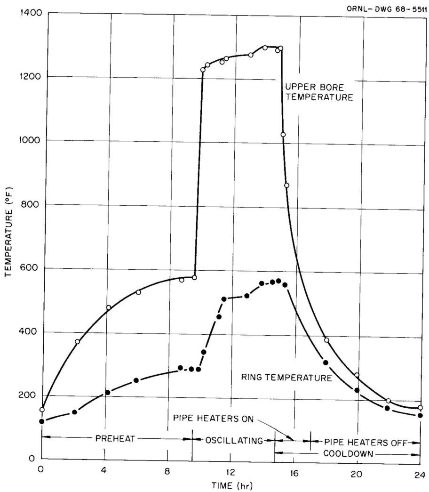  
Fig. 2.7. Upper Bore and Ring Temperature Characteristics of 5-in. MSRE Freeze Flange; Salt Oscillated with Helium.

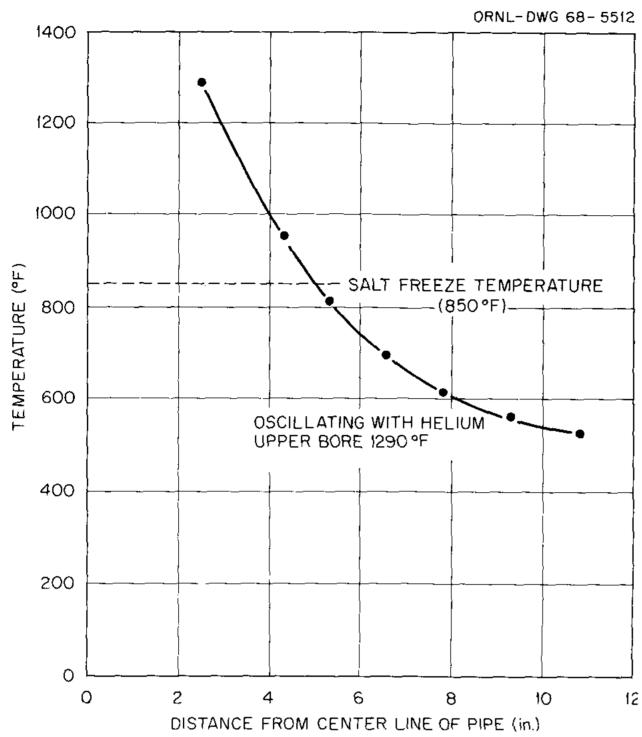  
Fig. 2.8. Radial Temperature Distribution in 5-in. MSRE Freeze Flange.

At this time, a total of 139 cycles have been completed. The outer surfaces of the flange assembly are visually inspected during and after each cycle. A complete inspection of the flange was made between cycles 103 and 104 when the facility was shut down. This inspection included dye-penetrant inspection of the internal flange face and bore surfaces as well as a dimensional check of the bore. These complete inspections will be repeated periodically through the duration of the test.

# 2.6 PUMPS

P. G. Smith A. G. Grindell

# 2.6.1 Mark 2 Fuel Pump

As reported previously, the Mark 2 fuel pump was designed to give more salt expansion in the

pump bowl, thus eliminating the need for the overflow tank used in the present MSRE pump installation. It also differs in having a longer unsupported length of shaft and a different fission gas stripper. During this six-month report period, work continued on preparation of the pump and test facility for test operation with molten salt.7 Installation of the pump tank in the test facility was completed. An electrical furnace for preheating was installed on the pump tank; various thermocouples and electrical preheaters were replaced on the test system, the pressure measuring devices on the salt flow venturi were replaced, and the necessary thermal insulation was applied to the test loop. Some delays were encountered in the assembly of the pump rotary element, and the assembly was not quite finished by the end of the report period.

# 2.6.2 MSRE Oil Pumps

Shakedown of the second of two MSRE lubrication pumps that were refurbished8 was completed, and the two pumps were returned to the MSRE to serve as spares.

# 2.6.3 Oil Pump Endurance Test

The oil pump endurance test was continued. By the end of the period, the pump had run for 40,134 hr circulating oil at $160^{\circ}\mathrm{F}$ and 70 gpm.

$^{7}$ MSR Program Semiann. Progr. Rept. Aug. 31, 1967, ORNL-4191, p. 45.   
8 Ibid., p. 46.   
$^{9}$ MSR Program Semiann. Progr. Rept. Feb. 28, 1962, ORNL-3282, p. 55.

# 3. Instruments and Controls

L. C. Oakes

# 3.1 MSRE OPERATING EXPERIENCE

The instrumentation and control systems continued to function well, and the failure rate of components continued to decrease. Component failures did not compromise reactor safety or cause excessive inconvenience in reactor operation.

# 3.1.1 Safety System Components

# J. L. Redford

Five more relays failed in the rod scram coincidence matrix. This made a total of seven failures in less than a year out of the 15 relays in the matrix. These relays are 115-v ac relays operating in a 32-v dc system. Relays more suited to the service were procured and are ready to install.

Numerous false trips on channels 2 and 3 were traced to intermittent false operation of core outlet temperature switches. Replacing the switches remedied the trouble.

Other than test scams, the control rods were scrambled only twice in the six months. The first scam was caused by the building power failure in October while the reactor was at full power. The other occurred while the reactor was at $10\mathrm{kw}$ in November and resulted from circuit testing in search of a ground in the rod servo system.

One of the three ionization chambers began producing a reverse current, and upon removal it was found that moisture had leaked into the cable.

# 3.1.2 Thermocouples

# C. H. Gabbard

As described in the last semiannual report there has been very little change in the apparent ac

curacy of the thermocouples in service on the salt systems. There have also been remarkably few failures due to breakage, shorting, grounding, or apparent detachment from the surface being monitored.

The thermocouples are Chromel-Alumel wires enclosed in a $\frac{1}{8}$ -in. Hastelloy N or stainless steel sheath with magnesia insulation. Most junctions are grounded. The sheathed thermocouple stock was commercially manufactured to ORNL specifications, and the junctions and disconnect seals were prepared at the MSRE by ORNL craftsmen.

A total of 1071 thermocouples are installed at the MSRE. Of these, 866 are on the salt systems: 351 on the circulating loops and the remainder on the drain tanks, drain lines, and freeze valves. Of the 1071 thermocouples, only 9 have failed in more than three years of service. Three others are unserviceable because of damage suffered during the final stages of construction when repair was too difficult to be worth while. A breakdown of the failures is given in Table 3.1.

Table 3.1. Failures Among 1071 MSRE Thermocouples Through February 29, 1968   

<table><tr><td>Nature of Failure</td><td>Number</td></tr><tr><td>Damaged during construction</td><td>3</td></tr><tr><td>Damaged during maintenance</td><td>2</td></tr><tr><td>Lead opened during operation</td><td>3</td></tr><tr><td>Abnormally low reading (detached?)</td><td>3</td></tr><tr><td>Bad disconnect in reactor cell</td><td>1</td></tr><tr><td>Total</td><td>12</td></tr></table>

# 3.1.3 Other Instruments and Controls

J. L. Redford

Two fission chamber failures occurred during the period. One was because of a leak in the cable, and the other has not yet been diagnosed.

The failure in the fine position synchro transmitter on rod drive No. 2 appears to be an open rotor winding, as in the previous failure reported last period. With the transmitter in this condition, the position indicator on the console tracks normal changes but may lose $180^{\circ}$ on rod scams.

Miscellaneous failures included the air flow switch on a radiator annulus blower. A new switch with a smaller paddle will be tried. The power supply to the single-point level switches in the drain tanks failed because of a cooling blower failure. The blower was replaced, and the power supply was repaired.

# 3.2 CONTROL SYSTEM DESIGN

P. G. Herndon

Further additions and modifications were made to the instrumentation and controls systems as experience revealed the need or desirability of more information for the operators, improved performance, or increased protection. During the report period there were 26 design change requests directly involving instruments or controls. Seven of these required only changes in process switch operating points, sixteen resulted in changes in instruments or controls, one was canceled, and the remaining two were not completed. The more important changes are described below.

To avoid further damage to wiring and equipment resulting from short circuits to ground, isolation transformers were installed in the power supply to the motor control circuits of the fuel sampler-enricher cable drive motor. This permits the entire circuit to float at 115 v above ground potential. Before this revision, one control power conductor was a grounded neutral. The floating circuit will operate normally when only one point is grounded, but a misoperation is likely to occur if two points become grounded at the same time. To avoid two simultaneous grounds, ground-detecting lamps were installed, and all grounds will be corrected as soon as possible.

The design of instrumentation and controls for a fluorinated-fuel-salt filter in transfer line 110 between the fuel storage tank and the fuel drain tanks was started. Eleven mineral-insulated, Inconel-sheathed thermocouples are attached to the salt filter and connected to the patch panel in the main control room. Temperature interlocks are provided to annunciate high temperatures in the filter gas space and to stop the transfer of salt to the fuel drain tanks by closing the fuel storage tank helium supply valve if the temperature of the top flange on the filter gets too high. A helium purge line is also provided at the top of the filter to prevent salt from contacting the flange.

Several additions to the fuel processing plant helium supply system are designed to prevent an accidental fill of the reactor during fuel transfer operations: a pressure relief valve limits the maximum pressure in the line supplying the fuel processing plant to 50 psig, a capillary flow restrictor designed to the same specifications as FE-517 (the drain tank helium supply restrictor) limits the maximum flow rate in the salt filter purge line to a value less than 0.5 cfm, and a weld-sealed solenoid block valve is installed in the filter purge supply line. Safety-grade interlocks are designed to close the purge supply block valve and the fuel storage tank helium supply valve on an emergency drain or fill-restrict signal. A safety-grade jumper is provided around these interlocks.

Plans are to use the decontamination cell to store traps loaded with $\mathbf{U}\mathbf{F}_{6}$ from the fuel fluorination. To ensure that water does not accumulate undetected in this cell, a bubbler-type liquid level measuring system identical to that in other equipment cells was designed for the decontamination cell. A level indicator is located in the transmitter room, and a high-level annunciator is provided in the auxiliary control room.

The helium and standard gas supply systems on the fuel off-gas sampler proved to be inadequate during initial test operations. To obtain the precise flow control required for the purge and calibration operations and to provide better protection for delicate components, a new gas supply system was designed and installed. The volume of all lines to each piece of equipment was reduced to a minimum, special pressure regulators designed for use in chromatograph systems were provided, and additional pressure-relief valves were installed. A conductivity-type level detecting system was designed for the off-gas sampler containment box.

The instrument provides an alarm if the box starts to fill with water.

# 3.3 MSRE NEUTRON NOISE ANALYSIS

D. N. Fry

R.C.Kryter

J. C. Robinson

The spectrum of inherent noise in the MSRE neutron flux signal has been examined in some detail. The data are collected through a special low-noise instrument channel and are digitally recorded on magnetic tape by the on-line computer. A program has also been prepared to permit direct digital analysis of the data tapes by the same computer immediately after the data are collected.

A considerable amount of data was collected in run 14 with particular emphasis on the series of experiments at $5\mathrm{Mw}$ . The most prominent feature of all the noise spectra is a peak at about 1 hertz (see Fig. 3.1). In general, this peak increased in

amplitude under conditions where the fraction of circulating voids increased. Figure 3.1 shows two noise spectra which illustrate this effect. Other variations were also observed, and detailed correlations of the noise spectra with other reactor data are being attempted.

# 3.4 TEST OF MSRE ROD CONTROL SYSTEM UNDER SIMULATED $^{233}\mathrm{U}$ LOADING CONDITIONS

S. J. Ball

R.J.Steffy,Jr.

Because of the smaller fraction of delayed neutrons from $^{233}\mathrm{U}$ fission, the prompt power response to a sudden reactivity change will be about three times as large as for the present $^{235}\mathrm{U}$ fuel loading. Conceivably this increased high-frequency

2 Ibid., pp. 61-62.

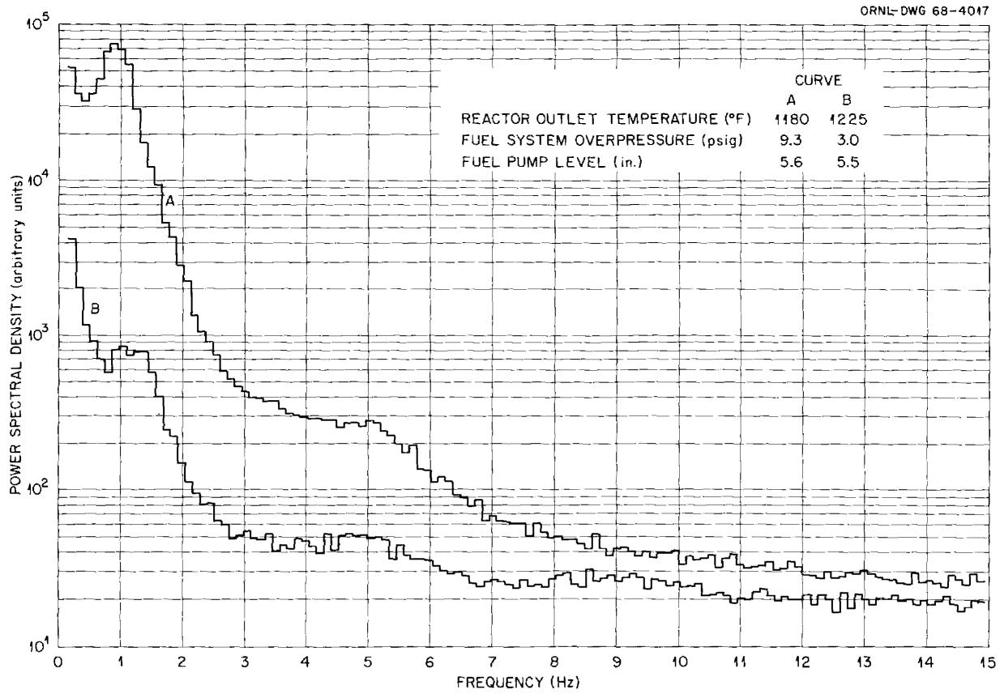  
Fig. 3.1. Typical Effect of Reactor Operating Parameters on the Spectrum of Inherent Neutron Fluctuations in MSRE. Reactor power $= 5$ Mw.

gain could cause enough overshoot following a control rod adjustment that the rod servo controller would hunt excessively. Thus it was desired to determine in advance if any changes would be necessary in the servo system to have it function properly with $^{233}$ U fuel.

A method was devised to test the capability of the servo system for controlling the reactor with $^{233}\mathrm{U}$ fuel. Basically it consisted in modifying the flux signal to the servo system so that the apparent response to a rod change closely resembled that from the $^{233}\mathrm{U}$ system. Appropriate resistors and capacitors would be wired around existing elements in the servo network (see Fig. 3.2) so that the flux input signal would have a high-frequency gain about three times normal but an identical steady-state value.

Verification of the validity of this experiment and its implementation were assigned to an MIT

Practice School team (P. J. Wood, leader, and D. J. Roberts). The work reported below was carried out mainly by them.

Before the experiment was conducted on the reactor, the method was tested by analog simulation. The simulator used essentially the same model of the MSRE that was used in the operator training simulator except that only three delayed neutron groups were used and that the external fuel circuit was represented by a third-order system. Three conditions were simulated: the MSRE with $^{235}\mathrm{U}$ fuel and with $^{233}\mathrm{U}$ fuel, both with an unmodified servo system, and the reactor with $^{235}\mathrm{U}$ fuel and the servo system modified by the proposed RC network. Figures 3.3 and 3.4 show the response of

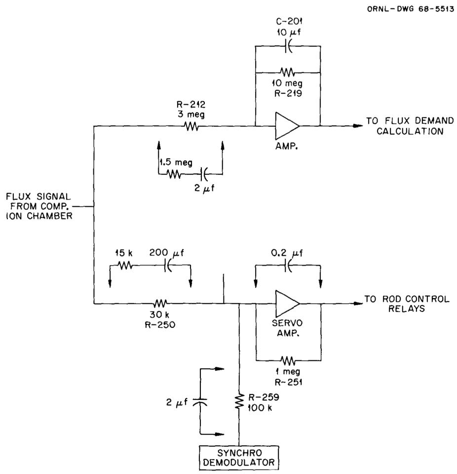  
Fig. 3.2. Schematic Diagram Showing Additions Made to Servo Circuit to Simulate $^{233}\mathrm{U}$ Fuel Loading.

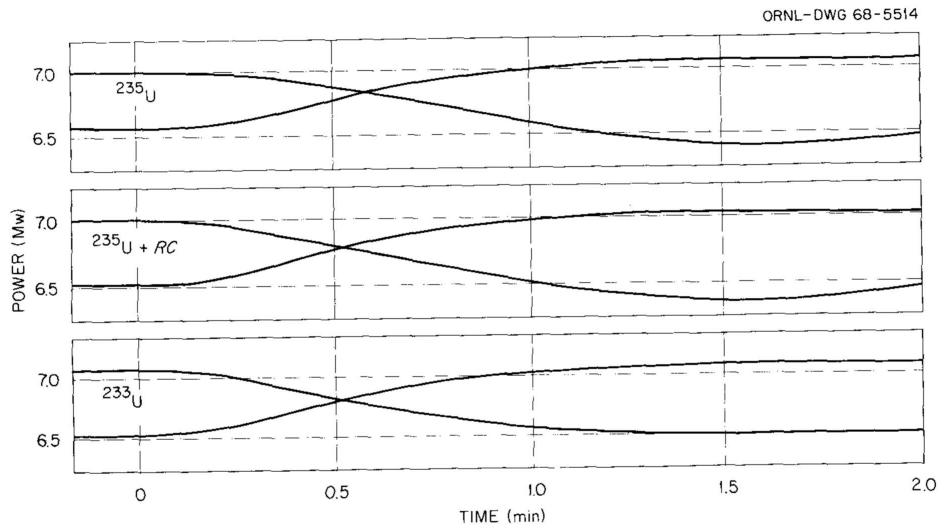  
Fig. 3.3. Analog Simulation of 0.5-Mw Load Changes.

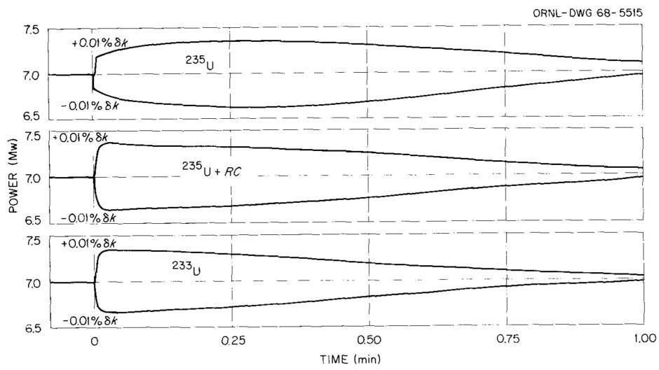  
Fig. 3.4. Analog Simulation of $0.01\% \delta k / k$ Changes.

the three systems to a 0.5-Mw load change and a step reactivity change of $0.01\% \delta k / k$ respectively. It is apparent that the $^{235}\mathrm{U} + RC$ system closely follows the $^{233}\mathrm{U}$ system response for fast changes. Table 3.2 further illustrates the success of the $RC$ networks in making the $^{235}\mathrm{U}$ response approach that of the $^{233}\mathrm{U}$ system. Thus the analog results showed that the modification of the $^{235}\mathrm{U}$ system response was approximately correct for high-frequency changes ( $>0.3$ radian/sec) and that the

proposed experiment on the MSRE should indeed test the servo system under conditions close to those existing with the $^{233}\mathrm{U}$ loading.

With confidence established that addition of an $RC$ network would provide a meaningful simulation, the experiment was performed on the reactor. After the proper $RC$ elements were attached to the circuit, the system was perturbed small amounts in three different ways: (1) a shim rod was inserted $\sim 0.5$ in., (2) the radiator load was changed by

Table 3.2. Comparison of Flux Response to $0.01\% \delta k / k$ Step Increase in Reactivity in Three Systems on Analog Computer   

<table><tr><td>Time After Reactivity Step (sec)</td><td>Difference Between 233U and 235U (%)</td><td>Difference Between 233U and 235U + RC (%)</td></tr><tr><td>1</td><td>33</td><td>8</td></tr><tr><td>2</td><td>26</td><td>9</td></tr><tr><td>3</td><td>22</td><td>6</td></tr><tr><td>5</td><td>10</td><td>4</td></tr></table>

0.5 Mw, and (3) the outlet temperature demand was changed by $3^{\circ}\mathrm{F}$ . After each of these tests the system was allowed to reach equilibrium and was then returned to its original state by reversal of the initial procedure. The ability of the controller to correct for large changes was tested by a 2.7-Mw power change (from 7.2 to ~4.5). In only one test, the $3^{\circ}\mathrm{F}$ outlet temperature demand change, did the regulating rod oscillate abnormally. When the demand was increased, the rod oscillated for about 25 sec (six withdraws and six inserts) but then steadied out without external interference. A similar occurrence was not observed when the temperature demand was decreased. The conclusion was that at least when the reactor operates at high power, the present rod servo system will be adequate and will not introduce undue rod oscillations. Because the highest gain relative to the servo dead band occurs at lower powers, the situation may not be as favorable, but minor adjustments should be all that is required for $^{23} \mathrm{U}$ operation.

# 3.5 ANALOG COMPUTER STUDIES OF THE MSRE SYSTEM WITH $^{233}\mathrm{U}$ FUEL LOADING

O.W.Burke

F. H. Clark

As part of the analysis of the MSRE with $^{23}$ U-bearing fuel, a detailed simulation of the system was set up on an analog computer. The simulation included the period-scram circuits that cause the control rods to scream after the period becomes shorter than 1 sec. This could not be conveniently included explicitly in the digital calculations because of the complex dependence of the scream signal on the initial neutron level, the gamma background, and the history of the flux and the period as it approaches 1 sec. Results from these analog studies were combined with digital calculations to describe the behavior of the reactor under accident conditions. The findings of these coordinated studies are described in detail in Sect. 4.2.

Some preliminary analog studies were made to assess the performance of the servo controller with $^{233}\mathrm{U}$ fuel based on estimated values of instrument time lags and rod-drive-motor inertial effects. It appears that the controller will be quite adequate when operating at the higher powers associated with the temperature mode of control. There was some indication of "hunting" at very low power levels while operating in the flux mode of control. These results support those obtained from the insitu test of the actual servo control system with the modified flux input (see Sect. 3.4). Plans were developed to measure control rod accelerations and coastdowns experimentally. These will be incorporated in the analog simulation to more accurately predict the performance of the control system with $^{233}\mathrm{U}$ fuel.

# 4. MSRE Reactor Analysis

# 4.1 INTRODUCTION

B. E. Prince

Reactor physics studies in support of the future operation of the MSRE with a $^{233}\mathrm{U}$ fuel loading were extended to aid in evaluating the nuclear safety of the system. Use was made of results of previous computational studies of the neutronic properties of the system with $^{233}\mathrm{U}$ fuel, and emphasis was given to analysis of some abnormal situations which could conceivably lead to nuclear excursions. To perform these studies, we used the reactor kinetics-digital simulation code ZORCH, developed for calculation of large transients in power, temperature, and pressure in the MSRE. The general approach taken in the safety studies was similar to that used earlier for analysis of the nuclear safety with the present $^{235}\mathrm{U}$ -bearing fuel salt. In the evaluation of nuclear safety for the $^{233}\mathrm{U}$ loading, however, we have attempted where possible to take advantage of experience gained from both simulation studies and reactor operation with the present fuel salt. Thus, from the standpoint of magnitudes and rates of reactivity addition and initial reactor conditions, some incidents considered in the original safety analysis could either be judged unrealistic or less severe than others. As was the case with the present fuel loading, the potentially most severe nuclear

excursions with a $^{233}\mathrm{U}$ fuel salt were found to be associated with two postulated incidents. One incident results from the sustained withdrawal of the three reactor control rods at maximum rate with the initial neutron level very low, near source conditions. The other incident involves the gradual separation of uranium from the main stream of circulating salt during routine operation of the reactor, followed by the rapid return of the uranium in concentrated form to the core. We have performed digital simulation studies of the consequences of these incidents to determine both the inherent shutdown capabilities of the system (through temperature-reactivity feedback) and also the effectiveness of the reactor safety system in initiating control rod scams to suppress the excursions. Though the latter is of principal concern in these studies, it is of interest to obtain the approximate relations between these reactivity addition incidents and the inherent shutdown capabilities of the reactor, without action of the safety-scram system. In addition to these simulation studies, in order to further elucidate the nuclear safety consequences of changing to a $^{233}\mathrm{U}$ fuel salt, we have compared simulations of these incidents with $^{233}\mathrm{U}$ and with the present $^{235}\mathrm{U}$ fuel loading, the latter calculated using updated values of the MSRE neutronic characteristics obtained since the earlier nuclear safety studies. This comparison is described further in the results summarized in the following sections. A synopsis of the most important results of these studies is also included in ref. 6 in context with general description of the safety of the reactor system with $^{233}\mathrm{U}$ .

# 4.2 SIMULATION OF NUCLEAR EXCURSION INCIDENTS

B. E. Prince

R.C.Steefty,Jr.

# 4.2.1 Uncontrolled Rod Withdrawal

In this hypothetical accident, a nuclear excursion is produced by the sustained withdrawal of the three control rods, with the reactor passing through criticality when the rods are near the position of maximum differential worth. The restrictions and control interlocks which would prevent this type of incident from occurring are described in ref. 6. In this section, we will summarize the results of digital simulations of the accident, including the most severe conditions which would result without consideration of the action of the safety system and the effect of this action in initiating rod scream and terminating the excursion.

To define initial conditions in the rod-withdrawal incident, we have assumed that the reactor is loaded with excess uranium equivalent in reactivity to the worth of one control rod $(2.75\% \delta k / k)$ . The reactor is initially subcritical by the insertion of all three rods, the fuel is circulating, and the core temperature is uniform at $1200^{\circ}\mathrm{F}$ . The initial fission rate is quite low, near a low limit determined by the strength of the inherent $\alpha, n$ source in the $^{23}3\mathrm{U}$ fuel (approximately 1 w). The three rods are now assumed to be withdrawn in unison at a speed of 0.5 in./sec. The reactor passes through criticality when the rods are approximately 28 in. above the position of maximum insertion, which is approximately 3 in. above the position of maximum differential worth. In this region the rod motion would correspond closely to a ramp addition of reactivity of $0.093\%/\mathrm{sec}$ . Without consideration of the action of the safety system, a short time after criticality is reached, sufficient reactivity would be added to produce a prompt-critical excursion. This would be terminated by temperature feedback due to nuclear heating of the fuel. Then, if the rod withdrawal were continued, reactivity would be added at the above rate for approximately 16 sec after the time of criticality. The rate would then decrease gradually until the rods reached their upper limits. After the initial prompt-critical excursion, the power and temperature would increase gradually to keep in step with the continued reactivity addition.

These characteristics are exhibited by results of digital calculations of the power-temperature-pressure excursion, shown in Fig. 4.1. For these calculations, initial steady-state conditions at a power level of 1 w were assumed, and the rod withdrawal was assumed to begin at time zero, near the position of maximum differential worth. Both the temperature of the fluid at the hottest point in the reactor channel and the outlet temperature of the hottest channel are plotted in Fig. 4.1. (As described in ref. 2, the digital model includes a detailed numerical treatment of the axial convection of heat by fluid motion during the power transient.) The calculated pressure surge during the period of very rapid heating, also shown in Fig. 4.1, results primarily from the effects of acceleration of fluid in the outlet pipe. A description of the mathematical model for the pressure rise calculation is included in ref. 3.

In order to illustrate the importance of the differences in neutronics characteristics in changing the loading from the present $^{235}\mathrm{U}$ -bearing salt to a $^{233}\mathrm{U}$ salt, we also performed calculations similar to those of Fig. 4.1 for the present fuel composition. To simplify this comparison, we assumed that the reactivity addition rates were identical (0.093% $\delta k / k / \sec$ ) and also that the initial neutron levels were identical (1 w). In an accident simulation for the $^{235}\mathrm{U}$ fuel, the reactivity addition corresponding to rod withdrawal would actually be about 30% smaller than the above rate because of the smaller worth of the control rods. However, by making these assumptions, the nuclear excursions can be compared simply on the basis of the differences in delayed neutron fractions, temperature coefficients of reactivity, and prompt-neutron generation time for the two fuels. The resulting nuclear transients calculated for the $^{235}\mathrm{U}$ fuel are shown in Fig. 4.2. It is evident that the rapid portion of the transient occurs later in time with $^{235}\mathrm{U}$ than with the $^{233}\mathrm{U}$ fuel, since more reactivity must be added to reach the prompt-critical condition. As the reactivity addition continues beyond this condition, the presence of the larger amount of excess reactivity and the smaller temperature coefficient of reactivity of the $^{235}\mathrm{U}$ fuel lead to a larger temperature transient for the $^{235}\mathrm{U}$ case. In other words, the inherent shutdown mechanisms with $^{233}\mathrm{U}$ begin to take effect sooner, must compensate for less reactivity, and compensate more effectively than with $^{235}\mathrm{U}$ .

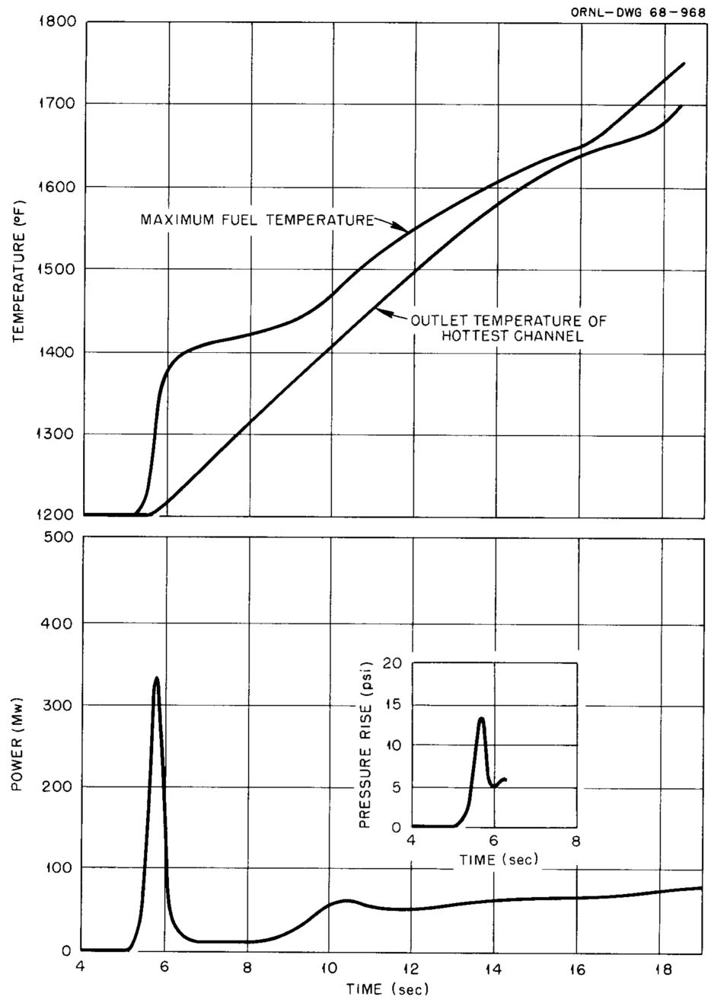  
Fig. 4.1. Results of Uncontrolled Rod Withdrawal with No Safety Action. $233\cup$ fuel.

The calculations shown in Fig. 4.1 for the $^{233}\mathrm{U}$ fuel indicate that the fuel temperature and core pressure rise incurred during the rapid portion of the transient would be inconsequential in terms of conservative limits specified in the nuclear safety analysis (340°F and 50 psi). However, it is clear that counteraction of the rod withdrawal would

ultimately be necessary to prevent overheating of the core. To this aim, the safety system would actuate a rod scream to limit the excursion. Scrams would be actuated by any of three conditions:

(1) high flux level (over $11.25 \, \text{Mw}$ , if the fuel pump is running, or $11.25 \, \text{kw}$ if the circulation is stopped), (2) positive periods less than 1 sec,

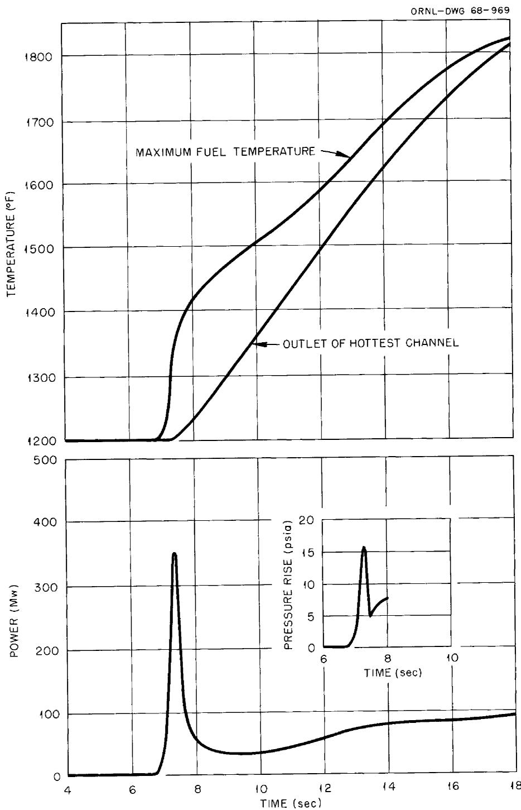  
Fig. 4.2. Results of Uncontrolled Rod Withdrawal with No Safety Action. $^{235}\mathrm{U}$ fuel.

and (3) reactor outlet temperatures greater than $1300^{\circ}\mathrm{F}$ . In the incidents of the type considered in these studies, the first two are the active mechanisms. In all our simulation studies, we have assumed (1) that only two of the three control rods drop on request, (2) a time delay of 100 msec occurs between scram signal and the start of rod drop, and (3) the rod acceleration is $10\mathrm{ft} / \mathrm{sec}^2$ .

Figure 4.3 shows the results of actuating the rod scram due to increases in the neutron flux above the 11.25-Mw level. This mechanism would be effective in limiting the nuclear excursion to inconsequential proportions. Actually, a safety scram would occur earlier than indicated by Fig. 4.3, due to reactor periods smaller than 1 sec. The digital calculations for this transient showed that a 1-sec period is reached at approximately 1.4 sec, a 500-msec period at 2.4 sec, the 11.25-Mw level at 5.3 sec, and the maximum power, limited by temperature feedback, at 5.8 sec. Thus, calculations based on quite conservative assumptions of the actual time of actuation of the period scram showed that the power transient would be at least two orders of magnitude below that shown in Fig. 4.3.

# 4.2.2 Return of Separated Uranium to the Core

The inclusion in the nuclear safety calculations of an incident involving the gradual separation of uranium from the circulating salt and its rapid concentration and return to the reactor core is based on the existence of two possible avenues for chemical separation of uranium from the molten fluoride salt. One avenue requires the loss of enough fluorine from the salt to ultimately result in the production of metallic uranium. The other requires the gross contamination of the salt with enough oxygen or water vapor to result in the production of $\mathrm{ZrO}_2$ and finally $\mathrm{UO}_2$ . Precautions are taken to avoid contaminations, and evidence accumulated from chemical analyses during operation with the present $^{235}\mathrm{U}$ -bearing fuel salt has indicated no trends in either of these directions toward uranium separation. Although we expect these trends to continue when the reactor is operated with $^{233}\mathrm{U}$ , the existence of these remote possibilities motivates the analysis of a hypothetical nuclear incident of this type.

To define the conditions for the incident, we have assumed that, during routine operation of

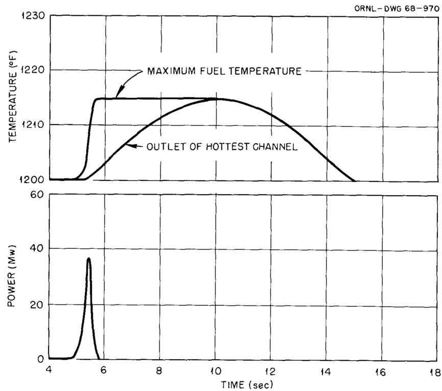  
Fig. 4.3. Results of Uncontrolled Rod Withdrawal with Scram at 11.25 Mw. 233U fuel.

the reactor at some steady power level, uranium is gradually removed from the main circulating stream and is accumulated in low-velocity regions. At the same time, the regulating rod is automatically withdrawn to compensate for the reduction in uranium concentration. We then assume that, by some mechanism, this concentrated uranium is suddenly dispersed throughout the $10\mathrm{ft}^3$ of fuel salt in the lower head of the reactor vessel and is carried upward through the channeled region of the core by the fluid motion, producing a nuclear excursion. It is clear that the assignment of a single magnitude or rate of addition of reactivity in this incident is not possible, as was the case with simulation of the uncontrolled rod withdrawal. Thus, it was necessary to study the consequences of the uranium separation incident as a function of the amount of uranium (or reactivity) lost and also of the initial reactor operating conditions. The principal aim of the analysis was to compare the magnitude of the reactivity loss which would be required to produce severe rises in temperature

and pressure during the excursion associated with the return of all the lost uranium with the magnitude of anomalous reactivity loss which could be detected by routine computer monitoring of the reactivity balance. As in the case of the uncontrolled rod withdrawal incident, the nuclear excursions were simulated both with and without the safety scream of the control rods.

Although the magnitude of reactivity loss was considered as a parameter in the analysis, for the conditions defined above, the time-dependent shape of the reactivity addition during the uranium return would be largely determined by the fluid dynamics of the core and by the spatial distribution of nuclear importance. Figure 4.4 shows the time dependence of the reactivity calculated from the flow velocities observed in the MSRE hydraulic mockup vessel and normalized to $\Delta k_{0}$ , the magnitude of the original reactivity loss. Equivalently, $\Delta k_{0}$ would be the reactivity effect of all the separated uranium if it were uniformly dispersed throughout the $70\mathrm{ft}^3$ of salt in the loop rather than con

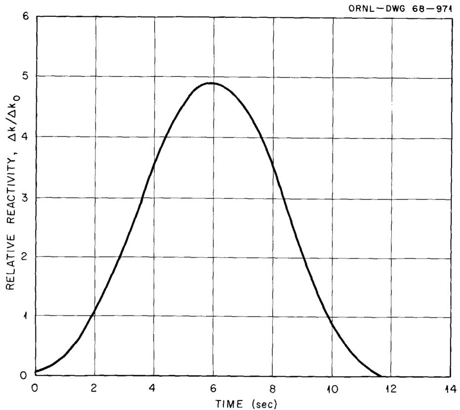  
Fig. 4.4. Time Dependence of Reactivity Addition Due to Sudden Resuspension of Uranium in Lower Head of Reactor Vessel.

centrated in the salt moving through the core. From Fig. 4.4, the maximum total reactivity which could be added to the core is $4.9\Delta k_{0}$ , and the maximum rate of addition is $1.35\Delta k_{0} / \mathrm{sec}$ .

In choosing the initial reactor operating conditions for this incident, we have assumed that the lowest initial power level would be $1\mathrm{kw}$ and that the maximum power would be $7.2\mathrm{Mw}$ . The former value is about ten times smaller than the lowest steady power at which the reactor would be routinely operated. The initial inlet fuel temperature was assumed to be $1200^{\circ}\mathrm{F}$ in all the calculations.

For a typical calculated incident of this type in which there is no safety rod scream, Fig. 4.5 shows the transient behavior of the fuel salt temperature at the hottest point in the core and also the transient salt temperature at the outlet of the hottest channel. Here, the initial power level is $1\mathrm{kw}$ and the original reactivity loss $\Delta k_{0}$ is $0.25\%$ in multiplication factor. Associated with the rapid rise portion $(t\stackrel {\sim}{=}3.5\mathrm{sec})$ of the curve for maximum fuel temperature are prompt-critical excursions in power and core pressure qualitatively similar to those shown in Fig. 4.1. The maximum pressure rise for this case was about 39 psi. In Fig. 4.5, the temperatures ultimately reach a maximum and

then decrease as the concentrated uranium is again removed from the core. The dependences of these peak pressures and temperatures on the initial power level and on the magnitude of $\Delta k_{0}$ are shown in Figs. 4.6 and 4.7. No safety rod scream was assumed for these calculations. Figure 4.6 shows that, for the case of $\Delta k_{0} = 0.25\%$ , the worst conditions for the pressure surge occur at low initial power levels. This prompt rise in pressure results mainly from expansion of the core fluid and consequent fluid acceleration effects, which depend on the rate of increase in the power level. At higher initial power levels the nuclear heating of the core fluid tends to slow the rate of rise in power earlier in the course of the transient. The dependence on $\Delta k_{0}$ of the maximum temperature rise of the outlet of the hottest fuel channel is shown in Fig. 4.7 for the maximum and minimum initial power levels assumed: $7.2\mathrm{Mw}$ and $1\mathrm{kw}$ . For values of $\Delta k_{0}$ larger than about $0.25\%$ , the temperature rise is nearly independent of initial power. These cases correspond to reactivity additions well above prompt critical, in which the graphite temperature change is relatively small and the fuel temperature increase depends on the integral of the power. At the opposite extreme, for

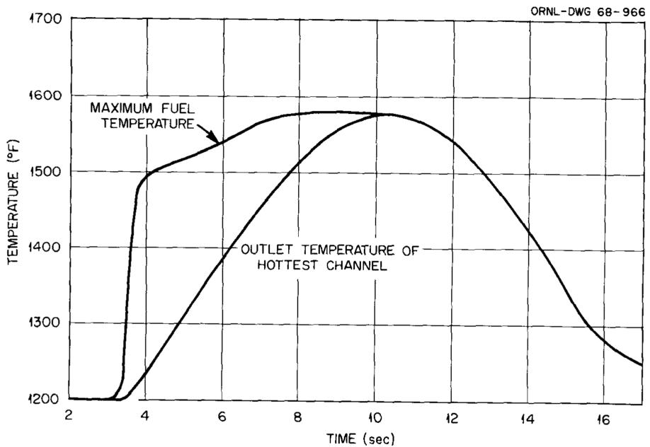  
Fig. 4.5. Temperature Excursion Caused by Sudden Resuspension of Uranium Equivalent to $0.25\% \delta_{k/k}$ if Uniformly Distributed. Initial power, $1 \mathrm{~kw}$ ; no safety action.

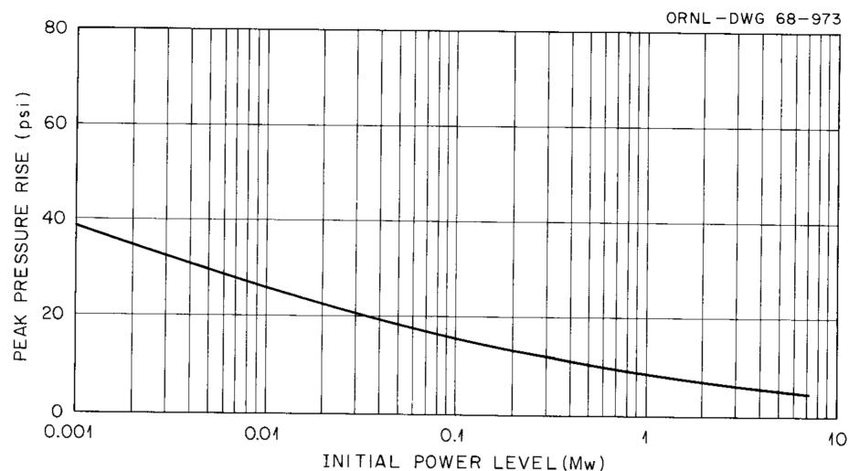  
Fig. 4.6. Effect of Initial Power on Peak Pressure Rise Caused by Sudden Resuspension of Uranium Equivalent to $0.25\% \delta_{k / k}$ if Uniformly Distributed. No safety action.

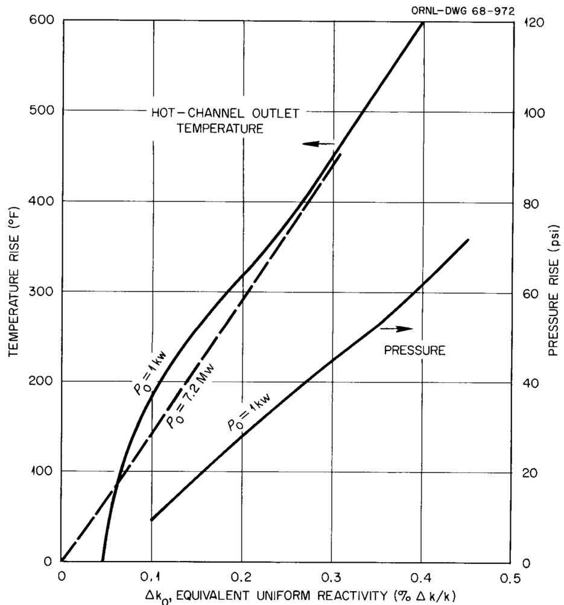  
Fig. 4.7. Effect of Magnitude of Reactivity Recovery on Peak Pressure and Temperature Rises During a Uranium Resuspension Incident with $^{233}\mathsf{U}$ Fuel. No safety action.

small values of the reactivity $(\Delta k_0 \leq 0.035\%)$ , the reactor remains below prompt critical at the peak of the reactivity addition, and delayed neutron effects tend to control the response characteristics. The dependence of the magnitude of the pressure rise on $\Delta k_0$ is also shown in Fig. 4.7. The curve corresponds to an initial power level of $1\mathrm{kw}$ ; on the same scale, the pressure rise corresponding to an initial power level of $7.2\mathrm{Mw}$ would be quite small.

The preceding calculations take no account of the control rod safety scram action in suppressing the nuclear excursion. An indication of the influence of the initial reactor conditions and the magnitude of reactivity addition on the action of the safety scram system is provided by the curves in Figs. 4.8 and 4.9. For $\Delta k_{0} = 0.25\%$ , Fig. 4.8 shows, as a function of the initial power level, the relative sequence in time of achieving various conditions during the transient: (1) a 1-sec period, (2) a $\frac{1}{2}$ -sec period, (3) high neutron level (11.25 Mw), and (4) peak power conditions with only inherent shutdown by temperature feedback effects. This figure indicates that a scram due to periods

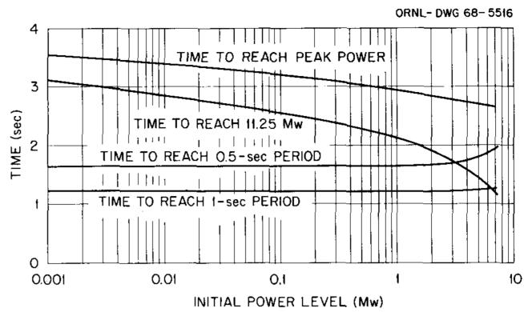  
Fig. 4.8. Effect of Initial Power Level on Times to Reach Scram Conditions and Peak Power Conditions with $233\mathrm{U}$ Fuel. $\Delta k_{0} = 0.25\%$ .

smaller than 1 sec would considerably precede the conditions of high neutron level over all but the highest indicated initial operating power. At these high power levels, the smaller fractional increment in power required to reach $11.25\mathrm{Mw}$ reduces the time interval relative to that of the peak temperature conditions.

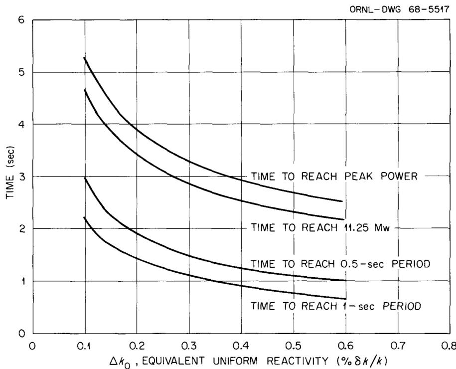  
Fig. 4.9. Effect of Magnitude of Reactivity Recovery on Times to Reach Scram Conditions and Peak Power Conditions with $233\mathrm{U}$ Fuel. Initial power, 1 kw.

In an analogous fashion, Fig. 4.9 shows the dependence of this time sequence on the magnitude of $\Delta k_{0}$ for an initial power of $1\mathrm{kw}$ . Although the times to obtain each condition following the start of the incident are reduced, the time increments between the curves tend to become constant as $\Delta k_{0}$ increases.

As would be expected, when the safety rod.   
scram is taken into account, the magnitude of $\Delta k_{0}$ required to produce substantial rises in tem-.   
perature and pressure is increased. Figure 4.10 shows the effect of the scram of two rods, initiated   
by the 11.25-Mw level trip, in reducing the tem-.   
perature and pressure rises associated with large   
reactivity additions. The curves shown correspond   
to an initial power level of $1\mathrm{kw}$ . For the scales   
shown, temperature-pressure rises corresponding   
to $7.2\mathrm{Mw}$ initial power would be negligible. As   
evidenced in Figs. 4.8 and 4.9, for the low initial   
power levels, scams due to short period would   
actually precede the high neutron level condition.

Thus the results shown in Fig. 4.10 may be used as conservative upper limits on the temperature-pressure rises for these reactivity magnitudes. Based only on these limits, recoveries in uranium corresponding to $\Delta k_0 \leq 0.78\%$ could occur without exceeding the $340^{\circ}\mathrm{F}$ maximum temperature rise criterion for limiting thermal stresses to safe values. In order to increase this level to a more realistic but still conservative value, a detailed simulation of the action of the short-period-scram mechanism was required. These results are described later in this section.

Simulation calculations corresponding to the results shown in Figs. 4.7 and 4.9 were also performed for the present $^{235}\mathrm{U}$ fuel salt in order to directly compare the responses of the MSRE to an incident of this type with the two fuel loadings. The normalized reactivity-addition curve shown in Fig. 4.4 can also be used for the $^{235}\mathrm{U}$ fuel, since the core hydraulics are unchanged and the spatial distributions of nuclear importance are very nearly

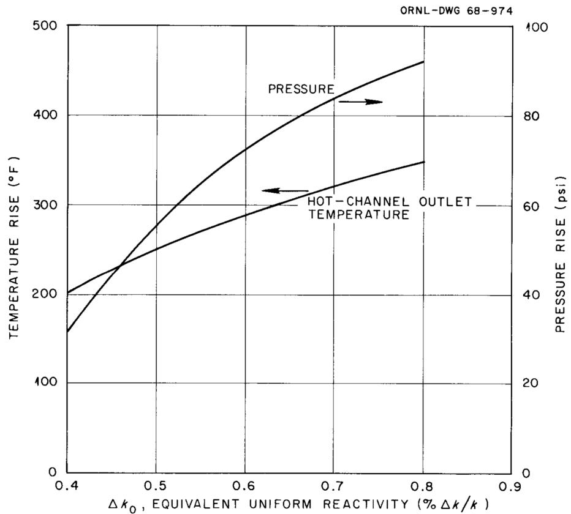  
Fig. 4.10. Effect of Magnitude of Reactivity Recovery on Peak Pressures and Temperatures During a Uranium Resuspension Incident with $^{233}\mathrm{U}$ Fuel. Rod scram at 11.25 Mw; initial power, 1 kw.

equal for each fuel. The results of these calculations are summarized in Figs. 4.11 and 4.12. It can be seen from Fig. 4.11 that the temperature rise corresponding to a given value of $\Delta k_{0}$ is higher for the $^{235}\mathrm{U}$ fuel salt, in approximately the inverse ratio of the fuel-temperature coefficients of reactivity for the two loadings. $^{1,6}$ Because of the larger delayed neutron fraction for $^{235}\mathrm{U}$ , a larger addition of reactivity is required to reach the prompt-critical condition. This is evidenced in Fig. 4.11 by the larger value of $\Delta k_{0}$ required to produce substantial nuclear heating, starting from a low initial power level. In Fig. 4.12, it is evidenced by the longer times following the start of reactivity addition which are required to reach the specified conditions. In general, however, there are no important differences in the responses in this nuclear incident which could have a deter

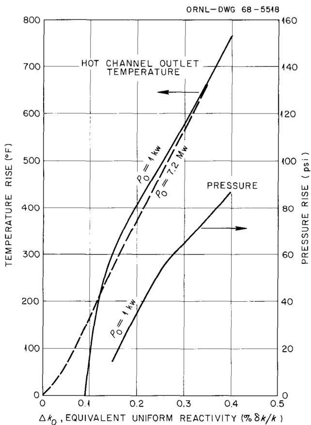  
Fig. 4.11. Effect of Magnitude of Reactivity Recovery on Peak Pressures and Temperatures During a Uranium Resuspension Incident with $235\mathrm{U}$ Fuel. No safety action,

mining detrimental effect on nuclear safety for either fuel salt.

In order to further investigate the upper limits of reactivity addition which could be tolerated in this type of incident with $^{23}$ U fuel, some analog simulation studies of the MSRE were made. The analog model included a representation of the dependence of the period scram signal on the initial neutron level, the gamma background, and the history of the nuclear transient prior to scram. In general agreement with the results shown in Fig. 4.8, the analog calculations showed that, for initial power levels above about 7 Mw, the high neutron level trip would actuate the scram signal; at less than 7 Mw, the period trip would actuate the signal. For $\Delta k_{0}$ between 0.9 and 1.2%, the time to start a rod scram varied between 300 and 800 msec, with the shorter times corresponding to higher $\Delta k_{0}$ and low initial power.

Typical reactivity inputs in these cases are shown in Fig. 4.13. Before a rod scram, the input is very small and the resulting power transient is also small. This implies that the excursions of potential harm are those that could overcome the available shutdown worth of the rods. In these analyses, this was assumed to be $4.0\%$ , corresponding to the worth of two rods, dropping from an initial position of 44 in., in the “shadow” of the third rod over their entire length of travel. Thus, reactivity additions large enough to cause a secondary nuclear excursion correspond to $\Delta k_0 > 0.82\%$ as seen from Fig. 4.13. For these large additions with period scram, the power-temperature transients were calculated both with the analog model and with the digital program. Typical results are given in Figs. 4.14 and 4.15. It may be seen that the two models were in close agreement in calculating power transients (Fig. 4.14) but that there were some notable differences in the temperature calculations (Fig. 4.15). The analog model tends to reach a peak temperature faster than the digital calculation, but at a lower magnitude. These models assume somewhat different mechanisms for heat transport within the core. The analog model uses a 27-lump representation of the MSRE core, within which “well stirred” conditions are

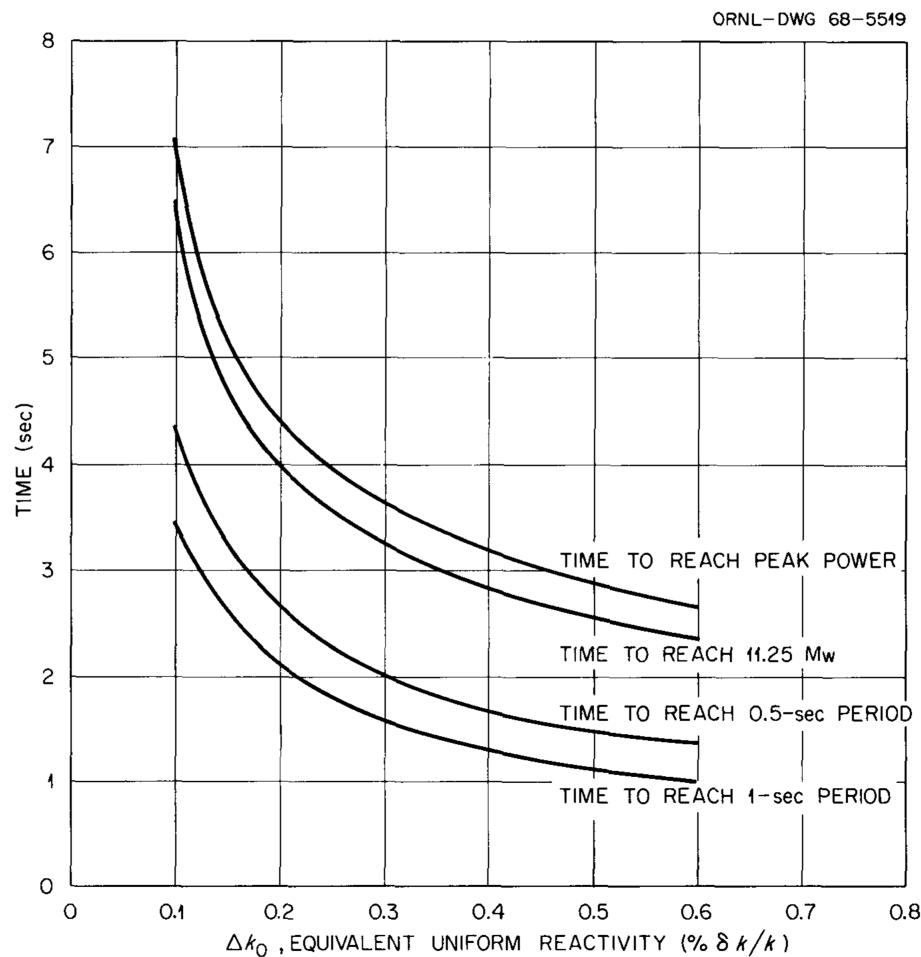  
Fig. 4.12. Effect of Magnitude of Reactivity Recovery on Times to Reach Scram Conditions and Peak Power Conditions with $235\mathrm{U}$ Fuel. Initial power, 1 kw.

assumed, implying immediate heat transport within each lump. In contrast, the digital model assumes no axial conduction or mixing.2

Peak hot-channel outlet temperatures as a function of both $\Delta k_{0}$ and initial power level are shown in Fig. 4.16. The analog model indicated that a $\Delta k_{0}$ of about $1.07\%$ would be required before the tolerable temperature limits were exceeded. A more conservative value of $0.96\%$ was obtained from the digital calculation. Both models indicated that peak temperature was not very dependent on initial power level, particularly for the higher values of $\Delta k_{0}$ .

The magnitudes of the peak pressure rises calculated for these large reactivity additions with period scram are shown in Fig. 4.17. These results also exhibit the inverse relation between

initial power level and peak pressure discussed in the preceding sections. In order to obtain an upper limit on the maximum pressure rise, an initial power level of 100 w was chosen. Projection of the calculated data to 100 w initial power shows that a $\Delta k_{0}$ of $0.95\%$ could be tolerated without exceeding the conservative 50-psi limit in pressure rise assigned in the safety analysis.

# 4.3 DETECTION OF ANOMALOUS REACTIVITY EFFECTS

B. E. Prince

During routine operation of the MSRE, calculations of the complete reactivity balance are made at 5-min intervals by the on-line digital computer.

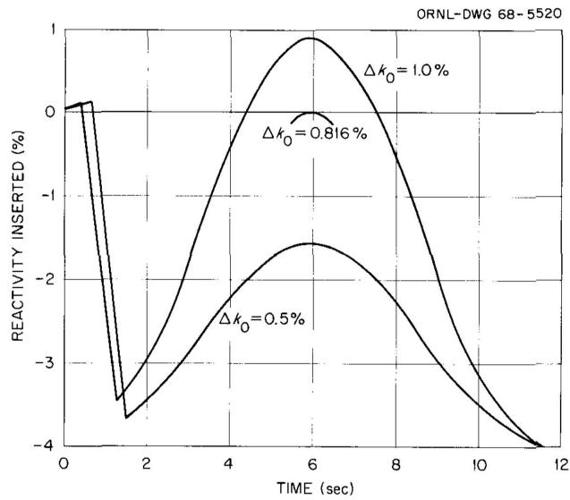  
Fig. 4.13. Time Dependence of Total Reactivity Input with Combined Uranium Resuspension and Rod Scram Due to Short Period.

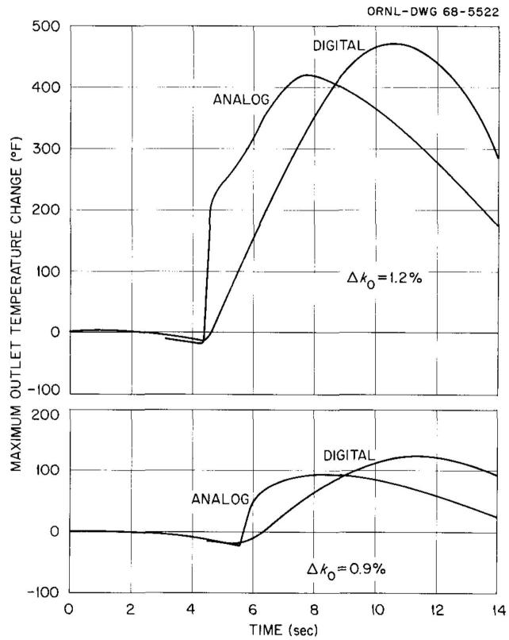

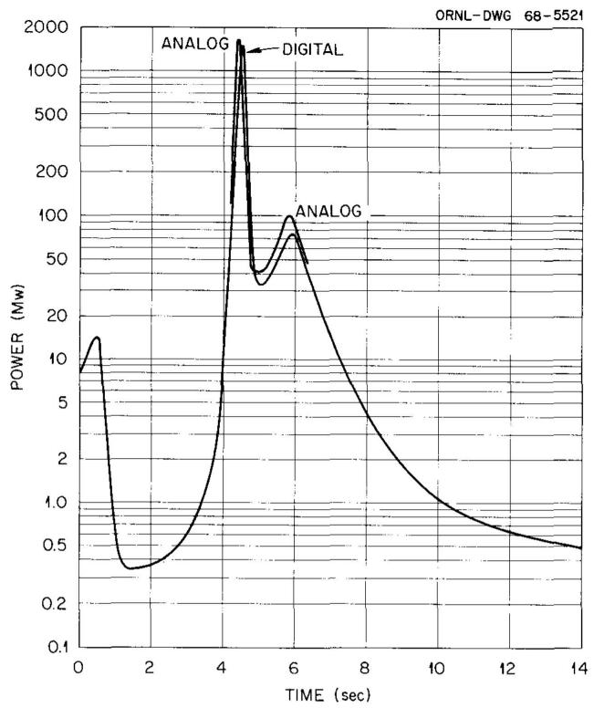  
Fig. 4.15. Time Dependence of Hot-Channel Outlet Temperature, Calculated with Both Analog and Digital Models. Initial power = 7.5 Mw.   
Fig. 4.14. Time Dependence of Power Level for a Uranium Resuspension Incident with $\Delta k_{0} = 1.2\%$ and Initial Power $= 7.5 \, \text{Mw}$ .

Experience with these calculations, accumulated during a substantial part of the operation with the present $^{235}\mathrm{U}$ loading, has been described in ref 9. At steady power, temperature, and pressure, we have found that the variation in consecutive reactivity balances is about $\pm 0.01\% \delta k / k$ . This value represents the probable limit of precision in the technique. Longer term variations in the residual reactivity can be due either to systematic errors in calculation of known reactivity effects or to anomalous changes whose detection is important, such as the hypothetical situation considered in the preceding section. The long-term reactivity variations which have been observed with the present fuel salt have been very small. A systematic variation as small as $0.05\% \delta k / k$ would

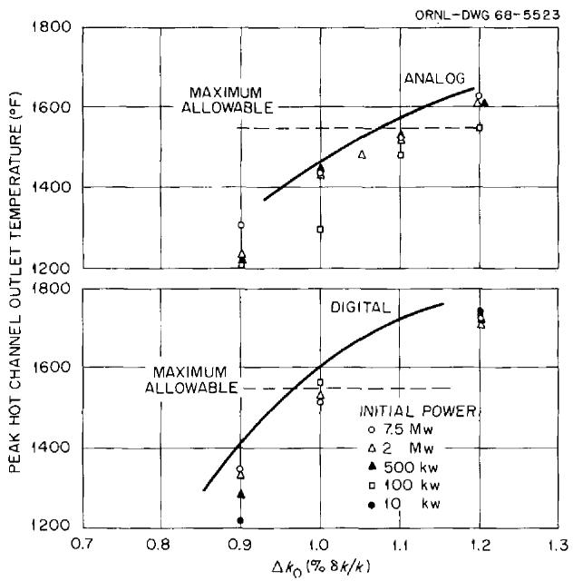  
Fig. 4.16. Dependence of Peak Hot-Channel Outlet Temperature on $\Delta k_{0}$ and Initial Power Level for Large Reactivity Additions with Short-Period Scram.

be clearly observable by the computer-calculation monitoring. A systematic long-term change larger than $0.10\% \delta k / k$ should be easily separable from the effects of any miscalculation of known reactivity changes.

When the present fuel loading is changed to $^{233}\mathrm{U}$ , the fissile-uranium-concentration reactivity effects will be larger, by about a factor of 2. This means that the reactivity balance calculations can be expected to be more sensitive to variation in uranium content. For example, removal of $1\mathrm{g}$ of $^{233}\mathrm{U}$ from the salt, by burnup or any other mechanism, may be expected to produce a reactivity reduction nearly four times that of $1\mathrm{g}$ of $^{235}\mathrm{U}$ in the present fuel. An abnormal reactivity loss of $0.10\% \delta k / k$ would correspond approximately to a $0.26\%$ reduction in uranium concentration (of isotopic composition to be used for the new loading), which is total loss of about $80\mathrm{g}$ of uranium from $70.5\mathrm{ft}^3$ of circulating salt. On the other

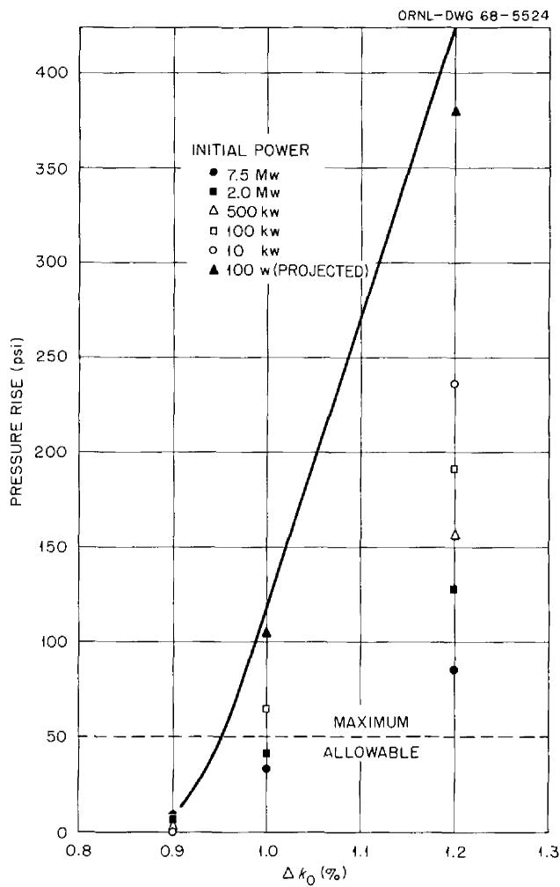  
Fig. 4.17. Dependence of Peak Pressure Rise on $\Delta k_{0}$ and Initial Power Level for Large Reactivity Additions with Short-Period Scram.

hand, the upper limit of $0.95\% \delta k / k$ obtained in the studies described in the preceding section corresponds to approximately $2.4\%$ in uranium concentration (750 g of total uranium). Thus, there is considerable latitude in establishing an administrative safety limit on anomalous reactivity effects to prohibit nuclear operation when the residual term in the reactivity balance becomes too large.

# Part 2. MSBR Design and Development

R. B. Briggs

The primary objective of the engineering design and development activities of the MSR program is to design a molten-salt breeder experiment (MSBE) and develop the components and systems for that reactor. The MSBE is proposed to be a model of a large power breeder reactor. Most of the design and development effort is being spent on studies of reference designs of 1000 Mw (electrical) and larger power plants to provide the criteria and much of the basis for design of the MSBE.

These studies were begun in September of 1965. The results are reported in four semiannual progress reports through August 1967 (refs. 1-4) and in ORNL-3996, Design Studies of 1000-Mw(e) Molten-Salt Breeder Reactors. Based on the studies, a two-region reactor with fissile and fertile materials in separate fuel and blanket salt streams was chosen as the most promising approach to the breeder. Factors related to fuel and blanket processing were the most important considerations in reaching this conclusion. A fluoride volatility process was available for separating uranium efficiently from fuel and blanket streams. A distillation process had been conceived for separating the ${}^{7}\mathrm{LiF}$ and $\mathrm{BeF}_2$ salts from rare-earth fission products in the fuel salt. Separation of ${}^{233}\mathrm{Pa}$ from the blanket salt was not essential to achieve breeding, although such separation appeared to be possible and offered promise of improving the breeding performance and the economics.

The design studies on the large two-fluid breeder reactors reached a reasonable stopping point in September of 1967. The design power for the MSBE had been selected as $150\mathrm{Mw}$ (thermal), the objectives and program for development of that reactor had been summarized in ORNL-TM-1855, and the programs for development of components and systems had been outlined in ORNL-TM-1855 and ORNL-TM-1856. Preparations were being made to begin the conceptual design and the development for the MSBE when two new developments caused us to delay that work and to continue with the design studies of large power plants.

One of the new developments was evidence that $^{233}\mathrm{Pa}$ and possibly the rare-earth fission products can be separated from the mixed thorium-uranium fuel salt of a one-fluid reactor by reductive extraction methods employing liquid bismuth. The second new development was the calculation that the leakage of neutrons from the core of a one-fluid reactor of modest size can be reduced to desirable levels by increasing the ratio of fuel salt to graphite to produce a greatly undermoderated region in the outer part of the core. By optimizing the distribution of salt, the reduction in leakage can be accomplished with a low specific inventory of fissile material. These developments, when combined with the greater simplicity and potential reliability, make the one-fluid breeder a more attractive concept than the two-fluid breeder, which must rely on graphite piping in the core to separate fuel and blanket streams.

Our current design studies of large one-fluid breeders are aimed at describing those reactors sufficiently for us to select a size and a design basis for a one-fluid breeder experiment. Development work is limited to analyses in support of the design and to experiments that are relevant to one-fluid and two-fluid reactors.

# 5. Design

E. S. Bettis

# 5.1 GENERAL

E. S. Bettis R. C. Robertson

Our version of a 1000 Mw (electrical) power plant based on the two-fluid MSBR was described in considerable detail in our last semiannual report. We selected the modular concept in which the plant contained four reactors, each with the capability for generating supercritical steam equivalent to 250 Mw (electrical). The core of each reactor was designed to accommodate for a reasonable time the dimensional changes produced by irradiation of the graphite as those changes were deduced from the most recent experimental data. This led to the use of graphite fuel cells in the form of reentrant tubes that were brazed to metal pipes. These pipes were welded into fuel supply and discharge plenums in the bottom of the reactor vessel. The fertile salt filled the interstices between fuel cells and a blanket region around the core.

This reactor presented two major problems. The graphite in the core had to be replaceable for a variety of reasons, and the most acceptable way that had been conceived for replacing the graphite involved replacing the entire core and reactor vessel. Periodic replacement of the reactor vessel appeared to be economical if the frequency were governed entirely by radiation-induced dimensional changes in the bulk graphite. There was, however, concern that mechanical failure of individual graphite cells or graphite-to-metal joints could cause the replacement frequency to become excessive.

The single-fluid reactor has the advantage that the graphite functions only as moderator. In principle, it can be present in the form of long bars with no firm connections at top or bottom; the bars can be removed individually or in groups; the lifetime of the graphite should depend only on the bulk changes in dimensions that result from irradiation. There are also subsidiary advantages related to the amount and arrangement of the reactor equipment. These factors combined to cause us to look seriously at the design of a single-fluid reactor when there was evidence that fuel processing could be provided to make a single-fluid reactor a breeder.

In the beginning we expected that the reactor would have to be a 20-ft-diam right cylinder or larger in order for the neutron leakage to be acceptably low. A power output of $2000\mathrm{Mw}$ (electrical) or greater per reactor then became necessary in order to achieve a low specific inventory. We believe that power plants of this size will be common in the 1980's when large molten-salt reactors could be built, so we based our design studies on a 4444 Mw (thermal), $2000\mathrm{Mw}$ (electrical) plant. We have since found that zoning the core permits one to obtain good breeding performance from $1000\mathrm{Mw}$ (electrical) and possibly from smaller reactors. The design studies reported here are for the $2000\mathrm{Mw}$ (electrical) reactor, but the performance of $1000\mathrm{Mw}$ (electrical) and $2000\mathrm{Mw}$ (electrical) reactors is compared in the reactor physics section.

# 5.2 FLOW DIAGRAM

R.C.Robertson H.L.Watts

The flow diagram for a one-fluid reactor plant with a capacity of 4444 Mw (thermal) and 2000 Mw

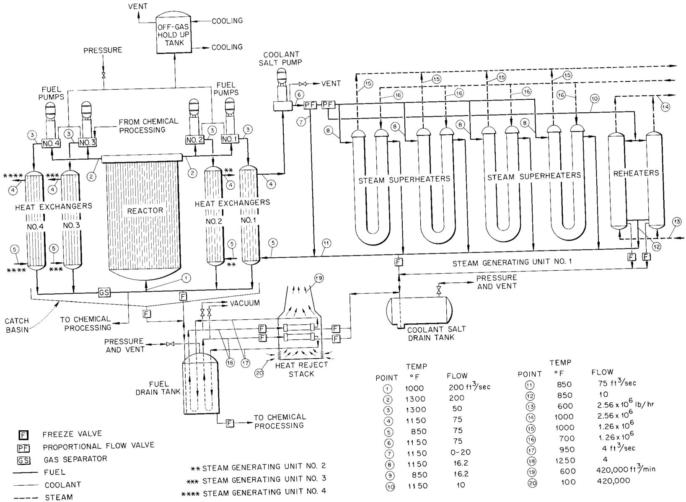  
Fig. 5.1. Flow Diagram for 2000 Mw (Electrical) Station.

Table 5.1. Estimated Properties of Fuel and Coolant Salts for One-Fluid Breeder Reactors   

<table><tr><td></td><td>Fuel Salt at 1050°F</td><td>Coolant Salt at 800°F</td></tr><tr><td>Composition, mole %</td><td>BeF2, LiF, ThF4, UF4(20, 67.7, 12, 0.3)</td><td>BF3NaF (48, 52)</td></tr><tr><td>Specific heat, Btu lb-1°F-1</td><td>0.29</td><td>0.37</td></tr><tr><td>Density, lb/ft3</td><td>223</td><td>125</td></tr><tr><td>Thermal conductivity, Btu ft-1hr-1°F-1</td><td>0.49</td><td>0.46</td></tr><tr><td>Viscosity, lb ft-1hr-1</td><td>34</td><td>34</td></tr><tr><td>Liquidus temperature, °F</td><td>930</td><td>715</td></tr></table>

(electrical) is shown in Fig. 5.1. This diagram is similar to those shown previously for the two-fluid reactor with the obvious omission of the fertile salt circuit.

The fuel salt for the one-fluid reactor contains both fissile and fertile atoms in $^7\mathrm{LiF - BeF}_2$ carrier. The composition and our estimates of the properties are shown in Table 5.1. In the flow diagram this salt is circulated by four pumps through a common reactor vessel. Each pump circulates approximately 27,000 gpm of salt through the reactor and a heat exchanger. The salt enters the reactor at $1050^{\circ}\mathrm{F}$ and leaves at a mean temperature of $1300^{\circ}\mathrm{F}$ .

The coolant salt - sodium fluoroborate - is pumped in four heat transfer circuits, one for each fuel circuit. Each pump circulates 53,000 gpm of coolant salt through a primary heat exchanger and through several superheaters and reheaters. The coolant salt enters the primary heat exchanger at $950^{\circ}\mathrm{F}$ , flows to the superheater at $1150^{\circ}\mathrm{F}$ , and leaves the superheater at $850^{\circ}\mathrm{F}$ . Since $850^{\circ}\mathrm{F}$ is below the liquidus temperature of the fuel salt, some $1125^{\circ}\mathrm{F}$ salt is bypassed around the superheater and mixed with the exit salt so that the temperature of the coolant returning to the primary heat exchanger is $950^{\circ}\mathrm{F}$ .

Each coolant salt loop has four superheaters, making a total of 16 units in the plant. There are two steam reheaters per coolant salt loop, a total of eight units in the plant. Steam enters the superheaters at $700^{\circ}\mathrm{F}$ and exits at $1000^{\circ}\mathrm{F}$ . Steam enters the reheaters at $600^{\circ}\mathrm{F}$ and is heated to $1000^{\circ}\mathrm{F}$ for return to the turbine.

# 5.3 PLANT LAYOUT

C. E. Bettis

H. M. Poly

C. W. Collins

J. R. Rose

W. K. Crowley

W. Terry

H. L. Watts

With the new reactor and the higher power, our entire concept of the overall power breeder plant has to be reevaluated. Such concepts as the basic idea for the thermal shield and the double containment are still valid, but we have devoted only a little time to the layout of the new plant and have not examined those details.

A plan view of a possible arrangement of the various cells is shown in Fig. 5.2. The reactor vessel, four heat exchangers, and four fuel pumps are located in the reactor cell. This cell is circular and is about 52 ft in diameter by 47 ft deep. It has a thermal shield to prevent overheating of the concrete. It also has double containment, with a pump-back system whereby the integrity of the containment is constantly monitored.

Four steam-generating cells are located symmetrically in relation to the reactor cell. The cells are approximately 33 ft wide by 46 ft long by 43 ft deep. They contain only coolant salt and steam and therefore have no need for a thermal shield or double containment. These cells are isolated from the reactor cell and from the high-bay area by bellows seals around pipes that communicate with those areas.

The fuel drain tank is in a cell all its own. This cell is below the level of the reactor cell

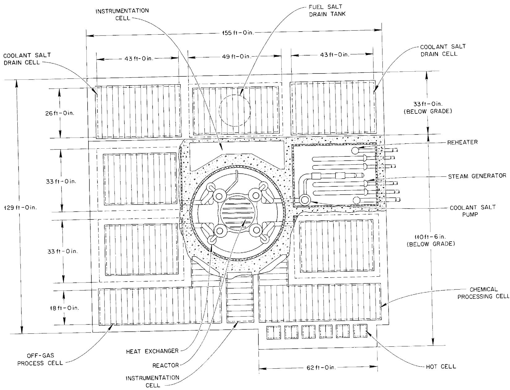  
Fig. 5.2. Plan View of Cell Arrangement.

in order for salt to drain by gravity from the reactor into the drain tank. Double containment is provided since radioactive salt is stored there. The drain tank cell is about 28 ft wide by 49 ft long by 38 ft deep. It is isolated from the reactor cell by bellows seals around the communicating salt lines.

The coolant salt is stored in a separate cell about 26 ft wide by 43 ft long by 45 ft deep. This cell needs little shielding and need be sealed only sufficiently to prevent excessive heat loss.

The off-gas cell is approximately 18 ft wide, 63 ft long, and 43 ft deep. This cell must be doubly contained, but the ambient temperature is around $100^{\circ}\mathrm{F}$ , so it needs no electrical space heaters or thermal insulation. Cooling of the gas holdup tanks and the charcoal absorber beds is done by water which comes from the plant feed-water system.

The chemical processing cell is about 18 ft wide by 63 ft long by 43 ft deep. This cell must have double containment, but it too does not require space heaters or thermal insulation. In this cell the pieces of apparatus are heated and cooled individually.

On the cell plan we show two cells for instrumentation uses such as test points, junctions, instrument air sources, etc. These cells have approximate dimensions of 13 by 26 by 43 and 8 by 48 by 43 ft.

The off-gas, chemical processing, and instrumentation cells shown in Fig. 5.2 are meant to be only representative since no serious design effort has been put on them. The reactor, fuel drain tank, and steam cells have been laid out sufficiently to show the arrangement of the components in some detail. These cell arrangements are shown in Figs. 5.3 to 5.5.

Our arrangement of equipment for the one-fluid reactor is based on one-pass upward flow of fuel through the reactor vessel. This "once-through" flow allows the reactor and heat exchangers to be at the same elevation. The pumps are at the top of the reactor and have drive shafts that may be short enough to eliminate the need for molten-salt bearings. The heat exchangers are mounted so that they move and the thermal stresses are accommodated without the use of expansion loops or expansion joints in the fuel piping. We have used bellows in the coolant salt piping. We hope to be able to do this, for the coolant pipes are 34 in. in diameter, and expansion loops for such sizes are

very bulky. In the steam cell all components are anchored solidly. Expansion in pipelines is taken up by bellows in the pipes. The high-pressure-steam and feedwater lines have large expansion loops outside the cells to allow for dimensional changes in those lines.

# 5.4 REACTOR VESSEL AND CORE

H. F. Bauman

H. M. Poly

C.W.Collins

W. Terry

W. C. George

H. L. Watts

We have considered several concepts for the single-fluid reactor vessel and core. Studies have been made to try to attain the best combination of fuel inventory, flow control, temperature control, and ease of removal of the graphite from the reactor. A major complicating factor in the design is the radiation-induced dimensional changes in the graphite.

We spent considerable effort in an attempt to employ reentrant concentric tubes of graphite for the fuel passages in the core. By confining the salt to such tubes and filling the spaces between tubes with gas, the changes in salt volume caused by the dimensional changes in graphite are insignificant. This design, however, made necessary some kind of metal-to-graphite joint that had to be relatively leakproof, and these joints would have to be broken to replace the graphite. Also, the gas spaces in the core presented voids which could fill with salt and greatly increase the reactivity under certain conditions. Gravity flow from the reactor vessel to the pump suction tank was believed to be desirable, but the inventory required to achieve this was excessive. The concentric reentrant tube concept was abandoned as having too many of the disadvantages of our designs for two-fluid reactors and none of the advantages.

The idea of a container filled with vertical graphite pieces of some shape with fuel in the spaces between graphite pieces and flowing in a single pass upward through the vessel was finally adopted for the basic design. With this configuration, two possibilities for disposing the graphite within the vessel come to mind. One involves simply stacking graphite inside the vessel, each piece contacting the neighboring pieces and the entire bundle being finally restrained by the reactor vessel or by a cratelike structure within the vessel.

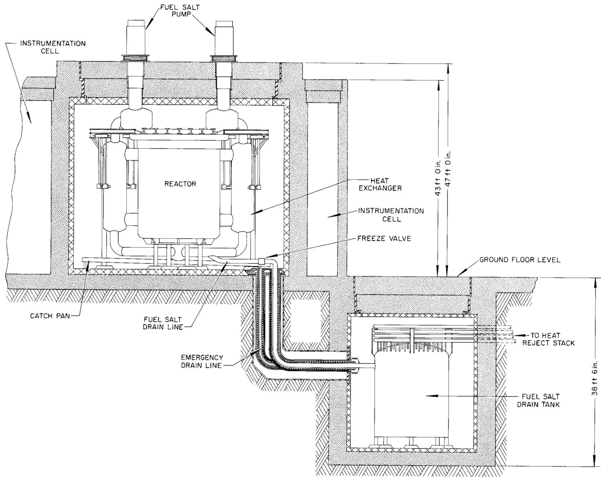  
Fig. 5.3. Elevation of Reactor and Fuel Drain Cells.

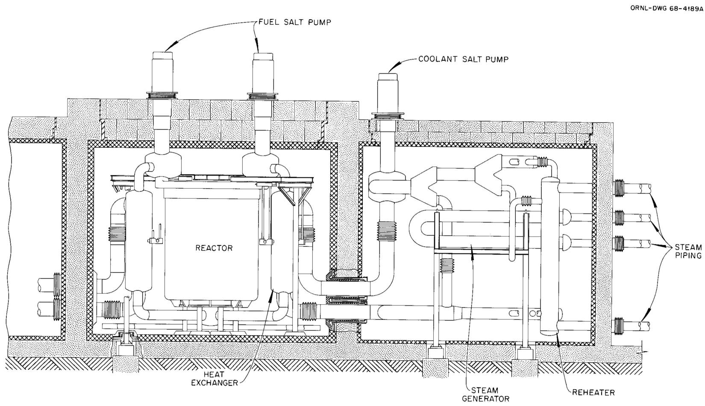  
Fig. 5.4. Elevation of Reactor and Steam Cells.

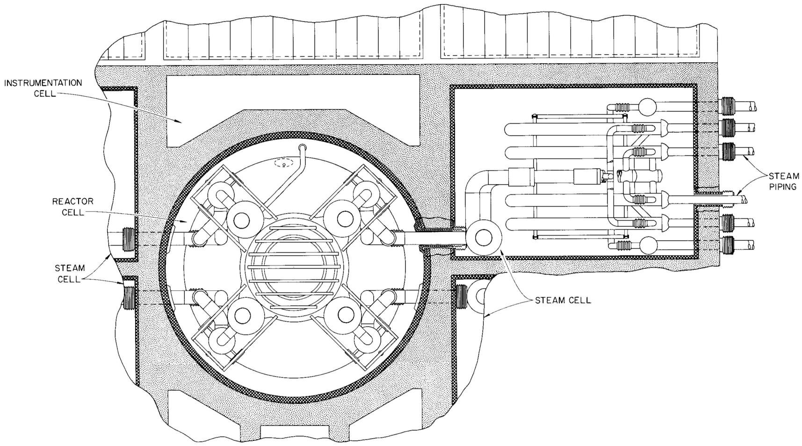  
Fig. 5.5. Plan View of Reactor and Steam Cells.

This simple placement of the graphite might suffice if there were no dimensional changes with irradiation, but the graphite will shrink, the salt fraction in the core will increase, and this increase might be localized to create a rather large pool of salt at some indeterminate and possibly changing location within the core. Various schemes were attempted to try to cause some force (e.g., hydraulic pressure drop, buoyancy) to compact the core as irradiation caused the pieces to shrink. To date we have found no practical method of overcoming this "crevassing" of the core; we therefore prefer another design.

One way to be sure that the liquid volume will increase uniformly within the core as the graphite shrinks is to locate each piece of graphite at the top and bottom of the reactor by a metal structure that is dimensionally stable. The method of confining the graphite at these locating points is important. The attachment must present a minimum of difficulty to removal of the graphite. It must accommodate dimensional changes of the graphite without undue restraint.

In addition to positioning the graphite, means must be provided for supporting the considerable load of the graphite in the core. When the reactor is empty, this is a gravity load at the bottom of the vessel. When the reactor is filled with salt having approximately twice the density of the graphite, the graphite floats and exerts a buoyant force almost equal to the weight of the graphite in the empty vessel. When the pumps are running, there is an additional large upward force caused by the pressure drop across the core.

We have investigated many configurations of vessels with reinforced flat heads, dished heads, and inverted dished heads. We tried circumferential fluid entry, through transition sections from pipes to the reactor vessel. A design which seems to offer the best embodiment of the desired features is shown in elevation in Fig. 5.6. Some important parameters for the reactor are listed in Table 5.2.

The vessel is about 18 ft in diameter by 24 ft high. It has a standard dished head at the bottom. In the center is a 4-ft-diam manifold into which the 24-in. outlet line from each heat exchanger discharges, and the four streams mix in the plenum formed by the dished head of the reactor vessel.

Mounted above the dished head is a flat support plate with perforated web reinforcing. This

Table 5.2. Design Parameters for One-Fluid Reactor   

<table><tr><td>Thermal power, Mw</td><td>4444</td></tr><tr><td>Vessel diameter, ft</td><td>18.3</td></tr><tr><td>Vessel height, ft</td><td>24.5</td></tr><tr><td>Core diameter, ft</td><td>16</td></tr><tr><td>Core height, ft</td><td>20</td></tr><tr><td>Core volume, ft3</td><td>4020</td></tr><tr><td>Average power density, kw/liter</td><td>~40</td></tr><tr><td>Fraction of liquid in core, %</td><td></td></tr><tr><td>Region 1</td><td>19</td></tr><tr><td>Region 2</td><td>17</td></tr><tr><td>Region 3</td><td>44</td></tr><tr><td>Reflector thickness, in.</td><td>12</td></tr><tr><td>Number of core elements</td><td>1760</td></tr><tr><td>Maximum velocity of salt in core, fps</td><td>13</td></tr><tr><td>Salt volumes, ft3</td><td></td></tr><tr><td>Core</td><td>1240</td></tr><tr><td>Reflector</td><td>25</td></tr><tr><td>Plena</td><td>590</td></tr><tr><td>Heat exchanger</td><td>320</td></tr><tr><td>Pumps</td><td>120</td></tr><tr><td>Piping</td><td>150</td></tr><tr><td>Total</td><td>2445</td></tr><tr><td>Fissile inventory, kg</td><td>1880</td></tr><tr><td>Fertile inventory, kg</td><td>90,000</td></tr><tr><td>Specific power, Mw (thermal)/kg</td><td>2.36</td></tr></table>

plate locates and supports the weight of the graphite stringers comprising the center part of the reactor core. The support plate is drilled on an even square pitch, and nipples for receiving the round ends of the moderator stringers are welded into these holes. These nipples serve as orifices for controlling flow and as sockets for locating the graphite pieces.

The outer region of the core is mounted in thimbles the same as the center region. Flow in this outer region is greatly reduced over that required in the center. This flow is obtained from the pool below the center region of graphite stringers and may be regulated by orificing the flow channels through and around the graphite pieces.

Near the top of the reactor vessel a square grid is welded to the vessel. The squares in this grid are large enough to contain nine of the core pieces. This grid locates the top ends of the pieces so that each group of nine is exactly positioned within the core. The grid web is $\frac{1}{4}$ in.

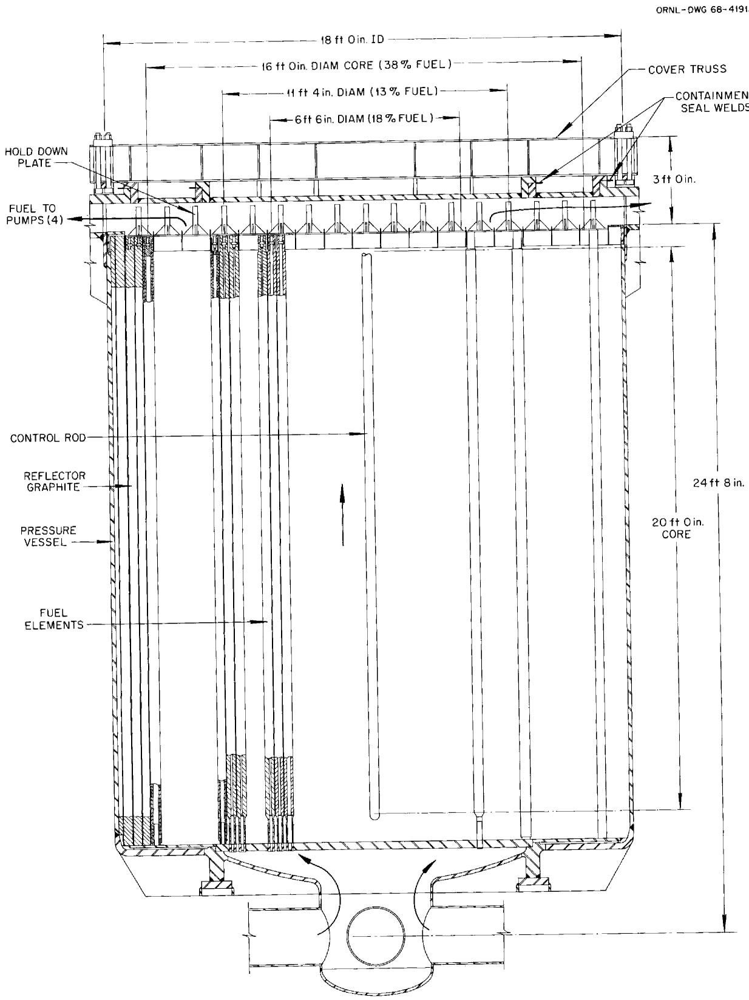  
Fig. 5.6. Elevation of Reactor Vessel.

thick. In order for the graphite to fit closely, the top 16 in. of each piece is reduced in cross section to permit its insertion past the grid. The center piece of graphite is inserted last and serves as a key to tighten the group. To remove the graphite, the center piece must be removed first.

With the sockets at the bottom and the grid structure at the top of the vessel, the graphite is supported freely and is retained in one radial position. It is free to float in the salt and must be restrained by some loading bearing structure at the top. We have made the top of the vessel a flat reinforced lid. This lid is held down by I-beams clamped at the perimeter. A seal weld is made for leak-tightness only. In each of the grid openings above the graphite stringers, we have a metal spider with a center rod which transmits the buoyant and pressure forces to the reinforced lid of the vessel. This spider also has provision for orificing the flow of salt as it leaves the core in order to help control the distribution of flow.

For nuclear reasons (discussed in the physics section), the volume fraction of fuel in the core is nonuniform. As currently conceived, the core has three regions characterized by different salt fractions. The central one-sixth of the core, region 1, contains $19\mathrm{vol}\%$ salt; the surrounding one-third, region 2, contains $17\mathrm{vol}\%$ salt; and the outer one-half, region 3, contains $44\mathrm{vol}\%$ salt. The power production per unit volume of salt in region 1 is nearly uniform, It decreases to about $27\%$ of the center value at the outer edge of region 2 and to $3\%$ of the center value near the outer edge of region 3. We would like for the temperature rise of the fuel that passes through the core to be nearly uniform and equal to the specified mean temperature rise. This is desirable in order to prevent overheating in the center of the core and to conserve on total flow through the reactor.

Many configurations of core pieces have been examined in an attempt to achieve the desired distributions of fuel volume and flow. The one we presently like best is shown in Fig. 5.7. The graphite element is 4 in. square with the edges contoured and the center cored to obtain the specified salt fraction in each region. The design appears to eliminate places where salt could stagnate and overheat.

Present plans are to make the channels in region 1 of the core of uniform hydraulic radius and

to permit the salt to flow freely through all the channels. In the regions 2 and 3 the channels around the pieces, which are more difficult to orifice, will be reduced in thickness as the heat production decreases, and the channels through the pieces, which are more easily orificed, will be increased in size to obtain the desired fuel fraction. By distributing the salt in this manner, providing some orificing of the channels between pieces, and carefully orificing the channels in centers of the pieces, we hope to obtain a nearly uniform radial pressure in the interconnecting channels across the core. This should minimize the cross flow between core regions at the expense of a small increase in total flow and decrease in overall temperature rise of the fluid.

We will have no firm design for the orifices or good information about the flow distribution until a study has been made of the flow in the reactor core. This is in progress, but we have no results even of a preliminary nature.

# 5.5 PRIMARY HEAT EXCHANGER

C. E. Bettis

H. L. Watts

We have not designed a heat exchanger for the one-fluid reactor. What we have done is to scale up the heat transfer surface from previous calculations, base the length on the height of the reactor vessel, and calculate the diameter required to provide the desired capacity. The heat exchangers now have one-pass flow of both fuel and coolant salt. The pumps are not integral with the heat exchanger, although they can be made so if further analysis shows it to be desirable.

# 5.6 FUEL DRAIN TANK

W. C. George

H. M. Poly

H. L. Watts

We have spent a large part of our design effort on a system for removing afterheat from fuel salt in the drain tanks. With the modular plant design of the two-fluid reactor, we proposed to cool the drain tanks by reheat steam from the high-pressure turbine. Since the likelihood of having more than two of the four modules drained at any one time is small, the supply of this cooling steam should be dependable. With a single reactor, this is no longer true, and steam cooling, while still possible, looks less attractive.

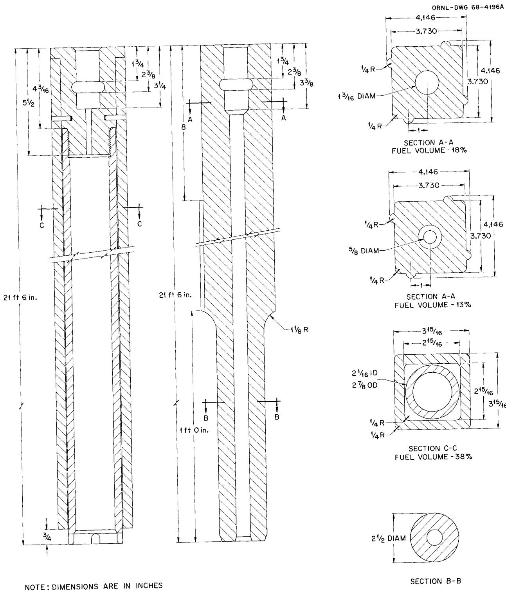  
Fig. 5.7. Configurations of Core Elements.

Another basic change to the drain system results from our arrangement of equipment for the one-fluid reactor. A stopped pump no longer drains the reactor. We presently see no reason for draining the reactor quickly and would propose to continue to operate at reduced power for some time with one or possibly more pumps off.

We have one drain tank capable of holding and cooling the entire salt volume (2247 ft³) of the reactor primary system. This is a cylindrical tank connected to the primary system through a 12-in. line. This line has a salt valve, at present assumed to be a freeze valve, through which the system drains into the tank. An additional 6-in. line enters the tank near the top. This line is connected through a freeze valve to a drain pan in the reactor pit. In case of failure of a fuel system component, the fuel can be drained into the drain tank through this line. Salt is transferred to the reactor system by pressurizing the drain tank with gas. Figure 5.8 is an elevation drawing of this tank. Figure 5.9 is a plan of the tank showing the manifolding of the cooling coils which remove the afterheat from the fuel.

The cooling is done by U-tubes which extend into the tank from headers located at the top but below the dished head cover. These are $\frac{3}{4}$ -in. tubes, 0.42-in. wall, with a separation of 3 in. between the tubes in each U. The U-tubes are attached to headers which are arranged on two levels, one level running at right angles to the other level. This arrangement results in coolant tubes on $2\frac{1}{8}$ -in. square pitch throughout the volume of the drain tank. The U-tubes are assembled in modules, and these modules are connected together by bringing 1-in. lines through the dished head of the drain tank.

There are many more coolant tubes in the drain tank than are required to remove the heat. We did this at least temporarily in order to reduce the ligament dimension of the fuel to prevent hot spots within the fuel volume. The coolant surface in the drain tank can remove $300\mathrm{Mw}$ , while the maximum load amounts to only $60\mathrm{Mw}$ . In Table 5.3 we show some design parameters of the drain tank.

The top layer of coolant headers are part of one autonomous coolant circuit, and the bottom layer of headers are part of another circuit. Each

Table 5.3. Design Parameters for Drain Tank   

<table><tr><td>Diameter of tank, ft</td><td>16</td></tr><tr><td>Height of tank, ft</td><td>20.5</td></tr><tr><td>Volume for fuel, ft3</td><td>2500</td></tr><tr><td>Volume of coolant in tank, ft3</td><td>278</td></tr><tr><td>Number of coolant circuits</td><td>2</td></tr><tr><td>Number of U-tubes per circuit</td><td>1540</td></tr><tr><td>Length of U-tube, ft</td><td>30</td></tr><tr><td>Velocity of coolant in tubes, fps</td><td>0.75</td></tr><tr><td>Overall U in tank, Btu hr-1 ft-2 °F-1</td><td>90</td></tr><tr><td>Tank wall thickness, in.</td><td>11/4</td></tr><tr><td>Design pressure, psi</td><td>70</td></tr><tr><td>Number of modules of tubes per circuit</td><td>100</td></tr><tr><td>Tube diameter, in.</td><td>3/4</td></tr><tr><td>Tube wall thickness, in.</td><td>0.042</td></tr></table>

set of headers is piped to a finned-tube air cooler. These coolers are located inside a chimney or chimneys outside the building. We have not yet decided whether to provide a separate chimney for each coolant circuit.

The chimneys are equipped with dampers so that the air coolers are maintained in a stagnant hot ambient when not required to reject heat. In fact, heaters are provided to keep the air coolers above the melting point of the coolant salt at all times. This system of air coolers, U-tubes in the drain tank, and interconnecting piping is filled with the fluoroborate coolant salt. The salt circulates by natural convection, conveying the heat from the drain tank to the air cooler and dumping it into the atmosphere.

We have only preliminary designs of the air coolers and chimneys. A manufacturer of such chimneys says that a stack about 150 ft high and about 30 ft in diameter will produce a pressure drop of about 1 in. of water, which will be sufficient to remove $60\mathrm{Mw}$ of heat from air coolers in the base of the chimney.

By using this type of heat removal system, no mechanical devices have to run to remove the afterheat, and no reserves of water or coolants other than air, flowing also by natural convection, are required. As the afterheat load decreases with radioactive decay, dampers in the chimney can be closed to reduce the heat rejection rate.

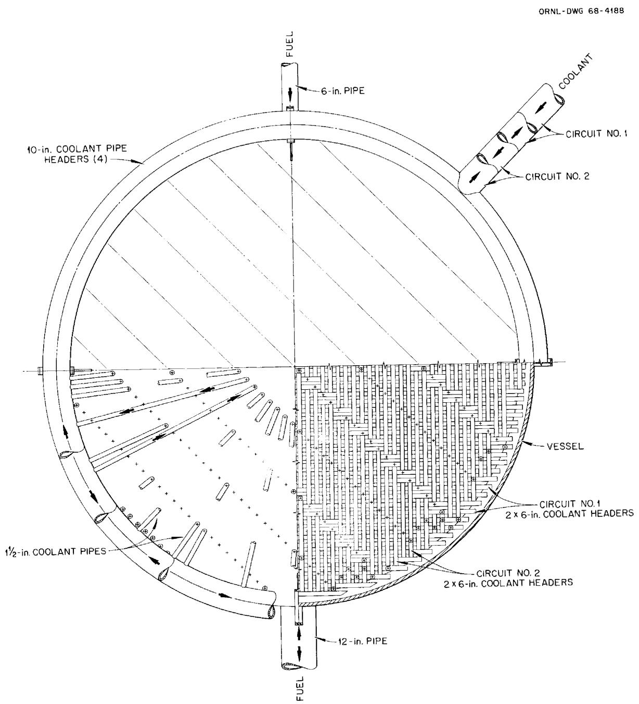  
Fig. 5.8. Elevation of Fuel Drain Tank.

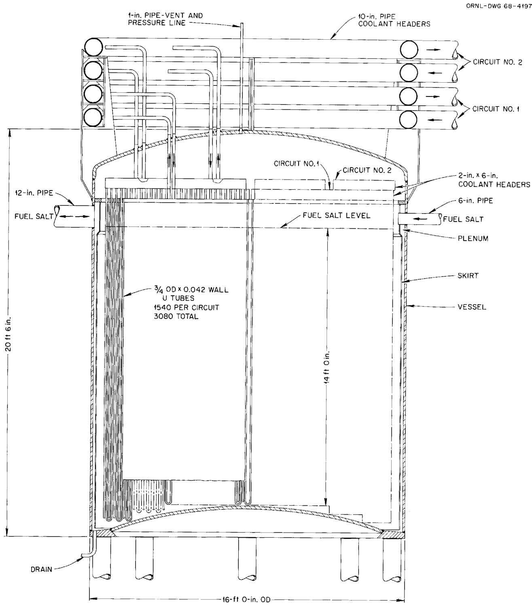  
Fig. 5.9. Plan View of Fuel Drain Tank.

# 6. Reactor Physics

A. M. Perry

# 6.1 MSBR PHYSICS ANALYSIS

O. L. Smith

W.R.Cobb H.T.Kerr

Physics analysis of the MSBR for the period covered by this report was confined to studies of a single-fluid machine. Results of the studies demonstrated that the nuclear performance of a single-fluid reactor could be made as attractive as that of the $40\mathrm{-w/cm}^3$ two-fluid reactor discussed in previous progress reports. Some of the results presented here should be regarded as preliminary. In the discussion below, a reactor which includes all the most recent design information is identified as the reference reactor. This designation is made for convenience of identification only. Several revisions to this design are already being studied. For example, it may be desirable to tailor the salt distribution in the axial as well as the radial direction. Also, the reactor fuel cell described below is intended only to show the approximate features of an MSBR single-fluid cell. Instead of having all of the salt surrounding the graphite as depicted below, final cell designs will almost certainly have part of the salt interior to the graphite, partly to maintain suitably low graphite temperatures and partly to achieve the most advantageous self-shielding of thorium resonance cross sections.

# 6.1.1 Reference Reactor

A schematic drawing of the most recent one-fluid reactor core is shown in Fig. 6.1. The core is 16 ft in diameter by 20 ft in length. Radially the core is surrounded by 1 ft of graphite reflector. Above and below the core are several structural regions which support the core and transport salt. Since these

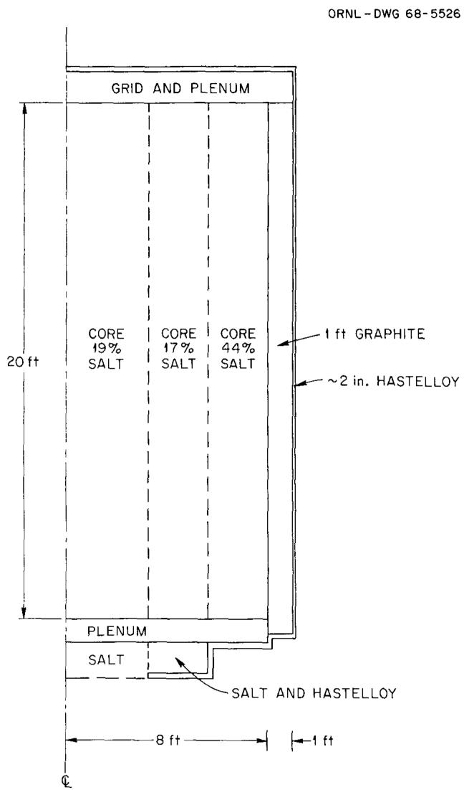  
Fig. 6.1. Reference Reactor Core.

regions contain various amounts of salt and graphite in addition to Hastelloy N, they are also ef-

fective as blanket regions for the core. The reactor is surrounded by a pressure vessel of Hastelloy $\sim 2$ in. thick. For reasons which will be described below, the core contains $19\%$ salt in the central one-sixth of the volume, $17\%$ in the next one-third, and $44\%$ in the outer one-half. The salt contains $67.68$ mole $\%$ LiF, $20$ mole $\%$ BeF $_2$ , $12$ mole $\%$ ThF $_4$ , and $0.32$ mole $\%$ UF $_4$ . In addition to the salt inventory explicitly indicated in Fig. 6.1 ( $1745\mathrm{ft}^3$ ), the external system (heat exchangers, piping, etc.) contains $700\mathrm{ft}^3$ . The total reactor power output is $4444\mathrm{Mw}$ (thermal) or $2000\mathrm{Mw}$ (electrical). The average power density is $40\mathrm{w/cm}^3$ of core volume. Although the details of fuel processing are incomplete, it is currently believed that the salt processing cycle time for fission product removal will be $\sim 40$ days, with a processing cycle time for protac-tinium removal of $\sim 5$ days.

Figure 6.2 shows a plot of the total thermal flux below 1.86 ev and the fast flux above 50 kev vs radial position in the core midplane. Figure 6.3 shows the same information along the axis of the core. The peak-to-average thermal flux ratio is 2.7 in the radial direction and 1.5 in the axial direction, giving a total peak-to-average thermal flux ratio of 4.0. The peak-to-average fast flux (above 50 kev) ratio is 2.6 radially and 1.5 axially, giving a total peak-to-average fast flux ratio of 3.9.

The appearance of a radially nonuniform volume fraction of salt in the core deserves special discussion because this feature produces a substantial improvement in breeding performance over that of a core with a uniform volume fraction of salt. A uniformly loaded single-fluid reactor can be designed with a high breeding ratio (e.g., 1.07) simply by making the reactor so large that leakage is negligible. However, the large inventory required to fuel such a reactor greatly penalizes the yield. On the other hand, if one introduces a nonuniform loading with relatively small salt volume fractions in the center of the reactor ( $\sim$ 17 to $19\%$ ) and larger volume fractions ( $\sim$ 44%) in the outer region, small leakages may be achieved with modest size cores. With this salt distribution the neutron energy spectrum is harder in the outer region than in the center, the neutron source density near the surface is reduced, and hence leakage is reduced. At the same time the harder spectrum and the relatively large inventory of salt in the outer region enhance neutron captures in the thorium resonances. The nonuniform core may be characterized by saying that the central part of the core acts like a core and that the outer part, containing the same materials but in different proportions, acts like a blanket. Consequently a single fluid is effectively made to serve a dual purpose. (It should be pointed out that all refer

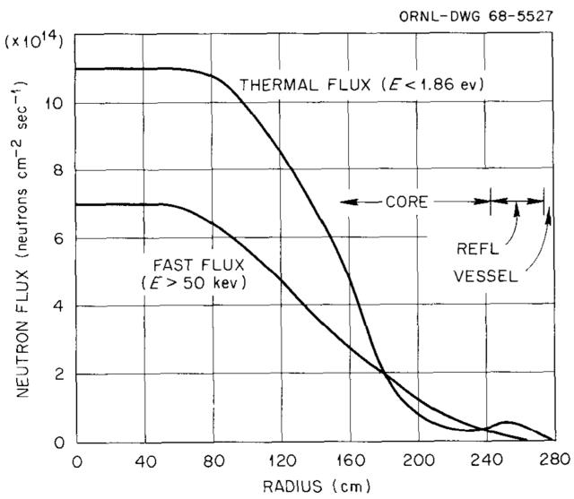  
Fig. 6.2. Fast and Thermal Flux Distributions in Core Midplane.

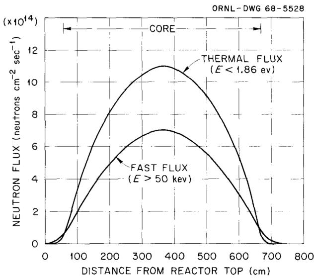  
Fig. 6.3. Fast and Thermal Flux Distributions Along Reactor Axis.

ences to the core include both regions. Specifically, reported power densities are averages over the two zones.) Comparison of the highest-yield one-fluid 2000 Mw (electrical) uniform core with the highest-yield nonuniform core shows an increase in yield from 4.0 to $5.5\%$ , as well as an increase in breeding ratio from 1.048 to 1.068.

The optimum salt volume fraction distribution so far as yield is concerned has a value of $14\%$ in the central one-sixth of the core volume. However, for that core the thermal flux, and hence the specific power, is strongly peaked in the center of the core, being $\sim 80\%$ higher than shown in Fig. 6.2. Heat removal from such a strongly nonuniform heat source distribution is difficult. By raising the salt fraction in the central one-sixth of the core to $19\%$ , the flux in the center of the reactor can be flattened and the peak flux reduced as shown in Fig. 6.2. The yield is reduced at most $0.3\%$ . The considerable simplification of heat removal problems afforded by the flattened source distribution seems to justify the small penalty on yield.

Also, since the fast damage flux distribution closely follows the thermal flux distribution, reducing the peak thermal flux as much as possible is desirable from the standpoint of maximizing the useful lifetime of the graphite in the center of the core. Present calculations indicate that the graphite in the maximum flux region of the reference reactor will have a replacement lifetime of from 2 to 3 years if the graphite lifetime is limited to a fluence of $3.0 \times 10^{22} \mathrm{~nvt}$ ( $E > 50 \mathrm{keV}$ ).

It is instructive to compare the reference reactor with a variety of other designs. An OPTIMERC calculation determined the maximum yield attainable in each case. The comparison, in terms of relative changes in yield and breeding ratio, is shown in Table 6.1. All variations are expressed relative to the reference reactor.

Comparison of cases 1 through 5 shows that the reference reactor has a higher yield than any uniform core and has the optimum diameter of the nonuniform cases. The optimum axial length as well as the desirability of a tailored salt distribution in the axial direction are under investigation.

Comparison of cases 1, 6, and 7 indicates that 12 mole $\% \mathrm{ThF}_4$ is nearly the optimum percentage of this salt component. Larger mole percentages give marginally improved nuclear performance while having markedly poorer thermal properties (particularly a higher melting point).

Comparison of cases 1 and 8 shows some incentive for choosing a $2000\mathrm{Mw}$ (electrical) design over a $1000\mathrm{Mw}$ (electrical) design. However, despite the improved yield of the $2000\mathrm{Mw}$ (electrical) reactor, the performance of the $1000\mathrm{Mw}$ (electrical) reactor is good. The $1000\mathrm{Mw}$ (electrical) reactor may eventually be selected as the reference design, depending upon the outcome of studies currently under way to formulate design criteria.

Case 9 shows that the reflector is of marginal value so far as neutron economy is concerned. The reflector is of small value because the outer part of the core functions as a blanket. If the reflector should prove to be a complicating or expensive part of the reactor it could be removed without great penalty to the yield. However, it may be necessary or desirable in any case to use the reflector to shield the reactor vessel against neutron irradiation.

Anticipating the possibility that design problems may somehow necessitate a certain volume of salt outside the core and hence in a largely parasitic region, case 10 is intended to show that the introduction of a substantial inventory of salt outside the core does not in fact greatly impair the performance of the system. To a large extent this salt pays its way by serving as blanket material and allowing a reduction in the amount of salt in the outer part of the core itself.

Finally, case 11 is presented to show the kind of nuclear performance that can be achieved in a reactor much smaller in size and power output than the reference reactor. In contrast with the $40\mathrm{-w/cm}^3$ power density of the reference reactor, the power density in case 11 is $25\mathrm{w/cm}^3$ . In case 11 the volume fraction of salt in the central half of the core is $\sim 14\%$ , and in the outer half it is $\sim 70\%$ . The strongly nonuniform volume fraction of salt in the core of the small system minimizes neutron leakage and affords a good breeding ratio and a modest yield. The unflattened peak thermal flux at the center of the small reactor is very nearly the same as the flattened thermal flux in the central one-sixth of the core of the reference reactor. Thus, it appears possible in a reactor the size of case 11 to approximate rather closely the peak fluxes, flux distributions, and breeding ratio of the reference reactor, with somewhat greater departures from the core average power density and the yield of the larger machine.

Having presented the principal features of the one-fluid reactor, it is worth while to compare it

Table 6.1. Comparison of Other Configurations with the Reference Reactor ${}^{a}$   

<table><tr><td>Reactor Description</td><td>Change in Breeding Ratio</td><td>Change in Yield (%)</td></tr><tr><td>1. Reference reactor, 20×16 ftb nonuniform core, 2000 Mw (electrical)</td><td>0</td><td>0</td></tr><tr><td>2. Similar to reference reactor but with 20-ft core diameter</td><td>-0.001</td><td>-0.55</td></tr><tr><td>3. 25×25 ft core, uniform salt volume fraction of 0.127, 2000 Mw (electrical)</td><td>-0.007</td><td>-1.7</td></tr><tr><td>4. 20×20 ft core, uniform salt volume fraction of 0.14, 2000 Mw (electrical)</td><td>-0.02</td><td>-1.5</td></tr><tr><td>5. 15×15 ft core, uniform salt volume fraction of 0.18, 2000 Mw (electrical)</td><td>-0.047</td><td>-2.4</td></tr><tr><td>6. Similar to reference reactor but with 10 mole % ThF4</td><td>-0.006</td><td>-0.4</td></tr><tr><td>7. Similar to reference reactor but with 8 mole % ThF4</td><td>-0.017</td><td>-1.4</td></tr><tr><td>8. Similar to reference reactor but with 14×14 ft core and power output of 1000 Mw (electrical)</td><td>-0.004</td><td>-0.8</td></tr><tr><td>9. Similar to reference reactor but without radial reflector</td><td>-0.003</td><td>-0.3</td></tr><tr><td>10. Similar to case 9 but with 4 in. of pure salt around core in radial direction</td><td>-0.001</td><td>-0.6</td></tr><tr><td>11. Similar to reference reactor but with 10×10 ft core and power output of 250 Mw (electrical)</td><td>-0.02</td><td>-4.0</td></tr></table>

${}^{a}$ All the reactors were optimized to obtain the maximum yieId.   
$b_{\mathrm{Height}}$ and diameter.

with the two-fluid reactors considered in ORNL-3996 and in previous reports. Table 6.2 gives pertinent information for both systems. Data are included for two versions of two-fluid breeders for $1000\mathrm{Mw}$ (electrical) power plants. One plant has a single reactor vessel with average and maximum power densities in the core of 80 and $160\mathrm{kw / liter}$ respectively. The other plant contains four $250\mathrm{Mw}$ (electrical) reactor modules, each with average and maximum power densities of 40 and $80\mathrm{kw / liter}$ respectively. This modular plant, of considerably degraded breeding performance but longer life of graphite under irradiation, was finally selected to be the reference design for the two-fluid breeder plant, primarily on the basis of cost and practicality considerations relative to replacing the graphite.

Since the two-fluid reactors are for $1000\mathrm{Mw}$ (electrical) systems, we should compare them with a $1000\mathrm{Mw}$ (electrical) one-fluid reactor. The $2000\mathrm{Mw}$ (electrical) one-fluid reference reactor is included in Table 6.2 for completeness. The numbers are not all consistent, but the reactors should generally be compared on the basis of the maximum power density (life of the graphite) in the core. It should be possible to replace the graphite in a one-fluid reactor more frequently than in a two-fluid reactor for the same cost. On the basis of economic considerations, then, the one-fluid reactors shown in the table are more nearly comparable with the modular version of the two-fluid reactor.

From the table it is clear that, although the two designs are rather different, the overall nuclear per

Table 6.2. Comparison of the Characteristics of Two-Fluid and Single-Fluid MSBR's   

<table><tr><td rowspan="2"></td><td colspan="2">Two-Fluid MSBR</td><td colspan="2">Single-Fluid MSBR</td></tr><tr><td>250 Mw(electrical)a</td><td>1000 Mw(electrical)</td><td>1000 Mw(electrical)</td><td>2000 Mw(electrical)</td></tr><tr><td>Core height, ft</td><td>10</td><td>12.5</td><td>13.7</td><td>20</td></tr><tr><td>Core diameter, ft</td><td>8</td><td>10.0</td><td>9.7</td><td>11.32</td></tr><tr><td>Blanket thickness, ft</td><td>1.5</td><td>1.5</td><td>2.0</td><td>2.34</td></tr><tr><td>Core power, Mw (thermal)</td><td>555</td><td>2222</td><td>1812</td><td>3646</td></tr><tr><td>Blanket power, Mw (thermal)</td><td></td><td></td><td>410</td><td>798</td></tr><tr><td>Average core power density, kw/liter</td><td>39</td><td>80</td><td>64</td><td>64</td></tr><tr><td>Peak-to-average power ratio in coreb</td><td>2.0</td><td>2.0</td><td>2.0</td><td>2.0</td></tr><tr><td>Graphite replacement life, yearsc</td><td>3.4</td><td>1.7</td><td>2.1</td><td>2.1</td></tr><tr><td>Specific fuel inventory, kg/Mw(electrical)</td><td>1.04</td><td>0.73</td><td>1.06</td><td>0.94</td></tr><tr><td>Neutron balance, neutron captures per neutron absorbed in fissile material</td><td></td><td></td><td></td><td></td></tr><tr><td>Fissile material (233U + 235U)</td><td>1.000</td><td>1.000</td><td>1.000</td><td>1.000</td></tr><tr><td>Moderator</td><td>0.033</td><td>0.032</td><td>0.041</td><td>0.045</td></tr><tr><td>Carrier salt</td><td>0.075</td><td>0.067</td><td>0.052</td><td>0.053</td></tr><tr><td>Fission products</td><td>0.031</td><td>0.032</td><td>0.021</td><td>0.023</td></tr><tr><td>Leakage</td><td>0.005</td><td>0.001</td><td>0.014</td><td>0.011</td></tr><tr><td>Breeding ratio</td><td>1.069</td><td>1.071</td><td>1.068</td><td>1.068</td></tr><tr><td>Annual fuel yield, %/year</td><td>5.0</td><td>7.4</td><td>4.8</td><td>5.5</td></tr><tr><td>Fuel doubling time, years</td><td>14</td><td>9.4</td><td>14.4</td><td>12.6</td></tr></table>

aOne-quarter module of a 1000 Mw (electrical) plant.   
Assumed average ratio maintainable over life of graphite.   
cAllowable dose $= 3.0\times 10^{22}$ nvt>50 kev, plant factor $= 0.8$

formance of the two systems is quite similar. The principal differences appear in the details of the parasitic losses in the neutron balances of the two systems. However, as shown in the table, the relatively modest differences essentially cancel.

have not yet been fully determined, and hence it is premature to discuss the fuel-cycle costs in any detail. However, it is currently felt that fuel-cycle costs less than 0.5 mill/kwhr will be achievable with the liquid-metal extraction techniques which are being investigated for the one-fluid system.

# 6.1.2 Fuel-Cycle Costs

In all the calculations described above, emphasis was placed upon maximizing the yield of the various systems. Details of the salt processing scheme

# 6.1.3 Cell Calculations

A number of calculations have been performed to determine the nuclear properties of a single-fluid

MSBR fuel cell. The calculations are based on the cell shown schematically in cross section in Fig. 6.4. This cell contains a central graphite log $\sim 4.7$ in. in diameter surrounded by a region of salt occupying $20\%$ of the total cell volume. Conclusions based upon calculations using this cell must be regarded as tentative for several reasons. First, the core of the reference reactor actually contains three different salt volume fractions and hence three different cell designs. Second, an MSBR cell will probably contain a portion of the salt in passages through the graphite, perhaps in a central cylindrical passage. Third, a cell $\sim 4$ in. in diameter is probably required in order to maintain sufficiently low graphite temperatures. Despite these shortcomings, it is felt that the characteristics of the cell presented here will be a useful and reasonably accurate first approximation to those of actual cells.

Figure 6.5 shows flux plots of the total fast flux above 50 kev and total thermal flux below 1.86 ev as a function of radial position in the cell. The curves are shown relative to the cell average fast flux and cell average thermal flux respectively. The detailed distributions shown for the fluxes in Fig. 6.5 are in fact superimposed upon the gross distributions shown in Fig. 6.2. Table 6.3 shows the ratio of the average flux in the salt or graphite region to the cell average flux for each of several energy ranges above thermal.

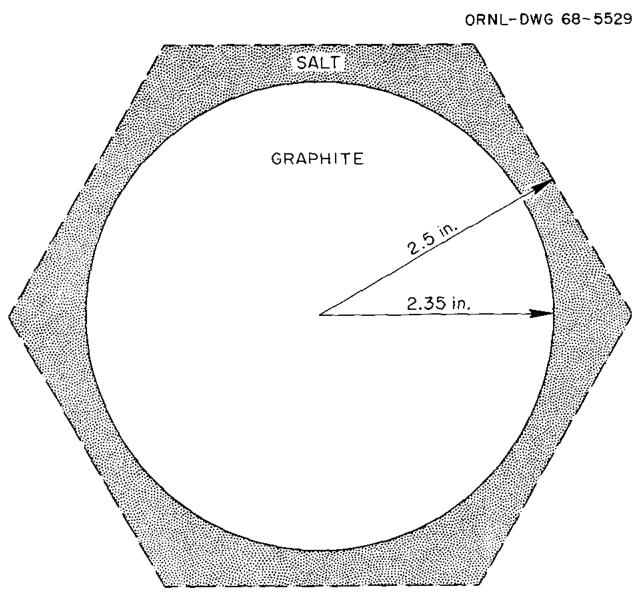  
Fig. 6.4. One-Fluid MSBR Fuel Cell.

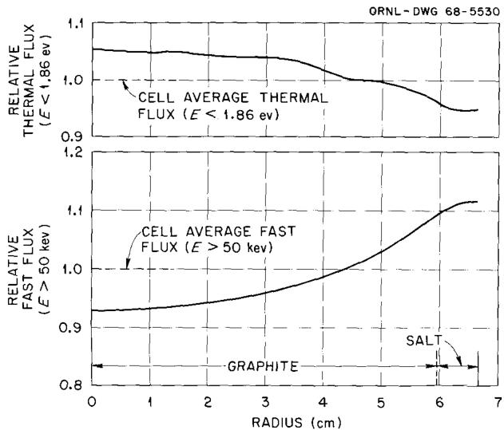  
Fig. 6.5. Fast and Thermal Flux Distributions in One-Fluid MSBR Cell.

# 6.1.4 Reactivity Coefficients

A number of isothermal reactivity coefficients were calculated using the reference reactor and the cell of Fig. 6.4. These coefficients are summarized in Table 6.4. The Doppler coefficient is primarily that of thorium. The graphite spectral coefficient is positive because of the competition between thermal captures in fuel, which decrease less rapidly than $1 / \nu$ , and thermal captures in thorium, which decrease nearly as $1 / \nu$ with increasing temperature. The total spectral component includes the Doppler term, the graphite spectral term, and the thermal spectral effects of all important moderators in the salt. The resonance density component represents the effect of decreased self-shielding of thorium with decreasing salt density. The total density component includes all effects associated with changes in the density of both salt and graphite, including the resonance density term. The prompt salt component includes all reactivity effects associated with an isothermal core temperature change except the graphite spectral and graphite density components, the latter of which is negligible. The last entry in Table 6.4 combines the spectral and density effects into a total isothermal reactivity coefficient.

Several important conclusions can be drawn from these coefficients. First, the total power coefficient is negative. Second, both the total density

Table 6.3. Flux Disadvantage Factors in Fast and Epithermal Ranges   

<table><tr><td>Group</td><td>Energy Range</td><td>φgraphite/φcell</td><td>φsalt/φcell</td></tr><tr><td>1</td><td>0.821–10 Mev</td><td>0.967</td><td>1.132</td></tr><tr><td>2</td><td>0.0318–0.821 Mev</td><td>0.985</td><td>1.060</td></tr><tr><td>3</td><td>1.234–31.82 kev</td><td>0.999</td><td>1.004</td></tr><tr><td>4</td><td>0.0479–1.234 kev</td><td>1.006</td><td>0.977</td></tr><tr><td>5</td><td>1.86–47.9 ev</td><td>1.008</td><td>0.969</td></tr></table>

Table 6.4. Isothermal Reactivity Coefficients of the Reference Reactor   

<table><tr><td>Component</td><td>Reactivity Coefficient, 
1 k ∂k (per °C)</td></tr><tr><td></td><td>×10-5</td></tr><tr><td>Doppler</td><td>-3.6</td></tr><tr><td>Graphite spectral</td><td>+1.9</td></tr><tr><td>Total spectral</td><td>-0.26</td></tr><tr><td>Resonance density</td><td>-1.2</td></tr><tr><td>Total density</td><td>-0.26</td></tr><tr><td>Prompt salt</td><td>-2.4</td></tr><tr><td>Total</td><td>-0.49</td></tr></table>

and the total spectral reactivity coefficients are negative. Third, and perhaps most important, the prompt coefficient of the salt, which largely determines the fast transient response of the system, is a relatively large negative coefficient and should afford adequate reactor stability and controllability. Studies of the actual dynamic performance of the system are in progress.

# 6.1.5 Measurements of Eta for $^{233}\mathrm{U}$ and $^{235}\mathrm{U}$ in the MSRE

G. L. Ragan

Isotopic analysis of two MSRE fuel samples differing in depletion of the $^{235}\mathrm{U}$ or $^{233}\mathrm{U}$ fuel can be used to measure the value of $\eta$ for the principal

fuel isotope. Samples have been taken for this purpose during operation with the $^{235}\mathrm{U}$ loading, and others will be taken during operation with $^{233}\mathrm{U}$ . A precise measurement for the latter would be of interest to the MSBR program since, as discussed by Perry, $^1$ the uncertainty in the effective value of $\eta$ for $^{233}\mathrm{U}$ contributes the major uncertainty in the breeding ratio of molten-salt breeders. The measured $\eta (\mathbf{\Omega}^{233}\mathbf{U})$ will be quite comparable with that for proposed MSBR designs because of the similarity, as demonstrated by Prince, $^2$ of the spectra of MSBR and MSRE. For both $^{235}\mathrm{U}$ and $^{233}\mathrm{U}$ loadings of MSRE, comparisons between measured and calculated values of $\eta$ provide tests of calculational methods and cross-section data. The first experiment, with $^{235}\mathrm{U}$ , will check procedures and equipment; the result will test the validity of the method, and may, indeed, constitute a useful check on the cross sections of $^{235}\mathrm{U}$ .

The basic idea of the measurement, discussed in terms of $^{233}\mathrm{U}$ for concreteness, is as follows: Absorptions in $^{233}\mathrm{U}$ are measured by observing the decrease in $^{233}\mathrm{U}$ concentration in the salt over a period of time at power; captures in $^{233}\mathrm{U}$ are measured by observing the increase in $^{234}\mathrm{U}$ concentration (corrected for absorptions in $^{234}\mathrm{U}$ itself). These concentrations, and the changes in them, are measured relative to that of $^{238}\mathrm{U}$ , whose neutron absorption cross section, and hence concentration change, are far smaller than those of either $^{233}\mathrm{U}$

or $^{234}\mathrm{U}$ . These relative concentrations can be measured very precisely, yielding a precise value for the conveniently defined cross-section ratio

$$
\gamma = \frac {\overline {{\sigma}} _ {c}}{\overline {{\sigma}} _ {a}} = \frac {\alpha}{1 + \alpha}.
$$

Using a well-established $^3$ value for $\nu$ , one gets

$$
\eta = \nu \frac {\overline {{\sigma}} _ {f}}{\overline {{\sigma}} _ {a}} = \nu (1 - \gamma).
$$

An expression has been developed for the cross-section ratio $\gamma$ in terms of the quantities actually measured by the mass spectrometer and the effective absorption cross sections of $^{234}\mathrm{U}$ and $^{238}\mathrm{U}$ . For the mass spectrometer measurements, one includes: (1) the measured current ratios (e.g., that in the $^{233}\mathrm{U}$ channel to that in the $^{238}\mathrm{U}$ channel); (2) the instrument calibration factors (e.g., the relative current sensitivities of channels 233 and 238); (3) interchannel cross-coupling factors (e.g., the spurious current in channel 234 due to the breadth of the 233 peak); and (4) variation in these instrument factors between measurements on initial and final samples. The ratios of the effective cross sections of $^{234}\mathrm{U}$ and $^{238}\mathrm{U}$ to that of $^{233}\mathrm{U}$ are involved because of the small but signifi

cant corrections for depletion of $^{234}\mathrm{U}$ and $^{238}\mathrm{U}$ during the course of the experiment. An extensive error analysis has been performed for both the $^{233}\mathrm{U}$ and $^{235}\mathrm{U}$ cases. The uncertainties which appear to limit the attainable precision are those of: (1) ratio of current in another channel to that in channel 238 (assumed uncertainty $\pm 0.01\%$ ); (2) effective absorption cross sections of $^{234}\mathrm{U}$ , $^{236}\mathrm{U}$ , and $^{238}\mathrm{U}$ relative to those of the principal fuel isotopes $^{233}\mathrm{U}$ and $^{235}\mathrm{U}$ (assumed uncertainty $\pm 10\%$ ). On this basis, it appears that an experiment involving $2\%$ depletion of $^{233}\mathrm{U}$ should measure $\gamma$ to $\pm 3.3\%$ , corresponding to an uncertainty of $\pm 0.008$ in the effective value of $\eta (^{233}\mathrm{U})$ in the MSRE spectrum. The corresponding errors for $2\%$ depletion of $^{235}\mathrm{U}$ are $\pm 1.4\%$ in $\gamma$ and $\pm 0.007$ in $\eta (^{235}\mathrm{U})$ . To these uncertainties owing to the measurements themselves, one should add an allowance for the uncertainty in $\nu$ . Using presently accepted values for these $[\pm 0.32\%$ for $\nu (^{233}\mathrm{U})$ and $\pm 0.25\%$ for $\nu (^{235}\mathrm{U})$ ], one estimates an overall uncertainty of $\pm 0.011$ (fortuitously coinciding) for both $\eta (^{233}\mathrm{U})$ and $\eta (^{235}\mathrm{U})$ , as measured in the MSRE spectrum. This value may be compared with our present estimate of $\pm 0.015$ for the uncertainty in $\eta (^{233}\mathrm{U})$ , in a typical MSBR spectrum, attributable to uncertainties in neutron cross sections.

# 7. Systems and Components Development

Dunlap Scott

The programs concerned with migration of noble gases, the technology of sodium fluoroborate, and the early development of pumps for molten-salt reactors were continued during the period. A study was begun of remote maintenance for MSBR's, including the problems involved in the remote welding of pipes and vessel closures. Studies of the effectiveness of decontamination of small components for subsequent maintenance and of the use of a gamma-ray camera for locating radioactive hot spots, both of which are pertinent to the maintenance plan for an MSBR, are reported in the MSRE section of this report.

# 7.1 NOBLE GAS BEHAVIOR IN AN MSBR

R.J.Kedl

The results of $^{135}\mathrm{Xe}$ poisoning calculations were presented for a specified two-fluid reactor concept in the last semiannual progress report (ORNL-4191). They showed that the target poison fraction of $0.5\%$ was attainable. Since then, the proposed core has increased in size in order to lower the power density. In addition, the proposed fuel cell geometry has changed to significantly increase the graphite surface area per unit volume of core. These factors will increase the $^{135}\mathrm{Xe}$ poisoning, and it now appears that the attainable poison fraction will be between 1 and $2\%$ . As a result, consideration is being given to graphite with a very low-permeability coating.

Calculations were made to determine the effect of coating the graphite with a thin layer of low-permeability graphite. As a reference design, essentially the same reactor concept was used as described in ORNL-4191, but with the core size increased to yield a mean power density of 20

kw/liter. The fuel cell geometry was also changed somewhat to give a higher specific surface area. The various xenon migration parameters were chosen to obtain an $^{135}\mathrm{Xe}$ poison fraction of $2.25\%$ (high end of the attainable range) with no coating, and then the calculations were extended to include the effects of coatings. The results of these computations appear in Fig. 7.1. In the coating the void fraction available to xenon was made variable in such a way that it changed

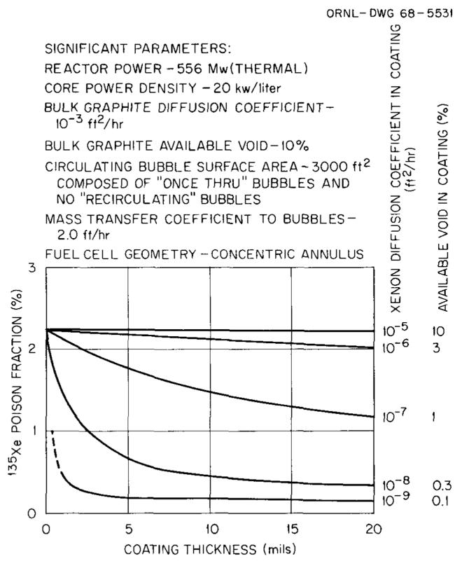  
Fig. 7.1. Effect of Coated Graphite on $^{135}\mathrm{Xe}$ Poison Fraction.

by one order of magnitude when the diffusion coefficient changed by two orders of magnitude. The diffusion coefficient of $10^{-3} \, \text{ft}^2/\text{hr}$ for the bulk graphite represents graphite believed to be readily available. It is important to notice that the bulk graphite must be improved to a diffusion coefficient of less than $10^{-7} \, \text{ft}^2/\text{hr}$ before there is a significant effect on the poison fraction, whereas an 8-mil coating of $10^{-8} \, \text{ft}^2/\text{hr}$ material would reduce the poison fraction to the target value of $0.5\%$ .

# 7.2 SODIUM FLUOROBORATE CIRCULATING LOOP TEST

A. N. Smith

P. G. Smith

Harry Young

The alterations necessary to convert this test facility, formerly called the Fuel Pump High-Temperature Endurance Test Facility, $^{1}$ to operate with sodium fluoroborate were completed. The work included installation of (1) equipment for automatic control of $\mathbf{BF}_3$ flow through a dip leg in the pump bowl and helium flow to the pump shaft annulus, (2) an access nozzle for removing salt samples from the pump tank, (3) a thermal conductivity cell to monitor the composition of the off-gas stream, and (4) equipment for controlled ventilation of the loop enclosure and instrument cubicles with provisions for venting the discharge above the building roof.

Instruments and components were checked out for proper operation, and the system was leak tested. A flush charge of about 900 lb of sodium fluoroborate was added to the sump, and this salt is now being circulated. The flush salt, which is intended to remove residues of the lithium fluoride-beryllium fluoride salt previously circulated in the loop, will be drained after several days of circulation, and a second batch will be added. The salt will then be circulated for several months for investigation of

1. pumping characteristics of the salt, including minimum overpressure necessary to prevent cavitation,   
2. problems associated with control and monitoring of the salt composition.

Salt samples will be used for direct indication of salt composition. Devices that will be evaluated for monitoring the composition indirectly are a thermal conductivity cell, which will provide an indication of the $\mathrm{BF}_3$ partial pressure in the off-gas stream, and a cold-finger unit, which will check for changes in the liquidus temperature of the salt. The cold-finger system is currently under design and will not be available during the initial period of circulation. Tentative calibration data on the thermal conductivity cell indicate that a change in $\mathrm{BF}_3$ partial pressure of $3.5\mathrm{mmHg}$ will result in a change in signal of $2.5\%$ of the indicator scale. This sensitivity is enough to detect any significant changes in the salt composition.

# 7.3 MSBR PUMPS

A. G. Grindell

L. V. Wilson

P. G. Smith

C. E. Bettis

H. C. Young

C. K. McGlothlan

# 7.3.1 Pump Program

The present emphasis on studying the single-fluid MSBR has influenced the pump program. The number of hydraulic designs has been reduced from 3 required for the two-fluid concept to 2 (see Table 7.1). Preliminary study indicates the practicability of using a sump pump configuration similar to that of the salt pumps for the

Table 7.1. Pump Requirements for 2000 Mw (Electrical) MSBR   

<table><tr><td></td><td>Fuel</td><td>Coolant</td></tr><tr><td>Number required</td><td>4</td><td>4</td></tr><tr><td>Design temperature, °F</td><td>1300</td><td>1300</td></tr><tr><td>Capacity, gpm</td><td>24,000</td><td>53,000</td></tr><tr><td>Head, ft</td><td>200</td><td>200</td></tr><tr><td>Speed, rpm</td><td>890</td><td>890</td></tr><tr><td>Specific speed, Ns</td><td>3170</td><td>3830</td></tr><tr><td>Net positive suction head required, ft</td><td>25</td><td>50</td></tr><tr><td>Impeller input power, hp</td><td>7500</td><td>7000</td></tr></table>

Molten-Salt Reactor Experiment (MSRE) and of using pumps of essentially one mechanical design and one drive design.

The emphasis on the single-fluid concept has not, however, altered the pump program objectives and the desire for the strong participation of the United States pump industry in design, development, production, and operation of pumps for the Molten-Salt Breeder Experiment (MSBE). Our present plan for securing industrial participation in the pump program, in brief, consists of the following items:

1. Interested pump manufacturers will be requested to submit proposals for designing the MSBE fuel salt pump to our specifications.   
2. After evaluation of these proposals, selected pump manufacturer(s) will be asked to design the fuel salt pump and to estimate the cost and schedule to produce a prototype. The cost estimate will include whatever development program the pump manufacturer proposes and his participation in the ORNL pump program. The pump manufacturer will also be requested to provide cost and schedule estimates for producing the required salt pumps for the Engineering Test Unit (ETU) and the MSBE.   
3. After evaluation of the completed designs, selected pump manufacturer(s) will be requested to produce the prototype fuel salt pump, complete his development program, and participate in the ORNL pump program.   
4. The prototype fuel salt pump will be subjected to molten-salt testing in the Fuel Salt Pump Test Facility with the participation of the pump manufacturer(s).   
5. The salt pumps for the ETU and the MSBE will be produced by the pump manufacturer(s).   
6. With the participation of the pump manufacturer(s), proof tests of the ETU and MSBE salt pumps will be performed in the Fuel Salt Pump Test Facility.   
7. Adequate support, in which the pump manufacturer(s) will participate, will be provided to sustain the continued satisfactory operation of the salt pumps in the ETU and the MSBE.

We will make design studies and analyses of the salt pump configuration and its relationships to the reactor system to become thoroughly

familiar with the pump problems. The studies will be used to provide insight and direction to the pump design and development for the industrial participant(s) as well as the Laboratory.

Information is now being assembled for use in writing specifications for the fuel salt pump.

# 7.3.2 Fuel Salt Pump

In our present design of the single-fluid breeder, the pumps are near the top of the reactor cell. The length of the shaft can be reduced considerably from that of the long-shaft pump proposed for our design of two-fluid reactors; this shortening presents an opportunity to eliminate the molten-salt bearing required in the long-shaft pump.

Figure 7.2 shows a preliminary layout of a concept of the fuel salt pump for the single-fluid reactor. Although the capacity is much larger, the pump is similar in configuration to the MSRE salt pumps. The drive motor is mounted in a fixed position on top of the concrete shielding, and the bearing housing is recessed into the shielding to reduce the shaft overhang. The pump shaft is mounted on two pairs of preloaded oil-lubricated ball bearings. The impeller is overhung about $6\frac{1}{2}$ ft below the lower bearing. A preliminary study indicated a first shaft critical speed greater than 1200 rpm.

Internal shielding of the bearing housing is provided by a steel or Hastelloy N shield plug cooled by an organic liquid, possibly the same as the bearing lubricant. To reduce deflections of the shaft at the impeller caused by hydraulic radial forces on the impeller, the pump casing is of either the double-volute (as shown) or the vaned diffuser design to minimize these forces. Both casings have the added advantage of greater structural strength than a single-volute or a vaneless diffuser. At the design temperature of $1300^{\circ}\mathrm{F}$ , where the allowable stress for Hastelloy N is 3500 psi, this advantage is of considerable importance to the designer.

The bearing housing is designed for replacement by semidirect maintenance, either in situ or in a hot cell after the entire rotary element has been removed from the reactor system.

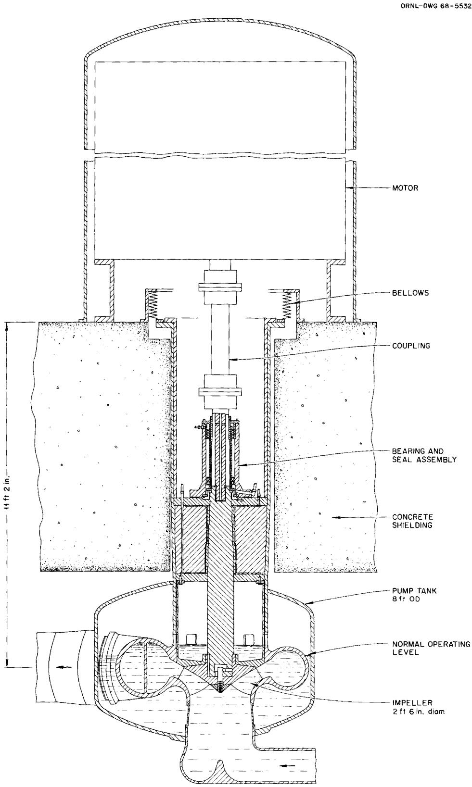  
Fig. 7.2. MSBR Fuel Salt Pump Concept. Preliminary layout of short-shaft pump.

The drive motor will be installed in a fixed position, and the pump will be permitted to move freely with the thermal expansion of the reactor system. For power transmission a floating coupling or universal joints will be used to accommodate the approximately $\frac{1}{8}$ -in. horizontal and vertical displacements of the pump that are anticipated during operation at temperature. The transmission device will also have design features to accommodate the approximately 5-in. vertical and $1\frac{1}{2}$ -in. horizontal movements that occur between room temperature and reactor cell design temperature; we do not presently anticipate operating the pump at room temperature.

The pump tank provides volume to accommodate the anticipated thermal expansion of the fuel salt at off-design conditions. It is almost completely decoupled hydraulically from the flowing salt in the impeller and volute passages by (1) labyrinth seals installed in the pump casing around the pump shaft and on the periphery of the casing and (2) bridge tubes that connect the volute to the inlet and outlet nozzles attached to the pump tank. The bridge tubes also eliminate structural redundancies between the pump tank and the volute and its supporting structure.

In a noteworthy fashion the hydraulic decoupling serves to minimize the changes that may occur in the pump tank liquid level when several pumps are being operated in parallel and one of them stops. Consider, if (1) the gas volumes of the salt pumps being operated in parallel are interconnected, (2) the salt volume in each pump tank is connected directly to its pump suction, and (3) all pumps are being supplied from a common plenum in the reactor, then the following events would occur when one pump stops: The level of salt in the tank of the stopped pump would try to increase by an amount equal to the velocity head at the pump suction plus the head loss in the suction line from the common supply to the pump tank. This change in level would be ten or more feet, which would represent an unwanted increase in pump shaft length. Also, unless there is sufficient reserve salt volume in the other pump tanks to supply the increased salt requirement of the stopped pump, the system fluid would in-gas when the salt level in the tanks of the operating pumps is lowered to the level of the pump suction. However, by connecting the liquid in the hydraulically decoupled version of the pump tank to a point in the reactor plenum where the velocity changes

very little when one pump is stopped, and by making the pressure drop in this connecting line very low for the salt flow returning from the tank to the plenum, the level change in the pump tanks probably can be held to about 2 ft.

Although not shown in Fig. 7.2, the upper portion of the pump tank and its internal structure will be cooled by a small bypass flow of the fuel salt to remove beta and gamma heat. A study using an existing heat transfer program (SIFT-TOSS) is in progress to determine the temperature distribution in the pump shaft and shaft casings. The first case being solved assumes full-power gamma heating on one half of the shaft casing and no gamma heating on the other half. The results of the first case will indicate the next case to be considered.

A preliminary investigation has been made of the capacity of the fuel salt pump and its speed on various pump parameters such as impeller diameter, net positive suction head required (NPSH), hydraulic efficiency, and shaft diameter. The results are shown in Fig. 7.3.

# 7.3.3 Coolant Salt Pump

There is sufficient similarity in the design head, speed, temperature, and power characteristics of the fuel and coolant salt pumps (see Table 7.1) that it appears feasible to interchange the rotary elements (except for the impellers) and the drive motors. Interchangeability could lead to considerable savings in the MSBE salt pump program.

# 7.3.4 Molten-Salt Pump Test Facility

The design was initiated for a molten-salt pump test facility which will provide adequate non-nuclear testing capabilities for the MSBE salt pumps. Basically, the facility will consist of the necessary piping system, heat sink (preferably to air), variable flow restrictor, flow measuring device, salt storage tanks, preheaters, and controls and instrumentation. The following is a partial list of the criteria for the facility:

Maximum temperature 1400°F

Maximum cover gas pressure 150 psig

Maximum flow 10,000 gpm

Maximum head loss 200 ft

Maximum heat sink capability \~100,000 Btu/min

ORNL-DWG 68-5533

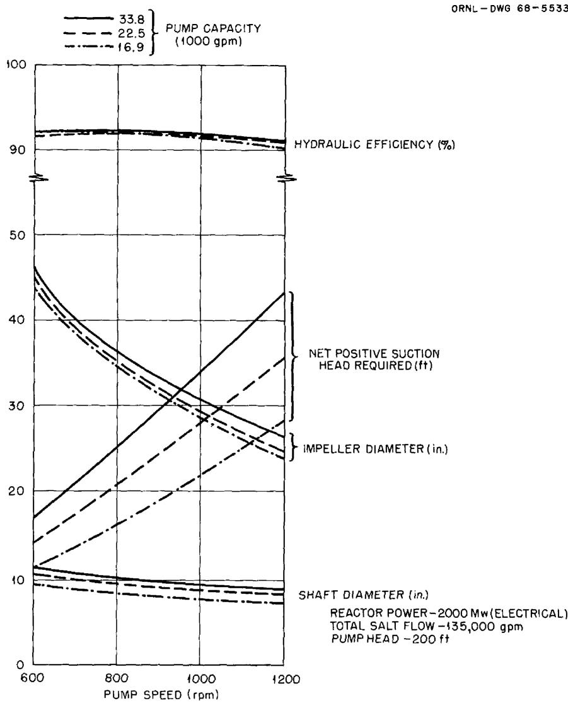  
Fig. 7.3. Effect of Capacity and Speed of MSBR Fuel Salt Pump on Various Pump Parameters.

The facility including test pump will be approximately 60 ft high, if the long-shaft pump is used, and approximately 50 ft long. It is proposed to locate the facility in Building 9201-3.

Preliminary design studies have been directed to the sizing of a salt-to-air heat exchanger and investigating flow characteristics of the salt piping loop.

# 7.3.5 Molten-Salt Bearing Program

Although the single-fluid reactor concept may permit the use of a short-shaft pump similar to

that of the MSRE salt pumps, we plan to pursue the molten-salt bearing program vigorously. There is need to establish whether such bearings can be used in a pump. In addition, the bearing materials may be applicable to the plugs and seats of valves for molten salt.

Bearing Materials. - The Metals and Ceramics Division is preparing a program in which candidate bearing materials will be subjected to fuel and coolant salt tests. Hard-surface coatings on Hastelloy N substrate will be studied. The various methods that will be tried for applying the coating to the substrate include plasma spray,

multiple coating by chemical vapor deposition, and brazing.

Sixty-four hard-coated specimens consisting of plasma-sprayed cermet on Hastelloy N substrate were received from Mechanical Technology Incorporated. Four different coatings are represented: (1) tungsten carbide bonded with 7 to $10\%$ cobalt, (2) $25\%$ tungsten carbide- $7 \%$ nickel- $68\%$ mixed W-Cr carbides, (3) $40\%$ pure tungsten carbide- $50\%$ tungsten carbide with $12\%$ cobalt binder- $10\%$ molybdenum, and (4) $75\%$ chromium carbide- $25\%$ Ni-Cr alloy binder.

These coatings will be evaluated by the Metals and Ceramics Division on the results of (1) chemical compatibility tests with molten salt, (2) thermal cycling tests in molten salt, (3) x-ray studies of coating structure made before and after molten-salt tests, (4) surface roughness measurements taken before and after molten-salt tests, (5) determination of coating adherence to Hastelloy N substrate, and (6) metallographic studies. Coatings which have promise will be evaluated further in actual molten-salt bearing operation.

Bearing Tests. - The materials that have sufficient promise will be fabricated into bearings and tested in molten salt. The first molten-salt tests will be conducted in an existing facility which can accommodate a 2-in.-diam by 2-in.-long bearing.4 The facility was last operated with potassium, and its refurbishment to molten salt operation is being studied.

The layout of a facility for testing relatively large molten-salt bearings is complete. The facility utilizes such existing items from the MSRE pump program as the Mark 1 prototype pump tank and rotary element, the structure from the water pump test stand, and a high-temperature molten-salt drain tank. The tester will accommodate a 6-in.-diam by 6-in.-long bearing and will be operable at speeds to $1800\mathrm{rpm}$ , temperatures to $1400^{\circ}\mathrm{F}$ , and bearing loads to 500 lb.

The tester will provide basic information and help resolve some of the problems of design, development, fabrication, and operation of molten-salt bearings. The major of these problems is proof testing the selected bearing materials and their mounting arrangement should they have a

coefficient of thermal expansion significantly different from that of Hastelloy N.

A cross section of the tester is shown in Fig. 7.4. It consists of the aforementioned existing pump modified by removing the impeller, volute, and other structures inside the pump tank to make room for the test journal, bearing and mount, and bearing loading device. The journal is attached to the end of the shaft by means of a conical mount that accommodates relative thermal expansion between these two pieces by sliding along the conical surfaces and at the same time maintains concentricity between the outside of the journal and the shaft center line.

The bearing consists of four tilting pads mounted on a ring made of the same material as the pads. The ring, in turn, is mounted on a structure of leaf springs having radial flexibility sufficient to permit relative thermal expansion between the ring and structure without overstressing the members. The radial stiffness, however, is sufficiently high to transmit the bearing load easily. The bearing is loaded by means of a hydraulic cylinder acting on the lever that penetrates the tank through a bellows and bears against the leaf spring structure. The entire bearing assembly is supported on slender rods that permit the assembly to move with almost zero redundancy upon application of the bearing load. Lugs are provided to resist the bearing torque. The tester will be driven by a low-torque motor to reduce damage in the event of bearing seizure. We expect the bearing to operate predictably in molten salt, so no attempt will be made to measure such functional characteristics as operating clearance and attitude angle.

The tilting pad bearing configuration was selected for the tester because of its ability to better accommodate those conditions that cause bearing damage and lead subsequently to failure. Damage is most likely to result from (1) the presence of crud or particulate matter in the lubricating salt, (2) thermal distortion of the bearing surfaces or loss of the alignment between the journal and bearing, or (3) mechanical disturbance of the bearing surfaces caused by starting and stopping the journal. To a greater degree than most bearing configurations, the tilting pad is capable of self-cleaning should any particulate matter pass into the bearing clearance. It can also tolerate a relatively high degree of misalignment.

ORNL-DWG68-5534

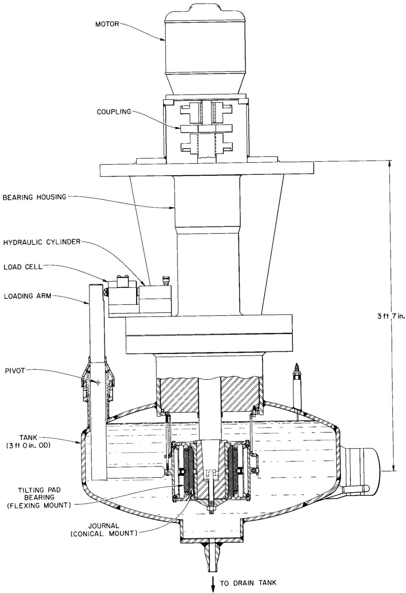  
Fig. 7.4. Large-Scale Molten-Salt Bearing Tester.

# 7.3.6 Rotor-Dynamics Feasibility Investigation

An analysis of the rotor-dynamic response4 of a long-shaft pump has been completed by Mechanical Technology Incorporated. The final report is expected soon.

# 7.4 REMOTE MAINTENANCE

Robert Blumberg

P. P. Holz

A fundamental criterion in the design of a molten-salt breeder reactor is that maintenance will be done in a safe and economical manner. Attainment of this objective requires close surveillance of the reactor design during the conceptual stage so that considerations of the basic problems of component maintenance and replacement are included.

We are now establishing the broad outlines of the maintenance system design and development program. Initially, our approach will be based on the maintenance system used at the MSRE, which consists in disconnecting and replacing components by manipulation of expendable long-handled tools through a movable maintenance shield. The experience with this maintenance system gained at the MSRE provides a basis for the anticipation and evaluation of problems in the much larger MSBR.

Several factors which influenced the evolution of the MSRE maintenance system and also apply to the MSBR are

1. the nature of the tasks it had to perform (unscheduled repair and replacement of a large number of different components),   
2. the physical character of the reactor plant (basically a chemical processing plant separated into several rooms, roughly according to function),   
3. the economics of other approaches to the maintenance problem, generally involving the use of electrically controlled equipment operated completely remotely and limited to exactly prescribed functions.

However, in transposing to the MSBR we recognize several differences that cannot be dismissed by simply scaling up from the MSRE. In essence, the MSBR maintenance system development pro

gram will be concerned with applying MSRE techniques to a larger reactor and to overcoming problems caused by the differences.

There are three specific areas under active consideration: (1) the application of the portable maintenance shield concept to the various cells of the MSBR, (2) remote welding for vessel entry and component replacement, and (3) replacement of the graphite moderator elements of the core on a regular basis. Factors involved in each of these areas will influence the reactor equipment layout and component design, so that an early resolution is thought necessary.

# MSBR Maintenance Shield

The application of the portable maintenance shield concept to the MSBR is important in that this basic piece of equipment will be used for almost all remote maintenance operations. A practical, workable design must be achieved before we can confidently look at in-cell problems. The design must take into account the shield-block layout, the method of gaining access through the containment, the layout of components in the cell, and any physical obstructions on the working floor level. Layouts of various shield block and containment membrane arrangements have been started to determine the effect on remote maintenance procedures. Also of interest in this general area are experiments to be conducted to measure the residual radiation levels in the reactor cell of the MSRE. This information will be used to estimate levels that will be encountered in the MSBR during maintenance operations and to deduce whether they will impose limitations on manipulations through the maintenance shield.

# Remote Welding

We propose to use remote cutting and welding as the means for disconnecting the salt piping for component replacement and for gaining access into the reactor vessel for graphite moderator replacement. The early development of this capability is important in establishing the maintenance concept as well as in establishing the space requirements in the plant layout. Figure 7.5 shows schematically the equipment involved in the process for welding the horizontal piping.

ORNL-DWG 68-5535

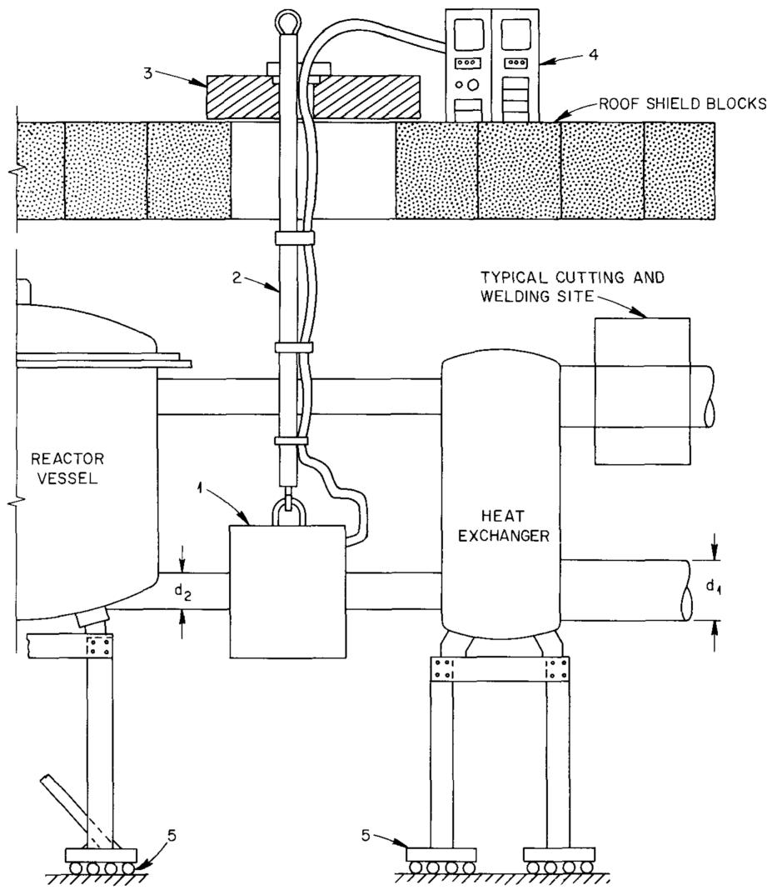  
Fig. 7.5. Schematic Version of Remote Welding Components.

Item 1 is a vehicle which traverses the circumference of the pipe and has the capability of cutting and preparing the pipe for welding, welding the pipe, and then inspecting the joint.

Item 2 consists of the long-handled tools which insert and support item 1, provide some minor control or adjustment over the various processes, and provide routing for the service lines.

Item 3 is the maintenance shield for the MSBR.

Item 4 is the equipment which has the primary control of the welding, cutting, and inspection processes.

Item 5 is whatever is used to support the components and position the ends of the piping for welding. The rollers shown are schematic. The

design of component supports must include consideration of the weld joint pre-positioning requirements.

The development effort will be primarily concerned with an assembly consisting of items 1 and 4 and the connecting cables. Activity thus far has been limited to generating broad outlines of the overall program and to a search for information on the state of the current technology. Significant and applicable work has been found in the area of automatic butt welding of pipes in a horizontal position.

Two firms build welding equipment that is capable of completing good welds automatically in horizontal piping, but these require manual

installation and direct monitoring. These two firms are Liquid Carbonic Corporation of Chicago, Illinois, a subsidiary of General Dynamics Corporation, and North American Aviation, Inc. Both systems use tungsten inert-gas welding and a control system that operates on the usual welding parameters to achieve automatic welding. There are some differences in the detailed electrical and mechanical design, in their capabilities, and possibly in their state of perfection. While this equipment represents an advanced state of the art for automated welding, no existing system fully meets our specific requirement for remote welding.

We plan to evaluate the use of such equipment in the production of the high-quality welds required in a nuclear system and then to proceed with solving the problems of weld joint design, remote alignment and positioning of the components, and remote inspection techniques which are necessary for providing confidence in the weld quality.

# Replacement of Graphite Moderator Elements

Because of radiation-induced damage to graphite, some of the moderator elements of the reference

design may have to be replaced every few years. The planning and preparation for this task are important parts of the remote maintenance program and involve four problem areas. These are

1. a miscellaneous area concerned with the general setup of the maintenance equipment, with the provisions for afterheat removal, and with the method for disconnecting auxiliaries,   
2. the process for remote cutting and rewelding of the vessel closure,   
3. the handling and storage of the very large vessel lid,   
4. the handling of new and of radioactive moderator elements.

Because of the large amount of radiation and contamination, item 4 presents the greatest problem. A number of methods are being evaluated that range from use of a huge charge-discharge machine to a simple long-handled grapple approach. In handling the contaminated graphite, we have the option of breaking the moderator bars into smaller pieces and loading them into a transport cask below the reactor shield, or of bringing them up into a container above the shield and disposing of them from there.

# 8. MSBR Instrumentation and Controls

L. C. Oakes

# 8.1 ANALOG COMPUTER STUDIES

O.W.Burke

S. J. Ditto

F. H. Clark

R. L. Moore

Analog computer studies of the dynamics of MSBR systems were begun. These studies are expected to form the basis for the determination of a suitable control scheme as well as the safety requirements of the plant. The basic approach is to first simulate in as great detail as possible the various individual subsystems to determine the behavior of these subsystems during postulated transient conditions. These studies will then form the basis for judging the validity of simpler models so that the entire plant can be simulated.

An approximate space invariant model of the reactor kinetics yielded the following equations for precursors, $C_i$ , and power, $P$ :

$$
\frac {d}{d t} P (t) = \frac {\rho - \beta}{\Lambda} P (t) + \sum \lambda_ {i} C _ {i} (t),
$$

$$
\begin{array}{l} \frac {d}{d t} C _ {i} (t) = \frac {\beta_ {i}}{\Lambda} P (t) - \lambda_ {i} C _ {i} (t) - \frac {1}{\tau_ {\mathrm {c}}} C (t) \\ + C _ {i} (t - \tau_ {L}) \frac {e ^ {- \lambda_ {i} \tau_ {L}}}{\tau_ {c}}. \\ \end{array}
$$

The term $C_i(t - \tau_L)$ dictates the need for a transport lag generator for each delay group if they are to be faithfully simulated. Since only two transport lag generators are available, it is necessary to use approximate methods of computing the transient delayed neutron precursor concentration using equations involving only two transport lags. Two such methods were compared: (1) the six groups were reduced to two effective groups by use of the

method of Cohen and Skinner, $^{1}$ and (2) the lag term of the two groups with the shortest time constants was neglected; for the two groups having the longest time constants, the lag terms were approximated by

$$
C _ {i} (t - \tau_ {L}) \approx C _ {i} (t) - \tau_ {L} \frac {\partial C _ {i}}{\partial t};
$$

and the two other delay groups were treated with the transport lag devices.

Cases were run with both models, and the results showed comparable and acceptable performance.

Preliminary studies of the dynamics of two-fluid MSBR dynamics were made to determine the initial reactor response to certain load and reactivity transients in the absence of any control action. The durations of some of the transients were short compared with the transit time of the salt in the fuel circulation loop and therefore yielded no significant information regarding overall stability.

Figure 8.1 shows the results of the simulation of the insertion of approximately $0.75\% \delta k / k$ as a step while the reactor was operating at design point power level of 556 Mw [thermal power of a single module of the four-module 1000 Mw (electrical) two-fluid breeder plant]. Although the power reached a peak value of about 775 Mw in 0.375 sec, the fuel temperature at the core outlet only increased by about $30^{\circ}\mathrm{F}$ . After the initial peak the power settled to about 625 Mw, at which time the run was terminated, since further changes would be at a rather modest rate which we considered quite amenable to routine control measures.

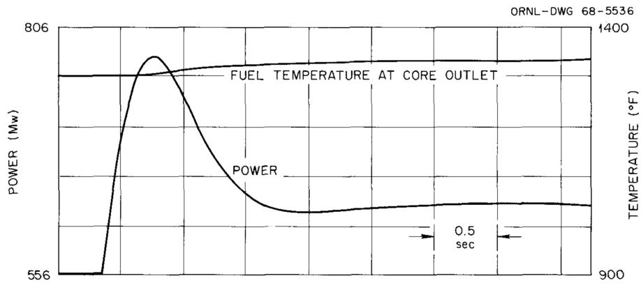  
Fig. 8.1. Response to Step Reactivity Addition of $0.746\% \delta k / k$

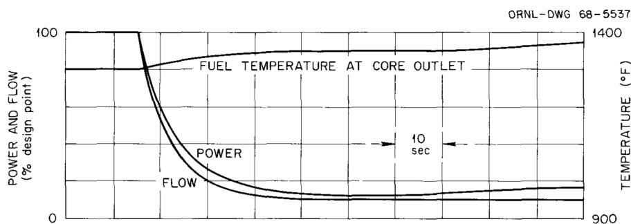  
Fig. 8.2. Response to Flow Coastdown.

Figure 8.2 shows the results of a run simulating the coastdown of fuel salt flow without changing coolant salt flow rate, again with initial conditions at design point. The coastdown assumed was an exponential decay from 100 to $10\%$ flow rate with a time constant of about 6 sec. In this case the power decreased to approximately $12\%$ in about 50 sec and then began to rise slowly as the effects of the excess cooling by the heat exchanger began to reduce the mean fuel temperature in the core. At this time the temperature of the fuel leaving the core was about $1340^{\circ}\mathrm{F}$ and was rising at a rate of less than $1^{\circ}\mathrm{F} / \mathrm{sec}$ .

The curves of Fig. 8.3 show the response of the reactor and primary loop to a simulated loss of load. In this case the temperature of the coolant salt entering the primary heat exchanger was increased from its design value of $850^{\circ}\mathrm{F}$ to $1100^{\circ}\mathrm{F}$

at a rate of $25^{\circ}\mathrm{F} / \mathrm{sec}$ . This appears to the primary heat exchanger as a complete loss of load at the rate of $10\%/\mathrm{sec}$ , since the coolant salt leaving the heat exchanger at the beginning of the transient has not had time to return to the heat exchanger before termination of the study. Thermal lags in the heat exchanger and core caused the power to lag behind the load, but the response appears quite good. These results lead us to the tentative conclusion that the plant would be inherently load following at the expense of modest temperature changes. They also indicate that it should be quite easy to accommodate rather large load changes using a control system to maintain some desired temperature condition.

Although it had originally been planned to extend these studies to include investigation of the details of the required control characteristics, the

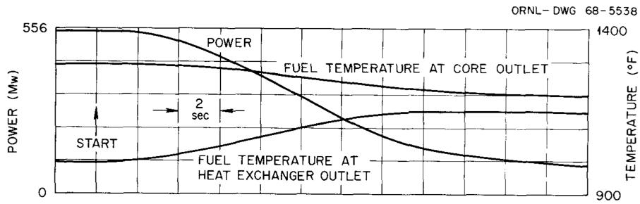  
Fig. 8.3. Response to Load Reduction of $10\%/\mathrm{sec}$ .

shift of emphasis from the two-fluid to the one-fluid system has caused us to set aside studies of the two-fluid reactor for the present. Our next studies will be aimed at a reference design of a single-fluid MSBR.

Simulation of the entire plant will require additional analog computer equipment to simulate transport lags in the piping of the secondary salt loop. An order has been placed for two lag generators, with delivery expected about the middle of the 1968 calendar year.

The steam generator has been modeled for examination of its dynamic behavior on the analog. Considerable simplification of the system equations has been undertaken. Further, an attempt will be made to cause dynamic variations which are model dependent rather than real to occur in times short compared with times of physical interest. We will do this by (1) forbidding unrealistically rapid adjustment of control devices and (2) possibly rescaling time. Such procedures are often used to adapt the computer to a problem which is actually beyond its nominal capability. We cannot,

of course, be assured that the analog computer will perform satisfactorily in this mode. Accordingly, work is continuing toward programming the problem for hybrid computer solution.

It should be observed that this problem is nearly identical to a problem done by the British CEGB and Electronic Associates on a hybrid computer, and their experience demonstrates clearly the need for a machine with the capabilities of a hybrid computer to handle this problem properly. These results, unfortunately, are unavailable to us because of proprietary reasons.

The model itself has been linearized, a procedure we consider appropriate for control, if not for safety, purposes. The heat transfer coefficient is now permitted to be a function of the velocity of both fluids. Analog controls are provided to permit variation of salt velocity, water pump speed indirectly affecting initial pressure, initial temperature, and throttle opening. The throttle is treated at all times as a critical aperture. This treatment causes decoupling of effects downstream of the throttle.

# Part 3. Chemistry

W. R. Grimes

The chemical research and development effort in close support of the MSBR program includes, as described in this chapter, a variety of studies. A major share of this effort continues to be devoted to the immediate and anticipated problems of the operating Molten-Salt Reactor Experiment (MSRE).

Sampling of the MSRE fuel and coolant salts, interpretation of the analyses for major and minor constituents of the melt, and investigation of the distribution of fission products as revealed by specimens exposed to the pump bowl gases continued as routine. The results of salt analyses continued to show excellent materials compatibility. Significant fractions of several fission products continued to appear in the pump bowl gas space. The fate of fission products in the reactor was established in considerable detail. The only unusual behavior continued to be that of the more noble metals such as Mo, Ru, Te, and Nb. These left the fuel by depositing on the walls, and possibly also as a smoke that was carried away in the gas phase. Since the chemistry of the volatile fluorides of these fission products may have relevance to future aspects of the MSBR program, in

vestigation of the chemical behavior of their fluorides was continued.

The prospects for application of fluoroborate coolants in molten-salt reactor technology continued to appear favorable and has justified a continuing investigation of the NaF-NaBF $_4$ and NaF-KF-BF $_3$ systems. As innovations in MSBR design increasingly favor the development of a single-fluid system, efforts to devise efficient chemical reprocessing methods have become more significant. Laboratory studies of recovery of protactinium and removal of lanthanide fission products from the core salt by reductive extraction into molten metals continue to show promise and were actively pursued.

Solution thermodynamics and electrochemistry of $\mathrm{LiF - BeF}_2$ melts were investigated in connection with chemical behavior and extractive reprocessing of breeder reactor melts.

Development studies in analytical chemistry have been directed primarily toward improvement in analysis of radioactive samples of fuel for oxide and uranium trifluoride and for impurities in the helium gas from the MSRE.

# 9. Chemistry of the MSRE

R. E. Thoma

Chemical behavior in the salt, gas, oil, and water systems of the MSRE has been the subject of a continuous surveillance program since the beginning of MSRE operations. Surveillance is accomplished partly by on-line instrumental analysis. The condition of salt systems, however, is

appraised preponderantly from the results of chemical analysis. Numerous samples are obtained therefore as part of this program. They afford a means for determining the stability and compatibility of salt-metal systems, the condition and service life of coolants and lubricants, and the

composition, purity, and oxidation-reduction potentials of the fuel salt. In addition, analyses of the fuel salt are performed regularly to measure isotopic composition of the fissile material in order to compute fuel burnup rates. It has been the purpose of this program to apply the experience gained during the period when the MSRE contained $^{235}\mathrm{U} - ^{238}\mathrm{U}$ fuel salt to operation of the reactor in the near future with $^{233}\mathrm{U}$ fuel salt and subsequently to the design of molten-salt breeder reactors.

Results of previous MSRE materials analyses were summarized in the last report of this series. In the intervening period, the MSRE has operated continuously for its longest period of power generation uninterrupted by drain and flush operations. This period of some 25,500 Mwhr has afforded an unprecedented opportunity to determine the extent to which a program of routine analyses is relevant to reactor operations.

# 9.1 FUEL SALT COMPOSITION AND PURITY

It became evident at the onset of MSRE power operation that the on-line reactivity computation was about ten times as sensitive for detection of small changes in uranium concentration as individual chemical analyses of the fuel salt could be anticipated to be. Therefore, until more precise methods for the determination of uranium are developed, the chief function of individual analyses

$^{1}$ MSR Program Semiann. Progr. Rept. Aug. 31, 1967, ORNL-4191, pp. 102-8.

must come from their indication of long-term trends in fuel composition and from their application to studies of chemical changes in the flush salt.

Routine MSRE operations alter the composition of the fuel salt principally by the consumption or addition of $^{235}\mathrm{UF}_4$ and by intermixing fuel and flush salts. In current operations the fuel salt has been circulated in the reactor for more than five months without alteration of its composition by intermixing fuel and flush salts. The average composition of the fuel salt during runs 13 and 14 is compared with previous values in Table 9.1. These results reinforce the prior inference that the circulating fuel salt would exhibit excellent chemical stability in nuclear operations and indicate that estimates of fuel composition, as computed from operation data, are in satisfactory agreement with analytical results. Final evaluation of operating power levels and residual reactivity depend upon such concurrence.

Statistical analyses of the chemically determined values for uranium concentration show that control limits have not been exceeded. However, within these limits a disparity between computed and analytical values has developed, one in which the results of chemical analyses indicate that the concentration of uranium in the fuel salt is currently lower by $\sim 0.02$ wt $\%$ than that computed from operational data. This trend is suggested by comparison of the average values of uranium as determined from chemical analysis with those computed from operation analysis (Table 9.2).

The results of individual chemical analyses of uranium in the MSRE fuel salt are compared with

Table 9.1. Average Composition of MSRE Fuel Circuit Salt in Mole %   

<table><tr><td>Run No.</td><td>7LiF</td><td>BeF2</td><td>ZrF4</td><td>UF4</td><td>Number of Samples</td></tr><tr><td>Design</td><td>65.00</td><td>29.17</td><td>5.00</td><td>0.83</td><td></td></tr><tr><td>FP-4</td><td>63.36 ± 0.57</td><td>30.65 ± 0.58</td><td>5.15 ± 0.12</td><td>0.825 ± 0.011</td><td>22</td></tr><tr><td>FP-5-7</td><td>63.29 ± 0.72</td><td>30.70 ± 0.70</td><td>5.19 ± 0.13</td><td>0.824 ± 0.011</td><td>14</td></tr><tr><td>FP-8</td><td>65.84 ± 2.49</td><td>28.57 ± 2.12</td><td>4.82 ± 0.35</td><td>0.771 ± 0.058</td><td>8</td></tr><tr><td>FP-9</td><td>64.17 ± 0.10</td><td>30.04 ± 0.14</td><td>4.99 ± 0.19</td><td>0.794 ± 0.011</td><td>4</td></tr><tr><td>FP-10</td><td>64.65 ± 0.45</td><td>29.64 ± 0.48</td><td>4.92 ± 0.06</td><td>0.791 ± 0.010</td><td>10</td></tr><tr><td>FP-11</td><td>64.30 ± 0.90</td><td>29.89 ± 0.81</td><td>5.01 ± 0.13</td><td>0.803 ± 0.018</td><td>41</td></tr><tr><td>FP-12</td><td>64.46 ± 0.83</td><td>29.86 ± 0.77</td><td>4.88 ± 0.14</td><td>0.794 ± 0.021</td><td>26</td></tr><tr><td>FP-13-14</td><td>64.07 ± 0.95</td><td>29.95 ± 0.95</td><td>5.15 ± 0.13</td><td>0.819 ± 0.015</td><td>44</td></tr></table>

Table 9.2. Comparison of Analytical and Computed Values of Uranium in the MSRE Fuel Salt   

<table><tr><td rowspan="2">Run No.</td><td colspan="2">Percent Uranium</td><td rowspan="2">Δ kg U</td><td rowspan="2">Mwhr</td><td rowspan="2">Number of Samples</td></tr><tr><td>Book (av)</td><td>Analytical (av)</td></tr><tr><td></td><td></td><td></td><td></td><td>×103</td><td></td></tr><tr><td>5-7</td><td>4.623</td><td>4.629 ± 0.026</td><td>+0.3</td><td>15.6</td><td>14</td></tr><tr><td>8</td><td>4.605</td><td>4.632 ± 0.011</td><td>+1.35</td><td>4.4</td><td>8</td></tr><tr><td>9</td><td>4.591</td><td>4.603 ± 0.031</td><td>+0.60</td><td>2.5</td><td>4</td></tr><tr><td>10</td><td>4.573</td><td>4.609 ± 0.020</td><td>+1.80</td><td>10.5</td><td>10</td></tr><tr><td>11a</td><td>4.569</td><td>4.570 ± 0.018</td><td>+0.05</td><td>12.5</td><td>35</td></tr><tr><td>11b</td><td>4.579</td><td>4.571 ± 0.019</td><td>-1.40</td><td>3.0</td><td>6</td></tr><tr><td>12a</td><td>4.561</td><td>4.548 ± 0.022</td><td>-0.65</td><td>4.5</td><td>18</td></tr><tr><td>12b</td><td>4.590</td><td>4.572 ± 0.032</td><td>-0.90</td><td>1.5</td><td>8</td></tr><tr><td>13-14</td><td>4.564</td><td>4.543 ± 0.032</td><td>-1.05</td><td>25.5</td><td>44</td></tr></table>

the nominal book value for uranium as shown in Fig. 9.1. The actual trend in these values is more clearly evident from the control chart shown in Fig. 9.2. The slope of the points shown here was computed from a least-squares program using both weighted (where individual data points were assigned values of $4 / \sigma^2$ - dashed line, Fig. 9.2) and raw values (solid line, Fig. 9.2) of uranium concentration. The results show that a real disparity exists between values of uranium concentration in the fuel salt as computed from operational analysis and chemical analysis. The raw values indicate a difference in chemical and book value of $1.28\mathrm{kg}$ in total uranium. A similar disparity has also been noted in a gradual decline in the computed reactivity which has been observed in runs 13 and 14 (this report, Sect. 1.2.1) and which seems to have proceeded from the beginning of power operation, a decline which would account for an apparent difference of $0.95\mathrm{kg}$ in total uranium.

We find no chemical basis for this unexplained difference between the anticipated values for uranium concentration of the fuel salt and the experimentally determined values. The reality of the difference seems to be unquestionable and is found in corresponding magnitude in reactivity computations. We conclude therefore that it will be necessary to reevaluate the method by which the concentration of uranium in the fuel salt is computed.

The overall purity of the MSRE fuel salt, as judged from the concentrations of oxide and chromium, has been maintained during the present report period. An innovation was made in the method of handling samples of fuel salt obtained for oxide analysis or for measurement of the concentration of trivalent uranium in fuel salt (this report, Sect. 2.2). This change is the use of a heated carrier to maintain the temperature of salt specimens after isolation at 200 to $300^{\circ}\mathrm{C}$ and thereby to ensure that the fluorine recombination reaction can proceed sufficiently rapidly to prevent evolution of free fluorine from frozen salt. This technique presumably obviates the possibility that nascent fluorine might remove oxide from the salt. After this new method of handling salt specimens was employed, the oxide concentration in one salt sample (FP-14-53) was found to be 58 ppm, not significantly greater than that found in samples before the heated carrier was used. We conclude that this result confirms the results of previous oxide analyses and indicates that the oxide concentration of the fuel salt has remained at about 50 ppm since the beginning of MSRE operations.

# 9.2 MSRE FUEL CIRCUIT CORROSION CHEMISTRY

In previous power operations of the MSRE, the concentration of chromium in the fuel salt has remained constant during periods of salt circulation. Until experiments were initiated in December 1967 to examine the relationship of residual reactivity to temperature, salt level in the pump bowl, and cover gas pressure, the concentration of chromium in the fuel salt during run 14 was $72 \pm 8$ ppm. After power was reduced from 7.2 to $5.0\mathrm{Mw}$ and reactor outlet temperature from 654 to $638^{\circ}\mathrm{C}$ , we found that the chromium level of the fuel salt had risen to approximately $85~\mathrm{ppm}$ . Other conditions which were subsequently imposed during these tests included additional variation in operating temperatures within the range 638 to $663^{\circ}\mathrm{C}$ and variations from 5.0 to 9.0 psi in cover gas pressure. The results of current chemical analyses indicate that concentration of chromium in the fuel salt has reached a new steady-state value of $85~\mathrm{ppm}$ .

While the cause of the recent 13 ppm increase in chromium in the fuel salt is not known, only temperature changes during otherwise steady and

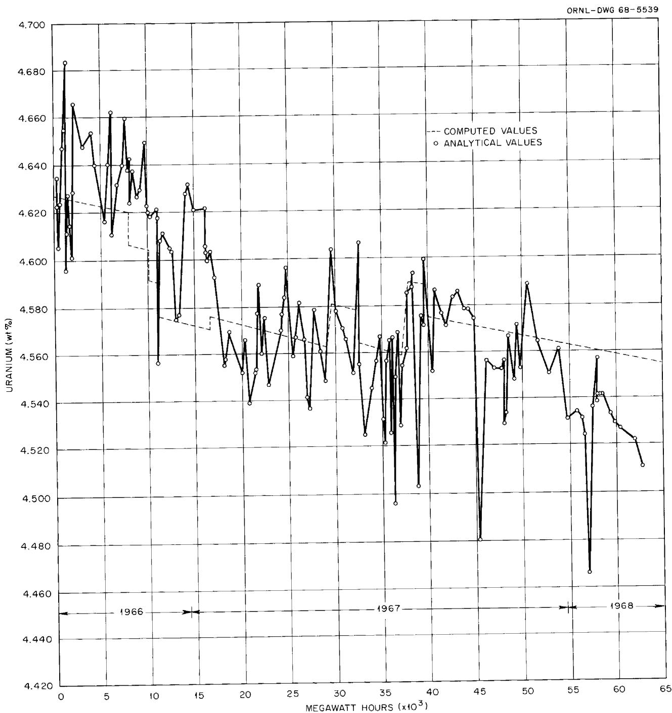  
Fig. 9.1. Comparison of Analytical and Computed Values of Uranium in the MSRE Fuel Salt.

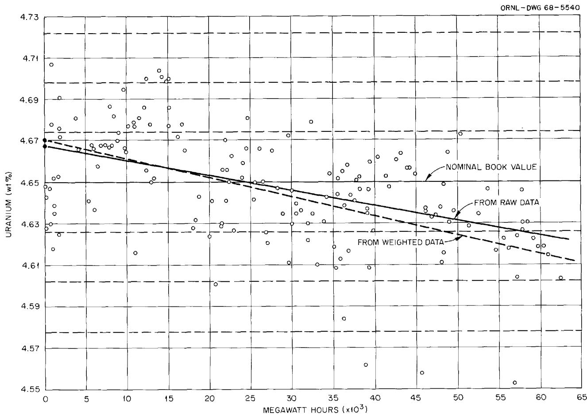  
Fig. 9.2. MSRE Fuel Salt - Normalized Values for Uranium Analyses. Wt % U (analyzed)/wt % U (book) $\times$ 4.65.

continuous power operation seem to be without precedent. The observed rates of corrosion in the MSRE have been significantly lower than predicted from thermodynamic data and diffusion theory and might have been expected to produce chromium in the fuel salt at rates which would have caused the salt now to contain 250 to $300\mathrm{ppm}$ of $\mathbf{Cr}^{2+}$ . The temperature dependence of the equilibrium $\mathbf{Cr}^0 + 2\mathbf{U}\mathbf{F}_4 = \mathbf{CrF}_2 + 2\mathbf{U}\mathbf{F}_3$ is too low to explain this recent increase of chromium concentration.

It has been postulated that one of the principal reasons for the unexpectedly low values observed is that the metal surfaces of the fuel circuit have been covered with a film of the noble-metal fission products Nb, Mo, Tc, and Ru about 10 A thick. Results of electron microprobe analysis of the metal surveillance specimens2 removed from the MSRE in May 1967 lend support to this view in

that they did not reveal any change in chromium concentration below a depth of $10\mu$ , the limit of measurement.

Possibly the temperature changes imposed recently caused spallation of the noble-metal fission products from the hotter regions of the fuel loop, behavior which could occur if the thermal coefficients of expansion of the noble-metal fission product film and base metal alloy are unequal. Chromium from the freshly exposed alloy surface would then be available for reestablishment of its steady-state activity. If this sort of mechanism is indeed operative, similar behavior should occur

on resumption of power operation after periods when the reactor is drained and cooled. Actually, slight increases in chromium concentration of the fuel salt have been observed each time such circumstances have occurred.

The significance of the mechanism proposed here is that it requires assignment of previous changes in the chromium concentration of the fuel salt to the circuit system rather than to the drain tanks. If the total amount of chromium represented by this increase, $+47$ ppm from the outset of MSRE operations, were leached uniformly from the fuel circuit, it would correspond to removal of chromium from a depth of 0.283 mil, or to an average corrosion rate of $1.972 \times 10^{-2}$ mil per 1000 hr of operation with salt circulating in the fuel circuit.

# 9.3 ISOTOPIC COMPOSITION OF URANIUM IN THE MSRE FUEL SALT

We have obtained mass spectrometric analyses as part of a program of routine analysis of the MSRE fuel salt. Results of the isotopic analyses have been accumulated in order to evaluate the potential applications of such analyses to the computation of power generation in the MSRE. The results obtained from the beginning of power operations with the MSRE are summarized in Fig. 9.3. The data shown here indicate moderately good correlation of the spectrochemical determination of $^{235}\mathrm{U}$ concentration with calculated values. The analytical results show a continuous average bias of $+0.6\%$ as compared with calculated values.

The results of spectrochemical analyses shown in Fig. 9.3 indicate that the concentration of $^{236}\mathrm{U}$ in the fuel salt increases as anticipated, essentially linearly with power generation. Small changes in the $^{235}\mathrm{U}/^{238}\mathrm{U}$ ratio which have occurred as

$^{235}\mathrm{U}$ was depleted from or added to the fuel salt have little effect on the relative concentration of $^{236}\mathrm{U}$ . Results of the $^{236}\mathrm{U}$ concentration analyses may be used effectively therefore to compute the output of the reactor. Results of such computations are described in Sect. 1.2.5.

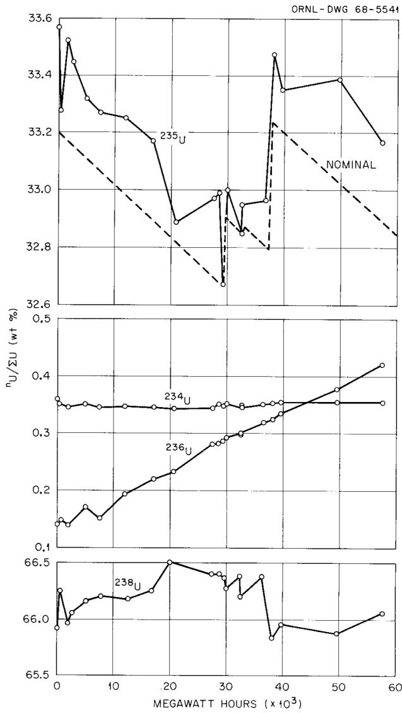  
Fig. 9.3. Isotopic Composition of Uranium in the MSRE Fuel Salt.

# 10. Fission Product Behavior

# 10.1 FISSION PRODUCT BEHAVIOR IN THE MSRE

S. S. Kirslis

F. F. Blankenship

The reasons for interest in the behavior of fission products in the MSRE have been discussed in previous reports. The principal practical concern continues to be with the possible deposition of the noble-metal fission products (Mo, Tc, Ru, Te, and Nb) in the graphite core of an MSBR. Neutron economy would suffer if too large a fraction of these species possessing moderate neutron cross sections were deposited in the high-flux region. Information on the concentrations of fission products in MSRE fuel salt is of immediate interest in planning the volatility processing of the current charge of MSRE fuel salt.

In the current report period, tests similar to those previously carried out were continued, with emphasis on checking and improving the experimental techniques. In addition, several hot-cell tests were carried out on the nature of gas-borne activities above molten fuel salt samples from the MSRE. The following sections will report in some detail on

1. the completion and evaluation of fission product analyses from the second set of graphite and metal specimens from the core of the MSRE,   
2. analyses of MSRE fuel salt sampled by an improved technique,   
3. analysis of the pump bowl cover gas,

4. an investigation of contamination problems with metal specimens exposed in the pump bowl,   
5. hot-cell tests on the quantity and chemical form of fission products found in the gas phase above the surface of MSRE fuel salt,   
6. miscellaneous tests.

# 10.1.1 Fission Products in the MSRE Fuel

The possibility was suggested in the previous report4 that the occasional high values and wide scatter of measured concentrations of noble-metal activities in fuel salt samples may have been due to contamination of the ladle sampler by activities present in the pump bowl gas phase. To eliminate this possibility, salt samples were taken using freeze-valve capsules of the type previously used for sampling the pump bowl gas phase.5

The evacuated 20-cc capsule was sealed by a fusible plug of $\mathrm{Li}_2\mathrm{BeF}_4$ which melted when the capsule was lowered below the fuel level in the pump bowl, allowing the fuel salt to fill the evacuated capsule. The enclosed salt sample was thus protected from contamination from outside. In the analytical hot cell, the end of the inlet capillary was plugged with wax, and the exterior of the capsule was leached with acid to remove contaminating activity. The capsule was cut into several sections with a tubing cutter, the bulk of the salt was removed from each section, and the emptied sections were leached with acid to remove adhering salt. The salt, after powdering and mixing, and the interior leach were analyzed

Table 10.1. Fission Products in MSRE Fuel Samples   

<table><tr><td>Sample No.</td><td>FP14-22</td><td>FP14-20</td><td>FP14-30</td><td>FP14-63</td><td>FP14-66</td></tr><tr><td>Sampling date</td><td>11-7-67</td><td>11-3-67</td><td>12-5-67</td><td>2-27-68</td><td>3-5-68</td></tr><tr><td>Sampling method</td><td>Ladle</td><td>Freeze-valve capsule</td><td>Freeze-valve capsule</td><td>Freeze-valve capsule</td><td>Freeze-valve capsule</td></tr><tr><td>Isotope</td><td>Fission Yield</td><td colspan="4">Disintegrations per Minute per Grama</td></tr><tr><td>99Mo</td><td>6.06</td><td>8.15 × 1010</td><td>2.22 × 109</td><td>8.5 × 108</td><td>3.20 × 108</td></tr><tr><td>132Te</td><td>4.7</td><td>8.9 × 109</td><td>8.19 × 108</td><td>1.26 × 109</td><td>2.78 × 108</td></tr><tr><td>129Te</td><td>0.35</td><td>1.86 × 108</td><td>&lt;1.07 × 108</td><td>&lt;2.92 × 107</td><td></td></tr><tr><td>103Ru</td><td>3.0</td><td>3.74 × 109</td><td>1.40 × 108</td><td>4.9 × 107</td><td>2.54 × 107</td></tr><tr><td>106Ru</td><td>0.38</td><td>~2.7 × 108</td><td>2.38 × 107</td><td>&lt;6.4 × 106</td><td>≤3.2 × 106</td></tr><tr><td>95Nb</td><td>6.2</td><td>&lt;108</td><td>4.2 × 107</td><td>7.0 × 105</td><td>3.4 × 106</td></tr><tr><td>95Zr</td><td>6.2</td><td>1.28 × 1011</td><td>1.19 × 1011</td><td>1.29 × 1011</td><td>1.48 × 1011</td></tr><tr><td>131I</td><td>3.1</td><td>6.64 × 1011</td><td>5.51 × 1010</td><td>3.41 × 1010</td><td>4.46 × 1010</td></tr><tr><td>89Sr</td><td>4.79</td><td>9.15 × 1011</td><td>8.15 × 1010</td><td>8.46 × 1010</td><td>9.15 × 1010</td></tr><tr><td>143Ce</td><td>5.7</td><td>1.69 × 1011</td><td>1.41 × 1011</td><td>1.45 × 1011</td><td>1.86 × 1011</td></tr><tr><td>147Nd</td><td>2.7</td><td></td><td>6.75 × 1010</td><td>4.34 × 1010</td><td></td></tr><tr><td>140Ba</td><td>6.35</td><td></td><td>1.59 × 1011</td><td>1.16 × 1011</td><td>9.30 × 1010</td></tr><tr><td>239Np</td><td></td><td></td><td>5.96 × 1011</td><td>5.36 × 1011</td><td>6.2 × 1011</td></tr><tr><td>91Sr</td><td></td><td></td><td></td><td></td><td>1.41 × 1011</td></tr></table>

${}^{a}$ All activities calculated back to sampling time.

radiochemically. The inlet capillary was dissolved and analyzed as a separate sample.

The results of the radiochemical analyses are reported in Table 10.1, in which each value represents the sum of the activities found in the salt, the interior leach, and the capillary dissolution, and is reported in disintegrations per minute per gram of sample calculated back to the time of sampling.

The concentrations of the fission products with stable fluorides (rare earths, alkalies, alkaline earths, and zirconium) were in satisfactory agreement with previous analyses of samples taken by the ladle method. However, the concentrations of the noble-metal fission products were at least an order of magnitude lower than in previous samples. In the first sample, FP14-20, the bulk of the noble metals in the total sample were found

in the dissolution of the inlet capillary. It was suspected that noble-metal activities adhering to the outside of the capillary tip were covered by the drop of wax used to seal the tip before leaching the outside of the capsule. In subsequent samples the outside of the capillary tip was sanded to remove adhering activity before applying the wax; only a small fraction of all activities was then found in the capillary.

The leach of the interior of the emptied capsule usually contained an appreciable fraction of the total noble metal in the capsule, occasionally as much as half. Most or all of the $^{95}\mathrm{Nb}$ was in this leach. Since the salt sample contacted the interior of the nickel capsule in the molten state for only about 15 min, these observations indicate that noble metals deposit rapidly from molten salt on a clean nickel surface. It is therefore possible,

particularly in the case of $^{95}\mathrm{Nb}$ , that the salt sampled was previously depleted in noble metals by deposition on the exterior of the capsule. This difficulty can be avoided experimentally in several ways: (1) the capsule or the capillary can be constructed of or plated with a noble metal, (2) only a long capillary with a salt seal at its tip need be submerged in the fuel salt, or (3) the salt seal can be made of a high-melting salt like LiF, allowing the capsule exterior to saturate with noble metals before the sealing salt dissolves.

Deposition on the capsule exterior probably does not deplete the salt sampled of noble metals by more than a factor of 2, except in the case of $^{95}\mathrm{Nb}$ . However, it leads to another analytical difficulty which may help to explain the considerable scatter of the noble-metal data in Table 10.1. The exterior of the capsule is leached repeatedly with $2N\mathrm{HNO}_3$ at 85 to $95^{\circ}\mathrm{C}$ until the last leach contains less than $1\%$ of the gamma activity of the first leach. Noble metals, however, tend to replate on nickel from the leaching solution. Normally 15 to 20 leaches are required to reach the $1\%$ level. Therefore, some noble metal probably remains on the exterior of the capsule when leaching is halted. Since the noble-metal concentrations inside the capsule are very low, a slight remaining contamination of the exterior might account for much of the activity found in the inside leach. On this basis, the lower figures in Table 10.1 are probably more nearly correct.

In any case the scatter of the noble-metal concentrations in the fuel salt samples is of little practical consequence since the values are so small, representing on the average less than $1\%$ of the quantities which would have been found if none had left the salt phase. By contrast, the fission products with stable fluorides show concentrations within $30\%$ of their calculated values, although scatter exceeds the claimed $20\%$ analytical accuracy.

In summary, it is felt that the estimates of noble-metal concentrations in fuel salt are much more reliable from freeze-valve capsule samples than from ladled samples. Previously reported data should be discounted. For salt-seeking species, both sampling methods are equally satisfactory, and previously reported data should be valid.

The planned fluorination of the fuel charge in the MSRE to remove $\mathbf{U}\mathbf{F}_{6}$ is simplified by the fact that only $1\%$ or less of the noble-metal fis

sion products remain in the fuel. Special trapping techniques are required to separate volatile noble-metal fluorides from $\mathrm{UF}_{6}$ .

# 10.1.2 Fission Products in the MSRE Cover Gas

The analyses of seven gas samples taken in the mist shield region of the MSRE pump bowl by the freeze-valve capsule technique have been thoroughly discussed in previous reports. The results indicated that a small amount of fuel salt mist and an appreciable share of the total noble-metal nuclides produced by fission were by some mechanism injected into the cover gas phase (see Table 10.3). Uranium concentrations in the gas samples were usually higher than those calculated from the amounts of salt mist indicated by $^{95}\mathrm{Zr}$ analyses.

Only a single cover gas sample, FP14-67, was taken in this report period, since experimental time was preempted by other high-priority work. A freeze-valve capsule of slightly different design (Fig. 10.1) was used, and the sample was taken during 5-Mw operation under otherwise normal conditions.

The analytical results, together with those of several previous runs, are shown in Table 10.2.

# 10.1.3 Deposition of Fission Products from MSRE Cover Gas on Metal Specimens

Tests in which small metal specimens were exposed to the gas phase and fuel phase in the pump bowl gave the first qualitative indications of unusual volatilization and plating behavior of the noble-metal fission products. High concentrations of noble-metal activities were found on specimens exposed to cover gas or fuel, while fission products possessing stable fluorides showed much lower activities. Results have been reported previously from a large number of tests run with several types of metal specimens (Hastelloy N, Ag,

ORNL-DWG 68-6079

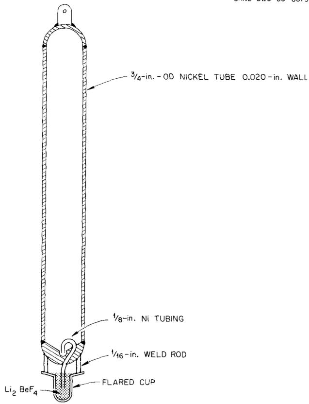  
Fig. 10.1. Freeze-Valve Capsule for Sampling Pump Bowl Cover Gas.

Ni, Au, and stainless steel) under a variety of reactor operating conditions and exposure times.

The results of these tests were disappointing from the standpoints of obtaining quantitative information and of showing variations in deposition under different test conditions. The reproducibility of results was poor, with variations between duplicate runs often as high as an order of magnitude. Deposition on the different metals was not significantly different. Exposure time had little effect; samples exposed for 1 min collected as much activity as those exposed for 10 min.

Changes in reactor operating conditions had little effect on deposition. Even samples exposed several hours after stopping the fuel pump or two days after draining the fuel out of the reactor showed as much deposition of noble metals as normal samples. The addition of beryllium to reduce the fuel caused no significant change in deposition.

The only variable which had a definite effect on gas phase deposition was a reactor shutdown of two weeks or longer. Then decreases in noble-metal deposition by an order of magnitude were observed.

In the current report period, efforts were concentrated on trying to identify the experimental factors causing difficulty. Comparative runs were made in which the specimens (Ag, Hastelloy N, and stainless steel) were fluorinated, hydrogenated, or left in the normal slightly oxidized condition. Exposure times were 1 and $10\mathrm{min}$ . The six tests gave practically undistinguishable results. Deposition of noble metals was approximately halved on the fluorinated specimens compared with the others, but this small difference is probably not significant.

The last two tests identified the basic difficulty. In the first of these, the metal specimens were lowered in the sampling pipe to a position 2 ft above the pump bowl. During the 10-min exposure, the usual helium flow of $200~\mathrm{cc / min}$ was passed down the tube. The test assembly was then withdrawn and packaged for shipment to the analytical laboratory in the usual way. Approximately the same amounts of noble-metal nuclides were deposited on the test specimens as in normal exposures in the pump bowl.

The second test consisted in hanging a standard test assembly on the cable latch, leaving it there for one day as in the customary test procedure, removing it with the sampling cubicle manipulator, and packaging it for shipment and analysis in the usual way. Again the amounts of noble-metal activities found on the specimens were nearly as great (within a factor of 1 to 10) as in normal pump bowl exposures.

Clearly the contamination of the samples during the various manipulations involved in the test procedure before or after the actual pump bowl exposure was responsible for most of the observed activities. This difficulty was not identified sooner because of the astonishing reproducibility of the contamination. Variations of several orders of magnitude would be expected rather than the observed zero to one order. This uniformity suggests that most of the contamination may have occurred while the test assembly remained for a day on the latch in the highly contaminated 1C area. The mechanism by which the contamination spreads from the pump bowl to the various surfaces is un

Table 10.2. Fission Products in MSRE Cover Gas as Determined from Freeze Valve Capsules   

<table><tr><td>Experiment No.</td><td>FP10-11</td><td>FP10-22</td><td>FP11-42</td><td>FP11-46</td><td>FP11-53</td><td>FP12-7</td><td>FP12-26</td><td>FP14-67</td><td></td></tr><tr><td>Sampling date</td><td>12-27-66</td><td>1-11-67</td><td>4-11-67, 02:49</td><td>4-18-67, 02:28</td><td>5-2-67, 10:43</td><td>6-2-67, 06:50</td><td>7-17-67, 06:03</td><td>3-6-68, 06:03</td><td></td></tr><tr><td>Operating time, daysa</td><td>14.5 off, 12.6 on</td><td>14.5 off, 27.7 on</td><td>65 on, 1.5 hr off</td><td>14 off, 72 on</td><td>14 off, 86 on</td><td>92.3 on, 42.5 off</td><td>46 off, 23 on</td><td>13 at 7 Mw, 6.6 at 5 Mw</td><td></td></tr><tr><td>Nominal power, Mw</td><td>7.4</td><td>7.4</td><td>0</td><td>7.2</td><td>7.2</td><td>0</td><td>7.2</td><td>5.0</td><td></td></tr><tr><td>Be addition</td><td>No</td><td>After 5.5</td><td>After 8.40 g</td><td>No</td><td>No</td><td>No</td><td>After 37.8 g</td><td>No</td><td></td></tr><tr><td>Features</td><td>Regular</td><td>Regular</td><td>Pump off 1.2 hr</td><td>Regular</td><td>Helium bubbles</td><td>Power off 42.5 days</td><td>Regular</td><td>Regular</td><td></td></tr><tr><td>Accumulated Mwhr</td><td>13,600</td><td>16,200</td><td>27,900</td><td>29,100</td><td>31,700</td><td>32,650</td><td>36,500</td><td>62,770</td><td></td></tr><tr><td>Isotope</td><td>Yield (%)</td><td colspan="7">Disintegrations per Minute in Total Sampleb</td><td></td></tr><tr><td>99Mo</td><td>6.06</td><td>2.04 × 1011</td><td>1.36 × 1011</td><td>1.05 × 1011</td><td>2.31 × 1011</td><td>1.57 × 1011</td><td></td><td>3.07 × 1011</td><td></td></tr><tr><td>103Ru</td><td>3.0</td><td>3.80 × 109</td><td>2.63 × 109</td><td>2.51 × 109</td><td>4.64 × 109</td><td>1.12 × 1010</td><td></td><td>1.18 × 1010</td><td></td></tr><tr><td>106Ru</td><td>0.38</td><td>~6.7 × 107</td><td>7.74 × 107</td><td>8.2 × 107</td><td>9.49 × 107</td><td>4.03 × 108</td><td></td><td>5.03 × 108</td><td></td></tr><tr><td>132Te</td><td>~4.7</td><td>5.73 × 1010</td><td>5.08 × 1010</td><td>1.15 × 1011</td><td>3.35 × 1011</td><td>1.88 × 1011</td><td>4.17 × 107</td><td>1.21 × 1011</td><td></td></tr><tr><td>129Te</td><td>0.35</td><td></td><td></td><td></td><td>7.98 × 108</td><td>3.51 × 109</td><td>2.17 × 108</td><td>6.6 × 108</td><td></td></tr><tr><td>95Nb</td><td>6.2</td><td>≤3.26 × 107</td><td>2.09 × 108</td><td>6.45 × 108</td><td>1.3 × 109</td><td>1.05 × 1010</td><td>2.26 × 109</td><td>2.18 × 109</td><td></td></tr><tr><td>95Zr</td><td>6.2</td><td>&lt;2.9 × 106</td><td>≤2.2 × 107</td><td>&lt;4.4 × 107</td><td>~2 × 107</td><td>1.8 × 108</td><td>8.64 × 107</td><td>2.14 × 108</td><td></td></tr><tr><td>140Ba</td><td>6.35</td><td>2.75 × 108</td><td>3.48 × 108</td><td></td><td>6.16 × 108</td><td></td><td></td><td>4.01 × 108</td><td></td></tr><tr><td>131I</td><td>~3.1</td><td>9.75 × 109</td><td>2.03 × 109</td><td>5.7 × 109</td><td>9.81 × 108</td><td>8.63 × 109</td><td></td><td>3.11 × 1010</td><td></td></tr><tr><td>89Sr</td><td>4.79</td><td></td><td></td><td>2.13 × 108</td><td>4.08 × 109</td><td>3.72 × 109</td><td>8.35 × 108</td><td>1.70 × 109</td><td></td></tr><tr><td>111Ag</td><td>0.019</td><td></td><td></td><td></td><td></td><td>5.5 × 108</td><td></td><td>1.33 × 108</td><td></td></tr><tr><td>141Ce</td><td>~6.0</td><td></td><td></td><td></td><td></td><td></td><td>4.79 × 108</td><td></td><td>1.83 × 108</td></tr><tr><td>144Ce</td><td>~6.0</td><td></td><td></td><td></td><td></td><td></td><td>4.17 × 107</td><td></td><td>1.71 × 108</td></tr><tr><td>235Uc</td><td></td><td>3.86</td><td>0.55</td><td>59</td><td>9.2</td><td>23</td><td></td><td>25</td><td>28</td></tr></table>

${}^{a}$ Duration of previous shutdown and of continuous operating time just before sample was taken.   
${}^{b}$ Disintegrations per minute calculated to the time of sampling or of previous shutdown.   
cMicrograms in sample.

certain but probably involves rubbing of the cable, latch, samplers, and manipulators against each other.

These observations make it necessary to discard any quantitative interpretation of the pump bowl exposure tests. The source of the contamination is still principally the gas phase above the fuel in the pump bowl, so that the qualitative conclusion that noble-metal activities predominate in this gas remains valid. Also the conclusions from test FP11-50, in which graphite and metal specimens were at least partially protected from contamination by a perforated metal screen,[9] probably remain sound. These observations on contamination confirm the explanation given for the high concentrations of noble-metal fission products in fuel salt sampled by the open ladle technique.

A capsule with a sliding sheath has been designed which will protect metal or graphite samples from contamination except when the test assembly is in the pump bowl.

# 10.1.4 Examination of MSRE Surveillance Specimens After 24,000 Mwhr

In a previous report, $^{10}$ a summary was presented of the more significant results from the examinations and analyses of the graphite and Hastelloy specimens which were exposed to fissioning molten salt for 24,000 Mwhr in axial positions in the MSRE core. Since then, the analyses have been completed, and the middle graphite bar (Y-7) was also sampled by a different method and analyzed for a few isotopes with a germanium diode gamma spectrometer. The same specimen was also examined with an electron probe in an attempt to detect surface contamination and by proton bombardment to determine the concentration profiles of lithium and fluorine. The significance of these additional results will be briefly discussed.

Completion of Analytical Results. - The concentration profiles of $^{99}\mathrm{Mo}$ , $^{132}\mathrm{Te}$ , $^{103}\mathrm{Ru}$ , $^{95}\mathrm{Nb}$ , $^{95}\mathrm{Zr}$ , $^{89}\mathrm{Sr}$ , $^{140}\mathrm{Ba}$ , and $^{235}\mathrm{U}$ in the exposed graphite specimens were described in the last report. The completion of analytical work on these nuclides caused no significant changes in the pro

files given. All the samples were also analyzed for $^{106}\mathrm{Ru}$ . Without exception, the $^{106}\mathrm{Ru}$ values were a factor of about 20 lower than the $^{103}\mathrm{Ru}$ values, so that the concentration profiles have identical shape.

In addition, some selected samples were analyzed for $^{111}\mathrm{Ag}$ , $^{137}\mathrm{Cs}$ , $^{131}\mathrm{I}$ , $^{91}\mathrm{Y}$ , $^{141}\mathrm{Ce}$ , $^{144}\mathrm{Ce}$ , and $^{147}\mathrm{Nd}$ . The $^{111}\mathrm{Ag}$ profile behaved like $^{103}\mathrm{Ru}$ , the activity dropping steeply through four orders of magnitude in 10 mils. The $^{137}\mathrm{Cs}$ behaved in an unusual manner, as it also did in the 7800-Mwhr exposure. Its activity dropped two orders of magnitude in 10 mils and then began slowly rising; $^{131}\mathrm{I}$ behaved similarly. It has been suggested that both these species can diffuse in graphite. The $^{147}\mathrm{Nd}$ , $^{144}\mathrm{Ce}$ , and $^{141}\mathrm{Ce}$ exhibited fairly straight plots of the logarithm of the activity vs penetration distance, and the slopes were each quite similar to that for $^{140}\mathrm{Ba}$ . This behavior does not agree with the theory that the slope should vary inversely with the half-life of the rare-gas precursor. The half-lives are “very short,” less than 1 sec, 1.7 sec, and 16 sec, respectively, for the precursors of $^{147}\mathrm{Nd}$ , $^{144}\mathrm{Ce}$ , $^{141}\mathrm{Ce}$ , and $^{140}\mathrm{Ba}$ . Yttrium-91, with a 10-sec krypton precursor, gives a slope less steep than $^{140}\mathrm{Ba}$ . With its very short-lived xenon precursor, it is puzzling how $^{147}\mathrm{Nd}$ got into the graphite at all. From the fact that the three rare earths had similar concentration gradients, it may be guessed that they entered and diffused in the graphite as rare earths rather than as xenons.

For each of the species which gave straight plots of log activity vs distance, the slopes were steeper for the top graphite sample than for the sample in the middle of the core, although the graphite types were supposedly identical. Both of these samples showed distinctly steeper slopes than the bottom sample, which was of the more porous “lattice stock” variety.

The concentration profile plots revealed an interesting indication of the difference in permeability of the same piece of graphite from different sides. For the top graphite sample, the concentration profiles of all nuclides, without exception, were higher for penetration from one of the narrow sides than for penetration from any of the other sides.

Sampling by Sanding. - Five graphite blanks were obtained during the course of milling the irradiated samples by milling a clean piece of the same type of graphite on the same milling machine.

It was very disturbing that analyses of the blanks sometimes showed more activity (particularly for $^{99}\mathrm{Mo}$ , $^{103}\mathrm{Ru}$ , $^{106}\mathrm{Ru}$ , and $^{95}\mathrm{Nb}$ ) than the irradiated sample just previously milled. Confidence was destroyed in all analyses giving lesser values than the blanks. Nevertheless, these analyses behaved in a very consistent manner, resulting in smooth concentration profiles.

To check the validity of the sampling method, a remaining stored piece of the irradiated middle graphite bar (Y-7) was handled by a sanding method that permitted sampling from the inside out (see Sect. 10.2). The concentration profiles obtained tailed off toward the center of the specimen in a manner very similar to that observed with the milled specimens. Absolute comparisons between the two sets of data usually agreed to within better than an order of magnitude. Since the area of graphite sampled by the two methods differed by a factor of about 30, local variations in graphite density and permeability might explain the difference in results.

The results of the sanding method restored much of our confidence in the milling method of sampling. Certainly the reality of the tails of the concentration profiles was established. The simplest explanation of the high blanks is that the blank graphite specimen somehow became contaminated inside the hot cells, where the milling was done.

Electron Probe Examination. - A small sample of the irradiated middle bar graphite (Y-7) was mounted for electron probe examination for possible identification of any surface deposits. The sample was shipped to the Argonne National Laboratory, where an instrument for examining radioactive samples was available. The electron probe examination, which could be used to within 1 or $2\mu$ of the edge of the graphite, detected no impurities. Typical detection limits were $0.02\mathrm{wt}\%$ for tellurium and $0.04\mathrm{wt}\%$ for uranium and technetium.

Lithium and Fluorine Concentration Profiles in Irradiated Graphite. - A proton bombardment method for determining the concentration profiles of lithium and fluorine in irradiated graphite is described in Sect. 10.3. The results for the middle graphite bar (Y-7) indicated that the molar concentration of lithium exceeds that of fluorine at all points inside the graphite. This observation proves conclusively that the fission products observed in irradiated graphite do not permeate as fluorides.

They probably are present either as carbides or in the metallic form.

Fission Product Distribution in the MSRE. Results have been reported above for the quantities of fission products in the fuel salt and in the cover gas of the MSRE. The previous report11 gave values for the quantities deposited on graphite and on Hastelloy N on May 5, 1967, after 32,000 Mwhr of power operation. In addition, the total inventory of each nuclide at this date is available from a recently developed computer program for calculating the total amount of each isotope from the operating history of the MSRE. An approximate material balance for May 8, 1967, based on these data is given in Table 10.3. It differs from the balance given in the previous report12 because of the revised concentrations of noble metals in the fuel salt.

The balances are good for nuclides with stable fluorides which remain in the salt phase; fair balances were obtained for $^{132}\mathrm{Te}$ , $^{95}\mathrm{Nb}$ , and $^{99}\mathrm{Mo}$ ; and $^{103}\mathrm{Ru}$ is poorly accounted for.

To enter the cover gas data into a material balance, the quantity of each species lost per day (observed concentration times volume of cover gas flow per day) must be compared with the production of that species by fission per day. As discussed in the previous report,[13] it is likely that the gaseous concentrations measured in the mist shield region are higher (by a small factor) than those in the bulk of the cover gas. This will tend to yield high material balances for species like $^{99}\mathrm{Mo}$ , whose concentration in the gas phase is large.

# 10.1.5 Hot-Cell Tests on Fission Product Volatilization from Molten MSRE Fuel

It has been established that the gas phase above the fuel in the MSRE pump bowl contains appreciable concentrations of fission products, particularly the noble metals. However, no hard information exists regarding the chemical and physical nature of the volatilized species and the mechanism of volatilization. In view of the potential

Table 10.3. Approximate Fission Product Distribution in MSRE After 32,000 Mwhr   

<table><tr><td>Isotope</td><td>Inventory in MSRE (dis/min)a</td><td>Percent in Fuel</td><td>Percent on Graphite</td><td>Percent on Hastelloy N</td><td>Cover Gasb (%/day)</td></tr><tr><td></td><td>×1017</td><td></td><td></td><td></td><td></td></tr><tr><td>99Mo</td><td>7.91</td><td>0.94</td><td>10.9</td><td>40.5</td><td>77</td></tr><tr><td>132Te</td><td>5.86</td><td>0.83</td><td>10.0</td><td>70.0</td><td>66</td></tr><tr><td>103Ru</td><td>3.36</td><td>0.13</td><td>6.6</td><td>14.9</td><td>40</td></tr><tr><td>95Nb</td><td>4.40</td><td>0.044</td><td>36.4</td><td>34.1</td><td>5.7</td></tr><tr><td>95Zr</td><td>6.00</td><td>96.1</td><td>0.03</td><td>0.06</td><td>0.14</td></tr><tr><td>89Sr</td><td>5.02</td><td>77.0</td><td></td><td>0.26</td><td>33</td></tr><tr><td>131I</td><td>4.00</td><td>64.0</td><td></td><td>1.0</td><td>16</td></tr></table>

${}^{a}$ This total inventory was calculated from the power history of the MSRE.   
These values represent the percentages of daily production rate lost to the cover gas per day.

practical importance of the volatilization phenomenon as a method of removing noble-metal fission products from the fuel circulation system of an MSBR, it is desirable to investigate these more basic questions.

There are serious limitations on the types of tests which can be carried out in the existing MSRE pump bowl facility. However, it was noted that two of the cover gas samples taken after reactor shutdown (FP11-42 and FP12-7 in Table 10.2) contained sizable concentrations of noble-metal activities. This indicated that fission was not essential to the volatilization process and suggested the possibility of studying volatilization from a molten sample of MSRE salt in a hot cell, where experimental possibilities would be much less limited.

First and Second Hot-Cell Tests. - The experimental plan was originally designed to distinguish between the volatile fluoride and metallic colloid hypotheses $^{14}$ on the nature of the volatilizing species. We planned to measure the activities in the gas phase above the surface of molten MSRE salt when (1) pure helium was slowly passed over the quiescent surface, (2) a mixture of $5\%$ $\mathrm{H}_{2}$ in helium was similarly passed, (3) pure helium was bubbled through the salt, and (4) the $\mathrm{H}_{2}-\mathrm{He}$ mix

ture was similarly bubbled. The plan was based on the assumptions that only high-valent fluorides would volatilize in procedure 1, since gentle helium flow would provide no agitation to suspend metallic particles in the gas phase; that $\mathbf{H}_2$ in procedure 2 would reduce volatile fluorides at the melt surface and prevent them from leaving the fuel salt; and that metallic particles should be suspended in the gas phase by the bubbling gas in procedures 3 and 4.

Two hot-cell experiments of this type have been carried out: one with a sample of MSRE salt 35 days old and one on the day after sampling. The 50-g salt sample was contained in a flanged gastight stainless steel reaction vessel (Fig. 10.2) fitted with a gas inlet tube, through which a dip tube line could also be inserted, and a large tube through which the "probe" tubes were inserted to with $\frac{1}{4}$ in. of the molten-salt surface. A side tube from the large tube provided an alternate path for gas flow. The gas inlet tube and the alternate line were connected to valves on a simple gas manifold (Fig. 10.3) carrying two other valves which were connected to a vacuum pump and to the gas supply line.

The tank helium was purified by two titanium sponge traps at $600^{\circ}\mathrm{C}$ , one near the tank outside the cell and the other just before entering the gas manifold. The second titanium trap was added after the first test showed signs of fuel hydrolysis.

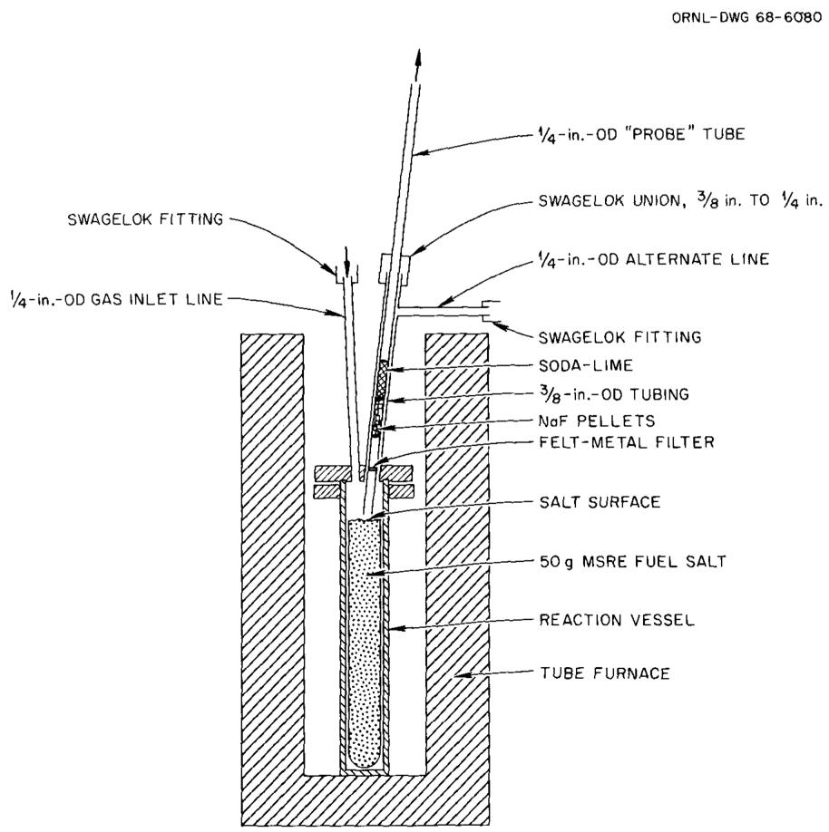  
Fig. 10.2. Hot-Cell Test Reaction Vessel.

The traps were not heated when the $5\% \mathrm{H}_{2}-95\%$ He mixture was used in order to avoid $\mathrm{TiH}_{2}$ formation. We then depended on the efficient adsorptive drying action of degassed titanium sponge. The flow of gas was measured outside the cell with a low-flow-range rotameter.

To avoid exposure of the fuel salt sample to air as much as possible, the top of the usual 50-g sampling capsule was cut off just above the salt level, and the capsule was placed in the flanged reaction vessel without fracturing the solidified lump of salt. A cap was placed on the probe tube line, and the capsule was evacuated while the reaction vessel was heated to $200^{\circ}\mathrm{C}$ . A sheathed Chromel-Alumel thermocouple wired to the reaction vessel was used to indicate and control the furnace temperature. During the evacuation, every joint in the system was leak tested with acetone and a Hastings gage. When no more leaks could

be found and the gage reading dropped below $10\mu$ ,the system was filled to 1 psig with purified helium, and the cap on the large tube was slightly opened to provide a helium flush of about 15 cc/min.

The reactor was then heated to $600^{\circ}\mathrm{C}$ , the cap was removed, and the probe tube was quickly inserted. The Swagelok fitting on the probe tube had previously been attached at a level such that the lower end of the probe was within $\frac{1}{4}$ in. of the molten-salt surface. The only exit for the helium flow was up through the probe tube, so all the gas sampled passed within $\frac{1}{4}$ in. of the molten-salt surface. Because of the resistance to flow of the Feltmetal filter in the probe tube (Fig. 10.2), the system pressure usually rose to 2 to 3 psig at a helium flow of 10 to 15 cc/min. In the first run, with 35-day-old salt, the flow was continued for 1 hr. In the second run the duration of flow was decreased to 30 to 40 min.

ORNL-DWG 68-6081

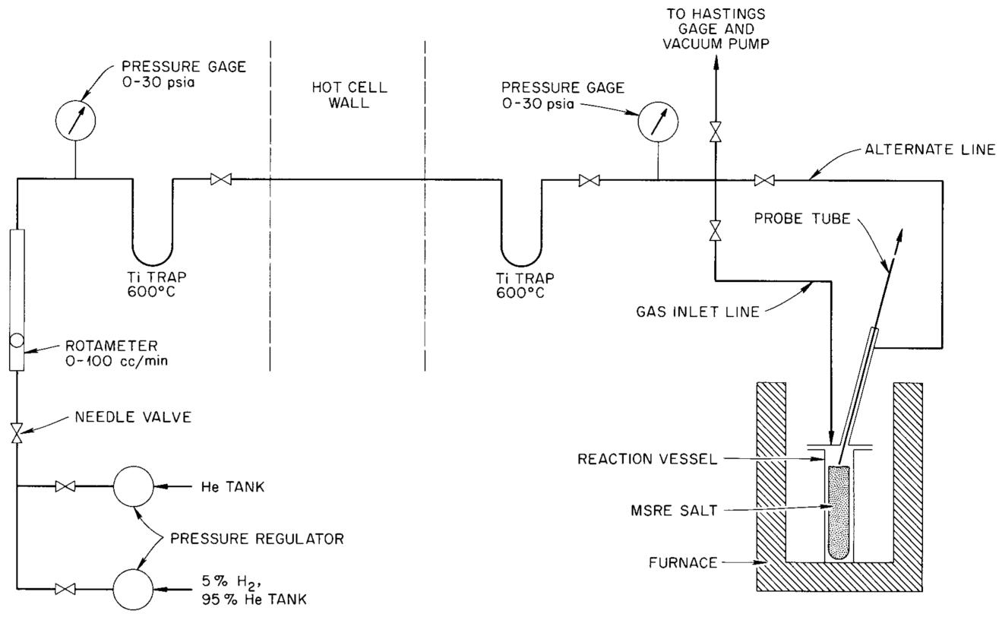  
Fig. 10.3. Complete Apparatus for Hot-Cell Tests.

The first probe tube was then removed, and the large tube was capped loosely. The titanium traps were cooled, and the $5\% \mathrm{H}_{2}-95\%$ He mixture was passed through the system to flush out the pure helium. The flow of gas was adjusted at 10 to $15~\mathrm{cc / min}$ , and the second probe was inserted, run for 1 hr, and removed. With the large tube capped, a Swagelok union on the gas inlet line was opened, and the dip line was placed in position so that its end was about 3.5 in. below the melt surface. The alternate line was open during this operation to provide flushing flow over the salt. With the gas inlet line attached to the dip line, the cap on the large line was slightly opened, the alternate line valve was closed, and a bubbling flow of $5\% \mathrm{H}_{2}-95\%$ He was started at 10 to $15~\mathrm{cc / min}$ . The third probe was then inserted, run for 1 hr, and removed. The gas supply was converted back to pure helium, the titanium traps were heated, and a fourth probe was run for 1 hr with helium bubbling at 10 to $15~\mathrm{cc / min}$ . In

the bubbling runs the pressure usually had to be increased gradually to about 5 psig to maintain the 10- to 15-cc/min flow rate.

In the first run the pressure in the reactor was released at the end of the bubbling tests by loosening the Swagelok fitting on the probe. This required all the gas in the long line to the outside manifold to bubble rapidly through the dip tube as the pressure decreased to atmospheric. It is estimated that the bubbling flow was about 200 cc/min for 2 min at the end of these tests. In the second run, it was realized that the pressure across the dip tube could be equalized by opening the valve on the alternate line. By this means the pressure was relieved without a sudden violent bubbling through the dip tube.

Samples of the fuel salt in the reaction vessel were taken with small ladle-type samplers after each test with helium flow.

The probe tubes in these tests were $\frac{1}{4}$ -in.-diam nickel tubes containing a 1-in.-long empty section

at the bottom, a $\frac{1}{16}$ -in.-thick Feltmetal filter (100% retention of particles larger than 4 μ), and 1-in.-long sections filled with NaF and soda-lime pellets. In the analytical hot cell, the ends of each tube were plugged with small rubber stoppers, and the outside surface was leached with acid until the last leach contained less than 1% of the gamma activity of the first leach. The tubes were then cut into a bottom section, a Feltmetal section, an NaF section, and a soda-lime section. Each sample was separately dissolved, and the solution was analyzed for 12 fission products and $^{235}\mathrm{U}$ .

The analytical results of these tests are given in Tables 10.4 and 10.5, with all activities corrected back to the time of salt sampling. Gamma scans of the samples from the first test showed that the predominant activity was $^{131}\mathrm{I}$ . This behavior was undoubtedly due to fuel salt hydrolysis, indicating some water impurity in the reaction vessel atmosphere. Much less $^{131}\mathrm{I}$ was found in the samples from the second test, in which the leak testing was more thorough and the various experimental operations were performed more smoothly with the benefit of experience from the first run. However, the salt surface appeared green and scum free after both tests, so the degree of hydrolysis could not have been excessive in the first test. Since a 35-day-old sample was used in the first test, the short-lived $^{99}\mathrm{Mo}$ and $^{132}\mathrm{Te}$ activities could not be detected in many of the samples. Even where values are reported, they are not reliable.

The results of these tests are very instructive in spite of the wide scatter in results within each run and between runs. The following comments apply to both tests but more specifically to the second test, whose results showed less scatter. With gas passing slowly over the quiescent molten fuel surface, appreciable quantities of all the major fission products were found inside the probes, with the noble metals predominating as in analyses of MSRE cover gas. There was no difference in volatilization behavior when $\mathbf{H}_2$ was added to the sweep gas. If the noble metals had been present as high-valent fluorides, they should have been reduced to nonvolatile states by $\mathbf{H}_2$ . Thus the noble metals are probably present in the gas phase as a colloidal suspension of tiny metallic particles. The presence of activities such as $^{89}\mathrm{Sr}$ , $^{95}\mathrm{Zr}$ , $^{140}\mathrm{Ba}$ , $^{141}\mathrm{Ce}$ , and $^{235}\mathrm{U}$ (in the relative proportions found in fuel salt) inside the probes

showed that the fuel salt was also present in the gas phase as a colloidal mist. Simple vaporization of fuel salt could not account for either the quantities or the relative proportions of the activities found in the probes. This observation has disturbing implications regarding the proposed distillation separation of fission products from the bulk components of fuel salt, since appreciable quantities of fuel salt would volatilize as mist as well as vapor.

For each nuclide the quantities deposited in the bottom empty section of the probe and on the filter section were similar (more so for the second test). About $10\%$ of these quantities were usually found in the NaF and soda-lime sections beyond the filter. The gaseous suspensions of noble metals and of fuel salt are thus surprisingly stable, and at least $20\%$ is composed of particles less than $4\mu$ in diameter.

When helium or $5\% \mathrm{H}_{2}-95\%$ He was bubbled slowly through the melt (second test), the amounts of activities found in the various sections of the probes were very similar to the amounts when the gases slowly passed over the melt. Thus the gas phase above the melt appears to be as easily "saturated" with the colloidal suspensions by the quiescent surface as by slow bubbling. (This observation is contraindicated by a laboratory mockup experiment in which the slow bubbling of helium through molten $\mathrm{Li}_{2}\mathrm{BeF}_{4}$ produced visible droplets of salt on a horizontal metal plate 1 cm above the salt surface.) However, when the gases were bubbled rapidly through the melt for 2 min at about 200 cc/min (first test), the amounts of all activities in all sections of the probes increased by factors of 10 to 1000 compared with the slow-flow cases. Therefore the amount of fume or mist formation is greatly enhanced by turbulent gas-fuel contacting.

The readiness with which gaseous suspensions of noble metals and of fuel salt are formed above the highly radioactive fuel melt invalidated the original presumption that only fission products with volatile fluorides could leave the melt under the gentle sweep conditions. However, the evidence from the hydrogen gentle sweep runs and particularly from the hydrogen bubbling run in the second test is nearly incontrovertible that volatile fluorides are not involved in a significant way in causing the noble-metal fission products to become gas borne. A second line of argument

Table 10.4. First Test of Volatilization of Fission Products from MSRE Fuel   

<table><tr><td rowspan="2">Flow Conditions</td><td rowspan="2">Samplea</td><td colspan="8">Disintegrations per Minute per Total Sampleb</td><td rowspan="2">235U(μg total)</td></tr><tr><td>103Ru</td><td>106Ru</td><td>95Nb</td><td>99Mo</td><td>132Te</td><td>129Te</td><td>95Zr</td><td>141Ce</td></tr><tr><td rowspan="4">10-15 cm3/min pure He over surface</td><td>B</td><td>7.11 × 106</td><td>4.87 × 105</td><td>1.80 × 109</td><td>Low</td><td>Low</td><td>1.99 × 106</td><td>1.70 × 108</td><td>6.72 × 107</td><td>6.20</td></tr><tr><td>FM</td><td>4.30 × 106</td><td>3.59 × 105</td><td>1.3 × 106</td><td>Low</td><td>Low</td><td>Low</td><td>~1.5 × 105</td><td>1.1 × 105</td><td>0.064</td></tr><tr><td>NaF</td><td>8.14 × 104</td><td>1.58 × 104</td><td>≤2.3 × 105</td><td>Low</td><td>Low</td><td>Low</td><td>&lt;6.9 × 104</td><td>&lt;1.7 × 104</td><td>0.086</td></tr><tr><td>SL</td><td>6.70 × 104</td><td>1.00 × 104</td><td>≤5.9 × 104</td><td>Low</td><td>Low</td><td>Low</td><td>≤2.2 × 104</td><td>&lt;8.3 × 103</td><td>0.027</td></tr><tr><td rowspan="4">10-15 cm3/min 5% H2over surface</td><td>B</td><td>3.77 × 107</td><td>3.01 × 106</td><td>9.53 × 108</td><td>Low</td><td>Low</td><td>7.45 × 106</td><td>1.53 × 108</td><td>1.96 × 108</td><td>22.7</td></tr><tr><td>FM</td><td>4.22 × 105</td><td>3.50 × 104</td><td>1.6 × 106</td><td>Low</td><td>Low</td><td>Low</td><td>1.3 × 106</td><td>1.43 × 106</td><td>0.157</td></tr><tr><td>NaF</td><td>3.39 × 104</td><td>5.76 × 103</td><td>~3.7 × 105</td><td>Low</td><td>Low</td><td>Low</td><td>5.3 × 105</td><td>3.73 × 105</td><td>0.071</td></tr><tr><td>SL</td><td>1.47 × 104</td><td>3.41 × 103</td><td>~9.0 × 104</td><td>Low</td><td>Low</td><td>Low</td><td>1.6 × 105</td><td>2.08 × 105</td><td>0.066</td></tr><tr><td rowspan="4">10-15 cm3/min 5% H2bubbling through salt</td><td>B</td><td>3.85 × 108</td><td>4.7 × 107</td><td>0</td><td>Low</td><td>Low</td><td>~1.9 × 107</td><td>5.86 × 1010</td><td>5.18 × 1010</td><td>7096.00</td></tr><tr><td>FM</td><td>2.45 × 109</td><td>1.7 × 108</td><td>0</td><td>Low</td><td>7.8 × 109</td><td>6.2 × 107</td><td>2.86 × 1010</td><td>2.35 × 1010</td><td>3532.00</td></tr><tr><td>NaF</td><td>7.5 × 107</td><td>7.6 × 106</td><td>7.15 × 107</td><td>~1.1 × 1011</td><td>7.8 × 109</td><td>4.2 × 106</td><td>~1.2 × 106</td><td>9.00 × 105</td><td>0.143</td></tr><tr><td>SL</td><td>1.73 × 107</td><td>~1.5 × 106</td><td>1.67 × 108</td><td>~4.2 × 109</td><td>~3.4 × 109</td><td>1.9 × 106</td><td>3.31 × 105</td><td>4.36 × 105</td><td>0.149</td></tr><tr><td rowspan="4">10-15 cm3/min pure He bubbling through salt</td><td>B</td><td>2.14 × 108</td><td>1.5 × 107</td><td>1.72 × 1010</td><td>~1.2 × 1011</td><td>5.9 × 1010</td><td>2.2 × 107</td><td>3.26 × 109</td><td>2.70 × 109</td><td>414.00</td></tr><tr><td>FM</td><td>1.52 × 109</td><td>1.65 × 108</td><td>7.84 × 109</td><td>~1.9 × 1012</td><td>9.8 × 1010</td><td>3.8 × 107</td><td>1.25 × 109</td><td>1.17 × 1010</td><td>1720.00</td></tr><tr><td>NaF</td><td>1.28 × 108</td><td>9.8 × 106</td><td>3.53 × 107</td><td>~2.7 × 1011</td><td>~1.4 × 1010</td><td>6.0 × 106</td><td>8.8 × 105</td><td>6.24 × 105</td><td>0.297</td></tr><tr><td>SL</td><td>~6.4 × 107</td><td>~6.3 × 106</td><td>7.73 × 107</td><td>~8.5 × 1010</td><td>5.6 × 109</td><td>3.3 × 106</td><td>2.09 × 106</td><td>7.75 × 105</td><td>0.367</td></tr></table>

$\mathbf{B}$ is bottom empty 1 in. of probe, FM is section including the Feltmetal filter, and NaF and SL are the sections packed with NaF and soda lime respectively.   
${}^{b}$ Activities calculated back to fuel sampling time: 10-23-67,0944 AM.

Table 10.5. Second Test of Volatilization of Fission Products from MSRE Fuel   

<table><tr><td rowspan="2">Flow Conditions</td><td rowspan="2">Samplea</td><td colspan="10">Disintegrations per Minute per Total Sampleb</td><td>Total U (μg)</td><td></td></tr><tr><td>103Ru</td><td>106Ru</td><td>95Nb</td><td>99Mo</td><td>132Te</td><td>129Te</td><td>141Ce</td><td>144Ce</td><td>95Zr</td><td>131I</td><td>89Sr</td><td>140Ba</td></tr><tr><td rowspan="4">10 cc/min pure He over surface</td><td>B</td><td>~7.24 × 106</td><td>~2.46 × 106</td><td>9.10 × 106</td><td>1.88 × 108</td><td>7.38 × 107</td><td>2.5 × 106</td><td>2.07 × 106</td><td>2.58 × 105</td><td>2.59 × 106</td><td>2.75 × 108</td><td>3.64 × 106</td><td>~4.6 × 105</td></tr><tr><td>FM</td><td>3.21 × 107</td><td>6.63 × 107</td><td>6.40 × 106</td><td>1.09 × 109</td><td>3.81 × 107</td><td>5.4 × 106</td><td>5.51 × 106</td><td>9.56 × 105</td><td>9.06 × 106</td><td>1.50 × 1010</td><td>1.20 × 106</td><td>~1.1 × 106</td></tr><tr><td>NaF</td><td>4.63 × 105</td><td>1.86 × 107</td><td>&lt;2.8 × 105</td><td>1.90 × 107</td><td>2.44 × 106</td><td>&lt;4.1 × 105</td><td>5.47 × 105</td><td>1.03 × 105</td><td>5.29 × 105</td><td>1.77 × 109</td><td>1.03 × 105</td><td>&lt;1.6 × 105</td></tr><tr><td>SL</td><td>2.46 × 106</td><td>1.64 × 107</td><td>8.7 × 105</td><td>2.78 × 107</td><td>3.53 × 106</td><td>5.5 × 105</td><td>7.69 × 105</td><td>1.78 × 105</td><td>~8.5 × 105</td><td>3.92 × 108</td><td>1.34 × 106</td><td>1.7 × 105</td></tr><tr><td rowspan="4">10 cc/min pure He over surface</td><td>B</td><td>1.29 × 107</td><td>2.03 × 107</td><td>2.9 × 106</td><td>1.94 × 107</td><td>7.51 × 107</td><td>3.6 × 106</td><td>1.39 × 106</td><td>2.77 × 105</td><td>1.27 × 106</td><td>3.47 × 107</td><td>2.99 × 106</td><td>2.6 × 105</td></tr><tr><td>FM</td><td>2.51 × 107</td><td>4.60 × 107</td><td>4.8 × 106</td><td>3.34 × 107</td><td>3.13 × 107</td><td>5.4 × 106</td><td>5.16 × 106</td><td>7.84 × 105</td><td>6.23 × 106</td><td>6.29 × 108</td><td>1.20 × 106</td><td>9.02 × 105</td></tr><tr><td>NaF</td><td>1.62 × 107</td><td>7.23 × 106</td><td>~2.6 × 105</td><td>2.63 × 107</td><td>1.73 × 107</td><td>2.5 × 106</td><td>2.31 × 106</td><td>3.20 × 105</td><td>7.38 × 106</td><td>1.26 × 109</td><td>1.20 × 107</td><td>~8.7 × 105</td></tr><tr><td>SL</td><td>1.04 × 107</td><td>7.94 × 106</td><td>1.4 × 106</td><td>1.04 × 107</td><td>1.18 × 107</td><td>1.3 × 106</td><td>1.24 × 106</td><td>1.98 × 105</td><td>1.95 × 106</td><td>7.75 × 108</td><td>3.50 × 106</td><td>~3.1 × 105</td></tr><tr><td rowspan="4">10 cc/min 5% H2over surface</td><td>B</td><td>1.78 × 107</td><td>3.23 × 106</td><td>1.8 × 106</td><td>1.66 × 107</td><td>2.64 × 108</td><td>6.2 × 106</td><td>3.40 × 106</td><td>4.85 × 105</td><td>1.69 × 106</td><td>8.24 × 107</td><td>3.03 × 106</td><td>6.8 × 105</td></tr><tr><td>FM</td><td>1.37 × 107</td><td>5.00 × 106</td><td>~9.6 × 105</td><td>8.68 × 106</td><td>3.08 × 107</td><td>3.2 × 106</td><td>5.43 × 106</td><td>7.66 × 105</td><td>4.50 × 106</td><td>6.43 × 108</td><td>6.96 × 106</td><td>1.1 × 106</td></tr><tr><td>NaF</td><td>3.56 × 106</td><td>1.48 × 107</td><td>2.5 × 106</td><td>9.90 × 106</td><td>1.57 × 107</td><td>2.2 × 106</td><td>8.33 × 105</td><td>5.66 × 106</td><td>4.18 × 106</td><td>1.98 × 109</td><td>6.70 × 106</td><td>1.10 × 106</td></tr><tr><td>SL</td><td>8.39 × 106</td><td>3.05 × 106</td><td>1.5 × 106</td><td>7.98 × 106</td><td>7.36 × 106</td><td>1.2 × 106</td><td>1.23 × 106</td><td>1.81 × 105</td><td>1.09 × 106</td><td>8.51 × 108</td><td>2.04 × 106</td><td>2.8 × 105</td></tr><tr><td rowspan="4">10 cc/min 5% H2bubbling through salt</td><td>B</td><td>~1.7 × 107</td><td>~4.9 × 106</td><td>0</td><td>5.29 × 107</td><td>2.35 × 107</td><td>2.3 × 106</td><td>2.47 × 108</td><td>1.60 × 108</td><td>1.36 × 108</td><td>1.71 × 109</td><td>3.36 × 107</td><td>3.15 × 108</td></tr><tr><td>FM</td><td>1.47 × 108</td><td>1.06 × 107</td><td>3.2 × 107</td><td>1.06 × 109</td><td>6.07 × 107</td><td>4.1 × 106</td><td>5.26 × 107</td><td>1.71 × 107</td><td>5.29 × 106</td><td>3.13 × 109</td><td>2.54 × 107</td><td>2.77</td></tr><tr><td>NaF</td><td>5.23 × 106</td><td>1.07 × 106</td><td>1.3 × 106</td><td>4.44 × 106</td><td>2.94 × 106</td><td>~8.1 × 105</td><td>1.26 × 106</td><td>2.00 × 105</td><td>1.11 × 106</td><td>7.03 × 109</td><td>1.71 × 106</td><td>~8.1 × 105</td></tr><tr><td>SL</td><td>7.55 × 106</td><td>2.16 × 106</td><td>1.76 × 106</td><td>3.49 × 107</td><td>3.88 × 106</td><td>7.9 × 105</td><td>1.07 × 106</td><td>1.79 × 105</td><td>7.11 × 105</td><td>3.30 × 108</td><td>2.11 × 106</td><td>~3.0 × 105</td></tr><tr><td rowspan="4">10 cc/min pure He bubbling through salt</td><td>B</td><td>6.59 × 106</td><td>2.24 × 106</td><td>4.06 × 107</td><td>8.32 × 106</td><td>8.02 × 107</td><td>~2.9 × 106</td><td>5.64 × 106</td><td>7.98 × 105</td><td>2.46 × 106</td><td>1.48 × 108</td><td>3.07 × 106</td><td>~8.1 × 105</td></tr><tr><td>FM</td><td>6.85 × 107</td><td>1.09 × 107</td><td>~5.40 × 107</td><td>1.22 × 108</td><td>2.99 × 107</td><td>8.8 × 106</td><td>7.22 × 106</td><td>9.76 × 105</td><td>4.64 × 106</td><td>3.83 × 1010</td><td>1.71 × 107</td><td>1.81 × 106</td></tr><tr><td>NaF</td><td>6.80 × 106</td><td>1.59 × 108</td><td>3.12 × 106</td><td>1.14 × 107</td><td>3.50 × 106</td><td></td><td>1.73 × 105</td><td>5.87 × 105</td><td>1.44 × 106</td><td>6.52 × 109</td><td>2.42 × 106</td><td>3.1 × 105</td></tr><tr><td>SL</td><td>8.18 × 106</td><td>1.71 × 107</td><td>1.82 × 106</td><td>5.05 × 106</td><td>1.47 × 106</td><td>&lt;7.9 × 105</td><td>1.42 × 106</td><td>2.53 × 105</td><td>8.29 × 105</td><td>1.91 × 109</td><td>1.42 × 106</td><td>3.2 × 105</td></tr><tr><td>Fuel salt, dis min-1g-1</td><td></td><td>≤7.5 × 106</td><td>≤6.8 × 106</td><td>~109</td><td>1.18 × 109</td><td>1.71 × 108</td><td></td><td>8.64 × 1010</td><td>7.30 × 1010</td><td>1.22 × 1011</td><td>3.11 × 1010</td><td>6.82 × 1010</td><td>1.55 × 1011</td></tr></table>

$\mathbf{B}$ is bottom empty 1 in. of probe, FM is section including the Feltmetal filter, NaF and SL are the sections packed with NaF and soda-lime respectively.   
${}^{b}$ Activities calculated back to fuel sampling time: 12-6-67,8:45 AM.

to the same effect may be based on the demonstrated readiness of fuel salt particles to become suspended in the gas phase. If fuel salt so easily becomes gas borne, the same should be true of noble-metal particles in the fuel. To account for the preferential volatilization of noble metals, it may be necessary to postulate that the colloidal particles are concentrated at the salt-gas interface

Although the hot-cell tests provide strong evidence as to the nature of the gas-borne activities, the question of mechanism remains unanswered. The formation of gaseous colloids from the quiescent molten surface may not be explained by normal physical processes. One possibility is that recoils from beta emissions near the surface of the molten salt may cause the ejection of tiny particles of fuel salt and of noble metals into the adjacent gas phase. Another suggestion15 is that differences in thermodynamic contact potentials between metals, salt, and the gas phase would tend to eject metal particles from the salt phase into the gas phase. It has also been suggested16 that the bursting of very tiny gas bubbles, perhaps formed by radioactive decay, might cause aerosol formation.

Third Hot-Cell Test. - A third hot-cell test was designed to (1) confirm previous results using similar probes, (2) determine whether the suspended metal or fuel particles in the gas phase were electrically charged, (3) attempt to determine the size of the particulates in the gas phase by examining with an electron microscope a filter through which the exit gas was passed, (4) test the diffusion behavior of the gaseous activities by observing the distribution of activities deposited on the inside of a $\frac{1}{4}$ -in.-diam vertical tube whose open end was near the fuel surface and whose top end was closed, and (5) obtain an indication of particle size distribution in the gas above molten fuel by passing the gas through a long copper tube and measuring the distribution of activities down the length of the tube. It was also intended to carry out several of these tests at intervals over the course of a month to determine the effect of activity decay on the volatilization process. However, the furnace used to heat the reaction vessel

burned out after the completion of the first sequence of these experiments, ruining the reaction vessel in the process.

Samples from these five runs were delivered to the analytical laboratory, and results are not yet available.

Fourth Hot-Cell Test. - The burned-out furnace in the hot cell was replaced, and a fourth hot-cell test was started with a fresh 50-g sample of MSRE fuel salt, FP14-69. Because of experimental difficulties and an intervening weekend, the first two runs of this test were carried out five days after the salt was sampled. The sample was kept at $200^{\circ}\mathrm{C}$ during this period to avoid radiolysis.

The first run contained a probe tube of the usual type and two electrodes for measurement of the charge on the particulate matter in the gas phase above the molten fuel. This test will not be described in detail since analytical results are not yet available.

In the second run the test assembly was a stainless steel rod to which were attached six $\frac{1}{8}$ -in.-diam copper screens spaced at levels $\frac{1}{2}, 1, 1.5, 2.5, 3.5$ , and 4.5 in. from the molten-salt level. The copper screens were of the type used to hold electron microscope specimens and had previously been coated with a thin (600-A) vaporized layer of carbon. The gas exiting from the reactor passed at 15 cc/min for 40 min through a $\frac{1}{2}$ -in.-diam. tube which surrounded the rod holding the screens. With this experimental arrangement the exiting gas traversed the screens at a linear velocity of about 0.5 cm/sec, with good opportunity for the particulate matter to deposit on the screens.

The $\frac{1}{2}$ -in.-diam tube and the stainless steel rod were then removed from the reactor, and the six copper screens were carefully loosened from the rod and dropped into small plastic bottles. Through the plastic bottle, no sample read more than 300 $\mathrm{mr / hr}$ of gamma activity, so that the screens could be examined in the electron microscope in Building 3019. Gamma scans of the five lower samples showed high $^{13}1\mathrm{I}$ activities ( $\sim 10^{8}$ dis/min per sample) which masked the probable presence of other gamma activities. The $^{13}1\mathrm{I}$ contamination of the topmost sixth sample was lower ( $4.6 \times 10^{5}$ dis/min), so that the presence of $^{99}\mathrm{Mo}$ ( $3.1 \times 10^{5}$ dis/min), $^{103}\mathrm{Ru}$ ( $1.7 \times 10^{6}$ dis/min), $^{95}\mathrm{Nb}$ ( $2.8 \times 10^{5}$ dis/min), and $^{140}\mathrm{La}$ ( $5.9 \times 10^{4}$ dis/min) could be detected. These activity readings were taken 7.0 days after the salt was sampled. The high

131I activities on most of the samples are again ascribed to fuel sample hydrolysis by traces of water in the reactor. The degree of hydrolysis was probably very slight, since special care was exercised to make the system leak tight and since the system was evacuated to a pressure below $10\mu$ with the fuel salt at $200^{\circ}\mathrm{C}$ before the runs were started.

At this writing, the three topmost copper screens (at 2.5, 3.5, and 4.5 in. above the molten salt) have been examined in the electron microscope. A sizable quantity of particulate matter was observed on the screens, often covering several percent of the areas viewed. There appeared to be three discrete particle size ranges: very fine particles 35 to 180 A in diameter, medium-size particles 1000 to 2000 A in diameter, and occasional large particles more than ten times larger than the medium-size particles (Fig. 10.4). Most of the area of the deposited material was represented by the fine-size particles.

A curious circular pattern of particles was often seen, particularly on the two topmost screens (Fig. 10.5). An exact circle was outlined by medium-size particles. The interior of the circle was filled with randomly deposited medium and fine particles. The area density of the fine particles was the same inside and outside the circles, but the density of medium-size particles was at least ten times as great inside than outside the circles.

At high magnification, it can be seen that many of the medium-size particles are transparent (Fig. 10.6). The small particles can be seen inside the outline of the medium-size spots. It is possible that the fine particles are deposited on top of the larger particles, but most of the larger spots are pale gray compared with the darker color of the small particles. Also a faint halo is visible around many of the larger spots.

Most of the medium-size spots appear to be round. Several of hexagonal shape can be discerned. Figure 10.4 shows a number of cubical shapes. Some small- and medium-size triangles (usually very dark) are seen in Fig. 10.6. A dark triangle is often visible at the edge of a large pale spot.

These observations suggest that the medium-size spots, particularly those in the circular patterns, are thin films rather than thick three-dimensional particles. Microscopists who have looked at the circular patterns say they are very similar

to patterns obtained when small droplets of solution evaporate on a flat surface. It is possible that MSRE fuel salt particles on the screens may pick up atmospheric moisture over the course of several days exposure to air before examination. The most abundant phase in fuel salt, $\mathrm{Li}_{2}\mathrm{BeF}_{4}$ , is known to be deliquescent. The solution so formed could spread over the carbon film to a thin layer. When this film is evacuated and heated by the electron beam, the water could evaporate and form the characteristic circular patterns. Close examination of Fig. 10.6 shows that many of the smaller spots are also pale in color. These may represent only partial solution. The darker spots with no pale areas may be materials which do not dissolve.

An electron diffraction pattern (Fig. 10.7) is shown of the material in the area in the light square of Fig. 10.8. This type of pattern is characteristic of salts (like the fuel salt) but is not the type of pattern obtained from graphite or metals. An attempt is being made to identify positively the material in diffraction patterns of a number of different areas on the screens.

The remaining three samples will be examined with the electron microscope, and care will be taken with future samples to avoid exposing them to atmospheric moisture.

The observations reported are of considerable significance, since they represent the first hard direct evidence that colloidal particles are to be found in gas sweeping slowly by the surface of MSRE fuel salt. The diffraction pattern identifies part of the volatilizing material as a salt, probably fuel salt. In addition, we now have some idea of the particle sizes we are dealing with. Most of them are extremely small - of a size which could well be ejected into the gas phase by beta recoil.

It will be desirable to expose some of the electron microscope screens in the MSRE pump bowl gas space and in the access tube as soon as possible. Plans have already been made to expose some in the MSRE off-gas line.

# 10.1.6 Miscellaneous Tests

Two tests which do not fit into previous categories will be reported below.

Surface Salt from the MSRE Pump Bowl. - A number of observations in previous tests, particularly the finding of high concentrations of noble-metal fission products in the gas phase of the

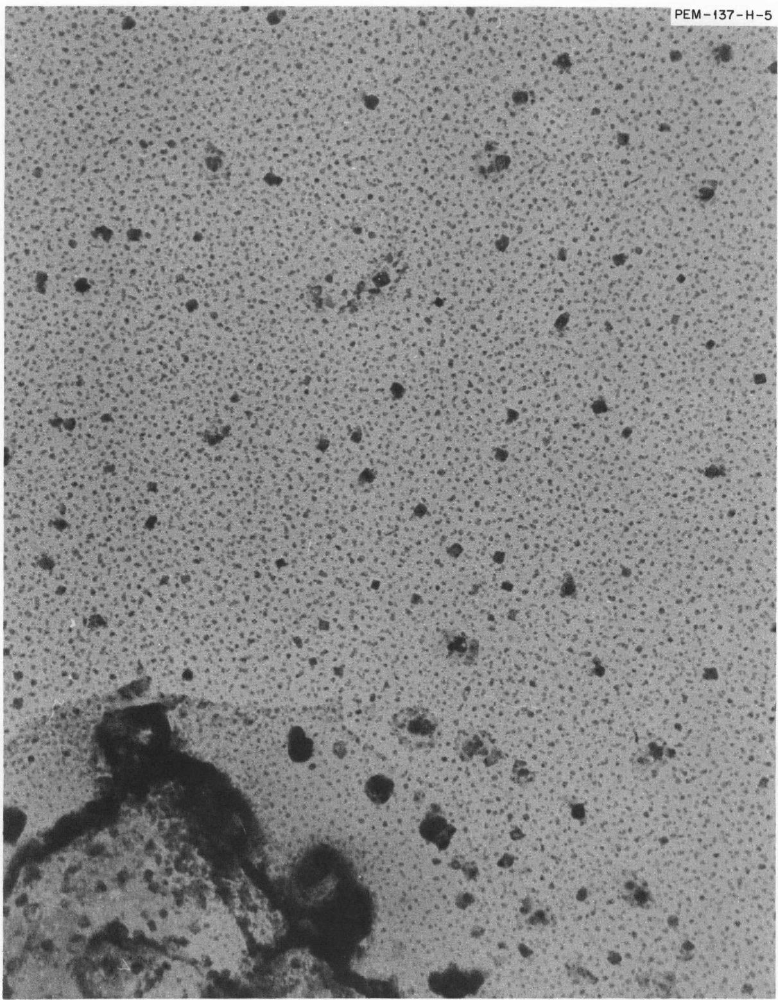  
Fig. 10.4. Electron Micrograph of Particles in Gas Flowing over MSRE Salt. 88,000x.

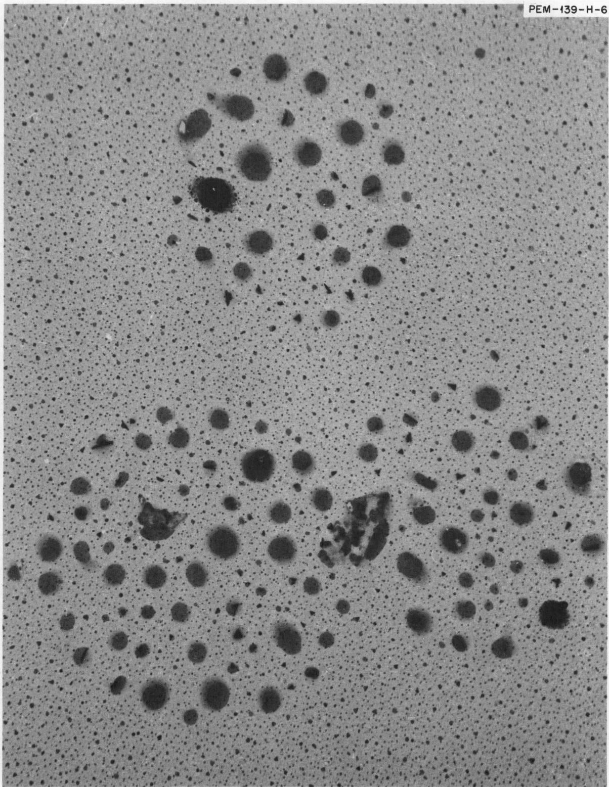  
Fig. 10.5. Circular Patterns Frequently Found on Screens in Gas Above MSRE Salt. 32,000×.

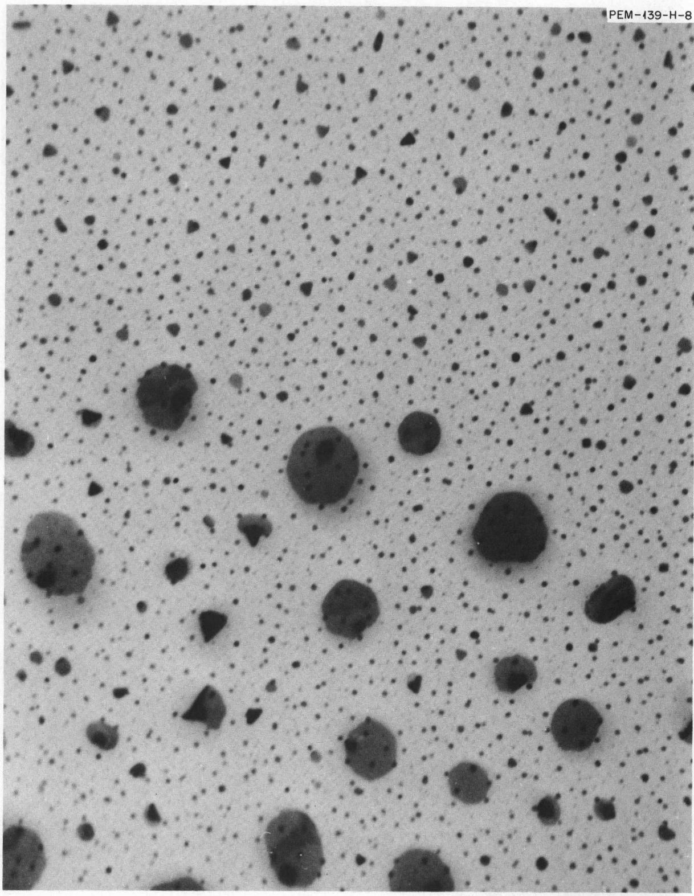  
Fig. 10.6. Electron Micrograph Showing the Transparency of Some Particles. $96,000 \times$

  
Fig. 10.7. Electron Diffraction Pattern of Particulate Matter Above MSRE Salt.

PEM-200-8967

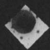  
Fig. 10.8. Area of Deposit Giving the Diffraction Pattern of Fig. 10.7.

MSRE pump bowl, suggest that the noble-metal fission products may be highly concentrated at the fuel-gas interface and may even be incorporated in any surface scum or foam floating on the salt. There is basic and practical interest in finding an answer to this question. Considerable thought has been given to the experimental problem of sampling the fuel surface itself. The two major problems are contamination of the sample by the gas phase (or by deposition from the fuel phase) and dilution of the sample by salt from below the surface. Several rather elaborate devices have been designed but have not yet been tried.

By accident, we may have obtained a good surface salt sample by a method which would be difficult to duplicate intentionally. Sample FP14-60 was to have been a 50-g sample for the third hot-cell test. It was taken in the usual large nickel capsule with windows near the top to admit the salt. When the sample arrived at the hot cell, it was found that the capsule contained only $5\mathrm{g}$ of salt. Although the normal 50-g sampling procedure was used, it appears that the bottom of the capsule windows must have been exactly at the fuel salt level. If it had been higher, no salt would have entered the capsule; if it had been lower, the capsule would have filled completely. It is likely that the ripples in the fuel surface occasionally lapped a little salt into the capsule.

Unfortunately the capsule must have been contaminated inside and out with noble metals from the gas phase, and on the outside by deposition from the fuel melt. Since the sample was therefore not an ideal one, it was decided to handle it by the procedure used for ladled 10-g samples and to compare the results with those from ladled 10-g samples. Large differences in activities would be apparent.

The 50-g capsule was therefore cut off about 1 in. above the bottom, and the salt was removed by shaking in the Wig-L-Bug (as for ladled 10-g samples). Salt samples were then weighed out and analyzed for the usual radioactive nuclides and for Ni, Cr, and Fe. Radiochemical analyses in disintegrations per minute per gram, corrected back to the time of sampling, were $1.49 \times 10^{11}$ for $^{99}\mathrm{Mo}$ , $4.31 \times 10^{10}$ for $^{132}\mathrm{Te}$ , $9.04 \times 10^{9}$ for $^{103}\mathrm{Ru}$ , $4.07 \times 10^{8}$ for $^{106}\mathrm{Ru}$ , $\sim 4.7 \times 10^{9}$ for $^{95}\mathrm{Nb}$ , $1.40 \times 10^{11}$ for $^{95}\mathrm{Zr}$ , $8.77 \times 10^{10}$ for $^{89}\mathrm{Sr}$ , $1.09 \times 10^{11}$ for $^{141}\mathrm{Ce}$ , $9.26 \times 10^{10}$ for $^{144}\mathrm{Ce}$ , $8.78 \times 10^{10}$

for $^{140}\mathrm{Ba}$ , and $5.96 \times 10^{10}$ for $^{131}\mathrm{I}$ . When these figures are compared with the values in Table 9.2 of the previous report, $^{17}$ the value for $^{99}\mathrm{Mo}$ is higher than all except one, $^{132}\mathrm{Te}$ is higher than the average by a factor of 3, $^{103}\mathrm{Ru}$ is less than two and greater than four values, $^{106}\mathrm{Ru}$ is higher than all values by an average factor of 2, $^{95}\mathrm{Nb}$ is less than all values by an average factor of 0.2, and the remaining salt-seeking species have similar values. The results of analyses of Ni, Cr, and Fe were not excessively high: 152, 90, and 159 ppm respectively.

These results indicate no large concentration effect for noble metals or metals of construction at the fuel surface. The data for $^{95}\mathrm{Nb}$ in fact indicate a depletion effect. These indications should be regarded as suggestive rather than conclusive, since it has not been proven that the sample analyzed was a surface salt sample and since the comparative method used assumes without proof that the different sample containers were contaminated to a similar degree by noble metals in the gas phase and in the fuel phase.

Deposition of Noble Metals on Nickel from Cover Gas and from Fuel Salt. - In a number of previous pump bowl tests, the deposition of noble metals on the stainless steel cables used to suspend fuel sampling capsules was examined to determine whether deposition was greater at the fuel-gas interface than in the cover gas or in the fuel. While there was much scatter in these data, the deposition on the interface region was usually higher (by a small factor) than on the higher or lower regions. In an earlier section, it was pointed out that this type of observation was made uncertain by the contamination problem.

In a special test with an unrelated objective, FP14-55, a nickel rod inside a perforated nickel basket was lowered into the pump bowl so that the middle of the rod was at the level of the fuel salt surface. This provided a sample of metal exposed to the interface region in a container which offered some protection against contamination by handling.

The nickel rod was cut into a gas-phase region, an interface region, and a fuel-phase region. The position of the gas-fuel interface was determined by examination of the rod with a low-power hot

cell microscope. The activity on each section was leached off, and the leaches were analyzed radiochemically. The gas-phase and interface regions showed very similar depositions of noble metals. The deposition of noble metals on the liquid-phase region was higher by factors of 30 for $^{99}\mathrm{Mo}$ , $^{103}\mathrm{Ru}$ , and $^{106}\mathrm{Ru}$ and 5 for $^{132}\mathrm{Te}$ and $^{95}\mathrm{Nb}$ . Since the deposition was so disparate between gas- and fuel-exposed regions, the deposition on the interface sample should have been heavily weighted by the portion of this sample which was submerged in fuel. The results suggest that the visual determination of the fuel-gas interface position on the rod was at fault. The difference in surface appearance (drop-shaped watermarks and a dark deposit) that was taken to indicate the salt level may actually have represented a region well above the salt level. In this case, the results given represent merely the difference in deposition from the gas phase and from the fuel phase. They are markedly different from the previous (questionable) results on stainless steel cables, where similar deposition of noble metals from both phases was observed.

# 10.2 FISSION PRODUCT DISTRIBUTION IN AN MSRE GRAPHITE SURVEILLANCE SPECIMEN

D. R. Cuneo

F. Dyer

H. E. Robertson

L. Bate

In a previous report, ${}^{18}$ determinations of fission product distribution in MSRE surveillance specimens after 24,000 Mwhr were reported. Samples were obtained by milling off layers of the graphite surfaces in a plane parallel to the longitudinal axis of a 0.47 by 0.66 in. cross section bar. The specimens were about 4.5 in. long. The resulting powder was dissolved and analyzed radiochemically for selected fission products. Near the surface, layers as thin as 1 mil were milled off as samples; subsequent samples at greater depths were as thick as 10 mils. Generally, a total depth of about 50 mils was sampled from the four sides of each specimen. The following inherent uncertainties in this sampling procedure were recognized: (1) some contamination was certainly carried by the steel milling surfaces to the next

sample from the preceding (and hotter) sample; (2) with the milling apparatus used, it is possible that the amount of graphite removed per cut was not uniform over the length of the specimen; and (3) it was difficult to be sure that the amount of graphite removed was uniform over the width of the specimen.

In order to determine if the "tails" or concentrations of fission products observed at considerable depth in the specimens were real, the following sampling scheme was devised. The rectangular-shaped specimen was sawed longitudinally at midplane. A small (0.25- to 0.30-in.-diam) core was then drilled from the cold inner (new) surface to the outer (hot) surface. The hot surface of this small graphite core was glued to a cold graphite coupon, which in turn was glued to a precision-ground tool steel piston. The piston fits into a 3.5-in.-diam holder. This assembly is shown in Fig. 10.9. A dial-indicating micrometer allows reading changes in the piston vertical position to direct readings of 0.1 mil. The samples are obtained by describing a figure 8 motion on a clean surface of emery paper resting on a precision lapping plate. The resulting powder is taped in place on the emery paper. This procedure, first devised by Lonsdale and Graves,[19] has been de

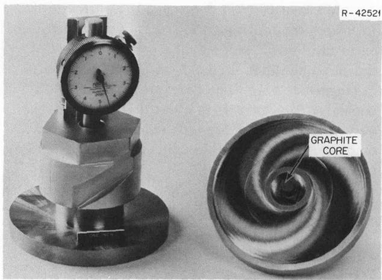  
Fig. 10.9. Apparatus Used for Sampling of Graphite Core. View on right shows location of graphite core cemented to floating piston. View on left shows entire assembly.

scribed in detail elsewhere.20 We believe that use of this apparatus certainly eliminates the uncertainties described above for the milling operation type of samples. The weak point in this procedure for these surveillance specimens is that only a small portion of the specimens is sampled when compared with milling samples.

The taped-on samples are transferred to a gamma-ray spectrometer for determinations of fission product concentrations. This approach to the problem was begun at a time when the surveillance samples had cooled beyond determination of short-lived isotopes of Mo, Te, I, and Ba. It is felt that these short-lived isotopes can also be determined satisfactorily by counting the entire powdered sample, as we have done with the long-cooled samples, for longer-lived nuclides.

The first core-drill sample was taken from the portion of specimen Y-7 from which some 60 mils of the surface under consideration had been removed earlier by milling.18 Small samples (1 to 10 mils) were removed from this core by grinding, starting at the cold (midplane of the specimen) end. These samples were counted using an NaI crystal that had only sufficient resolution to allow good counting data for $^{95}\mathrm{Zr}$ , $^{137}\mathrm{Cs}$ , and $^{144}\mathrm{Ce}$ . (For subsequent samples a germanium diode was available, thus allowing greater resolution and determination of more nuclides.) Part of the data obtained from these grinding samples are reported in Table 10.6. The last entry in the table, 70 mils from the original surface, was obtained from a sample taken 10 mils deep from the surface left following the milling. From this depth (10 mils) on to the "new" surface, the concentrations of the three nuclides dropped, as much as an order of magnitude. We have no explanation for this anomaly. However, it is clear that the tails observed from the milling-type samples18 are real since we see measurable concentrations extending to midplane in Table 10.6.

The data in Table 10.6 show little change in the $^{137}\mathrm{Cs}$ concentration with depth. This nuclide has a 3.9-min gaseous precursor ( $^{137}\mathrm{Xe}$ ), which allows considerable time for diffusion in the gaseous state.

Table 10.6. Fission Product Concentrations Varying with Depth in Specimen Y-7 as Determined from First Grinding of Specimen   

<table><tr><td rowspan="2">Depth from Original Surfacea(mils)</td><td colspan="3">Atoms of Nuclide per Cubic Centimeter of Graphite</td></tr><tr><td>95Zr</td><td>137Cs</td><td>144Ce</td></tr><tr><td>235(midplane)</td><td>4 × 1011</td><td>5 × 1014</td><td>2.5 × 1012</td></tr><tr><td>200</td><td>1 × 1012</td><td>6 × 1014</td><td>4 × 1012</td></tr><tr><td>150</td><td>6 × 1012</td><td>7 × 1014</td><td>2 × 1012</td></tr><tr><td>125</td><td>1 × 1013</td><td>8 × 1014</td><td>5 × 1012</td></tr><tr><td>100</td><td>2.5 × 1013</td><td>1 × 1015</td><td>5 × 1012</td></tr><tr><td>90</td><td>2 × 1013</td><td>1 × 1015</td><td>6.5 × 1012</td></tr><tr><td>80</td><td>2.5 × 1013</td><td>1 × 1015</td><td>8 × 1012</td></tr><tr><td>70</td><td>2 × 1013</td><td>1 × 1015</td><td>2 × 1013</td></tr></table>

${}^{a}$ Original surface is that before cuts were removed by milling operation.

To check the possibility that zirconium was produced in situ from uranium contained in the graphite before its exposure to the salt, a corresponding piece of unirradiated material was subjected to activation analysis. Analysis showed the natural uranium content of the specimen to be $< 0.06 \mathrm{ppm}$ , whereas about $70 \mathrm{ppm}$ would be required to yield the amount of $^{95}Zr$ found at about 100 to 125 mils from the original surface.

Next, a core (305 mils in diameter) was drilled through a portion of the Y-7 sample which had not been milled. Initially, 251 mils were removed from the 467-mil-thick specimen in the following increments: one 2-mil sample, nine 1 mil each, five 5 mils each, five 10 mils each, one 15 mils, two 25 mils each, and two 50 mils each. At a later date, the remaining 216 mils were sampled by grinding ten increments 1 mil each, five 5 mils each, five 10 mils each, three 25 mils each, and one 56-mil portion. Partial results of the gamma-spectrometer counting data are shown in Figs. 10.10 and 10.11. We believe that the graphite core surface represented by the left ordinate in each figure is that surface which was exposed directly to free-flowing fuel salt in the reactor and that the surface represented by the right

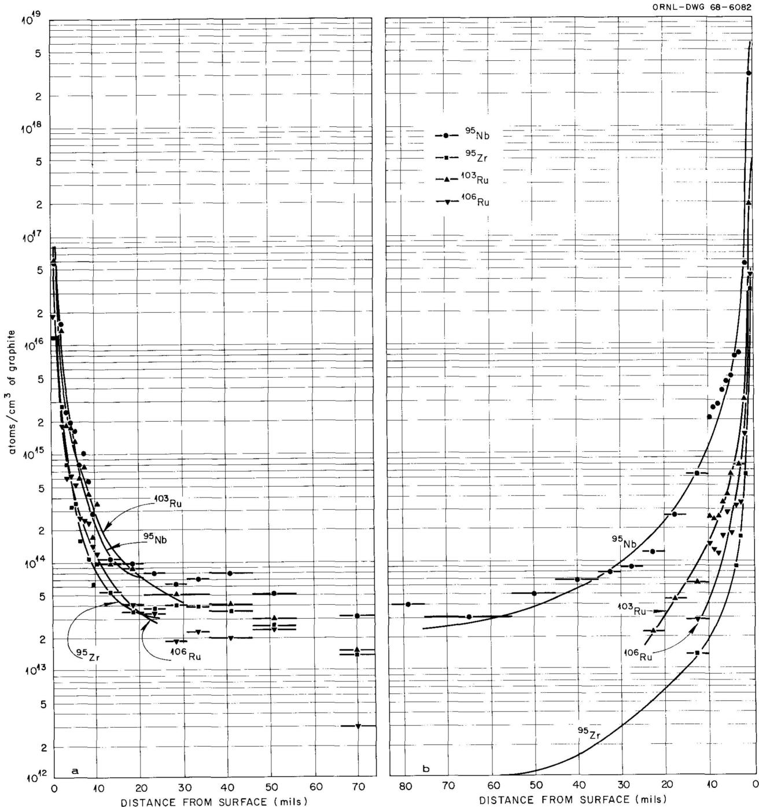  
Fig. 10.10. Concentrations of Nuclides vs Depth in Graphite Starting at Surface in Contact with Free-Flowing Fuel Salt (a) and with Stagnant Fuel Salt (b).

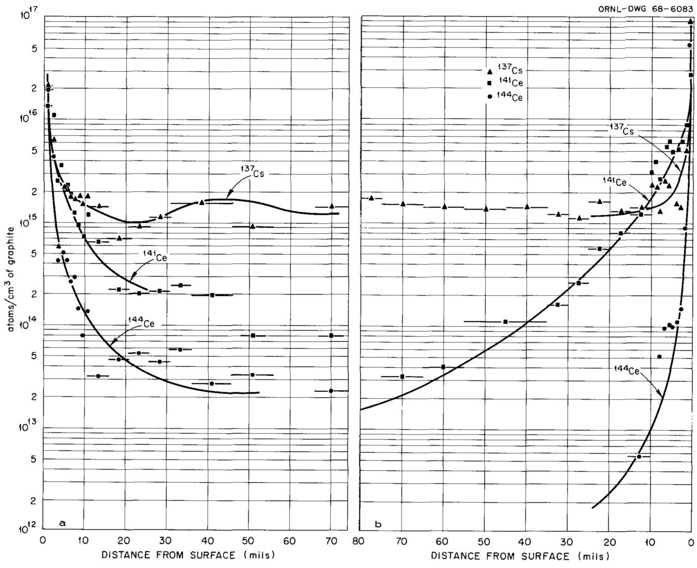  
Fig. 10.11. Concentrations of Nuclides vs Depth in Graphite Starting at Surface in Contact with Free-Flowing Fuel Salt (a) and with Stagnant Fuel Salt (b).

ordinates was exposed only to stagnant fuel salt which found its way through slits available where adjacent pieces of graphite were stacked together. However, this portion of Y-7 was left unmarked when stored since it was intended for permeability studies. From these curves and data not shown representing sampling to the midplane of the core, we observe the following. In Fig. 10.10, the $^{95}\mathrm{Nb}$ follows a similar pattern from one surface to the other, ending at the back (or stagnant) surface at a greater concentration by a factor of about 15 to 20. The $^{95}\mathrm{Zr}$ concentration gradient is considerably steeper on the back side of the specimen, with no detectable amount between 15 and 85 mils.

Ruthenium-103 was found from the "hot" salt surface to midplane, but only to a depth of 25 mils from the opposite surface. Ruthenium-106 followed the shape of the $^{103}\mathrm{Ru}$ curve to about 50 mils and then showed a drop at 65 to 70 mils; thereafter it was below a value of $1 \times 10^{12}$ . Starting from the opposite surface (Fig. 10.10b) it dropped below limits of detection at 15 mils. The $^{103,106}\mathrm{Ru}$ values are similar, mil by mil, when we consider that the fission yield of $^{103}\mathrm{Ru}$ is $0.38\%$ and that of $^{106}\mathrm{Ru}$ is $2.9\%$ . Cerium-141 has an 18-min barium and a 3.7-hr lanthanum precursor, while $^{144}\mathrm{Ce}$ has only short-lived ones. These different origins of the two isotopes may help

explain the marked differences in penetration in graphite as shown in Fig. 10.11; the melting point of barium is $725^{\circ}\mathrm{C}^{21}$ and operating temperature of the graphite is believed to be 650 to $750^{\circ}\mathrm{C}$ . If the ordinates in Fig. 10.10b and 10.11b represent a graphite surface exposed to stagnant fuel salt, then the higher surface concentrations and lesser depth of penetration for several of the nuclides may have occurred as follows. If this surface had contact only with a limited amount of salt for a long period of reactor operation, then penetration by any nuclide observed, except $^{137}\mathrm{Cs}$ , which probably penetrated from the opposite surface, would be limited by fission products available. However, at the end of reactor operation, barren salt circulated through the reactor for a very short time (relatively) did not have sufficient contacting time with this surface to remove fission products as thoroughly as at the opposite free-flowing salt surface.

In Table 10.7 are given details of the distribution of seven nuclides starting from the graphite surface in contact with free-flowing salt and extending to a depth where $\sim 100\%$ of all nuclides have been found. These data present in tabular form the data represented graphically in Figs. 10.10a and 10.11a. Since these data and those reported previously by Kirslis18 were obtained by quite different techniques and analytical procedures, it is interesting to compare the results, as seen in Table 10.8. While there are apparent differences in results from the two methods, it appears likely that the method we have described, that is, grinding of a small graphite core and dry graphite powder gamma spectrometry, yields usable results. The small core samples, of course, have the distinct possibility of including a crack, which could markedly affect the results.

In Table 10.9 the data for the total atoms of individual nuclides, surface to midplane, are given for the second sampling (representing the first half of this graphite core) and the third sampling (representing the second half). We see that with the exception of the large difference for $^{95}\mathrm{Nb}$ , the total nuclide contents of the opposite halves of the core are very nearly the same. This is somewhat surprising in view of some of the large differences noted for nuclide concentrations per unit

of volume that we found by comparing data in the left and right halves of Figs. 10.10 and 10.11. However, in most cases, 90 to $95\%$ of each nuclide was found in the first 10 mils from the graphite surfaces.

Another (the third) core was drilled from specimen Y-7. It was sampled by grinding throughout its entire length of 470 mils. Table 10.10 shows a comparison of total atoms of each nuclide per square centimeter of graphite surface from one surface through to the opposite surface for the second and third cores. Reasonable agreement is found for six of the seven nuclides; the discrepancy for $^{141}\mathrm{Ce}$ between the two comes about because of low concentrations found in the first 10 mils of the third core. Table 10.11 gives comparisons of concentration profiles for seven nuclides through the second and third cores.

By the hand grinding of small cores from graphite surveillance specimens, we can expect to obtain representative results for the distribution of fission products in the specimen. Short-cooled specimens of graphite from the MSRE may prove too radioactive for hand grinding, and methods of performing this operation remotely are being investigated. The attractive features of this method include savings by direct gamma spectrometry of the graphite powder rather than dissolution of the much larger milling samples and the necessary radiochemical separations of each nuclide. The grinding procedure has also allowed determinations of $\mathrm{Li}^+$ and $\mathbf{F}^{-}$ on each freshly exposed surface of the core.

# 10.3 PROTON REACTION ANALYSIS FOR LITHIUM AND FLUORINE IN MSR GRAPHITE

R. L. Macklin

E. Ricci

J. H. Gibbons

T. H. Handley

D. Cuneo

Consideration of the proton-induced reactions $^{7}\mathrm{Li}(p,n)$ and $^{19}\mathrm{F}(p,\alpha \gamma)$ suggested that they might be used to measure the concentration of these target nuclides in graphite as a means to determine the extent to which MSR fuel salt components penetrate into the graphite under irradiation. Here-tofore, none of the standard analytical techniques, including neutron activation, has shown much promise for this application at the few ppm $(10^{-4}$ wt %) level.

Table 10.7. Distribution of Fission Products in MSRE Sample Y-7 as Found by Second Core Grinding Starting at Graphite Surface in Contact with Free-Flowing Salt and Extending to a Depth of 201 Mils   

<table><tr><td>Total Distance from Surface (mils)</td><td>Percent of Total 95Zr in This Cut</td><td>Cumulative % 95Zr</td><td>Percent of Total 95Nb in This Cut</td><td>Cumulative % 95Nb</td><td>Percent of Total 103Ru in This Cut</td><td>Cumulative % 103Ru</td><td>Percent of Total 106Ru in This Cut</td><td>Cumulative % 106Ru</td><td>Percent of Total 137Cs in This Cut</td><td>Cumulative % 137Cs</td><td>Percent of Total 141Ce in This Cut</td><td>Cumulative % 141Ce</td><td>Percent of Total 144Ce in This Cut</td><td>Cumulative % 144Ce</td></tr><tr><td>0-2</td><td>73.9</td><td>73.9</td><td>80.3</td><td>80.3</td><td>82.2</td><td>82.2</td><td>85.3</td><td>85.3</td><td>12.5</td><td>12.5</td><td>38.3</td><td>38.3</td><td>75.7</td><td>75.7</td></tr><tr><td>3</td><td>8.8</td><td>82.7</td><td>10.2</td><td>90.5</td><td>9.7</td><td>91.9</td><td>4.3</td><td>89.6</td><td>1.9</td><td>14.4</td><td>15.8</td><td>54.1</td><td>8.7</td><td>84.4</td></tr><tr><td>4</td><td>2.6</td><td>85.3</td><td>1.6</td><td>92.1</td><td>1.3</td><td>93.2</td><td>1.4</td><td>91.0</td><td>0.2</td><td>14.6</td><td>3.6</td><td>57.7</td><td>0.9</td><td>85.3</td></tr><tr><td>5</td><td>1.1</td><td>86.4</td><td>1.3</td><td>93.4</td><td>1.2</td><td>94.4</td><td>1.5</td><td>92.5</td><td>0.7</td><td>15.3</td><td>5.1</td><td>62.8</td><td>1.0</td><td>86.3</td></tr><tr><td>6</td><td>1.1</td><td>87.5</td><td>1.1</td><td>94.5</td><td>0.9</td><td>95.3</td><td>1.2</td><td>93.7</td><td>0.6</td><td>15.9</td><td>3.3</td><td>66.1</td><td>0.8</td><td>87.1</td></tr><tr><td>7</td><td>0.5</td><td>88.0</td><td>0.5</td><td>95.0</td><td>0.4</td><td>95.7</td><td>0.6</td><td>94.3</td><td>0.5</td><td>16.4</td><td>2.7</td><td>68.8</td><td>0.5</td><td>87.6</td></tr><tr><td>8</td><td>0.8</td><td>88.8</td><td>0.7</td><td>95.7</td><td>0.5</td><td>96.2</td><td>0.6</td><td>94.9</td><td>0.5</td><td>16.9</td><td>1.8</td><td>70.6</td><td>0.6</td><td>88.2</td></tr><tr><td>9</td><td>0.3</td><td>89.1</td><td>0.4</td><td>96.1</td><td>0.3</td><td>96.5</td><td>0.6</td><td>95.5</td><td>0.5</td><td>17.4</td><td>1.4</td><td>72.0</td><td>0.3</td><td>88.5</td></tr><tr><td>10</td><td>2.0</td><td>91.1</td><td>0.2</td><td>96.3</td><td>0.1</td><td>96.6</td><td>0.3</td><td>95.8</td><td>0.4</td><td>17.8</td><td>1.0</td><td>73.0</td><td>0.2</td><td>88.7</td></tr><tr><td>11</td><td>0.3</td><td>91.4</td><td>0.2</td><td>96.5</td><td>0.2</td><td>96.8</td><td>0.3</td><td>95.1</td><td>0.5</td><td>18.3</td><td>1.7</td><td>74.7</td><td>0.3</td><td>89.0</td></tr><tr><td>46</td><td></td><td>95.7</td><td></td><td>98.2</td><td></td><td>98.4</td><td></td><td>99.1</td><td></td><td>31.0</td><td></td><td>88.2</td><td></td><td>91.9</td></tr><tr><td>126</td><td></td><td>98.5</td><td></td><td>99.4</td><td></td><td>99.2</td><td></td><td>100+</td><td></td><td>58.7</td><td></td><td>95.4</td><td></td><td>94.5</td></tr><tr><td>151</td><td></td><td>98.7</td><td></td><td>100+</td><td></td><td>99.4</td><td></td><td>100+</td><td></td><td>66.9</td><td></td><td>96.5</td><td></td><td>94.9</td></tr><tr><td>201</td><td></td><td>99.3</td><td></td><td>100+</td><td></td><td>99.6</td><td></td><td>100+</td><td></td><td>87.6</td><td></td><td>98.7</td><td></td><td>96.9</td></tr></table>

Table 10.8. Comparison of Results for Nuclide Concentrations in MSRE Graphite Surveillance Specimen Y-7 as Obtained by Milling and Grinding Methods   
Concentrations are atoms of nuclide per cubic centimeter of graphite   

<table><tr><td rowspan="2">Nuclide</td><td rowspan="2">Methoda</td><td colspan="6">Sample Depth from Surface (mils)</td></tr><tr><td>2</td><td>5</td><td>10</td><td>25</td><td>30</td><td>40</td></tr><tr><td rowspan="2">95Nb</td><td>Ab</td><td>1.3 × 1017</td><td>2.7 × 1015</td><td>1.3 × 1015</td><td></td><td></td><td>1.8 × 1014</td></tr><tr><td>B</td><td>1 × 1016</td><td>1.8 × 1015</td><td>3 × 1014</td><td></td><td></td><td>6 × 1013</td></tr><tr><td rowspan="2">95Zr</td><td>A</td><td>2.3 × 1015</td><td></td><td>1.4 × 1014</td><td></td><td></td><td>3.9 × 1013</td></tr><tr><td>B</td><td>6 × 1015</td><td></td><td>8.5 × 1013</td><td></td><td></td><td>3.5 × 1013</td></tr><tr><td rowspan="2">103Ru</td><td>A</td><td>3 × 1016</td><td>2.3 × 1014</td><td>1.1 × 1014</td><td></td><td></td><td>4.6 × 1013</td></tr><tr><td>B</td><td>2 × 1016</td><td>1.3 × 1015</td><td>3 × 1014</td><td></td><td></td><td>4 × 1013</td></tr><tr><td rowspan="2">106Ru</td><td>A</td><td>1.4 × 1015</td><td>1.8 × 1014</td><td>7.4 × 1013</td><td></td><td></td><td>2.8 × 1013</td></tr><tr><td>B</td><td>6 × 1015</td><td>5 × 1014</td><td>1.3 × 1014</td><td></td><td></td><td>2 × 1013</td></tr><tr><td rowspan="2">137Cs</td><td>Ab</td><td>1.7 × 1016</td><td>1.3 × 1015</td><td>6 × 1014</td><td>1.3 × 1015</td><td></td><td></td></tr><tr><td>B</td><td>1.2 × 1016</td><td>2.2 × 1015</td><td>1.5 × 1015</td><td>1 × 1015</td><td></td><td></td></tr><tr><td rowspan="2">141Ce</td><td>A</td><td>3.8 × 1015</td><td>2.5 × 1015</td><td>1.5 × 1015</td><td></td><td>4 × 1014</td><td></td></tr><tr><td>B</td><td>8 × 1015</td><td>2.2 × 1015</td><td>7.5 × 1014</td><td></td><td>2.1 × 1014</td><td></td></tr><tr><td rowspan="2">144Ce</td><td>A</td><td>7.7 × 1015</td><td></td><td>1.5 × 1015</td><td></td><td></td><td>6.1 × 1014</td></tr><tr><td>B</td><td>2 × 1015</td><td></td><td>1 × 1014</td><td></td><td></td><td>3.5 × 1013</td></tr></table>

Method A: samples milled from 0.66-in.-wide by $4\frac{1}{2}$ -in.-long specimen in May 1967; samples were dissolved and nuclides determined radiochemically. Method B: Samples ground from surface of 0.3-in.-diam core of graphite in December 1967; dry powder samples were analyzed by gamma spectrometer using a germanium diode.   
Specimen different but similar to Y-7.

Table 10.9. Total Atoms of Nuclides per Square Centimeter Found by Core-Drill Sampling from Surface to Midplane (Second Sampling) and Midplane to Opposite Surface (Third Sampling)   

<table><tr><td>Nuclide</td><td>Second, Hot Salt Surface</td><td>Third, Stagnant Salt Surface</td></tr><tr><td></td><td>(x 10-17)</td><td>(x 10-17)</td></tr><tr><td>95Nb</td><td>3.47</td><td>72.</td></tr><tr><td>95Zr</td><td>0.73</td><td>0.75</td></tr><tr><td>103Ru</td><td>3.35</td><td>4.43</td></tr><tr><td>106Ru</td><td>1.0</td><td>1.17</td></tr><tr><td>137Cs</td><td>7.75</td><td>10.1</td></tr><tr><td>141Ce</td><td>1.6</td><td>2.13</td></tr><tr><td>144Ce</td><td>1.14</td><td>1.22</td></tr></table>

Table 10.10. Total Atoms of Nuclide per Square Centimeter from One Surface to Opposite Surface for Two Cores Removed from MSRE Surveillance Specimen Y-7   

<table><tr><td></td><td>95Nb</td><td>95Zr</td><td>103Ru</td><td>106Ru</td><td>137Ru</td><td>141Ce</td><td>144Ce</td></tr><tr><td colspan="8">Total atoms per square centimeter</td></tr><tr><td>Second core</td><td>1.5 × 1017</td><td>7.5 × 1018</td><td>7.8 × 1017</td><td>2.2 × 1017</td><td>1.8 × 1018</td><td>3.9 × 1017</td><td>2.3 × 1017</td></tr><tr><td>Third core</td><td>9.0 × 1016</td><td>6.0 × 1018</td><td>7.3 × 1017</td><td>5.1 × 1017</td><td>1.1 × 1018</td><td>9.5 × 1016</td><td>1.7 × 1017</td></tr><tr><td>Second: third core ratio</td><td>1.7:1</td><td>1.25:1</td><td>1.1:1</td><td>1.;2.3</td><td>1.;6:1</td><td>4.1:1</td><td>1.35:1</td></tr></table>

Table 10.11. Comparison of Fission Product Concentration Profiles for Two Samples Core Drilled from MSRE Graphite Surveillance Specimen Y-7   

<table><tr><td>95Nb</td><td>Very similar concentration profile in both cores and found in every sample to midplane from all surfaces</td></tr><tr><td>95Zr</td><td>Profile curves similar in shape for both cores, with slightly steeper slopes for third core curves. No detectable amount beyond 150 mils from first surface of third core; found all the way from first surface of second core. No detectable amount beyond 4 mils from second surface of third core; some quantity at 100 mils from second surface of second core</td></tr><tr><td>103Ru</td><td>Second core: found to persist to midplane (233 mils) from first surface and to depth of 25 mils from opposite surface. Third core: much steeper drop; 7 × 1013atoms/cc at 5 mils from first surface vs 1.5 × 1015for 5-mil depth in second core. Disappeared at 10 mils from both surfaces of third core</td></tr><tr><td>106Ru</td><td>Similar behavior in both cores: found to about midplane from first surface of both cores and no deeper than 15 to 20 mils from opposite surface of both cores</td></tr><tr><td>137Cs</td><td>Similar concentration profiles for both cores, with slightly higher values for second core from 10 mils to midplane (233 mils)</td></tr><tr><td>141Ce</td><td>From 10 mils to midplane of both cores, concentrations are quite similar; however, for third core there is an unexplained flatness (and even lack of detection in some samples) from 10 mils to the surfaces</td></tr><tr><td>144Ce</td><td>Second core: found in every sample, first surface to midplane (233 mils), with increase in concentration from 100 mils to midplane; not found deeper than 15 mils from opposite surface. Third core; not detectable below 15 to 20 mils from either surface</td></tr></table>

For $^7\mathrm{Li}$ the high neutron yield and relatively low threshold of the ${}^{7}\mathrm{Li}(p,n)$ reaction (1.881 Mev) offer a unique identification with high sensitivity. The ${}^{9}\mathrm{Be}(p,n)$ threshold occurs at 2.059 Mev, and the ${}^{12}\mathrm{C},{}^{13}\mathrm{C},$ and ${}^{19}\mathbf{F}$ thresholds still higher. Protons of 2.06 Mev penetrating the surface of graphite lose energy by Coulomb interaction with the electrons. They reach the $^7\mathrm{Li}$ threshold in $8\times 10^{-4}$

cm ( $\sim$ 0.33 mil) and produce no ${}^7\mathrm{Li}(p,n)$ reaction neutrons at greater depths. The major neutron background (mostly from cosmic rays) can be conveniently determined by a companion bombardment at 1.881 Mev.

The nuclear reaction $^{19}\mathbf{F}(p,\alpha)^{16}\mathbf{O}^{*}(\gamma)^{16}\mathbf{O}$ gives a 6.14-Mev gamma ray with a very high yield. The energy is large compared with gamma rays from

fission products. The reaction has recently been used to study fluorine penetration of Zircaloy by Starfelt et al.22 A survey of other proton-induced reactions in graphite and in the molten salt used for reactor fuel indicated that fluorine penetration in the graphite moderator of the MSRE might also be determined to a very high degree of sensitivity.

Prominent proton resonances in the $^{19}\mathrm{F}(p,\alpha \gamma)$ reaction occur near 0.5, 1.5, and 2 Mev. Protons of such energies would penetrate graphite to a depth of 0.001 to 0.005 cm (a few tenths to 2 mils). For smaller depths a detailed study of the gamma-ray yield with varying proton energy can be analyzed to give the concentration as a function of depth.[22] The chief background expected is from $^{13}\mathrm{C}(p,\gamma)$ in the graphite, giving gamma rays near 9 Mev. The incomplete absorption of these in the spectrometer gives a flat background near 6 Mev.

Protons at 1.88 Mev from the ORNL 3-Mv Van de Graaff were collimated to a 0.32-cm-diam spot. Steady currents from $\frac{1}{2}$ to $1\mu \mathrm{a}$ were collected at the sample and integrated to monitor the number of protons in each run. A $7.5\times 7.5\mathrm{cmNaI(Tl)}$ scintillation counter was placed 4 to $225~\mathrm{cm}$ from the sample to record the gamma-ray spectrum.

A long counter $^{23}$ was used to measure neutron yield and was placed straight ahead from the proton beam at a distance of from 11 to $35~\mathrm{cm}$ from the sample. A sketch of the apparatus is shown in Fig. 10.12.

Thin standards used were $180~\mu \mathrm{g} / \mathrm{cm}^2$ and about $14~\mu \mathrm{g} / \mathrm{cm}^2$ of LiF evaporated on aluminum. A thick $^{7}$ LiF crystal was used as a standard also, after evaporating a thin conductive layer of silver on three of its faces to avoid electrostatic problems from the proton charge buildup. Possible bias in our calibration for fluorine concentrations is estimated at $10\%$ to allow for the effect of anisotropic emission of gamma rays near $90^{\circ}$ . For lithium concentration the uncertainty is $20\%$ , largely because we could not use $1 / r^2$ scaling to greatly reduce the dead-time corrections (due to high count rate) in counting the standard. In the case of the MSRE sample (Y-7) mounted on an iron cylinder for lapping, an additional large correction for neutron transmission through the iron raises the possible bias for lithium to $25\%$ .

ORNL-DWG 68-2540

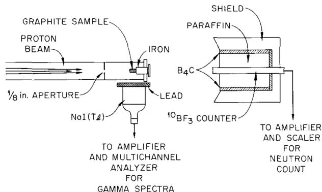  
Fig. 10.12. Plan View Diagram of the Experiment. Protons from the ORNL 3-Mv Van de Graaff accelerator were focused onto the surface of the sample in vacuum. Facilities for measuring the charge, suppressing electron emission, etc., are not shown. The sample was viewed by a gamma-ray spectrometer near $90^{\circ}$ to the beam and by a neutron counter near $0^{\circ}$ .

Figure 10.13 shows the gamma spectrum obtained using the $^7\mathrm{LiF}$ target. Also shown is the spectrum from a sample of beryllium metal. The gamma-ray yield from the beryllium is about 1/300 of that from fluorine and occurs mostly at a higher energy (7.48 MeV).

Three samples of graphite were studied. A piece of clean graphite gave the background spectrum indicated in Fig. 10.14. A comparison with the standards indicated that a fluorine concentration of about $1\mathrm{ppm}$ could be detected in a 10-min run. The lithium detection limit with the neutron counter used was about $0.1\mathrm{ppm}$ .

A sample of graphite (Y-5, grade CGB, bar 635) exposed to nonradioactive molten salt for nine months was studied, as well as one from the MSRE (Y-7, withdrawn in May 1967). Successive surface layers of these samples were ground (lapped) away to measure the fluorine concentration at successive, deeper levels; since the back face of sample Y-7 had also been exposed to the molten salt, concentrations were studied as this face was approached from the interior of the sample. The removed material is to be analyzed for fission products and uranium.

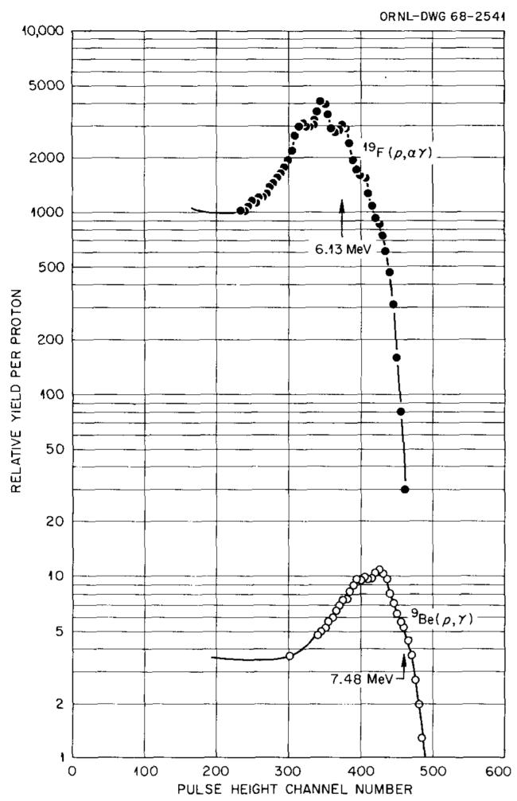  
Fig. 10.13. Pulse-Height Spectra in the 7.5- by 7.5-cm NaI(Tl) Spectrometer from Samples of $^{19}\mathrm{F}$ and $^{9}\mathrm{Be}$ for Equal Proton Bombardment. The yield from $^{7}\mathrm{Li}$ above 0.478 MeV (channel 37) was negligible in comparison.

The sample exposed to nonradioactive MSRE fuel salt (Y-5) showed surface contamination of $1.1\mu \mathrm{g} / \mathrm{cm}^2$ . This was removed by a $5\times 10^{-4}$ cm lapping. Since the proton beam is capable of evaporating or sputtering surface layers, the sample was bombarded for more than 2 hr with a ${}_{2}^{1}$ - $\mu$ a beam before lapping. The fluorine contamination of the surface was decreased about $5\%$ . Accidental surface contamination was a problem in handling these samples, since the ${}^{7}\mathrm{LiF}$ standards used in the same apparatus had up to a million times higher concentration. Discrimination between thin surface layers and material distributed in depth was accomplished by varying the proton

energy. Figure 10.15 shows the concentrations of lithium and fluorine found at depth in sample Y-5. The initial very high lithium value near the surface did not persist in the further measurements and is not considered typical of the bulk graphite. It may represent material originally in a small fissure about $8 \times 10^{-4}$ cm deep.

The MSRE moderator sample (Y-7) showed about $3\mathrm{r / hr}$ (surface) fission product activity, requiring special handling. A 1.8-cm lead filter was used in front of the spectrometer to reduce the overall counting rate from the radioactivity. Surface fluorine measured about $3.7\mu \mathrm{g} / \mathrm{cm}^2$ . Concentration as a function of depth is shown in Fig. 10.16. To determine whether this fluorine concentration was due to salt penetration of a crack fortuitously crossing the sample, a microscopic examination and an acetone test were performed. Neither test showed any evidence of a crack. (Incipient cracks have normally led to fracture during the coring procedure used in cutting the sample from a larger piece of graphite. Sample Y-7 showed no fractures in the section we studied.)

The $^{7}\mathrm{Li}$ concentrations found are summarized in Fig. 10.17. The lithium analysis was developed during the course of the experiments, so data are not available very close to the first surface studied.

The sample exposed at the center of the reactor for nine months (Y-7) shows over 100 times the lithium and fluorine content found in the control sample (Y-5) given identical treatment except for irradiation. Since graphite is expected to withstand up to 20 times heavier irradiations before replacement for structural reasons, it will be important to study penetration after longer reactor exposures.

In the unirradiated sample the ratio of lithium to fluorine $(\sim 0.43)$ is probably consistent with that expected for the $^7\mathrm{LiF}$ molecule (7/19) in view of possible errors in normalization. The ratio expected from the fuel salt composition is $\frac{1}{6}$ . The nonstoichiometric ratios found (particularly in the irradiated sample) seem suggestive of ionic diffusion.

The fluorine concentration in the irradiated sample (Y-7, Fig. 10.16) follows the inverse of the depth from the front or back face fairly closely, although the anomaly near $0.008\mathrm{cm}$ (3 mils) from the rear face seems real. (The anomaly is also seen in the lithium data, Fig. 10.17, and may correspond to an inhomogeneity in the graphite.)

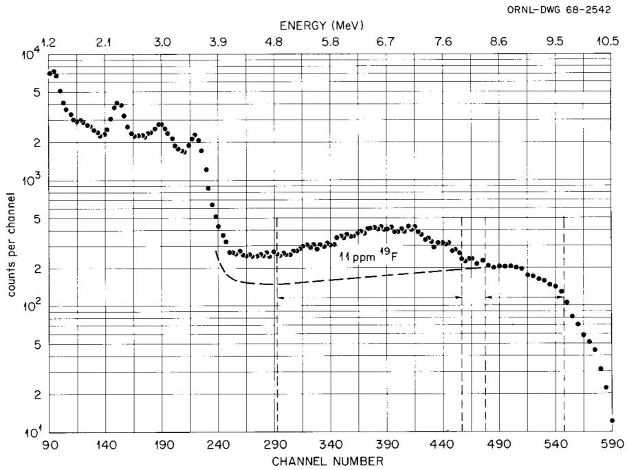  
Fig. 10.14. Pulse-Height Spectra from Samples of Clean Graphite (Dashed Lines) and Graphite Containing a Trace of Fluorine. The peaks at 2.367, 3.150, and $3.150 - 0.511$ Mev are attributable to $^{12}C(p,\gamma)$ reactions, the spectrum near 9 Mev to $^{13}C(p,\gamma)$ .

The lithium concentration in the irradiated sample is not proportional to the fluorine, rising from the 7/19 ratio typical of $^{7}\mathrm{LiF}$ near the surface to 6/1 at the center. The minimum lithium concentration appears to be nearer to the first (outside) face of the sample than to the center. Only the molten-salt flow velocity was reportedly much different at the two faces.

# 10.4 SURFACE PHENOMENA IN MOLTEN SALTS

H. W. Kohn

F. F. Blankenship

The possibility that colloids or metallic sols are involved in the corrosion product and fission product behavior in the MSRE fuel has led to a study of colloids in molten salts. When the MSRE fuel was initially treated with hydrogen and beryllium during purification, sols as well as larger particles of reduced nickel and iron were evidently produced. Some of these have remained suspended throughout operation of the reactor and presumably constitute the iron and nickel content regularly

reported in fuel analyses. Also, since beryllium treatments in the reactor did not decrease the chromium concentration, part of the chromium in the fuel is presumably present as a metallic sol. In general, the sols would be expected to exist as alloys rather than as pure metals.

The more noble of the fission product metals, because of the reduction potential reflected by the $\mathrm{UF}_3$ content, are expected to exist in the MSRE as elemental metals. Most of such elements plate out on walls as metal (or possibly as carbides on graphite, in the case of molybdenum and niobium). (An appreciable portion also appears to leave with the off-gas.) However, to the extent that they do remain in the fuel, they are probably present as sols.

Again these sols are undoubtedly alloys, and some may contain little or no structural metal. There is evidence (see Sect. 10.1) that sols containing fission products leave the melt, but a corresponding loss of structural metals has not been noted.

As to the fate of these sols, we have obtained evidence from laboratory experiments that there

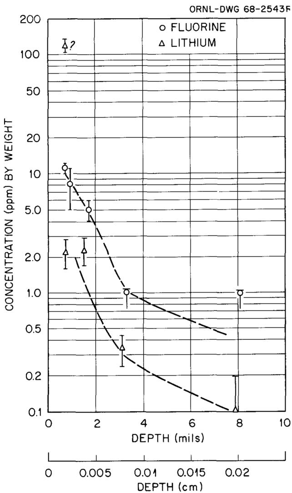  
Fig. 10.15. Lithium and Fluorine Concentrations in a Sample (Y-5) of Unirradiated Graphite Exposed to Molten Fluorides for Nine Months. The initial high lithium value near the surface did not persist in further measurements.

is marked tendency for flotation to occur. We studied samples from a fuel solvent melt to which large amounts of structural metal fluorides had been added and then reduced with hydrogen and zirconium. On melting a coarsely ground portion of this material in glass, a dark scum accumulated on the surface of the quiescent melt. When the scum was removed and discarded, the remaining salt had a decreased structural metal content. The results are shown in Table 10.12.

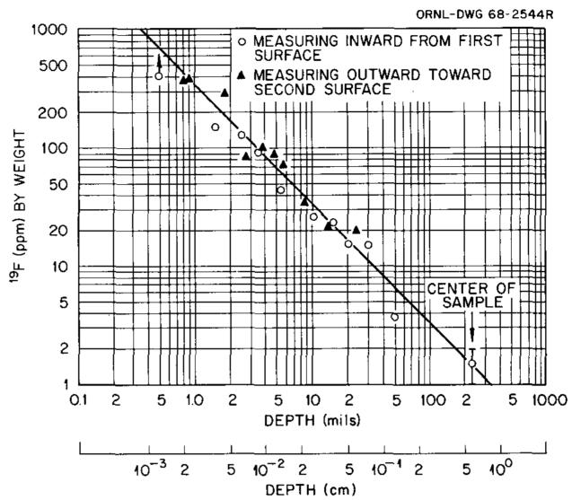  
Fig. 10.16. Fluorine Concentrations in Graphite Sample Y-7, Exposed to Molten Fuel Salt in the MSRE Reactor for Nine Months. Measurements were made as the sample was ground away in layers progressing from the first surface to the center (open circles) and then from the interior toward the second surface (closed triangles). The distances shown are as measured from the nearest surface exposed to molten salts.

This suggested that the black scum was finely divided metal that had somehow floated to the surface.

Two subsequent trials with salt from the same source were performed with helium bubbling through the melt in a test of flotation. The scum, shown in Fig. 10.18, formed in greater abundance, and the evidence for flotation was as shown in Table 10.13.

Table 10.12. Structural Metal Content Before and After Removal of Scum from Melt   

<table><tr><td></td><td>Makeup Analysis (ppm)</td><td>After Treatment (ppm)</td></tr><tr><td>Fe</td><td>286</td><td>158</td></tr><tr><td>Cr</td><td>445</td><td>47</td></tr><tr><td>Ni</td><td>4680</td><td>218</td></tr></table>

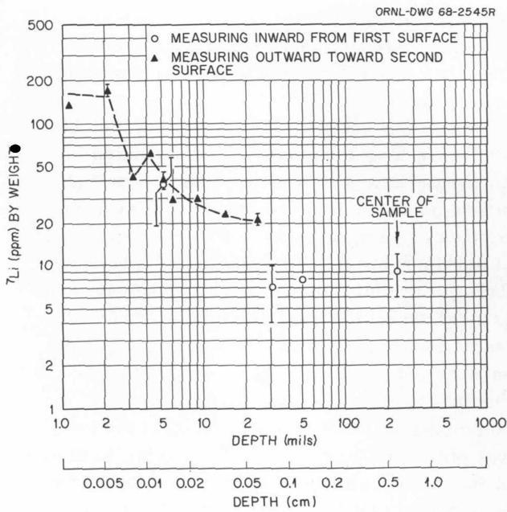  
Fig. 10.17. Lithium Concentrations in the Graphite Sample (Y-7) Exposed Nine Months in the MSRE Reactor. The significance of the different symbols is as described for Fig. 10.16. The distribution does not appear to be symmetrical, and a nonuniformity near $0.008\mathrm{cm}$ from the second surface is suggested. The fluorine measurement (Fig. 10.16) indicates a similar minimum.

There was a possibility that the black material included finely divided $\mathrm{ZrO}_2$ , the oxide that precipitates from fuel solvent. Since there was no significant segregation of zirconium, we concluded that flotation had removed predominantly metals.

The conditions for the formation of a similar scum at the liquid surface of the pump bowl in the MSRE are good. However, attempts to detect it directly have been inconclusively unsuccessful. Most of the material collected in the laboratory experiments on flotation seems to be larger than colloidal in size $(>0.1\mu)$ , but the sol particles are probably behaving in the same manner as the larger particles.

There is evidence that sol particles escape from radioactive MSRE fuel to form an aerosol (see Sect. 10.1). The mechanism for this implausible behavior remains unknown. One suggestion is that because the gas above radioactive fuel is conducting, a contact potential between the liquid salt and gas phases impels charged particles from

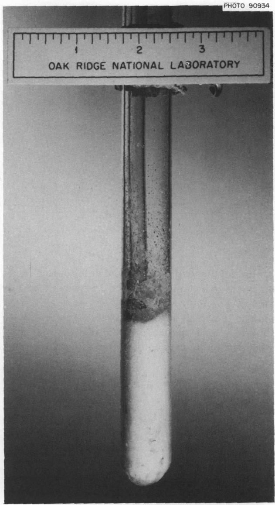  
Fig. 10.18. Flotation in Fuel Solvent.

the interface. Another suggestion is that recoil is responsible. Bursting bubbles may have an effect, but the results of hot-cell tests (see Sect. 10.1) with quiescent fuel from the MSRE suggest that bubbles may not be necessary.

The whole question of the formation and stability of colloids in molten salts has been virtually untouched in the literature. Accordingly, experiments in nitrate melts have been initiated (because of the convenience of working with nitrates) to characterize such colloidal behavior.

Table 10.13. Segregation of Reduced Structural Metals by Flotation   
Analyses in weight percent   

<table><tr><td></td><td>Fe</td><td>Cr</td><td>Ni</td><td>Zr</td></tr><tr><td colspan="5">Second melt</td></tr><tr><td>Top</td><td>0.147</td><td>0.012</td><td>0.31</td><td>9.79</td></tr><tr><td>Bottom</td><td>0.008</td><td>&lt;0.004</td><td>&lt;0.006</td><td>10.2</td></tr><tr><td colspan="5">Third melt</td></tr><tr><td>Top</td><td>0.074</td><td>0.030</td><td>0.42</td><td>9.19</td></tr><tr><td>Middle</td><td>0.013</td><td>&lt;0.009</td><td>&lt;0.2</td><td>10.1</td></tr><tr><td>Bottom</td><td>0.010</td><td>&lt;0.003</td><td>0.12</td><td>11.3</td></tr></table>

Colloidal dispersions of silver metal in molten potassium-sodium nitrate eutectic have been prepared by uv photolysis. Colloidal gold has been prepared in sodium-lithium and sodium-potassium nitrates by reduction of gold chloride and also by supersonic dispersion of particulate gold from

exploded wires. Silver iodide in potassium-lithium nitrate melts has also been prepared. Transmission and scattering spectra are being measured.

Another surface-related behavior that has been studied is foam formation. Foam formation in nitrate melts was induced by adding aluminum nitrate nonahydrate. The foam was first formed by bubbles of nitrogen oxide from the decomposition of aluminum nitrate. When helium was bubbled through the melt, the nitric oxide foam gave way to a helium bubble foam which, if undisturbed, lasted for about 15 min. Similar behavior was encountered some time ago on an addition of thorium fluoride to a nitrate-fluoride melt.[24] In both cases we could hypothesize that the foam was stabilized by finely divided oxide. In view of the rare occurrence of molten-salt foams, we have conjectured that a finely divided wetted solid may be a requisite for stable foam formation in molten salts.

# 11. Chemistry of Fission Product Fluorides

# 11.1 PROPERTIES OF MOLYBDENUM FLUORIDES

C.F.Weaver H.A.Friedman D.N.Hess

The synthesis and characterization of molybdenum fluorides and a study of their reactions in molten $2\mathrm{LiF}\cdot \mathrm{BeF}_{2}^{1,2}$ were continued. The synthesis of ruthenium fluorides was initiated.

# 11.1.1 Synthesis of $\mathsf{MoF}_3$ and $\mathsf{MoF}_5$

The first step in the synthesis involved forming a solution of $\mathsf{MoF}_5$ and $\mathsf{MoF}_6$ by reacting molybdenum metal with an excess of $\mathsf{MoF}_6$ refluxed in a Pyrex container such as that shown at the right in Fig. 11.1. Commercial $\mathsf{MoF}_6$ was purified with respect to HF before use by distilling it over NaF in an apparatus similar to that shown at the left in Fig. 11.1. Hydrogen fluoride is known to catalyze the reaction $2\mathsf{MoF}_6 + 3\mathsf{SiO}_2 \rightarrow 3\mathsf{SiF}_4 + 2\mathsf{MoO}_3$ ; failure to remove HF resulted in several explosive ruptures of the Pyrex equipment, while, in the absence of HF, the $\mathsf{MoF}_6$ was contained for weeks without an observable pressure increase. As much of the apparatus as possible was flamed under vacuum before use, because these fluorides are very reactive toward moisture. After the molybdenum metal was completely reacted with the excess $\mathsf{MoF}_6$ , the system was evacuated and the temperature slowly increased. During this procedure the excess $\mathsf{MoF}_6$

left the system, leaving a residue of $\mathsf{MoF}_5$ . Upon further heating, part of the $\mathsf{MoF}_5$ sublimed to the neck of the Pyrex flasks, and part disproportionated, producing $\mathsf{MoF}_3$ and $\mathsf{MoF}_6$ (which then left the system). Experiments in which the terminal temperatures were $200^{\circ}$ and $150^{\circ}$ both produced $\mathsf{MoF}_3$ as a tan residue in the bulb and $\mathsf{MoF}_5$ as a bright yellow deposit in the neck of the flask. The ratio of $\mathsf{MoF}_3$ to $\mathsf{MoF}_5$ was higher at $200^{\circ}$ than at $150^{\circ}$ . An experiment which was heated to only $100^{\circ}$ produced the $\mathsf{MoF}_5$ in the neck of the container but left a viscous residue with a molybdenum-to-fluorine ratio slightly higher than $\mathsf{MoF}_5$ . This residue did not solidify upon cooling to room temperature and storing for several days.

The $\mathbf{MoF}_3$ and $\mathbf{MoF}_5$ were both identified by x-ray diffraction and by chemical analysis. Their diffraction lines are listed in Table 11.1. Those for $\mathbf{MoF}_3$ were identical to those obtained by D. E. LaValle et al.4,5 in earlier synthesis and structure studies. The pattern for $\mathbf{MoF}_5$ corresponds to that calculated from structural data in the literature.3 The analytical results7 confirming the stoichiometry are shown in Table 11.2. The impurity levels determined by emission spectroscopy8 are also shown in Table 11.2. The optical properties of these substances and of $\mathbf{NbF}_5^9$ were determined to provide a rapid and convenient means

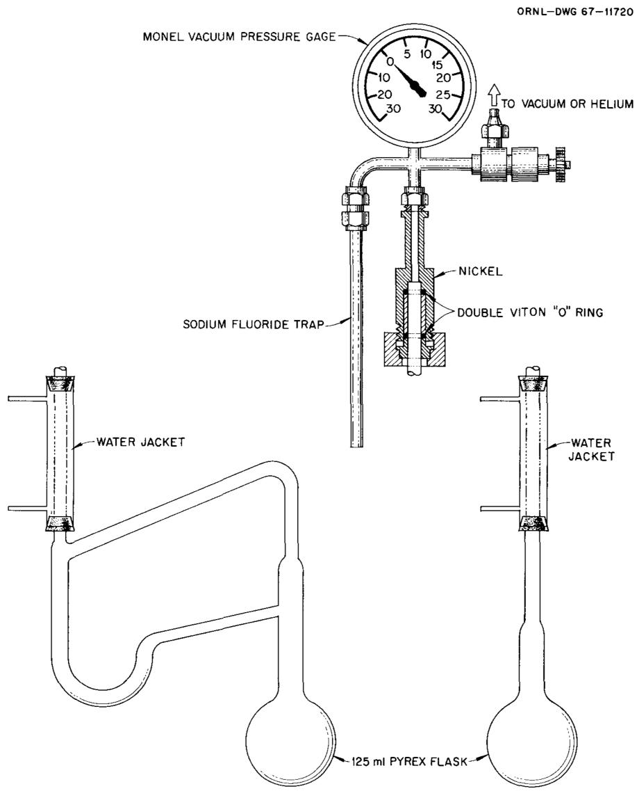  
Fig. 11.1. Apparatus for the Synthesis of Molybdenum Fluorides.

for future identification; they are summarized in Table 11.3.

The absorption spectrum of $\mathsf{MoF}_5$ is being investigated. Preliminary results show absorption in the region of $1260\mathrm{nm}$ and an intense ultraviolet shoulder near $340\mathrm{nm}$ .

# 11.1.2 Lithium Fluoromolybdates(III)

The relative stability of $\mathsf{MoF}_3$ at temperatures of reactor operation and the fact that it can produce both molybdenum metal and volatile molybdenum products upon disproportionation suggested that behavior of $\mathsf{Mo}^{3+}$ in MSRE-type solvents should be investigated. Examination of quenched melts along the join 2LiF $\cdot$ BeF $_2$ -MoF $_3$ have disclosed two previously unknown compounds shown to be

Table 11.1. X-Ray Diffraction Lines ${}^{a}$   

<table><tr><td colspan="2">MoF3Powder Pattern</td><td colspan="2">MoF5Debye-Sherrer</td></tr><tr><td>2θ</td><td>100I/IO</td><td>2θ</td><td>Intensity</td></tr><tr><td>23.3</td><td>100</td><td>11.10</td><td>w</td></tr><tr><td>31.8</td><td>25</td><td>16.73</td><td>m</td></tr><tr><td>34.4</td><td>13</td><td>19.65</td><td>w</td></tr><tr><td>39.3</td><td>5.4</td><td>20.64</td><td>m</td></tr><tr><td>41.9</td><td>8.2</td><td>22.31</td><td>s</td></tr><tr><td>47.5</td><td>8.1</td><td>24.31</td><td>vw</td></tr><tr><td>51.7</td><td>12</td><td>25.11</td><td>vw</td></tr><tr><td>54.9</td><td>3.2</td><td>26.53</td><td>ms</td></tr><tr><td>55.3</td><td>6.5</td><td>27.49</td><td>vw</td></tr><tr><td>60</td><td>4.7</td><td>28.61</td><td>vw</td></tr><tr><td>61.6</td><td>4.4</td><td>31.11</td><td>vw</td></tr><tr><td>66</td><td>2.1</td><td>32.64</td><td>w</td></tr><tr><td>68.2</td><td>1.9</td><td>33.81</td><td>vw</td></tr><tr><td>72.6</td><td>2.7</td><td>37.22</td><td>w</td></tr><tr><td>74.3</td><td>1.1</td><td>39.55</td><td>w</td></tr><tr><td>77.3</td><td>2.5</td><td>42.51</td><td>vw</td></tr><tr><td>81.3</td><td>1.4</td><td>45.37</td><td>ms</td></tr><tr><td></td><td></td><td>47.35</td><td>vw</td></tr><tr><td></td><td></td><td>48.77</td><td>vw</td></tr><tr><td></td><td></td><td>51.51</td><td>vw</td></tr><tr><td></td><td></td><td>53.37</td><td>vw</td></tr></table>

${}^{a}$ Copper target.

long to the system $\mathrm{LiF - MoF}_3$ . Their optical properties and x-ray diffraction patterns have been determined and are given in Tables 11.4 and 11.5 respectively. Attempts to determine the stoichiometry and melting behavior of these phases have been complicated by corrosion of container materials such as nickel and copper. However, the formulas are certainly close to $5\mathrm{LiF}\cdot 2\mathrm{MoF}_3$ and $\mathrm{LiF - MoF}_3$ , and the compounds have been so labeled in Tables 11.4 and 11.5. These efforts are being continued with the following goals in mind:

1. Definite determination of the formulas and melting behavior of these compounds.   
2. Determination of the liquidus values and primary phases along the join 2LiF·BeF $_{2}$ -MoF $_{3}$ .   
3. Analogous studies of the behavior of niobium, ruthenium, and technetium.

Table 11.2. Analyses of the Molybdenum Fluorides   

<table><tr><td></td><td>MoF3</td><td>MoF5</td></tr><tr><td>Wt %</td><td></td><td></td></tr><tr><td>Mo</td><td>62.7</td><td>49.6</td></tr><tr><td>Mo (calcd)</td><td>62.7</td><td>50.2</td></tr><tr><td>F</td><td>37.9</td><td>49.9</td></tr><tr><td>F (calcd)</td><td>37.3</td><td>49.8</td></tr><tr><td>Ppm</td><td></td><td></td></tr><tr><td>Al</td><td>≤200</td><td></td></tr><tr><td>B</td><td></td><td>500</td></tr><tr><td>Be</td><td></td><td>10</td></tr><tr><td>Ca</td><td>&lt;100</td><td>≤500</td></tr><tr><td>Cu</td><td>50</td><td>3000</td></tr><tr><td>Li</td><td>500</td><td>100</td></tr><tr><td>Mg</td><td>50</td><td>&lt;100</td></tr><tr><td>Mn</td><td>30</td><td></td></tr><tr><td>Na</td><td>300</td><td>500</td></tr><tr><td>Si</td><td>300</td><td>200</td></tr><tr><td>W</td><td>≤500</td><td></td></tr></table>

Table 11.3. Optical Properties of the Molybdenum Fluorides and Niobium Pentafluoride   

<table><tr><td>MoF3</td><td>Uniaxial positive
Nω=1.592
Nε=1.624
Golden yellow</td></tr><tr><td>MoF5</td><td>Biaxial
Optical angle = 90°
Na=1.520
Nβ=1.534
Nγ=1.548
Lemon yellow</td></tr><tr><td>NbF5</td><td>Biaxial negative
Optical angle ≈ 50°
Na=1.484
Nγ=1.516</td></tr></table>

# 11.1.3 Kinetics of $\mathsf{MoF}_3$ Behavior in 2LiF-BeF

Previously reported work² indicated that $\mathsf{MoF}_3$ may be stable for many days or disproportionated to molybdenum metal and $\mathsf{MoF}_6$ in a few hours in the temperature range 500 to $700^{\circ}$ depending on the temperature and pressure. It was further shown

Table 11.4. Optical Properties of the Lithium Fluoromolybdates   

<table><tr><td>LiF·MoF3</td><td>Uniaxial positive
Nω=1.512
Nε=1.524</td></tr><tr><td>5LiF·2MoF3</td><td>Biaxial negative
Nα=1.472
Nγ=1.490
Optical angle ≈60°</td></tr></table>

Table 11.5. X-Ray Diffraction Powder Patterns   

<table><tr><td colspan="2">5LiF·2MoF3</td><td colspan="2">LiF·MoF3</td></tr><tr><td>2θ</td><td>100I/I0</td><td>2θ</td><td>100I/I0</td></tr><tr><td>20.2</td><td>100</td><td>19.3</td><td>29</td></tr><tr><td>21.4</td><td>72</td><td>21.3</td><td>100</td></tr><tr><td>25.9</td><td>34</td><td>26.9</td><td>37</td></tr><tr><td>32.9</td><td>33</td><td>30.1</td><td>4</td></tr><tr><td>35.2</td><td>6</td><td>33.3</td><td>27</td></tr><tr><td>35.8</td><td>11</td><td>35.0</td><td>11</td></tr><tr><td>40.1</td><td>21</td><td>38.2</td><td>4</td></tr><tr><td>40.9</td><td>10</td><td>40.0</td><td>12</td></tr><tr><td>41.6</td><td>12</td><td>42.3</td><td>10</td></tr><tr><td>43.5</td><td>23</td><td>44.3</td><td>19</td></tr><tr><td>44.7</td><td>3</td><td>44.6</td><td>12</td></tr><tr><td>48.7</td><td>7</td><td>52.9</td><td>16</td></tr><tr><td>51.1</td><td>9</td><td></td><td></td></tr><tr><td>52.8</td><td>18</td><td></td><td></td></tr><tr><td>55.1</td><td>7</td><td></td><td></td></tr><tr><td>57.1</td><td>4</td><td></td><td></td></tr><tr><td>61.1</td><td>6</td><td></td><td></td></tr><tr><td>63.1</td><td>4</td><td></td><td></td></tr><tr><td>68.9</td><td>6</td><td></td><td></td></tr></table>

that the corrosion of the container material by $\mathsf{MoF}_3$ was much greater if molten 2LiF-BeF $_2$ was present and that copper was much superior to nickel as a container material. The reaction

$$
\mathrm {M o F} _ {3} (1 \text {m o l e}
$$

was observed in molten $2\mathrm{LiF}\cdot \mathrm{BeF}_2$ at $500^{\circ}\mathrm{C}$ . These observations suggest that $\mathbf{Mo}^{3+}$ plays a central role in the behavior of molybdenum in the

MSRE and that its kinetic behavior should be quantitatively investigated in the ppm range.

Initial conditions were selected to provide a simple reference system which could be made progressively more complex and more analogous to the MSRE. The first experiment was made with a copper container, a 2LiF·BeF₂ melt, and a helium flow rate of 8 liters/hr per kilogram of melt. The MoF₃ was added to the molten 2LiF·BeF₂ in the form of a previously fused mixture of LiF·MoF₃ (75–25 mole %). Filtered samples were taken over a period of several hours, as shown in Table 11.6 under “first run.” The three types of analyses[7,8,11] for molybdenum gave essentially the same answers. The wet method provided the least scatter and indicated that, after an initial mixing period, the concentration of molybdenum in the melt did not change over a 23-hr period and that there was no difference between the filtered and unfiltered samples. The second experiment was conducted in the same way except that after 2 hr at 500° the temperature was

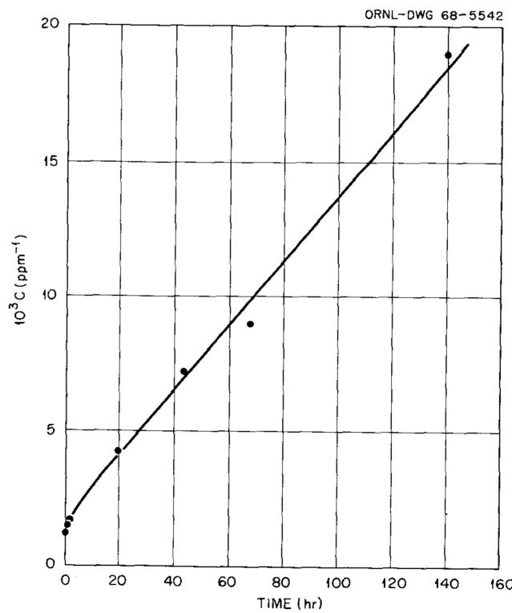  
Fig. 11.2. Removal of $\mathsf{Mo}^{3+}$ from Molten 2LiF-BeF $_2$ .

Table 11.6. Kinetic Behavior of ${\mathrm{{Mo}}}^{3 + }$ in $2\mathrm{{LiF}} \cdot  {\mathrm{{BeF}}}_{2}$   

<table><tr><td>Temperature of Sample (°C)</td><td>Type of Sample</td><td>Length of Time After Addition of Molybdenum Salt (hr)</td><td>Molybdenum by Wet Chemistry (ppm)</td><td>Molybdenum by Spectroscopic Analysis (ppm)</td><td>Molybdenum by Activation Analysis (ppm)</td><td>Copper by Wet Chemistry (ppm)</td><td>Copper by Spectroscopic Analysis (ppm)</td></tr><tr><td colspan="8">First Run</td></tr><tr><td rowspan="6">500</td><td>Filtered</td><td>0.15</td><td>620</td><td>300</td><td>638,621</td><td></td><td>500</td></tr><tr><td>Filtered</td><td>3/4</td><td>810</td><td>300</td><td>845,896</td><td></td><td>30</td></tr><tr><td>Filtered</td><td>2</td><td>820</td><td>700</td><td>770,908</td><td></td><td>500</td></tr><tr><td>Filtered</td><td>6</td><td>810</td><td>700</td><td>836,819</td><td></td><td>100</td></tr><tr><td>Filtered</td><td>23</td><td>810</td><td>500</td><td>752,743</td><td></td><td>100</td></tr><tr><td>Unfiltered</td><td>23</td><td>800</td><td>500</td><td>846,839</td><td></td><td>100</td></tr><tr><td colspan="8">Second Run</td></tr><tr><td>500</td><td>Filtered</td><td>2</td><td>690</td><td>700</td><td></td><td>113</td><td>100</td></tr><tr><td>500–700</td><td>Filtered</td><td>2.5</td><td>510</td><td>400</td><td></td><td>64</td><td>70</td></tr><tr><td>700</td><td>Filtered</td><td>3.5</td><td>440</td><td>300</td><td></td><td>183</td><td>200</td></tr><tr><td>700</td><td>Filtered</td><td>7</td><td>390</td><td>300</td><td></td><td>50</td><td>50</td></tr><tr><td>700</td><td>Filtered</td><td>24</td><td>190</td><td>100</td><td></td><td>208</td><td>100</td></tr><tr><td>700</td><td>Unfiltered</td><td>24</td><td>250</td><td>200</td><td></td><td>81</td><td>70</td></tr><tr><td>700a</td><td>Filtered</td><td>27</td><td>&lt;10</td><td>&lt;100</td><td></td><td>41</td><td>70</td></tr><tr><td>700a</td><td>Unfiltered</td><td>27</td><td>20</td><td>&lt;100</td><td></td><td>396</td><td>500</td></tr></table>

${}^{a}$ Reduced molybdenum in melt with ${\mathrm{H}}_{2}$ .

raised to $700^{\circ}$ . In this case there was a definite decrease in the molybdenum concentration in the filtered samples. The unfiltered samples contained more molybdenum than the filtered ones, suggesting that metallic molybdenum was present and that it was being excluded by the filter. To further confirm that the metallic molybdenum was not passing the filter, the sample was reduced with an excess of hydrogen. No molybdenum was detected in the filtered reduced sample but was found easily in the unfiltered sample, suggesting that part of the metallic molybdenum was suspended in the melt but not passed by the filter. The copper analyses do not appear to have a trend with time. The scatter of the wet copper analyses was greater than expected from the analytical procedure and is probably an artifact of the sampling technique, which involves a copper filter. Unfiltered samples of $2\mathrm{LiF - BeF}_2$ taken in a nickel tube with and without $\mathrm{Mo}^{3+}$ were not

found to contain copper. The absence of a copper concentration increase with time and the level of concentration both indicate that the decrease in molybdenum concentration was not caused by $\mathsf{MoF}_3$ reduction by copper.

The effect of the helium flow rate $(\mathsf{MoF}_6$ removed rate) on the kinetic behavior of $\mathsf{Mo}^{3+}$ in molten $2\mathsf{LiF}\cdot \mathsf{BeF}_2$ was investigated in runs 3 and 4. The data in Table 11.7 and Fig. 11.2 indicate that the molybdenum was removed from the $2\mathsf{LiF}\cdot \mathsf{BeF}_2$ by a second-order process, the most likely event being

$$
2 \mathrm {M o F} _ {3} \rightleftharpoons \mathrm {M o} + \mathrm {M o F} _ {6} \uparrow .
$$

The rate constant $k$ in the relation

$$
k = \left(\frac {1}{c} - \frac {1}{c _ {0}}\right) \frac {1}{t} \tag {1}
$$

Table 11.7. Kinetic Behavior of ${\mathrm{{Mo}}}^{3 + }$ in 2LiF-BeF ${}_{2}$   

<table><tr><td>Temperature of Sample (℃)</td><td>Length of Time After Temperature Is Raised from 500°C (hr)</td><td>Molybdenum by Wet Chemistry (ppm)</td></tr><tr><td colspan="3">Third Run</td></tr><tr><td>500</td><td>0</td><td>806</td></tr><tr><td>690</td><td>3/4</td><td>663</td></tr><tr><td>700</td><td>13/4</td><td>570</td></tr><tr><td>700</td><td>41/4</td><td>465</td></tr><tr><td>700</td><td>20</td><td>240</td></tr><tr><td>700</td><td>44</td><td>140</td></tr><tr><td>700</td><td>68</td><td>112</td></tr><tr><td>700</td><td>140</td><td>53</td></tr><tr><td colspan="3">Fourth Run</td></tr><tr><td>500</td><td>6</td><td>158</td></tr><tr><td>700</td><td>1/2</td><td>137</td></tr><tr><td>700</td><td>11/2</td><td>98</td></tr><tr><td>700</td><td>25/6</td><td>73</td></tr><tr><td>700</td><td>191/6</td><td>43</td></tr><tr><td>700</td><td>431/6</td><td>16</td></tr><tr><td>700</td><td>671/6</td><td>14</td></tr></table>

$(c = \text{concentration of Mo}^{3+})$ has the value $1.2 \times 10^{-4} \, \text{ppm}^{-1} \, \text{hr}^{-1}$ for a helium flow rate of $\frac{3}{4}$ liter/hr at $700^{\circ}$ and $1.2 \times 10^{-3} \, \text{ppm}^{-1} \, \text{hr}^{-1}$ for 12 liters/hr at $700^{\circ}$ C.

If one makes the steady-state assumptions for reaction (1) that the concentration of $\mathrm{MoF}_6$ was constant and very low compared with the concentration of $\mathrm{Mo}^{3+}$ , then $k$ takes the form $a t / (b + d f)$ , where $a$ is the rate constant for the forward reaction, $b$ is the rate constant for the back reaction, $d$ is a constant, and $f$ is the flow rate. If $b << d f$ , that is, if the back reaction is unimportant, then the rate expression reduces to

$$
\frac {d c}{d t} = - \frac {a}{d} c ^ {2},
$$

which suggests that the flow rate is unimportant. Since, experimentally, the flow rate had a great

effect, the back reaction was involved significantly in the kinetic behavior of $\mathbf{Mo}^{3+}$ , $b$ is the order of $df$ or larger, and $k_{2}/k_{1} \leq f_{2}/f_{1}$ , consistent with the experimental values

$$
\frac {k _ {2}}{k _ {1}} = \frac {1 . 2 \times 1 0 ^ {- 3} \mathrm {h r} ^ {- 1} \mathrm {p p m} ^ {- 1}}{1 . 2 \times 1 0 ^ {- 4} \mathrm {h r} ^ {- 1} \mathrm {p p m} ^ {- 1}} = 1 0
$$

for

$$
\frac {f _ {2}}{f _ {1}} = \frac {1 2 \text {l i t e r s / h r}}{0 . 7 5 \text {l i t e r / h r}} = 1 6.
$$

The first two points (at 0 and $0.75\mathrm{hr}$ ) in Fig. 11.2 are associated with a lower temperature, since the heatup from 500 to $700^{\circ}\mathrm{C}$ was involved. However, since the rates were faster at the lower temperatures and since the rates are known to increase with temperature, the short-term effect must have another explanation. Apparently this was the period necessary to establish the steady-state condition. These kinetic experiments will be continued with the following objectives:

1. To determine effects of $\mathbf{U}\mathbf{F}_{4},\mathbf{U}\mathbf{F}_{3},\mathbf{Z}\mathbf{r}\mathbf{F}_{4},$ and $\mathrm{ThF}_4$ additions as well as INOR-8 and graphite on the rate and extent of removal of molybdenum from the melt.   
2. To identify and determine the fate of the volatile species.   
3. To obtain the corresponding information for niobium, technetium, and ruthenium.

# 11.2 MASS SPECTROMETRY OF THE MOLYBDENUM FLUORIDES

R.A.Strehlow

J. D. Redman

The mass spectrometric study of molybdenum fluoride vaporization behavior was continued. Previous work $^{12}$ was conducted with a conventional Knudsen cell suitable for the study of low-vapor-pressure solids. This cell was not suitable for study of gaseous species at elevated temperature. Accordingly a cell (made of nickel) was constructed which permitted addition of gases directly into the cell region. Using the new cell, the mass spectrum due to admitted $\mathrm{MoF}_6$ was obtained at

Table 11.8. Mass Spectrometric Cracking Patterns for Molybdenum Fluorides and Oxyfluorides   

<table><tr><td colspan="2">MoF6</td><td colspan="2">MoF5</td><td colspan="2">MoF4</td><td colspan="2">MoOF4a</td><td colspan="2">MoO2F2</td></tr><tr><td>Ion</td><td>Intensity</td><td>Ion</td><td>Intensity</td><td>Ion</td><td>Intensity</td><td>Ion</td><td>Intensity</td><td>Ion</td><td>Intensity</td></tr><tr><td>MoF5+</td><td>100</td><td>MoF5+</td><td>&lt;7</td><td>MoF3+</td><td>100</td><td>MoOF3+</td><td>100</td><td>MoO2F2+</td><td>100</td></tr><tr><td>MoF4+</td><td>32</td><td>MoF4+</td><td>100</td><td>MoF2+</td><td>15</td><td>MoF3+</td><td>6</td><td>MoO2F+</td><td>65</td></tr><tr><td>MoF3+</td><td>19</td><td>MoF3+</td><td>56</td><td>MoF+</td><td>10</td><td>MoOF2+</td><td>10+</td><td>MoOF2+</td><td>6</td></tr><tr><td>MoF2+</td><td>15</td><td>MoF2+</td><td>18</td><td>Mo+</td><td>10</td><td>MoF2+</td><td>11</td><td>MoF22+</td><td>2</td></tr><tr><td>MoF+</td><td>11</td><td>MoF+</td><td>8</td><td></td><td></td><td>MoOF+</td><td>10</td><td>MoOF+</td><td>23</td></tr><tr><td>Mo+</td><td>8</td><td>Mo+</td><td>8</td><td></td><td></td><td>MoF+</td><td>9</td><td>MoF+</td><td>5</td></tr><tr><td></td><td></td><td></td><td></td><td></td><td></td><td>MoO+</td><td>3.5</td><td>MoO+</td><td>7</td></tr><tr><td></td><td></td><td></td><td></td><td></td><td></td><td>Mo+</td><td>5</td><td>Mo+</td><td>16</td></tr></table>

${}^{a}$ This assignment is not certain; ${\mathrm{{MoOF}}}_{3}$ is possible.

various temperatures from 30 to $850^{\circ}\mathrm{C}$ . The cracking pattern at $30^{\circ}\mathrm{C}$ differed only slightly from that obtained earlier and is reported in Table 11.8. With a steady rate of $\mathrm{MoF}_6$ admission to the cell containing molybdenum wire, an increase in temperature resulted first in production of $\mathrm{MoF}_5$ and, at higher temperatures, increasing amounts of $\mathrm{MoF}_4$ . This behavior paralleled that of $\mathrm{MoF}_3$ (which was studied using the earlier cell design) except for the presence of dimeric impurity in the $\mathrm{MoF}_6$ sample. The dimer, which has a principal peak family corresponding to $\mathrm{Mo}_2\mathrm{F}_9^+$ , may have as a neutral precursor $\mathrm{Mo}_2\mathrm{F}_9^0$ or $\mathrm{Mo}_2\mathrm{F}_{10}^0$ . The mass spectroscopic evidence alone is not adequate to distinguish between these possibilities.

The rather striking similarity of results from the $\mathsf{MoF}_3$ and the $\mathsf{MoF}_6$ studies is shown in Fig. 11.3, which displays the derived percentages of the species $\mathsf{MoF}_6$ , $\mathsf{MoF}_5$ , and $\mathsf{MoF}_4$ as a function of temperature for both the tri- and hexafluoride. The data for $\mathsf{MoF}_6$ exclude the dimer. The difference in free energy of formation between $\mathsf{MoF}_5$ and $\mathsf{MoF}_4$ is clearly very slight, since their relative amount varies only slowly with temperature. The earlier conclusion that kinetic factors dominate the descriptive chemistry of these materials is still valid, although we have obtained data indicating

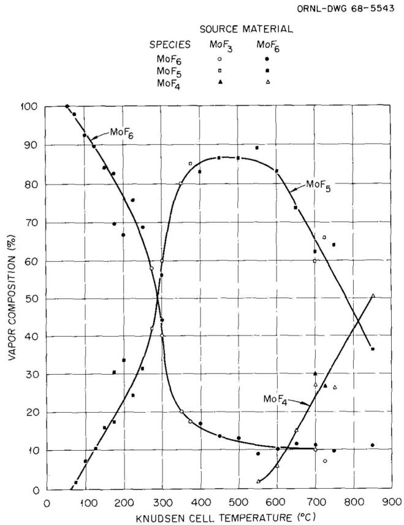  
Fig. 11.3. Monomeric Vapor Species over $\mathsf{MoF}_6$ vs Cell Temperature.

that some thermochemical relations can be derived for the Mo-F system.

The dimer $\mathbf{Mo}_2\mathbf{F}_{10}^1$ was not the only dinuclear fluoride observed. During admission of $\mathbf{MoF}_6$ an erosion of the tantalum heat shields in the Knudsen cell assembly occurred and was evidenced by the presence of $\mathbf{MoTaF}_9^+$ ions in the spectrum as well as by subsequent examination of the tantalum elements.

Continued work on the molybdenum fluoride system will include a more complete treatment of the data obtained so far and consideration of the approach needed to obtain the desired thermochemical and kinetic data for this system. Some other fission product fluoride and oxyfluoride systems will also be examined.

# 11.3 SPECTROSCOPIC STUDIES OF FISSION PRODUCT FLUORIDES

L.M.Toth J.P.Young

G. P. Smith

Because spectrophotometry offers a direct measurement of fission products such as the lower-valent niobium and molybdenum fluorides, a study of their spectra has been undertaken in the windowless cell developed by J. P. Young. $^{13}$ This cell has the advantage that the melt need only be exposed to a container which has been selected on the basis of the melt's reactivity with it. For this reason graphite and copper windowless cells have been selected for use with MoF $^{14}$ and NbF $_{4}$ solutes in LiF-BeF $_{2}$ (66-34 mole%). $^{15}$

The original intent was to compare the spectra of $\mathbf{NbF}_4$ and $\mathbf{MoF}_3$ with the ligand-field spectra of $d^1$ and $d^3$ configurations, respectively, in octahedral symmetry.

Initial attempts to dissolve 0.1 wt % concentrations of $\mathbf{MoF}_3$ in $\mathbf{L}_2\mathbf{B}^{16}$ failed due to the formation of a finely divided precipitate which required 16 to 24 hr to settle out. After it had settled, no spectrum was evident in the $\mathbf{L}_2\mathbf{B}$ . The cause of

the precipitate has been attributed to the formation of insoluble molybdenum oxides or oxy-fluorides.

Successful dissolution of $\mathbf{MoF}_3$ in $\mathbf{L}_2\mathbf{B}$ has been achieved by first treating the solvent with $\mathrm{SiF}_4$ and filtering it through a quartz frit. The spectra of such solutions display peaks at 350 and $470\mathrm{m}\mu$ which are not inconsistent with those expected for a $d^3$ cation in octahedral symmetry. To verify that this spectrum is not due to contributions from $\mathrm{SiF}_4$ , it was compared with one produced by a sample taken from the molybdenum fluoride kinetic studies of C. F. Weaver and H. A. Friedman. $^{17}$ Although the latter sample yielded only a very weak spectrum, similar absorbancies at 350 and $470\mathrm{m}\mu$ could be identified. The poor intensity of this spectrum has been tentatively attributed to the fact that much $\mathrm{MoF}_3$ had precipitated out due to oxide contamination of the sample. Experiments are currently under way to demonstrate this further as well as to establish a quantitative value for the absorption coefficients at 350 and $470\mathrm{m}\mu$ . With these values, limits of spectroscopic detectability will be available. Further experiments will be made in an attempt to demonstrate conclusively that the spectrum is due to dissolved $\mathrm{MoF}_3$ in octahedral symmetry.

Niobium tetrafluoride is apparently sparingly soluble in $\mathbf{L}_2\mathbf{B}$ . Presently, only a very weak spectrum has been obtained which displays a single absorbance at $350~\mathrm{m}\mu$ . This spectrum is, however, similar to that produced by $\mathbf{NbF}_4$ in molten $\mathbf{NbF}_5$ . Further work shall endeavor to circumvent the solvation problems by generation of $\mathbf{NbF}_4$ in solution.

Additional information available from the spectroscopic studies includes the compatibility of the solutions with the container materials. In reactor-grade graphite, the spectrum attributed to $\mathbf{MoF}_3$ disappears completely within 4 hr at $650^{\circ}\mathrm{C}$ according to first-order kinetics. No intermediate spectra have been seen during this reaction. On the basis that the same solution shows no perceptible change under similar conditions in a hydrogen-fired copper container, reaction with the graphite is suggested. Further experiments will describe the stability of the solutions in more detail.

# 11.4 PREPARATION OF NIOBIUM PENTAFLUORIDE

L.M.Toth H.A.Friedman

C. F. Weaver

Because of the lack of information concerning the behavior of fission product fluorides in the MSRE, their chemistry in molten fluoride solutions is being actively pursued. One such study is concerned with niobium and its fluorides.[19]

Niobium pentafluoride has been the most convenient starting point for the synthesis of lower niobium fluorides as well as a low-temperature solvent for the lower niobium fluorides.[19] It had been previously prepared in a flow system at $250^{\circ}\mathrm{C}$ by passing fluorine over niobium powder in a Monel reaction vessel,[20] but this procedure would have taken several days reaction time for the hundred-gram quantities of product required.

It was found in this work that decreasing the reaction temperature accelerated the reaction rate to the point that it could be completed within 8 hr. This is to be expected for an exothermic reaction which involves a decrease in the entropy of the system:

$$
\mathrm {N b} + 5 / 2 \mathrm {F} _ {2} \rightarrow \mathrm {N b F} _ {5}.
$$

The effect also provides a built-in safety device in which the reaction rate decreases abruptly if the temperature goes too high.

The synthesis was performed in a two-chamber Monel reaction tube which was entirely sealed except for the $\mathbf{F}_2$ inlet valve. The $\mathbf{F}_2$ was admitted at a constant rate into the reaction chamber, containing powdered niobium metal at 70 to $100^{\circ}\mathrm{C}$ , and the $\mathrm{NbF}_5$ sublimed into the other chamber, which was at room temperature.

Niobium oxyfluorides present as impurities were then removed from the product by resublimation of the $\mathrm{NbF}_{5}$ at $100^{\circ}$ .

# 12. Physical Chemistry of Molten Salts

# 12.1 THERMODYNAMICS OF LiF-BeF $_2$ MELTS BY EMF MEASUREMENTS

B. F. Hitch C. F. Baes, Jr.

A potentiometric study has been completed of the cell

$$
\mathrm {B e} ^ {0} \mid \mathrm {B e F} _ {2}, \mathrm {L i F} \mid \mathrm {H} _ {2}, \mathrm {H F}, \mathrm {P t},
$$

for which the cell reaction

$$
\mathrm {B e} ^ {0} (\mathrm {c}) + 2 \mathrm {H F} (g) \rightleftharpoons \mathrm {B e F} _ {2} (d) + \mathrm {H} _ {2} (g)
$$

was assumed. These measurements extended over the composition range 0.30 to 0.90 mole fraction $\mathrm{BeF}_2$ and over temperatures in the range 500 to $900^{\circ}\mathrm{C}$ (Fig. 12.1).

Since the cell potential $E$ should be related to the activity of $\mathbf{BeF}_2$ in the melt by

$$
E = E ^ {\circ} - \frac {R T}{2 ^ {\text {日}}} \ln \left[ \frac {P _ {\mathrm {H} _ {2}} a _ {\mathrm {B e F} _ {2}}}{P _ {\mathrm {H F}} ^ {2}} \right]
$$

activity coefficients could be derived for $\mathrm{BeF}_2$ (and by a Gibbs-Duhem integration for LiF). Usefully accurate measurements could not be made with pure $\mathrm{BeF}_2$ in the cell because of its very high viscosity; hence values of $E^0$ were calculated using values for $a_{\mathrm{BeF}_2}$ derived from the phase diagram and a reported heat of fusion $^2$ of 1.13 kcal/mole. This gave, in volts,

$$
E ^ {\circ} = 2. 4 4 3 0 - 0. 0 0 0 7 9 5 2 T.
$$

This comparison of the emf data with the $\mathbf{LiF - BeF}_2$ phase diagram also indicated that the heat of fusion for $\mathbf{BeF}_2$ is $< 2.0\mathrm{kcal / mole}$

A power series in $x_{\mathrm{LiF}}$ was assumed for log $\gamma_{\mathrm{BeF}_2}$ , and the coefficients were determined by a least-squares fit to the data. This gave (Fig. 12.2)

$$
\begin{array}{l} \log y _ {\mathrm {B e F} _ {2}} = \left(3. 8 7 8 0 - \frac {2 3 5 3 . 5}{T}\right) x _ {\mathrm {L i F}} ^ {2} \\ + \left(- 4 0. 7 3 7 5 + \frac {3 6 2 9 2 . 8}{T}\right) x _ {\mathrm {L i F}} ^ {3} \\ + \left(9 4. 3 9 9 7 - \frac {8 4 8 7 0 . 9}{T}\right) x _ {\mathrm {L i F}} ^ {4} \\ + \left(- 6 7. 4 1 7 8 + \frac {5 2 9 2 3 . 5}{T}\right) x _ {\mathrm {L i F}} ^ {5}. \\ \end{array}
$$

A Gibbs-Duhem integration of this expression gives for $\gamma_{\mathrm{LiF}}$

$$
\begin{array}{l} \log y _ {\mathrm {L i F}} = 0. 9 3 8 4 - \frac {2 3 2 . 0 8}{T} \\ + \left(- 3 6. 9 7 3 4 + \frac {1 4 6 5 2 . 7}{T}\right) x _ {\mathrm {B e F} _ {2}} ^ {2} \\ + \left(1 2 6. 0 9 4 7 - \frac {7 4 5 8 8 . 5}{T}\right) x _ {\mathrm {B e F} _ {2}} ^ {3} \\ + \left(- 1 5 8. 4 1 7 3 + \frac {1 1 3 5 9 2 . 3}{T}\right) x _ {\mathrm {B e F} _ {2}} ^ {4} \\ + \left(6 7. 4 1 7 8 - \frac {5 2 9 2 3 . 5}{T}\right) x _ {\mathrm {B e F} _ {2}} ^ {5}. \\ \end{array}
$$

(The integration constant was determined from the LiF liquidus in the LiF-BeF $_2$ system.) Formation free energies and heats for BeF $_2$ and BeO were also

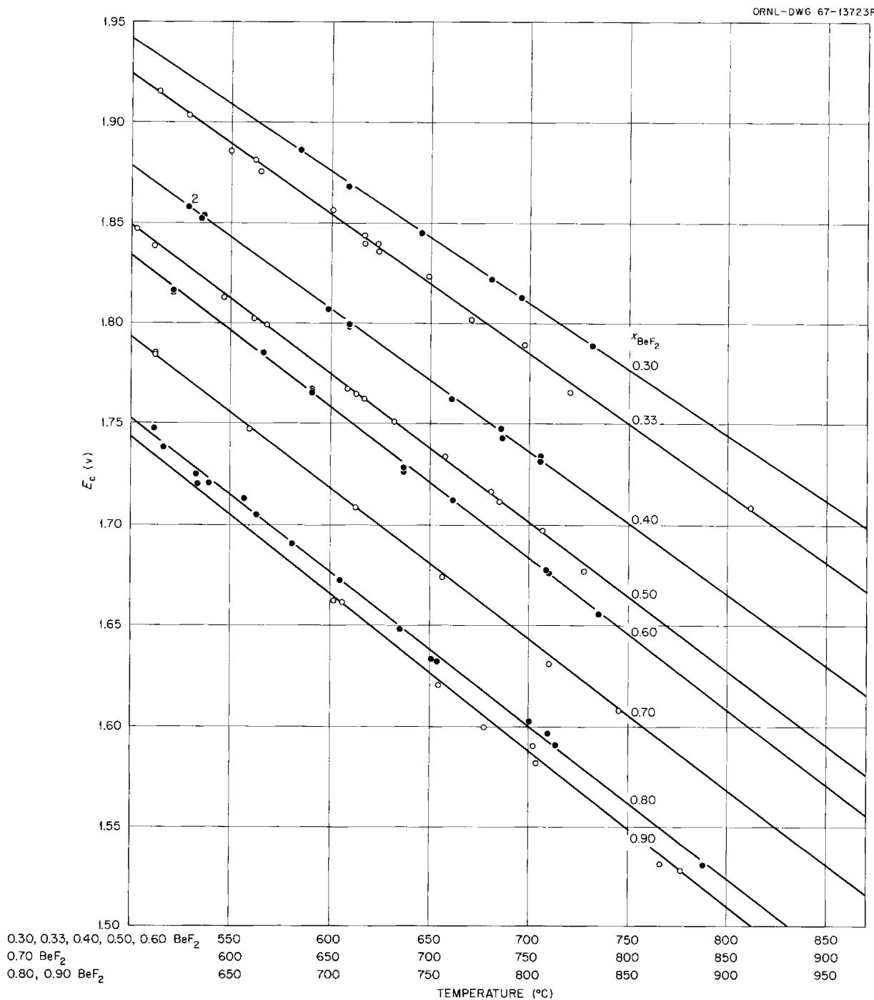  
Fig. 12.1. Measured Cell Potentials, Corrected to a Unit Value of the Pressure Quotient $P_{\mathsf{H}_2} / P_{\mathsf{HF}}^2$ , as a Function of Temperature at Various LiF-BeF $_2$ Melt Compositions:

$$
E _ {c} = E + \frac {R T}{2 ^ {\prime}} \ln \left(P _ {H _ {2}} / P _ {H F} ^ {2}\right)
$$

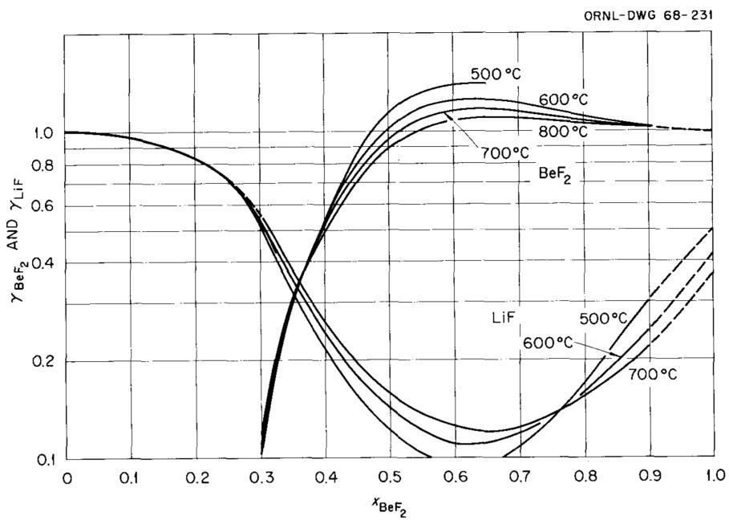  
Fig. 12.2. Activity Coefficients of $\mathsf{BeF}_2$ and LiF Derived from the EMF Measurements.

Table 12.1. Formation Heats and Free Energies of $\mathsf{BeF}_2$ and BeO   

<table><tr><td rowspan="2">Compound</td><td rowspan="2">Temperature (°K)</td><td rowspan="2">State</td><td colspan="2">ΔHf(kcal/mole)</td><td colspan="2">ΔGf(kcal/mole)</td></tr><tr><td>Present Work</td><td>JANAFa</td><td>Present Work</td><td>JANAFa</td></tr><tr><td rowspan="3">BeF2</td><td>298</td><td>Crystalline</td><td>-246.01</td><td>-242.30(±2.0)</td><td>-234.39</td><td>-230.98(±2.0)</td></tr><tr><td>900</td><td>Liquid</td><td>-243.12(±1.1)</td><td></td><td>-211.90(±1.1)</td><td></td></tr><tr><td>1000</td><td>Liquid</td><td>-242.54</td><td></td><td>-208.47</td><td></td></tr><tr><td rowspan="3">BeO</td><td>298</td><td>Crystalline</td><td>-145.85</td><td>-143.10(±0.1)</td><td>-138.36</td><td>-136.12(±0.1)</td></tr><tr><td>900</td><td>Crystalline</td><td>-145.57(±1.5)</td><td></td><td>-123.20(±1.5)</td><td></td></tr><tr><td>1000</td><td>Crystalline</td><td>-145.46</td><td></td><td>-120.73</td><td></td></tr></table>

$^a$ Reference 3.

calculated (Table 12.1) by combining the results of the present study with available thermochemical data3 for HF and $\mathrm{H}_2\mathrm{O}$ and with the results of a previous study4 of the equilibrium

$$
2 \mathrm {H F} (\mathfrak {g}) + \operatorname {B e O} (\mathrm {c}) \rightleftharpoons \operatorname {B e F} _ {2} (d) + \mathrm {H} _ {2} \mathrm {O} (\mathfrak {g}).
$$

The $\mathbf{Be}^{2+}|\mathbf{Be}^0$ and the $\mathrm{HF},\mathrm{H}_2|\mathbf{F}^-$ electrodes used in this study performed acceptably for use as reference electrodes, both being stable and reproducible.

# 12.2 ELECTROLYSIS OF LiF-BeF $_2$ MIXTURES WITH A BISMUTH CATHODE

K.A.Romberger J.Braunstein

Experiments have been initiated on the electrolysis of LiF-BeF $_2$ mixtures with a bismuth cathode

in a silica cell. The purpose of these experiments is (1) to develop lithium-bismuth alloy electrodes containing about 0.1 at. $\%$ lithium as reference electrodes for equilibrium and nonequilibrium electrochemical measurements in molten fluorides, (2) to ascertain the compatibility of lithium-bismuth alloys with silica containers, and (3) to determine whether reduced bismuth species are present in melts contacted with lithium-bismuth alloys under conditions proposed for extraction processes for the single-region MSBR.5 (At very much higher lithium concentrations in bismuth, that is, with saturated alloys, there have been indications of the dissolution of reduced bismuth species in LiCl-LiF mixtures.6)

In a preliminary experiment, $41\mathrm{g}$ (1.2 moles) of $\mathrm{LiF - BeF}_2$ (66-34 mole %) which had previously been purified for use with the MSRE7 was electrolyzed, under a helium blanket, between a bismuth cathode (99.999% Bi, hydrogen fired at $600^{\circ}\mathrm{C}$ to reduce any oxide) and a graphite anode isolated from the main portion of the melt in a silica J-tube. Forty-one grams of bismuth was used as the cathode, and the temperature was $473^{\circ}\mathrm{C}$ . Approximately 160 coulombs were passed ( $\sim 1.7 \times 10^{-3}$ equivalent), enough to produce about 0.8 at. $\%$ lithium-bismuth alloy if the current efficiency were $100\%$ . The current density was $2 \times 10^{-3} \mathrm{amp/cm}^2$ . The silica cell permitted visual observation of the melt and electrodes during the electrolysis. From the inception of electrolysis, gas bubbles were formed at the cathode (possibly hydrogen from the reduction of residual HF, which had been used in the purification of the salt,7 or traces of $\mathrm{OH}^-$ ). A black deposit was formed which partially covered the surface of the bismuth cathode. Chemical analysis of the phases has not been completed, but it is believed that the black deposit was metallic beryllium. Because of the low rate of diffusion of lithium from the surface into the bulk of the bismuth, the local activity of lithium at the surface may have been high enough to permit beryllium, which is insoluble in bismuth, to deposit on the surface.

Samples of salt were withdrawn for analysis after passing about 40 coulombs and again after about 160 coulombs (equivalent to about 0.2 and 0.8 at $\%$ respectively, lithium in bismuth). Preliminary analytical results showed that the bismuth content of the salt samples was below the limit of detection of $10~\mathrm{ppm}$ . There was no visible attack of the silica by the metal phase. Experiments are continuing, to evaluate the behavior of the lithium-bismuth electrodes and to elucidate the electrochemical behavior of bismuth in molten fluorides.

# 12.3 REVIEW OF ELECTRICAL CONDUCTIVITIES IN MOLTEN FLUORIDE SYSTEMS

G. D. Robbins

A review of electrical conductivity measurements in molten fluoride systems covering the period 1927 to 1967 has been made. The results may be summarized as follows:

1. Because of the high specific conductance of most molten salts (1 to 6 ohms $^{-1}$ cm $^{-1}$ ), one of two experimental approaches is usually employed: the use of capillary-containing cells, which results in a measured resistance of several hundred ohms, or the use of metallic cells in which the container is one electrode with a second electrode positioned in the melt. Measured resistances in the latter type of cells are less than 1 ohm. Boron nitride encased in graphite has been successfully employed in capillary construction, while platinum, platinum-rhodium (20%), Inconel, molybdenum, and graphite have been used for container and electrode materials.   
2. The common practice of measuring resistance with a Wheatstone bridge having a parallel re

sistance and capacitance in the balancing arm can result in considerable error if the relation for resistive and phase balance,

$$
R _ {p} = R _ {s} \left[ 1 + R _ {p} ^ {2} C _ {p} ^ {2} (2 \pi f) ^ {2} \right],
$$

is not employed in determining the solution resistance. In this expression $R_{p}$ and $C_{p}$ are the parallel balancing resistance and capacitance, $R_{s}$ is the solution resistance, and $f$ is the measuring frequency. Use of this correction can be avoided by employing a bridge with the balancing resistance and capacitance in series.

3. The practice of measuring resistance at a series of frequencies and extrapolating to infinite frequency as a function of $f^{-1/2}$ is examined in terms of electrode process concepts. Some authors followed this procedure,[15,16] while others found no appreciable variation of resistance with frequency (refs. 11-13, 17, 18). Unfortunately, the majority of investigators did not address themselves to this question. (Research on the frequency dispersion of electrical conductivity in molten salts is continuing in this laboratory.)   
4. Table 12.2 lists some values of the specific conductance $\kappa$ and the equivalent conductance $\Lambda^{\mathrm{eq}}$ of those alkali-metal and alkaline-earth fluorides which have been reported. $^{11-13,15,17-23}$ These quantities are defined as

$$
\kappa = \frac {1}{R} (1 / a),
$$

$$
\Lambda^ {\mathrm {e q}} = \kappa \frac {\mathrm {e q} \mathrm {w t}}{\rho},
$$

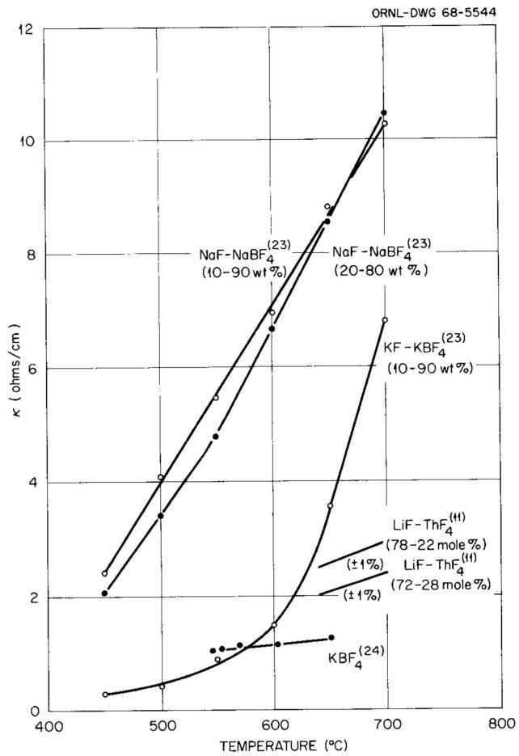  
Fig. 12.3. Specific Conductances of Some MSRE-Related Systems.

where $R$ is the resistance, $l / a$ is the cell constant, and $\rho$ is the density of the molten fluoride at the measuring temperature.

Specific conductance as a function of temperature is shown in Fig. 12.3 for several LiF- $\mathrm{ThF}_4$ mixtures and alkali fluoride-alkali fluoroborate mixtures of relevance to the Molten-Salt Reactor Program. (Insufficient experimental details are contained in ref. 24 to permit a critical evaluation of the data from this source.)

Table 12.2.   

<table><tr><td>System</td><td>Reference</td><td>T(℃)</td><td>θa</td><td>κ(ohms-1cm-1)</td><td>Λeq(cm2ohms-1eq-1)</td></tr><tr><td rowspan="6">LiF</td><td>19</td><td>847-1027</td><td></td><td>3.805 + 1.004 × 10-2T(℃) - 3.516 × 10-6T2b</td><td></td></tr><tr><td>12,13</td><td>900</td><td>1.05</td><td>8.43 (±1%)</td><td>128</td></tr><tr><td>23</td><td>875</td><td></td><td>8.663</td><td></td></tr><tr><td></td><td>958</td><td></td><td>9.058</td><td></td></tr><tr><td></td><td>1037</td><td></td><td>9.306</td><td></td></tr><tr><td>11</td><td>870-1010</td><td>1.2</td><td>9.06 + 5.83 × 10-3(T - 870°C) (±1%)</td><td>160.8</td></tr><tr><td rowspan="8">NaF</td><td>15</td><td>1000</td><td></td><td>5.52} (±several %)</td><td>118</td></tr><tr><td></td><td>1040</td><td></td><td>5.74}</td><td></td></tr><tr><td></td><td>1080</td><td></td><td>5.95}</td><td></td></tr><tr><td>12,13</td><td>1020</td><td>1.05</td><td>5.15 (±1%)</td><td>113</td></tr><tr><td>23</td><td>1003</td><td></td><td>4.960</td><td></td></tr><tr><td></td><td>1086</td><td></td><td>5.179</td><td></td></tr><tr><td></td><td>1138</td><td></td><td>5.335</td><td></td></tr><tr><td>11</td><td>1030-1090</td><td>1.2</td><td>5.29 + 5.64 × 10-3(T - 1030°C) (±1%)</td><td>156.6</td></tr><tr><td rowspan="6">KF</td><td>19</td><td>869-1040</td><td></td><td>-3.493 + 1.480 × 10-2T(℃) - 6.608 × 10-6T2c</td><td></td></tr><tr><td>12,13</td><td>900</td><td>1.05</td><td>3.80 (±1%)</td><td>124</td></tr><tr><td>23</td><td>859</td><td></td><td>3.573</td><td></td></tr><tr><td></td><td>938</td><td></td><td>3.793</td><td></td></tr><tr><td></td><td>1012</td><td></td><td>4.021</td><td></td></tr><tr><td>20</td><td>905</td><td></td><td>3.77 (±2%)</td><td></td></tr><tr><td rowspan="4">CSF</td><td>19</td><td>725-921</td><td></td><td>-4.511 + 1.642 × 10-2T(℃) - 7.632 × 10-6T2c</td><td></td></tr><tr><td>21</td><td>737</td><td></td><td>2.51</td><td></td></tr><tr><td></td><td>784</td><td></td><td>2.73</td><td></td></tr><tr><td></td><td>852</td><td></td><td>3.03</td><td></td></tr><tr><td rowspan="3">BeF2</td><td>17,18</td><td>700</td><td></td><td>0.71 × 10-5</td><td>(±10%)</td></tr><tr><td></td><td>800</td><td></td><td>15.3 × 10-5</td><td></td></tr><tr><td></td><td>950</td><td></td><td>236 × 10-5</td><td></td></tr><tr><td>CaF2</td><td>22</td><td>1020</td><td></td><td>1.57</td><td></td></tr></table>

$$
\theta = \frac {T \text {m e a s u r e d} (^ {\circ} \mathrm {K})}{T \text {m e l t i n g} (^ {\circ} \mathrm {K})}.
$$

$$
^ b S t a n d a r d \quad \text {d e v i a t i o n} = 0. 0 0 8 \quad \mathrm {o h m} ^ {- 1} \quad \mathrm {c m} ^ {- 1}.
$$

$$
^ c S t a n d a r d \quad \text {d e v i a t i o n} = 0. 0 0 9 \mathrm {o h m} ^ {- 1} \mathrm {c m} ^ {- 1}.
$$

# 12.4 MEASUREMENT OF SPECIFIC CONDUCTANCE IN LiF-BeF $_2$ (66-34 MOLE %)

G. D. Robbins J. Braunstein

The silica cell shown in Fig. 12.4 was designed for use in the determination of electrical conductance in molten LiF-BeF $_2$ (66-34 mole%). The

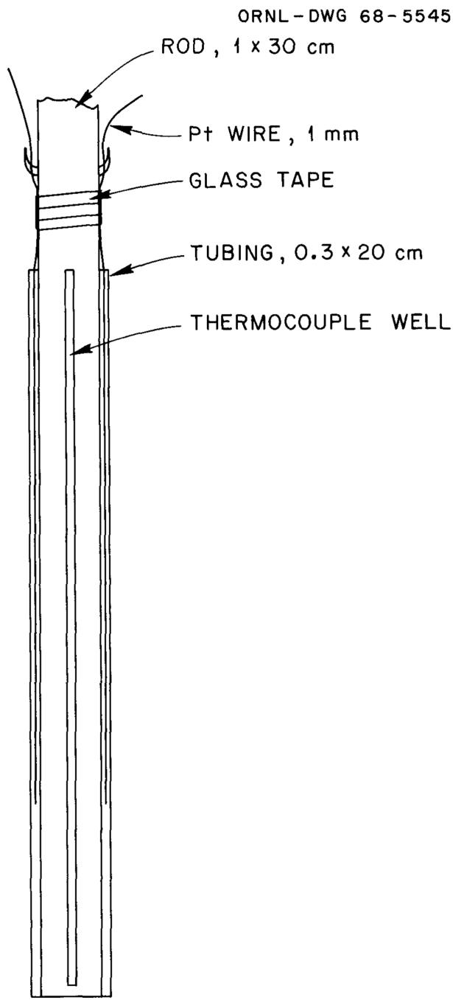  
Fig. 12.4. Silica Conductivity Cell.

small-diameter tubing increased the conduction path and resulted in measured resistances of the order of 100 ohms. A Wheatstone bridge incorporating a variable resistance and capacitance connected in series was constructed, and its use eliminated errors resulting from approximations often employed in conductivity measurements.[25] The platinized platinum electrodes $(d \stackrel{\sim}{=} 1 \mathrm{~mm})$ were held in fixed position relative to the cell assembly by glass tape.

The cell constant, $l / a$ , of the silica cell was determined at 340 and $380^{\circ} \mathrm{C}$ in molten potassium nitrate by measuring the resistance in the frequency range 600 to 4000 hertz and extrapolating to infinite frequency vs $f^{-1 / 2}$ . The observed frequency dependence is shown in Fig. 12.5. From the infinite-frequency resistance $R_{\infty}$ and literature values of the specific conductance $\kappa$ vs temperature for $\mathrm{KNO}_3$ ,[26] the cell constant was determined to be $129 \, \mathrm{cm}^{-1}$ at both temperatures. These quantities are related by the expression

$$
\kappa = \frac {1}{R _ {\infty}} (l / a). \tag {1}
$$

The frequency dependence of measured resistance of $\mathrm{LiF - BeF}_2$ (66-34 mole %) is shown in Fig. 12.6 at several temperatures. The specific conductivity, calculated from the values of resistance at infinite frequency and Eq. (1), is presented in Fig. 12.7 as a function of temperature. From the slope of this line, the temperature coefficient at $500^{\circ}\mathrm{C}$ is calculated to be $3.9\times 10^{-3}(\mathrm{^\circ C})^{-1}$ . Employing the density data of Cantor $^{27}$ and the relation

$$
\Lambda^ {m} = \frac {\operatorname {m o l} \mathrm {w t}}{\text {d e n s i t y}} \kappa , \tag {2}
$$

the molar conductance $\Lambda^m$ at $500^{\circ}\mathrm{C}$ is $25.5\mathrm{cm}^2$ ohms $^{-1}$ moles $^{-1}$ . The measurements were completed during the first hour the cell was in contact with the molten fluoride, and we believe the accuracy to be better than $\pm 10\%$ .

It was observed that in the molten fluoride system the measured resistance increased slowly as a function of time. In a subsequent experiment

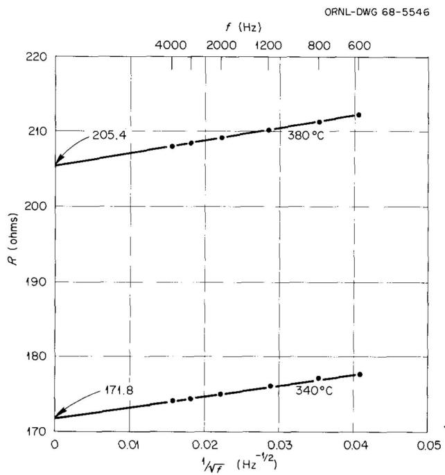

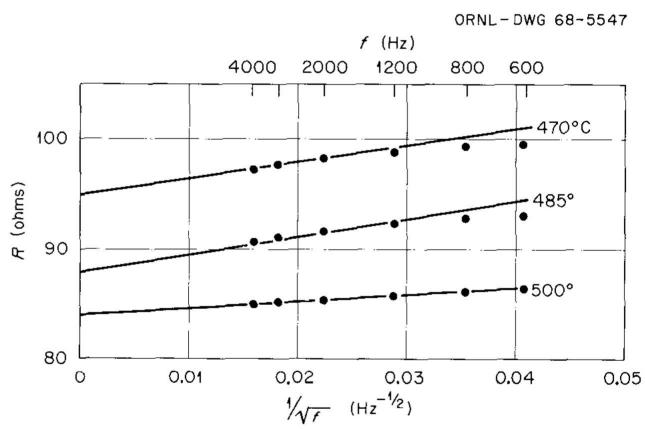  
Fig. 12.5. Measured Resistance vs Frequency in Molten $\mathsf{KNO}_3$ .   
Fig. 12.6. Measured Resistance vs Frequency in Molten LiF-BeF $_2$ (66-34 Mole%).

employing a different cell $[(l / a) = 164(\pm 1)\mathrm{cm}^{-1}]$ and platinized platinum electrodes which had been previously exposed to molten LiF-BeF $_2$ (66-34 mole%), the slopes of the measured resistance vs $f^{-1 / 2}$ plots were investigated as a function of time. The results are shown in Fig. 12.8. The frequency range over which $R$ vs $f^{-1 / 2}$ was linear increased at longer exposure times; however, the

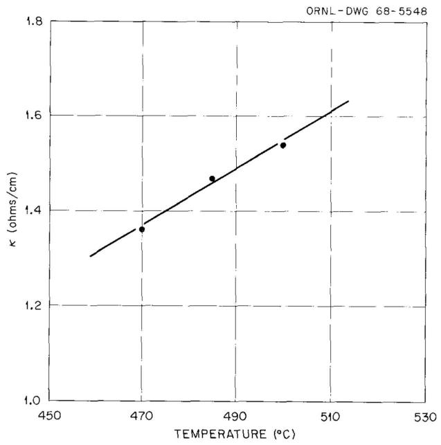

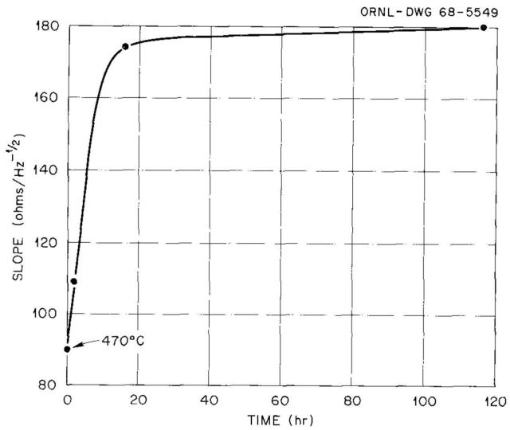  
Fig. 12.7. Specific Conductance vs Temperature for LiF-BeF $_2$ (66-34 Mole%).   
Fig. 12.8. Slope of Measured Resistance vs $t^{-1/2}$ at $485^{\circ} \mathrm{C}$ in LiF-BeF $_2$ (66-34 Mole%).

value of resistance extrapolated to infinite frequency also varied (Fig. 12.9). This cannot be explained in terms of changes in cell constant, since $(l / a)$ was redetermined at the completion of the experiment to be $171\mathrm{cm}^{-1}$ . Investigation of the frequency dependence of measured resistance is proceeding.

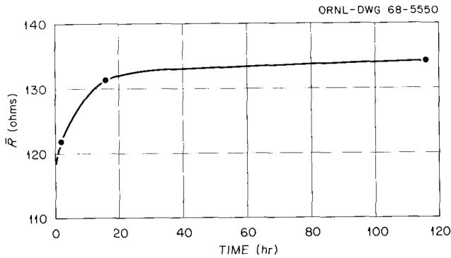  
Fig. 12.9. Values of Resistance Extrapolated to Infinite Frequency vs Time for LiF-BeF $_2$ (66-34 Mole %) at $485^{\circ}\mathrm{C}$ .

# 12.5 A STIRRED REACTION VESSEL FOR MOLTEN FLUORIDES

C. E. Bamberger

C. F. Baes, Jr.

T. J. Golson

J. Nicholson

In the past, gas sparging, stirring, and rocking have been used to provide agitation in studies of heterogeneous equilibria involving molten fluorides. The stirred vessels, while providing the most vigorous mixing, tended to leak at the seal of the stirrer shaft. A rocking furnace or gas sparging did not provide very vigorous agitation.

More recently, the need for an improved reaction vessel became urgent in connection with the planned study of the distribution of $\mathbf{U}^{4+}$ , $\mathbf{Th}^{4+}$ , and $\mathbf{Pa}^{4+}$ between fluoride and oxide phases.[28] The attractiveness of such an extraction system as a protactinium recovery process obviously depends as much on favorable equilibration rates as on favorable equilibrium behavior. But to achieve good extraction rates, one needs good suspension and mixing of the heavy oxide solids with the fluoride salt; this requires a suitably designed mixer.

An improved stirred vessel has therefore been designed and constructed. It includes the following features (Fig. 12.10):

1. The shaft is sealed by means of Teflon chevron rings which are stacked around the shaft and compressed by a nut. This seal is water cooled.

2. The upper (cool) shaft bearing is a sleeve of oil-impregnated metal. The lower (hot) bearing is a sleeve of graphite.   
3. The stirrer is driven by a flexible cable connected to a variable-speed dc motor. It allows controlled stirrer speeds in the range 60 to 1750 rpm.   
4. The shaft and stirrer blade (of INOR-8) can easily be removed and replaced. The vessel, flanged to the stirrer assembly, is cheap to fabricate and is easily replaced.

The apparatus currently is being used to complete a study of the reactions of $\mathrm{SiO}_2$ with LiF-BeF $_2$ melts (see Sect. 12.6). The helium cover gas, maintained at $\sim 0.4$ atm (gage), is circulated continuously through the melt and then around a closed circuit which includes an infrared gas absorption cell. Measurement of the infrared absorption bands of $\mathrm{SiF}_4$ is used to monitor the course of the reaction. The growth of the $\mathrm{CO}_2$ absorption peak also provides a sensitive measure of the rate of oxygen inleakage, since $\mathrm{CO}_2$ is produced by reaction of oxygen with the traces of graphite present in the melt.

With the stirrer-shaft seal lubricated by a small amount of oil, the stirrer has been operated continuously at $>300$ rpm for several days at a time. While wear of the Teflon rings requires an occasional tightening of the packing nut, the out-leakage of helium is easily maintained below $\sim 1$ cm Hg of pressure per day, while the rate of air inleakage, as indicated by the $\mathrm{CO}_{2}$ content of the cover gas, has been nearly undetectable.

This reaction vessel should prove a versatile apparatus for a variety of future studies of heterogeneous equilibria involving molten salts.

# 12.6 THE CHEMISTRY OF SILICA IN MOLTEN LiF-BeF $_2$

C. E. Bamberger C. F. Baes, Jr.

As reported previously, $^{29,30}$ silica has been found to be a satisfactory container for melts in

ORNL-DWG 68-3432

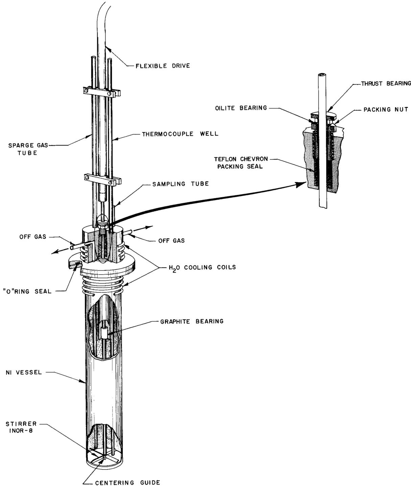  
Fig. 12.10. Improved Stirred Reaction Vessel for Molten Fluorides.

which $\mathrm{Li}_2\mathrm{BeF}_4$ is the solvent salt. The partial pressures of $\mathrm{SiF}_4$ generated by the reaction

$$
\mathrm {S i O} _ {2} (c) + 4 \mathrm {F} ^ {-} \rightleftharpoons 2 \mathrm {O} ^ {2 -} + \mathrm {S i F} _ {4} (g) \tag {1}
$$

generally are low, and the oxide ion produced by this reaction can easily be held to low levels if $\mathrm{SiF}_4$ is introduced into the cover gas. In visual experiments and in spectrophotometric studies, silica containers were found to remain intact and did not contaminate the melt provided the $\mathrm{SiF}_4$ generated was retained in the cover gas or if $\mathrm{SiF}_4$ was already present in the cover gas. The chemistry of $\mathrm{SiO}_2$ in the presence of MSR fluoride mixtures is being studied further with the objectives of (1) establishing the equilibrium solids which can coexist with such melts and (2) examining their ion exchange properties.

If the above reaction is allowed to proceed to the right by sweeping away the $\mathrm{SiF}_4$ produced, the oxide ion concentration should increase until a new oxide-containing solid phase precipitates. Beryllium oxide is normally the oxide phase which first precipitates in molten $\mathrm{Li}_2\mathrm{BeF}_4$ , but according to the $\mathrm{SiO}_2$ -BeO phase diagram, $\mathrm{SiO}_2$ should react with BeO to produce $\mathrm{Be}_2\mathrm{SiO}_4$ (phenacite),

$$
2 \mathrm {B e O} (\mathrm {c}) + \mathrm {S i O} _ {2} (\mathrm {c}) \rightleftharpoons \mathrm {B e} _ {2} \mathrm {S i O} _ {4}. \tag {2}
$$

Hence, unless some more stable oxyfluoride phase can form in the presence of the molten fluoride, it is expected that as reaction (1) proceeds far enough to the right, phenacite should appear as a stable solid phase, establishing the equilibrium

$$
2 \mathrm {S i O} _ {2} (c) + 2 \mathrm {B e F} _ {2} (d) \rightleftharpoons \mathrm {B e} _ {2} \mathrm {S i O} _ {4} (c) + \mathrm {S i F} _ {4} (g), \tag {3}
$$

$$
K = P _ {\text {S i F} _ {4}} / a _ {\text {B e F} _ {2}} ^ {2}.
$$

This equilibrium has been investigated directly by the recirculation of helium carrier gas through an $\mathrm{Li}_2\mathrm{BeF}_4$ melt to which both $\mathrm{SiO}_2$ and $\mathrm{Be}_2\mathrm{SiO}_4$ had been added and then through an infrared absorption cell, where the intensity of the $\mathrm{SiF}_4$ peak at $1033~\mathrm{cm}^{-1}$ was determined. The gas was pumped around this circuit by means of a finger pump.

The following expression reproduces the partial pressure measurements within their estimated uncertainty $(\pm 10\%)$ Fig.12.11

$$
\log P _ {\text {S i F} _ {4}} (\mathrm {m m}) = 8. 7 4 5 - 7 5 7 6 / T. \tag {4}
$$

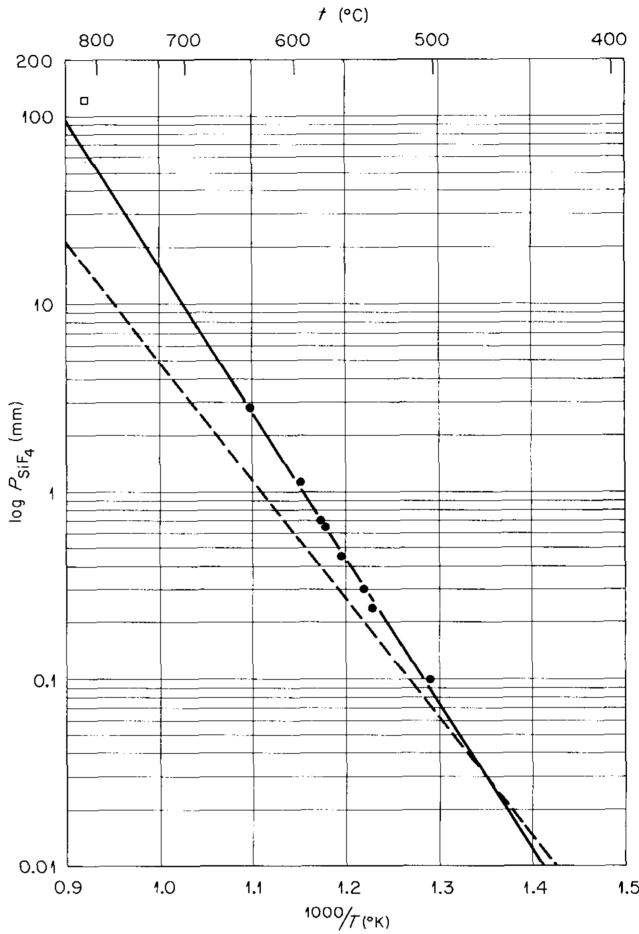  
ORNL-DWG 68-1617R   
Fig. 12.11. Partial Pressures of $\mathsf{SiF}_4$ in Equilibrium with $\mathsf{SiO}_2$ , $\mathsf{Be}_2\mathsf{SiO}_4$ , and Molten 2LiF-BeF $_2$ . The point (□) at upper left is from Novoselova et al. $^{32}$ The solid line is based on Eq. (4); the dashed line is based on available thermochemical data. $^{30,31}$

The observed partial pressures are in general slightly higher than may be predicted from available thermochemical data $^{30-32}$ (cf. Fig. 12.11). These partial pressures are seen to be quite low, however, confirming that quite modest overpressures of $\mathrm{SiF}_4$ should prevent the precipitation of an oxide-containing phase in the presence of $\mathrm{SiO}_2$ .

At present, a stirred vessel (see Sect. 12.5) is being used in continuing these measurements. The

ratio of $\mathrm{BeO}$ to $\mathrm{SiO}_2$ in the added solids is being varied to ascertain whether or not any stable oxide-containing phases other than $\mathrm{Be}_2\mathrm{SiO}_4$ , $\mathrm{SiO}_2$ , and $\mathrm{BeO}$ are formed in the presence of the molten fluorides.

# 12.7 A SILICA CELL AND FURNACE FOR ELECTROCHEMICAL MEASUREMENTS WITH FUSED FLUORIDES

K. A. Romberger

Two distinct advantages are gained if an electrochemical cell can be constructed from fused silica rather than from graphite or corrosion-resistant metals. First, fused silica provides excellent electrical insulation for the electrodes, and second, the cell components are visible so that formation of gas bubbles, solids, etc., may be detected rapidly. Even so, fused silica has seldom been used with fused fluorides in the past because of the corrosive attack of the fluoride salt on the silica. Recently, however, Bamberger et al. $^{33}$ suggested that the presence of an $\mathrm{SiF}_4$ -containing atmosphere would reduce the rate of attack of some molten fluorides on fused silica. This protection of the silica should be the greatest with those fluoride salts which have a relatively low basicity or alkali fluoride activity, for example, $\mathrm{LiF - BeF}_2$ mixtures that contain 0.33 or higher mole fraction of $\mathrm{BeF}_2$ .

In order to utilize the advantages of silica, a silica cell and furnace has been constructed for electrochemical studies in LiF-BeF $_2$ mixtures.

The design is such that it will permit, in a single system with a controlled atmosphere, both equilibrium and nonequilibrium electrochemical measurements including emf, chronopotentiometry, linear sweep voltammetry at fixed solid or liquid electrodes, rotating disk voltammetry, and polarography at a dropping (bismuth) electrode. The purpose of these measurements is to yield information about the diffusion coefficients, decomposition potentials, and oxidation states of the species dissolved in the molten salt.

The heating element of the furance is a 20-gage asbestos-covered Nichrome wire helix supported by a vertical 4-in.-OD silica tube. A $2^{1/2}$ -in.-ID, 6-in.-high silica cup, centered within the heated zone,

holds the fused salt. Atmospheric containment (and secondary salt containment) is provided by an 11-in.-long, 3-in.-ID closed-end silica tube. This latter tube extends upward to the top of the furnace, where it is joined, via a silicone rubber seal, to a water-cooled nickel collar.

A nickel head having eight ports which terminate in Swagelok fittings provides entry to the cell. Five ports are vertically aligned risers. Three of these risers are used for entry by electrodes. A fourth riser is used either for solid sample additions or for a fourth electrode. The fifth riser admits either a stirrer or a rotating disk electrode through a Swagelok tee fitted with Teflon seals. Helium pressure is maintained through the tee to provide an inert-gas seal. The remaining three ports are for a thermocouple well and inlet and outlet gas lines.

The usable working depth in the cell of approximately 4 in. is centered on a line between two 6-in.-square windows. The heating element is surrounded by a platinum-covered nickel reflector. Insulation is of Lavite. The furnace requires a 208-v ac source and can be safely operated at $800^{\circ}\mathrm{C}$ , at which temperature the required power is 2700 w. A detailed drawing of this cell and furnace is shown in Fig. 12.12.

# 12.8 STATUS OF THE MOLTEN-SALT CHEMISTRY INFORMATION CENTER

H. F. McDuffie

In the summer of 1965, we decided to establish a Molten-Salt Chemistry Information Center. The primary purpose was to provide a detailed subject index to all the chemical material representing ORNL work in the field since 1950. A secondary purpose was to provide a framework into which other technical reports and open-literature publications could be inserted. The center has never been formally funded but has required approximately half the time of one technical man and half the time of one secretary. Because of the low level of funding available and the purposes of the center, we designed it so that it could be used by technical staff members without assistance and so that new entries could be created with the minimum investment of technical time.

An optical coordination indexing system (Termatrex) was chosen as being the most appropriate

ORNL-DWG68-4387

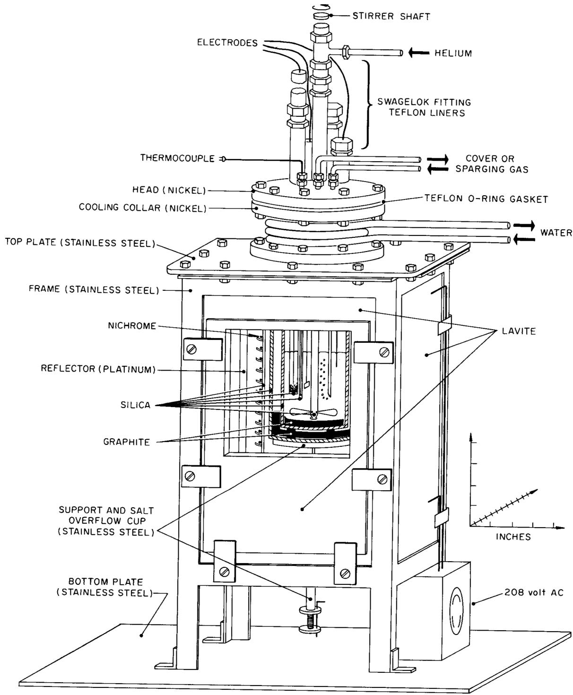  
Fig. 12.12. Silica Furnace and Cell for Electrochemical Measurements.

(simplest and cheapest) for the purpose. This is the same system used by the ORNL Isotopes Information Center; it was possible to use some of their equipment in setting up the Molten-Salt Chemistry Information Center.

The two most important functions, from the technical point of view, in establishing an information center for the retrieval of the information contained within are the selection of an adequate list of key words for indexing purposes and the assignment of these key words to particular documents or portions of documents. We have tried to use care in the selection of our key-word list and have, so far, limited it to 480 terms. The list is broken into two parts, general terms and materials. General terms include words and phrases such as ABSORPTION SPECTRA, BIBLIOGRAPHY, BLANKET REPROCESSING, CALORIMETRY, DENSITY OF LIQUID, HYDROLYSIS, KINETICS, etc. Materials words include more specific items such as ACTINIDES, ALUMINUM, ARGON, GLASS, GRAPHITE, HF, KF, LiF-BeF $_2$ (the system), MERCURY, MOLYBDENUM, MSRE FUEL, etc. Technical people selected these key words, and technical people have made the assignments of key words to articles.

Clerical and secretarial people have handled all the other aspects of entering the information into the system. A 5 by 8 card is typed containing the assigned serial number, the identification of the document, the abstract (if available), and the assigned key words. A single cross-reference card is typed, showing the serial number and the identification of the document; it is filed by journal or report number. Then the Termatrex cards for the several selected key words are assembled and punched with the serial number of the document. (The arrangement of the serial number punches is on a 100 by 100 grid, so that any number up to 10,000 can be located by a separate hole.)

In addition to the indexing of relevant reports which are brought to our attention, we maintain a subscription to the ASCA (automatic subject citation alert) function of the Institute for Scientific

Information. Each week, their current scientific literature is scanned for articles written by any of 106 source authors whom we have chosen as publishing wholly or significantly in the molten-salt field. The titles of all the articles thus brought to our attention are screened, and the relevant articles are indexed, thus providing some coverage of current scientific literature as well as of our own reports.

At the present time the system has accumulated a total of 6600 entries; the rate of accumulation has been somewhat more rapid than we had expected, particularly in view of the low level of effort which we have assigned to the work. The system has been most useful to new members of our staff in permitting them ready access to the earlier project work in the Molten-Salt Reactor Program. Additional support, which would be expected to materialize with an increase in the overall program, would permit us to expand our coverage of both the report literature and the open literature through systematic surveying of Chemical Abstracts and Nuclear Science Abstracts for relevant documents. When the storage capacity, 10,000, of the present system is reached, we can set up a second deck of Termatrex cards and continue with another 10,000 entries, or we can consider whether we have arrived at the stage of justifying the staff and complexity required to put the information into a digital computer data processing system. This operation would be essentially nontechnical, since the system was designed with this ultimate conversion in mind.

The flexibility of the system permits continuous improvement of the indexing and easy correction of any errors which are found. For the present, it seems preferable to maintain the center as a device for retrieval of requested information rather than as a place for continuing analytical reviews with a regular output to customers. We can answer some telephone queries quickly and can handle some requests from outside writers for specific information, but we do not have the staff to do elaborate state-of-the-art studies at this time.

# 13. Chemistry of Molten-Salt Reactor Fuel Reprocessing Technology

# 13.1 MSBR FUEL REPROCESSING BY REDUCTIVE EXTRACTION INTO MOLTEN BISMUTH

D.M.Moulton W.R.Grimes

J. H. Shaffer

Studies of the reductive extraction of protactinium, uranium, and rare earths from molten fluoride mixtures into molten bismuth have continued to yield results which favor its application for reprocessing fissile and fertile mixtures of the two-region molten-salt breeder reactor concept. As previously reported in this series, the experimental data relate the equilibrium distribution of extracted metals to concentrations of reducing agent dissolved in the metal phase1 and permit the construction of an electromotive series where the relative positions of metals indicate their order of extraction.2 These values have demonstrated the chemical feasibility of reductive extraction for reprocessing a two-region breeder reactor within a reasonable degree of confidence and have provided a basis for initiating an engineering evaluation of the processing concept.

More recent efforts have been primarily oriented toward reprocessing requirements of the conceptual single-region breeder reactor. This concept combines both fissile and fertile material in a single fluoride mixture which will nominally contain 12 mole $\%$ $\mathrm{ThF}_4$ and 0.3 mole $\%$ $\mathrm{UF}_4$ dissolved in an LiF-BeF $_2$ solvent mixture. The reprocessing requirements remain the same, but the chemistry becomes more difficult since there are now two com

binations of elements with similar reduction potentials. Earlier data for a somewhat different solvent, $\mathrm{LiF - BeF}_2\text{-ThF}_4$ (73-2-25 mole %), indicate that uranium will have to be removed as the first step, with protactinium following under slightly stronger reduction conditions. If the separation factor ( $\sim 10$ ) obtained from these data is valid for the single-region system, the process of separating uranium from protactinium should be feasible but will require more careful process control. Further studies of the extractability of these elements in the single-region fuel mixture are in progress.

Fission product removal will logically be performed on the salt stream effluent from the uranium-protactinium removal unit ahead of the fuel reconstitution section of the reprocessing plant. Consequently, laboratory studies are concerned with the extraction of rare earths from a mixture of LiF, $\mathrm{BeF}_2$ , and $\mathrm{ThF}_4$ where the concentration of thorium will be about 12 mole $\%$ , lithium may be varied from 58 to 72 mole $\%$ , and beryllium will make up the balance. In a preliminary experiment a small quantity of $\mathrm{ThF}_4$ was added to LiF- $\mathrm{BeF}_2$ (66-34 mole $\%$ ) containing about 100 ppm europium spiked with $^{152-154}\mathrm{Eu}$ activity. Extraction from this salt mixture (salt A) into bismuth was carried out as in previous experiments by making metallic lithium additions to the metal phase and by monitoring the progress with a beryllium electrode. Reduction potentials calculated from the measured distributions are shown as part of Table 13.1, which contains current values for several elements obtained from the same salt mixture. If the thorium activity remains equal to its concentration, then at 12 mole $\%$ $\mathrm{ThF}_4$ in the single-region fuel mixture, thorium bismuthide will precipitate at $-1.49\mathrm{v}$ . The distributions of various important elements between salt A and bismuth at $600^{\circ}\mathrm{C}$ are illustrated in Fig. 13.1 as

Table 13.1. Extraction Potentials of Fission Products from LiF-BeF $_2$ (66-34 Mole %) into Bismuth   

<table><tr><td rowspan="2">Element</td><td rowspan="2">Valence</td><td colspan="4">E0</td></tr><tr><td>500°C</td><td>600°C</td><td>700°C</td><td>800°C</td></tr><tr><td>Li</td><td>1</td><td>2.00</td><td>1.93</td><td>1.88</td><td>1.83</td></tr><tr><td>Bea</td><td>2</td><td>1.93</td><td>1.85</td><td>1.78</td><td>1.71</td></tr><tr><td>Ba</td><td>2</td><td></td><td>1.80</td><td></td><td></td></tr><tr><td>Eu</td><td>b</td><td>1.69 (2.0)</td><td>1.61 (1.8)</td><td>1.53 (1.8)</td><td>1.45 (1.8)</td></tr><tr><td>Th</td><td>4</td><td></td><td>1.56</td><td>1.50</td><td></td></tr><tr><td>Nd</td><td>2.5</td><td></td><td>1.52</td><td></td><td></td></tr><tr><td>Ce</td><td>b</td><td>1.58 (3.0)</td><td>1.48 (2.6)</td><td>1.41 (2.4)</td><td>1.33 (2.2)</td></tr><tr><td>Sm</td><td>1.6</td><td></td><td>1.50</td><td></td><td></td></tr><tr><td>La</td><td>2.7</td><td></td><td>1.48</td><td></td><td></td></tr><tr><td>U</td><td>4</td><td></td><td>1.39</td><td></td><td></td></tr></table>

$\mathbf{a}_{0}^{\mathrm{G}}$ (as referred to pure metal); Be is insoluble in Bi.   
$b_{\mathrm{Valence}}$ in parentheses at each temperature.

functions of reduction potentials. The vertical lines mean that a solid phase of constant composition is being formed and will limit the reduction potential of the system until its concentration in the salt phase is exhausted. For thorium, the virtual position of $\mathbf{E}_0$ is taken from dilute measurements in salt A, but the onset of solid phase formation is calculated for $\mathrm{ThF}_4 = 12$ mole $\%$ in the salt. The important considerations for the single-region MSBR reprocessing scheme are the voltage difference between uranium and protactinium and the rare-earth positions relative to the vertical thorium line. If these values are valid, the extraction process should be feasible but not as favorable as its application with the two-region reactor.

Because of the uncertainty of thorium activity at higher thorium concentrations in the salt mixture and its effect on the extraction process, a systematic investigation of rare-earth extraction from salt mixtures of practical interest as a fuel solvent has been initiated. Since increasing the LiF concentration of the mixture (hence increasing its free

fluoride content) might increase the stability of $\mathrm{Th}^{4+}$ by fluoride complex formation, initial studies have held the thorium concentration of the salt at 12 mole % and varied the ratio of lithium to beryllium. Three experiments with europium, samarium, and neodymium, each dissolved in LiF-BeF $_2$ -ThF $_4$ (58-30-12 mole %), were conducted by adding thorium metal to the bismuth pool. Thorium saturation in bismuth was inferred when the potential of a beryllium electrode inserted in the salt mixture stopped falling upon further addition of thorium metal. The amount of extracted rare earth in each case was too low for quantitative evaluation under analytical conditions imposed on the syste. Radiochemical analyses were further complicated by the presence of gamma-emitting thorium daughters, some of which extracted readily into bismuth. Neodymium was seen in the bismuth at 700 and

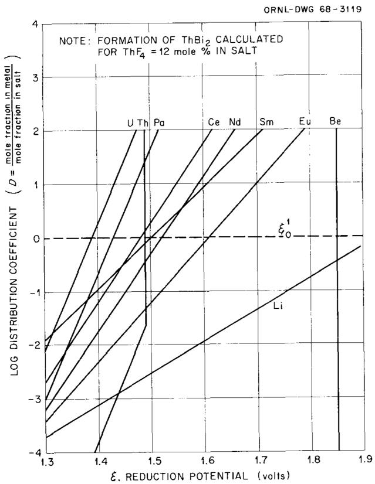  
Fig. 13.1. Distribution of Uranium, Protactinium, and Rare Earths Between LiF-BeF $_2$ (66-34 Mole %) and Bismuth at $600^{\circ}\mathrm{C}$ .

values for $\alpha$ appreciably above 1 will denote feasible separations, and the magnitude of $\alpha$ will indicate extraction efficiency. Thus, if the concentration of rare earth in the salt mixture is $100\mathrm{ppm}$ by weight, the thorium concentration in the salt is 12 mole $\%$ , and the limiting potential corresponds to $3500~\mathrm{ppm}$ thorium (i.e., $X_{\mathrm{Th(Bi)}} = 3.14\times 10^{-3}$ ) in the bismuth, then the experimental procedure should detect rare-earth concentrations as low as $0.8\mathrm{ppm}$ in the bismuth phase. Experiments are now in progress to examine the effects of salt composition on the extractability of rare earths. These experiments will be conducted with cerium because of the convenient radiochemical properties of the $^{144}\mathrm{Ce}$ isotope for analytical application. When the salt composition has been optimized, extractions of the various important rare earths will be studied. The results of one experiment (still in progress) with the salt mixture LiF-BeF ${}_{2}$ -ThF ${}_{4}$ (72-16-12 mole $\%$ ) have shown the favorable extraction of cerium into bismuth at $600^{\circ}\mathrm{C}$ . Figure 13.2 illustrates the dependence of rare-earth extraction on the thorium concentration in bismuth up to its saturation value. The separation coefficient $\alpha$ is also related to the thorium concentration in bismuth, as shown in Fig. 13.3. The decrease in $\alpha$ with increasing thorium results from the higher valence of thorium than cerium.

$800^{\circ}\mathrm{C}$ , but samarium, though it should extract more easily, was not definitely detected, probably because it has only a weak and short-lived radioisotope. Potentiometric readings in this salt mixture did indicate changes in the activities of the major salt constituents from values reported for salt A. Values for beryllium and thorium were found about 0.1 and 0.05 v, respectively, more noble than in salt A if lithium is assumed unchanged.

Since the feasibility of the extraction process depends on the relative extractability of rare earths as compared with thorium, the experimental procedures are being refined to yield significant values for very low extraction efficiencies. If we define this separation coefficient $\alpha$ as

$$
\alpha = \frac {X _ {\mathrm {R E} (\mathrm {B i})} / X _ {\mathrm {R E} (\mathrm {s a l t})}}{X _ {\mathrm {T h} (\mathrm {B i})} / X _ {\mathrm {T h} (\mathrm {s a l t})}},
$$

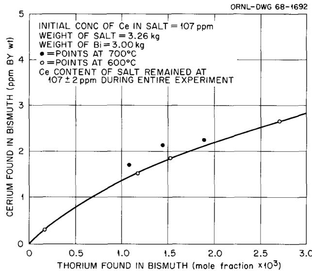  
Fig. 13.2. Extraction of Cerium from $\mathsf{LiF - BeF}_2\mathsf{-ThF}_4$ (72-16-12 Mole %) into Molten Bismuth by Reduction with Thorium at $600^{\circ}\mathsf{C}$ .

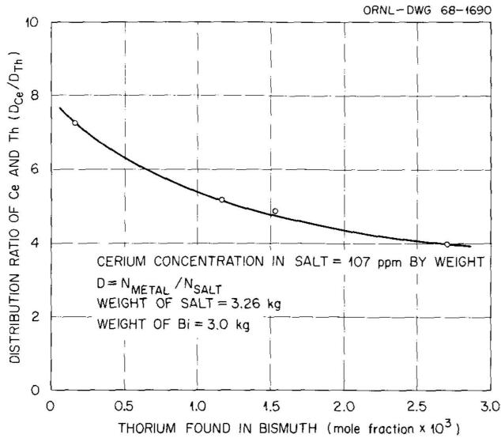  
Fig. 13.3. Relative Extraction of Cerium and Thorium from LiF-BeF $_2$ -ThF $_4$ (72-16-12 Mole %) into Bismuth at $600^{\circ}\mathrm{C}$ .

# 13.2 REMOVAL OF STRUCTURAL METAL FLUORIDES FROM A SIMULATED MSRE FUEL SOLVENT

F. A. Doss

L. E. McNeese

J. H. Shaffer

Current plans for the MSRE call for substituting $^{233}\mathrm{U}$ for $^{235}\mathrm{U}$ in the reactor fuel mixture. The fuel solvent mixture, $\mathrm{LiF - BeF}_2 - ZrF_4$ (65-30-5 mole %), together with its fission product inventory, will be retained; this will be accomplished by fluorinating the fuel salt to remove its present uranium content and by adding $^{233}\mathrm{U}$ as the concentrate mixture $\mathrm{LiF - UF}_4$ (73-27 mole %). During fluorination the salt will become contaminated with fluorides of nickel, iron, and chromium as a result of corrosion of the Hastelloy N fluorinator. Although the expected concentrations of these fluorides will not exceed their solubilities in the fuel salt, their return to the reactor is undesirable. Therefore, the reduction of structural metals from solution in the fluorinated fuel solvent and their removal by filtration from the solvent during its transfer to the reactor system are requirements of the refueling operation. An experimental simulation of these steps has been conducted to define better the feasibility of the refueling procedure.

The experimental program was carried out with a $104\mathrm{-kg}$ batch of the fluoride mixture $\mathrm{LiF - BeF}_2 - ZrF_4$ (65-30-5 mole %), prepared from the component fluoride salts by routine production procedures. In order to represent conditions expected after fluorination of the MSRE fuel salt, approximately $80\mathrm{g}$ of $\mathrm{CrF}_2$ , $50\mathrm{g}$ of $\mathrm{FeF}_2$ , and $800\mathrm{g}$ of $\mathrm{NiF}_2$ were added to the salt mixture, which was hydrofluorinated for 6 hr with 10 to 20 mole % HF in helium to ensure complete dissolution of the corrosion product fluorides. The analysis of a filtered salt sample taken after the hydrofluorination period is compared with expected concentrations in Table 13.2.

Table 13.2. Concentrations of Corrosion Product Fluorides after Hydrofluorination   

<table><tr><td>Material</td><td>Estimated Concentrationa(ppm)</td><td>Analysisa(ppm)</td></tr><tr><td>CrF2</td><td>445</td><td>470</td></tr><tr><td>FeF2</td><td>286</td><td>620</td></tr><tr><td>NiF2</td><td>4680</td><td>3700</td></tr></table>

${}^{a}$ Concentrations reported on a metal basis.

# 13.2.1 Reduction of Structural Metal Fluorides

Equilibrium data for reduction of the corrosion product fluorides indicate that if equilibrium is achieved, a hydrogen sparge will reduce $\mathrm{NiF}_2$ easily, $\mathrm{FeF}_2$ with difficulty, and $\mathrm{CrF}_2$ to a negligible extent in a practical time period. The aim of the first part of the experiment was to demonstrate $\mathrm{NiF}_2$ reduction with a hydrogen sparge and to compare hydrogen utilization with that predicted from equilibrium data. After the initial hydrofluorination, free HF was stripped from the salt mixture by helium sparging, and the molten salt was sparged for 9 hr with hydrogen at a rate of 10 standard liters per minute at $650^{\circ}\mathrm{C}$ . The 48.2-liter salt mixture was contained in a 12-in.-diam vessel, and the sparge line terminated 26 in. below the melt surface. The gas effluent from the treatment vessel was analyzed

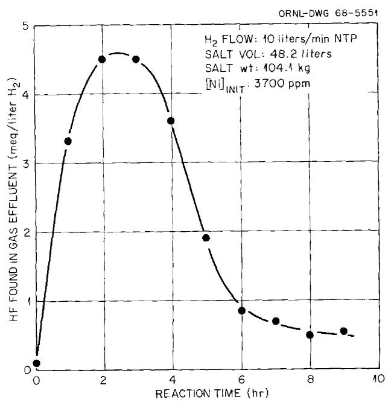  
Fig. 13.4. Reduction of $\mathsf{NiF}_2$ from Simulated MSRE Fuel Solvent by Hydrogen Sparging at $650^{\circ}\mathsf{C}$

periodically for HF (Fig. 13.4), and sparging was discontinued when the HF concentration decreased to a low but near constant value. The quantity of HF produced during this period was equivalent to about $93\%$ of the $\mathrm{NiF}_2$ initially present in the salt mixture. Hydrogen utilization was considerably lower than would have resulted if equilibrium had been achieved; under equilibrium conditions a sparge time of $20.4\mathrm{min}$ would have resulted in reduction of $99\%$ of the $\mathrm{NiF}_2$ present initially.

Since equilibrium data predict very low hydrogen utilization during reduction of $\mathrm{FeF}_2$ and $\mathrm{CrF}_2$ , data were obtained on reduction of these fluorides with zirconium metal. The zirconium was first machined in order to increase the surface area and thereby reduce passivation of the surface by deposition of reduced iron and chromium. The turnings were pressed into $3_4$ -in.-diam cylinders ( $\rho \sim 4.6 \, \mathrm{g/cm}^3$ ) having lengths of 0.3 to 1.0 in. to facilitate addition to the treatment vessel. The pressed zirconium slugs were added to the salt mixture after reduction of $\mathrm{NiF}_2$ with hydrogen sparging. After each addition the approximate extent of reduction was noted by sparging the melt with hydrogen and analyzing the effluent gas for HF. As shown in Fig. 13.5, the

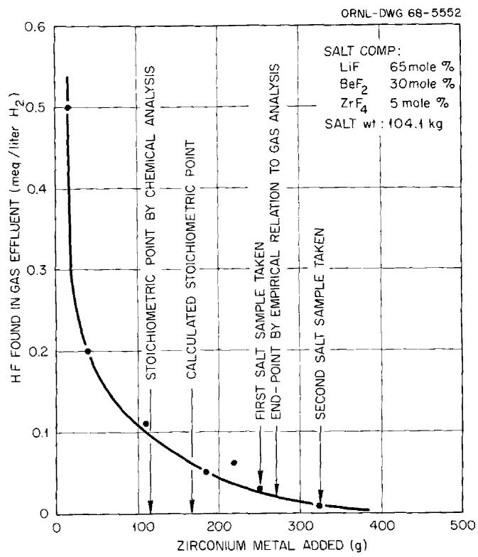  
Fig. 13.5. Pseudoequilibrium of Hydrogen with Structural Metal Fluorides During Their Reduction from Simulated MSRE Fuel Solvent by Zirconium Metal at $650^{\circ}\mathrm{C}$ .

HF concentration decreased steadily, and an arbitrary end point for the reduction reaction was established at a concentration of 0.02 meq of HF per liter of $\mathbf{H}_2$ as a result of experience during preparation of the initial MSRE fuel carrier salt. The calculated quantity of zirconium required to complete reduction of the corrosion product fluorides was $115\mathrm{g}$ ; this was based on the analysis of the salt mixture shown in Table 13.2 and assumed reduction of 12.2 equivalents of these metal fluorides during the hydrogen reduction period. Analyses of filtered samples taken near the conclusion of the zirconium addition period are shown below.

<table><tr><td rowspan="2">Zirconium Added (g)</td><td colspan="3">Metals Found (ppm by weight)</td></tr><tr><td>Cr</td><td>Fe</td><td>Ni</td></tr><tr><td>253</td><td>9</td><td>60</td><td>&lt;30</td></tr><tr><td>327</td><td>26</td><td>44</td><td>36</td></tr></table>

These values are below limits established for the initial MSRE fuel carrier salt. On the basis of these data, zirconium utilization was at least 46 to $65\%$ .

# 13.2.2 Salt Filtration Studies

The reduction of structural metal corrosion products from solution in the MSRE fuel solvent is anticipated to produce approximately $330\mathrm{g}$ (0.73 lb) of solid particles per cubic foot of salt mixture. The suspension or entrainment of a major fraction of these solids during the transfer of the fuel solvent back to the reactor drain tank assembly could have adverse effects on filter performance. Therefore, the primary purpose of this program was an examination of salt filtration characteristics under conditions which would reasonably simulate those anticipated in the reactor application. Filtration tests were separately conducted on a sintered nickel product of the Micro Metallics Corporation, having pores about $40\mu$ in diameter, and two grades of Feltmetal, a product of Huyck Metals Company. Each filter was fabricated as a $2\%$ -in.-diam plate so that geometric surface areas of all filters would be identical. One grade was of Monel with pores $20\mu$ in diameter and a second of 347 stainless steel having $41\mu$ -diam pores. The latter, designated FM250 by the manufacturer, had a porosity of $78\%$ and a rated capability for removing $98\%$ of all particles over $10\mu$ in diameter. This material was chosen for application in the reactor system because of its adaptability to fabrication requirements and its satisfactory performance during these filtration tests.

The credibility of the multiple filtration tests that were performed on a single salt preparation is based on the anticipation that the primary process for removing solids from the MSRE fuel solvent will be that of decantation. This conclusion is supported by considerable experience in filtering fluoride mixtures through sintered nickel during the production of fluoride mixtures for the MSRP. Examinations of filters used in this process have consistently shown the collection of very small quantities of solids on the filter plates. This condition has persisted despite the accumulation of considerable quantities of solids in the salt treatment vessels during their repeated use in the production process. Thus, the novel feature of these current filtration tests is, perhaps, the indirect estimate of particle size distribution of solids formed by the reduction process proposed for the reactor application.

The experimental assembly used for the filtration tests was essentially that used for the routine production of fluoride mixtures. The salt preparation vessel was connected by a $\frac{1}{2}$ -in.-diam Inconel tube to a heated salt receiver vessel. This transfer tube extended near the bottom of the salt preparation vessel and only penetrated the top of the receiver. The porous metal filter was mounted vertically in the transfer line above the receiver vessel. A second salt return line extended near the bottom of the receiver vessel and connected to the salt preparation vessel. These lines were used alternately for forcing the $1.7\mathrm{ft}^3$ of salt mixture from one vessel to the other and were capped when not in use. This arrangement permitted repeated filtration tests to be conducted on the salt mixture. Eight filtrations were conducted during this investigation.

Although conditions which would promote the decantation process are desired for the reactor application, attempts were made also to observe filter loading capacities. Tests under static conditions prevailed when the melt had remained quiescent for a minimum time of $4\mathrm{hr}$ prior to transfer. Agitated melt conditions were established by rapidly sparging the melt with helium just prior to salt transfer. The temperature of the melt was controlled at $650^{\circ}\mathrm{C}$ $(1200^{\circ}\mathrm{F})$ for all tests. The indicated temperatures of the salt transfer line fell to about $565^{\circ}\mathrm{C}$ $(1050^{\circ}\mathrm{F})$ during the extended transfer operations. Lower temperatures were erroneously recorded from thermocouples that became separated from the transfer line. In no instances did the salt freeze in the transfer line or filter during the tests.

In each test, salt transfer was induced by increasing to 11 psig the pressure of helium above the salt mixture in the treatment vessel and evacuating all gases from the receiver vessel. These conditions were maintained throughout each test. The pressure drop across the filter varied as the level of salt in the treatment vessel decreased. A summary of the filter performance tests is shown in Table 13.3. The $20 - \mu$ Feltmetal was tested first, and it was disqualified after 2 hr operation. Essentially no salt was passed through the filter during this period. Inspection of the filter also showed that the predominant part of the 22-g holdup was salt, and only a thin layer of metallic material was on the filter plate. The second test, with sintered nickel, showed remarkable performance but collected only 7 g of material on the filter plate. Since no visible failure of the filter plate was ap

Table 13.3. Summary of Filtration Tests   
Salt composition: $\mathrm{LiF - BeF_2 - ZrF_4}$ (65-30-5 mole %)  
Weight of salt mixture: 104.1 kg  
Volume of salt at $650^{\circ}\mathrm{C}$ : 1.7 ft³  
Indicated pressure differential: 11 psig forepressure vs vacuum   

<table><tr><td>Test No.</td><td>Filter Material</td><td>Pore Diameter (μ)</td><td>Salt Conditions</td><td>Transfer Time (hr)</td><td>Weight Gain (g)</td><td>Remarks</td></tr><tr><td>1</td><td>Monel Feltmetal</td><td>20</td><td>Static</td><td></td><td>22</td><td>Test terminated after 2 hr; essentially no salt transfer</td></tr><tr><td>2</td><td>Sintered nickel</td><td>40</td><td>Static</td><td>0.5</td><td>7</td><td>No visible material on filter or evidence of failure</td></tr><tr><td>3</td><td>Sintered nickel</td><td>40</td><td>Agitated</td><td>1.75</td><td>44</td><td></td></tr><tr><td>4</td><td>347 SS Feltmetal</td><td>41</td><td>Static</td><td>2.0</td><td>77</td><td>Test stopped after 90-kg transfer</td></tr><tr><td>5</td><td>Sintered nickel</td><td>40</td><td>Static</td><td>2.17</td><td>63</td><td>Filter plugged after 40-kg transfer; material on filter predominantly salt</td></tr><tr><td>6</td><td>Sintered nickel</td><td>40</td><td>Static</td><td>1.84</td><td>19</td><td>Balance of salt transferred; filter ruptured</td></tr><tr><td>7</td><td>347 SS Feltmetal</td><td>41</td><td>Agitated</td><td>2.0</td><td>67</td><td></td></tr><tr><td>8</td><td>Sintered nickel</td><td>40</td><td>Static</td><td>1.75</td><td>22</td><td>80-kg back transfer of salt from receiver to treatment vessel; filter plugged.</td></tr></table>

parent, we presume that either the decantation process was extremely efficient or the suspended particles were too small to impinge on the filter plate. The balance of the filtration tests showed comparable results which were essentially independent of the static or agitated condition of the melt. Under the test conditions, filtration times for FM250 Feltmetal were about 1.19 and 1.36 hr per cubic foot of salt mixture. The longer transfer time probably reflected a lower salt temperature at the filter plate. The occasional plugging of the filter in tests 4 and 5 suggests that the loading capacity of the $40 - \mu$ filters was about 50 to $75\mathrm{g}$ of metal particles.

Samples of the salt mixture were withdrawn by filter stick prior to the first filtration experiment and by a composite sampler downstream from the

filter plate after tests 4, 6, and 7. The results of chemical analyses of these samples are shown in Table 13.4. Although test 6 resulted in a filter rupture, corresponding chemical analyses do not reflect excessively large concentrations of structural metals in the filtered salt. Variations in the other results are probably within the combined reproducibility of the analytical methods and the test procedure. If these concentrations are indicative of solids passing through the filter plates rather than unreduced metals, then the data reflect the particle size distribution of the reduced material. We conclude that only 1.8 to $3.4\%$ of metals reduced from solution in the MSRE fuel solvent will pass through the filter material proposed for use in the reactor application.

Table 13.4. Summary of Analytical Results During Filtration Tests   

<table><tr><td rowspan="2">Sample Interval</td><td colspan="4">Impurity Concentration (ppm)</td></tr><tr><td>Cr</td><td>Ni</td><td>Fe</td><td>Total</td></tr><tr><td>Before test 1a</td><td>26</td><td>36</td><td>44</td><td>106</td></tr><tr><td>After test 4</td><td>15</td><td>84</td><td>66</td><td>165</td></tr><tr><td>After test 6</td><td>16</td><td>256</td><td>132</td><td>404</td></tr><tr><td>After test 7</td><td>17</td><td>19</td><td>49</td><td>85</td></tr></table>

Filter stick sample.

# 13.3 PROTACTINIUM STUDIES IN THE HIGH-ALPHA MOLTEN-SALT LABORATORY

C. J. Barton

J. C. Mailen

H. H. Stone

W. R. Grimes

Technical feasibility of the "Brillo process," a method for removal of protactinium from $^{7}\mathrm{LiF - BeF}_{2}$ ThF4 melts by reduction from the salt phase and adsorption on steel wool, was demonstrated previously and has been described.5 Because application of this method involves separations of liquids and solids in highly radioactive environments, its adaptation at the engineering scale does not seem to be attractive. For this reason, we have begun studies in which protactinium is reduced by liquid bismuth-thorium alloys. The results of similar studies6 conducted at the tracer level indicate that removal of protactinium from molten fluorides by liquid metal extraction is a potentially successful fuel reprocessing method. This investigation is designed to confirm the chemical validity of the process and to provide basic information needed to establish optimal processing conditions.

Before beginning liquid-metal extraction studies, we performed one solid thorium reduction experiment that was planned to elucidate the role of iron in protactinium precipitation. The results of this experiment are summarized below.

# 13.3.1 Protactinium Reduction by Solid Thorium in the Near Absence of Iron

Previously, we found that in LiF-ThF $^4$ melts, iron is reduced rapidly at $600^{\circ}\mathrm{C}$ by thorium and at a much slower rate by hydrogen. We chose to examine the reduction of iron at $700^{\circ}\mathrm{C}$ in an LiF-ThF $^4$ melt which also contained protactinium. Treatment of the melt with hydrogen reduced the iron concentration from an original concentration of 500 ppm to 3 ppm (as indicated by $^{59}\mathrm{Fe}$ counts) in about 18 hr, in contrast to a 40-hr period required at $600^{\circ}\mathrm{C}$ . The quantitative significance of the results obtained was somewhat impaired by partial loss of protactinium during hydrogen treatment and during transfer from the nickel pot to a graphite-lined pot. However, it appears qualitatively that there is little difference in the behavior of protactinium metal during reduction with solid thorium except that in the presence of iron a slightly greater fraction of protactinium remains in the unfiltered salt sample after reduction than is found in using the bismuth-thorium alloy.

# 13.3.2 Reduction of Protactinium by Bismuth-Uranium Alloy

Two equilibration experiments were performed with bismuth-uranium alloys which initially contained 1 at. $\%$ uranium in order to simulate condi

tions under single-fluid reactor conditions. The first of these experiments is described elsewhere. $^{8}$ In summary, analyses of both filtered and unfiltered samples of bismuth and salt phases removed after 16 and $20\mathrm{hr}$ contact accounted for only about $42\%$ of the uranium added initially to the bismuth. This probably indicated that part of the uranium was precipitated as $\mathrm{UO}_2$ by oxygen or water vapor inadvertely introduced into the system. The presence of $\mathrm{UO}_2$ means that uranium might have been introduced into the salt by the reaction $\mathrm{UO}_2 + \mathrm{ThF}_4 \rightarrow \mathrm{UF}_4 + \mathrm{ThO}_2$ , as well as by the reaction $\mathrm{U}^0 + \mathrm{ThF}_4 \rightarrow \mathrm{UF}_4 + \mathrm{Th}^0$ . Both reactions have positive free energy for the direction indicated, but since $\mathrm{ThF}_4$ is present in large excess over the amount of $\mathrm{U}^0$ or $\mathrm{UO}_2$ and since complexing of the $\mathrm{UF}_4$ by LiF occurs in the molten-salt phase, either reaction might be expected to take place. Since the relative contribution of the two possible reactions cannot be evaluated, the data obtained have only qualitative significance. The uranium content of the frozen unfiltered salt was much higher than that of the unfiltered samples removed from the molten salt. This indicates that the $\mathrm{UO}_2$ either dissolved or dispersed in the salt as it froze, and since the salt was quite green, it seems most likely that it dissolved.

Repetition of the experiment resulted in a significant improvement. Uranium losses were found to be negligible, and the protactinium removal rate was encouragingly rapid. Protactinium distribution data displayed in Fig. 13.6 showed a marked drop in concentration in the bismuth during the first $5\mathrm{hr}$ with relatively little change during the last $11\mathrm{hr}$ . Although the concentrations of protactinium in the salt phase appear to vary somewhat, about $90\%$ of the initial amount of the element was removed from the salt after $5\mathrm{hr}$ of contact. The initial low value in the salt phase coincides with the initial high uranium concentration in the filtered bismuth (Fig. 13.6).

# 13.3.3 Reduction of Protactinium by Bismuth-Thorium Alloys

We have examined the transfer of protactinium from molten fluoride mixtures to bismuth-thorium alloys

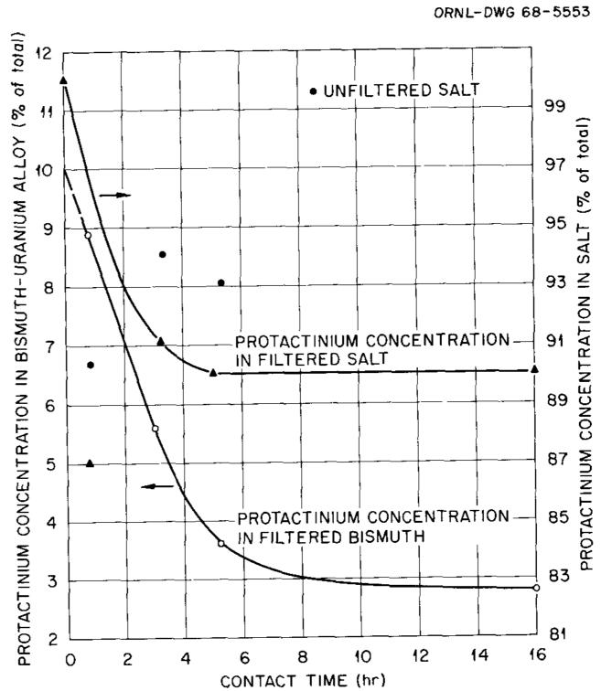  
Fig. 13.6. Protactinium Distribution Between LiF-BeF $_2$ -ThF $_4$ (73-2-25 Mole %) and Bismuth-Uranium Alloy. Run 1-16.

using the two-region breeder blanket composition $\mathrm{LiF - BeF}_2\text{-ThF}_4$ (73-2-25 mole %) and the single-region fuel composition $\mathrm{LiF - BeF}_2\text{-ThF}_4$ (72-16-12 mole %). They will be discussed in that order.

# 13.3.4 Two-Region Breeder Blanket Composition

Two experiments were performed to measure the extent of transfer of protactinium to bismuth-thorium alloy and the distribution of uranium. In both experiments the amount of thorium added initially to the bismuth was sufficient to give a concentration of 2500 ppm if all the thorium dissolved. Analysis of a sample of bismuth-thorium alloy removed 2 hr after addition of the thorium showed 2220 ppm, but five days later, after extended treatment of the salt phase occasioned by difficulty in keeping the protactinium in solution during hydrogen treatment, the thorium concentration had dropped to 220 ppm. We assume that water vapor or oxygen in the system was causing the precipitation of protactinium be

cause $90\%$ of the thorium in the bismuth-thorium alloys was converted to $\mathrm{ThO}_2$ . Despite the presence of $\mathrm{ThO}_2$ , about 1.0 to $1.5\%$ of the protactinium was transferred to the bismuth with low concentration of thorium metal in the bismuth. The protactinium transfer rate was increased sharply to about $20\%$ of the total within 1 hr when an additional amount of thorium (totaling 2500 ppm) was added. The protactinium content of the bismuth dropped to about $12\%$ of the total in the system after standing overnight under flowing helium without agitation, and a further drop, to about $3\%$ , occurred when the phases were mixed by sparging with helium for $1^{1/4}$ hr. The abovementioned existence of solid $\mathrm{ThO}_2$ in the system probably accounts for the removal of the protactinium from bismuth. A large increase in the protactinium content of unfiltered salt was noted after the gas sparging.

An additional experiment resulted in the most complete transfer of protactinium from salt to bismuth that has been experienced to date. The results, displayed in Fig. 13.7, show about $80\%$ of the protactinium in the filtered bismuth after only $30\mathrm{min}$ contact of the phases. Since the first set of samples accounted for $125\%$ of the protactinium, it seems probable that the protactinium was not homogenously dispersed in the bismuth at that time.

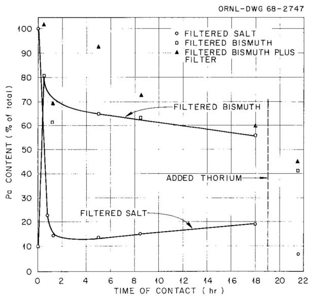  
Fig. 13.7. Distribution of Protactinium Between Bismuth-Thorium Alloy (2500 ppm Th) and LiF-BeF $_2$ -ThF $_4$ (73-2-25 Mole %) at $625^{\circ}\mathrm{C}$ .

If we assume that the calculated protactinium content of the bismuth in the first sample was too high, then it appears that there was relatively little change in the protactinium content of the bismuth over an 18-hr period. The minimum protactinium balance observed in this experiment was $80\%$ (18-hr samples). The uranium distribution data are displayed in Fig. 13.8. The uranium was present in the salt at an initial concentration of about $50~\mathrm{ppm}$ . About $80\%$ was found in the filtered bismuth, and there was very little left in the filtered salt after 18 hr contact time. Furthermore, the data indicate that the transfer of uranium to the bismuth occurred rapidly, as did the transfer of protactinium.

# 13.3.5 Single-Region Fuel Composition

A series of four experiments was performed with the single-region reactor fuel composition $\mathrm{LiF - BeF}_2\cdot$ $\mathrm{ThF_4}$ (72-16-12 mole%). The principal variables were the concentration of uranium fluoride added to the salt phase and the thorium concentration in the bismuth. Lanthanum was added to the salt in some

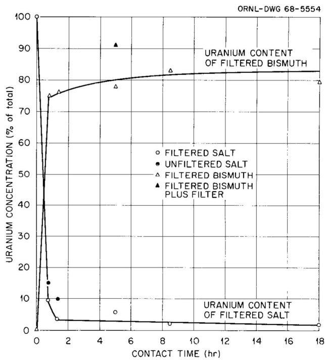  
Fig. 13.8. Distribution of Uranium Between LiF-BeF $_2$ -ThF $_4$ (73-2-25 Mole %) and Bismuth-Thorium Alloy. Run 1-8.

Table 13.5. Experimental Conditions for Extraction Experiments with Single-Region Fuel, LiF-BeF $_2$ -ThF $_4$ (72-16-12 Mole %)   

<table><tr><td>Run No.</td><td>Uranium Concentration (mole %)</td><td>Lanthanum Concentration (ppm)</td><td>231Pa Concentration (ppm)</td><td>Weight of Thorium Added to Bismuth (g)</td></tr><tr><td>1-30</td><td>0.00</td><td>Tracer</td><td>98</td><td>3.0</td></tr><tr><td>2-5</td><td>0.25</td><td>100</td><td>97</td><td>3.0</td></tr><tr><td>2-15</td><td>0.125</td><td>100</td><td>82</td><td>1.93</td></tr><tr><td>2-26</td><td>0.010</td><td>None</td><td>140</td><td>0.50 + 0.50</td></tr></table>

of the experiments in an effort to compare the transfer of a rare earth with that of protactinium under the same conditions. Experimental conditions in the four experiments are included in Table 13.5.

Protactinium distribution data in run 1-30, shown in Fig. 13.9, indicate that protactinium reduction was nearly complete after $7\frac{1}{2}$ hr contact of the salt and bismuth phases, with gas (helium) mixing. However, protactinium transfer to the bismuth was much less complete than in the case of the two-region blanket composition (Fig. 13.7), and the protactinium balance after the first (30-min) set of samples was poor. This shows that a large fraction of the protactinium was associated with some solid phase and was inaccessible to sampling. The amount of thorium metal present was more than enough to saturate the bismuth at the temperature of the experiment $(625^{\circ}\mathrm{C})$ , so that insoluble intermetallic complexes may have been present in addition to solid thorium. Lanthanum reduction was quite incomplete, and the $^{140}\mathrm{La}$ balance was not very good except for the 30-min samples, where $98\%$ was found in the filtered salt and $2\%$ in the filtered bismuth. Subsequent filtered bismuth samples showed only 0.2 to $0.5\%$ of the initial amount of $^{140}\mathrm{La}$ (not shown in Fig. 13.9).

The amount of thorium added in run 2-5 (3.0 g of thorium to 300 g of bismuth) was calculated to provide an excess of 2500 ppm $\mathrm{Th}^0$ . The protactinium distribution data are shown in Fig. 13.10. Protactinium in filtered salt samples went through a minimum at about 8 hr contact time and then increased, while that in the filtered bismuth decreased after reaching a maximum at the same contact time. The uranium distribution (Fig. 13.11) shows a minimum in the uranium concentration of filtered salt samples, but

the uranium concentration in the bismuth did not drop off during the same period. The thorium concentration in bismuth, also shown in Fig. 13.11, dropped off steadily during the course of the experiment, from an initial concentration of $2500~\mathrm{ppm}$ to $160~\mathrm{ppm}$ after $19\mathrm{hr}$ contact time. The final low concentration of thorium in the bismuth provides a possible explanation for the protactinium distribution data observed in this experiment (Fig. 13.10), but there is no obvious explanation for thorium loss. Except for short exposure of stainless steel samplers during removal of bismuth samples, graphite was the only structural material in contact with the two phases. The copper salt samplers only contact the salt phase during sampling. Further investigation will be required to provide an explanation for thorium loss and the poor protactinium balance observed in the later part of the experiment. In this experiment we demonstrated that the reduced protactinium could be returned to solution in the molten salt in the presence of bismuth by treating the mix with anhydrous $\mathbf{H}_2$ -HF ( $\mathbf{H}_2:\mathbf{HF}$ volume ratio varied from 10:1 to 5:1). Approximately 28 hr were required to redissolve all the protactinium because it was necessary to hydrofluorinate all the metallic thorium and uranium in the system as well as the reduced protactinium. We had previously demonstrated reversibility of the protactinium precipitation in some experiments with solid thorium, but this was the first time that we showed that liquid bismuth does not interfere with the hydrofluorination process. (Previously reported9 tracer-level experiments indicated that this result would be expected.)

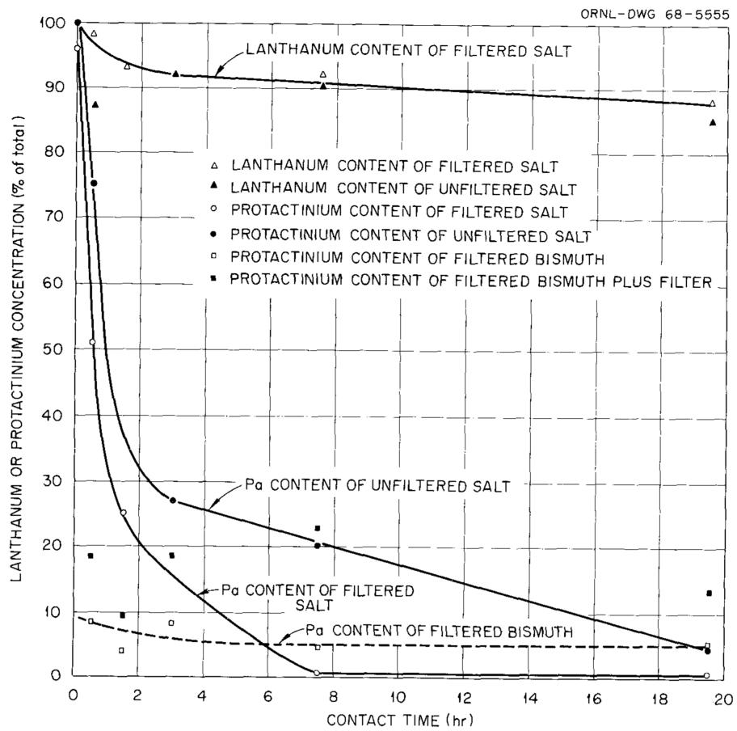  
Fig. 13.9. Reduction of Protactinium and Lanthanum in LiF-BeF $_2$ -ThF $_4$ (72-16-12 Mole %) by Bismuth-Thorium Alloy at $625^{\circ}\mathrm{C}$ .

Uranium distribution data in run 2-15 (Fig. 13.12) show that uranium reduction was slow and incomplete with a poor uranium balance, especially during the later part of the experiment. The thorium concentration in the metal phase (corrected for salt contamination by assuming that all beryllium present was due to salt) is also shown in the same figure. The decrease in thorium concentration proceeded at a linear rate $(177\mathrm{ppm / hr})$ during the first $9\mathrm{hr}$ and much more slowly during the last $13^{1/2}$ hr. This compares with the uniform rate of decrease of $125\mathrm{ppm / hr}$ over an 18-hr period in run 2-5. The protactinium distribution data (Fig. 13.13), like the uranium data, show slow and incomplete reduction, probably because of the thorium loss from the metal phase. The protactinium concentration in filtered bismuth reached a maximum $(3\%)$ of total) at 9 hr contact time and then decreased to $0.6\%$ . The pro

tactinium balance was poor, and the amount found on the stainless steel filter through which the filtered bismuth passed was relatively large, showing that there was a great deal of insoluble protactinium in the metal phase. The lanthanum data were much like those in run 2-5. The $^{140}\mathrm{La}$ concentration in filtered salt samples decreased to $82\%$ of the initial value after $22_{2}^{1}$ hr contact, but the maximum concentration observed in filtered bismuth was $0.5\%$ (3 hr contact time).

The last experiment in the series (run 2-26) represented an effort to avoid insoluble phases in the bismuth. The initial addition of thorium $(504\mathrm{mg})$ was calculated to leave $1000~\mathrm{ppm}$ excess thorium in the bismuth after all uranium and protactinium were completely reduced. After $17^{1/2}\mathrm{hr}$ , a second addition of $506\mathrm{mg}$ of thorium was made. Only $^{233}\mathrm{Pa}$ data are available at present. On the basis of these data,

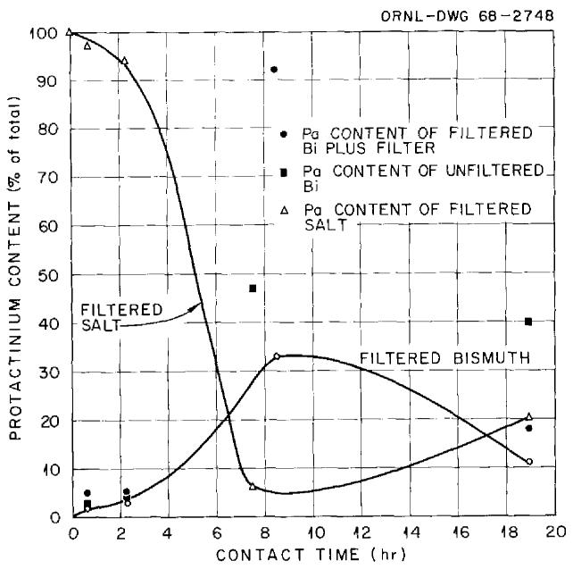  
Fig. 13.10. Distribution of Protactinium Between LiF-BeF $_2$ -ThF $_4$ (72-16-12 Mole %) and Bismuth-Thorium Alloy at $625^{\circ}\mathrm{C}$ .

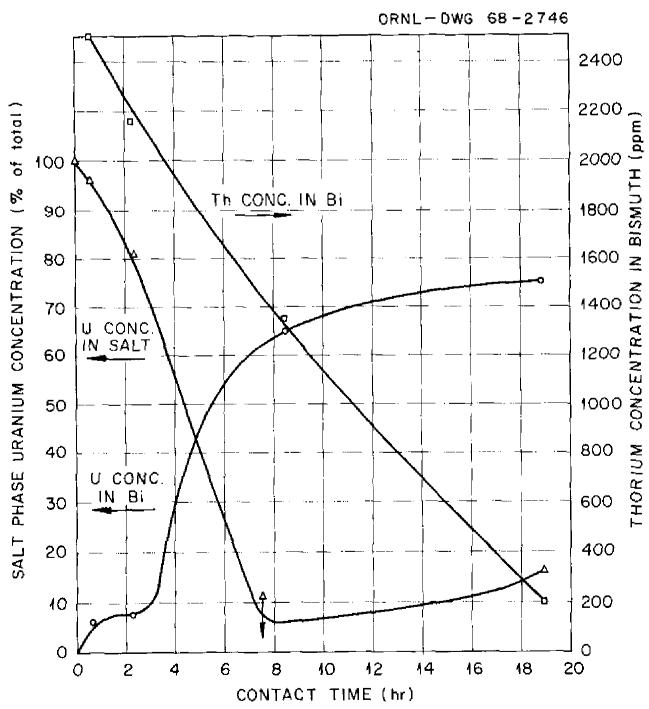  
Fig. 13.11. Uranium Distribution Between LiF-BeF $_2$ -ThF $_4$ (72-16-12 Mole %) and Bismuth-Thorium Alloy at $625^{\circ}\mathrm{C}$ .

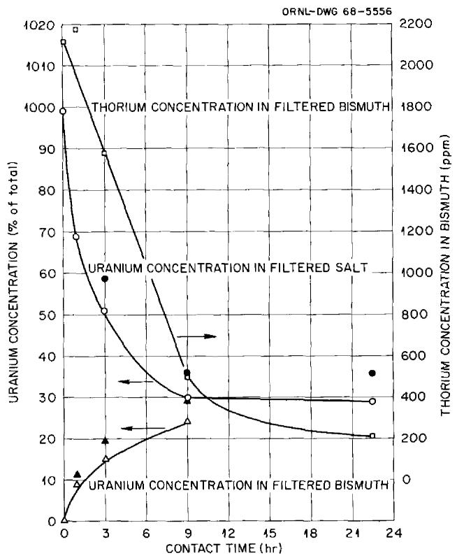  
Fig. 13.12. Distribution of Uranium Between LiF-BeF $_2$ -ThF $_4$ (72-16-12 Mole %) and Bismuth-Thorium Alloy. Run 2-15.

the protactinium distribution does not appear to be drastically different from that observed in the three previous experiments. The protactinium content of the filtered salt appeared to be leveling off at about $46\%$ of initial concentration after 16 hr contact, and the second thorium addition produced only a slight further decrease (to $34\%$ ). Only about $4\%$ of the protactinium was found in the filtered bismuth prior to the second addition of the thorium, but a sharp increase, to a maximum of $11\%$ , was noted after the addition. However, after another 18-hr period, this value had dropped to $3.1\%$ . This experiment will be discussed in more detail when the analytical data are complete.

Transfer of protactinium from two-region breeder blanket compositions to bismuth-thorium alloys occurred rapidly and very nearly completely. Reduction of both uranium and protactinium in the single-region reactor fuel composition $\mathrm{LiF - BeF}_2 - \mathrm{ThF}_4$ (72-16-12 mole %) occurred much more slowly in contact with

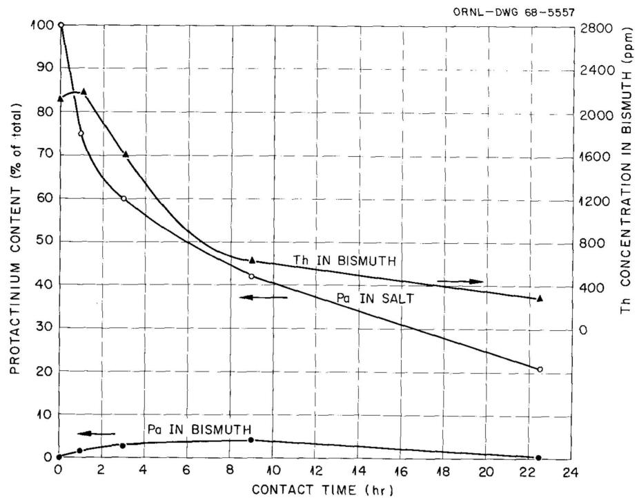  
Fig. 13.13. Distribution of Protactinium Between LiF-BeF $_2$ -ThF $_4$ (72-16-12 Mole %) and Bismuth-Thorium Alloy. Run 2-15.

bismuth-thorium alloys, and the fraction of protactinium found in filtered bismuth samples was much smaller than for the breeder blanket compositions tested. Since the principal difference is in the $\mathrm{BeF}_2$ content (16 mole% for single-region vs 0 or $2\%$ for two-region compositions), it seems likely that the disappearance of thorium noted in two ex

periments with single-region fuel may be attributed to reaction between thorium and $\mathbf{BeF}_2$ . The reaction product could be $\mathbf{Be}^0$ , $\mathbf{Be}_2\mathbf{C}$ , or $\mathbf{ThBe}_{13}$ , and the available thermodynamic data seem to favor the compounds rather than pure metallic beryllium. Further investigations are planned in an effort to elucidate the thorium loss phenomenon.

# 14. Behavior of $\mathbf{BF}_3$ and Fluoroborate Mixtures

# 14.1 PHASE RELATIONS IN FLUOROBORATE SYSTEMS

C. J. Barton

H. Insley

L. O. Gilpatrick

T. N. McLay

We mentioned in our previous report2 that there were indications that $\mathrm{NaBF}_4$ recrystallized from dilute hydrofluoric acid solutions was less pure than $\mathrm{KBF}_4$ prepared by the same procedure and that alternative methods of purifying $\mathrm{NaBF}_4$ were being considered. One process that has worked well with some materials, slow recrystallization from the melt by passing a tube filled with the material through a temperature gradient, failed to produce any significant improvement in the sharpness of the differential thermal analysis (DTA) melting curve, the most sensitive measure of compound purity that we have available. We found that improved purity of $\mathrm{NaBF}_4$ was achieved by treating molten $\mathrm{NaBF}_4$ at $425^{\circ}\mathrm{C}$ with a mixture of anhydrous HF, $\mathrm{BF}_3$ , and helium (2 volumes of $\mathrm{BF}_3$ per volume of HF). The sharpness of the DTA melting curve for $\mathrm{NaBF}_4$ resulting from this treatment approached that produced by our best $\mathrm{KBF}_4$ .

We believe that this treatment removes oxygen, which is probably present as $\mathrm{NaBF}_3\mathrm{OH}$ formed by hydrolysis of $\mathrm{NaBF}_4$ . The presence of a small quantity of this impurity could account for at least a portion of the corrosive action of earlier fluoroborate preparations.

A sample of material from a large batch of the $\mathrm{NaBF}_4$ purchased by a special order from a commercial producer had a melting point only about $1^{\circ}\mathrm{C}$ lower than that of our best laboratory preparation.

# 14.1.1 The System NaF-NaBF $_4$ -KBF $_4$ -KF

Investigation of phase relations in the system NaF-KF-BF at atmospheric pressure is limited to the portion of the system bounded by the compounds NaF-NaBF-KBF-KF, because fluoroborate preparations containing more than 50 mole $\%$ of $\mathbf{BF}_3$ exist only in equilibrium with high pressures of $\mathbf{BF}_3$ . This system is of interest because it would be desirable to have a coolant with an even lower liquidus temperature than is provided by the NaF-NaBF system (380°C).

Phase diagrams for two pseudobinary systems that form part of the ternary system have been published in another report.2 The NaF-KBF4 system has a eutectic containing about 96 mole $\%$ of KBF4 melting at $540\pm 5^{\circ}\mathrm{C}$ .The hightemperature forms of the compounds $\mathrm{NaBF}_4$ and KBF4 make a continuous series of solid solutions with a minimum-melting composition containing approximately 85 mole $\%$ NaBF4.A tentative diagram for the ternary system is shown in Fig. 14.1. There is a ternary eutectic composition in the triangle NaF-KBF4-KF close to the KF-KBF4 binary eutectic. The NaF primary phase field covers a large area of the diagram. There appears to be a valley forming the boundary between the NaF and NaBF4-KBF4 solid solution primary phase fields, approximately parallel to the NaBF4- KBF4 join and quite close to it. The minimummelting composition along this valley, containing approximately 47 mole $\%$ NaF, 5 mole $\%$ KF, and 48 mole $\%$ BF3, is the minimum-melting composition in the ternary system, with a liquidus temperature of $386\pm 5^{\circ}\mathrm{C}$

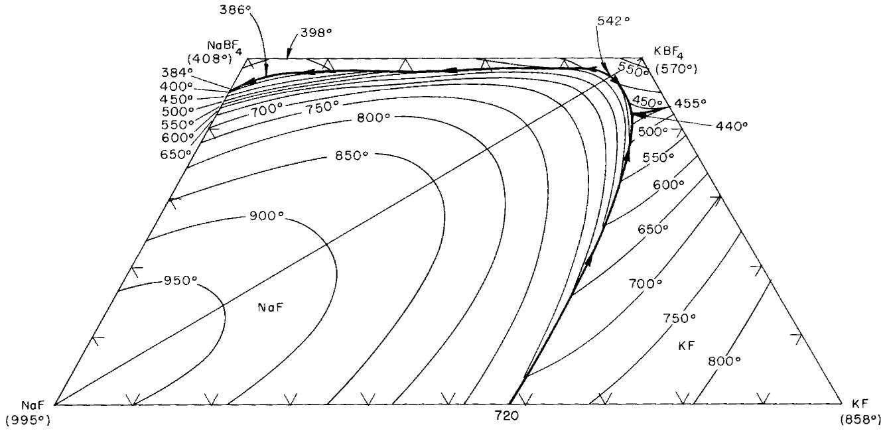  
Fig. 14.1. The System NaF-KF-NaBF $_{4}$ -KBF $_{4}$ .

# 14.2 NONIDEALITY OF MIXING IN POTASSIUM FLUOROBORATE-SODIUM (OR POTASSIUM) FLUORIDE SYSTEMS

M. A. Bredig

Experimental phase diagram data available from the preceding semiannual report $^2$ were examined for deviations from ideality of mixing. Slightly revised liquidus curves for KF and NaF in the binary salt system KF-KBF $_4$ and the reciprocal salt system NaF-KBF $_4$ , respectively, are shown in Fig. 14.2. The revision is based upon an appropriate application of the known enthalpies of fusion of NaF and KF ( $\Delta H_m = 7.90$ and 6.75 kcal/mole) to the liquidus near $100\%$ NaF and KF respectively. It is apparent that the KF-KBF $_4$ system deviates little from ideality, whereas the reciprocal salt mixtures NaF-KBF $_4$ , containing cations and anions of widely differing sizes, show large positive deviations from ideality. The latter were estimated semiquantitatively in terms of the partial molar excess free energy of NaF, $\overline{G}^E$ , by means of the equation

$$
\begin{array}{l} \bar {G} ^ {E} = R T \ln \gamma_ {\mathrm {N a F}} = \Delta H _ {m} [ (T / T _ {m}) - 1 ] \\ + \Delta C _ {p} \left(T _ {m} - T\right) - T \times \Delta C _ {p} \\ \times \ln \left(T _ {m} / T\right) - R T \ln N _ {\mathrm {N a F}} ^ {2}, \\ \end{array}
$$

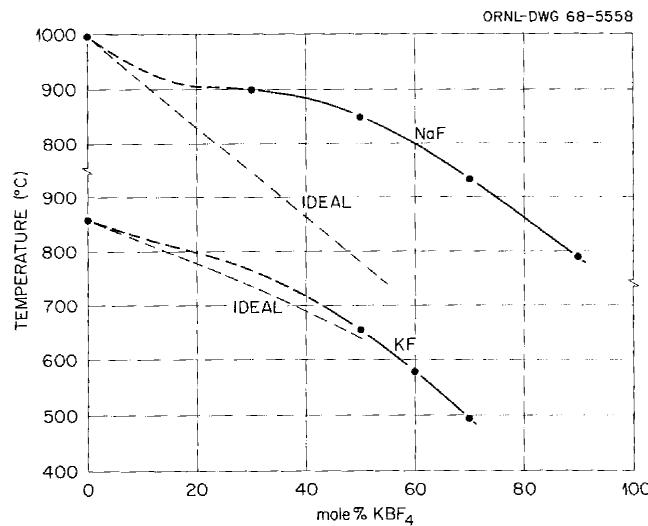  
Fig. 14.2. Revised Liquidus Interpolations for the Systems KF-KBF and NaF-KBF. Experimental points by Barton et al.

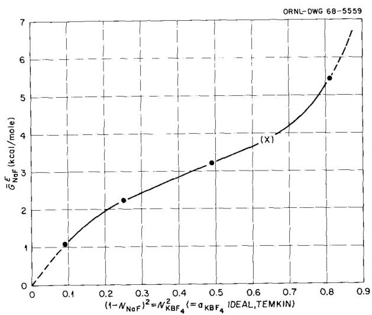  
Fig. 14.3. Excess Chemical Potential of NaF in NaF-KBF $_4$ from Phase Diagram. Experimental points by Barton et al.

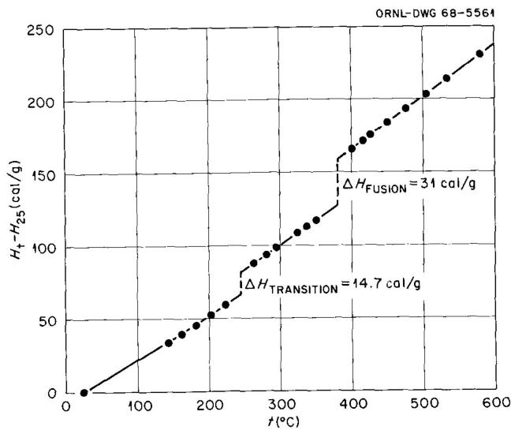  
Fig. 14.4. Heat Content of $\mathsf{NaBF}_4$ -NaF (92.5-7.5 Mole%).

with $\Delta C_p = 1.0$ cal deg $^{-1}$ mole $^{-1}$ . Figure 14.3 gives $\overline{G}^E$ as a function of, and shows it to be not simply proportional to, the ideal "Temkin" activity of KBF $_4$ , $(1 - N_{\mathrm{NaF}})^2$ . (It must be noted that this is not an isothermal plot.) The shape of the NaF liquidus in Fig. 14.2 and the high value (12,000 cal/mole) of the (interpolated) slope of $\overline{G}^E_{\mathrm{NaF}}$ below $(1 - N_{\mathrm{NaF}})^2 = 0.1$ in Fig. 14.3 suggest strongly that replacement of NaF by LiF, with the much greater difference in size of $\mathrm{Li}^+$ from $\mathbf{K}^+$ , would lead to separation into two liquids.

# 14.3 HEAT CONTENT OF NaBF $_4$ -NaF (92.5-7.5 MOLE %)

A. S. Dworkin

The heat content of the eutectic $\mathrm{NaBF}_4$ -NaF has been measured using a copper block drop calorimeter. The salt mixture was supplied by L. O. Gilpatrick and was from the same batch as that used for the phase diagram studies. The

mixture was contained in a sealed platinum capsule, which in turn was sealed into an Inconel capsule especially designed for our heat content apparatus.

The results are shown in Fig. 14.4. The heat of fusion is $31\mathrm{cal / g}$ , and the heat of transition is $14.7\mathrm{cal / g}$ . The heat capacity of the liquid from 380 to $600^{\circ}\mathrm{C}$ is $0.36\mathrm{calg}^{-1}\circ \mathrm{C}^{-1}$ and the heat capacity of the high-temperature solid from 243 to $380^{\circ}\mathrm{C}$ is $0.34\mathrm{calg}^{-1}\circ \mathrm{C}^{-1}$ .

# 14.4 SOLUBILITY OF THORIUM METAL IN LITHIUM FLUORIDE-THORIUM TETRAFLUORIDE MIXTURES

H. R. Bronstein

M. A. Bredig

A knowledge of the free energy of formation of $\mathrm{ThF}_4$ in various molten mixtures of LiF- $\mathrm{ThF}_4$ would be of value to the MSR fuel reprocessing study. An emf study of a cell of the type

$$
\mathrm {T h} ^ {0} \left| \mathrm {T h F} _ {4} (\mathrm {x}), \operatorname {L i F} (1 - \mathrm {x}) \right| \mathrm {H} _ {2}, \mathrm {H F} | \mathrm {P t}
$$

is the most obvious method for determining this quantity. The cell container must of necessity be nickel because of the use of the $\mathrm{H}_{2}$ , HF | Pt electrode.

However, a study by C. J. Barton and H. H. Stone has cast some doubt about the feasibility of such measurements in a nickel container. A thorium rod suspended in a molten mixture of the LiF-ThF (73-27 mole %) contained in a nickel crucible disappeared after 16 hr at a temperature of $600^{\circ}\mathrm{C}$ . Black magnetic material removed from the cooled melt analyzed $45\%$ Ni and $30\%$ Th, while nonmagnetic material contained $22\%$ Ni and $49.5\%$ Th. An explanation was based on the assumption that the reaction

$$
3 \mathrm {T h F} _ {4} + \mathrm {T h} ^ {0} \longrightarrow 4 \mathrm {T h F} _ {3}
$$

occurs and that the $\mathrm{ThF}_{3}$ , when it diffuses to the nickel wall, disproportionates because of the formation of the Th-Ni intermetallic compound. However, the speculative nature of this explanation was emphasized, as very little is known about the existence of a $\mathrm{ThF}_{3}$ .

If such a reaction with the nickel container actually occurs, severe complications would arise in an attempt to measure the free energy of formation of $\mathbf{ThF}_4$ in the above cell. Before abandoning this much-preferred cell arrangement, a reinvestigation of the reaction of $\mathbf{Th}^0$ with the LiF-ThF melt was deemed desirable.

A carefully dehydrated mixture of $\mathrm{LiF - ThF}_4$ (73 and 27 mole % respectively) was melted in a thorium crucible and held in the molten state under an atmosphere of dry argon at a temperature of $620^{\circ}\mathrm{C}$ . The melt was frequently stirred with a thorium stirrer. After a heating period of 16 hr, a sample of the molten liquid was withdrawn in a tantalum cup. The apparatus utilized for this experiment has been previously described and illustrated.[9]

The analysis of the sample indicated that approximately 2.0 mole $\%$ thorium metal had dissolved in the melt.

Next, a $\frac{1}{8}$ -in. nickel rod was suspended in the melt for a period of 5 hr at $620^{\circ}\mathrm{C}$ . At the termination of the experiment the solidified melt was removed from the thorium crucible. A blackish

layer of material was found at the bottom of the melt. Apparently segregation had occurred upon slow cooling. This black material reacted vigorously with hydrochloric acid. A hydrogen evolution analysis yielded a value of $12.5\%$ by weight calculated as free thorium metal. Spectrographic analysis showed the presence of only very minor quantities of other metals as impurities. Of some significance is the absence of detectable quantities of nickel, possibly attributable to the very small surface ratio of nickel rod to thorium crucible. X-ray examination of this blackish material showed lines only of the compounds existing in this melt composition, $^{10}$ that is, mainly $\mathrm{Li}_3\mathrm{ThF}_7$ and a small amount of $\mathrm{LiThF}_5$ . In agreement with this, microscopic examination showed the blackish material to be comprised mainly of the salt mixture.

Further experimental work will be performed to corroborate the above findings.

# 14.5 DISSOCIATION PRESSURE OF $\mathsf{BF}_3$ FOR THE MSRE SUBSTITUTE COOLANT

Stanley Cantor

Melts composed mainly of $\mathrm{NaBF}_4$ , because they possess attractive thermal properties, are under consideration as coolants in molten-salt reactors. An unattractive property of fluoroborates is the relatively high vapor pressure of $\mathrm{BF}_3$ caused by dissociation, for example,

$$
\mathrm {N a B F} _ {4} (I) = \mathrm {N a F} (I) + \mathrm {B F} _ {3} (g).
$$

To determine the equilibrium constant of the above reaction and to derive other thermodynamic data (see next section), $\mathbf{BF}_3$ pressures in equilibrium with melts of the system NaBF $^4$ -NaF have been measured. Some of the results are shown in Fig. 14.5. (Preliminary measurements reported in ORNL-4191, pp. 159-61, are superseded by more accurate results shown in Fig. 14.5.)

For the mixture proposed as the MSRE substitute coolant, 92-8 mole $\%$ NaBF $_4$ -NaF, vapor pressures of BF $_3$ in equilibrium with the melt of this fixed composition can be represented by the equation

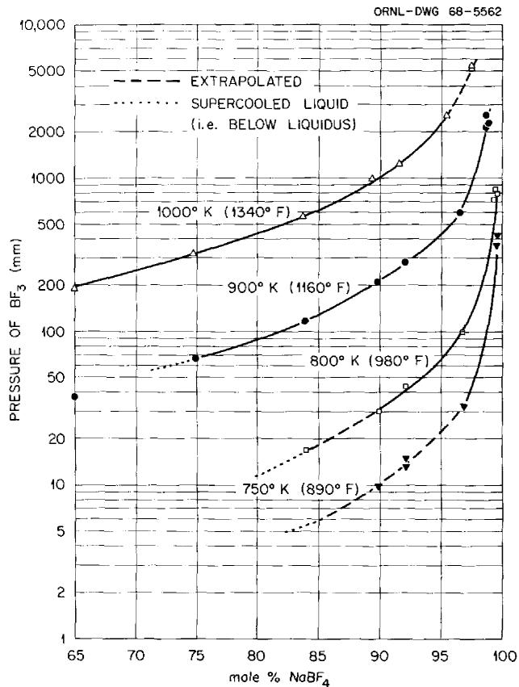  
Fig. 14.5. Vapor Pressure of $\mathsf{BF}_3$ in Equilibrium with NaBF $_4$ -NaF Melts.

$$
\log P (\mathrm {m m}) = 9. 0 2 4 - \frac {5 9 2 0}{T (^ {\circ} \mathrm {K})}.
$$

At normal power operating temperature $(1000^{\circ}\mathrm{F})$ in the MSRE coolant pump bowl, the pressure of $\mathbf{BF}_3$ will be $53\mathrm{mm}$ ; at zero-power temperature $(1200^{\circ}\mathrm{F})$ the pressure will be $401\mathrm{mm}$ .

# 14.6 CHEMICAL THERMODYNAMICS OF THE SYSTEM $\mathsf{NaBF}_4$ -NaF

Stanley Cantor

In a closed apparatus of known volume, $\mathbf{BF}_3$ pressures in equilibrium with the melt were measured manometrically in the composition range 2 to $\sim 100$ mole $\% \mathrm{NaBF}_4$ . For each composition, pressures were measured over at least a $150^{\circ}$ temperature interval within overall limits of 425 to $1200^{\circ}\mathrm{C}$ .

From the observables of the experiment (pressure and volume of $\mathbf{BF}_3$ vapor, temperature, number of moles of $\mathrm{NaBF}_4$ and NaF initially charged into the apparatus), an equation was derived for the thermodynamic activity of $\mathrm{NaBF}_4$ . The equation is:

$$
\ln a _ {\mathrm {N a B F} _ {4}} = \int_ {t \left(N _ {2}\right)\rightarrow 0} ^ {f \left(N _ {2}\right)} f \left(N _ {2}\right) d \ln P _ {\mathrm {B F} _ {3}}, \tag {1}
$$

where $P_{\mathbf{BF}_3}$ is the pressure of $\mathbf{BF}_3$ in equilibrium with a melt whose composition is denoted by $f(N_2)$ , defined as the number of moles of NaF initially loaded minus the number of moles of $\mathbf{BF}_3$ in the vapor divided by the number of moles of $\mathbf{NaBF}_4$ and NaF initially loaded. The composition variable, $f(N_2)$ , is very close to, but not exactly equal to, the equilibrium mole fraction of NaF in the melt. Equation (1) was derived from the Gibbs-Duhem equation for the molten phase at constant temperature.

The integral on the right-hand side of Eq. (1) was solved graphically, using Simpson's rule. By integration of the Gibbs-Duhem equation, activities of NaF were derived from the activities of $\mathrm{NaBF}_4$ . For the most part the activities exhibited slightly positive deviations from ideality. In other words, activity coefficients (defined in terms of the pure liquid components) were greater than unity. Figure 14.6 shows the activity coefficients of $\mathrm{NaBF}_4$ and NaF at $1000^{\circ}\mathrm{K}$ .

By combining $\mathbf{BF}_3$ pressures and activities the equilibrium constant $K_{p}$ was obtained for the reaction

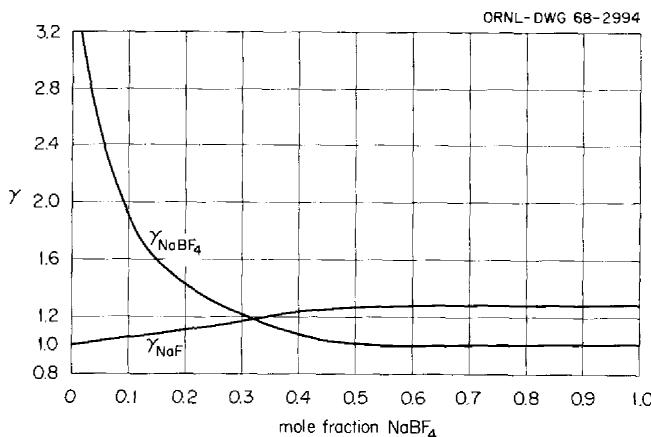  
Fig. 14.6. Activity Coefficients of $\mathsf{NaBF}_4$ and NaF at $1000^{\circ}\mathsf{K}$ .

$$
\mathrm {N a B F} _ {4} (l) = \mathrm {N a F} (l) + \mathrm {B F} _ {3} (\mathfrak {g}),
$$

where

$$
K _ {p} = P _ {\mathrm {B F} _ {3}} \frac {a _ {\mathrm {N a F}}}{a _ {\mathrm {N a B F} _ {4}}}
$$

At $1000^{\circ}\mathrm{K}$ , $K_{p}$ equals 0.182 atm, while at $1100^{\circ}\mathrm{K}$ , $K_{p}$ is 0.670 atm.

# 14.7 CORROSION OF HASTELLOY N AND ITS CONSTITUENTS IN FLUOROBORATE MELTS

Stanley Cantor

A preliminary corrosion test11 showed that metallic chromium (the component of Hastelloy N most readily oxidized in molten fluoride media) reacted with the molten mixture proposed as the MSRE substitute coolant, NaF-NaBF4 (92-8 mole %). Two products of the reaction were crystalline Na3CrF6 and gaseous BF3. Most likely, the removal of NaF from the melt in forming Na3CrF6 caused a shift in the equilibrium

$$
\mathrm {N a B F} _ {4} (l) = \mathrm {N a F} (l) + \mathrm {B F} _ {3} (\hat {g}),
$$

thereby establishing a higher vapor pressure of $\mathbf{BF}_3$ .

A program of tests is in progress to

1. determine if Hastelloy N itself reacts unfavorably with $\mathbf{NaBF}_4$ melts,   
2. verify the initial results with pure chromium,   
3. observe whether nickel and iron also react.

In each test a salt sample of about $100\mathrm{g}$ partially decomposes (according to the above reaction) in an evacuated container fabricated from or containing samples of the test metal; the gas pressure and temperature are continuously monitored. On the basis of the preliminary study, we anticipated that for a constant temperature, the gas pressure would increase at a rate proportional to the chromium corrosion rate. After runs are completed, the containers are cut open and the contents examined. A summary of six tests is given in Table 14.1.

The condition of the Hastelloy N containers and specimens following tests 1 and 2 (see Table 14.1) indicated rather sluggish reaction with $\mathrm{NaBF}_4$ . On the other hand, increases of nickel and chromium in the salt indicated that moderate corrosion occurred; taking into account the surface area of metal exposed to the melt, the concentrations of nickel and chromium in the salt are equivalent to a corrosion rate of 1.5 to 3 mils/year.

Test 3, however, provided more encouraging results with regard to both nickel and chromium corrosion. The lack of nickel corrosion in test 3 was essentially verified in test 5. It is possible that the vessels in tests 1 and 2 had undergone some corrosion prior to being loaded with fluoroborate and that the corrosion product was subsequently dissolved by the salt.

Test 4 indicates that chromium reacts with either fluoroborate or some impurity contained in $\mathrm{NaBF}_4$ . As yet we have not found reduced boron, either in an elemental form or as a metallic boride. Hence, it cannot be stated with any certainty that $\mathrm{NaBF}_4$ oxidizes chromium. The blackish material noted after completion of test 4 is being carefully examined for a possible boron content.

# 14.8 COMPATIBILITY AND IMMISCIBILITY OF MOLTEN FLUORIDES

C. E. Bamberger

J. P. Young

C. F. Baes, Jr.

C. S. Sherer1

In connection with the investigation of fluoroborates as a coolant for molten-salt reactors, the following tests of compatibility and solubility of $\mathrm{KBF}_4$ and $\mathrm{NaBF}_4$ with various fluoride mixtures and with $\mathrm{B}_2\mathrm{O}_3$ were carried out. It was found that silica and, at lower temperatures, even Pyrex containers were suitable for these tests, thus providing the great advantage of direct visual examination. As a result, the occurrence of liquid-liquid immiscibility was quickly detected, a phenomenon which was not detected by less-direct DTA and quenching techniques. In all tests the samples were evacuated several times and flushed with helium prior to melting.

Table 14.1. Summary of Corrosion Tests with 92-8 Mole % NaBF $_4$ -NaF   

<table><tr><td>Test No.</td><td>Metal Exposed</td><td>Time at Temperature</td><td>Vapor Pressure</td><td>Observations at Termination of Test</td></tr><tr><td>1</td><td>Hastelloy N</td><td>284 hr at 560°C</td><td>Rose from 100 to 210 mm in 96 hr; remained at 210 mm thereafter</td><td>Metal exposed to salt and BF3vapor had blackened appearance; Hastel-loy N specimens immersed in melt had not changed weight. Salt cake was white with black scum at inter-faces. Concentrations of chromium and nickel in salt increased by 100 and 650 ppm respectively.</td></tr><tr><td>2</td><td>Hastelloy N, salt loaded was pure NaBF4</td><td>449 hr at 580°C</td><td>585 mm continuously</td><td>Slight blackening of exposed metal surfaces; no change in weight of Hastelloy N specimens. Chromium and nickel in salt phase increased by 230 and 1590 ppm respectively.</td></tr><tr><td>3</td><td>Hastelloy N</td><td>603 hr at 605°C, then 253 hr at 657°C</td><td>150 mm continuously, then 370 mm continuously</td><td>Slight blackening of exposed metal surfaces; specimens unchanged in weight. Salt had slight greenish cast, but Na3CrF6was not detected. Chromium had increased in salt phase by 100 ppm but nickel remained &lt;20 ppm.</td></tr><tr><td>4</td><td>50 g chromium chips; nickel container</td><td>837 hr at 600°C</td><td>Slowly rose from 170 to 280 mm</td><td>Chromium chips lost 0.5 g. Much green Na3CrF6formed and located on or near chromium chips within the salt cake. Water-insoluble blackish material mixed with Na3CrF6.</td></tr><tr><td>5</td><td>Nickel coupons; nickel container</td><td>1428 hr at 606°C</td><td>170 mm unchanged for 384 hr; slow rise to 460 mm thereafter</td><td>Pressure remained at 310 mm when sample cooled to room temperature. It may therefore be inferred that the rise in pressure during the run was caused by a very slow inleakage of air. Nickel in salt phase increased by by about 25 ppm. Nickel metal cou-pons were unchanged in weight and showed no evidence of attack.</td></tr><tr><td>6</td><td>Iron coupons; nickel container</td><td>936 hr at 600°C</td><td>220 mm continuously</td><td>Test still continuing.</td></tr></table>

In the following solubility tests, except one, the temperature was $480^{\circ}\mathrm{C}$ and the containers were Pyrex. Samples remained molten for periods up to 12 hr.

1. $\mathrm{NaBF}_4 + \mathrm{CrF}_2$ (0.3 wt $\%$ ): no solubility detected; after 1 to 2 hr the insoluble $\mathrm{CrF}_2$ changed to a bright green color, possibly $3\mathrm{NaF} \cdot \mathrm{CrF}_3$ .

2. $\mathrm{NaBF}_4 + \mathrm{CrF}_3 (\sim 1\mathrm{wt}\%)$ : no solubility detected; change of color indicating possible $3\mathrm{NaF} \cdot \mathrm{CrF}_3$ .   
3. $\mathrm{NaBF}_4 + \mathrm{UF}_4$ : neither solubility of $\mathrm{UF}_4$ nor formation of $\mathrm{UO}_2$ was detected, even after adding $\mathrm{B}_2\mathrm{O}_3$ .   
4. $\mathrm{NaBF}_4 + \mathrm{HoF}_3$ : this rare earth was readily available, and its spectrum in molten fluorides is known; no measurable solubility was detected.   
5. $\mathrm{KBF}_4 + \mathrm{B}$ (amorphous) at $650^{\circ}\mathrm{C}$ in fused silica: no significant solubility was detected; the finely divided powder coagulated with time.

The following list summarizes the tests in which liquid immiscibility was observed; unless otherwise stated the container material was fused silica. Since $\mathrm{UF}_4$ did not show spectrophotometrically any solubility in $\mathrm{NaBF}_4$ or in $\mathrm{KBF}_4$ , it was used for spiking other fluorides as a visual aid in the detection of phase separations. In some instances $\mathrm{KBF}_4$ was used rather than $\mathrm{NaBF}_4$ because its higher melting point was closer to the melting point of some fluoride mixtures.

1. $\mathrm{NaBF}_4 +$ blanket salt (0.71 LiF, 0.02 BeF $_2$ , 0.27 ThF $_4$ ), phase ratio $\sim$ 1:10, temperature $585^{\circ}\mathrm{C}$ .   
2. $\mathrm{KBF}_{4} +$ blanket salt (0.71 LiF, 0.02 BeF $_2$ , 0.27 ThF $_4$ ), temperature $625^{\circ}\mathrm{C}$ .   
3. $\mathrm{NaBF}_4 + \mathrm{BULT - 4}$ (0.65 LiF, 0.30 BeF $_2$ , 0.01 UF $_4$ , 0.04 ThF $_4$ ), phase ratio $\sim$ 1:10, temperature $585^{\circ}\mathrm{C}$ .   
4. $\mathrm{NaBF}_4 + 3\mathrm{LiF}\cdot \mathrm{UF}_4$ , phase ratio $\sim 1:30$ , temperature $480^{\circ}\mathbf{C}$ , Pyrex container.

5. $\mathrm{NaBF}_4 + 2\mathrm{LiF}\cdot \mathrm{BeF}_2$ phase ratio $\sim 10:1$ , temperature $480^{\circ}\mathrm{C}$ , Pyrex container.   
6. $\mathrm{NaBF}_4 + \mathrm{MSRE}$ salt (0.64 LiF, 0.29 BeF $_2$ , 0.015 ZrF $_4$ , 0.009 UF $_4$ ), phase ratio $\sim$ 1:10 and 4:1, temperature $480^{\circ}\mathrm{C}$ , Pyrex container.

It has been reported13 that mixtures of $\mathrm{NaBF}_{4}$ and $\mathrm{B}_{2} \mathrm{O}_{3}$ react vigorously on heating to produce $\mathrm{BF}_{3}$ :

$$
\mathrm {N a B F} _ {4} + 2 \mathrm {B} _ {2} \mathrm {O} _ {3} \rightleftharpoons \mathrm {B F} _ {3} + \mathrm {N a F} \cdot \mathrm {B} _ {4} \mathrm {O} _ {6}. \tag {1}
$$

Indeed this is a commonly used method to generate $\mathbf{BF}_3$ . Nonetheless, we decided to explore the effect of $\mathbf{B}_2\mathbf{O}_3$ additions to immiscible liquids of $\mathrm{NaBF}_4$ plus LiF-BeF $_2$ -ThF $_4$ -UF $_4$ . Gas evolution was detected in all tests where $\mathbf{B}_2\mathbf{O}_3$ was added directly, and no extraction of UF $_4$ or precipitation of $\mathrm{UO}_2$ was noted. The resulting borate phases were very viscous.

Finally, in another series of tests 2LiF·BeF $_2$ was equilibrated with NaBF $_4$ in sealed nickel containers at $600^{\circ}\mathrm{C}$ . The capsules were quenched and the two phases sampled and analyzed. The results (Table 14.2) show appreciable distribution of all the components (NaF, LiF, BF $_3$ , and BeF $_2$ ) between the two phases. In each phase

$$
n _ {\mathrm {L i F}} + n _ {\mathrm {N a F}} \sim n _ {\mathrm {B F} _ {3}} + n _ {\mathrm {B e F} _ {2}},
$$

suggesting that the phases may be represented approximately as reciprocal mixtures of the ions $\mathrm{Li}^{+},\mathrm{Na}^{+},\mathrm{BF}_{4}^{-},\mathrm{BeF}_{4}^{2 - }$ . In terms of these ions there is a tendency for the smaller ions, $\mathrm{Li}^{+}$ and $\mathrm{BeF}_{4}^{2 - }$ , to favor one phase and the larger ions, $\mathrm{Na}^{+}$ and $\mathrm{BF}_{4}^{-}$ , to favor the other phase.

Table 14.2. Liquid-Liquid Distribution Behavior for ${\mathrm{{Li}}}_{2}{\mathrm{{BeF}}}_{4} - {\mathrm{{NaBF}}}_{4}$ Mixtures at ${600}^{ \circ  }\mathrm{C}$   

<table><tr><td rowspan="2">Initial Phase Ratio (g NaBF4/g Li2BeF4)</td><td rowspan="2">Phase</td><td colspan="4">Mole Fraction</td></tr><tr><td>NaF</td><td>LiF</td><td>BF3</td><td>BeF2</td></tr><tr><td rowspan="2">3</td><td>Top</td><td>0.391</td><td>0.139</td><td>0.419</td><td>0.052</td></tr><tr><td>Bottom</td><td>0.165</td><td>0.435</td><td>0.129</td><td>0.271</td></tr><tr><td rowspan="2">2</td><td>Top</td><td>0.365</td><td>0.174</td><td>0.406</td><td>0.055</td></tr><tr><td>Bottom</td><td>0.156</td><td>0.448</td><td>0.138</td><td>0.257</td></tr><tr><td rowspan="2">1</td><td>Top</td><td>0.373</td><td>0.164</td><td>0.432</td><td>0.031</td></tr><tr><td>Bottom</td><td>0.110</td><td>0.545</td><td>0.044</td><td>0.300</td></tr></table>

# Part 4. Molten-Salt Irradiation Experiments

E. G. Bohlmann

Molten-salt breeder reactors will operate at fuel salt power densities of 300 to $700\mathrm{w / cc}$ in comparison with the peak level of $24\mathrm{w / cc}$ in the MSRE. Knowledge of the effects of such exposures on fuel salt stability and materials compatibility for both design and foreseeable off-design conditions is essential to the success of the breeder program. The fates of the fission products are also of interest in terms of separations processing and possible poisoning due to accumulation on or in the graphite moderator. Molten-salt convection loop experiments are being operated in beam hole HN-1 of the ORR to develop data pertinent to the breeder program.

Examination of the second loop experiment was completed during this period. No unexpected materials problems were encountered except for the fact that the salt had wetted the graphite, presumably because of small amounts of moisture present in the gas used in loading, sampling, and draining manipulations. Fission product behavior

was well defined (good material balances for most isotopes of interest) and generally consistent with results of analyses on MSRE materials.

A prototype of a third loop, modified to provide for better graphite examinations both pre and post irradiation, has been constructed, and components for the in-pile version have been fabricated of Hastelloy N modified to improve high-temperature ductility after irradiation. Work on the experiment has been discontinued because of budget limitations and investigations of effects of moisture levels in the cover and manipulatory gas.

In the interim a program of capsule irradiations of fluoroborate coolant salt in spent HFIR fuel elements is in progress. Gamma fluxes comparable with those present in the MSRE heat exchanger are available in the center of such elements. Examination of the first capsule experiment showed no gross effects of accumulation of a dose of $2.5 \times 10^{10} \mathrm{r}$ .

# 15. Molten-Salt Convection Loop in the ORR

E. L. Compere

H. C. Savage

J. M. Baker

We have previously described the operation and postirradiation examination of the second in-pile molten-salt convection loop experiment operated in beam hole HN-1 of the ORR. During this report period, we completed additional analyses of

the fuel salt, graphite, and metal in contact with fissioning fuel salt and cover gas and thereby determined the distribution of fission product activities in the loop components. A prototype of a third loop assembly has been designed, and component parts have been fabricated.

Results of these additional postirradiation analyses and present design features of the third loop assembly are described below.

# 15.1 ISOTOPE ACTIVITY BALANCE (LOOP 2)

As reported previously, the activity of a given isotope to be expected in the system at a particular time was estimated by a detailed application of standard equations to the individual irradiation and inventory periods with adjustment for decay to final ORR shutdown for the experiment. Data received during the current period permit completion of the isotope activity balance.

The activities of the fission products $^{137}\mathrm{Cs},$ $^{144}\mathrm{Ce}$ and $^{95}\mathrm{Zr}$ were used as internal standards to estimate the average flux received by the salt under the assumption that they were not appreciably lost from the salt. A mean flux to the salt of $0.88\times 10^{13}$ was thus estimated. From this value, total activities of the various isotopes produced in the ORR loop experiment were calculated.

The calculations described above provided an estimate of the amount of each isotope to be accounted for. We determined the total amount of isotope actually found in the system by dividing the loop into regions, analyzing a specimen from each region, and allocating a proportionate amount of activity to the region.

For the various samples obtained from the loop, activity determinations for the 13 isotopes shown in Table 15.1 were made, as well as sensitive determinations of $^{235}\mathrm{U}$ . The activities have been totaled for each isotope under the categories of graphite, loop metal, salt sample lines, gas sample and inlet lines, and salt. These values, plus the estimated total activities calculated from inventory and irradiation history, are also shown in Table 15.1.

It may be seen that over half (but generally less than all) the expected activity was accounted for in the cases of $^{99}\mathrm{Mo}$ , $^{132}\mathrm{Te}$ , $^{95}\mathrm{Zr}$ , $^{89}\mathrm{Sr}$ , $^{137}\mathrm{Cs}$ , $^{141}\mathrm{Ce}$ , $^{144}\mathrm{Ce}$ , $^{91}\mathrm{Y}$ , and $^{147}\mathrm{Nd}$ .

A substantial proportion, although less than half, was accounted for in the cases of $^{95}\mathrm{Nb}$ , $^{140}\mathrm{Ba}$ , and $^{131}\mathrm{I}$ . Inasmuch as iodine readily volatilizes from all solid samples (without doubt from powdered graphite in particular), it is to be expected that iodine determinations would be low.

Only about $11\%$ of the $^{103}\mathrm{Ru}$ was found, although proper traps were used to recover any ruthenium compounds volutilized during the preparation of radiochemical samples.

Molybdenum, tellurium, ruthenium, and niobium are almost entirely departed from the salt. These elements showed no dominant preference for graphite or metal but seemed to deposit on whatever surface was available. Short-lived noble gases appeared to have diffused appreciably into the graphite, as shown by the presence of daughter isotopes such as ${}^{89}\mathrm{Sr}$ , ${}^{140}\mathrm{Ba}$ , and others. However, the major proportions of these, and almost all of other alkali, alkaline-earth, and rare-earth isotopes (all of which form relatively stable, nonvolatile fluorides), were found in the salt.

# 15.2 PENETRATION OF FISSION PRODUCTS INTO GRAPHITE AND DEPOSITION ONTO SURFACES

The amounts of the respective fission product isotopes which penetrated the graphite to given depths were obtained from the samples shaved from the fuel channels. Data for each isotope and each common cut depth were summed over all the fuel channels. The value was corrected for the amount of the isotope in salt in the sample based on the amount of $^{235}\mathrm{U}$ which was found and on the concentration of the isotope in regular salt samples. This correction was appreciable only for those isotopes found principally in salt and was never dominant.

The amount of an isotope in the graphite up to a given depth was then divided by the total amount of the isotope found in the loop, yielding the percentage of the particular fission product that penetrated to that depth in the graphite. Thus, about $43\%$ of the fission product $^{132}\mathrm{Te}$ that was found was deposited within 1.3 mils of the graphite surface, and about $58\%$ within the first 35 mils.

Values so obtained are shown in Fig. 15.1, where the percentage of each fission product which penetrated to given depths is shown as a function of depth.

The fission products $^{95}\mathrm{Zr}$ , $^{141}\mathrm{Ce}$ , $^{144}\mathrm{Ce}$ , $^{91}\mathrm{Y}$ , and $^{147}\mathrm{Nd}$ are found in low amounts in the graphite (between 0.4 and $3\%$ ) with nearly all that observed being found close to the surface.

Table 15.1. Comparison of Fission Product Activity Found in Various Loop Regions with Activity Produced in Loop   
Percentage of loop inventory (calculated from power history) found in given region   

<table><tr><td>Isotope</td><td>Fission Yield (%)</td><td>InventoryaCalculated (1010dis/min)</td><td>Salt Samplesb</td><td>Graphitec</td><td>Loop Metal</td><td>Salt Sample Line</td><td>Gas Sample Line (Heated)</td><td>Gas Inlet Line (Cold)</td><td>Total Foundd</td></tr><tr><td colspan="10">Isotopes That Leave the Salt</td></tr><tr><td>66-hr 99Mo</td><td>6.1</td><td>940</td><td>0.2</td><td>41.0</td><td>23.4</td><td>9.9</td><td>0.02</td><td>&lt;0.01</td><td>74</td></tr><tr><td>39.7-day 103Ru</td><td>3.0</td><td>8,100</td><td>0.07;0.09</td><td>6.0</td><td>4.5</td><td>0.64</td><td>0.0005</td><td>0.0001</td><td>11</td></tr><tr><td>78-hr 132Te</td><td>4.3</td><td>1,140</td><td>0.8;1.8</td><td>31.6</td><td>14.0</td><td>7.2</td><td>0.04</td><td>&lt;0.01</td><td>54</td></tr><tr><td>35-day 95Nbb</td><td>6.2</td><td>7,400</td><td>0.07</td><td>13.4</td><td>17.6</td><td>3.3</td><td>&lt;0.01</td><td>&lt;0.01</td><td>35</td></tr><tr><td colspan="10">Isotopes That Remain in the Salt</td></tr><tr><td>65-day 95Zr</td><td>6.2</td><td>12,800</td><td>69;107</td><td>0.4</td><td>0.6</td><td>0.8</td><td>&lt;0.01</td><td>&lt;0.01</td><td>71;106</td></tr><tr><td>8.05-day 131I</td><td>2.93</td><td>5,000</td><td>30;31</td><td>0.3</td><td>1.6</td><td>1.1</td><td>0.1</td><td>0.02</td><td>33</td></tr><tr><td>12.8-day 140Bae</td><td>6.35</td><td>16,500</td><td>29;30</td><td>2.3</td><td>1.3</td><td>0.9</td><td>&lt;0.01</td><td>&lt;0.01</td><td>34</td></tr><tr><td>50.5-day 89Sr</td><td>4.79</td><td>11,500</td><td>66;82</td><td>8.7</td><td>1.1</td><td>0.7</td><td>0.1</td><td>0.01</td><td>76;92</td></tr><tr><td>58.3-day 91Ye</td><td>5.8</td><td>12,900</td><td>121;61</td><td>3.0</td><td>0.6</td><td>0.6</td><td>0.003</td><td>&lt;0.00001</td><td>125;65</td></tr><tr><td>30-year 137Cs</td><td>6.0</td><td>108</td><td>87;95</td><td>1.8</td><td>2.2</td><td>0.02</td><td>0.15</td><td>0.02</td><td>91;99</td></tr><tr><td>32.8-day 141Ce</td><td>6.0</td><td>17,300</td><td>70;78</td><td>1.3</td><td>0.4</td><td>0.7</td><td>&lt;0.01</td><td>&lt;0.01</td><td>72;80</td></tr><tr><td>284-day 144Ce</td><td>5.6</td><td>3,500</td><td>109;124</td><td>1.3</td><td>0.5</td><td>0.7</td><td>0.0003</td><td>&lt;0.0003</td><td>112;126</td></tr><tr><td>11.1-day 147Nd</td><td>2.6</td><td>6,100</td><td>72;64</td><td>2.0</td><td>0.7</td><td>1.9</td><td>&lt;0.01</td><td>&lt;0.01</td><td>77;69</td></tr></table>

Assuming a mean flux to salt of $0.88 \times 10^{13}$ based on average of values from $^{95}Zr$ , $^{137}Cs$ , and $^{144}Ce$ in final salt samples.   
${}^{b}$ Estimated for total salt based on each of two final samples. Niobium-95 based on earlier sample because production from ${}^{95}\mathrm{{Zr}}$ in salt during final period tended to remain in the salt,which was frozen most of the final two weeks.(Seventeen and twenty-one percent were found in the two final samples.)   
Corrected for salt content.   
$d_{\text{Both totals are shown if the two salt samples differed appreciably.}}$   
$^{\mathrm{e}}$ Isotopes with noble-gas precursors.

On the other extreme in quantity are $^{132}\mathrm{Te}$ , $^{99}\mathrm{Mo}$ , and $^{103}\mathrm{Ru}$ . These isotopes showed 35 to 43% in the first 1.3 mils, 52 to 56% within 3.1 mils, and not much more at greater depths. These isotopes are thus indicated to deposit strongly from the salt onto the graphite surface but migrate only weakly if at all after deposition.

Noble-gas isotopes would be expected to diffuse into graphite, so that a more gradual concentration gradient of daughter isotopes resulting from their decay should be encountered. Thus,

the total amount of daughter isotope within a given depth would continue to increase to appreciable depths. This pattern is evident for $^{89}\mathrm{Sr}$ , $^{140}\mathrm{Ba}$ , $^{137}\mathrm{Cs}$ , and possibly $^{91}\mathrm{Y}$ .

Iodine-131 also exhibited such a pattern, although it was present in low quantity and amounts varied from sample to sample. Since iodine is not expected to be volatile from molten salt, either a volatile precursor is implied or migration could have occurred after the salt was frozen or during subsequent handling.

Niobium-95 is present at concentrations far in excess of its parent $^{95}\mathrm{Zr}$ , and its action does not appear coupled to that of $^{95}\mathrm{Zr}$ . Accumulated amounts increase rapidly for the first 5 mils from

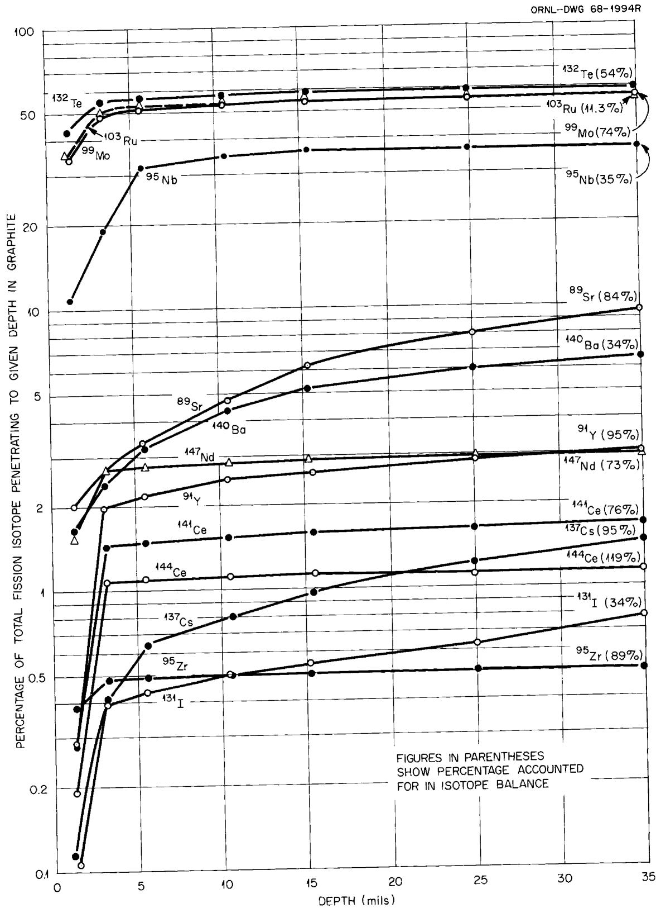  
Fig. 15.1. Penetration of Various Fission Product Isotopes into Graphite as a Percentage of Total Isotope in Loop.

11 to $32\%$ and then increase regularly but more slowly up to about $37\%$ at 35 mils. Apparently this isotope was deposited relatively strongly on the graphite but also tended to penetrate inward, in this way exhibiting the pattern attributed above to gases.

# 15.3 STUDIES OF SURFACE WETTING OF GRAPHITE BY MOLTEN SALT

During postirradiation examination of the second in-pile molten-salt loop, evidence of surface wetting of the core graphite by salt was noted. We wish to establish procedures to prevent this in the next loop experiment. We have recently studied in a vacuum box the wetting characteristics of droplets of MSRE solvent salt on a platelet of MSRE graphite. We confirm generally the observation of Kreyger, Kirslis, and Blankenship that wetting is due to three-phase contact of gas, graphite, and molten salt at moisture levels as low as 10 ppm or lower.

In an atmosphere of tank helium (below 4 ppm water), the droplets on melting did not wet the graphite. However, in a few minutes they developed a translucent crust and in 1 to 2 hr after melting had slumped and spread spasmodically over the graphite surface. Another droplet was melted on graphite under good vacuum (less than $10^{-4}$ torr, the present gage limit) and remained clear and round for about 20 hr. However, when tank helium was admitted to a pressure of 0.2 torr, the molten droplet promptly slumped and wetted the graphite surface.

The surface wetting behavior of the salt thus appears to be very sensitive to very slight impurities, presumably water, in the helium. This could have been accentuated in these studies because of the small amount of salt and the large amount of gas. Further, the lack of wetting of the graphite by salt in the experiment under vacuum indicates that the prior condition of graphite or salt did not control the wetting behavior. Consequently, gas cleanup procedures are being tested as the next step in studying the wetting phenomenon.

# 15.4 DESIGN OF A THIRD IN-PILE MOLTEN-SALT LOOP

In-pile operation of the second molten-salt loop experiment was terminated because of a crack in the core outlet pipe with resultant fission product leakage. From evidence of postirradiation examination and evaluation of the effects of neutron irradiation on properties of Hastelloy N, it was concluded that this failure was caused by deterioration of stress rupture properties due to neutron irradiation. Therefore, the third loop assembly will be constructed of a modified Hastelloy N containing titanium as an additive for improving resistance to radiation-induced high-temperature embrittlement. Required shapes for construction of the loop components have been obtained from an ingot of such $(\sim 0.5\% \mathrm{Ti}, 2\% \mathrm{W})$ Hastelloy N.

We have also redesigned the graphite core section of the next loop to provide additional graphite surveillance specimens. The redesigned core has four holes of $\frac{1}{2}$ -in.-square cross section instead of the eight $\frac{1}{4}$ -in.-diam round holes for salt flow used for the two loops previously operated in-pile. Graphite specimens with a $\frac{3}{8}$ -in.-square cross section are inserted coaxially in each hole, resulting in a $\frac{1}{16}$ -in. annular salt flow channel, as shown in Fig. 15.2. The flat surfaces of these graphite specimens will permit improved preirradiation evaluation of the graphite quality and post-irradiation examination to determine interaction of graphite and salt. Metal locating brackets will be used to position the graphite specimens and will also serve as surveillance specimens for metals of interest.

In addition, we plan to install an adsorption trap immediately adjacent to the vapor space in the loop gas separation tank in an effort to trap and identify the gas-borne fission product species.

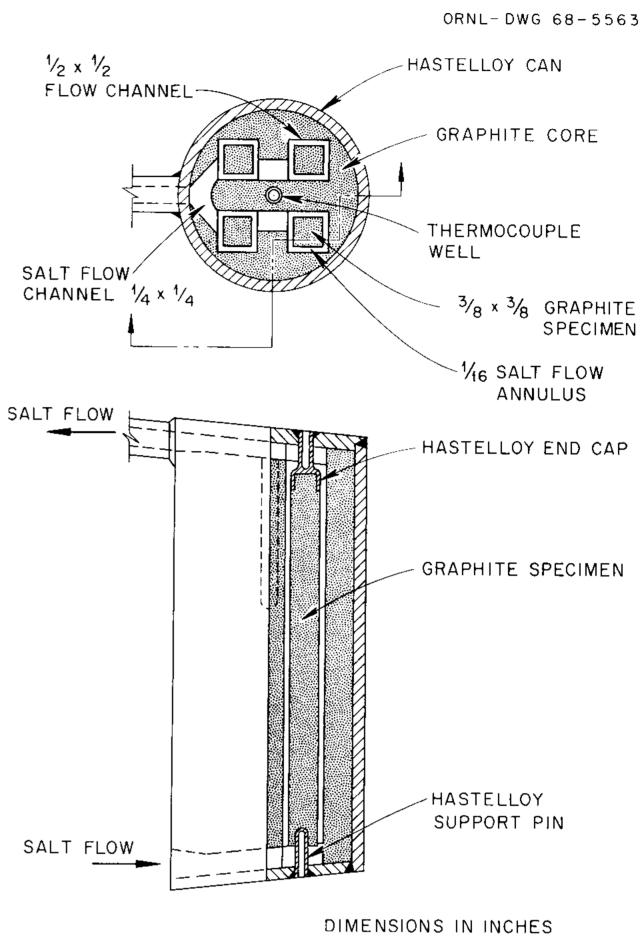  
Fig. 15.2. Graphite Core and Specimens, Molten-Salt In-Pile Loop.

# 16. Gamma Irradiation of Fluoroborate

E. L. Compere

H. C. Savage

J. M. Baker

The use of sodium fluoroborate as a coolant in the Molten-Salt Breeder Reactor will involve the possibility of irradiation damage due to gamma rays and delayed neutrons from the fuel salt in the heat exchanger.

Gamma rays might ionize and decompose sodium fluoroborate to produce boron, fluorine, and sodium fluoride. Neutrons in a $^{10}\mathrm{B}(n,\alpha)$ reaction would be expected to yield an alpha particle, lithium fluoride, fluorine, and sodium fluoride. The high-energy alpha particle could also ionize and decompose the sodium fluoroborate. The fluorine generated by either process would probably react with structural metals of the system to form their fluorides. Thus, a major effect of radiation damage to sodium fluoroborate by either mechanism would be a corresponding amount of corrosion. In the projected test of the $8\% \mathrm{NaF} - 92\% \mathrm{NaBF}_4$ eutectic mixture in MSRE, the neutron flux is negligible $(\sim 6 \times 10^8 \mathrm{nv})$ ; therefore, the present studies are emphasizing the effects of gamma radiation. The gamma irradiation experiments are conducted in the central channel of spent HFIR fuel elements in the storage pool of the HFIR, where very high gamma fluxes are available $(\sim 8 \times 10^7 \mathrm{r/hr}$ for elements four days old); this is comparable with the gamma flux in the MSRE heat exchanger.

For the first gamma irradiation experiment $34\mathrm{g}$ of an $\mathrm{NaF - NaBF_4}$ eutectic mixture with a melting point of $\sim 380^{\circ}\mathrm{C}$ was placed in a Hastelloy N capsule (0.93 in. $\mathrm{OD} \times 0.78$ in. $\mathrm{ID} \times 3.5$ in. long) containing a Hastelloy N corrosion test specimen. The salt was melted in the capsule in an argon atmosphere box, and then the capsule was welded shut. A capillary tube connected the gas space above the salt to a pressure transducer. A heater and three thermocouples were used to control and

monitor temperature. The capsule assembly was then placed in an aluminum container to isolate it from the pool water.

Prior to the start of irradiation, the capsule containing the sodium fluoroborate was vacuum pumped $(5\times 10^{-3}$ torr) for $16\mathrm{hr}$ at $150^{\circ}\mathrm{C}$ to remove any moisture and residual gas. The capsule was then sealed by closing the valve on the gas line and held at $450^{\circ}\mathrm{C}$ for $3\mathrm{hr}$ . On cooling to $20^{\circ}\mathrm{C}$ a residual pressure of $\sim 5$ torrs was observed. Analysis of the residual gas by mass spectrograph showed it to contain $\mathbf{N}_2$ $(73\%)$ , Ar $(13\%)$ , $\mathrm{CO}_{2}(8\%)$ , $\mathrm{H}_{2}(4\%)$ , $\mathrm{O}_{2}(2\%)$ , and $\mathrm{H}_{2}\mathrm{O}(0.2\%)$ . The capsule was then vacuum pumped at $150^{\circ}\mathrm{C}$ for $1\mathrm{hr}$ , closed off, and operated for $68\mathrm{hr}$ at $600^{\circ}\mathrm{C}$ . The observed pressure at $600^{\circ}\mathrm{C}$ was $145\mathrm{mmHg}-$ close to the value anticipated for $\mathrm{BF}_3$ vapor pressure according to Cantor's data. When cooled to $20^{\circ}\mathrm{C}$ , residual gas pressure was below the limit of detection $(\sim 5$ torrs).

The capsule assembly was then placed in the center of HFIR fuel element 34 on February 2, 1968. This element had been removed from the reactor on January 29, 1968, after operating for 23 days at $100\mathrm{Mw}$ . The sodium fluoroborate salt temperature reached $465^{\circ}\mathrm{C}$ from gamma heat alone (estimated to be $0.25\mathrm{w / g}$ ). Electrical heat was then added to bring the temperature to $600^{\circ}\mathrm{C}$ .

On February 4, 1968, it was observed that the electrical power required to maintain the capsule at $600^{\circ}\mathrm{C}$ was higher than anticipated and that the indicated wall temperature at the center of the capsule (below the salt-gas interface) was below

that of the upper section (gas space). These observations indicated the possibility of water in the container surrounding the capsule, and the experiment was removed from the fuel element. No evidence of water in the container was found by vacuum pumping while heating the capsule to $\sim 100^{\circ}\mathrm{C}$ . However, only the thermocouple located on the wall by the gas space of the capsule was still operating. The experiment was again placed in the center of the fuel element, and operation at $600^{\circ}\mathrm{C}$ , as indicated by the above thermocouple, was continued.

The experiment was removed from the fuel element on February 26, 1968, after $533\mathrm{hr}$ of irradiation. Observed pressure during most of the irradiation period ranged between 100 and $150~\mathrm{mm}$ . For the $533\mathrm{hr}$ of irradiation the $\mathrm{NaF - NaBF}_4$ salt accumulated an estimated absorbed dose of $\sim 1\times 10^{24}\mathrm{ev / g}$ .

Residual gas pressure in the capsule was $\sim 10$ torrs at $50^{\circ}\mathrm{C}$ and was found to contain a large percentage of hydrogen by mass spectrographic analysis $(\mathrm{H}_{2},85\% ;\mathrm{N}_{2},12\% ;\mathrm{H}_{2}\mathrm{O},2\% ;\mathrm{CO}_{2},1\% ;$ Ar, $0.3\% ;\mathrm{O}_2$ $0.1\%)$ , which was confirmed by gas chromatography. The source of the hydrogen in the residual cover gas is not known; incompletely fluorinated fluoroborate $(\mathrm{NaBF}_3\mathrm{OH})$ and in-diffusion of radiolytic or corrosion hydrogen from the water in the containment are possibilities.

Upon opening the aluminum container can, it was found to contain sufficient water to soak the magnesia insulating pad under the capsule. Since the capsule bottom was in contact with a water-soaked insulation pad, a severe temperature gradient undoubtedly existed from the top to bottom of the capsule for most of the irradiation period. The two thermocouples at the center and near the bottom of the capsule were lost early in the run; thus the temperature at the bottom of the capsule is unknown. However, it is estimated that at least part of the NaF-NaBF $_4$ salt in the capsule remained frozen after the first two days of operation. Since no leaks were found in the aluminum can by pressure testing, it is assumed that water was inadvertently spilled into the can through the container access tube.

The capsule was cut open, and the corrosion test specimen and salt were removed. No visual evidence of corrosion was seen. The salt, however, was discolored. Several sharply defined layers of salt of varying shades of pink from the bottom to about the center were observed with a

thin dark-brown layer on the bottom. The upper half of the salt was a mottled gray white. The layers are believed to be associated with solidification progressing upward from the bottom as the internal gammaheating diminished, with the moist insulation permitting significant heat removal.

An unirradiated capsule assembly identical to the irradiated capsule was operated molten for $840\mathrm{hr}$ (mostly at $600^{\circ}\mathrm{C}$ ) as a control for the irradiation experiment. Salt removed from this experiment was entirely white and rather frangible with none of the pink-brown discoloration observed in the irradiated salt. However, small brilliant-green crystals identified microscopically as $\mathrm{Na}_3\mathrm{CrF}_6$ were found near metal surfaces - particularly at the bottom. For the unirradiated capsule, there was very little temperature gradient from top to bottom as was initially the case for the irradiated capsule.

Samples of salt removed at various levels from the respective irradiated and unirradiated experiments were examined by mass spectrographic analyses. In each case, the bottom layer contained 10,000 ppm Cr or more and about 2000 ppm Ni, Fe, and Ca, and 500 ppm of Mo, Ti, Mg, and Al, as well as smaller but appreciable amounts of a number of other impurities. The Na/B atom ratio ranged between 0.96 and 1.12 for most regions as might be expected for the sodium fluoroborate-sodium fluoride mixture (nominally, $\mathrm{Na} / \mathrm{B} \sim 1.09$ ). The region of the unirradiated material with green crystals showed an Na/B ratio of 1.26, whereas the corresponding dark-brown bottom region of the irradiated salt had a ratio of 1.09.

The upper surfaces of both salts had a dark scum, and samples from this region in each case showed an $\mathbf{Na} / \mathbf{B}$ ratio of $\sim 0.9$ .

It is believed that a mild corrosion of Hastelloy N occurred in both cases, with a dark boron scum being produced. The corrosion products collected near the bottom.

Hastelloy N coupons exposed in the irradiated and unirradiated tests exhibited negligible attack other than a few surface stains. Microscopic examination revealed a general slight dulling - more evident at the liquid surface and above and somewhat more pronounced on the unirradiated coupon. The weight change of the unirradiated specimen corresponded to less than 0.01 mil/year; for the irradiated coupon, the weight change was zero.

The above findings are not indicative of any noteworthy effect of gamma irradiation on the

sodium fluoroborate salt or its compatibility with Hastelloy N.

A second gamma irradiation capsule assembly has been fabricated, and it is planned to irradiate this experiment to a higher total dose than the

first experiment. Additional insulation at the top and bottom of the capsule has been added to ensure that the entire capsule is at a nearly uniform temperature.

# Part 5. Materials Development

H. E. McCoy, Jr.

J. R. Weir

The primary structural materials in molten-salt reactors are Hastelloy N and graphite. Our experience with the MSRE has demonstrated the excellent compatibility of these materials with fluoride salts in a nuclear environment. We have a surveillance facility in the MSRE that allows us to periodically remove graphite and Hastelloy N specimens for examination. Both materials have been used in our fission product studies, and we have run mechanical property tests on the Hastelloy N to follow the changes in the properties of the reactor vessel.

Future MSBR's will probably utilize similar structural materials, but some advances in technology are desirable. The requirements placed on the graphite are somewhat more severe in an MSBR

than in the MSRE. The graphite will be exposed to higher fluences and must have low permeability to gaseous fission products. We presently have a facility for irradiating graphite to a fluence of about $3 \times 10^{22} \mathrm{~nvt}$ ( $>50$ kev) per year, and we are investigating the dimensional changes that occur in various grades of graphite. We plan to reduce the permeability of graphite by surface sealing with metals or pyrocarbon. We have developed a modified Hastelloy N with superior resistance to irradiation damage and are studying its properties in detail. Some new salt compositions are of interest for MSBR's, and we are expanding our corrosion program to investigate their compatibility with Hastelloy N.

# 17. MSRE Surveillance Program

# 17.1 GENERAL COMMENTS

H.E.McCoy,Jr. W.H.Cook

We maintain a graphite and Hastelloy N surveillance program to follow the changes in properties with irradiation of the graphite and Hastelloy N used in the MSRE. A special fixture has been designed1 so that these materials can be exposed to the MSRE environment and removed periodically for examination. The graphite has been used principally for fission product deposition studies, since we presently do not have hot-cell techniques

for measuring the very small changes in physical properties that have likely taken place. The Hastelloy N is in a form that can be converted to mechanical test specimens quite easily, and we have evaluated its postirradiation properties by tensile and creep-rupture tests.

The space in the surveillance fixture is somewhat larger than required to follow the property changes in the same materials used to construct the MSRE. Hence, we have inserted some special types of graphite and Hastelloy N (1) to gain a better understanding of fission product behavior, (2) to obtain compatibility information, and (3) to determine irradiation damage information.

We plan to remove another group of surveillance specimens from the MSRE about April 1, 1968.

# 17.2 EXAMINATION OF HASTELLOY N SPECIMENS FROM MSRE SURVEILLANCE FACILITY

H. E. McCoy, Jr.

We removed a second set of Hastelloy N specimens in June 1967. The specimens removed from the core had been at temperature for $5500\mathrm{hr}$ and had accumulated a peak thermal dose of approximately $4\times 10^{20}$ neutrons $\mathbf{\mu} / \mathbf{cm}^2$ .The core specimens were modified alloys containing approximately $0.5\%$ Ti (heat 21545) and $0.5\%$ Zr (heat 21554). A stringer of standard Hastelloy N specimens from outside the reactor vessel was also removed. These specimens had been exposed to the MSRE cell environment for about 11,000 hr and had accumulated a peak thermal dose of about $3\times 10^{19}$ neutrons $\mathbf{\mu} / \mathbf{cm}^2$ . The vessel specimens were made of the same heats used in constructing the MSRE.

The creep-rupture properties of the heats of standard Hastelloy N are shown in Fig. 17.1. Data are shown for (1) the first set of specimens removed from the core after $4800\mathrm{hr}$ with a thermal fluence of $1.3\times 10^{20}$ neutrons $\mathrm{cm}^2$ and (2) the second set of specimens located outside the vessel and removed after 11,000 hr with a thermal fluence of $3\times 10^{19}$ neutrons $\mathrm{cm}^2$ . The specimens irradiated to the lower fluence generally had a larger rupture life at a given stress, although the differences become quite small at low stresses (compare points for heat 5085). We have no explanation for the superior rupture life of heat 5081.

The minimum creep rates are compared in Fig. 17.2 for several heats of Hastelloy N in the irradiated and unirradiated conditions. As observed previously, this parameter is not affected.

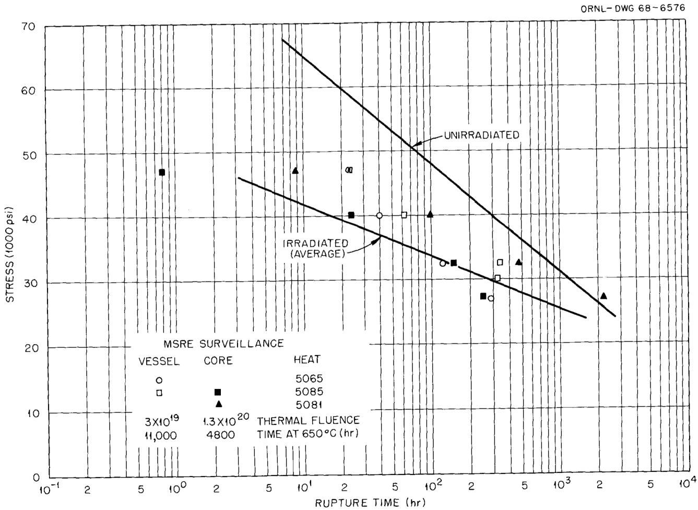  
Fig. 17.1. Postirradiation Creep-Rupture Properties of MSRE Surveillance Specimens at $650^{\circ}\mathrm{C}$ .

The fracture strains of the vessel heats are shown in Fig. 17.3. The scatter band was determined from a large number of data points, with heat 5065 being on the lower side and heat 5085 being on the upper side. The minimum fracture strain at a strain rate of about $0.1\%/\mathrm{hr}$ clearly exists for materials exposed to irradiation for about 1000 hr at $650^{\circ}\mathrm{C}$ , whereas the data for the surveillance specimens do not suggest the existence of this minimum. The fracture strains of most of the surveillance specimens fall between 1.5 and $2.5\%$ ; however, heat 5081 is somewhat anomalous and exhibits higher fracture strains with the trend of increasing fracture strain with decreasing creep rate. The results on heat 5085 indicate that the fracture strain may be decreased only slightly by increasing the fluence

from $3 \times 10^{19}$ to $1.3 \times 10^{20}$ neutrons/cm $^2$ . However, the data at higher strain rates indicate a large reduction in the fracture strain as a result of the increased fluence.

The tensile properties of the air-melted surveillance materials are shown in Table 17.1 for test conditions of 25 and $650^{\circ}\mathrm{C}$ . The fracture strains at $650^{\circ}\mathrm{C}$ are considerably lower at the higher fluence. The reduction in ductility at $25^{\circ}\mathrm{C}$ is thought to be associated with carbide precipitation in the alloy and is probably a function of both the thermal history and the fluence.

The property changes that have been noted in Hastelloy N as a result of service in the MSRE are similar to those noted for Hastelloy N irradiated in an inert-gas environment, thus reflecting the excellent compatibility of the alloy with

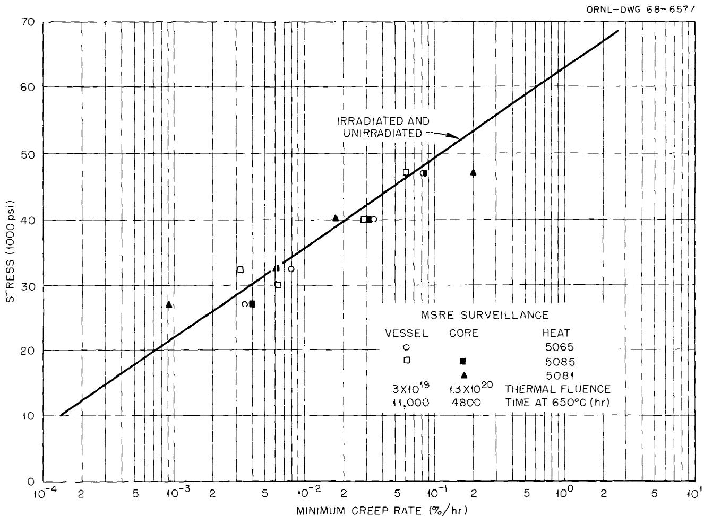  
Fig. 17.2. Variation of Minimum Creep Rate of Hastelloy N MSRE Surveillance Samples in Postirradiation Creep Tests at $650^{\circ}\mathrm{C}$ .

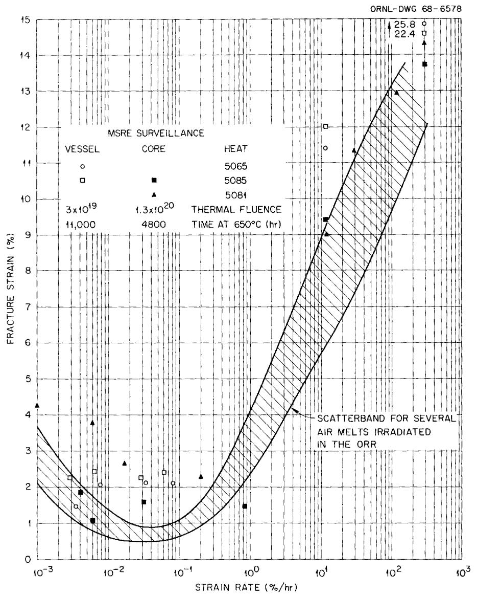  
Fig. 17.3. Variation of Fracture Strain with Strain Rate for MSRE Surveillance Specimens at $650^{\circ}\mathrm{C}$ .

fluoride salts. The fracture strain and the rupture life at a given stress are both reduced, but not to levels that should prevent the continued successful operation of the MSRE. The property changes noted in increasing the fluence from $3 \times 10^{19}$ to $1.3 \times 10^{20}$ neutrons/cm $^2$ were quite small. The vessel should not reach a thermal fluence of $1.3 \times 10^{20}$ neutrons/cm $^2$ until after 150,000 Mwhr of operation. Thus, if the effects of thermal aging are not adverse, the properties of the vessel should not deteriorate much below those observed

for the material irradiated to $1.3 \times 10^{20}$ neutrons/ $\mathrm{cm}^2$ .

The titanium- and zirconium-modified alloys that were removed from the core were heat treated to obtain a very fine grain size. At the time these were inserted, it was thought that the fracture strain increased with decreasing grain size. However, subsequent tests showed that the reverse was true. The postirradiation properties of these materials were quite comparable with those noted for the standard Hastelloy N.

Table 17.1. Tensile Elongation (%) for MSRE Surveillance Specimens   

<table><tr><td rowspan="2">Test Temperature (°C)</td><td colspan="2">Heat 5065</td><td colspan="2">Heat 5085</td><td colspan="2">Heat 5081</td></tr><tr><td>0.05 min-1a</td><td>0.002 min-1</td><td>0.05 min-1</td><td>0.002 min-1</td><td>0.05 min-1</td><td>0.002 min-1</td></tr><tr><td colspan="7">Vessel (3 × 1019neutrons/cm2)</td></tr><tr><td>25</td><td>34.6</td><td></td><td>42.5</td><td></td><td></td><td></td></tr><tr><td>650</td><td>25.8</td><td>11.4</td><td>22.4</td><td>12.0</td><td></td><td></td></tr><tr><td colspan="7">Core (1.3 × 1020neutrons/cm2)</td></tr><tr><td>25</td><td></td><td></td><td>27.3</td><td></td><td>38.7</td><td></td></tr><tr><td></td><td></td><td></td><td></td><td></td><td>42.6</td><td></td></tr><tr><td>650</td><td></td><td></td><td>13.7</td><td>9.4</td><td>14.3</td><td>9.0</td></tr></table>

${}^{a}$ Strain rate.

# 18. Graphite Studies

# 18.1 Procurement of Special Grades OF GRAPHITE

W. H. Cook

The current studies on graphite for molten-salt breeder reactors include (1) the determination of the physical and mechanical properties before and after irradiation, (2) sealing research with pyrolytic carbon and chemical-vapor-deposited niobium

and molybdenum, (3) graphite-to-metal joining studies, and (4) fabrication of test assemblies.

Graphite for the initial phases of items 1 through 3 has been obtained in reasonable quantities.

Some graphite for item 4 is on order.

The graphite manufactured by Poco Graphite, Inc., continues to be our reference graphite for the sealing and joining work because it (1) has reasonable uniformity, (2) has pore entrance diameters

Table 18.1. Receipt and Utilization of Special Grades of Graphite Received Since January 1, 1968   

<table><tr><td>Grade</td><td>Source</td><td>Type</td><td>Bulk Density (g/cm3)</td><td>Nominal Dimensions (in.)</td><td>Pieces</td><td>Utilization</td></tr><tr><td>9950</td><td>Speera</td><td>Near isotropic</td><td>1.71</td><td>21/2×4×8</td><td>1</td><td></td></tr><tr><td>9949</td><td>Speera</td><td>Near isotropic</td><td>1.71</td><td>21/2×4×8</td><td>1</td><td></td></tr><tr><td>9948</td><td>Speera</td><td>Near isotropic</td><td>1.92</td><td>21/2×4×8</td><td>1</td><td>Grade 9948 will be evaluated in HFIR irradiation studies</td></tr><tr><td>AXF</td><td>Pocob</td><td>Isotropic</td><td>~1.82</td><td>7/16 diam×6</td><td>200</td><td>For sealing studies</td></tr><tr><td>AXF-5Q</td><td>Poco</td><td>Isotropic</td><td>1.81</td><td>4 diam×18</td><td>1</td><td>Graphite-to-metal joining studies</td></tr><tr><td>AXF-5QBG</td><td>Poco</td><td>Isotropic</td><td>1.89</td><td>11/2×4×6</td><td>4</td><td>Graphite-to-metal joining studies</td></tr><tr><td>ATJ-S</td><td>CPDc</td><td>Near isotropic</td><td>~1.83</td><td>8 diam×12</td><td>1</td><td>Made by a special process which has potential for fabrication of MSBR shapes; evaluation to include irradiation in the HFIR</td></tr><tr><td>ATJ-SG</td><td>CPD</td><td>Near isotropic</td><td>1.81</td><td>8 diam×12</td><td>1</td><td>Made by the ATJ-S process using a more isotropic filler material, Gilsocarbon flour; evaluation to include irradiation in the HFIR</td></tr></table>

$a$ Gratis material from Speer Carbon Company.   
bPoco Graphite, Inc.   
Carbon Products Division of Union Carbide Corporation.

that are in the desired range (approx $1\mu$ ), and (3) is readily obtainable in small but useful sizes for these studies.

The grades and disposition of graphite obtained recently are summarized in Table 18.1.

# 18.2 POROSITY CREATED IN GRADE AXF GRAPHITE BY OXIDATION PRETREATMENT

W. H. Cook

The porosity of grade AXF graphite used in coating and sealing studies was increased to an unacceptable extent when the specimens were treated for $\frac{1}{2}$ hr in air at $600^{\circ} \mathrm{C}$ . This pretreat

1Manufactured by Poco Graphite, Inc., Garland, Tex.

ment was used to remove fingerprints or other contaminants from graphite test pieces before they were sealed by the vapor deposition of metals. Specimens given this pretreatment were unusually permeable and were not sealed by reasonable metal deposits. Microstructural examination showed that the normal, relatively uniform pore structure with entrance diameters approximately $1\mu$ now had a secondary set of pores with some more than a hundred times as large as the basic pores.2

This was a new lot of grade AXF graphite in stock sizes of $\frac{7}{16}$ -in.-diam, 6-in.-long rods; so

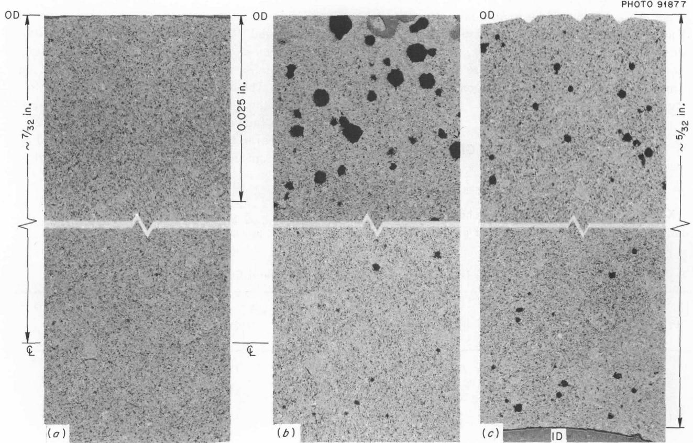  
Fig. 18.1. Microstructures of Grade AXF Isotropic Graphite Specimens from $7/16$ -in.-diam Rods. (a) As received, (b) after exposure for $1/2$ hr in air at $600^{\circ}\mathrm{C}$ , and (c) machined to 0.400 in. $\mathrm{OD} \times 0.100$ in. ID and then given the same treatment given the specimen shown in b. The normal pores are not resolved in these microstructures; they are usually associated with the dark-gray phase of the structure, but assuming that they are greater than $1\mu$ (the approximate diameter of their entrances), they would be only approximately 0.004 in. on the photomicrographs. However, the oxidized voids (pores) are clearly visible as the large black circular spots. $100\times$ . No etchant.

a series of tests were made to determine if the secondary set of pores was the result of the pretreatment or was characteristic of the new lot of material. Control and test specimens were taken from three random rods. Test specimens from each rod were given the standard pretreatment, and duplicate specimens were given the same anneal in an argon environment. The normal grade AXF graphite microstructure, as shown in Fig. 18.1a, was observed for all three controls and the test specimens treated in argon. All those given the standard oxidation pretreatment developed the large secondary set of pores shown in Fig. 18b and c. The voids were at irregular depths ranging from 20 mils to completely through the $7/16$ -in.-diam specimens. The oxidized void (pore) sizes graded from large to small from the external surfaces to inside the specimens.

The samples used in the sealing studies were 0.4 in. $\mathrm{OD} \times 0.1$ in. $\mathrm{ID} \times 1.45$ in. long, and the large voids introduced by oxidation generally penetrated the entire wall. The pretreatment in air will not be used in future work. Surface contamination will be reduced by more careful handling, followed by anneals in argon or vacuum environments.

# 18.3 X-RAY STUDIES ON GRAPHITE

# O. B. Cavin

X-ray diffraction is a useful technique for examining many of the properties of graphite that

are closely related to its resistance to radiation damage. We are concerned with the determination of lattice parameters (in both the $c$ and a directions), preferred orientation, and crystallite size $(L_{c})$ . Quantitative data are difficult to obtain and are strongly affected by equipment and analytical procedures.

We have begun measurements of the crystallite sizes and lattice parameters of nearly isotropic polycrystalline graphite to develop an accurate approach for data gathering and analysis and to characterize these particular graphites. Preliminary results are given in Table 18.2. The lattice parameter measurements are reasonably consistent and agree well with those obtained by other investigators. The values for the a parameter are reasonably constant, but the values for c vary. These variations probably reflect differences in crystal perfection.

The crystallite size measurements were determined independently from the broadening of the (002) and (004) diffraction peaks. These determinations should give identical values for $L_{c}$ , but the data in Table 18.2 show that this was not the case. The basic Scherrer $^{3}$ equation used in analyzing these results involves an instrumental correction factor. Again different results were obtained using the correction factor suggested by Scherrer $^{3}$ and the one later proposed by Warren. $^{3}$

$^{3}$ H. P. King and L. E. Alexander, X-Ray Diffraction Procedures, pp. 491, 500, Wiley, New York, 1954.

Table 18.2. X-Ray Measurements on Several Graphites   

<table><tr><td rowspan="2">Sample</td><td>a (A)</td><td>c (A)</td><td colspan="2">\( L_{c} \) (A)\( ^{a} \)</td><td colspan="2">\( L_{c} \) (A)\( ^{b} \)</td></tr><tr><td>(110)</td><td>(004)</td><td>(002)</td><td>(004)</td><td>(002)</td><td>(004)</td></tr><tr><td>AXF</td><td>2.462</td><td>6.769</td><td>189</td><td>116</td><td>250</td><td>156</td></tr><tr><td>AXF-5QBG</td><td>2.464</td><td>6.763</td><td>196</td><td>130</td><td>262</td><td>183</td></tr><tr><td>AXF-5QBG-3</td><td>2.463</td><td>6.749</td><td>224</td><td>142</td><td>313</td><td>205</td></tr><tr><td>BY-12</td><td>2.463</td><td>6.737</td><td>272</td><td>204</td><td>406</td><td>342</td></tr><tr><td>RY-12-00029-32</td><td>2.463</td><td>6.732</td><td>250</td><td>198</td><td>361</td><td>330</td></tr><tr><td>RY-12-00031-34</td><td>2.464</td><td>6.736</td><td>272</td><td>191</td><td>406</td><td>312</td></tr><tr><td>CGB base stock</td><td>2.464</td><td>6.731</td><td>277</td><td>235</td><td>417</td><td>424</td></tr></table>

$^{a}$ Using Warren's instrumental correction.   
${}^{b}$ Using Scherrer's instrumental correction.

These apparently contradictory results are due to the fact that the Scherrer equation assumes that the only source of line broadening is that due to the crystallite size.

In addition to crystallite size, there are at least six other factors which may contribute to line broadening: (1) compositional variations, (2) small crystallite size, (3) inhomogeneous strains, (4) stacking faults, (5) range of wavelengths in incident beams, (6) instrumental factors, and (7) low absorption in the sample. Thus the Scherrer equation leaves us with a rather meaningless summation of these factors. Therefore, in the future we plan to use a more accurate Fourier approach for the analysis of peak shapes rather than using only peak breadths. In this manner we can separate more of the factors and obtain a more realistic measurement of the crystallite size $L_{c}$ .

# 18.4 GAS IMPREGNATION OF GRAPHITE WITH CARBON

R. L. Beatty D. V. Kiplinger

One of the requirements for graphite to be used in a molten-salt breeder reactor is a surface with low permeability to prevent xenon absorption. Calculations suggest that a helium permeability of less than $10^{-7}\mathrm{cm}^2/\mathrm{sec}$ at the graphite surface will be required to keep the xenon concentration in the core to the desired level. Since commercially available graphites usually have helium permeabilities some five or six orders of magnitude higher than this required level, it is necessary to consider coating or sealing the graphite surface by some means.

Present considerations are to seal the graphite surface either with pyrolytic carbon or with a metal such as molybdenum or niobium. If a metal is employed, the amount must be strictly limited to avoid excessive neutron absorption penalties. Though no such volume limitation per se exists in the case of pyrolytic carbon, there is a limitation on the means of employing it. Since the crystalline character of the pyrolytic carbon deposit is likely to differ markedly from that of

the base graphite, the neutron-induced dimensional changes of the two materials will probably be different also. Therefore, if the pyrolytic carbon is applied simply as a coating, it may be subject to spalling during irradiation. This problem may be circumvented, however, if the carbon is deposited in the pores near the surface rather than on the surface.

We are exploring methods of gas impregnating graphite with carbon. A technique for providing a very low-permeability surface seal by immersing a graphite specimen in a fluidized bed has been demonstrated, but this method may be impractical for large bodies such as are required in a molten-salt reactor. Another method we are studying involves forcing the carbon-bearing gas radially through a heated specimen, up a thermal gradient. The thermal gradient is achieved radially in the specimen by heating it with a 1.2-kw, 450- $\mathrm{kc}$ induction generator while cooling the inside by means of an axial $1_{16}^{-}$ -in. water line. We selected the specimen geometry to meet the requirements of the HFIR irradiation facility (i.e., a hollow right circular cylinder of nominal dimensions 0.400 in. OD, 0.125 in. ID, and 0.500 in. long). The base stock is Poco graphite grade AXF. During impregnation the specimen is clamped between spring-loaded mullite tubes which seal against the ends with Grafoil gaskets. The carbon-bearing gas and a diluent are forced into one of the mullite rams and can exit only by passing radially through the graphite. Sources of carbon being considered are methane, propylene, and butadiene.

We checked 30 as-machined AXF specimens for leak tightness and found great variation. We obtained vacuum levels ranging from 4 to $120\mu \mathrm{Hg}$ when the specimens were pumped with the roughing pump of a Veeco leak detector.

Preliminary impregnation experiments indicate that this range of as-received permeabilities may not be important for carbon impregnation, but we will examine this point in detail. With the above techniques we have sealed two specimens so that the helium leak rates measured by the Veeco detector are less than half that of our $4.5 \times 10^{-8}$ std $\mathrm{cm}^3/\mathrm{sec}$ standard leak. Though sealing at the ends of the specimen is a problem with this

technique, we believe it is promising and can be used either alone or in conjunction with surface diffusion impregnation.

We are also studying a system which cycles between vacuum and hydrocarbon atmosphere while the graphite substrate is heated to temperatures of 800 to $1300^{\circ}\mathrm{C}$ . The variables being considered in this system are temperature, cycle time, concentration of hydrocarbon gas, system pressure, and original substrate porosity.

The experimental apparatus includes a silica tube with the test specimen suspended inside by a graphite thread. The silica tube is closed at each end by a solenoid valve, the bottom one being connected to a vacuum pump and the top one to a source of hydrocarbon gas. The two solenoids are controlled by a pulse timer that automatically switches the system between vacuum and hydrocarbon atmosphere at preset intervals.

The first carbon source we used with this system was a mixture of 1,3-butadiene in argon $(10\% \mathrm{C}_4\mathrm{H}_6 + 90\% \mathrm{Ar})$ . We found that by using argon as the diluent, we could operate from 150 to $200^{\circ}\mathrm{C}$ hotter with the same power setting than with helium as the diluent. We later found that the time required to seal a sample can be reduced by using undiluted butadiene. We selected butadiene as the carbon source because it decomposes at a lower temperature than hydrocarbons such as methane and propylene and has a high carbon to volume of gas ratio.

The impregnation process appears to be quite sensitive to temperature. At temperatures above $1000^{\circ}\mathrm{C}$ the processes studied tend to coat the samples rather than impregnate them. At temperatures in the range of 800 to $950^{\circ}\mathrm{C}$ , undiluted butadiene appears to penetrate the pores, but the deposit is probably one or more of a family of highly viscous hydrocarbons. These tars, when baked out, release hydrogen, which tends to reopen the pores to some degree.

Several samples were prepared by pulsing between 5 sec of vacuum (<25 in. Hg) and a pressure of 10 psig of undiluted butadiene in the temperature range 800 to $900^{\circ}\mathrm{C}$ . We found that samples could be made leak-tight after a total hydrocarbon contact time of 1 to 2 hr. The expression "leak-tight" here means a leak rate less than the standard used, which was $4.5 \times 10^{-8} \, \text{std cm}^3/\text{sec}$ of helium. These samples were then heated to $1300^{\circ}\mathrm{C}$ , cooled, and rechecked for

leakage. In all samples studied, except one sample impregnated at $900^{\circ}\mathrm{C}$ , the heat treatment was found to increase the leak rate.

The sample impregnated at $900^{\circ}\mathrm{C}$ that remained impermeable to helium after heating at $1300^{\circ}\mathrm{C}$ was heated to $2000^{\circ}\mathrm{C}$ for 5 min. The dimensions remained the same with a very slight loss in weight, and the helium leak rate was $200 \times 10^{-8} \, \text{std cm}^3/$ sec after 20 min of helium purge.

This specimen was then reimpregnated at $900^{\circ}\mathrm{C}$ and heated at $2000^{\circ}\mathrm{C}$ . This time no leak was detected by the Veeco instrument, which means that the helium permeability was less than $10^{-9} \mathrm{~cm}^{2}/$ sec. There was no measurable thickness of coating on the outside of the specimen as a result of the two impregnations. Thus we feel that the pulsing technique for gas impregnation of graphite with carbon is the most promising technique we have tried. Further, this technique should be relatively easy to scale up and is equally applicable to either hollow tubes or solid rods.

# 18.5 GRAPHITE SURFACE SEALING WITH METALS

W. C. Robinson

Detailed analysis of the molybdenum-coated R-0025 graphite samples reported previously $^{6}$ indicated that there was no direct connection between the thickness of metal coating and the helium permeability of the coated sample. The first experiment, M-Mo-1, which had a coating of approximately 0.05 mil, had a permeability too small to be detected by a Veeco leak detector. The other eight samples had coatings up to 0.275 mil and would not pump down low enough to measure the permeability. We decided that this lack of correlation must be due to the inhomogeneity of the R-0025 starting material.

Twenty samples of AXF graphite were obtained. Prior to coating, each sample was tested by attempting to pump a vacuum on it with the pumps of the Veeco leak detector. Pressures down to 0.001 torr can be measured. After coating, the sample was again pumped and the pressure was recorded. If the pressure was $\leq 0.001$ torr, an attempt was made to measure the permeability.

Table 18.3. Surface Sealing of Graphite by Metal Coatings   

<table><tr><td rowspan="2">Experiment No.</td><td colspan="2">Gas Flow Rate (cm3/min)</td><td rowspan="2">Temperature (°C)</td><td rowspan="2">Pressure (torrs)</td><td rowspan="2">Time (min)</td><td rowspan="2">Coating Thickness (mils)</td><td rowspan="2">Precoat Vacuum (torrs)</td><td rowspan="2">Final Vacuum (torrs)</td><td rowspan="2">Permeabilitya (cm3/sec)</td></tr><tr><td>MoF6</td><td>H2</td></tr><tr><td>M-Mo-10</td><td>50</td><td>800</td><td>700</td><td>5</td><td>5</td><td>0.033</td><td>0.120</td><td>0.110</td><td></td></tr><tr><td>M-Mo-11</td><td>50</td><td>800</td><td>700</td><td>5</td><td>10</td><td>0.073</td><td>0.115</td><td>0.082</td><td></td></tr><tr><td>M-Mo-12b</td><td>50</td><td>800</td><td>700</td><td>10</td><td>5</td><td>0.049</td><td>0.010</td><td>0.017</td><td></td></tr><tr><td>M-Mo-13</td><td>50</td><td>800</td><td>700</td><td>5</td><td>5</td><td>0.046</td><td>0.075</td><td>0.065</td><td></td></tr><tr><td>M-Mo-14</td><td>50</td><td>800</td><td>700</td><td>5</td><td>10</td><td>0.091</td><td>0.120</td><td>0.020</td><td></td></tr><tr><td>M-Mo-15</td><td>50</td><td>800</td><td>700</td><td>10</td><td>5</td><td>0.102</td><td>0.135</td><td>0.022</td><td></td></tr><tr><td>M-Mo-16</td><td>50</td><td>800</td><td>700</td><td>10</td><td>30</td><td>0.520</td><td>0.155</td><td>0.01</td><td></td></tr><tr><td>M-Mo-17</td><td>50</td><td>800</td><td>700</td><td>10</td><td>10</td><td>0.066</td><td>0.082</td><td>0.05</td><td></td></tr><tr><td>M-Mo-18</td><td>50</td><td>800</td><td>800</td><td>5</td><td>5</td><td>0.080</td><td>0.001</td><td>&lt;0.001</td><td>&lt;1.5×10-10</td></tr><tr><td>M-Mo-20</td><td></td><td>Oxidized</td><td></td><td></td><td></td><td></td><td></td><td></td><td></td></tr><tr><td>M-Mo-21</td><td></td><td>Oxidized</td><td></td><td></td><td></td><td></td><td></td><td></td><td></td></tr><tr><td>M-Mo-22</td><td>50</td><td>800</td><td>800</td><td>5</td><td>5</td><td>0.081</td><td>0.050</td><td>0.010</td><td></td></tr><tr><td>M-Mo-23</td><td>50</td><td>800</td><td>800</td><td>5</td><td>10</td><td>0.252</td><td>0.075</td><td>0.001</td><td>3.15×10-6</td></tr><tr><td>M-Mo-24</td><td>50</td><td>800</td><td>800</td><td>10</td><td>5</td><td>0.136</td><td>0.100</td><td>0.010</td><td></td></tr><tr><td>M-Mo-25</td><td>50</td><td>800</td><td>800</td><td>5</td><td>10</td><td>0.161</td><td>0.090</td><td>0.001</td><td>&gt;7×10-6c</td></tr><tr><td>M-Mo-26</td><td>50</td><td>800</td><td>800</td><td>5</td><td>20</td><td>0.374</td><td>0.095</td><td>0.001</td><td>&gt;7×10-6c</td></tr><tr><td>M-Mo-27</td><td>50</td><td>800</td><td>800</td><td>10</td><td>10</td><td>0.055</td><td>0.090</td><td>0.075</td><td></td></tr><tr><td>M-Mo-28</td><td>50</td><td>800</td><td>800</td><td>10</td><td>20</td><td>0.485</td><td>0.100</td><td>0.001</td><td>&gt;7×10-6c</td></tr></table>

${}^{a}$ A helium leak rate of $< {10}^{-8}{\mathrm{\;{cm}}}^{3}/\mathrm{{sec}}$ corresponds to a surface diffusion coefficient of about ${10}^{-9}{\mathrm{\;{cm}}}^{2}/\mathrm{{sec}}$ .   
bFingerprint.   
cWould pump down sufficiently to leak check, but leak was too large to measure.

The experimental conditions and results are shown in Table 18.3. The coatings reduced the permeability of all samples except the third, M-Mo-12, which was more permeable after coating. On this sample the coating outlined a fingerprint very clearly, and this contaminant probably contributed to the poor coating characteristics. All subsequent samples were annealed for $\frac{1}{2}$ to $1\mathrm{hr}$ at $600^{\circ}\mathrm{C}$ in air before coating to remove surface contaminants.

For all the remaining samples (M-Mo-13 through M-Mo-28) the vacuum achieved on the coated samples seems to be a function of both the precoat vacuum and deposit thickness. Only five samples had permeabilities low enough to be pumped to a pressure less than 0.001 torr. Permeability within the range of $7 \times 10^{-6}$ to $1.5 \times 10^{-10} \, \text{cm}^3/\text{sec}$ can be measured with the leak detector. In M-Mo-23 the measured helium permeability was $3.15 \times 10^{-6}$

$\mathrm{cm}^3/\mathrm{sec}$ . This required a deposit of 0.252 mil on a sample that pumped to 0.075 torr originally. In M-Mo-18 the permeability of the control sample was too low to measure on the Veeco leak detector (i.e., less than $1.5 \times 10^{-10} \mathrm{~cm}^3/\mathrm{sec}$ ). This sample had only 0.080 mil of molybdenum, but the sample pumped to a vacuum of 0.001 torr before coating. For M-Mo-25, M-Mo-26, and M-Mo-28, the coated samples could be pumped to 0.001 torr, which is sufficiently low to leak test, but they leaked too much to be measured (i.e., the permeability was greater than $7 \times 10^{-6} \mathrm{~cm}^3/\mathrm{sec}$ ).

The test results are plotted in Fig. 18.2 to depict the pressure drop obtained before and after coating as a function of deposition thickness. This correlation indicates that thinner deposits are required at 700 than at $800^{\circ}\mathrm{C}$ , particularly on samples that will not originally pump below 0.080

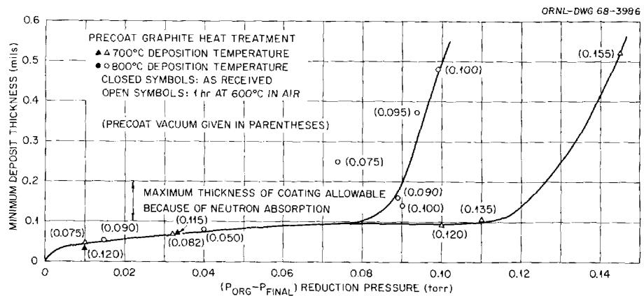  
Fig. 18.2. Change in Pressure Drop Across a Graphite Specimen with Coating Thickness.

to 0.090 torr. On samples that will pump below 0.075 torr originally, both coatings are equally sound, and less than 0.1 mil Mo is sufficient to reduce the final vacuum to the limit of the Veeco pressure gage. On samples that will not pump below 0.095 torr, over 0.3 mil of molybdenum is necessary for an $800^{\circ}\mathrm{C}$ deposit. A $700^{\circ}\mathrm{C}$ deposit may be capable of sealing the samples with 0.1 mil of molybdenum if the sample will originally pump below 0.110 torr. If the original samples will not pump below this range, then our data indicate that they cannot be sealed with a reasonable amount of molybdenum. The validity of the plot is being checked with 20 more samples of the air-fired graphite, which are on hand.

When one compares M-Mo-18 with the other samples, it is apparent that the original permeability is very important. A recent study by Cook (Sect. 18.2) has revealed that the $600^{\circ}\mathrm{C}$ air fire can open large pores in the graphite samples. These large pores may be more difficult to seal than the pores in the as-received sample. The $600^{\circ}\mathrm{C}$ air fire will therefore be discontinued in the hope that the argon-fired samples will have better permeability prior to coating and will thus require thinner coatings. New coating experiments on AXF graphite with an argon heat treatment will be compared with the air-treated samples to test this hypothesis.

Examination of all the coatings revealed that the metal was principally bridging the external pores of the graphite, with only the most open

and shallow voids being filled. An attempt was made to exert a vacuum on the inside of the graphite cylinder during deposition in an effort to pull the reacting gases into the graphite pores and possibly achieve the desired reduction in gas permeability with less molybdenum. This technique is called the differential pressure CVD coating process. The first attempts to do this were not successful because we were not able to obtain a vacuum seal around the graphite during heating and therefore pulled only a partial vacuum of 1 to 2 torrs inside the graphite sleeve. However, as shown in Fig. 18.3, some penetration was achieved. The Welding and Brazing Laboratory will make a braze joint between the graphite cylinder and a molybdenum tube, which should solve this problem. Thus we will obtain a lower vacuum inside the graphite cylinder and perhaps obtain deeper penetration of coatings within the pores in subsequent coating experiments.

A series of $700^{\circ}\mathrm{C}$ argon anneals were performed on selected samples of molybdenum-coated graphite to evaluate the tendency of spalling during thermal cycling and to see if the coating totally converted to a carbide. The samples were heated to $700^{\circ}\mathrm{C}$ for 17 hr, furnace cooled, and then given three more 48-hr anneals at $700^{\circ}\mathrm{C}$ with cooling to room temperature between anneals. No tendency to spall was observed on any sample. After the final anneal the samples examined still had $10\%$ molybdenum carbide or less, as estimated using x-ray diffraction techniques.

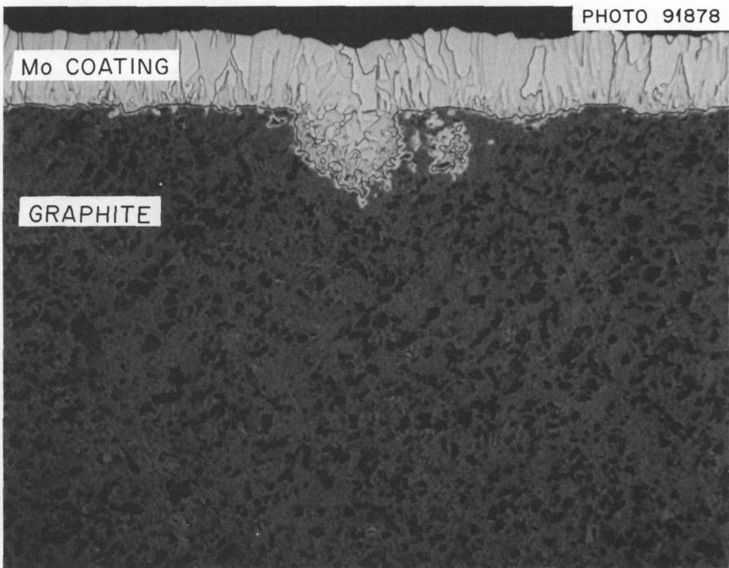  
Fig. 18.3. Penetration of Molybdenum Deposit into Graphite, M-Mo-30. $500 \times$

# 18.6 GRAPHITE IRRADIATION PROGRAM

# C. R. Kennedy

We have initiated graphite irradiation experiments in the target rod positions in the core of the HFIR. This facility is being used to obtain high fluences in a relatively short time. The first two experiments, described previously, have completed a single cycle in the HFIR and have been examined. The purpose of these first two experiments was primarily to confirm the heating rates and the design of the experiment.

The design utilized tungsten susceptors to compensate for the lower nuclear heating near the ends and thus obtain an axial temperature distribution of 690 to $730^{\circ}\mathrm{C}$ . The reactor itself is quite stable, and temperature variations over a cycle or from cycle to cycle should be less than $10^{\circ}\mathrm{C}$ . The results of the first series show that the peak nuclear heating was $33.6\mathrm{w / g}$ , compared with an estimated $35\mathrm{w / g}$ . The axial

gradient did not follow the estimated cosine function but was slightly distorted, with a ratio of end heating to peak heating of 0.56. Calculations based on flux monitors of stainless steel doped with cobalt indicate a flux of $1.3 \times 10^{15}$ neutrons $\mathrm{cm}^{-2} \sec^{-1}$ ( $E > 50$ kev).

The results of the first two experiments suggested a few minor design changes. These changes have been made, and two long-term experiments have been constructed and inserted in the HFIR. These experiments will be removed from the reactor after five cycles with an exposure of about $1 \times 10^{22}$ neutrons/cm $^2$ ( $E > 50$ kev). The specimens will be evaluated by measurements of physical dimensions, permeability, elastic modulus, and other physical parameters. Selected specimens will be subjected to low-angle x-ray scattering and electron microscope studies. The materials included in the two experiments are listed in Table 18.4.

The program of evaluating candidate materials is still in its beginning stages, and many of the more promising materials have not been delivered. This affords a chance to include grades AGOT,

Table 18.4. Materials Used in Graphite Irradiation Experiments   

<table><tr><td>Source</td><td>Grade</td><td>Remarks</td></tr><tr><td>Poco</td><td>AXF</td><td>Base stock</td></tr><tr><td>Poco</td><td>AXF-3000</td><td>Base stock heated to 3000°C</td></tr><tr><td>Poco</td><td>AXF-5QB</td><td>Impregnated base stock</td></tr><tr><td>Poco</td><td>AXF-5QB-3000</td><td>Impregnated base stock heated to 3000°C</td></tr><tr><td>Y-12</td><td>BY-12</td><td>85% graphite flour-15% fines-pitch, 3000°C</td></tr><tr><td>Y-12</td><td>RY-12-31</td><td>85% graphite flour-15% fines-Varcum, 3000°C</td></tr><tr><td>Y-12</td><td>RY-12-29</td><td>85% graphite flour-15% Thermax-Varcum, 3000°C</td></tr><tr><td>Y-12</td><td>Natural flake</td><td>Natural flake-pitch, 3000°C</td></tr><tr><td>GLCC</td><td>H315-A</td><td>Pipe material similar to GA materials, isotropic</td></tr><tr><td>GLCC</td><td>H364</td><td>Fine grained, high fracture elongation, isotropic</td></tr><tr><td>UCC</td><td>1425</td><td>Pipe material similar to grade CGB</td></tr><tr><td>UCC</td><td>ATJ-S</td><td>An improved ATJ grade</td></tr><tr><td>UCC</td><td>AGOT</td><td>Material used in PNL irradiations</td></tr><tr><td>UCC</td><td>Hot-pressed pyrographite</td><td>To be used for x-ray scattering experiments</td></tr><tr><td>UKAEA</td><td>UK isotropic</td><td>Material used in UK irradiations</td></tr><tr><td>ORNL</td><td>Pyrocarbon-coated Poco</td><td>Surface sealed with pyrocarbon</td></tr></table>

UK isotropic, and H315-A in the HFIR irradiations for direct comparison with PNL, UK, and GA irradiation results. Those grades demonstrating poor irradiation resistance will be removed and replaced during the recycle periods. The Y-12 grades are a controlled fabrication series to isolate material variables affecting the growth rates and ultimate irradiation resistance. These four graphites are unique in that although several different starting materials were used, the physical properties and their isotropics are about the same. This will allow us to assess the effects of starting materials with a minimal change in other parameters. The Poco series is included to gain a better understanding of the exceptional dimensional stability demonstrated by this material. The coated materials were included to obtain some indication of the ability of these materials to adhere to a graphite body. The coatings were not applied by an optimized process, since our coating work is in its early stages.

# 18.7 NONDESTRUCTIVE TESTING STUDIES

H. L. Whaley R. W. McClung

# 18.7.1 Graphite Ultrasonic Velocity Measurements

H. L. Whaley

Progress has been made toward the measurement of ultrasonic longitudinal $(V_{L})$ and shear $(V_{s})$ velocities for determining the elastic properties of proposed MSBR graphites. Longitudinal measurements have been performed with both commercial transducers with oil coupling and with thin ceramic disks bonded to the samples with Salol (phenyl salicylate). Shear crystals require a solid couplant and have been bonded with Salol. One major problem arises from the configuration of the specimens (0.400-in.-diam cylinders, 0.500 in. long, with a 0.120-in.-diam axial hole). The concentric smooth surfaces result in mode conversion of the ultrasound and spurious reflections that make identification of the desired signals difficult. To help overcome this situation, bulk pieces of

one kind of the graphite (Poco AXF) have been obtained to establish approximate time intervals required for the ultrasonic pulses to travel known distances. Unfortunately, bulk pieces are not available for all types of the graphite to be measured.

To avoid activation in the reactor due to prior contamination by a couplant, ultrasonic measurements will be performed initially on pieces taken adjacent to the irradiation samples and then, after exposure, on the irradiation samples themselves. About 25 of the cylinders (machined from Poco AXF and Great Lakes H315-A graphite) have been obtained for studying the uniformity of the materials and the reproducibility of bonding and measuring techniques. The anisotropy of grade H315-A was detected and may pose some problems.

# 18.7.2 Low-Voltage Radiography

R.W.McClung

Low-voltage radiographs were made for the Reactor Chemistry Division on several sections of graphite which had undergone salt impregnation testing in an irradiation field (Fig. 18.4). The radiographs showed the presence of high-density material (compared with graphite) in obvious cracks and in other areas which may have been cracks oriented so that a characteristic shape could not be observed. The inspection was a further demonstration of the low-voltage radiographic technique:

1. to achieve high-sensitivity radiographs on thin sections of low-density material,

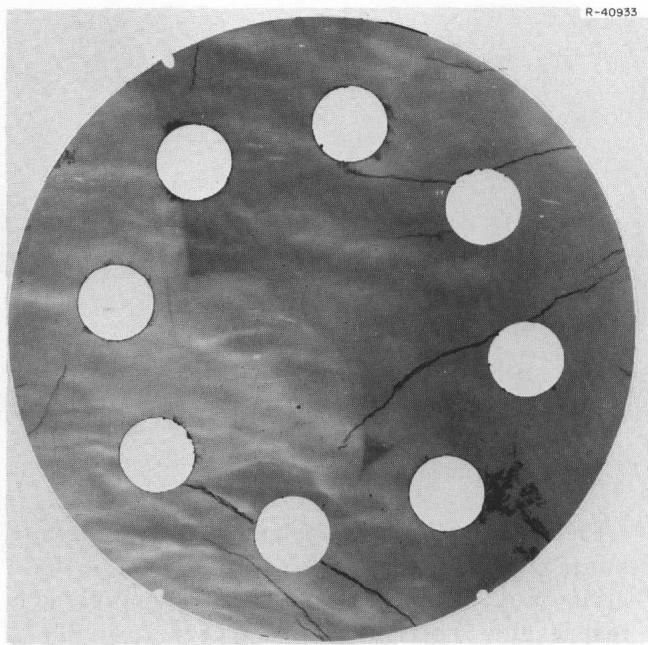  
Fig. 18.4. Low-Voltage Radiograph of a Graphite Slice Taken from ORR Natural Circulation Loop No. 2. Uranium-bearing fluoride salt passed through the eight holes. The dark areas indicate the presence of the high-density salt. The diameter of the piece is 2 in.

2. to detect minute amounts of higher-density material in the low-density matrix,   
3. to perform these evaluations despite the specimen being radioactive due to irradiation testing.

# 19. Hasteley N

# 19.1 INFLUENCE OF STRAIN RATE ON THE FRACTURE STRAIN OF HASTELLOY N

H. E. McCoy, Jr.

Previous results have indicated that the fracture strain of irradiated Hastelloy N is a function of strain rate. We have now obtained sufficient test results to see the influence of this variable more clearly.

The variation of fracture strain at the strain rates normally encountered in tensile tests, $2 \times 10^{-3}$ to $2\mathrm{min}^{-1}$ , is shown in Fig. 19.1 for a typical standard air-melted alloy in the unirra

diated condition. In the unirradiated condition the fracture strain at temperatures $< 500^{\circ}\mathrm{C}$ is only weakly influenced by the strain rate. At $500^{\circ}\mathrm{C}$ the fracture strain decreases at very low strain rates, due to the transition from transgranular to intergranular fracture. At $650^{\circ}\mathrm{C}$ the fracture strain is very dependent upon strain rate, with the lower ductilities being characterized by intergranular fracture. At 760 and $850^{\circ}\mathrm{C}$ the fracture strains are again quite high, with only a slight dependence on the strain rate.

The results from specimens that were irradiated in the MSRE are shown in Fig. 19.2. At $400^{\circ}\mathrm{C}$ the fracture strains are almost independent of strain rate, although the strains are slightly lower than those in Fig. 19.1 for unirradiated materials. At $500^{\circ}\mathrm{C}$ a distinct effect of strain rate is obvious, the decreased ductility again being a result of the

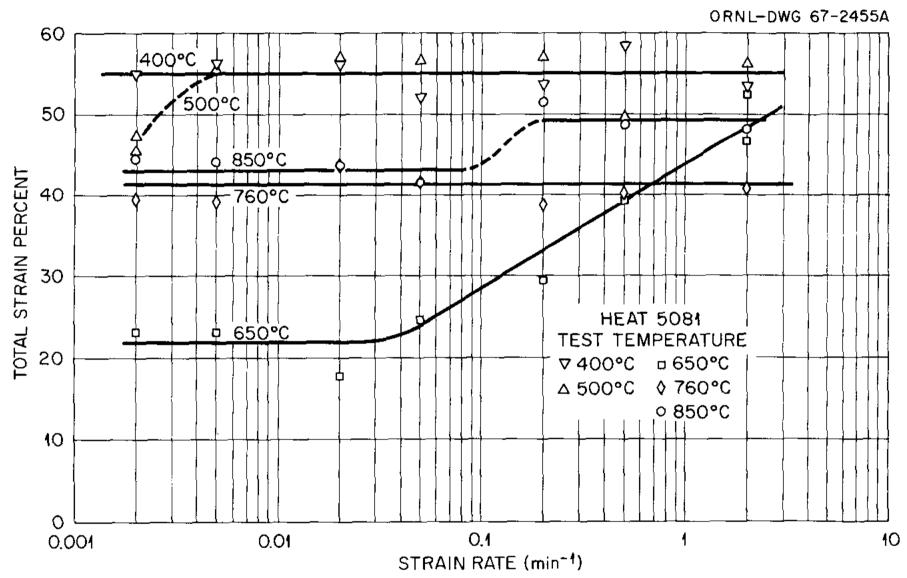  
Fig. 19.1. Influence of Strain Rate on the Ductility of MSRE Surveillance Control Specimens. Heat 5081.

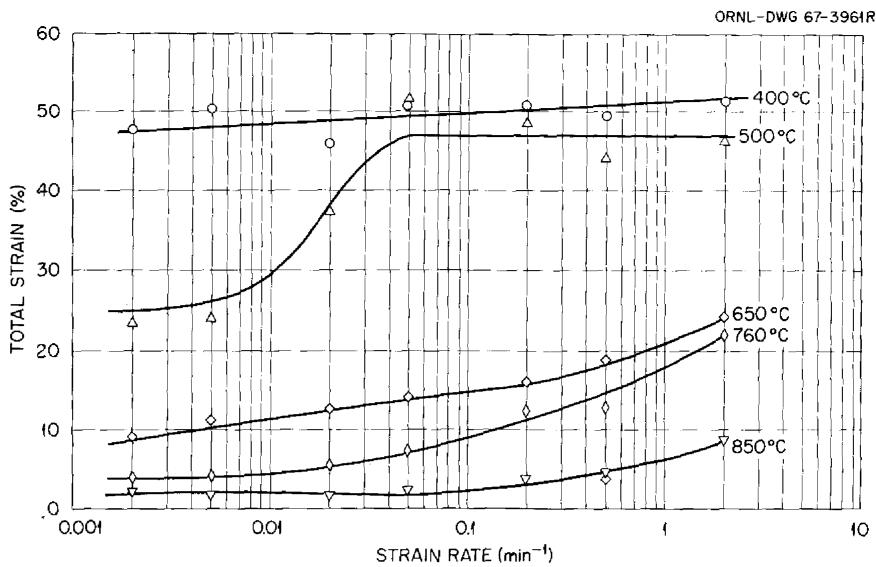  
Fig. 19.2. Influence of Strain Rate on the Ductility of Hastelloy N (Heat 5081) MSRE Surveillance Specimens. Irradiated to thermal fluence of $1.3 \times 10^{20}$ neutrons/cm $^2$ .

transition from transgranular to intergranular fracture. However, the transition occurs at a higher strain rate for the irradiated than for the unirradiated material. At $650^{\circ}\mathrm{C}$ and higher temperatures the ductility decreases progressively as the test temperature increases. The variation in strain over the temperature range from 650 to $850^{\circ}\mathrm{C}$ becomes smaller as the strain rate decreases, thus suggesting that the fracture strains at very low strain rates (creep tests) may be independent of test temperature (above $650^{\circ}\mathrm{C}$ ). We shall later present data that indicate that this may indeed be the case.

Most nuclear applications expose the materials to creep conditions rather than the high strain rates encountered in tensile tests. The fracture strains for several heats of irradiated air-melted material are given in Fig. 19.3. The data are represented by a scatter band, but there is an obvious trend for the data from heat 5065 to fall on the lower side and that for heat 5085 on the upper side. However, the spread is much larger at high strain rates. The fracture strain is a minimum at a strain rate of about $0.1\%/\mathrm{hr}$ . The irradiation temperature does not seem to be a significant factor in the fracture strain at lower strain rates, but can cause a factor of 2 variation at high strain rates, the higher values being obtained for the lower irradiation temperature.

The fracture strains are shown in Fig. 19.4 for several vacuum melts of standard Hastelloy N. These materials seem to show a larger influence of irradiation temperature, although the scatter in the data prevents this from being an unequivocal conclusion. Generally, the material irradiated at $< 150^{\circ}\mathrm{C}$ has the higher ductility. Specimens irradiated at $650^{\circ}\mathrm{C}$ have fracture strains quite close to those shown in Fig. 19.3 for the air-melted heats. This observation is quite interesting since the vacuum-melted alloys have boron levels of 0.5 to 10 ppm, whereas the boron levels of the air-melted materials are as high as 50 ppm. Although there are many other differences between air- and vacuum-melted materials, our tests do not indicate that reducing the boron level alone is an effective solution to the problem of irradiation damage in this material.

We have found that modifications in the chemical composition of Hastelloy N are very effective in reducing the radiation damage. The microstructure is generally characterized by large stringers of carbide. These carbides are of the $\mathbf{M}_6\mathbf{C}$ type and are very high in molybdenum and contain from 2 to $5\%$ Si. We found that the stringers were eliminated if the molybdenum content were reduced to 12 to $13\%$ rather than the $16\%$ normally used. The strength penalty for the reduction in molybdenum content seems rather modest. However, this

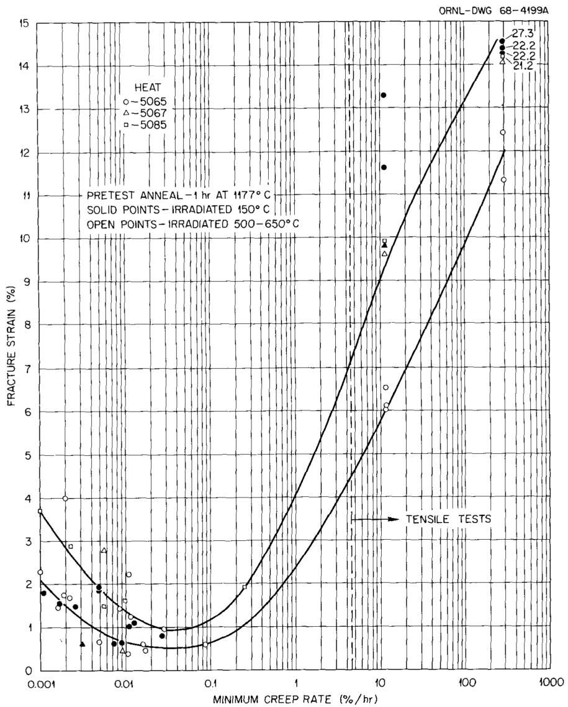  
Fig. 19.3. Influence of Strain Rate on the Fracture Strain of Several Air-Melted Heats of Hastelloy N. Irradiated to a thermal fluence of 2 to $8 \times 10^{20}$ neutrons/cm² and tested at $650^{\circ}C$ . Solid points indicate specimens irradiated at less than $150^{\circ}C$ ; open points indicate an irradiation temperature of $650^{\circ}C$ .

change alone does not seem to improve the resistance to irradiation damage.

The further modification of adding about 0.5 wt % Ti to the basic composition of Ni-7% Cr-0.2% Mn-0.05% C was found to give additional improvement. The creep-rupture properties of two small commercial melts are shown in Fig. 19.5. The fracture strains are shown in Fig. 19.6. Again, the ductility minimum as a function of strain rate is apparent. However, the minimum

ductility is not as low for the titanium-modified material and rises very sharply with strain rate above or below the value of about $0.1\%/\mathrm{hr}$ associated with the minimum ductility. The variation in the properties of the two titanium-modified heats is presently unexplained, although it is quite interesting that heat 21545, which has the higher boron level, has the better ductility.

The influence of test and irradiation temperatures is also shown in Fig. 19.6. The standard

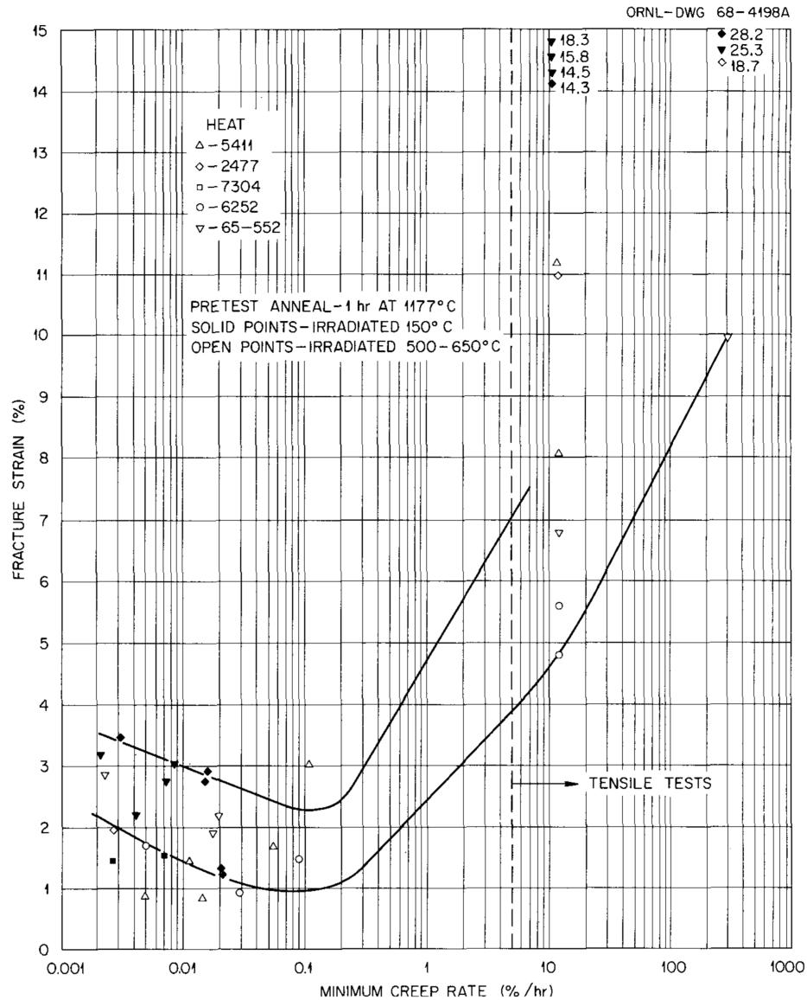  
Fig. 19.4. Influence of Strain Rate on the Fracture Strain of Several Vacuum-Melted Heats of Hastelloy N. Irradiated to a thermal fluence of 2 to $8 \times 10^{20}$ neutrons/cm² and tested at $650^{\circ}C$ . Solid points indicate specimens irradiated at less than $150^{\circ}C$ ; open points indicate an irradiation temperature of $650^{\circ}C$ .

heats included are only the vacuum-melted materials. They were irradiated and tested at the same temperature - either 650 or $760^{\circ}\mathrm{C}$ . Although the fracture strains observed in a tensile test were quite different, the strains under creep conditions were similar for 650 and $760^{\circ}\mathrm{C}$ . The titanium-modified specimens (21545 and 66-548) were all irradiated at $650^{\circ}\mathrm{C}$ and then tested at 650 or $760^{\circ}\mathrm{C}$ . Again, the fracture strain in a tensile test varies with test temperature, but the strains under creep conditions do not vary significantly with test temperature.

# 19.2 STATUS OF DEVELOPMENT OF THE MODIFIED ALLOY

H. E. McCoy, Jr.

Alloying additions to Hastelloy N of titanium, zirconium, and hafnium have been found to improve the resistance of the alloy to irradiation damage.3 Several small laboratory heats have been produced

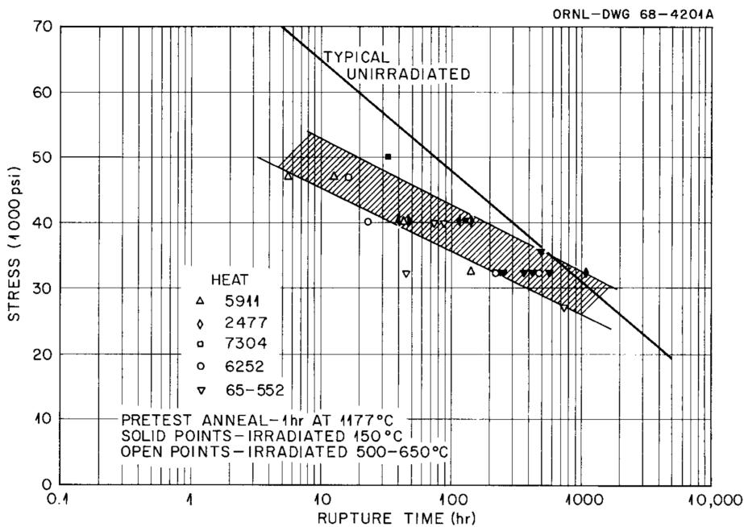  
Fig. 19.5. Stress-Rupture Properties of Irradiated Titanium-Modified Hastelloy N. Irradiated and tested at $650^{\circ}\mathrm{C}$ . Thermal fluence was 2 to $5 \times 10^{20}$ neutrons/cm $^2$ .

that contain up to $1\%$ of each alloying addition. Two 100-lb commercial melts containing 0.05 and $0.5\%$ Hf have been procured and found to have excellent properties. The zirconium addition reduced the fabricability of the alloy, so that the first small commercial melts containing 0.5 wt $\%$ Zr broke during fabrication at $1177^{\circ}\mathrm{C}$ . A subsequent melt was fabricated successfully by lowering the working temperature to about $1038^{\circ}\mathrm{C}$ . Thus, two 100-lb commercial melts containing 0.05 and $0.5\%$ Zr were obtained. Both of these materials exhibited extensive hot cracking during welding. $^4$ Twenty-five 100-lb commercial melts have been procured with titanium levels up to $1.2\%$ and carbon levels ranging from 0.003 to $0.1\%$ . These alloys have fabricated well, have exhibited good welding characteristics, and have shown good pre- and postirradiation properties.

We have decided to continue further development of only the titanium-modified alloy. This decision was based on: (1) the poor weldability of the zirconium-bearing alloys, (2) the excellent properties of the titanium-modified alloy, and (3) the comparatively large amount of experience that we

have with titanium-bearing materials compared with the hafnium-modified alloys.

The first large-scale melt has been delivered. This 5000-lb melt was produced as a double-vacuum-melted ingot and subjected to standard mill practice. The yield will be about 2000 lb, which is quite reasonable for the various shapes of products that were made. The composition of this melt is given below. This material will be included in all phases of our testing program.

Chromium 7.84%

Molybdenum 12.36%

Tungsten 0.12%

Iron 0.25%

Carbon 0.066%

Silicon 0.02%

Cobalt 0.07%

Manganese 0.14%

Vanadium 0.04%

Phosphorus 0.002%

Sulfur 0.002%

Aluminum 0.12%

Titanium 0.56%

Copper 0.01%

Nitrogen 0.004%

Boron 0.2 ppm

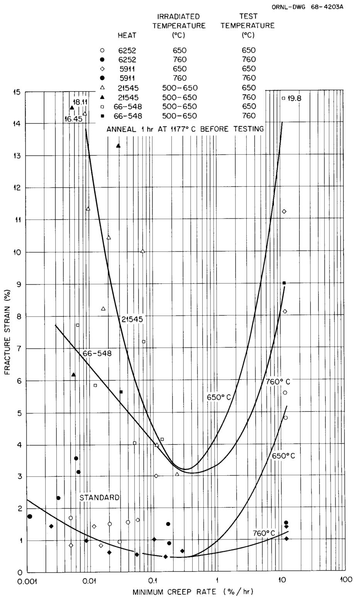  
Fig. 19.6. Variation of Fracture Strain with Strain Rate for Standard and Titanium-Modified Hastelloy N. Thermal fluence was 2 to $8 \times 10^{20}$ neutrons/cm².

Further large melts are necessary before we or the vendors will consider this alloy a standard production item. The next large melt to be procured will have approximately the same composition as that shown previously, with relaxed specifications on iron and manganese to allow more liberal use of scrap by the vendor.

# 19.3. EFFECT OF CARBON AND TITANIUM ON THE UNIRRADIATED CREEP-RUPTURE PROPERTIES OF Ni-Mo-Cr ALLOYS

C. E. Sessions

As part of our efforts to optimize the mechanical properties of titanium-modified Hastelloy N, we are studying the effects of carbon concentration on the alloy. The interaction of carbon with strong carbide formers such as molybdenum, chromium, and, more significantly, titanium is expected to strengthen the alloy through precipitation reactions. In addition, however, we suspect that the beneficial effects of small titanium additions on the postirradiation ductility of these alloys is in part due to titanium-(boron, carbon) interactions which reduce the concentration of helium at the grain boundaries following neutron irradiation. Since boron and carbon should act similarly in this alloy, we have attempted to define the titanium-carbon interactions in order to better deduce the role of titanium in reducing the irradiation damage of nickel-base alloys.

Five small laboratory heats of modified Hastelloy N (Ni-12% Mo-7% Cr-0.5% Ti) were made with carbon levels of 0.003, 0.007, 0.037, 0.053, and 0.27%. A sixth heat containing 0.04% C and no titanium was also included. After fabricating into $\frac{1}{4}$ -in.-rod stock, miniature mechanical property specimens were machined and given one of three different heat treatments in argon. Samples were then creep tested in air at $650^{\circ}\mathrm{C}$ at stresses of 47,000, 40,000, and 32,350 psi.

An evaluation of the creep rupture results indicated the following:

1. The rupture life at a given stress increases with increasing carbon content, as shown in Fig. 19.7.   
2. Heat treating for $1\mathrm{hr}$ at $1177^{\circ}\mathrm{C}$ prior to testing resulted in longer rupture lives than the other two heat treatments (i.e., 1 hr at $1260^{\circ}\mathrm{C}$ , or 1 hr at $1177^{\circ}\mathrm{C}$ followed by aging 100 hr at $870^{\circ}\mathrm{C}$ ).   
3. The creep ductility at 40,000 psi showed little variation (14-20%) for carbon levels up to 0.05%, but at the highest carbon level, 0.27%, the creep elongation increased significantly to 30-40% (Fig. 19.8).   
4. The minimum creep rate at all stress levels decreased continuously with increasing carbon content.   
5. The addition of $0.5\%$ Ti to the basic Ni-12% Mo-7% Cr-0.04% C alloy increased the rupture

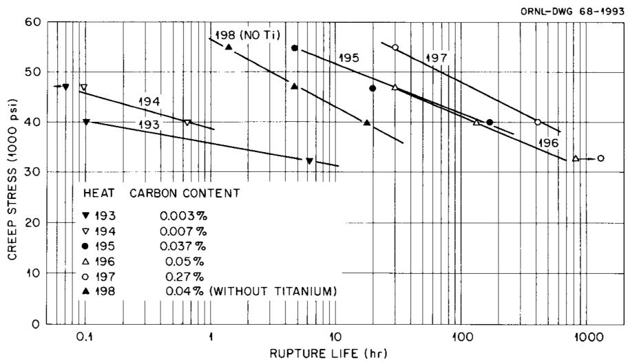  
Fig. 19.7. Effect of Carbon on the Rupture Life of Ni-12% Mo-7% Cr-0.5% Ti Alloy at $650^{\circ}\mathrm{C}$ .

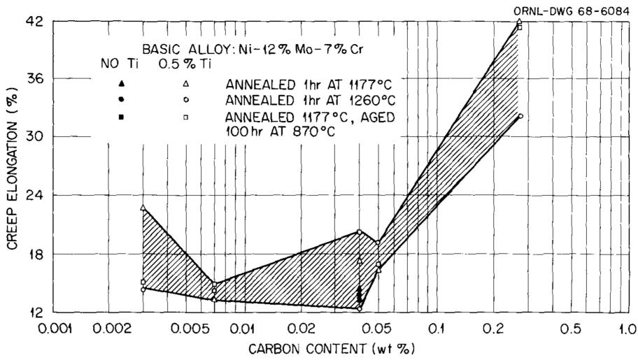  
Fig. 19.8. Effect of Carbon and Titanium Content on the Total Creep Strain at 40,000 psi and $650^{\circ}\mathrm{C}$ .

life by a factor of from 3 to 10, depending on the stress level.

6. The $0.5\%$ Ti addition at the $0.04\%$ C level did not change the creep ductility of samples tested in the solution-annealed condition; however, the ductility of samples that were aged 100 hr at $870^{\circ}\mathrm{C}$ before testing was increased by a factor of 2 at the lower stress level.

These observations indicate that there is a pronounced strengthening effect due to titanium-carbon interactions in this alloy; however, no significant increase in creep ductility occurs at the $0.5\%$ Ti level when compared with samples containing no titanium addition.

Changes in the microstructure with increases in carbon concentration are shown in Fig. 19.9 for samples solution annealed at $1177^{\circ}\mathrm{C}$ and aged $100\mathrm{hr}$ at $870^{\circ}\mathrm{C}$ . The lower carbon levels are virtually single-phase alloys, but the amount of second phase increases significantly with increasing carbon. Heat 198, which contains $0.04\%$ C and no titanium, shows a large amount of finely divided precipitates that are probably $\mathsf{M}_6\mathsf{C}$ type. Each sample, except the $0.27\%$ C level, was single phase after a $1260^{\circ}\mathrm{C}$ heat treatment.

To summarize, the beneficial effect of titanium additions on the out-of-reactor properties of this alloy is primarily a strengthening advantage. There appears to be no effect of titanium on the

creep ductility for samples tested in the solution-annealed condition; however, a small increase in ductility was found at lower stresses for samples heat treated to precipitate the carbon prior to testing. Carbon increases the creep strength significantly, especially over the range from 0.007 to 0.037 wt%.

# 19.4 ELECTRICAL RESISTIVITY OF TITANIUM-MODIFIED HASTELLOY N

H. E. McCoy, Jr.

The resistivity of Hastelloy N varies with temperature in a somewhat anomalous fashion. Upon heating, the resistivity increases with temperature up to about $600^{\circ}\mathrm{C}$ , decreases with increasing temperature up to $1000^{\circ}\mathrm{C}$ , and then increases with further increases in temperature. The resistivity is decreased by cold working rather than increased, as normally noted for metals. This behavior is generally attributed to short-range order, with the ordering reaction causing an increase in resistivity.

We have investigated the resistivity of the titanium-modified alloy and found that the same

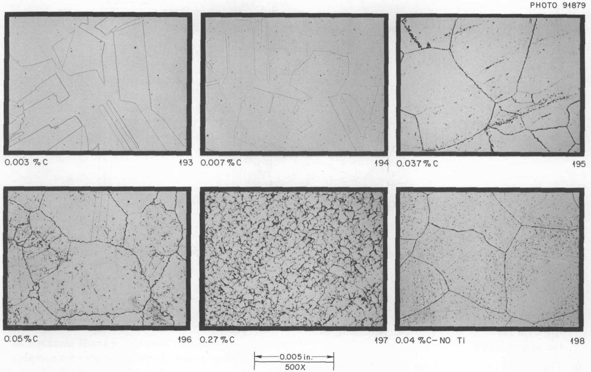  
Fig. 19.9. Effect of Carbon on the Microstructure of Titanium-Modified Hastelloy N (Ni-12% Mo-7% Cr-0.5% Ti). Samples solution annealed 1 hr at $1177^{\circ}\mathrm{C}$ and aged 100 hr at $870^{\circ}\mathrm{C}$ .

general behavior prevails. However, the resistivity curve is lower by about $12\%$ for the modified alloy. The chemical changes involved for the modified alloy include a decrease in the molybdenum content from 16 to $12\%$ , the addition of $0.5\%$ Ti, a decrease in the iron content from 4 to $0\%$ , and a general decrease in residual elements such as silicon and manganese. These changes lead to a decrease in the total alloy content and hence would be expected to yield an alloy with lower resistivity. A composite set of curves is shown in Fig. 19.10 for the titanium-modified alloy. Cold working decreases the resistivity by about $15\%$ . After a complete heating and cooling cycle, an "equilibrium" curve is established that is followed during subsequent cycles. Annealing the material for 1 hr at $1177^{\circ}\mathrm{C}$ reduces the resistivity slightly, but the equilibrium curve is followed after the first heating. The resistivity changes over a normal operating range of 25 to $700^{\circ}\mathrm{C}$ are quite small, only $4\%$ .

# 19.5 ELECTRON MICROSCOPE STUDIES OF HASTELLOY N

R. E. Gehlbach

# 19.5.1 Phase Identification Studies in Hastelloy N

We are continuing our investigation into the characterization of precipitated phases occurring in Hastelloy N. As we reported previously6 the microstructure of standard Hastelloy N is characterized by stringers of blocky $\mathbf{M}_6\mathbf{C}$ carbides after annealing in the temperature range 1177 to $1260^{\circ}\mathrm{C}$ . After aging and/or testing at temperatures between 427 and $871^{\circ}\mathrm{C}$ , a fine dendritic grain-boundary precipitate is generated, which coarsens with increasing aging temperature and with increasing times at the lower temperatures.

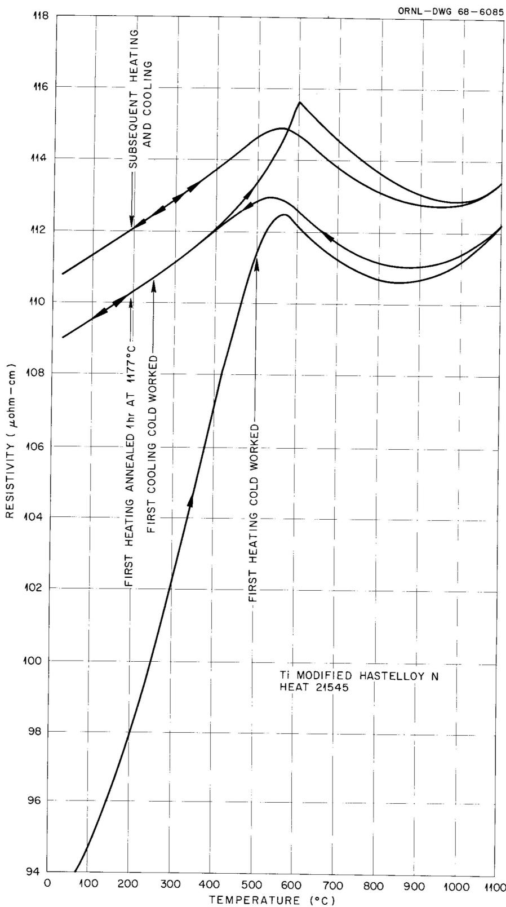  
Fig. 19.10. Variation of Resistivity with Temperature for Titanium-Modified Hastelloy N.

Two tensile specimens were examined that had been annealed at 1177 and $1260^{\circ}\mathrm{C}$ and tested at $982^{\circ}\mathrm{C}$ . They exhibited elongations of 58 and $4.6\%$ respectively. Transmission electron microscopy of electrochemically thinned slices from the gage lengths showed grain boundaries nearly completely free of precipitates and completely recrystallized for the specimens annealed at $1177^{\circ}\mathrm{C}$ , whereas the grain boundaries of samples taken from the specimen with the higher temperature anneal contained a very extensive amount of precipitate (Fig. 19.11). Extraction replication revealed a cellular precipitate morphology (Fig. 19.12) in the grain boundaries of the latter specimen and confirmed the relative absence of precipitation in the grain boundaries of the former. The cellular morphology has the same lattice parameter (11A) as the blocky and dendritic forms of the $\mathbf{M}_6\mathbf{C}$ carbides.

Chemical analysis of the various $\mathbb{M}_6\mathbb{C}$ -type carbides in standard Hastelloy N has been completed, employing both conventional electron microprobe techniques and also the electron microprobe analyzer accessory on one of our electron microscopes. With the latter instrument, we are able to analyze

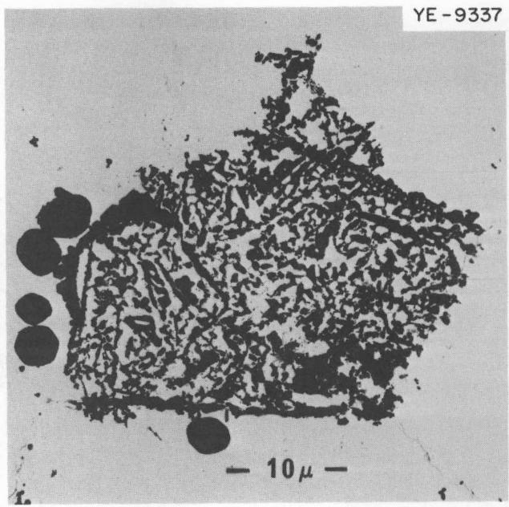  
Fig. 19.12. Morphology of $M_6C$ -Type Grain-Boundary Precipitate in Fig. 19.11b.

precipitates on extraction replicas, which permits the study of fine grain-boundary precipitates that cannot be analyzed in the bulk sample. The results are summarized in Table 19.1. Several

PHOTO 91880

$^{7}$ H. E. McCoy, Influence of Several Metallurgical Variables on the Tensile Properties of Hastelloy N, ORNL-3661, p. 8 (August 1964).

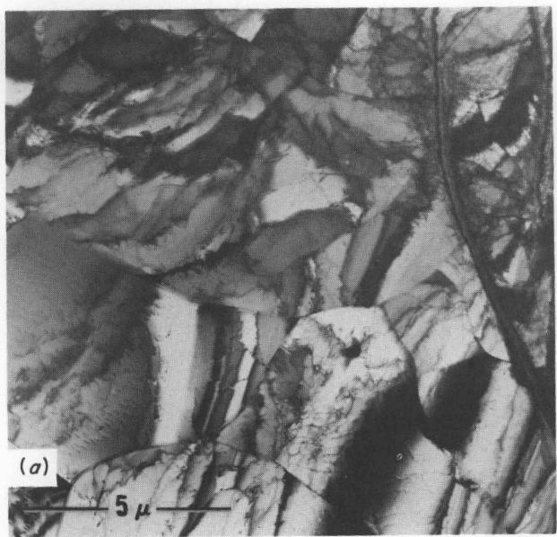

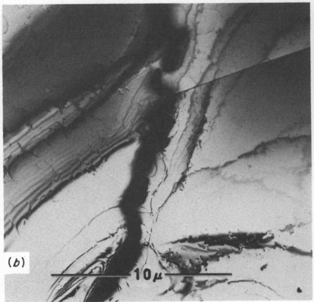  
Fig. 19.11. Effect of Annealing at (a) $1177^{\circ}\mathrm{C}$ and (b) $1260^{\circ}\mathrm{C}$ on Microstructure After Tensile Fracture at $982^{\circ}\mathrm{C}$ . Fracture elongations were 58 and $4.6\%$ respectively.

Table 19.1. Analysis of Precipitates in Standard Hostelloy N in %   

<table><tr><td rowspan="2">Major Element</td><td rowspan="2">Nominala</td><td rowspan="2">Matrixb</td><td colspan="2">Large Stringer Precipitatec</td><td rowspan="2">Grain Boundaryd,t Precipitate</td><td rowspan="2">High-Temperature Phaseb,g</td></tr><tr><td>b</td><td>d,e</td></tr><tr><td>Ni</td><td>72</td><td>74.5</td><td>33.8</td><td>37.4</td><td>15-18</td><td>64.6</td></tr><tr><td>Mo</td><td>16</td><td>12.1</td><td>55.8</td><td>49.2</td><td>70-75</td><td>22.2</td></tr><tr><td>Cr</td><td>7</td><td>7.1</td><td>4.8</td><td>5.7</td><td>2-4</td><td>7.4</td></tr><tr><td>Fe</td><td>4</td><td>4.2</td><td>0.8</td><td></td><td></td><td>2.7</td></tr><tr><td>Si</td><td>0.6</td><td>0.3</td><td>2.7</td><td>3.7</td><td>2.5-4.5</td><td>1.1</td></tr><tr><td>C</td><td>0.06</td><td></td><td>≥1.7</td><td></td><td></td><td></td></tr></table>

${}^{a}$ Nominal alloy composition from bulk chemical analysis.   
$^b$ Analysis employing conventional microprobe techniques on bulk specimen; normalized to $98\%$ .   
${}^{\mathrm{c}}\mathbf{M}_{6}$ C-type carbides.   
$^d$ Analysis employing microprobe analyzer accessory on electron microscope.   
$^{\mathrm{e}}$ Corrected for absorption, atomic number, fluorescence; normalized to $96\%$ .   
$f_{\mathrm{Thin}}$ precipitates, no corrections required; normalized to $96\%$ .   
$\varepsilon_{\mathrm{Noncarbide}}$

errors are inherent in the techniques involved, and the results are only semiquantitative. The blocky, or stringer, morphology approximately fits the stoichiometric $\mathrm{Ni}_3\mathrm{Mo}_3\mathrm{C}$ carbide, whereas the grain-boundary morphology corresponds closely to the $\mathrm{Ni}_2\mathrm{Mo}_4\mathrm{C}$ composition.

We have carried out additional work on Hastelloy N which contained $^{14}\mathrm{C}$ introduced into the molten alloy. Autoradiography performed on these specimens indicates that the $\mathbb{M}_6\mathbb{C}$ -type precipitates actually are carbides, as can be seen in Fig. 19.13.

The high-temperature phase present after annealing the $^{14}\mathrm{C}$ at $1316^{\circ}\mathrm{C}$ and cooling quickly was reported previously as being a noncarbide phase, probably resulting from a transformation from the carbide precipitates. Electron microscope microprobe analyses performed on extractions of this phase indicate that it is primarily molybdenum and chromium in the ratio of 9:1 by weight. No other elements of atomic number greater than 11 were detected.

The carbides that are also present in this specimen have been identified by electron diffraction as

the $\mathbf{M o}_{2}\mathbf{C}$ type, and analysis of individual particles and films indicates that the actual composition is close to $(\mathrm{Mo}_{0.8}\mathrm{Cr}_{0.2})_{2}\mathrm{C}$ .

It is possible that the high-temperature phase in the $^{14}\mathrm{C}$ material is not the same phase as that formed in the commercial heats, because conventional microprobe analysis of the high-temperature phase in standard Hastelloy N differs markedly from the above results (see Table 19.1) and because $\mathrm{Mo}_2\mathrm{C}$ -type carbides have not been observed in specimens from standard alloys which were annealed at high temperature. We are now attempting to identify the high-temperature phase after extraction from standard Hastelloy N.

# 19.5.2 Effect of Silicon on Precipitation in Hastelloy N

R.E.Gehlbach H.E.McCoy, Jr.

In air-melted heats of Hastelloy N, the large carbides do not go into solid solution, even at high annealing temperatures, but appear to melt and transform to a lamellar phase between 1260 and $1316^{\circ}\mathrm{C}$ . However, in vacuum-melted heats the precipitates do go into solution, and the high-temperature phase is not formed (Fig. 19.14). The

# PHOTO 91881

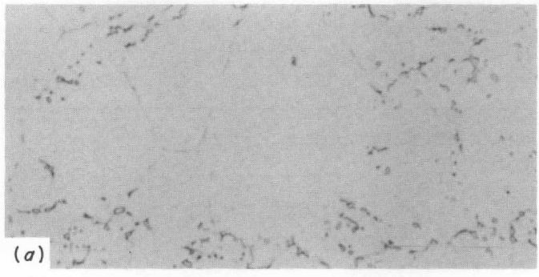

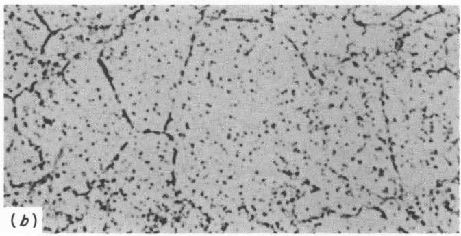  
Fig. 19.13. Carbon-14 Specimen Annealed at $1177^{\circ}\mathrm{C}$ and Aged 100 hr at $649^{\circ}\mathrm{C}$ , Showing Activity at Precipitates and in Grain Boundaries. (a) Lightly etched. (b) Specimen with NTB-2 autoradiographic emulsion, exposed 100 hr. $500\times$

major compositional difference between the air- and vacuum-melted alloys is the silicon concentration.

To evaluate the effect of silicon on precipitation, several alloys of nominal composition (16 Mo, 7 Cr, 4 Fe, etc.) with silicon concentrations of 0.02, 0.12, 0.48, and 1.05 wt% were prepared. The following observations were made regarding the effect of increasing silicon concentration on precipitation:

1. The amount of $\mathbb{M}_6\mathbb{C}$ -type precipitates increases noticeably; however, many are present in the low-silicon heats after annealing at $1177^{\circ}\mathrm{C}$ .   
2. The as-cast structure is retained somewhat in the $0.48\%$ Si heat, greatly in the $1\%$ alloy.

3. The precipitates go into solution after annealing the low-silicon heats at temperatures of 1260 to $1371^{\circ}\mathrm{C}$ , whereas those in the high-silicon heats melt and transform to the high-temperature phase seen in Fig. 19.14.   
4. The temperature for the melting and transformation was lower for the $1\%$ than the $0.48\%$ alloy.   
5. The concentration of silicon in the precipitates, determined by conventional microprobe analysis, increases with increasing silicon in the specimens and is generally two to five times the matrix silicon concentration. The matrix composition is approximately half the nominal silicon concentration in the alloy. These data are shown in Table 19.2.

We extracted precipitates from a specimen of $1\%$ Si which had been annealed at $1260^{\circ}\mathrm{C}$ , using a direct carbon extraction replica (Fig. 19.15). The

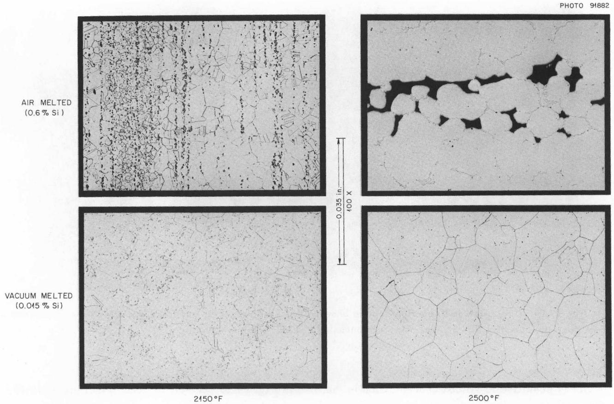  
Fig. 19.14. High-Temperature Phase Transformation Occurring in Air-Melted Hastelloy N. Note that the $M_6$ C-type carbides go into solution in the low-silicon vacuum-melted heat and do not melt or form the high-temperature phase.

grain boundaries contain much precipitate in the form of both particles and thin films associated with these particles. In contrast, very little precipitate is found in grain boundaries of standard

Table 19.2. Semiquantitative Microprobe Analysis of Silicon in Hastelloy N   

<table><tr><td>Heat</td><td>Nominal (wt %)</td><td>Matrix (wt %)</td><td>Precipitatesa(wt %)</td></tr><tr><td>42</td><td>0.02</td><td>0.02</td><td>0.03</td></tr><tr><td>46</td><td>0.12</td><td>0.1</td><td>0.6</td></tr><tr><td>47</td><td>0.48</td><td>0.3</td><td>1.5</td></tr><tr><td>48</td><td>1.05</td><td>0.5</td><td>1.7</td></tr></table>

${}^{a}$ Precipitates are very small; silicon concentration is actually greater due to matrix dilution resulting from bulk metal surrounding particles.

Hastelloy N. Selected area electron diffraction indicates that the film precipitate has essentially the same lattice parameter as the $\mathbf{M}_6\mathbf{C}$ -type carbides found in the standard alloy. X-ray diffraction powder patterns confirm this observation, and long exposures fail to show any diffraction lines other than those associated with the $\mathbf{M}_6\mathbf{C}$ -type carbide. Microprobe analysis of these extracted particles using the electron microscope microprobe accessory resulted in a composition similar to the blocky carbides present in the commercial material with the exception of silicon, which exists in concentrations up to about $5\%$

We know that the $\mathbf{M}_6\mathbf{C}$ -type precipitates in standard Hastelloy N are rich in silicon (Sect. 19.5.1). It is quite obvious that silicon is playing an important role both in the high-temperature noncarbide phase and in the behavior of the $\mathbf{M}_6\mathbf{C}$ -type precipitates. We have not been able to correlate the $\mathbf{M}_6\mathbf{C}$ -type particles with carbon, but their be

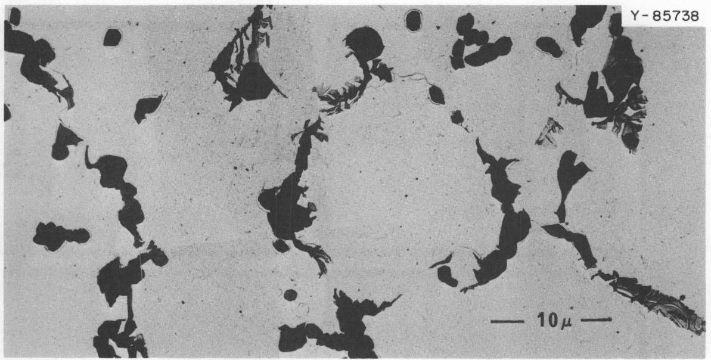  
Fig. 19.15. Direct Carbon Extraction Replica Showing Blocky Precipitates and Grain-Boundary Films Extracted from Hastelloy N with $1.05\%$ Si. Specimen was annealed at $1260^{\circ}\mathrm{C}$ before extraction.

havior is sensitive to silicon concentration in the alloy. Both the blocky and grain boundary precipitates are rich in silicon and increasingly so with increases in the silicon concentration of the bulk material. The available information suggests that the silicon may occupy carbon positions with the lattice parameter not being changed significantly. If silicon were to occupy all carbon sites, about $5.2\%$ Si could be accommodated. Microprobe analysis of individual particles and precipitate films has not suggested that the silicon concentration exceeds this value.

# 19.5.3 Titanium-Modified Hastelloy N

We have identified fine grain-boundary precipitates which occur in titanium-modified Hastelloy N after annealing at 1177 and $871^{\circ}\mathrm{C}$ . It was previously reported[10] that the thin-film morphology was probably face-centered cubic TiC and the particles a noncubic precipitate. However, we have found by electron and x-ray diffraction that the thin-film morphology shown

in Fig. 19.16, as well as some larger precipitates, is actually of the $\mathrm{Mo}_2\mathrm{C}$ type, the major phase present. The lattice constants are slightly con

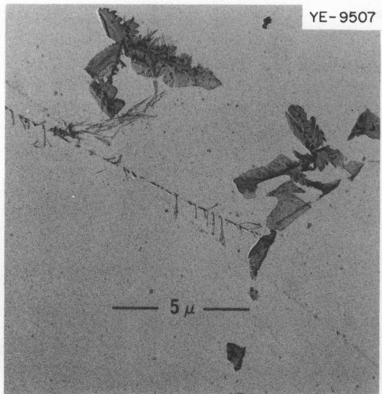  
Fig. 19.16. Grain-Boundary Precipitate in Titanium-Modified Hastelloy N. See text for discussion.

tracted from those for pure $\mathbf{Mo}_2\mathbf{C}$ , and we have found that the metallic portion of the carbides contains approximately 10 wt % chromium.

Electron diffraction also shows that the small particles associated with this film, as well as the needle-like morphology, have a face-centered cubic lattice parameter of 4.24 A, similar to the values reported for TiN. X-ray diffraction shows a slightly expanded (4.26-4.27 A) face-centered cubic parameter, suggesting a complex TiC-type phase which might contain nitrogen, oxygen, and possibly another metallic atom besides titanium. The amount of this phase is quite small compared with the amount of $\mathsf{Mo}_2\mathsf{C}$ present.

# 19.5.4 Summary

These studies have shown that standard Hastelloy N annealed at $1177^{\circ}\mathrm{C}$ contains large $\mathbf{M}_6\mathbf{C}$ carbides that are rich in molybdenum. Aging causes the precipitation of fine $\mathbf{M}_6\mathbf{C}$ particles along the boundaries. All the $\mathbf{M}_6\mathbf{C}$ particles studied are enriched in silicon. A series of special alloys revealed that the concentration of silicon in the precipitate increased as the silicon content of the alloy increased. This segregation of silicon to these precipitates is probably responsible for the localized melting that occurs when this alloy is heated to about $1300^{\circ}\mathrm{C}$ . The low-temperature $\mathbf{M}_6\mathbf{C}$ transforms to a lamellar product when the alloy is heated to about $1260^{\circ}\mathrm{C}$ . Carbon-14 studies show that this product is not a carbide, but an identification has not been made. The titanium-modified Hastelloy N was found to have small amounts of grain-boundary precipitates of the $\mathbf{Mo}_2\mathbf{C}$ type and also a complex face-centered cubic phase.

# 19.6 DIFFUSION OF TITANIUM IN MODIFIED HASTELLOY N

C. E. Sessions T. S. Lundy

Experiments and service in the MSRE have demonstrated the excellent corrosion resistance of Hastelloy N in fluoride salt systems. Our radiation damage studies have shown that the resistance of this alloy to radiation damage can be improved markedly by the addition of about $0.5\%$ Ti. Titanium forms a very stable fluoride, and we are

concerned with whether this element would increase the corrosion rate. The corrosion of Hastelloy N in fluoride salt systems is controlled by the diffusion of chromium, and we have carried out diffusion measurements to determine whether titanium diffuses rapidly enough to contribute significantly to the corrosion rate.

We have completed measurements of the diffusion coefficient for the radioactive tracer $^{44}\mathrm{T_i}$ in modified Hastelloy N over the temperature range 800 to $1250^{\circ}\mathrm{C}$ . The data obtained can be described by an Arrhenius expression,

$$
D = (1 5 \pm 2) \exp \frac {7 3 , 0 0 0 \pm 3 0 0 0}{R T} \mathrm {c m} ^ {2} / \sec , \tag {1}
$$

as illustrated in Fig. 19.17. Technique limitations prevented meaningful experiments at lower temperatures.

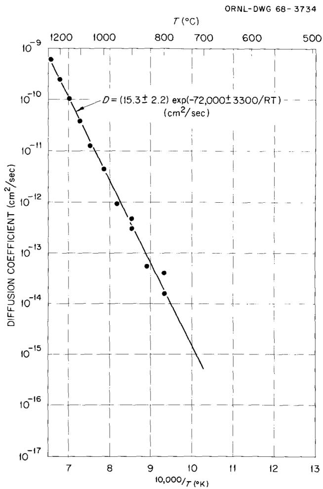  
Fig. 19.17. Temperature Dependence of the Diffusion Coefficient of Titanium in Modified Hastelloy N.

The data were used to predict the maximum rate of titanium diffusion out of Hastelloy N under steady-state corrosion conditions. This occurs for the case where the titanium concentration at the surface in contact with the salt is maintained constant at zero. The appropriate solution of Fick's second law of diffusion is then

$$
c (x, t) = C _ {0} \operatorname {e r f} \frac {x}{2 \sqrt {D t}}, \tag {2}
$$

where

$c(x, t) =$ concentration at a distance $x$ from the surface,

$t =$ time at temperature,

$D =$ diffusion coefficient,

$C_0 =$ initial uniform concentration throughout the specimen.

Using Eq. (2) and experimental values of the diffusion coefficient $D$ , we have calculated titanium concentration distributions that would result after various times at 700 and $800^{\circ}\mathrm{C}$ . At $700^{\circ}\mathrm{C}$ the extrapolated value of $D$ is approximately $5 \times 10^{-16} \, \mathrm{cm}^2/\mathrm{sec}$ . However, since this value is for volume diffusion, one might argue that the effective diffusivity, which includes the effect of short-circuit diffusion paths, might be as much as an order of magnitude larger than the extrapolated value. Thus a value for $D$ of $5 \times 10^{-15} \, \mathrm{cm}^2/\mathrm{sec}$ has been used in our calculations for $700^{\circ}\mathrm{C}$ . The measured value at $800^{\circ}\mathrm{C}$ was $2 \times 10^{-14} \, \mathrm{cm}^2/\mathrm{sec}$ . The latter value corresponds roughly to the effective chromium diffusion rate in Hastelloy N at $650^{\circ}\mathrm{C}$ .

The depth of the diffusion zone from which titanium is depleted from the alloy increases with both increasing time and increasing temperature. Table 19.3 lists the depth at which the titanium concentration is about $95\%$ of its original value. For the maximum probable coefficient at $700^{\circ}\mathrm{C}$ (i.e., $5 \times 10^{-15}$ ), the depleted zone after 30 years ( $\sim 250,000 \mathrm{hr}$ ) extends only over a distance approximately $60 \mu$ from the surface of the alloy.

The total amount of material $M_{t}$ which diffuses from the alloy held under isothermal conditions with a zero surface concentration is given by

Table 19.3. Depth at Which Titanium Concentration Is Within Approximately $95\%$ of Its Initial Concentration in the Alloy   

<table><tr><td>D
(cm2/sec)</td><td>Time
(hr)</td><td>Depth
(cm)</td></tr><tr><td rowspan="4">5 × 10-16</td><td>4,000</td><td>0.00025</td></tr><tr><td>8,000</td><td>0.00037</td></tr><tr><td>16,000</td><td>0.0005</td></tr><tr><td>250,000</td><td>0.002</td></tr><tr><td rowspan="4">5 × 10-15</td><td>4,000</td><td>0.0007</td></tr><tr><td>8,000</td><td>0.0010</td></tr><tr><td>16,000</td><td>0.0015</td></tr><tr><td>250,000</td><td>0.0060</td></tr><tr><td rowspan="4">2 × 10-14</td><td>4,000</td><td>0.0015</td></tr><tr><td>8,000</td><td>0.002</td></tr><tr><td>16,000</td><td>0.003</td></tr><tr><td>250,000</td><td>0.0120</td></tr></table>

$$
M _ {t} = 2 C _ {0} \left(\frac {D t}{\pi}\right) ^ {1 / 2}. \tag {3}
$$

Using this equation and various values of $D$ and $t$ , we calculated the expected buildup in solute concentration in the salt of a typical system such as the MSRE. (The total surface area was assumed to be $852\mathrm{ft}^2$ , and the total amount of molten salt $4.92 \times 10^{6}\mathrm{g}$ .) The results are shown in Table 19.4. At $800^{\circ}\mathrm{C}$ the amount of titanium removed would be approximately $169\mathrm{g}$ after 30 years, which is the equivalent of only $30\mathrm{ppm}$ increase in the salt concentration; at $700^{\circ}\mathrm{C}$ the comparable values would be $84\mathrm{g}$ of titanium and $17\mathrm{ppm}$ .

We conclude from these studies that the addition of titanium to Hastelloy N has not affected the corrosion resistance of the alloy. Because of the lower rate of titanium diffusion and the lower concentration of titanium present, the selective removal of chromium will continue to be the primary corrosion process in this alloy in molten fluoride salts.

Hastelloy N surface area used was $852\mathrm{ft}^2$ . Amount of fluoride salt considered at $4.92 \times 10^{6}$ g.

Table 19.4. Calculated Titanium and Chromium Loss from Modified Hastelloy $\mathbf{N}^{\alpha}$   
Under Zero Surface Concentration Steady-State Corrosion Conditions   

<table><tr><td>Alloy Constituent</td><td>Temperature (°C)</td><td>Diffusion Coefficient (cm2/sec)</td><td>Exposure Time (hr)</td><td>Flux Out (g/cm2)</td><td>Total Amount Removed (g)</td><td>Salt Concentration Increase (ppm)</td></tr><tr><td rowspan="15">Titanium</td><td rowspan="10">700</td><td rowspan="5">5 × 10-16</td><td>1,000</td><td>2.13 × 10-6</td><td>1.7</td><td>0.3</td></tr><tr><td>4,000</td><td>4.26 × 10-6</td><td>3.4</td><td>0.7</td></tr><tr><td>9,000</td><td>6.39 × 10-6</td><td>5.0</td><td>1.0</td></tr><tr><td>16,000</td><td>8.52 × 10-6</td><td>6.7</td><td>1.3</td></tr><tr><td>250,000</td><td>3.37 × 10-5</td><td>26.5</td><td>5.1</td></tr><tr><td rowspan="5">5 × 10-15</td><td>1,000</td><td>6.74 × 10-6</td><td>5.3</td><td>1.1</td></tr><tr><td>4,000</td><td>1.35 × 10-5</td><td>10.7</td><td>2.2</td></tr><tr><td>9,000</td><td>2.02 × 10-5</td><td>15.8</td><td>3.2</td></tr><tr><td>16,000</td><td>2.69 × 10-5</td><td>21.2</td><td>4.3</td></tr><tr><td>250,000</td><td>1.06 × 10-4</td><td>84.0</td><td>17.0</td></tr><tr><td rowspan="5">800</td><td rowspan="5">2 × 10-14</td><td>1,000</td><td>1.35 × 10-5</td><td>10.7</td><td>2.2</td></tr><tr><td>4,000</td><td>2.69 × 10-5</td><td>15.8</td><td>3.2</td></tr><tr><td>9,000</td><td>4.04 × 10-5</td><td>31.9</td><td>6.5</td></tr><tr><td>16,000</td><td>5.39 × 10-5</td><td>42.6</td><td>8.7</td></tr><tr><td>250,000</td><td>2.13 × 10-4</td><td>169</td><td>30.5</td></tr><tr><td rowspan="5">Chromium</td><td rowspan="5">~650</td><td rowspan="5">2 × 10-14</td><td>1,000</td><td>1.89 × 10-4</td><td>149</td><td>30.0</td></tr><tr><td>4,000</td><td>3.77 × 10-4</td><td>298</td><td>60.6</td></tr><tr><td>9,000</td><td>5.65 × 10-4</td><td>446</td><td>90.8</td></tr><tr><td>16,000</td><td>7.55 × 10-4</td><td>596</td><td>121.2</td></tr><tr><td>250,000</td><td>2.99 × 10-3</td><td>2360</td><td>480</td></tr></table>

${}^{a}$ The chromium and titanium concentrations were 7 and 0.5 wt % respectively.

# 19.7 MEASUREMENT OF RESIDUAL STRESSES IN HASTELLOY N WELDS

A.G.Cepolina D.A.Canonico

We are continuing to study the effects of welding conditions and postweld heat treatment on the distribution and level of the residual stresses in Hastelloy N. The method of measuring the residual stresses is a modification of the Boring-Sachs technique, $^{13}$ which permits the continuous investigation of the distribution of the planar stresses in and near the weld.

The technique used for machining the specimens has been modified slightly from that previously reported.13 A lathe was substituted for the milling machine previously used. The cutting tool is fixed more rigidly, resulting in an improved cut with more uniform quality and reduced work hardening. Large volumes of cutting fluid are now used for both lubricating and cooling. The temperature of the welded specimen is monitored, and a thermocouple placed near the strain gages showed a maximum temperature rise during machining of about $3^{\circ}\mathrm{C}$ . The normal lathe chucking technique has been revised. The 12-in.-diam, $\frac{1}{2}$ -in.-thick welded specimen is bolted to a Micarta bed. The specimen is then held by clamping to the plate. This system eliminates the stresses in

duced in the plane of the specimen by the conventional holding system. The machining operation on the lathe requires that the strain gages and their associated wires be handled in a way that will prevent them from being damaged. To accomplish this, the wires are fed through the hollow lathe shaft and connected to silver-coated plugs. During machining, these plugs are held in a manner that permits their rotating with the shaft. After a cut is completed, the lathe is stopped and the plugs are connected to the strain-measuring unit. After the reading is taken, the plugs are disconnected, and the next cut is made. The error due to contact resistance in the plugs is negligible.

The tangential residual stress (with respect to the weld axis) is a function of the change of the tangential strain with the radius, that is, $d \in \frac{dR}{dT}$ , where $\epsilon_T$ is the gage reading in microinches per inch and where $R$ is the value of the radius of the cut in inches. In order to evaluate $d \in \frac{dR}{dT}$ , it is necessary to fit the experimental readings of strain and radius with a continuous function. The curve fitting and evaluation of the slope at various values of $R$ are done by a computer. The tangential stresses are evaluated as a function of location across the weldment. The radial stresses are determined mathematically from the longitudinal strain data. These calculations have also been computerized.

# 19.7.1 Experimental Results

Bead-on-plate welds (fusion pass with no addition of filler metal) have been examined. Two 6-in.-diam circular welds with a weld bead $\frac{1}{4}$ in.

wide were made simultaneously on each face of a $\frac{1}{2}$ -in.-thick Hastelloy N disk. Because of this welding procedure, the stress distribution induced in the plate is assumed to be planar.

Welds involving variations in shielding gas and postweld heat treatment have been investigated. Prior to welding, all plates were annealed for 1 hr at $1177^{\circ}\mathrm{C}$ in hydrogen. Table 19.5 lists the variations studied to date.

The computer printout curves showing the distribution of radial and tangential stresses across the welds of specimens 1, 5, and 6 are shown in Fig. 19.18. From an analysis of the welds made without postweld heat treatment, it appears that the maximum tangential stress occurs about $\frac{3}{16}$ in. from the weld axis toward the disk center. Using helium as the arc shielding gas, the peak stress was found to be approximately 61,000 psi; for argon shielding gas, the value was about 56,000 psi. It appears that the stress gradient across the weld is steeper for argon than for helium. This probably results from the hotter and wider weld puddle which characterizes welds made under helium.

Two postweld heat treatments were also considered (specimens 5 and 6). Sample 5 was given a full anneal at $1177^{\circ}\mathrm{C}$ for 1 hr, while sample 6 was heated 6 hr at $871^{\circ}\mathrm{C}$ , a standard stress relief for Hastelloy N. Both treatments reduced the residual welding stress to extremely low values. Whereas the full anneal eliminated any peaking of

14This asymmetry might be explained by considering the differential heat sink and restraint conditions that exist between portions of the sample. This is attributable to the difference in the amount of material present (ratio of approx 1/3).

Table 19.5. Conditions Used for Making Weld Test Specimens   

<table><tr><td>Specimen No.</td><td>Heat Input for Each of Two Simultaneous Welds (j/in.)</td><td>Shielding Gas</td><td>Postweld Heat Treatment</td></tr><tr><td>1</td><td>15,000</td><td>Argon</td><td>None</td></tr><tr><td>5</td><td>15,000</td><td>Argon</td><td>6 hr at 871°C in H2</td></tr><tr><td>6</td><td>15,000</td><td>Argon</td><td>1 hr at 1177°C in H2</td></tr><tr><td>7</td><td>15,000</td><td>Helium</td><td>None</td></tr></table>

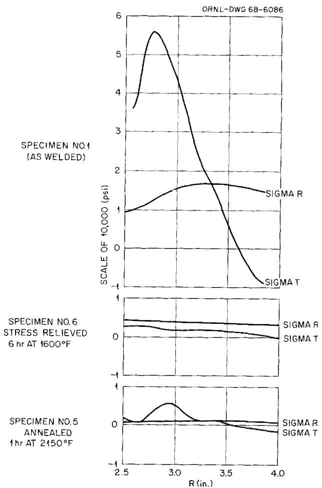  
Fig. 19.18. Residual Stresses in Various Hastelloy N Weldments. Sigma $R =$ radial stress, and sigma $T =$ tangential stress.

the stress, the $871^{\circ}\mathrm{C}$ treatment left a maximum of about 5000 psi in the weld deposit. From these results, it appears that the heat treatment at $871^{\circ}\mathrm{C}$ for $6\mathrm{hr}$ is indeed beneficial. The difference in stress distribution between argon and helium welds is also noteworthy.

# 19.8 APPLICATION OF THE NARROW-GAP WELDING PROCESS TO THE JOINING OF HASTELLOY N

D. A. Canonico

The final report on the application of the Narrow-Gap Welding Process (NGW)15 to the joining

of thick Hastelloy N plate has been received from Battelle Memorial Institute (BMI). Battelle was supplied with a 1-in.-thick plate of MSRE grade Hastelloy N and a 25-lb coil of 0.125-in.-diam Hastelloy N weld wire. Because of the needs of the NGW process, it was necessary to reduce the wire diameter to 0.045 in. Problems were encountered by BMI during processing, and only 7 lb of usable wire was finally obtained.

The NGW process is a proprietary process developed by BMI. It is basically a metal-arc inert-gas process wherein welding is done at the bottom of a narrow gap formed by the root faces of the two materials being joined. The process has the advantages that it requires no edge preparation and the amount of filler metal needed to fill the joint is minimal.

Operationally, the two plates to be joined are placed about $\frac{1}{4}$ in. apart. Two torches slightly out of alignment (within the allowable $\frac{1}{4}$ in. dimension) are employed. The second torch trails the first by about 2 in. The lay of the weld wires is oriented so that each tends to deposit its bead toward the wall nearest it. The process permits low-heat-input welds, which, owing to the narrow joint, results in the fabrication being completed with a minimum number of passes.

Three welds were made during the course of the investigation. Only the first weldment was made under the normal twin-wire-narrow-gap technique. This weldment was made using an argon-rich atmosphere (60 Ar-40 He). Center-line cracking occurred in the trailing weld bead after about half the plate thickness had been welded.

The second weld was made using a single-wire technique and a helium-rich atmosphere (70 He-30 Ar). Cracking again occurred after slightly less than half the plate thickness had been welded.

The third weld was preceded by a bead-on-plate study to further optimize the weld bead contour. It was found that an 80 He-20 Ar atmosphere produced the best weld bead, one with a reduced capillary and no long columnar grains. Special precautions were taken with the filler wire prior to welding, with the interpass temperature, and with the condition of the surface. This weld was also unsatisfactory, since it contained large blowholes and a number of cracks and fissures.

This study concerning the applicability of the NGW process was inconclusive. In all instances the welds were unsatisfactory. However, a strong possibility exists that the filler wire was not of the best quality.

# 19.9 NATURAL CIRCULATION LOOPS AND TEST CAPSULES

J.W.Koger A.P.Litman

Six loops and four capsules are presently in operation. Tables 19.6 and 19.7 detail the service parameters of these test units. Since last year we have utilized a newly designed natural circulation loop. The device is essentially a test bed system wherein metal specimens suspended in the salt and salt samples can be removed and/or replaced at operating temperature without disturbing flow or introducing air contamination. This design makes it possible to obtain kinetic data on corrosion and to study corrosion mechanisms prior to dismantling and subjecting an entire loop to metallurgical analysis. Figure 19.19 shows a schematic of the new loop configuration, while Fig. 19.20 displays two loops, NCL-15 and -16, in a protective hood prior to operation.

We are continuing to concentrate on the compatibility of Hastelloy N with fuel, blanket, and coolant salts. The compositions of standard Hastelloy N and the titanium-modified Hastelloy N are shown in Table 19.8.

# 19.9.1 Fuel Salts

Loop 1255, constructed of Hastelloy N and containing a simulated MSRE fuel salt plus 1 mole $\%$ $\mathrm{ThF}_4$ , continues to operate without difficulty after almost six years.

Loop 1258, constructed of type 304L stainless steel and containing the same salt as loop 1255, has operated about 4.6 years with only minor changes in flow characteristics. In January 1967, ten new stainless steel specimens were placed in the hot leg of loop 1258. The specimen in the hottest position was replaced after 3700 hr. A plot of the weight change of all the specimens as a function of time and temperature is given in Fig. 19.21. The curves are rather typical of corrosion processes that are diffusion controlled. As ex

pected, the weight loss is highest at the hottest point in the loop and decreases with decreasing temperature. Salt analyses show that only chromium is leached from the metal, and a diffusion coefficient can be calculated from Eq. (1) by assuming that the rate-controlling process is the diffusion of chromium to the solid surface:

$$
\Delta W = \frac {2}{\sqrt {\pi}} \left(C _ {0} - C _ {s}\right) _ {\mathrm {C r}} \sqrt {D t}, \tag {1}
$$

where

$$
\Delta W = \text {w e i g h t} \quad \mathrm {g / c m ^ {2}},
$$

$$
\begin{array}{l} C _ {0} = \text {b u l k c h r o m i u m c o n c e n t r a t i o n i n m a t e r i a l}, \\ \mathrm {g / c m ^ {3}}, \end{array}
$$

$$
\begin{array}{c} C _ {s} = \text {s u r f a c e} \\ \mathrm {g / c m ^ {3}}, \end{array}
$$

$$
t = \text {t i m e}, \sec ,
$$

$$
D = \text {d i f f u s i o n} \quad \text {c o e f f i c i e n t}, \mathrm {c m} ^ {2} / \sec .
$$

Assuming a surface chromium concentration of zero, the calculated values for $D$ at 649 and $677^{\circ}\mathrm{C}$ were $4.0 \times 10^{-12}$ and $1.4 \times 10^{-11} \mathrm{~cm}^{2} / \mathrm{sec}$ (ref. 16). The diffusion coefficient for chromium in austenitic stainless steel at $677^{\circ}\mathrm{C}$ was extrapolated from existing data as $4 \times 10^{-13} \mathrm{~cm}^{2} / \mathrm{sec}$ . Thus our corrosion data indicate an apparent diffusion coefficient two orders of magnitude higher than that extrapolated from diffusion measurements.

There are several possible reasons why these values do not agree. (1) The measured values were obtained over the temperature range from 849 to $1398^{\circ}\mathrm{C}$ and extrapolated to $677^{\circ}\mathrm{C}$ . Short-circuit diffusion mechanisms have been shown to be effective at lower temperatures and lead to a deviation in the standard Arrhenius plot used for extrapolation. (2) A corrosion mechanism more complicated than leaching of chromium from stainless steel is involved. (3) The solid-state diffusion of chromium in stainless steel is not the rate-controlling step in the process. We are continuing to investigate these factors in an effort to explain the differences above.

Loop NCL 16, the first two-fluid MSBR fuel salt natural circulation loop incorporating the new loop configuration, is now operating. The weight change obtained after $250\mathrm{hr}$ on the titanium-modified Hastelloy N specimen at $704^{\circ}\mathrm{C}$ was $0.35\mathrm{mg/cm}^2$ .

Table 19.6. MSRP Natural Circulation Loop Operation Through February 29, 1968   

<table><tr><td rowspan="2">Loop No.</td><td rowspan="2">Loop Material</td><td rowspan="2">Specimens</td><td rowspan="2">Salt Type</td><td rowspan="2">Salt Composition (mole %)</td><td rowspan="2">Maximum Temperature (°C)</td><td rowspan="2">ΔT (°C)</td><td colspan="2">Time (hr)</td></tr><tr><td>Scheduled</td><td>Operated</td></tr><tr><td>1255</td><td>Hastelloy N</td><td>Hastelloy N + 2% Nba,b</td><td>Fuel</td><td>LiF-BeF2-ZrF4-UF4-ThF4(70-23-5-1-1)</td><td>704</td><td>90</td><td>Indefinite</td><td>51,810</td></tr><tr><td>1258</td><td>Type 304L stainless steel</td><td>Type 304L stainless steelb,c</td><td>Fuel</td><td>LiF-BeF2-ZrF4-UF4-ThF4(70-23-5-1-1)</td><td>677</td><td>100</td><td>Indefinite</td><td>40,510</td></tr><tr><td>NCL 13</td><td>Hastelloy N</td><td>Hastelloy Nc,d</td><td>Coolant</td><td>NaBF4-NaF (92-8)</td><td>607</td><td>150</td><td>5000</td><td>2,930</td></tr><tr><td>NCL 14</td><td>Hastelloy N</td><td>Titanium-modified Hastelloy Nc,d</td><td>Coolant</td><td>NaBF4-NaF (92-8)</td><td>607</td><td>150</td><td>Indefinite</td><td>2,840</td></tr><tr><td>NCL 15</td><td>Hastelloy N</td><td>Titanium-modified Hastelloy N; Hastelloy N controlsc,d</td><td>Blanket</td><td>LiF-BeF2-ThF4 (73-2-25)</td><td>677</td><td>55</td><td>Indefinite</td><td>530</td></tr><tr><td>NCL 16</td><td>Hastelloy N</td><td>Titanium-modified Hastelloy N; Hastelloy N controlsc,d</td><td>Fuel</td><td>LiF-BeF2-UF4(65.5-34.0-0.5)</td><td>704</td><td>170</td><td>Indefinite</td><td>340</td></tr><tr><td>NCL 17</td><td>Hastelloy N</td><td>Titanium-modified Hastelloy N; Hastelloy N controlsc,d</td><td>Coolant</td><td>NaBF4-NaF (92-8) plus water vapor additions</td><td>607</td><td>150</td><td>Indefinite</td><td>Estimated startup 5-1-68</td></tr><tr><td>NCL 18</td><td>Hastelloy N</td><td>Titanium-modified Hastelloy N; Hastelloy N controlsc,d</td><td>Fuel</td><td>LiF-BeF2-UF4 (65.5-34.0-0.5) plus FeF2additions</td><td>704</td><td>170</td><td>Indefinite</td><td>Estimated startup 5-1-68</td></tr><tr><td>NCL 19</td><td>Hastelloy N</td><td>Titanium-modified Hastelloy N; Hastelloy N controlsc,d</td><td>Fuel</td><td>LiF-BeF2-UF4 (65.5-34.0-0.5) plus bismuth plus lithium in molybdenum hot finger</td><td>704</td><td>170</td><td>5000</td><td>Estimated startup 5-1-68</td></tr></table>

aPermanent specimens.   
$b_{\mathrm{Hot}}$ leg only.   
cRemovable specimens.   
${}^d\mathrm{Hot}$ and cold leg.

Table 19.7. MSRP Capsule Program   

<table><tr><td rowspan="2">Container Material</td><td rowspan="2">Specimens</td><td rowspan="2">Test Fluid (mole %)</td><td rowspan="2">Temperature (℃)</td><td colspan="2">Time (hr)</td><td rowspan="2">Purpose</td></tr><tr><td>Scheduled</td><td>\( Operated^a \)</td></tr><tr><td>Hastelloy N (four containers)</td><td>Hastelloy N in vapor, liquid, and interface</td><td>NaBF4-NaF (92-8) plus BF3at 120 mm Hg (No. 1), 50 psig (No. 2), 100 psig (No. 3), and 400 psig (No. 4)</td><td>607</td><td>2000</td><td>840 (No. 1)822 (No. 2)815 (No. 3)805 (No. 4)</td><td>Support coolant salt project and determine effect of BF3pres-sure on compatibility of so- dium fluoroborate salts with Hastelloy N</td></tr><tr><td>TZMb</td><td>TZM</td><td>LiF-BeF2(88-12)</td><td>1093</td><td>500</td><td>Estimated startup 4-1-68</td><td>Support MSRp fuel processing program; potential vacuum still material</td></tr></table>

${}^{a}$ Through February.   
$^b$ Mo-0.5% Ti-0.08% Zr-0.02% C.

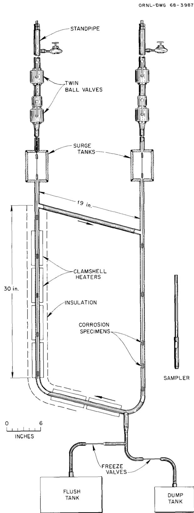  
Fig. 19.19. Schematic of New Natural Circulation Loop.

There is little doubt that an unsteady-state condition still prevails in the system, and any data obtained at this time must be considered tentative.

In support of the MSRP fuel processing scheme using vacuum distillation, we have fabricated a TZM alloy capsule that will contain $\mathrm{LiF - BeF}_2$ (88-12 mole%). This composition is typical of the salt distilland expected during processing. The test will be run at $1093^{\circ}\mathrm{C}$ , the approximate distillation temperature. This temperature precludes use of nickel-base alloys, and thus the molybdenum-base alloy TZM has been selected as a candidate retort material.

# 19.9.2 Blanket Salts

Loop NCL 15 is now operating with a typical two-fluid MSBR blanket salt. Considerable difficulty was experienced in filling this loop. The salt seemed to have an exaggerated tendency toward incongruent melting and segregation during solidification. The weight change obtained after $400\mathrm{hr}$ on the titanium-modified Hastelloy N specimen at $677^{\circ}\mathrm{C}$ was $0.05\mathrm{mg/cm}^2$ . This figure is lower than that for any other loop we have studied recently. It is again emphasized that these data are preliminary, since the loop has not reached a steady state.

# 19.9.3 Coolant Salts

Loops NCL 13 and NCL 14, containing $\mathrm{NaBF}_4$ -NaF (92-8 mole %), continue to operate under identical conditions. Loop NCL 13 contains standard Hastelloy N specimens, while loop NCL 14 has titanium-modified Hastelloy N specimens suspended in the salt stream. These differences make possible an excellent comparison of the effect of fluoroborate salt on these alloys. Utilizing weight changes on the specimens, changes in fluoroborate salt chemistry, and assuming loop behavior and specimen behavior are the same at a given temperature, a mass balance of the system was obtained within $10\%$ :

$$
\Delta W _ {\text {s y s t e m} \text {l o s s}} = \Delta W _ {\text {s y s t e m} \text {g a i n}} + \Delta C _ {\text {s a l t}}, \tag {2}
$$

where

$\Delta W_{\text{system loss}} = \text{weight loss for specimens and loop components},$

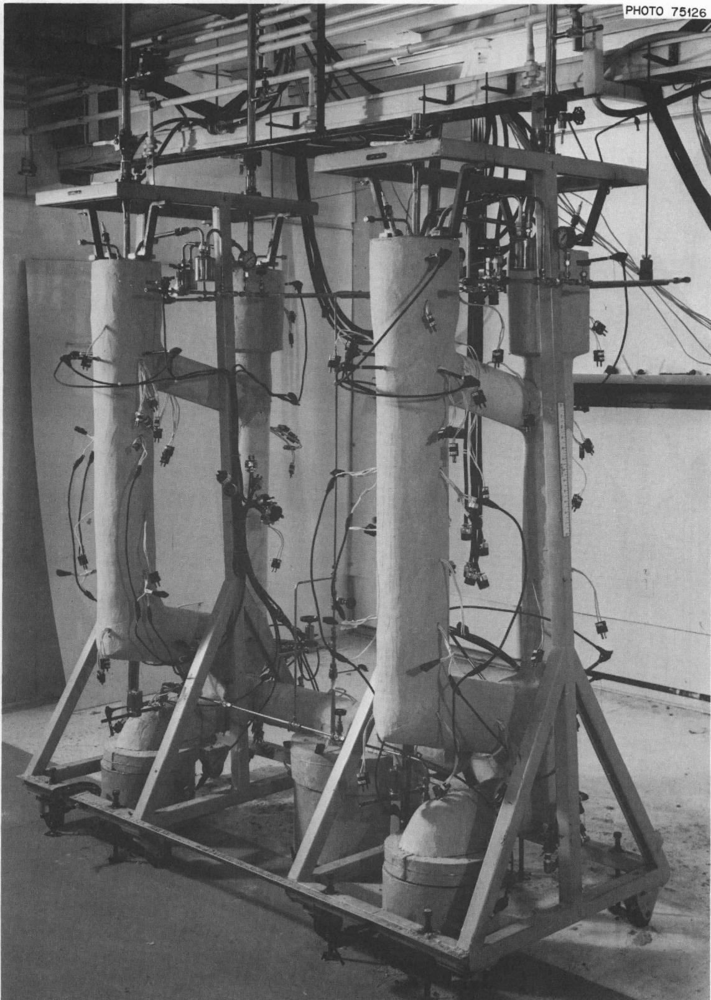  
Fig. 19.20. Natural Circulation Loops NCL-15 and -16 Prior to Operation.

Table 19.8. Composition of Hastelloy N Alloys   

<table><tr><td rowspan="2">Alloy</td><td colspan="7">Chemical Content (wt %)</td></tr><tr><td>Ni</td><td>Mo</td><td>Cr</td><td>Fe</td><td>Si</td><td>Mn</td><td>Ti</td></tr><tr><td>Standard</td><td></td><td></td><td></td><td></td><td></td><td></td><td></td></tr><tr><td>Hastelloy N</td><td>70</td><td>17.2</td><td>7.4</td><td>4.5</td><td>0.6</td><td>0.54</td><td>0.02</td></tr><tr><td>Titanium-modified</td><td></td><td></td><td></td><td></td><td></td><td></td><td></td></tr><tr><td>Hastelloy N</td><td>78</td><td>13.6</td><td>7.3</td><td>&lt;0.1</td><td>&lt;0.01</td><td>0.14</td><td>0.5</td></tr></table>

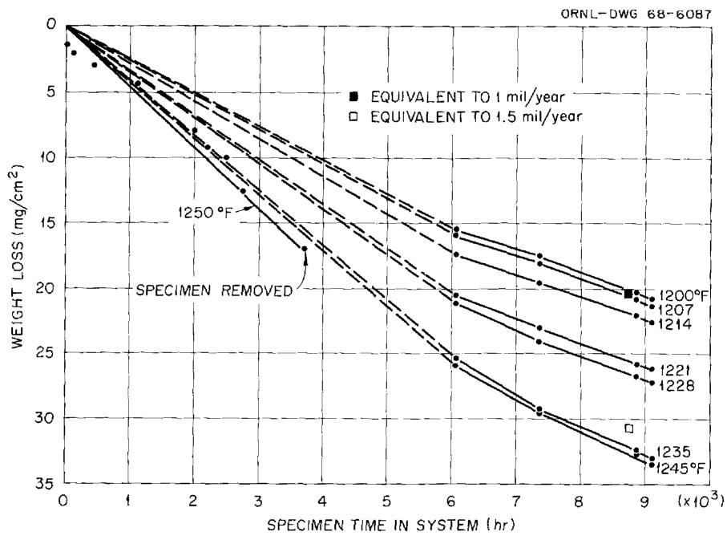  
Fig. 19.21. Specimen Weight Loss as Functions of Time and Temperature for Loop 1258 Heated Section. Loop and specimens fabricated from type 304L stainless steel.

$\Delta W_{\text{system gain}} = \text{weight gain for specimens and components},$

$\Delta C_{\text{salt}} =$ chemistry change in salt.

A profile of the weight change of loop NCL 13 at various times is given in Fig. 19.22. It can be seen that there are two positions (balance points) at $520 \pm 15^{\circ} \mathrm{C}$ which have not changed weight as a function of time. One of these points is located in the upper crossover section and the other in the lower portion of the hot leg. Considering these

balance points, we estimate that about $55\%$ of the loop is gaining weight and the remainder is losing weight. The change in chromium and iron content in the salt with time is plotted in Fig. 19.23. At the end of this reporting period, 2200 hr exposure time, about $1500\mathrm{mg}$ of material has been lost from the metal. Approximately half of this stayed in the salt, and the other half deposited in the cold portions of the loop.

We believe the container material, standard Hastelloy N, in loop NCL 14 is behaving like

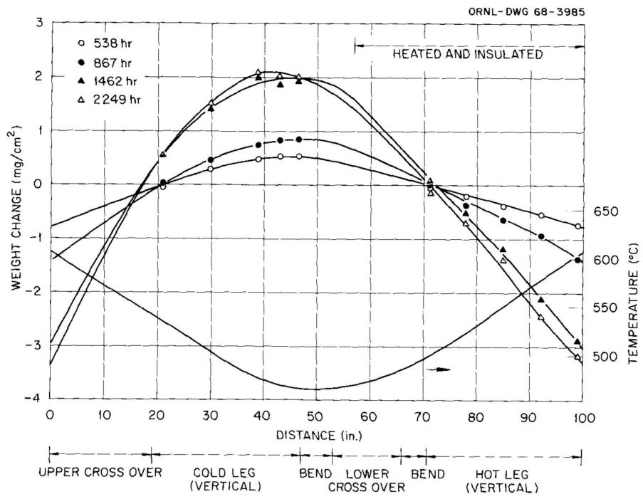  
Fig. 19.22. Weight Change as Function of Position (Temperature) for Standard Hastelloy N Specimens in Loop NCL 13.

loop NCL 13 tubing despite the results on specimens from loop NCL 14, which are titanium-modified Hastelloy N. A weight change vs distance (temperature) profile for the specimens in loop NCL 14, Fig. 19.24, illustrates the lower weight changes for the modified alloy compared with the standard Hastelloy. The value of $\Delta C_{\text{salt}}$ calculated using Eq. (2) was $150~\text{ppm}$ Cr, in excellent agreement with experiment. This suggests that a loop fabricated from modified Hastelloy N should behave like our test specimens of the same material. Proof of this thesis will be studied as modified material becomes available for construction of a loop.

Weight change-diffusion (rate constant) calculations similar to those done on other loops were performed on loops NCL 13 and NCL 14 using Eq. (3):

$$
\begin{array}{l} \Delta W _ {\text {l o s s}} = \frac {2}{\sqrt {\pi}} C \sqrt {D t}, \quad T > 5 2 0 \pm 1 5 ^ {\circ} C, \tag {3} \\ = C _ {l} \sqrt {\bar {D} t}, \\ \end{array}
$$

where

$C =$ concentration of $\mathbf{Fe} + \mathbf{Cr}$ in Hastelloy N, $\frac{g}{cm^3}$

$D =$ diffusion coefficient, $\mathrm{cm}^2 /\mathrm{sec}$

$$
t = \text {t i m e}, \sec .
$$

It was found that by using the weight changes and the combined iron and chromium concentration for the loop specimens, almost identical $D$ values were obtained for the standard and modified Hastelloy N. This is quite significant, since the iron content of titanium-modified Hastelloy N is negligible. Thus $D$ , or in reality a rate constant $K_{I}$ , is independent of the concentration of chromium and iron and other diffusing species. The weight change, however, is quite sensitive to the total concentration of the migrating elements. Confirmation of this hypothesis is evident when comparing $K_{I}$ from our loops with a value obtained for $D_{\mathrm{Cr}}$ in Hastelloy N; $^{17}K_{I}$ was found to be $\approx 10^2$ exp $(-57,500 / RT)$ , and specifically $K_{I}$ for loops NCL 13 and 14 at $607^{\circ}\mathrm{C}$ is

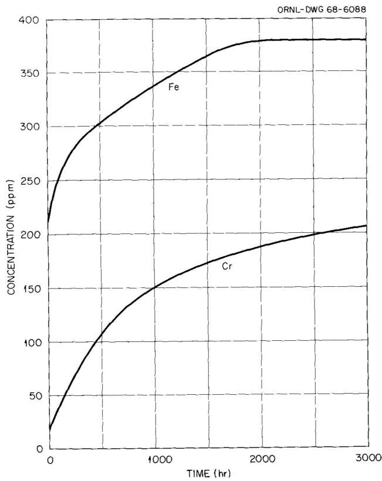  
Fig. 19.23. Iron and Chromium Levels in the NaBF $_4$ -NaF (92-8 Mole %) Salt in Loop NCL 13.

$5 \times 10^{-12} \mathrm{~cm}^{2} / \mathrm{sec}$ , while the literature value for $D_{\mathrm{Cr}}$ is $5 \times 10^{-14} \mathrm{~cm}^{2} / \mathrm{sec}$ .

We believe the sodium fluoroborate salts may be less selective in their dissolution tendency of the major elements in nickel- and iron-base alloys. However, it is emphasized that the corrosion rates of Hastelloy N in fluoroborate salts are relatively small and now appear to be leveling off. This behavior increases our confidence in the compatibility of Hastelloy N in candidate salts for molten-salt reactors.

Capsule tests to evaluate the compatibility of Hastelloy N with fluoroborate salts at $607^{\circ}\mathrm{C}$ as a function of $\mathrm{BF}_3$ pressure have operated 800 hr through February. There are four capsules with three titanium-modified Hastelloy N specimens in each; one specimen is in the salt, one in the $\mathrm{BF}_3$ vapor, and one in the liquid-vapor interface. The $\mathrm{BF}_3$ pressures used are approximately 130 torrs (the normal $\mathrm{BF}_3$ vapor pressure at $607^{\circ}\mathrm{C}$ ), 50, 100, and 400 psig. The time, originally scheduled for 1000 hr, has been extended to 2000 hr to permit gathering of more conclusive results. We have observed that the specimens in the vapor phase of loops NCL 13 and NCL 14 continue to lose weight and retain a blackened appearance. These capsule tests should shed light on this phenomenon.

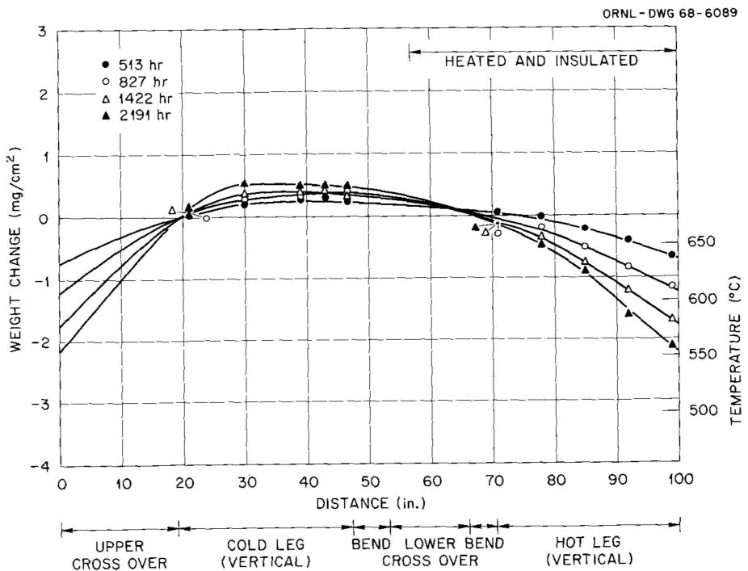  
Fig. 19.24. Weight Change as Function of Position (Temperature) for Titanium-Modified Hastelloy N in Loop NCL 14.

# 19.10 FORCED CIRCULATION LOOP

P. A. Gnadt W. R. Huntley

Work is in progress on a loop facility that will enable us to study the compatibility of alloys and salts under forced-circulation conditions of interest to the MSRP. At present, we are constructing a test facility for studying the compatibility of Hastelloy N with $\mathrm{NaBF}_4$ -NaF (92-8 mole%). The loop, MSR-FCL-1, will operate at a bulk maximum temperature of $607^{\circ}\mathrm{C}$ with a temperature difference of $150^{\circ}\mathrm{C}$ . This salt is very attractive as a coolant because of its low cost and low melting point. If found to be compatible and satisfactory in other respects, it will be used in the MSRE in place of the present coolant, ${}^{7}\mathrm{LiF - BeF}_{2}$ (66-34 mole%). The loop and facility designs from earlier forced

circulation loops were used, with minor modifications, in an attempt to reduce costs.

The loop MSR-FCL-1 has been designed to approximate conditions in the MSRE coolant circuit. Liquid velocities will be limited to 7 fps because an available model LFB pump is being used. Other salient features of the loop include a $\mathbf{BF}_3$ purging and addition system over the free liquid surface in the pump tank, means for sampling molten salt during operation, and permanent metallurgical specimens installed in the bulk stream. The salt in the loop will be heated by electrical resistance heating of the tubing wall and will be cooled by a finned air-cooled heat exchanger. Special controls are provided to reduce the possibilities of freezing the salt in the loop piping during electrical power interruptions or other equipment failures. The loop is shown in simplified schematically as follows:

ORNL-DWG 68-2797

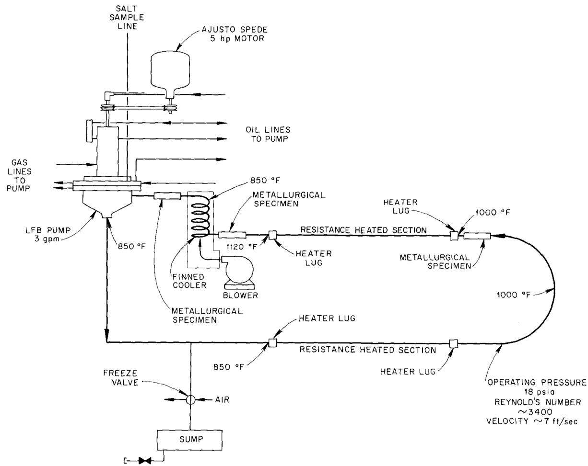  
Fig. 19.25. Schematic of Molten-Salt Forced-Convection Corrosion Loop.

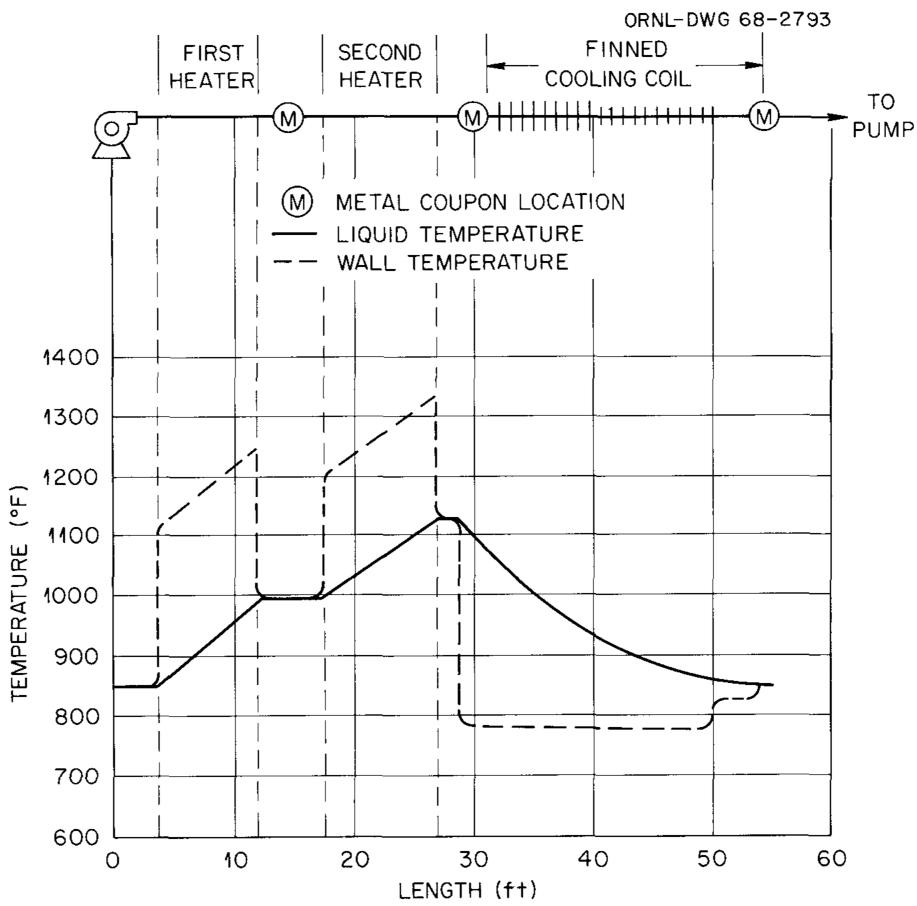  
Fig. 19.26. Temperature Profile of Molten-Salt Forced-Convection Corrosion Loop.

matic form in Fig. 19.25. Figure 19.26 shows the expected temperature profile of the liquid and the metal wall. Selected engineering data for the loop design are given in Table 19.9. The data given are the design conditions, but uncertainties in the physical properties of the salt may cause the actual operating conditions to be different.

Table 19.9. Engineering Data for Loop MSR-FCL-1   

<table><tr><td colspan="2">Materials, temperature, velocities</td></tr><tr><td>Tubing and specimens</td><td>Standard Hastelloy N</td></tr><tr><td>Nominal tubing size</td><td>1/2in. OD by 0.045-in. wall</td></tr><tr><td>Total tubing length</td><td>54 ft</td></tr><tr><td>Bulk fluid temperature (max)</td><td>607°C</td></tr><tr><td>Bulk fluid ΔT</td><td>150°C</td></tr><tr><td>Flow rate</td><td>3 gpm</td></tr><tr><td>Liquid velocity</td><td>Approximately 71/4 fps</td></tr></table>

Table 19.9 (Cont.)   

<table><tr><td colspan="2">Heat transfer</td></tr><tr><td>Heat load at finned cooler</td><td>322,000 Btu/hr (approx 94 kw)</td></tr><tr><td>Liquid Reynolds number</td><td>Approximately 3450</td></tr><tr><td>Liquid film heat transfer coefficient</td><td>Approximately 775 Btu hr-1 ft-2(°F)-1</td></tr><tr><td>Length of finned 1/2-in.-OD cooler coil</td><td>26 ft</td></tr><tr><td>Coolant air flow</td><td>3000 cfm</td></tr><tr><td>Coolant air ΔT</td><td>50°C</td></tr><tr><td colspan="2">Pumping requirements</td></tr><tr><td>System ΔP at 3 gpm</td><td>53 psi (60 ft)</td></tr><tr><td>Required pump speed</td><td>4700 rpm</td></tr><tr><td colspan="2">Circulating salt volume</td></tr><tr><td>Tubing</td><td>85 in.3</td></tr><tr><td>Pump bowl</td><td>47 in.3</td></tr><tr><td>Total volume</td><td>132 in.3</td></tr></table>

Approximately $98\%$ of the design modifications have been completed during the reporting period. Ninety-five percent of the loop components have been procured and fabricated. Assembly of components and installation of electrical equipment are in progress.

# 19.11 OXIDATION OF HASTELLOY N

B. McNabb, Jr.

Although Hastelloy N has generally performed quite well, its susceptibility to radiation damage $^{18,19}$ has caused us to consider small modifications of its chemical composition. The oxida-

tion resistance of this alloy is quite good, $^{20}$ and we have been concerned with whether these chemical modifications would reduce the oxidation resistance.

The rate of oxidation at a given peak temperature is usually higher when the material is being cycled periodically to lower temperatures. Although a very protective and tenacious oxide may

$^{18}$ W. R. Martin and J. R. Weir, Nucl. Appl. 1(2), 160-67 (1965).   
$^{19}$ W. R. Martin and J. R. Weir, Nucl. Appl. 3, 167 (1967).   
20H. E. McCoy, Jr., and J. R. Weir, Jr., Materials Development for Molten-Salt Breeder Reactors, ORNL-TM-1854 (June 1967), pp. 31-34.

Table 19.10. Compositions of Test Alloys   

<table><tr><td rowspan="2">Heat No.</td><td colspan="9">Chemical Content (wt %)</td></tr><tr><td>Mo</td><td>Cr</td><td>Fe</td><td>Mn</td><td>C</td><td>Si</td><td>Al</td><td>Ti</td><td>Other</td></tr><tr><td>2477</td><td>16.32</td><td>7.05</td><td>4.25</td><td>0.04</td><td>0.057</td><td>0.015</td><td>0.055</td><td></td><td></td></tr><tr><td>X2497</td><td>17.1</td><td>7.15</td><td>&lt;0.02</td><td></td><td>0.048</td><td>0.016</td><td></td><td></td><td></td></tr><tr><td>5065</td><td>16.48</td><td>7.25</td><td>3.90</td><td>0.55</td><td>0.065</td><td>0.595</td><td>0.01</td><td></td><td></td></tr><tr><td>5067</td><td>17.30</td><td>7.40</td><td>4.0</td><td>0.48</td><td>0.06</td><td>0.43</td><td>0.01</td><td></td><td></td></tr><tr><td>5320</td><td>16.85</td><td>6.92</td><td>0.05</td><td>0.016</td><td>0.056</td><td>&lt;0.006</td><td></td><td></td><td></td></tr><tr><td>5911</td><td>17.01</td><td>6.14</td><td>0.03</td><td>0.21</td><td>0.056</td><td>0.05</td><td>0.15</td><td></td><td></td></tr><tr><td>7304</td><td>16.1</td><td>7.16</td><td>2.36</td><td>0.92</td><td>0.104</td><td>0.037</td><td>0.26</td><td></td><td></td></tr><tr><td>7305</td><td>16.3</td><td>7.27</td><td>2.40</td><td>0.90</td><td>0.059</td><td>0.21</td><td>0.41</td><td></td><td></td></tr><tr><td>Y8487</td><td>16.78</td><td>7.32</td><td>4.11</td><td>0.30</td><td>0.05</td><td>0.17</td><td>0.16</td><td></td><td></td></tr><tr><td>6252-2</td><td>16.53</td><td>7.26</td><td>0.12</td><td>0.20</td><td>0.051</td><td>0.05</td><td>0.20</td><td></td><td></td></tr><tr><td>65552</td><td>15.85</td><td>7.43</td><td>4.45</td><td>0.43</td><td>0.045</td><td>0.15</td><td>0.25</td><td></td><td></td></tr><tr><td>61</td><td>12.14</td><td>7.77</td><td></td><td>0.21</td><td>0.048</td><td>0.01</td><td></td><td></td><td></td></tr><tr><td>71</td><td>11.69</td><td>7.93</td><td></td><td>0.23</td><td>0.059</td><td>&lt;0.005</td><td></td><td>0.05</td><td></td></tr><tr><td>72</td><td>11.74</td><td>7.90</td><td></td><td>0.23</td><td>0.057</td><td>&lt;0.005</td><td></td><td>0.08</td><td></td></tr><tr><td>73</td><td>11.87</td><td>7.90</td><td></td><td>0.27</td><td>0.058</td><td>0.005</td><td></td><td>0.15</td><td></td></tr><tr><td>74</td><td>11.81</td><td>7.94</td><td></td><td>0.25</td><td>0.062</td><td>&lt;0.005</td><td></td><td>0.43</td><td></td></tr><tr><td>75</td><td>11.89</td><td>7.89</td><td></td><td>0.24</td><td>0.062</td><td>&lt;0.005</td><td></td><td>0.95</td><td></td></tr><tr><td>76</td><td>11.93</td><td>7.84</td><td></td><td>0.28</td><td>0.127</td><td>0.01</td><td></td><td>1.0</td><td></td></tr><tr><td>102</td><td>11.2</td><td>6.92</td><td>0.089</td><td>0.20</td><td>0.045</td><td>&lt;0.005</td><td></td><td>0.39</td><td></td></tr><tr><td>104</td><td>11.74</td><td>7.14</td><td>0.10</td><td>0.21</td><td>0.05</td><td>&lt;0.005</td><td></td><td>0.55</td><td></td></tr><tr><td>105</td><td>12.28</td><td>6.72</td><td>0.089</td><td>0.20</td><td>0.049</td><td>&lt;0.005</td><td></td><td>0.66</td><td></td></tr><tr><td>66535</td><td>12.66</td><td>7.2</td><td>0.07</td><td>0.12</td><td>0.072</td><td>0.03</td><td>0.06</td><td>0.15</td><td></td></tr><tr><td>66536</td><td>12.36</td><td>6.9</td><td>0.07</td><td>0.10</td><td>0.028</td><td>0.025</td><td>0.08</td><td>0.32</td><td></td></tr><tr><td>66541</td><td>13.17</td><td>6.81</td><td>0.03</td><td></td><td>0.066</td><td>0.05</td><td>&lt;0.03</td><td>0.27</td><td></td></tr><tr><td>66548</td><td>12.44</td><td>7.66</td><td>0.03</td><td></td><td>0.039</td><td>0.05</td><td>&lt;0.03</td><td>0.45</td><td></td></tr><tr><td>67502</td><td>12.74</td><td>7.24</td><td>0.08</td><td>0.15</td><td>0.04</td><td>&lt;0.01</td><td>0.12</td><td>0.53</td><td>2.15 W</td></tr><tr><td>67503</td><td>12.54</td><td>7.75</td><td>0.15</td><td>0.08</td><td>0.06</td><td>&lt;0.01</td><td>0.12</td><td>0.06</td><td>0.08 Hf</td></tr><tr><td>67504</td><td>12.68</td><td>7.49</td><td>0.12</td><td>0.12</td><td>0.07</td><td>0.02</td><td>0.03</td><td>&lt;0.01</td><td>0.43 Hf</td></tr></table>

be formed at the peak temperature, this oxide may spall during cooling due to a difference between the thermal expansion of the oxide and the metal substrate. When reheated to the peak temperature, a period of rapid oxidation occurs until another protective layer of oxide is formed. We used a cycle period of 25 hr in our tests (i.e., 25 hr at temperature), after which the specimens were removed from the furnace, allowed to cool to room temperature, weighed, and reinserted in the furnace. The test times were generally 1000 hr, with the samples being weighed periodically. Test temperatures of 760 and $982^{\circ}\mathrm{C}$ were studied. The test specimens were ${}^{1}_{4}$ in. in diameter by ${}^{1}_{4}$ in. long; the materials studied are given in Table 19.10.

The results from several melts of standard Hastelloy N are shown in Fig. 19.27. These

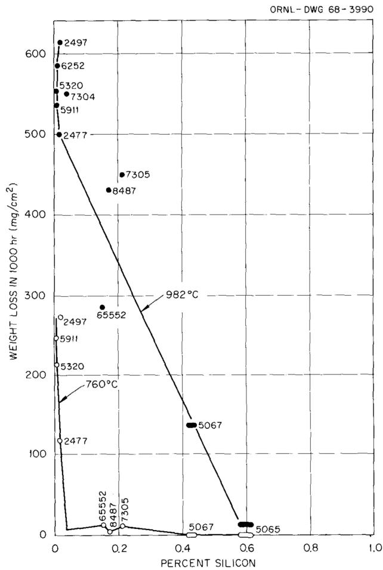  
Fig. 19.27. Effects of Silicon on the Scaling Resistance of Hastelloy N.

alloys were made by air and vacuum melting and contain various amounts of Fe, Al, Mn, and Si. However, the variation in silicon appears to be most important, with the weight loss at $982^{\circ}\mathrm{C}$ varying by a factor of about 6 over the range of 0 to 0.6 wt%. At $760^{\circ}\mathrm{C}$ a similar trend is noted, although about $0.05\%$ Si seems sufficient to improve the oxidation resistance appreciably.

Several 2-lb laboratory melts of the modified base composition (12% Mo-7% Cr-0.2% Mn-0.05% C) were prepared with various amounts of titanium. The results of tests on this material are shown in Fig. 19.28. These melts are all quite low in silicon, and the weight losses are quite similar to those shown in Fig. 19.27 for the low-silicon alloys. The titanium additions seem to decrease the weight loss slightly, the effect being greater at $760^{\circ}\mathrm{C}$ .

Several commercial heats of titanium-modified materials have been tested, and the results are shown in Fig. 19.29. With the exception of the one point at $760^{\circ}\mathrm{C}$ , the oxidation rates are reasonably independent of titanium level. The rates

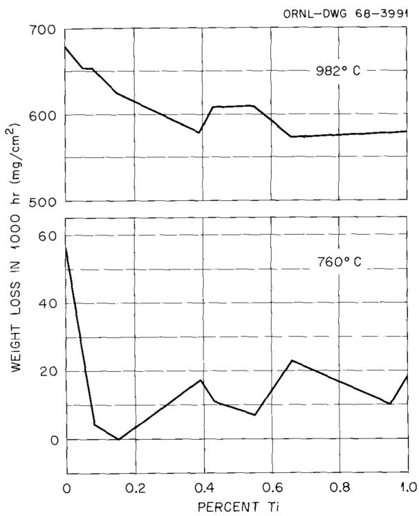  
Fig. 19.28. Effects of Titanium Additions on the Scaling Resistance of Laboratory Melts of Ni-12% Mo-7% Cr-0.2% Mn-0.05%C Alloys.

are slightly lower than those shown in Fig. 19.28, probably because of the higher concentration of beneficial impurities in the commercial alloys.

These results indicate that the removal of silicon and other residuals from the alloy is more detrimental to the oxidation resistance than the addition of small amounts of titanium. The weight losses experienced at $760^{\circ}\mathrm{C}$ are still relatively low for such stringent conditions (e.g., a weight loss of $100\mathrm{mg / in.}^{2}$ in 1000 hr corresponds to the loss of about 50 mils of metal in 10,000 hr). Isothermal oxidation tests are being run on these materials, and the rates are much lower; however, the trends noted here under cyclic conditions seem to apply.

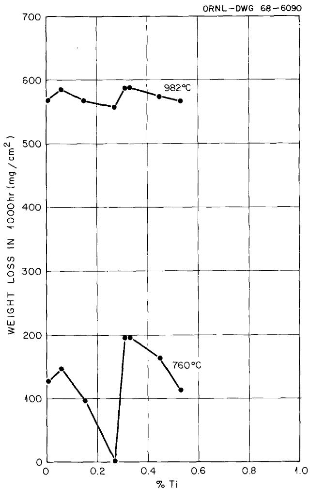  
Fig. 19.29. Variation of Scaling Resistance with Titanium Content for Several Commercial Melts of Ni-12% Mo-7% Cr-0.2% Mn-0.05% C Alloys.

# 20. Graphite-to-Metal Joining

# 20.1 GRAPHITE BRAZING DEVELOPMENT

W.J.Werner

In addition to developing brazing filler metals which directly wet and flow on graphite, we are investigating the use of thin (0.0002 to 0.0005 in.) pyrolytically deposited metallic coatings for en

$^{1}$ MSR Program Semiann. Progr. Rept. Aug. 31, 1967, ORNL-4191, p. 236.

hancing brazability. Thus, more conventional ductile, corrosion-resistant brazing alloys such as pure copper and 60 Pd-40 Ni (wt %) could be used. Both molybdenum and tungsten are being deposited on high-density, low-permeability graphite, and we have found that brazing filler metals readily wet and flow on the coated graphite. Figure 20.1 shows the morphology of a thin coating of pyrolytic molybdenum on MSRE-grade graphite. X-ray studies showed that immediately

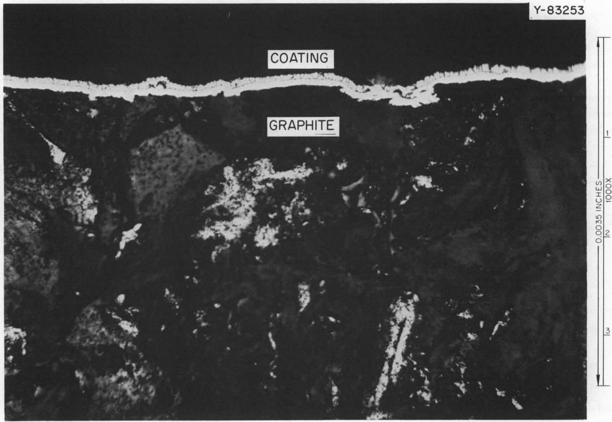  
Fig. 20.1. Microstructure and Morphology of 0.0002-in. Coating of Pyrolytic Molybdenum on CGB Graphite. As polished.

adjacent to the graphite the molybdenum had reacted with the graphite to form molybdenum carbide. Also, the morphology of the coating suggests a high degree of mechanical bonding between the materials.

The test joint shown schematically in Fig. 20.2 was devised to check the strength of graphite-Hastelloy N joints made by the above method. The graphite used in these tests was high-density, low-permeability isotropic material made by Poco. The joints were brazed with copper and pulled at room temperature. Figure 20.3 shows one of the broken test specimens. The position of fracture varied from specimen to specimen. This was taken as an indication of the extent of cracking due to differential thermal expansion in the plane of the taper. In addition, one specimen fractured at the metal-graphite junction during the brazing cycle. Thus more severe stresses than anticipated were encountered with this particular test specimen design. Currently, a series of coated graphite-to-molybdenum brazed specimens is being prepared.

Experimental results on full-size joints $(3^{1/2}$ in. OD, $1/2$ -in. wall) are preliminary. Most of the tests were direct joints of Hastelloy N to pyrolytic-coated graphite using copper as the brazing filler metal. Both induction and furnace brazing techniques were used. The induction-brazing technique is quite attractive in view of the large number of joints needed and the length and uniform configuration of the reactor components. Induction-brazing experiments have resulted in fracture of the graphite at the graphite-Hastelloy N junction

2Manufactured by Poco Graphite, Inc., Garland, Tex.

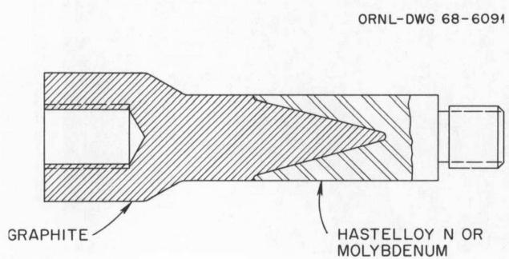  
Fig. 20.2. Schematic Illustration of Graphite-Hastelloy N or Graphite-Molybdenum Test Joint.

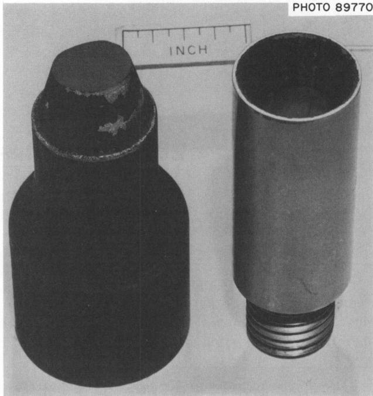  
Fig. 20.3. Graphite-Hastelloy N Brazed Specimen Tested at Room Temperature. The location of the fracture was approximately in the middle of the taper. Joint design shown in Fig. 20.2.

during a relatively fast cooldown from the brazing temperature. Uniform heating has been difficult to obtain, and, as a result, we found portions of these joints containing unmelted brazing filler metal. We are presently upgrading the induction-brazing unit to minimize these problems. Several direct joints of various designs have also been furnace brazed. Again the direct joints between graphite and Hastelloy N cracked in all cases, although not to the extent that the induction-brazed joints did. This experience indicates the potential advantages of the low-expansion transition metal concept. For example, a brazed graphite-to-molybdenum joint showed no visual or radiographic evidence of cracking. Radiographically, good flow of the brazing filler metal was noted throughout the joint area. Figure 20.4 shows the microstructure of such a joint (note the excellent flow of the copper filler metal). Next, a piece of Hastelloy N will be brazed to the molybdenum to form the complete transition joint, and then the entire joint will be thermally cycled.

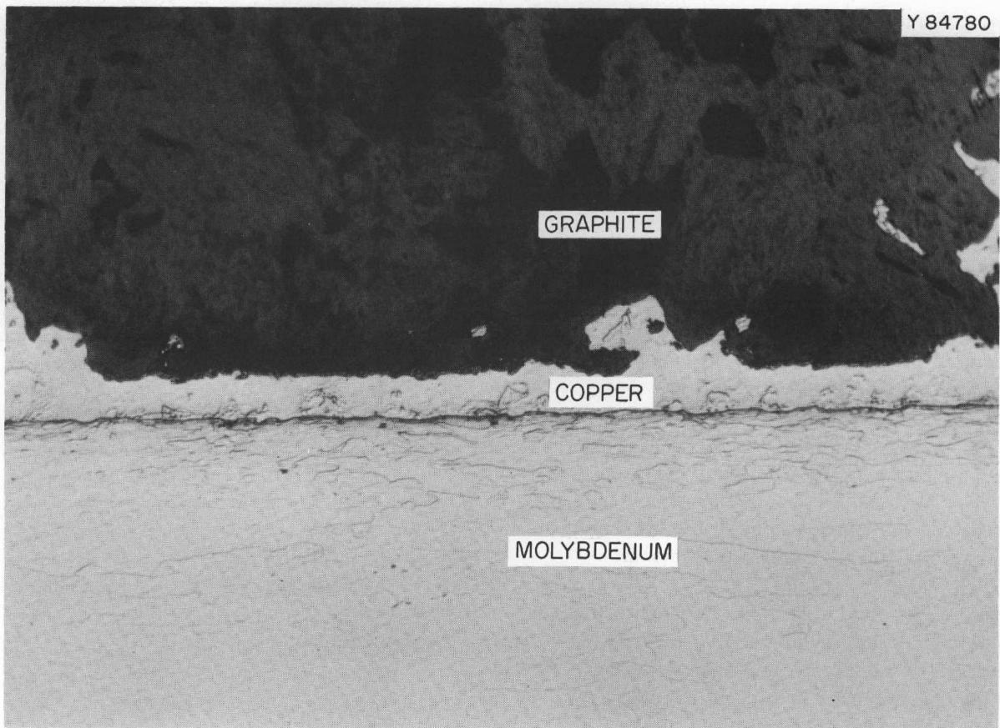  
0.018 INCLES 200x   
Fig. 20.4. Microstructure of Pyrolytic-Molybdenum-Coated ATJ Graphite Brazed to Molybdenum Transition Piece with Copper. Etchant: $\mathsf{H}_2\mathsf{O}_2$ and $\mathsf{NH}_4\mathsf{OH}$ .

# 20.2 RADIATION STABILITY OF BRAZING ALLOYS OF INTEREST FOR BRAZING GRAPHITE

W.J.Werner

H. E. McCoy, Jr.

We have irradiated a series of brazing filler metals which find application for joining Hastelloy N and/or molybdenum to high-density graphite. Hastelloy N test specimens of the Miller-Peeslee design were used in the study. The specimens were 0.125 in. thick × 0.375 in. × 1.875 in. The joint spacing before brazing was maintained at 0.002 in.

The specimens were irradiated in a single-test capsule in the poolside position in the ORR. The peak thermal flux was $6 \times 10^{13}$ neutrons $\mathrm{cm}^{-2}$ $\sec^{-1}$ , and the peak fast ( $>2.9$ MeV) flux was $5 \times 10^{12}$ neutrons $\mathrm{cm}^{-2}$ $\sec^{-1}$ . The duration of the experiment was $1128\mathrm{hr}$ (time at temperature and full power), so the thermal and fast doses were $2.43 \times 10^{20}$ and $2.03 \times 10^{19}$ neutrons/ $\mathrm{cm}^2$ respectively. The compositions of the brazing filler metals used in the study are shown in Table 20.1.

The pure copper and nickel-palladium-chromium brazes were made in a hydrogen atmosphere at 1125 and $1250^{\circ}\mathrm{C}$ respectively. The copper-base filler alloys were brazed in vacuum at $1200^{\circ}\mathrm{C}$ .

After irradiation the specimens were tested on an Instron tensile machine. As-brazed control specimens were also tested. In addition, a set of specimens having the same thermal and en

vironmental history as the reactor specimens is being prepared.

Strength data for the reactor and control specimens are shown in Table 20.2. It can be seen that all the brazing filler metals seem to have adequate mechanical strength for nuclear system joints. We cannot obtain quantitative values for the shear strains until the width of the sheared region is determined. Complete analysis of the data must await the test results from the specimens having the same thermal history as the irradiated specimens.

Table 20.2. Properties of Several Brazing Alloys   

<table><tr><td rowspan="2">Material</td><td colspan="2">Maximum Shear Strength (ksi)</td></tr><tr><td>25°C</td><td>700°C</td></tr><tr><td>Copper</td><td></td><td></td></tr><tr><td>Unirradiated</td><td>29</td><td>9</td></tr><tr><td>Irradiated</td><td>15</td><td>7</td></tr><tr><td>35 Ni-60 Pd-5 Cr</td><td></td><td></td></tr><tr><td>Unirradiated</td><td>66</td><td>28</td></tr><tr><td>Irradiated</td><td>66</td><td>12.5</td></tr><tr><td>68 Cu-17 Ni-10 Cr-5 Be</td><td></td><td></td></tr><tr><td>Unirradiated</td><td>64</td><td>32</td></tr><tr><td>Irradiated</td><td>54</td><td>17</td></tr><tr><td>60 Cu-15 Ni-20 Ta-5 Bea</td><td></td><td></td></tr><tr><td>Unirradiated</td><td>78</td><td>31</td></tr><tr><td>Irradiated</td><td>49</td><td>18</td></tr></table>

${}^{a}$ Specimens failed in Hastelloy $\mathbf{N}$ due to the high strength of the brazing alloy.

Table 20.1. Composition of Brazing Filler Metals Used in Irradiation Test   

<table><tr><td>Alloy Composition (wt %)</td><td>Brazing Application</td></tr><tr><td>Pure copper</td><td>Pyrolytic-molybdenum-coated graphite to molybdenum or Hastelloy N and molybdenum to Hastelloy N</td></tr><tr><td>35 Ni-60 Pd-5 Cr</td><td>Graphite to molybdenum or Hastelloy N</td></tr><tr><td>68 Cu-17 Ni-10 Cr-5 Be</td><td>Graphite to molybdenum or Hastelloy N</td></tr><tr><td>60 Cu-15 Ni-20 Ta-5 Be</td><td>Graphite to molybdenum or Hastelloy N</td></tr></table>

# 20.3 GRAPHITE-TO-HASTELELOY N TRANSITION JOINT

J. P. Hammond

Work was initiated to develop a transition joint for joining graphite to Hastelloy N. The transition joint concept is an attractive solution to the problem of joining materials of widely differing thermal coefficients of expansion and consists in inserting a series of connected segments whose properties change gradually from one component of the juncture to the other.4 The segments are usually fabricated by powder metallurgy and are joined by diffusion bonding or brazing. The constituents of the joint should be metallurgically compatible with one another under the fabrication and service conditions.

There are two widely differing properties of graphite and Hastelloy N which give concern: the coefficient of thermal expansion and the dimensional stability under irradiation. Both can produce damaging strain at the joint interface, the former being of concern while cooling from the brazing temperature and during thermal cycling and the latter being of concern during prolonged irradiation of the graphite member.

# 20.3.1 Conceptual Design

Two families of materials exist which offer unique characteristics for designing the type of link we require. One is the familiar class of heavy-metal alloys5 of tungsten or molybdenum with a nickel alloy as the binder constituent, which is fabricated by liquid-phase sintering. The structure consists of round heavy-metal grains enveloped by a nickel alloy matrix. The other class of materials is the graphite-transitional metal carbide composites recently developed for rocket nozzles.6 These are fabricated by hot isostatic compaction.

As noted in Table 20.3 the coefficient of thermal expansion of the heavy-metal alloy should be

Table 20.3. Expected Coefficients of Thermal Expansion for Thermal Joint Materials   

<table><tr><td>Material</td><td>Crystal Structure</td><td>Coefficient of Thermal Expansiona (μin./°C)</td></tr><tr><td>Isotropic graphite</td><td>Hex</td><td>4.3</td></tr><tr><td>Hastelloy N</td><td>Fcc</td><td>12.3</td></tr><tr><td>Tungsten</td><td>Bcc</td><td>4.7</td></tr><tr><td>Molybdenum</td><td>Bcc</td><td>5.3</td></tr><tr><td>Graphite-carbide composites</td><td>Hex-fcc</td><td>4.3 to ~5.3</td></tr><tr><td>Heavy-metal alloys</td><td>Bcc-fcc</td><td>~5 to ~11</td></tr></table>

${}^{a}$ Mean value between 20 and ${600}^{ \circ  }\mathrm{C}$ .

alterable over a wide range by varying the concentration of heavy-metal phase in the structure. Since tungsten and molybdenum are near graphite in expansion coefficient (Table 20.3), the segment of highest heavy-metal concentration would be located adjacent to the graphite member, while the segment of highest nickel matrix would be next to Hastelloy N. To mollify undesirable effects stemming from placing dimensionally unstable graphite against stable heavy-metal alloy, a transition with respect to irradiation-induced dimensional instability is also introduced. This is done by incorporating one or more segments of a graphite-carbide composite between the graphite and the heavy-metal members. Since the graphite-carbide composite would be comprised of a highly dense isotropic-type graphite without any graphitizable binder, it should be fairly resistant to dimensional change during irradiation. Observe in Table 20.3 that the combination of graphite-carbide composites and heavy-metal alloys spans the wide difference in coefficient of thermal expansion between the graphite and the Hastelloy N. Schematic drawings illustrating the principles of this design are shown in Fig. 20.5.

Fabrication of suitable graphite-carbide composites for this joint appears straightforward using

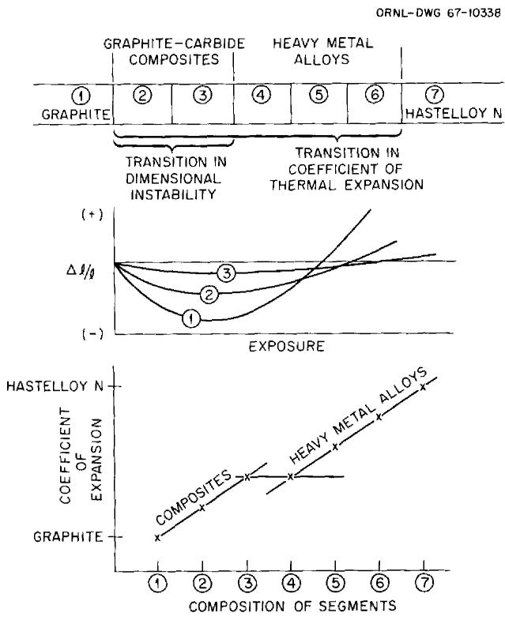  
Fig. 20.5. Transition Joint, Graphite to Hastelloy N. Top: array of segments comprising the joint, showing transitions in properties. Middle: transition in irradiation-induced dimensional instability of graphite-carbide composite segments. Bottom: transition in coefficient of thermal expansion of graphite-carbide composite and heavy-metal segments.

the high-temperature gas-pressure bonding technique. The joining of the components of the joint is believed to be feasible with current methods and knowledge relative to brazing and diffusion bonding.

# 20.3.2 Heavy-Metal Alloy Development

Preliminary fabrication studies were conducted on tungsten heavy-metal alloys to confirm the good sinterability and ductility experienced with this class of materials in other quarters. By achieving microstructures wherein a ductile nickel phase surrounds the otherwise fragile tungsten grains, exceptionally ductile composites have been obtained. As indicated in Table 20.4, good fabri

cation results were achieved with a nickel-iron mixture (4/1 nickel-to-iron ratio) as the binder constituent. The tungsten concentrations studied were 90, 75, and 60 wt%; these levels appear appropriate for the individual segments of the transition joint. The high toughness of these particular alloys is attested to by the high degree to which they are cold rollable without edge cracking (Fig. 20.6a and b).

We extended our studies to include alloys based on molybdenum because they are expected to show superior resistance to embrittlement by irradiation. The important consideration here is that at the service temperature (around $700^{\circ}\mathrm{C}$ ), fast displacement damage would anneal out of the molybdenum but possibly not out of tungsten. Early attempts to fabricate alloys based on molybdenum either gave rather brittle alloys or they were difficult to fabricate (Table 20.4, specimens 4 to 11).

The observation that these molybdenum heavy-metal alloys were prone to be brittle whereas the tungsten alloys were not is explained by comparing the nickel-molybdenum and nickel-tungsten phase diagrams. On cooling mixtures of molybdenum and nickel which have been heated at the liquid-phase sintering temperature (just above $1453^{\circ}\mathrm{C}$ ), a eutectic containing the brittle intermetallic compound NiMo forms. This happened for the $90\%$ Mo-7% Ni-3% Fe alloy (specimen 4 of Table 20.4) and gave a very brittle alloy. Nickel-tungsten alloys do not form an intermetallic compound during cooling from the liquid phase, and tungsten which was liquid-phase sintered with nickel-iron as the binder was free of the nickel-molybdenum intermetallic and was quite ductile.

The problem of developing suitable molybdenum heavy-metal alloys thus resolves into one of finding additives to molybdenum-nickel that suppress the intermetallic-forming reaction sufficiently to preclude brittle alloys while at the same time ensuring good fabricability. Palladium, platinum, copper, and tungsten were selected for examination - palladium, platinum, and copper as soluble matrix phase additions and tungsten as a molybdenum displacement additive.

The tungsten additive greatly reduced the amount of intermetallic in the alloys, but some of this phase still remained (specimens 5 to 8 of Table 20.4). Also, these compacts, when containing the larger amounts of binder constituent, had very narrow sintering temperature ranges,

Table 20.4. Preliminary Fabrication Results on Tungsten and Molybdenum Heavy-Metal Alloys   

<table><tr><td>Specimen No.</td><td>Composition (wt %)</td><td>Optimum Sintering Temperaturea (°C)</td><td>Remarksb</td></tr><tr><td>1</td><td>90 W-10 (7 Ni/3 Fe)</td><td>1450</td><td>Good structure with one-phase matrix; ductile</td></tr><tr><td>2</td><td>75 W-25 (7 Ni/3 Fe)</td><td>1435</td><td>Good structure with one-phase matrix; very ductile</td></tr><tr><td>3</td><td>60 W-40 (7 Ni/3 Fe)</td><td>1415</td><td>Good structure with one-phase matrix; very ductile</td></tr><tr><td>4</td><td>90 Mo-10 (7 Ni/3 Fe)</td><td>1400</td><td>Good structure, but matrix was a eutectic mixture; brittle</td></tr><tr><td>5</td><td>48 Mo-35 W-15 Ni-2 Fe</td><td>1410</td><td>Fair structure, but matrix contained some eutectic; not ductile</td></tr><tr><td>6</td><td>85 (7 Mo/10 W)-15 (4 Ni/1 Fe)</td><td>1475</td><td>Fair structure, but some intermetallic in matrix; not ductile</td></tr><tr><td>7</td><td>70 (7 Mo/10 W)-30 (4 Ni/1 Fe)</td><td>~1310</td><td>Similar to 6 and difficult to sinter without forming “glob”c</td></tr><tr><td>8</td><td>55 (7 Mo/10 W)-45 (4 Ni/1 Fe)</td><td></td><td>Similar to 6 and very difficult to sinter without forming “glob”c</td></tr><tr><td>9</td><td>75 Mo-20 Ni-5 Pt</td><td>1370</td><td>Poor structure, with some eutectic and porosity in the matrix; not ductile</td></tr><tr><td>10</td><td>87 Mo-6.5 Ni-6.5 Pd</td><td>1475</td><td>Fair structure, with one-phase matrix; not ductile</td></tr><tr><td>11</td><td>90 Mo-7 Ni-3 Cu</td><td>1375</td><td>Excellent structure with one-phase matrix but poor surface character and difficult-to-control sintering; ductile</td></tr></table>

${}^{a}$ FIRings were conducted in a dry hydrogen atmosphere.   
${}^{b}$ Comments relative to quality of microstructure refer to degree of success in achieving the desired dispersion of round heavy-metal grains in a nickel alloy matrix; ductility was assessed by determining amenability to cold rolling.   
Glob refers to a slumping rounded mass.

showing a marked tendency to "glob." Platinum also gave unsatisfactory results (specimen 9), but palladium and copper (specimens 10 and 11) gave the desired continuous-matrix-type structures free of any discernible intermetallic. However, the palladium-containing alloy, 87 Mo-6.5 Ni-6.5 Pd (wt %), was unexpectedly brittle. Since palladium has a rather high affinity for hydrogen, this may have been caused by having sintered in hydrogen as an atmosphere. The copper-containing material, $90\%$ Mo-7% Ni-3% Cu, was ductile but proved difficult to sinter without severe surface

flaws. The difficulties experienced with the latter alloy were partially attributed to a temperature-lowering endothermic reaction which occurred just as sintering began.

These preliminary results on heavy-metal alloys are encouraging, and we feel that the transition-joint approach to joining graphite to Hastelloy N will prove practicable. A joint involving tungsten-base alloys is presently possible, and efforts to develop suitable molybdenum heavy-metal alloys will continue. Also, cursory evaluations will be made of graphite-carbide composites.

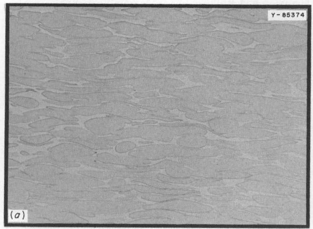  
四. 10.007 INCHES 100

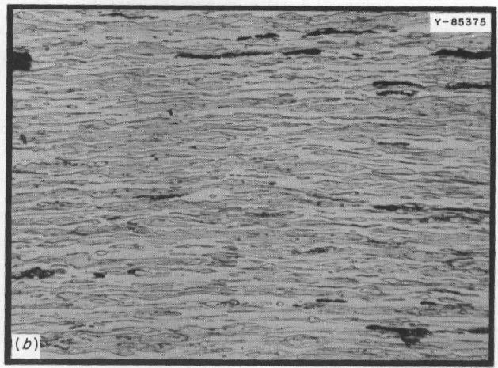

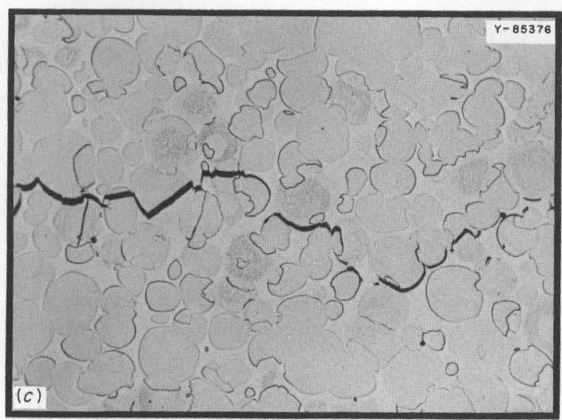

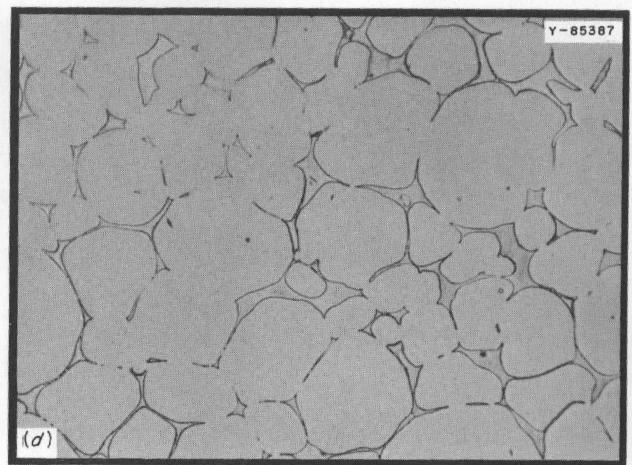  
Fig. 20.6. Microstructures of a Number of Experimental Heavy-Metal Alloys. (a) $90\%$ W-7% Ni-3% Fe, cold rolled 60% in reduction of area without cracking. (b) $60\%$ W-28% Ni-12% Fe, cold rolled 95% without cracking. (c) $87\%$ Mo-6.5% Ni-6.5% Pd, cracked with first rolling pass. (d) $90\%$ Mo-7% Ni-3% Cu, as sintered, ductile. Etchant: equal parts of hydrogen peroxide (30%) and ammonium hydroxide.

# 20.4 NONDESTRUCTIVE TESTING EVALUATION OF GRAPHITE-TO-METAL JOINTS

K. V. Cook

We are developing nondestructive testing techniques to detect nonbond in various designs of graphite-to-metal joints. Our preliminary studies indicate that an acceptable pulse-echo ultrasonic method can be developed for certain joint configurations. Mechanical scanning is a problem for the joint designs with which we have been working. We assembled a turntable device to use

in conjunction with our large ultrasonic tank for $X - Y$ scanning; however, modifications will be necessary before we can economically scan a number of joints of different configurations.

We were able to demonstrate that the ultrasonic method (using the turntable scanning device) could distinguish bond and nonbond on one joint design. The ultrasonic data indicated that bonding was accomplished on only one area of the total joint. The destructive test of this joint resulted in the separation of the graphite material in the bonded area. Figure 20.7 shows that result. As is evi

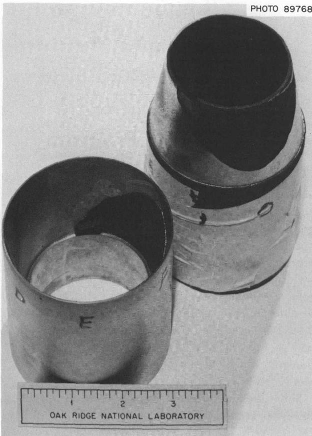  
Fig. 20.7. Results of a Destructive Test on a Graphite-to-Metal Brazed Joint. The dark areas, where the graphite material separated due to the presence of good bond, coincide with the area which the ultrasonic test had predicted to be bonded.

dent, only one portion of the joint, the dark area, was bonded, coinciding with the prediction based on the ultrasonic examination. These results demonstrate the feasibility of the ultrasonic pulse-echo method for this particular joint configuration. No attempt has been made to determine the optimum sensitivity to nonbonding.

A second joint design we have been working with is a tensile specimen with the graphite-to-metal joint in the gage length. The maximum diameter of the specimen is 1.00 in., and the joint is a $30^{\circ}$ cone, so that the joint diameter varies from 1 in. to a point. The graphite comprises the male part of the joint and the Hastelloy N the female part. Since both the radius of curvature of the joint and the area that reflects the ultrasonic energy change with the diameter, calibration is a problem because we encounter variations in reflected signal as the diameter changes even for complete nonbond. A further complication is the changing metal thickness from the outer surface of the specimen to the joint interface as the joint diameter changes. Attempts to evaluate this joint with the pulse-echo ultrasonic method have been unsuccessful thus far; however, we feel that it is possible to tolerate some variation in our test, and we plan to pursue this technique when modifications on our mechanical system are completed. Other joint designs to be fabricated will also require investigation by NDT evaluation techniques. These needs are being coordinated closely with the Welding and Brazing Group.

# 21. Support for Components Development Program

# 21.1 REMOTE WELDING

R. W. Gunkel

The Metals and Ceramics Division and the Reactor Division are engaged in a joint program for investigating and developing a welding process for automated remote maintenance of the MSBR. Most work so far has been in the form of literature surveys and contacts with automatic equipment manufacturers and users. Automated remote cutting and welding have been done at several facilities in the United States, and information from these programs is beneficial to us. Most of the applicable work has been conducted using the gas-tungsten arc (cold-wire feed) and gas-metal arc processes.

Hastelloy N will be the metallic structural material to be joined, and both automatic and manual

gas-tungsten arc welding processes have been demonstrated adequately for this alloy. The primary problem lies in adapting the techniques to remote operation. This is not true for the gas-metal arc process, which has been used very little in the welding of Hastelloy N. Hence, we have in progress a modest effort to adapt this potentially desirable process to Hastelloy N. Test plates have been machined, and filler wire is being fabricated and spooled for use in these studies. Approximate parameters will be obtained for depositing sound weld metal.

Since the maintenance may involve the welding of highly irradiated (with consequent low ductility) Hastelloy N, we plan to conduct welding studies on some irradiated creep specimens. If weld cracking appears to be serious, various approaches will be investigated to obtain a suitable joint.

# Part 6. Molten-Salt Processing and Preparation

M. E. Whatley

The development work on processes for moltensalt breeder reactors has undergone a significant change in direction during this reporting period. The change resulted from the recognition and acceptance of reductive extraction as a feasible and attractive basis for processes to isolate protactinium from the reactor and, possibly, to remove fission products. A protactinium isolation flowsheet based on reductive extraction now appears applicable to a one-fluid breeder reactor. This processing development, along with the recognition that good breeding performance can be achieved with a single-fluid system, has changed the direction of the reactor development and hence has redirected the development of chemical processing methods away from a two-fluid concept.

While fluorination and distillation for a two-fluid reactor will probably find application as steps in the processing of a single-fluid machine, they will be secondary to reductive extraction, which will

comprise the heart of the processing flowsheet. Our work on protecting exposed surfaces from corrosion by a dynamically cast layer of frozen salt, originally developed for the fluorination step, will find application in many steps of the new process.

This section includes the presentation of some of the data on reductive extraction which lend credit to its feasibility, and the calculational analysis of some proposed flowsheets with alternatives. Although hardware for engineering experiments with reductive extraction is being assembled, this work is not yet ready to report.

Our participation in the activities of the Molten-Salt Reactor Experiment during its shutdown in March 1968 will include recovery of the $^{235}\mathrm{U}$ from the present fuel salt, processing this salt to remove chromium and corrosion products, delivery of a prepared charge of $^{233}\mathrm{UF}_4$ -LiF eutectic for refueling the reactor, and distillation of 48 liters of MSRE carrier salt in an experimental vacuum still.

# 22. Measurement of Distribution Coefficients in Molten-Salt-Metal Systems

L. M. Ferris

J. F. Land

J. J. Lawrence

C. E. Schilling

Evaluation of reductive extraction methods for the processing of molten-salt breeder reactor fuels is being continued. The process now under study involves the selective extraction of uranium, protactinium, and rare earths from the molten salt using liquid lithium-bismuth solutions. Originally1 the main effort was devoted to the processing of

two-fluid MSBR salts: specifically, the removal of protactinium from the blanket salt and the removal of the rare earths from the fuel salt. More recent

work $^{2,3}$ has indicated that uranium and protactinium can probably be separated and recovered from a single-fluid MSBR salt; furthermore, a preliminary evaluation $^{4}$ showed that it should be possible to engineer such a process. Consequently, most of the current effort is directed toward development of processing methods for single-fluid MSBR fuels. In order to obtain a more detailed evaluation of these methods, accurate distribution coefficients for uranium, thorium, and the rare earths must be determined. Our program is, therefore, designed to provide these data.

# 22.1 EXTRACTION OF URANIUM AND RARE EARTHSH FROM FUEL SALT OF TWO-FLUID MSBR'S

The equilibrium distribution of a component M between a molten salt and a liquid metal phase can be expressed as a distribution coefficient $D_{\mathbf{M}}$ that is defined as

$$
D _ {\mathrm {M}} = \frac {\text {m o l e f r a c t i o n o f c o m p o n e n t M i n m e t a l p h a s e}}{\text {m o l e f r a c t i o n o f c o m p o n e n t M i n s a l t p h a s e}}.
$$

Thermodynamic treatment5 (supported by experimental data) of the equilibria involved with salts containing LiF indicates that, at a fixed temperature, each distribution coefficient should vary with the lithium concentration in the metal phase according to the equation

$$
\log D _ {\mathbf {M}} = n \log X _ {\mathrm {L i} (m)} + \log I \tag {1}
$$

if the concentration of M in each phase is low. In Eq. (1), $n$ is the valence of the component (as its fluoride, $\mathbf{MF}_n$ ) in the salt, $X_{\mathrm{Li}(m)}$ is the equilibrium lithium concentration in the metal phase (atom fraction), and $I$ is a constant.

Presentation of equilibrium distribution data in the manner indicated by Eq. (1) is desirable; however, because of the preliminary nature of our initial experiments, this is not possible. In our ex

periments, usually only a few data points were obtained at a given temperature. Our data can be compared with those obtained by others either in terms of the quantity $Q$ , defined as

$$
Q _ {M} = D _ {M} X _ {\text {L i} (m)} ^ {- n}, \tag {2}
$$

or as the difference in standard reduction potentials (as defined by Moulton):

$$
\begin{array}{l} E _ {0, \mathrm {M}} ^ {\prime} - E _ {0, \mathrm {L i}} ^ {\prime} = \Delta E _ {0} ^ {\prime} = (R T / n F) \ln D _ {\mathrm {M}} \\ - (R T / F) \ln D _ {\mathrm {L i}}. \tag {3} \\ \end{array}
$$

Values for $Q$ and $\Delta E_0^{\prime}$ can be calculated from a single distribution coefficient and the corresponding equilibrium lithium concentration. From Eqs. (2) and (3), the relationship between $Q$ and $\Delta E_0^{\prime}$ is found to be

$$
\log Q = \frac {n F \Delta E _ {0} ^ {\prime}}{2 . 3 0 3 R T} - n \log X _ {L i F}, \tag {4}
$$

in which $X_{\mathrm{LiF}}$ is the mole fraction of LiF in the salt.

Data obtained on the distribution of several solutes between two-fluid MSBR fuel salt, $\mathrm{LiF - BeF}_2$ (66-34 mole %), and lithium-bismuth solutions are given in Tables 22.1 and 22.2. In calculating values of $Q$ and $\Delta E_0'$ , $n$ was assumed to be unity for lithium and sodium, 2 for europium, 3 for lanthanum, and 4 for uranium. Average $\Delta E_0'$ values (Table 22.1) are given at those temperatures where more than one distribution coefficient was obtained. The values obtained for lanthanum and europium are in reasonable agreement with those reported by Moulton and Shaffer. $^{7,8}$ However, our value for uranium at $600^{\circ}\mathrm{C}$ (based on three data points, Table 22.2) is 0.14 v higher than the value reported by Moulton and Shaffer. $^{7}$ The reason for this difference is inexplicable at present. It is interesting to note that the $\Delta E_0'$ values appear to be practically constant over the temperature range from 500 to $700^{\circ}\mathrm{C}$ . If $\Delta E_0'$ is constant, plots of $\log Q$ vs $1 / T$ should be linear [see Eq. (4)]. Plots

Table 22.1. $\Delta E_0^{\prime}$ Values for the Distribution of Various Solutes Between Different Fluoride Salts and Lithium-Bismuth Solutions   

<table><tr><td colspan="3">Salt Composition (mole %)</td><td rowspan="2">Temperature (°C)</td><td colspan="5">ΔE0′(v)</td></tr><tr><td>LiF</td><td>BeF2</td><td>ThF4</td><td>U</td><td>La</td><td>Eu</td><td>Na</td><td>Th</td></tr><tr><td>66</td><td>34</td><td>0</td><td>500</td><td></td><td></td><td>0.27</td><td></td><td></td></tr><tr><td>66</td><td>34</td><td>0</td><td>600b</td><td></td><td></td><td>0.32</td><td></td><td></td></tr><tr><td>66</td><td>34</td><td>0</td><td>600c</td><td></td><td>0.40</td><td>0.30</td><td></td><td></td></tr><tr><td>66</td><td>34</td><td>0</td><td>600b</td><td>0.54</td><td>0.45</td><td>0.32</td><td></td><td>0.36</td></tr><tr><td>66</td><td>34</td><td>0</td><td>600</td><td>0.68</td><td></td><td></td><td></td><td></td></tr><tr><td>70</td><td>19</td><td>11</td><td>600</td><td>0.66</td><td></td><td>0.33</td><td></td><td>0.41</td></tr><tr><td>66</td><td>34</td><td>0</td><td>602</td><td></td><td></td><td>0.31</td><td></td><td></td></tr><tr><td>66</td><td>34</td><td>0</td><td>605</td><td></td><td>0.44</td><td>0.27</td><td>0.20</td><td></td></tr><tr><td>66</td><td>34</td><td>0</td><td>675</td><td>0.60</td><td>0.43</td><td></td><td></td><td></td></tr><tr><td>66</td><td>34</td><td>0</td><td>700</td><td></td><td></td><td>0.30</td><td></td><td></td></tr><tr><td>66</td><td>34</td><td>0</td><td>700b</td><td></td><td></td><td>0.34</td><td></td><td></td></tr></table>

$\Delta E_0' = E_{0,\mathbf{M}}' - E_{0,\mathbf{Li}}'$ , where $\mathbf{M}$ is the other metal involved; see text.   
$^{b}$ D. M. Moulton and J. H. Shaffer, ref 7.   
cD.M.Moulton and J.H.Shaffer,ORNL-4191,p.155;ref8.

of the data for europium and lanthanum are shown in Fig. 22.1; the lines were placed using average values of $\Delta E_0^{\prime}$ of 0.43 and 0.30 for lanthanum and europium respectively (Table 22.1). (Moulton's data for cerium give a very good straight line over the temperature range from 500 to $700^{\circ}\mathrm{C}$ .) Although the data points are highly scattered, it does appear that $Q$ decreases with increasing temperature. This dependence of $Q$ on temperature shows that the rare earths are less easily extracted at the higher temperatures.

The data given in Tables 22.1 and 22.2 show that uranium can easily be removed from the fuel salt of a two-fluid MSBR by reductive extraction. Furthermore, separation from the rare earths is very good; at $600^{\circ}\mathrm{C}$ the separation factors $(D_{\mathrm{U}} / D_{\mathrm{Ln}})$ are at least 1000. The data also show that, once the uranium has been extracted, the rare earths can be removed from the salt by increasing the lithium concentration in the metal phase.

# 22.2 EXTRACTION OF URANIUM FROM SINGLE-FLUID MSBR FUEL

Two experiments involving equilibration of simulated single-fluid MSBR fuel salt with lithium-bismuth solutions at $600^{\circ}\mathrm{C}$ have been completed. In each experiment the salt, initially $\mathrm{LiF - BeF}_2$ -ThF $_4$ -UF $_4$ (about 70-19-11-0.3 mole %), and about an equal volume of bismuth were heated in a mild steel crucible under argon to $600^{\circ}\mathrm{C}$ ; then lithium (as Li-Be alloy) was added to the bismuth in small increments, and the equilibrium distribution of the various components between the two phases was determined. The salt in one experiment contained 250 ppm LaF $_3$ , while EuF $_3$ was present in the other system.

The distribution coefficients obtained are given in Table 22.3. Those for uranium can be represented by the relationship

$$
\log D _ {U} = 4 \log C _ {L i} + 7. 8 7 4,
$$

Table 22.2. Effect of Temperature on the Distribution of Europium and Lanthanum Between LiF-BeF $_2$ (66-36 Mole %) and Li-Bi Solutions   

<table><tr><td rowspan="2">Temperature (°C)</td><td rowspan="2">10^4/T1(°K)</td><td rowspan="2">Li Concentration in Metal Phase (at. %)</td><td rowspan="2">DEu</td><td rowspan="2">DLa</td><td rowspan="2">DU</td><td colspan="2">Qa</td></tr><tr><td>Eu</td><td>La</td></tr><tr><td></td><td></td><td></td><td></td><td></td><td></td><td>×10^3</td><td>×10^8</td></tr><tr><td>500</td><td>12.94</td><td>4.02</td><td>14.3</td><td></td><td></td><td>8.83</td><td></td></tr><tr><td>583</td><td>11.68</td><td>4.95</td><td>16.4</td><td></td><td></td><td>6.67</td><td></td></tr><tr><td>583</td><td>11.68</td><td>3.46</td><td>17.1</td><td></td><td></td><td>14.3</td><td></td></tr><tr><td>600</td><td>11.45</td><td>0.0133</td><td></td><td></td><td>1.74</td><td></td><td></td></tr><tr><td>600</td><td>11.45</td><td>0.0232</td><td></td><td></td><td>5.41</td><td></td><td></td></tr><tr><td>600</td><td>11.45</td><td>0.0313</td><td></td><td></td><td>53.6</td><td></td><td></td></tr><tr><td>600b</td><td>11.45</td><td></td><td></td><td></td><td></td><td>6.68</td><td>0.29</td></tr><tr><td>600c</td><td>11.45</td><td></td><td></td><td></td><td></td><td>11.4</td><td></td></tr><tr><td>600c</td><td>11.45</td><td></td><td></td><td></td><td></td><td>11.4</td><td>2.16</td></tr><tr><td>602</td><td>11.43</td><td>2.56</td><td>5.41</td><td></td><td></td><td>8.26</td><td></td></tr><tr><td>605</td><td>11.39</td><td>0.119</td><td></td><td>0.092</td><td></td><td></td><td>0.55</td></tr><tr><td>605</td><td>11.39</td><td>0.119</td><td></td><td>0.90</td><td></td><td></td><td>5.34</td></tr><tr><td>605</td><td>11.39</td><td>0.208</td><td></td><td>0.705</td><td></td><td></td><td>0.78</td></tr><tr><td>605</td><td>11.39</td><td>0.298</td><td></td><td>5.12</td><td></td><td></td><td>1.93</td></tr><tr><td>605</td><td>11.39</td><td>4.84</td><td>6.36</td><td></td><td></td><td>2.72</td><td></td></tr><tr><td>608</td><td>11.35</td><td>0.85</td><td>0.82</td><td></td><td></td><td>11.3</td><td></td></tr><tr><td>675</td><td>10.55</td><td>0.238</td><td></td><td>0.487</td><td>1021</td><td></td><td>0.36</td></tr><tr><td>675</td><td>10.55</td><td>0.298</td><td></td><td>0.672</td><td>1788</td><td></td><td>0.25</td></tr><tr><td>675</td><td>10.55</td><td>0.298</td><td></td><td>0.926</td><td></td><td></td><td>0.35</td></tr><tr><td>675</td><td>10.55</td><td>0.416</td><td></td><td>1.09</td><td></td><td></td><td>0.15</td></tr><tr><td>675</td><td>10.55</td><td>0.506</td><td></td><td>2.01</td><td></td><td></td><td>0.16</td></tr><tr><td>700</td><td>10.28</td><td>5.11</td><td>8.66</td><td></td><td></td><td>3.32</td><td></td></tr><tr><td>700c</td><td>10.28</td><td></td><td></td><td></td><td></td><td>7.64</td><td></td></tr><tr><td>800c</td><td>9.32</td><td></td><td></td><td></td><td></td><td>5.53</td><td></td></tr></table>

${}^{a}Q = {D}_{\mathrm{{Ln}}}{X}_{\mathrm{{Li}}\left( \mathrm{{Bi}}\right) }^{-n};\operatorname{Ln} = \mathrm{{Eu}}$ or $\mathrm{{La}}$ ; the values of $n$ used for Eu and La were 2 and 3 respectively.   
${}^{b}$ Calculated from data given by D. M. Moulton and J. H. Shaffer,ref. 8.   
$^{c}$ D. M. Moulton and J. H. Shaffer, ref. 7.

Table 22.3. Distribution of Lithium, Uranium, Thorium, and Europium Between LiF-BeF $_2$ -ThF $_4$ (70-19-11 Mole %) and Bismuth Solutions at $600^{\circ}$ C   

<table><tr><td>Experiment No.</td><td>Lithium Concentration in Metal Phase (at. %)</td><td>DU</td><td>DTh</td><td>DEu</td></tr><tr><td>72</td><td>0.000672</td><td>0.00021</td><td></td><td></td></tr><tr><td>72</td><td>0.00119</td><td>0.00013</td><td></td><td></td></tr><tr><td>2</td><td>0.00321</td><td>0.0638</td><td></td><td></td></tr><tr><td>2</td><td>0.00579</td><td>0.0267</td><td></td><td></td></tr><tr><td>72</td><td>0.00584</td><td>0.311</td><td></td><td></td></tr><tr><td>2</td><td>0.00726</td><td>0.132</td><td></td><td></td></tr><tr><td>2</td><td>0.00747</td><td>0.238</td><td></td><td></td></tr><tr><td>72</td><td>0.00873</td><td>0.134</td><td></td><td></td></tr><tr><td>2</td><td>0.00988</td><td>2.47</td><td></td><td></td></tr><tr><td>72</td><td>0.00997</td><td>0.827</td><td></td><td></td></tr><tr><td>2</td><td>0.0112</td><td>1.12</td><td></td><td></td></tr><tr><td>72</td><td>0.0128</td><td>1.47</td><td></td><td></td></tr><tr><td>72</td><td>0.0133</td><td>2.28</td><td></td><td></td></tr><tr><td>72</td><td>0.0136</td><td>4.08</td><td></td><td></td></tr><tr><td>72</td><td>0.0176</td><td>5.07</td><td></td><td></td></tr><tr><td>2</td><td>0.0182</td><td>15.1</td><td></td><td></td></tr><tr><td>72</td><td>0.0285</td><td>15.2</td><td></td><td></td></tr><tr><td>72</td><td>0.0376</td><td>26.1</td><td></td><td></td></tr><tr><td>2</td><td>0.0570</td><td>102</td><td>0.00131</td><td>0.0041</td></tr><tr><td>72</td><td>0.0623</td><td>129</td><td>0.00229</td><td></td></tr><tr><td>72</td><td>0.0786</td><td>168</td><td>0.00327</td><td></td></tr><tr><td>72</td><td>0.0816</td><td>155</td><td>0.00573</td><td></td></tr><tr><td>72</td><td>0.0855</td><td></td><td>0.00802</td><td></td></tr><tr><td>2</td><td>0.0939</td><td></td><td>0.00998</td><td>0.011</td></tr><tr><td>2</td><td>0.0997</td><td>333</td><td>0.00712</td><td>0.014</td></tr><tr><td>72</td><td>0.114</td><td></td><td>0.0131</td><td></td></tr><tr><td>2</td><td>0.175</td><td>759</td><td>0.0152</td><td></td></tr></table>

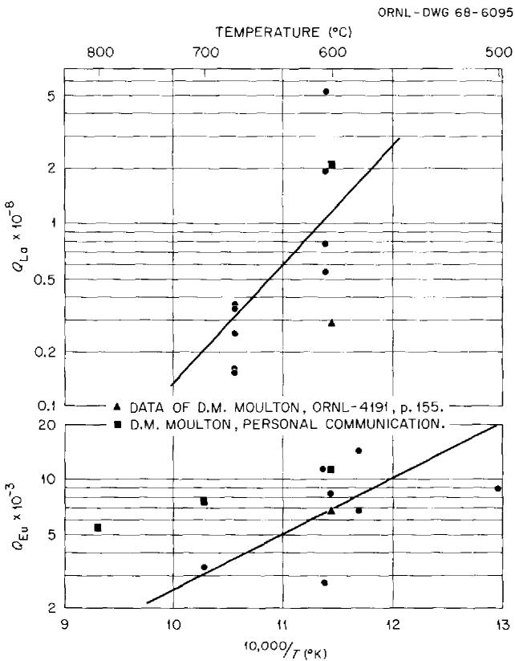  
Fig. 22.1. Dependence of log $Q$ on Temperature.

in which $C_{\mathrm{Li}}$ is the lithium concentration in the metal phase (at. %). This equation was obtained by visually fitting what appeared to be the best line of slope 4 through the points in the lithium concentration range of 0.002 to 0.03 at. %, where the analyses were the most accurate. These data are shown in Fig. 22.2; the distribution coefficients obtained using LiF-BeF $_2$ (66-34 mole %) as the salt phase are included for comparison.

The distribution coefficients for thorium (Table 22.3) can be represented by the equation

$$
\log D _ {\text {T h}} = 4 \log C _ {\text {L i}} + 2. 0 0,
$$

which was also obtained by a visual fit of the data (Fig. 22.2). The line through the three points obtained for europium (Fig. 22.2) was drawn with a slope of 2.

In these experiments, as lithium-bismuth alloy was added to the system, the thorium concentration in the metal phase increased to what appeared to be a limiting (steady-state) value of $1700 \pm 100$ ppm. The corresponding uranium and lithium con

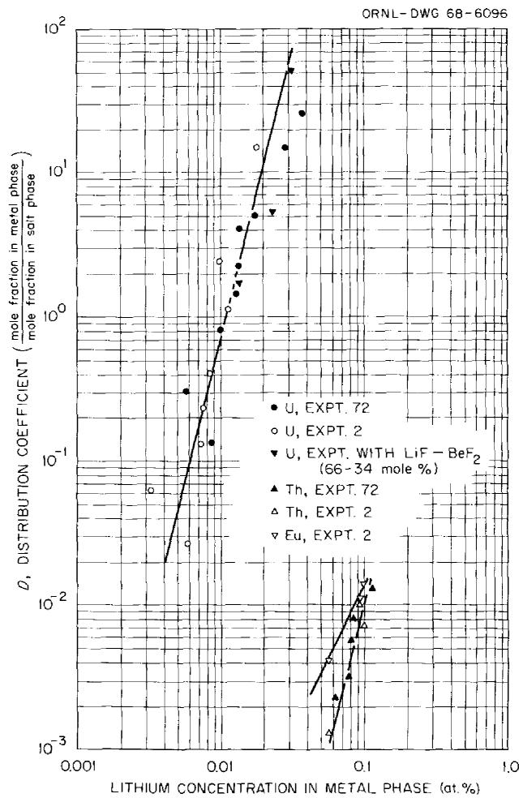  
Fig. 22.2. Effect of Lithium Concentration in Metal Phase on the Distribution of Uranium, Thorium, and Europium Between LiF-BeF $_2$ -ThF $_4$ (70-19-11 Mole %) and Bismuth at $600^{\circ}\mathrm{C}$ .

centrations were $2500 \pm 300$ and $50 \pm 10$ ppm respectively. The distribution coefficients at steady state were about 0.014 for both thorium and europium and less than 0.07 for lanthanum (the lanthanum concentration in the metal phase was always less than $4\mathrm{ppm}$ ). The data indicate that the solubility of thorium in bismuth is markedly depressed by the presence of uranium and/or lithium, since the solubility of thorium in pure bismuth at $600^{\circ}\mathrm{C}$ is 3000 to $3900\mathrm{ppm}$ .

The data presented above show that uranium can be easily extracted from single-fluid MSBR salt, leaving thorium and rare earths in the salt; the separation factors $(D_{\mathrm{U}} / D_{\mathrm{Th}}$ and $D_{\mathrm{U}} / D_{\mathrm{Eu}})$ are at least $10^{4}$ . These data also show by extrapolation to low lithium concentrations that the rare earths can probably be separated from thorium; however, in order to achieve reasonable separation factors in this system, the thorium concentration in the metal phase will probably have to be somewhat lower than its maximum solubility.

# 22.3 EXPERIMENTAL PROCEDURE AND LITHIUM "LOSS"

It has been noted previously $^{1,11}$ that during reductive extraction experiments up to $75\%$ of the lithium added to the system was consumed in an inexplicable manner. In most of these experiments, the lithium was added as the pure metal. The results of our latest experiments show that this problem can be largely eliminated when the lithium is added to the system as pieces of frozen lithium-bismuth alloy. An example of the equivalent balances that can be achieved by this method (Fig. 22.3) was derived from data obtained in an experiment in which $\mathrm{LiF - BeF}_2\text{-UF}_4$ (initially 66-34-0.3 mole $\%$ ) was equilibrated with liquid bismuth to which lithium-bismuth alloy (7 at. $\%$ Li) was added periodically. The figure is a plot of the milliequivalents of $\mathrm{Li} + \mathrm{U}$ found in the metal phase [4(mg-atoms U) + mg-atoms Li] vs the milliequivalents of lithium added to the system as lithium-bismuth alloy. The first 10 meq of lithium added was probably consumed in reactions with $\mathrm{FeF}_2$ , $\mathrm{OH}^-$ , and other

easily reduced species that were present in the salt. Then, as more lithium-bismuth alloy as added, the lithium was consumed by reduction of uranium fluoride from the salts. The consumption of lithium was nearly stoichiometric for the reaction

$$
4 \mathrm {L i} + \mathrm {U F} _ {4} \rightarrow 4 \mathrm {L i F} + \mathrm {U}.
$$

This behavior indicates that the uranium in the salt phase was still in the tetravalent state (undoubtedly as $\mathbf{U}\mathbf{F}_{4}$ ). After the uranium was extracted into the metal phase, the increase in milliequivalents of $\mathrm{Li} + \mathrm{U}$ was due entirely to the addition of more lithium. As may be seen in Fig. 22.3, the equivalent balance was quite acceptable (i.e., the slope of the line was unity) throughout most of the experiment.

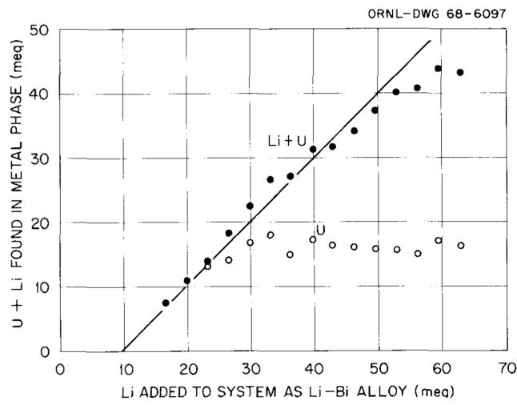  
Fig. 22.3. Reductant Balance in Experiment Involving Equilibration of Lithium-Bismuth Solutions with LiF-BeF $_2$ -UF $_4$ (Initially 66-34-0.3 Mole %) at $600^{\circ}\mathrm{C}$ .

# 23. Protactinium Removal from a Single-Fluid MSBR

L. E. McNeese

M. E. Whatley

Laboratory experiments have shown that protactinium and uranium can be extracted into bismuth from molten salt which contains fluorides of lithium, beryllium, and thorium by using metallic thorium as the reductant. In the proposed flowsheet (Fig. 23.1), a salt stream from the reactor enters the bottom of the extraction column and flows countercurrently to a stream of bismuth containing reduced metals. Ideally, the metal stream entering the top of the column contains sufficient thorium and lithium to extract only the uranium entering the column. The system exploits the fact that protactinium is less noble than uranium but more noble than thorium. Hence,

in the lower part of the column, uranium is preferentially extracted from the incoming salt, while the protactinium progresses farther up the column to where it is reduced by thorium. In this manner, protactinium refluxes in the center of the column, and relatively high protactinium concentrations result. A retention tank is provided at the center of the column, where the maximum protactinium concentration occurs in the salt, to retain the protactinium until it decays to uranium.

An essential part of the flowsheet is an electrolytic oxidizer-reducer which serves the dual purpose of recovering the extracted uranium from the metal stream leaving the extraction column

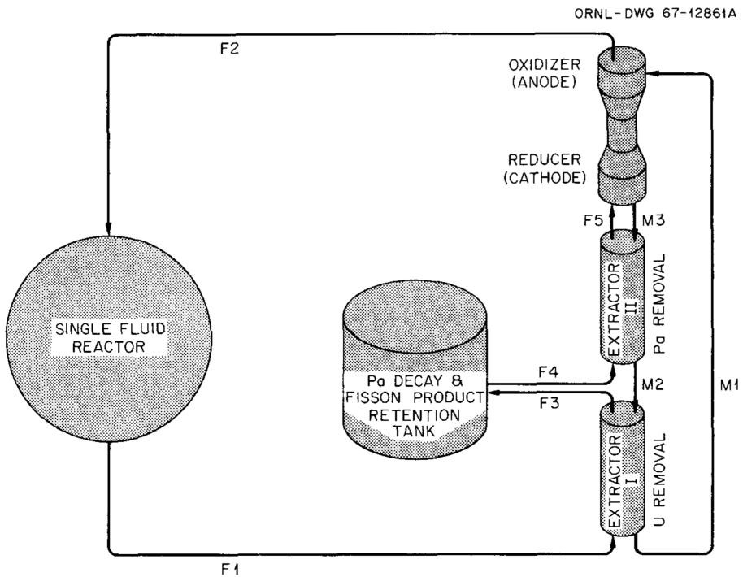  
Fig. 23.1. Single-Fluid MSBR Processing by Reductive Extraction.

and of preparing the lithium-thorium-bismuth stream which is fed to the extraction column.

The metal phase containing the uranium extracted in the column can serve as the cell anode, where uranium and lithium will be oxidized to $\mathrm{UF}_4$ and LiF. Salt from the top of the extraction column serves as the cell electrolyte and first passes over a pool of liquid bismuth which serves as the cathode into which thorium and lithium are reduced.

Typical performance of the protactinium isolation system is shown in Fig. 23.2 for a case which will be taken as the reference case. The minimum reactor protactinium concentration is obtained when the bismuth flow rate is just sufficient to extract the uranium entering the system. At slightly higher bismuth rates, protactinium will also be extracted, since it is the next component in order of decreasing nobility. At bis

muth rates slightly lower than the optimum rate, some uranium will not be extracted; this uranium and most of the protactinium will flow out the top of the column. In either case, some protactinium is allowed to return to the reactor, and the effectiveness of the system is diminished. The protactinium isolation system becomes ineffective almost immediately for bismuth flow rates lower than the optimum rate; for bismuth flow rates higher than the optimum, the reactor protactinium concentration increases from the minimum value of 22 ppm at the rate of 28 ppm for each percent increase in metal flow rate for the conditions of this particular case. Similar effects would be produced by variations in salt flow rate or in total concentration of reduced metals (equivalents of reduced metals per mole of bismuth) fed to the column. Calculated concentration profiles in the extraction column are shown in Fig. 23.3 for

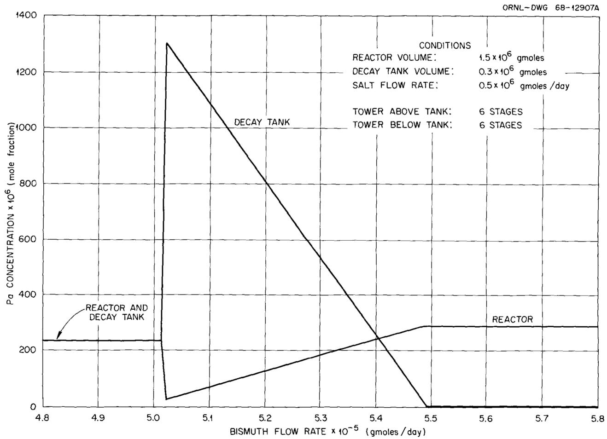  
Fig. 23.2. Variation of Protactinium Concentration in Reactor and Protactinium Decay Tank with Bismuth Flow Rate.

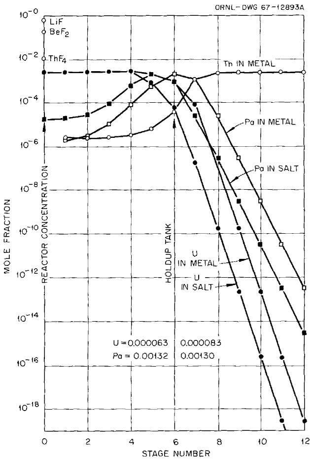  
Fig. 23.3. Calculated Concentration Profiles in Reductive Extraction Tower.

steady-state operation under optimum conditions. The concentration of uranium in the salt decreases from the reactor concentration of $3 \times 10^{-3}$ mole fraction to $6.3 \times 10^{-5}$ mole fraction at the inlet to the protactinium decay tank, whereas the protactinium concentration increases from the reactor concentration of $2.2 \times 10^{-5}$ mole fraction to $1.32 \times 10^{-3}$ mole fraction at the inlet to the decay tank. The concentrations of protactinium and uranium in the decay tank are $1.3 \times 10^{-3}$ and $8.3 \times 10^{-5}$ mole fraction respectively. Above the decay tank the uranium and protactinium concentrations decrease steadily to negligible values.

The flowsheet has several very desirable characteristics, which include a negligible holdup of fissile $^{233}\mathrm{U}$ in the processing plant; an almost immediate return of newly produced $^{233}\mathrm{U}$ to the reactor system; and a closed system which pre-

cludes loss of protactinium, $^{233}$ U, or other components of the reactor fuel salt. However, the protactinium removal efficiency is undesirably sensitive to minor variations in operating conditions such as salt or bismuth flow rate and concentration of reduced metals in the bismuth stream fed to the extraction column. Methods for making system performance less sensitive to minor variations in operating conditions have been considered. Removal of uranium from the center of the column by fluorination of molten salt was found to make steady-state system performance insensitive to small changes in operating conditions; the concentration of $\mathrm{UF}_{6}$ in the fluorinator off-gas was found to be extremely sensitive to changes in operating conditions and can be used as the primary process control point.

The effectiveness of a system stabilized by uranium removal was compared with that of a nonstabilized system by assuming the error in control of bismuth flow rate to be distributed normally around a best mean flow rate $\mathsf{FMB}_{\mathsf{opt}}$ with standard deviation $\sigma$ , so that an average reactor protactinium concentration $\overline{\mathfrak{c}}$ could be calculated by

$$
\overline {{c}} = \frac {1}{\sqrt {2 \pi}} \int_ {- \infty} ^ {\infty} c (x) e ^ {- x ^ {2} / 2} d x,
$$

where

$$
x = F M B - F M B _ {o p t} / \sigma ,
$$

FMB $\equiv$ bismuth flow rate,

$c(x) =$ steady-state reactor protactinium concentration at bismuth flow rate corresponding to $\mathbf{x}$

The average reactor protactinium concentration is shown in Fig. 23.4 as a function of the standard deviation in bismuth flow rate for cases with stabilization by uranium removal as well as for two cases with no uranium removal which have protactinium processing cycle times of three days (reference case) and one day. For a standard deviation of $0.35\%$ of $\mathsf{FMB}_{\mathsf{opt}}$ (optimum bismuth flow rate), the minimum reactor protactinium concentration (22 ppm) is obtained if the fraction of uranium removed from the inlet to the decay tank is $2\%$ or greater; with no uranium removal the average concentration is 38.5 ppm. With a protactinium processing cycle time of one day and a standard deviation of $0.35\%$ , an average con

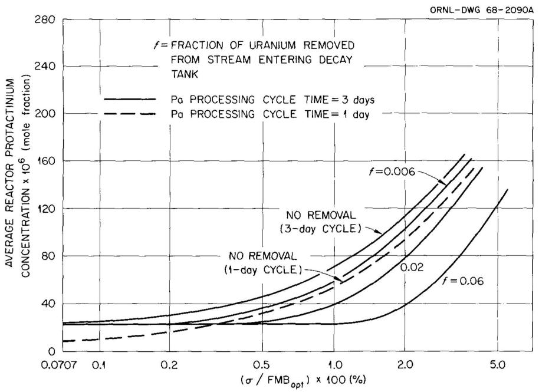  
Fig. 23.4. Variation of Average Reactor Protactinium Concentration with Standard Deviation of Bismuth Flow Rate for Cases with Stabilization by Fluorination and Without Stabilization.

centration of 24.5 ppm is obtained. A protactinium isolation system having a one-day processing cycle time with no uranium removal produces roughly the same average reactor protactinium concentration as a system having a three-day cycle time with $1\%$ removal of uranium from the salt stream entering the decay tank for standard deviations larger than about $0.35\%$ .

In choosing the optimum protactinium isolation system, the relative costs associated with higher processing rates, with closer process control, and with increased uranium removal must be considered as well as the value of obtaining a given average reactor protactinium concentration.

# 24. Continuous Fluorination of Molten Salt

B. A. Hannaford

L. E. McNeese

Uranium present in the fuel stream of an MSBR must be removed prior to the distillation step since $\mathrm{UF}_4$ would not be completely volatilized during this operation. Equipment is being developed for the continuous removal of $\mathrm{UF}_4$ from a salt stream by countercurrently contacting the salt with $\mathbf{F}_2$ in a salt-phase-continuous system. The equipment will be protected from corrosion by freezing a layer of salt on the vessel wall; the heat necessary for maintaining molten salt adjacent to frozen salt will be provided by the decay of fission products in the salt stream. Recent development work has been directed toward demonstrating operability of a frozen-wall fluorinator using countercurrent flow of molten salt and an inert gas.

The experimental equipment consisted of a 5-in.-diam, 8-ft-high column fabricated from sched 40 nickel pipe (Fig. 24.1). An internal heat source consisting of three Calrod heaters contained in a $\frac{3}{4}$ -in.-diam sched 40 Inconel pipe is used to simulate a volume heat source in the molten salt. Two sets of internal thermocouples located near the center of each of two test sections indicated the radial temperature gradient, from which one could infer the location of the interface between molten and frozen salt. Each test section was independently cooled by air flowing through spirally wound $\frac{3}{8}$ -in.-diam nickel tubing. Additional Calrod heaters were wound on the external surface of the fluorinator to provide auxiliary heat during heatup and to provide control of temperatures at the ends of the column. A 66-34 mole % LiF-ZrF $_4$ mixture, which has a liquidus of $595^{\circ}\mathrm{C}$ and a phase diagram similar to the LiF-BeF $_2$ system, was metered from the feed tank for periods as long as 5 hr, which allowed collection of data for a 1- to 2-hr period of steady-state operation.

The principal objective of the experiments, demonstrating that a layer of frozen salt could be formed and maintained under approximate operating conditions, was achieved. Experimental conditions are compared in Table 24.1 with reference conditions for a fluorinator having a salt throughput of $15\mathrm{ft}^3/\mathrm{day}$ and an inlet uranium concentration of $0.8\mathrm{kg}$ per cubic foot of salt with a $50\% \mathrm{F}_2$ utilization.

In general the frozen wall thickness and temperature profiles in the frozen salt were in good agreement with the values predicted by relations obtained by assuming purely radial heat flow from a volume heat source. Frozen wall thickness ranged from 0.3 to 0.8 in. The effect of heat generation in the layer of frozen salt was not simulated in these experiments.

The thermal conductivity of the frozen salt was calculated for each run from the experimentally determined temperature gradient and the measured heat flux; the relative agreement of calculated values was taken to be indicative of consistency of the experimental data. Thermal conductivities calculated from the upper test section data were closely grouped around 0.75 Btu hr $^{-1}$ ft $^{-1}$ (°F) $^{-1}$ ; however, values from the lower section were more widely scattered and were generally about 100% higher.

The heating-cooling system used on the column produced some variation in external wall temperature (and hence frozen wall thickness); in a typical run the difference between salt liquidus and wall temperature ranged from 85 to $140^{\circ}\mathrm{C}$ .

Protection of the fluorine inlet nozzle from corrosion is an anticipated problem associated with operation of a frozen-wall fluorinator. A possible solution incorporated in the present system consists in introducing the fluorine through a short

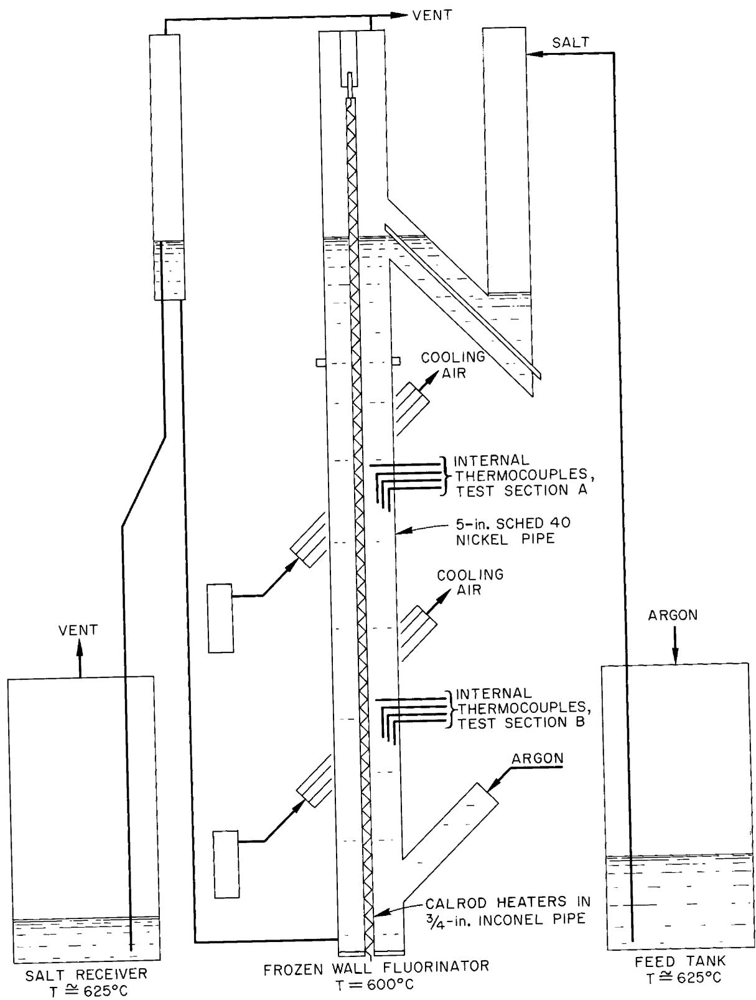  
Fig. 24.1. Experimental Equipment for Studying Formation of Frozen Salt Layer for Corrosion Protection. Height of column, 8 ft; height of each test section, 1.75 ft.

Table 24.1. Comparison of Experimental and Reference Conditions for Fluorination of $15\text{ft}^3$ of Molten Salt per Day   

<table><tr><td></td><td>Experimental</td><td>Reference</td></tr><tr><td>Salt flow rate, liters/hr</td><td>~3.3</td><td>17.7</td></tr><tr><td>Gas flow rate, standard liters/min</td><td>0.5-2.0 (Ar)</td><td>2.0 (F2)</td></tr><tr><td>Heat flux, w per foot of column height</td><td>600-1600</td><td>~2000</td></tr></table>

${}^{a}{15}{\mathrm{{ft}}}^{3}/$ day corresponds to processing fuel stream of a ${1000}\mathrm{{Mw}}$ (electrical) two-fluid MSBR.

section of 3-in.-diam pipe which intersects the fluorinator at a $45^{\circ}$ angle, as shown in Fig. 24.1.

The inlet section would be protected from corrosion by a layer of frozen salt as in the fluorinator. Tests with the present system indicate satisfactory operation when the surfaces of the inlet section are covered by a layer of frozen salt produced by maintaining wall temperatures below the salt liquidus. Heat is supplied to this section in the present case as a result of turbulence in the molten salt caused by bubbles; in an actual case, heat would be generated in the salt as a result of fission product decay. This method of gas introduction appears to be feasible, although it will not produce small-diameter gas bubbles.

In future experiments, the heat flux will be increased to the reference value, and salt flow rate will be increased to approximately $50\%$ of the reference rate.

# 25. Relative Volatility Measurements by the Transpiration Method

F. J. Smith

C. T. Thompson

L. M. Ferris

Liquid-vapor equilibrium data necessary for the evaluation and development of the possible distillation step in the processing of two-fluid MSBR fuel salt, $\mathrm{LiF - BeF}_2$ (66-34 mole %), are being determined by the transpiration method. In the absence of any information regarding complex molecules in the vapor phase, the partial pressures of LiF, $\mathrm{BeF}_2$ , and solute fluorides were calculated on the assumption that only monomers existed in the vapor. In each experiment, the apparent partial pressures $P$ could be described adequately by linear expressions,

$$
\log P (\mathrm {m m H g}) = A - B / T \left(^ {\circ} \mathrm {K}\right),
$$

in which $A$ and $B$ were constants over the temperature range investigated, 900 to $1050^{\circ}\mathrm{C}$ . The data are summarized in Table 25.1. Relative volatilities are also included, as well as effective activity coefficients. For a multicomponent system, the activity coefficients of component $A$ at each temperature are given by

$$
\gamma_ {A} = \frac {P _ {A}}{N _ {A} P _ {A} ^ {\circ}},
$$

where $N_{A}$ is the mole fraction of $A$ in the melt and $P_{A}^{\circ}$ is the vapor pressure of pure $A$ . Relative volatility is defined by

$$
a _ {A B} = \frac {y _ {A} / y _ {B}}{x _ {A} / x _ {B}},
$$

where $\alpha_{AB}$ is the relative volatility of $A$ with respect to $B$ , $y$ is the mole fraction of the designated component in the vapor phase, and $x$ is the mole fraction in the liquid phase.

Data for three $\mathrm{LiF - BeF}_2$ solutions are given in Table 25.1. The composition $\mathrm{LiF - BeF}_2$ (90-10 mole %) is approximately the one expected in the still pot during vacuum distillation and gives $\mathrm{LiF - BeF}_2$ (66-34 mole %) as the condensate. $^1$ The relative volatilities of $\mathrm{BeF}_2$ with respect to LiF obtained in experiments with $\mathrm{LiF - BeF}_2$ binary systems are in reasonable agreement with those reported by Cantor, $^2$ who also used the transpiration method. For example, Cantor obtained values of 4.28 and 3.75 at $1000^{\circ}\mathrm{C}$ for $\mathrm{LiF - BeF}_2$ (85-15 mole %) and $\mathrm{LiF - BeF}_2$ (90-10 mole %) respectively; the corresponding values from our work were about 3.8 and 3.77 (Table 25.1). The value obtained with $\mathrm{LiF - BeF}_2$ (90-10 mole %) is somewhat lower than the average value of 4.71 obtained by Hightower and McNeese, $^1$ who used an equilibrium still method, and is higher than the values obtained when the salt contained small amounts of RbF, CsF, $\mathrm{ZrF}_4$ , or $\mathrm{UF}_4$ (Table 25.1). This scatter in values is not surprising when one considers that small variations in the composition of the liquid and/or vapor lead to large changes in the relative volatility. For example, Hightower and McNeese $^1$ reported that the vapor in equilibrium with $\mathrm{LiF - BeF}_2$ (90-10 mole %) at $1000^{\circ}\mathrm{C}$ was $\mathrm{LiF - BeF}_2$ (66-34 mole %). This gives a value for

$$
\alpha = \frac {3 4 / 6 6}{1 0 / 9 0} = 4. 6 4.
$$

Table 25.1. Apparent Partial Pressures, Relative Volatilities, and Effective Activity Coefficients in LiF-BeF $_2$ -Metal Fluoride Systems   

<table><tr><td colspan="3">Salt Composition (mole %)</td><td rowspan="2">Species</td><td colspan="2">Apparent Partial Pressurea</td><td rowspan="2">Effective Activity Coefficient at 1000°C</td><td rowspan="2">Relative Volatility with Respect to LiF at 1000°C</td></tr><tr><td>LiF</td><td>BeF2</td><td>3d Component</td><td>A</td><td>B</td></tr><tr><td>86</td><td>14</td><td></td><td>LiF</td><td>8.497</td><td>11,055</td><td>1.60</td><td></td></tr><tr><td></td><td></td><td></td><td>BeF2</td><td>7.983</td><td>10,665</td><td>4.42 × 10-2</td><td>3.82</td></tr><tr><td>90</td><td>10</td><td></td><td>LiF</td><td>7.604</td><td>10,070</td><td>1.30</td><td></td></tr><tr><td></td><td></td><td></td><td>BeF2</td><td>8.707</td><td>11,884</td><td>3.55 × 10-2</td><td>3.77</td></tr><tr><td>95</td><td>5</td><td></td><td>LiF</td><td>8.804</td><td>11,505</td><td>1.30</td><td></td></tr><tr><td></td><td></td><td></td><td>BeF2</td><td>11.510</td><td>15,303</td><td>4.33 × 10-2</td><td>4.40</td></tr><tr><td>90</td><td>10</td><td>0.02 UF4</td><td>LiF</td><td>9.481</td><td>12,386</td><td>1.33</td><td></td></tr><tr><td></td><td></td><td></td><td>BeF2</td><td>9.339</td><td>12,411</td><td>5.96 × 10-2</td><td>6.19</td></tr><tr><td></td><td></td><td></td><td>UF4</td><td>4.361</td><td>12,481</td><td>7.36 × 10-3</td><td>2.9 × 10-2</td></tr><tr><td>89.6</td><td>9.9</td><td>0.5 UF4</td><td>LiF</td><td>8.384</td><td>10,987</td><td>1.34</td><td></td></tr><tr><td></td><td></td><td></td><td>BeF2</td><td>7.421</td><td>10,112</td><td>4.65 × 10-2</td><td>4.78</td></tr><tr><td></td><td></td><td></td><td>UF4</td><td>6.686</td><td>13,443</td><td>1.09 × 10-2</td><td>4.2 × 10-2</td></tr><tr><td>86.4</td><td>9.6</td><td>4.0 UF4</td><td>LiF</td><td>10.790</td><td>13,992</td><td>1.55</td><td></td></tr><tr><td></td><td></td><td></td><td>BeF2</td><td>10.177</td><td>13,726</td><td>3.84 × 10-2</td><td>3.42</td></tr><tr><td></td><td></td><td></td><td>UF4</td><td>10.272</td><td>16,786</td><td>1.25 × 10-2</td><td>4.2 × 10-2</td></tr><tr><td>90</td><td>10</td><td>0.09 RbF</td><td>LiF</td><td>8.286</td><td>10,811</td><td>1.47</td><td></td></tr><tr><td></td><td></td><td></td><td>BeF2</td><td>6.596</td><td>10,552</td><td>3.11 × 10-2</td><td>2.93</td></tr><tr><td></td><td></td><td></td><td>RbF</td><td>5.187</td><td>8,907</td><td>2.19</td><td>24.7</td></tr><tr><td>89.9</td><td>10</td><td>0.03 CsF</td><td>LiF</td><td>9.654</td><td>13,459</td><td>1.99</td><td></td></tr><tr><td></td><td></td><td></td><td>BeF2</td><td>8.310</td><td>11,313</td><td>4.07 × 10-2</td><td>2.82</td></tr><tr><td></td><td></td><td></td><td>CsF</td><td>0.819</td><td>3,375</td><td>1.17</td><td>95.1</td></tr><tr><td>90</td><td>10</td><td>0.083 ZrF4</td><td>LiF</td><td>7.915</td><td>10,358</td><td>1.41</td><td></td></tr><tr><td></td><td></td><td></td><td>BeF2</td><td>7.167</td><td>10,070</td><td>2.83 × 10-2</td><td>2.77</td></tr><tr><td></td><td></td><td></td><td>ZrF4</td><td>13.095</td><td>20,382</td><td>5.39 × 10-4</td><td>2.19</td></tr></table>

$^a$ Log $p(\mathbf{mm}) = A - B / T (^{\circ}\mathbf{K})$ . Temperature range: 900 to $1050^{\circ}\mathrm{C}$ . It was assumed that LiF, $\mathrm{BeF}_2$ , and the solute fluorides existed only as monomers in the vapor.

On the other hand, Cantor² reported that the vapor in equilibrium with LiF-BeF₂ (88-12 mole %) has the composition LiF-BeF₂ (67-33 mole %), which leads to a value for

$$
\alpha = \frac {3 3 / 6 7}{1 2 / 8 8} = 3. 6.
$$

The partial pressure data obtained in our work are incompatible with the total pressure data of Cantor. He reports the total pressure of LiF-BeF $_2$ (90-10 mole %) to be 1.8 mm Hg at $1000^{\circ}\mathrm{C}$ .

For the same system at $1000^{\circ}\mathrm{C}$ , we obtained $P_{\mathrm{LiF}} = 0.55$ and $P_{\mathrm{BeF}_2} = 0.23 \, \mathrm{mmHg}$ , corresponding to a total pressure of $0.78 \, \mathrm{mm}$ (assuming that no association or dissociation occurred in the vapor phase). Association (known to occur in the vapor phase above pure LiF) or

complexation (observed mass spectrometrically in the vapors above $\mathrm{LiF - BeF}_2$ solutions) would make the total pressure even lower than that predicted by our transpiration experiments. Our results are also in disagreement with those of Cantor at several other $\mathrm{LiF - BeF}_2$ compositions. The reason for this disparity is not obvious.

The activity coefficients for $\mathbf{BeF}_2$ are in good agreement with the values obtained by Kelly using distillation data and assuming unit activity for LiF.

Experiments performed with an LiF-BeF $_2$ (90-10 mole %) solvent containing UF $_4$ at concentra

tions of 0.02, 0.5, and 4.0 mole $\%$ (by analysis), respectively, gave relative volatilities of $\mathbf{U}\mathbf{F}_{4}$ with respect to LiF (Table 25.1) which confirmed the earlier assumption that adequate uranium recovery cannot be achieved in the distillation step. The experimental relative volatilities of RbF and CsF with respect to LiF are within a factor of 2 of the theoretically predicted values (assuming ideal behavior of the system). Hence, as previously assumed, these two fission products will probably set the discard rate. The relative volatility of $\mathbf{ZrF}_{4}$ , present at a concentration of 0.083 mole $\%$ , was 2.19.

# 26. Distillation of MSRE Fuel Carrier Salt

L. E. McNeese

J. R. Hightower

We have described previously1 equipment for study of low-pressure distillation of MSRE fuel carrier salt which includes a 48-liter feed tank, a 12-liter still pot, a condenser, and a 48-liter condensate receiver. The equipment has been installed and checked out in a test facility to perform nonradioactive experiments prior to operation with irradiated MSRE fuel carrier salt. Two experiments have been made to date. During nonradioactive operation, four 48-liter batches of MSRE fuel carrier salt (65-30-5 mole % LiF-BeF2-ZrF4) will be distilled at $1000^{\circ}\mathrm{C}$ and at a pressure of about $1\mathrm{mmHg}$ . The thermal insulation and heaters will then be removed from the still, and a thorough examination of the equipment will be made. After examination the still will be moved to a cell at the MSRE site for distillation of a 48-liter batch of fluorinated fuel salt from the reactor.

The first distillation run was completed in 83 hr using approximately 48 liters of MSRE fuel carrier salt. At the beginning of the run, 9.4 liters of salt was transferred to the still pot, and the condenser pressure was lowered to $2.0\mathrm{mmHg}$ . Startup of the equipment was hampered by unsatisfactory operation of the liquid level probes in the still pot. It is believed that argon dissolved in the molten salt formed bubbles on the liquid level probes initially as the pressure was reduced. The system was held at $900^{\circ}\mathrm{C}$ and $2\mathrm{mmHg}$ for approximately $4\mathrm{hr}$ , after which time the probes performed adequately. The system was then operated with a still pot temperature of 900 to $950^{\circ}\mathrm{C}$ and a condenser pressure of 0.65 to $2.0\mathrm{mmHg}$ for approximately $40\mathrm{hr}$ . Salt was trans

ferred to the still pot periodically in order to maintain a volume of about 9 liters. This operating period reduced the concentration of $\mathrm{BeF}_2$ in the still pot from the initial concentration of 30 mole $\%$ . The still pot temperature was raised to $990^{\circ}\mathrm{C},$ and distillation rates were measured during a 40-hr period at condenser pressures of 0.5, 0.3, and $0.055\mathrm{mmHg}$ Results at these conditions are summarized in Table 26.1. Distillation rates were calculated from the rate of change of salt level in the feed tank and condensate receiver. During the last $40\mathrm{hr}$ of operation the still liquid level and salt feed rate were controlled automatically.

Equipment operation was smooth. Four condensate samples were taken and have been submitted for analysis. At the end of the run, approximately 8 liters of the initial salt mixture was used to flush the high-melting salt from the still pot in order to produce salt having a liquidus of less than $700^{\circ}\mathrm{C}$ .

For the second run, approximately 45 liters of MSRE fuel carrier salt (65-30-5 mole % LiF-BeF $_2$ -ZrF $_4$ ) was transferred to the feed tank. Salt was transferred to the still pot to yield a volume of about 9 liters. A still pot temperature of $900^{\circ}\mathrm{C}$

Table 26.1. Distillation Rates and Operating Conditions for Distillation of MSRE Fuel Carrier Salt   

<table><tr><td rowspan="2">Condenser Pressure (mm Hg)</td><td colspan="2">Distillation Rate</td><td rowspan="2">Still Pot Temperature (°C)</td><td rowspan="2">Run Time (hr)</td></tr><tr><td>kg/hr</td><td>ft3day-1ft-2</td></tr><tr><td>0.5</td><td>1.54</td><td>1.15</td><td>990</td><td>7.2</td></tr><tr><td>0.3</td><td>1.60</td><td>1.20</td><td>990</td><td>9.5</td></tr><tr><td>0.055</td><td>1.67</td><td>1.20</td><td>990</td><td>16.5</td></tr><tr><td>0.07</td><td>2.02</td><td>1.51</td><td>1005</td><td>29.8</td></tr></table>

and a condenser pressure of $2\mathrm{mmHg}$ were held for $1.5\mathrm{hr}$ , after which (over a 13-hr period) the still pot temperature was slowly increased to $1005^{\circ}\mathrm{C}$ and the condenser pressure was decreased to $0.07\mathrm{mmHg}$ . These conditions were maintained for about $30\mathrm{hr}$ . The distillation rate during this period is given in Table 26.1. Still pot liquid level and salt feed rate were controlled automatically during the entire run. Minor difficulty was experienced in taking condensate samples when small amounts of salt vapor condensed in the 1.5-in. line through which samples are taken. Two condensate samples were obtained.

Under the operating conditions in the still, the distillation rate is controlled by the condition that pressure drop in the passage connecting the vapor

ization and condensation surfaces equals the difference between the vapor pressure of salt in the still pot and the pressure at the lower end of the condenser. For this reason, distillation rate should be essentially independent of condenser pressure for condenser pressures much lower than the salt vapor pressure (1.0 to $1.5\mathrm{mmHg}$ ), as was observed. With condenser pressures much lower than the salt vapor pressure, distillation rate should be proportional to salt vapor pressure and hence quite dependent on still pot temperature. A $21\%$ increase in distillation rate was observed as the still pot temperature was increased from 990 to $1005^{\circ}\mathrm{C}$ ; the corresponding increase in salt vapor pressure is $28\%$ .

# 27. Protactinium Removal from a Two-Fluid MSBR

J. S. Watson

M. E. Whatley

A higher breeding ratio can be achieved in molten-salt reactors if a low protactinium concentration is maintained in regions of high neutron flux so as to avoid parasitic capture by the protactinium before it decays to $^{23}$ U. One conceptual MSBR design is based on a two-fluid concept, with the fertile stream circulating in separate channels through the high-flux core region as well as through the blanket surrounding the core. The protactinium concentration in the fertile stream can be kept low by processing the stream rapidly for removal of protactinium soon after it is formed, leaving little time for neutron capture. Promising protactinium removal processes based on reductive extraction using liquid bismuth have been analyzed to evaluate their feasibility.

The flowsheet chosen for study is shown in Fig. 27.1. The modification shown in Fig. 27.2 could be used if development of a reliable reducer proves more difficult than expected. In both flow-sheets, fertile salt from the reactor (stream 1) is contacted with liquid bismuth (stream 3) containing thorium (0.003 mole fraction). The bismuth contains a lithium concentration such that no thorium or lithium transfers between the metal and the fertile salt. The metal stream from the extractor containing protactinium flows to an oxidizer which converts the thorium, protactinium, and lithium to fluorides. The bismuth is not oxidized and is recycled to the extractor after the proper amounts of thorium and lithium reductant are added by electrolytically reducing all or part of a

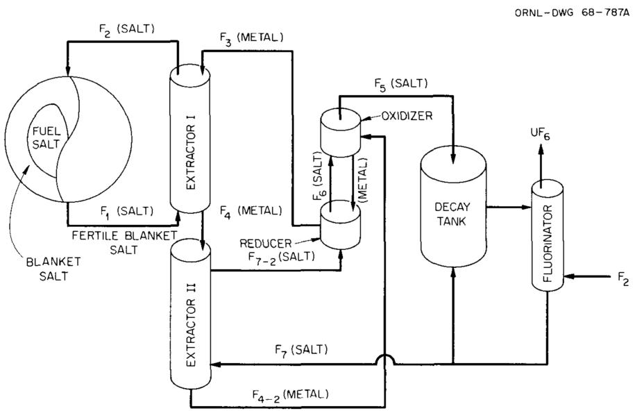  
Fig. 27.1. Reference Flowsheet for Removing Protactinium from a Two-Fluid MSBR.

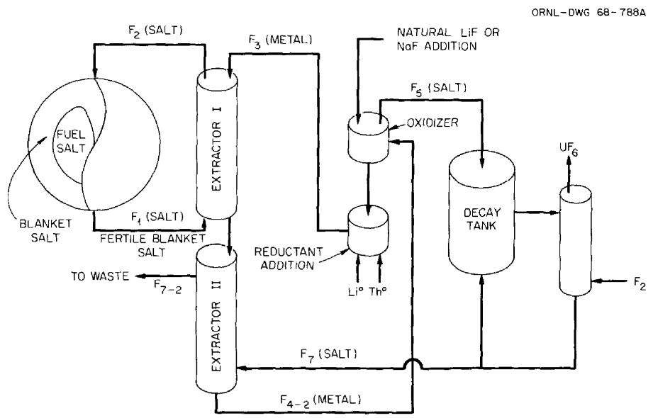  
Fig. 27.2. "Throwaway" Flowsheet for Removing Protactinium from a Two-Fluid MSBR Without Use of an Electrolytic Oxidizer-Reducer.

recycle salt stream from the decay tank (stream 7).

The salt mixture formed by oxidation of stream 4 would have an undesirably high liquidus; the liquidus is lowered in the preferred flowsheet (Fig. 27.1) by recycling salt from the decay tank through the reducer and into the oxidizer. To minimize the protactinium return to the extractor, salt recycled from the decay tank is contacted with the metal stream leaving the first, or main, extractor. This transfers most of the protactinium to the metal stream, which then flows to the oxidizer; there the protactinium is oxidized and returns to the decay tank without passing through the main extractor.

In the modification shown in Fig. 27.2, fresh $^7\mathrm{Li}$ and thorium metal are added to bismuth to form stream 3; no reducer is used. The metal stream from the first extractor is contacted with a recycle from the decay tank, as in Fig. 27.1, before entering the oxidizer, but the recycle salt is sent to waste. Lithium fluoride is added to the oxidizer to reduce the liquidus of the resulting salt, and since this material will not return to the reactor blanket, natural lithium can be used. Another alkali metal fluoride (e.g., sodium fluoride) could be used if it does not interfere with protactinium transfer in the second extractor.

To evaluate the relative merits of these flow-sheets, flow rates and compositions of all streams were calculated over a wide range of conditions. The lithium and thorium concentrations in the blanket were fixed at 0.72 and 0.28 mole fraction, respectively, and the protactinium generation rate was fixed at 10.6 g-moles/day. [This corresponds to a 2200 Mw (thermal) reactor.] All calculations were based on a processing rate of $5.81 \times 10^{6}$ g-moles/day of blanket salt, which is $4750\mathrm{ft}^3/\mathrm{day}$ (25 gpm, approximately two blanket volumes per day). Results are shown in Figs. 27.3 and 27.4.

Figure 27.3 shows the required metal flow rate in gram-moles per day (multiply by $3.9 \times 10^{-6}$ to get gallons per minute) as a function of the number of stages in the extractor for three protactinium concentrations in the blanket ( $5 \times 10^{-6}$ , $10 \times 10^{-6}$ , and $20 \times 10^{-6}$ mole fraction). These blanket concentrations may be compared with the value of approximately $80 \times 10^{-6}$ mole fraction which resulted in the blanket of a ‘‘no-Pa-removal’’ reactor system which has been considered. The

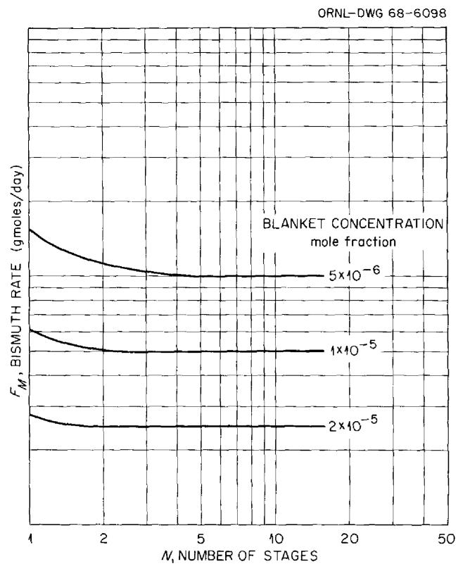  
Fig. 27.3. Metal Rate Required as a Function of Number of Stages in Extractor.

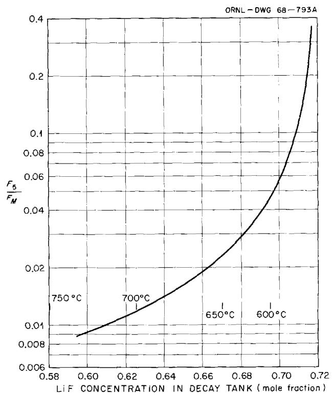  
Fig. 27.4. Ratio of Salt Rate from Oxidizer to Metal Rate as a Function of LiF Concentration in Decay Tank.

metal rate is particularly important for two reasons: it affects the extractor design and bismuth inventory and it sets the reducer capacity (or $^7\mathrm{Li}$ and thorium consumption in the "no-reducer' flowsheet). A low metal rate is desirable because the reducer anode surface may be expensive to maintain.

Raising the protactinium concentration in the blanket raises the equilibrium (or maximum) metal loading and lowers the required bismuth rate. Increasing the number of stages in the contactor also improves the performance of the extractor and lowers the required metal rate; however, Fig. 27.3 shows that the gain will be relatively small for more than two or three stages. Required metal flow rates will be about $0.3 \times 10^{5}$ g-moles/day (0.1 gpm).

In the reference flowsheet the salt recycle rate to the oxidizer is determined by the desired liquidus temperature. Figure 27.4 shows the decay tank composition as a function of the ratio of the salt recycle rate to the metal rate $F_{M}$ . With an infinite

recycle rate, the lithium composition only approaches the blanket composition, so that it is necessary to operate with a slightly lower lithium composition in the decay salt than in the blanket. The no-reducer flowsheet has the option of a lower reductant composition, which increases the lithium-to-thorium ratio in the metal. This allows a lower salt recycle but requires higher metal circulation rates.

The volume of the decay tank is set by the concentration of protactinium desired in the tank but is subject to limitations. The tank must hold sufficient protactinium that 10.6 g-moles decay in the tank per day (neglecting decay outside the tank). Under the conditions of interest, the tank volume will be limited by heat-removal considerations rather than by the maximum concentration which could be achieved. There will be 6.7 Mw of heat generated in the decay tank from protactinium decay, which suggests a minimum tank volume of a few hundred cubic feet.

Important considerations unique to the no-reducer flowsheet are $^7\mathrm{Li}$ and thorium consumption and protactinium losses. The $^7\mathrm{Li}$ and thorium consumptions reflect both material transferred to fertile salt in extractor I (0.5 to $5 \%$ of material fed) and the material remaining in the effluent metal stream from this extractor, which is ultimately sent to waste. The protactinium loss results from incomplete removal of protactinium from the salt stream flowing through extractor II. The $^7\mathrm{Li}$ consumptions are 5.7 and 1.4 lb/day, respectively, for blanket protactinium concentrations of $5 \times 10^{-6}$ and $20 \times 10^{-6}$ mole fraction. The corresponding thorium consumptions would be 150

and 38 lb/day. Consumption of these quantities of $^7$ Li and thorium would be tolerated, but the costs are significant. With a 400-ft $^3$ decay tank, the protactinium loss would be less than $0.02\%$ of that produced in the reactor.

The reference flowsheet shown in Fig. 27.1 is the preferred flowsheet, and further studies and development work for two-region processing should be aimed at this system. This flowsheet provides a minimum-size reducer and bismuth rate while placing little restriction on the decay tank volume; the decay tank volume is governed largely by heat-removal considerations.

# 28. Recovery of Uranium from MSRE Fuel Salt by Fluorination

G. I. Cathers

M. R. Bennett

C. J. Shipman

The future schedule of MSRE operation includes removal of the uranium (about $30\%$ enriched in ${}^{235}\mathrm{U}$ ) from the carrier salt, $\mathrm{LiF - BeF}_2 - ZrF_4$ (65-30-5 mole $\%$ ), by fluorination. The purified carrier salt will be reused for the subsequent operation of the MSRE with ${}^{233}\mathrm{UF}_4$ . Fluorination of $\mathrm{UF}_4$ dissolved in a molten fluoride salt, with the attendant evolution of volatile $\mathrm{UF}_6$ , is quite corrosive to all known metallic containers. It is anticipated that significant amounts of chromium, iron, and nickel will be put into the salt by corrosion, making necessary its cleanup by hydrogen treatment and other means. A series of small-scale fluorination tests is being made with simulated MSRE salt to study the effects of temperature, fluorine concentration, and fluorine flow rate on the rate of uranium volatilization and the rate of corrosion of Hastelloy N. In addition, some experimental results are being obtained on the volatilization of chromium and molybdenum fluorides (which are corrosion products) and on the behavior of volatile fission products (Ru, Nb, I, Te) in the fluorination of short-decay fuel. Knowledge of fission product behavior is essential to the development of a special fluorination procedure to be used by the Analytical Chemistry Division in making precise uranium analyses of fuel salt.

# 28.1 FLUORINATION-CORROSION STUDY

The fluorination-corrosion tests are being made with MSRE-type salt in a 1.87-in.-ID Hastelloy N reactor under conditions roughly approximating those being considered for use in the 49-in.-ID fluorination tank at the MSRE site. The uranium

is being volatilized out of the salt with an intermediate inert-gas sparging period to simulate changing of the NaF sorbent beds used for recovery of the $\mathbf{U}\mathbf{F}_{6}$ . A gas flow rate of $146\mathrm{ml / min}$ (STP) is being used in the 1.87-in.-ID reactor to simulate the flow rate of 100 liters/min in the 49-in.-ID reactor.

In the larger reactor, more uranium is involved, and the surface-to-volume ratio is lower. Hence the change in oxidation state of the salt during the course of $\mathrm{UF}_6$ volatilization may be different in the two systems.

Two tests have been made, one at $450^{\circ}\mathrm{C}$ and one at $500^{\circ}\mathrm{C}$ , each with $340\mathrm{g}$ of $\mathrm{LiF - BeF}_2 - \mathrm{ZrF}_4 - \mathrm{UF}_4$ (63-32-5-0.8 mole $\%$ ). Salt samples were taken during the runs at intervals (after He sparging) determined by the necessity of changing a 12-g NaF trap used for recovery of the $\mathrm{UF}_6$ . In each test, $50\%$ $\mathrm{F}_2 - 50\%$ He (146 ml/min) was used initially, followed by pure fluorine (146 ml/min) at the end of the run to ensure complete uranium recovery. In another test at $500^{\circ}\mathrm{C}$ , pure fluorine was used throughout. A trap containing $2M$ KOH was employed to sorb unused fluorine and volatile chromium and molybdenum compounds that passed through the NaF trap.

As shown in Table 28.1, the $\mathrm{UF}_{6}$ volatilization rate and the degree of fluorine utilization were higher at $500^{\circ} \mathrm{C}$ than at $450^{\circ} \mathrm{C}$ . The amount of chromium leached from the Hastelloy N reactor increased with temperature. The effect of temperature on the solubilization of iron and nickel from the reactor is not as clear (the dip tube, thermocouple well, and reactor bottom were made of Ni-200). Figure 28.1 shows the relation be

Table 28.1. Uranium Volatilization and Corrosion Results in Fluorination Tests with MSRE Salt in Hastelloy N at Two Temperatures   

<table><tr><td rowspan="2">Temperature (℃)</td><td rowspan="2">Fluorine Concentration (%)</td><td rowspan="2">Total Time (hr)</td><td colspan="2">Corrosion (mg in salta)</td><td colspan="2">Volatile Material</td><td rowspan="2">Fluorine Utilization Efficiency (%)</td></tr><tr><td>Cr</td><td>Fe</td><td>U (%)</td><td>Cr (mg)</td></tr><tr><td rowspan="8">450</td><td>50</td><td>0.5</td><td>13</td><td>4</td><td>5.4</td><td></td><td>4.0</td></tr><tr><td>50</td><td>2.0</td><td>42</td><td>35</td><td>14.2</td><td></td><td>2.1</td></tr><tr><td>50</td><td>3.5</td><td>93</td><td>60</td><td>44.7</td><td></td><td>7.5</td></tr><tr><td>50</td><td>5.0</td><td>118</td><td>73</td><td>68.0</td><td></td><td>5.6</td></tr><tr><td>100</td><td>6.0</td><td>103</td><td>82</td><td>92.2</td><td></td><td>2.2</td></tr><tr><td>100</td><td>8.0</td><td>143</td><td>152</td><td>100</td><td>2.4</td><td>0.7</td></tr><tr><td>100</td><td>12.0</td><td>128</td><td>93</td><td></td><td>5.5</td><td></td></tr><tr><td>100</td><td>16.0</td><td>117</td><td>96</td><td></td><td>14.7</td><td></td></tr><tr><td rowspan="6">500</td><td>50</td><td>1.0</td><td>75</td><td>49</td><td>18.5</td><td></td><td>7.6</td></tr><tr><td>50</td><td>1.75</td><td>153</td><td>95</td><td>38.5</td><td></td><td>11.0</td></tr><tr><td>50</td><td>2.25</td><td>194</td><td>122</td><td>55.1</td><td></td><td>13.8</td></tr><tr><td>100</td><td>2.75</td><td>224</td><td>126</td><td>83.4</td><td></td><td>11.7</td></tr><tr><td>100</td><td>6.75</td><td>150</td><td>139</td><td>100</td><td>15</td><td>1.8</td></tr><tr><td>100</td><td>10.75</td><td>140</td><td>180</td><td></td><td>27</td><td></td></tr><tr><td rowspan="6">500</td><td>100</td><td>0.75</td><td>74</td><td>17</td><td>28.7</td><td></td><td>7.1</td></tr><tr><td>100</td><td>1.25</td><td>112</td><td>48</td><td>59.4</td><td></td><td>11.4</td></tr><tr><td>100</td><td>1.58</td><td>139</td><td>48</td><td>90.7</td><td></td><td>17.6</td></tr><tr><td>100</td><td>2.58</td><td>136</td><td>71</td><td>98.9</td><td></td><td>1.5</td></tr><tr><td>100</td><td>6.58</td><td>125</td><td>71</td><td>100</td><td>9</td><td>0.1</td></tr><tr><td>100</td><td>10.58</td><td>102</td><td>82</td><td></td><td>12</td><td></td></tr></table>

$^a$ Corrected for initial values at zero time.

tween chromium and iron leaching and uranium volatilization for the third run (with pure fluorine); corrosion appears to occur predominantly in the uranium volatilization period.

Various estimates of the corrosion rate can be calculated from the chromium data using different time periods (Table 28.2). There is good agreement between the rate calculated from the period in which most of the chromium was leached and that over the period where most of the uranium was volatilized. The estimates for the complete runs are somewhat arbitrary because fluorination was continued after the uranium had been removed to observe chromium behavior.

Volatility of chromium and molybdenum was also observed in these runs. A chromium compound (probably $\mathrm{CrF}_5$ ) appeared to volatilize only

after most of the uranium had been removed from the salt (Table 28.1). This chromium compound was effectively trapped by NaF at $25^{\circ}\mathrm{C}$ , forming an orange complex compound. Molybdenum (probably as $\mathrm{MoF}_6$ ) volatilized to a large extent throughout each run and, as expected from the dissociation pressure of $\mathrm{MoF}_6\cdot 2\mathrm{NaF}$ , was not completely recovered in the $25^{\circ}\mathrm{C}$ NaF trap. Most of it passed through to the KOH scrub solution.

The fluorine utilization efficiency figures (calculated from $\mathbf{U}\mathbf{F}_{6}$ output and fluorine input) suggest that the utilization was highest during the first $2\mathrm{hr}$ of fluorination; this is not strictly true, since the method of calculation does not take into account the fluorine consumed in changing the average oxidation number of the uranium. Also, the data do not imply that a definite consumption

Table 28.2. Estimates of Rates of Corrosion of Hastelloy N in Fluorination Tests   

<table><tr><td rowspan="2">Temperature (°C)</td><td rowspan="2">Fluorine Concentration (%)</td><td colspan="3">Corrosion Rate (mils/hr) in Period of:</td></tr><tr><td>Maximum Rate of Cr Change</td><td>80–95% U Volatilization</td><td>Complete Run</td></tr><tr><td>450</td><td>50 and 100</td><td>0.19</td><td>0.12</td><td>0.05</td></tr><tr><td>500</td><td>50 and 100</td><td>0.58</td><td>0.45</td><td>0.12</td></tr><tr><td>500</td><td>100</td><td>0.50</td><td>0.49</td><td>0.07</td></tr></table>

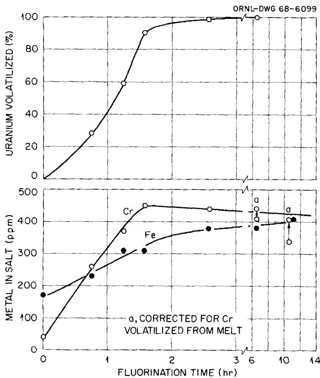  
Fig. 28.1. Relationship Between Corrosion of Hastelloy N and UF Volatilization in Fluorination of MSRE-Type Salt at $500^{\circ}C$ .

of fluorine has to occur before any $\mathrm{UF}_6$ is evolved. In recent fluorination tests, some volatilization of $\mathrm{UF}_6$ occurred when the uranium oxidation number in the salt was as low as 4.3. This was calculated on the basis of complete consumption of fluorine introduced in the first $1.5\mathrm{min}$ of fluorine flow.

# 28.2 FISSION PRODUCT BEHAVIOR - ANALYTICAL ASSISTANCE PROGRAM

In the currently proposed analytical procedure for the determination of uranium in MSRE salt, which involves fluorination as the first step, a precision of $\pm 0.1\%$ is needed. Since it is anticipated that the use of remotely controlled hot-cell coulometric instrumentation will introduce an inherent error of $\pm 1\%$ , decontamination of the UF NaF complex product from the fluorination step to a level appropriate for analysis in a low-level radiation area will be essential. In addition, uranium losses in the waste salt and fluorination system (traps, etc.) must be less than $0.1\mathrm{wt}\%$ . Results of preliminary tests in which uranium has been fluorinated from MSRE-type salt containing volatile fission product activity have been encouraging.

Four fluorination tests have been completed using specially prepared MSRE-type salt samples supplied by the Analytical Chemistry Division. The samples consisted of copper capsules each containing about $46\mathrm{g}$ of $\mathrm{LiF - BeF}_2 - \mathrm{ZrF}_4 - \mathrm{UF}_4$ (65.4-29.4-5.0-0.2 mole%). Each salt sample was melted out under an inert atmosphere into a suitable nickel fluorinating vessel and then was spiked with about $0.1\mathrm{mc}$ of ${}^{103}\mathrm{Ru}$ , ${}^{95}\mathrm{Nb}$ , ${}^{131}\mathrm{I}$ , or ${}^{132}\mathrm{Te}$ . Solutions of these tracers were first evaporated to dryness with the corresponding carrier (about 40 to $50\mathrm{mg}$ ) onto $0.5\mathrm{-g}$ quantities of LiF. Fluorination was carried out by heating the salt to $550^{\circ}\mathrm{C}$ in an inert atmosphere and then passing a mixture of $25\%$ $\mathbf{F}_2 - 75\%$ $\mathbf{N}_2$ through the melt for 30 min followed by pure fluorine for an additional 30 min at $100\mathrm{ml / min}$ (STP). The product gas stream (containing $\mathbf{F}_2$ , $\mathbf{UF}_6$ , and volatile fission product activity) was passed through a 20-g NaF

trap at $400^{\circ}\mathrm{C}$ to remove the fission products and then into a 10-g NaF trap at $25^{\circ}\mathrm{C}$ , where the UF product was sorbed. An additional 5-g NaF trap was inserted downstream for determination of any uranium breakthrough.

Based on a makeup value of 1.185 wt % uranium in each of the initial salt samples, the total uranium found in three tests corresponded to recoveries of 99.27, 100.22, and $97.65\%$ . However, corresponding uranium losses in the tests, based on analyses of the traps and waste salt, were, respectively, 0.034, 0.059, and 0.076 wt %, indicating actual recoveries greater than $99.9\%$ (see Table 28.3).

Decontamination factors obtained for $^{103}\mathbf{Ru}$ , $^{95}\mathbf{Nb}$ , and $^{132}\mathbf{Te}$ during the fluorination step have been greater than $10^{5}$ , and thus these nuclides apparently do not make a significant contribution to the overall activity level of the $\mathbf{UF}_{6}$ product. The relative amounts volatilized from the salt

during fluorination were, respectively, about $10^{-3}$ , 10, and greater than $99\%$ , with corresponding material balances of about 95, 10, and $0.1\%$ . Essentially all the ruthenium and niobium that was volatilized was trapped on the $400^{\circ}\mathrm{C}$ NaF trap; however, no appreciable sorption of tellurium was detected (Table 28.4). Attempts to achieve an adequate decontamination factor (greater than $10^{3}$ ) for ${}^{131}\mathrm{I}$ have been unsuccessful so far. In the first two tests, where the $\mathrm{UF}_{6}$ sorption trap consisted of $10\mathrm{g}$ of NaF at $25^{\circ}\mathrm{C}$ , decontamination factors of 14 and 8 were obtained. In the third test, decreasing the amount of NaF to $5\mathrm{g}$ and increasing the sorption temperature to $100^{\circ}\mathrm{C}$ resulted in a higher, but still inadequate, decontamination factor of 35 (Table 28.5). In this test the measurement of the temperature of the sorption bed may have been highly in error; therefore, a duplicate test will be made.

Table 28.3. Uranium Recoveries and Losses During Fluorination from MSRE-Type Salt and Sorption on NaF   

<table><tr><td rowspan="2">Run No.</td><td rowspan="2">Uranium 
Makeup Value 
(wt %)</td><td rowspan="2">Uranium 
Recoverya 
(wt %)</td><td colspan="4">Uranium Losses (% of total found)</td></tr><tr><td>Trap 
No. 1b</td><td>Trap 
No. 2c</td><td>Waste Salt</td><td>Total</td></tr><tr><td>1</td><td>1.185</td><td>99.27</td><td>0.012</td><td>0.009</td><td>0.013</td><td>0.034</td></tr><tr><td>2</td><td>1.185</td><td>100.22</td><td>0.051</td><td>0.006</td><td>0.002</td><td>0.059</td></tr><tr><td>3</td><td>1.185</td><td>97.65</td><td>0.026</td><td>0.022</td><td>0.022</td><td>0.076</td></tr></table>

${}^{a}$ Based on analysis of all traps and scrubber solutions.   
$b_{400^{\circ}CNaF}$ trap.   
$25^{\circ}C$ NaF backup trap.

Table 28.4. Behavior of ${}^{103}\mathrm{{Ru}},{95}\mathrm{{Nb}}$ ,and ${}^{132}\mathrm{{Te}}$ During Fluorination of Uranium from MSRE-Type Salt at ${550}^{ \circ  }\mathrm{C}$   

<table><tr><td rowspan="2">Nuclide</td><td colspan="5">Total Activity (dis/min)</td><td rowspan="2">Amount of Nuclides Volutilized (%)</td><td rowspan="2">UF6Product Decontamination Factor</td></tr><tr><td>MSRE Salt (Initial)</td><td>400°C NaF Trap</td><td>NaF Backup Trap</td><td>Waste Salt</td><td>UF6Product Trap</td></tr><tr><td>103Ru</td><td>~2 × 108</td><td>&lt;103</td><td>&lt;103</td><td>1.9 × 108</td><td>&lt;103</td><td>10-3</td><td>&gt;105</td></tr><tr><td>95Nb</td><td>~2 × 108</td><td>3 × 107</td><td>&lt;103</td><td>9 × 107</td><td>&lt;103</td><td>10</td><td>&gt;105</td></tr><tr><td>132Te</td><td>~2 × 108</td><td>&lt;103</td><td>&lt;103</td><td>4.3 × 105</td><td>&lt;103</td><td>&gt;99</td><td>&gt;105</td></tr></table>

Table 28.5. Behavior of ${}^{131}$ I During Fluorination of Uranium from MSRE-Type Salt at ${550}^{ \circ  }\mathrm{C}$   

<table><tr><td rowspan="2">Run No.</td><td colspan="6">Total Activity (dis/min)</td><td rowspan="2">131I Volatilized (%)</td><td rowspan="2">Decontamination Factor</td></tr><tr><td>MSRE Salt (Initial)</td><td>400°C NaF Trap</td><td>Backup Trap</td><td>KOH Scrub Trap</td><td>Waste Salt</td><td>UF6 Trap</td></tr><tr><td>1</td><td>~2 × 108</td><td>~103</td><td>1.3 × 106</td><td></td><td>&lt;103</td><td>1.4 × 107</td><td>&gt;99</td><td>14</td></tr><tr><td>2</td><td>~2 × 108</td><td>1.8 × 104</td><td>5.3 × 106</td><td>2 × 107</td><td>2 × 104</td><td>2.5 × 107</td><td>&gt;99</td><td>8</td></tr><tr><td>3</td><td>~1 × 109</td><td>5.6 × 106</td><td>7.2 × 107</td><td></td><td>2.7 × 106</td><td>2.9 × 107</td><td>&gt;99</td><td>35</td></tr></table>

# 29. MSRE Fuel Salt Processing

R. B. Lindauer

The modifications to the MSRE fuel processing facility to permit processing with a 30-day decay time have been completed. In November, it was decided to remove the structural-metal fluorides formed during fluorination from the salt before returning it to the reactor system. Design of a salt filter for removing the metals after reduction has been completed, and fabrication is in progress. The filter will have $9\mathrm{ft}^2$ of Inconel porous metal as a filter medium. The filter element is designed for remote replacement in case of plugging or rupture. The filter has a capacity of about 40 lb of corrosion products, the amount formed during 50 hr of fluorination with a corrosion rate of $0.2\mathrm{mil/hr}$ .

Another change in processing plans is the elimination of the $\mathbf{H}_2$ -HF treatment of the flush and fuel

salts prior to fluorination. A heated salt sample carrier was constructed as a simpler and more economical method for verifying the oxide analyses of fuel salt samples.

Handling of the sodium fluoride absorbers loaded with $\mathrm{UF}_6$ will be simplified considerably, since it has been learned that most of the noble-metal fission products leave the salt during reactor operation. Molybdenum-99 would have been the principal radiation source with short-decayed fuel. The problem of overheating of the high-temperature sodium fluoride trap from $^{95}\mathrm{Nb}$ is also eliminated. A third problem which has been eliminated is the discharge of tellurium during processing.

Training of part of the reactor operations group to operate the fuel processing plant is in progress.

# 30. Preparation of $^{7}\mathrm{LiF} - ^{233}\mathrm{UF}_4$ Fuel Concentrate for the MSRE

J. W. Anderson   
S. Mann   
S. E. Bolt

E. L. Nicholson   
J.M.Chandler   
W.F.Schaffer, Jr.

The MSRE will be refueled with $^{233}\mathrm{U}$ in 1968. Approximately $39.5\mathrm{kg}$ of $91.4\%$ -enriched $^{233}\mathrm{U}$ as $^7\mathrm{LiF - }^{233}\mathrm{UF}_4$ (73-27 mole %) eutectic salt will be required. This material will be prepared in a shielded facility because of the high $^{232}\mathrm{U}$ content (222 ppm) of the $^{233}\mathrm{U}$ .

The process and equipment have been described in the previous report. The following sections describe the changes in process and equipment since the original report and the status of the program.

# 30.1 EQUIPMENT CHANGES

The MSRE personnel completed a detailed evaluation of their fuel requirements and loading operations for the $^{233}\mathrm{U}$ program. The predicted operational fuel load for the reactor is $35.9\mathrm{kg}$ of uranium ( $\sim 91.4\%$ $^{233}\mathrm{U}$ ), and the contingency is $3.6\mathrm{kg}$ , giving a total of $39.5\mathrm{kg}$ of $^{233}\mathrm{U}$ to be delivered to the MSRE as the eutectic salt. This is a decrease of about $3\mathrm{kg}$ from earlier planning.[1] At the same time, the number of enriching capsules was reduced from 60 to 45; so the surplus capsules were removed from the existing array.

The unshielded glove box used at the MSRE for drilling the uranium enriching capsule vent and drain holes and for weighing the capsules before loading into the sampler-enricher is inadequate for the highly active $^{233}\mathrm{U}$ . These operations will now be done in the TURF before the capsules are shipped to the MSRE. A remotely

operated drilling, weighing, and packaging box has been built and tested for this operation. The lifting cables and keys will be attached to the capsules before they are filled with salt, thus avoiding a remote welding operation. After drilling, weighing, and testing, the capsules will be placed in the special holders that are used as part of the sampler-enricher system at the MSRE, packaged in groups of six, and shipped to the MSRE in a shielded carrier.

The method used for bulk additions of $^{235}\mathrm{U}$ fuel salt from the 4-in. storage containers to the reactor via a heated transfer line was discarded in favor of a simpler method for the highly active $^{233}\mathrm{U}$ salt. The bulk additions will be made from $2\frac{1}{2}$ -in.-diam salt cans that are vented and have an opening in the bottom. They are essentially "giant" enrichment capsules that are lowered into the heated dump tank, so that the salt melts and drains into the tank. Four 7.0-kg uranium cans, one 3.0-kg uranium can, one 2.0-kg uranium can, one 1.0-kg uranium can, and two 0.5-kg uranium cans will be delivered to the MSRE. The cans are assembled in two clusters for filling with salt. One cluster consists of the four 7.0-kg cans, and the other is the remaining five small cans plus one extra 2.0-kg can which is arranged to hold recoverable salt heels from the salt processing system. The capsule filling furnace in cell G was replaced with a larger furnace that will accommodate both the capsules and $2\frac{1}{2}$ -in.-diam salt can clusters. Other equipment changes included a new furnace liner, a new furnace stand, can cluster dismantling tools, and a larger work table to accommodate both the capsule drilling and packaging box and the dismantling of the can

clusters for shipment. The cans will be weighed in the cell before shipment by suspending them from a wire attached to a scale located on top of the cell.

We have determined that the density of the stored $^{23} \mathrm{UO}_3$ is higher than the original estimate. This, plus the decrease in the total amount of uranium required, as noted above, will allow us to make three batches of approximately $13.5 \mathrm{kg}$ U each instead of the four batches planned earlier. A significant saving in operating time will result from the elimination of one of the production batches. The 45 enriching capsules will be filled from the first batch of salt. The remainder of the first batch, the second batch, and part of the third batch will be used to fill the cluster of four $7.0 \mathrm{~kg}$ uranium salt cans. The small cans will be filled last, from the remainder of the third batch.

The $^{233}\mathrm{UO}_3$ oxide can opener and dumping box were designed using can drawings and sample cans from Savannah River. The cans in storage in the pilot plant were not checked closely because of the high radiation levels of the oxide. After the box was completed, it was found that the cans were 1.75 in. shorter than shown by the drawings and can samples. Since modification of the charging box to accommodate the shorter cans was impractical, we will cement a 1.5-in. extension on each can. The fixtures for tapering the can end and removing the weld bead, for pressing the extension on the cans, and for curing the cemented joint have been built and tested. The fabrication costs and operating problems caused by this development are minor.

# 30.2 EQUIPMENT AND PROCESS STATUS

The TURF building was turned over to ORNL on September 15, 1967, and the CPFF contractor started preparing cell G for installation of the process equipment and completed this by mid-October. The CPFF work consisted in installing the instrument panel, the gas supply and electrical systems to terminals inside the cell, the cell platform, the shielding plugs for unused pipes slots and windows, the PAR manipulator, and the can charging chute. The process equipment was completed in the ORNL shops by mid-October, and ORNL forces finished the installation of the process equipment in cell G in January. Part of

the processing equipment installed on and in cell G is shown in Figs. 30.1 to 30.3. The equipment for adding the extensions to the oxide cans, for dismantling the capsule and can assemblies, and for drilling and weighing the capsules will be located in the northwest and northeast corners of the cell. About 130 formal drawings plus 150 field sketches have been issued to date for the job. We estimate that the design work is more than $98\%$ complete as of February 29, 1968. Pressure vessel, criticality, building, and radiochemical plant safety reviews were completed, and the process and buildings were approved for MSRE $^{233}\mathrm{U}$ fuel production.

Equipment checkout and minor alterations and changes were completed, and the cold test run with $^{238}\mathrm{UO}_3$ (11.6 kg $^{238}\mathrm{U}$ ) was started January 15, 1968. Some problems were encountered with the can opener and dumping box. After a few cans were opened, a groove rolling device accidentally jammed the can chuck, stripping the motor drive gears. The gears were replaced, and the remaining cans were opened and dumped, though with difficulty due to binding of the cans in the box. The box was removed from the cell, decontaminated, and sent to the shop for repairs and for alterations to improve operability. The chemical part of the run started on January 24, 1968, with the $900^{\circ}\mathrm{C}$ sintering treatment followed by hydrogen reduction of the $\mathrm{UO}_3$ to $\mathrm{UO}_2$ . The off-gas filter plugged during the reduction step but was opened by blowback and has not been a problem since the reduction step. Treatment with $\mathrm{H}_2\text{-HF}$ has been under way since January 27. It was planned to follow the progress of the conversion of $\mathrm{UO}_2$ to $\mathrm{UF}_4$ by titrating the off-gas to determine HF utilization and to periodically determine the freezing point of the charge as it approached the eutectic point. The off-gas titration was hampered by HF-water condensation in the plastic lines to the caustic scrubber bottle and by problems with remote manipulator operation of the conventional burets in the cell. This rig has since been replaced by a reliable titration system, but in the early stages of the conversion it was impossible to get reliable results with the existing titration system. Attempts to run freezing point curves on the salt in the reaction vessel were unsuccessful because of the high thermal capacity of the reaction vessel and furnace as compared with the salt charge. Samples of the

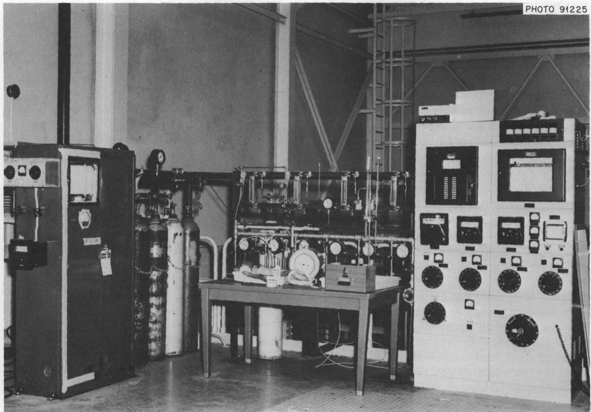  
Fig. 30.1. Control Panel and Gas Supply for $^{233}\mathrm{U}$ Fuel Salt Preparation – Cell G, Building 7930.

melt taken after about $290\mathrm{hr}$ of $\mathrm{HF - H_2}$ treatment showed that only 5 to $10\%$ conversion of $\mathrm{UO}_2$ to $\mathrm{UF}_4$ had occurred. The $\mathrm{H}_2$ -HF sparger tube was removed from the reaction vessel on February 14 and was found to be corroded off at the liquid-gas interface. It was replaced, and HF utilization rose from zero to $70\%$ , indicating good conversion of $\mathrm{UO}_2$ to $\mathrm{UF}_4$ . After about $200\mathrm{hr}$ of additional operation, about $71\%$ of the $\mathrm{UO}_2$ had been reacted. The HF utilization, as determined by titration with the new apparatus, has decreased in the expected manner since then. Progress of the reaction is being followed mainly by sampling the salt at frequent intervals.

We had problems with the remote salt sampling box because of excessive friction between the

salt sampler probe and the sampler box. The box was returned to the shop for repairs and for alterations to improve operability. At the end of the month, the $\mathrm{H}_{2}$ -HF treatment was still under way, and 90 to $95\%$ of the $\mathrm{UO}_{2}$ had been converted to $\mathrm{UF}_{4}$ . The progress of the reaction has been slow owing to poorer contacting of gas and salt in the 8-in.-diam pot as compared with the 4-in.-diam pots used during flowsheet development, and interruptions of the process due to equipment problems and for salt sampling operations. We now estimate that the chemical part of each $^{233}\mathrm{U}$ run will take about 28 days instead of the 17 estimated earlier. Tentative plans are to complete the cold run in March and prepare the three batches of $^{233}\mathrm{U}$ salt in April, May, and June.

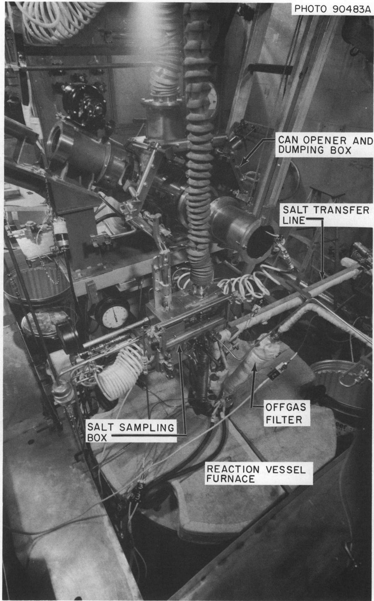  
Fig. 30.2. Main Reaction Vessel Furnace and Auxiliary Equipment for $^{233}\mathrm{U}$ Fuel Salt Preparation - Cell G, Building 7930.

PHOTO 90464A

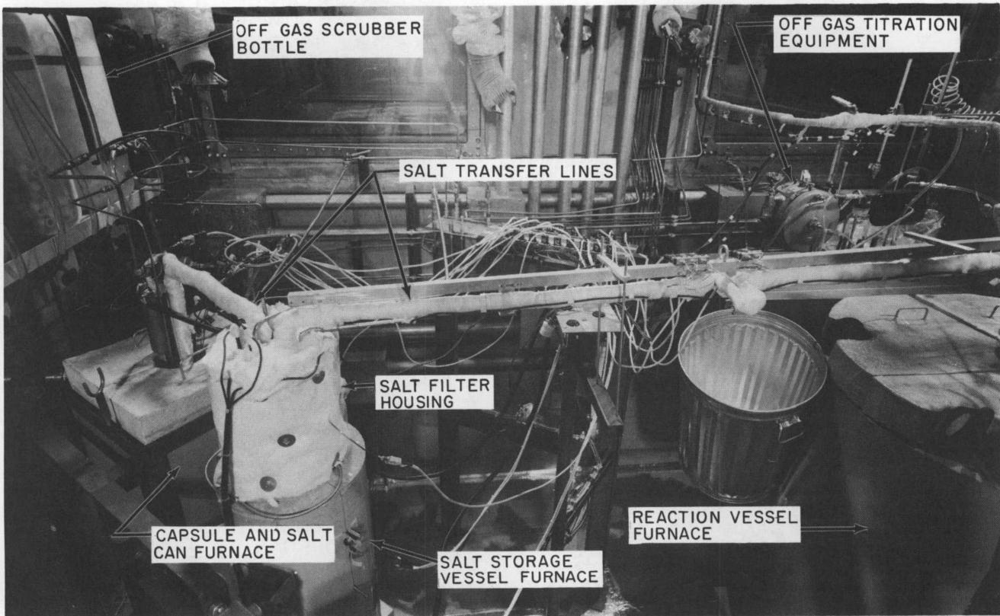  
Fig. 30.3. Auxiliary Furnaces and Equipment for $^{233}\mathrm{U}$ Fuel Salt Preparation - Cell G, Building 7930.

# 31. Decay Heat Generation Rate in a Single-Region Molten-Salt Reactor

W. L. Carter

J. S. Watson

Decay heat from fission products and $^{233}\mathrm{Pa}$ has been calculated for a 2000 Mw (electrical) single-region MSR operating on LiF-BeF $_2$ -ThF $_4$ - $^{233}\mathrm{UF}_4$ fuel. Heat-generation rates are shown graphically in Figs. 31.1 and 31.2 as a function of time after reactor shutdown. The data extend from reactor equilibrium to a decay time of about 11 years.

It was assumed that the MSR had been operating sufficiently long for fission products and $^{233}\mathrm{Pa}$ to be present in equilibrium concentrations. For $^{233}\mathrm{Pa}$ the characteristic equilibrium was for a 3-day processing cycle. For fission products, equilibrium was established for three different situations: (1) all fission products removed on a 38-day cycle through the processing plant; (2) noble gases removed on a 50-sec cycle by sparging with an inert gas in the circulating loop; and (3) in addition to noble-gas sparging, noble metals removed on a 50-hr cycle by reaction with piping, heat exchanger, and reactor surfaces. In cases 2 and 3, remaining fission products were removed by the 38-day cycle through the processing plant. The vertical separation of the three appropriately labeled curves of Fig. 31.1 is a measure of the difference in decay heat from these three assumed

conditions. The largest difference for times soon after shutdown occurs at about 1 hr, when the noble-gas- and noble-metal-free fuel produces about $33\%$ less heat than fuel containing gross fission products. At equilibrium for the three above conditions, fission products produce, respectively, 144.7, 128.5, and 127.9 kw per cubic foot of fuel.

This reactor has a breeding ratio of 1.076, and there is $205\mathrm{kg}$ of ${}^{233}\mathrm{Pa}$ in the fuel and processing plant. The ${}^{233}\mathrm{Pa}$ concentration in the fuel is $7.25\mathrm{g / ft^3}$ (14.5 kg total), which at equilibrium generates 0.367 kw of heat per cubic foot; there is $195.5\mathrm{kg}$ in the processing plant, producing 9.68 Mw of heat.

An interesting result of this study is the importance of a few fission products in the total heat generation. At equilibrium, Rb, Cs, and Sb, respectively, account for 22.8, 21, and $17.3\%$ of fission product decay heat. At 1 hr decay the amounts are I $(18.6\%)$ , Kr $(13\%)$ , La $(10.5\%)$ , and Y $(9.6\%)$ ; at 10 hr decay, the values are I $(23.8\%)$ , La $(16.5\%)$ , and Y $(11.4\%)$ . For much longer decay times (e.g., 125 days), about $80\%$ of the energy is from Nb, Zr, Pr, and Y.

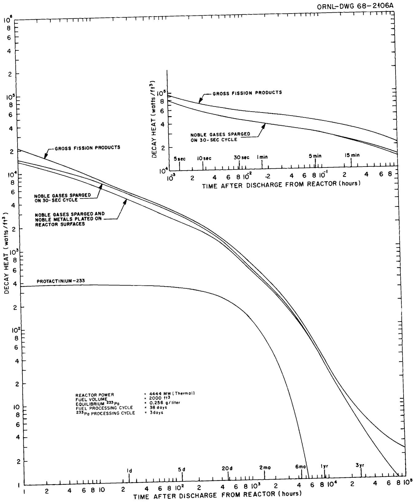  
Fig. 31.1. Fission Product and Protactinium Decay Heat in One-Region MSR Fuel.

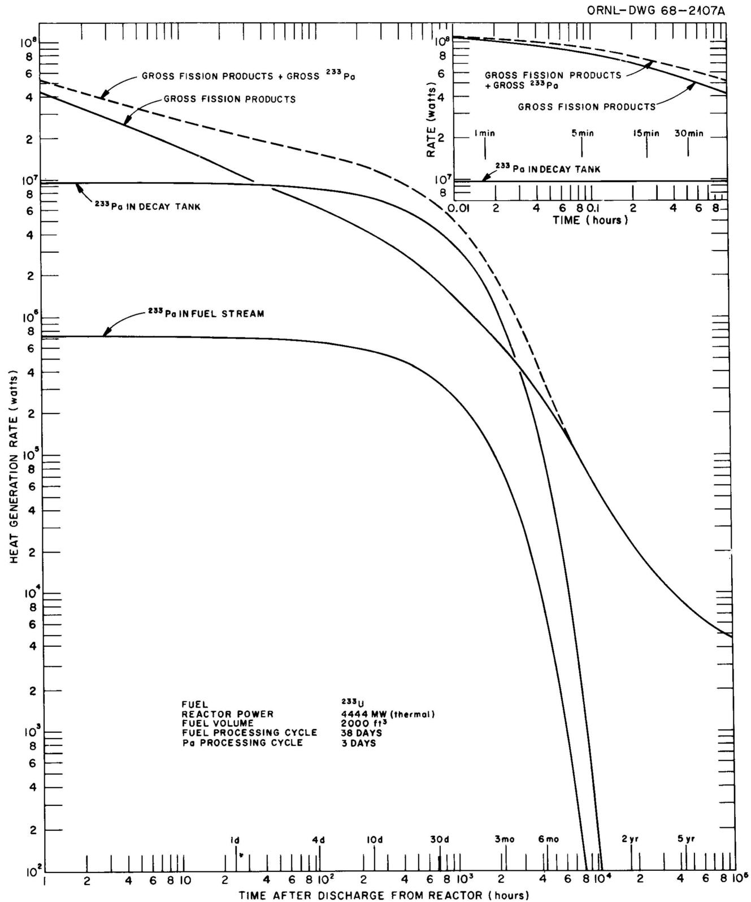  
Fig. 31.2. Total Heat-Generation Rate in One-Region MSR from Gross Fission Products and $^{233}\mathrm{Pa}$ .

# OAK RIDGE NATIONAL LABORATORY

# MOLTEN-SALT REACTOR PROGRAM

FEBRUARY 29, 1968

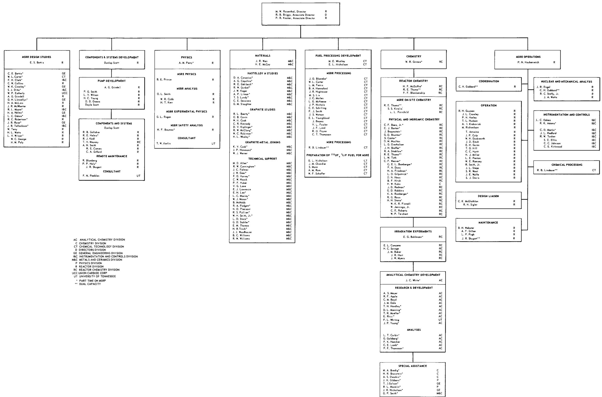

# INTERNAL DISTRIBUTION

1. R. K. Adams   
2. G. M. Adamson   
3. R. G. Affel   
4. L. G. Alexander   
5. R. F. Apple   
6. C. F. Baes   
7. J. M. Baker   
8. S. J. Ball   
9. C. E. Bamberger   
10. C. J. Barton   
11. H. F. Bauman   
12. S. E. Beall   
13. R. L. Beatty   
14. M. J. Bell   
15. M. Bender   
16. C. E. Bettis   
17. E. S. Bettis   
18. D. S. Billington   
19. R. E. Blanco   
20. F. F. Blankenship   
21. J. O. Blomeke   
22. R. Blumberg   
23. A. L. Boch   
24. E. G. Bohlmann   
25. C. J. Borkowski   
26. G.E. Boyd   
27. J. Braunstein   
28. M. A. Bredig   
29. E. J. Breeding   
44. R. B. Briggs   
45. H. R. Bronstein   
46. W. E. Browning   
47. F. R. Bruce   
48. G. D. Brunton   
49. G. H. Burger   
50. D. A. Canonico   
51. S. Cantor   
52. D. W. Cardwell   
53. W. L. Carter   
54. G. I. Cathers   
55. O. B. Cavin   
56. A. Cepolino

57. J. M. Chandler   
58. W. R. Cobb   
59. C. W. Collins   
60. E. L. Compere   
61. J. A. Conlin   
62. W. H. Cook   
63. L. T. Corbin   
64. W. B. Cottrell   
65. B. Cox   
66. G. A. Cristy   
67. S. J. Cromer (K-25)   
68. J. L. Crowley   
69. F. L. Culler   
70. D. R. Cuneo   
71. J.M. Dale   
72. D. G. Davis   
73. W. W. Davis   
74. R. J. DeBakker   
75. J. H. Devan   
76. S. J. Ditto   
77. R. G. Donnelly   
78. I. T. Dudley   
79. N. E. Dunwoody   
80. A. S. Dworkin   
81. D. A. Dyslin   
82. W. P. Eatherly   
83. M. C. Edlund (K-25)   
84. J. R. Engel   
85. E.P. Epler   
86. W. K. Ergen   
87. D. E. Ferguson   
88. L. M. Ferris   
89. A. P. Fraas   
90. H. A. Friedman   
91. J. H. Frye, Jr.   
92. C. H. Gabbard   
93. W.R.Gall   
94. R. B. Gallagher   
95. R. E. Gelbach   
96. J. H. Gibbons   
97. R. G. Gilliland   
98. L. O. Gilpatrick

99. H. E. Goeller

100. W. R. Grimes

101. A. G. Grindell

102. R. W. Gunkel

103. R. H. Guymon

104. J. P. Hammond

105. R. P. Hammond

106. B. A. Hannaford

107. P. H. Harley

108. D. G. Harman

109. W. O. Harms

110. C. S. Harrill

111. P. N. Haubenreich

112. F. A. Heddleson

113. R. E. Helms

114. P. G. Herndon

115. D. N. Hess

116. R. F. Hibbs (Y-12)

117. J. R. Hightower

118. M. R. Hill

119. E.C.Hise

120. H. W. Hoffman

121. D. K. Holmes

122. V. D. Holt

123. P. P. Holz

124. R.W.Horton

125. A. S. Householder

126. T. L. Hudson

127. H. Inouye

128. W. H. Jordan

129-143. P. R. Kasten

144. R. J. Kedl

145. M. T. Kelley

146. M. J. Kelly

147. C. R. Kennedy

148. T. W. Kerlin

149. H. T. Kerr

150. R. F. Kimball

151. S. S. Kirslis

152. D. J. Knowles

153. J. W. Koger

154. A. I. Krakoviak

155. J. S. Kress

156. J. W. Krewson

157. C. E. Lamb

158. J. A. Lane

159. C. E. Larson

160. E. J. Lawrence

161. J. J. Lawrence

162. M. S. Lin

163. T. A. Lincoln

164. R. B. Lindauer

165. A. P. Litman

166. J. L. Liverman

167. R. S. Livingston

168. G. H. Llewellyn

169. E. L. Long

170. M. I. Lundin

171. R. N. Lyon

172. R. L. Macklin

173. H. G. MacPherson

174. R. E. MacPherson

175. F. C. Maienschein

176. J. C. Mailen

177. D. L. Manning

178. C. D. Martin

179. W. R. Martin

180. C. E. Mathews

181. T. H. Mauney

182. H. McClain

183. R. W. McClung

184. H. E. McCoy

185. H. F. McDuffie

186. C. K. McGlothlan

187. C. J. McHargue

188. L. E. McNeese

189. J. R. McWherter

190. H. J. Metz

191. A. S. Meyer

192. E. C. Miller

193. C. A. Mills

194. R. L. Minue

195. W. R. Mixon

196. R. L. Moore

197. K. Z. Morgan

198. D. M. Moulten

199. J. C. Moyers

200. T. R. Mueller

201. H. A. Nelms

202. J. P. Nichols

203. E. L. Nicholson

204. E. D. Nogueira

205. L. C. Oakes

206. W. R. Osborn

207-208. R. B. Parker

209. L. F. Parsly

210. P. Patriarca

211. H. R. Payne

212. A.M. Perry

213. T. W. Pickel

214. H. B. Piper

215. B. E. Prince

216. G. L. Ragan

217. J. L. Redford

218. M. Richardson

219. G. D. Robbins

220. R. C. Robertson

221. W. C. Robinson

222. H. C. Roller

223. K. A. Romberger

224-398. M.W.Rosenthal

399. R.G.Ross

400. H. C. Savage

401. A. W. Savolainen

402. W. F. Schaffer

403. C. E. Schilling

404. Dunlap Scott

405. J. L. Scott

406. H. E. Seagren

407. C. E. Sessions

408. J. H. Shaffer

409. E. D. Shipley

410. W. H. Sides

411. M. J. Skinner

412. G. M. Slaughter

413. A. N. Smith

414. F. J. Smith

415. G.P. Smith

416. O. L. Smith

417. P. G. Smith

418. A. H. Snell

419. W. F. Spencer

420. I. Spiewak

421. R. C. Steffy

422. C. E. Stevenson

423. W. C. Stoddart

424. H. H. Stone

425. R. A. Strehlow

426. D. A. Sundberg

427. J. R. Tallackson

428. E. H. Taylor

429. W. Terry

430. R. E. Thom

431. P. F. Thomason

432. L. M. Toth

433. D. B. Trauger

434. R. W. Tucker

435. W. C. Ulrich

436. D. C. Watkin

437. G. M. Watson

438. J. S. Watson

439. H. L. Watts

440. C. F. Weaver

441. B. H. Webster

442. A. M. Weinberg

443. J. R. Weir

444. W. J. Werner

445. K.W. West

446. M. E. Whatley

447. J. C. White

448. G. C. Williams

449. L. V. Wilson

450. G. J. Young

451. H. C. Young

452. J. P. Young

453. E. L. Youngblood

454. F. C. Zapp

455. Biology Library

456-457. ORNL - Y-12 Technical Library Document Reference Section

458-460. Central Research Library

461-615. Laboratory Records Department

616. Laboratory Records, ORNL R.C.

# EXTERNAL DISTRIBUTION

617. W. O. Allen, Atomics International, P.O. Box 309, Canoga Park, California 91304   
618. J. G. Asquith, Atomics International, P.O. Box 309, Canoga Park, California 91304   
619. J. C. Bowman, Union Carbide Technical Center, 12900 Snow Road, Parma, Ohio 44130   
620. G. D. Brady, Materials Systems Division, UCC, Kokomo, Indiana 46901   
621. J. H. Brannan, Carbon Products Division, 270 Park Avenue, New York, New York 10017   
622. W. S. Butler, Dow Chemical Company, Freeport, Texas 77541   
623. Paul Cohen, Westinghouse Electric Corp., P.O. Box 158, Madison, Pennsylvania 15663   
624. D. F. Cope, Atomic Energy Commission, RDT Site Office (ORNL)   
625. J W. Crawford, Atomic Energy Commission, Washington 20545   
626. M. W. Croft, Babcock and Wilcox Company, P.O. Box 1260, Lynchburg, Virginia 24505   
627. C. B. Deering, Atomic Energy Commission, RDT Site Office (ORNL)

628. D. A. Douglas, Materials Systems Division, UCC, Kokomo, Indiana 46901   
629. H. L. Falkenberry, Tennessee Valley Authority, 303 Power Building, Chattanooga, Tenn. 37401   
630. C. W. Fay, Wisconsin Michigan Power Company, 231 W. Michigan Street, Milwaukee, Wisconsin 53201   
631. Gregory Flynn, General Motors, 12 Mile and Mound Roads, Warren, Michigan 48089   
632. A. Giambusso, Atomic Energy Commission, Washington 20545   
633. Gerald Golden, Argonne National Laboratory, 9700 S. Cass Avenue, Argonne, Illinois 60439   
634. W. W. Grigorieff, Assistant to the Executive Director, Oak Ridge Associated Universities   
635. J. T. Kehoe, Burns and Roe, Inc., 700 Kinderkamach, Oradell, New Jersey 07649   
636. L. W. Lang, Douglas United Nuclear, 703 Bldg., Richland, Washington 99352   
637. W. J. Larkin, Atomic Energy Commission, ORO   
638. J. A. Lieberman, Atomic Energy Commission, Washington 20545   
639. R. A. Lorenzini, Foster Wheeler, 110 S. Orange, Livingston, N. J. 07039   
640. W. D. Manly, Material Systems Division, UCC, 270 Park Avenue, New York, New York 10017   
641. J. P. Mays, Great Lakes Carbon Co., 299 Park Avenue, New York, New York 10017   
642. W. B. McDonald, Battelle-Pacific Northwest Laboratory, Hanford, Washington 99352   
643-644. T. W. McIntosh, Atomic Energy Commission, Washington 20542   
645. W. J. Mordarski, Nuclear Development, Combustion Engineering, Windsor, Connecticut   
646. Sidney Parry, Great Lakes Carbon, P.O. Box 667, Niagara Falls, New York 14302   
647. Worth Percival, General Motors, 12 Mile and Mound Roads, Warren, Michigan 48089   
648. G. J. Petretic, Atomic Energy Commission, Washington 20545   
649. M. A. Rosen, Atomic Energy Commission, Washington 20545   
650. H. M. Roth, Atomic Energy Commission, ORO   
651. R. W. Schmitt, General Electric Co., Schenectady, New York 12301   
652. M. Shaw, Atomic Energy Commission, Washington 20545   
653. Remo Silvestrini, United Nuclear Corporation, Grasslands Road, Elmsford, New York 10523   
654. E. E. Sinclair, Atomic Energy Commission, Washington 20545   
655. W. L. Smalley, Atomic Energy Commission, ORO   
656. T. M. Snyder, General Electric Co., 175 Curtner Ave., San Jose, California 95103   
657. L. D. Stoughton, UCC, P.O. Box 500, Lawrenceburg, Tennessee 38464   
658. Philip T. Stroup, Alcoa, P.O. Box 772, New Kensington, Pennsylvania   
659. J. A. Swartout, UCC, 270 Park Avenue, New York, New York 10017   
660. R. F. Sweek, Atomic Energy Commission, Washington 20545   
661. Richard Tait, Poco Graphite, P.O. Box 1524, Garland, Texas 75040   
662. D. R. Thomas, Commonwealth Associates, Inc., 209 E. Washington Ave., Jackson, Michigan 49201   
663. M. Tsou, General Motors, 12 Mile and Mound Roads, Warren, Michigan 48089   
664. J. W. Ullmann, UCC, P.O. Box 278, Tarrytown, New York 10591   
665. C. H. Waugaman, Tennessee Valley Authority, 303 Power Building, Chattanooga, Tenn. 37401   
666. D. B. Weaver, Tennessee Valley Authority, New Sprankle Building, Knoxville, Tennessee   
667. G. O. Wessenauer, Tennessee Valley Authority, Chattanooga, Tennessee 37401   
668. M. J. Whitman, Atomic Energy Commission, Washington 20545   
669. H. A. Wilber, Power Reactor Development Company, 1911 First Street, Detroit, Michigan   
670. James H. Wright, Westinghouse Electric, P.O. Box 355, Pittsburgh, Pennsylvania 15230   
671-672. Laboratory and University Division (ORO)   
673-931. Given distribution as shown in TID-4500 under Reactor Technology category (25 copies-CFSTI)