ORNL-4257

UC-4 - Chemistry

AN EMF STUDY OF LiF-BeF $_2$ SOLUTIONS

B. F. Hitch

C. F. Baes, Jr.

OAK RIDGE NATIONAL LABORATORY

operated by

UNION CARBIDE CORPORATION

for the

U.S. ATOMIC ENERGY COMMISSION

Printed in the United States of America. Available from Clearinghouse for Federal

Scientific and Technical Information, National Bureau of Standards,

U.S. Department of Commerce, Springfield, Virginia 22151

Price: Printed Copy $3.00; Microfiche $0.65

# LEGAL NOTICE

This report was prepared as an account of Government sponsored work. Neither the United States, nor the Commission, nor any person acting on behalf of the Commission:

A. Makes any warranty or representation, expressed or implied, with respect to the accuracy, completeness, or usefulness of the information contained in this report, or that the use of any information, apparatus, method, or process disclosed in this report may not infringe privately owned rights; or   
B. Assumes any liabilities with respect to the use of, or for damages resulting from the use of any information, apparatus, method, or process disclosed in this report.

As used in the above, "person acting on behalf of the Commission" includes any employee or contractor of the Commission, or employee of such contractor, to the extent that such employee or contractor of the Commission, or employee of such contractor prepares, disseminates, or provides access to, any information pursuant to his employment or contract with the Commission, or his employment with such contractor.

# DISCLAIMER

This report was prepared as an account of work sponsored by an agency of the United States Government. Neither the United States Government nor any agency thereof, nor any of their employees, makes any warranty, express or implied, or assumes any legal liability or responsibility for the accuracy, completeness, or usefulness of any information, apparatus, product, or process disclosed, or represents that its use would not infringe privately owned rights. Reference herein to any specific commercial product, process, or service by trade name, trademark, manufacturer, or otherwise does not necessarily constitute or imply its endorsement, recommendation, or favoring by the United States Government or any agency thereof. The views and opinions of authors expressed herein do not necessarily state or reflect those of the United States Government or any agency thereof.

# DISCLAIMER

Portions of this document may be illegible in electronic image products. Images are produced from the best available original document.

ORNL-4257

Contract No. W-7405-eng-26

REACTOR CHEMISTRY DIVISION

AN EMF STUDY OF LiF-BeF $_2$ SOLUTIONS

B. F. Hitch and C. F. Baes, Jr.

# LEGAL NOTICE

This report was prepared as an account of Government sponsored work. Neither the United States, nor the Commission, nor any person acting on behalf of the Commission:

A. Makes any warranty or representation, expressed or implied, with respect to the accuracy, completeness, or usefulness of the information contained in this report, or that the use of any information, apparatus, method, or process disclosed in this report may not infringe privately owned rights; or

B. Assumes any liabilities with respect to the use of, or for damages resulting from the use of any information, apparatus, method, or process disclosed in this report.

As used in the above, "person acting on behalf of the Commission" includes any employee or contractor of the Commission, or employee of such contractor, to the extent that such employee or contractor of the Commission, or employee of such contractor prepares, disseminates, or provides access to, any information pursuant to his employment or contract with the Commission, or his employment with such contractor.

JULY 1968

OAK RIDGE NATIONAL LABORATORY

Oak Ridge, Tennessee

operated by

UNION CARBIDE CORPORATION

for the

U.S. ATOMIC ENERGY COMMISSION

# CONTENTS

Page

Abstract 1

Introduction 2

Experimental 6

Chemicals 6

Gases 6

Melt Components 6

Reagents 7

Apparatus 7

Cell Design 7

HF-H2 Electrode 10

Beryllium Electrode 11

Flow Control of Gases 11

Hydrogen Fluoride 11

Hydrogen 11

Helium 11

Titration Assembly 13

Electronic Equipment 13

Procedure 13

Measurements 13

Cell Potential 14

$\mathbf{H}_2$ and HF Partial Pressures 14

Melt Temperature 15

Calculations 15

Systematic Errors 18

Hydrogen Diffusion 18

Thermal Diffusion 19

Gas Cooling Effect on Electrodes 19

Melt Composition 19

Melt Impurities 20

Oxide Contamination of Melt. 21

Summary 22

Random Errors. 22

Precision of Potential Measurements 22

Melt Temperature 22

Melt Composition 22

Titer Precision 23

Temperature of Bubble-0-Meter 23

Flow Rate Determination 23

Endpoint Precision 23

$\mathbf{H}_2$ and HF Flow Rates 23

Statistical Error Analysis 23

Results 25

Tabulation 25

Experiments 25

Corrected Cell Potentials 26

Discussion 29

Thermodynamics of LiF-BeF2 29

Reference Electrodes 39

Beryllium Electrode 39

HF-H2 Electrode 41

References 42

Page

AN EMF STUDY OF LiF-BeF $_2$ SOLUTIONS

B. F. Hitch and C. F. Baes, Jr.

# ABSTRACT

The potential of the cell

$$
\mathrm {B e} ^ {\circ} \left| \mathrm {B e F} _ {2}, \mathrm {L i F} \right| \mathrm {H F}, \mathrm {H} _ {2}, \mathrm {P t}
$$

with the assumed cell reaction

$$
\mathrm {B e (s)} + 2 \mathrm {H F (g)} \rightleftarrows \mathrm {B e F} _ {2} (\mathrm {d}) + \mathrm {H} _ {2} (\mathrm {g})
$$

was measured over a composition range of 0.30 to 0.90 mole fraction $\mathrm{BeF}_2$ and a temperature range of 500 to $900^{\circ}\mathrm{C}$ . Since this cell potential is related to the activity of $\mathrm{BeF}_2$ in the solutions by

$$
E = E ^ {o} - \frac {R T}{2 F} \ln \frac {P _ {H _ {2}}}{P _ {H F} ^ {2}}
$$

activity coefficients could be derived for $\mathrm{BeF}_2$ (and by a Gibbs-Duhem integration for LiF). Usefully accurate measurements could not be made with pure $\mathrm{BeF}_2$ in the cell, hence values of $\mathbf{E}^0$ were calculated using values for $a_{\mathrm{BeF}_2}$ derived from the phase diagram and previously reported heat of fusion (1.13 kcal/mole) giving

$$
E ^ {O} = 2. 4 4 3 0 - 0. 0 0 0 7 9 5 2 T
$$

This comparison of the emf data with the LiF-BeF $_2$ phase diagram also indicated that the heat of fusion for BeF $_2$ is $< 2.0$ kcal/mole. A power series in xLiF was assumed for log $\gamma_{\text{BeF}_2}$ and the coefficients determined by a least squares fit to the data. This gave

$$
\begin{array}{l} \log \gamma_ {\mathrm {B e F} _ {2}} = (3. 8 7 8 0 - \frac {2 3 5 3 . 5}{T}) x _ {\mathrm {L i F}} ^ {2} + (- 4 0. 7 3 7 5 + \frac {3 6 2 9 2 . 8}{T}) x _ {\mathrm {L i F}} ^ {3} \\ + (9 4. 3 9 9 7 - \frac {8 4 8 7 0 . 9}{T}) x _ {L i F} ^ {4} + (- 6 7. 4 1 7 8 + \frac {5 2 9 2 3 . 5}{T}) x _ {L i F} ^ {5} \\ \end{array}
$$

Formation free energies and heats for $\mathrm{BeF}_2$ and $\mathrm{BeO}$ were also calculated by combining the results of the present study with available thermochemical data. The $\mathrm{Be}^{2+}|\mathrm{Be}^0$ and $\mathrm{HF},\mathrm{H}_2|\mathrm{F}^-$ electrodes performed acceptably for use as reference electrodes, both being stable and reproducible.

# I. INTRODUCTION

Molten fluoride mixtures of LiF and $\mathrm{BeF}_2$ are of considerable interest at this Laboratory since they are the principal constituents in the molten-salt reactor (MSRE) fuel and coolant salts. Although the molten LiF- $\mathrm{BeF}_2$ system has received considerable attention, only a limited number of emf investigations have been attempted. The development of reference electrode half-cells for molten fluorides in general would facilitate the determination of electrode potentials for various fluoride constituents and the detection of certain impurities contained in these mixtures.

The purpose of this investigation was to study the cell reaction

$$
\mathrm {B e} ^ {\circ} (\mathrm {s}) + 2 \mathrm {H F} (\mathrm {g}) \rightleftharpoons \mathrm {B e F} _ {2} (\mathrm {d}) + \mathrm {H} _ {2} (\mathrm {g}) \tag {1}
$$

in the molten $\mathrm{LiF - BeF}_2$ system using $\mathrm{Be}^{2 + }|\mathrm{Be}^{\circ}$ and $\mathrm{HF,H_2|F^-}$ electrodes. Emf data obtained in this study would hopefully extend and improve the thermodynamics of this molten fluoride system. At the same time emf measurements should demonstrate useful electrodes which may serve as reference electrodes in future emf studies in this important molten salt solvent system.

Thus far activity data for the $\mathrm{LiF - BeF}_2$ systems has been obtained from mass spectroscopic studies of the vapor, $^{2,3}$ from the phase diagram, $^{4,5}$ from emf measurements, $^{6}$ and from transpiration data where gaseous $\mathrm{HF - H}_2\mathrm{O}$ mixtures were equilibrated with the molten fluoride mixture. $^{7}$ The values derived from the phase data, besides being non-isothermal, have been limited in accuracy because the $\mathrm{BeF}_2$ liquidus has been difficult to determine. In addition, the reported values $^{4,5,7,8,9}$

for the heat of fusion for $\mathrm{BeF}_2$ are not in agreement. Mass spectroscopic and emf values of the activity were determined for only a limited number of compositions and temperatures. Probably the best activity values are those determined by Mathews and Baes using a transpiration method to equilibrate gaseous HF- $\mathrm{H}_2\mathrm{O}$ mixtures with molten LiF- $\mathrm{BeF}_2$ mixtures. However, activities derived from these heterogeneous equilibria are somewhat limited in accuracy ( $\pm 6\%$ ) and the equilibrium quotients were measured in the presence of BeO as a saturating solid which might have influenced the activity values.

Direct determination of the activity of $\mathrm{BeF}_2$ by emf measurements should yield more accurate values over a greater composition range than any of the methods previously mentioned. Dirian, Romberger and Baes10 measured the potential of the following cell as a function of temperature.

$$
\mathrm {B e} ^ {\circ} \left| 0. 3 3 \mathrm {B e F} _ {2} - 0. 6 7 \mathrm {L i F} \right| \mathrm {H F}, \mathrm {H} _ {2}, \mathrm {P d}
$$

The cell reaction is that shown in eq. (1). The two electrodes - $\mathrm{Be}^{2+}\left|\mathrm{Be}^{\circ}\right.$ and $\mathrm{HF},\mathrm{H}_2\left|\mathrm{F}^-\right.$ were judged by Dirian et al, to be reversible from polarization measurements.

In the present investigation these two electrodes were used to determine the cell potential over a composition range of 0.30 to 0.90 mole fraction $\mathrm{BeF}_2$ and a temperature range of 500 to $900^{\circ}\mathrm{C}$ (Fig. 1). An attempt was made to obtain measurements in pure $\mathrm{BeF}_2$ , but results of useful accuracy could not be obtained presumably because of its high viscosity and/or high electrical resistivity. Even at $900^{\circ}\mathrm{C}$ , pure $\mathrm{BeF}_2$ is very viscous (about 180 poise $^{11}$ ). The reaction vessel was not heated above $900^{\circ}\mathrm{C}$ because of the tendency of nickel to soften at such

elevated temperatures. The melting points of mixtures below 0.33 $\mathrm{BeF}_2$ increase rapidly as the concentration approaches pure LiF as shown in the $\mathrm{LiF - BeF}_2$ phase diagram $^{12}$ in Fig. 1. The lower $\mathrm{BeF}_2$ concentrations (below 0.30 $\mathrm{BeF}_2$ ) were not investigated therefore since the accessible temperature range was so limited.

According to the assumed cell reaction (eq. 1), the cell potential should be dependent on the activity of $\mathrm{BeF}_2$ , the activity of beryllium metal, and the partial pressures of HF and $\mathbf{H}_2$ .

$$
E = E ^ {O} - \frac {R T}{2 F} \ln \frac {P _ {H 2}}{P _ {H F} ^ {2}} \frac {a _ {B e F 2}}{a _ {B e O}} \tag {2}
$$

Previous measurements $^{10}$ with the $\mathrm{HF - H_2}$ electrode, as well as the present ones, indicate the gases to be sufficiently ideal at the elevated temperatures and low pressure levels involved to allow the use of partial pressures in place of fugacities in this Nernst expression.

In this study mixtures of $\mathrm{HF - H_2}$ were bubbled through molten LiF-BeF $_2$ and the partial pressures of the gases determined by alkalimetric titration and gas volume measurements. The measured cell potential (E) was then corrected for the effect of the gas pressure quotient.

$$
E _ {c} = E + \frac {R T}{2 F} \ln \frac {P _ {H _ {2}}}{P _ {H F} ^ {2}} \tag {3}
$$

The corrected potential $\mathbf{E}_{\mathrm{c}}$ is related to the activity of $\mathrm{BeF}_2$ by

$$
E _ {c} = E ^ {o} - \frac {R T}{2 F} \ln a _ {B e F _ {2}} \tag {4}
$$

assuming the activity of $\mathsf{Be}^{\circ}$ to be unity.

# Notation

The following notation will be used:

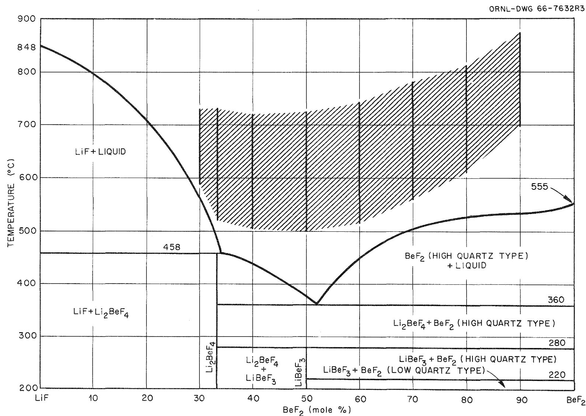  
Fig. 1. Phase Diagram of the LiF-BeF $_2$ System.

<table><tr><td>0.00 BeF2</td><td>The number preceding &quot;BeF2&quot; denotes mole fraction.</td></tr><tr><td>PT,PHF,PH2,V,T</td><td>Total pressure(atm), partial pressures(atm), volume(ℓ) per unit time, and temperature(°K) in the region where gas enters the melt.</td></tr><tr><td>POT,POH2,VO,T0</td><td>Corresponding measurements at the Bubble-0-Meter.</td></tr><tr><td>PB,POH2O</td><td>Barometric pressure and vapor pressure of H2O at T°.</td></tr><tr><td>POHF</td><td>The approximate partial pressure of HF at the titrator. (see Calculations section below.)</td></tr><tr><td>ΔP</td><td>Pressure drop required to maintain gas flow through the melt.</td></tr><tr><td>E</td><td>Cell potential measured experimentally for a fixed BeF2concentration and temperature.</td></tr><tr><td>Ec</td><td>The observed cell potential corrected to a gas pressure quotient of unity (eq. 3).</td></tr><tr><td>EO</td><td>The standard cell potential with pure BeF2as the standard state.</td></tr></table>

# II. EXPERIMENTAL

Chemicals

# Gases

Commercial $\mathbf{H}_2$ was purified by passage through a deoxo unit, a magnesium perchlorate drying tube and, finally, a liquid $\mathbf{N}_2$ trap. Anhydrous HF (99.9%) was used without further purification. Commercial He was purified by passage through an ascarite trap, a magnesium perchlorate trap and, finally, a liquid $\mathbf{N}_2$ trap.

# Melt Components

Lithium fluoride (99.5%) was obtained from American Potash and Chemical Corporation. Beryllium fluoride was from three sources:

Brush Beryllium Corporation, K and K Laboratories, Inc., and commercial $\mathrm{BeF}_2$ distilled by the Reactor Chemistry Division at Oak Ridge National Laboratory. Most of the commercial $\mathrm{BeF}_2$ contained impurities which "poisoned" the electrodes (see p. 20). With the exception of one composition, the distilled $\mathrm{BeF}_2$ was used throughout this investigation since the purity was such that no electrode "poisoning" was encountered. Reagents

Reagent grade 1N NaOH from Fisher Chemical Company was standardized with potassium acid phthalate.

# Apparatus

Experiments were carried out in the apparatus shown in Fig. 2. Cell Design

A sketch of the nickel reaction vessel used to contain the $\mathrm{LiF - BeF}_2$ mixtures is shown in Fig. 3. This vessel was constructed of 2-1/2-in. schedule 40 nickel pipe and was separated into two compartments by a 1/16-in. nickel sheet which extended to within 1/2-in. of the vessel bottom. The nickel sheet was welded so that the only contact between the two compartments was through the 1/2-in. opening at the bottom. The vessel was 10-in. long.

Each compartment was equipped with the following: a 3/4-in. Swagelok fitting through which melt components could be added or an electrode inserted, a 1/4-in. gas exit tube, and a thermocouple well. The Swageloks were equipped with Teflon seals when the electrodes were inserted. This provided an electrical insulator as well as a leak-tight fitting for the 1/8-in. nickel tubing. Cooling coils were wrapped around each Swagelok to provide cooling when the reaction vessel

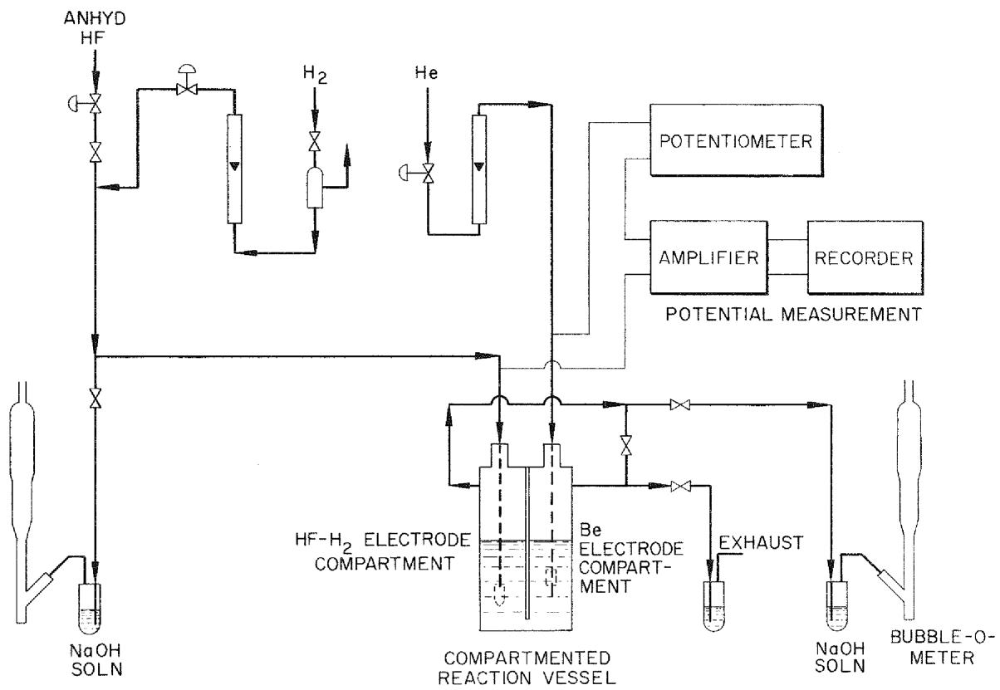  
Fig. 2. Schematic Diagram of Apparatus Used to Measure Cell Potentials in Molten LiF-BeF $_2$ Mixtures.

ORNL-DWG 67-13720

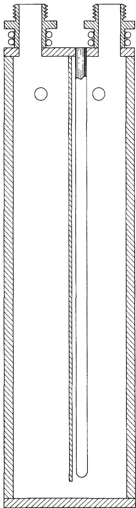  
Fig. 3. Compartmented Cell Used to Contain Molten $\mathrm{LiF - BeF_2}$ Mixtures.

was at elevated temperatures.

The reaction vessel was located inside an upright tube furnace, the temperature was controlled by an L & N Series 60 D.A.T. Control Unit. The temperature of the reaction vessel was checked with a calibrated Chromel-Alumel thermocouple and an L & N K-3 potentiometer.

A 4-in. diameter vessel, fitted with 1/2-in. diameter electrode compartments, was used for preliminary measurements. Electrodes used in the cylindrical compartments were insulated from the compartment walls with boron nitride spacers, but even then accidental electrical shorts were a problem. The large compartments of the reaction vessel used in the present investigation eliminated the need for insulating spacers except the Teflon seal at the top of the compartment, and no problems from electrical shorting were encountered.

HF-H2 Electrode

An $\mathsf{H}_2$ , $\mathsf{HF}$ , $\mathsf{Pd}$ electrode of the type used by Dirian and Romberger10 was used in some of the preliminary measurements. This electrode produced stable potentials but was quite noisy ( $\pm 1\mathrm{mv}$ ). Platinum gauze was substituted for the palladium and was found to be just as responsive and capable of very low noise levels (0.1 mv). The platinum gauze type (Fig. 4) was used for all measurements in this investigation. Electrodes were prepared by forming an egg-shaped bag with th-gauze and slipping the open end over 1/8-in. nickel tubing and tying it securely with small diameter nickel wire. The other end of the bag was crimped together so that the $\mathsf{HF}-\mathsf{H}_2$ mixture, passing down through the nickel tubing had to pass through the gauze. The 1/8-in. nickel tubing transmitted the $\mathsf{HF}-\mathsf{H}_2$ mixture and provided electrical contact.

# Beryllium Electrode

These electrodes (Fig. 4) were constructed by slipping a beryllium metal cylinder (3/8-in. O.D., 1/8-in. I.D., and 1/2-in. length) over a 1/8-in. nickel tube and crimping the nickel tube slightly on each side of the beryllium cylinder to hold it securely. The cylinder was positioned about 1/2-in. from the tip of the nickel tube. Lowering the beryllium metal closer to the tip of the nickel tube caused an increase in the potential noise. This was probably due to helium bubbles temporarily insulating the beryllium from the melt. The 1/8-in. nickel tube was used to bubble helium into the compartment and to provide electrical contact.

# Flow Control of Gases

Hydrogen Fluoride.-- The HF manifold pressure was controlled by regulating the temperature of the HF supply cylinder. The flow of HF was controlled by a mass spectrometer leak valve. $^{13}$ The gas flowed to a monel tee where it mixed with $\mathbf{H}_2$ . The mixed gases were passed either directly to the $\mathrm{HF - H_2}$ electrode or a portion was split off for influent gas analysis.

Hydrogen.-- A pressure relief valve (Moore Products Company, differential type flow controller, Model 63 BD, modified form) was used to reduce the hydrogen manifold pressure to a constant value of 3.0 lb. gauge. The flow was then controlled by a brass needle valve obtained from Nuclear Products Company. The $\mathsf{H}_2$ was then mixed with the HF as described above.

Helium.-- Helium flow was controlled with the same type .needle valve used for the $\mathbf{H}_2$ ; no attempt was made to control the manifold

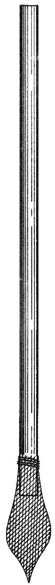  
HF-H2 ELECTRODE

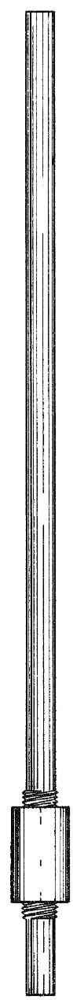  
BERYLLIUM ELECTRODE   
Fig. 4. HF- $\mathbf{H}_2$ and Beryllium Electrodes.

pressure since a constant flow through the beryllium electrode was unnecessary.

# Titration Assembly

The NaOH titration vessel was a 200-ml test tube. A rubber stopper was inserted into the test tube and was equipped with the following: Teflon (1/4-in. dia.) entrance and exit tubes for gas, a 5-ml Lab-Crest microburet, and Beckman No. 39166 (glass, Ag-AgCl) electrodes. A Beckman Zeromatic II pH meter was used to determine the endpoint. The pH was maintained on the alkaline side of the endpoint to avoid glass attack. Duplicate titration assemblies were used to measure influent and effluent HF concentrations.

# Electronic Equipment

An L & N K-3 potentiometer, calibrated with a standard cell from Eppley Laboratory, Inc., was used to buck out most of the cell voltage. When the cell voltage exceeded the range of the potentiometer, a mercury battery (Mallory Duracell No. RM 42R) was connected in series to extend the bucking voltage range. The voltage of the battery was checked daily with the potentiometer, and it proved to be an extremely stable voltage source ( $\pm$ 0.02 mv/day). The remainder of the cell voltage ( $<$ 100 mv) was coupled, through a Philbrick Model MP solid state operational manifold equipped with P65 AU amplifiers, to a Honeywell Brown Electronik recorder.

# Procedure

# Measurements

The data obtained for each cell measurement were cell potential, cell temperature, and partial pressures of HF and $\mathbf{H}_2$ .

Cell Potential. --- Cell potential measurements were always preceded by standardization of the potentiometer against a standard cell and a check of the amplifier zero on the recorder. During measurements of the cell potential, most of the voltage was bucked out by the potentiometer (or potentiometer plus mercury battery), and the remainder read off the recorder. The noise level of the potential varied from $\pm 0.2$ mv to as high as $\pm 1.0$ mv for the high viscosity melts. Although the potential fluctuated as indicated, it did not show any drift toward a higher or lower potential.

$\mathrm{H}_{2}$ and HF Partial Pressures.-- The determination of partial pressures was made as follows:

(1) A measured volume of standardized $\mathrm{NaOH}$ was added to the titration vessel.   
(2) The time required for the HF to neutralize the base was determined.   
(3) $\mathrm{H}_{2}$ flow rates were determined by the use of a Bubble-0-Meter.   
(4) Influent partial pressures were checked simultaneously in experiments up to .60 BeF $_2$ .   
(5) Partial pressure determinations were never begun until the cell potential had been steady for at least 30 minutes.   
(6) Six to ten successive titrations were carried out.   
(7) The barometric pressure, temperature of the titration assembly, and pressure drop across the system were recorded.   
(8) Helium flowed through the beryllium electrode at a rate of 30 to $75 \, \text{ml/min}$ . This flow rate provided adequate sparging for this compartment and decreased the thermal gradients. Helium also protected the electrode from any HF which might

have entered the compartment.

Melt Temperature.-- The temperature of the melt was determined by a calibrated Chromel-Alumel thermocouple positioned carefully to the exact depth of the electrode. Positioning was carried out as accurately as possible to reduce any error in temperature readings caused by thermal gradients in the melt.

Calculations. -- The required calculations to evaluate $\mathrm{P_{HF},P_{H_2}}$ and $\mathrm{E_c}$ were carried out as follows:

(1) The titration times were averaged for a series of titrations of a fixed increment of standard base. The gas volume passed was then calculated by (time of titration)/(time per 100 ml of gas) x 100 = ml of gas.   
(2) The number of millimoles of HF removed from the $\mathbf{H}_2$ stream by the titration was calculated by

$$
(m 1 \mathrm {N a O H}) (\text {c o n c . o f N a O H}) = \text {m i l l i m o l e s H F}.
$$

(3) It was found convenient first to define an approximate partial pressure of HF $\left(\mathbb{P}_{\mathsf{HF}}^{\mathsf{o}}\right)$ by introducing these measured quantities into the following simple gas law expression

$$
\begin{array}{l} P _ {H F} ^ {o} = \frac {\text {(m m o l e s H F) (0 . 0 8 2 0 6) (a b s . t e m p . o f B u b b l e - 0 - M e t e r)}}{\mathrm {m l} \text {o f H} _ {2} \text {p a s s e d}} \\ = ^ {\mathrm {n}} _ {\mathrm {H F}} \frac {\mathrm {R T} ^ {\mathrm {o}}}{\mathrm {V} ^ {\mathrm {o}}} \\ \end{array}
$$

The exact expression for the partial pressure of HF $\left(\mathrm{P}_{\mathrm{HF}}\right)$ at the electrode includes the effect of the pressure drop (ΔP) caused by the pressure required to maintain bubbling through the melt and subsequent titrator, and the saturation of the $\mathrm{H}_2$ stream with water prior to measuring the flow rate. The relationship (eq. 11) between $\mathrm{P}_{\mathrm{HF}}^0$ and

$\mathbb{P}_{\mathrm{HF}}$ which is required was developed as follows:

(3.1) The system may be visualized as consisting of three regions - the cell vessel (at $\mathbf{P}_{\mathbf{T}}, \mathbf{T}$ ), the titration assembly, and the Bubble-0-Meter (at $\mathbf{P}_{\mathbf{T}}^{\mathbf{O}}, \mathbf{T}^{\mathbf{O}}$ ).   
(3.2) Assuming that the number of moles of HF passing through the cell assembly and into the titrator is the same for a given time interval, then

$$
n _ {H F} = \frac {P _ {H F} ^ {o} V ^ {o}}{R T ^ {o}}
$$

and

$$
n _ {H F} = \frac {P _ {H F} V}{R T}
$$

(Note that the first expression is merely a rearranged form of the previous equation which defines $\mathbf{P}_{\mathrm{HF}}^{\mathrm{o}}$ ).

Combining these two equations,

$$
\frac {\mathrm {P} _ {\mathrm {H F}} ^ {\mathrm {O}} \mathrm {V} ^ {\mathrm {O}}}{\mathrm {R T} ^ {\mathrm {O}}} = \frac {\mathrm {P} _ {\mathrm {H F}} \mathrm {V}}{\mathrm {R T}}
$$

$$
P _ {H F} = P _ {H F} ^ {o} \frac {V ^ {o} T}{V T ^ {o}}. \tag {5}
$$

(3.3) Moles of $\mathbf{H}_2$ passing through the cell and through the Bubble-0-Meter may be treated in a like manner

$$
n _ {H _ {2}} = \frac {P _ {H _ {2}} V}{R T} = \frac {P _ {H _ {2}} ^ {o} V ^ {o}}{R T ^ {o}}
$$

$$
\frac {\mathrm {V} ^ {\mathrm {O}} \mathrm {T}}{\mathrm {V} \mathrm {T} ^ {\mathrm {O}}} = \frac {\mathrm {P} _ {\mathrm {H} _ {2}}}{\mathrm {P} _ {\mathrm {H} _ {2}} ^ {\mathrm {O}}} \tag {6}
$$

(3.4) Combining equations (5) and (6)

$$
P _ {H F} = P _ {H F} ^ {O} \frac {P _ {H 2}}{P _ {H 2} ^ {O}} \tag {7}
$$

(3.5) The total pressure at the $\mathrm{HF - H_2}$ electrode is

$$
P _ {T} = P _ {B} + \Delta P = P _ {H F} + P _ {H _ {2}}
$$

$$
\cdot \cdot \mathrm {P} _ {\mathrm {H} _ {2}} = \mathrm {P} _ {\mathrm {B}} + \Delta \mathrm {P} - \mathrm {P} _ {\mathrm {H F}} \tag {8}
$$

and the total pressure of the gas at the Bubble-0-Meter is

$$
\begin{array}{l} \mathrm {P _ {T} ^ {o} = P _ {B} = P _ {H _ {2}} ^ {o} + P _ {H _ {2}} ^ {o}} \\ \cdot \cdot \cdot P _ {H _ {2}} ^ {O} = P _ {B} - P _ {H _ {2} O} ^ {O}. \tag {9} \\ \end{array}
$$

(3.6) Substituting (8) and (9) into equation (7)

$$
P _ {H F} = P _ {H F} ^ {O} \left[ \frac {P _ {B} + \Delta P - P _ {H F}}{P _ {B} - P _ {H _ {2} O}} \right] \tag {10}
$$

and solving equation (10) for $\mathbb{P}_{\mathrm{HF}}$ gives

$$
P _ {H F} = P _ {H F} ^ {O} \left[ \frac {P _ {B} + \Delta P}{P _ {B} - P _ {H _ {2} O} + P _ {H F} ^ {O}} \right]. \tag {11}
$$

$\mathbf{P}_{\mathrm{HF}}$ can be evaluated since all the other quantities are known. The values for $\mathbf{P}_{\mathrm{HF}}$ then can be substituted into equation (8) and the $\mathbf{P}_{\mathrm{H}_2}$ determined.

(4) Using the measured cell potential (E) and the partial pressures of HF $\left(\mathrm{P}_{\mathrm{HF}}\right)$ and $\mathrm{H}_2\left(\mathrm{P}_{\mathrm{H}_2}\right)$ the corrected cell potential was then calculated by

$$
E _ {c} = E + \frac {R T}{2 F} \ln \frac {P _ {H _ {2}}}{P _ {H F} ^ {2}}. \tag {12}
$$

The cell potential $E$ was recorded after gas equilibration with the melt was accomplished, and the melt temperature was constant.

# Systematic Errors

The preceding method of calculating partial pressures does not include corrections for the diffusion of $\mathrm{H}_{2}$ through the walls of the nickel reaction vessel, nor does it consider the effect of thermal diffusion. Melt purity and composition should also be considered as sources of systematic errors.

Hydrogen Diffusion. According to published diffusion coefficients, the diffusion of $\mathsf{H}_2$ out of the nickel reaction vessel could be a few milliliters per minute at elevated temperatures. The rate of $\mathsf{H}_2$ diffusion was measured experimentally by Mathews and Baes in a vessel similar to the one used in the present experiment. They obtained the following rates: $700^{\circ}\mathsf{C}$ , 0.035 ml/sec; $650^{\circ}\mathsf{C}$ , 0.025 ml/sec; $600^{\circ}\mathsf{C}$ , 0.015 ml/sec. Extrapolation of these measurements to $800^{\circ}\mathsf{C}$ and $900^{\circ}\mathsf{C}$ yields diffusion rates of 0.055 ml/sec and 0.075 ml/sec, respectively. Typically emf experiments were conducted with a $\mathsf{H}_2$ flow rate of 2.5 ml/sec. This means that the measured volume of $\mathsf{H}_2$ would be in error by $0.6\%$ at $600^{\circ}\mathsf{C}$ , $1.40\%$ at $700^{\circ}\mathsf{C}$ , $2.20\%$ at $800^{\circ}\mathsf{C}$ , and $3.00\%$ at $900^{\circ}\mathsf{C}$ . These errors in partial pressures would cause the calculated potential to be about 1.0 mV lower at $700^{\circ}\mathsf{C}$ , 1.5 mV lower at $800^{\circ}\mathsf{C}$ , and 2.0 mV at $900^{\circ}\mathsf{C}$ . As mentioned previously, the HF- $\mathsf{H}_2$ mixtures were analyzed before and after entering the HF- $\mathsf{H}_2$ electrode compartment, and no discrepancy between the two could be detected. These analyses were performed periodically on all compositions up to .60 BeF $_2$ and temperatures up to $700^{\circ}\mathsf{C}$ . Melts of higher BeF $_2$ concentrations were not checked in this manner because difficulty was encountered in keeping the flow rate constant through these high viscosity melts when the split

flow technique was attempted.

Since the $\mathrm{H}_{2}$ diffusion effect was not observed at temperatures up to $700^{\circ} \mathrm{C}$ , the errors calculated above seem to be somewhat high.

Thermal Diffusion.-- Recognizing the possibility that $\mathbf{H}_2$ and HF might tend to separate along the thermal gradient in the reaction vessel, we carried out an experiment to see if this effect was significant.

The total flow of $\mathrm{HF - H_2}$ passing through the $\mathrm{HF - H_2}$ electrode was varied between $23\mathrm{ml / min}$ and $160~\mathrm{ml / min}$ . The cell potential increased by about one millivolt over this range; the increase in cell potential over the range of flow rates where potential measurements were actually made (100-160 ml/min) was less than 0.3 millivolt. This is thought to be sufficient evidence that the thermal diffusion effect was not significant.

Gas Cooling Effect on Electrodes.-- The experiment mentioned above also indicates that cooling of the electrodes by gas flow could not have caused more than a one millivolt error in the potential measurements. It was felt that although the possibility of a small error in potential might result from flow rates of 100-160 ml/min, vigorous agitation of the melt was necessary to reduce the effect of thermal gradients in the melt.

Melt Composition.-- A composition error which was discovered at the end of run No. 4 was apparently caused by distillation of $\mathrm{BeF}_2$ to cooler regions of the apparatus. In this particular run, many attempts were made to measure the cell potential of pure $\mathrm{BeF}_2$ over a temperature range of $800^{\circ}\mathrm{C}$ to $900^{\circ}\mathrm{C}$ . At these elevated temperatures the vapor

pressure of $\mathrm{BeF}_2$ is appreciable. $^{15}$ Evidently loss of $\mathrm{BeF}_2$ occurred during the periods at high temperatures. Subsequent additions of LiF were made to bring the $\mathrm{BeF}_2$ composition down to 0.90 $\mathrm{BeF}_2$ , 0.80 $\mathrm{BeF}_2$ , 0.70 $\mathrm{BeF}_2$ , and finally to 0.33 $\mathrm{BeF}_2$ . The error was discovered at 0.33 $\mathrm{BeF}_2$ since the potentials did not correspond to previous measurements. At this point enough $\mathrm{BeF}_2$ was added to bring the composition up to a book value of 0.40 $\mathrm{BeF}_2$ permitting thermal analysis of the liquidus temperature. Thermal analysis was carried out and compared with the LiF- $\mathrm{BeF}_2$ liquidus data. $^{16}$ Results indicated that the true composition was 0.388 $\mathrm{BeF}_2$ . Assuming that all or most of the $\mathrm{BeF}_2$ was lost before the LiF additions were begun, the compositions at 0.90, 0.80, and 0.70 $\mathrm{BeF}_2$ were reduced to 0.896, 0.791, and 0.686 $\mathrm{BeF}_2$ , respectively. Changes in $E_{c}$ in the 0.60 $\mathrm{BeF}_2$ to 0.80 $\mathrm{BeF}_2$ regions are small; thus, the composition error at these concentrations should not be significant. However, the values obtained for 0.33 $\mathrm{BeF}_2$ in this run were more seriously affected by the uncertainty in composition and were not used.

Melt Impurities.-- Early in the experimental work it was found that commercial $\mathrm{BeF}_2$ which contained about 1000-2000 ppm sulfur and 1000 ppm total of Fe, Cr, Cu, and Ni caused "poisoning" of both electrodes. The cell potential would decay as much as 0.5 volts. Spectrographic examination of the Be electrode showed that Fe, Cr, and Ni had been reduced on the surface of the electrode; also metallic impurities originally in the beryllium metal were much higher in concentration on the electrode surface after exposure to the melt. These included Al, Mn, and Ti, the most abundant one being aluminum.

The platinum gauze on the $\mathrm{HF - H_2}$ electrode was darkened by exposure to these contaminated melts. This effect was not pursued since it was already evident that $\mathrm{BeF}_2$ with the impurities mentioned above was not suitable for use with the beryllium electrode.

Distilled $\mathrm{BeF}_2$ , containing only trace amounts of impurities, was tested; and none of the problems mentioned above were encountered. This material was used for all measurements in this investigation.

Oxide Contamination of Melt.-- The oxide chemistry of LiF-BeF $_2$ mixtures must be considered since the raw materials contain small amounts of moisture, and since beryllium oxide is an impurity in beryllium metal. Moisture contamination of the melt was kept to a minimum by freezing the mixtures prior to additions of raw materials. Beryllium fluoride was stored in a dry box prior to use.

A standard purification procedure for removing oxides $^{17}$ from fluoride mixture is $\mathrm{HF - H_2}$ sparging. This procedure was used throughout the present investigation to remove oxide impurities from the melts. Continuous use of $\mathrm{HF - H_2}$ as one of the electrode materials undoubtedly kept the oxide concentration small. Typically, beryllium metal contains about 1000 to 4000 ppm oxygen. $^{18}$ Using the larger value for oxide contamination, the maximum concentration of oxide contributed by the beryllium electrode would have been $1 \times 10^{-3}$ moles/kg, which is about one order of magnitude below the solubility of $\mathrm{BeO}$ . $^{19}$ Therefore, no significant error is expected due to oxide contamination of the melt by addition of raw materials or from the metal electrode.

Summary.-- The only known systematic errors that might be significant are those attributed to $\mathsf{H}_2$ diffusion and gas cooling of the electrodes. These are opposite in effect, and both are expected to be within the experimental scatter of the data.

# Random Errors

In order to obtain a satisfactory estimate of the expected precision of the experimental measurements, the various random errors and their probable magnitude were considered.

Precision of Potential Measurements.-Typically short term potential fluctuations were about $\pm 0.2\mathrm{mV}$ for mixtures up to $0.60\mathrm{BeF}_2$ These fluctuations increased to about $\pm 1.0\mathrm{mV}$ for $0.90\mathrm{BeF}_2$ mixtures. However, even at the higher $\mathrm{BeF}_2$ concentrations, the average value of the potential did not change more than $\pm 1.0\mathrm{mV}$ over a period of one to two hours.

Melt Temperature. -- The temperature of the melt was controlled to $\pm 0.2^{\circ}\mathrm{C}$ . The temperature gradient in the melt varied from about $2^{\circ}\mathrm{C}$ in melts up to $0.60\mathrm{BeF}_2$ , to a maximum of $9^{\circ}\mathrm{C}$ in $0.90\mathrm{BeF}_2$ . However, care was taken during each potential measurement to position the thermocouple in the melt so that it coincided within $\pm 1/8$ -in. of the electrode depths. This should have reduced the temperature uncertainty to no more than $\pm 0.5^{\circ}\mathrm{C}$ , which corresponds to an uncertainty of $\pm 0.4\mathrm{mV}$ in the potential.

Melt Composition.-- The LiF-BeF $_2$ mixtures were prepared by adding weighed amounts of the components to the reaction vessel. The precision of weighing and transferring materials to the vessel was about $\pm 0.2\%$ .

Titer Precision. -- Commercial IN NaOH in one quart bottles was standardized with potassium acid phthalate. Agreement of the standardization values was about $\pm 0.1\%$ of the average value. The uncertainty in burette readings during HF titrations was about $\pm 0.5\%$ .

Temperature of Bubble-0-Meter. -- The Bubble-0-Meter temperature, which was the temperature of the gas as its volume was being measured, varied no more than $\pm 0.1^{\circ}\mathrm{C}$ during a given experiment. The same temperature variation applies to the titration vessel where the $\mathsf{H}_2$ was saturated with water.

Flow Rate Determination.-- The precision in the timing of $\mathbf{H}_2$ flow rates was 0.1 sec per $100\mathrm{ml}$ . For a typical value of 50 seconds per $100\mathrm{ml}$ , this would amount to $0.2\%$ .

Endpoint Precision. -- The precision in timing of the endpoints was about $\pm 0.3\%$ of the measured value.

$\mathsf{H}_2$ and HF Flow Rates. --- The $\mathsf{H}_2$ flow rate was constant at $\pm 0.1\%$ of the measured value. Successive HF titrations varied as much as $\pm 1.0\%$ from the average value. This was apparently due to irregular flow rates of HF. The variation was random and no bias was noted. The error involved in HF flow rate is much greater than any of the other errors associated with the calculation of $\mathsf{P}_{\mathsf{HF}}$ ; therefore the others will be considered negligible.

# Statistical Error Analysis

The probable error to be expected in the calculated cell potential, $\mathrm{E}_{\mathrm{c}}$ was determined from the estimated magnitude of random errors in various quantities which appear in eq. 3. If the contribution of each observable is related to a calculated function $Q$ and expressed as

$$
Q = f (a, b, c - - -),
$$

the contribution of such errors can be calculated. If the errors follow a normal distribution, it can be shown $^{20}$ that the following equation allows for partial cancellation of errors of opposite sign:

$$
\sigma Q ^ {2} = \left(\frac {\partial Q}{\partial a}\right) ^ {2} \sigma a ^ {2} + \left(\frac {\partial Q}{\partial b}\right) ^ {2} \sigma b ^ {2} + \left(\frac {\partial Q}{\partial c}\right) ^ {2} \sigma c ^ {2} + \dots .
$$

Applying this relation to

$$
E _ {c} = E + \frac {R T}{n F} \ln \frac {P _ {H 2}}{P _ {H F} ^ {2}}
$$

gives

$$
\begin{array}{l} \sigma_ {E _ {c}} ^ {2} = \left(\frac {\partial E _ {c}}{\partial E}\right) ^ {2} \sigma_ {E} ^ {2} + \left(\frac {\partial E _ {c}}{\partial T}\right) ^ {2} \sigma_ {T} ^ {2} + \left(\frac {\partial E _ {c}}{\partial P _ {H _ {2}}}\right) ^ {2} \sigma_ {P _ {H _ {2}}} ^ {2} \\ + \left(\frac {\partial E _ {c}}{\partial P _ {H F}}\right) ^ {2} \sigma_ {P _ {H F}} ^ {2}. \tag {13} \\ \end{array}
$$

Differentiation of the above quantities may be carried out to obtain

$$
\frac {\partial E _ {c}}{\partial E} = 1, \quad \frac {\partial E _ {c}}{\partial T} = \frac {\partial E}{\partial T} + \frac {R}{2 F} \ln \frac {P _ {H _ {2}}}{P _ {H F} ^ {2}},
$$

and

$$
\frac {\partial E _ {c}}{\partial P _ {H F}} = \frac {R T}{2 F} \left[ \frac {\partial \left(\ln \frac {P _ {B} - P _ {H F}}{P _ {H F} ^ {2}}\right)}{\partial P _ {H F}} \right] = - \frac {R T}{F} \left[ \frac {2 P _ {B} - P _ {H F}}{2 P _ {H F} (P _ {B} - P _ {H F})} \right]
$$

(It may be recalled that $\mathbf{P}_{\mathrm{H}_2} = \mathbf{P}_{\mathrm{B}} + \Delta \mathbf{P} - \mathbf{P}_{\mathrm{HF}}$ . For the present analysis $\Delta \mathbf{P}$ may be neglected, thus, $\mathbf{P}_{\mathrm{H}_2} = \mathbf{P}_{\mathrm{B}} - \mathbf{P}_{\mathrm{HF}}$ ).

The expected uncertainty of $\mathbf{E}_{\mathbf{c}}$ can now be calculated by

$$
\sigma_ {E _ {c}} ^ {2} = \sigma_ {E} ^ {2} + \left[ \frac {\partial E}{\partial T} + \frac {R}{2 F} \ln \frac {P _ {H 2}}{P _ {H F}} \right] ^ {2} \sigma_ {T} ^ {2} + \left[ - \frac {R T}{F} \left(\frac {2 P _ {B} - P _ {H F}}{2 P _ {H F} (P _ {B} - P _ {H F})}\right) \right] ^ {2} \sigma_ {P _ {H F}} ^ {2}. \tag {14}
$$

Evaluating the above equation numerically for the uncertainty in the calculated potential, using typical partial pressures of HF and $\mathbf{H}_2$ at a temperature of $1000^{\circ}\mathrm{K}$ and using the estimated uncertainties of $\pm 0.5\mathrm{mV}$ , $\pm 0.5^{\circ}\mathrm{C}$ , $\pm 0.001$ atm respectively in E, T, and $\mathbf{P}_{\mathbf{HF}}$ , one obtains

$$
\begin{array}{l} \sigma_ {E _ {c}} ^ {2} = (5 \times 1 0 ^ {- 4}) ^ {2} + (8. 9 5 \times 1 0 ^ {- 4}) ^ {2} (5 \times 1 0 ^ {- 1}) ^ {2} + (2. 1 0 3) ^ {2} (1 \times 1 0 ^ {- 3}) ^ {2} \\ \sigma_ {E _ {c}} ^ {2} = (2. 5 0 \times 1 0 ^ {- 7}) + (2. 0 0 \times 1 0 ^ {- 7}) + 4. 4 2 \times 1 0 ^ {- 6}) \\ \sigma_ {E _ {c}} ^ {2} = 4. 8 7 \times 1 0 ^ {- 6} \\ \sigma_ {E _ {c}} = \pm . 0 0 2 2 \text {v o l t s}. \\ \end{array}
$$

The calculated standard deviation of $\pm 2.2\mathrm{mV}$ is slightly larger than the standard deviation obtained from least squaring the actual data.

The range of the standard deviation for the actual data was about $1.0\mathrm{mV}$ to $2.0\mathrm{mV}$ . The major uncertainty is in the $\mathsf{P}_{\mathsf{HF}}$ term and is due to the limited precision of HF flow.

# III. RESULTS

# Tabulation

Table 1 contains the data obtained from each experiment, arranged according to melt composition.

# Experiments

Four separate series of experiments were conducted during this investigation. The cell potential of each melt composition was determined

for a range of temperatures. In the first series the reaction vessel was initially loaded with $0.33\mathrm{BeF}_2$ . Subsequent additions of $\mathrm{BeF}_2$ were made to bring the concentrations up to $0.40\mathrm{BeF}_2$ , $0.50\mathrm{BeF}_2$ , and to $0.60\mathrm{BeF}_2$ .

In the second series the reaction vessel was initially loaded with pure $\mathrm{BeF}_2$ , enough LiF was then added to give 0.90 $\mathrm{BeF}_2$ , 0.80 $\mathrm{BeF}_2$ , 0.70 $\mathrm{BeF}_2$ , 0.60 $\mathrm{BeF}_2$ , 0.50 $\mathrm{BeF}_2$ , 0.40 $\mathrm{BeF}_2$ , and finally 0.33 $\mathrm{BeF}_2$ . Only one or two determinations were made for 0.60 $\mathrm{BeF}_2$ and lower $\mathrm{BeF}_2$ compositions since these were checks of previous measurements.

Pure $\mathsf{BeF}_2$ was also the initial composition for the third series of measurements. Subsequent additions of LiF were made to give 0.90, 0.80, 0.70, 0.60, and 0.33 $\mathsf{BeF}_2$ . As previously mentioned the data for 0.33 $\mathsf{BeF}_2$ was considered to be in error and was not used.

In the last series of measurements the reaction vessel was loaded initially with $0.33\mathrm{BeF}_2$ . Enough LiF was added to give $0.30\mathrm{BeF}_2$ ; then $\mathrm{BeF}_2$ was added to bring the composition back to $0.33\mathrm{BeF}_2$ .

# Corrected Cell Potentials

The corrected cell potentials $\left(\mathbf{E}_{\mathrm{c}}\right)$ for various compositions are plotted as a function of temperature and shown in Fig. 5. $\mathbf{E}_{\mathrm{c}}$ is assumed to be a linear function of temperature, $\mathbf{E}_{\mathrm{c}} = \mathbf{A} + \mathbf{B}\mathbf{T}$ , over the temperature range investigated. The data points for each composition were least squared, and the calculated lines are also shown in Fig. 5. The parameters from the least squaring treatment are listed in Table 2.

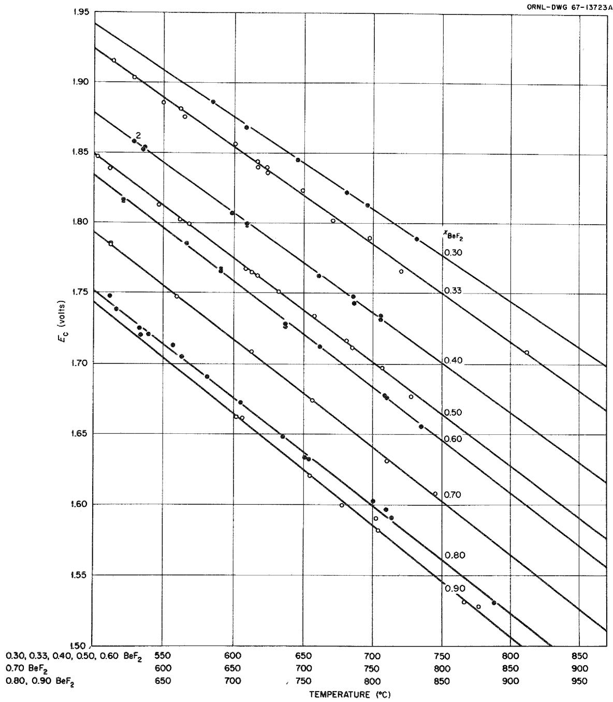  
Fig. 5. Correlation of Pressure Corrected Cell Potentials for Various Compositions as a Function of Temperature.

Table 1. Pressure Corrected Cell Potentials (Ec) Obtained from   
Measurements in Molten LiF-BeF $_2$   

<table><tr><td>\( X_{BeF_2} \)</td><td>Temp. (°C)</td><td>\( E_c \)(volts)</td><td>\( X_{BeF_2} \)</td><td>Temp. (°C)</td><td>\( E_c \)(volts)</td><td>\( X_{BeF_2} \)</td><td>Temp. (°C)</td><td>\( E_c \)(volts)</td></tr><tr><td>0.30</td><td>585.1</td><td>1.8864</td><td>0.50</td><td>608.5</td><td>1.7671</td><td>0.90</td><td>804.1</td><td>1.5819</td></tr><tr><td>0.30</td><td>646.0</td><td>1.8447</td><td>0.50</td><td>613.1</td><td>1.7648</td><td>0.90</td><td>866.0</td><td>1.5307</td></tr><tr><td>0.30</td><td>696.2</td><td>1.8126</td><td>0.50</td><td>685.2</td><td>1.7116</td><td>0.90</td><td>754.8</td><td>1.6208</td></tr><tr><td>0.30</td><td>732.0</td><td>1.7882</td><td>0.50</td><td>681.0</td><td>1.7163</td><td>0.90</td><td>706.2</td><td>1.6613</td></tr><tr><td>0.30</td><td>609.2</td><td>1.8680</td><td></td><td></td><td></td><td>0.90</td><td>778.0</td><td>1.5996</td></tr><tr><td>0.30</td><td>681.0</td><td>1.8213</td><td>0.60</td><td>637.0</td><td>1.7263</td><td>0.90</td><td>876.5</td><td>1.5277</td></tr><tr><td></td><td></td><td></td><td>0.60</td><td>566.5</td><td>1.7856</td><td>0.90</td><td>802.5</td><td>1.5905</td></tr><tr><td>0.33</td><td>562.9</td><td>1.8812</td><td>0.60</td><td>735.0</td><td>1.6555</td><td>0.90</td><td>702.0</td><td>1.6620</td></tr><tr><td>0.33</td><td>514.0</td><td>1.9152</td><td>0.60</td><td>637.0</td><td>1.7283</td><td></td><td></td><td></td></tr><tr><td>0.33</td><td>601.0</td><td>1.8561</td><td>0.60</td><td>591.1</td><td>1.7656</td><td></td><td></td><td></td></tr><tr><td>0.33</td><td>649.5</td><td>1.8230</td><td>0.60</td><td>521.0</td><td>1.8160</td><td></td><td></td><td></td></tr><tr><td>0.33</td><td>698.0</td><td>1.7891</td><td>0.60</td><td>591.0</td><td>1.7672</td><td></td><td></td><td></td></tr><tr><td>0.33</td><td>624.1</td><td>1.8397</td><td>0.60</td><td>591.0</td><td>1.7667</td><td></td><td></td><td></td></tr><tr><td>0.33</td><td>565.0</td><td>1.8757</td><td>0.60</td><td>521.2</td><td>1.8170</td><td></td><td></td><td></td></tr><tr><td>0.33</td><td>720.8</td><td>1.7653</td><td>0.60</td><td>710.0</td><td>1.6760</td><td></td><td></td><td></td></tr><tr><td>0.33</td><td>529.0</td><td>1.9035</td><td>0.60</td><td>709.0</td><td>1.6771</td><td></td><td></td><td></td></tr><tr><td>0.33</td><td>617.2</td><td>1.8436</td><td>0.60</td><td>662.0</td><td>1.7128</td><td></td><td></td><td></td></tr><tr><td>0.33</td><td>617.2</td><td>1.8396</td><td></td><td></td><td></td><td></td><td></td><td></td></tr><tr><td>0.33</td><td>550.0</td><td>1.8857</td><td>0.70</td><td>760.0</td><td>1.6310</td><td></td><td></td><td></td></tr><tr><td>0.33</td><td>624.5</td><td>1.8356</td><td>0.70</td><td>706.5</td><td>1.6736</td><td></td><td></td><td></td></tr><tr><td>0.33</td><td>671.0</td><td>1.8016</td><td>0.70</td><td>609.6</td><td>1.7477</td><td></td><td></td><td></td></tr><tr><td>0.33</td><td>812.0</td><td>1.7081</td><td>0.70</td><td>562.0</td><td>1.7844</td><td></td><td></td><td></td></tr><tr><td></td><td></td><td></td><td>0.70</td><td>663.0</td><td>1.7085</td><td></td><td></td><td></td></tr><tr><td>0.40</td><td>597.5</td><td>1.8069</td><td>0.70</td><td>794.9</td><td>1.6079</td><td></td><td></td><td></td></tr><tr><td>0.40</td><td>609.5</td><td>1.8000</td><td></td><td></td><td></td><td></td><td></td><td></td></tr><tr><td>0.40</td><td>609.5</td><td>1.7991</td><td>0.80</td><td>800.4</td><td>1.6027</td><td></td><td></td><td></td></tr><tr><td>0.40</td><td>661.2</td><td>1.7623</td><td>0.80</td><td>751.0</td><td>1.6335</td><td></td><td></td><td></td></tr><tr><td>0.40</td><td>686.6</td><td>1.7430</td><td>0.80</td><td>656.5</td><td>1.7132</td><td></td><td></td><td></td></tr><tr><td>0.40</td><td>685.8</td><td>1.7478</td><td>0.80</td><td>632.5</td><td>1.7252</td><td></td><td></td><td></td></tr><tr><td>0.40</td><td>528.2</td><td>1.8578</td><td>0.80</td><td>704.9</td><td>1.6725</td><td></td><td></td><td></td></tr><tr><td>0.40</td><td>528.2</td><td>1.8578</td><td>0.80</td><td>754.0</td><td>1.6321</td><td></td><td></td><td></td></tr><tr><td>0.40</td><td>536.5</td><td>1.8540</td><td>0.80</td><td>681.0</td><td>1.6907</td><td></td><td></td><td></td></tr><tr><td>0.40</td><td>535.0</td><td>1.8522</td><td>0.80</td><td>633.5</td><td>1.7205</td><td></td><td></td><td></td></tr><tr><td>0.40</td><td>706.0</td><td>1.7337</td><td>0.80</td><td>611.5</td><td>1.7484</td><td></td><td></td><td></td></tr><tr><td>0.40</td><td>706.0</td><td>1.7316</td><td>0.80</td><td>639.7</td><td>1.7206</td><td></td><td></td><td></td></tr><tr><td></td><td></td><td></td><td>0.80</td><td>887.5</td><td>1.5304</td><td></td><td></td><td></td></tr><tr><td>0.50</td><td>632.8</td><td>1.7516</td><td>0.80</td><td>810.0</td><td>1.5967</td><td></td><td></td><td></td></tr><tr><td>0.50</td><td>561.5</td><td>1.8022</td><td>0.80</td><td>735.4</td><td>1.6482</td><td></td><td></td><td></td></tr><tr><td>0.50</td><td>728.0</td><td>1.6765</td><td>0.80</td><td>663.0</td><td>1.7051</td><td></td><td></td><td></td></tr><tr><td>0.50</td><td>707.0</td><td>1.6972</td><td>0.80</td><td>616.0</td><td>1.7387</td><td></td><td></td><td></td></tr><tr><td>0.50</td><td>658.0</td><td>1.7340</td><td>0.80</td><td>814.1</td><td>1.5909</td><td></td><td></td><td></td></tr><tr><td>0.50</td><td>617.3</td><td>1.7629</td><td></td><td></td><td></td><td></td><td></td><td></td></tr><tr><td>0.50</td><td>568.3</td><td>1.7991</td><td></td><td></td><td></td><td></td><td></td><td></td></tr><tr><td>0.50</td><td>546.6</td><td>1.8127</td><td></td><td></td><td></td><td></td><td></td><td></td></tr><tr><td>0.50</td><td>503.3</td><td>1.8467</td><td></td><td></td><td></td><td></td><td></td><td></td></tr><tr><td>0.50</td><td>511.8</td><td>1.8387</td><td></td><td></td><td></td><td></td><td></td><td></td></tr></table>

Table 2. Parameters from Correlation of $E_{c}$ as a Function of Temperature at Specified Compositions ( $E_{c} = a + bT$ )   

<table><tr><td>\( X_{BeF_2} \)</td><td colspan="2">Intercept ± σ(a)</td><td colspan="2">(Slope ± σ)x 10-3(b)</td><td>σEc x103(volts)</td></tr><tr><td>0.30</td><td>2.45212</td><td>0.0053</td><td>-0.6607</td><td>0.0080</td><td>0.98</td></tr><tr><td>0.33</td><td>2.46021</td><td>0.0048</td><td>-0.6944</td><td>0.0077</td><td>2.28</td></tr><tr><td>0.40</td><td>2.4258</td><td>0.0040</td><td>-0.7091</td><td>0.0065</td><td>1.56</td></tr><tr><td>0.50</td><td>2.4179</td><td>0.0041</td><td>-0.7369</td><td>0.0065</td><td>1.68</td></tr><tr><td>0.60</td><td>2.4162</td><td>0.0054</td><td>-0.7537</td><td>0.0061</td><td>1.98</td></tr><tr><td>0.70</td><td>2.4226</td><td>0.0049</td><td>-0.7643</td><td>0.0071</td><td>1.42</td></tr><tr><td>0.80</td><td>2.4149</td><td>0.0072</td><td>-0.7595</td><td>0.0101</td><td>3.28</td></tr><tr><td>0.90</td><td>2.4296</td><td>0.0162</td><td>-0.7861</td><td>0.0205</td><td>3.54</td></tr></table>

# IV. DISCUSSION

# Thermodynamics of LiF-BeF $_2$

The activity of $\mathrm{BeF}_2$ may be calculated from eq. (4) using the emf data $(\mathbf{E}_{\mathbf{c}})$ obtained in this study if the appropriate values for the standard cell potential $(\mathbf{E}^{\circ})$ are known. As mentioned previously, several attempts were made to determine $\mathbf{E}^{\circ}$ experimentally, but values of useful accuracy could not be obtained because of high melt viscosity and possibly because of high electrical resistivity.

The values of $\mathbf{E}_{\mathrm{c}}$ obtained for various $\mathrm{BeF}_2$ compositions do not lend themselves to direct extrapolation to $\mathbf{E}^{\mathrm{o}}$ . However, the standard cell potential may be calculated by relating data in this study with the $\mathrm{BeF}_2$ liquidus data in the following manner. If the assumption is made that the standard cell potential $(\mathbf{E}^{\mathrm{o}})$ varies linearly with temperature

$(\mathbf{E}^{\mathbf{o}} = \mathbf{A} + \mathbf{B}\mathbf{T})^{*}$ then eq. (4) may be written

$$
E _ {c} = (A + B T) - \frac {R T}{2 F} \ln a _ {B e F _ {2}}
$$

$$
\cdot \cdot \ln a _ {\mathrm {B e F} _ {2}} = \frac {2 \mathrm {F} [ (\mathrm {A} + \mathrm {B T}) - \mathrm {E} _ {\mathrm {C}} ]}{\mathrm {R T}}. \tag {15}
$$

It is then possible to equate eq. (15) to

$$
\ln a _ {B e F _ {2}} \left(B e F _ {2} s a t ^ {\prime} n\right) = - \frac {\Delta H _ {f}}{R} \left(\frac {1}{T} - \frac {1}{T _ {f}}\right) \tag {16}
$$

(where $\Delta H_{\mathrm{f}}$ is the heat of fusion of $\mathrm{BeF}_2$ and $\mathrm{T}_{\mathrm{f}}$ is the melting point of pure $\mathrm{BeF}_2$ ) to obtain a relationship between A, B, $\Delta H_{\mathrm{f}}$ and $\mathrm{E}_{\mathrm{c}}$ calculated at the $\mathrm{BeF}_2$ liquidus temperatures and compositions. Combining eqs. (15) and (16).

$$
\frac {2 F [ (A + B T) - E _ {c} I}{R T} = - \frac {\Delta H _ {f}}{R} \left(\frac {1}{T} - \frac {1}{T _ {f}}\right)
$$

which simplifies to

$$
\frac {2 \mathrm {F} \quad \mathrm {E} _ {\mathrm {c}}}{\mathrm {T}} = (2 \mathrm {F B} - \frac {\Delta \mathrm {H} _ {\mathrm {f}}}{\mathrm {T} _ {\mathrm {f}}}) + (2 \mathrm {F A} + \Delta \mathrm {H} _ {\mathrm {f}}) \frac {1}{\mathrm {T}}. \tag {17}
$$

This relationship permits correlation of the data $(\mathbf{E}_{\mathbf{c}})$ obtained in the present investigation with the phase diagram data. $^{12}$ A plot of the above expression as $2\mathrm{FE}_{\mathrm{c}} / \mathrm{T}$ vs $1 / \mathrm{T}$ should be linear since the intercept and slope contain only constants. Using the least square parameters for each composition (Table 2), values for $\mathbf{E}_{\mathbf{c}}$ were calculated for the liquidus temperatures at 0.515, 0.60, 0.70, 0.80 and 0.90 $\mathrm{BeF}_2$ (see footnote) and then plotted according to eq. (17) (Fig. 6). The resulting points follow the predicted linear relationship within their pre

dicted uncertainties. Parameters for the least squared line are:

$$
I n t e r c e p t = - 0. 0 3 8 0 5 \pm 0. 0 0 3 4, (\mathrm {K c a l} / ^ {\circ} \mathrm {K}) = 2 \mathrm {F B} - \frac {\Delta \mathrm {H}}{\mathrm {T} _ {\mathrm {f}}} \tag {18}
$$

$$
S l o p e = 1 1 3. 8 4 \pm 2. 4 8, (K c a l) = 2 F A + \Delta H _ {f} \tag {19}
$$

The point at 0.90 $\mathrm{BeF}_2$ was not used because the uncertainty in $\mathbf{E}_{\mathbf{c}}$ is relatively large.

Values for A and B were calculated using various literature values for the heat of fusion of $\mathrm{BeF}_2$ and a melting point of $555^{\circ}\mathrm{C}$ for pure $\mathrm{BeF}_2$ . A tabulation of these values is shown in Table 3. The values of A and B which are consistent with values obtained in the present investigation are those for which the heat of fusion is assumed to be 2.0 kcal/mole or less as shown in Fig. 7. A heat of fusion for $\mathrm{BeF}_2 > 2.0$ kcal/mole yields values of $\mathbf{E}^{\circ}$ which are greater than corresponding values of $\mathbf{E}_{\mathrm{c}}$ at the higher $\mathrm{BeF}_2$ concentration. This creates an impossible situation where the activity of $\mathrm{BeF}_2$ in the mixture is greater than the activity of pure liquid $\mathrm{BeF}_2$ . Thus measurements in the present study clearly support the lower values for the heat of fusion for $\mathrm{BeF}_2$ .[8,9]

The emf data $(\mathbf{E}_{\mathrm{c}})$ obtained in the present study were fitted by least squares to the expressions listed in Table 4, using the lowest literature value (1.13 kcal/mole) for the heat of fusion of $\mathrm{BeF}_2$ . A plot of the smoothed lines for $\mathbf{E}_{\mathrm{c}}$ at various $\mathrm{BeF}_2$ concentrations is shown in Fig. 8. The pressure corrected cell potentials $(\mathbf{E}_{\mathrm{c}})$ differed by 1.4097 standard deviations from the smoothed values given by eq. 4-1 (Table 4), and the average deviation of $\mathbf{E}_{\mathrm{c}}$ from smoothed values was approximately $\pm 2.5 \mathrm{mV}$ . The average deviation is consistent with the value predicted by the error analysis for $\mathbf{E}_{\mathrm{c}}$ .

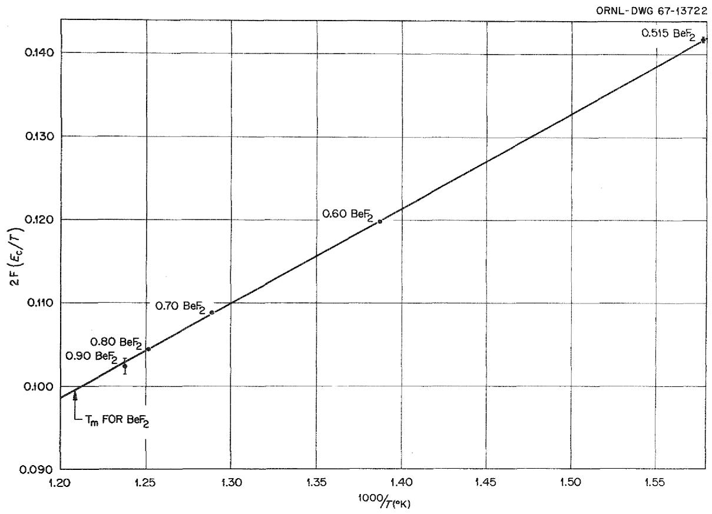  
Fig. 6. Correlation of $\mathbf{E}_{\mathbf{c}}$ with $\mathrm{BeF}_2$ Liquidus Data.

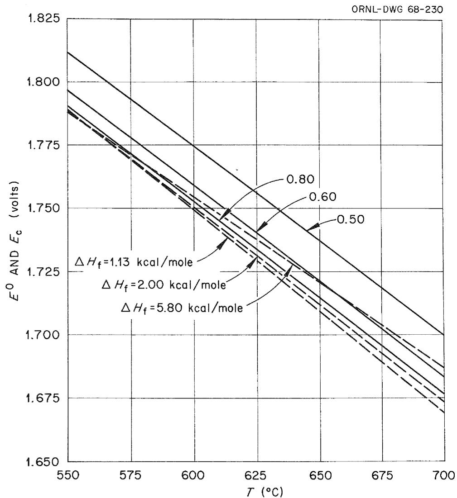  
Fig. 7. Effect of the Heat of Fusion of $\mathsf{BeF}_2$ in Determining $\mathbf{E}^{\circ}$ (dashed lines). The solid lines represent $\mathbf{E}_{\mathbf{c}}$ for various mole fraction of $\mathsf{BeF}_2$ .

Table 3. Calculated Parameters for the Standard Cell Potential of Pure $\mathsf{BeF}_2$ ( $\mathbf{E}^0 = \mathbf{A} + \mathbf{B}\mathbf{T}$ ) Assuming Various Values for the Heat of Fusion of $\mathsf{BeF}_2$   

<table><tr><td>Heat of Fusion
of BeF2(kcal/mole)</td><td>A(a)</td><td>B(b)x 10-3</td><td>Ref.
No.</td></tr><tr><td>0.70</td><td>2.4525</td><td>-.8065</td><td></td></tr><tr><td>1.00</td><td>2.4460</td><td>-.7986</td><td></td></tr><tr><td>1.13</td><td>2.4432</td><td>-.7952</td><td>9</td></tr><tr><td>1.60</td><td>2.4330</td><td>-.7829</td><td>8</td></tr><tr><td>2.00</td><td>2.4241</td><td>-.7725</td><td></td></tr><tr><td>2.50</td><td>2.4135</td><td>-.7594</td><td></td></tr><tr><td>5.80</td><td>2.3420</td><td>-.6730</td><td>7</td></tr></table>

(a) From eq. (19).   
(b) From eq. (18).

Table 4. Expressions for Cell Potentials and Activity

Coefficients in the LiF-BeF $_2$ System

Eq. No.

$$
\begin{array}{l} 4 - 1 \quad E _ {c} = E ^ {O} - \frac {2 . 3 R T}{2 F} \log x _ {B e F _ {2}} - \frac {2 . 3 R T}{2 F} \log \gamma_ {B e F _ {2}} \\ 4 - 2 \quad \mathrm {E} ^ {\mathrm {O}} = 2. 4 4 3 0 - 0. 0 0 0 7 9 5 2 \mathrm {T} ^ {(\mathrm {a})} \\ 4 - 3 \quad \log \gamma_ {\mathrm {B e F} _ {2}} = (3. 8 7 8 0 - \frac {2 3 5 3 . 5}{\mathrm {T}}) \mathrm {x} _ {\mathrm {L i F}} ^ {2} \\ + (- 4 0. 7 3 7 5 + \frac {3 6 2 9 2 . 8}{T}) x _ {L i F} ^ {3} \\ + (9 4. 3 9 9 7 - \frac {8 4 8 7 0 . 9}{T}) x _ {L i F} ^ {4} \\ + (- 6 7. 4 1 7 8 + \frac {5 2 9 2 3 . 5}{T}) x _ {L i F} ^ {5} \\ \end{array}
$$

$$
\begin{array}{l} 4 - 4 \quad \log \gamma_ {\mathrm {L i F}} = 0. 9 3 8 4 - \frac {2 3 2 . 0 8}{\mathrm {T}} \\ + (- 3 6. 9 7 3 4 + \frac {1 4 6 5 2 . 7}{T}) x _ {B e F _ {2}} ^ {2} \\ + (1 2 6. 0 9 4 7 - \frac {7 4 5 8 8 . 5}{T}) x _ {B e F _ {2}} ^ {3} \\ + (- 1 5 8. 4 1 7 3 + \frac {1 1 3 5 9 2 . 3}{T}) x _ {B e F _ {2}} ^ {4} \\ + (6 7. 4 1 7 8 - \frac {5 2 9 2 3 . 5}{T}) x _ {B e F _ {2}} ^ {5} \\ \end{array}
$$

(a) Calculated using a heat of fusion for $\mathrm{BeF}_2 = 1.13\mathrm{kcal / mole}$ .

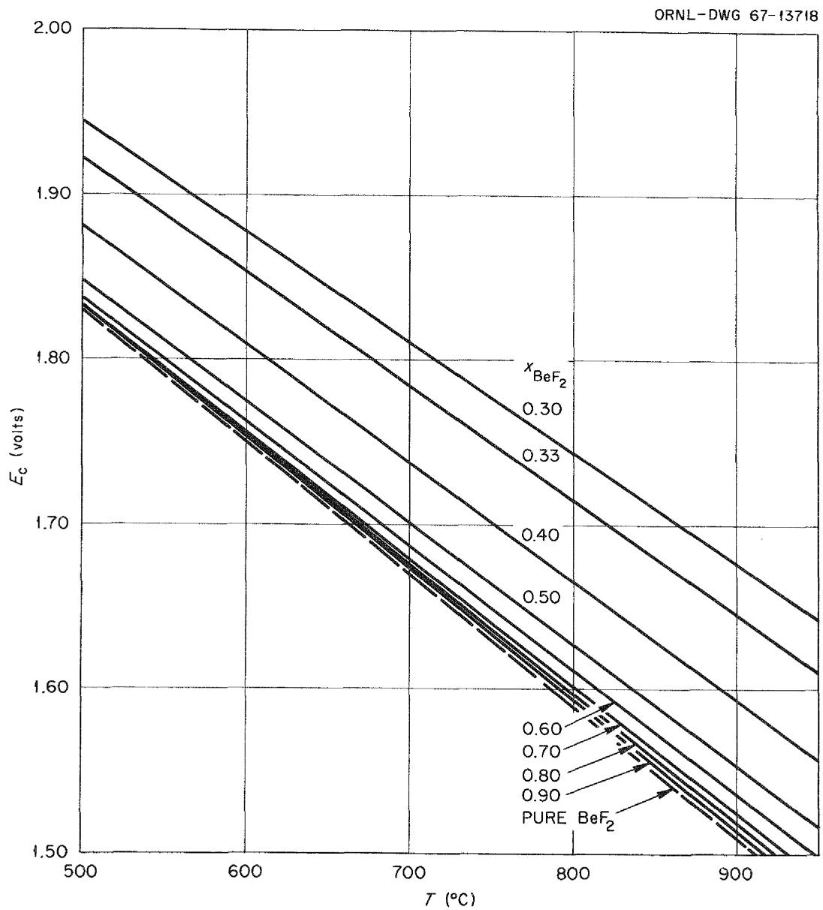  
Fig. 8. Correlation of Pressure Corrected Cell Potentials $\mathbf{E}_{\mathrm{c}}$ as a Function of Temperature Using Smoothed Parameters.

A Gibbs-Duhem integration of the expression for $\gamma_{\mathrm{BeF}_2}$ (Table 4) was carried out to give the corresponding expression for $\gamma_{\mathrm{LiF}}$ (eq. 4-4, Table 4). The integration constant for eq. 4-4 was determined by comparison with $\gamma_{\mathrm{LiF}}$ values derived from the liquidus data and a heat of fusion of 6.47 kcal/mole for LiF. A more accurate evaluation of the integration constant should be possible when the heat of mixing measurements of Holm and Kleppa become available for the LiF- $\mathrm{BeF}_2$ system.

Smoothened values of $\gamma_{\mathrm{BeF}_2}$ are shown as a function of composition at several temperatures in Fig. 9. These results are consistent with those obtained by Mathews and Baes over a composition range 0.30 to $0.60\mathrm{BeF}_2$ . However, at $\mathbf{x}_{\mathrm{BeF}_2} > 0.60$ the results are not in agreement. The values obtained in the present study are thought to be the more reliable since they are consistent with both the phase data and with a low heat of fusion for $\mathrm{BeF}_2$ . The previous measurements at compositions $>0.60\mathrm{BeF}_2$ might be in error because of difficulties in mixing $\mathrm{LiF - BeF}_2$ at high $\mathrm{BeF}_2$ concentrations and because of the effects of $\mathrm{BeO}$ saturation. In the present study it was found that at $0.90\mathrm{BeF}_2$ , a well-mixed melt was not obtained until the temperature was raised above $850^{\circ}\mathrm{C}$ . This procedure was followed for all high $\mathrm{BeF}_2$ concentrations to ensure proper mixing of the $\mathrm{LiF - BeF}_2$ . Another possible error in the previous measurements could have been the presence of $\mathrm{BeO}$ as a saturating solid. The solubility of $\mathrm{BeO}$ might tend to influence the $\mathrm{BeF}_2$ activity more at high $\mathrm{BeF}_2$ concentrations.

The free energy and heat of the cell reaction (eq. 1) were calculated assuming a heat of fusion for $\mathrm{BeF}_2 = 1.13\mathrm{kcal / mole}$ . These values combined with the available thermochemical values for $\mathrm{HF}^{21}$ were used

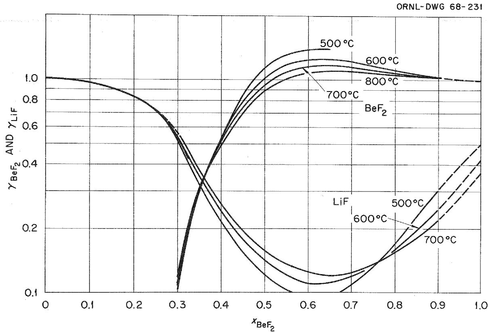  
Fig. 9. Activity Coefficients in Molten LiF-BeF $_2$ Mixtures.

to derive the free energy and heat of formation for liquid $\mathrm{BeF}_2$ at $900^{\circ}\mathrm{K}$ (Table 5). Mathews and Baes7 measured the equilibrium quotient for the reaction

$$
\mathrm {H} _ {2} \mathrm {O} (\mathrm {g}) + \mathrm {B e F} _ {2} (\mathrm {d}) \rightleftharpoons 2 \mathrm {H F} (\mathrm {g}) + \mathrm {B e O} (\mathrm {s}) \tag {20}
$$

If eq. (20) is combined with the reaction in eq. (1) the resulting reaction is

$$
\mathrm {H} _ {2} 0 (\mathrm {g}) + \mathrm {B e} (\mathrm {s}) \rightleftharpoons \mathrm {B e} 0 (\mathrm {s}) + \mathrm {H} _ {2} (\mathrm {g}) \tag {21}
$$

The free energy and heat of this last reaction thus could be obtained by combining the two sets of measurements, and, since the thermochemical data for $\mathrm{H}_2\mathrm{O}$ are accurately known, improved free energy and heats of formation for BeO could be calculated. These are shown in Table 5. The preceding calculations for $\mathrm{BeF}_2$ and BeO were made for a temperature of $900^{\circ}\mathrm{K}$ . Values for other temperatures were generated using the heat capacity data in the JANAF Tables.[21]

# Reference Electrodes

Both electrode half-cells used in the present investigation performed acceptably for use as reference electrodes, both being stable and reproducible.

# Beryllium Electrode

The $\mathrm{Be}|\mathrm{Be}^{2+}$ electrode should work well in any melt containing beryllium ions and no reducible cations. Potential fluctuations due to this electrode were masked in the present study by the fluctuations due to the $\mathrm{HF - H_2}$ electrode, but should be less than $\pm 0.1\mathrm{mV}$ . Beryllium electrodes were fabricated from three different batches of beryllium metal and no discrepancies in potentials were noted when the electrodes

Table 5. Formation Heats and Free Energies of ${\mathrm{{BeF}}}_{2}$ and $\mathrm{{BeO}}$   

<table><tr><td>Compound</td><td>Temp. (°K)</td><td>State</td><td colspan="2">ΔHf(kcal/mole)</td><td colspan="2">ΔGf(kcal/mole)</td></tr><tr><td>BeF2</td><td>298</td><td>Cryst.</td><td>-246.01</td><td>(-242.30 ± 2)22</td><td>-234.39</td><td>(-230.98 ± 2)22</td></tr><tr><td>BeF2</td><td>800</td><td>Cryst.</td><td>-244.75</td><td></td><td>-215.50</td><td></td></tr><tr><td>BeF2</td><td>900</td><td>Liquid</td><td>-243.12</td><td>(±1.1)</td><td>-211.90</td><td>(±1.1)</td></tr><tr><td>BeF2</td><td>1000</td><td>Liquid</td><td>-242.54</td><td></td><td>-208.47</td><td></td></tr><tr><td>BeO</td><td>298</td><td>Cryst.</td><td>-145.85</td><td>(-143.10 ± 0.1)22</td><td>-138.36</td><td>(-136.12 ± 0.1)22</td></tr><tr><td>BeO</td><td>800</td><td>Cryst.</td><td>-145.68</td><td></td><td>-125.70</td><td></td></tr><tr><td>BeO</td><td>900</td><td>Cryst.</td><td>-145.57</td><td>(±1.5)</td><td>-123.20</td><td>(±1.5)</td></tr><tr><td>BeO</td><td>1000</td><td>Cryst.</td><td>-145.46</td><td></td><td>-120.73</td><td></td></tr></table>

were interchanged. Therefore, the electrode response does not appear to be a function of a particular batch of beryllium metal.

The beryllium electrode does not appear to be suitable for small cell compartments since mass transfer causes the electrode to become enlarged due to spongy deposition of the Be metal, and eventually electrical shorts develop between the electrode and the cell compartment wall. HF-H $_2$ Electrode

The Pt, $\mathrm{HF},\mathrm{H}_2|\mathrm{F}^-$ electrode should be a suitable reference electrode in any fluoride-containing melt where there is no possibility of oxidation by HF or reduction by $\mathbf{H}_2$ . The solubility of HF in $\mathrm{LiF - BeF}_2$ is low $^{23}$ (about 0.0003 mole fraction for the partial pressures of HF used in this study), and no significant solubility of $\mathbf{H}_2$ is expected in this system. Potential fluctuations due to this electrode appear to be a function of the melt viscosity. Fluctuations are about $\pm .1\mathrm{mV}$ in melts with a viscosity of one poise or less.

The precision of this electrode was limited somewhat in the present study by the method of HF delivery, as previously mentioned. In future experiments the $\mathrm{H}_2$ -HF mixture will be obtained by passing $\mathrm{H}_2$ through a thermostated $\mathrm{NaHF}_2$ bed. It is hoped that this will be a more precise method of producing mixtures of HF and $\mathrm{H}_2$ of constant composition.

# REFERENCES

1. W. R. Grimes, MSRP Semiann. Prog. Rept. July 31, 1964, ORNL-3708, p. 230.   
2. J. Berkowitz and W. A. Chupka, Ann. N. Y. Acad. Sci., 79, 1073 (1960)   
3. A. Buchler and J. L. Stauffer, "Vaporization in the Lithium Fluoride-Beryllium Fluoride System," SM-66/26 in Thermodynamics, vol. 1, IAEA, Vienna, 1966.   
4. T. Førland, "Thermodynamics of Fused Salt Systems," p. 156 in Fused Salts, ed. by B. R. Sundheim, McGraw-Hill, New York, 1964.   
5. J. Lumsden, Thermodynamics of Molten Salt Mixtures, p. 227, Academic Press, London, 1966.   
6. A. Buchler, Study of High Temperature Thermodynamics of Light Metal Compounds, Army Research Office (Durham, N. C.) Progr. Rept. No. 9 (Contract DA-19-020-ORD-5584) Sept. 30, 1963.   
7. A. L. Mathews and C. F. Baes, Jr., J. Inor. Chem., 7, 373 (1968).   
8. J. A. Blauer et al., J. Phys. Chem., 69, 1069 (1965).   
9. A. R. Taylor and T. E. Gardner, Some Thermal Properties of Beryllium Fluoride from $8^{\circ}$ to $1,200^{\circ}\mathrm{K}$ , U.S. Bureau of Mines, Rept. No. RI-6644 (1965).   
10. G. Dirian, K. A. Romberger, and C. F. Baes, Jr., Reactor Chem. Div. Ann. Progr. Rept. Jan. 31, 1965, ORNL-3789, pp. 76-79.   
11. C. T. Moynihan and S. Cantor, Reactor Chem. Div. Ann. Progr. Rept. Dec. 31, 1966, ORNL-4076, p. 25.   
12. R. E. Thoma et al., submitted for publication in J. Nucl. Mat.   
13. Diaphragm Type Adjustable Leak Valve (Ref. No. C-I 24492A) obtained from ORGDP, Oak Ridge, Tenn.   
14. S. Dushman, Scientific Foundations of Vacuum Technique, pp. 607-618, Wiley and Sons, N.Y., 1949.   
15. S. Cantor et al., Reactor Chem. Div. Ann. Progr. Rept. Dec. 31, 1965, ORNL-3913, p. 27.   
16. Temperature-Composition values used here for the $\mathrm{BeF}_2$ liquidus were supplied by S. Cantor of this Laboratory.

17. J. H. Shaffer, MSRP Semiann. Prog. Rept. July 31, 1964, ORNL-3708, p. 288.   
18. G. E. Darwin and J. H. Buddery, Beryllium, p. 85, Butterworths Scientific Publications, London, 1960.   
19. B. F. Hitch and C. F. Baes, Jr., Reactor Chem. Div. Ann. Progr. Rept. Dec. 31, 1966, ORNL-4076, p. 19.   
20. H. D. Young, Statistical Treatment of Experimental Data, p. 96, McGraw-Hill, New York, 1962.   
21. JANAF Thermochemical Tables, Clearing House for Federal Scientific and Technical Information, U.S. Dept. of Commerce, Aug., 1965.   
22. O. J. Kleppa, private communication.   
23. P. E. Field and J. H. Shaffer, J. Phys. Chem., 71, 3320 (1967).

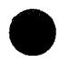

# INTERNAL DISTRIBUTION

1. A. L. Bacarella

2.C.F.Baes，Jr.

3. C. E. Bamberger

4. C. J. Barton

5. S. E. Beal1

6. M. Bender

7. E. S. Bettis

8. F. F. Blankenship

9. C. M. Blood

10. E. G. Bohlmann

11. C. J. Borkowski

12. G. E. Boyd

13. J. Braunstein

14. M. A. Bredig

15. R. B. Briggs

16. H. R. Bronstein

17. J. Brynestad

18. S. Cantor

19. W. L. Carter

20. G. I. Cathers

21. E. L. Compere

22. F. L. Culler, Jr.

23. S. J. Ditto

24. A. S. Dworkin

25. F. F. Dyer

26. W. P. Eatherly

27. D. E. Ferguson

28. L. M. Ferris

29. J. H Frye, Jr.

30. R. L. Gilbert

31. L. O. Gilpatrick

32. W. R. Grimes

33. A. G. Grindell

34. P. N. Haubenreich

35. B. F. Hitch

36. H. F. Holmes

37. W. H. Jordan

38. P. R. Kasten

39. M. T. Kelley

40. M. J. Kelly

41. S. S. Kirslis

42. C. E. Larson

43. T. B. Lindermer

44. A. P. Litman

45. R. A. Lorenz

46. H. G. MacPherson

47. R. E. MacPherson

48. D. L. Manning

49. H. E. McCoy

50. H. F. McDuffie

51. L. E. McNeese

52. A. S. Meyer

53. R. L. Moore

54-55. D. M. Moulton

56. E. L. Nicholson

57. L. C. Oakes

58. A. M. Perry

59. G. D. Robbins

60. K. A. Romberger

61-62. M. W. Rosenthal

63. Dunlap Scott

64. J. H. Shaffer

65. M. J. Skinner

66. G. P. Smith

67. D. A. Sundberg

68. R. E. Thoma

69. L. M. Toth

70. C. F. Weaver

71. A. M. Weinberg

72. J. R. Weir

73. M. E. Whatley

74. J. C. White

75. R. G. Wymer

76. Gale Young

77. J. P. Young

78. Norman Hackerman (consultant)

79. J. L. Margrave (consultant)

80. H. Reiss (consultant)

81. R. C. Vogel (consultant)

82. Biology Library

83-85. Central Research Library

86-87. ORNL - Y-12 Technical Library Document Reference Section

88-122. Laboratory Records Department

123. Laboratory Records, ORNL R.C.

# EXTERNAL DISTRIBUTION

124. C. B. Deering, U.S. Atomic Energy Commission, Oak Ridge   
125. M. J. Blander, North American Aviation Science Center, 8437 Fallbrook Avenue, Canoga Park, California   
126. G. Dirian, Commissariat A L'Energie Atomique, Centre D'Etudes Nucleaires De Saclay, France   
127. O. J. Kleppa, The James Franck Institute, The University of Chicago, 5640 Ellis Avenue, Chicago, Illinois 60637   
128. C. R. Masson, Atlantic Regional Laboratory, National Research Council of Canada, Halifax, Nova Scotia, Canada   
129. A. L. Mathews, Department of Chemistry, Western Carolina College, Cullowhee, North Carolina   
130. J. A. Swartout, Union Carbide Corporation, New York, New York   
131. G. Mamantov, Department of Chemistry, University of Tennessee, Knoxville, Tennessee   
132. J. E. Ricci, Department of Chemistry, New York University, University Heights, New York, New York 10453   
133. Laboratory and University Division AEC, ORO   
134-386. Given distribution as shown in TID-4500 under Chemistry category (25 copies - CFSTI)