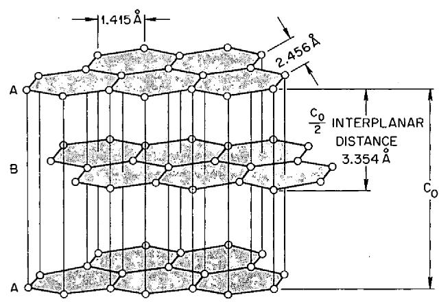
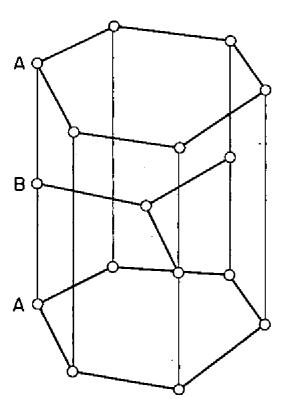
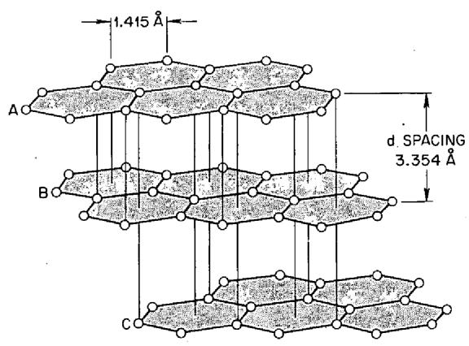
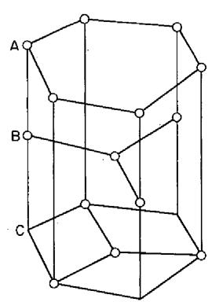
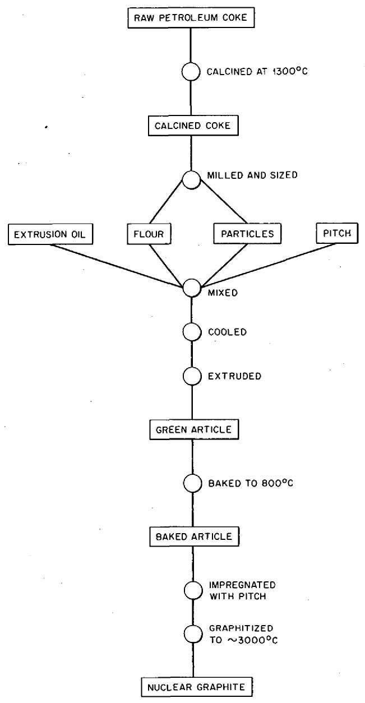
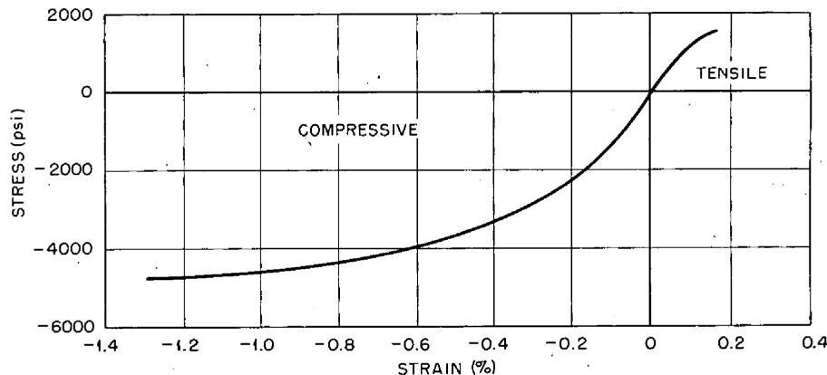
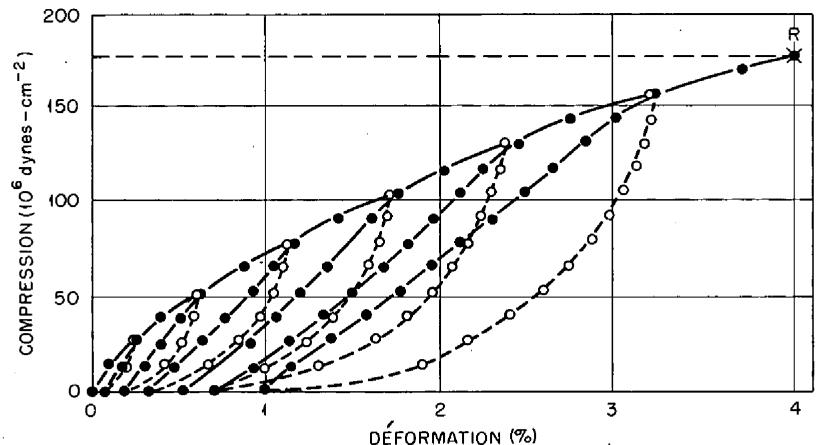
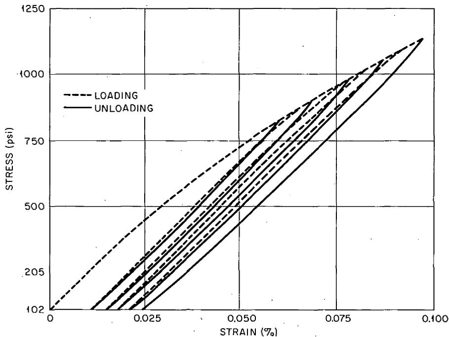
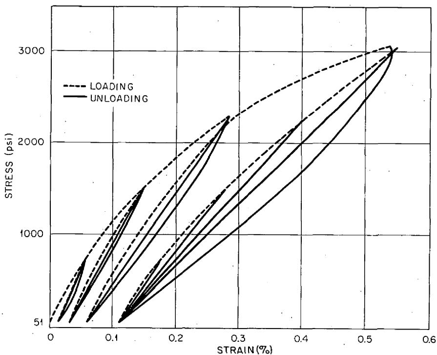
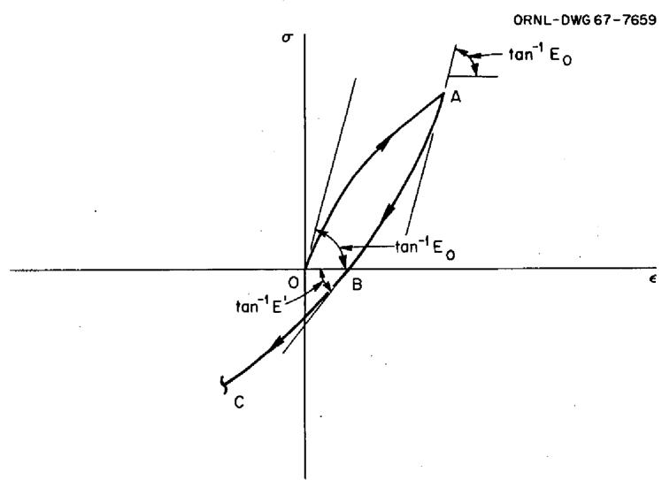

# LIBRARY. LOAN COPY

DO NOT TRANSFER TO ANOTHER PERSON

If you wish someone else to see thisdocument, send in name with documentand the library will arrange a loan.

UCN-7066

13. 一中67

34456 0515521

ORNL-4327

UC-80 - Reactor Technology

MECHANICAL PROPERTIES OF ARTIFICIAL

GRAPHITES - A SURVEY REPORT

W. L. Greenstreet

OAK RIDGE NATIONAL LABORATORY

operated by

UNION CARBIDE CORPORATION

for the

U.S. ATOMIC ENERGY COMMISSION

Printed in the United States of America. Available from Clearinghouse for Federal Scientific and Technical Information, National Bureau of Standards, U.S. Department of Commerce, Springfield, Virginia 22151 Price: Printed Copy $3.00; Microfiche $0.65

# LEGAL NOTICE

This report was prepared as an account of Government sponsored work. Neither the United States, nor the Commission, nor any person acting on behalf of the Commission:

A. Makes any warranty or representation, expressed or implied, with respect to the accuracy, completeness, or usefulness of the information contained in this report, or that the use of any information, apparatus, method, or process disclosed in this report may not infringe privately owned rights; or   
B. Assumes any liabilities with respect to the use of, or for damages resulting from the use of any information, apparatus, method, or process disclosed in this report.

As used in the above, "person acting on behalf of the Commission" includes any employee or contractor of the Commission, or employee of such contractor, to the extent that such employee or contractor of the Commission, or employee of such contractor prepares, disseminates, or provides access to, any information pursuant to his employment or contract with the Commission, or his employment with such contractor.

ORNL-4327

Contract No. W-7405-eng-26

Reactor Division

MECHANICAL PROPERTIES OF ARTIFICIAL

GRAPHITES - A SURVEY REPORT

W. L. Greenstreet

DECEMBER 1968

OAK RIDGE NATIONAL LABORATORY

Oak Ridge, Tennessee operated by

UNION CARBIDE CORPORATION

for the

U.S. ATOMIC ENERGY COMMISSION

# CONTENTS

Page

Abstract 1

Introduction 1

Carbon and the History of Graphite 2

Structure 9

Manufacture 12

Mechanical Properties 18

Room-Temperature Properties 19

Derived Stress-Strain Relationships 30

Temperature Effects 32

Creep 35

Combined Stress Behavior 36

References 38

Acknowledgements 45

# MECHANICAL PROPERTIES OF ARTIFICIAL GRAPHITES - A SURVEY REPORT

W. L. Greenstreet

# Abstract

A review of published mechanical properties data for artificial graphites is given in this report; high-temperature as well as room-temperature data are included. The intent is to provide a unified description of the complex mechanical behavior associated with these materials. The report also contains a brief history on graphite and discussions of crystalline structure and of manufacturing methods.

# Introduction

This report was written to provide a survey of mechanical properties data for artificial graphites, or electrographites. Although brief reviews of these data are to be found in the literature, there is a need for an overall description which unifies the many aspects of the complex mechanical behavior associated with these materials. This report was written with such unification as a major objective. We have chosen to limit our consideration, in the main, to so-called "nuclear-grade, or equivalent," electrographites, that is, either molded or extruded graphites made from petroleum coke and coal-tar pitch. Included in this selected group are premium quality and specialty graphites.

As a prelude to the discussion of mechanical properties, a brief history on graphite is given. This is followed by descriptions of crystal-line structure and of the manufacture of artificial graphite. The history section traces developments leading to the manufacture of graphite with brief mention of the use of this material in the nuclear industry.

Although the data considered are of a phenomenological nature on the macroscopic scale, a knowledge of crystalline structure and manufacturing methods is necessary to the understanding of graphite behavior. Hence,

rudimentary discussions of these aspects are included as essential parts of this report.

Both room- and high-temperature data are reviewed with the greatest emphasis being placed on the former. In the case of room-temperature behavior, simple tensile and compressive stress-strain curves for monotonic and for cyclic loading are considered. Lateral as well as longitudinal strain data are reviewed. The discussion of behavior under combined stresses is necessarily brief due to the paucity of reported data on this subject.

# Carbon and the History of Graphite

Aside from its use as a fuel, carbon plays a very important part in our everyday existence. Its great importance in industry is emphasized by the volume and dollar amounts of carbon and graphite products produced. Liggett [1964] tells us that the estimated world production in 1962 was in excess of 1.4 billion pounds with a domestic value of about $400 million. The United States, France, Japan, West Germany, and England are the major producers and exporters of carbon and graphite. These five countries account for approximately 75% of the world production. Of these, the United States is the leader, producing in 1962 an estimated 410.2 million pounds with a value of about $151.7 million.

It would be superfluous to enter into a lengthy discussion of carbon and its uses here since our interest centers only on artificial graph-ites. Uses of carbon in its elemental or allotropic and manufactured or fabricated forms are given by Mantell [1946]. The introduction in this book contains an interesting summary showing the scope of applications. A recent account of the uses is given in the Kirk-Othmer, Encyclopedia of Chemical Technology, Vol. 4, 1964.

Diamond and graphite are allotropic crystalline forms of carbon. Nightingale [1962c] describes "amorphous carbons," the third form of carbon found in nature, as those carbons in which the graphite structure is not completely developed or in which the graphitic structure is limited to volumes on the order of a few thousand angstroms. Examples of "amorphous carbons" are coal and lignite. Hence we see that all natural forms

of carbon are crystalline. Both graphite and diamond can be synthesized. Diamond is completely converted to graphite when heated to $2000^{\circ}\mathrm{C}$ (Blackman [1960b]).

At atmospheric pressure, graphite sublimes directly into the gaseous state. Blackman [1960b] reports the sublimation temperature as around 3500 to $3700^{\circ}\mathrm{C}$ , while Walker [1962] quotes a value of around $3350^{\circ}\mathrm{C}$ . These figures indicate the potential of graphite as a refractory. Graphite is characterized by high thermal conductivities, low coefficients of thermal expansion, low elastic moduli, and strengths which increase with temperature to about $2500^{\circ}\mathrm{C}$ . Hence, it is an excellent high temperature material.

While diamond is one of the hardest substances known, graphite is one of the softest. The first discoveries of graphite are lost in antiquity. Mantell [1946] tells us that it was known in early times since it was used for decorative purposes in prehistoric burial places in Europe and in ancient graves. It was long confused with other minerals including ores of lead, molybdenum, antimony, and manganese. These were believed to be one and the same substance, or at least members of the same family. Acheson [1899] attributes this confusion to their outward resemblance and to the fact that they produce marks on paper. Because of this graphite was called molybdaena, plumbago, graphite, and black-lead.

The true identity of graphite, or plumbago, was not recognized until late in the 18th century when the Swedish apothecary, Carl Wilhelm Scheele, demonstrated its carbon content (Thorpe [1894]). Mantell credits the German mineralogist (Abraham Gottlob) Werner with giving the mineral the name graphite (from the Greek word graphein, "to write") in 1789. Aikin and Aikin [1814] concluded from the results of three independent experiments on combustion, which at that time were recently completed, that no decided chemical difference can be detected between diamond, pure plumbago, and charcoal.

The earliest use of graphite was undoubtedly as an instrument for drawing and writing. The first mention of it is found in the Middle Ages where it is described as a substance used for this purpose (Mantell [1946]). In 1564 the Barrowdale graphite deposit in Cumberland, England,

was discovered with the result that the manufacture of lead pencils on a commercial scale was originated. According to Seeley and Emendorfer [1949], authentic records show the use of clay-graphite crucibles in Bavaria in 1400. Thus, Nicholson [1795] gives the use of plumbago as a material for making pencils and crucibles. He stated that powder of plumbago, with three times its weight in clay and some hair, makes an excellent coating for retorts, and, further, that the Hessian crucibles were composed of the same materials.

Aikin and Aikin [1807] list, in addition to the above uses, the use of graphite as a lubricant for machining instead of oil and as a substance for the protection of iron from rust. Finally, natural graphite is still used today in the manufacture of crucibles, certain molds and other equipment for foundry work and metal smelting, and for pencils. It is a major constituent in lubricating mixtures and in the rubber tire industry for hardening and improving wear resistance. These are a few of the many uses; for more information, see Seeley [1964].

Manufactured, or artificial, graphite is used in many applications made possible by the existence of this product, and it can now be substituted for natural graphite in almost all uses of the latter material. Artificial graphite products can be made in a variety of shapes and sizes, and the properties can be adjusted during manufacture to tailor the material to the specific requirements of a given application. Artificial graphite is actually a crystalline graphite, with the only artificial attribute being the method of production. While natural graphite practically always contains admixed impurities, artificial graphites with purities that may exceed $99.999\%$ carbon (Eatherly and Piper [1962]) can be manufactured.

The history of the artificial graphite industry is closely related to the development of carbon electrodes. It is generally believed that Sir Humphry Davy was the first to use carbon electrodes with the electric arc. In a letter to Nicholson, which was written in 1800 (Davy, J. [1839]), Davy tells of finding that well-burned charcoal produces shock and sparks when connected to the ends of a voltaic pile, or battery. He also tells of the use of two long, thin slips of dry charcoal (carbon

electrodes), connected to a voltaic pile, in the decomposition of water. Later, in 1802, Davy described a spark "of vivid whiteness" which was obtained when pieces of well-burned charcoal were connected to a battery (Davy, J. [1839]).

During succeeding years, batteries with increased power were made, and in his writings published in 1812 (Davy, J. [1840]) Davy talks of points of charcoal connected to a battery producing "a light so vivid, that even the sunshine compared with it seemed feeble." In this same reference, we find that Davy used a powerful 2000 double-plate battery of the Royal Institution (sometimes referred to as the "great battery" of the Royal Institution) with two pieces of charcoal, each about 1-in. long and 1/6 in. in diameter, to produce a constant discharge of at least 4 in. in length which produced a brilliant arch of light. In addition, he was able to produce a discharge 6 or 7 in. in length in a partial vacuum. This was the forerunner of great developments.

During most of the 19th century, the majority of the development work in the carbon industry was directed toward giving improved electrodes. Hinckley [1921] points out that impetus for this was provided by the invention of the dynamo and the development of great quantities of hydroelectric power at Niagara Falls. (Details of the carbon electrode developments during this period are given by Mantell [1928, 1946].) The Frenchman, M. F. Carre, is called the founder of the arc-carbon industry. His electrodes were made of pulverized pure coke, calcined lampblack, and sugar syrup; the mixture was patented in 1876. He pounded these ingredients together and kneaded them into a hard paste, then pressed the paste hydraulically and baked it at high temperature. The superiority of his product was described by him in Carre [1877].

Carre therefore established the crude beginnings of the industrial operations of calcining, grinding, mixing, shaping, and baking. These general operations in the manufacture of electrodes are largely followed today, although improvements have been made in every one of these steps.

Carre's mixture also indicates the raw materials used in making manufactured carbons. These are (1) the carbonaceous particles making up the bulk of the product, termed "body" materials, and (2) "binders," which

serve to hold together the finely ground particles of the "body" materials. Miscellaneous substances are added to the mixture to give certain specific physical or mechanical properties.

Hinckley [1921] reports that before 1850 small quantities of graphite were made in an electric furnace and the tips of carbon electrodes after use for some time were found to be converted to graphite. However, the commercial production of artificial graphite did not begin until near the end of the 19th century. Castner was granted a United States patent for electrical baking of carbon electrodes in 1896 (Castner [1896]), and in the same year, Acheson, then of the Carborundum Company, obtained a patent (Acheson [1896]) for the manufacture of graphite in an electric furnace.

Acheson discovered that graphite can be produced in an electric furnace while studying the effect of very high temperature on carborundum, or silicon carbide. He found that the material decomposed with the silicon being vaporized and carbon being left behind not in the amorphous but in a graphitic form. Fitzgerald [1897] in describing the manufacture of carborundum referred to the formation of pure graphite next to the core of the furnace. He told of Acheson's conclusion that graphite is not formed simply by the process of subjecting amorphous carbon to very high temperature. Instead, the carbon enters into chemical combination with some other element and this compound then decomposes, leaving carbon in graphitic form. Additional discussion about the formation of graphite in the electric furnace is given by Acheson [1899]. Concerning his method for the production of graphite he states:

"This method of manufacturing graphite, I would define, as consisting in heating carbon, in association with one or more oxides, to a temperature sufficiently high to cause a chemical reaction between the constituents, and then continuing the heating until the combined carbon separates in the free state. It is not, however, limited to the use of oxides, as pure metals, their sulfides, and other salts may be used; but for various reasons the oxides are to be preferred."

Although many metal carbides do decompose to yield well crystallized graphite, Acheson's conclusion is fallacious. During the 1920's and 1930's, investigators at the National Carbon Company disproved his conclusion in many controlled experiments. It is, for example, possible to

show that a pure petroleum coke undergoes at least as high a degree of graphitization as one with added iron, iron oxide, or other similar impurities (MacPherson [1968]).

The stages of manufacture of carbon and of graphite electrodes are very similar. True electrographites, or artificial graphites, are made up as "amorphous" carbons or graphite carbons, but are given a final very high heat treatment to transform microcrystalline carbon into crystalline graphite (Kingswood [1953c]). This last step is called the graphitization process. The differences between carbon and graphite and the temperatures involved in graphite production will be discussed presently.

Mantell reports that in June 1897, Acheson produced the first graphite electrodes. These were made at the request of Castner for use in electrochemical processes. Three years after the patent for graphite manufacture was granted, the Acheson Graphite Company was incorporated and began to build a plant at Niagara Falls, which became the center of the industry. By that time [1899] Acheson had used the furnaces of the Carborundum Company for a year or more and had produced over 200,000 carbon electrodes 15-in. long and having a cross-sectional area of 1 in.² for use in the Castner alkali process, both in the United States and in Europe (Acheson [1899]). The life of these electrodes was many times that of the same electrodes ungraphitized.

Electric resistance furnaces of the type invented by Acheson [1895] are used today for the graphitization process. His was the first electric furnace in which temperatures approaching $3000^{\circ}\mathrm{C}$ , as needed for graphitization, could be attained.

As stated by Walker [1962]:

"This marked the beginning of a new era in which the carbon industry expanded and developed improved baked and graphitized carbon for use primarily in (1) electrolytic manufacture - e.g., of alkalies, chlorine, aluminum, and manganese; (2) electro-thermic production - e.g., of calcium carbide and silicon carbide; and (3) electric furnaces - e.g., for steel, copper, ferro-alloys, and phosphorous. Then in 1942, when Fermi and a group of scientists produced a self-sustaining nuclear chain reaction, they used graphite as a moderator in their reactor. This opened up a whole new outlet for graphite and at the same time produced materials problems on which much research and development studies are still in progress."

We must add to this by saying that nuclear reactor applications and the more recent uses in the aerospace fields have demanded a thorough examination of the mechanical properties of artificial graphites. These properties received little attention, as evidenced by published works, prior to their use in these advanced technological applications.

Currie, Hamister, and MacPherson [1956] point out that graphite was selected as a neutron moderating material in the first nuclear reactors because it was the most readily available material that had reasonably good moderating properties and a low neutron capture cross section. In addition, its use was made widespread due to its low cost and the ease with which it can be precisely machined. Smyth [1948] gives a historical account of the first uses of graphite in the nuclear industry. Nightingale [1962b] lists 75 graphite-moderated reactors which were in operation, under construction, or definitely planned at the time of writing. The number also includes reactors which were taken out of operation but omits a few low-power training and educational reactors. Gwinn [1949] states that the use of graphite as a moderator in the plutonium piles in the atomic energy plants at the University of Chicago and Hanford, Washington, is perhaps the most dramatic and widely publicized application of this material. This application was announced in 1945.

In addition to the appellation "artificial graphite," the terms "synthetic graphite," "graphitized products," "electrographite," or "graphite" refer to those products in which "baked carbon" is further heat treated, generally in an electric furnace, at temperatures of $2200^{\circ}\mathrm{C}$ or higher (Liggett [1964]). Artificial graphite can be made from almost any organic material that leaves a high carbon residue on heating. However, since the beginning of the industry, the principal material used for making up the bulk of the finished article (called "body material" or "filler material") was probably petroleum coke (MacPherson [1968]). The growth of the petroleum industry resulted in increased availability of petroleum coke, which was found to be the purest form of carbon available in large quantities. Thus, petroleum coke has remained the principal material for graphite manufacture, and this preeminence is held throughout the world today.

In the first edition of his book on the carbon industries, Mantell [1928] lamented the paucity of information by writing:

"While most industries have a more or less abundant literature, with numerous books, pamphlets, and articles, the manufacture of carbon electrodes is a notable exception. Were it not to be considered sarcasm, the industry might even be referred to as a 'black art', first because of the secrecy usually surrounding its processes, and second, because of the absolute physical dirtiness of the usual electrode plant. Carbon works have generally been regarded as fortifications, through whose gates only the initiated might enter. Most of the manufacturers have been of the opinion that the less said on the subject the better for them. One reason for this, perhaps, is that in Europe, the art of manufacturing high-grade electrodes was always regarded as a secret, of which only a few had definite knowledge."

An echo to this state of affairs is perhaps represented by the choice of title, "Black Magic," by Speer Carbon Company [1949], for their booklet issued on the occasion of the 50th anniversary celebration of the company.

However, the situation changed drastically after that time, particularly since 1950, and dearth has been replaced by deluge. The literature now abounds with published works on carbons and graphites, with a notable exception being the subject of mechanical behavior of graphite under combined stress states. Survey articles have been written by Kingswood [1953a, 1953b, 1953c, 1953d], by Currie, Hamister, and MacPherson [1956], by Blackman [1960a, 1960b, 1960c], by Walker [1962], and by Shobert [1964]. The article by Currie et al. details the influences of raw materials and processing methods upon variations in properties of artificial graphites.

Books on this subject, in addition to those by Mantell [1928, 1946], are Ubbelohode and Lewis [1960], Nightingale [1962a], and Union Carbide Corporation [1964]. The book by Simmons [1965] is of less general interest since it is devoted to nuclear-irradiation effects on graphite.

# Structure

The hexagonal lattice structure proposed by Bernal [1924] is now accepted as the ideal structure for graphite. This is a layered structure and is composed of a system of infinite layers of fused hexagons, that is, the atoms of carbon in graphite lie in planes in which they form sets of hexagons. The nets are in successive parallel planes superposed

so that half the atoms in one net lie normally above half the atoms in the net beneath, while the other half lie normally above the centers of the hexagons of this net; see Fig. 1. Since alternate nets lie atom for atom normally above each other, the stacking sequence is ABAB ....

The carbon atom spacing within a plane is 1.415 Å, while the separation between parallel layers is 3.3538 Å (15°C) (Walker [1962]). The theoretical density for this structure is 2.267 g/cm³ (Blackman [1960a]). The carbon atoms in the layer planes are held by strong valence forces, whereas the interplanar binding forces are very weak. Joined atoms between layers are pinned by weak forces allowing adjacent planes to be easily displaced parallel to each other or rotated around an axis perpendicular to the planes. In addition, this feature probably accounts for the anisotropic properties of graphite crystals such as shown by electrical conductivity, thermal conductivity, and linear expansion measurements. The electrical and thermal conductivities are greater in directions parallel to the layer planes than normal to them, while the thermal expansion is greater in the direction normal to the layer planes.

Although the most common stacking in graphite is hexagonal, in some cases a small percentage has a lattice in which the carbon hexagons have shared edges, but the stacking of hexagonal plates in layers is such that every fourth layer is in juxtaposition with respect to the c-axis (the axis normal to the planes). Thus, the stacking sequence is ABC ABC ...;

  
Fig. 1. Structure of the Hexagonal Form of Graphite (Seeley [1964]).

see Fig. 2. This modified lattice, called rhombohedral, was proposed by Lipson and Stokes [1942]. It is not usually present in artificial graphite, but is found in natural graphite. This form is metastable with respect to the hexagonal form from which it may be produced by mechanical deformation, as in fine grinding (Bacon [1952]). It reverts to the hexagonal form on heating to $1300^{\circ}\mathrm{C}$ .

Deviations from the ideal graphite structure among most carbons of commercial interest are prevalent (Walker [1962]). The most important deviation is the presence of stacking disorders between layer planes in carbon. Since it allows us to bring out an important distinction between carbon and graphite, this deviation will be described here.*

The simple analogy of Seeley [1964] in terms of a deck of playing cards provides a clear illustration. Suppose each card represents a single plane of hexagons in which the carbon atoms are ordered in two dimensions with the proper spacings. When the deck is evened at the sides and

*Chemically, there is a ready means for differentiating between amorphous carbon and graphite. One part of the substance to be tested is treated with three parts of potassium chlorate and sufficient concentrated nitric acid to render the mass liquid. The mixture is then heated on a water bath for several days. Graphite is converted into golden yellow flakes of graphitic acid, while amorphous carbon is altered to a brown substance soluble in water (Mantell [1946]).

  
Fig. 2. Structure of the Rhombohedral Form of Graphite (Seeley [1964]).

at the ends, ready for dealing, it has three-dimensional ordering and may be considered as representing graphite structure. After the cards are dealt, played, and bunched without evening the ends and sides nor rotating the cards for redeeming, the deck represents turbostratic structure. This is the structure of so-called amorphous carbon, that is, the cards, though parallel, are without order in the third dimension.*

Refinements are required to complete the analogy. Hexagonal graphitic structure requires that every other card in the ordered deck be moved laterally the same distance and that the cards be the equivalent of 3.3538 A apart. The vertical distance between cards represents the interlayer, or d, spacing in the crystalline structure.

Franklin [1951] concluded from an analysis of many nongraphitic and graphitic carbons that two distinct and well-defined interlayer spacings exist for a system of parallel carbon macromolecules. These are 3.44 Å between adjacent misoriented layers and 3.354 Å between correctly oriented layers. Hence, the turbostratic structure of carbon requires that each card in the bunched deck be separated by a minimum of 3.44 Å.

Through the work of Franklin [1951] and Bacon [1951] the d spacing has been related to the proportion of disoriented layers, p. With increased disorder of the layer stacking from ideal graphite, p varies from 0 to 1. Thus, using X-ray diffraction patterns to determine p, the ratio of graphitic carbon to nongraphitic carbon in a specimen can be estimated from its mean d spacing.

# Manufacture

To complete the general description of artificial graphite, we will give a brief summary of the manufacturing sequence. This will aid in understanding the bulk behavior of the material and help to relate microscopic to macroscopic aspects. Since we are interested in nuclear-grade, or equivalent, graphites, the primary sources of information used are Eatherly and Piper [1962] and Union Carbide Corporation [1964].

As already mentioned, in most cases, artificial graphites are produced from petroleum-coke filler material, which is true of nuclear graphites. The binder is coal-tar pitch. The petroleum coke is a by-product in the refining of petroleum crude, and today it is largely obtained by the cracking of a heavy refinery oil. When heated to a temperature of 2800 to $3000^{\circ}\mathrm{C}$ , the carbon from petroleum coke achieves a high degree of crystallinity (or degree of graphitization), that is, the crystalline properties (lattice dimensions) approach those of a perfect crystal. A highly crystalline graphite has high thermal and electrical conductivities and a large crystallite size.

The raw cokes from the refineries have textured, partially aligned structures. The crystallites show no three-dimensional order, but the lamellar order is sufficient to cause alignment of adjacent crystals to varying degrees. The fixed carbon (the carbon remaining after heating to $1000^{\circ}\mathrm{C}$ ) in practically all of the petroleum cokes used ranges from 85 to $90\%$ . The volatile content ranges from 7 to $16\%$ , with a typical value of $11\%$ . Other constituents are ash and various impurities.

Coal-tar pitch is the heavy residue derived from the distillation of coal-tar from by-product coke ovens used in preparing metallurgical coke. This coke is derived from the destructive distillation of bituminous coal, and it is the chief reducing agent employed by the steel industries in the blast-furnace reduction of iron ore. Coal-tar pitch is an excellent material for graphite manufacture because it is solid at room temperature and fluid at higher temperatures; in addition, it has a high carbon content. The thermoplastic property allows for thorough mixing of the filler with the binder, facilitates the forming of the filler-binder mixtures, and permits storage and handling of the formed articles at room temperature without adversely affecting the shape of the product. The carbon content of coal-tar pitch is approximately $93\%$ , and after heating to $1000^{\circ}\mathrm{C}$ about $55\%$ of the pitch remains as binder carbon. Because of its high carbon content it has been described as a form of "liquid carbon," which, through the addition of $7\%$ alloying constituent, has a softening point at $100^{\circ}\mathrm{C}$ .

The processing steps in the manufacture of a conventional, extruded, nuclear graphite are summarized in Fig. 3. The raw petroleum coke is

  
Fig. 3. Flow Diagram for Manufacture of Nuclear Graphite (Eatherly and Piper [1962]).

first calcined at temperatures up to $1400^{\circ}\mathrm{C}$ , usually in a large rotary gas- or oil-fired kiln. The purpose is to remove volatile hydrocarbons and to affect a shrinkage of the filler material before it is incorporated in the formed article. About $25\%$ of the weight of the raw coke is lost during this process. During calcination the aligned structure of the raw coke is preserved, but the layer planes of carbon atoms increase

in dimension over that present in the raw coke. The calcined petroleum coke is, as yet, a turbostratic carbon.

After calcination, the material is broken down by crushers and mills and sized, through screens, into a series of carefully controlled fractions. The finest fraction, termed coke "flour," has a maximum particle size of 0.015 in. for most electrode and specialty graphites, while the coarsest fraction has particles as large as 0.5 in. Selected size fractions are recombined to produce a dry aggregate wherein the proportion of fractions and fraction size are varied, within limits, to control the properties of the end product. The maximum particle size for a coarse-grained nuclear graphite is 1/32 in.

When the calcined coke is crushed or milled, the individual particles, although irregular in shape, tend to have one dimension longer than the other two. The shapes of the particles and the alignment of the rudimentary crystallites in these particles depend on the coke source, that is, they depend on the refinery practice and the charge stocks employed. However, the predominant orientation of crystallite layer planes is parallel to the longer particle dimension.

The next step in the manufacturing sequence is that of mixing the dry coke aggregate with the coal-tar pitch to make a formable plastic mix. The mix is heated to a temperature normally in the range from 165 to $170^{\circ}\mathrm{C}$ , where the binder is quite fluid. This allows for a good distribution of the pitch in the petroleum-coke filler materials. In the ideal situation, each coke particle is coated with a film of pitch. When forming is done by extrusion, about 30 parts by weight of binder are added to 100 parts of filler. The proportions may differ from these when the product is to be molded.

Furnace blacks or extremely fine (<10μ) coke particles may be added to the coke mixture to increase the bulk density of the artificial graphite. These additives fill voids that would otherwise exist between the large particles. Also, when extrusion is the forming method to be employed, the addition of lubricating oil to the mix is common practice. The oil serves to reduce the friction between the surface of the die and the mix. Thus, the quantity of pitch otherwise necessary for reasonable

rates of extrusion is reduced, which is desirable because the evolution of additional volatiles during the baking operation gives rise to a structurally poor product with inferior properties.

As noted above, the coke-pitch mix is formed either by extrusion or by molding. In forming, the long axis of the coke particles take a preferred orientation either in the direction of extrusion or perpendicular to the direction of molding. The final graphite product retains the same pattern of grain orientation. The with-the-grain direction is parallel to the extrusion axis in extruded graphite and perpendicular to the direction of molding pressure in a molded piece. The against-the-grain direction is perpendicular to this. Hence, there are marked differences in properties between the two directions with the anisotropy in molded graphites being generally less than that found in extruded materials.

Mrozowski [1956] points out that the anisotropy of physical properties is due to two causes. One is the crystallite alignment in the particles, as discussed above, and the other is purely geometrical in nature. In the latter, the particle alignment creates an anisotropy due to the relative frequency of binder-bridges per unit path in different directions. The relative contributions of the two sources of anisotropy depend on the type of physical property investigated.

The article, after forming, is called a "green" carbon body and consists of calcined petroleum-coke filler bonded by coal-tar pitch. This body is then baked in a gas-fired furnace to convert the pitch from a thermoplastic material to an infusible solid while at the same time maintaining the shape imparted by forming. This operation is critical and must be carefully controlled.

The green carbon loses its strength during the first part of the cycle, and the volatiles in the pitch, which yield a sizeable volume of gases, must escape through a relatively impermeable mass without disrupting the structure. Polymerization and cross linking proceed within the binder and between binder and filler materials so that the platelets of the pitch increase in size from their original dimensions of a few angstroms. When the temperature reaches 800 to $1000^{\circ}\mathrm{C}$ (the final baking temperature), the cross-linking process causes the carbon to become extremely hard and brittle. At the same time, the binder shrinks about

$5 \%$ by volume, creating high stresses that can crack the carbon body. Mrozowski [1956] states that because of the calcining operation in which the filler has been preshrunk, the only way in which the shrinking binder surrounding a coke particle can decrease its volume is by way of opening cracks perpendicular to the particle surface. The entire baking cycle may take from a few weeks to two months, depending on the furnace size and the methods used.

The baked carbon has a porosity of about $25\%$ . In order to reduce the porosity and thus increase the bulk density, an impregnation operation in which coal-tar pitch is forced into the pores or voids in the body is used. The impregnating pitch differs somewhat from the binder pitch in that some of the heavier fractions normally present in the binder pitch are missing. The impregnation is performed by preheating the carbon to a temperature above $200^{\circ}\mathrm{C}$ , immersing it in molten pitch, and pressurizing it in an autoclave to a pressure of the order of 100 psi for several hours.

The ultimate crystal orientation and size are inherent in the raw materials, but, even after the gas-baking process, the carbon possesses little true crystal structure. Both long-range order and internal perfection, although latent, are not yet developed. It is the purpose of the last step in the manufacture of graphite stock to affect crystal growth and to perfect the internal order, that is, to convert carbon to graphite. This is the graphitization process mentioned earlier, and requires a temperature in the 2600 to $3000^{\circ}\mathrm{C}$ range.

Upon heating the material during graphitization the dominant process between $1500^{\circ}\mathrm{C}$ and about $2500^{\circ}\mathrm{C}$ is crystal growth with internal crystal structure still imperfect. Above $2500^{\circ}\mathrm{C}$ , continued minor crystal growth occurs, but the major effects are diffusion and annealing. The stacks of parallel planes are ordered according to the layered stacking of graphitic structure in this last stage of heating. The graphitization operation takes about two weeks.

Tests have shown that the properties of any piece of graphite are directly dependent upon the highest temperature reached in graphitization. However, very little change occurs in the room-temperature mechanical properties on heating above $2500^{\circ}\mathrm{C}$ .

Although the theoretical density for a graphite crystal is $2.26\mathrm{g/cm^3}$ , a typical value of the bulk density for artificial graphite is $1.70\mathrm{g/cm^3}$ at room temperature. This is due to porosity between filler particles and between crystallites within both the filler and binder carbon. New methods in fabrication such as forming and baking a carbon article under pressure and the use of a hot-working process, which produces a reorientation and recrystallization of the carbon, have led to graphites with bulk densities in excess of $2.1\mathrm{g/cm^3}$ (Eatherly and Piper [1962]). These materials have higher tensile strength than the more conventional lower density graphites.

From the preceding discussion it is seen that the anisotropy associated with artificial graphite should have an axis of symmetry with properties in a plane normal to this axis being independent of direction, that is, the material may be classified as transversely isotropic. The axis of symmetry is in the direction of molding pressure (against-the-grain) or in the direction of the extrusion axis (with-the-grain), depending on the forming method used in the manufacture. This hypothesis is supported by stress-strain measurements made by Kennedy [1961], who examined the stress-strain behavior of an extruded graphite in the direction parallel to the extrusion axis and in two orthogonal directions normal to this axis. The material exhibited deformation resistance indicative of rotational symmetry, but the data also show that the ultimate strengths and elongations do not necessarily follow this pattern.

# Mechanical Properties

Artificial graphites are brittle materials with low strengths at ordinary temperatures in comparison with metals. These graphites have large variations in properties, as might be inferred from the description of their manufacture. A piece of this material may be described as a mixture of graphite and poorly graphitized binder carbon. The variations in properties stem not only from the raw materials used but also from the size and shape of the finished article. Differences are found from piece to piece in a given lot and grade, with some variation in properties within each piece. Indications of variations in density,

electrical resistivity, modulus of elasticity, and flexural strength to be expected within formed pieces, molded and extruded, are given by Wright [1956]. These data show that differences of 15 to $30\%$ across the diameter of a large piece may be expected. In general, both the modulus and strength decrease with distance from the outer edge of a transverse section. Despite these variations, which the manufacturers are striving to reduce, definite characteristics are associated with the properties of graphite as a class of materials, and it is the purpose here to focus attention upon these. The discussion will be limited to mechanical properties. The review articles and books already cited contain summaries on electrical and physical properties.

# Room-Temperature Properties

Typical room-temperature properties for a nuclear graphite are given in Table 1. The values are for a fine-grained extruded piece about 4 in. by 4 in. in cross section. From this table, it may be seen that the strengths and elastic modulus are greater in the with-the-grain (parallel) direction, which is generally true for artificial graphites as would be expected from the discussions on crystal structure and manufacture. Complete stress-strain diagrams for simple tension and compression are plotted together in Fig. 4. The material is a nuclear-grade graphite and the data are for the with-the-grain direction. As indicated in Fig. 4, the stress-strain curves for graphite are nonlinear even at low stress levels, and there are pronounced differences between both stress and strain at fracture in tension and in compression. Typically, fracture strains on the order of 0.1 to $0.2\%$ and 1.0 to $2.0\%$ are found in tension and in compression, respectively.

Arragon and Berthier [1958] performed compression test studies on 216 specimens made from extruded, petroleum-coke, industrial graphite. Three types of test were used: (1) simple compression, (2) cyclic tests (loading-unloading-reloading) in which the cycles were made from increasing stress levels spaced at equal intervals, and (3) cyclic tests between zero stress and a fixed maximum. The simple compression test curves did not show any abrupt changes in slope corresponding to the incipience of plasticity. This lack of observable breaks in the curves

Table 1. Room-Temperature Properties of a Typical   
Nuclear Graphite (Eatherly and Piper [1962])   

<table><tr><td></td><td>Value</td><td>Standard Deviation</td></tr><tr><td>Bulk density, g/cm3</td><td>1.70</td><td>0.02</td></tr><tr><td>Electrical resistivity, μohm-cm:</td><td></td><td></td></tr><tr><td>|| to grain</td><td>734</td><td>59</td></tr><tr><td>⊥ to grain</td><td>940</td><td>111</td></tr><tr><td>Thermal conductivity, cal/(sec)(cm)(°C):</td><td></td><td></td></tr><tr><td>|| to grain</td><td>0.543</td><td></td></tr><tr><td>⊥ to grain</td><td>0.330</td><td></td></tr><tr><td>Tensile strength, psi:</td><td></td><td></td></tr><tr><td>|| to grain</td><td>1440</td><td>254</td></tr><tr><td>⊥ to grain</td><td>1260</td><td>308</td></tr><tr><td>Compressive strength, psi:</td><td></td><td></td></tr><tr><td>|| to grain</td><td>5990</td><td>638</td></tr><tr><td>⊥ to grain</td><td>5960</td><td>918</td></tr><tr><td>Flexural strength, psi:</td><td></td><td></td></tr><tr><td>|| to grain</td><td>2400</td><td>506</td></tr><tr><td>⊥ to grain</td><td>1970</td><td>509</td></tr><tr><td>Young&#x27;s modulus, psi:</td><td></td><td></td></tr><tr><td>|| to grain</td><td>1.49 × 10^6</td><td>0.14 × 10^6</td></tr><tr><td>⊥ to grain</td><td>1.11 × 10^6</td><td>0.09 × 10^6</td></tr><tr><td>Coefficient of thermal expansion, per °C:</td><td></td><td></td></tr><tr><td>|| to grain</td><td>2.22 × 10^-6</td><td>0.39 × 10^-6</td></tr><tr><td>⊥ to grain</td><td>3.77 × 10^-6</td><td>0.42 × 10^-6</td></tr></table>

  
Fig. 4. Uniaxial Stress-Strain Curves, Parallel to Extrusion Axis (Greenstreet et al. [1965]).

is in accordance with concomitant occurrence of both elastic, or reversible, and plastic straining throughout the stress range. The slopes of the stress-strain curves at the origins were of the same order of magnitude as given by sonic measurements. Seldin [1966a] also found good comparisons between sonic moduli and the slopes at zero stress as measured from tensile and compressive stress-strain curves for several grades of molded graphite.

Arragon and Berthier demonstrated that hysteresis loops are produced on unloading and reloading. For illustration, a stress-strain diagram for test type b is shown in Fig. 5. The curves are concave toward the load axis on unloading and slight concavities toward this axis are found on reloading. But, in first approximation, the reloading curves are straight lines. A "compression limit" (~700 psi) was also reported. Above this limit, there is residual permanent deformation upon unloading which increases with unloading stress up to rupture. The authors report that below this limit, cyclic loading curves reclose at the origin, leaving no permanent deformation.

It is interesting to note that neither concavity toward the load axis for reloading curves nor a limit corresponding to the compression limit described above have been reported by Andrew, Okada, and Wobschall [1960], Losty and Orchard [1962], and Seldin [1966a]. The first authors investigated hysteresis effects in bending and torsion, while the others

  
Fig. 5. Stress-Strain Diagram for Compressive Tests of Type b (Arragon and Berthier [1958]).

performed cyclic loading tests in simple tension and compression. The residual strains on unloading were observed to increase always with increasing maximum stress. Jenkins [1962a] speculated that curious features of the curves obtained by Arragon and Berthier may be explained by end effects in the specimens.

Arragon and Berthier found that cyclic compressive tests of type b cause the apparent density to increase. The hysteresis loops increase in size with increased maximum stress, and the slopes of straight lines connecting the unloading and reloading points decrease with increased stress. (The slope of a line connecting the two points of one cycle is termed the "paraelastic modulus.") The envelope curve corresponds to that for simple compression.

The results from tensile and compressive tests which were conducted by Losty and Orchard [1962] and Seldin [1966a] corroborate these findings concerning the hysteresis loops and the character of the envelope curve. The studies made by these investigators will be discussed shortly.

In the case of test type c, each specimen was subjected to 12 cycles. During the first cycles the total deformations at the unloading and reloading points increased with increased cycle number, but after the sixth cycle these deformations were essentially constant. The form of the hysteresis loop remained constant as did the paraelastic modulus. There was a slight increase in the apparent density during cycling.

Using a stress-strain diagram corresponding to test type b, Arragon and Berthier discovered that straight lines drawn through the unloading point and the point at zero stress for each cycle converge at a single point. (Using the curves from compression tests given by Losty and Orchard* and by Seldin, one finds additional support for this finding.) The coordinates of this point are both negative (taking compression as positive), and it was reasoned that the existence of this point is a manifestation of the history of the virgin specimen. (During manufacture, differential thermal expansion causes internal stresses that are probably quite high, as explained later.) The envelope stress-strain curve was identified as a segment of a hyperbola with asymptotes parallel to the stress and strain axes.

For the tests of type b, conducted by Losty and Orchard, the specimens were machined from extruded graphite stock material. The curves obtained are all convex toward the stress axis on loading and concave toward this axis on unloading. The reloading curves in both tension and compression asymptotically approach the envelope stress-strain curve after each cycle of loading, unloading, and reloading in the same manner as shown by Arragon and Berthier (see Figs. 6 and 7).† Seldin [1966b] found from his tests on molded graphites [1966a] that, in general, the reloading curve passed through the unloading point. At stresses greater than those at unloading, the reloading curves were coincident with extrapolations of the corresponding initial loading curves. Thus, in comparison, the point of tangency to the envelope curve is shifted more toward the stress axis for these molded graphites than for the extruded graphites tested by the other investigators.

Losty and Orchard found the slopes of the curves at low stresses in extruded graphites to be about the same in tension and compression, that

  
Fig. 6. Tensile Stress-Strain Diagram for Nuclear Graphite, Parallel to Extrusion Axis (Losty and Orchard [1962]).

  
Fig. 7. Compressive Stress-Strain Diagram for Nuclear Graphite, Parallel to Extrusion Axis (Losty and Orchard [1962]).

is, Young's modulus was approximately the same for the two loadings. This was true for both with-the-grain and against-the-grain directions. These authors also measured lateral strains during testing. The strain ratios reported are of the order of 0.10, and the ratio of strain induced in the parallel direction for a perpendicular (against-the-grain) specimen is a little less than one-half that induced in the perpendicular direction for all stress levels. The strain ratios for compressive specimens loaded both with-the-grain and against-the-grain were essentially independent of stress.

Seldin [1966a] conducted a definitive study using eight different grades of molded graphites and employing various uniaxial tests. These include cyclic tests in tension and in compression and cycling between given tensile and compressive stresses. In each case, lateral as well as longitudinal strains were measured. The transverse, or lateral, stress-strain diagrams obtained have different shapes in tension and compression; the diagrams for tension are concave toward the stress axis while those for compression are convex. The transverse-to-longitudinal strain ratios are independent of stress, yielding constant values, in compression. However, the ratios in tension are functions of stress, decreasing as the stress is increased. These results for compression are in good agreement with those of Losty and Orchard. Greenstreet et al. [1965] also found from tests on an extruded graphite that the ratios in compression are approximately constant, and the ratios tend to decrease continually with increasing stress in tension.

Snyder [1966] also studied the stress-strain behaviors of molded graphites. He used compression and flexure tests, and, in each case, the program was that of loading to a given stress level, unloading, and reloading to failure, giving a two-cycle test. He obtained elastic moduli, Poisson's ratios, and failure data; his elastic data for ATJ* (the

graphite grade common to both studies) are in good agreement with those of Seldin [1966a].

The transverse, residual strain was positive for all graphites studied by Seldin regardless of whether the load was a tensile or a compressive one. This residual strain was slightly greater for a given tensile stress than an equal and opposite compressive stress. Thus, the volume of a specimen pulled in tension and released is increased since all linear dimensions are increased. In addition, the longitudinal residual strain was greater in tension than compression.

These results were borne out by cyclic tests as well as tests where in the specimen was subjected to either simple tension or compression. Cyclic tests between equal stresses in tension and compression produced strains in the against-the-grain direction that increased slightly with each cycle regardless of whether the longitudinal axis of the specimen was in the with-the-grain or against-the-grain direction. Thus, fatigue failure is possibly associated with this slight increase in strain. The occurrence of cumulative damage with repeated reversed loadings was demonstrated by Dally and Hjelm [1965].

Seldin further shows that a test specimen can be made to reproduce its original stress-strain responses in the longitudinal and transverse directions by annealing it at its graphitization temperature. Provided it is generally true, this is a revolutionary discovery in graphite testing, especially in the potential it provides for removing uncertainties in data analyses and interpretations that arise because of the inevitable variations in graphite properties.

In first approximation, the stress-strain curves are identical in tension and compression. Exceptions to this may be found by comparing the against-the-grain data for some graphites. Seldin found through close inspection of the results from his tests that in each case there is a tendency toward greater deformation resistance in compression than in tension.

It is often stated that prestressing a graphite specimen in compression reduces the elastic modulus, E, in tension, and, likewise, prestressing in tension reduces the modulus in compression. See Losty and Orchard [1962] and Seldin [1966a], for example. In the case of these

writers, the modulus referred to is found from the stress-strain diagram, and the changes observed may be explained, in part, as follows. In view of the demonstrated nonlinearity of the diagram, the slope of the curve obviously depends upon the position along the curve. Consider the schematic stress-strain diagram in Fig. 8 which corresponds to prestressing a specimen in tension to the point A, unloading to point B, and loading in compression. The slope at point O is the same as that at the instant of unloading from A and represents the elastic modulus. Now, the curve from A to B is an unloading curve, and the segment from B to C is clearly a continuation of this nonlinear curve. Therefore, strictly speaking, the only slope along the unloading curve which can be expected to have meaning in terms of an elastic modulus is that at the unloading point, A, and not the one at B. Comparisons for determining changes in modulus due to prestressing are probably best made by using dynamic modulus measurements at low strain amplitudes.

In regard to dynamic moduli, Jenkins [1962b] has shown through resonant frequency measurements that prestressing in compression does decrease the apparent elastic modulus. This investigation was conceived as a result of his fracture studies in which he observed isolated cracking at stresses below those required for major fractures. He reasoned

  
Fig. 8. Schematic Stress-Strain Diagram for Explaining Change in Modulus Due to Prestressing.

that because of such isolated cracking the bulk physical and mechanical properties of the material should change. In particular, the dynamic modulus of elasticity for very low strains should change.

To test this hypothesis, dynamic modulus measurements were made on extruded nuclear graphite specimens after prestressing in compression to progressively higher levels. It is reported that the best fit to the data up to fracture is given by

$$
\frac {E}{E _ {0}} = \exp \left[ - k \sigma / \left(\sigma_ {c} - \sigma\right) \right], \tag {1}
$$

where

$\mathbf{E}_{\mathrm{o}} =$ apparent modulus at zero stress,

E = apparent modulus after prestressing to a given stress,

$\mathbf{k} =$ nondimensional constant,

$\sigma =$ stress,

$\sigma_{c} = a$ critical stress.

The data do not exhibit any significant directional dependence for the directions normal and parallel to the extrusion axis.

From the data given, $\mathrm{E} / \mathrm{E}_0 \cong 0.70$ near fracture, and the fracture strengths ranged from $\sim 3700$ to $\sim 4700$ psi. It is reported that k was found to have a constant value of about 0.08, and $\sigma_{\mathrm{c}}$ varied from 4500 to 5000 psi.

Because of the nature of graphite, that is, the material consists of discrete filler particles embedded in the graphitized binder which forms a more or less continuous matrix with random structure, relationships between specimen size and mechanical properties appear likely. Thus, strength versus specimen diameter studies have been made. Losty and Orchard [1962] investigated specimens ranging in diameter from 0.282 to 0.798 in. Their material was extruded nuclear-grade graphite, and both directions with respect to the extrusion axis were examined. The strengths were independent of diameter for the three larger sizes with those for the smaller diameter being just significantly lower. In a similar study using flexural specimens ranging in cross section from a square, $1/4$ in. on a side, to a $3/4$ in. square, no significant effect of specimen size on flexural strength was found.

Digesu and Pears [1963] used ATJ graphite specimens of four different diameters ranging from 0.063 to 1.0 in. The ultimate tensile strengths for the three smaller sizes were about the same, but the strength for the 1.0-in.-diam specimen was about $11\%$ less. These investigators also found small decreases in strength for a given specimen with increase in strain rate and with increase in surface roughness. Greenstreet et al. [1965] found that for specimen diameters ranging from 0.128 to 0.750 in. size effects in terms of fracture stress and strain and elastic modulus were small or nonexistent. The maximum particle size for their material was 1/32 in.

Flexural tests are commonly used for control purposes in manufacture (Currie, Hamister, and MacPherson [1956]). Two types are employed. The most widely used is that of applying the load at the center of the beam supported near its ends. The second is that of applying the load at two points so a greater length of beam is under maximum stress. This is the recommended test (Currie et al.) and is designated as the "third-point loading" test by ASTM [1964]. In either case, the strengths are calculated using simple beam theory based on linear elasticity. According to the above authors, the second test gives strength values 20 to $35\%$ lower than the single-point loading test. In addition, they report the ratio of tensile strength to flexural strength from single-point loading as about 0.53 with a range of 0.47 to 0.68.

Through tests and data analysis in which nonlinear behavior as well as differences in stress-strain properties in tension and compression were accounted for in bend specimens, Greenstreet et al. [1965] made comparisons of bend and uniaxial test results. As expected, the results from bend tests were shown to agree with those from uniaxial tests in regard to stress-strain diagrams and to fracture stress and strain.

Andrew, Okada, and Woschall [1960] observed creep in end-loaded graphite cantilever beams at room temperature. The creep strain had a logarithmic time dependence indicating the absence of viscous creep, and, over the range of time observed (~1200 min), the creep deformation was small in comparison to the total. Kennedy [1961] conducted uniaxial creep tests on nuclear-grade graphite specimens at temperatures of 78, 750, and $1100^{\circ}\mathrm{F}$ . At each temperature, there was slight initial creep

which saturated in a few hours and no creep occurred after that for total time durations up to 2000 hours. Similar results were found using flexural tests. However, using more sensitive measuring techniques, Kennedy [1963] later found that low level creep does persist over time intervals of 2000 hours.

Kennedy [1960, 1961] also examined the influence of rate of loading on tensile specimens at temperatures of 78, 750, and $1100^{\circ}\mathrm{F}$ . He used short-time and incremental loading tests in which the loading rates were approximately 600,000 psi/hr and 2 psi/hr, respectively. There appeared to be no significant differences between the stress-strain curves from the short-time tests at $78^{\circ}\mathrm{F}$ and those from incremental loading tests at 78 and $750^{\circ}\mathrm{F}$ . In addition, the results indicated that the fracture stresses and strains are essentially time and temperature independent.

# Derived Stress-Strain Relationships

Starting from microstructural considerations and relating microstructural aspects to bulk material behavior, Jenkins [1962a] deduced a mechanical analogy for use in predicting stress-strain behavior in tension and compression. This mechanical analog is a series of equal friction blocks connected by springs with equal stiffnesses. On the basis of this model, initial loading is described by

$$
\epsilon = A \sigma + B \sigma^ {2}, \tag {2}
$$

where

$$
\epsilon = \text {t o t a l}
$$

$$
\sigma = \text {s t r e s s},
$$

$$
A = l / E = \text {e l a s t i c}
$$

$$
B = a \text {m a t e r i a l c o n s t a n t w h i c h c h a r a c t e r i z e s t h e p l a s t i c}
$$

Thus, the first term on the right of Eq. (2) represents the elastic strain, and the second gives the plastic strain. The equation for unloading from a maximum stress, $\sigma_{\mathrm{m}}$ , is

$$
\epsilon_ {m} - \epsilon = A (\sigma_ {m} - \sigma) + \frac {1}{2} B (\sigma_ {m} - \sigma) ^ {2}, \tag {3}
$$

where $\epsilon_{\mathrm{m}}$ is the strain at $\sigma_{\mathrm{m}}$ . Finally, for reloading from $\sigma_{\mathrm{o}}$ , with $\sigma \leq \sigma_{\mathrm{m}}$ , the equation is

$$
\varepsilon - \varepsilon_ {0} = A (\sigma - \sigma_ {0}) + \frac {1}{2} B (\sigma - \sigma_ {0}) ^ {2}. \tag {4}
$$

Calculated results were compared with loading-unloading-reloading curves in compression, and the relationships were found to hold for stresses to 1200 psi. The calculated results were found to duplicate the envelope curve, the residual strain on unloading, and the hysteresis loops to a good degree of accuracy within the range of applicability established.

Other stress-strain relationships were derived by Hesketh [1964] and by Woolley [1965]. The equation due to Hesketh is

$$
\sigma = \frac {\mathrm {E} \varepsilon}{6} \left(5 - \frac {9}{8} \frac {\varepsilon}{\varepsilon_ {\mathrm {y}}}\right), \tag {5}
$$

where $E$ is the elastic modulus for a single crystal and $\epsilon_{y}$ is the yield strain for a single crystal. In inverted form, the expression is

$$
\begin{array}{l} \varepsilon = \frac {6}{5} \frac {\sigma}{E} \left[ 1 + \frac {3}{1 6} \cdot \frac {3 6}{2 5} \frac {\sigma}{E \epsilon_ {y}} + 2 \left(\frac {3}{1 6} \cdot \frac {3 6}{2 5} \frac {\sigma}{E \epsilon_ {y}}\right) ^ {2} \right. \\ \left. + 5 \left(\frac {3}{1 6} \cdot \frac {3 6}{2 5} \frac {\sigma}{E \epsilon_ {y}}\right) ^ {3} + \dots \right]. \tag {6} \\ \end{array}
$$

In this form it is evident that the equation of Jenkins, Eq. (2), corresponds to the first two terms.

Woolley based his derivation on a model for dislocation movement and reasoned that subgrains become plastic progressively. His relationship is exponential in form and is given by

$$
\sigma = \mathbb {E} \epsilon_ {\circ} \left(1 - e ^ {- \varepsilon / \epsilon_ {\circ}}\right), \tag {7}
$$

where $E$ is the elastic modulus of bulk material and $\epsilon_{0}$ is a constant. This equation, with appropriately determined constants, was shown to fit all points of both tensile and compressive curves for a nuclear-grade graphite.

Because all three equations, Eqs. (2), (5), and (7), give good fits to stress-strain data at low strains, Jenkins [1965] compared them on the basis of slope, $\frac{d\sigma}{d\varepsilon}$ , versus stress. Equation (2) gives a curve convex toward the origin which agrees well with the experimental data up to a compressive stress of 2000 psi. On the other hand, the equation of Hesketh gives a curve concave toward the origin, while that of Woolley gives a straight line, neither of which fit the data.

Seldin [1966a] examined the model of Jenkins by comparing predicted and experimental results for several molded graphites. The lower and intermediate stress level data were used, and the conclusions are as follows. Equation (2) usually gives a good fit to the entire tensile stress-strain curve and to the compressive curve up to approximately $60\%$ of the breaking strength. Equations (2) and (3) predict a residual strain of $\frac{1}{2}\mathbf{B}\sigma_{\mathrm{m}}^{2}$ for loading to the stress, $\sigma_{\mathrm{m}}$ , followed by unloading to zero stress. The experimental results show that for tensile tests these strains are proportional to $\sigma^2$ , but they are greater than predicted. In compression, they are proportional to $\sigma^n$ , where $n$ ranges from 1.6 to 1.9, and they are less than predicted. The shapes of the stress-strain curves and widths of the hysteresis loops on release and reapplication of stress as given by the model agree well with observations.

# Temperature Effects

Pioneering work regarding the influence of temperature upon mechanical properties was done by Malmstrom, Keen, and Green [1951], who systematically studied changes in short-time tensile strength and elastic modulus. They also studied tensile creep behavior at temperatures in the approximate range of 2100 to $2900^{\circ}\mathrm{C}$ . Subsequently, the temperature dependence of strength has been investigated by Green [1953], by Wagner,

Driesner, and Kmetko [1958], by Martens, Jaffe, and Jepson [1959], by Lund and Bortz [1960], by Martens, Button, Fischbach, and Jaffe [1960], by Digesu and Pears [1963], and by Smith [1964a]. In these tests, commercial as well as laboratory-made graphites were used. The results for the various types are somewhat different, but there are general trends as follows:

1. The short-time strength increases from room temperature to approximately $2500^{\circ}\mathrm{C}$ where the value may range to twice that at room temperature. Above this temperature the strength decreases rapidly.   
2. The strength increases with bulk density.   
3. The elongation at fracture is small at room temperature (on the order of 0.1 to $0.2\%$ ) and remains so up to about $2000^{\circ}\mathrm{C}$ , above which it begins to increase with a large increase occurring between 2500 and $2750^{\circ}\mathrm{C}$ . Elongations at rupture up to about $40\%$ at the higher temperature were reported by Martens et al. [1960], although the values are usually much less than this.   
4. The ductility decreases with increase in strain rate.   
5. Graphites are stronger and less ductile when loaded in tension in the with-the-grain direction than when loaded in the against-the-grain direction.   
6. The density decreases during tensile testing and increases during compression testing.

As an illustration of strain-rate effects, we will summarize the work of Smith [1964a], who made a careful investigation of these effects in terms of tensile strength and rupture elongation on a molded, nuclear-grade graphite. The elongations measured by Smith are low in comparison to values for other graphites. His tests were made in a helium atmosphere and in vacuum at strain rates of 0.005, 0.5, and 2.0 (min) $^{-1}$ . The influence of atmosphere was small, so this factor will be ignored in summarizing the results. At the lowest strain rate, the strength increased by a factor of almost three between room temperature and $2500^{\circ}\mathrm{C}$ . The intermediate strain rate gave results which differed significantly from those at 0.005 (min) $^{-1}$ only at temperatures above $2000^{\circ}\mathrm{C}$ , where the slope of the strength versus temperature curve was reduced. At 2.0 (min) $^{-1}$ , the increase in strength over the range from room

temperature to $2500^{\circ}\mathrm{C}$ was about $50\%$ . The elongations at rupture were independent of strain rate up to about $2200^{\circ}\mathrm{C}$ . There was a distinct increase in elongation at $2500^{\circ}\mathrm{C}$ ( $1\%$ elongation at $2500^{\circ}\mathrm{C}$ ) at the lower strain rate, but the elongation remained at the 0.1 to $0.2\%$ level for the higher rates.

Dynamic elastic modulus measurements (using vibrating beams) were made by Malmstrom, Keen, and Green [1951], by Faris, Green, and Smith [1952], by Davidson, Losty, and Ross [1958], and by Lund and Bortz [1960]. Moduli were obtained from the low stress portions of stress-strain curves by Digesu and Pears [1963]. These studies also covered a range of graphite grades. Although differences exist between various graphites and between dynamic values and those obtained from stress-strain curves, there is again general agreement between the results. The overall trend is an increase with increasing temperature to about $2000^{\circ}\mathrm{C}$ followed by a decrease. As an example, Faris et al. [1952] found an increase over the range from 25 to $2000^{\circ}\mathrm{C}$ of about $30\%$ in the with-the-grain direction and about $90\%$ in the against-the-grain direction for one grade of extruded material. The moduli also increase with increase in density.

Mrozowski [1956] pointed out that "frozen-in" stresses are responsible for changes in short-time strength with temperature. These stresses arise from the highly anisotropic nature of the graphite crystal for which he took thermal expansion coefficients of $1 \times 10^{-6}$ and $35 \times 10^{-6} \, (^{\circ}\mathrm{C})^{-1}$ as average values over the range from 0 to $2500^{\circ}\mathrm{C}$ in the direction of the basal plane and perpendicular to this direction, respectively. This anisotropy leads to differential shrinkages as graphite cools from the graphitization to room temperature. He reasoned that on cooling from the graphitization temperature to $2300 - 2500^{\circ}\mathrm{C}$ the stresses induced are relieved by creep, and he did not expect any appreciable plasticity below $2000^{\circ}\mathrm{C}$ . (These views are supported by tests conducted by Smith [1964b]). Thus, large stresses build up on cooling to room temperature. The increase in short-time strength with temperature according to this hypothesis is then due to the gradual release of "frozen-in" stresses on reheating. The drop in strength above $2500^{\circ}\mathrm{C}$ is due to the onset of rapid creep.

A common explanation for the increase in elastic modulus with temperature is expansion of the crystallites into voids between them and a consequent tightening of the structure. However, Davidson and Losty [1958a] suggest instead that an increase in crystal shear resistance with increased temperature is the important factor.

# Creep

The creep of graphite in flexure and torsion was studied by Davidson and Losty [1958a, 1958b]. Measurements were made over the temperature range 1000 to $2000^{\circ}\mathrm{C}$ . The typical behavior was an initial deformation followed by a slow, time-dependent creep deformation and over the range 1200 to $2000^{\circ}\mathrm{C}$ was best described by an equation of the form

$$
\Delta_ {t} = A + k \ln t + B t, \tag {8}
$$

where

$$
\begin{array}{l} \Delta_ {t} = \text {t o t a l} \\ A = \text {i n i t i a l} \\ B, k = \text {t e m p e r a t u r e} \\ \end{array}
$$

Thus, both transient and steady creep are exhibited in this range. The parameters B and k were found to be linear functions of stress. When the load is removed, the transient component of the creep is recovered according to

$$
\Delta_ {t} = \text {m i n t}. \tag {9}
$$

Short-time tensile creep was measured in the range 2000 to $3000^{\circ}\mathrm{C}$ on a number of different commercial graphites by Malmstrom, Keen, and Green [1951] (as mentioned above), by Wagner, Driesner, and Kmetko [1958], by Martens, Button, Fischbach, and Jaffe [1960], and by Seldin [1964]. Wagner et al. also studied compressive creep; creep in flexure was measured by Seldin and Draper [1961] and by Seldin [1962]. There is not general agreement on the form of the expression for describing the transient creep. The 'steady, or secondary, creep rate depends on $\sigma^n$ , where values of $n$ ranging from $\sim 2$ to $\sim 4$ have been reported. The difference in reported values may be attributable to differences in

materials. The exponent appears to be independent of direction with respect to grain orientation.

For a given stress, the steady creep rate increases with increased temperature, and there does not appear to be a minimum corresponding to the peak in short-time strength. In concert with the general tendency for greater short-time strength in the with-the-grain direction, the resistance to creep is greater in this direction than against-the-grain. Recovery occurs when the load is removed, but it amounts to only a fraction of the transient creep deformation.

The creep tests were mainly of fixed-time duration, with the longest time being about 2 hours. Thus, rupture-elongation data usually were not obtained. For those specimens which did fracture, maximum rupture elongations of roughly 20 to $30\%$ at the higher temperatures were observed. Wagner et al. found two types of behavior in compression. In the first, failure occurs during the secondary creep stage, as is the case in tensile creep tests, while in the second there is accelerated creep followed by fracture.

# Combined Stress Behavior

Although a great deal of information is available concerning uni-axial behavior, the literature contains very little concerning combined stresses. Theoretical analyses have been made treating the material as linearly elastic but taking transverse isotropy into account. Two such analyses are given by Weng [1965] and by Witt and Greenstreet [1966].

Ely [1965] tested tubular specimens of graphite under combined internal pressure and axial loads. The specimens were machined from two grades of extruded tube stock to give uniform gage sections 3 l/2-in. long, 1.0 in. in inside diameter, and 0.060 in. in wall thickness. Only strengths are reported; these correspond to ten biaxial stress conditions.

The biaxial fracture stresses were best correlated by a combination of failure theories. In the tension-tension quadrant for the two-dimensional stress space, failure appears to be governed by the maximum normal stress, while in the hoop-tension, axial-compression quadrant the results seem to correlate with an expression due to Stassi-D'Alia [1959].

The latter expression is given in terms of principal stresses by

$$
\begin{array}{l} \left(\sigma_ {1} - \sigma_ {2}\right) ^ {2} + \left(\sigma_ {2} - \sigma_ {3}\right) ^ {2} + \left(\sigma_ {3} - \sigma_ {1}\right) ^ {2} \\ + 2 (\rho - 1) \sigma_ {0} \left(\sigma_ {1} + \sigma_ {2} + \sigma_ {3}\right) = 2 \rho \sigma_ {0} ^ {2}, \tag {10} \\ \end{array}
$$

where

$$
\begin{array}{l} \sigma_ {0} = \text {s t r e n g t h i n s i m p l e t e n s i o n}, \\ \rho = \frac {\sigma_ {0} ^ {\prime}}{\sigma_ {0}}, \\ \end{array}
$$

$$
\sigma_ {0} ^ {\prime} = \text {s t r e n g t h i n s i m p l e c o m p r e s s i o n}.
$$

This equation represents a paraboloid of revolution in principal stress space. Note that for $\rho = 1$ this reduces to a von Mises surface as used in the mathematical theory of plasticity, that is, an infinite circular cylinder.

# References

Acheson, E. G. [1895]. "Producing pure electric-light carbon," U. S. Patent No. 542,982.   
Acheson, E. G. [1896]. "Manufacture of graphite," U. S. Patent No. 568,323.   
Acheson, E. G. [1899]. "Graphite: its formation and manufacture," Journal of the Franklin Institute, 147, 475-486.   
Aikin, A. and C. R. Aikin. [1807]. Dictionary of chemistry and mineralogy, Vol. 1, London, 300-303.   
Aikin, A. and C. R. Aikin. [1814]. An account of the most important recent discoveries and improvements in chemistry and mineralogy (appendix to Dictionary of chemistry and mineralogy), London, 84-88.   
American Society for Testing and Materials. [1964]. "Standard method of test for flexural strength of concrete (using simple beam with third-point loading)," 1964 Book of ASTM Standards, Part 10, Philadelphia, 37-39.   
Andrew, J. F., J. Okada, and D. C. Wobschall. [1960]. "Elastic constants and permanent set in carbons and graphite at room temperature," Proceedings of the Fourth Conference on Carbon, held at the University of Buffalo, Pergamon Press, New York, 559-575.   
Arragon, P. P. and R. M. Berthier. [1958]. "Caracterisation mécanique du graphite artificiel," Industrial Carbon and Graphite, Society of Chemical Industry, London, 565-578.   
Bacon, G. E. [1951]. "The interlayer spacing of graphite," Acta Crystallographica, 4, 558-561.   
Bacon, G. E. [1952]. "The reduction of the crystalline perfection of graphite by grinding," Acta Crystallographica, 5, 392.   
Bernal, J. D. [1924]. "The structure of graphite," Proceedings of the Royal Society of London, 106, Series A, 749-773.   
Biscoe, J. and B. E. Warren. [1942]. "An X-ray study of carbon black," Journal of Applied Physics, 13, 364-371.   
Blackman, L. C. F. [1960]. "Properties of graphite," Research, Applied in Chemistry, London, 13.

[1960a]. Part I. "Preparation, structure, and mechanical properties," 13(10), 390-397.

[1960b]. Part II. "Thermal and electronic properties," 13(11), 441-448.   
[1960c]. Part III. "Crystal compounds and irradiated graphite," 13(12), 492-502.   
Carre, M. F. [1877]. "Sur la fabrication de conducteurs en charbon, pour la lumière électrique," Comptes Rendus hebdomadaires des séances de l'Académie des Sciences, 84, 346-348.   
Castner, H. Y. [1896]. "Anode for electrolytic processes," U. S. Patent No. 572,472.   
Currie, L. M., V. C. Hamister, and H. G. MacPherson. [1956]. "The production and properties of graphite for reactors," Proceedings of the International Conference on the Peaceful Uses of Atomic Energy, Geneva, 1955, 8, United Nations, New York, 451-473.   
Dally, J. W. and L. N. Hjelm. [1965]. "Proof-testing graphite and its design implications," Journal of the American Ceramic Society, 48, 338-341.   
Davidson, H. W. and H. H. W. Losty. [1958a]. "Elastic and plastic properties of carbon and graphite," Mechanical Properties of Non-Metallic Brittle Materials, edited by W. H. Walton, Interscience Publishers, New York, 219-238.   
Davidson, H. W. and H. H. W. Losty. [1958b]. "Plasticity of graphite," Nature, 181, 1057-1059.   
Davidson, H. W., H. H. W. Losty, and A. M. Ross. [1958]. "The mechanical properties of graphite at elevated temperatures," Industrial Carbon and Graphite, Society of Chemical Industry, London, 551-559.   
Davy, J. [1839]. "Vol. II - Early miscellaneous papers, 1799-1805," The Collected Works of Sir Humphry Davy, Smith, Elder and Co., London, 150-154, 211-213.   
Davy, J. [1840]. "Vol. IV - Elements of chemical philosophy," The Collected Works of Sir Humphry Davy, Smith, Elder and Co., London, 109-111.   
Digesu, F. J. and C. D. Pears. [1963]. "Some parameters of the mechanical behavior of graphites" (paper presented at the American Ceramic Society Meeting, Los Angeles, California, October 1963), Southern Research Institute Report.   
Eatherly, W. P. and E. L. Piper. [1962]. "Manufacture," Nuclear Graphite, edited by R. E. Nightingale, Academic Press, New York, 21-51.   
Ely, R. E. [1965]. "Strength of graphite tube specimens under combined stresses," Journal of the American Ceramic Society, 48, 505-508.

Faris, F. E., L. Green, Jr., and C. A. Smith. [1952]. "The thermal dependence of the elastic moduli of polycrystalline graphite," Journal of Applied Physics, 23, 89-95.   
Fitzgerald, F. A. [1897]. "The manufacture and development of carborun-dum at Niagara Falls," Journal of the Franklin Institute, 143(2), 81-96.   
Franklin, R. E. [1951]. "The structure of graphite carbons," Acta Crystallographica, 4, 253-261.   
Green, L., Jr. [1953]. "High-temperature compression testing of graphite," Journal of Applied Mechanics, 20, 289-294.   
Greenstreet, B. L., J. E. Smith, F. J. Witt, G. T. Yahr, S. E. Moore, and J. G. Merkle. [1965]. "Room-temperature mechanical properties of EGCR-type AGOT graphite," USAEC Report ORNL-3728, Oak Ridge National Laboratory.   
Gwinn, G. R. [1949]. "Graphite," Industrial Minerals and Rocks (Non-metals Other Than Fuels), 2nd ed., American Institute of Mining and Metallurgical Engineers, Committee on the Industrial Minerals Volume, The Institute, New York, 417-435.   
Hesketh, R. V. [1964]. "Crystal anisotropy in graphite and uranium," Journal of Applied Physics, 35(12), 3604-3606.   
Hinckley, A. T. [1921]. "The development of the modern furnace electrode," Electrical World, 78(26), 1263-1265.   
Jenkins, G. M. [1962a]. "Analysis of the stress-strain relationships in reactor grade graphites," British Journal of Applied Physics, 13, 30-32.   
Jenkins, G. M. [1962b]. "Fracture in reactor graphite," Journal of Nuclear Materials, 5(3), 280-286.   
Jenkins, G. M. and G. K. Williamson. [1963]. "Deformation of graphite by thermal cycling," Journal of Applied Physics, 14(9), 2837-2841.   
Jenkins, G. M. [1965]. "The stress-strain relationships of polycrystalline graphite under compression up to fracture," Carbon, 3(1), 93-94.   
Kennedy, C. R. [1960]. "Mechanical properties of graphite," Gas-Cooled Reactor Program Quarterly Progress Report for Period Ending March 31, 1962, USAEC Report ORNL-2964, Oak Ridge National Laboratory, 99-101.   
Kennedy, C. R. [1961]. "Mechanical properties of AGOT graphite," Gas-Cooled Reactor Program Quarterly Progress Report for Period Ending March 31, 1961, USAEC Report ORNL-3102, Oak Ridge National Laboratory, 116-124.

Kennedy, C. R. [1963]. "In-pile creep of graphite," Gas-Cooled Reactor Program Semiannual Progress Report for Period Ending March 31, 1963, USAEC Report ORNL-3445, Oak Ridge National Laboratory, 221-225.   
Kingswood, V. S. [1953]. "Carbon in the engineering and metallurgical industries," Metallurgia, 48.   
[1953a]. Part I. "Historical introduction and constitution of carbon allotropes," Metallurgia, 48(286), 55-62.   
[1953b]. Part II. "Industrial carbons," Metallurgia, 48(287), 133-138.   
[1953c]. Part III. "Industrial graphites, diamonds and special mixtures," Metallurgia, 48(288), 169-174.   
[1953d]. Part IV. "Refractories, electrodes and other metallurgical uses," Metallurgia, 48(289), 221-227.   
Kirk-Othmer [1964]. Encyclopedia of Chemical Technology, 2nd ed., Inter-science Publishers, New York.   
Liggett, L. M. [1964]. "Carbon (baked and graphitized products, manufacture)," Kirk-Othermer, Encyclopedia of Chemical Technology, 2nd ed., Interscience Publishers, New York.   
Lipson, H. and A. R. Stokes. [1942]. "The structure of graphite," Proceedings of the Royal Society of London, 181, Series A, 101-105.   
Losty, H. H. W. and J. S. Orchard. [1962]. "The strength of graphite," Proceedings of the Fifth Conference on Carbon, held at Pennsylvania State University, 1, MacMillan, New York, 519-532.   
Lund, H. H. and S. A. Bortz. [1960]. "High temperature physical properties of molded graphites," Proceedings of the Fourth Conference on Carbon, held at the University of Buffalo, Pergamon, New York, 537-546.   
MacPherson, H. G. [1968]. Oak Ridge National Laboratory, personal communication to W. L. Greenstreet.   
Malmstrom, C., R. Keen, and L. Green, Jr. [1951]. "Some mechanical properties of graphite at elevated temperatures," Journal of Applied Physics, 22, 593-600.   
Mantell, C. L. [1928]. Industrial Carbon, Van Nostrand, New York.   
Mantell, C. L. [1946]. Industrial Carbon, Its Elemental, Adsorptive, and Manufactured Forms, 2nd ed., Van Nostrand, New York.

Martens, H. E., L. D. Jaffe, and J. E. Jepson. [1959]. "High-temperature tensile properties of graphites," Proceedings of the Third Conference on Carbon, held at University of Buffalo, Pergamon, New York, 529-542.   
Martens, H. E., D. D. Button, D. B. Fischbach, and L. D. Jaffe. [1960]. "Tensile and creep behavior of graphites above $3000^{\circ}\mathrm{F}$ ," Proceedings of the Fourth Conference on Carbon, held at the University of Buffalo, Pergamon, New York, 511-530.   
Mrozowski, S. [1956]. "Mechanical strength, thermal expansion and structure of cokes and carbons," Proceedings of the First and Second Conferences on Carbon, held at the University of Buffalo, Waverly Press, Baltimore, 31-45.   
Nicholson, W. [1795]. A Dictionary of Chemistry, 2, London.   
Nightingale, R. E. (editor). [1962a]. Nuclear Graphite, Academic, New York.   
Nightingale, R. E. [1962b]. "Graphite in the nuclear industry," *Nuclear Graphite*, edited by R. E. Nightingale, Academic, New York, 1-20.   
Nightingale, R. E. [1962c]. "Structure," Nuclear Graphite, edited by R. E. Nightingale, Academic, New York 87-115.   
Seeley, S. B. and E. Emendorfer. [1949]. "Carbon (natural graphite)," Encyclopedia of Chemical Technology, edited by R. E. Kirk and D. F. Othmer, Interscience Encyclopedia, Inc., New York.   
Seeley, S. B. [1964]. "Carbon (natural graphite)," Kirk-Othmer, Encyclopedia of Chemical Technology, 2nd ed., Interscience, New York.   
Seldin, E. J. [1962]. "Research and development on advanced graphite materials, Vol. VI - Creep of carbons and graphites in flexure at high temperatures," WADD-TR-61-72, Vol. VI.   
Seldin, E. J. [1964]. "Research and development on advanced graphite materials, Vol. XVIII - High temperature tensile creep of graphite," WADD-TR-61-72, Vol. XVIII.   
Seldin, E. J. [1966a]. "Stress-strain properties of polycrystalline graphites in tension and compression at room temperature," Carbon, 4(2), 177-191.   
Seldin, E. J. [1966b]. Union Carbide Corporation, Carbon Products Division, personal communication to W. L. Greenstreet.   
Seldin, E. J. and R. N. Draper. [1961]. "Research and development on advanced graphite materials, Vol. V - Analysis of creep and recovery curves for ATJ graphite," WADD-TR-61-72, Vol. V.

Shobert, E. I., II. [1964]. "Carbon and graphite," Modern Materials: Advances in Development and Applications, edited by B. W. Gonser and H. H. Hausner, 4, Academic, New York, 1-99.   
Simmons, J. H. W. [1965]. Radiation Damage in Graphite, Pergamon, New York.   
Smith, M. C. [1964a]. "Effects of temperature and strain rate on transverse tensile properties of H4IM graphite tested in helium and in vacuum," Carbon, 1(2), 147-153.   
Smith, M. C. [1964b]. "Effects of prestrain on the tensile properties of graphite," Carbon, 2(3), 269-274.   
Smyth, H. D. [1948]. Atomic Energy for Military Purposes; The Official Report on the Development of the Atomic Bomb Under the Auspices of the United States Government, 1940-1945, Princeton University Press, Princeton.   
Snyder, R. D. [1966]. Development of constitutive equations for nuclear grade graphite for space applications 1, NASA-6-65.   
Speer Carbon Company. [1949]. Black Magic; The Story of Manufactured Carbon, 1899-1949, Speer Carbon Company, St. Marys, Pennsylvania.   
Stassi-D'Alia, F. [1959]. "Limiting conditions of yielding of thick-walled cylinders and spherical shells," U. S. Army European Research Office, Frankfurt, Germany, No. 9851 DU; Contract No. DA-91-591-EUC-1351, 01-4263-60.   
Thorpe, Sir Thomas E. [1894]. Essays in Historical Chemistry, MacMillan, London.   
Ubbelohode, A. R. and F. A. Lewis. [1960]. Graphite and Its Crystal Compounds, Clarendon, Oxford:   
Union Carbide Corporation, Carbon Products Division. [1964]. The Industrial Graphite Engineering Handbook, Union Carbide Corporation, New York.   
Wagner, P., A. R. Driesner, and E. A. Kmetko. [1958]. "Some mechanical properties of graphite in the temperature range 20 to $3000^{\circ}\mathrm{C}$ ," Proceedings of the Second United Nations International Conference on the Peaceful Uses of Atomic Energy, Geneva, 1958, 7, United Nations, New York.   
Walker, P. L., Jr. [1962]. "Carbon - an old but new material," American Scientist, 50, 259-293.   
Weng, T. [1965]. "Thermal stresses in anisotropic hollow cylinders," Journal of Basic Engineering, Transactions of the American Society of Mechanical Engineers, 87, Series D, 391-397.

Witt, F. J. and B. L. Greenstreet. [1966]. "Influence of cross-sectional shape on irradiation-induced stresses in graphite columns," Nuclear Science and Engineering, 25, 141-151.   
Woolley, R. L. [1965]. "The yield curve and the compressive strength of polycrystalline graphite," Philosophical Magazine, 11(112), 799-807.   
Wright, M. S. [1956]. "Properties of carbon and graphite at high temperatures," High Temperature Technology, edited by I. E. Campbell, Wiley, New York, 92-113.

# Acknowledgements

It is a pleasure to thank Dr. H. G. MacPherson for his generosity in criticizing the Carbon and the History of Graphite section of the report. I also want to express my thanks to the following organizations and individuals for permission to use the material indicated below.

Professor P. L. Walker, Jr., and the Society of the Sigma Xi, quotation on page 7

John Wiley and Sons, Inc., Figs. 1 and 2

Academic Press, Inc., Fig. 3 and Table 1

Society of Chemical Industry, Fig. 5

H. H. W. Losty and Pergamon Press, Inc., Figs. 6 and 7

# Internal Distribution

1. C. D. Baumann

2. S.E.Beall

3. R. L. Beatty

4. C.E.Bettis

5. D. S. Billington

6. R. Blumberg

7. T. A. Butler

8. C. D. Cagle

9. R. S. Carlsmith

10. A. K. Chakraborty

ll. C.W.Collins

12. J. H. Coobs

13. J. M. Corum

14. F. L. Culler

15. R.W.Derby

16. R.G.Donnelly

17. J. E. Epperson

18. M. H. Fontana

19. C. H. Gabbard

20. R.E.Gehlbach

21. T. G. Godfrey

22. A. Goldman

23. R.J.Gray

24-33. W. L. Greenstreet

34. R.C.Gwaltney

35. J.P.Hammond

36. W. O. Harms

37. V. O. Haynes

38. P.G.Herndon

39. D. M. Hewette

40. J. E. Jones, Jr.

41. P. R. Kasten

42. G.W. Keilholtz

43. C. R. Kennedy

44. H. T. Kerr

45. C. E. Larson (Y-12)

46. A. W. Longest

47. H. G. MacPherson

48. R.E. MacPherson

49. A. P. Malinauskas

50. G. B. Marrow (Y-12)

51. R.W.McClung

52. H.E.McCoy

53. C. J. McHargue

54. H. A. McLain

55. T. L. McLean

56. J.R.McWherter

57. J. G. Merkle

58. A. S. Meyer

59. J. P. Moore

60. C. S. Morgan

61. J.M. Napier (Y-12)

62. A. H. Narten

63. F.H.Neill

64. S.M.Ohr

65. L. G. Overholser

66. A.M. Perry

67. R.B. Pratt

68. G. L. Ragan

69. S.A. Reed

70. J.M.Robbins

71. R.C.Robertson

72. M. W. Rosenthal

73. J. P. Sanders

74. A.W. Savolainen

75. 0. Sisman

76. J. G. Stradley

77. R.A. Strehlow

78. D. A. Sundberg

79. J. R. Tallackson

80-127. D.B.Trauger

128. W.E.Unger

129. R. S. Valachovic

130. A. M. Weinberg

131. R.C.Weir

132. W.J.Werner

133. R.P.Wichner

134. F.J.Witt

135. G. T. Yahr

136. F. C. Zapp

137-138. Y-12 Document Reference Section

139-141. Central Research Library

142-162. Laboratory Records Department

163. Laboratory Records, R.C.

# External Distribution

164. S. J. Acquaviva, Army Materials and Mechanics Research Center, Watertown, Mass.   
165. C. A. Anderson, Westinghouse Astronuclear Laboratory, Pittsburgh, Pa.   
166. H. W. Babel, Douglas Aircraft Company, Santa Monica, Calif.   
167. B. L. Bailey, Great Lakes Carbon Corporation, Niagara Falls, N.Y.   
168. H. W. Behrman, RDT   
169. E. O. Bergman, National Engineering Science Company, Pasadena, Calif.   
170. A. Boltax, Westinghouse Astronuclear Laboratory, Pittsburgh, Pa.   
171. S. A. Bortz, IIT Research Institute, Chicago, Ill.   
172. W. Brussalis, Westinghouse Astronuclear Laboratory, Pittsburgh, Pa.   
173. R. K. Carlson, POCO Graphite, Inc., Garland, Texas   
174. A. I. Chalfant, Pratt & Whitney Aircraft, Hartford, Conn.   
175. W. E. Crowe, Los Alamos Scientific Laboratory   
176. Jack Cully, SNPO-A, c/o USAEC, P. O. Box 5400, Albuquerque, N.M.   
177. R. J. Dietz, Los Alamos Scientific Laboratory   
178. D. M. Forney, Jr., Air Force Materials Laboratory, Wright-Patterson Air Force Base, Ohio   
179. L. L. France, Westinghouse Astronuclear Laboratory, Pittsburgh, Pa.   
180. C. W. Funk, Aerojet-General Corporation, Sacramento, Calif.   
181. E. A. Henne, Westinghouse Astronuclear Laboratory, Pittsburgh, Pa.   
182. Harold Hessing, SNPO-A, c/o Los Alamos Scientific Laboratory, CMB Division   
183. V. Kachur, Westinghouse Astronuclear Laboratory, Pittsburgh, Pa.   
184. B. T. Kelley, UKAEA, Culcheth, Warrington, Lancashire, England   
185. Fred Kirkhart, Westinghouse Astronuclear Laboratory, Pittsburgh, Pa.   
186. J. J. Krochmal, Air Force Materials Laboratory, Wright-Patterson Air Force Base, Ohio   
187. B. F. Langer, Westinghouse Electric Corporation, Pittsburgh, Pa.   
188. W. J. Larkin, AEC, ORO   
189. R. G. Lawton, Los Alamos Scientific Laboratory   
190. J. J. Lombardo, NASA Lewis Research Center, Cleveland, Ohio   
191. H. H. W. Losty, The General Electric Company, Ltd., HIRST Research Centre, Wembley, England   
192. L. L. Lyon, Los Alamos Scientific Laboratory   
193. D. P. MacMillan, Los Alamos Scientific Laboratory   
194. M. Manjoine, Westinghouse Astronuclear Laboratory, Pittsburgh, Pa.   
195. W. D. Manly, Union Carbide Corporation, New York, N.Y.   
196. H. E. Martens, Jet Propulsion Laboratory, Pasadena, Calif.   
197. R. L. Maxwell, University of Tennessee, Knoxville, Tenn.   
198. J. T. Meers, Parma Research Center, Cleveland, Ohio   
199. Capt. W. E. Mercer, III, SYMSE, U.S. Air Force, Norton Air Force Base, Calif.   
200. J. L. Mershon, USAEC, Washington   
201. R. A. Meyer, Douglas Aircraft Company, Santa Monica, Calif.   
202. W. C. Morgan, Pacific-Northwest Laboratory, Richland, Wash.   
203. J. E. Morrissey, SNPO, USAEC, Washington   
204. R. E. Nightingale, Pacific-Northwest Laboratory, Richland, Wash.   
205. C. D. Pears, Southern Research Institute, Birmingham, Ala.

206. C. A. Pratt, Air Force Materials Laboratory, Wright-Patterson Air Force Base, Ohio   
207. W. G. Ramke, Air Force Materials Laboratory, Wright-Patterson Air Force Base, Ohio   
208. J. C. Rowley, Los Alamos Scientific Laboratory   
209. W. S. Scheib, SNPO, USAEC, Washington   
210. F. C. Schwenk, SNPO, USAEC, Washington   
211. E. J. Seldin, Parma Research Center, Cleveland, Ohio   
212. W. A. Shaw, Auburn University, Auburn, Ala.   
213. R. H. Singleton, Westinghouse Astronuclear Laboratory, Pittsburgh, Pa.   
214. O. D. Slagle, Pacific-Northwest Laboratory, Richland, Wash.   
215. M. C. Smith, Los Alamos Scientific Laboratory   
216. H. L. Snider, Lockheed Aircraft Corporation, Marietta, Ga.   
217. G. B. Spence, Parma Research Center, Cleveland, Ohio   
218. Milt Swope, Aerojet-General, Sacramento, Calif.   
219. J. S. Theilacker, Westinghouse Astronuclear Laboratory, Pittsburgh, Pa.   
220. Norman R. Thielke, SNPO, NASA Lewis Research Center, Cleveland, Ohio   
221. Donald Earl Thomas, Materials and Fuel Facility, Westinghouse, Astronuclear Laboratory, Pittsburgh, Pa.   
222. P. L. Walker, Pennsylvania State University, University Park, Pa.   
223. E. O. Waters, Yale University, New Haven, Conn.   
224. Tu-Lung Weng, Parma Research Center, Cleveland, Ohio   
225. E. M. Woodruff, Pacific-Northwest Laboratory, Richland, Wash.   
226-247. Gulf General Atomic Library (Attn: Wayne Bell, J. C. Bokros, D. B. Coburn, E. Creutz, A. J. Goodjohn, R. J. Price, D. V. Ragonne, C. Rickard, M. T. Simnad, Librarian - 13 copies)   
248. Laboratory and University Division, AEC, ORO 249-468. Given distribution as shown in TID-4500 under Reactor Technology category (25 copies - CFSTI)