ORNL-4344

UC-80 - Reactor Technology

MOLTEN-SALT REACTOR PROGRAM

SEMIANNUAL PROGRESS REPORT

FOR PERIOD ENDING AUGUST 31, 1968

ORNL TECHNICAL INFORMATION DIVISION

Y-12 TECHNICAL LIBRARY

Document Reference Section

LOAN COPY ONLY

Do NOT transfer this document to any other person. If you want others to see it, attach their names, return the document, and the Library will arrange the loan as requested.

UCN-1624

[35-60]

OAK RIDGE NATIONAL LABORATORY

operated by

UNION CARBIDE CORPORATION

for the

U.S. ATOMIC ENERGY COMMISSION

Printed in the United States of America. Available from Clearinghouse for Federal

Scientific and Technical Information, National Bureau of Standards,

U.S. Department of Commerce, Springfield, Virginia 22151

Price: Printed Copy $3.00; Microfiche $0.65

# LEGAL NOTICE

This report was prepared as an account of Government sponsored work. Neither the United States, nor the Commission, nor any person acting on behalf of the Commission:

A. Makes any warranty or representation, expressed or implied, with respect to the accuracy, completeness, or usefulness of the information contained in this report, or that the use of any information, apparatus, method, or process disclosed in this report may not infringe privately owned rights; or   
B. Assumes any liabilities with respect to the use of, or for damages resulting from the use of any information, apparatus, method, or process disclosed in this report.

As used in the above, "person acting on behalf of the Commission" includes any employee or contractor of the Commission, or employee of such contractor, to the extent that such employee or contractor of the Commission, or employee of such contractor prepares, disseminates, or provides access to, any information pursuant to his employment or contract with the Commission, or his employment with such contractor.

Contract No. W-7405-eng-26

# MOLTEN-SALT REACTOR PROGRAM

# SEMIANNUAL PROGRESS REPORT

# For Period Ending August 31, 1968

M. W. Rosenthal, Program Director   
R. B. Briggs, Associate Director   
P. R. Kasten, Associate Director

FEBRUARY 1969

OAK RIDGE NATIONAL LABORATORY

Oak Ridge, Tennessee

operated by

UNION CARBIDE CORPORATION

for the

U.S. ATOMIC ENERGY COMMISSION

This report is one of a series of periodic reports in which we describe the progress of the program. Other reports issued in this series are listed below. ORNL-3708 is especially useful because it gives a thorough review of the design and construction and supporting development work for the MSRE.

ORNL-2474 Period Ending January 31, 1958

ORNL-2626 Period Ending October 31, 1958

ORNL-2684 Period Ending January 31, 1959

ORNL-2723 Period Ending April 30, 1959

ORNL-2799 Period Ending July 31, 1959

ORNL-2890 Period Ending October 31, 1959

ORNL-2973 Periods Ending January 31 and April 30, 1960

ORNL-3014 Period Ending July 31, 1960

ORNL-3122 Period Ending February 28, 1961

ORNL-3215 Period Ending August 31, 1961

ORNL-3282 Period Ending February 28, 1962

ORNL-3369 Period Ending August 31, 1962

ORNL-3419 Period Ending January 31, 1963

ORNL-3529 Period Ending July 31, 1963

ORNL-3626 Period Ending January 31, 1964

ORNL-3708 Period Ending July 31, 1964

ORNL-3812 Period Ending February 28, 1965

ORNL-3872 Period Ending August 31, 1965

ORNL-3936 Period Ending February 28, 1966

ORNL-4037 Period Ending August 31, 1966

ORNL-4119 Period Ending February 28, 1967

ORNL-4191 Period Ending August 31, 1967

ORNL-4254 Period Ending February 29, 1968

# Contents

INTRODUCTION xi

SUMMARY xiii

# PART 1. MOLTEN-SALT REACTOR EXPERIMENT

1. MSRE OPERATIONS 1

1.1 Chronological Account of Operations and Maintenance. 1   
1.2 Chemical Processing 4

1.2.1 Operating Summary 4   
1.2.2 Data Analysis 6   
1.2.3 Equipment Performance 10

1.3 Reactor Operations Analysis 12

1.3.1 Long-Term Variations in Reactivity 12   
1.3.2 Reactivity Effects of Radiation Damage to Graphite 14   
1.3.3 Dynamics Tests at the End of $^{235}\mathrm{U}$ Operation 14   
1.3.4 Correlation of Circulating Void Fraction and Neutron Noise 18   
1.3.5 Determination of Circulating Void Fraction 19   
1.3.6 Neutron Flux near Reactor Vessel 19   
1.3.7 Observation of Fission Products After Shutdown 22   
1.3.8 Unscheduled Scrams During $^{235}\mathrm{U}$ Operation 24   
1.3.9 Thermal Cycle History 24

1.4 Equipment 24

1.4.1 Heat Transfer 24   
1.4.2 Salt Samplers 26   
1.4.3 Control Rods and Drives 29   
1.4.4 Radiator Enclosure 29   
1.4.5 Off-Gas System 30   
1.4.6 Main Blowers 30   
1.4.7 Heaters 31   
1.4.8 Oil Systems for Salt Pumps 31   
1.4.9 Component Cooling System 31   
1.4.10 Containment and Ventilation 32

2. COMPONENT DEVELOPMENT 33

2.1 Freeze-Flange Thermal-Cycle Tests 33

2.1.1 Facility Operation Problems 33   
2.1.2 Inspection of the Flanges 33

2.2 Gamma Spectrometric Measurements of Fission Product Deposition 36

2.3 Gamma Source Mapping with Pinhole Camera Photography 40   
2.4Pumps 40

2.4.1 Mark 2 Fuel Pump 40   
2.4.2 Oil Pump Endurance Test 40

# 3. INSTRUMENTS AND CONTROLS 43

3.1 MSRE Operating Experience 43   
3.2 Control System Design 43   
3.3 Analog Investigation of Control with $^{233}\mathrm{U}$ Fuel 44

# 4.MSRE REACTOR ANALYSIS 45

4.1 Delayed Neutron Effectiveness 45   
4.2 Theoretical Dynamic Analysis for $^{233}\mathrm{U}$ Fuel 46

4.2.1 Time Response 46   
4.2.2 Frequency-Response Calculations 48   
4.2.3 Stability Analysis 48

# PART 2. MSBR DESIGN AND DEVELOPMENT

# 5. DESIGN. 53

5.1 General 53   
5.2 Plant Layout 53   
5.3 Flowsheet 56   
5.4 Reactor Vessel and Core 58   
5.5 Primary Heat Exchangers 64   
5.6 Primary Drain System 66   
5.7 Maintenance Procedures and Equipment 66

# 6. REACTOR PHYSICS 68

6.1 Physics Analysis of MSBR 68   
6.2 Physics Analysis of MSBE 70

# 7. SYSTEMS AND COMPONENTS DEVELOPMENT 72

7.1 Noble-Gas Migration in the MSBR Reference Design 72   
7.2 Bubble Generator 74   
7.3 Bubble Separator 74

7.4 Sodium Fluoroborate Circulating Test Loop 75

7.4.1 Pumping Characteristics of Sodium Fluoroborate Salt 76   
7.4.2 Restrictions in the Gas System 77   
7.4.3 Salt Compatibility 78   
7.4.4 $\mathrm{NaBF}_4$ Freeze Valve 78

7.5 MSBR Pumps 78

7.5.1 Pump Program 78   
7.5.2 Fuel-Salt Pump 80   
7.5.3 Coolant-Salt Pump 81

7.5.4 Molten-Salt Pump Test Facility 81   
7.5.5 Rotor-Dynamics Feasibility Study 83   
7.5.6 Molten-Salt Bearing Program 84

7.6 Molten-Salt Steam Generator 84   
7.7 Remote Welding 85

# 8. MSBR INSTRUMENTATION AND CONTROLS 88

8.1 Control System Analyses 88

8.1.1 System Control Analysis 88   
8.1.2 Dynamic Analysis of MSBR Steam Generator 91

8.2 Calculations of Neutron Decay After Shutdown 93   
8.3 High-Temperature Resistance Thermometer Evaluation 94

# 9.HEAT TRANSFER AND THERMOPHYSICAL PROPERTIES 96

9.1 Introduction 96   
9.2 Heat Transfer 96

9.3 Thermophysical Properties 100

9.3.1 Thermal Conductivity 100   
9.3.2 Heat Capacity 103   
9.3.3 Property Prediction 104

9.4 Mass Transfer to Circulating Bubbles 106

# PART 3. CHEMISTRY

# 10. CHEMISTRY OF THE MSRE 109

10.1 Chemical Feasibility of Fueling Molten-Salt Reactors with Plutonium Trifluoride 110   
10.2 Chemical Determination of Burnup in $^{235}\mathrm{U}$ Operations 110   
10.3 High-Temperature Fuel Salt-Graphite Compatibility Experiment 112   
10.4 Examination of a Corroded Cap from a Sample Capsule 113

# 11. FISSION PRODUCT BEHAVIOR 115

11.1 Fission Product Behavior in the MSRE 115

11.1.1 Examination of MSRE Surveillance Specimens After 64,000 Mwhr 115   
11.2 Fission Product Profiles in Three MSRE Graphite Surveillance Specimens 141   
11.2.1 Pyrolytic Graphite 141   
11.2.2 Unimpregnated CGB (Specimen P-55) 142   
11.2.3 Impregnated CGB (Specimen V-28) 142   
11.2.4 Overall Results 146

11.3 Analysis of MSRE Graphite Sample X-13 for Fluorine and Lithium 146   
11.4 Surface Phenomena in Molten Salts 150

# 12. PHYSICAL CHEMISTRY OF MOLTEN SALTS 153

12.1 Molybdenum Fluoride Chemistry 153

12.1.1 Synthesis of MoF 3, MoF 4, MoF 5, and RuF 3 153   
12.1.2 Kinetic Behavior of $\mathsf{MoF}_3$ in Molten 2LiF·BeF 154

12.2 Properties of the Alkali Fluoroborates 155

12.2.1 Phase Relations in Fluoroborate Systems 155   
12.2.2 Crystal Structure of Sodium Tetrafluoroborate 156   
12.2.3 Heat Content of $\mathrm{NaBF}_4$ and $\mathrm{KBF}_4$ 157   
12.2.4 Dissociation Pressure and Chemical Thermodynamics of the System KBF 4-KF 158   
12.2.5 Density and Viscosity of Sodium Fluoroborate Melts 159   
12.2.6 Corrosion of Chromium by Molten Fluoroborates 160

12.3 Physical Properties of $\mathrm{LiF - ThF}_4$ and $\mathrm{LiF - BeF}_2\mathrm{-ThF}_4$ Mixtures 161

12.3.1 CeF $^3$ Solubility in Molten Mixtures of LiF, $\mathsf{BeF}_2$ , and $\mathsf{ThF}_4$ 161   
12.3.2 Solubility of Thorium Metal in Molten Lithium Fluoride-Thorium Fluoride Mixtures 162   
12.3.3 Heat Content of LiF-BeF $_{2}$ -ThF (72-16-12 mole %). 163   
12.3.4 Technical Memorandum on Physical Properties of Molten Salts 163

12.4 Electrochemical Studies 163

12.4.1 Electrical Conductivity of Molten LiF-BeF, Mixtures 163   
12.4.2 Estimated Electrical Conductivities of MSBR-Related Salts 166   
12.4.3 Reference Electrodes for Molten Fluorides 167

12.5 Spectroscopy of Fluoride Media 168

12.5.1 The Diamond-Windowed Cell 168   
12.5.2 Molybdenum(III) Fluoride Solution Spectra 170   
12.5.3 $\mathbf{K}_{3}\mathbf{MoF}_{6}$ Synthesis and Spectrum 170   
12.5.4 Studies of the Vapor Phase over $\mathrm{MoF}_3$ Solutions 170

12.6 Oxide Chemistry of Fluoride Melts Containing $\mathrm{ThF}_4$ and $\mathrm{UF}_4$ 171   
12.7 Chemistry of Silica in Molten LiF-BeF 172

13. CHEMISTRY OF MOLTEN-SALT REACTOR FUEL REPROCESSING TECHNOLOGY 174

13.1 Reductive Extraction of $^{23}$ Pa and Uranium from Molten LiF-BeF $_{2}$ -ThF $_{4}$ Mixtures into Bismuth 174   
13.2 Reductive Extraction of Rare Earths from Molten Mixtures of LiF, $\mathbf{BeF}_2$ , and ThF, into Bismuth and Bismuth Alloy Mixtures 176

13.2.1 Effect of Salt Composition 176   
13.2.2 Effect of Metal-Phase Composition 178

13.3 Protactinium Studies in the High-Alpha Molten-Salt Laboratory 180

13.3.1 Tests Dealing with the Possibility of Thorium Carbide Formation 181   
13.3.2 Tests Dealing with the Possibility of Oxide Contamination 181   
13.3.3 Experiment with Molybdenum Container 184   
13.3.4 Conclusions 185

14. DEVELOPMENT AND EVALUATION OF ANALYTICAL METHODS FOR MOLTEN-SALT REACTORS 186

14.1 Determination of Oxide in MSRE Salts 186   
14.2 Determination of Uranium (III) in Radioactive MSRE Fuel by a Hydrogen-Reduction Method 188   
14.3 Determination of Total Reducing Power of Radioactive MSRE Salts 189   
14.4 Disproportionation of Electrochemically Generated U(V) in LiF-BeF $_2$ -ZrF $_4$ at $500^{\circ}\mathrm{C}$ . 190

14.5 Exchange Current Measurements on the Nickel-Nickel(II) Couple in Molten Fluorides 191   
14.6 Voltammetric Studies of Chromium(II) in Molten LiF-BeF $_2$ -ZrF $_4$ at $500^{\circ}\mathrm{C}$ 192   
14.7 Development of a Molten-Salt Spectrophotometric Facility for Hot-Cell Use 192   
14.8 Spectra of U(V) and U(VI) Species in Molten Fluoride Salts 193   
14.9 Absorption Spectra of Several 3d Transition Metal Ions in Molten Fluoride Solution 194   
14.10 Simultaneous Electrochemical and Spectrophotometric Study of Solutes in Molten Fluoride Salts 195   
14.11 Development of a Gas Chromatograph for Analysis of the MSRE Blanket Gas 195   
14.12 Analysis of MSRE Helium for Hydrocarbons 196   
14.13 Measurement by Ge(Li) Gamma Spectroscopy of Fission Products Deposited in Components of the MSRE 196   
14.14 In-Pile Fission-Product Penetration in MSRE and Pyrolytic Graphite 197   
14.15 Precision Analysis of $^{235}\mathrm{U}$ by Delayed-Neutron Counting 198   
14.16 High-Precision Polarographic Determination of Uranium 198   
14.17 A Precise Determination of Uranium in MSRE Fuel 198

# PART 4. MOLTEN-SALT IRRADIATION EXPERIMENTS

15. MOLTEN-SALT CONVECTION LOOP IN THE ORR 200   
15.1 Studies of Surface Wetting of Graphite by Molten Salt 200   
16. GAMMA IRRADIATION OF FLUOROBORATE 203   
16.1 Gamma Dose Rates and Decay of Spent Fuel Elements 203   
16.2 Second Fluoroborate Irradiation Experiment 203   
16.3 Estimated Neutron Effects 205   
17. EXAMINATION OF MSRE OFF-GAS JUMPER LINE 206   
17.1 Chemical Analysis 207   
17.2 Radiochemical Analysis 207   
17.3 Discussion 208

# PART 5. MATERIALS DEVELOPMENT

18. MSRE SURVEILLANCE PROGRAM 211   
18.1 MSRE Surveillance Specimens 211   
18.1.1 Examinations of Specimens Removed 213   
18.1.2 New Specimens in the Surveillance Assembly 214   
18.2 Mechanical Properties of MSRE Surveillance Specimens 216   
19. GRAPHITE STUDIES 224   
19.1 Procurement of Graphite 224   
19.2 Physical Property Measurements 226

19.3 Bend Testing of Graphite 227   
19.4 X-Ray Studies 228   
19.5 Gas Impregnation of Graphite with Carbon 230   
19.6 Graphite Surface Sealing with Metals 231   
19.7 Graphite Irradiation Experiments 233   
19.8 Small-Angle X-Ray Scattering Measurements in Graphite 235

# 20. HASTELLOY N 237

20.1 Development of Titanium-Modified Hastelloy N 237

20.1.1 Commercial Melts 237   
20.1.2 Laboratory Melts 238

20.2 Aging of Modified Hastelloy N 239   
20.3 Influence of Irradiation Temperatures on the Postirradiation Mechanical Properties of Titanium-Modified Hastelloy N. 244

20.4 Electron Microscope Studies 247

20.4.1 Precipitation in Standard Hastelloy N 247   
20.4.2 Titanium-Modified Hastelloy N 247

20.5 Weldability of Titanium-Modified Hastelloy N 250   
20.6 Measurement of Residual Stresses in Hastelloy N Welds 256

20.7 Corrosion Studies 257

20.7.1 Fuel Salts 257   
20.7.2 Blanket Salts 262   
20.7.3 Coolant Salts 264   
20.7.4 Haynes Alloy No. 25 Corrosion 265   
20.7.5 Flow Velocity in Natural Circulation Loops 266

20.8 Forced Convection Loop 266   
20.9 Oxidation of Ni-Mo-Cr-Fe Alloys 269

# 21. GRAPHITE-TO-METAL JOINING 271

21.1 Introduction 271   
21.2 Graphite Brazing 271

21.3 Graphite-Hastelloy N Transition Joint Development 272

21.3.1 Heavy-Metal Alloy Development 273   
21.3.2 Fabrication and Testing of Joints 273

21.4 Nondestructive Testing of Graphite-to-Metal Joints 276

# 22. SUPPORT FOR COMPONENTS DEVELOPMENT PROGRAM 278

22.1 Welding Irradiated Materials 278

22.1.1 Development of Apparatus and Procedures for Welding Irradiated Samples 278   
22.1.2 Mechanical Properties of Hastelloy N Welded After Irradiation 278

22.2 Molten-Salt Distillation Experiment 282

22.2.1 Examination of Specimens from the Distillation Experiment 282   
22.2.2 Examination of Plug from Distillation Vessel 285

22.3 X-Ray Examination of Bearing Coatings 285   
22.4 Liquid Level Probe Analysis 285   
22.5 Fabrication of Fluted Tubing for Enhanced Heat Transfer 289

# PART 6. MOLTEN-SALT PROCESSING AND PREPARATION

# INTRODUCTION 291

23. MEASUREMENT OF DISTRIBUTION COEFFICIENTS IN MOLTEN-SALT-METAL SYSTEMS 292

23.1 Extraction of Protactinium from Single-Fluid MSBR Fuels 292   
23.2 Extraction of Thorium and Rare Earths from Single-Fluid MSBR Fuels 295   
23.3 Solubility of Thorium in Bismuth 297

# 24. SIMULATED MOLTEN-SALT-LIQUID-BISMUTH CONTACTOR STUDIES 298

25. REDUCTIVE EXTRACTION ENGINEERING STUDIES 301   
26. CONTINUOUS FLUORINATION OF MOLTEN SALT 302   
27. DISTILLATION OF MSRE FUEL CARRIER SALT 306   
28. RELATIVE VOLATILITY MEASUREMENTS BY THE TRANSPiration METHOD 309   
29. PREPARATION OF $^{7}\mathrm{LiF} - ^{233}\mathrm{UF}_4$ CONCENTRATE FOR THE MSRE 311

29.1 Cold Shakedown Run 311   
29.2 Production of the $^7\mathrm{LiF - }^{233}\mathrm{UF}_4$ Concentrate 311   
29.3 Packaging of the Concentrate 313

30. DEVELOPMENT OF THE TWO-STEP PROCESS FOR PREPARATION OF $^{7}\mathrm{LiF - }^{233}\mathrm{UF}_{4}$ FUEL CONCENTRATE FOR THE MSRE 318

30.1 Laboratory Test of Low-Temperature Process 318   
30.2 Physical Behavior of Powder Beds 320   
30.3 Oxide Impurity Level in a Product 320   
30.4 Feasibility of Use of the Two-Step Process 320

31. PROCESS DEVELOPMENT ON THE RECOVERY OF URANIUM FROM MSRE 321

31.1 Fluorination-Valence State Study 321   
31.2 Equilibrium of $\mathrm{UF}_6$ with NaF at $400^{\circ}\mathrm{C}$ ; Retention of Uranium 323   
31.3 Effect of Temperature on Sorption of $\mathbf{U}\mathbf{F}_{6}$ by NaF: Comparison of High- and Low-Surface-Area Material 324   
31.4 Linear Velocity in Sorption Process 325   
31.5 Disposal of Gaseous $\mathbf{F}_{2}$ in KOH-KI- $\mathbf{K}_{2}\mathbf{B}_{4}\mathbf{O}_{7}$ Solution 325   
31.6 Corrosion 325   
31.7 Helium Dilution of Fluorine 326   
31.8 Formation of $\mathrm{KIO}_3$ Precipitate 326   
31.9 Neutron Poisoning with $\mathbf{K}_2\mathbf{B}_4\mathbf{O}_7$ 326   
31.10 Handling of Mist and Smoke from Scrub Solution 326

# ORGANIZATION CHART 327

# Introduction

The objective of the Molten-Salt Reactor Program is the development of nuclear reactors which use fluid fuels that are solutions of fissile and fertile materials in suitable carrier salts. The program is an outgrowth of the effort begun over 18 years ago in the Aircraft Nuclear Propulsion (ANP) program to make a molten-salt reactor power plant for aircraft. A molten-salt reactor - the Aircraft Reactor Experiment - was operated at ORNL in 1954 as part of the ANP program.

Our major goal now is to achieve a thermal breeder reactor that will produce power at low cost while simultaneously conserving and extending the nation's fuel resources. Fuel for this type of reactor would be $^{233}\mathrm{UF}_4$ or $^{235}\mathrm{UF}_4$ dissolved in a salt that is a mixture of LiF and $\mathrm{BeF}_2$ . The fertile material would be $\mathrm{ThF}_4$ dissolved in the same salt or in a separate blanket salt of similar composition. The technology being developed for the breeder is also applicable to advanced converter reactors.

A major program activity is the operation of the Molten-Salt Reactor Experiment (MSRE). This reactor was built to test the types of fuels and materials that would be used in thermal breeder and converter reactors and to provide experience with the operation and maintenance of a molten-salt reactor. The MSRE operates at $1200^{\circ}\mathrm{F}$ and at atmospheric pressure and produces about $8.0\mathrm{Mw}$ of heat. The initial fuel contains $0.9\mathrm{mole}\% \mathrm{UF}_4$ , $5\mathrm{mole}\% \mathrm{ZrF}_4$ , $29\mathrm{mole}\% \mathrm{BeF}_2$ , and $65\mathrm{mole}\% \mathrm{LiF}$ , and the uranium is about $33\%$ $^{235}\mathrm{U}$ . The melting point is $840^{\circ}\mathrm{F}$ .

The fuel circulates through a reactor vessel and an external pump and heat exchange system. All this equipment is constructed of Hastelloy N, a nickel-molybdenum-chromium alloy with exceptional resistance to corrosion by molten fluorides and with high strength at high temperature. The reactor core contains an assembly of graphite moderator bars that are in direct contact with the fuel. The

graphite is a new material having high density and small pore size. The fuel salt does not wet the graphite and therefore does not enter the pores, even at pressures well above the operating pressure.

Heat produced in the reactor is transferred to a coolant salt in the primary heat exchanger, and the coolant salt is pumped through a radiator to dissipate the heat to the atmosphere.

Design of the MSRE started early in the summer of 1960, and fabrication of equipment began early in 1962. The essential installations were completed, and prenuclear testing was begun in August of 1964. Following prenuclear testing and some modifications, the reactor was taken critical on June 1, 1965, and zero-power experiments were completed early in July. After additional modifications, maintenance, and sealing of the containment, operation at a power of 1 Mw began in January 1966.

At the 1-Mw power level, trouble was experienced with plugging of small ports in control valves in the off-gas system by heavy liquid and varnish-like organic materials. These materials are believed to be produced by radiation polymerization of a very small amount of oil that vaporizes after leaking through a gasketed seal into the tank of the fuel circulating pump. This difficulty was overcome by installing a specially designed filter in the off-gas line.

Full power, about 8.0 Mw, was reached in May 1966, and the plant was operated at full power for about six weeks. Then one of the radiator cooling blowers (which were left over from the ANP program) broke up from mechanical stress. While new blowers were being procured, an array of graphite and metal surveillance specimens was taken from the core and examined.

Power operation was resumed in October with one blower; then in November the second blower was installed, and full power was again attained.

After a shutdown to remove salt that had accidentally gotten into an off-gas line, the MSRE was operated in December and January at full power for 30 days without interruption. The next power run was begun later in January and was continued for 102 days until terminated to remove a second set of graphite and metal specimens. An additional operating period of 46 days during the summer was interrupted for maintenance work on the sampler-enricher when the cable drive mechanism jammed.

In September 1967, a run was begun which continued for six months until terminated on schedule in March 1968. Power operation during this run had to be interrupted once when the reactor was taken to zero power to repair an electrical short in the sampler-enricher.

Completion of this six-month run brought to a close the first phase of MSRE operation, in which the objective was to demonstrate on a small scale the attractive features and technical feasibility of these systems for civilian power reactors. We believe this objective has been achieved and that the MSRE has shown that molten fluoride reactors can be operated at temperatures above $1200^{\circ}\mathrm{F}$ without corrosive attack on either the metal or graphite parts of the system, that the fuel is completely stable, that reactor equipment can operate satisfactorily at these conditions, that xenon can be removed rapidly from molten salts, and that, when necessary, the radioactive equipment can be repaired or replaced.

The second phase of MSRE operation began in August 1968 when a small facility in the MSRE building was used to remove the original uranium charge from the fuel salt by treatment with gaseous $\mathbf{F}_2$ . In six days of fluorination, $219\mathrm{kg}$ of uranium was removed from the molten salt and loaded onto absorbers filled with sodium fluoride pellets. The decontamination and recovery of the uranium were very good.

Highly pure $^{233}\mathrm{U}$ will next be added to the present carrier salt, making the MSRE the world's first $^{233}\mathrm{U}$ -fueled reactor. Critical, low-power,

and full-power tests will be performed to determine the nuclear characteristics of the reactor with $^{233}\mathrm{U}$ fuel.

A large part of the Molten-Salt Reactor Program is now being devoted to the requirements of future molten-salt reactors. Conceptual design studies are being made of large breeder reactors, and an increasing amount of work on materials, on the chemistry of fuel and coolant salts, and on processing methods is included in the research and development program.

For several years, most of our work on breeder reactors was aimed specifically at two-fluid systems in which graphite tubes would be used to separate uranium-bearing fuel salts from thorium-bearing fertile salts. We think attractive reactors of this type can be developed, but several years of experience with a prototype reactor would be required to prove that graphite can serve as a plumbing material while exposed to high fast-neutron irradiations. As a consequence, a one-fluid breeder has been a long-sought goal.

Two developments of the past year established the feasibility of a one-fluid breeder. The first was demonstration of the chemical steps in a process which uses liquid bismuth to extract protactinium and uranium selectively from a salt that also contains thorium. The second was the recognition that a fertile blanket can be obtained with a salt that contains uranium and thorium by reducing the graphite-to-fuel ratio in the outer part of the core. Our studies show that a one-fluid, two-region breeder can be built that has fuel utilization characteristics approaching those of our two-fluid designs, and probably better economics. Since the graphite serves only as moderator, the one-fluid reactor is more nearly a scaleup of the MSRE.

These features caused us to change the emphasis of our breeder program from the two-fluid to the one-fluid breeder. Most of our design and development effort is now directed to the one-fluid system.

# Summary

# PART 1. MOLTEN-SALT REACTOR EXPERIMENT

# 1. MSRE Operations

Run 14, which began in September 1967, was terminated as scheduled on March 26. Fuel salt had been in the core continuously for 188 days, and the reactor had been critical $98\%$ of the time. Shutdown was for the purpose of removing specimens from the core, investigating fission product retention in the fuel salt and off-gas systems, performing some maintenance, and stripping the uranium from the salt in preparation for addition of ${}^{233}\mathrm{U}$ .

In the first two weeks of the shutdown, gamma spectrometric measurements were made on equipment in the reactor cell, the fuel off-gas line was opened and a section replaced, two heater units from the primary heat exchanger were repaired, and the core specimen array was removed, reassembled with some new specimens, and reinstalled.

Two weeks before the end of the run the fuel sampler-enricher cable had become tangled. After the fuel was drained, the manipulator was used to untangle the cable, but in the process the sample capsule and key were dropped into the pump bowl. Tests in a mockup showed permanent magnets to be a most effective retrieval device, but efforts in the pump bowl were not successful. The corroded top of a capsule dropped eight months earlier was recovered, but the other capsule was apparently lodged irretrievably. Later tests showed that samples could still be obtained.

Shakedown tests of the fluorine disposal system in the processing plant led to abandonment of the original $\mathrm{SO}_2\mathrm{F}_2$ gaseous reaction system in favor of reaction of fluorine with a caustic solution. Work with this system delayed salt processing until August 1. Once started, processing went rapidly

and efficiently. The flush salt was fluorinated and treated to reduce corrosion products. By the end of August the fuel salt had been fluorinated to recover the $219\mathrm{kg}$ of uranium as $\mathrm{UF}_{6}$ on NaF pellets.

Laboratory measurements of coolant salt heat capacity cleared up discrepancies between air and salt heat balances at the MSRE: the maximum power is $8.0\mathrm{Mw}$ rather than the $7.2\mathrm{Mw}$ indicated earlier by salt heat balances. Revision of burnup and other terms in the reactivity balance resulted in the net change in the residual term being only $0.2\% \delta k / k$ in 72,000 Mwhr of operation with $^{235}\mathrm{U}$ . Tests showed that the dynamics characteristics had not changed during that time. Random noise in the neutron flux correlated with a circulating bubble fraction of about $0.1\mathrm{vol}\%$ .

The new heat-balance power raised the observed heat transfer coefficient in the primary heat exchanger to $10\%$ above the design value. No change occurred over the two years of ${}^{235}\mathrm{U}$ power operation.

The system for measuring contaminant levels in the fuel off-gas was operated briefly at the end of the run.

During the shutdown the component cooling system was overhauled and improved. Otherwise, the required maintenance was relatively minor.

# 2. Component Development

Operation of the freeze-flange thermal-cycle test was continued through 268 cycles, after which it was shut down for inspection of the flanges. Inspection with dye penetrant showed indications of fatigue failure only in the bore region of the male flange where the alignment stub is welded to the face of the flange. The containment integrity of the joint was not affected.

Gamma-spectroscopic measurements of fission products deposited on metal surfaces of the primary system revealed that $^{95}\mathrm{Nb}$ , $^{99}\mathrm{Mo}$ , $^{103}\mathrm{Ru}$ , and $^{132}\mathrm{Te}$ with its daughter $^{132}\mathrm{I}$ were predominant in the heat exchanger in the period from 3 to 17 days after shutdown. Gamma source photographs of components in the reactor cell, made with a pinhole camera, disclosed the location of several radiation "hot spots."

The preoperational check-out of the Mark 2 fuel pump test neared completion.

# 3. Instruments and Controls

Three of fifteen new relays in the rod scram coincidence matrix failed due to stuck contacts within four months of installation. Another fission chamber was replaced; the average service of these chambers is proving to be about three months. Simulator tests showed the rod control system to be adequate for $^{233}\mathrm{U}$ operation.

Startup of the salt processing system involved some new instruments and controls and numerous modifications.

# 4. MSRE Reactor Analysis

The correction factor for delayed neutron effectiveness which accounts for differences in emission energies was recalculated after an improved model for determining the difference in average age to thermal energies between prompt and delayed neutrons became available. The correction factor from "absolute" to "effective" delayed neutron fraction was calculated to be 1.086, about $5\%$ higher than earlier calculations had given. This has the effect of increasing the rod worth measured by reactor periods and the values of reactivity coefficients that were measured relative to the rod worth. The agreement between calculated and measured reactivity coefficients was improved, but the difference between measured and predicted rod worth was increased.

The transient time response and the frequency response of the reactor to reactivity perturbations were calculated using characteristics of the system with $^{233}\mathrm{U}$ fuel. Stability analyses using several techniques showed that the system will be stable at all power levels and that the degree of stability will increase with increasing power level.

# PART 2. MSBR DESIGN AND DEVELOPMENT

# 5. Design

The design study of a single-fluid MSBR power station was continued, but with the plant capacity changed to $1000\mathrm{Mw}$ (electrical) to be consistent with current design studies of other reactors. The shape and arrangement of the graphite elements in the core were changed to provide an undermoderated "blanket" region at the top and sides of the core to conserve neutrons. This blanket space at the sides is filled with 4-in.-diam graphite spheres.

For the periodic replacement of graphite it was decided to remove the entire core as an assembly rather than to move a few graphite elements at a time. This change made it possible to eliminate a grid formerly used to space the graphite pieces in the core. The graphite is now contained in a Hastelloy N "basket" in which the moderator can be preassembled and attached to a spare top reactor vessel head to allow the core substitution to be made more quickly. The maintenance equipment required for graphite replacement received preliminary study and appears to be feasible.

The method of supporting the primary system equipment was changed to hanging it from the cell roof structure. Expansion loops are now used to achieve the necessary flexibility in the secondary system lines.

A new flowsheet was prepared to show revised flow rates and to include some of the auxiliary systems, such as the drain tank heat rejection system, the off-gas systems, etc. A freeze valve will be used on the primary system drain line. Provisions will be made upstream of the valve for circulating the salt to avoid overheating; the drain line will be drained downstream of the valve. A catch basin has been provided beneath the reactor system to collect any primary salt spilled in an accident and to direct it to the primary drain tank through a bismuth seal in a U-trap. This arrangement would prevent spilled secondary salt from entering the primary drain tank.

A code for optimizing the performance of the primary heat exchangers was completed. Revised physical property data for the salts also became available, and the first results indicate that four units with about $5700\frac{3}{8}$ -in.-OD tubes each will

be required. Studies of the related vibration and stress problems are not yet complete, however, and further revision may be required. Maintenance on a primary heat exchanger would be by substitution of a tube bundle rather than by repair of an individual tube.

# 6. Reactor Physics

A new reactor optimization code, ROD, was developed to replace OPTIMERC. The principal improvements incorporated in the new code include (1) multiple thermal-neutron groups, (2) the capability of using different spectrum-averaged cross sections of a particular nuclide in different regions of the reactor, and (3) a better calculation of two-dimensional neutronic effects by synthesizing two one-dimensional calculations.

A constrained optimization calculation of the one-fluid MSBR was performed with ROD utilizing the improvements described above. Basically a two-region reactor was considered. Processing rates were fixed. With these restrictions all salt volume fractions and reactor dimensions were optimized with respect to annual fuel yield. The results of the calculation indicate that a breeding ratio of 1.07, an annual fuel yield of $4\%$ , and a graphite lifetime of 1.8 years (without power flattening) are achievable with this reactor concept.

Survey calculations were performed on a single-fluid core moderated with graphite balls rather than prismatic elements. The maximum annual fuel yield achievable with a random packed bed of graphite balls is less than $2\%$ . The inventory charges are typically 0.3 to 0.4 mill/kwhr (electrical), and the graphite lifetime is from three to six years.

Some preliminary calculations indicate that the peak damage flux and power density of a large MSBR and a breeding ratio greater than unity with $^{23}$ fuel can be achieved in a breeder experiment that would operate at a power level less than 200 Mw (thermal).

# 7. Systems and Component Development

The proposal for using circulating helium bubbles for stripping noble gases from the fuel salt was altered to permit recirculation of the bubbles so

that the volumetric throughput of the helium in the gas system is reduced. It was found that the bubbles could recirculate ten times before they must be removed because of an approach to saturation. Because of the uncertainty in some of the parameters governing the efficiency of removal of $^{135}\mathrm{Xe}$ by the use of circulating bubbles, it may be necessary to plan on coating the graphite so that the target $^{135}\mathrm{Xe}$ poison fraction can be achieved. The method for generating the bubbles has moved toward a fluid-powered generator where the gas is injected through small holes in the throat of a venturi; the bubbles are to be removed by a pipeline separator which uses a swirl generator to produce a high gravitational field and a gas-filled vortex to which the bubbles migrate. A working model using water as the circulation fluid has been operated with flows of up to 660 gpm, and the only problem is in stabilizing the vortex.

About 950 hr of intermittent circulating time were accumulated before draining the flushing charge of salt from the sodium fluoroborate test facility. The loop is now being operated with a fresh batch of $\mathrm{NaBF}_4$ . Head-flow data are in good agreement with prior data for water and NaK. Test values for the minimum pressure necessary to suppress cavitation agreed closely with predicted values for the new batch of salt, but were significantly higher than the predicted values in the case of the flushing salt. The difference was ascribed to the impurities in the flushing salt. Operations were interrupted from time to time by gas line restrictions which were caused by a variety of materials. Analytical investigations are under way to determine the nature and source of each of the materials involved. Several ingassing transients occurred during performance of the cavitation tests. Pieces of green salt, rich in U and Th, were found when the pump was opened for inspection. Neither the green salt nor the ingassing transients are considered to have adverse implications regarding use of $\mathrm{NaBF}_4$ in the MSRE coolant system.

The basic plan for obtaining fuel-salt and coolant -salt pumps for the MSBE was outlined. The first draft of the MSBE fuel-salt pump specifications was prepared and reviewed.

A study was made of the effect of pump speed on the conflicting requirements for a low net positive suction head (NPSH) and a low fuel salt

inventory for the MSBR fuel salt pumps. Preliminary investigations were made to determine the required thickness of the nuclear shield plug for the MSBR fuel salt pump.

Consideration is being given to using one basic pump design for the MSBR fuel- and coolant-salt pumps because of the similarity in the pumping requirements. Differences in head requirements could be accommodated by modifying the impeller diameter and speed. Preliminary design of a molten-salt pump test facility capable of testing the fuel-salt pumps and the coolant-salt pumps for the MSBE has advanced sufficiently to permit sizing the major loop components. The test system will contain approximately $200\mathrm{ft}^3$ of salt.

The final report on the rotor dynamic feasibility studies for long-shaft pump configurations has been received from Mechanical Technology Incorporated. The molten-salt bearing program has been temporarily curtailed because the single-fluid reactor concept will permit the use of a short-shaft pump configuration, which ordinarily does not require a salt-lubricated shaft support bearing.

An outline of a program to develop steam generators for the Molten-Salt Breeder Experiment was prepared and includes a facility for testing full-scale tubes. The facility will have a heating capacity of up to $3\mathrm{Mw}$ (thermal) at a molten-salt temperature of $1200^{\circ}\mathrm{F}$ .

A program designed to establish the feasibility of remotely cutting, beveling, and welding radioactive pipe and vessel closures was begun.

# 8. MSBR Instrumentation and Controls

The analysis of the dynamic behavior of the molten-salt breeder reactor system was continued, with emphasis on the overall plant control problem. Specific control problems associated with the dynamics of the steam generator as well as the problems of integrated control of the entire heat transfer system from reactor to turbine throttle were investigated. Several basic control schemes were tried, and the results are given. Future studies will include control of the temperature of the primary salt by using reactivity control.

Calculations were made of the neutron density as a function of time following step reductions in reactivity in the single-fluid MSBR. The results of some of these calculations are given and can

be used in the determination of the heat removal requirements after reactor shutdown.

To determine the suitability of a recently marketed high-temperature resistance thermometer for use in precise measurement of temperatures and differential temperatures in molten-salt systems, two sets of thermometers were purchased and are being evaluated. Results of tests to date indicate that the calibration of the thermometers is stable below $1200^{\circ}\mathrm{F}$ and that calibration shifts occur above $1200^{\circ}\mathrm{F}$ that increase in magnitude with increasing temperature. Extended operation of the thermometers at $1500^{\circ}\mathrm{F}$ (the highest temperature for which they were rated) very nearly restored the original calibration and effectively stabilized the thermometers for operation at all temperatures within rating. Attempts to stabilize the thermometers and restore the original calibration by extended operation at temperatures less than $1500^{\circ}\mathrm{F}$ were much less effective.

# 9. Heat Transfer and Physical Properties

Heat Transfer. - An apparatus for studying the heat transfer characteristics of molten salts was assembled. In this system, the salt is induced to flow through an electrically heated small-diameter tube by applying gas pressure alternately to salt reservoirs located at each end of the test section. Initial experiments were conducted with the proposed MSBR single-region fuel mixture (LiF-BeF $_2$ -ThF $_4$ -UF $_4$ , 67.5-20-12.0-0.5 mole %) at Reynolds moduli between 700 and 20,000, heat fluxes from $3 \times 10^4$ to $6 \times 10^5$ Btu hr $^{-1}$ ft $^{-2}$ , and mean fluid temperatures between 1230 and $1510^\circ \mathrm{F}$ . Wall-temperature patterns were unexpectedly different from those observed in earlier studies with molten salts. In the laminar flow regime, the heat transfer was in reasonable agreement with accepted empirical correlation. In the high transition to turbulent flow regime, a laminar-turbulent transition was suggested by the wall-temperature data. Further experiments and/or apparatus modifications will be effected to understand the observed phenomena.

Thermophysical Properties. - A variable-gap apparatus was used to obtain preliminary values for the thermal conductivities of three molten fluoride mixtures. For the MSRE coolant (LiF-BeF $_2$ , 66-34 mole $\%$ ), the conductivity fell in the range 0.010 to 0.012 w cm $^{-1}$ ( $^\circ$ C) $^{-1}$

between 500 and $900^{\circ}\mathrm{C}$ ; for the MSRE fuel (LiF-BeF $_2$ -ZrF $_4$ -UF $_4$ , 71.2-23-5-0.8 mole $\%$ ), $k$ was $0.012\mathrm{~w~cm}^{-1} (^{\circ}\mathrm{C})^{-1}$ at $500^{\circ}\mathrm{C}$ , showed a maximum of $0.015\mathrm{~w~cm}^{-1} (^{\circ}\mathrm{C})^{-1}$ at $700^{\circ}\mathrm{C}$ , and returned to $0.012\mathrm{~w~cm}^{-1} (^{\circ}\mathrm{C})^{-1}$ at $900^{\circ}\mathrm{C}$ . Despite difficulties with $\mathrm{BF}_3$ loss and thermocouple lead wire inhomogeneities, the total scatter for three sets of measurements with a proposed MSBR coolant ( $\mathrm{NaF-NaBF}_4$ , 8-92 mole $\%$ ) was less than $\pm 13\%$ ; the conductivity was found to decrease nearly linearly from $0.0053$ to $0.0039\mathrm{~w~cm}^{-1} (^{\circ}\mathrm{C})^{-1}$ between 400 and $800^{\circ}\mathrm{C}$ . Although the apparatus being used was designed to minimize errors in measurements with salts having conductivities in the range $0.05$ to $0.10\mathrm{~w~cm}^{-1} (^{\circ}\mathrm{C})^{-1}$ - an order of magnitude above the conductivities of the salts currently under study - corrected data should ultimately have an uncertainty of less than $\pm 15\%$ . A planned new apparatus should result in further improved accuracy.

The enthalpy of the MSRE coolant mixture $(\mathrm{LiF - BeF}_2,66 - 34$ mole $\%$ ) was obtained using a copper-block drop calorimeter. The derived heat capacity was $0.577~\mathrm{cal~g}^{-1}(\mathrm{^{\circ}C})^{-1}\pm 1.4\%$ over the temperature span 500 to $720^{\circ}\mathrm{C}$

Methods for predicting the thermal conductivities of molten-salt mixtures were surveyed, and estimated values were compared with experimental results. It was found that the equation developed by Rao yielded conductivities that were in excellent agreement with the chloride and nitrate data but were only adequate for fluoride mixtures. Several possible reasons for this latter discrepancy were that (1) the theory was based on single-component liquids and (2) the fluoride mixture data still contain large uncertainties.

Mass Transfer to Circulating Bubbles. - A proposed scheme for removing fission product gases from MSBR fuel salts involves stripping $^{135}\mathrm{Xe}$ in the region outside the reactor core with cocirculating small helium bubbles. An experiment to provide initial data for establishing the feasibility of this technique is in an advanced stage of design. Helium bubbles will be used to remove dissolved oxygen (simulating $^{135}\mathrm{Xe}$ ) from room-temperature glycerol-water solutions (simulating molten salt); this system possesses dynamic similarity with presently conceived MSBR designs. Methods are being developed for measuring the size and distribution of small helium bubbles in

a flowing stream and for introducing and removing these bubbles.

# PART 3. CHEMISTRY

# 10. Chemistry of the MSRE

Chemical analyses of the MSRE fuel and coolant salts continued to show that the chemical stability of these salts in use is excellent, that generalized corrosion of the MSRE containment system was negligible during the current report period, and that analytical chemical methods were effective in confirming nuclear performance. The previous disparity noted between nominal values of uranium in the fuel salt and those obtained by chemical analysis was resolved by new and higher values for the heat capacity of the coolant salt. Recomputed values for the nominal concentrations of uranium now fall within $\pm 0.1\%$ of chemical values.

The feasibility of starting molten-salt reactors with plutonium trifluoride was evaluated. Compatibility in such reactors is moderately well assured but requires confirmation of the solubility of $\mathrm{PuF}_3$ and oxide tolerance before tests can be made using the MSRE.

# 11. Fission Product Behavior

The fate of fission products in the MSRE was further explored by study of a third set of graphite and Hastelloy N long-term surveillance specimens obtained after the March 25, 1968, shutdown. Three of the CGB graphite specimens had been exposed from 7800 to 64,000 Mwhr rather than from 32,000 to 64,000 Mwhr as was true of the other nine graphite specimens. Surprisingly, the doubly exposed graphite did not receive any heavier deposition of long-lived nuclides like $^{106}\mathrm{Ru}$ than the singly exposed. Although the concentration profiles for fission products were different for the four kinds of graphite studied, there was surprisingly little difference in the total deposition per unit area. The outer portion of the graphite was partially permeated by the fission products. The deposition behavior indicated that the fission products did not travel together. The deposition on metal was lower than previously encountered by a factor of about 3.

An alternate method, involving grinding as a means of sampling graphite surveillance speci

mens, confirmed the results obtained by milled samples. An analysis of surveillance specimen for Li and F indicated that fuel salt, in minute amounts, permeated far into the graphite. Because some of the fission products behaved as though they were dispersed colloidially, a study of the behavior of colloids in molten salts was undertaken.

# 12. Physical Chemistry of Molten Salts

Kinetic studies of the disproportionation of $\mathbf{MoF}_5$ showed that low partial pressures of $\mathbf{MoF}_6$ favor production of $\mathbf{MoF}_3$ , whereas at pressures of $\sim 1$ atmosphere, $\mathbf{MoF}_4$ is formed.

In continuing evaluations of alkali fluoroborates as secondary coolants in molten-salt reactors, studies of the NaF-KF-BF ${}_{3}$ phase equilibria examined the ideality of solution behavior. The possibility that hydroxyfluoroborates play a significant role as contaminants in fluoroborate melts has led to efforts to synthesize and characterize the pure phases. The structure of crystalline ${\mathrm{{NaBF}}}_{4}$ was shown to consist of slightly irregular ${\mathrm{{BF}}}_{4}{}^{ - }$ tetrahedra. The sodium ions are coordinated by eight fluoride ions which are at the corners of an irregular polyhedron. Thermochemical data were obtained for ${\mathrm{{NaBF}}}_{4}$ , KBF ${}_{4}$ ,and $\mathrm{{KF}} - {\mathrm{{KBF}}}_{4}$ mixtures. Densities of the possible coolant salt mixture $\mathrm{{NaF}} - {\mathrm{{NaBF}}}_{4}$ (8-92 mole %) were measured for the temperature range 439 to ${508}^{ \circ  }\mathrm{C}$ and are given by the equation $\left( {\mathrm{g}{\mathrm{{cm}}}^{-3}}\right)  = {2.27} - {7.4} \times  {10}^{-4}\mathrm{t}\left( {{}^{ \circ  }\mathrm{C}}\right)$ .

The solubility of cerium trifluoride, a useful proxy for $\mathbf{PuF}_3$ , was measured in LiF-BeF $_2$ -ThF $_4$ solvents. The results indicated that the solubility of $\mathbf{PuF}_3$ in such melts will be adequate to fuel a molten-salt reactor based on $\mathbf{PuF}_3$ as a fissile agent.

Refined values for the solubility of thorium metal in molten $\mathrm{LiF - ThF}_4$ mixtures were obtained which are slightly lower, that is, between 0.3 and $1.0\mathrm{mole}\%$ at $620^{\circ}\mathrm{C}$ , than previously reported. Evidence for a solid of the alleged formula $\mathrm{ThOF}$ was examined and found to be without merit. The heat content of $\mathrm{LiF - BeF}_2\text{-ThF}_4$ (72-16-12 mole %) was obtained experimentally for the temperature range 25 to $750^{\circ}\mathrm{C}$ . The electrical conductivities of molten $\mathrm{LiF - BeF}_2$ mixtures were determined in relation to temperature characteristics for compositions ranging from 38 to 52 mole $\%$ $\mathrm{BeF}_2$ .

The electrical conductivities of $\mathbf{ThF}_4$ - and $\mathrm{NaBF}_4$ -based fluoride mixtures were estimated for the molten state.

Continued efforts were given to development of reference electrodes based on $\mathrm{Be}^0/\mathrm{Be}^{2+}$ and $\mathrm{Ni}^{2+}/\mathrm{Ni}^0$ half cells for use with molten fluorides. Preliminary results in which stable potentials were achieved for periods of up to $24\mathrm{hr}$ indicate the feasibility of developing such electrodes.

Spectral studies were conducted successfully with fluoride melts contained in diamond window cells. Spectrochemical methods were employed in studies of the coordination chemistry and disproportionation kinetics of the molybdenum fluorides.

Distribution of $\mathbf{U}^{4+}$ between molten fluoride mixtures and $(\mathrm{U}, \mathrm{Th})\mathrm{O}_2$ solid solutions was examined with respect to its potential as a fuel reprocessing method. Tetravalent uranium was found to distribute strongly to the oxide solid solution phase.

In continuing studies of the pressures of $\mathbf{SiF}_4$ in equilibrium with molten $\mathrm{Li}_2\mathrm{BeF}_4$ , crystalline $\mathrm{Be}_2\mathrm{SiO}_4$ , and $\mathrm{SiO}_2$ , equilibrium data were obtained for higher $\mathrm{BeO} / \mathrm{SiO}_2$ ratios than had been measured previously. As a result, the chemistry of silica in $\mathrm{LiF - BeF}_2$ melts is now well defined.

# 13. Chemistry of Molten-Salt Reactor Fuel Reprocessing Technology

Current results of laboratory-scale experiments continue to demonstrate the feasibility of extracting protactinium, uranium, and the rare earths from molten fluoride fuels by reductive methods. Extraction of protactinium at tracer levels from a one-fluid breeder reactor fuel was demonstrated. Several variables, for example, salt and metal phase composition and concentration of contaminants, were investigated in relation to their effects on the distribution of protactinium and the rare earths between salt and metal phases.

# 14. Development and Evaluation of Analytical Methods for Molten-Salt Reactors

Oxide concentrations in the MSRE fuel, as determined by the hydrofluorination method, remained near the 50-ppm level. The essentially identical result obtained in the analysis of a

sample maintained at an elevated temperature to minimize radiolysis proved that the radioactivity of the samples does not produce a negative bias in the results. Oxide was also determined on $\mathrm{LiF - BeF}_2$ preparations and on samples of LiF- $\mathrm{UF}_4$ from the production of $^{233}\mathrm{U}$ fuel concentrates. These latter samples required the development of new sampling techniques and the adaptation of the method to smaller samples and to new forms of sample containers. An evaluation of the operating history of the hot-cell apparatus for oxide indicated that electrolytic moisture-monitor cells are desensitized rapidly during the analysis of highly radioactive samples; however, similar desensitization of a test cell could not be produced by exposure to radioactivity of comparable and higher levels. All current and previous results of the determinations of the $\mathrm{U}^{3+}/\mathrm{U}^{4+}$ ratio in the MSRE fuel were reevaluated by means of a modified computer program that calculates ratios at the operating temperature of the reactor rather than at the lower temperatures at which the analyses were performed. With the exception of three low results, apparently associated with samples of the highest activity, the recomputed ratios are in reasonable agreement with the ratios calculated on the basis of the operating history of the reactor (i.e., beryllium additions, corrosion-product increases, and allowance for burnup). A method for the remote measurement of traces of HF in gas streams has been developed to cover the range of concentrations (8 to 400 ppm) found in hydrogen-transpiration effluents. The method is based on the preconcentration of the HF on an NaF trap and thermal-conductivity measurement of the pulse of HF generated on desorption. The hydrogen-evolution method, which is a measure of both U(III) and dispersed electropositive metals, is being modified for adaptation to radioactive samples of reprocessed MSRE fuel solvent. To avoid loss of reducing power during pulverizations, sample fragments are dissolved in $\mathrm{HCl - HBO}_3$ at $250^{\circ}\mathrm{C}$ in a sealed tube.

The electrochemical oxidation of U(IV) in molten $\mathrm{LiF - BeF}_2\text{-ZrF}_4$ has been studied. Experimental evidence indicates that the U(V) which is formed subsequently disproportionate into U(IV) and U(VI). Kinetic constants for the proposed nickel-nickel(II) reference electrode were measured in both $\mathrm{LiF - BeF}_2\text{-ZrF}_4$ and LiF-NaF-KF systems by a voltage step method. The

most significant of these constants, the molar exchange current, was found to be sufficiently large $(\sim 2\mathrm{amp} / \mathrm{cm}^2)$ , which ensures that no polarization will occur during practical analytical measurements. The disproportionation of U(V) generated at a pyrolytic graphite anode was studied by chronopotentiometric methods. A rate constant of approximately 160 liters $\mathrm{mol}^{-1}$ sec $^{-1}$ was determined. The electrochemical reduction of Cr(II) was also studied in LiF-BeF $_2$ -ZrF $_4$ by conventional and first-derivative voltammetry. Although U(IV) interferes to some extent, it is believed that the chromium reduction wave can be used to monitor chromium in fluoride melts.

The designing of the in-cell equipment of a facility for spectral studies of highly radioactive materials is essentially complete, and some of these components are now being fabricated. This equipment will permit the transfer of samples of radioactive fluoride salts to spectrophotometric cells without exposure of the samples to the atmosphere and will simultaneously maintain them at a temperature sufficient to eliminate significant radiolysis.

The study of the spectra of $\mathrm{Fe(II)}$ , $\mathrm{Ni(II)}$ , $\mathrm{Cr(II)}$ , and $\mathrm{Cr(III)}$ in various $\mathrm{LiF - BeF}_2$ melts has been concluded. Solvent contaminants, primarily products of hydrolysis, have been found to greatly affect the electrochemical generation of solute species for spectral characterization. Vacuum pretreatment of LiF-NaF-KF at $450^{\circ}\mathrm{C}$ is effective in removing the $\mathrm{H}_2\mathrm{O}$ precursor of these contaminants. The electrochemical generation of tantalum and copper in their various oxidation states for spectral study is presently being investigated.

Work was continued on the stabilization of a helium breakdown detector for a gas chromatograph for MSRE blanket gases. Controlled additions of mercury vapor and hydrogen did not produce adequate stabilization, but xenon appears more promising. The thermal conductivity system installed in the gas sampling station at the MSRE was found to be subject to interference from the radiolysis of water absorbed in the reagents used to trap water and $\mathrm{CO}_{2}$ . This trap has been replaced with a small regenerable trap packed with molecular sieve.

A collimating system was constructed to permit the scanning of fission products deposited on the surface of components of the MSRE. By the use

of a detector of improved resolution, Ge(Li) diode, it was possible to identify and measure the distribution of ten nuclides. Quantitative measurements were reported for four major fission products. The improved detector was used also to measure the penetration of fission products in MSRE and pyrolytic graphite specimens.

The precision of the determination of $^{235}\mathrm{U}$ by delayed-neutron counting was improved to approximately $0.2\%$ , about a factor of 2, by steps taken to define the irradiation and counting periods more precisely. A repetitive scan polarographic technique was found to provide uranium measurements with $0.1\%$ precision; however, the method is subject to a pronounced negative bias. A new method under development for the more precise determination of uranium in MSRE fuel is based on the volatilization of uranium from 50-g samples of $\mathrm{UF}_{6}$ , which can then be collected on NaF, dissolved, and measured in the absence of interfering ions. An apparatus to perform this fluorination in a hot cell is now being used to separate uranium for isotopic ratio determinations. Before collection, the $\mathrm{UF}_{6}$ is passed over NaF at $400^{\circ}\mathrm{C}$ to reduce the radioactivity of the product. The activity of the product traps has been approximately 20 millirems, a level which permits removal from the hot cell for precise determination of the collected uranium.

A proton reaction method was used to measure $^{7}\mathrm{Li}$ and $^{19}\mathrm{F}$ concentrations in graphite exposed to nonradioactive MSRE fuel, graphite taken from the MSRE, and a graphite specimen that was taken from the thermal convection loop in the ORR. The technique offers the advantage of high sensitivity and good selectivity.

# PART 4. MOLTEN-SALT IRRADIATION EXPERIMENTS

# 15. Molten-Salt Convection Loop in the ORR

Examinations of the graphite from the second ORR convection loop showed that the salt had wetted the graphite, contrary to experience in the MSRE. Subsequent laboratory investigations of cover gas purity effects on wetting of graphite by salt have shown that extremely minute concentrations of moisture $(< 1\mathrm{ppm})$ promote wetting at points of three-phase contact of salt, graphite, and gas. Graphite immersed in salt in contact with

such atmospheres is not wetted. The results suggest that the ORR loop graphite was wetted during the multiple sample-withdrawal drain operation in which tank argon containing 4 ppm moisture was used to manipulate the salt. In future experiments additional gas purification immediately preceding contact with salt must be provided.

The observed importance of the three-phase contact area also suggests that moisture-promoted wetting is limited to the graphite surface, since the salt in the graphite surface will prevent moisture-containing gas from getting to a deeper contact area and furthering the penetration.

# 16. Gamma Irradiation of Fluoroborate

A second Hastelloy N capsule containing an $\mathrm{NaBF}_4$ -NaF mixture (92-8 mole %) was irradiated for 1460 hr at $600^{\circ}\mathrm{C}$ in three successive spent HFIR fuel elements. The measured gamma dose rate to the molten salt averaged $0.15\mathrm{w / g}$ , with a maximum of $0.5\mathrm{w / g}$ ; this compares with estimated intensities of 0.02 and $0.25\mathrm{w / g}$ for MSRE and MSBR heat exchangers respectively. No deleterious effects were observable during operation or in subsequent detailed examinations of the Hastelloy N, salt, and residual gas; the results were all comparable with those observed with a previously operated out-of-pile control.

Considerations of the effects of delayed neutron fluences due to the reaction

$$
{ } ^ { 1 0 } \mathrm { B F } _ { 3 } + n \longrightarrow { } ^ { 7 } \mathrm { L i F } + \alpha + \mathrm { F } _ { 2 }
$$

indicate that the consequent fluorine generation will be tolerably low.

# 17. Examination of MSRE Off-Gas Jumper Line

The jumper section of the MSRE off-gas line, located 2 ft downstream from the pump bowl, was recovered for examination after run 14 to determine what substances, other than Kr-Xe daughters, are transferred from the system by the off-gas. All internal surfaces were covered with a thin, soot-like film, and no other deposits were found. A quantity of black dust was recovered from each end. This consisted largely of fine particles of fuel salt together with fission products and

carbonaceous material believed to result from decomposition of lubricating oil which leaked into the pump bowl. Uranium was shown to be transferred only as an ingredient of the fuel salt particles, which are believed to be fine spray droplets.

A group of fission products, largely “noble metals” (Mo, Ru, Ag, Te) and iodine, which is the daughter of Te, were present in quantities several hundred times the inventory proportion of salt present, thus substantiating earlier hypotheses that “noble metals” could be transferred in the off-gas. The proportions of Mo, Ru, Ag, Te, and I were only moderately below those of the Kr-Xe daughter isotopes (Sr, Y, Cs, and Ba). Definite but smaller proportions of niobium were found. Isotopes of Zr, Nd, and Ce, which form very stable fluorides, did not exceed the inventory proportion of salt.

# PART 5. MATERIALS DEVELOPMENT

# 18. MSRE Surveillance Program

Hastelloy N and graphite surveillance samples were removed from the MSRE after 72,400 Mwhr of operation. The samples were in excellent condition and were very compatible with their service environment. The damaging fluence on the graphite is only of the order of $10^{21}$ neutrons/cm², and the property and dimensional changes are small. The Hastelloy N vessel has been exposed to a thermal fluence of the order of $10^{19}$ neutrons/cm², and the mechanical properties have deteriorated but appear sufficient for continued operation.

# 19. Graphite Studies

We have obtained several types of graphite from commercial vendors and from the Chemical Engineering Development Department of the Y-12 Plant that are of interest for future MSBR's and for broadening our understanding of radiation damage in graphite. Our evaluation of the products involves the measurement of physical and mechanical properties as well as dimensional changes during irradiation. Several graphites have been irradiated to $1.3 \times 10^{22}$ neutrons/cm $^2$ ( $>50$ kev) at $750^{\circ}$ C. Although higher fluences are required to determine

whether any of these materials has improved lifetime, several graphites do show the type of dimensional-change-fluence behavior that we believe is desirable.

We plan to reduce the surface diffusivity of graphite to $< 10^{-8}\mathrm{cm}^2/\mathrm{sec}$ to prevent the absorption of $^{135}\mathrm{Xe}$ . We believe that this is best done by impregnating the surface of graphite with pyrocarbon and have worked out a potential process using an alternating vacuum-1,3-butadiene atmosphere at 800 to $1000^{\circ}\mathrm{C}$ . Penetrations up to 15 mils were obtained, and the surface diffusivity was reduced to $< 10^{-11}\mathrm{cm}^2/\mathrm{sec}$ . Several samples are presently being irradiated to determine whether the low permeability is retained. We have investigated sealing the graphite with molybdenum, but find that the allowable quantity of $< 0.0002$ in. is not sufficient to reduce the permeability to $< 10^{-8}\mathrm{cm}^2/\mathrm{sec}$ .

# 20. Hestelloy N

We have continued the development of our titanium-modified Hastelloy N and have procured one large 5000-lb melt for evaluation. Postirradiation creep-rupture tests show that the properties measured at $650^{\circ}\mathrm{C}$ are good as long as the irradiation temperature is not above $650^{\circ}\mathrm{C}$ . This variation in properties appears to be related to a change in the carbide from $\mathrm{Ti}(\mathrm{C},\mathrm{N},\mathrm{B})$ at $650^{\circ}\mathrm{C}$ to $\mathrm{Mo}_2\mathrm{C}$ above $700^{\circ}\mathrm{C}$ . This same transformation occurs in the absence of irradiation and results in changes in the mechanical properties. The weldability of the titanium-modified alloy seems good, although we have found that our large 5000-lb heat does not make good filler metal for welding.

Our corrosion studies have shown that the new coolant salt sodium fluoroborate and Hastelloy N are reasonably compatible. The sodium fluoroborate seems more aggressive than the other fluoride salts that we have studied previously, but the high corrosion rate may be due to impurities. Moisture was admitted accidentally into our thermal convection loops, and the corrosion rate increased dramatically.

# 21. Graphite-to-Metal Joining

The two-fluid MSBR concept required a graphite-to-Hastelloy N joint. We have developed two

techniques for making this joint, one involving brazing and the other using a graded joint where W-Ni-Fe alloys of variable composition are used to bridge the gap in thermal expansion between graphite and Hastelloy N. Several joints of both designs have been made and thermal cycled to demonstrate their soundness. An inspection technique has been developed for the brazed joint.

# 22. Support for Components Development Program

In anticipation of needing to make welds in irradiated materials, we made fusion passes in several tensile samples removed from the MSRE. The welds have as good properties as the irradiated base metal, but there seems to be some additional difficulty in getting sound welds in the irradiated material.

# PART 6. MOLTEN-SALT PROCESSING AND PREPARATION

# 23. Measurement of Distribution Coefficients in Molten-Salt-Metal Systems

Distribution of uranium, protactinium, thorium, and rare earths between molten fluoride salts and lithium-bismuth solutions is being studied in support of reductive extraction processes for single-fluid MSR fuels. Distribution coefficient data for protactinium were obtained using LiF-BeF $_2$ -ThF $_4$ (69.2-19.4-11.4 mole %) as the salt phase at $600^{\circ}\mathrm{C}$ . These data, combined with earlier results, show that the uranium-protactinium separation factor is about 100 and that the protactinium-thorium separation factor is about 4300. Other experiments established that the solubility of protactinium in bismuth is at least 2000 ppm at $550^{\circ}\mathrm{C}$ and that bismuth solutions containing at least 1000 ppm of both protactinium and thorium can be produced at $600^{\circ}\mathrm{C}$ . These results establish the chemical feasibility of the protactinium isolation portion of the proposed process. Data from other experiments showed that lanthanum and europium could be separated from thorium, but that the separation factors generally were in the range of 1 to 3. The

highest separation factors were obtained when the mole fraction ratio $\mathrm{LiF} / (2\mathrm{BeF}_2 + 3\mathrm{ThF}_4)$ was high.

The solubility of thorium in bismuth was determined in the temperature range of 480 to $815^{\circ}\mathrm{C}$ . The data can be expressed as

$$
\log S (\mathrm {p p m}) = - 3 8 5 0 / T (^ {\circ} \mathrm {K}) + 7. 6 7 7.
$$

# 24. Simulated Molten-Salt-Liquid-Bismuth Contactor Studies

Equipment is needed to efficiently contact streams of salt and bismuth. Since the available correlations for design of liquid-liquid extraction systems are based on conditions far removed from those of interest, data are being obtained with a water-mercury system, which more closely resembles a salt-bismuth system. Measurements of flooding, holdup, and pressure drop have been made in a 1-in.-ID column using several packing sizes.

# 25. Reductive Extraction Engineering Studies

Equipment is being installed for semicontinuous experiments on reductive extraction. The transfer of uranium from a salt to a metal stream will be studied in a system containing a 0.82-in.-ID × 2-ft-long column packed with $\frac{1}{4}$ -in. right circular cylinders of molybdenum. The experiments will use 15-liter batches of molten salt and bismuth; effluent streams from the column can be sampled during the experiments.

# 26. Continuous Fluorination of Molten Salt

Equipment is being developed for the continuous removal of $\mathrm{UF}_{4}$ from a salt stream by countercurrently contacting the salt with $\mathbf{F}_{2}$ in a salt-phase-continuous system. The equipment will be protected from corrosion by freezing a layer of salt on the vessel wall; the heat necessary for maintaining molten salt adjacent to frozen salt will be provided by the decay of fission products in the salt stream. A series of experiments was recently concluded using countercurrent flow of salt and an inert gas in a 5-in.-diam, 8-ft-high column having an internal heat source.

These experiments demonstrated that a frozen salt layer can be formed and maintained at fluid flow and heat transfer conditions approximately those expected for processing fuel from a 1000 Mw (electrical) MSBR.

# 27. Distillation of MSRE Fuel Carrier Salt

The nonradioactive phase of the MSRE distillation experiment was completed, and equipment is being installed at the MSRE for distillation of a 48-liter batch of irradiated fuel salt. The nonradioactive phase of the experiment involved distilling six 48-liter batches of MSRE fuel carrier salt; four of the batches contained 0.1 to 0.3 mole $\%$ $\mathrm{NdF}_{3}$ . Distillation rates for still pot temperatures in the range 950 to $1025^{\circ}\mathrm{C}$ varied from 0.66 to 1.95 ft $^3$ of salt per day per square foot of vaporization surface; these rates are acceptable for use of distillation as a process step. Samples taken during the runs showed entrainment and concentration polarization to be negligible. Post-operational inspection showed the still to be in good condition.

# 28. Relative Volatility Measurements by the Transpiration Method

Liquid-vapor equilibrium data have been obtained for several LiF-BeF $_2$ -ThF $_4$ systems over the temperature range of 950 to $1050^{\circ}\mathrm{C}$ . These data show that the volatility of ThF $_4$ is low and, consequently, that distillation probably cannot be used as a primary separation method in the processing of single-fluid MSR fuels.

# 29. Preparation of $^{7}\mathrm{LiF} - ^{233}\mathrm{UF}_4$ Concentrate for the MSRE

Thirty-nine kilograms of $^{7}\mathrm{LiF} - ^{233}\mathrm{UF}_{4}$ (73-27 mole %) eutectic salt was prepared to refuel the MSRE. Cell G of the Thorium-Uranium Recycle Facility was used to provide shielding for the radiation associated with the $^{232}\mathrm{U}$ in the feed material. A shakedown run using the intended one-step high-temperature process revealed several operational difficulties which prompted modification of the process to a two-step low-temperature procedure. The revised process performed well, and the concentrate was

prepared in three batches, which met all the required specifications. The product is now packaged in capsules and cans ready for insertion into the reactor.

# 30. Development of the Two-Step Process for Preparation of $^{7}\mathrm{LiF - }^{233}\mathrm{UF}_{4}$ Fuel Concentrate for the MSRE

The two-step process for preparation of the $^{7}\mathrm{LiF} - ^{233}\mathrm{UF}_4$ eutectic salt differed from the one-step high-temperature process in that $^{7}\mathrm{LiF}$ was added after the $\mathrm{UF}_4$ had been prepared. The procedure consists of the reduction of $\mathrm{UO}_3$ to $\mathrm{UO}_2$ by hydrogen at 400 to $600^{\circ}\mathrm{C}$ , conversion of $\mathrm{UO}_2$ to $\mathrm{UF}_4$ with gaseous $\mathrm{HF - H}_2$ at 400 to $650^{\circ}\mathrm{C}$ , cooling down to add $^{7}\mathrm{LiF}$ , and reheating to melt $(\sim 842^{\circ}\mathrm{C})$ . Traces of oxide contamination were removed by treatment with $\mathrm{HF - H}_2$ at $700^{\circ}\mathrm{C}$ . Metallic impurities were reduced with hydrogen and collected on a filter during salt transfer. Laboratory tests with this procedure predicted successful operation during the actual production.

# 31. Process Development on the Recovery of Uranium from MSRE

Last-minute tests with the facility to recover the uranium from MSRE fuel salt raised several questions which required additional experimental work. The most significant were the corrosion rate during fluorination and the associated corrosion product contamination, the suitability of the sodium fluoride packing for the sorption beds, the behavior of the high-temperature sodium fluoride trap that precedes the sorption beds, and finally the behavior of the fluoride disposal system. Laboratory work was performed in each area of concern. Studies with the MSRE salt showed a stability of $\mathrm{UF}_{5}$ that allayed fears of excessive corrosion. Comparison of alternative packings led to the recommendation of a high-surface-area material. It was recommended that fluorine be deliberately added to the gas stream leaving the fluorinator to avoid exposing the high-temperature trap to pure $\mathrm{UF}_{6}$ , which would have caused a uranium loss at this point. An aqueous solution of KOH-KI- $\mathrm{K}_{2}\mathrm{B}_{4}\mathrm{O}_{7}$ was recommended for use in the fluorine disposal system in the processing plant.

# Part 1. Molten-Salt Reactor Experiment

P. N. Haubenreich

The six-month period reported here saw the conclusion of operations with $^{235}\mathrm{U}$ and final preparations for the substitution of $^{233}\mathrm{U}$ in the fuel salt. Nuclear operation of the reactor ended a few weeks after the beginning of the period, following a very successful six-month run. After testing and modifi

cation the chemical processing equipment, which is an integral part of the facility, was used to fluorinate the uranium out of the salt.

Part 1 of this report describes the experience with the reactor and chemical plant and closely related development work.

# 1. MSRE Operations

P. N. Haubenreich

# 1.1 CHRONOLOGICAL ACCOUNT OF OPERATIONS AND MAINTENANCE

J. L. Crowley

A. I. Krakoviak

R. H. Guymon

R. B. Lindauer

P. H. Harley

M. Richardson

T. L. Hudson

B. H. Webster

At the beginning of the report period, the reactor was operating and had been for over five months. An extended shutdown was scheduled to begin on March 26. Removal of core specimens, inspection, and some necessary maintenance were to be done early; later the salt was to be processed to remove the uranium so that $^{233}\mathrm{U}$ could be substituted for the enriched $^{235}\mathrm{U}$ used originally.

The final weeks of nuclear operation were busy with tests that defined the characteristics of the system as it reached the end of operation with $^{235}\mathrm{U}$ fuel. For the first week in March the reactor was operated at reduced power (5 Mw) and various temperatures and pressures to measure xenon poisoning for comparison with observations made earlier in the

run. $^{1}$ Then it was held at 10 kw for three days to permit a reactivity measurement with practically no xenon in the reactor. Finally the reactor was run at the full power of 8 Mw for two weeks just before the shutdown to build up the inventory of fission products whose distributions were to be studied soon after the fuel was drained. The off-gas sampler was used to trap a sample for xenon isotopic analysis, and thermal conductivity measurements of off-gas contaminants were made for the first time. Several dynamics experiments were also conducted, some to try new methods of investigation, others for comparison with the reactor characteristics observed two years earlier. Power operation was concluded with a rod and load scram on March 25. After a delay to allow afterheat to diminish, the fuel was drained on March 26.

The shutdown came more than six months after the reactor first went critical in run 14. During that

period the reactor was critical 4423 hr (98% of the time). The only interruption of any significance had been a week in November when the sampler-enricher wiring was being repaired. It was not necessary to drain the fuel then, but for two days fuel circulation was stopped and the reactor was subcritical. Statistics at the end of run 14 and the end of operation with $^{235}\mathrm{U}$ are listed in Table 1.1.

On March 11, two weeks before the end of power operation, the fuel sampler-enricher malfunctioned. During an attempt to take a $10\mathrm{-g}$ sample of the fuel salt, the latch apparently hung up, and over 17 ft of drive cable was unreeled into the small isolation chamber, where it became tangled. Efforts to reel it back up were unsuccessful, and no more samples were taken in the remaining 15 days of fuel circulation. After the fuel was drained on March 26, the isolation chamber was opened and the cable was untangled. In the manipulations, the capsule came unlatched and was dropped into the tube, with the magnetic cap downward. After two different magnets were lowered into the cage in the pump bowl in vain attempts to retrieve the capsule, the system was filled with flush salt. In the 19 hr that this salt was circulated, an attempt was made to take a $50\mathrm{-g}$ sample, but the long capsule was not fully submerged. A $10\mathrm{-g}$ sample was taken successfully. Construction was started immediately on a mockup of the sampler tube, latch stop, cage, and baffle to be used in developing tools and planning efforts to retrieve the capsule.

An outline of the activities during the shutdown period is given in Fig. 1.1.

$^{2}$ MSR Program Semiann. Progr. Rept. Feb. 29, 1968, ORNL-4254, pp. 2, 12.

The first two weeks were tightly scheduled with activities involved in different ways with the study of the fission product distribution. As soon as the fuel was drained the reactor cell roof was opened and equipment was set up to measure the gamma-ray spectrum from various sites on the fuel system. Readings were obtained on the fuel heat exchanger before, during, and after flush salt circulation. Two defective heater units were removed from around the heat exchanger while the maintenance shield was set up at that point. The graphite and metal specimens were then removed from the core for disassembly and study. A removable section of the fuel off-gas line was taken out for analysis of the material that had accumulated in it. A flexible tool was used to clear out the line back into the pump bowl, where a restriction had been perceptible at times during run 14. A new section of off-gas line, equipped with thermocouples, was then installed. The heater units, which meanwhile had been repaired, were reinstalled on the heat exchanger. Interspersed with these jobs in the reactor cell was more gamma spectrometry at sites selected from gamma-ray source photographs made with a pinhole camera. By this time the core specimen array had been reassembled with some new specimens, and it was reinstalled in the core.

Meanwhile, in the chemical processing facility adjacent to the fuel drain tank cell, preparations had been started for the processing of the flush and fuel salts. The salt transfer line was cut, and the new $9\text{-ft}^2$ filter, designed to remove corrosion-product solids from the fluorinated salt before its reuse in the reactor, was installed. The system for adding fluorine and disposing of the excess by reaction with $\mathrm{SO}_2$ gas was tried briefly a week after the

Table 1.1. MSRE Operating Statistics   

<table><tr><td></td><td>Run 14, Sept. 1967-Mar. 1968</td><td>Total 235U Operation</td></tr><tr><td>Critical hours</td><td>4424</td><td>11,515</td></tr><tr><td>Integrated power, Mwhr (thermal)</td><td>27,218a</td><td>72,441a</td></tr><tr><td>Equivalent full-power hours</td><td>3378</td><td>9006</td></tr><tr><td>Fuel pump circulating salt, hr</td><td>4471</td><td>15,042</td></tr><tr><td>Coolant pump circulating salt, hr</td><td>4592</td><td>16,906</td></tr></table>

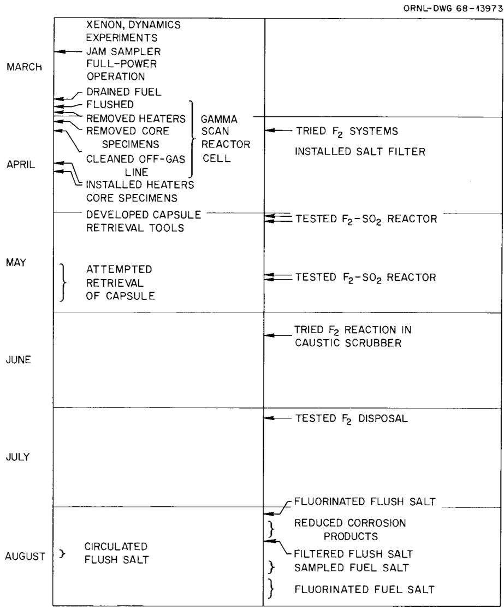  
Fig. 1.1 Outline of MSRE Operations, March-August 1968.

reactor shutdown. There were deficiencies in the flow control systems, and some unreacted fluorine passed from the fluorine- $\mathrm{SO}_2$ reactor, through the bed of activated alumina backing it up, and attacked the charcoal trap in the off-gas line. In the next month the flow control was improved, and the alumina trap was reloaded and provided with heaters to increase its capacity. But a test early in May showed there was still incomplete reaction of the fluorine and $\mathrm{SO}_2$ . Heaters and a temperature control system were installed to improve the gas preheating and the temperature control in the reactor. The steam-water coil on the reactor had been damaged by high

temperatures in the first run, and this section of the reactor was replaced. Another test on May 20-21 again showed a temperature rise in the backup alumina bed; this was taken to mean fluorine was still getting through the fluorine- $\mathrm{SO}_2$ reactor. In the meantime, laboratory tests had verified that it should be practical to react fluorine with a caustic solution in the scrubber tank just downstream of the absorbers that remove $\mathrm{UF}_6$ from the gas stream. Attention then turned to this method of disposal of fluorine.

Tests in the mockup of the fuel sampler had by now shown that a permanent magnet should be capable of retrieving the sample capsules, both the

one dropped in run 14 and the one dropped in August 1967. Two weeks of intensive efforts at retrieval resulted only in recovery of the corroded cap of the first capsule and the conclusion that the capsules had been worked into a certain position whence they could not be retrieved with a magnet. Tests of dislodging tools in the mockup followed. Results were too disappointing, however, for an attempt in the pump bowl, where fission product contamination would make dislodging efforts expensive and time-consuming.

A preliminary test of the caustic solution method of fluorine disposal in the chemical plant showed that fluorine could indeed be disposed of very efficiently at the required rates. Therefore the fluorine- $\mathrm{SO}_2$ reaction system was removed, and the permanent repiping necessary to put the alumina trap downstream of the caustic scrubber was done. This work was finished by early July. A test showed good fluorine reaction, but an aerosol of molybdenum oxides from the caustic scrubber plugged the line to the alumina trap. Final major modifications of the chemical plant then consisted of enlarging the scrubber off-gas line and installing a large filter.

The first step in the actual processing of the salt came on August 1 when the flush salt was transferred into the storage tank. Fluorination to remove the $6\mathrm{kg}$ of uranium in the flush salt went very quickly. Corrosion-product fluorides produced during the fluorination were converted to filterable metallic particles by treatment with hydrogen gas and finely divided zirconium. On August 11, this job was finished, and the flush salt was passed through the new salt filter to the reactor drain tank, where samples showed that the process had been quite effective.

Meanwhile the salt circulating systems had been heated, and as soon as the flush salt was available, the fuel loop was filled and circulation started. (The coolant loop was also filled, and coolant circulation continued through the end of the report period.) Circulation of the flush salt was for the usual purpose of removing traces of moisture that might have gotten into the reactor during the removal of the core specimens and work on the off-gas line. It also permitted a test of the sampler-enricher. A 10-g sample was obtained without difficulty, but a long 50-g capsule was only half submerged, stopped by an obstruction (presumably the wire on the lost capsule) in the sampler cage. Two 25-g samples were obtained, leading to the conclusion that the obstruction would not prevent sampling and moni

toring the fuel salt during subsequent reactor operation.

The fuel salt was transferred into the storage tank on August 18. Three days were spent in obtaining samples defining the salt conditions at the end of $^{235}\mathrm{U}$ operation. (The sampler-enricher malfunction had prevented these from being taken on the last days of nuclear operation.) On August 23 fluorination of the fuel charge was started, and six days later the $219\mathrm{kg}$ of uranium had been loaded onto 28 absorbers filled with sodium fluoride pellets. No difficulty was encountered in the process, and excellent recovery and decontamination were achieved. Another ten days and the corrosion products had been reduced and filtered out, leaving the stripped fuel carrier salt in the reactor drain tank ready for the addition of $^{233}\mathrm{U}$ .

# 1.2 CHEMICAL PROCESSING

R. B. Lindauer

# 1.2.1 Operating Summary

Portions of the MSRE salt processing facility were tested in the course of the hydrofluorination of the flush salt in May 1965, but the fluorine supply and disposal equipment had never been operated before this report period. Highly efficient disposal of the fluorine within the system was essential to prevent unreacted fluorine from causing release of radioiodine from the charcoal traps in the process off-gas line. Therefore, shortly after the reactor shutdown, testing and shakedown of the fluorine systems were started to verify that they met the requirements.

The original design of the processing facility4 involved reacting fluorine with sulfur dioxide gas at temperatures above $400^{\circ}\mathrm{F}$ to form sulfuryl fluoride, $\mathrm{SO}_2\mathrm{F}_2$ , a relatively inert gas that could be discharged to the atmosphere. Later a heated bed of activated alumina was provided downstream of the $\mathrm{SO}_2$ - $\mathrm{F}_2$ reactor to remove traces of fluorine during normal operation and to protect the charcoal traps in case of a malfunction of the reactor. Between

April 5 and May 21 four test runs were made on this system. Despite various modifications and improvements, in each run there was some temperature increase in the alumina bed, implying that some fluorine was reaching it. Later it was shown that decomposition of $\mathrm{SO}_2\mathrm{F}_2$ at temperatures above $800^{\circ}\mathrm{F}$ was probably the cause of the temperature rise in the later tests. However, since it had not been possible to demonstrate complete reaction of the fluorine with the $\mathrm{SO}_2\mathrm{-F}_2$ scheme, the decision was made to adopt the alternative of reacting the fluorine with a caustic solution.

Results of laboratory experiments (described in Chap. 31) and a brief test in the MSRE caustic scrubber tank showed that a solution of $2M\mathrm{KOH}+$ $0.33M$ KI very efficiently removed fluorine from a helium-fluorine stream. After the necessary modifications were made in the processing facility to eliminate the $\mathrm{SO}_2\mathrm{F}_2$ reaction equipment, an extended test of the fluorine disposal in the caustic solution was made. This test showed that a filter was needed downstream of the caustic scrubber to handle molybdenum oxides entrained in the off-gas. (The oxides were produced in the caustic solution from corrosion-product $\mathrm{MoF}_6$ coming from the storage tank.) A larger off-gas line to a high-area glass-fiber filter was then installed. At the same time, dual inlet-gas dip tubes were installed in the scrubber tank because occasional temporary plugging was expected on the basis of laboratory test runs.

The flowsheet used in the salt processing is shown as Fig. 1.2. The final modification before salt processing began was to provide means to preheat the NaF absorbers to $250^{\circ}\mathrm{F}$ to increase the rate of $\mathrm{UF}_{6}$ absorption. (The maximum temperature could be limited to $400^{\circ}\mathrm{F}$ by air cooling.) The flush salt was transferred into the storage tank on August 1, and, after sampling, fluorination was started on August 2 with the salt at $875^{\circ}\mathrm{F}$ . After 6.6 hr of sparging with fluorine, the uranium in the flush salt was down to only 7 ppm (30 g of the original 6 kg or so of uranium). Weight increases in the NaF absorbers amounted to 9.6 kg, somewhat more than expected, but within the scatter of the $\mathrm{UF}_{6}$ calculated from the initial uranium analyses of the salt. The loading was rather spread out - weight increases in the first three beds were 6.9 kg, 2.7 kg, and about 0.2 kg. This was attributed to HF which had gotten through the HF removal trap in the fluorine addition system and had interfered with the $\mathrm{UF}_{6}$ loading.

There were $2.3\mathrm{kg}$ of nickel, $0.9\mathrm{kg}$ of iron, and $0.6\mathrm{kg}$ of chromium as fluorides in the flush salt after fluorination, mostly from corrosion of the storage tank during fluorine-disposal testing and flush-salt fluorination. These fluorides were reduced to the metals by treatment with hydrogen and zirconium. Eleven hours of hydrogen sparging at $1225^{\circ}\mathrm{F}$ for $\mathrm{NiF}_2$ reduction was followed by the addition of $1.07\mathrm{kg}$ of zirconium and more hydrogen sparging to reduce the $\mathrm{FeF}_2$ and $\mathrm{CrF}_2$ . The salt was then filtered through a 9-ft² filter of sintered fibrous Inconel⁵ as it was being returned to the reactor drain tank. Samples showed that the structural metal concentrations were satisfactorily low after this treatment.

Before the fuel salt was fluorinated, several changes were made. The HF trap in the fluorine supply was improved by substitution of high-surface-area sodium fluoride pellets for the low-surface-area material used previously. The low-surface-area NaF in most of the UF $_6$ absorbers was also replaced with high-surface-area material. Some piping changes were made in the absorber cubicle for more flexibility and convenience in changing absorbers. As an added precaution against accidental criticality in the caustic scrubber, the prescribed solution was changed to include boron $(0.2 \text{MK}_2 \text{B}_4 \text{O}_7)$ . Two fission chambers were also installed to monitor neutron multiplication. (The salt in the storage tank was itself a strong neutron source.)

Fuel salt fluorination started on August 23. Fluorine was bubbled into the salt at 33 std liters/min for 8 hr, converting the $\mathrm{UF}_4$ to $\mathrm{UF}_5$ , before $\mathrm{UF}_6$ began to be evolved at a detectable rate. Thereafter another 39 hr of fluorine sparging at lower rates was required to bring the uranium content of the salt down to 26 ppm. The fluorination extended over a six-day period, as it was necessary to stop five times to replace the $\mathrm{UF}_6$ absorbers, the caustic scrubber solution, and the fluorine supply trailers. No significant difficulties were encountered during this operation.

After fluorination the stripped fuel carrier salt contained $4.0\mathrm{kg}$ Ni, $1.9\mathrm{kg}$ Fe, and $2.1\mathrm{kg}$ Cr as the fluorides. These were reduced to the metals, first by hydrogen sparging at $1230^{\circ}\mathrm{F}$ for a total of 52 hr, then by addition of a total of $5.0\mathrm{kg}$ of finely divided zirconium followed by hydrogen and helium

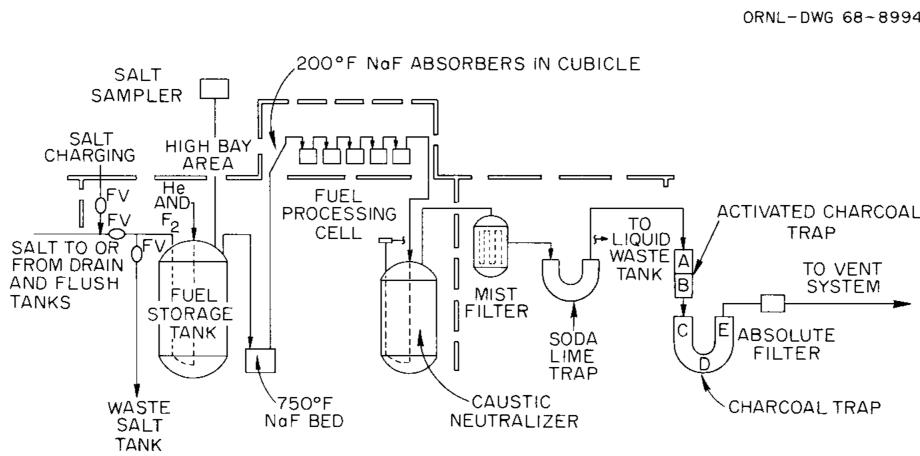  
Fig. 1.2 Flowsheet for Salt Processing.

sparging. After filtered samples showed that the corrosion-product fluorides were satisfactorily low, the salt was transferred through the large filter to the fuel drain tank. When dip samples from the drain tank showed that the reduction and filtration had been successful, the salt processing was at an end.

# 1.2.2 Data Analysis

Fluorination. - The $4280\mathrm{kg}$ of flush salt contained about $6\mathrm{kg}$ of uranium before fluorination. $^{6}$ A flow of 25 std liters/min of $\mathbf{F}_2$ diluted with a like amount of helium was maintained for a total of $6.6\mathrm{hr}$ , at which point fluorination was stopped because the mass flow meters at the entrance and exit of the absorbers showed that $\mathrm{UF}_6$ evolution had practically ceased. Samples of the salt taken after $5\mathrm{hr}$ of fluorination and at the end subsequently showed $24\mathrm{ppm}$ of uranium and $7\mathrm{ppm}$ of uranium respectively (103 and $30\mathrm{g}$ of uranium). The overall fluorine utilization from start to finish was $6.8\%$ .

The fuel-salt charge contained an order of magnitude more uranium than the flush salt had: $219\mathrm{kg}$ of uranium in $4730\mathrm{kg}$ of salt. Fluorination was

started at a gas sparge rate of 33 std liters/min of $\mathbf{F}_2$ . The fluorine utilization was very high at first, but no appreciable $\mathrm{UF}_{6}$ was evolved until after practically all the $\mathrm{UF}_{4}$ had been converted to $\mathrm{UF}_{5}$ . This occurred after 8 hr. When the inlet flowmeter and the temperature in the first absorber showed that $\mathrm{UF}_{6}$ was coming off, the fluorine was reduced to 24 std liters/min to limit the $\mathrm{UF}_{6}$ flow for the sake of more efficient absorption on the low-surface-area NaF in the first absorber of the five-absorber train. In later runs even lower fluorine flows were used. Flow rates and fluorine utilization are listed in Table 1.2 for each of the six runs. The rather high utilization is probably attributable to the depth of the salt - the fluorine and helium were injected 64 in. below the surface through four $^{\frac{1}{2}}$ -in. holes near the closed lower end of a 1-in. vertical pipe. The variation of utilization with sparge rate is evident from Table 1.2. The low utilization in run 6 came as the uranium concentration was being reduced to 26 ppm.

The fluorination of both the flush salt and the fuel salt was carried out at 850 to $875^{\circ}\mathbf{F}$ , just above the liquidus temperature of the salt.

Absorption of $\mathbf{U}\mathbf{F}_{6}$ - Thirty-one absorbers, each loaded with about 50 lb of NaF pellets, were available for $\mathbf{U}\mathbf{F}_{6}$ absorption. Five absorbers were connected in series for each run. Two quite different types of NaF pellets were used: one with a surface area per unit weight of $0.063\mathrm{m}^2 /\mathrm{g}$ , the other

Table 1.2. Fuel Salt Fluorination Data   

<table><tr><td rowspan="2">Run</td><td colspan="3">Fluorine Sparge</td><td rowspan="2">Uranium Removed (kg)</td><td colspan="2">Percent F2Utilization</td></tr><tr><td>Duration (hr)</td><td>Rate (liters/min)</td><td>Volume (liters)</td><td>Average</td><td>Maximuma</td></tr><tr><td>1A</td><td>8.03</td><td>32.9</td><td>15,848</td><td>b</td><td>65.8</td><td></td></tr><tr><td>1B</td><td>2.17</td><td>24.1</td><td>3,137</td><td>25.83</td><td>38.9</td><td></td></tr><tr><td>2</td><td>5.68</td><td>14.3</td><td>4,870</td><td>33.84</td><td>32.8</td><td>39.7</td></tr><tr><td>3</td><td>6.67</td><td>16.0</td><td>6,440</td><td>41.45</td><td>30.6</td><td>50.8</td></tr><tr><td>4</td><td>7.03</td><td>16.0</td><td>6,752</td><td>44.18</td><td>30.9</td><td>35.3</td></tr><tr><td>5</td><td>8.70</td><td>12.4</td><td>6,466</td><td>49.24</td><td>36.0</td><td>43.0</td></tr><tr><td>6</td><td>8.57</td><td>17.1</td><td>8,812</td><td>23.45</td><td>12.6</td><td>29.2</td></tr><tr><td>Total</td><td>46.85</td><td>19.0 (av.)</td><td>52,285</td><td>217.99</td><td>35.0 (av)</td><td></td></tr></table>

${}^{a}$ From mass flowmeter readings.   
${}^{b}$ No volatilization observed. Fluorine converting ${\mathrm{{UF}}}_{4}$ to ${\mathrm{{UF}}}_{5}$ .

with about $1\mathrm{m}^2 /\mathrm{g}$ . These will be referred to as low-surface-area (LSA) and high-surface-area (HSA) material.

All the beds used in the flush salt run contained LSA NaF. Breakthrough of $\mathrm{UF}_{6}$ into the second and third beds was observed, even though one bed should have had more than enough capacity for all the $\mathrm{UF}_{6}$ evolved. When the absorbers were removed and weighed, the first, second, and third absorbers showed weight gains of $6.9\mathrm{kg}$ , $2.7\mathrm{kg}$ , and about $0.2\mathrm{kg}$ respectively. The total gain, $9.8\mathrm{kg}$ , was $1.2\mathrm{kg}$ more than the weight of $\mathrm{UF}_{6}$ equivalent to all the uranium in the flush salt as calculated from the standard fluorimetric uranium analyses. However, the weight increase checks closely with the uranium calculated from two samples analyzed by neutron activation. Examination showed that some HF had reached the absorbers and had reacted with the NaF, probably accounting for the low loading before breakthrough.

As a result of laboratory tests and the somewhat questionable performance of the LSA NaF in the flush salt run, most of the absorbers were reloaded with HSA material. The available amount was insufficient to change all the absorbers, however, so some LSA absorbers were used during the fuel salt runs.

Table 1.3 shows the amounts of uranium loaded on each of the five absorbers during each of the six runs. These weights were calculated from the absorber weight gains, presumed to be $\mathrm{UF}_{6}$ .

Thermocouples in the NaF beds near the inlet of each absorber clearly showed when $\mathrm{UF}_{6}$ began to be absorbed there. In run 1, the fluorine flow was stopped when $\mathrm{UF}_{6}$ reached the third absorber. Some additional $\mathrm{UF}_{6}$ was brought through as the gas space in the storage tank was swept out with helium before the absorbers were removed. Weights showed that practically no uranium had reached the fourth absorber, so in the next run fluorine was not stopped until a temperature rise showed in absorber 4. (The fifth absorber was kept as a backup to ensure that no substantial amount of $\mathrm{UF}_{6}$ could get through to the aqueous solution in the caustic scrubber.) In the next three runs, in order to use more of the capacity of the fourth absorber, fluorination was continued for 60, 75, and $95\mathrm{min}$ after the initial temperature rise in those beds.

Analysis of the caustic solutions removed from the scrubber tank showed $4.2\mathrm{g}$ of uranium during the flush salt runs and $< 1\mathrm{g}$ of uranium during the fuel salt runs. These amounts are consistent with the $\mathrm{UF}_{6}$ that should have gotten through due to the finite vapor pressure of $\mathrm{UF}_{6}$ over NaF.

The total amount of uranium, $218.0\mathrm{kg}$ , calculated from the weight gains of the absorbers is $1.1\mathrm{kg}$ less than the amount believed, on the basis of prior physical inventories, to be in the fuel salt charge. About $0.12\mathrm{kg}$ was left in the fuel salt. The remaining $1.0\mathrm{-kg}$ difference is within the accuracy of the weight determinations on the absorbers. The loaded absorbers were stored in a spare cell in the

Table 1.3. Uranium Recovered on Absorbers   

<table><tr><td rowspan="2">Absorber</td><td colspan="6">Uranium Weight Calculated from Absorber Weight Increase (kg)</td></tr><tr><td>Run 1</td><td>Run 2</td><td>Run 3</td><td>Run 4</td><td>Run 5</td><td>Run 6</td></tr><tr><td>1</td><td>12.50a</td><td>11.95a</td><td>10.64</td><td>11.46</td><td>13.49a</td><td>10.45</td></tr><tr><td>2</td><td>9.78</td><td>12.84a</td><td>13.11a</td><td>11.53</td><td>14.43a</td><td>12.45</td></tr><tr><td>3</td><td>3.49</td><td>8.35</td><td>11.89</td><td>11.22</td><td>12.39</td><td>0.55</td></tr><tr><td>4</td><td>0.06</td><td>0.61</td><td>5.72</td><td>9.82</td><td>8.93</td><td>0.00</td></tr><tr><td>5</td><td>0.00</td><td>0.09</td><td>0.09</td><td>0.15</td><td>0.00</td><td>0.00</td></tr><tr><td>Total</td><td>25.83</td><td>33.84</td><td>41.45</td><td>44.18</td><td>49.24</td><td>23.45</td></tr><tr><td>Total for six runs</td><td></td><td></td><td></td><td>217.99</td><td></td><td></td></tr></table>

${}^{a}$ These absorbers contained low-surface-area NaF $\left( {{0.063}{\mathrm{\;m}}^{2}/\mathrm{g}}\right)$ ; others had high-surface-area NaF (1 m ${}^{2}/\mathrm{g}$ ).

reactor building pending desorption of the $\mathbf{U}\mathbf{F}_{6}$ and a more precise determination of total uranium recovery.

A comparison of the performance of the LSA and HSA NaF pellets is shown in Fig. 1.3. Three absorbers containing each type of NaF were used in the No. 1 and No. 2 positions. In every case higher uranium loading was obtained at lower temperature. The LSA NaF retained 13 to $14\%$ more uranium than the HSA NaF in spite of the higher temperatures at which the LSA absorbers were operated.

Fission Product Behavior. - The decontamination factor for the process is the ratio of fission product activity per gram of uranium in the salt to the activity per gram of recovered uranium. Factors were determined by salt samples and the weighted average of NaF samples taken from the inlet of the first absorber in each run. For gross gamma activity the decontamination factor was $8.6 \times 10^{8}$ ; for gross beta activity, $1.2 \times 10^{9}$ . This excellent decontamination meant that in contrast with the fuel salt, which was reading about $1800 \, \text{r/hr}$ at several feet, the absorbers were reading only a few $\text{mr/hr}$ and could be handled directly. (The radiation level at the surface of the first absorber in run 1 was 25 $\text{mr/hr}$ , the second absorber in run 1 was 6 $\text{mr/hr}$ , and the rest were $< 2 \, \text{mr/hr}$ .)

A complete breakdown of the fission product activity on the NaF was not obtained, but most of the fission product gamma activity was $^{95}\mathrm{Nb}$ . Cerium and iodine were also identified on the NaF.

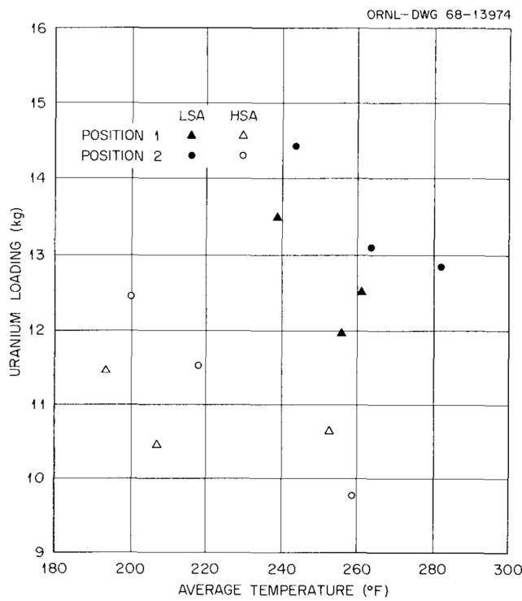  
Fig. 1.3 Comparison of Uranium Loading on Low- and High-Surface-Area Sodium Fluoride.

No beta activity could be identified other than that due to uranium daughter activity. About $90\%$ (73 mc) of the calculated amount of ${}^{131}\mathrm{I}$ that should have been in the reactor or fuel at the time of processing

was recovered in the caustic scrubber solution, about $99\%$ of this in the batch used during the first run. This indicates that nearly all the ${}^{131}\mathrm{I}$ had remained with the fuel salt during reactor operation and salt handling and had then come off at the start of fluorination. Such tellurium as was in the fuel salt should also have come off during fluorination. However, as expected, none was found in the scrubber solution. There was no increase in radiation from the charcoal absorbers to indicate that any fission product had passed through the caustic scrubber and had been absorbed on the charcoal.

Corrosion. - Quite high corrosion rates (0.5 to 1 mil/hr) were observed in the fluoride volatility pilot plant process tank during fluorination runs. Similar rates were anticipated in the MSRE processing. However, to minimize corrosion the fluorination was carried out at as low a temperature as possible (850 to $875^{\circ}\mathrm{F}$ ). Table 1.4 shows the observed corrosion rates, calculated from the increase in Ni, Fe, and Cr in the salt during fluorination. The chromium rates may be slightly low because of loss of chromium from the salt by volatilization at the end of the runs when the $\mathrm{UF}_{5}$ concentration was quite low.

Table 1.4. Corrosion Rates During Fluorination   

<table><tr><td></td><td colspan="3">Mils per Hour Based on -</td></tr><tr><td></td><td>Ni</td><td>Fe</td><td>Cr</td></tr><tr><td>Flush salt (6.7 hr)</td><td>0.1</td><td>0.18</td><td>0.15</td></tr><tr><td>Fuel salt (46.8 hr)</td><td>0.04</td><td>0.21</td><td>0.14</td></tr></table>

One factor in the relatively low corrosion rates was probably the low temperature. (Most previous experience had been at 1100 to $1300^{\circ}\mathrm{F}$ .) Another is the fact that the fluorine was released at the vertical center line of the 50-in.-diam tank of salt, which would tend to reduce the fluorine concentration at the walls. On the other hand, the corrosion products in the flush salt include those produced during a 2-hr exposure of the empty tank to fluorine at $1125^{\circ}\mathrm{F}$ before the salt processing.

The depth of corrosion for the entire campaign, averaged over the tank surface, was 11 mils or less, based on the amounts of iron.

Corrosion Product Fluoride Reduction and Filtration. - It was necessary to reduce the $\mathrm{FeF}_2$ and

$\mathrm{NiF}_{2}$ to the metals before returning the salts to the reactor; otherwise they would attack the chromium in the Hastelloy N. It was also highly desirable to reduce the amount of chromium in the fuel salt so that it could again serve as a sensitive indicator of corrosion during reactor operation. Laboratory tests had shown that the corrosion products could be effectively removed by reduction of the fluorides to the metals and filtration of the agglomerated metallic particles. The $\mathrm{NiF}_{2}$ could be reduced by hydrogen sparging at high temperature; finely divided zirconium metal was prescribed to reduce the $\mathrm{FeF}_{2}$ and $\mathrm{CrF}_{2}$ . Filtration was to be accomplished by a $9\text{-ft}^{2}$ filter newly installed in the line between the storage tank and the reactor drain tank system. The filter medium was sintered fibrous Inconel with $59 - \mu$ pores.

The overall effectiveness of the process is shown by the results in Table 1.5, which lists corrosion-product concentrations in dipped samples of salt just after fluorination and after the reduction and filtration. It would appear that the process was not as effective for $\mathbf{FeF}_2$ and $\mathbf{CrF}_2$ as for $\mathbf{NiF}_2$ . This is reasonable since $\mathbf{NiF}_2$ is the most easily reduced.

While the flush salt was being treated, several attempts to take filtered samples in evacuated capsules with fusible seals were unsuccessful. As a result no analysis was obtained after the initial 11-hr sparge with hydrogen at $1225^{\circ}\mathrm{F}$ . Proceeding on the assumption that the $\mathrm{NiF}_2$ had been reduced by the hydrogen, we added $0.6\mathrm{kg}$ of zirconium metal to reduce the $\mathrm{FeF}_2$ and $\mathrm{CrF}_2$ . (The zirconium was added as slugs of partially compacted turnings, dropped in through the storage-tank sampler.) After $9\mathrm{hr}$ of sparging with hydrogen following the zirconium addition, a sample attempt was successful.

Table 1.5. Results of Reduction and Filtration of Corrosion Products After Fluorination   

<table><tr><td rowspan="2">Salt</td><td rowspan="2">Stage of Process</td><td colspan="3">Concentration (ppm)</td></tr><tr><td>Ni</td><td>Fe</td><td>Cr</td></tr><tr><td rowspan="3">Flush</td><td>After fluorination</td><td>542</td><td>174</td><td>133</td></tr><tr><td>After filtration</td><td>26</td><td>152</td><td>76</td></tr><tr><td>Ratio</td><td>0.05</td><td>0.9</td><td>0.6</td></tr><tr><td rowspan="4">Fuel</td><td>After fluorination</td><td>840</td><td>400</td><td>420</td></tr><tr><td>After 52 hr of hydrogen</td><td>180</td><td>380</td><td>460</td></tr><tr><td>After filtration</td><td>60</td><td>110</td><td>34</td></tr><tr><td>Ratio</td><td>0.07</td><td>0.3</td><td>0.09</td></tr></table>

Results showed that the nickel was down by a factor of 10, but the iron and chromium were not significantly changed. Therefore another $0.5\mathrm{kg}$ of zirconium was added, and the tank was sparged with hydrogen for $16\mathrm{hr}$ . Another sample attempt was unsuccessful, but since the chromium was not excessive in the previous sample, the flush salt was transferred to the drain tank through the filter. Subsequent samples gave the results shown in Table 1.5. There was little difference between samples taken in filter capsules and in open buckets, indicating that the corrosion products were either dissolved fluorides or very finely divided metals.

Before the fuel salt was processed a new type of capsule had been invented. It had two compartments one above a filter element, the other below. Salt flowed into the upper compartment when the capsule was submerged. Then when the capsule was lifted, cooling of the gas in the lower compartment produced a partial vacuum which pulled salt down through the filter disk. With this type of capsule, samples were obtained as needed during the fuel salt treatment. Thus the progress of the reduction could be followed, and the utilization of hydrogen and zirconium could be computed.

The fuel salt was sparged with 10 to 30 std liters/min of hydrogen and 5 to 10 std liters/min of helium at $1230^{\circ}\mathrm{F}$ for 17 hr before the first sample. Dip line plugging in the caustic scrubber prevented continuous operation at the higher rates. After this period the scrubber solution was replaced, which eliminated the plugging difficulty. Inexplicably, the nickel analysis of the filtered sample was higher by almost a factor of 2 than in the dipped sample-at the start. Therefore the hydrogen treatment was continued for another 17 hr. When a sample showed the nickel concentration down some but not enough, another 18 hr of hydrogen sparging was given. A filtered sample then showed the nickel at 180 ppm, down from 840 ppm at the start. The hydrogen utilization computed from this reduction was $2.1\%$ . At this point $4.9\mathrm{kg}$ of zirconium turnings were dropped into the tank, and the salt was hydrogen sparged for 24 hr. A sample showed very low nickel concentration and the iron and chromium content greatly reduced. After that sample the salt was sparged with helium for 18 hr, $0.1\mathrm{kg}$ of zirconium (that had fallen off in the sampler on the first addition) was added, and the salt was sparged with hydrogen for 8 hr. The salt was then cooled to $1050^{\circ}\mathrm{F}$ (to improve filter-element strength) and transferred to the drain tank. Samples gave the re

sults shown in Table 1.5. If the change in nickel, iron, and chromium concentrations from just after the hydrogen treatment to the end point is attributed to reduction of the fluorides by zirconium, the zirconium utilization was $72\%$ .

# 1.2.3 Equipment Performance

A great deal of effort was spent on improving the performance of the fluorine reactor before this approach was abandoned. Once the salt processing was actually started, the major equipment performed well, although there were a few minor problems.

Fluorine Reactor. - The original fluorine disposal system used a fluorine reactor design similar to that used for routine fluorine disposal at the gaseous diffusion facility at Portsmouth, Ohio. This in turn was a scale-up of work done at ORGDP. With low fluorine concentrations (when the heat of reaction is low) it was found necessary to improve the insulation of the fluorine and sulfur dioxide lines to the reactor and to install additional heaters on the reactor inlet in order to maintain the inlet section above $400^{\circ}\mathrm{F}$ . Procedures were modified to prevent overcooling by steam when the reaction rate is low. Similarly, heaters were installed on the line between the reactor and backup alumina trap and on the trap inlet to maintain the entire trap at $900^{\circ}\mathrm{F}$ . With these modifications it is now believed that the system probably would have been satisfactory if the alumina trap had been operated below the $\mathrm{SO}_2\mathrm{F}_2$ decomposition temperature (about $800^{\circ}\mathrm{F}$ ).

Absorber Cubicle Blower. - This blower failed during the first fuel fluorination run, apparently due to the rotor slipping on the shaft. Operation continued without it when induced flow to the processing cell proved adequate to keep the cubicle pressure negative relative to the operating area. (The cooling air required to keep the absorbers below $350^{\circ}\mathrm{F}$ did not produce excessive pressure drop in the line connecting the cubicle to the processing cell.)

Fluorine Trailer Flow Switches. - These safety switches shut off the fluorine supply in case of unusually high flow. They often stuck and prevented flow, especially during startup.

Caustic Scrubber Dip Lines. - Dual inlet lines with valves were provided because plugging prob

lems were anticipated from laboratory tests. Plugging persisted throughout the fluorination, occurring several times per hour, and required almost constant attention. Plugging was cleared by switching to the spare line for several minutes, then returning to the original line. The plugging is believed to be caused by the hydrated oxides of nickel, iron, and chromium from corrosion of the Inconel dip tubes forming a dry deposit in the gas line, which dissolved when gas flow was stopped.

Hastings Mass Flowmeters. - These meters, installed at the inlet and outlet of the UF ${}_{6}$ absorber train, indicate the product of the mass flow rate and the heat capacity of the gas stream. They are quite sensitive to the appearance of UF ${}_{6}$ ,which has five times the heat capacity of fluorine.

The inlet meter provided a very sharp indication of the start of volatilization of $\mathbf{U}\mathbf{F}_{6}$ in each run. The outlet meter, which would have revealed a $\mathbf{U}\mathbf{F}_{6}$ breakthrough if it had occurred, in general (except for run 2) gave anomalously high readings. This could have been due to MoF.

The differences between the inlet and outlet flowmeter readings, taken in conjunction with meas

ured inputs of fluorine and helium, were used to calculate rates and amounts of $\mathrm{UF}_{6}$ volutilized and $\mathbf{F}_2$ utilized. Figure 1.4 shows the differential readings. As a check, the difference between the inlet and outlet meters was integrated to get the total amount of uranium volutilized in the six runs. The result was within $5\%$ of the amount determined by weighing the absorbers. The fluorine utilization during the initial period of conversion of $\mathrm{UF}_{4}$ to $\mathrm{UF}_{5}$ (run 1A) was calculated during two periods of relatively steady operation to be $69\%$ and $63\%$ . This agrees very well with the average of $65.8\%$ calculated from the fluorine input before the start of $\mathrm{UF}_{6}$ evolution (see Table 1.2). The maxima in the $\mathrm{UF}_{6}$ flow rates shown in Fig. 1.4 were used to compute the maximum utilizations listed in Table 1.1. The maximum utilization was not computed for run 1B because the fluorine flow rate was not held constant long enough for the absorber inlet gas to come to equilibrium. As can be seen from run 5, at least $8\mathrm{hr}$ of steady operation is required for the $\mathrm{UF}_{6}$ concentration to reach a maximum. Therefore the figures reported for maximum utilization all tend to be somewhat low.

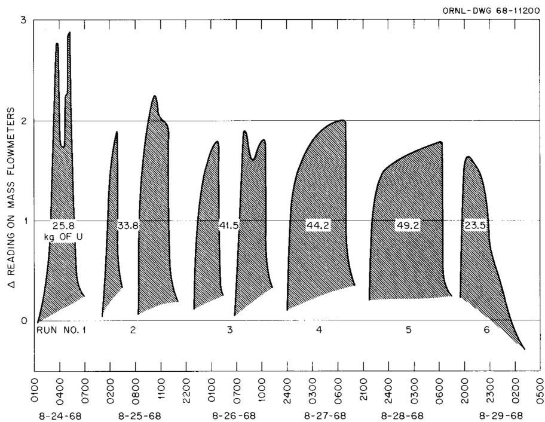  
Fig. 1.4 Differential Readings of Mass Flowmeters at Entrance and Exit of UF6 Absorbers.

# 1.3 REACTOR OPERATIONS ANALYSIS

# 1.3.1 Long-Term Variations in Reactivity

J. R. Engel

B. E. Prince

During the final six-month period of power operation with $^{235}\mathrm{U}$ fuel (run 14) we measured the zero-power reactivity balance five times, at intervals of 4000 to 9000 Mwhr. These measurements, over a period of substantial fuel burnup without fuel additions or dilutions, permitted a clear comparison between the observed and predicted reactivity behavior. The data showed a very small but significant negative trend in the residual term in the reactivity balance. (The "residual reactivity" is essentially the observed reactivity minus that predicted.) Although this trend did not agree with the apparent absence of significant net change over the entire period of operation up to run 14, it was not clearly inconsistent with earlier experience during any single run. Furthermore, during run 14 the uranium concentration observed in the fuel salt samples appeared to decrease faster than the calculated burnup. Since both trends were in the same direction, we undertook a detailed, comprehensive review of the reactivity balance calculation. This review led to some refinements and correction of some errors that significantly altered the overall picture.

One very important correction was in the integrated power, which affects many of the calculated terms in the reactivity balance. While the review of the reactivity balance was in progress, new measurements of salt heat capacity showed that the MSRE power was actually $11\%$ higher than had been computed from heat balances (see Sects. 1.4.1 and 9.3 of this report).

The most significant changes were made in the term that describes the long-term isotopic changes in the core. This term was originally intended to describe only the reactivity effects of nonsaturating and slowly saturating fission products. However, in developing the balance equations it became

apparent that a number of other isotopic changes in the core would have significant reactivity effects. Since the time dependence of these effects was similar to that of the fission products, it was convenient to group all of them in one term of the reactivity balance. Thus the isotopic-change term includes, in addition to the fission products, the effects of changes in the concentrations of $^{6}\mathrm{Li}$ , $^{234}\mathrm{U}$ , $^{236}\mathrm{U}$ , $^{238}\mathrm{U}$ , $^{239}\mathrm{Pu}$ , $^{240}\mathrm{Pu}$ , and $^{10}\mathrm{B}$ . Except for boron, which was present in small amounts in the core graphite, all of these isotopic changes occur in the fuel salt.

Evaluation of the reactivity effects of the long-term isotopic changes would be relatively straightforward if all the various chemical species were physically and chemically stable. In that case, it would be valid to assume that all the original species and their reaction products remain in the medium (graphite or fuel salt) in which they are formed. The reactivity effect of the changes mentioned above was calculated under this assumption to provide a basis for consideration of other modes of behavior. Figure 1.5 shows the major individual components as well as the net change,

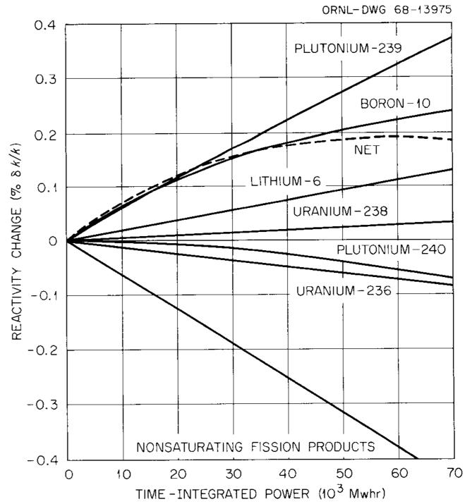  
Fig. 1.5 Reactivity Change Due to Long-Term Isotopic Changes in MSRE (No Fission Product Removal).

as a function of integrated power. The most important terms are the buildup of $^{239}\mathrm{Pu}$ and nonsaturating fission products. Although these terms have opposite signs and almost cancel each other, the net reactivity change is positive because of burnout of other species that act as neutron poisons. $^{11}$ We believe there is little uncertainty or error in the reactivity effects of all the components shown in Fig. 1.5 with one exception: the nonsaturating fission products.

The assumption that the reaction products and their daughters remain in the parent medium is not valid for all the products of uranium fission. Many of the decay chains include noble gases (xenon and krypton) with substantial half-lives. Since these gases are largely insoluble in the fluoride salt melt, they tend to escape into the off-gas system. In addition, there is evidence that significant fractions of some noble metals (notably Mo, Te, Ru, Tc, and Nb) are also removed by the off-gas system, either as volatile fluorides or as colloidal metallic particles.[12] Another mechanism for loss of poisoning, which occurs to some extent, is the plateau out of fission products on surfaces outside the core region (see Sect. 2.2).

11 On the scale shown in Fig. 1.5, the reactivity effects due to burnout of $^{234}\mathrm{U}$ and the associated production of $^{235}\mathrm{U}$ are negligible and, therefore, are not shown. They are included in the net result, however.   
$^{12}$ MSR Program Semiann. Progr. Rept. Aug. 31, 1967, ORNL-4191, p. 116.

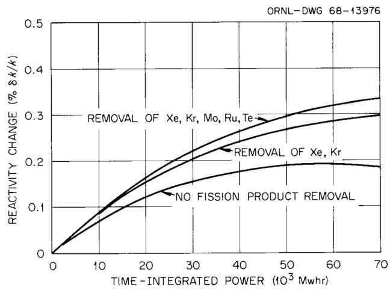  
Fig. 1.6 Effect of Fission Product Removal on Poisoning by Nonsaturating Fission Products.

A factor that enhances the poisoning effect of some fission products is the diffusion of some volatile species into the pores of the graphite. It is clear from the above that very detailed information about the behavior of all the fission products would be required for an absolutely rigorous description of their poisoning effect in the MSRE. This information is not currently available.

To obtain some indication of the effect of fission product loss on the net poisoning, we made calculations for two idealized cases. These assumed, in one case, removal of $100\%$ of the noble gases and, in the other case, concurrent removal of both the noble gases and the noble metals. (The only members of the latter category that are significant neutron poisons are molybdenum, ruthenium, and tellurium.) Figure 1.6 shows the net fission product reactivity effect for the two extreme cases along with the case for full retention of all fission products. The largest change results from removal of the noble gases and their daughters. (The direct poisoning by $^{135}\mathrm{Xe}$ is treated separately in the reactivity balance and is, therefore, not included in this analysis.)

In the absence of quantitative information on the behavior of all the fission products, we assumed for the reactivity balance calculation removal of all the noble gases and none of the noble metals. Figure 1.7 shows, as a function of integrated power, the residual reactivity that was obtained; the straight line is a least-squares fit of all the data. These data indicate that there was a small positive trend in zero-power residual reactivity throughout the $^{235}\mathrm{U}$ operation.

Uncertainties in the calculation of the long-term effects and the difference between assumed and actual fission product behavior both influence the magnitude of this trend but are not large enough

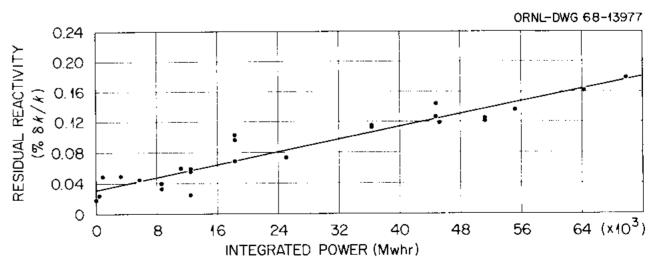  
Fig. 1.7 Zero-Power Residual Reactivity During $^{235}\mathrm{U}$ Operation.

to change its direction. A detailed sensitivity analysis of the calculational model was made by varying important input parameters by $\pm 5\%$ from the values used. (The most important parameters are cross sections and effective fluxes and flux ratios in the core.) This analysis indicated an overall uncertainty in the long-term isotopic changes of $\pm 0.05\% \delta k / k$ at 70,000 Mwhr. The uncertainty associated with the assumption of fission product behavior is also about $\pm 0.05\% \delta k / k$ (see Fig. 1.6). Thus the residual reactivity at the end of the $^{235}\mathrm{U}$ operation was probably between $+0.08$ and $+0.28\% \delta k / k$ .

The review of the reactivity balance calculation is not quite complete. There is one reactivity effect that is known to exist, but it is quite difficult to calculate and heretofore has been neglected. That is the effect of graphite distortion, discussed in the next section.

# 1.3.2 Reactivity Effects of Radiation Damage to Graphite

# C. H. Gabbard

During the operation of the MSRE with $^{235}\mathrm{U}$ fuel, there was a gradual upward drift in the reactivity balance. One possible cause of this increase could be the effects of the graphite shrinkage and expansion which occurred due to radiation damage. Small changes in graphite and salt density distributions result both from direct expansion or contraction of the graphite and from bowing and displacements of the graphite stringers.

A computer program was written to calculate the radiation-induced changes in graphite and salt densities as a function of core location, using the calculated fast-neutron flux distribution in the core and the known variation of CGB graphite dimensions with neutron fluence. This permits the graphite and salt density changes to be calculated at various values of integrated power and converted to reactivity changes for comparison with the observed reactivity drift. The program had just become operative at the end of the report period and was being checked for errors.

# 1.3.3 Dynamics Tests at the End of $235\mathbf{U}$ Operation

R.C.Steffy

Near the end of operation with the $^{235}\mathrm{U}$ fuel loading, dynamic tests were performed on the MSRE to reevaluate the frequency response of the system. Results of these tests permitted a comparison of the dynamic response of the MSRE after more than 70,000 Mwhr with that observed in the initial experiments at power. Portions of the tests also tried a new test signal and a different testing method on a well-known system.

In the earlier testing programs, a control rod was moved to vary the reactivity in a predetermined test pattern. Test patterns included step reactivity inputs and reactivity inputs following a pseudorandom binary sequence (PRBS). (The latter is referred to as a rod-jog test.) The tests at the end of operation with $^{235}\mathrm{U}$ repeated the step tests at 5 and 8 Mw, and a 127-bit rod-jog test was repeated at 8 Mw. These provided a means of direct comparison with the earlier tests. The results of each of these tests at the end of $^{235}\mathrm{U}$ operation are in excellent agreement, in both magnitude and shape, with the results obtained during the initial power tests. Thus they show that there has been no change in the dynamic behavior of the MSRE after more than 70,000 Mwhr of nuclear operation. Results of the initial power tests are shown in refs. 13 and 14, and results of the tests performed at the end of $^{235}\mathrm{U}$ operation are shown in Figs. 1.8, 1.9, and 1.10 of this report. Not all of the tests in the two series were performed at exactly the same power levels. However, the full-power tests were at the same power level. This was identified earlier as 7.5 Mw, but, since the correction of the power calibration, the accepted value is 8 Mw.

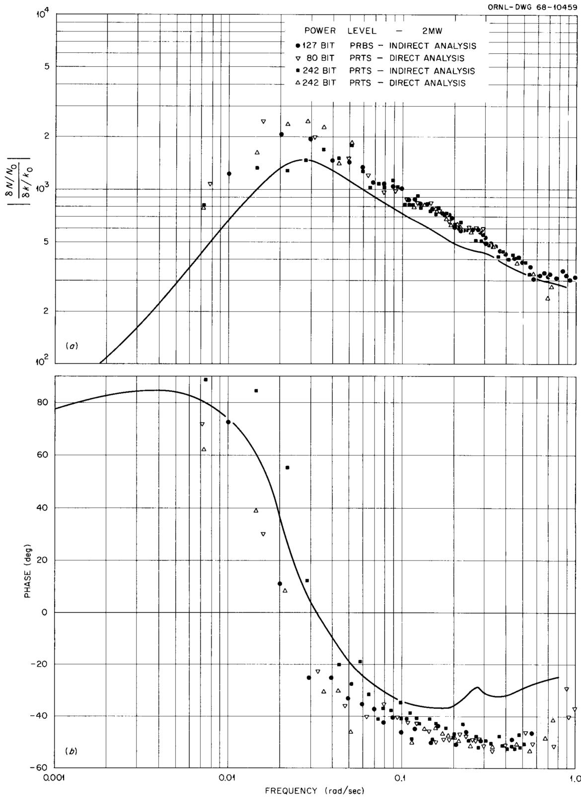  
Fig. 1.8 Predicted (Solid Curve) and Measured (Points) MSRE Frequency Response at 2 Mw. (a) Magnitude ratio of $(\delta N / N_0) / (\delta k / k_0)$ , (b) phase angle of $(\delta N / N_0) / (\delta k / k_0)$ .

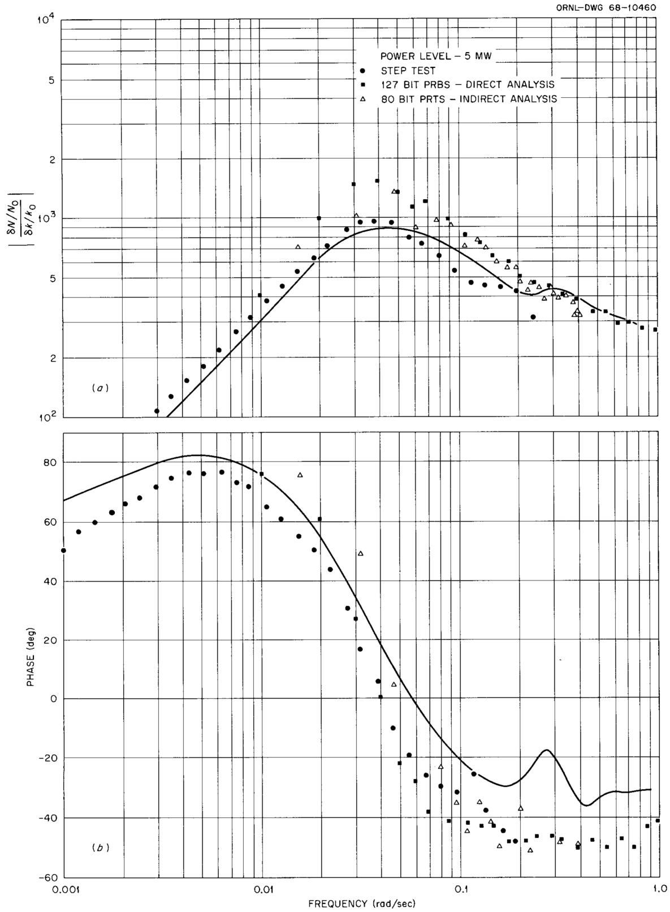  
Fig. 1.9 Predicted (Solid Curve) and Measured (Points) MSRE Frequency Response at 5 Mw. (a) Magnitude ratio of $(\delta N / N_0) / (\delta k / k_0)$ , (b) phase angle of $(\delta N / N_0) / (\delta k / k_0)$ .

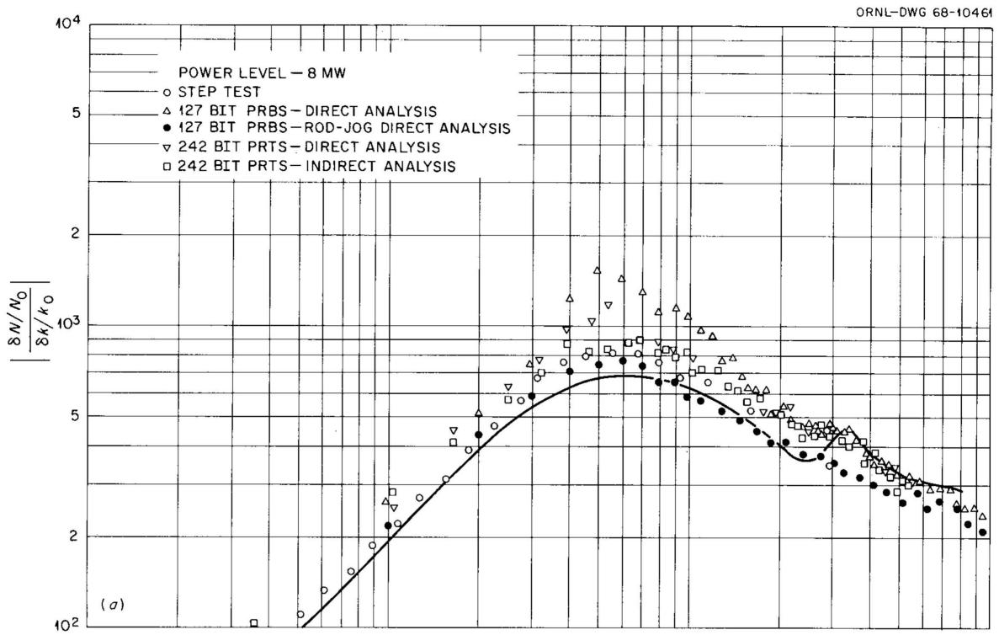

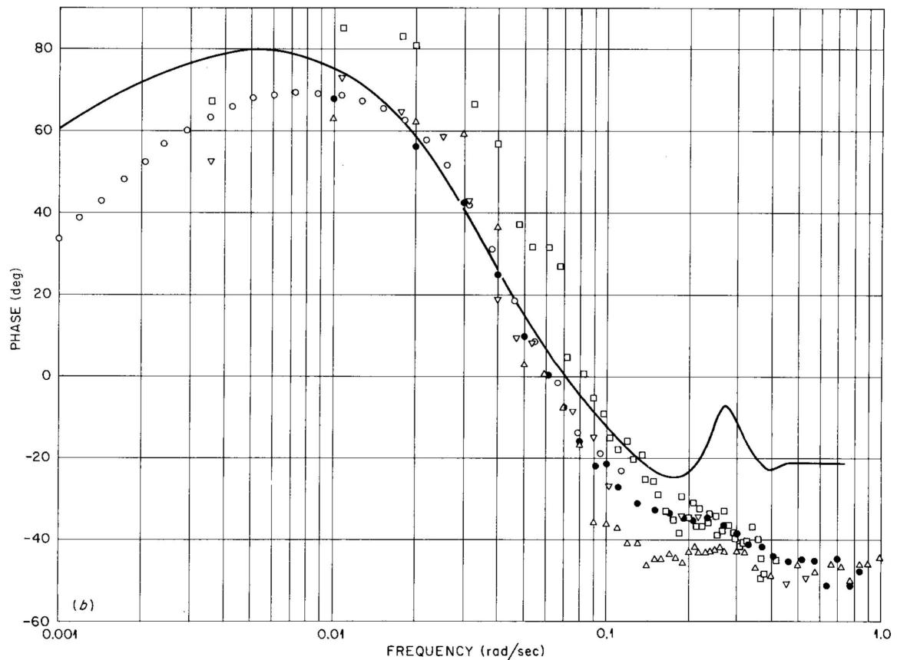  
Fig. 1.10 Predicted (Solid Curve) and Measured (Points) MSRE Frequency Response at 8 Mw. (a) Magnitude ratio of $(\delta N / N_0) / (\delta k / k_0)$ , (b) phase angle of $(\delta N / N_0) / (\delta k / k_0)$ .

The implementation of a pseudorandom reactivity input requires exact control rod positioning and repeatability. Since there was a question as to the capability of the well-used control rod mechanism to satisfy these stringent requirements, we tried imposing the signal shape on the flux instead of the control rod position. This was accomplished by putting a false signal into the control-rod-servo "flux-demand" instrumentation. The servo interprets this signal as a need for rod movement and moves the rod to match the input from the neutron instrumentation with the false input flux demand. By manipulation of the flux-demand signal, the flux can be forced to approximate any reasonable test signal.

The new test signal which we desired to use was the pseudorandom ternary sequence (PRTS). The PRTS is a special series of positive, negative, and zero pulses (bits) chosen so that the autocorrelation function of the test signal approximates the autocorrelation function of white noise. The PRTS is of interest as a tool for frequency-response testing because it has a flat power spectrum over a wide frequency range which gives information over a wide frequency band with only one test. It is similar to the PRBS in this respect but has the additional advantage of a zero average value. Detailed descriptions of the PRTS may be found in refs. 15 and 16. To our knowledge this is the first time this test signal has been employed as a tool in experimental frequency-response measurements. For similar tests there was no apparent difference between results obtained using the PRBS and PRTS testing signal.

Results of the various frequency-response tests performed at the end of power operation with $^{235}\mathrm{U}$ are shown in Figs. 1.8, 1.9, and 1.10. All of the results of pseudorandom tests shown in these figures were obtained using the flux-demand technique unless otherwise noted. In general, the frequency-response results are in good agreement with the theoretical curves. The shape of all the observed curves is as predicted. However, the magnitude ratio of the data taken using the flux-demand technique is higher than both the cor

responding theoretical curves and the experimental results from the earlier testing programs. We believe this to be a result of hardware limitations which were emphasized by the change in testing technique. The control rods are required to behave quite differently for the two types of tests. During the rod-jog tests the rod is moved, held constant for a number of seconds, then moved to a new position, whereas the new method (flux-demand) requires almost constant rod movement. Discrepancy between actual rod position and indicated rod position may be the reason for the apparent shift in magnitude ratio.

The terms "direct analysis" and "indirect analysis" shown on the figures indicate the type of mathematical treatment performed on the data. As used in this text, the direct method involves generating the necessary power spectra directly, whereas the indirect method first calculates the necessary correlation functions and then converts these to power spectra. The different types of analyses yield essentially the same results when applied to the same data, as shown in the figures.

From the results of the dynamic tests we conclude that the dynamic behavior of the MSRE has remained essentially unchanged since the initial approach to power. The reactor system is stable at all power levels, with the degree of stability increasing with increasing power level.

# 1.3.4 Correlation of Circulating Void Fraction and Neutron Noise

D. N. Fry

R.C.Kryter

J. C. Robinson

Operation of the MSRE has shown that a small amount of undissolved helium cover gas circulates with the fuel stream. Observed shifts in the reactivity balance were used to calculate the changes in void fraction with changing operating conditions, but the absolute void fraction had eluded measurement.[17] Neutron noise analysis has now been used in conjunction with an analytical model of the system to infer a value for the void fraction.[18]

According to the model, the neutron power spectral density (NPSD) in the frequency range from 0.5 to 2 hertz should vary as the square of the helium void fraction in the fuel salt. During the experiments with the MSRE in run 14, the NPSD was found to be most sensitive to changes in fuel temperature: the NPSD around 1 hertz increased by a factor of almost 50 when the core outlet temperature was lowered from 1225 to $1180^{\circ}\mathrm{F}$ . Over the same range the reactivity balance showed that the void fraction increased by $0.18\%$ from some indeterminate minimum volume. The minimum void fraction was inferred by fitting the data on NPSD and changes in void fraction to the relationship predicted by the model. A good fit over the range of the data was obtained when a very small value was assumed for the minimum void fraction. It appears from this analysis that the minimum void fraction was closer to zero than to the $0.1 - 0.15\%$ estimated previously.

# 1.3.5 Determination of Circulating Void Fraction

J. C. Robinson

D. N. Fry

From the analytical model of the system it was possible to derive a theoretical pressure-to-flux transfer function whose gain depended on the void fraction in the fuel salt. The transfer function was measured experimentally, and the void fraction was calculated that would make the predicted transfer function agree with that observed.

The fuel pressure was varied in a periodic manner by flowing helium into the pump bowl at a constant rate and opening a valve at regular intervals to vent the helium to a drain tank being held at low pressure. The resultant sawtooth pressure perturbations had a maximum amplitude of 0.3 psi and a period of 40 sec. The fuel pump bowl pressure was about 5 psig, the core outlet temperature was $1210^{\circ}\mathrm{F}$ , and the power was 8 Mw during the test. The pressure signal and neutron flux signal were amplified and simultaneously recorded on magnetic tape. A flux-to-pressure transfer function was then obtained by three different procedures: (1) by the digital cross-correlation procedure, (2) by the direct Fourier

transform procedure, and (3) by determining the absolute auto-power spectral density (APSD) of the pressure and neutron flux signals using a calibrated analog spectral density analyzer. Furthermore, the relative APSD's of the two signals were obtained using the digital program normally used for the neutron noise data reduction schemes on the on-line BR-340 computer. These results are given in Fig. 1.11. This figure clearly demonstrates the correlation in the neutron flux signal to the pressure signal out to about the sixth harmonic (frequency of 0.15 hertz).

Comparison of the experimental and theoretical flux-to-pressure transfer functions indicated a void fraction of $0.03\%$ with an uncertainty of $+0.015\%$ and $-0.01\%$ . (The uncertainties assigned are due primarily to uncertainties in the model used for the prediction of the theoretical transfer function.) For the conditions of the test, reactivity balance measurements had indicated that the void fraction was near its minimum value.

# 1.3.6 Neutron Flux near Reactor Vessel

R.C.Steffy

Before the MSRE was taken to power, nickel and type 304 stainless steel wires were installed in the reactor furnace adjacent to the vessel surveillance specimens, about 5 in. from the vessel wall, to serve as neutron flux monitors. The isotopes which were used as monitors are listed in Table 1.6 along with the reaction which occurs when the isotope interacts with a neutron. The high threshold energies for the $(n,p)$ reactions make it possible to determine the flux as a function of energy as well as axial position.

Table 1.6. Monitor Isotopes and Reactions Used in Reactor Vessel Flux Determination   

<table><tr><td>Monitor Isotope</td><td>Present in -</td><td>Reaction</td><td>Half-Life of Product</td><td>Neutron Energy</td></tr><tr><td>59Co</td><td>SS</td><td>59Co(n,γ)60Co</td><td>5.3 years</td><td>Thermal</td></tr><tr><td>58Ni</td><td>Ni, SS</td><td>58Ni(n,p)58Co</td><td>72 days</td><td>&gt; =1.22 Mev</td></tr><tr><td>54Fe</td><td>SS</td><td>54Fe(n,p)54Mn</td><td>313 days</td><td>&gt; =2.02 Mev</td></tr></table>

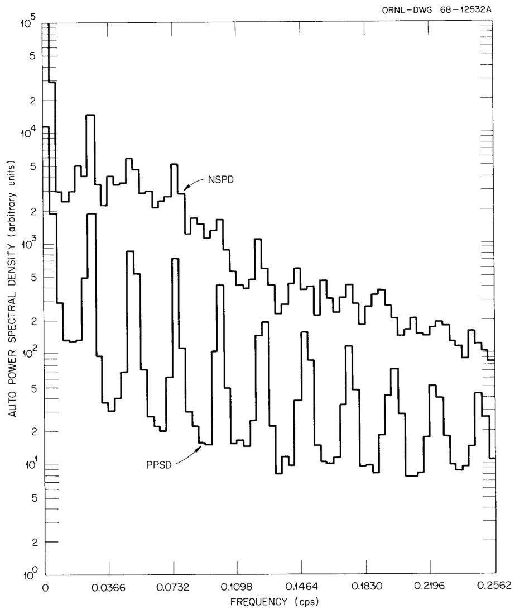  
Fig. 1.11 Auto Power Spectrum of Neutron Flux (NPSD) and Pressure (DPSD) Signals for the MSRE Using Sawtooth Pressure Input Perturbations of 0.3 psi with a 40-sec Period.

After being exposed for about 36,000 Mwhr of power operation (through run 11), the wires were removed from the reactor furnace and taken to a hot cell. The wires were subsequently cut into short segments, and the gamma activity of each piece was determined. The flux was then calculated using the general expression

$$
\operatorname {f l u x} = \frac {A}{\mu^ {\sigma} (1 - e ^ {- \lambda t _ {1}}) e ^ {- \lambda t _ {2}}} ,
$$

where

$$
A = \text {a c t i v i t y} (\text {d i s / s e c}),
$$

$\mu =$ atom density of monitor nuclide,

$\sigma =$ microscopic cross section for reaction of interest,

$\lambda =$ decay constant of product nuclide,

$t_1 =$ time in neutron flux,

$t_2 =$ decay time.

The proper cross section for this calculation would be the average value over the appropriate energy range for neutrons having the energy spectrum that existed in the furnace. The values that were actually used were averaged over the spectrum in the core.[20] Although the spectrum in

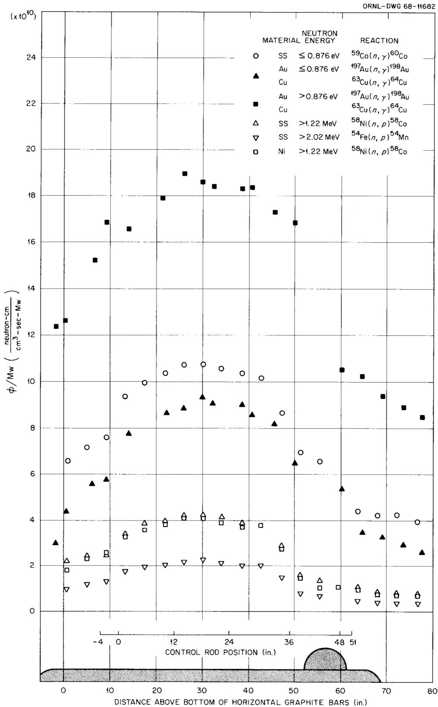  
Fig. 1.12 Axial Neutron Flux in MSRE Reactor Furnace at Various Energies.

the furnace is somewhat different, the error in average cross section is believed to be quite small. The atom density was obtained from chemical analyses and densities of the samples. The calculation was carried out using a computer program which accounts for the detailed power history of the reactor during the irradiation. Results are shown in Fig. 1.12.

Also shown in Fig. 1.12 are fluxes recently calculated from low-power (1 kw) irradiation of gold and copper foils.[21] The data from this irradiation were reevaluated using cross sections for the MSRE spectrum instead of the cross sections used in the original calculation.

The position of the control rods affects the axial profile of the neutron flux. The shim rods are normally maintained at 44 in., with the regulating rod somewhat lower. As shown in Fig. 1.12, the flux at all energies is significantly lower above the level of the rods.

The peak thermal flux $(E < 0.876\mathrm{ev})$ in the reactor furnace is about $1\times 10^{11}$ neutrons $\mathbf{cm}^{-2}$ $\sec^{-1}\mathbf{Mw}^{-1}$ and occurs about 30 in. above the bottom of the horizontal graphite bars. The peak epithermal flux $(E > 0.876\mathrm{ev})$ is about $1.9\times 10^{11}$ neutrons $\mathbf{cm}^{-2}$ $\sec^{-1}\mathbf{Mw}^{-1}$ and occurs at essentially the same position. This gives a peak total flux of $2.9\times 10^{11}$ neutrons $\mathbf{cm}^{-2}$ $\sec^{-1}\mathbf{Mw}^{-1}$ . The higher-energy fluxes, as determined by $(n,p)$ reactions with $^{58}\mathrm{Ni}$ and $^{54}\mathrm{Fe}$ , peak at essentially the same position.

# 1.3.7 Observation of Fission Products After Shutdown

# A. Houtzeel

The gamma radiation levels in the reactor cell and drain-tank cell are indicated by six radiation monitors, three in each cell. Readings are taken routinely on each 8-hr shift. The source of the radiation that affects the monitors is very complex. This is particularly true in the reactor cell, where a broad spectrum of fission products, some in the salt and some deposited on surfaces, are distributed around the piping system at various distances and with various shielding from the radiation detectors. Nevertheless, because of the

great interest in the fission product behavior in the MSRE a study was launched to extract as much useful information as possible from the in-cell gamma radiation data. This study will supplement the other observations of gamma-ray spectra after shutdown and the activities in samples.

The operations at the end of run 14 and the long shutdown that followed provided interesting data to study. The readings from the three detectors in the reactor cell and one in the drain-tank cell are shown in Fig. 1.13 from March 14 to August 28, 1968.

Although the thorough analysis including volumes, surface areas, distances, and shielding of sources was not completed in this report period, some noteworthy features were observed from the plots in Fig. 1.13.

1. The sharp increase in activity in the drain-tank cell near the end of the power run (March 20) was due to pressure-pulse experiments in the reactor system; the reactor off-gas was routed through one of the drain tanks and drain-tank vent system instead of the normal reactor off-gas system. This gives some indication of the intensity of the off-gas activity.   
2. The decay of the radiation level in the reactor cell was not strongly affected either by the presence or absence of the fuel salt (drained on March 25) or by the first flushing operation (drained March 29). The flush salt itself apparently provided some shielding while it was in the fuel loop.   
3. Especially during the first month after shutdown the rate of decay was greater in the reactor cell than in the drain-tank cell. This may indicate that some fission products with intermediate half-lives remained in the fuel or off-gas system rather than with the fuel salt.   
4. The second flush salt operation (August 16) decreased the activity in the reactor cell somewhat. Apparently some decay products were washed out of the system.   
5. The data from the drain-tank cell after early August are probably not significant because of the reprocessing operations that were in progress. Both the flush and fuel salt were transferred several times.   
6. The reliability of these high-level radiation monitors decreases substantially at radiation levels below 40 to $50\mathrm{r / hr}$

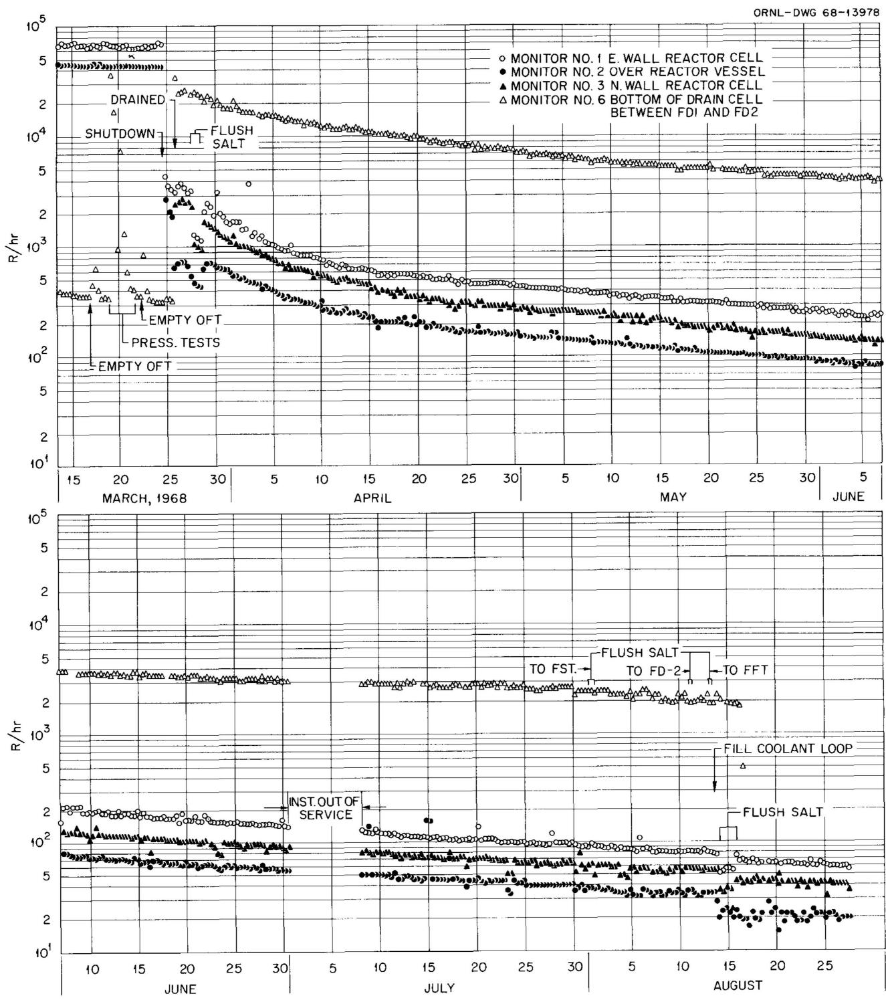  
Fig. 1.13 Radiation Levels in Reactor and Drain-Tank Cells After Reactor Shutdown and Fuel Salt Drain.

# 1.3.8 Unscheduled Scrams During 235U Operation

P. N. Haubenreich

Operation with $^{235}\mathrm{U}$ spanned 34 months, from May 1965 to March 1968, during which time fuel salt was in the core a total of 13,487 hr. There were 29 unscheduled rod scams while fuel was in the core, but not one was caused by a process variable actually reaching a safety trip point. (Some scams occurred when the flux level safeties were switched down to 15 kw while the reactor was at higher power, but these are not counted as power reaching a safety trip point.) A breakdown of the scams by time and cause is given in Table 1.7.

A considerable improvement with time is evident from Table 1.7. The rash of six scams attributed to instrumentation and controls in the second quarter of 1966 was due to several sources of noise in the signals. Of the three scams attributed to “other” causes, one was caused by a momentary voltage sag that tripped the safety channels, one was a manual scram to investigate a fire alarm (false), and one occurred when an electrical short tripped a power breaker in the reactor area. “Power failure” refers to an interruption of electrical power to the reactor area.

# 1.3.9 Thermal Cycle History

C. H. Gabbard

The accumulated thermal cycle history of the various components sensitive to thermal cycle damage is shown in Table 1.8. Approximately $73\%$ of the design thermal cycle life of the fuel system freeze flanges has been used to date. This compares with a value of $69\%$ at the end of the previous report period and with $63\%$ at the beginning of run 14 a year ago.

# 1.4 EQUIPMENT

# 1.4.1 Heat Transfer

C. H. Gabbard

During the previous operation of the MSRE, the heat balance power and the heat transfer performance were calculated using a coolant-salt specific heat that was temperature-dependent. Analysis of the MSRE operating data strongly suggested, however, that the specific heat was actually a constant. This was confirmed by a recent series of enthalpy measurements which gave a specific heat of 0.577 Btu $\mathrm{lb}^{-1}$ ( $^{\circ}\mathrm{F})^{-1}$ which had been used for the average value over

Table 1.7. Summary of Unscheduled Scrams at MSRE with Fuel in the Core ${}^{a}$   

<table><tr><td rowspan="2">Year</td><td rowspan="2">Quarter</td><td colspan="2">Operating Hours</td><td colspan="5">Number of Unscheduled Rod Scrams</td></tr><tr><td>Fuel in Core</td><td>Critical</td><td>Total</td><td>Human Error</td><td>Power Failures</td><td>I &amp; C</td><td>Other</td></tr><tr><td rowspan="4">1966</td><td>1</td><td>672</td><td>62</td><td>4</td><td>2</td><td>0</td><td>1</td><td>1</td></tr><tr><td>2</td><td>1293</td><td>1070</td><td>13</td><td>2</td><td>3</td><td>6</td><td>2</td></tr><tr><td>3</td><td>554</td><td>413</td><td>2</td><td>0</td><td>2</td><td>0</td><td>0</td></tr><tr><td>4</td><td>1266</td><td>1221</td><td>3</td><td>1</td><td>1</td><td>1</td><td>0</td></tr><tr><td rowspan="4">1967</td><td>1</td><td>1861</td><td>1852</td><td>2</td><td>1</td><td>0</td><td>1</td><td>0</td></tr><tr><td>2</td><td>1254</td><td>1186</td><td>2</td><td>1</td><td>1</td><td>0</td><td>0</td></tr><tr><td>3</td><td>1318</td><td>1292</td><td>1</td><td>0</td><td>1</td><td>0</td><td>0</td></tr><tr><td>4</td><td>2159</td><td>2144</td><td>2</td><td>0</td><td>1</td><td>1</td><td>0</td></tr><tr><td>1968</td><td>1</td><td>2048</td><td>2045</td><td>0</td><td>0</td><td>0</td><td>0</td><td>0</td></tr><tr><td>Total</td><td></td><td></td><td></td><td>29</td><td>7</td><td>9</td><td>10</td><td>3</td></tr></table>

aThere is no record of any unscheduled scams during 1965, when fuel was in the core for 1062 hr and the reactor was critical (at 1 kw or less) for 230 hr.

Table 1.8. MSRE Cumulative Thermal Cycle History Through August 1968   

<table><tr><td rowspan="2">Component</td><td colspan="7">Number of Cycles</td></tr><tr><td>Heat and Cool</td><td>Fill and Drain</td><td>Power</td><td>On and Off</td><td>Thaw</td><td>Thaw and Transfer</td><td></td></tr><tr><td>Fuel system</td><td>10</td><td>42</td><td>68</td><td></td><td></td><td></td><td></td></tr><tr><td>Coolant system</td><td>8</td><td>14</td><td>64</td><td></td><td></td><td></td><td></td></tr><tr><td>Fuel pump</td><td>13</td><td>37</td><td>68</td><td>466</td><td></td><td></td><td></td></tr><tr><td>Coolant pump</td><td>9</td><td>15</td><td>64</td><td>134</td><td></td><td></td><td></td></tr><tr><td>Freeze flanges 100, 101, 102</td><td>10</td><td>38</td><td>68</td><td></td><td></td><td></td><td></td></tr><tr><td>Freeze flanges 200, 201</td><td>9</td><td>14</td><td>64</td><td></td><td></td><td></td><td></td></tr><tr><td>Penetrations 200, 201</td><td>9</td><td>14</td><td>64</td><td></td><td></td><td></td><td></td></tr><tr><td>Freeze valve</td><td></td><td></td><td></td><td></td><td></td><td></td><td></td></tr><tr><td>103</td><td>8</td><td></td><td></td><td></td><td>29</td><td>45</td><td></td></tr><tr><td>104</td><td>18</td><td></td><td></td><td></td><td>11</td><td>31</td><td></td></tr><tr><td>105</td><td>18</td><td></td><td></td><td></td><td>19</td><td>47</td><td></td></tr><tr><td>106</td><td>20</td><td></td><td></td><td></td><td>28</td><td>39</td><td></td></tr><tr><td>107</td><td>13</td><td></td><td></td><td></td><td>12</td><td>21</td><td></td></tr><tr><td>108</td><td>12</td><td></td><td></td><td></td><td>17</td><td>21</td><td></td></tr><tr><td>109</td><td>11</td><td></td><td></td><td></td><td>20</td><td>21</td><td></td></tr><tr><td>110</td><td>6</td><td></td><td></td><td></td><td>4</td><td>9</td><td></td></tr><tr><td>111</td><td>6</td><td></td><td></td><td></td><td>4</td><td>6</td><td></td></tr><tr><td>112</td><td>2</td><td></td><td></td><td></td><td>1</td><td>2</td><td></td></tr><tr><td>204</td><td>10</td><td></td><td></td><td></td><td>15</td><td>34</td><td></td></tr><tr><td>206</td><td>10</td><td></td><td></td><td></td><td>13</td><td>33</td><td></td></tr></table>

the temperature range for full-power operation. When the new specific heat is used, the calculated nominal full power level of the MSRE is increased from 7.2 to $8.0\mathrm{Mw}$ . The heat balance program in the on-line computer, which calculates both the heat balance power and the parameters for the heat exchanger performance evaluation, has been corrected to the new specific heat value.

The main heat exchanger and radiator have been reevaluated, using the past temperature data and the new specific heat. The results of the heat exchanger evaluation are shown in Fig. 1.14. The larger specific heat has increased the measured overall heat transfer coefficient of the heat exchanger to 656 Btu hr $^{-1}$ ft $^{-2}$ (°F) $^{-1}$ . A new design value of 600 Btu hr $^{-1}$ ft $^{-2}$ (°F) $^{-1}$ for the overall heat transfer coefficient was calculated using the heat exchanger geometry and the

latest physical property data for the fuel and coolant salts. Therefore the standard design procedures would have given a conservative heat exchanger design if the correct physical property data had been available during the original design. Figure 1.14 also indicates that the heat exchanger is continuing at its original performance level and that there is no indication of tube plugging or fouling.

The increased value of the specific heat has also increased the measured overall heat transfer coefficient of the radiator from 38.5 to 42.75 Btu hr $^{-1}$ ft $^{-2}$ (°F) $^{-1}$ . This is still below the corrected design value of 51.5 Btu hr $^{-1}$ ft $^{-2}$ (°F) $^{-1}$ , which is dependent mainly on the air-side film coefficient. The radiator is also continuing at its original performance level.

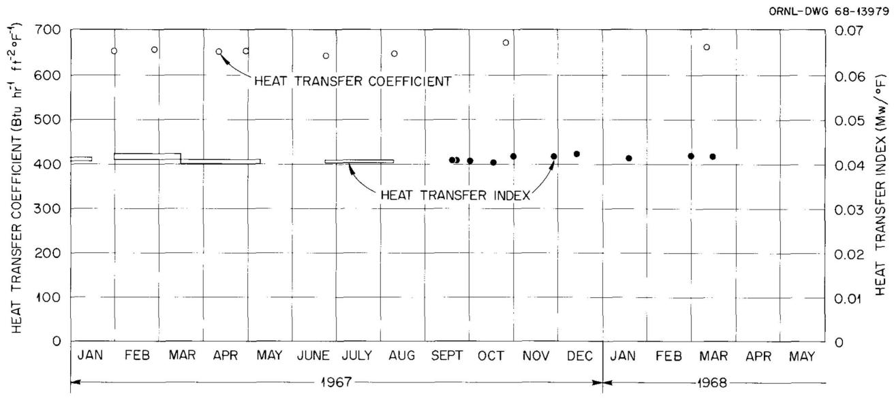  
Fig. 1.14 Observed Performance of MSRE Main Heat Exchanger.

# 1.4.2 Salt Samplers

R. B. Gallaher

Fuel Sampler-Enricher. - During the report period the sampler-enricher was used for 12 sampling operations, bringing the total to 361 samples and 114 salt additions. The 12 operations successfully obtained four 10-g samples, two 25-g samples, one 50-g sample, and two samples in freeze-valve capsules. One attempt to take a 10-g sample ended in the capsule being dropped into the pump bowl. Twice later 50-g capsules were lowered into the pump bowl but did not fill with salt.

On the sampling attempt that resulted in the sampler cable becoming tangled, there was no sign of trouble as the cable was unreeled the usual 17 ft 5 in. As it was being rewound, the motor stalled with 13 ft 5 in. off the reel. A few attempts to unreel and rewind convinced us that the cable was tangled in the isolation chamber as it had been on previous occasions.[22] To

minimize the chance of severely kinking the cable, the drive motor was operated at reduced voltage (50 to 80 v) to reduce its torque during repeated attempts to untangle the cable by unreeling and rewinding. In the course of 76 attempts, the drive stalled at various points as the coils of cable were shifted, but in the end there was no net gain.

The isolation valves were left open for the next two weeks, but a slight purge of helium down the tube kept fission products from diffusing back up to the sampler.

When the access door was opened after the fuel salt was drained, the capsule was visible through the lower corner of the port opening, and the latch could be seen in the back of the chamber. There were many loops and coils of cable. Evidently the capsule and latch had never left the isolation chamber on its way down at the start of sampling. The reason for the capsule hanging cannot be ascertained; when the operator had closed the door the capsule appeared to be hanging normally.

Some of the drive cable loops extended down into the sampler tube, and rather than risk cutting the cable, we left the isolation valves open. As an attempt was made to lift the capsule out of the isolation chamber, the manipulator fingers brushed

some of the coils, causing them to spring out through the access port and pull the capsule cable from the manipulator jaws. The capsule dropped into the sampler tube, bottom up, the latch tipped over, releasing the key, and the capsule and key disappeared down the tube.

It proved possible to use the manipulator to untangle the cable and pull it into the outer containment area (area 3A). Only one bad kink was found, and it was straightened acceptably with the manipulator.

Although it appeared that the capsule had fallen with the magnetic top underneath, immediate attempts were made to retrieve it using magnets that were available. A $\frac{3}{4}$ -in.-diam, 1-in.-long magnet was lowered into the pump bowl without success. A $\frac{3}{8} \times 6$ in. magnet was lowered but came up clinging to the latch. A $\frac{3}{4} \times 5$ in. magnet with a copper tube around the cable to hold the magnet off the latch was lowered but could not be worked past the magnetic obstruction where the sampler tube penetrated the wall of the reactor cell.

After the loop was filled with flush salt, a 50-g capsule was lowered into the pump bowl. It came up empty, and salt droplets clinging to the upper sides showed it had been only half submerged, presumably because it had come to rest on the dropped capsule inside the cage. A 10-g capsule was submerged and collected a sample.

A full-size mockup of the sampler tube and the pump bowl internals was constructed to test magnets and other types of retrieval tools (Fig. 1.15). Two capsules, one without cable and key and the other with, were dropped in the mockup to simulate the capsules lost in August 1967 and March 1968. The most probable configuration of the capsules is shown in Fig. 1.16. The simplest and most effective retrieval tool proved to be an Alnico 5 permanent magnet. With $\frac{3}{4}$ -in. and $\frac{1}{2}$ -in. magnets, recovery of both capsules was successful except in the rare instances when the capsule cable became knotted around the guide cage or the key fell outside the mist shield. Although the second capsule was upside down, it could be shifted into a favorable position by dropping the magnet.

Because the actual recovery had to be attempted blind, a speaker connected to the microphone on the pump bowl was used to listen in on the grappling. The $\frac{1}{2}$ -in. magnet was lowered into the pump bowl, and sounds were heard indicating that an object was being lifted a few inches and then

dropped. After scores of attempts, the magnet came up with a lump attached which later proved to be the corroded top of the old capsule. The $\frac{3}{4}$ -in. magnet was, after some difficulty with the magnetic penetration, also lowered into the pump bowl. There was never any indication that the $\frac{3}{4}$ -in. magnet picked up anything. Further mockup work convinced us that the second capsule had gotten outside the cage, where it could be reached by the $\frac{1}{2}$ -in. magnet but not by the $\frac{3}{4}$ -in.

Several types of dislodging tools were tried in the mockup. Two tools proved capable of moving the capsules. However, as often as not the capsules were shifted so as to make retrieval more difficult rather than easier. When the capsules were already in a difficult position, the dislodging tools were not effective. Therefore no attempt was made to use these tools in the pump bowl.

When the fuel system was next filled with flush salt in August, a 10-g sample was obtained, but a 50-g capsule came up empty. It appeared to have been submerged slightly over halfway. New windows were cut in two 50-g capsules, and samples containing 25 g of salt were obtained. The capsules were stopped with the bottom $1 \frac{3}{4}$ in. above the bottom of the cage. The most likely explanation appeared to be that the cable and key from the second capsule were projecting back into the cage. When the heavy magnet was dropped it could brush past, but the sample capsules, partly buoyed up by the salt, were stopped.

During the long shutdown a proximity switch, actuated when magnetic material goes by, was mounted on the sampler tube about 4 in. below the lower isolation valve. The sampling procedure stipulates that if the switch has not been activated when the position indicator shows that sufficient cable has been reeled out, the drive will be stopped to prevent the cable from tangling badly in the isolation chamber.

A control was added to the drive motor circuit to allow operation at any desired voltage. Normal operation was changed from 110 v to 80 v to lessen chances of damaging the cable in case of a kink.

The manipulator assembly was replaced because the tips of the fingers no longer closed tightly. The old assembly was decontaminated and repaired. The boots that went on with the new manipulator were thinner than the old, permitting freer movement. An excessive pressure differential was accidentally applied in the first

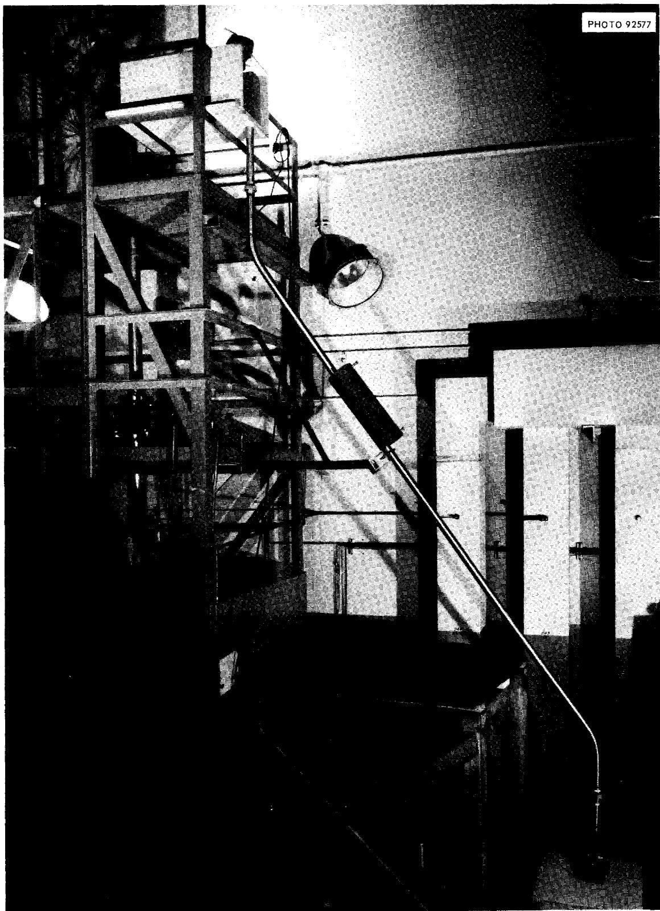  
Fig. 1.15 Overall View of Mockup Used in Practicing Capsule Retrieval.

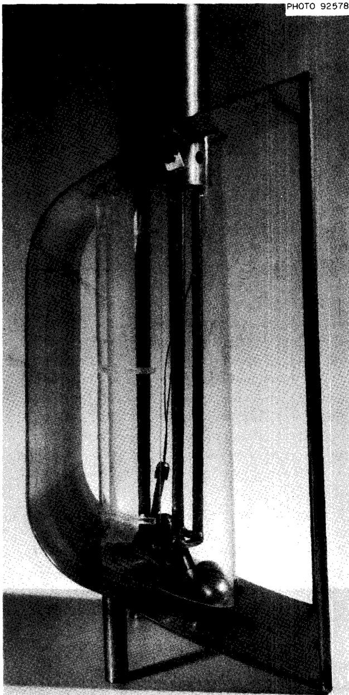  
Fig. 1.16 Mockup of Portion of Pump Bowl, Including Sample Guide Cage and Baffle. Capsules shown in probably original positions.

operation, resulting in a hole in one boot. The next replacement set were the original, thicker boots.

Fuel Processing Sampler. - Installation and check-out were finished during this report period, and during the salt processing the sampler was

used 20 times. There were twelve 10-g capsules, seven 50-g capsules, and one freeze-valve capsule.

A proximity switch and motor voltage control were included in the final installation.

An unexpected difficulty arose during the first few sampling operations. The drive stalled with about 3 ft of cable still out, but after a few minutes it rewound freely. Inspection of the cable showed no abnormality. It was concluded that the problem was a temperature effect on the drive. In this sampler the cable extends well down into the high-temperature region in the fuel storage tank. There is no pause for freezing, as in the other salt samplers, since the tube goes straight down. We suspected that the length of hot cable caused the drive gears to heat up and bind. A cooling period added to the procedure alleviated the problem.

# 1.4.3 Control Rods and Drives

# Malcolm Richardson

The control rods and drives operated in a satisfactory manner throughout run 14. After the shutdown in March, the No. 2 drive was removed to replace the fine synchro position indicator, which had failed in January. It was found that the wiper leads were burned off at the slides. A limit switch which began malfunctioning after the drive was removed was also replaced. While the drive was out, the No. 2 rod was pulled up and inspected by omniscope. It appeared to be in excellent condition. The No. 2 unit was then reassembled and installed. The No. 1 and No. 3 units were not disturbed.

# 1.4.4 Radiator Enclosure

# Malcolm Richardson

No trouble with operation of either the inlet or outlet door was encountered during this period. Inspection of the doors after shutdown revealed some additional minor warping. The links of the segmented "hard-seal" surface had expanded, closing the $\frac{1}{32}$ -in. expansion gaps in many places and causing some rippling. All the links were in place, but a short section of the "soft seal" on the outlet side of the radiator face had been torn loose and was replaced.

# 1.4.5 Off-Gas System

R. B. Gallaher

A. I. Krakoviak

In the last weeks of run 14 the off-gas sampler was used to trap another sample of the fuel off-gas for xenon analysis, $^{23}$ and the thermal conductivity system was tried for the first time on the actual process gas.

The system provides an indication of hydrocarbon content by sending the stream through a heated copper oxide bed which converts the hydrocarbons to water and carbon dioxide, through one side of a thermal conductivity cell, through an absorber to take out the $\mathrm{H}_2\mathrm{O}$ and $\mathrm{CO}_{2}$ , then back through the other side of the conductivity cell. The difference in thermal conductivity is a measure of the hydrocarbon content. When the fuel off-gas was sent through this route, the indication was that there were more impurities in the helium after the absorber than there were ahead of it. The diagnosis was radiation decomposition of the wet magnesium perchlorate absorber material. Plans were made to change the absorber unit to one containing dry molecular sieve, after tests of this material showed no significant decomposition to $10^{7}$ rads.

The other thermal conductivity cell compares the conductivity of a reference stream of pure helium with that of off-gas, which may have gone through the hydrocarbon system or not. The reading is a measure of the total contaminants at that point. (It is not unambiguous, because the conductivity effect varies with the identity of the contaminant.) When this system was first operated with the hydrocarbon system bypassed and the reactor at full power, the indication was about 100 ppm of total contaminants in the helium. After the power was lowered to $10\mathrm{kw}$ , the reading decreased to $52\%$ of the full-power value. The fuel salt was drained, and flush salt was added. Three hours after flush-salt circulation started, the gas contaminant reading was 16 times that at full power. It dropped in the next $2.5\mathrm{hr}$ to 1.5 times the full-power value and leveled out there for several hours. After the flush salt was drained, helium was circulated in the fuel loop at 5 psig, with the normal 4 liters/min flow to the off-gas

system. A contaminant level 100 times the full-power value was observed. After the fuel system was vented and repressurized, the reading was still 50 times full power (about $0.5\%$ impurities in the gas). By this time the radiation level was relatively low, so the hydrocarbon system was valved in. The hydrocarbon indication was low and the other reading changed little, implying that the high reading was not due to hydrocarbons. The inference was drawn that fission products were coming off into the off-gas from the bared surfaces in the fuel system.

The restriction in the off-gas line near the fuel pump that had been detected earlier24 gave no trouble in the last weeks of operation, but there were indications that it was still there. Nine days after the fuel was drained, the flexible section of off-gas line was removed, and a flexible tool was run through the 28 in. of line back to the pump bowl. The tool, a $\frac{1}{4}$ -in. cable with a diamond drill tip, encountered some resistance at first and came out with a considerable amount of solids on it (see Chap. 17). The flexible jumper and the line downstream did not appear to be restricted. After the new jumper was in place, flow-pressure-drop measurements showed no evidence of any restriction.

The replacement jumper line was equipped with four thermocouples to provide more information during power operation. In addition a slender basket was suspended in the entrance of the 4-in. off-gas holdup pipe. In it were devices of metal and graphite to collect material from the off-gas stream for future study.

The small filter in the coolant off-gas line became plugged in May and was replaced.

# 1.4.6 Main Blowers

C. H. Gabbard

The two main blowers, MB-1 and MB-3, continued to operate without difficulty throughout run 14 and have accumulated 7800 and 7125 hr of operating time since they were rebuilt. Both blowers were disassembled for their routine annual inspection, and the rear bearings were replaced on the basis of the grease appearance.

The thrust bearing of MB-3 was also replaced because of a heavy thumping noise accompanied by a shaft displacement that occurred when the rotor was turned by hand. The difficulty was found to be a relatively large misalignment between the rotor shaft and the outer race of the bearing. Otherwise the bearing had been in good condition. The bearing is mounted in a spherical self-aligning mount, but the friction forces are apparently too high for the mount to be effective. The MB-3 replacement bearing and the MB-1 bearing were therefore aligned manually. In other respects, both blowers were in good condition, and there was no evidence of cracking in the hubs or blading.

# 1.4.7 Heaters

# T. L. Hudson

By the end of run 14, heater units HX-1 and HX-2 on the primary heat exchanger were inoperative because of open leads. These two units were removed from the reactor cell early in the shutdown (on the fourth and fifth day after the end of full-power operation) to see if repairs were possible or if replacement units would be required. The trouble was found in the junction boxes mounted on top of the heaters, where the lead wires from several of the heater elements had burned in two at their screwed connections to the terminal strips. Repair was complicated by the induced activity in the assemblies, which produced a gamma radiation field of about $3\mathrm{r / hr}$ at 1 ft. A temporary work shield was set up having concrete block walls and a top of steel plate and lead block, with a small opening in the top through which direct maintenance on the junction box was feasible. The terminal strips and connections were severely oxidized, apparently due to high temperatures during operation. The situation was corrected by installing nickel terminal strips and welding the heater leads directly to them. The copper wire from the terminal strip to the disconnect was also replaced with No. 12 nickel wire welded to the terminal strip. Aside from the damage in the junction boxes, both HX-1 and HX-2 were in good condition, and after the repairs both were reinstalled through the maintenance shield without unusual difficulty.

After the units were reinstalled in the cell it was found that the current on one phase of HX-1

was zero. This proved to be due to a fault in the permanently mounted lead wire in the cell. The fault was circumvented by installing a jumper cable between the HX-1 disconnect and a spare disconnect. The heaters functioned satisfactorily during the subsequent heatup of the system.

# 1.4.8 Oil Systems for Salt Pumps

# A. I. Krakoviak

Although the fuel and coolant salt pumps were shut off and at ambient temperature during most of this report period, the lubricating oil systems for both salt pumps operated continuously and without incident. The only problem was the recurring gradual fouling of the water side of the cooling coils on the oil reservoir. Switching to process water for a few weeks seems to clear the coils to the extent that tower water again provides adequate cooling.

As expected, there was no shaft seal oil leakage during shutdown; however, on startup of both salt pumps in August, the shaft seal leakages resumed at the same rates as those that had existed before the March shutdown, namely 6 cc/day for the fuel pump and 20 cc/day for the coolant pump.

Since previous analyses showed no significant deterioration of the oil quality, the oil was not changed during this shutdown.

# 1.4.9 Component Cooling System

# P. H. Harley

Component cooling pump No. 2 (CCP-2) was in service continuously for the last $3886\mathrm{hr}$ of run 14 after CCP-1 was shut down because of loss of oil from its lubrication system. After run 14 the belt on CCP-2 was found to be quite loose, worn, and severely cracked. Belts and check-valve flappers were replaced on both units.

Because of the history of oil leaks, $^{25}$ the soldered copper tubing in the lubrication system of both pumps was replaced with welded stainless steel. After the threaded unions in the new system were seal-welded, no more leakage was observed.

During the initial run-in of the new belts, excessive oil bypass and low air output were noted. These were corrected by tightening the oil relief valves and the air pressure relief valves. After resumption of operation in August, both component cooling pumps operated satisfactorily, although CCP-2 oil pressure was slightly low.

While the blowers were down for maintenance, the gates on the isolation valves were inspected because excessive leakage had been experienced. Several large pits were found in the gate of the valve in the CCP-2 discharge line. The pits appeared to have been casting defects that had been repaired earlier with epoxy. Repairs were made by laying down stainless steel with a metallizing gun and remachining. The air leakage through this valve was reduced from over 100 scf/day to 0.5 scf/day at a pressure differential of 30 psi.

There was no detectable change in the pressure drop across the strainer in the discharge of the component cooling pumps during this report period.

17 scf/day, more than a factor of 4 below the acceptable maximum.

During the maintenance period a major portion of the annual containment test was completed, namely the testing of all containment valves. Out of about 160 valves, only 11 had leak rates that exceeded prescribed limits: 3 in the cover-gas system, 4 in the water system, and 4 air or nitrogen block valves. Dirt or debris on the seat was the predominant cause of leakage. All valves were satisfactory after servicing.

Release of the beta-gamma activity through the stack amounted to 343 mc during the six-month report period. Of this, 193 mc was released during the week in which the off-gas line was open in the reactor cell for reaming. Most of the remainder was released during the three weeks that followed, probably from material that escaped into the cell during the reaming operation. The release of radioiodine during the report period was quite negligible, amounting to less than 0.3 mc in six months.

# 1.4.10 Containment and Ventilation

P. H. Harley

During the final weeks of run 14, the reactor cell inleakage (at $-2$ psig) continued at about

# 2. Component Development

Dunlap Scott

# 2.1 FREEZE-FLANGE THERMAL-CYCLE TESTS

F. E. Lynch

Operation of the freeze-flange thermal-cycle test which had been resumed at 103 cycles $^{1}$ was continued through 268 cycles, at which point it was shut down for inspection of the flanges and for minor repairs. There was no indication during the operation of any changes in the flanges. There were, however, several minor operational problems of interest. These, together with the results of the inspection of the flange, are described below.

# 2.1.1 Facility Operation Problems

The accumulated downtime was due almost entirely to shorted level probes. Fifteen shorts occurred during the 165 cycles, and after each one it was necessary to shut down to clean the probe. Twelve of the fifteen shorts occurred during the first 65 cycles. After a filament transformer was placed in the probe circuit and the level probe was connected to the secondary side (6.3 v) of the transformer, there were only three periods of difficulties with shorted probes during the next 100 cycles.

As previously reported, helium was used as the pressurizing gas to oscillate the salt after it was found that with argon the desired upper bore temperature could not be maintained. When the building gas supply was changed to argon, a helium bottle header was placed in the line and the supply controlled through two timers and

solenoid valves. We have found that by adjusting the timers so that, during the oscillation period, argon is supplied as a pressurizing gas for 10 min and then helium is supplied for 2 min, the desired operation temperatures could be maintained with a reduction in the usage of bottle helium.

Upon disassembly of the flanges we found that the thermocouples at the flange bore had failed so as to indicate the temperature of the salt instead of the metal surface. However, examination of temperatures from thermocouples located on the outside of the flanges gave confidence that the flange had been subjected to the proper thermal cycle. The bore thermocouples were replaced.

# 2.1.2 Inspection of the Flanges

When the flanges were disassembled, the oval ring gasket with the stainless steel insert screen was removed and inspected. The average diameter of the frozen salt cake on the screen was 10 in. At the end of the first 103 cycles, the diameter had been $11\frac{1}{2}$ in. Higher flange temperatures accompanying some of the earlier tests would account for the difference.

A dye-penetrant inspection of the inner flange face and bore of both flanges was made. We found that the female flange was intact and crack free both in the bore and on the flange. The face of the male flange was also crack free, but the dye penetrant indicated a crack in the flange bore, as shown in Fig. 2.1. The crack extended circumferentially about 90 to $110^{\circ}$ clockwise around the bore starting from the top vertical center line. Although not evident in Fig. 2.1, the penetrant also indicated a band of porosity starting at the crack and extending about $\frac{1}{4}$ in. farther into the bore. The porosity band followed the crack

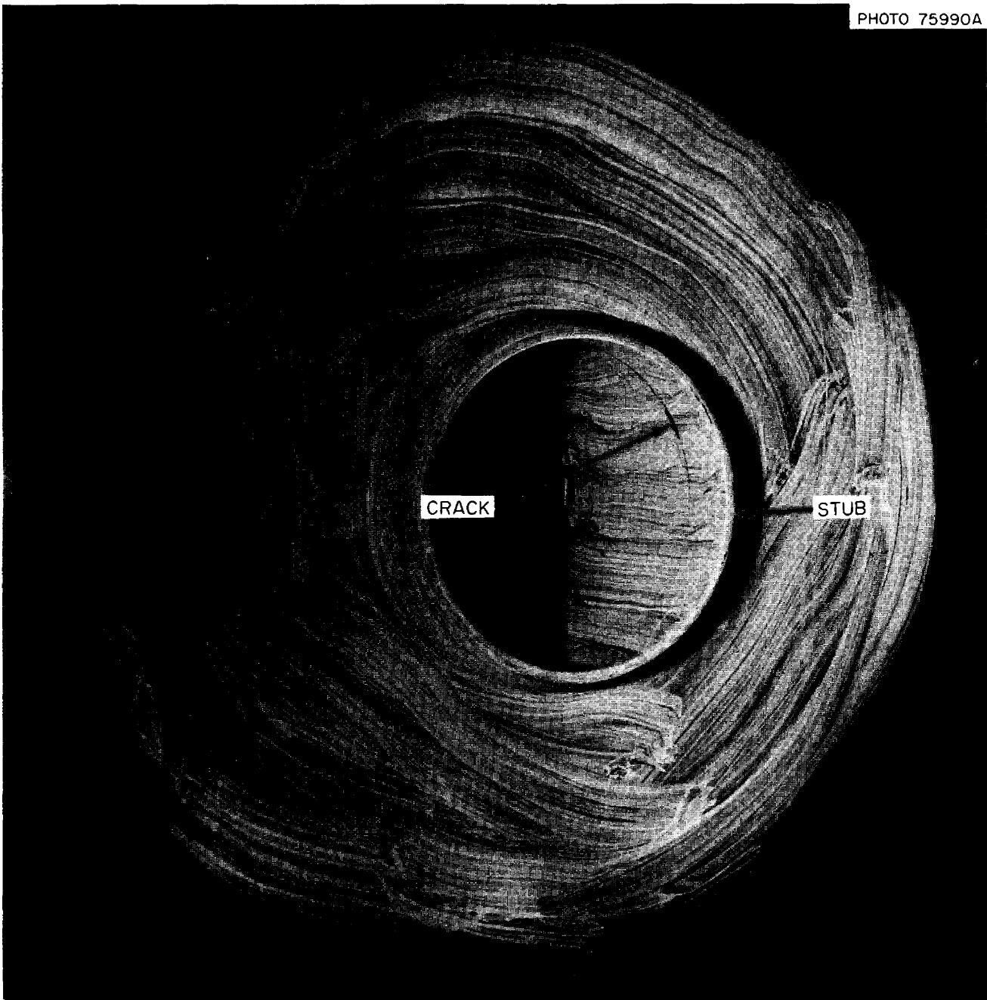  
Fig. 2.1 Photograph of Freeze Flange Showing Dye-Penetrant Indication of Crack.

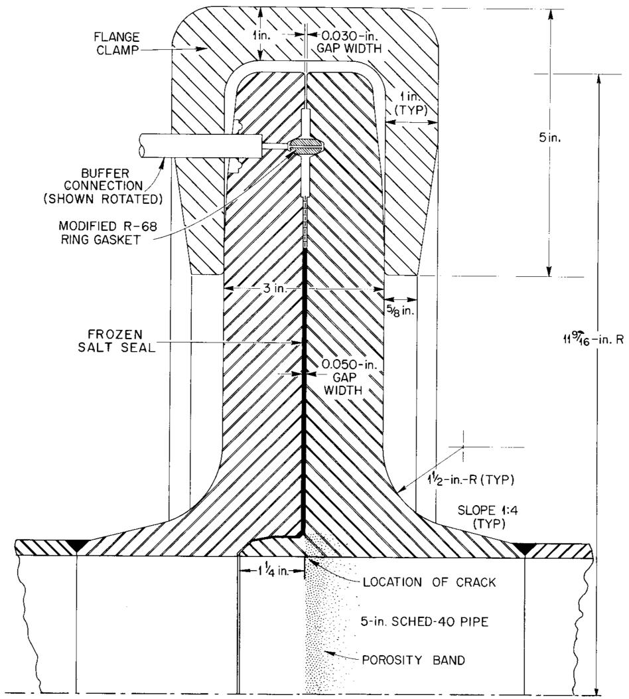  
Fig. 2.2 Cross Section of Freeze Flange Showing Location of Crack Relative to Alignment Stub.

through its 90 to $110^{\circ}$ arc and also extended counterclockwise through an additional 120 to $130^{\circ}$ of arc. The crack was located at the base of the $1_{\frac{1}{2}}$ -in. alignment stub directly opposite the sharp corner $(\frac{1}{8}$ in. radius) at its juncture with the inner face of the flange, as shown in Fig. 2.2. Both the crack and the porosity are probably within the heat-affected zone of the weld that attaches the alignment stub.

The specific cause of the crack and porosity is unknown. However, the flange is approaching its

predicted life of 300 cycles. The stresses are relatively high in the flange bore, but at this location they could be even higher because of the bending moment produced by the alignment stub. If the cracking is due to high local stresses or the heat-affected zone of the weld, the serviceability of the flange would be unimpaired, because the alignment stub was provided only as an aid to the remote assembly of the flange and a complete failure of the stub would not affect the integrity of the joint.

Reassembly of the flange was completed in preparation for resumption of the test. Except for more frequent inspection, the test procedure will not be changed. The exterior of the flanges will be inspected visually during and after each cycle, and the inner flange faces and bores will be examined at the end of each 50 cycles. The test will be extended to determine the number of thermal cycles a flange of this design can be subjected to before failure.

# 2.2 GAMMA SPECTROMETRIC MEASUREMENTS OF FISSION PRODUCT DEPOSITION

R. Blumberg T. H. Mauney

Shortly after the shutdown in March a series of gamma-spectrometric measurements were made of fission products that had deposited on the metal surfaces in the fuel system. This work was an extension, with improved equipment, of a similar scan of the fuel heat exchanger in May 1967. The technique involved was developed to provide an additional means of studying the behavior of fission products in the MSRE. Other means include the total gamma radiation in the reactor and drain tank cells (see Sect. 1.3.7), samples of fuel salt and cover gas, specimens of metal and graphite from the center of the core (Sect. 18.1), and material from the fuel off-gas line (Sect. 17).

The measurements were made by combining the laboratory technique of gamma spectroscopy with the equipment and shielding developed for maintenance of the highly radioactive MSRE components. A lithium-drifted germanium diode detector, mounted in a highly collimated gamma beam, was coupled to a 400-channel analyzer through appropriate amplifiers. The detector-collimator assembly was mounted on and shielded by the portable maintenance shield, which also served as a carriage to move the detector to various positions over the reactor components. The mechanical arrangement used is shown in Fig. 2.3. More details are given in Sect. 14.13.

The basic information obtained was a gamma-ray spectrum, that is, a plot of the number of photons detected vs the energy of each photon. Isotopes

are identified by the energy of their emitted gamma rays. A typical spectrum is shown in Fig. 2.4. The area under a peak, after correction for background, is proportional to the amount of the isotope present. The following equation was used to compute the curies of a radionuclide deposited per square inch of metal surface, corrected to the time of shutdown:

$$
\frac {\text {c u r i e s}}{\text {i n .} ^ {2}} = \frac {(\mathrm {C R}) \mathrm {e} ^ {\lambda t}}{(\mathrm {F}) (\mathrm {B}) (\mathrm {A B}) (\mathrm {A F}) (3 . 7 \times 1 0 ^ {1 0})},
$$

where CR is the area under the peak expressed as counts per second, $t$ is the decay time from reactor shutdown to the measurement time, $\lambda$ is the decay constant of the specified radionuclide (or the controlling precursor), B is the branching ratio of the measured gamma ray (photons emitted per disintegration), F is the counting efficiency, AF (area factor) is the number of square inches of metal surface with deposited isotopes per square inch of area normal to the axis of the detector, and the factor $3.7 \times 10^{10}$ converts the result to curies. The absorber factor AB describes the attenuation between the source and the detector: for the pump bowl and piping, point-source slab-shield approximations were used; in the heat exchanger, the calculation of AB took into account the details of the internals.

During the period from 3 to 17 days after shutdown, the apparatus was set up over the primary heat exchanger, the pump bowl, the off-gas system pipe line (line 522), and the primary loop piping (lines 101 and 102). Some results from these measurements are summarized in Table 2.1. Five nuclides are seen to be predominant in the heat exchanger: $^{95}\mathrm{Nb}$ , $^{99}\mathrm{Mo}$ , $^{103}\mathrm{Ru}$ , $^{132}\mathrm{Te}$ , and its daughter $^{132}\mathrm{I}$ ; $^{95}\mathrm{Zr}$ , the precursor of $^{95}\mathrm{Nb}$ , was not detectable. Also significant is the fact that 8-day $^{131}\mathrm{I}$ (which has a short-lived tellurium precursor) was not detectable in the heat exchanger, although short-lived $^{132}\mathrm{I}$ was. Table 2.1 also shows the relatively large amounts of some of the radionuclides in the pump bowl and the off-gas line. The indicated deposition of fission products varied considerably from point to point in the heat exchanger. Although it was generally higher near the inlet of the heat exchanger than downstream, there was not a uniform gradient. ("Splotchy") is a more descriptive term. This

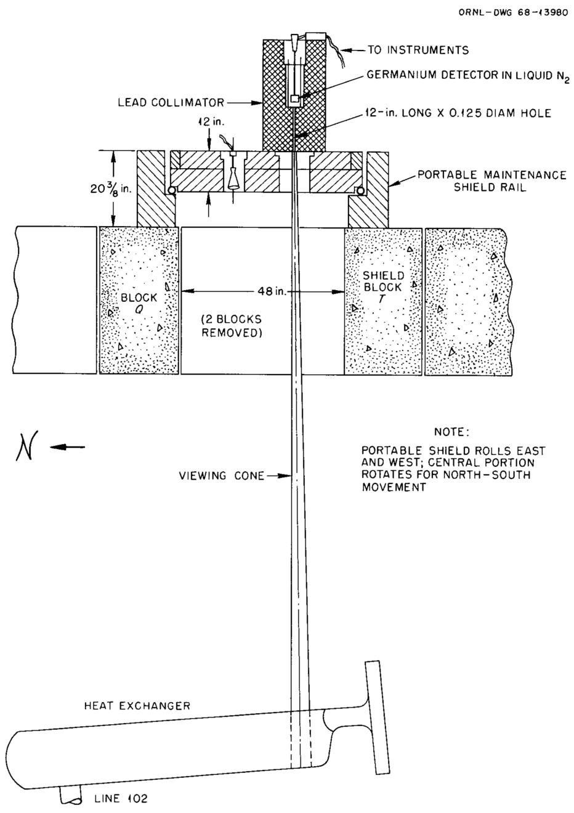  
Fig. 2.3 Setup of Equipment for Gamma-Scanning in Reactor Cell.

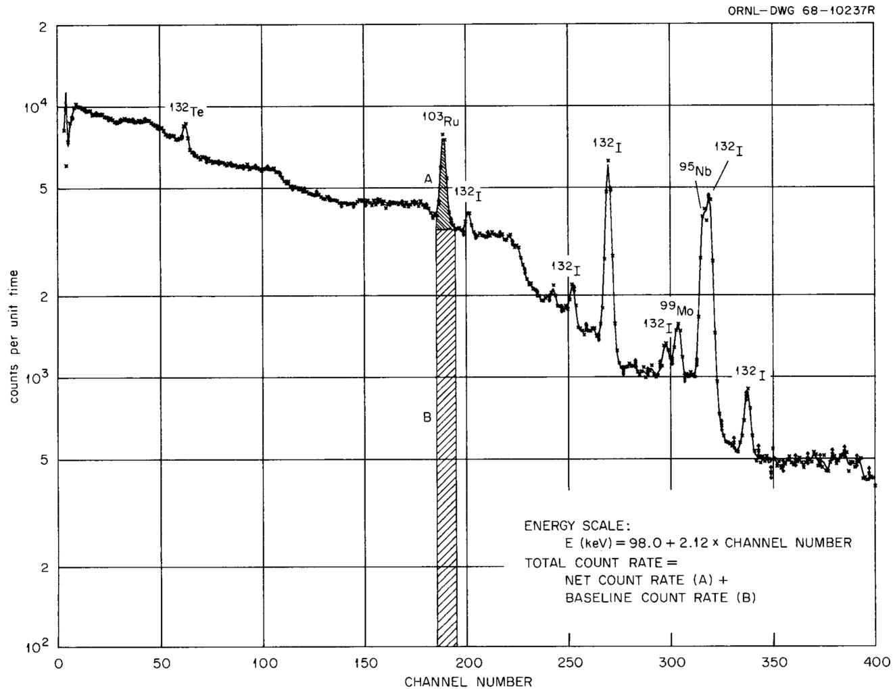  
Fig. 2.4 Typical Energy Spectrum of Gamma Rays from Primary Heat Exchanger.

Table 2.1. Summary of Results of Gamma Spectrometric Measurements of Fission Product Deposition   

<table><tr><td rowspan="2">Nuclide</td><td>\( Inventory^a \)</td><td colspan="3">Observed Depositionb (curies/in.\( ^2 \))</td></tr><tr><td>Metal Area(curies/in.\( ^2 \))</td><td>Heat Exchanger(Average)</td><td>Pump Bowl(Highest)</td><td>Off-Gas Line(Highest)</td></tr><tr><td>35-day \( ^{95}Nb \)</td><td>3.28</td><td>1.9</td><td>1.4</td><td>0.34</td></tr><tr><td>67-hr \( ^{99}Mo \)</td><td>4.78</td><td>4.9</td><td>59</td><td>36</td></tr><tr><td>41-day \( ^{103}Ru \)</td><td>1.75</td><td>1.1</td><td>36</td><td>11.2</td></tr><tr><td>1.0-year \( ^{106}Ru \)</td><td>0.13</td><td>c</td><td>8.5</td><td>1.8</td></tr><tr><td>8.0-day \( ^{131}I \)</td><td>2.03</td><td>c</td><td>c</td><td>1.3</td></tr><tr><td>77-hr \( ^{132}Te \)</td><td>3.32</td><td>1.5</td><td>4.2</td><td>c</td></tr><tr><td>2.4-hr \( ^{132}I \)</td><td>3.32</td><td>2.2</td><td>0.78</td><td>c</td></tr><tr><td>27-year \( ^{137}Cs \)</td><td>0.113</td><td>c</td><td>c</td><td>2.6</td></tr><tr><td>40-hr \( ^{140}La \)</td><td>4.14</td><td>0.028</td><td>1.6</td><td>3.3</td></tr><tr><td>32-day \( ^{141}Ce \)</td><td>3.56</td><td>c</td><td>c</td><td>0.33</td></tr></table>

aThe calculated total inventory of the nuclide at the time of reactor shutdown divided by the area of metal in the fuel system contacted by salt.   
bFigures tabulated are observed concentrations corrected back to time of reactor shutdown.   
cNot detected.

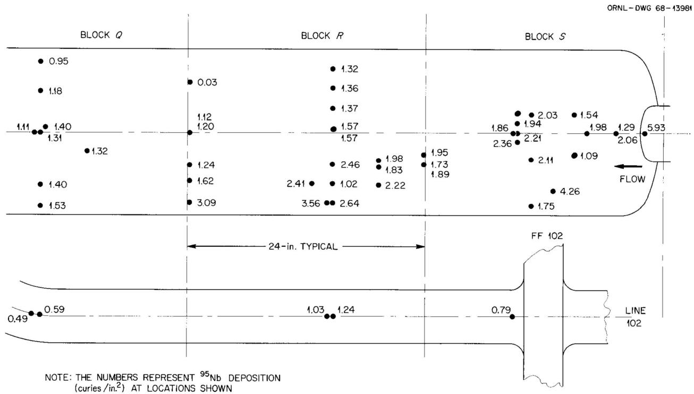  
Fig. 2.5 Deposition of $^{95}\mathrm{Nb}$ in the Primary Heat Exchanger.

is illustrated by Fig. 2.5, which shows the results obtained for $^{95}\mathrm{Nb}$ at many points on the heat exchanger.

One may conclude that the technique of gamma spectrometry of a collimated beam can be very useful in studying MSRE fission product behavior.

# 2.3 GAMMA SOURCE MAPPING WITH PINHOLE CAMERA PHOTOGRAPHY

T. H. Mauney

In conjunction with the gamma spectrometric measurements described in the preceding section, gamma-ray sources were mapped by pinhole camera photography. Film sensitive to both x rays and visible light (Kodak type KK) was used in the lead pinhole camera described previously. The camera was inserted in an 8-in.-diam hole in the portable maintenance shield, which was positioned over openings in the top of the reactor cell. Photographs were developed quickly for immediate use in locating and selecting sources to be examined by the gamma spectrometry being conducted at the time.

The taking of photographs was a rather simple procedure. The camera was placed in the maintenance shield, pointing straight down. The shield was then maneuvered to place the camera directly above the area to be photographed. Since there was no shutter on the camera, a sheet-film holder loaded with the proper film was inserted in the camera and removed after the desired exposure. When desired, visible-light exposure could be made shorter than the x-ray exposure by replacing the holder slide partway through the x-ray exposure.

Some typical examples of the different photographs that were made are Fig. 2.6, which looks down on the fuel pump and adjacent piping, and Fig. 2.7, which is a photograph of the gamma source in the portion of the heat exchanger visible to the camera. Note that what seems to be a corona around the source is actually a blurring of the image in the camera.

This work is, so far as we know, the first attempt to use the technique remotely on in-place reactor components. As such, the results are

promising, and we consider the technique worthy of further development and use. Deficiencies needing improvement are as follows. Gamma images were less sharp than desired, hot spots being blurred. Exposure times for visible-light images were quite long, up to 45 min in some cases, because of the limited light intensity attainable in the cell. Finally, the arrangement for the camera did not permit tilting for shots other than vertical.

Improvement on the first two points is expected from a simple change in the camera aperture. The diameter of the gamma-ray aperture will be reduced from $\frac{1}{8}$ in. to $\frac{1}{32}$ in., and the visible-light aperture will be enlarged to $\frac{1}{32}$ in. from the original $\frac{1}{64}$ in. The smaller gamma-ray aperture will reduce the blurring of the source image. Enlarging the visible-light aperture will speed up the exposure at the expense of sharpness. But the visible-light images need not be very sharp, only clear enough for identification of the components and location of the source relative to them.

# 2.4 PUMPS

P. G. Smith

A. G. Grindell

# 2.4.1 Mark 2 Fuel Pump

The preparation of the test facility for operation with salt5 was completed, and check-out of all systems neared completion. The initial assembly of the pump rotary element had excessive oil leakage from the shaft lower seal during cold shakedown to check the performance of the shaft bearings and seals. The lower seal rotor had a scratch across the seal face which caused the leakage. Upon replacement of the seal rotor, the rotary element performed satisfactorily. The rotary element was installed in the test facility.

# 2.4.2 Oil Pump Endurance Test

The oil pump endurance test was continued. By the end of the period, the pump had run for 44,550 hr circulating oil at $160^{\circ}\mathrm{F}$ and 70 gpm.

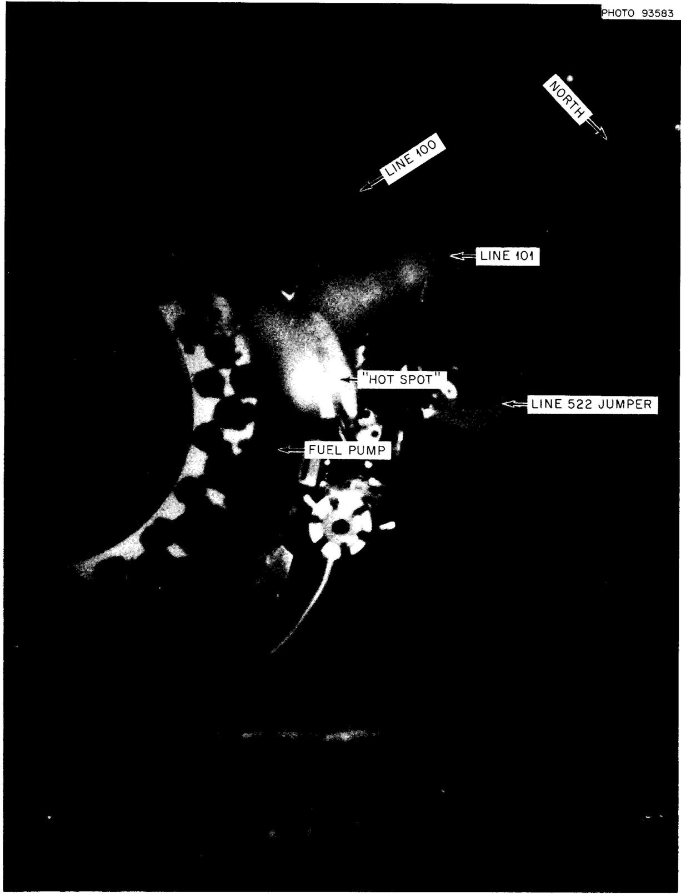  
Fig. 2.6 Gamma-Ray and Visible Light Photograph of Area near Fuel Pump. Made on x-ray film in pinhole camera. Off-gas jumper in place.

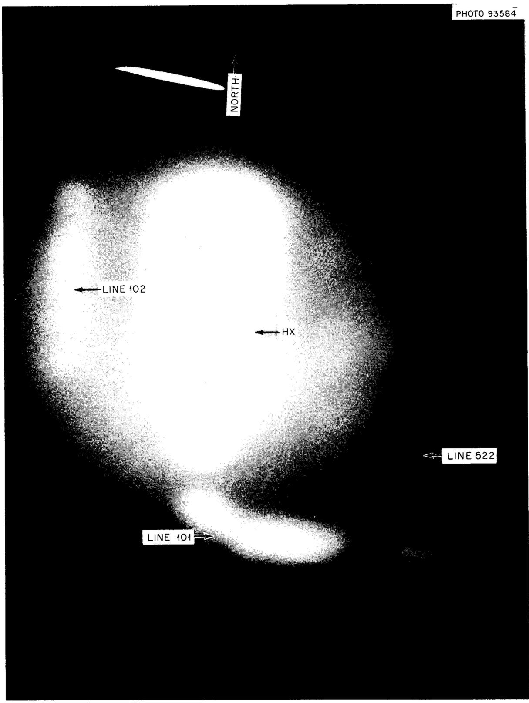  
Fig. 2.7 Gamma-Ray Photograph of Part of the Primary Heat Exchanger. Made on x-ray film in pinhole camera.

# 3. Instruments and Controls

S. J. Ditto

# 3.1 MSRE OPERATING EXPERIENCE

J. L. Redford

All 15 relays in the rod-scram coincidence matrix were replaced with relays designed for 32-v dc operation. No more coil failures occurred, but three of the new relays failed due to contact welding. An investigation of this problem was launched. No other difficulties were experienced in the safety system.

One of the single-point level probes in fuel drain tank 1 failed. The failure was found to be an open lead wire inside the cell. The probe was restored to service by a cross connection outside the cell to the equivalent lead to the other probe.

The No. 2 fission chamber was replaced. A review of the history of the chambers used in the wide-range counting channel indicates an average lifetime in the neighborhood of about three months. This presents very little operational difficulty, since the wide-range counting channel is not utilized during power operation, and, with the staggered failures which we have experienced, the installed spare is usable for any lower power or startup operation when a single channel fails.

# 3.2 CONTROL SYSTEM DESIGN

P. G. Herndon

Further additions and modifications were made to the instrumentation and controls systems as experience revealed the need or desirability of more information for the operators, improved performance, or increased protection. During the report period there were 75 design change requests directly involving instruments or controls. Eleven of these required

only changes in process switch operating points, 48 resulted in changes in instruments or controls, and 5 were canceled. All these changes were made in three areas; the more important ones are described below.

Fuel Transfer System. - The design of instrumentation and controls for a salt filter in transfer line 110 between the fuel storage tank and the fuel drain tanks was completed. $^{1}$

Fuel Processing System. - The instruments and controls for the fuel processing system were revised as a result of piping and equipment modifications. Temperature, pressure, and process radiation measuring instruments were provided for the new caustic scrubber fume filter, the soda-lime trap, and the deep-bed charcoal trap. Two temperature recorders were provided to receive signals from additional thermocouples.

To assure the delivery of fluorine gas at a constant pressure and to improve the control of flow into the fuel storage tank for a wider range of process conditions, a new control system for the fluorine gas supply was designed and installed. A safety shutoff valve was provided to close automatically if flow from the fluorine supply trailer became excessive.

Contact microphones were attached to the exterior walls of the fuel storage tank and the caustic scrubber to transmit the process sounds inside the two vessels. Two fission chambers, one near the fuel storage tank and the other near the caustic scrubber, were installed to provide a warning if uranium collected in the caustic scrubber and caused significant neutron multiplication in the caustic.

# 3.3 ANALOG INVESTIGATION OF CONTROL WITH $^{233}\mathrm{U}$ FUEL

O.W.Burke

F. H. Clark

Because of the differences in the dynamics of the MSRE with $^{233}\mathrm{U}$ fuel, the capability of the existing rod servo controller was questioned. A test of the actual control system under simulated $^{233}\mathrm{U}$ loading conditions was reported previously. The capability

of the control system was also investigated by an analog computer simulation of the MSRE. The simulated controller was made very realistic by incorporating time responses to rod actuation signals that were measured experimentally in the MSRE system.

The simulated $^{23}$ U-fueled MSRE with the simulated controller was subjected to various perturbations. The controlled plant behaved in an acceptable manner at all power levels.

# 4. MSRE Reactor Analysis

B. E. Prince

# 4.1 DELAYED NEUTRON EFFECTIVENESS

B. E. Prince

Theoretical analysis of neutron dynamics measurements, particularly those designed to help infer magnitudes of reactivity effects, depends on the proper interpretation of the delayed neutron behavior in the reactor. As a result of the efforts of many workers, well-developed theoretical and experimental foundations exist for the analysis of the most common reactor kinetics measurements. The usual practical effort involved in analysis of any particular reactor is that of bridging the theoretical foundations and the experimental data with adequate numerical approximations.

An important characteristic of delayed neutrons that must be taken into account in interpreting kinetics experiments is their energies of emission, which are lower than those of the prompt neutrons from fission. In a thermal reactor, such as the MSRE, the net result of this difference in emission energy spectra is that the delayed neutrons have less likelihood of leakage to the surroundings than the prompt neutrons, so that their contribution to the chain reaction is enhanced. Thus one is led, both by theoretical analysis and by physical intuition, to define a "delayed neutron effectiveness" factor $\gamma_{i}$ by which the delay fraction $\beta_{i}$ for the $i$ th precursor group must be multiplied to obtain their contribution, relative to the prompt neutrons, in promoting the chain reaction.

Chapter 6 of ref. 1 contains an extensive discussion of the problem of calculating the delayed neutron effectiveness factors. Although several

measurements of the delayed neutron emission spectra have been made, sufficient uncertainties yet exist in the data to suggest that detailed calculations to take into account the shape of the delayed neutron energy spectra are not always warranted. For thermal reactors in particular, one may obtain an adequate estimate of the corrections arising from these differences in energy spectra by assuming that all delayed neutrons are emitted with a single average energy, independent of the precursor group. According to data taken from ref. 1, this average energy is approximately 0.43 MeV. Then $\gamma_{i} = \overline{\gamma}$ can be computed from the approximate formula

$$
\bar {\gamma} = e ^ {+ B ^ {2} \left(\tau_ {p} - \tau_ {d}\right)}, \tag {1}
$$

in which $B^2$ is the geometric buckling corresponding to the "nuclear" size of the core and $\tau_p$ and $\tau_d$ are the values of the average age to thermal energy for prompt fission neutrons and for delayed neutrons respectively.

The foregoing procedure is strictly applicable to reactors with fixed fuel. In application to the MSRE, additional complications arise from the motion of the precursors due to fuel circulation. The applications to the MSRE considered here are confined to measurements made with no circulation of the fuel. With qualifications depending on the accuracy required, the energy corrections calculated from the above formula may also be applied when the fuel is circulating.

We recently performed calculations of the energy-effectiveness corrections for $\beta$ in the MSRE, based

on the simple recipe described above. The age to the thermal cutoff energy (0.876 ev in MSRE studies) was obtained by use of the GAM-2 program. $^3$ For a salt-graphite composition equal to that of the channeled region of the core and a temperature of $1200^{\circ}\mathrm{F}$ , the age calculated for the prompt fission neutrons was $251.9\mathrm{cm}^2$ . When calculated for both the $^{235}\mathrm{U}$ fissile loading of the preceding MSRE runs and the new loading of $^{233}\mathrm{U}$ , these results were found to be very nearly independent of the fissile composition. Based on a geometric buckling corresponding to a cylinder $29 \times 78$ in. $(R \times H)$ , the value of $\overline{\gamma}$ calculated from Eq. (1) was 1.086. This implies, for example, that the total effective delayed neutron fraction for use in experimental measurements of reactivity effects for $^{235}\mathrm{U}$ is $0.71\%$ , compared with the absolute delay fraction of $0.65\%$ . The magnitude of this energy-effectiveness correction is higher than the correction obtained in earlier studies by a factor of 1.05. This difference is not surprising, however, in view of the necessity in the earlier studies of using a less sophisticated computation of the difference in the average age of prompt and delayed neutrons.

The upward revision of our calculated value of $\overline{\gamma}$ has some interesting implications regarding the interpretation of reactivity measurements made with the $^{235}\mathrm{U}$ fuel loading. Since the magnitudes of reactivity inferred from these experiments are relative to the effective delayed neutron fraction, this would imply that all reactivity effects should be larger by a factor of approximately 1.05 than the values based on the earlier calculations of the energy correction. In the results reported in ref. 5, this would have the effect of increasing the difference between the experimental and calculated worths of the MSRE control rods but would tend to bring the measured isothermal temperature and $^{235}\mathrm{U}$ concentration coefficients of reactivity into better agreement with the calculated values. The direction of these changes is in accord with

what one might expect from an intuitive standpoint because, of the various reactivity effects, the accurate numerical computation of the rod worth presents the most difficulty.

# 4.2 THEORETICAL DYNAMIC ANALYSIS FOR $^{233}\mathrm{U}$ FUEL

R.C.Steffy

P. J. Wood

The MSRE with $^{233}\mathrm{U}$ fuel will have a lower fraction of delayed neutrons, a larger negative temperature coefficient of reactivity, and a longer prompt neutron lifetime than when fueled with $^{235}\mathrm{U}$ . Each of these factors affects the dynamic behavior of the reactor. Because of these differences in important system parameters, an analysis was performed for the $^{233}\mathrm{U}$ -fueled MSRE to predict both the reactor time response and the frequency response to reactivity perturbations, and also to establish the linear stability of the system as described by the theoretical model. The mathematical model used to describe the system was essentially the same linearized model used successfully by Kerlin and Ball to predict the dynamic behavior of the MSRE with $^{235}\mathrm{U}$ fuel. We did alter the model slightly to account for more mixing of the fuel salt during circulation. The experimental results of the earlier testing programs showed the desirability of this change.

# 4.2.1 Time Response

The system time response was calculated by the MATEXP computer code using the coefficients of the model equations as well as the nonlinear terms of the neutron kinetics equations as input. The calculated power response to a step change

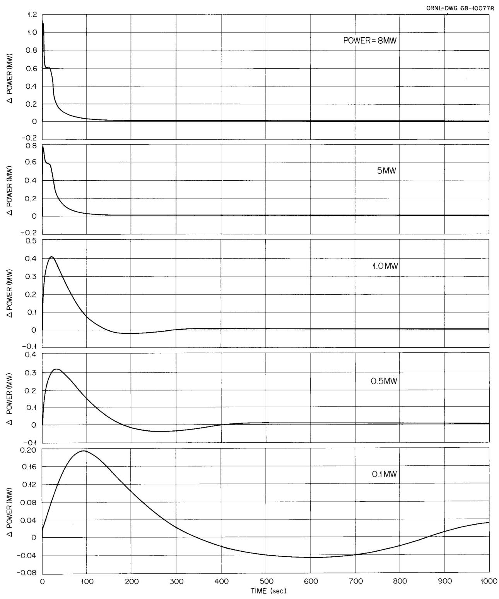  
Fig. 4.1 Predicted Power Response with $^{233}\mathrm{U}$ Fuel to a Step Reactivity Input of $0.02\% \delta k / k$ at Various Initial Power Levels.

in reactivity $(0.02\% \delta k / k)$ is shown in Fig. 4.1 at various initial power levels. The response becomes less oscillatory and the damping coefficient increases as the power level is increased.

At the higher power levels the power rises sharply after a step increase in reactivity, but the temperature effects in the core promptly counterbalance the reactivity input, and the power decreases toward its initial level. However, before returning to its initial level, the power levels out on a transient plateau. It stays at this level until $\sim 17$ sec after the reactivity perturbation; then it again begins to decrease. The power plateau is observed because a quasi steady state exists in the core region. The inlet temperature is the same as it was before the perturbation, and the core nuclear average temperature has increased enough to compensate for the reactivity change. After $\sim 17$ sec (the transient time of the external loop) the return of higher-temperature salt increases the inlet temperature and introduces negative reactivity through the negative temperature coefficient. After sufficient time the reactor returns to the initial power level, at which time the net increase in nuclear average temperature compensates for the step reactivity input.

# 4.2.2 Frequency-Response Calculations

The frequency response of a system is a good indicator of the dynamic response and stability of the system. Unlike many of the pure stability criteria, the frequency response may be directly verified by performing experiments on the system. In the calculations for the MSRE the pure stability criteria are applied to the same model which is used to calculate the frequency response. Experimental determination of the frequency response (planned as part of the testing program for $^{233}\mathrm{U}$ operation) $^{10}$ will help to establish the degree of confidence that can be placed in the model and hence in the stability calculations. Excellent agreement was obtained between the calculated and experimentally determined frequency response for the $^{235}\mathrm{U}$ fuel loading, and we have no reason to expect anything other than good agreement for the $^{233}\mathrm{U}$ fuel loading.

Curves showing the calculated power-to-reactivity frequency response for the $^{233}\mathrm{U}$ -fueled MSRE are shown in Fig. 4.2. Since a high peak implies more oscillatory response, Fig. 4.2 shows that the system will be less oscillatory at higher power levels. The dip in the amplitude ratio curves at $\sim 0.25$ radian/sec corresponds to the fuel transit time of $\sim 25$ sec. Since the amplitude ratio was relatively low at this frequency with the $^{235}\mathrm{U}$ fuel, the dip was not as distinct. However, the amplitude ratio with the $^{233}\mathrm{U}$ fuel remains high to $>1$ radian/sec; so the dip is emphasized.

Power and reactivity are the two parameters most often compared in reactor frequency-response calculations. However, the frequency response of any two system parameters may be calculated, relative to each other, so long as the parameter appears in the system equations. Of most practical interest are the frequency-response calculations involving measurable quantities. The frequency response of the reactor outlet temperature relative to power is shown in Fig. 4.3. The assumed temperature-sensing device is a thermocouple located on the outside of a pipe. In order to calculate a frequency response which is representative of quantities which may be measured in the testing program, additional equations were added to the model to represent the response of the thermocouple to a change in temperature at the inside of the pipe. Figure 4.3 also shows the response of the thermocouple-measured outlet temperature relative to power. The effect of assuming more salt mixing in the circulation loop is also shown.

# 4.2.3 Stability Analysis

A necessary and sufficient condition for linear asymptotic stability is that all the eigenvalues of the set of system equations have negative real parts. In the determination of linear asymptotic stability, the previously mentioned linearized model was used, except that a Padé approximation replaced the pure time delays in representing salt flow around the external loop. Several of the dominant eigenvalues (those closest to the imaginary axis) are shown in Table 4.1. As expected, at all power levels where temperature effects are significant, the eigenvalues have negative real parts which increase in absolute value as the power level increases. When all temperature

ORNL-DWG68-10081R2

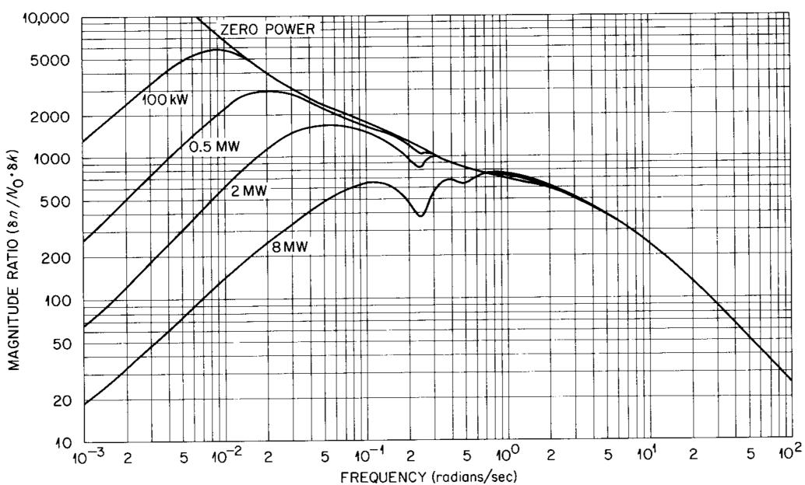

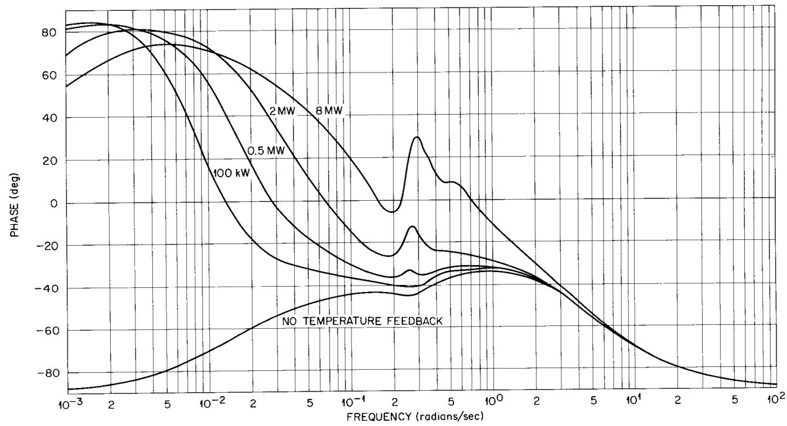  
Fig. 4.2 Predicted Power-to-Reactivity Frequency Response with $^{233}\mathrm{U}$ Fuel at Various Power Levels.

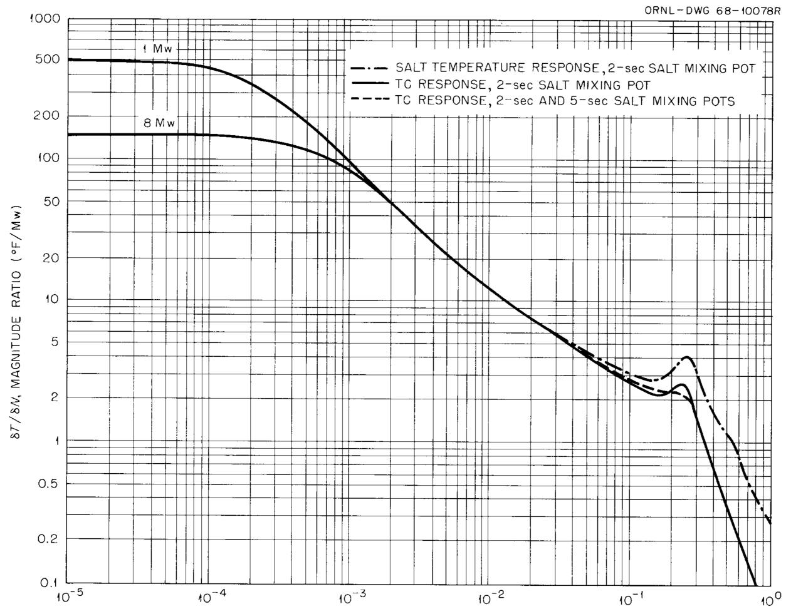

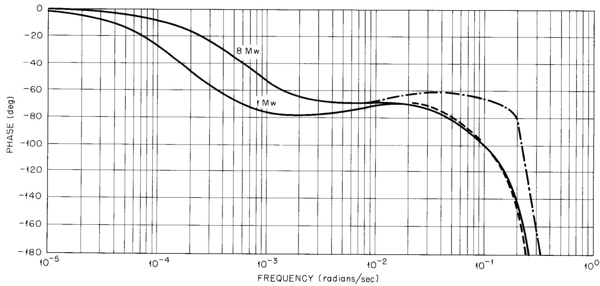  
Fig. 4.3 Predicted Frequency Response of Reactor Outlet Temperature Relative to Reactor Power.

Table 4.1. Dominant Eigenvalues of the System Equations for the MSRE with $^{233}\mathrm{U}$ Fuel   

<table><tr><td rowspan="2"></td><td colspan="3">Eigenvalue for Power Level of -</td></tr><tr><td>0.1 Mw</td><td>1.0 Mw</td><td>8.0 Mw</td></tr><tr><td>Real</td><td>-0.889 × 10-3</td><td>-0.519 × 10-2</td><td>-0.520 × 10-2</td></tr><tr><td>Imaginary</td><td>±0.555 × 10-2</td><td>0.0</td><td>0.0</td></tr><tr><td>Real</td><td>-0.529 × 10-2</td><td>-0.547 × 10-2</td><td>-0.547 × 10-2</td></tr><tr><td>Imaginary</td><td>0.0</td><td>0.0</td><td>0.0</td></tr><tr><td>Real</td><td>-0.548 × 10-2</td><td>-0.551 × 10-2</td><td>-0.551 × 10-2</td></tr><tr><td>Imaginary</td><td>0.0</td><td>0.0</td><td>0.0</td></tr><tr><td>Real</td><td>-0.559 × 10-2</td><td>-0.564 × 10-2</td><td>-0.564 × 10-2</td></tr><tr><td>Imaginary</td><td>±0.531 × 10-4</td><td>±0.305 × 10-4</td><td>±0.279 × 10-4</td></tr></table>

effects were neglected (zero power), both the real and imaginary parts of the dominant eigenvalue were zero. An eigenvalue at the origin is typical of a zero-power reactor.

Whereas the real parts of the eigenvalues determine the absolute stability, the damping ratio gives a better indication of relative stability. The damping ratio, $\xi$ , is related to the angle, $\beta$ , which a vector from the origin to the dominant eigenvalue makes with the imaginary axis, through the relation

$$
\xi = \frac {\tan \beta}{\sqrt {1 + \tan^ {2} \beta}}.
$$

Table 4.2 shows the damping ratio as a function of power level. A lower value of $\xi$ implies a more oscillatory system. The values in Table 4.2 were calculated from the eigenvalue with the smallest real part which also had a nonzero imaginary com

Table 4.2. Damping Ratio as a Function of Power Level in the MSRE with $^{233}\mathrm{U}$ Fuel   

<table><tr><td>Power, Mw</td><td>0.1</td><td>0.5</td><td>1.0</td><td>8.0</td></tr><tr><td>ξ</td><td>0.16</td><td>0.42</td><td>1.0</td><td>1.0</td></tr></table>

ponent. Since there are a number of eigenvalues which have about the same amplitude, this damping ratio alone cannot be used to determine system response, but it does serve as a relative indicator of oscillatory behavior. From the $\xi$ values we must again conclude that the system is highly stable at high power levels and that it becomes more oscillatory and more sluggish at lower powers.

The Mikhailov stability technique has recently been modified by Wright and Kerlin12 so that equations containing pure time-delay terms can be handled. The modifications also included amplitude and phase normalization, so that the Mikhailov criterion is now valuable in stability analysis. In this analysis the system equations are Laplace transformed and then manipulated following the rules of matrix algebra to give a vector which may be plotted as a function of

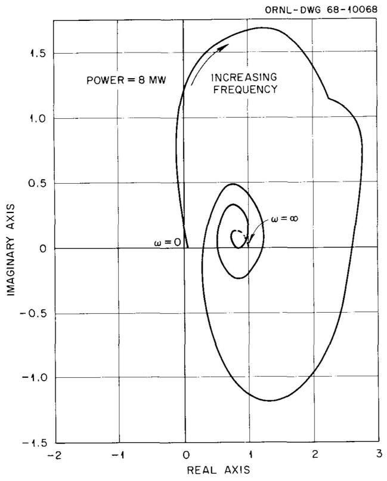  
Fig. 4.4 Modified Mikhailov Plot for MSRE with $^{233}\mathrm{U}$ Fuel at 8 Mw.

frequency. If the tip of the vector makes any net encirclements of the origin as the frequency is varied from $-\infty$ to $+\infty$ , the system is unstable. The vector motion is symmetric with respect to the frequency variable, so only the points corresponding to frequencies between 0 and $+\infty$ need be plotted. Plots for the MSRE at 8 and $0.1\mathrm{Mw}$ are shown in Figs. 4.4 and 4.5. In none of the plots are there net encirclements of the origin; so at these power levels, system stability is again demonstrated. Similar analyses at other power levels showed the system to be absolutely stable except at zero power, where the line passes through the origin. $^{13}$ This is in agreement with the eigenvalue calculation at zero power and is characteristic of zero-power reactors.

In summary, it has been shown by several techniques that the MSRE will be stable at all power

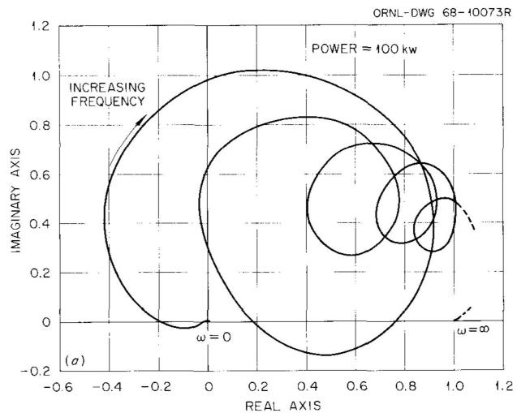

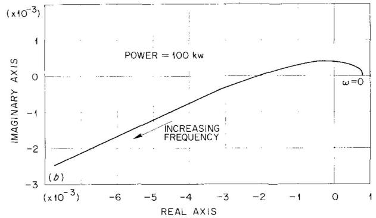  
Fig. 4.5 Modified Mikhailov Plot for MSRE with $233\mathrm{U}$ Fuel at 0.1 Mw. (a) Complete plot. (b) Near origin.

levels and that the degree of stability increases with the power level. The initial response of the power to a reactivity perturbation will be faster for the $^{233}\mathrm{U}$ fuel loading than it was with the $^{235}\mathrm{U}$ fuel; however, the damping coefficient is also larger, so the power level will return to its initial state faster.

# Part 2. MSBR Design and Development

# 5. Design

E. S. Bettis

# 5.1 GENERAL

E. S. Bettis R. C. Robertson

We have continued the design studies of the single-fluid molten-salt breeder reactor described in our last semiannual progress report. Several significant changes were made in the design described there. One notable difference is the reduction in the capacity of the MSBR reference design plant from 2000 Mw (electrical) to 1000 Mw (electrical). Although the single-fluid MSBR concept is well suited for larger sizes of reactors, and many of the performance factors and the power production costs would be more favorable in larger units, we decided that the evaluation of the reference plant should be on the same basis as the majority of other current power reactor studies.

Another important modification of the design was our decision to replace graphite by removing the entire reactor core as a unit assembly rather than by withdrawing a few elements at a time, as had been assumed in all the previous concepts for the single-fluid MSBR. This required changes in the high-bay containment arrangement, as will be explained subsequently.

Other significant changes were made in the reactor and heat exchanger equipment, the flow-sheets, and plant layouts. The majority of these revisions were brought about by refinements in the nuclear physics calculations, in the physical properties of the fuel and coolant salts, and in estimates of the afterheat and stress problems.

Some general data for the reference design are listed in Table 5.1.

# 5.2 PLANT LAYOUT

E. S. Bettis

H. M. Poly

H. L. Watts

The overall concept for the MSBR plant is much the same as was previously reported, but we have made significant changes in a few particular areas. As shown in Fig. 5.1, the reactor cell contains the reactor vessel, four primary pumps, and four primary heat exchangers. The steam cells house the four secondary pumps, the steam generators, and the steam reheaters. Other cells provide for reactor auxiliary systems, for fuel processing systems, for storage of a spent reactor core and a primary heat exchanger tube bundle removed from service, and

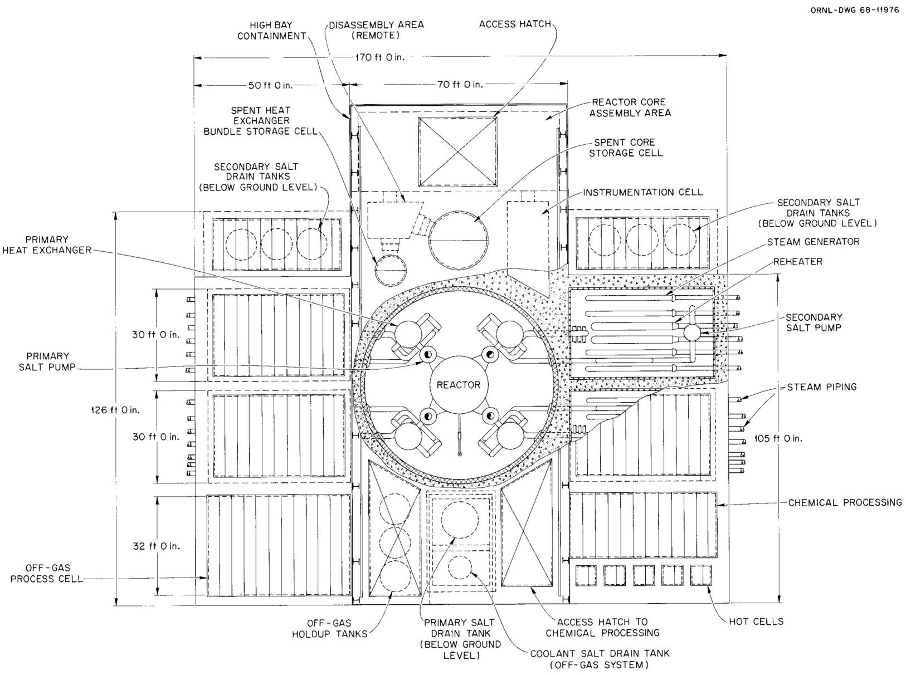  
Fig. 5.1. Plan View of Reactor and Steam Cells.

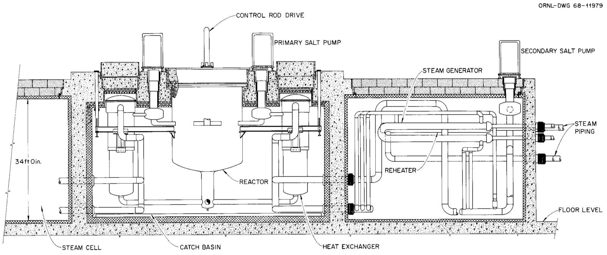  
Fig. 5.2. Elevation of Reactor and Steam Cells.

Table 5.1. General Design Data for 1000-Mw (Electrical) MSBR Power Station   

<table><tr><td>Net electrical output, Mw (electrical)</td><td>1000</td></tr><tr><td>Reactor thermal power, Mw (thermal)</td><td>2250</td></tr><tr><td>Auxiliary power required, Mw (electrical)</td><td>~35</td></tr><tr><td>Net plant heat rate, Btu/kwhr</td><td>7690</td></tr><tr><td>Net plant thermal efficiency, %</td><td>44.4</td></tr><tr><td>Primary (fuel) salt temperature range, °F</td><td>1050-1300</td></tr><tr><td>Secondary (coolant) salt temperature range, °F</td><td>850-1150</td></tr><tr><td>Average reactor power density, kw/liter</td><td>29</td></tr><tr><td>Maximum reactor core power density, kw/liter</td><td>108</td></tr><tr><td>Breeding ratio</td><td>1.077</td></tr><tr><td>Power doubling time, years</td><td>17</td></tr><tr><td>Fissile inventory requirement, kg</td><td>1600</td></tr><tr><td>Estimated life of graphite in core, years</td><td>1.8</td></tr><tr><td>Maximum pressure in primary system, psi</td><td>250</td></tr><tr><td>Rated capacity of each of four primary pumps, gpm</td><td>15,000</td></tr><tr><td>Rated capacity of each of four secondary pumps, gpm</td><td>20,000</td></tr></table>

for work space to dismantle these radioactive items of equipment.

The dimensions of the cells are shown in Figs. 5.1 and 5.2. All the cells except the primary and secondary drain tank cells are above grade. Double containment is provided for all the cells which normally contain radioactive materials. The reactor cell has thermal shielding at the cell wall to prevent overheating of the concrete biological shielding by incident radiation. The reinforced concrete structure at the top of the reactor cell was analyzed for stresses, and the maximum deflection of the 63-ft-diam slab was found to be acceptable under the fully loaded conditions.

A basic change in the layout is that the high-bay area over the reactor cell, storage cells, and core assembly and disassembly space is a separate containment area within the reactor plant confinement building. This provides an additional barrier to the escape of airborne radioactive particles and

gases and helps to avoid spread of contamination during maintenance operations. This change was dictated by our decision to remove the reactor core as a unit rather than by taking a few graphite elements at a time.

We have changed the method of supporting the equipment in the reactor cell; it will now hang from the overhead structure rather than resting on pedestals on the cell floor. The supports are shown in Fig. 5.2. The reactor vessel closure seal is now in a lower-temperature, less radioactive environment. Each primary heat exchanger is hung from a pivot point near the center of the shell. This permits the shell to rotate slightly to accommodate the differential thermal expansion in the inlet and outlet primary salt lines. The primary heat exchangers move outward toward the cell wall under thermal expansion, and clearance for this movement has been provided in the shield plugs.

The primary-salt piping was analyzed for stresses, and all values were found to be within the acceptable limits. We removed the expansion bellows previously shown in the secondary-salt lines for the 2000-Mw (electrical) plant. In a 1000-Mw (electrical) MSBR station these lines are small enough for expansion loops to provide the necessary flexibility.

# 5.3 FLOWSHEET

J. R. McWherter H. M. Poly Dunlap Scott

A new flowsheet was drawn and is shown in Fig. 5.3. For simplicity, only one of the four primary circulating loops and one of the secondary circulating loops have been shown on the flowsheet. In general, only one item of equipment in multiple installations is included.

Most of the mass flow rates shown on the flowsheet are about one-half those shown in previous reports for a 2000-Mw (electrical) MSBR plant. Some of the changes in the quantities shown are due to revisions in the salt physical property data. The properties now in use in the MSBR design studies are given in Table 5.2. Some of the auxiliary systems not shown on previous flowsheets have also been included.

A flow of secondary salt is no longer bypassed around the steam generators as it was in previous concepts. This change, which significantly reduces the secondary-salt flow requirements, was

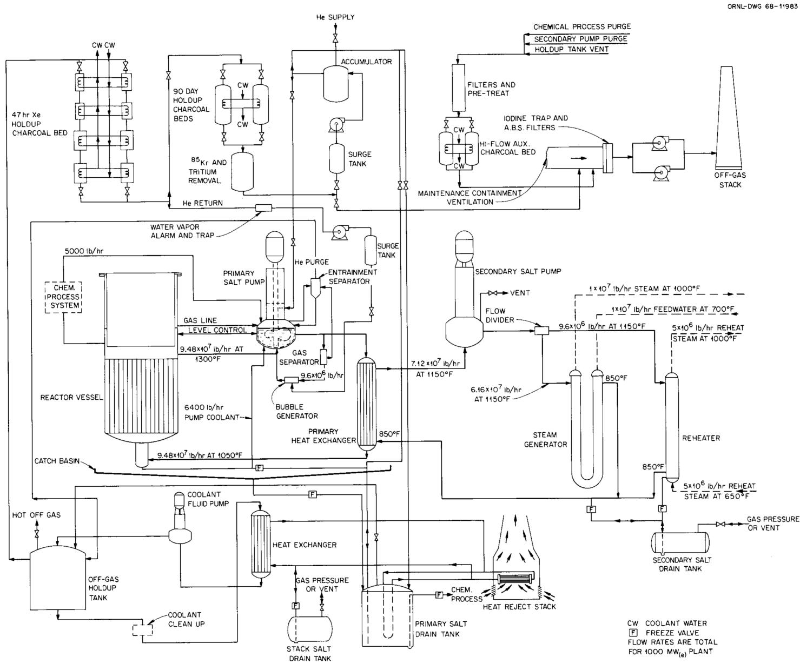  
Fig. 5.3. Single-Fluid MSBR Flowsheet.

Table 5.2. Summary of Properties of Primary and Secondary Salts Used in Design Study of MSBR   

<table><tr><td></td><td>Primary Salt</td><td>Secondary Salt</td></tr><tr><td>Composition, mole %</td><td>LiF-BeF2-ThF4-UF4(71.7-16-12-0.3)</td><td>NaBF4-NaF (92-8)</td></tr><tr><td rowspan="2">Density, lb/ft3</td><td>204.9 at 1300°F</td><td>113.4 at 1150°F</td></tr><tr><td>210.7 at 1050°F</td><td>120.6 at 850°F</td></tr><tr><td rowspan="2">Viscosity, lb ft-1hr-1</td><td>16.4 at 1300°F</td><td>6.1 at 800-900°F</td></tr><tr><td>34.18 at 1050°F</td><td></td></tr><tr><td>Heat capacity, Btu lb-1(°F)-1</td><td>0.324</td><td>0.36</td></tr><tr><td>Thermal conductivity, Btu hr-1(°F)-1 ft-1</td><td>0.58-0.75</td><td>0.26</td></tr><tr><td>Melting point, °F</td><td>930</td><td>About 700°F</td></tr></table>

made on the basis of new physical property data for the salts and on revised calculations which indicate that the secondary salt can be returned to the primary heat exchangers at as low a temperature as $850^{\circ}\mathrm{F}$ without danger of freezing the primary salt, even though the latter has a liquidus temperature of about $930^{\circ}\mathrm{F}$ . This assumption is supported by the estimate of the film temperature drops and the tube wall resistance to heat transfer.

The full-flow gas separator shown in the primary-salt line on previous flowsheets has been eliminated. We now pass only about $10\%$ of the salt flow through a gas separator. The stripped gases and entrained salt are then passed through an entrainment separator, the collected salt being returned to the pump bowl. The purge gas from the pump bowl is also freed of salt in this same entrainment separator. The off-gas from the entrainment separator is very radioactive, and from evidence obtained in the MSRE, it can be expected to contain particles of noble metals in suspension. A holdup tank is provided in the off-gas line to cool the gas and to extract the metal and other decay product particulates. A fluid, possibly liquid bismuth, is sprayed into the holdup tank in direct contact with the off-gas. This fluid is circulated in a closed loop consisting of the holdup tank, pump, heat exchanger, and chemical processing system for cleanup. The heat transport medium circulated through the exchanger is coolant salt taken from the natural convection coolant-salt system used to remove heat from the primary-salt drain tanks.

# 5.4 REACTOR VESSEL AND CORE

H. F. Bauman

E. C. Hise

E. S. Bettis

H. A. McLain

R. Blumberg

J. R. McWherter

C. W. Collins

H. M. Poly

W. K. Furlong

H. L. Watts

The basic design of the reactor for a single-fluid MSBR is for the fuel salt to move upward in single-pass flow through graphite moderator prisms, or elements, mounted vertically in a Hastelloy N tank. Although simple in concept, much of the MSBR design study effort has been spent in investigating the many possible arrangements to approach an optimum configuration. There have been numerous refinements to the design concept as more information became available on graphite behavior, salt properties, nuclear performance, and on heat transfer and stress conditions.

We no longer use a permanently installed metal grid for locating the moderator prisms within the core. It was possible to eliminate the grid when we decided to remove and replace the core graphite as a unit rather than by individual or small groups of elements. A core "basket" is now used to retain the graphite. The basket can be preassembled by direct approach, and a jig would assure correct alignment of the prisms. When the peripheral region of the core is filled with the graphite spheres, as will be discussed subsequently, the core graphite will be held in position and the assembly jig can be removed. The basket is installed inside the re

actor vessel as a unit assembly. When it becomes necessary to replace the graphite the basket can be lifted from the reactor along with the top head of the vessel.

The graphite rests on the bottom of the core retainer basket when the reactor is drained of salt and bears against the top head when the vessel is filled. The prisms are tapered at the top, which, together with a molded extension, provides a flow passage across the top of the graphite for the leaving fuel salt. This arrangement gives a high fuel-to-graphite ratio region at the top of the reactor to act as an undermoderated "blanket." The molded extension also allows for orificing the center holes in the elements and in the interstices to approach a uniform temperature rise of the fuel salt over the entire cross-sectional flow area of the core. Reactor performance was of course improved by elimination of the metallic grid work which acted as a nuclear poison.

Physics calculations to optimize the nuclear performance and to determine the salt fractions and exact shape of the salt flow passages are not yet complete. Figure 5.4, however, indicates the general cross-sectional shape of the elements. They are about 4 in. square with projections on each face and a central hole about 0.6 in. in diameter to form the salt flow channels. The flow channels between the elements are about 0.4 in. wide, and all the flow passages have equal hydraulic diameters. When assembled in a square array the 1248 prisms form an octagonal matrix, as shown in Fig. 5.5. With this particular configuration, about $16\%$ of the core volume will be salt, but the dimensions can be adjusted to provide the salt fraction specified from the physics analysis. The absence of sharp corners on the elements will facilitate fabrication by extrusion, and the flat surface at the points of contact of a rib with an adjacent element will permit relative movement without damage.

Hydraulic analyses indicate that the pressure drop of the salt in flowing through the moderator is about 34 psi along the axial center line of the reactor core. This estimate is based on a 92-w/cc maximum core power density and a $250^{\circ}\mathrm{F}$ temperature rise of the salt in passing through the core and will have to be adjusted to conform to the final design values. At other radial locations in the core the flow rates are necessarily less in order to produce the desired $250^{\circ}\mathrm{F}$ rise. As mentioned previously, the additional pressure drop needed at these locations to produce a total $\Delta p$ of 34 psi

is obtained by the use of orifices at the top of the graphite moderator elements. The total static pressure at the top of the core, including the gas over-pressure, is about 55 psi.

The peripheral space between the octagonal-shaped core and the cylindrical walls of the basket is filled with graphite spheres about 4 in. in diameter, as shown in Fig. 5.6. These balls serve a dual purpose. The fuel-to-graphite ratio is higher in this volume, and, by being undermoderated, there is much lower fission rate and the leakage of neutrons from the core is substantially reduced. Secondly, the balls are buoyant in the salt and exert a radial pressure tending to keep the core elements compacted. A hold-down plate is provided at the top of the core to keep the balls in place and to introduce a high resistance to salt flow through the ball region. The bulk of the salt entering this space will move radially inward into the active core region in its transit through the reactor. The flow in the blanket region is estimated to be only about $10\%$ of the total salt mass flow rate.

The new arrangement provides for removal of the core as a unit assembly rather than by withdrawal of a few graphite elements at a time. We plan to use a spare top head assembly and a core basket for the replacement operation. The spent core would first be drawn up into a transport cask, moved laterally, and lowered into the spent core cell for decay and disposal. The top head assembly would be decontaminated from all but induced activity and reused in a future graphite replacement operation. The spare head and the core, which had been previously assembled by direct approach under shop conditions, would be standing by, and the substitution could be made relatively quickly. This maintenance arrangement is believed to require less capital investment and downtime.

The core basket is a complete assembly containing the core elements, the blanket spheres, and the reflector graphite. The dished bottom of the basket is about 2 in. thick and has a central inlet opening for the salt. A flat plate is located about 10 in. above the opening to support the central graphite when the vessel is empty. The cylindrical shell of the basket has a $\frac{1}{2}$ -in. clearance between it and the vessel wall to allow an upward flow of fuel salt for vessel cooling. Eight 2-in.-OD Hastelloy N lifting rods extend to the bottom of the basket to carry the weight when it is lifted. Radiation damage to the basket material is of less

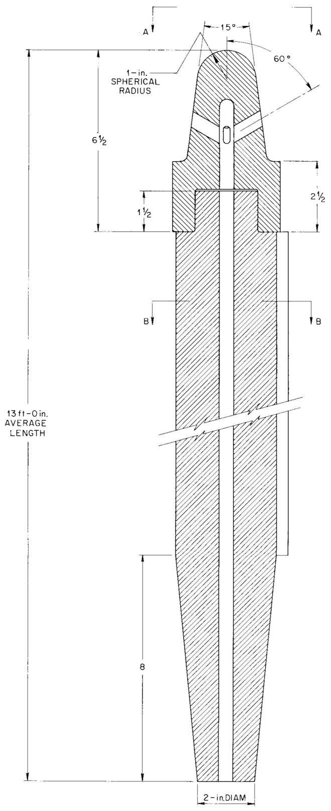

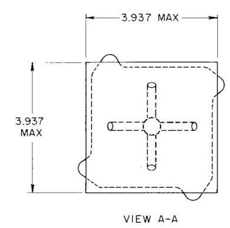

Fig. 5.4. MSBR Reactor Moderator Element.   
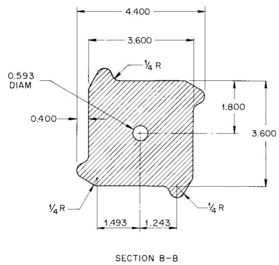  
DIMENSIONS IN INCHES UNLESS OTHERWISE INDICATED

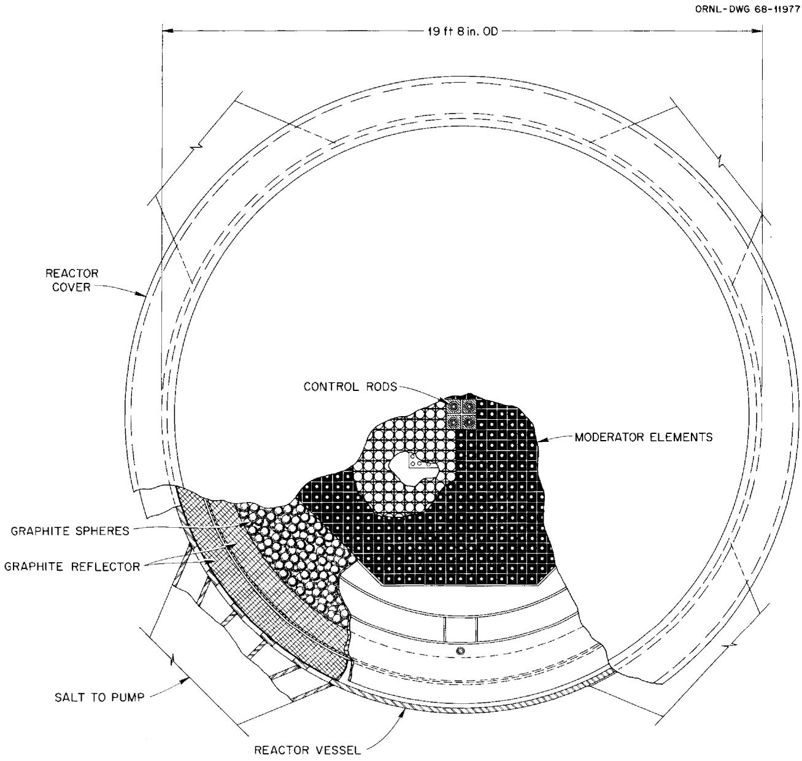  
Fig. 5.5. Plan View of Single-Fluid Reactor.

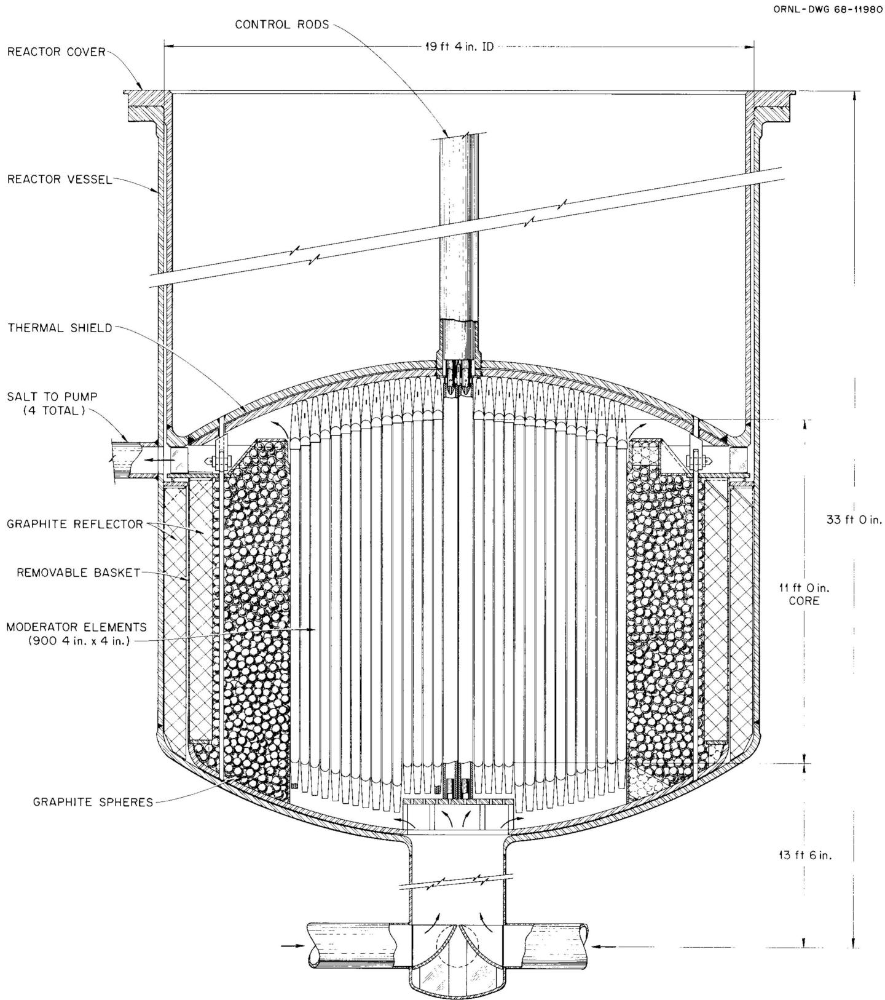  
Fig. 5.6. Elevation of Single-Fluid Reactor for 1000 Mw (Electrical) MSBR Power Station.

concern than damage to the reactor vessel wall, since the basket would be replaced along with the graphite.

The reactor tank is a Hastelloy N vessel about 18 ft in diameter and 16 ft high at the center line of the two dished heads. The wall thickness is about 2 in., and the lower head is 3 in. thick. The top dished head is 2 in. thick, but also has a 2-in.-thick thermal shield on the inside to the lower neutron fluence to ensure that radiation damage in this high-temperature region will be within allowable limits. As seen in Fig. 5.6, the top head is attached through a forging to a 9-ft-high cylindrical extension which carries a flange at the top to mate with the upper flange on the extended wall of the reactor vessel. This arrangement allows the vessel closure to be more accessible and in a zone that has lower temperature and less radioactivity. The flanges have double metal gaskets to effect a gastight seal and to provide a space for leak detection. These gaskets would be replaced each time a new reactor core is installed. The upper flanges rest on the structure near the top of the cell and support the entire reactor vessel assembly.

Preliminary calculations indicate that the stresses in the reactor vessel heads and walls are within the allowable limits. We have also investigated the effect of the neutron fluence on the design life of the plant. While it appears that the conditions are acceptable, if further refinements show that modifications are necessary, thermal shields can be used to bring the doses to within tolerable levels. We are presently showing a thermal shield for the top head, since this is the highest temperature region in the reactor. The bottom of the basket acts as a thermal shield for the bottom head.

As indicated in Fig. 5.5, provisions have been made at the center of the core for four control rods. The rods have not been fully studied, but their function is primarily for making adjustments and for convenience in startup operations, etc. The load-following and safety aspects of the MSBR are largely provided by the negative temperature coefficient of reactivity. We have not found a need for a rapid-acting drive mechanism, and in fact it may not be desirable in this type of reactor to provide a mechanism which establishes this as a possibility. The present concept for the rods is shown in Fig. 5.7. Graphite cylinders about $3\frac{3}{4}$ in. in diameter are driven down into the salt by a rack and chain mechanism to increase the reactivity of the core. Flow passages in the rod permit upward

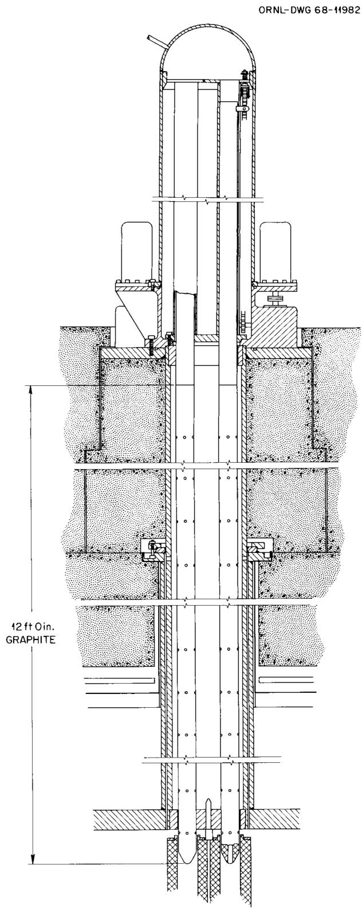  
Fig. 5.7. Elevation of MSBR Control Rod Drive Assembly.

flow of salt for cooling. The rods and drives are enclosed in a housing to provide the necessary double containment.

# 5.5 PRIMARY HEAT EXCHANGERS

C. E. Bettis H. A. McLain H. L. Watts

There are four vertical, single-pass, counterflow primary heat exchangers which transfer heat from the primary salt to the secondary salt. An elevation of a primary heat exchanger is shown in Fig. 5.8, and the principal data are listed in Table 5.3.

Table 5.3. Primary Heat Exchanger Design Data   

<table><tr><td>Number of units</td><td>4</td></tr><tr><td>Heat transferred in each unit, Mw</td><td>563</td></tr><tr><td>Mass flow rate primary salt, 107lb/hr</td><td>2.37</td></tr><tr><td>Mass flow rate secondary salt, 107lb/hr</td><td>1.78</td></tr><tr><td>Primary salt temperature in, °F</td><td>1300</td></tr><tr><td>Primary salt temperature out, °F</td><td>1050</td></tr><tr><td>Secondary salt temperature in, °F</td><td>850</td></tr><tr><td>Secondary salt temperature out, °F</td><td>1150</td></tr><tr><td>Tube diameter, in. OD</td><td>0.375</td></tr><tr><td>Tube wall thickness, in.</td><td>0.035</td></tr><tr><td>Tube pitch, in.</td><td>0.6875</td></tr><tr><td>Shell side Δp, psi</td><td>76</td></tr><tr><td>Tube side Δp, psi</td><td>144</td></tr><tr><td>Shell radius, ft</td><td>2.43</td></tr><tr><td>Baffle spacing, ft</td><td>1.6</td></tr><tr><td>Number of tubes per unit</td><td>5660</td></tr><tr><td>Length of tubes, ft</td><td>21</td></tr><tr><td>Salt volume in tubes (only), ft3</td><td>60</td></tr><tr><td>Approximate average salt velocity in tubes, fps</td><td>10</td></tr><tr><td>Approximate average salt velocity in shell, fps</td><td>9</td></tr><tr><td>Overall coefficient of heat transfer, Btu hr-1 ft-2 (°F)-1 a</td><td>970</td></tr></table>

${}^{a}$ An enhancement factor of 2.0 is assumed for inside the tubes and 1.3 outside the tubes through use of knurled tubing. Salt properties are those listed in Table 5.1.

Primary salt circulates in single-pass flow inside the tubes from top to bottom of the exchanger. There are about 5700 tubes, $\frac{3}{8}$ in. $\mathrm{OD} \times 0.035$ in. wall thickness, approximately 20 ft long, in each of the four exchangers. The secondary salt flows on the shell side from bottom to top through disk and doughnut baffles. In order to minimize the fuel salt volume in the exchangers we propose to use a special tubing. The tubes are knurled to produce shallow, spiraled convolutions along the length. This treatment has been found in tests with water to be effective in increasing the overall heat transfer coefficient, although at the expense of an increased pressure drop.

We completed an optimization code for calculating the performance of the heat exchangers. Full utilization of the code awaited reliable physical property data for the salts, but recently available values will make it possible to optimize the heat exchanger design. The heat exchanger data listed in Table 5.3 are based on the new salt properties given in Table 5.1 and are the initial result of use of the new code. Further refinements and revisions will probably be required when the vibration and stress studies are complete, and some of the numbers may need adjustment.

The tubing for the primary exchangers would be fabricated and installed under strict quality control conditions, and past experience indicates that a high degree of reliability could be achieved. To take care of the possibility of tube failure, however, after studying the maintenance aspects, we decided to design on the basis of removal of an entire tube bundle rather than to attempt to repair individual tubes in the highly radioactive environment. The heat exchanger shells and connecting piping would be permanently installed, although these could be replaced by nonroutine remote maintenance techniques in the unlikely event that this need arose.

A heat exchanger tube bundle consists of tubes running vertically between the upper and lower tube sheets. As shown in Fig. 5.8, the top sheet has a hole in the center through which the secondary salt downcomer passes. A flanged joint at one end of this central pipe and a slip joint at the other permit removal of the bundle. The tube bundle is clamped onto a ring at the top of the shell in order to resist the hydraulic forces due to salt flow. A seal weld is made around the clamped joint to ensure separation of the primary and secondary salt circuits. When removing a tube

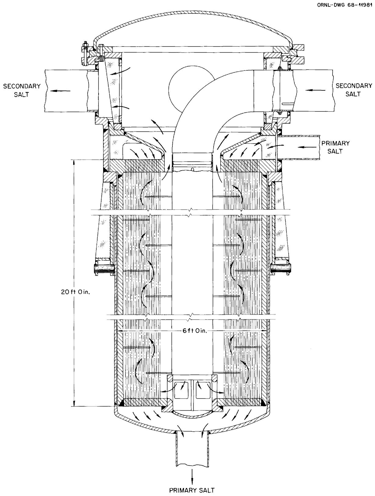  
Fig. 5.8. Elevation of MSBR Primary Heat Exchanger.

bundle it would be necessary to grind open this weld. The remotely operated equipment to open the weld and to reweld the joint after a new bundle has been installed is under study.

# 5.6 PRIMARY DRAIN SYSTEM

H. A. McLain

Dunlap Scott

J. R. McWherter

W. K. Furlong

One drain tank, about 13 ft in diameter $\times 20$ ft high, provides storage volume for the approximately $1500\mathrm{ft}^3$ of salt in the primary circulating system. The general features of the tank are much as described in a previous report, $^1$ although the dimensions and heat transfer area require revisions because the plant design capacity is now $1000\mathrm{Mw}$ (electrical). These changes are in progress.

The natural-convection cooling system for the drain tank was also described previously. This system utilizes thimbles in the drain tank to transfer the afterheat in the primary salt to a sodium fluoroborate coolant salt which is circulated by natural convection to cooling coils located in the base of a natural draft stack. There the heat is transferred to the ambient air. A system of dampers and heaters would prevent the drain tank coolant salt from freezing when it is not required to transport the heat. Again, the features of the system remain essentially unchanged but revisions are needed. A very preliminary analysis of the heat transfer coefficient between the primary salt in the tank and the circulating coolant salt in the thimbles indicates that it is in the order of $50\mathrm{Btu}\mathrm{hr}^{-1}\mathrm{ft}^{-2}(\circ \mathrm{F})^{-1}$ rather than the higher value previously reported.

We studied the drain system piping during the past report period and decided to locate the drain valve in the drain line inside the reactor cell. With this layout any break in the valve or in the piping would make use of the catch pan and direct the spilled primary salt to the drain tank.

The arrangement of the drain line is schematically as indicated on the flowsheet, Fig. 5.3. The drain line connects to the bottom (inlet) plenum of the reactor vessel, and the drain valve is located about 14 ft downstream from this connection. Since the salt in the drain line must be circulated to prevent excessive self-heating, a connection has been provided just upstream of the freeze valve to a manifold connecting the tanks of each of the four primary pumps. Salt flowing through this line

provides a constant flow of $1050^{\circ}\mathrm{F}$ salt through the drain line. This cool salt also provides wall cooling for the pump bowls.

On the drain tank side of the drain valve, the line must be vented in order for the line to drain free of salt. The $\frac{1}{2}$ -in. line provided for this purpose has a mechanical valve located well above any salt levels in the system.

The drain valve is the frozen salt type and has not yet been studied in detail. There is a background of satisfactory experience with freeze valves in the MSRE, however. A gas-cooling system will be used for freezing the plug in the valve and for keeping it frozen. When a drain is to be made, hot rather than cool gas will be supplied.

The catch basin, or pan, referred to above is in our present thinking connected to the drain tank through a U-tube trap. This trap is filled with molten bismuth which under normal conditions serves as a seal between the drain tank contents and the reactor cell volume. If primary salt is spilled into the catch basin, the accumulated head of salt in the line would displace the bismuth from the U-tube and allow the salt to flow into the drain tank. A catch tank is located downstream from the U-tube to trap the bismuth and prevent it from entering the tank along with the salt. If secondary salt rather than primary salt were to spill into the catch basin, its density would not be sufficient to displace the bismuth, and there would be no flow. A mechanical valve is provided between the U-trap and the drain tank so that the vessel can be pressurized for transfer of the primary salt from the tank. This valve would not contact the salt except in the unlikely event of an accidental spill. It is within the current technology to fabricate a valve for such service.

# 5.7 MAINTENANCE PROCEDURES AND EQUIPMENT

Robert Blumberg E. C. Hise

Study was begun of the maintenance procedures and equipment needed to replace the graphite in the reactor core and to repair or replace the pump rotary elements and primary heat exchangers. Three major pieces of maintenance equipment will be required: (1) a reactor cell transition piece which extends the cell containment above the elevation of the pump motors and has a slide closure at the

top, (2) a similar transition piece for the spent-components cells, (3) a track-mounted shielded transport cask with internal hoist.

Major attention has been given to the replacement of the reactor moderator assembly, since the radioactivity level would be highest in this operation. It is estimated that ten days after reactor shutdown the heat generation in the spent core would be about $240\mathrm{kw}$ (thermal). This amount of heat could be dissipated without need for cooling of the core when in transit. The radiation level on the surface of the shielded transport cask would be reduced to less than $1000\mathrm{r / hr}$ ; how much less remains to be established.

The procedure for replacing the reactor moderator is tentatively visualized as follows: During reactor cooldown the replacement core assembly is readied. The upper shielding blocks are then removed from the cell, and the reactor closure is unbolted. The building crane then places the transition pieces over the reactor cell and the spent core cells. The transport cask is moved over the reactor cell and sealed to the transition piece. After the slide closures on the transition piece and the cask are opened, the lifting device inside the cask is en

gaged with the reactor vessel head and its connected core basket assembly. After all personnel have withdrawn to a shielded maintenance control room, the spent core is drawn up into the cask. The slide openings on the transition piece and cask are then closed. The cask is moved into position over the spent core cell, coupled to its transition piece, the slides are opened, and the core is lowered into the cell for subsequent decay, decontamination and recovery of the top head of the reactor vessel, and disposal of the graphite and the core basket assembly. The replacement top head and core assembly is then raised into the cask, the cask is again sealed to the reactor cell transition piece, the slides are opened, and the assembly is lowered part way into the reactor vessel. At this point the radiation sources are adequately shielded for personnel to return to the high-bay area to supervise final placement of the moderator assembly in the reactor vessel. After the cask and transition pieces are returned to their storage areas at the end of the reactor plant, the vessel closure can be completed and the shielding blocks replaced.

# 6. Reactor Physics

A. M. Perry

# 6.1 PHYSICS ANALYSIS OF MSBR

O. L. Smith

W.R.Cobb H.T.Kerr

A substantial portion of the physics work on the MSBR since the last progress report was devoted to developing improved computational tools for analyzing the MSBR performance. The OPTIMERC code previously used was deficient for two principal reasons: (1) it could not accommodate multiple thermal-neutron energy groups, and (2) it was constrained to use the same spectrum-averaged cross sections of any one nuclide in all regions of the reactor. This latter point was particularly important with respect to thorium, since the resonance integral of this nuclide differs markedly in the core and in the blanket regions of the reactor.

Both of these limitations have now been removed in a new version of OPTIMERC known as ROD (Reactor Optimum Design). A number of other improvements have also been incorporated in ROD, the most important of which is in the treatment of two-dimensional neutronic effects (e.g., in $R-Z$ geometry) by synthesizing two one-dimensional calculations (e.g., an $R$ calculation and a $Z$ calculation).

A new optimization calculation of the MSBR has been performed with ROD using five epithermal energy groups and four thermal groups. Furthermore, in this calculation each region of the reactor has assigned to it a set of cross sections appropriate to the neutron spectrum in that region. In particular, each blanket region has thorium cross sections appropriate to the volume fraction of salt in that particular region.

The calculation was performed in synthesized right-cylindrical geometry. The reactor design was optimized with respect to yield, except that

processing cycle times were specified to limit processing cost. A minimum of constraints was imposed on the calculation, any or all of which may ultimately be removed. The reactor was permitted only two salt fractions, one in the core and one in the blanket. The salt fraction in the axial blanket was fixed at 0.85. All salt fractions except the axial blanket fraction were optimized. All dimensions were optimized. The rare-earth processing cycle time was fixed at 50 days, the protactinium processing at 3 days, and the salt replacement life at 5 years. The primary salt contained approximately 16 mole $\% \mathrm{BeF}_2$ , 12 mole $\% \mathrm{ThF}_4$ , and 71.7 mole $\% \mathrm{LiF}$ .

Table 6.1. Performance of a Single-Fluid, Two-Region, 1000-Mw (electrical) MSBR   

<table><tr><td>Core height, ft</td><td>11</td></tr><tr><td>Core diameter, ft</td><td>11</td></tr><tr><td>Radial blanket thickness, ft</td><td>2.4</td></tr><tr><td>Axial blanket thickness, ft</td><td>1.6</td></tr><tr><td>Radial reflector thickness, ft</td><td>1.5</td></tr><tr><td>Core salt fraction</td><td>0.145</td></tr><tr><td>Radial blanket salt fraction</td><td>0.43</td></tr><tr><td>Axial blanket salt fraction</td><td>0.85</td></tr><tr><td>Reactor power, Mw (thermal)</td><td>2250</td></tr><tr><td>Average reactor power density, w/cm3</td><td>29</td></tr><tr><td>Maximum power density, kw/liter</td><td>108</td></tr><tr><td>Graphite replacement life, yearsa</td><td>1.8</td></tr><tr><td>Specific fuel inventory, kg/Mw (electrical)</td><td>1.6</td></tr><tr><td>Total system inventory, kg</td><td>1600</td></tr><tr><td>Breeding ratio</td><td>1.077</td></tr><tr><td>Annual fuel yield, %/year</td><td>4.1</td></tr><tr><td>Fuel doubling time, years</td><td>17</td></tr></table>

Assuming 0.9 plant factor and an allowable dose $= 3.0 \times 10^{22} \, \text{nvt/ year (} >50 \, \text{kev})$ .

The results of the calculation are shown in Table 6.1. It appears that a breeding ratio of 1.077, a yield of $4.1\%$ , and a graphite lifetime of 1.8 years are achievable with this design. Small spatial variations in core composition, not yet included in this calculation, should appreciably flatten the power distribution in the core, reduce the peak damage flux, and increase the graphite life.

It should be emphasized that these results represent the optimum configuration as calculated by ROD and do not yet include any minor revision imposed by engineering exigencies.

Survey calculations were performed early in the report period, using OPTIMERC, to investigate the nuclear performance of a single-fluid MSBR with graphite balls as moderator in both the core and blanket regions of the reactor. The calculations are summarized in Table 6.2. It should be noted that the OPTIMERC calculation, as applied in these cases, overestimates the breeding ratio by as much as 0.01, and hence overestimates the yield also. This results primarily from neglect of axial neutron leakage. This defect was not present in calculations of the two-fluid MSBR's reported earlier, nor is it present in the ROD calculations described above.

In all cases listed in Table 6.2, the reactor power is $1000\mathrm{Mw}$ (electrical); the blanket contains $37\%$ salt by volume. The reactor performance is optimized with respect to annual fuel yield, except that constraints are imposed on fuel processing rates (50 days cycle for rare-earth removal, 3 days for removal of ${}^{23}{}^{3}\mathrm{Pa}$ ) in order to keep processing cost at a reasonable level. Cases 1 through 3 show the influence of $\mathrm{ThF}_4$ mole $\%$ on the performance of a reactor with a random-packed bed of uniform graphite balls in the core and blanket (i.e., $37\%$ salt by volume). Clearly, with a salt fraction of 0.37 the $\mathrm{ThF}_4$ percentage should be appreciably lower than for the reactor of case 5, which has a core salt fraction of 0.16 and which corresponds to a reactor containing the optimum salt fraction (achievable with prismatic elements).

Case 4 corresponds to a reactor with an oriented bed of balls in the core and a random-packed bed in the blanket. Oriented packing of the core improves the performance of the reactor because of the more nearly optimum salt fraction $(\sim 0.27)$ . The oriented bed does not appear feasible, since the balls would tend to become disoriented during reactor operation.

Table 6.2. Performance of a 1000-Mw (electrical) One-Fluid MSBR Moderated with Graphite Balls   

<table><tr><td>Case No.</td><td>Core Volume Core + Blanket Volume</td><td>Volume Fraction Salt in Core</td><td>Graphite Density in Blanket (g/cm3)</td><td>ThF4in Salt (mole %)</td><td>System Diameter (ft)</td><td>Reflector Thickness (ft)</td><td>Annual Fuel Yield (%/year)</td><td>Breeding Ratio</td><td>Inventory Charges [mills/kwhr (electrical)]</td><td>Graphite Lifetime (years)</td></tr><tr><td>1</td><td>1.0</td><td>0.37</td><td>2.0</td><td>6.4</td><td>24.2</td><td>0.0</td><td>1.5</td><td>1.033</td><td>0.408</td><td>6.3</td></tr><tr><td>2</td><td>1.0</td><td>0.37</td><td>2.0</td><td>10.0</td><td>21.3</td><td>0.0</td><td>1.0</td><td>1.037</td><td>0.610</td><td>5.0</td></tr><tr><td>3</td><td>1.0</td><td>0.37</td><td>2.0</td><td>12.0</td><td>21.7</td><td>0.0</td><td>0.5</td><td>1.024</td><td>0.846</td><td>5.1</td></tr><tr><td>4</td><td>0.5</td><td>0.27</td><td>2.0</td><td>12.0</td><td>16.9</td><td>0.0</td><td>3.5</td><td>1.068</td><td>0.336</td><td>2.7</td></tr><tr><td>5</td><td>0.5</td><td>0.16</td><td>2.0</td><td>12.0</td><td>16.9</td><td>0.0</td><td>4.7</td><td>1.071</td><td>0.264</td><td>2.5</td></tr><tr><td>6</td><td>1.0</td><td>0.37</td><td>2.0</td><td>8.0</td><td>20.0</td><td>2.0</td><td>-0.3</td><td>0.993</td><td>0.406</td><td>9.3</td></tr><tr><td>7</td><td>1.0</td><td>0.37</td><td>2.0</td><td>8.0</td><td>20.0</td><td>1.0</td><td>0.9</td><td>1.021</td><td>0.413</td><td>6.7</td></tr><tr><td>8</td><td>1.0</td><td>0.37</td><td>2.0</td><td>8.0</td><td>20.0</td><td>0.0</td><td>1.3</td><td>1.032</td><td>0.412</td><td>5.5</td></tr><tr><td>9</td><td>1.0</td><td>0.37</td><td>2.0</td><td>8.0</td><td>16.0</td><td>0.0</td><td>0.41</td><td>1.007</td><td>0.306</td><td>3.1</td></tr><tr><td>10</td><td>0.67</td><td>0.37</td><td>1.6</td><td>8.0</td><td>20.0</td><td>0.0</td><td>1.55</td><td>1.037</td><td>0.412</td><td>4.9</td></tr><tr><td>11</td><td>0.67</td><td>0.37</td><td>1.2</td><td>8.0</td><td>20.0</td><td>0.0</td><td>1.64</td><td>1.039</td><td>0.413</td><td>4.6</td></tr><tr><td>12</td><td>0.50</td><td>0.37</td><td>1.6</td><td>8.0</td><td>20.0</td><td>0.0</td><td>1.67</td><td>1.040</td><td>0.414</td><td>4.4</td></tr><tr><td>13</td><td>0.50</td><td>0.37</td><td>1.2</td><td>8.0</td><td>20.0</td><td>0.0</td><td>1.83</td><td>1.044</td><td>0.417</td><td>3.8</td></tr></table>

Cases 6 through 8 show that a reflector is undesirable with a core having a large salt fraction. The reflector greatly increases neutron production at the edge of the core and hence increases leakage.

Cases 1, 8, and 9 indicate that in the random-packed bed reactors the yield and graphite lifetimes are optimized with reactor diameters of $\sim 25$ ft, although the inventory charges are somewhat higher than for smaller diameters.

In cases 10 through 13 the graphite density in the blanket was reduced with the objective of hardening the blanket spectrum, hence decreasing neutron production (and leakage) and increasing resonance capture in the blanket thorium. Comparison of case 13 with case 8 shows that this device improves the yield $\sim 1\%$ .

From these calculations one can see that the maximum annual fuel yield achievable with a random-packed bed of graphite balls is less than $2\%$ . The inventory charges are typically 0.3 to 0.4 mill/kwhr (electrical), and the graphite lifetime is from 3 to 6 years.

# 6.2 PHYSICS ANALYSIS OF MSBE

O. L. Smith

W. R. Cobb

A series of preliminary calculations was performed to determine the breeding ratio, the peak

power density (per unit volume of core), and the maximum fast damage flux $(E_{n} > 50\mathrm{kev})$ obtainable in a low-power [100 to $200\mathrm{Mw}$ (thermal)] MSBE. The calculations were performed with the two-dimensional EXTERMINATOR code. Various core-blanket configurations were considered, as shown in Table 6.3. All cases were normalized to 100 Mw (thermal). The salt contained 12-14 mole % $\mathrm{ThF}_{4}$ , 20 mole % $\mathrm{BeF}_{2}$ , and 67.7-65.7 mole % LiF. The breeding ratio reported is the value at start-of-life conditions, assuming pure $^{233}\mathrm{U}$ as fuel. Thus, for example, no allowance is made for fission product or protactinium losses. The reactors were unreflected, with the exception of case 10, which had a 1-ft-thick graphite reflector. In all cases the blanket was $100\%$ salt.

From cases 5, 6, and 7 one can see that a low-power reactor $\left[\sim 125\mathrm{Mw}\right.$ (thermal)] can achieve a peak damage flux and a peak power density comparable with a large MSBR $(5\times 10^{14}$ neutrons $\mathrm{cm}^{-2}\sec^{-1}$ and $100\mathrm{w / cm^3}$ respectively), but a breeding ratio of only $\sim 0.9$ and a core power fraction of only $\sim 0.33$

On the other hand, cases 15 through 20 show that a somewhat higher-power reactor $\left[\sim 175\right.$ to $200\mathrm{Mw}$ (thermal)] can achieve the same peak damage flux and power density as a large MSBR, a breeding ratio greater than unity, and a core power fraction of at least 0.5.

Table 6.3. Nuclear Characteristics of Several Conceptual MSBE Reactor Configurations   

<table><tr><td rowspan="2">Case</td><td colspan="3">Core</td><td rowspan="2">Blanket Thickness (ft)</td><td rowspan="2">Mole Fraction of ThF4</td><td rowspan="2">Breeding Ratio</td><td rowspan="2">Peak Damage Fluxa(neutrons cm-2sec-1)</td><td rowspan="2">Peak PoweraDensity (w/cm3)</td><td rowspan="2">Fraction of Power in Core</td><td rowspan="2">Required Powerb[Mw (thermal)]</td></tr><tr><td>Diameter (ft)</td><td>Height (ft)</td><td>Salt Fraction</td></tr><tr><td></td><td></td><td></td><td></td><td></td><td></td><td></td><td>×1014</td><td></td><td></td><td></td></tr><tr><td>1</td><td>5</td><td>5</td><td>0.10</td><td>0</td><td>0.12</td><td>0.551</td><td>4.61</td><td>99.4</td><td>1.0</td><td>108</td></tr><tr><td>2</td><td>4</td><td>5</td><td>0.10</td><td>0.5</td><td>0.12</td><td>0.664</td><td>4.01</td><td>87.2</td><td>0.69</td><td>125</td></tr><tr><td>3</td><td>3</td><td>5</td><td>0.10</td><td>1.0</td><td>0.12</td><td>0.784</td><td>4.45</td><td>99.6</td><td>0.48</td><td>112</td></tr><tr><td>4</td><td>3</td><td>5</td><td>0.15</td><td>1.0</td><td>0.12</td><td>0.803</td><td>4.65</td><td>107.1</td><td>0.51</td><td>108</td></tr><tr><td>5</td><td>2.5</td><td>5</td><td>0.15</td><td>1.25</td><td>0.12</td><td>0.817</td><td>4.76</td><td>111.3</td><td>0.39</td><td>105</td></tr><tr><td>6</td><td>2.5</td><td>5</td><td>0.15</td><td>2.25</td><td>0.12</td><td>0.932</td><td>3.61</td><td>85.3</td><td>0.31</td><td>139</td></tr><tr><td>7</td><td>2.5</td><td>5</td><td>0.15</td><td>4.25</td><td>0.12</td><td>0.988</td><td>2.69</td><td>64.0</td><td>0.24</td><td>186</td></tr><tr><td>8</td><td>2.0</td><td>5</td><td>0.15</td><td>1.5</td><td>0.12</td><td>0.819</td><td>4.59</td><td>111.6</td><td>0.27</td><td>109</td></tr><tr><td>9</td><td>2.0</td><td>5</td><td>0.20</td><td>1.5</td><td>0.12</td><td>0.816</td><td>4.76</td><td>116.1</td><td>0.29</td><td>105</td></tr><tr><td>10</td><td>5.0</td><td>5</td><td>0.10</td><td>0</td><td>0.12</td><td>0.653</td><td>3.23</td><td>67.9</td><td>1.0</td><td>155</td></tr><tr><td>11</td><td>3</td><td>5</td><td>0.15</td><td>4.25</td><td>0.12</td><td>0.999</td><td>2.88</td><td>66.4</td><td>0.327</td><td>174</td></tr><tr><td>12</td><td>4</td><td>5</td><td>0.15</td><td>4.25</td><td>0.12</td><td>1.009</td><td>2.73</td><td>61.0</td><td>0.481</td><td>183</td></tr><tr><td>13</td><td>5</td><td>5</td><td>0.15</td><td>4.25</td><td>0.12</td><td>1.010</td><td>2.34</td><td>51.3</td><td>0.595</td><td>214</td></tr><tr><td>14</td><td>3</td><td>6</td><td>0.15</td><td>4.25</td><td>0.12</td><td>1.024</td><td>2.51</td><td>57.8</td><td>0.321</td><td>200</td></tr><tr><td>15</td><td>3</td><td>6</td><td>0.20</td><td>4.25</td><td>0.12</td><td>1.011</td><td>2.84</td><td>63.9</td><td>0.505</td><td>176</td></tr><tr><td>16</td><td>4</td><td>5</td><td>0.15</td><td>4.25</td><td>0.14</td><td>1.022</td><td>2.95</td><td>66.2</td><td>0.511</td><td>169</td></tr><tr><td>17</td><td>4</td><td>6</td><td>0.20</td><td>4.25</td><td>0.14</td><td>1.048</td><td>2.64</td><td>59.2</td><td>0.529</td><td>189</td></tr><tr><td>18</td><td>4</td><td>6</td><td>0.20</td><td>3.75</td><td>0.14</td><td>1.046</td><td>2.66</td><td>59.7</td><td>0.538</td><td>188</td></tr><tr><td>19</td><td>4</td><td>6</td><td>0.20</td><td>3.25</td><td>0.14</td><td>1.041</td><td>2.70</td><td>60.4</td><td>0.548</td><td>185</td></tr><tr><td>20</td><td>4</td><td>6</td><td>0.20</td><td>2.75</td><td>0.14</td><td>1.034</td><td>2.75</td><td>61.3</td><td>0.561</td><td>182</td></tr></table>

$^a$ At reactor power of 100 Mw (thermal).   
bReactor power required to achieve a peak damage flux of $5\times 10^{14}$ neutrons $\mathrm{cm}^{-2}\sec^{-1}$ , the peak damage flux in a large MSBR.

# 7. Systems and Components Development

Dunlap Scott

# 7.1 NOBLE-GAS MIGRATION IN THE MSBR REFERENCE DESIGN

R. J. Kedl

Noble-gas migration in a conceptual version of the two-fluid MSBR was discussed in some detail in a previous progress report. The concept of using circulating helium bubbles for stripping noble gases from the fuel salt was presented. At that time, all the bubbles were injected into the fuel salt at the core outlet and removed from the salt at the core inlet. The objective was to keep the core nominally free of bubbles and to avoid any effects that they might have on reactivity. A recent change in ground rules allows up to $1\%$ bubbles by volume of salt in the core. This greatly simplified the noble-gas stripping problem, because we can now recirculate the bubbles many times around the fuel loop and let them approach much closer to saturation. The result is that the volumetric flow rate of helium in the gas system is considerably reduced. Also, the bubble-generating and -removal equipment may be put into a side stream rather than in the main line of the fuel loop.

Xenon-135 poisoning calculations have been made for the single-fluid MSBR reference design, described in a preceding section, and include the recirculating bubble concept described above. The analytical model used is that of a well-stirred pot; that is, the concentration of xenon dissolved in salt and in the bubbles is taken to be constant around the entire fuel loop. Figure 7.1 shows the effect of the amount of helium bubble recirculation on $^{135}\mathrm{Xe}$ poison fraction. The other variable parameter on this plot is the average void percent of bubbles in

the fuel loop, which is almost exactly equal to the average void percent in the core. Bubble surface areas are computed for bubbles 0.020 in. in diameter. Other constant parameters are as listed in the figure legend. The graphite is taken to be uncoated

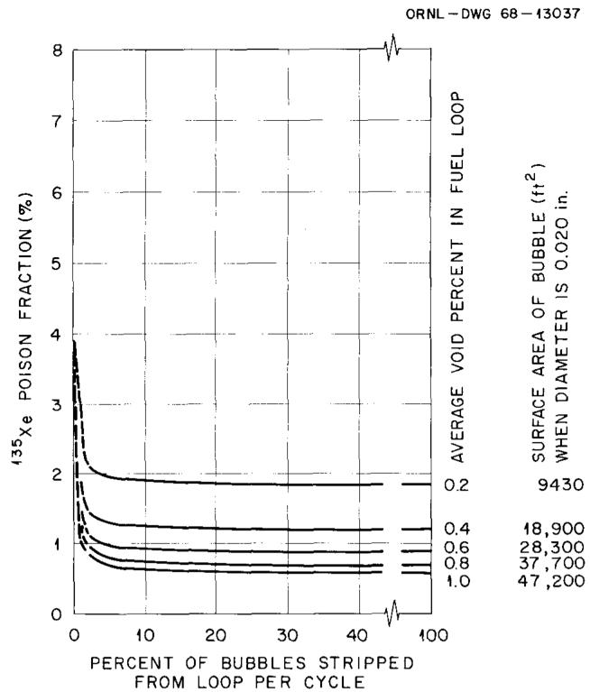  
Fig. 7.1. $^{135}\mathrm{Xe}$ Poison Fraction in Reference Design MSBR as a Function of the Percent Bubbles Stripped from Fuel Loop per Cycle. Parameters: reactor power, 1000 Mw (electrical); diffusion coefficient of Xe in graphite at $1200^{\circ}\mathrm{F}$ , $10^{-5} \mathrm{ft}^{2} / \mathrm{hr}$ ; graphite void fraction available to Xe, $10\%$ ; total yield of $^{135}\mathrm{Xe}$ , $6.16\%$ ; $^{135}\mathrm{Xe}$ thermal cross section, $1.049 \times 10^{6}$ barns; mass transfer coefficient to bubbles, $2.0 \mathrm{ft} / \mathrm{hr}$ .

and has a diffusion coefficient for xenon of $10^{-5}$ ft²/hr at $1200^{\circ}\mathrm{F}$ (permeability for helium at room temperature $\sim 10^{-5}\mathrm{cm}^2/\mathrm{sec}$ ). From this plot, it can be seen that the fraction of bubbles stripped per loop cycle can be $10\%$ or less before the back pressure of xenon in the bubble starts to significantly reduce the stripping efficiency. This means that for a given void fraction in the fuel salt, the bubbles can be recirculated ten times before they must be removed, and the capacity of the gas system will be $\frac{1}{10}$ of that if all bubbles are replaced per cycle. As pointed out in the previous semiannual report, the mass transfer coefficient to circulating bubbles is one of the least-known parameters in this calculation.

A literature survey and analysis has been made2 on the expected mass transfer coefficient to the bubbles in a turbulent stream. For the rigid interface model the expected value will be about 2.0 ft/hr and for the mobile interface model the expected value will be about 13.0 ft/hr. The above plot was computed using a value of 2,0 ft/hr. It is unlikely that a completely mobile interface will

exist with these very small bubbles, but a partially mobile interface may be realized. Now in these calculations, the variables "bubble surface area" and "bubble mass transfer coefficient" always appear as a product. Figure 7.1 can then be used to estimate the effect of a change in the mass transfer coefficient. In this plot the average void percent bubbles in the fuel is used only to generate a surface area of 20-mil-diam bubbles and otherwise is a negligible parameter if the bubbles are far from saturation. The bubbles do not approach saturation until the fraction of bubbles stripped from the loop per cycle is less than $5\%$ . Therefore, in the straight-line section of these curves, doubling the surface area is the same as doubling the mass transfer coefficient. For example, if the mass transfer coefficient is doubled for the case where the bubble surface area is $9430 \, \text{ft}^2$ , the poison fraction would be reduced from $1.9\%$ to $1.25\%$ for the $10\%$ bubble stripping fraction. It should also be noted that for a given void fraction, the bubble surface area is reduced by a factor of 2 if the bubble diameter is doubled.

Figure 7.2 shows the effect of a very low permeability coating on the bulk graphite. This is envisioned as a sealant of pyrolytic graphite, or possibly metal, that plugs the surface pores of the bulk

$^{2}$ F. N. Peebles, Removal of Xenon-135 from Circulating Fuel Salt of the MSBR by Mass Transfer to Helium Bubbles, ORNL-TM-2245 (July 23, 1968).

ORNL-DWG 68-13038

④ $\left\{ \begin{array}{l} \text{DIFFUSION COEFFICIENT OF Xe IN SEATED GRAPHITE AT 1200°F (ft}^2 / hr \\ (\approx \text{PERMEABILITY OF He AT ROOM TEMPERATURE WITH UNITS OF cm}^2 / \text{sec}) \end{array} \right.$

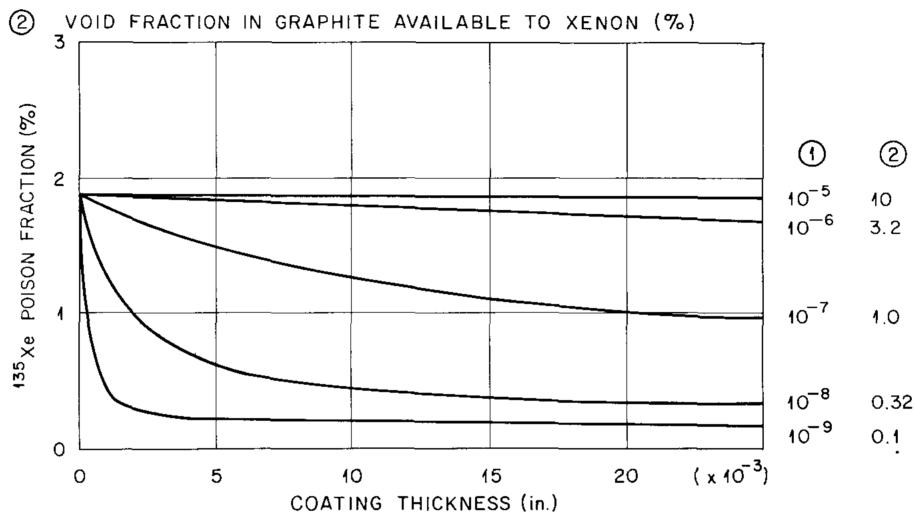  
Fig. 7.2. $^{135}\mathrm{Xe}$ Poison Fraction in Reference Design MSBR as a Function of Graphite Sealing Parameters. Parameters: reactor power, 1000 Mw (electrical); diffusion coefficient of Xe in bulk graphite at $1200^{\circ}\mathrm{F}$ , $10^{-5} \mathrm{ft}^2/\mathrm{hr}$ ; bulk graphite void fraction available to Xe, $10\%$ ; average void percent of bubbles in fuel loop, $0.2\%$ ; bubble surface area (0.020 in. diameter), 9430 ft $^2$ ; percent bubbles stripped per loop cycle, $10\%$ .

graphite. To develop this illustration, parameters were chosen from Fig. 7.1 to yield a high poison fraction $(\sim 1.9\%)$ . With these parameters the calculations were repeated to obtain the effects of the permeability and thickness of the sealed layer on the poison fraction. In this calculation it was assumed that the void fraction in graphite available to xenon decreased by one order of magnitude when the permeability decreased by two orders of magnitude. It can be seen that permeabilities of $10^{-7}$ and less are quite good in reducing the poison fraction.

The target $^{135}\mathrm{Xe}$ poison fraction in the MSBR is $0.5\%$ or less. With circulating bubbles alone (Fig. 7.1), this may or may not be attainable. Some of the uncertainties are the bubble mass transfer coefficient, the ability to generate uniformly 0.020-in. bubbles, and the ability of the bubbles to maintain their identity for many circuits around the fuel loop (e.g., not agglomerate or migrate to a surface). If, however, the circulating bubbles are assisted by sealed graphite, the target poison fraction can be achieved and surpassed.

# 7.2 BUBBLE GENERATOR

R. J. Kedl

Circulating helium bubbles with the fuel salt is the preferred method of stripping noble gases generated by fission in the MSBR. Xenon-135 poisoning calculations reported above are based on surface areas generated by bubbles 0.020 in. in diameter. We have conducted exploratory tests with water and air for some time to try to generate bubbles of this diameter with equipment that can be scaled up to sizes adequate for the MSBR. In general, two avenues of approach have been taken: (1) mechanically powered generators, where a mixture of air and water is fed to a mechanically agitating geometry that breaks up the large bubbles into very small ones; and (2) fluid-powered generators, where, for example, air is injected into the throat of a venturi. Without going into details of the several models tested, the following conclusions have been reached.

1. Emphasis on mechanically powered generators should be reduced. During the early development work, smaller and more uniformly sized bubbles were attained by this method than with fluid-powered generators; however, other potential problems would be considerable. For instance, a me

chanical drive motor would be needed, but a separate drive motor would be undesirable. The most logical place to install a mechanical generator would be on the impeller of the pump. This complicates an already critical item; furthermore, estimates indicate that the most successful generator model tested would cavitate in MSBR-scaled equipment. A great deal of development work would be needed to successfully attach a mechanical bubble generator to a pump impeller.

2. Emphasis on the fluid-powered generator should be increased. The most successful fluid-powered bubble generator we have run is a venturi modified so that gas is injected into small holes in the throat and turbulence in the diffuser region generates the bubbles. Quantitative information is not yet available; however, the bubbles appear to be larger than desired - in the order of 50 mils. It is hoped that further experimentation will reduce this. The venturi has the additional advantage that it could serve as the helium pump if it were placed on the suction side of the fuel pump.

# 7.3 BUBBLE SEPARATOR

R. J. Kedl

Work is under way on the development of a pipeline bubble separator for the removal of noble-gas-rich bubbles from the fuel salt. The separator is a straight section of 4-in. pipe about 4 ft long with swirl vanes at the inlet end and recovery vanes at the outlet. The swirling fluid generates a high gravitational field in the pipe, and circulating bubbles will migrate to a gas-filled vortex in the center of the pipe. The recovery vanes straighten out the fluid and recover some of its energy. The gas take-off is in the hub of the recovery vanes.

A full-scale model has been built and is operating in an existing water loop. A photograph of the separator operating in a Plexiglas pipe is shown in Fig. 7.3. Two sets of swirl vanes have been tested. The second set operates better than the first, and the results of this set only will be reported. Velocity profiles were measured in a radial direction and are shown in Fig. 7.4. Axial and tangential components are very nearly the same and are shown as a single line. It was also noted that there was very little attenuation of the velocity over the $2\frac{1}{2}$ -ft length between the vanes. At 660 gpm the following pressure distributions were observed:

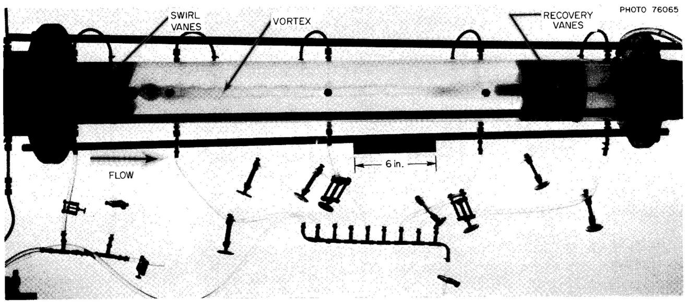  
Fig. 7.3. Bubble Separator Model.

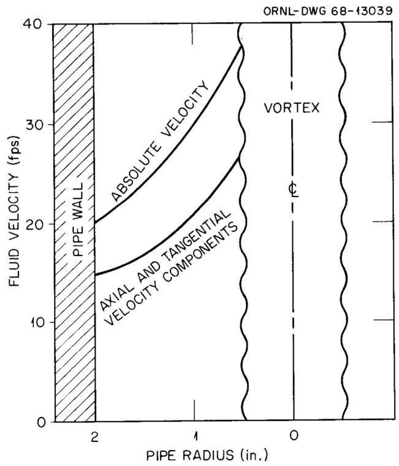  
Fig. 7.4. Radial Velocity Distributions in Pipeline Bubble Separator.

Pressure drop across swirl vanes at 3.7 ft of fluid wall

Radial pressure difference in swirling 26 ft fluid from wall to vortex

Net pressure loss across recovery 5.1 ft vanes at wall

The only problem encountered is that the vortex does not attach to the hub of the recovery vanes. It can be seen in the photograph that the vortex seems to disintegrate just ahead of the recovery vanes, and any bubbles entering this area are swept on past the hub. In earlier work done on pipeline gas separators3 this phenomenon had not been experienced. The trouble is probably due to the hub size. It is planned to make a new set of vanes with the hub diameter doubled, which will be more in accordance with the separator of the earlier work.

# 7.4 SODIUM FLUOROBORATE CIRCULATING TEST LOOP

A.N. Smith P.G. Smith

Circulation of the flushing charge of salt was started on March 4, 1968, and was continued in a

sporadic fashion until June 28, 1968. Accumulated circulation time was 947 hr, most of which was spent in obtaining pump performance and cavitation data for comparison with predicted values. Several of the cavitation tests resulted in "ingassing" transients, where the expansion of the salt due to gas entrainment was sufficient to cause expulsion of salt into the gas lines.

Most of the downtime was due to removal and replacement of the pump rotary element and to correction of gas-system plugging problems. The balance of the noncirculating time was spent on gas-system revisions, instrument calibrations, and correction of routine problems. The pump rotary element was removed because a material balance on the lube oil system indicated the possibility of a large oil leak. No evidence of a leak was found, and the trouble was subsequently ascribed to shifting of inventory between the oil storage tank and the pump bearing cavity.

During July the flushing salt was removed from the system, and a new batch of $\mathrm{NaBF}_4$ was charged into the system. Net weights transferred were as follows:

Flushing salt originally charged into sump 692 Ib

Flushing salt removed from sump 7021b

New salt charged into sump 7651b

The new charge of salt was added to the system in four batches. In order to remove adsorbed moisture, each batch was heated to $300^{\circ}\mathrm{F}$ and maintained under a vacuum (27 in. $\mathrm{Hg}$ ) for at least 16 hr. The material was then heated to $1040^{\circ}\mathrm{F}$ and, if gas release as measured by a pressure rise determination was not excessive, transfer was made to the loop sump. Table 7.1 summarizes the data for this operation.

The loop was recharged with the new batch of salt, and circulation was resumed on August 19, 1968. Test progress as of the end of August was as follows.

# 7.4.1 Pumping Characteristics of Sodium Fluoroborate Salt

The head-flow-speed characteristics of the PK pump checked quite well with previous performance data obtained with NaK, as indicated in Fig. 7.5. Cavitation inception tests were made while circulating the flushing salt at temperatures of 900, 1025, 1150, and $1275^{\circ}\mathrm{F}$ , with flow at 750 gpm and

speed at 1800 rpm. These tests are now being repeated with the new charge of salt. In a cavitation test the flow and temperature are held constant, and the gas pressure in the pump gas space is lowered in steps until there is a disproportionate drop in pump discharge pressure per unit drop in pump suction pressure. For the flushing salt, the test results gave values for the minimum overpressure

Table 7.1. Pretreatment Data for NaBF ${}_{4}$ Salt   
PKP-1 loop, 9201-3, July 1968   

<table><tr><td rowspan="2">Item</td><td colspan="4">Batch Number</td></tr><tr><td>1</td><td>2</td><td>3</td><td>4</td></tr><tr><td>Evacuated at 300°F for time, hr</td><td>17.5</td><td>20</td><td>19</td><td>17</td></tr><tr><td>Pressure at end of evacuation period, in. Hg</td><td>26</td><td>25.5</td><td>27</td><td>27</td></tr><tr><td>Temperature at transfer time, °F</td><td>1040</td><td>1040</td><td>930</td><td>980</td></tr><tr><td>Pressure just prior to transfer, in. Hg</td><td>17</td><td>14</td><td>24</td><td>16.5</td></tr><tr><td>Pressure rise, 300°F to transfer temperature, in. Hga</td><td>9</td><td>11.5</td><td>3</td><td>10.5</td></tr></table>

${}^{a}$ The pressure rise on Batch 3 was excessive (23 in. $\mathrm{{Hg}}$ ) during first heatup to ${1000}^{ \circ  }\mathrm{F}$ . This batch was cooled down and evacuated a second time at ${300}^{ \circ  }\mathrm{F}$ . The minimum pressure rise which might be expected during heatup from 300 to ${932}^{ \circ  }\mathrm{F}$ is about 3 in. $\mathrm{{Hg}}$ ,assuming a temperature factor of 2 and an increase in ${\mathrm{{BF}}}_{3}$ partial pressure of 2 in. $\mathrm{{Hg}}$ .

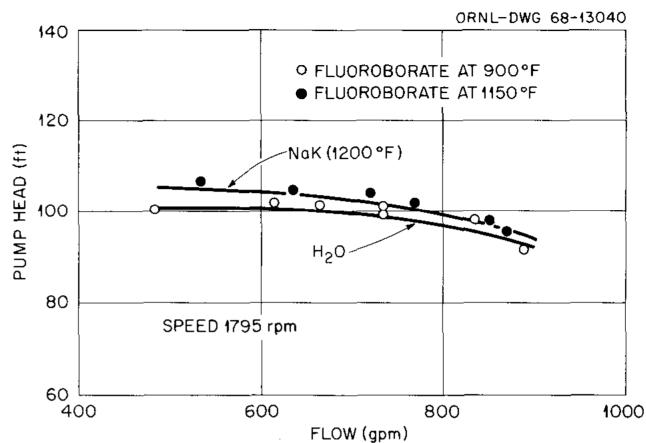  
Fig. 7.5. Comparison of PK-P Pump Characteristics with Sodium Fluoroborate, NaK, and Water.

necessary to suppress cavitation which were somewhat higher than the predicted values. Also, the change in minimum overpressure as a function of salt temperature did not agree with the change in $\mathbf{BF}_3$ dissociation pressure as calculated from the equation

$$
\log P (\mathrm {m m}) = 9. 0 2 4 - (5 9 2 0 / T ^ {\circ} \mathrm {K}) \quad (\text {r e f .} 1).
$$

Cavitation tests with the new charge of salt are still in progress, but preliminary results are showing good agreement between predicted and test values for both the pressure at cavitation inception and the change of cavitation pressure with temperature. The lack of agreement in the case of the flushing salt may have been due to the higher level of impurities. The ingassing transients which have occurred during the cavitation tests are thought to be due to operating characteristics peculiar to the PK pump, and hence should have no particular implication for the MSRE and MSBR systems.

# 7.4.2 Restrictions in the Gas System

Analytical investigations are under way to identify the nature and source of all materials which have caused plugging problems. Aside from the predictable salt plugs caused by ingassing transients, difficulties with gas system restrictions were traced to three different materials.

(1) Accumulations of fluid, brown to black in color and watery to syrupy in consistency, have been found in the off-gas line. This material appears to be a $\mathrm{BF}_3$ hydrolysis product, possibly due to moisture present in the loop at startup or brought in with the salt. Pressure-rise data during pretreatment (Table 7.1) indicate that the new salt may have contained trace quantities of a volatile contaminant. The total amount of material has been relatively small ( $< 100\mathrm{cm}^3$ ), and the rate of accumulation appears to be decreasing with time.

(2) Plugs have occurred due to formation of a crystalline solid in the off-gas line at the point

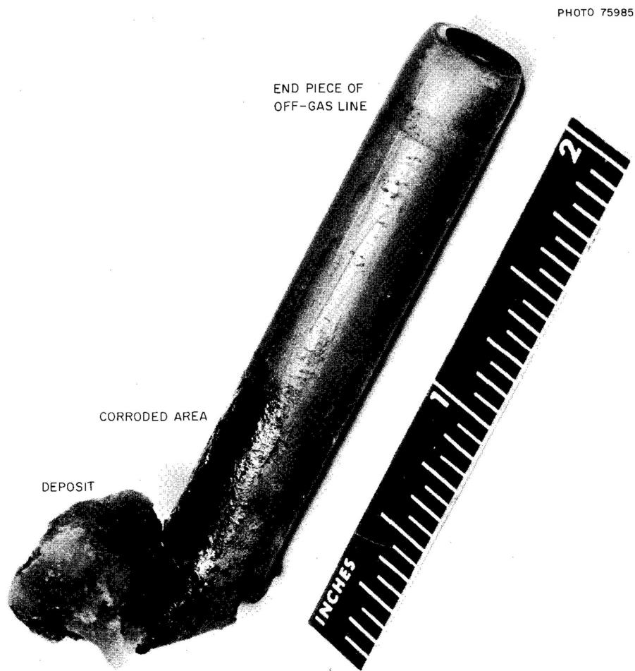  
Fig. 7.6. Typical Material Collected at End of Off-Gas Line; $\mathsf{NaBF}_4$ Circulation Test.

where the $\mathbf{BF}_{3}$ -helium mixture is vented into the stack (Fig. 7.6). This material, which appears to be boric or fluoroboric acid resulting from reaction of $\mathbf{BF}_{3}$ with atmospheric moisture, is corrosive as well as plug-forming. The implication is that a chemical system will be needed for disposal of $\mathbf{BF}_{3}$ at the MSRE.

(3) Deposits of a fine black powder have been found in both the off-gas line and gas feed lines. This material appears to be amorphous carbon which collects as a scum on the surface of the salt in the pump bowl and is carried into the gas lines during ingassing transients. The source of the carbon is not clear, but there seems to be no direct relation to the $\mathrm{NaBF}_4$ salt.

# 7.4.3 Salt Compatibility

When the pump was opened to check for oil leakage, pieces of green salt were found in the upper region of the pump bowl. The composition of the salt together with that of $\mathrm{NaBF}_4$ and the BULT-4 salt previously used in the loop are shown in Table 7.2. The significance of the green salt deposit has not as yet been determined, but there seems to be no adverse implication for the MSRE coolant system, since the latter does not contain the two con

stituents, U and Th, which appear to have “salted out.”

# 7.4.4 $\mathsf{NaBF}_4$ Freeze Valve

Performance of the drain-line freeze valve has been satisfactory through eight freeze and seven thaw cycles. This valve had been altered to simulate the characteristics of the MSRE-type valve. The preliminary conclusion is that, except for freezing at a lower temperature, the freeze valves in the drain line of the MSRE coolant system will operate about the same with the fluoroborate salt as they do with the present LiF-BeF $_2$ coolant salt.

# 7.5 MSBR PUMPS

A.G.Grindell L.V.Wilson

P.G.Smith C.J.Claffey

H.C.Young C.K.McGlothlan

# 7.5.1 Pump Program

We have outlined in greater detail our basic plan for obtaining fuel-salt and coolant-salt pumps4 for

$^{4}$ MSR Program Semiann. Progr. Rept. Feb. 29, 1968, ORNL-4254, p. 76.

Table 7.2. Comparison of Green Salt with Present and Former Salts   
$\mathbf{NaBF}_4$ circulation test, PKP-1 Loop, 9201-3   

<table><tr><td></td><td>BULT-4 Salt
Formerly in Loop
(wt %)</td><td>NaBF4Salta
Flushing Charge
(wt %)</td><td>Green Salt
(wt %)</td></tr><tr><td>Li</td><td>9.72</td><td>0.21</td><td>0.21</td></tr><tr><td>Be</td><td>5.82</td><td>0.17</td><td>0.04</td></tr><tr><td>U</td><td>5.12</td><td>0.25</td><td>12.2</td></tr><tr><td>Th</td><td>20.0</td><td>0.25</td><td>26.5</td></tr><tr><td>Na</td><td></td><td>21.6</td><td>10.9</td></tr><tr><td>B</td><td></td><td>9.45</td><td>3.91</td></tr><tr><td>F</td><td>59.34</td><td>67.7</td><td>43.5</td></tr><tr><td>Fe</td><td>1.49</td><td>0.02</td><td>?</td></tr><tr><td>Cr</td><td>0.27</td><td>0.01</td><td>?</td></tr><tr><td>Ni</td><td>0.03</td><td>0.04</td><td>?</td></tr><tr><td>O</td><td>0.82</td><td>0.11</td><td>?</td></tr></table>

the Molten-Salt Breeder Experiment. This philosophy included the following five main points:

1. Industry will design and build the prototypes of the fuel-salt and coolant-salt pumps for the MSBE. They will modify these designs on the basis of test results and will build the pumps for the Engineering Test Unit and the MSBE. All the pumps will be built to ORNL specifications.   
2. Industry will do any development of pump parts, such as rotary seals and bearings, that they believe to be necessary and that can be done without facilities for handling large amounts of molten salts.   
3. All the pumps will be tested in a molten-salt facility that will be built and operated with government funds. Engineers from the manufacturers of the pumps will be required to participate in this testing, and engineers from other pump and equipment manufacturers will be invited to participate.   
4. The pumps will be operated in the ETU and the MSBE. Engineers from the manufacturers of the pumps will be required to participate in tests of the pumps in these two facilities. Engineers from other pump and equipment manufacturers will be invited to participate.   
5. ORNL will continue the design studies of pumps for molten-salt reactors to assist in our overall reactor design studies and to maintain the competence necessary to monitor the work done by industry and to approve their designs for our use. We will also continue to test critical pump parts such as bearings and seals and to work on the development of molten-salt bearings and bearing materials for use in molten-salt reactor systems.

We are now engaged in implementing the management plan for obtaining MSBE salt pumps.

1. Some preliminary studies of capacity, head requirements, net positive suction head (NPSH) requirements, operation of pumps in parallel, pump tank volume requirements, critical shaft speeds, etc., have been made, and such studies will continue.   
2. The first rough draft of specifications for the MSBE fuel-salt pump has been circulated internally for comments, and currently these comments are being incorporated into a second draft.   
3. A request for proposal is being written. This document will accompany the pump specification and will invite pump manufacturers to submit proposals and will outline the total scope of the work and detail the information to be supplied in their proposals.

4. A five-member proposal evaluation team will be selected, some members of which will be from the Purchasing Division and some from the Reactor Division.

The pump contract will probably be of the cost-plus-fixed-fee type, and procurement will be in three phases. Phase I will be the design of the pump and will include:

1. Design concept and layout drawings.   
2. Parametric study of speed, efficiency, volume, and NPSH, from which the design speed will be selected with ORNL approval.   
3. All calculations, analyses, computer programs, etc., establishing that the final design complies with all requirements.   
4. Complete set of detail drawings.   
5. Cost estimates, schedules for phase II, and conceptual drawings of all test facilities required.   
6. Phase I will also include instigation of a program of incipient failure detection for the purpose of reducing the possibility of a sudden pump stoppage and to give the reactor operating personnel an advance warning of impending pump failure or malfunction.

Phase II will then be the actual fabrication of the prototype pump by the manufacturer. It will include designing and fabricating all test facilities, performing any component tests not requiring a large molten-salt system, performing stress-strain tests of any member or configurations not suitable for rigorous analysis, providing any special tools such as those for remote maintenance, testing all auxiliary systems such as the lube oil system, motorcooling system, etc. Phase II includes testing the prototype pump on water, then disassembling the pump and checking for signs of rubbing or symptoms of any malfunction, taking corrective action, and retesting.

The prototype pump will then be tested in a molten-salt test facility planned for construction at ORNL. The facility will be operated by ORNL personnel, but the participation of the pump manufacturer will be required. In addition, other pump manufacturers will be invited to participate in all phases of this test. Preliminary design of a molten-salt pump test facility is now under way (see Sect. 7.5.4). The one facility will be designed to accommodate the MSBE fuel and coolant pumps. Start of testing of the prototype MSBE fuel-salt pump in the pump test facility is currently approximately scheduled for fiscal year 1972.

Phase III consists of producing the pumps required for the ETU and the MSBE and performing proof tests of the pumps and auxiliary systems at the seller's facilities prior to running the pumps with molten salt in the pump test facility.

The seller will furnish field representatives to work with ORNL personnel to install, test, and operate the pumps in the molten-salt pump test facility, the ETU, and finally in the MSBE. Additional assistance will be required to disassemble, reassemble, and diagnose and remedy pump problems. Engineers from other pump and equipment manufacturers will also be invited to participate in the tests and operation.

# 7.5.2 Fuel-Salt Pump

Although the head and flow requirements have changed, as shown in Table 7.3, the basic concept of the fuel-salt pump5 has not changed significantly from that shown in the last semiannual progress report. Since the reactor vessel design is directly affected by the NPSH required to suppress cavitation, and since the fuel-salt inventory of the system must be held down, a study was made of the effect of pump speed on required NPSH and fuel-salt volume within the pump. Calculations were made to

determine nominal dimensions of the impeller, volute, suction and discharge nozzles, and the minimum required NPSH to suppress cavitation. Pump layouts were made from which the salt volumes within the confines of the pump tank were calculated. The results are shown in Fig. 7.7. The impeller and pump tank diameters are shown to give an idea of the relative pump sizes.

Some design details of the pump have been investigated further. Those surfaces of the pump tank, its internal structural elements, and the pump shaft that are not in contact with the molten salt are subject to nuclear heating and will have to be cooled. It is intended to bring fuel salt from the

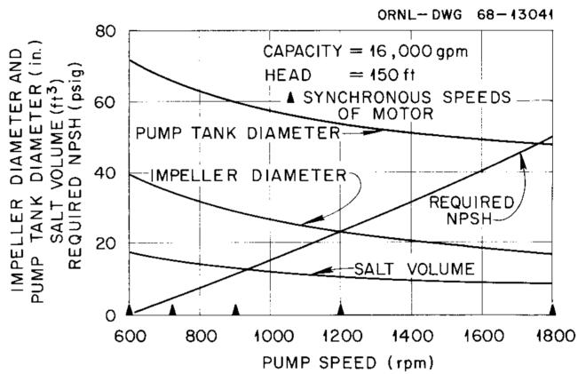  
Fig. 7.7. Effect of Pump Speed on Some Characteristics of Fuel Salt Pumps.

Table 7.3. Pumps for Molten-Salt Reactor Program   

<table><tr><td rowspan="2"></td><td colspan="2">MSRE [7.5 Mw (thermal)]</td><td colspan="2">MSBE [200 Mw (thermal)]</td><td colspan="2">MSBR [2250 Mw (thermal)]</td></tr><tr><td>Fuel</td><td>Coolant</td><td>Fuel</td><td>Coolant</td><td>Fuel</td><td>Coolant</td></tr><tr><td>Number required</td><td>1</td><td>1</td><td>1</td><td>1</td><td>4</td><td>4</td></tr><tr><td>Design temperature, °F</td><td>1225</td><td>1225</td><td>1300</td><td>1300</td><td>1300</td><td>1300</td></tr><tr><td>Capacity, gpm</td><td>1200</td><td>850</td><td>5700</td><td>7200</td><td>16,000</td><td>20,000</td></tr><tr><td>Head, ft</td><td>50</td><td>78</td><td>150</td><td>200</td><td>150</td><td>200</td></tr><tr><td>Speed, rpm</td><td>1175</td><td>1775</td><td>890</td><td>890</td><td>890</td><td>890</td></tr><tr><td>Specific speed, Ns</td><td>2170</td><td>1970</td><td>2100</td><td>1915</td><td>2630</td><td>2370</td></tr><tr><td>Net positive suction head required, ft</td><td>9</td><td>12</td><td>9</td><td>9</td><td>18</td><td>18</td></tr><tr><td>Impeller input power, hp</td><td>35</td><td>45</td><td>890</td><td>825</td><td>2500</td><td>2290</td></tr></table>

reactor inlet plenum (at about $1050^{\circ}\mathrm{F}$ ) and pass it over all the heated surfaces before discharging it into the pump tank. Salt from this source is provided as long as one of the four pumps is in operation.

A preliminary investigation was made of the amount of shielding needed in the shield plug to protect the lubricant and other radiation-sensitive elements in the region of the bearing housing. Approximately 1 ft of Hastelloy N will limit the accumulated dosage at the lower seal to $10^{8}$ rads in several years. Additional shielding will be needed to reduce the radiation level at the crane-bay floor elevation for personnel access.

The pump layout is being modified to provide a means for containing the lubricant within the bearing housing assembly in the event of a gross seal failure and thus prevent the leakage of lubricant into the salt system.

A preliminary study has been made of the relationship between shaft overhang length and shaft diameter for a pump operating at 890 rpm with a shaft critical speed of 1200 rpm. It was assumed that the impeller weighed 1000 lb, the bearing span was 24

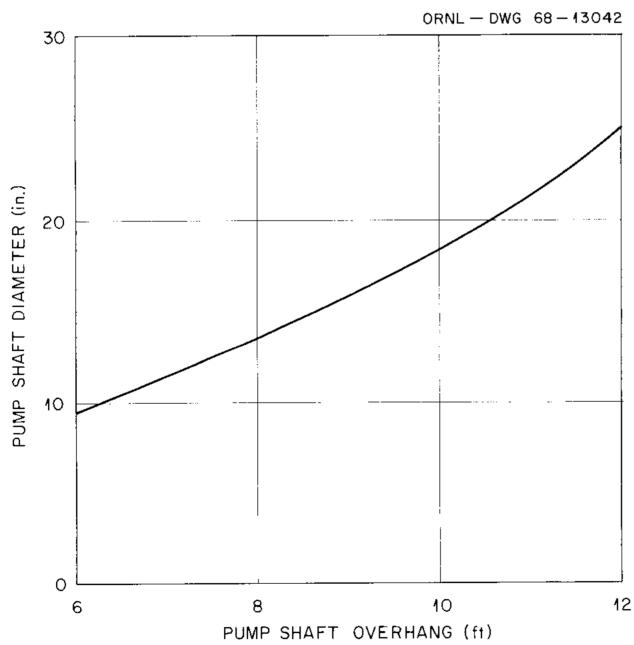  
Fig. 7.8. Relationship Between Pump Shaft Overhang and Shaft Diameter for a Fuel Salt Pump Operating at 890 rpm with a Shaft Critical Speed of 1200 rpm. Assumptions: impeller weights 1000 lb, bearing span is 24 in., and bearings are infinitely stiff.

in., and the bearings were infinitely stiff. The results, using a simplified relationship, are shown in Fig. 7.8.

# 7.5.3 Coolant-Salt Pump

The similarity $^6$ of the fuel-salt and coolant-salt pump requirements has led us to consider using the same pump design for both applications. Differences in head requirements can be taken care of by changing the outside diameter of the impeller. If the head requirements differ greatly, the coolant-salt pump can be operated at the next highest speed available in induction motors, provided the shaft critical speed has been designed sufficiently high. It may be necessary to design the coolant-salt pump tank for a higher pressure, but this is compensated for by its lower normal operating temperature of $1150^{\circ}\mathrm{F}$ . The coolant-salt pump tank would not require any provisions for the removal of nuclear heating, but it would require a larger volume for salt expansion, largely due to the greater inventory in the coolant salt system.

# 7.5.4 Molten-Salt Pump Test Facility

This facility is needed first to proof-test a prototype of the pump manufacturer's design for the MSBE fuel-salt pump in molten salt at the anticipated reactor operating conditions, excluding nuclear radiation. In addition, a total of six reactor pumps, the fuel- and coolant-salt pumps for both the ETU and the MSBE and two spare pumps for the MSBE, will be given hot shakedown tests in the facility. Endurance testing of MSBE pumps will also be conducted. This facility will be capable of testing devices for removal of xenon from the salt by contact with an inert gas, of investigating unanticipated problems that may arise during the operation of the ETU and MSBE, and of proof-testing MSBE instrumentation such as pressure, flow, and liquid-level measuring devices when they are available.

The fuel- and coolant-salt pumps will be operated in the facility with one (barren fuel) salt, as was the philosophy for proof-testing the MSRE pumps. This is possible even though the density of the fuel salt is greater than the coolant salt, and the coolant salt head and flow rate requirements may be higher

than those for the fuel salt. It may be accomplished by modifying such parameters as speed and pump tank gas pressure and by using a reduced diameter of the pump impeller. Thus, overloading the pump drive and overpressuring the facility piping can be avoided.

The useful operating life of the facility is estimated to be more than five years. It is proposed to locate the facility in Building 9201-3 at Y-12.

Design. - Criteria for the facility have been evolving during the past several months and are believed to be firm at present. The design of the test facility will be influenced by the requirements of the MSBE; since these are not firmly established, a reasonable amount of flexibility and overdesign have been provided in the criteria for the test facility. The facility is being designed on the basis of a 200-Mw (thermal) MSBE system having one fuel and one coolant-salt pump with a $\Delta T$ of $300^{\circ}\mathrm{F}$ in both salt circuits. The design conditions for the pumps are shown in Table 7.3.

The test facility will have a maximum pump motor capability of 1500 hp and salt flow capability of

$150\%$ of design conditions. Hastelloy N will be used to fabricate all salt-containing piping and equipment.

Preliminary design of the test facility has been completed. Basically, the facility will consist of the necessary salt piping system, salt-to-air heat removal system, salt flow restrictors, salt flow measuring venturi, preheaters for the salt-containing parts, and necessary controls and instrumentation. The flow diagram is shown in Fig. 7.9. Provisions will be made to supply electric power to constant-speed or variable-speed motors up to 1500 hp in size. The necessary cover and vent gas system for the pump and salt storage tank will be provided.

Two fixed flow restrictors and a variable flow restrictor will be used to simulate the pressure drops expected in the MSBE heat exchanger and reactor vessel. The variable flow restrictor, a modified throttling valve used successfully for many years in salt-pump test loops, will be used to vary the loop pressure drop up to 100 psi. This throttling valve will permit the measuring of the head vs flow

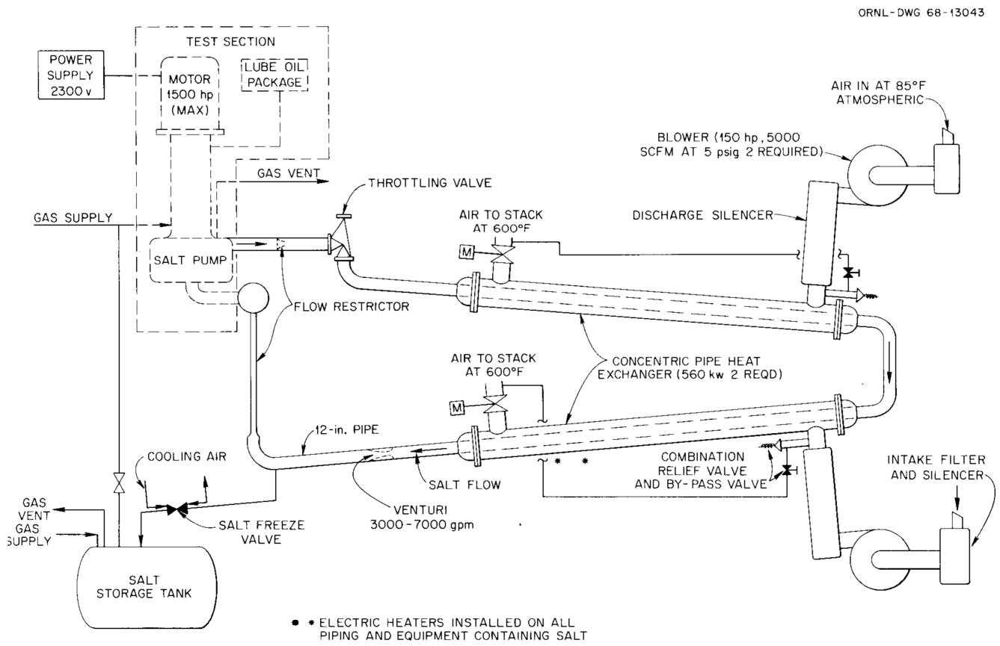  
Fig. 7.9. Flow Diagram for MSBE Pump Test Facility.

relationship of each pump over a wide range of conditions. In addition, this throttling valve may be used to compensate partially for possible changes in the MSBE pump requirements.

The heat removal system is sized to remove all energy transmitted to the circulating salt stream by a 1500-hp pump motor. Design studies indicate that two 14-ft-long concentric pipe heat exchangers using 5000 cfm of air at 5 psig supplied to each heat exchanger will dissipate the pumping energy. Positive displacement blowers, to be located outside the building, will supply the cooling air to the 1.12-Mw heat removal system.

The loop piping, complete with pump, will contain approximately $200\mathrm{ft}^3$ of salt. Piping in most of the loop will be 12 in. ID with a $\frac{3}{4}$ -in. wall. A venturi will be provided to measure salt flows of 3000 to 7000 gpm. A $1\frac{1}{2}$ -in. pipe-size freeze valve, identical to the MSRE freeze valve, will be used in the pipeline connecting the salt storage tank to the loop piping.

Provisions will be made to electrically preheat all the salt-containing piping and equipment to $1200^{\circ}\mathrm{F}$ .

The cost of the facility is being estimated on the basis of the preliminary design, and a request for authorization of the facility is being prepared.

# 7.5.5 Rotor-Dynamics Feasibility Study

The final report, Feasibility Study of Rotor-Bearing System Dynamics for a 1250 HP Molten Salt Fuel Pump, has been received from Mechanical Technology Incorporated. The scope of the study was to investigate (1) the rotor dynamics of a long-shaft (approximately 32 ft) fuel-salt pump for the two-fluid reactor system, (2) the type and characteristics of a molten-salt-lubricated bearing at the lower end of the pump shaft, and (3) the shaft seal configuration and its characteristics.

The shaft and rotor system critical speeds were determined for two pump shafts of different diameter configurations each approximately 32 ft long: (1) 9 in. OD by $8\frac{1}{4}$ in. ID, and (2) 7.5 in. OD by 6.5 in. ID. The dynamic response of the larger-diameter shaft was computed in terms of frequency and displacement amplitudes for both the transverse and torsional modes of vibration for the mass

unbalance condition provided by a uniformly bowed shaft. The same computations were made for the smaller-diameter shaft for two mass unbalance conditions, (1) shaft OD and ID surfaces uniformly eccentric, and (2) shaft uniformly bowed.

The first shaft critical speeds obtained by computer unbalance response programs for both the large- and small-diameter shafts were lower than the design pump speed of 1200 rpm and were 700 rpm and 560 rpm respectively. The study indicated that the second shaft critical speed for the large-diameter shaft is substantially above 1200 rpm and about $25\%$ above that for the small-diameter shaft.

The acceleration and deceleration of both shafts through the first shaft critical speed are rendered hazardous because the imposed location of the molten-salt dampers near the lower shaft bearing reduces their effectiveness. The optimum damper location is near the midlength of the shaft between bearings.

A certain amount of shaft bowing and eccentricity between the shaft outer and inner diameters attributable to manufacturing practices can be accommodated. Computations indicated that values of approximately 0.025 in. of bow in the middle of a uniformly bowed shaft or of approximately 0.019 in. eccentricity in a uniformly eccentric shaft could be accommodated singly at the shaft critical speed. The values are limited by bearing eccentricity; a value of 0.95 was used in the computations, which means that the journal and bearing surfaces are very close to rubbing.

The transverse and torsional vibrational characteristics of the inner and outer pump casings were computed, and account was taken for the inertia of the drive motor. The results indicated the need to increase the stiffness of the outer pump casing to avoid a resonance at the pump design speed of 1200 rpm. To raise the first torsional critical speed to at least $30\%$ greater than the design speed requires increasing the thickness of the outer casing to 1 in.

A comparison of hydrodynamic (self-acting) and hydrostatic (externally pumped) film lubrication for the lower shaft, molten-salt-lubricated bearing favored the former. The relatively high viscosity of molten salt provides excellent load capacity and also hydrodynamic film operation in the laminar regime. The inherent simplicity of the self-acting bearing contrasted favorably with the complications required for hydrostatic lubrication, which includes the necessity to develop high lubricant heads and to maintain reliable operation of a number of compensating orifices and pressure reducing lands.

Of the many types of self-acting bearings considered, the tilting (pivoted) pad bearing design having four pads was selected, as it is by far the most stable bearing available. It should be totally free of instability when properly designed to have adequate preloading, optimum pivot location, and low-inertia pads. It is strongly recommended for flexible shaft applications where the speed may exceed twice the first shaft critical.

A seal configuration using gas-lubricated face seals was studied, and computations were made of the gas film lifting force, thickness and stiffness, and the gas-leaking flow rates. Some calculations were made of seal bellows loading requirements and face tracking.

The principal recommendation of the report was to design the pump shaft to operate subcritically; that is, the design pump speed should be lower than the first shaft critical speed rather than above the critical speed, as required by the flexible shaft studied. Subcritical operation would reduce, if not eliminate, the probability of low-speed high-amplitude whirl. It would eliminate the large unbalance response amplitudes associated with traversing the first shaft critical speed. The most practical way to achieve subcritical design would be to reduce shaft length, or shaft speed, or both.

If supercritical speed operation is required, the principal other recommendations were: (1) develop a practical means of dynamic shaft balancing, and (2) build a rotor-dynamic evaluation simulator. The simulator is not a computer program, but rather a full-scale model of the pump rotor-dynamic system to evaluate its dynamic response experimentally. A reduced-scale model would probably permit a valid evaluation if tilting-pad bearings were used.

A bearing materials program was recommended and outlined.

Since the present design of a one-fluid MSBR makes use of a pump with a much shorter shaft that can be designed to operate at speeds below the first shaft critical speed, there are no plans for additional studies of the long-shaft pump.

# 7.5.6 Molten-Salt Bearing Program

Because of the increased emphasis on the single-fluid reactor concept and the use of the short-shaft pump configuration for the salt circuits, the moltensalt bearing program has been temporarily curtailed.

The molten-salt testing of the bearing material specimens supplied by Mechanical Technology Incorporated will be held in abeyance. The testing will be resumed should a renewed interest in the use of molten-salt bearings develop.

The Metals and Ceramics Division continued its investigation of the hard-coated specimens. The composition of each of the coatings was determined by x-ray diffraction. Thermal cycle tests will be performed on these specimens in a gaseous atmosphere, and then they will be reexamined by x-ray diffraction. This will conclude the present plans for investigating bearing materials.

The design work on the molten-salt bearing tester for testing relatively large molten-salt bearings was stopped upon completion of the layout of the tester.

# 7.6 MOLTEN-SALT STEAM GENERATOR

E. J. Breeding

R. E. Helms

The molten-salt steam generator is a vital secondary system component required for the successful operation of molten-salt power breeder reactors. The development of an economical, reliable steam generator will require the combined efforts of ORNL and commercial designers and fabricators of high-pressure and -temperature steam generators. Our plans include developing steam generators for the MSBE with maximum industrial involvement.

A supercritical steam cycle has been selected for the MSBE and the MSBR. The choice of supercritical steam was influenced by the choice of sodium fluoroborate $(\mathrm{NaBF}_4 - \mathrm{NaF}, 92-8 \text{ mole} \%)$ as the fluid for the secondary coolant system. Using a supercritical steam cycle, it is feasible to provide feedwater to the steam generator at approximately the same temperature as the melting point of the secondary coolant, thus reducing the possibility of freezing the coolant salt.

ORNL will specify the design criteria and parameters of the sodium fluoroborate coolant salt system and the steam generator system for the MSBE. We will prepare a scope and plan of action for the development of the steam generator and write the specifications. Industry will do both title I and title II designs and will fabricate the steam gen

erator for the MSBE, with the final test and evaluation of the steam generator being made in the MSBE.

To provide ORNL and interested industrial participants with the technological background to design the MSBE steam generator, ORNL will design, construct, and operate a full-scale tube test facility to obtain heat transfer, fluid flow, and operational stability data. Components for this facility will be procured from industrial suppliers to provide some experience in fabricating Hastelloy N material components for the MSBE and future MSBR's. Industry will be invited to participate in the operation of the facility during tests of full-scale tubes representative of MSBE steam generator designs. The test data obtained in the operation of this facility will be used to validate a computer program that will be used to design and analyze both the MSBE steam generator and larger units for the molten-salt breeder reactors.

We have produced a rough draft of a conceptual design of a facility for testing full-scale tubes for molten-salt steam generators. This facility has a sodium fluoroborate coolant salt system, space for a full-scale tube test section, and a steam system that can operate at supercritical steam conditions. The design will provide for startup, subcritical, and supercritical operating conditions. The heat rating and design parameters for the test section are given in Table 7.4.

Table 7.5 shows the proposed interrelation of ORNL and commercial participation in the MSBE steam generator development program.

Table 7.4. Design Parameters for Test Section of Steam Generator Test Facility   

<table><tr><td>Operating heat rating, Mw (thermal)</td><td>0 to 3.0</td></tr><tr><td>Steam flow rate, 1b/hr</td><td>0 to 13,700</td></tr><tr><td>Inlet feedwater temperature, °F</td><td>550 to 700</td></tr><tr><td>Outlet steam temperature, °F</td><td>950 to 1100</td></tr><tr><td>Feedwater inlet pressure, psia</td><td>0 to 4000</td></tr><tr><td>Steam outlet pressure, psia</td><td>0 to 3600</td></tr><tr><td>Molten-salt flow rate, 1b/hr</td><td>89,958 (98.4
gpm at 1125°F)</td></tr><tr><td>Molten-salt inlet temperature, °F</td><td>1125 to 1200</td></tr><tr><td>Molten-salt outlet temperature, °F</td><td>850 to 1200</td></tr></table>

We are now preparing cost estimates for the full-scale tube test facility prior to initiating requests for programmatic approval, and work will begin soon on preparation of MSBE steam generator criteria, operating parameters, and specifications to be submitted to steam generator manufacturers.

We are planning a survey of available fluid-flow computer programs applicable to molten-salt steam generator design. Based on the results of this survey, a preliminary computer program will be generated to perform design studies and to evaluate the title I design proposals from commercial steam generator designers.

# 7.7 REMOTE WELDING

# P. P. Holz

A program designed to establish the feasibility of remotely cutting, bevelling, and welding pipe and vessel closures in a radioactive environment was begun. We evaluated the current status of the automated welding equipment technology for application to remote handling, operation, and monitoring. We decided to investigate the necessary machinery modifications to adapt a system to our requirements.

The system chosen was one developed for the Air Force by North American-Rockwell. The system originated in 1964 from a program to develop procedures and portable equipment for fabricating rocket fluid systems by automatic fusion-welding techniques. The North American Aviation Los Angeles Division of North American-Rockwell Corporation contracted to conduct a program for the development of a system to permit (1) parting or separation of piping, (2) machining of pipe ends to prepare the proper weld joint configurations, (3) welding of piping, and (4) automatic control of the welding sequence and variables. The Air Force equipment employs a single compact carriage unit which is inserted over and attached to the pipe and then carries an interchangeable cutter or welder module about the pipe. A weld programmer and a standard power source comprise the balance of the equipment. We believe that the use of a single carriage for all phases of the cut and reweld operation simplifies position indexing and assures precise tool alignment. This should save on the time

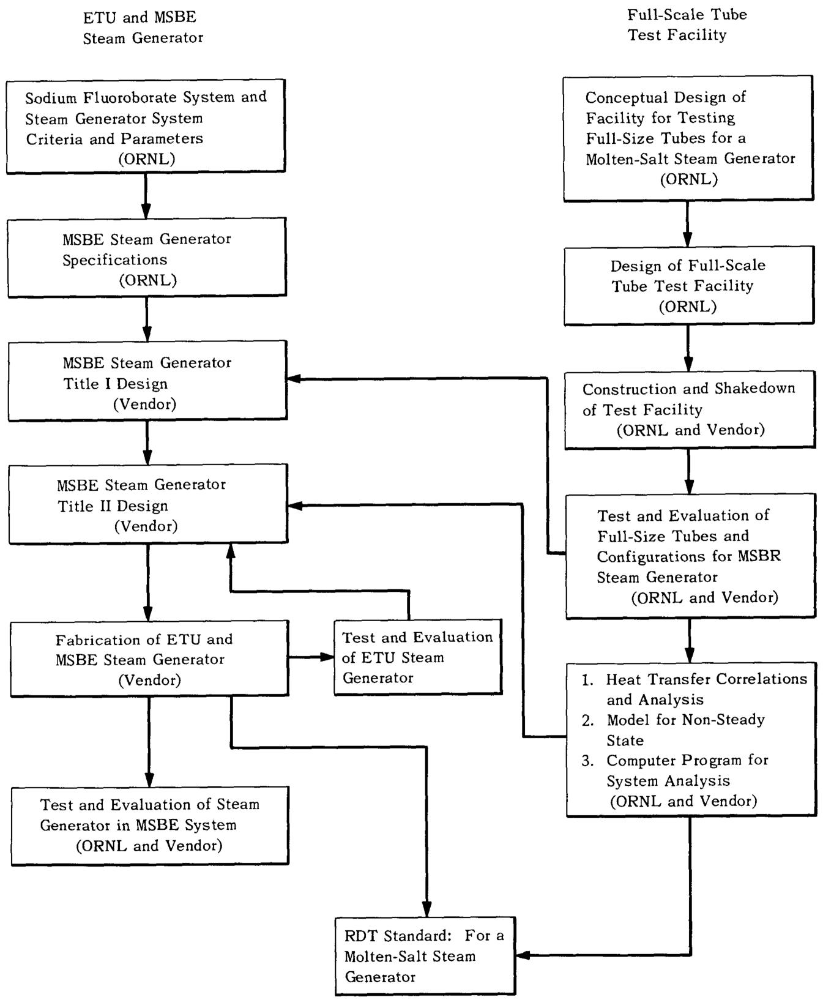  
Table 7.5. Molten-Salt Breeder Experiment Steam Generator Development Program

needed to set up the equipment, especially where weldment repairs may be required. The compactness of this system is also desirable, it being about 4 in. thick radially and about $10\frac{1}{2}$ in. long.

Considerable progress has been achieved over the past four years in converting the concept to a piece of reliable operational machinery. The Air Force reports satisfactory cutting and welding results in recent prototype equipment trials using a variety of metals, including aluminum, Inconel, and stainless steels.

We were fortunate in having the AEC obtain design documentation from the Air Force to permit us to proceed to review and adapt the equipment for our remote use in radioactive environments. We prepared 26 detailed shop drawings and a specification package for our prototype mechanical assembly. Requests for purchase were issued, and delivery is expected early in 1969. It is tentatively planned to borrow a welding programmer unit from the Air Force for our initial equipment trials.

The present machinery is designed for work on piping only and is capable of preparing joints for

butt-welding and then performing the welds. We have designed an alternate carriage for welding lip seals. This carriage "walks" about a set of mating contoured seal lips carrying the same cutter or welder inserts used with the pipe design. Selection of motor propulsion equipment for this "seal-joint" carriage was kept compatible with that of the pipe cutter-welder carriage drive to permit operation with the same system programmer and instrumentation.

Timely completion of the feasibility portion of the weld development program now under way will permit the use of cutting, bevel, and weld machinery in the construction of future reactor facilities, including the MSBE construction. Application and use of the equipment in plant construction would be enormously beneficial for several reasons: System reliability and quality control studies could be made and the results compared with conventional inspection methods. Base information of the weld parameters could be recorded for future reference. Substantial construction time and cost savings could result with the use of automated weld machinery.

# 8. MSBR Instrumentation and Controls

S. J. Ditto

# 8.1 CONTROL SYSTEM ANALYSES

W.H.Sides, Jr.

J. L. Anderson

F. H. Clark

O. W. Burke

The analysis of the dynamic response of the MSBR system as it relates to the overall plant control problem was continued. Two approaches to the problem were taken concurrently. These overlap somewhat but are in general complementary. The first was a series of studies aimed at development of a satisfactory scheme for coupling the power generation rate of the reactor to the requirements of a variable electrical load. In these studies the models of the major components were necessarily very rough approximations. Although the results are believed to be qualitatively correct, no great significance should be attached to the detailed numerical results. The second set of studies was intended to study, in as detailed a manner as was possible, the dynamic behavior of the steam generator during load transients. Such a study will permit better modeling of this portion of the system for future analyses of the MSBR system as a whole.

# 8.1.1 System Control Analysis

Investigation was begun of the dynamics and control of the single-fluid MSBR. This investigation has as its objective the development of a satisfactory method of controlling the reactor power and the system temperatures to satisfy the requirements of a power plant with variable load demand. In the present study we are using a simulation which will eventually include core kinetics (including temperature-reactivity feedback and some approximation of the effects introduced by circulating the fuel), one primary salt loop, one sec

ondary salt loop including a variable secondary salt flow rate, and a control system. This simulation is accomplished in four phases, three of which have been completed.

In the first phase the steady-state temperature profile of the system was investigated for various power levels from 30 to $100\%$ of full power. Using the $100\%$ power design temperature profile as a starting point, the temperatures at the inlet and outlet of the core, primary heat exchanger, and steam generator were calculated for lower steady-state powers. The flow rate of the secondary salt was also included in the calculation. Steady-state log-mean $\Delta T$ heat transfer and heat balance equations were used with the heat transfer coefficient on the tube side of the exchangers taken to be proportional to the 0.8 power of the tube-side flow rate and on the shell side proportional to the 0.6 power of the shell-side flow rate. The set of steady-state equations required that several of the variables be specified in order for a solution to be obtained. In all the cases calculated here the temperatures of the water entering and of the steam leaving the steam generator were held constant at 700 and $1000^{\circ}\mathrm{F}$ respectively. The steady-state pressures were assumed not to vary with power level. With these assumptions the power extracted from the steam generator is directly proportional to the mass flow rate of the steam. For the 12 cases calculated, the temperatures and the secondary-salt flow rate taken in various combinations were specified, and the resulting system temperature profiles were calculated for the various power levels. Several cases were run in which a

secondary-salt valved or orificed by-pass line was included in parallel with the steam generator.

The results showed, for example, that if the average reactor fuel temperature, as well as the feedwater temperature and steam temperature, is maintained constant, it may be difficult to maintain the secondary-salt temperature at the outlet of the steam generator above its freezing point of $725^{\circ}\mathrm{F}$ at the lower power levels $(\sim 30\%)$ . The case which produced the least variation in the overall system temperature profile was one in which the flow rate of the secondary salt was held constant. For this case the primary-salt inlet temperature to the reactor varied between 1000 and $950^{\circ}\mathrm{F}$ for power levels between 100 and $30\%$ , the outlet temperature varied between 1300 and $1050^{\circ}\mathrm{F}$ , the secondary-salt hot leg varied between 1150 and $1106^{\circ}\mathrm{F}$ , and the secondary-salt cold leg varied between 850 and $915^{\circ}\mathrm{F}$ . We concluded that a control system arranged to maintain the secondary-salt flow rate at its $100\%$ power value while allowing the primary- and secondary-salt temperatures to vary with power level should be included in those investigated further in the studies of transient conditions.

The investigation of the transient conditions employing the analog computer was begun in the second phase. In this phase an analog program

was set up for the primary heat exchanger, the steam generator, and the secondary-salt loop with constant primary- and secondary-salt flow rates. In this phase of the analog studies, as in those which follow, a lumped system model was used similar to that used in the analysis of the $\mathrm{MSRE}^2$ (see Fig. 8.1). The equations describing the system were not linearized, and the latest values for the system parameters were employed. In this phase of the investigation, as well as in those which follow, the objective of the control system was to maintain the steam temperature to within a few degrees of the design point value of $1000^{\circ}\mathrm{F}$ during a transient condition initiated by a change in steam load demand. This was accomplished by controlling the temperature of the primary salt entering the primary heat exchanger. The controller was arranged so that a $10^{\circ}\mathrm{F}$ error in steam temperature would alter the primary-salt temperature at a rate of $1^{\circ}\mathrm{F} / \mathrm{sec}$ . With this arrangement a $10\%$ step decrease in power demand from $100\%$ to $90\%$ full load yielded a maximum steam temperature variation of about $8^{\circ}\mathrm{F}$ (see Table 8.1). It took 100

$^{2}$ S. J. Ball and T. W. Kerlin, Stability Analysis of the Molten-Salt Reactor Experiment, ORNL-TM-1070 (December 1965).

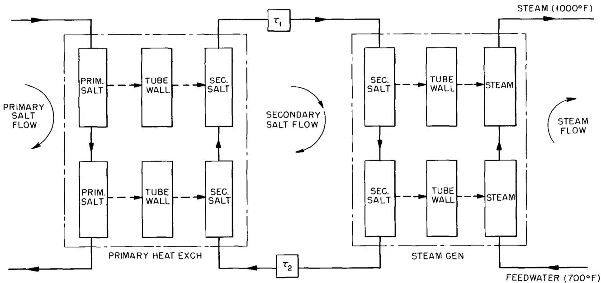  
Fig. 8.1. Lumped System Model for MSBR Analog Transient Studies.

Table 8.1. Results of Phase II and III Analog Studies   

<table><tr><td rowspan="2">Phase</td><td rowspan="2">Type Change in Power</td><td colspan="2">Power (%)</td><td rowspan="2">Maximum Steam Temperature Variation from 1000°F (°F)</td><td rowspan="2">Time for Steam Temperature to Return to 1000 ± 1°F (Measured from Step or End of Ramp) (sec)</td><td colspan="3">Secondary Salt Flow Rate</td><td colspan="2">Primary Salt Temperature Entering Primary Heat Exchanger</td></tr><tr><td>Initial</td><td>Final</td><td>Maximum Change from Design Point</td><td>Maximum Rate of Change</td><td>Time to Return to Design Point (sec)</td><td>Maximum Rate of Change (°F/min)</td><td>Total Change (°F)</td></tr><tr><td rowspan="5">II</td><td>Step</td><td>100</td><td>90</td><td>8</td><td>100</td><td></td><td></td><td></td><td>44</td><td>-43</td></tr><tr><td>Step</td><td>100</td><td>80</td><td>15</td><td>100</td><td></td><td></td><td></td><td>90</td><td>-86</td></tr><tr><td>10%/min</td><td>100</td><td>90</td><td>7</td><td>70</td><td></td><td></td><td></td><td>40</td><td>-42</td></tr><tr><td>10%/min</td><td>70</td><td>100</td><td>-9</td><td>50</td><td></td><td></td><td></td><td>55</td><td>125</td></tr><tr><td>5%/min</td><td>100</td><td>95</td><td>3</td><td>45</td><td></td><td></td><td></td><td>18</td><td>-22</td></tr><tr><td rowspan="3">III</td><td>Step</td><td>100</td><td>90</td><td>5</td><td>30</td><td>-20%</td><td>50%/min</td><td>250</td><td>20</td><td>-40</td></tr><tr><td>10%/min</td><td>100</td><td>90</td><td>2</td><td>15</td><td>-17%</td><td>20%/min</td><td>210</td><td>17</td><td>-40</td></tr><tr><td>5%/min</td><td>100</td><td>90</td><td>1.5</td><td>0</td><td>-16%</td><td>15%/min</td><td>192</td><td>18</td><td>-41</td></tr></table>

sec for this temperature to return to within $1^{\circ}\mathrm{F}$ of $1000^{\circ}\mathrm{F}$ . In a $20\%$ step decrease in steam load from $100\%$ to $80\%$ full load, the maximum steam temperature variation was about $15^{\circ}\mathrm{F}$ . Again, 100 sec was required for the temperature to return to its design point.

Ramp changes in load demand at $5\%$ and $10\%/$ min were introduced. The results are shown in Table 8.1.

In order to decrease the 100 sec required to return the steam temperature to its design point after a step change in load, an attempt was made to readjust the controller. Efforts here were unsuccessful, however, as the system proved to be unstable. It was therefore concluded that in order to accomplish rapid steam temperature control the secondary-salt flow rate must be variable during a transient.

The third phase of the study thus incorporated control of the secondary-salt flow rate in the system. The steam temperature controller was arranged so that an error in steam temperature altered the secondary-salt flow rate to bring the steam temperature back to its design point. A secondary controller slowly changed some temperature (such as the temperature of the primary salt entering the primary heat exchanger) to bring the secondary-salt flow rate back to its design point. As a starting point the steam temperature controller was arranged so that a $1^{\circ}\mathrm{F}$ error in steam temperature would produce a $10\%/\min$ change in secondary-salt flow rate. The secondary-salt flow rate controller was arranged so that a $1\%$ change in this flow rate would produce a $1^{\circ}\mathrm{F}/\min$ change in the temperature of the primary salt entering the primary heat exchanger. Using this control scheme a $10\%$ step decrease in steam load demand from $100\%$ to $90\%$ full load produced a maximum steam temperature variation of about $5^{\circ}\mathrm{F}$ . The steam temperature returned to within $1^{\circ}\mathrm{F}$ of design point in about 30 sec as compared with 100 sec above. The maximum change in the secondary-salt flow rate was about $20\%$ , from $100\%$ to $80\%$ of the design point. The maximum rate of change was about $50\%/\min$ . The flow rate returned to within $3\%$ of its design point in approximately 250 sec, or $4.2\min$ . This required a maximum rate of change of the temperature of the primary salt entering the primary heat exchanger of about $20^{\circ}\mathrm{F}/\min$ with an ultimate change of about $40^{\circ}\mathrm{F}$ .

A $10\%/\min$ and a $5\%/\min$ ramp decrease in steam load demand from $100\%$ to $90\%$ full load produced the results shown in Table 8.1.

An attempt was made to increase the speed of response of the secondary-salt flow rate controller. However, increases of a magnitude large enough to produce a significantly faster response introduced system instabilities.

The fourth and final phase of this series of analog studies will include the reactor core kinetics and a lumped model of the core heat transfer. Temperature reactivity feedbacks will be included, and an approximation of the transport lags introduced in the delayed-neutron precursor equations due to the circulation of the fuel. The secondary-salt flow rate controller will be used to alter the reactivity in the core via the control rods, given a change in secondary-salt flow rate. Transient conditions will be initiated by varying the steam load demand in a manner similar to that described above.

These studies are not intended to establish absolute values for the dynamic response of the system. They are of an exploratory nature for the comparison of control system concepts. No attempt has been made at this stage to ascertain the effects of the rates of change of temperatures or of flow rates calculated here on the components of the proposed MSBR system. Further information concerning the system components will be needed in order to establish detailed control system performance requirements.

# 8.1.2 Dynamic Analysis of MSBR Steam Generator3

The MSBR steam generator operates in the supercritical water region. From inlet to outlet there is a change in density of about a factor of 7; the heat transfer coefficient of the film shows considerable variation; the temperature changes in no simple way with enthalpy input; further, it is a once-through system. These characteristics not only present unusual opportunities for instabilities, but they make invalid many of the simplifying assumptions used in the analysis of conventional systems. We are unable to assume two distinct incompressible fluids, as is frequently done. Neither can we treat

preheating, boiling, and superheating in terms of simply defined heat capacities for water and steam and a latent heat of evaporation. We are forced to a more fundamental consideration of incompressible flow with only a few simplifications. We describe the system with the following set of equations:

$$
\frac {\partial \rho}{\partial t} + \frac {\partial \rho v}{\partial x} = 0, \tag {1}
$$

$$
\frac {\partial \rho v}{\partial t} + \frac {\partial \rho v ^ {2}}{\partial x} + K \frac {\partial P}{\partial x} + C v ^ {2} = 0, \tag {2}
$$

$$
\frac {\partial s}{\partial t} + \frac {\partial s v}{\partial x} = \frac {\partial (H A) _ {1}}{\partial V} (\alpha - T), \tag {3}
$$

$$
\begin{array}{l} \frac {\partial}{\partial t} \left(\rho_ {m} C _ {p _ {m}} \alpha\right) = \frac {\partial (H A) _ {1}}{\partial V} (T - \alpha) \\ + \frac {\partial (H A) _ {2}}{\partial V} (\theta - \alpha), \tag {4} \\ \end{array}
$$

$$
\frac {\partial}{\partial t} \left(\rho_ {s} C _ {p _ {s}} \theta\right) + \frac {\partial}{\partial X} \left(\rho_ {s} C _ {p _ {s}} \theta w\right) = \frac {\partial (H A) _ {2}}{\partial V} (\alpha - \theta), \tag {5}
$$

$$
P = P (\rho , h), \tag {6}
$$

$$
T = T (\rho , h), \tag {7}
$$

$$
s = \rho h, \tag {8}
$$

where

$$
\rho = \text {d e n s i t y};
$$

$$
v = \text {w a t e r v e l o c i t y};
$$

$$
x = \text {d i s t a n c e}
$$

$$
t = \text {t i m e};
$$

$$
P = \text {p r e s s u r e};
$$

$$
K = \text {u n i t s c o n s t a n t};
$$

$$
C = \text {f r i c t i o n}
$$

$$
s = \text {e n t h a l p y}
$$

$$
(H A) _ {1} = \text {h e a t t r a n s f e r p e r u n i t o f t e m p e r a t u r e},
$$

$$
(H A) _ {2} = \text {h e a t t r a n s f e r p e r u n i t o f t e m p e r a t u r e , s a l t}
$$

$$
T = \text {w a t e r}
$$

$$
\alpha = \text {m e t a l}
$$

$$
\theta = \text {s a l t}
$$

$$
d V = \text {v o l u m e e l e m e n t};
$$

$$
w = \text {s a l t v e l o c i t y};
$$

$$
C _ {p} = \text {s p e c i f i c h e a t a t c o n s t a n t p r e s s u r e};
$$

$$
h = \text {s p e c i f i c e n t h a l p y o f w a t e r};
$$

subscripts

$$
m = \text {m e t a l};
$$

$$
s = \text {s a l t}.
$$

Equations 1 through 3 are, respectively, the mass, momentum, and energy conservation equations for water; 4 and 5, the energy conservation equations for metal and salt; 6 and 7, the equations of state of water; and 8, a definition. In addition, the effect of the throttle is incorporated as a boundary condition.

Complex as this description is, it contains a large number of simplifications: for example, neglect of gravitational potential energy, of bulk kinetic energy, representation of friction by a simple $\nu^2$ term, and many others. Even so, when an attempt was made to solve this set of equations at the Instrumentation and Controls analog computer facility last year, it was found that the problem exceeded the capability of the system. Consequently, the problem was stripped down to much less ambitious proportions and addressed again, this time successfully.

The major restrictive simplifications were: (1) the system was linearized, and (2) a single-tube system was modeled. (A subcontract has been let to the University of Illinois to develop a program for their hybrid computer which will be free of these restrictions. A hybrid computer is considered to be essential to a full analysis of the problem.) The main effects of these restrictions are as follows: (1) Instabilities due to parallel channel effects cannot be studied. (2) Dynamic studies are limited to a small range about a steady-state condition. Steady-state control problems can therefore be studied along with linear stability. However, one cannot study control problems related to large changes in power level, nonlinear stability, or accidents.

Two classes of studies were undertaken: open-loop diagnostics and closed-loop control. In the first class the system was operated entirely as an open loop at steady state. A perturbation was introduced into some input quantity to the steam generator (inlet water pressure or temperature, throttle setting, inlet salt temperature, or salt velocity), and the effects on certain output quantities (outlet water pressure and temperature, heat

rate, mass flow, outlet salt temperature) were observed. We consider the information so obtained to be useful for system modeling with abbreviated versions of the steam generator.

In the closed-loop studies we sought to find a control scheme consistent with the following requirements. Heat output should closely follow a heat demand signal no more stringent than a linear demand of $5\%$ in 1 min. The water outlet temperature should remain within a $1^{\circ}\mathrm{F}$ band and the outlet pressure within a band of a few pounds per square inch.

A heat rate and heat demand comparison signal was generated to control the heat output through the throttle setting. Outlet water pressure was controlled by causing an error signal to directly alter the inlet water pressure. We attempted to control the outlet water temperature by having an error signal vary the inlet salt temperature to the steam generator. However, when time lags were inserted which reasonably approximated the delays in the core and primary heat exchanger, the system tended toward instability, and the limit to a $1^{\circ}\mathrm{F}$ band simply could not be met. Since the salt velocity (and therefore the heat transfer coefficient from salt to steam generator) can respond to an error signal with very little lag, a two-stage controller was devised. The outlet water temperature error signal was used to modify the salt velocity for prompt control. The salt velocity then generated an error which was sent, lagged, to the salt inlet temperature. The salt inlet temperature then slowly replaced the salt velocity as the controlling mechanism, and the salt velocity returned to its steady-state value.

In view of the lack of a very firm system or component design and of the necessary crudeness of the model, no attempt was made to design an exhaustive or a refined control system. Rather we sought, and we believe we obtained, an outline scheme of feasible controls consistent with the system as we now understand it. A report describing this work is in preparation.

# 8.2 CALCULATIONS OF NEUTRON DECAY AFTER SHUTDOWN

W. H. Sides, Jr.

A calculation has been made of the neutron density, $n(t)$ , in neutrons/cm³ as a function of time after the insertion of various steps of negative reactivity. A program written for the IBM

360/75 includes six delayed neutron groups and the effect of circulating fuel for both $^{233}\mathrm{U}$ and $^{235}\mathrm{U}$ . A simplification of the circulating fuel kinetics equations of Meghreblian and Holmes was used. A similar calculation made from the circulating fuel point kinetics equations of McPhee yielded quite comparable results. An analog simulation of a two delayed group approximation of McPhee's equations also was in good agreement. The equations used in these calculations do not include temperature effects or heat generation from sources other than those directly proportional to neutron density.

Five cases were calculated for each of the two uranium isotopes, including negative reactivity steps of 0.002, 0.004, 0.006, 0.008, and 0.010. In all cases the transit time of the fuel through the core was 2.2 sec. The fuel in the loop external to the core had a transit time of 6.5 sec. The neutron generation time was taken as $3.6 \times 10^{-4}$ sec.

For $^{233}\mathrm{U}$ , at the end of 1 sec the relative neutron density, $n(t)n_0$ , varied between 0.26 for the -0.002 step to 0.06 for the -0.010 step (see Fig. 8.2). At the end of 70 sec the neutron density was between 0.025 and 0.004 for the two reactivity steps. In the case of $^{235}\mathrm{U}$ the neutron density varied between 0.45 and 0.13 at the end of 1 sec for reactivity insertions between -0.002 and -0.010 respectively. At the end of 70 sec the variation was between 0.043 and 0.007 for these insertions.

The integral of the relative neutron density with respect to time after reactivity insertion was also calculated. The results are given in megawatt-seconds per initial steady-state megawatt (for that fraction of the thermal power which is proportional to neutron density). The calculation shows that for $^{233}\mathrm{U}$ , 0.37 Mw-sec per initial Mw has been accumulated at the end of 1 sec after a reactivity insertion of -0.002 (see Fig. 8.3). For insertion of -0.010 this value reduces to 0.10 at the end of 1 sec. At the end of 70 sec the levels resulting from these reactivity insertions are 5.10 and 1.06 respectively. In the case of $^{235}\mathrm{U}$ the levels are increased to 0.53 and 0.18 at the end of 1 sec and 8.93 and 1.94 at the end of 70 sec for insertions of -0.002 and -0.010 respectively.

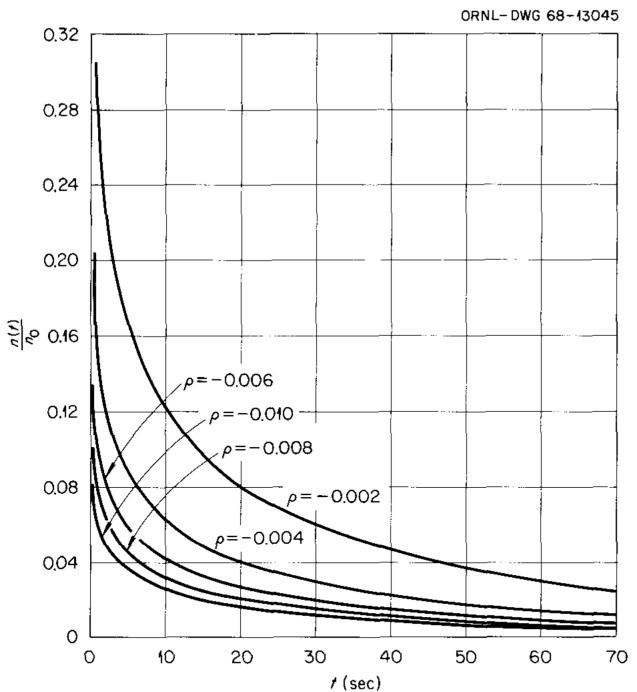  
Fig. 8.2. Neutron Density vs Time After Insertion of Negative Step in Reactivity.

# 8.3 HIGH-TEMPERATURE RESISTANCE THERMOMETER EVALUATION

R. L. Moore T. M. Cate

Investigation of the feasibility of measuring high temperatures in molten-salt systems with resistance thermometers has been resumed on a small scale.

The use of resistance thermometers is primarily of interest to the MSRP in reactor, engineering test loop, and research experiment applications that require measurement of small temperature differences at high temperature. Precise measurement of certain selected temperatures may also be of interest. At intervals, attempts have been made at ORNL to develop or purchase suitable sensing devices for such applications.[6,7] Although these attempts have been only partially successful, interest in the use of resistance

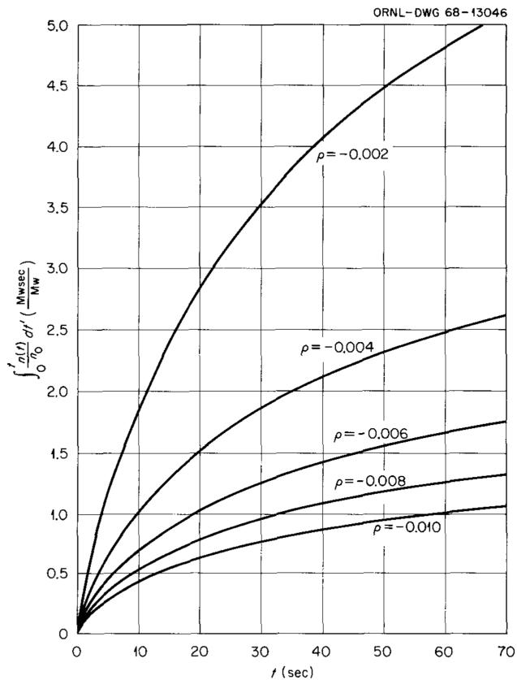  
Fig. 8.3. Time Integral of Neutron Density vs Time After Insertion of Negative Step in Reactivity.

thermometers for high-temperature measurements has continued.

Recently several companies (Electric Thermometers Inc., Rosemount Engineering Company, Leeds and Northrup) have marketed platinum resistance thermometers that are rated for operation at and above $1200^{\circ}\mathrm{F}$ and are reasonably priced. One company (Electric Thermometers Inc.) offers a ceramic-insulated platinum resistance thermometer which is rated for operation up to $1560^{\circ}\mathrm{F}$ $(850^{\circ}\mathrm{C})$ and claims that, when operated within rating and properly installed, the thermometer calibration will remain stable for long periods at high temperature and will not be affected by low-frequency cycling of the temperature. Two sets of these thermometers were purchased for test and evaluation. One set consists of a matched pair of thermometers. The other set consists of two "off-the-shelf" thermometers having the manufacturers' standard calibration.

Three test phases are planned. In the first phase the thermometers will be tested for gross shifts in calibration under conditions of prolonged operation at high temperatures with occasional wide variations of operating temperature, including return to room temperature. In the second phase a more accurate determination of high-temperature calibration and calibration drift rate will be made with one set. In the third phase the other set will be installed in an operating maltensalt test loop to obtain data on long-term performance under field conditions. Phase 3 may be performed concurrently with phase 2. Phase 2 and 3 tests will not be performed unless the results of phase 1 are satisfactory.

Phase 1 tests are in progress and nearing completion. In these tests two resistance thermometer elements were connected in a differential bridge arrangement and heated in a tube furnace. The thermometers were inserted from opposite ends of the furnace and butted together at a position of minimum temperature gradient so that they would be as nearly as possible at the same temperature. (In early tests the thermometers were physically reversed in position to verify that they were at the same temperature.) Bridge excitation during the tests was $5\mathrm{vdc}$ . With this excitation the $\Delta T$ measurement sensitivity was approximately $2.7\mathrm{mv} / {}^{\circ}\mathrm{F}$ at $32^{\circ}\mathrm{F}$ and approximately $0.66\mathrm{mv} / {}^{\circ}\mathrm{F}$ at $1200^{\circ}\mathrm{F}$ . Preliminary checks showed that 5-v excitation would not cause appreciable self-heating error.

Phase 1 tests were performed by heating the elements from room temperature to a preselected temperature, operating at this temperature for varying periods of time, and then cooling to room temperature. The bridge output voltage was observed during the cycle to detect calibration shifts and to determine the degree of mismatch of the calibration of the two thermometers. Before and after each cycle, the ice bath $(32^{\circ}\mathrm{F})$ resist

ance of each element was measured to determine the magnitude of any shift which occurred. Results of tests to date indicate that:

1. Calibration shifts do not occur if the thermometers are operated below $1200^{\circ}\mathrm{F}$ .   
2. Calibration shifts do occur when the thermometers are operated above $1200^{\circ}\mathrm{F}$ ; the magnitude of these shifts increases with increasing temperature above $1200^{\circ}\mathrm{F}$ .   
3. Extended operation at high temperatures tends to restore the original calibration and to stabilize the calibration for subsequent operation at lower temperatures. (The shifts are apparently caused by induced stresses which are annealed by extended operation at high temperatures.)   
4. The rate of annealing and stabilization is very slow at $1200^{\circ}\mathrm{F}$ and increases markedly with increase in annealing temperature. No appreciable annealing occurs at room temperature in any reasonable period of time.   
5. Subsequent operation above the annealing temperature or above the highest previous operating temperature (whichever was greater) results in further shifts.   
6. Extended operation at the highest temperature for which the thermometers are rated $(1500^{\circ}\mathrm{F})$ will restore the original calibration and stabilize the thermometers for all temperatures within the rating.   
7. Both sets of thermometers were well matched, and resistances were well within manufacturers' tolerances before the first shifts occurred.   
8. Resistance thermometers continue to offer promise of being useful devices for precise measurement of absolute and differential temperatures in molten-salt systems.

# 9. Heat Transfer and Thermophysical Properties

H. W. Hoffman

# 9.1 INTRODUCTION

The design of molten-salt reactors requires detailed information on the transport process (heat, mass, and momentum transfer) and the thermophysical properties of the proposed fuel, coolant, and blanket mixtures. The studies on molten salts described below are a part of the effort funded at ORNL by the Special Technology Branch, Division of Reactor Development and Technology, U.S. Atomic Energy Commission, directed to advancing our understanding of phenomena common to general classes of reactors.

While molten salts may be classed as normal thermal transport media, $^{1,2}$ experience $^{3}$ during the ANP program also pointed up strongly the need for heat transfer measurements with the specified reactor salts to detect the presence and delineate the effects of such adverse factors as nonwetting or the formation of low-conductivity surface films. Recent studies in this area are described in the first of the following sections.

The second area considered in this report is that of the thermophysical properties of the molten salts; this includes both the estimation and measurement of these properties. A major effort was mounted during the ANP program to develop meas

urement techniques and to provide the data necessary to reactor design, and there resulted much information on the properties of a wide variety of molten salts. With somewhat narrowed scope, these studies were continued as a part of the Molten-Salt Reactor Program during the period 1958-1962. Work was resumed in 1967 in response to questions raised by MSRE operation and is continuing now in support of the MoltenSalt Breeder Reactor Program.

Finally, this report covers the beginning of an experimental effort to obtain the mass-transfer (diffusion) coefficients needed to evaluate and develop the proposed scheme of circulating inert gas bubbles with the molten-salt stream outside the reactor core as a means for removing gaseous fission products.

# 9.2 HEAT TRANSFER

B.Cox H.W.Hoffman

The apparatus assembled for studying heat transfer with the molten salts is shown schematically in Fig. 9.1. Salt is induced to flow, first in one direction and then in the other, through a small-diameter electrically heated test section by alternately pressurizing with an inert gas the

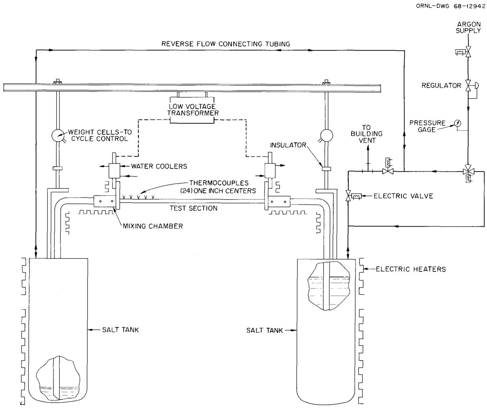  
Fig. 9.1. Schematic Diagram of Pressurized-Flow System for Determining the Heat Transfer Characteristics of Molten Salts.

salt storage vessels located at each end of the test channel. Each salt reservoir is suspended from a weigh cell whose recorded signal provides data on the liquid flow rate and, simultaneously, effects flow reversal by actuating solenoid valves controlling the gas flow. Initial experiments are being conducted with the proposed single-region MSBR fuel mixture (LiF-BeF $_2$ -ThF $_4$ -UF $_4$ , 67.5-20-12-0.5 mole %). Later experiments will utilize the coolant mixture NaF-NaBF $_4$ (8-92 mole %). Operation with this latter melt requires maintaining a BF $_3$ -argon mixture over the salt to prevent significant change in the mixture composition (and accompanying sharp increase in melt

ing temperature) through loss of the volatile $\mathbf{BF}_3$ . In turn, this is dependent on the development of satisfactory means for introducing, circulating, storing, and disposing of this toxic gas. A system for accomplishing this has been designed and partially fabricated. In view of the lower volatility of the components in the fuel mixture, argon treated to remove residual oxygen and water vapor is being used as the pressurizing and cover gas in the first experiments. The effluent gas is vented to the outside of the building.

The test section is a 24.5-in.-long, 0.25-in.- $\mathrm{OD} \times 0.035$ in. wall thickness, smooth Hastelloy N tube heated by passing a high-amperage electric

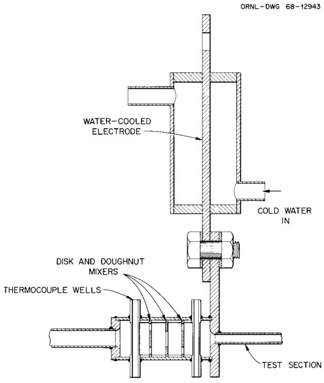  
Fig. 9.2. Details of Test Section End, Mixing Chamber, and Electrode for Pressurized-Flow System.

current through the tube wall. The electrodes also serve as the end plates of disk-and-donut mixing chambers located at each end of the test section; a detail of this region is shown in Fig. 9.2. In preliminary operation, overheating at the connection between the power cables and the Inconel electrodes caused severe oxidation of the copper cables. To eliminate this, a water-cooled section was installed between the cable and the electrode. Twenty-four 0.005-in.-diam Chromel-Alumel thermocouples welded to the outside tube wall at $\sim 1$ -in. intervals measure the temperature distribution along the test section; sheath-type couples inserted in wells in the mixing chambers measure the inlet and outlet fluid temperatures. The test section is insulated by vermiculite contained in a box enclosing the test unit. Thermal expansion of the test section was accommodated by attaching to the freely suspended salt reservoirs wires that were coaxial with the test section and, after passing over insulated pulleys, carried heavy weights.

The isothermal and heat-loss characteristics of the test section, the uniformity of the wall heat

generation, and the absence of effects on the thermocouple readings of the tube-wall current were established in an extensive series of preliminary tests. Following these, initial heat transfer runs were made at Reynolds moduli between 700 and 20,000, heat fluxes from $3 \times 10^{4}$ to $6 \times 10^{5}$ Btu $\mathrm{hr}^{-1} \mathrm{ft}^{-2}$ , and mean fluid temperatures between 1230 and $1510^{\circ}\mathrm{F}$ . The data obtained are summarized in Table 9.1. Axial inside-wall temperature profiles are shown in Figs. 9.3 through 9.5 for selected values of the Reynolds modulus. As noted in each case graphed, the axial wall temperature pattern shows oscillations not found in previous molten-salt studies. Curves fitted to the data as a part of the search for rational understanding may not, at this time, be of particular significance.

Run 48, shown in Fig. 9.3, was performed in the laminar flow regime (Reynolds modulus = 738). The scatter in the wall temperature data is of the order of $\pm 0.5\%$ ; in isothermal runs at $1200^{\circ}\mathrm{F}$ , the temperature variation was less than $\pm 0.2\%$ . Based on the mean line through the data, the derived heat transfer coefficient is $\sim 277$ Btu hr $^{-1}$ ft $^{-2}$ ( $^{\circ}\mathrm{F})^{-1}$ , and the corresponding Colburn $j$ factor $\sim 0.0054$ . When compared with a plot of the Seider-Tate equation (the Colburn factor with a viscosity gradient correction), this value corresponds to the curve for a heated length-to-diameter ratio of 100. Since the actual tube length is 133, this constitutes rather good agreement. In contrast, the thermal entrance length suggested by the data is $\sim 55$ tube diameters, whereas theory predicts 336 for a fluid with Prandtl modulus of 9.1 at a Reynolds modulus of 738.

Figures 9.4 and 9.5 show axial temperature profiles that differ significantly from the one displayed in Fig. 9.3. The initial temperature rise is observed to be followed by a temperature decrease and this, in turn, by an irregular wall temperature pattern. We currently believe that the first part of these curves depicts a laminar-turbulent transition, despite the fact that the mean bulk Reynolds modulus for run 47 (Fig. 9.5) was $\sim 20,000$ . Downstream of this, for run 35 (Fig. 9.4), the wall temperature appears to increase in

Table 9.1. Preliminary Data Obtained in Heat Transfer Studies with an LiF-BeF $_2$ -ThF $_4$ -UF $_4$ (67.5-20-12-0.5 mole %) Mixture Flowing in a Long, Small-Diameter Hastelloy N Tube   

<table><tr><td>Run</td><td>tf,i(°F)</td><td>tf,0(°F)</td><td>δtf(°F)</td><td>w(lb m/hr)</td><td>NRe</td><td>qf/A(Btu hr-1ft-2)</td><td>Heat Balancea</td></tr><tr><td></td><td></td><td></td><td></td><td></td><td></td><td>(x10-5)</td><td></td></tr><tr><td>26</td><td>1201.6</td><td>1264.9</td><td>63.3</td><td>850.8</td><td>3500</td><td>1.85</td><td>1.18</td></tr><tr><td>27</td><td>1230.1</td><td>1284.0</td><td>53.9</td><td>1305.6</td><td>5733</td><td>2.41</td><td>1.24</td></tr><tr><td>28</td><td>1256.1</td><td>1311.1</td><td>55.0</td><td>1945.8</td><td>9172</td><td>3.67</td><td>1.20</td></tr><tr><td>29</td><td>1281.3</td><td>1340.9</td><td>59.6</td><td>2325.0</td><td>11766</td><td>4.75</td><td>1.12</td></tr><tr><td>33</td><td>1195.5</td><td>1244.1</td><td>48.6</td><td>1012.2</td><td>4010</td><td>1.69</td><td>1.03</td></tr><tr><td>34</td><td>1219.0</td><td>1266.2</td><td>47.2</td><td>1434.6</td><td>6057</td><td>2.32</td><td>1.15</td></tr><tr><td>35</td><td>1244.5</td><td>1290.3</td><td>45.8</td><td>2203.8</td><td>9952</td><td>3.47</td><td>1.10</td></tr><tr><td>36</td><td>1265.7</td><td>1319.7</td><td>54.0</td><td>2609.4</td><td>12595</td><td>4.83</td><td>1.12</td></tr><tr><td>37</td><td>1188.4</td><td>1278.4</td><td>90.0</td><td>1058.4</td><td>4356</td><td>3.27</td><td>1.10</td></tr><tr><td>38</td><td>1247.7</td><td>1331.6</td><td>83.9</td><td>1524.0</td><td>7298</td><td>4.38</td><td>1.10</td></tr><tr><td>39</td><td>1285.8</td><td>1358.0</td><td>72.2</td><td>2178.0</td><td>11327</td><td>5.40</td><td>1.06</td></tr><tr><td>40</td><td>1316.7</td><td>1386.2</td><td>69.5</td><td>2578.8</td><td>14426</td><td>6.15</td><td>1.06</td></tr><tr><td>44</td><td>1393.8</td><td>1440.7</td><td>46.9</td><td>1715.4</td><td>11197</td><td>2.76</td><td>1.13</td></tr><tr><td>45</td><td>1422.9</td><td>1477.9</td><td>55.0</td><td>1993.2</td><td>14006</td><td>3.76</td><td>1.09</td></tr><tr><td>46</td><td>1452.3</td><td>1511.0</td><td>58.7</td><td>2337.6</td><td>17568</td><td>4.71</td><td>1.04</td></tr><tr><td>47</td><td>1475.4</td><td>1545.9</td><td>70.5</td><td>2434.2</td><td>19434</td><td>5.89</td><td>1.07</td></tr><tr><td>48</td><td>1370.6</td><td>1447.7</td><td>77.1</td><td>115.2</td><td>738</td><td>0.305</td><td>1.05</td></tr></table>

${}^{a}$ Heat balance $= \left\lbrack  {\text{ sensible heat gained by fluid }\left( {q}_{t}\right)  + \text{heat loss }\left( {q}_{I}\right) }\right\rbrack  /\left\lbrack  \text{electrical heat input }\left( {q}_{e}\right) \right\rbrack$ .

a stepwise fashion; the lines through the data points were arbitrarily drawn to parallel the straight line connecting the inlet and exit fluid

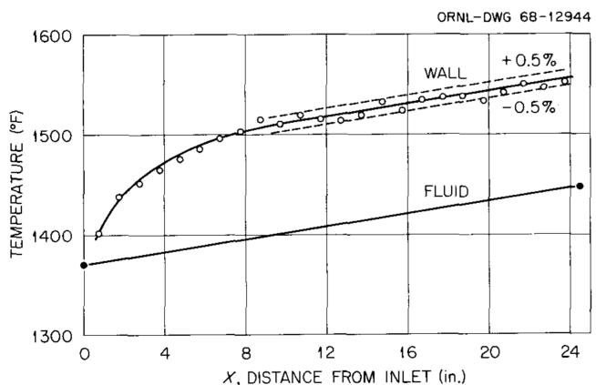  
Fig. 9.3. Axial Temperature Profile with LiF-BeF $_2$ -ThF $_4$ -UF $_4$ (67.5-20-12-0.5 mole %) Flowing in an Electrically Heated Tube. Run 48, $N_{\text{RE}} = 738$ , $q_f / A = 3.05 \times 10^4$ Btu hr $^{-1}$ ft $^{-2}$ .

temperatures. The data of run 47 (Fig. 9.5) were given the same treatment; the temperature pattern here appears much more erratic than noted in run 35. Further speculation at this time on these data is not warranted.

Investigation of the above phenomena is continuing. In particular, we will examine the effect

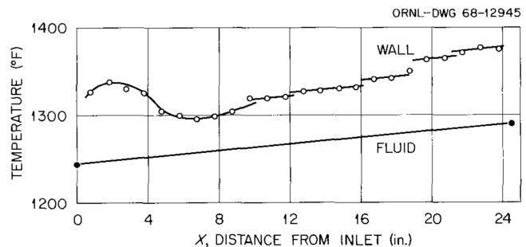  
Fig. 9.4. Axial Temperature Profile with LiF-BeF $_2$ -ThF $_4$ -UF $_4$ (67.5-20-12-0.5 mole %) Flowing in an Electrically Heated Tube. Run 35, $N_{\text{RE}} = 9952$ , $q_f / A = 3.47 \times 10^5$ . Btu hr $^{-1}$ ft $^{-2}$ .

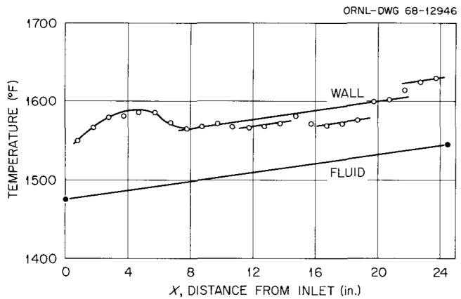  
Fig. 9.5. Axial Temperature Profile with LiF-BeF $_2$ -ThF $_4$ -UF $_4$ (67.5-20-12-0.5 mole %) Flowing in an Electrically Heated Tube. Run 47, $N_{\text{RE}} = 19,434$ , $q_f / A = 5.89 \times 10^5$ Btu hr $^{-1}$ ft $^{-2}$ .

of heat flux at constant Reynolds modulus and will attempt some analyses as to the wall-temperature patterns predicted for specific postulated flows of a fluid having the properties of the MSBR single-region fuel salt. Some changes in the physical arrangement of the test channel insulation and guard heating may also be affected. The possibility of increasing the test section length to 36 in. is also being considered.

# 9.3 THERMOPHYSICAL PROPERTIES

J.W.Cooke L.G.Alexander H.W.Hoffman

# 9.3.1 Thermal Conductivity

An absolute, variable-gap apparatus is being used to measure the thermal conductivity of the salt mixtures proposed for the MSBR. A schematic representation of this device is shown in Fig. 9.6. Heat from the main heater is transferred downward through the liquid sample region (labeled "variable gap" in the figure) to an air-cooled sink; heat flow in the upward and radial directions is minimized by appropriately located guard heaters. The heat flux into the sample is obtained from measurement (voltage and current) of the dc power to the main heater. The tempera

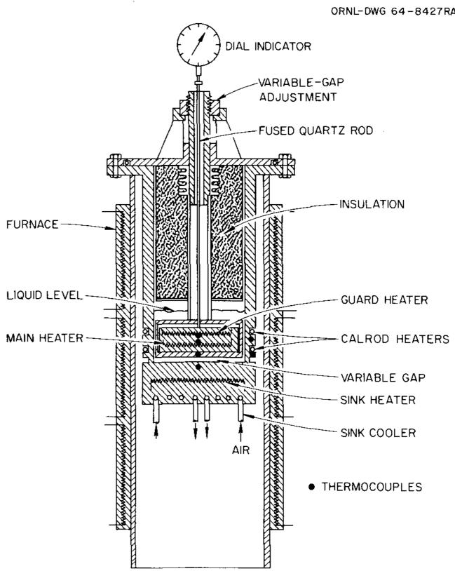  
Fig. 9.6. Variable-Gap Apparatus for Thermal Conductivity Measurements with Molten Salts.

ture drop across the gap is determined from thermocouples located on the axial center line in the metal surfaces defining the sample region; in Fig. 9.6 the position of the couples is indicated by closed dots. The sample thickness is varied by moving the "piston" containing the main heater; the separation of the upper surface from the fixed bottom surface is measured by a precision dial indicator. The system temperature level is maintained by a surrounding zone-controlled furnace. The salt whose conductivity is to be measured is generally introduced into the apparatus in powdered form. The system is then evacuated and held under vacuum conditions until the salt is melted. During operation an appropriate cover gas at atmospheric pressure is added to the system.

The measured temperature difference can be resolved into the temperature drop across the sample gap, the temperature drops in the metal walls defining the test region, the temperature

drops in any solid or gaseous films adhering to the metal surfaces, and errors associated with thermocouple calibration, lead-wire inhomogeneities in thermal gradient regions, and instrument malfunctions. Neglecting the error term, we can write

$$
\Delta T _ {T} = \Delta T _ {s} + \Delta T _ {m} + \Delta T _ {f}, \tag {1}
$$

where the subscripts are $T =$ total, $s =$ sample, $m =$ metal, and $f =$ surface film.

For the sample region, the temperature difference is given by

$$
\Delta T _ {s} = (Q / A) \Delta x _ {s} / k _ {s}, \tag {2}
$$

where $Q / A$ is the heat flux, $\Delta x_{s}$ is the gap width, and $k_{s}$ is the thermal conductivity of the liquid sample. It is assumed that no natural convection exists in the sample region.

Similarly, the temperature drop in the confining horizontal metal walls can be written

$$
\Delta T _ {m} = (Q / A) \Delta x _ {m} / k _ {m}, \tag {3}
$$

where $\Delta x_{m}$ is the heat-flow path length in the metal walls, and $k_{m}$ is the wall conductivity. The heat flux, $Q / A$ , is the same as in Eq. (2); this assumes no radial heat flow and no bypass heat flow through the side (vertical) walls of the sample cup. Since $k_{m}$ is a function of temperature, Eq. (3) is usually written separately for the upper and lower metal walls; however, for the purposes of this analysis, the two regions are lumped.

The film temperature difference is of the same form as the $\Delta T$ 's given in Eqs. (2) and (3). If surface films are present but of constant and known thickness, $\Lambda x_{f}$ , during the experiment, there is no effect on the derived sample conductivity or on the associated error. A film that grows or decays in an unknown way during the course of the measurement introduces an error in $\Delta x_{o}$ .

Thus the sample thermal conductivity is obtained as

$$
\Delta T _ {T} = (Q / A) \left(\frac {\Delta x _ {s}}{k _ {s}} + \frac {\Delta x _ {m}}{k _ {m}} + \frac {\Delta x _ {f}}{k _ {f}}\right),
$$

or

$$
\frac {\Lambda T _ {T}}{(Q / A)} = \left(\frac {1}{k _ {s}}\right) \Delta x _ {s} + \left(\frac {\Delta x _ {m}}{k _ {m}} + \frac {\Delta x _ {f}}{k _ {f}}\right). \tag {4}
$$

This is of the form

$$
y = a x + b, \tag {5}
$$

where $a$ is the slope of this linear expression and is the reciprocal of the sample conductivity, and $b$ is the intercept and lumps all other resistances. In operating the apparatus, $Q / A$ is kept constant, and $\Delta T_{T}$ is recorded as $\Delta x_{s}$ is discretely varied.

This apparatus has been used to obtain preliminary data on three molten fluoride mixtures. The smoothed values are given in Table 9.2, along with calibration results obtained with mercury, water, HiTec salt $(\mathrm{NaNO}_2 - \mathrm{NaNO}_3 - \mathrm{KNO}_3$ 40-7-53 wt %), helium, and argon. This table also shows literature values for the calibration fluids and recommended values at the melting temperature (based on calibration and other anticipated corrections) for the three fluoride melts. We find that, in general, results with the calibration fluids are higher than published literature values; most of the observed difference can be attributed to heat losses which become increasingly significant with decreasing conductivity.

In evaluating the present results, it must be noted that the apparatus used was designed to minimize the error with fluids having thermal conductivities in the range 0.05 to $0.10\mathrm{Wcm}^{-1}$ $(^{\circ}\mathrm{C})^{-1}$ , that is, the guard heating was designed to make axial and radial heat losses negligible for salts having conductivities in this range. The data of Table 9.2 show that the actual conductivities of the fluoride salts are about an order of magnitude lower than expected and that corrections must be made for heat loss. An analysis taking into account the multiple modes of axial and radial heat transfer as well as the specimen properties, the absolute temperature level, and the capability of the guard heaters has given corrections that are consistent with the apparatus calibrations. Final data correction should be available soon.

In the light of the above comments, some discussion of these sources of "absolute" error in a variable-gap thermal conductivity device is warranted to provide proper perspective for interpreting data obtained. First, we consider the heat transport across the sample region. Referring to Fig. 9.6, we observe that both the main (upper) heater and the test cell are guard heated. The operator attempts to adjust these guard heaters such that the heat flow through the liquid

Table 9.2. Preliminary Results for the Thermal Conductivities of Several Fluids and Molten Salt Mixtures as Measured in a Variable-Gap Apparatus   

<table><tr><td rowspan="2" colspan="2"></td><td colspan="8">Thermal Conductivity [w cm-1(°C)-1] at Temperatures (°C) of -</td></tr><tr><td>200</td><td>300</td><td>400</td><td>500</td><td>600</td><td>700</td><td>800</td><td>900</td></tr><tr><td rowspan="2">Mercury</td><td>Experiment</td><td>0.0957a</td><td></td><td></td><td></td><td></td><td></td><td></td><td></td></tr><tr><td>Literature</td><td>0.0945</td><td></td><td></td><td></td><td></td><td></td><td></td><td></td></tr><tr><td rowspan="2">Water</td><td>Experiment</td><td>0.0075b</td><td></td><td></td><td></td><td></td><td></td><td></td><td></td></tr><tr><td>Literature</td><td>0.0064</td><td></td><td></td><td></td><td></td><td></td><td></td><td></td></tr><tr><td rowspan="2">Helium</td><td>Experiment</td><td>0.0026</td><td>0.0028</td><td>0.0030</td><td>0.0032</td><td>0.0035</td><td>0.0037</td><td>0.0039</td><td>0.0041</td></tr><tr><td>Literature</td><td>0.0021</td><td>0.0024</td><td>0.0027</td><td>0.0030</td><td>0.0033</td><td>0.0036</td><td>0.0039</td><td>0.0042</td></tr><tr><td rowspan="2">Argon</td><td>Experiment</td><td></td><td></td><td></td><td>0.00038</td><td>0.00044</td><td>0.00050</td><td>0.00056</td><td>0.00062</td></tr><tr><td>Literature</td><td></td><td></td><td></td><td>0.00036</td><td>0.00040</td><td>0.00043</td><td>0.00047</td><td>0.00051</td></tr><tr><td rowspan="2">HiTec</td><td>Experiment</td><td>0.0054</td><td>0.0050</td><td>0.0046</td><td>0.0042</td><td>0.0038</td><td></td><td></td><td></td></tr><tr><td>Literature</td><td>0.0047</td><td>0.0043</td><td>0.0039</td><td></td><td></td><td></td><td></td><td></td></tr><tr><td rowspan="2">LiF-BeF2(65.8-34.2 mole %)</td><td>Experiment</td><td></td><td></td><td></td><td>0.0100</td><td>0.0113</td><td>0.0118</td><td>0.0117</td><td>0.0110</td></tr><tr><td>Recommended</td><td>0.010c</td><td></td><td></td><td></td><td></td><td></td><td></td><td></td></tr><tr><td rowspan="2">LiF-BeF2-ZrF4-UF4(71.2-23-5-0.8 mole %)</td><td>Experiment</td><td></td><td></td><td></td><td>0.0120</td><td>0.0143</td><td>0.0152</td><td>0.0138</td><td>0.0121</td></tr><tr><td>Recommended</td><td>0.010c</td><td></td><td></td><td></td><td></td><td></td><td></td><td></td></tr><tr><td rowspan="2">NaBF4(100 mole %)</td><td>Experiment</td><td></td><td></td><td>0.0053</td><td>0.0049</td><td>0.0046</td><td>0.0043</td><td>0.0039</td><td></td></tr><tr><td>Recommended</td><td>0.005c</td><td></td><td></td><td></td><td></td><td></td><td></td><td></td></tr></table>

$^{\text{圆}}$ At $60^{\circ}$ C.   
$^{b}$ At $37^{\circ}\mathrm{C}$ .   
cAt Melting temperature.

sample is axially downward parallel to the apparatus vertical center line. However, if the adjustments are not sufficiently precise - and this is difficult to accomplish - some radial heat flow will be present. The reduced axial heat flow gives rise to a lower measured $\Delta T_{T}$ and, since $Q / A$ is based on the measured power to the main heater, to a further reduced value for $\Delta T_{T} / (Q / A)$ . The consequence of this is curvature in the data plot from which $k_{s}$ is derived, with deviations below the "true" straight line increasing with increasing $\Delta x_{s}$ and probably with increasing average temperature level. This is illustrated by the data from the $\mathrm{NaBF}_4$ measurements shown in Fig. 9.7. The detailed analysis mentioned above is also being used to provide design guidelines for minimizing this effect in a new apparatus currently being fabricated.

A second factor to be considered is natural circulation within the liquid sample; the presence

of natural circulation again leads to $k$ values that are incorrect on the high side. The cell is designed to weaken this effect; it is heated from above so that a stable temperature profile exists, and the aspect ratio of the sample region (upper plate radius over sample gap) is of the order of 50:1. Edge effects may exist, since circulation cells set up in the annular gap around the upper (main) heater probably extend into the peripheral regions of the sample disk. We feel this effect is small, although one investigator claims that even at an aspect ratio $2\frac{1}{2}$ times that of the present device, some natural convection effects were observed at the cell center line. A more serious possibility for liquid motion exists in regard to some skewness of the sample gap with respect to the gravitational vector. This would cause the hot fluid to "spill" off the upper surface at one edge and cooler fluid to return in counterflow along the bottom surface. Such flow could be

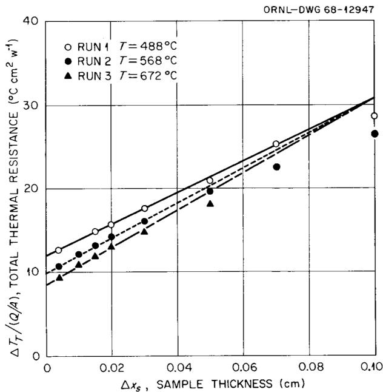  
Fig. 9.7. Data Obtained in Measurement of Thermal Conductivity of $\mathsf{NaBF}_4$ with Variable-Gap Apparatus.

highly complex, since the temperature distribution outside the sample region also has a role in defining the fluid circuits. It should be noted that, while the "parallelness" of the two surfaces delimiting the sample region has received much attention, the "horizontalness" has been considered a second-order effect. This will be investigated further. Finally, some investigators state that, all other factors being "perfect," periodic or intermittent vibrations can cause transient convection cells to develop even in a temperature-stabilized geometry.

A third heat transport mode that must be considered is thermal radiation. When present, this also leads to apparent conductivities that are higher than the true molecular conductivities. For transparent liquids of relatively low molecular conductivity, the radiation contribution can be appreciable. Earlier evaluations (presuming all of the observed curvature in the data to be due to radiation) have convinced us that the radiation contribution could, in some instances, be as high as $10\%$ . This view has been tempered somewhat as our awareness of the magnitude of radial heat loss and convection effects has increased. In addition, if the fluid medium is absorbing, radia

tion transfer is further reduced. Thus a calculation based on $\mathrm{NaBF}_4$ data - assuming a transparent medium and a surface emissivity of 0.2 - suggests that $6\%$ of the heat transfer could be by radiation. For a partially absorbing medium with an absorption coefficient of $2 / \mathrm{cm}$ (based on an estimate by Cooke) at a maximum gap thickness of 0.1 cm, the radiation transfer would be reduced by about $20\%$ .

A number of additional problems were encountered in the $\mathrm{NaBF}_4$ measurements. During the first of three sets of measurements, loss of $\mathrm{BF}_3$ caused a shift in the melt composition toward the NaF-rich side of the NaF- $\mathrm{NaBF}_4$ phase diagram, with an accompanying sharp increase in the melting temperature and probably a marked change in sample conductivity. This eventually led to failure of the system heaters and severe damage to the apparatus. In the second set of measurements, thermocouple outputs were observed to be erratic; this condition was found to result from inhomogeneities in the thermocouple lead wires. For the final data set, a $\mathrm{BF}_3$ cover-gas system was installed to prevent melt composition changes. Despite all these problems, the total scatter of all three data sets was less than $\pm 13\%$ .

At present we estimate the uncertainty in our preliminary measurements to be between $+15$ and $-35\%$ ; corrected values should have an uncertainty of less than $\pm 15\%$ . These studies are being continued, and with a new apparatus the accuracy should be further improved. In addition, a planned thorough study of the effect on the thermal conductivity of composition changes in a given salt system should lead to more reliable equations for predicting conductivities.

# 9.3.2 Heat Capacity

Measurements were completed for the enthalpy of the MSRE coolant mixture, $\mathrm{LiF - BeF}_2$ (66-34 mole %), in the liquid range. Two separate salt samples contained in Inconel capsules were used with two copper-block drop calorimeters. These calorimeters were calibrated using sapphire crystals certified by the National Bureau of Standards.

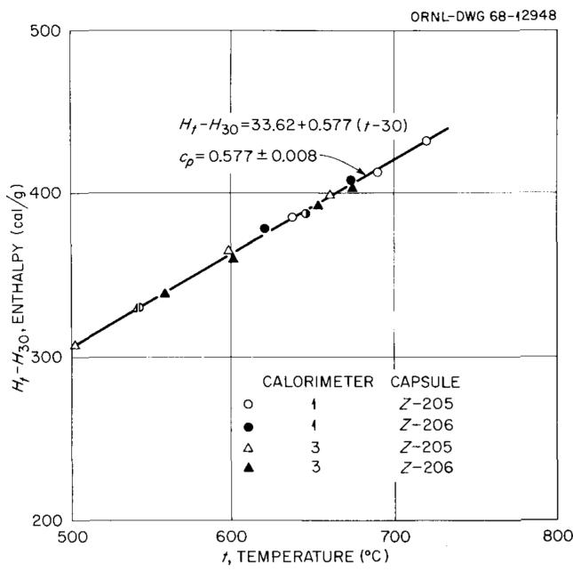  
Fig. 9.8. Enthalpy of LiF-BeF $_2$ (66-34 mole%).

The pooled data yielded the following relation for the enthalpy (in cal/g) between 500 and $720^{\circ}\mathrm{C}$ :

$$
H _ {t} - H _ {3 0} = 3 3. 6 2 + 0. 5 7 7 (t - 3 0). \tag {6}
$$

The total error in the enthalpy was found to be of the order of $1\%$ . This results from a standard error of $\pm 0.6\%$ associated with Eq. (6) and a calorimeter calibration error of $\pm 0.5\%$ . The data are summarized graphically in Fig. 9.8; the line shown is the above least-squares fit to the data.

The derived heat capacity, $0.577 \pm 0.008$ cal $\mathrm{g}^{-1} (^{\circ}\mathrm{C})^{-1} (\pm 1.4\%)$ , agreed reasonably with the value of 0.56 cal $\mathrm{g}^{-1} (^{\circ}\mathrm{C})^{-1}$ reported by another investigator for the LiF-BeF $_2$ (67-33 mole %) mixture.

Data in the solid region were too limited for significant evaluation. However, a melting temperature of $480 \pm 20^{\circ}\mathrm{C}$ was suggested with a latent heat of fusion (which may include transitions) of the order of $115\mathrm{cal / g}$ .

The enthalpy apparatus has been repaired and recalibrated preliminary to measurements with the MSRE coolant mixture in the solid region and with the MSBR single-region fuel mixture (LiF-BeF $_2$ -ThF $_4$ -UF $_4$ , 67.5-20-12-0.5 mole%). A limited study of existing and potential errors

associated with the copper-block calorimeter has disclosed no significant new sources of error.

# 9.3.3 Property Prediction

Two methods for estimating the thermal conductivity of molten fluoride mixtures were reviewed, namely, that due to $\mathbf{R}\mathbf{a}\mathbf{o}^{\mathbf{9}}$ and that due to Bridgman.10

In 1941, Rao derived the basic relation, $k = 4\kappa \nu / x$ , for the vibrational conductivity of a common liquid and substituted the Lindemann equation for the single frequency, $\nu$ , of particles vibrating in a cubic arrangement to obtain

$$
k = B \left(T _ {m} / M V ^ {4 / 3}\right) ^ {1 / 2}, \tag {7}
$$

where $k =$ thermal conductivity $\left[\mathrm{Wcm}^{-1}\left(^{\circ}\mathrm{C}\right)^{-1}\right]$ $\kappa =$ Boltzmann constant, $x =$ molecular spacing (cm), $T_{m} =$ melting temperature $(^{\circ}\mathbf{K})$ $M =$ molecular weight, $V =$ molar volume $(\mathrm{cm}^{3})$ , and $B =$ constant. This constant $B$ was evaluated from the few available values of the Debye frequencies for such salts as KCl, KBr, NaCl, etc. For the molten salts, $M / n$ and $V / n$ should be used in Eq. (7); $n$ is the average number of discrete ions per mole $= \sum_{i}X_{i}N_{i}$ , and $M$ is the average molecular weight $= \sum_{i}X_{i}M_{i}$ , where $X$ is the mole fraction. Introducing the density, $\rho = M / V$ , and the derived value for $B$ into Eq. (7), gives

$$
k = 1 1. 9 \times 1 0 ^ {- 3} \frac {T _ {m} ^ {1 / 2} \rho^ {2 / 3}}{(M / n) ^ {7 / 6}}, \tag {8}
$$

for $k$ in $\mathbf{wcm}^{-1}(\circ \mathbf{C})^{-1}$ . The ion number, $n$ , is calculated by a method that takes into account the associative power of such elements as Be, B, Th, and U as compared with Na, Li, and K. Values for the ion number of several typical salts are given in Table 9.3.

An alternative treatment of vibrational conduction in a quasi-crystalline liquid is that of Bridgman. This assumes a regular cubic arrangement of particle spacing, $x$ , with energy $3\kappa T$ per particle

Table 9.3. Calculated Ion Numbers for Use in Estimating the Thermal Conductivities of Molten Salts   

<table><tr><td>Mixture</td><td>Ion Equation</td><td>Ion No.</td></tr><tr><td>LiF-BeF2(66-34)a</td><td>0.66 Li+ + 0.33 BeF42- + 0.01 BeF2</td><td>1.00</td></tr><tr><td>LiF-BeF2(65.8-34.2)</td><td>0.658 Li+ + 0.329 BeF42- + 0.013 BeF2</td><td>1.00</td></tr><tr><td>LiF-BeF2-UF4(65.5-34-0.5)</td><td>0.655 Li+ + 0.325 BeF42- + 0.005 UF5- + 0.015 BeF2</td><td>1.00</td></tr><tr><td>LiF-BeF2-UF4(65.5-33.5-1)</td><td>0.655 Li+ + 0.3225 BeF42- + 0.01 UF5- + 0.0125 BeF2</td><td>1.00</td></tr><tr><td>LiF-BeF2-ZrF4-UF4(71.2-23-5-0.8)</td><td>0.712 Li+ + 0.230 BeF42- + 0.05 ZrF5- + 0.008 UF5- + 0.194 F-</td><td>1.194</td></tr><tr><td>LiF-ThF4(71-29)</td><td>0.71 Li+ + 0.29 ThF5- + 0.42 F-</td><td>1.42</td></tr><tr><td>LiF-BeF2-ThF4(71-2-27)</td><td>0.71 Li+ + 0.02 BeF42- + 0.27 ThF5- + 0.40 F-</td><td>1.40</td></tr><tr><td>LiF-BeF2-ThF4(70-15-15)</td><td>0.70 Li+ + 0.15 BeF42- + 0.15 ThF5- + 0.25 F-</td><td>1.25</td></tr><tr><td>NaF-BF3(56-44)b</td><td>0.56 Na+ + 0.44 BF4- + 0.12 F-</td><td>1.12</td></tr><tr><td>NaF-NaBF4(8-92)b</td><td>1.00 Na+ + 0.92 BF4 + 0.08 F-</td><td>2.00</td></tr><tr><td>NaF-BF3-KF(47.5-48-4.5)</td><td>0.475 Na+ + 0.045 K+ + 0.48 BF4- + 0.04 F-</td><td>1.04</td></tr><tr><td>LiF-NaF-KF(46.5-11.5-42)</td><td>0.465 Li+ + 0.115 Na+ + 0.42 K+ + 1.00 F-</td><td>2.00</td></tr><tr><td>KNO3-NaNO2-NaNO3(44-49-7)</td><td>0.44 K+ + 0.56 Na+ + 0.49 NO2- + 0.51 NO3-</td><td>2.00</td></tr><tr><td>KNO3-NaNO2(40-60)</td><td>0.40 K+ + 0.60 Na+ + 0.40 NO3- + 0.60 NO2-</td><td>2.00</td></tr><tr><td>KNO3</td><td></td><td>2.00</td></tr><tr><td>NaNO3</td><td></td><td>2.00</td></tr></table>

${}^{a}$ Compositions are in mole $\%$ .   
Both compositions correspond to the eutectic mixture.

handed down the rows at the speed of sound in the liquid, $U_{s}$ , leading to

$$
k = 3 \kappa U _ {s} / x ^ {2}. \tag {9}
$$

For ionic molten salts it is appropriate to take $x$ as $(V / N_{a}n)^{1 / 3}$ , where $N_{a}$ is Avogadro's number. An improved equation is that of Kincaid and Eyring, who introduced the Eucken factor to account for internal degrees of freedom, so that the constant 3 in Eq. (9) is replaced by $2.79 / \gamma$ where $\gamma$ is the ratio of specific heats.

Where the required constants were available, Eqs. (8) and (9) were used to calculate the thermal

conductivities of a number of molten salt mixtures; the results are compared in Table 9.4 along with some experimental values. The agreement between conductivities predicted by Eq. (8) and experimental values is excellent for the chloride and nitrate salts listed in the lower part of Table 9.4. This is not surprising, since the theory is based primarily on such single-component systems. Further, this agreement is obtained without manipulation of the coefficients or exponents in Eq. (8). In contrast, the same comparison for the fluoride melts shows only adequate agreement between the predicted and measured values. This discrepancy may result in part from uncertainties in the experimental data; the values shown were obtained in earlier measurements with a less-refined apparatus and are still considered preliminary.

Table 9.4. Comparisons Between Experimental and Predicted Molten-Salt Thermal Conductivities   

<table><tr><td rowspan="2">Mixture (mole %)</td><td rowspan="2">Melting Temperature (°K)</td><td colspan="3">k [w-1cm-1(°C)-1]</td></tr><tr><td>Eq. (8)</td><td>Eq. (9)</td><td>Experimental</td></tr><tr><td>LiF-BeF2(66-34)a</td><td>731</td><td>0.008</td><td></td><td></td></tr><tr><td>LiF-BeF2(65.8-34.2)</td><td>731</td><td>0.008</td><td></td><td>0.0107</td></tr><tr><td>LiF-BeF2-UF4(65.5-34.0-0.5)</td><td>729</td><td>0.008</td><td></td><td></td></tr><tr><td>LiF-BeF2-UF4(65.5-33.5-1.0)</td><td>727</td><td>0.008</td><td></td><td></td></tr><tr><td>LiF-BeF2-ZrF4-UF4(71.2-23-5-0.8)</td><td>710</td><td>0.008</td><td></td><td>0.0125</td></tr><tr><td>LiF-ThF4(71-29)</td><td>841</td><td>0.005</td><td></td><td></td></tr><tr><td>LiF-BeF2-ThF4(71-2-27)</td><td>833</td><td>0.005</td><td></td><td></td></tr><tr><td>LiF-BeF2-ThF4(70-15-15)</td><td>823</td><td>0.007</td><td></td><td></td></tr><tr><td>NaF-NaBF4(8-92)</td><td>646</td><td>0.005</td><td></td><td>0.004</td></tr><tr><td>NaF-BF3-KF(47.5-48-4.5)</td><td>638</td><td>0.005</td><td></td><td></td></tr><tr><td>KNO3-NaNO2-NaNO3(44-49-7)</td><td>415</td><td>0.0049</td><td></td><td>0.005</td></tr><tr><td>KNO3</td><td>606</td><td>0.0046</td><td>0.0056</td><td>0.0043</td></tr><tr><td>NaNO3</td><td>582</td><td>0.0056</td><td>0.0066</td><td>0.0057</td></tr><tr><td>NaCl</td><td>1073</td><td>0.010</td><td>0.007</td><td>0.0088</td></tr><tr><td>ZnCl2</td><td>591</td><td>0.0032</td><td></td><td>0.003</td></tr><tr><td>LiF-NaF-KF(46.5-11.5-42)</td><td>727</td><td>0.012</td><td></td><td></td></tr></table>

${}^{a}$ Compositions are in mole $\%$ .

# 9.4 MASS TRANSFER TO CIRCULATING BUBBLES

T. S. Kress J. J. Keyes, Jr.

A method for removing fission product gases from the fuel salt in a molten-salt breeder reactor utilizes cocurrently flowing small helium bubbles to strip $^{135}\mathrm{Xe}$ from the circulating fuel. The fundamental theoretical problem involved is the description of a scalar transfer within a turbulent shear-flow field as influenced by the presence in the bulk region far from confining walls of a phase interface (bubble) having either rigid or mobile characteristics. The scope of this just-commissioned study includes the measurement of mass transfer coefficients in a two-phase flow over a significant range of the controlling variables and the correlation of these coefficients with theoretical concepts.

The proposed experiment will use helium bubbles to remove dissolved oxygen (simulating $^{135}\mathrm{Xe}$ ) from room-temperature glycerine-water solutions (simulating fused salt). The choice of the oxygen-water-glycerine system was based on an earlier study $^{12}$ showing that dynamic similarity with presently conceived MSBR designs could be easily attained. The oxygenated glycerine-water mixture will be circulated through the closed loop diagrammed in Fig. 9.9. The oxygen is then progressively stripped by transfer to helium bubbles introduced at the test channel inlet and removed at the test channel exit. The size, number, and spatial distribution of these bubbles will be obtained by photographic techniques; the oxygen concentration will be determined with a Beckman

ORNL-DWG 68-12949

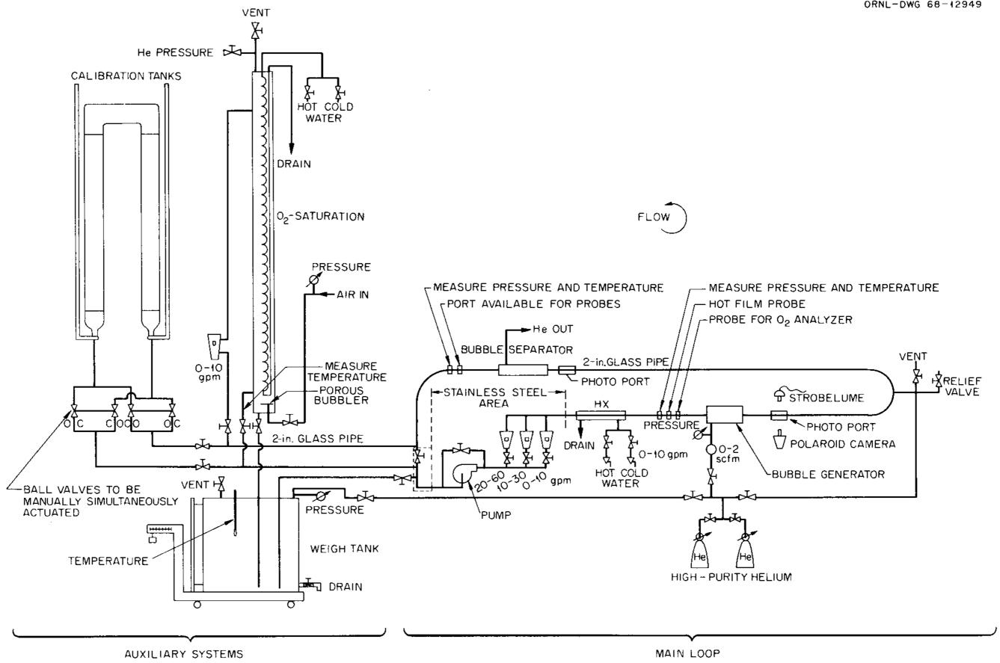  
Fig. 9.9. Flow Diagram of System Proposed for Study of Mass Transfer with Circulating Bubbles.

analyzer. The range of the variables to be covered is indicated in Fig. 9.10.

If the average mass transfer coefficient within the test section is constant, the concentration change between inlet and outlet $(C_{\mathrm{out}} / C_{\mathrm{in}})$ would be some constant $K$ (less than 1) that includes such factors as the equilibrium solution coefficient, the mass transfer coefficient, bubble surface area, test section length, and gas and liquid flow rates. Thus, if $\tau$ is the transit time for a fluid particle to complete a circuit of the loop, a plot of log concentration vs time would approximate a straight line with a slope of $-(1 - K) / \tau$ . Since the factors involved in $K$ are either known or to be measured, the average mass transfer coefficient can be extracted from the slope of the curve.

Typical curves obtained from such experiments might appear as shown in Fig. 9.11. For this calculation, it has been assumed that the helium

flow is 1 vol % of the liquid flow, the helium bubbles are 0.01 in. in diameter, the test channel is 2 in. in diameter and 25 ft long, and the transit time is twice that required to traverse the test section. Mass transfer coefficients were estimated by the expression taken from Calderbank and Moo-Young:13

$$
N _ {\mathrm {S h}} = 0. 0 8 9 N _ {\mathrm {R e}} ^ {0. 6 9} N _ {\mathrm {S c}} ^ {1 / 3}, \tag {10}
$$

where $N_{\mathrm{Sh}}$ is the Sherwood modulus $(h_m L / D_m)$ , $N_{\mathrm{Sc}}$ is the Schmidt modulus $(\mu / \rho D_m)$ , $h_m$ is the mass transfer coefficient, $L$ is the channel length, $D_m$ is the mass diffusivity, $\mu$ is the viscosity, and $\rho$ is the density. The Sherwood and Schmidt moduli are analogous, respectively, to the Nusselt

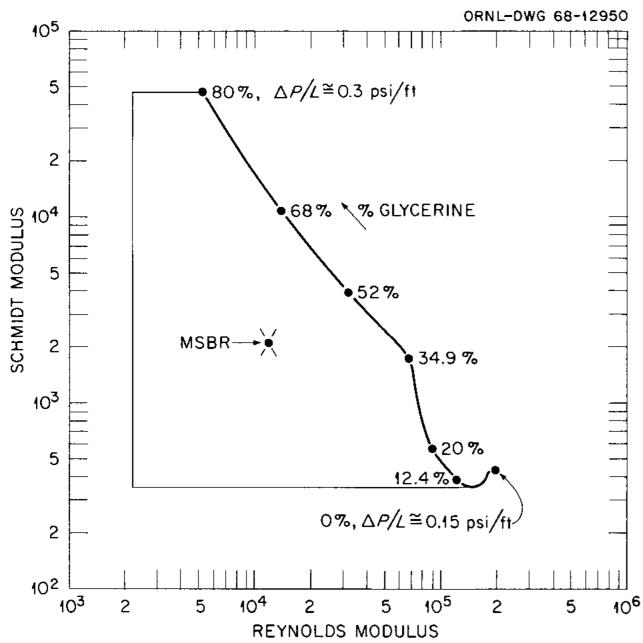  
Fig. 9.10. Envelop of Experiment Ranges in Studies of Mass Transfer with Circulating Bubbles.

and Prandtl moduli in heat transfer. The Reynolds modulus and percent glycerine (Schmidt modulus) are parameters in Fig. 9.11. To obtain a desirable concentration change of $C / C_0 \simeq 0.5$ under the postulated conditions requires - at most - a testing time of 15 min.

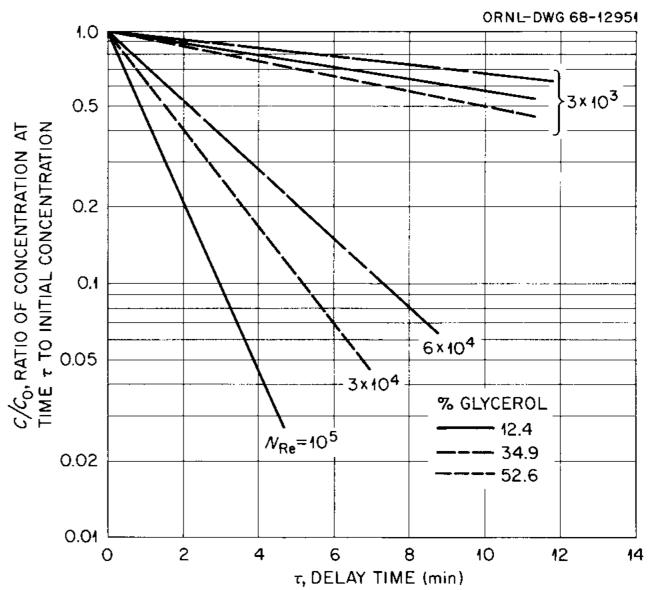  
Fig. 9.11. Calculated Typical Experiment Curves for the Transfer of Oxygen Between Water-Glycerol Solutions and Cocirculating Helium Bubbles.

The experimental system is in an advanced stage of design, and corollary experiments are under way to evaluate techniques for measuring the size and distribution of small helium bubbles in a flowing stream and to develop means for introducing and removing these bubbles.

# Part 3. Chemistry

W. R. Grimes

The chemical research and development effort described in this chapter includes a wide variety of studies of concern to the Molten-Salt Reactor Experiment (MSRE) and to more advanced molten-salt reactor systems.

A major share of these studies is, as in previous periods in this series, concerned with details of the Molten-Salt Reactor Experiment. Routine analysis of the MSRE fuel and coolant salts, and special analyses of fuel and pump-bowl gas samples for fission products were continued until operations with $^{235}\mathrm{U}$ fuel were completed in March. Further information regarding distribution of fission products (especially the more noble species) has been obtained through examination of the graphite and metal surveillance specimens and sections of the off-gas lines removed during the shutdown.

Study of fission product behavior has been continued with fuel specimens removed from MSRE, with "synthetic" fuel mixtures doped with radiotracer elements, and by investigation of the chemistry of molybdenum and niobium fluoride in molten fluoride mixtures.

Chemical separations processes for application to single-fluid Molten-Salt Breeder Reactors continue to show promise. Recovery of uranium

and protactinium and their complete separation by selective extraction into molten bismuth containing dissolved thorium has been demonstrated in laboratory-scale equipment. An alternative process based on selective precipitation of protactinium and uranium oxides continues to show promise and to yield useful information concerning pertinent oxide-fluoride equilibria. Reductive extraction of the lanthanide fission products continues to prove more difficult than the protactinium-uranium extraction but may well lead to useful separations.

A broad program in solution thermodynamics, electrochemistry and spectrochemistry, and transport processes in molten fluorides continues to supply basic data for reactor and chemical process design. Physicochemical investigations of fluoroborate mixtures continued to yield useful data for evaluation of these materials as secondary coolants.

Research and development in analytical chemistry continue to be directed primarily toward improvement in analysis of intensely radioactive specimens for oxide and especially for $\mathbf{U}^{3+}$ in the fuel and for impurities and fission products in the helium gas from MSRE.

# 10. Chemistry of the MSRE

Operation of the MSRE with the $^{235}\mathrm{U} - ^{238}\mathrm{U}$ fuel salt was completed during the early part of the current report period, as described in Chap. 1. Reprocessing of the flush and fuel salts occupied the remainder of the period, and the chemistry of

these operations is discussed in Sect. 1.2.1. As has been indicated in previous reports of this series, chemical stability of the fuel salt during $^{235}\mathrm{U}$ operations was demonstrated to be excellent, generalized corrosion of the containment system

was negligible (0.02 mil for 1000 hr of operation), and analytical chemical methods were effective in confirming nuclear performance.

# 10.1 CHEMICAL FEASIBILITY OF FUELING MOLTEN-SALT REACTORS WITH PLUTONIUM TRIFLUORIDE

R. E. Thoma

The feasibility of starting molten-salt reactors with plutonium trifluoride was evaluated with respect to chemical compatibility within the fuel system and to removal of plutonium from the fuel by chemical reprocessing after $^{239}\mathrm{Pu}$ burnout. Results of the evaluation are reported in a recent technical memorandum. In summary, compatibility in the reactor is moderately well assured but requires confirmation of $\mathrm{PuF}_3$ solubility and oxide tolerance before tests can be made using the MSRE. Although the chemical separation of plutonium and protac-tinium that would be desirable in a large breeder reactor has not yet been demonstrated, conceptual design of processes for effecting such separations are available for development.

# 10.2 CHEMICAL DETERMINATION OF BURNUP IN $^{235}\mathrm{U}$ OPERATIONS

R.E.Thoma

An extensive program of sampling and analysis has been an integral part of all operations with the MSRE. Of the analytical chemical methods which are commonly employed, coulometric titration of dilute aqueous solutions of the fuel salt has found most general application because of its excellent reproducibility and high precision, $\sim \pm 0.5\%$ . Notwithstanding, the precision of individual chemical assays of the uranium concentration in MSRE fuel salt samples has only been about one-tenth that obtainable from on-site computations of the reactivity balance. In addition, the MSRE is able to detect a wide range of reactions, including oxidation reactions, oxidation reactions, and oxidation reactions with different reaction conditions.

tion, until recently there appeared to be a growing disparity between the measured chemical values and those obtained from nuclear and heat balance data, as noted in the previous report.4 The chemical results used were obtained from radiochemical and mass spectrochemical as well as coulometric analysis of the fuel salt, and from fluorometric and delayed-neutron activation analysis of the flush salt. The trend of the analyses indicated that the concentration of uranium in the fuel salt, as measured by chemical methods, was lower by $\sim 0.5\%$ ( $\sim 0.02$ wt $\%$ ) than that computed from operational data.

One possible explanation of the disparity was that the maximum operating power of the MSRE was about $11\%$ greater than assumed in the reactivity balance, that is, 8.0 rather than 7.25 Mw (thermal), and, indeed, there were reasons to be suspicious of the power level. In particular, there was an anomalously pronounced temperature coefficient in the values of coolant salt heat capacity that were used to compute the heat removal. Experiments were initiated, therefore, to obtain accurate values for the heat capacity of the coolant salt. The results showed that the heat capacity of the coolant salt is $0.571 \pm 0.043 \, \text{cal g}^{-1} (\circ \text{C})^{-1}$ in the temperature range 500 to $700^{\circ} \text{C}$ , about $10\%$ higher than the values used in previous estimates.

The nominal concentration of uranium in the fuel circuit therefore was recomputed from the reactor operating history using a maximum power generation rate of $8.0\mathrm{Mw}$ (thermal). The results of this computation are in excellent agreement with the chemical analyses and show (see Fig. 10.1) that the concentration at the termination of run 14 should have been $4.532\mathrm{wt}\%$ . The corresponding analytical value from a least-squares extrapolation of the analytical data was $4.528\mathrm{wt}\%$ (Fig. 10.1). This difference between the reactivity and analytical chemistry values corresponds to $0.2\mathrm{kg}$ of uranium out of $220\mathrm{kg}$ , which is only $0.10\%$ . The difference is even less when derived from a statistical treatment of analytical results. From the normalized values for uranium analysis, as shown in Fig. 10.2, it is seen that the slope

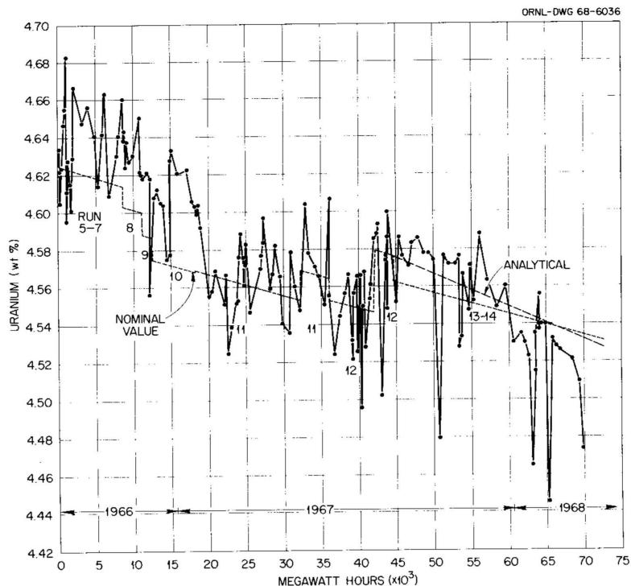  
Fig. 10.1. Comparison of Analytical and Computed Values of Uranium in the MSRE Fuel Salt.

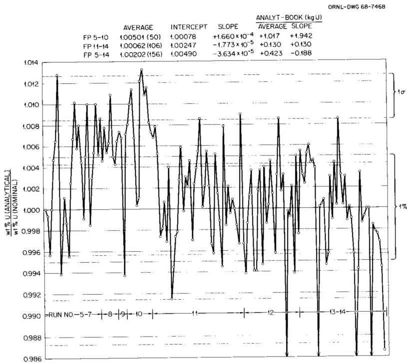  
Fig. 10.2. MSRE Fuel Salt Normalized Values for Uranium Analyses.

between the curve representing the difference between the nominal concentration of uranium as computed on the basis that maximum power was $8.0\mathrm{Mw}$ (thermal) and analytical results is $-1.77\times 10^{-5}$ . Such a difference is regarded as statistically negligible.

The results reported here appear to signify (1) that uranium losses to the off-gas stream, if any, have been immeasurably small; (2) that the fuel salt is as chemically stable after long periods of reactor operation, as was originally anticipated; and (3) that a coulometric method of analysis may suffice for determining the concentration of uranium in the MSRE when $^{233}\mathrm{U}$ fuel is used, even though the concentration will only be about one-sixth what it was with partially enriched $^{235}\mathrm{U}$ .

# 10.3 HIGH-TEMPERATURE FUEL SALT-GRAPHITE COMPATIBILITY EXPERIMENT

C. F. Weaver

R. G. Ross

It has been suggested8 that tests to show whether reactions occur between the constituents of the fuel and graphite at temperatures up to and including boiling at 1 to 2 atm pressure are important to evaluations of the safety and practicality of molten-salt reactors.

The initial experiment was designed to detect any gross incompatibility in the salt-graphite system, as well as to provide information which might be useful in the design of future experiments. The experiment involved heating to $1400^{\circ}\mathrm{C}$ (estimated boiling point of MSRE fuel salt) a specimen of MSRE grade graphite in contact with MSRE fuel salt contained in a tube of ATJ graphite with a static helium overpressure of 1.3 atm. The experimental setup is shown in Fig. 10.1. The tantalum foil was wrapped around the graphite tube in order to afford some protection for the alumina container in the event of a severe leak through the graphite tube.

The salt was heated to $1400^{\circ}\mathrm{C}$ in a sequence of three separate trials at 800, 1200, and $1400^{\circ}\mathrm{C}$ . The heating rate was $\sim 100^{\circ} / \mathrm{hr}$ , and steady state at the desired temperature was maintained for about $15\mathrm{min}$ before cooling to room temperature

for examination. After each heating and cooling cycle the container was opened in a dry box, and the graphite tube was examined for indications of salt leakage or adverse container reactions before proceeding to the next higher temperature. The pressure was followed with a Bourdon gage (sensitivity limit $\sim 0.5$ psi) throughout each run. No gas generation was observed. Upon completion of the $1400^{\circ}\mathrm{C}$ cycle the graphite tube was cut open, and the MSRE-graphite specimen and fuel salt were removed for more detailed examination.

Visual examination of the graphite specimen revealed no indication of attack by the salt, and its dimensions, determined with a micrometer, were essentially unchanged. The portion which had been in the gas phase was coated with beads of salt which were almost perfectly spherical in shape; thus there was no wetting by the condensed salt. Samples of the salt from various regions were examined petrographically and by x-ray powder diffraction, and bulk samples were submitted for spectrochemical analysis.

Salt crystals which were identified as $\mathbf{ZrF}_4$ were found on the outside of the graphite tube in a region (4A in Fig. 10.3) that was well below the maximum temperature of the experiment and considerably above room temperature. This material was identified both by x-ray diffraction and by petrographic analysis and was surprisingly free of other substances. However, $\mathrm{AlF}_3$ , $\mathrm{BeF}_2$ , and $\mathrm{LiF - BeF}_2$ glass were found on the tantalum foil in a nearby region (4B, Fig. 10.3). No uranium compounds were detected in these colorless deposits. Since the open end of the tube was in a water-cooled connector, one is led to conclude that the $\mathbf{ZrF}_4$ , $\mathrm{BeF}_2$ , and LiF vapors must have come through the ATJ graphite tube.

The salt beads from the graphite specimen were composed of compounds of LiF, $\mathrm{BeF}_2$ , and $\mathrm{ZrF}_4$ ; and although there was a slight greenish color, uranium compounds were not detected by x-ray or petrographic examination. The sample from the lower-temperature region (3A, Fig. 10.3) was richer in $\mathrm{BeF}_2$ than was the sample from the higher-temperature region (3B, Fig. 10.3). The fraction of salt involved in these vapor deposits was small, but the time at $1400^{\circ}\mathrm{C}$ was only $\sim 15$ min.

Samples of the bulk salt were examined, with particular emphasis on detection of carbides and compounds which could have come from container materials. The only significant dif

ORNL-DWG 68-10690

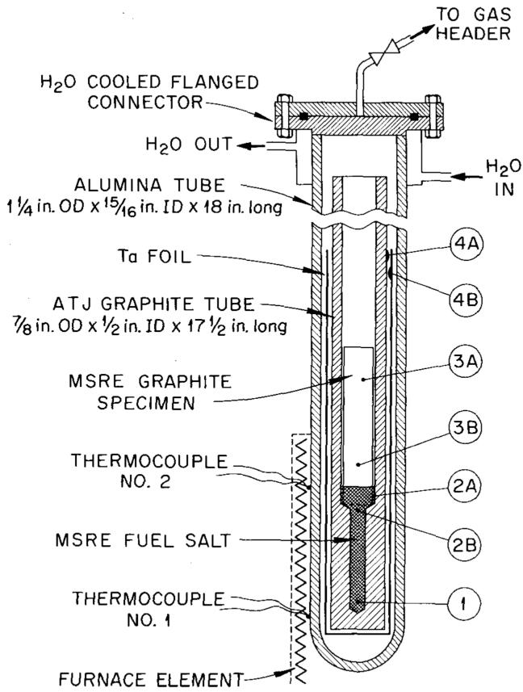  
Fig. 10.3. High-Temperature Salt-Graphite Experiment.

$$
4 \mathrm {U F} _ {4} + \mathrm {C} \longrightarrow 4 \mathrm {U F} _ {3} + \mathrm {C F} _ {4} \tag {1}
$$

will produce very low $\mathrm{CF}_4$ pressures, the presence of a mechanism for the removal of $\mathrm{CF}_4$ would greatly increase the production of $\mathrm{UF}_3$ . In this experiment, $\mathrm{CF}_4$ could have been removed by reaction with the container material as follows:

$$
3 \mathrm {C F} _ {4} + 2 \mathrm {A l} _ {2} \mathrm {O} _ {3} \longrightarrow 4 \mathrm {A l F} _ {3} + 3 \mathrm {C O} _ {2}, \tag {2}
$$

$$
\mathrm {C O} _ {2} + \mathrm {C} \longrightarrow 2 \mathrm {C O}. \tag {3}
$$

Spectrochemical analysis of the bulk salt (1 and 2A, Fig. 10.3) indicates higher concentrations of aluminum than was present in the starting salt. This, as well as the presence of $\mathrm{AlF}_3$ mentioned previously, indicates that reaction (2) may have occurred. Reaction (3) is known to occur readily at elevated temperature. It should be emphasized that the mechanism proposed is applicable to this experimental design, not to MSR conditions, and that most of the uranium remained in the $4^{+}$ state.

This experiment seems to confirm that there is no gross incompatibility of MSRE fuel and graphite at $1400^{\circ}\mathrm{C}$ . However, graphite (at least ATJ variety) is permeated by the volatile components of the fuel near its boiling point and therefore is an unsatisfactory container.

# 10.4 EXAMINATION OF A CORRODED CAP FROM A SAMPLE CAPSULE

S. S. Kirslis

F. F. Blankenship

ferences in the x-ray powder diffraction patterns of the starting salt and salt from the experiment were lines associated with $\mathsf{ZrO}_2$ and lines which could not be attributed to anything other than $\mathbf{U}\mathbf{F}_{3}$ . Carbides were not detected.

The lines attributed to $\mathbf{U}\mathbf{F}_{3}$ were strongest in samples taken near the liquid-vapor interface (2A, Fig. 10.3). Uranium trifluoride could not be positively identified by petrographic examination, but an unidentified dark-colored phase which had the hexagonal morphology typical of $\mathbf{U}\mathbf{F}_{3}$ was detected.

The $\mathrm{ZrO}_2$ was probably formed by reaction of $\mathrm{ZrF}_4$ with small amounts of moisture from the starting materials. Most of the zirconium remained as the fluoride. The $\mathrm{UF}_3$ may have resulted from a reaction of the $\mathrm{UF}_4$ and graphite. While thermodynamics indicate that the reaction

A metallic object about $\frac{1}{2}$ in. in diameter was retrieved by a magnet from the MSRE pump bowl, as described in the first section of this report. It was identified as the mild-steel cap of a 10-g copper sampling ladle by the visible remains of the $\frac{1}{8}$ -in.-diam hole for the copper pin and by two $\frac{1}{32}$ -in.-diam holes, $\frac{1}{4}$ in. apart, through which the stainless steel cable passed. The severely corroded cap weighed only 3.06 g, compared with its original weight of 22.23 g. This amount of corrosion occurred in nine months. The cap had originally been nickel plated.

Under a hot-cell stereomicroscope capable of magnifying to $30\times$ , the metal surface appeared porous, like charcoal. Yet when probed and scraped for sampling, it was very difficult to remove any metal, perhaps because the porous

layer was cemented with salt. The $\frac{1}{32}$ -in. holes were surrounded by areas of white flush salt. A thin flaky layer of flush salt also covered much of the $\frac{1}{6}$ -in. hole area.

The corroded cap was sectioned through the $\frac{1}{32}$ -in. holes and submitted for metallographic examination by E. L. Long. The cut section showed a small core of solid metal surrounded by empty spaces and flaky or granular deposits. Metallographic examination indicated that all of the metallic regions were mild steel. In places, the original nickel plate was intact. The surface of the metal had a metallographic appearance typical of corrosion and not characteristic of mechanical breaking off or abrasion. A curious observation was that the individual strands of stainless steel braided cable in the $\frac{1}{32}$ -in. holes had dissolved away, leaving hollow metallic tubes where they had been.

Some of the porous flaky film was scraped off the remaining half of the cap, and both film and scraped cap were analyzed chemically and radiochemically. The scraped cap piece weighed 0.67 g and contained $80.3\%$ Fe, $0.024\%$ Ni, $0.19\%$ Be, and $0.39\%$ Li. The noble-metal activities were somewhat higher $(1\times 10^{9}$ to $2.5\times 10^{10}$ dis $\mathrm{min}^{-1}$ $\mathbf{g}^{-1}$ ) than the activities which form stable fluorides $(5\times 10^{7}$ to $4.6\times 10^{9})$ . The few milligrams of scraped film contained $0.5\mathrm{mgFe}$ , less than 0.01 mg Ni, $0.30\mathrm{mgLi}$ , $0.18\mathrm{mgBe}$ , and $0.013\mathrm{mgZr}$ . The noble-metal activities again were usually higher $(1.2\times 10^{8}$ to $2.0\times 10^{9}$ dis/min) than the other activities $(1.9\times 10^{7}$ to $2.2\times 10^{8})$ .

The absence of heavy nickel or noble-metal deposits on the steel cap indicates that the corrosion was probably not due to displacement reactions of the type $\mathrm{Ni}^{2+} + \mathrm{Fe} \rightarrow \mathrm{Ni} + \mathrm{Fe}^{2+}$ .

Possibly, the corrosion reaction was $2\mathrm{UF}_{4} + \mathrm{Fe} \rightarrow \mathrm{FeF}_{2} + 2\mathrm{UF}_{3}$ . For this to have occurred, there must have been no elemental iron suspended in the fuel. Analyses of the fuel have regularly indicated that about $135~\mathrm{ppm}$ of iron was present.

It was known, however, that, because of the reducing nature of the fuel, due to $\mathbf{U}\mathbf{F}_{3}$ , such an amount of iron ion was not present. Hence it was sometimes assumed that iron, if present at all, was a colloidal suspension. Now that the corrosion of the cap has been observed, we believe that there is no elemental iron present. This implies that the analytical numbers were not valid at this low concentration range, and, indeed, tests on the reduction of tracer iron have confirmed this implication. Also, if this explanation holds, there must have been no elemental chromium available, as from addition of beryllium or even as chromium in Hastelloy N. This may be evidence that the Hastelloy N is coated with noble-metal fission products.

Superficially, the condition of an iron cap in contact with a copper capsule appears to be favorable for bimetallic couple corrosion. However, for iron to have dissolved as the anodic reaction, an equivalent reduction of cations more noble than ferrous iron at the cathode was required. The absence of such noble ions, again as a result of the presence of $\mathrm{UF}_{3}$ , precludes the bimetallic couple explanation. Of course, the reduction at the copper would have been $\mathrm{U}^{4+}$ going to $\mathrm{U}^{3+}$ , but in this case the cell reaction becomes the equation discussed in the last paragraph.

A more likely explanation is that an electrode concentration cell was involved. Thus iron was removed from a high-concentration electrode, the iron cap, and deposited at a low-concentration electrode, the walls of the primary system. This could have occurred even with a very low concentration of $\mathrm{Fe}^{2+}$ in the salt and with electrical contact between the iron and Hastelloy N.

There was nothing in the chemistry of the corrosion of the iron that endangered the compatibility of the MSRE fuel with its surroundings.

# 11. Fission Product Behavior

# 11.1 FISSION PRODUCT BEHAVIOR IN THE MSRE

S. S. Kirslis

F. F. Blankenship

Previous work $^{1-4}$ has sought to establish the ultimate fate of nuclides generated by fission in the MSRE fuel. It was found that species with stable fluorides remained largely in the fuel. The noble metal species possessing less stable fluorides (Mo, Tc, Te, Ru, and Nb) behaved quite differently, with less than $1\%$ remaining in the fuel salt and the remainder depositing on graphite and metal surfaces or being carried off with the helium cover gas.

The behavior of fission products is of practical concern from three standpoints. First, neutron economy in an MSBR would be significantly affected if too large a fraction of the noble metal fission products deposited on the graphite core. Second, it has recently been realized5 that decay heat from heavy deposits of fission products might cause dangerous heating of graphite and metal surfaces in an MSBR in the event that normal cooling mechanisms failed. Third, the design of an MSBR off-gas system must provide for the appreciable quantities of nongaseous fission products carried by the off-gas stream.

The practical solution of these problems requires reliable quantitative data on deposition rates and volatilization rates, together with sufficient basic understanding of the phenomena involved so that results from the MSRE operation may be safely extrapolated to an MSBR. In the current report period, progress has been made toward the first objective by a careful examination and analysis of the third long-term surveillance assembly of graphite and Hastelloy N specimens, removed from the MSRE core after the completion of the $^{235}\mathrm{U}$ operation on March 25, 1968.

# 11.1.1 Examination of MSRE Surveillance Specimens After 64,000 Mwhr

A third set of graphite and Hastelloy N long-term surveillance specimens was removed from the MSRE core after the March 25, 1968, shutdown and delivered to the hot cells on April 5 for disassembly, segmenting, and surface sampling. Previous surveillance assemblies contained only CGB graphite of the "core" and "lattice stock" varieties. One stringer (RR2) of the third assembly contained CGB core graphite in top (MR-10), middle (X-13), and bottom (NR-5) positions. This stringer was present in both the second and third long-term irradiation assemblies (7800 to 64,000 Mwhr). A second stringer (RS-3) was exposed to fissioning salt only through the third irradiation period (32,000 to 64,000 Mwhr) and contained CGB core graphite (P-55, Y-9, and P-58), impregnated CGB core graphite (V-24, P-77, P-92, and V-28), pyrolytic graphite (PG), and Poco graphite (K-1). We have been informed by H. Cook that too low a pressure was used to impregnate the CGB samples with pitch before firing, so that the surfaces of the impregnated CGB specimens were not as well

sealed as had been hoped. The Poco graphite was characterized by isotropic, uniform, relatively large pores. Because there were four different kinds of graphite irradiated for two different irradiation periods in several core positions, it was necessary to examine and analyze more than the usual number of graphite specimens.

The 12 graphite specimens were rectangular bars, each 0.67 in. wide but varying in thickness from 0.20 to 0.47 in. and in length from 4.5 to 9.5 in. At least two surfaces of each bar were exposed to flowing fuel salt; the remaining surfaces were stacked against other graphite surfaces in the assembly. Each specimen was examined visually with a 30-power stereomicroscope; then it was weighed, and the length was measured.

Five of the bars (X-13, PG, K-1, P-58, and P-77) were cut across the length to provide samples for milling (3 to 6 in. long), for D. Cuneo's sanding procedure (1 to 3 in. long), for metallography and autoradiography $\left(\frac{1}{4}\right.$ in.), for x-ray diffraction $\left(\frac{1}{4}\right.$ in.), for electron microscopy $\left(\frac{1}{4}\right.$ in.), and for x radiography (two 10-mil-thick slices). Both ends of each bar were cut off to exclude the region covered by the Hastelloy N straps which held the graphite pieces in place in the assembly. The remaining seven graphite specimens were segmented only to provide samples for surface milling (2 to 5 in.) and for D. Cuneo (1 to 3 in.). Before each segmenting cut was made, the surface that had been in contact with graphite was marked with a thin abrasive wheel.

An improved procedure was developed by Stewart Dismuke and Warren Parsley to sample the graphite surfaces in the hot cell. Each piece of graphite was glued to an accurately machined length of angle aluminum in such a way that two salt-exposed surfaces of graphite faced away from the aluminum. The angle aluminum was bolted to the movable bed of a milling machine in such a way that the vertical graphite surface could be moved past a side milling cutter. A tared plastic sample bottle was mounted below the rotating cutter to catch the graphite powder as it was cut off the mounted specimen. Preliminary tests showed that 95 to $99\%$ of the graphite milled off was collected in the plastic bottle. Before the surface milling was started, the same milling machine was used to mill out 0.055-in. by 0.055-in. grooves along the corner between surfaces that were to be sampled. This eliminated the problem of contaminating

graphite milled from one surface with that from the surface of an adjoining face.

It was desired to mill ten successive cuts from a graphite surface with thicknesses of $\frac{1}{2}, \frac{1}{2}, 1, 2, 3, 5, 8, 10, 10$ , and 10 mils for a total sampling depth of 50 mils. Through a hot-cell window, it proved difficult to locate the graphite surface with the cutter within a precision of $\frac{1}{2}$ mil for the first cut. The best procedure proved to be to approach the surface $\frac{1}{2}$ mil at a time with the rotating cutter and, through a Kollmorgen periscope, watch for graphite powder falling off the cutter. A few first cuts several mils thick were taken before this procedure was settled upon. There were no problems in controlling the depth of cuts beyond the first. This milling procedure for sampling, while more laborious and time-consuming than the previous planing procedure, was considered superior in controlling contamination, in providing thinner first cuts, and in assuring parallel cuts of uniform thickness.

Ten cuts on two faces were made on samples X-13, PG, and K-1. Ten cuts on the wide face and a single 50-mil-deep cut on the narrow face were made on samples P-58, Y-9, P-77, and P-92. Only deep (50 mil) cuts on two faces were made on samples MR-10, NR-5, V-28, and V-24. One deep cut on the wide face was made on sample P-55. The sampling scheme was designed to yield more complete information on the more interesting specimens.

The milled specimens were weighed and shipped to the analytical laboratory. Since analyses were desired for some short-lived fission products (in particular, $^{99}\mathrm{Mo}$ and $^{132}\mathrm{Te}$ ) the hot-cell operations were carried out as speedily as possible. The last of the samples from the first ten graphite specimens were delivered to the analytical laboratory by April 15, 1968. It was later decided to mill samples from two more impregnated graphite specimens (P-77 and P-92). It was not possible to determine $^{99}\mathrm{Mo}$ , $^{132}\mathrm{Te}$ , and $^{131}\mathrm{I}$ for these last pieces.

Results of Hot-Cell Examination of Graphite. The program of graphite examinations and analyses was similar to that carried out for previous surveillance specimens. The hot-cell examinations were repeated mainly to see whether the previous results were confirmed for several new types of graphite specimens, and whether any new observations turned up. The only new type of hot-cell test was the examination of the graphite surface

by electron microscope. Under examination with a 30-power stereomicroscope, the graphite specimens appeared similar to those from previous surveillance assemblies. There was no sign of corrosion or chemical attack. Occasional droplets or flakes of flush salt adhered to the surface, more frequently on the faces in contact with other specimens. Flat flakes of dark-green fuel salt were sometimes found on these back faces. The adhering salt caused all graphite specimens to gain at least a few milligrams in weight. Quite a few scratches and gouges were visible on the graphite surface, but these appeared to have been freshly made, probably during the mechanical operations of disassembly of the package. Most of the specimens lost between 1 and 9 mils in length out of a total length of 9 in. Adhering salt probably accounted for the 5- to 6-mil gain for two of the 4.6-in.-long specimens. The specimens were not wiped or scraped before weighing and measuring, since it was important not to remove any adhering films before analysis. Except in the case of Poco graphite a slight loss in length was expected because of the neutron fluences experienced by the graphite samples. Contractions were larger for the more centrally located specimens, where the neutron flux was higher.

The graphite surfaces were examined carefully under the 30-power stereomicroscope with various kinds of lighting to detect any surface films. A brown dusty-looking film was discerned, covering about half of the fuel-exposed surfaces. No shiny films were observed.

Surface films were also sought with the hot-cell electron microscope. Cellulose acetate tape was dampened with acetone and pressed against a fuel-exposed surface of a $\frac{1}{4}$ -in.-long sample from each graphite bar. After it was dry, the tape was torn loose. A visible thin film of surface graphite adhered to the tape. The tape was dissolved away from the adhering material, which was picked up on electron microscope screens. The examination of these screens by the electron microscope showed only graphite diffraction patterns, although later spectrographic analyses showed that appreciable quantities of stable molybdenum isotopes were present on many of the graphite surfaces. It may be that the molybdenum deposit was not crystalline enough to show electron diffraction patterns.

The thin transverse slices from five of the graphite specimens were examined by x radiography. Results were similar to those from previous

surveillance specimens. Many of the salt-exposed surfaces and some of the other surfaces appeared to have a thin film of heavy material less than 10 mils thick. The only specimen showing cracks was the pyrolytic graphite. The cracks were parallel to the graphite planes. Some of the empty cracks may have occurred during the cutting of the thin samples of this fragile, brittle material. However, a halo of heavy material, presumably fuel salt, was observed in the vicinity of some of the cracks, while the cracks themselves were empty (Fig. 11.1). This may have been a filled crack that opened wider on cutting. The white band across the end of the specimen was identified as a ledge of graphite that remained on the specimen when it cracked off the bar when the cutting wheel had nearly cut through.

Five of the graphite specimens were scheduled for metallographic and autoradiographic examina-

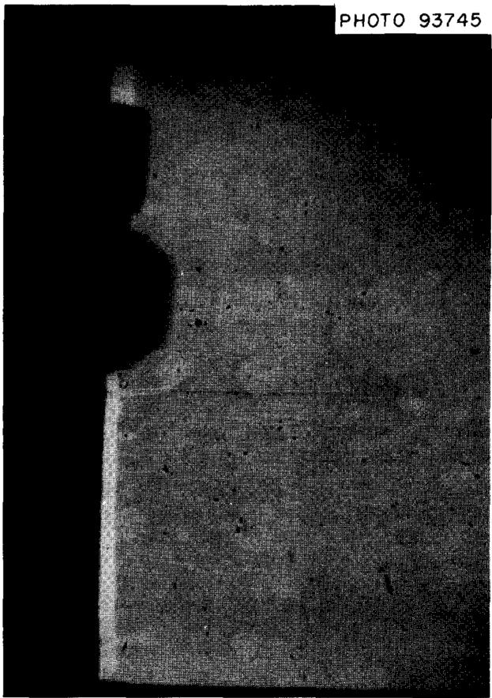  
Fig. 11.1. X Radiograph of Pyrolytic Graphite Exposed in MSRE for 32,000 Mwhr. Magnification $18\times$ .

tion and for x-ray diffraction examination of fuelexposed surfaces. These examinations have not been completed.

Radiochemical Analyses of the Graphite Surface Samples. - The program of graphite analyses was similar to those for previous surveillance specimens. Twelve specimens were analyzed rather than the usual three, since four types of graphite were represented in the third surveillance test. The objectives of the rather thorough analytical program were (1) to confirm previous results for CGB graphite; (2) to compare concentration profiles and total deposition of 12 nuclides on CGB, impregnated CGB, Poco, and pyrolytic graphite; and (3) to provide more accurate deposition data needed for solving practical reactor problems.

All of the milled graphite samples were dissolved in a mixture of $\mathrm{HNO}_3$ and $\mathrm{H}_2\mathrm{SO}_4$ and analyzed radiochemically for $^{99}\mathrm{Mo}$ , $^{132}\mathrm{Te}$ , $^{129}\mathrm{Te}$ , $^{103}\mathrm{Ru}$ , $^{106}\mathrm{Ru}$ , $^{95}\mathrm{Nb}$ , $^{95}\mathrm{Zr}$ , $^{89}\mathrm{Sr}$ , $^{140}\mathrm{Ba}$ , $^{141}\mathrm{Ce}$ , $^{144}\mathrm{Ce}$ , and $^{131}\mathrm{I}$ . Selected samples were also analyzed for $^{137}\mathrm{Cs}$ , $^{111}\mathrm{Ag}$ , $^{110}\mathrm{Ag}$ , $^{91}\mathrm{Y}$ , and $^{147}\mathrm{Nd}$ . During the dissolutions, traps were provided to catch volatilizing activities such as Ru and I. The traps were analyzed separately. Radiochemical separations were made before each species was counted except in the case of rare earths, where the whole group was isolated and the individual components determined by a computer analysis of the gamma spectrometer scan.

From these analyses and the depth of milling for each sample, concentration profiles to a depth of 50 mils were drawn for each nuclide and each surface sampled. The depth of cut was determined by dividing the volume of sample (measured weight divided by density) by the sampled area (measured length times measured width). For the thinner samples this procedure was more accurate than direct reading on the milling machine. Since there were more than 1200 data points and more than 120 profile curves, it is not practical to report them in detail here. A few concentration profiles will be shown to illustrate particular points in the ensuing discussion of the general features of most interest.

The concentration profiles from previous long irradiations will be compared with the current profiles for the CGB graphite specimens. Then the current CGB profiles will be compared with those for impregnated CGB, pyrolytic, and Poco graphite. It will help to keep the subsequent de

tailed discussion in perspective if it is pointed out now that, in spite of differences in concentration profiles, the total deposition of most nuclides was surprisingly similar on all the types of graphite examined.

Four concentration profiles were determined on three specimens of CGB graphite, all located near the middle of the MSRE core. Profiles were obtained on the wide face of specimens Y-9 and P-58 (single exposure) and on both a wide and a narrow face of the doubly exposed X-13 (8000 to 64,000 Mwhr). The profiles were in general similar in shape to those observed for the two previous sets of surveillance specimens. Because the first few cuts were thinner than could be taken with the previous sampling method, the initial slopes of the profiles were seen to be steeper than previously indicated. The concentrations of the noble metals $^{99}\mathrm{Mo}$ , $^{103}\mathrm{Ru}$ , $^{106}\mathrm{Ru}$ , $^{95}\mathrm{Nb}$ , and $^{111}\mathrm{Ag}$ usually dropped by about four orders of magnitude in penetrating 5 to 10 mils into the graphite. The four sets of profiles were by no means identical, however; Fig. 11.2 shows the variations for $^{103}\mathrm{Ru}$ between the wide and narrow faces of the X-13 sample. For these nuclides and several others, the initial concentration gradient for penetration from the wide face was less steep than for the narrow face. As previously, variations of this kind were interpreted to indicate the variable porosity of CGB graphite even between different faces of the same specimen.

As previously observed, the $^{132}\mathrm{Te}$ and $^{129}\mathrm{Te}$ profiles showed a more gradual initial drop than the other noble metals. Among the latter, $^{99}\mathrm{Mo}$ dropped less precipitously than the Ru or Nb concentrations. Thus the noble metals appear to be diffusing independently of one another, rather than as combined particles or as, for example, deposits on microscopic graphite particles. The X-13 profiles leveled out at deep penetrations, but the P-58 profile kept decreasing.

The $^{95}\mathrm{Zr}$ profile was similar in shape to those of the noble metals, but its activity was lower by about two orders of magnitude than that of its daughter, $^{95}\mathrm{Nb}$ (Fig. 11.3). It is clear that $^{95}\mathrm{Nb}$ , evidently as metal, penetrated preferentially from the fuel salt into the graphite. The MSRE pump bowl gas analyses (and other tests) have shown that $^{95}\mathrm{Nb}$ (like other noble metal fission products) has a tendency to concentrate in the gas phase above molten salt, much more so than $^{95}\mathrm{Zr}$ and

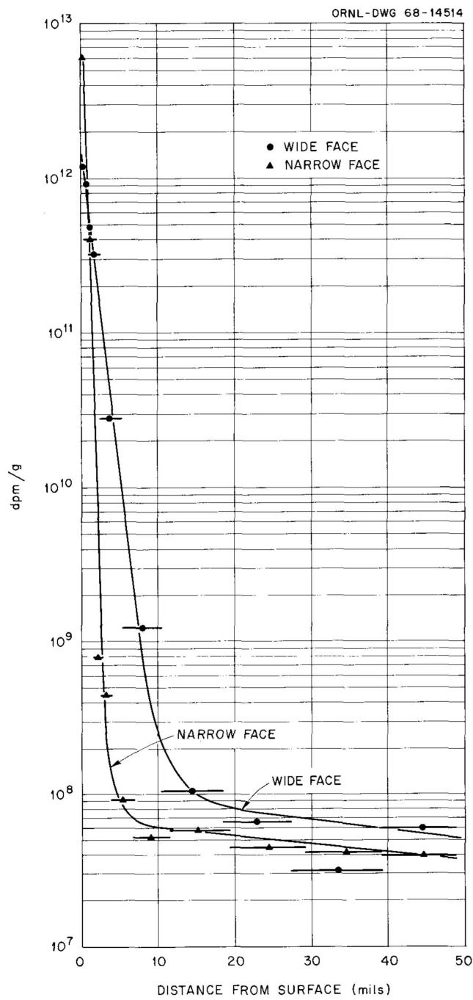  
Fig. 11.2. Concentration Profiles for $^{103}\mathrm{Ru}$ on Two Faces of the X-13 Graphite Specimen. CGB, double exposure.

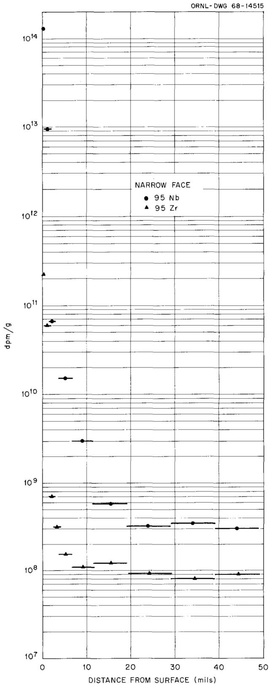  
Fig. 11.3. Concentration Profiles for $^{95}\mathrm{Nb}$ and $^{95}\mathrm{Zr}$ in CGB Graphite. X-13, double exposure.

other species with stable fluorides. This suggests that the same escaping tendency caused $^{95}\mathrm{Nb}$ to leave the fuel and enter the pores of graphite more readily than $^{95}\mathrm{Zr}$ . Once in the pores, the $^{95}\mathrm{Nb}$ (and other noble metals) apparently deposited readily on the walls of the pores, leading to steep initial concentration gradients. The fairly level nonzero tails at deep penetrations indicate a second diffusion process of low capacity but high speed.

The improved milling technique permitted a more detailed look at the profiles for $^{89}\mathrm{Sr}$ and $^{140}\mathrm{Ba}$ . It had previously been reported that the plots of the logarithm of concentration vs penetration depth for these elements were straight lines. This remained true for $^{89}\mathrm{Sr}$ beyond about 2 mils and for $^{140}\mathrm{Ba}$ beyond about 5 mils, but the initial gradient was much steeper in all cases. The initial gradient may have been due to Sr and Ba entering as the element rather than as the precursor gas. The linear portions showed a considerable variation in slope for the $^{89}\mathrm{Sr}$ from zero for both sides of X-13 to about a factor of 2 per 50 mils for P-58. Similarly, for $^{140}\mathrm{Ba}$ the linear slopes varied from a factor of 2 per 50 mils for X-13 to a factor of 20 per 50 mils for P-58. These features are illustrated in Fig. 11.4, giving the $^{89}\mathrm{Sr}$ and $^{140}\mathrm{Ba}$ profiles for X-13 wide face and P-58. The linear slope variations illustrated again the variations in porosity of CGB graphite, and the existence of two slope regions in each curve implies at least two simultaneous diffusion mechanisms. The linear slopes observed for $^{89}\mathrm{Sr}$ and $^{140}\mathrm{Ba}$ on these samples were considerably flatter than for previous CGB specimens.

For the first time, complete profiles were obtained for $^{141}\mathrm{Ce}$ and $^{144}\mathrm{Ce}$ in CGB graphite. These are shown for X-13 wide face and P-58 in Fig. 11.5. For $^{141}\mathrm{Ce}$ there is a steep initial drop for a few mils, then a flattening to a linear slope. The linear slopes are only slightly steeper than for $^{140}\mathrm{Ba}$ , whereas the half-lives of the Xe precursors are 1.7 sec and 16 sec for $^{141}\mathrm{Ce}$ and $^{140}\mathrm{Ba}$ respectively. This suggests that $^{141}\mathrm{Ce}$ has a mode of diffusion other than as $^{141}\mathrm{Xe}$ .

The $^{141}\mathrm{Ce}$ curves for X-13 and P-58 are unaccountably different. Both show a steep initial drop, but the curve for X-13 wide face levels out at $6 \times 10^{8}$ dis $\min^{-1} \mathrm{~g}^{-1}$ , while that for P-58 continues dropping to $1 \times 10^{6}$ dis $\min^{-1} \mathrm{~g}^{-1}$ . The profile for Y-9 behaved like P-58 and that for X-13 narrow face like X-13 wide face. Cerium-144 has a very short-lived Xe precursor. The impregnated

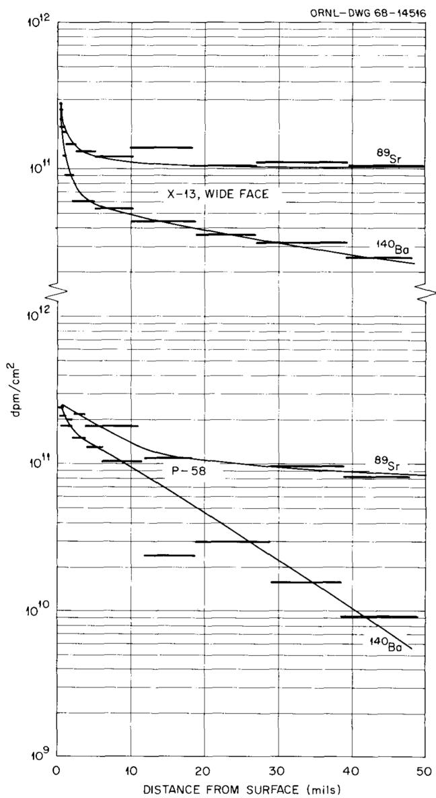  
Fig. 11.4. Concentration Profiles for $^{89}\mathrm{Sr}$ and $^{140}\mathrm{Ba}$ in Two Samples of CGB. X-13, wide face, and P-58.

CGB graphite specimens P-77 and P-92 showed $^{144}\mathrm{Ce}$ profiles more like those for X-13. The profile for pyrolytic graphite for penetration perpendicular to the planes leveled out as for X-13, while that for penetration parallel to the planes continued dropping as for P-58. The Poco graphite profiles had a shape intermediate between the two types. Fragmentary data from previous CGB graphite specimens suggested the continuously dropping type of profile. The initial slopes for $^{95}\mathrm{Zr}$ were much steeper than for $^{144}\mathrm{Ce}$ for all

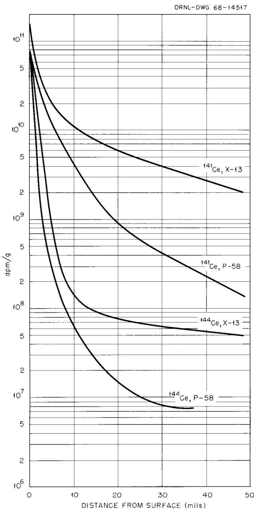  
Fig. 11.5. Concentration Profiles for $^{141}\mathrm{Ce}$ and $^{144}\mathrm{Ce}$ in Two Samples of CGB Graphite. X-13, wide face, and P-58.

samples, so the $^{144}\mathrm{Ce}$ is not moving as bulk fuel salt. The total of this information leads to no clear explanation of $^{144}\mathrm{Ce}$ behavior. It can perhaps be tentatively concluded that CGB structures vary in such a way that the low-capacity, high-speed mechanism leading to flat tails is sometimes but not always blocked for $^{144}\mathrm{Ce}$ .

The concentration profile for $^{13}$ in specimen P-58 was similar to those previously reported, with a steep initial drop by a factor of 20 in the first mil, then a progressively less steep gradient, as for many Te profiles. The profile for X-13 wide face was less steeply sloped in all parts of the curve. That for X-13 narrow face was quite different, in fact nearly duplicating the curve for $^{95}$ Zr on the same face. It dropped sharply through nearly four orders of magnitude in 7 mils, then suddenly leveled out. This again shows clearly a difference in graphite structure for the two faces of X-13.

Only selected CGB samples were analyzed for $^{137}\mathrm{Cs}$ , $^{111}\mathrm{Ag}$ , $^{110}\mathrm{Ag}$ , $^{91}\mathrm{Y}$ , and $^{147}\mathrm{Nd}$ ; these were taken from X-13 wide face and P-58. The $^{137}\mathrm{Cs}$ dropped by a factor of 15 in the first 5 mils, then leveled off. Both Ag nuclides dropped by more than three orders of magnitude in 5 mils. The $^{91}\mathrm{Y}$ concentration decreased by a factor of 5 in 5 mils, then became level. The $^{147}\mathrm{Nd}$ dropped steeply by more than a factor of 100 in 5 mils, then leveled.

Many of the Y-9 profiles were unusual in that they exhibited a rise by as much as a factor of 5 after the usual initial drop in concentrations. Beyond the broad hump, concentrations again decreased. The rise was at 10 mils penetration for $^{99}\mathrm{Mo}$ , $^{95}\mathrm{Nb}$ , and $^{131}\mathrm{I}$ , but at 5 mils penetration for $^{103}\mathrm{Ru}$ , $^{106}\mathrm{Ru}$ , $^{95}\mathrm{Zr}$ , $^{89}\mathrm{Sr}$ , and $^{144}\mathrm{Ce}$ . Some of these humped profiles are shown in Fig. 11.6. There was no discernible hump in the profiles for $^{132}\mathrm{Te}$ , $^{129}\mathrm{Te}$ , $^{140}\mathrm{Ba}$ , and $^{141}\mathrm{Ce}$ . No convincing explanation has been found for the unusual humps. It is very improbable that analytical error accounts for the humps, since most of the profiles were rather smooth monotonically decreasing curves with less than one point in ten significantly out of line.

Impregnated CGB Concentration Profiles. Even though the impregnation of CGB graphite specimens P-77 and P-92 was not completely successful, an effect on fission product penetration was measurable. Most profiles were quite similar in shape to the CGB profiles, resembling the P-58 profiles more than the X-13 profiles, in that the curves tended to continue dropping at 50 mils penetration, rather than leveling off like most of the X-13 profiles. For most isotopes, the impregnated CGB profiles were steeper and reached lower final concentration than the CGB profiles,

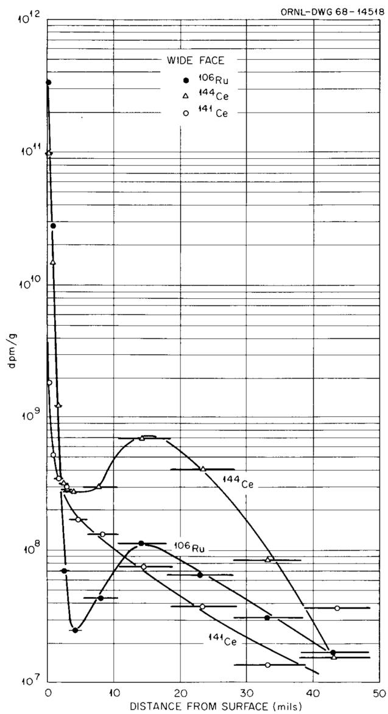  
Fig. 11.6. Concentration Profiles for $^{106}\mathsf{Ru}$ , $^{141}\mathsf{Ce}$ , and $^{144}\mathsf{Ce}$ in CGB Graphite. Sample Y-9.

but the differences were not large. However, pronounced differences were observed for $^{89}\mathrm{Sr}$ and $^{140}\mathrm{Ba}$ . The slopes for $^{89}\mathrm{Sr}$ were a factor of 10 per 50 mils for P-77 and P-92, while those for the CGB specimens were factors of 1 to 2 per 50 mils. The average slopes for $^{140}\mathrm{Ba}$ were a factor of 100 per 50 mils, while the CGB slopes were factors of 10 to 20 per 50 mils.

A complete profile for $^{137}\mathrm{Cs}$ on specimen P-92 is shown in Fig. 11.7. The profile is much flatter

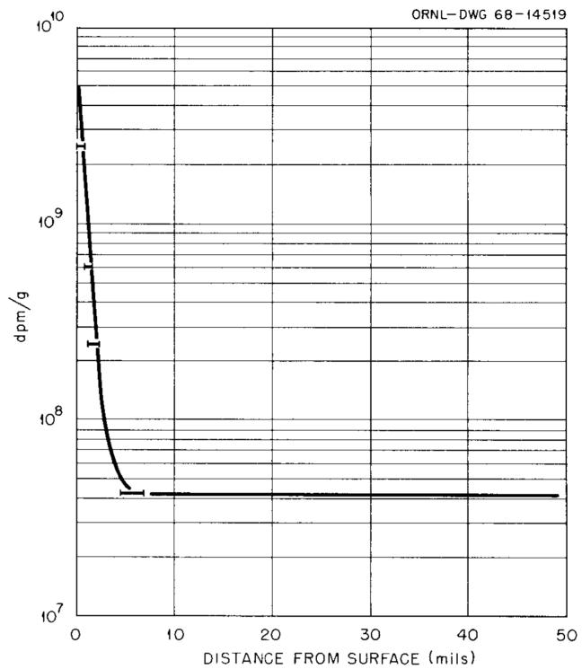  
Fig. 11.7. Concentration Profile for $^{137}\mathrm{Cs}$ in Im-pregnated CGB Graphite. Sample P-92.

than those for $^{89}\mathrm{Sr}$ , although both have rare-gas precursors of similar half-life. This suggests that $^{137}\mathrm{Cs}$ itself is mobile in graphite, as was previously inferred.

Pyrolytic Graphite Concentration Profiles. These profiles are of interest since pyrolytic graphite represents the ultimate in decreasing the porosity of graphite. The density of the specimen used (P-103) was $2.225\mathrm{g / cc}$ . In accordance with expectations, the penetration of all fission products in the direction perpendicular to the graphite planes was greatly reduced. All of the profiles except those of ${}^{89}\mathrm{Sr}$ and ${}^{140}\mathrm{Ba}$ were essentially identical, showing an initial steep drop of three to five orders of magnitude in 7 mils, then leveling out. The drop was even steeper than indicated here since the first cut was excessively heavy, with a thickness of 4.5 mils (due to difficulty in locating the surface with the milling cutter). The concentrations at which the profiles leveled out were consistently lower by as much as two orders of magnitude than the lowest concentrations in the CGB profiles.

The $^{89}\mathrm{Sr}$ and $^{140}\mathrm{Ba}$ profiles, shown in Fig. 11.8, also differed markedly from the corresponding CGB profiles. The latter for $^{89}\mathrm{Sr}$ leveled out at about $10^{11}$ dis $\min^{-1} \mathrm{g}^{-1}$ , while the pyrolytic graphite profile was still decreasing at 50 mils depth at a concentration of $7.6 \times 10^5$ dis $\min^{-1} \mathrm{g}^{-1}$ . For $^{140}\mathrm{Ba}$ , the concentrations in CGB decreased from the surface value of $2 \times 10^{11}$ dis $\min^{-1} \mathrm{g}^{-1}$ only about an order of magnitude to the value at a depth of 50 mils. The span for $^{140}\mathrm{Ba}$ in pyrolytic graphite was more than four orders of magnitude, and the initial value was lower (because of the thick first sample). Another curious fact shown clearly in Fig. 11.8 is that the $^{89}\mathrm{Sr}$ and $^{140}\mathrm{Ba}$ profiles were practically superimposed on each other. For all other specimens examined, the $^{140}\mathrm{Ba}$ showed a distinctly steeper concentration gradient than $^{89}\mathrm{Sr}$ . The behavior in pyrolytic graphite suggests that diffusion of the rare-gas precursors may not be the mechanism by which these nuclides penetrate pyrolytic graphite in the direction perpendicular to the graphite planes. This idea is supported by the fact that the concentrations of the noble metals in disintegrations per minute per gram were all substantially higher than those for $^{89}\mathrm{Sr}$ and $^{140}\mathrm{Ba}$ at deep (20 to 50 mils) penetration. The reverse was true for all other graphites examined. The impermeability of pyrolytic graphite fuel particle coatings to fission gases is well known.

For the pyrolytic graphite specimen, concentration profiles were also determined in the direction parallel to the graphite planes (narrow face). For all nuclides except $^{89}\mathrm{Sr}$ and $^{140}\mathrm{Ba}$ , the profiles were qualitatively similar to those for CGB specimens, usually somewhat steeper and often reaching lower concentrations at the deeper levels. For the noble metals and $^{95}\mathrm{Zr}$ the parallel (narrow face) profiles showed similar initial slopes and slightly higher final (40 to 50 mils) concentrations than the perpendicular (wide face) profiles. For $^{89}\mathrm{Sr}$ , $^{140}\mathrm{Ba}$ , $^{141}\mathrm{Ce}$ , $^{144}\mathrm{Ce}$ , and $^{131}\mathrm{I}$ the narrow face profiles were much more like CGB profiles than like the wide face ones (i.e., less steep slopes and much higher final concentrations). The curves for $^{89}\mathrm{Sr}$ and $^{140}\mathrm{Ba}$ shown in Fig. 11.8 show clearly the difference in diffusion behavior in the parallel and perpendicular directions. In the parallel direction the slopes are distinctly higher than for CGB graphite but do not approach the extreme behavior in the perpendicular direction.

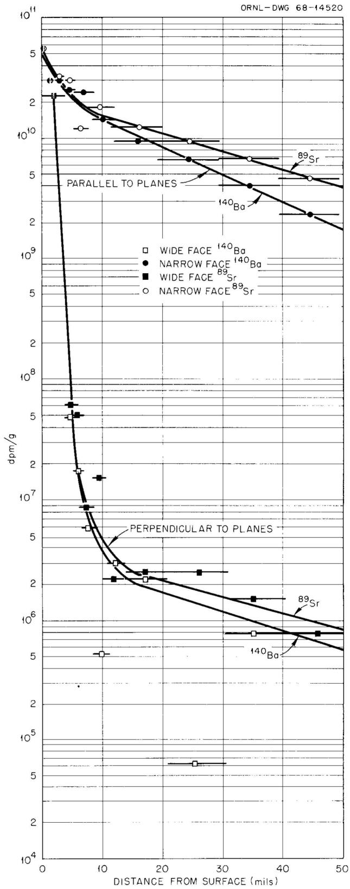  
Fig. 11.8. Concentration Profiles for $^{89}\mathrm{Sr}$ and $^{140}\mathrm{Ba}$ in Pyrolytic Graphite.

Also, the usual difference in slopes for $^{89}\mathrm{Sr}$ and $^{140}\mathrm{Ba}$ is observed. It seems clear that in the parallel direction we are dealing again with the diffusion of rare-gas precursors. A final conclusion may be drawn from the above observations that the diffusion of $^{89}\mathrm{Sr}$ , $^{140}\mathrm{Ba}$ , $^{141}\mathrm{Ce}$ , $^{144}\mathrm{Ce}$ , and $^{131}\mathrm{I}$ in graphite depended much more on the presence of porosity than did the diffusion of the noble metals and $^{95}\mathrm{Zr}$ . Since the analytical data for $^{144}\mathrm{Ce}$ were often questionable and showed much scatter, its placement in the above grouping is in some doubt.

Poco Graphite Concentration Profiles. - This variety of graphite was included because of its resistance to radiation damage and because its structure varied from the CGB structure in the opposite way from pyrolytic graphite. Poco graphite has relatively large pores of a uniform diameter and is isotropic in all its physical properties. Concentration profiles were determined from two faces of the same specimen.

The species $^{99}\mathrm{Mo},^{103}\mathrm{Ru},^{106}\mathrm{Ru},^{95}\mathrm{Nb},$ and $^{95}Zr$ had profiles qualitatively similar to those for CGB, with steep initial drops of several orders of magnitude in a few mils and then a sharp transition to a less steep slope. The profiles from the two faces did not duplicate themselves any more precisely than for CGB graphite. The profiles from the narrow face were usually slightly steeper at deep penetrations, started at higher initial concentrations, and dropped to lower final concentrations.

The $^{132}\mathrm{Te}$ and $^{129}\mathrm{Te}$ profiles were distinctly different from those in CGB graphite, with much shorter initial drops and less steep internal slopes which were nearly straight lines (log concentration vs depth).

The profiles for $^{89}\mathrm{Sr}$ dropped slightly for 2 mils, then leveled out at $8 \times 10^{10}$ and $7 \times 10^{10}$ dis $\min^{-1}$ $\mathbf{g}^{-1}$ for the wide and narrow faces respectively. These are close to the level found for CGB graphite. Both $^{140}\mathrm{Ba}$ profiles behaved similarly, giving flat tails at $3 \times 10^{10}$ dis $\min^{-1}$ $\mathbf{g}^{-1}$ . In CGB graphite this concentration was observed in the linear range of the profiles at depths of 20 to 30 mils. The relatively large pores of Poco graphite are undoubtedly responsible for the unique flatness of these Ba profiles, but it is not clear why the profiles for CGB should start at a higher level before crossing those for Poco graphite.

The $^{141}\mathrm{Ce}$ profiles for Poco were markedly different from those for CGB graphite. The initial drops were much steeper and the linear tails were much less steep than for CGB graphite. The final concentration was higher for Poco graphite. The linear tails are probably characteristic of Xe precursor diffusion and should be flatter for the larger pores of Poco graphite. The diffusion mechanism responsible for the initial slope must be faster in CGB graphite. As discussed above, the $^{144}\mathrm{Ce}$ profiles for Poco graphite were intermediate between the two types observed for CGB graphite.

The $^{131}\mathrm{I}$ behavior in Poco graphite was within the considerable range of behavior observed for the several CGB profiles. The profiles were not nearly identical for the two sides of this supposedly isotropic graphite. The initial slope was much steeper for the narrow face profile. The final slopes were downward like Y-9 but very much unlike X-13 narrow face.

The discussion of diffusion of fission products into Poco graphite may be summarized by stating that smaller differences were observed between Poco and CGB graphite than might have been expected from the appreciable differences in the graphite structure.

Overall Deposition on Graphite Surfaces. - For most of the practical uses of the data on penetration of fission products into graphite, the shape of the concentration profiles is of less significance than the total amounts deposited on or in the graphite. Since in most cases the bulk of the nuclide is deposited within a few mils of the graphite surface, the total depositions are reported in terms of disintegrations per minute per square centimeter of graphite surface. The activities were calculated back to the time of shutdown of the MSRE before the removal of the surveillance specimen package (1 AM, March 25, 1968). The disintegrations per minute per square centimeter unit may be converted to atoms per square centimeter by dividing by the decay constant of the particular nuclide (in minutes $^{-1}$ ).

The number of disintegrations per minute in each milled sample of graphite was obtained by multiplying the analytically reported disintegrations per minute per gram by the sample weight. The disintegrations per minute for the ten cuts from a particular surface were summed, then divided by the sampled area to obtain the total disintegrations

per minute per square centimeter. In many cases the first few cuts contained $99\%$ of the nuclide, and the contributions of deeper cuts could be neglected. In the case of $^{89}\mathrm{Sr}$ and other species with flat concentration profiles, the calculated totals were low, since they did not include the significant quantities at depths below 50 mils (the maximum depth of sampling of each graphite surface). The only cases where the error is significant are for $^{89}\mathrm{Sr}$ in most specimens and for $^{140}\mathrm{Ba}$ in Poco graphite. In the cases where only a single 50-mil-deep cut was made, the number of disintegrations per minute per square centimeter was simply calculated by multiplying disintegrations per minute per gram by the sample weight and dividing by the sampled area.

The surface concentration results obtained in this way are shown in Table 11.1, which also lists the sample distance from the bottom of the core, the type of graphite, and the exposure in megawatt-hours. This mass of data is more easily digested in graphical form. The surface concentration of each nuclide is plotted against distance from the bottom of the core in Figs. 11.9 to 11.13.

A gratifying aspect of the results in this summarized form is that the scatter between specimens was not so wide as might have been guessed from the widely differing concentration profiles. A number of regularities added credibility to the results. The average agreement between wide and narrow faces for the same specimen was well within a factor of 2. At a given core location, the average agreement between all types of CGB graphite (untreated, impregnated, and doubly exposed) was again within a factor of 2. For the three isotopic pairs $(^{132}\mathrm{Te}$ and $^{129}\mathrm{Te}$ , $^{103}\mathrm{Ru}$ and $^{106}\mathrm{Ru}$ , $^{141}\mathrm{Ce}$ and $^{144}\mathrm{Ce})$ the deposition results were nicely parallel when plotted as a function of core location.

Examination of the plots reveals that there were two different patterns of deposition behavior with respect to core locations. For the data points for all types of CGB graphite, the deposition of $^{99}\mathrm{Mo}$ , $^{95}\mathrm{Nb}$ , $^{95}\mathrm{Zr}$ , $^{140}\mathrm{Ba}$ , $^{141}\mathrm{Ce}$ , and $^{144}\mathrm{Ce}$ increased by a factor of about 3 from the bottom of the core to the middle, then decreased by a somewhat larger factor to low values for the specimens at the top of the core. This humped pattern was not observed for the other six fission products. The most obvious parameter which varies with the core

position in a similar humped pattern is the neutron flux. It is conceivable that flux-dependent processes like fission recoil might drive some fission products into the graphite, but it is not clear why only half the nuclides should be affected by it.

The deposition on the doubly exposed CGB specimens (8000 to 64,000 Mwhr) was not significantly different from that for the CGB specimens exposed only during the last 32,000 Mwhr. However, the deposition of most nuclides on the doubly exposed specimen at the top of the core (MR-10) was usually slightly lower than on any other specimen. The Ru values were slightly lower for the doubly exposed specimens, but not significantly so. It might indeed have been expected that the 1.06-year-half-life $^{106}\mathrm{Ru}$ would have accumulated to a greater extent for the longer exposures. The deposition of long-lived $^{144}\mathrm{Ce}$ (285-day half-life) also showed no increase with longer exposure. For nuclides with half-lives short compared with the exposure times, the material deposited during the first exposure would have decayed away before the end of the second exposure. The lack of increased deposition for long-lived species for longer exposures possibly implies that early deposits slough off as new material deposits. Another optimistic interpretation of the behavior is that deposition rates gradually decreased with time.

It was disappointing that the total deposition of all nuclides on impregnated CGB graphite was not significantly lower than on untreated CGB graphite, even though the impregnated CGB concentration profiles often showed steeper initial slopes. However, the uniform behavior of all types of CGB graphite provided a convenient reference curve for comparison with the deposition on Poco and pyrolytic graphite.

It was expected that deposition on pyrolytic graphite, particularly in the direction perpendicular to the graphite planes, would be low compared with deposition on CGB. The plots show that this is true for $^{132}\mathrm{Te}$ , $^{129}\mathrm{Te}$ , $^{89}\mathrm{Sr}$ , $^{140}\mathrm{Ba}$ , $^{141}\mathrm{Ce}$ , and $^{131}\mathrm{I}$ , but not for $^{99}\mathrm{Mo}$ , $^{103}\mathrm{Ru}$ , $^{106}\mathrm{Ru}$ , $^{95}\mathrm{Nb}$ , $^{95}\mathrm{Zr}$ , and $^{144}\mathrm{Ce}$ . The species with low deposition are those which appeared to diffuse as if they or their precursors were gaseous. The others usually had very steep initial concentration profiles and behaved as if gaseous transport or porosity were not involved in their mobility. Correspondingly, the most nonmobile of the latter

Table 11.1. Fission Product Deposition on Graphite from MSRE Core   

<table><tr><td rowspan="2">Exposure(Mwhr)</td><td rowspan="2">Graphite Typea and Face</td><td rowspan="2">Graphite Sample Number</td><td rowspan="2">Distance from Bottom(in.)</td><td colspan="12">Concentrationb (dis min-1cm-2)</td><td rowspan="2">235U(μg/cm2)</td></tr><tr><td>99Mo</td><td>132Te</td><td>129Te</td><td>103Ru</td><td>106Ru</td><td>95Nb</td><td>95Zr</td><td>89Sr</td><td>140Ba</td><td>141Ce</td><td>144Ce</td><td>131I</td></tr><tr><td></td><td></td><td></td><td></td><td>×1010</td><td>×1010</td><td>×109</td><td>×109</td><td>×108</td><td>×1011</td><td>×108</td><td>×1010</td><td>×109</td><td>×109</td><td>×108</td><td>×108</td><td></td></tr><tr><td rowspan="2">7800 to 64,000</td><td rowspan="2">CGB wide narrow</td><td rowspan="2">NR-5</td><td rowspan="2">21/4</td><td>2.3</td><td>2.1</td><td>1.4</td><td>4.1</td><td>4.6</td><td>0.51</td><td>3.4</td><td>2.4</td><td>4.6</td><td>0.79</td><td>1.9</td><td>2.0</td><td>0.736</td></tr><tr><td>1.9</td><td>1.5</td><td>0.97</td><td>3.9</td><td>4.2</td><td>0.47</td><td>3.4</td><td>2.5</td><td>4.3</td><td>0.70</td><td>1.6</td><td>2.2</td><td>0.729</td></tr><tr><td rowspan="2">32,000 to 64,000</td><td rowspan="2">CGBI wide narrow</td><td rowspan="2">V-24</td><td rowspan="2">21/4</td><td>3.3</td><td>1.3</td><td>0.74</td><td>6.9</td><td>5.9</td><td>0.30</td><td>3.9</td><td>2.9</td><td>5.6</td><td>1.1</td><td>2.1</td><td>&lt;2.4</td><td>0.670</td></tr><tr><td>2.7</td><td>1.0</td><td>0.56</td><td>5.7</td><td>3.6</td><td>1.3</td><td>4.1</td><td>1.9</td><td>4.3</td><td>0.72</td><td>1.3</td><td>2.2</td><td>0.566</td></tr><tr><td>32,000 to 64,000</td><td>CGB wide P-55</td><td>183/4</td><td>18.4</td><td>18.4</td><td>1.6</td><td>0.94</td><td>4.4</td><td>3.2</td><td>2.13</td><td>7.5</td><td>2.5</td><td>9.6</td><td>1.5</td><td>2.3</td><td>2.5</td><td>0.461</td></tr><tr><td rowspan="2">32,000 to 64,000</td><td rowspan="2">CGBI wide narrow</td><td rowspan="2">P-77</td><td rowspan="2">183/4</td><td></td><td></td><td>0.62</td><td>6.3</td><td>4.9</td><td>1.7</td><td>5.4</td><td>2.7</td><td>12.</td><td>1.4</td><td>1.9</td><td></td><td>0.588</td></tr><tr><td></td><td></td><td>0.77</td><td>10.</td><td>8.6</td><td>2.0</td><td>~6.7</td><td>1.6</td><td>11.</td><td>1.5</td><td>2.3</td><td></td><td>0.882</td></tr><tr><td rowspan="2">7800 to 64,000</td><td rowspan="2">CGB wide narrow</td><td rowspan="2">X-13</td><td rowspan="2">273/4</td><td>4.5</td><td>2.6</td><td>2.4</td><td>5.3</td><td>5.7</td><td>0.94</td><td>8.3</td><td>2.3</td><td>8.9</td><td>1.9</td><td>3.0</td><td>4.5</td><td>2.291</td></tr><tr><td>2.4</td><td>1.1</td><td>0.67</td><td>4.4</td><td>3.8</td><td>1.02</td><td>5.9</td><td>1.6</td><td>8.6</td><td>1.4</td><td>2.9</td><td>~3.8</td><td>0.725</td></tr><tr><td>32,000 to 64,000</td><td>CGB wide Y-9</td><td>Y-9</td><td>273/4</td><td>4.5</td><td>1.6</td><td>0.94</td><td>9.6</td><td>7.9</td><td>2.8</td><td>9.1</td><td>2.6</td><td>13.</td><td>2.3</td><td>3.1</td><td>6.9</td><td>0.938</td></tr><tr><td>32,000 to 64,000</td><td>CGB wide P-58</td><td>363/4</td><td>4.3</td><td>1.2</td><td>0.67</td><td>7.5</td><td>6.7</td><td>1.8</td><td>6.8</td><td>3.5</td><td>10.</td><td>1.7</td><td>2.3</td><td>1.2</td><td>0.612</td><td></td></tr><tr><td rowspan="2">32,000 to 64,000</td><td rowspan="2">CGBI wide narrow</td><td rowspan="2">P-92</td><td rowspan="2">363/4</td><td></td><td></td><td>0.68</td><td>8.3</td><td>7.1</td><td>1.6</td><td>6.1</td><td>1.7</td><td>9.6</td><td>1.6</td><td>2.4</td><td></td><td>0.681</td></tr><tr><td></td><td></td><td>0.70</td><td>9.9</td><td>8.3</td><td>2.0</td><td>6.6</td><td>1.9</td><td>8.7</td><td>2.0</td><td>2.2</td><td></td><td>0.478</td></tr><tr><td rowspan="2">32,000 to 64,000</td><td rowspan="2">POCO wide narrow</td><td rowspan="2">K-1</td><td rowspan="2">453/4</td><td>0.70</td><td>5.0</td><td>3.3</td><td>6.7</td><td>&lt;5.3</td><td>0.87</td><td>5.8</td><td>1.7</td><td>6.0</td><td>1.7</td><td>2.9</td><td>4.3</td><td>1.800</td></tr><tr><td>2.7</td><td>4.4</td><td>8.0</td><td>7.0</td><td>&lt;5.1</td><td>0.77</td><td>4.2</td><td>1.3</td><td>5.1</td><td>1.0</td><td>1.5</td><td>&lt;5.2</td><td>0.834</td></tr><tr><td rowspan="2">32,000 to 64,000</td><td rowspan="2">Pyr ↓II</td><td rowspan="2"></td><td rowspan="2">53</td><td>3.7</td><td>0.93</td><td>0.47</td><td>10.</td><td>5.9</td><td>0.59</td><td>2.1</td><td>0.05</td><td>0.46</td><td>0.19</td><td>0.91</td><td>0.95</td><td>0.167</td></tr><tr><td>2.3</td><td>2.0</td><td>0.83</td><td>3.7</td><td>&lt;3.2</td><td>0.34</td><td>2.4</td><td>0.31</td><td>2.55</td><td>0.28</td><td>&lt;1.5</td><td>1.1</td><td>0.605</td></tr><tr><td rowspan="2">7800 to 64,000</td><td rowspan="2">CGB wide narrow</td><td rowspan="2">MR-10</td><td rowspan="2">591/4</td><td>2.4</td><td>2.4</td><td>2.1</td><td>3.7</td><td>4.0</td><td>0.28</td><td>1.6</td><td>2.3</td><td>5.6</td><td>0.53</td><td>0.79</td><td>1.8</td><td>1.13</td></tr><tr><td>0.95</td><td>1.6</td><td>1.3</td><td>1.4</td><td>1.6</td><td>0.07</td><td>1.1</td><td>1.8</td><td>4.8</td><td>0.38</td><td>0.53</td><td>0.61</td><td>0.664</td></tr><tr><td rowspan="2">32,000 to 64,000</td><td rowspan="2">CGBI wide narrow</td><td rowspan="2">V-28</td><td rowspan="2">591/4</td><td>3.3</td><td>1.7</td><td>0.90</td><td>5.4</td><td>4.3</td><td>0.33</td><td>1.5</td><td>2.0</td><td>5.7</td><td>0.44</td><td>0.56</td><td>1.4</td><td>0.866</td></tr><tr><td>3.2</td><td>1.5</td><td>0.81</td><td>4.5</td><td>3.8</td><td>0.42</td><td>1.3</td><td>2.1</td><td>5.8</td><td>0.45</td><td>0.53</td><td>1.5</td><td>0.594</td></tr><tr><td colspan="3">Average of CGB and CGBI</td><td></td><td>4.11</td><td>1.64</td><td>1.00</td><td>5.98</td><td>5.18</td><td>1.16</td><td>4.83</td><td>2.25</td><td>7.26</td><td>1.20</td><td>1.82</td><td>2.42</td><td>0.800</td></tr></table>

${}^{a}$ CGBI refers to impregnated CGB. Pyr $\bot$ and II refer to pyrolytic,perpendicular and parallel to planes.   
$^\mathrm{b}$ All activities were calculated as of shutdown, Mar. 25, 1968.

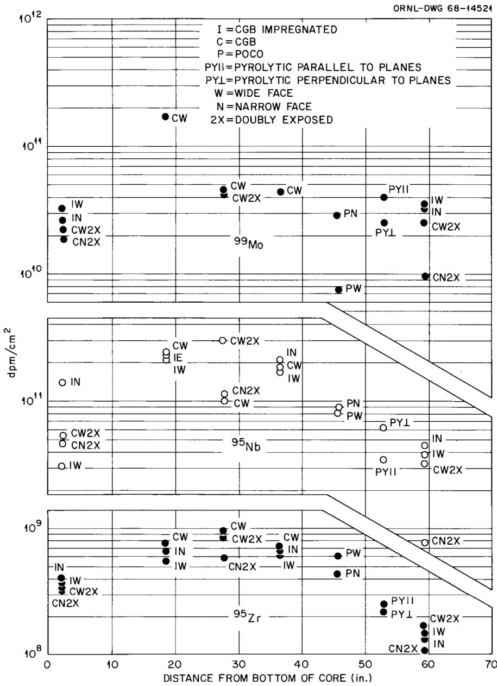  
Fig. 11.9. Deposition of $^{99}\mathrm{Mo}$ , $^{95}\mathrm{Nb}$ , and $^{95}\mathrm{Zr}$ vs Position in Core.

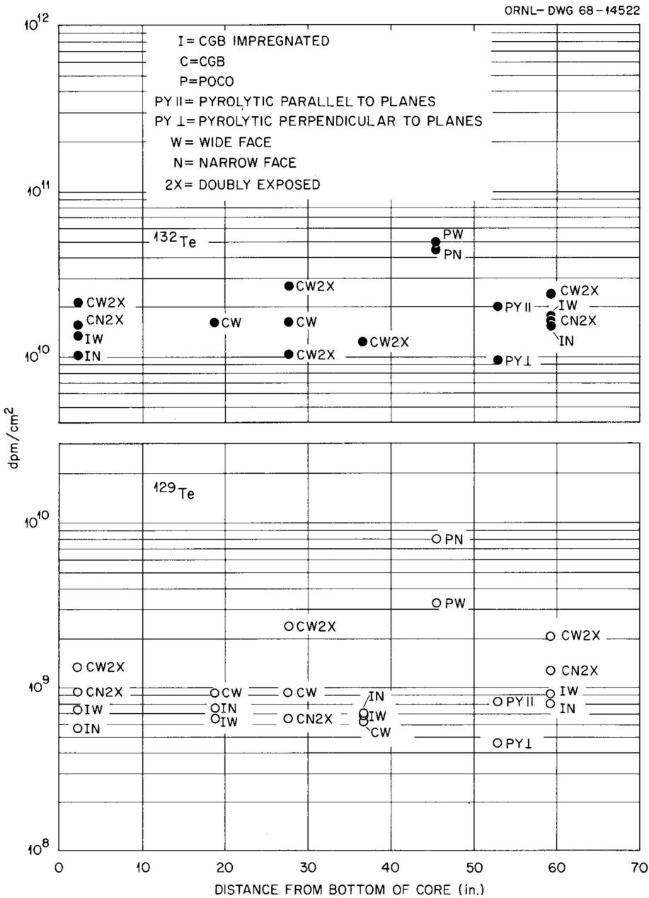  
Fig. 11.10. Deposition of $^{129}\mathrm{Te}$ and $^{132}\mathrm{Te}$ vs Position in Core.

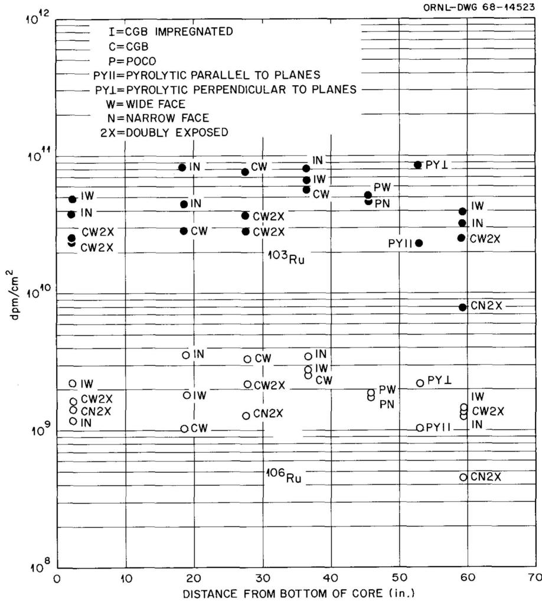  
Fig. 11.11. Deposition of $^{103}\mathrm{Ru}$ and $^{106}\mathrm{Ru}$ vs Position in Core.

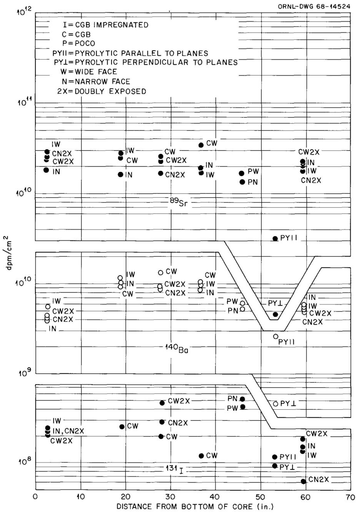  
Fig. 11.12. Deposition of $^{89}\mathrm{Sr}$ , $^{140}\mathrm{Ba}$ , and $^{131}\mathrm{I}$ vs Position in Core.

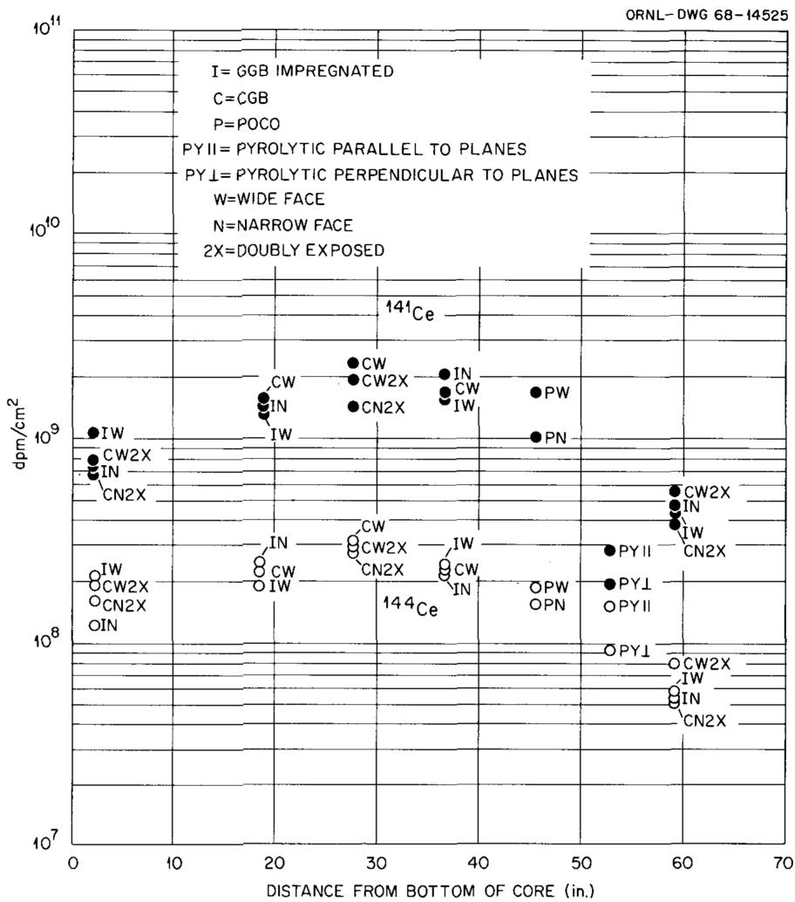  
Fig. 11.13. Deposition of $^{141}\mathrm{Ce}$ and $^{144}\mathrm{Ce}$ vs Position in Core.

group, $^{99}\mathrm{Mo}$ , $^{103}\mathrm{Ru}$ , $^{106}\mathrm{Ru}$ , and $^{95}\mathrm{Nb}$ , actually showed more deposition in the perpendicular direction than in the direction parallel to the graphite planes. For the others the reverse was true, particularly for the most "gaseous" types, $^{89}\mathrm{Sr}$ and $^{140}\mathrm{Ba}$ .

The deposition results on Poco graphite were rather puzzling. The deposition of $^{132}\mathrm{Te}$ , $^{129}\mathrm{Te}$ , and $^{131}\mathrm{I}$ was higher than the CGB norm, but the other nuclides showed deposition in line with that on CGB. Since the concentration profile of $^{140}\mathrm{Ba}$ in Poco graphite was flatter than for CGB, $^{140}\mathrm{Ba}$ would be in the group with Te and I if the deposition calculation included the material at depths greater than 50 mils. The same cannot be defi

nitably stated for $^{89}\mathrm{Sr}$ , since the profiles in CGB were also flat. The low deposition of $^{89}\mathrm{Sr}$ and $^{141}\mathrm{Ce}$ on Poco graphite is not explained.

On the average, then, the type of graphite appeared to have relatively small effect on surface deposition. It appears hardly worth while to attempt to develop a more impervious graphite from the standpoint of decreasing surface deposition. On the other hand, the more permeable Poco type of graphite appeared to be nearly as satisfactory as CGB as far as surface deposition was concerned. Except for the $^{135}\mathrm{Xe}$ problem, it might therefore be possible to relax the permeability specifications in developing molten-salt reactor graphites for other desirable physical and nuclear characteristics.

The last row in Table 11.1 gives the average deposition for all nuclides on all types of CGB specimens (untreated, impregnated, and doubly exposed). Since there were four specimens near the top, nine near the middle, and four near the bottom, the averages are not too seriously weighted by the values for a particular axial region of the core. However, the averages represent only the axial region of the core. For the species which seem to show a flux dependence, the averages over the whole core would be expected to be considerably lower.

Diffusion and Deposition of Uranium in Graphite. - The presence of uranium in graphite to any appreciable extent would indicate an instability of the fuel salt and possibly cause chemical damage to the graphite. Also, if substantial concentration of $^{235}\mathrm{U}$ were present in graphite during irradiation, fission products might be born inside the graphite.

Uranium-235 concentrations were determined for more than half of the milled graphite samples by the delayed neutron counting method. All of the deep-cut samples were analyzed, and complete profiles were determined for both faces of the pyrolytic graphite specimen and for the wide faces of the impregnated specimens P-77 and P-92. Six cuts (1, 2, 3, 5, 7, and 10) were analyzed for specimen P-58 (wide face), Y-9 (wide face), Poco (both faces), and X-13 (both faces).

Concentration profiles for both faces of the pyrolytic graphite and for the wide face of CGB specimen Y-9 are shown in Fig. 11.14. The penetration of $^{235}\mathrm{U}$ into pyrolytic graphite in the direction perpendicular to the graphite planes is distinctly less than for CGB graphite, but the concentrations at a given penetration differ only by a factor of about 5. The profile for penetration in the parallel direction in pyrolytic graphite is about midway between the other two curves.

The two Poco profiles agreed very well with each other and were about $20\%$ lower than the Y-9 curve except for the first cut sample on the wide face. This had the highest individual $^{235}\mathrm{U}$ concentration of any of the samples, 250 ppm, which may have been due to a particle of fuel salt on the specimen surface. The two X-13 (doubly exposed graphite) curves agreed poorly with each other. The wide face profile started at 100 ppm and decreased only to 6.5 ppm at 50 mils. This was the only instance where the final concentration significantly exceeded 1 ppm. The narrow face pro

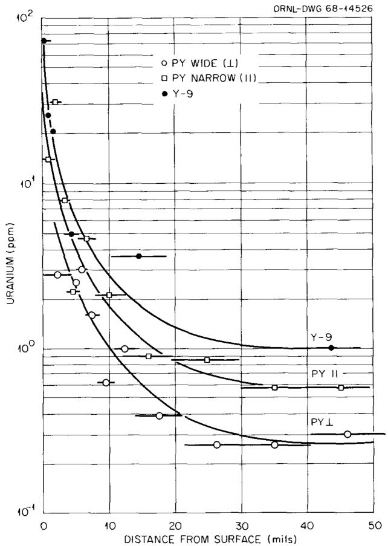  
Fig. 11.14. $^{235}\mathrm{U}$ Concentration Profiles in CGB and Pyrolytic Graphite.

file of X-13 started at 166 ppm and dropped steeply to 1 ppm at 15 mils. The P-58 profile was lower than the Y-9 profile by about $40\%$ over its whole course. The $^{135}\mathrm{U}$ profiles in impregnated graphite specimens P-77 and P-92 were similar to each other and matched the Y-9 curve over most of its length.

In most cases the total range of variation of the $^{235}\mathrm{U}$ concentration in 50 mils penetration was less than two orders of magnitude. This moderate slope indicates a higher mobility for uranium in graphite than for most fission products. The profiles were all rather similar except that for diffusion in pyrolytic graphite perpendicular to the planes. All but one of the profiles showed a leveling off at 1 ppm at deep penetrations. If this concentration persisted throughout the thickness of the graphite moderator, it would represent only

$1\mathrm{g}$ of $^{235}\mathrm{U}$ per $1000\mathrm{kg}$ of graphite and would cause no chemical or nuclear problems.

The presence of uranium deep in the graphite led, naturally, to the speculation that some of the fission products found in the graphite might have been born there by fission of some of this uranium rather than by diffusing in from the fuel salt. Even before a quantitative comparison was made, it was obvious that the slopes of the concentration profiles for the fission products and for uranium were quite different. However, it was of interest to see whether internal fission might account for the flat tail regions of the profiles, and the data existed in convenient form for a quantitative comparison, so it was carried out. A computer calculation had been made of the concentration of all fission products in the MSRE salt on the assumption that none of the nuclides left the fuel salt after birth. The calculation takes into account the power history of the MSRE, dilution by flush salt and the heel in the drain tank, etc. The computed fission product concentration per gram of salt (in disintegrations per minute per gram) at the time of the March 25,1968, shutdown was converted to disintegrations per minute per gram of uranium by multiplying by the known number of grams of salt per gram of uranium. The disintegrations per minute per gram of uranium value was

corrected for flux by multiplying by the known ratio of the flux at each specimen position to the average flux used in the computation. The corrected disintegrations per minute per gram of uranium value when multiplied by the number of grams of uranium per gram of graphite for each analyzed sample could be compared with the observed value for that sample. This method of calculation assumes that the uranium was in the graphite for the total power history; thus the calculated values should be high by at least a factor of 2.

Rather than show the results of this comparison in detail (over 1800 numbers), the results are summarized in a chart showing which milled cuts gave calculated values equal to or greater than the observed values (Table 11.2). The first point which stood out was that the calculated values were much smaller than the observed values for the large majority of cases. For the first cut, the ratio of observed to calculated was usually greater than $10^{3}$ and fell off to lower values for the deeper cuts. The calculated $^{95}\mathrm{Nb}$ concentrations were in all cases much less than the observed values, suggesting a high independent mobility of $^{95}\mathrm{Nb}$ in graphite. The observed $^{89}\mathrm{Sr}$ and $^{140}\mathrm{Ba}$ values were also higher than the calculated ones, except for pyrolytic graphite in the

Table 11.2. List of Milled Cuts from Graphite for Which the Fission Product Content Could Be Approximately Accounted For by the Uranium Present   

<table><tr><td rowspan="2">Graphite Sampleb</td><td colspan="12">Milled Cut Numbersa</td></tr><tr><td>99Mo</td><td>132Te</td><td>129Te</td><td>103Ru</td><td>106Ru</td><td>95Nb</td><td>95Zr</td><td>89Sr</td><td>140Ba</td><td>141Ce</td><td>144Ce</td><td>131I</td></tr><tr><td>P-77</td><td></td><td></td><td>9,10</td><td>6-10</td><td>6,10</td><td></td><td>4-10</td><td></td><td></td><td>10</td><td>3-10</td><td></td></tr><tr><td>X-13 wide</td><td>10</td><td></td><td></td><td>7-10</td><td>7-10</td><td></td><td>7-10</td><td></td><td></td><td></td><td>7-10</td><td>7-10</td></tr><tr><td>X-13 narrow</td><td>10</td><td></td><td></td><td>5-10</td><td>5-10</td><td></td><td>5-10</td><td></td><td></td><td></td><td>5-10</td><td>3-10</td></tr><tr><td>Y-9</td><td></td><td></td><td></td><td></td><td></td><td></td><td>10</td><td></td><td></td><td></td><td>10</td><td>10</td></tr><tr><td>P-58</td><td></td><td>10</td><td></td><td>10</td><td>10</td><td></td><td>7-10</td><td></td><td></td><td></td><td>7-10</td><td>7-10</td></tr><tr><td>P-92</td><td></td><td></td><td>9,10</td><td>5-10</td><td>5-10</td><td></td><td>5-10</td><td></td><td></td><td>8-10</td><td>7-10</td><td></td></tr><tr><td>K-1 wide</td><td></td><td></td><td></td><td>5-7</td><td>5-7</td><td></td><td>5-10</td><td></td><td></td><td>1</td><td>1,5-10</td><td></td></tr><tr><td>K-1 narrow</td><td></td><td></td><td></td><td>5-9</td><td>5-9</td><td></td><td>5-9</td><td></td><td></td><td></td><td>5-9</td><td></td></tr><tr><td>PG ↓</td><td>2</td><td>3-10</td><td>3-10</td><td>3-6,8</td><td>3-6</td><td></td><td>2-10</td><td>2-10</td><td>2-10</td><td>2-10</td><td>2-10</td><td>3-10</td></tr><tr><td>PG II</td><td></td><td>10</td><td>7,10</td><td></td><td></td><td></td><td>2-10</td><td></td><td></td><td>10</td><td>2,8-10</td><td>5-10</td></tr></table>

${}^{a}$ Nominally,in mils,cut No.1 was $1\% ;2,1\% ;3,1;4,2;5,3;6,5;7,8;8,{10};9,{10};{10},{10}.$   
The samples are listed in order of distance from the bottom of the reactor.

direction perpendicular to the graphite planes. This behavior squares with the observed extra mobility of the nuclides with rare-gas precursors except for diffusion perpendicular to the planes of pyrolytic graphite. For the remaining isotopes, the calculated concentrations often equaled or exceeded the observed concentrations in the deeper cuts, but the ratio of calculated to observed concentrations usually was near 1 and seldom exceeded 3. Pyrolytic graphite was exceptional in this regard, with some of the deep-cut ratios exceeding 10 for $^{95}\mathrm{Zr}$ , $^{89}\mathrm{Sr}$ , $^{140}\mathrm{Ba}$ , and $^{141}\mathrm{Ce}$ . This may indicate that it took a longer time for uranium to diffuse deep into pyrolytic graphite than into the other graphites. Table 11.2 shows that the calculated concentrations of most isotopes exceeded the observed values more frequently for pyrolytic graphite (perpendicular) than for any other specimen. This of course is consistent with the concentration profiles. They showed unusually steep initial drops for all fission products, but the uranium profiles were not as different from those for other specimens. The table also shows that the calculated values exceeded the observed values most frequently for $^{103}\mathrm{Ru}$ , $^{106}\mathrm{Ru}$ , $^{95}\mathrm{Zr}$ , and $^{144}\mathrm{Ce}$ . These all happen to be species which showed little indication of independent mobility (or “gaseous” behavior) in the concentration profiles. For these species, then, it is possible that the flat tails at the deep ends of their concentration profiles may be accounted for by fission of uranium already in the graphite. Iodine-131 may also belong in this group. However, the profiles near the surface require a different diffusion mechanism. For the other species, different mechanisms are required to account for the whole course of the profiles.

The uranium concentration profiles (Fig. 11.14) show that a considerable fraction of the total uranium in the graphite is concentrated near the surface. It is, therefore, meaningful to calculate surface concentrations of uranium, as was done for the fission products. These values are shown in Table 11.1, last column, and are plotted as a function of core position in Fig. 11.15. The points for all types of CGB graphite are in a narrow band covering a factor of 2 in concentration except for a single point that corresponds to the unusual profile for X-13 wide face previously discussed. In general, there appears to be no significant effect of impregnation, double exposure, or core location.

One of the points for Poco graphite is outside the CGB band; this is due to the previously discussed single high value for the first cut of Poco wide face. The total deposition on pyrolytic graphite for diffusion perpendicular to the graphite planes (PY $\bot$ ) is about $\frac{1}{4}$ of the CGB norm. The deposition on the other face of pyrolytic graphite is not significantly lower than on CGB. In summary, the deposition and diffusion of uranium in graphite appear to depend little on graphite structure and porosity; even in the most impermeable direction in pyrolytic graphite, the uranium concentrations are about $\frac{1}{4}$ of those in more pervious graphites.

The last row in Table 11.1 indicates that the average uranium deposition on CGB graphite amounts to $0.800\mu \mathrm{g} / \mathrm{cm}^2$ . Multiplying this by the total graphite surface area in the MSRE, $2\times 10^{6}$ $\mathrm{cm}^2$ , the total surface deposition of $^{235}\mathrm{U}$ on the graphite in the MSRE is $1.6\mathrm{g}$ .

Spectrographic Analyses of Graphite Samples. Spectrographic analyses of the dissolutions of the graphite samples were requested on each of the deep-cut (50 mils) samples and on the first two cuts on the other specimens. Analyses were made for Be, Zr, and Li, in the hope of determining the extent of surface contamination by bulk fuel (or flush) salt. Analyses were also made for Mo, Fe, Cr, and Ni after concentration of the original very dilute graphite solution.

The spectrographic results are shown in Table 11.3, in the form of micrograms of each element per square centimeter of graphite surface sampled. The data for Zr, Li, and Fe were not included, since they showed too much scatter to be usefully interpreted.

The Mo results are of most interest, since they furnish a check on the conclusions regarding Mo deposition drawn from the observations on $^{99}\mathrm{Mo}$ . No other fission product was detected spectrographically. It may be noted that Mo deposition was detected only on the specimens near the middle of the core. (The samples in Table 11.3 are listed in order of distance from the bottom of the core.) The average of the Mo values listed is $10\mu \mathrm{g / cm}^2$ . It may be easily calculated that $136\mathrm{g}$ of stable Mo nuclides were formed during 32,000 Mwhr of MSRE operation. If the percentage of this Mo depositing on the $2\times 10^{6}\mathrm{cm}^{2}$ of core graphite is the same as for $^{99}\mathrm{Mo}$ , $9.0\%$ (see Table 11.4), then there should be $6\mu \mathrm{g / cm}^2$ of stable Mo on the graphite. This agreement with the spectrographic

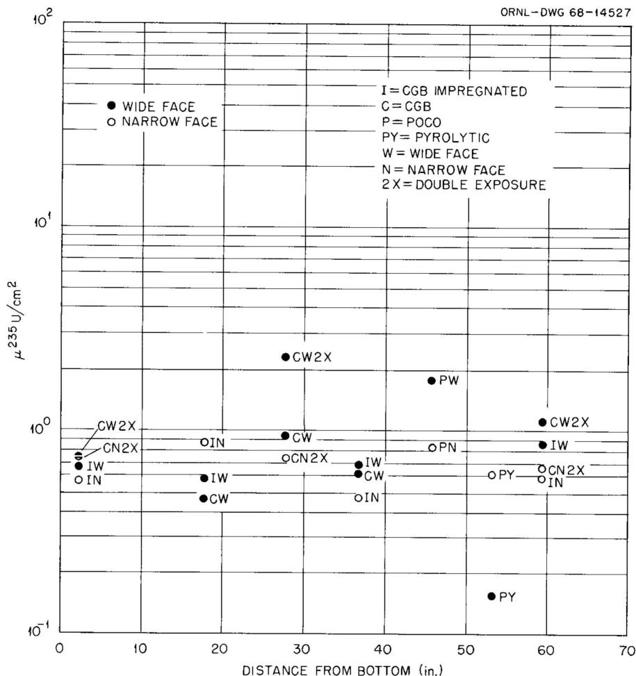  
Fig. 11.15. Deposition of $^{235}\mathrm{U}$ in Graphite from MSRE Core After 56,000 Mwhr.

value is gratifying, particularly when it is recalled that the deposition of $^{99}\mathrm{Mo}$ was higher near the middle of the core than near the extremes. The agreement implies that the fraction of each Mo nuclide deposited on graphite is the same, or more broadly that the deposition rates for $^{99}\mathrm{Mo}$ and other Mo isotopes are the same.

The Be results showed that only a few micrograms of fuel salt or flush salt per square centimeter adhered to the sampled graphite surfaces. It is interesting that the deposition of Cr and Ni was detected only near the middle of the core, as for Mo. Comparing the quantities of Cr, Ni, and Mo, it appears unlikely that the Mo which was deposited was carried by larger particles of Ni or of an alloy of Ni and Cr.

Analysis of Hastelloy N Surveillance Specimens. - The deposition of fission products on Hastelloy N is of concern principally because of the decay heating problem on metal surfaces of an MSBR in case of coolant system failure. Previous results showed a great deal of scatter, and more accurate data were desired to estimate the seriousness of the decay heating problem.

The Hastelloy N specimens on which fission product deposition was measured in the first two surveillance packages were sections of the perforated tube in which the graphite specimens were contained. Since the tube was to be reused this time, we used instead sections of the $\frac{1}{8}$ -in.-diam Hastelloy N tube used to contain the dosimeter wires. This tube extended from the bottom to the

top of the package (62 in.) and probably was a better metal specimen on which to observe deposition, since the surface was relatively smooth and

Table 11.3. Spectrographic Analyses of Graphite Specimens After 32,000 Mw   

<table><tr><td rowspan="2">Graphite Sample</td><td colspan="4">Micrograms per Square Centimeter of Specimen</td></tr><tr><td>Be</td><td>Mo</td><td>Cr</td><td>Ni</td></tr><tr><td>NR-5W</td><td>4.1</td><td></td><td></td><td></td></tr><tr><td>NR-5N</td><td>4.6</td><td></td><td></td><td></td></tr><tr><td>P-55W</td><td>0.457</td><td></td><td></td><td></td></tr><tr><td>P-77W</td><td>1.61</td><td>17.6</td><td></td><td></td></tr><tr><td>P-77N</td><td>1.0</td><td></td><td>34.</td><td></td></tr><tr><td>X-13W</td><td>1.1</td><td>4.5</td><td></td><td></td></tr><tr><td>X-13N</td><td>0.7</td><td>7.4</td><td>0.15</td><td></td></tr><tr><td>Y-9W</td><td>0.4</td><td>9.3</td><td>1.03</td><td>4.7</td></tr><tr><td>P-58W</td><td>0.4</td><td>8.7</td><td>0.49</td><td>5.5</td></tr><tr><td>P-92W</td><td>2.00</td><td>11.3</td><td></td><td></td></tr><tr><td>P-92N</td><td>2.67</td><td></td><td></td><td></td></tr><tr><td>Poco-W</td><td>0.60</td><td>9.0</td><td>0.55</td><td>6.6</td></tr><tr><td>Poco-N</td><td>0.62</td><td>10.5</td><td></td><td></td></tr><tr><td>Pyr ↓</td><td></td><td></td><td></td><td></td></tr><tr><td>Pyr ↑</td><td></td><td></td><td></td><td></td></tr><tr><td>MR-10W</td><td>1.3</td><td></td><td></td><td></td></tr><tr><td>MR-10N</td><td>4.1</td><td></td><td></td><td></td></tr></table>

did not contain holes in which droplets of salt might be trapped. Also, the salt flow pattern past the smooth surface was probably more typical of that for other reactor metal surfaces than that near a perforated sheet.

The $\frac{1}{8}$ -in. tube was segmented so as to obtain seven equally spaced 3-in.-long sections from the bottom to the top of the core. This spacing had to be slightly altered to avoid the portions of the $\frac{1}{8}$ -in. tubing that had been covered by the straps which held the surveillance specimens together. Each of the samples was dissolved in $\mathrm{HNO}_3$ containing some HCl, with a trap to catch any volatilizing Ru and I activities. The solutions were all analyzed radiochemically for the usual 12 isotopes. The bottom, middle, and top samples were also analyzed for $^{110}\mathrm{Ag}$ , $^{137}\mathrm{Cs}$ , $^{91}\mathrm{Y}$ , and $^{147}\mathrm{Nd}$ . The radiochemical procedures were as described above for graphite. All samples were also analyzed for adhering $^{235}\mathrm{U}$ by delayed neutron counting.

The results are shown in Table 11.5 and in Figs. 11.16 and 11.17, where the activities per square centimeter are plotted as a function of the distance of the specimen from the bottom of the core. It is seen that two distinct patterns prevail. The $^{99}\mathrm{Mo}$ , $^{132}\mathrm{Te}$ , $^{129}\mathrm{Te}$ , $^{103}\mathrm{Ru}$ , $^{106}\mathrm{Ru}$ , $^{95}\mathrm{Nb}$ , and $^{131}\mathrm{I}$ curves were remarkably flat, with the $^{99}\mathrm{Mo}$ and $^{95}\mathrm{Nb}$ curves dropping off toward the top

Table 11.4. Fission Product Distribution in the MSRE on March 25, 1968   

<table><tr><td>Nuclide</td><td>Percent in Fuel</td><td>Percent in Cover Gasa</td><td>Percent in Graphiteb</td><td>Percent in Hastelloy Nb</td><td>Percent Total</td></tr><tr><td>99Mo</td><td>0.17</td><td>50</td><td>9.0</td><td>28</td><td>87</td></tr><tr><td>132Te</td><td>0.47</td><td>74</td><td>5.1</td><td>14</td><td>94</td></tr><tr><td>129Te</td><td>0.40</td><td>31</td><td>5.6</td><td>17</td><td>54</td></tr><tr><td>103Ru</td><td>0.033</td><td>49</td><td>3.5</td><td>3.7</td><td>56</td></tr><tr><td>106Ru</td><td>0.10</td><td>(130)</td><td>4.3</td><td>4.7</td><td>139</td></tr><tr><td>95Nb</td><td>0.001 to 2.2</td><td>11</td><td>41</td><td>18</td><td>70</td></tr><tr><td>95Zr</td><td>94</td><td>0.43</td><td>0.14</td><td>0.085</td><td>95</td></tr><tr><td>89Sr</td><td>83</td><td>17</td><td>8.5</td><td>0.11</td><td>109</td></tr><tr><td>140Ba</td><td>96</td><td>0.48</td><td>1.9</td><td>0.080</td><td>98.5</td></tr><tr><td>141Ce</td><td></td><td>0.88</td><td>0.33</td><td>0.053</td><td></td></tr><tr><td>144Ce</td><td></td><td>2.7</td><td>0.92</td><td>0.040</td><td></td></tr><tr><td>131I</td><td>60</td><td>19</td><td>0.11</td><td>0.44</td><td>80</td></tr></table>

${}^{a}$ These values represent the percentages of daily production rate lost to the cover gas per day.   
bCalculated on the assumption that deposition on the surveillance specimens was representative of that on all of the graphite and metal surfaces in the MSRE.

Table 11.5. Deposition of Fission Products on Hastelloy N After 32,000 Mwhr in MSRE Core   

<table><tr><td rowspan="2">Metal Position (in. from bottom)</td><td colspan="15">Concentration (dis min-1cm-2)</td><td></td></tr><tr><td>99Mo</td><td>132Te</td><td>129Te</td><td>103Ru</td><td>106Ru</td><td>95Zr</td><td>95Nb</td><td>89Sr</td><td>140Ba</td><td>141Ce</td><td>144Ce</td><td>131I</td><td>110Ag</td><td>137Cs</td><td>91Y</td><td>147Nd</td></tr><tr><td></td><td>×1011</td><td>×1010</td><td>×109</td><td>×1010</td><td>×108</td><td>×108</td><td>×1010</td><td>×108</td><td>×108</td><td>×108</td><td>×108</td><td>×109</td><td>×107</td><td>×106</td><td>×108</td><td>×108</td></tr><tr><td>1.5</td><td>1.9</td><td>8.4</td><td>6.1</td><td>0.97</td><td>9.4</td><td>3.0</td><td>9.9</td><td>4.6</td><td>4.2</td><td>2.3</td><td>1.2</td><td>1.3</td><td>2.6</td><td>4.7</td><td>5.5</td><td>0.85</td></tr><tr><td>11.33</td><td>2.0</td><td>6.1</td><td>4.5</td><td>0.86</td><td>8.6</td><td>5.8</td><td>9.5</td><td>4.4</td><td>6.0</td><td>3.5</td><td>1.2</td><td>0.39</td><td></td><td></td><td></td><td></td></tr><tr><td>21.17</td><td>2.6</td><td>6.5</td><td>4.8</td><td>1.2</td><td>10.2</td><td>6.7</td><td>9.2</td><td>5.9</td><td>7.6</td><td>4.4</td><td>1.4</td><td>1.3</td><td></td><td></td><td></td><td></td></tr><tr><td>30.0</td><td>2.9</td><td>8.2</td><td>5.5</td><td>1.1</td><td>11.0</td><td>7.0</td><td>10.8</td><td>7.2</td><td>3.9</td><td>5.3</td><td>1.7</td><td>2.0</td><td>5.2</td><td>12.5</td><td>14.5</td><td>1.7</td></tr><tr><td>39.0</td><td>2.8</td><td>8.3</td><td>5.3</td><td>1.2</td><td>11.2</td><td>6.9</td><td>9.5</td><td>6.4</td><td>8.9</td><td>4.2</td><td>2.5</td><td>2.3</td><td></td><td></td><td></td><td></td></tr><tr><td>53.1</td><td>1.6</td><td>6.9</td><td>4.5</td><td>0.98</td><td>8.1</td><td>2.9</td><td>7.6</td><td>3.4</td><td>5.1</td><td>1.9</td><td>1.1</td><td>2.0</td><td></td><td></td><td></td><td></td></tr><tr><td>60.5</td><td>1.1</td><td>6.5</td><td>5.0</td><td>1.1</td><td>7.3</td><td>1.2</td><td>3.5</td><td>1.7</td><td>2.1</td><td>7.8</td><td>0.33</td><td>1.6</td><td>1.3</td><td>0.11</td><td>1.9</td><td>0.61</td></tr><tr><td>Average</td><td>2.13</td><td>7.29</td><td>5.09</td><td>1.06</td><td>9.40</td><td>4.77</td><td>8.57</td><td>4.81</td><td>5.40</td><td>3.22</td><td>1.34</td><td>1.56</td><td>3.03</td><td>6.10</td><td>7.31</td><td>1.07</td></tr></table>

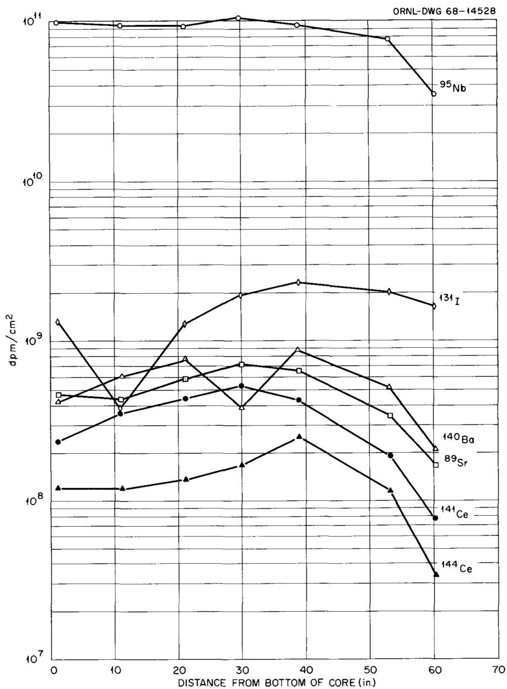  
Fig. 11.16. Deposition of $^{95}\mathrm{Nb}$ , $^{131}\mathrm{I}$ , $^{140}\mathrm{Ba}$ , $^{89}\mathrm{Sr}$ , $^{141}\mathrm{Ce}$ , and $^{144}\mathrm{Ce}$ on Hastelloy N After 32,000 Mwhr.

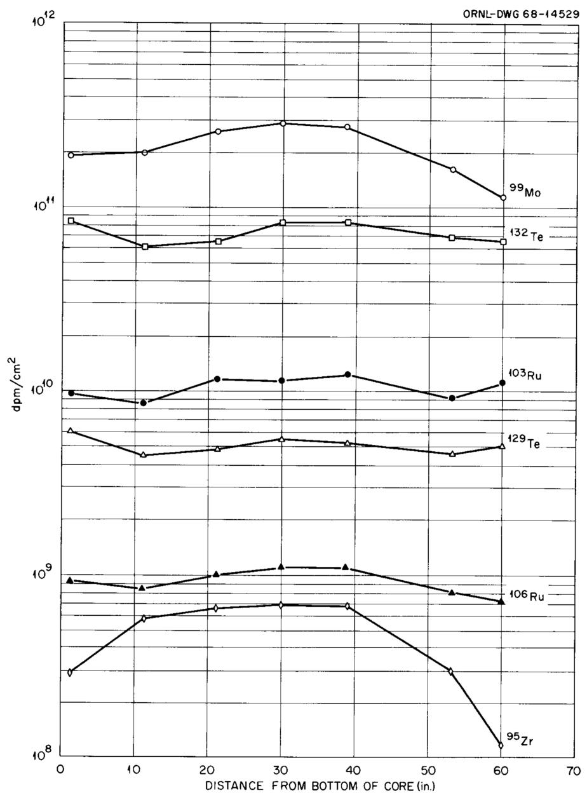  
Fig. 11.17. Deposition of $^{99}\mathrm{Mo}$ , $^{132}\mathrm{Te}$ , $^{129}\mathrm{Te}$ , $^{103}\mathrm{Ru}$ , $^{106}\mathrm{Ru}$ , and $^{95}\mathrm{Zr}$ on Hostelloy N After 32,000 Mwhr.

of the core. The other nuclides showed definite maxima near the middle of the core, with the lowest values near the top of the core. It is possible that humped profiles were produced in every case by fission recoil, but were overshadowed by heavy deposition from the salt in the cases where level profiles were obtained. In previous surveillance tests, $^{6}$ the results showed much more scatter, and trends as a function of core location were difficult to discern. Previous results also showed distinctly more deposition of all species, by an average factor of about 3. Certainly this discrepancy is at least partly due to the different type of Hastelloy N specimen analyzed in the current test. It was mentioned above that the $\frac{1}{8}$ -in.-diam tubing was probably a sample more representative of the metal surfaces in the MSRE. The larger number of samples and the much better quality of the analytical results also argue in favor of the current test as a better measure than previous tests of fission product deposition on MSRE metal surfaces.

For the nuclides whose profiles were level over the length of the core, there is no problem in choosing an average value for deposition. For those with maxima in the middle of the core, it is likely that the lower values at the inlet or outlet of the core were more typical of deposition on the reactor metal surface outside the core. However, the nuclides which showed maxima were also those with low deposition on Hastelloy N, so the averages shown in the last row of Table 11.5 were conservatively calculated using data from all seven specimens.

Fission Product Distribution in the MSRE. - Using the new averages for deposition on CGB graphite and on Hastelloy N, together with the previously reported data for the amounts of each nuclide in the fuel salt and in the cover gas in March 1968, a new material balance was calculated, as shown in Table 11.4. The total inventory of each fission product in the MSRE on March 25, 1968, was taken from a computer calculation using a recently developed program.7 The revised estimate of $8.0\mathrm{Mw}$ as full power for the MSRE was used in the computation.

The material balance in Table 11.4 differs from the previous one $^{8}$ mainly in that the fractions of noble metal fission products deposited on Hastelloy N are considerably lower. This is desirable from the standpoint of the fission product heating problem, but undesirable from the standpoint of removing noble metal neutron poisons from the reactor core. The principal changes in the graphite data are for $^{89}\mathrm{Sr}$ and $^{140}\mathrm{Ba}$ . This is because their concentration profiles were more level in the current test and samples as deep as 50 mils were included in the deposition calculations. The number for $^{89}\mathrm{Sr}$ would increase substantially if estimated amounts still deeper in the graphite were included in the calculation.

The pattern of behavior of the noble metals was not uniform. The deposition of $^{95}\mathrm{Nb}$ on graphite was distinctly heavier than on Hastelloy N, and only $11\%$ was lost to the cover gas. The deposition of $^{99}\mathrm{Mo}$ , $^{132}\mathrm{Te}$ , and $^{129}\mathrm{Te}$ was heavier on Hastelloy N than on graphite, and about $50\%$ was lost to the cover gas. The deposition of the Ru isotopes on metal and graphite was comparable and rather low (3 to $5\%$ ), and a large percentage of each was lost to the cover gas.

The total material balance (last column) was much nearer $100\%$ for each nuclide than previous balances. The fair approximation to a $100\%$ balance in most cases is not to be taken as a true measure of the reliability of the percentages listed. At least three-fourths of the percentages listed are uncertain by a factor of about 2.

Conclusions. - The results reported in this section indicate that some progress has been made toward the objective of reliable quantitative information on fission product deposition on graphite and on Hastelloy N. Although the concentration profiles of fission products in graphite showed considerable variations in shape for different specimens of CGB graphite and even for different faces of the same specimen, the total deposition showed much less scatter, usually less than a factor of 2 at a given core location. It is believed that the agreement obtained was not limited by the experimental techniques used but rather by the variability in the graphite itself. Even Poco graphite occasionally stowed differences in diffusion and deposition behavior between

two faces of the same specimen. It is therefore unlikely that the reproducibility of deposition measurements in graphite can be significantly improved over its current status.

The quantitative data for deposition of fission products on Hastelloy N are less reliable. Deposition on smooth Hastelloy N tubing was lower than in previously reported values for perforated Hastelloy N sheets by factors from 2 to 10, averaging about 3. It is believed that differences in surface roughness and perhaps in fuel salt turbulence near the metal surfaces may account for the discrepancies. The deposition data on the smooth tubing when plotted against sample location gave either level or humped profiles with small variations between adjacent sample points. The regularity and smoothness of the profiles suggest that the precision of the data is well within a factor of 2. It is not possible with data from only one test to estimate the absolute reliability of the deposition data. However, for deposition on smooth surfaces of similar roughness to that of $\frac{1}{8}$ -in. Hastelloy N tubing, the data reported for the latter type of specimen are to be preferred over previous data.

Acknowledgments. - The authors wish to acknowledge the large contributions to the work on the surveillance specimens by several groups and individuals. The surveillance assembly was designed and assembled by H. Cook. The dismantling of the assembly and the segmenting of the Hastelloy N specimen were carried out by A. Walls and H. Cook. The segmenting of the graphite specimens, the surface milling, and the hot-cell examinations were carried out by E. King's personnel in Building 3525. We are indebted to R. W. McClung and W. J. Mason for the x radiography of the graphite specimens, to C. E. Lamb's group for some of the graphite and metal specimen dissolutions, and to J. Emery for $^{235}\mathrm{U}$ analyses by delayed neutron counting. Particular thanks are due to E. I. Wyatt's group for the high quality of their radiochemical analyses of a very large number of samples.

# 11.2 FISSION PRODUCT PROFILES IN THREE MSRE GRAPHITE SURVEILLANCE SPECIMENS

D. R. Cuneo

H. E. Robertson

During this period, three graphite surveillance specimens removed from the MSRE during the

March 25, 1968, shutdown were sampled for fission product distribution by a previously described method. Two 0.305-in.-diam cores were obtained from a pyrolytic graphite specimen and one core each from specimens designated as P-55 (unim-pregnated CGB) and V-28 (impregnated CGB). These specimens had been exposed to MSRE fuel salt for $8.0\mathrm{Mw}$ of operation. Small increments of these cores were removed by precision grinding, and fission product distributions across the cores were determined by gamma spectrometry using a germanium crystal to count individual activities in the graphite powder. Generally, we confirmed findings of the previously reported fission product distribution in specimens removed at the May 1967 shutdown. We have perhaps learned an explanation for the anomaly reported earlier when we found an increase in fission product concentrations from a specimen surface to a depth of several mils. Comparison of results for the impregnated and unimpregnated CGB material shows that impregnation of the type used for specimen V-28 is not of value in inhibiting penetration of fission products into CGB graphite. As we recognized early in these investigations, effects of cracks or voids in a specimen can cause great uncertainty in interpretation of results.

# 11.2.1 Pyrolytic Graphite

The cores, obtained by boring through the graphite surveillance specimens perpendicular to the surface exposed to MSRE fuel salt, were difficult to obtain from the pyrolytic specimen. This material is fabricated in layers and tends to peel apart quite easily when worked after irradiation at high temperature. We found that the first core of pyrolytic graphite was missing within some 25 mils of the end which was on the back, or stagnant-salt, side of the specimen. The core was intact, that is, full length, before transferring from the hot cells to a vented glove box for grinding. Because of the undetected loss of $\sim 25$ mils from one end of the core our last sample was about 15 mils thick. Generally we have obtained numerous samples of 1-mil thickness in approaching a hot surface. This particular powder sample was so radioactive that the spectrometer

would not accept the sample even at maximum distance until several weeks of cooling beyond the approximately 3 weeks of cooling needed for the other samples from this core. Because powder samples from this core were counted (gamma spectrometry) soon after reactor shutdown (with the above exception) it was possible to look for $77\text{-hr}^{132}\text{Te}$ . It was found to exist from 135 mils from the hot salt surface to the back side of the specimen.

A second core from the pyrolytic specimen was drilled and sampled. The results of analyses are shown in Fig. 11.18. In all cases in this discussion the numerical values given for nuclides are calculated back to the time of MSRE shutdown, March 25, 1968. The left ordinate represents the specimen surface which was exposed to free-flowing fuel salt. The right ordinate is the surface which was exposed only to salt which seeped between specimen surfaces. All four of the nuclides found are seen to have a lower concentration for the first mil of the free-flowing MSRE salt-exposed surface. Relatively brief circulation of barren salt following reactor shutdown may have lowered fission product concentrations in the first mil of graphite, although we will see below that this effect is not noticed for the CGB specimens; if it is real, it is peculiar to the pyrolytic material. Following the usual sharp drop in concentration for the first few mils of depth, we see the surprising rise in concentrations for the three nuclides which have persisted as deep as 15 mils. (The $^{95}\mathrm{Zr}$ disappeared below 6 mils.) Between 15 and 30 mils, the $^{141}\mathrm{Ce}$ concentration increases by a factor of 5, and the $^{103}\mathrm{Ru}$ and $^{95}\mathrm{Nb}$ increase an order of magnitude each. By a depth of 45 to 50 mils, the concentrations are back on their original curves. Almost certainly, this finding would be explainable by a crack or pocket into which a channel to the surface allowed salt seepage. Previously, we reported a similar situation for a core sample removed from a specimen from which some 60 mils had been removed by milling. Resampling of the same specimen in a different location did not produce duplicate results. Again, we find this to be true; the first core from this pyrolytic specimen did not show similar behavior between 15 and 45 mils; hence our belief that a short localized crack could cause this result. The persistence of the $^{95}\mathrm{Nb}$ throughout the core sample is interesting; it is not a fission product and occurs only as a daughter of $^{95}\mathrm{Zr}$ . Since no

${}^{95}\mathrm{Zr}$ was found beyond 6 mils, the ${}^{95}\mathrm{Nb}$ must have penetrated because of its existence as a different species from the ${}^{95}\mathrm{Zr}$ .

# 11.2.2 Unimpregnated CGB (Specimen P-55)

The results of analyses from the P-55 specimen are given in Fig. 11.19. Seven nuclides were found to varying degrees of penetration and concentration. Points of interest are discussed below.

1. Cesium-137: Virtually uniform concentration across the specimen with the exception of a few mils near each surface, with an apparent real dip in the curve 10 mils from the left ordinate.   
2. Zirconium-95: Steepest gradient of the seven nuclides; disappeared 85 mils from the left ordinate. Low level in 135-to-160-mil sample, then reappeared 13 mils from right ordinate.   
3. Barium-140: Not found in the pyrolytic samples; quite evident here, having flattest curve with exception of $^{137}\mathrm{Cs}$ .   
4. Cerium-141, -144: The $^{141}\mathrm{Ce}$ isotope is seen to have penetrated to a greater depth from the free-flowing salt surface (left ordinate) than the $^{144}\mathrm{Ce}$ , actually being found in all samples except the 85-to-110-mil one. As noted previously, $^{9141}\mathrm{Ce}$ has $^{141}\mathrm{Ba}$ (18 min) and $^{141}\mathrm{La}$ (3.7 hr) precursors, while all precursors of $^{144}\mathrm{Ce}$ are "short" only. Since we find no $^{144}\mathrm{Ce}$ beyond 15 mils from the left ordinate, perhaps the difference in precursors for the two cerium isotopes is a clue to the mechanism of cerium migration in some types of graphitic structures.   
5. Niobium-95: As in the case of the pyrolytic graphite, $^{95}\mathrm{Nb}$ was found in every sample despite the lack of its precursor, $^{95}\mathrm{Zr}$ , in many of them.   
6. Ruthenium-103: Found in all samples.

# 11.2.3 Impregnated CGB (Specimen V-28)

This specimen was slightly more than twice the thickness of the P-55 specimen discussed above.

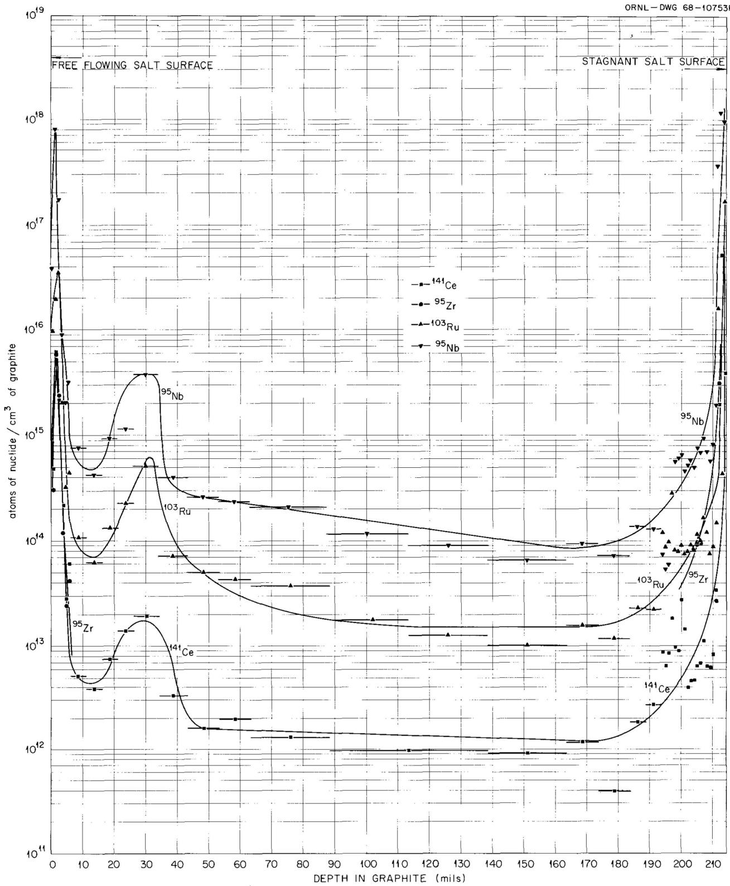  
Fig. 11.18. Distribution in Pyrolytic Graphite Specimen Irradiated in MSRE for Cycle Ending March 25, 1968.

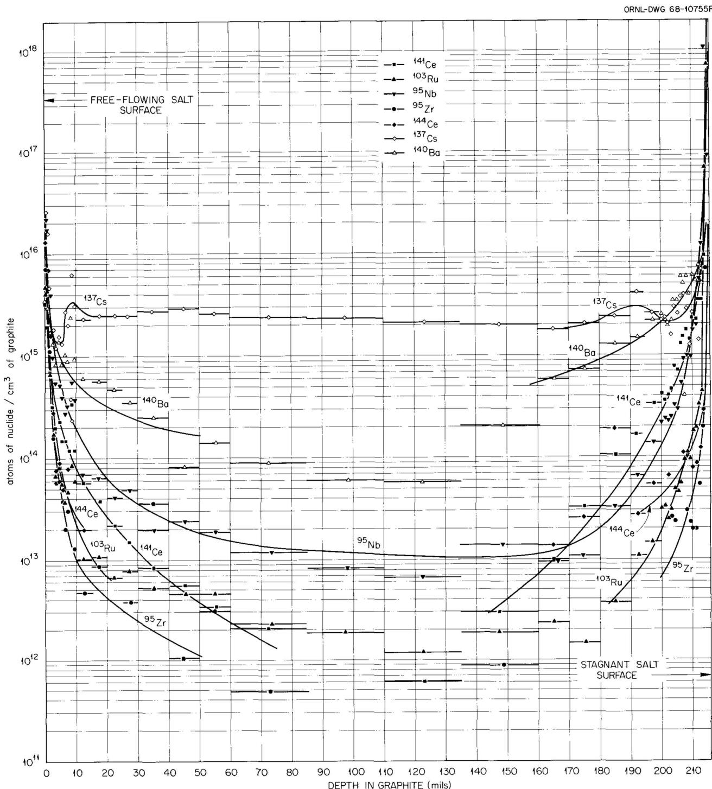  
Fig. 11.19. Fission Product Distribution in Unimpregnated CGB (P-55) Graphite Specimen Irradiated in MSRE Cycle Ending March 25, 1968.

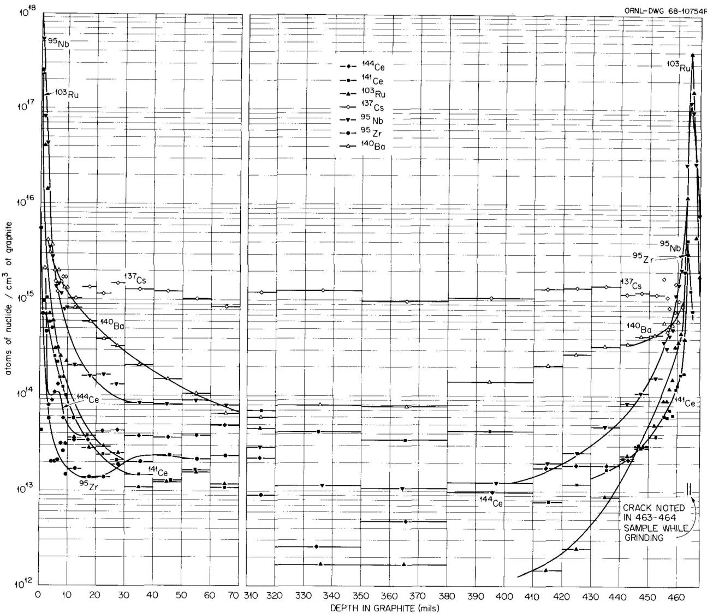  
Fig. 11.20. Fission Product Distribution in Impregnated CGB (V-28) Graphite Specimen Irradiated in MSRE Cycle Ending March 25, 1968.

However, the bulk of all nuclides, with the exception of $^{137}\mathrm{Cs}$ , was found to occur in the first few mils from the surfaces, so that the total number of atoms of nuclide found in going from one surface through to the opposite side is not appreciably affected by doubling the thickness of the specimen.

The impregnation of a CGB graphite specimen was done to test its effect on fission product penetration. The results of analyses for 0 to 70 mils from the free-flowing salt surface of the specimen and from 340 mils out to the back (stag

nant salt) surface are shown in Fig. 11.20. The nuclide concentrations omitted for ease of illustration (from 70 to 340 mils) are flat over this interval. Comparison with results in Fig. 11.19 shows that fission product penetration was not appreciably inhibited by the shallow11 impregnation used for this specimen.

Further comparisons between results reported in Figs. 11.19 and 11.20 show that, in general,

fission product concentrations in the two pieces of CGB graphite were similar. One exception was that $^{95}\mathrm{Zr}$ was found as deep as 285 mils in the V-28 specimen, but only to a depth of 95 mils in the P-55 specimen, both measurements being from the free-flowing salt surface. Another difference between the two is noted for $^{144}\mathrm{Ce}$ ; apparently this isotope penetrated the impregnated specimen more easily than the unimpregnated one. In the impregnated specimen it is apparent that all the fission products found, with the exception of $^{137}\mathrm{Cs}$ , are grouped within an order of magnitude $(10^{13}$ to $10^{14}$ atoms of nuclide per cubic centimeter of graphite per mil of depth), while there is considerably more scatter for the other CGB specimen.

During grinding of the core from this specimen we noted a crack across the face of the core following removal of 1 mil between 4 and 5 mils from the back (stagnant salt) surface. This was evident for two or three more mils in approach to the surface and most likely accounts for the sharp drop in nuclide concentrations near the surface. This conclusion, of course, presupposes that the crack was empty, which could reasonably be expected since loose material would fall out easily from a crack that opened out at the surface.

# 11.2.4 Overall Results

In Table 11.6 we find a summation of atoms from $1\mathrm{cm}^2$ of specimen surface through to the other side of the specimen, as represented by a core 0.305 in. in diameter. Data previously reported for the May 1967 specimens are repeated to allow comparisons with the March 1968 specimens. As noted, the first core taken from the pyrolytic graphite was missing one hot surface: that surface in contact with the stagnant MSRE fuel salt. The amount of ${}^{95}\mathrm{Zr}$ is seen to be far less in the more recent samples, while the ${}^{95}\mathrm{Nb}$ is larger. Values for ${}^{103}\mathrm{Ru}$ are all similar. Ruthenium-106 was detected in only one surface of pyrolytic graphite, to a depth of 15 mils. Except for the pyrolytic specimen, which contained virtually no ${}^{137}\mathrm{Cs}$ , values are identical. The ${}^{141,144}\mathrm{Ce}$ values are fairly comparable. As expected, ${}^{140}\mathrm{Ba}$ was quite mobile in the CGB material. We plan to obtain a uranium profile on samples from the V-28 specimen to allow us to adjust the nuclide concentrations we found by the amounts that could have been made by fissioning in place.

# 11.3 ANALYSIS OF MSRE GRAPHITE SAMPLE X-13 FOR FLUORINE AND LITHIUM

R. L. Macklin

F. F. Blankenship

J. H. Gibbons

E. Ricci

T. H. Handley

D. R. Cuneo

A cross section of CGB graphite removed from the MSRE on March 25, 1968, after 58,000 Mwhr exposure was moved across a beam of 2.06-Mev protons collimated through a slit of $0.0075\mathrm{cm}$ width. The protons were from the ORNL 3-Mv Van de Graaff accelerator. Measurement of the resulting prompt gamma rays from ${}^{19}\mathbf{F}(p,\alpha \gamma)^{16}\mathbf{O}$ showed that fluorine varied from 350 ppm near the surface to 60 ppm near the center. Neutron yields from ${}^{7}\mathrm{Li}(p,n){}^{7}\mathrm{Be}$ showed that lithium varied from 60 ppm near the surface to 13 ppm at the center. The observed ratio of fluorine to lithium was near that characteristic of the MSRE fuel. The lithium and fluorine concentrations did not show a simple dependence on depth.

The method and apparatus were the same as those described earlier, with minor adjustments of technique and data handling. A $3 \times 3$ in. NaI(Tl) spectrometer with a 2.5-cm lead filter was used for the gamma-ray measurements.

An attempt to use a new standard of graphite mixed with known amounts (in the ppm range) of LiF was unsuccessful due to inhomogeneities which caused yield changes of up to $100\%$ for changes in beam spot location of 0.0075 cm. Thereafter, the standard used was a crystal of LiF.

The concentrations of lithium and fluorine in the sample (X-13 from the middle of the core) showed substantial variation and fluctuation from position to position. The data presented (Figs. 11.21 and 11.22) are for a freshly abraded cross section from a cored sample. This was prepared by carefully abrading away 5-15 mils. The motion against the abrasive paper was kept parallel to the surface exposed to fuel to avoid possible carry-over of material from one depth to another. The mass concentration ratio (Fig. 11.23) suggested that much of the lithium and fluorine found in the graphite came from bulk salt intrusion; this

Table 11.6. Total Atoms of Nuclide per Square Centimeter, One Surface to Opposite Surface, Cores Removed from MSRE Surveillance Specimens   

<table><tr><td></td><td>Thickness (in.)</td><td>95Nb</td><td>95Zr</td><td>103Ru</td><td>106Ru</td><td>137Cs</td><td>141Ce</td><td>144Ce</td><td>140Ba</td></tr><tr><td colspan="10">May 1967</td></tr><tr><td>Second core, Y-7</td><td>0.467</td><td>1.5 × 1017</td><td>7.5 × 1018</td><td>7.8 × 1017</td><td>2.2 × 1017</td><td>1.8 × 1018</td><td>3.9 × 1017</td><td>2.3 × 1017</td><td>a</td></tr><tr><td>Third core, Y-7</td><td>0.467</td><td>9.0 × 1016</td><td>6.0 × 1018</td><td>7.3 × 1017</td><td>5.1 × 1017</td><td>1.1 × 1018</td><td>9.5 × 1016</td><td>1.7 × 1017</td><td>a</td></tr><tr><td colspan="10">March 1968</td></tr><tr><td>Pyrolytic, second core</td><td>0.220</td><td>7.9 × 1018</td><td>2.6 × 1016</td><td>4.0 × 1017</td><td></td><td></td><td>1.5 × 1017</td><td></td><td></td></tr><tr><td>Pyrolytic, first coreb</td><td>0.220</td><td>2.0 × 1018</td><td>7.6 × 1015</td><td>2.0 × 1017</td><td>1.5 × 1017</td><td></td><td>9.6 × 1015</td><td>2.1 × 1016</td><td></td></tr><tr><td>V-28, impregnated CGB</td><td>0.468</td><td>2.2 × 1018</td><td>4.2 × 1016</td><td>2.0 × 1018</td><td></td><td>1.3 × 1018</td><td>5.1 × 1016</td><td>4.6 × 1016</td><td>1.7 × 1017</td></tr><tr><td>P-55, unimpregnated CGB</td><td>0.220</td><td>4.4 × 1017</td><td>4.6 × 1016</td><td>6.7 × 1017</td><td></td><td>1.2 × 1018</td><td>9.2 × 1016</td><td>5.7 × 1016</td><td>3.3 × 1017</td></tr></table>

${}^{a}$ Samples too old for ${}^{140}\mathrm{{Ba}}$ .   
bOne hot surface missing.

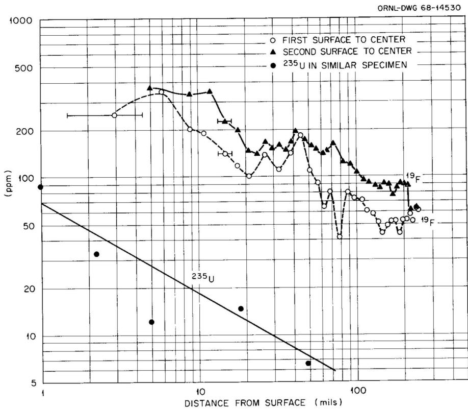  
Fig. 11.21. Fluorine Concentration as a Function of Distance from the Surface.

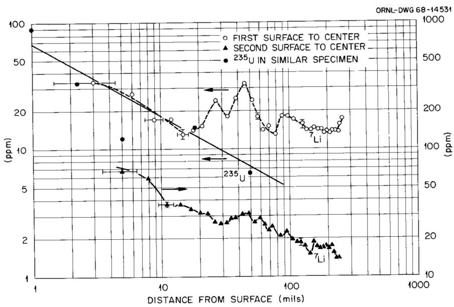  
Fig. 11.22. Lithium Concentration as a Function of Distance from the Surface.

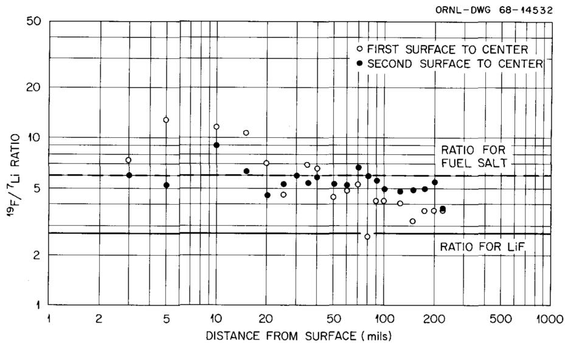  
Fig. 11.23. Mass Concentration Ratio, F/Li, vs Depth.

is in contrast to an earlier sample (No. Y-7) which was withdrawn after 9 months reactor exposure, in which progressive lithium enrichment (relative to fluorine) with depth was found. $^{13}$ If this behavior is typical, one should also find uranium concentration (relative to fluorine or lithium) corresponding to the molten salt. For fuel, the $\mathbf{F}^{-}$ to $^{235}\mathrm{U}$ ratio is 44 and the $\mathrm{Li}^{+}$ to $^{235}\mathrm{U}$ ratio is 7. As shown in Figs. 11.18 and 11.19, there is somewhat more uranium present in the graphite than expected from the fuel composition. It should be kept in mind, however, that while the uranium content was determined from a bulk sampling, the lithium and fluorine results were from a specific small sample that could be different from the average. The main difference in the lithium and fluorine results for the two different exposures is a substantial increase in fluorine, as shown in Figs. 11.24 and 11.25. Samples Y-7 and X-13 were comparable in all respects except that X-13 received about twice the exposure that Y-7 received.

The results are puzzling in that, in the absence of radiation, a control specimen showed less penetration of both salt and uranium by a factor of 100. There is a possibility that the same mechanism that apparently produced a fuel aerosol in the gas

phase (see Sect. 11.1) is responsible for fuel having penetrated the graphite voids as an aerosol. Sample X-13 has not yet been examined by soft x rays to see if cracks were present.

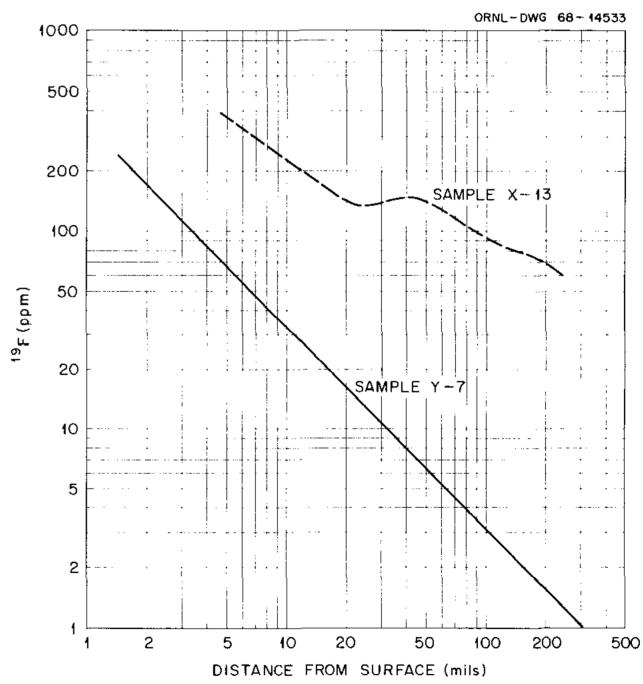  
Fig. 11.24. Comparison of Fluorine Concentrations in Samples Y-7 and X-13, a Smooth Line Having Been Drawn Through the Data Points.

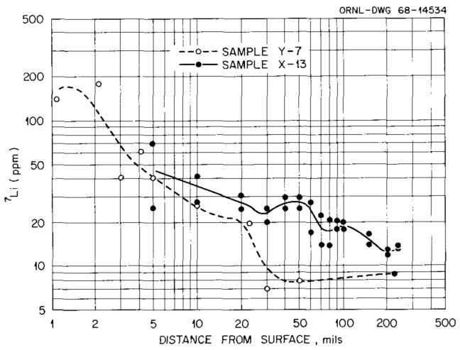  
Fig. 11.25. Comparison of Lithium Concentrations in Samples Y-7 and X-13.

# 11.4 SURFACE PHENOMENA IN MOLTEN SALTS

H. W. Kohn

F. F. Blankenship

Dispersions of metals of colloidal dimensions have been prepared in lithium-beryllium fluoride by three methods: reductive electrolysis, Bredig arc, and ac electrolysis. Gold, titanium, niobium, molybdenum, and nickel colloids have been prepared. In the reductive electrolysis method, a dc source is applied through a variable resistor across two identical electrodes immersed in the melt while the solution is swept with a hydrogen-helium mixture. The idea is to reduce the metal ions as fast as they are introduced into the solution. The Bredig arc method has been well described;14 we wish only to add that we were unable (using 110-v ac) to strike an arc in the solution. Apparently it has too high a conductivity. Satisfactory results, however, were achieved by striking an arc between one electrode and the solution interface. Alternating-current electrolysis gives by far the most stable sols and is surely the most novel and interesting, although the mechanism of formation by this method is still quite obscure. We discovered it quite accidentally while running the blank for the Bredig arc method. To do an alternating-current electrolysis, one applies the

output of a 110-v Variac through a series resistor across the electrolysis cell. The cell is (again) two identical wires 1 to $1 \frac{1}{2} \mathrm{~cm}$ apart immersed in molten $\mathrm{Li}_{2} \mathrm{BeF}_{4}$ . Helium is usually swept through the solution to provide both an inert atmosphere and agitation. As the voltage is turned up, a small current usually flows, and the solution becomes a bit clearer than it was. At higher voltages bubbles form at the electrodes, and finally at still higher voltages the solution turns dark.

None of these colloids were particularly stable, but if the sol were filtered immediately after formation, most of the dark material readily passed a sintered glass "D" (5-µ nominal pore size) filter. Platinum and titanium sols coagulated readily in less than 20 min. Nickel and niobium sols were more stable, but they generally lasted less than an hour. The molybdenum and gold sols were the most stable. Gold formed a particularly satisfactory sol since, due to the reddish-purple color, we knew we were dealing with a metal sol. Sols made by the reductive electrolysis method seemed noticeably less stable than those made by the other two methods.

Samples of the molybdenum sols were centrifuged at high temperatures.15 After cooling, the end of the frozen salt ingot was cut off and examined microscopically and also subjected to electron microscope examination. The ingots were also analyzed spectroscopically. The usual molybdenum content was 20 to $30~\mathrm{ppm}$ overall; however, the lower end of the centrifuged specimens often ran as high as $50~\mathrm{ppm}$ .

Table 11.7 shows the calculated efficacy of high-temperature centrifugation at $530\textbf{g}$ and $750^{\circ}\mathrm{K}$ for $1\mathrm{hr}$ for molybdenum particles in $\mathbf{Li}_2\mathbf{BeF}_4$ The three quantities calculated are: $s,$ the distance traveled by a particle of radius $r$ in $1\mathrm{hr},$ calculated from Stokes' law; $\sqrt{x^2}$ ,the displacement of a particle of radius $r$ due to Brownian motion; and $h,$ the height at which after infinite time (sedimentation equilibrium) half the particles will be below the height and half will be above. Sedimentation equilibrium cannot be hoped for in the currently available centrifuge because of vibration. The table serves to show that centrifugation cannot concentrate aggregates much less

Table 11.7. Efficacy of Centrifugation of Molybdenum Particles in Lithium-Beryllium Fluoride Melts   
$T = 750^{\circ}\mathrm{K}$ ,centrifugal force $= 530g$   

<table><tr><td>Particle Radius (A)</td><td>Sedimentation Distance (cm)</td><td>Brownian Distance (cm)</td><td>Half Height (cm)</td></tr><tr><td>5</td><td>1.5 × 10-4</td><td>0.13</td><td>6.82</td></tr><tr><td>25</td><td>3.6 × 10-3</td><td>0.06</td><td>0.055</td></tr><tr><td>75</td><td>3.3 × 10-2</td><td>0.032</td><td>0.002</td></tr><tr><td>100</td><td>5.8 × 10-2</td><td>0.029</td><td>8.6 × 10-4</td></tr><tr><td>200</td><td>0.23</td><td>0.021</td><td>1.1 × 10-4</td></tr><tr><td>500</td><td>1.46</td><td>0.013</td><td>6.6 × 10-6</td></tr><tr><td>1000</td><td>5.83</td><td>0.0093</td><td>8.4 × 10-7</td></tr></table>

than 1000 A across. We expected that the aggregates would be flocs of smaller particles which could be distinguished by electron microscopy. The analysis of the top portions of the centrifuged ingots showed either that many of the particles were below this size or that there were some soluble molybdenum compounds in these preparations.

The electron microscope picture showed that reductive electrolysis produced irregular size particles which varied from the smallest discernible, $\sim 200$ A in diameter, to large square particles 15,000 A across. When the electrolysis was done at higher current densities, the particles were smaller and more uniform. The Bredig arc method

gave a nicely uniform product, as shown in Fig. 11.26. Agglomerates about $1000\mathrm{A}$ across consisted of individual particles 100 to $200\mathrm{A}$ across. We obtained only one picture of the particles from the ac electrolysis. It showed one agglomerate about $10,000\mathrm{A}$ across. The individual particles were again quite small, 100 to $200\mathrm{A}$ in diameter. While we were unable to discern the electron diffraction pattern of molybdenum, we could establish that the small particles were not salt. Based on past experience, the particles should have been molybdenum.

Mechanisms whereby these colloids get into the gas phase have also been studied. An extensive literature search was completed and supplemented by a scouting experiment. Generally, jet droplets from bursting bubbles, which are an important factor in entrainment, are one-tenth the volume of the bubble and rise to considerable heights above the liquid surface. We were able to show that this height for a molten salt $\left(\mathrm{LiNO}_{3}-\mathrm{KNO}_{3}\right.$ eutectic) was $10\mathrm{cm}$ , and further that the droplets would also act as a surface microtome, $^{17}$ skimming finely divided carbon from the melt surface. The jet droplet behavior of the salt melts was nicely approximated by a $50\%$ glycerol-water mixture. An ORNL report has been prepared on this subject. $^{18}$

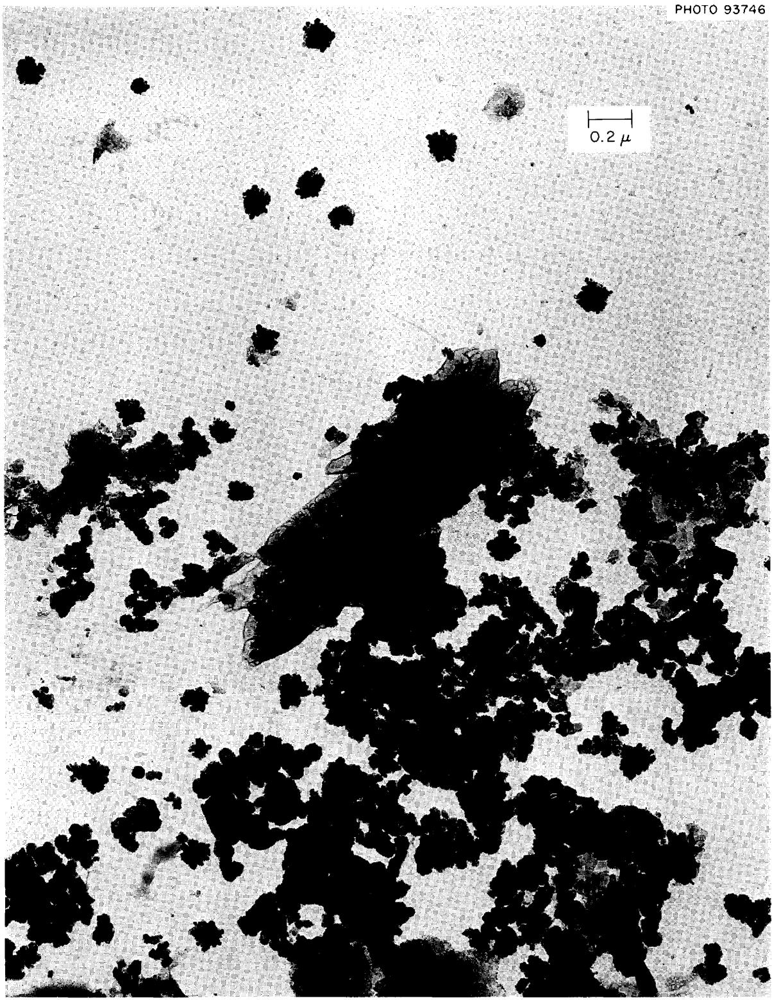  
Fig. 11.26. Colloidal Molybdenum Formed by the Bredig Arc Method in Molten $\mathsf{Li}_2\mathsf{BeF}_4$

# 12. Physical Chemistry of Molten Salts

# 12.1 MOLYBDENUM FLUORIDE CHEMISTRY

C.F.Weaver H.A.Friedman D.N.Hess

Previously reported studies of molybdenum fluoride chemistry in the Reactor Chemistry Division, along with the reasons for initiating this work, may be found in refs. 1-8. The following subjects were discussed: synthesis of molybdenum fluoride, $^{1,4,6}$ reactions of molybdenum fluorides with molten $2\mathrm{LiF - BeF}_{2}$ , mass spectrometry of molybdenum fluorides, $^{2,5,7}$ potentiometric study of molybdenum in LiF-BeF $_{2}$ (67-33 mole $\%$ ), lithium fluoromolybdates (III) $^{4,6}$ and absorption spectroscopy of MoF $_{5}$ (ref. 6) and MoF $_{3}$ .

# 12.1.1 Synthesis of $\mathsf{MoF}_3$ , $\mathsf{MoF}_4$ , $\mathsf{MoF}_5$ , and $\mathsf{RuF}_3$

Previous work has indicated that $\mathbf{MoF}_5$ can be easily synthesized by refluxing purified commercial $\mathbf{MoF}_6$ over molybdenum in Pyrex containers at temperatures less than $100^{\circ}\mathrm{C}$ . It was further shown that the $\mathbf{MoF}_5$ may be disproportionated to produce $\mathbf{MoF}_3$ and $\mathbf{MoF}_6$ , which when pumped from the

system leaves the pure $\mathsf{MoF}_3$ . Additional studies of this process have revealed that the solid resulting from the disproportionation of $\mathsf{MoF}_5$ depends on the pressure of $\mathsf{MoF}_6$ maintained in the reaction vessel. If the $\mathsf{MoF}_6$ pressure was kept in the micron range, the solid produced was $\mathsf{MoF}_3$ . If much higher pressures, in the order of an atmosphere, were maintained, the solid product was $\mathsf{MoF}_4$ , which displays $2\theta$ values for the three most intense x-ray diffraction peaks (copper radiation) of 23.23, 24.71, and $25.31^{\circ}$ . The x-ray diffraction pattern for this material is very similar to that incorrectly reported[9,10] for $\mathsf{MoF}_3$ several years before a satisfactory preparation was studied.[11] Analysis of the $\mathsf{MoF}_4$ gave 55.9 wt% Mo and 44.0 wt% F, compared with calculated values of 55.8 and 44.2 respectively. The compound was found to be stable for many days at a temperature of $200^{\circ}\mathrm{C}$ and pressures in the micron range, but it decomposed at somewhat higher temperatures ( $<300^{\circ}\mathrm{C}$ ) to $\mathsf{MoF}_3$ and a volatile product. The results for temperatures above $2000^{\circ}\mathrm{C}$ are somewhat uncertain because the Pyrex container was attacked by the fluorides. Accordingly, these stability studies must be repeated in a metal container.

Synthesis studies of the volatile inorganic fluorides have been extended to the $\mathbf{RuF}_x$ family of compounds. An attempt, in accordance with the literature, $^{12-15}$ to produce $\mathbf{RuF}_5$ by direct fluori

nation of ruthenium metal produced $\mathbf{RuF}_3$ instead. The compound was identified by its x-ray diffraction pattern. $^{16}$

It was indicated above that the products of an $\mathsf{MoF}_x$ synthesis were unusually dependent on experimental conditions. Apparently the $\mathsf{RuF}_x$ and $\mathsf{MoF}_x$ compounds are analogous in this respect. The $\mathsf{RuF}_3$ produced will be used in investigations of the rate of removal of $\mathsf{Ru}^{3+}$ from molten 2LiF. $\mathsf{BeF}_2$ and MSR fuels, paralleling the $\mathsf{Mo}^{3+}$ kinetic studies.

# 12.1.2 Kinetic Behavior of $\mathsf{MoF}_3$ in Molten 2LiF·BeF

Continued studies of the rate of removal of $\mathbf{Mo}^{3+}$ from molten 2LiF·BeF $_2$ have served to emphasize the complexity of molybednum fluoride chemistry. These experiments have shown that the order as well as the rate of removal varies with the experimental conditions. Figures 12.1 through 12.3 show second-, first-, and half-order kinetics respectively. The conditions of these experiments were: Fig. 12.1 - $700^{\circ}\mathrm{C}$ , $3/4$ liter/hr helium flow, copper container $\mathbf{H}_2$ fired at $500^{\circ}\mathrm{C}$ ; Fig. 12.2 - $700^{\circ}\mathrm{C}$ , no

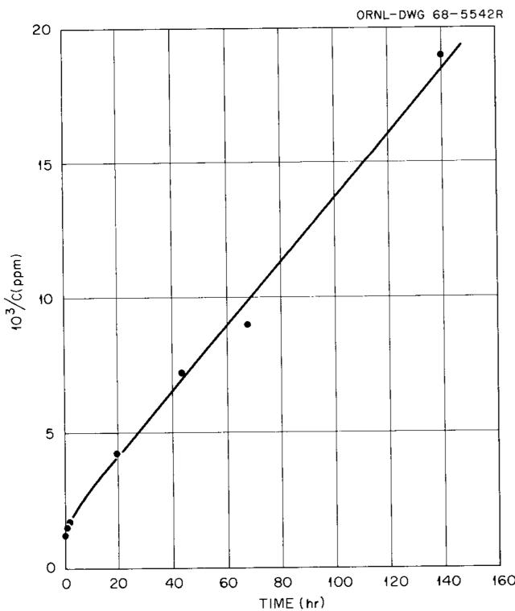  
Fig. 12.1. Removal of $\mathsf{Mo}^{3+}$ from Molten 2LiF-BeF $_2$ .

helium flow, copper container not $\mathbf{H}_2$ fired; Fig. 12.3 - $500^{\circ}\mathrm{C}$ , 12 liters/hr helium flow, copper container $\mathbf{H}_2$ fired at $500^{\circ}\mathrm{C}$ .

It has become apparent that the initial removal rate at $700^{\circ}$ is strongly enhanced by the hydrogen firing step, which was used on new batches but not thereafter. This observation will require a reinterpretation of earlier data. Experiments without hydrogen firing will provide a better reference system for kinetic studies involving MSR materials, since the gas is not involved in the reactor chemistry. The most stable conditions encountered thus far are $500^{\circ}\mathrm{C}$ with a static helium atmosphere in which the concentration of $\mathrm{Mo}^{3+}$ dropped by a factor of 4 in $1400\mathrm{hr}$ . The previously reported $^{4}$ evidence that $\mathrm{Mo}^{3+}$ was not removed from solution by reaction with the copper container indicated that a disproportionation reaction was involved.

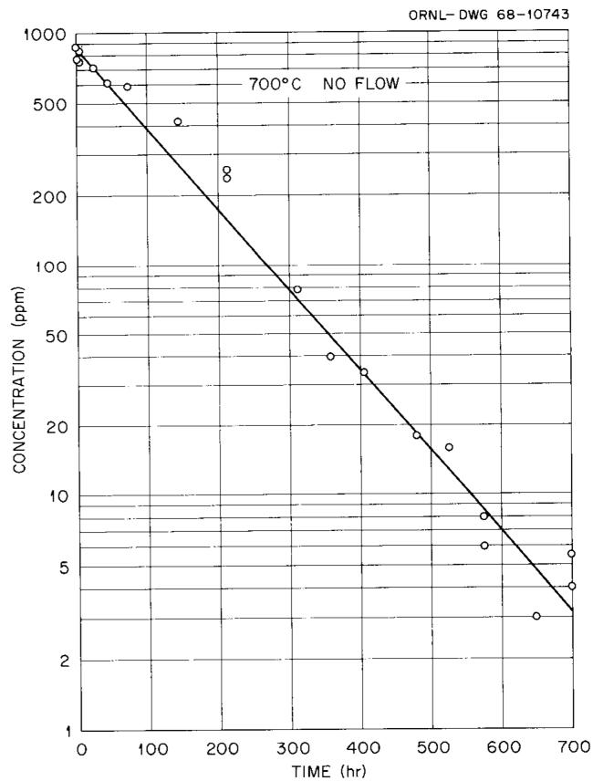  
Fig. 12.2. Removal of $\mathsf{Mo}^{3+}$ from Molten 2LiF-BeF $_2$ .

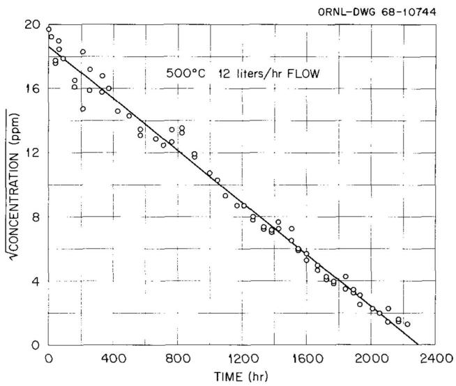  
Fig. 12.3. Removal of $\mathsf{Mo}^{3+}$ from Molten 2LiF-BeF $_2$ .

It has been reported $^{11}$ and we have confirmed by x-ray diffraction that $\mathrm{MoF}_3$ decomposes in the temperature range 500 to $700^{\circ}\mathrm{C}$ to form molybdenum metal and a volatile product. It was also shown $^{17}$ by electron probe analysis that a sample of 2LiF $\cdot$ BeF $_2$ and $\mathrm{MoF}_3$ heated to $700^{\circ}\mathrm{C}$ in a graphite container under a helium atmosphere had molybdenum metal on the helium-salt interface after cooling. Since all of the intermediate-valence $\mathrm{MoF}_x$ ( $3 < x < 6$ ) compounds are thermally unstable in bulk at temperatures well below 500 to $700^{\circ}\mathrm{C}$ , it was proposed that the reaction $2\mathrm{MoF}_3 \rightarrow \mathrm{Mo} + \mathrm{MoF}_6$ occurred. However, efforts to collect the volatile species by trapping it in aqueous caustic solution were unsuccessful. $^{4}$ More recently, efforts to detect the volatile species under two different conditions with a spectrophotometer $^{18}$ were also unsuccessful. In one case the spectrophotometric cell was at room temperature, obviating the detection of species not volatile at room temperature. It is known from our own work $^{6}$ in cooperation with J. P. Young that $\mathrm{MoF}_5$ does not have a high enough vapor pressure at room temperature to be detected in a 5-cm quartz cell by absorption spectroscopy. In the second case a windowless cell was used. The optical path was at melt temperature, but

clearly volatile material could easily escape from the path. Mass spectrometric studies of pure $\mathrm{MoF}_3$ have shown7 that the gas escaping from a Knudsen cell in the temperature range 500 to $700^{\circ}\mathrm{C}$ was predominately $\mathrm{MoF}_5$ , with lesser amounts of both $\mathrm{MoF}_6$ and $\mathrm{MoF}_4$ . Also on opening the systems used for the kinetic studies, a blue coating typical of $\mathrm{MoF}_x$ hydrolysis product was found in the portion of the gas outlet line that was warmer than room temperature. This observation suggests that a volatile molybdenum compound did escape from the melt, condensed at lower temperature in the hot line, and hydrolyzed when the system was exposed to air at the end of the run. Since the volatile species cannot be $\mathrm{MoF}_6$ , we now believe that it is $\mathrm{MoF}_4$ or $\mathrm{MoF}_5$ and that their low partial pressures, on the order of 1 torr or less, either reduce their decomposition rates or shift the chemical equilibria in their favor, as indicated at even lower pressures by the mass spectrometric studies. Further attempts to identify these gases will involve collecting them from hot exit lines rather than at room temperature and monitoring $\mathrm{LiF - BeF}_2\text{-MoF}_3$ mixtures with the mass spectrometer. Even though many details of the behavior of $\mathrm{Mo}^{3+}$ in molten 2LiF·BeF2 are poorly understood, the system is stable enough to serve as a reference for kinetic studies involving MSR fuels, graphite, and INOR-8 which we will now run in parallel with studies of the simpler system.

# 12.2 PROPERTIES OF THE ALKALI FLUOROBORATES

# 12.2.1 Phase Relations in Fluoroborate Systems

C.J.Barton L.O.Gilpatrick H.Insley

Phase diagrams of the systems of principal interest as possible coolants for molten-salt reactors have been published, $^{19,20}$ but additional data have been obtained and, in some cases, the studies are still not complete. Part of the need for continuing the investigation of some systems results from the fact that much of the data was obtained with $\mathrm{NaBF}_4$ preparations less pure than that now available. $^{20}$ The influence of impurities in the $\mathrm{NaBF}_4$ on liquidus and solidus temperatures is, unfortunately,

most strongly evident in $\mathrm{NaBF}_4$ -rich compositions close to the presently favored coolant composition (92 mole $\%$ $\mathrm{NaBF}_4 - 8$ mole $\%$ NaF). However, the changes in the published diagrams are too minor to warrant their revision.

Because of possible involvement of hydroxy fluoroborates in the corrosion behavior of fluoroborate coolants, we have started work with these materials.

The System NaF-KBF $_{4}$ - M. A. Bredig pointed out in the previous progress report $^{21}$ that our data on the system NaF-KBF $_{4}$ provided evidence of non-ideality. His conclusion was based on one liquidus temperature in the high-NaF portion of the system that was considerably below the liquidus curve that we had drawn for this diagram. We have now determined liquidus temperatures for five additional compositions in the range 10 to 40 mole % NaBF $_{4}$ and have confirmed the shape of the liquidus curve predicted by Bredig for this portion of the diagram.

The System $\mathsf{NaBF}_4\text{-}\mathsf{KBF}_4$ . - Differential thermal analysis data with compositions containing 80, 85, and 90 mole $\%$ $\mathsf{NaBF}_4$ (high-purity material) showed liquidus and solidus temperatures about 3 to $5^{\circ}\mathrm{C}$ higher than values obtained earlier with less pure $\mathsf{NaBF}_4$ . The minimum solidus temperature in this solid solution system is now believed to be $396 \pm 2^{\circ}$ , and the minimum melting composition contains approximately 90 mole $\%$ $\mathsf{NaBF}_4$ .

Preparation and Thermal Properties of KBF $_3$ OH. Since oxygen was an impurity in all NaBF $_4$ preparations made by aqueous methods and these preparations exhibited low melting points, we suspected that hydrolysis products such as NaBF $_3$ OH might be responsible for the observed melting-point lowering. The hydroxy fluoroborates, if present in coolant mixtures, would be expected to be more corrosive than the pure fluoroborates. Although NaBF $_3$ OH is of greater interest than KBF $_3$ OH, we prepared the latter first because it proved to be easier to synthesize.

We chose the method of Wamser $^{19}$ and Ryss $^{20}$ as described by Pawlenko $^{22}$ to prepare a 1.6-mole batch of KBF $_3$ OH. The reaction proceeds according to the equation

$$
2 \mathrm {K H F} _ {2} + \mathrm {H} _ {3} \mathrm {B O} _ {3} \xrightarrow {\circ \mathrm {C}} \mathrm {K B F} _ {3} \mathrm {O H} + \mathrm {K F} + 2 \mathrm {H} _ {2} \mathrm {O}.
$$

The product, being only slightly soluble in water at $0^{\circ}\mathrm{C}$ , precipitated, and it was filtered and dried by pumping overnight at room temperature. A yield of $57\%$ was obtained. The dried product contained $1.4\% \mathrm{H}_2\mathrm{O}$ , $8.78\%$ boron, and $46.0\%$ fluorine (theoretical $\mathrm{B} = 8.80\%$ , $\mathrm{F} = 46.4\%$ ). The calculated $\mathrm{B / F}$ atomic ratio was 2.98.

Pawlenko reported $^{23}$ a melting point of $332^{\circ}\mathrm{C}$ for this compound. The DTA curves that we obtained with our preparation were difficult to interpret, but the liquidus temperature appeared to be $355^{\circ}\mathrm{C}$ , and other thermal effects on heating were observed at 344 and $287^{\circ}\mathrm{C}$ . The corresponding effects on cooling were at 333, 306, and $266^{\circ}\mathrm{C}$ respectively. The undercooled liquidus break may have been interpreted by Pawlenko to be the liquidus temperature. Pawlenko $^{23}$ investigated phase relations in the systems $\mathrm{KBF}_3\mathrm{OH - KBF}_4$ and $\mathrm{KF - KBF}_3\mathrm{OH - KBF}_4$ . We plan to proceed with the preparation of $\mathrm{NaBF}_3\mathrm{OH}$ and with the study of phase relations in the system $\mathrm{NaBF}_4\mathrm{-NaBF}_3\mathrm{OH}$ .

# 12.2.2 Crystal Structure of Sodium Tetrafluoroborate

G. D. Brunton

Unlike any of the complex fluorides which crystallize from the MSR fluids based on the components LiF, $\mathrm{BeF}_2$ , $\mathrm{ZrF}_4$ , $\mathrm{UF}_4$ , and $\mathrm{ThF}_4$ , the alkali fluoroborates undergo pronounced crystalline transitions. Sodium tetrafluoroborate crystallizes from melts as a cubic phase which inverts on cooling to temperatures below $240^{\circ}\mathrm{C}$ to an orthorhombic form which is $\sim 20\%$ more dense than the higher-temperature cubic form. Such behavior indicates that the crystal chemistry of the alkali fluoroborates may be of significance in molten-salt reactor coolant technology and has prompted a reexamination of the structure of $\mathrm{NaBF}_4$ . Lattice parameters and atomic parameters of the compound were remeasured. The refined parameters were found to be only slightly different from those determined by Weiss and Zohner[24] from two-dimensional Weissenberg data. The orthorhombic form of $\mathrm{NaBF}_4$ crystallizes in the space group Cmcm; refined values for the unit cell

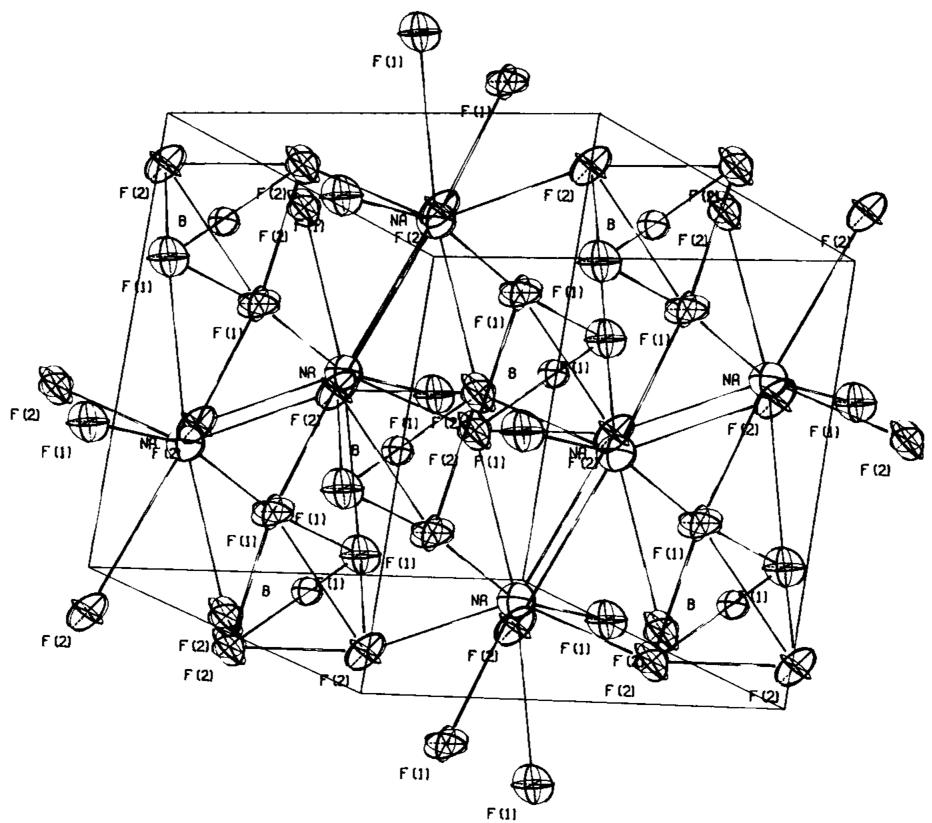  
Fig. 12.4. Unit Cell of $\mathsf{NaBF}_4$ . The unit cell is outlined and has been tilted $-15^{\circ}$ around the X axis and $-30^{\circ}$ around the Y axis of the drawing.

parameters are $a_0 = 6.8368(9)$ A, $b_{0} = 6.2619(7)$ A, and $c_{0} = 6.7916(4)$ A; calculated density is 2.5075 $\mathrm{g / cm^3}$ . The structure is shown in Fig. 12.4. The $\mathbf{BF}_4$ tetrahedra are slightly irregular, with two $\mathbf{F}(1)^{-}$ ions 0.006 A more distant from the $\mathbf{B}^{3+}$ ion than the two $\mathbf{F}(2)^{-}$ ions. The $\mathbf{Na}^{+}$ ions are coordinated by $8\mathbf{F}^{-}$ ions at the corners of an irregular polyhedron which is neither a cube nor antiprism. The $\mathbf{Na}^{+}$ polyhedron shares opposite edges with $\mathbf{BF}_4$ tetrahedra, four corners with $\mathbf{BF}_4$ tetrahedra, and edges with two other $\mathbf{Na}^{+}$ polyhedra. The $\mathbf{Na}^{+}-\mathbf{F}^{-}$ distances vary from 2.2963 to 2.609 A.

# 12.2.3 Heat Content of $\mathsf{NaBF}_4$ and KBF

A. S. Dworkin

The following equations represent our measured heat content data for $\mathrm{NaBF}_4$ and $\mathrm{KBF}_4$ in cal/mole:

NaBF

$$
\begin{array}{l} H _ {T} - H _ {2 9 8 ^ {\circ} \mathrm {K}} = - 3 8 2 0 + 3. 1 4 8 T + 3. 7 0 3 \times 1 0 ^ {- 2} T ^ {2} \\ - 1. 2 1 7 \times 1 0 ^ {5} T ^ {- 1} (2 9 8 - 5 1 6 ^ {\circ} K); \\ \end{array}
$$

$$
\begin{array}{l} \Delta H _ {\text {t r a n s}} = 1 6 1 0 \mathrm {c a l} / \mathrm {m o l e}, \Delta S _ {\text {t r a n s}} \\ = 3. 1 3 \mathrm {e . u .}, 5 1 6 ^ {\circ} \mathrm {K}; \\ \end{array}
$$

$$
H _ {T} - H _ {2 9 8} = 9 7 8 5 + 3 6. 4 8 T (5 1 6 - 6 7 9 ^ {\circ} \mathrm {K});
$$

$$
\begin{array}{l} \Delta H _ {\text {f u s i o n}} = 3 2 4 5 \mathrm {c a l} / \mathrm {m o l e}, \Delta S _ {\text {f u s}} \\ = 4. 7 8 \mathrm {e . u .}, 6 7 9 ^ {\circ} \mathrm {K}; \\ \end{array}
$$

$$
H _ {T} - H _ {2 9 8} = - 8 6 0 5 + 3 9. 5 2 T (6 7 9 - 7 5 0 ^ {\circ} \mathrm {K}).
$$

KBF

$$
\begin{array}{l} H _ {T} - H _ {2 9 8} = - 6 3 2 5 + 1 5. 6 2 T + 1. 9 4 3 \times 1 0 ^ {- 2} T ^ {2} \\ - 1. 7 3 7 \times 1 0 ^ {4} T ^ {- 1} (2 9 8 - 5 5 6 ^ {\circ} \mathrm {K}); \\ \end{array}
$$

$$
\begin{array}{l} \Delta H _ {\text {t r a n s}} = 3 3 0 0 \mathrm {c a l} / \mathrm {m o l e}, \Delta S _ {\text {t r a n s}} \\ = 5. 9 3 \mathrm {e . u .} (5 5 6 ^ {\circ} \mathrm {K}); \\ \end{array}
$$

$$
H _ {T} - H _ {2 9 8} = - 7 8 0 0 + 3 4. 9 5 T (5 5 6 - 8 4 3 ^ {\circ} \mathrm {K});
$$

$$
\begin{array}{l} \Delta H _ {\text {f u s i o n}} = 4 3 0 0 \mathrm {c a l} / \mathrm {m o l e}, \Delta S _ {\text {f u s i o n}} \\ = 5. 1 0 \mathrm {e . u .} (8 4 3 ^ {\circ} \mathrm {K}); \\ \end{array}
$$

$$
H _ {T} - H _ {2 9 8} = - 7 7 1 0 + 3 9. 9 4 T (8 4 3 - 9 0 0 ^ {\circ} \mathrm {K}).
$$

The entropy of transition of $\mathrm{KBF}_4$ is almost double that of $\mathrm{NaBF}_4$ . This is explained qualitatively on the basis of the differing structures of the low-temperature solids, whereas the high-temperature solids both presumably have the cubic structure. The low-temperature $\mathrm{NaBF}_4$ with the orthorhombic $\mathrm{CaSO}_4$ (pseudocubic) structure is much closer to the high-temperature cubic form than is the low-temperature $\mathrm{KBF}_4$ with its orthorhombic $\mathrm{BaSO}_4$ (pseudotetragonal) structure.

# 12.2.4 Dissociation Pressure and Chemical Thermodynamics of the System KBF-KF

Stanley Cantor J.A.Bornmann

The possibility that $\mathrm{KBF}_4$ will be a component of the coolant for an advanced molten-salt reactor prompted us to examine the dissociation equilibrium

$$
\mathrm {K B F} _ {4} (I) \rightleftharpoons \mathrm {K F} (I) + \mathrm {B F} _ {3} (g). \tag {1}
$$

Techniques derived from the study of the similar $\mathrm{NaBF}_4$ dissociation equilibrium $^{25,26}$ greatly simplified the present investigation.

In a closed apparatus of known volume, $\mathrm{BF}_3$ pressures in equilibrium with the melt were measured manometrically in the composition range 15.7 to $\sim 100$ mole $\%$ KBF. For each composition, pressures were measured over at least a $140^{\circ}$ temperature interval within overall limits of 628 to $1207^{\circ}\mathrm{C}$ . Four isotherms of $\mathrm{BF}_3$ pressure vs composition are depicted in Fig. 12.5.

The analysis of the experimental data to yield thermodynamic information for $\mathbf{KBF}_4$ -KF is identical to the data analysis for the system $\mathbf{NaBF}_4$ -NaF. Details of the thermodynamic treatment are given elsewhere.[25,26]

The equilibrium constant, $K_{p}$ , for the dissociation [as written in Eq. (1)] is defined as

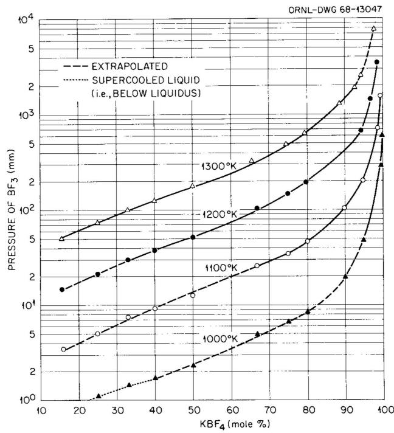  
Fig. 12.5. Vapor Pressure of $\mathsf{BF}_3$ in Equilibrium with KBF $_4$ -KF Melts.

$$
K _ {P} = P _ {\mathrm {B F} _ {3}} \frac {\gamma_ {\mathrm {K F}} N _ {\mathrm {K F}}}{\gamma_ {\mathrm {K B F} _ {4}} N _ {\mathrm {K B F} _ {4}}} \tag {2}
$$

where $\gamma$ and $N$ are activity coefficient and mole fraction respectively, and $P_{\mathbf{BF}_3}$ is the vapor pressure of $\mathrm{BF}_3$ . The temperature dependence of $K_p$ for reaction (1) is given by the equation

$$
\ln K _ {P} (\mathrm {a t m}) = \frac {- 3 7 , 3 0 0}{R T \left(^ {\circ} \mathrm {K}\right)} + \frac {2 6 . 2}{R}, \tag {3}
$$

where 37,300 cal and 26.2 cal/°K are the enthalpy and entropy of the reaction, and $R$ , the gas constant, is 1.987 cal/°K. For the reaction

$$
\mathrm {N a B F} _ {4} (I) \rightleftharpoons \mathrm {N a F} (I) + \mathrm {B F} _ {3} (\mathfrak {g}), \tag {4}
$$

the derived enthalpy and entropy were 29,800 cal and 26.4 cal/°K. The relative magnitudes of the thermodynamic quantities for the two reactions (1) and (4) seem plausible. In both reactions, $\Delta S^0$ is mostly due to the expansion of a mole of $\mathbf{BF}_3$ in the melt to a mole of vapor; hence it is not surprising that the reaction entropies are virtually the same. The larger values of $\Delta H$ for reaction (1) can be explained in terms of the "fluoride-donor" prop

erties of the two alkali ions. In forming the complex ion $\mathbf{BF}_{4}^{-}$ , the potassium ion with its weaker electric field strength "donates" fluoride ions more easily than does sodium; therefore $[\mathbf{BF}_{4}]^{-}$ ions are more stable in the presence of potassium ions. This margin of stability is approximately equal to the difference in the enthalpies of the dissociation reactions.

The activity coefficients of $\mathrm{KBF}_4$ and KF were derived at several temperatures from the vapor pressure data. The curves of activity coefficient vs composition at $1100^{\circ}\mathrm{C}$ are shown in Fig. 12.6. Note that the activity coefficients are unity or greater; that is, the deviations from ideality are always positive. The activity coefficients in the system $\mathrm{NaBF}_4$ -NaF were similarly positive. In fact, it is usually true that binary melts which consist of a common alkali cation and differing univalent anions exhibit positive deviations.[27]

# 12.2.5 Density and Viscosity of Sodium Fluoroborate Melts

Stanley Cantor J.A.Bornmann

Densities of the proposed MSRE substitute coolant, $\mathrm{NaBF}_4$ -NaF (92-8 mole %), have been measured in the temperature range 439 to $508^{\circ}\mathrm{C}$ . The results fit the equation

$$
\rho \left(\mathrm {g} / \mathrm {c m} ^ {3}\right) = 2. 2 7 - 7. 4 \times 1 0 ^ {- 4} t (^ {\circ} \mathrm {C}).
$$

27O.J.Kleppa,Ann.Rev.Phys.Chem.16,200(1965).

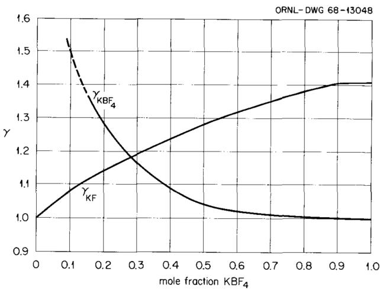  
Fig. 12.6. Activity Coefficient of KBF $_4$ and KF at $1100^{\circ}$ K.

The basic method was to determine the top surface of a column of melt. The nickel vessel containing the salt was a cylindrical cup at its lower section and a conical top welded to a relatively long chimney as its upper section (see Fig. 12.7). The purpose of the conical top was to permit easy escape of gas bubbles from the melt. The vessel was loaded with enough salt so that the melt filled the lower portion of the chimney. The probe, a sharp-pointed nickel rod, entered the chimney through a Teflon bushing tightened to the top of the chimney. At each fixed temperature the probe was caused to contact the liquid surface several times, each point of contact "seen" by the deflection of a pointer of a vacuum-tube volt-ohmmeter. From machined lines on the probe (above the chimney) the vertical displacement of the probe was determined to $0.1\mathrm{mm}$ by means of a cathetometer. The volume

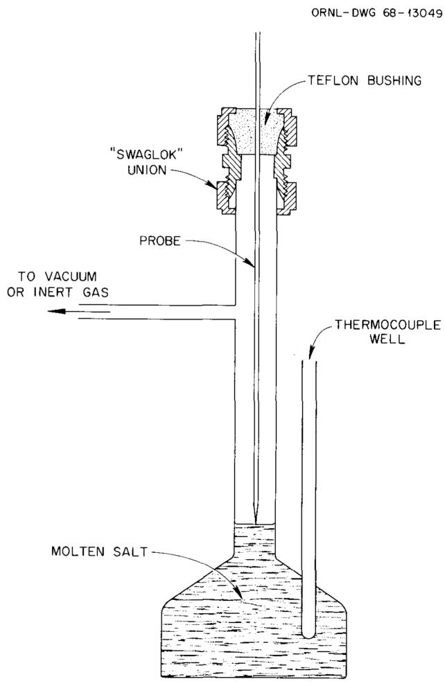  
Fig. 12.7. Vessel and Probe Used to Measure Densities of Molten Fluoroborates.

of the vessel had been calibrated with water at room temperature at several liquid levels. Recalibrations were performed after the measurements to be sure that the vessel had restored itself to its initial volume.

The viscosity of single-component $\mathrm{NaBF}_4$ has been measured at Mound Laboratory by L. J. Wittenberg and co-workers using oscillating-cup methods.[28] The measurements are still being analyzed; however, two reliable values appear to be 1.45 centipoises at $420^{\circ}\mathrm{C}$ and 1.04 centipoises at $500^{\circ}\mathrm{C}$ . Assuming that these two values define the correct linear log $\eta - T^{-1}$ relationship, then the viscosity of $\mathrm{NaBF}_4$ may be expressed as

$$
\eta (\text {c e n t i p o i s e}) = 0. 0 6 2 3 \exp [ 2 1 8 0 / T (^ {\circ} K) ].
$$

The viscosities of $\mathrm{NaBF}_4$ correlate reasonably well with viscosities of other sodium salts containing monovalent anions, as shown in Table 12.1. The corresponding temperature, $\theta$ , is defined as the measured temperature divided by the melting temperature, both in $^\circ \mathrm{K}$ . Viscosities and melting temperatures for the salt other than $\mathrm{NaBF}_4$ were obtained from the compilations of Janz et al.[29] For $\mathrm{NaBF}_4$ the melting temperature of $680^{\circ} \mathrm{K}$ was used.

Table 12.1. Viscosity at Corresponding Temperature, $\theta$   

<table><tr><td rowspan="2">Salt</td><td colspan="2">Viscosity (centipoise) at -</td></tr><tr><td>θ = 1.019</td><td>θ = 1.137</td></tr><tr><td>NaBF4</td><td>1.45</td><td>1.04</td></tr><tr><td>NaI</td><td>1.82</td><td>1.23</td></tr><tr><td>NaBr</td><td>1.37</td><td>1.02</td></tr><tr><td>NaCl</td><td>1.45</td><td>0.83</td></tr><tr><td>NaNO3</td><td>2.84</td><td>2.02</td></tr><tr><td>NaCNS</td><td>2.50</td><td>1.67</td></tr></table>

# 12.2.6 Corrosion of Chromium by Molten Fluoroborates

Stanley Cantor

In a series of tests30 which sought to determine if the proposed MSRE substitute coolant, $\mathbf{NaBF}_{4}$ NaF (92-8 mole %), reacted with Hastelloy N or any of its major constituents, it was found that chromium was the only metal to exhibit a significant degree of corrosion. In this test, shiny chromium chips were immersed in the melt for 837 hr at $600^{\circ}\mathrm{C}$

in a nickel vessel which was open only to a pressure measuring device. In the course of the test (at $600^{\circ}\mathrm{C}$ ) the vapor pressure of $\mathbf{BF}_3$ rose from an initial 170 torrs to a final pressure of 280 torrs. Postexposure examination revealed two reaction products: (1) gray material, adhering strongly to the surface of the chromium chips, and (2) green crystalline $\mathbf{Na}_3\mathbf{CrF}_6$ mixed with the unreacted fluoroborate salt.

The oxidation of chromium to the trivalent state, in $\mathrm{Na}_3\mathrm{CrF}_6$ , required that a chemical species in contact with the chromium metal be reduced; the most likely species was boron; that is, some of the trivalent boron in $\mathrm{NaBF}_4$ was reduced to elemental boron or to a boride. Spectroscopic analysis of some of the gray surface material showed 2 to 5 wt% boron. On the basis of the above evidence, the corrosion of chromium may be described by the following reactions:

$$
\begin{array}{l} [ 1 + x ] \mathrm {C r} (\text {m e t a l}) + \mathrm {N a B F} _ {4} (l) = \mathrm {N a F} (l) \\ + \operatorname {C r F} _ {3} (I) + \operatorname {C r} _ {x} \mathrm {B} (s), \\ \end{array}
$$

$$
3 \mathrm {N a F} (l) + \mathrm {C r F} _ {3} (l) = \mathrm {N a} _ {3} \mathrm {C r F} _ {6} (\mathrm {s});
$$

$\mathrm{Cr}_x\mathrm{B}$ represents the gray material and is a compound or mixture of undetermined stoichiometry. (X-ray diffraction analysis failed to identify the gray material in terms of known chromium-boron compounds.) The second reaction not only described the observed formation of $\mathrm{Na}_{3}\mathrm{CrF}_{6}$ but also indicated a decreased thermodynamic activity of NaF in the melt which resulted in an increased vapor pressure of $\mathrm{BF}_{3}$ .

The chromium metal was also examined metallographically. The photomicrographs showed that the corrosion was confined to a rather shallow depth, approximately 10 mils. Further, the uncorroded metal did not exhibit voids; that is, vacancies which formed in the corrosion layers did not serve as a sink for chromium atoms diffusing from the unreacted portions of the lattice. Thus the metallographic examination suggests that in chromium metal the corrosion product (represented as $\mathbf{Cr}_x\mathbf{B}$ ) acts as an impediment to further reaction by fluoroborate.

# 12.3 PHYSICAL PROPERTIES OF LiF-ThF4 AND LiF-BeF2-ThF4 MIXTURES

# 12.3.1 CeF3 Solubility in Molten Mixtures of LiF, BeF2, and ThF4

L. O. Gilpatrick C. J. Barton Judy A. Fredricksen

It has been demonstrated that the solubility of $\mathbf{CeF}_3$ in some molten fluoride salt mixtures is very similar to that of $\mathbf{PuF}_3$ .31 Currently proposed molten-salt systems for single-region reactors contain several mole percent $\mathbf{ThF}_4$ , a component not previously examined in detail for its effect on $\mathbf{PuF}_3$ or $\mathbf{CeF}_3$ solubility. If a molten-salt reactor is to be fueled using plutonium as the fissile agent, it will be necessary to determine the limits of solubility of $\mathbf{PuF}_3$ in the fluid medium under consideration.32 The choice of cerium in place of plutonium greatly speeded the present work and reduced the hazards.

To examine this problem, cerous fluoride containing $^{144}\mathrm{Ce}$ (285-day) tracer was used to determine the solubility of $\mathrm{CeF}_3$ in a variety of molten fluoride salt mixtures. This material was prepared from cerous chloride solution to which $10\mathrm{mc}$ of $^{144}\mathrm{Ce}$ was added as the chloride. Ammonium bifluoride was added to precipitate $\mathrm{CeF}_3$ , which was washed, centrifuged, and dried.

An excess of the labeled $\mathrm{CeF}_3$ was added to about $200\mathrm{g}$ of experimental salt, and the mixture was then melted and purified to remove oxides by passing through it HF, He, and $\mathbf{H}_{2}$ . The equilibrated clean solution was sampled at temperature using a copper frit filter stick technique. Recovered specimens were then analyzed both by counting and by wet chemical analysis for their cerium content. From this information the molar composition was calculated and plotted as the log of concentration vs the reciprocal of the temperature. A comparison of the two methods of analysis plotted in this manner is shown in Fig. 12.8. There appears to be very good agreement between the results obtained by the two methods of analysis.

Six fuel compositions containing substantial amounts of $\mathbf{ThF}_4$ were examined over a $200^{\circ}\mathbf{C}$ tem

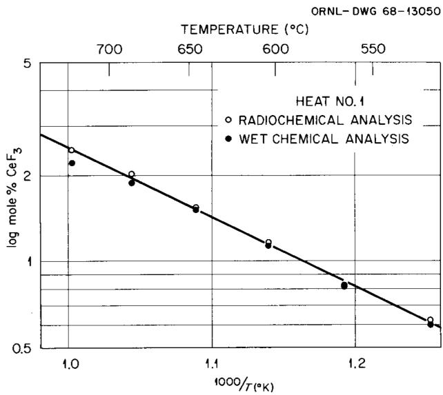  
Fig. 12.8. Solubility of $\mathsf{CeF}_3$ in LiF-BeF $_2$ -ThF $_4$ Melt (72-16-12 mole%).

perature range, in each case starting $50^{\circ}$ above the melting point. The range of temperatures examined was from 525 to $800^{\circ}\mathrm{C}$ . The solubility of $\mathrm{CeF}_3$ increases regularly with increasing temperature for all the cases examined. Results are listed in Table 12.2 along with the heats of solution calculated from the relation

$$
\log \frac {S _ {2}}{S _ {1}} = \frac {\Delta H \left(T _ {2} - T _ {1}\right)}{2 . 3 0 R T _ {1} T _ {2}},
$$

where $S =$ molar solubility, $T =$ temperature, $\Delta H =$ heat of solution, and $R =$ gas constant in cal/mole.

Table 12.2. Solubility and Heat of Solution of ${\mathrm{{CeF}}}_{3}$ in Mixtures of LiF,BeF ${}_{2}$ ,and ThF ${}_{4}$   

<table><tr><td colspan="3">Salt Composition (mole %)</td><td colspan="2">CeF3Solubility (mole %)</td><td rowspan="2">Heat of Solution (cal/mole)</td></tr><tr><td>LiF</td><td>BeF2</td><td>ThF4</td><td>600°C</td><td>800°C</td></tr><tr><td>72</td><td>16</td><td>12</td><td>1.6</td><td>5.5</td><td>11,500</td></tr><tr><td>73</td><td>0</td><td>27</td><td>2.6</td><td>9.0</td><td>11,560</td></tr><tr><td>72.7</td><td>4.8</td><td>22.5</td><td>2.4</td><td>7.9</td><td>11,100</td></tr><tr><td>68</td><td>20</td><td>12</td><td>1.35</td><td>6.0</td><td>13,890</td></tr><tr><td>72.3</td><td>11.0</td><td>16.7</td><td>2.1</td><td>6.3</td><td>10,230</td></tr><tr><td>67.8</td><td>25.2</td><td>7.0</td><td>1.05</td><td>5.0</td><td>14,530</td></tr></table>

These data show that the probable solubility of $\mathbf{PuF}_3$ in these compositions will be adequate to fuel a molten-salt reactor based on $\mathbf{PuF}_3$ as the fissile agent.

# 12.3.2 Solubility of Thorium Metal in Molten Lithium Fluoride-Thorium Fluoride Mixtures

H. R. Bronstein

M. A. Bredig

We have previously reported that we observed the solubility of thorium metal in molten LiF-ThF $_4$ (73-27 mole %) at $620^{\circ}\mathrm{C}$ to be approximately 2.0 mole $\%,^{33}$ with no visible sign of alloying of the nickel of the container by the thorium through the medium of the melt. $^{34}$ This result was contrary to the findings by Barton and Stone $^{35}$ of extensive alloying. A possible explanation of the discrepancy was the absence of gas-stirring in our experiments. Repeating the experiment with continuous argon gas-stirring, we have now corroborated the findings of Barton and Stone. In the products of the extensive attack by the dissolved thorium on the nickel container, two nickel-rich phases of the five known intermetallic nickel-thorium compounds have been positively identified: namely, $\mathrm{ThNi}_2$ as the major and $\mathrm{ThNi}_5$ as a minor constituent, with some x-ray reflections still remaining to be identified. The great importance of the stirring reflects the low solubility of the thorium metal in the salt melt. We hope that with improvement in analytical technique the solubility of thorium may be more accurately determined. At present the value may be stated to be between 0.3 and 1.0 mole % at $620^{\circ}\mathrm{C}$ .

The particular form in which thorium metal dissolved in the fluoride melt is yet to be determined. A mechanism has been proposed35 whereby alloying with the nickel of the container takes place by disproportionation of a soluble subvalent thorium species formed by reaction of thorium metal with $\mathrm{Th}^{4+}$ ion in the melt. However, while thorium species of lower valency have been reported for chloride and iodide melts, the presence of sub-

valent species in fluoride media is as yet unsupported. $^{36}$

In the present case a reaction involving color-center-like electrons (from $\mathrm{Th}^0 + 4\mathrm{Li}^+ \rightarrow \mathrm{Th}^{4+} + 4\mathrm{Li}^0$ , and $4\mathrm{Li}^0 \rightarrow 4\mathrm{Li}^+ + 4\mathrm{e}^-$ ) according to

$$
\mathrm {T h} ^ {4 ^ {+}} + 4 \mathrm {e} ^ {-} + 2 \mathrm {N i} \longrightarrow \mathrm {T h N i} _ {2}
$$

seems possible. According to general experience with metal solubility in the form of subvalent ions, color-center-like electrons seem a preferred alternative in a medium in which the normal, higher valence state IV of thorium is stabilized against reduction by complexing with the excess of fluoride ions from LiF.

In connection with our present work, evidence for trivalent thorium in an alleged solid "ThOF" reported recently37 was carefully examined and found to be without merit.38 The most serious objection is based upon the x-ray data giving a lattice constant of 5.68 A for a face-centered cubic fluorite type of structure, only 0.10 A larger than 5.58 A for $\mathrm{ThO}_2$ . From a comparison of various lanthanide and actinide oxyfluorides, MOF, with their dioxides, MO2, it is certain that a true oxyfluoride of Th(III), ThOF, if it existed, would have a lattice constant of at least 5.90 A, or 0.30 A larger than $\mathrm{ThO}_2$ . Actually, the lattice constant 5.68 A observed by the French authors is most likely that of the saturated solution of $\mathrm{ThF}_4$ in $\mathrm{ThO}_2$ , approximately $\mathrm{ThO}_{1.5}\mathrm{F}$ , for which $a_0 = 5.66$ had been reported.39 Therefore it must have been the reaction

$$
\begin{array}{l} 2 \mathrm {T h O} _ {2} + \mathrm {T h F} _ {4} (+ \mathrm {T h}) \longrightarrow 2 \mathrm {T h O} _ {1. 5} \mathrm {F} \\ + \operatorname {T h O F} _ {2} (+ \operatorname {T h} \text {u n r e a c t e d}), \\ \end{array}
$$

involving only Th(IV) that was observed by the French authors.

Incidentally, a reaction of nickel through the medium of a salt melt with a metal other than thorium, namely, beryllium, has recently been reported by Russian workers.[40]

# 12.3.3 Heat Content of LiF-BeF $_2$ -ThF $_4$ (72-16-12 mole %)

A. S. Dworkin

The following equations represent our measured heat content data for $\mathrm{LiF - BeF}_2\text{-ThF}_4$ (72-16-12 mole $\%$ ) in cal/g:

# Solid

$$
\begin{array}{l} H _ {t} - H _ {2 5} = - 5. 2 8 + 2. 0 7 \times 1 0 ^ {- 1} t \\ + 6.33 \times 10 ^ {- 5} t ^ {2} (25 - 445 ^ {\circ} \mathrm {C}) \pm 0.5 \% ; \\ \end{array}
$$

# Liquid

$$
\begin{array}{l} H _ {t} - H _ {2 5} = 1 1. 3 4 + 3. 2 3 7 \\ \times 10 ^ {- 1} t (500 - 750 ^ {\circ} \mathrm {C}) \pm 0.1 \%. \\ \end{array}
$$

The specific heat of the liquid is then the derivative of the last equation, or $0.324\mathrm{cal}\mathrm{g}^{-1}(\mathrm{^{\circ}C})^{-1}$ with an estimated error of $\pm 2\%$ . There is no isothermal heat of fusion for the mixture. According to the phase diagram, initial melting begins at about $445^{\circ}\mathrm{C}$ , and continues as temperature is increased to $500^{\circ}\mathrm{C}$ , at which point it is completely liquid. No experimental points were obtained in the temperature interval 445 to $500^{\circ}\mathrm{C}$ . However, if the heat content of the solid is extrapolated to $500^{\circ}\mathrm{C}$ , a heat of fusion of 59 cal/g can be calculated by treating the data as if all the melting occurred at this liquidus temperature.

The specific heats and heats of fusion (as defined above) of various fuel salt mixtures have been estimated.41 The validity of our methods of estimation has been confirmed by comparison with our measurements as well as those for a number of other mixtures containing fluorides of lithium, beryllium, and thorium.

# 12.3.4 Technical Memorandum on Physical Properties of Molten Salts

Stanley Cantor

G. D. Robbins

J. W. Cooke

R. E. Thoma

A. S. Dworkin

G.M.Watson

Physical Properties of Molten-Salt Reactor Fuel, Coolant, and Flush Salts, ORNL-TM-2316, has been written and distributed. In this memorandum, seven molten salt mixtures were considered:

<table><tr><td></td><td colspan="4">Component Concentration (mole %)</td></tr><tr><td></td><td>LiF</td><td>BeF2</td><td>ThF4</td><td>UF4</td></tr><tr><td>Four possible MSBR</td><td>73</td><td>16</td><td>10.7</td><td>0.3</td></tr><tr><td rowspan="3">single-region fuel mixtures</td><td>72</td><td>21</td><td>6.7</td><td>0.3</td></tr><tr><td>68</td><td>20</td><td>11.7</td><td>0.3</td></tr><tr><td>63</td><td>25</td><td>11.7</td><td>0.3</td></tr><tr><td>Flush salt (present MSRE coolant)</td><td>66</td><td>34</td><td></td><td></td></tr><tr><td></td><td>NaBF4</td><td>NaF</td><td></td><td></td></tr><tr><td>Coolant</td><td>92</td><td>8</td><td></td><td></td></tr><tr><td>Salts</td><td>100</td><td></td><td></td><td></td></tr></table>

For these mixtures, estimates and/or experimental values are given for the following properties: viscosity; thermal conductivity; electrical conductivity; phase transition behavior; isobaric heat capacity $(C_p)$ ; heat of fusion; density; expansivity; compressibility; vapor pressure; surface tension; and solubility of the gases He, Kr, Xe, $\mathrm{BF}_3$ . Listed with the tables containing the physical properties are estimated uncertainties, sources of data and methods of estimations, and, in some cases, further discussion.

From some of the foregoing properties the following were also calculated and appended: isochoric heat capacity $(C_{V})$ , sonic velocity, thermal diffusivity, kinematic viscosity, Prandtl number.

# 12.4 ELECTROCHEMICAL STUDIES

# 12.4.1 Electrical Conductivity of Molten LiF-BeF $_2$ Mixtures

G. D. Robbins J. Braunstein

The characteristics of electrical conductivity vs temperature of molten $\mathrm{LiF - BeF}_2$ mixtures $^{42}$ ranging in composition from 38 to 52 mole% $\mathrm{BeF}_2$ have been determined in the redesigned silica cell shown in Fig. 12.9. The relatively long conducting path (12 cm) resulted in a cell constant of 145.9 cm $^{-1}$ , as determined in 0.1 demal KCl, a solution for which the specific conductance has been well

ORNL-DWG 68-7818

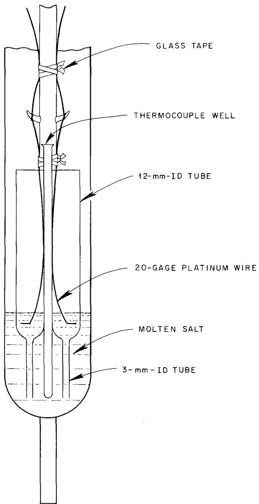  
Fig. 12.9. Silica Conductance Cell.

established as a standard. $^{43,44}$ (One demal is approximately 1 g-equivalent/dm $^{3}$ .)

Use of platinized platinum electrodes and this particular cell design resulted in measured resistances independent of measuring frequency and depth of immersion $(< \pm 0.2\%)$ , frequency range 0.5 to 5 kilohertz, depth 3 to $7\mathrm{mm}$ in the KCl solution. The large resistance of the aqueous solution permitted use of a Jones bridge in the cell constant

determination without introduction of errors discussed previously.45

For measurements of conductance in molten fluorides, the entire assembly shown in Fig. 12.9 was immersed in a stirred molten $\mathrm{KNO}_3$ bath. A specially constructed measuring bridge $^{46}$ containing a series-component balancing arm determined resistance as a function of frequency. With this experimental arrangement, the measured resistance was stable, independent of depth of cell immersion, and varied less than $0.5\%$ over the frequency range 1 to 10 kilohertz, the variation being approximately linear in $f^{1/2}$ . Values of measured resistance extrapolated to infinite frequency were less than $0.3\%$ lower than the 10-kilohertz values.

The molten fluoride was contained in a closed silica cell (pressure $= 1$ atm) in which the low equilibrium partial pressure of $\mathrm{SiF}_4 (< 1\mathrm{mm}$ at $500^{\circ}\mathrm{C})^{47}$ prevented major attack of the silica via the reaction

$$
2 \mathrm {B e F} _ {2} + \underline {{\mathrm {S i O}}} _ {2} \longrightarrow \underline {{2 \mathrm {B e O}}} + \mathrm {S i F} _ {4} \uparrow .
$$

The slow, solid-solid reaction

$$
\underline {{\mathrm {S i O} _ {2}}} + \underline {{2 \mathrm {B e O}}} \longrightarrow \underline {{\mathrm {B e} _ {2} \mathrm {S i O} _ {4}}}
$$

and the low solubility of $\mathrm{BeO}$ and $\mathrm{Be}_2\mathrm{SiO}_4$ ( $< 0.01$ mole/kg at $500^{\circ}\mathrm{C}$ ) should not affect the conductance measurements.

Data for specific conductance $\kappa$ vs temperature are listed in Table 12.3 and illustrated in Fig. 12.10. Plots of $\ln \kappa$ vs $1 / T$ , shown in Fig. 12.11, exhibit curvature, indicating temperature dependence of the conventional Arrhenius energy of activation for specific conductance, $E_{\kappa}$ $[E_{\kappa} = -R\times d\ln \kappa /d(1 / T)]$ .

Table 12.3. Specific Conductance vs Temperature for LiF-BeF $_2$ Mixtures   

<table><tr><td>Mole % BeF2</td><td>t (°C)</td><td>κ (ohm-1cm-1)</td></tr><tr><td rowspan="4">38</td><td>465.5</td><td>1.100</td></tr><tr><td>486.1</td><td>1.226</td></tr><tr><td>502.7</td><td>1.322</td></tr><tr><td>533.2</td><td>1.504</td></tr><tr><td rowspan="4">48</td><td>455.3</td><td>0.844</td></tr><tr><td>476.5</td><td>0.962</td></tr><tr><td>501.4</td><td>1.097</td></tr><tr><td>528.6</td><td>1.241</td></tr><tr><td rowspan="5">47</td><td>425.2</td><td>0.500</td></tr><tr><td>446.2</td><td>0.587</td></tr><tr><td>475.4</td><td>0.719</td></tr><tr><td>499.7</td><td>0.830</td></tr><tr><td>525.9</td><td>0.954</td></tr><tr><td rowspan="8">52</td><td>398.7</td><td>0.271</td></tr><tr><td>418.4</td><td>0.329</td></tr><tr><td>434.3</td><td>0.379</td></tr><tr><td>449.5</td><td>0.427</td></tr><tr><td>473.2</td><td>0.510</td></tr><tr><td>498.6</td><td>0.602</td></tr><tr><td>513.6</td><td>0.661</td></tr><tr><td>528.5</td><td>0.715</td></tr></table>

The variation of activation energy for conductance at low temperatures has been interpreted by Angell $^{50,51}$ in terms of a model based on a theoretical glass transition temperature, which incorporates a non-Arrhenius form for the temperature dependence of transport properties. While there is as yet no completely satisfactory theoretical justification for the proposed equations, they have led to striking correlations in a number of systems. Since the eutectic composition of 52 mole $\%$ BeF $_2$ presents the largest temperature range, we have estimated the glass transition temperature for this composition. The temperature dependence of the corrected energy of activation is, according to the model,

$$
E _ {\text {c o r r}} = E _ {K} + \frac {1}{2} R T + \alpha R T ^ {2} = k R \left(\frac {T}{T - T _ {0}}\right) ^ {2},
$$

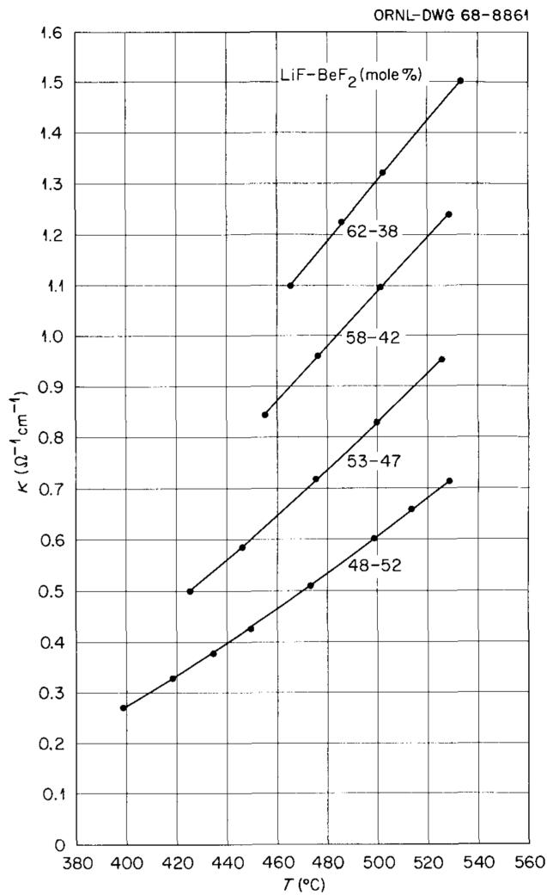  
Fig. 12.10. Specific Conductance of $\mathsf{LiF - BeF}_2$ Mixtures vs Temperature.

where $E_{\mathrm{corr}}$ can be calculated, as indicated, from the conventional Arrhenius energy of activation for specific conductance, $E_{K}$ , and the expansivity, $\alpha$ , of the melt. A plot of $E_{\mathrm{corr}}$ vs $[T / (T - T_0)]^2$ should be linear with slope $kR$ and pass through the origin; $T_0$ is the zero mobility temperature (in ${}^{\circ}\mathrm{K}$ ), and $k$ is a constant related to the potential energy of minimum-sized cooperatively rearranging groups. Figure 12.12 shows such a series of plots for different values of $T_0$ . (Values of $\alpha$ were obtained from density data in fused fluoride melts.)

These plots result in a fit of the data corresponding to $T_0 = 325 \pm 25^\circ \mathrm{K}$ . The value of $k$ thus de

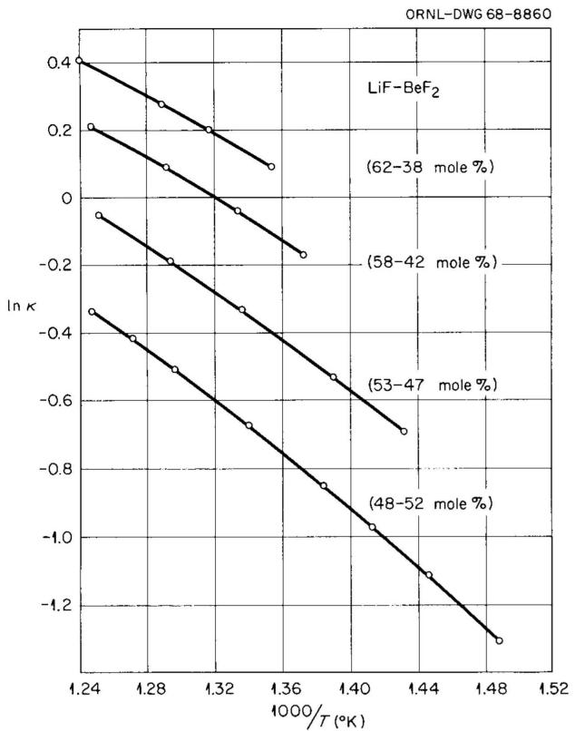  
Fig. 12.11. In $K$ vs $1 / T$ for LiF-BeF $_2$ Mixtures.

terminated is $1400 \pm 150^{\circ}\mathrm{K}$ . The reduced temperature range of the measurements based on this value of $T_{0}$ is $2.1 \leq T / T_{0} \leq 2.5$ , which is slightly above the range of reduced temperatures for which $\mathrm{Angell}^{49}$ found $k$ to be constant in the molten $\mathrm{Ca(NO_3)}_2$ - $\mathrm{KNO}_3$ system ( $T \leq 1.7T_{0}$ ). Angell estimated an increase in $k$ over the low-temperature value (obtained below $1.7T_{0}$ ) of about $10\%$ at $2T_{0}$ and about $40\%$ at $3T_{0}$ . If a similar variation occurs in the fused fluoride system, a $k$ of 1400 would be approximately $20\%$ too large, indicating its correct value to be approximately 1170.

Since the assumptions of the model become more nearly valid at temperatures near $T_{0}$ , one might expect the data in the lower half of the temperature range to provide a better estimate of $T_{0}$ . It can be seen from Fig. 12.12 that the results of the three lowest temperatures [the three largest values of $(T / T - T_{0})^{2}]$ indicate a $T_{0}$ of $350 \pm 25^{\circ}\mathrm{K}$ and a corresponding value of $k = 1200 \pm 150^{\circ}\mathrm{K}$ . (The range of values of $T / T_{0}$ would then be 1.9 to 2.1.) These estimates appear to be consistent with re

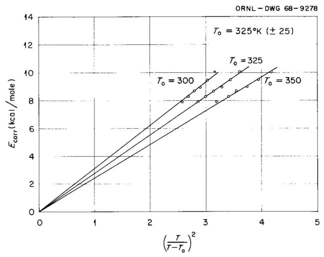  
Fig. 12.12. $E_{\text{corr}}$ vs $(T / T - T_0)^2$ for LiF-BeF $_2$ (48-52 mole %).

sults in other systems, for example, $T_{0}$ 's of 200 to $330^{\circ}\mathrm{K}$ for the nitrates. $^{51}$ Values of $k$ for the nitrates, $^{50}$ carbonates (estimated), $^{51}$ and a sodium silicate melt (viscosity) $^{51,53}$ are of the order of 700, 1400, and $5100^{\circ}\mathrm{K}$ respectively.

Experiments are in progress which encompass a composition range of 34 to 70 mole $\%$ BeF. These additional data should permit an interpretation of the composition dependence of the conductivities.

# 12.4.2 Estimated Electrical Conductivities of MSBR-Related Salts

G. D. Robbins

In conjunction with a report41 on physical properties of molten salts of interest to the Molten-Salt Reactor Program, the electrical conductivities of six fused fluorides have been estimated as functions of temperature. The results are listed in Table 12.4.

Data on analogous or related molten-salt systems provided a basis for the estimates. Often the assumptions were not those which seemed chemically most reasonable, but those which resulted in the best correlation of the available data for the analog systems. Therefore, estimated values of specific conductance, $\kappa$ , are believed to have relatively

Table 12.4. Estimated Electrical Conductivities vs Temperature   

<table><tr><td colspan="4">Salt Composition</td><td>Equation</td><td rowspan="2">Uncertainty (%)</td></tr><tr><td>LiF</td><td>BeF2</td><td>ThF4</td><td>UF4</td><td>κ (ohm-1cm-1), t (°C)</td></tr><tr><td>73</td><td>16</td><td>10.7</td><td>0.3</td><td>κ = 1.72 + 8.0 × 10-3(t - 500)</td><td>±20</td></tr><tr><td>72</td><td>21</td><td>6.7</td><td>0.3</td><td>κ = 1.63 + 7.3 × 10-3(t - 500)</td><td>±20</td></tr><tr><td>68</td><td>20</td><td>11.7</td><td>0.3</td><td>κ = 1.66 + 6.4 × 10-3(t - 500)</td><td>±20</td></tr><tr><td>63</td><td>25</td><td>11.7</td><td>0.3</td><td>κ = 1.94 + 7.1 × 10-3(t - 500)</td><td>±20</td></tr><tr><td colspan="4">NaBF4-NaF (92-8 mole %)</td><td>κ = 2.7 + 13 × 10-3(t - 500)</td><td>±50</td></tr><tr><td colspan="4">NaBF4</td><td>κ = 1.92 + 2.6 × 10-3(t - 500)</td><td>±20</td></tr></table>

large uncertainties. The number of significant figures in the equations of $\kappa$ vs $t$ are not meant to contradict the listed uncertainties, but rather are intended to show differences between salt mixtures whose conductivities are predicted to be very similar.

Specific conductivity is determined from resistance measurements according to the relation

$$
K = \frac {1}{R _ {\infty}} (l / a),
$$

where $(1 / a)$ is the cell constant. As has been pointed out previously, for a given apparatus and set of experimental conditions the measured value of resistance can vary with the frequency of the applied potential wave form. The values of $\kappa$ listed in the table are valid for resistance extrapolated to infinite frequency (denoted as $R_{\infty}$ ). Thus, predicting the resistance of a melt which will be measured in a particular experimental arrangement not only requires a value for conductivity $\kappa$ , but also presupposes a knowledge of the frequency dispersion characteristics of the measuring device.

# 12.4.3 Reference Electrodes for Molten Fluorides

B. F. Hitch

C. F. Baes, Jr.

As reported previously, $^{55,56}$ the $\mathrm{Be}^{2+}|\mathrm{Be}$ and the $\mathrm{HF},\mathrm{H}_2|\mathrm{F}^-$ electrodes are stable reference electrodes for use in LiF-BeF mixtures. However, both electrodes have disadvantages. Because of the strong reducing power of the $\mathrm{Be}^{2+}|\mathrm{Be}$ electrode, it is easily poisoned by impurities or solutes which are reduced and deposited as metals on the elec

trode surface. Hence it is necessary to maintain the melt in the vicinity of this electrode quite free of such reducible substances. This electrode can also develop dendritic crystals of beryllium metal on its surface as a result of mass transfer, and these can short the electrode to the cell wall if adequate clearance has not been provided. The $\mathrm{HF},\mathrm{H}_2|\mathrm{F}^-$ electrode is somewhat inconvenient to use, because it requires an $\mathrm{HF - H_2}$ gas mixture of known composition. A more serious disadvantage of this electrode is that hydrogen is a reactive, rapidly diffusing gas which is hard to confine to the vicinity of the electrode.

In continuing our efforts to develop reference electrodes for use in molten fluorides, we are investigating the cell

$$
\mathrm {B e} ^ {0} | \mathrm {L i F - B e F} _ {2} (6 6 - 3 4) | \mathrm {N i O} (\mathrm {c}), \mathrm {B e O} (\mathrm {c}) | \mathrm {N i} ^ {0}.
$$

If the melt in contact with the nickel electrode is saturated with both NiO and BeO, then the dissolved oxide concentration is fixed by the solubility equilibrium of BeO,

$$
\mathrm {B e O} (\mathrm {c}) \rightleftharpoons \mathrm {B e} ^ {2 +} + \mathrm {O} ^ {2 -}
$$

(e.g., $[O^{2-}] \stackrel{\sim}{=} 0.01 \text{ mole/kg at } 600^{\circ} \text{C}$ ), and hence the nickel ion concentration is fixed by the solubility equilibrium of NiO,

$$
\mathrm {N i O} (c) \rightleftharpoons \mathrm {N i} ^ {2 ^ {+}} + \mathrm {O} ^ {2 -}
$$

$([\mathrm{Ni}^{2+}] \sim 0.001 \, \mathrm{mole/kg}$ at $600^{\circ}\mathrm{C})$ . This should establish an $\mathrm{Ni}^{2+}|_{\mathrm{Ni}}$ electrode which depends only on the temperature and the composition of the LiF-BeF $_2$ salt mixtures used. The low concentration of $\mathrm{Ni}^{2+}$ produced by this oxide mixture renders this electrode - an electrode of the third kind - considerably less oxidizing than a saturated $\mathrm{NiF}_2|_{\mathrm{Ni}}$ electrode. This makes it possible to use copper compartments for the electrode.

The assumed cell reaction is

$$
\mathrm {B e} ^ {0} + \mathrm {N i O} (c) \rightleftharpoons \mathrm {B e O} (c) + \mathrm {N i} ^ {0}.
$$

Since all the reactants and products are of fixed activity, the measured cell potential should be the standard potential $E^0$ , which is a function only of temperature. X-ray analysis has confirmed that NiO, BeO, and LiF-BeF $_2$ (66-34) are indeed the only constituents in the $\mathrm{Ni}^{2+}$ Ni electrode compartment.

The reaction vessel used for our experiments was constructed of $2\frac{1}{2}$ -in. nickel pipe separated into two compartments by a $\frac{1}{16}$ -in. nickel sheet welded down through the center. Melt contact between the two compartments was provided by a $\frac{1}{2}$ -in.-diam sintered nickel (0.0015-in. porosity) frit. Each compartment of the reaction vessel was fitted with an entry port for an electrode, a gas sparging line, and a thermocouple well. The $\mathrm{Ni}^{2+}|\mathrm{Ni}$ electrode was further compartmented to contain the oxides and the dissolved $\mathrm{NiF}_2$ . The beryllium electrode was used without any compartmentation.

Our early potentiometric measurements of the above cell were made using an $\mathrm{Ni}^{2+}$ Ni compartment constructed of copper tubing with a copper frit (25- to $40 - \mu$ porosity) welded on the lower end. Excess BeO and NiO were added to the nickel electrode compartment. The LiF-BeF $_2$ solution was then forced by a small gas pressure into the compartment through the copper frit. A nickel tube served as the nickel electrode and also permitted gas sparging.

Cell potentials were erratic, but on various occasions we were able to achieve stable potentials for as long as 24 hr. The major difficulty encountered was that the cell potential would reach a maximum value, then would begin drifting toward a low value. Two possible causes of this behavior

are: (1) the nickel electrode was polarized by intermittent shorting to the copper compartment causing reduction of $\mathrm{Ni}^{2+}$ on the copper to form a Cu-Ni alloy, or (2) $\mathrm{Ni}^{2+}$ diffused through the copper frit at too rapid a rate. To check the first possibility, a compartment was constructed of nickel tubing sheathed in copper containing both nickel and copper frits. Cell potentials obtained using this compartment were somewhat more consistent, but potential drifts toward a low value were still encountered. To deal with the second possible difficulty we have recently had a much denser (6- to $14-\mu$ porosity) copper frit material fabricated by the Gaseous Diffusion Development Division at K-25 and are having compartments fabricated using this material. It is hoped that these less-porous frits will reduce or eliminate any appreciable diffusion of nickel ion out of the compartment. Measurements will begin shortly, using these new compartments.

Results obtained thus far indicate that the value for the standard cell potential $(E^0)$ as a function of temperature $(^\circ \mathrm{C})$ is

$$
E ^ {0} = 1. 9 0 3 - 0. 0 0 0 1 t \mathrm {v}.
$$

The uncertainty is estimated to be approximately $\pm 15\mathrm{mv}$ . The above value for $E^0$ compares well with an $E^0$ calculated from the formation free energies for $\mathrm{BeO}^{58}$ and NiO.

The $\mathrm{Ni}^{2+}$ Ni electrode described above shows promise for use as a reference electrode in molten fluorides. If, indeed, we are able to establish its reliability, we plan to use it as the reference electrode to measure the redox potential of the $\mathrm{U}^{4+}$ $\mathrm{U}^{3+}$ couple and, hopefully, to develop an $\mathrm{Ni}^{2+}$ Ni electrode assembly which could be used as an analytical tool for reactor application.

# 12.5 SPECTROSCOPY OF FLUORIDE MEDIA

L. M. Toth

J.P. Young

G. P. Smith

# 12.5.1 The Diamond-Windowed Cell

Until now the windowless container has been used extensively for measuring absorption spectra

of ions in molten fluoride solvents. There is, however, a need for a container or cell with fixed transparent windows. Such a container would provide a fixed and easily determined path length, the facility to bubble the melt with reactive gases, and better containment of volatile species. The problems encountered with such a cell have been to find windows which were optically transparent in the spectral range 200 to $2500\mathrm{m}\mu$ and which would resist the extremely corrosive action of molten fluorides. Also, it must be convenient to use, so that the long-term applications of it to fluoride problems would be practical.

Diamond best satisfies the window material requirements. The cell which fits the design requirements is shown in Fig. 12.13. Except for the diamond windows, the cell is made entirely of graphite. It consists of a cell body, two retainers for the dia

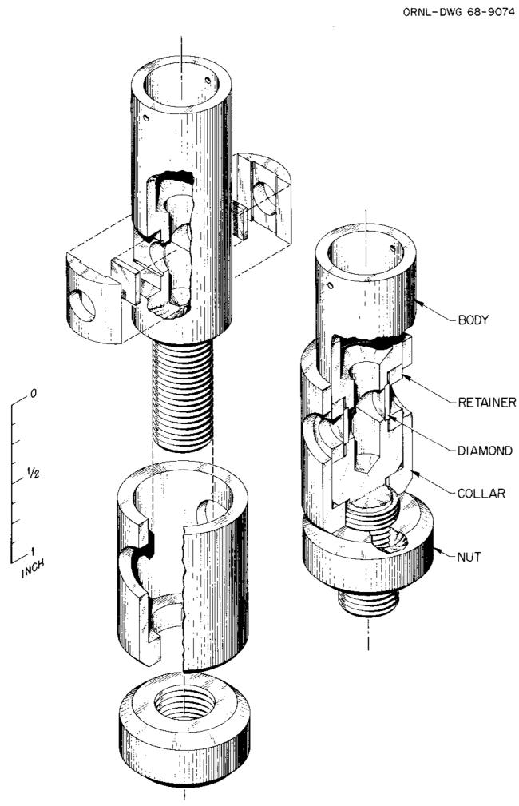  
Fig. 12.13. The Diamond-Windowed Cell.

monds, a sleeve which holds the retainers in place, and a nut to secure the sleeve. The optical path length between the diamonds is $1.0\mathrm{cm}$ . The diamond windows are approximately $5\times 5\times 1$ mm type IIa plates. Some variation in the diamond size from the above nominal value is unavoidable. Consequently, the cell design allows appreciable variations in the window dimensions. For example, one of the plates we are now using measures $5.0\times 4.3\times 1.3\mathrm{mm}$ .

Positioning of a window in the cell is achieved by means of a horizontal groove on the body which fixes the vertical position, and a vertical groove on the retainer which fixes the horizontal position. The depth of each groove is one-half the window thickness (nominally $1\mathrm{mm}$ ), while the width of each groove is, of course, the same as the width of the window, $5\mathrm{mm}$ . With this arrangement, the windows are not sealed gastight to the cell body but merely fit flush to the body with a force of a few grams exerted upon them. Fluid leakage around the windows does not occur, because most molten fluoride salts do not wet graphite. The advantages of this arrangement are simplicity of design, ease of assembly and disassembly, and no significant danger of window breakage due to loading stresses.

This cell was successfully used in a number of tests. A spectrophotometric base line for $\mathrm{LiF - }$ $\mathrm{BeF}_2$ (66-34 mole $\%$ ) and the spectra of $\mathrm{NiF}_2$ and $\mathrm{UF}_4$ in the LiF-BeF $_2$ solvent were recorded. Because of the reproducibility of the base line achieved with the diamond cell, a broad peak centered at $2.06\mu$ in the $\mathrm{UF}_4$ solution spectrum was identified for the first time in a molten fluoride system (cf. Fig. 12.14). This peak has been seen in noncorrosive systems before but has not been

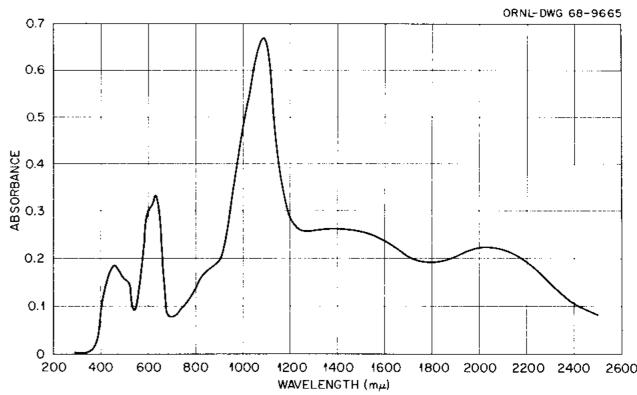  
Fig. 12.14. UF $_4$ Spectrum in LiF-BeF $_2$ (66-34 mole%).

reported in molten fluorides because of the previous uncertainty in the base line.

# 12.5.2 Molybdenum(III) Fluoride Solution Spectra

Spectral studies of dilute solutions of $\mathbf{MoF}_3$ in molten LiF-BeF $_2$ (66-34 mole %) (hereafter referred to as “ $\mathbf{L}_2\mathbf{B}''$ ) have continued $^{60}$ in order to demonstrate both the valence state and coordination of the molybdenum species. Peaks at 472 and $353\mathrm{m}\mu$ with molar absorptivities of about 8 and 12 liters $\mathrm{mol}^{-1}\mathrm{cm}^{-1}$ , respectively, have been observed. The positions of these two transitions are consistent with what is predicted from the spectrochemical series. $^{61}$ On this basis it is possible to say that $\mathbf{MoF}_3$ in $\mathbf{L}_2\mathbf{B}$ is present as $\mathbf{Mo}^{3+}$ ions which are octahedrally coordinated to fluoride ions to form $\mathbf{MoF}_6^{3-}$ .

For these studies the melts have been contained in windowless cells $^{62}$ made from graphite, platinum, molybdenum, or copper. The variety of container materials were used in an unsuccessful effort to maintain stable $\mathsf{MoF}_3$ solutions. Molybdenum was invariably lost from solution after 24 hr at $700^{\circ}\mathrm{C}$ due to an unexplained mechanism. Experience with the system has led us to believe that impurity reactions were involved.

# 12.5.3 $\mathsf{K}_3\mathsf{MoF}_6$ Synthesis and Spectrum

As an independent demonstration that the melt spectrum of $\mathbf{MoF}_3$ in $\mathbf{L}_2\mathbf{B}$ was due to octahedrally coordinated $\mathbf{Mo}^{3+}$ , that is, $\mathbf{MoF}_6^{3-}$ , a spectrum of $\mathbf{Mo}^{3+}$ in a known chemical environment was required. It was predicted $^{63}$ that $\mathbf{K}_3\mathbf{MoF}_6$ would probably exhibit a cubic structure in which the $\mathbf{Mo}^{3+}$ ion was coordinated to six fluoride ligands. However, a previously reported synthesis of $\mathbf{K}_3\mathbf{MoF}_6$ (ref. 64) was actually found to produce an oxyfluoride compound that does not possess the required octahedral environment for $\mathbf{Mo}^{3+}$ . Therefore,

$\mathrm{K}_{3}\mathrm{MoF}_{6}$ was prepared by mixing stoichiometric quantities of KF and $\mathrm{MoF}_{3}$ (ref. 65) and fusing in a sealed platinum tube at $880^{\circ}\mathrm{C}$ for half an hour. A low (about $5\%$ ) yield of the product was obtained in the form of small crystals which measured approximately $0.3\mathrm{mm}$ in diameter. These crystals were hand picked and washed with ethanol and/or acetone.

Density measurements of the $\mathbf{K}_{3}\mathbf{MoF}_{6}$ gave a value of $3.23\pm 0.03\mathrm{g / cc}$ at $25^{\circ}\mathbf{C}$ , which is consistent with the assumed stoichiometry and measured unit cell dimensions. The crystal structure, being completed at this writing by G. D. Brunton, confirms that the compound is $\mathbf{K}_{3}\mathbf{MoF}_{6}$ .

The diffuse reflectance spectrum of the crystals reveals peaks at 264, 344, and $430\mathrm{m}\mu$ . The latter two peaks are assigned to the same two transitions as the bands at 350 and $470\mathrm{m}\mu$ in the $\mathbf{L}_2\mathbf{B}$ solutions of $\mathrm{MoF}_3$ (mentioned in the previous section). The $264 - \mathrm{m}\mu$ peak in the crystal spectrum is assigned to the highest-energy spin-allowed transition of a $4d^{3}$ ion in octahedral symmetry. In the $\mathbf{L}_2\mathbf{B} - \mathbf{MoF}_3$ melt spectrum this band is hidden by the foot of an intense charge-transfer band.

With the crystal structure determination that the $\mathbf{Mo}^{3+}$ ion in $\mathbf{K}_{3}\mathbf{MoF}_{6}$ is surrounded in octahedral symmetry by six fluoride ligands as $\mathbf{MoF}_{6}^{3-}$ , a comparison between its spectrum and that of the high-temperature $\mathbf{MoF}_{3}$ in $\mathbf{L}_{2}\mathbf{B}$ gives concluding evidence that the species present in the $\mathbf{MoF}_{3}-\mathbf{L}_{2}\mathbf{B}$ solution is $\mathbf{MoF}_{6}^{3-}$ .

# 12.5.4 Studies of the Vapor Phase over $\mathsf{MoF}_3$ Solutions

Previously it was proposed that $\mathbf{MoF}_3$ disappears from $\mathbf{L}_2\mathbf{B}$ solutions by a disproportionation reaction: 66

$$
2 \mathrm {M o F} _ {3} \rightleftharpoons \mathrm {M o} + \mathrm {M o F} _ {6}.
$$

We sought to support this argument by measuring the spectrum of $\mathbf{MoF}_6$ in the gas phase over a solution of $\mathbf{MoF}_3$ in $\mathbf{L}_2\mathbf{B}$ ; $\mathbf{MoF}_6$ has a strong charge-transfer absorption in the $200 - m\mu$ region ( $\epsilon \approx 10^3$ liters $\mathrm{mole}^{-1}\mathrm{cm}^{-1}$ ), with a vibrational structure that provides a "fingerprint" for identification.

Initial attempts to measure $\mathbf{MoF}_6$ directly over the melt in a windowless container at 550 to $700^{\circ}\mathrm{C}$ revealed no vapor species contributing a charge-transfer spectrum. Because we knew neither our sensitivity limits nor the reason for losses of molybdenum from the $\mathbf{MoF}_3\mathbf{-L}_2\mathbf{B}$ solutions, we refined our approach in the following manner.

The second-order rate constant data of Weaver, Hess, and Friedman[67] indicates that 1000 ppm of $\mathrm{MoF}_3$ in $\mathbf{L}_2\mathbf{B}$ would have an equilibrium pressure of at least 1 torr. A calibration of our system with $\mathrm{MoF}_6$ gas showed that we could detect $\mathrm{MoF}_6$ at pressures as low as 0.020 torr. Since the expected equilibrium pressure of $\mathrm{MoF}_6$ over the $\mathrm{MoF}_3\text{-}\mathbf{L}_2\mathbf{B}$ solutions is 100 times greater than our sensitivity limits, the technique described here was an excellent way to demonstrate the validity of the disproportionation assumption.

The procedure was simply to maintain an $\mathbf{L}_2\mathbf{B}$ solution of $\mathrm{MoF}_3$ at $700^{\circ}\mathrm{C}$ or greater in an appendix tube attached to the 10-cm-path-length gas cell fitted with quartz windows. The gas cell was kept at room temperature and fitted into the sample compartment of a Cary model 14 spectrometer. Any $\mathrm{MoF}_6$ generated in the hot appendix tube was then expected to diffuse into the gas cell, where its spectrum could be measured.

First, $\mathrm{MoF}_6$ was introduced to demonstrate that pressures as low as 0.020 to 0.050 torr were stable in the system for 1 hr or more. Then solutions containing 0.1 to 1.0 wt $\% \mathrm{MoF}_3$ in $\mathbf{L}_2\mathbf{B}$ were fused in the appendix tube and held at $700^{\circ}\mathrm{C}$ . Afterward, visual observation indicated that these solutions were stable. Under no conditions was $\mathrm{MoF}_6$ evolution from solution observed - not even when the solution temperature was raised to $900^{\circ}\mathrm{C}$ .

It has been concluded from this work that $\mathbf{MoF}_{6}$ , within detection limits, does not exist in equilibrium over solutions of $\mathbf{MoF}_{3}$ in $\mathbf{L}_{2}\mathbf{B}$ , and thus we have no basis to say that the above disproportionation occurs.

# 12.6 OXIDE CHEMISTRY OF FLUORIDE MELTS CONTAINING ThF4 AND UF4

C.E.Bamberger C.F.Baes, Jr.

We have reported previously $^{68}$ that $\mathrm{U}^{4+}$ distributes strongly to a $(\mathrm{U}-\mathrm{Th})\mathrm{O}_{2}$ solid solution phase according to the reaction

$$
\mathrm {U} ^ {4 +} (f) + \mathrm {T h} ^ {4 +} (o) \rightleftharpoons \mathrm {U} ^ {4 +} (o) + \mathrm {T h} ^ {4 +} (f),
$$

$$
Q = \frac {X _ {\mathrm {U} (o)} X _ {\mathrm {T h} (f)}}{X _ {\mathrm {U} (f)} X _ {\mathrm {T h} (o)}} = 1 0 0 0 \text {t o} 2 0 0 0, \tag {1}
$$

when such is equilibrated with $\mathrm{Li}_2\mathrm{BeF}_4$ containing up to 7 mole $\%$ $\mathrm{ThF}_4$ . This two-phase distribution, which may be viewed as a solvent extraction system in which one of the phases is a solid solution, is being studied further because of its obvious relevance to the oxide chemistry of a single-fluid MSBR fuel and because of its potential value as a fuel reprocessing method.

In the present measurements a stirred, gastight vessel $^{69}$ is being used. The cover gas is argon, which is recirculated at 10 psig in a closed system by means of a finger pump. This gas system includes a drying tube and an infrared absorption cell which can be used to detect the $\mathrm{CO}_{2}$ produced by any inleakage and reaction of air with traces of graphite present in the salt. A titration procedure is being used in which $\mathrm{UO}_{2}$ or $\mathrm{ThO}_{2}$ is added in increments to $\mathrm{LiF - BeF}_{2} - \mathrm{ThF}_{4}$ (72-16-12 mole %) in order to vary the composition of the oxide phase. The fluoride phase is sampled frequently to determine the course of the $\mathrm{U}^{4+} - \mathrm{Th}^{4+}$ distribution.

In the first run carried out by this procedure, the following oxide compositions were employed:

<table><tr><td>Oxide Added</td><td>Calculated XU(o)</td><td>Moles MF4/Moles MO2</td><td>Stirring Time (hr)</td></tr><tr><td>UO2</td><td>0.92</td><td>2.274</td><td>187</td></tr><tr><td>UO2</td><td>0.97</td><td>1.083</td><td>172</td></tr><tr><td>ThO2</td><td>0.66</td><td>0.674</td><td>360</td></tr><tr><td>ThO2</td><td>0.44</td><td>0.425</td><td>361</td></tr></table>

In each of the first two steps of the run, the amount of $\mathbf{U}^{4+}$ in the salt phase rose rapidly, then fell, and finally increased once again. At the end of the stirring period in each case, the concentration of $\mathbf{U}^{4+}$ in the salt phase was changing quite slowly and probably was close to the equilibrium value. For the first addition of $\mathbf{UO}_2$ the results were:

<table><tr><td>Time (hr)</td><td>Millimoles of UF4</td><td>XU(t)</td><td>XU(o)</td><td>Q</td></tr><tr><td></td><td></td><td>×10-2</td><td></td><td></td></tr><tr><td>0</td><td>0</td><td></td><td></td><td></td></tr><tr><td>0.5</td><td>11.27</td><td>1.142</td><td>0.975</td><td>4150</td></tr><tr><td>1</td><td>23.83</td><td>2.417</td><td>0.948</td><td>890</td></tr><tr><td>2</td><td>14.37</td><td>1.461</td><td>0.969</td><td>2510</td></tr><tr><td>7</td><td>14.03</td><td>1.461</td><td>0.969</td><td>2510</td></tr><tr><td>19</td><td>16.76</td><td>1.780</td><td>0.962</td><td>1690</td></tr><tr><td>26</td><td>17.24</td><td>1.886</td><td>0.960</td><td>1500</td></tr><tr><td>73</td><td>19.49</td><td>2.178</td><td>0.954</td><td>1130</td></tr><tr><td>122</td><td>19.77</td><td>2.258</td><td>0.953</td><td>1050</td></tr><tr><td>187</td><td>20.40</td><td>2.337</td><td>0.951</td><td>980</td></tr></table>

The values of $Q$ [as defined above for reaction (1)] were calculated from the analytical value of the $\mathbf{U}^{4+}$ concentration in the salt phase, $X_{\mathrm{U}(f)}$ , and also the values of $X_{\mathrm{U}(o)}$ , $X_{\mathrm{Th}(o)}$ , and $X_{\mathrm{Th}(f)}$ , which can be deduced quite accurately by material balance. The value of $Q$ finally reached here is consistent with the previously reported estimate.

When $\mathrm{ThO}_2$ was added in the third and fourth steps, the $\mathbf{U}^{4+}$ concentration in the salt phase was found to decrease, rise, and then decrease again; but equilibrium probably was not obtained in these steps because of the large amount of oxide to be equilibrated and the small concentration of uranium $^{70}$ in the fluoride phase. The interesting kinetic behavior observed following both $\mathrm{UO}_2$ and $\mathrm{ThO}_2$ additions probably reflects the combined effects of nonuniform oxide composition $^{71}$ and changing particle size before equilibrium is reached. In future measurements, an effort will be made to hasten the approach to equilibrium by the use of more vigorous stirring as well as lower oxide-to-fluoride phase ratios.

# 12.7 CHEMISTRY OF SILICA IN MOLTEN LiF-BeF $_2$

C.E.Bamberger C.F.Baes, Jr.

In previously reported measurements, $^{72,73}$ the partial pressure of $\mathrm{SiF}_4$ in equilibrium with molten $\mathrm{LiF}_2\mathrm{BeF}_4$ , crystalline $\mathrm{Be}_2\mathrm{SiO}_4$ (phenacite), and $\mathrm{SiO}_2$ ,

$$
2 \mathrm {S i O} _ {2} (c) + 2 \mathrm {B e F} _ {2} (d) \rightleftharpoons \mathrm {B e} _ {2} \mathrm {S i O} _ {4} (c) + \mathrm {S i F} _ {4} (g), \tag {1}
$$

was determined. In continuing these studies, we have measured the lower equilibrium partial pressures of $\mathrm{SiF}_4$ produced when the ratio of $\mathrm{BeO} / \mathrm{SiO}_2$ in the solids is increased. With the $\mathrm{BeO} / \mathrm{SiO}_2$ ratio near 2 (the composition of phenacite), the system was very slow to reach equilibrium. With this ratio in the range 3 to 6, presumably producing $\mathrm{BeO} + \mathrm{Be}_2\mathrm{SiO}_4$ as the equilibrium solids, equilibrium partial pressures in the recirculating gas system were reached in 40 to $100\mathrm{hr}$ , depending on the temperature.

These lower $\mathrm{SiF}_4$ partial pressures are compared with those measured previously in Fig. 12.15. The reaction expected for $\mathrm{BeO} / \mathrm{SiO}_2 > 2$ is

70 Performed by W. Vaughn and J. Emery, Analytical Chemistry Division.   
$^{71}$ Performed by R. Sherman, Analytical Chemistry Division.   
72C. E. Bamberger and C. F. Baes, Jr., MSR Program, Semiann. Progr. Rept. Feb. 29, 1968, ORNL-4254, p. 146.   
73C. E. Bamberger, C. F. Baes, Jr., T. J. Golson, and E. L. Nicholson, MSR Program Semiann. Progr. Rept. Feb. 29, 1968, ORNL-4254, p. 146.

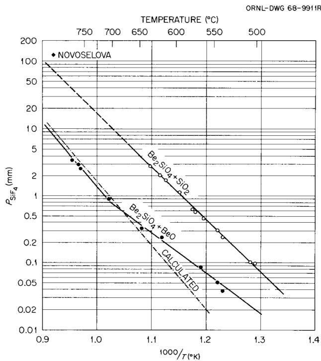  
Fig. 12.15. Partial Pressures of $\mathsf{SiF}_4$ Produced by Equilibration of Molten $\mathsf{Li}_2\mathsf{BeF}_4$ with $\mathsf{Be}_2\mathsf{SiO}_4 + \mathsf{SiO}_2$ (Upper Curve) and with $\mathsf{Be}_2\mathsf{SiO}_4 + \mathsf{BeO}$ (Lower Curve). The dashed line is calculated from the upper curve and the reported heat and temperature of decomposition of $\mathsf{Be}_2\mathsf{SiO}_4$ into $\mathsf{BeO}$ and $\mathsf{SiO}_2$ .

$$
\mathrm {B e} _ {2} \mathrm {S i O} _ {4} (c) + 2 \mathrm {B e F} _ {2} (d) \rightleftharpoons 4 \mathrm {B e O} (c) + \mathrm {S i F} _ {4} (g). \tag {2}
$$

The lower dashed line in Fig. 12.15 accordingly has been calculated as follows: From the previously measured $\mathrm{SiF}_4$ partial pressures for Eq. (1),

$$
\log P _ {\text {S i F} _ {4}} (\mathrm {m m}) = 8. 7 4 5 - 7 5 7 6 / T;
$$

the enthalpy of reaction (1) is

$$
\Delta H (1) = 3 4. 6 7 \mathrm {k c a l}.
$$

Holm and Kleppa recently have reported7,4 the heat of formation of $\mathrm{Be}_{2}\mathrm{SiO}_{4}$ from $\mathrm{BeO}$ and $\mathrm{SiO}_{2}$ :

$$
\begin{array}{l} 2 \mathrm {B e O} (c) + \mathrm {S i O} _ {2} (c) \rightleftharpoons \mathrm {B e} _ {2} \mathrm {S i O} _ {4} (c), \Delta H (3) \\ = - 4. 7 \mathrm {k c a l} / \text {m o l e}. \tag {3} \\ \end{array}
$$

Combining the heats of reaction (1) and (3),

$$
\Delta H (2) = \Delta H (1) - 2 \Delta H (3).
$$

The slope of the lower dashed line in Fig. 12.15 is given by $\Delta H(2)$ , while the intercept of the line is fixed by the requirement that it intersect with the (upper) line, corresponding to reaction (1), at the temperature at which phenacite decomposes by the reverse of reaction (3). Morgan and Hummel report this decomposition temperature to be $1560^{\circ}\mathrm{C}$ . The resulting calculated expression for the partial pressure of $\mathrm{SiF}_4$ is

$$
\log P _ {\text {S i F} _ {4}} (\mathrm {m m}) = 9. 6 6 7 - 9 5 2 4 / T \left(^ {\circ} \mathrm {K}\right).
$$

The data actually obtained above $700^{\circ}\mathrm{C}$ are seen to agree quite well with the predicted behavior. Below this temperature, however, the measured pressures are increasingly higher than the predicted values. One explanation for this effect would be the appearance of a new solid phase below $700^{\circ}\mathrm{C}$ , one in which the $\mathrm{BeO} / \mathrm{SiO}_2$ ratio is greater than 2 and which perhaps contains fluoride. Silicates of Ca, Ba, and Sr are known in which the $\mathrm{MO} / \mathrm{SiO}_2$ ratio is 3, but such are not known for Mg or Be. Furthermore, we have been unable to produce readily detectable amounts of such a new compound in mixtures of $\mathrm{SiO}_2$ , $\mathrm{Be}_2\mathrm{SiO}_4$ , and $\mathrm{BeO}$ equilibrated with $\mathrm{Li}_2\mathrm{BeF}_4$ at 625 to $650^{\circ}\mathrm{C}$ for as much as 30 days.

Another possible explanation is the existence of a previously unsuspected solid-state transition in BeO occurring at or below $700^{\circ}\mathrm{C}$ with a transition heat of $\sim 4\mathrm{kcal / mole}$ . To our knowledge, however, no other evidence of such a transition exists. In fact, in our measurements the same powder pattern has been found for BeO samples equilibrated above and below $700^{\circ}\mathrm{C}$ , and it agrees with that reported in the literature. Hence the possibility of a transition in BeO seems unlikely.

Whatever the explanation of this somewhat high value of $P_{\mathrm{SiF}_4}$ below $700^{\circ}\mathrm{C}$ in the latest measurements, the chemistry of silica in $\mathrm{LiF - BeF}_2$ melts is now fairly well defined. In future measurements we plan to study the ion exchange properties of $\mathrm{Be}_2\mathrm{SiO}_4$ , which has an open structure. $^{76}$ Further, we wish to explore rare-earth-containing silicates which might be produced by equilibration of $\mathrm{Be}_2\mathrm{SiO}_4$ with $\mathrm{LiF - BeF}_2$ melts containing rare-earth trifluorides.

# 13. Chemistry of Molten-Salt Reactor Fuel Reprocessing Technology

# 13.1 REDUCTIVE EXTRACTION OF $^{233}\mathsf{P}_{\mathsf{d}}$ AND URANIUM FROM MOLTEN LiF-BeF $_2$ -ThF $_4$ MIXTURES INTO BISMUTH

D. M. Moulton

W. R. Grimes

J. H. Shaffer

It was shown earlier1 that protactinium could be extracted successfully from the two-region moltensalt breeder reactor blanket salt and that in transport between two salts through a metal the material balance could be maintained. The extraction of protactinium at tracer level from the single-region breeder salt mixture into bismuth has now been demonstrated as well.

In the first experiment, $3.91\mathrm{kg}$ of $\mathrm{LiF - BeF}_2$ $\mathrm{ThF_4}$ (72-16-12 mole $\%$ ) with $1\mathrm{mc}$ of $^{233}\mathrm{Pa}$ was added to an all-graphite vessel containing $3.00\mathrm{kg}$ of high-purity $(99.995 + \%)$ bismuth. Three 3-g portions of thorium metal reductant were added. At the end of this time $70.4\%$ of the protactinium was in the metal and $23.4\%$ was in the salt, for an overall protactinium balance of $93.8\%$ . The molar distribution ratio was 13.0. At this point the furnace controller failed, and the temperature went to $1100 + ^{\circ}C$ . When all was restored to normal, the salt was hydrofluorinated to reoxidize the protactinium. Only about $67\%$ of it could be gotten into the salt. The experiment was continued at $700^{\circ}$ , but the balance was only 65 to $83\%$ of the original and began to fall when $D_{\mathrm{pa}}$ reached 2. It was again hydrofluorinated, and $58\%$ of the protactinium was recovered. In the thought that some iron from the vessel top had reached the liquids by refluxing vapors during the temperature excursion, $189\mathrm{g}$ of tin was added to raise iron solubility. The balance improved to about $90\%$ , but dropped again when only a few percent of the protactinium had been extracted. It seemed that this experiment, which had started so promisingly, had been ruined by the temperature

runaway, and it was ended. A few metal-phase analyses of the all-bismuth run at $700^{\circ}$ showed $D_{\mathrm{Pa}} / D_{\mathrm{Th}} = 278$ with equal valences over a fourfold concentration change.

The experiment was repeated with $3.15\mathrm{kg}$ of the same salt containing $0.3\mathrm{mole}\% \mathrm{UF}_4$ Again, $3\mathrm{kg}$ of bismuth was used in an all-graphite apparatus. Thorium metal was added as a reductant, and samples were taken at 600 and $700^{\circ}$ after each addition. The uranium balance remained good throughout the experiment. The protactinium balance was very good until about $40\%$ of it had been extracted $(D_{\mathrm{Pa}}\sim 2)$ ; then it began to decline rather sharply. It was thought that thorium solubility had been reached, and the experiment was terminated; but it turned out that this was not the case, at least if thorium solubility in a mixed system with uranium is the same as in bismuth alone. The maximum amount of protactinium extracted at $600^{\circ}$ was $74\%$ , with an overall protactinium balance of $86\%$ .

Equilibrium constants and their standard deviations for this experiment are as follows:

<table><tr><td></td><td colspan="2">Temperature (°C)</td></tr><tr><td></td><td>600</td><td>700</td></tr><tr><td>Log D4Li/DPa</td><td>-11.020 ± 1.080</td><td>-10.509 ± 0.379</td></tr><tr><td>Log D4Li/DTh</td><td>-9.157 ± 1.134</td><td>-8.464 ± 1.059</td></tr><tr><td>Log DPa/DTh</td><td>1.863 ± 1.241</td><td>2.045 ± 0.924</td></tr><tr><td>Log D3Li/DU</td><td>-9.559 ± 0.347</td><td>-8.939 ± 0.222</td></tr><tr><td>-(E&#x27;0Li - E&#x27;0Th)</td><td>0.392 ± 0.049</td><td>0.409 ± 0.051</td></tr><tr><td>-(E&#x27;0Li - E&#x27;0Pa)</td><td>0.477 ± 0.047</td><td>0.508 ± 0.018</td></tr><tr><td>-(E&#x27;0Li - E&#x27;0U)</td><td>0.551 ± 0.020</td><td>0.576 ± 0.014</td></tr><tr><td>-(E&#x27;0Pa - E&#x27;0U)B</td><td>0.065 ± 0.009</td><td>0.074 ± 0.011</td></tr></table>

${}^{a}$ Calculated from a slightly different set of data.

In this experiment, contrary to what had been found earlier, the valence 3 fitted uranium better than 4. It also fitted protactinium somewhat better, but 4 was used in the calculations. The apparent thorium valence, compared with the lithium valence of 1, was about 1.5 throughout the experiment from $D_{\mathrm{Th}} = 0.00018$ to 0.017. There were some rather larger discrepancies in some of the lithium and thorium analyses performed by two different methods on the same samples, and this may account for some of this strange behavior. It may not be entirely unreal, however, since several rare-earth extraction experiments show an apparently low thorium valence at high thorium mole fraction in bismuth. At any rate the valence of 4 was used in the calculations and is reflected in the rather large standard deviations. In comparison with the results reported earlier for the two-region blanket salt, the thorium-protactinium separation is harder but is still quite feasible, while the protactinium-uranium separation is easier. Because of the thorium valence anomaly, its values should be used cautiously.

Inasmuch as the composition of the single-region breeder fuel salt has not been definitely established, a protactinium extraction was carried out in a salt with a lower "free fluoride" concentration, $\mathrm{LiF - BeF}_2\text{-ThF}_4$ (68-20-12 mole%). About $4.14\mathrm{kg}$ of this salt containing $41\mathrm{g}$ of $\mathrm{UF}_4$ was extracted in an all-graphite vessel with $3.00\mathrm{kg}$ of high-purity bismuth using thorium metal as a reductant at 600 and $700^{\circ}$ . At several points in the experiment, the phases were sampled at about 2, 4, and $20\mathrm{hr}$ after the metal addition to see whether there was any loss of reduced metals with time. The only change of significance was at the highest thorium concentration, when the protactinium distribution tripled over this period of time, most of the rise coming between the first two samplings. This is perhaps due to slow dissolution of thorium bismuthide in the high-thorium solution. No significant losses of reduced metals were detected at any time.

The protactinium balance remained good up to about $10\%$ extraction $(D_{\mathrm{Pa}} \sim 0.5)$ . Then it fell slowly until the experiment was ended, again at a point below thorium saturation. The maximum extracted was $41\%$ at a balance of $58\%$ . Distributions are calculated on the amount found.

Lithium and thorium analyses were carried out in the usual way. Uranium analyses for the salt phase only were completed at this writing, but the distri

butions were calculated on the basis of $100\%$ mass balance.

<table><tr><td></td><td colspan="2">Temperature (°C)</td></tr><tr><td></td><td>600</td><td>700</td></tr><tr><td>Log D4Li/DPa</td><td>-12.560 ± 0.498</td><td>-11.867 ± 0.338</td></tr><tr><td>Log D4Li/DTh</td><td>-9.74 ± 0.292</td><td>-8.981 ± 0.399</td></tr><tr><td>Log DPa/DTh</td><td>2.966 ± 0.348</td><td>2.859 ± 0.129</td></tr><tr><td>Log D3Li/DU</td><td>-10.703 ± 0.700</td><td>-10.253 ± 0.460</td></tr><tr><td>-(E&#x27;0Li - E&#x27;0Th)</td><td>0.422 ± 0.013</td><td>0.434 ± 0.019-</td></tr><tr><td>-(E&#x27;0Li - E&#x27;0Th)</td><td>0.544 ± 0.022</td><td>0.573 ± 0.016</td></tr><tr><td>-(E&#x27;0Li - E&#x27;0U)</td><td>0.618 ± 0.040</td><td>0.660 ± 0.030</td></tr><tr><td>-(E&#x27;0Pa - E&#x27;0U)</td><td>0.072 ± 0.018</td><td>0.087 ± 0.025</td></tr></table>

The uranium analyses, though preliminary, indicate an adequate uranium-protactinium separation. In this experiment, unlike the previous one, a thorium valence of 4 fits the data quite well for the entire range of $D_{\mathrm{Th}} = 0.0007$ to 0.012. In this salt the thorium activity is higher than in the 72-16-12 mole % mixture. However, the protactinium activity is higher still; so the thorium-protactinium separation looks better, in fact nearly as good as in the blanket salt.

These tracer-level experiments indicate that protactinium can be extracted from single-region salts of various compositions. The protactinium activity is rather strongly influenced by the salt composition, and further work will be needed to define the nature of this dependence. The problem of protactinium balance is still with us, but protactinium disappearance seems to vary from experiment to experiment; in the first of the above, the balance was quite good until the accident; in the second, it persisted to a very high distribution ratio. Since there is no consistent pattern to the disappearance, we suspect that the tiny amount of material is attaching itself to some speck of contaminant and that this will not be a problem when reasonable amounts of protactinium are used.

# 13.2 REDUCTIVE EXTRACTION OF RARE EARTH'S FROM MOLTEN MIXTURES OF LiF, $\mathsf{BeF}_{2}$ , AND $\mathsf{ThF}_{4}$ INTO BISMUTH AND BISMUTH ALLOY MIXTURES

J. H. Shaffer

D. M. Moulton

W. R. Grimes

The adaptation of reductive extraction as a method for removing rare earths from the fuel solvent mixture into a molten metal phase will depend, in part, on the magnitude of the distribution coefficients for the rare earths between the two liquid phases and the relative separation of these fission products from major constituents of the salt mixture. Where bismuth is the molten metal phase, the distribution of rare earths between the two liquid phases at equilibrium can be expressed by the reactions

$$
\left(\mathrm {R E}\right) \mathrm {F} _ {n (\text {s a l t})} + n \mathrm {L i} _ {\left(\mathrm {B i}\right)} ^ {0} \rightleftharpoons \left(\mathrm {R E}\right) _ {\left(\mathrm {B i}\right)} ^ {0} + n \mathrm {L i F} \tag {1}
$$

and

$$
\begin{array}{l} 4 (\mathrm {R E}) \mathrm {F} _ {n (\text {s a l t})} + n \mathrm {T h} _ {(\mathrm {B i})} ^ {0} \rightleftharpoons \\ 4 \left(\mathrm {R E}\right) _ {\left(\mathrm {B i}\right)} ^ {0} + n \mathrm {T h F} _ {4 (\mathrm {s a l t})}, \tag {2} \\ \end{array}
$$

where $n$ denotes the valence of a particular rare earth (RE). Since beryllium does not form intermetallic compounds with bismuth and is essentially insoluble in bismuth at temperatures of interest to this program, its presence in the salt mixture does not have a direct effect on the reductive extraction process. Separation factors obtained from Eq. (1) are very favorable for the reductive extraction process. However, separations obtained from Eq. (2) are less favorable and may only be marginally feasible for removing certain of the rare-earth fission product species. In addition, the degree to which rare earths can be extracted per equilibrium stage depends on the concentrations of reduced species in solution in the bismuth, a measure of the reduction potential of the system. Since thorium metal forms an intermetallic compound with bismuth, the reduction potential of the system is limited to relatively low values which correspond to its solubility in the bismuth pool.

The equilibrium reduction of rare earths by thorium [Eq. (2)] in the extraction system is regulated

by the thermodynamic activities of the reaction constituents, which can be equated to a constant by the relation

$$
\begin{array}{l} K _ {a} = \frac {A ^ {4} (\mathrm {R E}) ^ {0} \cdot A _ {\mathrm {T h F}} ^ {n}}{A _ {(\mathrm {R E}) \mathrm {F}} ^ {4} n \cdot A _ {\mathrm {T h}} ^ {n}} \\ = \frac {\left[ \gamma_ {(\mathrm {R E}) ^ {0}} ^ {4} \cdot N _ {(\mathrm {R E}) ^ {0}} ^ {4} \right] \left(\gamma_ {\mathrm {T h F} _ {4}} ^ {n} \cdot N _ {\mathrm {T h F} _ {4}} ^ {n}\right)}{\left[ \gamma_ {(\mathrm {R E}) \mathrm {F} _ {n}} ^ {4} \cdot N _ {(\mathrm {R E}) \mathrm {F} _ {n}} ^ {4} \right] \left(\gamma_ {\mathrm {T h} ^ {0}} ^ {n} \cdot N _ {\mathrm {T h} ^ {0}} ^ {n}\right)}. \tag {3} \\ \end{array}
$$

Since separation factors and distribution coefficients for the reductive extraction process are based on chemical concentrations $N$ rather than thermodynamic activities, they may be altered by imposing changes in the activity coefficients $\gamma$ of the chemical species in the two liquid phases. Accordingly, this experimental program is currently directed toward a chemical evaluation of the reductive extraction process with respect to salt solvent composition and metal phase composition for the various important rare-earth fission products.

# 13.2.1 Effect of Salt Composition

The selection of the fuel solvent for the single-region molten-salt breeder reactor will consider not only the nuclear and physical characteristics of the salt mixture but also its chemical properties with respect to the reactor environment and the chemical reprocessing plant. The ternary system $\mathrm{LiF - BeF}_{2}$ - $\mathrm{ThF}_{4}$ has been chosen for this application with probable thorium concentrations of 10 to 12 mole $\%$ beryllium concentrations of 16 to 20 mole $\%$ , and the balance lithium fluoride. Within these restraints, however, activity coefficients for the individual salt constituents may be quite varied. The results of this investigation demonstrate these variations by their effects on the reductive extraction of cerium from several salt mixtures into bismuth.

When beryllium fluoride and thorium fluoride are mixed with alkali fluorides as a molten solution, they form coordinated compounds which can be explained by a fluoride bridging concept. This coordination may be visualized as the chemical equilibria

$$
2 \mathrm {L i F} + \mathrm {B e F} _ {2} \rightleftharpoons \mathrm {L i} _ {2} \mathrm {B e F} _ {4} \tag {4}
$$

and

$$
3 \mathrm {L i F} + \mathrm {T h F} _ {4} \rightleftharpoons \mathrm {L i} _ {3} \mathrm {T h F} _ {7}. \tag {5}
$$

In the highly ionized fluoride melt, "basic" ions of $\mathrm{BeF}_4^{2-}$ and $\mathrm{ThF}_7^{3-}$ would be formed; any unassociated ions furnished by LiF would be considered "acidic." Although quantitative estimates of these coordination reactions are not available, their presence should affect the activity coefficients of the salt-phase constituents, which should, in turn, alter the equilibria of the reductive extraction process. For purposes of this study the reductive extraction data were empirically correlated to the excess or deficit in the "free fluoride" content of a specific salt mixture. This reference scale,

excess free fluoride

$$
= \text {mole} \% \text {LiF - 2 (mole} \% \text {BeF} _ {2}) - 3 (\text {mole} \% \text {ThF} _ {4}), \tag{6}
$$

was defined by the assumption that $\mathbf{BeF}_2$ and $\mathbf{ThF}_4$ would be completely coordinated according to Eqs. (4) and (5). This study has examined eight different salt compositions having a "free fluoride" range of $-17$ to $+28$ units. Although not an important fission product, the extraction study used cerium as a reference for analytical convenience. Individual experiments with other rare earths of interest should suffice for describing the effects of salt composition on the overall rare-earth extraction process.

The experimental procedure was directed primarily toward the evaluation of pertinent equilibrium data according to Eq. (3). If the activity coefficients remain constant during each individual extraction experiment, then the concentrations of reaction constituents may be equated to a constant by the relation

$$
K _ {Q} = \frac {N _ {\mathrm {C e} _ {0}} ^ {4} \times N _ {\mathrm {T h F} _ {4}} ^ {3}}{N _ {\mathrm {C e F} _ {3}} ^ {4} \times N _ {\mathrm {T h} _ {0}} ^ {3}} = \frac {D _ {\mathrm {C e}} ^ {4}}{D _ {\mathrm {T h}} ^ {3}}, \tag {7}
$$

where $K_{Q}$ is the equilibrium quotient and $N$ and $D$ are the mole fraction and distribution coefficient, respectively, for the designated species. Changes in values for $K_{Q}$ with salt composition should reflect changes in the activity coefficients of the salt-phase constituents. Values for the equilibrium quotients were derived from radiochemical analyses

of samples taken from the salt and metal phases for cerium and from spectrochemical analyses of the metal-phase samples for lithium and thorium.

Changes in the reduction potential were made by adding lithium metal (thorium metal in two experiments) directly to the molten metal phase in small tared increments until apparent saturation of the bismuth phase by thorium was achieved. Although emphasis was placed on measurements at $600^{\circ}\mathrm{C}$ , experimental data were obtained over the range 500 to $800^{\circ}\mathrm{C}$ for some of the extraction systems.

Typical data obtained during one extraction experiment are illustrated in Fig. 13.1 and demonstrate reasonable agreement with Eq. (7). Equilibrium quotients for similar extractions from the various salt mixtures studied are shown in Table 13.1. The relation of these equilibrium quotients at $600^{\circ}\mathrm{C}$ to the "free fluoride" model is illustrated in Fig. 13.2. Although empirical, these results provide a reasonable basis for predicting rare-earth extraction behavior over the salt composition region of interest in the MSBR program.

Since the experimental data were not necessarily obtained up to the solubility limit of thorium in bismuth, the values calculated for the equilibrium quotients are useful in establishing limiting parameters of the extraction process. The solubility of thorium in bismuth has been reported by several investigators.5-7 The data of Bryner and Brodsky, expressed by the equation

$$
\log \left(\text {at.} \% \mathrm{Th}\right) = 3.30 - 3410 / T(^{\circ} \mathrm{K}),
$$

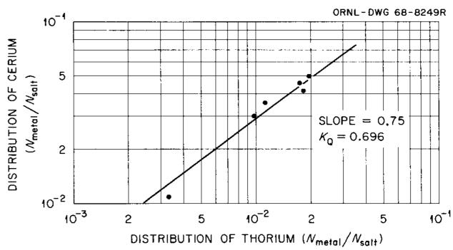  
Fig. 13.1. Distribution of Thorium $(N_{\text{metal}} / N_{\text{salt}})$ .

Table 13.1. Equilibrium Quotients for the Reductive Extraction of Cerium by Thorium from LiF-BeF $_2$ -ThF $_4$ Mixtures into Bismuth   

<table><tr><td colspan="3">Salt Composition (mole %)</td><td rowspan="2">Free Fluoride</td><td colspan="6">Equilibrium Quotient at T</td></tr><tr><td>LiF</td><td>BeF2</td><td>ThF4</td><td>T=500°C</td><td>T=550°C</td><td>T=600°C</td><td>T=700°C</td><td>T=750°C</td><td>T=800°C</td></tr><tr><td>72</td><td>16</td><td>12</td><td>+4</td><td></td><td></td><td>3.8</td><td>2.8</td><td></td><td></td></tr><tr><td>65</td><td>23</td><td>12</td><td>-17</td><td>(2.96)a</td><td></td><td>0.13</td><td>(0.47)</td><td></td><td></td></tr><tr><td>64</td><td>30</td><td>6</td><td>-14</td><td>(0.32)</td><td></td><td>0.80</td><td>(1.2)</td><td></td><td></td></tr><tr><td>70</td><td>21</td><td>9</td><td>-1</td><td>(1.1)</td><td></td><td>1.9</td><td>(2.4)</td><td></td><td></td></tr><tr><td>68</td><td>20</td><td>12</td><td>-8</td><td>(0.58)</td><td></td><td>0.62</td><td>2.2</td><td></td><td></td></tr><tr><td>75</td><td>16</td><td>9</td><td>+16</td><td>(4.4)</td><td>(8.58)</td><td>14.0</td><td>26.5</td><td>41.3</td><td></td></tr><tr><td>78</td><td>16</td><td>6</td><td>+28</td><td></td><td></td><td></td><td>54.9</td><td>76.6</td><td>174.5</td></tr><tr><td>74</td><td>20</td><td>6</td><td>+16</td><td>(3.9)</td><td>(10.6)</td><td>46.7</td><td>34.6</td><td>46.0</td><td></td></tr></table>

aValues in parentheses calculated from average experimental value for $D_{\text{Ce}}$ and thorium solubility given by log solubility (at. %) = 3.30 - 3410/T°C from J. S. Bryner and M. B. Brodsky, Proc. U.N. Intern. Conf. Peaceful Uses At. Energy, 2nd, Geneva, 1958 7, 209 (1958).

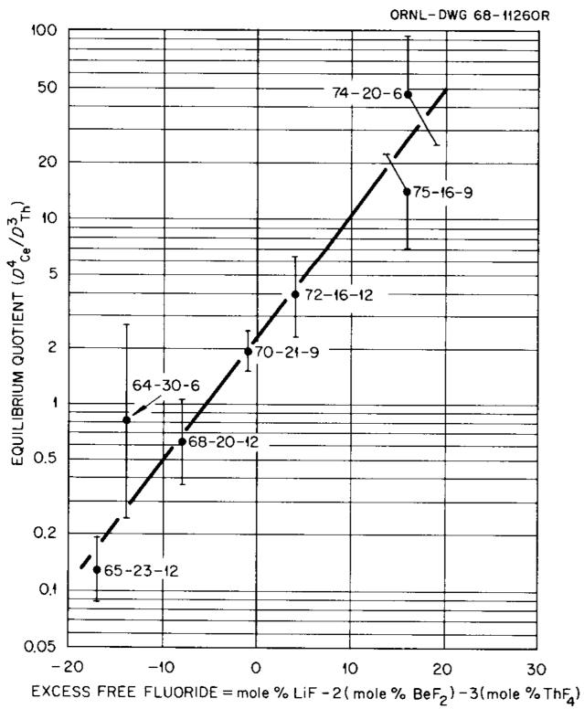  
Fig. 13.2. Effect of Salt Composition on the Equilibrium Reduction of Cerium by Thorium from LiF-BeF $_2$ -ThF $_4$ Mixtures into Bismuth at $600^{\circ}$ C.

were adapted for this study. Calculated values for limiting distribution coefficients and separation factors are presented in Table 13.2. The effect of "free fluoride" on the separation of cerium from thorium at $600^{\circ}\mathrm{C}$ is illustrated in Fig. 13.3.

# 13.2.2 Effect of Metal-Phase Composition

The composition of the fuel salt mixture will be strongly influenced by considerations other than that of optimum reprocessing. On the other hand, the metal-phase composition is subject to no restrictions except that it be noble and containable. There are two possible ways to improve the separation. If the rare-earth activity could be lowered and the thorium activity left unchanged, then a higher fraction of rare earth would be removed before thorium bismuthide precipitation. Both the amount removed and the separation would be improved. If on the other hand the thorium solubility could be increased without changing the activities, then the amount of rare earth removed would also be increased. Thorium solubility can be increased somewhat by raising the temperature of the bismuth, but rare-earth removal is only about doubled in $100^{\circ}$ ; a change of metal phase might help much more. Both of these possibilities are being investi

Table 13.2. Calculated Values for the Distribution Coefficient of Cerium and Its Separation from Thorium by Reductive Extraction from LiF-BeF $_{2}$ -ThF $_{4}$ Mixtures into Bismutha   

<table><tr><td colspan="3">Salt Composition (mole %)</td><td colspan="2">Dceat T</td><td colspan="2">α = Dce/DThat T</td></tr><tr><td>LiF</td><td>BeF2</td><td>ThF4</td><td>T = 600°C</td><td>T = 700°C</td><td>T = 600°C</td><td>T = 700°C</td></tr><tr><td>72</td><td>16</td><td>12</td><td>0.077</td><td>0.14</td><td>3.67</td><td>2.64</td></tr><tr><td>65</td><td>23</td><td>12</td><td>0.033</td><td>0.10</td><td>1.57</td><td>1.89</td></tr><tr><td>64</td><td>30</td><td>6</td><td>0.088</td><td>0.20</td><td>2.10</td><td>1.89</td></tr><tr><td>70</td><td>21</td><td>9</td><td>0.081</td><td>0.17</td><td>2.89</td><td>2.43</td></tr><tr><td>68</td><td>20</td><td>12</td><td>0.049</td><td>0.13</td><td>2.33</td><td>2.45</td></tr><tr><td>75</td><td>16</td><td>9</td><td>0.133</td><td>0.31</td><td>4.75</td><td>4.43</td></tr><tr><td>78</td><td>16</td><td>6</td><td></td><td>0.51</td><td></td><td>4.81</td></tr><tr><td>74</td><td>20</td><td>6</td><td>0.243</td><td>0.45</td><td>5.79</td><td>4.25</td></tr></table>

Based on bismuth saturated in thorium, where thorium solubility is given by log (at. $\%$ ) $= 3.30 - 3410 / T^{\circ}C$ from J. S. Bryner and M. B. Brodsky, Proc. U.N. Intern. Conf. Peaceful Uses At. Energy, 2nd, Geneva, 1958 7, 209 (1958).

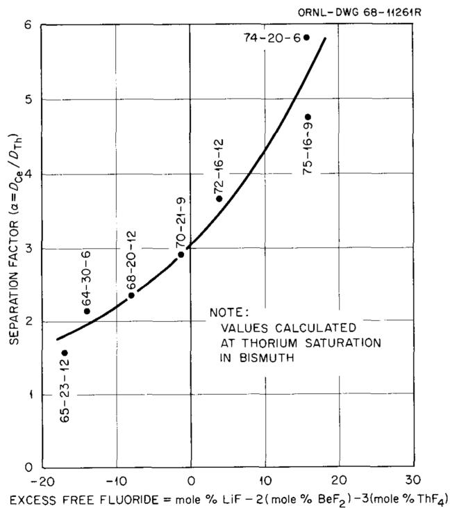  
Fig. 13.3. Effect of Salt Composition on the Separation of Cerium from Thorium During Reductive Extraction of Cerium from CeF-BeF $_2$ -ThF $_4$ Mixtures into Bismuth at $600^{\circ}$ C.

gated at this time. So far, no good way of substantially raising thorium solubility has been found; bismuth is actually one of the best low-temperature solvents.

There seems to be no good theoretical basis for choosing a metal solvent in which rare-earth activities will be lowered still further with respect to thorium. It is quite obvious that the strong intermetallic compound formation by bismuth and rare earths is the only thing which lets the separation even be close, since reduction to the pure metals would take thorium out much earlier. Some very limited experience with extracting rare earths from $\mathrm{LiF - BeF}_2$ (66-34 mole %) into lead implies that a rare-earth-thorium separation would be worse in this system than in bismuth. Lead is less electro-negative than bismuth and forms weaker intermetallics. This finding suggests that more electro-negative metals should be tried as solvents or as major additives to the bismuth.

One metal that should form stronger compounds is antimony. Its melting point of $630^{\circ}$ is too high for it to be used pure, but it can be dissolved in bismuth in large amounts. An $\mathrm{LiF - BeF}_2\mathrm{-ThF}_4$ (72-16-12 mole %) salt containing $\mathrm{EuF}_3$ was added to a graphite vessel containing Bi-Sb (79.4-20.6 mole %), and small amounts of metallic thorium reductant were added at 600 and $700^{\circ}$ . Radiochemical analysis indicated that only about $0.4\%$ of the europium

was extracted, but even this may be due to background; examination of the spectrum taken on a multichannel analyzer showed only background at the prominent 355-kev peak of $152 - 154\mathrm{Eu}$ . However, four measurements were made of the lithium and thorium distributions and the beryllium electrode potential. Since no absolute beryllium potential measurements have been made in this solvent, only the standard potential difference can be determined. In this system, $\mathcal{E}_{0_{\mathrm{Li}}}^{\prime} - \mathcal{E}_{0_{\mathrm{Be}}} = 0.00\mathrm{~v~}$ and $\mathcal{E}_{0_{\mathrm{Be}}}^{\prime} - \mathcal{E}_{0_{\mathrm{Th}}}^{\prime} = -0.44\mathrm{~v~}$ . In the same salt with pure bis-muth these potentials are $-0.11\mathrm{~v~}$ and $-0.28\mathrm{~v~}$ . The addition of antimony to the metal phase has further lowered the activities of both lithium and thorium. Though the data are not extensive enough to make these values very accurate, it seems that the thorium activity was lowered more than the lithium.

In a similar experiment, an $\mathrm{LiF - BeF}_2\text{-ThF}_4$ salt (65-23-12 mole %) containing $\mathrm{CeF}_3$ was extracted with Bi-Sb (79.4-20.6 mole %). Thorium and lithium were used as reductants. Potential readings were not taken. The cerium distribution, however, was measurable. It was less than half that obtained in pure bismuth with this salt. At both 600 and $700^{\circ}$ , the separation factor $(D_{\mathrm{Ce}} / D_{\mathrm{Th}})$ was about 0.4 at the thorium solubility limit (which was perhaps twice the reported solubility in bismuth). Table 13.3 shows these distributions. The lithium-thorium equilibrium constant made no sense unless equal valences were assumed for both metals; so no comparison with the europium experiment could be made. The conclusion compiled from these two experiments is that $21\%$ antimony in bismuth does indeed lower the activities of the electropositive metals but it seems to go in the wrong direction, lowering the thorium activity more than the rare earth. Antimony does not look like a good additive.

Table 13.3. Distribution of Cerium Between LiF-BeF $_2$ -ThF $_4$ (65-23-12 Mole %) and Bi-Sb (79-21 Mole %) at 600 and $700^{\circ}$ C   

<table><tr><td>T(℃)</td><td>D C e max</td><td>α C e max</td><td>X Th max</td></tr><tr><td>600</td><td>0.027</td><td>0.76</td><td>0.0060</td></tr><tr><td>700</td><td>0.022</td><td>0.71</td><td>0.0075a</td></tr></table>

${}^{a}$ Probably not saturated. The maximum values did not all occur at the same points.

Gold is the most electronegative metal. Three weight percent gold was added to bismuth in the extraction of neodymium from LiF-BeF $_2$ -ThF $_4$ (68-20-12 mole %) at 600 and $700^{\circ}$ . A pure $^{147}$ Nd tracer was prepared by irradiation of a separated stable isotope. The average values of the equilibrium constants are:

<table><tr><td>Temperature (°C)</td><td>D4Li/DTh</td><td>D3Li/DTh</td><td>D3Th/DNd</td></tr><tr><td>600</td><td>1.9 × 10-8</td><td>2.8 × 10-6</td><td>8.7</td></tr><tr><td>700</td><td>2.0 × 10-8</td><td>7.3 × 10-6</td><td>8.5</td></tr></table>

The thorium distribution at saturation at $600^{\circ}$ was 0.037 rather than the 0.021 in pure bismuth. This leads to a maximum neodymium distribution of 0.05 and a separation factor of 1.33. Thorium saturation was apparently not reached at $700^{\circ}$ , but a $D_{\mathrm{Nd}}$ of 0.104 was found. The distribution of neodymium between the salt and pure bismuth is not yet known. However, an experiment now in progress using LiF-BeF $_2$ -ThF $_4$ (72-16-12 mole %) indicates that the maximum $D_{\mathrm{Nd}}$ is 0.050 at $600^{\circ}$ and 0.132 at $700^{\circ}$ . This latter is a more favorable salt for rare-earth extraction. If $D_{\mathrm{Nb}}$ (salt B)/ $D_{\mathrm{Nd}}$ (salt A) equals $D_{\mathrm{Ce}}$ (salt B)/ $D_{\mathrm{Ce}}$ (salt A), then in the 72-16-12 salt we would expect $D_{\mathrm{Nd}}$ with the bismuth-gold system to be 0.079 at $600^{\circ}$ and at least 0.163 at $700^{\circ}$ . This is significant improvement even though the separation factor has been slightly reduced. The effect of gold concentration and of chemically similar but less precious additives is an object of studies to be made.

# 13.3 PROTACTINIUM STUDIES IN THE HIGH-ALPHA MOLTEN-SALT LABORATORY

C. J. Barton

R. G. Ross

In the previous report it was shown that the protactinium distribution that occurred when a single-region fuel composition $\mathrm{LiF - BeF}_2\text{-ThF}_4$ (72-16-12 mole %) was equilibrated with a bismuth-thorium alloy was less favorable than when the salt phase was the blanket composition $\mathrm{LiF - BeF}_2\text{-ThF}_4$ (73-2-25 mole %). This difference in protactinium behavior was apparently due to an unexplained fairly

rapid loss of thorium from the bismuth phase in the single-region fuel experiments.

Two theories that have been offered to explain the loss of metallic thorium were tested in experiments reported here. These are formation of thorium carbide and thorium oxide.

# 13.3.1 Tests Dealing with the Possibility of Thorium Carbide Formation

In one experiment $850\mathrm{g}$ of bismuth containing $4.25\mathrm{g}$ of thorium, part of which was irradiated to provide a tracer concentration of $^{233}\mathrm{Pa}$ , was heated to $630^{\circ}\mathrm{C}$ in a graphite-lined nickel pot. During the early part of the equilibration period when the bismuth was stirred with $200~\mathrm{cm}^3/\mathrm{min}$ of helium, the $^{233}\mathrm{Pa}$ concentration in filtered samples increased sharply to a maximum in the 6-hr sample. In the next 16 hr there was a sharp drop in $^{233}\mathrm{Pa}$ concentration to $43\%$ of the maximum value. There was a lower rate of decrease in the $^{233}\mathrm{Pa}$ during the next 70 hr when the cover gas was changed to static helium, thus indicating possible contamination of the helium with oxygen or water vapor. Variations in the thorium concentration in filtered bismuth samples were also noted, with a maximum value of $1680~\mathrm{ppm}$ being attained, but all samples contained less thorium than the literature or than our previous experiments would predict. A graphite specimen exposed for $24\mathrm{hr}$ in the bismuth-thorium alloy was examined by x-ray diffraction. No evidence of carbide formation was found, and most of the thorium was accounted for by analyses of the bismuth ingot and the samples that were removed. We concluded that this experiment provided no indication of thorium carbide formation at $630^{\circ}\mathrm{C}$ .

The next experiment was conducted in a mild-steel-lined pot using $250\mathrm{g}$ of $\mathrm{LiF - BeF}_2\text{-ThF}_4$ (72-16-12 mole %) and $300\mathrm{g}$ of Bi-Th alloy (0.64 wt % Th). The protactinium balance in this experiment was poor, except for the early samples, and dropped to a low of $20\%$ after 16 hr of contact. The maximum concentration of protactinium in the bismuth was $23\%$ of the total. The principal difference between this experiment and similar experiments conducted in graphite was that the thorium concentration in bismuth dropped from its initial value of 1860 ppm to zero in the first hour. This was a much faster rate of loss than we found in the graphite experiments. However, the protactinium concentration in both filtered and unfiltered salt samples continued to drop for 16 hr indicating that

the insoluble thorium was still effective in reducing protactinium. The uranium content of filtered bismuth ranged from 47 to $57\%$ , and the uranium balance was much better than that of protactinium. It appears that mild steel has no advantage over graphite as a container for liquid-metal-single-region-fuel-salt equilibration experiments.

# 13.3.2 Tests Dealing with the Possibility of Oxide Contamination

There were no obvious differences in technique between the very successful experiment with a blanket composition as the salt phase (run 1-8) and subsequent less successful experiments with single-region fuel. We made a number of improvements in our experimental technique to reduce the possibility of oxide contamination, and we decided to repeat run 1-8 under current glove box conditions to try to confirm our belief that the difference in salt composition, rather than faulty experimental technique, was the cause of different protactinium distributions. The resulting experiment (run 6-11) gave very encouraging results. The protactinium distribution data in Fig. 13.4 show that after $18^{1/2}$ hr of phase contact, $58\%$ of the protactinium was in the filtered bismuth and $35\%$ in the filtered salt, making a total of $93\%$ . The insoluble protactinium making up the balance was in the bismuth. Addition of more metallic thorium to the system removed about two-thirds of the protactinium that remained in the salt after $19^{1/2}$ hr contact with the initial bismuth-thorium alloy, but this fraction of the reduced protactinium did not appear in either the filtered or unfiltered samples. The thorium concentration in bismuth, also shown in Fig. 13.4, underwent an initial rapid drop of greater magnitude than expected from the concentration of uranium and protactinium (50 and 7 ppm respectively) initially present in the salt phase, but the rate of loss after the first hour was slow in comparison with that observed in experiments with single-region fuel salt.

The distribution of uranium in this experiment (Fig. 13.5) was similar to that of protactinium except that the thorium added after $19 \frac{1}{2} \mathrm{hr}$ contact caused an increase in the uranium concentration in bismuth as well as a decrease in the salt-phase concentration. The uranium balance was near $100\%$ . The drop in protactinium balance following the addition of thorium (Fig. 13.4) probably indicates that part of the protactinium coprecipitated with insoluble bismuth-thorium intermetallic compounds.

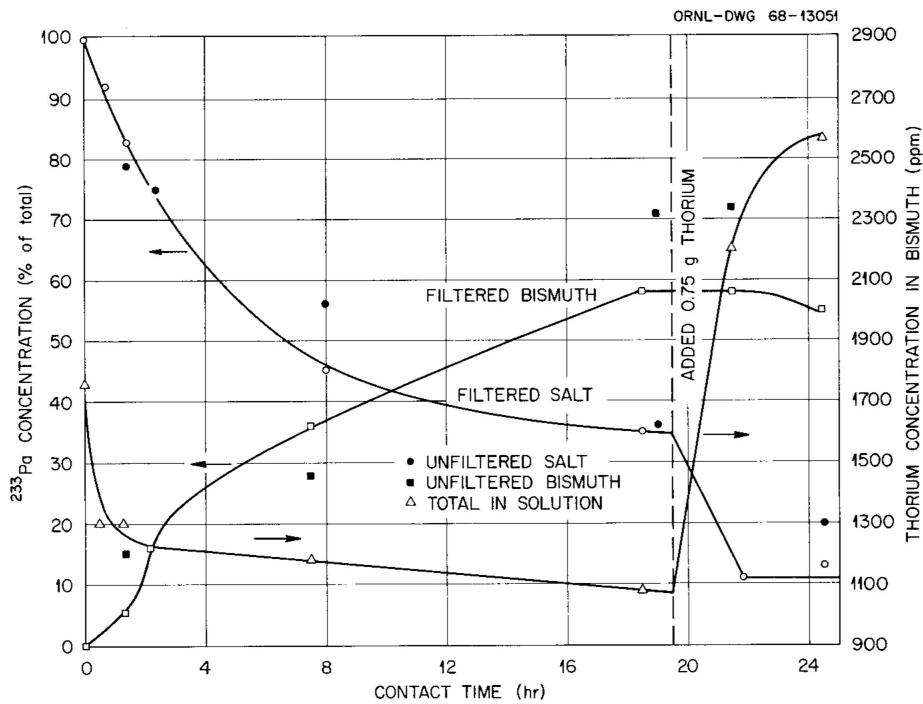  
Fig. 13.4. Distribution of Protactinium Between LiF-BeF $_2$ -ThF $_4$ (73-2-25 mole %) and Bi-Th Alloy (0.25 wt % Th), Run 6-11-68.

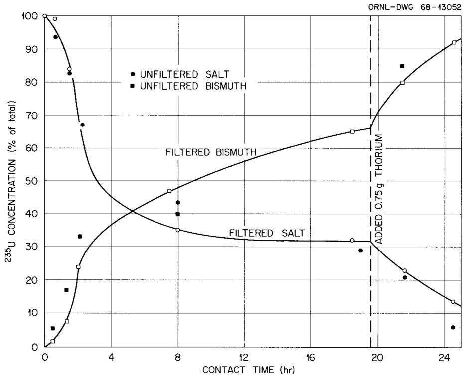  
Fig. 13.5. Distribution of Uranium Between LiF-BeF $_2$ -ThF $_4$ (73-2-25 mole %) and Bi-Th Alloy (0.25 wt % Th), Run 6-11-68.

Comparison of the data in Figs. 13.4 and 13.5 with data from run 1-8 shows that reduction and transfer of uranium or protactinium to the bismuth phase was much slower in the recent experiment. We found that the graphite dip leg had broken at the point where the graphite was sealed to $\frac{1}{8}$ -in. nickel tubing. Consequently, gas mixing of the phases was not effected, and this undoubtedly accounted for the slow rate of reduction and transfer of uranium and protactinium.

It seems clear from this experiment that we can transfer a large fraction of uranium and protactinium from a blanket salt composition to a bismuth-thorium alloy and that thorium loss from the bismuth is much less than that from an alloy equilibrated with single-region fuel.

In this experiment we again demonstrated that protactinium and uranium can be returned to solution in the molten salt by $\mathrm{HF - H_2}$ treatment in a mixture containing bismuth. After the re-solution part of the experiment was completed, we treated the mixture with hydrogen and then added enough thorium turnings to make a $1\%$ Th-Bi alloy. The protactinium concentration in the filtered salt was down to about $3\%$ of its initial value 30 hr after adding thorium, but a maximum of $19\%$ was found in the bismuth. Protactinium and uranium balances were poorer than in the first part of the experiment, due possibly to the formation of insoluble bismuth-thorium compounds.

We further tested the oxide-contamination theory by conducting an experiment with the single-region fuel composition $\mathrm{LiF - BeF}_2\text{-ThF}_4$ (72-16-12 mole %) in which we took many precautions to prevent any oxygen from entering the apparatus. The entire system was carefully leak tested and pumped for 24 hr at room temperature, the traps were pumped overnight at about $100^{\circ}$ , the system was operated at a helium pressure of 12 psig, the apparatus was heated initially under vacuum, and crystal-bar thorium was used as the reducing agent in place of thorium turnings.

The protactinium distribution in this experiment (run 7-2), shown in Fig. 13.6, indicated very little reduction during the first 30-hr equilibration period, a little more reduction during the 22-hr period following the addition of more crystal-bar thorium, and, finally, a substantial increase in protactinium reduction in 24 hr after the addition of thorium turnings. The protactinium concentration in the bismuth phase was very low throughout the experiment, and the uranium distribution data (not shown) were

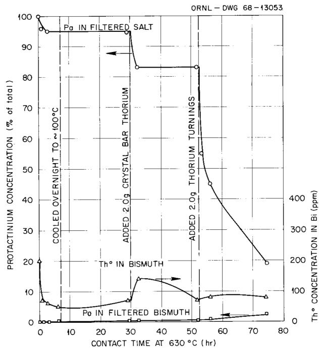  
Fig. 13.6. Distribution of Protactinium Between LiF-BeF $_2$ -ThF $_4$ (72-16-12 mole %) and Bi-Th Alloy in Graphite, Run 7-2-68.

quite similar to the protactinium data. The thorium metal content of filtered bismuth samples, also shown in Fig. 13.6, was quite low. This accounts for the slowness of reduction but raises the presently unanswered question of why the thorium did not dissolve in bismuth. Nickel was present as an impurity in the bismuth, resulting from splashing of the bismuth on nickel tubing well above the liquid level. Although there was evidence that insoluble nickel-thorium intermetallic compounds were formed, comparison of the results of this experiment with data obtained in the latter part of run 6-11, where the nickel concentration was more than ten times as high as in the present experiment, makes it seem unlikely that the nickel impurity alone could account for the low thorium solubility. It is known that crystal-bar thorium dissolves more slowly than turnings, and it appears that the reaction, whatever it may be, that converted the thorium into a form insoluble in the bismuth proceeded more rapidly when the metal was present as a pure solid phase than when it was dissolved in bismuth.

# 13.3.3 Experiment with Molybdenum Container

The final experiment, and the most successful we have conducted to date with single-region fuel salt, was performed in a molybdenum-lined vessel containing a molybdenum dip leg. Chemical Technology workers had previously demonstrated the compatibility of the material involved in this experiment, as reported elsewhere in this report. The experiment has been completed, but only preliminary data are available at present for most samples.

The salt mix, which included $255\mathrm{g}$ of $\mathrm{LiF - BeF}_2$ ThF4 (72-16-12 mole %), 3.003 g of depleted $\mathrm{UF}_4$ , 25 mg of $^{231}\mathrm{Pa}$ , 1 mc of $^{233}\mathrm{Pa}$ , and 1 mc of $^{59}\mathrm{Fe}$ , was purified as usual in a nickel vessel by $\mathrm{H}_2$ -HF treatment followed by $\mathrm{H}_2$ for $16\frac{1}{2}$ hr and purified argon for $2\frac{1}{2}$ hr. The purified salt mix was then transferred through a fritted nickel filter into the molybdenum-lined vessel containing 291 g of $\mathrm{H}_2$ -HF treated bismuth and 2.798 g of crystal-bar thorium.

Protactinium distribution data, together with thorium concentrations found in the bismuth, are given in Fig. 13.7. It is apparent that reduction of $\mathbf{U}\mathbf{F}_{4}$ and $\mathbf{PaF}_{4}$ was not complete when the first samples were taken about $3/4$ hr after mixing of the phases.

9J.C.Mailen et al.,unpublished work,1968.

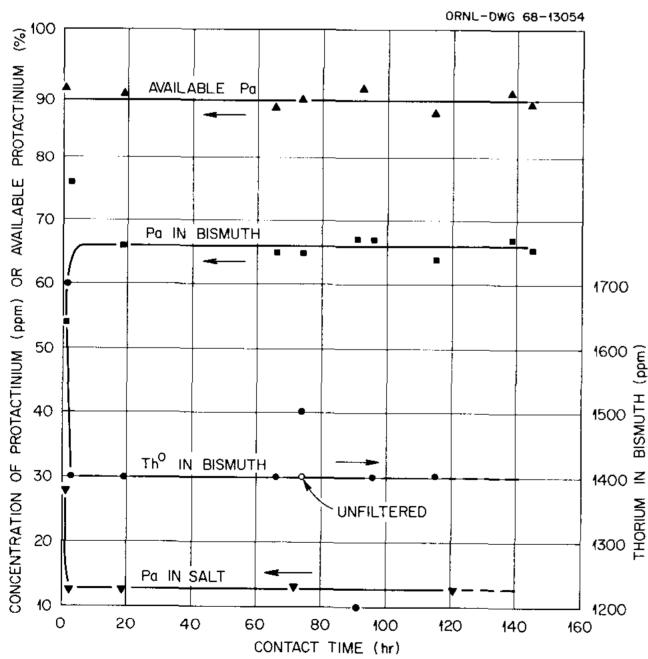  
Fig. 13.7. Distribution of Protactinium and Material Balance for Equilibration of LiF-BeF $_2$ -ThF $_4$ (72-16-12 mole %) with Bi-Th Alloy (0.93 wt % Th).

Purified argon was bubbled through the mixture at a very slow rate (approximately $50\mathrm{ml / min}$ ), and the mixing was less vigorous than in earlier experiments. The protactinium concentration in the 2.2-hr bismuth sample, based on the $^{233}\mathrm{Pa}$ count on the solid sample, the most reliable value available for this particular sample, was a little higher than counts obtained with subsequent samples indicated. The argon gas flow was shut off shortly after taking the 2.3-hr salt sample, and the vessel was maintained under a positive pressure of argon for a period of 90 hr. Argon was then allowed to flow through the vessel at $50\mathrm{ml / min}$ for two days and then helium at the same rate for another day. As the data in Fig. 13.7 show, the protactinium concentration in both salt and bismuth remained virtually unchanged from 19 hr to the end of the equilibration period. The importance of the helium test is that it indicates that our helium supply is almost certainly free of oxygen impurities. The only purification treatment that it had received was passage through charcoal cooled with dry ice, and no change in protactinium distribution resulted from its use.

After having confirmed the long-term stability of protactinium in bismuth contained in molybdenum, we treated the mixture with $\mathbf{H}_{2}$ and HF to oxidize and dissolve the metallic uranium, protactinium, and thorium in the salt. This was followed by hydrogen reduction and by argon sparging to remove HF. We then repeated the thorium reduction process, but this time we added the thorium in increments, allowing about 24 hr between additions, with gentle argon flow to mix the phases, to assure that equilibrium was reached. The protactinium distribution data are presented in Fig. 13.8 as a function of weight of thorium added. The calculated weights of the phases at the first addition of thorium were $212\mathrm{g}$ for the salt and $177\mathrm{g}$ for the metal. As the data in Fig. 13.8 demonstrate, the protactinium content of the phases remained essentially unchanged until the thorium added was sufficient to reduce nearly all the uranium. The salt samples removed after the first two additions of thorium had a distinctly bluish color, indicative of the presence of $\mathbf{UF}_{3}$ . The final thorium addition, which brought the thorium concentration in the bismuth above the saturation value, caused a drop in the protactinium concentration in bismuth. The fact that this loss of soluble protactinium was due to coprecipitation of this element with an insoluble thorium-bismuth compound was shown by raising the temperature to $800^{\circ}$ to dissolve all the thorium.

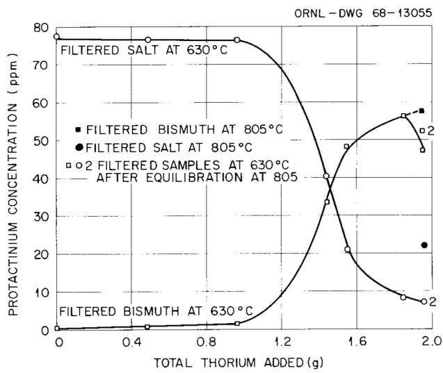  
Fig. 13.8. Distribution of Protactinium Between LiF-BeF $_2$ -ThF $_4$ (72-16-12 mole %) and Bismuth with Varying Th $^0$ Concentrations, Run 8-20-68.

The protactinium concentration in bismuth returned to the value predicted by extrapolating the curve. Somewhat surprisingly, the protactinium concentration in the salt phase increased significantly at the same time. Returning the temperature to its normal level $(630^{\circ}\mathrm{C})$ dropped the protactinium concentration in the salt back to about its previous value but resulted in only a slight drop in the protactinium concentration in the bismuth.

The distribution coefficient

$$
Q _ {\mathrm {T h}} ^ {\mathrm {P a}} = \frac {X _ {\mathrm {P a} (\mathrm {B i})} X _ {\mathrm {T h} (\mathrm {s a l t})}}{X _ {\mathrm {T h} (\mathrm {B i})} X _ {\mathrm {P a} (\mathrm {s a l t})}}
$$

calculated for this experiment was about 1570 with a thorium concentration in the bismuth of $1400~\mathrm{ppm}$ . This value is considerably lower than data reported by other investigators would indicate; but since their data show considerable scatter in the calculated $Q$ value, it is not clear whether the difference in distribution coefficients between their experiments and ours is significant. We will get additional values for this quotient when the remaining samples from the experiment are analyzed.

# 13.3.4 Conclusions

1. Molybdenum is a suitable container material for equilibration of single-region fuel compositions with bismuth-thorium alloys, as reported by other investigators.   
2. There is no solid evidence that either thorium carbide or thorium oxide formation is responsible for the loss of thorium from liquid bismuth-thorium alloys contacted with the single-region salt LiF-BeF $_2$ -ThF $_4$ (72-16-12 mole %) in a graphite container. Presently available data indicate the possibility of Th-Be-C compounds.   
3. Graphite is a suitable container for equilibration of the blanket salt $\mathrm{LiF - BeF}_2\text{-ThF}_4$ (73-2-25 mole %) with bismuth-thorium alloys.   
4. Uranium and protactinium can be readily transferred from solution in bismuth to molten salts by treatment with HF.   
5. The solubility of thorium in bismuth saturated with nickel is much less than in pure bismuth.

# 14. Development and Evaluation of Analytical Methods for Molten-Salt Reactors

# 14.1 DETERMINATION OF OXIDE IN MSRE SALTS

R.F.Apple J.M.Dale A.S.Meyer

Because the earlier analyses by the hydrofluorination method had established that a low and essentially constant concentration of oxide could be maintained in the MSRE fuel, the determination of oxide in the reactor salt samples was assigned a lower priority during this period of operation. The results of the two oxide analyses performed on the fuel are reported in Table 14.1. Also included for comparison are the results obtained for an earlier sample (FP-7-9) whose analysis was deliberately delayed to accentuate the effects of radiation and the average result of all fuel analyses since the reactor achieved power operation.

While the reproducibility $(\pm 8$ ppm absolute) of the combined sampling and analysis procedure is quite satisfactory, the accuracy of the method for radioactive samples is difficult to establish. A possible source of error is the loss of oxygen via evolution by radiolytic fluorine that is generated

during the approximately 8-hr interval between sampling and analysis. Sample FP-14-53 was transported in a carrier designed to maintain the sample at a temperature above $500^{\circ}\mathrm{F}$ to eliminate the radiolytic generation of fluorine. Because of a crowded sampling schedule it was not possible to perform repeated analyses on samples transported in the heated carrier before the scheduled reactor shutdown. The absence of any significant differences between the results of a sample handled to minimize and that handled to maximize the effects of radiation, together with the overall reproducibility, strongly suggests that the activity of the samples introduces no determinate error in the method.

During the period when the reactor was not in operation, the hydrofluorination apparatus was used to analyze a number of radioactive and nonradioactive samples. Solvent salt samples for the In-Pile Test Loop were analyzed in an effort to determine the source of oxide contamination. The results are summarized below:

Table 14.1. Oxide Concentrations of MSRE Fuel Salt   

<table><tr><td>Sample Designation</td><td>Date</td><td>Special Treatment</td><td>Oxide Concentration (ppm)</td></tr><tr><td>FP-14-39</td><td>12-2-67</td><td>None</td><td>46</td></tr><tr><td>FP-14-53</td><td>2-7-68</td><td>Heated carrier</td><td>58</td></tr><tr><td>FP-7-9</td><td>7-4-66</td><td>Stored 24 hr at cell temperature</td><td>50</td></tr><tr><td colspan="3">Average of all samples (15) analyzed since reactor startup</td><td>54 ± 8</td></tr></table>

<table><tr><td>Sample</td><td>Oxide Concentration (ppm)</td></tr><tr><td>LiF-BeF2-1</td><td>42</td></tr><tr><td>LiF-BeF2-2</td><td>375</td></tr><tr><td>LiF-BeF2-3</td><td>62</td></tr><tr><td>LiF-BeF2-4</td><td>60</td></tr><tr><td>LiF-BeF2-5</td><td>62</td></tr></table>

Sample 1 was taken from the original salt preparation. Sample 2 was exposed in the molten state for $96\mathrm{hr}$ to the atmosphere of a helium-filled dry box. Samples 3 through 5 were purged, in series, with helium for $48\mathrm{hr}$ .

The method was also adapted to smaller samples which were taken to determine the completeness of removal of oxide from fuel concentrates (LiF $^{233}$ UF $_4$ ) by batch hydrofluorination. The results are given in Table 14.2.

The first five analyses were run to establish the optimum sampling techniques for the processing equipment on samples from a test preparation of concentrate prepared from normal uranium. This development work was performed with G. I. Cathers. Initial samples were taken in a special sampling system designed to withdraw a filtered sample in a small copper ladle. It was necessary either to transfer the sample to a standard ladle or to couple a copper sleeve to the ladle to ensure that $\mathrm{HF - H}_2$

mixture bubbled through the molten sample. To provide larger and more representative samples, the molten salt was drawn into a $\frac{1}{2}$ -in.-OD Inconel tube. After freezing, 1-in. sections cut from the salt-filled tube were taken for analysis. These sections were placed in standard ladles that were prefitted with a welded delivery tube which extended to the bottom of the ladle. After the usual prehydrofluorination at $300^{\circ}\mathrm{C}$ , the sample was melted and allowed to flow to the bottom of the ladle for efficient purging. The results confirm the effectiveness of the preliminary hydrofluorination step in the removal of surface contamination from atmospheric exposure.

The evaluation of the effects of radiation on the components of the hydrofluorination apparatus is of considerable interest because of plans to adapt the technique to the in-line analysis of radioactive salt streams. In general, the experience has been satisfactory. In this period, the third year of operation, the repair of in-cell components was needed on only three occasions. Two of these failures - leaks in the remote coupler resulting from the corrosion of nickel ball joints by fumes from an adjacent cell and an open circuit in the valve-compartment heater system - do not appear to be associated with radiation damage. The cause of the desensitization of the electrolytic moisture-monitor cell, the third since the apparatus was installed, is subject to question. The first and last (present) of these cells, which were used

Table 14.2. Oxide Concentrations of Samples from Test Runs and from ${}^{233}\mathrm{U}$ Fuel Concentrates   

<table><tr><td>Sample Designation</td><td>Sampler</td><td>Sample Weight (g)</td><td>Oxide Concentration (ppm)</td></tr><tr><td>LiF-UF4</td><td>Pellet</td><td>3.5a</td><td>1000</td></tr><tr><td>25A</td><td>Copper sleeve</td><td>3.5a</td><td>85</td></tr><tr><td>40</td><td>Copper-brass funnel</td><td>3.5a</td><td>105</td></tr><tr><td>43</td><td>Inconel</td><td>12.1b</td><td>107</td></tr><tr><td>44</td><td>Inconel</td><td>12.1b</td><td>117</td></tr><tr><td>RU 33-1-S-2 Fuel</td><td>Inconel</td><td>12.1b</td><td>62</td></tr><tr><td>RU 33-2-S-1 Fuel</td><td>Inconel</td><td>12.1b</td><td>33</td></tr><tr><td>RU 33-2-S-2 Fuel</td><td>Inconel</td><td>12.1b</td><td>37</td></tr><tr><td>RU 33-3-S-1 Fuel</td><td>Inconel</td><td>12.1b</td><td>31</td></tr><tr><td>RU 33-3-S-2 Fuel</td><td>Inconel</td><td>12.1b</td><td>32</td></tr></table>

primarily for the analysis of samples of relatively low radioactivity, survived at least 20 analyses and an 8-month service life. Conversely, the other cells, which were used for samples taken during extended power operation, failed after 4 to 10 analyses and 2- to 4-month usage.

All failures have been of the same general type: plastic components exhibited some evidence of noncritical radiation damage, and the $\mathbf{P}_2\mathbf{O}_5$ electrolyte was removed from the electrodes. In an attempt to reproduce these failures under controlled conditions, a moisture-monitor cell was operated in the vertical position at $65^{\circ}\mathrm{C}$ . After the repeated analysis of a series of relatively large $\mathbf{SnO}_2$ standards had failed to reduce the cell's efficiency, it was removed and subjected to $\sim 10^{7}$ rads of $^{60}\mathrm{Co}$ radiation. The irradiated cell continued to function for several months and finally was desensitized after the passage of a total of about $1.5\mathrm{g}$ of water. This treatment represents an exposure to both radiation and water that is at least an order of magnitude greater than that which produced in-cell failure. Although the in-cell failures may have been due to the characteristics of the individual moisture monitors, it is desirable to investigate other techniques for the measurement of water for application to in-line oxide analysis of maltensalt reactor fuels.

# 14.2 DETERMINATION OF URANIUM(III) IN RADIOACTIVE MSRE FUEL BY A HYDROGEN-REDUCTION METHOD

J. M. Dale

A. S. Meyer

R. F. Apple

J. E. Caton

C. M. Boyd

The theory of this method3 and the initial evaluation of the experimental results4 have been previously described. It was noted at that time that the results of the $\mathbf{U}^{3+}$ determinations did not reflect the beryllium additions which had been made to the MSRE fuel salt for the purpose of reducing fractional percentages of the $\mathbf{U}^{4+}$ to $\mathbf{U}^{3+}$ . However, the computer program which was used for the initial evaluation of the experimental results

did not take into account the change in equilibrium concentrations of the corrosion products and uranium that must occur when the fuel is cooled from reactor temperature to the temperature at which the first hydrogen reduction step was made. As a result, the values previously reported for the $\mathbf{U}^{3+}$ concentrations were those in equilibrium at $500^{\circ}\mathrm{C}$ , the temperature of the first reduction step, and not the $\mathbf{U}^{3+}$ concentrations present at $663^{\circ}\mathrm{C}$ , the temperature of the fuel in the reactor.

The computer program has since been modified and the experimental results reevaluated. The new ratios of $\mathbf{U}^{3+}$ to total U are plotted in Fig. 14.1 and are compared with the calculated ratios that would be expected to exist by virtue of the beryllium additions and the fuel burnup. After the first sample was run, a rod of beryllium metal was lowered into the fuel in the reactor. The beryllium is oxidized by the fuel; this reaction produces an increase in the $\mathbf{U}^{3+}$ concentration. All of the increases in the calculated $\mathbf{U}^{3+}$ concentrations are a result of more beryllium additions and corrosion of chromium, whereas the decreases are a result of fuel burnup. The analysis of the sixth and seventh samples gave HF yields in the hundreds of micromoles, which has no correlation with $\mathbf{U}^{3+}$ concentration. At this point, difficulty was experienced with the sampler station, and the reactor was shut down for about a month and a half for maintenance. The first two $\mathbf{U}^{3+}$ results determined after the reactor was brought back to power were close to the calculated values, and the result for the third sample was low. At this point the reactor was down again for a

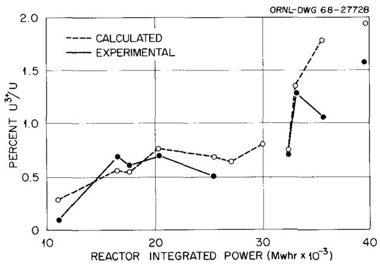  
Fig. 14.1. Concentration of $\mathsf{U}^{3+}$ in MSRE Fuel Salt.

short time, and the next $\mathbf{U}^{3+}$ result increased in value but was still lower than the estimate. One explanation for the low $\mathbf{U}^{3+}$ results is that they are a result of the radiolytic production of fluorine. This hypothesis was discussed in a previous semi-annual report. In order to eliminate this source of error, a heated sample carrier was made to transport the fuel samples from the reactor to the hot-cell facilities. The carrier maintains the temperature of the sample at about $500^{\circ}\mathrm{F}$ in order to eliminate any fluorine production. Due to sampling problems at the reactor, only one $\mathbf{U}^{3+}$ sample transported in the heated container was taken before the final reactor shutdown. The $\mathbf{U}^{3+}$ result for this sample was low compared with the calculated value. However, because of the experimental difficulties of this method, it would be unwise to place too much credence in any single analytical result.

Work was continued on the development of the method for the remote measurement of ppm concentrations of HF in helium and in hydrogen gas streams. The construction and calibration of the dual trapping system for the continuous absorption and desorption of HF on sodium fluoride were completed. The trapping system consists of a dual selector valve, a special Monel thermal conductivity cell (Gow Mac model 9454) with nickel filaments, and two sodium fluoride traps. The valve and thermal conductivity cell are contained in a model 1078 Boekel laboratory oven at $50^{\circ}\mathrm{C}$ and are connected to the sodium fluoride traps, which are mounted on the outside walls. This arrangement permits the simultaneous absorption of HF on one trap at room temperature and the desorption of HF from the alternate trap at $300^{\circ}\mathrm{C}$ by means of self-resistance heating. Figure 14.2 shows the response curve of a typical thermal conductivity cell for the desorption of HF from a sodium fluoride trap. The initial smaller peak is due to a small amount of water impurity and is almost completely resolved from the HF peak. As shown in Fig. 14.3, integration of the thermal conductivity cell response vs the number of micromoles of HF desorbed from the traps is linear over the range of interest (1 to 50 micromoles of HF). This range corresponds to an HF concentration of about 8 to 400 ppm at a carrier-gas flow of 100 cc/min and an absorption period of 30 min.

When this trapping system for the $\mathbf{U}^{3+}$ determinations is installed in the hot-cell facilities, it

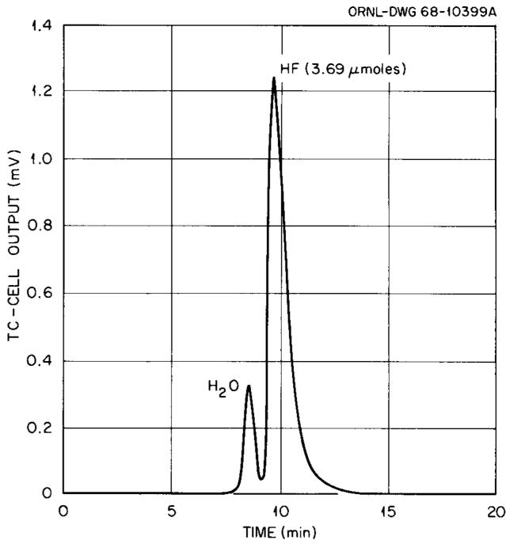  
Fig. 14.2. Thermal Conductivity Cell Response Curve for the Desorption of HF from a Sodium Fluoride Trap.

will be necessary to have some means to check periodically for any deterioration in the thermal conductivity-cell response. We have found that the sampling of a helium gas stream will serve for this purpose. At a cell current of 270 ma and a flush-gas flow of 100 cc/min, the agreement of the cell responses for repetitive samplings of a pure helium gas stream was better than $0.1\%$ . A $10\%$ change in the flush-gas flow causes a change in the cell response of only $1\%$ .

Provisions are now being made to use the trapping system for the analysis of the HF evolved from the hydrogen reduction of standard fuel salt mixtures. This analysis should provide a check of the validity of the hydrogen reduction method and reveal any of its limitations.

# 14.3 DETERMINATION OF TOTAL REDUCING POWER OF RADIOACTIVE MSRE SALTS

R. F. Apple

A. S. Meyer

A method is required to determine whether active colloidal metals, particularly excess zirconium, are present in the reprocessed MSRE fuel solvent.

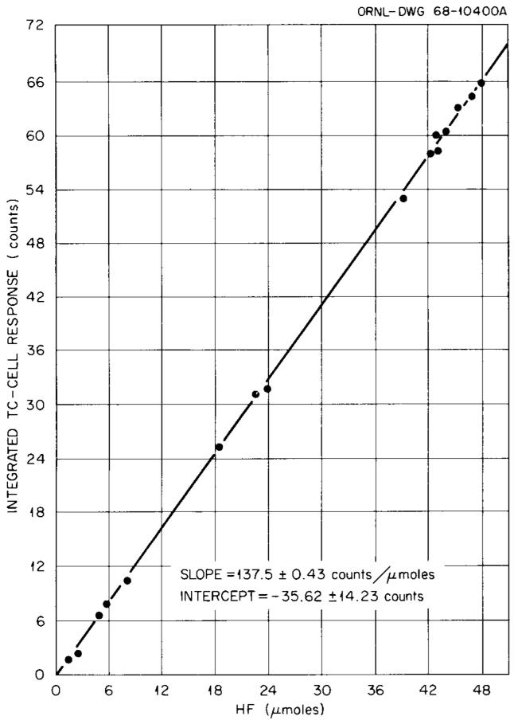  
Fig. 14.3. Thermal Conductivity Cell Response vs HF Desorbed from Sodium Fluoride.

The established hydrogen evolution method is not applicable to radioactive samples, because it requires a finely powdered sample, and no facilities are available to pulverize radioactive samples under a controlled atmosphere. A modification of this technique is being developed in which an unpulverized solid sample is dissolved in a sealed tube in an $\mathrm{HCl - HBO_3}$ mixture. We have demonstrated that $250\mathrm{-mg}$ fragments of fuel, solvent, and fuel concentrate are completely disintegrated by a 24-hr treatment at $250^{\circ}\mathrm{C}$ . The sealed tube is protected by an overpressure of $\mathrm{CO}_{2}$ during the dissolution. In the hot-cell determination the evolved hydrogen will be mixed with a standard addition of helium, and the $\mathrm{H}_{2} / \mathrm{He}$ ratio will be determined mass spectrographically. To simulate the hot

cell operation, samples were added to a tube that was fitted with a breakseal and that contained a thin-walled ampul of deaerated acid. The tube was evacuated and sealed off by using a small $(\sim 300\mathrm{w})$ platinum-wound furnace. The acid ampul was then broken by shaking, and the dissolution was completed successfully. Since all these operations appear to be feasible by remote manipulation, an apparatus is being fabricated to perform the dissolutions and standard additions of helium within the hot cell.

# 14.4 DISPROPORTIONATION OF ELECTROCHEMically GENERATED U(V) IN LiF-BeF $_2$ -ZrF $_4$ 6 AT $500^{\circ}\mathrm{C}$

D. L. Manning Gleb Mamantov

Uranium(IV) is oxidized to uranium(V) at a pyrolytic graphite electrode and at platinum-10% rhodium at $\sim +1.2$ v vs a platinum quasi-reference electrode. The voltammograms are characteristic of catalytic waves, that is, a charge transfer followed by a chemical reaction. This is evidenced by: (1) No voltammetric currents occur that are due to the reduction of U(V) at slow scan rates $(V << 1$ v/sec), and (2) the peak currents for the oxidation of U(IV) and rereduction of U(V) are approximately equal at fast scan rates $(V >> 1$ v/sec). For the uranium case, this appears to be an oxidation step followed by a second-order disproportionation where

$$
R - n e \rightarrow O x, 2 [ O x ] \xrightarrow {k _ {2}} R + Z.
$$

Nicholson and Shain8 treated the first-order case for voltammetry where

$$
R - n e \rightarrow O x, O x + Z \xrightarrow {k _ {1}} R,
$$

but not the second-order case. Some similarity, however, would be expected and is indeed observed, that is, the same general shape of $i_p /$

$\mathbf{v}^{1 / 2}$ vs $\pmb{\nu}$ plots, where $i_p =$ peak current and $\pmb{\nu} =$ scan rate, v/sec. The mathematical treatment of Nicholson and Shain, however, is not applicable to the uranium reaction. Fischer and Dracka applied a chronopotentiometric method to the study of the U(V) disproportionation in aqueous solutions.

Well-defined chronopotentiograms were obtained at a PGE for the oxidation of U(IV) in molten LiF-BeF $_2$ -ZrF $_4$ at $500^{\circ}\mathrm{C}$ . The results were plotted as $i_0 \tau^{1/2}$ vs $i_0^{2/3}$ according to Fischer and Dracka, where $i_0 =$ current density, $\mathrm{amp/cm}^2$ , and $\tau =$ transition time, sec. For a melt where concentration of U(IV) equals $0.063 \times 10^{-3}$ moles/cm $^3$ and electrode area $(A) \stackrel{\sim}{=} 0.1\mathrm{~cm}^2$ , the transition times ranged from about 2 sec to 1.5 msec when the current density $(i_0)$ was varied from 0.01 to 0.12 $\mathrm{amp/cm}^2$ . The rate constant, $k$ , according to Fischer and Dracka is given by the equation

$$
k = \frac {3 \pi A}{8 C S ^ {3}} ,
$$

where $A = i_0\tau^{1 / 2}$ and $S = -(\Delta i_0\tau^{1 / 2} / \Delta i_0^{2 / 3})$ The rate constant, $k$ has the units liters mole-1 sec-1. For the uranium system the $i_0\tau^{1 / 2}$ values were scattered, particularly at the longer transition times. By making several runs, however, qualitative trends could be observed. For the $i_0\tau^{1 / 2}$ vs $i_0^{2 / 3}$ plot, an average line through the points exhibited a negative slope at the lower $i_0^{2 / 3}$ values and became horizontal at the larger values, in agreement with Fischer and Dracka's prediction. Because of the poor reproducibility, particularly at the longer transition times, the rate constant may only be stated as $\sim 160$ liters mole-1sec-1 (at $500^{\circ}\mathrm{C}$ ). Again, the effect of cylindrical diffusion was found to be negligible according to the criteria of Peters and Lingane.10 It is believed that the poor reproducibility is caused in part by the attack of $\mathbf{U}\mathbf{F}_{6}$ , probably produced in the disproportionation reaction, on the electrode material.

From recent spectral data by J. P. Young on U(V) in bulk solution, it is indicated that the rate of disproportionation under different experimental conditions is much slower. A possible explanation is presented.

In view of the catalytic nature of the $\mathrm{U}(\mathrm{IV})\rightarrow$ U(V) electrode reaction, this reaction is less useful analytically than the $\mathrm{U}(\mathrm{IV})\rightarrow \mathrm{U}(\mathrm{III})$ electrode reaction. It is also interesting to note that although the crystalline fluoride complexes of $\mathrm{U}(\mathrm{V})$ are stable at 350 to $400^{\circ}\mathrm{C},^{12}$ an increase in temperature to $500^{\circ}\mathrm{C}$ , accompanied by a change to a liquid phase and a medium of relatively low free fluoride ion activity, results in the decomposition of $\mathrm{U}(\mathrm{V})$ .

# 14.5 EXCHANGE CURRENT MEASUREMENTS ON THE NICKEL-NICKEL(II) COUPLE IN MOLTEN FLUORIDES

Howard Jenkins $^{13}$ D. L. Manning  
Gleb Mamantov $^{7}$

Work has continued on the development of a practical reference electrode for use in molten fluorides. In the course of this work, it became desirable to obtain additional quantitative data on the reversibility of the $\mathrm{Ni(II)} + 2\mathrm{e}\rightarrow \mathrm{Ni}$ electrode reaction. It was decided to use one of the relaxation methods, since a fast charge transfer was expected on the basis of available kinetic data in other molten-salt solvents. The voltage-step method of Vielstich and Delahay $^{14}$ was selected primarily due to the simplicity of the instrumentation. The experimental procedure was similar to that of Laitinen, Tischer, and Roe, $^{15}$ who applied the method to the study of kinetic constants in molten chlorides.

The experimental setup for containing the melt was described previously. The circuit for the voltage step is essentially that of Laitinen, Tischer, and Roe. Two mercury relays (Clare HG 1003) were used to make sure that the short circuit between the electrodes was broken before applying the voltage step, usually $4\mathrm{mv}$ . The oscilloscope (Tektronix 549) used for recording the current-time curves is triggered by the signal

Table 14.3. Kinetic Constants for Ni-Ni(II) Couple at $500^{\circ}\mathsf{C}^{a}$   

<table><tr><td></td><td>LiF-BeF2-ZrF4</td><td>LiF-NaF-KF</td></tr><tr><td>Standard rate constant, cm/sec</td><td>1.6–8.2 × 10-4</td><td>0.6–2.1 × 10-4</td></tr><tr><td>Transfer coefficient</td><td>0.59–0.44</td><td>0.64–0.53</td></tr><tr><td>Molar exchange current density, amp/cm2</td><td>2.0–3.2</td><td>0.9–1.6</td></tr></table>

The extreme values are reported. The wide range is caused primarily by the poor linear dependence of exchange current on the concentration of nickel(II).

across the coil of one of the relays. Small working electrodes of nickel $(A\sim 7\times 10^{-2}\mathrm{cm}^2)$ both unsheathed and sheathed in boron nitride were utilized.

In the voltage step method, the Faradaic current observed after the charging current has become negligible is extrapolated back to zero time. The exchange current, $i_0$ , is calculated from the equation

$$
i _ {0} = \frac {R T}{n F A} \frac {i _ {t = 0}}{(- V - i _ {t = 0} R _ {T})},
$$

where $i_{t=0}$ is the "zero time" current, $V$ is the known voltage step, and $R_{T}$ is the total resistance of the system. The kinetic constants for the nickel-nickel(II) couple are shown in Table 14.3.

Kinetic constants for metal-metal-ion systems in molten fluoride solvents are for the most part nonexistent. Therefore comparisons are not possible, although it is believed that the reported values are of the correct order of magnitude. The exchange current is, in essence, a measure of the ability of a metal-metal-ion couple to pass current without becoming polarized. In view of the value obtained for nickel, and since high-impedance potential-measuring devices are normally used, it does not appear that the molar exchange current value for the Ni-Ni(II) couple imposes a restriction on its utilization as a reference electrode system.

# 14.6 VOLTAMMETRIC STUDIES OF CHROMIUM(II) IN MOLTEN LiF-BeF $_2$ -ZrF $_4$ AT $500^{\circ}$ C

D. L. Manning

J. M. Dale

The electrochemical reduction of $\mathrm{Cr(II)}$ to $\mathrm{Cr}(0)$ was studied in molten $\mathrm{LiF - BeF}_2\mathrm{-ZrF}_4$ (65.6-29.4-5.0 mole %) by voltammetry with linearly varying

potential. Well-defined voltammograms were obtained with pyrolytic graphite and glassy carbon indicator electrodes at a potential of about $-0.9\mathrm{v}$ vs an $\mathrm{Ni - NiF}_2$ reference electrode. Linear plots of peak current $(i_p)$ vs concentration were obtained over the concentration range studied, 0.008 to $\sim 0.03F\mathrm{Cr(II)}$ . Linear plots of $i_p$ vs (scan rate) $^{1/2}$ obeyed the Randles-Sevcik equation from about 0.02 to $1\mathrm{v/sec}$ . The diffusion coefficient calculated from the slope of the line is of the order of $1\times 10^{-6}\mathrm{cm}^2/\mathrm{sec}$ at $500^{\circ}\mathrm{C}$ . In the presence of U(IV), the chromium wave is enhanced, because the chromium reduction occurs at the foot of the U(IV) $\rightarrow$ U(III) reduction wave.

In cooperation with T. R. Mueller of the Analytical Instrumentation Group, a first-derivative circuit was assembled for the controlled-potential, controlled-current cyclic voltammeter. The use of the derivative circuit resulted in much better resolution of the chromium waves in the presence of uranium; however, the derivative peak current for the $\mathrm{Cr(II)}\rightarrow \mathrm{Cr}(0)$ reduction was still enhanced by U(IV).

From the results obtained so far, it is believed that the chromium reduction wave can be utilized analytically to monitor chromium in fluoride melts; in the presence of U(IV) it could be useful on an empirical basis.

# 14.7 DEVELOPMENT OF A MOLTEN-SALT SPECTROPHOTOMETRIC FACILITY FOR HOT-CELL USE

J. P. Young

In cooperation with personnel of Cary Instruments, Varian Associates, work has continued on the design of a system with an extended optical path17 which will permit spectrophotometric

studies of samples of radioactive MSRE fuel.

The scope of the project has broadened somewhat, and the facility will make use of an extended double-beam arrangement. Both sample and reference beams will pass into and out of the hot cell; the spectrophotometer itself will be outside the cell.

The conceptual optical design of the extended light beams has been completed by the vendor of the spectrophotometer, but a contract for its detailed design and construction has not yet been completed.

The facility can be used with solid, liquid, or gaseous samples at temperatures up to $\sim 800^{\circ}\mathrm{C}$ . As pointed out previously, the facility is designed primarily for use with molten fluoride salts and will be used to demonstrate the spectrophotometric determination of U(III) in MSRE fuels, LiF-BeF $_2$ -ZrF $_4$ -UF $_4$ , which contain U(IV).

Equipment has been designed and techniques are being developed so that a sample of fuel can be taken from the MSRE reactor and divided into several (up to five) portions, and the portions can be transferred individually to a spectrophotometric furnace assembly for melting without any exposure to the atmosphere or to temperatures below $200^{\circ}\mathrm{C}$ for periods longer than $30\mathrm{min}$ . Exclusion of air is necessary to prevent the possible reaction of U(III) with $\mathrm{H}_2\mathrm{O}$ and/or $\mathrm{O}_2$ . An elevated temperature is required to prevent the radiolytic evolution of fluorine, which would alter the oxidation state of uranium on remelting the sample.

The apparatus required for this sample transfer has been designed with the assistance of F. L. Hannon and E. F. Marguerat (General Engineering Division, ORNL). It consists of six separate components: (1) sample ladle, which removes a 5-g molten-salt sample from the pump bowl of the reactor; (2) transport container, which receives the sample ladle and maintains it under inert gas; (3) heated transfer carrier, which receives the transport container, provides radiation shielding during transfer of the sample from reactor to hot cell, and heats the sample to $\sim 200^{\circ}\mathrm{C}$ during the transfer; (4) sample-loading furnace, which receives the transport container in the hot cell; within this assembly the 5-g sample is melted and divided into as many as five containers for spectrophotometric study; (5) spectrophotometric furnace lid, which fits both the sample-loading and spectrophotometric furnaces; the lids receive the spectral sample for transfer between the two furnaces; and

(6) spectrophotometric furnace, which receives the sample for melting and spectral study.

All of these sample handling operations, of course, must be carried out with manipulators behind suitable shielding. The apparatus is designed in such a way that the manipulations required at the reactor site fall within their routine procedural requirements. At the hot cell the apparatus can be operated and general maintenance can be performed with master-slave manipulators. All of these components except the sample-loading furnace have been completely designed; components 1, 2, 5, and 6 are presently being fabricated for testing prior to hot-cell use. The orientation of apparatus within the hot cell is being evaluated so that all operations, sample handling, and maintenance can be carried out properly. The obvious applicability of this installation to other types of samples is also considered in this design work.

For spectral analysis in this facility, the $\sim 0.5$ -g molten fluoride sample will be contained in a modified captive-liquid cell adapted for remote-handling techniques. As other sample-confinement techniques, such as windowed cells, are developed to a point where they can be used in a hot cell, they can be interchanged in any part of the facility in which windowless cells are presently being considered.

# 14.8 SPECTRA OF U(V) AND U(VI) SPECIES IN MOLTEN FLUORIDE SALTS

J. P. Young

Spectral studies of U(V) and U(VI) in molten LiF-BeF $_2$ have continued. This work is being carried out in cooperation with G. I. Cathers, Chemical Technology Division, who has prepared the solute salt Na $_2$ UF $_8$ by absorbing UF $_6$ on NaF pellets. It was found that Na $_2$ UF $_8$ at a temperature of 550°C undergoes a rapid and vigorous reaction, possibly with graphite, when it is in contact with molten LiF-BeF $_2$ contained in a graphite windowless spectrophotometric cell. A gas is evolved in the process, and a clear and visually colorless solution results. The spectrum of this solution has been identified as that of U(V). Over the wavelength range of 250 to 2000 nm this spectrum of U(V) consists of two overlapping peaks centered at 950 and 1240 nm and a sharp peak at 1465 nm (molar absorptivities are approximately 6, 3, and 15 respectively). The U(V) solute species was

not stable and slowly converted to U(IV). The molar absorptivities given above were calculated from the measurement of the decrease of absorbance of U(V) and the corresponding increase of U(IV) and the known absorptivities of U(IV);[18] the assumption was made that the only two uranium species of any significant concentration in the melt at any time were U(IV) and U(V). By means of the sharp absorption peak at $1465\mathrm{nm}$ , it should be possible to detect U(V) in MSR fuels at levels of approximately $10\%$ of the U(IV) concentration.

The loss of U(V) concentration appeared to follow second-order kinetics in which the initial concentrations of the reacting species are equal. This would suggest that the U(V) was lost by disproportionation. At $550^{\circ}\mathrm{C}$ the rate constant was calculated to be approximately 0.005 liter mole $^{-1}$ sec $^{-1}$ . Second-order rate constants for the disproportionation of U(V) at an electrode are orders of magnitude larger. $^{19}$ The large discrepancy in the two values suggests that the disproportionation of electrochemically generated U(V) is catalyzed on the surface of the electrode, whereas the disproportionation measured spectrally is a bulk solution rate.

Solutions of $\mathrm{Na}_2\mathrm{UF}_8$ in molten LiF-BeF $_2$ contained in a windowless LaF $_3$ cell were studied spectrally. Although LaF $_3$ has a slight solubility in the solvent, this container material should not be oxidized by U(VI), and indeed, no observable reaction was seen in this melt, unlike the case in graphite. Intense absorption in the ultraviolet region was observed, with shoulders in the region of 315 and $270\mathrm{nm}$ . Some U(IV) and U(V) were observed, and apparently were produced by reaction of U(VI) with impurities in the melt. The addition of chromium metal to the melt caused the disappearance of the ultraviolet absorption and produced the partially interfering spectrum of U(V) and U(IV). It is assumed that the initial spectrum observed is that of a very low concentration of U(VI) of the form $\mathrm{UF}_n^{(6 - n)^+}$ . The absorbing species is not $\mathrm{UO}_2^{2+}$ , which has been observed in other studies.[20] It is also interesting to note that no spectral evidence for $\mathrm{UO}_2^+$ is observed when $\mathrm{UO}_2^{2+}$ is reduced by $\mathrm{Fe}^0$ ; only U(IV) is produced. As a result of these studies, suf

ficient spectral information is now available to identify U(III), U(IV), U(V), and $\mathrm{UO}_2^{2+}$ and to probably identify a nonoxygenated U(VI) species in molten LiF-BeF $_2$ at reactor operating temperatures.

# 14.9 ABSORPTION SPECTRA OF SEVERAL $3d$ TRANSITION METAL IONS IN MOLTEN FLUORIDE SOLUTION

J. P. Young

Experimental work has been completed on a spectral study of $\mathrm{Fe(II)}$ , $\mathrm{Ni(II)}$ , $\mathrm{Cr(II)}$ , and $\mathrm{Cr(III)}$ in various molten fluoride salts. The results have been submitted for publication.[21] The abstract of the publication follows:

The spectra of several $3d$ transition metal ions, $\mathrm{Fe(II)}$ , $\mathrm{Ni(II)}$ , $\mathrm{Cr(II)}$ , and $\mathrm{Cr(III)}$ , have been studied; these ions were dissolved in several molten fluoride salts which are essentially the stoichiometric mixture $\mathrm{Li}_2\mathrm{BeF}_4$ with and without excess $\mathbf{F}^{-}$ , as LiF. The spectra were obtained in the temperature range 540 to $650^{\circ}\mathrm{C}$ ; the samples were contained in graphite windowless containers for the study. $\mathrm{Iron(II)}$ exhibits a peak and shoulder absorbance envelope with maximum absorbance at 9800 and $5500~\mathrm{cm}^{-1}$ . Respective molar absorptivities are 4.5 and 3. The spectrum appears unaffected by change in solvent composition. The spectrum of $\mathrm{Ni(II)}$ at a temperature of $550^{\circ}\mathrm{C}$ consists of three peaks at 23,100, 10,800, and ca. $6000~\mathrm{cm}^{-1}$ . Respective molar absorptivities are 11, 2, and ca. 1. The spectrum appears to be likewise unaffected by solvent change. At a temperature of $550^{\circ}\mathrm{C}$ , $\mathrm{Cr(II)}$ appears to exhibit one peak at $14,000~\mathrm{cm}^{-1}$ with a molar absorptivity of 6; $\mathrm{Cr(III)}$ exhibits three peaks at 33,000, 22,600, and $14,500~\mathrm{cm}^{-1}$ ; respective molar absorptivities are ca. 10, 10, and 7. The spectral results would suggest that, in general, these ions are situated in $O_h$ symmetry in these melts with little tendency to change if the "free" fluoride ion concentration is reduced over the range studied. $\mathrm{Iron(II)}$ is a possible exception to this generality.

# 14.10 SIMULTANEOUS ELECTROCHEMICAL AND SPECTROPHOTOMETRIC STUDY OF SOLUTES IN MOLTEN FLUORIDE SALTS

F. L. Whiting $^{22}$ J. P. Young Gleb Mamantov

The study of the electrochemical generation and spectral identification of solute species in molten fluoride salts17 has continued. It has been apparent that melt impurities, primarily hydrolysis products, must be absent for the generation of the desired solute species.

Various methods for the purification of LiF-NaF-KF have been attempted. The methods have included treatment with HF and $\mathrm{SiF}_4$ and a vacuum pretreatment at $450^{\circ}\mathrm{C}$ .23 Of these methods, the vacuum pretreatment proved to be the most effective. It was noted that the removal of HF from molten LiF-NaF-KF was best achieved by evacuating the melt at $860^{\circ}\mathrm{C}$ , whereas $\mathrm{SiF}_4$ was removed at $500^{\circ}\mathrm{C}$ . Silicon tetrafluoride is highly soluble in molten LiF-NaF-KF, and its dissolution is an endothermic process. An increase in pressure and changes in the forms of the voltammograms of the melt indicated that the HF and $\mathrm{SiF}_4$ had been removed at the temperatures cited.

The reduction of $\mathrm{Ta(V)}$ in molten LiF-NaF-KF at a platinum electrode appears to be at least a two-step process to the metal, as was reported by Senderoff et al.24 Attempts to verify the reported oxidation of Ta(V) to Ta(VI) have yielded inconclusive results.

The anodic dissolution of a copper electrode in molten LiF-NaF-KF produces at least two oxidation states of copper. An insoluble form of $\mathrm{Cu(I)}$ was produced at $+1.1\mathrm{v}$ vs the platinum quasi-reference electrode, and at $+1.35\mathrm{v}$ the production of a soluble form of $\mathrm{Cu(II)}$ is believed to occur. The spectrum of $\mathrm{Cu(II)}$ in molten LiF-NaF-KF, generated electrochemically, consists of a band at $810\mathrm{nm}$ and an unresolved charge-transfer band in the ultraviolet region.

# 14.11 DEVELOPMENT OF A GAS CHROMATOGRAPH FOR ANALYSIS OF THE MSRE BLANKET GAS

C.M.Boyd A.S.Meyer

A helium breakdown voltage detector is being studied for use in a gas chromatograph for the determination of permanent-gas impurities in the helium blanket gas of the MSRE. The breakdown voltage of pure helium was of the order of $500\mathrm{v}$ and was decreased $\sim 50$ v by 1-ppm concentration of impurities. The minimum detectable limit of impurities is controlled primarily by the helium purity and the noise level in the detector. A minimum noise level was obtained with a smooth glow discharge on the anode probe. This condition was affected by the current level, amount of contaminants, and the spacing and alignment of the electrodes. Maximum sensitivity dictates the use of very pure helium carrier gas, but this purity level also causes a loss of the smooth glow discharge and increases the noise level.

The addition of mercury vapor by the presence of a small source of the metal in the tip of the anode stabilized the discharge, but temperatures above $50^{\circ}\mathrm{C}$ gave high concentrations of mercury which greatly decreased the sensitivity of the detector. A method of adding a smaller amount of mercury vapor by passing a controlled flow of helium through a heated tube containing $\mathrm{HgO}$ and a catalyst $(\mathrm{Fe}_2\mathrm{O}_3)$ was not completely successful, due to the gradual increase in temperature required to maintain a constant evolution rate of mercury.

A more practical solution of adding a contaminant was sought. A 100-in. length of 0.004-in. capillary was used to control the flow of a gas mixture into the detector through the anode probe. When a $1000\text{-ppm}$ $\mathbf{H}_2$ -in-He gas mixture was used, it was difficult to maintain a constant low pressure on the capillary for constant low flow rate. The use of a $100\text{-ppm}$ $\mathbf{H}_2$ -in-He gas mixture allowed the use of higher pressures which gave more constant flow rates and less fluctuation in the helium breakdown voltage. The hydrogen was not as effective as mercury in stabilizing the discharge, but some other gas may give an optimum effect. A 50-ppm Xe-in-He gas mixture was tested, and xenon was found to be $\sim 10$ times as effective as $\mathbf{H}_2$ .

# 14.12 ANALYSIS OF MSRE HELIUM FOR HYDROCARBONS

C. M. Boyd

A system for continuously measuring the total hydrocarbon concentration in the radioactive off-gas of the MSRE has been installed in the gas sampling station. In this system (Fig. 14.4), the reactor off-gas is passed through a combustion tube that contains CuO maintained at $700^{\circ}\mathrm{C}$ . This combustion converts hydrocarbons in the helium to $\mathrm{CO}_{2}$ and $\mathrm{H}_{2}\mathrm{O}$ . The oxidized gas stream is passed through one side of a thermal-conductivity (TC) cell, through a 3A molecular sieve-Ascarite- $\mathrm{Mg(ClO}_{4})_{2}$ trap, which removes the $\mathrm{CO}_{2}$ and $\mathrm{H}_{2}\mathrm{O}$ , and back through the reference side of the TC cell. The difference between the thermal conductivity of the gas in the two sides of the cell is a measure of the hydrocarbon concentration in the off-gas, with detection limits of less than $10\mathrm{ppm}$ . A length of brass tubing is installed upstream to the reference side of the TC cell. After the gas stream is switched by means of valves to bypass the trap, a step response in the TC signal is obtained. This plateau represents the period required to equilibrate the oxidized surface of the brass tubing with moisture (Fig. 14.5). By use of standard gas mixtures, it was demonstrated in a laboratory system that the relative step heights are proportional (within $\pm 10\%$ ) to the ratio of $\mathrm{CO}_{2}$ to $\mathrm{H}_{2}\mathrm{O}$ . Therefore an estimate of the ratio of carbon to hydrogen in the reactor off-gas can be made from such measurements.

The initial tests of the system on MSRE off-gas have shown that the fission-product activity in this stream causes serious interference. This interference is largely the result of the radiolysis of traces of absorbed water in the trap rather than

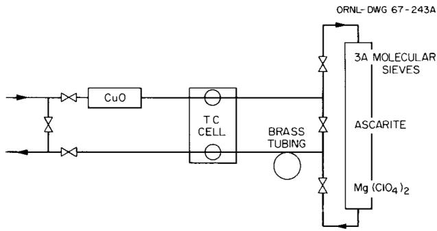  
Fig. 14.4. Flow Diagram of Hydrocarbon Analyzer for MSRE Off-Gas.

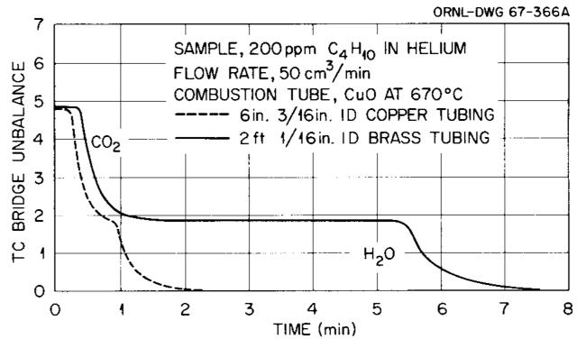  
Fig. 14.5. Determinations of Hydrocarbons in Helium by Measuring the Thermal Conductivity of Their Combustion Products.

the radiolysis of the reagents themselves. The contamination level is of the order of 100 ppm. This level increased only slightly on oxidation, indicating only about 10 ppm of combustibles.

Tests have been made on the materials contained in the trap to determine the effect of radiation. Samples (5 g) were sealed in 20-cc glass vials filled with helium at $50\mathrm{mm}$ pressure and were subjected to $2\times 10^{7}$ rads of $^{60}\mathrm{Co}$ radiation. Mass spectrometry showed that hydrogen is the major radiolysis product from Ascarite, while oxygen was produced from both wet and dry samples of $\mathrm{Mg(ClO_4)_2}$ . Wet molecular sieve gave some $\mathbf{H}_2$ , $\mathbf{N}_2$ , $\mathbf{CO}$ , and $\mathbf{O}_2$ . Dry molecular sieve produced very little contaminant gas on irradiation. The large trap that contained the combination of absorbing materials is being replaced with a small trap that contains only molecular sieve. A heater on this trap will keep it free of water and $\mathrm{CO}_{2}$ by a bakeout between tests. The amount of contaminant gases produced by radiolysis in this small dry trap should be greatly decreased.

# 14.13 MEASUREMENT BY Ge(Li) GAMMA SPECTROSCOPY OF FISSION PRODUCTS DEPOSITED IN COMPONENTS OF THE MSRE

F. F. Dyer R. Blumberg25

T. H. Mauney $^{26}$

An effort was made to determine qualitatively and quantitatively the gamma-emitting fission

products that deposit on components (principally the heat exchanger) of the MSRE. A knowledge of the deposited fission products is important primarily for estimation of the heat generated by the fission products after reactor shutdown and for purposes of remote maintenance. There is also interest in the fission product distribution to determine if correlations exist between the extent of deposition and temperature gradients, moltensalt chemistry, and fission-product precursor half-life. In addition, there is a specific interest in determining if $^{95}\mathrm{Zr}$ deposits.

Measurements of the fission products were made by gamma spectrometry using a highly collimated Ge(Li) diode. The collimator consisted of a lead cylinder with a diameter of 19 in. and a length of 33.5 in. The diode, in a small Dewar, was placed in a cavity in the top of the shield over a collimator hole with a diameter of $\frac{1}{8}$ in. and a length of 12 in. By means of the collimator the detector could be focused on an area about 3 in. in diameter on the reactor components (a source-to-detector distance of 15 ft). Pulse-height spectra were taken with a 400-channel analyzer. Measurements were begun on March 28, 1968 (five days after reactor shutdown) and continued at intervals over a 12-day period.

The major fission products found in the heat exchanger and input and output fuel salt lines of the heat exchanger were $^{132}\mathrm{Te} - ^{132}\mathrm{I}$ , $^{103}\mathrm{Ru}$ , $^{99}\mathrm{Mo}$ , and $^{95}\mathrm{Nb}$ . Minor amounts of $^{106}\mathrm{Ru}$ and $^{140}\mathrm{Ba}$ $^{140}\mathrm{La}$ were found. Fission products detected in the pump bowl and off-gas line included those listed above and $^{141}\mathrm{Ce}$ , $^{131}\mathrm{I}$ , and $^{137}\mathrm{Cs}$ . No $^{95}\mathrm{Zr}$ was detected. Quantitative results were obtained in terms of curies per square inch of area contacted by the fuel salt. The amounts of each fission product deposited on the heat exchanger increased slightly from the fuel-salt entry over about the first foot of heat exchanger and then decreased over the next 5 ft. Table 14.4 lists the mean deposition values found in the heat exchanger for the fission products $^{95}\mathrm{Nb}$ , $^{99}\mathrm{Mo}$ , $^{103}\mathrm{Ru}$ , and $^{132}\mathrm{Te} - ^{132}\mathrm{I}$ . Table 14.4 also lists the percent of total inventory for each fission product. These values were obtained by multiplying the mean deposition values by the total wettable metal surface in the MSRE and dividing by the total curies of each fission product in the MSRE at reactor shutdown time. More detailed results from these experiments are given in Sect. 2.2.

Table 14.4. Major Fission Products Found in MSRE Heat Exchanger   

<table><tr><td>Fission Product</td><td>Mean Curies per Square Incha</td><td>Percent of Fission Product on Metal Surfacesb</td></tr><tr><td>95Nb</td><td>1.9</td><td>58</td></tr><tr><td>99Mo</td><td>4.9</td><td>102</td></tr><tr><td>103Ru</td><td>1.1</td><td>64</td></tr><tr><td>132Te-132I</td><td>2.2</td><td>66</td></tr></table>

${}^{a}$ Values pertain to heat exchanger.   
$b$ Values based on inventories of fission products calculated by E. L. Compere (unpublished) and total metal surface area contacted by fuel salt as estimated by R. E. Thoma (unpublished).

# 14.14 IN-PILE FISSION-PRODUCT PENETRATION IN MSRE AND PYROLYTIC GRAPHITE

L.C.Bate F.F.Dyer

Assistance is being given to the Reactor Chemistry Division in a study of in-pile penetration of fission products into MSRE and pyrolytic graphite. Cylindrical specimens were obtained from blocks of graphite (removed from the reactor in the spring of 1967 and March 1968), by core drilling. These specimens were repeatedly sanded to obtain samples (on emery paper) as a function of depth in the graphite. The thickness of graphite represented by the samples was varied from about 0.001 in. near the surface of the specimen to about 0.015 in. at a depth of about $\frac{1}{2}$ in.

The first series of samples were measured by NaI(Tl) spectrometry. The later series were measured by Ge(Li) diode spectrometry. The improved resolution of the Ge diode permitted measurement of $^{141}\mathrm{Ce}$ , $^{144}\mathrm{Ce}$ , $^{103}\mathrm{Ru}$ , $^{106}\mathrm{Ru}$ , $^{137}\mathrm{Cs}$ , $^{95}\mathrm{Zr}$ , $^{95}\mathrm{Nb}$ , $^{132}\mathrm{Te}$ , $^{131}\mathrm{I}$ , and $^{140}\mathrm{Ba}-\mathrm{La}$ . Previously, resolution of the two cerium and ruthenium pairs of radionuclides and $^{95}\mathrm{Zr}-^{95}\mathrm{Nb}$ by NaI(Tl) spectrometry was not possible.

Results were obtained in disintegrations per second per sample for each radionuclide. It was observed that the concentrations of fission products decreased rapidly with distance in the graphite. A notable finding was that the ratio of the dis-integration rates of $^{95}\mathrm{Nb}$ to $^{95}\mathrm{Zr}$ was about 10 for most samples. Since the samples had decayed for

several months, this fact indicates that $^{95}\mathrm{Nb}$ penetrates MSRE graphite much more readily than $^{95}\mathrm{Zr}$ does.

The pyrolytic graphite after the surface sample was removed contained considerably lower concentrations of fission products than MSRE graphite. Also, $^{140}\mathrm{Ba - La}$ was not detected in the pyrolytic graphite.

# 14.15 PRECISION ANALYSIS OF $^{235}\mathrm{U}$ BY DELAYED-NEUTRON COUNTING

J. F. Emery

Since the original study of the determination of $^{235}\mathrm{U}$ by delayed-neutron counting27 a need has arisen to improve the accuracy and precision of the method for the analysis of the MSRE fuel salt. This method is applicable to the analysis of $^{233}\mathrm{U}$ also.

Several innovations in the technique resulted in the improvement of the precision by a factor of 2. A more reproducible decay time was obtained by increasing the pressure of the air propelling the "rabbit" from 10 psi to 20 psi. The irradiation time was increased from 60 to 120 sec and the decay time from 20 to 25 sec. Under these new conditions, the total count is a little less dependent on variations in the decay time. The relative standard deviation on samples was improved from 0.5 to $0.3\%$ , while the relative standard deviation for successive irradiation of a single sample improved from 0.3 to $0.16\%$ .

The electronic resolution of this system is still the one single problem in improving the accuracy of this method. A new current-sensitive pre-amplifier has been developed by the Instrumentation and Controls Division which holds good promise of improving the time resolution of this system.

# 14.16 HIGH-PRECISION POLAROGRAPHIC DETERMINATION OF URANIUM

P. F. Thomason

L. T. Corbin

A precise polarographic method for the determination of uranium is under study. The rapid-scan

controlled-potential dc polarograph-voltammeter developed by H. C. Jones, W. L. Belew, et al. is capable of taking 20 polarograms of a single solution in 25 min with a relative standard deviation of $0.1\%$ . Uranium peak heights of the derivative polarograms are measured as voltage on a digital voltmeter, as it is virtually impossible to measure a polarogram traced on a recorder chart with this precision. Synthetic MSRE fuels have been analyzed with a relative standard deviation of $0.1\%$ ; however, a negative bias of approximately $0.5\%$ has been observed. Use of the standard addition technique together with a maximum suppressor (Triton X) has not eliminated this negative bias. W. L. Maddox recently found that a 60-cycle ac signal is present in the electrode system. This could account for the difficulty in obtaining accurate results. The study will be resumed when this ac pickup has been eliminated.

# 14.17 A PRECISE DETERMINATION OF URANIUM IN MSRE FUEL

G. Goldberg

L. T. Corbin

A unique method is under development to increase the precision of the remote determination of uranium in the MSRE fuel. The current method, which consists of a direct measurement of uranium in a sulfuric acid solution of the fuel by controlled-potential coulometry, has a precision of about $1\%$ . It will be difficult to maintain this precision when the concentration of uranium is reduced to 0.13 mole $\%$ for $^{233}\mathrm{U}$ operations. For optimum control of the reactor by chemical analysis, the precision should be approximately $0.1\%$ .

The method under investigation is based on the preliminary separation of the uranium from the balance of the fuel by fluorination at $600^{\circ}\mathrm{C}$ and collection of the $\mathrm{UF}_6$ on a trap of NaF. The $\mathrm{UF}_6$ and NaF are dissolved in a sulfuric acid-boric acid mixture, and the uranium, now free from interfering ions, is determined with a high-sensitivity controlled-potential coulometric titrator. Preliminary tests have shown that $>99\%$ of the uranium can be volatilized from a 50-g fuel sample in a 1-hr fluorination period. The coulometric titration technique has been used in the laboratory to determine uranium in solutions with a precision of $0.1\%$ .

In order to apply this method with the same degree of precision to highly radioactive samples

which must be processed remotely in a hot-cell facility, certain modifications were necessary. A precision of better than $0.5\%$ would be quite difficult if it were necessary to pipet and titrate an aliquot of the sample remotely within the hot cell. Whether or not the trap which contains the separated $\mathrm{UF}_6$ can be removed from the hot cell for a more precise uranium determination depends on the amount of radioactivity (e.g., ruthenium, niobium, tellurium, iodine, etc.) carried over to the trap. To reduce the high level of the activity, a pre-trap containing NaF and heated to $400^{\circ}\mathrm{C}$ was positioned between the fluorination reactor and the collection trap. The $\mathrm{UF}_6$ is not retained in the pre-trap at this higher temperature. Radioactive ruthenium, niobium, tellurium, and iodine were added to 50-g samples of simulated MSRE fuel prior to fluorination. Results indicate that only $^{131}\mathrm{I}$ deposits in the collection trap in any significant amounts along with the $\mathrm{UF}_6$ .

A fluorination apparatus was constructed and placed in a hot cell. The design is such that all manipulations may be made with little or no difficulty within the cell. All gas-flow and temperature-adjustment controls are mounted outside and at the front of the cell. Several runs were made with simulated MSRE fuel before fluorination of an actual MSRE sample was attempted.

Initial recoveries were low due to an apparent loss of the high-density $\mathrm{UF}_{6}$ between the inner wall of the fluorination pot and the liner which contains the sample. The apparatus was modified by the reduction in diameter of the pot and the addition of an inert-gas flush line with an inlet at the bottom of the pot. Since recoveries were now better than $97\%$ , a series of MSRE samples were fluorinated in order to recover and purify the uranium for isotopic examination. Although the original samples read between 500 and 600 rems, the collection traps seldom exceeded 20 millirems after fluorination, and were removed safely from the hot cell for the uranium analysis.

In order to further increase the accuracy and precision of the method, provision was made to flush fluorine also through the inlet at the bottom of the pot. Several hot MSRE samples have since been analyzed. Results are encouraging in that the uranium values for these samples agree within $0.2\%$ with values for similar samples which were analyzed remotely. The precision of the analysis of replicates of the fluorinated samples is better than $0.2\%$ . Known amounts of uranium will be added to barren salt samples to further evaluate the method.

# Part 4. Molten-Salt Irradiation Experiments

E. G. Bohlmann

Budgetary limitations have necessitated suspension of the ORR convection loop program during fiscal year 1969 as such, so no further development of the third loop has occurred. However, some peripheral investigations have been carried out during this period.

Investigations of the wetting of graphite by salt prompted by the observation that salt had wetted the graphite in the second ORR loop were continued. The results suggest that this wetting occurred during the multiple sample-withdrawal drain operation, since wetting was shown to be promoted at points of three-phase contact of salt, graphite, and gas at substantially lower moisture levels than was the case for the ORR loop, and wetting does not occur when the graphite is totally immersed.

A second capsule irradiation of fluoroborate

coolant salt in spent HFIR fuel elements was completed. No stability or compatibility problems were observed after 1460 hr exposure under conditions of temperature and gamma radiation intensity approximating those in an MSBR heat exchanger. Considerations of the effects of delayed-neutron fluences indicate that consequent fluorine generation will be tolerably low.

A removable section of the MSRE off-gas line located 2 ft downstream from the pump bowl was examined as part of the continuing effort to establish the fates of fission products in molten-salt reactors. The results confirmed other studies which have shown unexpectedly large amounts of noble metals in the off-gas, but they did not reveal any macro deposits of such isotopes.

# 15. Molten-Salt Convection Loop in the ORR

E. L. Compere

H. C. Savage

E. G. Bohlmann

# 15.1 STUDIES OF SURFACE WETTING OF GRAPHITE BY MOLTEN SALT

The susceptibility of molten salts to traces of moisture in cover gas was studied by Kreyger, Kirslis, and Blankenship, $^{1}$ who associated wetting of graphite by salt with three-phase contact of gas, graphite, and salt at moisture levels in the gas as low as 10 ppm or lower. We observed wetting of

fuel channel surfaces in graphite by salt in the examination of the second molten-salt in-pile loop. Salt had been drained from the loop using pressurization by high-purity argon $(< 4\mathrm{ppmH}_2\mathrm{O})$ .We also found3 that droplets of salt melted on graphite did

not wet it under high vacuum, but the admission of low pressures $(< 1\mathrm{mm})$ of helium $(< 4\mathrm{ppm}\mathrm{H}_2\mathrm{O})$ resulted in prompt initiation of wetting.

Similar problems due to low levels of moisture or other contaminants in gas could arise in molten-salt reactors, in reprocessing experiments, and in other situations involving molten salts containing lithium and beryllium fluorides. The studies reported below have been conducted in an effort to find experimental operating conditions and procedures in which interaction of salt with trace moisture in cover gas does not occur and wetting does not ensue.

We tested the tendency of graphite to be wetted if entirely immersed in salt. Two squares of graphite were connected in "T" arrangement and fixed in an inverted position in a clean copper dish. The dish was filled with $\mathrm{Li}_2\mathrm{BeF}_4$ salt which was melted under vacuum in a glove box, so that the horizontal piece of graphite was covered with molten salt without exposure to gas. Helium was then admitted and the system maintained molten. After one day the copper was wet by salt, and after one more day salt began to creep up the exposed part of the vertical graphite piece. The salt crept outside the cup. The graphite pieces were lifted from the salt and the salt was frozen. Microscopic examination of the graphite showed that all areas in contact with gas had been wet and covered with a film of salt, but no evidence of wetting was found on any region of the immersed graphite.

Similar behavior was apparent in droplet experiments reported below. When a droplet for various reasons moved away from its original location, it was observed that the graphite surface initially covered by the molten salt was not wetted. Only subsequently would the salt interface creep over this area.

These experiments indicate that in molten-salt reactors, graphite should not be wetted by salt while it is immersed, but is very susceptible to wetting during draining and filling operations. The observed importance of the three-phase contact area suggests that moisture-promoted wetting is lateral only and should not proceed inward from a graphite surface, since salt which has covered the surface will prevent moisture-containing gas from getting to a deeper contact area and furthering the penetration. It seems likely that wetting of the graphite in the ORR loop occurred during the multiple sample-withdrawal drain operation in which tank argon ( $\sim 4$ ppm $\mathrm{H}_2\mathrm{O}$ ) was used to move the salt in the equipment at intervals.

A qualitative indication of the rate of moisture absorption by salt from such gas was given by an experiment in which helium containing $\sim 4$ ppm $\mathrm{H}_{2}\mathrm{O}$ was passed through three bubblers in series, each containing $30\mathrm{g}$ of molten $\mathrm{Li}_{2}\mathrm{BeF}_{4}$ salt. Flow was continued for ten days at about $100~\mathrm{cc / min}$ , sufficient to increase the oxygen content of one bubbler by $140~\mathrm{ppm}$ if all the moisture were absorbed in it.

The oxygen contents of the salt from the respective bubblers were found to be in the range 60 to 65 ppm (original salt was $42~\mathrm{ppm}$ ), indicating that about $15\%$ of the inlet oxygen was taken up in each bubbler. Simple nonconvective diffusion to a rapidly absorbing wall should almost completely deplete the moisture in any bubble of reasonable size under experimental conditions [i.e., for $99\%$ removal, (bubble radius) $^2$ /contact time $= D / 0.4$ , or approximately $7~\mathrm{cm}^2/\mathrm{sec}$ ]. Consequently, the wall did not absorb rapidly, and the reaction rate is indicated to have been limited by liquid film or surface reaction rate factors rather than by gas film resistance.

The incomplete but definite nature of moisture removal in this experiment was substantiated by observed wetting times of molten-salt droplets on graphite planchets in heated quartz tubes immediately before and after the bubblers; upstream wetting time was $7\mathrm{hr}$ , while in the downstream tube wetting occurred overnight.

In order to study the sensitivity of the wetting behavior to moisture removal and to seek means of obtaining adequately purified atmospheres in which wetting would not occur, several techniques were used.

Conventional techniques were tested first using a vacuum glove box. Heated traps filled with sponge titanium, preconditioned molecular sieves at room temperature, and liquid-nitrogen traps containing molecular sieves or activated charcoal were used to further treat high-purity helium to develop a glove-box atmosphere in which wetting did not occur. These techniques, including long-term flushing and recirculation, did not inhibit the wetting, probably because gloves, large metal surfaces, and other factors provide a countervailing source of moisture. This was exemplified by an experiment in which a copper dish containing $50\mathrm{g}$ of $\mathrm{Li}_{2}\mathrm{BeF}_{4}$ was heated in the box while helium was recirculated through a molecular sieve trap and a trap containing heated titanium sponge. A moisture meter in the circuit showed $4\mathrm{ppmH}_2\mathrm{O}$ . However, in 24 hr salt had crept out of the dish sufficiently to short the furnace leads below. The salt was found

to contain 376 ppm oxygen (original salt, 42 ppm), an order of magnitude more water being absorbed than indicated by the moisture meter to be in the gas. This indicated an appreciable source of moisture in the box, reacting rapidly enough to compete successfully with the 3-hr recirculation turnover.

In order to eliminate these effects, we then used a heated quartz tube containing a graphite planchet with a drop of molten $\mathrm{Li}_{2}\mathrm{BeF}_{4}$ on it. Stainless steel connecting tubing was used.

Subsequently, in a first test in this system, salt remained molten and nonwetting for 24 hr under vacuum; but when cylinder helium $(\sim 4\mathrm{ppmH}_2\mathrm{O})$ was admitted, wetting began within a quarter hour. When the salt was melted directly under helium, wetting began after a quarter hour.

We installed a second heated quartz tube containing titanium sponge upstream of the first in an effort to establish nonwetting conditions under flow. After melting under vacuum, flow was started; the salt rapidly became covered with a milky film. The experiment was repeated with new materials, and a film developed on the salt within 20 hr. This suggested that system surfaces in between could be contributing moisture.

Titanium sponge was then placed also in the

quartz tube containing the molten-salt droplet between the gas inlet and the graphite planchet.

After melting the salt, helium flow was started at $10~\mathrm{cc / min}$ . The salt remained in unimpaired condition for a week. Flow was increased to 500 cc/min, then lowered to 100 cc/min, and the upstream trap cooled. The salt remained clear and nonwetting for a day.

Thus it was demonstrated that wetting of graphite by salt can be prevented by stringent treatment of the cover gas. The precautions and length of pretreatment periods required to develop nonwetting conditions indicate that even the low levels of moisture that can be desorbed from tubing walls is sufficient to promote wetting.

In the above experiment, flow was continued after cooling the titanium sponge. After two days of flow, during which time enough moisture entered to cover the estimated titanium surface only a few times, wetting of the graphite by the droplet was observed. This confirmed that the protective action was associated with heated titanium sponge and also indicated that the activity of cold titanium sponge was probably limited because the active surface was not renewed and became saturated.

# 16. Gamma Irradiation of Fluoroborate

E. L. Compere

H. C. Savage

J. M. Baker

The proposed use in molten-salt breeder reactors of coolant salt mixtures based on fluoroborates could be questioned if significant decomposition of the salt occurred as a result of exposure to delayed neutrons and gamma radiation from the fuel salt circulated through the heat exchanger. Neutrons would cause a $^{10}\mathrm{B}(n,\alpha)$ reaction, yielding from $\mathrm{NaBF}_4$ an alpha particle, $^7\mathrm{LiF}$ , $\mathrm{NaF}$ , and $\mathbf{F}_2$ (or excess free $\mathbf{F}$ atoms). The high-energy alpha and $^7\mathrm{Li}$ fragments (2.4+ Mev) could decompose other fluoroborate ions, presumably yielding in such a case elemental boron and fluorine and fluoride ion. Intense gamma radiation could have a similar effect. The $(n,\alpha)$ reaction is calculable and appears to be trivial. The high-energy fragment decomposition of molten fluoroborate is not known explicitly, nor is the gamma effect. Since these would be expected to have similar results, the gamma effect has been evaluated first in order to permit discrimination if required.

An experimental rig to expose molten fluoroborate salt to intense gamma radiation was described previously. An argon-filled aluminum container with a heated capsule containing the salt was placed in the center hole of a freshly spent fuel element from the High Flux Isotope Reactor in the reactor pool.

The first fluoroborate irradiation assembly, reported earlier, $^{1}$ was exposed at $600^{\circ}\mathrm{C}$ for $533\mathrm{hr}$ , accumulating a dose of $2\times 10^{10}\mathrm{r}$ . The temperature profile in the capsule appeared to have been uneven, attributed to some water collected in the containment. Operation and results of the second fluoroborate irradiation experiment are given below.

# 16.1 GAMMA DOSE RATES AND DECAY OF SPENT FUEL ELEMENTS

The gamma dose rate to these experiments fell as the element decayed, in accord with estimates based on the Way-Wigner or Untermyer-Weills equations. The HFIR elements were generally run at $100\mathrm{Mw}$ for 23 days. We inserted our experimental assembly into the center hole of the spent element after a cooling period after shutdown of from about 1 to 4 days, removing it only to insert it into the next freshly spent element.

The gamma flux was determined by the reduction of $0.02M\mathrm{Ce(SO}_4)_2$ solutions exposed in the center hole before and after the exposure of the experimental rig, and was determined during exposure by observing the added electrical heat (per unit of heated system mass) required to maintain constant temperature (to be compared with the requirement in the absence of gamma radiation). Results are shown in Fig. 16.1, where electric heat requirement is plotted against a time scale based on decay heat as a fraction of operation power, computed using the Way-Wigner equation. Electric heat requirement was extrapolated to zero decay heat, and gamma heat was measured from this as the origin. Using the definition that $100\mathrm{ergs / g} = 1$ rad, the dose rate was calculated. Thus the radiation intensity varied between $140\times 10^{6}\mathrm{r / hr}$ $(0.4\mathrm{w / g})$ for an element cooled 1.5 days to $17\times$ $10^{6}\mathrm{r / hr}(0.05\mathrm{w / g})$ after 31.8 days of cooling. Values obtained by ceric sulfate dosimetry, also shown, scattered more but were in agreement.

# 16.2 SECOND FLUOROBORATE IRRADIATION EXPERIMENT

Irradiation in HFIR spent element No. 22 began on March 14, 1968, followed by exposure in ele

ORNL-DWG 68-13374

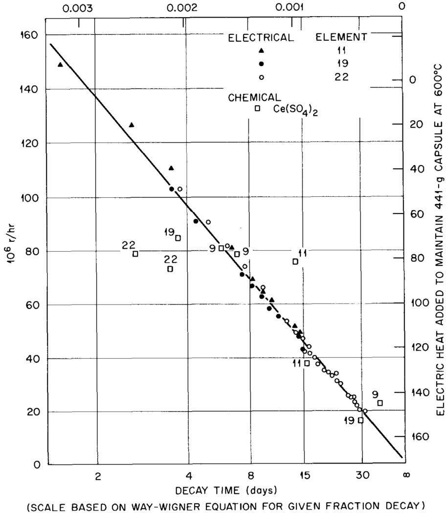  
DECAY HEAT AS FRACTION OF OPERATING POWER  
Fig. 16.1. Gamma Dose Rate in Spent HFIR Fuel Elements.

ments 19 and 11. Irradiation was terminated on May 14, 1968, after $1460\mathrm{hr}$ at $600^{\circ}\mathrm{C}$ , accumulating an estimated dose of $7.7 \times 10^{10}~\mathrm{r}$ (average rate, $5.3 \times 10^{7}~\mathrm{r/hr}$ or $0.15\mathrm{w/g}$ ).

Prior to exposure the $32\mathrm{g}$ of $\mathrm{NaBF}_4$ -NaF eutectic mixture (92-8 mole $\%$ ) was melted in the Hastelloy N capsule under argon, and the capsule was sealed under argon. The capsule was then vacuum pumped at $150^{\circ}\mathrm{C}$ , valved off under vacuum, and heated to $600^{\circ}\mathrm{C}$ . The observed pressure of $\sim 142\mathrm{mmHg}$ is as anticipated from Cantor's data. Upon cooling

to $25^{\circ}\mathrm{C}$ , the residual pressure was below the limit of detection of the gage $(< 5\mathrm{mmHg})$ , and analysis of this residual gas showed it to be largely hydrogen $\left(\mathrm{H}_{2},96.7\% ;\mathrm{H}_{2}\mathrm{O},0.9\% ;\mathrm{O}_{2},0.2\% ;\mathrm{N}_{2} + \mathrm{CO},1.9\% ;\mathrm{CO}_{2},0.2\% ;\mathrm{Ar},0.1\%\right)$ .

During irradiation, which was uneventful except for a plugging problem discussed below, an argon atmosphere was maintained in the container around the capsule; in contrast to the first experiment, no evidence of water in the container was found.

After 13 days of operation, the 50-mil-ID tubing, which connected the gas space above the salt to a pressure transducer, plugged suddenly when the salt temperature was increased rapidly from $350^{\circ}\mathrm{C}$

to $600^{\circ}\mathrm{C}$ following a short power interruption to the capsule heater. The tube was opened by heating the capsule slowly to $\sim 650^{\circ}\mathrm{C}$ (BF $_3$ pressure, $\sim \frac{1}{2}$ atm). The capillary tube remained open until it plugged a second time after 26 days of operation. This plug occurred when the salt temperature was decreased from $600^{\circ}\mathrm{C}$ to $370^{\circ}\mathrm{C}$ when power to the electric heater was interrupted. Attempts to open the tube by heating the capsule to $\sim 690^{\circ}\mathrm{C}$ (BF $_3$ pressure, $\sim 1$ atm) were unsuccessful, and irradiation was continued at $600^{\circ}\mathrm{C}$ .

Near the end of the irradiation period, argon gas $(300\mathrm{mmHg}$ pressure) was added to the pressure tube in an attempt to relieve the plug so that the residual gas in the capsule could be removed for analysis. When the capsule assembly (with pressure tube and transducer intact) was removed from the fuel element and transferred to Y-12, the pressure had decreased from $300~\mathrm{mm}$ to $105~\mathrm{mm}$ , indicating some leakage of argon into the capsule past the plug in the tube. Mass spectrographic analysis of the gas (argon plus residual) removed from the capsule showed $96.8\%$ Ar, $2.4\%$ $\mathbf{H}_2$ , $0.7\%$ $\mathbf{N}_2 + \mathbf{CO}$ , and $0.1\%$ $\mathbf{O}_2$ . No $\mathbf{BF}_3$ or $\mathbf{F}_2$ was found. The capsule was opened and the following observations were made:

1. The surface of the metal walls and enclosed Hastelloy N specimen showed no evident attack, but were dulled. Weight loss of the 29-cm² specimen was negligible (0.0007 g).   
2. The salt consisted of rather large clear plates with translucent, somewhat smoky, crystalline solid between the plates (light gray at a distance).   
3. A small amount of blackish scum was found on the salt surface; this presumably was a salt impurity, as it was also observed in the absence of radiation.   
4. A "droplet" of solidified salt covered the opening of the 50-mil-ID tube in the top of the capsule. Blockage extended about 3 in. from the capsule.   
5. Particles of salt shaped as half-sphere frozen droplets which presumably had adhered to the metal walls were found in the gas region above the salt body.

The droplets found in the gas regions are attributed to spray developing as the system "boiled" under vacuum during heatup. We heated the salt similarly in a quartz tube and observed boiling and spray. The increasing gas pressure is believed to

have forced some droplets into the capillary, ultimately resulting in the observed plugging.

None of the findings were indicative of any radiation decomposition of fluoroborate. It is consequently concluded that no incompatibility between the fluoroborate salt and Hastelloy N was caused by gamma irradiation to a dose of $7.7 \times 10^{10} \mathrm{r}$ with an average intensity of $0.15 \mathrm{~w/g}$ and a maximum intensity of $0.5 \mathrm{~w/g}$ . For comparison, the average intensity of absorbed gamma radiation estimated for the MSBR heat exchangers is $\sim 0.25 \mathrm{~w/g}$ , and for the MSRE it is $\sim 0.02 \mathrm{~w/g}$ .

# 16.3 ESTIMATED NEUTRON EFFECTS

An open and document literature search revealed no studies of radiation or neutron effects on fluoroborate salts. A study on $\mathrm{BF}_3$ (gas) appears relevant. MTR exposure of four capsules containing $\mathrm{BF}_3$ to various integrated thermal neutron fluences up to $8 \times 10^{19}$ nvt resulted in decomposition of up to about $50\%$ of the $\mathrm{BF}_3$ , with about twice as many molecules of $\mathrm{BF}_3$ being decomposed as there were helium atoms produced. Indicated reactions were:

$$
\begin{array}{l} { } ^ { 1 0 } \mathrm { B F } _ { 3 } + n \longrightarrow { } ^ { 7 } \mathrm { L i F } + \alpha + \mathrm { F } _ { 2 } , \\ \mathrm {B F} _ {3} + a \longrightarrow \mathrm {B} _ {\text {m e t a 1}} + 3 / 2 \mathrm {F} _ {2} + \mathrm {H e}. \\ \end{array}
$$

This amounted to about $2^{1/2}$ molecules of $\mathbf{F}_2$ being produced per boron fission (2.4+ Mev), or about $1^{1/2}$ molecules of $\mathbf{F}_2$ by the fission-fragment action. The resulting apparent $G$ value is $0.6 \times 10^{-4}$ molecule of $\mathbf{F}_2$ per 100 ev for the high-energy alpha and $^7\mathrm{Li}$ particles. The low value is indicative of vigorous recombination of any $\mathrm{BF}_3$ fragments. Since in the liquid system, with a symmetrical $\mathrm{BF}_4$ ion capable of exchanging with fluorine atoms and ions, even more vigorous recombination should occur, enhanced by the high melt temperature, the direct $(n,\alpha)$ reaction would appear to be the major process in the molten-salt system. If about $15 \times 10^{16}$ delayed neutrons per second should be released in an MSBR heat exchanger, the maximum fluorine yield ( $15 \times 10^{16}$ molecules of $\mathbf{F}_2$ per second) would amount to 8 moles ( $0.3\mathrm{kg}$ ) of $\mathbf{F}_2$ per year - most likely an acceptably low value.

# 17. Examination of MSRE Off-Gas Jumper Line

E. L. Compere

Indirect evidence for some time has indicated that appreciable quantities of various fission products other than Kr-Xe (and their daughters), in particular noble metals, may be carried into the MSRE off-gas system. If such behavior could be demonstrated, a useful means of removal and recovery of some of these substances could be developed. In any event, the understanding of fission product behavior in molten-salt systems would be increased. Examination of material deposited in the off-gas system would be the most direct approach.

After the shutdown of MSRE run 14 on March 25, 1968, a section of off-gas line, the jumper section of line 522, was removed for examination. This line, a 3-ft length of $\frac{1}{2}$ -in.-ID open convolution flexible hose fabricated of type 304 stainless steel with O-ringed flanges on each end, is located about 2 ft downstream from the pump bowl. The upstream flange is a side-entering flange which attaches to the vertical line leaving the pump bowl, while the downstream flange is a top-entering flange which attaches to the widened holdup line. The jumper discussed here, the third used in the MSRE, was installed prior to run 10, which began in December 1966.

After the MSRE shutdown on March 25, 1968, the jumper section was removed on April 4 and transferred to the High-Radiation-Level Examination Laboratory for cutup and examination. Two flexible shaft tools used to probe the line leading to the pump bowl were also obtained for examination. On opening the container an appreciable rise in hot-cell off-gas activity was

noted, most of it passing the cell filters and being retained by the building charcoal trap. As the jumper section was removed from the container and placed on fresh blotter paper, some dust fell from the upstream flange. This dust was recovered, and a possibly larger amount was obtained from the flange face using a camel's hair brush. The powder looked like soot; it fell but drifted somewhat in the moving air of the cell, as if it were a heavy dust. An $\sim 8$ -mg sample read about $80~\mathrm{r/hr}$ at "contact." The downstream flange was tapped and brushed over a sheet of paper, and similar quantities of black powder were obtained from it. An $\sim 15$ -mg sample read about $200~\mathrm{r/hr}$ at contact. Chemical and radiochemical analyses of these dust samples are given later.

The flanges each appeared to have remaining on them a smooth, dull-black film but no other deposits of significance. Some unidentified bright flecks were seen in or on the surface of the upstream flange. Where the black film was gently scratched, bright metal showed through.

Short sections of the jumper-line hose were taken from each end, examined microscopically, and submitted for chemical and radiochemical analysis. Except for rather thin, dull-black films which smoothly covered all surfaces including the convolutions, no deposits, attack, or other effects were seen.

Each of the flexible probe tools was observed to be covered with blackish, pasty, granular material. This material was identified by x ray as fuel salt particles. Chemical and radiochemical analyses of the tools will be presented later.

Electron microscope photographs taken of the upstream dust showed relatively solid particles of the order of a micron or more in dimension, surrounded by a material of lighter and different struc

ture which appeared to be amorphous carbon; electron diffraction lines for graphite were not evident.

An upstream 1-in. section of the jumper line near the flange read $150\mathrm{r / hr}$ at contact; a similar section near the downstream flange read $350\mathrm{r / hr}$ .

# 17.1 CHEMICAL ANALYSIS

Other portions of the upstream and downstream powders were analyzed chemically for carbon and spectrographically for lithium, beryllium, zirconium, and other metals. In addition, $^{235}\mathrm{U}$ was determined by neutron activation analysis; this could be converted to total uranium by using the enrichment of the uranium in the MSRE fuel salt, which was about 33%.

Results of these analyses as well as analyses of the flexible hose sections and of the flexible shaft tool are shown in Table 17.1.

Analyses of the dust samples show 12 to $16\%$ carbon, 28 to $54\%$ fuel salt, and $4\%$ structural metals. Based on activity data considered later, fission products could have amounted to 2 to $3\%$ of the sample weight. Thereby 53 to $22\%$ of the sample weight is not accounted for in these categories or spectrographically as other metals. The discrepancies may have resulted from the small amounts of sample available. The sample did not lose weight under a heat lamp and thus did not contain readily volatile substances.

# 17.2 RADIOCHEMICAL ANALYSIS

Radiochemical analyses were obtained for the noble-metal isotopes $^{111}\mathrm{Ag},$ $^{106}\mathrm{Ru},$ $^{103}\mathrm{Ru},$ $^{99}\mathrm{Mo},$ and $^{95}\mathrm{Nb};$ for $^{95}\mathrm{Zr};$ for the rare earths $^{147}\mathrm{Nd},$ $^{144}\mathrm{Ce},$ and $^{141}\mathrm{Ce};$ for the daughters of fission gases Kr and Xe, $^{91}\mathrm{Y},$ $^{89}\mathrm{Sr},$ $^{90}\mathrm{Sr},$ $^{140}\mathrm{Ba},$ and $^{137}\mathrm{Cs};$ and for the tellurium isotopes $^{132}\mathrm{Te},$

Table 17.1. Analysis of Dust from MSRE Off-Gas Jumper Line   

<table><tr><td rowspan="2"></td><td colspan="2">Inlet Flange (wt %)</td><td colspan="2">Outlet Flange (wt %)</td></tr><tr><td>As Determined</td><td>Constituent</td><td>As Determined</td><td>Constituent</td></tr><tr><td>Li</td><td>3.4</td><td></td><td>7.3</td><td></td></tr><tr><td>LiF</td><td></td><td>12.6</td><td></td><td>27.1</td></tr><tr><td>Be</td><td>1.7</td><td></td><td>4.2</td><td></td></tr><tr><td>BeF2</td><td></td><td>8.9</td><td></td><td>21.9</td></tr><tr><td>Zr</td><td>2.74</td><td></td><td>1.4</td><td></td></tr><tr><td>ZrF4</td><td></td><td>5.0</td><td></td><td>2.6</td></tr><tr><td>235U</td><td>0.358</td><td></td><td>0.596</td><td></td></tr><tr><td>UF4(total)</td><td></td><td>1.4</td><td></td><td>2.4</td></tr><tr><td>Carbon</td><td>10-14</td><td></td><td>15-17</td><td></td></tr><tr><td></td><td></td><td>12</td><td></td><td>16</td></tr><tr><td>Fe</td><td>~2</td><td>2</td><td></td><td></td></tr><tr><td>Cr</td><td>~&lt;0.01</td><td></td><td></td><td></td></tr><tr><td>Ni</td><td>~1</td><td>1</td><td></td><td>(4.5)</td></tr><tr><td>Mo</td><td>~0.4</td><td>0.4</td><td></td><td></td></tr><tr><td>Al</td><td>~1</td><td>1</td><td></td><td></td></tr><tr><td>Cu</td><td>~0.1</td><td>0.1</td><td></td><td></td></tr><tr><td>FP&#x27;s (max)a</td><td></td><td>(~2)</td><td></td><td>(~3)</td></tr><tr><td>Total found</td><td></td><td>47</td><td></td><td>78</td></tr></table>

${}^{a}$ Assumes chain deposition rate constant throughout power history (includes only chains determined).

$^{129}\mathrm{Te}$ , and ${}^{131}\mathrm{I}$ (Te daughter). These analyses were obtained on samples of dust from upstream and downstream flanges, on the $\sim 1$ -in. sections of flexible hose cut near the flanges, and on the first flexible shaft tool used to probe the pump off-gas exit line.

The data thus obtained are best discussed after reduction to a suitable common basis. This can be done between samples of the same kind by considering equal amounts of sample and between isotopes in a sample by comparing with expected amounts such as MSRE inventory. Direct comparison between samples of different types requires establishment of a relationship between the types, which has not been done; however, relative comparisons might be made. The MSRE inventory decay rate of each isotope (referred to run 14 shutdown) was computed from the detailed power history of the reactor (8.0 Mw full power) by summation of power-weighted saturation factors for each period. Inventory decay rates were also calculated for daughters of rare gases, based on the amount of the short-lived rare gas that could be stripped from the circulating fuel salt into the pump bowl gas space. The first-approximation model used for this purpose assumes that the rare gas which enters the pump bowl, either dissolved in salt or in entrained bubbles, is entirely stripped into the purge gas stream, and effectively none of it is returned to the main circulating stream in any reentrained bubbles. More complex assumptions regarding mass transfer characteristics to bubbles and their entrainment and stripping are not attempted here. Both types of inventory values, and the ratio of isotope activity in the various samples to the inventory values, are shown in Table 17.2.

On such an inventory basis the salt constituents can also be included in the comparison, as can carbon, if a lubricating oil leak rate (such as a reported value of 1.58 liters in $5^{1/2}$ months) is assumed to persist for the full period of operation. These data are thus presented in terms of MSRE inventory in Table 17.2. Similar behavior of the various kinds of constituents should yield equal values for all data for a given kind of sample. Table 17.2 is discussed below from this point of view.

Proportions of Li, Be, and U agreed within each sample within a factor of 2, with Li always high. Zirconium varied between agreement and values of about $\frac{1}{6}$ of the others. Thus to a fair approxi

mation the fuel ingredients appear to have been transported as particles, presumably droplets of spray. Uranium does not appear in any sample to have been carried over by any mechanism more than other constituents. For the flexible tool the relatively higher values of lithium and beryllium may indicate pickup of some residual $\mathrm{LiF}_2$ . $\mathrm{BeF}_2$ flush salt, which had entered this line as overflow in 1966, just prior to the installation of the present jumper.

When the activity of each fission product isotope is expressed as a fraction of MSRE inventory, the isotopes can be placed in several groups as shown in Table 17.2. "Noble metals," including $^{111}\mathrm{Ag}$ , $^{99}\mathrm{Mo}$ , $^{106}\mathrm{Ru}$ , $^{132}\mathrm{Te}$ , $^{129}\mathrm{Te}$ , and $^{131}\mathrm{I}$ (Te daughter), appeared to be present 100-fold to 3000-fold the amount of salt present and roughly in agreement with the carbon. Similarly, the Xe-Kr daughters were present in as high or higher quantities dependent on the particular Xe or Kr half-life involved. These included $^{89}\mathrm{Sr}$ , $^{90}\mathrm{Sr}$ , $^{91}\mathrm{Y}$ , $^{137}\mathrm{Cs}$ , and $^{140}\mathrm{Ba}$ .

Elements with very stable fluorides, $^{95}\mathrm{Zr}$ , $^{147}\mathrm{Nd}$ , $^{141}\mathrm{Ce}$ , and $^{144}\mathrm{Ce}$ , were present in very low amounts never exceeding the salt equivalent.

Niobium-95 was present in relative amounts at least fortyfold the $^{95}\mathrm{Zr}$ , and two- to tenfold the salt ingredients.

# 17.3 DISCUSSION

The following comments appear justified:

1. No deposits other than the black film and carbonaceous dust were noted. These are likely to have resulted from lubricating oil decomposition.   
2. Small particles of salt a few microns in size were noted. These were doubtless salt spray.   
3. The salt appeared to be regular fuel salt, perhaps a bit high in lithium and beryllium and somewhat low in zirconium.   
4. There was no uranium transfer by any mechanism other than salt spray.   
5. Deposition of soot over all areas is not surprising. With a mean residence time of 6 min in a gas space at 600 to $700^{\circ}\mathrm{C}$ , with beta decay energy of the order of 100 w/liter, substantial pyrolysis-radiolysis of lubricating oil leaking into the pump bowl should result in tars and coked soot. Some soot appeared

Table 17.2. Relative Quantities of Elements and Isotopes Found in Off-Gas Jumper Line ${}^{a,b}$   

<table><tr><td colspan="4">Sample</td><td>Inlet Dust (per g)</td><td>Outlet Dust (per g)</td><td>Upstream Hose (per ft)</td><td>Downstream Hose (per ft)</td><td>Flexible Tool (total)</td><td>MSRE Inventory Decay Rate (1016dis/min)</td></tr><tr><td>Element or Isotope</td><td colspan="2">t1/2c</td><td>Yieldc(%)</td><td></td><td></td><td></td><td></td><td></td><td></td></tr><tr><td>Element</td><td></td><td></td><td></td><td></td><td></td><td></td><td></td><td></td><td></td></tr><tr><td>Li</td><td></td><td></td><td></td><td>0.066</td><td>0.14</td><td>0.015</td><td>0.027</td><td>0.066</td><td></td></tr><tr><td>Be</td><td></td><td></td><td></td><td>0.057</td><td>0.14</td><td>0.006</td><td>0.010</td><td>0.031</td><td></td></tr><tr><td>Zr</td><td></td><td></td><td></td><td>0.054</td><td>0.027</td><td>0.004</td><td>0.004</td><td>0.00003</td><td></td></tr><tr><td>235U</td><td></td><td></td><td></td><td>0.050</td><td>0.083</td><td>0.009</td><td>0.023</td><td>0.0014</td><td></td></tr><tr><td>C</td><td></td><td></td><td></td><td>23</td><td>32</td><td></td><td></td><td></td><td></td></tr><tr><td>Isotope</td><td></td><td></td><td></td><td></td><td></td><td></td><td></td><td></td><td></td></tr><tr><td>111Ag</td><td>7.6</td><td>d</td><td>0.0181</td><td>~31</td><td>47</td><td>~1</td><td>~28</td><td>0.41</td><td>0.235</td></tr><tr><td>106Ru</td><td>365</td><td>d</td><td>0.392</td><td>10</td><td>33</td><td>21</td><td>125</td><td>6.9</td><td>2.53</td></tr><tr><td>103Ru</td><td>39.7</td><td>d</td><td>2.98</td><td>5.7</td><td>11</td><td>3.9</td><td>40</td><td>1.3</td><td>32.4</td></tr><tr><td>99Mo</td><td>67</td><td>hr</td><td>6.07</td><td>2.8</td><td>88</td><td>2.9</td><td>48</td><td>1.6</td><td>88.5</td></tr><tr><td>95Nb</td><td>35</td><td>d</td><td>6.26</td><td>0.54</td><td>1.2</td><td></td><td>0.047</td><td>0.065</td><td>61.4</td></tr><tr><td>95Zr</td><td>65</td><td>d</td><td>6.26</td><td>~0.013</td><td>0.025</td><td>~0.0003</td><td>&lt;0.009</td><td>&lt;0.0002</td><td>65.3</td></tr><tr><td>147Nd</td><td>11.1</td><td>d</td><td>2.37</td><td>&lt;0.06</td><td>&lt;0.02</td><td>&lt;0.003</td><td>&lt;0.02</td><td>&lt;0.0009</td><td>29.3</td></tr><tr><td>144Ce</td><td>285</td><td>d</td><td>5.58</td><td>~0.027</td><td>0.039</td><td>~0.001</td><td>~0.01</td><td>~0.0007</td><td>40.8</td></tr><tr><td>141Ce</td><td>33</td><td>d</td><td>6.44</td><td>0.0004</td><td>0.008</td><td>~0.0003</td><td>~0.001</td><td>&lt;0.0001</td><td>71.1</td></tr><tr><td>91Y</td><td>58</td><td>d</td><td>5.83</td><td>2.5 (90)</td><td>7.0 (250)</td><td>0.32 (12)</td><td>1.4 (50)</td><td>0.06 (2.0)</td><td>61.5 (1.69)</td></tr><tr><td>140Ba</td><td>12.8</td><td>d</td><td>6.39</td><td>3.6 (140)</td><td>1.8 (66)</td><td>0.75 (28)</td><td>3.5 (130)</td><td>0.13 (5.0)</td><td>77.6 (2.05)</td></tr><tr><td>89Sr</td><td>50.5</td><td>yr</td><td>4.72</td><td>120 (260)</td><td>150 (320)</td><td>13 (29)</td><td>71 (150)</td><td>0.15 (0.33)</td><td>50.4 (23.2)</td></tr><tr><td>137Cs</td><td>29.2</td><td>yr</td><td>6.03</td><td>150 (300)</td><td>110 (210)</td><td>13 (26)</td><td>62 (120)</td><td>1.5 (3.0)</td><td>2.17 (1.12)</td></tr><tr><td>90Sr</td><td>28</td><td>yr</td><td>5.72</td><td>3.6 (30)</td><td>28 (230)</td><td>3.0 (25)</td><td>13 (110)</td><td></td><td>2.14 (0.256)</td></tr><tr><td>132Te</td><td>78</td><td>hr</td><td>4.21</td><td>8.7</td><td>14</td><td>1.1</td><td>9.0</td><td>0.29</td><td>60.6</td></tr><tr><td>129mTe</td><td>37</td><td>d</td><td>0.159</td><td>28</td><td>61</td><td>4.6</td><td>30</td><td>1.7</td><td>1.74</td></tr><tr><td>131I</td><td>8.05</td><td>d</td><td>2.93</td><td>6.4</td><td>2.5</td><td>0.9</td><td>3.2</td><td>0.27</td><td>37.7</td></tr></table>

${}^{a}$ Ratio of amount found in sample to ${10}^{-6} \times  \mathrm{{MSRE}}$ inventory. The fission product inventory was computed from the power history since startup,assuming full power equals $8\mathrm{{Mw}}$ .   
${}^{b}$ Values in parentheses are corrected for fraction of rare-gas precursor entering pump bowl,assuming 100% stripping and negligible return in stripped salt.   
cTaken from Nuclear Data Library for the Fission Product Program by M. R. Trammell and W. A. Hennenger (Westinghouse Astro-Nuclear Laboratory, Pittsburgh, Pa.), WANL-TME-574 (rev. 1), Nov. 17, 1966. Independent yields of chain members are given, and all yields normalized to $200\%$ yield for $^{129m}$ Te differs from other published values.

to adhere to salt spray particles. The soot lodged on surfaces and in crevices, probably due to a "cool-wall" effect.2

6. High levels of noble metal and rare-gas daughter fission products were associated with and doubtless adsorbed by the carbonaceous soot.   
7. The relative yields of "noble" metals far exceed the salt, indicating transport separate from and much more vigorous than salt spray,

not greatly below the relative yields of the daughters of the rare-gas fission products. This is compatible with the hypothesis1 of aerosols of these elements, and with a portion of these elements depositing on internal surfaces. Tellurium, and iodine, regarded as a tellurium daughter, could be included in this category.

8. The relative amount of $^{95}\mathrm{Nb}$ in dust samples appears to be significantly higher than that of salt, and higher than its parent $^{95}\mathrm{Zr}$ . However, it is considerably lower than the levels for "noble" metals; niobium may be transferred by a different mechanism.

# Part 5. Materials Development

H.E.McCoy J.R.Weir, Jr.

Our program continues to emphasize the two primary structural materials in molten-salt reactors - graphite and Hastelloy N. Our experience with the MSRE demonstrates very clearly the basic compatibility of these materials with fluoride salts. Although advanced MSBR's will utilize these same two materials, we feel that some improvements are needed. We are studying irradiation damage in graphite to learn the controlling factors, with a future objective of developing graphites that will withstand higher neutron fluences. This has required that we become knowledgeable of the raw materials and fabrication techniques used in making graphites and that we develop the capabilities for making a variety of tests to evaluate the final product. Many of these tests are routine, but we find that new techniques must be established in many areas to give us the information that we need. Our irradiation testing in the HFIR is an integral part of this program. It is quite likely that we shall need graphite with a low surface diffusivity for fission products, particularly $^{135}\mathrm{Xe}$ . The target diffusivity of $< 10^{-8}$ cm $^2$ /sec is best obtained

by surface sealing with pyrolytic carbon. To keep this material from spalling during irradiation, we are sealing under conditions that will cause the pyrolytic carbon to penetrate the graphite substrate.

The primary fault with the type of Hastelloy N used in the MSRE is that its strength and ductility are reduced by irradiation. We have demonstrated that a slight modification of the chemical composition improves the resistance of this alloy to neutron damage. We are working on the scaleup of this alloy and are confronted with some problems that are not at all foreign to nickel-base alloys. Two such problems, a high-temperature metallurgical instability and poor weldability, are under study.

Our corrosion program is concerned primarily with the compatibility of Hastelloy N with the proposed fluoroborate coolant salt. Work is also in progress to determine the compatibility of the titanium-modified Hastelloy N with fluoride salts. Our corrosion program is also being expanded to include the compatibility of salts and bismuth with potential structural materials for the chemical processing plant.

# 18. MSRE Surveillance Program

# 18.1 MSRE SURVEILLANCE SPECIMENS

W. H. Cook

Following run 14, two of the three graphite and Hastelloy N surveillance specimen stringers located $\sim 3$ in. from the vertical center line of the

core were removed, and two new stringers were inserted. Also, one stringer of the vessel surveillance specimens consisting of two Hastelloy N tensile specimen rods from $\sim 5$ in. outside the core vessel was removed, and a new stringer was inserted. The surveillance specimen removals and new insertions are summarized in Table 18.1.

Table 18.1. Sampling No. 3 of the MSRE Surveillance Specimens for April 2, 1968   

<table><tr><td rowspan="3">Reactor Total (Mwhr)</td><td colspan="5">Stringer Pulled</td><td colspan="3">Peak Neutron Fluence ona</td><td colspan="5">Stringer Inserted</td></tr><tr><td colspan="3">Core</td><td colspan="2">Vessel</td><td colspan="2">Stringer</td><td rowspan="2">Vessel, Thermal</td><td colspan="3">Core</td><td colspan="2">Vessel</td></tr><tr><td>Designb</td><td>Graphitec</td><td>Hast. N Ht.</td><td>Design</td><td>Hast. N Ht.d</td><td>Fast</td><td>Thermal</td><td>Design</td><td>Graphite</td><td>Hast. N Ht.</td><td>Design</td><td>Hast. N Ht.</td></tr><tr><td rowspan="6">72,441</td><td rowspan="2">RS3</td><td>CGB</td><td>67-502</td><td></td><td></td><td>4.8 × 1020</td><td>5.3 × 1020</td><td>2.6 × 1019</td><td>RS4</td><td>CGB</td><td>67-548e</td><td></td><td></td></tr><tr><td>AXF-5QBG</td><td>67-504</td><td></td><td></td><td></td><td></td><td></td><td></td><td>AXF-5QBG</td><td>Exp. ht. 6f</td><td></td><td></td></tr><tr><td rowspan="4">RR2</td><td rowspan="4">CGB</td><td>5065</td><td></td><td></td><td>8.5 × 1020</td><td>9.4 × 1020</td><td></td><td>RR3</td><td>CGB; Exp.</td><td>67-548</td><td></td><td></td></tr><tr><td>5085</td><td></td><td></td><td></td><td></td><td></td><td></td><td>Graphite</td><td>Exp. ht. 6</td><td></td><td></td></tr><tr><td></td><td>X2</td><td>5065</td><td></td><td></td><td></td><td></td><td></td><td></td><td>X5</td><td>67-548</td></tr><tr><td></td><td></td><td>5085</td><td></td><td></td><td></td><td></td><td></td><td></td><td></td><td>Exp. ht. 6</td></tr></table>

${}^{a}$ Based on calculated and/or measured fluence supplied by R. C. Steffy for fast $\left( {E > {50}\mathrm{{kev}}}\right)$ and thermal $\left( {E < {0.876}\mathrm{{ev}}}\right)$ neutrons.   
${}^{b}$ All of the reactor core specimens have control specimens exposed to static fuel salt under MSRE conditions except there is no neutron radiation.   
c Graphite grade designations: Grade CGB is the MSRE moderator graphite which is anisotropic. Grade AXF-5QBG is an isotropic graphite. Exp graphite refers to other experimental grades of isotropic graphite.   
$^d$ Hast. N ht. refers to the heat number of a standard Hastelloy N composition unless otherwise noted.   
${}^{e}$ A 100-lb heat of modified Hastelloy N containing 1.20 wt % Ti.   
a A 5000-lb heat of modified Hastelloy N containing 0.55 wt % Ti.

# 18.1.1 Examinations of Specimens Removed

The core surveillance specimens were received at the Hot-Cell facilities on April 3, 1968. The salt had drained cleanly from the container basket and specimens, and the assembly of metal and graphite specimens appeared to be in excellent physical condition (Fig. 18.1). Disassembly and reassembly of this complex rig of three stringers of graphite and Hastelloy N (ref. 1) were routine.

Disassembly was expedited to provide the Reactor Chemistry Division with specimens for fission product studies as quickly as possible.

The two stringers we removed, RS3 and RR2, had been in the reactor for different times and had accumulated fast fluences of $4.8 \times 10^{20}$ and $8.5 \times$

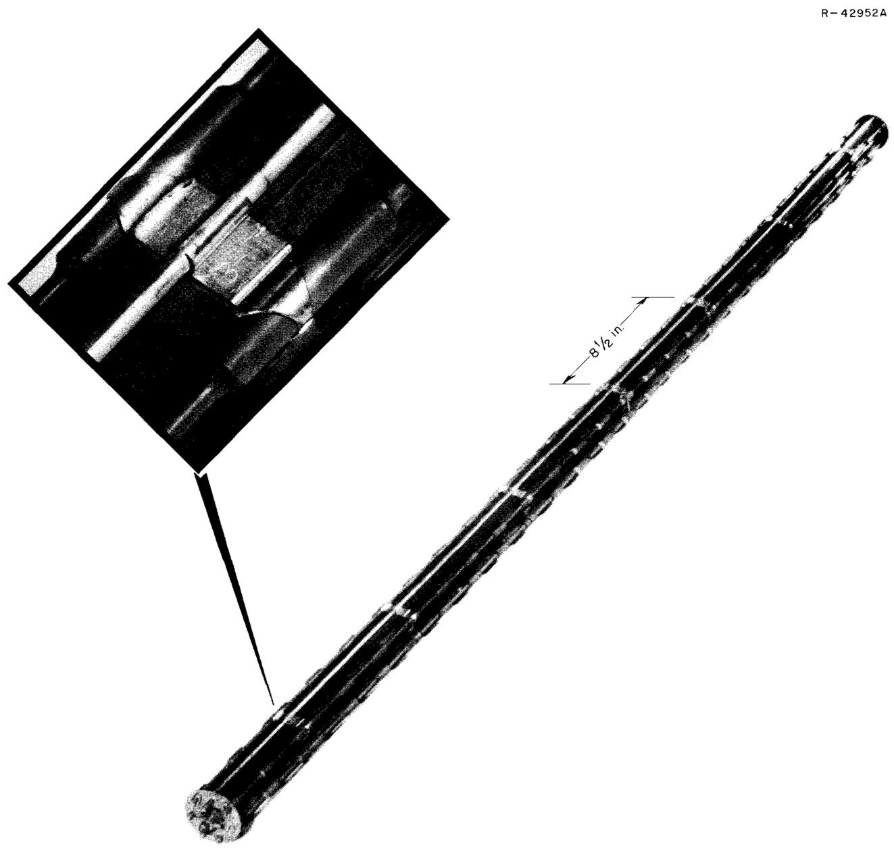  
Fig. 18.1. MSRE Surevillance Specimens from Run 14 (Stringers RS3, RL2 and RR2).

$10^{20}$ neutrons/cm $^2$ ( $>50$ kev) respectively (see Table 18.1). They included several special types of graphite in addition to the MSRE-grade CGB graphite to obtain more detailed information on the behavior of the fission products. These were pitch-impregnated grade CGB, pyrolytic graphite, and isotropic graphite, grade AXF-5QBG. The results of the fission product studies on these materials are given in Part 3 of this report.

As usual, the exposure had dulled the bright surfaces of the Hastelloy N. The mechanical properties of these samples are reported in Sect. 18.2. The graphite specimens appeared unaltered in diffused lighting. However, under special high-angle lighting, there was a very thin film of material visible that was more clearly seen on the graphite having the longest exposure. The appearance of this film on the graphite in stringer RR2 is shown in Fig. 18.2; it is nearly invisible on stringer RS3. The films were on the surfaces of the graphite that were exposed to the laminarly flowing fuel salt along the full vertical length of the surveillance specimens assembly. Where pieces of graphite were in intimate contact and the flow of salt was restricted, films were not visible. Note in Fig.

18.2 that the graphite surfaces appear clean and normal where there may have been some turbulence in the flowing salt; also, the films were easily scratched. The films are so thin that we have not been able to identify them.

The vessel surveillance specimens of two rods of Hastelloy N tensile specimens, X2, had a dark gray-green appearance that is normal for Hastelloy N exposed in the $\mathbf{N}_2$ -approximately $2\%$ $\mathrm{O}_2$ atmosphere outside the core vessel wall. The mechanical properties of these are reported in Sect. 18.2.

# 18.1.2 New Specimens in the Surveillance Assembly

Two new stringers, RS4 and RR3, of graphite and modified Hastelloy N for the core and one modified Hastelloy stringer (two rods of tensile specimens), X3, replaced those removed (see Table 18.1). The graphite specimens continued to be predominantly grade CGB for the continued monitoring and study of the MSRE core graphite. Some specimens of the anisotropic grade CGB and the isotropic grade AXF-5QBG that have been

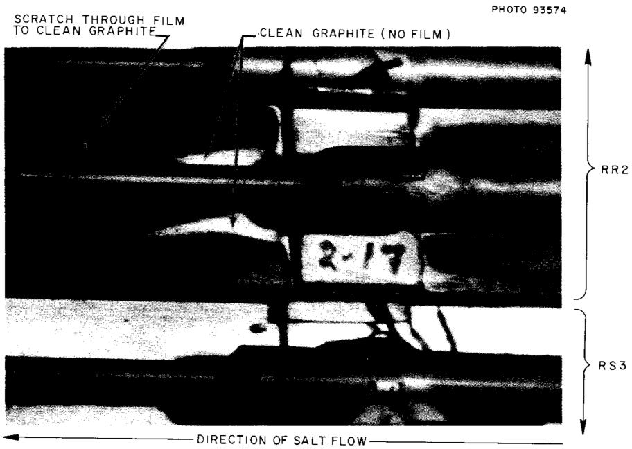  
Fig. 18.2. Films on the Flowing Salt Sides of the Graphite in the MSRE Stringers RR2 and RS3 Revealed by the Use of High-Angle Lighting; the Film on RS3 Is Almost Invisible. The films are not visible in diffused light. Magnification: $\sim 3X$ .

pitch impregnated, carbonized, and graphitized at $3000^{\circ}\mathrm{C}$ were included to determine if the additional impregnation will help prevent the penetration of fission products into the graphite.

The single-fluid concept of the MSRE relaxes, but does not eliminate, the potential need for graphite-to-metal and graphite-to-graphite joints. We have included a molybdenum-Hastelloy N joint brazed with $\mathrm{Pd - 35\%}$ Ni- $5\%$ Cr to study its compatibility with the MSRE environment.

The flux monitor section has been simplified to eliminate the solid-phase bonding of the flux monitors to their protective sheath of Hastelloy N. The three flux monitor wires of iron, nickel, and type 302 stainless steel have been replaced with a single flux monitor wire of type 302 stainless steel that is separated from the sheath by high-purity alumina (greater than $99\% \mathrm{Al}_{2}\mathrm{O}_{3}$ ).

A new feature of the two new core stringers is the placement of a 0.004-in.-thick foil of Hastelloy N at some of the strap positions, as shown in Fig. 18.3. This type of specimen was requested by the Reactor Chemistry Division to allow the use of more convenient and accurate techniques

for determining the fission product deposition on the Haste10y N.

Figure 18.4 shows some fabrication modifications that have been made to allow flowing salt on all four sides of the graphite rather than on only three. A comparison of the fission products deposited on different sides of these samples should give qualitative information of how flow rate affects fission product deposition. Our graphite specimens are routinely machined with surface finishes of less than $32\mu$ in. (rms). We have included some identical graphite samples with the $32 - \mu$ in. surface and with polished surfaces (Fig. 18.4). The polished surfaces may enable a better delineation of the fission product distribution, since in most cases 90 to $95\%$ of each nuclide was found in the first 10 mils from the graphite surfaces.

The complete reassembly, including sealing the stringers in the used perforated Hastelloy N basket, was completed on April 10, seven days after receipt.

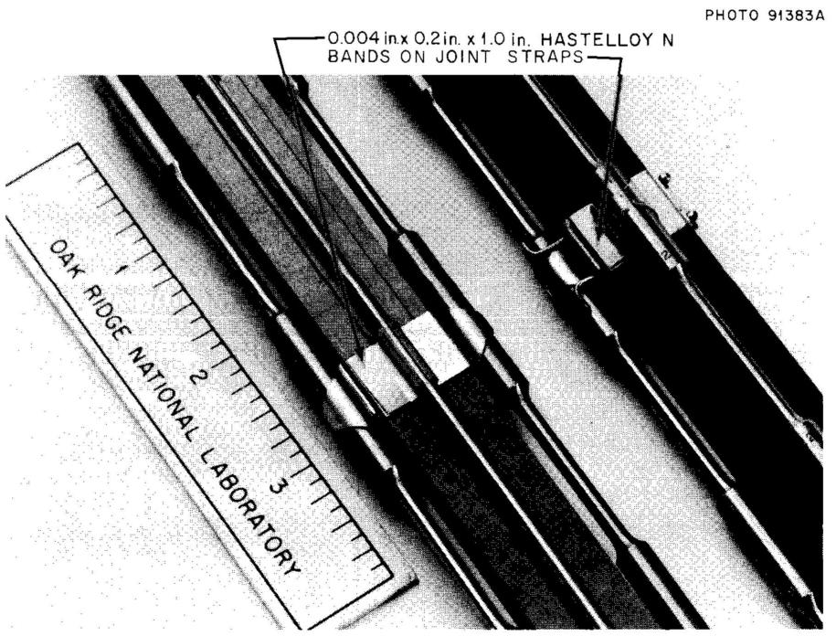  
Fig. 18.3. MSRE Core Surveillance Specimens of Stringers RS4 and RR3 with 0.004 in. $\times 0.2$ in. $\times 1.0$ in. (nominal dimensions) Hastelloy N Bands Mounted on the Joint Straps.

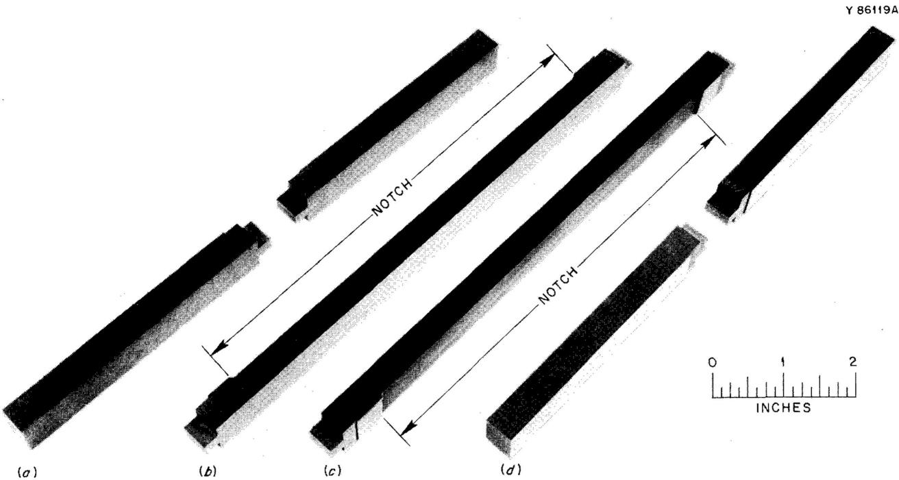  
Fig. 18.4. Solid Graphite Specimens for the Controls and Test Surveillance Specimens: (a) Top and Bottom Controls, (b) Middle Control, (c) Middle Test, (d) Top and Bottom Controls. Specimens shown in (b) and (c) have notches machined in them to allow flowing salt on all four sides. The top surface of the specimen in (c) has been polished to produce a more accurate reference for fission product sampling.

# 18.2 MECHANICAL PROPERTIES OF MSRE SURVEILLANCE SPECIMENS

H. E. McCoy, Jr.

We have reported previously the properties of two groups of Hastelloy N surveillance samples removed from the MSRE.3,4 The properties of the third group of specimens, removed on April 3, 1968, give further information on the behavior of Hastelloy N after long periods of exposure to a neutron flux, salt, and $\mathbf{N}_2$ plus 2 to $5\%$ $\mathrm{O}_2$ environments. Rods of standard Hastelloy N were removed from the core and the vessel surveillance facilities for examination. The details of the exposure conditions are given in Table 18.2. The rods positioned outside the vessel closely reflect

the properties of the vessel after 72,441 Mwhr of operation. The only Hastelloy N parts that have had an exposure comparable with that of the rods removed from the core (thermal fluence $= 9.4 \times 10^{20}$ neutrons/cm $^2$ ) are the control rod thimbles, which are under a slightly compressive stress and can be replaced relatively easily. The vessel would only reach a thermal-neutron exposure of this magnitude after 40 years of operation; so the results on these specimens are of interest primarily for future reactors.

The excellent compatibility of Hastelloy N with the molten salt and cell $(\mathrm{N}_2 + 2 - 5\% \mathrm{O}_2)$ environments is demonstrated by Figs. 18.5 and 18.6 respectively. The surface modification resulting from exposure to salt for 15,300 hr is less than 0.001 in. deep and is quite similar to that noted in specimens removed after 4800 hr of exposure.

The samples exposed to the cell environment (Fig. 18.6) were oxidized to a depth of about 0.001 in., and the microstructure was modified to a total depth of about 0.002 in. The profuse quantities of grain-boundary carbide precipitates were formed

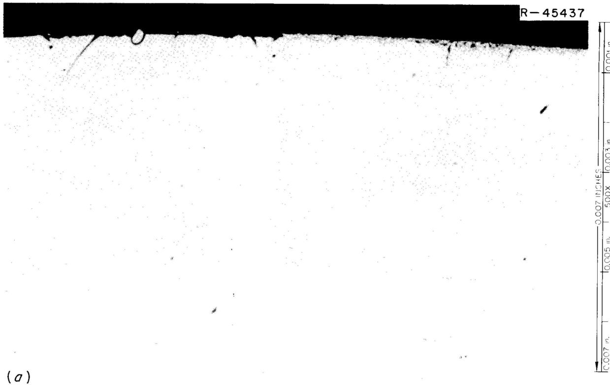

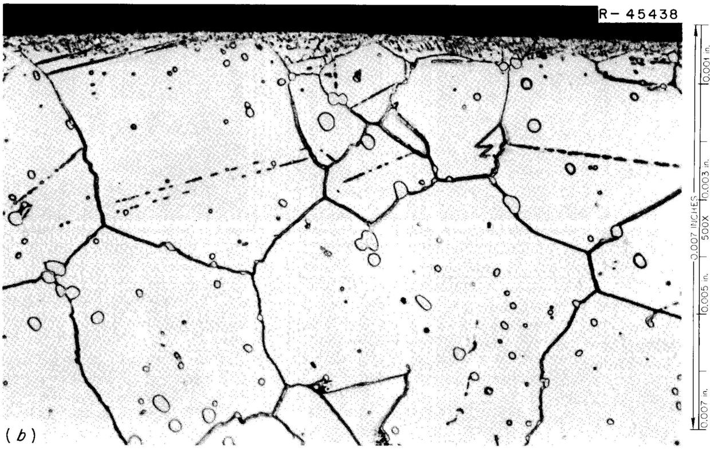  
Fig. 18.5. Photomicrographs of Hastelloy N (Heat 5085) Surveillance Specimens Exposed to Fuel Salt for $15,300\mathrm{hr}$ at $650^{\circ}\mathbf{C}$ . The surface of this sample was in intimate contact with the graphite. (a) Unetched. (b) Etched (glyceregia) photomicrographs showing shallow reaction layer near surface. 500X.

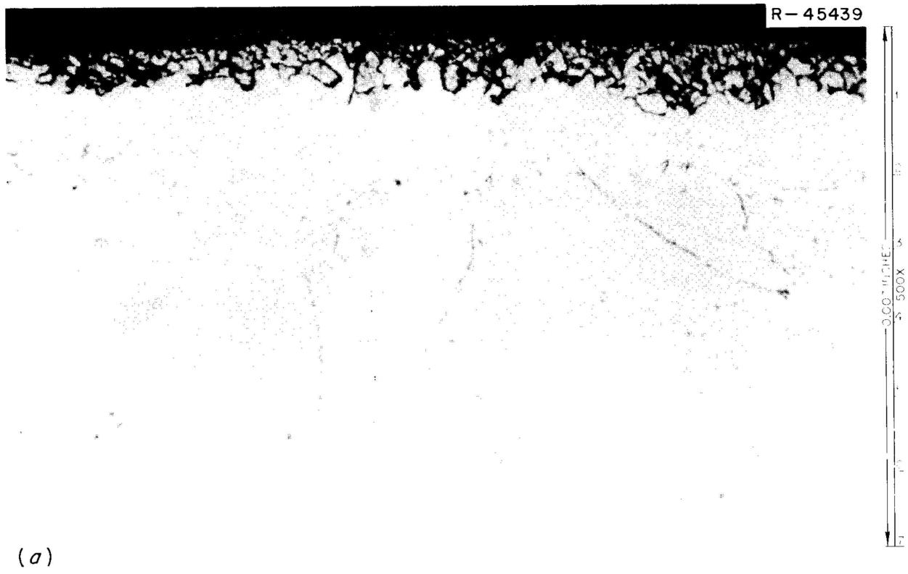

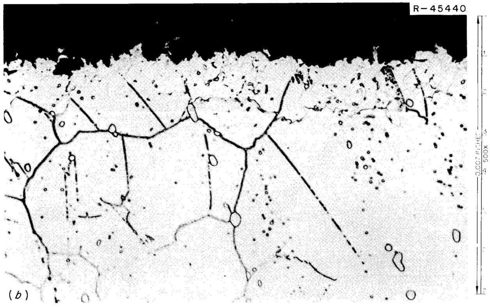  
Fig. 18.6. Photomicrographs of Hastelloy N (Heat 5085) Surveillance Specimens Exposed to the Cell Environment of $\mathsf{N}_2 + 2$ to $5\%$ $\mathsf{O}_2$ for 20,800 hr at $650^{\circ}\mathsf{C}$ . (a) Unetched showing surface oxidation. (b) Etched (glyceregia) showing shallow modification of microstructure due to reaction with cell environment. 500X.

Table 18.2. Hastelloy N Samples Removed in Surveillance Program   

<table><tr><td rowspan="3"></td><td rowspan="3">Group 1, 
Core, 
Standard 
Hastelloy N</td><td colspan="2">Group 2</td><td colspan="3">Group 3</td></tr><tr><td rowspan="2">Core, 
Ti- and Zr- 
Modified 
Hastelloy N</td><td rowspan="2">Vessel, 
Standard 
Hastelloy N</td><td colspan="2">Core</td><td rowspan="2">Vessel, 
Standard 
Hastelloy N</td></tr><tr><td>Standard 
Hastelloy N</td><td>Ti- and Hf- 
Modified 
Hastelloy N</td></tr><tr><td>Date inserted</td><td>9-8-65</td><td>9-13-65</td><td>8-24-65</td><td>9-13-66</td><td>6-5-67</td><td>8-24-65</td></tr><tr><td>Date removed</td><td>7-28-66</td><td>5-9-67</td><td>6-5-67</td><td>4-3-68</td><td>4-3-68</td><td>5-7-68</td></tr><tr><td>Time at 650°C, hr</td><td>4800</td><td>5500</td><td>11,000</td><td>15,289</td><td>9789</td><td>20,789</td></tr><tr><td>Peak fluence, neutrons/cm2</td><td></td><td></td><td></td><td></td><td></td><td></td></tr><tr><td>Thermal (&lt;0.876 ev)</td><td>1.3 × 1020</td><td>4.1 × 1020</td><td>1.3 × 1019</td><td>9.4 × 1020</td><td>5.3 × 1020</td><td>2.6 × 1019</td></tr><tr><td>Fast (&gt;1.22 Mev)</td><td>3.1 × 1019</td><td>1.0 × 1020</td><td>5.5 × 1018</td><td>2.3 × 1020</td><td>1.3 × 1020</td><td>1.1 × 1019</td></tr></table>

as a result of the long nuclear and thermal exposures and have no relation to the environment.

We ran a wide spectrum of tests on these materials, but shall present only the results of particular concern to the MSRE. We have shown that this alloy is subject to a type of high-temperature radiation damage which reduces the creep-rupture strength and the strain at fracture; this is due to the helium produced by the thermal $^{10}\mathrm{B}(n,\alpha)$ transmutation. A second potential problem that has been pointed out by our surveillance program is that the fracture strain at ambient temperature $(25^{\circ}\mathrm{C})$ continues to decrease with exposure. Thus, our program is directed strongly at measuring the changes in the properties of our Hastelloy N surveillance specimens at 25 and $650^{\circ}\mathrm{C}$ .

The creep-rupture properties of all the surveillance specimens of heats 5065 and 5085 that we have tested are shown in Fig. 18.7. Generally, the time to rupture at a given stress level is shorter, the higher the fluence; however, there is a drastic reduction in rupture life as the fluence increases from 1.3 to $9.4 \times 10^{20}$ neutrons/cm². This correlates reasonably well with the quantity

of $^{10}\mathrm{B}$ converted to helium; $20\%$ is transmuted at a thermal fluence of $1.3\times 10^{20}$ neutrons $\mathrm{/cm}^2$ and about $85\%$ is transmuted at $9.4\times 10^{20}$ neutrons/ $\mathrm{cm}^2$ . The variation in rupture life due to different fluences is greater, the higher the stress level. The creep properties do not show any detectable dependence on the time at $650^{\circ}\mathrm{C}$ , indicating that the alloy is metallurgically stable at the operating temperature of the MSRE.

The strain at fracture measured in both creep-rupture and tensile tests at $650^{\circ}\mathrm{C}$ is shown in Fig. 18.8. The scatter band is for the same heats of material irradiated in the ORR. The fracture strain at high strain rates (e.g., 12 and $300\%/\mathrm{hr}$ ) is very dependent on the thermal fluence, but most creep specimens with a thermal fluence of $\leq 1.3 \times 10^{20}$ neutrons/cm² fractured at 1 to $2.5\%$ strain, regardless of strain rate. The surveillance samples seem to be immune to the ductility minimum as a function of fracture strain established for the same materials when irradiated for shorter times ( $\sim 1000$ hr) in the ORR. The samples irradiated to $9.4 \times 10^{20}$ neutrons/cm² exhibit extremely low fracture strains under creep conditions.

Our experience with the ductility reduction at $25^{\circ}\mathrm{C}$ is summarized in Table 18.3. In this temperature range the fracture strain is not very sensitive to strain rate; so we feel that the ten

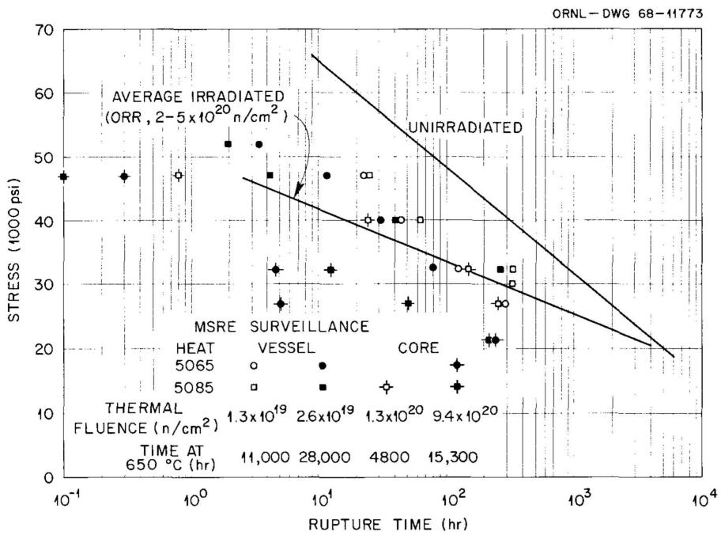  
Fig. 18.7. Creep-Rupture Properties of MSRE Hastelloy N Surveillance Specimens at $650^{\circ}\mathrm{C}$ .

Table 18.3. Variation of Fracture Strain of Hastelloy N at $25^{\circ}$ with Exposure to MSRE Environment   

<table><tr><td>Fast Fluence, &gt;1.22 Mev (neutrons/cm2)</td><td>Thermal 
Fluence 
(neutrons/ cm2)</td><td>Location of 
Exposure</td><td>Time 
Exposed (hr)</td><td>Total Strain at 
Fracture (%)</td><td>Reduction in 
Area (%)</td></tr><tr><td colspan="6">Heat 5085</td></tr><tr><td></td><td>As annealed</td><td></td><td>0</td><td>52.2</td><td>56.3</td></tr><tr><td>5.5 × 1018</td><td>1.3 × 1019</td><td>Outside vessel</td><td>11,000</td><td>42.5</td><td>24.1</td></tr><tr><td>1.1 × 1019</td><td>2.6 × 1019</td><td>Outside vessel</td><td>20,800</td><td>32.8</td><td>24.5</td></tr><tr><td>1.1 × 1019</td><td>2.6 × 1019</td><td>Outside vessel</td><td>20,800b</td><td>48.3</td><td>34.2</td></tr><tr><td>3.1 × 1019</td><td>1.3 × 1020</td><td>Core</td><td>4,800</td><td>34.5</td><td>26.0</td></tr><tr><td>0</td><td>0</td><td>Control facility</td><td>4,800</td><td>40.0, 46.8c</td><td>28.6, 31.5c</td></tr><tr><td>2.3 × 1020</td><td>9.4 × 1020</td><td>Core</td><td>15,300</td><td>28.9</td><td>20.0</td></tr><tr><td>0</td><td>0</td><td>Control facility</td><td>15,300</td><td>38.6</td><td>29.6</td></tr><tr><td colspan="6">Heat 5065</td></tr><tr><td></td><td>As annealed</td><td></td><td>0</td><td>55.5</td><td>52.1</td></tr><tr><td>5.5 × 1018</td><td>1.3 × 1019</td><td>Outside vessel</td><td>11,000</td><td>34.6</td><td>26.9</td></tr><tr><td>1.1 × 1019</td><td>2.6 × 1019</td><td>Outside vessel</td><td>20,800</td><td>59.7</td><td>38.4</td></tr><tr><td>2.3 × 1020</td><td>9.4 × 1020</td><td>Core</td><td>15,300</td><td>41.5</td><td>34.1</td></tr><tr><td>0</td><td>0</td><td>Control facility</td><td>15,300</td><td>47.4</td><td>39.3</td></tr></table>

${}^{a}$ Strain rate $= {0.05}{\mathrm{\;{min}}}^{-1}$ .   
b Given a postirradiation anneal of 8 hr at $871^{\circ}\mathrm{C}$   
cTwo determinations.

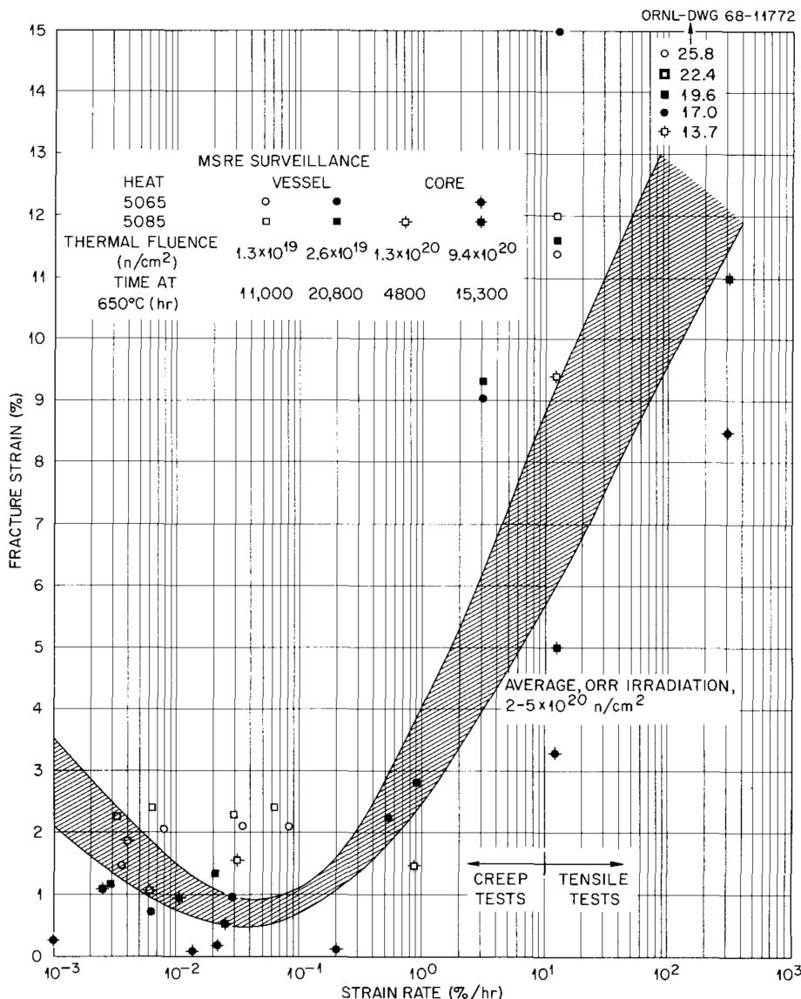  
Fig. 18.8. Variation of Fracture Strain with Strain Rate for Hastelloy N Surveillance Specimens at $650^{\circ}\mathrm{C}$ .

sile tests at a strain rate of $0.05\mathrm{min}^{-1}$ are adequate. A careful analysis of the data indicates that the magnitude of the ductility reduction is dependent upon time and fluence. It is not clear whether thermal or fast fluence is the most important, since both change simultaneously. Our metallographic observations of carbide precipitates (Figs. 18.5 and 18.6) and the observation that the ductility can be restored by a postirradiation anneal of 8 hr at $871^{\circ}\mathrm{C}$ (Table 18.3) indicate that the reduction in fracture strain is likely due to carbide precipitation. This precipitation is controlled

largely by thermal annealing (indicated by the control samples in Table 18.3), and the neutron irradiation enhances the process. To date the lowest fracture strain observed is $28.9\%$ , a very acceptable value for operation.

Two heats of modified Hastelloy N were removed from the MSRE core after receiving a thermal fluence of $5.3 \times 10^{20}$ neutrons/cm² during 9800 hr at $650^{\circ}\mathrm{C}$ . Both alloys were nominally Ni-12% Mo-7% Cr-0.2% Mn-0.05% C, with heat 67-502 containing 2% W and 0.5% Ti and heat 67-504 containing 0.5% Hf. The microstructure typical

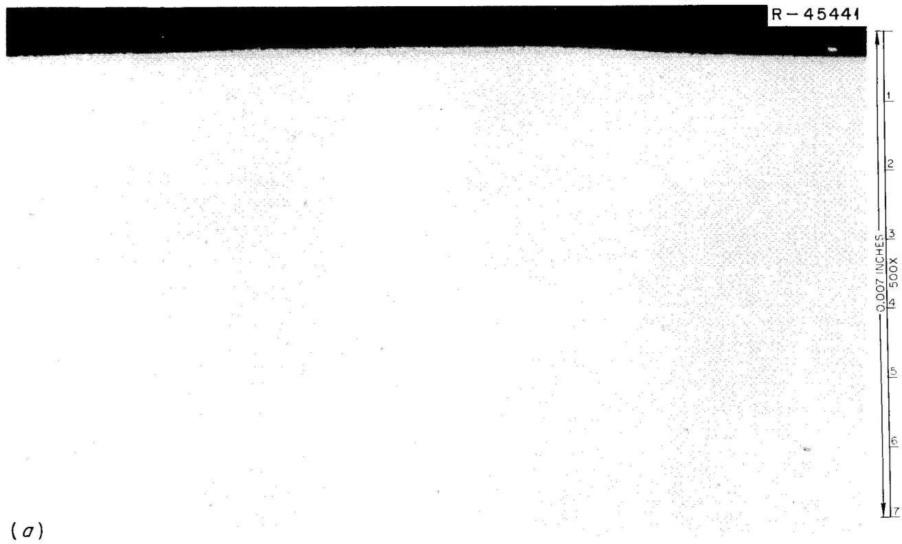

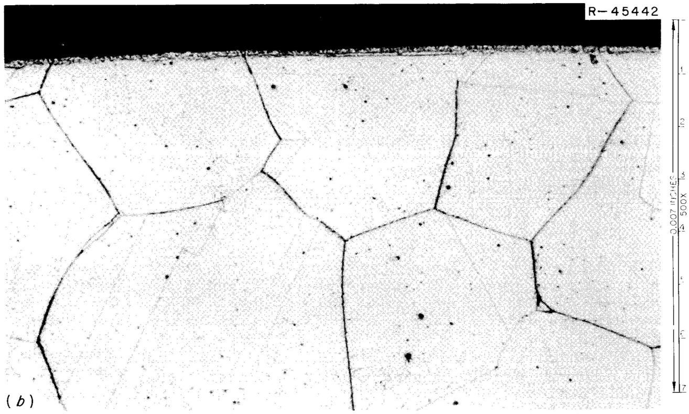  
Fig. 18.9. Photomicrographs of Modified Hastelloy N Containing $2\%$ Tungsten and $0.5\%$ Titanium (Heat 67-502) After Exposure to the MSRE Core for 9800 hr at $650^{\circ}\mathrm{C}$ and a Thermal Fluence of $5.3 \times 10^{20}$ neutrons/cm². (a) As polished. (b) Etched with glyceregia. 500X. This structure is also representative of that of a heat of material containing $0.5\%$ Hf (67-504) that had a similar exposure.

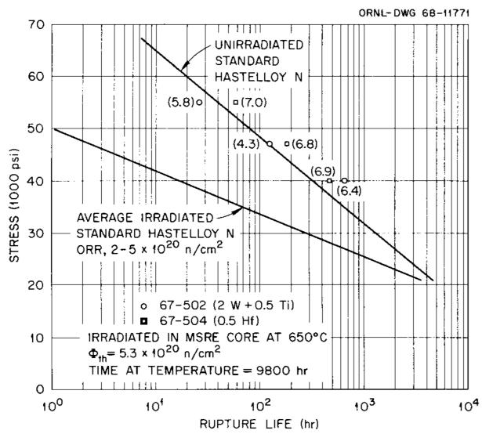  
Fig. 18.10. Comparison of the Postirradiation Creep-Rupture Properties of Hastelloy N Modified with Titanium and Hafnium and Standard Hastelloy N at $650^{\circ}C$ .

of both alloys is shown in Fig. 18.9. The most significant feature is the lack of corrosion. A thin surface layer is present on both materials that looks more like a deposit than corrosive attack. This portion of the sample may have been in contact with graphite, and the coating may be a carbide layer. Moderate grain-boundary precipitation has occurred in the alloy. The postirradiation properties of these materials are better than those of standard Hastelloy N. The improvement is illustrated by the creep-rupture results in Fig. 18.10. The rupture life is improved markedly, but the most significant improvement is in the fracture strain. We are continuing the development of these alloy systems.

# 19. Graphite Studies

# 19.1 Procurement of GRAPHITE

W. H. Cook

We have continued the procurement of special grades of graphite for MSBR's for (1) the determination of the physical and mechanical properties before and after irradiation, (2) sealing research with pyrolytic carbon, (3) graphite-to-metal joining studies, and (4) fabrication of test assemblies. The grades and disposition of graphite obtained recently are summarized in Table 19.1.

Grade H337 graphite is a high-quality experimental raw-coke-base graphite and is of extreme interest in our irradiation-damage studies. It was purchased in relatively large sizes and quantities

for use in building engineering experiments. Several pipes of the H337 graphite are shown in Fig. 19.1. There are no detectable cracks in this material, and the physical and mechanical properties look reasonably attractive. Grade JOZ is the base stock for grades H337 and H364. The latter was laboratory processed and should be essentially the same as grade H337. Grade H364 has shown relatively good stability under preliminary neutron irradiation to a fluence of $1.3 \times 10^{22}$ neutrons/cm² (see Sect. 19.7). A comparison of the behavior of JOZ and H337 should give some indication of the effects of heavy impregnation on the stabilities of graphite under irradiation.

Our current procurement program involves commercial vendors and the Chemical Engineering

Table 19.1. Receipt and Utilization of Special Grades of Graphite Received Since February 29, 1968   

<table><tr><td>Grade</td><td>Source</td><td>Type</td><td>Bulk Density (g/cm3)</td><td>Nominal Dimensions (in.)</td><td>Pieces</td><td>Utilization</td></tr><tr><td>H337</td><td>GLCCa</td><td>Near isotropic</td><td>2.00</td><td>5 OD × 223/32 ID × 38 long</td><td>1</td><td rowspan="2">Evaluation in progress in HFIR irradiation studies and fabrication of engineering test assemblies</td></tr><tr><td>H337</td><td>GLCCa</td><td>Near isotropic</td><td>1.98b</td><td>21/4 OD × 11/2 ID × 10-37 length (random)c</td><td>35</td></tr><tr><td>AXF-5Q</td><td>Pocod</td><td>Isotropic</td><td>1.81</td><td>4 diam × 18 long</td><td>3</td><td>Graphite-to-metal joining studies</td></tr><tr><td>9972</td><td>Speere</td><td>Near isotropic</td><td>1.81</td><td>21/2 × 4 × 8</td><td>1</td><td>To be evaluated in HFIR irradiation studies</td></tr><tr><td>JOZ</td><td>GLCCf</td><td>Near isotropic</td><td>1.58</td><td>6 diam × 41/2 long</td><td>1</td><td>To be evaluated in HFIR irradiation studies</td></tr></table>

aGreat Lakes Carbon Corp.   
${}^{b}$ Values ranged from 1.95 to ${2.01}\mathrm{\;g}/{\mathrm{{cm}}}^{3}$ .   
cThe total length was $\sim 54$ ft.   
$d_{\mathrm{Poco}}$ Graphite, Inc.   
e Gratis material from the Speer Carbon Co.   
$^f$ Gratis material from the Great Lakes Carbon Corp.

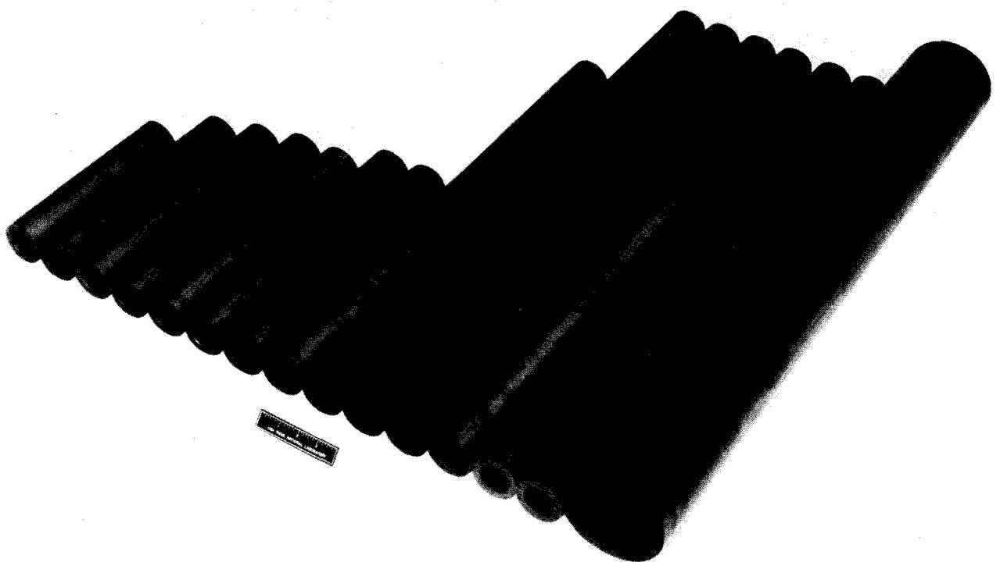  
Fig. 19.1. Near Isotropic Graphite Grade H377 Pipe, Nominally 5 in. $OD \times 2^{23}\%$ in. $ID \times 38$ in. and $2\frac{1}{4}$ in. $OD \times 1\frac{1}{2}$ in. $ID \times 10 - 37$ in.

Development Department of the Y-12 Plant. The general status and goals of the program to date are summarized in Table 19.2. The anisotropic materials are used primarily for comparison with data obtained in other irradiation facilities. The terms mechanical, mechanical-chemical, and chemical refer to the techniques used to obtain isotropic bodies. The mechanical technique obtains isotropy by randomizing the orientation of anisotropic or near-isotropic filler materials. The classical pelletizing step in forming a body is an example of this. The chemical heading refers to graphite filler material that is isotropic as a result of an inherent or applied chemical reaction(s) that forms isotropic graphite. The types we currently have under consideration are shown in Table 19.2.

Work has started in the Chemical Engineering Development Department of Y-12 (CEDP of Y-12) to make reconstituted graphite. This technique

enables one to utilize standard fabrication techniques, such as extrusion, to fabricate isotropic bodies from small pieces of specially produced isotropic graphite. The graphite is crushed, ground, and sized to make isotropic filler material, which is blended with a suitable binder and fabricated with standard processes. Isotropic grades AXF1 and $2033^{2}$ have been fabricated this way. The preliminary data indicate that the extruded bodies have properties equal to those of the special starting materials. This may mean that superior isotropic grades of graphite that are fabricated in relatively small dimensions may be utilized in standard fabrication techniques to form large-sized shapes that have essentially the same properties as the small, superior starting materials.

Table 19.2. Types of Materials Being Procured in the MSBR Graphite Program   

<table><tr><td>Anisotropic Materials</td><td>Isotropic Materials</td></tr><tr><td colspan="2">Basica</td></tr><tr><td>Natural flake (99.995% pure Madagascar + Pitch)</td><td>Synthesized cokes Work in initial stages by ORNL and Y-12 personnel</td></tr><tr><td>Hot-worked pyrolytic graphite</td><td>Synthesized binders</td></tr><tr><td colspan="2">Research and Developmentb</td></tr><tr><td>Pyrolytic graphite</td><td>Mechanical production Needle-coke</td></tr><tr><td>Needle-coke, polycrystalline</td><td>Near isotropic</td></tr><tr><td>high-quality, low permeability</td><td></td></tr><tr><td>thermax-containing</td><td>Chemical-mechanical production Raw coke Base stock Impregnated</td></tr><tr><td></td><td>Reconstituted isotropic (or near isotropic) Base stock (as-extruded) Impregnated</td></tr><tr><td></td><td>Chemical production Gilsonite Fluid coke Air-blown Other</td></tr></table>

${}^{a}$ Materials used to determine fundamental data for radiation damage,carbon yield,and graphitization; these,in time,will be utilized in Research and Development.   
These involve relatively large, polycrystalline materials for the purpose of determining the relationships of components, fabrication procedures, and properties before and after exposure to neutron (fast) radiation.

# 19.2 PHYSICAL PROPERTY MEASUREMENTS

W. H. Cook

J. L. Griffith

O. B. Cavin

We run a set of very cursory property tests on new graphites to determine whether they are potentially useful for use in MSBR's or whether they can contribute to our understanding of irradiation damage in graphite. Those that are of interest are tested more thoroughly. Our basic requirements are that the material be isotropic, that it have a density $>1.85\mathrm{g / cc}$ , that the maximum pore entrance diameter be $< 1\mu$ , and that the helium gas permeability be $< 10^{-8}\mathrm{cm}^2/\mathrm{sec}$ .

Equipment already exists for many of the measurements that we make, but it was necessary to

design and build a wide-range gas permeability apparatus to measure permeabilities from $10^{-1}$ to as low as $< 10^{-12} \, \text{cm}^2/\text{sec}$ . The measurement is based on the pressure rise method. The apparatus is a welded all-metal system in which all valves have metal poppets and seats except two that use Viton O-rings. On the vacuum side, the pressure rise side, pressures are measured with a capacitance manometer for the high-permeability measurements and are monitored with a calibrated helium leak detector for the low-permeability measurements. The system is designed to measure hollow cylindrical specimens, such as the HFIR irradiation specimens, and solid disks of graphite.

Table 19.3 is a summary of the bulk densities, specific resistivities, and helium gas permeabilities.

Table 19.3. Bulk Densities, Specific Resistivities, and Helium Permeabilities Measured on Anisotropic, Near-Isotropic, and Isotropic Grades of Graphite   

<table><tr><td>Grade Designation</td><td>Type</td><td>Bulk Densitya(g/cm3)</td><td>Orientationb</td><td>Specific Resistancea(microhm-cm)</td><td>Permeability to Helium (cm2/sec)a,c</td></tr><tr><td rowspan="2">CGBd</td><td rowspan="2">Anisotropic</td><td rowspan="2">1.86 (3)</td><td>wg</td><td>540 (3)</td><td>6.0 × 10-5(3)</td></tr><tr><td>ag</td><td>1155 (3)</td><td>3.2 × 10-5(3)</td></tr><tr><td rowspan="2">H377</td><td rowspan="2">Near isotropic</td><td rowspan="2">2.00 (3)</td><td>[wg]</td><td>740 (6)</td><td>3.8 × 10-4(4)</td></tr><tr><td>[ag]</td><td>800 (19)</td><td>5.4 × 10-4(4)</td></tr><tr><td>AXF-5QBG (3000°C)</td><td>Isotropic</td><td>1.94 (3)</td><td></td><td>955 (3)</td><td>6.2 × 10-4(4)</td></tr><tr><td rowspan="2">ATJ-S</td><td rowspan="2">Near isotropic</td><td rowspan="2">1.85 (3)</td><td>wg</td><td>797 (19)</td><td>4.0 × 10-3(3)</td></tr><tr><td>ag</td><td>1074 (23)</td><td>3.3 × 10-3(3)</td></tr><tr><td rowspan="2">H364</td><td rowspan="2">Near isotropic</td><td rowspan="2">1.94 (3)</td><td>[wg]</td><td>826 (2)</td><td>9.2 × 10-3(2)</td></tr><tr><td>[ag]</td><td>860 (15)</td><td></td></tr><tr><td>AXF</td><td>Isotropic</td><td>1.81 (3)</td><td></td><td>1576 (6)</td><td>3.8 × 10-2(3)</td></tr><tr><td rowspan="2">9948</td><td rowspan="2">Near isotropic</td><td rowspan="2">1.90 (6)</td><td>wg</td><td>920 (7)</td><td>4.8 × 10-2(3)</td></tr><tr><td>ag</td><td>1074 (9)</td><td>6.3 × 10-2(3)</td></tr><tr><td rowspan="2">ATJ-SG</td><td rowspan="2">Near isotropic</td><td rowspan="2">1.79 (3)</td><td>wg</td><td>987 (19)</td><td>1.6 × 10-1(3)</td></tr><tr><td>ag</td><td>1099 (23)</td><td>1.0 × 10-1(3)</td></tr></table>

${}^{a}$ Numbers in parentheses indicate the number of values averaged.   
$b$ The directions in which the specific resistivity and helium permeability were determined; $\mathbf{wg} =$ with grain, and $\mathrm{ag} =$ across grain. The brackets indicate that the designated orientation is not certain because of the near-isotropic nature of the graphite.   
cThe permeability specimens are 0.40 in. $\mathrm{OD}\times 0.10$ in. $\mathbf{ID}\times 1.00$ to 1.50 in.long.   
$^d$ MSRE graphite included for comparison; this is for bar No. 157 rather than the nominal value for all values of MSRE lots of graphite.

ties of several grades of graphite that we are studying at this time. Mechanical property measurements on a number of these are reported in Sect. 19.3. The limited size and number of samples and the structural variations normally found in graphite relegate these to being representative rather than absolute values for these properties.

The specific resistances range from 740 to 1155 microhm-cm. We believe that this should be $< 900$ microhm-cm for a good quality graphite, but have little supporting evidence. The helium gas permeabilities range from $3.2 \times 10^{-5}$ to $1.0 \times 10^{-1}$ cm $^2$ /sec. The last three grades, AXF, 9948, and ATJ-SG, had not received special treatments to create low permeabilities. These and other data show progress in the development of high-quality isotropic graphite. However, the data continue to indicate that the $< 10^{-8}$ cm $^2$ /sec permeability

sought most likely will have to be obtained by surface sealing (see Sect. 19.5.)

# 19.3 BEND TESTING OF GRAPHITE

C. R. Kennedy

The mechanical properties of several types of graphite are being studied since the properties are very sensitive to the structure. We are performing bend tests at room temperature and using a small specimen because we are limited in the quantity of material and wish to make selective samplings. Comparative tests of samples varying in size have been made and demonstrate that the sample size is adequate for the finer-grained MSBR grades. The bend specimen is 0.110 in. thick and 0.470 in. wide and is loaded in a four-point bend apparatus

with $1\frac{3}{4}$ in. between the outer supports and $\frac{3}{4}$ in. between the inner supports. Although we have confidence in these data, they should be considered only as relative values and should not be used as engineering data without further testing to determine size effects.

In analyzing the data, we assume that the stress-strain behavior of graphite can be described by

$$
\epsilon = A \sigma + B \sigma^ {2}, \tag {1}
$$

where

$\epsilon =$ strain,

$\sigma =$ stress,

$A = 1 / E$ , where $E =$ Young's modulus,

$B =$ constant.

We have found that Eq. (1) does fit the majority of the data to within a few percent. The quadratic equation for the stress-strain behavior results in a simple solution for the work done for fracture, namely,

$$
\text {t o t a l} = \frac {1}{6} \epsilon_ {e} \sigma_ {f} + \frac {2}{3} \epsilon_ {t} \sigma_ {f}, \tag {2}
$$

where

$$
\epsilon_ {e} = \text {e l a s t i c s t r a i n a t f r a c t u r e} = \sigma_ {f} / E,
$$

$\sigma_{f} =$ fracture stress,

$\varepsilon_{t} =$ total strain at fracture.

Typical results of our bend tests are given in Table 19.4. The anisotropy of the graphite is easily observed in the fracture stress and elastic modulus values obtained for grades 1425, ATJ-S, and 9567. However, the work to fracture, which is more representative of the defect structure, appears to be isotropic. The fracture path in graphite is primarily through the binder-rich regions in the structure; thus the work to fracture yields some measure of the binder integrity. Since we believe that the integrity of the binder region strongly controls the lifetime of graphite under irradiation, the work to fracture is an important parameter in evaluating materials.

There are several factors in the fabrication of the graphite that must be considered in interpreting the results. One is the effect of impregnation, which significantly alters and improves the mechanical behavior of the material. An example of the influence and difficulty of controlling the impregnation process is seen in the results obtained for

graphites H337E, H364, and H337PL. These three materials originate from the same base stock; H337E was fabricated in the laboratory, H364 in a small pilot facility, and H337PL in larger, more commercial, equipment. The apparent inability to easily control the impregnation processing clarifies why it is one of the more proprietary areas, and very little information is obtained from the vendors. Although some improvement has been observed by impregnation, not all of the various impregnants used to improve the mechanical behavior will retain the necessary binder integrity under irradiation to yield an extended life.

Another factor is a duplex type of defect structure caused by multiple forming operations during processing. This type of structure can be identified by dense low-porosity regions of coke particle clusters hindered to one another with a fairly large defect structure between the clusters. The mechanical test is quite sensitive to the large defects, and the work to fracture will be small, as observed from the results for grades HCTE 21 and HCTE 22. It is very probable that these large defects will limit the life under irradiation; however, this type of duplex structure will very likely have a greater life than materials having the same size defect uniformly distributed throughout the structure.

In general, the bend test does yield information about the quality of the binder structure in the graphite. However, these data must be interpreted with regard to the fabrication procedures and resulting structures. There likely will not be a direct relation between the mechanical properties and irradiation lifetime; however, we believe that extended lifetime under irradiation will not be obtainable from materials exhibiting a low work to fracture.

# 19.4 X-RAY STUDIES

# O. B. Cavin

One of the problems associated with the collection and interpretation of x-ray data on graphite is the low absorption this material has for x rays. This property results in the broadening of the diffraction maxima and an effective sample displacement from the center of the x-ray diffrac

Table 19.4. Graphite Bend Test Results   

<table><tr><td>Graphite Grade</td><td>Orientationa</td><td>Fracture Stress (psi)</td><td>Fracture Strain (%)</td><td>Elastic Modulus (psi)</td><td>B (psi2)</td><td>Work to Fracture (in.-lb/in.3)</td></tr><tr><td></td><td></td><td></td><td></td><td>×106</td><td>×10-11</td><td></td></tr><tr><td>H335</td><td>P</td><td>4240</td><td>0.481</td><td></td><td></td><td></td></tr><tr><td>H336</td><td>P</td><td>4900</td><td>0.490</td><td>1.48</td><td>6.62</td><td>13.31</td></tr><tr><td>H337E</td><td>P</td><td>7210</td><td>0.703</td><td>1.82</td><td>5.93</td><td>29.04</td></tr><tr><td>H338</td><td>P</td><td>6320</td><td>0.542</td><td>1.81</td><td>4.83</td><td>19.15</td></tr><tr><td>H364</td><td>Z</td><td>4760</td><td>0.509</td><td>1.56</td><td>8.97</td><td>13.72</td></tr><tr><td>H364</td><td>θ</td><td>5040</td><td>0.519</td><td>1.52</td><td>7.36</td><td>14.66</td></tr><tr><td>H337PL</td><td>Z</td><td>5620</td><td>0.517</td><td>1.93</td><td>7.14</td><td>16.65</td></tr><tr><td>H337PL</td><td>θ1</td><td>6370</td><td>0.560</td><td>1.98</td><td>6.04</td><td>20.42</td></tr><tr><td>H337PL</td><td>θ2</td><td>6220</td><td>0.526</td><td>2.01</td><td>5.54</td><td>18.58</td></tr><tr><td>H328</td><td>P</td><td>4200</td><td>0.362</td><td>1.64</td><td>6.00</td><td>8.35</td></tr><tr><td>H328</td><td>N</td><td>4230</td><td>0.334</td><td>1.75</td><td>5.13</td><td>7.71</td></tr><tr><td>H315A</td><td>Z</td><td>4790</td><td>0.490</td><td>1.35</td><td>5.88</td><td>12.81</td></tr><tr><td>H315A</td><td>θ</td><td>5880</td><td>0.490</td><td>1.65</td><td>3.87</td><td>15.72</td></tr><tr><td>9567</td><td>P</td><td>3340</td><td>0.285</td><td>1.88</td><td>9.70</td><td>5.35</td></tr><tr><td>9567</td><td>N</td><td>2100</td><td>0.466</td><td>0.733</td><td>41.50</td><td>5.56</td></tr><tr><td>9948</td><td>N</td><td>6830</td><td>0.548</td><td>1.78</td><td>3.54</td><td>20.61</td></tr><tr><td>9948</td><td>P</td><td>6420</td><td>0.619</td><td>1.46</td><td>4.31</td><td>21.79</td></tr><tr><td>9948</td><td>N</td><td>7080</td><td>0.569</td><td>1.80</td><td>3.52</td><td>22.24</td></tr><tr><td>HCTE 21</td><td>P</td><td>3180</td><td>0.344</td><td>1.23</td><td>8.40</td><td>5.90</td></tr><tr><td>HCTE 22</td><td>P</td><td>2980</td><td>0.337</td><td>1.17</td><td>9.26</td><td>5.44</td></tr><tr><td>BY-12</td><td>P</td><td>3760</td><td>0.298</td><td>1.59</td><td>4.38</td><td>5.98</td></tr><tr><td>2020</td><td>P</td><td>4040</td><td>0.424</td><td>1.25</td><td>6.15</td><td>9.26</td></tr><tr><td>2020</td><td>N</td><td>4180</td><td>0.447</td><td>1.22</td><td>6.00</td><td>10.06</td></tr><tr><td>1425</td><td>Z</td><td>7330</td><td>0.359</td><td>2.80</td><td>1.81</td><td>14.34</td></tr><tr><td>1425</td><td>θ</td><td>5070</td><td>0.475</td><td>1.45</td><td>4.87</td><td>13.10</td></tr><tr><td>ATJ-S</td><td>P</td><td>5290</td><td>0.634</td><td>1.40</td><td>9.09</td><td>19.02</td></tr><tr><td>ATJ-S</td><td>N</td><td>6650</td><td>0.527</td><td>2.14</td><td>4.91</td><td>19.93</td></tr><tr><td>ATJ-SG</td><td>P</td><td>4810</td><td>0.497</td><td>1.55</td><td>8.04</td><td>13.46</td></tr><tr><td>ATJ-SG</td><td>N</td><td>4890</td><td>0.454</td><td>1.66</td><td>6.67</td><td>12.40</td></tr><tr><td>EP-1924</td><td>P</td><td>6720</td><td>0.669</td><td>1.39</td><td>4.12</td><td>24.55</td></tr></table>

${}^a\mathbf{P} =$ parallel to extrusion direction or molding direction, $\mathbf{N} =$ normal to extrusion direction or molding direction, $Z =$ parallel to tube axis, and $\theta =$ parallel to tangential direction.

tometer. Data we obtained by performing experiments on samples of various thicknesses indicate that this is a serious problem. The data are shown in Table 19.5. The use of a thicker sample results in additional x-ray line broadening, which gives a smaller crystallite size as determined from the diffraction peak breadth at one-half the maximum intensity. The sample displacement effect follows a cosine function which is greatest at $2\theta = 0^{\circ}$ and explains why there is a greater effect

on the $c$ than on the a parameter. Thus the results will depend on the sample thickness and can give rise to incorrect conclusions about the perfection of the crystalline structure or the crystallite size. Techniques are being investigated to eliminate or limit the errors which arise because of the low absorption graphite has for x rays from a copper target.

We have also used x-ray diffraction to obtain a qualitative measure of the anisotropy of several

Table 19.5. X-Ray Data for Grade 9948 Graphite   

<table><tr><td>Sample No.</td><td>Thickness (mils)</td><td>a(A)</td><td>c(A)</td><td>\( L_c(002)^a \)(A)</td></tr><tr><td>41</td><td>10</td><td>2.462</td><td>6.749</td><td>350</td></tr><tr><td>41</td><td>25</td><td>2.462</td><td>6.756</td><td>280</td></tr><tr><td>42</td><td>10</td><td>2.463</td><td>6.752</td><td>361</td></tr><tr><td>42</td><td>25</td><td>2.463</td><td>6.755</td><td>292</td></tr><tr><td>43</td><td>10</td><td>2.462</td><td>6.748</td><td>356</td></tr><tr><td>43</td><td>25</td><td>2.464</td><td>6.760</td><td>289</td></tr><tr><td>64</td><td>10</td><td>2.462</td><td>6.751</td><td>352</td></tr><tr><td>64</td><td>25</td><td>2.463</td><td>6.760</td><td>281</td></tr></table>

${}^{a}$ Approximate,determined from the Scherrer equation.

graphites being studied in our HFIR irradiation program. Three grades of graphite furnished by Y-12 have been checked for anisotropy using an integrated intensity ratio of the diffraction from the basal planes taken from the longitudinal and transverse directions of the material. These materials show a high degree of preferred orientation, as shown in Table 19.6. More recent information, however, indicates that this simplified technique is not adequate for preferred orientation determinations because the distribution of the basal planes is not uniform around the extrusion direction. Nonuniform distribution of basal planes may also be present in materials fabricated by other techniques. A pole figure technique for determining the distribution of planes in the material is being investigated.

The solution to these problems, along with our peak shape analysis, will make it possible to more accurately determine the crystalline properties of graphite by means of x-ray diffraction.

Table 19.6. X-Ray Data for Y-12 Graphites   

<table><tr><td>Sample No.</td><td>a (A)</td><td>c (A)</td><td>Lc(002)a (A)</td><td>IL/ITb</td></tr><tr><td>BY 12</td><td>2.463</td><td>6.743</td><td>343</td><td>0.38</td></tr><tr><td>RY 12-00029</td><td>2.463</td><td>6.746</td><td>305</td><td>2.29</td></tr><tr><td>RY 12-00031</td><td>2.463</td><td>6.744</td><td>351</td><td>2.38</td></tr></table>

${}^{a}$ Approximate,determined from the Scherrer equation.   
${}^{b}$ Ratio of the diffraction intensities from the basal planes in the longitudinal and transverse directions.

# 19.5 GAS IMPREGNATION OF GRAPHITE WITH CARBON

D. V. Kiplinger

R. L. Beatty

One of the requirements for graphite to be used in a molten-salt breeder reactor is a surface with low permeability to prevent xenon absorption. Calculations suggest that a helium permeability of less than $10^{-8}\mathrm{cm}^2/\mathrm{sec}$ at the graphite surface will be required to keep the xenon concentration in the core to the desired level. It is necessary to consider sealing the graphite surface by some means, since commercially available fine-grained graphites usually have permeabilities some five or six orders of magnitude higher than this required level.

Carbon is the preferred surface sealing material because it does not impose the parasitic neutron absorption penalties associated with refractory metals. Since the crystalline character of a pyrolytic carbon deposit is likely to be different from the base graphite, the pyrolytic carbon, if applied simply as a surface coating, may spall during irradiation due to different rates of neutron-induced dimensional changes. However, if the carbon can be deposited in the pores beneath the surface, the sealant may stay intact during irradiation.

The gas-impregnation method we are studying employs a chamber which is cycled between vacuum and hydrocarbon atmospheres while the graphite substrate is inductively heated to temperatures of 800 to $1000^{\circ}\mathrm{C}$ (see Fig. 19.2). The important variables under consideration are substrate temperature, frequency of the vacuum and hydrocarbon exposure cycles, and substrate porosity. By using this vacuum-pressure pulsing technique, we have sealed graphite specimens to helium permeabilities of less than $1.3 \times 10^{-10} \mathrm{~cm}^{2} / \mathrm{sec}$ , a level which was retained even after $3000^{\circ}\mathrm{C}$ heat treatments.

The specimen geometry was selected to meet the requirements of the HFIR irradiation facility (i.e., a hollow right cylinder of nominal dimensions 0.400 in. OD, 0.125 in. ID and 0.500 in. long). The graphites used for substrates are either Poco grade AXF or UCC grade ATJ-SG. These two grades were selected to provide irradiation dimensional stability and to study the effects of different pore-size materials upon the total processing times required to seal the specimens. The

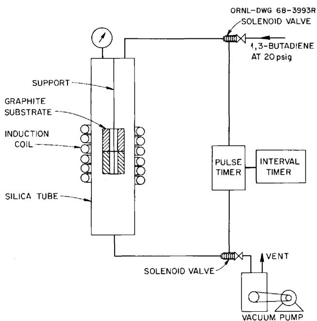  
Fig. 19.2. Carbon Impregnation of Graphite by Vacuum-Pressure System.

ATJ-SG graphite has approximately $60\%$ of its pores greater than $0.8\mu$ , while the pores of the Poco are nearly all less than $0.8\mu$ . The ATJ-SG has at least a factor of 10 greater permeability than the Poco and appears to require about twice as long to seal as the Poco does at a given temperature.

We have reduced the total process time required to seal a specimen by studying the effects of varying process parameters. The process is quite sensitive to temperature, with the rate of deposition generally increasing with increasing temperature. However, high temperature favors the formation of surface coatings with little penetration into the substrate. These factors limit the temperature range of interest to 800 to $1000^{\circ}\mathrm{C}$ , and we must adjust this parameter to obtain the optimum combination of deposition rate and penetration for each material. We also determined that the sealing rate increases with increasing vacuum-pressure cycle frequency but that there is a practical maximum above which loss of penetration results. Increasing the hydrocarbon exposure from $\frac{1}{2}$ sec to 1 sec slightly shortens the process time needed for sealing. We increased the sealing rate of the larger-pore-size ATJ-SG material by

processing it at a higher temperature than appears optimum for the Poco graphite.

For evaluating depth of carbon impregnation, we have developed a procedure employing subsequent mercury impregnation and then radiographic examination. Disks 5 to 20 mils thick are cut perpendicular to the axis of the carbon-impregnated specimen and then subjected to various pressures of mercury. At certain pressures (1000 to 5000 psi for Poco), the mercury will penetrate only the pores not impregnated with carbon, making those sections opaque to x rays (see Fig. 19.3). The carbon-impregnated areas are then clearly visible. At 100 psi the mercury penetrates all pores larger than $17\mu$ and at 10,000 psi, $0.17\mu$ . By varying the mercury pressure, we can observe where the effective carbon sealant is located. Figure 19.3 shows a 10-mil-thick section from a specimen that has been carbon sealed at $800^{\circ}\mathrm{C}$ . The disk was pressurized to 1000 psig in mercury and then radiographed. The darker rim shows the area that has been carbon impregnated. Other disks from this same specimen were mercury impregnated to 5000 and 10,000 psig. At higher mercury pressures the darker rim became thinner, indicating that the effective sealant is located near the surface of the substrate. The maximum depth of carbon penetration as shown in Fig. 19.3 is about 15 mils. The depth of penetration needed for effective sealing must be determined from results of irradiation behavior.

We prepared 12 specimens for irradiation in the HFIR. The substrates were machined from Poco grade AXF graphite, and some were heat treated to $3000^{\circ}\mathrm{C}$ prior to impregnation at various temperatures. Some of the impregnated specimens were then heat treated to $3000^{\circ}\mathrm{C}$ to graphitize the impregnant. The samples are being irradiated in the HFIR to a fluence of $\sim 1\times 10^{22}$ neutrons/cm $^2$ . The behavior of these specimens should provide us with information as to the type of sealant and depth of sealant penetration needed to maintain a sufficiently low permeability during high fast-neutron exposure.

# 19.6 GRAPHITE SURFACE SEALING WITH METALS

W.C.Robinson, Jr.

We used 20 samples of graphite that had been air fired at $600^{\circ}\mathrm{C}$ to check the validity of the plot

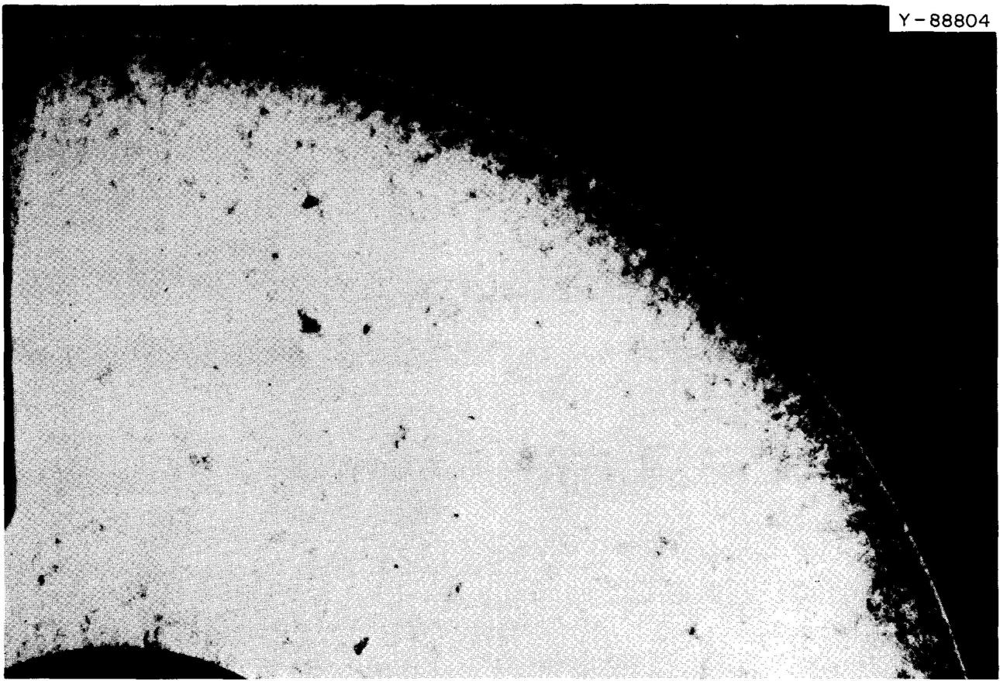  
Fig. 19.3. Carbon Impregnation of Graphite Shown by a Radiographic Technique Employing Mercury Penetration. The mercury penetrates the graphite disk where the pores are not sealed with carbon and makes the unsealed portion of the sample opaque to x rays.

of minimum deposit thickness vs reduction in pressure that was presented previously.4 The surfaces of these samples were rougher in appearance than previous samples annealed in air, and, of course, very much rougher than a sample annealed in argon. The results of these tests indicate that (1) the air anneal had an inconsistent but always detrimental effect on sample porosity; (2) a rough sample surface is more difficult to seal; and (3) the plot of minimum deposit thickness vs reduction in pumping pressure is valid, but precoating surface preparation does influence the effectiveness of a given coating thickness. Unfortunately, we also established that the argon anneal will not remove fingerprints from the sample. These are disastrous to the coating process.

Finally, these samples verified that most of the air-fired samples could not be sealed sufficiently by an acceptable amount of molybdenum (0.2 mil).

A differential pressure coating technique for depositing the molybdenum in the graphite pores had been attempted previously but was hampered by inability to obtain a vacuum seal around the graphite during heating. A technique for brazing specimens to a molybdenum tube was developed by the Welding and Brazing Laboratory. Eighteen samples were impregnated at $700^{\circ}\mathrm{C}$ at either 5 or 10 torrs using the differential pressure technique. The time of deposition varied from 5 to $20\mathrm{min}$ , and all samples were annealed at $600^{\circ}\mathrm{C}$ in argon prior to coating. Despite the anneal, four samples had fingerprints which destroyed the effectiveness of the coating. Inhomogeneous nodular deposits formed on some samples, but we obtained sufficient data to predict that 0.2 mil or

more of molybdenum would be necessary for even a completely homogeneous coating to reduce the helium permeability to the desired range. A radiograph of a 20-mil section of a coated sample showed that very little penetration into the graphite was achieved with the differential pressure technique.

# 19.7 GRAPHITE IRRADIATION EXPERIMENTS

C. R. Kennedy

The first long-term, five-cycle, irradiation of graphite in the HFIR has been completed. Two target rods containing specimens of the materials listed in Table 19.7 have been removed from the

reactor and disassembled. The specimen assembly was in very good condition, but some difficulty was encountered in disassembly. All locking pins broke off at the slightest attempt to remove them. This required shearing of the pins before the radial spacers could be removed to slide the specimens off the stainless steel support tube. There was also a graphite-stainless steel interaction, and some of the graphite specimens were bonded to the stainless steel support tubes. This required excessive force to remove the specimens, and some were broken, cracked, or chipped. However, only one specimen was too badly broken for length measurements to be taken.

There was also a more severe stainless steel—SiC interaction that resulted in a serious bonding

Table 19.7. Graphites Irradiated in HFIR Experiments 3 and 4   
Inserted in HFIR January 1968 Temperature, $705^{\circ}\mathrm{C} \pm 10^{\circ}\mathrm{C}$ Peak fluence $>50\mathrm{kev} = 1.3 \times 10^{20}$ neutrons/cm²   

<table><tr><td>Grade</td><td>Source</td><td>Forming Method</td><td>Density (g/cc)</td><td>Remarks</td></tr><tr><td>BY-12</td><td>Y-12</td><td>Molded</td><td>1.88</td><td>GLCC 1008 graphite flour-pitch binder-two pitch im-pregnations-3000°C</td></tr><tr><td>RY-12-29</td><td>Y-12</td><td>Extruded</td><td>1.89</td><td>85% GLCC 1008 graphite flour-15% Thermax-Varcum binder-3000°C</td></tr><tr><td>RY-12-31</td><td>Y-12</td><td>Extruded</td><td>1.80</td><td>GLCC 1008 graphite flour-Varcum binder-3000°C</td></tr><tr><td>Nat. flake</td><td>Y-12</td><td>Molded</td><td>1.83</td><td>Madagascar natural flake flour-pitch binder-3000°C</td></tr><tr><td>U.K. iso.</td><td>UK</td><td>Extruded</td><td>1.89</td><td>Fairly coarse particle size graphite-reasonably iso-tropic-2800°C</td></tr><tr><td>H315</td><td>GLCC</td><td>Extruded</td><td>1.87</td><td>Isotropic coke-pitch binder-2800°C</td></tr><tr><td>AGOT-EGCR</td><td>UCC</td><td>Extruded</td><td>1.69</td><td>Needle coke-pitch binder-one pitch impregnation-2800°C</td></tr><tr><td>H364</td><td>GLCC</td><td>?</td><td>1.94</td><td>Proprietary materials and forming method-reasonably isotropic-2800°C</td></tr><tr><td>2514</td><td>UCC</td><td>Extruded</td><td>1.82</td><td>Needle coke graphite-pitch bonded-multiple impregnation-2800°C</td></tr><tr><td>ATJ-S</td><td>UCC</td><td>Molded</td><td>1.81</td><td>Needle coke graphite-pitch bonded-multiple impregnation-2800°C</td></tr><tr><td>AXF</td><td>Poco</td><td>Molded</td><td>1.82</td><td>Proprietary materials and forming-very isotropic-2300°C</td></tr><tr><td>AXF-3000</td><td>Poco</td><td>Molded</td><td>1.82</td><td>AXF heat treated 1 hr at 3000°C</td></tr><tr><td>AXF-5QBG</td><td>Poco</td><td>Molded</td><td>1.86</td><td>AXF material with a single impregnation heated to 2500°C</td></tr><tr><td>AXF-5QBG-3000</td><td>Poco</td><td>Molded</td><td>1.85</td><td>AXF-5QBG heat treated to 3000°C</td></tr></table>

problem. Only two of the SiC temperature monitors were removed intact. Several other smaller broken pieces were removed which can possibly be used to determine the irradiation temperature. As yet, we have not examined the SiC monitors to determine the actual temperature, but we feel that it was close to the design temperature of $705^{\circ}\mathrm{C} \pm 10^{\circ}\mathrm{C}$ .

These problems can all be eliminated if a graphite support structure is used in place of the stainless steel. Unfortunately, the time required for design and fabrication would cause a serious delay in the irradiation schedule, and the specimens from these two experiments are being recycled in a similar stainless steel assembly. We plan to construct future experiments with a graphite support structure.

Dimensional measurements have been made on the samples from the first two experiments. The results of the linear dimensional changes are given in Figs. 19.4 and 19.5 with the exceptions of Poco and H364 grades. These two materials are nearly isotropic and have only small changes in dimensions. The difficulty of comparing graphite by linear dimensional changes is compounded by the inability to separate the contributions of volume change and the anisotropy of the graphite. It is easier to compare the graphites on a volume

change basis, as shown in Fig. 19.6, to obtain an estimate of expected lifetime.

These data are significant in that if these anisotropic products can be made isotropic, the linear dimensional change would be one-third of the volume change. Therefore those grades show

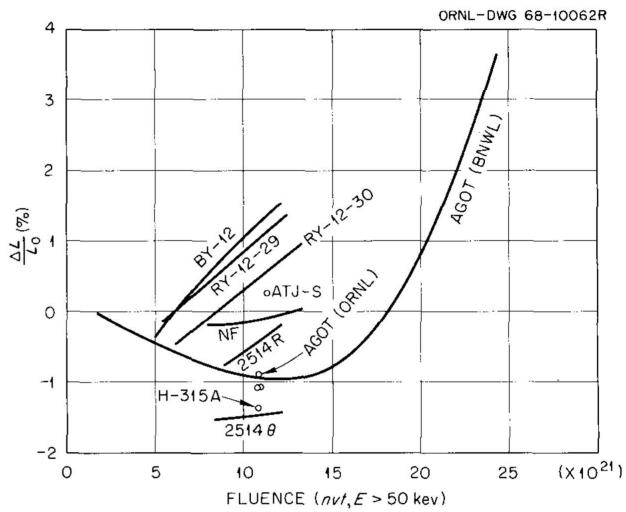  
Fig. 19.5. Dimensional Change of Graphite Irradiated at $705^{\circ}\mathrm{C}$ . Orientation - cross grain.

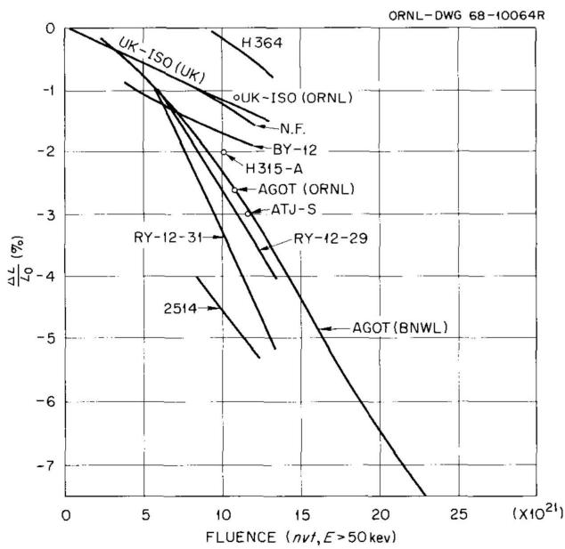  
Fig. 19.4. Dimensional Changes of Graphite Irradiated at $705^{\circ}\mathrm{C}$ . Orientation - with the grain.

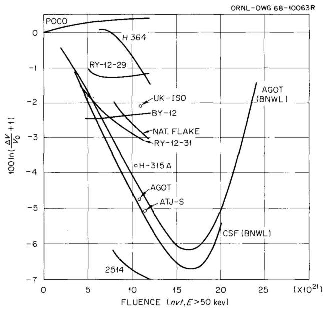  
Fig. 19.6. Volume Changes of Graphite Irradiated at $705^{\circ}C$ . These lines were computed from the curves shown in Figs. 19.4 and 19.5.

ing a smaller volume change have a greater potential for reactor use if they can be made isotropic.

Before discussing the trends indicated by the data, we emphasize that the curves were obtained from a maximum of three points and that further irradiations are required to confirm the indicated trends. The materials that have the smallest volume change are grades AXF and H364 (both have the highest degree of isotropy). Both of these materials seem to expand slightly and then begin to densify with increasing exposure. These two grades are high-quality products with a very fine evenly dispersed porosity and a structure which appears to be very well bindered. In the case of the AXF grade, the binder cannot be identified, and the structure appears to be a well-integrated single phase. In the H364 material, we cannot identify the initial coke particles by metallographic examination. The structure is also very well bindered, with evidence of heavy impregnations. We expect these well-bindered products to exhibit very small volume changes and even a small expansion under irradiation. However, this tendency for densification after a large exposure has not been observed previously in other graphites, and at present the rationale for such behavior is not understood.

The AXF samples chosen to examine the influence of final heat treatment and impregnation have produced results of considerable significance. There is a slight effect of graphitizing temperature and impregnation; however, the main significance is the lack of difference in the behavior. These results amplify the importance of isotropy and binder integrity in obtaining a dimensionally stable product. These factors appear to overshadow the effects of high-temperature graphitizing treatments. This conclusion may be premature in that long-term stability may be influenced by heat treatment.

The dimensional changes of the other two fairly isotropic graphites, grades UK-Iso and H315-A, are quite similar. Both of these materials are more stable than the common anisotropic reactor grades such as AGOT. These two materials, along with AGOT, were placed in this experiment primarily to have a direct comparison with previous data from other reactors.

Grades ATJ-S, 2514, and those obtained from Y-12 are all anisotropic and have fairly high linear dimensional change rates. A comparison of these results suggests some possible effects

of raw materials and fabrication on the dimensional stability under irradiation. A comparison of the grades BY-12, RY-12-29, and RY-12-31 indicates an anomalous behavior. It would be expected that both RY-12-29 and RY-12-31, having a less graphitic structure, would have a shorter lifetime than BY-12. However, the data indicate that RY-12-29 and BY-12 attained their minimum volume and began to expand, and thus may or may not have a shortened lifetime, depending upon the rate of expansion. This type of behavior is again in conflict with the proposal that the more graphitic materials should be more dimensionally stable.

# 19.8 SMALL-ANGLE X-RAY SCATTERING MEASUREMENTS IN GRAPHITE

R.W.Hendricks C.J.Sparks

The diffraction and scattering of x rays by crystalline substances can be used to learn many things about the arrangement of atoms within the crystal. When the crystal is perfect, x rays will be diffracted only when the Bragg law is satisfied, and there will be some low-intensity scattering due to thermal vibrations. However, real crystals normally contain imperfections which cause diffraction to occur under conditions other than those specified by the Bragg law. Measurements of this scattering, called diffuse scattering, can be used to characterize the defects present in the crystal. We feel that this technique has much promise for looking at the defects produced in graphite by irradiation and thus would help us learn more about the mechanism(s) responsible for radiation damage in graphite.

X-ray diffraction studies of hot-pressed pyrolytic graphite were undertaken to characterize the structure of the most perfect graphite available. This material is of theoretical density, and the basal planes are parallel to the extent that the full width at half height of the rocking curve is 0.6 to $0.35^{\circ}$ . However, the basal planes of graphite are randomly oriented with respect to rotation about the c axis. This material is monochromator-grade graphite from Union Carbide Corporation's Parma facilities.

Measurements of x-ray line breadths show no detectable broadening due to particle sizes being less than about 1500 A or due to strain. Diffuse scattering measurements detect no amorphous

carbon present, as all the diffuse intensity can be attributed to Compton scattering and thermal diffuse scattering. All the detectable temperature diffuse scattering is distributed along the $c$ direction, and the spread is as narrow as the mosaic spread in the crystal. Thus the only detectable thermal oscillation of the atoms is perpendicular to the basal plane.

With this understanding of the structure of highly perfect graphite, we are now determining

the structural changes which take place when this material is irradiated in a reactor. Preliminary results are being interpreted in terms of displaced atoms, which result in increased diffuse scattering. In addition, small-angle scattering measurements are being made. They verify the high-angle results for highly perfect graphite and will be used to measure electron density variations which result from irradiation.

# 20. Hasteley N

# 20.1 DEVELOPMENT OF TITANIUM-MODIFIED HASTELLOY N

C. E. Sessions

H. E. McCoy, Jr.

We have found that small additions of titanium significantly improve the mechanical behavior of Hastelloy N under irradiation, and we are evaluating several small heats.

In our development work, we irradiated both laboratory (2-lb) and commercial (100-lb) heats of Hastelloy N with varying concentrations of titanium and carbon. The alloy base composition is Ni-12% Mo-7% Cr-0.2% Mn. These alloys have been irradiated in several different experiments to thermal-neutron fluences of 2 to $5 \times 10^{20}$ neutrons/cm² in the ORR and the ETR. Although several irradiation temperatures have

been investigated, we shall consider only the results for specimens irradiated at 500 to $650^{\circ}\mathrm{C}$ in order to assess the effects of our titanium modification on high-temperature irradiation damage. We shall compare the behavior of the small laboratory melts with that of larger commercial melts of this material.

# 20.1.1 Commercial Melts

A partial list of 100-lb commercial heats on which we have accumulated preliminary data is given in Table 20.1. The titanium concentration varies from 0 to $1.2\%$ , with only a small variation in carbon content (0.06 to $0.09\%$ ). The ranges of stress-rupture properties listed in Table 20.1 were obtained from an approximate

Table 20.1. Effect of Titanium Additions on Creep Properties of Commercial Heats of Hastelloy N Tested at $650^{\circ}\mathrm{C}$ and 40,000 psi   

<table><tr><td rowspan="3">Heat Number</td><td rowspan="3">Titanium (wt %)</td><td rowspan="3">Carbon (wt %)</td><td colspan="4">Creep-Rupture Properties</td></tr><tr><td colspan="2">Unirradiated</td><td colspan="2">Irradiated</td></tr><tr><td>Rupture Life (hr)</td><td>Straina (%)</td><td>Rupture Life (hr)</td><td>Straina (%)</td></tr><tr><td>21546b</td><td>0</td><td>0.07</td><td>200</td><td>15–25</td><td>10</td><td>2.5–5</td></tr><tr><td>65535c</td><td>0.15</td><td>0.07</td><td>250</td><td>20–22</td><td>70</td><td>2.5–4</td></tr><tr><td>65541c</td><td>0.27</td><td>0.08</td><td>320</td><td>13–23</td><td>200</td><td>2–3</td></tr><tr><td>21545b</td><td>0.52</td><td>0.06</td><td>700</td><td>20–30</td><td>400</td><td>3–19</td></tr><tr><td>66548c</td><td>0.45</td><td>0.06</td><td>300</td><td>14–27</td><td>400</td><td>4–8</td></tr><tr><td>67550c</td><td>0.71</td><td>0.08</td><td colspan="2">Tests incomplete</td><td>2000</td><td>4–12</td></tr><tr><td>67549c</td><td>0.99</td><td>0.08</td><td>1500</td><td>35–40</td><td>2000</td><td>2–8</td></tr><tr><td>67548c</td><td>1.20</td><td>0.09</td><td colspan="2">Tests incomplete</td><td>2500</td><td>6–17</td></tr></table>

${}^{a}$ Range for three different stress levels.   
$b$ Vendor: Special Metals Corp.   
cVendor:Stellite Division,Union Carbide Corp.

stress-rupture life plot based on the few data points that are available for each heat. All data considered were for a comparable pretest heat treatment of a 1-hr anneal at $1177^{\circ}\mathrm{C}$ in argon, but undoubtedly they reflect differences in (1) grain size and (2) thermal aging during the irradiation cycle due to variations in titanium content.

The properties of these same alloys in the unirradiated condition are also given in Table 20.1. The ranges result from uncertainties due to the small number of tests available. The 40,000-psi rupture life at $650^{\circ}\mathrm{C}$ for unirradiated material containing no titanium is about 200 hr, and the fracture strain is 15 and $25\%$ . Small increases in both rupture life and fracture strain are found for titanium levels up to $0.3\%$ titanium. A large increase in both strength and ductility is found at higher titanium levels; for example, at the $0.99\%$ titanium level the rupture life is about 1500 hr after 35 to $40\%$ strain.

The postirradiation stress-rupture properties are also given in Table 20.1, and the variation of the rupture life with titanium content is shown

in Fig. 20.1. All data are for the preirradiation heat treatment of $1\mathrm{hr}$ at $1177^{\circ}\mathrm{C}$ . The postirradiation creep-rupture life at $650^{\circ}\mathrm{C}$ and $40,000~\mathrm{psi}$ increases markedly with increasing titanium levels from approximately $5\mathrm{hr}$ at zero titanium to $3000\mathrm{hr}$ at $1.2\%$ titanium. At $760^{\circ}\mathrm{C}$ , where the creep strength is much lower, we also find a beneficial strengthening effect of titanium; the rupture life at $20,000~\mathrm{psi}$ increased from approximately $0.2\mathrm{hr}$ at zero titanium to $200\mathrm{hr}$ at $1.2\%$ titanium. At $760^{\circ}\mathrm{C}$ , a smaller improvement in rupture life is found for increases in titanium content above about $0.2\%$ than was observed at $650^{\circ}\mathrm{C}$ . The postirradiation fracture strain for the commercial heats varied from $2 - 5\%$ for the heats containing less than $0.27\%$ titanium to $3 - 19\%$ for alloys containing $0.5 - 1.2\%$ titanium.

# 20.1.2 Laboratory Melts

For comparative purposes, although the data are not tabulated, we observed that 2-lb laboratory heats of unirradiated Hastelloy N con

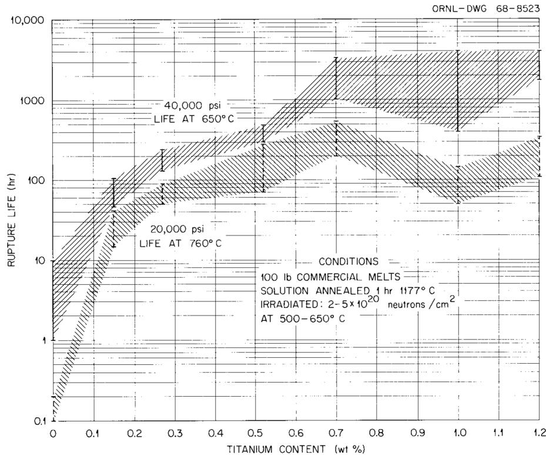  
Fig. 20.1. Variation in the Postirradiation Rupture Life with Titanium Content for 100-lb Commercial Melts of Irradiated Hastelloy N.

taining increasing titanium concentrations and stressed at 40,000 psi and $650^{\circ}\mathrm{C}$ had rupture lives from 45 to 1050 hr. This increase in rupture life was progressive with increasing titanium from 0 to $1.0\%$ . The fracture strain for the laboratory melts showed an increase with titanium level from 10 to $27\%$ over the range of titanium investigated.

The postirradiation creep-rupture results obtained on our laboratory melts are shown in Fig. 20.2. The stress levels are different from those used for the commercial alloys in Fig. 20.1, but the curves have very similar shapes and generally agree quite well. One possible significant difference is that at $760^{\circ}\mathrm{C}$ the properties of the laboratory heats show continued improvements, whereas the commercial heats indicate that titanium levels above $0.5\%$ cause no further improvement. This may be due to an effect of ir

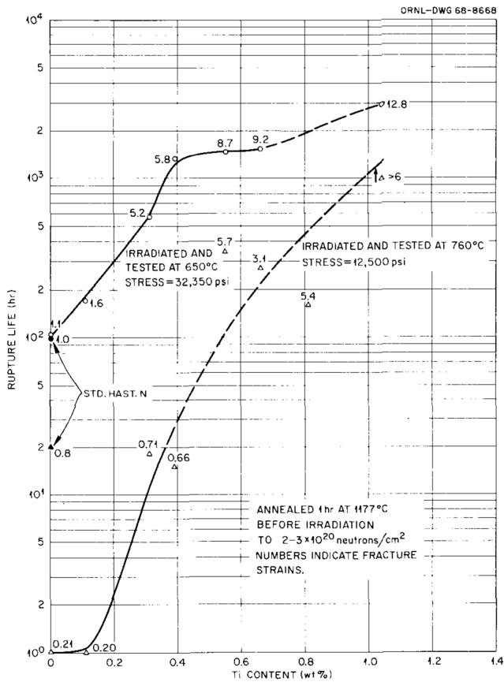  
Fig. 20.2. Variation of Postirradiation Creep Properties with Titanium Content for 2-lb Laboratory Melts of Hastelloy N.

radiation temperature, since the commercial heats were irradiated at 500 to $650^{\circ}\mathrm{C}$ and the laboratory melts were irradiated at $760^{\circ}\mathrm{C}$ (see Sect. 19.3).

# 20.2 AGING OF MODIFIED HASTELLOY N

C. E. Sessions

As part of our evaluation of commercial heats of titanium-modified Hastelloy N, we are investigating the thermal stability in the absence of irradiation. Since the presence of titanium may affect the aging tendency of the alloys, we are conducting an aging program on four commercial heats. Each alloy nominally contains Ni-12% Mo-7% Cr-0.2% Mn-0.06% C, with titanium concentration (0.15, 0.27, 0.45, and 1.2%) being the only significant variable. We are presently using the change in the tensile properties at $650^{\circ}\mathrm{C}$ and a strain rate of 0.002 $\mathrm{min}^{-1}$ to measure aging in these alloys. Aging temperatures of 760 and $650^{\circ}\mathrm{C}$ are examined for three pre-age heat treatments: 1 hr at $1177^{\circ}\mathrm{C}$ , 1 hr at $1260^{\circ}\mathrm{C}$ , and 1 hr at $1177^{\circ}\mathrm{C}$ plus 10% prestrain at room temperature. We shall eventually have data for aging times of 1500, 3000, and 10,000 hr; however, at present only the 3000-hr age results are complete.

The changes in the yield strength and the total elongation due to aging following our standard solution anneal of 1 hr at $1177^{\circ}\mathrm{C}$ are shown in Fig. 20.3. The yield strength increases after aging at 650 and $760^{\circ}\mathrm{C}$ , the increase being greater for the $650^{\circ}\mathrm{C}$ aging treatment. The change in the elongation at fracture is dependent on both the titanium content and the aging temperature. Aging at $650^{\circ}\mathrm{C}$ results in an increase in total elongation from approximately 30 to $40\%$ for the three higher titanium levels and a decrease for the lowest titanium level. However, the $760^{\circ}\mathrm{C}$ aging temperature results in a decrease in tensile elongation from $\sim 30$ to $\sim 15\%$ at the $650^{\circ}\mathrm{C}$ test temperature for the three lower titanium levels and an increase at the $1.2\%$ titanium level.

Figures 20.4 and 20.5 summarize the property changes following several heat treatments and aging at 650 and $760^{\circ}\mathrm{C}$ respectively. Here we have plotted the fractional change in total elongation and $0.2\%$ yield strength based on the unaged samples, with positive values indicating

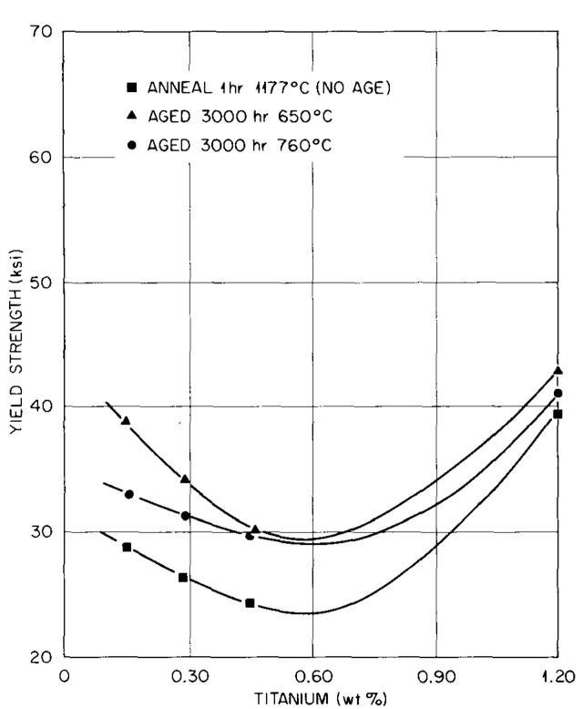

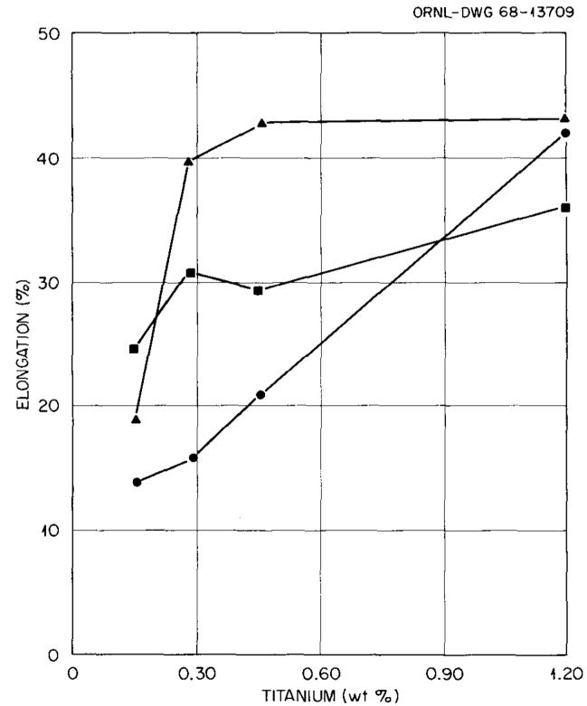  
Fig. 20.3. Dependence of Strength and Ductility on the Titanium Content of Modified Hastelloy N.

improvement and negative values indicating reduction in property with aging. Thus each point should represent a percentage change due to aging alone. After aging at $650^{\circ}\mathrm{C}$ the ductility varies appreciably with titanium content. Generally, at low levels the ductility is reduced, at $0.5\%$ titanium the ductility increases, and at $1.2\%$ titanium the ductility is improved by aging provided the pre-aging treatment did not involve annealing above $1177^{\circ}\mathrm{C}$ . The yield strength increases due to aging, the magnitude of the increase diminishing with increasing titanium content. Using a higher solution annealing temperature $(1260^{\circ}\mathrm{C})$ or room-temperature prestraining prior to aging results generally in higher strengths and lower ductilities for both the pre-aged and post-aged samples.

As shown in Fig. 20.5 the aging at $760^{\circ}\mathrm{C}$ has resulted in a large $(30 - 60\%)$ loss in ductility for each heat treatment, except at the $1.2\%$ titanium level. The yield strengths increase on aging at $760^{\circ}\mathrm{C}$ , except for the sample prestrained $10\%$ prior to aging.

The optical microstructures after aging at $760^{\circ}\mathrm{C}$ for 3000 hr are shown in Fig. 20.6. The three lower titanium levels appear similar, and the properties of each were also equivalent. However, the sample with $1.2\%$ titanium exhibits precipitation, primarily along bands which probably resulted from fabrication. This particular sample showed an increased tensile ductility, yet the large variation in properties of this heat with heat treatments (Figs. 20.4 and 20.5) may be partly attributable to local inhomogeneities within the original ingot, which are evident as localized stringers of precipitate particles.

The magnitude of the observed aging effect at $760^{\circ}\mathrm{C}$ after 3000 hr is cause for some concern, because we expect creep conditions and neutron irradiation to further reduce the fracture ductility. The role of titanium in the aging process is somewhat confusing, and it appears that titanium may actually be inhibiting rather than causing the aging.

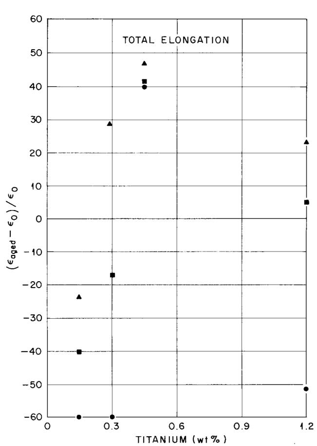

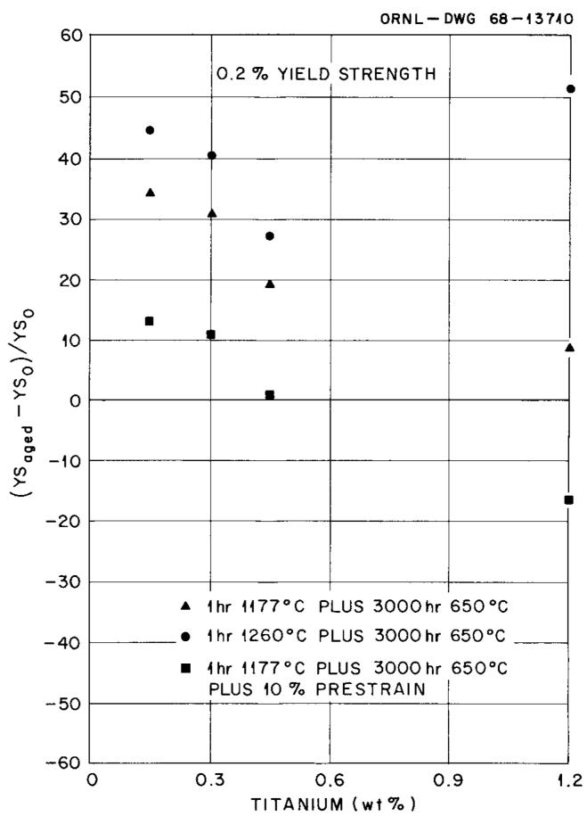  
Fig. 20.4. Variation of the Aging Response at $650^{\circ}\mathrm{C}$ of Titanium-Modified Hastelloy N with Titanium Content and Pre-Aging Treatments.

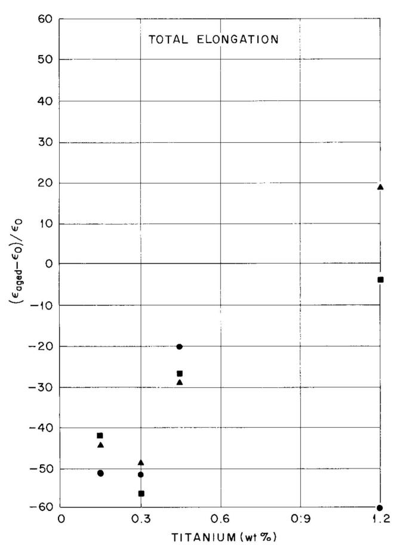

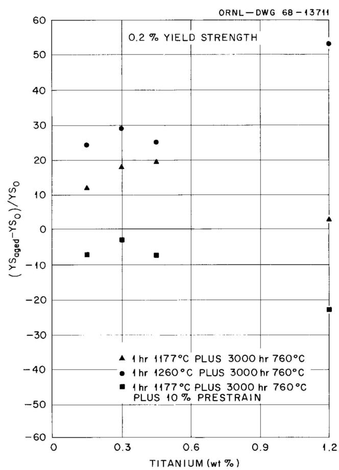  
Fig. 20.5. Variation of the Aging Response at $760^{\circ}\mathrm{C}$ of Titanium-Modified Hastelloy N with Titanium Content and Pre-Aging Treatments.

Y-88809

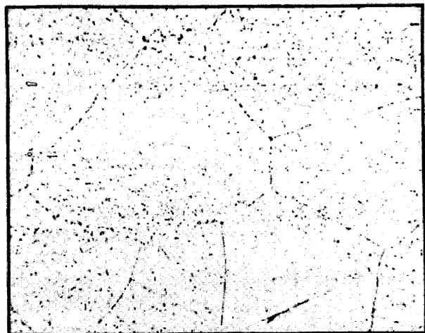  
0.15% Ti

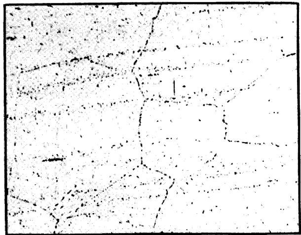  
0.27% Ti

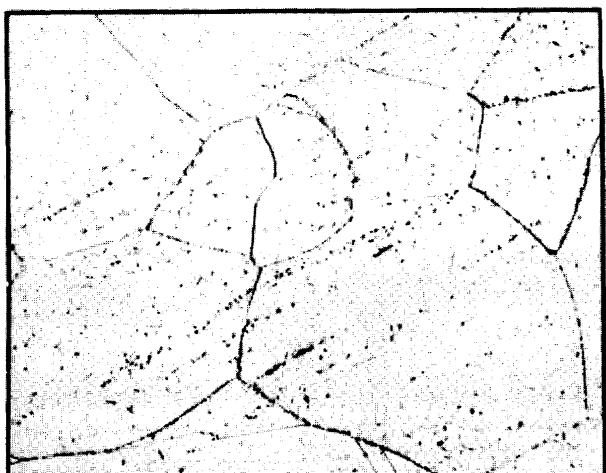  
0.45% Ti

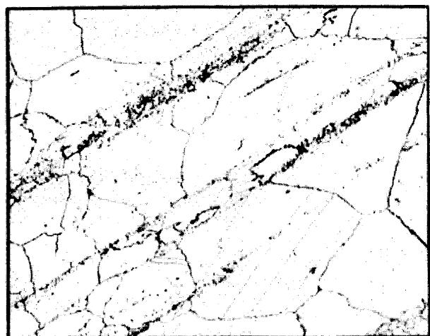  
1.2% Ti   
Fig. 20.6. Typical Microstructures of Titanium-Modified Hastelloy N After Annealing 1 hr at $1177^{\circ}\mathrm{C}$ and Aging at $760^{\circ}\mathrm{C}$ for 3000 hr.

# 20.3 INFLUENCE OF IRRADIATION TEMPERATURES ON THE POSTIRRADIATION MECHANICAL PROPERTIES OF TITANUMMODIFIED HASTELLOY N

H. E. McCoy, Jr.

Our first mechanical property tests on the titanium-modified Hastelloy N were run with samples that had been irradiated at $650^{\circ}\mathrm{C}$ , and we found that the properties were excellent at test temperatures of 760 and $650^{\circ}\mathrm{C}$ . In additional experiments we irradiated samples over a broad temperature range for 1000 hr to a thermal fluence of $3 \times 10^{20}$ neutrons/cm $^2$ and ran post-irradiation creep tests at 650 and $760^{\circ}\mathrm{C}$ . The stress-rupture properties of these samples at $650^{\circ}\mathrm{C}$ are shown in Fig. 20.7. Three heats of material were involved, with each having the nominal composition Ni-12% Mo-7% Cr-0.2% Mn-0.05% C-0.5% Ti. Heat 104 is a 2-lb laboratory melt made by arc melting virgin stock, and heats 21545 and 66-548 are 100-lb melts produced by two different commercial vendors. All three materials have better stress-rupture properties than irradiated standard Hastelloy N at $650^{\circ}\mathrm{C}$ as long as the irradiation temperature is $660^{\circ}\mathrm{C}$ or lower. The samples of heat 66-548 failed in shorter times when irradiated at temperatures of $704^{\circ}\mathrm{C}$ and above.

The variation of the minimum creep rate with stress level is shown for these same samples in Fig. 20.8. In general, the minimum creep rate is not significantly different in the irradiated and unirradiated conditions as long as the irradiation temperature does not exceed $660^{\circ}\mathrm{C}$ . When irradiated above $704^{\circ}\mathrm{C}$ the postirradiation creep rate is increased. Several of the samples were tested at $760^{\circ}\mathrm{C}$ , and these results are shown in Fig. 20.9. The creep-rupture properties of all the titanium-modified alloys are superior to those of irradiated standard Hastelloy N at $760^{\circ}\mathrm{C}$ . However, the results on heats 66-548 and 21545 give some indication of an effect of irradiation temperature, with the rupture life being reduced as the irradiation temperature is increased.

The fracture strains are shown in Fig. 20.10, as a function of the minimum creep rate for tests at 760 and $650^{\circ}\mathrm{C}$ . Previous studies have shown that the scatter band in Fig. 20.10 holds for air- and vacuum-melted standard Hastelloy N when irradiated and tested at common temperatures of 650 or $760^{\circ}\mathrm{C}$ . In Fig. 20.10, there is a grouping of points for tests at $650^{\circ}\mathrm{C}$ on samples irradiated at $660^{\circ}\mathrm{C}$ or below and for tests at $760^{\circ}\mathrm{C}$

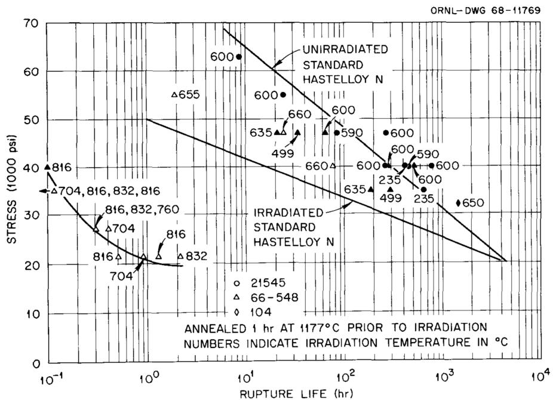  
Fig. 20.7. Postirradiation Stress-Rupture Properties of Titanium-Modified Hastelloy N at $650^{\circ}$ C.

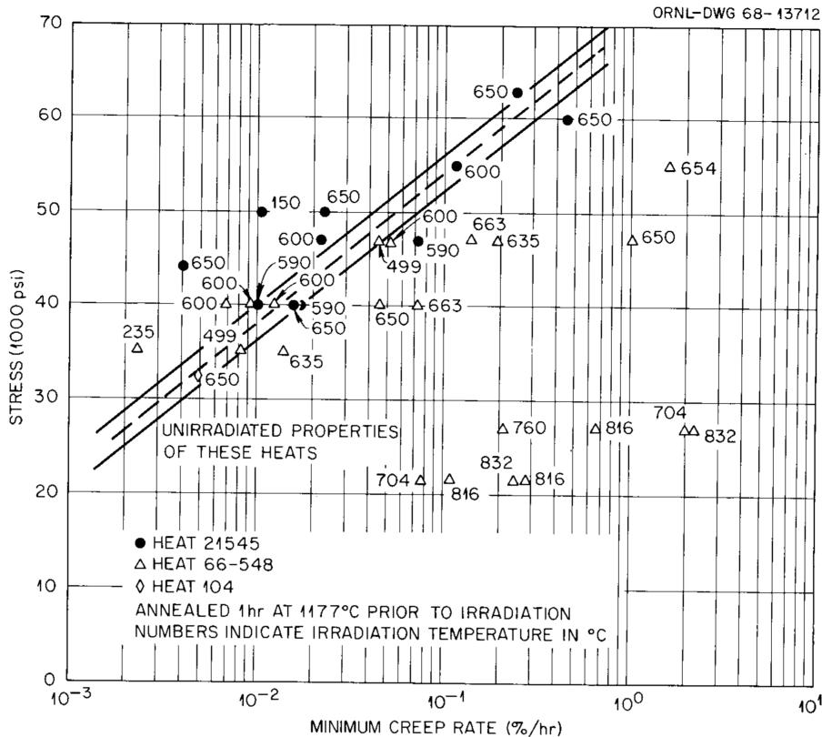  
Fig. 20.8. Minimum Creep Rate of Titanium-Modified Hastelloy N in Postirradiation Creep-Rupture Tests at $650^{\circ}\mathrm{C}$ .

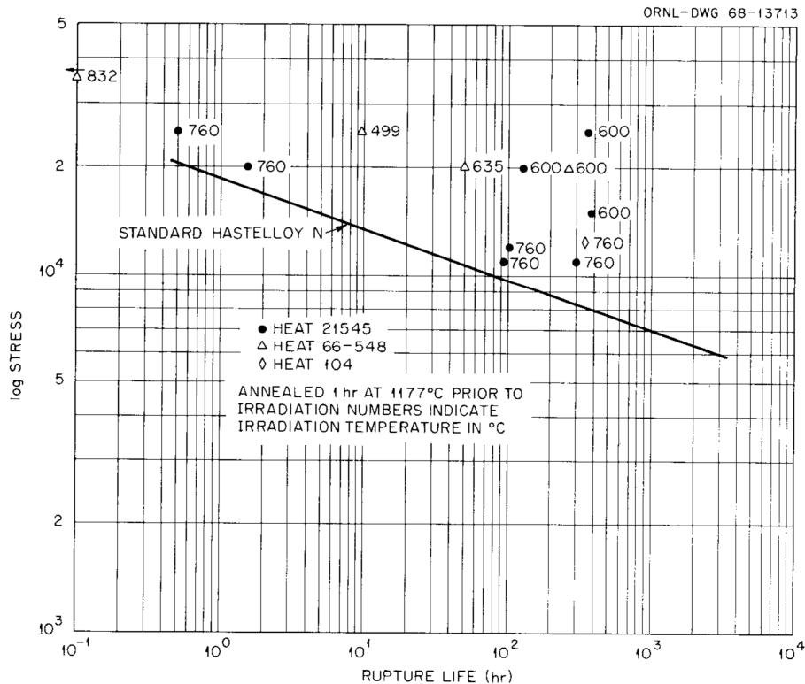  
Fig. 20.9. Postirradiation Creep-Rupture Properties of Titanium-Modified Hastelloy N at $760^{\circ}$ C.

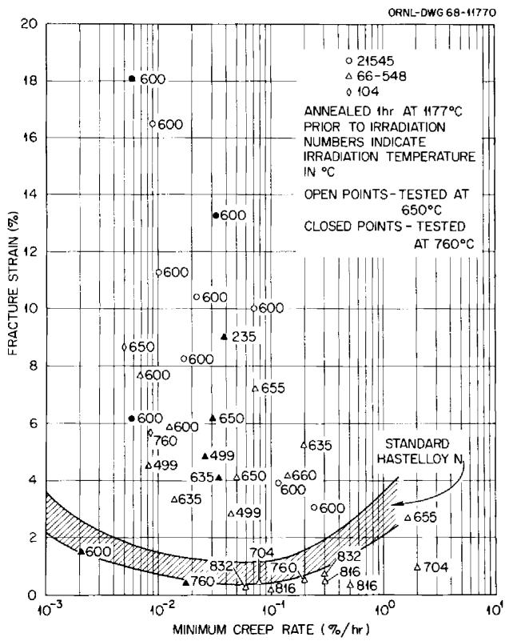  
Fig. 20.10. Effect of Strain Rates on the Fracture Strain of Titanium-Modified Hastelloy N.

on samples irradiated at $760^{\circ}\mathrm{C}$ or below. All these samples show an improvement in fracture strain over that of irradiated standard Hastelloy N. The samples irradiated at $704^{\circ}\mathrm{C}$ and above and tested at $650^{\circ}\mathrm{C}$ fall below the scatter band for standard Hastelloy N. (These are the same tests showing shorter rupture lives in Fig. 20.7 and higher creep rates in Fig. 20.8.)

One further observation is that a heat of modified Hastelloy N (Ni-12% Mo-7% Cr-0.2% Mn-0.05% C) without the titanium addition also showed a marked deterioration of postirradiation properties at $650^{\circ}\mathrm{C}$ when irradiated above $700^{\circ}\mathrm{C}$ . A significant difference in the behavior of the modified alloys with and without titanium is that the alloy without titanium (heat 21546, Fig. 20.11) recovers its strength as the stress level is decreased. The samples of heat 21546 irradiated above $700^{\circ}\mathrm{C}$ and showing reduced rupture lives also exhibit higher creep rates and lower fracture strains than samples irradiated at $650^{\circ}\mathrm{C}$ or lower.

Those observations have shown that the creep properties at $650^{\circ}\mathrm{C}$ of at least one 100-lb melt of titanium-modified Hastelloy N deteriorate when the irradiation temperature is above $700^{\circ}\mathrm{C}$ . This is of utmost concern, since we want to use this

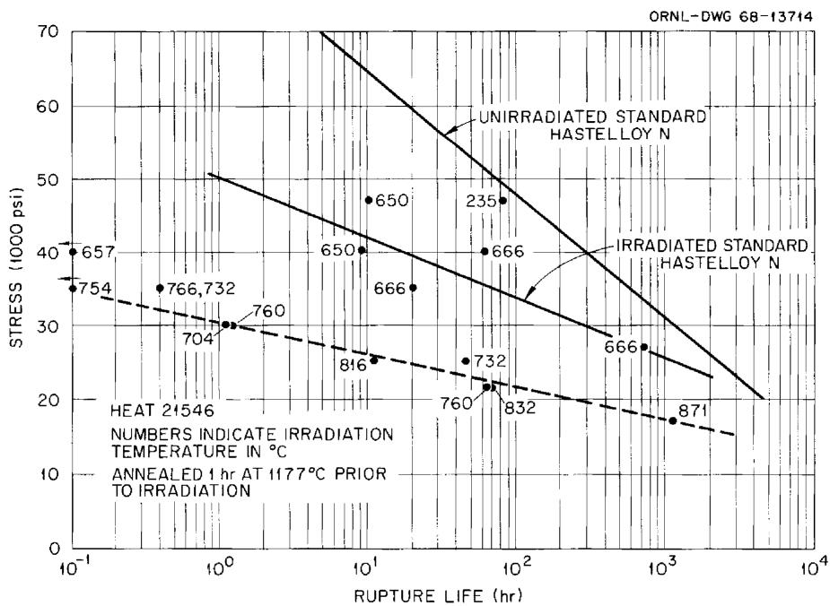  
Fig. 20.11. Postirradiation Creep-Rupture Properties of Modified Hastelloy N (Ni-12 Mo-7 Cr-0.2 Mn-0.5 C) at $650^{\circ}\mathrm{C}$ .

alloy at $700^{\circ}\mathrm{C}$ . We have also found that a similar alloy without titanium shows similar behavior. This led us to question whether such effects are universal for Hastelloy N. We have never performed an experiment directed at evaluating the effects of irradiation temperature on the creep-rupture properties of Hastelloy N. We have found that the properties at 650 and $760^{\circ}\mathrm{C}$ are not affected markedly by irradiation temperature over the range of 43 to $650^{\circ}\mathrm{C}$ , but we have never tested at $650^{\circ}\mathrm{C}$ a sample irradiated at $760^{\circ}\mathrm{C}$ . Such an experiment is being carried out.

# 20.4 ELECTRON MICROSCOPE STUDIES

R.E.Gehlbach

# 20.4.1 Precipitation in Standard Hastelloy N

We have found that the types and behavior of precipitated phases in Hastelloy N are closely related to the concentration of silicon in the alloy. The presence of more than about $0.2\%$ Si in the melt causes increasing enrichment of silicon in the $\mathbf{M}_6\mathbf{C}$ -type precipitates. The role of silicon appears to be that of substituting for carbon in the precipitates, resulting in an $\mathbf{M}_6(\mathbf{C},\mathbf{Si})$ which is stable at temperatures higher than the true $\mathbf{M}_6\mathbf{C}$ . However, the $\mathbf{M}_6(\mathbf{C},\mathbf{Si})$ phase transforms to the $\mathbf{Mo}_2\mathbf{Ni}_3\mathbf{Si}$ intermetallic at temperatures in excess of $1300^{\circ}\mathbf{C}$ . We have not evaluated the kinetics of the transformation or the subsequent decomposition on exposure to lower temperatures. Preliminary investigations indicate that decomposition occurs with the formation of at least $\mathbf{M}_6\mathbf{C}$ [or $\mathbf{M}_6(\mathbf{C},\mathbf{Si})$ and $\mathbf{Mo}_2\mathbf{C}$ . The high-temperature $\mathbf{Mo}_2\mathbf{Ni}_3\mathbf{Si}$ intermetallic has been identified both by x-ray diffraction and by electron probe microanalysis from extracted particles.

Alloys containing about $0.2\%$ Si or less contain the true $\mathbf{M}_6\mathbf{C}$ , which is put into solid solution at high annealing temperatures. The high-temperature silicide phase is not formed. We have found that decreasing either the silicon or

the molybdenum causes the precipitation of $\mathbf{M}_2\mathbf{C}$ as well as the $\mathbf{M}_6\mathbf{C}$ [or $\mathbf{M}_6(\mathbf{C},\mathbf{Si})$ ].

# 20.4.2 Titanium-Modified Hastelloy N

The microstructure of the titanium-modified alloy is quite different from that of the standard material. Major compositional changes which affect the microstructure and precipitates which form include decreasing the molybdenum from 16 to $12\%$ and the silicon from 0.6 to $0.02\%$ or less. As a result the $\mathbf{M}_6\mathbf{C}$ -type precipitates, which comprise the stringer and grain-boundary phases in the original version of the alloy, are absent.

Unlike the standard alloy, precipitates in the modified Hastelloy N are put into solid solution at normal annealing temperatures. Exposure at temperatures similar to those expected in service results in both grain boundary and matrix precipitation. Figure 20.12 shows a typical mode of precipitation in and adjacent to the grain boundaries after aging at $650^{\circ}\mathrm{C}$ for 1500 hr. Preliminary indications suggest that the precipitates are of the $\mathrm{Mo}_{2}\mathrm{C}$ type. Exposure at $760^{\circ}\mathrm{C}$ for similar times results in precipitation of spherical particles of the $\mathrm{Mo}_{2}\mathrm{C}$ type.

Figure 20.13 shows the microstructure resulting from exposure at $650^{\circ}\mathrm{C}$ for 1438 hr under a stress of 32,350 psi. The grain boundary precipitate is much finer than that generated by aging alone (Fig. 20.12), and a very fine, highly oriented precipitate is generated in the matrix, probably strain induced. We have identified the matrix precipitate as $\mathsf{Mo}_2\mathbb{C}$ by electron diffraction and dark-field electron microscopy.

We have initiated an investigation of the effects of irradiation temperature on the microstructure of Hastelloy N in an attempt to explain the apparent loss in elevated-temperature ductility associated with different irradiation temperatures (see Sect. 19.3). Figure 20.14a shows a typical grain boundary in an alloy (66-548) containing $0.48\%$ Ti which was irradiated for 1128 hr at $635^{\circ}\mathrm{C}$ and tested in creep at $650^{\circ}\mathrm{C}$ , 47,000 psi, with a rupture life and fracture strain of 20.7 hr and $5.2\%$ respectively. The grain boundaries are quite irregular and contain an appreciable amount of precipitate. A considerable amount of the fine oriented $\mathrm{Mo}_{2}\mathrm{C}$ matrix precipitate is formed (Fig. 20.14b), probably either strain or radiation induced or both. This

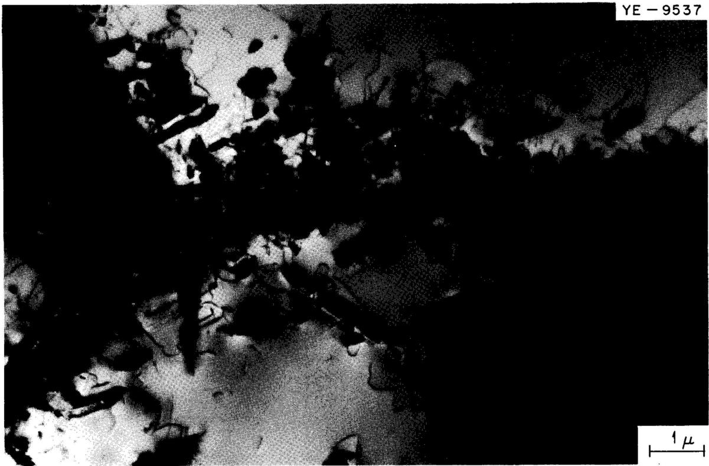  
Fig. 20.12. Grain-Boundary Precipitation After Aging at $650^{\circ}\mathrm{C}$ for 1500 hr Subsequent to Annealing 1 hr at $1177^{\circ}\mathrm{C}$ . Heat 466-548. $10,000\times$

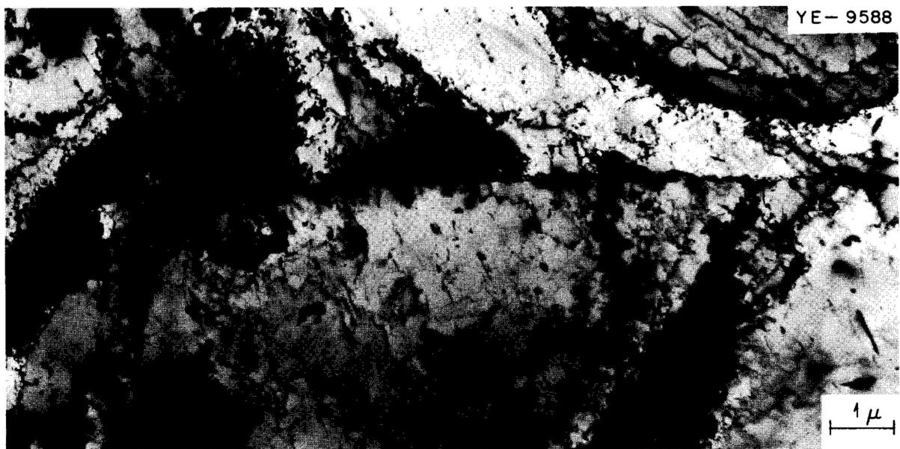  
Fig. 20.13. Microstructure of Creep Specimen Exposed 1438 hr at $650^{\circ}\mathrm{C}$ Under 32,350 psi Stress with a Rupture Elongation of $21\%$ . Note finer precipitate than that generated by normal aging.

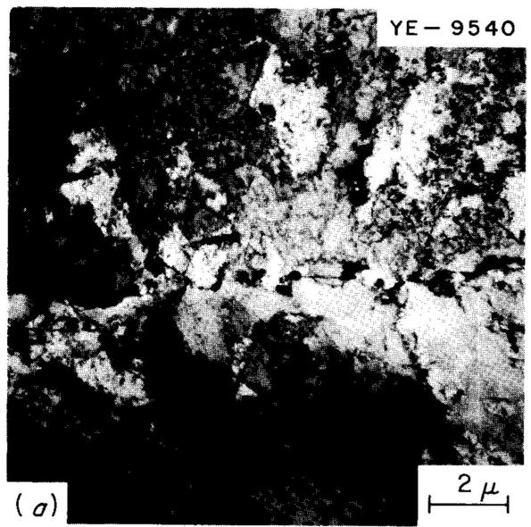

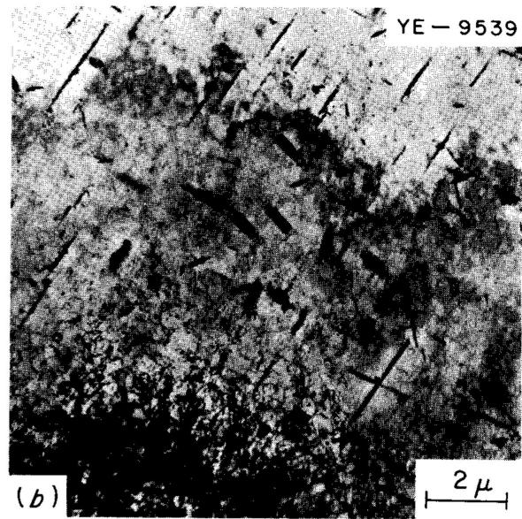  
Fig. 20.14. Microstructure of Specimen Irradiated 1128 hr at $635^{\circ}C$ Prior to Creep Testing at $650^{\circ}C$ , 47,000 psi. (a) Grain boundary precipitation. (b) Fine oriented $\mathsf{Mo}_2\mathsf{C}$ matrix precipitate. Heat 466-548. $5000\times$

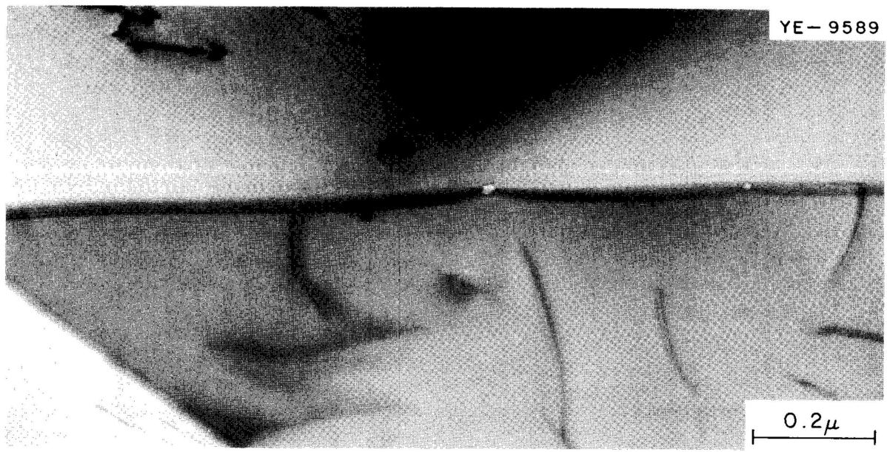  
Fig. 20.15. Bubbles on Grain Boundary of Specimen Irradiated 1128 hr at $703^{\circ}C$ Prior to Creep Testing at $650^{\circ}C$ , 21,500 psi. Heat 466-548. 100,000×.

precipitate is present in much larger quantities in the irradiated and stressed specimen than in the one stressed at $650^{\circ}\mathrm{C}$ for 1438 hr without irradiation.

In contrast to the specimen irradiated at $635^{\circ}\mathrm{C}$ (which exhibited good creep ductility), the grain boundaries of the one irradiated at $703^{\circ}\mathrm{C}$ were free of precipitate. Owing to the low fracture strain $(0.44\%)$ at 21,500 psi and $650^{\circ}\mathrm{C}$ , 0.85 hr rupture life), the matrix and grain boundaries are quite strain-free. Bubbles were observed quite frequently in grain boundaries and occasionally in the matrix. Figure 20.15 shows typical bubbles in a grain boundary.

Bubbles were not observed in the material irradiated at $635^{\circ}\mathrm{C}$ . It is possible that the grain boundary precipitates would mask bubbles if they were present, since the strain fields associated with the particles are quite large compared with usual bubble sizes. Because of the strain which the sample received, the grain boundaries are not sharp as in the case of the $703^{\circ}\mathrm{C}$ material. Thus, if bubbles are present after irradiation at the lower temperatures, we have not been able to observe them. We are planning to examine unstressed sections from the above specimens, which should provide some clarification as to the effect of irradiation alone.

Considering the structures we have found in the irradiated specimens, the difference in mechanical properties is not surprising (the microstructure in Fig. 20.14 would inhibit the propagation of a grain boundary crack, whereas that in Fig. 20.15 would favor propagation). We are not able to explain the differences in structures on the basis of the few samples examined. Ensuing work includes evaluating unstressed irradiated specimens containing titanium as well as stressed and unstressed irradiated specimens without titanium to determine the effects of irradiation, irradiation temperature, stress, aging time, and temperatures on the microstructure and mechanical properties of these alloys.

# 20.5 WELDABILITY OF TITANIUM-MODIFIED HASTELLOY N

D. A. Canonico

A. G. Cepolina

We have obtained our first 5000-lb production heat of titanium-modified Hastelloy N (heat 7320)

and are studying the weldability of this material. The previous welding studies on 100-lb heats had shown that the weldability of the titanium-modified alloy was good under low-restraint conditions. However, the availability of the 5000-lb heat gave us the first opportunity to make high-restraint welds in large plates. All welds to date have been made in plates nominally 12 in. long $\times 6$ in. wide $\times \frac{1}{2}$ in. thick. The weld wire was fabricated from $5_{16}$ -in.-diam rod of the same heat; $3_{32}$ -in.-diam wire was used for the first three passes and $1_{8}$ -in.-diam wire for subsequent passes. One edge of each plate was prepared for welding, and the two plates were welded to a 2-in.-thick steel strongback to provide a high degree of restraint.

The first weld was made using 14 passes. Upon completion, it was removed from the strongback and radiographed. A number of cracks were seen on the radiograph. The weld was sectioned, and both photomacrographs and photomicrographs were taken. Figure 20.16 illustrates the types of cracks seen in this weld. These are among the most severe seen during the subsequent welding study. Figure 20.17 shows the fusionline and heat-affected-zone areas of the weld; cracking is not a problem in the base metal. Weld 2 was made under similar conditions to weld 1 except that the surfaces of individual passes were also inspected by dye-penetrant techniques. It was found that the first weld pass (root pass) was sound; however, when the second weld pass was deposited, the first cracked. These cracks were both parallel and transverse to the welding direction.

In view of the cracking that resulted from welding heat 7320 with itself, we decided to lay out a systematic welding program using the specified procedures.4 Figure 20.18 is a compilation of typical welds undertaken. All the welds were made under the highly restrained conditions discussed previously. Weld No. 4 was made using weld wire from a previously accepted heat (5090) of standard air-melted Hastelloy N. This weld was completed with no crack indications from both radiographic and dye-penetrant techniques. Subsequent metallographic studies substantiated these observations. Weld 5 was made

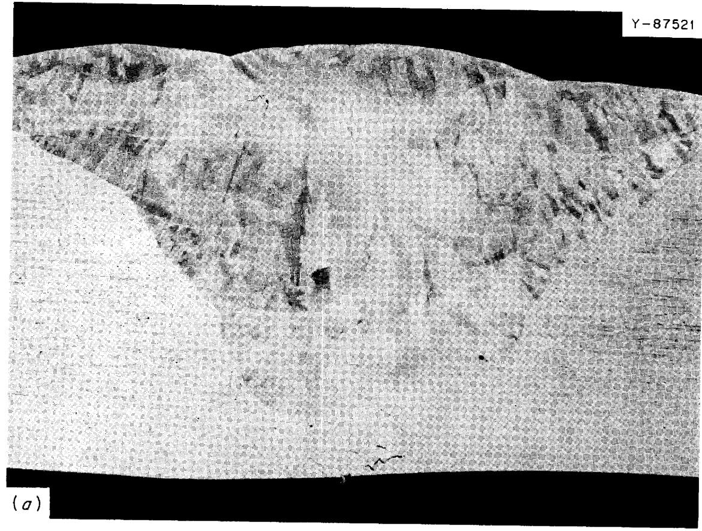

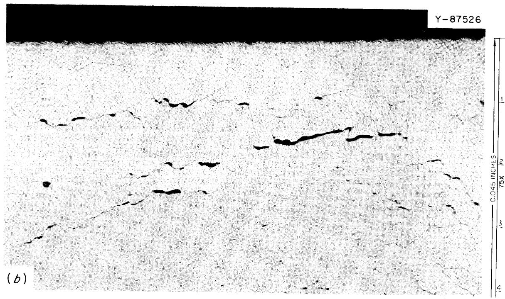  
Fig. 20.16. Metallographic Representation of the Most Severe Cracks Seen in Welds Made with Heat 7320 Base Metal and Filler Rod. (a) $6 \times$ . (b) $75 \times$ . Etch, Glyceregia.

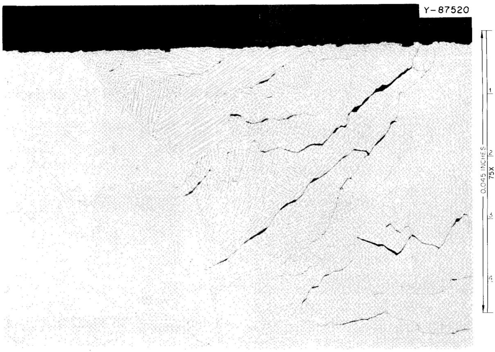  
Fig. 20.17. Photomicrograph of the Fusion Zone in Plate from Heat 7320. This specimen was taken from the weldment which contained the most severe weld metal cracks (weldment No. 1). Note that cracking is not a problem in the base metal.

using the specified procedure and filler metal from heat 7320. Again the root pass cracked when the second pass was deposited. Welds 6 and 7 were made with both filler and base metal from heats 67-526 (Hastelloy N with $0.5\%$ Ti) and 67-550 (modified Hastelloy N with $0.7\%$ Ti), respectively, and no cracking occurred. This confirmed previous studies that these heats were weldable.

Additional welds were made using base metal of heat 7320 and various filler metals. These welds are also summarized in Fig. 20.18. In all instances where heat 7320 was used as the filler metal, cracking occurred in the root pass when the second weld pass was deposited. However, successful welds were made in heat 7320 with filler metal from both heats 67-526 and 67-550 (these welds are identified as 12 and 13 in Fig. 20.18).

Specimens were sectioned from welds 4, 12, and 13 and subjected to side-bend tests. As shown in Fig. 20.19, all these welds successfully withstood a $180^{\circ}$ bend without any indication of cracks. This side-bend test is severe and is used extensively in Code qualifications. If small difficult-to-detect fissures are present in the weldment, they will open during bending.

Supplementary studies were undertaken in an effort to explain the unusual cracking problem observed in weld metal deposited from heat 7320 filler rod. Chemical analyses were made on the base metal, welding rod, and weld metal deposited in welds 1 and 2 (Table 20.2). The only obvious difference that existed between these materials was in the nitrogen level. The weld deposits contained approximately $40~\mathrm{ppm}$ nitrogen, compared with $4\mathrm{ppm}$ in the base metal and the filler rod. Electron-beam microprobe analyses

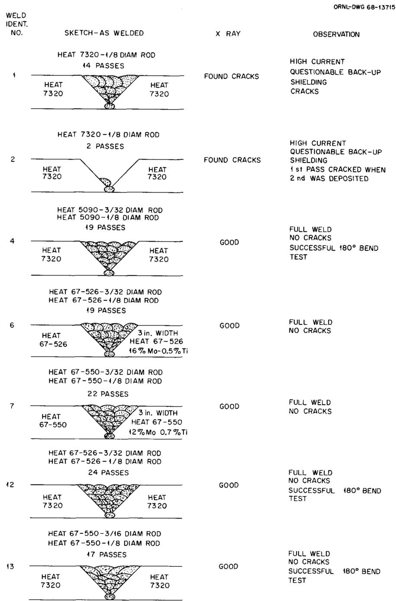  
Fig. 20.18. Welding Program, Typical Test Plate Details.

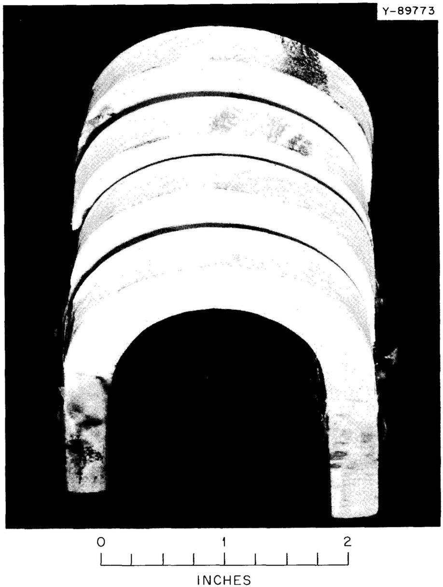  
Fig. 20.19. $180^{\circ}$ Bend Specimens from Weld No. 12.

of three different welds failed to reveal any inhomogeneous distribution of alloying elements or impurities near cracks. If an element(s) is responsible for the cracking, it was not present in concentrations high enough to be detected by the microprobe analyzer.

Our observation that the nitrogen content increased during welding led us to conduct a series of experiments in welding atmospheres that would minimize the possibility of nitrogen

contamination. An electron-beam welder was employed for this study. A bead-on-plate technique with overlapping welds was used in which the base metal is fused without the addition of filler metal. The base plates were not restrained. Vacuums of $5 \times 10^{-4}$ and $5 \times 10^{-5}$ torr were utilized, and, after welding, the specimens were dye-penetrant inspected. The welds made at $5 \times 10^{-5}$ torr were not cracked, whereas those made at $5 \times 10^{-4}$ torr were. This investigation

Table 20.2. Chemical Analysis of Heat ${7320}^{a}$   

<table><tr><td>Element</td><td>Plate</td><td>Filler Rod</td></tr><tr><td>Ag</td><td>1</td><td>1</td></tr><tr><td>Al</td><td>1000</td><td>1000</td></tr><tr><td>B</td><td>2</td><td>3</td></tr><tr><td>Bi</td><td>1</td><td>1</td></tr><tr><td>C</td><td>370</td><td>340</td></tr><tr><td>Ca</td><td>7</td><td>7</td></tr><tr><td>Co</td><td>1000</td><td>1000</td></tr><tr><td>Cr</td><td>7.43%</td><td>7.27%</td></tr><tr><td>Cu</td><td>50</td><td>50</td></tr><tr><td>Fe</td><td>1720</td><td>1580</td></tr><tr><td>Mg</td><td>100</td><td>100</td></tr><tr><td>Mn</td><td>1900</td><td>2000</td></tr><tr><td>Mo</td><td>12.6%</td><td>12.3%</td></tr><tr><td>Ni</td><td>79.0%</td><td>79.3%</td></tr><tr><td>P</td><td>20</td><td>10</td></tr><tr><td>Pb</td><td>2</td><td>&lt;0.5</td></tr><tr><td>S</td><td>40</td><td>50</td></tr><tr><td>Sb</td><td>&lt;1</td><td>&lt;1</td></tr><tr><td>Se</td><td>10</td><td>10</td></tr><tr><td>Si</td><td>300</td><td>300</td></tr><tr><td>Sn</td><td>&lt;5</td><td>&lt;5</td></tr><tr><td>Ti</td><td>5000</td><td>5400</td></tr><tr><td>V</td><td>100</td><td>100</td></tr><tr><td>W</td><td>500</td><td>500</td></tr><tr><td>Zn</td><td>4</td><td>1</td></tr><tr><td>Zn</td><td>30</td><td>30</td></tr><tr><td>N2</td><td>3</td><td>4</td></tr><tr><td>O2</td><td>5</td><td>8</td></tr></table>

$^{\mathbf{a}}$ Analysis is given in parts per million unless otherwise denoted.

did seem to indicate a relationship between the environment and cracking; however, the vacuum requirement for eliminating crack indications is rather stringent. The effect of superimposed restraint upon the cracking propensity was not determined.

We also deposited a weld in an inert-gas welding chamber containing high-purity helium with a nitrogen content of about 5 ppm. The plates were under medium restraint during welding. The joint was dye-penetrant inspected after the third pass, and the weld metal was found to be crack free. The weld was completed and again dye-penetrant inspected. A few very small indica

tions were noted on the surface. These were easily removed by a minimal amount of grinding, and four side-bend specimens were prepared and tested. After a $180^{\circ}$ bend, all four contained cracks concentrated in the root region of the weld.

We also investigated the effects of postweld heat treatments on cracking of bead-on-plate welds. These gas tungsten arc welds were made with heat 7320 filler metal deposited on heat 7320 plate. Two sequences were studied. The first consisted in annealing the plate and first pass at $870^{\circ}\mathrm{C}$ for 4 hr; then two subsequent weld beads were deposited. The second bead overlapped the heat-treated bead, and the third bead overlapped the un-heat-treated bead. The weld bead annealed at $870^{\circ}\mathrm{C}$ contained a few small cracks, whereas the un-heat-treated bead contained a multitude of cracks; thus postweld heat treating at $870^{\circ}\mathrm{C}$ did minimize the cracking. The second series of welds was similar to the first except that the first weld bead was annealed at $1180^{\circ}\mathrm{C}$ for 4 hr. The $1180^{\circ}\mathrm{C}$ postweld heat treatment eliminated the cracks in the first pass, but the second pass (not heat treated) did crack when the third pass was deposited.

Metallographic investigation of the welds showed that the $1180^{\circ}\mathrm{C}$ heat treatment produced a clean coarse-grained microstructure with no typical weld-metal cast structure (all evidence of welding was removed). On the other hand, the $870^{\circ}\mathrm{C}$ heat treatment had little visual effect on the weld-metal cast structure. This experiment does seem to support the thesis that microsegregation of some element (or elements) is responsible for the cracking and that its effect can be negated by a homogenizing postweld heat treatment. However, the $1180^{\circ}\mathrm{C}$ temperature is entirely too high for consideration as a step in the fabrication procedure.

Based on the above results, we decided to remelt material from heat 7320 and make small alloy additions in an attempt to make a better filler material. The first melt was made by arc melting heat 7320 under a partial vacuum with no additions. Two other melts used heat 7320 with alloy additions to provide alloys with $0.7\%$ Mn and $2.0\%$ Nb. Past experience had indicated that small amounts of these elements might be beneficial in reducing cracking. These remelts were drawn to wire and used as filler

rods. Base metal for these welds was the same $\frac{1}{2}$ -in.-thick heat 7320 plate used in the studies discussed heretofore. The results were negative and were nearly identical to those observed previously; that is, the first weld pass cracked when the second was deposited.

As a result of these studies, we conclude that heat 7320 is a weldable base metal. There is no indication of a problem in the heat-affected zone. However, it is not an acceptable filler metal. In no instance was a crack-free weld produced with filler metal from it. The excellent welds in heats 67-526 and 67-550 indicate that the titanium-modified alloy can be welded using similar filler metals. The studies to date indicate that the cracking is due to the segregation of element(s) presently unidentified.

# 20.6 MEASUREMENT OF RESIDUAL STRESSES IN HASTELLOY N WELDS

A. G. Cepolina

D. A. Canonico

We are investigating the effects of welding conditions and postweld heat treatment on the distribution and magnitude of the residual stresses in Hastelloy N. The method used for measuring the residual stresses and the welding and machining techniques that are employed were discussed previously. These earlier studies involved the investigation of the effects of stress

relief treatments and gas shielding (helium vs argon) on the resultant residual stress patterns. The residual stress patterns were similar for argon and helium shielding; however, the maximum residual stress was about $5\%$ higher when helium was used. We also found that postweld heat treatments of $1180^{\circ}\mathrm{C}$ for 1 hr and $870^{\circ}\mathrm{C}$ for 6 hr reduced the maximum residual stress to about 500 psi in both cases. All these welds were made with a heat input of 15,000 j/in.

We have expanded this work to include a postweld anneal of $4_{\frac{1}{2}}^{1}$ hr at $870^{\circ}\mathrm{C}$ on welds made with both argon and helium shielding gases. In addition, we have investigated a postweld heat treatment of $650^{\circ}\mathrm{C}$ for 100 hr on a weld shielded with argon. The welding parameters used for these weldments were identical to those reported previously. In addition to the postweld heat-treatment studies, we have also investigated the effect of a lower heat input on the distribution of residual stresses.

Table 20.3 summarizes the results of the postweld heat-treatment studies. The earlier welds, 1, 5, 6, and 7, are included for comparison. It is evident that a postweld heat treatment of $870^{\circ}\mathrm{C}$ for 4.5 hr essentially eliminates the residual

$^{5}$ MSR Program Semiann. Progr. Rept. Aug. 31, 1967, ORNL-4191, pp. 223-26.   
$^{6}$ MSR Program Semiann. Progr. Rept. Feb. 29, 1968, ORNL-4254, pp. 215--17.

Table 20.3. Results of the Investigation of the Effect of Postweld Heat Treatments on the Peak Residual Stresses in Hastelloy N   

<table><tr><td rowspan="2">Weld Identification</td><td rowspan="2">Shielding Gas</td><td rowspan="2">Heat Inputa(j/in.)</td><td colspan="2">Postweld Heat Treatment</td><td colspan="2">Maximum Residual Stress (psi)</td></tr><tr><td>Temperature (°C)</td><td>Time (hr)</td><td>Tangential, σT</td><td>Radial, σR</td></tr><tr><td>1</td><td>Argon</td><td>15,000</td><td colspan="2">None</td><td>56,000</td><td>16,800</td></tr><tr><td>5</td><td>Argon</td><td>15,000</td><td>870</td><td>6</td><td>~5,000</td><td>~1,000</td></tr><tr><td>6</td><td>Argon</td><td>15,000</td><td>1180</td><td>1</td><td>~5,000</td><td>~2,000</td></tr><tr><td>7</td><td>Helium</td><td>15,000</td><td colspan="2">None</td><td>60,000</td><td>17,300</td></tr><tr><td>8</td><td>Helium</td><td>15,000</td><td>870</td><td>4.5</td><td>5,200</td><td>1,000</td></tr><tr><td>9</td><td>Argon</td><td>15,000</td><td>870</td><td>4.5</td><td>5,000</td><td>1,600</td></tr><tr><td>12</td><td>Argon</td><td>15,000</td><td>650</td><td>100</td><td>36,800</td><td>12,600</td></tr></table>

${}^{a}$ The heat input reported is for each of the two simultaneously deposited weld beads.

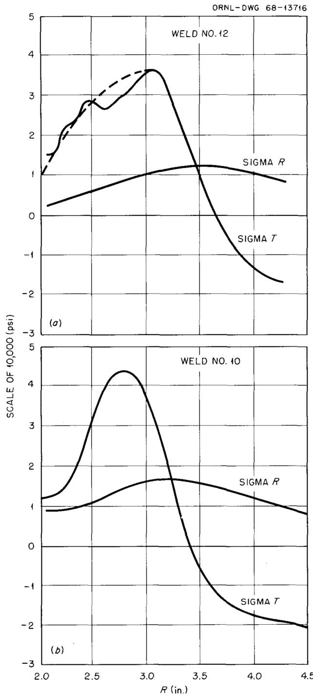  
Fig. 20.20. Residual Stress Patterns for Welds Made in Hastelloy N. (a) Welded with 15,000 j/in. weld and postweld heat treated for 100 hr at $1200^{\circ}\mathsf{F}$ . (b) Welded with 7500 j/in. weld (as-welded condition).

stresses, and this is true regardless of the shielding gas employed. A treatment at $650^{\circ}\mathrm{C}$

for 100 hr reduces the peak residual stresses by about $35\%$ ; however, they do remain at a high value after the treatment.

Table 20.4 contains the data obtained from a weldment deposited at $7500\mathrm{j / in}$ . (vs 15,000 j/in. for the previously discussed weldments). The lower heat input decreased the peak tangential residual stresses; however, it has essentially no effect on the radial stresses. It is interesting to note that lowering the heat input had similar effects on the peak tangential residual stresses as did the $650^{\circ}\mathrm{C}$ 100-hr postweld heat treatment. Figure 20.20 shows the residual stress pattern obtained for each of these conditions. The lower heat input resulted in concentrating the stresses over a narrow distance. The dotted line in the postweld heat-treatment data (Fig. 20.20a) is a best approximation of residual stresses in that area, since we encountered unexplained hard spots during machining which produced erratic strain gage measurements.

Thus we have found that lower heat input and postweld heat treatments are very effective in reducing the residual stresses in Hastelloy N weldments. Heat treatments as low as $650^{\circ}\mathrm{C}$ for 100 hr cause some improvements, whereas treatments of 4.5 and 6 hr at $870^{\circ}\mathrm{C}$ and 1 hr at $1180^{\circ}\mathrm{C}$ reduce the stresses to negligible values.

# 20.7 CORROSION STUDIES

J.W.Koger

A. P. Litman

We are studying the compatibility of fluoride salts with structural materials of interest to the MSRP. We are primarily concentrating on the compatibility of Hastelloy N with fuel, fertile-fissile, blanket, and coolant salts. The compositions of standard Hastelloy N and the titanium-modified Hastelloy N are shown in Table 20.5. Five loops and four capsules are presently in operation. Tables 20.6 and 20.7 detail the service parameters of these test units.

# 20.7.1 Fuel Salts

Loop 1255, constructed of Hastelloy N and containing a simulated MSRE fuel salt plus 1 mole % ThF4, continues to operate without difficulty after 6.4 years. The loop was x rayed during the last

Table 20.4. Effect of Heat Input on the Peak Residual Stresses in Hostelloy N Welds   

<table><tr><td rowspan="2">Weld Identification</td><td rowspan="2">Shielding Gas</td><td rowspan="2">Heat Inputa(j/in.)</td><td colspan="2">Maximum Residual Stress (psi)</td></tr><tr><td>Tangential, σT</td><td>Radial, σR</td></tr><tr><td>1</td><td>Argon</td><td>15,000</td><td>56,000</td><td>16,800</td></tr><tr><td>10</td><td>Argon</td><td>7,500</td><td>44,000</td><td>16,600</td></tr></table>

The heat input reported is for each of two simultaneously deposited weld beads.

Table 20.5. Composition of Hastelloy N   

<table><tr><td rowspan="2">Alloy</td><td colspan="7">Chemical Content (wt %)</td></tr><tr><td>Ni</td><td>Mo</td><td>Cr</td><td>Fe</td><td>Si</td><td>Mn</td><td>Ti</td></tr><tr><td>Standard Hastelloy N</td><td>70</td><td>17.2</td><td>7.4</td><td>4.5</td><td>0.6</td><td>0.54</td><td>0.02</td></tr><tr><td>Titanium-modified Hastelloy N</td><td>78</td><td>13.6</td><td>7.3</td><td>&lt;0.1</td><td>&lt;0.01</td><td>0.14</td><td>0.5</td></tr></table>

report period. No indication of plugging was seen, and the liquid level was sufficient to continue operation.

Loop 1258, constructed of type 304L stainless steel and containing the same salt as loop 1255, has operated about 5.1 years with only minor changes in flow characteristics. In January 1967, ten new type 304L stainless steel specimens were placed in the hot leg to examine the corrosive behavior of the old fuel salt. A specimen exposed at the highest temperature, $688^{\circ}\mathrm{C}$ $(1270^{\circ}\mathrm{F})$ , was removed for detailed metallurgical analysis after 5700 hr of exposure between May 1967 and February 1968. (An original specimen exposed 3700 hr was permanently damaged after measurement of weight changes.) Figure 20.21 shows the microstructure of the specimen. As the constituent with the higher reactivity, in this case chromium (proved by salt analyses), is depleted from the alloy, the vacancies accumulate to form visible voids. The depth of the voids in this specimen is 2.5 mils. A plot of the weight change of all specimens is given in Fig. 20.22 as a function of time and temperature. The curves are rather typical of

diffusion-controlled corrosion processes. Due to age, many of the thermocouples are no longer operable on this loop; so a thermocouple was placed in the salt in the hot leg, and an accurate temperature profile was obtained. Present readings indicate the salt is about $10^{\circ}\mathrm{C}$ hotter than indicated by the old surface thermocouples. The diffusion coefficients calculated from these new data are only slightly different from those previously reported, that is, $4.0 \times 10^{-12} \mathrm{~cm}^2/\mathrm{sec}$ at $665^{\circ}\mathrm{C}$ ( $1230^{\circ}\mathrm{F}$ ) and $1.4 \times 10^{-11} \mathrm{~cm}^2/\mathrm{sec}$ at $687^{\circ}\mathrm{C}$ ( $1270^{\circ}\mathrm{F}$ ) compared with $649^{\circ}\mathrm{C}$ ( $1200^{\circ}\mathrm{F}$ ) and $677^{\circ}\mathrm{C}$ ( $1250^{\circ}\mathrm{F}$ ) respectively. $^7$

Loop NCL-16, the first two-fluid MSBR fuel salt natural circulation loop incorporating the new loop design, has operated for 4755 hr. A plot of the weight change of all the specimens as a function of time and temperature is given in Fig. 20.23. It can be seen that for hot-leg specimens, the titanium-modified alloy specimens at $704^{\circ}\mathrm{C}$ $(1300^{\circ}\mathrm{F})$

Table 20.6. MSRP Natural Circulation Loop Operation Through August 31, 1968   

<table><tr><td rowspan="2">Loop No.</td><td rowspan="2">Loop Material</td><td rowspan="2">Specimens</td><td rowspan="2">Salt Type</td><td rowspan="2">Salt Composition (mole %)</td><td rowspan="2">Maximum Temperature (°C)</td><td rowspan="2">ΔT (°C)</td><td colspan="2">Time (hr)</td></tr><tr><td>Scheduled</td><td>Operated</td></tr><tr><td>1255</td><td>Hastelloy N</td><td>Hastelloy N + 2% Nb a,b</td><td>Fuel</td><td>LiF-BeF2-ZrF4-UF4-ThF4(70-23-5-1-1)</td><td>704</td><td>90</td><td>Indefinite</td><td>56,224</td></tr><tr><td>1258</td><td>Type 304L SS</td><td>Type 304L stainless steel b,c</td><td>Fuel</td><td>LiF-BeF2-ZrF4-UF4-ThF4(70-23-5-1-1)</td><td>688</td><td>100</td><td>Indefinite</td><td>44,925</td></tr><tr><td>NCL-13</td><td>Hastelloy N</td><td>Hastelloy N c,d</td><td>Coolant</td><td>NaBF4-NaF (92-8)</td><td>607</td><td>150</td><td></td><td>4,700e</td></tr><tr><td>NCL-13A</td><td>Hastelloy N</td><td>Hastelloy N; Ti-modified Hastelloy N controls c,d</td><td>Coolant</td><td>NaBF4-NaF (92-8)</td><td>607</td><td>150</td><td>Indefinite</td><td>Estimated startup 9-20-68</td></tr><tr><td>NCL-14</td><td>Hastelloy N</td><td>Ti-modified Hastelloy N c,d</td><td>Coolant</td><td>NaBF4-NaF (92-8)</td><td>607</td><td>150</td><td>Indefinite</td><td>7,255</td></tr><tr><td>NCL-15</td><td>Hastelloy N</td><td>Ti-modified Hastelloy N; Hastelloy N controls c,d</td><td>Blanket</td><td>LiF-BeF2-ThF4(73-2-25)</td><td>677</td><td>55</td><td></td><td>2,000f</td></tr><tr><td>NCL-15A</td><td>Hastelloy N</td><td>Ti-modified Hastelloy N; Hastelloy N controls c,d</td><td>Blanket</td><td>LiF-BeF2-ThF4(73-2-25)</td><td>677</td><td>55</td><td></td><td>362</td></tr><tr><td>NCL-16</td><td>Hastelloy N</td><td>Ti-modified Hastelloy N; Hastelloy N controls c,d</td><td>Fuel</td><td>LiF-BeF2-UF4(65.5-34.0-0.5)</td><td>704</td><td>170</td><td>Indefinite</td><td>4,755</td></tr><tr><td>NCL-17</td><td>Hastelloy N</td><td>Ti-Modified Hastelloy N; Hastelloy N controls c,d</td><td>Coolant</td><td>NaBF4-NaF (92-8) plus water vapor additions</td><td>607</td><td>150</td><td>Indefinite</td><td>Estimated startup 1-1-69</td></tr><tr><td>NCL-18</td><td>Hastelloy N</td><td>Ti-modified Hastelloy N; Hastelloy N controls c,d</td><td>Fertile-fissile</td><td>LiF-BeF2-ThF4-UF4(68-20-12-0.3)</td><td>704</td><td>170</td><td>Indefinite</td><td>Estimated startup 11-1-68</td></tr><tr><td>NCL-19</td><td>Hastelloy N</td><td>Ti-modified Hastelloy N; Hastelloy N controls c,d</td><td>Fertile-fissile</td><td>LiF-BeF2-ThF4-UF4(68-20-12-0.3) plus bismuth in molybdenum hot finger</td><td>704</td><td>170</td><td>Indefinite</td><td>Estimated startup 10-1-68</td></tr></table>

aPermanent specimens.   
$^b$ Hot leg only.   
cRemovable specimens.   
${}^d$ Hot and cold legs.   
$^{e}$ Reworked - will operate as NCL-13A.   
$^t$ Repaired - operating as NCL-15A.

Table 20.7. MSRP Capsule Program   

<table><tr><td rowspan="2">Container Material</td><td rowspan="2">Specimens</td><td rowspan="2">Test Fluid (mole %)\(^a\)</td><td rowspan="2">Temperature (°C)</td><td colspan="2">Time (hr)</td><td rowspan="2">Purpose</td></tr><tr><td>Scheduled</td><td>Operatedb</td></tr><tr><td rowspan="4">Hastelloy N (four containers)</td><td rowspan="4">Standard Hastelloy N in vapor, liquid, and interface</td><td rowspan="4">NaBF\(_4\)-NaF (92-8) plus BF\(_3\) at 120 mm Hg (No. 1), 50 psig (No. 2), 100 psig (No. 3), and 400 psig (No. 4)</td><td rowspan="4">607</td><td rowspan="4">Indefinite</td><td>5255 (No. 1)</td><td>Support coolant salt studies</td></tr><tr><td>5240 (No. 2)</td><td rowspan="3">Determine effect of BF\(_3\) pressure on compatibility of sodium fluoro-borate salts with Hastelloy N</td></tr><tr><td>5235 (No. 3)</td></tr><tr><td>5220 (No. 4)</td></tr><tr><td>Mo-TZMc</td><td>Mo-TZM</td><td>LiF-BeF\(_2\)-ThF\(_4\)-UF\(_4\) (68-20-12-0.3)</td><td>1093</td><td>500</td><td>Estimated startup 11-1-68</td><td>Support MSRp fuel processing program; TZM is a potential vacuum still and reductive extraction processing material</td></tr></table>

${}^{a}$ Initial salt composition was ${\mathrm{{NaBF}}}_{4} - \mathrm{{NaF}}$ (92-8). This composition will change to higher ${\mathrm{{NaBF}}}_{4}$ contents as the ${\mathrm{{BF}}}_{3}$ overpressure is increased.   
bThrough August.   
$^{\mathrm{c}}$ Mo-0.5% Ti-0.08% Zr-0.02% C.

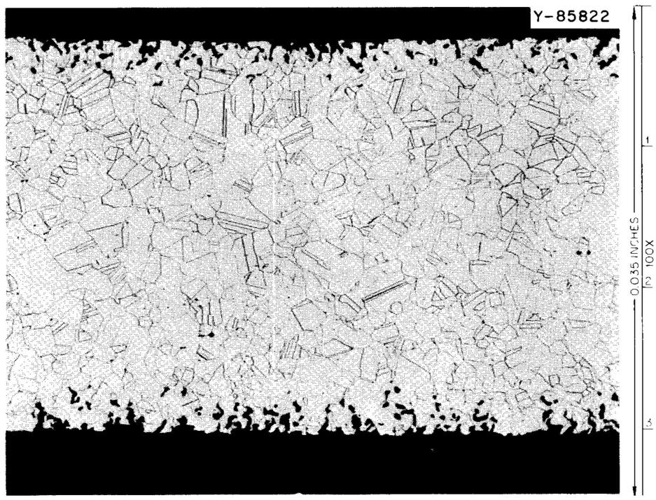  
Fig. 20.21. Microstructure of Type 304L Stainless Steel Specimen in Loop 1258 Exposed to Fuel Salt for 5700 hr at $688^{\circ}\mathsf{C}$ , $\Delta T = 100^{\circ}\mathsf{C}$ .

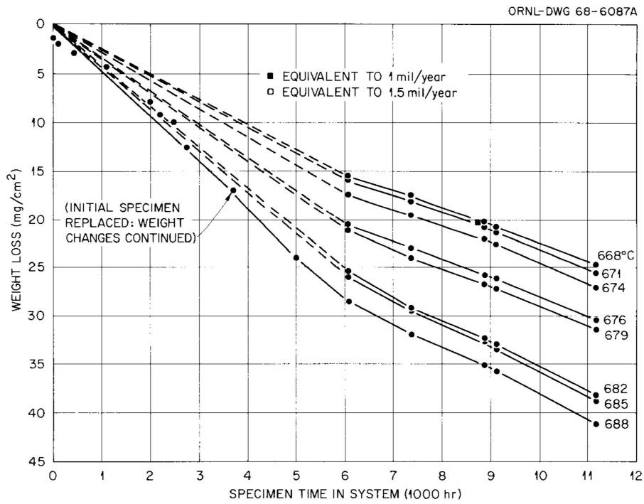  
Fig. 20.22. Specimen Weight Loss as Functions of Time and Temperature for Loop 1258 Heated Section. Loop and specimens fabricated from type 304L stainless steel.

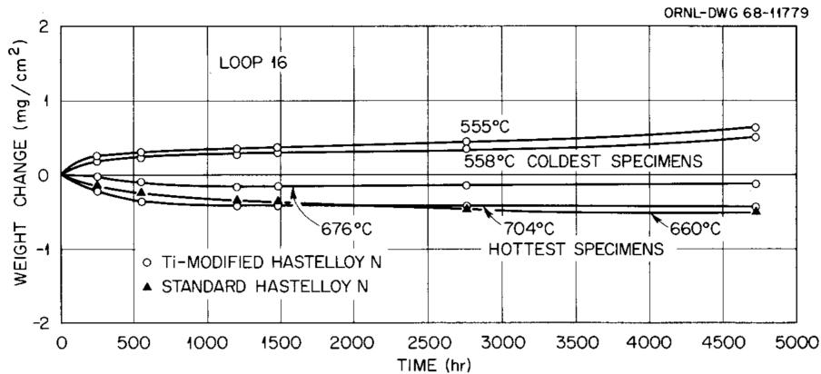  
Fig. 20.23. Weight Change vs Time for Standard and Titanium-Modified Specimens in NCL-16 Exposed to Fuel Salt at Various Temperatures.

and $676^{\circ}\mathrm{C}$ $(1250^{\circ}\mathrm{F})$ show smaller weight changes than the standard Hastelloy N specimens at $660^{\circ}\mathrm{C}$ $(1220^{\circ}\mathrm{F})$ . Calculation of the diffusion coefficient from weight change data on the modified alloy specimen at the highest temperature was made after 4700 hr exposure and was found to be $5.0 \times 10^{-14} \, \mathrm{cm}^2/\mathrm{sec}$ at $704^{\circ}\mathrm{C}$ . This agrees with published data for chromium diffusion in Hastelloy N where experiments were done in fuel salts.[8]

The calculation was based only on chromium removal since the titanium-modified specimens contain no iron. Increases in chromium (from 15 to $200~\mathrm{ppm}$ ) and iron (from 35 to $95~\mathrm{ppm}$ ) have been noted in the salt, most of the increase no doubt coming from the loop piping.

Loop 19 is completely installed and ready for a flush charge. It is constructed of standard Hastelloy N and will be filled with a fertile-fissile salt that will contact molten bismuth in a molybdenum hot finger. If bismuth is even slightly soluble in the salt, the corrosion rate of the Hastelloy N should be increased markedly. This experiment is in support of a one-fluid, two-region MSBR and the bismuth fuel-processing scheme.

A companion loop, NCL-18, will soon be installed and begin circulating the same fertile-fissile salt. This loop will provide base-line compatibility data on the Hastelloy N with this salt in the absence of bismuth.

# 20.7.2 Blanket Salts

The operation of NCL-15, containing a typical two-fluid MSBR blanket salt, was interrupted after 2000 hr as the result of a blown fuse. The salt in the loop was frozen before power was restored, and when heat was applied to thaw the salt, the hot leg ruptured (Fig. 20.24). The ruptured area, which still contained frozen salt, was cut from the loop, and another piece of tubing was attached by means of compression-type fittings. Then the loop was heated, the salt was melted and dumped, and the test specimens were removed. The temporary fitting was removed, and the joints to be welded were reamed to remove any remaining salt and corroded metal and filed to provide the proper weld joint configuration. Welding was done in conformance with specifications PS-23 and PS-25 and inspected under specification MET-WR-200. The first welding attempt was unsuccessful because of poor penetration from excessive gas pressure in the loop. The second attempt was successful and demonstrates that a successful weld can be made on material that has contained a molten salt.

A plot of the weight change of all the specimens from NCL-15 before the loop failure is given in Fig. 20.25 as a function of time and temperature. Similar to the results from NCL-16, the titanium-modified specimens exhibit smaller weight changes than the standard alloy specimens. The diffusion coefficient was calculated from weight change data after $1600\mathrm{hr}$ of operation and found to be

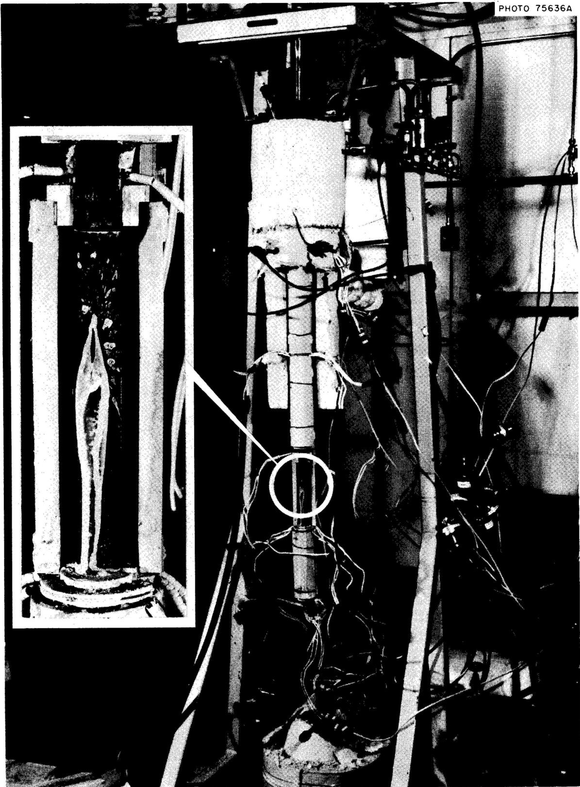  
Fig. 20.24. Ruptured Area of NCL-15.

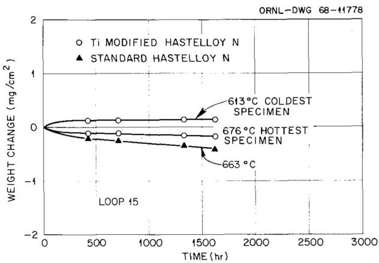  
Fig. 20.25. Weight Change vs Time for Standard and Titanium-Modified Specimens in NCL-15 Exposed to the Blanket Salt at Various Temperatures.

$8 \times 10^{-15} \mathrm{~cm}^{2} / \mathrm{sec}$ at $676^{\circ} \mathrm{C}$ ( $1250^{\circ} \mathrm{F}$ ) in the blanket salt environment. Increases in the chromium (25 to $40 \mathrm{ppm}$ ) and iron (30 to $50 \mathrm{ppm}$ ) in the salt were very small. The repaired loop, NCL-15A, has now operated satisfactorily for $362 \mathrm{hr}$ with salt from the same batch used.

# 20.7.3 Coolant Salts

For over 4000 hr, NCL-13 and -14, containing the $\mathrm{NaBF}_4$ -NaF (92-8 mole %) fluoroborate salt, operated under identical conditions. Loop NCL-13 contained standard Hastelloy N specimens, and NCL-14 contained titanium-modified Hastelloy N specimens. As reported before, the standard alloy specimens show larger weight changes than the titanium-modified specimens.

After $4700\mathrm{hr}$ of operation, the helium gas regulator which provides the overpressure to NCL-13 failed and caused a surge of gas to the loop which stopped the salt flow. Circulation of the salt could not be resumed until a vacuum was pulled on the loop, which we believe removed a gas pocket. Shortly after circulation was achieved, an electrical short, which eventually burned out a heater, occurred and heated the bottom of the hot leg to $871^{\circ}\mathrm{C}$ $(1600^{\circ}\mathrm{F})$ . This disrupted the flow, caused a loss of $\mathrm{BF}_3$ from the loop which changed the salt composition, and plugged all the gas lines. The loop was drained of all salt, and plugged lines

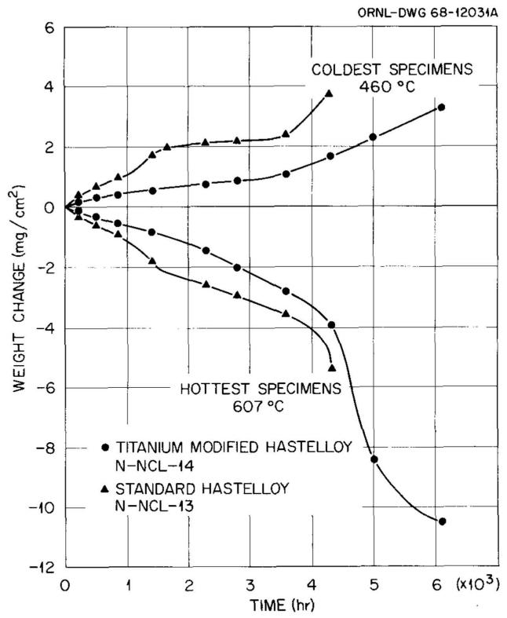  
Fig. 20.26. Weight Change vs Time for Standard and Titanium-Modified Hastelloy N Specimens in NCL-13 and -14 Exposed to Fluoroborate Salt at Various Temperatures.

were replaced or unplugged. Other necessary repairs to the loop were made, and the loop was filled with new salt. We are, at present, experiencing difficulty in getting the salt to circulate.

The weight changes measured for the specimens in NCL-13 and -14 after 4300 hr of exposure to the salt showed increases above those expected on the basis of the prior behavior (Fig. 20.26). This was accompanied by perturbations in salt chemistry. Salt analyses of the circulating salts from NCL-13 and -14 showed increases in both $\mathrm{H}_2\mathrm{O}$ and oxygen contents from $< 1000$ to $>2000~\mathrm{ppm}$ and increases in nickel and molybdenum from $< 25$ to $>100~\mathrm{ppm}$ along with a "normal" increase of chromium and iron. The increase of the chromium and iron content in the salt with time is shown in Fig. 20.27.

The dumped salt from NCL-13 was chemically analyzed, and the results are given in Table 20.8. The Cr, Fe, Ni, Mo, O, and $\mathrm{H}_2\mathrm{O}$ contents of the salt all show large increases since the loop began

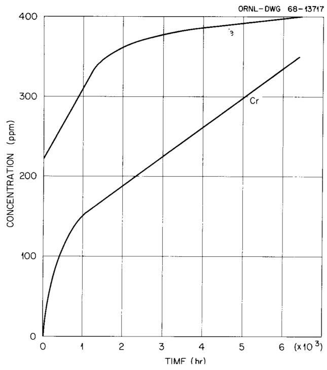  
Fig. 20.27. Average Concentration of Iron and Chromium in the Fluoroborate Salt in NCL-13 and -14.

operation. Increases in the nickel and molybdenum content of the salt are usually indicative of the onset of stronger oxidizing conditions, usually due to the increased water and/or oxygen content. Thus the most obvious explanation of the chemical changes and increased weight changes is the presence of water contamination that produces HF, which attacks all the constituents of the container material.

We have not positively identified the source of the contamination, which appears to have been

introduced into both loops at the same time. Three possible sources are (1) impure helium - the loops had a common helium header, but the helium is high-purity stock, analyzed prior to use to assure its purity; (2) impurities on the hanger rods - these rods were changed out in both loops just before the high corrosion rates were noticed; and (3) impurities on the specimens - the specimens were removed, weighed, and replaced in each loop at about the same time. We took normal precautions to avoid contamination via sources 2 and 3 but are presently reexamining our procedures.

# 20.7.4 Haynes Alloy No. 25 Corrosion

While specimens were out of NCL-13 and NCL-14 for weighing after $4000\mathrm{hr}$ of exposure to fluoroborate salt, the hottest and coldest specimens from each loop were cut in half and sent for microprobe analysis to determine possible composition gradients due to mass transfer. Initial results showed that a large amount of cobalt had deposited on both the hot- and cold-leg specimens.

Investigations were immediately launched to determine the source of the cobalt, and it was discovered that the specimen support rods were Haynes alloy No. 25 (Co-19% Cr-14% W-9 Ni-1% Fe) rather than Hastelloy N. Further investigation revealed that the source of the $\frac{1}{8}$ -in. Haynes alloy No. 25 material was a misidentified storage carton. Subsequently the specimens and hangers were removed from NCL-13 and NCL-14, and the specimen hanger rods were replaced with $\frac{1}{8}$ -in. Hastelloy N. Metallurgical examination was made of the Haynes alloy No. 25 rod and the Hastelloy N specimens from NCL-13.

Electron microprobe analysis of the specimens disclosed thin surface layers which contained appreciable amounts of cobalt. There was an

Table 20.8. Chemical Analyses of Fluoroborate Salt in NCL-13   

<table><tr><td rowspan="2"></td><td colspan="6">Parts per Million</td><td colspan="3">Weight Percent</td></tr><tr><td>Cr</td><td>Fe</td><td>Ni</td><td>Mo</td><td>O</td><td>H2O</td><td>Na</td><td>B</td><td>F</td></tr><tr><td>Before test</td><td>19</td><td>223</td><td>28</td><td>&lt;10</td><td>459</td><td>800</td><td>21.9</td><td>9.51</td><td>68.2</td></tr><tr><td>Dumped salt circulated for 4700 hr</td><td>348</td><td>650a</td><td>95</td><td>125</td><td>3000</td><td>2800</td><td>21.7</td><td>9.04</td><td>67.0</td></tr></table>

${}^{a}$ Questionable.

average of 1.8 wt $\%$ cobalt on the surface of the hot-leg specimen and an average of 7.3 wt $\%$ on the surface of the cold-leg specimen. These results were substantiated by x-ray fluorescence measurements.

Samples of the Haynes alloy No. 25 rod were taken at various elevations and analyzed by x-ray fluorescence. It was found that chromium and cobalt were leached from the rod in all positions. It appears that two modes of mass transfer were operable: temperature gradient mass transfer and activity gradient mass transfer. The chromium and cobalt removed from the Haynes alloy No. 25 deposited on the Hastelloy N because of the smaller concentrations of those elements as compared with the Haynes alloy No. 25, whereas nickel and iron deposited on the Haynes alloy No. 25 for the same reason.

We took advantage of the situation to learn something about the kinetics of cobalt movement in the system. The amount of cobalt in the cold-leg specimen was determined as a function of position. Using a solution to Fick's second law, the diffusion coefficient of cobalt in the Hastelloy N was determined and found to be $5.6 \times 10^{-15} \mathrm{~cm}^2/\mathrm{sec}$ at $465^{\circ} \mathrm{C}$ ( $870^{\circ} \mathrm{F}$ ). It is difficult to compare this number with other diffusion coefficients because no prior diffusion work has been found on the cobalt-Hastelloy N system. Comparable work in somewhat similar systems has been done at much higher temperatures, where extrapolation to lower temperatures could become quite erroneous due to grain-boundary diffusion and/or short-circuiting. However, in the light of the previous stipulations, it is interesting to compare the extrapolated diffusion coefficient of titanium in Hastelloy N at $465^{\circ} \mathrm{C}$ with that obtained for cobalt. Titanium, like cobalt, is present in Hastelloy N only in small amounts, $0.5 \mathrm{wt} \%$ . An extrapolated diffusion coefficient of titanium at $465^{\circ} \mathrm{C}$ ( $870^{\circ} \mathrm{F}$ ) is $1.0 \times 10^{-21} \mathrm{~cm}^2/\mathrm{sec}$ . Thus the movement of cobalt is appreciably faster.

It was concluded that the presence of the Haynes alloy No. 25 in the fluoroborate salt-Hastelloy N system caused variations in the weight change measurements of the specimens but only to a maximum extent of $10\%$ . This figure is well within the experimental accuracy, and therefore no changes

were made in the early conclusions regarding the compatibility of Hastelloy N and fluoroborate salt.

# 20.7.5 Flow Velocity in Natural Circulation Loops

In cooperation with the MIT Practice School, measurements of the flow velocity of the salt in NCL-1258 and NCL-14 have been made. A two-counter method was used, with the radioactive isotope introduced into the loop as a solid salt. The velocity of the salt was found to be 3.5 fpm in NCL-1258 and 7.0 fpm in NCL-14. By inserting these velocities, physical properties of the salt, and other quantities into flow equations, we obtained values for previously unknown variables. Utilizing this information, it is then possible to calculate the flow velocity of the salt in other loops. The calculated flow velocity was 1.3 fpm for NCL-15 and 5.0 fpm for NCL-16. Work is continuing on this project.

# 20.8 FORCED CONVECTION LOOP

P. A. Gnadt

W. R. Huntley

The MSR-FCL-1 forced circulation loop is being operated to evaluate the compatibility of standard Hastelloy N with $\mathrm{NaBF}_4$ -NaF (92-8 mole %) coolant salt at conditions similar to those expected in the MSRE coolant circuit. During this reporting period the loop assembly was completed, and circulation of the salt cleaning charge has just started. Figure 20.28 is a photograph of the main piping system for the loop. This photograph was taken before the thermal insulation was installed. Figure 20.29 is a photograph of the completed loop installed in the test facility.

A decision was made to alter the originally proposed loop temperature profile to more nearly approximate the MSR coolant circuit conditions with fluoroborate salt. The originally proposed and presently planned loop temperatures are listed in Table 20.9. These changes in operating temperature impose a higher salt temperature at the pump bowl. Since the vapor pressure of the $\mathrm{BF}_3$ is higher due to the increased salt temperature in the

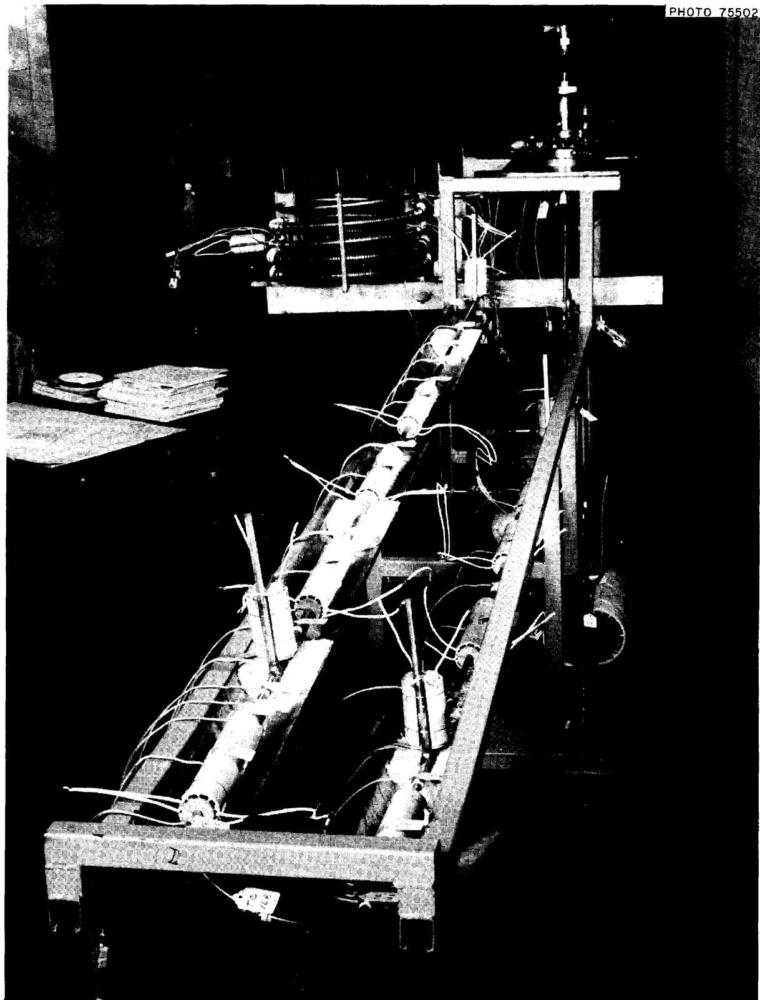  
Fig. 20.28. Photograph of the Forced Circulation Loop MSR-FCL-1 Before the Thermal Insulation Was Instal.a.

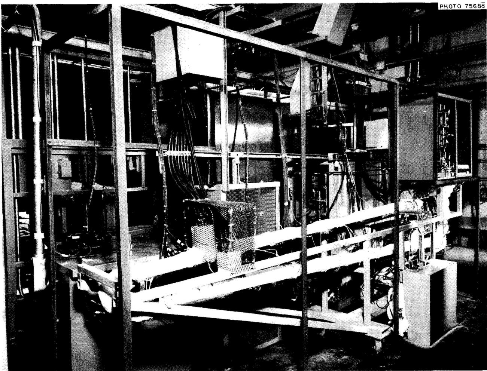  
Fig. 20.29. Photograph of the Forced Circulation Loop MSR-FCL-1 After Being Insulated and Set in Place for Operation.

pump bowl, an increase in the partial pressure of $\mathrm{BF}_3$ in the pump bowl is required in order to re

Table 20.9. Originally Proposed and Presently Planned Temperatures for Sodium Fluoroborate Forced Convection Loop (MSR-FCL-1)   

<table><tr><td rowspan="2"></td><td colspan="2">Temperature (°C)</td></tr><tr><td>Originally Proposed</td><td>Presently Planned</td></tr><tr><td>Maximum bulk fluid</td><td>607</td><td>588</td></tr><tr><td>Minimum bulk fluid</td><td>454</td><td>510</td></tr><tr><td>Maximum wall temperature</td><td>718</td><td>654</td></tr><tr><td>Minimum wall temperature</td><td>416</td><td>482</td></tr></table>

duce the possibility of a change in salt composition.

The original plan for this test loop was to purge the LFB pump oil seal with a gas mixture of $1\%$ $\mathrm{BF}_3$ in helium. Earlier long-term tests had indicated that small (0.1% by volume) concentrations of $\mathrm{BF}_3$ in helium would not greatly affect the Gulfspin-35 oil used on the pump seal. However, the temperature increase at the pump bowl required a purge gas mixture of $3\% \mathrm{BF}_3$ in helium to match the new salt $\mathrm{BF}_3$ vapor pressure, and it was necessary to examine the effects of $\mathrm{He}-3\% \mathrm{BF}_3$ gas mixture on Gulfspin-35 pump oil under conditions

which would simulate its use in the LFB pump seal oil system. The results of the two separate room-temperature tests of approximately one week's duration with a predicted test loop gas flow rate of 80 cc/min and a seal oil leakage rate of 10 cc/day indicated that the seal oil purge line would probably become plugged during loop operation. A black sludge was formed in the simulated oil catch basin which, in the first test, eventually plugged the $\frac{1}{8}$ -in.-diam overflow port. In both tests the oil removed from the test apparatus was darkened and extremely acid, with a pH of from 1.0 to 1.5. A large amount of black sludge formed in the bottom of the simulated seal oil catch basin.

Attempts to determine the composition of the oil sludge were not successful. However, this effect of $\mathrm{BF}_3$ on Gulfspin-35 is similar to, but more severe than, effects noted during a previous 3500-hr experiment in which the $\mathrm{BF}_3$ concentration in the gas phase was about $0.1\%$ by volume. The conclusions from this previous test were that $\mathrm{BF}_3$ does not polymerize the oil to a degree that would change its viscosity, but evidently some unidentified oil additives are seriously degraded. These findings, together with those obtained on the PKP loop test, are being evaluated further by the Analytical Chemistry Division.

These tests indicated that the $\mathrm{He}-3\% \mathrm{BF}_3$ mixture should not be used for the pump seal purge. A system was designed and necessary equipment was procured to provide a method of adding $\mathrm{BF}_3$ directly to the pump bowl. With the newly designed system the $\mathrm{BF}_3$ must diffuse up an annulus around the pump shaft against a helium stream before it can contact the oil in the seal leakage catch basin.

To expedite loop startup, the sodium fluoroborate cleaning charge in the test loop was circulated without $\mathrm{BF}_3$ addition to the pump bowl. A flow of pure helium was used to purge oil leakage from the pump oil catch basin. Modification to the seal purge system will be made after the cleaning charge has been removed.

The $\frac{1}{4}$ -in.-OD copper tubing vent line for the test loop pump seal purge plugged approximately two weeks after the He-3% BF $_3$ mixture was vented through the line during calibration of the thermal conductivity cell. A crystalline reaction product completely sealed the end of the $\frac{1}{4}$ -in. tube and stopped the seal purge. An acid solution was found in a vertical section of line when it was removed to correct the plugged condition. This same condition occurred twice in the week-

long cleaning charge operation of the salt loop, where the effluent $80~\mathrm{cc / min}$ helium purge picked up about $0.5\% \mathrm{BF}_3$ from the pump bowl. The second plug was tight enough that it held a 4-psig pressure. In all instances of plugging of these lines, it was necessary to remove the end of the vent line to restart the purge system. The plug is apparently boric acid, which is formed by the reaction of $\mathrm{BF}_3$ and moisture. Additional equipment will be required in these vent lines to eliminate the $\mathrm{BF}_3$ and air reaction at the end of the pump seal vent. Acid has also formed in ventilation hoods in the vicinity of the $\mathrm{BF}_3$ vent lines. Enough acid has been present to form droplets on the lower edges of the hoods.

Circulation of the salt cleaning charge is under way; however, flow in the system is not as high as expected, and investigations are in progress to determine the cause of the low flow.

# 20.9 OXIDATION OF Ni-Mo-Cr-Fe ALLOYS

# B. McNabb

The desire for improved radiation resistance prompted a modification of Hastelloy N. A study was made of the effects of various alloying additions on the scaling resistance. Small rods 0.25 in. in diameter were oxidized at $982^{\circ}\mathrm{C}$ for 1000 hr with cycling to room temperature every 25 hr. We have shown previously12 that silicon has a very beneficial effect on the scaling resistance and that titanium has a slightly detrimental effect.

Figures 20.30 and 20.31 summarize the effects of various alloying additions on the scaling resistance of Hastelloy N. The titanium and zirconium additions were made to remelts of commercial air-melted Hastelloy N, and the other alloys were made from virgin melting stock. The results are complicated by the fact that the effects of the various elements are not independent of one another. For example, we find that manganese is slightly detrimental when added to a base alloy containing no silicon, but beneficial when added to an alloy containing $0.5\%$ Si. Our studies generally class Si, Al, Zr, Fe, and W as improving the scaling resistance and Cr, Ti, and Mo as being detrimental.

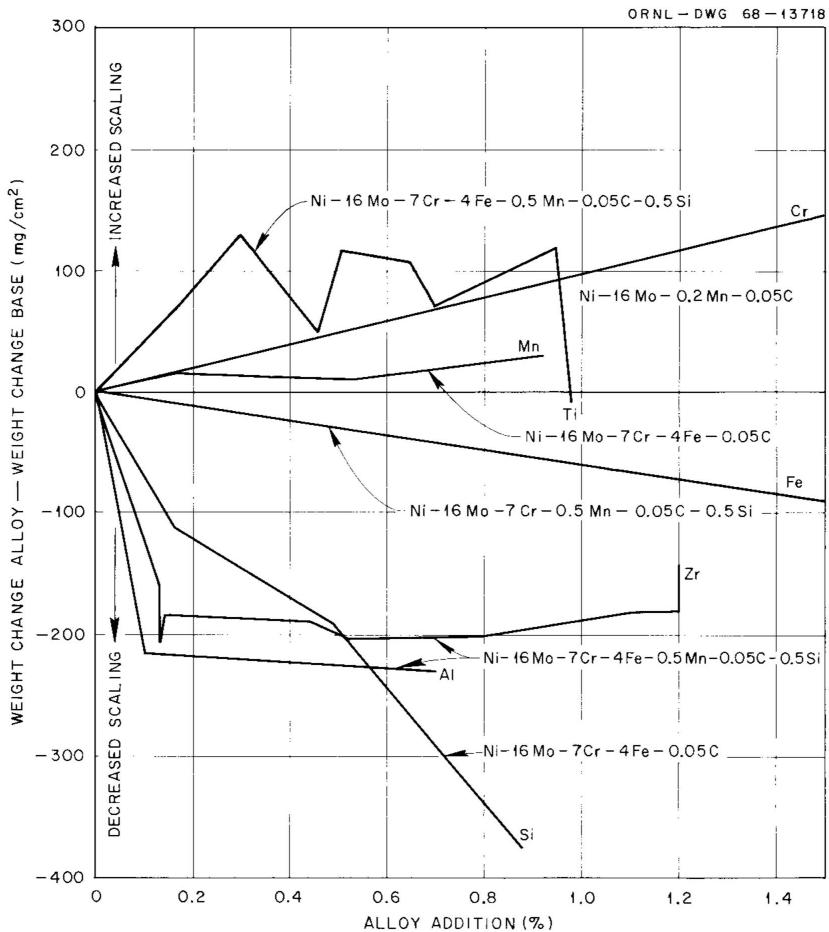  
Fig. 20.30. The Effect of Various Alloying Additions on the Scaling Resistance of Ni-Mo-Cr-Fe Alloys. Oxidized for 1000 hr at $982^{\circ}\mathrm{C}$ with cycles to $24^{\circ}\mathrm{C}$ every 25 hr.

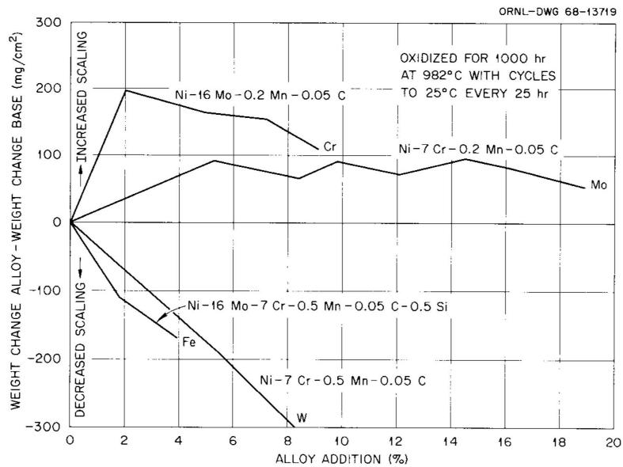  
Fig. 20.31. The Effect of Major Alloying Additions on the Scaling Resistance of Nickel-Base Alloys.

# 21. Graphite-to-Metal Joining

# 21.1 INTRODUCTION

H. E. McCoy, Jr.

The two-fluid MSBR concept required that graphite pipes be joined to a Hastelloy N header, and we began work to develop this joint. This work was quite rewarding, and several methods of joining were partially developed, along with inspection procedures. However, the present single-fluid concept does not require such a joint in the core, and we have curtailed this work. Graphite looks attractive from a compatibility standpoint for use in making chemical processing equipment, and some of the techniques for joining graphite and Hastelloy N will very likely be useful for this application.

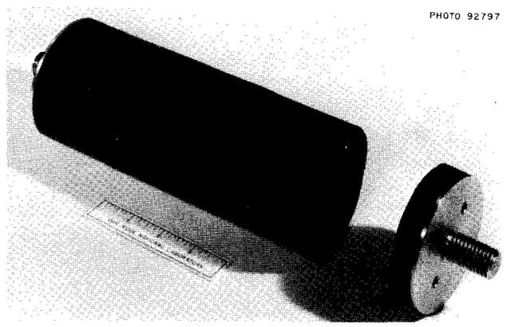  
Fig. 21.1. Location of Failure in Transition Joint After Tensile Testing.

# 21.2 GRAPHITE BRAZING

W.J.Werner

Using procedures that we previously established for brazing molybdenum to molybdenum-coated graphite with copper, we assembled a large graphite-molybdenum-Hastelloy N transition joint. The components were approximately $3\frac{1}{2}$ in. $\mathrm{OD} \times \frac{1}{2}$ in. wall. After brazing, the joint was examined visually and radiographically and found to be sound. The joint was then thermally cycled (in an argon atmosphere) 60 times between 200 and $700^{\circ}\mathrm{C}$ .

After the 1st, 3d, 5th, 10th, 20th, and 60th cycles, the joint was brought to room temperature and inspected radiographically. No evidence of cracking was found. After 60 cycles, the joint was further evaluated by tensile testing at room

temperature. Figure 21.1 shows the joint configuration and the location of failure in the tensile test. The joint broke in the base graphite at a large distance from the graphite-metal braze, but near a threaded joint used to facilitate testing. The load at failure was $2650\mathrm{lb}$ , and the corresponding uniform stress in the graphite was $500\mathrm{psi}$ , a factor of about 3 lower than would be expected for this grade of graphite (equivalent to ATJ).

We examined the effect of various surface conditioning or cleaning treatments on the wetting and flow of brazing alloys on graphite. Samples of Poco AXF graphite were polished through 6/0-grit paper and then submitted to the following treatments:

1. none (as polished),   
2. ultrasonically cleaned for 30 sec in ethyl alcohol,   
3. ultrasonically cleaned, vacuum annealed at $1300^{\circ}\mathrm{C}$ for $\frac{1}{2}\mathrm{hr}$ ,   
4. ultrasonically cleaned, air annealed for $\frac{1}{2}$ hr at $500^{\circ} \mathrm{C}$ ,

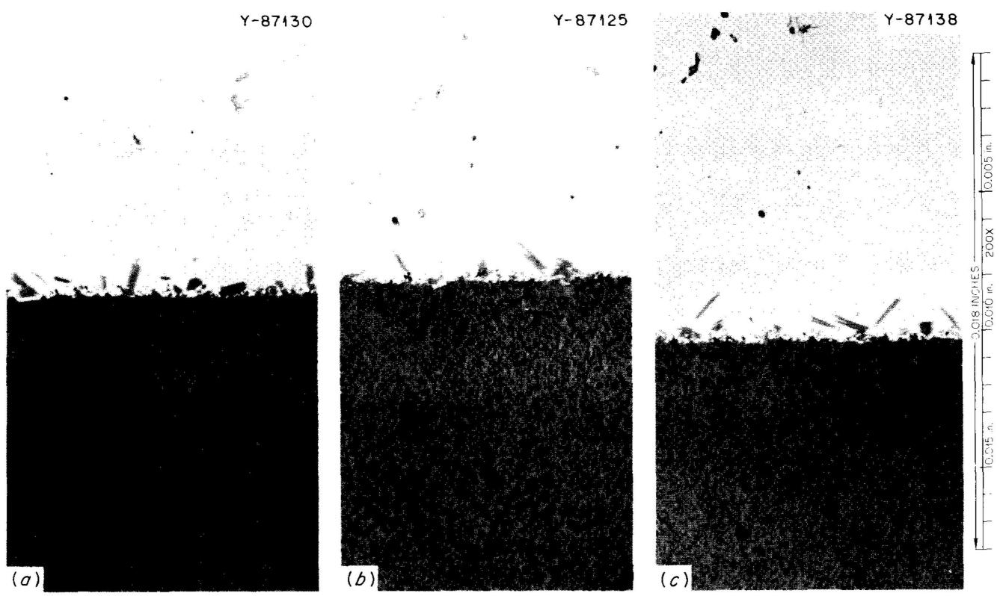  
Fig. 21.2. Effect of Graphite Pretreatment on the Brazeability of Poco AXF Graphite. (a) Graphite ultrasonic cleaned and air annealed for $\frac{1}{2}$ hr at $600^{\circ}$ C. (b) Graphite ultrasonic cleaned and vacuum annealed for $\frac{1}{2}$ hr at $1300^{\circ}$ C. (c) Graphite ultrasonic cleaned.

5. same as 4 except air annealed at $600^{\circ}\mathrm{C}$   
6. ultrasonically cleaned, argon annealed for $\frac{1}{2}$ hr at $500^{\circ} \mathrm{C}$ ,   
7. same as 6 except argon annealed at $600^{\circ}\mathrm{C}$

Small samples of graphite subjected to each treatment were wetted with the 35Au-35Ni-30Mo (wt %) alloy and with the Ni-Pd-Cr alloy. Metallographic examination of the samples revealed no differences in wettability within each set of brazed specimens. A clean machined surface seems to be sufficient. However, a possible effect of one pretreatment is shown in Fig. 21.2. The $\frac{1}{2}$ -hr air anneal at $600^{\circ}\mathrm{C}$ has opened up surface-connected voids in the graphite. Even here, however, the braze is sound. No difference was observed between the braze quality of this sample, the as-polished sample, and the sample vacuum annealed at $1300^{\circ}\mathrm{C}$ for $\frac{1}{2}$ hr.

# 21.3 GRAPHITE-HASTELLOY N TRANSITION JOINT DEVELOPMENT

# J. P. Hammond

Considerable progress was made on the graded transition joint for minimizing damaging thermal strain in joints of graphite to Hastelloy N. The conceptual design, presented in detail in the last semiannual report, uses a series of nickel-matrix tungsten dispersions for spanning the large gap in thermal expansion between graphite and Hastelloy N. In addition, it incorporates premium grades of graphite or graphite-carbide composites to reduce the dimensional instability associated with

irradiation of nuclear graphite. The exploration of heavy-metal compositions for the alloy portion of this joint has been completed. Acceptable brazing procedures for joining segments were developed, and a number of composite joints were fabricated and tested.

# 21.3.1 Heavy-Metal Alloy Development

We investigated several groups of tungsten- and molybdenum-base alloys and found that tungsten with nickel and iron additives at a 7/3 ratio gave far superior fabrication characteristics. This can be seen by the data in Table 21.1. We desired alloys that liquid-phase sintered to a microstructure having a ductile nickel alloy phase completely enveloping the otherwise fragile heavy-metal grains. The evaluation of cold rollability reflects on the general ability of the alloy to be fabricated and its ability to take thermal strain.

Tungsten alloys Nos. 1 and 2 (Table 21.1) are familiar compositions. $^{3,4}$ Of these and their molybdenum counterparts (alloys Nos. 3 through 5), the 90W-7Ni-3Fe (wt %) composition gave distinctly superior results. Alloys Nos. 6 through 11 show the characteristics of the tungsten-containing material as a function of increasing additive or matrix content and demonstrate its good fabrication qualities over a range of compositions applicable to composite joints.

Various ternary and quaternary compositions based on molybdenum were explored, since neutron displacement damage will anneal at a lower temperature in molybdenum than in tungsten. Thus alloys with Ni-Pt, Ni-Pd, and Cu-Pd as binary additives (Nos. 12 to 14) and Ni-Cu-Pd, Ni-Fe-Cu, and W-Ni-Fe as ternary additives (Nos. 15 to 34) were investigated; however, none of these appear to have sufficiently attractive as-fabricated properties to warrant their substitution for the tungsten material.

The fairly good cold rollability displayed by themolybdenum alloy with W-Ni-Fe as the addi

tive (alloys Nos. 27 to 32) was somewhat surprising, as it had been considered that brittle intermetallic phases, such as the NiMo compound present in the matrix of alloy No. 3, were chiefly responsible for poor deformability in these materials. A more important factor is now believed to be a closeness in hardness (resistance to deformation) between the matrix and heavy-metal grains in these materials. The presence of tungsten in heavy-metal alloys (Nos. 6 to 11 and Nos. 27 to 32) may be contributing favorably to cold rollability by significantly increasing the hardness of the matrix phase relative to that of heavy-metal grains, whereas in the case of the nontungsten-bearing alloys, the matrix is quite soft in comparison with the heavy-metal grains. The validity of this consideration is being examined.

The molybdenum alloys with W-Ni-Fe (Nos. 27 to 32) and Ni-Fe-Cu (Nos. 25, 33, and 34) as additives show adequate capacity for deformation but are marginal or unacceptable because of their "compact shaping" characteristics (see Table 21.1). This refers to the external physical qualities of fabricated compacts and the ability to sinter those of high matrix content without a tendency toward globbing. The W-Ni-Fe alloys must be rated very good with respect to the globbing tendency, while the Mo-W-Ni-Fe alloys are very poor.

# 21.3.2 Fabrication and Testing of Joints

Several preliminary composite joints of the description illustrated in Fig. 21.3 were fabricated for testing. Although the basic concept includes an irradiation-resistant graphite segment, a nuclear grade was substituted for these experiments since none of the former was available at the time. The favorable distribution of expansion coefficients of the individual segments of this joint in relation to those for graphite and Hastelloy N can be seen in Fig. 21.4; this correlates composition with coefficient of expansion.

These composites were made by fabricating the segments individually and copper-brazing them together in vacuum under a light load. Bonding of the heavy-metal alloys was not difficult, since copper wets them and is soluble in their matrices. Bonding of graphite, on the other hand, was difficult. Brazing materials covered in the litera

Table 21.1. Heavy-Metal Alloy Compositions and Fabricating Characteristics ${}^{a}$   

<table><tr><td rowspan="2">Alloy No.</td><td colspan="6">Composition (wt %)</td><td rowspan="2">Suitable Sintering Conditionb (℃)</td><td colspan="3">Alloy Characteristics</td><td rowspan="2">Cold Roll- ability (% reduction)e</td></tr><tr><td>W</td><td>Mo</td><td>Ni</td><td>Fe</td><td>Cu</td><td>Others</td><td>Micro- structurec</td><td>Constitution of Matrix</td><td>Compact Shapingd</td></tr><tr><td>1</td><td>90</td><td></td><td>7</td><td>3</td><td></td><td></td><td>1450</td><td>G+</td><td>Fcc phase</td><td>G+</td><td>35</td></tr><tr><td>2</td><td>90</td><td></td><td>6</td><td></td><td>4</td><td></td><td>1375</td><td>G</td><td>Fcc phase</td><td>G</td><td>10.7</td></tr><tr><td>3</td><td></td><td>90</td><td>7</td><td>3</td><td></td><td></td><td>1400</td><td>G</td><td>Eutecticf</td><td>G</td><td>0.4</td></tr><tr><td>4</td><td></td><td>90</td><td>6</td><td></td><td>4</td><td></td><td>1375</td><td>G</td><td>Fcc phase</td><td>G-</td><td>6.5</td></tr><tr><td>5</td><td></td><td>90</td><td>7</td><td></td><td>3</td><td></td><td>1375</td><td>G</td><td>Fcc phase</td><td>G-</td><td>~4</td></tr><tr><td>6</td><td>97.5</td><td></td><td>1.75</td><td>0.75</td><td></td><td></td><td>1500</td><td>G</td><td>Fcc phase</td><td>G+</td><td></td></tr><tr><td>7</td><td>95.0</td><td></td><td>3.5</td><td>1.5</td><td></td><td></td><td>1475</td><td>G</td><td>Fcc phase</td><td>G+</td><td>28</td></tr><tr><td>1</td><td>90</td><td></td><td>7</td><td>3</td><td></td><td></td><td>1450</td><td>G+</td><td>Fcc phase</td><td>G+</td><td>35</td></tr><tr><td>8</td><td>80</td><td></td><td>14</td><td>6</td><td></td><td></td><td>1435</td><td>G+</td><td>Fcc phase</td><td>G+</td><td>56</td></tr><tr><td>9</td><td>75</td><td></td><td>17.5</td><td>7.5</td><td></td><td></td><td>1430</td><td>G</td><td>Fcc phase</td><td>G+</td><td>70</td></tr><tr><td>10</td><td>60</td><td></td><td>28</td><td>12</td><td></td><td></td><td>1415</td><td>G</td><td>Fcc phase</td><td>G+</td><td>&gt;75</td></tr><tr><td>11</td><td>55</td><td></td><td>31.5</td><td>13.5</td><td></td><td></td><td>1415</td><td>G</td><td>Fcc phase</td><td>G+</td><td>&gt;78</td></tr><tr><td>12</td><td></td><td>90</td><td>8</td><td></td><td></td><td>2 Pt</td><td>1475</td><td>P</td><td>Eutecticf</td><td>M</td><td>0.5</td></tr><tr><td>13</td><td></td><td>90</td><td>4</td><td></td><td></td><td>6 Pd</td><td>1475</td><td>M+</td><td>Fcc phase</td><td>G</td><td>2</td></tr><tr><td>14</td><td></td><td>90</td><td></td><td></td><td>7.5</td><td>2.5 Pd</td><td>1600</td><td>G</td><td>Fcc phase</td><td>G</td><td>6</td></tr><tr><td>15</td><td></td><td>90</td><td>4</td><td></td><td>1</td><td>5 Pd</td><td>1405</td><td>G</td><td>Fcc phase</td><td>G</td><td>2</td></tr><tr><td>16</td><td></td><td>90</td><td>4</td><td></td><td>2</td><td>4 Pd</td><td>1405</td><td>G</td><td>Fcc phase</td><td>G</td><td>4</td></tr><tr><td>17</td><td></td><td>90</td><td>3.5</td><td></td><td>3</td><td>3.5 Pd</td><td>1405</td><td>G</td><td>Fcc phase</td><td>G</td><td>4.5</td></tr><tr><td>18</td><td></td><td>90</td><td>3</td><td></td><td>4</td><td>3 Pd</td><td>1405</td><td>G</td><td>Fcc phase</td><td>G</td><td>6.3</td></tr><tr><td>19</td><td></td><td>90</td><td>2</td><td></td><td>5</td><td>3 Pd</td><td>1405</td><td>G</td><td>Fcc phase</td><td>G</td><td>7.1</td></tr><tr><td>20</td><td></td><td>90</td><td>2</td><td></td><td>6</td><td>2 Pd</td><td>1405</td><td>G</td><td>Fcc phase</td><td>G</td><td>7.2</td></tr><tr><td>21</td><td></td><td>90</td><td>2</td><td>1</td><td>7</td><td></td><td>1375</td><td>G</td><td>Fcc phase</td><td>G</td><td>3</td></tr><tr><td>22</td><td></td><td>90</td><td>3</td><td>1</td><td>6</td><td></td><td>1375</td><td>G</td><td>Fcc phase</td><td>G</td><td>4.5</td></tr><tr><td>23</td><td></td><td>90</td><td>7</td><td>1</td><td>2</td><td></td><td>1380</td><td>G</td><td>Fcc phase</td><td>G</td><td>11</td></tr><tr><td>24</td><td></td><td>90</td><td>6</td><td>2</td><td>2</td><td></td><td>1375</td><td>G</td><td>Fcc phase</td><td>G</td><td>10</td></tr><tr><td>25</td><td></td><td>90</td><td>7</td><td>1.5</td><td>1.5</td><td></td><td>1375</td><td>G</td><td>Fcc phase</td><td>G</td><td>11</td></tr><tr><td>26</td><td></td><td>97</td><td>7</td><td>2</td><td>1</td><td></td><td>1390</td><td>G</td><td>Fcc phase</td><td>G</td><td>14</td></tr><tr><td>27</td><td>45</td><td>45</td><td>8</td><td>2</td><td></td><td></td><td>1475</td><td>G</td><td>Eutecticf</td><td>G</td><td>20</td></tr><tr><td>28</td><td>53</td><td>37</td><td>7</td><td>1</td><td>2</td><td></td><td>1475</td><td>G</td><td>Fcc phase</td><td>G</td><td>15</td></tr><tr><td>29</td><td>53</td><td>37</td><td>8</td><td>2</td><td></td><td></td><td>1475</td><td>G</td><td>Some eut.f</td><td>G</td><td>22</td></tr><tr><td>30</td><td>50</td><td>35</td><td>12</td><td>3</td><td></td><td></td><td>1475</td><td>G-</td><td>Some eut.f</td><td>G-</td><td>25</td></tr><tr><td>31</td><td>41.2</td><td>28.8</td><td>24</td><td>6</td><td></td><td></td><td>1310</td><td>G-</td><td>Some eut.f</td><td>P, globsg</td><td></td></tr><tr><td>32</td><td>32.3</td><td>22.7</td><td>36</td><td>9</td><td></td><td></td><td>1300</td><td>G-</td><td>Some eut.f</td><td>P-, globsg</td><td></td></tr><tr><td>25</td><td></td><td>90</td><td>7</td><td>1.5</td><td>1.5</td><td></td><td>1375</td><td>G</td><td>Fcc phase</td><td>G</td><td>11</td></tr><tr><td>33</td><td></td><td>75</td><td>17.5</td><td>3.75</td><td>3.75</td><td></td><td></td><td></td><td></td><td></td><td></td></tr><tr><td>34</td><td></td><td>60</td><td>28</td><td>6</td><td>6</td><td></td><td></td><td></td><td></td><td></td><td></td></tr></table>

${}^{a}$ Compacts of $1 \times  {3}_{4}^{3} \times  {1}_{4}^{1}$ in. size were cold pressed in a steel die at 30 tons/in. ${}^{2}$ pressure preparatory to sintering.   
$b$ In argon for 2 hr. Generally $98\%$ apparent density or higher was achieved.   
${}^{c}$ Rated relative to the continuity of the matrix phase and the roundness of the heavy-metal grains. $\mathrm{G} =$ good; $\mathrm{M} =$ medium; $\mathrm{P} =$ poor.   
$d$ Rated on freedom from distortion, edge sharpness, and smoothness of surfaces. G, M, and P are good, medium, and poor respectively.   
${}^{\mathrm{e}}$ Amount of rolling incurred before cracking ensued. Reduced in steps of 0.003 in. per pass on 10-in. rolls.   
$^{f}$ A eutectic, probably comprised of an fcc terminal phase and an intermetallic compound.   
${}^{8}$ Tending to sag into rounded mass during sintering. Is especially pronounced at higher matrix contents.

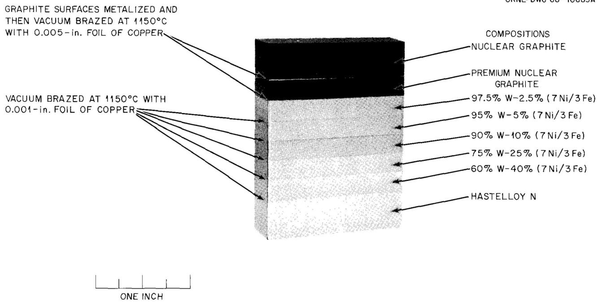  
Fig. 21.3. Transition Joint, Graphite to Hastelloy N.

ture $^{5 - 8}$ generally were not suitable for MSBR applications.

Copper-brazing of graphite members pretreated to achieve wetting by a novel metallizing process proved the most effective of several methods ex

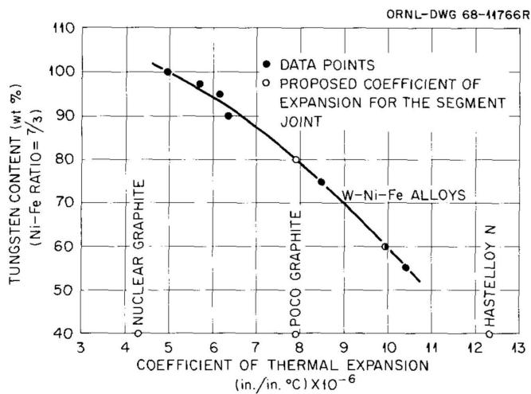  
Fig. 21.4. Expansion Coefficients of Transition Joint Materials as a Function of Composition. Coefficients are mean values between R.T. and $600^{\circ}C$ and were determined on an optical interferometer.

amined. The metallizing is effected by subjecting the graphite surfaces to be joined to gaseous products of a graphite- $\mathrm{Cr}_2\mathrm{O}_3$ reduction reaction, conducted under a low vacuum at $1400^{\circ}\mathrm{C}$ . Four room-temperature tensile tests were conducted on a nuclear grade of graphite bonded by this method, using a conical bond interface. The results were favorable, and all failures occurred outside the bond area.

Composites of this joint design were subjected to a series of 12 severe thermal cycles between $700^{\circ}\mathrm{C}$ and room temperature without adverse effects. The cooldown time was about 8 min. Tests

on the corrosion resistance of these joints to MSR salts await completion.

The main work presently under way is concerned with minimizing the number of segments in a joint and reducing cost. We shall do this by taking as large a step in coefficient of expansion as practical in the graphite portion of the joint, since graphite has a very low modulus of elasticity - about two orders below that for the heavy metals. This would require fewer heavy-metal alloy segments. This idea appears good since the graphite materials of highest irradiation stability generally have the highest expansion coefficients, and thus transitions in dimensional stability and thermal coefficient can be imparted simultaneously.

Recent coefficient of expansion determinations on the irradiation-resistant Poco graphite gave a very high value of $7.91\mu \mathrm{in}.\angle \mathrm{C}$ . Three-segment joints incorporating Poco graphite and 80 and $60\%$ W heavy-metal alloys are being prepared for test. The relative magnitudes of the coefficients of the materials of construction are shown graphically in Fig. 21.4. Observe that at the junction between the graphite and heavy-metal alloy, where concern for cracking is greatest, joining is made on a basis of equal expansion coefficient. The joint actually reduces to two transition segments if we wish to join Hastelloy N to a graphite having a coefficient of thermal expansion as high as Poco.

# 21.4 NONDESTRUCTIVE TESTING OF GRAPHITE-TO-METAL JOINTS

H. L. Whaley

K. V. Cook

We made improvements to the ultrasonic pulse echo technique for evaluation of tubular graphite-to-metal brazed joints. A reference standard was prepared in an attempt to simulate areas of bond and nonbond. This new standard allowed better assurance of more quantitative results and better reproducibility. The technique is currently applicable only to the first inch of the tapered brazed joint, since this has the greater metal thickness. Above this point the molybdenum shell wall be becomes prohibitively thin for resolution of the ultrasonic echoes.

A graphite-to-molybdenum joint was brazed with Ni-Pd-Cr for study. The joint was brazed at a temperature where the Ni-Pd-Cr would not flow well in order to obtain a defective joint for study. A plan view recording of a section of the standard is shown in Fig. 21.5a. The black areas represent nonbond, and the light area is due to a piece of tape placed on the standard to simulate a bonded area. The sample was run with the same gain, and the recording shown in Fig. 21.5b was obtained. The white areas indicate bond and show that only about $30\%$ of the joint was brazed.

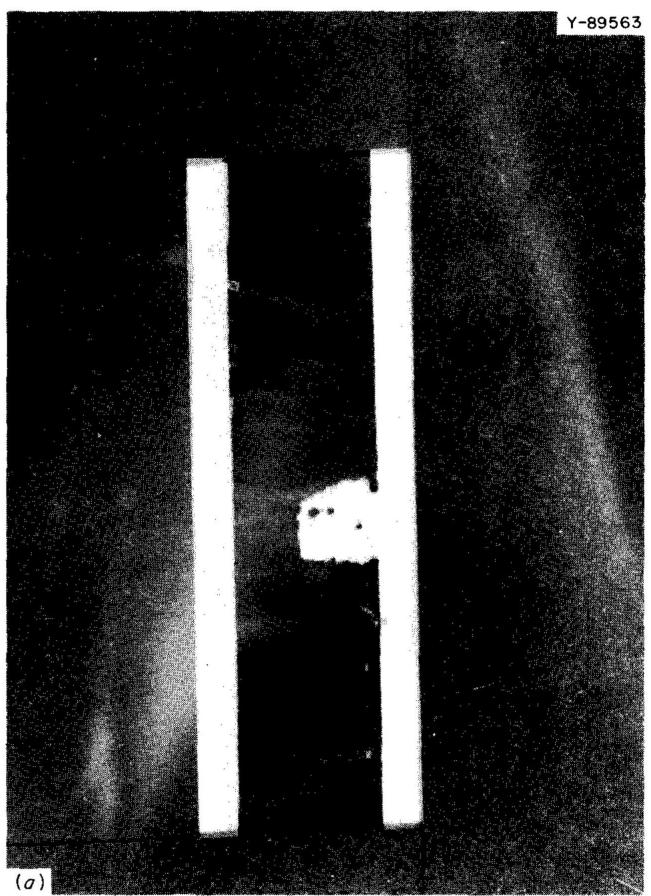

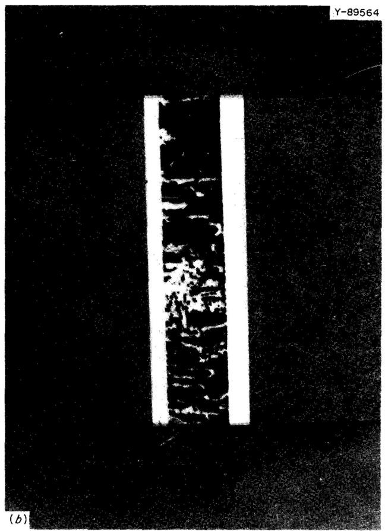  
Fig. 21.5. Plan View of a Recording of a Graphite-to-Molybdenum Joint Inspected Nondestructively by the Ultrasonic Pulse Echo Technique. (a) Standard. White areas due to a piece of tape on the surface to simulate bonding. (b) Specimen. White areas show that only about $30\%$ of joint was brazed.

# 22. Support for Components Development Program

# 22.1 WELDING IRRADIATED MATERIALS

# 22.1.1 Development of Apparatus and Procedures for Welding Irradiated Samples

R. W. Gunkel

T. E. Scott

The maintenance of future MSBR's will involve the welding of highly irradiated Hastelloy

Y-88365

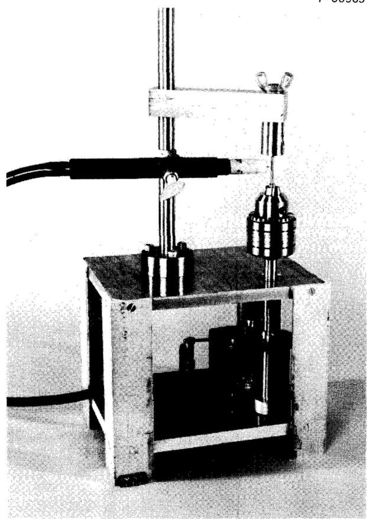  
Fig. 22.1. Welding Equipment Developed for Making Remote Welds.

N that has been exposed to fluoride salts for long periods of time. We wanted to make welds in some of our small tensile samples from the MSRE surveillance program to gain some insight into the difficulty of making these welds and into the mechanical properties of the joint.

In order to make fusion welds (no filler metal added) on the irradiated tensile specimens, it was necessary to design a special welding fixture which could be operated remotely in a hot cell. We aimed for a reasonable assurance of good penetration (high percentage of cross section of specimen to be weld metal) without specimen distortion. Figure 22.1 is a photograph of the welding fixture assembled for use in the hot cell. As can be seen, the fixture consists of a rigid stand, a motor-driven chuck, a specimen support, and a TIG welding torch. The upper support has an internal curved surface that contacts the fillet radius of the tensile sample and keeps the sample aligned during welding. The torch was connected to a programmed welding power supply located outside the hot cell. The welding conditions were adjusted to obtain penetration of about $75\%$ of the sample cross section.

# 22.1.2 Mechanical Properties of Hastelloy N Welded After Irradiation

H. E. McCoy

The fixture described in the previous section was used to make fusion passes in the gage portion of several of our surveillance samples. Our test specimens are only 0.125 in. in diameter, and the welding parameters that we used fused about $75\%$ of the cross section. This weld involves lower restraint and heat input than would be involved in most remote repair operations. One group of surveillance samples had been exposed to the MSRE cell environment of nitrogen contain

ing 2 to $5\%$ oxygen for 20,800 hr at $650^{\circ}\mathrm{C}$ and was oxidized; the thermal fluence was $2.6 \times 10^{19}$ neutrons/ $\mathrm{cm}^2$ . The other samples were exposed to the fuel salt in the core of the MSRE for 15,300 hr at $650^{\circ}\mathrm{C}$ ; the thermal fluence was $9.4 \times 10^{20}$ neutrons/ $\mathrm{cm}^2$ . Thus we were confronted with removing a thin oxide film of about 0.002 in. in one case and very small amounts of residual salt in the other case. We used 240-grit emery paper and acetone cleaning to remove both contaminants.

We welded about 25 unirradiated samples before welding the irradiated samples, and $100\%$ of the welds were sound by visual examination. We welded 15 irradiated samples, with 3 welds completely unsatisfactory and 2 others very questionable due to surface cracks; thus only $67\%$ were sound by a visual examination. The bad welds occurred rather randomly among the two groups of samples. We suspected that much of the difficulty was associated with cleanliness and tried continually to improve our cleaning techniques. Our final technique was removing about 0.002 in. of material by abrasion with clean emery paper, followed by acetone cleaning. The reliability seemed to improve, although insufficient samples were involved to prove this rigorously.

Our results on the fracture strains of unirradiated materials are summarized in Table 22.1. The results generally show the following:

1. At $25^{\circ}\mathrm{C}$ the weld is stronger than the base metal, and the fracture occurs in the base metal, with a resulting high strain at fracture.   
2. Stress relieving for 8 hr at $871^{\circ}\mathrm{C}$ reduces the strength of the weld and moves the location of the fracture at $25^{\circ}\mathrm{C}$ to the weld metal, with a slightly lower strain at fracture.   
3. At $650^{\circ}\mathrm{C}$ the weld metal is weaker, and the fracture occurs in the weld metal at only about half the strain normally associated with fractures in the base metal. Stress relieving for 8 hr at $871^{\circ}\mathrm{C}$ improves the fracture strain to where it is comparable with that of the base metal, but the fracture usually occurs in the weld metal.   
4. A sample that was irradiated but had been exposed to salt for 4800 hr was welded and found to have properties comparable with those of the samples not exposed to salt.

The results of our tensile tests on irradiated and welded samples are summarized in Table 22.2. The same general trends outlined for the

Table 22.1. Tensile Properties of Unirradiated Hastelloy N   

<table><tr><td>Heat</td><td>Condition of Test Sample</td><td>Test Temperaturea (°C)</td><td>Fracture Strain (%)</td><td>Apparent Location of Fracture</td></tr><tr><td>5065</td><td>Base metal</td><td>25</td><td>55.5</td><td>Base metal</td></tr><tr><td>5065</td><td>Welded + 8 hr at 871°C</td><td>25</td><td>43.4</td><td>Weld metal</td></tr><tr><td>5065</td><td>Base metal</td><td>650</td><td>22.8</td><td>Base metal</td></tr><tr><td>5065</td><td>Welded</td><td>650</td><td>10.4</td><td>Weld metal</td></tr><tr><td>5065</td><td>Welded + 8 hr at 871°C</td><td>650</td><td>20.1</td><td>Weld metal</td></tr><tr><td>5085</td><td>Base metal</td><td>25</td><td>53.1</td><td>Base metal</td></tr><tr><td>5085</td><td>Welded</td><td>25</td><td>60.8</td><td>Base metal</td></tr><tr><td>5085</td><td>Welded + 8 hr at 871°C</td><td>25</td><td>30.0</td><td>Weld metal</td></tr><tr><td>5085</td><td>Base metal</td><td>650</td><td>24.1</td><td>Base metal</td></tr><tr><td>5085</td><td>Welded</td><td>650</td><td>13.7, 15.5b</td><td>Weld metal</td></tr><tr><td>5085</td><td>Welded + 8 hr at 871°C</td><td>650</td><td>34.5</td><td>Weld metal</td></tr><tr><td>5085</td><td>Welded sample -- prior exposure to salt for 4800 hr</td><td>650</td><td>10.7</td><td>Weld metal</td></tr></table>

${}^{a}$ Tests at ${25}^{ \circ  }\mathrm{C}$ run at a strain rate of ${0.05}{\mathrm{\;{min}}}^{-1}$ ; tests at ${650}^{ \circ  }\mathrm{C}$ run at a strain rate of ${0.002}{\mathrm{\;{min}}}^{-1}$ .   
$b$ Two determinations.

Table 22.2. Tensile Properties of Irradiated Hastelloy N   

<table><tr><td>Heat</td><td>Condition of Test Sample</td><td>Test Temperaturea (°C)</td><td>Fracture Strain (%)</td><td>Apparent Location of Fracture</td></tr><tr><td colspan="5">Heated Outside MSRE Vessel for 20,800 hr at 650°C; Thermal Fluence of 2.6 × 1019 Neutrons/cm2</td></tr><tr><td>5065</td><td>Base metal</td><td>25</td><td>59.6</td><td>Base metal</td></tr><tr><td>5065</td><td>Welded + 8 hr at 871°C</td><td>25</td><td>4.3</td><td>Weld metal</td></tr><tr><td>5065</td><td>Base metal</td><td>650</td><td>12.5</td><td>Base metal</td></tr><tr><td>5065</td><td>Welded</td><td>650</td><td>6.8</td><td>Weld metal</td></tr><tr><td>5065</td><td>Welded + 8 hr at 871°C</td><td>650</td><td>11.3</td><td>Base metal</td></tr><tr><td>5085</td><td>Base metal</td><td>25</td><td>32.9</td><td>Base metal</td></tr><tr><td>5085</td><td>Welded</td><td>25</td><td>40.4</td><td>Base metal</td></tr><tr><td>5085</td><td>Welded + 8 hr at 871°C</td><td>25</td><td>40.8</td><td>Base metal</td></tr><tr><td>5085</td><td>Base metal</td><td>650</td><td>11.6</td><td>Base metal</td></tr><tr><td>5085</td><td>Welded</td><td>650</td><td>12.9</td><td>Weld metal</td></tr><tr><td>5085</td><td>Welded + 8 hr at 871°C</td><td>650</td><td>18.6</td><td>Base metal</td></tr><tr><td colspan="5">Exposed to Fuel Salt in MSRE Core for 15,300 hr at 605°C; Thermal Fluence of 9.4 × 1020 Neutrons/cm2</td></tr><tr><td>5065</td><td>Base metal</td><td>25</td><td>41.5</td><td>Base metal</td></tr><tr><td>5065</td><td>Welded + 8 hr at 871°C</td><td>25</td><td>15.4</td><td>Weld metal</td></tr><tr><td>5065</td><td>Base metal</td><td>650</td><td>5.8</td><td>Base metal</td></tr><tr><td>5065</td><td>Welded + 8 hr at 871°C</td><td>650</td><td>7.6</td><td>Base metal</td></tr><tr><td>5085</td><td>Base metal</td><td>25</td><td>28.7</td><td>Base metal</td></tr><tr><td>5085</td><td>Welded + 8 hr at 871°C</td><td>25</td><td>33.6</td><td>Base metal</td></tr><tr><td>5085</td><td>Base metal</td><td>650</td><td>5.0</td><td>Base metal</td></tr><tr><td>5085</td><td>Welded</td><td>650</td><td>5.4</td><td>Base metal</td></tr><tr><td>5085</td><td>Welded + 8 hr at 871°C</td><td>650</td><td>9.3</td><td>Base metal</td></tr></table>

${}^{a}$ Tests at ${25}^{ \circ  }\mathrm{C}$ run at a strain rate of ${0.05}{\mathrm{\;{min}}}^{-1}$ ; tests at ${650}^{ \circ  }\mathrm{C}$ run at a strain of ${0.002}{\mathrm{\;{min}}}^{-1}$ .

unirradiated samples are followed with the exception that the tendency to fail in the base metal is much higher for the irradiated samples. This is very likely associated with the relative toughness of the weld metal and base metal for the two cases. In unirradiated materials the weld metal is the weaker, and in irradiated materials the weld metal is probably superior since it has been melted and the influences of irradiation have been removed. Two of the irradiated samples tested at $25^{\circ}\mathrm{C}$ failed in the weld metal at low strains, and it is likely that the welds in these samples were defective.

The microstructure of a sample welded and tested at $650^{\circ}\mathrm{C}$ is shown in Fig. 22.2. The fracture is clearly in the base metal, but the weld

metal strained considerably. The porosity associated with the weld is a striking feature. Some voids are formed along the carbide stringers, and our previous work1 has shown that these carbide stringers do melt at a lower temperature than the base metal. Much of the porosity is located at the fusion line and within the weld metal. We feel that this is more likely associated with cleanliness rather than with the release of helium formed during irradiation.

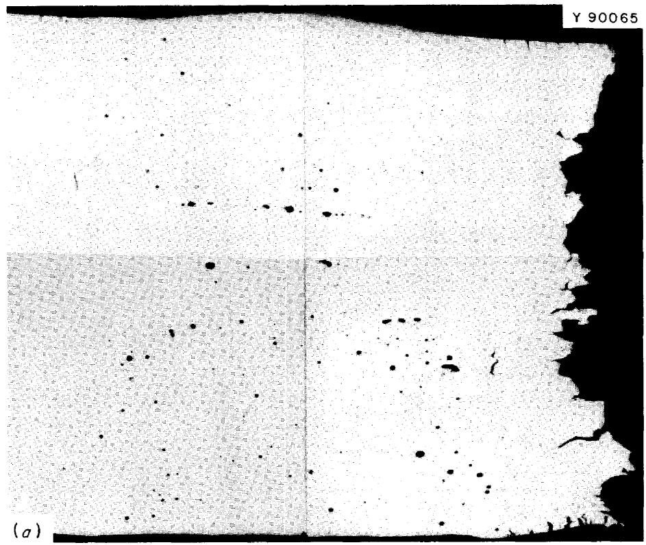

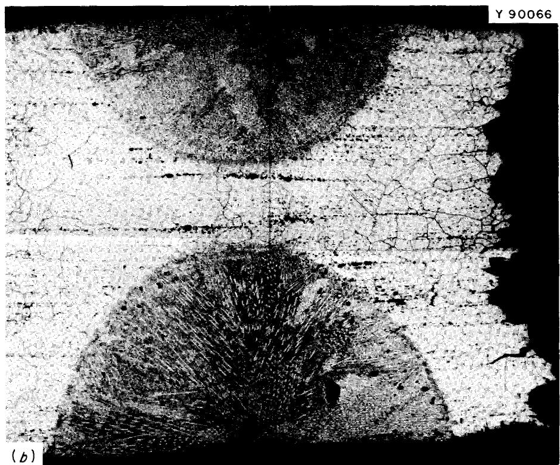  
Fig. 22.2. Photomicrographs of Hastelloy N Surveillance Sample Welded After Removal from the MSRE. Tensile tested at $650^{\circ}\mathrm{C}$ at a strain rate of $0.002\mathrm{min}^{-1}$ . (a) As polished. (b) Etched glyceregia.

Thus we have been able to make satisfactory welds in Hastelloy N that has been irradiated and exposed to fluoride salts. There is an added degree of difficulty in making welds in these materials, probably associated with cleanliness. The sound welds have properties as good as the irradiated base metal, if not better. These welds have been made with low heat input and low restraint, and more difficulty may be encountered with large section sizes.

# 22.2 MOLTEN-SALT DISTILLATION EXPERIMENT

The Chemical Technology Division has designed and constructed a vessel for distilling molten salts to remove fission products. The still is constructed of Hastelloy N and operates at a maximum temperature of $1000^{\circ}\mathrm{C}$ . This temperature is quite high for Hastelloy N, and we were concerned over whether the corrosion rate would be too high. We devised a surveillance program that would allow us to follow the corrosion of the Hastelloy N and to examine the compatibility of several other potential structural materials. After the still operated for over 4300 hr, we removed the surveillance samples for examination.

During the course of operation a plug formed in the salt feed line to the still. A plugged section was made available for us to examine metallographically.

# 22.2.1 Examination of Specimens from the Distillation Experiment

W. H. Cook

The materials included in the still were alloy 82 (Ni-18 Mo), Mo-TZM (Mo-0.5 Ti-0.1 Zr), Haynes alloy No. 25 (Co-10 Ni-20 Cr-15 W-3 Fe), and Poco AXF graphite.

We wired small coupons into two like sets of stringers and mounted them on a Hastelloy N support fixture tack welded to the Hastelloy N dip line of the vacuum distillation unit, as shown in Fig. 22.3a. The arrangement and position of each stringer were such that specimens of each material were in vapor and liquid zones, with a Hastelloy N specimen centered at the vapor-liquid interface.

The specimens, the dip line, and the supporting fixture were returned to us by Unit Operations of

the Chemical Technology Division as a unit after $\sim 4300\mathrm{hr}$ of experiments with LiF-BeF ${}_{2}-\mathrm{ZrF}_{4}$ . The corrosion specimens are shown in Figs. 22.3b and 22.4 and the dip line in Fig. 22.3c.

A visual check of the samples in the liquid region showed that the Hastelloy N and alloy 82 were etched slightly and that the surface of the Mo-TZM was unaltered. The Haynes alloy No. 25 was severely attacked and broke easily. The graphite specimens were missing. The poor performance of the graphite was caused by air leakage into the system when a heater failure burned a hole in the argon inlet line to the condenser. An indeterminate amount of air was in the system for about $500\mathrm{hr}$ with the temperature $\geq 700^{\circ}\mathrm{C}$ . Several small crystalline metallic deposits were found at random on the surfaces of samples in the liquid region.

A larger Hastelloy N sample was located at the anticipated liquid-vapor interface. This sample had gray mat surfaces, but no marks that indicated the location of the interface.

The specimens in the vapor region had a thin gray to black film, possibly due to the period of operation with air present. The Hastelloy N, alloy 82, and Mo-TZM seemed to be in good physical condition. The Haynes alloy No. 25 had enlarged, and the graphite samples were attacked severely.

We have sectioned the Hastelloy N samples for metallographic examination. There was an intergranular attack to a depth of 4 mils on the vapor-zone specimen and an intergranular and transgranular attack to a depth of 2 mils in the liquid-zone specimen. There was one atypical large ( $\sim 1 \times 5$ mils) intergranular void in the liquid-zone specimen. In general, the attack in the liquid zone was scattered 1-mil-deep attack, with some oxide on the surfaces and in the voids, similar to that shown in Fig. 22.5a. There was concentrated intergranular and transgranular attack to an average depth of 3 mils in the sample from the vapor zone (Fig. 22.5b). The Hastelloy N specimen spanning the vapor-liquid interface showed the same conditions, except that the transition from the liquid to the vapor region was gradual and the attack in the vapor zone was only 2 mils. The absence of aggravated attack at the liquid-vapor interface and the shallow corrosion depths in the liquid and vapor zones indicate that it is reasonable to use the Hastelloy N vacuum still

￥88732

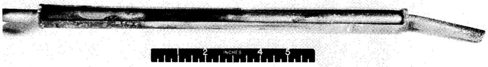

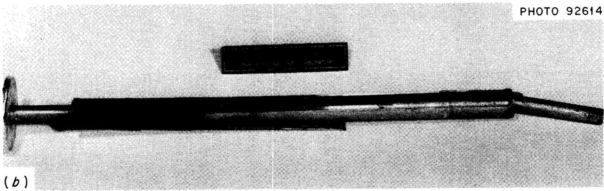  
(c)

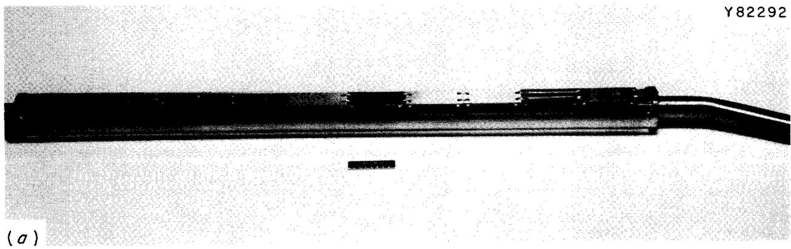  
Fig. 22.3. Vacuum Still and Condenser Equipment Corrosion Specimens and Support Fixture on the Dip Line. (a) Before exposure (support fixture is not tack welded to the dip line in this photograph). (b) After exposure to the vapor and liquid of LiF-BeF $_2$ -ZrF $_4$ for $\sim 4300$ hr at 500 to $1000^{\circ}\mathrm{C}$ during which 900 to $1025^{\circ}\mathrm{C}$ operation was conducted for only $\sim 300$ hr. (c) Support fixture and dip line after exposure with the corrosion specimen removed.

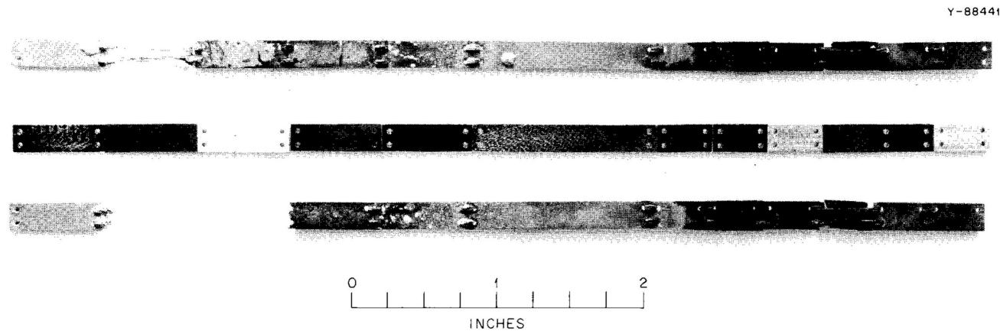  
Fig. 22.4. Corrosion Specimens from the MSRP Vacuum Distillation Experiment.

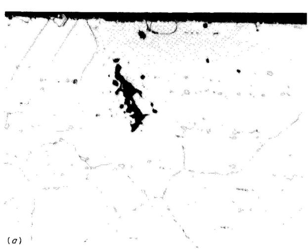

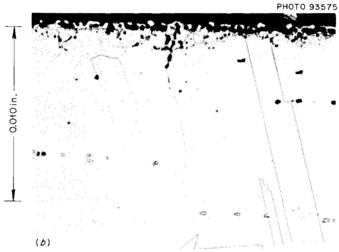  
Fig. 22.5. Hastelloy N Corrosion Specimens from the Vacuum Still and Condenser Equipment. (a) From the salt liquid zone with an atypical intergranular void but representative surface and (b) from the vapor zone just above the salt liquid-vapor interface. $250 \times$ . Etchant aqua regia.

and condenser with its $3/8$ -in.-thick walls to process the MSRE fuel salt for a short period of time.

Powder samples for x-ray diffraction analyses $^2$ were taken from reaction layers of the vapor-zone specimens of TZM alloy and the Haynes alloy No. 25, the specimen support fixture, and the dip line using a sharpened rod made from a single crystal

of $\alpha\text{-Al}_2\mathrm{O}_3$ . All of these had salt components of LiF, $\mathrm{Li}_2\mathrm{BeF}_4$ , and/or 6LiF $\cdot$ $\mathrm{BeF}_2\cdot \mathrm{ZrF}_4$ , plus $\mathrm{ZrO}_2$ monoclinic, which reflects their exposure to salt and air. Moderate amounts of $\mathrm{MoO}_2$ and $\mathrm{WO}_2$ were present on the TZM alloy and the Haynes alloy No. 25 vapor-zone specimens respectively. Again this reflects the presence of air in the system.

Small amounts of tiny crystals deposited on the Hastelloy N specimens at the bottom (liquid zone)

of the specimen stringer were fcc with a lattice parameter of 3.54 A. This parameter suggests the presence of a high-nickel alloy, but further analyses will be required to confirm this.

# 22.2.2 Examination of Plug from Distillation Vessel

H. E. McCoy

Helen Mateer

After about $120\mathrm{hr}$ of high-temperature operation a partial plug formed in the feed line to the molten-salt distillation vessel. A section of the plugged line was removed for detailed examination. The plug, shown in Fig. 22.6, is comprised of small metallic particles. Annealing twins are visible at high magnification and thus indicate that the material has a fcc crystal structure.

Microprobe scans were made across some of the individual particles for nickel, iron, chromium, and molybdenum, the principal alloying elements in Hastelloy N. The particles were very inhomogeneous; the nickel content ranged from 90 to $98\%$ and the iron content from 4 to $12\%$ . Chromium and molybdenum were not detected $(< 1\%)$ . Bulk analysis of the material indicated that aluminum, tin, and copper might be present, so scans were also made for these elements. These elements were not detected, indicating that their respective concentrations were $< 1\%$ . These analyses indicate that the plug most likely did not form from material that was removed from the Hastelloy N by corrosion, since chromium and molybdenum were not present in the plug.

# 22.3 X-RAY EXAMINATION OF BEARING COATINGS

J. E. Epperson

Our present concepts of large molten-salt pumps do not require bearings that will operate in salt at elevated temperatures. However, it is likely that small pumps and valves will be desirable for auxiliary uses where the materials must resist self-welding and wear in molten salts at temperatures up to $700^{\circ}\mathrm{C}$ . We presently feel that cermets (specifically, metal-bonded carbides) offer the most potential for this application and currently have a small evaluation program. The cheapest way of using these materials is to plasma spray the bear

ing or valve surfaces with a thin layer of the cermet. The surfaces can be ground to produce the desired surface finish.

We are presently evaluating four coatings that have been applied to small Hastelloy N cylinders approximately 1 in. in diameter and 1 in. long. The nominal composition and other pertinent details are given in Table 22.3. The coatings are about 3 mils thick and were ground to obtain a good surface finish. The coating operation was handled by Mechanical Technology, Inc. (MTI), although some of the actual coating work was contracted to other vendors. We plan to evaluate the respective potential of each coating by thermal cycling and compatibility studies.

Before these studies were begun, we determined the species present by x-ray diffraction, and the results of these studies are summarized in Table 22.3. In the two cases where cobalt was used as the bonding agent, a carbide of cobalt, $\mathrm{Co}_{3}\mathrm{C}$ , was detected, but elemental cobalt was not seen. The nickel binder in LW-5 was not detected. Composition inhomogeneities and/or strains were evident in the diffraction pattern from each of the deposits. These specimens will be reexamined following the thermal cycle and compatibility experiments. Dimensional variations due to changes in crystal structure during heating are quite possible in such complex materials.

# 22.4 LIQUID LEVEL PROBE ANALYSIS

J. W. Koger

A. P. Litman

A liquid level probe failed after only a few hours in the pump bowl of the PKP-1 forced-circulation pump loop. The probe, which was constructed from type 304 stainless steel, was found to be heavily attacked. We were asked to examine the probe and to determine the consequences of the attack. The probe is shown in Fig. 22.7 along with an enlarged view of the end of the probe which shows the severe corrosion of the material.

The probe had contacted fluoroborate salt $\left(\mathrm{NaBF}_{4}-\mathrm{NaF}, 92-8 \text { mole } \% \right)$ at temperatures from $538^{\circ} \mathrm{C}$ $(1000^{\circ} \mathrm{F})$ to $690^{\circ} \mathrm{C}$ $(1275^{\circ} \mathrm{F})$ for $192 \mathrm{hr}$ . Chemical analysis showed that chromium, iron, manganese, and silicon were severely leached from the alloy. The corroded end of the probe was found to be highly ferromagnetic, which was understandable in the light of a later chemical analysis

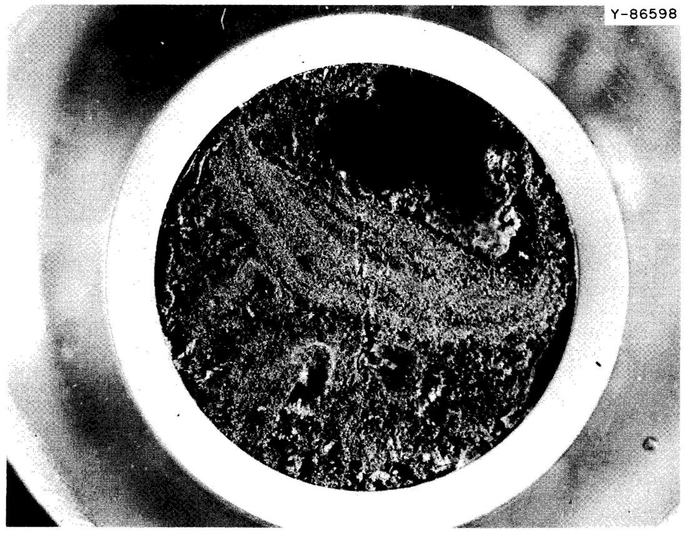

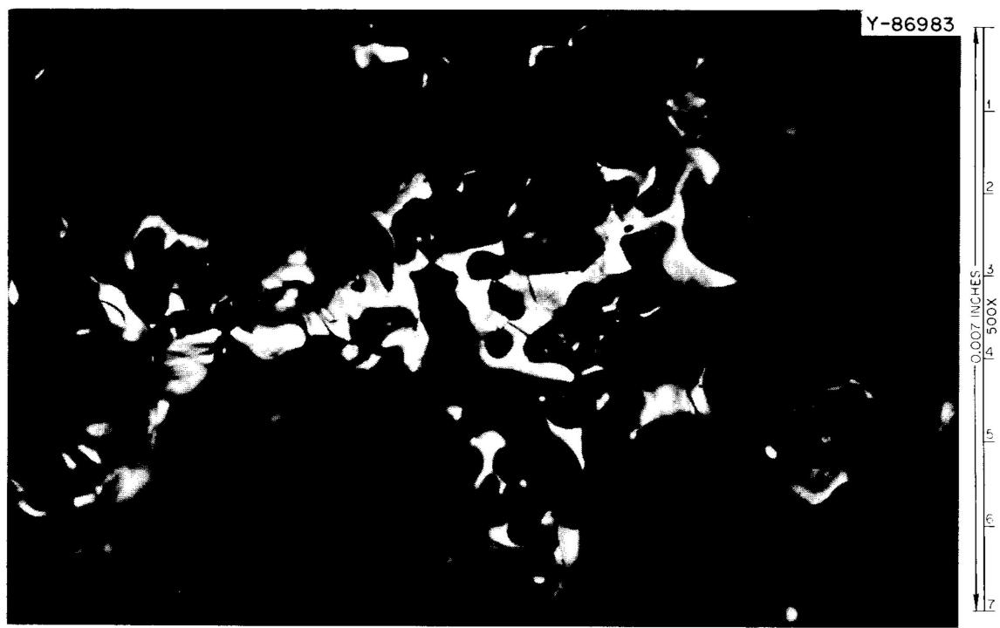  
Fig. 22.6. Photographs of Hastelloy N Feedline to Distillation Vessel. (a) Partial plug. (b) $500 \times$ photomicrograph of small crystal comprising plug.

Table 22.3. Cermet Bearing Coatings   

<table><tr><td>Designation</td><td>Ground Surface Finish (μ in.)</td><td>Nominal Coating Specification</td><td>Phases Identified by X-Ray Analysis</td></tr><tr><td>Linde LW-1</td><td>6–9</td><td>Tungsten carbide bonded with 7–10% Co</td><td>WC, α-W2C, Co3C</td></tr><tr><td>Linde LW-5</td><td>1.4–2.3</td><td>25% W + 7% Ni + mixed W-Cr carbides</td><td>WC, Cr3C2</td></tr><tr><td>MTI</td><td>42–125</td><td>40% pure tungsten carbide + 50% Co-bonded (12%) tungsten carbide + 10% Mo</td><td>α-W2C, Co3C, Mo, MoC, Mo2C</td></tr><tr><td>Metco 81 NS</td><td>30–63</td><td>75% Cr carbide + 25% Nichrome alloy binder</td><td>Cr7C3, Cr2C, Cr3C2, Ni-42 at. % Cr alloy</td></tr></table>

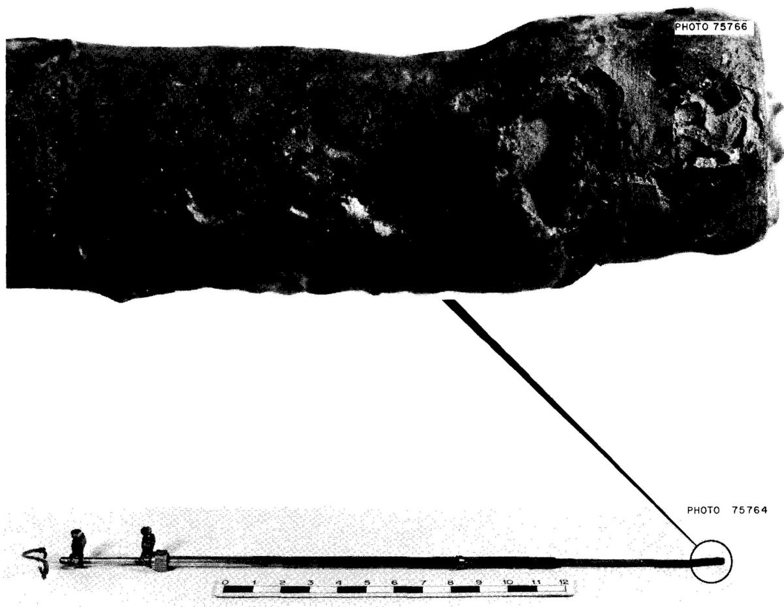  
Fig. 22.7. Type 304L Stainless Steel Liquid Level Probe from PKP-1 Pump Loop.

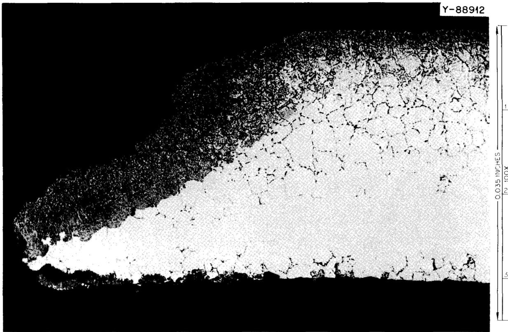  
Fig. 22.8. Microstructure of Type 304L Stainless Steel from Liquid Level Probe of PKP-1 Exposed to Fluoroborate Salt for 192 hr at Temperatures from 538 to $690^{\circ}\mathbf{C}$ .

which showed the material to be composed of 78 wt % nickel and 22 wt % iron. Figure 22.8 shows a metallographic section of an area of the probe from the heavily attacked end. The microstructure and chemical analysis above are typical of extensive attack on stainless steel by certain fluoride salts, more especially by moisture-contaminated salts. The well-known corrosion cycle involves selective removal of the more easily oxidized alloy constituents, especially Cr and Mn, void formation (the density of the material changes), void precipitation, and linkage and coalescence.

In analyzing the compatibility of the probe with the salt, we summarized data from natural circulation loop tests which compare the corrosion of type 304 stainless steel and Hastelloy N in molten fluoride salts (Table 22.4). Since Hastelloy N shows about seven times as much weight loss in the fluoroborate as it does in fuel salts, the same

analogy, as a first approximation, can be applied to stainless steel. Thus a weight loss of 175 $\mathrm{mg/cm^2}$ of material in $5000\mathrm{hr}$ is indicated for type 304 stainless steel in fluoroborate salt. Corrosion of this magnitude is excessive but considerably less than what was experienced by the probe.

There are at least three possible explanations for the observed high rate of attack: (1) the salt was generally contaminated, (2) oxidizing impurities were introduced locally at the probe due to a leak, and (3) the probe was attacked selectively since it was the least noble part exposed to a large volume of salt in an Inconel system. The last mechanism is probably responsible for the observed dissolution of an iron sample capsule in the MSRE, where Hastelloy N is the principal metallic material. We know of no reasonable way of distinguishing between these possibilities in this case.

Table 22.4. Weight Loss of Alloys Exposed to Various Salts at Different Temperatures for 5000 hr   

<table><tr><td>Meta1</td><td>Salt</td><td>Temperature (°C)</td><td>Weight Loss (mg/cm2)</td></tr><tr><td>Hastelloy N</td><td>LiF-BeF2-ThF4(73-2-25 mole %)</td><td>675</td><td>0.4a</td></tr><tr><td>Hastelloy N</td><td>LiF-BeF2-UF4(65.5-34.0-0.5 mole %)</td><td>705</td><td>0.6</td></tr><tr><td>Hastelloy N</td><td>NaBF4-NaF (92-8 mole %)</td><td>605</td><td>4.0</td></tr><tr><td>Type 304 SS</td><td>LiF-BeF2-ZrF4-UF4-ThF4(70-23-5-1-1 mole %)</td><td>675</td><td>25.0</td></tr><tr><td>Type 304 SS</td><td>NaBF4-NaF (92-8 mole %)</td><td>538-690</td><td>175.0b</td></tr></table>

${}^{a}$ Extrapolated value from 3000 hr.   
${}^{b}$ Estimated from comparison with Hastelloy N.

# 22.5 FABRICATION OF FLUTED TUBING FOR ENHANCED HEAT TRANSFER

H. E. McCoy

R. E. McDonald

Previous studies have shown that heat transfer can be enhanced in condensers by using tubing with roughened or fluted surfaces. The roughened surface promotes turbulence and increases the overall heat transfer coefficient. There is great incentive for improving the heat transfer by this technique in molten-salt systems, since this reduces the quantity of uranium that is outside the core in heat exchangers.

Fluted tubing has been fabricated previously from nickel, copper, and Ni-Cu, materials that are easier to fabricate than Hastelloy N. We strengthened several components of the planetary swager used in making this tubing and have made several pieces of fluted $3_{8}$ -in.-diam Hastelloy N tubing for heat transfer studies. We varied the fabrication parameters to obtain various depths and pitches of the spiral roughening pattern; the depth varied from 10 to 20 mils and the pitch from 2.6 to 7.6 threads per inch. The tubing collapsed when the

depthexceeded20mils. Several tubes are shown inFig.22.9.

We noted that the stringers of $\mathbf{M}_{6}\mathbf{C}$ carbides cracked during fabrication (Fig. 22.10), and thermal fatigue tests would be needed to determine whether these cracks propagate during service. However, the modified Hastelloy N presently under study does not have these stringers and should present no problems in this regard.

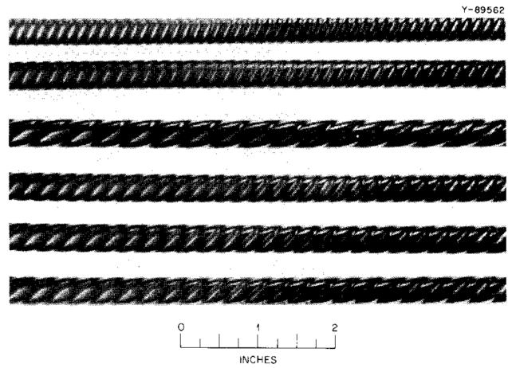  
Fig. 22.9. Fluted Hastelloy N Tubing for Enhanced Heat Transfer.

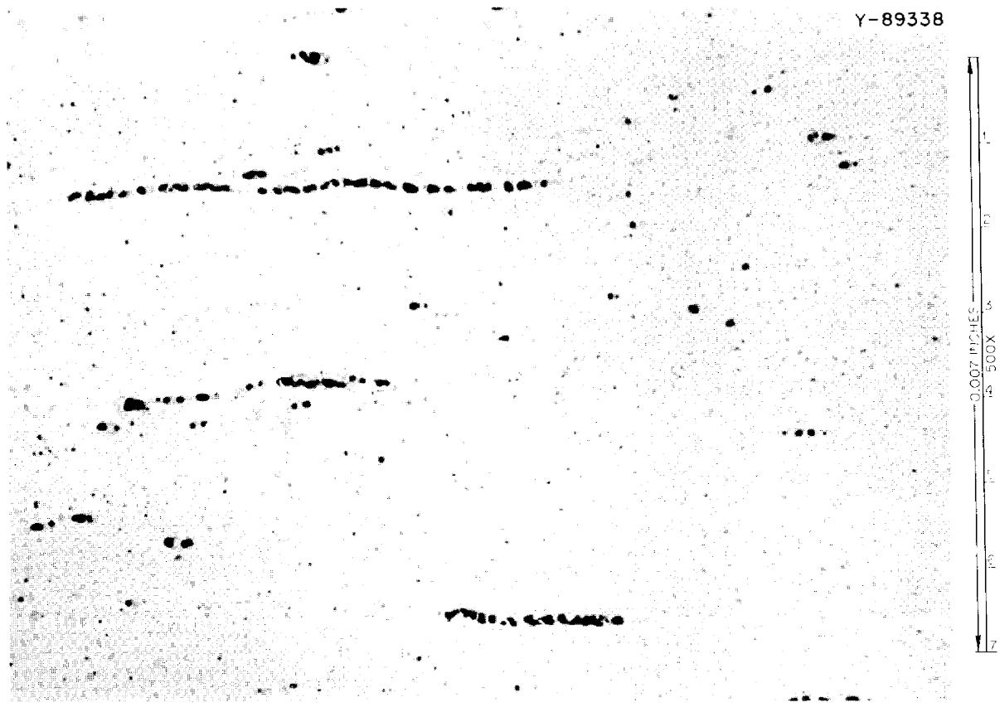  
Fig. 22.10. Photomicrograph of Fluted Hastelloy N Tubing Showing the Fractured Carbides. As polished. $500 \times$

# Part 6. Molten-Salt Processing and Preparation

M. E. Whatley

# INTRODUCTION

This has been a period of fulfillment for several projects in our program. The first fuel charge of the MSRE was processed for the recovery of the $^{235}\mathrm{U}$ by fluorination in an operation characterized by simplicity and predictable performance. The product uranium was decontaminated sufficiently to allow manual manipulation of the sodium fluoride beds on which it was accumulated, and the carrier salt was purified for reuse in the second phase of the reactor operation. We successfully prepared a $^{233}\mathrm{U}$ charge, in the form of an $^7\mathrm{LiF}-^{233}\mathrm{UF}_4$ eutectic salt, for refueling the MSRE; it is now packaged in capsules and cans, ready for insertion into the reactor. This preparation proceeded rapidly and with little difficulty after some revisions in the chemical flowsheet were made. Our nonradioactive testing of the 48-liter molten-salt still has been concluded. We are confident of the feasibility of this operation and have observed practical distillation rates $(\sim1.5\mathrm{ft}^3\mathrm{ft}^{-2}\mathrm{day}^{-1})$ at temperatures of $1000^{\circ}\mathrm{C}$ and pressures of $0.1\mathrm{mmHg}$ over a period of many hours. Preparations to perform a distillation

experiment with this still at the MSRE, using MSRE carrier salt, are under way. Our developmental work on reductive extraction processing of MSBR's was fruitful from the standpoint of the accumulation of basic chemical data which, at least in the case of the protactinium isolation flowsheet, have greatly increased our confidence. The distribution coefficients are still highly attractive, and the solubility of protactinium has been found to exceed the necessary 2000 ppm in bismuth.

Our work on contactor development continues to be encouraging. Facilities for performing engineering studies on reductive extraction have been designed, and installation is in progress. Operations with salt and bismuth are scheduled to begin during the next few months. The method for separating rare earths from thorium by reductive extraction is still in the developmental phases. Separation factors in the proposed reactor salt system appear to be somewhat low (between 1 and 3); therefore, it may be necessary to adjust the concentration of the carrier salt in order to attain separation factors that will be sufficiently high to make this operation feasible.

# 23. Measurement of Distribution Coefficients in Molten-Salt-Metal Systems

L. M. Ferris

Development of the reductive extraction method for the processing of single-fluid molten-salt breeder reactor fuels has been continued. The process being evaluated involves the selective extraction of uranium, protactinium, and rare earths from the molten salt into liquid bismuth that contains a dissolved reductant such as thorium. In order to evaluate the feasibility of large-scale engineering application of this method, the equilibrium distribution of the various components between the two phases must be known. The distribution of component M can be expressed as a distribution coefficient

$$
D _ {\mathrm {M}} = \frac {\text {m o l e f r a c t i o n o f c o m p o n e n t M i n m e t a l p h a s e}}{\text {m o l e f r a c t i o n o f c o m p o n e n t M i n s a l t p h a s e}}
$$

Thermodynamic treatment1 of the equilibria involved with salts that contain LiF indicates that the distribution coefficients of the various components should be expressible in terms of the following relationship:

$$
\log D _ {\mathrm {M}} = n \log D _ {\mathrm {L i}} + \log I,
$$

in which $n$ is the valence of the component (as its fluoride $\mathbf{MF}_n$ ) in the salt, and $I$ is a constant. The ratio of the distribution coefficients for two components (e.g., $A$ and $B$ ),

$$
D _ {A} / D _ {B} = \alpha_ {A - B},
$$

is called the separation factor. If $\alpha = 1$ , no separation is possible; the higher the separation factor, the easier the separation. The purpose of our program is to obtain distribution coefficients and separation factors for uranium, protactinium, thorium, rare earths, and other fission products in various salt-metal systems so that, ultimately, the best conditions for a large-scale separation process can be determined.

# 23.1 EXTRACTION OF PROTACTINIUM FROM SINGLE-FLUID MSBR FUELS

J.C.Mailen

L. M. Ferris

E. D. Nogueira

D. E. Spangler

During the early part of this reporting period, an alpha facility was established for use in small-scale studies of the behavior of protactinium in reductive extraction systems. The distribution of protactinium between a typical single-fluid MSBR fuel salt, $\mathrm{LiF - BeF}_2\text{-ThF}_4$ (69.2-19.4-11.4 mole %), and liquid bismuth has been established at $600^{\circ}\mathrm{C}$ . Other experiments have shown that the solubility of protactinium in bismuth at $600^{\circ}\mathrm{C}$ under reductive extraction conditions is at least 2078 ppm, and that protactinium can be maintained in solution indefinitely in a molybdenum container if the system is free of oxidants.

The initial experiments were conducted as follows: Bismuth (200 to $300\mathrm{g}$ ), contained in a mild-steel crucible, was treated with hydrogen at 600 to $650^{\circ}\mathrm{C}$ for about 24 hr and then was frozen under high-purity batch-analyzed argon. In a separate vessel, a few milligrams of ${}^{231}\mathrm{Pa}$ and about $1\mathrm{mc}$ of ${}^{233}\mathrm{Pa}$ were added to the LiF

$\mathrm{BeF}_2$ -ThF salt. The salt, contained in a degassed graphite crucible, was treated with HF- $\mathbf{H}_2$ to remove oxide impurities and, finally, was treated with argon to strip out residual HF and hydrogen. The salt was frozen and the resulting ingot was transferred under argon to the mild-steel crucible containing the bismuth. After the two-phase system had been heated to the desired temperature under argon, pieces of Li-Bi alloy (about 7 at. $\%$ Li) were added periodically to increase the reductant concentration in the metal phase. Filtered samples of both phases were taken either 4 or 24 hr after addition of the alloy. Analyses of these samples allowed calculation of the distribution coefficients.

Although the technique outlined above gave reliable values for the distribution coefficients, material balances for protactinium, uranium, and thorium were undesirably low. The main cause of the low balances was found to be oxidation of these active metals by oxidants present in the supposedly high-purity argon. This problem was eliminated by passing the argon through two traps filled with uranium turnings; the first trap was held at $600^{\circ}\mathrm{C}$ and the second trap was held at $260^{\circ}\mathrm{C}$ . Experiments made after this modification were conducted in a system in which the components that contacted the salt and bismuth (crucible, sparge tubes, thermowells, etc.) were all fabricated from molybdenum. Use of molybdenum allowed simultaneous $\mathrm{HF - H_2}$ treatment of the salt and bismuth. In addition, being able to hydrofluorinate the two-phase system in molybdenum made it possible to conduct several experiments in sequence in the same apparatus, using only one initial charge of protactinium.

Distribution coefficients for protactinium at $600^{\circ}\mathrm{C}$ using $\mathrm{LiF - BeF}_2\text{-ThF}_4$ (69.2-19.4-11.4 mole $\%$ ) as the salt phase are shown in Fig. 23.1. The slope of the line is 4, showing that the protactinium species in the salt phase was tetravalent. These data yield a value of 0.579 v for $\Delta E_0'$ , the difference in half-cell reduction potentials as defined by Moulton. This value, when compared with previously reported values for uranium and thorium, confirms earlier indica

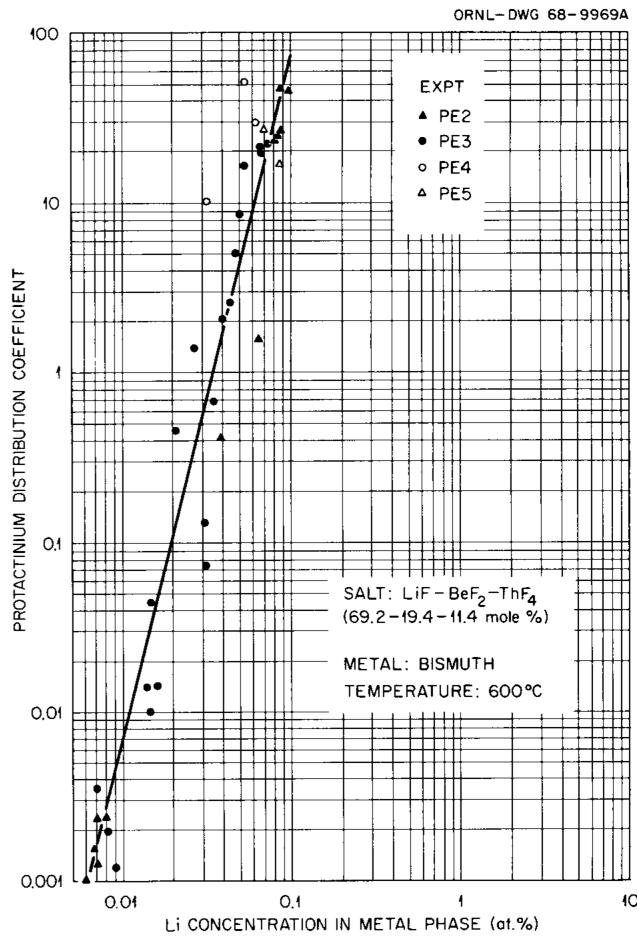  
Fig. 23.1. Distribution of Protactinium Between LiF-BeF $_2$ -ThF $_4$ (69.2-19.4-11.4 mole %) and Li-Bi Solutions at $600^{\circ}\mathrm{C}$ .

tions that protactinium is readily separable from uranium and thorium. The separation factors obtained in our studies are approximately

$$
\alpha_ {U - P a} = 1 0 0 \text {a n d} \alpha_ {P a - T h} = 4 3 0 0.
$$

As mentioned above, the protactinium material balances were low in many of the earlier experiments. Actually, the material balance declined slowly, but steadily, throughout these experiments. The primary cause of the decline was oxidation of protactinium present in the metal phase by oxidants present in the argon. Experiment PE5 was conducted at $600^{\circ}\mathrm{C}$ in molybdenum using argon that had been passed through traps filled with uranium turnings, with the objective of demonstrating that

protactinium could be held in bismuth at a significant concentration if the system was practically free of oxidants. In this experiment, $\mathrm{UF}_4$ and $\mathrm{PaF}_4$ that originally were present in the salt, $\mathrm{LiF - BeF}_2\text{-ThF}_4$ (69.2-19.4-11.4 mole %), were reduced by addition of crystal-bar thorium to the system. The amount of thorium added was sufficient to reduce all of the $\mathrm{UF}_4$ and about $95\%$ of the $\mathrm{PaF}_4$ . The resulting metal phase contained about 5000 ppm U, 750 ppm Th, and 70 ppm Pa; the protactinium concentration in the salt was about 10 ppm. The system remained practically unchanged for 128 hr (Table 23.1). The results of this experiment provide conclusive proof that protactinium can be maintained in solution with bismuth in a molybdenum container and that good material balances can be maintained if oxidants are excluded from the system.

The feasibility of the proposed protactinium recovery process has been subjected to question because it had not been demonstrated that protactinium was sufficiently soluble in bismuth, U-Bi, and Th-Bi solutions for process application. A calculation of the concentration profiles expected in a reductive extraction contactor indicated that the solubility of protactinium in bismuth had to be at least as high as that of thorium, and that protactinium had to be soluble to about 1000 wt ppm when the concentrations of uranium or thorium in the bismuth were about 1000 wt ppm if the desired process conditions were to be attained.

Experiment PE7 was conducted in an attempt to demonstrate that the desired process conditions could be met. Using molybdenum apparatus, about $100\mathrm{mg}$ of ${}^{231}\mathrm{Pa}$ was dissolved (as $\mathrm{PaF}_4$ ) in 100 g of LiF-BeF $_2$ (66-34 mole %) by hydrofluorination in the presence of $50\mathrm{g}$ of bismuth. After hydrofluorination, residual HF and hydrogen were removed from the salt by stripping with pure argon. With the system at $600^{\circ}\mathrm{C}$ , crystal-bar thorium was added to the metal phase to reduce some of the $\mathrm{PaF}_4$ and effect protactinium transfer to the metal phase. A sample of the metal phase taken 4 hr after the addition of thorium analyzed 1124 wt ppm protactinium and 1400 wt ppm thorium (Table 23.2). This corresponded to reduction of only about $50\%$ of the $\mathrm{PaF}_4$ ; addition of another piece of thorium to the system resulted in transfer of about $95\%$ of the protactinium to the metal phase. Subsequent analyses of samples of the metal phase (Table 23.2, samples 2 and 3) yielded protactinium concentrations as high as 2078 wt ppm. Since raising or lowering the temperature by $50^{\circ}$ produced no significant change in the protactinium concentration in the bismuth (Table 23.2, samples 4, 5, and 7), it was concluded that the solubility of protactinium in bismuth is at least 2050 wt ppm at $550^{\circ}\mathrm{C}$ . When the temperature was lowered to $500^{\circ}\mathrm{C}$ the protactinium concentration in the bismuth decreased to about 1200 wt ppm (Table 23.2, sample 6), with a corresponding decrease in protactinium material balance. Assuming that the solubility at $500^{\circ}\mathrm{C}$ is about 1200 wt ppm and that the apparent heat of solution is about the same as that of thorium (see Sect. 23.3), the solubility of protactinium in bismuth at $600^{\circ}\mathrm{C}$ is

4M. W. Rosenthal, MSR Program Semiann. Progr. Rept. Feb. 29, 1968, ORNL-4254, p. 248.

Table 23.1. Distribution of Thorium, Uranium, and Protactinium Between LiF-BeF $_2$ -ThF $_4$ (69.2-19.4-11.4 mole %) and Bismuth Solutions at $600^{\circ}$ C   

<table><tr><td rowspan="2">Total Equilibration Time (hr)</td><td colspan="3">Concentration in Metal Phase (wt ppm)</td><td rowspan="2">Li Concentration in Metal Phase (at. %)</td><td rowspan="2">Pa Material Balance (%)</td><td rowspan="2">DTh</td><td rowspan="2">DPa</td></tr><tr><td>Th</td><td>U</td><td>Pa</td></tr><tr><td>18</td><td>820</td><td>4990</td><td>71.0</td><td>0.0896</td><td>105</td><td>0.00649</td><td>19.9</td></tr><tr><td>42</td><td>600</td><td>5300</td><td>67.6</td><td>0.0717</td><td>96</td><td>0.00475</td><td>29.9</td></tr><tr><td>114</td><td>750</td><td>5070</td><td>67.6</td><td>0.0568</td><td>&gt;95a</td><td>0.00593</td><td></td></tr><tr><td>128</td><td></td><td>5200</td><td>72.3</td><td></td><td>&gt;95a</td><td></td><td></td></tr></table>

${}^{a}$ The salt phase was not sampled; at least 95% of the original protactinium was present in the metal phase.

Table 23.2. Results of Experiment PE7 Demonstrating High Solubility of Protactinium and Adequate Mutual Solubility of Protactinium and Thorium in Bismuth at $600^{\circ}\mathrm{C}$   

<table><tr><td rowspan="2">Sample</td><td rowspan="2">Temperature (°C)</td><td rowspan="2">Total Time (days)</td><td colspan="2">Concentration in Metal Phase (wt ppm)</td></tr><tr><td>Pa</td><td>Th</td></tr><tr><td>1a</td><td>600</td><td>0.16</td><td>1124</td><td>1400</td></tr><tr><td>2</td><td>600</td><td>3.0</td><td>1874</td><td>1100</td></tr><tr><td>3</td><td>600</td><td>5.0</td><td>2078</td><td>b</td></tr><tr><td>4</td><td>650</td><td>5.1</td><td>2078</td><td>b</td></tr><tr><td>5</td><td>560</td><td>6.0</td><td>2078</td><td>b</td></tr><tr><td>6</td><td>500</td><td>7.0</td><td>1199</td><td>b</td></tr><tr><td>7</td><td>550</td><td>7.3</td><td>2059</td><td>b</td></tr></table>

${}^{a}$ A small amount of thorium was added to the metal phase after this sample was taken.   
Analysis not available at this writing.

estimated to be about 4500 wt ppm. At the time of this writing, analysis of all samples from experiment PE7 was incomplete. However, based on those available and on estimates from gamma counting of the samples, the protactinium balance was practically $100\%$ throughout the 7.3-day experiment.

The results obtained so far from experiment PE7 show that the solubility of protactinium in bismuth is at least as high as the thorium solubility in the temperature range of interest. In addition, the mutual solubility of thorium and protactinium (at least 1000 wt ppm of each) is adequately high for process application.

# 23.2 EXTRACTION OF THORIUM AND RARE EARTH'S FROM SINGLE-FLUID MSBR FUELS

L.M.Ferris J.J.Lawrance J.F.Land

Distribution coefficients for thorium and rare earths are being determined using a variety of LiF-BeF $_2$ -ThF $_4$ salt compositions. In most experiments the salt and about an equal volume of bismuth were heated to the desired temperature

in a mild-steel crucible under argon. Then lithium (as Li-Bi alloy) was added to the bismuth in small increments, and the distribution of the various components between the two phases was determined. Under these experimental conditions, enough $\mathrm{ThF}_{4}$ could be reduced to produce a metal phase that was saturated with thorium without changing the $\mathrm{ThF}_{4}$ concentration in the salt detectably. Once saturation was achieved, addition of more reductant (lithium or, in some cases, crystal-bar thorium) merely resulted in the precipitation of a thorium bismuthide, and, consequently, the distribution coefficients of the various components remained constant. For a given system the highest possible distribution coefficients are those obtained when the metal phase is saturated with thorium and, accordingly, will be denoted as $D^{\max}$ . At a given temperature, $D_{\mathrm{Th}}^{\max}$ is simply the solubility of thorium in bismuth (atom fraction) divided by the $\mathrm{ThF}_{4}$ concentration in the salt (mole fraction); thus the value of $D_{\mathrm{Th}}^{\max}$ depends only on the $\mathrm{ThF}_{4}$ concentration in the salt and provides a convenient reference point for the correlation of data. The separation factors determined at $D_{\mathrm{Th}}^{\max}$ will be denoted by $\alpha^{*}$ , although it should be emphasized that these are not necessarily the maximum separation factors attainable. If the valence of the other component is less than 4, the separation factor decreases as the thorium concentration in the metal phase increases, and $\alpha^{*}$ is actually the lowest value possible. If the valence of the other component is also 4, the separation factor is $\alpha^{*}$ , regardless of the thorium concentration in the metal phase.

Typical plots of $\log D_{\mathbf{M}}$ vs $\log D_{\mathrm{Li}}$ using data from experiments with two different salt compositions are shown in Fig. 23.2. These plots illustrate several things: (1) The scatter in data points is typical of experiments of this type; (2) the fact that the data can be represented in this manner suggests that many of the assumptions made in the original thermodynamic treatment1 of the equilibria involved are reasonably valid (the slopes of the lines are 2, 3, and 4 for Eu, La, and Th respectively); (3) since the $\mathrm{ThF}_4$ concentration in both salts was about 12 mole %, the same value of about $1.46 \times 10^{-2}$ for $D_{\mathrm{Th}}^{\max}$ was obtained in each experiment. However, since the corresponding values for $D_{\mathrm{Li}}^{\max}$ were markedly different, it is obvious that the activity of the $\mathrm{ThF}_4$ and/or the LiF changed with salt composition. M. A. Bredig

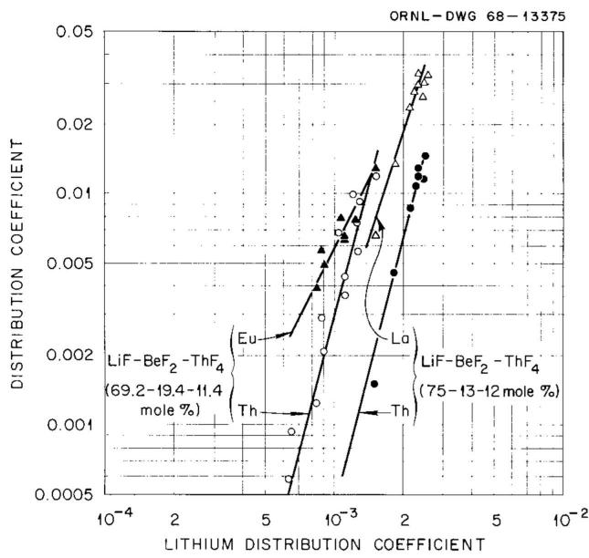  
Fig. 23.2. Distribution of Thorium and Rare Earths Between LiF-BeF $_2$ -ThF $_4$ Salts and Bismuth Solution at $600^{\circ}$ C.

of the Chemistry Division suggested5 that these changes in activity might be related to differences in what he called the “free fluoride” equivalence of the salts. Free fluoride equivalence (FF) is defined as

$$
\begin{array}{l} \mathbf{FF} = \operatorname {LiF}(\text{mole}\%) \\ - 2 \mathrm {B e F} _ {2} (\text {m o l e} \\ \end{array}
$$

This concept appears to have some validity in that the values for $\alpha^{*}$ for several rare earths increase with increasing free fluoride equivalence of the salt, both at 600 and $700^{\circ}\mathrm{C}$ (Table 23.3 and Fig. 23.3). The data in Table 23.3 also suggest that temperature has very little effect on the values of $\alpha^{*}$ . More experiments of this type are in progress to better define the relationship between the separation factor and the free fluoride equivalence of the salt.

5M. A. Bredig, personal communication, April 26, 1968.

Table 23.3. Distribution of Thorium, Rare Earths, and Lithium Between $\mathsf{Fe - BeF}_2\cdot \mathsf{ThF}_4$ Salts and Thorium-Saturated Bismuth Solutions at 600 to 700   

<table><tr><td rowspan="2" colspan="3">Salt Composition (mole %)</td><td rowspan="3">Rare Earth</td><td rowspan="3">Free Fluoride Equivalence</td><td rowspan="3">Temperature (°C)</td><td colspan="3">Dmax</td><td rowspan="3">α*</td></tr><tr><td rowspan="2">Li</td><td rowspan="2">Th</td><td rowspan="2">Rare Earth</td></tr><tr><td>LiF</td><td>BeF2</td><td>ThF4</td></tr><tr><td>73.0</td><td>2.0</td><td>25.0</td><td>Eu2+</td><td>-6</td><td>600</td><td>0.00169</td><td>0.0065</td><td>0.01</td><td>1.5</td></tr><tr><td></td><td></td><td></td><td>Eu2+</td><td></td><td>650</td><td>0.0028</td><td>0.0115</td><td>0.0163</td><td>1.4</td></tr><tr><td>69.2</td><td>19.4</td><td>11.4</td><td>Eu2+</td><td>-4</td><td>600</td><td>0.00149</td><td>0.0145</td><td>0.0130</td><td>0.9</td></tr><tr><td></td><td></td><td></td><td>La3+</td><td></td><td>600</td><td></td><td></td><td>0.0205</td><td>1.4</td></tr><tr><td></td><td></td><td></td><td>Nd3+</td><td></td><td>600</td><td></td><td></td><td>0.066</td><td>4.5</td></tr><tr><td></td><td></td><td></td><td>La3+</td><td></td><td>700</td><td>0.0046</td><td>0.040</td><td>0.060</td><td>1.5</td></tr><tr><td>68.0</td><td>25.0</td><td>7.0</td><td>Eu2+</td><td>-3</td><td>600</td><td>0.00162</td><td>0.025</td><td>0.015</td><td>0.6</td></tr><tr><td>75.0</td><td>13.0</td><td>12.0</td><td>Eu2+</td><td>13</td><td>600</td><td>0.00242</td><td>0.0147</td><td>0.026</td><td>1.7</td></tr><tr><td></td><td></td><td></td><td>La3+</td><td></td><td>600</td><td></td><td></td><td>0.035</td><td>2.4</td></tr><tr><td></td><td></td><td></td><td>Eu2+</td><td></td><td>700</td><td>0.00747</td><td>0.040</td><td>0.068</td><td>1.7</td></tr><tr><td></td><td></td><td></td><td>La3+</td><td></td><td>700</td><td></td><td></td><td>0.10</td><td>2.5</td></tr><tr><td>73.4</td><td>21.4</td><td>5.2</td><td>Eu2+</td><td>15</td><td>600</td><td>0.0033</td><td>0.0349</td><td>0.0697</td><td>2.0</td></tr></table>

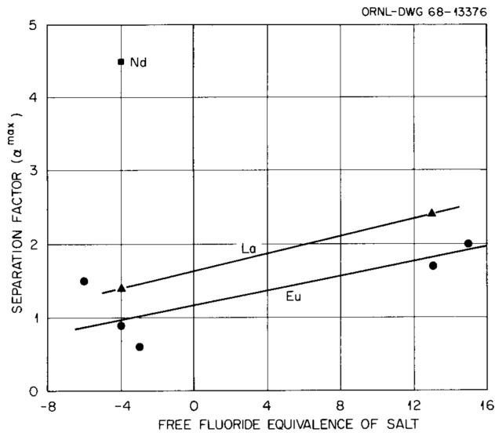

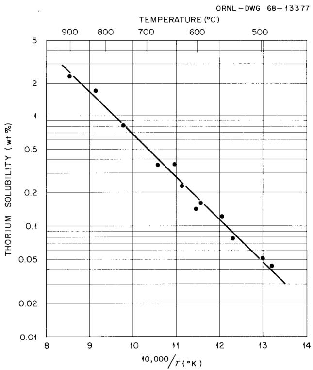  
Fig. 23.3. Effect of Free Fluoride Equivalence of LiF-BeF $_2$ -ThF $_4$ Salts on Rare-Earth-Thorium Separation Factors ( $\alpha^{\max}$ ) at $600^{\circ}$ C.   
Fig. 23.4. Solubility of Thorium in Bismuth at Various Temperatures.

# 23.3 SOLUBILITY OF THORIUM IN BISMUTH

C.E.Schilling L.M.Ferris

The results of one prior study6 indicated that the solubility of thorium in liquid bismuth at $600^{\circ}\mathrm{C}$ was about 3000 wt ppm. Since the thorium concentrations obtained at $D_{\mathrm{Th}}^{\mathrm{max}}$ in reductive extraction experiments (see Sect. 23.2) were only about 2000 wt ppm, direct measurements of the solubility were made to determine whether the literature value was high or whether some other component, for example, lithium, present in the reductive extraction systems was depressing the thorium solubility. Measurements were made in the temperature range 482 to $817^{\circ}\mathrm{C}$ . The system was contained in a mild-steel crucible under an argon atmosphere. Sufficient crystal-bar thorium was used to ensure saturation at temperatures as high as $950^{\circ}\mathrm{C}$ . Samples of the saturated liquid were removed for analysis using a variety of stainless steel vacuum-type filters.

A plot of $\log S$ vs $1 / T$ , presenting average solubility values at several temperatures, is shown in Fig. 23.4. The line through the points is

$$
\log S (\mathrm {w t p p m}) = - 3 8 5 0 / T + 7. 6 7 7.
$$

These data are in good agreement with those reported by Greenwood, but are lower than the values given by Hayes and Gordon. These solubility data are also in excellent agreement with the values indicated by reductive extraction experiments at 600 to $700^{\circ}\mathrm{C}$ , suggesting that the presence of lithium, uranium, rare earths, and other elements in low concentration have no marked effect on the thorium solubility.

# 24. Simulated Molten-Salt-Liquid-Bismuth Contactor Studies

J. S. Watson

L. E. McNeese

The proposed method for removing protactinium and fission products from a single-fluid molten-salt breeder reactor (or from the blanket salt of two-fluid reactors) involves reductive extraction using liquid bismuth containing lithium and thorium reductants. Equipment is needed to efficiently contact streams of salt and bismuth. The properties of these fluids are very different from those of aqueous and organic fluids with which most experience with liquid-liquid extraction equipment has been obtained. For instance, the difference between the densities of the salt and metal phases will be between 5.5 and $7.5\mathrm{g / ml}$ , while aqueous-organic systems have differences between 0.05 and $0.2\mathrm{g / ml}$ . Similarly, the interfacial tension between bismuth and molten salt could be as much as a factor of 10 greater than that usually seen in aqueous-organic systems.

Since the correlations used to design liquid-liquid extraction systems are based upon conditions far removed from those of current interest, experimental data from systems similar to the molten-salt-bismuth system are needed. Because experiments with bismuth and molten salt are difficult, a mercury-water system will be used initially to provide the hydrodynamic data necessary to allow intelligent selection of contactor types to test with the process fluids. This simulated system will provide quantitative data on flooding rates, pressure drop, holdup, and back-mixing, as well as qualitative information on flow patterns and drop size. Mass transfer measurements are also possible in a simulated system; however, they are not in progress.

One similar study has been reported. Johnson and co-workers1 at Argonne studied a column

packed with $\frac{3}{16}$ -in. Berl saddles, using water and Wood's metal. Their observed flooding rates were not adequately predicted by conventional correlations. Actually, when the correlations were extrapolated to the required conditions, the predicted results were so different that it was considered a coincidence when a predicted flooding rate fell near the experimental value.

The experiments in this study are carried out in a 1-in.-ID, 2-ft-long glass column. Mercury is circulated between the column and a hold tank by a diaphragm pump containing tantalum check values. Distilled water is circulated through the column by a small centrifugal pump. Ball valves are located at each end of the 1-in. column and allow flow to and from the column to be stopped instantly for holdup measurements. Each end of the column also contains a section of 2-in. pipe. These sections, which are partially packed with the packing material of interest, allow lower velocities for coalescence, as well as provide space for the inlet and outlet lines.

Thus far we have tested Teflon Raschig rings $\left( \begin{array}{l}3\\ 16 \end{array} \right.$ and $\frac{1}{4}$ in. OD) and a solid cylindrical packing $\frac{1}{4}$ in. in diameter and $\frac{1}{4}$ in. long. (The column diameter should be about twice as large to avoid wall effects with $\frac{1}{4}$ -in. packing, but we are, at present, restricted to the smaller diameter because of the limited capacity of the mercury pump.) Teflon and polyethylene will be chosen for most packing materials because they are not wet by either phase, and neither bismuth nor the molten fluoride salt is expected to wet the material chosen for the process contactor.

There are apparently two different flow conditions under which the column can operate. These are illustrated in Figs. 24.1 and 24.2. Figure 24.1 shows a photograph of the column packed with $\frac{3}{16}$ -in. Raschig rings through which the metal

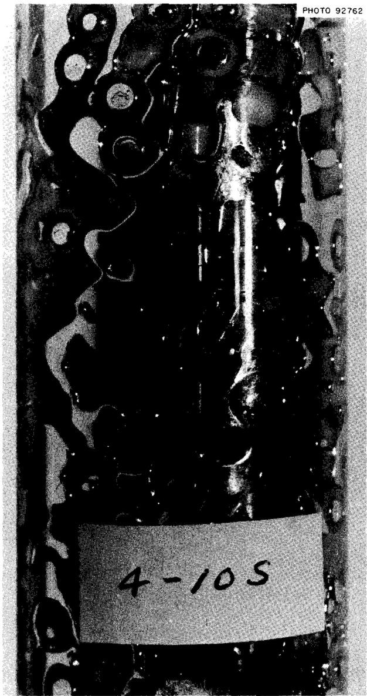  
Fig. 24.1. Mercury-Water Column Operated with $\frac{3}{16}$ -in. Polyethylene Raschig Rings.

travels downward in channels. This type of behavior is typical for all flow rates tested with this packing. Figure 24.2 is a photograph of the column with $\frac{1}{4}$ -in. Raschig rings. This small increase in packing diameter causes a dramatic change in the behavior of the dispersed metal phase. The metal moves down the column in the form of small droplets which seldom coalesce and remain intact for considerable distances down the column. This

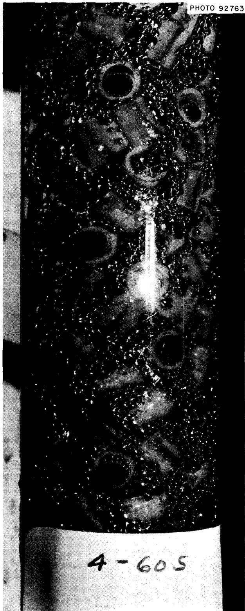  
Fig. 24.2. Mercury-Water Column Operated with $\frac{1}{4}$ -in. Polyethylene Roschig Rings.

flow behavior is typical of all measurements made with the $\frac{1}{4}$ -in. Raschig rings or the $\frac{1}{4}$ -in. solid cylinder packing. However, as the flow rates approach flooding conditions, some "channel" flow begins to occur. The dispersed or droplet flow is more desirable, since it provides a significantly greater interfacial area than "channel" flow.

Thus it may be desirable to operate the salt-metal columns with approximately $\frac{1}{4}$ -in. or larger packing.

With $\frac{3}{16}$ -in. Raschig rings and $\frac{1}{4}$ -in. solid cylinders, flooding occurred at approximately the same conditions. At equal (volumetric) flow rates,

flooding occurred when the superficial velocity of each phase reached approximately 90 ft/hr or 650 gal ft $^{-2}$ hr $^{-1}$ . We investigated flooding rates for a range of flow ratios. The flooding curves could

be approximated by means of straight lines with near-unity negative slopes when the square roots of the two phase velocities were plotted against each other.

The $\frac{1}{4}$ -in. Raschig rings gave considerably higher flooding rates. At equal flow rates, flooding did not occur until the superficial velocity of each phase reached approximately 190 ft/hr.

Efforts are also being made to correlate holdup, pressure drop, and flooding rates with all of the systems studied. The simulated system should provide methods for interpreting and understanding the pressure drop measurements which will be made with salt-metal contactors; in addition, it should provide initial estimates of how such contactors will behave.

# 25. Reductive Extraction Engineering Studies

L. E. McNeese

B. A. Hannaford

H. D. Cochran, Jr.

W. F. Shaffer

E. L. Youngblood

Equipment has been designed and fabricated for semicontinuous engineering experiments on reductive extraction. Mass transfer between molten salt and bismuth streams will be observed under various flow conditions. Pressure drop through the column can also be measured, and it may be possible to correlate mass transfer performance with hydrodynamic conditions - flooding, holdup, specific interfacial area, etc. - which may be inferred from work under way using a mercury-water system. The first experiments are planned for the last quarter of 1968 and will involve transfer of uranium from a salt to a metal stream.

Molten salt and liquid bismuth will be contacted countercurrently in a packed column 0.82 in. $\mathbf{ID} \times$ 2 ft long filled with $1/4$ -in. right circular cylinders of molybdenum. Three other columns having similar dimensions - one containing $1/8$ -in. cylindrical packing, one with segmental baffles at $1/2$ -in. spacing, and one empty column - are also available for testing. Approximately 15-liter batches of molten salt and bismuth will be charged initially to a graphite crucible in the treatment vessel, where oxidation will be effected by sparging with $\mathrm{HF}-\mathrm{H}_{2}$ . The two fluids will then be transferred by

argon pressurization to separate feed tanks, and reductant (metallic lithium) will be added to the bismuth feed tank. From the feed tanks, salt and metal will be transferred by argon pressure at controlled rates (up to about 0.5 liter/min) through the extraction column to separate catch tanks. All tanks are equipped with sampling stations, and both product streams can be sampled during operation. To begin the next experiment, salt and metal will be transferred back to the treatment vessel for oxidation. An electrolytic cell for oxidation and reduction of species present in the salt-metal system may also be tested; it will be connected in parallel with the extraction column. The cell will not be used during reductive extraction experiments.

This study will also provide an opportunity to test equipment design and to reveal the problems inherent in processing salt continuously on a large scale. Some of these problems involve entrainment, performance of freeze valves with a possible second phase entrained in the major phase, and compatibility of materials with the salt-bismuth mixture.

# 26. Continuous Fluorination of Molten Salt

B. A. Hannaford

L. E. McNeese

Equipment is being developed for the continuous removal of $\mathbf{U}\mathbf{F}_{4}$ from a salt stream by countercurrently contacting the salt with $\mathbf{F}_{2}$ in a salt-phase-continuous system. The equipment will be protected from corrosion by freezing a layer of salt on the vessel wall; the heat necessary for maintaining molten salt adjacent to frozen salt will be provided by the decay of fission products in the salt stream. In a series of recently concluded experiments using countercurrent flow of salt and an inert gas, we demonstrated that a frozen salt layer can be formed and maintained at conditions of fluid flow and heat transfer which approximate those expected for processing fuel from a 1000-Mw (electrical) MSBR.

The experimental equipment, described previously, $^{1}$ consisted of a 5-in.-diam 8-ft-high column fabricated from sched-40 nickel pipe. An internal heat source consisting of three Calrod heaters contained in a $3/4$ -in.-diam sched-40 pipe was used to simulate a volume heat source in the molten salt. The salt mixture was 66-34 mole % LiF-ZrF $_4$ , which has a liquidus temperature of $595^{\circ}\mathrm{C}$ and a phase diagram similar to the LiF-BeF $_2$ system. Since the principal objective of the work was to demonstrate that a uniform layer of frozen salt could be established and maintained at expected heat generation rates, we chose to substitute argon for fluorine, thereby simplifying the experimental procedures.

For the final set of experiments, the insulation was stripped from the upper test section, and the air cooling coils were removed to permit heat loss by radiation and natural convection. The primary purpose was to obtain more nearly uniform surface

temperature and frozen salt thickness throughout the test section.

As a means of confirming the frozen salt thickness indicated by the internal thermocouples, the molten salt phase in a few selected experiments was quickly drained from the column after a period of steady-state operation. Radiographs of the column were then made; one of these (Fig. 26.1) shows that over the 3.5-in. elevation change covered by the array of internal thermocouples, the salt thickness decreased from 0.80 to 0.65 in. The 0.80-in. thickness of the salt layer in the plane of the nominal $\frac{1}{2}$ -in.-deep thermocouple, as determined from the radiograph, was in good agreement with the salt thickness determined from temperature measurements. This method is illustrated in Fig. 26.2 for the same experiment and is based on the temperature-position relationship for the classical case of purely radial flow of heat to the outer surface of a thick-walled cylinder. Here the cylinder was the frozen salt layer itself; the metal wall constituted a negligible resistance to heat flow because of its much higher coefficient of thermal conductivity. The most consistent interpretation of the experimental data was obtained by using only two thermocouples - the internal thermocouple located 0.66 in. from the metal wall, and the adjacent wall thermocouple - to locate the interface. The intended use of the entire array of internal thermocouples was not feasible for a number of reasons. (1) The embedded thermocouple nearest the interface (usually thermocouple C, nominally $\frac{3}{4}$ in. deep) caused a local perturbation of the interface. This was observed in radiographs and in the postoperation examination. (2) The tip of the thermocouple nearest the wall appeared to have changed position during the course of the experiments. (3) Surface temperatures

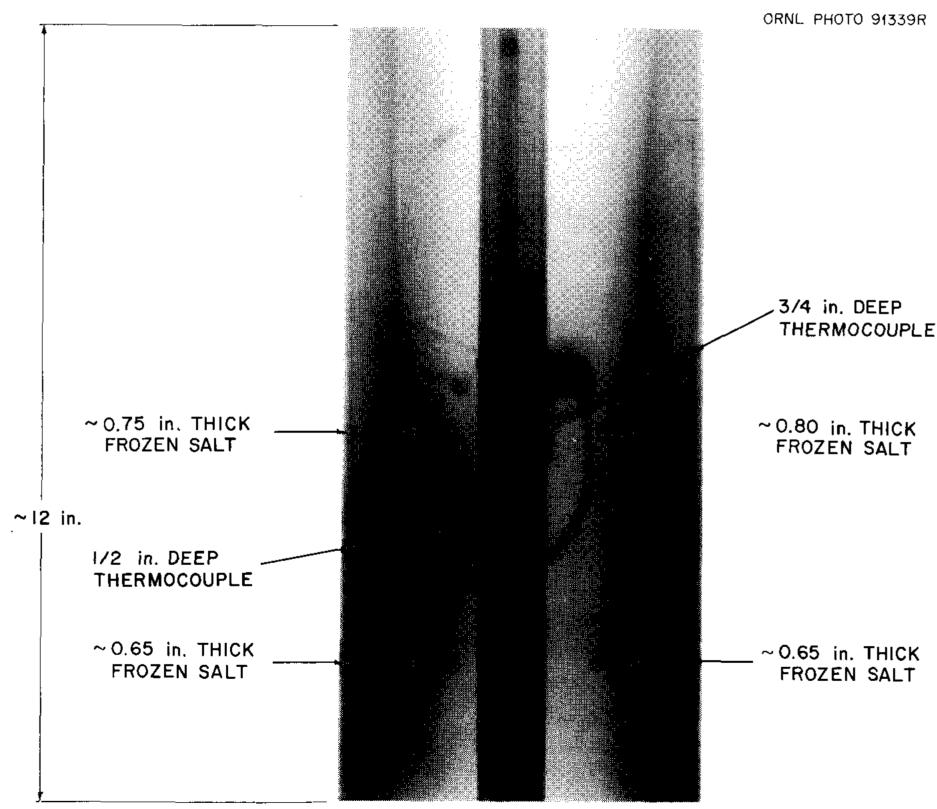  
Fig. 26.1. X-Ray Positive of 5-in.-diam Column After Removal of the Molten Salt and Subsequent Cooling.

varied axially over the length of the thermocouple array.

Following the final experiment the upper test section was sawed into sections to permit visual examination of the frozen salt layer and direct measurement of internal thermocouple locations (Fig. 26.3). The salt thickness was very uniform over the central portion of this test section. Two separate frozen salt layers were observed; these are more clearly discernible in Fig. 26.4. The inner, dark layer was apparently deposited during the approximately 1-hr period required to drain molten salt from the column after the Calrod heaters were turned off. The low drain rate was caused by a porous metal deposit in the drain line which limited the salt flow rate during the latter runs to $\geq 3$ liters/hr. The outer bank was the layer of frozen salt that existed at steady state.

The thickness was essentially uniform around the entire circumference.

The concentricity of the frozen layer throughout approximately a 30-in. length of the upper test section indicated that the off-axis feed point for the argon caused no undesirable effects on the uniformity of the frozen layer thickness.

The inferred thickness of frozen salt for the series of 24 experiments ranged from about 0.10 to 1.10 in. The equivalent volume heat generation rate ranged from 34,000 to 190,000 Btu $\mathrm{hr}^{-1}$ ft $^{-3}$ . For most experiments the rate was intentionally set higher than the reference value of 50,000 Btu $\mathrm{hr}^{-1}$ ft $^{-3}$ because of a tendency for the salt to freeze completely across the column at low heat generation rates. This maloperation may be largely explained by the nonuniform nature of the cooling method used (air cooling coils).

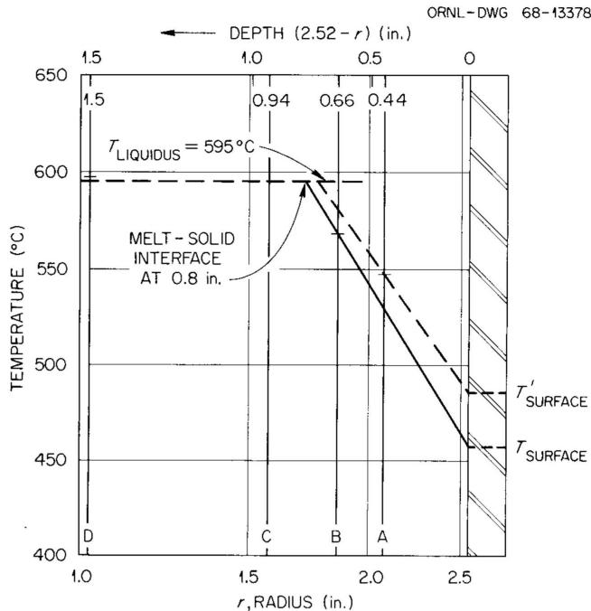  
Fig. 26.2. Salt Temperature vs Radius in 5.04-in.-ID Column. Thickness of frozen salt $= 0.80$ in. by the preferred method of extrapolating from a surface temperature through temperature of adjacent thermocouple to liquidus temperature (experiment 23). Positions of internal thermocouples are direct measurements from post-operation examination.

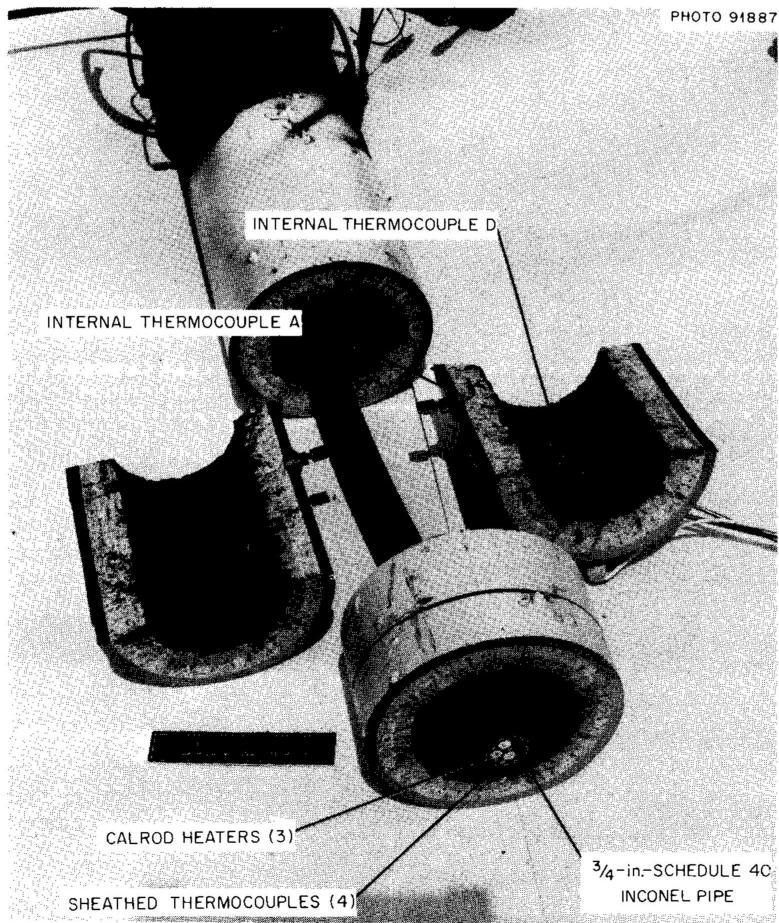  
Fig. 26.3. View of the Central Portion of the Test Section. Upper end of the test section is in the foreground.

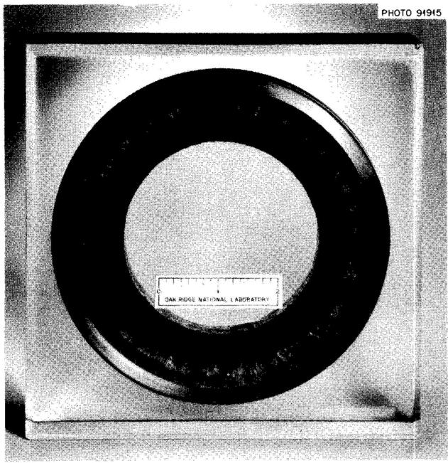  
Fig. 26.4. Cross Section of Column Showing the Frozen Salt Layers.

# 27. Distillation of MSRE Fuel Carrier Salt

J. R. Hightower

L. E. McNeese

The nonradioactive phase of the MSRE distillation experiment was completed on June 18, 1968, and installation of equipment has been started at the MSRE for distillation of a 48-liter batch of fluorinated fuel salt from the reactor. This nonradioactive phase of the experiment involved distilling six 48-liter batches of MSRE fuel carriers salt (four of which contained 0.1 to 0.3 mole % $\mathrm{NdF}_3$ ). During these runs, vaporization rates were measured, and samples of the condensate were taken to assess the effect of concentration polarization and entrainment on operation of the equipment.

Essentially the same procedure was used in each run. Molten salt was charged to the feed tank at $600^{\circ}\mathrm{C}$ from a heated storage vessel. After the storage vessel was disconnected, the still pot was heated to 900 to $950^{\circ}\mathrm{C}$ , and the system pressure was reduced to $5\mathrm{mmHg}$ . The feed tank was pressurized to about 0.5 atm to force salt into the still pot, and the condenser pressure was decreased to 0.05 to $0.1\mathrm{mmHg}$ to initiate vaporization at an appreciable rate. At this time the liquid level in the still pot was switched to automatic control, and salt was fed to the still pot in this mode at a rate slightly greater than the vaporization rate. The argon feed valve to the feed tank remained open (forcing more salt into the still pot) until the liquid level in the still pot rose to a given point; the valve then remained closed until the salt dropped to another set point. After about one still volume had been processed, the temperature of the still was raised to the desired operating point (approximately $1000^{\circ}\mathrm{C}$ ). When the desired quantity of salt had been distilled, distillation was stopped by increasing the condenser pressure to $5\mathrm{mmHg}$ . Then 8 to 10 liters of the initial salt mixture was used to flush the high-melting salt from the still pot and to produce a

salt mixture in the still having a liquidus temperature of less than $700^{\circ}\mathrm{C}$ .

During each run, distillation rates were determined by measuring the rate of rise of the condensate level in the receiver. The steady-state rate measurements for each run and the operating conditions under which they were determined are shown in Table 27.1.

Under the operating conditions in the still the distillation rate is controlled by the condition that the frictional pressure loss through the passage connecting the vaporization and condensation surfaces equals the difference between the vapor pressure of the salt in the still pot and the pressure at the lower end of the condenser. With condenser pressures much lower than the salt vapor pressure $(\sim 1.0 \mathrm{~mm} \mathrm{Hg}$ at $1000^{\circ} \mathrm{C})$ , the distillation rate

Table 27.1. Distillation Rates   

<table><tr><td>Run No.</td><td>Still1 Temperature (°C)</td><td>Condenser Pressure (mm Hg)</td><td>Distillation Rate (ft3 ft-2 day-1)</td></tr><tr><td>MSS-C-1</td><td>990</td><td>0.5</td><td>1.15</td></tr><tr><td>MSS-C-1</td><td>990</td><td>0.3</td><td>1.20</td></tr><tr><td>MSS-C-1</td><td>990</td><td>0.055</td><td>1.25</td></tr><tr><td>MSS-C-2</td><td>1005</td><td>0.07</td><td>1.50</td></tr><tr><td>MSS-C-3</td><td>1004</td><td>0.075</td><td>1.56</td></tr><tr><td>MSS-C-4</td><td>1020</td><td>0.065a</td><td>1.63</td></tr><tr><td>MSS-C-5</td><td>950</td><td>0.08</td><td>0.66</td></tr><tr><td>MSS-C-5</td><td>1000</td><td>0.08</td><td>1.21</td></tr><tr><td>MSS-C-5</td><td>1025</td><td>0.08</td><td>1.95</td></tr><tr><td>MSS-C-6</td><td>1000</td><td>0.08</td><td>1.40</td></tr></table>

${}^{a}$ Condenser pressure may have been higher; a ${\mathrm{{ZrF}}}_{4}$ plug occurred in the vacuum line in this run.

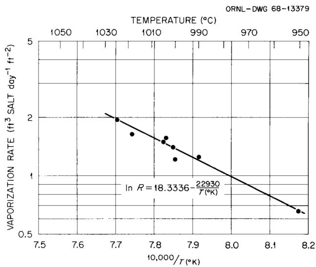  
Fig. 27.1. Variation of Vaporization Rate with Still Temperature While Holding Condenser Pressure Low (0.05-0.09 mm Hg).

should vary directly as the salt vapor pressure and hence be quite dependent on still pot temperature. For the runs in which the condenser pressure is below $0.1 \, \text{mmHg}$ , the effect of still temperature is shown in Fig. 27.1. The observed distillation rates (approximately $1.5 \, \text{ft}^3$ of salt per day per square foot of vaporization surface) would be acceptable in a processing plant.

Concentration polarization in the still pot or entrainment of liquid droplets from the still pot could seriously limit the separation of the slightly volatile $\mathrm{LnF}_3$ from the more volatile LiF and $\mathrm{BeF}_2$ . The extent of polarization or entrainment was determined by analyzing condensate samples taken during the course of a run for $\mathrm{NdF}_3$ . The ratio of $\mathrm{NdF}_3$ concentration in the condensate to the average $\mathrm{NdF}_3$ concentration in the still, denoted by $R$ , should be constant and should approximate the relative volatility of $\mathrm{NdF}_3$ with respect to LiF.

In the first run in which $\mathbf{NdF}_3$ was included in the feed salt, $R$ varied (randomly) between $1.4 \times 10^{-4}$ and $3.5 \times 10^{-4}$ for about 2.5 still pot volumes of collected condensate. This value is comparable with the measured relative volatility of $\mathbf{NdF}_3$ , which is $1.4 \times 10^{-4}$ . In later runs (MSS-C-5 and MSS-C-6) the values of $R$ were as high as $5.5 \times 10^{-2}$ ; however, it is believed that the high values

were the result of samples contaminated by flush salt from previous runs remaining on the condenser walls and in the sample reservoir. Neither concentration polarization nor entrainment was evident in the run from which data are considered most reliable.

Two difficulties were encountered: (1) condensed $\mathbf{ZrF}_4$ and unidentified molybdenum compounds in the vacuum line completely restricted flow on two occasions, and (2) a deposition of nickel and iron in the salt feed line to the still almost stopped the flow after the first two runs and caused a noticeable restriction in the replacement feed line after the fourth run.

The major metallic constituents of the plugs in the vacuum line were zirconium and molybdenum. The first plug was removed by cutting into the vacuum line; the second plug was broken during the last run by heating the vacuum line to about 950 to $1050^{\circ}\mathrm{C}$ , thereby redistributing the material. Examination of the vacuum line during the post-operational inspection showed that the free cross section of the pipe at the point of exit from the receiver was still about $50\%$ of the original cross section. Analysis of the material obstructing the vacuum line showed it to contain $39.4\%$ zirconium and $11.6\%$ molybdenum, with $\mathbf{F}^{-}$ and $\mathbf{O}^{2-}$ as the major anions.

The cause for the metal deposition in the salt feed line is not completely understood. Two possible sources of the deposited material are suspended metals and/or dissolved fluorides introduced with the feed salt, and corrosion products. The possibility that system corrosion may have been a factor is suggested by the composition of the deposits, $\sim 0.9$ wt $\%$ Co and 0.7 to 2 wt $\%$ Mo (both of these metals are constituents of Hastelloy N), and of the plug in the vacuum line (high molybdenum content). The extent of corrosion necessary to produce the materials found would be very small and could not have been detected by the wall thickness measurements. Another possible source of corrosion products is the corrosion coupons in the still pot, although no coupon was severely corroded. A hypothesis for reduction and

deposition of dissolved fluorides is based on the observation that higher-valence fluorides are, in general, more volatile than lower-valence fluorides of the same element. This condition causes the still pot salt to be reducing in nature with respect to the feed salt and could cause reduction and deposition at the entrance to the still pot.

Postoperational inspection showed the still to be in good condition. Wall thickness measurements over the still pot and over both ends of the condenser showed an average decrease in thickness of only 1.6 mils. Distances between widely selected points changed by an average of only 0.026 in.

# 28. Relative Volatility Measurements by the Transpiration Method

F.J.Smith C.T.Thompson

L. M. Ferris

Liquid-vapor equilibrium data for a number of $\mathrm{LiF - BeF}_2\text{-ThF}_4$ systems have been obtained by the transpiration method in support of possible distillation steps in the processing of single-fluid Molten-Salt Breeder Reactor fuels. The data are summarized in Table 28.1. In the absence of any information regarding complex molecules in the vapor phase, the partial pressures and the predicted total pressures were calculated by assuming that only monomers existed in the vapor. Association in the vapor (known to occur in the vapor above pure LiF and $\mathrm{LiF - BeF}_2$ systems) would lower both the calculated partial pressures and the predicted total pressures. In all cases the apparent partial pressure $P$ could be described adequately by a linear equation,

$$
\log P (\mathrm {m m} \mathrm {H g}) = A - B / T (^ {\circ} \mathrm {K}),
$$

in which $A$ and $B$ are constants over the temperature range (950 to $1050^{\circ}\mathrm{C}$ ) investigated. Relative volatilities, as well as effective activity coefficients, are also included. For a multicomponent system the activity coefficients of component $A$ at each temperature are given by

$$
\gamma_ {\textit {A}} = P _ {\textit {A}} / N _ {\textit {A}} p _ {\textit {A}} ^ {0} ,
$$

where $N_{A}$ is the mole fraction of $A$ in the melt, and $p_{A}^{0}$ is the vapor pressure of pure $A$ . Relative volatility is defined by

$$
\alpha_ {A B} = \frac {Y _ {A} / Y _ {B}}{X _ {A} / X _ {B}},
$$

where $\alpha_{AB}$ is the relative volatility of $A$ with respect to $B$ , $Y$ is the mole fraction of the designated component in the vapor phase, and $X$ is the mole fraction in the liquid phase.

In addition to the systems shown in Table 28.1, a limited amount of data was obtained with LiF-BeF $_2$ -ThF $_4$ -solute fluoride systems. Data for the system LiF-BeF $_2$ -ThF $_4$ -LaF $_3$ (36.6-1.0-59.6-2.8 mole %) indicate the following relative volatilities with respect to LiF at $1000^{\circ}\mathrm{C}$ : BeF $_2$ , 37; ThF $_4$ , 0.25; LaF $_3$ , <0.0015. Data for the system LiF-BeF $_2$ -ThF $_4$ -CsF-RbF (33-0.66-63-1.36-1.98 mole %) yielded relative volatilities of about 100, 0.65, 3.7, and 1.0 for BeF $_2$ , ThF $_4$ , CsF, and RbF, respectively, at $1000^{\circ}\mathrm{C}$ . The total pressure predicted for this system is less than 0.05 mm Hg at $1000^{\circ}\mathrm{C}$ . In an experiment in which CsF and RbF were present in LiF-BeF $_2$ -ThF $_4$ (68-20-12 mole %) at concentrations of 0.13 and 0.08 mole %, respectively, relative volatilities of 107 for CsF and 119 for RbF were obtained at $1000^{\circ}\mathrm{C}$ . Data from a run with LiF-BeF $_2$ -ThF $_4$ -EuF $_3$ (42.4-0.06-51.8-5.8 mole %) yielded a relative volatility of <0.009 for EuF $_3$ at $1000^{\circ}\mathrm{C}$ .

The results of these studies show that, since the volatilities of both the rare earths and $\mathbf{ThF}_4$ are low, distillation is probably not applicable as a primary separations method in the processing of single-fluid MSBR fuels. Distillation might, however, find application as a concentration-adjustment step in connection with a reductive extraction process.

Table 28.1. Apparent Partial Pressures, Relative Volatilities, and Effective Activity Coefficients in LiF-BeF $_2$ -ThF $_4$ Systems   

<table><tr><td colspan="3">Salt Composition (mole %)</td><td colspan="3">Vapor Composition at 1000°C (mole %)</td><td rowspan="2">Species</td><td colspan="2">Apparent Partial Pressure, a log P = A - B/T</td><td rowspan="2">Effective Activity Coefficient at 1000°C</td><td rowspan="2">Relative Volatility at 1000°C</td><td rowspan="2">Predicted Total Pressure at 1000°C (mm Hg)</td></tr><tr><td>LiF</td><td>BeF2</td><td>ThF4</td><td>LiF</td><td>BeF2</td><td>ThF4</td><td>A</td><td>B</td></tr><tr><td>68.0</td><td>20.0</td><td>12</td><td>29</td><td>71.0</td><td>0.07</td><td>LiF</td><td>7.806</td><td>10,070</td><td>2.44</td><td></td><td>2.7</td></tr><tr><td></td><td></td><td></td><td></td><td></td><td></td><td>BeF2</td><td>9.194</td><td>11,349</td><td>0.146</td><td>8.27</td><td></td></tr><tr><td></td><td></td><td></td><td></td><td></td><td></td><td>ThF4</td><td>b</td><td>b</td><td>~0.25</td><td>~0.014</td><td></td></tr><tr><td>70.5</td><td>7.5</td><td>22</td><td>36.7</td><td>63.1</td><td>0.2</td><td>LiF</td><td>8.510</td><td>11,352</td><td>1.19</td><td></td><td>1.1</td></tr><tr><td></td><td></td><td></td><td></td><td></td><td></td><td>BeF2</td><td>7.801</td><td>10,112</td><td>0.14</td><td>16.2</td><td></td></tr><tr><td></td><td></td><td></td><td></td><td></td><td></td><td>ThF4</td><td>4.360</td><td>8,935</td><td>0.15</td><td>0.018</td><td></td></tr><tr><td>75.4</td><td>3.6</td><td>21</td><td>43.2</td><td>55.6</td><td>1.1</td><td>LiF</td><td>8.548</td><td>10,112</td><td>0.98</td><td></td><td>0.81</td></tr><tr><td></td><td></td><td></td><td></td><td></td><td></td><td>BeF2</td><td>7.480</td><td>9,984</td><td>0.19</td><td>27.1</td><td></td></tr><tr><td></td><td></td><td></td><td></td><td></td><td></td><td>ThF4</td><td>2.879</td><td>6,233</td><td>0.61</td><td>0.088</td><td></td></tr><tr><td>53.5</td><td>1.5</td><td>45</td><td>16.5</td><td>81.5</td><td>2.1</td><td>LiF</td><td>8.446</td><td>12,285</td><td>0.25</td><td></td><td>0.38</td></tr><tr><td></td><td></td><td></td><td></td><td></td><td></td><td>BeF2</td><td>c</td><td>c</td><td>~0.32</td><td>~177.0</td><td></td></tr><tr><td></td><td></td><td></td><td></td><td></td><td></td><td>ThF4</td><td>10.575</td><td>16,146</td><td>0.27</td><td>0.15</td><td></td></tr><tr><td>45.0</td><td>0.06</td><td>55</td><td>75.1</td><td>12.0</td><td>12.7</td><td>LiF</td><td>8.611</td><td>11,826</td><td>0.23</td><td></td><td>0.06</td></tr><tr><td></td><td></td><td></td><td></td><td></td><td></td><td>BeF2</td><td>c</td><td>c</td><td>~0.20</td><td>~120.0</td><td></td></tr><tr><td></td><td></td><td></td><td></td><td></td><td></td><td>ThF4</td><td>10.314</td><td>16,459</td><td>0.23</td><td>0.14</td><td></td></tr><tr><td>34.0</td><td>1.0</td><td>65</td><td>9.9</td><td>85.2</td><td>4.8</td><td>LiF</td><td>10.314</td><td>12,129</td><td>0.13</td><td></td><td>0.21</td></tr><tr><td></td><td></td><td></td><td></td><td></td><td></td><td>BeF2</td><td>c</td><td>c</td><td>~0.28</td><td>~293.0</td><td></td></tr><tr><td></td><td></td><td></td><td></td><td></td><td></td><td>ThF4</td><td>11.539</td><td>17,232</td><td>0.24</td><td>0.26</td><td></td></tr></table>

${}^{a}$ Temperature range: 950 to ${1000}^{ \circ  }\mathrm{C}$ . It was assumed that no association occurred in the vapor. In the equation, $P$ is in mm Hg and $T$ is in ${}^{ \circ  }$ K.   
The scatter in data points was too great for determination of these values.   
cThe $\mathbf{BeF}_2$ concentration in the liquid phase decreased too rapidly to allow determination of these values.

# 29. Preparation of $^{7}\mathrm{LiF - }^{233}\mathrm{UF_4}$ Concentrate for the MSRE

J.W.Anderson S.Mann   
J.E.Bolt E.L.Nicholson   
G. Cathers W.F.Schaffer, Jr.   
J.M.Chandler J.H.Schaffer

J. P. Jarvis

The MSRE is to be fueled with $^{233}\mathrm{U}$ in 1968. Approximately $39.0\mathrm{kg}$ of $91.4\%$ enriched $^{233}\mathrm{U}$ as $^7\mathrm{LiF}-^{233}\mathrm{UF}_4$ (73-27 mole %) eutectic salt is required. This material was prepared in cell G of the Thorium Uranium Recycle Facility because of the high $^{232}\mathrm{U}$ content (222 ppm) of the feed material and its associated radiation.

The process and equipment for preparing this concentrate have been described previously. This report describes the cold run using $^{238}\mathrm{U}$ , changes in the process as a result of the cold run experience, and the production of the enriching concentrate.

# 29.1 COLD SHAKEDOWN RUN

The cold run was completed April 12, 1968, using the one-step high-temperature process and equipment shown schematically in Fig. 29.1. Several operational difficulties were encountered. The end point of the hydrofluorination step of the process was difficult to determine because our sampling procedure was contributing oxide contamination to the melt. We modified the procedures and some of our equipment so that we would take a dipped sample of the melt for oxide determination and later take filtered samples for analysis of the corrosion products, primarily iron, nickel, and chromium, after the hydrogen purification of the eutectic. This method of sampling was used for

the remainder of the cold run and throughout the $^{233}\mathbf{U}$ production operations.

The cold run product met the quality criteria established by the MSRE, but the prolonged operation at elevated temperatures and some of the sample data taken during the run indicated excessive corrosion of the reaction vessel. Upon completion of the run the vessel was sectioned, and extensive damage to the nickel liner was noted.

# 29.2. PRODUCTION OF THE $^{7}\mathrm{LiF - }^{233}\mathrm{UF}_{4}$ CONCENTRATE

Because of the difficulties encountered in the cold run, a low-temperature, two-step flowsheet was investigated in a laboratory experiment. Two hundred grams of normal uranium, as $\mathrm{UO}_3$ , was first reduced by hydrogen sparging and then converted to $\mathrm{UF}_4$ by hydrofluorination at temperatures 200 to $400^{\circ}\mathrm{C}$ lower than in the original flowsheet. This technique was then adopted for the production of the fuel concentrate.

The first $^{23}$ U production run with the revised process flowsheet (Fig. 29.2) began May 9, 1968. Uranium oxide was treated initially at $500^{\circ} \mathrm{C}$ with a helium sparge to remove any volatiles and to thoroughly decompose remaining ammonium compounds. The $\mathrm{UO}_3$ was then reduced to $\mathrm{UO}_2$ over a period of 24 hr by sparging with hydrogen at concentrations from 5 to $100\%$ over the temperature range 400 to $550^{\circ} \mathrm{C}$ . Five days were required to convert the $\mathrm{UO}_2$ to $\mathrm{UF}_4$ by hydrofluorination with a mixture of $40\%$ anhydrous hydrogen fluoride in hydrogen at temperatures ranging from 400 to

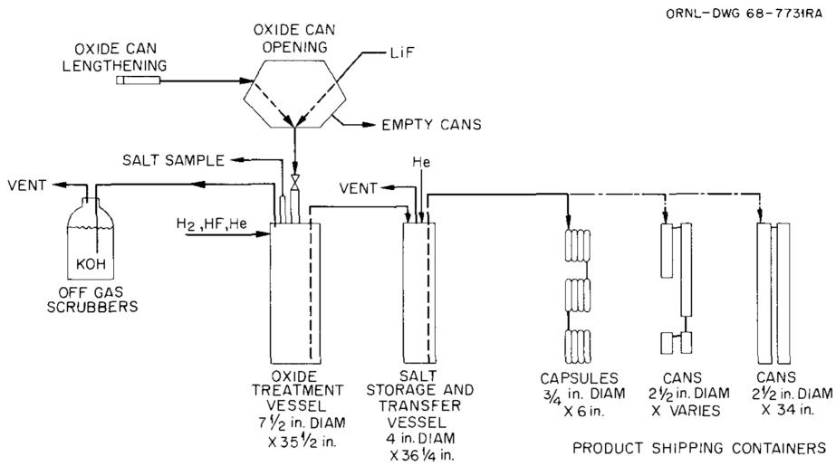  
Fig. 29.1. Equipment Flowsheet for MSRE $^{233}\mathsf{UF}_4$ -LiF Preparation.

# Fig. 29.2. Chemical Flowsheet for Preparing MSRE Fuel Concentrate

Overall Reaction

$$
\mathrm {U O} _ {3} + \mathrm {H} _ {2} + \mathrm {H F} \longrightarrow \mathrm {U F} _ {4} + 3 \mathrm {H} _ {2} \mathrm {O}
$$

$$
\mathrm {U F} _ {4} + \operatorname {L i F} \longrightarrow \mathrm {U F} _ {4} \cdot \operatorname {L i F}
$$

27% 73% Eutectic composition

Charge $\mathrm{UO}_3$

Heat treat $\mathrm{UO}_3$

Hydrogen reduction:

$$
\mathrm {U O} _ {3} \longrightarrow \mathrm {U O} _ {2}
$$

Hydrofluorination:

$\sim 13.2 \mathrm{~kg}$ uranium as $\mathrm{UO}_{3}$

3- to 5-hr digestion at $550^{\circ}\mathrm{C}$ ; cool to $400^{\circ}\mathrm{C}$

Start $5\%$ $\mathbf{H}_2$ at $400^{\circ}\mathbf{C}$ and increase to $50\%$ $\mathbf{H}_2$ ; temperature rises to $490^{\circ}\mathbf{C}$ ; treat at $500 - 550^{\circ}\mathbf{C}$ at $100\%$ $\mathbf{H}_2$ use; cool to $400^{\circ}\mathbf{C}$

Start $5\%$ HF in $\mathbf{H}_2$ at $400^{\circ}\mathrm{C}$ , increase to $40\%$ HF in $\mathbf{H}_2$ temperature increases to $450^{\circ}\mathrm{C}$ ; when HF use decreases below $80\%$ , increase the temperature to $630^{\circ}\mathrm{C}$ stepwise until HF use becomes 0; cool to $150^{\circ}\mathrm{C}$

Eutectic formation:

$$
\mathrm {U F} _ {4} + \operatorname {L i F} \longrightarrow \mathrm {U F} _ {4} \cdot \operatorname {L i F}
$$

Eutectic purification:

$$
\mathrm {M O} + \mathrm {H F} \longrightarrow \mathrm {M F} + \mathrm {H} _ {2} \mathrm {O}
$$

$$
\mathbf {M F} + \mathbf {H} _ {2} \longrightarrow \mathbf {M} ^ {0} + \mathbf {H F}
$$

Product purity:

Add exact $^7\mathrm{LiF}$ , melt under $30\%$ $\mathbf{H}_2$ ; digest at $850^{\circ}\mathrm{C}$ for 3 to 5 hr; cool to $700^{\circ}\mathrm{C}$

Purge melt 24 to $30\mathrm{hr}$ at $700^{\circ}\mathbf{C}$ with $20\%$ HF in $\mathbf{H}_2$ ; treat with $\mathbf{H}_2$ for 75 to $150\mathrm{hr}$

Unfiltered sample analyzed for oxide content

Filtered sample analyzed for metallic impurities

$625^{\circ} \mathrm{C}$ . The utilization of HF was essentially $100\%$ for the first four days of this treatment but then rapidly dropped to zero on the fifth day as the reaction went to completion.

The temperatures within the powder bed were monitored throughout the uranium reduction and hydrofluorination by a multithermocouple probe inserted along the vertical axis of the reaction vessel. Twelve thermocouples were located at 2-in. intervals along the probe. The progress of the exothermic reactions upward through the bed could very easily be followed by observing the temperature profile. The data for the uranium reduction and hydrofluorination are presented graphically in Figs. 29.3 and 29.4.

The eutectic salt $\mathrm{LiF - UF_4}$ (73-27 mole %) was formed by adding the stoichiometric amount of $^7\mathrm{LiF}$ to the $^{23}3\mathrm{UF}_4$ and then melting and digesting the resulting mixture for 4 hr at $850^{\circ}\mathrm{C}$ with a sparge of $30\%$ hydrogen in helium. The melt was then cooled to $700^{\circ}\mathrm{C}$ and purged for 24 hr with a mixture of $20\%$ HF in hydrogen to ensure conversion of any remaining oxides to fluorides. This was followed by hydrogen treatment for 75 to 100 hr to reduce the corrosion product fluorides of nickel

and iron to the metallic state so that they could be removed by filtration.

The reaction

$$
\mathrm {M F} + \mathrm {H} _ {2} \longrightarrow \mathrm {M} ^ {0} + \mathrm {H F}
$$

was monitored by measurement of the HF evolved with an in-cell titration apparatus. For a $22\mathrm{-kg}$ eutectic salt charge in the $7\frac{5}{16}$ -in.-diam reaction vessel, hydrogen and helium, each at the rate of 1 liter/min, were bubbled through the melt. Reaction rates from 0.30 to 0.06 meq/min were observed in reducing the nickel and iron to 50 and 100 ppm respectively. The corrosion product concentrations for all production runs are listed in Table 29.1. Figure 29.5 is a typical plot of the HF evolution rate during the eutectic purification step.

# 29.3 PACKAGING OF THE CONCENTRATE

The fuel concentrate was packaged into 45 enrichment capsules and 10 shipping containers of various sizes to accommodate the reactor enrichment schedule.

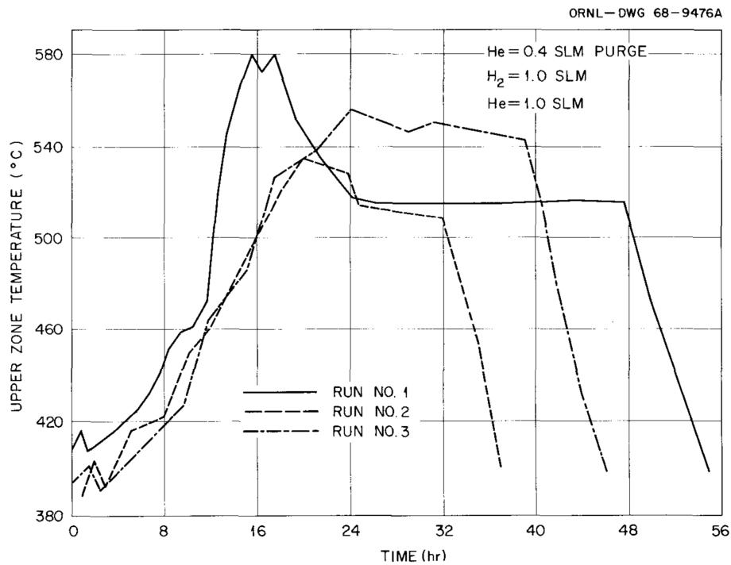  
Fig. 29.3. Uranium Reduction, Upper Zone.

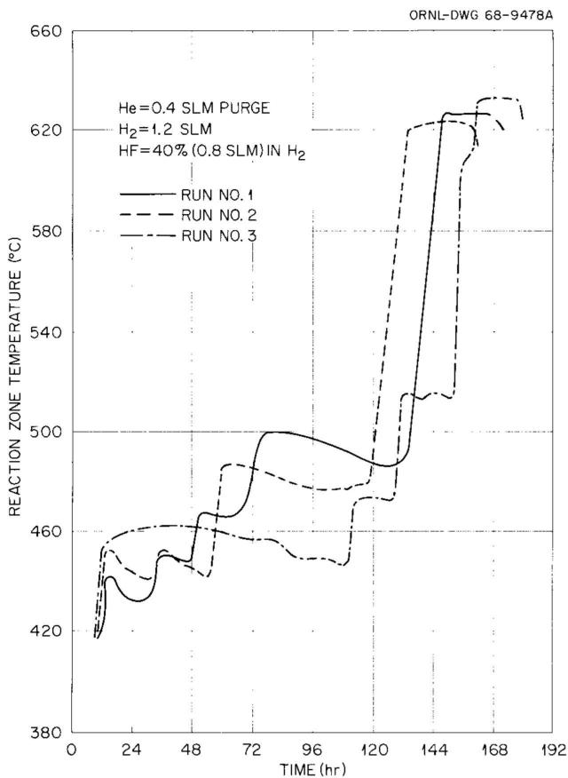  
Fig. 29.4. Uranium Hydrofluorination, Reaction Zone.

Each of the enrichment capsules contains about $155\mathrm{g}$ of the eutectic salt, or $96\mathrm{g}$ of uranium. Figure 29.6 is a photograph of one deck of $\frac{3}{4}$ -in.-diam by 6-in.-long capsules in the filling array. The array consists of three decks of 15 capsules which must be separated and the excess connecting tubes clipped off. Two 4-in.-diam holes are then drilled in each capsule, the bottom hole for draining and the top hole for venting. The capsules are then weighed and stored in a "six-pack" carousel for shipment to the MSRE. They will be lowered, one at a time, into the bowl of the reactor fuel circulating pump, where the fuel concentrate is melted out.

The ten shipping containers were fabricated from $2^{1/2}$ -in.-OD type 304L stainless steel tubing of varying lengths, having capacities from 0.5 to $7.0\mathrm{kg}$ of total uranium. They were assembled into two arrays for filling. One array (Fig. 29.7) consisted of four containers, each having a uranium capacity of $7\mathrm{kg}$ , and the other array (Fig. 29.8) consisted of six containers varying in capacity from 0.5 to $3.0\mathrm{kg}$ of uranium. The product can assemblies were dismantled, a lifting fixture was attached to each can, and each can was weighed. They will be shipped individually in a shielded cask to the MSRE for loading into the reactor drain tank.

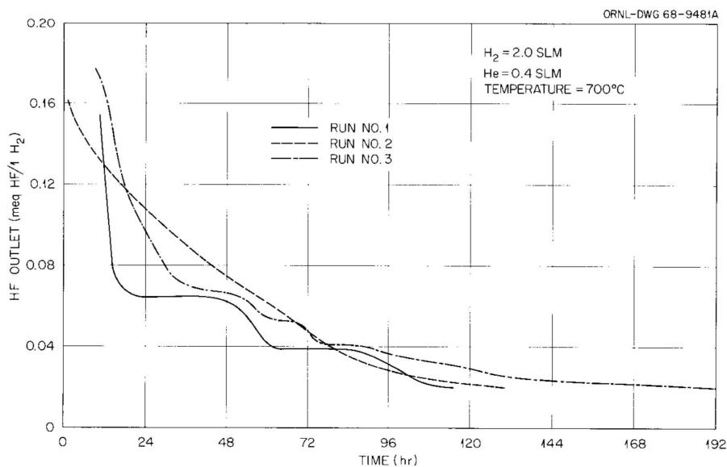  
Fig. 29.5. Eutectic Purification.

A total of $39\mathrm{kg}$ of uranium was packaged as ${}^{7}\mathrm{LiF - }^{233}\mathrm{UF}_4$ (73-27 mole $\%$ ). Of this, $35.6\mathrm{kg}$ was $^{233}\mathrm{U}$ ; the average content of the 233 isotope was $91.4\%$ .

The third and final production run was completed July 30, 1968.

In August 1968, the product containers were readied for delivery to the Molten-Salt Reactor site. The reactor will be refueled with the $^{233}\mathrm{U}$ charge early in September 1968.

Table 29.1. Metallic Impurities in the Product   

<table><tr><td rowspan="2">Run No.</td><td colspan="2">Uranium (wt %)\(^a\)</td><td colspan="2">Nickel (wt %)</td><td colspan="2">Iron (wt %)</td><td colspan="2">Chromium (wt %)</td><td colspan="2">Sulfur (ppm)</td><td colspan="2">Lithium (wt %)</td></tr><tr><td>Dipped Sample</td><td>Filtered Sample</td><td>Dipped Sample</td><td>Filtered Sample</td><td>Dipped Sample</td><td>Filtered Sample</td><td>Dipped Sample</td><td>Filtered Sample</td><td>Dipped Sample</td><td>Filtered Sample</td><td>Dipped Sample</td><td>Filtered Sample</td></tr><tr><td rowspan="2">1</td><td>64.59</td><td>63.31</td><td>0.0258</td><td>0.0068</td><td>0.0274</td><td>0.0046</td><td>0.0046</td><td>0.0042</td><td>&lt;20</td><td>&lt;20</td><td></td><td>4.88</td></tr><tr><td>64.63</td><td>62.89</td><td>0.0124</td><td>0.0064</td><td>0.0316</td><td>0.0056</td><td>0.0099</td><td>0.0068</td><td></td><td>&lt;20</td><td></td><td>4.95</td></tr><tr><td colspan="13">Average 63.10 (61.8)</td></tr><tr><td rowspan="2">2</td><td>62.45</td><td>62.51</td><td>0.0045</td><td>0.0050</td><td>0.0730</td><td>0.0120</td><td>0.0058</td><td>0.0060</td><td>&lt;20</td><td>&lt;20</td><td>4.8</td><td>4.8</td></tr><tr><td>62.44</td><td>62.73</td><td>0.0032</td><td>0.0050</td><td>0.0770</td><td>0.0110</td><td>0.0053</td><td>0.0070</td><td>&lt;20</td><td>&lt;20</td><td>4.8</td><td>4.8</td></tr><tr><td colspan="13">Average 62.53 (61.25)</td></tr><tr><td rowspan="2">3</td><td>62.62</td><td>62.45</td><td>0.0220</td><td>0.0170</td><td>0.0750</td><td>0.0150</td><td>0.0040</td><td>0.0050</td><td>&lt;20</td><td>&lt;20</td><td>4.8</td><td>4.8</td></tr><tr><td>62.52</td><td>62.32</td><td>0.0640</td><td>0.0150</td><td>0.0750</td><td>0.0140</td><td>0.0040</td><td>0.0040</td><td>&lt;20</td><td>&lt;20</td><td>4.8</td><td>4.8</td></tr><tr><td colspan="13">Average 62.49 (61.19)</td></tr><tr><td></td><td></td><td>62.52</td><td>0.170b</td><td>0.0180</td><td>0.0130b</td><td>0.0140</td><td>0.0040</td><td>0.0050</td><td></td><td></td><td></td><td></td></tr></table>

${}^{a}$ Reported as ${}^{238}\mathrm{U}$ .   
This unfiltered sample was taken after hydrogen treatment.

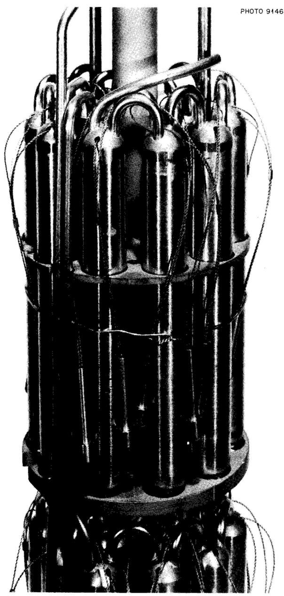  
Fig. 29.6. $^{233}\mathrm{U}$ Enriching Capsule, MSRE Fuel Concentrate.

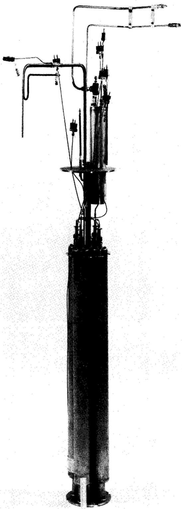  
Fig. 29.7. $^{233}$ UMSRE Fuel, 7-kg Capacity Can Cluster.

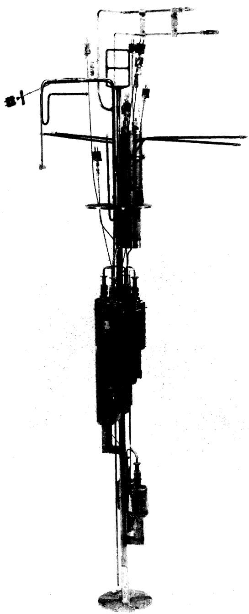  
Fig. 29.8. $^{233}$ U MSRE Fuel, 0.5- to 3.0-kg Capacity Can Cluster.

# 30. Development of the Two-Step Process for Preparation of $^{7}\mathrm{LiF} - ^{233}\mathrm{UF}_4$ Fuel Concentrate for the MSRE

G. I. Cathers

C. J. Shipman

E. L. Nicholson   
D. E. Spangler

The two-step low-temperature process flowsheet adopted for preparation of $^{7}\mathrm{LiF} - ^{233}\mathrm{UF}_4$ eutectic salt was developed to replace the high-temperature one-step process (found to be intractable in shakedown runs) with the view of avoiding extensive engineering changes in the equipment installed in the $^{233}\mathrm{U}$ production facility. The basis for consideration of a low-temperature process in the 8-in.-OD nickel production reactor was available in the literature.[2]

The important factors to be considered in development of a new process were (1) avoidance of high-temperature local reaction zones in the 8-in.-OD reactor, and (2) addition of $^7\mathrm{LiF}$ to the reactor after conversion of the $\mathrm{UO}_3$ to $\mathrm{UF_4}$ was practically complete. The data in the literature indicated that high-surface-area $\mathrm{UO}_3$ could be converted to $\mathrm{UF}_4$ in the 400 to $600^{\circ}\mathrm{C}$ range if the temperature and gas flow rates were carefully controlled.

The basic steps envisioned for the new process were:

1. Reduction of $\mathsf{UO}_3$ to $\mathsf{UO}_2$ by hydrogen at approximately 400 to $600^{\circ}\mathbf{C}$ .   
2. Conversion of $\mathbf{UO}_2$ to $\mathbf{UF}_4$ with a gaseous HF- $\mathbf{H}_2$ mixture at 400 to $650^{\circ}\mathrm{C}$ .   
3. Addition of LiF to the $\mathrm{UF}_4$ at room temperature, followed by increasing the temperature to

above the melting point of LiF $(842^{\circ}\mathrm{C})$ to form the eutectic $\mathrm{LiF - UF_4}$ salt.

4. Removal of trace oxide impurities from the eutectic salt by treatment with $\mathrm{HF - H}_2$ at $700^{\circ}\mathrm{C}$ .   
5. Removal of metal impurities $(\mathrm{NiF}_2$ and some $\mathrm{FeF}_2)$ from the melt by $\mathbf{H}_2$ treatment at $700^{\circ}\mathbf{C}$ .

# 30.1 LABORATORY TEST OF LOW-TEMPERATURE PROCESS

A 2-in.-OD by 10-in.-high nickel reactor was used to test the low-temperature process concept. A center thermocouple well permitted temperature measurements at any depth in the reacting powder, including the zone near the end of the dip tube which extended down to within 0.25 in. of the bottom of the reactor. A gas flow rate of 130 ml/min (STP) was employed in all gas addition steps to simulate the linear velocity (2 std liters/min) in the 8-in.-OD reactor. The reactor was charged with $210\mathrm{g}$ of $\mathrm{UO}_3$ that was prepared by decomposition of ammonium diuranate followed by calcination at a maximum temperature of $550^{\circ}\mathrm{C}$ . The preparation of this material was essentially the same as that for the $^{23}3\mathrm{U}$ oxide. The bulk density (approximately 1.02) of the oxide used in the laboratory test was similar to that of the $^{23}3\mathrm{U}$ oxide.

Dilution of hydrogen with helium in the reduction step and of HF with hydrogen in the hydrofluorination step were essential features of the proposed process in order to minimize any temperature excursions. Although the heat of reaction in the hydrofluorination step is almost twice that in

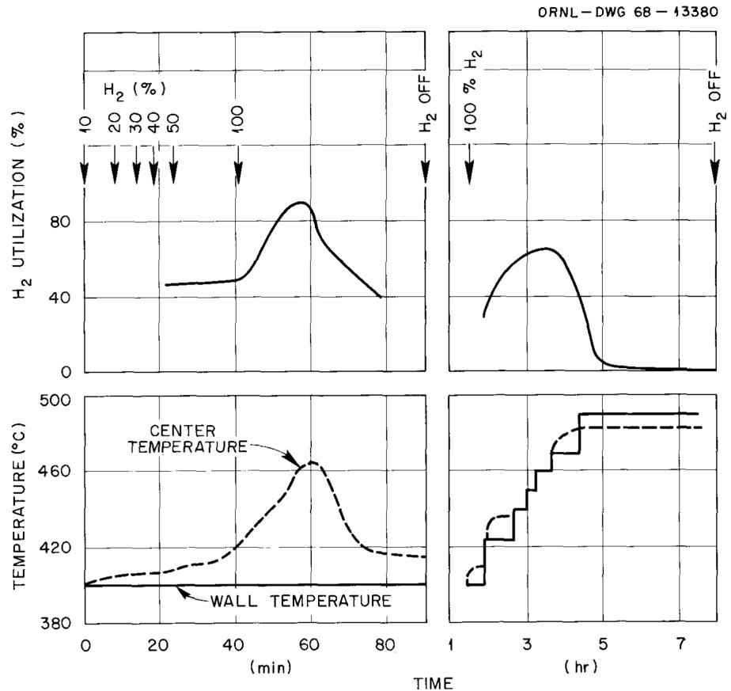  
Fig. 30.1. Temperature Behavior and Hydrogen Utilization in Testing the Reduction Step of the Low-Temperature Process in a 2-in.-OD Reactor.

the reduction step, the laboratory test demonstrated that the latter had possibly more potential for the generation of high excursion temperatures.

A plot of maximum temperature and hydrogen utilization in the reduction step is given in Fig. 30.1. The test was started at $400^{\circ}\mathrm{C}$ with $10\%$ $\mathrm{H}_2 - 90\%$ He; then the hydrogen concentration was slowly raised to $100\%$ . A temperature excursion of about $65^{\circ}\mathrm{C}$ occurred briefly, but the reaction subsided as the reaction zone became broader and the more highly reactive sites disappeared. A subsequent reduction period with pure $\mathrm{H}_2$ resulted in no further significant temperature excursions even though the furnace set-point temperature was raised to about $500^{\circ}\mathrm{C}$ .

The hydrofluorination reaction was carried out using the same cautious approach. However, this proved to be unnecessary, since no temperature excursion of more than $10^{\circ}\mathrm{C}$ was detected by the internal thermocouple well (as compared with the

external wall temperature). The initial HF concentration of $10\%$ (in hydrogen) was raised to about $40\%$ in about 6 hr. The total hydrofluorination period was 24.3 hr. The HF utilization decreased from $100\%$ initially to about $55\%$ in the final 5-hr period. An HF concentration of $40\%$ was used to maximize the HF input rate while, at the same time, sufficient hydrogen was added to prevent corrosion of the nickel reactor.

In the third step of the process, $48\mathrm{g}$ of LiF powder was placed in the reactor on top of the $\mathbf{U}\mathbf{F}_{4}$ , and the temperature was raised to about $875^{\circ}\mathrm{C}$ (at the bottom of the LiF layer) before eutectic melting was observed. The lack of eutectic formation at the eutectic temperature of $490^{\circ}\mathrm{C}$ was attributed to the lack of mixing of the LiF and $\mathbf{U}\mathbf{F}_{4}$ and the short time employed (less than 2 hr).

The fourth part of the process (hydrofluorination of the melt) was carried out by using $20\%$ HF-80%

$\mathrm{H}_{2}$ for approximately $3\mathrm{hr}$ at $700^{\circ}\mathrm{C}$ . The fifth part of the process was omitted, since the validity of this step was in little doubt.

# 30.2 PHYSICAL BEHAVIOR OF POWDER BEDS

In conducting the laboratory test of the process, care was taken to observe the behavior of the oxide and fluoride materials in the presence of flowing gases. This allowed us to anticipate, if possible, any problems that might arise in operation of the 8-in.-OD reactor in the engineering facility.

The gas flow rate of $130\mathrm{ml / min}$ (STP) was conservatively low, since some suspicion existed that 4 std liters/min (twice the linear velocity prevailing in the laboratory test) in the 8-in.-OD reactor had produced some dust entrainment in the cold practice run with the first process flowsheet. During the entire laboratory test, practically no solids (less than $0.1\mathrm{g}$ ) were entrained from the reactor to the 2-in.-diam Huyck Feltmetal nickel filter (equivalent to FM 235, a $7 - \mu$ -rated material) placed in the off-gas system.

Tests in glass columns confirmed that the permeation of gas through the test $\mathrm{UO}_3$ at the chosen flow rate was uniform; no channeling was noted. The small bed expansion which occurred was correlated with measurements of bed height and pressure drops in order to predict, with some accuracy, the behavior of the 25- to 30-in. depth of powder expected in the 8-in.-OD reactor. The density increased during the laboratory test from 1.02 to approximately 1.3 at the end of the hydrofluorination period.

# 30.3 OXIDE IMPURITY LEVEL IN PRODUCT

Analysis of the $\mathrm{UF}_4$ after the dry hydrofluorination step showed an oxygen content of $0.52\%$ . The utilization of HF in the hydrofluorination step indicated that the $\mathrm{UF}_4$ had contained $0.17\%$ oxygen. The first analysis was considered more accurate, however, due to the uncertainty in integrating the HF utilization over the treatment period.

Analyses of the final eutectic salt by the hydrofluorination and the $\mathrm{KBrF}_4$ methods gave 348 and

330 ppm of oxygen respectively. Lower values would probably have been obtained if the salt had not been accidentally exposed to air before it was completely cooled.

# 30.4 FEASIBILITY OF USE OF THE TWO-STEP PROCESS

The results of the laboratory test indicated the feasibility of using the process for the preparation of $^{233}\mathrm{U}$ -containing eutectic salt. Observations made in this test led to the following conclusions and recommendations:

1. Good control of both the reduction and hydrofluorination steps of the process could be achieved in the 8-in.-OD production reactor if the initial temperature was no higher than $440^{\circ}\mathrm{C}$ and if the lowest possible reactant gas concentrations were used. As the solid reactant $\left(\mathrm{UO}_3\right.$ in the reduction step and $\mathrm{UO}_2$ in the hydrofluorination step) is partially reacted and the more reactive material disappears, the reaction zone becomes longer, and it is therefore possible to increase the temperature and the gas reactant concentration. The safest procedure would probably be to increase the gas reactant concentration as much as possible before increasing the temperature.   
2. In order to control the process on a large scale, a stack of thermocouples placed near the center line of the 8-in. reactor would be desirable. These thermocouples, spaced at intervals of 2 to 3 in., would permit observation of movement of the reaction zone upward during processing and of the maximum temperatures produced.   
3. Thermochemical calculations showed that considerable reaction heat was lost through the reactor side wall in the test of the 2-in. reactor. On a larger scale, however, the thermochemical heat would have to be dissipated mainly in heating of the gas streams.   
4. The high utilization of hydrogen in part of the reduction step, and of HF in the hydrofluorination step of the laboratory test, indicated that nearly quantitative usage of reactant gases could be expected in a scale-up of the process where a deep bed of material would be employed.

# 31. Process Development on the Recovery of Uranium from MSRE

G. I. Cathers

M. R. Bennett

C. J. Shipman

The processing of the MSRE fuel salt used for the first phase of MSRE operation is described in the first part of this report. The two objectives have been satisfactorily achieved: recovering the $^{235}\mathrm{U}$ and purifying the carrier salt, $^7\mathrm{LiF - BeF}_2 - \mathrm{ZrF}_4$ (65-30-5 mole %), for reuse with $^{233}\mathrm{U}$ . The work described in this section was carried out in support of the uranium recovery operation.

A study was made of the interdependence of several factors in the fluorination step in an effort to anticipate the effect of removing about $220\mathrm{kg}$ of uranium from $4500\mathrm{kg}$ of carrier salt. Particular attention was given to determination of the uranium valence in the salt as fluorine gas was introduced and to the relationship of the uranium valence to helium sparging, temperature, and corrosion. Two studies were made of the behavior of $\mathrm{UF}_6$ (generated in sparging the melt with fluorine) in the presence of NaF. In the step following fluorination of the MSRE salt, an NaF bed at $400^{\circ}\mathrm{C}$ was used for decontaminating the gaseous $\mathrm{UF}_6$ from volatile fission products (principally ruthenium and niobium) and chromium. Retention of $\mathrm{UF}_6$ on NaF at $400^{\circ}\mathrm{C}$ is high (by decomposition to a $\mathrm{UF}_5$ complex) in the absence of free fluorine. Tests were made at different $\mathrm{F}_2/\mathrm{UF}_6$ ratios to determine whether this causes serious problems in MSRE processing and to explore the possibility of the existence of some type of equilibrium. In the other NaF study, the sorption of $\mathrm{UF}_6$ on NaF in the range 25 to $100^{\circ}\mathrm{C}$ was examined, particularly with respect to use of low- or high-surface-area NaF prepared by two distinctly different methods.

The disposal of waste gaseous fluorine from MSRE processing was also found to be a problem area in the startup operation of the installed facility. The $\mathrm{SO}_2$ method for the disposal of fluorine (by the formation of $\mathrm{SO}_2\mathrm{F}_2$ ) was found to be infeasible under the prevailing conditions. An, aqueous scrub of KOH-KI- $\mathbf{K}_2\mathbf{B}_4\mathbf{O}_7$ was developed as an alternative method for fluorine disposal in the MSRE processing plant.

# 31.1 FLUORINATION-VALENCE STATE STUDY

MSRE salt fluorination tests were made in 1.87-in.-ID reactors constructed of nickel 200 under conditions approximating those expected in the 49-in.-ID fluorination reactor at the MSRE site. A gas flow rate of $146\mathrm{ml / min}$ (STP) was used to simulate a flow rate of 100 std liters/min in the 49-in.-ID reactor. Sampling of the salt without interruption of the fluorination procedure was achieved by taking a quick-freeze sample with a $\frac{1}{8}$ -in. nickel rod inserted through a tee at the top of the reactor. The valence of uranium in the salt samples was calculated from separate determinations of the U(IV) and U(VI) concentration. The tests were made with $340\mathrm{g}$ of $\mathrm{LiF - BeF}_2-\mathrm{ZrF}_4\mathrm{-UF}_4$ (63-32-5-0.8 mole $\%$ ); the salt depth was about 3 in.

A test at $500^{\circ}\mathrm{C}$ with pure fluorine illustrated the relationship between the degree of uranium volatilization and the uranium valence in the salt (Fig. 31.1). Some $\mathrm{UF}_6$ was observed to evolve when the uranium valence in the salt was as low

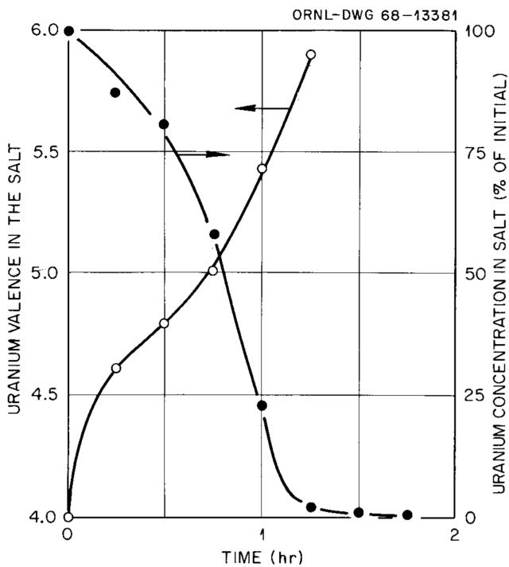  
Fig. 31.1. Change of Uranium Valence in the Fluorination of MSRE-Type Salt at $500^{\circ}\mathrm{C}$ with Pure Fluorine.

as 4.1. At $500^{\circ}\mathrm{C}$ there was an extensive evolution of $\mathbf{U}\mathbf{F}_{6}$ as the valence increased from 4 to 5. The valence continued to increase (from 5

toward 6) as the remaining part of the uranium volatilized. The fact that an intermediate stable species of $\mathbf{U}(\mathbf{V})$ was formed is indicated from the curve inflection; however, in this case the volatilization of $\mathbf{U}\mathbf{F}_6$ was too rapid for this intermediate equilibrium species $\mathbf{U}(\mathbf{V})$ to be clearly seen.

In another test at a lower temperature $(450^{\circ}\mathrm{C})$ , the valence plot shows a definite inflection at about the value of five (Fig. 31.2). In this test the fluorine flow was stopped and helium sparging was started after $1\mathrm{hr}$ to determine whether helium sparging or corrosion would lead to a rapid decrease of the uranium valence from 5 to 4. Such a decrease might be expected from one of the two following reactions:

$$
2 \mathrm {U F} _ {5} \rightarrow \mathrm {U F} _ {6} + \mathrm {U F} _ {4}, \tag {1}
$$

$$
2 \mathrm {U F} _ {5} + \mathrm {N i} \rightarrow 2 \mathrm {U F} _ {4} + \mathrm {N i F} _ {2}. \tag {2}
$$

Surprisingly, in the 1.5-hr helium sparging period there was no significant effect on the valence. When fluorine flow was resumed the same rapid $\mathrm{UF}_{6}$ evolution and valence increase occurred as in the test at $500^{\circ}\mathrm{C}$ . However, it was clear that the valence plot of the $450^{\circ}\mathrm{C}$ data would have had a much large inflection, even in the absence of a helium sparge period, than the plot of the $500^{\circ}\mathrm{C}$ data.

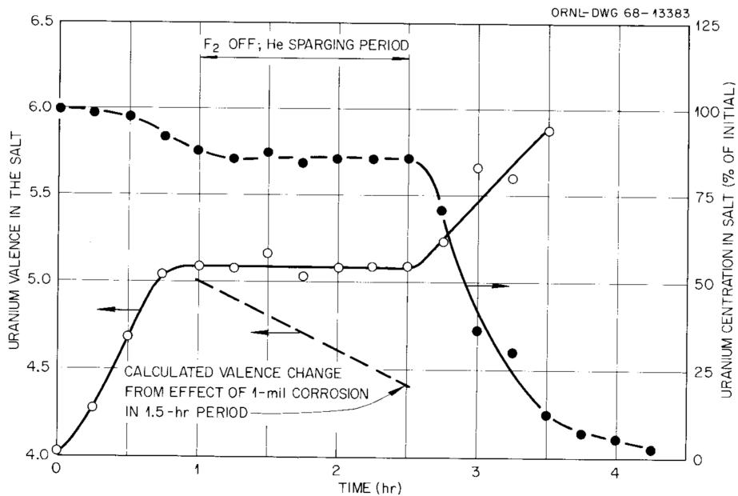  
Fig. 31.2. Change of Uranium Valence in the Fluorination of MSRE-Type Salt at $450^{\circ}\mathrm{C}$ with Pure Fluorine: Stability of U(V) Species During He Sparging.

The implications of these results to MSRE salt processing operations were believed to be significant. The main conclusions can be summarized as follows:

1. The depth of salt in the MSRE fluorination reactor (5 to 6 ft) will probably result in the conversion of all of the uranium to the U(V) species before any significant $\mathrm{UF}_6$ volatilization takes place. The results, however, do not lead to any conclusion about fluorine utilization. The latter might be more critically dependent on fluorination temperature than on the depth of salt.   
2. Interruption of the fluorination procedure in MSRE processing for the changing of NaF sorption beds (as they become loaded with $\mathrm{UF}_{6}$ ) should not lead to any difficulty in resuming fluorine gas flow. Volatilization of $\mathrm{UF}_{6}$ should resume almost immediately after such an interruption due to the stability of the U(V) species during the shutdown period. During this period, however, it would probably be best to avoid extensive sparging with helium in order to minimize the evolution of $\mathrm{UF}_{6}$ by disproportionation reaction (1).   
3. The stability of the U(V) species is of particular interest to the corrosion picture. The dotted line in Fig. 31.2 represents the rate of valence change expected if the corrosion reaction (2) should occur at a rate equivalent to $0.67\mathrm{mil / hr}$ . The fact that the valence did not decrease suggests that corrosion will not be a problem during the shutdown periods required for the changing of sorption beds. Possibly total corrosion during the processing of MSRE fuel will be less than expected if the wall of the reactor is in contact with salt containing only U(V); that is, corrosion should be high only in the central salt volume where $\mathrm{UF}_6$ is "boiling out" as it is formed and where the valence of the uranium possibly becomes much greater than 5. The latter applies to the boundary salt layer surrounding the $\mathrm{F}_2\text{-UF}_6$ gas that rises through the salt.

# 31.2 EQUILIBRIUM OF UF6 WITH NaF AT 400°C; RETENTION OF URANIUM

In the volatilization of uranium from MSRE salt, decontamination of the product $\mathbf{U}\mathbf{F}_{6} - \mathbf{F}_{2}$ -He gas stream is to be accomplished by passage through

a $400^{\circ}\mathrm{C}$ NaF trap to remove volatile fission product fluorides (mainly $\mathbf{RuF}_5$ and $\mathbf{NbF}_5$ ). During this phase of the processing, it is necessary to have some free fluorine gas in the stream to prevent appreciable loss of uranium to the NaF by disproportionation of $\mathbf{UF}_6$ to nonvolatile $\mathbf{UF}_5$ . Since the utilization of fluorine in the early part of the fluorination might be high, there was concern as to whether sufficient fluorine would be available to prevent disproportionation and uranium loss. Therefore, a study was undertaken to determine the validity of an equilibrium condition for the reaction $\mathbf{UF}_5 \cdot \mathbf{NaF} + \frac{1}{2}\mathbf{F}_2 = \mathbf{UF}_6 + \mathbf{NaF}$ at $400^{\circ}\mathrm{C}$ .

The various $\mathbf{F}_2\text{-}\mathbf{U}\mathbf{F}_6$ mixtures used in the study were produced by equilibration in a nickel reservoir vessel (250-ml volume) containing about $100\mathrm{g}$ of $\mathrm{UF}_6$ at $54^{\circ}\mathrm{C}$ $(P_{\mathrm{UF}_6} = 660~\mathrm{mmHg})$ with the appropriate precalibrated mixtures of fluorine and nitrogen. (The temperature of the $\mathrm{UF}_6$ reservoir was held constant to $\pm 0.5^{\circ}\mathrm{C}$ by means of a carefully controlled water bath.) By adjusting the initial $\mathrm{F}_2 / \mathrm{N}_2$ ratio, mixtures with $\mathbf{F}_2$ concentrations ranging from 11 to $0.3\mathrm{vol}\%$ at atmospheric pressure were obtained. Each mixture was allowed to pass through a 10-g bed of NaF $(-12 + 20\mathrm{mesh})$ at $400^{\circ}\mathrm{C}$ for $20\mathrm{min}$ . Unreacted $\mathrm{UF}_6$ passing through the bed was recovered on a backup trap of NaF at $100^{\circ}\mathrm{C}$ .

In the first three of a series of six tests, the fluorine concentrations in the gas mixture were 11, 5.5, and $2.1\mathrm{vol}\%$ respectively (see Table 31.1). Subsequent coulometric analyses of the beds for uranium yielded calculated values for equilibrium constants of $3.8\times 10^{5}$ , $3.3\times 10^{5}$ , and $4.2\times 10^{5}$ respectively. The equilibrium value, $K$ , was calculated by means of the equation

$$
K = \frac {P _ {\mathrm {U F} 6}}{P _ {\mathrm {F} 2} ^ {1 / 2} N _ {\mathrm {U (V)}}},
$$

in which $N_{\mathrm{U(V)}}$ is the mole fraction of uranium present on the NaF; it was assumed that the activity of NaF was unity. The close correspondence of these values indicated that equilibrium conditions were obtained. In run 5 the UF6 reservoir temperature was raised to $55.5^{\circ}\mathrm{C}$ ( $P_{\mathrm{UF}} = 720 \, \mathrm{mm}$ ) to eliminate the need for a low fluorine flow rate at low fluorine concentrations. In this test a fluorine concentration of 0.3 vol % was achieved. The calculated equilibrium constant was $1.3 \times 10^{5}$ ,

Table 31.1. Uranium Retention on NaF at ${400}^{ \circ  }\mathrm{C}$   

<table><tr><td>Run No.a</td><td>F2Concentration in Gas (vol %)</td><td>U Concentration in NaF (ppm)</td><td>K</td></tr><tr><td></td><td></td><td></td><td>×105</td></tr><tr><td>6</td><td>0</td><td>36,400</td><td></td></tr><tr><td>5</td><td>0.3</td><td>840</td><td>1.3</td></tr><tr><td>3</td><td>2.1</td><td>89</td><td>4.2</td></tr><tr><td>2</td><td>5.5</td><td>71</td><td>3.3</td></tr><tr><td>1</td><td>11.0</td><td>39</td><td>3.8</td></tr></table>

Results of run 4 invalid due to operational error.

which was somewhat lower than those values obtained at higher $\mathbf{F}_2$ concentrations. When $\mathrm{UF}_{6}$ was passed through a similar $400^{\circ}\mathrm{C}$ NaF bed in a test with no fluorine present (run 6), the amount retained as a result of disproportionation was $3.64\%$ . Comparison of this value with the corresponding value of $0.084\%$ obtained in a test where $0.3\mathrm{vol}\% \mathrm{F}_2$ was present in the stream demonstrates the necessity of having at least $0.3\mathrm{vol}\% \mathrm{F}_2$ present during the decontamination step of the process.

The results of the tests completed thus far indicate that, if fluorine utilization is nearly quantitative in the early part of the fluorination step, a supplemental fluorine supply through the sorption traps would be required.

# 31.3 EFFECT OF TEMPERATURE ON SORPTION OF UF6 BY NaF: COMPARISON OF HIGH- AND LOW-SURFACE-AREA MATERIAL

Some uncertainty existed with regard to the correct temperature and type of NaF to be used for recovering $\mathrm{UF}_6$ in the MSRE processing facility. This uncertainty arose partially from the results of one engineering test in the MSRE facility in which it was observed that $\mathrm{MoF}_6$ had not attained equilibrium with sorption beds containing low-surface-area NaF at about 35 to $45^{\circ}\mathrm{C}$ .

Two grades of porous NaF are available. A low-surface-area product is prepared from NaF powder by pelletizing with water, drying, and finally fluorinating at 250 to $350^{\circ}\mathrm{C}$ . It is characterized by a surface area of $0.07\mathrm{m}^2/\mathrm{g}$ and a void fraction of 0.28. A high-surface-area product is prepared

by the decomposition of NaF·HF pellets at 200 to $400^{\circ}\mathrm{C}$ , followed by sintering at 400 to $700^{\circ}\mathrm{C}$ to obtain pellet strength. It is characterized by a surface area of about $1\mathrm{m}^2/\mathrm{g}$ and a void fraction of 0.45.

A comparative study of $\mathrm{UF}_{6}$ sorption at different temperatures was therefore undertaken with the two types of material. A series of six tests with low-surface-area material in the range 25 to $100^{\circ}\mathrm{C}$ clearly showed that temperature had a large effect. Two tests of high-surface-area material at 25 and $100^{\circ}\mathrm{C}$ gave practically identical results, showing that temperature is not important with this material.

The sorption tests were made by passing a mixture of 15 mole $\%$ UF $_6$ -85 mole $\%$ F $_2$ through a 5-g test bed for 3 min. The sorption test trap was maintained at constant temperature in a water bath; a 5-g backup NaF trap was held at $100^{\circ}\mathrm{C}$ for the sorption of UF $_6$ passing through the test material. Both traps were quartz U-tubes (8.5 mm ID) specially designed for visibility so that the yellow UF $_6$ .2NaF complex could be observed. The traps were filled with sieved material: -8 +20 mesh for the low-surface-area NaF and -12 +20 mesh for the high-surface-area material. The F $_2$ -UF $_6$ gas mixture was prepared by passing F $_2$ through a UF $_6$ reservoir held at $24^{\circ}\mathrm{C}$ in a constant-temperature bath.

The sorption results were significantly better for the high-surface-area NaF than for the low-surface-area material (Table 31.2). Even at 80

Table 31.2. UF $_6$ Sorption Tests with Low- and High-Surface-Area NaF at Various Temperatures   

<table><tr><td>Temperature (℃)</td><td></td><td>U Loss (%)</td></tr><tr><td colspan="3">Low-Surface-Area NaF</td></tr><tr><td>25</td><td></td><td>61</td></tr><tr><td>46</td><td></td><td>37.2</td></tr><tr><td>55</td><td></td><td>22.2</td></tr><tr><td>67</td><td></td><td>1.0</td></tr><tr><td>80</td><td></td><td>0.087</td></tr><tr><td>100</td><td></td><td>0.063</td></tr><tr><td colspan="3">High-Surface-Area NaF</td></tr><tr><td>25</td><td></td><td>0.0024</td></tr><tr><td>100</td><td></td><td>0.0079</td></tr></table>

and $100^{\circ}\mathrm{C}$ , the loss through the latter was an order of magnitude greater than that through the high-surface-area NaF. The quantitative data were confirmed by visual observations: the yellow sorption band in high-surface-area NaF was never more than 1 to 2 cm in length (even at $25^{\circ}\mathrm{C}$ ), whereas the sorptive band with low-surface-area material at $100^{\circ}\mathrm{C}$ was 4 to 5 cm.

A semilogarithmic plot of the low-surface-area sorption data (Fig. 31.3) was surprisingly linear through four points; this indicated that the process was possibly diffusion controlled (based on an apparent activation energy of only $4.6\mathrm{kcal}$ per mole of $\mathbf{U}\mathbf{F}_{6}$ ).

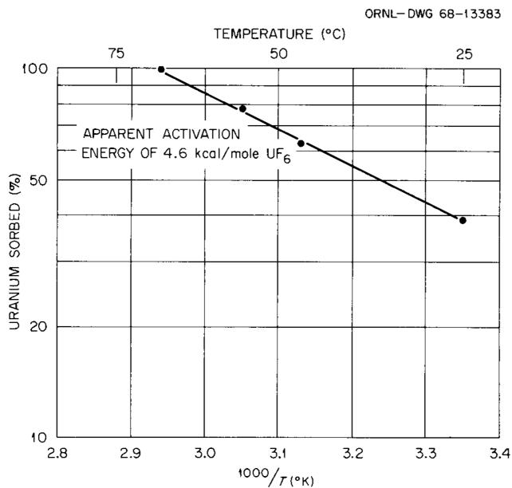  
Fig. 31.3. Variation of Effectiveness of $\mathsf{UF}_6$ Sorption on Low-Surface-Area NaF with Temperature.

# 31.4 LINEAR VELOCITY IN SORPTION PROCESS

It is significant to compare the linear velocity of the gas in the above tests with that expected in the MSRE facility. When the carrier gas $(\mathbf{F}_2)$ flow rate was $85\mathrm{ml / min}$ (STP), the linear velocity was $4.9~\mathrm{fpm}$ ; a carrier gas flow rate of 30 std liters/min in the MSRE facility would give a velocity of $2.4\mathrm{fpm}$ . Although the factor of 2 between the two cases might be important, it seems improbable that the difference in sorption behavior

of the two materials would be diminished to any large extent.

# 31.5 DISPOSAL OF GASEOUS $\mathsf{F}_2$ IN KOH-KI- $\mathsf{K}_2\mathsf{B}_4\mathsf{O}_7$ SOLUTION

Difficulties encountered in the disposal of $\mathbf{F}_2$ by reaction with $\mathrm{SO}_2$ to form $\mathrm{SO}_2\mathrm{F}_2$ led to the suggestion that the KOH-KI disposal method should be evaluated as an alternative. A tank capable of holding 1300 liters was available in the MSRE facility for use with such a solution; only a few piping changes were required. Laboratory tests were therefore made to study selected features of the process that might be important in operation of the MSRE facility. Some of the tests were made as the result of effects seen in cold practice runs made in the MSRE. Observations were made on the amount of corrosion to be expected, the effect of helium dilution of the fluorine, the formation and character of precipitates, and the permissible fraction of solution capacity which should be used. Most of the work was carried out with $2M$ KOH-0.33 M KI solution; later this was modified to include $0.2M\mathrm{K}_2\mathrm{B}_4\mathrm{O}_7$ to provide neutron poisoning. The handling of mists and smoke in the outlet stream of the scrubber represented another problem area which was investigated in the laboratory.

# 31.6 CORROSION

There was particular concern about corrosion of the Inconel tank wall and of the Monel dip tube initially installed in the tank.

Most of the tests were of 4-hr duration and consisted in the addition of $0.8\mathrm{g}$ -mole of $\mathbf{F}_2$ $(50\%)\mathbf{F}_2-$ $50\%$ He) per liter of scrub solution to attain $80\%$ of the theoretical saturation. The temperature was usually not allowed to exceed $40^{\circ}\mathrm{C}$ . Comparison tests between Inconel and Monel, using $\frac{3}{8}$ -in.-OD tubing, showed that Inconel was definitely better (as stated to be true for oxidizing alkaline solutions in International Nickel Company, Inc., literature). Micrometer examination indicated a corrosion rate of about $1\mathrm{mil / hr}$ at the tip for Inconel; general corrosion over the exterior of the dip tube was insignificant with both Inconel and Monel. Corrosion at the tip seemed to be highly localized and appeared to be primarily due to a

local acid condition formed in a thin film of liquid that wets the inside wall of the tip. A “feather-ing” effect was therefore usually observed.

Corrosion of either Inconel or Monel led to the formation of a gelatinous precipitate (hydrated metal oxides) which usually was slow in settling out of solution. From observations of this precipitate, corrosion in solutions used to $50\%$ capacity appeared to be much less than in solutions used to $80\%$ capacity.

When a 47-mil-ID hole was used at the end of a Monel dip line to simulate the linear velocity of 25 fps expected in the MSRE scrub tank, plugging occurred due to the formation of corrosion products from liquid left inside the tube. There was little evidence of this type of plugging with $\frac{1}{4}$ - or $\frac{3}{8}$ -in.-OD dip tubes.

# 31.7 HELIUM DILUTION OF FLUORINE

Use of a maximum fluorine concentration of $50\%$ in helium was recommended for the MSRE facility due to observations of intermittent flames and small violent pressure oscillations at the end of dip tubes when pure $\mathbf{F}_2$ was used. It seemed likely that corrosion would be greater under these conditions.

# 31.8 FORMATION OF KIO₃ PRECIPITATE

The oxidizing power of $\mathbf{F}_2$ leads, in addition to the evolution of $\mathbf{O}_2$ , to the formation of potassium iodate $(\mathrm{KIO}_3)$ . Copious quantities of this material were found to precipitate at $80\%$ saturation; at $50\%$ saturation, its precipitation was only faintly noticeable. X-ray diffraction and chemical analyses were used to identify the material, which is produced in a rather pure form except for the presence of corrosion products.

# 31.9 NEUTRON POISONING WITH $\mathsf{K}_2\mathsf{B}_4\mathsf{O}_7$

Tests made at 0.16, 0.20, and $0.24M\mathrm{K}_2\mathrm{B}_4\mathrm{O}_7$ in $2M$ KOH-0.33 M KI solution indicated that the chemistry of the system was only affected at the highest of these three concentrations (evidence of molecular $\mathbf{I}_2$ production). This was in conformity with an initial test where $0.5M\mathrm{K}_2\mathrm{B}_4\mathrm{O}_7$ had been found to cause the immediate release of free iodine. Since $0.2M\mathrm{K}_2\mathrm{B}_4\mathrm{O}_7$ was equivalent to $8.75\mathrm{g}$ of boron per liter, this was considered adequate for poisoning of the scrub solution.

# 31.10 HANDLING OF MIST AND SMOKE FROM SCRUB SOLUTION

It was evident in all laboratory tests that a certain amount of mist was always generated. Efforts to identify the chemical components of the mist were not successful, since the material was extremely difficult to trap; however, analyses for fluoride and iodide were extremely low. It seemed probable that the mist was stabilized by the presence of $\mathbf{I}_2$ or $\mathrm{H}_2\mathrm{O}_2$ .

In an engineering test of the MSRE facility, an additional gas colloid problem was encountered. Corrosion of the hot processing vessel (containing no salt) with fluorine led to the production of $\mathrm{MoF}_6$ . Hydrolysis of this $\mathrm{MoF}_6$ in the scrubber led to production of an aerosol of hydrated $\mathrm{MoO}_3$ (based on chemical analyses and x-ray diffraction results) which deposited and plugged the off-gas line. Duplication of this $\mathrm{MoO}_3$ aerosol production was verified in laboratory tests with scrub solution and $\mathbf{F}_2$ containing $\mathrm{MoF}_6$ .

Laboratory tests with different filtration and trapping methods showed that only a high-efficiency fiber-glass filter was highly effective in stopping the $\mathrm{MoO}_3$ aerosol and, at the same time, the always-present scrub mist. A high-efficiency filter downstream of the scrub solution was therefore installed in the MSRE processing facility.

# OAK RIDGE NATIONAL LABORATORY

# MOLTEN-SALT REACTOR PROGRAM

AUGUST 31, 1968

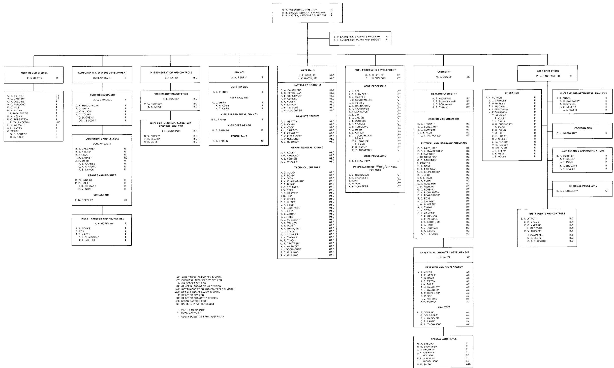

# INTERNAL DISTRIBUTION

1. R. K. Adams   
2. G. M. Adamson   
3. R. G. Affel   
4. J. L. Anderson   
5. R. F. Apple   
6. C. F. Baes   
7. J.M. Baker   
8. S. J. Ball   
9. C. E. Bamberger   
0. C. J. Barton   
1. H. F. Bauman   
2. S. E. Beall   
3. R. L. Beatty   
4. M. J. Bell   
5. M. Bender   
6. C. E. Bettis   
7. E. S. Bettis   
8. D. S. Billington   
9. R. E. Blanco   
20. F. F. Blankenship   
1. J. O. Blomeke   
22. R. Blumberg   
23. A. L. Boch   
24. E. G. Bohlmann   
25. C. J. Borkowski   
26. G.E. Boyd   
27. J. Braunstein   
28. M. A. Bredig   
29. E. J. Breeding   
30-44. R. B. Briggs   
45. H. R. Bronstein   
46. W. E. Browning   
47. F. R. Bruce   
48. G. D. Brunton   
49. G. H. Burger   
50. D. A. Canonico   
51. S. Cantor   
52. D. W. Cardwell   
53. W. H. Carr   
54. W. L. Carter   
55. G. I. Cathers   
56. J. E. Caton   
57. O. B. Cavin

58. A. Cepolino   
59. J. M. Chandler   
60. F. H. Clark   
61. W. R. Cobb   
62. H. E. Cochran   
63. C. W. Collins   
64. E. L. Compere   
65. J. A. Conlin   
66. K. V. Cook   
67. W.H.Cook   
68. L. T. Corbin   
69. W. B. Cottrell   
70. B. Cox   
71. G. A. Cristy   
72. S. J. Cromer (K-25)   
73. J. L. Crowley   
74. F. L. Culler   
75. D. R. Cuneo   
76. J.M.Dale   
77. D. G. Davis   
78. W. W. Davis   
79. R. J. DeBakker   
80. J. H. DeVan   
81. S. J. Ditto   
82. R. G. Donnelly   
83. I. T. Dudley   
84. N. E. Dunwoody   
85. A. S. Dworkin   
86. D. A. Dyslin

87-88. W.P.Eatherly

89. J. R. Engel   
90. E.P.Epler   
91. W. K. Ergen   
92. D. E. Ferguson   
93. L. M. Ferris   
94. A. P. Fraas   
95. J. K. Franzreb   
96. H. A. Friedman   
97. J.H Frye, Jr.   
98. W. K. Furlong   
99. C. H. Gabbard

100. W.R.Gall

101. R. B. Gallagher

102. R. E. Gehlbach

103. J. H. Gibbons

104. R. G. Gilliland

105. L. O. Gilpatrick

106. W. R. Grimes

107. A. G. Grindell

108. R. W. Gunkel

109. R. H. Guymon

110. J. P. Hammond

111. R.P.Hammond

112. B. A. Hannaford

113. P. H. Harley

114. D. G. Harman

115. W. O. Harms

116. C. S. Harrill

117. P. N. Haubenreich

118. F. A. Heddleson

119. R.E. Helms

120. P. G. Herndon

121. D.N. Hess

122. R. F. Hibbs (Y-12)

123. J. R. Hightower

124. M. R. Hill

125. E.C.Hise

126. H. W. Hoffman

127. D. K. Holmes

128. V. D. Holt

129. P. P. Holz

130. R.W.Horton

[131]. A. S. Householder

132. A. Houtzeel

133. T. L. Hudson

134. W. R. Huntley

135. H. Inouye

136. W. H. Jordan

[137-161. P. R. Kasten]

162. R.J. Kedi

163. M. T. Kelley

164. M. J. Kelly

165. C. R. Kennedy

166. T. W. Kerlin

167. H. T. Kerr

168. J. J. Keyes

169. R.F. Kimball

170. D. V. Kiplinger

171. S. S. Kirslis

172. D. J. Knowles

173. J.W. Koger

174. R. B. Korsmeyer

175. A. I. Krakoviak

176. J.S.Kress

177. J. W. Krewson

178. C. E. Lamb

179. J. A. Lane

180. C. E. Larson

181. E. J. Lawrence

182. J. J. Lawrence

183. M. S. Lin

184. T. A. Lincoln

185. R. B. Lindauer

186. A. P. Litman

187. J. L. Liverman

188. R. S. Livingston

189. G.H. Llewellyn

190. E. L. Long

191. A. L. Lott's

192. M. I. Lundin

193. R.N.Lyon

194. R. L. Macklin

195. H. G. MacPherson

196. R.E. MacPherson

197. F. C. Maienschein

198. J. C. Mailen

199. D. L. Manning

200. C. D. Martin

201. W. R. Martin

202. H. V. Mateer

203. C. E. Mathews

204. T. H. Mauney

205. H. McClain

206. R.W. McClung

207. H. E. McCoy

208. H. F. McDuffie

209. D. L. McElroy

210. C. K. McGlothlan

211. C. J. McHargue

212. L. E. McNeese

213. J. R. McWherter

214. H. J. Metz

215. A. S. Meyer

216. E.C.Miller

217. C. A. Mills

218. R. L. Minue

219. W. R. Mixon

220. R. L. Moore

221. K. Z. Morgan

222. D. M. Moulton

223. J. C. Moyers

224. T. R. Mueller

225. H. A. Nelms

226. H. H. Nichol

227. J. P. Nichols

228. E. L. Nicholson   
229. E. D. Nogueira   
230. L. C. Oakes   
231. W. R. Osborn   
232-233. R. B. Parker   
234. L. F. Parsly   
235. P. Patriarca   
236. H. R. Payne   
237. A. M. Perry   
238. T. W. Pickel   
239. H. B. Piper   
240. B. E. Prince   
241. H. P. Raaen   
242. G. L. Ragan   
243. J. L. Redford   
244. M. Richardson   
245. G. D. Robbins   
246. R. C. Robertson   
247. W. C. Robinson   
248. K. A. Romberger   
249-423. M.W.Rosenthal   
424. R. G. Ross   
425. H. C. Savage   
426. A. W. Savolainen   
427. W. F. Schaffer   
428. C. E. Schilling   
429. Dunlap Scott   
430. J. L. Scott   
431. H. E. Seagren   
432. C. E. Sessions   
433. J. H. Shaffer   
434. E. D. Shipley   
435. W. H. Sides   
436. M. J. Skinner   
437. G. M. Slaughter   
438. A. N. Smith   
439. F. J. Smith   
440. G.P. Smith   
441. O. L. Smith   
442. P. G. Smith   
443. A. H. Snell   
444. W. F. Spencer

445. I. Spiewak   
446. R. C. Steffy   
447. C. E. Stevenson   
448. W. C. Stoddart   
449. H. H. Stone   
450. R. A. Strehlow   
451. D. A. Sundberg   
452. J. R. Tallackson   
453. E. H. Taylor   
454. W. Terry   
455. R.E. Thoma   
456. P. F. Thomason   
457. L. M. Toth   
458. D. B. Trauger   
459. R.W. Tucker   
460. W. C. Ulrich   
461. W. E. Unger   
462. D. C. Watkin   
463. G. M. Watson   
464. J. S. Watson   
465. H. L. Watts   
466. C. F. Weaver   
467. B. H. Webster   
468. A. M. Weinberg   
469. J. R. Weir   
470. W. J. Werner   
471. K.W. West   
472. M. E. Whatley   
473. J. C. White   
474. R. P. Wichner   
475. L. V. Wilson   
476. G. J. Young   
477. H. C. Young   
478. J. P. Young   
479. E. L. Youngblood   
480. F. C. Zapp   
481. Biology Library

482-483. ORNL - Y-12 Technical Library Document Reference Section

484-486. Central Research Library

487-641. Laboratory Records Department

642. Laboratory Records, ORNL R.C.

# EXTERNAL DISTRIBUTION

643. W. O. Allen, Atomics International, P.O. Box 309, Canoga Park, California 91304   
644. A. Amorosi, LMFBR Program Office, Argonne National Laboratory, Argonne, Illinois 60439   
645. J. G. Asquith, Atomics International, P.O. Box 309, Canoga Park, California 91304   
646. David Bendaniel, General Electric Co., R&D. Center, Schenectady, N.Y.   
647. J. C. Bowman, Union Carbide Technical Center, 12900 Snow Road, Parma, Ohio 44130   
648. G. D. Brady, Materials Systems Division, UCC, Kokomo, Indiana 46901   
649. J. H. Brannan, Carbon Products Division, 270 Park Avenue, New York, New York 10017   
650. Paul Cohen, Westinghouse Electric Corp., P.O. Box 158, Madison, Pennsylvania 15663   
651. D. F. Cope, Atomic Energy Commission, RDT Site Office (ORNL)   
652. J. W. Crawford, Atomic Energy Commission, Washington 20545   
653. M. W. Croft, Babcock and Wilcox Company, P.O. Box 1260, Lynchburg, Virginia 24505   
654. D. A. Douglas, Materials Systems Division, UCC, Kokomo, Indiana 46901   
655. H. L. Falkenberry, Tennessee Valley Authority, 303 Power Building, Chattanooga, Tenn. 37401   
656. C. W. Fay, Wisconsin Michigan Power Company, 231 W. Michigan Street, Milwaukee, Wisconsin 53201   
657. A. Giambusso, Atomic Energy Commission, Washington 20545   
658. Gerald Golden, Argonne National Laboratory, 9700 S. Cass Avenue, Argonne, Illinois 60439   
659. W. W. Grigorieff, Assistant to the Executive Director, Oak Ridge Associated Universities   
660. J. T. Kehoe, Burns and Roe, Inc., 700 Kinderkamach, Oradell, New Jersey 07649   
661. E. E. Kintner, U.S. Atomic Energy Commission, Washington, D.C.   
662. P. M. Krishner, Pioneer Service and Engineering, 400 W. Madison St. Chicago, Illinois 60606   
663. J. Ladesich, Southern California Edison Co., P.O. Box 351, Los Angeles, California 90053   
664. L. W. Lang, Douglas United Nuclear, 703 Bldg., Richland, Washington 99352   
665. R. A. Langley, Bechtel Corp., 50 Beale St., San Francisco, California 94119   
666. W. J. Larkin, Atomic Energy Commission, ORO   
667. R. A. Lorenzini, Foster Wheeler, 110 S. Orange, Livingston, N.J. 07039   
668. W. D. Manly, Material Systems Division, UCC, 270 Park Avenue, New York, New York 10017   
669. J. P. Mays, Great Lakes Carbon Co., 299 Park Avenue, New York, New York 10017   
670. W. B. McDonald, Battelle-Pacific Northwest Laboratory, Hanford, Washington 99352   
671-672. T. W. McIntosh, Atomic Energy Commission, Washington 20542   
673. W. J. Mordarski, Nuclear Development, Combustion Engineering, Windsor, Connecticut   
674. Sidney Parry, Great Lakes Carbon, P.O. Box 667, Niagara Falls, New York 14302   
675. G. J. Petretic, Atomic Energy Commission, Washington 20545   
676. A. J. Pressesky, U.S. Atomic Energy Commission, Washington, D.C.   
677. D. J. Rose, Department of Nuclear Engineering, Room 24-207, Massachusetts Institute of Technology, Cambridge, Massachusetts 02139   
678. M. A. Rosen, Atomic Energy Commission, Washington 20545   
679. H. M. Roth, Atomic Energy Commission, ORO   
680. R. W. Schmitt, General Electric Co., Schenectady, New York 12301   
681. R. N. Scroggins, U.S. Atomic Energy Commission, Washington, D.C.   
682. M. Shaw, Atomic Energy Commission, Washington 20545   
683. Remo Silvestrini, United Nuclear Corporation, Grasslands Road, Elmsford, New York 10523

684. E. E. Sinclair, Atomic Energy Commission, Washington 20545   
685. W. L. Smalley, Atomic Energy Commission, ORO   
686. T. M. Snyder, General Electric Co., 175 Curtner Ave., San Jose, California 95103   
687. L. D. Stoughton, UCC, P.O. Box 500, Lawrenceburg, Tennessee 38464   
688. Philip T. Stroup, Alcoa, P.O. Box 772, New Kensington, Pennsylvania   
689. J. A. Swartout, UCC, 270 Park Avenue, New York, New York 10017   
690. Richard Tait, Poco Graphite, P.O. Box 1524, Garland, Texas 75040   
691. D. R. Thomas, Commonwealth Associates, Inc., 209 E. Washington Ave., Jackson, Michigan 49201   
692. M. Tsou, General Motors, 12 Mile and Mound Roads, Warren, Michigan 48089   
693. J. W. Ullmann, UCC, P.O. Box 278, Tarrytown, New York 10591   
694. C. H. Waugaman, Tennessee Valley Authority, 303 Power Building, Chattanooga, Tenn. 37401   
695. D. B. Weaver, Tennessee Valley Authority, New Sprankle Building, Knoxville, Tennessee   
696. G. O. Wessenauer, Tennessee Valley Authority, Chattanooga, Tennessee 37401   
697. M. J. Whitman, Atomic Energy Commission, Washington 20545   
698. H. A. Wilber, Power Reactor Development Company, 1911 First Street, Detroit, Michigan   
699. James H. Wright, Westinghouse Electric, P.O. Box 355, Pittsburgh, Pennsylvania 15230   
700-701. Laboratory and University Division (ORO)   
702-921. Given distribution as shown in TID-4500 under Reactor Technology category (25 copies-CFSTI)