ORNL-4371

Contract No. W-7405-eng-26

CHEMICAL TECHNOLOGY DIVISION

Pilot Plant Section

PREPARATION OF ENRICHING SALT $^{7}\mathrm{LiF}^{-233}\mathrm{UF}_{4}$ FOR REFUELING THE MOLTEN SALT REACTOR

John M. Chandler

S. E. Bolt*

MARCH 1969

*Reactor Division.

OAK RIDGE NATIONAL LABORATORY

Oak Ridge, Tennessee

operated by

UNION CARBIDE CORPORATION

for the

U. S. ATOMIC ENERGY COMMISSION

# LEGAL NOTICE

This report was prepared as an account of Government sponsored work. Neither the United States, nor the Commission, nor any person acting on behalf of the Commission;   
A. Makes any warranty or representation, expressed or implied, with respect to the accuracy, completeness, or usefulness of the information contained in this report, or that the use of any Information, apparatus, method, or process disclosed in this report may not infringe privately owned rights; or   
B. Assumes any liabilities with respect to the use of, or for damages resulting from the use of any information, apparatus, method, or process disclosed in this report.   
As used in the above, "person acting on behalf of the Commission" includes any employee or contractor of the Commission, or employee of such contractor, to the extent that such employee or contractor of the Commission, or employee of such contractor prepares, disseminates, or provides access to, any information pursuant to his employment or contract with the Commission, or his employment with such contractor.

# CONTENTS

Page

# Abstract 1

1. Introduction 1   
2. Considerations for Substituting $^{233}\mathrm{U}$ in the MSRE . . . . . . 2

2.1 Nuclear Characteristics of the $^{233}\mathrm{U}$ System 2   
2.2 Chemistry of the Circulating Fuel 3   
2.3 Fuel Preparation by Remote Means 3

3. Process Development 3

3.1 High-Temperature, One-Step Process 4   
3.2 Low-Temperature, Two-Step Process 5

4. Description of Salt Production Facility 5

4.1 Description of the TURF 5   
4.1.1 Cell G 6   
4.1.2 Radioactive Hot Drain - Hot Off-Gas System (RHD-HOG) 8   
4.1.3 Cell Ventilation 9   
4.1.4 Shielding 9   
4.1.5 Manipulators 10

4.2 Process Flowsheets 11

4.2.1 High-Temperature Process 11   
4.2.2 Low-Temperature Process 13

4.3 Process Equipment 15

4.3.1 Decanning Station 19   
4.3.2 Reaction Vessel 19   
4.3.3 Salt Storage and Transfer Vessel 22   
4.3.4 Shipping Containers 22   
4.3.5 Scrubbers 27   
4.3.6 Miscellaneous Equipment 31

4.4 Operating Procedures 36

5. Cold Run with Depleted Uranium 36

5.1 Preoperational Activities 36   
5.2 Mechanical Operations 36

5.3 Chemical Operations 38

6. $7_{\mathrm{LiF}} - 233_{\mathrm{UF}_4}$ Process Operations 42

6.1 Feed Materials 42   
6.2 Radiation Levels of the Oxide Feed 44   
6.3 Oxide Feed Material Handling 44   
6.4 Reduction of Uranium Oxide 47   
6.5 Hydrofluorination of $\mathsf{UO}_2$ 50   
6.6 Formation of the Eutectic Salt 53   
6.7 Purification of the Eutectic Salt 55   
6.8 Transfer of the Eutectic Salt 60   
6.9 Container Disassembly and Preparation for Shipment 62   
6.10 Transfer of $^{7}\mathrm{LiF} - ^{233}\mathrm{UF}_4$ Salt Product to the MSRE 62   
6.11 Material Balance 66

7. Maintenance Engineering 67

7.1 Spare Parts 67   
7.2 Redundant Fittings 68   
7.3 Tools and Work Tables 68   
7.4 Maintenance Procedures 69

8. Conclusions 69   
9. Acknowledgments 71   
IO. References 71

# PREPARATION OF ENRICHING SALT $7_{\text{LiF}} - 233_{\text{UF}_4}$ FOR REFUELING THE MOLTEN SALT REACTOR

John M. Chandler

S.E.Bolt

# ABSTRACT

The Molten Salt Reactor has been refueled with an enriching salt concentrate, 7LiF-233UF4 (73-27 mole %). Sixty-three kilograms of this concentrate was prepared in cell G of the Thorium-Uranium Recycle Facility at ORNL. Its preparation in a shielded cell was required because of the high 232U content (222 ppm) of the 233U.

In the shakedown run with depleted uranium oxide, a high-temperature, single-step process was used to reduce the oxide and then convert it to $\mathrm{UF_4}$ for use in making the eutectic salt. Although this process yielded a high-quality product, severe damage to the equipment was observed. Therefore, it was discarded in favor of a low-temperature, two-step process in which the uranium oxide was reduced to $\mathrm{UO_2}$ by treatment with hydrogen, the $\mathrm{UO_2}$ was converted to $\mathrm{UF_4}$ by hydrofluorination, LiF was added, and the eutectic was formed by fusing the components. The eutectic mixture, LiF- $\mathrm{UF_4}$ (73-27 mole %), was purified by treatment with hydrogen, which reduced the corrosion products to metal and subsequently allowed their removal by filtration. The quality of the product was well within the requirements established for the MSRE.

The fuel concentrate, containing $39.0\mathrm{kg}$ of uranium $(91.4\% 233\mathrm{U})$ , was packaged in nine variable-capacity (0.5 to $7\mathrm{kg}$ of uranium) shipping containers for addition to the reactor fuel drain tank and in 45 enrichment capsules, each containing $96\mathrm{g}$ of uranium, for addition to the bowl of the fuel circulating pump. The fuel was shipped in shielded carriers to the MSRE to accommodate the reactor enrichment schedule.

# 1. INTRODUCTION

In July 1966, an ad hoc committee was appointed to study the feasibility of substituting $^{233}\mathrm{U}$ for the $^{235}\mathrm{U}$ being used to fuel the Molten Salt Reactor. It was the recommendation of this committee that a charge of eutectic salt containing $^{233}\mathrm{U}$ be prepared for enriching the MSRE prior to removal of the $^{235}\mathrm{U}$ from the system.

A single-step process, in which the fuel concentrate could be prepared directly from $^{233}\mathrm{UO}_3$ and LiF, in a single reaction vessel located in a hot cell, was considered to be the simplest and most economical approach. Biological shielding would be required because of the high $^{232}\mathrm{U}$ content (222 ppm) of the $^{233}\mathrm{U}$ feed material.

The required quantity and quality of the enriching concentrate will permit operation of the MSRE at full power for at least one year.

This report summarizes the preliminary phases of the work - development, design, and construction - as well as the actual operation of the process used to prepare the $7_{\text{LiF}}.233_{\text{UF}_4}$ (73-27 mole %) eutectic salt.

2. CONSIDERATIONS FOR SUBSTITUTING $^{233}\mathrm{U}$ IN THE MSRE

The substitution of $^{233}\mathrm{U}$ for $^{235}\mathrm{U}$ in the MSRE had to be considered from three standpoints: (1) the nuclear characteristics of the $^{233}\mathrm{U}$ system, (2) the chemistry of the circulating fuel, and (3) the preparation and handling of a $^{233}\mathrm{U}$ salt containing $^{232}\mathrm{U}$ .

2.1 Nuclear Characteristics of the $^{233}\mathrm{U}$ System

An assessment2 of the operation of the Molten Salt Reactor with $233_{\mathrm{U}}$ has indicated that the following could be learned by substituting the new fuel charge:

(1) Critical loadings would provide a check on the available nuclear data on $^{233}\mathrm{U}$ for predicting critical conditions in a reactor with a neutron energy spectrum similar to that of the proposed molten salt breeder reactor (MSBR).   
(2) Measurement of $^{234}\mathrm{U}$ -to- $^{233}\mathrm{U}$ atom ratios over a period of substantial burnup might further evaluate available nuclear data and calculational methods.   
(3) Interesting differences would be observed in the dynamics of the reactor because of the smaller fraction of delayed neutrons

available from $^{233}\mathrm{U}$ fission. Stable operation with $^{233}\mathrm{U}$ in the MSRE would tend to confirm tentative conclusions regarding the dynamics of the MSBR.

(4) Knowledge of the fission product yields for $^{233}\mathrm{U}$ , as compared with those for $^{235}\mathrm{U}$ , would provide a means of more positively identifying the reactivity transients that follow changes in power levels.   
(5) Changes in other nuclear characteristics, such as temperature coefficients, neutron lifetime, and control rod worth, would be observed.

# 2.2 Chemistry of the Circulating Fuel

The uranium concentration in the reactor will be reduced to 0.2 mole $\%$ ; however, no significant increase in $\mathrm{UF}_3$ concentration or precipitation of uranium or $\mathrm{UO}_2$ is expected. Most of the properties of the new fuel charge will be very similar to those of the $^{235}\mathrm{U}$ fuel. No change is expected in the compatibility of the fuel with the graphite and the Hastelloy N.

# 2.3 Fuel Preparation by Remote Means

A strong incentive exists for developing an economical method for reprocessing irradiated fuel for reuse in a power reactor. The high $232_{\mathrm{U}}$ content of the $^{233}\mathrm{U}$ will make remote processing of a $^{233}\mathrm{U}$ fuel charge mandatory. Therefore, it is desirable to prove the feasibility of a simple, direct fuel recycle process without the necessity of high-level decontamination; this would emphasize the advantages of the fuel preparation for molten salt reactors.

# 3. PROCESS DEVELOPMENT

The preparation of the enriching salt, $^{7}$ LiF. $^{233}$ UF $_4$ (73-27 mole %), from $^{7}$ LiF and $^{233}$ UO $_3$ by a direct high-temperature, one-step process, was investigated in the laboratory and found to yield a satisfactory product.

However, during the cold run in Building 7930, the high temperatures necessary for this process were found to promote corrosion of the equipment; thus, an alternative method - a low-temperature, two-step process - was adopted. These processes are discussed in detail in Sect. 4.2.

# 3.1 High-Temperature, One-Step Process

The chemical procedures that were developed for the production of the fuel concentrate were similar to those used in the routine preparation of $\mathrm{UF}_4$ from oxides. Necessary modifications included: (1) the use of a vertically mounted, cylindrical reaction vessel rather than trays or fluidized-bed reactors, (2) the addition of LiF to the initial charge of material, and (3) the operation of the process at temperatures sufficient to maintain the LiF in its molten state.

Laboratory-scale experiments were conducted by the Reactor Chemistry Division to gain information about the rates at which the reactions would occur and also to examine possible process control techniques. The reactions investigated were:

Sintering: Helium atmosphere at $900^{\circ} \mathrm{C}$ $\mathrm{UO}_{3} \rightarrow \mathrm{UO}_{2.6} + 0.2 \mathrm{O}_{2}$

Hydrogen at $900^{\circ}C$ $\mathrm{UO}_{2.6} + 0.6\mathrm{H}_{2}\rightarrow \mathrm{UO}_{2} + 0.6\mathrm{H}_{2}\mathrm{O}$

Hydrofluorination: $\mathrm{H}_{2}-\mathrm{HF}$ sparge at $900-550^{\circ} \mathrm{C}$ $\mathrm{UO}_{2} + 4 \mathrm{HF} \rightarrow \mathrm{UF}_{4} + 2 \mathrm{H}_{2} \mathrm{O}$

Reduction of impurities: Hydrogen sparge at $700^{\circ}\mathrm{C}$ $\mathrm{MF}_{2} + \mathrm{H}_{2} \rightarrow \mathrm{M}^{\circ} + 2\mathrm{HF}$

In the reduction step the progress of the reaction could be followed by observing the generation of water vapor in the system. The temperature of the gas effluent increased markedly during this period.

During the hydrofluorination treatment, hydrogen, along with anhydrous HF, was admitted to the reaction vessel to control the corrosion of the vessel and also to ensure the complete reduction of $\mathrm{UO}_3$ to $\mathrm{UO}_2$ . The conversion step of the process was carried out at temperatures sufficiently high to keep all of the LiF in solution. Thus, as $\mathrm{UF}_4$ was

produced, the liquidus temperature of the fluoride components decreased from 845 to $490^{\circ}\mathrm{C}$ , the melting point of the eutectic mixture. In the equipment used in the development runs, the liquidus temperature could be measured and the $\mathbf{U}\mathbf{F}_{4}$ concentration could be determined by comparison with the phase diagram. A final treatment of the melt with hydrogen at $700^{\circ}\mathrm{C}$ reduced the concentration of nickel and iron to acceptably low levels.

Upon successful completion of the laboratory-scale experiment, a cold run, using equipment that more closely resembled the production equipment, was conducted by the Reactor Chemistry Division. This run served to further confirm the feasibility of the one-step process and also to train key personnel for the production operations at the Thorium-Uranium Recycle Facility (TURF).

# 3.2 Low-Temperature, Two-Step Process

As an alternative to the high-temperature method, a two-step, low-temperature process was evaluated in a laboratory experiment and subsequently used in the salt production runs. In this process, which is similar to that used to produce the original fuel salt for the MSRE, the temperatures are generally much lower, and the LiF is not added until the conversion of the oxide to the fluoride has been completed by hydrofluorination.

# 4. DESCRIPTION OF SALT PRODUCTION FACILITY

The processing equipment was installed in cell G of the TURF, which is located in the Melton Valley area of Oak Ridge National Laboratory. This facility contains shielded cells and process supporting systems to permit remote fuel reprocessing.

# 4.1 Description of the TURF

The TURF, Building 7930, was constructed at Oak Ridge National Laboratory to help develop and demonstrate economical remote methods

for reprocessing irradiated thorium-based fuel and for refabricating the purified fertile and fissile material into fuel suitable for reuse in a power reactor. The use of shielding and remote fabrication methods will permit the use of simplified processes yielding only modest decontamination factors.

The TURF has sufficient space to accommodate equipment for processing and fabricating two types of fuel assemblies simultaneously. The facility is divided into four major areas: (1) an office area adjacent to, but isolated from, areas that contain radioactivity, (2) an operating area with a development laboratory, chemical makeup area, and equipment rooms for service equipment, (3) a maintenance operating area with service areas for receiving and storing spent fuels, and (4) a cell complex containing seven hot cells (six shielded and one unshielded).

Included in the facility are the services, ventilation systems, crane and manipulator systems, viewing systems, and liquid and gaseous waste disposal systems necessary to support fuel reprocessing.

# 4.1.1 Cell G

The $^{233}\mathrm{U}$ fuel charge for the MSRE was prepared in cell G. The interior of this cell is 20 ft wide, 16 ft long, and 30 ft high. A false floor was installed to elevate the process equipment so that the through-wall master-slave manipulators could be used and maximum advantage could be taken of the viewing capabilities of the shielding windows. This decreased the effective height of the cell to 22 ft, which, in reality, was further reduced to 14 ft of effective headroom because of the in-cell electromechanical manipulator system space requirements at the top of the cell. The walls, ceiling, and floor of the cell are lined with stainless steel. Six cell operating modules (Fig. 1) are built into the walls of the cell; four of these are equipped with viewing windows, and two have window forms that are filled with removable shielding. There are more than 100 penetrations into the cell for process services - many more than are required for the salt preparation. The cell ventilation system normally maintains a pressure of $-5$ in. $\mathsf{H}_2\mathsf{O}$ and a flow of 1033 cfm of air through the cell; the vessel off-gas system removes

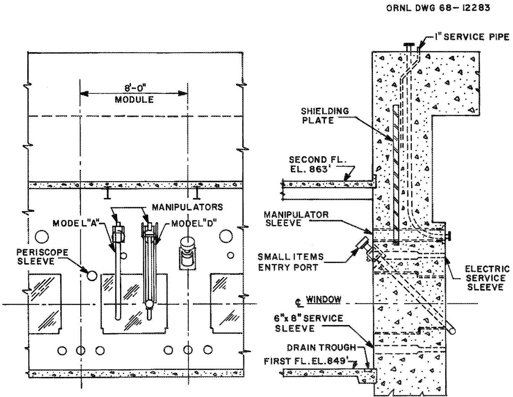  
Fig. 1. Typical Cell Operating Module.

25 cfm of air from the cell and process vessels and routes it to a system that is maintained at a pressure of -17 in. $\mathsf{H}_2\mathsf{O}$ . A small entry port permits introduction of small tools and miscellaneous items through a glove box and an air lock. The roof of the cell contains a hatch with a 10- by 6-ft opening that is sealed and shielded. The hatch provides access to the cell with the 50-ton building crane. Eight master-slave manipulators were installed in the cell: four Central Research Model A and four Central Research Model D units. A Program and Remote Systems Model 3000 electromechanical manipulator system is mounted on rails to give complete coverage of the cell.

# 4.1.2 Radioactive Hot Drain - Hot Off-Gas System (RHD-HOG)

The radioactive hot drain--hot off-gas system is a combination by-product waste collection system and vessel off-gas system. It has inlet connections in the hot cells and at various points throughout the facility.

The network of stainless steel piping is designed to handle gas and liquid in concurrent flow. Liquid waste is separated from the off-gas and is collected in tank B-2-T in the below-grade and shielded waste tank pit. The gaseous stream flows through a bank of absolute filters and then into the cell exhaust system located upstream of the filter units for that system. The liquid wastes may be pumped either into the Melton Valley waste system or into cell G for recovery of valuable materials.

Two connections from cell G to the HOG system were made for the salt preparation process. One connection was made to the capsule drilling station in order to collect the particulate matter resulting from the drilling operation. The other was made to a multipurpose manifold station. With the HOG system pressure controlled at -17 in. $\mathsf{H}_2\mathsf{O}$ , the flow of air from the cell was adjusted to 25 cfm by a manually operated valve. The gaseous effluent from the process scrubbing system was discharged into this manifold station, thereby ensuring dilution, in the case of hydrogen, to less than the explosive limit. In addition to the scrubber discharge, the manifold station served the in-cell titration station, the sampling station, the can-opening box, the scrubber system

and sink liquid drains, and all of the process vessels. Some of these connections were made to the manifold station on the cell side of the manual flow regulating valve, where the pressure was $-5$ in. $\mathsf{H}_2\mathsf{O}$ ; some were made on the HOG system side of the valve, where the pressure was $-15$ in. $\mathsf{H}_2\mathsf{O}$ . The location of each connection depended upon the pressure requirement for that particular use.

# 4.1.3 Cell Ventilation

Approximately 1033 cfm of air enters cell G from the cell G pump room via a series of filters, a fire damper, a back-flow preventer, and a cell pressure control valve. It discharges into the cell from diffusers that are mounted on the cell ceiling and then flows through roughing filters located at the false floor (and also at the cell floor level) into the cell ventilation system manifold in the north valve pit. The flow is controlled by a manually loaded valve in the exhaust duct. The exhaust is routed to the filter pit, where it passes through two sets of filters in series; from there, it passes through a 30-in. duct to the centrifugal blowers and into the 250-ft HFIR stack for dispersion into the atmosphere. The controls on the ventilation system maintain a pressure of -5 in. $\mathsf{H}_2\mathsf{O}$ in the cell under normal conditions. Pressures as low as -20 in. $\mathsf{H}_2\mathsf{O}$ or as high as -1 in. $\mathsf{H}_2\mathsf{O}$ can be maintained in the cell under certain emergency conditions. Only a failure of all emergency systems would allow the pressure in the cell to rise above -0.5 in. $\mathsf{H}_2\mathsf{O}$ .

# 4.1.4 Shielding

The shielding of the TURF is designed in such a manner that, during operation with radioactive material having an intensity of $10^{5}$ r/hr, the penetrating dose rates in normally occupied areas are no greater than 0.25 mrem/hr, with small hot spots no greater than 2.5 mrem/hr. Dose rates greater than this are permitted in limited-access areas and for short-term, non-routine operations.

To satisfy the allowable design radiation levels, the operating cells have $5 - 1 / 2$ ft-thick walls of normal concrete up to a height of 11 ft, $4 - 1 / 2$ ft of normal concrete for the remaining portions of the vertical walls, and 5-ft-thick concrete on the roof. This amount of biological shielding was more than adequate to reduce exposure doses rates to $< 0.1\mathrm{mr / hr}$ .

The windows are essentially equivalent, in shielding thickness and in their attenuation of penetrating radiation, to the concrete walls in which they are installed. Each window consists of two major assemblies: the seal glass that is removable from inside the cell, and the tank unit that is removable from the operating face of the cell. Each window is a composite unit consisting of 7 in. of glass and 58 in. of zinc bromide solution; it is well sealed to minimize leakage of air around its periphery.

# 4.1.5 Manipulators

A Programmed and Remote Systems Model 3000 Manipulator System is installed on a set of rails in cell G. The tube hoist on this manipulator has a vertical travel of $13 - 1 / 2$ ft and a lifting capacity of 1000 lb. The trolley and bridge travel, along with the vertical travel of the tube hoist, provides complete manipulator coverage of the cell down to the false floor. This unit provides all the motions of the human arm, plus wrist extension and continuous rotation at the wrist and at the shoulder. A grip force of 200 lb can be exerted with the fingers. The hand is remotely removable and can be replaced by a hook fixture or an impact wrench.

One Central Research Model A master-slave manipulator and one Model D master-slave manipulator are installed at each of the four viewing windows in cell G. The Model A and the Model D manipulator have maximum lift capabilities of 25 lb and 100 lb, respectively.

These master-slave units were installed to operate valves, to make and break tubing disconnects and electrical and thermocouple disconnects, and to conduct the hand operations required in the process. Conventional hand tools were modified for use with these manipulators.

The PaR electromechanical manipulator was installed to perform the heavy-duty maintenance, to convey heavy assemblies around the cell, to reach some parts of the cell that were not accessible to the master-slave manipulators, and to provide a "third" hand to simplify certain operations.

# 4.2 Process Flowsheets

Two processes were developed for the preparation of the fuel concentrate: (1) a high-temperature process, and (2) a low-temperature process. The second process was adopted after conclusion of the cold run when it became evident that the original process caused severe corrosion of the reaction vessel.

# 4.2.1 High-Temperature Process

The chemical flowsheet for the one-step, high-temperature process as shown in block form (Fig. 2) includes the following major steps:

(1) Partial reduction of the uranium oxide, $^{233}\mathrm{UO}_3$ , by thermal means.   
(2) Further reduction to $\mathrm{UO}_2$ by hydrogen treatment.   
(3) Conversion of the oxide to $\mathbf{U}\mathbf{F}_{4}$ by hydrofluorination and concurrent dissolution of the $\mathbf{U}\mathbf{F}_{4}$ in the molten LiF to form the eutectic mixture.   
(4) Final purification of the eutectic mixture by treatment with high-purity hydrogen.

The $7_{\text{LiF}}$ was combined with the $^{233}\mathrm{UO}_3$ in the initial charge to the reaction vessel. The reduction process was then conducted at temperatures in excess of $845^{\circ}\text{C}$ (LiF melting point) so that the oxide particles were suspended in the molten fluoride. The molten LiF served to keep the oxide particles wet, thus reducing the possibility of entrainment of particulate matter in the effluent gas stream. During the hydrofluorination step, the progress of the reaction was estimated by determining the liquidus temperature of the molten material, and then

Fig. 2. Chemical Flowsheet for Preparation of the $^{233}\mathrm{U}$ Fuel Concentrate for the MSRE.   
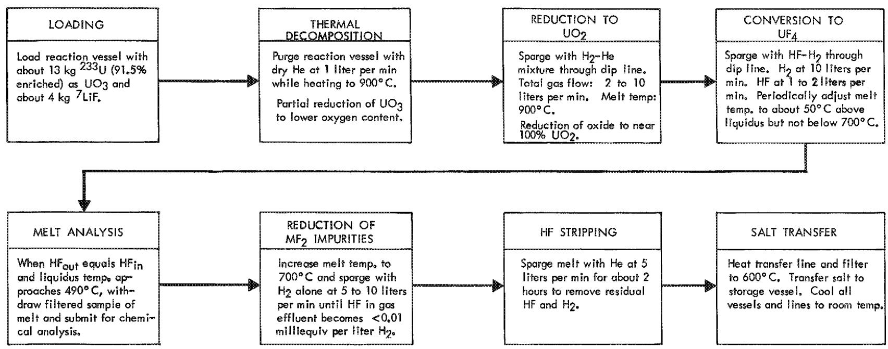  
Note: If results of chemical analysis (Step 5) do not meet specifications, continue HF-H2 treatment (Step 4).

the furnace temperature controller was adjusted to approximately $50^{\circ}\mathrm{C}$ above this value. Frequent titrations of the reaction vessel effluent gas stream yielded valuable information on the progress of the conversion of the oxide to the fluoride since the utilization of HF remained quite high and nearly constant until the conversion was completed.

Chemical analyses of filtered samples of the melt were made to determine whether the final process - the purification of the product by hydrogen sparging - should be initiated or whether the hydrofluorination process should be continued.

# 4.2.2 Low-Temperature Process

The low-temperature process (see Fig. 3) was used to produce the fuel concentrate. It differs in only one major respect from that used in the production of the original $235\mathrm{U}$ -bearing enriching salt for the MSRE. In the earlier process, the starting material was $\mathrm{UF}_4$ ; in the low-temperature process, the starting material is $\mathrm{UO}_3$ . The oxide is digested at $550^{\circ}\mathrm{C}$ and then reduced to $\mathrm{UO}_2$ by treatment with hydrogen at temperatures ranging from 400 to $550^{\circ}\mathrm{C}$ . Helium is used as a diluent gas during the reduction step until the major portion of the exothermic reaction is completed. The oxide is then converted to $\mathrm{UF}_4$ by hydrofluorination at temperatures ranging from 400 to $630^{\circ}\mathrm{C}$ and at HF (in hydrogen) concentrations varying from 5 to $40\%$ . The final steps of the process involve mixing and fusing the fluoride salts, contacting with HF and hydrogen to remove residual oxides and corrosion product impurities, and filtering the molten salt during its transfer to the storage containers.

The reduction and conversion processes were monitored by a thermocouple array that was inserted into the powder in the reaction vessel and by measurements of hydrogen utilization during the reduction step and of HF utilization during the conversion step. Unfiltered and filtered samples of the melt were withdrawn for oxide, petrographic, and metal impurity analyses.

ORNL DWG 68-9515R1

OVERALL REACTION

$$
U O _ {3} + H _ {2} + 4 H F \rightarrow U F _ {4} + 3 H _ {2} O
$$

$$
\mathrm {U F} _ {4} + \mathrm {L i F} \rightarrow \mathrm {U F} _ {4} \cdot \mathrm {L i F}
$$

27% - 73% EUTECTIC COMPOSITION

CHARGE UO3:

$\sim 13.2 \mathrm{~kg} U A S U O_{3}$

HEAT TREAT $\mathsf{UO}_{3^{\prime}}$

3 TO 5 hr DIGESTION AT $550^{\circ}C;$ COOL TO $400^{\circ}C.$

HYDROGEN REDUCTION:

START $5 \%$ H2 AT 400°C AND INCREASE TO $50 \%$ H2;

$$
\mathrm {U O} _ {3} \rightarrow \mathrm {U O} _ {2}
$$

TEMPERATURE RISES TO $490^{\circ}C_{i}$ TREAT AT 500-550°C

AT $100\%$ USAGE OF $\mathsf{H}_2$ COOL TO $400^{\circ}\mathsf{C}$

HYDROFLUORINATION:

START $5 \%$ HF IN $\mathsf{H}_2$ AT $400^{\circ}\mathsf{C}$ ; INCREASE TO $40\%$

$$
\mathrm {U O} _ {2} \rightarrow \mathrm {U F} _ {4}
$$

HF IN H2; TEMPERATURE INCREASES TO $450^{\circ}C$

WHEN HF USE DECREASES BELOW $80\%$ , INCREASE

THE TEMPERATURE TO $630^{\circ}\mathrm{C}$ STEPWISE UNTIL HF

USE BECOMES 0; COOL TO $150^{\circ}C$

EUTECTIC FORMATION:

ADD EXACT QUANTITY OF $7$ LiF; MELT UNDER $30\%$ H2;

$$
U F _ {4} + L I F \rightarrow U F _ {4} \cdot L I F
$$

DIGEST AT $850^{\circ}C$ FOR 3 TO 5 hr; COOL TO $700^{\circ}C$ .

EUTECTIC PURIFICATION:

PURGE MELT 24 TO 30 hr AT $700^{\circ}C$ WITH $20\%$ HF

$$
M O + H F \rightarrow M F + H _ {2} O
$$

IN H2; TREAT WITH H2 FOR 75 TO 150 hr.

$$
M F + H _ {2} \rightarrow M ^ {0} + H F
$$

UNFILTERED SAMPLE ANALYZED FOR OXIDE CONTENT.

FILTERED SAMPLE ANALYZED FOR METALLIC IMPURITIES.

PRODUCT PURITY:

Fig. 3. Chemical Flowsheet for the Low-Temperature Process for Preparing the MSRE Fuel Concentrate.

The temperatures encountered in this process are generally $200^{\circ}\mathrm{C}$ lower than those measured in the single-step, high-temperature process.

The adoption of this process was felt to be justifiable without the benefit of a full-scale cold run because of the:

(1) success of the laboratory-scale experiment,   
(2) similarity of this process to the original concentrate production process,   
(3) improvements made in the process monitoring instruments and techniques,   
(4) the time schedule involved.

# 4.3 Process Equipment

The equipment frowsheet shown in Fig. 4 is a simplified presentation of the major components required in the process. These components are:

(1) the fuel decanning station,   
(2) the reaction or oxide treatment vessel,   
(3) the salt storage and transfer vessel,   
(4) various containers for shipping the product,   
(5) the off-gas scrubbers.

In addition, the process requires many other smaller pieces of equipment, such as: the oxide can preparation equipment, the in-cell titration assembly, the furnaces for the vessels, the enrichment capsule drilling and weighing station, disconnect stations for electrical and instrument lines and process gas lines, and work tables and tool racks. Figures 5 and 6 show some of this equipment after installation.

All services and reagent sources are located in the penthouse outside the cell.

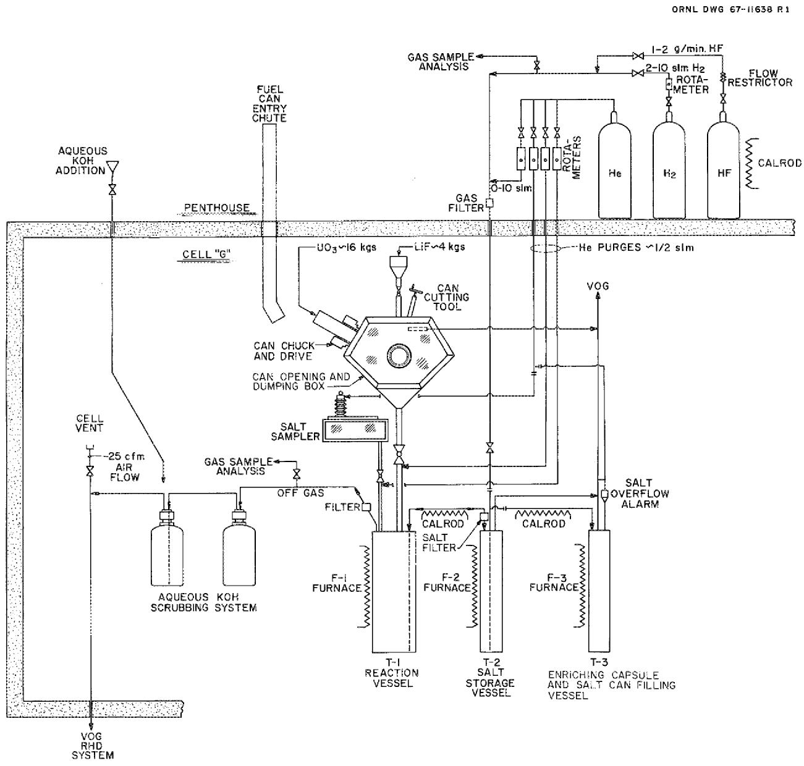  
Fig. 4. Simplified Chemical and Engineering Flowsheet for Preparing $^{233}\mathrm{U}$ Fuel Salt.

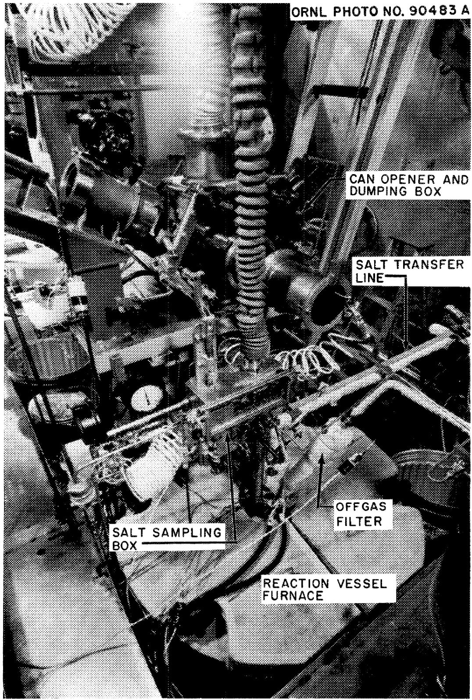  
Fig. 5. Main Reaction Vessel Furnace and Auxiliary Equipment for $233_{\mathrm{U}}$ Fuel Salt Preparation - Cell G, Building 7930.

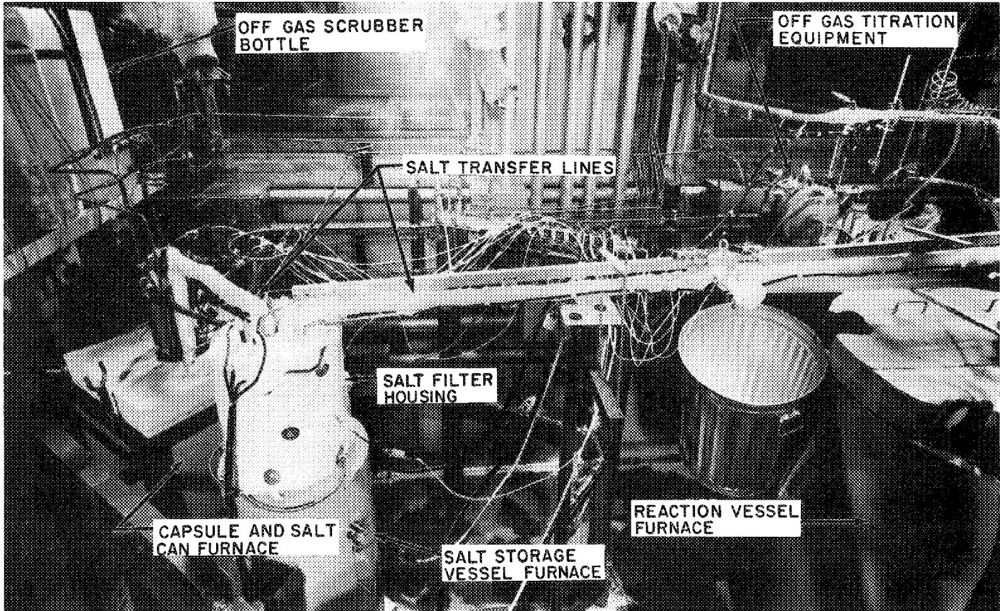  
Fig. 6. Auxiliary Furnaces and Equipment for $^{233}\mathrm{U}$ Fuel Salt Preparation - Cell G, Building 7930.

# 4.3.1 Decanning Station

The decanning station (Fig. 7) is a rather complicated work box that is required for opening the double-container cans, extracting the oxide powder, feeding the powder to the reaction vessel, and disposing of the spent cans. To accomplish this, the station treated each can in the following manner:

(1) Received the full can and fed it into a rotating chuck.   
(2) Tightened the chuck to grip the can while the grooving tool formed a groove deep enough to fix the inner and outer cans together. This was done twice for each can.   
(3) Pushed the can into the box, displacing the previously opened can.   
(4) Ejected the previously opened can and lid.   
(5) Gripped the can, supported it, and rotated it while the cutting tool cut it open.   
(6) Removed and retained the cut-off lid while the can was emptied of oxide by vibration and brushing.   
(7) Inspected the inside of the can and lid for remaining powder.   
(8) Transferred the powder from the box into the reaction vessel by vibration and use of in-box tools.

The decanning station was designed for alpha containment. All penetrations to it were sealed by O-rings and boots. Each spent can acted as a seal until it was displaced by the next can.

A ball valve and charging hopper situated on top of the box was used to introduce the LiF to the system.

# 4.3.2 Reaction Vessel

All of the chemical reactions of the process were conducted in the reaction vessel (Fig. 8). The cold-run vessel was a right cylinder, 7-5/16 in. ID and 36 in. high, fabricated from type $304\mathrm{L}$ stainless

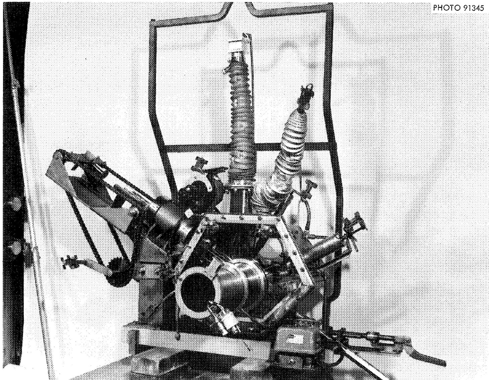  
Fig. 7. Decanning Station.

ORNL DWG-67-11674

Material: Vessel & Pipe 304 L SST.  
Liner, Diffuser & Dip Line: Nickel 20!

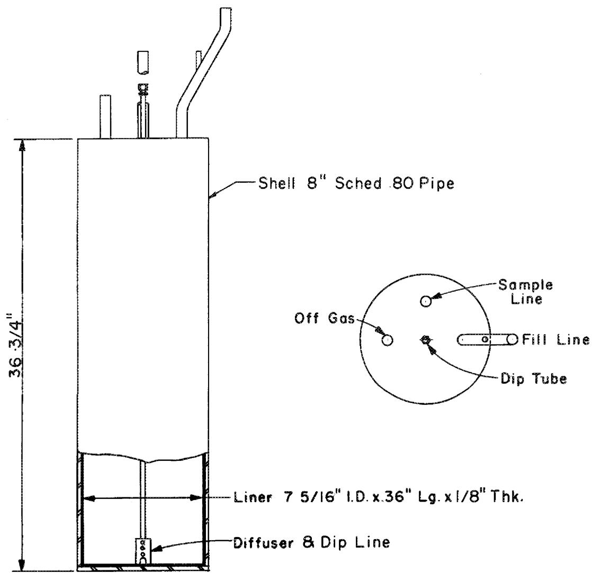  
Fig. 8. Reaction Vessel T-1.

steel; it contained a free-standing liner, $1/8$ in. thick, constructed from type 20l nickel, and was designed, on the basis of stress rupture data, for a specified service life. The vessel contained nozzles to permit powder addition, salt sampling, gaseous effluent discharge, and product transfer. Upon completion of the cold run, the design of the vessel was modified to include a truncated conical bottom to provide better contact of the reagent gases. The production runs were conducted in this vessel. Design information for this vessel and the other process vessels is listed in Table 1.

# 4.3.3 Salt Storage and Transfer Vessel

The transfer vessel (Fig. 9) was a right cylinder, 4 in. in diameter and $36 - 1 / 2$ in. tall, constructed of type 201 nickel. It contained five nozzles, one of which was a spare. The function of this vessel was to receive a filtered, purified batch of the enriching salt from the reaction vessel and to dispense it to the various product shipping containers. It was necessary for this vessel to store salt for $24\mathrm{hr}$ or more during the changeout of some of the shipping containers.

# 4.3.14 Shipping Containers

The shipping containers were arranged into three arrays for the filling operations. Later, upon completion of the filling operation and freezing of the salt, each array was disassembled into individual containers for shipment to the MSRE.

The first array (Fig. 10) consisted of 45 enrichment capsules (see Fig. 11), each of which was $3/4$ in. in diameter and 6 in. long and designed to contain $96\mathrm{g}$ of uranium. The capsules were connected in series and arranged in three 15-capsule decks. An overflow pot containing liquid level detection elements and thermocouples was the last vessel in the series. The tubing connections into, and out of, each capsule were precisely positioned so that uniform filling and subsequent blowback of the overfill were possible. Two holes were drilled in each capsule to permit the salt to flow out when the capsule

Table 1. Equipment Design Information: MSRE ${}^{233}$ U Fuel Salt Preparation   

<table><tr><td>Item or Requirement</td><td>Reaction Vessel T-1 Outer</td><td>Reaction Vessel Inner Liner</td><td>Salt Storage Vessel T-2</td><td>Salt Addition Cana</td><td>Enrichment Capsule</td><td>Furnace Liner F-1</td><td>Furnace Liner F-2</td><td>Furnace Liner F-3</td></tr><tr><td>Type of material</td><td>304L SS</td><td>201 Ni</td><td>201 Ni</td><td>304L SS</td><td>200 Ni</td><td>300 SS</td><td>300 SS</td><td>304 SS ELC</td></tr><tr><td>Maximum operating temp., °C</td><td>900</td><td>900</td><td>700</td><td>600</td><td>600</td><td>900+</td><td>900+</td><td>900+</td></tr><tr><td>Maximum operating pressure, psig</td><td>≤6# at 900°C, 20# at 700°Cb</td><td>Free standing liner in reaction vessel; no pressure difference developed</td><td>20</td><td>20</td><td>20</td><td>Open</td><td>Open</td><td>Open</td></tr><tr><td>Maximum operating vacuum, psig</td><td>15</td><td>-</td><td>15</td><td>15</td><td>15</td><td>-</td><td>-</td><td>-</td></tr><tr><td>Design temperature, °C</td><td>900</td><td>-</td><td>-</td><td>-</td><td>-</td><td>-</td><td>-</td><td>-</td></tr><tr><td>Design pressure, psig</td><td>6# at 900°C (Limiting condition)</td><td>-</td><td>20</td><td>-</td><td>-</td><td>-</td><td>-</td><td>-</td></tr><tr><td>Calculated maximum stress, psig</td><td>727 psi at 6 psig</td><td>Maximum stress is that due to head of salt in liner and is negligible</td><td>2560 psi at 20# gage</td><td>-</td><td>-</td><td>-</td><td>No load carried by bottom plate or wall</td><td>No load carried by bottom plate or wall</td></tr><tr><td>Allowable maximum stress at maximum operating temp.</td><td>1150 psi at 900°C</td><td>-</td><td>3000 psi at 700°Cb</td><td>-</td><td>-</td><td>870 psi at 900°C</td><td>-</td><td>-</td></tr><tr><td>Overall height, in.</td><td>37</td><td>35-7/8</td><td>36-1/2</td><td>Variable</td><td>6-3/8</td><td>37</td><td>36-7/8</td><td>36-7/8</td></tr><tr><td>Bottom plate thickness, in.</td><td>1/2</td><td>1/8</td><td>1/4</td><td>5/16 - 1/2</td><td>-</td><td>1/4 (reinforced with welded beam on diam)</td><td>1/8</td><td>1/8</td></tr><tr><td>Flat head thickness, in.</td><td>3/4</td><td>-</td><td>1/4</td><td>1/4</td><td>-</td><td>-</td><td>-</td><td>-</td></tr><tr><td>Outer diameter, in.</td><td>8-5/8</td><td>7-9/16</td><td>4-1/2</td><td>2-1/2</td><td>3/4</td><td>10-3/4</td><td>4-7/8</td><td>4-7/8</td></tr><tr><td>Wall thickness, in.</td><td>1/2</td><td>1/8</td><td>15/64</td><td>0.065</td><td>0.035</td><td>0.359</td><td>1/8</td><td>1/8</td></tr><tr><td>Inner diameter, in.</td><td>7-5/8</td><td>7-5/16</td><td>4-1/32</td><td>2.37</td><td>0.680</td><td>10.032</td><td>4-5/8</td><td>4-5/8</td></tr><tr><td>Top flange OD, in.</td><td>-</td><td>-</td><td>-</td><td>-</td><td>-</td><td>16</td><td>4-5/8</td><td>4-/58</td></tr><tr><td>Top flange thickness, in.</td><td>-</td><td>-</td><td>-</td><td>-</td><td>-</td><td>3/8</td><td>1/4</td><td>1/4</td></tr><tr><td>Hemispherical bottom wall thickness, in.</td><td>-</td><td>-</td><td>-</td><td>-</td><td>0.035</td><td>-</td><td>-</td><td>-</td></tr><tr><td>Hemispherical top, in.</td><td>-</td><td>-</td><td>-</td><td>-</td><td>3/8 solid</td><td>-</td><td>-</td><td>-</td></tr></table>

${}^{a}$ Designed by MSRE.   
b10,000 hr creep-rupture data; design based on service << 10,000 hr.

ORNL DWG-67-11675

Material: Nozzles & Vessel: Nickel

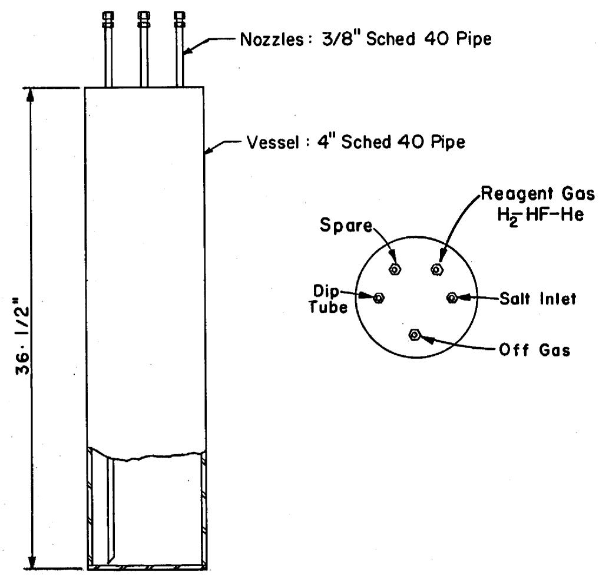  
Fig. 9. Transfer Vessel.

PHOTO 91466

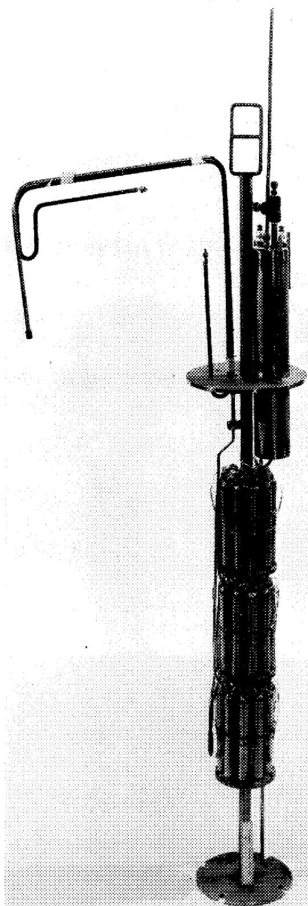  
Fig. 10. Filling Array Consisting of 45 Capsules.

ORNL DWG-67-11676 RI

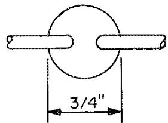

Material: Nickel 200

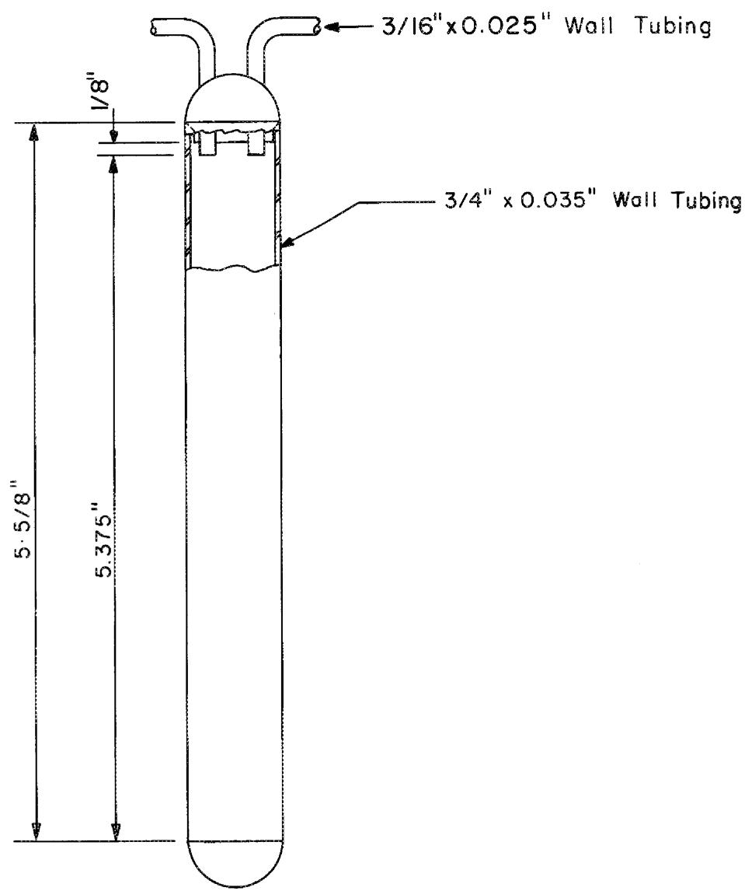  
Fig. ll. Typical Enrichment Capsule.

is lowered into the MSRE pump bowl. A cable-and-latch assembly was attached to each capsule for use in the sampler-enriched operation at the reactor.

The second array (Fig. 12) consisted of four 2-1/2-in.-diam by 34-in.-long cans connected in series for filling operations. Each was designed to contain $7\mathrm{kg}$ of uranium and had an instrumented overflow pot. The cans were later disassembled, and the top and bottom plugs were removed; then the cans were fitted with lifting tails and bottom "stopper-type" plugs and weighed. They are being shipped, one at a time, to the MSRE, where the bottom plug of each can is removed before the can is lowered into the drain tank. In this tank, the salt melts and runs out of the container.

The third array (Fig. 13) contained a group of six $2 - 1 / 2$ -in.-diam variable-length cans (see Fig. 14) that were similar in design and arrangement to those in the second array. One of these cans was used to store excess product material that was blown back from the other five cans after they had been filled to overflow. The latter cans were designed to contain $0.5$ to $3\mathrm{kg}$ of uranium (2 cans, $0.5\mathrm{kg}$ each; one can, $1\mathrm{kg}$ ; one can, $2\mathrm{kg}$ ; and one can, $3\mathrm{kg}$ ).

# 4.3.5 Scrubbers

A caustic scrubber system was installed to neutralize the HF effluent from the reaction vessel before it was discharged to the TURF HOG system. The scrubbers, namely, four 13-gal polyethylene bottles filled with $10\%$ KOH, were connected in series and fitted with the necessary fill-and-drain connections. The first bottle in the series was kept empty, and the dip lines in the subsequent bottles were positioned at an exact depth. Thus the first bottle had an adequate volume to retain any liquid that might flow back toward the reaction vessel (in the event that the pressure distribution in the system became reversed). Also, a vacuum breaker was installed to prevent the occurrence of a vacuum, which could cause collapse of the bottles.

PHOTO 91470

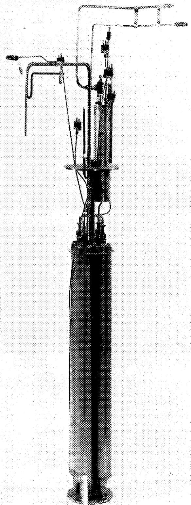  
Fig. 12. Second Filling Array: Four Cans, Each Containing $7\mathrm{kg}$ of Uranium.

PHOTO 91471

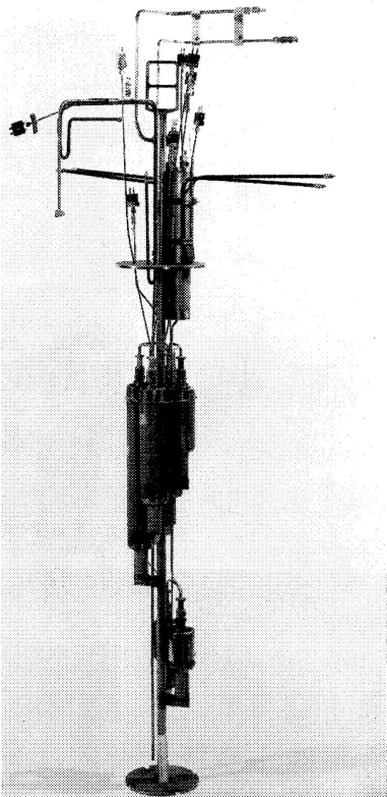  
Fig. 13. Third Filling Array Containing Six Shipping Containers of Miscellaneous Sizes.

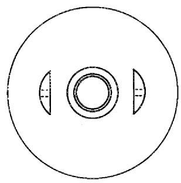

Material: 304L SST

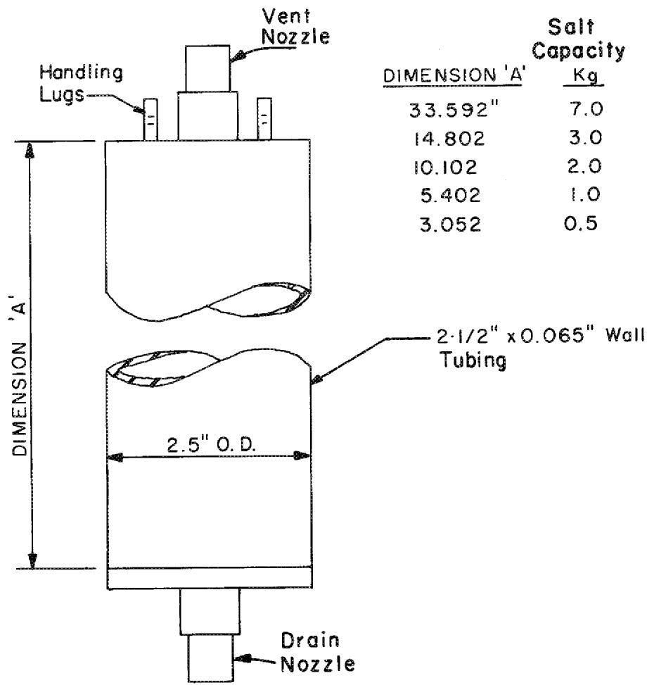  
Fig. 14. Salt Addition Can.

Raschig rings had been installed to prevent collapse of the bottles in the scrubber system used in the cold run; however, these rings prevented uniform mixing and were subsequently replaced by a vacuum breaker.

# 4.3.6 Miscellaneous Equipment

Oxide Can Lengthening Equipment. - The $^{233}\mathrm{UO}_3$ decanning station was designed by using can drawings and sample cans from the Savannah River Laboratory. After the decanner was fabricated, it was discovered that the actual cans were 1-3/4 in. shorter than denoted on the drawings. (The measurements of the actual cans had not been checked closely because of the high radiation levels of the oxide.) Since modification of the decanner was impractical, we decided to lengthen each can 1-1/2 in. by cementing an extension on it. Three items of equipment, as shown in Fig. 15, were required to accomplish this: (1) a machining fixture to bevel the end of the can, (2) a press to force the extension onto the can, and (3) a fixture to cure the epoxy resin used in the cemented joint.

In-Cell Titration Assembly. - The off-gas titration assembly consisted of a train of three 3-in.-diam by 6-in.-tall glass vessels, a wet test meter for measuring gas flows, and the necessary tubing and valves to permit reagents to be added and flushed from outside the cell.

Furnaces and Heaters. - Three high-temperature, electrical-resistance-heated furnaces were installed in cell G for temperature control of vessels used in the treatment, storage, and transfer of the salt. A 24-kw, 12-in.-cavity furnace was used for the reaction vessel; a 7-1/2-kw, 4-7/8-in.-cavity unit was used for the transfer vessel; and a 10-kw, 4-7/8-in.-cavity unit was used for the shipping container assemblies. Locally fabricated clamshell heaters using tubular resistance-heating elements provided heat to the nozzles located on the tops of the vessels. The salt transfer lines were heated by attaching tubular heating elements to the tubing and then applying thermal insulation. The off-gas line (and filter) was heated with electrical, resistance-heating tape to prevent condensation of HF or water vapor in the line.

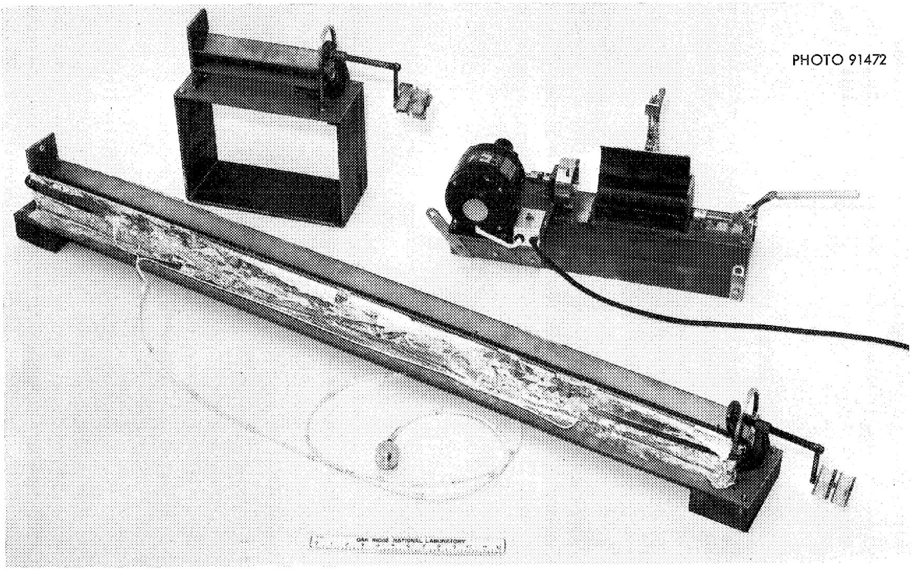  
Fig. 15. Oxide Can Lengthening Equipment.

Enrichment Capsule Drilling and Weighing Fixture. - Two holes were drilled in each of 45 enrichment capsules to permit the salt to flow out when the capsule is immersed in the salt in the reactor pump bowl. Upon disassembly of the capsule filling array, each capsule was inserted into the work box (Fig. 16); here, a bottom outlet hole and a top vent hole were drilled in the capsule, the capsule was weighed, the lifting bail was tested for integrity, and the capsule was inserted into the shipping carrousel. The transparent box served as containment during the drilling operation. Off-gas from the capsule drilling box passed through an absolute filter and was then discharged to the plant vessel off-gas system.

Disconnects. - The electrical and thermocouple disconnects used in the cell were standard commercial units. Generally, one-half of the disconnect was mounted rigidly to facilitate making and breaking operations with the master-slave manipulators.

Several types of pipe and tubing disconnects were used. In general, the gas service lines utilized ball-check quick disconnects. Compression fittings were used in the salt transfer lines and in the main off-gas lines. Conventional screwed pipe connections were used in areas where remote operation of the joint was not considered necessary. Locally designed and fabricated connections were used in several large-diameter joints that would possibly require remote maintenance.

Work Tables and Tool Racks. - The process equipment was positioned in the cell to obtain maximum advantage of the capabilities of the eight available master-slave manipulators. Extensive use was made of supporting stands and mounting framework. Tool racks for the required hand tools were located at the major work centers. Where possible, the void spaces between the process equipment and the cell walls were filled with trays to provide extra work areas, space for temporary tool storage, and a surface on which to catch tools and small equipment items that were dropped. A large work table (Fig. 17) was installed to accommodate the product shipping container disassembly, the shipment preparation operations, and the capsule drilling and weighing fixture.

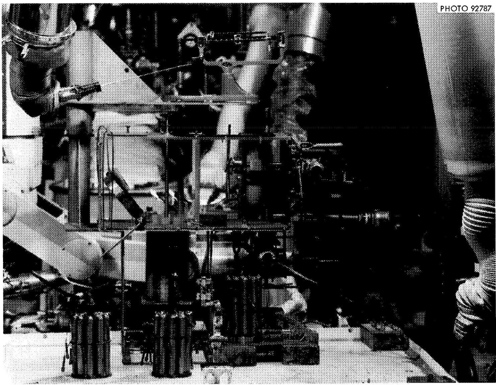  
Fig. 16. Capsule Drilling and Weighing Station.

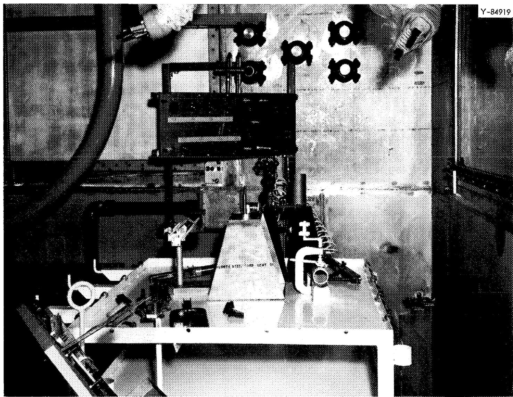  
Fig. 17. In-Cell Work Table.

The tables, racks, and supports were fabricated from carbon steel; the trays were fabricated from stainless steel.

# 4.4 Operating Procedures

Operating procedures were developed for each of the 25 separate operations required for the fuel production. (These procedures were written before the cold run was made.) Brevity and conciseness were stressed. Complete revision of most of them was necessary as a result of the experience gained in the cold run. Review and revision, on a day-to-day basis, continued throughout the $^{233}\mathrm{U}$ production runs; the minor equipment failures and malfunctions that occurred during these runs led to extensive procedural changes to ensure continued production of a high-quality fuel concentrate.

Tables 2 lists the runsheets that were prepared.

# 5. COLD RUN WITH DEPLETED URANIUM

The run with depleted uranium provided full-scale testing of the chemical process, operational procedures, and of most of the equipment in the absence of a penetrating radiation field. In this run, $14.6\mathrm{kg}$ of uranium oxide (11.6 kg of $^{238}\mathrm{U}$ ) plus $3.4\mathrm{kg}$ of LiF were charged to the system to produce 18.7 kg of $\mathrm{LiF} \cdot \mathrm{UF}_4$ (73-27 mole %) eutectic.[5]

# 5.1 Preoperational Activities

The period from September 15, 1967, through January 15, 1968, was devoted to facility testing; process equipment fabrication, installation, and testing; operator training; preparation of procedures and manuals; and preparation of the process safety review, the criticality review, and the radiochemical plant safety analysis.

# 5.2 Mechanical Operations

The run with depleted uranium began January 15, 1968, with the loading of $^{238}\mathrm{UO}_3$ -filled cans into cell G from the shielded carrier.

Table 2. List of Runsheets Prepared for ${}^{233}\mathrm{U}$ Fuel Salt Production   

<table><tr><td>1.</td><td>Packaging of LiF.</td></tr><tr><td>2.</td><td>Removing Empty Fuel Carrier from Building 7930 Penthouse Pedestal.</td></tr><tr><td>3.</td><td>Preparing and Transferring Empty Fuel Carrier from Building 7930 Penthouse to Building 3019 Penthouse.</td></tr><tr><td>4.</td><td>Preparing and Transferring of Loaded Fuel Carrier from Building 3019 Penthouse to Building 7930 Penthouse.</td></tr><tr><td>5.</td><td>Checkout of Cell G.</td></tr><tr><td>6.</td><td>Preparation of KOH Scrubber System.</td></tr><tr><td>7.</td><td>Preparation of Inert and Reagent Gas System.</td></tr><tr><td>8.</td><td>Pressure Test of Helium Header.</td></tr><tr><td>9.</td><td>Pressure Test of H2Manifold.</td></tr><tr><td>10.</td><td>Pressure Test of HF Manifold (before any run).</td></tr><tr><td>11.</td><td>Pressure Test of T-1 and T-2 Systems.</td></tr><tr><td>12.</td><td>Preparation for Operation: Valve and Rotameter Settings.</td></tr><tr><td>13.</td><td>Discharge of Fuel Cans from Carrier to Cell G.</td></tr><tr><td>14.</td><td>Capping Fuel Cans.</td></tr><tr><td>15.</td><td>Decanning and Charging Fuel to T-1.</td></tr><tr><td>16.</td><td>Charging LiF to Reaction Vessel.</td></tr><tr><td>17.</td><td>Transfer of Odd-Lot LiF to Cell G.</td></tr><tr><td>18.</td><td>Eutectic Formation.</td></tr><tr><td>19.</td><td>Hydrofluorination Reaction Progress.</td></tr><tr><td>20.</td><td>HF Titration (Inlet).</td></tr><tr><td>21.</td><td>HF Titration (Outlet).</td></tr><tr><td>22.</td><td>Sample Procedure.</td></tr><tr><td>23.</td><td>Salt Transfer from Reaction Vessel T-1 to Transfer Vessel T-2.</td></tr><tr><td>24.</td><td>Salt Transfer from T-2 to T-3, Run No. 1 (3/4-in. Capsule Assembly).</td></tr><tr><td>25.</td><td>Salt Transfer from T-2 to T-3 (Partial Filling of T-3).</td></tr><tr><td>26.</td><td>Replacing Salt Vessel Assemblies (T-3).</td></tr><tr><td>27.</td><td>Capsule Drilling and Weighing.</td></tr><tr><td>28.</td><td>Weighing and Removal of Salt Shipping Vessels from Cell G.</td></tr><tr><td>29.</td><td>Transfer of Salt Shipping Vessels to MSRE.</td></tr></table>

The $\mathrm{UO}_3$ had been processed at the Y-12 Plant, and the empty inner and outer cans had been obtained from the Savannah River Laboratory. The cans had been filled with the oxide and sealed by a magnetic forming technique to simulate the product cans that would later be used in the production runs. The can opening box did not perform satisfactorily; therefore, it was removed from the cell and extensively modified. The alignment tolerances were relaxed, components were strengthened, additional equipment was installed to aid in transferring the powder from the box, and the viewing capabilities were increased.

Difficulty was encountered in transferring the LiF from the decanning box to the reaction vessel. The available vibration was inadequate, and no provision had been made to sweep or "rod" the powder out and down through the powder addition line. The vibrators had been located on the equipment in such a way that most of their force was imparted to the fixtures and mechanisms in the box. This resulted in some damage to the equipment. Because of this, the vibrators were used sparingly and with caution.

# 5.3 Chemical Operations

Chemical operations began on January 24, 1968, with the sintering operation, which was conducted at $900^{\circ}\mathrm{C}$ with a helium flow of 1 std liter/min through the bed. The sintering treatment was immediately followed by the hydrogen reduction step at the same temperature. A 2-liter/min flow of gas, consisting initially of 0.1 liter of hydrogen and 1.9 liters of helium per minute, was attained initially. The composition of this gas was adjusted periodically until a flow of pure hydrogen was obtained. Then the flow rate was increased, in increments, to 10 liters/min, where it was maintained for 5 hr. During this treatment, the sintered-metal off-gas filter became plugged. Subsequent examination of the filter unit revealed the presence of a hard filter cake. Water vapor, which is evolved during the reduction process, could have condensed on the filter in the event that the filter heater was improperly operated; this would have permitted the filter temperature to drop below the dew point of the effluent.

The conversion of the oxide to the fluoride began January 27, 1968. Anhydrous hydrogen fluoride mixed with hydrogen (10 meq of HF per liter of hydrogen) was injected through a dip line to the bottom of the $\mathrm{UO}_2$ bed at the rate of 2.2 liters/min. This reaction began at $900^{\circ}\mathrm{C}$ , and the temperature was periodically decreased to maintain the melt at about $50^{\circ}\mathrm{C}$ above the liquidus temperature. The in-cell titration apparatus was used to monitor the HF in the effluent, but the results were inconclusive; thus another titration unit that permitted precise addition of the equilibrating reagents from outside the cell was designed and installed. The data obtained with the new equipment showed that the utilization of HF was essentially zero (which indicated that the conversion of the oxide was complete) after 295 hr of hydrofluorination. An attempt to sample the melt was unsuccessful because of the presence of a hard top layer (or crust). No noise was evident from a listening rod installed to detect bubbling from the dip line. It was concluded that the dip line had broken, by corrosion or melting, above the liquid interface. This would account for the lack of HF utilization and the slow progress in the conversion of the oxide. Subsequent examination of the dip tube showed a large hole approximately at the interface. A new dip tube, along with a sensitive sound detector, was installed, and the HF treatment was resumed. Bubbling in the melt was easily detected; and, for the first time, reasonable values for the HF utilization were obtained. After 250 hr of additional HF treatment, the dip line became plugged at a location about $1-3/4$ in. from its open end. Upon examination, the plug material appeared to be uranium oxide. Four subsequent lines plugged approximately at the gas-liquid interface within the tube; in these instances, the plug material also appeared to be uranium oxide. It was obvious, then, that excessive moisture was being introduced into the melt by the gases used in the process. This problem was solved by installing a column filled with magnesium perchlorate in the helium system and by installing a catalytic recombiner, a molecular-sieve drying column (with regenerative capabilities), and a moisture analyzer in the helium system.

The effluent gases from the reaction vessel were directed to a caustic scrubbing system, which consisted of polyethylene bottles filled with $20\%$ KOH solution and Raschig rings (to prevent collapse). At an early stage in the process, the dip lines in the scrubber bottles plugged, and a white precipitate appeared. Frequent sparging to promote mixing, frequent recharging of the caustic solution, rinsing with hot water, and a decrease (from $20\%$ to $10\%$ ) in KOH concentration permitted use of the system for the remainder of the cold run. It was felt that the Raschig rings were a major contributor to this problem in that they promoted stratification of the solution; this was confirmed by the colored interface that appeared in the bottles when phenolphthalein indicator was present. At the conclusion of the cold run, the scrubber system was completely replaced by one that contained spare lines and a vacuum breaker (to prevent possible bottle collapse), and permitted remote replacement and flushing of all lines.

Although it gave satisfactory results in the small-scale development runs, the technique of measuring the liquidus temperature of the melt and subsequently determining, from the binary $\mathrm{UF}_4$ -LiF phase diagram, the progress of the conversion reaction did not prove successful in this system. The heat capacities and thermal insulation of the system, along with poorly located thermocouples, obscured the inflection in the temperature decay curve of the melt upon cooldown. However, the HF utilization data, along with material balances for the system, provided sufficient reaction progress information. When the reaction was judged to be complete, an unfiltered sample of the melt was withdrawn and analyzed, chemically and petrographically, for oxide content.

The purification of the melt, by the reduction of the metal fluorides to metal, was conducted without incident. Titration of the HF in the effluent gas proved to be a reliable means of determining the end point of this reaction. Filtered and unfiltered samples were taken at the conclusion of the purification step. The filtered samples were considered to be representative of the packaged product since the melt was filtered in the transfer operation. The cold run product analyzed as follows:

<table><tr><td colspan="7">Concentration (wt %)</td></tr><tr><td>U</td><td>O2</td><td>Ni</td><td>Fe</td><td>Cr</td><td>Al</td><td>S</td></tr><tr><td>61.0</td><td>0.02</td><td>0.0065</td><td>0.007</td><td>0.26</td><td>0.1</td><td>0.002</td></tr></table>

The product was filtered into the intermediate storage vessel; then it was transferred to the capsules and shipping containers by subjecting the salt to a helium overpressure of approximately 12 to 15 psig and forcing it out of the vessel through a dip line. This involved several operations because the capsules were, first, filled and, then, replaced in the system by the shipping can container assembly for filling. The compression-type tubing fittings used for this operation were very difficult to open after thermal cycling and after salt had contacted them. (Also, it was difficult to make up these fittings properly and to obtain leak-tight joints, using the master-slave manipulators.) The approach to a solution of these difficulties consisted of:

(1) modification of the intermediate transfer vessel by addition of spare nozzles,   
(2) reorientation of the vessel to improve accessibility,   
(3) use of redundant fittings when necessary,   
(4) use of a high-temperature thread lubricant on all fittings,   
(5) modification of the operating procedure to reduce the number of times fittings had to be opened, and   
(6) training operators in use of the manipulators on a simulated piping arrangement.

In summary, the cold run with depleted uranium was invaluable in that it:

(1) led to a process that was more simple to operate and that was compatible with the equipment,

(2) pointed out design and fabrication deficiencies in the equipment,   
(3) provided on-the-job training for the operators and supporting personnel,   
(4) tested the operational procedures, showing the need of extensive changes in them, and   
(5) showed that comprehensive remote maintenance procedures would probably be mandatory to ensure successful completion of the $233_{\mathrm{U}}$ fuel concentrate production runs.

6. $7_{\mathrm{LiF}} - 233_{\mathrm{UF}_4}$ PROCESS OPERATIONS

Three production batches, using the low-temperature flowsheet, were required in order to prepare $63.4\mathrm{kg}$ of the fuel-enriching concentrate, ${}^{7}\mathrm{LiF}-{}^{233}\mathrm{UF}_{4}$ . This concentrate contained $39\mathrm{kg}$ of uranium (35.6 kg of $^{233}\mathrm{U}$ ). The first run began May 9, 1968, and the third run was completed July 30, 1968. The 45 enrichment capsules were filled with a portion of the first-run product; the four $7\mathrm{-kg}$ shipping containers were filled with the remainder of the first-run product, all of the second-run product, and a portion of the third-run product; the miscellaneous shipping container assembly was filled with the remainder of the third-run product. The ten salt shipping containers and the 45 enrichment capsules were delivered to the Molten Salt Reactor as required in the reactor enrichment schedule.

# 6.1 Feed Materials

The $^{233}\mathrm{UO}_3$ had been prepared in batches by using $7\underline{\underline{\mathbf{M}}}$ $\mathrm{NH_4OH}$ (in excess) to precipitate hydrous uranium oxide from solutions that contained 10 to $40\mathrm{g}$ of uranium per liter and were $1\underline{\underline{\mathbf{M}}}$ in $\mathrm{HNO}_3$ and $\mathrm{NH_4NO_3}$ . The uranium in the feed solution had been purified and isolated in 1964 and 1965 by solvent extraction followed by ion exchange. These treatments decreased the concentrations of plutonium, thorium, fission products, and corrosion products (iron, nickel, and chromium) to acceptably low levels. Table 3 shows typical analyses of the oxide feed material.

Table 3. Compositions ${}^{a}$ of Feeds for Preparing MSRE Fuel Salt   

<table><tr><td>Run No.</td><td>RU-33-1</td><td>RU-33-2</td><td>RU-33-3</td></tr><tr><td>Oxide, g</td><td>15,929.4</td><td>15,901.7</td><td>16,376.7</td></tr><tr><td>Total U, g</td><td>13,082.4</td><td>13,105.8</td><td>13,533.0</td></tr><tr><td>233U, g</td><td>11,966.9</td><td>11,969.7</td><td>12,377.8</td></tr><tr><td>Impurities, ppm</td><td></td><td></td><td></td></tr><tr><td>Chromium</td><td>50</td><td>87</td><td>44</td></tr><tr><td>Iron</td><td>372</td><td>588</td><td>271</td></tr><tr><td>Nickel</td><td>&lt; 16</td><td>47</td><td>&lt; 13</td></tr><tr><td>232U</td><td>225</td><td>218</td><td>224</td></tr><tr><td colspan="4">Isotopic Analysis of Uranium, at. %</td></tr><tr><td>233U</td><td>91.47</td><td>91.35</td><td>91.46</td></tr><tr><td>234U</td><td>7.47</td><td>7.41</td><td>7.46</td></tr><tr><td>235U</td><td>0.809</td><td>0.948</td><td>0.816</td></tr><tr><td>236U</td><td>0.058</td><td>0.0701</td><td>0.059</td></tr><tr><td>238U</td><td>0.191</td><td>0.245</td><td>0.202</td></tr></table>

$^{\mathrm{a}}$ Data furnished by manufacturer.

The LiF feed $(99.97\%)$ had previously been densified to 1.2 g/cm³ by hydrogen treatment at elevated temperatures.

# 6.2 Radiation Levels of the Oxide Feed

The high radiation levels of the oxide feed material (see Table 4) result from the daughter activity of the $^{232}\mathrm{U}$ (222 ppm) in the $^{233}\mathrm{U}$ . Alpha, beta, and gamma radiation is emitted in the transitions (see Fig. 18). From the shielding standpoint, the 2.6-Mev gamma radiation from the $^{208}\mathrm{Tl}$ and the 2.2-Mev gamma radiation from the $^{212}\mathrm{Bi}$ are the most important.

Table 4. Radiation Levelsa of Storage Cans Containing Oxide Feed Materialb   

<table><tr><td rowspan="3">Time After 
Purification 
(months)</td><td colspan="5">Radiation Level (r/hr)</td></tr><tr><td colspan="5">Distance from Source</td></tr><tr><td>0</td><td>1 ft</td><td>1 m</td><td>10 ft</td><td>20 ft</td></tr><tr><td>2</td><td>1</td><td></td><td></td><td></td><td></td></tr><tr><td>26</td><td></td><td>10</td><td>1.1</td><td>0.120</td><td>0.028</td></tr><tr><td>36</td><td>250</td><td>25</td><td></td><td>0.120</td><td></td></tr><tr><td>42</td><td>300</td><td>25</td><td></td><td>0.200</td><td></td></tr></table>

Measured with a paper shell cutie pie.   
bEach can contained 450 g of $^{233}\mathrm{U}$

# 6.3 Oxide Feed Material Handling

The $^{233}\mathrm{UO}_3$ had been packaged in double-walled aluminum containers, containing approximately $450\mathrm{g}$ of uranium. The cans, 2.8 in. OD by 8 in. long, had been sealed on one end by welding, and on the other end by a magnetic forming technique. They had been stored in Building 3019 at ORNL.

To prepare the $^{233}\mathrm{U}$ fuel concentrate, we removed 89 cans from the facility and transported them, in six loads, to the TURF in a shielded carrier. The carrier was positioned on a pedestal atop cell G for unloading the cans into the cell.

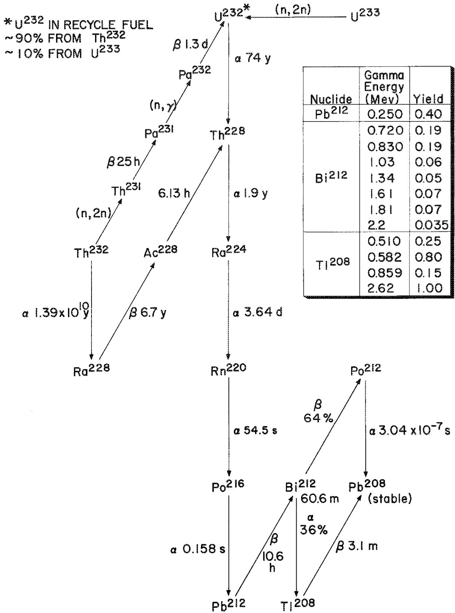  
Fig. 18. Decay Chain and Gamma Activity in $\mathsf{ThO}_2\text{-}^{233}\mathsf{UO}_2$ Fuels.

No spread of contamination or excessive radiation exposure to personnel occurred during the removal of the oxide cans from the storage facility, during their transfer to TURF, or during their discharge from the carrier to cell G.

In cell G, the cans were gaged, and any burrs or excess weld metal were removed by filing. Three separate operations were required to elongate the cans to the 9-1/2-in. length required for proper operation of the can opening box. First, the cans were machined on one end to "true" them. A premachined end cap (with epoxy cement applied) was inserted into the cell through the small-items entry port. This cap was installed on the can in a pressing fixture, and then the can (with cap) was placed in a curing fixture, where five cans at a time were cured under longitudinal pressure for 1 hr at a temperature of 110 to $120^{\circ}\mathrm{C}$ . The can preparation equipment functioned satisfactorily, except on one occasion in which the drive motor on the can machining fixture burned out. The remaining cans for that run were dressed with a file, and the caps were installed without incident. Later, a new motor was installed remotely in the fixture.

The elongated cans of oxide were opened, one at a time, in the decanning station. This was a time-consuming operation involving the use of equipment that had been recognized during the cold run to be marginal. The decanner had a rugged chuck assembly that held and ro-tated the cans while a cutting wheel opened them inside an alpha-sealed box. Most of the other attachments in the box were of little value, and in some instances, actually hindered the operation.

The major problems in the decanning operation can be summarized as follows:

(1) Alignment and clearance tolerances were too close for hot-cell operation.   
(2) Visibility in the decanning box was limited.   
(3) The powder failed to flow out of the box easily.

(4) A vibrator shaft seal failed, leading to loss of oxide powder from the box. This caused rather extensive contamination of the cell. Modifications were made remotely during the fuel concentrate production to increase visibility, repair the seal, and to provide tools inside the decanner to assist in transferring the powder to the reaction vessel.

# 6.4 Reduction of Uranium Oxide

The expanded bed of $^{233}\mathrm{UO}_3$ was heated for 2 hr at $550^{\circ}\mathrm{C}$ in a helium atmosphere to remove, by pyrolysis, any traces of ammonium compounds or other volatiles remaining from the chemical processing.

The bed was then cooled to $400^{\circ}\mathrm{C}$ before hydrogen treatment was started. This temperature was sufficiently low to accommodate the temperature rise expected from the exothermic reaction of hydrogen with $\mathrm{UO}_3$ :

$$
\mathrm {U O} _ {3} + \mathrm {H} _ {2} \rightarrow \mathrm {U O} _ {2} + \mathrm {H} _ {2} \mathrm {O} + 7 2, 0 0 0 \mathrm {c a l / g - m o l e}.
$$

The concentration of hydrogen (in helium) was adjusted initially to 5 vol % and was gradually increased to 50 vol % during the first 4 hr of treatment. The temperatures within the bed were monitored by an internal probe with 12 thermocouples that were placed at 2-in. intervals along the vertical axis of the bed. These temperatures rose in response to an increase in hydrogen concentration and then became constant after the initial excursion. The procedure of incrementally increasing the hydrogen concentration was repeated until the hydrogen:helium volume ratio was 1:l; the gaseous flow rate was 2 liters/min.

The location of the reaction zone and the zone movement inside the bed were clearly defined by the temperature profile. As the reaction progressed, the reaction zone rose, in the form of a band, up through the powder bed.

Figures 19 and 20 show plots of the temperature at 6 in. and 16 in., respectively, from the bottom of the 24-in.-high bed during the uranium reduction phase of the three production runs. The rise in the

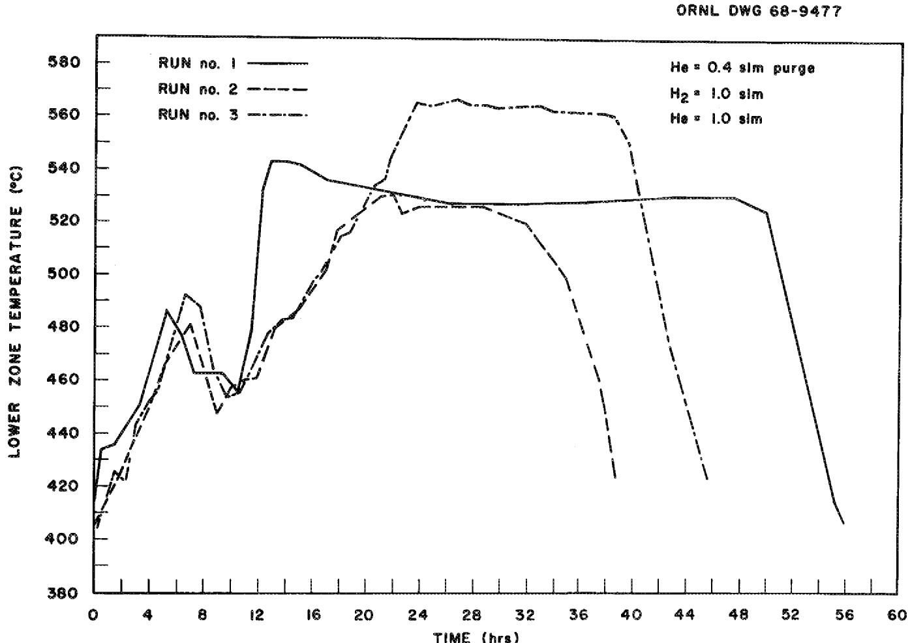  
Fig. 19. Temperature 6 in. from Bottom of Oxide Powder Bed During Uranium Reduction.

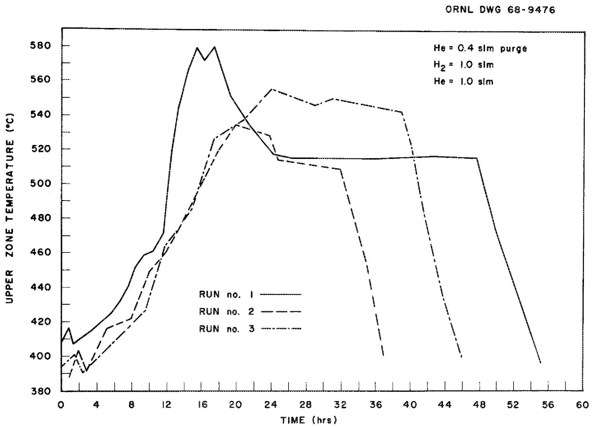  
Fig. 20. Temperature 16 in. from Bottom of Oxide Powder Bed During Uranium Reduction.

temperature of the lower zone during the first 8 hr of treatment is due to the exothermic reaction (the reaction vessel furnace was set to control at $400^{\circ}\mathrm{C}$ ). After the temperature excursion resulting from the initial increases in hydrogen flow had subsided (approximately 12 hr), the temperature of the furnace was increased, at the rate of $30^{\circ}\mathrm{C/hr}$ , until the bed temperature was $525 \pm 25^{\circ}\mathrm{C}$ . The reduction operation was continued at this temperature, with 50 vol % hydrogen--50 vol % helium, until 50 to 100% excess over the stoichiometric amount of hydrogen had been passed through the bed.

Hydrogen utilization within the bed was $100\%$ until the reaction zone approached the top of the powder bed; then a slight decrease was observed. Hydrogen usage was determined by a material balance of the gas flowing into the reaction vessel, as measured by rotameters, and the gas outflow, as measured by the in-cell wet test meter.

# 6.5 Hydrofluorination of $\mathrm{UO}_2$

Upon completion of the oxide reduction step, the bed was allowed to cool to $400^{\circ}\mathrm{C}$ . The conversion of $\mathrm{UO}_2$ to $\mathrm{UF}_4$ by hydrofluorination, using HF gas diluted with hydrogen, began at $400^{\circ}\mathrm{C}$ and was completed at $625^{\circ}\mathrm{C}$ . Five to seven days were required for the conversion.

The HF gas was supplied to the process by withdrawing it from the vapor space of a heated 100-lb HF cylinder. The cylinder heater was thermostatically controlled to provide a vapor pressure to 12 to 14 psig. A differential-pressure transmitter across a capillary restrictor in the HF gas supply line was used to monitor the flow. The gas was passed through a maze of tightly packed nickel wire in a 2-in.-diam nickel tube that was maintained at $625^{\circ}\mathrm{C}$ to remove sulfur from the stream. It was then mixed with a metered amount of dry hydrogen, filtered, and introduced to the reaction vessel through a dip tube that extended to the bottom of the $\mathrm{UO}_2$ bed.

At the beginning of the hydrofluorination step, the composition of the gas was 95 vol % hydrogen--5 vol % HF; the flow rate of the mixture was 2 std liters/min. Over a period of 3 to 4 hr, the HF concentration

was incrementally increased to $40 \, \text{vol}\%$ as the exothermic reaction caused the bed temperature to rise from $400 \, \text{to} \, 450^{\circ}\text{C}$ . During these initial hours, the temperature within the bed was constantly monitored to determine when the temperature excursion resulting from each HF flow adjustment had ceased and when another adjustment could be made.

After the HF concentration of the hydrofluorinating mixture had reached $40 \, \text{vol}\%$ the reaction zone traveled, in the form of a band, up through the bed (in a manner similar to that observed during the hydrogen reduction) as the $\mathrm{UO}_2$ was converted to $\mathrm{UF}_{14}$ . The reaction

$$
\mathrm {U O} _ {2} + 4 \mathrm {H F} \rightarrow \mathrm {U F} _ {4} + 2 \mathrm {H} _ {2} \mathrm {O} + 1 4 4, 0 0 0 \mathrm {c a l / g - m o l e}
$$

is more exothermic than the reduction reaction, but it does not have as great a tendency to cause thermal excursions. Probably, this is the result of differences between $\mathrm{UO}_3$ , $\mathrm{UO}_2$ , and $\mathrm{UF}_4$ with respect to bed permeability and thermal properties. The reaction-zone temperatures for the three production runs are plotted as a function of time in Fig. 21. In runs 1 and 2, several furnace temperature adjustments were made during the first five days of treatment in an effort to increase the bed temperature to $475 - 500^{\circ}\mathrm{C}$ (because the HF gas is less corrosive to nickel at the higher temperature). In run 3, the furnace operated satisfactorily and did not require adjustment.

The progress of the reaction was followed by observing the reaction zone travel through the bed and also by obtaining a material balance of the HF in the system. The HF utilization was essentially $100\%$ for the first five days and then decreased sharply as the reaction zone reached the top of the bed. Then the temperature of the bed was increased to $625^{\circ}\mathrm{C}$ , where it was held for two days to ensure completeness of the reaction. The HF utilization did not increase at the higher temperature; instead, it continued to decrease, suggesting that the reaction had been complete at the end of the fifth day of hydrofluorination.

A total of $13.5\mathrm{kg}$ of uranium, as $\mathrm{UO}_2$ , was converted to $\mathrm{UF}_4$ in each of the three runs; only very minor differences in the runs were noted.

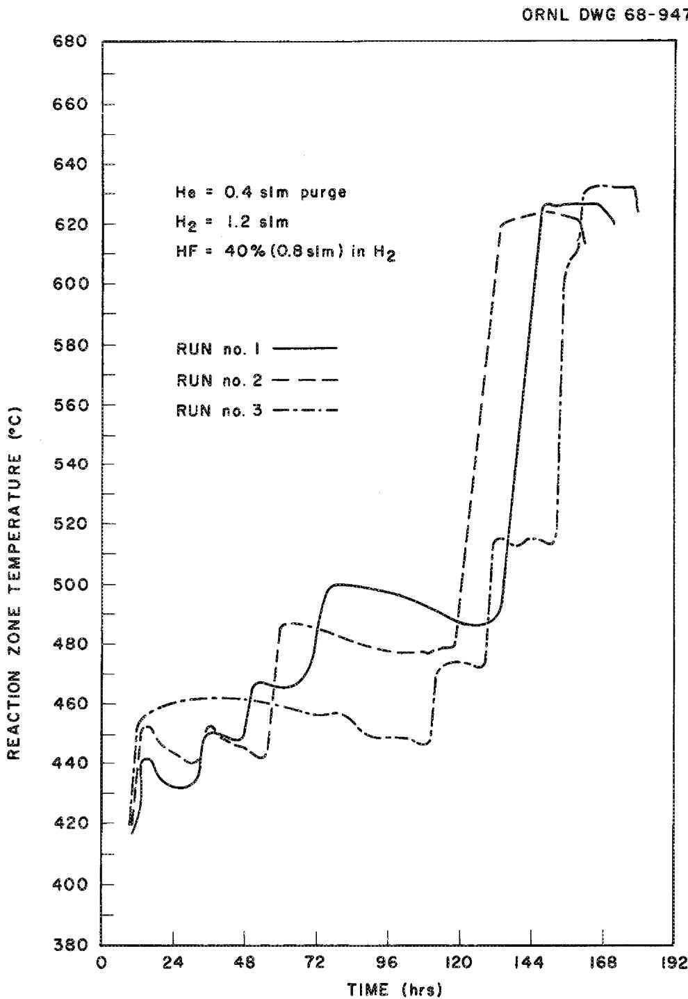  
Fig. 21. Maximum Temperature Within Powder Bed During Hydrofluorination of $\mathrm{UO}_2$ .

# 6.6 Formation of the Eutectic Salt

The eutectic mixture $\mathrm{UF}_{4} = \mathrm{LiF}$ (27-73 mole %) (Fig. 22) was formed by adding the stoicoimetric quantity of lithium fluoride powder to the uranium tetrafluoride powder and fusing the mixture.

Dry LiF powder was added to the reaction vessel by the following series of operations: (1) it was poured into a hopper located on top of the decanning station, (2) it was dumped from the hopper into the decanner box, and (3) it was transferred from the box to the vessel by vibration and brushing.

The temperature of the reaction vessel containing the stratified $\mathrm{UF}_4$ and LiF powders was then increased to $855^{\circ}\mathrm{C}$ in order to melt the lithium fluoride (mp, $835^{\circ}\mathrm{C}$ ). The melt was digested at this temperature for 3 hr while it was sparged with hydrogen (at a flow rate of 0.2 liter/min) to reduce any extraneous compounds that might have been introduced during the LiF addition.

A sound detector was attached to the reaction vessel dip line to sense the bubbling of the hydrogen sparge that would occur in the presence of a liquid in the bottom of the reaction vessel. This was an excellent device for determining when the meltdown had started. The internal thermocouple probe confirmed that, at meltdown, a very wide range of temperatures existed along the axis of the melt. A rapid cooldown to $650^{\circ}\mathrm{C}$ was observed in the lower region of the vessel where liquid existed. At the same time, temperatures as high as $850^{\circ}\mathrm{C}$ were measured in the upper regions of the vessel where fusing of the compounds had not yet taken place. As more liquid was formed, a gradual shift in the temperature profile occurred, indicating a rising liquid level in the vessel. The temperature of the pool eventually reached $850^{\circ}\mathrm{C}$ , the set point of the furnace temperature controller. The initial presence of the liquid and the rising level were also indicated by changes in the dip line pressure as the back pressure on this line increased to overcome the rising liquid level.

Differences, with regard to conditions during initial meltdown, were noted in the runs. In runs 1 and 3, the $\mathrm{UF}_{4}$ and LiF had to be

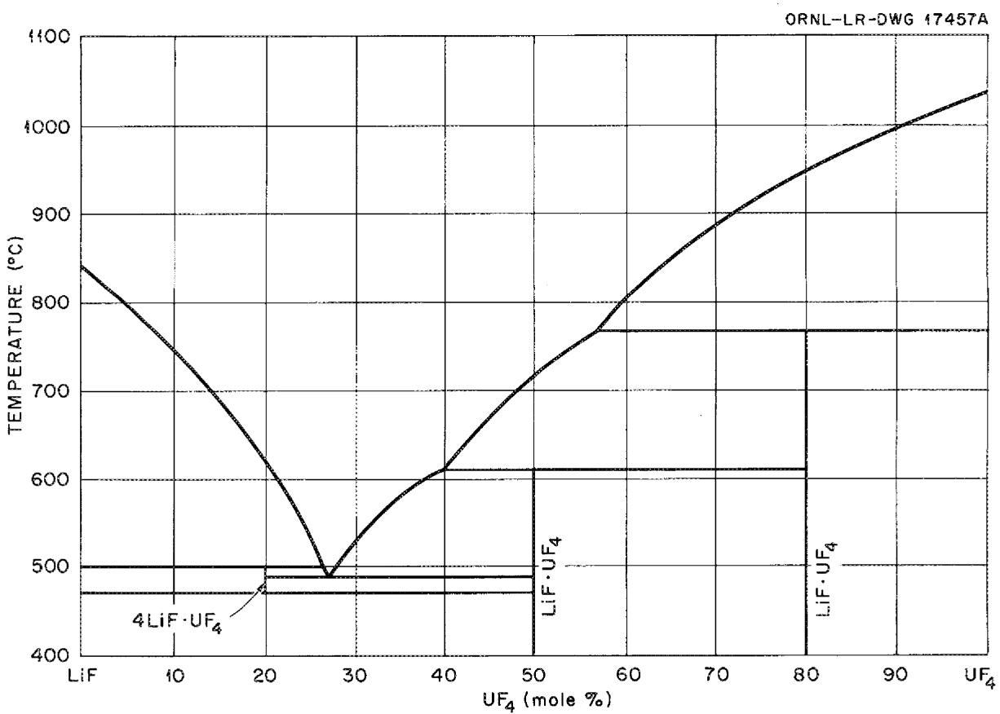  
Fig. 22. LiF-UF4 Phase Diagram.

heated to about $850^{\circ}\mathrm{C}$ before melting occurred. In run 2, initial melting occurred at $650^{\circ}\mathrm{C}$ , nearly $200^{\circ}\mathrm{C}$ below the melting point of the lithium fluoride. The low-temperature initial melting must have resulted from the presence of a sizable heel of salt (mp, $490^{\circ}\mathrm{C}$ ) that remained in the reaction vessel from run 1. Probably, this heel acted as a "seed" to permit fusing of the $\mathbf{U}\mathbf{F}_{4}$ and LiF powders at the lower temperature.

The 9-in.-deep pool of eutectic salt (mp, $490^{\circ}\mathrm{C}$ ) was next treated with 20 vol % HF--80 vol % hydrogen (flow rate, 2.4 liters/min) for 24 hr at a temperature of $700^{\circ}\mathrm{C}$ to remove the last traces of oxide from the salt prior to the hydrogen purification procedure. At the conclusion of this treatment, an unfiltered sample of the salt was withdrawn and analyzed for oxide content. (A 1/2-in.-OD x 2-1/4-in.-long nickel cup was immersed in the salt to withdraw a 25-g sample.) After the sample had solidified, a 1-in.-long section was cut from the center and analyzed petrographically and chemically for the presence of $\mathrm{UO}_2$ . The remaining portion of the sample was submitted for a complete chemical analysis.

Hydrogen treatment of the salt was started prior to obtaining the results of the analyses. The more rapidly obtained petrographic results were used to determine whether hydrofluorination should be resumed or whether hydrogen purification of the melt should be continued. In each of the three runs, the $\mathrm{UO}_2$ content was reported to be less than the lower limit of accuracy (200 ppm) for the petrographic appraisal; thus, subsequent HF treatment was unnecessary. Chemical analyses of the same samples showed oxide contents (in the product salts) of 62, 34, and 32 ppm for runs 1, 2, and 3 respectively.

# 6.7 Purification of the Eutectic Salt

The eutectic salt was purified by bubbling pure hydrogen gas (3 to 10 ppm $\mathrm{H}_2\mathrm{O}$ ), at a flow rate of 2 std liters/min, through the 10-in.-deep melt. The temperature of the molten salt during this reaction,

$$
\mathrm {M F} + 1 / 2 \mathrm {H} _ {2} \rightarrow \mathrm {H F} + \mathrm {M} ^ {\circ},
$$

is $700^{\circ}\mathrm{C}$ . The progress of the reaction was followed by titrating the effluent gas with the in-cell titration assembly. These data are plotted in Fig. 23. The high rates observed initially can be attributed to the evolution of the soluble HF in the melt. The first inflection and plateau of each curve correspond to the reduction of the nickel fluoride; this is followed by a second inflection and plateau, which represent the reduction of the iron fluoride. The end point of the purification was evident from the leveling off of the HF evolution rate at 0.025 meq per liter of hydrogen. The hydrogen flow rate was increased on several occasions during the process, and the reaction rate seemed to be almost independent of the hydrogen concentration.

The effect of the hydrogen treatment on the concentration of the corrosion products is shown in Table 5. The chromium concentration in the melt was not affected by the hydrogen treatment. Higher initial values of nickel in the third run, and of iron in the second and third runs, were the result of residual material left in the bottom of the reaction vessel from previous runs. Apparently, the metals had precipitated and thus had not been filtered out during the transfer operation.

The levels to which the iron and nickel concentrations were lowered by the hydrogen reduction of the metal fluorides are believed to be near the limit of accuracy of the sampling system and the laboratory analyses. The actual concentrations of these impurities in the enriching concentrate, as delivered to the MSRE, should be somewhat lower than the values reported because an additional 24 hr of hydrogen treatment was provided in each run after the filtered samples were withdrawn for analysis. Table 6 gives the chemical analyses of the fuel shipments to the MSRE; Table 7 gives the isotopic analysis of the uranium.

During each of the three runs, the reaction vessel was exposed for 20 days to $40 \, \text{vol}\%$ HF--60 vol % hydrogen at temperatures ranging from 400 to $850^{\circ}\text{C}$ . Approximately $5\, \text{g}$ of nickel (from the nickel liner of the reaction vessel) was lost to each melt. This corresponds to a uniform corrosion rate of slightly less than 0.001 in./year - a low rate for this type of process.

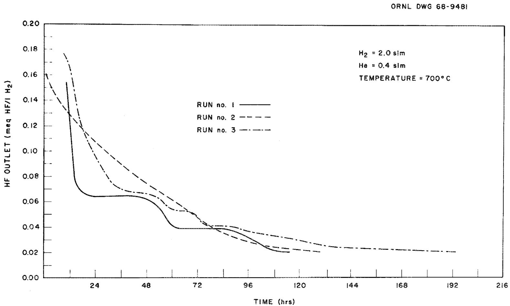  
Fig. 23. Purification of the Eutectic Mixture.

Table 5. Concentrations of Corrosion Products in the Eutectic Salt   

<table><tr><td rowspan="3">Type of Sample</td><td colspan="3">Nickel (%)</td><td colspan="3">Iron (%)</td><td colspan="3">Chromium (%)</td></tr><tr><td colspan="3">Run</td><td colspan="3">Run</td><td colspan="3">Run</td></tr><tr><td>1</td><td>2</td><td>3</td><td>1</td><td>2</td><td>3</td><td>1</td><td>2</td><td>3</td></tr><tr><td>Unfiltered: Before H2Treatment</td><td>0.0191</td><td>0.0038</td><td>0.430</td><td>0.0295</td><td>0.0750</td><td>0.0750</td><td>0.0072</td><td>0.0056</td><td>0.0040</td></tr><tr><td>Filtered: After H2Treatment</td><td>0.0066</td><td>0.0050</td><td>0.0160</td><td>0.0051</td><td>0.0115</td><td>0.0145</td><td>0.0055</td><td>0.0065</td><td>0.0045</td></tr></table>

Table 6. Analyses ${}^{a}$ of the ${}^{{233}\mathrm{{UF}}}_{4} - {}^{7}\mathrm{{LiF}}\left( {{27} - {63}\text{ mole }\% }\right)$ Fuel Concentrate   

<table><tr><td rowspan="2">Element</td><td colspan="2">Cans B, C, D, and E</td><td colspan="2">Capsules (45)</td><td colspan="2">Cans F, H, J, L, N, P</td></tr><tr><td>Chemical Analysis</td><td>Spectrographic Analysis</td><td>Chemical Analysis</td><td>Spectrographic Analysis</td><td>Chemical Analysis</td><td>Spectrographic Analysis</td></tr><tr><td>Al</td><td></td><td></td><td></td><td></td><td></td><td></td></tr><tr><td>B</td><td></td><td>&lt; 0.01</td><td></td><td>&lt; 0.01</td><td></td><td></td></tr><tr><td>Cd</td><td></td><td>&lt; 0.004</td><td></td><td>&lt; 0.004</td><td></td><td></td></tr><tr><td>Ce</td><td></td><td>&lt; 0.033</td><td></td><td>&lt; 0.021</td><td></td><td>&lt; 0.038</td></tr><tr><td>Cr</td><td>0.0057</td><td>&lt; 0.002</td><td>0.0055</td><td>&lt; 0.002</td><td>0.0045</td><td>&lt; 0.01</td></tr><tr><td>Cu</td><td></td><td></td><td></td><td></td><td></td><td></td></tr><tr><td>Fe</td><td>0.0104</td><td>0.047</td><td>0.0051</td><td>&lt; 0.004</td><td>0.0145</td><td>&lt; 0.09</td></tr><tr><td>Gd</td><td></td><td>&lt; 0.003</td><td></td><td>&lt; 0.002</td><td></td><td>&lt; 0.004</td></tr><tr><td>Li</td><td></td><td>4.83</td><td></td><td>4.91</td><td></td><td>4.8</td></tr><tr><td>Mn</td><td></td><td>&lt; 0.0004</td><td></td><td>&lt; 0.0004</td><td></td><td></td></tr><tr><td>Mo</td><td></td><td>&lt; 0.004</td><td></td><td>&lt; 0.004</td><td></td><td></td></tr><tr><td>Ni</td><td>0.0082</td><td>&lt; 0.04</td><td>0.0066</td><td>&lt; 0.002</td><td>0.0160</td><td>&lt; 0.09</td></tr><tr><td>O2</td><td>42 ppm</td><td></td><td>62 ppm</td><td></td><td>32 ppm</td><td></td></tr><tr><td>Pb</td><td></td><td></td><td></td><td></td><td></td><td></td></tr><tr><td>Pr</td><td></td><td>&lt; 0.030</td><td></td><td>&lt; 0.010</td><td></td><td>&lt; 0.038</td></tr><tr><td>Si</td><td></td><td></td><td></td><td></td><td></td><td></td></tr><tr><td>S</td><td>&lt; 20 ppm</td><td></td><td>&lt; 20 ppm</td><td></td><td>&lt; 20 ppm</td><td></td></tr><tr><td>Sm</td><td></td><td>&lt; 0.007</td><td></td><td>&lt; 0.004</td><td></td><td>&lt; 0.008</td></tr><tr><td>Sn</td><td></td><td></td><td></td><td></td><td></td><td></td></tr><tr><td>Ti</td><td></td><td>&lt; 0.002</td><td></td><td>&lt; 0.002</td><td></td><td></td></tr><tr><td>V</td><td></td><td></td><td></td><td></td><td></td><td></td></tr><tr><td>Zn</td><td></td><td>&lt; 0.002</td><td></td><td>&lt; 0.002</td><td></td><td></td></tr><tr><td>U</td><td>61.38</td><td></td><td>61.8</td><td></td><td>61.19</td><td></td></tr></table>

aIn wt $\%$ unless given in ppm.

Table 7. Isotopic Analysis of Uranium in MSRE Fuel Concentrate   

<table><tr><td></td><td>Capsules (45)</td><td>Cans B, C, D, E</td><td>Cans F, H, J, L, N, P</td></tr><tr><td>Isotope</td><td></td><td></td><td></td></tr><tr><td>233U</td><td>91.465</td><td>91.378</td><td>91.466</td></tr><tr><td>234U</td><td>7.485</td><td>7.463</td><td>7.466</td></tr><tr><td>235U</td><td>0.803</td><td>0.874</td><td>0.810</td></tr><tr><td>236U</td><td>0.058</td><td>0.065</td><td>0.0585</td></tr><tr><td>238U</td><td>0.186</td><td>0.218</td><td>0.196</td></tr><tr><td>Total uranium, kg</td><td>4.300</td><td>28.059</td><td>6.583</td></tr><tr><td>Average at. wt</td><td>233.100</td><td>233.150</td><td>233.090</td></tr><tr><td>Total uranium, wt %</td><td>61.800</td><td>61.380</td><td>61.190</td></tr></table>

# 6.8 Transfer of the Eutectic Salt

Eight transfer operations were necessary to convey the three $13.5\mathrm{-kg}$ batches of eutectic salt mixture from the reaction vessel to the intermediate transfer vessel and then to the various shipping container assemblies. The transfers were made by applying helium gas pressure over a pool of molten salt having a temperature of $600^{\circ}\mathrm{C}$ . The salt was forced out of the dip line and through the transfer line and salt filter to the receiving vessel, which was vented. The transfer lines were heated with tubular resistance heating elements, insulated to conserve heat and avoid cold spots, and equipped with thermocouples. The transfers ranged in size from the $13.4\mathrm{kg}$ of uranium (4.7 liters of salt) in the production batches to $4.3\mathrm{kg}$ of uranium (1.5 liters of salt) that was required to fill the 45 enrichment capsule array.

The primary transfer line (3/8-in.-OD x 0.065-in. wall type 200 nickel tubing), which connected the reaction vessel to the $4$ -in.-diam storage vessel, also served as the treatment gas supply line to the dip

tube in the reaction vessel. During the processing operations, this line was connected to the treatment gas supply line instead of the transfer vessel. In each of the feed batch transfers, a compression-type fitting had to be broken and the transfer line had to be connected to a new salt filter that had previously been installed in a nozzle atop the storage vessel. The sintered nickel filter was 3 in. in diameter, and the pore size was $20\mu$ . Transfers through this line required an overpressure of 15 psig to overcome the static head (18 ft $\mathrm{H}_2\mathrm{O}$ ) and the restriction to flow of the filter. Time required to complete the transfer varied from 78 to 140 min. Initial movement of the salt through the line was obvious from the rapid response of the attached thermocouples to the salt temperature. The progress of the transfer was followed by observing the rising back pressure on the helium purge to the storage vessel dip line; this indicated a rising liquid level. The rush of gas through the line at the end of the transfer was audible from the sound detector. These conditions were verified by a sharp drop in the reaction vessel pressure and a rapid increase in gas flow through the salt transfer line.

Five transfers were required to fill the three-product container assemblies. They were made via a 1/4-in.-OD nickel transfer line that connected the assembly to a dip line in the storage vessel. Since filters were not involved in these transfers, the transfers were completed in approximately 10 min. Thermocouples on the transfer line and on the shipping containers indicated the movement of salt. An overflow pot at the end of the containers (in series) was equipped with liquid level detection probes and internal thermocouples to indicate the presence of salt. A blowback of gas then ensured that the containers were filled to the proper level.

The transfer operations were conducted at a salt temperature of $600^{\circ}\mathrm{C}$ . (This temperature had been arbitrarily selected, and the containers had been fabricated to contain the desired quantity of fuel at this temperature.) The filled containers were allowed to cool, and the salt was allowed to solidify before the disassembly operation began.

# 6.9 Container Disassembly and Preparation for Shipment

The shipping container assemblies were stripped of the thermocouples, overflow pots, heaters, and supporting hardware. The containers were separated from each other by cutting the interconnecting tubing.

The 45 enriching capsules were clipped and trimmed, were tested (i.e., their lifting balls were tested) with a 15-lb pull, were drilled for draining and venting, and were identified and weighed. Then they were packaged, in groups of six, in carrousel shipping containers. The equipment, which was designed to do these operations remotely, functioned satisfactorily.

The 2-1/2-in.-diam product cans were easily removed from the filling arrays; however, removal of the top and bottom plugs from each can was quite difficult. An inordinate amount of force was necessary to break the bottom plug loose from the thin salt film that had formed in the annulus between the plug and the bottom nozzle. Several fixtures designed for this task proved to be inadequate and had to be replaced with sturdier units. A lifting bail was installed on each can. Also, a stopper was inserted in the bottom of the can to minimize the loss of salt during handling and shipment.

The cans were weighed by using a beam balance that was located in a glove box mounted on top of the processing cell. The glove box became a part of the cell containment for this operation. A long cable, with the lifting bail of the can attached, was suspended from the balance into the cell. The gross weight of the cans ranged from 1.6 to $15\mathrm{kg}$ .

All of the shipping containers were then stored in cell G to await shipment to the MSRE.

# 6.10 Transfer of $7_{\text{LiF}} - 233_{\text{UF}_4}$ Salt Product to the MSRE

Six of the 2-1/2-in.-diam product salt containers (total uranium content, $33\mathrm{kg}$ ) were delivered, individually, to the MSRE in the 10-ton Pu-Al carrier. The Pu-Al carrier was slightly modified for this operation. The three-barrel magazine was removed, and a winch-and-cable

assembly was installed on top of the carrier in a sealed housing so that it became a part of the carrier containment.

The carrier was placed on top of the pedestal over a 6-in.-diam port to cell G, and became a part of the cell containment when the slide drawers in both the carrier and the pedestal were opened. The cable hook was lowered into the cell to receive the product can and then raised to withdraw the can from the cell into the carrier. The pedestal drawer and the carrier drawer were closed, isolating the carrier and cell from each other and from the ambient atmosphere. In this manner, containment of the fuel was maintained at all times. The carrier was then removed from the pedestal, sealed by the installation of the cover plates, and cleaned of any surface contamination.

The fuel carrier was then transported to the MSRE, where it was positioned over a turntable (Fig. 24) that was designed for charging the enriching concentrate to the reactor fuel drain tank.6

Measurements, at the surface of the Pu-Al carrier, of the radiation emitted by one 7-kg uranium fuel can are given in Table 8. The neutrons are produced by $(\alpha, \eta)$ reactions on lithium and fluorine (of the eutectic) by the high-energy alpha particles emitted by several of the daughters of the $232_{\mathrm{U}}$

The enrichment capsules were shipped to the MSRE in a smaller carrier that was designed to accommodate six capsules in a carrousel fixture. The carrousel served as a support fixture during transport and as a holder for six bottom plug assemblies that became a part of the sampler - enricher system at the MSRE as the capsules were removed from the carrier through a 1-1/2-in.-diam hole in the top.

A small glove box was fabricated for use in removing the carousel assemblies from cell G. This box was mounted on top of the small carrier, which, in turn, was mounted on the pedestal above the cell. Then the pedestal slide-valve drawer was opened, and the glove box and the carrier became a part of the cell containment. A cable from a winch inside the box was lowered into the cell to receive the carousel. The carousel was withdrawn into the carrier, the pedestal drawer was closed,

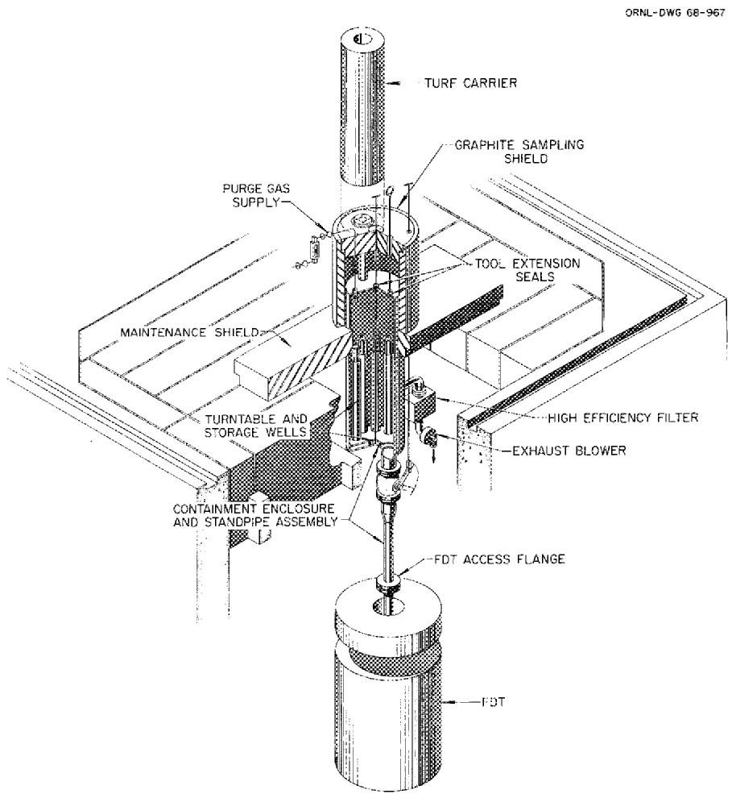  
Fig. 24. Arrangement for Adding $^{233}\mathrm{U}$ Enriching Salt to Fuel Drain Tank.

Table 8. Radiation Levels, Measured at Surface of Pu-Al Carrier, of $7_{\text{LiF}} - 233_{\text{UF}_4}$ Fuel Containing 7 kg of Uranium   

<table><tr><td rowspan="2">Instrument
Location Along
Vertical Axis
of Carrier</td><td rowspan="2">Type of a Radiationa</td><td colspan="3">Radiation Level (mrem/hr) at Specified
Distances from Carrier Surface</td></tr><tr><td>0</td><td>12 in.</td><td>5 ft</td></tr><tr><td rowspan="4">l2 in. below
top of carrier</td><td>Gamma</td><td>&lt; 2</td><td>&lt; 1</td><td>&lt; 1</td></tr><tr><td>NF</td><td>75</td><td>50</td><td>12.5</td></tr><tr><td>NT</td><td>0.3</td><td>0.3</td><td>0.5</td></tr><tr><td>Nint</td><td>25</td><td>15</td><td>5</td></tr><tr><td rowspan="4">Center of carrier</td><td>Gamma</td><td>&lt; 7</td><td></td><td></td></tr><tr><td>NF</td><td>200</td><td>75</td><td>10</td></tr><tr><td>NT</td><td>0.6</td><td>0.3</td><td>0.3</td></tr><tr><td>Nint</td><td>75</td><td>40</td><td>7.5</td></tr><tr><td rowspan="4">18 in. above
bottom of
carrier</td><td>Gamma</td><td>&lt; 1</td><td>&lt; 1</td><td>&lt; 1</td></tr><tr><td>NF</td><td>50</td><td>50</td><td>25</td></tr><tr><td>NT</td><td>0.3</td><td>0.6</td><td>0.2</td></tr><tr><td>Nint</td><td>25</td><td>17.5</td><td>6.5</td></tr></table>

$\mathrm{N}_{\mathrm{F}}, \mathrm{N}_{\mathrm{T}}, \mathrm{N}_{\mathrm{int}} =$ Neutron radiation (fast, thermal, and intermediate).

and then the carrier was removed from the pedestal and placed on its base. The glove box was removed from the carrier, and shield plugs were inserted in the 1/2-in.-diam and 1-1/2-in.-diam access openings in the top of the carrier. The carrier contained a 5-in.-diam cavity with 4 in. of lead shielding around it.

When the small carrier housed six capsules, each containing $96\mathrm{g}$ of uranium in approximately $150\mathrm{g}$ of fuel concentrate, the gamma radiation level was 200 mrem/hr at the surface and decreased to 20 mrem/hr at 6 ft. The neutron radiation levels at the surface and at 6 ft were 105 mrem/hr and 10 mrem/hr, respectively; measurement made at the open

bottom of the carrier during removal from the pedestal indicated a radiation level of 50,000 mrem/hr.

The removal of the fuel from cell G and its subsequent transfer to the MSRE were characterized by very low radiation exposures to personnel and essentially no spread of contamination. In fact, only the top surface of the pedestal and a small area immediately adjacent to it had to be decontaminated.

# 6.11 Material Balance

A total of $39.72\mathrm{kg}$ of uranium, in the form of uranium oxide powder, was transferred to cell G of the TURF. Of this amount, $38.95\mathrm{kg}$ of uranium, as $\mathrm{LiF - UF_4}$ , was packaged as the finished product.

The can-opening operation accounted for a loss of $245\mathrm{g}$ of uranium as uranium oxide. Most of this, $200\mathrm{g}$ , was lost through the empty can discharge chute because excessive powder had accumulated in the box. A leaking seal on the vibratory screen drive shaft accounted for $45\mathrm{g}$ . Remote modification to the decanning station and changes in operating procedures eliminated these sources of loss after the first batch (29 oxide cans) had been processed.

Sampling accounted for a loss of $100\mathrm{g}$ of uranium. Two 15-g and two 5-g salt samples were required in each of three production runs. In addition, several extra samples were required for special purposes.

The presence of heels in certain vessels and the holdup in transfer lines and filters were responsible for the majority of the loss. The heel in the reaction vessel amounted to $27\mathrm{g}$ . However, the storage vessel contained $346\mathrm{g}$ of uranium as heel as a result of a dip line replacement. The dip line was installed improperly and, as a result, about $1/3$ in. of unrecoverable salt heel was left in the vessel.

A summary of the uranium accountability is given in Table 9.

Table 9. Uranium Material Balance   

<table><tr><td></td><td colspan="2">Uranium</td></tr><tr><td></td><td>(g)</td><td>(wt %)</td></tr><tr><td>Received as oxide</td><td>39,721</td><td>100</td></tr><tr><td>Finished product, LiF-UF4</td><td>39,952</td><td>98.1</td></tr><tr><td>Measured loss to heels, samples, etc.</td><td>446</td><td>1.1</td></tr><tr><td>Estimated loss to dusting, lines, filters, etc.</td><td>322</td><td>0.8</td></tr></table>

# 7. MAINTENANCE ENGINEERING

Early in the run with depleted uranium, it became obvious that some of the equipment in cell G could not be considered reliable and would have to be repaired or replaced before the conclusion of the three production runs. Many of the deficiencies were corrected in the interval between the depleted-uranium run and the $^{233}\mathrm{U}$ run. Since it was impractical to consider major equipment modifications at this time because of the fuel delivery schedule requirements at the MSRE, emphasis was placed on: (1) storage of spare parts in the cell, (2) installation of redundant fittings, (3) procurement and modification of tools and work tables in cell G, and (4) formulation of maintenance procedures.

# 7.1 Spare Parts

Because of the difficulties involved in obtaining access to the hot cell, a generous supply of replacement parts was stored inside the cell and cataloged for easy retrieval. Where applicable, the parts were prefitted to ensure compatibility with the system. Threads on the fittings and nuts and bolts were treated with a lubricant that is suitable for use in high-temperature environments.

# 7.2 Redundant Fittings

The compression-type fittings used on the salt transfer lines and on the gas supply lines at the vessel nozzles were extremely difficult to make and break after they had been thermally cycled from room temperature to $600 - 700^{\circ}\mathrm{C}$ . The passage of molten salt through one of these fittings made the operation even more difficult because the salt formed a seal around the protrusion of the tubing into the fitting. Since several of these fittings had to be routinely operated in the product transfer operations, there were several lines in the system for which no alternate had been provided. In these cases, redundant fittings were installed in such a manner that a second fitting was available if the primary fitting could not be operated. Although complex fitting arrangements are normally conducive to leakage, no such problems were encountered here. On two occasions, use of the standby fitting was necessary in order to replace the sintered metal filter in the salt transfer line.

# 7.3 Tools and Work Tables

A large assortment of hand tools, modified for use with the manipulators, were stored on tool racks in the cell. Usually the modification consisted of welding grips to the tool to aid in handling by the master-slave manipulators. A few special-purpose tools, such as air-operated snips (for cutting the interconnecting tubing of the capsules) and an impact wrench (for use with the electromechanical manipulator), were also stored for later use in the cell. End wrenches and other fixed-size tools were color coded by sizes for ease in identification.

Work tables and trays were located between the viewing windows and the major pieces of equipment. They proved to be invaluable in the many mechanical and maintenance operations conducted in the three salt production runs because of the limited reach of the master-slave manipulators and also because of the limited field of vision available through the windows. A secondary, but very important, function of the trays involved retrieval of tools and miscellaneous items that were dropped because of wear of manipulator parts or because of awkwardness on the

part of the operator. When an item fell to the floor, rather than onto a tray, it usually had to be replaced since retrieval from the floor in many locations of the cell was impossible.

The large heavy-duty work table (Fig. 17) designed for the product container and capsule array disassembly operations served well in these functions and was also used extensively as a general-purpose work bench.

# 7.4 Maintenance Procedures

Remote maintenance of the process equipment was recognized, during the run with depleted uranium, to be a formidable task that could not be left to the operator's discretion when the need arose. Thus an engineer was assigned, on a full-time basis, to develop detailed maintenance procedures that would be applicable during any conceivable failure as well as during the planned maintenance operations.

A comprehensive set of close-up photographs was taken of the equipment in cell G before the cell was sealed to process the radioactive material. These were later augmented by photographs taken through the shielding windows and the monocular viewers. Altogether, more than 300 photographs were made.

Fifty-five detailed, step-by-step maintenance procedures were written by using the photographs and field sketches (more than 300) that had been used in the fabrication and installation of the equipment. A complete list of tools and materials necessary for the job was included in each procedure. Where appropriate, the maintenance procedure was referred to, or included in, an operating procedure to ensure continuity of a process operation. Although it was not necessary to use all of these procedures in the fuel production, they were instrumental in ensuring a safe and orderly completion of this task.

# 8. CONCLUSIONS

1. Reactor-grade eutectic salt concentrate, $^{7}$ LiF- $^{233}$ UF4 (73-27 mole %), can be prepared by remote means from LiF and $^{233}$ UO2 or $^{233}$ UF4 by the process described in this report.

2. Hydrogen reduction and hydrofluorination reaction rates of oxide beds can be controlled satisfactorily by adjusting hydrogen and HF flows to avoid excessive temperature excursions from the exothermic reactions involved. Temperatures can be determined by placing a number of thermocouples within the beds.   
3. Equipment for a remote process of this type should be designed with a minimum number of close-tolerance fits. It should also be designed on a modular concept so that components can easily be replaced, thus eliminating, if possible, remote repair operations.   
4. In general, commercial pipe, tubing, and electrical fittings are satisfactory in this type of operation. However, they are not satisfactory in instances where high temperatures or exposure to moltens salt are expected. In these cases, special-purpose fittings should be developed.   
5. Concentrations of the corrosion products nickel and iron can be reduced to satisfactorily low levels by hydrogen treatment of moltens salt at $550^{\circ}\mathrm{C}$ . Chromium was not reduced by the process described.   
6. A binary mixture of $\mathrm{UF}_{4}$ -LiF having a eutectic composition can be fused at a temperature of $650^{\circ}\mathrm{C}$ in the presence of a small amount of liquid eutectic heel remaining in a vessel. In the absence of the liquid heel, it is necessary to heat the materials to the melting point of the LiF $(835^{\circ}\mathrm{C})$ to achieve liquefaction.   
7. To obtain a product containing less than $40~\mathrm{ppm}$ of oxygen and to avoid plugging of dip lines by the formation of oxides within them, it was necessary to install a catalytic recombiner and a molecular-sieve drying column in the hydrogen supply system. The use of Lindetype 414 l/16-in.-diam sieve material in a regenerative drying column reduced the moisture content of commercial-grade hydrogen to less than 3 ppm.   
8. Maintenance procedures are necessary to ensure orderly completion of a process of this nature. They are vital when entry into a contaminated cell is necessary and when equipment and the product must be removed from the cell.

# 9. ACKNOWLEDGMENTS

The authors express their appreciation to the following persons whose assistance was essential to the successful preparation of the enriching $^{233}\mathrm{U}$ fuel concentrate for the MSRE: G. I. Cathers and J. H. Shaffer (Reactor Chemistry Division) for process development; E. L. Nicholson and W. F. Schaffer, Jr., for process equipment design; S. Mann for assistance in operations and data analysis; J. P. Jarvis (on loan to the Metals and Ceramics Division from the General Engineering Division) for process equipment installation and modification, and for development of maintenance procedures; and J. W. Anderson and D. M. Shepherd (both of whom are on loan to the Metals and Ceramics Division from the General Engineering Division) for facility engineering and supporting services.

# 10. REFERENCES

1. P. N. Haubenreich, private communication, December 1966.   
2. J. R. Engel, MSRE Design and Operations Report, Part XI-A, ORNL-TM-2304 (September 1968).   
3. Chem. Tech. Div. Ann. Progr. Rept., May 31, 1968, ORNL-4272, pp. 28-33.   
4. J. W. Anderson and J. M. Chandler, Safety Analysis for the Thorium-Uranium Recycle Facility (TURF), Building 7930, ORNL-4278 (to be published).   
5. C. J. Barton et al., "Phase Equilibria in the Alkali Fluoride-Uranium Tetrafluoride Fused Salt Systems," J. Am. Ceram. Soc., 41(2), 63-69 (1958).   
6. P. N. Haubenreich et al., MSRE Design and Operations Report, Part V-A, Safety Analysis of Operations with $^{233}\mathrm{U}$ , ORNL-TM-2211 (February 1968), p. 37.

# INTERNAL DISTRIBUTION

1. Biology Library

2-4. Central Research Library

5-6. ORNL - Y-12 Technical Library Document Reference Section

7-41. Laboratory Records Department

42. Laboratory Records, ORNL R.C.

43. R. G. Affel

44. J. L. Anderson

45. J. W. Anderson

46. C. F. Baes

47. S. E. Beail

48. M. Bender

49. E. S. Bettis

50. E. G. Bohlman

51. S. E. Bolt

52. G. E. Boyd

53. R. B. Briggs

54. R. E. Brooksbank

55. W. D. Burch

56. W. H. Carr

57. G. I. Cathers

58-59. J. M. Chandler

60. F. L. Culler, Jr.

61. S. J. Ditto

62. W. P. Eatherly

63. J. R. Engel

64. D. E. Ferguson

65. L. M. Ferris

66. J. H Frye, Jr.

67. R. E. Gehlbach

68. W. R. Grimes

69. A. G. Grindell

70. R. G. Guymon

71. P. N. Haubenreich

72. W. H. Jordan

73. P. R. Kasten

74. J. W. Koger

75. C. E. Lamb

76. C. E. Larson

77. K. H. Lin

78. R. B. Lindauer

79. A. F. Litman

80. A. L. Lotts

81. M. Lundin

82. H. G. MacPherson

83. R. E. MacPherson

84. S. Mann

85. H. E. McCoy

86. J. R. McWherter

87. R. L. Moore

88. J. P. Nichols

89. E. L. Nicholson

90. A. S. Meyer

91. A. M. Perry

92--93. M. W. Rosenthal

94. Dunlap Scott

95. W. F. Schaffer

96. J. H. Shaffer

97. M. J. Skinner

98. J. W. Snider

99. D. A. Sundberg

100. R. E. Thoma

101. W. E. Unger

102. J. E. Van Cleve, Jr.

103. A. M. Weinberg

104. J. R. Weir

105. M. E. Whatley

106. G. M. Watson

107. J. C. White

108. R. G. Wymer

109. Gale Young

110. J. L. Youngblood

111. P. H. Emmett (consultant)

112. J. J. Katz (consultant)

113. J. L. Margrave (consultant)

114. E. A. Mason (consultant)

115. R. B. Richards (consultant)

# EXTERNAL DISTRIBUTION

116. D. E. Bloomfield, Battelle-Northwest, Richland, Washington

117. J. A. Swartout, Union Carbide Corporation, New York

118. Laboratory and University Division, AEC, ORO

119-338. Given distribution as shown in TID-4500 under Reactor Technology category (25 copies - CFSTI)