ORNL-4389

UC-80 - Reactor Technology

GAS TRANSPORT IN MSRE MODERATOR GRAPHITE

II. EFFECTS OF IMPREGNATION

III. VARIATION OF FLOW PROPERTIES

R. B. Evans III

J. L. Rutherford

A. P. Malinauskas

OAK RIDGE NATIONAL LABORATORY

operated by

UNION CARBIDE CORPORATION

for the

U.S. ATOMIC ENERGY COMMISSION

Printed in the United States of America. Available from Clearinghouse for Federal

Scientific and Technical Information, National Bureau of Standards,

U.S. Department of Commerce, Springfield, Virginia 22151

Price: Printed Copy $3.00; Microfiche $0.65

# LEGAL NOTICE

This report was prepared as an account of Government sponsored work. Neither the United States, nor the Commission, nor any person acting on behalf of the Commission:

A. Makes any warranty or representation, expressed or implied, with respect to the accuracy, completeness, or usefulness of the information contained in this report, or that the use of any information, apparatus, method, or process disclosed in this report may not infringe privately owned rights; or   
B. Assumes any liabilities with respect to the use of, or for damages resulting from the use of any information, apparatus, method, or process disclosed in this report.

As used in the above, "person acting on behalf of the Commission" includes any employee or contractor of the Commission, or employee of such contractor, to the extent that such employee or contractor of the Commission, or employee of such contractor prepares, disseminates, or provides access to, any information pursuant to his employment or contract with the Commission, or his employment with such contractor.

Contract No. W-7405-eng-26

REACTOR CHEMISTRY DIVISION

# GAS TRANSPORT IN MSRE MODERATOR GRAPHITE

II. EFFECTS OF IMPREGNATION   
III. VARIATION OF FLOW PROPERTIES

R. B. Evans III

J. L. Rutherford

A. P. Malinauskas

MAY 1969

OAK RIDGE NATIONAL LABORATORY

Oak Ridge, Tennessee

operated by

UNION CARBIDE CORPORATION

for the

U.S. ATOMIC ENERGY COMMISSION

# ACKNOWLEDGMENTS

This report is the culmination of the efforts not only of the authors, but of several associates, specialists, and artisans whose names understandably do not appear on the cover. Many of these colleagues have contributed in a significant manner, so that special acknowledgments are in order.

Much of the experimental work which is reported has been performed on a remarkably defect-free specimen, bar No. 23. This sample, along with a similar sample of the base stock, gave considerable insight into the effects of permeability reduction by fluid impregnation techniques. The selection of these samples fell totally to W. H. Cook and J. L. Griffith. We are likewise grateful to these two for performing the thankless task of maintaining a detailed record of the location, fate, and identification of various surveillance specimens which were employed in related in-pile investigations. Without these records it would have been virtually impossible to resolve several discrepancies which arose in the course of this study. With the assistance of M. D. Allen, Mr. Cook has also been involved in the selection, preparation, and interpretation of some of the photomicrographs which appear in this report.

All of the graphite specimens which were used in this work were prepared by L. D. Love. He also serviced the permeability apparatus and was responsible for the design, fabrication, and testing of special leak-tight specimen holders which were employed. These aspects were most critical to the present work.

Some of the permeability measurements and the attendant calculations were performed by two summer participants, D. E. Bruins, a student at Carnegie Institute of Technology, and D. M. Bolinger, a student at Manchester College.

Special thanks are also due to Carol A. Proaps and Ruby N. Thurmer for their patience and cooperation in the preparation of this manuscript. Finally, we wish to acknowledge the efforts and cooperation of many other colleagues whose contributions were perhaps of lesser importance but nonetheless instrumental in preparing this report.

# CONTENTS

Acknowledgments. iii   
Abstract 1

I. Introduction 1   
II. Nomenclature 3

III. Description of the MSRE Graphite 4

The Base Stock 4   
Multiple Impregnations 5   
Microscopic Examinations 5

IV. Effect of Impregnation Treatment on Flow Properties 10

Comparison of Base Stock and Impregnated Graphite 10   
General Considerations 10   
Characterization Parameters 10   
Flow Parameters 11   
Comparison of Results 11

Variation of Structural and Flow Properties with Position 14

Limitations of Sampling Procedures 14   
Density Determinations 16   
Total Porosity Determinations 16

Porosimetry Determinations 17

Permeability Determinations 20   
Basic Considerations 20   
Procedure 22   
Results 24

V. Theoretical Description of Gaseous Fission Product Transport in MSRE   
Moderator Graphite 26   
General Description of Diffusion with Sink Terms 26   
Steady-State Transport in Uniform Porous Media 28   
Steady-State Transport in Nonuniform Porous Media (MSRE Graphite) 28

VI. Related Studies 33

Early Investigations 33   
$^{135}\mathrm{Xe}$ Migration in the MSRE 35   
Graphite Surveillance Specimen Results 36   
ORR Molten-Salt In-Pile Loop 2 40   
Reconciliation of Flow and In-Pile Results 41

VII. Discussion 43   
Short-Range MSRE Considerations 44   
Features Relative to MSBR Application 45   
Useful Approximations in Describing Gas Transport Through Porous Media 47   
VIII. Summary 50

Appendix. 52

Partial Survey of the Gas Transport Characteristics of the MSRE  
Moderator Graphite 52

# GAS TRANSPORT IN MSRE MODERATOR GRAPHITE

# II. EFFECTS OF IMPREGNATION

# III. VARIATION OF FLOW PROPERTIES

R.B.Evans 111

J. L. Rutherford

A. P. Malinauskas

# ABSTRACT

A detailed investigation of the gas transport characteristics of MSRE moderator graphite has been conducted. These studies demonstrate that the impregnation treatments which had been applied for purposes of permeability reduction yield a material which is nonhomogeneous with respect to gas transport. For the specimen on which the most extensive measurements had been made, the inhomogeneity imparted to the sample as a result of impregnation was such that the characteristic transport coefficients were found to increase approximately exponentially from the surface to the core of the graphite.

All of the moderator graphite which was surveyed was sufficiently impermeable that gas transport at conditions of reactor operation could be approximated reasonably well by considering only the free-molecule or Knudsen mechanism, although the overall variation of the Knudsen transport coefficient was observed to be of the order of $10^{3}$ .

A simple mathematical model was developed to predict the transport characteristics of fission product gases in the MSRE graphite. Comparison with in-pile experimental data yielded amazingly good agreement for the short-lived isotopes. On the basis of this comparison, it appears feasible to eliminate expensive sectioning and counting techniques employed to determine concentration profiles of the fission products in the MSRE moderator graphite in favor of gas transport measurements for those species which have noble-gas precursors. We hasten to note, however, that in-pile experiments have special merit in other respects; for example, they yield information about nuclides that do not have gaseous precursors.

# I. INTRODUCTION

In the original design concepts of the Molten-Salt Reactor Experiment (MSRE), intrusion of the salt and the gaseous fission products into the moderator graphite was considered to be an intolerable contingency. For this reason a material with very small pore diameters was specified, and very low permeability coefficients were requested. To meet these requirements, it is necessary to include additional, special treatments in the graphite fabrication process.

These treatments commonly entail impregnation of the graphite with a suitable fluid which is then decomposed within the graphite to produce a char. However, a material whose permeability (or penetrability) has been lessened in this manner is logically expected to exhibit a fair degree

of inhomogeneity, since the impregnation technique should be particularly effective at the surface, but becoming less effective as one proceeds inward.

This view, after confirmation through exploratory experiments, suggested that a detailed investigation be made of the gas transport characteristics of the MSRE graphite. Accordingly, we had undertaken a task of this nature and have carried the studies as far as is practicable at the present time.

Our original intent was to proceed in three phases. The first of these primarily concerned a review of the theoretical and experimental aspects which would be encountered throughout the course of the studies, as well as several permeability and counterdiffusion experiments of a scoping nature. This aspect forms the content of Report I.1 Although the results of Report I were limited and impregnation effects were not considered, the data were nonetheless significant. As an example, one of the main findings was that normal diffusion effects (which arise from gas-gas, as opposed to gas-surface, interactions) can be ignored in gas transport computations under the operational conditions of the MSRE. This result simplifies the mathematical description of the problem considerably.

The effects of impregnation on gas transport had been taken up in the second phase of the study, and this aspect constitutes a major portion of the present report. In particular, we sought first to investigate the nature of the inhomogeneity of the graphite which results from impregnation and, second, to ascertain whether or not such an inhomogeneity could significantly affect the migration and retention characteristics of gaseous fission products within the graphite moderator.

The final phase of the study was to involve a detailed survey of the gas flow characteristics of the MSRE graphite. In essence, we sought to examine the reproducibility of the gas transport characteristics from sample to sample. However, after due deliberation, and partly because of our previous experience with similarly impregnated graphites in connection with early versions of high-temperature gas-cooled reactors, we concluded that the expenditure of time and effort which would be required in order to derive meaningful results simply was not justified. We therefore terminated the work at essentially the conclusion of the second phase; however, a partial survey of the MSRE graphite had been made, and the results are presented here.

The report can be divided into five major sections. In the first of these we describe the base stock (before impregnation) and the actual MSRE graphite and speculate to some extent on the method of fabrication. Next, the base stock and the impregnated material are compared from the standpoint of gas transport. Inhomogeneity of the latter is also discussed at this time. These results are then analyzed in terms of the behavior of short-lived fission products which had been observed in various samples of MSRE graphite. The fourth part, on the other hand, is a discussion of our findings as reviewed from short-range MSRE considerations and longer-range MSBR

(molten-salt breeder reactor) considerations. Finally, the significant results are summarized in the fifth section.

# II. NOMENCLATURE

In order to provide a ready reference, we have tabulated in this section the numerous symbols which are interspersed throughout this report.

A Cross-sectional area normal to gas transport

$B_{0}$ Viscous flow parameter of a porous septum

c Gas concentration at the surface of a porous medium

$d$ Apparent or bulk density of a porous medium

$D_{j\mathbf{K}}$ Knudsen, or free-molecule, diffusion coefficient of gas component $j$ characteristic of a porous septum

$D_{j1}$ Effective diffusion coefficient characteristic of mutual diffusion of the gas pair $j-1$ through a porous medium; $D_{j1} = D_{1j}$

$\mathcal{L}_{jl}$ Binary free space diffusion coefficient of the gas pair $j - l;\mathcal{L}_{jl} = \mathcal{D}_{lj}$

$D_{j}$ Overall diffusion coefficient of gas $j$ in a porous septum; $(D_{j})^{-1} = (D_{j\mathrm{K}})^{-1} + (D_{j1})^{-1}$

J Molecular flux, the rate of transport of molecules per unit area normal to the transport direction

$K_{j}$ Permeability coefficient of gas component $j$ through a porous septum

L Length of a porous medium in the direction of gas flow, that is, the apparent flow length of the sample

$L_{c}$ Flow-averaged length of a capillary or pore within the porous medium in the direction of flow; this is the actual flow length characteristic of the septum

$n_j$ Number density of type $j$ molecules

n Total number density of the gas; $n = \sum_{i} n_{i}$

$p$ Gas pressure

$p(0)$ Gas pressure on the entrance side of a porous septum

$p(L)$ Gas pressure at the gas effluent side of a porous septum

$\langle p\rangle$ Average pressure; $\langle p\rangle = (1 / 2)[p(0) + p(L)]$

$\Delta p$ Pressure drop; $\Delta p = p(0) - p(L)$

$q^{\prime}$ Tortuosity factor for binary mutual diffusion in a porous septum; $q^{\prime} = (L_{c} / L)^{2}$

$\tau_0$ Pore entrance radius

V Volume

$\delta_{j}$ A measure of the relative effect of gas-surface collisions on gas transport; $\delta_{j} = D_{j\mathbf{K}} / (D_{j\mathbf{K}} + D_{jI})$

$\varepsilon_{t}$ Total porosity or fractional void volume of a porous septum

$\epsilon^{\prime}$ Flow porosity, that part of $\epsilon_{t}$ which actually contributes to gas transport

$\eta_{j}$ Viscosity coefficient of gas $j$

$\theta$ Mercury-graphite contact angle

$\lambda_{j}$ Radioactive decay constant of component $j$

$\lambda_{\mathrm{eff}}$ Decay constant including burnup; $\lambda_{\mathrm{eff}} = \lambda_j + \sigma_j\phi$

$\Sigma$ Surface area of a given pore in a porous medium   
$\sigma$ Surface tension   
$\sigma_{j}$ Neutron capture cross section of species $j$   
$\phi$ Neutron flux

# III. DESCRIPTION OF THE MSRE GRAPHITE

The Molten-Salt Reactor Experiment utilizes Carbon Products Division (Union Carbide Corporation) CGB graphite in the form of 6-ft-long bars which have a cross section of 3.08 in. $^{2}$ . The bars (565 in all) are stacked vertically in the reactor core to yield a graphite moderator volume of 77 ft $^{3}$ . The sides of each bar are slotted along the entire 6-ft length; these slots constitute the flow channels for the molten salt.

# The Base Stock

Details of the actual fabrication of the moderator material are considered to be proprietary information and thus have not been made available to us. For the present study, however, specula-tions regarding the fabrication process seem warranted, inasmuch as the results obviously depend upon the manner in which the material was made. We have therefore liberally construed what might be at least a reasonable method for fabricating the MSRE graphite in view of the specifica-tions and the production techniques described in the open literature.2

If the dimensions of the finished product must adhere to close tolerance specifications, a major cost item in the production of graphite is machine work. This remains true even if special procedures and materials must be employed in the manufacture of the graphite. Standard machining practice therefore allows us to fix the dimensions of the starting billets (or base-stock bars) in the neighborhood of 2.5 in. × 2.5 in. × 6 ft. These values have recently been verified by measurement. The desire for maximum crystallite perfection suggests that the green mix employed to fabricate the base stock be composed of needle-coke graphite flour with a coal-tar pitch binder. Photomicrographs indicated that the flour was ‘‘fine grained.’’ In view of the size of the billets, a logical choice for forming the mix is extrusion; this sets the binder-flour weight ratio at about 3/10.

After forming, the billets are baked to about $1000^{\circ}\mathrm{C}$ to produce a material with a density around $1.56\mathrm{g/cm}^3$ and a porosity of about $25\%$ . The stock is then impregnated with a light pitch and graphitized at $2800^{\circ}\mathrm{C}$ in an Acheson furnace. At this stage the graphite characteristically has a density of about $1.70\mathrm{g/cm}^3$ . The base stock employed in the present work was found to have an average density of $1.67\mathrm{g/cm}^3$ and a porosity of $21\%$ . (Henceforth this base stock will be denoted as CGB-BS.)

It has been established that a base stock suitable for impregnation must possess pores with sizes that range closely about a well-defined distribution peak;3 CGB-BS meets this requirement. It also has very large, but widely dispersed, voids that we term “vugs.” These vugs are well connected to the overall open-pore system; thus small specimens used in certain characterization evaluations were selected to avoid as many vugs as possible. Examination of impregnant residues within regions that originally constitute vugs in the base stock permits reasonable speculation as to the impregnation schedule.

# Multiple Impregnations

Once the base stock with suitable pore sizes has been acquired, the success of subsequent impregnation treatments is governed by the proper selection of the impregnant and careful control of the heat treatments. In each succeeding impregnation it becomes increasingly difficult to force the impregnant into the pores, because their size and number become smaller than they were in the previous treatment. Similarly, the heat treatment necessary to decompose the impregnant in the pores becomes more crucial; the rate of the operations must be retarded to avoid pressure buildups and stresses which invariably lead to spalling and fracture of the stock.

We now speculate about the types of impregnant which might be employed. Pitch yields well-graphitized residues but is difficult to inject, whereas fluids which can be readily injected frequently yield rather poor residues. Obviously the latter would be chosen for the final impregnations, but the early impregnations would utilize pitch. Furfuryl alcohol polymers are a logical choice for the final impregnation treatments, since the viscosities of these fluids can be adjusted over a sufficiently broad range by careful control of phosphoric acid catalyst concentration and preimpregnation temperatures.[2] Ideally, the alcohol would break down in the following manner:

$$
\begin{array}{c} \mathrm {H C - C H} \\ \left\| \quad \right\| \\ \mathrm {H C} \\ \bigvee \\ \mathrm {O} \end{array} \quad \begin{array}{l} 1 0 0 0 ^ {\circ} \mathrm {C} \\ \mathrm {H} \\ \mathrm {C} \\ - \mathrm {C} \\ \mathrm {H} \end{array} \quad \begin{array}{l} \Delta \\ \mathrm {OH} \\ \longrightarrow \\ \mathrm {H} \end{array} \quad (2 \mathrm {H} _ {2} + \mathrm {H} _ {2} \mathrm {O} + \mathrm {C O}) + 4 \mathrm {C} (\text {a m o r p h o u s c h a r}).
$$

(Polymer intermediates have not been shown in this simplified formula.) Permeability reductions of about $10^{4}$ , as a result of furfuryl alcohol impregnation treatments, have been cited in the literature; comparisons between the base stock and the impregnated graphite, presented later, are in reasonable agreement with the reduction factor cited.

# Microscopic Examinations

Inspection of photographs of base stock before and after treatment turns out to be one of the most revealing methods for demonstrating the structural changes resulting from impregnation.

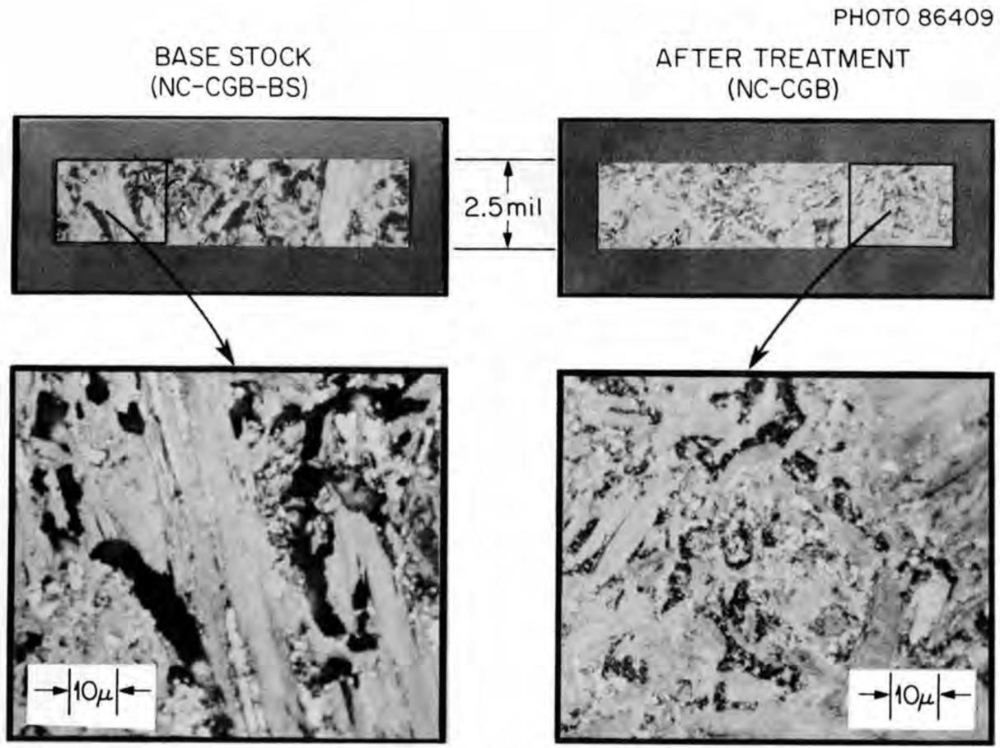  
Fig. 1. Photomicrographs of Thin CGB Graphite Sections Before and After Impregnation. These sections are mounted in pressurized clear epoxy resin (not furfuryl polymers) which has intruded and solidified in the connected pores. In low-magnification photos, entire impregnated regions give the appearance of open pores, as the resin seems to completely wet such regions. However, differences between the treated and untreated graphites become quite evident at higher magnifications.

Photomicrographs of specially prepared "typical" sections of the graphites under discussion are shown in Fig. 1. These particular specimens were specially ground sections mounted in epoxy resin. While the resin was in a liquid state, they were subjected to pressures of about 7000 psi in an effort to fill the pores with a supporting material. These particular specimens were ground exceptionally thin to ensure maximum filling. A supporting material was required so that the true sizes and shapes of the pores would be maintained during the post-mounting polishing operations which are required for microscopic examination. Several grades of graphite pertaining to other studies were simultaneously subjected to the same treatment to afford comparisons of similar materials.

We note that the tone of border areas around the structures at the top in Fig. 1 represents the plastic under the particular lighting conditions involved. In most cases, the presence of this tone appears over various regions within the structure, most frequently indicating the plastic-

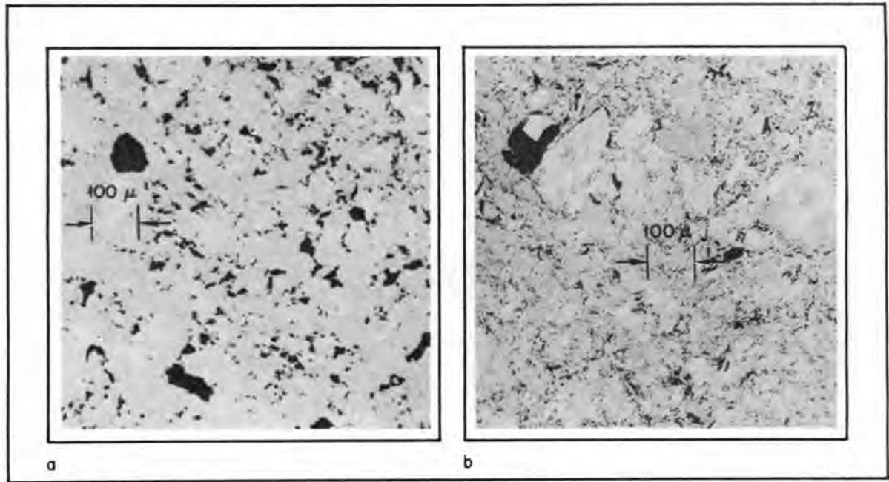  
Fig. 2. Low-Magnification Photos of CGB Base Stock and Impregnated Graphites. The base stock material is shown at a; several vug regions appear in the selected specimen. The impregnated material is shown at b, where manifestations of original vug regions are readily apparent. The pores do not contain epoxy mounting resin. Attention is called to the unusually large impregnated vug region in the upper left-hand corner of b.

filled pores. This, however, is not always true, particularly in the case of impregnated graphite at low magnification ( $\sim 200\times$ , upper photos in Fig. 1). Here, impregnated regions are saturated with mounting plastic, and the impregnant residue is obscured. The mounting plastic or resin should not be confused with carbonized impregnant. At fourfold higher magnifications, as in the lower photos, the plastic seems to become more transparent, the carbonaceous residues are clearly shown, and the differences between pore structures become quite evident.

Examination of impregnated vug regions clearly reveals two types of impregnant residues in the material we have studied; thus our original speculations as to the treatments tend to be verified. Inspection of Fig. 2, which shows "resin-free" pores, gives some idea as to the size and frequency of vugs in the graphites before and after impregnation (Figs. 2a and 2b respectively). We note that the residues of the impregnation treatment obscure most of the original vug regions, but it is still possible to discern regions corresponding to unusually large vugs, as indicated in the upper left-hand corner of Fig. 2b. Photomicrographs of the latter region at higher magnifications and after additional polishing appear in Fig. 3. Here is observed a single light-toned kernel surrounded by a dark ill-defined material which seems to be poorly graphitized. It will become obvious from pore size distribution curves to be presented later that even at these high magnifications it is practically impossible to discern the sizes and shapes of the pores.

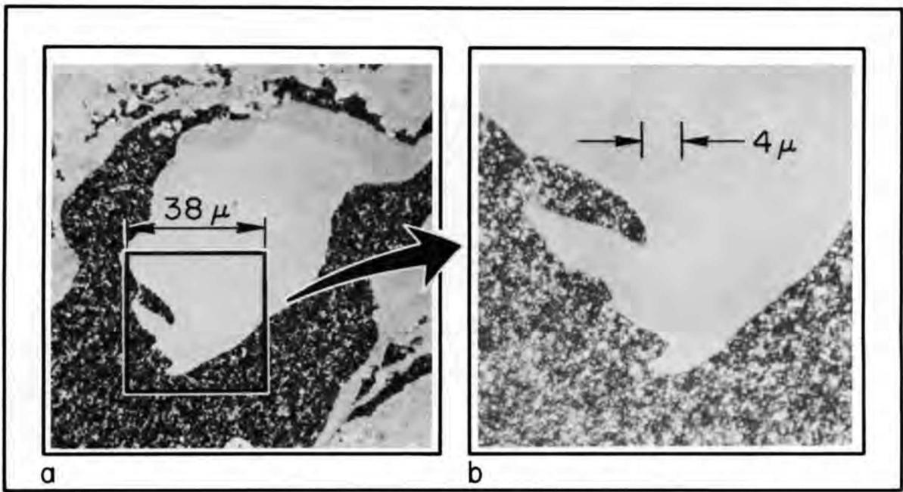  
Fig. 3. Large Impregnated Vug Region of Fig. 2b at High Magnification.

X-ray analyses performed on such residues, after careful removal, reveal hard, turbostratic, anisotropic structures for the kernels.4 Sampling and removal difficulties associated with the furfuryl-related residues permit the inference that these specimens possessed a weak and featureless structure. The low degree of graphitization revealed by both residues tempts us to conclude that the impregnants have not been subjected to temperatures greater than $2200^{\circ}\mathrm{C}$ .

Surprisingly, after such examinations (particularly of photomicrographs like Fig. 3 and in the absence of pore size data), no region of the resin-injected impregnated graphite showed any evidence of being porous. In fact, until recently we had not seen a region or feature which could be positively identified as a pore in the impregnated material, even with the aid of the electron microscope.5 Although attempts with other porous graphites were highly successful, the first two attempts to replicate surfaces of specimens related to Fig. 1 for electron microscopy failed because of polishing artifacts and limited surface areas available for replication. Since the entire impregnated regions were saturated by resin (Fig. 1), we could only speculate that the pores were an intimate part of the furfuryl-residue regions and that their radii were about the same size as the openings suggested by pore size distributions.

Through continued efforts with resin-free specimens, we have recently obtained very good replicas. These permit one to obtain micrographs of much higher magnification than those indicated in Fig. 3. The new results are shown in Fig. 4. An inspection of this micrograph clearly reveals

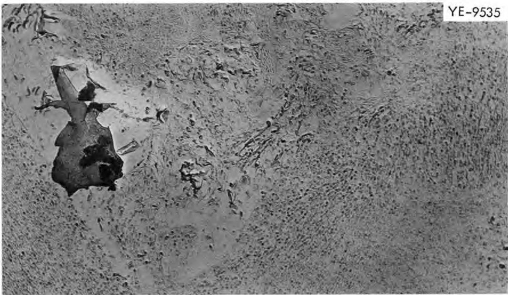  
Fig. 4. Electron Micrograph of a Surface Replica of Impregnated CGB Graphite. The surface involved is selected and not necessarily typical; the magnification is approximately $10,000\times$ . The radius of the large pore shown here is about ten times greater than the most probable radius for large-pore entrances (see text and Fig. 5).

the small pores that control the flow behavior in the impregnated graphite. Although very large pores appear and attention tends to focus on such regions, it should be noted that the small pores with the highest frequency are of greatest importance, even though they constitute a rather nondescript background in Fig. 4.

It is clear from the foregoing discussion that the impregnated material exhibits property variations along directions normal to the impregnation surfaces. Insofar as the MSRE graphite is concerned, however, we should note that the degree of nonuniformity has probably been mitigated somewhat, since the surface regions, where impregnation treatments should be particularly effective, have most likely been removed in order to produce the slots and final dimensions of the bars. We wish to stress this point because it was our original impression that the slots were milled either at the beginning or at some point during the multiple impregnation treatments. The impression was inferred from Carbon Products Division's insistence that responsibility for the final permeability of the finished bars could not be assumed unless they were allowed to perform the final milling operations, as well as fabricate and impregnate the bars. There is no evidence, however, that additional treatment took place after milling.

# IV. EFFECT OF IMPREGNATION TREATMENT ON FLOW PROPERTIES

# Comparison of Base Stock and Impregnated Graphite

General Considerations. - In the preceding sections we have presented visual evidence concerning the effects of impregnation on CGB graphite structures. While this is pertinent and of interest, we are primarily concerned with the manifestations of impregnation treatments in a quantitative sense. Although the ultimate objective is to ascertain variations as a function of position in an impregnated bar, we shall first compare flow-related properties of base stock with those of impregnated materials presented in Report I. This approach has the particular advantage of demonstrating a maximum variation in values but is somewhat awkward in that we must prematurely preempt some definitions which would otherwise appear in other sections; thus it is immediately necessary to consider the subject of nonuniformity of the flow specimen studied in Report I. The specimen used for these experiments was machined from the central portion of a bar that possessed a minimum number of large-scale defects and cracks (bar 23, lot 1). The corresponding data were treated as though they were representative of a more or less uniformly impregnated material, even though this was not the case.

To recapitulate, our purpose in this section is to compare the properties of the impregnated sample just described with like properties of the base stock in order to demonstrate the overall effect of impregnation on the gas transport characteristics of the graphite. We wish to re-emphasize, however, that the impregnated-sample data should be considered as representative of a material which has been subjected to moderate degrees of uniform impregnations.

Characterization Parameters. - The first parameter we shall compare is the density $d$ ; next is the total porosity $r_t$ as "seen" by fluids (fraction of the bulk volume comprising connected pores), and third, the so-called pore size distribution function $f_c(r_0)$ . The latter is of particular usefulness in our work; it is defined so that it represents the fraction of the total porosity $r_t$ associated with pores having entrance radii between $r_0$ and $r_0 + dr_0$ . Thus

$$
f _ {e} \left(r _ {0}\right) \equiv \frac {1}{r _ {t}} \left(\frac {d -}{d r _ {0}}\right), \tag {1}
$$

$$
\int_ {0} ^ {\infty} f _ {\varepsilon} \left(r _ {0}\right) d r _ {0} = 1. \tag {2}
$$

Many porous materials display a multidisperse pore structure in that the distribution function exhibits several maxima. In such cases it is convenient to divide the distribution function into several parts, corresponding to the distribution in pore sizes about given maxima. These distribution functions are defined by the relations

$$
f _ {i \epsilon} \left(r _ {0}\right) = \frac {1}{\tau_ {t}} \left(\frac {d \tau_ {i}}{d r _ {0}}\right), \quad i = 1, 2, \dots , \tag {3}
$$

in which $\varepsilon_{i}$ is the porosity contribution from the pores assigned to the ith group. The maxima frequently appear at considerably different values of the pore entrance radius, so it is generally not too difficult to make the apportionment.

Flow Parameters. - We demonstrated in Report I that only three parameters are required to completely specify the gas transport characteristics of a porous medium. These are the viscous flow parameter $B_{0}$ , the Knudsen diffusion coefficient $D_{jK}$ for any experimentally convenient gas $j$ , and the diffusion coefficient $D_{jl}$ which describes the diffusion characteristics of any gas pair $j-l$ through the septum. In addition, it was also shown how these parameters can be obtained experimentally; the first two coefficients are derived from determinations of the pressure dependence of the permeability coefficient $K_{j}$ of given samples to a single pure gas $j$ . The permeability coefficient relates to pressure in the following manner:

$$
K _ {j} = \left(B _ {0} / \eta_ {j}\right) \left\langle p \right\rangle + D _ {j K}, \tag {4}
$$

where $\left\langle p\right\rangle$ is the arithmetic average of the pressures $p(0)$ and $p(L)$ on the two sides of the sample and $\eta_{i}$ is the viscosity coefficient of the gas.

The third coefficient, $D_{j1}$ , on the other hand, can be obtained from only a few measurements of the countdiffusion process for any two gases $j$ and $l$ through the septum under isobaric, isothermal conditions. Accordingly, just a few measurements of this kind involving base stock were made in the present study. The reader is referred to Report I for further details regarding procedures, equations, etc. Our present interest in $D_{j1}$ stems from the fact that this parameter gives an indirect measure of the fraction of pores actually engaged in a linear flow situation; that is, we are interested in the ratio $(\varepsilon'/q')$ which appears in the equation

$$
D _ {j 1} = \left(\varepsilon^ {\prime} / q ^ {\prime}\right) \vartheta_ {j 1}, \tag {5}
$$

in which $\mathbb{Q}_{jl}$ is the so-called "free space" diffusion coefficient. Unlike $D_{jl}$ , the quantity $\mathbb{Q}_{jl}$ is independent of geometry. (Details regarding the experimental determination of the free space diffusion coefficient are adequately described elsewhere.)

We wish also to point out that the porosity $\varepsilon^{\prime}$ should not be confused with the total porosity $\varepsilon_{t}$ introduced earlier. It is unfortunate that both quantities carry the same nomenclature, but $\varepsilon_{t}$ refers to the total interconnected void volume, whereas $\varepsilon^{\prime}$ is only that part of $\varepsilon_{t}$ which is involved in gas transport. Furthermore, $\varepsilon^{\prime}$ cannot be determined directly; in the simplest case, Eq. (5), it appears as the ratio $(\varepsilon^{\prime} / q^{\prime})$ . In the majority of graphites that we have encountered, the quantity $(1 / \varepsilon_{t})(\varepsilon^{\prime} / q^{\prime})$ ranges between $10^{-2}$ and $10^{-5}$ .

Comparison of Results. - Nominal values of the characterization and flow parameters for each of the two types of graphite are listed in Table 1. First, we note the $12\%$ increase in bulk density of the treated material and the $57\%$ decrease in the nominal porosity values, the latter

Table 1. Nominal Values of the Characterization Parameters of CGB Graphite Before and After Impregnation   

<table><tr><td></td><td>Base Stock (CGB-BS)</td><td>Impregnated Graphite (CGB)</td></tr><tr><td>Bulk density, g/cm3</td><td>1.67</td><td>1.87</td></tr><tr><td>Apparent solid density, g/cm3</td><td>2.09</td><td>2.05</td></tr><tr><td>Connected porosity, a % of bulk volume</td><td>21.4</td><td>9.2</td></tr><tr><td>Pore entrance radius at porosity distribution peaks, μ</td><td></td><td></td></tr><tr><td>At primary peak</td><td>0.85</td><td>0.080</td></tr><tr><td>At secondary peak</td><td>0.01</td><td>0.01</td></tr><tr><td>Porosityb associated with pore-size distribution, % of bulk volume</td><td></td><td></td></tr><tr><td>At primary peak</td><td>17.3</td><td>7.2</td></tr><tr><td>At secondary peak</td><td>3.0</td><td>3.1</td></tr><tr><td>Modified viscous flow parameter (B0/η) for helium at 23°C, cm2sec-1atm-1</td><td>1.57 × 10-1</td><td>5.18 × 10-5</td></tr><tr><td>Knudsen diffusion coefficient Djkfor helium at 23°C, cm2/sec</td><td>1.43 × 10-1</td><td>4.70 × 10-4</td></tr><tr><td>Normal diffusion coefficient DjI for the pair He-Ar at 23°C and 1 atm pressure, cm2/sec</td><td>1.04 × 10-2</td><td>7.00 × 10-4</td></tr></table>

${}^{a}$ Determined by helium expansion.   
${}^{b}$ Determined by mercury injection; see Fig. 5.

having been determined in each case by the standard gas-expansion method. $^{7}$ The information in Table 1 relative to pore sizes and their distribution is clarified by an examination of the distribution plots shown in Fig. 5, where typical bidispersed systems for graphite are displayed. The upper plot represents the porosity distribution function for the base stock, where maxima occur at about 0.85 and $0.01\mu$ . The lower plot illustrates the maxima exhibited by the impregnated material at about 0.08 and $0.01\mu$ . Insofar as characterization parameters are concerned, a ten-fold reduction in the size of the primary (large) pores is one of the major effects of the impregnation. (The reader should note that a split abscissa with two scales has been employed for the base stock plot at the top of the figure in order to show the entire dispersion of the primary large-pore peak in a proper perspective and also that the ordinates differ by a fivefold scale.)

There are virtually no pores which contribute to the porosity of the base stock in the region between 0.1 and $0.5\mu$ . Also, the primary pores account for $85\%$ of the total porosity of the base stock. For impregnated graphite, however, a fair amount of overlap between the two maxima is in evidence. Nevertheless, the primary mode still represents about the same percentage $(70\%)$ of the total available porosity. We should note further that our experience with these and other

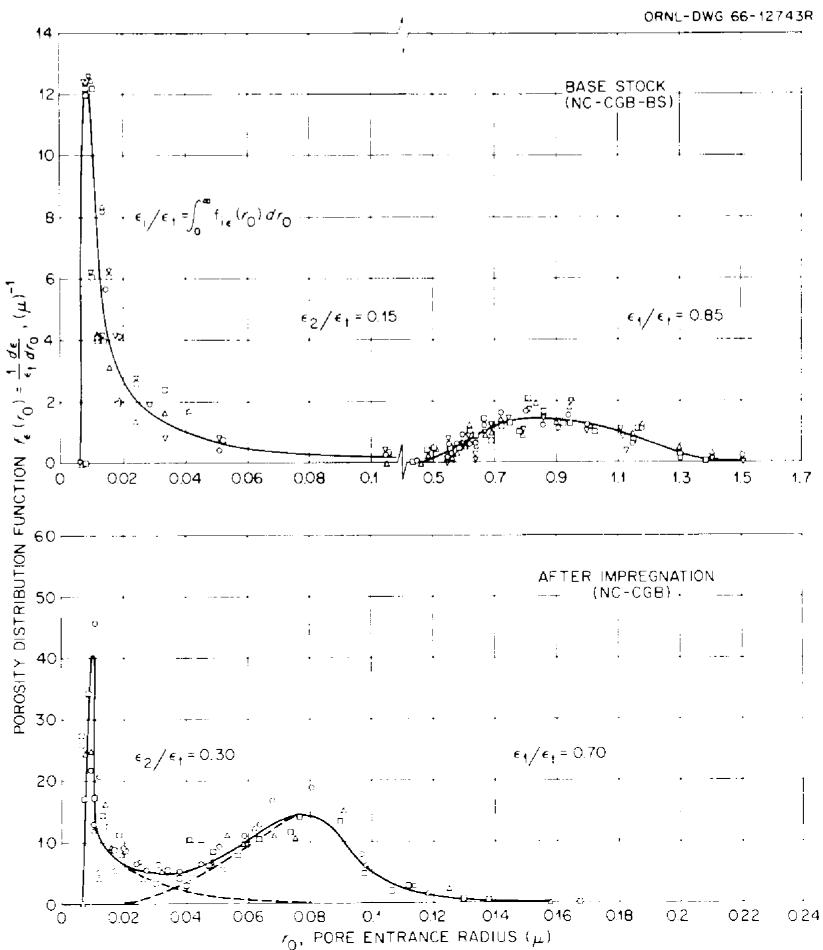  
Fig. 5. Effect of Impregnation on the Distribution of Pore Entrance Radii in CGB Graphites. Upper plot, base stock; lower plot, impregnated material.

graphites suggests that the percent of bulk volume associated with secondary peaks ranges about a constant value of approximately $3\%$ of the bulk volume, even though the primary values might vary considerably. We conclude that the size or number of the secondary pores is not altered by the impregnation treatments; but the diffusion and flow behavior are nearly always controlled by the primary, not the secondary, pores. Therefore, since primary pores sustain the highest degree of alteration via impregnation treatment, it is not surprising that we found marked differences in the diffusion and flow behavior of the two graphites cited in Table 1.

We shall reserve further discussion of the flow parameters in Table 1 for the general discussion, since our major objective here is to demonstrate, on a magnified scale, some of the less dramatic variations one might expect along the radial direction of an impregnated bar. One may anticipate in the latter case that the density would remain essentially constant and the porosity could change slightly, but the pore size distributions (and diffusion coefficients) might vary appreciably.

# Variation of Structural and Flow Properties with Position

Limitations of Sampling Procedures. - So far we have demonstrated that the overall effect of impregnation, even for a "poorly impregnated" material, is a significant decrease in the large-sized pores in the graphite and consequently a marked permeability reduction of the material to fluids. In this section we consider the extent of permeability reduction; that is, we examine the structural and flow properties as a function of position from the surface to the core of the bar. Thus it is pertinent to review the history of the source material which we employed in the previous and present investigations. We received a 15-in. section8 of the original 6-ft bar 23. X-ray analyses of this section revealed that the bar was of exceptionally good quality in comparison to some of the other source materials available to us, even though there were two small cracks approximately 4 in. from each end of the 15-in. section. We selected an unusually good portion for the fabrication of a 6-in. diffusion cell and a 2-in.-OD porosity plug, data for which appear in Report I.

After fabricating these two specimens, some 6 in. was available for the present investigation, thus precluding a study of variations along the bar axis; we were limited therefore to a study of properties along the equivalent radius. Nevertheless, the axial variations could be estimated by comparisons of the present data with comparable data which were reported for the specimens of Report I.

A study of property variations as a function of position demands small specimen sizes that would produce results equivalent to differential measurements. However, the need for small sizes must be balanced by the need for good representation of the material, particularly when the presence of macroflaws is suspected. Acquisition of representative samples is of great importance in permeability (diffusion) studies. For these reasons, we chose to fabricate two series (and types) of specimens.

The first series, shown at the top of Fig. 6, comprised relatively small specimens that were used for density and porosity determinations. Samples from both sides of the midpoint were obtained to ascertain the degree of symmetry of the property variations. Each of these samples was smaller than a dime. Such sizes could be employed for porosity and density determinations because of the availability of a suitable volumetric mercury-porosimeter pressure cup and the relative insensitivity of these parameters to macrocracks and fractures (not, however, to poorly imprinted vugs).

Specimens comprising the second series, shown at the bottom of Fig. 6, were considerably larger than the density-porosity samples, for reasons given above. Although it might seem that a weakness of the sampling technique might stem primarily from employing large increments (thicknesses) along the $z$ direction, this is not the case. When a steady-state flow pattern is visualized, wherein the outer surface of an entire bar is held at a constant potential while a sink or source acts at the center of the bar, one realizes that the isobars tend to be nearly rectangular

ORNL-DWG 66-12744

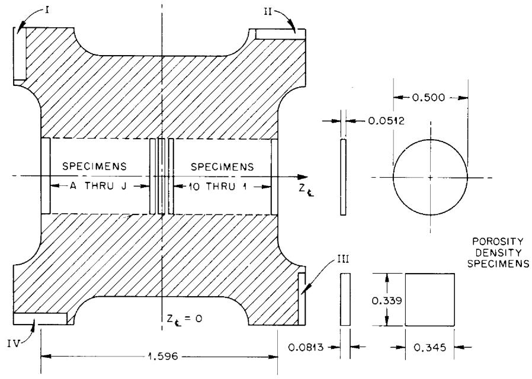

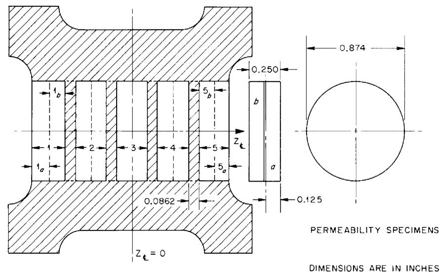  
Fig. 6. Cross Section of CGB Graphite Bar 23 Showing Specimen Geometries and Locations. Upper figure, porosity-density specimens; lower figure, permeability samples.

near the surface, but quickly revert to cylindrical patterns as the center is approached. Most interior samples would "cut across" several steady-state isobars, and thus it is clear that ambiguities are introduced mainly because their radii (not thickness normal to $z$ ) were too large.

As in Report I, however, we must again caution the reader of the possibility that the data to be presented may not be typical of the bulk of the graphite actually employed in the MSRE. Most of the bars made available to us contained large-scale flaws, fractures, and/or cracks. These defects probably result from the impregnation treatments, and, while not likely to be important insofar as reactor operation is concerned (since these defects can become filled with salt if

Table 2. Variation of Density with Location Relative to the Center of a CGB Graphite Bar (Porosity-Density Specimens)   

<table><tr><td colspan="2">Specimen Identification</td><td rowspan="2">Distance from Centera(cm)</td><td colspan="2">Density (g/cm3)</td></tr><tr><td>Lettered</td><td>Numbered</td><td>Lettered</td><td>Numbered</td></tr><tr><td>I</td><td>III</td><td>3.180</td><td>1.874</td><td>1.871</td></tr><tr><td>IV</td><td>II</td><td>3.180</td><td>1.868</td><td>1.867</td></tr><tr><td>A</td><td>1</td><td>1.962</td><td>1.853</td><td>1.865</td></tr><tr><td>B</td><td>2</td><td>1.766</td><td>1.854</td><td>1.865</td></tr><tr><td>C</td><td>3</td><td>1.570</td><td>1.862</td><td>1.863</td></tr><tr><td>D</td><td>4</td><td>1.374</td><td>1.853</td><td>Lost</td></tr><tr><td>E</td><td>5</td><td>1.177</td><td>1.864</td><td>1.864</td></tr><tr><td>F</td><td>6</td><td>0.981</td><td>1.860</td><td>1.858</td></tr><tr><td>G</td><td>7</td><td>0.785</td><td>1.856</td><td>1.856</td></tr><tr><td>H</td><td>8</td><td>0.589</td><td>1.862</td><td>1.861</td></tr><tr><td>I</td><td>9</td><td>0.392</td><td>1.859</td><td>1.850</td></tr><tr><td>J</td><td>10</td><td>0.196</td><td>1.855</td><td>1.856</td></tr><tr><td>Center</td><td>Center</td><td>0</td><td>1.850</td><td>1.850</td></tr></table>

${}^{a}$ Relative position in bar shown in Fig. 6.

near the surface), they do render the samples unsuitable for gas transport characterization. Inspection and selection of the stock we received was performed with these facts in mind, so that our choice of a particular section of one bar (bar No. 23) was made on the basis of a minimum number of such flaws.

Density Determinations. - The apparent or bulk density of a regular geometric body is probably the most convenient property to determine accurately; one merely weighs the sample and then calculates the volume in which the solids are contained from appropriate measurements of the geometry. The densities derived in this manner for the porosity-density specimens are listed in Table 2. All of the samples which were employed to obtain the density and porosity data were machined from the graphite bar normal to the extrusion axis; the position, geometry, and identification of these specimens are shown in the upper portion of Fig. 6.

On preliminary examination, the material as a whole appears to be quite uniform; indeed, the average density of the bar is $1.86 \pm 0.03 \, \text{g/cm}^3$ . On closer inspection, however, we note a slight decrease in density near the center of the bar. This becomes obvious when one compares results for specimens I-IV with those taken at the center of the bar. Results for all other samples indicate no definite trends. For a more sensitive test, we now focus on the porosity determinations.

Total Porosity Determinations. - The porosities exhibited by selected disks of the porosity-density specimens are listed in Table 3. These results have been obtained as an adjunct to those obtained by the standard mercury-penetration technique, in which mercury is injected into a previously evacuated sample by compression and the difference in weight of the sample after

Table 3. Porosity, Determined by Mercury Injection of Selected Small Disks of CGB Graphite, as a Function of Bar Position   

<table><tr><td>Specimen Identificationa</td><td>Distance from Center (cm)</td><td>Open Porosity (% bulk volume)</td></tr><tr><td>I and III</td><td>3.180</td><td>10.1</td></tr><tr><td>1</td><td>1.962</td><td>10.2</td></tr><tr><td>2</td><td>1.766</td><td>10.6</td></tr><tr><td>3</td><td>1.570</td><td>10.2</td></tr><tr><td>5 and E</td><td>1.177</td><td>10.8</td></tr><tr><td>6</td><td>0.981</td><td>10.9</td></tr><tr><td>9</td><td>0.392</td><td>11.0</td></tr><tr><td>Center</td><td>0</td><td>11.1</td></tr></table>

${}^{a}$ Relative position in bar shown in Fig. 6.

and prior to injection is determined. Unlike the bulk density values, the porosity data display an unmistakable trend; the surface specimens are approximately $10\%$ less porous than the sample which had been machined from the center of the bar.

According to our speculations as to the manufacturing process, specimens near the surface should be most dense and least porous. Moreover, if we were correct in contending that the effectiveness of the impregnation treatments would diminish from the surface to the center of the material, the density should decrease and the porosity should increase as one proceeds toward the core of the graphite body. It appears as though we have gained experimental support for this contention.

# Porosimetry Determinations

That pore size spectra encountered in this work might be more readily comprehended, we shall preface this otherwise brief section with a cursory description of the experimental and theoretical aspects of porosimetry. The experimental facets divide into two distinct parts: (1) evacuation and mercury charging of a penetrometer containing a sample and (2) injection of the mercury into the pores of the specimen utilizing pressurized isopropyl alcohol.[9]

A drawing of the pentrometer is shown in Fig. 7. Components $A$ , $B$ , and $D$ are employed to exert a sealing pressure on the glass sample holder $E$ , part of which forms a calibrated capillary $F$ . The actual seal occurs between the ground cup lip of $E$ and the glass disk $C$ ; the O-ring $B$ merely serves to ensure uniform compression for the glass-to-glass seal. High-pressure seals

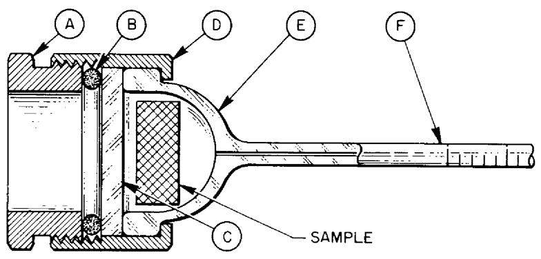

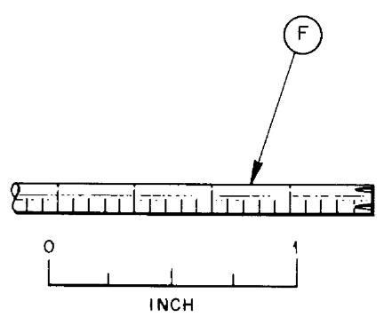  
Fig. 7. Sketch of the Penetrometer for the Aminco-Winslow Porosimeter. The various components are identified and described in the text.

are unnecessary, since the entire penetrometer is subjected to the same pressure in the course of the mercury injection. $^{10}$

It is imperative that the size of the sample to be employed in the experiment be judiciously chosen, since an improper size can easily result in the entire volume of mercury in the capillary being forced into the specimen at a prematurely low pressure. This possibility can be lessened either by determining the total porosity by the usual gas expansion method or through a computation based on the bulk density and the assumption that the density of solids is $2.08\mathrm{g/cm}^3$ .

In the first stage of the experiment, the sample is weighed and then sealed in the penetrometer. Then the penetrometer is placed within a glass enclosure, and the assembly is evacuated. Mercury is then admitted into the penetrometer through the capillary under the application of atmospheric pressure. The sample has now been subjected to mercury injection at 1 atm pressure, so that pores with equivalent radii greater than about $7\mu$ have already been filled with the penetrant. Hence, if pores of this size are suspected, the specimen should be reweighed and the procedure above repeated before proceeding further.

In the second phase, the mercury-filled penetrometer is transferred to a pressure chamber which contains alcohol. Pressure is then applied in a stepwise manner to the system, which causes further penetration of the mercury into the specimen. In a typical step, the meniscus of the mercury in the capillary is noted and then pressure applied until a predetermined volume change, after the system has been allowed to equilibrate, is observed.

The capillarity formula which relates the pore dimension to the applied pressure is given by

$$
\frac {V}{\Sigma} = \frac {- \sigma \cos \theta}{p}, \tag {6}
$$

where $V$ represents the volume of a pore which has been filled with mercury at the hydrostatic pressure $p$ , $\Sigma$ is the surface area of the pore, $\sigma$ is the surface tension of mercury (473 dynes/cm), and $\theta$ represents the mercury-graphite contact angle (130 or $142^{\circ}$ is commonly used). In the case of cylindrical pores of radius $r$ and length $l$ ,

$$
\frac {V}{\Sigma} = \frac {\pi r ^ {2} l}{2 \pi r l} = \frac {r}{2},
$$

and if we employ this relationship as the definition of the “equivalent pore entrance radius,” then Eq. (6) takes the form

$$
r _ {0} = \frac {- 2 \sigma \cos \theta}{p}. \tag {7}
$$

The experimental data are thus of the form of a series of pore volume $-\Delta r_0$ (or $\Delta p$ ) pairs; these are plotted as a continuous pore size distribution curve by first defining the porosity distribution function,

$$
f (\varepsilon) = \frac {1}{V _ {0}} \frac {\Delta V}{\Delta r _ {0}}, \tag {8}
$$

in which $V_{0}$ is the total volume of mercury injected, and by referring each $f(\epsilon)$ to a characteristic radius which is calculated from the relation

$$
r _ {0} = r _ {0} ^ {0} + \left(\Delta r _ {0}\right) _ {i} / 2 + \sum_ {0} ^ {i - 1} \left[ \left(\Delta r _ {0}\right) _ {i} \right]. \tag {9}
$$

The calculations are made in reverse order; $r_0^0$ represents the pore entrance radius corresponding to the minimum value of $r_0$ as determined by Eq. (7), that is, at the maximum applied pressure, and the $(\Delta r_0)_i$ represent succeeding increments.

The distribution of porosity as a function of pore opening radius was determined for several of the impregnated samples. Surprisingly, only small differences were obtained for specimens ranging about $E$ or 5, as defined in the upper portion of Fig. 6. Thus we were forced to select samples from diverse positions to demonstrate that variations in porosity characteristics would be significantly greater than the variations introduced by the reproducibility of the method, as suggested by the curves in Fig. 8. The result is that the pore size distributions do not give a high degree of distinction regarding flow properties as we had originally imagined. Part of the difficulty is unquestionably due to our inability to distinguish between pore number and pore length in constructing the porosity distribution curves. Unfortunately, these have opposite effects on the flow

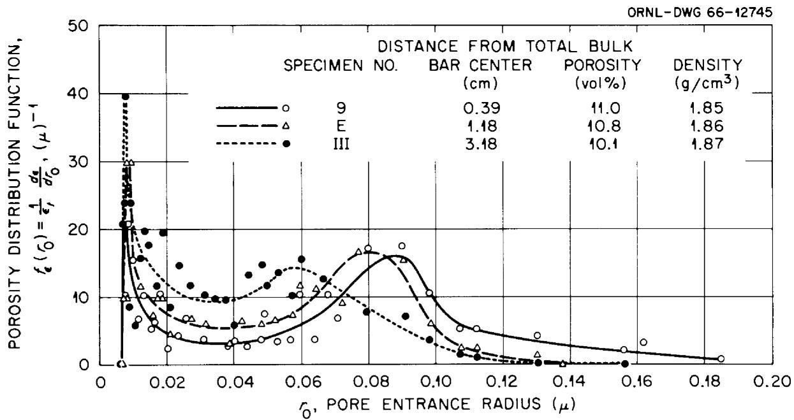  
Fig. 8. Porosity Distribution in Impregnated Graphite Bar 23 for Three Positions Within the Bar.

properties. The fluid measurements themselves thus remain as the most reliable means for determining gas transport properties within a given MSRE bar.

# Permeability Determinations

Basic Considerations. -- Before proceeding to an examination of variations of the permeability coefficient with position, it is instructive to again compare the untreated and impregnated specimens. The decrease in permeability to helium at atmospheric pressure due to impregnation may be defined by the ratio

$$
\frac {K _ {\mathrm {H e}} (\text {u n t r e a t e d})}{K _ {\mathrm {H e}} (\text {t r e a t e d})} = \frac {3 . 0 \times 1 0 ^ {- 1} \mathrm {c m} ^ {2} / \sec}{5 2 . 2 \times 1 0 ^ {- 5} \mathrm {c m} ^ {2} / \sec} = 5. 7 \times 1 0 ^ {2}, \tag {10}
$$

in which the values presented in Table 1 have been employed. This ratio is less than the $10^{4}$ reduction which was cited in the description of materials, but it should be recalled that the treated sample referred to in Table 1 must be regarded as a poorly impregnated graphite. Reduction factors which compare favorably with the value above will be encountered in a later portion of this work. Of more importance is a comparison of the quantity

$$
\delta_ {\mathrm {H e}} = \frac {D _ {\mathrm {H e K}}}{D _ {\mathrm {H e K}} + D _ {\mathrm {H e A r}}} \tag {11}
$$

which is a measure of the relative effect of free-molecule and hydrodynamic mechanisms on the overall gas transport in that it denotes the normal fraction of the total resistance. At 1 atm

pressure, this quantity is found to be only $7\%$ less than the hydrodynamic value of unity in the case of the base stock, but for the impregnated material $\delta_{\mathrm{He}} = 0.40$ , a value which is $60\%$ less than the hydrodynamic result.

This effect retains its importance even when we convert from helium and argon parameters to corresponding values for typical fission products (e.g., xenon) at reactor conditions (2.36 atm and $936^{\circ}\mathrm{K}$ , as discussed about Table 6 in Report I). Here it is found that $\delta_{\mathrm{X_e}}$ is $91\%$ less than the hydrodynamic value. Furthermore, the overall coefficient is

$$
D _ {\mathrm {X e}} = \frac {D _ {\mathrm {X e K}} \times D _ {\mathrm {X e H e}}}{D _ {\mathrm {X e K}} + D _ {\mathrm {X e H e}}} = \frac {(1 . 4 5 \times 1 0 ^ {- 4}) (1 . 5 2 \times 1 0 ^ {- 3})}{(0 . 1 4 5 - 1 . 5 2) \times 1 0 ^ {- 3}} = 1. 3 2 \times 1 0 ^ {- 4}. \tag {12}
$$

From these values it is clear that $D_{X_e}$ is essentially the same as the Knudsen coefficient $D_{X_eK}$ . [The subscript $jK$ denotes gas-wall (or dust) collisions of the type described by Knudsen. These were first investigated experimentally by Kundt and Warburg in 1875 and were studied theoretically by Maxwell in 1879.]

From the foregoing discussion, it is evident that the combination of the impregnation effects and the characteristically high molecular weights of fission products induces a shift from the hydrodynamic (or continuum) to the Knudsen regime as well as a marked decrease in the values of the diffusion coefficients. In the results reported here, this is significant, because a good estimate of the diffusion behavior can be obtained from permeability measurements alone. The acquisition of such data, however, presents a special problem by virtue of the low permeabilities encountered.

The permeability coefficient $K_{j}$ presented in Eq. (4) is actually defined by the differential form of the permeability equation,

$$
J = - K _ {j} \left(d n _ {j} / d z\right), \tag {13a}
$$

which relates the flux of molecules of type $j$ through the porous medium to the density gradient causing the transport. The steady-state, isothermal, linear-flow form, to which Eq. (4) relates, is obtained from Eq. (13a) upon integration:

$$
\Lambda (p V) / \Delta t - (A / L) K _ {j} | \Lambda p | = (A / L) \left(D _ {j K} + B _ {0} \left\langle p \right\rangle / \eta_ {j}\right) | \Lambda p |. \tag {13b}
$$

The parameter of primary interest for present purposes is $D_{j\mathbf{K}}$ . However, since this is the intercept at $\langle p \rangle = 0$ , at least two measurements of $K_j$ vs $\langle p \rangle$ must be made in order to enable extrapolation to find values of $D_{j\mathbf{K}}$ .

In the constant-pressure apparatus used in the experimentation for Report I, the specimen was large enough so that we could work with a low $\Lambda p$ over a whole range of pressures and still avoid turbulent flow. The volume rate of flow was measured by a wet-test meter or a bubble-meter under a constant atmospheric pressure.

As mentioned previously in the present work, we encounter a very special problem regarding permeability measurements, in that we must attempt a compromise between two contradictory specifications pertinent to specimen size. To obtain maximum detail as to permeability variations as a function of position, very small specimens should be employed. On the other hand, to obtain a good average and/or representative value, a large, thick specimen should be employed. Our compromise is depicted in Fig. 6. Specimens of this size have relatively low values of $A / L$ , and these in turn lead to low flow rates. Thus we are forced to employ systems with evacuated constant-volume receivers wherein $J$ is measured via small pressure rises as a function of time. This method enables us to work with these low permeability specimens. While such systems were suited to our problems, they have two distinct disadvantages. First, we can stumble into the turbulent region if the permeability is greater than $10^{-3}$ because $\Lambda p$ is greater than or equal to $2\langle p\rangle$ . Second, a support grid is required to keep the specimen from blowing out under the sometimes-high $\Lambda p$ employed. In view of these rather drastic differences in procedure from Report I, we have chosen to describe the procedures and equipment in some detail, particularly since the permeability measurements represent the heart of our experimental efforts.

Procedure. - The samples with which the variation of permeability with respect to position was investigated were in the form of cylindrical disks. The identification and the geometrical characteristics of the disks are presented in Fig. 6.

A view of the mounted permeability specimens and the associated pressure chamber is shown in Fig. 9. The sample, $A$ , is sealed with epoxy resin, $E$ , to the specimen holder $B$ , which is an interconnected grill fabricated from brass to give the sample support. This holder is in turn soldered at $C$ to a stainless steel tube $D$ which connects the sample-holding device to the receiver system. Next, the sample and holder are secured in a two-part brass chamber ( $F$ and $F'$ ) which screws together and is sealed via a neoprene O-ring $G$ . Swagelok fittings $H$ seal the stainless steel tubing to the brass chamber and to the receiver system.

After the sample holder is connected into the system as shown in Fig. 10, the air-contaminated components are evacuated through the cleanup line through the use of a vacuum pump, and the system is then flushed with helium. A controlled positive pressure is then applied to the upstream side of the sample, while the vacuum pump continues to pump on the downstream side, until a steady-state flow is established. At this point the vacuum pump is disconnected, and the pressure rise in the receiver volume is measured. Either a pressure gage or a manometer is used to measure the constant pressure on the upstream side; a Hastings vacuum gage (for extremely

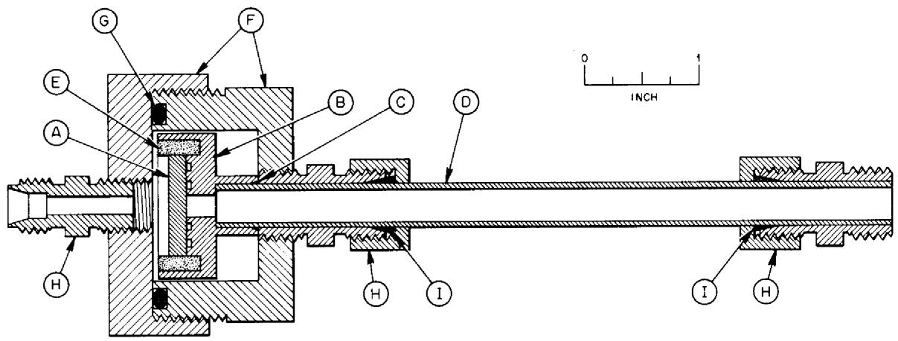  
Fig. 9. Sketch of the Permeability Sample as Installed in the Holder. Details concerning the various components are given in the text.

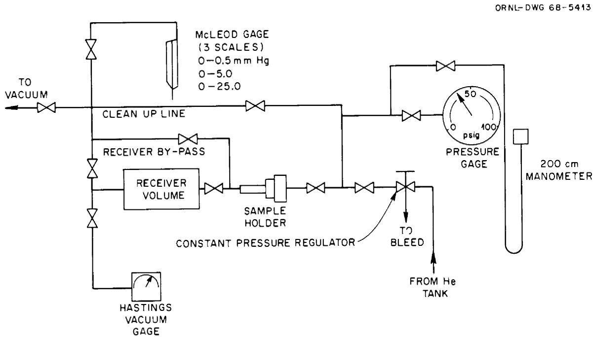  
Fig. 10. Flow Diagram of the Pressure Rise Apparatus for Permeability Determinations Involving Specimens with Low Flow Rate Characteristics.

low pressures) or a McLeod gage (for slightly higher pressures) is used to measure the pressure rise on the downstream side. $^{14}$

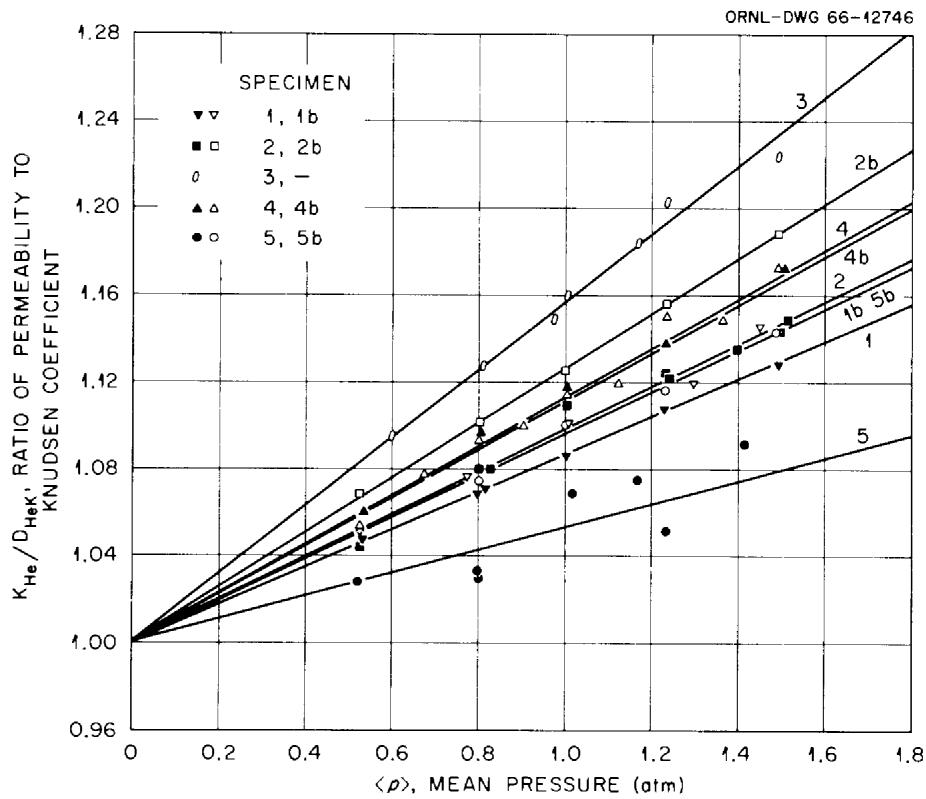  
Fig. 11. Plots of the Reduced Helium Permeability of Specimens Taken from Various Positions Within Impregnated Graphite Bar 23.

With reference to Eq. (13b), it should be noted that the gages measured $\left\langle p \right\rangle$ as well as $\Delta p$ and that measured values of $A, L,$ and $V$ remained constant during the experiment. The room temperature and barometric pressure are recorded since the barometric pressure must be added to the readings of the upstream-side pressure gages. Unless subatmospheric pressure measurements are being performed, leaks and/or bleeds on the upstream side are of no consequence, since the receiver system is connected to the stainless steel tubing. The incremental pressures are divided by their respective incremental time intervals to obtain the flow rate.

In our particular experiments, once a set of permeability values had been determined, half of the sample was machined away, and the permeability of the remaining portion was likewise investigated. These latter samples were identified by the letter $b$ ; thus specimen $5b$ refers to that portion of specimen 5 which remained after the machining operation; $5a$ , on the other hand, designates the portion of specimen 5 which was removed by the machining process. The orientation of sections $a$ and $b$ of a given sample relative to the center of the bar is also identified in Fig. 6.

Results. - The permeabilities of the samples to helium are displayed in Fig. 11. Each experimental value (or point) on this plot has been reduced by the intercept $D_{\mathrm{HeK}}$ of the corresponding plot of $K_{\mathrm{He}}$ vs $\langle p \rangle$ in order that all the experimental data may be conveniently shown on the same plot. Although scatter in the experimental data is apparent, particularly so in the case of specimen 5, the relationship between permeability and sample position is unmistakable.

Table 4. Summary of CGB Graphite Flow Parameters at ${23}^{ \circ  }\mathrm{C}$ as a Function of Bar Position   

<table><tr><td>Specimena</td><td>z
(cm)</td><td>DHeK
(cm2/sec)</td><td>B0/ηHe
(cm2 sec-1atm-1)</td></tr><tr><td></td><td></td><td>×10-4</td><td>×10-5</td></tr><tr><td>3</td><td>0.159b</td><td>7.97</td><td>12.6</td></tr><tr><td>2b</td><td>0.696</td><td>4.42</td><td>5.59</td></tr><tr><td>2</td><td>0.854</td><td>2.65</td><td>2.62</td></tr><tr><td>2a</td><td>1.014</td><td>1.89</td><td>1.71</td></tr><tr><td>4b</td><td>0.696</td><td>4.32</td><td>4.89</td></tr><tr><td>4</td><td>0.854</td><td>2.89</td><td>3.32</td></tr><tr><td>4a</td><td>1.014</td><td>2.17</td><td>2.51</td></tr><tr><td>1b</td><td>1.550</td><td>1.15</td><td>1.12</td></tr><tr><td>1</td><td>1.709</td><td>0.644</td><td>0.555</td></tr><tr><td>1a</td><td>1.870</td><td>0.447</td><td>0.369</td></tr><tr><td>5b</td><td>1.550</td><td>0.688</td><td>0.659</td></tr><tr><td>5</td><td>1.709</td><td>0.366</td><td>0.194</td></tr><tr><td>5a</td><td>1.870</td><td>0.249</td><td>0.114</td></tr></table>

$\theta$ Relative position in bar shown in Fig. 6; values for the $a$ specimens calculated in accordance with Eq. (14).   
Midpoint of half-specimen 3; see text.

The contribution of two sections, $a$ and $b$ , to the permeability of their composite can be shown to be given by the expression

$$
\frac {L _ {i}}{K _ {i}} = \frac {L _ {a}}{K _ {a}} + \frac {L _ {b}}{K _ {b}}, i = 1, \dots , 5, \tag {14}
$$

where $L_{i} = L_{a} + L_{b}$ is the length of the $i$ th composite (see Fig. 11) and $K_{i}$ is the permeability coefficient of the whole sample $i$ . If the pressure across the pack is sufficiently small, all three permeabilities may be referred to the same average pressure, $\langle p \rangle$ . Equation (14) therefore permits us to calculate the permeability of the specimens $a$ , which had been removed by the machining process. These results, in addition to the experimentally derived results, are summarized in Table 4 in terms of the intercept $D_{\mathrm{HeK}}$ and slope $B_{0} / \eta_{\mathrm{He}}$ of the corresponding $K_{\mathrm{He}}$ vs $\langle p \rangle$ plots.

If the center of a given sample is regarded as that point which is characteristic of the permeability of the sample as a whole, then the curves of Fig. 12 describe the variation of the viscous and Knudsen coefficients with position within the MSRE moderator graphite bar. The vertical lines associated with each point correspond to the spread in values of the two “identical” samples which lie on either side of the center line. Consistent in this context is the assumption that permeability characteristics of sample 3 are likewise representative of its halves, which are positioned so that their midpoints correspond to a distance $z = 0.159$ cm from the center line of the bar.

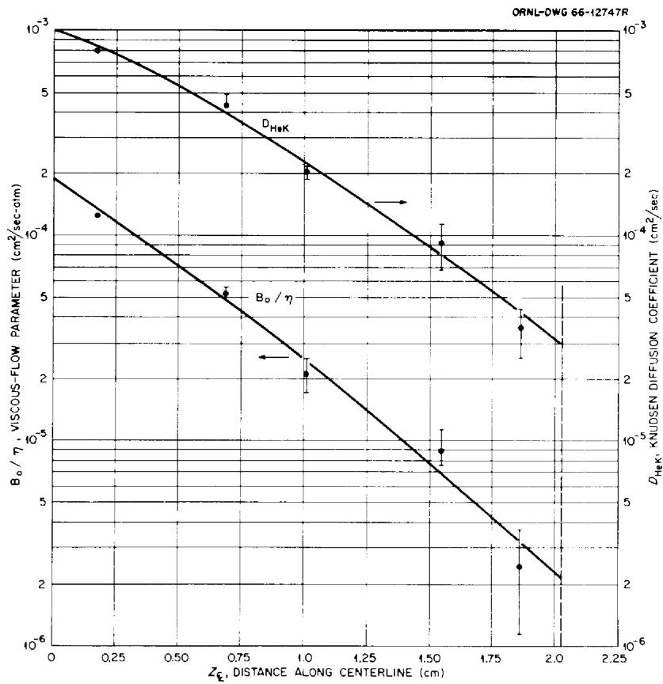  
Fig. 12. Variation of the Viscous and Knudsen Flow Parameters Characteristic of Various Positions Within Impregnated Graphite Bar 23.

The data shown in Fig. 12 clearly demonstrate the effect of impregnation on both the Knudsen and the viscous flow parameters. In fact, it appears justifiable to represent this dependence in fair approximation by a straight line of negative slope on a plot of $\log D_{j\mathrm{K}}$ vs $z$ .

In summary, we have demonstrated a rather gross inhomogeneity in flow characteristics of the MSRE graphite as a result of impregnation and have indicated that the nonuniformity can be approximated by an exponential variation in the flow characterization parameters. We shall investigate the consequences of this variation on the migration characteristics of fission product gases in the next part of this report.

# V. THEORETICAL DESCRIPTION OF GASEOUS FISSION PRODUCT TRANSPORT IN MSRE MODERATOR GRAPHITE

# General Description of Diffusion with Sink Terms

In this section we derive the general equation for linear diffusive transport of a gaseous fission product in MSRE moderator graphite. To simplify the problem somewhat, however, we wish first to carry over a result of Report I which had been discussed earlier, that is, that the Knudsen mechanism dominates in describing the diffusive transport in CGB graphite (but not in the base

stock!). To a good approximation, we can therefore describe the flux $J_{j}$ of any gaseous fission product $j$ by the relation

$$
J _ {j} = - D _ {j \mathbf {K}} \left(d n _ {j} / d z\right), \tag {15}
$$

where $D_{j\mathbf{K}}$ is the Knudsen diffusion coefficient characteristic of component $j$ and $dn_j / dz$ represents the gradient of molecular density which causes transport.

If we consider the rate of accumulation of species $j$ in a volume element $A dz$ which is located about the point $z$ within the graphite, one readily obtains the expression

$$
\epsilon_ {t} \left(d n _ {j} / d t\right) = \frac {d}{d z} \left[ D _ {j K} \left(d n _ {j} / d z\right) \right] - \epsilon_ {t} \lambda_ {j} n _ {j}, \tag {16}
$$

in which $\varepsilon_{t}$ is the fraction of the bulk volume which is accessible to the gaseous species and $\lambda_{j}$ is the decay constant of the fission product. [Burnup of component $j$ can be handled by merely redefining $\lambda_{j}$ as $(\lambda_{j})_{\mathrm{eff}} = \lambda_{j} + \sigma_{j}\phi$ , where $\phi$ represents the neutron flux and $\sigma_{j}$ is an appropriately averaged capture cross section. We shall forgo this contingency, however.] It is important to note the appearance of $\varepsilon_{t}$ in every term except the diffusion term which contains $D_{j\mathbf{K}}$ . This is frequently a point of confusion, and so we digress momentarily to elaborate on this subject. The factor $\varepsilon_{t}$ actually arises because we consider a volume element $A dz$ of the graphite. In counting up the number of $j$ -type molecules, we must of course exclude that volume which is already taken up by the graphite or is otherwise inaccessible to the $j$ molecules. Thus, for example, the total number of molecules of type $j$ within the volume element is given by $(\varepsilon_{t} A dz)n_{j}$ . In the diffusion term, however, we have already provided for this contingency in our definition of $D_{j\mathbf{K}}$ , so its inclusion once again would be erroneous.

Equation (16) is easily recognized as a diffusion equation with a sink term. In order to obtain an expression for the dependence of $n_j$ on position and time, the equation needs only to be solved in a manner which is consistent with the appropriate initial and boundary conditions. This can lead to quite complicated expressions in many cases, however, including those of interest in this work. In a large number of applications, the problem is considerably simplified if only a steady-state solution is sought, for under this condition

$$
d n _ {j} / d t = 0, \tag {17}
$$

and Eq. (16) reduces to the form

$$
\frac {d}{d z} \left[ D _ {j K} \left(d n _ {j} / d z\right) \right] - \varepsilon_ {t} n _ {j} \lambda_ {j} = 0. \tag {18}
$$

In the next sections we seek solutions of Eq. (18). Note also that we can write Eq. (18) for every gaseous fission product $j$ ; no coupling terms arise (i.e., terms which contain the subscript $i$ for instance) by virtue of the Knudsen mechanism.

# Steady-State Transport in Uniform Porous Media

Here we consider the transport of a gaseous fission product in a slab of a uniform graphite which can only be penetrated at the surfaces $z = -L$ and $z = +L$ . Uniformity in this context implies that $D_{j\mathbf{K}}$ and $\varepsilon_t$ are independent of position, so that Eq. (18) becomes

$$
d ^ {2} n _ {j} / d z ^ {2} - \epsilon_ {t} n _ {j} \lambda_ {j} / D _ {j K} = 0. \tag {19}
$$

If the gas concentration is identical at the two surfaces, our choice of coordinate system allows us to formulate the boundary conditions

$$
n _ {j} (- L) = n _ {j} (+ L) = c _ {\text {g}}, \tag {20a}
$$

$$
\left(d n _ {j} / d z\right) = 0 \text {a t} z = 0. \tag {20b}
$$

A second consequence of the choice of coordinates is that now only half of the problem, so to speak, need be solved; the two halves are completely symmetrical. Some attention must be given to algebraic signs, however, since Eq. (15) refers to diffusion in the $+z$ direction. Diffusion into the slab from the surface $z = -L$ will therefore appear as a positive value of $J_{j}$ , but transport into the slab from the surface $z = +L$ , since it is obviously in the opposite direction, will be characterized by a negative value of $J_{i}$ .

The solution of Eq. (19), subject to the boundary conditions of Eq. (20), can be written in the form

$$
n _ {j} (z) = c _ {\mathrm {g}} \cosh (\beta_ {j} z) / \cosh (\beta_ {j} L), \tag {21}
$$

where

$$
\beta_ {j} \equiv \left(\varepsilon_ {t} \lambda_ {j} / D _ {j \mathbf {K}}\right) ^ {1 / 2}. \tag {22}
$$

If we ignore the distinction between positive and negative values of $J_{j}$ , the flux of component $j$ into the graphite is obtained by inserting Eq. (21) into Eq. (15) and evaluating the result at the boundary. In this manner we obtain

$$
J _ {j} = c _ {g} \left(\varepsilon_ {t} \lambda_ {j} D _ {j K}\right) ^ {1 / 2} \tanh  \left[ \left(\varepsilon_ {t} \lambda_ {j} / D _ {j K}\right) ^ {1 / 2} L \right]. \tag {23}
$$

# Steady-State Transport in Nonuniform Porous Media (MSRE Graphite)

The situation involving a nonuniform medium likewise begins with Eq. (18), except that two complications arise. The first of these is a dependence of the void fraction $\varepsilon_{t}$ on position; but in view of the data given earlier, in which only a $10\%$ variation had been noted, we may, if we wish, regard this parameter as effectively constant. The second complication, unfortunately, cannot be dismissed as easily. This concerns the dependence of $D_{j\mathbf{K}}$ on position, and, as we have seen earlier, the dependence is quite marked. In fact, we had suggested the relation

$$
D _ {j \mathbf {K}} (z) = D _ {j \mathbf {K}} (0) e ^ {- a} j ^ {z} \tag {24}
$$

to describe approximately the variation with position. The equation to which we seek a solution is thus of the form

$$
\frac {d}{d z} \left[ D _ {j K} (z) d n _ {j} (z) / d z \right] - \lambda_ {j} \epsilon_ {t} (z) n _ {j} (z) = 0, \tag {25}
$$

where we have indicated those parameters which are functions of distance.

Unfortunately, Eq. (25) is not readily amenable to solution. One can concoct an iteration technique by which the problem might be attacked, but such methods ordinarily yield series solutions which may or may not converge rapidly. In the present case we can formally integrate Eq. (25) twice and, with the aid of the boundary conditions discussed previously, obtain the formal solution

$$
n _ {j} (z) = c _ {\hat {g}} - \lambda_ {j} \int_ {z} ^ {L} \frac {\epsilon_ {t} (z)}{D _ {j K} (z)} \left[ \int_ {0} ^ {z} n _ {j} (z) d z \right] d z. \tag {26}
$$

The second approximation to $n_j(z)$ evolves from Eq. (26) by inserting a trial function for $n_j(z)$ in the integral expression and performing the indicated operations. As a first approximation, we can employ the result for the uniform case, Eq. (21), with $\beta_j$ a constant, but the resultant form of $n_j(z)$ in second approximation already takes on the appearance of a rather formidable computational problem. In addition, although one builds up the solution from both ends simultaneously, that is, from $n_j(0)$ and $n_j(L)$ , there is no way in which one can test the convergence without knowing the answer beforehand. This convergence can be painfully slow.

To gain some concept of the effect of nonuniformity on gaseous fission product transport, let us therefore consider a situation in which the nonuniformity is discrete rather than continuous. That is, let the transport characteristics of the medium be given by

$$
D _ {j \mathbf {K}} = D _ {1}, \quad \epsilon_ {t} = \epsilon_ {1}, \bar {a} \leq z \leq L (\text {r e g i o n} 1), \tag {27a}
$$

$$
D _ {j \mathbf {K}} = D _ {2}, \epsilon_ {t} = \epsilon_ {2}, 0 \leq z \leq \bar {a} (\text {r e g i o n} 2), \tag {27b}
$$

where we have dropped the species subscript and the subscripts $\mathbf{K}$ and $t$ in favor of the numerical subscripts which indicate the regions involved. (Note that we once again consider only half of the medium. The entire medium is described by placing absolute value signs on $\overline{a}$ and $L$ .)

It turns out that an exposition of this particular case provides considerable insight into the problem at hand. The physical situation under consideration comprises a slab of graphite (region 2) which is contacted on each of its two sides with another type of graphite. Insofar as gas transport is concerned, both graphites are uniform, but each possesses different flow properties. In line with our experimental results we shall eventually specify that $D_{2} > D_{1}$ .

The mathematical treatment of the problem15 proceeds in a manner similar to that for completely uniform media, except that two similar solutions of a second-order differential equation are involved and are now subject to the four boundary conditions

$$
n _ {1} (L) = c _ {\underline {{\underline {{g}}}}} \tag {28a}
$$

$$
n _ {1} (\overline {{a}}) = n _ {2} (\overline {{a}}), \tag {28b}
$$

$$
D _ {1} \left(d n _ {1} / d z\right) = D _ {2} \left(d n _ {2} / d z\right) \text {a t} z = \bar {a}, \tag {28c}
$$

and

$$
\left(d n _ {2} / d z\right) = 0 \text {a t} z = 0. \tag {28d}
$$

The solution of the equations is straightforward but tedious. After much manipulation one obtains the mathematical expressions

$$
\frac {n _ {1} (z)}{c _ {\mathcal {G}}} = \frac {\gamma \beta_ {2} \cosh (\beta_ {2} \bar {a}) \cosh [ \beta_ {1} (z - \bar {a}) ] + \beta_ {1} \sinh (\beta_ {2} \bar {a}) \sinh [ \beta_ {1} (z - \bar {a}) ]}{\gamma \beta_ {2} \cosh (\beta_ {2} \bar {a}) \cosh [ \beta_ {1} (L - \bar {a}) ] + \beta_ {1} \sinh (\beta_ {2} \bar {a}) \sinh [ \beta_ {1} (L - \bar {a}) ]}, \tag {29a}
$$

$$
\frac {n _ {2} (z)}{c _ {\hat {g}}} = \frac {\gamma \beta_ {2} \cosh (\beta_ {2} z)}{\gamma \beta_ {2} \cosh (\beta_ {2} \bar {a}) \cosh [ \beta_ {1} (L - \bar {a}) ] + \beta_ {1} \sinh (\beta_ {2} \bar {a}) \sinh [ \beta_ {1} (L - \bar {a}) ]}, \tag {29b}
$$

in which

$$
\beta_ {1} = (\varepsilon_ {1} \lambda / D _ {1}) ^ {1 / 2}, \tag {30a}
$$

$$
\beta_ {2} = \left(\varepsilon_ {2} \lambda / D _ {2}\right) ^ {1 / 2}, \tag {30b}
$$

and

$$
\gamma = \varepsilon_ {1} / \varepsilon_ {2}. \tag {30c}
$$

Beta values for several isotopes are listed in Table 5. The values of $D_{1}$ which are required in the calculation were derived from the extreme outer $D_{\mathrm{HeK}}$ value $(4 \times 10^{-5} \, \mathrm{cm}^2/\mathrm{sec})$ for bar 23, as shown in Fig. 12, and were converted to refer to the particular isotope at reactor temperature.

Although we found it mathematically expedient to position the origin of the coordinate system at the center of the slab, this system is awkward from an applied point of view, particularly since penetration profiles of fission products universally refer to the surface of the graphite as the origin. To convert to this system, which we hereafter denote the "y-coordinate system," we merely employ the transformations $y = L - z$ and $a = L - \overline{a}$ .

Table 5. Characterization Parameters for Transport of Krypton and Xenon Isotopes in MSRE Moderator Graphite at $936^{\circ}$ K   

<table><tr><td>Fission Product</td><td>t1/2 (sec)</td><td>λ (sec-1)</td><td>D1 (cm2/sec)</td><td>βa (cm-1)</td></tr><tr><td>92Kr</td><td>3.0</td><td>2.31 × 10-1</td><td>1.5 × 10-5</td><td>39.2</td></tr><tr><td>89Kr(Sr)</td><td>192.0</td><td>3.61 × 10-3</td><td>1.5 × 10-5</td><td>4.91</td></tr><tr><td>141Xe(Ce)</td><td>1.7</td><td>4.08 × 10-1</td><td>1.2 × 10-5</td><td>58.31</td></tr><tr><td>140Xe(Ba)</td><td>16.0</td><td>4.33 × 10-2</td><td>1.2 × 10-5</td><td>19.00</td></tr><tr><td>135Xe</td><td>32,940</td><td>4.4 × 10-5b</td><td>1.2 × 10-5</td><td>0.61</td></tr></table>

The fractional void volume $\epsilon$ , was taken as 0.10.   
Here $\lambda$ includes the burnup term $\sigma \phi$ , in which the cross section is averaged over the MSRE neutron spectrum. The factor $\sigma \phi = (1.18 \times 10^{6} \times 10^{-24} \, \text{cm}^{2}) (1.95 \times 10^{13} \, \text{cm}^{-2} \, \text{sec}^{-1}) = 2.3 \times 10^{-5} \, \text{sec}^{-1}$ . The decay constant itself is $2.1 \times 10^{-5} \, \text{sec}^{-1}$ .

The parameter $a$ might therefore be regarded as a "skin thickness," especially when $D_{2} >> D_{1}$ , which protects the inner core of the graphite. We shall now consider four special cases involving Eqs. (29). It is assumed throughout, of course, that slab geometry is representative of the moderator configuration for the particular $\lambda$ involved.

The first example involves the case in which $a = L / 2$ , $\beta_{2}L = 1 = \beta_{1}L / 4$ , $D_{2} = 16D_{1}$ , and $\varepsilon_{2} = \varepsilon_{1}$ . The resulting concentration profile is described by curve 1 in Fig. 13. At first glance the sudden change in slope at $y / L = 0.5$ , that is, at $y = a$ , appears unnatural. However, this behavior is well known; it occurs whenever the diffusion resistance is abruptly altered. This is due to the boundary condition Eq. (28c), which prohibits an accumulation of molecules at the boundary, since this would violate the steady-state condition.

Curve 2 of Fig. 13 represents a half slab which is infinite in extent where the boundary between regions 1 and 2 is situated at a finite length $a = L / 2$ , where the distance $L$ is given by $\beta_{2}L = 1 = \beta_{1}L / 4$ . As in the previous case, $D_{2} = 16D_{1}$ and $\epsilon_{2} = \epsilon_{1}$ . (Note that in this case $L$ is not half the thickness of the sample. We have retained this symbol in order that all of the curves might be plotted on the same scale.)

The remaining two curves concern a homogeneous rather than a composite medium. Curve 3 represents the case $\beta L = 4$ , in which $L$ is half the thickness of the specimen. The solution corresponding to curve 3 is given by Eq. (21), which becomes, after transformation to the $y$ -coordinate system,

$$
n (y) = c _ {g} \cosh [ \beta (L - y) ] / \cosh (\beta L). \tag {31}
$$

The steady-state flux for this case is given by Eq. (23):

$$
J = c _ {g} \left(\varepsilon_ {t} \lambda D\right) ^ {1 / 2} \tanh  (\beta L).
$$

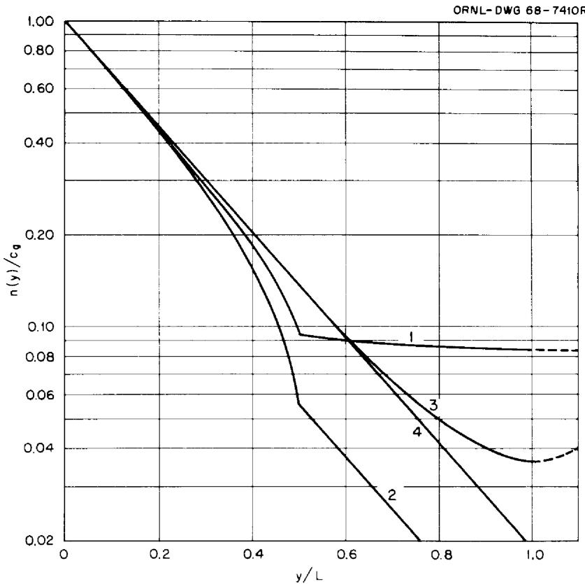  
Fig. 13. Generalized Plot of Fission Product Profiles as Described by the Steady-State Diffusion Equations. Curves 1 and 2 represent composite media joined at $a = L / 2$ , with $\gamma = 1$ , $\beta_{2}L = 1 = \beta_{1}L / 4$ , and $D_{2} = 16D_{1}$ . Curves 3 and 4 are plots for homogeneous media with $\beta L = 4$ . The parameter $L$ represents half the thickness of the sample for curves 1 and 3, whereas the thickness of the samples corresponding to curves 2 and 4 is infinite in extent. In these cases the parameter $L$ is defined by $\beta_{2}L = 1 = \beta_{1}L / 4$ for curve 2 and by $\beta L = 4$ for curve 4.

Curve 4 is the analog of curve 2 for the homogeneous case. Here we again define a length $L$ , given by $\beta L = 4$ , for convenience in plotting, but note that the sample is actually infinite in extent. The mathematical expression for this situation can be easily obtained from Eq. (31) simply by allowing $L$ to approach infinity. The result is

$$
n (y) = c _ {g} \exp (- \beta y), \tag {32}
$$

and for the flux,

$$
J = c _ {g} \left(\varepsilon_ {t} \lambda D\right) ^ {1 / 2}. \tag {33}
$$

An examination and comparison of the equations for each of the cases investigated shows that, whereas the effect of $\varepsilon_{t}\lambda$ remains the same for both the slope of the concentration profiles and the flux expressions, the role of the Knudsen diffusion coefficient is toward a reversal. This can be seen quite clearly from a consideration of the uniform infinite-half-thickness case. By Eq. (32), the slope of the concentration profile at the surface ( $y = 0$ ) is given by

$$
d n / d y = - c _ {\hat {g}} (\epsilon_ {t} \lambda / D) ^ {1 / 2};
$$

thus an increase in $D$ reduces the slope. From Eq. (33), however, we see that an increase in $D$ yields an increase in the flux $J$ . This reversal is mitigated somewhat for the bounded cases. For example, Eq. (31) yields

$$
d n / d y = - c _ {g} \left(\varepsilon \lambda / D\right) ^ {1 / 2} \tanh  \left[ \left(\varepsilon \lambda / D\right) ^ {1 / 2} L \right],
$$

whereas

$$
J = c _ {g} \left(\epsilon \lambda D\right) ^ {1 / 2} \tanh  \left[ \left(\epsilon \lambda / D\right) ^ {1 / 2} L \right].
$$

For small values of the argument, we can write $\tanh u = u$ , so the two equations are given approximately by

$$
d n / d y = - c _ {\dot {g}} \epsilon \lambda L / D , \qquad J = c _ {\dot {g}} \epsilon \lambda L .
$$

In this instance the slope varies inversely as the Knudsen diffusion coefficient, but $J$ is invariant to this parameter.

Preparatory to our discussions in later sections of this work, we wish to mention that very little interest has been given to the steady-state diffusion of gaseous fission products with long half-lives, $^{135}$ Xe excepted. Most current attention has focused on easily identified, immobile daughters of short-lived precursors. For these isotopes the total penetrations are much smaller than the overall thickness of the specimens employed, so that the homogeneous infinite-half-slab model should be reasonably representative of the experimental conditions. We shall therefore restrict ourselves only to Eqs. (32) and (33) for the remainder of this work. In this connection, it is advantageous to point out that Eq. (32) is a universal function in terms of the reduced parameters $n / c_{g}$ and $\beta y$ . In other words, we should be able to fit all the experimental data on a single curve, regardless of the value of the Knudsen diffusion coefficient or isotope. The isotope $^{135}\mathrm{Xe}$ , however, should display rather deep penetration. This invalidates the use of a uniform infinite-half-slab geometry and possibly even linear diffusion. For this isotope a radial, rather than a linear, flow model might be more appropriate. With these thoughts in mind, we now consider studies of pertinence to this work.

# VI. RELATED STUDIES

# Early Investigations

Before discussing current studies of fission product migration in MSRE graphite, it seems appropriate to review some of the pioneering researches of molten-salt breeder systems as conducted by members of the Reactor Chemistry Division and allied divisions during the period 1958 to 1961. One might regard this period as a sort of interim between the completion of conceptual design studies and the initial stages of specifying and producing the MSRE components. As

viewed now, the early supporting researches that had particular application to fission product problems involved xenon adsorption on graphite, $^{16}$ noble-gas solubility in molten salts, $^{17}$ chromium migration in container alloys, $^{18}$ alloy-salt compatibility tests, $^{19}$ and considerations of neutron losses resulting from ${}^{135}\mathrm{Xe}$ sorption as influenced by moderator graphite characteristics. $^{20}$

Of all these activities, the noble-gas solubility studies17 received the most research attention because it was not at all clear at the outset of the molten-salt reactor program research how a "spongy" moderator material like graphite might behave in direct contact with the salt and fission gases. It was therefore presumed that most of the $^{135}\mathrm{Xe}$ would reside in the core in the form of small quantities of dissolved gases. It turned out that the quantity of xenon dissolved in molten $\mathrm{LiF - BeF}_2$ mixtures would be indeed small and that the degree of solubility would decrease as the salt temperature increased. The solubility behavior here was thus quite different from that exhibited by either $\mathrm{CO}_{2}$ in water or HF in fluoride salts, where bicarbonates or bifluorides are formed. In all the systems studied, Henry's law was followed, and Arrhenius plots permitted a computation of the enthalpy of solution. A simple model relating the free energy of solution to that required to overcome the salt surface tension associated with the formation of a hole (wherein the gas might reside) gave a good description of the solution mechanism and permitted order of magnitude estimates of the solubility constants.

Investigations of the diffusivity of chromium $^{18}$ and nickel-base alloys were initiated because thermal convection loops indicated marked transfer of the chromium alloy constituent from hot to cold zones. Surprisingly enough, metallographic examination of the exposed alloys and $\mathrm{CrF}_2$ concentrations in the salt suggested that the rate of transfer was controlled by the rate at which chromium could move up to or away from the salt-metal interface; such transfer might be induced via reversible redox reactions relative to the $\mathrm{UF}_3 / \mathrm{UF}_4$ ratio in the salt. $^{18b}$ Moreover, an overall chromium leaching (not just a transfer) could be induced by the presence of HF, $\mathrm{NiF}_2$ , or $\mathrm{FeF}_2$ in trace quantities. $^{18c}$ Experimentally derived diffusion coefficients, coupled with the limited amount of equilibrium data available at that time, along with some reasonable guesses, permitted one to conclude that corrosion would be minimal unless appreciable amounts of $\mathrm{NiF}_2$ or HF were present, particularly if the alloy employed were INOR-8 (now called Hastelloy N).

In addition to the static and thermal-convection-loop corrosion studies described above, a long-term pump-loop experiment19 was begun on May 9, 1958, and terminated on May 20, 1959. The average experimental temperature was $650^{\circ}\mathrm{C}$ , and the salt was $\mathrm{LiF - BeF}_2\text{-UF}_2$ (62-37-1 mole%). The objectives were to test salt-alloy-graphite compatibility, with emphasis on the corrosion of the alloy and behavior of the graphite. As anticipated from earlier results and thermodynamic calculations, almost negligible amounts of alloy corrosion and/or carburization occurred. The condition of the $1.91\text{-g/cm}^3$ graphite attracted considerable interest, however, for only trace amounts of salt invaded the graphite matrices; in fact, $82\%$ of the samples suffered a minute weight loss, indicating a tolerable degree of erosion. Obviously salt did not adhere to the graphite surfaces. Wet analyses gave some idea as to the amount of beryllium and uranium in the graphite. The mode of their invasion was somewhat complicated by the fact that the as-received graphite possessed cracks and fractures, a ubiquitous feature of high-density, low-permeability graphite. Since a flush salt (no uranium) treatment may have filled these cracks initially, it was not surprising that the U/Be ratio in the graphite was lower than that of the pumped salt, which contained $\sim 1$ mole $\%$ UF4.

Finally, we review the short-term $^{135}\mathrm{Xe}$ poisoning studies and associated out-of-pile experiments where water was used as a make-believe molten salt. This work20 entailed a very simple parametric study carried out with an outdated manual computerized system, a 12-in. slide rule. The study was based on an optimistic first assumption that the pump-bowl stripper would operate at $100\%$ efficiency. This was done in an effort to compensate for the pessimistic second assumption that no resistance film would be present to help guard against transfer of the xenon poison from the salt to the graphite. Since it was realized that the graphite specifications would not be written specifically to ensure a low gas permeability or porosity (low fluid permeabilities were specified, however), the results were expressed in terms of a bypass or recycle ratio $r$ and the combination $D_{\mathrm{Xe}}\lambda_{\mathrm{Xe}}'$ , where $D_{\mathrm{Xe}}$ is the effective diffusion coefficient of xenon relative to the graphite and

$$
\lambda_ {\mathrm {X e}} ^ {'} \equiv \left[ \epsilon_ {t} (\lambda_ {\mathrm {X e}} + \phi \sigma_ {\mathrm {X e}}) / D _ {\mathrm {X e}} \right] ^ {1 / 2}.
$$

Thus $\lambda^{\prime}$ is equivalent to $\beta$ as defined by Eq. (22), in which the burnup term $\phi \sigma$ is included.

As had been anticipated, a knowledge of the solubility of xenon in the molten salt proved to be invaluable in performing the necessary calculations. Furthermore, it was clearly pointed out that $\varepsilon_{t}$ and $D$ play equal roles in determining the overall behavior and that unless the value $\varepsilon_{t}D_{\mathbf{X}_{e}}$ were very low, approximately $10^{-7}$ , the sparging and stripping rates would have to be quite high and efficient.

# 135 Xe Migration in the MSRE

The $^{135}\mathrm{Xe}$ poisoning investigations were reactivated in 1963, about two years after construction of the MSRE began. The major portion of this work was performed by R. J. Kedl of the Reactor Division, although several others participated in and contributed to these efforts. The

significant advances which resulted from the investigations under discussion involved a consideration of transient conditions, that is, cases in which the accumulation term $\frac{dn_j}{dt}$ of Eq. (16) is nonzero; refinements of the older studies to provide for bubbles which circulated with the molten salt; and diffusion of the xenon through the salt itself.

To evaluate the mass transfer coefficients which were employed to describe the xenon-salt diffusion in both the core and the pump bowl stripper regions, a series of $^{85}\mathrm{Kr}$ addition-stripping experiments were performed during the barren salt flushing procedures which signaled the startup of the MSRE operations. One of the more important conclusions regarding these investigations was the finding that diffusion through the salt primarily controlled the $^{135}\mathrm{Xe}$ characteristics of the reactor.[22]

Essentially the same conclusion could have been inferred from our first reported $^{23}$ $D_{\mathrm{Xe}}$ values for MSRE graphite (viz., $1.32 \times 10^{-4} \, \mathrm{cm}^2/\mathrm{sec}$ ) and the previous demonstration $^{20}$ that unless $D_{\mathrm{Xe}}$ were considerably less than $10^{-4} \, \mathrm{cm}^2/\mathrm{sec}$ , little or no absorption resistance could be expected on the part of the graphite in the absence of xenon-salt diffusion (which were called "film effects") and/or very high and efficient stripping rates.

Repeat computations verified Kedl's results, not only for the MSRE but for the MSBR (breeder reactor) as well.[24] In the latter design the salt is to be in turbulent flow; this condition will lessen the effective diffusion path (film) of the xenon through the salt.

# Graphite Surveillance Specimen Results

The recent emphasis which has been placed upon mass transfer in the salt constitutes a major justification for the expenditure of much of the effort to be described in the succeeding portions of this report. Most of the work has several features in common: short-lived isotopes were involved, concentration profiles were quite steep, and the penetration data were laboriously garnered using mechanical sectioning and counting techniques.

If short-lived isotopes are involved, one can in principle evaluate the surface concentration $c_{\mathrm{g}}$ of a given gaseous fission product from the time-corrected count data. A comparison of this value with that obtained in the bulk salt thus yields an additional check on film effectiveness.[25] Our interests, however, are concerned with the behavior within the graphite. As we had seen earlier, each of the mathematical relationships which we had developed in this connection could

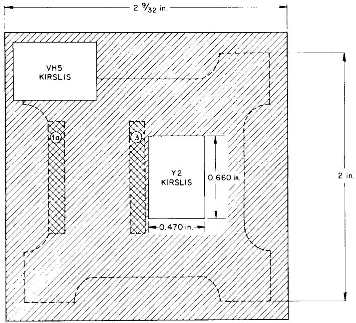  
（）

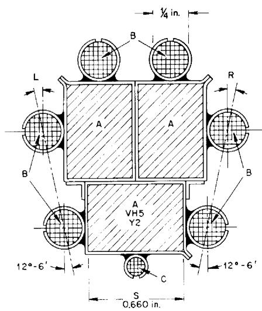  
(b）  
Fig. 14. Location of MSRE Graphite Specimens Employed by Kirslis and Co-Workers. Positions referred to are: (a) locations in original unmachined bar 635 as they relate to machined bars and associated permeability specimens; (b) locations in surveillance-specimen bundles which are inserted in the MSRE core. Regions A comprise graphite specimens; regions B comprise cross sections of Hastelloy N (INOR-8) tensile specimens; region C locates a flux monitor.

be expressed in terms of $n / c_{\hat{g}}$ , and since $c_{\hat{g}}$ is by definition of steady-state conditions a constant, an absolute value of the surface concentration is unnecessary for our purposes. In like manner, film effects (i.e., diffusion through the salt) should not alter the behavior in the graphite.

In essence, our primary concern here is to ascertain whether or not we could have obtained the same information regarding the concentration profiles through out-of-pile (and out-of-hot-cell) experiments. As a corollary, we should also be able to determine whether or not the pores at the graphite surface have been plugged with liquid or solid, or whether the graphite itself has become more permeable under reactor conditions. Our intent should in no way be construed as a demonstration that the in-pile studies were performed inefficiently; the efforts of Kirslis and co-workers, as an example, embrace several important facets of the overall problem of fission product transport, whereas our involvement concerns only gaseous fission product migration in the graphite. The present review is thus restricted as described above.

Of pertinence to this work are the first graphite surveillance specimen data, which were published by Kirslis $^{26}$ in 1966. Location of the sample with respect to position within the original unmachined graphite bar 635 and within the reactor package is shown in Fig. 14.

The rectangular samples utilized by Kirslis were exposed in the MSRE for 7800 Mwhr at temperatures ranging about $650^{\circ}\mathrm{C}$ . After withdrawal from the MSRE, the specimens were sectioned in a rather ingenious manner to obtain the time-corrected concentration profile data which have been partially reproduced in Table 6.

In this work we attempt to correlate the experimental data by considering the homogeneous case involving a semi-infinite slab; the corresponding mathematical expression is given by Eq. (32):

Table 6. Selected Penetration Results for Daughters of Short-Lived Fission Products That Diffused into CGB Graphite as Noble Gases   

<table><tr><td rowspan="2">y, Average Penetration (cm)</td><td colspan="3">141Xe</td><td colspan="3">140Xe</td><td colspan="3">89Kr</td></tr><tr><td>Counts (dis min-1g-1)</td><td>βγ</td><td>n(y)/c g</td><td>Counts (dis min-1g-1)</td><td>βγ</td><td>n(y)/c g</td><td>Counts (dis min-1g-1)</td><td>βγ</td><td>n(y)/c g</td></tr><tr><td>×10-2</td><td>×109</td><td></td><td></td><td>×1010</td><td></td><td></td><td>×1010</td><td></td><td></td></tr><tr><td colspan="10">VH5 (Wide Face - Surface Sample)b</td></tr><tr><td>0.00</td><td>23.0c</td><td>0.00</td><td>1.00</td><td>15.0c</td><td>0.00</td><td>1.00</td><td>12.0c</td><td>0.00</td><td>1.00</td></tr><tr><td>0.79</td><td>8.6</td><td>0.83</td><td>0.37</td><td>10.4</td><td>0.36</td><td>0.69</td><td>11.9</td><td>0.14</td><td>0.99</td></tr><tr><td>2.59</td><td></td><td></td><td></td><td>1.6</td><td>1.2</td><td>0.11</td><td>5.7</td><td>0.45</td><td>0.48</td></tr><tr><td>4.86</td><td>0.19</td><td>5.1</td><td>0.008</td><td>2.0</td><td>2.2</td><td>0.13</td><td>6.2</td><td>0.85</td><td>0.52</td></tr><tr><td>6.82</td><td></td><td></td><td></td><td>0.72</td><td>3.1</td><td>0.048</td><td>4.0</td><td>1.19</td><td>0.33</td></tr><tr><td>10.11</td><td>0.04</td><td>10.7d</td><td>0.002d</td><td>0.17</td><td>4.6</td><td>0.011</td><td>1.5</td><td>1.76</td><td>0.13</td></tr><tr><td colspan="10">VH5 (Side Face - Surface Sample)</td></tr><tr><td>0.00</td><td>23.0c</td><td>0.00</td><td>1.00</td><td>0.95c</td><td>0.00</td><td>1.00</td><td></td><td></td><td></td></tr><tr><td>1.45</td><td>5.0</td><td>1.50</td><td>0.22</td><td>0.49</td><td>0.66</td><td>0.52</td><td></td><td></td><td></td></tr><tr><td>4.41</td><td>0.21</td><td>4.60</td><td>0.009</td><td>0.14</td><td>2.00d</td><td>0.022d</td><td></td><td></td><td></td></tr><tr><td colspan="10">Y2 (Wide Face - Interior Sample)b</td></tr><tr><td>0.00</td><td>62.0c</td><td>0.00</td><td>1.00</td><td>15.0c</td><td>0.00</td><td>1.00</td><td>16.0c</td><td>0.00</td><td>1.00</td></tr><tr><td>0.76</td><td>31.7</td><td>0.64</td><td>0.51</td><td>14.4</td><td>0.25</td><td>0.96</td><td>12.8</td><td>0.11</td><td>0.80</td></tr><tr><td>2.71</td><td>6.5</td><td>2.3</td><td>0.10</td><td>6.6</td><td>0.88</td><td>0.44</td><td>11.0</td><td>0.38</td><td>0.69</td></tr><tr><td>4.84</td><td>1.4</td><td>4.1</td><td>0.023</td><td>2.8</td><td>1.6</td><td>0.18</td><td>7.6</td><td>0.67</td><td>0.48</td></tr><tr><td>6.67</td><td>0.73</td><td>5.6d</td><td>0.012d</td><td>1.6</td><td>2.2</td><td>0.11</td><td>7.1</td><td>0.93</td><td>0.44</td></tr><tr><td>8.44</td><td></td><td></td><td></td><td>0.97</td><td>2.7</td><td>0.065</td><td>4.6</td><td>1.2</td><td>0.28</td></tr><tr><td>10.37</td><td></td><td></td><td></td><td>0.76</td><td>3.4</td><td>0.051</td><td>4.3</td><td>1.4</td><td>0.27</td></tr><tr><td colspan="10">Y2 (Side Face - Interior Sample)</td></tr><tr><td>0.00</td><td>100.0c</td><td>0.00</td><td>1.00</td><td>22.0c</td><td>0.00</td><td>1.00</td><td></td><td></td><td></td></tr><tr><td>0.98</td><td>33.8</td><td>0.82</td><td>0.34</td><td>14.1</td><td>0.32</td><td>0.64</td><td></td><td></td><td></td></tr><tr><td>3.23</td><td></td><td></td><td></td><td>7.7</td><td>1.0</td><td>0.35</td><td></td><td></td><td></td></tr><tr><td>5.21</td><td>2.5</td><td>4.4</td><td>0.025</td><td>3.9</td><td>1.7</td><td>0.18</td><td></td><td></td><td></td></tr><tr><td>6.36</td><td></td><td></td><td></td><td>3.0</td><td>2.1</td><td>0.14</td><td></td><td></td><td></td></tr><tr><td>7.79</td><td>0.84</td><td>6.6d</td><td>0.008d</td><td>1.5</td><td>2.5</td><td>0.069</td><td></td><td></td><td></td></tr></table>

$^\mathrm{g}$ Moderator bar 635; data reported by Kirslis.26   
$^b$ Bar position; see Fig. 14.   
cExtrapolated value from count vs penetration data.   
$d_{\mathrm{Not}}^{\mathrm{d}}$ plotted in Fig. 15.

$$
n _ {j} (y) / c _ {g} = \exp (- \beta_ {j} y).
$$

This relationship obviously describes a universal function in terms of the reduced parameters $n_j(y) / c_g$ and $\beta_j y$ ; hence a plot of $\ln n_j(y)$ vs $\ln y$ should be superposable on a plot of $\ln X$ vs $\ln Y$ , where

$$
X \equiv n _ {j} (y) / c _ {\mathrm {总}},
$$

$$
Y \equiv \beta_ {j} y,
$$

simply by translating the axes distances corresponding to $-\ln c_{g}$ and $\ln \beta_{j}$ respectively. Hence concentration profile data, provided they can be described by the universal relationship, yield values of $\beta_{j}$ and $D_{j}$ directly.

A generalized plot of the data listed in Table 6 is given in Fig. 15; the values of $\beta_{j}$ and $D_{j}$ which appear in the figure have been determined as outlined above. A comparison of the $D_{j}$ results for the interior and the surface specimen suggests that the variation of diffusion coefficient

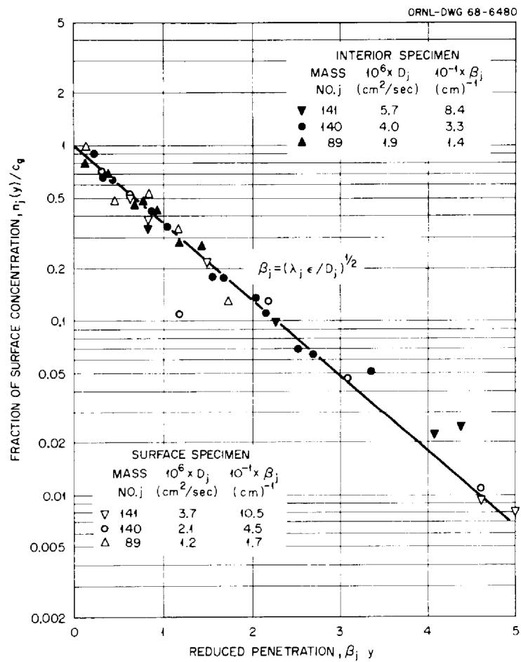  
Fig. 15. Generalized Profiles for Short-Lived Noble-Gas Fission Products in Specimens from Bar 635. Profiles are based on concentrations of immobile daughters of the noble-gas precursors. The interior specimen corresponds to Y2 in Fig. 14; the exterior, to VH5. Raw data were compiled by Kirslis et al.; correlated values appear in Table 6.

with position is not as pronounced as one might expect on the basis of the bar 23 data. However, the variation should not be as large, since the surveillance specimens were much larger than our permeability samples.

The degree with which Eq. (32) describes the experimental data is nothing less than amazing and is perhaps the best indication we have of the care with which a most difficult experimental investigation had been conducted. On the other hand, a thought which had disturbed us right at the beginning of our studies appears to be forcefully verified by comparing $D_{\mathbf{X}_{\mathrm{e}}}$ for the interior specimen of bar 635 with the corresponding value for bar 23 [cf. Eq. (12) of this work]. For bar 635, $D_{\mathbf{X}_{\mathrm{e}}} = 5 \times 10^{-6} \, \mathrm{cm}^2/\mathrm{sec}$ , whereas for bar 23, $D_{\mathbf{X}_{\mathrm{e}}} = 1 \times 10^{-4} \, \mathrm{cm}^2/\mathrm{sec}$ . At this point it seems as though we have selected the most nonrepresentative moderator bar for our gas transport studies! (Additional interpretations of Kirslis' data appear in a more recent report.[27])

# ORR Molten-Salt In-Pile Loop 2

As a complement to the MSRE graphite surveillance program, an in-pile loop experiment was conducted by Compere and co-workers in the Oak Ridge Research Reactor.[28a] This experiment was described as Molten-Salt In-Pile Loop 2. In many ways it was similar to a previous out-of-pile loop experiment described earlier.[19]

Location of the graphite employed, relative to the original unmachined bar 159 from which it was taken, is shown in Fig. 16 along with a soft x-ray photograph of the specimen after experimentation. Details regarding the experiment are best obtained by consulting the original description; $^{28a}$ for our purposes, it is pertinent only to note that the molten salt was made to flow through the eight holes which were drilled through the graphite.

It is evident from the x-ray photograph in Fig. 16 that the specimen possessed several cracks which were invaded by the salt. The penetration data which were reported, however, were corrected for uranium intrusion in these cracks,[28b] although the results represent average values for eight holes.

Previous experience with fission fragment gamma counting techniques prompted us to select $^{140}\mathrm{Xe}$ as representative of a typical gaseous fission product, since its activity peak resides at a rather high energy. Although this is a good choice from the standpoint of gamma counting technique, one must also bear in mind the possibility of migration of the $^{140}\mathrm{Ba}$ daughter under the temperature conditions of about $650^{\circ}\mathrm{C}$ of this experiment. Nonetheless, we selected $^{140}\mathrm{Xe}$ for correlation purposes.

The data of interest appeared as a cumulative (integral) plot, wherein the ordinate values were referred to the percentage of total isotope within the loop. To cast the data into a form

ORNL-DWG68-5795

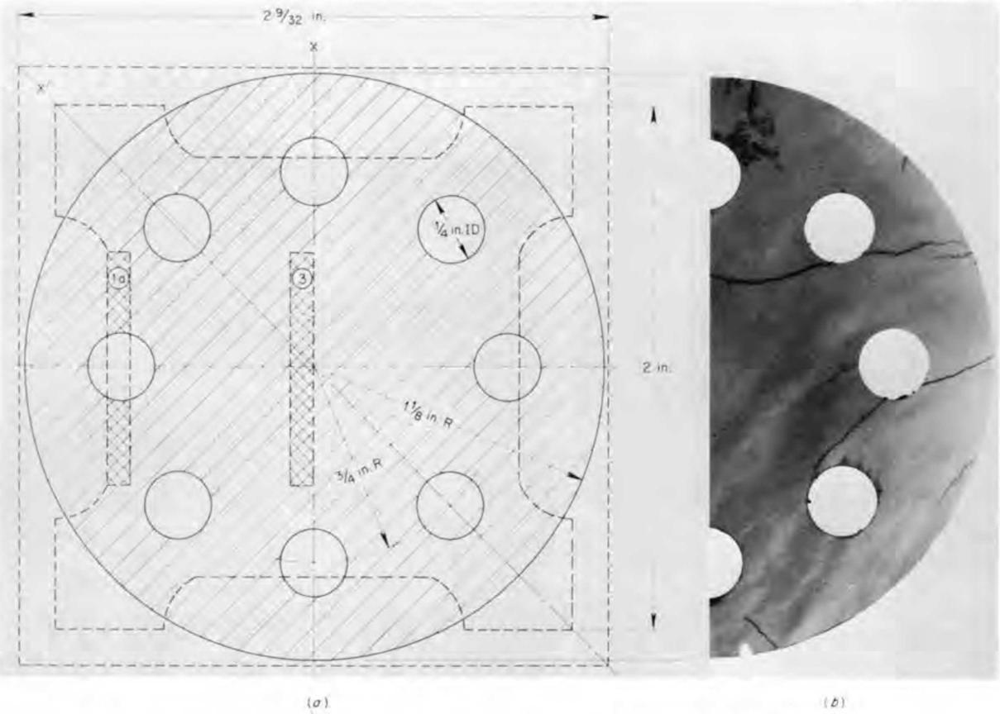  
Fig. 16. Location of Graphite Regions Exposed to Fissioning Molten Salt in ORR Convection-Loop Experiments. Regions studied are adjacent to the small holes. Positions are referred to: (a) locations with respect to unmachined bar 159 and associated permeability specimens, (b) various salt-filled cracks revealed by salt x-ray radiographs.

amenable to the use of Eq. (32), it was necessary to invert the plot, extrapolate to zero penetration, reduce the ordinate values, and finally graphically differentiate to acquire the appropriate information. Our efforts are displayed in Fig. 17. Except for the small deviations beyond about $0.04\mathrm{cm}$ , it appears that Eq. (32) once again describes the data accurately. Once again, however, $D_{\mathrm{X_e}}$ for this specimen is considerably lower than the value for bar 23.

# Reconciliation of Flow and In-Pile Results

We have demonstrated in the two previous sections the possibility of accurately describing in-pile transport of gaseous fission products in the MSRE. We have been unable to show, however, an ability to predict the behavior. As the situation now stands, either our mathematical model is essentially correct but requires a diffusion coefficient which is about a hundredfold smaller than the measured value or the diffusion coefficients of the moderator bars which were employed in the in-pile experiments (bars 159 and 635) are about a hundred times smaller than

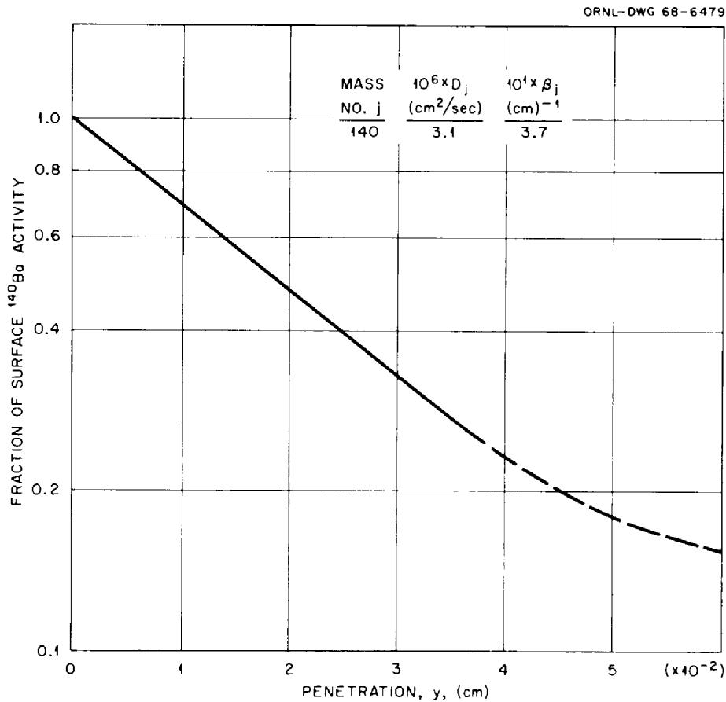  
Fig. 17. Penetration Profile for $^{140}\mathrm{Xe}$ Diffusion Normal to Circular Areas in Bar 159. Curve is based on smoothed-corrected estimates made by Compere et al.

bar 23. To resolve this question we thus sought to measure the permeabilities of samples removed from bars 159 and 635. In each case two specimens were removed, one from the position designated 1a in Figs. 6 and 14, that is, a surface specimen, and an interior sample, as designated by position 3. The permeability results are presented in Table 7 along with corresponding values for bars 23 and 788.

If we focus on the interior specimen (position 3), it is immediately obvious that the diffusion coefficients of the graphites employed in the in-pile experiments are indeed about a hundred times less than bar 23. In fact, the four specimens show about a thousandfold variation in diffusion coefficient, with bar 23 being the most porous. Furthermore, comparison of position 1a specimens with the corresponding interior samples indicates bar 23 to also be most nonuniform with respect to gas transport.

A comparison of the diffusion coefficient values obtained from the permeability data and those derived from the in-pile experiments for moderator bar 635 is given in Table 8. The agreement is nothing less than amazing in view of the difficulties in obtaining the in-pile data and possible normal variations in the actual diffusion coefficients of the permeability and the in-pile specimens even though they were obtained from the same source. In summary, we have demonstrated

Table 7. Selected CGB Graphite Flow Parameters as Determined from Helium Permeability Data at ${23}^{ \circ  }{\mathrm{C}}^{\mathrm{a}}$   

<table><tr><td rowspan="2">Moderator Bar No.</td><td colspan="2">Positionb 1a</td><td colspan="2">Positionb 3</td><td rowspan="2">(DHeK)3/(DHeK)1a</td></tr><tr><td>ChEKe (cm2/sec)</td><td>B0/ηHe d (cm2sec-1atm-1)</td><td>ChEKe (cm2/sec)</td><td>B0/ηHe d (cm2sec-1atm-1)</td></tr><tr><td></td><td>×10-6</td><td>×10-7</td><td>×10-6</td><td>×10-7</td><td></td></tr><tr><td>788</td><td>0.28</td><td>0.06</td><td>3.09</td><td>0.27</td><td>11.0</td></tr><tr><td>159</td><td>2.41</td><td>1.16</td><td>15.8</td><td>8.88</td><td>6.56</td></tr><tr><td>635</td><td>3.13</td><td>2.05</td><td>11.4</td><td>9.33</td><td>3.64</td></tr><tr><td>23</td><td>44.7</td><td>36.9</td><td>797.0</td><td>1260.0</td><td>17.8</td></tr></table>

${}^{a}$ All of the specimens have bulk densities in the range 1.85 to ${1.86}\mathrm{\;g}/{\mathrm{{cm}}}^{3}$ .   
See Figs. 6 and 14.   
Intercept of helium permeability vs average pressure plot.   
${}^{d}$ The modified viscous flow coefficient. Slope of ${K}_{\mathrm{{He}}}$ vs $\left\langle  p\right\rangle$ plot.

Table 8. Comparison of Fission Product Migration Results Based on Permeability and Grinding Experiments with Moderator Bar 635 Specimens   

<table><tr><td rowspan="3">Fission Fragment</td><td rowspan="3">Decay Constant (sec-1)</td><td colspan="4">Dik, Predicted Fission Fragment Coefficient (cm2/sec)</td></tr><tr><td colspan="2">Positiona 1a</td><td colspan="2">Positiona 3</td></tr><tr><td>By Flow Experimentsb</td><td>Concentration Profilesc</td><td>By Flow Experiments</td><td>Concentration Profiles</td></tr><tr><td></td><td>×10-2</td><td>×10-6</td><td>×10-6</td><td>×10-6</td><td>×10-6</td></tr><tr><td>89Kr</td><td>0.36</td><td>1.17</td><td>1.2</td><td>4.26</td><td>1.9</td></tr><tr><td>140Xe</td><td>4.33</td><td>0.93</td><td>2.1</td><td>3.40</td><td>4.0</td></tr><tr><td>141Xe</td><td>40.8</td><td>0.93</td><td>3.7</td><td>3.39</td><td>5.7</td></tr></table>

See Figs. 6 and 14.   
${}^{b}$ Computed from values in Table 7 assuming a reactor temperature of ${922}^{ \circ  }\mathrm{K}\left( {{1200}^{ \circ  }\mathrm{F}}\right)$ .   
cData from ref. 26; see Fig. 15.

that a relatively uncomplicated mathematical model can be employed to quantitatively predict the behavior of short-lived gaseous fission products in MSRE moderator graphite.

# VII. DISCUSSION

One of the unfortunate situations which arises in presenting the experimental data as we have done, without adding the "color," so to speak, is that the reader often receives the impression that the experimental aspects proceeded smoothly and in a straightforward fashion. This was not the case in the present study. The sample employed by Compere et al., as illustrated in

Fig. 16, is typical of the bulk of the moderator graphite. In other words, the material as a whole contains innumerable fractures and cracks. Except for the specimens taken from bars 23 and 635, the occurrence of these defects made the selection of appropriate samples for gas transport measurements a most trying experience.

# Short-Range MSRE Considerations

The intercomparison of the gas transport characteristics of the four moderator bars which has been given in Table 7 rather lucidly points out the folly in applying such data indiscriminately. This is particularly important when penetration data are of interest, since the diffusion coefficient appears in the exponential term. Part of the divergence in the transport characteristics arises from the fact that each of the moderator bars from which the samples were taken represents a different fabrication batch. To some extent, then, the differences reflect the manufacturer's ability to economically reproduce the fabrication conditions. However, care must also be taken in applying the results even to graphites of the same manufacture lot. As shown in Table 9, the Knudsen diffusion coefficients for helium which were determined for two bars of the same fabrication batch also show a fair degree of variability. In discussing gaseous fission product migration, as for example in connection with the graphite surveillance specimen program, we therefore cannot stress sufficiently the importance of determining the gas transport characteristics of the surveillance samples prior to their in-pile use.

Two other facets in connection with the MSRE concern our assumption of the temperature independence of the internal geometry of the graphite and alteration of this geometry as a result of the neutron flux. The agreement between the results derived from flow measurements and those obtained from the profile data presented in Table 8 suggests that both effects are quite small for the MSRE operating conditions.

Table 9. Comparison of Knudsen Diffusion Coefficients for Helium at $23^{\circ}C$ for CGB Specimens Within Given Lots   

<table><tr><td rowspan="2">Fabrication
Batch</td><td rowspan="2">Moderator
Bar</td><td colspan="2">DHeK(cm2/sec)</td></tr><tr><td>Position 1a</td><td>Position 3</td></tr><tr><td></td><td></td><td>×10-6</td><td>×10-6</td></tr><tr><td>10</td><td>788</td><td>0.28</td><td>3.1</td></tr><tr><td></td><td>608</td><td>5.23</td><td>1.23</td></tr><tr><td>3</td><td>159</td><td>2.41</td><td>15.8</td></tr><tr><td></td><td>615</td><td>5.61</td><td>170</td></tr><tr><td>8</td><td>635</td><td>3.13</td><td>11.4</td></tr><tr><td></td><td>107</td><td>15.4</td><td>288</td></tr><tr><td>12</td><td>23</td><td>44.7</td><td>797</td></tr><tr><td></td><td>628</td><td>9.37</td><td>335</td></tr></table>

Some attention has been given to the effect of temperature on the pores of the graphite. Napier and Spencer, $^{29}$ as an example, have demonstrated that the porosity of the graphite increases with temperature. On the other hand, Hutcheon $^{30}$ found no temperature dependence of the graphite on permeability, within experimental error. More recently, these studies have been extended by Hawtin and Dawson $^{31}$ to gaseous diffusion through graphite. These workers also find no temperature dependence of the graphite on gas transport over the temperature range 20 to $600^{\circ}\mathrm{C}$ . Apparently the porosity increase does not significantly affect the "through-pores"; that is, although $-t_{f}$ increases with temperature, $\varepsilon'$ does not. As reactor operation temperatures rise, however, this aspect should be reinvestigated.

In like manner, we are unaware of any definitive work which has been performed regarding the effects of neutron damage on the gas transport characteristics of moderator graphite. Studies of this problem should also be considered.

# Features Relative to MSBR Application

The MSBR imposes far more stringent conditions on the migration of fission products into the graphite to achieve prolonged, successful operation than those required for the MSRE. As an example, it has been estimated that a permeability of less than $10^{-8} \mathrm{~cm}^2/\mathrm{sec}$ is required in order to maintain the xenon concentration in the core at the desired level.[32] (It is obvious that a permeability value of $10^{-8} \mathrm{~cm}^2/\mathrm{sec}$ again permits us to describe gas transport through the graphite in terms of the Knudsen diffusion coefficient alone.) Since the MSRE graphite is typically characterized by a value of $10^{-6} \mathrm{~cm}^2/\mathrm{sec}$ at the surface, additional reduction is clearly required.

Although a hundredfold reduction of the Knudsen coefficient is still probably attainable by liquid hydrocarbon impregnation, but with considerable difficulty, attention has recently focused on sealing or gas impregnation methods to effect the desired value.3 To date, the most promising technique involves the decomposition of a low-molecular-weight gaseous hydrocarbon in the pores of the graphite. Reduction of the permeability in this manner is visually demonstrated in Fig. 18. A graphite specimen which was subjected to permeability reduction by gas impregnation was then sectioned, and mercury was injected into one of the sections under an applied pressure of 1000 psig. Figure 18 is a radiograph of this section; the portion of the sample whose pores have been filled with mercury is now opaque to x rays and thus appears as the light section. Conversely, that section where permeability reduction has been effected retains its transparency to the x rays. Furthermore, it is possible to use the radiographic technique to ascertain the

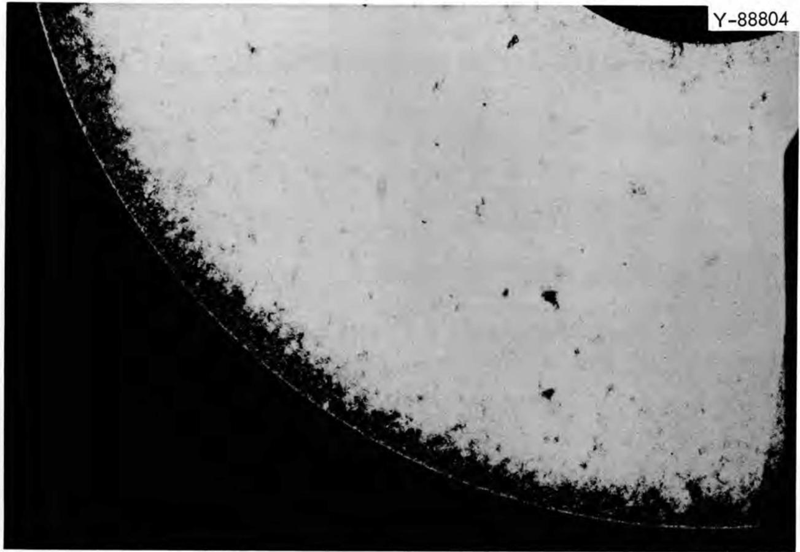  
Fig. 18. Effectiveness of a Gas Impregnation Technique for Graphite Permeability Reduction as Evidenced by a Radiographic Method Employing Mercury Penetration. The light section, which is opaque to the x rays, has been penetrated by the mercury. The graphite surface where permeability reduction has been effected remains translucent to the radiation.

nature of the impregnated region by exposing the sample to x rays after mercury injection under successively increasing applied pressures. Results obtained in this way indicate that the sealed area is highly nonuniform; the sealing technique is most effective at the surface and decreases in effectiveness as one proceeds inward. $^{33}$

The gas impregnation technique has been successfully employed to reduce helium permeabilities of about $10^{-2}\mathrm{cm}^2/\mathrm{sec}$ to $10^{-10}\mathrm{cm}^2/\mathrm{sec}$ . Samples obtained in this manner are currently being investigated from the standpoint of radiation stability; experiments have already been conducted to demonstrate that the gas-impregnated specimens retain their permeability characteristics even after $3000^{\circ}\mathrm{C}$ heat treatments.[33]

The maximum depth of gas impregnation effectiveness, as illustrated in Fig. 18, is about 15 mils; over this distance the permeability increases from about $10^{-10} \mathrm{~cm}^2/\mathrm{sec}$ or better to about $10^{-2} \mathrm{~cm}^2/\mathrm{sec}$ ; so it is apparent that the model for gaseous fission product transport for the case of a uniform porous medium is certainly not applicable to the impregnated area, although it can be employed to describe profile data for the interior region.

Except for the inferences which were made in discussing the in-pile fission product migration studies, we know of no definitive work which has been performed regarding the effect of radiation-induced dimensional changes on the gas transport properties of the material. Since the MSBR graphite will be exposed to rather high neutron fluxes, and particularly in view of the desired extent of gas impenetrability, we believe investigations of this nature are of prime importance. In like manner, again because of the stringent permeability requirements, we strongly suggest that the possible temperature dependence of $\epsilon^{\prime} / q^{\prime}$ be reinvestigated.

# Useful Approximations in Describing Gas Transport Through Porous Media

Throughout this report we have utilized pore size distribution data in only a qualitative sense; most of the discussion of a quantitative nature has relied upon the permeability and counterdiffusion data. Although all three sets of data have more or less been considered as independent of one another, an intercomparison of sorts is possible, provided we are willing to make a few approximations. In a similar manner, this intercomparison may be employed to obtain approximate values of one parameter from another.

The entire argument involves a grouping which was introduced in Report I, namely,

$$
\frac {\varepsilon^ {\prime} \left\langle r ^ {j - 2} \right\rangle}{\overline {{q}} _ {j}} \equiv \frac {\varepsilon^ {\prime} \sum_ {m} (r _ {m} ^ {j} / \overline {{q}} _ {m} ^ {1 / 2})}{\sum_ {m} r _ {m} ^ {2} \overline {{q}} _ {m} ^ {1 / 2}}
$$

in which $r_m$ is the equivalent radius of the $m$ th pore of equivalent length $l_m = \overline{q}_m^{1/2} L$ in terms of the length $L$ of the graphite. If we assume at this point that the average of a product or quotient is equal to the product or quotient of the average values, then the equation takes the approximate form

$$
\frac {\epsilon^ {\prime} \left\langle r ^ {j - 2} \right\rangle}{\overline {{q}} _ {j}} = \frac {\epsilon^ {\prime} \left\langle r ^ {j} \right\rangle \left\langle 1 / \overline {{q}} ^ {1 / 2} \right\rangle}{\left\langle r ^ {2} \right\rangle \left\langle \overline {{q}} ^ {1 / 2} \right\rangle}.
$$

Unfortunately, whereas pore size spectra yield information regarding the distribution of pore radii, information relative to the distribution of equivalent pore length does not appear possible; thus little is lost if we further simplify the expression by combining the averages in $\overline{q}$ , thus:

$$
\frac {\varepsilon^ {\prime} \left\langle r ^ {j - 2} \right\rangle}{\overline {{q}} _ {j}} = \frac {\varepsilon^ {\prime} \left\langle r ^ {j} \right\rangle}{q ^ {\prime} \left\langle r ^ {2} \right\rangle}.
$$

The next obvious step is to specify an analytical form of the distribution function in terms of the pore entrance radius $r_0$ . The simplest form of course is to define the most probable radius $(r_0)_m$ as the distribution, so that

$$
\left\langle r ^ {j} \right\rangle = r _ {0} ^ {j}.
$$

A more realistic distribution, although still tractable mathematically, is the Maxwellian distribution, defined by the function

$$
f (\boldsymbol {r} _ {0}) = \frac {4}{\mathcal {T} ^ {1 / 2}} \left. \frac {\boldsymbol {r} _ {0} ^ {2}}{(\boldsymbol {r} _ {0}) _ {m} ^ {3}} \right. \exp \left\{- \left[ \frac {\boldsymbol {r} _ {0}}{(\boldsymbol {r} _ {0}) _ {m}} \right] ^ {2} \right\}.
$$

The resulting expression for the transport parameters as derived from the simple and Maxwellian distributions are compared with the corresponding “rigorous” forms in Table 10.34 Examination of the expressions which are tabulated reveals that the specification of a pore size distribution has reduced the problem to the determination of only two parameters, the grouping $\varepsilon^{\prime} / q^{\prime}$ and the most probable pore entrance radius $(r_0)_m$ . Moreover, we have at our disposal three types of measurements by which the two unknowns might be evaluated (pore size determinations, counter-diffusion experiments, and permeability measurements). Thus on the basis of our distribution function approximation, at least one set of experiments is redundant. Within the limits of the approximation, this is correct if counterdiffusion and pore size spectra determinations are made, but the converse applies if permeability measurements are chosen for characterization, for these experiments yield values for $B_0$ and $K_0$ simultaneously which are of course just sufficient for the determination of $\varepsilon^{\prime} / q^{\prime}$ and $(r_0)_m$ .

In part A of Table 11 we have calculated $\varepsilon' / q'$ and $(r_0)_m$ using the Maxwellian distribution and the experimentally determined permeability coefficients for two widely different forms of CGB graphite. Comparison of the calculated values with those obtained by direct measurement,

Table 10. Approximate Expressions of the Gas Transport Parameters in Terms of the Most Probable Pore Entrance Radius   

<table><tr><td>Transport Coefficient</td><td>“Rigorous”a</td><td>Simple Distribution</td><td>Maxwellian Distribution</td></tr><tr><td>D12(cm2/sec) (normal diffusion)</td><td>(ε&#x27;/q2)12</td><td>(ε&#x27;/q&#x27;)12</td><td>(ε&#x27;/q&#x27;)012</td></tr><tr><td>K0(cm)b,c (Knudsen diffusion)</td><td>(ε&#x27;/q3)(3π/32) (r0)</td><td>(ε&#x27;/q&#x27;) (3π/32) (r0)m</td><td>(ε&#x27;/q&#x27;)\(\left(\frac{\pi^{1/2}}{4}\right)\)(r0)m</td></tr><tr><td>B0(cm3) (viscous flow)</td><td>(ε&#x27;/q4)(1/8) (r02)</td><td>(ε&#x27;/q&#x27;) (1/8) (r0)m2</td><td>(ε&#x27;/q&#x27;) (5/16) (r0)m2</td></tr></table>

Table 11. Prediction of Characterization Parameters for Two Widely Different Forms of CGB Graphite at $23^{\circ}C$ Assuming a Maxwellian Distribution of Pore Entrance Radii   

<table><tr><td rowspan="2">Parameter</td><td rowspan="2">Approximate Expression</td><td colspan="2">Base Stock</td><td colspan="2">Impregnated</td></tr><tr><td>Experimental</td><td>Predicted</td><td>Experimental</td><td>Predicted</td></tr><tr><td colspan="6">A. Utilizing Permeability Data</td></tr><tr><td>(r0)m, μ</td><td>(4m1/2/5)(B0/K0)</td><td>0.85</td><td>0.50</td><td>0.08</td><td>0.05</td></tr><tr><td>c&#x27;/q&#x27;</td><td>(5/π)(K02/B0)</td><td>1.40 × 10-2</td><td>3.85 × 10-2</td><td>9.40 × 10-4</td><td>12.66 × 10-4</td></tr><tr><td>pD12a atm cm-2sec-1</td><td>(5/π)(K0/B0)(p112)a</td><td>1.04 × 10-2</td><td>2.87 × 10-2</td><td>7.00 × 10-4</td><td>9.43 × 10-4</td></tr><tr><td colspan="6">B. Utilizing Counterdiffusion and Pore Size Data</td></tr><tr><td>B0b cm2</td><td>(D12/12)/(5/16)(r0)m</td><td>3.04 × 10-11</td><td>3.15 × 10-11</td><td>1.00 × 10-14</td><td>1.88 × 10-14</td></tr><tr><td>K0, cm</td><td>(D12/12)(π1/2/4)(r0)m</td><td>8.57 × 10-7</td><td>5.26 × 10-7</td><td>2.82 × 10-9</td><td>3.33 × 10-9</td></tr></table>

The subscripts 1 and 2 refer to helium and argon, respectively, in this example, and for this case $p_{12} = 0.745$ atm cm $^{-2}$ sec $^{-1}$ .   
The viscosity of helium at $23^{\circ}\mathrm{C}$ , $\eta_{\mathrm{He}}$ is $1959 \times 10^{-7}$ poise.

while not in exactly excellent agreement, nonetheless gives the correct order of magnitude for both types of graphite. The method can therefore be employed in a limited sense to advantage, particularly in cases where the counterdiffusion experiments become inconvenient (e.g., for a sample of very low permeability) and where destruction of the specimen in the course of the pore size measurements by mercury injection is unwanted.

In part B the converse calculations have been performed; $\epsilon^{\prime} / q^{\prime}$ as determined by counterdiffusion experiments and the values of $(r_0)_m$ obtained from pore size spectra have been employed to calculate $B_{0}$ and $K_{0}$ . Once again the predicted results agree within an order of magnitude with the values derived by direct measurement. Note that in both cases we have employed the larger of the two values of $(r_0)_m$ which appear in the respective pore size spectra.

Values of $(r_0)_m$ and of $q'$ as determined from the permeability coefficients of the permeability specimens described earlier are presented in Table 12. Except for the base stock and the diffusion septum, the shape and size of the samples rendered them unsuitable for counterdiffusion measurements, whereas the sections which had been machined away were of course not available for porosimetry determinations. For all intents and purposes, then, the two parameters associated

Table 12. CGB Graphite Flow Parameters Not Amenable to Direct Determination   

<table><tr><td>Specimen</td><td>Distance from Bar 23 Center Line (cm)</td><td>(r0)m(cm)</td><td>(ε&#x27;/q&#x27;)a</td><td>εtb</td><td>(ε&#x27;/εt)c</td></tr><tr><td></td><td></td><td>×10-6</td><td>×10-3</td><td>×10-1</td><td>×10-3</td></tr><tr><td>Base stock</td><td></td><td>50</td><td>38.5</td><td>2.14</td><td>90.0</td></tr><tr><td>3</td><td>1.59</td><td>7.2</td><td>1.49</td><td>1.10</td><td>6.77</td></tr><tr><td>2b</td><td>6.96</td><td>5.8</td><td>1.03</td><td>1.09</td><td>4.72</td></tr><tr><td>4b</td><td>6.96</td><td>5.2</td><td>1.13</td><td>1.09</td><td>5.18</td></tr><tr><td>Diffusion septum</td><td>8.26</td><td>5.0</td><td>1.27</td><td>1.09</td><td>5.83</td></tr><tr><td>2a</td><td>10.14</td><td>4.1</td><td>0.62</td><td>1.09</td><td>2.84</td></tr><tr><td>4a</td><td>10.14</td><td>5.3</td><td>0.55</td><td>1.09</td><td>2.52</td></tr><tr><td>1b</td><td>15.5</td><td>4.5</td><td>0.35</td><td>1.07</td><td>1.64</td></tr><tr><td>5b</td><td>15.5</td><td>4.4</td><td>0.21</td><td>1.07</td><td>0.98</td></tr><tr><td>1a</td><td>18.7</td><td>3.8</td><td>0.16</td><td>1.05</td><td>0.76</td></tr><tr><td>5a</td><td>18.7</td><td>2.1</td><td>0.16</td><td>1.05</td><td>0.76</td></tr></table>

Computed from data in Table 4 using the formulas in Table 11.   
${}^{b}$ Smoothed results of Table 3.   
Based upon an assumed tortuosity factor $q' = 2$ .

with these properties were not amenable to direct evaluation. Within the limitations discussed previously, the estimates once again confirm our anticipation; viz., impregnation effectiveness decreases from the surface to the core of the material.

Some idea of the difference between $\varepsilon_{t}$ , the connected porosity, and $\varepsilon^{\prime}$ , the porosity which contributes to gas transport, can be obtained provided we make a reasonable guess about the value of $q^{\prime}$ . The values of $\frac{1}{\varepsilon_{t}}$ presented in Table 12 were obtained under the assumption that $q^{\prime} = 2$ . This value, proposed by Schlosser, $^{35}$ may or may not be reasonable. Unfortunately, we know of no way in which the assumption can be verified. With this qualification, the results are indeed surprising; $\varepsilon^{\prime}$ turns out to be only about $1\%$ of $-t$ for the impregnated material and only about $10\%$ of $\varepsilon_{t}$ for the base stock.

# VIII. SUMMARY

The most significant result of this work has been a demonstration that concentration profiles of fission products having short-lived noble-gas precursors can be adequately described in uniform or nearly uniform moderator graphite by a relatively uncomplicated mathematical expression. Although further verification through additional in-pile studies is desirable at this stage, particularly with specimens whose gas transport characteristics are known beforehand, several implications

warrant serious consideration. In the first phase, the adequacy of the mathematical model can be tested through only a few experiments. Once established, however, the relatively expensive hot-cell sectioning and counting techniques can be eliminated in favor of gas transport characterizations for information concerning short-lived noble-gas transport. Alternatively, the concentration profile data can yield values of the surface concentration; these results, coupled with information concerning the concentration of a given species in the bulk salt, can be employed in studies of "film effects." With appropriate modification to account for geometrical effects, the mathematical model should also be adequate in describing the migration of longer-lived gaseous fission products.

Throughout this report we have indicated in several ways that impregnation techniques which are presently used for purposes of permeability reduction necessarily impart inhomogeneity in the direction normal to the impregnation surfaces. Although this condition complicates the problem of gaseous fission product transport to some extent, the solution poses no insurmountable difficulties. In this case numerical methods must be employed, but even this approach should be less expensive than one which is purely experimental.

In view of the extent of the research which has been conducted in support of the molten-salt reactor concept, surprisingly little attention has been given to aspects involving gas transport in the moderator graphite. With respect to successful MSBR operation, some of these aspects take on a character of paramount importance. Dimensional changes due to radiation effects and temperature itself must be investigated for the role they play on gas transport, particularly in graphites which have been sealed by gas impregnation. Attention should also be given to the possibility of removing xenon using countercurrent diffusion through the graphite.

# APPENDIX

# PARTIAL SURVEY OF THE GAS TRANSPORT CHARACTERISTICS OF THE MSRE MODERATOR GRAPHITE

Helium permeability data have been obtained on at least one graphite bar from each of the 14 MSRE graphite fabrication lots (there is no lot 7). In each case two specimens were cored from the bar: an outer sample, corresponding to position 1a of Fig. 6, and an inner specimen which corresponded to position 3. The results are presented in Table A.1 in terms of increasing $D_{\text{HeK}}$ values characteristic of position 1a. The first column lists the chronological order of fabrication of the various Carbon Products Division lot specification numbers. The last column lists the identification number of each bar. (We are most grateful to W. H. Cook for supplying this information.)

Table A.1. Helium Flow Survey at ${23}^{ \circ  }\mathrm{C}$ of All CGB Batches Fabricated for MSRE Applications   

<table><tr><td rowspan="2">Order of Fabrication</td><td colspan="2">Position 1a</td><td colspan="2">Position 3</td><td rowspan="2">Lota</td><td rowspan="2">Bar</td></tr><tr><td>DHeK(cm2/sec)</td><td>(B0/ηHe)(cm2sec-1atm-1)</td><td>DHeK(cm2/sec)</td><td>(B0/ηHe)(cm2sec-1atm-1)</td></tr><tr><td></td><td>×10-5</td><td>×10-6</td><td>×10-5</td><td>×10-6</td><td></td><td></td></tr><tr><td>9</td><td>&lt;0.01</td><td></td><td>3.60</td><td>3.24</td><td>15</td><td>1689</td></tr><tr><td>10&#x27;</td><td>0.028</td><td>0.006</td><td>0.309</td><td>0.027</td><td>3</td><td>788</td></tr><tr><td>1</td><td>0.106</td><td>0.040</td><td>4.59</td><td>4.62</td><td>2</td><td>170</td></tr><tr><td>5</td><td>0.200</td><td>0.092</td><td>2.66</td><td>2.15</td><td>14</td><td>1011</td></tr><tr><td>3</td><td>0.241</td><td>0.116</td><td>1.58</td><td>0.888</td><td>6</td><td>159</td></tr><tr><td>8&#x27;</td><td>0.313</td><td>0.205</td><td>1.14</td><td>0.933</td><td>8</td><td>635</td></tr><tr><td>13</td><td>0.351</td><td>0.212</td><td>6.42</td><td>8.68</td><td>10</td><td>303</td></tr><tr><td>11</td><td>0.522</td><td>0.203</td><td>11.7</td><td>14.35</td><td>11</td><td>1081</td></tr><tr><td>10</td><td>0.523</td><td>0.118</td><td>0.123</td><td>0.072</td><td>3</td><td>608</td></tr><tr><td>3&#x27;</td><td>0.561</td><td>0.204</td><td>17.0</td><td>19.85</td><td>6</td><td>615</td></tr><tr><td>6</td><td>0.742</td><td>0.381</td><td>10.2</td><td>10.7</td><td>12</td><td>750</td></tr><tr><td>12</td><td>0.937</td><td>0.480</td><td>33.5</td><td>38.3</td><td>1</td><td>628</td></tr><tr><td>14b</td><td>1.23</td><td>0.540</td><td>7.75</td><td>8.35</td><td>13</td><td>880</td></tr><tr><td>8</td><td>1.54</td><td>1.22</td><td>28.8</td><td>43.5</td><td>8</td><td>107</td></tr><tr><td>12&#x27;</td><td>1.63</td><td>1.54</td><td>4.12</td><td>5.22</td><td>1</td><td>739</td></tr><tr><td>7</td><td>1.66</td><td>1.54</td><td>3.23</td><td>3.55</td><td>4</td><td>234</td></tr><tr><td>4</td><td>2.08</td><td>1.80</td><td>1.24</td><td>1.12</td><td>9</td><td>1403</td></tr><tr><td>12&#x27;&#x27;</td><td>4.47</td><td>3.69</td><td>79.7</td><td>126.0</td><td>1</td><td>23</td></tr><tr><td>13&#x27;</td><td>5.16</td><td>3.98</td><td>1.67</td><td>1.58</td><td>10</td><td>303</td></tr><tr><td>2</td><td>17.2</td><td>9.35</td><td>1.86</td><td>0.985</td><td>5</td><td>34</td></tr></table>

Carbon Products Division designation.   
$b_{\mathrm{Lattice material}}$

Most of these data are plotted in Fig. A.1. With few exceptions, the results can be correlated reasonably well by a linear function on a logarithmic scale. Note also that bar 23 (fabrication order $12^{\prime \prime}$ ) properties define the end points for both the interior and the surface specimens.

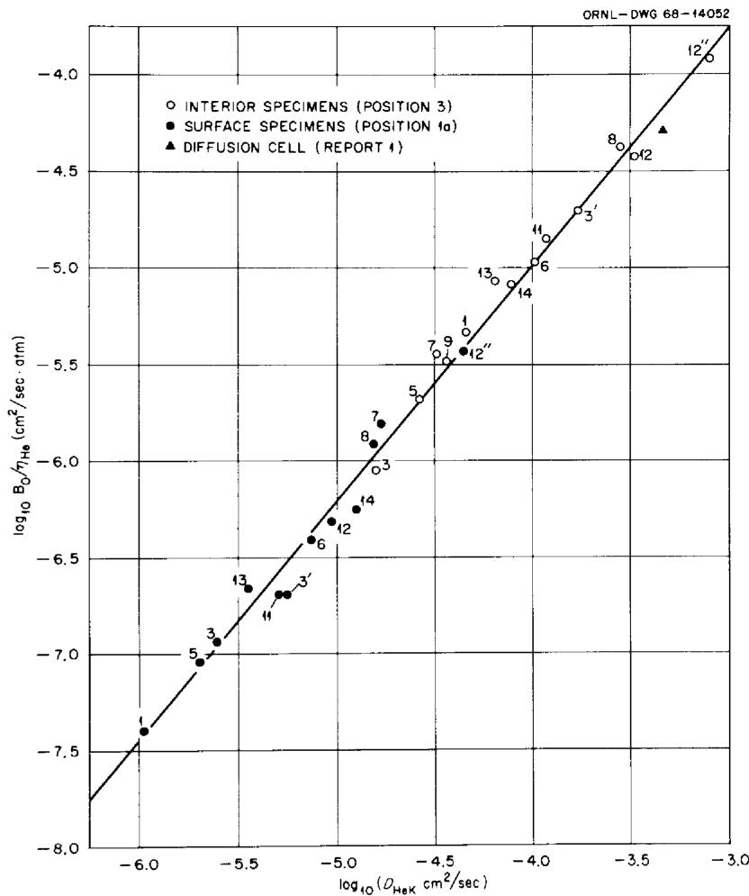  
Fig. A.1. Plot of the Helium Permeability Parameters Characteristic of the MSRE Graphite Bars Which Have Been Surveyed.

# INTERNAL DISTRIBUTION

1. R.E.Adams   
2. G. D. Alton   
3. C. F. Baes   
4. C. D. Baumann   
5. R. L. Beatty   
6. R. L. Bennett   
7. E. S. Bettis   
8. F. F. Blankenship   
9. W. A. Blevins   
10. C. M. Blood   
11. E. G. Bolhmann   
12. E. S. Bomar   
13. G. E. Boyd   
14. R. B. Briggs   
15. H. R. Bronstein   
16. T. J. Burnett   
17. R. S. Carlsmith   
18. O. B. Cavin   
19. M. M. Chiles   
20. J.A. Conlin   
21. J.H. Coobs   
22. W.H.Cook   
23. W. B. Cottrell   
24. S. J. Cromer   
25. F. L. Culler   
26. D. R. Cuneo   
27. W. Davis, Jr.   
28. J. H. de Nordwall   
29. J.H.Devan   
30. S. J. Ditto   
31. L. Dresner   
32. W. P. Eatherly   
33. J. R. Engel   
43. R. B. Evans III   
44. R. M. Evans   
45. J. I. Federer   
46. D. E. Ferguson   
47. M. Fontana   
48. S.H. Freid   
49. J.H. Frye, Jr.   
50. W. R. Grimes   
51. A. G. Grindell   
52. R.M.Hamley   
53. W. O. Harms   
54. P. N. Haubenreich   
55. D. M. Hewette II   
56. M. R. Hill

57. A. Houtzeel   
58. J. E. Inman   
59. G.H.Jenks   
60. R. S. Jones   
61. S. I. Kaplan   
62. P. R. Kasten   
63. R. J. Kedl   
64. G. W. Keilholtz   
65. C. R. Kennedy   
66. R. B. Korsmeyer   
67. K. A. Kraus   
68. M. E. Lackey   
69. C. E. Larson   
70. K. H. Lin   
71. T. B. Lindemer   
72. R. A. Lorenz   
73. L. D. Love   
74. T. S. Lundy   
75. H. G. MacPherson   
76. R. E. MacPherson   
77. A. P. Malinauskas   
78. E. A. Mason (consultant)   
79. H. E. McCoy   
80. H. C. McCurdy   
81. H. A. McLain   
82. J. R. McWherter   
83. J. P. Moore   
84. R. L. Moore   
85. C. S. Morgan   
86. J. G. Morgan   
87. E. L. Nicholson   
88. L. C. Oakes   
89. O.S.Oen   
90. M. F. Osborne   
91. L. G. Overholser   
92. R. B. Parker   
93. P. Patriarca   
94. R. B. Perez   
95. A.M. Perry   
96. J.W. Prados   
97. G. L. Ragan   
98. G. D. Robbins   
99. M. W. Rosenthal   
01. J. L. Rutherford   
02. G. Samuels   
03. A. W. Savolainen   
04. D. Scott

105. J. L. Scott   
106. C. E. Sessions   
107. O. Sisman   
108. M. J. Skinner   
109. I. Spiewak   
110. R. C. Steffy   
111. J. O. Stiegler   
112. R.A. Strehlow   
113. D. A. Sundberg   
114. J. R. Tallackson   
115. R.E. Thoma   
116. D. B. Trauger   
117. J. Truitt   
118. J. L. Wantland

119. G.M. Watson   
120. A. M. Weinberg   
121. J. R. Weir   
122. R.C. Weir   
123. M. E. Whatley   
124. J. C. White   
125. R. P. Wichner   
126. J. L. Margrave (consultant)   
127. R. C. Vogle (consultant)

128-130. Central Research Library   
131. Document Reference Section   
132-166. Laboratory Records Department   
167. Laboratory Records, ORNL R.C.

# EXTERNAL DISTRIBUTION

168. J. A. Swartout, Union Carbide Corporation, New York, N.Y.   
169. Laboratory and University Division, AEC, ORO

170-388. Given distribution as shown in TID-4500 under Reactor Technology category (25 copies - CFSTI)