3445605155630

ORNL-4397

UC-80 - Reactor Technology

ANALYSES OF TRANSIENTS IN THE

MSRE SYSTEM WITH 233U FUEL

O.W.Burke

F.H.S.Clark

OAK RIDGE NATIONAL LABORATORY

operated by

UNION CARBIDE CORPORATION

for the

U.S. ATOMIC ENERGY COMMISSION

OAK RIDGE NATIONAL LABORATORY

CENTRAL RESEARCH LIBRARY

DOCUMENT COLLECTION

LIBRARY LOAN COPY

DO NOT TRANSFER TO ANOTHER PERSON

If you wish someone else to see this

document, send in name with document

and the library will arrange a loan.

UCN7969

(3) $3 + {67}$

Printed in the United States of America, Available from Clearinghouse for Federal

Scientific and Technical Information, National Bureau of Standards,

U.S. Department of Commerce, Springfield, Virginia 22151

Price: Printed Copy $3.00; Microfiche $0.65

# LEGAL NOTICE

This report was prepared as an account of Government sponsored work. Neither the United States, nor the Commission, nor any person acting on behalf of the Commission:

A. Makes any warranty or representation, expressed or implied, with respect to the accuracy, completeness, or usefulness of the information contained in this report, or that the use of any information, apparatus, method, or process disclosed in this report may not infringe privately owned rights; or   
B. Assumes any liabilities with respect to the use of, or for damages resulting from the use of any information, apparatus, method, or process disclosed in this report.

As used in the above, "person acting on behalf of the Commission" includes any employee or contractor of the Commission, or employee of such contractor, to the extent that such employee or contractor of the Commission, or employee of such contractor prepares, disseminates, or provides access to, any information pursuant to his employment or contract with the Commission, or his employment with such contractor.

Contract No. W-7405-eng-26

# INSTRUMENTATION AND CONTROLS DIVISION

ANALYSES OF TRANSIENTS IN THE MSRE SYSTEM WITH $^{233}\mathrm{U}$ FUEL

O.W.Burke F.H.S.Clark

JUNE 1969

OAK RIDGE NATIONAL LABORATORY

Oak Ridge, Tennessee

operated by

UNION CARBIDE CORPORATION

for the

U.S. ATOMIC ENERGY COMMISSION

# CONTENTS

ABSTRACT 1

1. INTRODUCTION 1   
2. ANALOG COMPUTER MODELS 2

2.1 Nuclear Kinetics Models 2   
2.2 Reactor Core Heat Generation and Heat Transfer Model 6   
2.3 External Heat Rejection 9   
2.4 Safety System Simulation 9   
2.5 Reactor Control System Simulation 10

3. PROCEDURES AND RESULTS 10

3.1 Reactor Control System Performance 10   
3.2 Startup Accident 15   
3.3 The 233U Resuspension Accident 16

4. CONCLUSIONS 25

ACKNOWLEDGMENTS 25

5. APPENDIX 26

5.1 Neutron Kinetics in a Circulating Fuel Reactor 26   
5.2 The Temperature Equations 31   
5.3 External Heat Rejection 34   
5.4 Safety Systems 35   
5.5 Control System 38   
5.6 Control System Lag Measurements Made at the MSRE 42

REFERENCES 46

# ANALYSES OF TRANSIENTS IN THE MSRE SYSTEM WITH $^{233}\mathrm{U}$ FUEL

O.W.Burke

F.H.S.Clark

# ABSTRACT

The $^{233}\mathrm{U}$ fueled MSRE system was simulated on the ORNL analog computer. The simulated system was used to evaluate the existing MSRE control and safety systems when used on the $^{233}\mathrm{U}$ fueled system. The pertinent results and conclusions were as follows:

1. The safety system will limit the "startup accident" so that the peak power will be $100 \, \text{kw}$ .   
2. A quantity of $^{233}\mathrm{U}$ sufficient to cause a reactivity change of approximately $-1\% \delta \mathrm{K} / \mathrm{K}$ when precipitated out of the fuel at some point in the system external to the core could be swept back into the core in a concentrated form without causing excessive core damage.   
3. The existing controller will control the $^{233}\mathrm{U}$ fueled system in a stable manner; however, an increased velocity feedback gain will be required.

# 1. INTRODUCTION

While plans were being made to fuel the MSRE with $^{233}\mathrm{U}$ , there was some uncertainty pertaining to the adequacy of the existing MSRE safety and control systems. To dispel this uncertainty, the following bits of information were needed:

1. The degree of stability of the $^{233}\mathrm{U}$ loaded MSRE system while under automatic control of the power level.

2. The response of the safety system to a "startup accident."   
3. The maximum mass of $^{233}\mathrm{U}$ that can be tolerated in a "233U resuspension accident."

The startup accident is defined as the continuous uncontrolled withdrawal of all shim rods at maximum rod velocity.

An analog computer simulation of the $^{233}\mathrm{U}$ fueled MSRE was used to obtain the desired information.

# 2. ANALOG COMPUTER MODELS

Analog computer models of the subsystems of the MSRE developed earlier $^{1-4}$ were used in various combinations as required by the nature of the transient to be simulated, the range of the variables of interest, and the power level of concern.

# 2.1 Nuclear Kinetics Models

Two point-reactor nuclear kinetics models were used with six delayed neutron groups. The output of one model was nuclear power, $P$ ; the output of the other was the logarithm of nuclear power, $\log_{10} P$ . The log $P$ model was used for startup and low-power operation of the reactor where the range of $P$ was very large and the heat generation was negligible. The regular kinetics model was used when the heat generation effects could not be ignored.

# 2.1.1 Regular Nuclear Kinetics Model

The mathematical equations describing the regular nuclear kinetics model (Fig. 1) are as follows:

$$
\frac {d n (t)}{d t} = \frac {(p - \beta)}{\Lambda} n (t) + \sum_ {i = 1} ^ {6} \lambda_ {i} C _ {i} (t), \tag {1}
$$

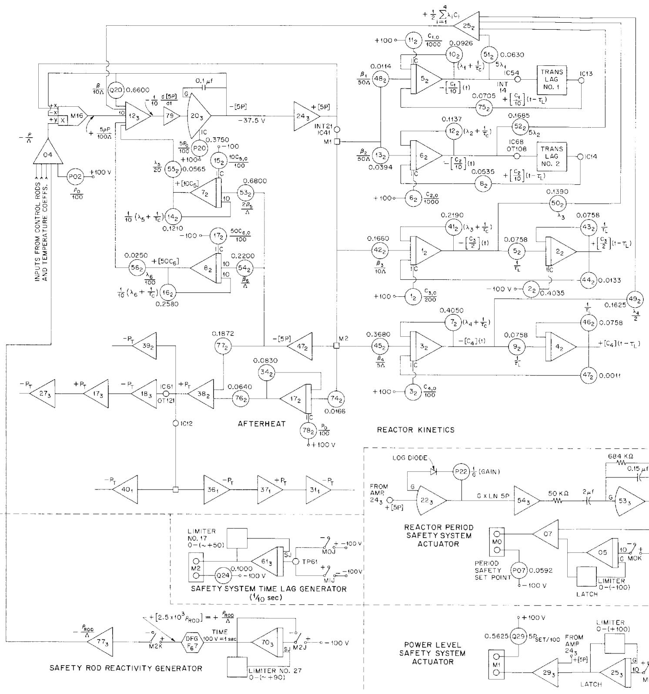

CONTROLLER LOGIC AND CONTROL ROD DRIVES   
Fig. 1. Schematic Diagrams of the Analog Computer Models of the MSRE   
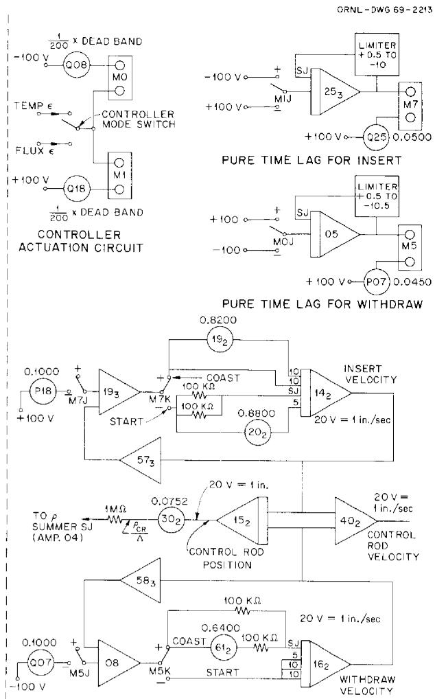  
Control and Safety Systems and of the MSRE Reactor Kinetics.

and

$$
\frac {d C _ {i} (t)}{d t} = \frac {\beta_ {i}}{\Lambda} n (t) - \lambda_ {i} C _ {i} (t) + \frac {C _ {i} (t - \tau_ {L}) e ^ {- \lambda_ {i} \tau_ {L}}}{\tau_ {c}} - \frac {C _ {i} (t)}{\tau_ {c}}, \tag {2}
$$

where

$n =$ number of neutrons in the reactor,

$\rho =$ reactivity, $\delta K / K$

$\Lambda =$ prompt neutron generation time,

$\beta =$ the fractional yield of all delayed neutron precursors as a result of fission,

$\lambda_{i} = 1 / \tau_{i}$ , where $\tau_{i}$ is the mean life of the $i$ th group of delayed neutron precursors,

$\beta_{i} =$ fractional yield of the ith group of delayed neutron precursors as a result of fission, $\beta_{i} = \beta ,$

$\tau_{c} =$ core residence time of fuel,

$\tau_{L} =$ residence time of fuel in the loop external to the core.

The third and fourth terms on the right-hand side of Eq. (2) are not found in the nuclear kinetics equations of stationary fuel reactors. The fourth term specifies the rate at which delayed neutron precursors of the $i$ th group are removed from the core by fuel circulation. The third term specifies the rate at which the delayed neutron precursors of the $i$ th group re-enter the core after they have traversed the external loop.

A consistent set of units must be used in these equations. In the computer model, P (expressed in megawatts) replaced n in the equations. The computer voltage scaling of P was different for the different transients; therefore, the machine-scaled equations will not be shown.

The development of Eqs. (1) and (2) is discussed in detail in the Appendix, Sect. 5.1.

# 2.1.2 The Log P Nuclear Kinetics Model

The Log P model (Fig. 2) equations are as follows:

$$
\frac {d g (t)}{d t} = \frac {\rho - \beta}{\Lambda} + \sum_ {i = 1} ^ {6} \lambda_ {i} h _ {i} (t), \tag {3}
$$

$$
\begin{array}{l} \frac {d h _ {i} (t)}{d t} + h _ {i} (t) \frac {d g (t)}{d t} = \frac {\beta_ {i}}{\Lambda} - \left[ \lambda_ {i} + \frac {1}{\tau_ {c} (t)} \right] h _ {i} (t) \\ + \frac {1}{\tau_ {i} (t)} h _ {i} [ t - \tau_ {L} (t) ] e ^ {- \lambda_ {i} \tau_ {L} (t)}, \tag {4} \\ \end{array}
$$

$$
\frac {d h _ {i} (t)}{d t} + h _ {i} (t) \frac {d g (t)}{d t} = \frac {\beta_ {i}}{\Lambda} - \left[ \lambda_ {i} + \frac {1}{\tau_ {c} (t)} h _ {i} (t) \right], \tag {5}
$$

and

$$
h _ {i} \left[ t - \tau_ {c} (t) \right] = \int_ {- \infty} ^ {t} \exp \left[ - \frac {t - t ^ {\prime}}{\tau_ {c}} h _ {i} (t) d t ^ {\prime} \right], \tag {6}
$$

where

$$
g (t) = \log_ {e} N (t),
$$

$$
h _ {i} (t) = C _ {i} (t) / N (t).
$$

The detailed derivation of Eqs. (3), (4), (5), and (6) is shown in the Appendix, Sect. 5.1.

# 2.2 Reactor Core Heat Generation and Heat Transfer Model

The core was divided into four concentric regions in the radial direction with respect to the direction of fuel flow. In the axial direction (direction of flow) the regions were further subdivided into from one to three axial regions, or lumps. The regional layout of the core is shown in the upper right-hand corner of Fig. 3.

The mathematical equations describing each of these lumps are identical except for the physical constants. The equations for a typical lump, which consists of one section of graphite and two sections of fuel, are

$$
\frac {d \bar {T} _ {G}}{d t} = \frac {a}{M _ {G} C _ {G}} P _ {T} - \frac {h A _ {1}}{M _ {G} C _ {G}} \left(\bar {T} _ {G} - \bar {T} _ {f}\right), \tag {7}
$$

$$
\frac {d \bar {T} _ {f}}{d t} = \frac {b}{M _ {f} C _ {f}} P _ {T} + \frac {h A _ {1}}{M _ {f} C _ {f}} \left(\bar {T} _ {G} - \bar {T} _ {f}\right) + \frac {W _ {f}}{M _ {f}} \left(T _ {f i} - \bar {T} _ {f}\right), \tag {8}
$$

and

$$
\frac {d T _ {f o}}{d t} = \frac {C}{M _ {f o} C _ {f}} P _ {T} + \frac {h A _ {z}}{M _ {f o} C _ {f}} \left(\bar {T} _ {G} - \bar {T} _ {f}\right) + \frac {W _ {f}}{M _ {f o}} \left(\bar {T} _ {f} - T _ {f o}\right), \tag {9}
$$

where

$\overline{T}_{G} =$ average temperature of graphite,

$M_G =$ mass of graphite section,

$C_{G} =$ heat capacity of graphite section,

$a =$ fraction of total heat produced in the graphite section,

$P_{T} =$ total rate of heat production,

$h =$ heat transfer coefficient between graphite and fuel,

A = heat transfer area between graphite and fuel,

$\overline{T}_{f} = \text{average temperature of fuel in a lump},$

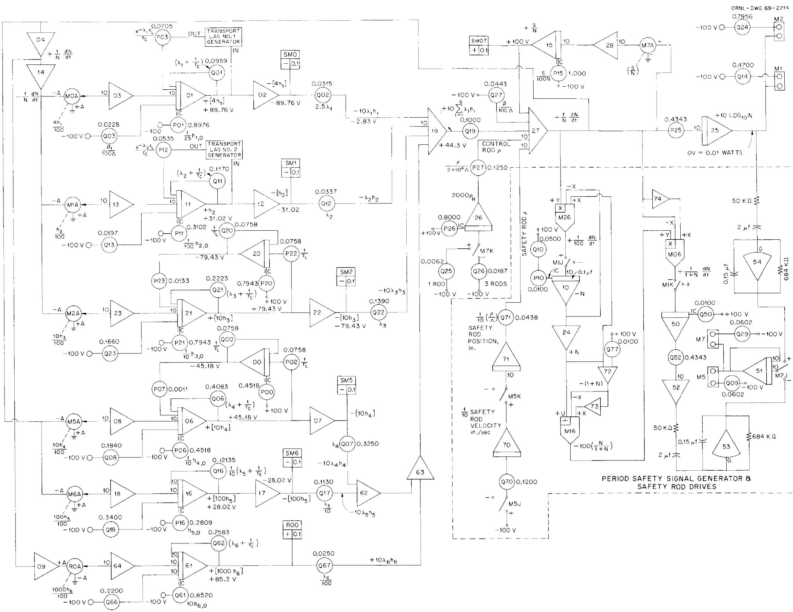  
Fig. 2. Schematic Diagrams of the Analog Computer Models of the MSRE Period Safety System and the MSRE Log P Model.

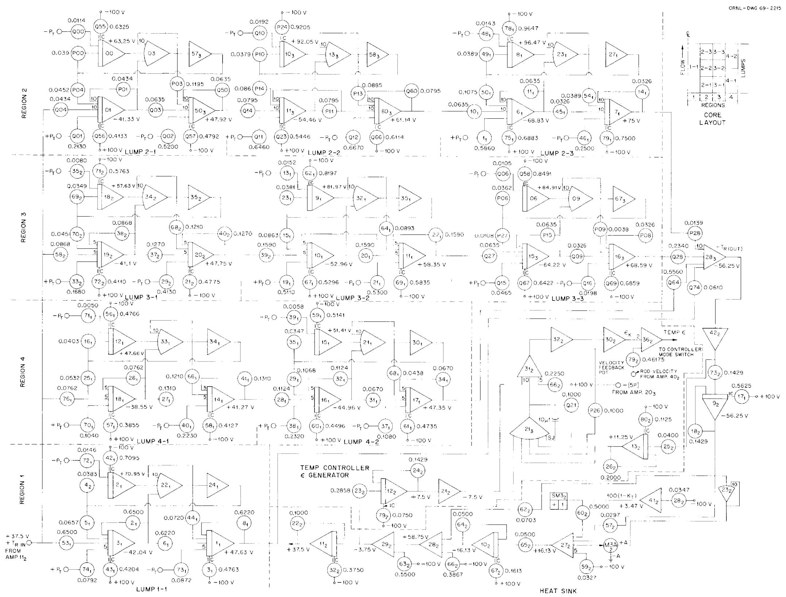  
Fig. 3. Schematic Diagram of the Analog Computer Model of MSRE Heat Generation and Heat Transfer.

$M_{f}$ = mass of fuel in the first section,

$C_{f}$ = heat capacity of fuel,

$b = \frac{1}{2}$ fraction of total heat produced in the first fuel section,

$T_{fi} =$ fuel temperature entering the first section,

$T_{fo} =$ fuel temperature at the exit of the second fuel section,

$M_{fo} = \text{mass of fuel in second fuel section},$

C $= \text{fraction of total heat produced in the second fuel section.}$

The computer schematic for nine lumps is shown in Fig. 3. The voltages representing temperatures in Fig. 3 are $T' = [T(^\circ F) - 1100^\circ F] / 2$ .

A detailed derivation of Eqs. (7), (8), and (9) is shown in the Appendix, Sect. 5.2.

# 2.3 External Heat Rejection

Because of a shortage of analog computer equipment, an abbreviated model (Fig. 3) of the heat rejection system was used. The development of this model is discussed in the Appendix, Sect. 5.3.

The voltages representing temperatures in Fig. 3 are $T'(v) = [T(^\circ F) - 1100^\circ F] / 2$ .

# 2.4 Safety System Simulation

The MSRE has two safety-system trip signals: a power-level trip signal and a reactor-period trip signal. Safety action is initiated if the power level exceeds 11.25 Mw or if the reactor period becomes shorter than 1 sec.

For the low-power cases (essentially no sensible heat is produced) where the log P model was used, only the period-trip signal was used. Constant safety-rod acceleration and constant reactivity-change per inch of travel were used in this model.

For the high-power model, both level-trip and period-trip signals were used. The reactivity change due to safety rod motion was more accurately simulated (Sect. 3.3). Only two of the three safety rods were assumed to drop when a scram occurred.

For a more detailed discussion of the safety system see the Appendix, Sect. 5.4.

# 2.5 Reactor Control System Simulation

The MSRE has two modes of control: for operation at power levels less than 1 Mw, the flux (or power level) is the controlled variable; for operation at power levels of 1 Mw or higher, the fuel salt temperature at the reactor core outlet is the controlled variable. The computer circuit used to simulate the control system is discussed in the Appendix, Sect. 5.5.

Since we believed that the most uncertain part of the control system simulation would be the time response of the control-rod-drive system to error signals that call for rod motion, the time response of the control-rod-drive system was measured experimentally at the MSRE. This measurement is discussed in the Appendix, Sect. 5.6.

# 3. PROCEDURES AND RESULTS

# 3.1 Reactor Control System Performance

The performance of the reactor control system under the temperature mode of control at power levels of 1 Mw and above (Figs. 4 and 5) and the neutron flux mode of control at power levels below 1 Mw (Figs. 6 and 7) was demonstrated.

In the run illustrated by Fig. 4, the reactor was initially operating at steady-state full power (7.5 Mw); and at the time marked "start" in Fig. 4, the temperature set point on the controller $(T_{\text{so}})$ was decreased at a constant rate of $5^{\circ}\text{F} / \text{min}$ for a total time of 2.5 min (12.5°F total). The subsequent reactor performance, that is, that the requested change in the fuel temperature at the reactor core outlet was accomplished and that the error signal did not cross the dead band, indicates a stable system. System stability is again exhibited in Fig. 5, when in the run illustrated by this figure the heat load, or heat rejection rate, was suddenly reduced from 7.5 to $\sim 5$ Mw.

In the runs illustrated by Figs. 6 and 7, the controller was in the flux mode of control, and the reactor was operating at a steady-state power level of $10\mathrm{kw}$ . A perturbation was induced in the control system by suddenly reducing the flux set point on the controller from 10 to $8\mathrm{kw}$ . Figure 6 shows that with the control system

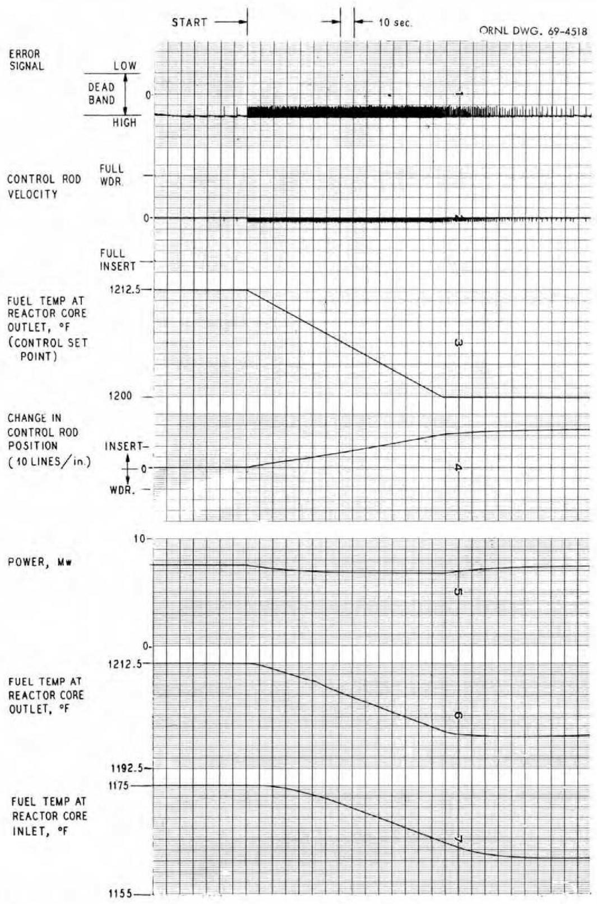  
Fig. 4. Response of the Controlled MSRE to a $-5^{\circ}\mathrm{F} / \mathrm{min}$ Ramp Change in the Temperature Set Point with Temperature Mode of Control.

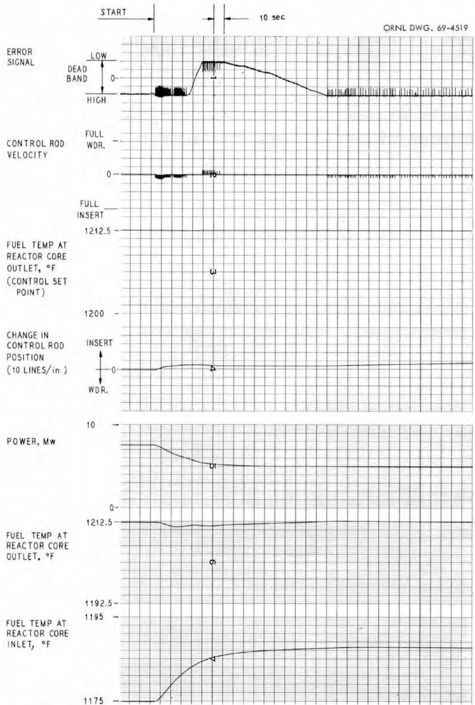  
Fig. 5. Response of the Controlled MSRE to a Sudden Reduction in Heat Load from $7.5\mathrm{Mw}$ to $\sim 5\mathrm{Mw}$ with Temperature Mode of Control.

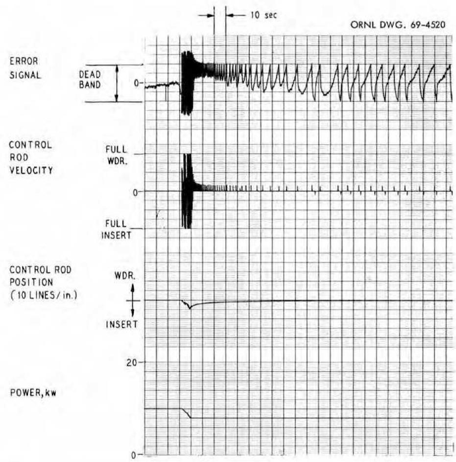  
Fig. 6. Response of the Controlled MSRE to a Step Change in the Power Set Point from 10 to 8 kw with Flux Mode of Control and with the Feedback Gain the Same as That Used in the $^{235}\mathrm{U}$ System.

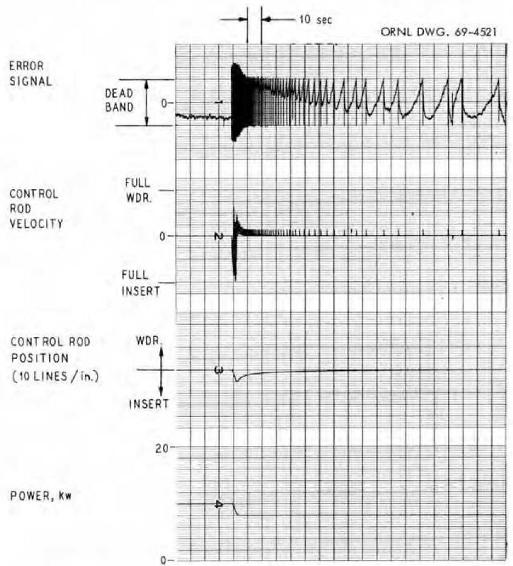  
Fig. 7. Response of the Controlled MSRE to a Step Change in the Power Set Point from 10 to 8 kw with Flux Mode of Control and with the Velocity Feedback Gain 3.3 Times That Used in the $^{235}\mathrm{U}$ System.

the same as that for the $^{235}\mathrm{U}$ fueled reactor there was some instability in the run. The error signal repeatedly traversed the width of the dead band and initiated alternate rod insertions and withdrawals. Figure 7 shows that with the rod-velocity feedback gain in the control system at 3.3 times its value for the $^{235}\mathrm{U}$ system the system is much more stable.

# 3.2 Startup Accident

The startup accident was of interest because it afforded a convenient check on how the safety system would perform in response to a reactor period trip signal. The log P model was used for these runs (the thermal system model was not used since the power peaks were predicted to be very low). The rods were continuously withdrawn in such a way that the reactivity increased at a steady rate of $0.0935\%$ $\delta K / K$ -sec. Various initial reactor criticality conditions, initial power levels, and initial background-gamma-activity levels were used in the computer runs. The resulting power peak, even with ten times the estimated background gamma activity, was only $630~\mathrm{kw}$ (Fig. 10). The strip-chart recorder charts for three of the runs are shown as Figs. 8-10.

Figure 8 shows the recorder outputs for a startup accident with no safety rod action. Although the period safety scram signal exceeded the scram level, there was no scram, because the signal was disconnected from the safety system. The run was terminated by the operator after 4.5 sec. The reactor was initially critical at a power level of 1 w. The gamma activity level produced the same chamber current output that a 10-kw neutron flux would produce. This was considered to be the normal gamma activity level.

The conditions for the two runs recorded in Figs. 8 and 9 were the same except that the safety system was connected in the run recorded in Fig. 9. The shortest reactor period was approximately 0.18 sec, and the peak power was approximately 42 kw (Fig. 9).

The initial conditions for the run recorded in Fig. 10 were that the reactor was $0.04 \, \text{K} / \text{K}$ subcritical at a power level of $0.01 \, \text{W}$ and the gamma activity level

was equivalent to a neutron flux of $100\mathrm{kw}$ . For this case, the shortest reactor period was approximately 0.15 sec, and the peak power was approximately $630\mathrm{kw}$ .

# 3.3 The $^{233}\mathrm{U}$ Resuspension Accident

The $^{233}\mathrm{U}$ resuspension accident is only a postulated accident, and whether or not a mechanism for its happening exists is debatable. If a mechanism should exist, the events leading to the accident might be as follows:

1. During operation of the reactor, a fraction of the $^{233}\mathrm{U}$ would precipitate from the fuel solution and collect in the primary loop external to the reactor core. The control rod would withdraw to compensate for the resulting loss in reactivity. This process could take place at such a low rate as to be imperceptible to the reactor operator. The loss in reactivity associated with a loss of a given mass of fuel will be designated as $\delta K_{\circ}$ .   
2. After a substantial mass of $^{233}\mathrm{U}$ has collected in the primary loop outside the reactor core, it could be swept back through the core by the flowing fuel solution.   
3. As the highly concentrated $^{233}\mathrm{U}$ mass traversed the reactor core, the reactivity would increase, causing a power excursion.

In this accident the fuel is presumed to precipitate uniformly from the entire fuel region, a region much greater than the core volume. The control rods need compensate only for that fraction which corresponds to the fraction that the core is of the whole volume. On resuspension the entire amount of fuel is presumed to move as one piece through the system. The piece, when it enters the core, is several times the entire amount which was precipitated from the core. Moreover, as the piece traverses the system, it will at some time enter the highest importance region of the core. As an example, while the maximum integrated amount of reactivity removed from the core in this process may have been about $1\% \delta K / K$ , the maximum postulated reactivity increase on resuspension may approximate $5\% \delta K / K$ .

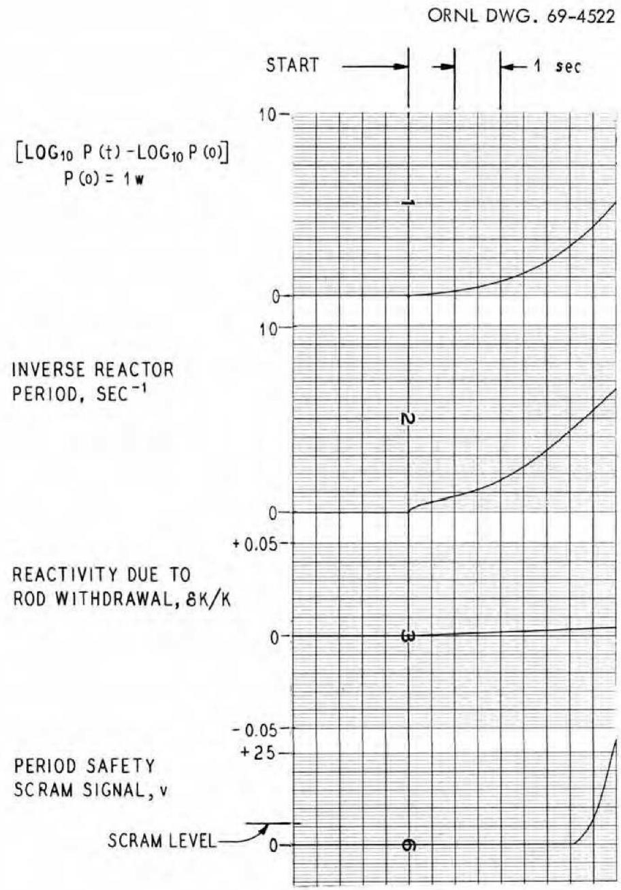  
Fig. 8. Startup Accident with No Safety Action.

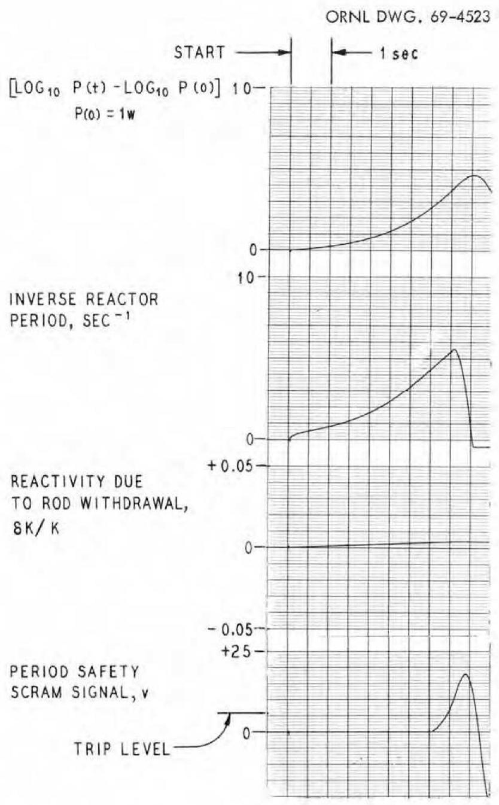  
Fig. 9. Startup Accident with Normal Gamma Background and with the Safety System in Operation.

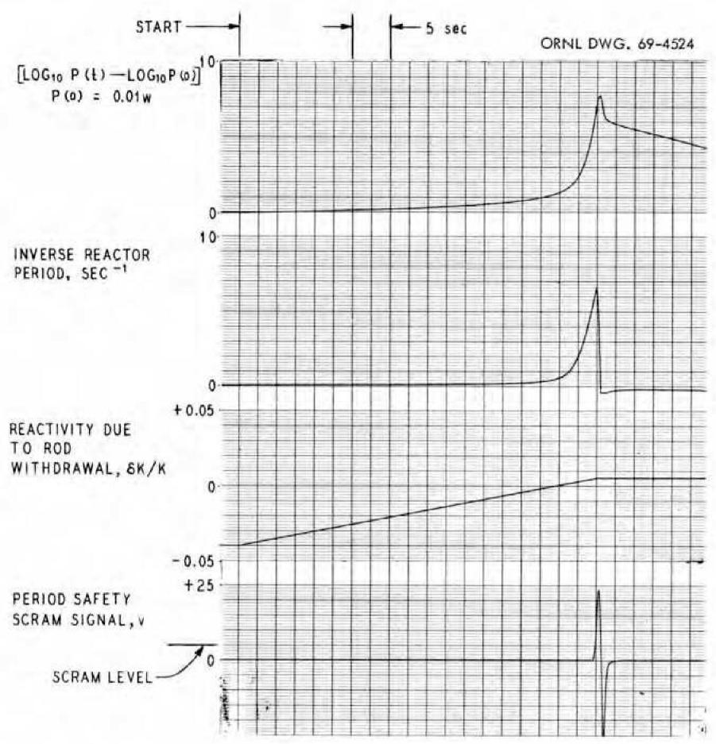  
Fig. 10. Startup Accident, Starting $0.048\mathrm{K} / \mathrm{K}$ Subcritical and with Gamma Background Ten Times Normal.

The relative reactivity of the mass of resuspended $^{23}$ U as a function of time is shown in Fig. 11, in which the mass of resuspended $^{23}$ U enters the reactor core at time zero. The curve shown in Fig. 11 was set up on a diode function generator. The output of the function generator (relative reactivity) was multiplied by the reactivity equivalent of the mass of $^{23}$ U deposited outside the core ( $\mathsf{SK}_{\circ}$ ), and the result was the reactivity as a function of time.

Computer runs were made with various values for $\delta K_{0}$ and the power level at the time of the accident. Examination of the run results shows that the initial power level had very little to do with the severity of the excursion.

Both the flux and reactor-period safety signals were connected. Conservatively, credit was taken for only two of the three rods that responded to a safety trip signal. The reactivity due to safety rod motion (two rods) as a function of time after the rods were released is shown in Fig. 12. The total reactivity change was $-4\%$ $\delta K / K$ .

For all cases, safety action was initiated prior to any significant increase in system temperatures. The safety action caused the reactor to go subcritical. This was the end of the incident for the cases where the instantaneous reactivity due to the resuspended $^{233}\mathrm{U}$ did not exceed $+4\% \delta \mathrm{K} / \mathrm{K}$ (the corresponding $5\mathrm{K}_{0}$ is approximately $+0.82\% \delta \mathrm{K} / \mathrm{K}$ ). If $5\mathrm{K}_{0}$ would exceed $+0.82\% \delta \mathrm{K} / \mathrm{K}$ , the resulting positive reactivity would more than compensate for the $-4\% \delta \mathrm{K} / \mathrm{K}$ due to safety rod motion, and the reactor would go critical again. These power excursions would cause the system temperatures to rise. The core could be damaged by excessive temperature increases (core melting) or from excessive rates of temperature increase (pressure surges).

The strip chart recordings of three runs in which the only parameter varied was $\delta K_{0}$ are shown in Figs. 13-15. The initial power level for each of these runs was $7.5\mathrm{Mw}$ . With a value of $+0.75\%$ $\delta K / K$ for $\delta K_{0}$ (Fig. 13), the safety rod motion drove the reactor subcritical, and it remained subcritical with essentially no temperature increases. With $\delta K_{0}$ equal to $+1\%$ $\delta K / K$ (Fig. 14) the system temperatures did increase significantly. More damage is evident in Fig. 15 with $\delta K_{0}$ for the run equal to $+1.2\%$ $\delta K / K$ .

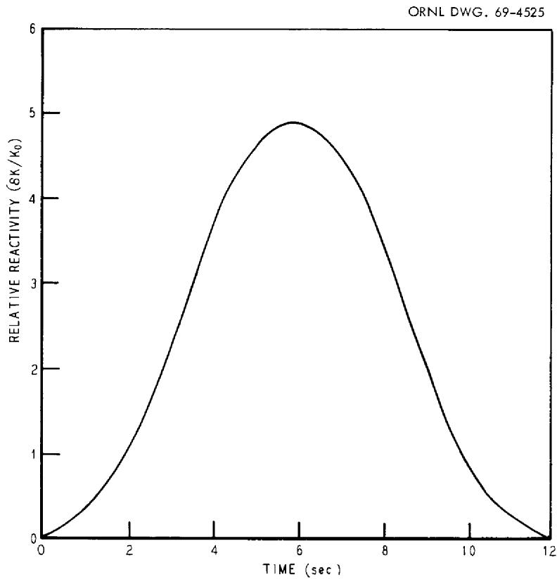  
Fig. 11. Relative Reactivity of the Resuspended $^{233}\mathrm{U}$ as a Function of Time After it Re-enters the Reactor Core.

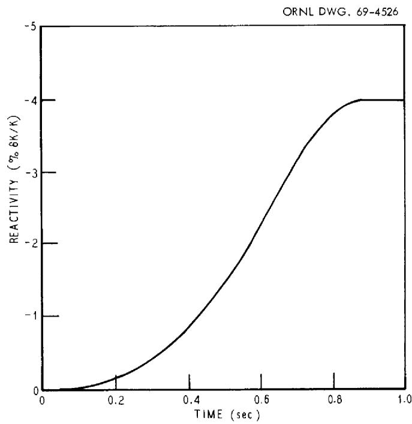  
Fig. 12. Reactivity Change Resulting from Safety Rod Motion as a Function of Time After Scram.

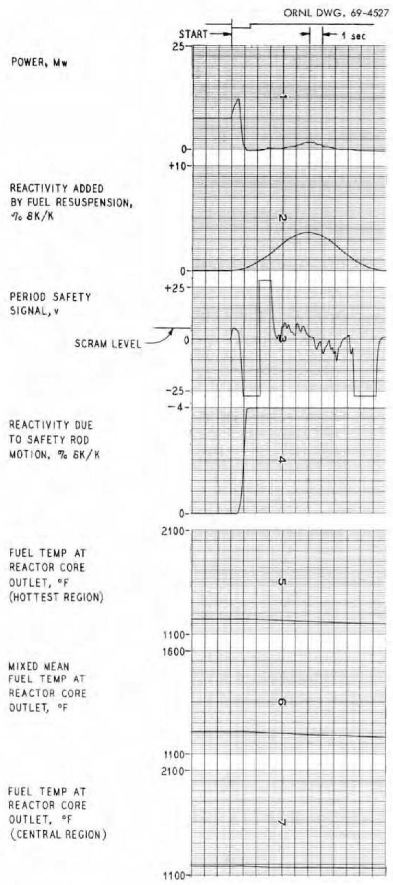  
Fig. 13. $233\mathrm{U}$ Resuspension Accident with an Initial Power Level of 7.5 Mw and with $\delta K_{0} = +0.75\% \delta K / K$

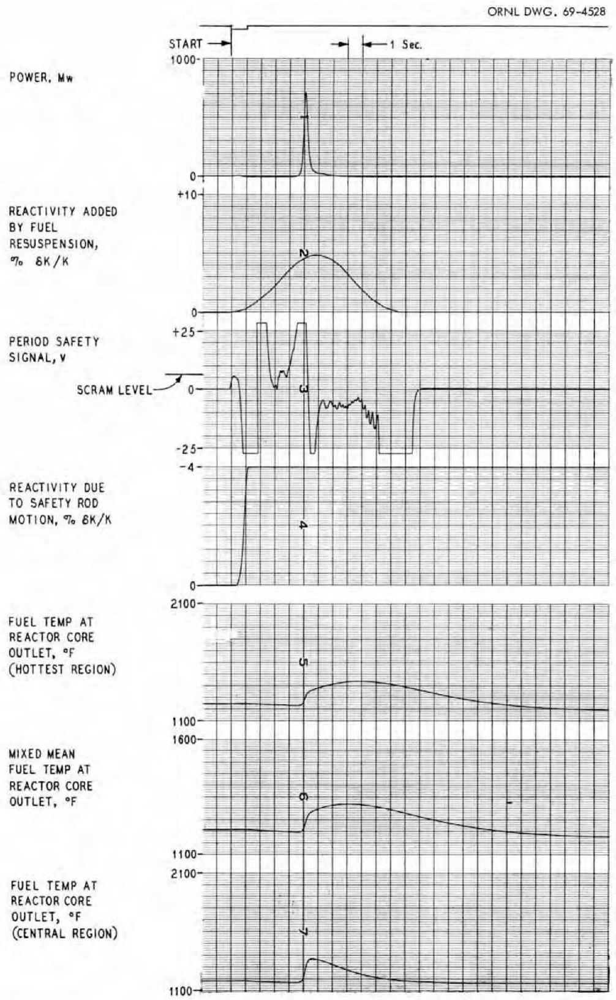  
Fig. 14. $333$ U Resuspension Accident with an Initial Power Level of 7.5 Mw and with $\delta K_{\circ} = +1\% \delta K / K$ .

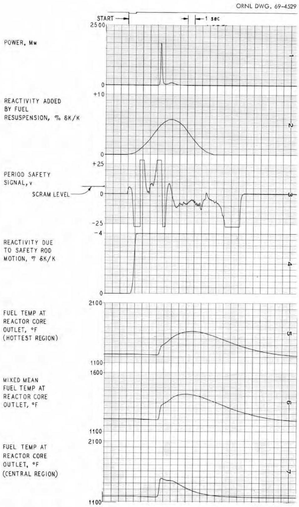  
Fig. 15. ${}^{233}\mathrm{U}$ Resuspension Accident with an Initial Power Level of 7.5 Mw and with ${\delta }_{\mathrm{K}} =  + {1.2}\% \delta \mathrm{K}/\mathrm{K}$ .

# 4. CONCLUSIONS

The existing controller will control the $^{233}\mathrm{U}$ fueled system in a stable manner; however, an increased velocity feedback gain will be required.

The safety system limited the startup accident so that the peak power was only $100\mathrm{kw}$ (10 times normal gamma background).

A quantity of $233\mathrm{U}$ sufficient to cause a reactivity change of approximately $-1\% \delta K / K$ when precipitated out of the fuel solution at some point in the system external to the core could be swept back into the core in a concentrated form without causing excessive core damage. The maximum allowable fuel temperature increase at the hot channel would be $340^{\circ}F$ . The fuel outlet temperature of the hottest region increased $\sim 210^{\circ}F$ for $\delta K_{o}$ equal to $1\% \delta K / K$ (Fig. 14). The temperature increase for $\delta K_{o} = 1.2\% \delta K / K$ was $390^{\circ}F$ (Fig. 15). The case where $\delta K_{o} = 1\% \delta K / K$ was conservatively chosen as the limiting case.

# ACKNOWLEDGMENTS

We are grateful to J. W. Lawson for his constant assistance in keeping the analog equipment operational and for his further assistance in performing the measurement on the MSRE. J. L. Redford and R. C. Steffy were of very great help in making arrangements for the MSRE measurements and contributed greatly to the planning of the measurement. R. C. Steffy further assisted us at all stages with information about the system. S. J. Ball made valuable suggestions as to the handling of the external heat dump and conceived the simple procedure for the MSRE measurement. S. J. Ditto offered invaluable insight into the workings of the safety trip. G. S. Sadowski has made this manuscript more readable and has done all the things which must be done to have it reproduced.

# 5. APPENDIX

# 5.1 Neutron Kinetics in a Circulating Fuel Reactor

Circulation of fuel alters the relative contributions of the various delay groups to the neutron economy. A simple but usable model of this effect can be derived from the following arguments.

Neglect variations in effects in directions lateral to fuel flow. Define $x$ as a variable in the direction of fuel flow, with $x = 0$ at the core entrance. With the flow length in the core taken as $A$ and outside the core as $B$ , the system is evidently periodic in $x$ (with period $A + B$ ). Assume that the flow in the system occurs without mixing. Further, assume that the neutron kinetic equations are separable in time and space (although this will certainly not be true for some parts of a transient) and, accordingly, write those equations with the space point as an explicit variable:

$$
\frac {d n (x , t)}{d t} = \frac {\rho - \beta}{\Lambda} n (x, t) + \sum_ {i} \lambda_ {i} C _ {i} (x, t), \tag {10}
$$

and

$$
\frac {d C _ {i} (x , t)}{d t} = \frac {\beta_ {i}}{\Lambda} n (x, t) - \lambda_ {i} C _ {i} (x, t), \tag {11}
$$

n(x,t) = neutron flux density at x,t,

subscript i = index denoting ith delay group,

$C_{i}(x,t)$ $=$ atomic density of precursor to ith delay group at $x,t$

=reactivity $\equiv$ (k-1)/k,

$k =$ multiplication rate,

$\beta_{i}$ = number of precursors of ith group produced per fission,

reciprocaltimeconstantofithgroup,

$\Lambda$ = system neutron generation time,

β =β

The variables $\mathfrak{p}$ and $\Lambda$ are functions of the whole system, not of $x$ ; and $\beta_{i}, \beta, \text{and} \lambda_{i}$ are physical constants, also independent of $x$ .

In a system with flow, the total time derivatives can be interpreted with partial derivatives as follows:

$$
\frac {d n \left(x _ {n} , t\right)}{d t} = \frac {\partial n \left(x _ {n} , t\right)}{\partial t} + \frac {d x _ {n}}{d t} \frac {\partial n \left(x _ {n} , t\right)}{\partial x _ {n}}, \tag {12}
$$

$$
\frac {d C _ {i} \left(x _ {i} , t\right)}{d t} = \frac {\partial C _ {i} \left(x _ {i} , t\right)}{\partial t} + \frac {d x _ {i}}{d t} \frac {\partial C _ {i} \left(x _ {i} , t\right)}{\partial x _ {i}}, \tag {13}
$$

$x_{n}$ is the $x$ coordinate of $n$ , and $x_{i}$ is the $x$ coordinate of $C_{i}$ . If the fixed laboratory frame is chosen as the frame of reference, then

$$
\frac {d x}{d t} = 0, \tag {14}
$$

and

$$
\frac {d x _ {i}}{d t} = v (t) = f u e l \text {f l o w v e l o c i t y}. \tag {15}
$$

Now, if Eqs. (12-15) are inserted into Eqs. (10) and (11), and if Eqs. (10) and (11) are integrated over $x$ from 0 to $A$ , then

$$
\frac {\partial n (t)}{\partial t} = \left(\frac {\rho - \beta}{\Lambda}\right) n (t) + \sum_ {i} \lambda_ {i} C _ {i} (t), \tag {16}
$$

and

$$
\frac {\partial C _ {i} (t)}{\partial t} = \frac {\beta_ {i}}{\Lambda} n (t) - \lambda_ {i} C _ {i} (t) - \frac {v (t)}{A} \left\{C _ {i} (A, t) - C _ {i} (0, t) \right\}. \tag {17}
$$

Define

$$
\begin{array}{l} \tau_ {c} (t) = \frac {A}{v (t)} = \text {c o r e t r a n s i t t i m e}, \\ \tau_ {L} (t) = \frac {B}{v (t)} = e x t e r n a l l o o p t r a n s i t t i m e. \\ \end{array}
$$

With the assumption of no mixing, the following relation holds:

$$
C _ {i} (0, t) = C _ {i} [ A, t - \tau_ {L} (t) ] e ^ {- \lambda_ {i} \tau_ {L} (t)} \tag {18}
$$

Consistent with the assumption of time-space separability, the end point value $C_{i}(A,t)$ will bear some fixed relation to the mean value $C_{i}(t)$ , i.e.,

$$
C _ {i} (A, t) = f C _ {i} (t). \tag {19}
$$

With Eqs. (18) and (19) incorporated into Eq. (17), there results

$$
\frac {\partial C _ {i} (t)}{\partial t} = \frac {\beta_ {i}}{\Lambda} n (t) - \left[ \lambda_ {i} + \frac {f}{\tau_ {c} (t)} \right] C _ {i} (t) + \frac {f}{\tau_ {c} (t)} C _ {i} [ t - \tau_ {L} (t) ] e ^ {- \lambda_ {i} \tau L (t)}. \tag {20}
$$

Equations (16) and (20) comprise the basic neutron kinetic equations for the model of the flowing system. (In the simulation we chose the parameter $f \equiv 1$ .)

In Eq. (20) for each of the six delay groups there is an equation involving the term $C_{i} [t - \tau_{L}(t)]$ . Lagging a function, as indicated by the argument $t - \tau_{L}$ , involves memory. The available analog equipment contained only two such memory lag devices. The system lags $t_{c}$ and $\tau_{L}$ are of the order of a few seconds and are, therefore, roughly comparable to the lags of two of the delay groups. Hence, the available lag equipment was assigned to the representation of those two groups.

For the two short-lived delay groups the factor $e^{-\lambda_i \tau_L(t)}$ is a very small quantity, $10^{-3}$ or less. Hence, for those two groups, the lag term can be neglected and the following equation can be written:

$$
\frac {\partial C _ {i} (t)}{\partial t} = \frac {\beta_ {i}}{\Lambda} n (t) - \left[ \lambda_ {i} + \frac {f}{\tau_ {c} (t)} \right] C _ {i} (t). \tag {20a}
$$

In the two longest-lived delay groups, the time constants are considerably larger than the system $\tau$ 's. Therefore the term $C_{i}(t - \tau_{L})$ can be reasonably approximated by

$$
C _ {i} (t - \tau_ {L}) = \int_ {- \infty} ^ {t} e ^ {- \frac {t - t ^ {\prime}}{\tau_ {L}}} C _ {i} (t ^ {\prime}) d t ^ {\prime}. \tag {21}
$$

Equation (21) is the so-called first-order lag, easily achievable with analog equipment. Hence, the lag term is handled by incorporating Eq. (21) in Eq. (20) for the two longest-time delay groups, by using Eq. (20a) for the two shortest-time delay groups, and by implementing Eq. (20) with the available lag devices for the two intermediate-time delay groups.

The limit to the precision with which components are made places limits on the accuracy of the analog computer. The precision of the analog computer used in this study limits to the range of $10^{-4}$ to $10^{-3}$ . Such accuracies are, of course, quite adequate for most problems. Startup is an exception, since power levels and related quantities change by many decades.

To deal with this problem, a model is constructed which computes logarithmic-like quantities. Define

$$
g = \log n, \tag {22}
$$

$$
h _ {i} = \frac {C _ {i}}{n}. \tag {23}
$$

When Eqs. (22) and (23) are inserted in Eqs. (16) and (20), the following equations result:

$$
\frac {\partial g (t)}{\partial t} = \frac {p - \beta}{\Lambda} + \sum_ {i} \lambda_ {i} h _ {i} (t), \tag {24}
$$

$$
\begin{array}{l} \frac {\partial h _ {i} (t)}{\partial t} + h _ {i} (t) \frac {\partial g (t)}{\partial t} = \frac {\beta_ {i}}{\Lambda} - \left[ \lambda_ {i} + \frac {f}{\tau_ {c} (t)} \right] h _ {i} (t) \\ + \frac {f}{\tau_ {c} (t)} \frac {n [ t - \tau_ {L} (t) ]}{n (t)} h _ {i} [ t - \tau_ {L} (t) ] e ^ {- \lambda_ {i} \tau_ {L} (t)}. \tag {25} \\ \end{array}
$$

The factor $n[t - \tau_L(t)] / n(t)$ in Eq. (25) can be troublesome to deal with. In steady state its value is 1. When the power is rising, its value lies between zero and 1, and when the power is falling, its value is above 1. Since interest in the startup problem is confined to times when the system is in steady state (before startup) or when the system is increasing the power level until a safety trip occurs, and, further, since during times of increasing power $h_i(t - \tau_L)$ will be less than, possibly much less than, $h_i(t)$ , the factor $n(t - \tau_L) / n(t)$ is replaced with 1. Then, the lagged terms are treated in a manner analogous to their treatment in the untransformed model, and the final result is

$$
\begin{array}{l} \frac {\partial h _ {i} (t)}{\partial t} + h _ {i} (t) \frac {\partial g (t)}{\partial t} = \frac {\beta_ {i}}{\Lambda} - \left[ \lambda_ {i} + \frac {f}{\tau_ {c} (t)} \right] h _ {i} (t) \\ + \frac {f}{\tau_ {c} (t)} h _ {i} [ t - \tau_ {L} (t) ] e ^ {- \lambda i \tau L (t)}, \tag {26} \\ \end{array}
$$

$$
\frac {\partial h _ {i} (t)}{\partial t} + h _ {i} (t) \frac {\partial g (t)}{\partial t} = \frac {\beta_ {i}}{\Lambda} - \left[ \lambda_ {i} + \frac {f}{\tau_ {c} (t)} \right] h _ {i} (t), \tag {26a}
$$

$$
h _ {i} (t - \tau_ {L}) = \int_ {- \infty} ^ {t} e ^ {- \frac {t - t ^ {\prime}}{\tau_ {L}}} h _ {i} (t ^ {\prime}) d t ^ {\prime}. \tag {27}
$$

Equation (26) is used with the analog lag devices for the two intermediate-time delay groups; Eq. (26a) is used for the two short-time delay groups; and Eq. (27) is used for the two long-time delay groups. Equation (24) completes the system.

# 5.2 The Temperature Equations

An equation for the temperature, sufficiently general for most of our purposes, can be written as follows:

$$
\frac {d}{d t} \left[ \circ C _ {p} \theta \right] = \sum_ {i} \frac {\partial (H A) _ {i}}{\partial V} \left(a _ {i} - \theta\right) + k, \tag {28}
$$

= material density,

$C_p$ = specific heat of the material at constant pressure,

$\theta$ = temperature of the material,

$\alpha_{i}$ = temperature of an adjacent material,

$\frac{\partial(HA)}{\partial V} = \text{rate of change in the heat transfer from the \(i$ th material with an increment in } V,\)

$k =$ amount of heat deposited per unit volume per second,

$\Delta V =$ differential volume $= \text{Sax}$

S = cross-sectional area of the system (assumed constant).

If the material is flowing with velocity $v(t)$ we have, as in the case of the neutron delay group precursors,

$$
\frac {d}{d t} [ \circ C _ {p} \theta ] = \frac {\partial}{\partial t} [ \circ C _ {p} \theta ] + v (t) \frac {\partial}{\partial x} [ \circ C _ {p} \theta ]. \tag {29}
$$

In the above discussion we assumed only one degree of spatial freedom and, in effect, incompressibility of the flowing material. Equation (28) is integrated over a volume between two points in $x$ which are characterized by $n - 1$ and $n$ and produces the following:

$$
\begin{array}{l} S \left(x _ {n} - x _ {n - 1}\right) \frac {\partial}{\partial t} \left[ C _ {p} \theta_ {n} \right] = \sum_ {i} (H A) _ {i, n} \left(\bar {a} _ {i, n} - \bar {\theta} _ {n}\right) \\ + S \left(x _ {n} - x _ {n - 1}\right) k - v (t) S _ {p} C _ {p} \left(\theta_ {n} - \theta_ {n - 1}\right), \\ \end{array}
$$

or

$$
\frac {\partial \bar {\theta} _ {n}}{\partial t} = \sum_ {i} \frac {(\overline {{H A}}) _ {i , n}}{M _ {n p} C} \left(\bar {\alpha} _ {i, n} - \bar {\theta} _ {n}\right) + \frac {k}{\theta C _ {p}} - \frac {1}{\tau_ {n} (t)} \left(\theta_ {n} - \theta_ {n - 1}\right). \tag {30}
$$

In flowing systems, those with $v(t) \neq 0$ , some purely mathematical instabilities can arise from the way mean values are related to endpoint values. To avoid such problems Eq. (30) is often replaced with the pair

$$
\frac {\partial \bar {\theta} _ {n}}{\partial t} = \sum_ {i} \frac {(H A) _ {i , n}}{M _ {n p} C} + \frac {k}{\rho C _ {p}} - \frac {2}{\tau_ {n} (t)} \bar {\theta} _ {n} - \theta_ {n - 1} \tag {31a}
$$

and

$$
\frac {\partial \theta_ {n}}{\partial t} = \sum_ {i} \frac {(H A) _ {i , n}}{M _ {n p} C} \left(\bar {\alpha} _ {i, n} - \bar {\theta} _ {n}\right) + \frac {k}{o C _ {p}} - \frac {2}{\tau_ {n} (t)} \left(\theta_ {n} - \bar {\theta} _ {n}\right). \tag {31b}
$$

Past studies of the MSRE with $^{235}\mathrm{U}$ loading have shown that to have a faithful representation of effects at low power $^{1,2}$ it is necessary to make a multinode representation of the core for heat transfer calculations. Nine such temperature nodes have been found to produce satisfactory results. At each of the nine nodes an equation of the form of Eq. (30) is used to determine the graphite temperature, and two equations of the form of Eqs. (31a) and (31b) are used to determine the fuel temperatures.

With the subscript $G$ denoting graphite, and $f$ denoting fuel, and with the substitutions

$$
\begin{array}{l} \theta \rightarrow T _ {G}, \\ \alpha \rightarrow T _ {f}, \\ k \to r _ {G} P, \\ \end{array}
$$

we get

$$
\frac {\partial \bar {T} _ {G , n}}{\partial t} = \frac {(H A) _ {n}}{M _ {G n} C _ {p G}} \left(\bar {T} _ {f, n} - \bar {T} _ {G, n}\right) + \frac {r _ {G , n} P}{\rho_ {G} C _ {p G}} \tag {32}
$$

$$
\begin{array}{l} P = \text {t o t a l} \\ r _ {G, n} = \text {f r a c t i o n o f t o t a l p o w e r d e p o s i t e d i n u n i t v o l u m e o f g r a p h i t e a t t h e} \\ \end{array}
$$

Similarly, from Eqs. (31a) and (31b) we obtain the fuel temperature equations

$$
\begin{array}{l} \frac {\partial \overline {{T}} _ {f , n}}{\partial t} = \frac {(H A) _ {n}}{M _ {f , n} C _ {p f}} \left(\bar {T} _ {G, n} - \bar {T} _ {f, n}\right) + \frac {r _ {f , n} P}{c _ {f} C _ {p f}} - \frac {2}{T _ {n} (t)} \left(\bar {T} _ {f, n} - T _ {f, n - 1}\right), (33a) \\ \frac {\partial T _ {f , n}}{\partial t} = \frac {(H A) _ {n}}{M _ {f , n} C _ {p f}} \left(\bar {T} _ {G, n} - \bar {T} _ {f, n}\right) + \frac {r _ {f , n} P}{\rho_ {f} C _ {p f}} - \frac {2}{\tau_ {n} (t)} \left(T _ {f, n} - \bar {T} _ {f, n}\right). (33b) \\ \end{array}
$$

In the external piping where $h$ and $k$ are zero we adapt Eq. (31a) and write

$$
\frac {\partial T _ {i}}{\partial t} = \frac {2}{T _ {i} (t)} \left(T _ {i - 1} - T _ {i}\right). \tag {34}
$$

# 5.3 External Heat Rejection

There was not sufficient analog equipment available to simulate all aspects of the system simultaneously. Since the detailed response of the external heat sink was not important to any part of the study, we decided to make an abbreviated description of it, abstracting and representing those features which would comprise its essentials. The entire system is represented by a few gains and lags appropriately jointed together, as follows:

1. The temperature signal sent to the control system as the core outlet temperature is the core outlet temperature after it has passed through a gain of one lag circuit. The lag represents transport from the core outlet to the sensing element plus thermal lag in the sensing element.   
2. The temperature sent to the control system as the core inlet temperature is, in fact, a lead value of the core inlet temperature. It is sent through a gain of one lag circuit to the control system, the lag representing the thermal lag of the sensing element. It is also sent through a gain of one lag to the core inlet, the lag representing transport delay from sensing element to core inlet.   
3. The effect of the heat exchanger is multiply represented. There is a lag representing time from the core to the center of the heat exchanger, and another lag from the center of the heat exchanger to the inlet temperature sensing location. There is a gain constant that represents the heat exchanger effect, and there is an overall gain that is power dependent. Changes in the overall gain have another lag associated with them. The heat exchanger gains and lags are represented as follows:

$$
T _ {H} (t) = \int_ {- \infty} ^ {t} e ^ {- t ^ {\prime} / \tau_ {3}} \left[ (K - G) T _ {2} (t ^ {\prime}) + (1 - K) T _ {A} \right] d t ^ {\prime}, \tag {35}
$$

$$
T _ {3} (t) = T _ {H} (t) + G T _ {2} (t), \tag {36}
$$

$T_{3} =$ fuel temperature at the heat exchanger outlet,

$T_{2} =$ fuel temperature at the heat exchanger inlet,

$\mathsf{T}_{\mathsf{H}} =$ coolant salt temperature at the heat exchanger inlet,

TA = ambient air temperature,

$G =$ heat exchanger gain (constant),

K $=$ system gain (power dependent).

The power dependent $K$ is defined by

$$
K = \frac {T _ {\text {o u t}} - C P - T _ {A}}{T _ {\text {o u t}} - T _ {A}}, \tag {37}
$$

where $P$ is the power level and $C$ is a unit conversion constant.

The above scheme is summarized in Fig. 16. $T_{1}$ and $T_{5}$ are the temperatures delivered to the control system as the core outlet and inlet temperatures, respectively. $T_{1}$ is the transport and thermal lag to outlet sensor. $T_{2}$ is the transport lag to the heat exchanger. $T_{3}$ is the lag in the change of gain of the system with a change in power. $T_{4}$ is the transport lag from the heat exchanger to the inlet temperature sensor. $T_{4}$ is the temperature at the inlet temperature sensor. $T_{6}$ is the thermal lag in the inlet temperature sensor. $T_{5}$ is the transport lag from the sensor to the core inlet. $T_{in}$ and $T_{out}$ are core inlet and outlet temperatures, respectively.

# 5.4 Safety Systems

# 5.4.1 Trips

Two kinds of safety trip were simulated for the study: a period trip and a power level trip. The safety trip simulation brings out one of the most powerful features of analog analysis. The simulation is hardly a simulation at all but rather a nearly identical copy of the components which were used to make the safety trip system on the reactor itself.

Period Trip.--The reactor period is defined as

$$
T _ {R} = \left(\frac {1}{n} \frac {\partial n}{\partial t}\right) ^ {- 1} = \left(\frac {\partial \log n}{\partial t}\right) ^ {- 1}, \tag {38}
$$

where $T_R$ is the period and $n$ is the neutron flux density. $T_R$ is a function of time unless the neutron flux density is exponential. Since it is necessary in the course of the simulation to deal with both $n$ and $\log n$ , some switching must be provided to avoid saturation of equipment. We define the effective flux density seen by the ion chamber as $n^* = n + G$ , $G = \text{gamma-ray contribution}$ .

The MSRE safety trip circuitry is actuated when

$$
\left(\frac {\partial}{\partial t} \log n ^ {*}\right) ^ {- 1} > P _ {T} = \text {p e r i o d t r i p}. \tag {39}
$$

When the neutron flux density $n$ is on a purely exponential period $\tau$ , the apparent period of $n^*$ is

$$
\tau^ {*} = \frac {G + n}{n} \tau . \tag {40}
$$

Evidently, the period trip is of little use until $n$ is not much less than $G$ . We can reasonably simulate the trip system over different ranges of $n$ , as follows:

$$
\begin{array}{l} n ^ {*} = G, \text {i f} n <   0. 0 5 G \\ n ^ {*} = n + G, \text {i f} 0. 0 5 G \leq n \leq 1 0 0 G \\ n ^ {*} = n, \text {i f} 1 0 0 G <   n \tag {41} \\ \end{array}
$$

In the first range $n < 0.05G$ , no signal is sent to the trip circuit. When $n$ enters the second range, the log $n$ is converted to $\log (n + G)$ and differentiated, and the output is sent appropriately to the trip. When $n$ enters the third range, $\log n$ is differentiated and the output is sent to the safety trip. It is necessary to provide two parallel differentiating circuits and to switch them at their output end rather than to provide a single differentiation circuit with a switch on the input. This is because

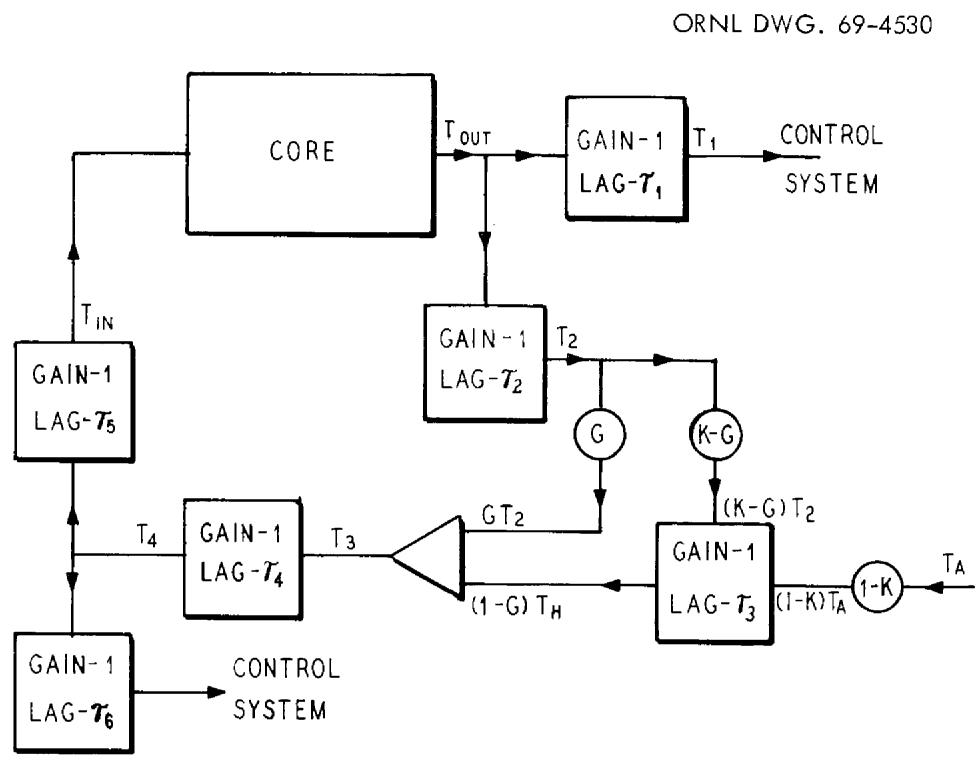  
Fig. 16. Schematic Diagram of External Heat Sink.

a switched input would contain a discontinuity which, when differentiated, would lead to spurious trips. This scheme is shown in Fig. 2. (In Fig. 1 the period trip is simulated in the section marked "Reactor Period Safety System Actuator." This simulation corresponds almost exactly to the actual wiring diagram in the MSRE system. Then signal is fed into a log diode and from there to a differentiated circuit.)

Level Trip.--The power level trip plays the major safety monitoring role when the system is at power. If the neutron flux detector signal exceeds a preset level, a trip signal is sent to the safety system. The simulation of the level trip is shown in Fig. 1.

# 5.4.2 Safety Rod Drive Simulation

In both the log n simulation (Fig. 2) and the n simulation the safety drive is simulated in two sections. The first section is a time lag that represents the inertial lag of the drive. This is represented by integrator 51 in Fig. 2, the log n model; and by the section entitled "Safety System Time Lag Generator" in Fig. 1, the n model. This latter section can be actuated by either a period or a level trip signal. There is no provision for level trip in the log n model.

In Fig. 2, amplifiers 70 and 71 simulate safety rod motion. A constant rod acceleration of $10\mathrm{ft/sec}^2$ was assumed. A constant reactivity-change per inch of rod travel was also assumed, and this was set on potentiometer Q71.

In Fig. 1, the output of amplifier 70 is a voltage proportional to time. This voltage drives a function generator whose output is a function of time. The function generator output as a function of time is shown in Fig. 12. This output is the change in reactivity due to safety rod movement in units of $(\rho / \Lambda)$ .

# 5.5 Control System

# 5.5.1 Control Signal

The control system signal is sketched in Fig. 3 as Temperature Controller $\varepsilon$ Generator. The following discussion will concern the five amplifiers $21_{3}, 31_{2}, 32_{2}, 30_{2}$ , and $36_{2}$ and their associated circuitry. This circuitry is abstracted with very

little adaptation from the actual MSRE control circuitry (ORNL Instrumentation and Controls Division drawing RC-13-12-53 R4). One can most easily understand it by considering the output of each amplifier in turn.

The feedback circuitry of $2l_{3}$ introduces a gain of 10 and a first-order lag of 100 sec. Lagged quantities are designated by a superscript L. Each amplifier, of course, multiplies by -1 in addition to any gain factor.

$$
\text {T h e i n p u t s} 2 \mathrm {I} _ {3} \text {a r e} + 0. 2 \mathrm {T} _ {\mathrm {c}, \text {o u t}} ^ {\prime}, - 0. 2 \mathrm {T} _ {\mathrm {c}, \text {i n}} ^ {\prime}, \text {a n d} - 0. 5 \mathrm {P},
$$

$$
T _ {c, o u t} = \text {c o r e o u t l e t t e m p e r a t u r e}, ^ {\circ} F,
$$

$$
T _ {c, i n} = \text {c o r e i n l e t t e m p e r a t u r e ,} ^ {\circ} F,
$$

$$
P = \text {r e a c t o r p o w e r i n M w},
$$

$$
T ^ {\prime} (v) = [ T (^ {\circ} F) - 1 1 0 0 ^ {\circ} F ] / 2.
$$

The output of $2l_{3}$ is then

$$
- 1 0 \left(0. 2 T _ {c, \text {o u t}} ^ {\prime L} - 0. 2 T _ {c, \text {i n}} ^ {\prime L} - 0. 5 P ^ {L}\right). \tag {42}
$$

The input to $3l_{2}$ is the output of $2l_{3} - 2T_{c, in}^{\prime} + 112.5$ . The quantity 112.5 is simply two times the desired scaled voltage value of the core outlet temperature, or two times the core outlet set point, $T_{so}^{\prime}$ . The output of $3l_{2}$ is then

$$
1 0 \left[ 1 / 5 \left(T _ {c, \text {o u t}} ^ {\prime L} - T _ {s o} ^ {\prime}\right) - 1 / 5 \left(T _ {c, i n} ^ {\prime L} - T _ {c, i n} ^ {\prime}\right) \right] - 5 P ^ {L}. \tag {43}
$$

Amplifier $32_{2}$ simply inverts the signal so that its output is the same as the above but multiplied by $-1$ . The input of $30_{2}$ is the output of $32_{2}$ minus $5P$ . We consider the output of $30_{2}$ to be kinetic error signal $\varepsilon_{K}$ , with

$$
\varepsilon_ {K} = 2 \left(T _ {c, \text {o u t}} ^ {\prime L} - T _ {s o} ^ {\prime}\right) - 2 \left(T _ {c, i n} ^ {\prime L} - T _ {c, i n} ^ {\prime}\right) + 5 (P - P ^ {L}). \tag {44}
$$

We desire that each of the three terms above which go to make up $\mathcal{E}_{\kappa}$ be zero.

However, the system "sees" an error only when the sum $\varepsilon_{K}$ is not zero. It appears on first sight, therefore, that there might be off-design cases (i.e., wrong $T_{c, in}$ or $T_{c, out}$ or $P$ ) which would yield no error signal. The second and third terms on the right-hand side of Eq. (44) are, in effect, time derivatives averaged over 100 sec. Hence, if $\varepsilon_{K}$ is at some instant zero when the three terms are not, it would necessarily be at a time when the system variables were changing. The only persistent condition for $\varepsilon_{K} = 0$ , therefore, appears to be the one when all three terms vanish.

Before the error signal goes to the controller, it is fed through amplifier $36_{2}$ where another part is added to it to produce the system error signal $\varepsilon$ :

$$
\varepsilon = 2 \varepsilon_ {K} - v \tag {45}
$$

The term designated $\mathbf{v}$ is a signal, appropriately signed, that is proportional to the rod velocity. It is a negative feedback signal so that, whenever there is rod motion, the magnitude of $\mathbf{c}$ is less than the magnitude of $\mathfrak{E}_{\mathsf{K}}$ (with a few insignificant ex- ceptions due to relay time lags).

The velocity feedback promotes stability by minimizing "hunting." The error signal is fed into a deadband comparison circuit. When the error is sufficiently great to depart from the deadband on either side, it causes the control rods to move in such a manner as to tend to make the error signal move back into the deadband. There are lags in the system, however and in most cases the correction will be an over correction which drives the error signal all the way across the deadband and out the other side. The velocity feedback is intended to combat this effect.

The MSRE control rods are designed to operate at constant velocity when in motion (except when they are accelerating to that velocity or to zero). The velocity feedback signal is proportional to velocity and, hence, bounded. Gains are so chosen that this feedback is comparable to the signal produced by a small fluctuation in temperature, say of the order of $1^{\circ}$ . If a large change in set point $T_{so}$ were made, the velocity feedback would be negligible by comparison with $\varepsilon_{K}$ until the system approached its new steady-state configuration. Then, and during normal steady-state control, the velocity feedback would be significant so that only small error signals

would be sent. The system is gently "tapped" a number of times by such small signals, always from the same side of the deadband because they are never large enough to cause it to cross. In this manner the system is brought to or kept at steady state without being pushed back and forth across the deadband by over-correcting signals.

The power-level control circuit, which is used at power levels below 1 Mw where temperature control is neither practical nor desirable, is much simpler. The connection between $32_{2}$ and $30_{2}$ is broken, and amplifiers $21_{3}, 31_{2}$ , and $32_{2}$ are simply not used. In their place a positive voltage (whose value is chosen by the operator) is fed into $30_{2}$ . This is the power setpoint $\mathsf{P}_{\mathsf{SO}}$ . Hence, the input to $30_{2}$ is $5(\mathsf{P}_{\mathsf{SO}} - \mathsf{P})$ . We then have at the output of $30_{2}$ :

$$
\varepsilon_ {K} = 5 \left(P - P _ {s o}\right). \tag {46}
$$

The velocity feedback and subsequent signal tracing are the same as with temperature control.

The system is manually switched into temperature or power-level control.

# 5.5.2 Control Drive

The error signal $\varepsilon$ of Sect. 5.5.1 is sent to some comparison circuitry (dead-band) shown as "Controller Actuation Circuit" on Fig. 1. The two comparators MO and M1 in this circuit are actuated by voltages which correspond to the deadband boundaries. When either is actuated, it initiates a pure transport lag as the first part of the control rod action. This lag is generated by the "Pure Time Lag Insert" or "Pure Time Lag Withdraw" sections. The pure time lag corresponds to the relay lag. At the end of the pure time lag, one of the comparators M5 or M7 is actuated. The "Controller Logic and Control Rod Drives" section is the circuitry activated by M5 or M7. These comparators cause a switch to close which sends a constant voltage into the drive circuitry. The voltage is put through a first-order lag circuit (the lag corresponding to the inertial lag of the control rods), and the output is proportional to rod velocity. The integral of this output, proportionally modified by passage through potentiometers and resistors (constant reactivity change per inch of rod motion), is the control-rod reactivity signal applied to the integrator that generates neutron flux.

The relay lag and the control-rod inertial lag were measured in an experiment described in the Appendix, Sect. 5.6.

# 5.6 Control System Lag Measurements Made at the MSRE

There were no good estimates of the relay and control-rod inertial lags mentioned in Sect. 5.5. The range of estimates that we obtained varied from 0.05 to 1 sec (outside possibilities). Further, exploratory simulation runs indicated that the response of the control system was unsatisfactory over much of that range. On the other hand, the entire lower part of the range (0.05 - 0.20 sec) appeared to permit satisfactory control. Hence, while a measurement was needed, the accuracy demanded of it would not be great over much of the range of possible outcomes.

The measurement was performed with the MSRE in the automatic control mode. In this mode the control system responded to a feedback signal from the Servo Amplifier. (See Instrumentation and Controls System Division drawing RC-13-12-53 R4.) This amplifier corresponds to $36_{2}$ in Fig. 3. The signal then went to some relays whose bias determined the deadband width. The relays started or stopped the control-rod drive motor.

In the measurement the Servo Amplifier was replaced with a circuit that sent a controlled signal to the relays. Signals describing the subsequent motion of the control rods were produced, and their time behavior was compared with that of the controlled signals. From these comparisons a pure transport lag, which is associated with the relays, and an inertial lag (the time required for the control rods to move from their initial velocity to within $62\%$ of their final velocity) were determined.

A TR-10 portable analog computer (Fig. 17) provided all the facilities necessary to produce the excitation signal and to analyze the response voltages. Data were taken on an 8-channel Sanborn recorder. As shown in Fig. 17, the Time Pulse Generator section caused the comparator relay to close for a time period fixed by potentiometer 17. The Relay Actuator section caused a constant voltage, above the relay bias, to be sent to the relays for the duration of the time pulse. (This voltage corresponds to an error signal outside the deadband.) The control-rod drive responded to

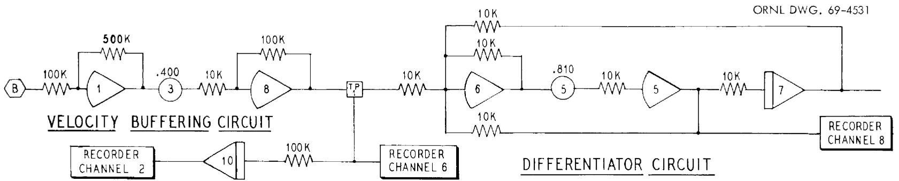  
VELOCITY INTEGRATOR

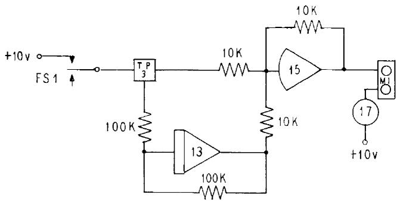

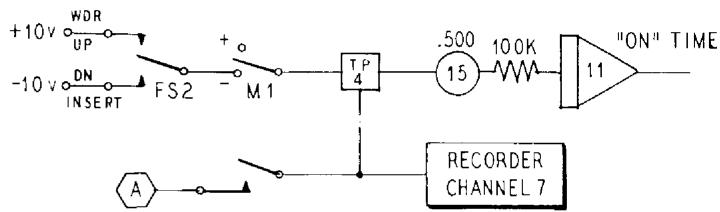  
TIME PULSE GENERATOR   
RELAY ACTUATOR

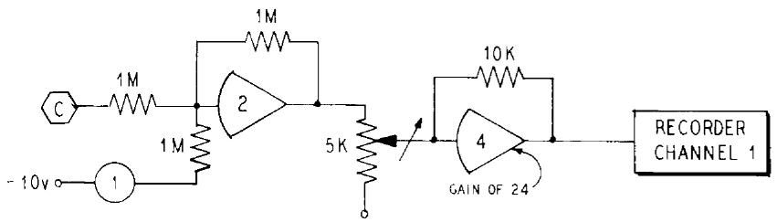  
Fig. 17. TR-10 Computer Circuit Used in the MSRE Rod Drive Response Experiment.

ROD POSITION BUFFERING CIRCUIT

LEGEND:

A CONNECTOR TO ROD DRIVE RELAY   
B CONNECTOR TO ROD VELOCITY OUTPUT SIGNAL   
C CONNECTOR TO ROD POSITION OUTPUT SIGNAL

this voltage. The output of the synchro-demodulator (Instrumentation and Controls Division drawing RC-13-12-53 R4) was proportional to the control-rod velocity. (There was a time lag of no more than 0.02 sec between this signal and the rod velocity. An error in time of this magnitude can be ignored.) This velocity signal was fed to the Sanborn recorder and the TR-10 computer where it was differentiated (see Differentiator circuit) and integrated (see Velocity Integrator). The derivative and integral were also recorded on the Sanborn recorder. The time signal sent to the relays and a rod position indicator signal available in the MSRE circuitry were recorded on the Sanborn recorder.

The rod position signal and the integral of the rod velocity should be proportional to each other. They were recorded only as an overall check on the system. The derivative of the velocity should be the rod acceleration, which, along with the relay actuating signal, should provide a complete description of the system. To avoid infinite derivatives, which are the derivatives of stray pulses or noise, an analog signal must be smoothed over some time period before differentiation. In the circuit used, the smoothing process introduced too much distortion to permit credible use of the derivative as an acceleration. The derivative did, however, provide a very clear mark of the time when the control rod began its acceleration or deceleration (except for those very short time pulses when deceleration began before rated velocity was reached). Therefore, the velocity trace itself was also analyzed.

During the generated time pulse, a constant voltage was sent to the relays. This voltage was a square pulse of magnitude $\pm 10\mathrm{~V}$ and had a width the duration of the pulse. The leading edge of the pulse signaled the relays to close, initiating the signal for the control rod to begin moving. The trailing edge signaled the relays to open, initiating the signal for the control rod to stop moving. The derivative showed a sharp change when the control rod began to accelerate or decelerate (except for very short width time pulses). The time displacement between the leading edge and the derivative acceleration pulse and the displacement between the trailing edge and the derivative deceleration pulse gave measures of the pure time lags associated with the relays. The shape of the velocity curve from the beginning of acceleration (or deceleration) to the final velocity value was fitted with an exponential. The exponential time characteristic was associated with the rod inertial lag.

For all four of the cases determined by rod startup, stop, insert, or withdraw, the relay lag could be taken as 0.05 sec ± 0.01 sec and the rod inertial lag 0.04 sec ± 0.02 sec. The uncertainties are acceptable. The recorder traces for the 0.5-sec time pulse case are shown in Fig. 18. For comparison purposes, recorder traces for the same case obtained from the simulated control-rod drive system are shown in Fig. 19.

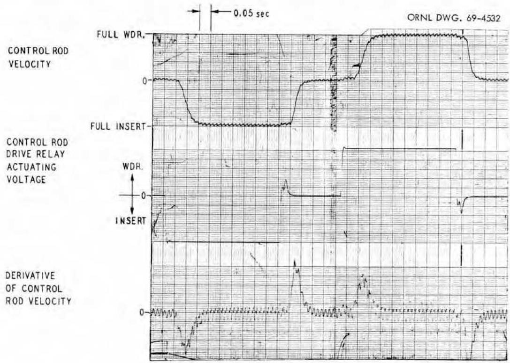  
Fig. 18. Response of the MSRE Control Rod Drive (as Measured).

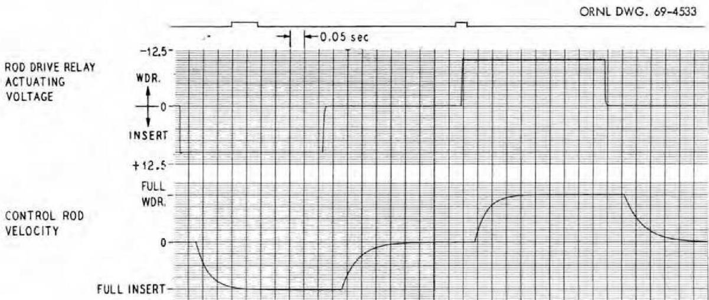  
Fig. 19. Response of the Computer Simulated MSRE Control Rod Drive.

1. O. W. Burke, MSRE-Preliminary Analog Computer Study: Flow Accident in Primary System, ORNL unpublished internal document (June 1960).   
2. O. W. Burke, MSRE-Analog Computer Simulation of a Loss of Flow Accident in the Secondary System and a Simulation of a Controller Used to Hold the Reactor Power Constant at Low Power Levels, ORNL unpublished internal document (November 1960).   
3. O. W. Burke, MSRE-Analog Computer Simulation of the System with a Servo-Controller, ORNL unpublished internal report (December 1961).   
4. S. J. Ball and T. W. Kerlin, Stability Analysis of the Molten Salt Reactor Experiment, ORNL-TM-1070 (December 1965).

ORNL-4397

UC-80 - Reactor Technology

# INTERNAL DISTRIBUTION

1. Biology Library   
2-4. Central Research Library   
5-6. ORNL - Y-12 Technical Library Document Reference Section   
7-41. Laboratory Records Department   
42. Laboratory Records, ORNL R.C.   
43. J. L. Anderson   
44. C. E. Bettis   
45. C. J. Borkowski   
46. J. B. Bullock   
47. O. W. Burke   
48. F. H. S. Clark   
49. S. J. Ditto   
50. J. R. Engel   
51. C. H. Gabbard   
52. P. N. Haubenreich   
53. W. H. Jordan   
54. C. E. Larson

55. M. I. Lundin   
56. H. G. MacPherson   
57. H. A. McLain   
58. L. C. Oakes   
59. H. G. O'Brien   
60. A. M. Perry   
61. G. L. Ragan   
62. J. L. Redford   
63. M. W. Rosenthal   
64. G. S. Sadowski   
65. Dunlap Scott, Jr.   
66. M. J. Skinner   
67. R. C. Steffy   
68. R. S. Stone   
69. D. A. Sundberg   
70. J. R. Tallackson   
71. A. M. Weinberg

# EXTERNAL DISTRIBUTION

72. J. C. Robinson, Dept. of Nuclear Engineering, University of Tennessee, Knoxville, Tennessee   
73. S. H. Hanauer, Dept. of Nuclear Engineering, University of Tennessee, Knoxville, Tennessee   
74. F. C. Legler, Reactor Development Division, AEC, Washington, D.C.   
75. Ronald Feit, Reactor Development Division, AEC, Washington, D.C.   
76. J. A. Swartout, Union Carbide Corporation, New York, N.Y.   
77. Laboratory and University Division, AEC, ORO

78-293. Given distribution as shown in TID-4500 under Reactor Technology category (25 copies - CFSTI)