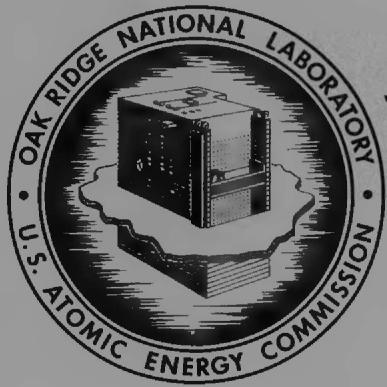
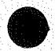
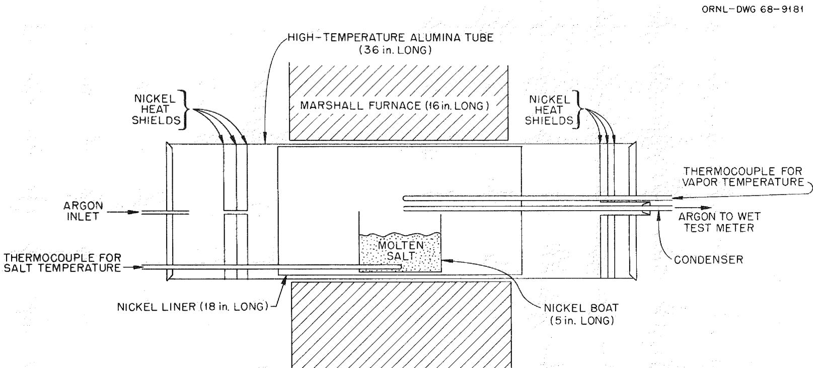
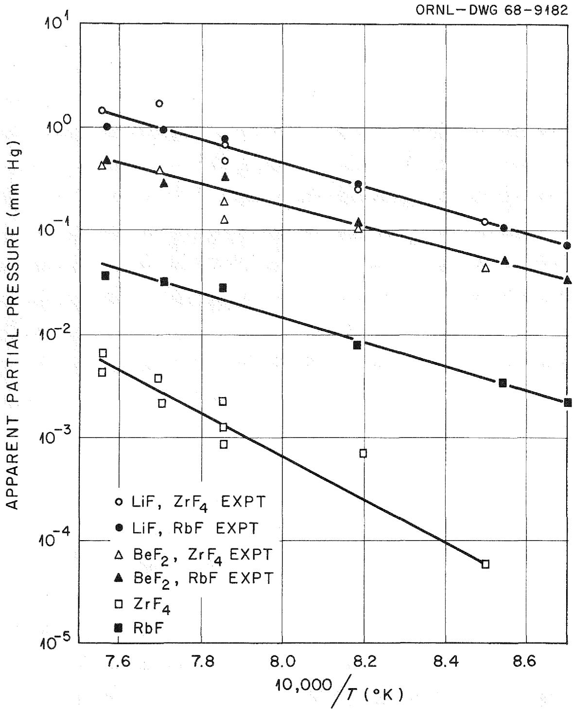
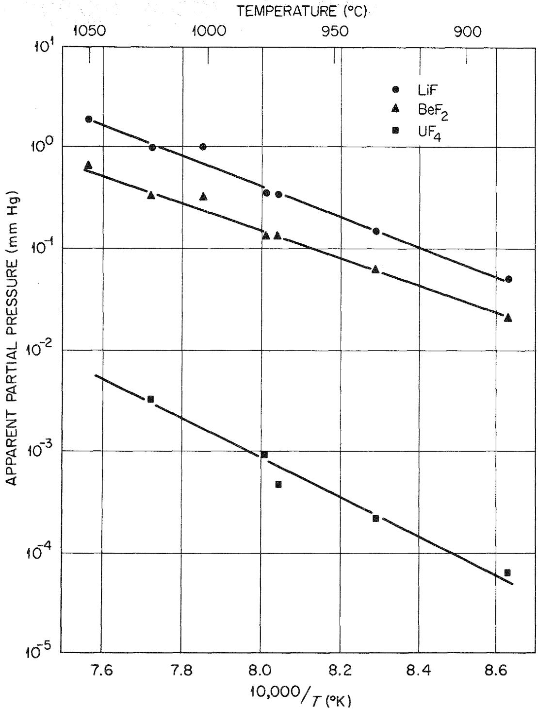
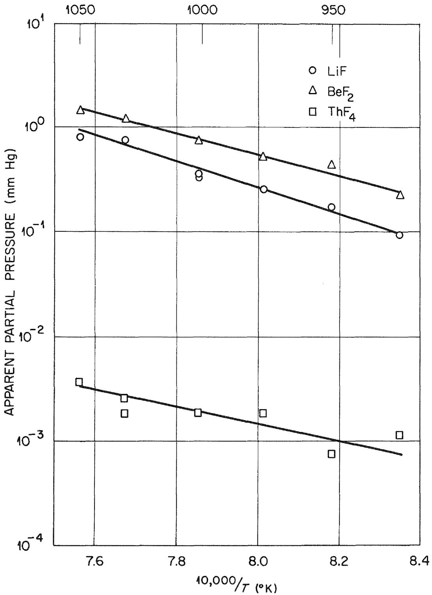

ORNL-4415

UC-80 - Reactor Technology

LIQUID-VAPOR EQUILIBRIA IN LiF-BeF $_2$

AND LiF-BeF $_2$ -ThF $_4$ SYSTEMS

F.J.Smith

L.M.Ferris

C. T. Thompson

OAK RIDGE NATIONAL LABORATORY

operated by

UNION CARBIDE CORPORATION

for the

U.S. ATOMIC ENERGY COMMISSION

# DISCLAIMER

This report was prepared as an account of work sponsored by an agency of the United States Government. Neither the United States Government nor any agency thereof, nor any of their employees, makes any warranty, express or implied, or assumes any legal liability or responsibility for the accuracy, completeness, or usefulness of any information, apparatus, product, or process disclosed, or represents that its use would not infringe privately owned rights. Reference herein to any specific commercial product, process, or service by trade name, trademark, manufacturer, or otherwise does not necessarily constitute or imply its endorsement, recommendation, or favoring by the United States Government or any agency thereof. The views and opinions of authors expressed herein do not necessarily state or reflect those of the United States Government or any agency thereof.

# DISCLAIMER

Portions of this document may be illegible in electronic image products. Images are produced from the best available original document.

Contract No. W-7405-eng-26

CHEMICAL TECHNOLOGY DIVISION

Chemical Development Section B

LIQUID-VAPOR EQUILIBRIA IN LiF-BeF $_2$ AND LiF-BeF $_2$ -ThF $_4$ SYSTEMS

F. J. Smith

L. M. Ferris

C. T. Thompson

LEGAL NOTICE

This report was prepared as an account of Government sponsored work. Neither the United States, nor the Commission, nor any person acting on behalf of the Commission:

A. Makes any warranty or representation, expressed or implied, with respect to the accuracy, completeness, or usefulness of the information contained in this report, or that the use of any information, apparatus, method, or process disclosed in this report may not infringe privately owned rights; or

B. Assumes any liabilities with respect to the use of, or for damages resulting from the use of any information, apparatus, method, or process disclosed in this report,

As used in the above, "person acting on behalf of the Commission" includes any employee or contractor of the Commission, or employee of such contractor, to the extent that such employee or contractor of the Commission, or employee of such contractor prepares, disseminates, or provides access to, any information pursuant to his employment or contract with the Commission, or his employment with such contractor.

JUNE 1969

OAK RIDGE NATIONAL LABORATORY

Oak Ridge, Tennessee

operated by

UNION CARBIDE CORPORATION

for the

U.S. ATOMIC ENERGY COMMISSION

# CONTENTS

Abstract 1

1. Introduction 1   
2. Experimental 2   
3. Results 6

3.1 Systems of Interest in Processing Two-Fluid MSBR Fuel 6   
3.2 Systems of Interest in Processing Single-Fluid MSBR Fuels 11

4. Conclusions 14   
5. References 15

# ABSTRACT

Liquid-vapor equilibrium data for several LiF-BeF $_2$ and LiF-BeF $_2$ -ThF $_4$ systems were obtained by the transpiration method over the temperature range of 900 to $1050^{\circ}\mathrm{C}$ . Relative volatilities, effective activity coefficients, and apparent partial pressures are tabulated for the major components, as well as for solutes such as UF $_4$ , ZrF $_4$ , CsF, RbF, and some rare-earth fluorides. The values are in reasonable agreement with those reported in the literature. Results of this study show that distillation may not be feasible as a primary separations method in the processing of single-fluid MSBR fuels.

# 1. INTRODUCTION

To be an efficient breeder, a molten-salt reactor must be close-coupled to a chemical processing facility to provide for the continuous removal of protactinium, fission products, and corrosion products from the system. The initial molten-salt breeder reactor (MSBR) concepts1,2 were based on the use of two fluids: a fuel salt composed of LiF-BeF2 (66-34 mole %) containing about 0.3 mole % UF4, and a blanket salt having the approximate composition LiF-BeF2-ThF4 (73-2-25 mole %). Recently,3 however, emphasis has been centered on a single-fluid MSBR that would utilize a salt such as LiF-BeF2-ThF4-UF4 (72-16-12-0.3 mole %). Considerable effort was expended on the development of a fluorination-distillation method4-7 for the processing of the fuel salt from a two-fluid MSBR. Fluorination was selected as the method for removing the uranium from the salt as UF6, and distillation was proposed as the means for separating the rare-earth fission products from the bulk of the LiF-BeF2 carrier salt. Results of batch distillation experiments by Kelly8 and experiments by Scott9 in a simple closed vessel with a "cold finger" to collect the vapor sample indicated that the rare-earth separation factors were about 100. More recent experiments by Cantor,10 who used the transpiration method, and by

Hightower and McNeese, $^{11}$ who used an equilibrium still, demonstrated that distillation is possible and reported rare-earth separation factors of about 1000. Prior to the present study, no experiments were conducted with LiF-BeF $_2$ -ThF $_4$ systems; hence, the applicability of distillation to the processing of single-fluid MSBR fuels could not be properly assessed.

This report summarizes the results of experiments in which the transpiration method of obtaining liquid-vapor equilibrium data was used in the temperature range of 900 to $1050^{\circ}\mathrm{C}$ . These experiments had three objectives: (1) to corroborate data obtained by the equilibrium still technique with two-fluid MSBR fuel salt, (2) to determine relative volatilities of other components of interest in two-fluid MSBR processing, and (3) to obtain sufficient data on $\mathrm{LiF - BeF_2 - ThF_4}$ systems to allow a preliminary evaluation of the applicability of distillation in the processing of single-fluid MSBR fuel.

Acknowledgments. - The authors are indebted to the following members of the ORNL Analytical Chemistry Division: the group of W. R. Laing for the colorimetric analyses for thorium and uranium; Marion Ferguson for the flame-photometric analyses for lithium and other alkali metals; and C. A. Pritchard for the emission-spectrographic analyses for beryllium, thorium, rare earths, and zirconium. Bulk quantities of LiF-BeF $_2$ and LiF-BeF $_2$ -ThF $_4$ of varying compositions were provided by the group of J. H. Shaffer of the ORNL Reactor Chemistry Division. We thank J. F. Land and C. E. Schilling for further purifying the small batches of salt used in the individual experiments.

# 2. EXPERIMENTAL

In using the transpiration method with molten salts, an inert (carrier) gas is passed over a molten salt (becoming saturated with the vapor in equilibrium with it), through a condenser where the salt vapors are deposited and collected, and, finally, through a Wet Test Meter where the total volume of inert gas used is determined. After the vapors have transpired for a known period of time at a given temperature,

the condenser is removed and the salt contained within is dissolved. Analyses of the solution, along with the pressure of the system and the volume of inert gas used, provide the information necessary for calculating apparent partial pressures of the components of the system.

The transpiration apparatus, shown schematically in Fig. 1, closely resembles that used by Sense et al. and Cantor. The basic components consisted of a 36-in.-long alumina tube contained in a 16-in.-long Marshall furnace. A nickel liner was placed inside the alumina tube to protect the alumina from corrosion by the fluoride vapors and to help "flatten" the temperature profile. The temperature profile of the Marshall furnace was adjusted by the use of shunts until the hottest region of the furnace was located exactly in the center and the maximum temperature variation (at $1000^{\circ}\mathrm{C}$ ) over the length of the nickel boat (used to contain the salt sample) was $5^{\circ}\mathrm{C}$ . The furnace temperature was controlled by a Wheelco "Capacitrol" time-proportional controller and a Chromel-Alumel thermocouple. The temperatures of the melt and vapor were measured by means of Chromel-Alumel thermocouples and a Brown recorder.

Salt samples (about $100\mathrm{g}$ ) of the desired composition were initially treated, in graphite containers, with $\mathsf{HF - H_2}$ mixtures at 850 to $900^{\circ}\mathsf{C}$ to remove oxide impurities; residual HF and $\mathsf{H}_2$ were stripped from the salt with high-purity argon. After being cooled to room temperature, each salt ingot was transferred (under argon) to the nickel boat, which was placed in the center of the Marshall furnace. The transpiration apparatus was heated (with argon flowing slowly) to the desired temperature. Then a condenser was inserted into the system, and transpired vapors were collected over a predetermined length of time.

Each condenser (made of 1/4-in.-diam nickel tubing) had a 1/32-in.-diam hole in the end that was in contact with the vapor phase above the salt sample. The carrier gas was high-purity argon that had been further purified by passage through a Molecular Sieve trap to remove water and through a heated $(450^{\circ}\mathrm{C})$ trap filled with metallic copper to remove oxygen. Removal and replacement of the condensers could be accomplished while the system remained at temperature; thus duplicate

  
Fig. 1. Cross Section of Transpiration Apparatus Used to Determine Relative Volatilities in Molten Salt Systems.

samples at a given temperature and/or a series of samples at different temperatures could be obtained using a single batch of salt. After a condenser was removed, its exterior was polished to remove surface contamination. The condenser was then cut into sections, and the salt contained within was recovered by leaching the sections with $1\text{N}\text{H}_2\text{SO}_4$ . Aliquots of the leachate were submitted for the desired analyses.

Apparent partial pressures were calculated from the following expression:

$$
P _ {A} = \frac {N _ {A} P}{N _ {A} + N _ {B} + \dots . N _ {n} + M},
$$

where

$\mathsf{P}_{\Delta} =$ the apparent partial pressure of species A,

$P =$ the total pressure of the vaporized salt and carrier gas,

$N_{A} =$ total moles of species A collected in the condenser, and

$M =$ total moles of carrier gas passed through the system.

This expression was derived by assuming that the behavior of each gas was ideal and that Dalton's law of partial pressures was applicable.

The transpiration method gives no direct information about the molecular formulas of the vapor species or about the total vapor pressure of the system. Therefore, it was assumed that each species existed as the monomer in the vapor phase. In using this method, the gas flow rate must be carefully controlled. If it is too high (i.e., greater than the rate at which evaporation occurs at the liquid surface), the carrier gas will not become saturated with vapor and the measured value of the vapor pressure will be low. If it is too low, thermal diffusion effects in the vapor phase will make the calculated value of $P_A$ too large. For the experimental apparatus described above, the measured vapor pressure of a typical salt was found to be independent of the argon flow rate in the range of 15 to 50 cc (STP)/min. Therefore, no correction was needed for diffusion or kinetic effects. Under the conditions used, no change in the composition of the liquid phase was detected during the course of an experiment.

# 3. RESULTS

# 3.1 Systems of Interest in Processing Two-Fluid MSBR Fuel

Data obtained for $\mathsf{LiF - BeF}_2$ and $\mathsf{LiF - BeF}_2$ -metal fluoride systems are given in Table 1. In the absence of any information regarding complex molecules in the vapor phase, the partial pressures of $\mathsf{LiF}$ , $\mathsf{BeF}_2'$ , and solute fluorides were calculated by assuming that only monomers existed in the vapor. In each experiment, the apparent partial pressures, $P_{A'}$ , could be described adequately by the linear expression

$$
\log P _ {A} (m m o f H g) = a - b / T (^ {\circ} K),
$$

in which $a$ and $b$ were constants over the temperature range investigated, 900 to $1050^{\circ}C$ . Typical plots of log $P$ vs $1 / T$ are shown in Figs. 2 and 3.

Other workers have expressed their vapor-liquid equilibrium data in terms of relative volatility, which is defined by:

$$
\alpha_ {A B} = \frac {y _ {A} / y _ {B}}{x _ {A} / x _ {B}},
$$

where $\alpha_{AB}$ is the relative volatility of component A with respect to component B, y is the mole fraction of the designated component in the vapor phase, and x is the mole fraction in the liquid phase. The relative volatilities of $\mathsf{BeF}_2$ (with respect to LiF) obtained in our experiments with $\mathsf{LiF - BeF}_2$ binary systems are in reasonable agreement with those reported by Cantor, $^{10,14}$ who also used the transpiration method. For example, Cantor obtained values of 4.28 for $\mathsf{LiF - BeF}_2$ (85-15 mole %) at $1000^{\circ}C$ and 3.75 for $\mathsf{LiF - BeF}_2$ (90-10 mole %); the corresponding values from the present study were about 3.8 and 3.77 (Table 1). Our value obtained with $\mathsf{LiF - BeF}_2$ (90-10 mole %) is somewhat lower than the average value of 4.71 reported by Hightower and McNeese, $^{11}$ who used an equilibrium still method, and is higher than our values obtained when the salt contained small amounts of $\mathsf{RbF}_x$ , $\mathsf{CsF}_x$ , $\mathsf{ZrF}_4$ (Table 1). This scatter in values is not surprising, however, because small variations in the composition of the liquid and/or vapor cause large changes in the relative volatility value. For

Table 1. Apparent Partial Pressures, Relative Volatilities, and Effective Activity Coefficients in LiF-BeF $_2$ -Metal Fluoride Systems   

<table><tr><td colspan="3">Salt Composition (mole %)</td><td rowspan="2">Species</td><td colspan="2">Apparent Partial Pressure,* log P (mm) = a - b/T (°K)</td><td rowspan="2">Effective Activity Coefficient at 1000°C</td><td rowspan="2">Relative Volatility, With Respect to LiF, at 1000°C</td></tr><tr><td>LiF</td><td>BeF2</td><td>Third Component</td><td>a</td><td>b</td></tr><tr><td>86</td><td>14</td><td></td><td>LiF</td><td>8.497</td><td>11,055</td><td>1.60</td><td></td></tr><tr><td></td><td></td><td></td><td>BeF2</td><td>7.983</td><td>10,665</td><td>4.42 × 10-2</td><td>3.82</td></tr><tr><td>90</td><td>10</td><td></td><td>LiF</td><td>7.604</td><td>10,070</td><td>1.30</td><td></td></tr><tr><td></td><td></td><td></td><td>BeF2</td><td>8.707</td><td>11,884</td><td>3.55 × 10-2</td><td>3.77</td></tr><tr><td>95</td><td>5</td><td></td><td>LiF</td><td>8.804</td><td>11,505</td><td>1.30</td><td></td></tr><tr><td></td><td></td><td></td><td>BeF2</td><td>11.510</td><td>15,303</td><td>4.33 × 10-2</td><td>4.60</td></tr><tr><td>90</td><td>10</td><td>UF4: 0.02</td><td>LiF</td><td>9.481</td><td>12,386</td><td>1.33</td><td></td></tr><tr><td></td><td></td><td></td><td>BeF2</td><td>9.339</td><td>12,411</td><td>5.96 × 10-2</td><td>6.19</td></tr><tr><td></td><td></td><td></td><td>UF4</td><td>4.361</td><td>12,481</td><td>7.36 × 10-3</td><td>2.9 × 10-2</td></tr><tr><td>89.6</td><td>9.9</td><td>UF4: 0.5</td><td>LiF</td><td>8.384</td><td>10,987</td><td>1.34</td><td></td></tr><tr><td></td><td></td><td></td><td>BeF2</td><td>7.421</td><td>10,112</td><td>4.65 × 10-2</td><td>4.78</td></tr><tr><td></td><td></td><td></td><td>UF4</td><td>6.686</td><td>13,443</td><td>1.09 × 10-2</td><td>4.2 × 10-2</td></tr><tr><td>86.4</td><td>9.6</td><td>UF4: 4.0</td><td>LiF</td><td>10.790</td><td>13,992</td><td>1.55</td><td></td></tr><tr><td></td><td></td><td></td><td>BeF2</td><td>10.177</td><td>13,726</td><td>3.84 × 10-2</td><td>3.42</td></tr><tr><td></td><td></td><td></td><td>UF4</td><td>10.272</td><td>16,786</td><td>1.25 × 10-2</td><td>4.2 × 10-2</td></tr><tr><td>90</td><td>10</td><td>RbF: 0.09</td><td>LiF</td><td>8.286</td><td>10,811</td><td>1.47</td><td></td></tr><tr><td></td><td></td><td></td><td>BeF2</td><td>6.596</td><td>10,552</td><td>3.11 × 10-2</td><td>2.93</td></tr><tr><td></td><td></td><td></td><td>RbF</td><td>5.187</td><td>8,907</td><td>2.19</td><td>24.7</td></tr><tr><td>89.9</td><td>10</td><td>CsF: 0.03</td><td>LiF</td><td>9.654</td><td>13,459</td><td>1.99</td><td></td></tr><tr><td></td><td></td><td></td><td>BeF2</td><td>8.310</td><td>11,313</td><td>4.07 × 10-2</td><td>2.82</td></tr><tr><td></td><td></td><td></td><td>CsF</td><td>0.819</td><td>3,375</td><td>1.17</td><td>95.1</td></tr><tr><td>90</td><td>10</td><td>ZrF4: 0.083</td><td>LiF</td><td>7.915</td><td>10,358</td><td>1.41</td><td></td></tr><tr><td></td><td></td><td></td><td>BeF2</td><td>7.167</td><td>10,070</td><td>2.83 × 10-2</td><td>2.77</td></tr><tr><td></td><td></td><td></td><td>ZrF4</td><td>13.095</td><td>20,382</td><td>3.05 × 10-4</td><td>2.19</td></tr></table>

*Temperature range: 900 to $1050^{\circ}\mathrm{C}$ . It was assumed that LiF, $\mathsf{BeF}_2$ , and the solute fluorides existed only as monomers in the vapor.

  
Fig. 2. Apparent Partial Pressure-Temperature Curves for the Systems $\mathsf{LiF - BeF}_2\mathsf{-RbF}$ (90-10.0-0.09 mole %) and $\mathsf{LiF - BeF}_2\mathsf{-ZrF}_4$ (90-10.0-0.083 mole %).

  
Fig. 3. Apparent Partial Pressure-Temperature Curves for the System LiF-BeF $_2$ -UF $_4$ (86.4-9.6-4.0 mole%).

example, it has been reported11 that $\mathsf{LiF - BeF}_2$ (66-34 mole %) is the vapor in equilibrium with $\mathsf{LiF - BeF}_2$ (90-10 mole %) at $1000^{\circ}\mathsf{C}$ . This gives a value for the relative volatility of $\mathsf{BeF}_2$ :

$$
\alpha = \frac {3 4 / 6 6}{1 0 / 9 0} = 4. 6 4.
$$

Another source13 has reported that the composition of the vapor in equilibrium with LiF-BeF2 (88-12 mole %) is LiF-BeF2 (67-33 mole %), corresponding to

$$
\alpha = \frac {3 3 / 6 7}{1 2 / 8 8} = 3. 6.
$$

Our partial pressure data for $\mathsf{LiF - BeF}_2$ systems are incompatible with some of the total pressure data presented by Cantor. He has reported the total pressure of $\mathsf{LiF - BeF}_2$ (90-10 mole %) to be $1.8\mathrm{mmHg}$ at $1000^{\circ}\mathrm{C}$ . For the same system at $1000^{\circ}\mathrm{C}$ , we obtained the approximate values $\mathsf{P}_{\mathsf{LiF}} = 0.55$ and $\mathsf{P}_{\mathsf{BeF}_2} = 0.23\mathrm{mmHg}$ , corresponding to a total pressure of $0.78\mathrm{mmHg}$ (assuming that no dissociation or association occurred in the vapor phase). The total pressure calculated from our transpiration data should have been higher than the actual total pressure because association in the vapor phase undoubtedly occurs. Association in the vapors above pure LiF has been noted, and complexation has been observed (by mass spectrometry) in the vapors above $\mathsf{LiF - BeF}_2$ solutions.

Effective activity coefficients, $\gamma_{A'}$ , were calculated for each component of the LiF-BeF $_2$ systems (Table 1). The activity coefficient for component A is given by:

$$
Y _ {A} = \frac {P _ {A}}{X _ {A} P _ {A} ^ {o}},
$$

where $X_A$ is the mole fraction of $A$ in the solution, $P_A$ is the apparent partial pressure of $A$ , and $P_A^0$ is the vapor pressure of pure $A$ . The activity coefficients obtained for $BeF_2$ are in good agreement with those reported by Kelly, who used distillation data and assumed the activity for LiF to be unity. Hightower and McNeese noted that the relative volatilities obtained experimentally for several rare earths were

very close to those calculated by assuming ideal solution behavior (Raoult's law; $\gamma = 1$ ). The results of the study presented in this report show that RbF and CsF also behave almost ideally; their activity coefficients are near unity (Table 1). Uranium tetrafluoride and $\mathsf{ZrF}_{4^{\prime}}$ on the other hand, do not behave ideally in solution; activity coefficients for these solutes were only $10^{-4}$ to $10^{-2}$ (Table 1). The vapor pressures, at $1000^{\circ}\mathsf{C}$ , of the pure fluorides of interest are given in the following table:

<table><tr><td>Component</td><td>Vapor Pressure at 1000°C (mm Hg)</td><td>Reference</td></tr><tr><td>LiF</td><td>0.47</td><td>17</td></tr><tr><td>BeF2</td><td>65.</td><td>18</td></tr><tr><td>ZrF4</td><td>4770</td><td>19</td></tr><tr><td>UF4</td><td>2.44</td><td>20</td></tr><tr><td>RbF</td><td>7.8</td><td>17</td></tr><tr><td>CsF</td><td>76</td><td>17</td></tr><tr><td>ThF4</td><td>0.0668</td><td>21</td></tr></table>

# 3.2 Systems of Interest in Processing Single-Fluid MSBR Fuels

Liquid-vapor equilibrium studies of several $\mathsf{LiF - BeF}_2\mathsf{-ThF}_4$ systems have been made to determine the feasibility of using certain distillation steps in the processing of single-fluid MSBR fuels. The data are summarized in Table 2. A typical partial-pressure--temperature plot is shown in Fig. 4. The partial pressures and the predicted total pressures were calculated assuming that only monomers existed in the vapor. Corrections for association in the vapor (known to occur in the vapor above pure LiF and $\mathsf{LiF - BeF}_2$ systems) would cause both the calculated partial pressures and the predicted total pressures to be lower.

In addition to the systems shown in Table 2, a limited amount of data was obtained with LiF-BeF $_2$ -ThF $_4$ -solute fluoride systems. Results obtained for the system LiF-BeF $_2$ -ThF $_4$ -LaF $_3$ (36.6-1.0-59.6-2.8 mole %) gave the following relative

Table 2. Apparent Partial Pressures, Relative Volatilities, and Effective Activity Coefficients in LiF-BeF ${}_{2}$ -ThF ${}_{4}$ Systems   

<table><tr><td colspan="3">Salt Composition (mole %)</td><td colspan="3">Vapor Composition at 1000°C (mole %)</td><td rowspan="2">Species</td><td colspan="2">Apparenta Partial Pressure a log P(mm) = A - B/T</td><td rowspan="2">Effective Activity Coefficient at 1000°C</td><td rowspan="2">Relative Volatility at 1000°C</td><td rowspan="2">Predicted Total b Pressure at 1000°C (mm Hg)</td></tr><tr><td>LiF</td><td>BeF2</td><td>ThF4</td><td>LiF</td><td>BeF2</td><td>ThF4</td><td>A</td><td>B</td></tr><tr><td>68</td><td>20</td><td>12</td><td>29</td><td>71</td><td>0.07</td><td>LiF</td><td>7.806</td><td>10,070</td><td>2.44</td><td>-</td><td>2.7</td></tr><tr><td></td><td></td><td></td><td></td><td></td><td></td><td>BeF2</td><td>9.194</td><td>11,349</td><td>0.146</td><td>8.27</td><td></td></tr><tr><td></td><td></td><td></td><td></td><td></td><td></td><td>ThF4</td><td>c</td><td>c</td><td>~0.25</td><td>~0.014</td><td></td></tr><tr><td>70.5</td><td>7.5</td><td>22</td><td>36.7</td><td>63.1</td><td>0.2</td><td>LiF</td><td>8.510</td><td>11,352</td><td>1.19</td><td>-</td><td>1.1</td></tr><tr><td></td><td></td><td></td><td></td><td></td><td></td><td>BeF2</td><td>7.801</td><td>10,112</td><td>0.14</td><td>16.2</td><td></td></tr><tr><td></td><td></td><td></td><td></td><td></td><td></td><td>ThF4</td><td>4.360</td><td>8,935</td><td>0.15</td><td>0.018</td><td></td></tr><tr><td>75.4</td><td>3.6</td><td>21</td><td>43.2</td><td>55.6</td><td>1.1</td><td>LiF</td><td>8.548</td><td>10,112</td><td>0.98</td><td>-</td><td>0.81</td></tr><tr><td></td><td></td><td></td><td></td><td></td><td></td><td>BeF2</td><td>7.480</td><td>9,984</td><td>0.19</td><td>27.1</td><td></td></tr><tr><td></td><td></td><td></td><td></td><td></td><td></td><td>ThF4</td><td>2.879</td><td>6,233</td><td>0.61</td><td>0.088</td><td></td></tr><tr><td>53.5</td><td>1.5</td><td>45</td><td>16.5</td><td>81.5</td><td>2.1</td><td>LiF</td><td>8.446</td><td>12,285</td><td>0.25</td><td>-</td><td>0.38</td></tr><tr><td></td><td></td><td></td><td></td><td></td><td></td><td>BeF2</td><td>d</td><td>d</td><td>~0.32</td><td>~177</td><td></td></tr><tr><td></td><td></td><td></td><td></td><td></td><td></td><td>ThF4</td><td>10.575</td><td>16,146</td><td>0.27</td><td>0.15</td><td></td></tr><tr><td>45</td><td>0.06</td><td>55</td><td>75.1</td><td>12</td><td>12.7</td><td>LiF</td><td>8.611</td><td>11,826</td><td>0.23</td><td>-</td><td>0.06</td></tr><tr><td></td><td></td><td></td><td></td><td></td><td></td><td>BeF2</td><td>d</td><td>d</td><td>~0.20</td><td>~120</td><td></td></tr><tr><td></td><td></td><td></td><td></td><td></td><td></td><td>ThF4</td><td>10.314</td><td>16,459</td><td>0.23</td><td>0.14</td><td></td></tr><tr><td>34</td><td>1.0</td><td>65</td><td>9.9</td><td>85.2</td><td>4.8</td><td>LiF</td><td>10.314</td><td>12,129</td><td>0.13</td><td>-</td><td>0.21</td></tr><tr><td></td><td></td><td></td><td></td><td></td><td></td><td>BeF2</td><td>d</td><td>d</td><td>~0.28</td><td>~293</td><td></td></tr><tr><td></td><td></td><td></td><td></td><td></td><td></td><td>ThF4</td><td>11.539</td><td>17,232</td><td>0.24</td><td>0.26</td><td></td></tr></table>

aTemperature range: 950 to $1050^{\circ}\mathrm{C}$ It was assumed that no association occurred in the vapor.   
bCalculated on the assumption that no association occurred in the vapor. Association, which undoubtedly occurs, would make the actual total pressure less than the value predicted here.   
The scatter in data points was too great for determination of these values.   
${}^{d}$ The ${\mathrm{{BeF}}}_{2}$ concentration in the liquid phase decreased too rapidly to allow determination of these values.

  
TEMPERATURE (°C)   
Fig. 4. Apparent Partial Pressure-Temperature Curves for the System LiF-BeF $_2$ -ThF $_4$ (70.5-7.5-22 mole%).

volatilities (with respect to LiF) at $1000^{\circ}\mathrm{C}$ : $\mathsf{BeF}_{2}, 37$ ; $\mathsf{ThF}_{4}, 0.25$ ; and $\mathsf{LaF}_{3}, 1.5 \times 10^{-3}$ . Data for the system $\mathsf{LiF}-\mathsf{BeF}_{2}-\mathsf{ThF}_{4}-\mathsf{CsF}-\mathsf{RbF}$ (33.0-0.66-63.1-1.36-1.98 mole %) yielded relative volatilities of about 100, 0.65, 3.7, and 1.0 for $\mathsf{BeF}_{2}, \mathsf{ThF}_{4}, \mathsf{CsF},$ and $\mathsf{RbF}$ , respectively, at $1000^{\circ}\mathrm{C}$ . The total pressure predicted for this system at $1000^{\circ}\mathrm{C}$ is less than 0.05 mm Hg. In contrast to the observation made with $\mathsf{LiF}-\mathsf{BeF}_{2}$ systems, the behavior of CsF and RbF was far from ideal. The effective activity coefficients for these two solutes were $3 \times 10^{-3}$ and $8 \times 10^{-3}$ , respectively. This marked departure from ideality is probably due to complexation of the alkali-metal fluorides with $\mathsf{ThF}_{4}$ . (Note that the $\mathsf{ThF}_{4}/\mathsf{LiF}$ mole ratio in this salt was rather high.) In another experiment at $1000^{\circ}\mathrm{C}$ with $\mathsf{LiF}-\mathsf{BeF}_{2}-\mathsf{ThF}_{4}-\mathsf{CsF}-\mathsf{RbF}$ (68-20-12-0.13-0.08 mole %), a salt having a much lower $\mathsf{ThF}_{4}/\mathsf{LiF}$ mole ratio, both CsF and RbF behaved much more ideally; the effective activity coefficients were 1.6 and 17, respectively. The corresponding relative volatilities (with respect to LiF) were 107 and 119. Data from a run with $\mathsf{LiF}-\mathsf{BeF}_{2}-\mathsf{ThF}_{4}-\mathsf{EuF}_{3}$ (42.4-0.06-51.8-5.8 mole %) yielded a relative volatility of about $9 \times 10^{-3}$ for $\mathsf{EuF}_{3}$ at $1000^{\circ}\mathrm{C}$ .

# 4. CONCLUSIONS

Measurements made with three different LiF-BeF $_2$ solutions indicated that a melt having the approximate composition LiF-BeF $_2$ (90-10 mole %) will, at $1000^{\circ}\mathrm{C}$ , be in equilibrium with vapor having the composition LiF-BeF $_2$ (66-34 mole %). The latter composition is that desired for the fuel salt for a two-fluid MSBR. The results of this study show that recovery of the UF $_4$ and most of the LiF and BeF $_2$ from the fuel salt of a two-fluid MSBR, leaving fission products such as the rare earths in the still-pot bottoms, is not possible in a single-stage distillation system because the volatility of the UF $_4$ is too low. The fluorides of the fission products cesium, zirconium, and rubidium have high relative volatilities, and would therefore concentrate in the distillate with the LiF and BeF $_2$ . Although the relative volatilities of the various components are different, a complicated multistage distillation system would be required to effect the desired separations. Thus, these results support the

original conclusion4 that distillation is best applied to the processing of two-fluid MSBR fuel salt after the uranium has been removed by fluorination.

The few results obtained with $\mathsf{LiF - BeF}_2\mathsf{-ThF}_4$ systems showed that the volatilities of both the rare-earth fluorides and $\mathsf{ThF}_4$ are low, even at $1000^{\circ}\mathsf{C}$ . It is possible that the rare-earth-thorium separation required in the processing of single-fluid MSBR fuels could be achieved by distillation; however, the results of this work indicate that the temperature required to achieve adequate distillation rates would have to be at least $1200^{\circ}\mathsf{C}$ . Thus, determination of relative volatilities for the rare-earth fluorides and $\mathsf{ThF}_4$ at temperatures above $1000^{\circ}\mathsf{C}$ will be required in order to assess the feasibility of utilizing distillation in the processing of single-fluid MSBR fuels.

# 5. REFERENCES

1. J. A. Lane, H. G. MacPherson, and F. Maslan, eds. Fluid Fuel Reactors, pp. 567-697, Addison-Wesley, Reading, Mass., 1958.   
2. P. R. Kasten et al., Design Studies of 1000-Mw(e) Molten Salt Breeder Reactors, ORNL-3996 (August 1966).   
3. M. W. Rosenthal, MSR Program Semiann. Progr. Rept. Feb. 29, 1968, ORNL-4254 (August 1968).   
4. C. D. Scott and W. L. Carter, Preliminary Design Study of a Continuous Fluorination-Vacuum Distillation System for Regenerating Fuel and Fertile Streams in a Molten Salt Breeder Reactor, ORNL-3791 (January 1966).   
5. D. E. Ferguson, Chem. Technol. Div. Ann. Progr. Rept., May 31, 1967, ORNL-4145 (October 1967).   
6. D. E. Ferguson, Chem. Technol. Div. Ann. Progr. Rept., May 31, 1968, ORNL-4272 (September 1968).   
7. L. E. McNeese, Considerations of Low Pressure Distillation and Its Application to Processing of Molten-Salt Breeder Reactor Fuels, ORNL-TM-1730 (March 1967).

8. W. R. Grimes, Reactor Chem. Div. Ann. Progr. Rept. Dec. 31, 1965, ORNL-3913 (March 1966), p. 37.   
9. D. E. Ferguson, Chem. Technol. Div. Ann. Progr. Rept. May 31, 1965, ORNL-3830 (November 1965), p. 301.   
10. W.R. Grimes, Reactor Chem. Div. Ann. Progr. Rept. Dec. 31, 1966, ORNL-4076 (March 1967), p. 26.   
11. J. R. Hightower and L. E. McNeese, Measurement of the Relative Volatilities of Fluorides of Ce, La, Pr, Nd, Sm, Eu, Ba, Sr, Y, and Zr in Mixtures of LiF and BeF $_2$ , ORNL-TM-2058 (January 1968).   
12. K. A. Sense, M. J. Snyder, and J. W. Slegg, J. Phys. Chem. 58, 223 (1954).   
13. W.R.Grimes, ORNL-3913, op.cit., p. 24.   
14. R. B. Briggs, MSR Program Semiann. Progr. Rept. Feb. 28, 1966, ORNL-3936 (June 1966), p. 128.   
15. R. S. Scheffee and J. L. Margrave, J. Chem. Phys. 31, 1682 (1959).   
16. W.R.Grimes, ORNL-4076, op.cit., p. 27.   
17. D.R. Stull, Ind. Eng. Chem. 39, 517 (1947).   
18. J. H. Simons, Fluorine Chemistry, Vol. V, Academic, New York, 1964, p. 20.   
19. K. A. Sense, M. J. Snyder, and R. B. Filbert, Jr., J. Phys. Chem. 58, 995 (1954).   
20. S. Langer and F. F. Blankenship, J. Inorg. Nucl. Chem. 14, 26 (1960).   
21. A. J. Darnell and F. J. Keneshea, Jr., Vapor Pressure of Thorium Tetrafluoride, NAA-SR-2710 (1958).

ORNL-4415

UC-80 - Reactor Technology

# INTERNAL DISTRIBUTION

1. Biology Library

2-4. Central Research Library   
5-6. ORNL - Y-12 Technical Library Document Reference Section

7-41. Laboratory Records Department   
42. Laboratory Records, ORNL R.C.   
43. J. L. Anderson   
44. C. F. Baes   
45. E. S. Bettis   
46. R. E. Blanco   
47. F. F. Blankenship   
48. C. M. Blood   
49. E. G. Bohlmann   
50. G. E. Boyd   
51. R. B. Briggs   
52. H. R. Bronstein   
53. R. E. Brooksbank   
54. S. Cantor   
55. W. L. Carter   
56. L. T. Corbin   
57. S. J. Cromer (K-25)   
58. D. J. Crouse   
59. F. L. Culler   
60. M. D. Danford   
61. S. J. Ditto   
62. W. P. Eatherly   
63. D. E. Ferguson   
64. L. M. Ferris   
65. S. H. Freid   
66. H. A. Friedman   
67. J. H Frye, Jr.   
68. W. R. Grimes   
69. A. G. Grindell   
70. W. O. Harms   
71. P. N. Haubenreich   
72. J. R. Hightower   
73. H. W. Hoffman   
74. P. R. Kasten   
75. M. E. Lackey   
80. H. G. MacPherson   
81. J. C. Mailen   
82. H. McClain   
83. H. E. McCoy   
84. L. E. McNeese   
85. A. S. Meyer   
86. R. E. Moore   
87. R. L. Moore   
88. D. M. Moulton   
89. E. L. Nicholson   
90. A. M. Perry   
91. J. T. Roberts   
92-93. M. W. Rosenthal   
94. C. E. Schilling   
95. Dunlap Scott   
96. J. H. Shaffer   
97. M. J. Skinner   
98-102. F. J. Smith   
103. D. A. Sundberg   
104. J. R. Tallackson   
105. R. E. Thoma   
106. C. T. Thompson   
107. W. E. Unger   
108. A. M. Weinberg   
109. J. R. Weir   
110. M. E. Whatley   
111. J. C. White   
112. R. G. Wymer   
113. Gale Young   
114. E. L. Youngblood   
115. P. H. Emmett (consultant)   
116. J. J. Katz (consultant)   
117. J. L. Margrave (consultant)   
118. E. A. Mason (consultant)   
119. R. B. Richards (consultant)

76. C. E. Larson   
77. J. J. Lawrance   
78.M.S.Lin   
79. M. I. Lundin

# EXTERNAL DISTRIBUTION

120. C. B. Deering, U.S. Atomic Energy Commission, RDT Site Office, ORNL   
121. A. Giambusso, U.S. Atomic Energy Commission, Washington   
123. T. W. McIntosh, U.S. Atomic Energy Commission, Washington   
124. H. M. Roth, U.S. Atomic Energy Commission, AEC, ORO

125. M. Shaw, U.S. Atomic Energy Commission, Washington   
126. W. L. Smalley, U.S. Atomic Energy Commission, ORO   
127. W. H. McVey, U.S. Atomic Energy Commission, Washington   
128. O. Roth, U.S. Atomic Energy Commission, Washington   
129. H. Schneider, U.S. Atomic Energy Commission, Washington   
130. W. H. Regan, U.S. Atomic Energy Commission, Washington   
131. L. J. Colby, Jr., U.S. Atomic Energy Commission, Washington   
132. J. A. Swartout, Union Carbide Corporation, New York, N.Y.

133-348. Given distribution as shown in TID-4500 under Reactor Technology category (25 copies - CFSTI)