ORNL-4434

UC-80 - Reactor Technology

LOW-PRESSURE DISTILLATION OF MOLTEN FLUORIDE MIXTURES: NONRADIOACTIVE TESTS FOR THE MSRE DISTILLATION EXPERIMENT

J.R.Hightower, Jr.

L. E. McNeese

OAK RIDGE NATIONAL LABORATORY

operated by

UNION CARBIDE CORPORATION

for the

U.S. ATOMIC ENERGY COMMISSION

Printed in the United States of America. Available from National Technical Information Service

U.S. Department of Commerce, Springfield, Virginia 22151  
Price: Printed Copy $3.00; Microfiche $0.65

This report was prepared as an account of work sponsored by the United States Government. Neither the United States nor the United States Atomic Energy Commission, nor any of their employees, nor any of their contractors, subcontractors, or their employees, makes any warranty, express or implied, or assumes any legal liability or responsibility for the accuracy, completeness or usefulness of any information, apparatus, product or process disclosed, or represents that its use would not infringe privately owned rights.

Contract No. W-7405-eng-26

CHEMICAL TECHNOLOGY DIVISION UNIT OPERATIONS SECTION

LOW-PRESSURE DISTILLATION OF MOLTEN FLUORIDE MIXTURES: NONRADIOACTIVE TESTS FOR THE MSRE DISTILLATION EXPERIMENT

J.R.Hightower,Jr. L.E.McNeese

# LEGAL NOTICE

This report was prepared as an account of work sponsored by the United States Government. Neither the United States nor the United States Atomic Energy Commission, nor any of their employees, nor any of their contractors, subcontractors, or their employees, makes any warranty, express or implied, or assumes any legal liability or responsibility for the accuracy, completeness or usefulness of any information, apparatus, product or process disclosed, or represents that its use would not infringe privately owned rights.

JANUARY 1971

OAK RIDGE NATIONAL LABORATORY

Oak Ridge, Tennessee

operated by

UNION CARBIDE CORPORATION

for the

U. S. ATOMIC ENERGY COMMISSION

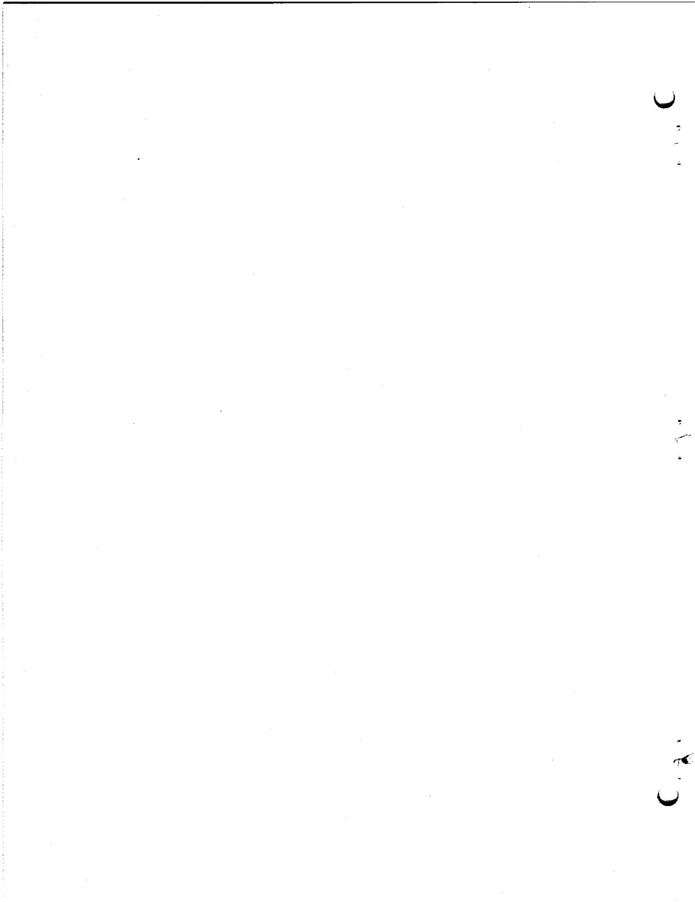

# CONTENTS

Page

ABSTRACT 1

1. INTRODUCTION 1   
2. EXPERIMENTAL EQUIPMENT 2

2.1 Process Equipment 2   
2.2 Instrumentation 5

2.2.1 Measurement and Control of Temperature 5   
2.2.2 Measurement and Control of Pressure 7   
2.2.3 Measurement and Control of Liquid Level. 8

3. OPERATING PROCEDURE. 10  
4. EXPERIMENTAL RESULTS 12

4.1 Measurement of Distillation Rates 15   
4.2 Measurement of the Degree of Separation of $\mathbf{NdF}_3$ from LiF-BeF $_2$ -ZrF $_4$ Carrier Salt. 21   
4.3 Difficulties. 29

5. CORROSION TESTS. 30   
6. POSTOPERATIONAL INSPECTION 34  
7. CONCLUSIONS. 35   
8. ACKNOWLEDGMENTS. 36   
9. REFERENCES 37

10. APPENDIXES 38

10.1 Appendix A. Derivation and Solution of Equations Describing Concentration Polarization. 39   
10.2 Appendix B. Drawings Showing Postoperational Wall-Thickness and Dimensional Measurements 46

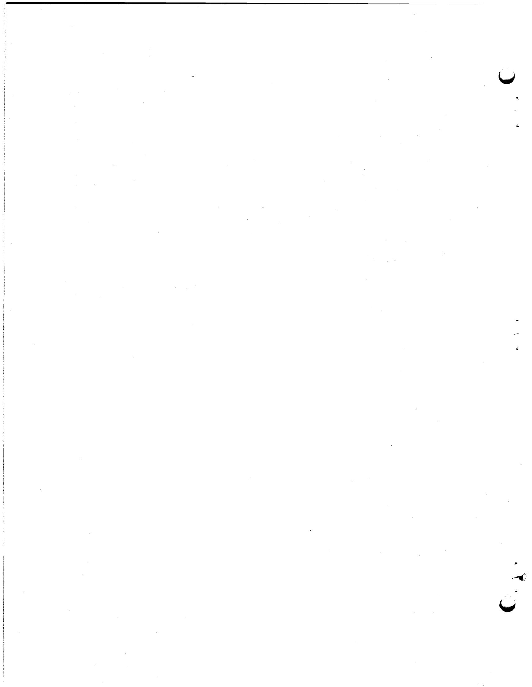

# LOW-PRESSURE DISTILLATION OF MOLTEN FLUORIDE MIXTURES: NONRADIOACTIVE TESTS FOR THE MSRE DISTILLATION EXPERIMENT

J. R. Hightower, Jr.

L. E. McNeese

# ABSTRACT

Equipment was designed and built to demonstrate the low-pressure distillation of a 48-liter batch of irradiated fuel salt from the Molten Salt Reactor Experiment. The equipment consisted of a 48-liter feed tank, a 12-liter, one-stage still reservoir, a condenser, and a 48-liter condensate receiver. The equipment was tested by processing six 48-liter batches of nonradioactive LiF-BeF $_2$ -ZrF $_4$ -NdF $_3$ (65-30-5-0.3 mole %) at a temperature of $1000^{\circ}\mathrm{C}$ .

A distillation rate of $1.5\mathrm{ft}^3$ of salt per day per square foot of vaporization surface was achieved in the nonradioactive tests. Evidences of concentration polarization and/or entrainment were noted in some runs but not in others. Automatic operation was easily maintained in each run, although certain deficiencies in the liquid-level measuring devices were noted. Condensation of volatile salt components in the vacuum lines and metal deposition in the feed line to the still pot are problems needing further attention. Since a postoperational inspection of the equipment showed essentially no dimensional changes, the equipment was judged to be satisfactory for use with radioactive material.

The results of these nonradioactive tests indicate that the application of distillation to MSBR fuel salt processing is feasible.

# 1. INTRODUCTION

Low-pressure distillation has potential application in the processing of salt from molten salt breeder reactors (MSBR's). In the single-fluid MSBR concept, distillation could be used to adjust the composition of the fuel salt for optimum removal of the lanthanides by reductive extraction or for partial recovery of valuable components from salt streams that are to be discarded. In the two-fluid MSBR concept,

distillation could be used to separate the slightly volatile lanthanide fluorides from the other components of the fuel carrier salt. A program to establish the feasibility of distillation of highly radioactive salt mixtures from molten salt reactors has been under way for about three years. The work has included the measurement of relative volatilities, with respect to LiF, of a number of components of interest, $^{1,2}$ as well as the operation of a relatively large, semicontinuous still with nonradioactive $\mathrm{LiF - BeF_2 - ZrF_4 - NdF_3}$ (65-30-5-0.3 mole %). The results obtained during the nonradioactive testing of the still are presented in this report.

The objectives of the nonradioactive tests described in this report were: (1) to test the distillation equipment to determine whether it would be suitable for use with radioactive salt, (2) to gain experience in the operation of large, low-pressure, high-temperature stills and to uncover unexpected areas of difficulty, (3) to measure distillation rates attainable in large equipment, and (4) to determine the extent to which concentration polarization and entrainment occur in this type of operation.

# 2. EXPERIMENTAL EQUIPMENT

# 2.1 Process Equipment

The equipment used in the nonradioactive tests included a 48-liter feed tank containing the salt to be distilled, a 12-liter still from which the salt was vaporized, a 10-in.-diam by 51-in.-long condenser, and a 48-liter condensate receiver. This equipment is described only briefly here; a complete description is available elsewhere.3

The feed tank, shown in Fig. 1, was a 15-1/2-in.-diam by 26-in.-tall right circular cylinder made from 1/4-in.-thick Hastelloy N. It was designed to withstand an external pressure of 15 psi at $600^{\circ}\mathrm{C}$ .

The condensate receiver, shown in Fig. 2, was a 16-in.-diam by 16-1/2-in.-tall right circular cylinder having sides of 1/4-in.-thick

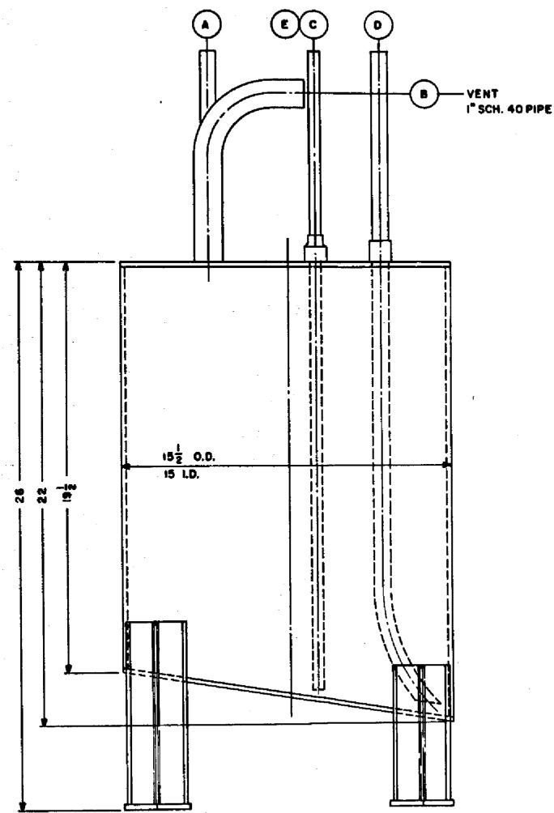  
ORNL DWG. 68-10983

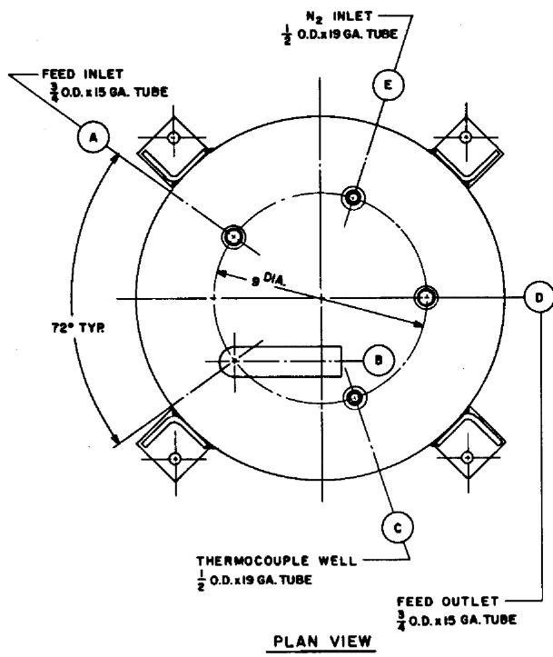  
Fig. 1. Molten-Salt Distillation Experiment: Schematic Diagram of the Feed Tank. Dimensions are given in inches.

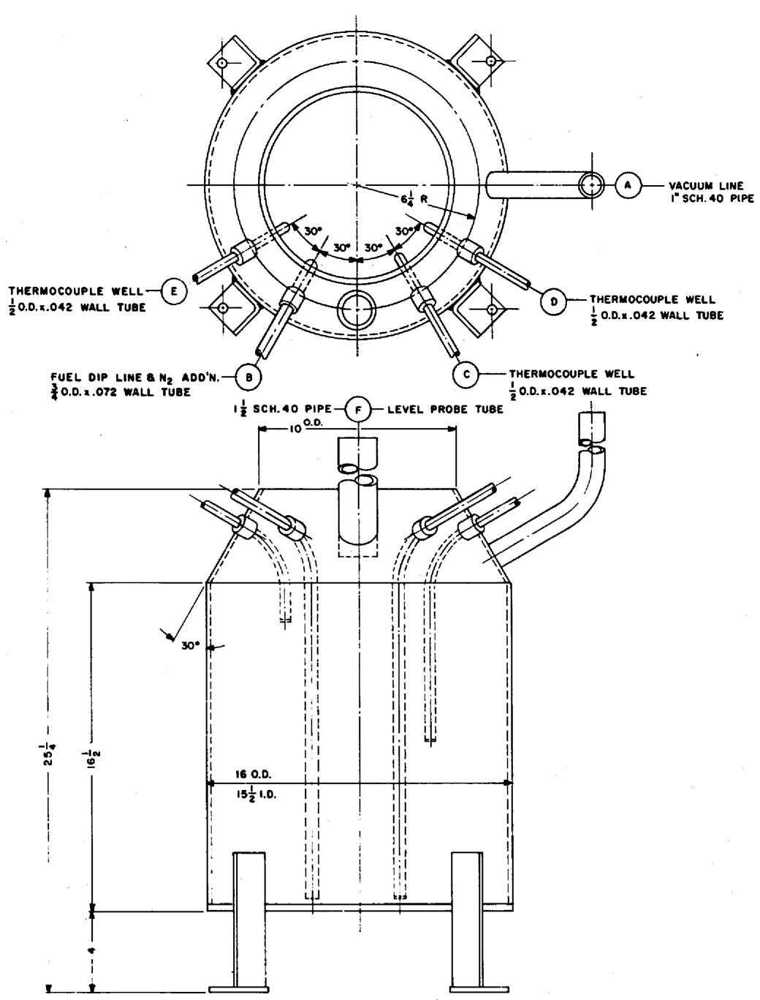  
ORNL DWG. 66-10984

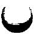  
Fig. 2. Molten-Salt Distillation Experiment: Schematic Diagram of the Condensate Receiver. Dimensions are given in inches.

Hastelloy N and a bottom of 3/8-in.-thick Hastelloy N. It was designed to withstand an external pressure of 15 psi at $600^{\circ}\mathrm{C}$ .

The still and condenser are shown in Fig. 3. The still pot consisted of an annular volume between the vapor line and the outer wall, and had a working volume of about 10 liters of salt. Both the still and the condenser were made of 3/8-in.-thick Hastelloy N and were designed for pressures as low as 0.05 to 1.5 torr*. The design temperature for the still pot and for the condenser was $982^{\circ}\mathrm{C}$ .

All valves and piping that did not contact the fluoride salts were made of stainless steel and were housed in a sealed steel cubicle which contained pressure transmitters and vacuum pumps. All other parts of the system were made of Hastelloy N. All-welded connections were used in the portion of the piping that was operated below atmospheric pressure.

# 2.2 Instrumentation

Correct operation of the molten salt distillation equipment depended entirely on measurements of temperature, pressure, and liquid level. The instrumentation used in making these measurements is discussed below.

# 2.2.1 Measurement and Control of Temperature

Temperatures were measured and controlled over two ranges: 500-600°C for the feed tank and condensate receiver, and 800-1000°C for the still and condenser. Platinum vs platinum-10% rhodium thermocouples were used for the high-temperature measurements, whereas less expensive Chromel-Alumel thermocouples were used on the feed tank, condensate receiver, and salt transfer lines. Each of the thermocouples (total, 48) was enclosed in a 1/8-in.-diam stainless steel sheath, and insulated junctions were used. Four 12-point recorders were available for readout: two for the Pt vs Pt-10% Rh thermocouples, and two for the Chromel-Alumel thermocouples.

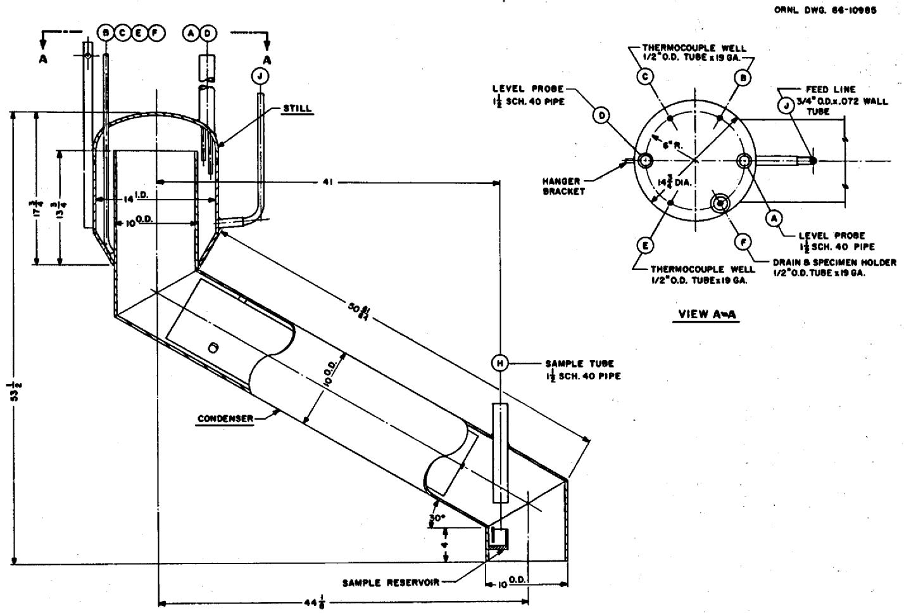  
Fig. 3. Molten-Salt Distillation Experiment: Schematic Diagram of the Vacuum Still and the Condenser. Dimensions are given in inches.

There were nine individually heated zones on the feed tank, still, condenser, and receiver. Heaters on each of these zones were independently controlled by a Pyrovane "on-off" controller, and the voltage to heaters in each zone was controlled by Variacs. Heaters on seven lines were manually controlled by "on-off" switches and Variacs.

# 2.2.2 Measurement and Control of Pressure

Pressure measurements over three ranges were required: 0-15 psia for monitoring the system pumpdown at the start of a run and for monitoring the system repressurization at the end of a run; 0-10 torr for suppressing vaporization while the salt was held at operating temperatures in the still; and 0-0.1 torr during distillation.

Absolute-pressure transducers (Foxboro D/P cells with one leg evacuated) covering the 0- to 15-psi range were used to measure the pressure in the feed tank and in the still-condenser-receiver complex. An MKS Baratron pressure measuring device with ranges of 0-0.003, 0-0.01, 0-0.03, 0-0.1, 0-0.3, 0-1, 0-3, and 0-10 torr was used to measure very low pressure in the condensate receiver.

The system pressure was controlled in the 0.1-10 torr range by feeding argon to the inlet of the vacuum pump. The Baratron unit produced the signal required for regulating the argon flow. Pressure was not controlled in the 0-0.1 torr range; instead, the argon flow to the vacuum pump inlet was stopped and the pump developed as low a pressure as possible (usually 0.05 to 0.1 torr).

It was necessary to ensure that an excessive internal pressure did not develop in the system since, at operating temperature, pressures in excess of 2 atm would have been unsafe. This was accomplished by using an absolute-pressure transmitter in the condenser off-gas line to monitor the system pressure. When the pressure exceeded 15 psia, the argon supply was shut off automatically.

# 2.2.3 Measurement and Control of Liquid Level

The pressure differential between the outlet of an argon-purged dip tube extending to the bottom of the vessel and the gas space above the salt was used to measure the salt level in the feed tank and in the condensate receiver.

Two conductivity-type level probes were used in the still for measuring and controlling the liquid level. These probes essentially measured the total conductance between the metal probes (that extended into the molten salt) and the wall of the still; the total conductance was a function of the immersed surface area of the probe.[4]

The conductivity probes (see Fig. 4) were similar to the single-point level probes that were used in the MSRE drain tanks. Tests have shown that the range of this type of instrument is limited to approximately $30\%$ of the length of the signal generating section because the signal, which is nonlinear, becomes extremely insensitive to changes in molten-salt level outside this range. A 6-in. sensing probe was used to control the liquid level between points that were 1 in. and 3 in. below the still pot overflow; a longer sensing probe was used to measure very low liquid levels in the still pot.

Metal disks were welded to the level probes to aid in their calibration. These disks provided abrupt changes in the immersed surface area of each probe at known liquid levels. In operation, the signal from a probe changed abruptly when the salt level reached one of the disks.

The still-pot liquid-level controller was a Foxboro Dynalog circular chart recorder-controller, which consists of a 1-kHz ac bridge-type measuring device using variable capacitance for rebalance. The proper control action (see Sect. 3) was accomplished by having a variable dead zone imposed on the set-point adjustment mechanism. With the controller set for the desired average liquid level, the argon supply valve to the feed tank was opened when the level indicator dropped $3\%$ below the set point and was closed when the level indicator rose $3\%$ above the set point.

ORNL-DWG 67-4776RI

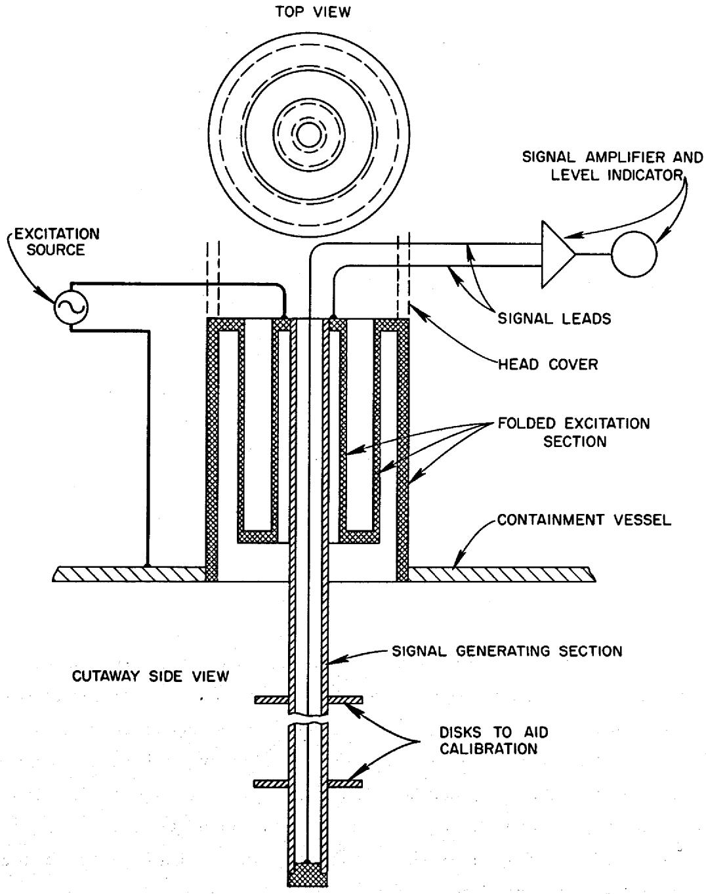  
Fig. 4. Simplified Schematic of Conductivity-Type Liquid-Level Probe Used to Measure Salt Level in the Still Pot.

# 3. OPERATING PROCEDURE

The following sequence of operations was followed during the distillation of a 48-liter batch of salt. First, the salt was charged to the feed tank from a delivery vessel through a temporary heated line. (This line was later disconnected, and the opening was sealed.) Then the still pot was heated to $900^{\circ}\mathrm{C}$ , and the system was evacuated to 5 torr. Subsequently, the valve between the feed tank and the vacuum pump was closed (see Fig. 5), and argon was introduced into the feed tank in order to increase the pressure to about 0.5 atm; this forced the salt to flow from the feed tank into the still pot. The condenser pressure was then reduced to 0.05-0.1 torr in order to initiate vaporization at an appreciable rate. At this point, control of the liquid level in the still pot was switched to the automatic mode. In this mode, salt was fed to the still pot at a rate slightly greater than the vaporization rate. The argon feed valve to the feed tank remained open (forcing more salt into the still pot) until the liquid level in the still rose to a given point; the valve then closed and remained in this position until the liquid level decreased to another set point. In this manner, the volume in the still pot was maintained at 8.5 to 9.5 liters.

As the salt vapor flowed through the condenser, heat was removed from the vapor by conduction through the condenser walls and the insulation, and by convection to the air. The condenser was divided into three heated zones, the temperature of which could be controlled separately when condensation was not occurring. Sharp temperature increases above the set points near the condenser entrance, and gradual increases near the end of the condenser, accompanied the beginning of distillation as the condenser pressure was decreased. Operation of heaters to keep the temperature of the condenser above the condensate liquidus temperature was not necessary during condensation.

The salt condensate drained through a sample cup at the end of the condenser (see Fig. 3) and flowed into the condensate receiver. Samples of condensate $(10\mathrm{g})$ were taken periodically by using a windlass

ORNL DWG 70-20

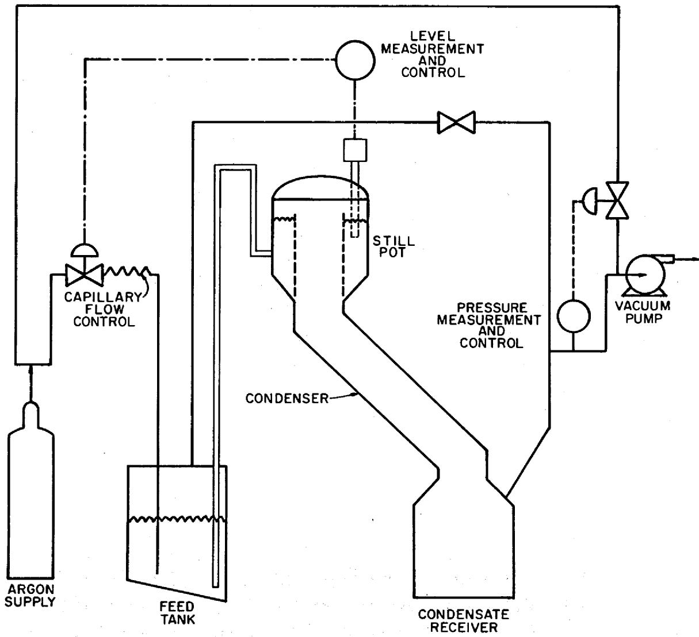  
Fig. 5. Flow Diagram of Molten-Salt Distillation-Experiment.

to lower a small copper ladle (i.e., the type used for the MSRE) through a 1-1/2-in. pipe into the sample cup. Figure 6 shows the sampler assembly that was installed directly above the sample cup at the condenser outlet. During sampling, the sample ladle was lowered into the sample cup filled with molten salt, and retracted into position above the flange. After the sample had cooled, it was removed for analysis by closing the lower valve and opening the flange.

After operation had proceeded for approximately 4 hr at $900^{\circ}\mathrm{C}$ , the temperature of the still pot was increased to $1000^{\circ}\mathrm{C}$ . Then distillation was continued until about 10 liters of salt remained in the feed tank. At this time, the condenser pressure was increased to $5\mathrm{mmHg}$ , which reduced the distillation rate to a negligible value. The salt remaining in the feed tank was then transferred to the still pot, causing some of the material already present in the still pot to overflow into the condenser. The resulting mixture in the still pot had a sufficiently low liquidus temperature that the still-pot temperature could be lowered to about $700^{\circ}\mathrm{C}$ without freezing the 4-liter salt "heel" remaining in the still pot (after most of the still-pot contents had been transferred to the feed tank).

Finally, the system pressure was increased to 1 atm. At this point, the run was complete.

# 4. EXPERIMENTAL RESULTS

The distillation experiments were performed in Bldg. 3541, which is specially equipped for containing experiments that involve large quantities of beryllium. Installation of the equipment was started on September 1, 1967, and the first 48-liter batch of salt was introduced into the system on December 14, 1967. During the approximate 6-month period from the date of salt introduction until June 18, 1968, when the experimental work was complete, six batches of salt were processed in the equipment. Results from the six runs are summarized in Table 1.

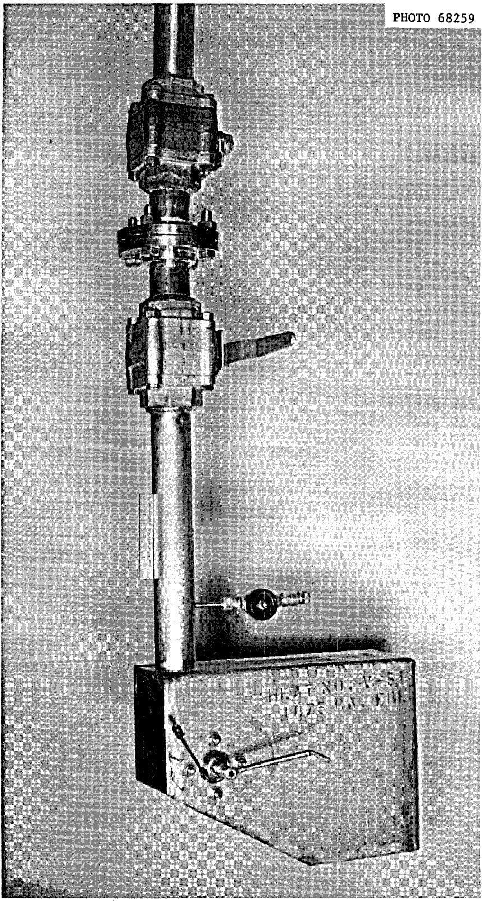  
Fig. 6. Photograph of Condensate Sampler Assembly.

Table 1. Summary of Nonradioactive Experiments with Molten-Salt Still   

<table><tr><td rowspan="2">Run No. (MSS-)</td><td rowspan="2">Dates</td><td colspan="2">Conditions</td><td rowspan="2">Feed Material</td><td rowspan="2">Volume of Salt Distilled (liters)</td><td rowspan="2">Time Required (hr)</td><td rowspan="2">Purpose</td><td rowspan="2">Remarks</td></tr><tr><td>Still Temp. (°C)</td><td>Condenser Pressure (torr)</td></tr><tr><td>C-1</td><td>2/5/68-2/9/68</td><td>990</td><td>0.06-0.5</td><td>LiF-BeF2-ZrF4(65-30-5 mole %)</td><td>35</td><td>83</td><td>To gain operating experience and to determine effect of condenser pressure on vaporization rate.</td><td></td></tr><tr><td>C-2</td><td>2/26/68-2/28/68</td><td>1005</td><td>0.07</td><td>LiF-BeF2-ZrF4(65-30-5 mole %)</td><td>32</td><td>40</td><td>Same as MSS-C-1.</td><td>Metallic deposit restricted salt feed line.</td></tr><tr><td>C-3</td><td>3/26/68-3/27/68</td><td>1004</td><td>0.075</td><td>LiF-BeF2-ZrF4-NdF3(65-30-5-0.3 mole %)</td><td>26.4</td><td>31</td><td>To investigate polarization and entrainment.</td><td></td></tr><tr><td>C-4</td><td>4/8/68-4/10/68</td><td>980-1020</td><td>0.065</td><td>Distilled salt from MSS-C-1</td><td>28</td><td>45</td><td>To determine the effect of temperature on vaporization rate.</td><td>ZrF4condensation in vacuum line resulted in abnormally low rates.</td></tr><tr><td>C-5</td><td>5/27/68-5/28/68</td><td>950-1025</td><td>0.06</td><td>LiF-BeF2-ZrF4-NdF3(65-30-5-0.3 mole %)</td><td>32</td><td>41</td><td>To determine the effect of temperature on vaporization rate.</td><td></td></tr><tr><td>C-6</td><td>6/11/68-6/13/68</td><td>1000</td><td>0.07</td><td>LiF-BeF2-ZrF4-NdF3(65-30-5-0.3 mole %)</td><td>32</td><td>53</td><td>To determine whether polarization becomes evident after long operating times.</td><td>ZrF4condensation in vacuum line stopped distillation. Heating the line to 950-1050°C removed the obstruction.</td></tr></table>

During the period of operation, the feed tank, the receiver, and the lower zones of the condenser were maintained at temperatures of 550 to $600^{\circ}\mathrm{C}$ for 185 days. A summary of the times during which the still pot was maintained at various temperatures ranging from 25 to $1025^{\circ}\mathrm{C}$ is given below:

<table><tr><td>25°C</td><td>12 days</td></tr><tr><td>500-650°C</td><td>56 days</td></tr><tr><td>750-875°C</td><td>110 days</td></tr><tr><td>900-1000°C</td><td>100 hr</td></tr><tr><td>1000-1005°C</td><td>160 hr</td></tr><tr><td>1005-1025°C</td><td>45 hr</td></tr></table>

In general, the performance of the equipment was satisfactory and all design criteria were met or surpassed. Distillation rates were higher than expected; automatic operation of the equipment was easily maintained in spite of certain difficulties with the still-pot level probes. These difficulties are discussed in Sect. 4.3. Air inleakage during normal operation was insignificant. All of the pneumatic components of the instrumentation system performed reliably, although the electronic components presented some problems.

# 4.1 Measurement of Distillation Rates

Distillation rates were determined by observing the rate of rise of liquid level in the condensate receiver. The measured rates and the operating conditions under which they were observed are summarized in Table 2.

The distillation rate is limited by friction losses in the passageway between the vaporization and condensation surfaces. The force that drives the vapor through this path is the difference between the vapor pressure of the liquid in the still pot and the pressure at the condenser outlet. Thus, the distillation rate can be increased either by increasing the temperature of the still pot (which, in turn, increases the salt vapor pressure) or by decreasing the condenser pressure since,

Table 2. Summary of Distillation Rate Measurements   

<table><tr><td>Run No. (MSS-)</td><td>Still-Pot Temperature (°C)</td><td>Condenser Pressure (torr)</td><td>Distillation Rate (ft3/ft2·day)</td></tr><tr><td>C-1</td><td>990</td><td>0.5</td><td>1.15</td></tr><tr><td>C-1</td><td>990</td><td>0.3</td><td>1.20</td></tr><tr><td>C-1</td><td>990</td><td>0.055</td><td>1.25</td></tr><tr><td>C-2</td><td>1005</td><td>0.07</td><td>1.50</td></tr><tr><td>C-3</td><td>1004</td><td>0.075</td><td>1.56</td></tr><tr><td>C-4</td><td>1020</td><td>0.065a</td><td>1.63</td></tr><tr><td>C-5</td><td>950</td><td>0.08</td><td>0.66</td></tr><tr><td>C-5</td><td>1000</td><td>0.08</td><td>1.21</td></tr><tr><td>C-5</td><td>1025</td><td>0.08</td><td>1.95</td></tr><tr><td>C-6</td><td>1000</td><td>0.08</td><td>1.40</td></tr></table>

${}^{a}$ This may not be the actual condenser pressure since a ${\mathrm{{ZrF}}}_{4}$ plug formed in the vacuum line during this run.

in each case, the driving force for the vapor flow has been increased. If the condenser pressure is very low with respect to the vapor pressure of the salt, the distillation rate should reflect the variation of salt vapor pressure with still-pot temperature. Figure 7 shows the effect of still-pot temperature on distillation rate for the runs in which the condenser pressure was below 0.1 torr. The distillation rate is expressed as cubic feet of salt distilled per day per square foot of vaporization surface.

A more useful correlation of distillation rate is one involving the condenser pressure and the vapor pressure of the salt, since this type of correlation could be used to estimate the performance of the still with other salt systems. Such a correlation is shown in Fig. 8. The vapor pressure of the salt $(p_1)$ was assumed to be the vapor pressure of 90-7.5-2.5 mole % LiF-BeF $_2$ -ZrF $_4$ , which is given in ref. 5. A mixture of this composition produces a vapor having a composition that is approximately

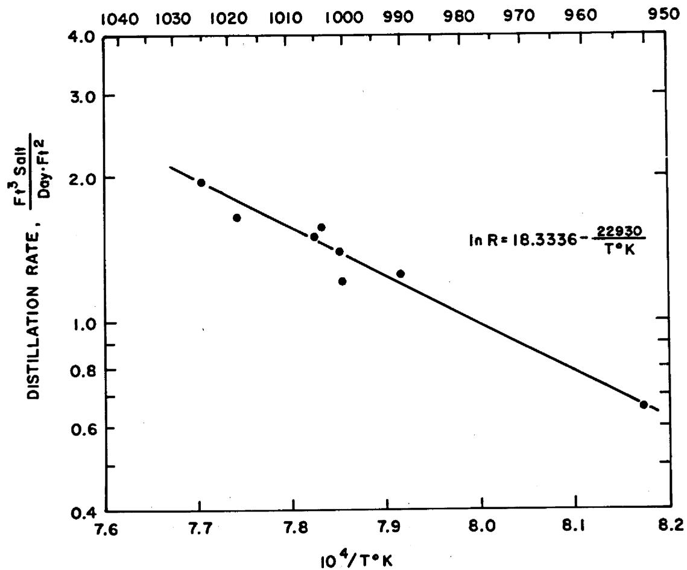  
TEMPERATURE, °C  
Fig. 7. Effect of Still-Pot Temperature on Distillation Rate for Runs in Which the Condenser Pressure Was Below 0.1 torr.

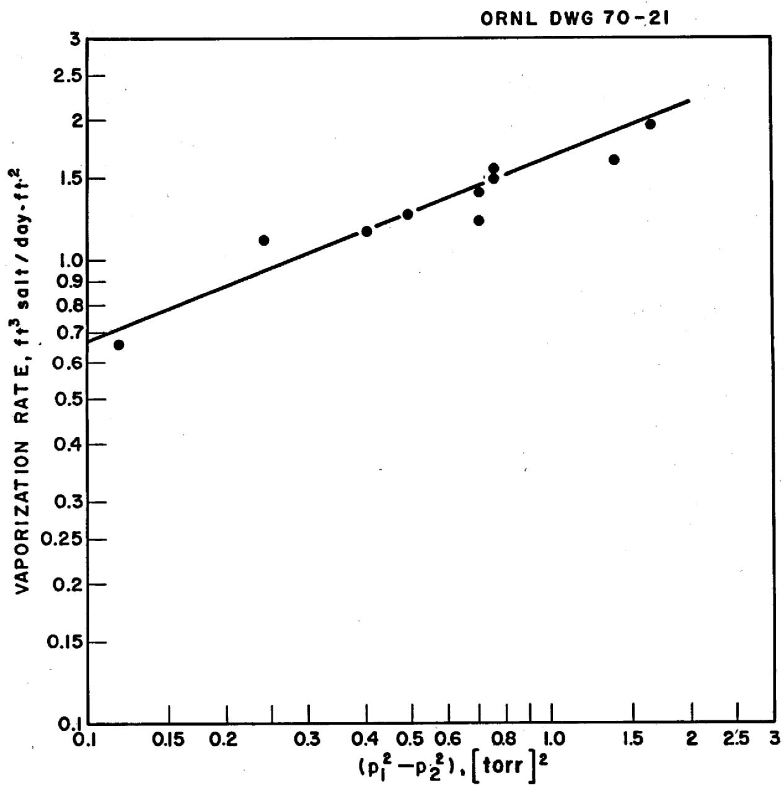  
Fig. 8. Dependence of Distillation Rate on Estimated Still-Pot Pressure $(p_1)$ and Pressure at End of Condenser $(p_2)$ .

65-30-5 mole % LiF-BeF $_2$ -ZrF $_4$ and hence should approximate the composition of the material in the still pot at steady state.

The correlation in Fig. 8 was thought to be applicable because a steady-state mechanical energy balance for the isothermal flow of an ideal gas through a conduit of constant cross section shows that the flow of gas is a function of the difference between the squares of the upstream and downstream pressures. This can be seen from the following development. A steady-state mechanical energy balance for a flowing fluid yields:

$$
v d v + \frac {1}{\rho} d p + \frac {2 v ^ {2} f}{D} d Z = 0, \tag {1}
$$

where $\mathbf{v} =$ velocity of fluid,

$\rho =$ density,

$\mathbf{p} =$ pressure,

$f =$ Fanning friction factor,

D = diameter of duct,

Z = distance along duct.

By assuming that the fluid is an ideal gas, that is,

$$
\rho = \mathrm {p M} / \mathrm {R T}, \tag {2}
$$

where $\mathbf{T} =$ absolute temperature,

M = molecular weight of the gas,

R = gas constant,

and by using the macroscopic mass balance equation which requires that

$$
\rho v = \left(\rho_ {1} v _ {1}\right), \tag {3}
$$

where the subscript 1 refers to the entrance to the duct, Eq. (1) becomes:

$$
- \frac {1}{P} d p + \frac {R T}{M} \frac {p d p}{\left(p _ {1} v _ {1}\right) ^ {2}} + \frac {2 f d Z}{D} = 0. \tag {4}
$$

Since the friction factor, $f$ , depends only upon the Reynolds number (which would be constant for an ideal gas at constant temperature), Eq. (4) can be integrated between the entrance to the duct (point 1) and the end of the duct (point 2) to yield:

$$
- \ln \frac {p _ {2}}{p _ {1}} + \frac {1}{2} \left[ \left(\frac {p _ {2}}{p _ {1}}\right) ^ {2} - 1 \right] \frac {\mathrm {R T}}{\mathrm {M v} _ {1} ^ {2}} + \frac {2 f \mathrm {L}}{\mathrm {D}} = 0, \tag {5}
$$

where $L$ is the length of duct. By solving Eq. (5) for $v_{1}$ and multiplying it by $\rho_{1}$ , the following expression for the mass flow rate is obtained:

$$
G = \sqrt {\frac {M}{2 R T}} \frac {\sqrt {\left(p _ {1} ^ {2} - p _ {2} ^ {2}\right)}}{\sqrt {\frac {2 f L}{D} - 1 n \left(\frac {p _ {2}}{p _ {1}}\right)}}. \tag {6}
$$

This expression shows the dependence of mass flow rate on the difference between the squares of the upstream and downstream pressures.

Although the temperature was not constant and the cross section of flow was not uniform in the runs made to measure distillation rates (Table 2), a fair correlation of all the data was obtained (see Fig. 8). The calculated vapor pressure of the salt, $p_1$ , ranged from 0.70 to 1.28 torr, and the measured condenser pressure, $p_2$ , ranged from 0.055 to 0.5 torr. The results suggested that an exponent of 0.41 might fit the expression for mass flow rate somewhat better than the value of 0.5 suggested by Eq. (6); this discrepancy is probably the result of not including the logarithmic term in the correlation.

# 4.2 Measurement of the Degree of Separation of $\mathsf{NdF}_3$ from LiF-BeF $_2$ -ZrF $_4$ Carrier Salt

In three runs (MSS-C-3, -5, and -6), a number of condensate samples were taken and were analyzed for all salt components to determine the effectiveness of the still for separating $\mathrm{LiF - BeF_2 - ZrF_4}$ carrier salt from $\mathrm{NdF}_3$ , which is representative of the lanthanide fission products. The ease with which $\mathrm{NdF}_3$ can be separated from the carrier salt is conveniently expressed in terms of the relative volatility of $\mathrm{NdF}_3$ with respect to the least volatile carrier salt component, LiF. The relative volatility of $\mathrm{NdF}_3$ with respect to LiF is defined as:

$$
\alpha \equiv \frac {\mathrm {y} _ {\mathrm {N d F} _ {3}} ^ {*} / \mathrm {x} _ {\mathrm {N d F} _ {3}} ^ {*}}{\mathrm {y} _ {\mathrm {L i F}} ^ {*} / \mathrm {x} _ {\mathrm {L i F}} ^ {*}}, \tag {7}
$$

where $\mathbf{y}_{\mathrm{NdF}_3}^*$ and $\mathbf{y}_{\mathrm{LiF}}^*$ are the mole fractions of $\mathrm{NdF}_3$ and LiF, in vapor which is in equilibrium with liquid containing $\mathbf{x}_{\mathrm{NdF}_3}^*$ and $\mathbf{x}_{\mathrm{LiF}}^*$ mole fractions of $\mathrm{NdF}_3$ and LiF, respectively. The asterisks emphasize that the concentrations are to be measured under equilibrium conditions. Relative volatilities for the other components of the system are defined similarly. Separation of a component from LiF by distillation is possible if the relative volatility of the component with respect to LiF is not equal to 1; the separation becomes easier as the deviation of the relative volatility from 1 increases. The relative volatility of $\mathrm{NdF}_3$ with respect to LiF has a value of $1.4 \times 10^{-4}$ , which indicates that these two components could be separated easily in a still that is equivalent to a single equilibrium stage. In practice, a single physical stage (such as the still which was operated in this study) may not be equivalent to an equilibrium stage because of entrainment, concentration polarization, or other factors.

In assessing the effectiveness of a still, it is convenient to define an effective relative volatility that reflects nonequilibrium conditions present during the still operation, as follows:

$$
\alpha_ {\mathrm {O B S}} \equiv \frac {\mathrm {y} _ {\mathrm {N d F} _ {3}} / \mathrm {x} _ {\mathrm {N d F} _ {3}} (\mathrm {a v g})}{\mathrm {y} _ {\mathrm {L i F}} / \mathrm {x} _ {\mathrm {L i F}} (\mathrm {a v g})}, \tag {8}
$$

where the y's are mole fractions determined from condensate analyses and the x's are mole fractions in the still pot averaged over the entire still-pot volume. The performance of the still can be judged by the ratio of the effective relative volatility $(\alpha_{\mathrm{OBS}})$ to the relative volatility $(\alpha)$ , which will be denoted as R. Then the deviation of R from l is a measure of the deviation from equilibrium conditions in the still.

The quantity R may deviate from 1 because of several reasons, including: (1) concentration gradients in the still-pot liquid (concentration polarization), (2) entrainment of droplets of still-pot liquid into the vapor leaving the still pot, or (3) contamination of the condensate samples by small amounts of material having high $\mathrm{NdF}_3$ concentrations. These possibilities are discussed below.

Entrainment of small amounts of still-pot liquid into the vapor leaving the still pot would cause the observed concentration of $\mathrm{NdF}_3$ in the vapor to be much higher than the equilibrium concentration. This, in turn, would cause the value of R to be greater than 1. In the absence of concentration polarization or other effects, a material balance gives the following relationship between the value of R and the fraction of the condensate that is entrained liquid:

$$
R = \frac {1 + \frac {f}{\alpha} \left(\frac {x _ {L i F}}{y _ {L i F}}\right)}{1 + f \left(\frac {x _ {L i F}}{y _ {L i F}}\right)}, \tag {9}
$$

where $f =$ moles of entrained liquid per mole of vaporized material,

$$
\begin{array}{l} x _ {l i F} = \text {m o l e f r a c t i o n o f L i F i n t h e l i q u i d}, \\ y _ {L i F} = \text {m o l e f r a c t i o n o f L i F i n t h e v a p o r ,} \\ \alpha = \text {r e l a t i v e} \mathrm {N d F} _ {3}, \text {w i t h} \text {r e s p e c t} \text {t o} \mathrm {L i F}, \text {a t} \text {e q u i l i b r i u m}, \text {a s g i v e n b y E q . (7)}. \\ \end{array}
$$

For the present system, the value of the $\mathbf{x}_{\mathrm{LiF}} / \mathbf{y}_{\mathrm{LiF}}$ ratio is about 1.6. With this value for the ratio, entrainment of only 0.001 mole of liquid per mole of vapor would result in a value of about 12 for R.

Concentration polarization would also cause R to have a value greater than 1. This can be explained as follows. As the more-volatile materials are vaporized from the surface, the $\mathrm{NdF}_3$ , which is only slightly volatile, is left behind. Thus, the $\mathrm{NdF}_3$ will have a higher concentration at the surface than in the bulk of the liquid. In turn, the concentration of the slightly volatile $\mathrm{NdF}_3$ will gradually increase in the vapor since further vaporization occurs from liquid with successively higher $\mathrm{NdF}_3$ concentrations. Hence, the concentration of $\mathrm{NdF}_3$ in the vapor will be higher than would be the case under equilibrium conditions, and R will have a value greater than 1.

The extent to which R deviates from l because of concentration polarization depends on the dimensionless group D/vL, which qualitatively represents the ratio of the rate of diffusion of slightly volatile $\mathrm{NdF}_3$ away from the liquid-vapor interface to the rate at which this material is transferred to the interface by convection. In the dimensionless group, D is the effective diffusivity of $\mathrm{NdF}_3$ in the liquid and is a measure of the amount of mixing in the liquid, v is the average velocity of the liquid moving toward the interface, and L is the distance between the vaporization surface and the point at which feed is introduced. As the value of this group increases, the value of R will approach 1, as shown in Fig. 9. The method for calculating these curves is given in Appendix A.

Contamination of the condensate samples by small amounts of material containing high concentrations of $\mathrm{NdF}_3$ could also result in R values greater than 1. Contamination of the samples during analysis is not considered likely. However, it is possible that salt having a high liquidus temperature and a high $\mathrm{NdF}_3$ concentration could have remained on the condenser wall after the still-pot flushing operation (see Sect. 3) at the end of runs MSS-C-3 through MSS-C-6. If this had been the case, the material would have been washed from the condenser walls during the following run and would have contaminated the condensate samples.

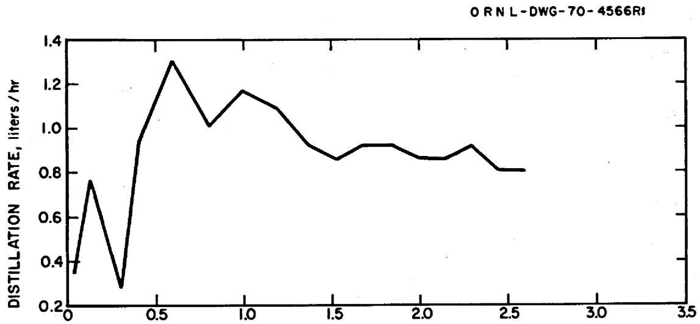

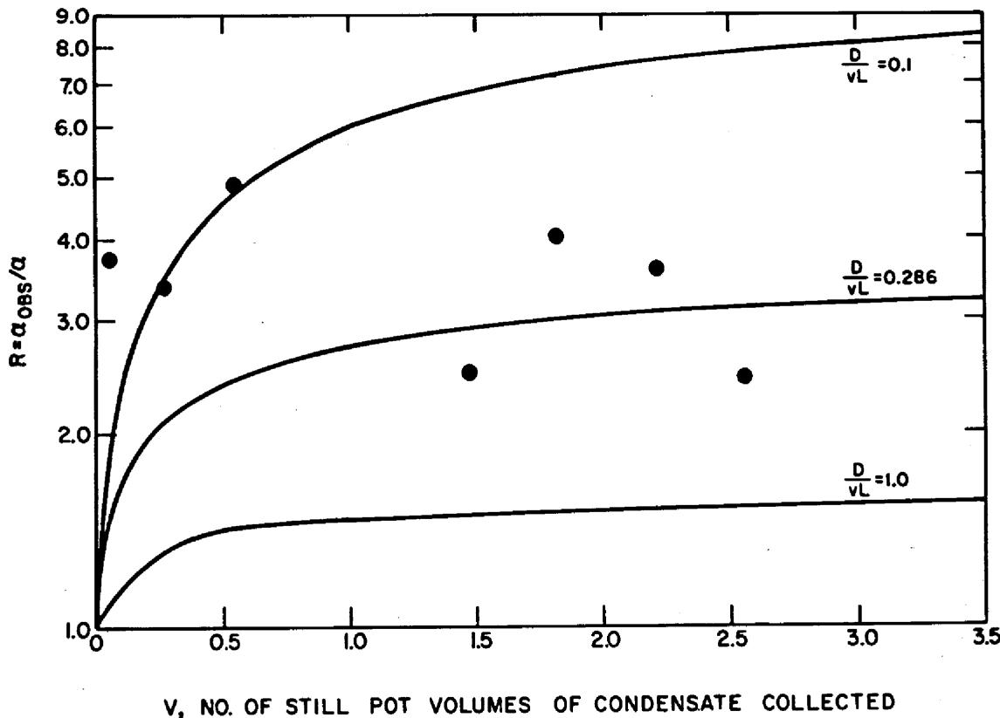  
Fig. 9. Distillation Rate and Ratio of the Observed Relative Volatility to the Actual Relative Volatility of $\mathsf{NdF}_3$ with Respect to LiF, as Measured in Run MSS-C-3.

Experimental values for $\mathrm{NdF}_3$ concentrations in the condensate do not enable one to distinguish unambiguously between concentration polarization and entrainment; however, they do allow assessment of the importance of these effects if the level of condensate contamination is not too great.

Figures 9 through 11 show calculated R values for runs MSS-C-3, -C-5, and -C-6, respectively. In calculating R, the values of $\alpha_{\mathrm{OBS}}$ were calculated from Eq. (7), using analyses of the condensate samples. The values for y were measured values; the values for $\mathbf{x}_{\mathrm{NdF}_3(\mathrm{avg})}$ were calculated from a material balance on $\mathrm{NdF}_3$ in the still pot in which it was assumed that a negligible amount of $\mathrm{NdF}_3$ was removed in the vapor. The value of $\mathbf{x}_{\mathrm{LiF(avg)}}$ was estimated by calculating the liquid composition in equilibrium with the measured vapor compositions, assuming that the relative volatilities (with respect to LiF) of $\mathrm{BeF}_2$ and $\mathrm{ZrF}_4$ were 4.7 and 10.9, respectively. The relative volatility for $\mathrm{BeF}_2$ was obtained from measurements made in small recirculating equilibrium stills. $^1$ The relative volatility for $\mathrm{ZrF}_4$ was measured in run MSS-C-1 and is probably only valid for a still-pot composition of 65-30-5 mole % $\mathrm{LiF - BeF}_2 - \mathrm{ZrF}_4$ . Also shown in these figures is the variation of distillation rate with time during each of the three runs.

Values of the group D/vL which best represented the calculated R values from each of the runs (Figs. 9-11) were chosen by trial and error by assuming that any deviation of R from l was caused entirely by concentration polarization. As seen in Fig. 9, a value of 0.286 for D/vl was found to generate a smooth curve that best represented the measured R values in run MSS-C-3. Contamination of the condensate was not possible in this run since no $\mathrm{NdF}_3$ had been used in the previous run. In run MSS-C-5, the increase in the R values when the distillation rate was suddenly increased was most closely represented by the assumption that D/vL changed from 0.227 to 0.0215 when the rate increased. The low initial R values indicate that contamination of the condensate from material on the condenser walls was not important during this run.

In run MSS-C-6, the last six experimental points correspond to a value of 0.051 for D/vL. There appears to be no straight-forward explanation for the high values of R observed in the first four samples taken during

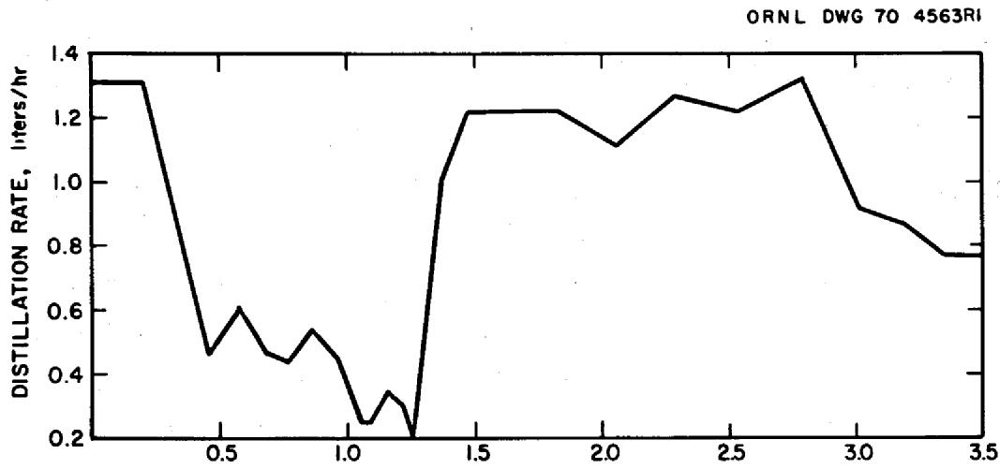

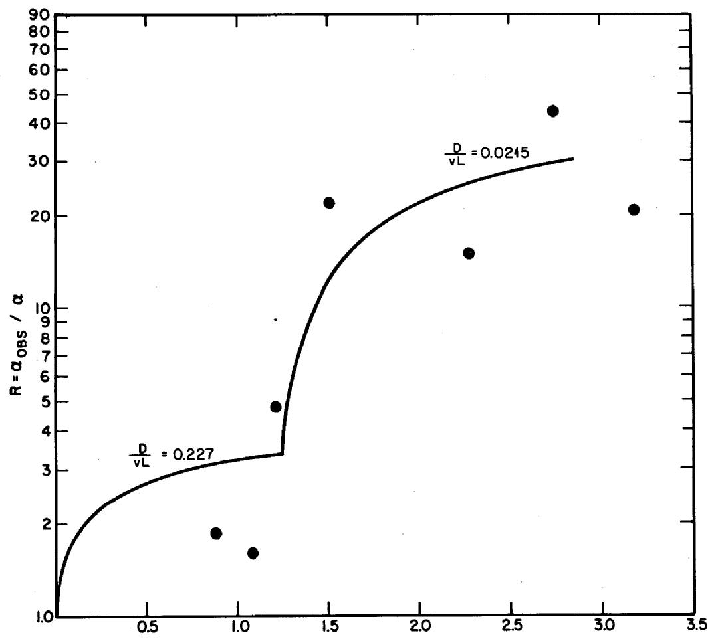  
V, NO. OF STILL-POT VOLUMES OF CONDENSATE COLLECTED   
Fig. 10. Distillation Rate and Ratio of the Observed Relative Volatility to the Actual Relative Volatility of $\mathsf{NdF}_3$ with Respect to LiF, as Measured in Run MSS-C-5.

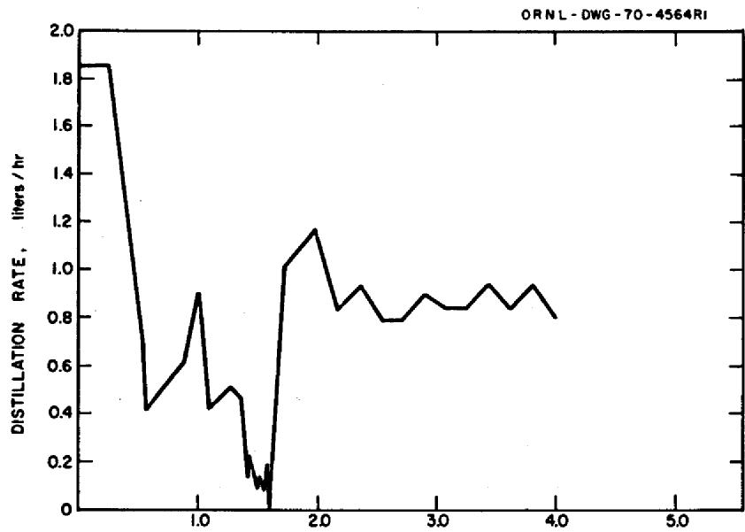

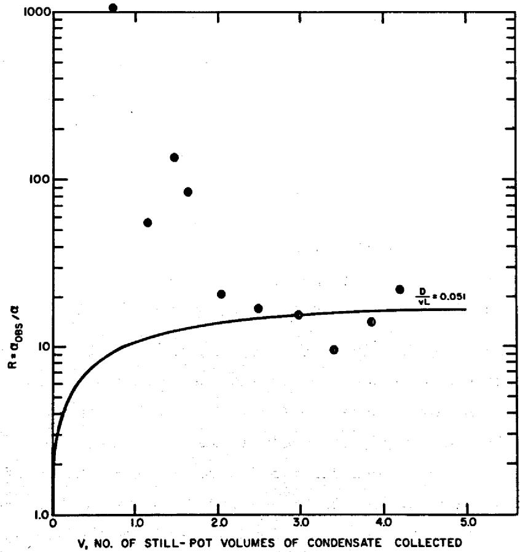  
Fig. 11. Distillation Rate and Ratio of the Observed Relative Volatility to the Actual Relative Volatility of $\mathsf{NdF}_3$ with Respect to LiF, as Measured in Run MSS-C-6.

this run. The value of R was about 1000 in the first sample (0.8 still-pot volume distilled) and decreased thereafter. The vaporization rate was very high initially and may have caused both concentration polarization and entrainment. If we assume that the high R value in the first sample was the result of concentration polarization only, the effective diffusivity in the still-pot liquid would be $3.4 \times 10^{-6} \, \text{cm}^2/\text{sec}$ , which is an order of magnitude lower than reported values of molecular diffusivities in molten salt at temperatures less than $750^{\circ}\text{C}$ . Thus, concentration polarization alone cannot account for the high R values observed. Of course, it is possible that these high values resulted from contamination of the condensate. If salt with a high liquidus temperature and a high $\text{NdF}_3$ concentration had remained on the condenser walls after the contents of the still pot were flushed out at the end of run MSS-C-5, this material would have been washed into the sample reservoir early in run MSS-C-6.

Values were calculated for the effective diffusivity in the still-pot liquid by using values of the group D/vL given above and values for v and L. Values for the average velocity (v) were determined from distillation rates, whereas those for the distance (L) between the feed inlet and the liquid surface in the still pot were known. The range of diffusivity values was $1.4 \times 10^{-4}$ to $16 \times 10^{-4}$ cm²/sec; these values are one to two orders of magnitude greater than reported values of molecular diffusivities in molten salts and are equivalent to those which would be expected if convective mixing were occurring in the still pot.

It is considered likely that concentration polarization and/or entrainment effects were observed during the operation of the still, although contamination of the samples with $\mathrm{NdF}_3$ from the condenser walls prevents one from drawing firm conclusions. There were some periods of operation in the experiments described here in which these effects were within tolerable limits (in run MSS-C-3, R was never higher than 5, and in the early part of the run MSS-C-5, R was also below 5); thus there is evidence that, by careful equipment design and proper choice of operating conditions, concentration polarization and entrainment can be held to acceptable levels. Further investigation would be required to determine the proper operating conditions and equipment design.

# 4.3 Difficulties

Surprisingly few operational problems were experienced during the experimental program. However, certain significant difficulties were encountered, as discussed below.

The condensation of $\mathrm{ZrF}_4$ and unidentified molybdenum compounds obstructed the vacuum line on two occasions. The first restriction occurred during the fourth run and was removed by cutting into the vacuum line; the second restriction occurred during the last run and was removed by heating the vacuum line to $950 - 1050^{\circ}\mathrm{C}$ , thereby redistributing the material. Analysis of the material from the first deposit showed it to contain $39.4\%$ zirconium and $11.6\%$ molybdenum, with fluoride and oxide being the major anions.

During the second run, the salt feed line to the still became obstructed. After the run had been completed, the line was cut and a 5- to 10-g metallic deposit, consisting mainly of nickel and iron, was found at the point where the feed line entered the still. This line was replaced, and the still was operated for four additional runs. At the end of the series of experiments, the feed line was again removed and another metallic deposit was found at the same point. The composition and the appearance of the second deposit were similar to those of the first; however, the open cross-sectional area at the point of the second deposit was still about $50\%$ of that of the unobstructed tubing.

The cause for the metal deposition in the feed line is not known. Two possible sources of the deposited material are: (1) suspended metals and/or dissolved fluorides introduced with the feed salt, and (2) corrosion products.

The possibility that corrosion of the system components may have been a factor is suggested by the composition of the deposits [approximately 0.9 wt % cobalt and 0.7 to 2 wt % molybdenum (both elements appear in

Hastelloy N)], and of the plug in the vacuum line (high molybdenum content). The extent of corrosion that would be necessary in order to produce such deposits would not have been detected by wall thickness measurements (see Sect. 6) if the corrosion were general in nature. A possible method for reducing and depositing dissolved fluorides is based on the observation that higher-valence fluorides are, in general, more volatile than lower-valence fluorides of the same element. This condition could cause the still pot to be reducing with respect to the feed salt and, in turn, to promote reduction and deposition of relatively noble metals at the entrance to the still pot.

Because the level probes were unexpectedly sensitive to changes in salt temperature and still-pot pressure, they could not be calibrated for exact still-pot conditions. To ensure that the still pot did not overflow during the filling operation, we added salt until the level reached one of the calibration disks and a discontinuity in the recorder signal was noted. This provided a definite measurement of the salt level, although it was lower than the nominal operating level. Satisfactory automatic operation in the vicinity of this signal discontinuity was then possible.

# 5. CORROSION TESTS

Corrosion specimens of Alloy 82, Hastelloy N, TZM, Haynes Alloy No. 25, and Grade AXF-5QBG graphite (see nominal compositions in Table 3), supplied by the Metals and Ceramics Division, were suspended in the vapor and in the liquid in the still pot during the six runs. The specimens, 1/16 in. thick x 3/8 in. wide x 3/4 to 2-1/2 in. long, were arranged in two stringers mounted on a Hastelloy N support fixture that was tack-welded to the Hastelloy N dip line of the still pot. The arrangement and position of each stringer were such that specimens of each material were exposed to both vapor and liquid; a Hastelloy N specimen was centered at the vapor-liquid interface. Figure 12 shows the two stringers on removal from the still pot after the nonradioactive tests. An unexposed stringer is also shown for comparison.

Table 3. Nominal Compositions of the Corrosion Specimens Exposed in the MSRE Vacuum Distillation Experiment   

<table><tr><td rowspan="2">Material</td><td colspan="10">Element</td></tr><tr><td>Co</td><td>Ni</td><td>Mo</td><td>Cr</td><td>W</td><td>Fe</td><td>Ti</td><td>Zr</td><td>C</td><td>Mn</td></tr><tr><td>Alloy 82</td><td>--</td><td>Bal.</td><td>18</td><td>0.05</td><td>--</td><td>--</td><td>--</td><td>--</td><td>--</td><td>0.2</td></tr><tr><td>Hastelloy N</td><td>Trace</td><td>72</td><td>16</td><td>7</td><td>--</td><td>5</td><td>--</td><td>--</td><td>0.06</td><td>--</td></tr><tr><td>TZM</td><td>--</td><td>--</td><td>Bal.</td><td>--</td><td>--</td><td>--</td><td>0.5</td><td>0.1</td><td>0.01</td><td>--</td></tr><tr><td>Haynes Alloy No. 25</td><td>Bal.</td><td>10</td><td>--</td><td>20</td><td>15</td><td>3</td><td>--</td><td>--</td><td>0.10</td><td>1.5</td></tr><tr><td>Grade AXF-5QBG isotropic graphite</td><td>--</td><td>--</td><td>--</td><td>--</td><td>--</td><td>--</td><td>--</td><td>--</td><td>100</td><td>--</td></tr></table>

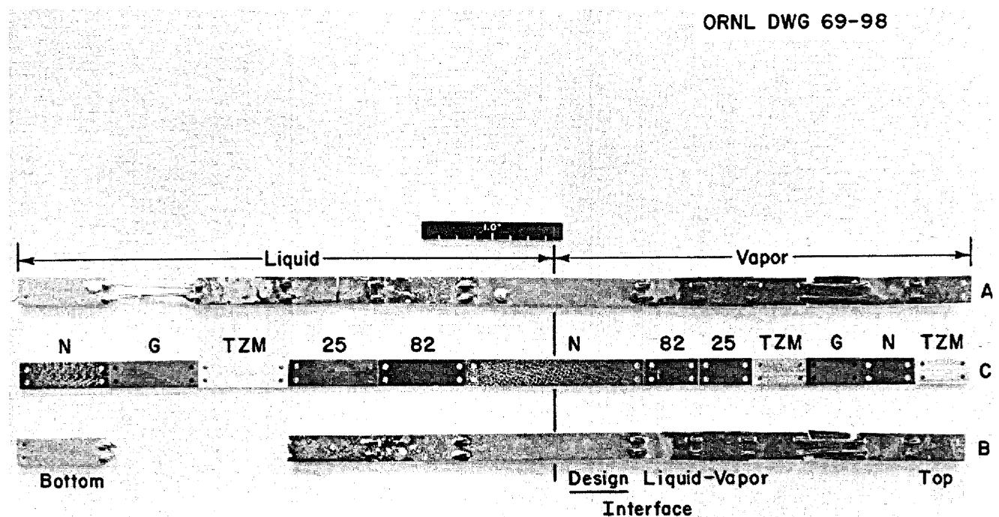  
Legend: A and B-Tested specimens as removed from the support. C-Untested specimens lighted to accentuate the machining patterns. 82-Alloy 82 (Ni-18 Mo-0.2 Mn-0.05 Cr) N-Hastelloy N (72 Ni-16 Mo-7 Cr-5 Fe-0.06 C) 25-Haynes Alloy No. 25 (Co-20 Cr-15 W-10 Ni-3 Fe-1.5 Mn-0.10 C) TZM-TZM (Mo-0.5 Ti-0.1 Zr-0.01 C) G-Grade AXF-5QBG graphite   
Fig. 12. Corrosion Specimens Removed from Still Pot in MSRE Distillation Experiment. Unexposed specimens are shown for comparison.

At the conclusion of the nonradioactive tests, the specimens were returned to the Metals and Ceramics Division for examination.7 The resistance of the metals to attack in both the vapor and the liquid zones was found to be in the following order: Alloy 82 > Hastelloy N > TZM > Haynes Alloy No. 25 > Grade AXF-5QBG graphite. The specimens exposed in the liquid zone appeared to have been attacked more severely than those located in the vapor zone. The Alloy 82, Hastelloy N, and TZM specimens appeared to be essentially unchanged. These observations are only qualitative because (1) they are based only on visual examination, and (2) oxygen in the system (introduced as a result of a heater failure described below) probably modified some of the corrosion results.

The following observations were made regarding the materials located in the liquid zone. Some reaction between the salt and the Alloy 82 and Hastelloy N specimens is suggested because their surfaces were sufficiently etched to make the grain structure clearly visible. The Haynes Alloy No. 25 appeared to be severely cracked, and it broke easily. The graphite specimens in the liquid zone were missing. Crystal-like metallic deposits appeared to be clinging to the joining wires in this region.

The presence of air, which was introduced into the system when a tubular heater failed (in such a manner that a hole was melted in an argon dip line while the system was at low pressure), accounts for the poor performance of the graphite. The air that was introduced while the system was pressurized remained in the system for about 500 hr; the still-pot temperature during this period was near $700^{\circ}\mathrm{C}$ . (No other air was introduced during this period.) The attack on the graphite specimens is probably the result of oxidation during this period. The loss of the graphite specimens in the liquid zone (but not in the vapor zone) is probably due to a "washing effect" of the molten salt on the damaged specimens as the still was filled and emptied. Although the Hastelloy N specimens at the design vapor-liquid interface had gray matte surfaces, no changes in the appearances of the specimens were clearly attributable to the presence of a vapor-liquid interface.

# 6. POSTOPERATIONAL INSPECTION

Since the equipment employed in the nonradioactive tests described in this report was to be used later with radioactive materials, it was inspected thoroughly after completion of the tests. Radiographic and ultrasonic measurements of wall thickness were made at 225 points on the vessel surface. In addition, length and diameter measurements were made between selected locations. (Center-punched tabs at these locations were provided for these measurements.) The postoperational measurements were compared with similar measurements made on the equipment before operation. Measurements were concentrated in regions where the highest stresses were expected.

Drawings M-12173-CD-019D, M-12173-CD-020D, and M-12173-CD-021D (Appendix B) show the locations of the 225 points where wall thickness measurements were made, as well as the locations of points between which length and diameter measurements were made. Also shown are the pre- and postoperational measurements. A comparison of the two sets of thickness measurements showed an average decrease of 1.6 mils in wall thickness, with both positive and negative deviations from the original thickness. The largest differences were +9 mils and -8 mils. The change in distance between two points about 50 in. apart was 0.026 in., which is not considered significant. There was some indication that the still pot had dropped to a slightly lower position, although the rotation of lines between points on opposite ends of the condenser was less than $0.5^{\circ}$ .

Visual inspection of the inside of the still pot showed the metal to be in good condition; the walls were shiny, and no pitting or cracking was evident. Radiography also showed no evidence of physical change.

We concluded that the equipment was in satisfactory condition for use with radioactive materials.

# 7. CONCLUSIONS

The following conclusions have been drawn as a result of the experimental work discussed above:

(1) A relatively large molten-salt distillation system has been operated successfully. Although some problems must be solved before a distillation unit can be incorporated into an MSBR processing plant, the distillation of irradiated mixtures of molten fluorides has been demonstrated to be feasible.   
(2) The measured distillation rates are adequate to permit the use of distillation as a process step. For operation under conditions in which the vapor pressure of the still-pot material is $1\mathrm{mmHg}$ or greater, distillation rates of at least $1.5\mathrm{ft}^3$ of salt per day per square foot of vaporization surface can be obtained. The distillation rate was limited by frictional losses in the vapor passageway; therefore, higher rates might be attainable under the same operating conditions by careful design of the salt vapor flow path.   
(3) Evidences of concentration polarization and/or entrainment were seen during some runs in these experiments. The fact that they were not seen in all runs indicates that further investigation could disclose the conditions under which a still could be operated with concentration polarization and entrainment held to acceptable levels.   
(4) A postoperational inspection of the still showed only minor changes as the result of operation and indicated that the equipment was in satisfactory condition for use with radioactive materials.   
(5) The cause of repeated metallic deposits in the salt feed line must be determined since such depositions would disrupt the long-term operation of distillation systems.   
(6) The condensation of volatile salt components and corrosion products in the vacuum lines must be prevented if long-term operation is to be feasible.

(7) More-reliable level-measuring devices for controlling the still-pot liquid level should be provided. A method more desirable than the one used for this experiment would consist of several probes (of the type described in this report) used at various salt depths giving a control signal which would change stepwise rather than smoothly. A number of such probes, located at closely spaced intervals, would permit sufficiently accurate measurement and control of liquid level to make operation of a still feasible.

# 8. ACKNOWLEDGMENTS

The authors gratefully acknowledge the assistance of the following individuals, whose help in operation of the equipment and interpretation of the observations were indispensable: B. G. Eads and B. C. Duggins, Instrumentation and Controls Division, for consultation about and repair of liquid-level and pressure instrumentation; Anna M. Yoakum, Analytical Chemistry Division, for analysis of the condensate samples; W. H. Cook, Metals and Ceramics Division, for examination of corrosion specimens and interpretation of results; B. A. Hannaford for advice and assistance in photographing the results of the experiment; H. D. Cochran for assistance in calculations and interpretation of measurements; V. L. Fowler, R. O. Payne, and J. Beams, technicians in the Unit Operations Section of the Chemical Technology Division, for operation of the distillation equipment; D. M. Haseltine, co-op student from the University of Missouri, for assistance during equipment installation; and J. L. Wade, pipefitter assigned to Bldg. 3541, for his diligence and ingenuity in keeping the equipment in excellent operating condition.

# 9. REFERENCES

1. J. R. Hightower, Jr., and L. E. McNeese, Measurement of the Relative Volatilities of Fluorides of Ce, La, Pr, Nd, Sm, Eu, Ba, Sr, Y, and Zr in Mixtures of LiF and BeF $_2$ , ORNL-TM-2058 (January 1968).   
2. F. J. Smith, L. M. Ferris, and C. T. Thompson, Liquid-Vapor Equilibria in LiF-BeF $_2$ and LiF-BeF $_2$ -ThF $_4$ Systems, ORNL-4415 (June 1969).   
3. W. L. Carter, R. B. Lindauer, and L. E. McNeese, Design of an Engineering-Scale, Vacuum Distillation Experiment for Molten Salt Reactor Fuel, ORNL-TM-2213 (November 1968).   
4. M. W. Rosenthal, MSR Program Semiann. Progr. Rept. Feb. 28, 1967, ORNL-4119, p. 76.   
5. R. B. Briggs, MSR Program Semiann. Progr. Rept. Aug. 31, 1965, ORNL-3872, p. 126.   
6. Milton Blander (ed.), Molten Salt Chemistry, p. 592, Wiley, New York, 1964.   
7. M. W. Rosenthal, MSR Program Semiann. Progr. Rept. Aug. 31, 1968, ORNL-4344, p. 282.   
8. R. B. Bird, W. E. Stewart, and E. N. Lightfoot, Transport Phenomena, 1st ed., p. 502, Wiley, New York, 1960.   
9. R. V. Churchill, Operational Mathematics, 2nd ed., p. 183, McGraw-Hill, New York, 1950.   
10. L. A. Schmittroth, Communications of the ACM 3, 171 (March 1960).

10. APPENDIXES

# 10.1 Appendix A. Derivation and Solution of Equations Describing Concentration Polarization

As a salt mixture is vaporized from the surface of the still-pot liquid, the concentration of the less-volatile component (e.g. $\mathrm{NdF}_3$ ) at the interface will increase above its average concentration in the still pot. Therefore, the effectiveness of a still for separating $\mathrm{NdF}_3$ from a feed salt will gradually decrease, since the concentration of $\mathrm{NdF}_3$ in the vapor will increase as the concentration of $\mathrm{NdF}_3$ at the surface increases. Relationships defining the extent of separation to be expected with concentration polarization have been derived, and a method for calculating R, the ratio of the concentration of $\mathrm{NdF}_3$ in the vapor to that in the liquid, is explained.

We will assume that the salt mixture in the still pot is composed of only LiF and $\mathrm{NdF}_3$ . (Actually, the steady-state composition will be about $90\%$ LiF, with the remainder being $\mathrm{BeF}_2$ , $\mathrm{ZrF}_4$ , and $\mathrm{NdF}_3$ .) Calculations are simplified considerably for this assumed binary mixture.

Figure A-1 is a schematic diagram of the model used for estimating the effect of concentration polarization. At any level, $z$ , in the still pot, the concentration of $\mathrm{NdF}_3$ is determined by the following equation:

$$
\frac {\partial c _ {R}}{\partial t} = - \frac {\partial N _ {R z}}{\partial z}, \tag {10}
$$

where $c_{R} =$ molar concentration of NdF3,

$\mathbf{N}_{\mathbb{R}\mathbf{z}} =$ molar flux of $\mathrm{NdF}_3$ in the $z$ direction,

t = time.

The flux of $\mathrm{NdF}_3$ , $\mathbf{N}_{\mathbb{R}z}$ , is related to the concentration of $\mathrm{NdF}_3$ by the following equation:

$$
\mathrm {N} _ {\mathrm {R z}} = \mathrm {x} _ {\mathrm {R}} \left(\mathrm {N} _ {\mathrm {R z}} + \mathrm {N} _ {\mathrm {L z}}\right) - \mathrm {c D} \frac {\partial \mathrm {x} _ {\mathrm {R}}}{\partial \mathrm {z}}, \tag {11}
$$

ORNL DWG 67-11699

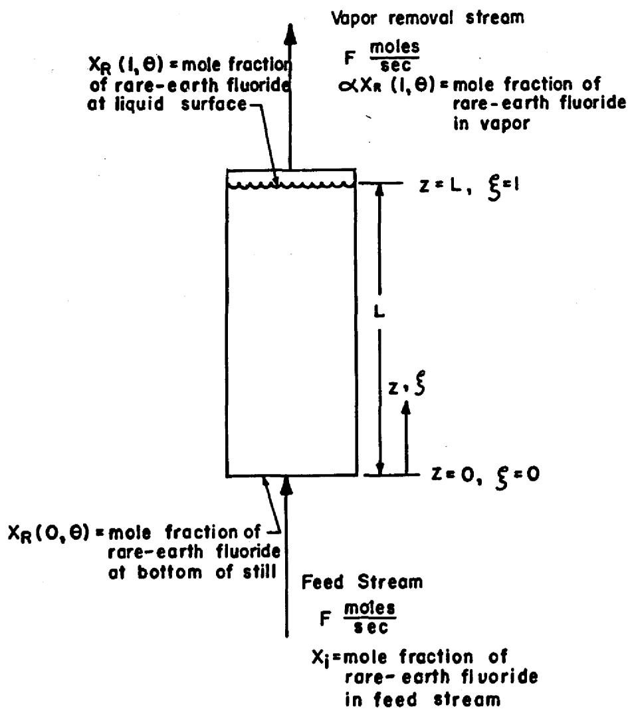  
Fig. A-1. Diagram of Model Used for Estimating Effect of Concentration Polarization.

where $\mathbf{N}_{\mathbf{L}\mathbf{z}} =$ molar flux of LiF in the $z$ direction,

$$
\begin{array}{l} \mathbf {x} _ {\mathrm {R}} = \text {m o l e f r a c t i o n o f N d F} _ {3}, \\ c = \text {m o l a r d e n s i t y o f m i x t u r e}, \\ D = \text {e f f e c t i v e d i f f u s i v i t y o f N d F} _ {3} \text {i n a n L i F - N d F} _ {3} \text {m i x t u r e}. \\ \end{array}
$$

Substituting Eq. (11) into Eq. (10) and dividing by the molar density, c, which is assumed to be constant, yields:

$$
\frac {\partial \mathbf {x} _ {R}}{\partial t} = - v \frac {\partial \mathbf {x} _ {R}}{\partial z} + D \frac {\partial^ {2} \mathbf {x} _ {R}}{\partial z ^ {2}}, \tag {12}
$$

where $\mathbf{v} = \frac{\mathbf{N}_{\mathbf{RZ}} + \mathbf{N}_{\mathbf{RL}}}{c}$ , the velocity of salt mixture in the still pot.

Equation (12) must be solved with the following boundary conditions:

(1) At $t = 0$ , $x_{R} = x_{1} =$ the initial $NdF_{3}$ concentration, which is equal to the feed composition.   
(2) At $z = 0$ , an $\mathrm{NdF}_3$ balance over the boundary between the feed stream and the still pot gives:

$$
\left. \frac {\partial \mathbf {x} _ {\mathrm {R}}}{\partial z} \right| _ {z = 0} = \frac {\mathbf {v}}{\mathrm {D}} \left[ \mathbf {x} _ {\mathrm {R}} (0, t) - \mathbf {x} _ {\mathrm {i}} \right]. \tag {13}
$$

(3) At $z = L$ , an $\mathrm{NdF}_3$ balance over the vapor-liquid interface gives:

$$
\left. \frac {\partial x _ {R}}{\partial z} \right| _ {z = 1} = (1 - \alpha) \frac {v}{D} x _ {R} (L, t), \tag {14}
$$

where $\alpha =$ the relative volatility of $\mathrm{NdF}_3$ with respect to LiF.

In deriving the third boundary condition, the following approximation is used:

$$
\mathbf {y} _ {\mathrm {R}} = \alpha \mathbf {x} _ {\mathrm {R}},
$$

where $\mathbf{y}_{\mathbb{R}}$ is the mole fraction of $\mathsf{NdF}_3$ in the vapor phase.

This approximation is valid for a binary system in which the low-volatility component is present at low concentrations.

Equation (12) and its associated boundary conditions can be put in dimensionless form by making the following substitutions:

$$
\sigma = \frac {x _ {R} - x _ {i}}{x _ {i}} = \text {d i m e n s i o n l e s s N d F} _ {3} \text {c o n c e n t r a t i o n},
$$

$$
\theta = \frac {\mathrm {v t}}{\mathrm {L}} = \text {d i m e n s i o n l e s s t i m e , w h i c h i s a l s o e q u a l t o t h e n u m b e r}
$$

$$
\xi = \frac {z}{L} = \text {d i m e n s i o n l e s s d i s t a n c e}.
$$

With these substitutions, the differential equation and its boundary conditions become:

$$
\frac {\partial \sigma}{\partial \theta} = a \frac {\partial^ {2} \sigma}{\partial \xi^ {2}} - \frac {\partial \sigma}{\partial \xi}, \tag {15}
$$

$$
\theta = 0: \quad \sigma = 0, \tag {15a}
$$

$$
\xi = 0: \quad \frac {\partial \sigma}{\partial \xi} _ {\xi = 0} = b \sigma (0, \theta), \tag {15b}
$$

$$
\xi = 1: \quad \frac {\partial \sigma}{\partial \xi} _ {| _ {\xi = 1}} = c [ \sigma (1, \theta) + 1 ], \tag {15c}
$$

$$
\text {w h e r e} a = \frac {D}{v L}
$$

$$
b = 1 / a,
$$

$$
\mathbf {c} = (1 - \alpha) \mathbf {b}.
$$

With the substitutions shown above, the quantity R described in Sect. 4.2 is given by:

$$
R \equiv \alpha_ {O B S} / \alpha_ {A C T U A L} = \frac {y _ {R} / x _ {R} (a v g)}{y _ {R} / x _ {R} (L , t)} = \frac {x _ {R} (L , t)}{x _ {R} (a v g)} = \frac {x _ {R} (L , t)}{\frac {1}{L} \int_ {0} ^ {L} x _ {R} (z , t) d z},
$$

or

$$
R = \frac {x _ {i} [ \sigma (1 , \theta) + 1 ]}{x _ {i} \int_ {0} ^ {1} [ \sigma (\xi , \theta) + 1 ] d \xi} = \frac {[ \sigma (1 , \theta) + 1 ]}{1 + \sigma_ {\text {a v g}} (\theta)}, \tag {16}
$$

where

$$
\sigma_ {\text {a v g}} (\theta) = \int_ {0} ^ {1} \sigma (\xi , \theta) d \xi .
$$

Method of Solving Equations. - For the solution of Eq. (15), with Eqs. [15(a)-15(c)] as boundary conditions, the parameters a, b, and c are assumed to be constant.

By taking the Laplace transform of Eqs. (15), and Eqs. [15(a)-15(c)], the following ordinary differential equation and boundary conditions are obtained:

$$
a \frac {d ^ {2} \sigma (\xi , s)}{d \xi^ {2}} - \frac {d \sigma (\xi , s)}{d \xi} - s \bar {\sigma} (\xi , s) = 0 \tag {17}
$$

$$
\frac {\mathrm {d} \bar {\sigma}}{\mathrm {d} \xi} = \mathrm {b} \bar {\sigma} (0, \mathrm {s}) \tag {17a}
$$

$$
\frac {\mathrm {d} \bar {\sigma}}{\mathrm {d} \xi} = \mathrm {c} \bar {\sigma} (1, \mathrm {s}) + \frac {\mathrm {c}}{\mathrm {s}}, \tag {17b}
$$

where $\overline{\sigma}(\xi, s) = \int_{0}^{\infty} \sigma(\xi, \theta) e^{-s\theta} \, d\theta$ , the Laplace transform of $\sigma(\xi, \theta)$ , and $s =$ the Laplace transform variable. Equation (17) has the solution:

$$
\bar {\sigma} (\xi , \mathrm {s}) = \mathrm {A e} ^ {\gamma_ {1} \xi} + \mathrm {B e} ^ {\gamma_ {2} \xi}, \tag {18}
$$

where

$$
\begin{array}{l} \gamma_ {1} = \frac {1 + \sqrt {1 + 4 a s}}{2 a}, \\ \gamma_ {2} = \frac {1 - \sqrt {1 + 4 a s}}{2 a}. \\ \end{array}
$$

When Eq. (18) is substituted into Eqs. [17(a)] and [17(b)], the constants A and B can be determined; then $\overline{\sigma} (\xi ,s)$ is found to be:

$$
\bar {\sigma} (\xi , s) = \frac {c \left[ \left(\gamma_ {1} - b\right) e ^ {\gamma_ {2} \xi} - \left(\gamma_ {2} - b\right) e ^ {\gamma_ {1} \xi} \right]}{s \left[ \left(\gamma_ {1} - b\right) \left(\gamma_ {2} - c\right) e ^ {\gamma_ {2}} - \left(\gamma_ {2} - b\right) \left(\gamma_ {1} - c\right) e ^ {\gamma_ {1}} \right]} \tag {19}
$$

Since we also desire $\sigma_{\mathrm{avg}}(\theta) = \int_0^1\sigma (\xi ,\theta)\mathrm{d}\xi$ , we can find the Laplace transform of this quantity by integrating Eq. (19) with respect to $\xi$ . This integration yields:

$$
\bar {\sigma} _ {\text {a v g}} (s) = \frac {c \left[ \left(\gamma_ {1} ^ {2} - b \gamma_ {1}\right) \left(e ^ {\gamma_ {2}} - 1\right) - \left(\gamma_ {2} ^ {2} - b \gamma_ {2}\right) \left(e ^ {\gamma_ {1}} - 1\right) \right]}{s \gamma_ {1} \gamma_ {2} \left[ \left(\gamma_ {1} - b\right) \left(\gamma_ {2} - c\right) e ^ {\gamma_ {2}} - \left(\gamma_ {2} - b\right) \left(\gamma_ {1} - c\right) e ^ {\gamma_ {1}} \right]} \tag {20}
$$

The quantity $\sigma_{\mathrm{avg}}(\theta)$ is obtained from Eq. (20) by performing the following integration in the complex plane:

$$
\sigma_ {\text {a v g}} (\theta) = \frac {1}{2 \pi i} \int_ {\varepsilon - i \infty} ^ {\varepsilon + i \infty} \bar {\sigma} _ {\text {a v g}} (s) e ^ {s \theta} d s, \tag {21}
$$

where $i = \sqrt{-1}$ , and $\varepsilon > 0$ and constant.

Equation (21) can be written in the following equivalent form by recognizing that $s = \varepsilon + i\omega$ and $ds = i d\omega$ :

$$
\sigma_ {\text {a v g}} (\theta) = \frac {e ^ {\varepsilon \theta}}{2 \pi} \int_ {- \infty} ^ {\infty} \overline {{\sigma}} _ {\text {a v g}} (\varepsilon + i \omega) [ \cos (\omega \theta) + i \sin (\omega \theta) ] d \omega . \tag {22}
$$

Because the integral in Eq. (22) converges to zero when $\theta < 0$ (ref. 9), it can be shown that $\sigma_{\mathrm{avg}}(\theta)$ is given by a pair of equations:

$$
\begin{array}{l} \sigma_ {\text {a v g}} (\theta) = \frac {2 e ^ {\varepsilon \theta}}{\pi} \int_ {0} ^ {\infty} - \operatorname {I m} \left[ \bar {\sigma} _ {\text {a v g}} (\varepsilon + i \omega) \right] \sin (\omega \theta) d \omega (23a) \\ \sigma_ {\text {a v g}} (\theta) = \frac {2 e ^ {\varepsilon \theta}}{\pi} \int_ {0} ^ {\infty} \operatorname {R e} \left[ \bar {\sigma} _ {\text {a v g}} (\varepsilon + i \omega) \right] \cos (\omega \theta) d \omega , (23b) \\ \end{array}
$$

where

$$
\begin{array}{l} \operatorname {I m} \left[ \bar {\sigma} _ {\text {a v g}} (\varepsilon + i \omega) \right] = \text {t h e i m a g i n a r y p a r t o f t h e f u n c t i o n} \bar {\sigma} _ {\text {a v g}} (\varepsilon + i \omega), \\ \operatorname {R e} \left[ \bar {\sigma} _ {\text {a v g}} (\varepsilon + i \omega) \right] = \text {t h e r e a l p a r t o f t h e f u n c t i o n} \bar {\sigma} _ {\text {a v g}} (\varepsilon + i \omega). \\ \end{array}
$$

Equation [23(a)] was chosen for evaluating $\sigma_{\mathrm{avg}}(\theta)$ . The integral in this equation was computed numerically by using the CDC 1604-A computer to evaluate $\operatorname{Im}[\overline{\sigma}_{\mathrm{avg}}(\varepsilon + i\omega)]$ . The details of the numerical integration can be found in ref. 10.

The quantity R is calculated by finding $\sigma(1, \theta)$ and $\sigma_{\mathrm{avg}}(\theta)$ for the same value of $\theta$ and substituting into Eq. (16). The quantity $\sigma(1, \theta)$ is found by inverting the transform given by Eq. (19) with $\xi = 1$ , and the quantity $\sigma_{\mathrm{avg}}(\theta)$ is found by inverting the transform given by Eq. (20). The described inversion technique is required for both transforms.

# 10.2 Appendix B. Drawings Showing Postoperational Wall-Thickness and Dimensional Measurements

The drawings included in this appendix contain a complete tabulation of the wall-thickness and dimensional measurements made immediately after the still assembly was constructed and after the nonradioactive testing of the equipment.was concluded.

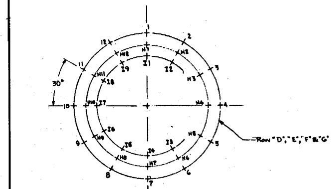  
PLAN rows "I", "H", "D", "E", "F", "G"

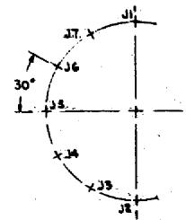  
PLAN ROW "J"

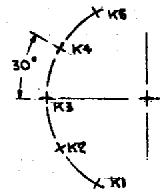  
PLAN ROW "K"

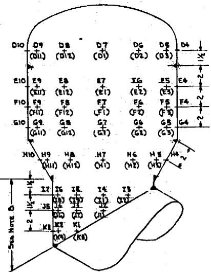

<table><tr><td>NO.</td><td colspan="3">REVISIONS</td><td>DATE</td><td>APPD</td><td>APPD</td></tr><tr><td>DRAWN H.W.F</td><td>DATE 2-2-6-7</td><td>SUBMITTED</td><td>DATE</td><td>APPROVED</td><td>DATE</td><td></td></tr><tr><td>DESIGNED W.L.CAVER</td><td>DATE 2-27-4-7</td><td>APPROVED</td><td>DATE</td><td>APPROVED</td><td>DATE</td><td></td></tr><tr><td>CHECKED</td><td>DATE</td><td>APPROVED</td><td>DATE</td><td>APPROVED</td><td>DATE</td><td></td></tr></table>

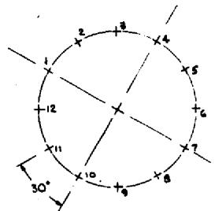  
PLAN ROWS "N, P,Q,R,S"Q,T

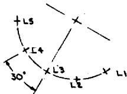  
PLAN ROW "L"

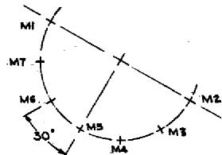  
PLAN ROW "M"

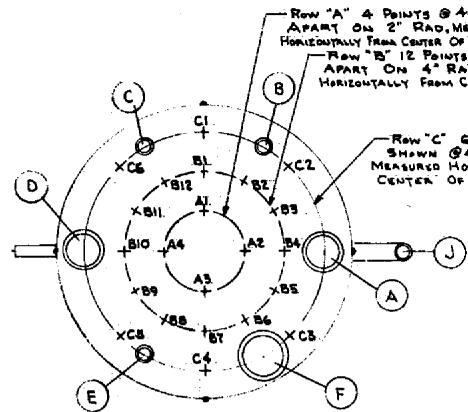  
PLAN OF STILL HEAD

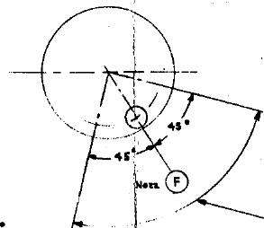  
AFTER FABRICATION IS COMPLETE  
— RADIOGRAPH THIS SEGMENT OR STILL  
SIDE WALL AND HEAD WITH SUFFICIENT  
EXPOSURES TO ADAPTATE MAP ENTIRE  
SURFACE BETWEEN HEAD AND PARTNERS  
FOR THE USE OF A NUCLEARATIVE SOURCE CAN BE MADE ANYWHEREF." AT END OR NEW RAOACTIVE EXPERIMENTS REPEAT THE RADIOGRAPH DESCRIPTION ASSE.

# NOTES:

1. DURING FABRICATION NAME DIRECTNESS MEASUREMENTS AT POWE DEIGNATED BY $X^{\prime \prime}$ IN UPPER LEFT CAVER OF "DIAGET INITIAL" CALUMIN.   
2. DURING FABRICATION MEASUREMENTS ULTRASONICALLY AT POINTS DESIGNATED IN THE TABULATIONS ON DNGC, M12173-C-00D AND M12173-CO2ID EMPT THOSE MARKED "No Measurements," RECORD REsuLTs IN APPROPRIATE COLUMN   
3. POINTS AT WHICH MEASUREMENTS ARE MADE ARE IDENTIFIED BY A LETTER (A,B,…,2) TO INDICATE THE ROW AND A NUMBER (1,2…12) TO SHOW POSITION ON THE ROW.   
4. IDENTIFICATIONS IN PARENTHESES [a.g., (PI2), (Q8), etc.] INDicate That Point is DIRECTLY OPPOSITE THE DISPLAYED POINT.   
5 DEVELOP ULTRASONIC THICKNESS MEASUREMENT PROCEDURE DURING FABRICATION Whom Will Produce the Same THICKNESS MEASUREMENTS AS Those Found Directly AT POINTED Designated, Note I AROVE. RECORD PROCEDURE PRECESSIONLY.   
G. Amea, Nannoroactive Experiments, Move Ultrasonic Thickness Measurements At In Note 2 Above and Record Results in   
7. STATE THICKNESS MEASUREMENTS IN DECIMALS, STATE ALL OTHER MEASUREMENTS IN METALS AND FRACTIONS.   
8 AFTER FABRICATION, RADIOGRAPH WITH SUPFICIENT EXPOSURES To COMpletely MAP VESSEL WALL BETWEEN WEEL LINES AT BOTTOM OF CONIEAL SECTION OF BOTH AND ROW "N" ON COLOVER. AFTER NONRADATIVE EXPERIMENTS, REPEAT THE RADIOGRAPHY.

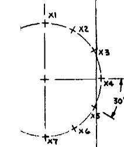  
PLANROW"X"

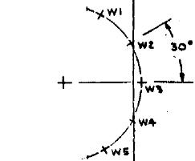  
PLAN ROW "W"

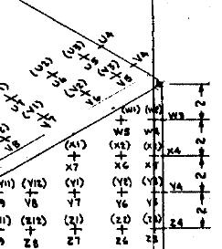

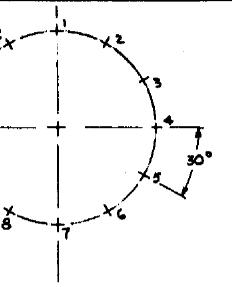  
PLAN ROWS "Y" B. Z

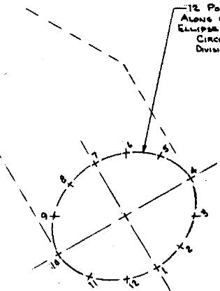  
PLAN rows "U" or "V"

<table><tr><td colspan="4">TAKING- DIMENSIONAL &amp; RADIOGRAPHICAL Measurements</td><td colspan="3">M127CD-0G</td></tr><tr><td colspan="4">LOCATION - LINEAR MEASUREMENTS &amp; TILATION DATE</td><td colspan="3">a - 021</td></tr><tr><td colspan="4">REFERENCE DRAWINGS</td><td colspan="3">NO.</td></tr><tr><td colspan="7">OAK RIDGE NATIONAL LABORATORY
OPERATED BY
UNION CARBIDE NUCLEAR COMPANY
DIVISION OF UNION CARBIDE CORPORATION
OAK RIDGE, TENNESSEE</td></tr><tr><td colspan="7">MSRE DISTILLATION EXPERIMENT BLO 3591
NO. 87509</td></tr><tr><td colspan="7">LOCATION OF POINTS FOR DIMENSIONAL AND
RADIOGRAPHIC MEASUREMENTS ON, STILL AND
CONSENSER ASSEMBLY</td></tr><tr><td>SUBMITTED
Wt Co### 3/6/27</td><td colspan="2">APPROVED
R.### 3/6/27</td><td colspan="4">APPROVED
W### 3/6/27</td></tr><tr><td>APPROVED
Wt Co### 3/6/27</td><td>M12173</td><td>CD</td><td>019</td><td>D</td><td>REV</td><td></td></tr></table>

-12. POYNTS EQUALLY SPREADALONG CIRCUMCERANCE OFILLIPPIA CIRCUM 33.933 IN. Divisions 2.8278 IN.

$\therefore m - 1 \neq  0$ ;

<table><tr><td colspan="2">LIMITS ON DIMENSIONS UNLESS
OTHERWISE SPECIFIED:</td></tr><tr><td>FRACTIONS ± _</td><td></td></tr><tr><td>DECIMALS ± _</td><td></td></tr><tr><td>ANGLES ± _</td><td></td></tr><tr><td>SCALE: NONE</td><td></td></tr></table>

APPROVED FOR CONSTRUCTION

<table><tr><td colspan="6">WALL THICKNESS MEASURMENTS AND OBSERVATIONS</td><td colspan="6">WALL THICKNESS MEASURMENTS AND OBSERVATION</td><td colspan="6">WALL THICKNESS MEASURMENTS AND OBSERVATIONS</td></tr><tr><td>LOCATION OF MEASUREMENT</td><td>DIRECT INITIAL (inch)</td><td>LATITUDE CHANGE (inch)</td><td>DIMENSIONAL CHANGE (inch)</td><td>RADIOMAGNARY, OBSERVATIONS, AND REMARKS</td><td>LOCATION OF MEASUREMENT</td><td>DIRECT INITIAL (inch)</td><td>LATITUDE CHANGE (inch)</td><td>DIMENSIONAL CHANGE (inch)</td><td>RADIOMAGNARY, OBSERVATIONS, AND REMARKS</td><td>LOCATION OF MEASUREMENT</td><td>DIRECT INITIAL (inch)</td><td>LATITUDE CHANGE (inch)</td><td>DIMENSIONAL CHANGE (inch)</td><td>RADIOMAGNARY, OBSERVATIONS, AND REMARKS</td><td>DIMENSIONAL CHANGE (inch)</td><td>RADIOMAGNARY, OBSERVATIONS, AND REMARKS</td><td></td></tr><tr><td>A1</td><td>.383</td><td>.376</td><td>-0.002</td><td></td><td>G9</td><td>.455</td><td>.380</td><td>-0.002</td><td></td><td>N12</td><td>.393</td><td>-0.003</td><td></td><td></td><td></td><td></td><td></td></tr><tr><td>A2</td><td>.319</td><td>.382</td><td>-0.003</td><td></td><td>G7</td><td>.370</td><td>.380</td><td>0</td><td></td><td>P1</td><td>.397</td><td>-0.003</td><td></td><td></td><td></td><td></td><td></td></tr><tr><td>A3</td><td>.385</td><td>.380</td><td>-0.003</td><td></td><td>G8</td><td>.360</td><td>.381</td><td>-0.001</td><td></td><td>P2</td><td>.396</td><td>-0.001</td><td></td><td></td><td></td><td></td><td></td></tr><tr><td>A4</td><td>.379</td><td>.381</td><td>-0.003</td><td></td><td>G9</td><td>.365</td><td>.380</td><td>-0.002</td><td></td><td>P3</td><td>.396</td><td>-0.001</td><td></td><td></td><td></td><td></td><td></td></tr><tr><td>B1</td><td>.4</td><td>MEASURED</td><td></td><td></td><td>G10</td><td>.370</td><td>.380</td><td>-</td><td></td><td>P4</td><td>.396</td><td>-0.001</td><td></td><td></td><td></td><td></td><td></td></tr><tr><td>B2</td><td></td><td></td><td></td><td></td><td>G11</td><td></td><td>.379</td><td>-0.001</td><td></td><td>P5</td><td>.397</td><td>-0.001</td><td></td><td></td><td></td><td></td><td></td></tr><tr><td>B3</td><td></td><td></td><td></td><td></td><td>G12</td><td></td><td>.382</td><td>.381</td><td>-0.001</td><td></td><td>P6</td><td>.397</td><td>-0.001</td><td></td><td></td><td></td><td></td></tr><tr><td>B4</td><td></td><td></td><td></td><td></td><td>H1</td><td>.395</td><td>.399</td><td>-0.007</td><td></td><td>P7</td><td>.397</td><td>-0.002</td><td></td><td></td><td></td><td></td><td></td></tr><tr><td>B5</td><td></td><td></td><td></td><td></td><td>H2</td><td></td><td>.399</td><td>-0.007</td><td></td><td>P8</td><td>.399</td><td>-0.003</td><td></td><td></td><td></td><td></td><td></td></tr><tr><td>B6</td><td>.383</td><td>.385</td><td>-0.001</td><td></td><td>H3</td><td></td><td>.399</td><td>-0.007</td><td></td><td>P9</td><td>.399</td><td>-0.003</td><td></td><td></td><td></td><td></td><td></td></tr><tr><td>B7</td><td>.385</td><td>.385</td><td>-0.001</td><td></td><td>H4</td><td>.393</td><td>.393</td><td>-0.001</td><td></td><td>P10</td><td>.399</td><td>-0.003</td><td></td><td></td><td></td><td></td><td></td></tr><tr><td>B8</td><td></td><td></td><td></td><td></td><td>H5</td><td></td><td>.393</td><td>-0.001</td><td></td><td>P11</td><td>.399</td><td>-0.003</td><td></td><td></td><td></td><td></td><td></td></tr><tr><td>B9</td><td></td><td></td><td></td><td></td><td>H6</td><td></td><td>.396</td><td>-0.001</td><td></td><td>P12</td><td>.399</td><td>-0.003</td><td></td><td></td><td></td><td></td><td></td></tr><tr><td>B10</td><td></td><td></td><td></td><td></td><td>H7</td><td>.397</td><td>.396</td><td>-0.002</td><td></td><td>Q1</td><td>.397</td><td>-0.001</td><td></td><td></td><td></td><td></td><td></td></tr><tr><td>B11</td><td></td><td></td><td></td><td></td><td>H8</td><td></td><td>.397</td><td>-0.001</td><td></td><td>Q2</td><td>.397</td><td>-0.001</td><td></td><td></td><td></td><td></td><td></td></tr><tr><td>B12</td><td></td><td></td><td></td><td></td><td>H9</td><td></td><td>.400</td><td>-0.001</td><td></td><td>Q3</td><td>.397</td><td>-0.001</td><td></td><td></td><td></td><td></td><td></td></tr><tr><td>C1</td><td></td><td></td><td></td><td></td><td>H10</td><td>.400</td><td>.400</td><td>0</td><td></td><td>Q4</td><td>.398</td><td>-0.003</td><td></td><td></td><td></td><td></td><td></td></tr><tr><td>C2</td><td>.389</td><td>.385</td><td>-0.002</td><td></td><td>H11</td><td></td><td>.399</td><td>-0.002</td><td></td><td>Q5</td><td>.397</td><td>-0.001</td><td></td><td></td><td></td><td></td><td></td></tr><tr><td>C3</td><td>.387</td><td>.387</td><td>0</td><td></td><td>H12</td><td></td><td>.399</td><td>-0.006</td><td></td><td>Q6</td><td>.396</td><td>-0.002</td><td></td><td></td><td></td><td></td><td></td></tr><tr><td>C4</td><td>.385</td><td>.389</td><td>-0.003</td><td></td><td>I1</td><td></td><td>.399</td><td>-0.005</td><td></td><td>Q7</td><td>.397</td><td>-0.002</td><td></td><td></td><td></td><td></td><td></td></tr><tr><td>C5</td><td>.390</td><td>.388</td><td>-0.002</td><td></td><td>I2</td><td></td><td>.399</td><td>-0.002</td><td></td><td>Q8</td><td>.395</td><td>-0.001</td><td></td><td></td><td></td><td></td><td></td></tr><tr><td>C6</td><td>.389</td><td>.386</td><td>0</td><td></td><td>I3</td><td>.397</td><td>.398</td><td>-0.001</td><td></td><td>Q9</td><td>.396</td><td>-0.002</td><td></td><td></td><td></td><td></td><td></td></tr><tr><td>D1</td><td>.406</td><td>.410</td><td>-0.005</td><td></td><td>I4</td><td></td><td>.408</td><td>-0.002</td><td></td><td>Q10</td><td>.403</td><td>-0.003</td><td></td><td></td><td></td><td></td><td></td></tr><tr><td>D2</td><td></td><td>.410</td><td>-0.008</td><td></td><td>I5</td><td></td><td>.409</td><td>-0.002</td><td></td><td>D11</td><td>.404</td><td>-0.004</td><td></td><td></td><td></td><td></td><td></td></tr><tr><td>D3</td><td></td><td>.415</td><td>-0.001</td><td></td><td>I6</td><td></td><td>.409</td><td>-0.003</td><td></td><td>D12</td><td>.407</td><td>-0.002</td><td></td><td></td><td></td><td></td><td></td></tr><tr><td>D4</td><td>.417</td><td>.418</td><td>-0.003</td><td></td><td>I7</td><td></td><td>.409</td><td>-0.003</td><td></td><td>R1</td><td>.409</td><td>-0.003</td><td></td><td></td><td></td><td></td><td></td></tr><tr><td>D5</td><td></td><td>.418</td><td>-0.004</td><td></td><td>I8</td><td></td><td>.409</td><td>-0.005</td><td></td><td>R2</td><td>.409</td><td>-0.004</td><td></td><td></td><td></td><td></td><td></td></tr><tr><td>D6</td><td></td><td>.415</td><td>-0.009</td><td></td><td>I9</td><td></td><td>.410</td><td>-0.004</td><td></td><td>R3</td><td>.410</td><td>-0.004</td><td></td><td></td><td></td><td></td><td></td></tr><tr><td>D7</td><td>.416</td><td>.416</td><td>-0.007</td><td></td><td>J1</td><td></td><td>.417</td><td>-0.004</td><td></td><td>R4</td><td>.416</td><td>-0.002</td><td></td><td></td><td></td><td></td><td></td></tr><tr><td>D8</td><td></td><td>.420</td><td>-0.006</td><td></td><td>J2</td><td></td><td>.418</td><td>-0.002</td><td></td><td>R5</td><td>.410</td><td>-0.003</td><td></td><td></td><td></td><td></td><td></td></tr><tr><td>D9</td><td></td><td>.424</td><td>-0.008</td><td></td><td>J3</td><td></td><td>.419</td><td>-0.001</td><td></td><td>R6</td><td>.418</td><td>-0.001</td><td></td><td></td><td></td><td></td><td></td></tr><tr><td>D10</td><td></td><td>.419</td><td>-0.006</td><td></td><td>J4</td><td></td><td>.420</td><td>-0.001</td><td></td><td>R7</td><td>.428</td><td>-0.005</td><td></td><td></td><td></td><td></td><td></td></tr><tr><td>D11</td><td></td><td>.419</td><td>-0.007</td><td></td><td>J5</td><td></td><td>.421</td><td>-0.002</td><td></td><td>R8</td><td>.427</td><td>-0.001</td><td></td><td></td><td></td><td></td><td></td></tr><tr><td>E1</td><td>.387</td><td>.388</td><td>-0.005</td><td></td><td>J7</td><td></td><td>.422</td><td>-0.004</td><td></td><td>R9</td><td>.399</td><td>-0.004</td><td></td><td></td><td></td><td></td><td></td></tr><tr><td>E2</td><td></td><td>.386</td><td>-0.002</td><td></td><td>K1</td><td>.423</td><td>.424</td><td>-</td><td></td><td>R10</td><td>.399</td><td>-0.003</td><td></td><td></td><td></td><td></td><td></td></tr><tr><td>E3</td><td></td><td>.386</td><td>-0.002</td><td></td><td>K2</td><td></td><td>.425</td><td>.426</td><td></td><td>R11</td><td>.399</td><td>-0.005</td><td></td><td></td><td></td><td></td><td></td></tr><tr><td>E4</td><td></td><td>.386</td><td>-0.002</td><td></td><td>K3</td><td>.426</td><td>.427</td><td>-0.001</td><td></td><td>R12</td><td>.399</td><td>-0.003</td><td></td><td></td><td></td><td></td><td></td></tr><tr><td>E5</td><td></td><td>.384</td><td>-0.002</td><td></td><td>K4</td><td></td><td>.428</td><td>-0.002</td><td></td><td>S1</td><td>.427</td><td>-0.001</td><td></td><td></td><td></td><td></td><td></td></tr><tr><td>E6</td><td></td><td>.383</td><td>-0.001</td><td></td><td>K5</td><td>.427</td><td>.428</td><td>-0.003</td><td></td><td>S2</td><td>.428</td><td>-0.002</td><td></td><td></td><td></td><td></td><td></td></tr><tr><td>E7</td><td></td><td>.382</td><td>-0.002</td><td></td><td>L1</td><td></td><td>.429</td><td>-0.002</td><td></td><td>S3</td><td>.427</td><td>-0.001</td><td></td><td></td><td></td><td></td><td></td></tr><tr><td>E8</td><td></td><td>.382</td><td>-0.002</td><td></td><td>L2</td><td></td><td>.429</td><td>-0.001</td><td></td><td>S4</td><td>.427</td><td>-0.001</td><td></td><td></td><td></td><td></td><td></td></tr><tr><td>E9</td><td></td><td>.382</td><td>-0.002</td><td></td><td>L3</td><td></td><td>.429</td><td>-0.002</td><td></td><td>S5</td><td>.427</td><td>-0.002</td><td></td><td></td><td></td><td></td><td></td></tr><tr><td>E10</td><td></td><td>.383</td><td>-0.002</td><td></td><td>L4</td><td></td><td>.429</td><td>-0.004</td><td></td><td>S6</td><td>.426</td><td>-0.002</td><td></td><td></td><td></td><td></td><td></td></tr><tr><td>E11</td><td></td><td>.382</td><td>-0.002</td><td></td><td>L5</td><td></td><td>.429</td><td>-0.003</td><td></td><td>S7</td><td>.426</td><td>-0.003</td><td></td><td></td><td></td><td></td><td></td></tr><tr><td>E12</td><td></td><td>.383</td><td>-0.002</td><td></td><td>M1</td><td>.427</td><td>.428</td><td>-0.001</td><td></td><td>S8</td><td>.427</td><td>-0.004</td><td></td><td></td><td></td><td></td><td></td></tr><tr><td>F1</td><td></td><td>.383</td><td>-0.002</td><td></td><td>M2</td><td>.429</td><td>.428</td><td>0</td><td></td><td>S9</td><td>.429</td><td>-0.002</td><td></td><td></td><td></td><td></td><td></td></tr><tr><td>F2</td><td></td><td>.383</td><td>-0.001</td><td></td><td>M3</td><td></td><td>.427</td><td>-0.001</td><td></td><td>S10</td><td>.429</td><td>-0.001</td><td></td><td></td><td></td><td></td><td></td></tr><tr><td>F3</td><td></td><td>.386</td><td>-0.002</td><td></td><td>M4</td><td></td><td>.425</td><td>-0.005</td><td></td><td>S11</td><td>.426</td><td>-0.003</td><td></td><td></td><td></td><td></td><td></td></tr><tr><td>F4</td><td></td><td>.387</td><td>-0.004</td><td></td><td>M5</td><td>.425</td><td>.428</td><td>-0.001</td><td></td><td>T1</td><td>.429</td><td>-0.001</td><td></td><td></td><td></td><td></td><td></td></tr><tr><td>F5</td><td></td><td>.384</td><td>-0.001</td><td></td><td>M6</td><td></td><td>.426</td><td>-0.003</td><td></td><td>T2</td><td>.429</td><td>-0.002</td><td></td><td></td><td></td><td></td><td></td></tr><tr><td>F6</td><td></td><td>.381</td><td>-0.001</td><td></td><td>M7</td><td></td><td>.426</td><td>-0.002</td><td></td><td rowspan="12" colspan="7"></td><td></td></tr><tr><td>F7</td><td></td><td>.383</td><td>-0.003</td><td></td><td>N1</td><td></td><td>.427</td><td>-0.001</td><td></td><td></td></tr><tr><td>F8</td><td>.382</td><td>.382</td><td>0</td><td></td><td>N2</td><td></td><td>.427</td><td>-0.001</td><td></td><td></td></tr><tr><td>F9</td><td></td><td>.378</td><td>.378</td><td></td><td>N3</td><td></td><td>.427</td><td>-0.002</td><td></td><td></td></tr><tr><td>F10</td><td></td><td>.377</td><td></td><td></td><td>N4</td><td></td><td>.428</td><td>-0.002</td><td></td><td></td></tr><tr><td>F11</td><td></td><td>.383</td><td>.383</td><td></td><td>N5</td><td></td><td>.428</td><td>-0.002</td><td></td><td></td></tr><tr><td>F12</td><td></td><td>.381</td><td>.381</td><td></td><td>N6</td><td></td><td>.428</td><td>-0.001</td><td></td><td></td></tr><tr><td>G1</td><td>.379</td><td>.384</td><td>-0.001</td><td></td><td>N7</td><td></td><td>.427</td><td>-0.001</td><td></td><td></td></tr><tr><td>G2</td><td></td><td>.383</td><td>.383</td><td></td><td>N8</td><td></td><td>.427</td><td>-0.002</td><td></td><td></td></tr><tr><td>G3</td><td></td><td>.384</td><td>.384</td><td></td><td>N9</td><td></td><td>.426</td><td>-0.002</td><td></td><td></td></tr><tr><td>G4</td><td></td><td>.381</td><td>.381</td><td></td><td>N10</td><td></td><td>.426</td><td>-0.003</td><td></td><td></td></tr><tr><td>G5</td><td></td><td>.382</td><td>.382</td><td></td><td>N11</td><td></td><td>.426</td><td>-0.003</td><td></td><td></td></tr></table>

APPROVED FOR CONSTRUCTION

<table><tr><td colspan="6">WALL THICKNESS MEASUREMENTS AND OBSERVATIONS</td><td colspan="6">WALL THICKNESS MEASUREMENTS AND OBSERVATIONS</td><td colspan="6">LENGTH AND DIAMETER MEASUREMENTS</td></tr><tr><td>LOCATION
MEASUREMENT</td><td>DIRECT
INITIAL
(inch)</td><td>ULTRASONIC
POST
CHANGE
(inch)</td><td>DIMENSIONAL
ANGLE
(inch)</td><td>RADIOGRAPHY, OBSERVATIONS,
AND REMARKS</td><td>LOCATION
OF
MEASUREMENT</td><td>DIRECT
INITIAL
(inch)</td><td>POST
CHANGE
(inch)</td><td>DIMENSIONAL
ANGLE
(inch)</td><td>RADIOGRAPHY, OBSERVATIONS,
AND REMARKS</td><td>MEASUREMENT
FROM
POINT</td><td>POST
CHANGE
(inch)</td><td>DIMENSIONAL
ANGLE
(inch)</td><td>POST
OPERATION
LINE
(inch)</td><td>DIMENSIONAL
ANGLE
(inch)</td><td>REMARKS</td><td></td><td></td></tr><tr><td>T3</td><td>401</td><td>.408</td><td>- .003</td><td>Y12</td><td></td><td>400</td><td>.396</td><td>- .004</td><td></td><td>5</td><td>6</td><td>13.96</td><td>4.29</td><td></td><td>MATERIALS</td><td></td><td></td></tr><tr><td>T4</td><td>400</td><td>.397</td><td>- .003</td><td>Z1</td><td></td><td>396</td><td>.391</td><td>- .005</td><td></td><td>2</td><td>10</td><td>13.96</td><td>2.89</td><td></td><td>MATERIALS</td><td></td><td></td></tr><tr><td>T5</td><td>401</td><td>.399</td><td>- .003</td><td>Z2</td><td></td><td>394</td><td>.389</td><td>- .008</td><td></td><td>3</td><td>10</td><td>14.96</td><td>2.90</td><td></td><td>MATERIALS</td><td></td><td></td></tr><tr><td>T6</td><td>401</td><td>.398</td><td>- .003</td><td>Z3</td><td></td><td>395</td><td>.397</td><td>- .004</td><td></td><td>3</td><td>13</td><td>14.96</td><td>2.90</td><td></td><td>MATERIALS</td><td></td><td></td></tr><tr><td>T7</td><td>400</td><td>.397</td><td>- .003</td><td>Z4</td><td>.394</td><td></td><td></td><td>-</td><td></td><td>2</td><td>18</td><td>14.96</td><td>2.90</td><td></td><td>MATERIALS</td><td></td><td></td></tr><tr><td>T8</td><td>399</td><td>.397</td><td>- .003</td><td>Z5</td><td></td><td>397</td><td>.389</td><td>- .008</td><td></td><td>2</td><td>15</td><td>14.96</td><td>2.90</td><td></td><td>MATERIALS</td><td></td><td></td></tr><tr><td>T9</td><td>398</td><td>.396</td><td>- .003</td><td>Z6</td><td></td><td>398</td><td>.395</td><td>- .003</td><td></td><td>2</td><td>15</td><td>14.96</td><td>2.90</td><td></td><td>MATERIALS</td><td></td><td></td></tr><tr><td>T10</td><td>396</td><td>.390</td><td>- .006</td><td>Z7</td><td></td><td>398</td><td>.393</td><td>- .005</td><td></td><td>2</td><td>15</td><td>14.96</td><td>2.90</td><td></td><td>MATERIALS</td><td></td><td></td></tr><tr><td>T11</td><td>396</td><td>.394</td><td>- .003</td><td>Z8</td><td></td><td>399</td><td>.395</td><td>- .004</td><td></td><td>2</td><td>15</td><td>14.96</td><td>2.90</td><td></td><td>MATERIALS</td><td></td><td></td></tr><tr><td>T12</td><td>393</td><td>.396</td><td>- .003</td><td>Z9</td><td>.396</td><td></td><td>.387</td><td>-</td><td></td><td>2</td><td>17</td><td>14.96</td><td>2.90</td><td></td><td>MATERIALS</td><td></td><td></td></tr><tr><td>U1</td><td>.400</td><td>.401</td><td>.398</td><td>Z10</td><td>.398</td><td>400</td><td>.395</td><td>- .006</td><td></td><td>6</td><td>15</td><td>14.96</td><td>2.90</td><td></td><td>MATERIALS</td><td></td><td></td></tr><tr><td>U2</td><td></td><td>.401</td><td>.398</td><td>Z11</td><td>.398</td><td>400</td><td>.396</td><td>-</td><td></td><td>10</td><td>15</td><td>14.96</td><td>2.90</td><td></td><td>MATERIALS</td><td></td><td></td></tr><tr><td>U3</td><td></td><td>.397</td><td>.394</td><td>Z12</td><td>.398</td><td>400</td><td>.394</td><td>- .004</td><td></td><td>11</td><td>15</td><td>14.96</td><td>2.90</td><td></td><td>MATERIALS</td><td></td><td></td></tr><tr><td>U4</td><td>.397</td><td>.396</td><td>.393</td><td>Z13</td><td>.398</td><td>400</td><td>.394</td><td>- .004</td><td></td><td>12</td><td>15</td><td>14.96</td><td>2.90</td><td></td><td>MATERIALS</td><td></td><td></td></tr><tr><td>U5</td><td>.394</td><td>.398</td><td>.396</td><td>Z14</td><td></td><td></td><td></td><td></td><td></td><td>13</td><td>15</td><td>14.96</td><td>2.90</td><td></td><td>MATERIALS</td><td></td><td></td></tr><tr><td>U6</td><td>.397</td><td>.396</td><td>.391</td><td>Z15</td><td></td><td></td><td></td><td></td><td></td><td>14</td><td>15</td><td>14.96</td><td>2.90</td><td></td><td>MATERIALS</td><td></td><td></td></tr><tr><td>U7</td><td>.398</td><td>.398</td><td>.395</td><td>Z16</td><td></td><td></td><td></td><td></td><td></td><td>15</td><td>15</td><td>14.96</td><td>2.90</td><td></td><td>MATERIALS</td><td></td><td></td></tr><tr><td>U8</td><td>.399</td><td>.396</td><td>.394</td><td>Z17</td><td></td><td></td><td></td><td></td><td></td><td>16</td><td>15</td><td>14.96</td><td>2.90</td><td></td><td>MATERIALS</td><td></td><td></td></tr><tr><td>U9</td><td>.400</td><td>.397</td><td>.397</td><td>Z18</td><td></td><td></td><td></td><td></td><td></td><td>17</td><td>15</td><td>14.96</td><td>2.90</td><td></td><td>MATERIALS</td><td></td><td></td></tr><tr><td>U10</td><td>.400</td><td>.398</td><td>.395</td><td>Z19</td><td></td><td></td><td></td><td></td><td></td><td>18</td><td>15</td><td>14.96</td><td>2.90</td><td></td><td>MATERIALS</td><td></td><td></td></tr><tr><td>U11</td><td>.401</td><td>.399</td><td>.394</td><td>Z20</td><td></td><td></td><td></td><td></td><td></td><td>19</td><td>15</td><td>14.96</td><td>2.90</td><td></td><td>MATERIALS</td><td></td><td></td></tr><tr><td>U12</td><td>.399</td><td>.398</td><td>.395</td><td>Z21</td><td></td><td></td><td></td><td></td><td></td><td>20</td><td>15</td><td>14.96</td><td>2.90</td><td></td><td>MATERIALS</td><td></td><td></td></tr><tr><td>U13</td><td>.400</td><td>.398</td><td>.396</td><td>Z22</td><td></td><td></td><td></td><td></td><td></td><td>21</td><td>15</td><td>14.96</td><td>2.90</td><td></td><td>MATERIALS</td><td></td><td></td></tr><tr><td>V1</td><td>.398</td><td>.397</td><td>.396</td><td>Z23</td><td></td><td></td><td></td><td></td><td></td><td>22</td><td>15</td><td>14.96</td><td>2.90</td><td></td><td>MATERIALS</td><td></td><td></td></tr><tr><td>V2</td><td>.399</td><td>.397</td><td>.397</td><td>Z24</td><td></td><td></td><td></td><td></td><td></td><td>23</td><td>15</td><td>14.96</td><td>2.90</td><td></td><td>MATERIALS</td><td></td><td></td></tr><tr><td>V3</td><td>.398</td><td>.397</td><td>.397</td><td>Z25</td><td></td><td></td><td></td><td></td><td></td><td>24</td><td>15</td><td>14.96</td><td>2.90</td><td></td><td>MATERIALS</td><td></td><td></td></tr><tr><td>V4</td><td>.398</td><td>.397</td><td>.397</td><td>Z26</td><td></td><td></td><td></td><td></td><td></td><td>25</td><td>15</td><td>14.96</td><td>2.90</td><td></td><td>MATERIALS</td><td></td><td></td></tr><tr><td>V5</td><td>.397</td><td>.397</td><td>.397</td><td>Z27</td><td></td><td></td><td></td><td></td><td></td><td>26</td><td>15</td><td>14.96</td><td>2.90</td><td></td><td>MATERIALS</td><td></td><td></td></tr><tr><td>V6</td><td>.397</td><td>.397</td><td>.397</td><td>Z28</td><td></td><td></td><td></td><td></td><td></td><td>27</td><td>15</td><td>14.96</td><td>2.90</td><td></td><td>MATERIALS</td><td></td><td></td></tr><tr><td>V7</td><td>.397</td><td>.397</td><td>.397</td><td>Z29</td><td></td><td></td><td></td><td></td><td></td><td>28</td><td>15</td><td>14.96</td><td>2.90</td><td></td><td>MATERIALS</td><td></td><td></td></tr><tr><td>V8</td><td>.400</td><td>.396</td><td>.394</td><td>Z30</td><td></td><td></td><td></td><td></td><td></td><td>29</td><td>15</td><td>14.96</td><td>2.90</td><td></td><td>MATERIALS</td><td></td><td></td></tr><tr><td>V9</td><td>.400</td><td>.397</td><td>.397</td><td>Z31</td><td></td><td></td><td></td><td></td><td></td><td>30</td><td>15</td><td>14.96</td><td>2.90</td><td></td><td>MATERIALS</td><td></td><td></td></tr><tr><td>V10</td><td>.400</td><td>.398</td><td>.397</td><td>Z32</td><td></td><td></td><td></td><td></td><td></td><td>31</td><td>15</td><td>14.96</td><td>2.90</td><td></td><td>MATERIALS</td><td></td><td></td></tr><tr><td>V11</td><td>.401</td><td>.398</td><td>.397</td><td>Z33</td><td></td><td></td><td></td><td></td><td></td><td>32</td><td>15</td><td>14.96</td><td>2.90</td><td></td><td>MATERIALS</td><td></td><td></td></tr><tr><td>V12</td><td>.398</td><td>.397</td><td>.397</td><td>Z34</td><td></td><td></td><td></td><td></td><td></td><td>33</td><td>15</td><td>14.96</td><td>2.90</td><td></td><td>MATERIALS</td><td></td><td></td></tr><tr><td>V13</td><td>.398</td><td>.397</td><td>.397</td><td>Z35</td><td></td><td></td><td></td><td></td><td></td><td>34</td><td>15</td><td>14.96</td><td>2.90</td><td></td><td>MATERIALS</td><td></td><td></td></tr><tr><td>V14</td><td>.398</td><td>.397</td><td>.397</td><td>Z36</td><td></td><td></td><td></td><td></td><td></td><td>35</td><td>15</td><td>14.96</td><td>2.90</td><td></td><td>MATERIALS</td><td></td><td></td></tr><tr><td>V15</td><td>.398</td><td>.397</td><td>.397</td><td>Z37</td><td></td><td></td><td></td><td></td><td></td><td>36</td><td>15</td><td>14.96</td><td>2.90</td><td></td><td>MATERIALS</td><td></td><td></td></tr><tr><td>V16</td><td>.398</td><td>.397</td><td>.397</td><td>Z38</td><td></td><td></td><td></td><td></td><td></td><td>37</td><td>15</td><td>14.96</td><td>2.90</td><td></td><td>MATERIALS</td><td></td><td></td></tr><tr><td>V17</td><td>.398</td><td>.397</td><td>.397</td><td>Z39</td><td></td><td></td><td></td><td></td><td></td><td>38</td><td>15</td><td>14.96</td><td>2.90</td><td></td><td>MATERIALS</td><td></td><td></td></tr><tr><td>V18</td><td>.398</td><td>.397</td><td>.397</td><td>Z40</td><td></td><td></td><td></td><td></td><td></td><td>39</td><td>15</td><td>14.96</td><td>2.90</td><td></td><td>MATERIALS</td><td></td><td></td></tr><tr><td>V19</td><td>.398</td><td>.397</td><td>.397</td><td>Z41</td><td></td><td></td><td></td><td></td><td></td><td>40</td><td>15</td><td>14.96</td><td>2.90</td><td></td><td>MATERIALS</td><td></td><td></td></tr><tr><td>V20</td><td>.398</td><td>.397</td><td>.397</td><td>Z42</td><td></td><td></td><td></td><td></td><td></td><td>41</td><td>15</td><td>14.96</td><td>2.90</td><td></td><td>MATERIALS</td><td></td><td></td></tr><tr><td>V21</td><td>.398</td><td>.397</td><td>.397</td><td>Z43</td><td></td><td></td><td></td><td></td><td></td><td>42</td><td>15</td><td>14.96</td><td>2.90</td><td></td><td>MATERIALS</td><td></td><td></td></tr><tr><td>V22</td><td>.398</td><td>.397</td><td>.397</td><td>Z44</td><td></td><td></td><td></td><td></td><td></td><td>43</td><td>15</td><td>14.96</td><td>2.90</td><td></td><td>MATERIALS</td><td></td><td></td></tr><tr><td>V23</td><td>.398</td><td>.397</td><td>.397</td><td>Z45</td><td></td><td></td><td></td><td></td><td></td><td>44</td><td>15</td><td>14.96</td><td>2.90</td><td></td><td>MATERIALS</td><td></td><td></td></tr><tr><td>V24</td><td>.398</td><td>.397</td><td>.397</td><td>Z46</td><td></td><td></td><td></td><td></td><td></td><td>45</td><td>15</td><td>14.96</td><td>2.90</td><td></td><td>MATERIALS</td><td></td><td></td></tr><tr><td>V25</td><td>.398</td><td>.397</td><td>.397</td><td>Z47</td><td></td><td></td><td></td><td></td><td></td><td>46</td><td>15</td><td>14.96</td><td>2.90</td><td></td><td>MATERIALS</td><td></td><td></td></tr><tr><td>V26</td><td>.398</td><td>.397</td><td>.397</td><td>Z48</td><td></td><td></td><td></td><td></td><td></td><td>47</td><td>15</td><td>14.96</td><td>2.90</td><td></td><td>MATERIALS</td><td></td><td></td></tr><tr><td>V27</td><td>.398</td><td>.397</td><td>.397</td><td>Z49</td><td></td><td></td><td></td><td></td><td></td><td>48</td><td>15</td><td>14.96</td><td>2.90</td><td></td><td>MATERIALS</td><td></td><td></td></tr><tr><td>V28</td><td>.398</td><td>.397</td><td>.397</td><td>Z50</td><td></td><td></td><td></td><td></td><td></td><td>49</td><td>15</td><td>14.96</td><td>2.90</td><td></td><td>MATERIALS</td><td></td><td></td></tr></table>

APPROVED FOR CGSTAGTION

C C

# INTERNAL DISTRIBUTION

1-3. Central Research Library

4. ORNL - Y-12 Technical Library Document Reference Section

5-39. Laboratory Records Department

40. Laboratory Records, ORNL R.C.

41-42. MSRP Director's Office Bldg. 9201-3 Rm. 109

43. R. K. Adams

44. G. M. Adamson

45. J. L. Anderson

46. C. F. Baes

47. C. E. Bamberger

48. C. J. Barton

49. H. F. Bauman

50. S. E. Beall

51. M. J. Bell

52. E. S. Bettis

53. R. E. Blanco

54. F. F. Blankenship

55. J. O. Blomeke

56. R. Blumberg

57. E. G. Bohlmann

58. G. E. Boyd

59. J. Braunstein

60. M. A. Bredig

61. R. B. Briggs

62. S. Cantor

63. W. L. Carter

64. G. I. Cathers

65. J. M. Chandler

66. H. D. Cochran

67. E. L. Compere

68. W. H. Cook

69. B. Cox

70. C. W. Craven

71. F. L. Culler

72. J. H. Devan

73. S. J. Ditto

74. W. P. Eatherly

75. J. R. Engel

76. D. E. Ferguson

77. L. M. Ferris

78. A. P. Fraas

79. H. A. Friedman

80. J. H. Gibbons

81. W. R. Grimes

82. A. G. Grindell

83. R. H. Guymon

84. B. A. Hannaford

85. P. H. Harley

86. P. N. Haubenreich

87. R. F. Hibbs

88-89. J. R. Hightower

90. H. W. Hoffman

91. R. W. Horton

92. W. H. Jordan

93. P. R. Kasten

94. C. W. Kee

95. M. J. Kelly

96. S. S. Kirslis

97. J. W. Koger

98. R. B. Korsmeyer

99. A. I. Krakoviak

100. T. S. Kress

101. C. E. Lamb

102. J. A. Lane

103. J. J. Lawrence

104. M. S. Lin

105. R. B. Lindauer

106. A. P. Litman

107. M. I. Lundin

108. H. G. MacPherson

109. R. E. MacPherson

110. J. C. Mailen

111. H. E. McCoy

112. L. E. McNeese

113. A. S. Meyer

114. R. L. Moore

115. D. M. Moulton

116. J. P. Nichols

117. E. L. Nicholson

118. A. M. Perry

119. J. L. Redford

120. G. D. Robbins

121. K. A. Romberger

122. W. F. Schaffer

123. C. E. Schilling

124. Dunlap Scott

125. J. H. Shaffer

126. M. J. Skinner

127. A. N. Smith

128. F. J. Smith

129. D. A. Sundberg

130. R. E. Thoma

131. C. P. Tung   
132. W. E. Unger   
133. G. M. Watson   
134. J. S. Watson   
135. A. M. Weinberg   
136. J. R. Weir   
137. M. E. Whatley   
138. J. C. White

139. Gale Young   
140. E. L. Youngblood   
141. P. H. Emmett (consultant)   
142. J. J. Katz (consultant)   
143. J. L. Margrave (consultant)   
144. E. A. Mason (consultant)   
145. R. B. Richards (consultant)

# EXTERNAL DISTRIBUTION

146. A. Giambusso, Atomic Energy Commission, Washington, D.C.   
147. N. Haberman, Atomic Energy Commission, Washington, D.C.   
148. K. O. Laughon, RDT Site Office, Oak Ridge National Laboratory

149-150. T. W. McIntosh, Atomic Energy Commission, Washington, D.C.

151. M. Shaw, Atomic Energy Commission, Washington, D.C.   
152. J. A. Swartout, Union Carbide Corporation, New York 10017   
153. Patent Office, Atomic Energy Commission, ORO   
154. Laboratory and University Division, AEC, ORO   
155-374. Given distribution as shown in TID-4500 under Reactor Technology category (25 copies - NTIS)