ORNL-4449

UC-80 - Reactor Technology

MOLTEN-SALT REACTOR PROGRAM

SEMIANNUAL PROGRESS REPORT

FOR PERIOD ENDING AUGUST 31, 1969

OAK RIDGE NATIONAL LABORATORY

operated by

UNION CARBIDE CORPORATION

for the

U.S. ATOMIC ENERGY COMMISSION

Printed in the United States of America. Available from Clearinghouse for Federal

Scientific and Technical Information, National Bureau of Standards,

U.S. Department of Commerce, Springfield, Virginia 22151

Price: Printed Copy $3.00; Microfiche $0.65

# LEGAL NOTICE

This report was prepared as an account of Government sponsored work. Neither the United States, nor the Commission, nor any person acting on behalf of the Commission:

A. Makes any warranty or representation, expressed or implied, with respect to the accuracy, completeness, or usefulness of the information contained in this report, or that the use of any information, apparatus, method, or process disclosed in this report may not infringe privately owned rights; or   
B. Assumes any liabilities with respect to the use of, or for damages resulting from the use of any information, apparatus, method, or process disclosed in this report.

As used in the above, "person acting on behalf of the Commission" includes any employee or contractor of the Commission, or employee of such contractor, to the extent that such employee or contractor of the Commission, or employee of such contractor prepares, disseminates, or provides access to, any information pursuant to his employment or contract with the Commission, or his employment with such contractor.

# LEGAL NOTICE

This report was prepared as an account of Government sponsored work. Neither the United States, nor the Commission, nor any person acting on behalf of the Commission: A. Makes any warranty or representation, expressed or implied, with respect to the accuracy, completeness, or usefulness of the information contained in this report, or that the use of any information, apparatus, method, or process disclosed in this report may not infringe privately owned rights; or

B. Assumes any liabilities with respect to the use of, or for damages resulting from the use of any information, apparatus, method, or process disclosed in this report. As used in the above, "person acting on behalf of the Commission" includes any employee or contractor of the Commission; or employees of such contractor, to the extent that such employee or contractor of the Commission, or employee of such contractor prepares, disseminates, or provides access to, any information pursuant to his employment or contract with the Commission, or his employment with such contractor.

ORNL-4449

UC-80 - Reactor Technology

Contract No. W-7405-eng-26

MOLTEN-SALT REACTOR PROGRAM

SEMIANNUAL PROGRESS REPORT

For Period Ending August 31, 1969

M. W. Rosenthal, Program Director

R. B. Briggs, Associate Director

P. R. Kasten, Associate Director

FEBRUARY 1970

OAK RIDGE NATIONAL LABORATORY

Oak Ridge, Tennessee

operated by

UNION CARBIDE CORPORATION

for the

U. S. ATOMIC ENERGY COMMISSION

This report is one of a series of periodic reports in which we describe the progress of the program. Other reports issued in this series are listed below. ORNL-3708 is especially useful because it gives a thorough review of the design and construction and supporting development work for the MSRE.

ORNL-2474 Period Ending January 31, 1958

ORNL-2626 Period Ending October 31, 1958

ORNL-2684 Period Ending January 31, 1959

ORNL-2723 Period Ending April 30, 1959

ORNL-2799 Period Ending July 31, 1959

ORNL-2890 Period Ending October 31, 1959

ORNL-2973 Periods Ending January 31 and April 30, 1960

ORNL-3014 Period Ending July 31, 1960

ORNL-3122 Period Ending February 28, 1961

ORNL-3215 Period Ending August 31, 1961

ORNL-3282 Period Ending February 28, 1962

ORNL-3369 Period Ending August 31, 1962

ORNL-3419 Period Ending January 31, 1963

ORNL-3529 Period Ending July 31, 1963

ORNL-3626 Period Ending January 31, 1964

ORNL-3708 Period Ending July 31, 1964

ORNL-3812 Period Ending February 28, 1965

ORNL-3872 Period Ending August 31, 1965

ORNL-3936 Period Ending February 28, 1966

ORNL-4037 Period Ending August 31, 1966

ORNL-4119 Period Ending February 28, 1967

ORNL-4191 Period Ending August 31, 1967

ORNL-4254 Period Ending February 29, 1968

ORNL-4344 Period Ending August 31, 1968

ORNL-4396 Period Ending February 28, 1969

# Contents

INTRODUCTION ix

SUMMARY xi

# PART 1. MOLTEN-SALT REACTOR EXPERIMENT

1.MSRE OPERATIONS 1

1.1 Chronological Account of Operations and Maintenance 1   
1.2 Operations Analysis 4

1.2.1 Reactivity Balance 4   
1.2.2 Reactivity Effects of Graphite Distortion 5   
1.2.3 Gas in the Fuel System 6   
1.2.4 Diagnosis by Noise Analysis 10   
1.2.5 Fission Product Distributions in Fuel System 11   
1.2.6 Salt Transfer to Overflow Tank 12   
1.2.7 Coolant Salt Flow Rate 12   
1.2.8 Radiation Heating 13   
1.2.9 Service Life 13   
1.2.10 Heat Transfer 14

1.3 Equipment 14

1.3.1 New Irradiation-Specimen Array for Core 14   
1.3.2 Salt Samplers 15   
1.3.3 Control Rods and Drives 16   
1.3.4 Off-Gas System 17   
1.3.5 Component Cooling System 19   
1.3.6 Containment and Ventilation 19   
1.3.7 Heaters and Electrical System 19   
1.3.8 Oil Systems for Salt Pumps 20   
1.3.9 Radiator and Main Blowers 20

1.4 Remote Maintenance 20

2.MSRE REACTOR ANALYSIS 22

2.1 Introduction 22   
2.2 Definition of Average Reaction Cross Sections 22   
2.3 Results of Revised Cross-Section Calculations 23   
2.4Effects on Other MSRE Neutronic Characteristics 25

3. COMPONENT DEVELOPMENT 27

3.1 Freeze-Flange Thermal-Cycle Test 27

3.1.1 Facility Operation Problems 27   
3.1.2 Inspection of the Flanges 27

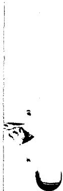

3.2Pumps 29

3.2.1 Mark 2 Fuel Pump 29   
3.2.2 Oil Pump Endurance Test 31

3.3 MSRE Remote Gamma Spectrometer 31

3.3.1 Description of the Equipment 31   
3.3.2 Test Program 33

3.4 Noble-Metal Migration in the MSRE 33

# 4. INSTRUMENTS AND CONTROLS 36

4.1 Development of Reactor Diagnosis Using Noise Analysis 36   
4.2 MSRE Operating Experience 37   
4.3 Control System Design 37

# PART 2. MSBR DESIGN AND DEVELOPMENT

# 5. DESIGN 39

5.1 General 39   
5.2 Plant Layout 43   
5.3 Seismic Review of MSBR Plant Conceptual Design 49   
5.4 Cooling Requirements for Waste Storage Pit 51   
5.5 Primary Salt Drain Tank 52   
5.6 Primary-Salt-Drain-Tank Operation and Afterheat Removal System 55   
5.7 Gamma Heating in MSBR Heat Exchangers 56

# 6. REACTOR PHYSICS 59

6.1 Physics Analysis of MSBR 59

6.1.1 One-Fluid MSBR Reference Design: Two-Dimensional Calculation 59   
6.1.2 MSBR Nuclear Design Studies 60   
6.1.3 Alternate MSBR Design Studies 61   
6.1.4 Gamma and Neutron Heating in MSBR 63   
6.1.5 MSBR Dynamics and Control 66

6.2 Physics Analysis of MSBE 69

6.2.1 MSBE Design Studies 69

6.3 MSR Experimental Physics 70

6.3.1 235 U Capture-to-Absorption Ratio in the Fuel of the MSRE 70   
6.3.2 233U Capture-to-Absorption Ratio in the Fuel of the MSRE 72   
6.3.3 233 U Capture-to-Absorption Ratio in Encapsulated Samples in the MSRE 72

# 7. SYSTEMS AND COMPONENTS DEVELOPMENT 73

7.1 Bubble Generator 73   
7.2 Molten-Salt Steam Generator 73

7.2.1 Steam-Generator Industrial Program 74   
7.2.2 Steam-Generator Tube Test Stand 74

7.3 Sodium Fluoroborate Circulating Test Loop 74

7.3.1 Corrosion-Product Deposition 74   
7.3.2 Gas System Studies 75

7.4 MSBE Pumps 77

7.4.1 MSBE Salt Pump Procurement 77   
7.4.2 MSBE Salt Pump Test Stand 78   
7.4.3 ALPHA Pump 78

7.5 Remote Welding 79

8.MsBR INSTRUMENTATION AND CONTROLS 83

8.1 Control System Analysis 83   
8.2 Dynamic Analysis of MSBR Steam Generator 83

9.HEAT AND MASS TRANSFER AND THERMOPHYSICAL PROPERTIES 85

9.1 Heat Transfer 85   
9.2 Thermophysical Properties 89   
9.3 Mass Transfer to Circulating Bubbles 93

# PART 3. CHEMISTRY

10. CHEMISTRY OF THE MSRE 96

10.1 Composition of the MSRE Fuel Salt 96   
10.2 A Material Balance for Plutonium in the MSRE Fuel Salt 98   
10.3 Some Factors in Gas Behavior in the MSRE Fuel System 102

11. FISSION PRODUCT BEHAVIOR 104

11.1 Examination of the Fourth Set Surveillance Specimens from the MSRE 104

11.1.1 Examination of Graphite 104   
11.1.2 Radiochemical Analyses of the Graphite 104   
11.1.3 Penetration of the Graphite by Uranium 106

11.1.4 Radiochemical Analyses and Deposition of Fission Products on Hastelloy N from the Core of the MSRE 107

11.2 Samples from MSRE Pump Bowl 107   
11.3 Examination of Materials from MSRE Off-Gas Lines 109   
11.4 The Surface Tension of the MSRE Fuel and Flush Salts 109   
11.5 Niobium Reduction Potentials 112   
11.6 Noble-Metal Fission Product Chemistry 113

11.6.1 Synthesis and Stability of Molybdenum Fluorides 113   
11.6.2 Kinetics of $\mathsf{MoF}_3$ Disproportionation in Molten 2LiF-BeF2 115   
11.6.3 Mass Spectrometric Studies 116   
11.6.4 Infrared Spectroscopy 121

12. PROPERTIES OF THE ALKALI FLUOROBORATES 122

12.1 Melting Points and Solid Transition Temperatures of Alkali Fluoroborates 122   
12.2 Densities and Molar Volumes of Molten Fluoroborates 122   
12.3 Predicted Volume Changes in Crystalline Alkali Fluoroborates 123   
12.4 Refractive Indices and Electronic Polarizabilities in Crystalline Alkali Fluoroborates 124

12.5 Decomposition Pressures and $S_{298}^{\circ}$ of $\mathrm{LiBF}_4$ 125   
12.6 X-Ray Crystal Parameters of $\mathbf{LiBF}_4$ 127   
12.7 Mixing Reactions of MSBR Fuel and Coolant Salts 127   
12.8 Phase Relations in the System NaF-KF-BF3 128   
12.9 Preparation of Pure $\mathrm{NaBF_4}$ 129   
12.10 Attempted Synthesis of $\mathrm{NaBF}_3\mathrm{OH}$ 130

# 13. PHYSICAL CHEMISTRY OF MOLTEN SALTS 131

13.1 Phase Relations in the System LiF-BeF2-CeF3 131   
13.2 Heterogeneous Equilibria Between Cerium-Containing Melts and Various Oxide Phases 131   
13.3 Liquidus Temperatures in the System LiF-BeF2-ThF4 135   
13.4 The Solubility of Thorium in Thorium Tetrafluoride 135   
13.5 Potentiometric Determination of the $\mathrm{U}^{4 + } / \mathrm{U}^{3 + }$ Ratio in Molten Fluorides 135   
13.6 Refinement of the $\mathbf{UF}_3$ Spectrum 137   
13.7 EMF Measurements with Concentration Cells with Transference in Molten Mixtures of LiF and $\mathbf{BeF}_2$ 138   
13.8 Improved Determination of Electrical Conductance of LiF-BeF $_2$ (66-34 mole %) 141   
13.9 Electrical Conductivities of Low-Melting NaF-BeF $_2$ Mixtures 142   
13.10 Viscosity of Molten Salts 144   
13.11 Density of Molten Fluorides of Reactor Interest 145   
13.12 Room-Temperature Densities and Estimated Density Change, Upon Melting, of MSBR Fuel and Coolant Salts 146

# 14. CHEMISTRY OF MOLTEN-SALT REACTOR FUEL REPROCESSING TECHNOLOGY 149

14.1 Reductive Extraction of Protactinium at High Concentrations (2000 ppm Level) from MSBR Fuel Solvent Salt $(\mathbf{LiF - BeF}_2\cdot \mathbf{ThF}_4,72 - 16 - 12$ mole $\%$ into Molten Bismuth 149   
14.2 The Separation of Zirconium from Uranium in Bismuth Solutions by Platinide Precipitation 151   
14.3 Bismuth-Magnesium Mixtures as Rare-Earth Extractants 152   
14.4 Reductive Extraction of Rare Earths from Molten LiF-BeF $_2$ -ThF $_4$ (72-16-12 mole %) into Tin and Aluminum-Tin Mixtures at $600^{\circ}\mathrm{C}$ 152   
14.5 Extraction of Thorium from Processed MSBR Fuel Salt into Molten Lead 154

# 15. DEVELOPMENT AND EVALUATION OF ANALYTICAL METHODS FOR MOLTEN-SALT REACTORS 156

15.1 Determination of Oxide in MSRE Fuel 156   
15.2 Voltammetric Determination of U(IV)/U(III) Ratios in MSRE Fuel 156   
15.3 Computer-Operated Voltammetric U(IV)/U(III) Ratio Determination 157   
15.4 Electroanalytical Studies in Molten Fluorides 158   
15.5 Spectral Studies of Superoxide Ion in Molten Fluoride Salts 159

15.6 Hot-Cell Spectrophotometric Facility 160   
15.7 Removal of Oxide from $\mathrm{NaBF_4}$ 161   
15.8 Determination of Bismuth in MSRP Salts 162

15.8.1 Emission Spectrography 162   
15.8.2 Inverse Polarography 162

# PART 4. MOLTEN-SALT IRRADIATION EXPERIMENTS

# PART 5. MATERIALS DEVELOPMENT

16. MSRE SURVEILLANCE PROGRAM 165

16.1 Removal and Examination of Surveillance Samples 165   
16.2 Properties of the Hastelloy N Surveillance Samples 168

17. GRAPHITE STUDIES 171

17.1 Procurement of New Graphites 171   
17.2 Graphite Fabrication 171   
17.3 X-Ray Studies 172   
17.4 Electron Microscopy of Graphite 174   
17.5 Gas Impregnation of Graphite with Carbon 174   
17.6 Graphite Irradiations in HFIR 175   
17.7 The Energy Dependence of Neutron Damage in Graphite 177   
17.8 Fundamental Studies of Radiation Damage Mechanisms in Graphite 179   
17.9 Macroscopic Damage Models 180

18. HASTELLOY N 182

18.1 Aging of Titanium-Modified Hastelloy N 182   
18.2 Statistical Treatment of Aging Data for Hastelloy N 183   
18.3 Development of a Modified Hastelloy N 184   
18.4 Electron Microscope Studies 193

18.5 Corrosion Studies 195

18.5.1 Fuel Salts 195   
18.5.2 Fertile-Fissile Salts 195   
18.5.3 Blanket Salts 200   
18.5.4 Coolant Salts 200   
18.5.5 Corrosion Meter 202   
18.5.6 Corrosion Status 202

18.6 Forced Convection Loop (MSR-FCL-1) 203   
18.7 Steam Corrosion of Hastelloy N 205

19. SUPPORT FOR CHEMICAL PROCESSING 210

19.1 Chemical Vapor-Deposited Coatings 210   
19.2 Development of Bismuth-Resistant Brazing Filler Metals for Joining Molybdenum 211

20. SUPPORT FOR COMPONENTS DEVELOPMENT PROGRAM 213

20.1 Remote Welding Studies 213

# PART 6. MOLTEN-SALT PROCESSING AND PREPARATION

# 21. MEASUREMENT OF DISTRIBUTION COEFFICIENTS IN MOLTEN-SALT-METAL SYSTEMS 215

21.1 Extraction of Transiranium Elements from Single-Fluid MSBR Fuels 215   
21.2 Extraction of Rare Earths and Thorium from Single-Fluid MSBR Fuels 216   
21.3 Coprecipitation of Rare Earths with Thorium Bismuthide 217   
21.4 Dissolvability and Solubility of $\mathbf{PuF}_3$ in LiF-BeF $_2$ (66-34 mole %) 219

# 22. FLOWSHEET ANALYSIS 220

22.1 Isolation of Protactinium 220

22.1.1 Steady-State Performance for the Case of MSBR Fueled with Uranium 220   
22.1.2 Transient Performance for the Case of MSBR Fueled with Uranium 221   
22.1.3 Steady-State Performance for the Case of MSBR Fueled with Plutonium 224

22.2 Removal of Rare Earths from a Single-Fluid MSBR 225   
22.3 Stripping of $\mathrm{ThF_4}$ from Molten Salt by Reductive Extraction 226   
22.4 MSBR Processing Plant Material and Energy Balance Calculations 226

# 23. ENGINEERING DEVELOPMENT OF PROCESS OPERATIONS 229

23.1 Reductive Extraction Engineering Studies 229   
23.2 Electrolytic Cell Development 230

23.2.1 Static Cell Experiments 230   
23.2.2 Flow Electrolytic Cell Facility 233   
23.2.3 Analysis of Mass Transfer in Electrolytic Cells 235

23.3 Salt-Metal Contactor Development 236   
23.4 Effect of Axial Mixing on Extraction Column Height 238   
23.5 Axial Mixing in Bubble Columns 240

# 24. DISTILLATION OF MSRE FUEL CARRIER SALT 241

# 25. DESIGN STUDIES FOR SALT PROCESSING 244

25.1 Heat Transfer Through the Frozen Salt Walls of an Electrolytic Cell 244   
25.2 Design of a Continuous Salt Purification System 244   
25.3 Design and Preparation of $^{239}\mathrm{PuF}_3$ Capsules for Small Refueling  
Additions to the MSRE 245

# Introduction

The objective of the Molten-Salt Reactor Program is the development of nuclear reactors which use fluid fuels that are solutions of fissile and fertile materials in suitable carrier salts. The program is an outgrowth of the effort begun over 20 years ago in the Aircraft Nuclear Propulsion program to make a molten-salt reactor power plant for aircraft. A molten-salt reactor - the Aircraft Reactor Experiment - was operated at ORNL in 1954 as part of the ANP program.

Our major goal now is to achieve a thermal breeder reactor that will produce power at low cost while simultaneously conserving and extending the nation's fuel resources. Fuel for this type of reactor would be $^{233}\mathrm{UF}_4$ dissolved in a salt that is a mixture of LiF and $\mathrm{BeF}_2$ , but it could be started up with $^{235}\mathrm{U}$ or plutonium. The fertile material would be $\mathrm{ThF}_4$ dissolved in the same salt or in a separate blanket salt of similar composition. The technology being developed for the breeder is also applicable to high-performance converter reactors.

A major program activity is the operation of the Molten-Salt Reactor Experiment. This reactor was built to test the types of fuels and materials that would be used in thermal breeder and converter reactors and to provide experience with the operation and maintenance of a molten-salt reactor. The MSRE operates at $1200^{\circ}\mathrm{F}$ and at atmospheric pressure and produces about 8.0 Mw of heat. The initial fuel contained 0.9 mole $\%$ $\mathrm{UF_4}$ , 5 mole $\%$ $\mathrm{ZrF_4}$ , 29 mole $\%$ $\mathrm{BeF_2}$ , and 65 mole $\%$ ${}^{7}\mathrm{LiF}$ , a mixture which has a melting point of $840^{\circ}\mathrm{F}$ . The uranium was about $33\%$ ${}^{235}\mathrm{U}$ .

The fuel circulates through a reactor vessel and an external pump and heat exchange system. All this equipment is constructed of Hastelloy N, a nickel-molybdenum-iron-chromium alloy with exceptional resistance to corrosion by molten fluorides and with high strength at high temperature. The reactor core contains an assembly of graphite moderator bars that are in direct contact with the fuel. The fuel salt does not wet the graphite and therefore does not enter the pores. Heat produced in the reactor is transferred to a coolant salt in the primary heat exchanger, and the coolant salt is pumped through a radiator to dissipate the heat to the atmosphere.

Design of the MSRE started in the summer of 1960, and fabrication of equipment began early in 1962. Prenuclear testing was begun in August of 1964, and, following some modifications, the reactor was taken critical on June 1, 1965. Zero-power experiments were completed early in July. After additional modifications, maintenance, and sealing of the containment, operation at a power of 1 Mw began in January 1966.

At the 1-Mw power level, trouble was experienced with plugging of small ports in control valves in the off-gas system by heavy liquid and varnish-like organic materials. These materials are believed to be produced by radiation polymerization of a very small amount of oil that vaporizes after leaking through a gasketed seal into the tank of the fuel circulating pump. This difficulty was overcome by installing a specially designed filter in the off-gas line.

Full power was reached in May 1966, and the plant was operated at full power for about six weeks. Then one of the radiator cooling blowers (which were left over from the ANP program) broke up from mechanical stress. While new blowers were being procured, an array of graphite and metal surveillance specimens were taken from the core and examined.

Power operation was resumed in October 1966 with one blower; then in November the second blower was installed, and full power was again attained. After a shutdown to remove salt that had accidentally gotten into an off-gas line, the MSRE was operated in December and January at full power for 30 days without interruption. The next power run was begun later in January and was continued for 102 days, until terminated to remove a second set of graphite and metal specimens. An additional operating period of 46 days during the summer was interrupted for maintenance work on the sampler-enricher when the cable drive mechanism jammed.

In September 1967, a run was begun which continued for six months, until terminated on schedule in March 1968. Power operation during this run had to be interrupted once when the reactor was taken to zero power to repair an electrical short in the sampler-enricher.

Completion of this six-month run brought to a close the first phase of MSRE operation, in which the objective was to demonstrate on a small scale the attractive features and technical feasibility of these systems for civilian power reactors. We believe this objective has been achieved and that the MSRE has shown that molten-fluoride reactors can be operated at temperatures above $1200^{\circ}\mathrm{F}$ without corrosive attack on either the metal or graphite parts of the system, that the fuel is completely stable, that reactor equipment can operate satisfactorily at these conditions, that xenon can be removed rapidly from molten salts, and that, when necessary, the radioactive equipment can be repaired or replaced.

The second phase of MSRE operation began in August 1968, when a small facility in the MSRE building was used to remove the original uranium charge from the fuel salt by treatment with gaseous $\mathbf{F}_2$ . In six days of fluorination, $219~\mathrm{kg}$ of uranium was removed from the molten salt and loaded onto absorbers filled with sodium fluoride pellets. The decontamination and recovery of the uranium were very good.

While the fuel was being processed, a charge of $^{233}\mathrm{U}$ that had been made in the Savannah River reactors was converted to $\mathrm{UF_4 - LiF}$ enriching salt in ORNL's Thorium-Uranium Recycle Facility. The enriching salt was added to the original carrier salt, and in October 1969 the MSRE became the world's first reactor to operate on $^{233}\mathrm{U}$ . Power operation on $^{233}\mathrm{U}$ began in January, 1969, and continued until a scheduled shutdown in June.

The nuclear characteristics of the MSRE with the $^{233}\mathrm{U}$ were close to the predictions, and, as expected, the reactor was quite stable. One surprise was a considerable increase in the amount of gas entrained in the salt, which made the reactor power very noisy. A slight reduction in the pump speed eliminated the gas. In May, a small quantity of MSRE carrier salt reserved from the earlier fluorination was distilled at the reactor

to demonstrate use of this process to recover LiF and $\mathrm{BeF}_2$ from irradiated salt. A second period of power operation with $^{233}\mathrm{U}$ began in August, and in September, shortly after the end of this report period, small amounts of $\mathrm{PuF}_3$ were added to the fuel.

A large part of the Molten-Salt Reactor Program is now being devoted to future molten-salt reactors. Conceptual design studies are being made of breeder reactors, and an increasing amount of work on materials, on the chemistry of fuel and coolant salts, and on processing methods is included in the research and development program.

Until two years ago most of our work on breeder reactors was aimed specifically at two-fluid systems in which graphite tubes would be used to separate uranium-bearing fuel salts from thorium-bearing fertile salts. We think attractive reactors of this type can be developed, but several years of experience with a prototype reactor would be required to prove that graphite can serve as piping while exposed to high fast-neutron irradiations. As a consequence, a one-fluid breeder was a long-sought goal.

In late 1967 two developments established the feasibility of a one-fluid breeder. The first was demonstration of the chemical steps in a process which uses liquid bismuth to extract protactinium and uranium selectively from a salt that also contains thorium. The second was the recognition that a fertile blanket can be obtained with a salt that contains uranium and thorium by reducing the graphite-to-fuel ratio in the outer part of the core. Our studies show that a one-fluid, two-region breeder can be built that has fuel utilization characteristics approaching those of our two-fluid designs and probably better economics. Since the graphite serves only as moderator, the one-fluid reactor is more nearly a scaleup of the MSRE.

These features caused us to change the emphasis of our breeder program from the two-fluid to the one-fluid breeder. Most of our design and development effort is now directed to the one-fluid system.

# Summary

# PART 1. MOLTEN-SALT REACTOR EXPERIMENT

# 1. MSRE Operations

High-power operation with $^{233}\mathbf{U}$ fuel, which began in January 1969, continued until a scheduled shutdown on June 1. After maintenance, inspection, and the annual test of containment, operation was resumed in August.

One of the prime objectives of the high-power operation was to obtain a very accurate measurement of the $^{233}\mathrm{U}$ $\sigma_{c} / \sigma_{a}$ ratio. For this purpose samples were taken after 0.5, 1.8, and $2.9\%$ burnup of the $^{233}\mathrm{U}$ . Experiments were conducted during this period on the behavior of cover gas and xenon in the fuel salt at various fuel circulation rates. Reductants and an oxidant were added to the fuel salt and numerous samples were taken to investigate the physical and chemical behavior of the fuel mixture. During the reactor operation, a small amount of fuel carrier salt, stripped of its uranium during the fluorination in 1968, was transferred to the distillation experiment set up in the reactor building.

There were no significant delays in the experimental program due to equipment problems, although recurrent plugging in the off-gas system required some attention. An indication of the absence of serious problems is that from January to June 1, the reactor was critical $95\%$ of the time.

During the shutdown, core specimens were removed and a different array installed, control rod drives were repaired or replaced, one control rod was replaced, and the off-gas lines were cleared either by heating and blowing or (in the case of the overflow tank vent) by replacing a plugged valve. Large amounts of data on fission product distributions were obtained by remote gamma spectrometry during the shutdown and the subsequent startup. (The measurements during the startup were through holes drilled in the shield during the shutdown.)

The valves most important to primary containment were tested during the shutdown, and just before the startup the secondary containment was tested at 20

psig. Pressure tests of the fuel and coolant salt systems at 60 psig were performed during five days of flush-salt circulation.

The first experiments after the startup were aimed at the behavior of cover gas in the flush and fuel salts and its effect on xenon poisoning. Significant differences were observed between helium and argon.

# 2. Reactor Analysis

Because some cross sections have been revised since the physics analysis of the MSRE with $^{235}\mathrm{U}$ was made, the analysis was repeated using the more up-to-date values. Reaction cross sections averaged over the neutron energy spectrum and fuel volume were recalculated for a number of nuclides in the salt, and the variation in these cross sections with the reactor operating conditions was studied. Some differences in the average cross sections for $^{235}\mathrm{U}, ^{238}\mathrm{U},$ and $^{239}\mathrm{Pu}$ were found. These differences change the calculated critical $^{235}\mathrm{U}$ concentration by a maximum of about $2\%$ and thus have a relatively insignificant effect on the interpretation of the critical experiment. However, increases in the average $^{238}\mathrm{U}$ absorption cross section led to an increase of nearly $5\%$ in the calculated net depletion rate of uranium for a specified fission rate in the reactor and about a $20\%$ increase in the plutonium production rate.

# 3. Component Development

The freeze flange thermal cycle test was continued with no external damage through cycle 400, when it was shut down for internal inspection and minor repairs. A fluorescent dye penetrant more sensitive than the one previously used gave a completely new pattern of fatigue cracks and porosity indications. None of the indications are in the locations which would cause concern.

The much improved remote gamma spectrometer system was put into operation and performed as planned.

In connection with the development of off-gassystems, a model based on conventional mass transfer concepts was developed in an attempt to describe

quantitatively the migration of noble metals in the MSRE.

Operation of the Mark 2 fuel pump with molten salt at $1200^{\circ}\mathrm{F}$ and 1350 gpm passed 8400 hr. After the pump tank operating liquid level was raised, void-fraction measurements indicated there was no detectable quantity of gas bubbles circulating in the salt, and the plugging rate in the off-gas line decreased considerably.

# 4. Instruments and Controls

Efforts to improve reactor diagnosis by noise analysis were hampered by limitations of the pressure-measuring system. The analytical model used in the analysis was verified, however, and it was shown that plugging in the off-gas line could be detected at an early stage by analysis of the pressure noise. Continuous indicators of pressure and neutron noise levels were installed for use by the reactor operators.

Only relatively minor maintenance and modifications were required in the MSRE instruments and controls.

# PART 2. MSBR DESIGN AND DEVELOPMENT

# 5. Design

The conceptual design study of a 1000 Mw (electrical) single-fluid MSBR power station is essentially complete, and preparation of a report covering the study has begun.

Major revisions were made to the MSBR building design to provide a sealed 134-ft-diam cylindrical reactor building with hemispherical top to assure against escape of airborne contaminants during reactor core maintenance operations. The 3-ft-thick concrete in the building wall provides biological shielding during the maintenance and also serves as missile protection. The core transport cask, now a part of the polar crane serving the reactor building, has integral hoists for lifting the reactor core into the cask and lowering it into the spent-core storage pit.

As a result of a review of the resistance of the building and equipment supports to seismic disturbances, the reactor plant now rests on a concrete pad separate from the turbine plant. In this connection, the availability of pipe supports with vibration-damping dashpots suitable for high-temperature operation is being investigated.

The new reactor building layout permits a waste cell to be provided beneath the reactor cell for storage of a 30-year accumulation of discarded radioactive materials

and equipment. The maximum heat generation in the pit is about $600\mathrm{kw}$ , stemming primarily from chemical processing wastes. The pit will be maintained at $150^{\circ}\mathbf{F}$ or below, by cooling a side stream of the nitrogen atmosphere with a water-cooled heat exchanger. Duplicate equipment will be provided.

The primary salt drain tank was redesigned to provide added reliability in the cooling system through use of 40 separate and autonomous circuits employing natural circulation of a $^7\mathrm{LiF - BeF}_2$ coolant salt through 1500 tubes $(3 / 4)$ in. in diameter) in the drain tank and a salt-to-water heat exchanger located outside the drain tank cell. Heat transfer in this exchanger is by radiation, with no direct contact between the surfaces that could result in water entering the salt system. The generated steam is condensed in air-cooled finned coils in the base of a 300- to 400-ft natural draft stack, and the condensate is recirculated. The redesigned drain tank also serves as a 2.5-hr holdup volume for decay of off-gases taken from the primary system prior to their treatment and disposal. The heat load due to the gases is about 18 Mw (thermal).

The fuel salt circulating pump bowls overflow continuously into the drain tank. The $1213^{\circ}\mathrm{F}$ incoming salt from the pumps flows downward through a $\frac{1}{2}$ -in. annular space at the tank wall to remove gamma heat and to limit the maximum wall temperature to about $1261^{\circ}\mathrm{F}$ . The fuel salt is continuously returned to the primary loop by four jet pumps located in the bottom of the primary drain tank. The drain tank thus achieves added reliability through being an active part of the primary system.

During the past report period an analysis of the afterheat generation in a drained primary heat exchanger was initiated. Deposited noble-metal fission products are the principal source of heat, with about 60 to $80\%$ being due to gamma emission. Based on extrapolation of the behavior of tellurium, which appears to be typical of the gamma emitters, and assuming that $40\%$ of all noble metals are deposited on heat exchanger surfaces, the fractional distribution of the heat is about $60\%$ in the tube annuli, $25\%$ in the intermediate shell, and $10\%$ in the innermost shell. Reducing the size of the heat exchangers within the range of interest does not significantly alter the fact that about $90\%$ of the gamma energy originating in the tube annuli remains within the exchanger.

# 6. Reactor Physics

Neutronics calculations for the reference one-fluid MSBR performed in explicit two-dimensional geometry

confirm the results obtained with the two-dimensional synthesis technique employed in the optimization code.

Fuel-cycle calculations for molten-salt reactors both larger and smaller than the reference 1000 Mw (electrical) MSBR show a significant dependence of breeding performance on reactor power level. Both breeding ratio and annual fuel yield can be expected to increase a full percentage point if power level can be raised to 2000 Mw (electrical) and nearly two points if the power were increased to 4000 Mw (electrical).

Analysis of the effect of varying the average power density for the $1000\mathrm{Mw}$ (electrical) MSBR shows that the reference design, with an average power density of $22\mathrm{W/cm^3}$ , is about optimum in terms of annual fuel yield, although the conservation coefficient could be improved slightly by increasing the power density. No change in the reference design is contemplated, however, since the selection of core dimensions is partly based on the lifetime of the core graphite, which is limited by fast-neutron damage.

A new investigation of the potential performance of a canned-core MSBR, in which a metallic or graphite barrier separates the core from the blanket, indicates significantly better breeding performance than for the reference one-fluid concept, in spite of neutron captures in the barrier. Annual fuel yields twice that of the reference design are indicated. If feasible from other points of view, such a concept might thus provide a useful line of development for future MSBR designs.

Gamma and neutron heating calculations were completed for the current one-fluid MSBR design.

A digital simulation code, involving a rather detailed model of the reactor core as well as of the primary and secondary heat exchange circuits, has been employed to study the response of the MSBR to various reactivity perturbations. Frequency response calculations for the reference MSBR at full power show no tendencies to instability.

Additional calculations for various possible configurations of a molten-salt breeder experiment show that breeding ratios near unity, with $^{233}\mathrm{U}$ fuel, could be achieved with power levels of about 150 Mw (thermal) and with a maximum core power density of about 100 w/cm³.

The measured value of the $^{235}\mathrm{U}$ capture-to-absorption cross-section ratio in the MSRE is in excellent agreement with the calculated value, providing good confirmation of cross sections and computational models used in MSBR design calculations. Similar experiments are in progress for $^{233}\mathrm{U}$ .

# 7. Systems and Components Development

Pressure-drop measurements were made for four models of the bubble generator, and contraction and expansion coefficients were determined. Addition of a surfactant, normal butyl alcohol, was shown to markedly reduce the coalescence of bubbles in tests with water.

The steam-generator industrial program consists of four phases that will result in the design, development, and fabrication of a full-size, full-length tube unit for testing in the Prototype Tube Test Stand; an MSBE unit for testing in the Engineering Test Unit; and the steam generator for use in the MSBE. Phase I will produce a conceptual design for use with the ORNL reference design of the 1000 Mw (electrical) MSBR. The salt flows and temperatures for all operating conditions and the steam and feedwater inlet and outlet temperatures and pressures at full load will be specified by ORNL based on the requirements for the prevention of freezing of the salt or excessive thermal cycling of the system components. An alternative conceptual design will be made for the same salt conditions, but without the restrictions on the steam system. The request for directive for the steam generator prototype tube test stand has been deferred pending completion of the conceptual system design description and availability of funds.

The $\mathrm{NaBF}_4$ circulating test loop was operated for a total of $3600\mathrm{hr}$ during the report period to continue the investigation of problems associated with corrosion product deposition and with off-gas system restrictions. Seven tests were made with the cold finger, and chemical analyses made of green deposits obtained during some of these tests indicated up to $8\%$ chromium. No definite conclusions were reached as to the identity of the compounds forming the deposits. An analysis of data on impurities found in salt samples taken during circulation of the clean batch of salt indicates that the solubility of iron at $1025^{\circ}\mathbf{F}$ is 500-550 ppm. The analytical results for oxygen and water in the salt have a low level of confidence. A hot trap for retention of salt mist was found to have about a $50\%$ efficiency using either of two different internal arrangements. An examination of several possible sources indicated that emissions of acid fluid were resulting from contamination of the system with wet air during routine operational and maintenance activities.

A request for proposal package to obtain the MSBE salt pumps from the United States pump industry was completed. The package includes the specifications for the primary and the secondary salt pumps, the pro

posed scope of work, information required in the proposal, and copies of the RDT standards referenced in the specifications. Proposals are being requested from the Bingham Pump Company, Byron Jackson Pump Company, and Westinghouse Electro Mechanical Division.

Programmatic approval was received from the AEC to proceed with the design of the MSBE salt pump test stand. The conceptual system design description of the stand was completed and released for distribution. The preliminary design has been started and is scheduled for completion by November 1969.

The detail design of the ALPHA pump (for up to 30-gpm use in test loops) was completed, and the fabrication of the water test pump was initiated. Water tests will be performed to determine the pump hydraulic characteristics and to control the "fountain leakage" from its entrance into the pump tank to its return to the impeller inlet.

Performance tests were conducted with the pipe cutting and welding devices developed and fabricated as modifications of equipment designed for the U.S. Air Force by North American Rockwell Corporation. Cutter performance tests included saw tracking and runout determinations and machining studies on stainless steel and Inconel piping. Life expectancy of the cutter blades was determined for various tools, material, and cutter speeds. A machining technique was developed for remotely preparing J-bevel pipe ends for welding. Some tests were started on repairing weld defects. A 7-min color movie was prepared to show the performance of remote maintenance operations with the orbital equipment.

# 8. MSBR Instrumentation and Controls

The analog model of the 1000 Mw (electrical) MSBR is being refined and expanded to include additional nodes for more accurate simulation and more recent data from the project for calculation of important coefficients. The new model includes considerable latitude for trying different control schemes and should be representative of expected performance over a wider range of power levels.

As an adjunct to the transient simulation, a study is being made of steady-state part-load plant conditions to determine suitable profiles of temperature and flow within the limits imposed by salt freezing, pump capabilities, etc.

A subcontract with the University of Illinois for a hybrid computer study of molten-salt supercritical steam generators has been terminated, and a final report

of the work will be issued shortly. This work will be continued at the ORNL Hybrid Computing Facility, which is expected to be operational early in 1970.

# 9. Heat and Mass Transfer and Thermophysical Properties

Heat Transfer. - New heat transfer results have been obtained with a proposed MSBR fuel salt (LiF-BeF $_2$ -ThF $_4$ -UF $_4$ , 67.5-20-12-0.5 mole $\%$ ). In the recent experiments a replacement test section was used because the original one may have caused flow disturbances leading to irregular axial wall temperature profiles.

The new results in the lower laminar flow region (Reynolds modulus, $N_{\mathrm{Re}}$ , less than 1000) and in the upper transition and turbulent flow regions ( $N_{\mathrm{Re}}$ greater than 3500) were characterized by regular axial temperature profiles indicative of developing flow in the laminar region and fully developed flow in the transition and turbulent regions. The existence of fully developed flow is in marked contrast with the results obtained using the original test section, which suggested flow transition effects extending the full length of the tube. The axial temperature profiles, together with the corresponding bulk liquid temperatures, were employed to derive heat transfer coefficients and Nusselt moduli for comparison with the published correlations of Sieder and Tate for laminar and turbulent flow, Martinelli and Boelter for laminar flow, McAdams for turbulent flow, Colburn for turbulent flow, and Hausen for transitional flow. The data agree best with the equation of Sieder and Tate in the low laminar range and with that of Colburn in the turbulent range, $N_{\mathrm{Re}}$ greater than 12,000.

Least-squares fitting of the data to an equation which assumes the Nusselt modulus to depend on some power of the Reynolds modulus has resulted in dimensionless correlations of the data for $N_{\mathrm{Re}} < 1000$ and $N_{\mathrm{Re}} > 12,000$ with average absolute deviations of about $5\%$ . No correlations could be developed in the range $1000 < N_{\mathrm{Re}} < 3500$ because of irregular axial temperature profiles indicative of flow transition, the effects of which persisted over most of the test section length.

Thermophysical Properties. - The effect of heat shunting around the specimen in the present variable-gap thermal-conductivity apparatus on the measured thermal conductivity has been analyzed. This problem is particularly serious for fluids having conductivities less than $0.05\mathrm{Wcm}^{-1}$ ${}^{\circ}\mathrm{C}^{-1}$ , which include the salts of interest to the MSRE and MSBR. A correction factor has been derived which depends on gap spacing,

specimen conductivity, and the fixed thermal resistance of the gap. Applied to the measured conductivities of the calibration fluids water, Hitec salt, and mercury, this correction factor brings the results into good agreement with accepted published values. The measured conductivities of the MSRE fuel and coolant salts and proposed MSBR fuel and coolant salts have likewise been corrected, resulting in a small decrease from previously published values.

Mass Transfer to Circulating Bubbles. - Shakedown tests of the experimental facility revealed some problems with the pump and heat exchanger, which are being corrected. The facility incorporates a variable-area nozzle with gas injection into the throat for bubble generation and a bubble separator which combines centripetal and gravitational separation with the barrier effect of a wetted screen. A theoretical description of the mass transfer process is under development which assumes that a bubble moves at the local velocity of the liquid and that the flow field near the bubble-liquid interface is primarily the turbulence fluctuations. An improved eddy diffusivity method is being investigated which relates this parameter to the mean flow, concentration gradient, and interfacial boundary conditions.

# PART 3. CHEMISTRY

# 10. Chemistry of the MSRE

Refinement of the material balance for MSRE fuel and flush salts was effected by experimental determination of the quantity of residual carrier salt in the drain tank. Nominal values of the uranium tetrafluoride concentration in the fuel salt derived therefrom were found to be in excellent agreement with the analytical results. Comparison of the analytical values for plutonium in the fuel salt with values anticipated from nuclear data showed good agreement at the beginning of $^{233}\mathrm{U}$ operations.

Variations in the void fraction of the circulating fuel salt using helium and argon cover gases were rationalized on the basis of the relative solubilities of these gases and the probable relation of gas-salt mass transfer in interfacial tension on these phenomena.

# 11. Fission Product Behavior

A fourth set of graphite and Hastelloy N surveillance samples, removed from the MSRE core after the June 1969 shutdown, was subjected to radiochemical analysis. No significant difference was noted with respect to polished or unpolished graphite surfaces, and with the possible exception of $^{132}\mathrm{Te}$ , no significant difference

with exposure time. Although flush salt was not used, metal surfaces were free of uranium. The quantity of $^{135}\mathrm{I}$ on these surfaces exceeded previously observed amounts by a factor of 3.5.

The surface tensions of MSRE fuel salt and flush salt were measured using a capillary depression method in graphite. The decrease in surface tension observed while the fuel salt was being reduced by metallic beryllium corresponds to a higher helium solubility and thus a reduced bubble fraction at a given gas entrainment rate.

A study of the redox potential of niobium in the MSRE fuel salt was initiated in tracer-level experiments with $^{95}\mathrm{Nb}$ and a molten mixture of $\mathbf{LiF - BeF}_2\mathbf{-UF}_4$

Studies of the disproportionation reactions of $\mathsf{MoF}_3$ in $\mathsf{LiF - BeF_2}$ mixtures were continued using mass spectrometric methods. Appearance potentials and ionization efficiency curves for molybdenum and niobium fluorides were shown to imply the existence of multiple parent species. Determination of the identity and relative abundance of parent species remains an object of the continuing investigation.

# 12. Properties of Fluoroborate Coolant Salts

Mixtures of the alkali fluoroborates continue to exhibit chemical and physical properties which favor their use as coolants for molten-salt breeder reactors. A program for characterizing the physical and chemical properties of the alkali metal fluoroborates was extended to develop a broad base of information about this important and heretofore unexploited class of molten salts. Measurements of the properties of these materials were extended to include experimental determination of the liquid-solid and solid-solid transition temperatures, densities, refractive indices, decomposition pressures, x-ray crystal parameters, fuel-coolant mixing reactions, and equilibrium phase relationships. Other effort was devoted to the synthesis of highly pure crystals of sodium fluoroborate and sodium hydroxyfluoroborate as research materials.

Molar volumes and expansivities, derived from the density-temperature equations of the (molten) alkali fluoroborates, were calculated at two corresponding temperatures. Molecular polarizabilities of the five crystalline fluoroborates were calculated from the observed indices of refraction.

# 13. Physical Chemistry of Molten Salts

A study of the equilibrium phase behavior of $\mathrm{CeF}_3$ , as proxy for $\mathrm{PuF}_3$ , in the system LiF-BeF $_2$ -CeF $_3$ was

initiated as a part of a long-range study of the system $\mathrm{LiF - BeF_2 - ThF_4 - CeF_3}$ $(\mathrm{PuF}_3)$ . Evidence of liquid immiscibility was noted with mixtures which contain low concentrations of LiF.

Experiments were initiated to synthesize sparingly soluble compounds which could act as selective ion exchangers for the rare-earth fission products. Of some six oxides tested, vanadium(V) oxide and chromium(III) oxide warranted further study. Measurements of the solubility of thorium in thorium tetrafluoride were completed. The low solubility observed indicates that the formation of thorium(III) fluoride is unlikely. High-temperature emf measurements with LiF-BeF $_2$ melts were applied to determine transport numbers of lithium and beryllium ion relative to fluoride ion. Such measurements were used to develop a highly precise experimental method for determination of liquidus curves in fluoride systems.

By use of a modified cell design and carefully prepared starting materials, improved values $(\pm 0.5\%)$ for the specific conductance of $\mathrm{LiF - BeF_2}$ (66-34 mole $\%$ ) and its temperature variation were obtained. Electrical conductivities of low-melting NaF-BeF mixtures were measured and the temperature dependence analyzed in terms of the zero-mobility temperature, $T_{0}$ . Values of zero-mobility temperatures were found to be similar in magnitude to those obtained previously in the LiF-BeF system.

Viscosities of MSBR fuel and coolant mixtures were measured at temperatures in the range 400 to $680^{\circ}\mathrm{C}$ ( $\sim 750$ to $1250^{\circ}\mathrm{F}$ ). The densities of these molten mixtures were measured by dilatometric methods. Expansivity of $\mathrm{ThF_4}$ mixtures showed little change with variations in the concentrations of $\mathrm{BeF_2}$ and $\mathrm{ThF_4}$ .

# 14. Chemistry of Molten-Salt Reactor Fuel Reprocessing Technology

The effort to develop a molten-salt fuel technology by using reductive extraction methods was expanded to include examination of various metal additives to bismuth and tin for possible process application. The addition of magnesium to bismuth resulted in the near-stoichiometric reduction of thorium from the salt phase. Similar results were obtained on addition of aluminum to tin. The distributions of cerium between the reference fuel solvent and pure tin were measured at various thorium concentrations in the metal phase. These values and separation factors $D_{\mathrm{Ce}} / D_{\mathrm{Th}}$ were not so favorable as those previously obtained in the salt-bismuth extraction systems. In related experiments

the extraction of europium from the simulated MSBR fuel solvent into an immiscible fluoroborate salt phase was examined. Although this system was adjudged as not feasible for application to rare-earth separations processes, the experimental results provide a basis for further examination of mixing reactions between the proposed MSBR fuel and coolant salt systems.

A small pumped loop was operated to investigate the electrolytic reduction of thorium from a simulated MSBR fuel solvent into molten lead and its simultaneous back extraction into a recovery salt. Low thorium transport rates were encountered.

Tentative evidence which indicates that zirconium may be separated from fuel mixtures without concurrent loss of uranium or thorium was discovered. Separation is effected by precipitation of a platinide phase in bismuth.

# 15. Development and Evaluation of Analytical Methods for Molten-Salt Reactors

New parts are being fabricated for the renovation of the apparatus for determining the oxide content of reductive salts. As was mentioned in the last report, the NaF trap restricts the gas flow in the system and must be replaced. The equipment for the voltammetric determination of U(III) in radioactive MSRE fuel was installed in the hot cell. The one determination which was made showed that $0.4\%$ of the total uranium was present as U(III). An experimental setup at the Y-12 site is being used to follow the change in the U(IV)/U(III) ratio in a simulated MSRE fuel as either the U(IV) is reduced or the U(III) is reoxidized. Fair agreement for the determination of various U(III) concentrations has been obtained by voltammetric, potentiometric, and spectrophotometric methods. Reduction of the fuel resulted in disagreement between the amount of zirconium consumed and the amount of known species reduced. This is receiving further investigation.

To gain experience in adapting small on-line computers to electroanalytical methods, a PDP-8 computer was programmed to operate a cyclic voltammeter. The PDP-8 furnished all command signals to the voltameter and computed U(IV)/U(III) ratios from the derivative of the U(IV)-U(III) reduction wave. In other electroanalytical studies, kinetic parameters were determined for the Ni/Ni(II) couple in molten LiF $\mathrm{BeF}_2$ - $\mathrm{ZrF}_4$ by the relaxation voltage step and chrono-coulometric methods.

Evidence derived from spectral studies has shown that the superoxide ion, $\mathbf{O}_2^-$ , exists in several molten fluoride solutions. This raises the possibility of radiolytic generation of $\mathbf{O}_2^-$ from $\mathbf{O}^{2-}$ in the MSRE and should be investigated when the hot-cell spectrophotometric facility becomes operative. The design and fabrication of the optical components of the hot-cell spectrophotometer have been completed by the vendor. After receipt the entire facility will be installed in Building 3019 for final acceptance tests. Some problems have been encountered with accessory equipment, and these are being corrected. The possibility now exists for the fabrication of a fixed-path-length windowless spectrophotometric cell for studies of molten fluoride salts. It has been demonstrated that stainless steel "porous metal," developed by P. R. Mallory and Company, will adequately hold aqueous solutions for spectral study. This company has agreed to fabricate experimental batches of porous metal from Hastelloy N.

Tests of possible methods for the removal of oxide from $\mathrm{NaBF_4}$ have shown that $\mathrm{BF}_3$ is ineffective but that oxide can be removed by hydrofluorination. A study is being conducted to establish the optimum conditions for oxide removal with HF.

A spectrographic method and a polarographic method for the determination of bismuth in MSRP salts have shown sensitivity limits of 0.002 and 0.05 ppm respectively.

# PART 5. MATERIALS DEVELOPMENT

# 16. MSRE Surveillance Program

Surveillance samples of graphite and Hastelloy N were removed from the MSRE on June 5, 1969. Some samples had been at temperature in the reactor for 2.6 years and were exposed to fast $(>50\mathrm{kev})$ and thermal $(< 0.876\mathrm{ev})$ fluences of $1.1\times 10^{21}$ and $1.5\times 10^{21}$ neutrons/cm² respectively. The samples were sound, but the metal was darker in appearance than usual. Metallography showed some cracking (3-mil depth) of the Hastelloy N straps that hold the surveillance assembly together. Mechanical property tests on the Hastelloy N samples show a continuation of the decrease in fracture strain with increasing fluence. The reduction in fracture strain at low temperatures is attributed to carbide precipitation, and the reduction at high temperatures is due to the production of helium in the material from the ${}^{10}\mathbf{B}(n,\alpha)^{7}\mathbf{Li}$ transmutation.

# 17. Graphite Studies

Most of the available commercial graphites have been irradiated to a fluence of $3.8 \times 10^{22}$ neutrons/cm². The dimensional changes of all of the materials are too large to allow during service, but two graphites show exceptionally good dimensional stability up to fluences of 2.5 to $3.0 \times 10^{22}$ neutrons/cm². Density measurements show that most of the volume change is associated with changes in the pore structure. The x-ray diffraction studies have concentrated on measuring the crystalline anisotropy, and comparisons of these measurements with observed dimensional changes during irradiation reveal the importance of isotropy. The knowledge gained from studies on commercial graphites is being used to fabricate small experimental lots of graphite. Suitable techniques have been developed for sealing three very different graphite substrates with carbon to reduce the gas permeability. The desired permeability of $<10^{-8}$ cm²/sec can be obtained routinely, and experiments are in progress to ascertain how the permeability changes during irradiation.

# 18. Hastelloy N

Several chemical modifications of Hastelloy N are being studied in an effort to develop an alloy with improved resistance to embrittlement by neutron irradiation. Additions of $1\%$ Ti result in an alloy containing the MC-type carbide with good pre- and postirradiation properties. Lesser amounts of titanium lead to the formation of mixed MC and $\mathbf{M}_2\mathbf{C}$ carbides with less attractive properties. Alloys that contain Nb, Hf, and Y also look promising, with fracture strains of 4 to $23\%$ (compared with 0.5 to $3\%$ for standard Hastelloy N). A strong correlation between good postirradiation properties and formation of the MC-type carbide still holds.

The compatibility of Hastelloy N with several fluoride salts is being studied, with primary emphasis on the coolant salt sodium fluoroborate. The corrosion rate is accelerated by the presence of moisture. A pump loop containing coolant salt with 1500 ppm water has corroded at an average rate of 1.3 mils/year for 4000 hr. Observations on a thermal convection loop containing fertile-fissile salt with a bismuth appendage show that the corrosion behavior is not affected appreciably, although detectable quantities of bismuth moved into the salt stream and metal impurities were extracted from the salt stream by the bismuth.

Corrosion data for Hastelloy N in steam are very meager, and we have installed a facility in the Bull Run Steam Plant for obtaining such information. The facility became operational on August 7, 1969.

# 19. Support for Chemical Processing

We have deposited coatings of tungsten on plain carbon steels and type 304 stainless steel in an effort to obtain materials that have good corrosion resistance in bismuth. Tungsten has a lower coefficient of thermal expansion than these steels, and the coatings spall during thermal cycling. We are attempting to reduce the spalling problem by varying the coating parameters and by using other substrate materials with lower expansion.

The primary problem with using molybdenum for a chemical processing plant is the ability to join this material. Welds are extremely brittle, and the base metal even becomes brittle at room temperature when it is fully recrystallized. Early compatibility tests on an alloy of iron, boron, and carbon look promising.

# 20. Support for Components Development Program

One of the primary problems in making good remotemaintenance welds is to obtain good enough alignment between the pieces to be welded to obtain a good root pass. Various techniques for obtaining better root passes are being evaluated.

# PART 6. MOLTEN-SALT PROCESSING AND PREPARATION

# 21. Measurement of Distribution Coefficients in Molten-Salt-Metal Systems

Distribution of actinide and lanthanide elements between molten fluoride salts and liquid bismuth solutions is being studied as part of the development of a reductive extraction process for single-fluid MSBR fuels. Equilibrium data obtained at $600^{\circ}\mathrm{C}$ with LiF $\mathrm{BeF}_2$ -ThF $_4$ (72-16-12 mole %) show that the uranium-neptunium separation factor is about 3, that plutonium, americium, and californium are nearly inseparable, and that the plutonium-curium separation factor is about 10. Studies with several rare earths showed that the rare-earth-thorium separation factors (1 to 3.5) are not markedly temperature dependent in the range 525 to $750^{\circ}\mathrm{C}$ . Selective precipitation of thorium bismuthide from thorium-bismuth-rare-earth solutions is being evaluated as a means of enhancing the overall rare-earth-thorium separation factors in the reductive extraction process.

Since plutonium will be added to the present MSRE fuel salt as $\mathbf{PuF}_3$ powder, tests were conducted to demonstrate that powdered $\mathbf{PuF}_3$ would dissolve rapidly in LiF-BeF $_2$ (66-34 mole %) at about $600^{\circ}\mathrm{C}$ . In addition, values for the solubility of $\mathbf{PuF}_3$ in this salt at several temperatures were confirmed.

# 22. Flowsheet Analysis

Calculations have been continued on several aspects of the flowsheet proposed for processing single-fluid MSBR's. Steady-state calculations indicate that isolation of protactinium is feasible for a reactor fueled with either uranium or plutonium. Approximately $90\%$ of the protactinium in the reactor system could be retained in a salt volume of $200\mathrm{ft}^3$ . Calculations on the transient performance of a reactor fueled with uranium indicate that the relatively large protactinium decay tank tends to stabilize the isolation system and that the system can be controlled by determination of the uranium concentration in the salt entering the decay tank.

Calculations on the removal of rare earths by reductive extraction indicate that about 24 stages will be required in the extraction column in order to obtain adequate rare-earth removal times with bismuth flow rates of $15\mathrm{gpm}$ and process cycle times of 30 days. The optimum feed point location is near the top of the column for rare-earth-thorium separation factors below 1.3 and is shifted downward as the separation factor is increased.

Operation of the reductive extraction system for rare-earth removal requires that only a negligible quantity of $\mathrm{ThF_4}$ remain in the salt which passes through the electrolytic cell and returns to the bottom of the extraction column. Calculations indicate that removal of $\mathrm{ThF_4}$ from the salt can be effected by countercurrent contact of the salt with a lithium-bismuth stream having a lithium concentration of 0.008 mole fraction at a metal-to-salt molar flow ratio of 74.6. Two to three theoretical stages will be required to maintain the desired extent of $\mathrm{ThF_4}$ removal.

# 23. Engineering Development of Process Operations

A reductive extraction system has been installed which will allow the countercurrent contact of up to 15 liters each of molten salt and bismuth in an 0.82-in.-ID packed column. About $200\mathrm{kg}$ of bismuth and $53\mathrm{kg}$ of molten salt (72-16-12 mole $\%$ LiF-BeF $_2$ -ThF $_4$ ) was charged to the system and purified by contact with H $_2$ and H $_2$ -HF mixtures. Attempts to operate the system

have revealed difficulties with deposition of iron in bismuth transfer lines, collection of bismuth at a low point in a salt transfer line, and external air oxidation of the carbon steel tubing. Measures to correct or minimize these problems have been taken.

An electrolytic cell is an important and necessary equipment item in the reductive extraction systems for isolating protactinium and for removing rare earths. Experiments with static cells were carried out which indicate that heat generation and heat transfer in cells can be studied using ac power, which does not produce electrolysis products resulting from use of dc power, and that a graphite anode cannot be used unless a means is found for removing $\mathrm{CF_4}$ gas from the anode surface. Several experiments were made to study the use of frozen salt as an electrical insulator as well as for providing corrosion protection. It was found that frozen layers of salt could be maintained with difficulty in the presence of high heat generation rates, and further studies with cells of improved design will be carried out. A facility for testing electrolytic cells under flow conditions is being installed. Salt and bismuth will be circulated by gas lift pumps, and measurement of the salt and bismuth flow rates will be accomplished by gravity-head-type orifice flow meters. Initial experiments for determining orifice coefficients with bismuth show a greater degree of scatter than is tolerable; however, it is believed that additional experiments will result in acceptable operation. Analysis of mass transfer in electrolytic cells indicates that reduction of $\mathrm{BeF_2}$ may be encountered if cathode current densities exceed $0.16\mathrm{amp / cm^2}$ , and experiments to check this result are planned.

Axial mixing in the salt phase of a salt-metal contactor can reduce contactor performance. Axial mixing coefficients were measured in a 2-in.-diam column packed with $3\%$ -in. Raschig rings using mercury and water as substitutes for bismuth and salt. Results indicate that the axial diffusion coefficient is 3.5 $\mathrm{cm}^2/\mathrm{sec}$ and is essentially constant within the range of conditions studied. Using this value, estimates were made of the effect of backmixing on required extraction column heights for the columns in the proposed MSBR flowsheet. It was found that while axial mixing is unimportant in the protactinium isolation columns, it results in impractical column lengths in the rare-earth removal system, which operates at a high metal-to-salt flow ratio. Calculations also indicated that axial mixing equivalent to backflow of $25\%$ of the salt throughput would result in an increase in required column length of only $25\%$ . Development of backflow preventers with

this effectiveness which could be placed at intervals along a packed column seems practical, and experiments to develop such devices are under way.

Axial mixing coefficients have also been measured in a 2-in.-diam open column using countercurrent flow of air and water as substitutes for $\mathbf{F}_2$ and molten salt in a continuous fluorinator. The axial diffusion coefficient varied from 27 to $59~\mathrm{cm}^2/\mathrm{sec}$ as the air rate varied from 0.28 to 5.0 liters of air (STP) per minute and was independent of water velocity for water velocities as high as $7.8~\mathrm{cm/sec}$ .

# 24. Distillation of MSRE Fuel Carrier Salt

An experiment demonstrating the high-temperature, low-pressure distillation of irradiated MSRE fuel carrier salt has been successfully completed. About 11 liters of salt were distilled during $31\mathrm{hr}$ of remote operation. Eleven condensate samples were taken at approximately 90-min intervals. The effective relative volatilities for the major components, $\mathbf{BeF}_2$ and $\mathbf{ZrF_4}$ , were in agreement with previous measurements, but the relative volatilities of the rare earths $^{144}\mathrm{Ce}$ and $^{147}\mathrm{Pm}$ were higher than expected by approximately a factor of 30. Although this would not prevent the use of distillation for recovery of LiF and $\mathbf{BeF}_2$ from waste streams, attempts will be made to resolve this discrepancy.

# 25. Design Studies for Salt Processing

Natural convection heat transfer coefficients, heat fluxes, and the thickness of the frozen salt insulating film were calculated for a hypothetical electrolytic cell geometry. The calculations showed that the heat fluxes required to maintain the frozen salt insulators intact were reasonable, although high, and that a low-melting-point cell coolant such as sodium or NaK would be required. Other calculations showed that the heat transfer properties of water and mercury were similar to salt and bismuth. Hence the water-mercury system would be useful for mockup purposes.

Equipment is being designed and built to study the continuous hydrofluorination and hydrogen reduction treatment steps for purifying salt mixtures as a possible replacement for the time-consuming batch process method.

It is anticipated that about $30\mathrm{g}$ of ${}^{239}\mathrm{Pu}$ per full-power week will be added to the MSRE as fuel starting in September. $\mathrm{PuF_3}$ powder is being procured, and specially modified capsules are being fabricated to permit addition of the $\mathrm{PuF_3}$ powder to the reactor system via the fuel sampler-enricher system.

# Part 1 Molten-Salt Reactor Experiment

P. N. Haubenreich

High-power operation with $^{233}\mathrm{U}$ fuel, already under way for about six weeks at the beginning of this report period, continued with only brief interruptions for another three months. After a two-month shutdown for replacement of core specimens, studies of fission product distributions, annual tests, and necessary maintenance, experimental operation was resumed. Part 1 of

this report describes the analysis of the reactor behavior, equipment performance, and development work directly related to the MSRE. The studies of fuel chemistry in the MSRE, with emphasis on the behavior of fission products, are described in Part 3. Part 5 covers the information on reactor materials that was obtained from the MSRE.

# 1. MSRE Operations

# 1.1 CHRONOLOGICAL ACCOUNT OF OPERATIONS AND MAINTENANCE

J. L. Crowley T. L. Hudson   
J. K. Franzreb A. I. Krakoviak   
R.H.Guymon R.B.Lindauer   
P. H. Harley M. Richardson

At the beginning of the report period, power operation with $^{233}\mathrm{U}$ fuel had been under way for about six weeks.1 Dynamics tests had shown that, as predicted, the system was quite stable despite the small fraction of delayed neutrons, and a good start had been made on the $2\%$ burnup of $^{233}\mathrm{U}$ required for measurement of the capture-to-fission ratio. In addition to these experiments, which were the primary objectives of the changeover to $^{233}\mathrm{U}$ fuel, the behavior and effects of helium cover-gas entrainment in the fuel loop were being investigated. The volume fraction of entrained gas in the fuel loop, which had been $< 0.1\%$ during the years of $^{235}\mathrm{U}$ operation, had risen to $0.5 - 0.7\%$ during the $^{233}\mathrm{U}$ startup in September 1968. With the begin

ning of power operation, it was observed that small disturbances in reactivity were occurring, apparently caused by fluctuations in the amount of gas clinging in the core. These were investigated intensively, and late in February it was shown that the gas entrainment and the reactivity perturbations could be eliminated by reducing the fuel pump speed to 1000 rpm (from the normal 1180 rpm).

Reactor operation continued until a scheduled shutdown on June 1, and, as shown in Fig. 1.1, nearly all of the time it was at high power.

It was observed very early that varying the amount of helium bubbles in the fuel loop by reducing the pump speed had a significant effect on the $^{135}\mathrm{Xe}$ poisoning. Early in March the power was held to 10 kw for four days to observe the xenon stripping transient in the absence of helium bubbles and then to measure reactivity effects of changing pump speed and bubble fraction in the absence of xenon poisoning. The reactivity effects of reduced fluid density agreed with the indication of the salt level instrument on the amount of entrained bubbles as a function of pump speed. Also during this low-power, low-speed operation, the temperature coefficient of reactivity was measured again, this time without the complication of having a

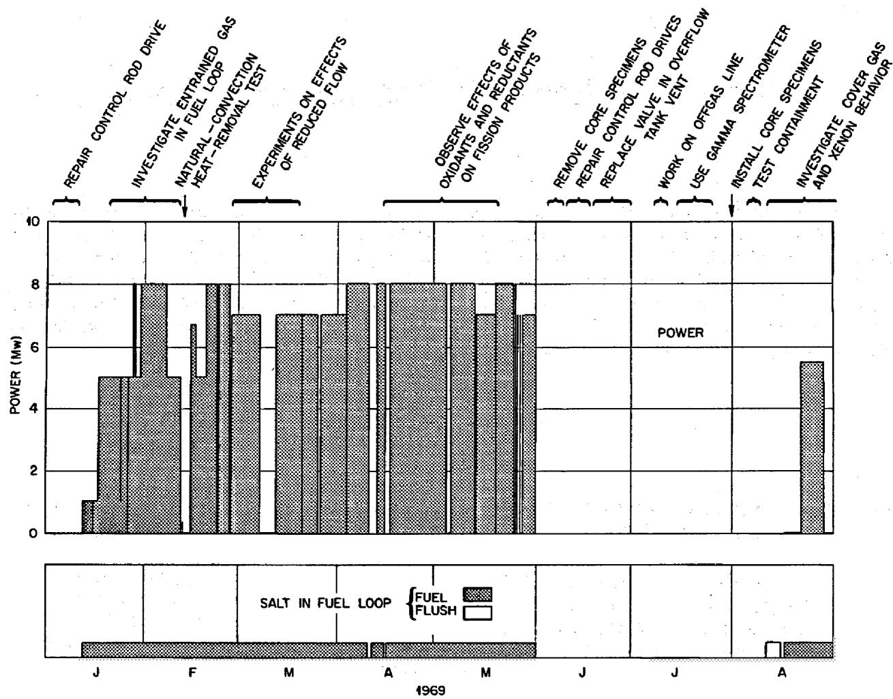  
Fig. 1.1. Outline of $^{233}\mathrm{U}$ Power Operation Through August 1969.

gas void fraction that varied systematically with the temperature.2

Through the remainder of March the reactor was operated at 7 Mw with only two brief interruptions to switch the fuel pump power supply. (The power was limited to 7 Mw to permit operation at reduced fuel circulation rate or lower temperature without getting the radiator below $1000^{\circ}\mathrm{F}$ .) For the last week of the 7-Mw operation the pump power frequency was held at

58 Hz, just above the threshold for gas entrainment into the loop, while the fuel temperature, the pump bowl level, and the loop pressure were varied to define their effects on the gas entrainment.

On April 3 operation at full power, with the normal $60\text{-Hz}$ supply to the fuel pump, was resumed. In the next week seven $50\text{-g}$ samples of the fuel salt were taken for use in the $\mathbf{233}\mathbf{U}$ cross-section ratio determination. On April 10 a blown fuse caused an unusual electric power failure which resulted in the fuel and coolant salts draining. When operation was resumed a bias in the controller for the fuel drain valve caused the

freeze plug to be abnormally short, and after three days of salt circulation it accidentally thawed, draining the fuel again.

On May 4 heat removal was stopped as a precaution when the instrument that monitors the cooling stack for beryllium broke down.

During April and May several small additions of reductants and oxidants were made to the fuel salt. One purpose was to observe the effects on noble metal fission product behavior; another was to observe effects on the physical behavior of the fuel salt. Since the resumption of operation in September 1968, exposures of beryllium metal in the pump bowl had been accompanied by changes in the amount of entrained gas in the loop and in the rate of transfer to the overflow tank. Between April 15 and 25, while the reactor was operating at full power and normal circulation rate, a different reductant, zirconium, was added to the salt to observe its effects. As in the beryllium additions, small rods contained in a perforated nickel capsule were lowered into the fuel in the pump bowl. Two additions were made: the first put $20\mathrm{g}$ of zirconium into the salt; the second, $24\mathrm{g}$ . The gas fraction in the loop, which was running about $0.6\mathrm{vol}\%$ , decreased by a factor of 2 while the zirconium was reacting but returned to the earlier value after the capsule was withdrawn. In the second of the two additions the entrained gas repeatedly decreased and increased as the zirconium was immersed and withdrawn. Addition of $30\mathrm{g}$ of powdered $\mathrm{FeF_2}$ oxidant had no detectable effect on the gas fraction. In the effort to elucidate the effect of reductants on the gas bubbles in the fuel, a device was developed to measure the surface tension of the salt in the pump bowl. (See Sect. 11.4.) This consisted of a caged cylinder of graphite penetrated by various sized holes into which salt could rise. The surface tensions measured before and one day after the addition of $5.6\mathrm{g}$ of beryllium were quite high and practically the same. A few days later, on May 20, exposure of a capsule containing both perforated graphite and small beryllium rods produced evidence of reduced surface tension.

By this time high-power operation had burned up $2.8\%$ of the ${}^{233}\mathbf{U}$ , and between May 21 and 27 eleven $40\mathrm{-g}$ fuel samples were taken, completing the sampling requirements for the measurement of the $\sigma_{c} / \sigma_{a}$ ratio for ${}^{233}\mathbf{U}$ . (See Sect. 6.3.2.)

Early in May a fuel processing experiment was carried out in the reactor building concurrently with reactor operations. This was the distillation experiment described in Chap. 24. Partly because of its importance in the evaluation of the reactor fuel-salt inventory, before the fluorinated carrier salt that had been held in the

fuel storage tank was transferred to the still, a considerable effort was made to obtain an accurate measurement of its volume. When the salt had first been put in the storage tank, indications were that 2 to $3\mathrm{ft}^3$ had been transferred, but the bubbler level instrument was now indicating $9\mathrm{ft}^3$ . To resolve the discrepancy, $35\mathrm{g}$ of ${}^{6}\mathrm{LiF}$ was dropped into the tank to permit measurement of inventory by lithium isotopic dilution. Attempts to sample verified a low salt level (roughly $3\mathrm{ft}^3$ ). Vigorous sparging cleared the bubbler tube of what had been effectively a variable orifice, and it then also indicated about $3\mathrm{ft}^3$ .

Throughout the run, there had been minor difficulties with restrictions in the off-gas system. (See Sect. 1.3.4.) In May restrictions near the fuel pump threatened to force a premature shutdown. A partial plug which appeared to be near the fuel pump bowl exit developed on May 1 to the point that the normal off-gas flow produced about a 5-psi pressure drop. This caused most of the off-gas to bubble through the overflow tank and out its vent (except when the tank was being pressurized to recover salt that had gradually transferred into it). Then on May 24 the vent line from the overflow tank became almost completely plugged. Thenceforth the gas was forced out through the normal route. Although the restriction in this line had changed little in three weeks, to minimize the chances of salt mist completely plugging the line, the fuel pump was operated at reduced speed through the scheduled shutdown on June 1.

Power operation was concluded, as planned, on June 1 with a manual scream of the control rods. Over the 20 weeks since the resumption of nuclear operation with $^{233}\mathrm{U}$ on January 12, the reactor had been critical 3175 hr (95% of the time) and had produced 2548 equivalent full-power hours.

The two months from June 2 through August 1 were occupied in maintenance and inspection, with the critical path being a sequence of jobs each requiring the use of the portable remote maintenance shield. Craft work was held to $40\mathrm{hr / week}$

The first job in the shutdown was the removal of the specimen array from the core, accomplished on June 6. In a departure from previous practice, flush salt was not circulated, so that the fission product deposition after a fuel drain might be determined.

During the June 1 shutdown, for the first time in the four years of nuclear operation, a control rod had failed to scream, and the ten days after the core specimen removal were spent in working on the rods and drives. (See Sect. 1.3.3.) Next the overflow tank vent line was opened, and the location of the plug was found to be in

a short flanged section containing two valves. This section was replaced and the line proved to be clear. The remote maintenance shield was next moved to the primary heat exchanger, where it was used with the newly developed remote gamma spectrometry equipment to map the distribution of fission products in the heat exchanger (Sect. 1.2.5). After a week of this, a small heater was installed remotely on the fuel off-gas line at the pump bowl. Heat and gas pressure then cleared the restriction there. A flange in the line was then opened and a set of specimens removed. The shield was moved next to the drain tank cell for replacement of a leaking disconnect in an air line to a pneumatically operated valve and for gamma-scanning of the salt in a drain tank. Finally the remote maintenance shifted back over the reactor to complete the control rod work, to install a new experimental assembly in the core (Sect. 1.3.1), and to remove specimens hung just outside the reactor vessel.

Other jobs accomplished during the shutdown were clearing the coolant off-gas line, repairing the sampler-enricher manipulator, checking containment valves, and replacing two valves on the off-gas sampler.

On August 5 the reactor cell was sealed and was then pressurized to 20 psig for the annual leak test. After a gasket on an access port in a component coolant dome was replaced, the leak rate was satisfactorily low. The salt loops were then heated, filled with coolant and flush salt, and individually pressure tested at 60 psig in the pump bowls, with the pumps running.

From August 11 through 15 flush salt was circulated while seven samples were taken and while experiments were carried out on gas entrainment in the fuel circulating loop. Circulation of fuel salt started on August 16. The remainder of the month was spent in observing effects of changing fuel pump speed and the type of cover gas (helium or argon) on entrained bubbles and $^{135}\mathrm{Xe}$ poisoning.

Operating statistics at the end of August are given in Table 1.1.

Table 1.1. Some MSRE Operating Statistics ${}^{a}$   

<table><tr><td></td><td>233U Operation</td><td>Total</td></tr><tr><td>Critical time, hr</td><td>4,254</td><td>15,769</td></tr><tr><td>Integrated power, Mwhr</td><td>21,276</td><td>93,717</td></tr><tr><td>Equivalent full-power hours</td><td>2,662</td><td>11,668</td></tr><tr><td>Salt circulation, hr</td><td></td><td></td></tr><tr><td>Fuel loop</td><td>4,825</td><td>19,867</td></tr><tr><td>Coolant loop</td><td>7,167</td><td>24,073</td></tr></table>

${}^{a}$ Through Aug. 31,1969.

# 1.2 OPERATIONS ANALYSIS

One of the primary purposes of the high-power operation in the spring of 1969 was to determine very accurately the ratio of captures to fissions in $^{233}\mathrm{U}$ by measurement of uranium isotopic changes over a period of substantial burnup. Samples were taken for this measurement, but results had not been obtained by the end of the report period. Operations analysis efforts focused primarily on the behavior and effects of gas in the fuel circulating loop. The long-term monitoring of reactivity, heat transfer, and radiation heating continued as before. Special attention was given to reactor heat power measurements for comparison with the total fissions indicated by the isotopic changes. The continuing study of the behavior of fission products in the MSRE, pursued previously by sampling in the pump bowl and examination of specimens from the core, was augmented by remote gamma-ray spectrometry on parts of the fuel system.

# 1.2.1 Reactivity Balance

# J. R. Engel

When the MSRE fuel charge was changed from $^{235}\mathrm{U}$ to $^{233}\mathrm{U}$ , it was necessary to establish a new zero point from which to start the observation of long-term trends in reactivity. The initial point was based on the $^{233}\mathrm{U}$ critical experiment, the excess reactivity added during the $^{233}\mathrm{U}$ zero-power experiments, and the calculated effect of mixing the fuel salt at the end of those tests. Since then the reactor has operated for more than 2500 equivalent full-power hours (about 20,000 Mwhr), and five measurements have been made of the zero-power reactivity with no xenon present. These points are shown graphically in Fig. 1.2. The large circulating void fraction and variations in its magnitude contribute to the uncertainty in some of the zero-power data. Uncertainties due to this effect are shown as error flags on points obtained when the void fraction was high. The point at 12,000 Mwhr includes a $-0.06\% \delta k / k$ compensation for a fuel drain and refill, while the 20,000-Mwhr point includes a further compensation of $+0.06\% \delta k / k$ for a drain, flush, and refill. The latter compensation was based on the assumption that the amount of flush salt left to mix with the fuel was the same as in similar operations with $^{235}\mathrm{U}$ fuel.

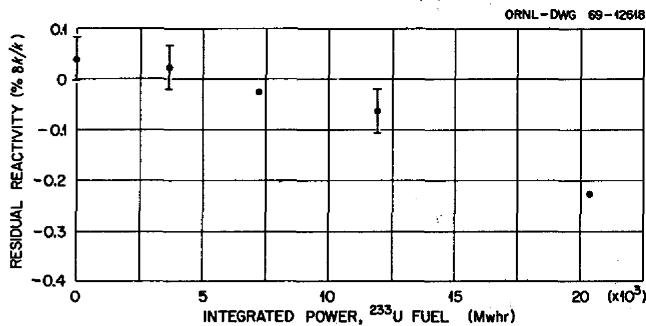  
Fig. 1.2. Zero-Power Reactivity Balances During $^{233}\mathrm{U}$ Operation.

Although the apparent decrease in reactivity indicated by the data in Fig. 1.2 did not approach the administrative limit of $0.5\% \delta k / k$ on reactivity anomaly, all other possible indications of abnormal reactivity loss were scrutinized. No evidence of abnormality could be detected.

# 1.2.2 Reactivity Effects of Graphite Distortion

# C. H. Gabbard

In two years of power operation with $^{235}\mathrm{U}$ fuel, while a total of about 72,000 Mwhr was being produced, there was a gradual drift of the calculated residual reactivity of $+0.15\%$ (ref. 4). One effect that was expected but had not been included in the reactivity balance calculation was dimensional changes in the core graphite due to fast-neutron irradiation. The type of graphite used in the MSRE undergoes changes as shown in Fig. 1.3. The result is that the distribution and the amount of fuel salt in the core change both from the graphite volume changes and from the bowing and displacement of the graphite stringers. The changes as the hundreds of graphite bars bow in various modes due to the nonuniform flux distribution are quite complex, and only recently has a computer program been developed to describe the situation in detail. During this report period, calculations were completed on the reactivity effects of these density changes as a function of integrated power; the results are shown in Fig. 1.4.

Calculations using either the upper or lower limits of the graphite damage data indicate a long-term positive trend in reactivity. The initial decrease in the calculation using the upper graphite damage curves is caused

by the positive slope of the graphite damage curve at low neutron exposures. This says that the stringers deflected inward at low values of integrated power and squeezed fuel out of the core; then as the integrated power increased, the central stringers began to deflect outward, bringing fuel back into the central region of the core and increasing the reactivity. Conclusions

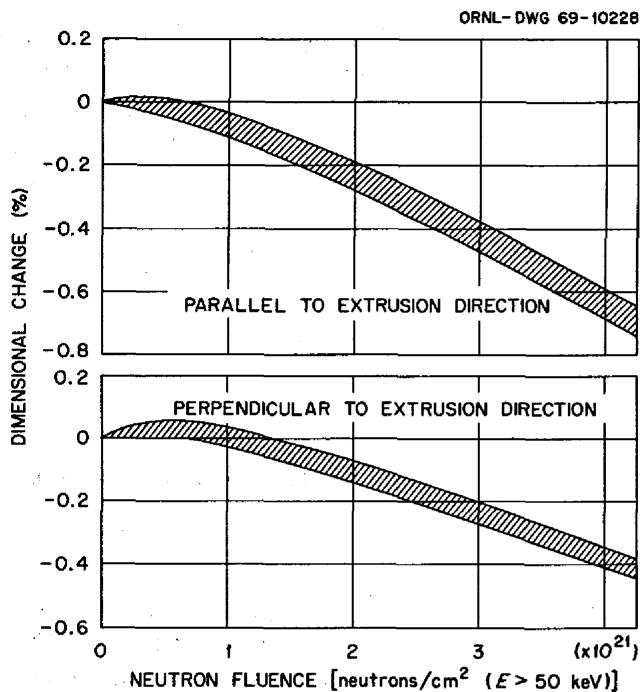  
Fig. 1.3. Irradiation Induced Dimensional Changes in MSRE Grade CGB Graphite.

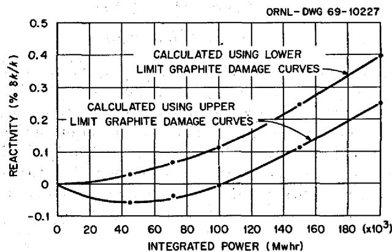  
Fig. 1.4. Reactivity Effect of Irradiation Induced Dimensional Changes in MSRE Graphite.

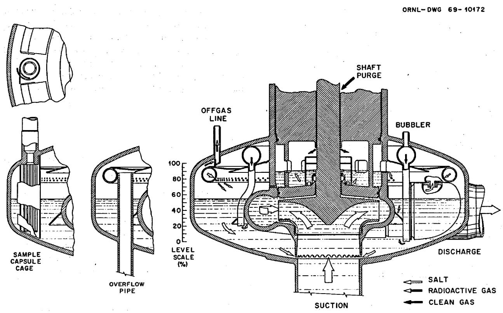  
Fig. 1.5. Cross Section of MSRE Fuel Pump Showing Flow Paths.

based on these calculations are that the gradual upward drift in reactivity over the 72,000 Mwhr of $^{235}\mathrm{U}$ operation was probably not due to graphite distortion, but that during the $^{233}\mathrm{U}$ operations a positive drift of 0.01 to $0.02\% \delta k / k$ per 10,000 Mwhr should be produced by this effect.

# 1.2.3 Gas in the Fuel System

R.C.Steffy J.R.Engel

Near the end of the last report period5 we began to develop some interesting information about the behavior of circulating, undissolved gas in the fuel loop. We found that relatively small variations in fuel pump speed had dramatic effects on the gas void fraction, both in the pump bowl and in the loop. The investigation of this behavior and of its effects on xenon poisoning continued throughout this report period.

The mechanism by which gas bubbles are drawn into the fuel loop is evident from an examination of Fig. 1.5. The jets of salt from the spray ring, impinging on the surface of the salt pool, carry under copious amounts of the gas that fills the upper part of the pump tank. At normal pump speed (1190 rpm) about 50 gpm of salt is discharged into the bowl from the spray ring, and another 15 gpm flows up around the shaft. This salt flows back into the circulating loop through the ports below the volute, carrying with it any gas bubbles that may be in the salt at this depth. If the pump speed is reduced, the velocity of the jets and the downward velocity of the salt in the pool are reduced, thus reducing the amount of gas at the suction ports. Consequently the rate of gas ingestion into the loop is a function of pump speed. (As might be expected, salt level in the pump tank also affects ingestion rate.)

J. H. Shaffer pointed out that dissolution of cover gas in the fuel salt can have a significant effect on the amount of circulating voids for a given rate of gas ingestion. For a relatively soluble gas (like helium), a small fraction of ingested gas at the fuel pump suction may completely dissolve by the time the circulating

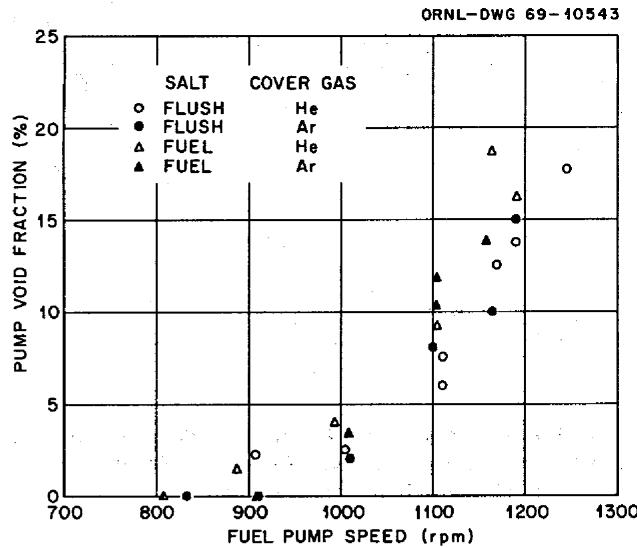  
Fig. 1.6. Effect of Fuel Pump Speed on Void Fraction in Pump Bowl.

fluid reaches the reactor core. For a gas that is much less soluble (like argon), the same void fraction at the pump suction may lead to circulating voids all around the loop. This effect can be shown (see below) to be highly dependent both on the gas solubility and on the size of the bubbles that are ingested. Since dissolution of the cover gas would tend to force into solution in the salt any xenon carried by the gas, substantial effects on xenon poisoning could also be expected.

Observed Variations in Void Fractions. - The difference in pressure between the two bubblers (Fig. 1.5) is an indication of the average density of the fluid in the 2-in.-deep horizontal zone between the bubbler discharge points. With the pump off, the density is that of the salt; the reduction when the pump is turned on is proportional to the volume fraction of gas bubbles in the zone. Figure 1.6 shows the observed variation in the void fraction in the bubbler zone as a function of pump speed for two different cover gases, helium and argon. Data are shown for both flush salt and fuel salt with the equivalent of 3 in. of pure liquid above the zone. These data show that there is no measurable difference between helium and argon in a given salt. However, with both gases the void fraction appears to be higher in fuel salt than in flush salt.

Figure 1.7 shows void fractions observed in the loop at the same times as the pump bowl observations in Fig. 1.6. The fractions with flush salt in the loop were obtained by the only quantitative indicator available with the reactor subcritical, namely, the level change in

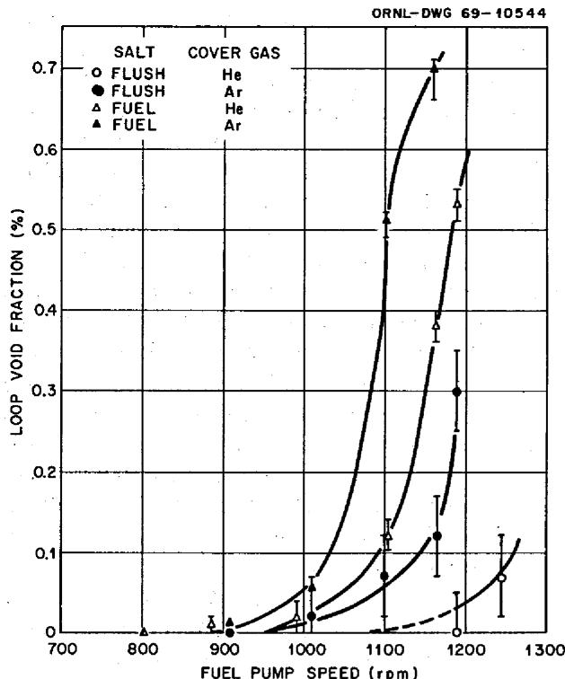  
Fig. 1.7. Effect of Fuel Pump Speed on Void Fraction in Fuel Loop.

the pump bowl as gas displaces salt from the loop into the bowl. The measurement is of the volume of gas entering the loop; the fractions were obtained by dividing by the total volume of the loop and so represent averages around the loop. The precision of this measurement is equivalent to $\pm 0.05$ to $\pm 0.10\mathrm{vol}\%$ voids. With the reactor critical, the reactivity balance provides a more precise measure of the void fraction in the reactor core. The points for fuel salt in Fig. 1.7 were measured this way. A distinction between them and the flush salt points is that the fuel points are nuclear-weighted averages in the core while the flush salt points are averages of what may be a widely varying fraction around the entire circulating loop including the core.

The data with flush salt and helium cover gas support all previous experience with this combination; that is, there are no circulating voids at the normal maximum fuel pump speed of 1190 rpm. However, when the pump speed was increased by only 55 rpm (by temporarily supplying the pump from a diesel-electric generator operated at $63\mathrm{Hz}$ ) voids did appear that extended at least partway around the loop. Both the absence and presence of voids were verified by pressure

release experiments which provide a go no-go indicator.6

The loop void fraction was significantly higher with fuel salt in the loop than with flush salt, and with either salt the void fraction was higher with argon than with helium. Comparison of the results in Figs. 1.6 and 1.7 shows that all four combinations of salt and cover gas follow the same general pattern. The threshold pump speed for the appearance of bubbles in the loop depends on both the salt and the cover gas, but in all cases voids begin to appear in the loop when the void fraction between the bubblers is around $10\%$ .

Although fuel pump speed appears to have the strongest effect on the circulating void fraction, changes in other system parameters (salt temperature, overpressure, and pump bowl level) also have detectable effects. As described in Sect. 1.2.4, evidence of these effects was obtained by neutron noise analysis during a series of experiments in March.

Cover Gas Solubility Effects on Bubbles. - As salt containing bubbles of gas moves around the fuel loop, the volume fraction of the bubbles changes with the pressure due to the compressibility of the gas. Some of the gas also transfers from the bubbles into solution in the higher-pressure parts of the loop and back out in the low-pressure sections. Effects of changes in the dissolved cover gas around the loop were neglected in the mathematical models used heretofore to describe xenon behavior in the MSRE. But as indicated by the differences between helium and argon described above, cover gas solubility can have an important effect on bubble behavior. Xenon poisoning must also be affected. Therefore during this report period development was started on a mathematical model including cover gas solubility effects.

As a first step in the development, we calculated equilibrium bubble fractions for helium in fuel salt as a function of pressure for various total amounts of helium in the salt. Results shown in Fig. 1.8 are for four different helium levels corresponding to salt saturated with helium and containing 0.5, 1.0, 1.5, and 2.5 vol % bubbles at 20 psia (the normal pressure in the fuel pump bowl). Effects of surface tension were included in the calculations and account for the differences between 1- and 10-mil bubbles.

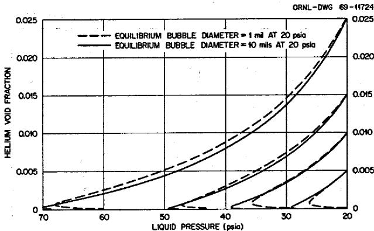  
Fig. 1.8. Equilibrium Void Fraction of Helium in Molten Salt as a Function of Liquid Pressure for Various Equilibrium Void Fractions and Bubble Diameters at 20 psia.

Note that each of the curves bends under if sufficiently high pressure is attained in the fluid. This implies that, given the conditions at 20 psia, there is no void fraction which can exist in equilibrium with the fluid at pressures above the pressure at the bend. All of the helium would tend to go into solution if the fluid pressure were above this maximum. For a given initial void fraction, the maximum fluid pressure at which voids can persist is dependent on the initial bubble diameter. Smaller bubbles at 20 psia will be overpowered by the surface tension effects at lower fluid pressures than will larger bubbles. The fact that everywhere below the maximum pressure, the equilibrium void fraction is a double-valued function of pressure is explained as follows: With large void fraction and large bubbles, the partial pressure of the gas in the bubbles is near the liquid static pressure, and the partial pressure of gas in solution is the same. For the same number of bubbles, if the void fraction is reduced to a very small value, the diameter of the bubbles is also reduced to a small value, and the pressure in the bubbles due to surface tension effects is large. Most of the gas atoms are in solution with this reduced void fraction, and the partial pressure in the liquid is also high; thus, another equilibrium condition. Actually the conditions represented by the lower line do not represent a stable equilibrium. A slightly smaller void fraction would tend to decrease and disappear due to the large surface tension effects; a larger void fraction would tend to grow to the upper equilibrium line. The importance of this line is that it represents the smallest possible stable void fraction which can possibly exist with the two postulated conditions (number of bubbles and total number of helium atoms).

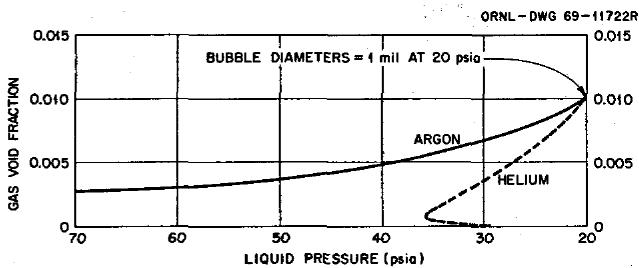  
Fig. 1.9. Equilibrium Void Fractions of Helium and Argon with Equal Void Fractions at 20 psia as a Function of Liquid Pressure.

The effect of differences in gas solubility is apparent in Fig. 1.9, in which the equilibrium lines for argon and helium are drawn. The solubility of argon in molten fluorides7 is about a factor of 10 less than the solubility of helium. Obviously very little of the argon would be forced into solution even under conditions in which all of the helium would be dissolved.

Although the calculation of equilibrium void fractions contributes to an understanding of the gas behavior, it is necessary to include rate effects in the description of the situation in the MSRE fuel loop. In the MSRE loop, salt is suddenly pressurized from 20 psia to about 70 psia in going through the pump. Its pressure decreases as it flows through the heat exchanger, piping, and reactor vessel until it returns after about 25 sec to the pump suction at 20 psia again. This was represented in an approximate manner in simplified calculations whose results are shown in Figs. 1.10 and 1.11. In the calculations for Fig. 1.10 the salt was assumed to contain 1.5 vol % helium bubbles at 20 psia. At time zero it was instantaneously pressurized to 70 psia, after which the pressure decreased linearly with time to 20 psia after 25 sec. Initial bubble sizes (at 20 psia) of 1 mil and 10 mils were considered. In both cases the number of bubbles was assumed to remain fixed, and a mass transfer coefficient of 4 ft/hr was used. For these conditions the larger bubbles would retain their identity all the way around the loop, first decreasing in size, then increasing as some of the gas dissolves and then comes back out at lower pressure. The small bubbles, on the other hand, would all disappear in 5 sec. The helium driven into solution from the small bubbles could evolve from the liquid again as the pressure dropped; at what point and how this would occur would depend on nucleating conditions.

Figure 1.11 shows the difference between helium and argon for a set of assumptions similar to those used for

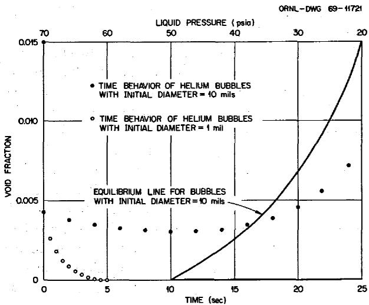  
Fig. 1.10. Time Behavior of Helium Void Fraction of $1.5\%$ and Various Initial Bubble Diameters at 20 psia in Molten Salt When Subjected to Varying Liquid Pressure.

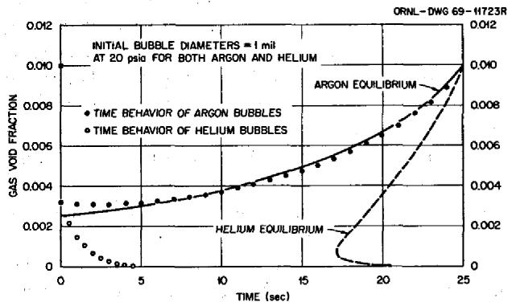  
Fig. 1.11. Time Behavior of Helium and Argon Void Fractions in Molten Salt When Subjected to Varying Liquid Pressure.

Fig. 1.10. (The mass transfer coefficient for argon was taken to be $3\mathrm{ft / hr}$ ; for helium, $4\mathrm{ft / hr}$ .) Because of the low solubility of argon, the amount of gas in the bubbles changes very little; the bubble size (or void fraction) simply reflects the step increase and gradual decrease in pressure.

Although the foregoing calculations involve many assumptions and approximations, they do show the reason for the different behavior of helium and argon cover gas in the MSRE. They also indicate that it is possible with helium for a significant fraction of the gas entrained at the pump suction to be driven into solution before the salt reaches the core (about 12 sec after leaving the pump). The size of the entrained bubbles is quite important. In the MSRE, where there is undoubtedly a spectrum of bubble sizes, it is possible to

have small bubbles going into solution while larger bubbles are growing.

Effects on Xenon Poisoning. - During nuclear operation cover gas bubbles will also contain $^{135}\mathrm{Xe}$ , and the entrainment and dissolving of various amounts of cover gas will affect xenon stripping and concentration in the fuel salt. Some preliminary experimental information about this relationship was obtained in March, and additional, more detailed, data were being collected at the end of the report period. Since the circulating void fraction as a function of pump speed is reasonably well known, it is possible to extract the void fraction effect on xenon from the pump speed and variations in the net reactivity. Figure 1.12 shows the results obtained in March with helium cover gas and the reactor at 7 Mw. The poisoning at zero void fraction is probably not single-valued because zero voids exist with helium at any pump speed below about 1000 rpm and large changes in fuel flow rate below this threshold would affect the results. The data shown at zero void fraction are for a pump speed of 1000 rpm. There is considerable uncertainty in the data points where the void fraction is near 0.2 vol %. This is due to the extreme sensitivity of void fraction to pump speed and of xenon poisoning to void fraction. It was not possible to maintain the precise control over pump speed that would have been required to define these points accurately. There is, however, no doubt that the xenon poisoning at intermediate void fractions is greater than at either higher or lower void fractions. Description of this behavior will provide a severe test of the mathematical model that is being developed for xenon poisoning in the MSRE.

# 1.2.4 Diagnosis by Noise Analysis

# R.C.Steffy

A convenient means of monitoring changes in the volume of gas in the core subject to compression during nuclear operation is the power spectral density of the inherent noise in the neutron flux. This technique is especially useful when the reactor is at high power, where concurrent changes in xenon poisoning tend to mask the direct reactivity effect of shifts in the fuel void fraction. It can also be used to measure small changes at very low void fractions, which the reactivity balance and pump bowl level changes are not sensitive enough to detect.

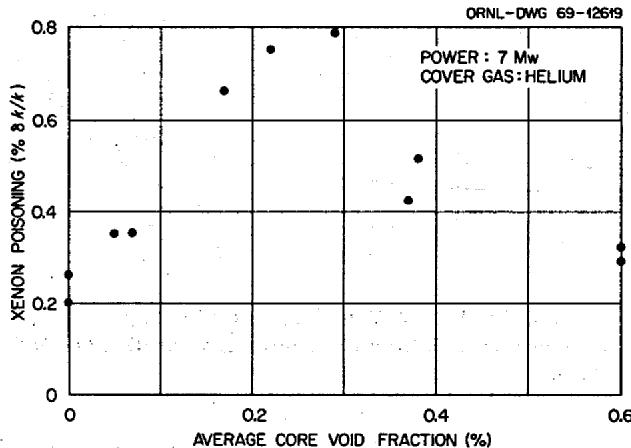  
Fig. 1.12. Effect of Core Void Fraction on Xenon Poisoning.

Late in March the effects of fuel pressure, temperature, and pump bowl level on circulating void fraction were observed using neutron noise analysis. These variables were changed one at a time, and the neutron noise was recorded after each change. So that the tests would be performed with about the same void fraction as was present in a similar series of tests performed previously with the $235\mathrm{U}$ fuel loading, the fuel pump was operated at a low speed (1040 rpm) and with helium cover gas, giving a void fraction between 0.05 and $0.1\%$ . The pressure noise remained relatively constant during these tests. The neutron power spectral density averaged between 0.6 and $1.4\mathrm{Hz}$ was found to decrease by a factor of 10 when the reactor outlet temperature was changed from 1190 to $1225^{\circ}\mathrm{F}$ , to decrease by $25\%$ when the fuel pump level was increased from 53 to $61\%$ , and to increase by a factor of 2.3 when the pump bowl pressure was raised from 3 to 9 psig. The changes in spectral density are thought to reflect changes in void fraction caused by each of these parameters. (Spectral density is believed to be proportional to the square of the void fraction, at least in the void fraction range of 0.05 to $0.1\%$ .) Changes in pump bowl level, although not an accurate measure of voids at these low fractions, appeared to be in general agreement with the noise analysis indications.

As described in Sect. 4.1, confirmation of the significance and usefulness of noise analysis led to the development and installation of two strip-chart recorders in the reactor control room: one displaying the magnitude of the neutron noise in a band around $1\mathrm{Hz}$ ;

the other, the pressure noise in a similar band. After its installation early in May, the neutron noise monitor was observed to respond as expected to changes in void fraction produced by pump speed changes. When the overflow tank vent line became plugged late in May, the pressure noise monitor began to show changes indicative of increasing restriction in the off-gas system about one day before the new restriction became detectable by the measured pressure drop.

# 1.2.5 Fission Product Distributions in Fuel System

A. Houtzeel R. Blumberg F. F. Dyer

The technique of remote gamma-ray spectrometry developed at the $\mathbf{MSRE^{10}}$ was used to study the distribution of fission products in the fuel salt and fuel off-gas systems. Prior to the June 1 shutdown, portions of the aiming and collimating systems were redesigned and built, a high-resolution Ge(Li) detector was procured, and a 4096-channel analyzer with automatic data recording equipment was leased. (This equipment is described in Sect. 3.1.) Because of delays in delivery and shakedown of the equipment, calibration with known sources in mockups of the MSRE equipment was deferred until after this report period. Large amounts of data were obtained during the June-July shutdown and the ensuing startup (over 200 spectra during the shutdown alone). Although the reduction of the data to absolute quantities of fission products had to await the calibration, some very interesting information on relative amounts and distributions of fission products was derived.

The first scans were taken on the overflow tank vent line in an effort to determine the location and nature of the plug that had developed shortly before the shutdown. Eighteen spectra taken along the line showed predominantly noble-metal fission products, with a concentration at the entrance of the flow control valve. It turned out that the plug was not there, however, but in the inlet of the hand valve and was largely carbonaceous material rather than fission products.

A main target of the shutdown spectrometry was the primary heat exchanger. Because of the urgency of removing the core specimens, starting repair of the control rods, and replacing the plugged vent line, the heat exchanger scanning did not start until 30 days after the end of power operation. Then about a hundred spectra were recorded in less than a week.

Most were taken along the center line (at 2-in. intervals), with perpendicular traverses at two locations. With the same setups of the remote maintenance shield, some 20 spectra were recorded on the fuel line from the heat exchanger to the reactor vessel.

Twenty spectra were recorded along the flexible section of the fuel off-gas line near the exit from the pump bowl about five weeks after the power had been shut down. A week later data were obtained on the gamma spectra from a drain tank containing fuel salt.

Spectra were recorded on magnetic tape and analyzed on the IBM 360 computer using the GAM-SPEC 3 program written by the ORNL Mathematics Division. This versatile program has several analysis options; the output usually chosen was an 8-ft-long plot on graph paper of counting rate vs channel number. The combination of a 1.9-kev-resolution crystal, a 4096-channel analyzer, and the long graph permitted resolution and identification of the very large number of peaks coming from the mixture of fission products. Without the calibration data it was possible only to determine relative amounts of the nuclides, but this could be done rather accurately for a large number of nuclides.

In both the off-gas lines the major fission products were mostly $^{103}\mathrm{Ru}$ , $^{106}\mathrm{Ru}$ , $^{129}\mathrm{Te}$ , $^{137}\mathrm{Cs}$ , and $^{95}\mathrm{Nb}$ with smaller amounts of $^{131}\mathrm{I}$ , $^{132}\mathrm{I}$ , and $^{140}\mathrm{Ba} - ^{140}\mathrm{La}$ . Some interesting comparisons were apparent. For example, comparison of the relative concentration of $^{103}\mathrm{Ru}$ (half-life 1.01 years) with that of $^{137}\mathrm{Cs}$ (half-life 30.0 years), taking into account the difference in their fission yield, indicated that the chances for a $^{106}\mathrm{Ru}$ atom to deposit in the off-gas line are of the same order of magnitude as for a $^{137}\mathrm{Cs}$ atom. By the same token, $^{95}\mathrm{Nb}$ (half-life 35.0 days) seems to have less chance by almost one order of magnitude for deposition in the off-gas line than $^{103}\mathrm{Ru}$ (half-life 39.8 days). This deposition probability is presumably a complex function of the volatility, transport capability, and half-life of both the detected isotope and its precursors.

In the heat exchanger and fuel-salt line primarily $^{131}\mathrm{I},^{132}\mathrm{I},^{103}\mathrm{Ru},^{106}\mathrm{Ru},^{129}\mathrm{Te},$ and $^{95}\mathrm{Nb}$ were found. There was no trace of $^{137}\mathrm{Cs}$ . In contrast with the composition in the off-gas line, here $^{95}\mathrm{Nb}$ seems to be more abundantly deposited than $^{103}\mathrm{Ru}$ (again taking the fission yield into account). The deposition of fission products varied considerably along the center line of the heat exchanger. For example, $^{95}\mathrm{Nb}$ concentrations varied by a factor of at least 3. The highest readings were found in the vicinity of the vertical baffle plates.

Toward the end of the shutdown, four holes were drilled through the shielding to permit gamma spectrometry during operation. One hole was over the primary heat exchanger, one over the off-gas line near the pump bowl, one over the off-gas line between the particle trap and the charcoal beds, and one over a fuel drain tank. During the startup, gamma spectra were obtained over the off-gas line near the pump and from the heat exchanger at reactor powers of $7.5\mathrm{kw}$ and 5.5 Mw. Although it was necessary to install a lead attenuator below the collimator for readings at high power, good spectra were obtained in which it was possible to identify a host of nuclides including some very short-lived ones.

Preparations were made to calibrate the apparatus with collimator inserts of different sizes, using a 25-curie $^{110m}$ Ag source. Results of the calibration were to be used to obtain absolute values for amounts of fission products observed in the MSRE.

# 1.2.6 Salt Transfer to Overflow Tank

# J. R. Engel

In the last report11 we described the relation between indicated salt level in the fuel pump bowl and the rate at which salt transfers to the overflow tank. Those data were taken with the fuel pump running at full speed (1190 rpm) with fuel salt and helium cover gas. They showed that the minimum transfer rate was 1 to 2 lb/hr at low salt levels and that the rate increased rapidly as the indicated level increased above about $58\%$ .

Additional data were obtained in August when the fuel loop was operated under a variety of different conditions. Because of an apparent zero shift in the level indication, we have not attempted to make a direct comparison between the two sets of data. However, the recent data show that the transfer rate depends on fuel pump speed and salt type as well as on the indicated level; there appears to be no difference associated with the choice of cover gas between helium and argon.

Data taken at full pump speed gave a minimum transfer rate of about 1 lb/hr with flush salt and 1.5 to 2 lb/hr with fuel salt. They also showed that the threshold level for more rapid transfer was higher for flush salt than for fuel salt by the equivalent of about 1 in. of liquid. Data taken at lower pump speeds with fuel

salt showed a decrease in transfer rate with decreasing speed; the lowest rate was 0.7 lb/hr at 800 rpm. These observations are consistent with the concept of "foaming" in the pump bowl.[11] (This particular foam appears to have a high liquid fraction - possibly as high as $50\%$ .) It appears that the current $^{233}\mathrm{U}$ fuel salt is more susceptible to this effect than either the flush salt or the $^{235}\mathrm{U}$ mixture. No explanation for this difference has been developed.

# 1.2.7 Coolant Salt Flow Rate

# C. H. Gabbard

Since the adoption of the revised value12 of the coolant salt heat capacity in 1968, reactor heat balances have given 8 Mw as the maximum power of the MSRE.13 Observed changes in uranium isotopic ratios have indicated, on the other hand, that the maximum power is actually only about 7 Mw (ref. 14). In an effort to resolve this difference, we reviewed the heat balance calculation and concluded that if there is a significant error it must be in the coolant salt flow rate.

The coolant salt flow rate is measured by a calibrated venturi flowmeter connected to two NaK-filled differential pressure cells. A detailed review of the original calibration of the venturi disclosed two errors.

1. The salt density used in predicting the characteristics with salt from the water calibration data is different from presently accepted values.   
2. The flowmeter vendor erroneously used a specific gravity of 12.6 rather than 13.6 in converting from inches of water to inches of mercury differential head. (The value of 12.6 is applicable in the common case of a mercury manometer with water legs above the mercury.)

These two errors were corrected in the MSRE flow-measuring system by changing the output of one of the amplifiers in the flow transmitter and by changing the density correction coefficient in the computer. The net result was not a decrease, but an increase of $2.9\%$ in the indicated coolant salt flow rate and a similar increase in the calculated heat balance power.

The possibility of error in the two differential pressure cells cannot be easily checked, since the range

check requires that the salt lines between the cells and the venturi be cut. (This will be checked after the final shutdown of the reactor.) After the coolant salt fill in August, the zero readings of the two cells were checked. Cell FT-201-A was correct, but FT-201-B was reading about $10\%$ high. Records showed that both cells originally read the same with salt flowing but that FT-201-B had drifted down while FT-201-A remained constant. The only convenient adjustment was the zero adjustment, and this had been set up to make FT-201-B consistent with FT-201-A at full salt flow. Since full flow exists during normal power operation, the zero offset on FT-201-B has no effect on the heat-balance power.

# 1.2.8 Radiation Heating

# C. H. Gabbard

Reactor Vessel. - The temperature differences between the reactor inlet and the lower head and between the inlet and the core support flange continue to be examined for any indication of sedimentation buildup within the reactor vessel. Table 1.2 shows the temperature differences for the present report period as compared with the previously reported data. As seen in the table, there was an additional slight increase in these temperature differences over the previous data. Although there appears to be a slight increasing trend, the increase is within the data scatter and cannot be taken as an indication of sedimentation. The increase between runs 14 and 17 was believed to be the result of the higher neutron leakage associated with the $^{233}\mathrm{U}$ fuel.

# 1.2.9 Service Life

# C. H. Gabbard

Thermal Cycle History. - The accumulated effective thermal cycle history of the various components sensitive to thermal cycle damage is shown in Table 1.3. Based on the original calculations, the design life of the fuel system freeze flanges is $93\%$ consumed. However, a test flange in the Freeze Flange Thermal Cycle Facility has exceeded 400 combined heating and fill cycles, and the design life of the MSRE flanges can be extended on the basis of this test.

Article I-10 of the 1968 ASME Nuclear Code gives a procedure for relating the number of test cycles to the allowable life. Since the test flange and test conditions are the same as in the MSRE and since the stress calculations indicate the test cycle is somewhat more severe, the allowable life can be obtained by applying

Table 1.2. Power-Dependent Temperature Differences Between Fuel Salt Entering and Points on the Reactor Vessel   

<table><tr><td rowspan="2">Run No.</td><td rowspan="2">Date</td><td colspan="2">Temperature Difference (°F/Mw)</td></tr><tr><td>Core Support Flange</td><td>Lower Head</td></tr><tr><td>6</td><td>4/66–5/66</td><td>1.90</td><td>1.39</td></tr><tr><td>7</td><td>1/67–5/67</td><td>1.93</td><td>1.35</td></tr><tr><td>12</td><td>6/67–8/67</td><td>1.98</td><td>1.40</td></tr><tr><td>14</td><td>9/67–2/68</td><td>2.03</td><td>1.28</td></tr><tr><td>17</td><td>1/69–2/69</td><td>2.29</td><td>1.54</td></tr><tr><td>17</td><td>3/69–4/69</td><td>2.32</td><td>1.54</td></tr><tr><td>18</td><td>4/69–6/69</td><td>2.33</td><td>1.57</td></tr></table>

only the statistical variation factor of 2.6 to the number of test cycles. A preliminary draft of RDT Standard RDT E2-1 "Design of Nuclear Vessels" gives a similar procedure with a slightly more conservative factor of 3.1. Using 400 completed test cycles and the factor of 3.1 gives an allowable life of 129 test cycles or a factor of 4.3 increase in the calculated life. If the design life of the MSRE flanges is extended by the factor of 4.3, the allowable cycle life will have been only $22\%$ consumed. Thus the proposed future operation of the MSRE will not be limited by the freeze flange cycle life based on the results of the Freeze Flange Thermal Cycle Facility.

Stress-Rupture Life. - The stress-rupture life of the reactor vessel was recently reviewed to determine if the operation of the MSRE would be limited by the possibility of stress-rupture cracking. The stress-rupture life after significant irradiation was originally predicted to be at least $20,000 \mathrm{hr}$ , which was believed to be adequate for the desired operation. However, this 20,000 hr has now been exceeded, and a reevaluation of the rupture life has been completed.

The reevaluation16 has indicated that the reactor can be operated for at least another year with an acceptably low probability of stress-rupture cracking. Although there are uncertainties in the stress-rupture data, the analysis is believed to be conservative, because at the low stress levels of interest in the MSRE the rupture life is theoretically less affected by irradiation than was assumed in the analysis, and because the analysis was based on the combined primary and secondary stress levels. In the MSRE the secondary stresses are generally

Table 1.3. MSRE Cumulative Thermal Cycle History Through August 1969   

<table><tr><td rowspan="2">Component</td><td colspan="6">Number of Equivalent Cycles</td></tr><tr><td>Heat and Cool</td><td>Fill and Drain</td><td>Power</td><td>On and Off</td><td>Thaw</td><td>Thaw and Transfer</td></tr><tr><td>Fuel system</td><td>12</td><td>53</td><td>91</td><td></td><td></td><td></td></tr><tr><td>Coolant system</td><td>10</td><td>17</td><td>86</td><td></td><td></td><td></td></tr><tr><td>Fuel pump</td><td>15</td><td>48</td><td>91</td><td>696</td><td></td><td></td></tr><tr><td>Coolant pump</td><td>11</td><td>18</td><td>86</td><td>153</td><td></td><td></td></tr><tr><td>Freeze flanges 100, 101, 102</td><td>12</td><td>49</td><td>91</td><td></td><td></td><td></td></tr><tr><td>Freeze flanges 200, 201</td><td>11</td><td>17</td><td>86</td><td></td><td></td><td></td></tr><tr><td>Penetrations 200, 201</td><td>11</td><td>17</td><td>86</td><td></td><td></td><td></td></tr><tr><td>Freeze valve</td><td></td><td></td><td></td><td></td><td></td><td></td></tr><tr><td>103</td><td>12</td><td></td><td></td><td></td><td>29</td><td>58</td></tr><tr><td>104</td><td>19</td><td></td><td></td><td></td><td>11</td><td>32</td></tr><tr><td>105</td><td>20</td><td></td><td></td><td></td><td>19</td><td>56</td></tr><tr><td>106</td><td>22</td><td></td><td></td><td></td><td>34</td><td>43</td></tr><tr><td>107</td><td>14</td><td></td><td></td><td></td><td>14</td><td>22</td></tr><tr><td>108</td><td>15</td><td></td><td></td><td></td><td>17</td><td>27</td></tr><tr><td>109</td><td>14</td><td></td><td></td><td></td><td>23</td><td>29</td></tr><tr><td>110</td><td>8</td><td></td><td></td><td></td><td>4</td><td>10</td></tr><tr><td>111</td><td>6</td><td></td><td></td><td></td><td>4</td><td>6</td></tr><tr><td>112</td><td>2</td><td></td><td></td><td></td><td>1</td><td>2</td></tr><tr><td>204</td><td>11</td><td></td><td></td><td></td><td>15</td><td>39</td></tr><tr><td>206</td><td>11</td><td></td><td></td><td></td><td>13</td><td>38</td></tr></table>

higher than the primary stresses, and the stress levels are reduced by relaxation of the secondary stresses. Consequently the material is not exposed to the maximum calculated stress levels for the entire period of high-temperature operation.

# 1.2.10 Heat Transfer

# C. H. Gabbard

There have been no explicit measurements of the overall heat transfer coefficient of the main heat exchanger since the end of $^{235}\mathrm{U}$ power operation, but the heat transfer index at full power and full pump speed continues to be a sensitive indicator of the heat-exchanger performance. (The heat transfer index is defined as the ratio of reactor power to the temperature difference between the fuel leaving the reactor and the coolant leaving the radiator.) The average values of the heat transfer index were 0.0406 and 0.04051 Mw/°F for runs 17 and 18 respectively. These values are within the scatter of past data17 and indicate that no

detectable loss in performance has occurred since the beginning of power operation in 1966.

# 1.3 EQUIPMENT

# 1.3.1 New Irradiation-Specimen Array for Core

# C. H. Gabbard

A new irradiation-specimen array was designed, fabricated, and installed in the reactor core for exposure during run 19 (ref. 18). The new assembly, shown in Fig. 1.13, contains several specimens for studying fission product deposition and four graphite capsules containing uranium-bearing salts to measure the capture-to-fission ratio of $^{233}\mathrm{U}$ . The design of the specimen array is considerably different from the assembly of graphite and Hastelloy N metallurgical specimens which it replaces. The specimens are cylindrical and are loosely contained in a cage of three

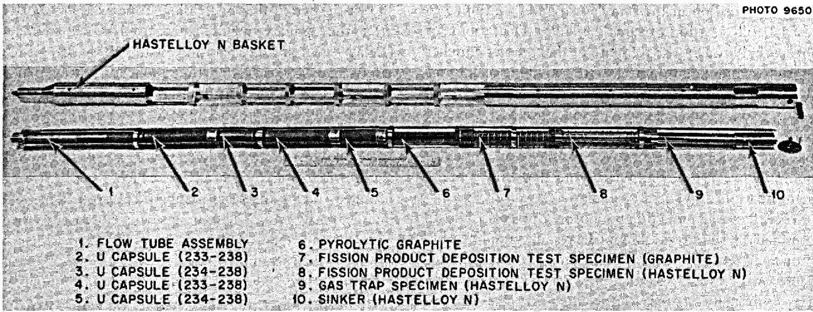  
Fig. 1.13. Irradiation-Specimen Array Installed in MSRE Core July 31, 1969.

vertical Hastelloy N rods. All but the bottom specimen, which is pinned to the cage at the bottom, are free to expand or contract as needed and are held down by the weight of metal parts at the top. A new basket assembly was fabricated from 2-in. OD, 0.062-in.-wall control-rod-thimble material. (The perforated sheet previously used for the basket was not available.) Near the center of the basket, most of the wall was cut out to minimize the neutron spectrum distortion at the uranium capsules.

The uranium samples consist of two long capsules containing a mixture of $^{233}\mathrm{U}$ and $^{238}\mathrm{U}$ and two short capsules containing $^{234}\mathrm{U}$ and $^{238}\mathrm{U}$ . One additional capsule of each type was prepared for the development of salt recovery and analytical procedures at the end of the experiment. The $\mathrm{UF_4}$ mixtures are in an NaF-ZrF₄ carrier salt that was selected so that any contamination by the reactor fuel or flush salt could be detected by a lithium analysis. Each capsule also contains a set of flux and temperature monitors. The capsules were sealed by welding the ends of two concentric molybdenum rings which were brazed to the graphite body and cap.

Hastelloy N and graphite specimens are included for fission product deposition studies. A direct comparison of the deposition on Hastelloy and on graphite will be obtained under identical exposure conditions. The effects of surface finish, salt velocity, and turbulence will be studied for both graphite and Hastelloy N. A specimen of pyrolytic graphite was included to determine the permeation of fuel salt into the graphite both parallel and perpendicular to the layer planes of the graphite. The top specimen will expose a series of electron microscope screens to a trapped gas pocket.

# 1.3.2 Salt Samplers

# A. I. Krakoviak

During this report period the fuel sampler-enricher was used 82 times for the wide variety of samples and additions tabulated below:

10-g salt sample for routine analyses 23

50-g salt sample for $^{233}\mathrm{U}\sigma_{c} / \sigma_{a}$ experiment 21

50-g salt sample for oxide analysis 1

8-cc salt sample in freeze-valve capsule 10

15-cc gas sample in freeze-valve capsule 16

Special capsule for surface tension determination 3

Zirconium rods in nickel cage 2

Empty nickel cage 1

Nickel cage containing $\mathbf{FeF_2}$ in plastic bag 1

Enriching capsule containing $^{233}\mathrm{UF}_4$ -LiF 3

Seven of the 10-g salt samples were of flush salt; the others were of fuel salt. All sampling attempts were successful except one 50-g sample which was taken when the fuel pump was operating on the variable-speed motor-generator at a speed of 980 rpm: the salt level was below the window in the capsule. On all subsequent 50-g samples, the fuel pump speed was increased to 1165 rpm during sampling, thus raising the actual salt level in the vicinity of the sampler cage by the entrainment of more gas in the salt. This indicated that the previously abandoned capsules19 were essentially in

the same position in the sampler cage and continued to restrict full insertion of sampling ladles. Operations for this period brought the total use of the sampler-enricher to 144 uranium additions and 505 sampling operations (including Zr, Be, Cr, and $\mathbf{FeF}_2$ additions to the fuel).

The main problems encountered during this report period were associated with vacuum pump No. 1 and the two flexible containment membranes (manipulator boots) between the manipulator and the main containment box (area 3A) of the sampler.

Repeated vacuum pump motor outages (due to overload) resulted in minor delays in sampling. Improper oil levels in the vacuum pump seemed to be the cause of these outages. High pressure $(>15$ psia) in area 1C is normally vented to the auxiliary charcoal bed through a line bypassing the pump. Apparently high pressure in area 1C was vented through the vacuum pump instead, thus carrying over a large portion of the oil into the holdup tank and off-gas line downstream of the pump. On one inspection the pump was practically empty of oil, with no evidence of external leaks. On the second pump inspection, the pump contained approximately 2 qt more than normal inventory. Apparently the previously lost oil drained back into the pump during subsequent operation. Pump operation is now satisfactory, and the latest oil level check was normal.

The inner boot (in contact with the manipulator) was replaced three times due to leaks during this report period. Boot failure apparently occurred when a convolution in the plastic boot was pinched between two negative-pressure-support rings as the manipulator was retracted. These metal rings can fall out of their convolutions only if the boot is distended by a positive pressure; the rings then are no longer in neat parallel planes which fold easily but instead are at various angles and will pinch the boot when the manipulator is retracted with mild force.

During the report period the coolant salt sampler was used to take four 10-g samples, bringing the total to 73. No operating difficulties were encountered.

# 1.3.3 Control Rods and Drives

M. Richardson R.C.Steffy

The No. 3 control rod and drive assembly, which had been worked on in January 1969 (ref. 20), operated satisfactorily until June 1, when it failed to drop during the manual scram scheduled to end the run. Routine scram-time tests from full withdrawal (50 in.) had

shown the scram time increasing from 0.85 sec shortly after the January maintenance to 0.95 sec in May. (Delay time and acceleration assumed in the MSRE safety analysis correspond to a 50-in. scram time of 1.3 sec.) At the end of the run, assembly 3 was being used as the regulating rod because it seemed to have less backlash than the other two assemblies, which made it better suited for certain dynamics tests. On the June 1 shutdown scram, rods 1 and 2, which were at 43 in., dropped, taking the reactor subcritical. Rod 3, at 35.4 in., dropped 1.4 in. and hung. The clutch was then engaged and the rod driven in 2 in., after which it dropped when scrambled.

During the cooldown after the fuel drain on June 1, each of the three rod-drive assemblies was tested by measuring scram times from starting positions ranging from 2 to 50 in. at 2-in. intervals. The 50-in. scram times, which had been used previously as the primary criterion for acceptable performance, were all less than 1.0 sec. Drop times at lower starting points, however, showed abnormalities in assemblies 3 and 1. The plot for assembly 3, shown in Fig. 1.14, shows abnormal drag between 25 and 40 in. The plot for assembly 1 indicated a similar, though less severe, drag around 15 to 20 in. In addition to the scram times, data on position vs time during scrams from 50 in. were recorded on magnetic tape for later analysis (see below).

When the drive unit (V-1) was removed from assembly 3, it appeared to be in good shape except for slight roughening of the air tube. The flexible rod (R-4) was pulled, and although there was no external evidence of damage, it was set aside and the spare rod (R-3) installed in its place. Drive V-1 was reinstalled in assembly 3 after the air tube had been polished.

During the January-May operation, the fine position synchro transmitter and the position potentiometer on the drive unit (V-3) in assembly 1 had become inoperative. After the drive was removed to repair them, test drops (without a rod) showed high drag around 20 in. The spare drive (V-4) was then installed in its place. (Rod R-1 remained in assembly 1.)

Assembly 2, consisting of drive V-2 and rod R-1, showed no unusual drag, but the position potentiometer was giving a noisy signal. Therefore the drive was removed, the potentiometer replaced, and the drive reinstalled in July.

Induced activity in the drive units was not too high for direct maintenance after removal. Maximum radiation levels were 600 millirems/hr at contact at the base flange of the drive housing after removal. The induced activity in the removed rod was so high that close

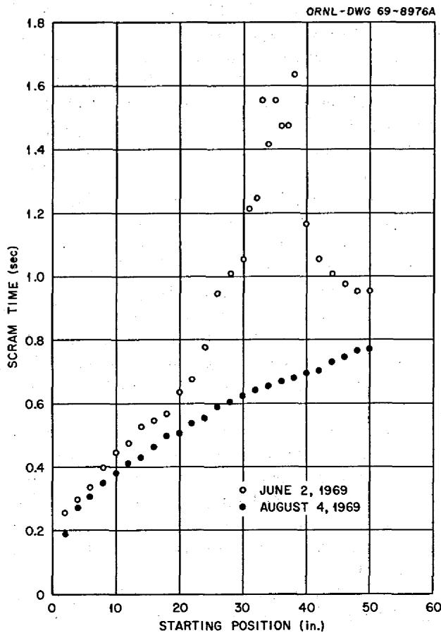  
Fig. 1.14. Scram Times for Rod Assembly No. 3 Before and After Maintenance.

examination was postponed. (Rod R-3, which had been removed in September 1966 after 8000 Mwhr of operation, was still reading in July 1969 over $20\mathrm{r / hr}$ at 18 in. from a short exposed section.)

After all three assemblies were reinstalled in the reactor, incremental rod drops were again performed. The scram time vs starting position for each rod showed no regions of excessive drag. Tests were performed first with the core cold $(400^{\circ}\mathrm{F})$ and then hot $(1200^{\circ}\mathrm{F})$ , with all rods dropping slightly faster with the system hot. All drop times were less than 0.95 sec with the system cold and 0.85 sec with the system at $1200^{\circ}\mathrm{F}$ . The data from the hot test of assembly 3 are shown in Fig. 1.14 for comparison with its earlier performance. Plots for the other two assemblies were within 0.04 sec of that for No. 3.

In an effort to provide a quick testing procedure that would not require numerous rod drops, yet would reveal regions of abnormal drag, a procedure developed for the EGCR was renovated. The output from the

position potentiometer is amplified and transmitted by wire to the main ORNL area, where it is passed through a filter with a 5-Hz time constant to remove transmission noise, digitized at 2000 samples/sec, and stored on magnetic tape. The data are then sent to the IBM 360 computer for smoothing and analysis by a program especially developed for this purpose. This procedure is activated during a rod drop from 50 in. to give about 1800 data points during the drop, from which velocity and acceleration are computed. Analysis of a record of assembly 3 before repair showed a region of near-zero acceleration between 26 and 40 in., in good agreement with the incremental drop test results shown in Fig. 1.14. After reinstallation, all three assemblies were tested, and all showed reasonably constant accelerations of $10\mathrm{ft} / \mathrm{sec}^2$ or more.

As a result of the experience with the control rods during this period, monthly testing was made a requirement. During the startup in August the rod performance was quite satisfactory.

# 1.3.4 Off-Gas Systems

# A. I. Krakoviak

As in the past, partial plugging at various points in the fuel and coolant off-gas systems caused some problems in operation. Restrictions appeared in some places where they had not been detected before, but countermeasures proved effective, and there was no serious interference with the experimental program of the reactor.

Throughout much of the operation from January through May there was a detectable restriction in the fuel off-gas line at its exit from the pump bowl. In January and February it was perceptible for about six weeks before it suddenly blew out while the normal off-gas flow was being forced through it during the routine operation of recovering salt from the overflow tank ("burping" the overflow tank).21 On five other occasions in the next nine weeks the pressure drop became noticeable, but each time it blew out when the overflow tank was burped. On May 1 it reappeared, and it remained detectable through the June 1 shutdown. The restriction caused most of the pump bowl purge gas flow to bubble through the overflow tank except when the overflow tank was being pressurized to push accumulated salt back to the pump bowl. Then on May 25 the off-gas line from the overflow tank became almost completely plugged, and it became necessary to

turn off the overflow tank bubbler flow most of the time. Thereafter all the pump purge gas was forced out through the off-gas line from the pump bowl. This situation caused some inconvenience during the burping operation, but by reducing purge flow to the pump bowl at these times, the operation could be done without exceeding 15 psig in the pump bowl.

Five times between January 22 and May 12, a restriction appeared in the fuel off-gas line downstream of the 4-in. holdup pipe and upstream of the line to the auxiliary charcoal bed. Each time it was cleared by venting the fuel pump through the drain tanks and then pressurizing downstream of the restriction. Helium at 35 psig was used the first four times, but on the last time this pressure was not sufficient. When 60-psig helium was used, the restriction blew clear, and it had not recurred at the end of the report period.

During April the inlets of the two main charcoal beds then in service became restricted, and the two standby beds were valved in. After the pressure drop built up in these also, the water level around the beds was lowered, and the installed heaters were used to heat the steel-wool-packed inlet sections. A backblow was used at the end of the heating cycle to clear each bed. During the valving operations involved, the stem or stem extension on the inlet valve to one bed (MCB-2A) broke with the valve in the closed position. Repairs were not attempted because of the high radiation level at the valve and the sufficiency of the other three beds. The inlet of the auxiliary charcoal bed showed increased pressure drop in May, and a forward blow with helium was not very effective in clearing the restriction.

The pressure drop through the particle trap began increasing noticeably, and by May it reached 0.7 psi. (When originally installed in January 1967, the pressure drop was less than 0.1 psi.) The reserve half of the bed,[22] which had been valved out up to this time, was put in service in parallel on May 14, lowering the pressure drop to 0.1 psi or less. Temperatures reflecting fission product heating indicated that nearly all the gas was flowing through the fresh bed.

The restrictions in the fuel off-gas system affected the fuel drain on June 1. To minimize outflow of radioactive gases when the core access flange is opened, the fuel system is normally flooded with argon in place of helium. Because the restrictions in the off-gas system would limit the gas purge flow during this operation, argon flow into the pump bowl was started before the

drain so that as the salt drained, the reactor vessel would be filled with argon. The drain rate was slowed, particularly toward the end, by restrictions in the gas lines which slowed flow of gas from the drain tanks to the loop and out through the auxiliary charcoal bed.

Pressures during the drain disclosed that a restriction had developed in the gas line entering fuel drain tank 2 (FD-2). This was cleared by heating the tank to $1250^{\circ}\mathbf{F}$ and applying 60-psig helium. A similar but lesser restriction in the gas line at the other drain tank was partially cleared during the fuel system pressure test in August by heating the tank to $1250^{\circ}\mathbf{F}$ and flowing helium from FD-2 (at 50 psig) to FD-1 (at 2 psig).

During the shutdown in June, when the overflow tank vent line was scanned with the remote gamma spectrometer, an unusually strong source was observed at the air-operated valve, about 33 ft downstream from the overflow tank. Flanges were opened, and pressure observations showed that the restriction was in the flanged section containing both the air-operated valve and a hand valve. This section was removed to a hot cell, where polymerized hydrocarbons were found to be blocking the hand valve inlet port. A replacement section containing an air-operated valve but no hand valve was installed.

The restriction at the fuel pump bowl exit was not reamed out as had been done on three earlier occasions. Instead the 2-kw heater that had been built for this purpose $^{21}$ was installed remotely on the pipe as near to the pump as possible and connected to spare power and thermocouple leads in the reactor cell. The pump tank furnace heaters and the new heater were turned up to bring the section of off-gas line to near $1200^{\circ}\mathrm{F}$ ; then gas pressure was applied to blow the restricting material back toward the pump bowl. The heater was turned off but left connected so that it could be used again without reopening the reactor cell. No evidence of the restriction appeared during the August operation.

The set of specimens exposed in the off-gas holdup volume since April 1968 was removed during the July shutdown for examination. Results are described in Sect. 11.3.

Temperatures in the fuel off-gas system responded to changes in fuel pump speed during high-power operation, indicating changes in the stripping rate of the short-lived gaseous fission products that produce most of the heating in the holdup volume and the particle trap. These indications agreed with the changes in stripping rate inferred from the $^{135}\mathrm{Xe}$ poisoning.

The off-gas sampling system was used during the report period to remove nine concentrated samples, using the refrigerated molecular sieve absorber and

sample bombs. In addition the system was used extensively for on-line determinations, including hydrocarbons. (See Sect. 11.3.) Recurring restrictions in the inlet valves to the off-gas sampler were repeatedly cleared by forward blowing with 60-psig helium. During tests in July, the inlet block valves would not shut off tightly and were replaced. During the startup in August it was again necessary to blow out restrictions at the inlet to the sampler.

The coolant off-gas system was relatively trouble free until the last week in May, when restrictions developed in the pressure control valve and the back-diffusion preventer at the discharge end of the line. During the June shutdown the filter was replaced, the pressure control valve and a nearby check valve were cleaned, and the back-diffusion preventer was removed. All four components were coated with an oily substance (presumably from the pump) which impeded the off-gas flow. The coolant off-gas system operated satisfactorily during the August startup.

# 1.3.5 Component Cooling System

# P. H. Harley

No significant operating difficulties were encountered with the component cooling pumps after the brazed tubing systems for circulating oil to the two pumps were replaced with welded systems in August 1968.

Component cooling pump 1 had operated continuously for 4031 hr before it was shut down for programmed maintenance in June 1969. The oil (which was about a gallon low) was changed, the oil filter was replaced, and the drive belt (which had apparently been slipping) was tightened. The other pump (CCP-2) was used when operation resumed and by the end of August had operated 500 hr.

# 1.3.6 Containment and Ventilation

# P. H. Harley

From March through May the air inleakage into the reactor cell (at $-2$ psig) gradually increased from 17 to 28 scf/day, still well below the permissible 75 scf/day. The cause of the increase could not be determined. After the maintenance period in June and July, the reactor and drain-tank cells were leak tested at 20 psig as required annually. The leak rate at first was over 300 scf/day. After leaks were located and stopped in a 10-in. valve bonnet and a 12-in. inspection port, the rate was down to 150 scf/day (65% of maximum permissible at 20 psig). When the cells were first pulled down to $-2$ psig after the pressure test, the apparent

inleakage rate displayed its usual behavior under these conditions: high at first, then decreasing to an acceptable value in five days, and leveling off in about nine days at a low value. This was attributed to the vaporization of water in one of the cells raising the humidity until condensation produced a steady state. Coincident with the leveling off of the apparent cell inleakage, 0.4 gal/day of condensate began to collect at the cooler in the cell atmosphere recirculating system, indicating an in-cell water leak of that magnitude, probably from one of the space coolers. After the condensate began to appear, the measured inleakage rate was 20 scf/day.

During the reactor shutdown all block valves and check valves on lines entering the primary containment (fuel salt and fuel off-gas systems) were leak tested. Five measurable leaks were located and repaired. Two check valves in gas purge lines to the fuel sampler-enricher, which leaked $35 - 70\mathrm{cc / min}$ at 20 psi at first, were leak-tight after in situ flushing with trichlorotrifluoroethane (Freon TF) solvent. Two solenoid-operated block valves on the off-gas sampler inlet line were replaced, as was a check valve on an intermittently used purge line into the off-gas system.

The fan normally in use on the ventilation stack required replacement of broken belts on two occasions and a rough bearing once, all in July and August. In each case stack flow was maintained by the standby fan. After the cell maintenance was completed, all three parallel banks of stack roughing filters were replaced as a routine measure to reduce pressure drop. Dioctyl phthalate tests of the three banks of high-efficiency particulate filters gave efficiencies of $99.995\%$ , $99.993\%$ , and $99.985\%$ . (ORNL standards require $99.95\%$ or better.)

Stack activity releases continued to be quite low. Over the six-month report period total particulate activity released was $< 0.22\mathrm{mc}$ , and measurable gaseous activity amounted to $12.5\mathrm{mc}$ . Of the latter, $7.0\mathrm{mc}$ was released when a section of the fuel overflow tank vent line was removed, and $3.0\mathrm{mc}$ was released during the removal of specimens from the core. There was no spread of contamination outside contamination zones during the maintenance work except for one occasion when a small amount was spread in the high bay around the reactor cell during the removal of core sampling tools. No significant exposure of personnel resulted.

# 1.3.7 Heaters and Electrical System

# T. L. Hudson

The operation of the heaters continued with only one failure during this report period. About a $30\%$ drop in

current on heater H-102-5 on the fuel line between the heat exchanger and the reactor occurred in the early part of August. After a resistance check indicated that one of the three heater elements had failed, the spare heater elements were placed in service.

In April a failure of a fuse on the primary side of the MSRE main power transformer resulted in the loss of voltage on one of the transformer windings. This effectively changed the power supply from a three-phase to a single-phase supply. The secondary voltage dropped from 480 to $415\mathrm{v}$ across two windings and increased from 480 to $830\mathrm{v}$ across the other winding. The motor-operated equipment continued to operate briefly until the individual breakers were tripped by the high current in two of the lines. All breakers did not trip at the same time, which made it more difficult to diagnose the trouble immediately. The reactor was scrambled from full power, and the diesel generators were started, but because the tripped breakers prevented starting equipment from the control room, both the fuel and coolant systems drained before cooling air could be restored to the freeze valves. No apparent cause for the fuse failure was found other than possible overheating from poor electrical contacts.

# 1.3.8 Oil Systems for Salt Pumps

# A. I. Krakoviak

Although both the coolant and fuel circulating pumps were off for about two months during this report period, the oil systems for both pumps were kept in operation. By the end of the report period, oil had been circulating continuously in both systems for 27 months. During this time, 32 samples from the fuel pump oil system and 26 from the coolant pump oil system showed no significant change in physical or chemical properties. The collection rate of oil that had leaked past the shaft seals was normal (between 8 and 16 cc/day) while the pumps were running and zero while the pumps were not rotating. Inventories show that in the 24 months through August 1969, unaccounted-for losses from the fuel pump oil system were $5.4_{(-3.0)}^{(+1.5)}$ liters; from the coolant oil system, $5.6_{(-3.0)}^{(+1.5)}$ liters. Hydrocarbons at the off-gas sampler indicated approximately 1 to $2\mathrm{g}$ of oil products per day passing that point.

At the beginning of power operation in August, a radiation monitor at the oil reservoir on the fuel pump oil system indicated radiation from the upper part of the tank that increased and decreased with the reactor power. The gamma spectrometer showed that the

activity was $^{41}$ Ar, apparently produced by activation of the blanket gas in the upper part of the pump. Prior to this time only helium had been used during power operation, and no gas activation had occurred. Radiation levels did not exceed 2 mr/hr.

# 1.3.9 Radiator and Main Blowers

# M. Richardson

The radiator was inspected and found to be in satisfactory condition at the end of run 18. Several lava terminal blocks at the heater connections were replaced, and 5 ft of the soft gasket seal at the top of the outlet door was replaced. The lifting mechanism was lubricated, and the clutch and brakes were adjusted.

The main blower fan hubs and blades were cleaned and inspected by dye-penetrant methods. No faults were revealed. The filters and brushes were replaced and the slip rings cleaned on the blower motors.

# 1.4 REMOTE MAINTENANCE

# M. Richardson

At the start of each shutdown when remote maintenance is to be done in the cells, approximately two days are spent cutting the membrane and removing the upper blocks. It then takes approximately one day to set up shielding and remove the lower blocks at each location where work is to be done. In addition to this, a good portion of the time spent accomplishing remote maintenance is in preparation. Some approximate times spend on various operations are indicated on the following descriptions of the jobs done during the shutdown.

Although the in-cell monitors indicated that the radiation levels in the cells were several thousand roentgens per hour and there were beams of more than $100\mathrm{r / hr}$ above the maintenance shield when holes were opened for inserting tools, etc., the maximum quarterly dose received by anyone was 720 millirems to the skin and 680 millirems to the critical organs. (The acceptable weekly doses are 600 and 300 millirems respectively.)

The removal of the specimen array from the core was delayed for a couple of days due to difficulty with a heater used to melt the salt from the reactor neck. The actual removal of the specimens and delivery to the hot cell took less than 8 hr. Some particulate activity was dispersed during removal of one of the tools, and, although this did not appreciably delay the shutdown, several days (over 100 man-hours) were spent cleaning

the high bay around the reactor cell. Installation of the new specimen array assembly and checking that the flanges were leak-tight took approximately 12 hr.

The radiation level from the control rod drives after they were removed from the cell was low enough (<600 mr/hr) to allow working directly on them without shielding. One rod was removed remotely and stored in the reactor cell. It was replaced by a spare rod. A discussion of the work done on the control rods and drives is given in Sect. 1.3.3.

During work on the plugged off-gas line from the overflow tank, a line from a nitrogen cylinder was connected to different flanges in the line to locate the section which was plugged. This took approximately two days. The plug was found to be in the section containing an air-operated valve and a hand-operated valve. An attempt was made to cut this apart in the reactor cell so that sections could be conveniently sent to a hot cell for examination. After about 8 hr it was decided that this could not be done easily and that the entire assembly would be shipped to the hot cell. The radiation from this was $5\mathrm{r / hr}$ at 10 ft. Two days were spent obtaining a large carrier and making preparations.

The actual removal and transfer took only a few hours. The installation of the replacement was complete and the flanges leak-tight in one day, but due to misalignment, two more days were used getting the air line connected to the valve operator.

A permanent heater was installed in the main off-gas line near the fuel pump. Although this was a difficult job, due to interferences, it was completed in less than two days. This was mainly due to advanced planning and practice on a mockup. Heating the line and applying back pressure was successful in removing the plug that had formed during the preceding run.

A leaky air-line disconnect to an operator of one of the equalizer valves in the drain-tank cell was repaired. The leak was due to a plastic seal which had deteriorated. The actual repairs took less than $2\mathrm{hr}$ , but there was about a one-day delay preparing for the job after finding that the disconnect had been installed backward during the original installation.

When all maintenance was complete in the reactor cell, approximately 20 hr was used to weld the membrane and approximately 16 hr to replace and bolt down the upper blocks.

# 2. MSRE Reactor Analysis

# 2.1 INTRODUCTION

B. E. Prince

Although operation of the MSRE with $^{235}\mathrm{U}$ as the principal fissile material was terminated in March 1968, refinements in the analysis of nuclear operations data from this earlier run continue to be of interest. Not only do we seek to detect and resolve any fortuitous agreement or disagreements between experimental data and results calculated from theoretical models, but, more important from the standpoint of the present operation with $^{233}\mathrm{U}$ , the analysis of current data remains coupled to the $^{235}\mathrm{U}$ run through the residues of plutonium, uranium, samarium, and certain other fission products, and the exposure of the core graphite produced during the earlier run. During this semiannual report period we carried out an extensive reexamination of the basic nuclear data and calculations for the $^{235}\mathrm{U}$ -bearing salt. A number of revisions had been introduced into the basic library of nuclide cross sections since the physics analysis for the $^{235}\mathrm{U}$ loading was first performed, and the current trend is toward the use of the ENDF/B cross-section library (an evaluated nuclear data file still in the process of being standardized). Thus we have repeated certain of the neutronics calculations for the $^{235}\mathrm{U}$ loading using these updated data and have attempted to assess the consequences of these revisions on the interpretation of MSRE experiments. The first of the following sections is intended to provide a precise definition of the calculated cross sections of interest in the reactor analysis. The remaining sections describe the results and discuss the consequences of calculations with the newer cross-section data.

# 2.2 DEFINITION OF AVERAGE REACTION CROSS SECTIONS

B. E. Prince

For those nuclides which are uniformly distributed in the fuel salt, the changes which occur in the course of operation are governed by the following expression for

the reaction rate:

$$
R _ {i} (t) = N _ {i} (t) \int_ {V _ {R}} d V \int_ {0} ^ {\infty} \sigma_ {i} (E) \phi (\mathbf {r}, E, t) F (\mathbf {r}) d E, \tag {1}
$$

where

$$
R _ {i} (t) = \text {t o t a l} \quad \text {r e a c t i o n} \quad \text {r a t e r} \quad \text {f o r} \quad i \text {t h} \quad \text {n u c l i d e} \quad \text {i n} \quad \text {s a l t} \quad (\text {e v e n t s / s e c}),
$$

$$
N _ {i} (t) = \text {n u m b e r d e n s i o n o f i t h n u c l i d e i n s a l t} (\text {n u c l e i p e r c u b i c c e n t i m e t e r o f s a l t}),
$$

$$
\sigma_ {f} (E) = \text {r e a c t i o n} \quad \text {c r o s s} \quad \text {s e c t i o n} \quad \text {f o r} \quad i \text {t h} \quad \text {n u c l i d e} \quad (\mathrm {c m} ^ {2}),
$$

$$
\begin{array}{l} \phi (\mathbf {r}, E, t) = \text {n e u t r o n f l u x a t p o i n t} \mathbf {r}, \text {e n e r g y} E, \text {a n d t i m e} \\ t \left(\text {n e u t r o n s c m} ^ {- 2} \sec^ {- 1}\right), \end{array}
$$

$$
F (\mathbf {r}) = \text {v o l u m e}
$$

$$
\begin{array}{l} V _ {R} = \text {a l l r e a c t o r v o l u m e e x i s p e i n c i n g n e u t r o n} \\ \text {f l u x (c m ^ {3}) .} \end{array}
$$

This characteristic of uniform distribution in the salt is basic to these circulating fuel systems and applies to all of the important constituent nuclides in the salt. The possibility of factoring the nuclide concentration from the volume integration, as shown in Eq. (1), is a direct consequence of this feature. It allows one to define a useful microscopic reactor-average cross section which is influenced by the salt composition only indirectly, through changes in the neutron energy spectrum. For our calculations, we have found it convenient to rewrite Eq. (1) as

$$
R _ {i} = N _ {i} \hat {\sigma} _ {i} \Phi_ {T} V _ {s}, \tag {2}
$$

where we have made the definitions

$$
\hat {\sigma} _ {i} (t) = \frac {\int_ {V _ {R}} d V \int_ {0} ^ {\infty} d E \sigma_ {i} (E) \phi (\mathbf {r} , E , t) F (\mathbf {r})}{\int_ {V _ {R}} d V \int_ {0} ^ {E c} d E \phi (\mathbf {r} , E , t) F (\mathbf {r})}, \tag {3}
$$

$$
\Phi_ {T} (t) = \frac {\int_ {V _ {R}} d V \int_ {0} ^ {E c} d E \phi (\mathbf {r} , E , t) F (\mathbf {r})}{V _ {s}}. \tag {4}
$$

In these definitions, $E_{c}$ is a convenient cutoff energy

chosen just high enough to effectively separate the slowing-down energy range from the thermalization range, $\Phi_T$ is the average thermal flux to which the salt is exposed, and $V_{s}$ is the total volume of salt in circulation. [Notice that an equivalent definition could, if desired, be made on the basis of the total neutron flux at all energies, $\Phi$ , simply by replacing $E_{c}$ by infinity and $\Phi_T$ by $\Phi$ in Eqs. (3) and (4).]

To apply the preceding definitions to reaction rate calculations, it is necessary to approximate the exact neutron spectrum $\phi (\mathbf{r},E)$ . In our work with the MSRE, we have used the GAM-II and THERMOS programs to produce four broad-energy-group average nuclide cross sections, where the averaging is with respect to an approximate core spectrum calculated by the programs. We then applied the latter cross sections in four-group diffusion calculations with the EXTERMINATOR program to approximate the variation in the flux spectra in the peripheral, salt-containing regions of the core (i.e., the upper and lower plenums and the radial downcomer). Approximate expressions corresponding to the defining equations (3) and (4) can readily be obtained which describe this procedure. They are:

$$
\hat {\sigma} _ {i} \cong \frac {\sum_ {k} \sum_ {g} V _ {k} F _ {k} \bar {\sigma} _ {i} ^ {g} \Phi_ {g k}}{\sum_ {k} V _ {k} F _ {k} \Phi_ {T k}}, \tag {5}
$$

$$
\Phi_ {T} \cong \frac {\sum_ {k} V _ {k} F _ {k} \Phi_ {T k}}{V _ {s}}, \tag {6}
$$

where $V_{k}$ and $F_{k}$ are the volume and salt volume fraction for the $k$ th subregion over which the volume fraction of salt is constant and $\Phi_{g k}$ is the EXTERMINATOR flux in broad group $g$ , averaged over subregion $k$ ( $\Phi_{T k}$ is the average thermal flux in region $k$ ). The broad-group nuclide cross sections are defined by:

$$
\bar {\sigma} _ {i} ^ {g} = \frac {\int_ {E _ {g}} ^ {E _ {g + 1}} d E \phi_ {a} (E) \sigma_ {i} (E)}{\int_ {E _ {g}} ^ {E _ {g + 1}} d E \phi_ {a} (E)}, \tag {7}
$$

where $\phi_a(E)$ is the approximate neutron spectrum in the graphite-moderated core, as obtained from multi-group calculations with the GAM-II and THERMOS programs. As described in earlier semiannual reports, $^{1,2}$ the integrals in Eq. (7) are also calculated in terms of

finite sums, using up to 99 energy groups to span the slowing-down range and 30 groups to span the thermal range. The cutoff energy, $E_{c}$ , separating these ranges was chosen to be 0.876 ev for MSRE calculations.

# 2.3 RESULTS OF REVISED CROSS-SECTION CALCULATIONS

B. E. Prince

In Table 2.1, we have listed the modified cross sections obtained in these studies alongside the corresponding values obtained in the earlier calculations. Both calculations were made for the reactor spectrum corresponding to the minimum critical uranium loading (core isothermal at $1200^{\circ}\mathrm{F}$ , all control rods fully withdrawn). For reference purposes, several nuclides were included in the current studies in addition to those

Table 2.1. Revised Average Reaction Cross Sections in MSRE Thermal Flux, with ${}^{235}\mathrm{U}$ Fuel at Minimum Critical Loading   

<table><tr><td rowspan="2">Nuclides</td><td colspan="2">Average Cross Section (barns)</td></tr><tr><td>Pre-1965 Data</td><td>These Calculations</td></tr><tr><td>6Li</td><td>461.02</td><td>466.42</td></tr><tr><td>10B</td><td>1870.35</td><td>1881.13</td></tr><tr><td>233U (absorption)</td><td>a</td><td>387.92b</td></tr><tr><td>233U (fission)</td><td>a</td><td>344.06b</td></tr><tr><td>234U</td><td>138.19</td><td>130.40b</td></tr><tr><td>235U (absorption)</td><td>340.53</td><td>331.43c</td></tr><tr><td></td><td></td><td>333.88d</td></tr><tr><td></td><td></td><td>332.69b</td></tr><tr><td>235U (fission)</td><td>270.15</td><td>265.11c</td></tr><tr><td></td><td></td><td>267.88d</td></tr><tr><td></td><td></td><td>267.63b</td></tr><tr><td>236U</td><td>52.755</td><td>51.11b</td></tr><tr><td>237Np</td><td>a</td><td>278.41</td></tr><tr><td>238U</td><td>26.318</td><td>27.668e</td></tr><tr><td>238Pu</td><td>a</td><td>218.29</td></tr><tr><td>239Np</td><td>a</td><td>103.14</td></tr><tr><td>239Pu (absorption)</td><td>1470.10</td><td>1456.06</td></tr><tr><td>239Pu (fission)</td><td>874.50</td><td>901.10</td></tr><tr><td>240Pu</td><td>1267.91</td><td>1287.64</td></tr><tr><td>241Pu (absorption)</td><td>a</td><td>1137.61</td></tr><tr><td>241Pu (fission)</td><td>a</td><td>836.43</td></tr><tr><td>242Pu</td><td>a</td><td>174.38</td></tr></table>

$a_{\text{Not calculated.}}$   
$b_{\text{Current ENDF/B data}}$   
$^\mathrm{c}$ Cross-section data library based on ref. 3.   
dORNL evaluation of 235U data; E. H. Gift, personal communication.   
$^{e}$ Cross-section data library based on data of G. D. Joanou and C. A. Stevens, Neutron Cross Sections for $^{238}U$ , GA-6087 Rev. (NASA-CR-54290) (April 1965).

considered in the earlier work. In each case, these additional nuclides were not of significance in the $^{235}\mathrm{U}$ operation and, for the calculations, were assumed to be present at infinitely dilute concentrations in the salt. In view of the importance of $^{235}\mathrm{U}$ in determining the neutronic characteristics of the reactor, three different sets of cross-section data currently available for these types of calculations were compared. We found very little difference in the magnitude of the effective absorption and fission cross sections calculated with these data sets. The maximum variation in the average capture-to-absorption ratio for the sets was about $2\%$ , with the ratio for the ORNL-evaluated set lying approximately midway between the current ENDF/B data and the data set based on ref. 3. However, the capture-to-absorption ratio for the ORNL set was about $5\%$ smaller than the ratio obtained from the earlier studies (column 2 of Table 2.1). The ORNL-evaluated data were chosen as the basis of further calculations.

The other principal changes evidenced in these newer calculations which are of significance in the interpretation of MSRE data were in the $^{238}\mathrm{U}$ and $^{239}\mathrm{Pu}$ cross sections. The former exerts its influence not only through the neutron poisoning effect on the critical uranium loading but, more significantly, through the production of $^{239}\mathrm{Pu}$ during power operation. Since the $^{239}\mathrm{Pu}$ production rate is very nearly proportional to the $^{238}\mathrm{U}$ cross section, this change in nuclear data alone would increase the $^{239}\mathrm{Pu}$ by about 5% from the earlier calculations. (Other modifications besides those shown in Table 2.1 are also required in the calculation of the plutonium production, however, as described later in this section.)

The changes in the $^{239}\mathrm{Pu}$ fission and absorption cross sections are in the direction of increasing the reactivity effect of the $^{239}\mathrm{Pu}$ and reducing the amount of $^{240}\mathrm{Pu}$ present for a given fuel exposure. This change has no bearing on the interpretation of the critical experiment at the start of the $^{235}\mathrm{U}$ operation but does enter into the analysis of $^{233}\mathrm{U}$ operations.

The average cross sections listed in column 2 of Table 2.1 will be found to differ slightly from those given in an earlier semiannual report. The basic cross-section library was the same in both cases, but the average cross sections given in this earlier report were appropriate to a graphite-moderated homogeneous cylinder approximation of the core; that is, they did not include the volume averaging over the peripheral salt-containing

regions of the core or the effect of the control rod thimbles on the thermal flux. Both effects tend to increase the relative contribution of the epithermal component of the average neutron flux and influence most strongly the average cross sections of nuclides with large resonance capture components (particularly $^{238}\mathrm{U}$ , $^{234}\mathrm{U}$ , and $^{236}\mathrm{U}$ ).

In this same connection, the averaged cross sections listed in Table 2.1 should be corrected for changes caused by increasing the uranium concentration to reactor operating conditions, and also the insertions of the control rod to compensate for the excess reactivity. These changes also increase the average epithermal-tothermal flux ratio in the reactor. In Table 2.2 we have indicated the relative increases in calculated average cross sections of the most important nuclides, corresponding to the maximum $^{235}\mathrm{U}$ concentration and rod poisoning experienced in the $^{235}\mathrm{U}$ run. This occurred at the end of the zero-power experiments and before the fuel was drained, when the $^{235}\mathrm{U}$ concentration had been increased by nearly $10\%$ and the regulating rod was near full insertion. Although further uranium additions were made during the $^{235}\mathrm{U}$ run, at no time during operations were these conditions exceeded. In accordance with the discussion given above, the maximum changes in Table 2.2 are seen to be associated with those nuclides with strong resonance capture components.

During the actual course of reactor operation, the uranium concentration and the rod insertion varied in accordance with the fuel burnup and additions and with the various reactivity changes in the core. For the purposes of calculating the reaction rates, however, the corresponding changes in the average cross sections can be closely approximated by linearly interpolating the results given in Table 2.2 on the basis of the $^{235}\mathrm{U}$ concentration.

Table 2.2. Relative Changes in Average Reaction   
Cross Sections for a $10\%$ Increase in $^{235}\mathrm{U}$ Concentration, with Compensating Control Rod Insertion   

<table><tr><td>Nuclide</td><td>Cross-Section Ratioa</td></tr><tr><td>234U</td><td>1.063</td></tr><tr><td>235U (absorption)</td><td>1.018</td></tr><tr><td>235U (fission)</td><td>1.014</td></tr><tr><td>236U</td><td>1.089</td></tr><tr><td>238U</td><td>1.094</td></tr><tr><td>239Pu (absorption)</td><td>1.004</td></tr><tr><td>239Pu (fission)</td><td>1.004</td></tr></table>

$a_{\text{Cross}}$ section at maximum uranium loading conditions divided by cross section at minimum critical loading.

# 2.4 EFFECTS ON OTHER MSRE NEUTRONIC CHARACTERISTICS

B. E. Prince

Integral neutronic characteristics which are directly affected by the changes in nuclear data are the calculated critical $^{235}\mathrm{U}$ loading, the depletion coefficients for the various uranium isotopes, and the rate of production of plutonium. The calculations summarized in the preceding section also have current application in interpreting the measurement of the capture-to-absorption ratio for $^{235}\mathrm{U}$ (see Sect. 6.3.1). In the case of the calculations for the critical experiment, we found that the net change in multiplication factor introduced by the new cross-section data was -0.0053. This is equivalent to an increase of approximately $2\%$ in the calculated critical concentration of $^{235}\mathrm{U}$ . While this modifies somewhat the apparent very close agreement between calculated and observed critical loading obtained in the earlier analysis, the agreement remains good by most standards for these types of calculations. By use of perturbation theory computations, the net change in the multiplication factor was decomposed into component effects. The revisions in the $^{235}\mathrm{U}$ and $^{238}\mathrm{U}$ data corresponded to changes of +0.00141 and -0.00520, respectively, in multiplication. The remainder of -0.0015 corresponded to slight increases in parasitic absorption in lithium, fluorine, and zirconium.

The revised values of the burnup coefficients for the uranium isotopes are listed in Table 2.3, along with the values reported earlier. The principal change is in the $^{238}\mathrm{U}$ depletion rate, which introduces an overall increase of $4.8\%$ in the net rate of depletion of the uranium inventory in circulation.

4B. E. Prince et al., Zero-Power Physics Experiments on the Molten-Salt Reactor Experiment, ORNL-4233 (February 1968).

Table 2.3. Revised Burnup Coefficients for Uranium Isotopes in $^{235}\mathrm{U}$ Loading   

<table><tr><td rowspan="2">Isotope</td><td colspan="2">Rate of Production (+) or Depletion (-) in Circulating Salt (g/Mwd)</td></tr><tr><td>Ref. 1</td><td>These Calculations</td></tr><tr><td>234U</td><td>-0.0052</td><td>-0.0054</td></tr><tr><td>235U</td><td>-1.30</td><td>-1.314</td></tr><tr><td>236U</td><td>+0.26</td><td>+0.264</td></tr><tr><td>238U</td><td>-0.19</td><td>-0.239</td></tr><tr><td>Net U</td><td>-1.235</td><td>-1.294</td></tr></table>

The inventories of the significant plutonium isotopes may be determined from the following theoretical relations:

$$
N _ {4 9} = N _ {4 9} ^ {0} e ^ {- \hat {\sigma} _ {4 9} u} + \frac {N _ {2 8} ^ {0} \hat {\sigma} _ {2 8}}{\hat {\sigma} _ {4 9} - \hat {\sigma} _ {2 8}} \left(e ^ {- \hat {\sigma} _ {2 8} u} - e ^ {- \hat {\sigma} _ {4 9} u}\right), \tag {1}
$$

$$
\begin{array}{l} N _ {4 0} = N _ {4 0} ^ {0} e ^ {\hat {\sigma} _ {4 0} u} + N _ {4 9} ^ {0} \frac {\hat {\sigma} _ {4 9} - \hat {\sigma} _ {f 4 9}}{\hat {\sigma} _ {4 9} - \hat {\sigma} _ {4 0}} \\ + \left(e ^ {\hat {\sigma} _ {4 0} u} - e ^ {\hat {\sigma} _ {4 9} u}\right) + \frac {N _ {2 8} ^ {0} \hat {\sigma} _ {2 8}}{\hat {\sigma} _ {4 9} - \hat {\sigma} _ {2 8}} \\ + \left[ \begin{array}{l} \hat {\sigma} _ {4 9} - \hat {\sigma} _ {f 4 9} \\ \frac {\hat {\sigma} _ {2 8} - \hat {\sigma} _ {4 0}}{\hat {\sigma} _ {2 8}} (e ^ {- \hat {\sigma} _ {4 0} u} - e ^ {- \hat {\sigma} _ {2 8} u}) \end{array} \right. \\ \left. - \frac {\hat {\sigma} _ {4 9} - \hat {\sigma} _ {f 4 9}}{\hat {\sigma} _ {4 9} - \hat {\sigma} _ {4 0}} \left(e ^ {\hat {\sigma} _ {4 0} u} - e ^ {- \hat {\sigma} _ {4 9} u}\right) \right], \tag {2} \\ \end{array}
$$

where

$N_{k} =$ atomic concentration of $k$ in circulating salt; $k =$ 28,49,40 refers to $\mathbf{^{238}U}$ $\mathbf{^{239}Pu}$ ,and $\mathbf{^{240}Pu}$ respectively; superscript O refers to start of fuel exposure;

$\widehat{\sigma} =$ total reaction cross section (barns); subscript $f$ refers to fission cross section;

$u =$ time-integrated thermal flux (neutrons/barn).

The relation between the total number of fissions during an operating interval and the time integral of the thermal flux during that interval is:

total fissions $= V_{s}N_{25}^{0}\frac{\hat{\sigma}_{f25}}{\sigma_{25}} (1 - e^{-\hat{\sigma}_{25}u})$

$$
\begin{array}{l} + V _ {s} \left(N _ {4 9} ^ {0} - \frac {N _ {2 8} \hat {\sigma} _ {2 8}}{\hat {\sigma} _ {4 9} - \hat {\sigma} _ {2 8}}\right) \frac {\hat {\sigma} _ {f 4 9}}{\hat {\sigma} _ {4 9}} (1 - e ^ {- \hat {\sigma} _ {4 9} u}) \\ + V _ {s} N _ {2 8} ^ {0} \frac {\hat {\sigma} _ {4 9}}{\hat {\sigma} _ {4 9} - \hat {\sigma} _ {2 8}} \frac {\hat {\sigma} _ {f 4 9}}{\hat {\sigma} _ {4 9}} (1 - e ^ {- \hat {\sigma} _ {2 8} u}), \tag {3} \\ \end{array}
$$

where $V_{s}$ is the total volume of salt in circulation and subscript 25 refers to ${}^{235}\mathrm{U}$ . In Eq. (3), we have assumed that any additions to the ${}^{235}\mathrm{U}$ inventory are made at the beginning of the operating interval. These equations, which represent the solutions of the differential equations describing the isotopic changes in power operation, are approximate in the sense that the reactor-average reaction cross sections have been assumed invariant during the operation. As discussed in the preceding section, the actual variations in these

cross sections are quite small. In particular, for the variation in uranium inventory during the $^{235}\mathrm{U}$ operation, very close approximations are obtained by use of constant average cross sections corresponding to the mean $^{235}\mathrm{U}$ inventory during the entire operating period.

Equations (1), (2), and (3) were applied to the calculation of plutonium inventories in the $^{235}\mathrm{U}$ run. The average cross sections were interpolated from the values given in Tables 2.1 and 2.2 to correspond to a mean circulating inventory of $69\mathrm{kg}$ of $^{235}\mathrm{U}$ . The resulting mass inventory of $^{239}\mathrm{Pu}$ and the $^{240}\mathrm{Pu}/^{239}\mathrm{Pu}$ mass ratio are shown in Fig. 2.1 as a function of the time-integrated fission energy. As a result of the change in the $^{238}\mathrm{U}$ nuclear data, the total inventory of plutonium is increased relative to the plutonium production reported earlier (ref. 1). It is interesting to note, however, that the $^{240}\mathrm{Pu}/^{239}\mathrm{Pu}$ ratio depends primarily on the $^{239}\mathrm{Pu}$ cross-section data and is independent of the $^{238}\mathrm{U}$ cross section for the fuel exposures considered. By Taylor series expansions of the exponential terms in Eqs. (1) and (2), one finds:

$$
\frac {N _ {4 0}}{N _ {3 9}} \cong \frac {(\hat {\sigma} _ {4 9} - \hat {\sigma} _ {f 4 9}) u}{2},
$$

that is, the determining characteristics are the average

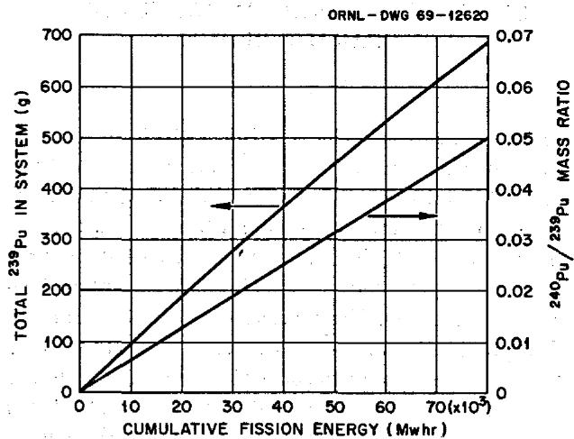  
Fig. 2.1. Plutonium Production During MSRE Operation with $235\mathbf{U}$ .

radiative capture cross section of $^{239}\mathrm{Pu}$ and the time-integrated thermal flux.

Future efforts in concluding the studies initiated in this report period will be directed toward comparing the results of the newer calculations with experimental data for the plutonium inventories and determining the effects on the interpretation of reactivity trends in both the operation with $^{235}\mathrm{U}$ and with the current $^{233}\mathrm{U}$ loading.

# 3. Component Development

Dunlap Scott

# 3.1 FREEZE-FLANGE THERMAL-CYCLE TEST

F. E. Lynch

The freeze-flange thermal-cycle test was continued through cycle 400 before being shut down for another inspection and minor repairs. A complete dye-penetrant inspection of the inner face and bore flanges was previously made at the end of cycles 103 (ref. 1), 268 (ref. 2), and 321 (ref. 3). Visual inspection of the flange exterior during and at the end of each cycle revealed no thermal fatigue cracks. Downtime due to operational problems was insignificant compared with earlier periods. These problems and the flange inspection results are reported below.

# 3.1.1 Facility Operation Problems

The accumulated downtime during this operation period (cycles 322-400) was due to burned-out test section heaters and a building power failure. However, there were several minor operation problems, such as instrument trouble and plugged vent lines, that were repaired during or at the end of the oscillation time.

A burned-out test section heater on the pipe adjacent to the female flange resulted in approximately all the downtime. One cycle was obtained without this heater bank by increasing the other heaters within the box to their upper limit. Since the higher amperage settings would shorten the life of the remaining heaters, operation of the loop was stopped to replace the heater. Another cycle was not completed due to a building power failure which occurred during the oscillation period. The power was off $35\mathrm{min}$ , so the loop cooled down too much to continue oscillation of the salt.

# 3.1.2 Inspection of the Flanges

The flanges were disassembled for inspection after cycle 400, and the oval ring gasket with stainless steel insert screen was removed for inspection. The average outer diameter of the frozen salt cake on the screen insert was 10 in., approximately the same diameter as all previous inspections except for cycle 103, which was $11\frac{1}{2}$ in. Higher flange operation temperatures during that cycle series would account for the difference.

A complete inspection of the bore and faces of the freeze flange was made with a fluorescent dye penetrant. No evidence of thermal fatigue cracking was visible either on the flange face or in the bore of the female flange. Also, the face and neck of the male flange were free of cracks or porosity indications. The fluorescent dye penetrant did indicate a change in the crack pattern which was previously observed in the bore of the male flange. Figure 3.1 shows a new dashed cracklike pattern, the original pattern, and a porosity band indication extending clockwise around the bore from the upper bore thermocouple. The dashed crack-like pattern, at a position of $1\frac{1}{8}$ in. from the end of the stub, starts at the upper bore thermocouple and extends circumferentially $120^{\circ}$ clockwise. A previously observed pattern at the $1\frac{1}{2}$ -in. position and the same origin extended around to $155^{\circ}$ and was approximately continuous from 15 to $135^{\circ}$ . A very dense porosity band extended 1 in. farther into the bore and continued around to $120^{\circ}$ before necking down to a $\frac{1}{4}$ -in. width at $155^{\circ}$ . A lighter-density porosity indication extended $1\frac{1}{8}$ in. farther into the bore around to $120^{\circ}$ . A similar porosity indication extended counterclockwise from the upper bore thermocouple also around to $155^{\circ}$ , as shown in Fig. 3.2. The continuous crack indication has not developed on this side of the bore, although at the

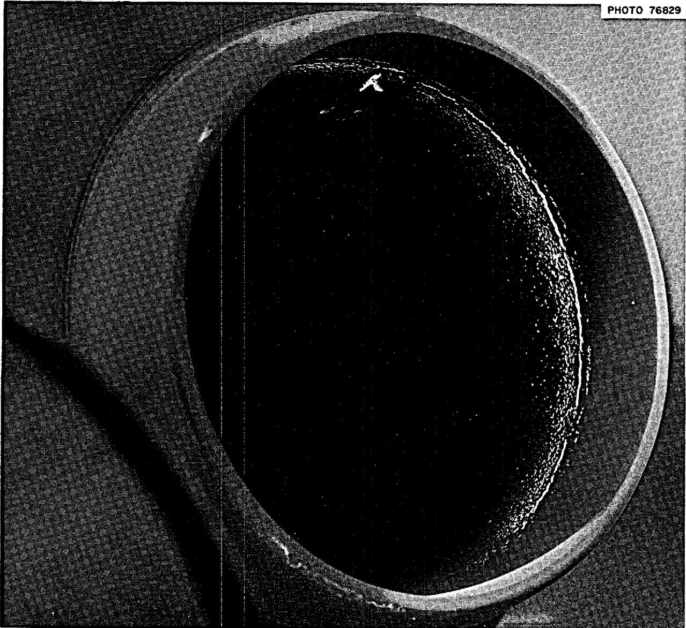  
Fig. 3.1. Photograph of Test Freeze Flange Showing Fluorescent Dye-Penetrant Indication of Crack on the Right Side of Bore.

$1 \frac{1}{8}$ -in. position a new dashed cracklike pattern extended around to $135^{\circ}$ with porosity indications continuing to $155^{\circ}$ . This cracklike pattern at the $1 \frac{1}{8}$ -in. position is approximately in the center of the $1 \frac{1}{8}$ -in. weld gap between the alignment stub and the flange face. In the fabrication of the flange there was a $50^{\circ}$ -bevel cut on the inside and outside of the stub end that was welded to the flange face. The assembly had then been machined to dimension, thus relocating the starting edge of the bore weld 1 in. from the outer edge of the stub and extending approximately $1 \frac{1}{4}$ in. farther

into the bore. Porosity indications and cracklike patterns indicate that the heat-affected zone of the weld extends deeper into the bore. As reported above, there were no cracks or porosity indications in the outer weld area where the stub was welded to the face of the flange.

The freeze flange was reassembled after inspection and the thermal-cycle test continued. A total of 452 thermal cycles had been imposed on the freeze flange as of August 28. Visual inspection of the exterior has revealed no sign of thermal fatigue cracks. A complete

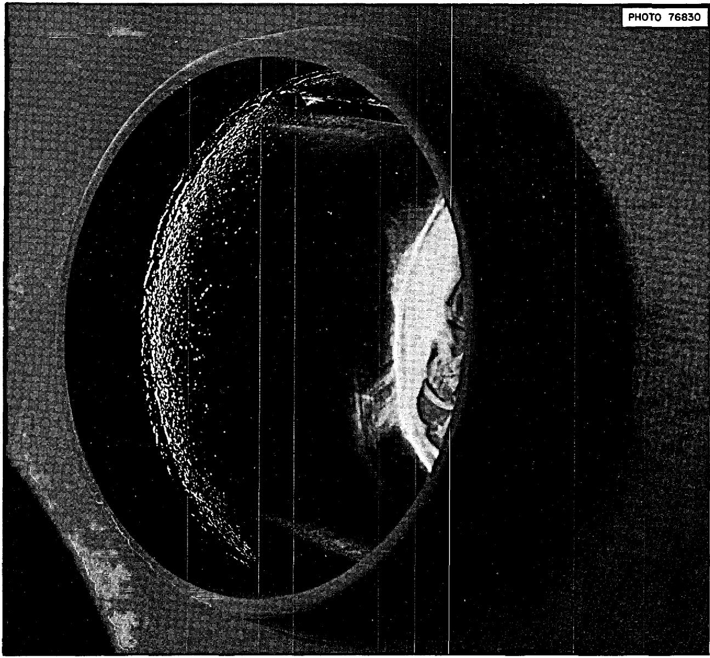  
Fig. 3.2. Photograph of Test Freeze Flange Showing Fluorescent Dye-Penetrant Indication of a Crack on the Left Side of Bore.

inspection of the inner face and bore of the flanges is tentatively scheduled at the end of cycle 470.

# 3.2 PUMPS

P.G.Smith A.G.Grindell

# 3.2.1 Mark 2 Fuel Pump

The Mark 2 fuel salt pump was continued in operation circulating the molten salt $\mathrm{LiF - BeF_2 - ZrF_4 - }$ $\mathrm{ThF_4 - UF_4}$ (68.4-24.6-5.0-1.1-0.9 mole%). It has now

operated for 8400 hr at flows to 1350 gpm and temperatures between 1020 and $1300^{\circ}\mathbf{F}$ .

The salt level in the pump tank was raised to $5\%$ in. above the normal operating level to make additional measurements of the void fraction in the circulating salt. The measurements with the radiation densitometer showed no gas in the circulating salt. This result was expected, since no gas was found when operating at the

ORNL-DWG 69-10459

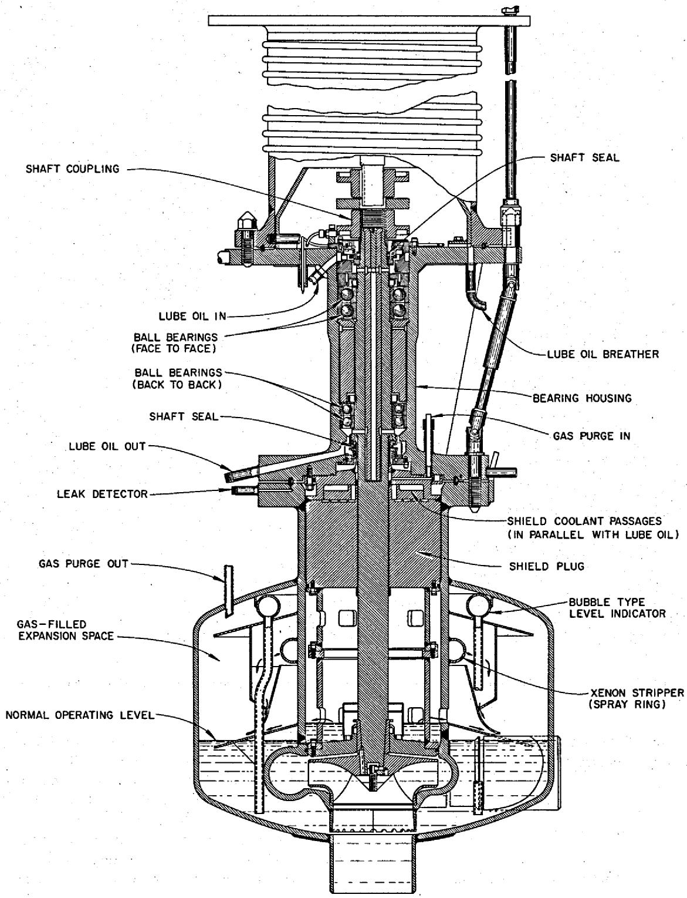  
Fig. 3.3. MSRE Mark 2 Fuel Salt Pump Assembly.

normal level in the pump tank previously.6 At the normal operating level and above, the baffling is evidently sufficient and effective in keeping gas bubbles from being carried into the pump inlet.

At the high salt level in the pump tank the rate of plugging in the pump tank off-gas decreased but is still a nuisance. The lower end of the shroud, which surrounds the stripper and guides the stripper flow into the pump tank space, is submerged in the liquid salt at this level (see Fig. 3.3), and the flow of gas through this region is reduced practically to zero. Without the flow of gas, the aerosols probably agglomerate and drain back into the liquid, thus reducing the content of aerosols in the pump tank off-gas.

# 3.2.2 Oil Pump Endurance Test

The oil pump endurance test $^{6}$ was continued. By the end of this report period the pump had run for 53,000 hr circulating oil at $160^{\circ}\mathrm{F}$ and $60~\mathrm{gpm}$ .

# 3.3 MSRE REMOTE GAMMA SPECTrometer

# R. Blumberg Frank Dyer A. Houtzeel

In April and May 1968, after run 16, a series of measurements of the fission product deposition in various components in the primary system of the MSRE were made using techniques of gamma-ray spectroscopy.7 It was decided to improve the equipment and techniques, the primary objective being improved accuracy of the final results. The revised equipment has been used at the MSRE since late June, both during the reactor shutdown and the start of operation in run 19. The improvements to the equipment that were sought were the following:

1. the ability to position and to move the detector with respect to a given remote target with accuracy,   
2. improved detector and analyzer capabilities (better resolution of a spectrum),   
3. improved data handling,   
4. the ability to use the collimator in a wide range of source strength,   
5. the ability to examine reactor components during and immediately after power operation,

6. better calibration.

Items 1, 2, and 6 above lead directly to increased accuracy.

# 3.3.1 Description of the Equipment

Figure 3.4 shows the mechanical equipment set up on the portable maintenance shield. Gamma rays from the reactor components are highly collimated, first by the 1-in. hole in the collimator body and then by the long, narrow hole in the collimator insert before entering the detector. A laser is positioned above the hole in an adjustable mount so that its beam can be directed down through the hole along the same path as, but in the opposite direction to, a gamma ray coming from the component. This serves as visible evidence of the source location and as a reproducible method of positioning the detector. There are three interchangeable collimator inserts with hole diameters of $\frac{1}{16}$ , $\frac{1}{8}$ , and $\frac{3}{16}$ in., so that the radiation level at the detector can be varied by as much as a factor of 9 as desired. The inserts have index pins for reproducible positioning. The insert and the laser mount are bolted together to assure alignment when being used. The collimator body provides both shielding and support for the other items. It is mounted on a thrust bearing with three adjustable jack screws for leveling. A pair of level gages are mounted on top of the collimator body so that the gages indicate that the axis of the collimator (thus the path of a gamma ray) is vertical.

The detector, a $31\text{-cm}^3$ Ge(Li) crystal in a right-angle Dewar, is mounted so that it may be moved horizontally into and out of the gamma-ray beam by means of a feed screw. Its output is fed to a 4096-channel analyzer which has several data reduction features. For recording the spectra either a magnetic tape unit or a typewriter can be used.

For measurements taken during a shutdown, the portable maintenance shield is used to support and move the spectrometer over the chosen component. We also have four holes which have been drilled through the concrete shield blocks over the off-gas line (line 522), the primary heat exchanger, the drain tank, and the sample bomb in the off-gas sample installation in the vent house for use when the reactor shielding is in place. The containment membrane between the blocks remains intact as before. These holes extend the scope of the program in that we can take measurements of fission products while the reactor is at power and immediately after. This will provide information on isotopes with the shorter half-lives. These holes also give

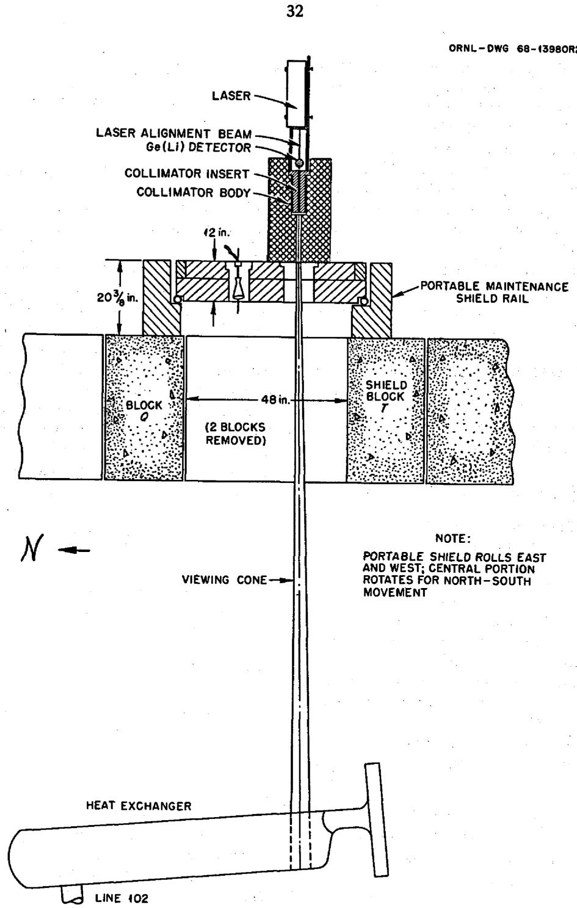  
Fig. 3.4. Portable Maintenance Shield Showing Mechanical Equipment.

us the ability to take measurements independent of the portable maintenance shield.

When using the maintenance shield to scan a large area of a component, several methods of assigning a location to a spectrum are used. With the laser shining through the hole, one can look through the lead glass

windows into the cell and see where the laser beam strikes the component. This can be recorded on a sketch or a plan-view drawing. The position of the collimator body can also be related in $x - y$ coordinates to the stationary frame of this maintenance shield. Both of these are used to locate and move the spectrometer.

However, a more exact location is obtained by taking readings from two transits set up in the high bay. We use a FOCAL program to compute plan-view coordinates from the angles which are recorded at the time the spectrum is taken. The overall location system works well and does not delay the data-taking process.

The final item worth noting is a computer code developed by the Mathematics Division by which the spectra, recorded on magnetic tape, can be listed in the form of computer printout and plotted and certain calculations can be performed. These steps would be time consuming and expensive if done any way other than by computer.

# 3.3.2 Test Program

To achieve the best results from the remote gamma spectrometer, a test program was initiated that had three basic areas. The status and progress of each of these areas is discussed below. The testing began as soon as pieces of the overall system were delivered. Since it was not completed before the shutdown period began, the test program will be resumed when the necessary equipment and areas become available.

Mechanical Features. - It was necessary first to assemble, inspect, and operate all the mechanical components of the system. Although there were some small defects that required rework, there was nothing serious. Much work was done with the location system, that is, the method by which we know the exact location of the source of the gamma rays entering the detector. While taking data with the $3/16$ -in.-diam insert, an alignment discrepancy of 1 in. was detected. (The highest count rate occurred 1 in. away from where we thought it should.) This was attributed to the fact that the laser beam had a considerably smaller diameter than the insert. We have corrected this condition by visually inspecting the laser beam to assure that it passes through the center of the hole at both ends of the insert.

Properties of the Detector and Electronics. - The detector and the electronics of the system were tested with various radioactive sources. The overall system resolution was found to be 1.9 kev, which compares with 6 kev for the detector used previously. The performance stability of the analyzer was improved by placing it in an air-conditioned room. Some instabilities were found which appear to be influenced by count rate, voltage, and frequency. We will investigate these and also the effect of changing the position of the detector with respect to the collimator hole.

In addition there were a number of malfunctions of various components of the system which delayed the test program, such as the tape drive, a broken switch on the control panel, and an assortment of shorts. However, this type of trouble appears to have been eliminated.

Calibration. - In order to calculate the quantities of fission products deposited, it is first necessary to evaluate the counting efficiency of the spectrometer. This is done by measuring a known source with the system set up in geometry similar to what it would be when measuring the desired sources, which in our case are the reactor components. In the test program a 25-cure source of $^{110m}$ Ag in the shape of a heat exchanger tube was moved to different positions in a mockup of the heat exchanger. The source and mockup were in the remote maintenance practice cell and the counting equipment in the adjoining hot equipment storage cell, positioned at a carefully located hole in the wall between the two. The portable maintenance shield was used to manipulate the source. Ninety-four spectra were taken through the $^{3/16}$ -in. collimator. Because the tape recorder was inoperative, all the output was taken on typed listings; due to time and the amount of hand calculation involved, we have not yet reduced the results.

By choosing a tubular source for these measurements, we obtain a calibration which should be applicable to the situation in the heat exchanger but not quite so applicable to other geometries. As a consequence of measuring the source at various positions in the mockup, we will also obtain an empirical value for the effect of attenuation in the heat exchanger. The calibration for the $\frac{1}{16}$ and the $\frac{1}{8}$ -in. collimator remains to be done.

# 3.4 NOBLE-METAL MIGRATION IN THE MSRE

R.J.Kedl

In connection with the development of off-gas systems for molten-salt breeder reactors, a model based on conventional mass transfer concepts was developed in an attempt to describe quantitatively the migration of noble metals in the MSRE. The assumption was made that noble-metal atoms are present in the fuel salt as single unstable atoms (in a reduced state chemically) looking for a surface to settle on. It was assumed that they deposit with equal affinity on all exposed Hastelloy N and graphite surfaces (sticking fraction = 1.0) and that the parameter that controls the rate of migration

to these surfaces is the mass transfer coefficient. This quantity can be readily estimated from standard heat transfer correlations and the use of heat-mass transfer analogies. In computing the mass transfer coefficient, it was assumed that the diffusion coefficient of noble metals in salt is $1.3 \times 10^{-5} \mathrm{~cm}^{2} / \mathrm{sec}$ . The model also takes into account noble-metal migration to circulating bubbles and to the off-gas system via the spray ring. The basic equation is simply a rate balance on the fuel salt which treats the fuel loop as a well-stirred pot:

$$
V \frac {d C}{d t} = \text {g e n e r a t i o n r a t e f r o m f i s s i o n + g e n e r a t i o n}
$$

- decay rate - migration rate to graphite surfaces

-migration rate to Hastelloy N surfaces

-migration rate to bubbles -migration rate topump bowl via spray ring,

where a typical migration term is:

$$
m i g r a t i o n \text {r a t e} = h A C
$$

and where

$$
C = \text {n o b l e - m e t a l} \quad \text {c o n c e n t r a t i o n} \quad \text {i n} \quad \text {s a l t} \quad (\text {a t o m s / v o l u m e}
$$

$$
t = \text {t i m e} (\mathrm {h r}),
$$

$$
V = \text {v o l u m e}
$$

$$
h = \text {m a s s}
$$

$$
A = \text {g r a p h i t e} \quad \text {s u r f a c e} \quad \text {a r e a} \left(\mathrm {f t} ^ {2}\right).
$$

Note that this equation is for the unsteady-state case and can be carried through the power history of the reactor. That is, the final concentration at the end of a period at one power level is the initial condition for operation at another power level. Once the noble-metal concentration in fuel salt $(C)$ is solved for, we can compute the migration rate to the various reactor surfaces (e.g., the heat exchanger) and ultimately the total amount of each noble metal on these surfaces at any time.

The amounts of certain noble metals sticking to the tubes and shell of the primary heat exchanger were measured by gamma-ray spectroscopy at the end of run 14 (last run with $^{235}\mathrm{U}$ ). Measured and computed values are compared in Table 3.1. The agreement seems to be quite good, especially with the amounts computed assuming no circulating bubbles.

Table 3.1. Noble Metals Deposited in Primary Heat Exchanger After Run 14   

<table><tr><td rowspan="2">Noble Metal</td><td rowspan="2">Measureda (curies/in.2)</td><td colspan="2">Calculated</td></tr><tr><td>Without Bubbles (curies/in.2)</td><td>With Bubblesb (curies/in.2)</td></tr><tr><td>95Nb</td><td>1.37</td><td>1.90</td><td>0.59</td></tr><tr><td>99Mo</td><td>3.69</td><td>2.98</td><td>0.93</td></tr><tr><td>103Ru</td><td>1.12</td><td>1.08</td><td>0.34</td></tr><tr><td>132Te</td><td>2.81</td><td>2.28</td><td>0.71</td></tr></table>

${}^{a}$ Reported in CF-68-11-20 for "revised counting efficiency."   
$b$ Bubble parameters: void fraction, $0.34\%$ ; bubble diameter, 0.005 in.; mass transfer coefficient to bubbles, 3.0 ft/hr.

A large amount of data is available on the deposition of noble metals on Hastelloy N and graphite from the core samples. Unfortunately the fluid dynamic conditions are not sufficiently well known to compute a mass transfer coefficient. The measured amounts are somewhat less than expected but not enough to be inconsistent with the model.

Another test of the model is to compare the calculated and measured amounts of noble metals "dissolved" in fuel salt. For this comparison, only data from freeze valve samples are used, since it is known that ladle samples are contaminated by noble metals in the gas phase at the pump bowl during the sampling procedure. The calculated concentration is for the case of no circulating bubbles. With bubbles, the calculated concentrations would be less. Results are shown in Table 3.2 for run 14 (last $^{235}\mathrm{U}$ run) and runs 17 and 18 ( $^{233}\mathrm{U}$ ). Some freeze valve samples are not included in this table because they are known (or suspected) to be in error and not representative of the fuel salt for some reason. Freeze valve samples taken when the reactor power was reduced to zero also are not included because it is a characteristic of the model that the calculated concentration will approach zero in a short period of time.

Niobium-95 can either be reduced or oxidized depending on the chemical state of the fuel. It is included here only to illustrate the range of the ratio that can be expected. For the other noble metals, the measured concentration is 20 to 35 times the calculated concentration (about 140 for ${}^{106}\mathrm{Ru}$ ). This can be explained in several ways. First, we might speculate that the noble-metal atoms are present as particles, either from the coalescence of single atoms to form colloids or

possibly from flakes of deposits that have come off the walls, or both. There is a good deal of evidence that noble-metal particles of some kind do exist in the fuel salt. Second, it may be that the sticking fraction is less

than unity. Third, there is the possibility that the freeze valve samples are still being contaminated in some way. In the past a good deal of trouble was had with this problem.

Table 3.2. Noble Metals Dissolved in Fuel Salt   

<table><tr><td rowspan="2">Sample No.</td><td colspan="6">\( \left( {\frac{\text{Calculated Concentration in Fuel Salt}}{\text{Measured Concentration in Fuel Salt}}}\right) \)</td></tr><tr><td>\( 129m_{Te} \)</td><td>\( 132_{Te} \)</td><td>\( 99_{Mo} \)</td><td>\( 103_{Ru} \)</td><td>\( 106_{Ru} \)</td><td>\( 95_{Nb} \)</td></tr><tr><td colspan="7">Run 14</td></tr><tr><td>FP 14-20</td><td></td><td>0.25</td><td>0.14</td><td>0.076</td><td>0.006</td><td>0.30</td></tr><tr><td>FP 14-30</td><td></td><td>0.16</td><td>0.36</td><td>0.22</td><td>0.023</td><td>20.4</td></tr><tr><td>FP 14-63</td><td></td><td>0.74</td><td>0.96</td><td>0.42</td><td>0.046</td><td>4.6</td></tr><tr><td>FP 14-66</td><td></td><td>0.22</td><td>0.64</td><td>0.32</td><td>0.006</td><td>0.006</td></tr><tr><td colspan="7">Run 17</td></tr><tr><td>FP 17-2</td><td>0.017</td><td>0.067</td><td>0.099</td><td>0.062</td><td>0.0015</td><td>0.00017</td></tr><tr><td>FP 17-7</td><td>0.011</td><td>0.006</td><td>0.018</td><td>0.028</td><td>0.0076</td><td>0.00080</td></tr><tr><td>FP 17-10</td><td>0.051</td><td>0.057</td><td>0.004</td><td>0.053</td><td>0.0034</td><td></td></tr><tr><td>FP 17-22</td><td></td><td>0.072</td><td>0.16</td><td></td><td></td><td></td></tr><tr><td>FP 17-31</td><td>0.021</td><td>0.039</td><td>0.12</td><td>0.096</td><td>0.027</td><td>0.00076</td></tr><tr><td>FP 17-32</td><td>0.075</td><td>0.41</td><td>0.48</td><td>0.007</td><td>0.018</td><td>0.00078</td></tr><tr><td colspan="7">Run 18</td></tr><tr><td>FP 18-2</td><td></td><td>0.029</td><td>0.15</td><td>0.004</td><td>0.0001</td><td>0.00052</td></tr><tr><td>FP 18-4</td><td>0.019</td><td>0.49</td><td>0.27</td><td>0.18</td><td>0.019</td><td>0.0010</td></tr><tr><td>FP 18-12</td><td>0.10</td><td>0.60</td><td>0.20</td><td>0.10</td><td>0.012</td><td>0.0046</td></tr><tr><td>FP 18-19</td><td>0.057</td><td>0.32</td><td>0.23</td><td>0.076</td><td>0.010</td><td>0.013</td></tr><tr><td>FP 18-44</td><td>0.52</td><td>0.20</td><td>0.056</td><td>0.081</td><td>0.018</td><td></td></tr></table>

# 4. Instruments and Controls

S.J.Ditto

# 4.1 DEVELOPMENT OF REACTOR DIAGNOSIS USING NOISE ANALYSIS

R.C.Kryter D.N.Fry J.C.Robinson2

The major objective of this continuing program during the report period was to demonstrate the applicability of neutron and pressure noise analysis for continuous monitoring of the amount of cover gas entrained in the circulating fuel salt. To meet this objective, previous work was extended (1) to confirm tentative conclusions that the neutron noise is proportional to the void fraction, (2) to verify the theoretical model used to infer absolute void fraction from noise measurements, and (3) to better understand the sources of the fuel pump pressure fluctuations that cause a major portion of the neutron noise through their effect on any compressible gas volume in the core.

In regard to the first of these studies, it had been shown previously that there exists strong coupling between the observed neutron noise and naturally occurring pressure fluctuations having frequencies in the vicinity of $1\mathrm{Hz}$ . This led us to postulate that the absolute helium void fraction in the fuel could be measured by cross correlating the neutron and pressure signals to obtain a neutron-to-pressure gain factor, which could then be related to void fraction through a mathematical model of the system neutronics and hydraulics. However, further studies revealed that this method, though correct in principle, does not yield the correct void fraction for the MSRE. This failure is thought to be due to the location of the presently installed primary system pressure transducers, which are positioned on gas lines too far from the reactor core to sense the true pressure fluctuations which produce

neutron fluctuations. This finding underscores the necessity of having high-quality, properly located sensors in future MSR's.

To verify the model used to infer void fraction, experiments were conducted in which a train of small sawtooth-shaped pressure perturbations was introduced into the primary system. This was done under conditions where the void fraction $(\sim 0.6\%)$ was independently measured by reactivity balance and pump-bowl level techniques so that it would be possible to determine which of two sets of mathematical boundary conditions at the pump-loop connection gave the best agreement. (The installed pressure sensor was adequate for these tests because of the larger signal-to-noise ratio provided by the imposed periodic pressure perturbations.) The test results indicated the superiority of one of the sets of boundary conditions and the correctness of the model.

In the third of the cited investigations, we attempted to uncover the primary sources of naturally occurring pressure noise by observing the response of the pressure noise to (a) changes in bubbler line and other helium supply flow rates, (b) switching off the fuel circulating pump, and (c) variations in system conditions observed over a period of about two months. Pressure noise signals were obtained from five available sensors located on the helium supply lines leading to the salt pump bowl or to the overflow tank. None of the helium supply flow rate changes (including disabling the automatic pressure regulator) resulted in a significant alteration of the pressure noise in the frequency region for which strong neutron coupling had been demonstrated. When the fuel off-gas line was severely restricted near the pump bowl so that the off-gas was forced to bubble through the salt in the overflow tank, switching off the fuel pump effected a pressure noise reduction by a factor of 3 to 5. This result indicated

that at least when the main off-gas line is plugged, operation of the fuel pump is not the only source of pressure noise. A set of data taken at $320\mathrm{kw}$ with the fuel pump stopped and the salt circulating by natural convection showed that the remaining pressure noise was nearly as strongly coupled to the neutron noise in the vicinity of $1\mathrm{Hz}$ as before. This implied the existence of some compressible volume in the core at the time of the experiment. In observations of the third category, a greater degree of success was attained when it was noted in retrospect that pressure noise in the frequency region 0.5 to $2\mathrm{Hz}$ had consistently increased in magnitude by a factor of $\sim 40$ to 100 whenever the flow path of off-gas from the fuel pump bowl had become altered due to the development of restrictions. These results suggested that the pressure noise that exists when the main off-gas line is plugged is much greater than usual, but the exact nature of the noise production mechanism was not revealed.

The relationships between off-gas line plugging and pressure noise level and between void fraction and neutron noise level which were disclosed in the series of experiments and system modelings described above were judged to be sufficiently convincing to form the basis for continuously indicating monitors to be used routinely by reactor operating personnel. Accordingly, early in May two analog noise monitors were installed in the MSRE control room to provide continuous strip-chart indication of the rms neutron and pressure noise levels in the frequency range 0.5 to $2\mathrm{Hz}$ . The potential usefulness to the reactor operator was demonstrated when the neutron noise monitor was observed to respond in the expected manner to changes in the void fraction produced by fuel pump speed changes and when the pressure monitor began to show changes indicative of a restriction in the off-gas system about one day before a restriction in the overflow tank vent line became detectable by conventional instrumentation.

# 4.2 MSRE OPERATING EXPERIENCE

# J. L. Redford

The 15 relays in the rod-scram coincidence matrix were tested once a day during operation, following the practice established in 1968 after several failures had occurred. There have been no failures since this practice was begun.

Water leakage into nuclear instruments necessitated replacement of two chambers. The cause of noise in a fission chamber turned out to be a leak in a Tygon cable sheath, a not unusual occurrence. One of the compensated ion chambers, which had been in place since May 1965, also suffered a water leak. When it was examined, numerous leaks were found along the seam weld in the 321 stainless steel bellows sheathing the cable, and the aluminum can at the outer support ring was honeycombed by corrosion. (The water in the instrument shaft contains lithium nitrite buffered with boric acid for inhibition of corrosion.)

Additional ionization chambers were installed for monitoring radiation levels around the distillation experiment. At the end of the experiment, all instrumentation and control panels were removed.

One of the transmitters for measuring the coolant pump bowl level was replaced because of leakage resistance between the torque motor and ground. The differential pressure transmitter that measures the pressure drop across the main charcoal beds suffered a gross change in range whose cause is as yet unexplained. Two other transmitters in this location previously experienced similar changes.

# 4.3 CONTROL SYSTEM DESIGN

# P.G.Herndon

Only a few minor modifications were made to the instrumentation and controls systems in areas where operating experience revealed the desirability of improved performance. Seventeen requests for changes in the reactor system were reviewed. Of these, two resulted in minor changes in instrumentation and controls, six required only changes in process switch operating set points, seven did not require changes in process instruments or controls, and on the remaining two, design revisions were pending at the end of the report period. The two design change requests pending at the end of the previous report period5 were canceled.

Improvements in performance are of interest in the following areas:

Fuel Pump. - To obtain a more accurate measurement of pump speed during the experiments with reduced fuel salt flow, a digital device that counts the pulses transmitted by the reluctance-type speed pickup was added to the system.

Coolant Salt Flow. - To correct a small error in the measurement of coolant salt flow, adjustments were made to the calibration of the indicating system. A recent calculation (Sect. 1.2.7) shows that 572 in. $\mathbf{H}_2\mathbf{O}$ rather than 605 in. $\mathbf{H}_2\mathbf{O}$ is the correct value of differential pressure produced by the venturi element for a flow rate of $1000\mathrm{gpm}$ of salt at a temperature of $1100^{\circ}\mathbf{F}$ . The new value, which also includes a correction for fluid density based on the latest temperature

density relationship, represents an increase in indicated flow of $2.9\%$ .

Sampler-Enricher. Several of the weld-sealed solenoid valves used on the sampler-enricher and off-gas sampler were successfully reconditioned. These valves, which meet rigid performance and leak specifications, were purchased from a commercial vendor, and additional spares are not readily available.

# Part 2. MSBR Design and Development

R.B.Briggs

The purpose of the MSBR design and development activities is to prepare a reference design for a 1000-Mw (electrical) one-fluid MSBR plant; to design a molten-salt breeder experiment (MSBE), operation of which will provide the data and experience necessary to build large MSBR's; and to develop the components and systems for the MSBE.

Work on the reference design for the one-fluid MSBR was begun in October 1967 and has taken most of the effort. Prior progress is reported in our semiannual reports for the periods ending in February and August 1968 and August 1969. The studies have converged on a design, and some of the more important details have been investigated. Much of the design is described in this report and in previous reports. Writing has begun on a topical report that will describe the plant and the results of the studies in considerable detail.

With the general design of the reference MSBR reasonably well established, we have begun to look at the MSBE. Calculations indicate that a reactor with a power level of 100 to $200\mathrm{Mw}$ (thermal) can satisfy the requirements that have been proposed to date. A small

effort is being spent on preliminary studies of reactor designs and on nuclear calculations.

The development program is small, and the experimental work is limited to some of the most important problems. Work is being done on methods of dispersing bubbles of gas in and separating them from circulating liquids. Preparations continue on experiments to measure the coefficients for transfer of dissolved gas to bubbles in circulating liquids. These experiments are in support of the gaseous fission product removal system.

Better values are being obtained for the thermal conductivities of salts for use in heat transfer calculations. Experiments are in progress to confirm or improve on the relationships used to calculate heat transfer coefficients for molten fluoride salts. The sodium fluoroborate-sodium fluoride eutectic salt has, because of its low melting point and low cost, been proposed for use in the intermetallic coolant systems of large molten-salt reactors. Since this is a new salt to the MSR program, a forced convection loop is being operated in engineering tests with the salt.

# 5. Design

E. S. Bettis

# 5.1 GENERAL

E.S.Bettis Roy C.Robertson

The conceptual design study of a single-fluid 1000-Mw (electrical) MSBR power station is now essentially complete. Preparation of a comprehensive report covering the study has begun, with completion of the first draft planned for early 1970. The characteristics of the plant are summarized in Table 5.1.

All aspects of the design of the reactor and turbine plants were carried to the point where satisfactory and feasible arrangements could be proposed. The systems, equipment, and structures were not optimized, however, so the design cannot be represented as having presented the best solution in all cases.

During the past report period no significant changes were made in the conceptual design of major equipment for the plant, such as the reactor, heat exchangers, etc.,

Table 5.1. Principal Design Data for 1000 Mw (Electrical) MSBR Power Station   

<table><tr><td colspan="2">General</td></tr><tr><td>Thermal capacity of reactor, Mw (thermal)</td><td>2250</td></tr><tr><td>Gross electrical generation, Mw (electrical)</td><td>1035</td></tr><tr><td>Net electrical output of plant, Mw (electrical)</td><td>1000</td></tr><tr><td>Net overall thermal efficiency, %</td><td>44.4</td></tr><tr><td colspan="2">Structures</td></tr><tr><td>Reactor cell, ft</td><td>72 diam × 42 high</td></tr><tr><td>Confinement building, ft</td><td>134 diam × 189 high</td></tr><tr><td colspan="2">Reactor</td></tr><tr><td>Reactor vessel inside diameter, ft</td><td>22</td></tr><tr><td>Vessel height at center, fta</td><td>20</td></tr><tr><td>Vessel wall thickness, in.</td><td>2</td></tr><tr><td>Vessel head thickness, in.</td><td>3</td></tr><tr><td>Vessel design pressure, psi</td><td>75</td></tr><tr><td>Core height, ft</td><td>13</td></tr><tr><td>Number of core elements</td><td>1412</td></tr><tr><td>Length of zone I portion of core elements, ft</td><td>13</td></tr><tr><td>Overall length of core elements, approximate, ft</td><td>15</td></tr><tr><td>Distance across flats, zone I, ft</td><td>14</td></tr><tr><td>Outside diameter of undermoderated region, zone II, ft</td><td>15</td></tr><tr><td>Overall height, zone I plus zone II, ft</td><td>18</td></tr><tr><td>Radial distance between reflector and core zone II, in.</td><td>2</td></tr><tr><td>Radial thickness of reflector, in.</td><td>30</td></tr><tr><td>Average axial thickness of reflector, in.</td><td>~22</td></tr><tr><td>Volume fraction salt in zone I</td><td>0.13</td></tr><tr><td>Volume fraction salt in zone II</td><td>0.37</td></tr><tr><td>Average core power density, kw/liter</td><td>22.2</td></tr><tr><td>Maximum thermal neutron flux, neutrons cm-2sec-1</td><td>7.9 × 1014</td></tr><tr><td>Maximum graphite damage flux (&gt;50 kev), neutrons cm-2sec-1</td><td>3.2 × 1014</td></tr><tr><td>Graphite temperature at maximum neutron flux region, °F</td><td>1284</td></tr><tr><td>Graphite temperature at maximum graphite damage region, °F</td><td>1307</td></tr><tr><td>Estimated useful life of graphite, years</td><td>4</td></tr><tr><td>Total weight of graphite in reactor, lb</td><td>650,000</td></tr><tr><td>Weight of removable core assembly, lb</td><td>480,000</td></tr><tr><td>Maximum flow velocity in core, fps</td><td>8.5</td></tr><tr><td>Pressure drop due to salt flow in core, psi</td><td>18</td></tr><tr><td>Total salt volume, primary system, ft3</td><td>1720</td></tr><tr><td>Fissile fuel inventory, reactor plant and fuel processing plant, kg</td><td>1470</td></tr><tr><td>Thorium inventory, kg</td><td>68,000</td></tr><tr><td>Breeding ratio</td><td>1.06</td></tr><tr><td>Yield, %/year</td><td>3.3</td></tr><tr><td>Doubling time, compounded continuously, years</td><td>21</td></tr><tr><td colspan="2">Primary heat exchangers (for each of four units)</td></tr><tr><td>Thermal capacity, Mw (thermal)</td><td>565</td></tr><tr><td colspan="2">Tube-side conditions:</td></tr><tr><td>Fluid</td><td>Fuel salt</td></tr><tr><td>Tube size, OD, in.</td><td>3/8</td></tr><tr><td>Approximate length, ft</td><td>22</td></tr><tr><td>Number of tubes</td><td>5920</td></tr><tr><td>Inlet-outlet temperatures, °F</td><td>1300–1050</td></tr><tr><td>Mass flow rate, lb/hr</td><td>23.7 × 106</td></tr><tr><td>Volume of fuel salt in tubes, ft3</td><td>64</td></tr><tr><td>Pressure drop due to flow, psi</td><td>129</td></tr><tr><td>Total heat transfer surface, ft2</td><td>12,554</td></tr><tr><td colspan="2">Shell-side conditions:</td></tr><tr><td>Fluid</td><td>Coolant salt</td></tr><tr><td>Shell ID, ft</td><td>5.4</td></tr><tr><td>Central tube diameter, ft</td><td>1.7</td></tr><tr><td>Baffle spacing, ft</td><td>1.1</td></tr><tr><td>Baffle cut, %</td><td>40</td></tr><tr><td>Inlet-outlet temperatures, °F</td><td>850-1150</td></tr><tr><td>Mass flow rate, lb/hr</td><td>17.8 × 10^6</td></tr><tr><td>Pressure drop due to flow, psi</td><td>74</td></tr><tr><td>Approximate overall heat transfer coefficient, Btu hr-1 ft-2 °F-1</td><td>~950</td></tr><tr><td>Fuel-salt circulating pumps (each of four units)</td><td></td></tr><tr><td>Pump capacity, gpm</td><td>16,000</td></tr><tr><td>Rated head, ft</td><td>150</td></tr><tr><td>Speed, rpm</td><td>890</td></tr><tr><td>Specific speed</td><td>2625</td></tr><tr><td>Net positive suction head, ft</td><td>18</td></tr><tr><td>Impeller input power, hp</td><td>2200</td></tr><tr><td>Design temperature, °F</td><td>1300</td></tr><tr><td>Coolant-salt circulating pumps (each of four units)</td><td></td></tr><tr><td>Pump capacity, gpm</td><td>20,000</td></tr><tr><td>Rated head, ft</td><td>300</td></tr><tr><td>Speed, rpm</td><td>1190</td></tr><tr><td>Specific speed</td><td>2330</td></tr><tr><td>Net positive suction head, ft</td><td>30</td></tr><tr><td>Impeller input power, hp</td><td>3100</td></tr><tr><td>Design temperature, °F</td><td>1300</td></tr><tr><td>Primary salt drain tank</td><td></td></tr><tr><td>Outside diameter, ft</td><td>14</td></tr><tr><td>Overall height, ft</td><td>22</td></tr><tr><td>Outside wall thickness, in.</td><td>1</td></tr><tr><td>Bottom head thickness, in.</td><td>1½</td></tr><tr><td>Storage capacity, ft³</td><td>2500</td></tr><tr><td>Design pressure, psig</td><td>40</td></tr><tr><td>Design temperature, °F</td><td>1300</td></tr><tr><td>Number of coolant U-tubes</td><td>1500</td></tr><tr><td>Size of tubes, OD, in.</td><td>3/4</td></tr><tr><td>Number of separate coolant circuits</td><td>40</td></tr><tr><td>Coolant fluid</td><td>7LiF-BeF2</td></tr><tr><td>Composition, mole %</td><td>67-33</td></tr><tr><td>Volume of coolant inventory, ft³</td><td>420</td></tr><tr><td>Under normal steady-state conditions:</td><td></td></tr><tr><td>Maximum heat load, Mw (thermal)b</td><td>18</td></tr><tr><td>Coolant circulation rate, gpm</td><td>830</td></tr><tr><td>Coolant temperatures, in/out, °F</td><td>900-1050</td></tr><tr><td>Maximum tank wall temperature, °F</td><td>~1260</td></tr><tr><td>Maximum transient heat load, Mw (thermal)</td><td>53</td></tr><tr><td>Steam generator-supero heaters (for each of 16 units)</td><td></td></tr><tr><td>Thermal capacity, Mw (thermal)</td><td>120.7</td></tr><tr><td>Tube-side conditions:</td><td></td></tr><tr><td>Fluid</td><td>Steam at 3600-3800 psia</td></tr><tr><td>Tube size, OD, in.</td><td>½</td></tr><tr><td>Approximate length, ft</td><td>73</td></tr><tr><td>Number of tubes</td><td>384</td></tr><tr><td>Inlet-outlet temperatures, °F</td><td>700-1000</td></tr><tr><td>Mass flow rate, lb/hr</td><td>630,000</td></tr><tr><td>Total heat transfer surface, ft²</td><td>3628</td></tr><tr><td>Pressure drop due to flow, psi</td><td>150</td></tr><tr><td>Shell-side conditions:</td><td></td></tr><tr><td>Fluid</td><td>Coolant salt</td></tr><tr><td>Shell ID, ft</td><td>1.5</td></tr><tr><td>Baffle spacing, ft</td><td>4</td></tr><tr><td>Inlet-outlet temperatures, °F</td><td>1150-850</td></tr><tr><td>Mass flow rate, lb/hr</td><td>3.85 × 10^6</td></tr><tr><td>Pressure drop due to flow, psi</td><td>60</td></tr><tr><td>Approximate overall heat transfer coefficient, Btu hr-1 ft-2 °F-1</td><td>515 to 590c</td></tr><tr><td>Steam reheaters (for each of eight units)</td><td></td></tr><tr><td>Thermal capacity, Mw (thermal)</td><td>36.6</td></tr><tr><td>Tube-side conditions:</td><td></td></tr><tr><td>Fluid</td><td>Steam at 550 psia</td></tr><tr><td>Tube size, OD, in.</td><td>5/8</td></tr><tr><td>Approximate length, ft</td><td>21.5</td></tr><tr><td>Number of tubes</td><td>580</td></tr><tr><td>Inlet-outlet temperatures, °F</td><td>650–1000</td></tr><tr><td>Mass flow rate, lb/hr</td><td>642,000</td></tr><tr><td>Pressure drop due to flow, psi</td><td>30</td></tr><tr><td>Total heat transfer surface, ft²</td><td>2035</td></tr><tr><td>Shell-side conditions:</td><td></td></tr><tr><td>Fluid</td><td>Coolant salt</td></tr><tr><td>Shell ID, in.</td><td>22.4</td></tr><tr><td>Baffle spacing, in.</td><td>6.6</td></tr><tr><td>Inlet-outlet temperatures, °F</td><td>1150–850</td></tr><tr><td>Mass flow rate, lb/hr</td><td>1.2 × 10^6</td></tr><tr><td>Pressure drop due to flow, psi</td><td>60</td></tr><tr><td>Approximate overall heat transfer coefficient, Btu hr-1 ft-2 °F-1</td><td>355</td></tr><tr><td>Turbine-generator plant</td><td></td></tr><tr><td>Number of turbine-generator units</td><td>1</td></tr><tr><td>Turbine throttle conditions, psia/°F</td><td>3500/1000</td></tr><tr><td>Turbine throttle mass flow rate, lb/hr</td><td>7.15 × 10^6</td></tr><tr><td>Reheat steam to intermediate-pressure turbine, psia/°F</td><td>540/1000</td></tr><tr><td>Reheat steam mass flow rate, lb/hr</td><td>5.13 × 10^6</td></tr><tr><td>Condensing pressure, in. Hg abs.</td><td>1.5</td></tr><tr><td>Number of stages, regenerative feedwater heating</td><td>8</td></tr><tr><td>Feedwater temperature leaving last regenerative heater, °F</td><td>551</td></tr><tr><td>Feedwater temperature entering steam generator, °F</td><td>700</td></tr><tr><td>Boiler feed pump work, each of two, hp</td><td>19,700</td></tr><tr><td>Booster feed pump work, each of two, hp</td><td>6,200</td></tr><tr><td>Gross electrical generation, Mw (electrical)</td><td>1035</td></tr><tr><td>Net electrical output of plant, Mw (electrical)</td><td>1000</td></tr><tr><td>Net plant heat rate, Btu/kwhr</td><td>7687</td></tr><tr><td>Net overall plant thermal efficiency, %</td><td>44.4</td></tr><tr><td>Fuel processing system</td><td></td></tr><tr><td>Total inventory, fuel salt in primary system, ft³</td><td>1720</td></tr><tr><td>Processing rate, gpm</td><td>2.98</td></tr><tr><td>Cycle time for salt inventory, days</td><td>3</td></tr><tr><td>Heat generation in salt to chemical plant, kw/ft³</td><td>56</td></tr><tr><td>Design properties of materials</td><td></td></tr><tr><td>Fuel salt:</td><td></td></tr><tr><td>Components</td><td>7LiF·BeF2·ThF4·UF4</td></tr><tr><td>Composition, mole %</td><td>71.7-16-12-0.3</td></tr><tr><td>Molecular weight, approximate</td><td>64</td></tr><tr><td>Liquidus temperature, °F</td><td>930</td></tr><tr><td>Density, lb/ft³ at 1175°F</td><td>208</td></tr><tr><td>Viscosity, lb ft-1hr-1at 1175°F</td><td>23</td></tr><tr><td>Thermal conductivity, Btu hr-1 ft-1 °F-1</td><td>0.75</td></tr><tr><td>Heat capacity, Btu lb-1°F-1</td><td>0.32</td></tr><tr><td>Vapor pressure, mm Hg at 1150°F</td><td>&lt;0.1</td></tr><tr><td>Coolant salt:</td><td></td></tr><tr><td>Components</td><td>NaBF4-NaF</td></tr><tr><td>Composition, mole %</td><td>92–8</td></tr><tr><td>Molecular weight</td><td>104</td></tr></table>

Table 5.1. (continued)   

<table><tr><td>Liquidus temperature, °F</td><td>725</td><td></td></tr><tr><td>Density, lb/ft3 at 1000°F</td><td>117</td><td></td></tr><tr><td>Viscosity, lb ft-1 hr-1 at 1000°F</td><td>3.4</td><td></td></tr><tr><td>Thermal conductivity, Btu hr-1 ft-1 °F-1</td><td>0.27</td><td></td></tr><tr><td>Heat capacity, Btu lb-1 °F-1</td><td>0.36</td><td></td></tr><tr><td>Vapor pressure, mm Hg at 1150°F</td><td>252</td><td></td></tr><tr><td>Graphite:</td><td></td><td></td></tr><tr><td>Density, lb/ft3 at 70°F</td><td>115</td><td></td></tr><tr><td>Bending strength, psi</td><td>4000-6000</td><td></td></tr><tr><td>Young&#x27;s modulus of elasticity, psi</td><td>1.7 × 10^6</td><td></td></tr><tr><td>Poisson&#x27;s ratio</td><td>0.27</td><td></td></tr><tr><td>Thermal expansion per °F</td><td>2.3 × 10^-6</td><td></td></tr><tr><td>Thermal conductivity, Btu hr-1 ft-1 °F-1</td><td>35-42</td><td></td></tr><tr><td>Electrical resistivity, ohm-cm × 10^4</td><td>8.9-9.9</td><td></td></tr><tr><td>Specific heat, Btu lb-1 °F-1 at 600°F</td><td>0.33</td><td></td></tr><tr><td>at 1200°F</td><td>0.42</td><td></td></tr><tr><td>Hastelloy N:</td><td></td><td></td></tr><tr><td>Composition, wt %</td><td></td><td></td></tr><tr><td>Nickel</td><td>Balance</td><td></td></tr><tr><td>Molybdenum</td><td>12</td><td></td></tr><tr><td>Chromium</td><td>7</td><td></td></tr><tr><td>Iron</td><td>0-4</td><td></td></tr><tr><td>Manganese</td><td>0.2-0.5</td><td></td></tr><tr><td>Silicon</td><td>0.1 max</td><td></td></tr><tr><td>Boron</td><td>0.001 max</td><td></td></tr><tr><td>Titanium</td><td>0.5-1.0</td><td></td></tr><tr><td>Hafnium or niobium</td><td>0-2</td><td></td></tr><tr><td>Cu, Co, P, S, C, W, Al</td><td>0.35</td><td></td></tr><tr><td></td><td>At 80°F</td><td>At 1300°F</td></tr><tr><td>Density, lb/ft3</td><td>~557</td><td>~541</td></tr><tr><td>Thermal conductivity, Btu hr-1 ft-1 °F-1</td><td>6.0</td><td>12.6</td></tr><tr><td>Specific heat, Btu lb-1 °F-1</td><td>0.098</td><td>0.136</td></tr><tr><td>Thermal expansion, per °F</td><td>5.7 × 10^-6</td><td>9.5 × 10^-6</td></tr><tr><td>Modulus of elasticity, psi</td><td>31 × 10^6</td><td>25 × 10^6</td></tr><tr><td>Electrical resistance, μohm-cm</td><td>120.5</td><td>126.0</td></tr><tr><td>Tensile strength, psi, approximate</td><td>115,000</td><td>75,000</td></tr><tr><td>Maximum allowable design stress, psi</td><td>25,000</td><td>3,500</td></tr><tr><td>Maximum allowable design stress, bolts, psi</td><td>10,000</td><td>3,500</td></tr><tr><td>Melting temperature, approximate, °F</td><td>2,500</td><td>2,500</td></tr></table>

${}^{a}$ Does not include upper extension cylinder.   
$\pmb{b}$ Due to decay of gases and noble metals only.   
cDue to varying heat transfer regimes, terminal temperatures are not an indication of average driving force.

although some refinements were made to the heat transfer calculations for the exchangers. This equipment has been previously described. Major revisions were made, however, to the reactor building layout, to the afterheat removal system for the primary drain tanks, and to the off-gas system. These changes were incorporated into a revised flowsheet for the plant (Fig. 5.1).

# 5.2 PLANT LAYOUT

E. S. Bettis

H.M.Poly

C.W.Collins

H. L. Watts

The general layout of the revised building arrangement is shown in Figs. 5.2 and 5.3. The turbine-plant portion is assumed to be conventional and makes use of typical layouts available for this type of equipment. The reactor-plant layout was studied in some detail,

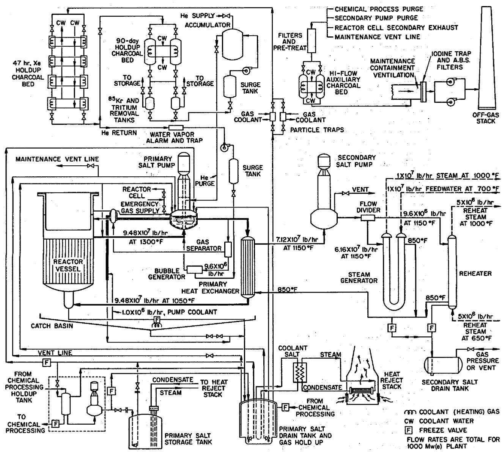  
Fig. 5.1. Flow Diagram for MSBR Plant.

however. Major modifications were made to accommodate revised containment and shielding requirements, particularly during maintenance operations, to provide greater protection against earthquake and tornado disturbances, and to provide a storage pit for radioactive wastes.

On the basis of present knowledge, the graphite core of a molten-salt reactor will require replacement during the life of the power station. During this replacement operation the portion of the reactor building above the reactor containment cell may become temporarily

contaminated with fission products even though careful precautions are taken to minimize the escape of these gases and particulates. In view of this, we decided to design the entire reactor building crane bay as a sealed structure that would meet the leak-test requirements for a containment system. As shown in Fig. 5.4, this was accomplished by enclosing the reactor plant in a steel membrane that would surround every portion which could contain fuel salt, fission products, or other radioactive material. The volume therefore includes the reactor cell, the primary drain tank cell, spent reactor

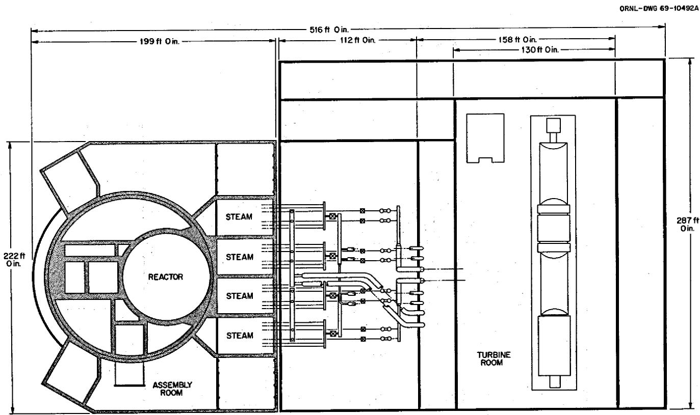  
Fig. 5.2. Overall Plan View of MSBR Plant.

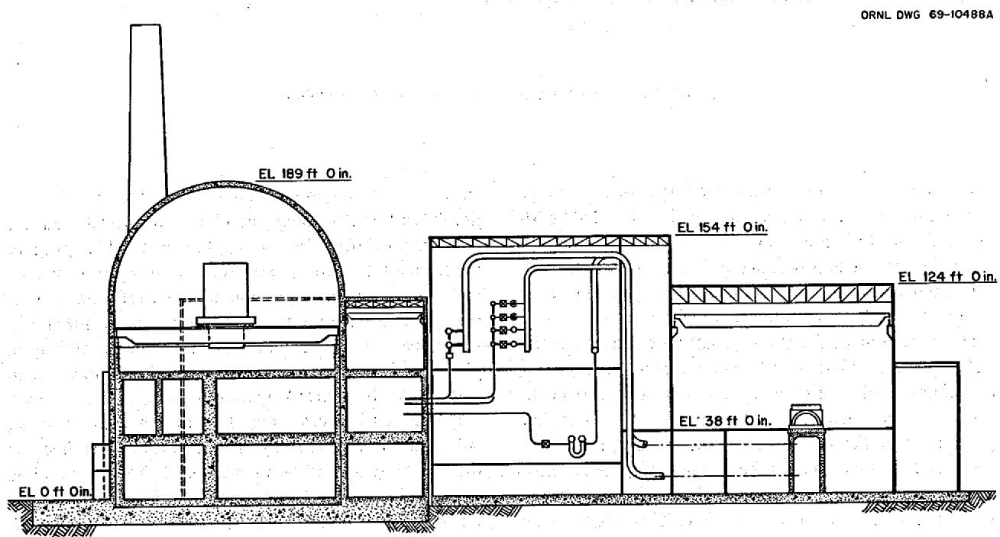  
Fig. 5.3. Overall Sectional Elevation of MSBR Plant.

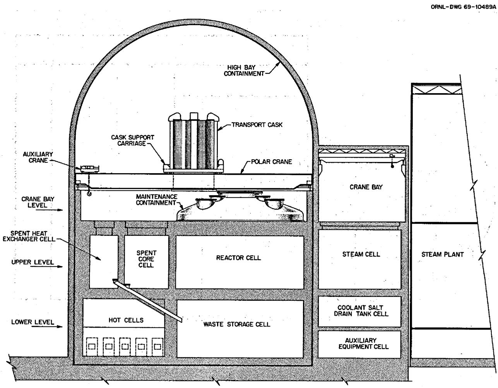  
Fig. 5.4. Sectional Elevation Through Reactor Plant Building.

storage cell, waste storage cells, used component storage cells, and the associated hot cells provided with manipulators for disassembly and repair of this equipment. The chemical processing cells for the salts are also contained within the membrane along with the hot cells used in conjunction with the treatment plant.

The containment for the fuel salt now consists of the walls of the circulating system components, the reactor cell double-walled primary containment structure (with the space between the walls maintained at a higher pressure than the reactor cell), and, finally, the sealed reactor plant building described above. A dome has now been provided over the removable roof plugs of the reactor cell as shown in Fig. 5.4. This dome is an extension of the outer wall of the reactor cell. (The roof plugs are normally sealed and are, in effect, an

extension of the inner wall of the reactor cell. The dome and sealed plugs combine to provide double containment over the roof plug area.) The primary function of the dome, however, is during reactor core maintenance when a portion of the roof plugs are set aside. For the maintenance operation, the closure lid of the dome is removed, and a short cylindrical transition piece on the shielded core transport cask is lowered to mate with the flanged opening on the dome. A good seal between the cask and the cell can thus be made, although absolute leak-tightness is not required because the cell pressure will be maintained below the building pressure during the core removal operation.

It may be noted in Fig. 5.2 that the reactor building is now of a cylindrical shape rather than the rectangular configuration previously reported. One factor arguing

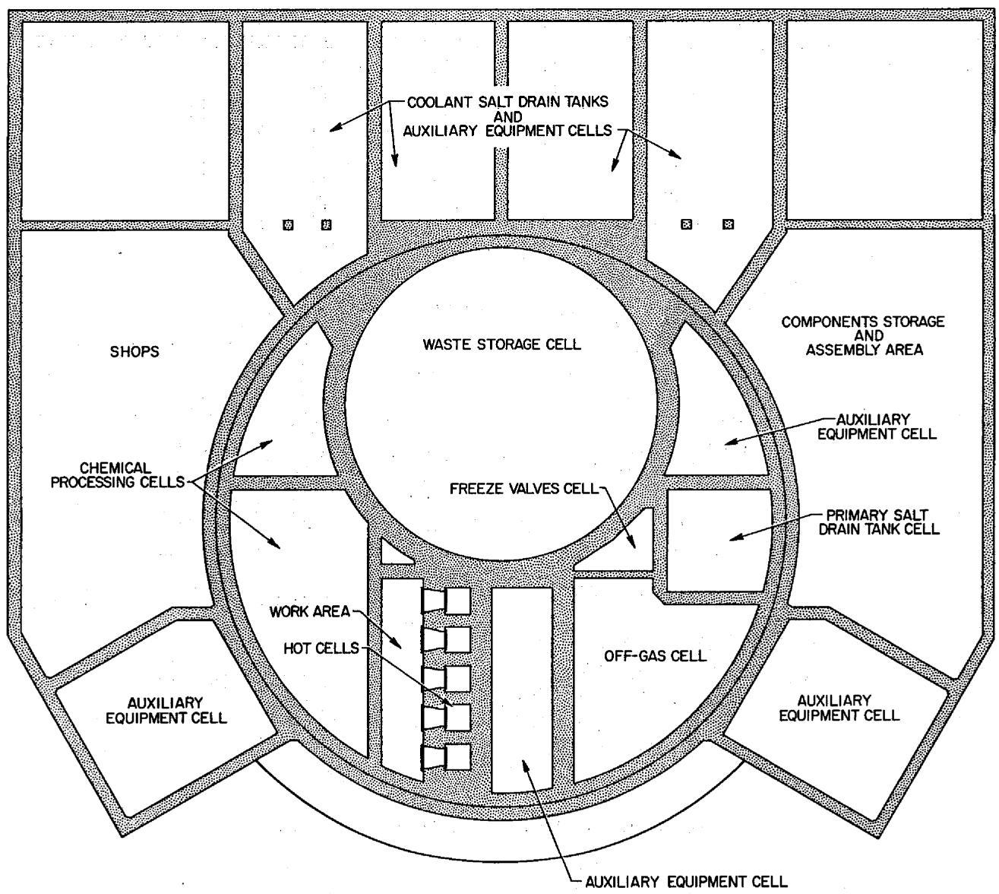  
Fig. 5.5. Plan View Reactor Plant at Waste Storage Cell Elevation.

for the cylindrical layout was the relative ease of decontamination of a volume having no corners. A second factor was the straightforward design of the hemispherical top to withstand the differential pressure due to tornado and other disturbances.

The steel sealing membrane for the reactor building is covered on the outside with a minimum thickness of 3 ft of concrete over the entire structure. The biological shielding provided by the concrete permits the weight of the shielding on the transport cask to be correspondingly reduced. The present requirement is only 2 in. of steel on the cask to reduce the radiation level on

outside contact with the building to $100\mathrm{mr / hr}$ . The concrete also provides ample missile protection for the reactor containment system.

A polar crane is used to service the equipment within the cylindrical reactor building. The polar bridge spans the building and can be rotated to cover essentially all areas. Two separate cranes are mounted on the bridge, one of which is a conventional hoist of 150 tons

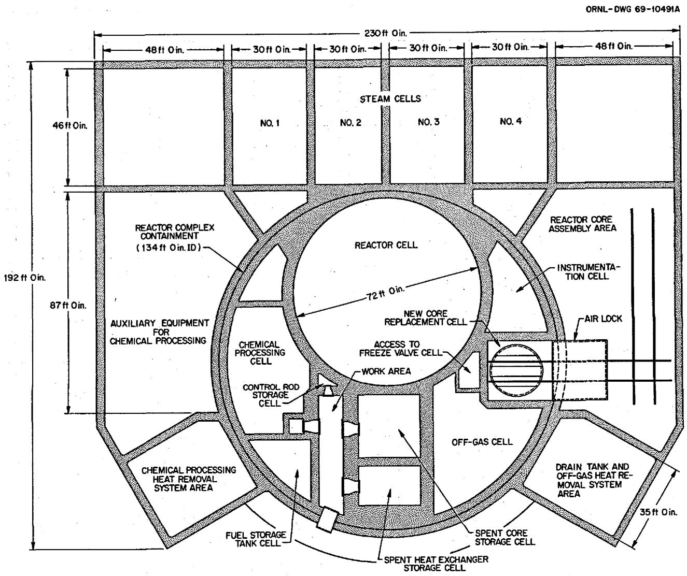  
Fig. 5.6. Plan View Reactor Plant at Reactor Cell Elevation.

capacity. The other is unique in that the 20-ft-diam by 40-ft-high transport cask is an integral part of the crane. The cask is fixed as to vertical position but can move laterally from above the reactor cell to positions over the spent core storage cell and the replacement core pickup point. New equipment is brought in through an air lock on the side of the containment vessel. The hoisting mechanism for lifting the spent reactor core into the transport cask is located on top of the cask, as shown in Fig. 5.4. Four individual, but synchronized, roller chain drives lift the 480,000-lb core assemblies into the cask. By placing the drive mechanism outside the cask, with the lifting chains passing through the seals at the top, the decontamination of the cask after each use is greatly facilitated.

Excavation for the reactor building will be to the depth required to provide firm bearing support for the monolithic concrete pad upon which the reactor building rests. Finished grade level would thus depend upon the particular site conditions but would preferably be with about two-thirds of the building showing above ground. The new arrangement for the reactor plant made it possible to provide a large waste storage space at the lowest level to be used for discarded radioactive equipment and wastes from the plant, including the graphite taken from the reactor core. The reactor cell is located directly above the waste storage cell, as shown in Fig. 5.4. It may also be noted in this elevation view that the drain tank cell is now an integral part of the reactor plant building rather than an extension of it.

  
Fig. 5.7. Plan View Reactor Plant at Crane Bay Elevation.

This arrangement will give more stability to the connecting salt piping in event of an earthquake disturbance, as discussed below. Figures 5.5-5.7 show plan views of the reactor plant building at the waste storage cell level, at the reactor cell, and at the crane bay elevation respectively. Figure 5.8 is an elevation of the drain tank cell.

# 5.3 SEISMIC REVIEW OF MSBR PLANT CONCEPTUAL DESIGN

C.W.Collins

The arrangement of buildings and equipment for the MSBR conceptual plant was undertaken with recognition of the problems associated with earthquake

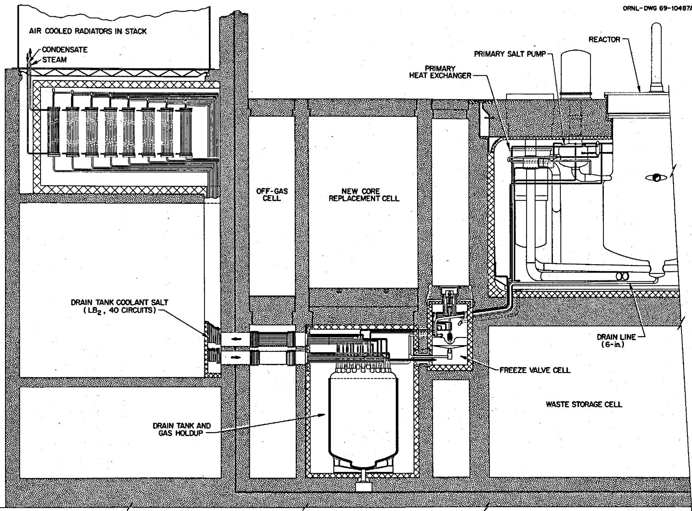  
Fig. 5.8. Elevation of Drain Tank Cell.

damage to nuclear plants. A comprehensive analysis of the design in this respect has not been possible, so to substantiate our preliminary assessment of the plant reliability a consultant3 was retained to evaluate the basic features and to make suggestions for improvements, particularly with regard to equipment and piping supports. Available funds did not permit a detailed study, but an overall evaluation was made based on the consultant's judgment and extensive experience in the field of seismic engineering.

A summary report from the consultant outlined the design criteria used in reactor plants currently under construction and suggested several areas in which the MSBR design might be improved.

The report stated that current design criteria for western states near known faults (Diablo Canyon) have used a maximum horizontal acceleration of $0.25\textbf{g}$ for the operating basis earthquake. Eastern sites typically use $0.12\textbf{g}$ horizontally. The vertical accelerations are assumed to be about one-half of these values. Values for the design basis earthquake are usually twice those for the operating basis earthquake. Most designers have used the El Centro earthquake data with modifications to the acceleration spectrum to account for the specific soil conditions at the site.

The report pointed out that it is usually not difficult to design buildings to meet the seismic criteria, because most structures are inherently rigid and usually coupled through the foundation to soil that does not amplify the seismic shaking. The main concern in building design is to obtain a symmetrical layout and a floor grade without steps in order to avoid the discontinuities where failures are likely to occur. The most difficult design problems are usually associated with the mechanical equipment, because of the amplification of the seismic accelerations that can occur in the support structure, vessels and internals, piping, etc. Similar periods of vibration in the equipment can result in accelerations many times the acceleration received by the building itself.

As previously presented1 all buildings of the MSBR plant were located on a common concrete pad. Our reasoning was that this arrangement would eliminate breakage of connecting piping between buildings should there be a fault slippage. This resulted, however, in a very large pad, and it was not certain what stresses might develop when seismic loads were applied to the various structures having different geometries and masses. A suggested improvement in the design was to

construct the reactor building, stack, and steam generator cells on one foundation pad and the turbine generator building on another. In this approach all of the piping containing radioactive material is mounted on one pad where it would be unaffected by fault slippage. In the very unlikely event of serious displacements between the two pads, damage to the steam piping would be without risk to the public. These changes have been made in the MSBR conceptual design presented here. The MSBR primary and secondary salt circulating loop piping was designed to be sufficiently flexible to absorb the large thermal expansions due to the relatively high operating temperatures. This flexibility must be controlled during an earthquake to prevent whipping and excessive displacements. Light-water reactors use spring supports with hydraulic dashpots on piping and equipment which allow the relatively slow movements due to thermal expansions but damp the rapid shaking encountered in earthquakes. Identical equipment is generally not applicable to the MSBR because of the high ambient temperatures in the equipment cells. However, we can probably design satisfactory dashpots using other fluids, such as molten salts or gases. We are contacting several pipe support manufacturers to determine if suitable high-temperature damping equipment is now commercially available.

# 5.4. COOLING REQUIREMENTS FOR WASTE STORAGE PIT

H. A. McLain

The modified MSBR reactor plant layout now provides a waste pit located directly below the reactor cell for storage of radioactive spent equipment, graphite, chemical wastes, etc. The storage capacity is sufficient for the total accumulation of discarded equipment and material for at least the 30-year plant life. It has been estimated that the maximum heat generation in the waste storage pit at any point during this time would be less than $600\mathrm{kw}$ .

A brief summary of the items contributing to the heat generation rate in the storage pit is given in Table 5.2. Many gross assumptions were made in estimating the values, but they are believed to be conservative. Most of the heat release is due to material and spent equipment from the chemical processing plant, since these items not only are replaced more frequently but will tend to have a greater accumulation of fission products. The item having the greatest heat release at time of discard is the discharge from the chemical processing plant waste tank. This $500\text{-ft}^3$ tank would probably require

Table 5.2. Summary of Heat Sources in MSBR Waste Storage Pit at End of 30-Year Plant Operating Time   

<table><tr><td></td><td>Assumed Decay Time 
Before Entering Waste 
Storage Pit 
(weeks)</td><td>Heat 
Generation 
Rate 
(kw)</td></tr><tr><td>Spent reactor components, including core graphite, heat exchangers, etc.</td><td>52</td><td>30</td></tr><tr><td>Chemical processing plant components</td><td></td><td></td></tr><tr><td>Components to be discarded after one year or less of service, at time of discard</td><td>2</td><td>54</td></tr><tr><td>Components to be discarded after an average of two years of service, at time of discard</td><td>2</td><td>18</td></tr><tr><td>Components to be discarded after four or more years of service, at time of discard</td><td>2</td><td>234</td></tr><tr><td>Combined components that have been stored for one year or longer in waste pit</td><td></td><td>57</td></tr><tr><td>Chemical processing plant waste storage tank contents, at time of discard</td><td>130</td><td>190</td></tr><tr><td>Total, approximately</td><td></td><td>600</td></tr></table>

$2^{1/2}$ to 3 years to fill with waste; when filled, it would be stored about $2^{1/2}$ years in the processing cell before the contents were transferred to the waste storage pit. At this time the heat generation rate would be about $190\mathrm{kw}$ .

The waste storage pit would be maintained at slightly less than atmospheric pressure and at a nominal temperature of $150^{\circ}\mathrm{F}$ or less. The inert atmosphere would prevent a fire hazard, and ordinary concrete could be used for the cell wall construction because of the low ambient temperature. Heat would be removed from the pit by cooling the cell atmosphere in a water-cooled finned-tube-type heat exchanger located inside the storage area. In one heat exchanger design, about 280 gpm of $85^{\circ}\mathrm{F}$ water would be required to reduce the outlet nitrogen temperature to about $100^{\circ}\mathrm{F}$ . In the unlikely event of rupture of this heat exchanger, it is estimated that less than 200 gal of water would drain from the coils before the cooling water valves could close, assuming a rather pessimistic 10 sec for closure. A depression in the floor of the storage pit beneath the heat exchanger would catch and store any such leakage until it could be removed. Duplicate equipment will be installed in the cell to provide adequate cooling in event of failure of one unit.

# 5.5 PRIMARY SALT DRAIN TANK

E. S. Bettis

H.M.Poly

W. K. Furlong

H. L. Watts

Since last described, we have redesigned the primary salt drain tank to provide added reliability for the cooling system, to allow the drain tank to take overflow from the primary circulating pump bowls, to serve as a holdup volume for off-gases from the primary system,

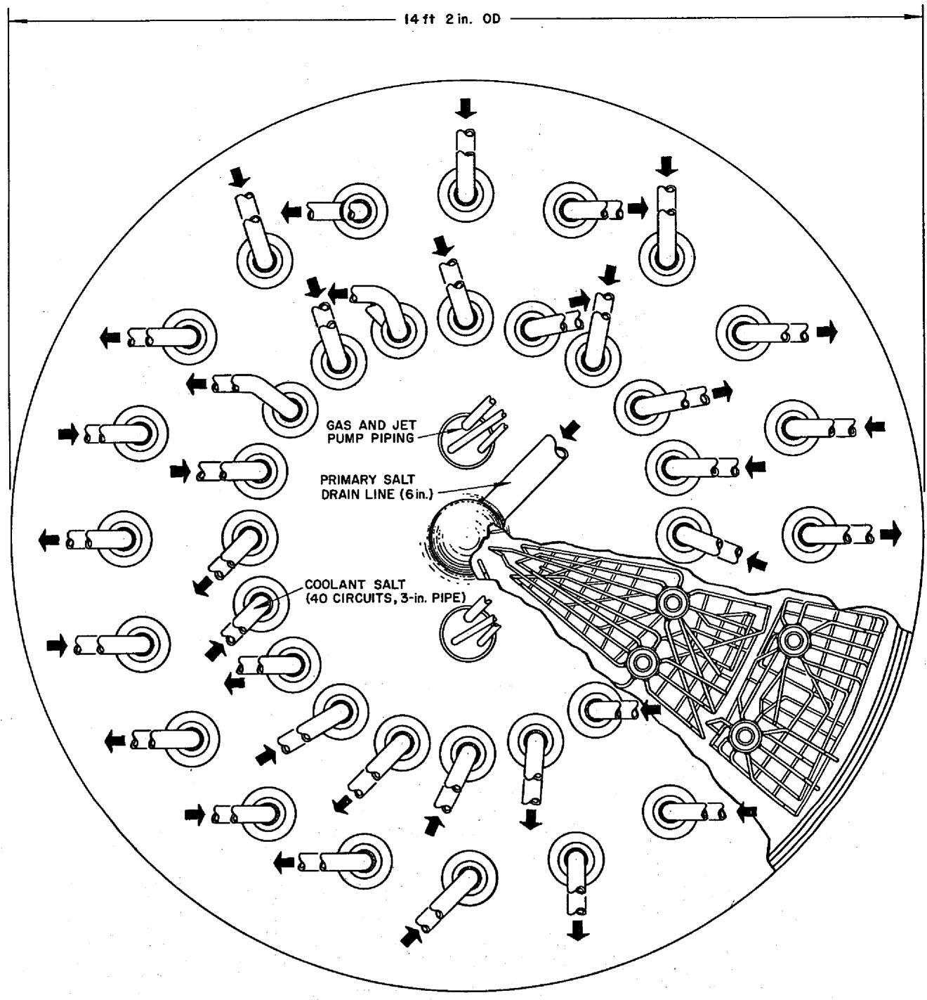  
Fig. 5.9. Top View of Primary Drain Tank.

water, or Hitec6 principally because no reactor shutdown and extensive chemical processing would be

necessary in the event of a tube leak in the drain tank. However, to prevent the possibility of freezing the high-melting-point $(856^{\circ}\mathrm{F})$ LiF-BeF $_2$ salt, it is necessary to use an intermediate salt-to-water heat exchanger rather than a direct salt-to-air exchanger for dumping the heat to the atmosphere.

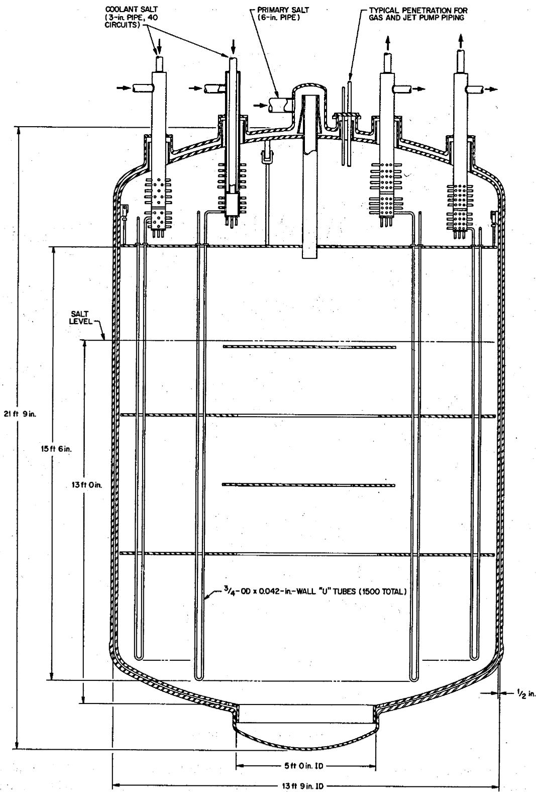  
Fig. 5.10. Sectional Elevation of Primary Drain Tank.

The drain tank cooling surface consists of 1500 U-tubes, $\frac{3}{4}$ in. OD by 0.042 in. wall thickness, manifolded into 40 separate circuits. Heading for the individual circuits is done inside the tank, with all welds located above the salt level. This results in only 40 concentric pipe penetrations of the tank head. Each circuit is completely independent and autonomous with its own piping and heat exchanger for transfer of heat to the cooling water. The multiplicity of circuits provides a much greater degree of reliability than the previous design, which contained only two separate circuits. The total capacity of the cooling system is about $120\%$ of design load so that, in effect, 7 of the 40 circuits could be inoperative without having the capacity fall below the design requirement.

A 5-ft-diam well is provided in the lower head of the drain tank, as shown in Fig. 5.10, for four jet pumps which continuously return the overflow salt from the pump bowls to the primary loops during normal operation.

# 5.6 PRIMARY-SALT-DRAIN-TANK OPERATION AND AFTERHEAT REMOVAL SYSTEM

W. K. Furlong

The main function of the primary salt drain tank is the safe storage of the fuel salt. It will primarily be used during maintenance operations on the reactor or primary heat exchangers. The drain tank must meet all the integrity requirements of the primary system and, in addition, must contain a reliable cooling system for removal of afterheat generated by the fission products in the salt. Although conditions can be postulated when it would be desirable to rapidly drain the fuel salt into the tank, and this indeed renders the reactor subcritical, quick drainage is not considered to be one of the emergency shutdown measures for the MSBR. In fact, for most postulated abnormal conditions it is desirable that the fuel salt remain in the primary circulating loop.

A schematic flow diagram of the present concept for the primary drain tank and afterheat removal system is shown in Fig. 5.11.

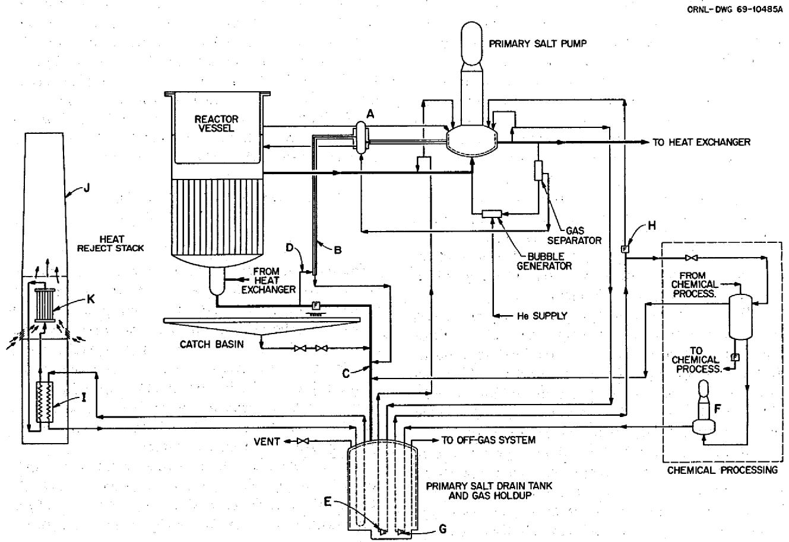  
Fig. 5.11. Schematic Flow Diagram of Drain Tank System.

Normal operation of the drain tank system can best be described with the aid of the identifying letters shown on Fig. 5.11. Gases from the separator mix with the $150\mathrm{~gpm}$ of overflow from the pump bowl in the tee indicated by $A$ . The gases flow through a cooled line, $B$ , to the drain line $C$ , and thence into the top of the tank. Upon entering the tank, the gas and salt have been cooled to $1213^{\circ}\mathrm{F}$ by a counterflow of cold-leg salt, $D$ , flowing in an annulus around the overflow line. This salt also cools the mixing tee and the pump bowl. The $1213^{\circ}\mathrm{F}$ salt is then directed through a $\frac{1}{2}$ -in. annulus between the drain tank wall and the internal gamma shield, effectively cooling the wall and the shield. Four jet pumps, $E$ , located in the bottom of the drain tank, one in parallel across each primary salt pump, return the overflow to the hot legs of the primary loops.

The cooling system for the drain tank is also shown schematically in Fig. 5.11. The internal U-tubes are divided into 40 separate circuits, as previously described in Sect. 5.5, each containing a salt-to-water heat exchanger, $I$ , located in a hot, contained cell in the base of the natural draft stack, $J$ . Transfer of heat from the $^7\mathrm{LiF - BeF}_2$ coolant salt to the water is by radiation from salt tubes to plate coils or tubes in which low-quality steam is generated. There is thus no direct contact between the surfaces that would permit water to enter the drain tank cell via the coolant salt system. After passing through steam separators, the water vapor is directed to one of several air-cooled condensers, $K$ , in the stack, and the condensate is recirculated. The MSRE drain-tank cooling system, which is based on this same principle but uses reentrant-type tubes, has performed satisfactorily. The salt-to-water exchangers are located about 60 ft above the midplane of the drain tank to provide the necessary thermal driving head for natural circulation of the coolant salt. The water-steam circuit also flows by thermal convection.

Preliminary calculations for the natural-draft stack, based on performance data for a commercial fin-tubetype heat exchanger, indicate a stack height of about 400 ft if the water circuits are pressurized to about 100 psia. Use of elliptical tubes and an increase in longitudinal pitch would reduce the head loss and possibly allow the stack height to be reduced to about 300 ft. No mechanical control of air flow is presently considered necessary. In the case of very cold ambient air conditions, however, some means of air preheating may be required to prevent freezing of water in the condensers. In any event, our analysis indicates that the use of the intermediate heat exchangers in conjunction with the continuous off-gas heat load in the drain tank

will assure molten operation of the $^7\mathrm{LiF - BeF_2}$ coolant salt.

As mentioned above, one of the functions of the drain tank now is to serve as the holdup volume for decay of off-gases from the primary system preliminary to their treatment and disposal in the off-gas system. The short-lived radioactive gases will decay for approximately 2.5 hr in the tank, with the U-tube surfaces acting as sites for noble-metal deposition. The off-gas passes through charcoal traps and filters before disposal, as shown in Fig. 5.1.

Another new function of the drain tank is to provide exit and entrance points for the fuel salt flow for the chemical processing system. The centrifugal pump $F$ , in conjunction with the jet pump $G$ , is used for transferring the salt to chemical processing. Also, by thawing valve $H$ , salt can be transferred to the primary system by the pumps. This permits a thinner-walled tank than the gas-pressure transfer system that was previously proposed.

We are presently developing a code for the transient analysis of the drain tank and cooling system under conditions of a rapid salt drain. In this context it should be noted that a major advantage of using the drain tank as the off-gas holdup tank is that a heat load is normally present to keep the natural circulation loops flowing. This load varied from about 9 Mw soon after startup (full power) to about 18 Mw with equilibrium noble metals. With the 18-Mw load, the $^7\mathrm{LiF - BeF}_2$ flow rate is slightly over half that required for the maximum emergency load in the drain tank of about 66 Mw.

# 5.7 GAMMA HEATING IN MSBR HEAT EXCHANGERS

# J. R. Tallackson

The noble-metal fission products which plate out on metal surfaces in the primary salt circuit are the principal source of afterheat in empty MSBR heat exchangers. The problem of afterheat removal will be most acute if, for any reason, a heat exchanger is emptied after accumulating equilibrium concentrations of the noble metals. In this situation, virtually all the afterheat must be removed by radiative transfer from tube to tube and from the shells in the exchanger to the outer surface of the heat exchanger.

For accurate calculation of afterheat temperatures, the distribution, in space, of afterheat generation within the exchanger must be known. From 60 to $80\%$ of the total noble-metal afterheat is by gamma emission, $^{7}$

which is considered to be the principal source of nonuniform heat distribution; therefore the heat deposition by all the tellurium gammas has been calculated for five sizes of heat exchangers at times from zero to three years after draining. Tellurium was chosen since the energy spectrum of the tellurium gammas appears to be typical of the noble-metal gammas. These detailed calculations were made with the assistance of the Neutron Physics Division using the ANISN program, which takes into account the energy spectra. Infinite

cylindrical geometry and uniform distribution of fission product plating (40% of all noble metals) in the tube annuli of all the heat exchangers were assumed. Figure 5.12 shows the gamma heat generation at shutdown produced by the tellurium fission products in an empty 563-Mw (thermal) Mark 2 heat exchanger, the largest size being considered for the MSBR. By referring to Table 5.6 in ref. 7, these data may be extrapolated to give the total gamma heating distribution from all the different noble-metal fission products that deposit in

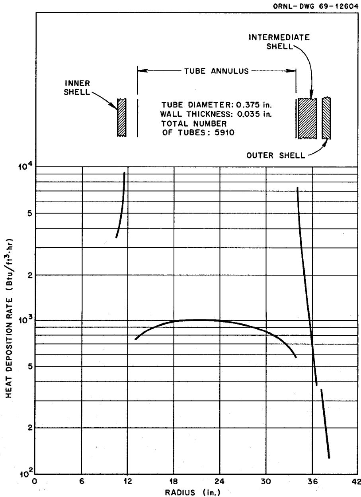  
Fig. 5.12. Distribution of Gamma Heat Generation by Tellurium Fission Products in a 563-Mw MSBR Heat Exchanger. Forty percent of all tellurium fission products are assumed to deposit uniformly on the surface of the tubes.

the heat exchangers. Forty per cent (ref. 7, p. 64) of these noble metals is assumed to deposit on the heat exchanger surfaces.

The fractional distribution of gamma heating based on Fig. 5.12 is:

1. innermost shell, $10\%$ ;   
2. tube annulus, $60\%$ ;   
3. intermediate shell, $25\%$ ;   
4. outer shell, $\sim 0\%$   
5. losses, $5\%$ .

These figures do not change appreciably with elapsed time after draining.

From these calculations it was concluded that, for typical MSBR heat exchanger designs,

1. at least $90\%$ of the gamma energy originating in the tube annulus is deposited within the heat ex-changers;   
2. reducing the size of the heat exchangers does not significantly affect this $90\%$ fraction until exchanger capacity is reduced to the 100-Mw region.

# 6. Reactor Physics

A.M.Perry

# 6.1 PHYSICS ANALYSIS OF MSBR

# 6.1.1 One-Fluid MSBR Reference Design: Two-Dimensional Calculation

H. F. Bauman W. R. Cobb

The nuclear data for the one-fluid 1000-Mw (electrical) MSBR reference design, as reported in the last MSR Program semiannual report (ORNL-4396), were obtained from a two-dimensional synthesis calculation performed by the ROD code. The synthesis calculation is obtained by intermeshing two one-dimensional calculations (the axial and the radial in cylindrical geometry) and is therefore limited in the amount of geometric detail that can be represented compared with a true two-dimensional calculation. For this reason, ROD calculations have been supplemented by two-dimensional calculations at important stages in the development of the MSBR designs.

The current MSBR reference design was recalculated by the two-dimensional code CITATION, and the results are compared with the original ROD calculation in Table 6.1. The CITATION calculations, like those of ROD, were performed with nine neutron energy groups, that is, five slowing-down groups in the range above 1.86 ev and four coupled thermal groups below 1.86 ev. Considerably more geometric detail could be included in the CITATION calculation, such as the curvature of the vessel heads and axial reflectors and the structural details of the salt inlet and outlet regions. However, the equilibrium concentrations of the nuclides were taken directly from the ROD calculation.

Table 6.1. Comparison of ROD and CITATION Calculations of the One-Fluid 1000-Mw (Electrical) MSBR Reference Design   

<table><tr><td></td><td>CITATION</td><td>ROD</td><td>Difference</td></tr><tr><td colspan="4">Identification: CC58</td></tr><tr><td>Breeding ratio (excluding processing loss)</td><td>1.0661</td><td>1.0647</td><td>-0.0014</td></tr><tr><td>Peak damage flux, 1014neutrons cm-2sec-1(E&gt;50 kev)</td><td>3.42</td><td>3.20</td><td>-0.22</td></tr><tr><td>Peak power density, w/cm3</td><td>69.1</td><td>65.2</td><td>-3.9</td></tr><tr><td colspan="4">Neutron balance, absorptions</td></tr><tr><td>232Th</td><td>0.9904</td><td>0.9889</td><td>-0.0015</td></tr><tr><td>233Pa</td><td>0.0017</td><td>0.0017</td><td></td></tr><tr><td>233U</td><td>0.9248</td><td>0.9248</td><td></td></tr><tr><td>234U</td><td>0.0811</td><td>0.0809</td><td>-0.0002</td></tr><tr><td>235U</td><td>0.0752</td><td>0.0752</td><td></td></tr><tr><td>236U</td><td>0.0085</td><td>0.0085</td><td></td></tr><tr><td>237Np</td><td>0.0059</td><td>0.0059</td><td></td></tr><tr><td>9Be</td><td>0.0071</td><td>0.0071</td><td></td></tr><tr><td>7Li</td><td>0.0160</td><td>0.0160</td><td></td></tr><tr><td>6Li</td><td>0.0023</td><td>0.0023</td><td></td></tr><tr><td>F</td><td>0.0206</td><td>0.0206</td><td></td></tr><tr><td>Graphite</td><td>0.0517</td><td>0.0522</td><td>+0.0005</td></tr><tr><td>Fission products</td><td>0.0196</td><td>0.0196</td><td></td></tr><tr><td>Delayed neutrons lost</td><td>0.0032</td><td>0.0032</td><td></td></tr><tr><td>Leakage</td><td>0.0234</td><td>0.0244</td><td>+0.0010</td></tr><tr><td>Sum (ηe)</td><td>2.2315</td><td>2.2316</td><td>+0.0001</td></tr></table>

The breeding ratios and neutron balances from the two calculations are in remarkably good agreement. A slightly higher peak flux and peak power were obtained from the CITATION calculation; the difference is no more than would be expected considering the difference in the method of calculation. We assume that the peak values obtained from the two-dimensional calculation CITATION are the more accurate.

# 6.1.2 MSBR Nuclear Design Studies

# H. F. Bauman

The performance of a single-fluid MSBR is strongly influenced by the power rating of the plant. Neutron leakage is an important function of core size in the one-fluid reactor, and the measures used to control leakage, mainly the provision of the blanket-like undermoderated core zone 2, strongly affect the breeding gain and the fissile inventory. We therefore studied the effect of scaling the 1000-Mw (electrical) reference design to smaller and larger plant sizes.

A series of three cases was run, for power levels of 500, 2000, and $4000\mathrm{Mw}$ (electrical). The reactors were scaled from the 1000-Mw (electrical) reference design by holding constant the ratio of the core 1 volume to the reactor power. The thicknesses of the regions other than core zone 1 were held fixed. The salt fraction in core 1 was allowed to reoptimize, but did not change significantly. The results are shown as the dashed curves in Fig. 6.1. The curves for all measures of the performance increase steeply with plant size in the region of the reference design and in fact have appreciable slopes even at the 4000-Mw (electrical) power level.

[The conservation coefficient3 shown in Fig. 6.1 is proportional to the quotient of the annual fuel yield divided by the specific fuel inventory. Intended as an approximate index of the cumulative natural uranium requirement for a growing nuclear power industry, it assigns a somewhat greater weight to the fuel inventory than is contained in the annual fuel yield alone. Computed as the breeding gain times the square of the specific power, it has the dimensions (thermal power/fissile inventory)2 × G.]

A considerable variation in core life resulted from the above method of scaling; both the average power density in the core and the power peaking factor increased with increase in reactor power. Therefore a second series of cases was run in which the volume of core 1 was adjusted to give the same peak power density in each case. All other parameters were held fixed. The results are shown as the solid curves in Fig. 6.1. As expected, the core life came out reasonably constant in this series. The performance curves are somewhat flatter, but the same strong trend of increase in performance with increase in reactor power is evident.

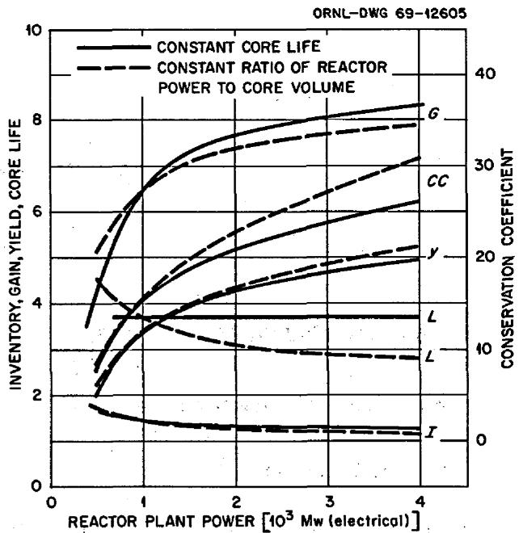  
Fig. 6.1. Effect of Plant Size on MSBR Performance. $G =$ breeding gain, $\%$ ; $CC =$ conservation coefficient, [Mw (thermal)/kg]²; $y =$ annual fuel yield, $\%$ /year; $L =$ core life, years; $I =$ specific fuel inventory, kg/Mw (electrical). (See text for explanation of conservation coefficient.)

One may conclude from these results that the optimum power density (core life not considered) increases as the size of the reactor is increased. Note that of the two 500-Mw (electrical) cases, the one with the lower power density (higher core life) has the best performance, while above 1000 Mw (electrical) the cases with the higher power density have the better performance. This suggests that the trend of development of one-fluid MSBR's should be toward larger size and higher power density.

The effects of changing the power density of a single-fluid MSBR are shown in Fig. 6.2. The points given are from three cases: the reference design (22 w/cm³) and cases with roughly half and double the power density. These cases were obtained by doubling and halving the volumes of core zone 1. The thicknesses of other regions were held fixed, and the core salt fraction was allowed to reoptimize, although it did not vary much from 13%. The fissile inventory, core life, and breeding gain all drop sharply as the power density is increased. The reactor performance as measured by the yield and conservation coefficient indicates a broad optimum at 20 to 30 w/cm³. Note that the reference design lies at the low-power-density end of the optimum region, to take advantage of the longer core life at lower power density.

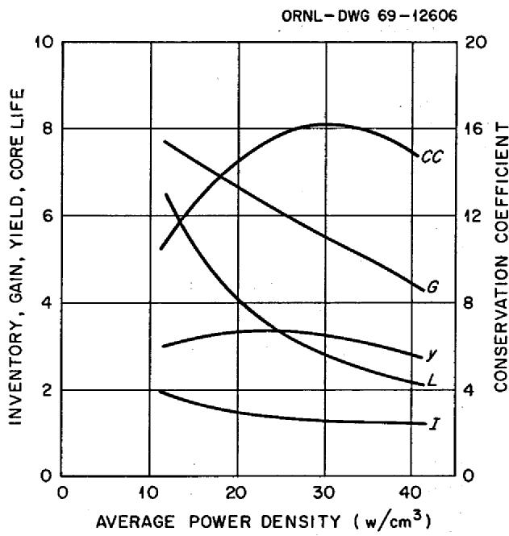  
Fig. 6.2. Single-Fluid MSBR Performance vs Average Power Density in Core Regions 1 and 2. (For explanation of symbols, see Fig. 6.1.)

# 6.1.3 Alternate MSBR Design Studies

H. F. Bauman W. R. Cobb O. L. Smith

The single-fluid MSBR with zoned core, as described in Chap. 5 of this and the preceding semiannual progress report, has been adopted as the principal guide to project development efforts because it seems to us to combine good development potential with reasonably good breeding performance. We have recognized, however, that some sacrifice both in breeding ratio and in specific power was involved in forgoing the use of a fertile-salt blanket, and we have therefore continued to inquire whether some modifications of the present reference design might show improved performance and at the same time seem acceptable from the points of view of construction, operation, and maintenance.

In this context, we have considered once more the rather old idea of a single-fluid core (containing both uranium and thorium), surrounded by a fertile blanket kept essentially free of fissile material, the two regions being separated by a barrier which might be made, for example, of Hastelloy N or graphite.

This concept differs from the two-fluid reactor design described in ORNL-3996 (ref. 4) and in earlier progress

reports $^5$ mainly in that the separation between fuel and blanket salts occurs at the core boundary, rather than in every lattice cell throughout the core, and therefore the fuel salt must contain thorium as well as fissile uranium. The fuel salt is essentially that of the reference single-fluid reactor; the blanket salt may be the same as in earlier two-fluid MSBR designs (e.g., LiF-BeF $_2$ -ThF $_4$ = 71-2-27 mole %), or it might be the same as the fuel salt except for the absence of the uranium.

Several exploratory calculations were performed to show the influence of such variables as barrier material, barrier thickness, average core power density, blanket composition, and thorium concentration in the fuel salt.

Some of these calculations were done in a one-dimensional spherical approximation with the ROD code, which includes an equilibrium fuel-cycle calculation (and, if desired, automatic optimization of specified variables). Other calculations were done with the CITATION neutron-diffusion code in explicit two-dimensional geometry. Since CITATION does not include a fuel-cycle calculation, fission product and other nuclide concentrations were taken from the results of ROD calculations, with minor adjustments of fissile uranium concentration to achieve criticality. In other respects the calculations are very similar, making use of the same neutron group structure, the same cross sections, and the same diffusion-theory approximations. As shown in Sect. 6.1.1, they do in fact give very similar results when applied to the same problem.

Results of the ROD calculations are shown in Table 6.2. Barriers considered in this series were a $\frac{1}{4}$ -in. Hastelloy N layer and a 6-in. graphite layer. Blankets were considered with $100\%$ salt by volume and with $50\%$ salt- $50\%$ graphite. Blanket salt composition was varied as indicated in the table (LiF-BeF₂-ThF₄ = 71-2-27 mole % or 74-16-10 mole %). Core size and salt volume fraction were subject to optimization by ROD, while all other variables (except uranium concentration) were specified. The blanket thickness was chosen large enough to reduce neutron leakage to a negligible level and could presumably be reduced somewhat in a subsequent, more detailed design. The figure of merit for the optimization is the fuel "conservation coefficient," which was discussed at length in the previous progress report.

Results of the CITATION calculations are shown in Table 6.3. In this series the Hastelloy N wall was assumed to be $\frac{1}{8}$ in. thick, and, as in the ROD cases, the blanket thickness was chosen to be effectively

Table 6.2. Performance of Blanketed MSBR Designs. ROD Calculations for Spherical Geometry   

<table><tr><td rowspan="5"></td><td colspan="5">Fixed parameters:</td></tr><tr><td>Blanket thickness, ft</td><td>3.0</td><td></td><td></td><td></td></tr><tr><td>Power, Mw (electrical)</td><td>1000</td><td></td><td></td><td></td></tr><tr><td>Power, Mw (thermal)</td><td>2250</td><td></td><td></td><td></td></tr><tr><td>Plant factor</td><td>0.8</td><td></td><td></td><td></td></tr><tr><td>Case</td><td>2</td><td>3</td><td>4</td><td>5</td><td>6</td></tr><tr><td>ROD identification</td><td>TF2-38</td><td>TF3-32</td><td>TF4-23</td><td>TF5-13</td><td>TF6-13</td></tr><tr><td>Description</td><td></td><td></td><td></td><td></td><td></td></tr><tr><td>Wall</td><td colspan="2">1/4-in. Hastelloy N</td><td colspan="2">6-in. graphite</td><td></td></tr><tr><td>Thorium in fuel salt, mole %</td><td>12</td><td>10</td><td>10</td><td>10</td><td>10</td></tr><tr><td>Thorium in blanket, mole %</td><td>27</td><td>27</td><td>27</td><td>27</td><td>10</td></tr><tr><td>Core radius,a ft</td><td>9.12</td><td>9.10</td><td>8.37L</td><td>8.37L</td><td>8.37L</td></tr><tr><td>Core salt fractiona</td><td>0.134</td><td>0.152</td><td>0.134</td><td>0.135</td><td>0.137</td></tr><tr><td>Blanket salt fraction</td><td>1.0</td><td>1.0</td><td>1.0</td><td>0.5</td><td>0.5</td></tr><tr><td>Performance</td><td></td><td></td><td></td><td></td><td></td></tr><tr><td>Conservation coefficient, [Mw (thermal)/kg]2</td><td>36.8</td><td>38.3</td><td>61.7</td><td>60.7</td><td>56.7</td></tr><tr><td>Breeding ratio</td><td>1.071</td><td>1.068</td><td>1.081</td><td>1.080</td><td>1.076</td></tr><tr><td>Yield, %/year</td><td>5.5</td><td>5.4</td><td>7.5</td><td>7.4</td><td>7.0</td></tr><tr><td>Fissile inventory, kg</td><td>989</td><td>946</td><td>813</td><td>814</td><td>823</td></tr><tr><td>Specific power, Mw (thermal)/kg</td><td>2.28</td><td>2.38</td><td>2.77</td><td>2.76</td><td>2.73</td></tr><tr><td>Peak damage flux,b neutrons cm-2sec-1(X 1014)</td><td></td><td></td><td></td><td></td><td></td></tr><tr><td>Core</td><td>3.73</td><td>3.76</td><td>4.16</td><td>4.05</td><td>3.94</td></tr><tr><td>Wall</td><td>0.0318</td><td>0.0316</td><td>0.27</td><td>0.29</td><td>0.31</td></tr><tr><td>Useful life, yearsc</td><td></td><td></td><td></td><td></td><td></td></tr><tr><td>Core</td><td>3.2</td><td>3.2</td><td>2.9</td><td>2.9</td><td>3.0</td></tr><tr><td>Wall</td><td>12.5</td><td>12.5</td><td>44</td><td>41</td><td>38</td></tr><tr><td>Fuel salt volume, ft3</td><td></td><td></td><td></td><td></td><td></td></tr><tr><td>Internal</td><td>424</td><td>481</td><td>330</td><td>332</td><td>340</td></tr><tr><td>Total</td><td>1074</td><td>1131</td><td>980</td><td>982</td><td>990</td></tr><tr><td>Power density, w/cm3</td><td></td><td></td><td></td><td></td><td></td></tr><tr><td>Average in core</td><td>25.0</td><td>25.1</td><td>32.4</td><td>32.4</td><td>32.4</td></tr><tr><td>Peak</td><td>76.4</td><td>76.8</td><td>84.7</td><td>82.4</td><td>80.3</td></tr><tr><td>Ratio</td><td>3.05</td><td>3.06</td><td>2.61</td><td>2.54</td><td>2.48</td></tr></table>

${}^{a}$ Optimized. L means limit of the permitted range of the variable.   
$b$ Damage flux: graphite, $E > 50$ kev; Hastelloy N, $E > 0.8$ Mev.   
cAllowable fluence: graphite, $3\times 10^{22}$ neutrons/cm²; Hastelloy N, $1\times 10^{21}$ neutrons/cm².

"infinite," that is, to permit very small neutron leakage.

Comparison of these cases with each other and with the reference single-fluid reactor suggests a number of conclusions: (1) The canned-core designs, as expected, have a significantly smaller inventory of fissile uranium than the reference MSBR $(800 - 1000\mathrm{kg}$ vs $1500\mathrm{kg})$ (2) Notwithstanding the presence of a neutronabsorbing barrier between the core and the blanket, breeding ratios are significantly higher (1.07-1.08 vs 1.064). (3) Annual fuel yields are therefore better $(5 - 7\%)$ year vs $3.3\%$ /year), and conservation coeffi

Clients are very much higher (40-60 vs 15). (4) If a Hastelloy N barrier can be made as thin as $\frac{1}{8}$ in., the neutron losses are less than the leakage losses in the reference single-fluid MSBR (0.7% vs 1% of all neutrons produced), since absence of fissile material in the blanket leads to a quite different optimum blanket configuration. (5) ROD case 5 shows that the performance is little affected if the blanket is made with 50% graphite rather than all salt. It seems likely that practical blanket designs will contain considerable graphite as a construction material. A criticality calcula

Table 6.3. Performance of Blanketed MSBR Designs. CITATION Calculations for Cylindrical Geometry   

<table><tr><td colspan="4">Fixed parameters:</td></tr><tr><td>Core height, ft</td><td>16</td><td></td><td></td></tr><tr><td>Blanket thickness, ft</td><td>4</td><td></td><td></td></tr><tr><td>Blanket salt fraction</td><td>1.0</td><td></td><td></td></tr><tr><td>Blanket salt composition</td><td colspan="3">LiF-BeF2-ThF4=73-0-27 mole %</td></tr><tr><td>Hastelloy N wall thickness, in.</td><td>1/8</td><td></td><td></td></tr><tr><td>Power, Mw (thermal)</td><td>2250</td><td></td><td></td></tr><tr><td>Plant factor</td><td>0.8</td><td></td><td></td></tr><tr><td>Case</td><td>1</td><td>2</td><td>3</td></tr><tr><td>Description</td><td></td><td></td><td></td></tr><tr><td>Core radius, ft</td><td>6</td><td>7</td><td>7</td></tr><tr><td>Salt fraction</td><td>0.2</td><td>0.2</td><td>0.15</td></tr><tr><td>Performance</td><td></td><td></td><td></td></tr><tr><td>Conservation coefficient, [Mw (thermal)/kg]2</td><td>59</td><td>47</td><td>60</td></tr><tr><td>Breeding ratio</td><td>1.081</td><td>1.082</td><td>1.082</td></tr><tr><td>Annual fuel yield, %/year</td><td>7.4</td><td>6.8</td><td>7.3</td></tr><tr><td>Fissile inventory, kg</td><td>835</td><td>920</td><td>848</td></tr><tr><td>Specific power, Mw (thermal)/kg</td><td>2.69</td><td>2.45</td><td>2.65</td></tr><tr><td>Peak damage flux,aneutrons cm-2sec-1×10-14</td><td></td><td></td><td></td></tr><tr><td>Core</td><td>6.5</td><td>4.8</td><td>5.0</td></tr><tr><td>Wall</td><td>0.11</td><td>0.07</td><td>0.07</td></tr><tr><td>Useful life, years</td><td></td><td></td><td></td></tr><tr><td>Core graphite</td><td>1.8</td><td>2.5</td><td>2.4</td></tr><tr><td>Hastelloy N barrier</td><td>3.6</td><td>5.7</td><td>5.7</td></tr><tr><td>Power density, w/cm3</td><td></td><td></td><td></td></tr><tr><td>Average in core</td><td>43.9</td><td>32.3</td><td>32.3</td></tr><tr><td>Peak</td><td>136</td><td>101</td><td>102</td></tr><tr><td>Ratio</td><td>3.10</td><td>3.13</td><td>3.16</td></tr><tr><td>Fuel salt volume, ft3</td><td></td><td></td><td></td></tr><tr><td>Internal</td><td>362</td><td>493</td><td>370</td></tr><tr><td>Total</td><td>992</td><td>1123</td><td>1000</td></tr></table>

${}^{a}$ Damage flux: graphite, $> {50}$ kev; Hastelloy $\mathrm{N}, > {0.8}$ Mev.

tion for case 5 with no salt in the blanket region gave a $k_{\mathrm{eff}}$ value of 1.008. This indicates that the reactivity of the reactor would increase if the blanket were drained, but the increase is not great enough to create a serious safety problem. (6) ROD case 6 shows that a reactor in which barren fuel salt is used as the blanket material can also have very good performance. In this concept, it is assumed that the fuel from the processing plant, stripped of uranium and fission products, is used to supply the blanket. This concept has the advantage that an absolute barrier is not required between the core and blanket regions, since some small flow of salt (up to the capacity of the processing plant) could be permitted from blanket to core. (7) Fast flux levels appear to be higher in the $1/8$ -in. Hastelloy N wall than in the $1/4$ -in.

wall and are higher yet for the graphite wall, though the comparison is somewhat obscured by differences in geometry used in the ROD and CITATION calculations. When allowance is made for differences in average power density, there still appears to be approximately a factor of 2 difference in the flux above 0.8 Mev for the two metal wall thicknesses. So far as we now know, we could not depend upon the Hastelloy N to withstand a fast-neutron fluence greater than about $1 \times 10^{21}$ neutrons/cm² (of neutrons with energies greater than 800 kev). Thus replacement of the wall might be necessary at intervals which are listed in the tables. It appears, pending confirmation of the assumed allowable fluences, that the metal wall might require replacement every 6 to 12 years, whereas a graphite wall would probably be good for the life of the plant, barring failure from other causes.

It remains to be shown that reactor configurations based on these general conclusions can satisfy other engineering and economic criteria for acceptability. If satisfactory designs can be developed along these lines, it may be that the canned-core concept will provide an avenue for further long-term improvement of MSBR breeding performance.

# 6.1.4 Gamma and Neutron Heating in MSBR

# J.H.Carswell, Jr. O.L.Smith

Spatial distributions of gamma and neutron heating in a 1000-Mw (electrical) single-fluid MSBR were described in detail in the previous progress report.6 Those distributions, however, were calculated for an MSBR design slightly different from the current reference design. Heat deposition calculations have therefore been repeated for the reference design, and the results are shown in Figs. 6.3 through 6.8. The calculations were performed in the manner described in the previous report, that is, essentially with the ANISN transport code and with allowance for the effect of fuel circulation on gamma-ray source distributions. Results are shown for a radial traverse in the core midplane, a radial traverse two-thirds of the distance $(132\mathrm{cm})$ from the midplane to the top of the core, and an axial traverse essentially on the reactor center line. The neutron heating curves include only energy deposition by elastic neutron scattering events. The gamma heating curves include energy deposition by prompt fission gammas, delayed fission product gammas, and gammas resulting from neutron capture.

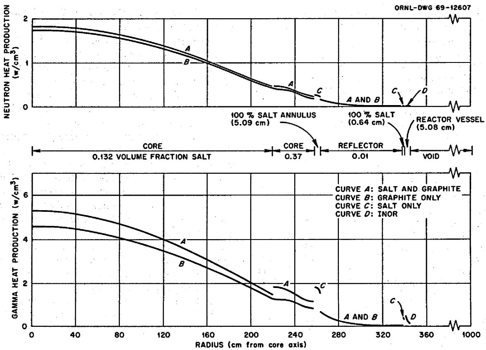  
Fig. 6.3. Gamma and Neutron Heating in the Core Midplane of a 1000-Mw (Electrical) MSBR.

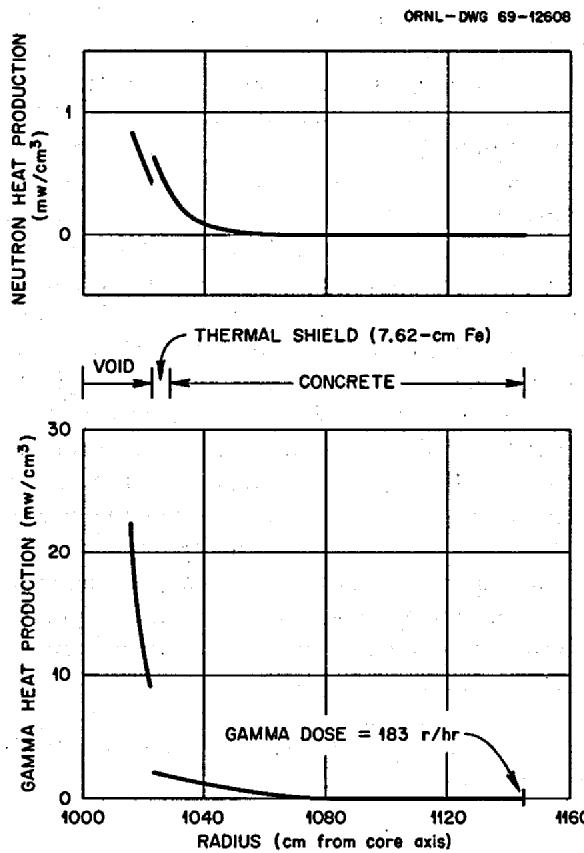  
Fig. 6.4. Gamma and Neutron Heating in the Core Midplane of a 1000-Mw (Electrical) MSBR.

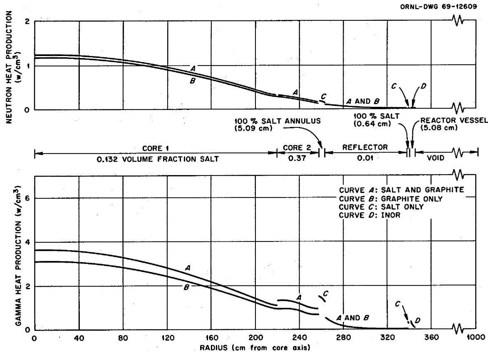  
Fig. 6.5. Gamma and Neutron Heating in a Radial Plane Two-Thirds of the Distance from the Midplane to the Top of Core of a 1000-Mw (Electrical) MSBR.

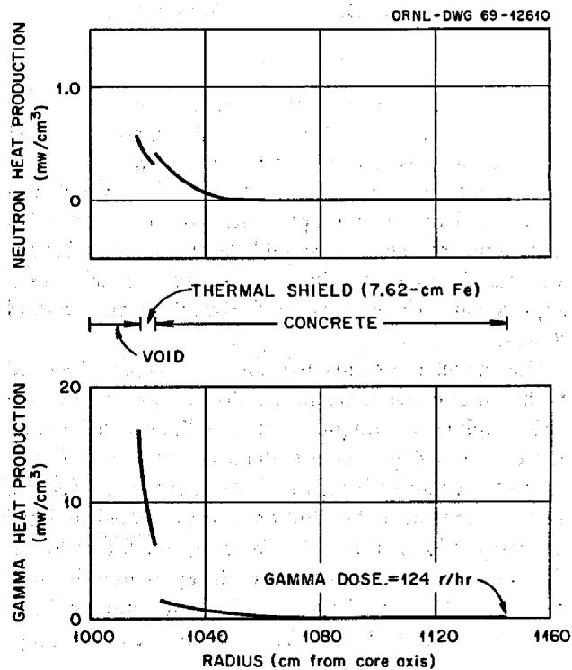  
Fig. 6.6. Gamma and Neutron Heating in a Radial Plane Two-Thirds of the Distance from the Midplane to the Top of the Core of a 1000-Mw (Electrical) MSBR.

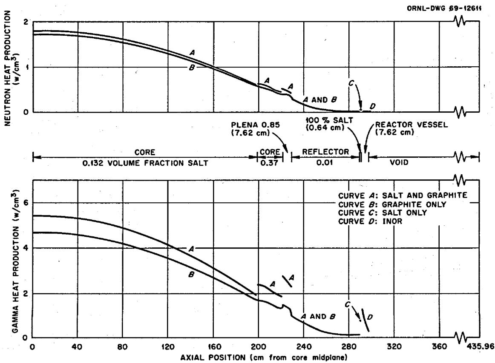  
Fig. 6.7. Neutron and Gamma Heating Near the Core Axis of a 1000-Mw (Electrical) MSBR.

# 6.1.5 MSBR Dynamics and Control

# O. L. Smith

Digital simulator calculations have been initiated to investigate the sensitivity of MSBR dynamics to fuel and graphite reactivity coefficients. Emphasis here is upon relatively severe reactivity insertions which evidently will require prompt control or safety action to limit temperatures to acceptable levels. The calculations are based upon a digital computer model which approximates the current 2250 Mw (thermal) one-fluid design.

The model represents the core by a typical fuel cell within which the temperature distribution in the fuel and graphite is computed in two-dimensional detail, thereby allowing accurate determination of salt and graphite feedback reactivities. Also, six-group delayed neutron precursor distributions are calculated in detail around the loop to account for delayed neutron losses. The four heat exchangers are each represented by four primary salt lumps, four secondary salt lumps, and two structural lumps. The boiler is represented by a single

lump, and power is removed from the steam side at the constant rate of $2250\mathrm{Mw}$ (thermal). The initial fuel inlet temperature at the bottom of the core is $530^{\circ}\mathrm{C}$ , and the primary and secondary salt loop times are each 10 sec. The primary salt spends half its time outside the core.

In each of the calculations reported here the reactor was perturbed from steady state by inserting a reactivity step of $\rho = 0.002$ , which is approximately $1^{1/2}$ times the worth of delayed neutrons in the core. The inserted reactivity drives the reactor above prompt critical, as may be seen in the figures.

The first two cases in Fig. 6.9 show the inherent response of the system without control action of any kind, for two different sets of assumed reactivity coefficients. For case 1, the fuel and graphite isothermal coefficients are $-2.0 \times 10^{-5} \delta k / k$ per degree C and $+1.9 \times 10^{-5} \delta k / k$ per degree C, giving a core isothermal coefficient of $-0.1 \times 10^{-5} \delta k / k$ per degree C. For case 2, the fuel, graphite, and core coefficients are, respectively, $-4.4 \times 10^{-5}, +1.9 \times 10^{-5}$ , and $-2.5 \times 10^{-5} \delta k / k$ per degree C. Present estimates of the

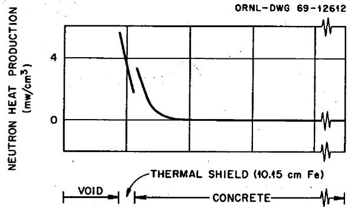

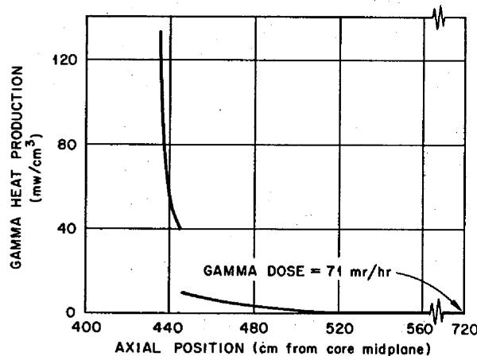  
Fig. 6.8. Neutron and Gamma Heating Near the Core Axis of a 1000-Mw (Electrical) MSBR.

actual MSBR coefficients are $-2.4 \times 10^{-5}$ , $+1.9 \times 10^{-5}$ , and $-0.5 \times 10^{-5} \delta k / k$ per degree C for fuel, graphite, and core. Thus cases 1 and 2 use the present MSBR graphite coefficient and bracket the present MSBR fuel and core isothermal coefficients. For simplicity in these initial calculations, the temperature coefficients were assumed independent of position in the core. The curves for cases 1 and 2 in Fig. 6.9 show the input reactivity, the total reactivity, the average core power density, and the maximum salt ( $s_{\max}$ ) and graphite ( $g_{\max}$ ) temperatures in the average fuel cell. The maximum temperatures occur at the center of the fuel cell at the core outlet. (During the early parts of the transients there are some internal temperatures a little higher than the outlet temperatures.) The curves show that the initial few seconds of a transient (the power spike portion) are dominated by the prompt negative salt coefficient, which turns the power down in less than a second. But after about 2 sec, the positive graphite coefficient combines with the salt coefficient, and then the very small core coefficient dominates the

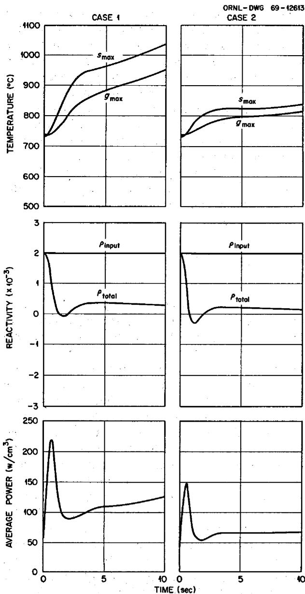  
Fig. 6.9. MSBR Response Without Control Action.

long-term response, yielding a long "tail" on both the power and total reactivity and hence producing a long slow upward drift in temperatures. Ultimately the power will return to its initial value, since these are constant power removal cases, and the temperatures will level off at somewhat higher values. It is clear that the larger salt coefficient, and hence larger core coefficient, of case 2 is an asset both in minimizing the salt and graphite temperatures and in lengthening the time during which appropriate control action may safely be taken.

In order to study the response of the reactor system to the same reactivity perturbation $(\delta \rho = 0.002)$ but with some compensating control-rod action, some simple control algorithms were incorporated in the code. It is recognized that the algorithms selected do not well represent the control system that will be adopted for an MSBR, but they were chosen for simplicity, to illustrate the role of external feedback in the transients being studied and as a step in the further development of the digital simulation code.

The first feedback algorithm is, in effect, simply a power coefficient of reactivity, chosen so that the control rods respond to an error signal of fractional change in power

$$
\rho = - 0. 0 0 1 \frac {P - P _ {0}}{P _ {0}},
$$

where $P_0$ is the initial steady-state power. The control rods are constrained further by the requirement that they move at a fixed velocity such that they insert $\rho = \pm 0.0005$ per second when in motion. Response of the system with this algorithm is shown in Fig. 6.10. This case (case 3) is the same as case 1, except for the external feedback. During the initial part of the excursion the control reactivity is rate limited as may be seen in Fig. 6.10, but after about 1.5 sec the rods follow the required reactivity. The result of using $(P - P_0) / P_0$ as the error signal is to make case 1 behave essentially like the more tractable case 2 so far as power level and temperatures are concerned. Clearly, using $(P - P_0) / P_0$ as the only error signal is not suitable for actual control purposes since temperatures must also be restored to steady-state (or some other desired) levels.

Cases 4 and 5 incorporate an additional error signal proportional to the fuel-salt mean outlet temperature from the core. So the total error signal is

$$
\rho = - 0. 0 0 1 \frac {P - P _ {0}}{P _ {0}} - a \frac {T - T _ {0}}{T _ {0}},
$$

where $T_{0}$ is the steady-state mean outlet temperature; $a = 0.015$ for case 4, $a = 0.045$ for case 5. Again the control rods are constrained to move at a fixed velocity such that they insert $\rho = \pm 0.0005$ per second when in motion. The results are plotted in Fig. 6.10. Case 5 shows that in response to a step $\rho = +0.002$ , the system exhibits strongly damped oscillations of power and temperature with a maximum salt temperature variation of $\sim 110^{\circ}\mathrm{C}$ and a maximum graphite temperature variation of $\sim 70^{\circ}\mathrm{C}$ and with temperatures and power

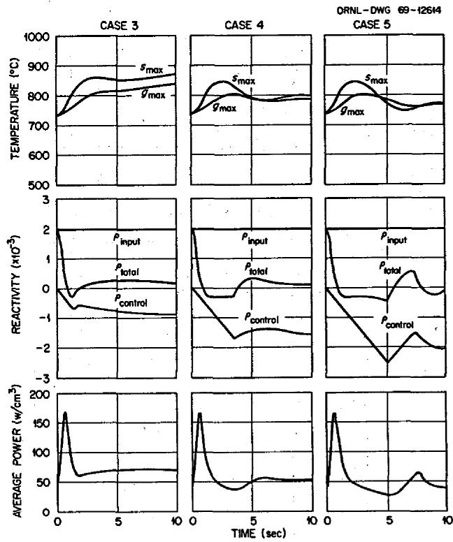  
Fig. 6.10. MSBR Response With Partial Control Action.

restored to within $\sim 5\%$ of steady-state conditions in 10 sec.

While the magnitude of salt and graphite temperature excursions is markedly reduced by use of these simple feedback algorithms, it should be noted that the initial rapid power rise still reaches levels several times the initial power. We would expect that in such a case the safety system would have to scram the reactor, not waiting to ascertain that the temperature changes would be acceptable.

The frequency response of the reactor system, which is a useful indication of system stability, may be obtained by Fourier analysis of the input and output signals from a transient calculation such as those shown in Figs. 6.9 and 6.10. This has been done, and the frequency response for cases 1 and 2 is shown in Figs. 6.11 and 6.12. The dashed portions of the magnitude ratio curves are estimated extrapolations. The low-frequency peak in magnitude ratio is determined by the core (salt plus graphite) isothermal reactivity coefficient, whereas the high-frequency peak is attributable to the salt coefficient alone. There is a small bump on the side of the high-frequency peak associated with the primary salt circulation rate. The broad maxima in magnitude ratio of cases 1 and 2 are an indication that

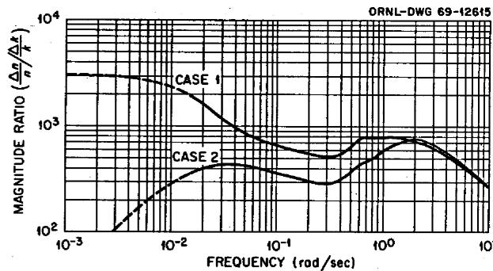  
Fig. 6.11. Frequency Response for Cases 1 and 2.

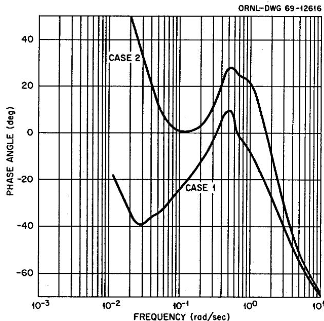  
Fig. 6.12. Frequency Response for Cases 1 and 2.

they are both stable cases, although case 1 with the smaller core coefficient shows greater sensitivity to low-frequency reactivity perturbations.

# 6.2 PHYSICS ANALYSIS OF MSBE

# 6.2.1 MSBE Design Studies

O. L. Smith J. H. Carswell, Jr.

Additional calculations were performed in the series of conceptual MSBE reactor configurations previously

reported.7 The results of the calculations are summarized in Table 6.4. Since a spherical reactor vessel of given diameter can be made thinner and cheaper than a cylindrical vessel of the same diameter, the purpose of cases 37-41 is to investigate the nuclear performance of reactors enclosed in a nearly spherical vessel rather than in a cylindrical vessel such as was used in the previous 36 cases. The cores in cases 37-41 are right cylinders; the vessels are spherical. Radial blanket thicknesses in Table 6.4 are given at the core midplane; axial blanket and plena thicknesses are given on the core axis.

The previous case 30, with a breeding ratio of 1.051, core power fraction of 0.57, and peak damage flux of $5.0 \times 10^{14}$ neutrons $\mathrm{cm}^{-2} \sec^{-1}$ at $169 \mathrm{Mw}$ (thermal) was suggested as one of the most attractive of the cylindrical vessel cases.

The core of case 37 in Table 6.4 is identical to case 30. The midplane radial blanket thickness of case 37 is 2 ft, the same as the uniform radial blanket thickness of case 30. As would be expected the leakage is higher in case 37, and hence the breeding ratio is lower. Cases 38 and 39 show, however, that by increasing the spherical blanket midplane thickness to slightly more than 2.5 ft (a vessel diameter of $\sim 9$ ft), the spherical vessel configuration gives virtually the same nuclear performance as the cylindrical vessel configuration of case 30.

Although the breeding performance of case 30 and the equivalent spherical case is high, such reactors have the disadvantage of a large blanket volume and consequently high fissile salt inventory of $\sim 475\mathrm{kg}$ of $^{233}\mathrm{U}$ within the vessel. Assuming that a breeding ratio as low as 0.95 is in fact satisfactory in achieving MSBE objectives, then case 40 with $275\mathrm{kg}$ of $^{233}\mathrm{U}$ shows that by thinning the blanket and slightly reducing core dimensions the fissile inventory can be markedly reduced without sacrificing other nuclear characteristics.

Case 41 is the same as case 40 except for a core salt fraction of 0.15, which is more nearly that of the MSBR's present 0.13 salt fraction.

For purposes of achieving MSBE objectives, case 41 appears to be the most suitable configuration so far studied. It has a breeding ratio of 0.96, a core power fraction of 0.53, a peak damage flux of $5 \times 10^{14}$ neutrons $\mathrm{cm}^{-2} \sec^{-1}$ at 153 Mw (thermal), and a $^{233}\mathrm{U}$ inventory of 258 kg inside the vessel.

Table 6.4. Nuclear Characteristics of Several Conceptual MSBE Reactor Configurations with Spherical Reactor Vessels   

<table><tr><td>Case</td><td>37</td><td>38</td><td>39</td><td>40</td><td>41</td></tr><tr><td>Core</td><td></td><td></td><td></td><td></td><td></td></tr><tr><td>Diameter, ft</td><td>4.0</td><td>4.0</td><td>4.0</td><td>3.75</td><td>3.75</td></tr><tr><td>Height, ft</td><td>5.0</td><td>5.0</td><td>5.0</td><td>4.75</td><td>4.75</td></tr><tr><td>Salt fraction</td><td>0.2</td><td>0.2</td><td>0.2</td><td>0.2</td><td>0.15</td></tr><tr><td>Axial blanket</td><td></td><td></td><td></td><td></td><td></td></tr><tr><td>Thickness at core axis, ft</td><td>1.07</td><td>1.07</td><td>1.07</td><td>1.0</td><td>1.0</td></tr><tr><td>Salt fraction</td><td>0.7</td><td>0.7</td><td>0.7</td><td>0.7</td><td>0.7</td></tr><tr><td>Axial plena thicknessa at core axis, ft</td><td>0.357</td><td>0.357</td><td>0.930</td><td>0.375</td><td>0.375</td></tr><tr><td>Radial blanket thickness at midplane, ft</td><td>2.0</td><td>2.5</td><td>3.0</td><td>1.875</td><td>1.875</td></tr><tr><td>Reactor vessel inner diameter, ft</td><td>8</td><td>9</td><td>10</td><td>7.5</td><td>7.5</td></tr><tr><td>Mole fraction of ThF4</td><td>0.12</td><td>0.12</td><td>0.12</td><td>0.12</td><td>0.12</td></tr><tr><td>Mole fraction of UF4</td><td>0.420</td><td>0.418</td><td>0.413</td><td>0.457</td><td>0.436</td></tr><tr><td>Breeding ratiob</td><td>0.994</td><td>1.039</td><td>1.075</td><td>0.966</td><td>0.960</td></tr><tr><td>Peak damage flux,c neutrons cm-2sec-1(E&gt;50 kev), × 1014</td><td>3.11</td><td>2.97</td><td>2.81</td><td>3.49</td><td>3.27</td></tr><tr><td>Peak power density,c w per cubic centimeter of core volume</td><td>70.1</td><td>67.1</td><td>63.4</td><td>79.6</td><td>74.2</td></tr><tr><td>Fraction of power in core</td><td>0.59</td><td>0.57</td><td>0.56</td><td>0.57</td><td>0.53</td></tr><tr><td>Required power,d Mw (thermal)</td><td>161</td><td>168</td><td>178</td><td>143</td><td>153</td></tr><tr><td>Total 233U inventory, kg</td><td>450</td><td>611</td><td>806</td><td>424</td><td>403</td></tr></table>

$a$ Contains $6 \%$ INOR.   
${}^{b}$ At start of life with ${100}\% {}^{233}\mathrm{U}$ fuel; no absorptions in ${}^{135}\mathrm{{Xe}}$ or ${}^{233}\mathrm{{Pa}}$ .   
cAt reactor power of 100 Mw (thermal).   
$d$ Reactor power required to achieve a peak damage flux of $5 \times 10^{14}$ neutrons $\mathrm{cm}^{-2} \sec^{-1}$ , a tentative goal for the MSBE.

# 6.3 MSR EXPERIMENTAL PHYSICS

# 6.3.1 $^{235}$ U Capture-to-Absorption Ratio in the Fuel of the MSRE

G. L. Ragan

Additional measurements and a more comprehensive analysis have improved and extended the preliminary results reported six months ago. As explained more fully in an earlier report, we measure $\gamma_{5}$ , the $^{235}\mathrm{U}$ capture-to-absorption ratio, by comparing the isotopic composition of two samples of MSRE fuel salt differing significantly (say, about $1\%$ ) in $^{235}\mathrm{U}$ depletion.

Essentially, $\gamma_{5}$ is the increase in $^{236}\mathrm{U}$ concentration divided by the decrease in $^{235}\mathrm{U}$ concentration. The precision of the measurements is enhanced by measuring all concentrations relative to that of $^{238}\mathrm{U}$ , which suffers only a slight depletion — for which a correction is applied. These measurements were made by L. A. Smith and co-workers at the Oak Ridge Gaseous Diffusion Plant, using a dual-aperture mass spectrometer with a $\mathrm{UF}_{6}$ electron bombardment source. $^{10}$

A set of three 50-g samples of circulating fuel salt was taken early in run 14, and another set near the middle of the run. A third set scheduled for late in the run had to be taken, because of sampler trouble, from the fuel storage tank after the run ended. The measured isotopic

composition of this latter set was adjusted for contamination of the final circulating fuel, during transfer, by old fuel from the two drain tanks. The results based on these adjusted measurements were consistent with those based on the two earlier sets alone, but the uncertainties inherent in the adjustments made the adjusted results unsuitable for the determination of precise parameters.

Solution of the accurate equations for the time variation of isotopic concentrations in a $^{235}\mathrm{U} + ^{236}\mathrm{U} + ^{238}\mathrm{U}$ system yields

$$
\gamma_ {5} = \frac {\overline {{\sigma}} _ {5} ^ {c}}{\overline {{\sigma}} _ {5} ^ {a}} = (1 - S _ {6}) \frac {X _ {6}}{X _ {5}} \frac {R _ {6} - R _ {5} ^ {s}}{R _ {5} ^ {s} - R _ {5}}, \tag {1}
$$

where

$X_{i} =$ the concentration of $\mathbf{23}^{\mathrm{i}}\mathbf{U}$ relative to $\mathbf{238}\mathbf{U},$

$R_{i} = X_{i}$ (final sample)/ $X_{i}$ (initial sample),

$S_{i} = \overline{\sigma}_{i}^{a} / \overline{\sigma}_{5}^{a}$ , and

$$
s = \left(S _ {6} - S _ {8}\right) / \left(1 - S _ {8}\right).
$$

The first part of Table 6.5 itemizes values of parameters determined by measurements on individual pairs of samples. $\gamma_{5}$ was calculated by Eq. (1), with a slight correction to $R_{5}$ for the small $^{234}\mathrm{U}$ content of the fuel. The fraction of $^{235}\mathrm{U}$ atoms undergoing absorption was directly determined from $R_{5}$ , with a slight adjustment via $S_{8}$ for $^{238}\mathrm{U}$ depletion. The fractional depletion of $^{234}\mathrm{U}$ was similarly determined from measurements of $R_{4}$ ; comparison with $^{235}\mathrm{U}$ depletion yields $S_{4}$ . (While $S_{4}$ is not required for the determination of $\gamma_{5}$ , it will be needed in analysis of the subsequent measurements of $\gamma_{3}$ , with $^{233}\mathrm{U}$ fuel, which are presently in progress. The comparison of measured and calculated values of $S_{4}$ in the $^{235}\mathrm{U}$ experiment is thus a useful prelude to the $^{233}\mathrm{U}$ experiment.) In

individual values were weighted by the number of determinations of the most critical spectrometric ratio to give the weighted averages shown. Blanks indicate that needed ratios were not determined for that sample pair.

The second portion of Table 6.5 gives the parameters determined by a statistical analysis of all data after each ratio $R_{i}$ was adjusted to a reference operating interval (12,900 Mwhr). The statistically estimated reliability (standard deviation) for each parameter is also given.

The derived parameters $\alpha = \gamma /(1 - \gamma)$ and $\eta = \nu (1 - \gamma)$ are added in Table 6.6. Also given are calculated values based on recent four-group neutronics calculations by B. E. Prince and ratios of experimental to calculated values. The calculations, described in detail in Sect. 2.3 of this report, are based on the following cross section sets: for $^{235}\mathrm{U}$ , a recent evaluation by E. H. Gift which is essentially the same as the current ENDF/B set; for $^{234}\mathrm{U}$ and $^{236}\mathrm{U}$ , ENDF/B; for $^{238}\mathrm{U}$ , a 1965 evaluation

Table 6.5. Experimental Values of Some Parameters for Run 14 of MSRE   

<table><tr><td colspan="2">Samples 
Compareda</td><td>Logged Mwhr</td><td>γ5</td><td>S4</td></tr><tr><td>Initial</td><td>Final</td><td></td><td></td><td></td></tr><tr><td colspan="5">By Individual Comparisons</td></tr><tr><td>6</td><td>35</td><td>12,579</td><td>0.2001</td><td></td></tr><tr><td>6</td><td>36</td><td>12,712</td><td>0.2015</td><td></td></tr><tr><td>5</td><td>35</td><td>12,767</td><td>0.2007</td><td></td></tr><tr><td colspan="3">Weighted average of above</td><td>0.2008</td><td></td></tr><tr><td colspan="5">By Statistical Analysis of Combined Data 
(Adjusted to 12,900 Mwhr)</td></tr><tr><td colspan="2">(Combined)</td><td>12,900</td><td>0.2006</td><td>0.3731</td></tr><tr><td></td><td></td><td></td><td>±0.0024</td><td>±0.0157</td></tr></table>

${}^{a}$ For example,read first line as FP14-6 vs FP14-35,etc.

Table 6.6. Comparison of Experimental and Calculated Values of Parameters   

<table><tr><td></td><td>γ5</td><td>α5</td><td>η5a</td><td>S4</td></tr><tr><td>Experimental</td><td>0.2006 ± 0.0024</td><td>0.2509 ± 0.0038</td><td>1.9425 ± 0.0076</td><td>0.3731 ± 0.0157</td></tr><tr><td>Calculatedb</td><td>0.2000</td><td>0.2500</td><td>1.9440</td><td>0.4026</td></tr><tr><td>(Experimental)/(Calculated)c</td><td>1.0030 ± 0.0120</td><td>1.0036 ± 0.0152</td><td>0.9992 ± 0.0039</td><td>0.9267 ± 0.0390</td></tr></table>

$a_{\eta} = \nu (1 - \gamma)$ with $\nu = 2.430$ , the ENDF/B value; quoted uncertainty in $\eta$ includes an assigned error of $0.25\%$ in $\nu$   
$b$ Calculated values based on recent calculations by B. E. Prince (personal communication, August 1969).   
Uncertainties are experimental standard deviations, with no allowance for uncertainty of calculated values.

by NASA. The effect of cross-section data source is significant. For example, the quoted calculated values differ from earlier (January 1969) values, based on different cross-section sources, by the following factors: $\gamma_{5}$ , 0.956; $S_{4}$ , 0.962; $S_{6}$ , 0.988; $S_{8}$ , 1.072. Further calculations are in progress to determine the effect of other calculational parameters, for example, the number of neutron energy groups.

The agreement between experimental and calculated values for $\gamma_{5}$ (and for the derived $\alpha_{5}$ and $\eta_{5}$ ) is quite satisfactory. This agreement inspires confidence in both the method of measurement and the $^{235}\mathrm{U}$ cross sections used, although fortuitous cancellation of errors in both is not ruled out. The agreement for $S_{4}$ is less satisfactory, but since $S_{4}$ is based on only ten measurements of $R_{4}$ , both the value and the estimate of standard deviation may be questioned. It may be noted that uncertainty in $S_{4}$ is expected to be the principal source of uncertainty in the measurement of $\gamma_{3}$ and that an error of $10\%$ in $S_{4}$ will give rise to an error of about $2.5\%$ in $\gamma_{3}$ . Additional measurements of $S_{4}$ are planned (see Sect. 6.3.3).

# 6.3.2 $^{233}\mathbf{U}$ Capture-to-Absorption Ratio in the Fuel of the MSRE

G. L. Ragan

The experimental techniques developed and tested with $^{235}\mathbf{U}$ (Sect. 6.3.1) are now being applied to $^{233}\mathbf{U}$ .

As pointed out in an earlier report, the comparison of experimental and calculated values will test the precision of our calculations of $\eta (^{233}\mathrm{U})$ , a quantity closely related to the breeding potential of proposed MSBR systems.

Three sets of fuel samples were taken (in February, April, and May of 1969) of the circulating fuel of MSRE during operation with $^{233}\mathrm{U}$ fuel. These samples are now being fluorinated to remove the uranium from the salt (as $\mathrm{UF}_6$ ). Subsequently, the isotopic compositions of the uranium from different sets will be compared in the same way as was done with the samples of $^{235}\mathrm{U}$ fuel.

# 6.3.3 $^{233}\mathbf{U}$ Capture-to-Absorption Ratio in Encapsulated Samples in the MSRE

G. L. Ragan

The measurements on circulating fuel samples are being supplemented by measurements on four encapsulated fuel samples. The uranium isotopic compositions of the two types of encapsulated fuel are chosen so as to (1) permit measurement of $S_{4}$ and $S_{8}$ in one type and (2) favor precise measurement of $\gamma (^{233}\mathrm{U})$ in the other.

The four capsules are contained in the surveillance sample array inserted in the MSRE in July 1969. They will be removed late in 1969.

# 7. Systems and Components Development

Dunlap Scott

# 7.1 BUBBLE GENERATOR

R.J.Kedl

Pressure-drop measurements were made and correlated for the inverted-venturi bubble generator with all four of the teardrop shapes described previously.1 Contraction coefficients and expansion coefficients are defined respectively as follows:

$$
\begin{array}{l} \Delta P = \frac {K _ {c}}{2 g} \left(V _ {\text {t h r o a t}} ^ {2} - V _ {\text {i n l e t}} ^ {2}\right), \\ \Delta P = \frac {\left(V _ {\text {t h r o a t}} ^ {2} - V _ {\text {o u t l e t}} ^ {2}\right)}{2 g} - \frac {K _ {e}}{2 g} \left(V _ {\text {t h r o a t}} - V _ {\text {o u t l e t}}\right) ^ {2}, \\ \end{array}
$$

where

$$
K _ {c} = \text {c o n t r a c t i o n c o e f f i e n t},
$$

$$
K _ {e} = \text {e x p a n s i o n c o e f f i c i e n t},
$$

$\Delta P =$ pressure drop in region of consideration (ft of liquid).

Contraction coefficients were measured for the nose section of the teardrops and ranged from 1.2 to 1.3. Expansion coefficients were measured for the tail section of the teardrops and ranged from 0 to 0.2 with no air flow and from 0 to 0.5 with air flow.

It was reported² that bubble coalescence could potentially be a problem in the MSBR. A test was performed with water to demonstrate the effect of surfactants on bubble coalescence. Normal butyl alcohol

was the surfactant. With the bubble generator operating at 20 gpm water flow and about 1 scfh air flow, the bubbles coalesced to a diameter of about 0.1 in. or more 12 ft downstream of the generator. When normal butyl alcohol was added to form a concentration of about $0.00003M$ , there was no coalescence whatsoever, and the bubbles maintained their initial diameter of about 0.010 in. What this means to the MSBR is uncertain, but one can speculate that some of the fission products, particularly the noble metals, might act as a surfactant and prevent bubble coalescence.

# 7.2 MOLTEN-SALT STEAM GENERATOR

R.E.Helms

Present concepts of a single-fluid molten-salt breeder reactor (MSBR) use primary salt with a liquidus temperature of about $930^{\circ}\mathrm{F}$ and secondary salt with a liquidus temperature of about $725^{\circ}\mathrm{F}$ . These salts transfer the heat produced in the reactor to a steam generator to produce high-pressure, high-temperature steam. The salts have good heat transport properties and low vapor pressure. However, the high melting point of the primary and secondary salt results in startup and operating plant procedures different from those used for fossil or sodium-cooled reactor power plant designs. A steam-generator development program is being formulated to develop the technology required to produce and successfully operate a molten-salt-heated steam generator, including materials and fabrication aspects, startup and stability considerations, and supporting research on heat transfer. The steam-generator industrial program and the Steam-Generator Tube Test Stand (STTS), which have been briefly

described previously, $^{4,5}$ are the major parts of this program plan. A discussion of these two programs follows.

# 7.2.1 Steam-Generator Industrial Program

Successful operation of a molten-salt breeder reactor (MSBR) nuclear power plant requires the development of economical, reliable components. One of the more important components is the molten-salt-heated steam generator. The intent of the steam-generator industrial program is to obtain nuclear-grade molten-salt steam generators for the Molten-Salt Breeder Experiment (MSBE) from industry and to begin to develop the additional capability needed to produce steam generators for future generations of MSBR power plants.

The steam-generator industrial program consists of four phases that will result in the design, development, and fabrication of a unit with full-size tubes for testing in the STTS; an MSBE unit for testing in the Engineering Test Unit (ETU); and the steam generators for the MSBE. In phase I the industrial contractor will produce a conceptual design of a steam generator for use with the ORNL reference design of the 1000-Mw (electrical) MSBR. The salt flow and salt temperature to and from the steam generator as a function of load will be specified by ORNL. The feedwater/steam inlet and outlet temperatures and pressures will be $700^{\circ}\mathrm{F}$ at 3800 psi and $1000^{\circ}\mathrm{F}$ at 3600 psi, respectively, for full-load operation as specified in the ORNL reference design of the MSBR steam cycle. However, the industrial firm may also propose an alternative steam-generator design. In this case the industrial firm will select the steam cycling (including inlet feedwater conditions) and outlet steam conditions to the turbine, but salt flow and salt temperature conditions as a function of load will remain as specified by ORNL. Both of these designs will be evaluated by ORNL, one will be selected, and a conceptual design will be made of a prototype for use in the MSBE. Phase II will comprise the detailed design of the MSBE unit and the detailed design and fabrication of a 3.0-Mw (thermal), full-size-tube unit that will be tested in the STTS at ORNL. Phase III will provide for fabrication of the first complete MSBE unit for the ETU, while phase IV results in the fabrication of the unit(s) that will actually

be used on the MSBE. The vendor participates in the test programs for both units.

One or more manufacturers will participate in the program on the basis of competitive proposals. Each manufacturer may complete all four phases.

# 7.2.2 Steam-Generator Tube Test Stand

# R.E.Helms E.J.Breeding

The request for directive, Preliminary Proposal Number 450, has been deferred pending completion of the conceptual system design description (CSDD) for the STTS and availability of funds. Layouts of concepts for vertical and horizontal steam-generator tube test units are being made to ensure that the test stand will accommodate both and to define the requirements of the test stand for the conceptual system design descriptions.

# 7.3 SODIUM FLUOROBORATE CIRCULATING TEST LOOP

# R.B.Gallaher A.N.Smith

Operation of the 800-gpm isothermal loop was continued through the report period for the investigation of corrosion-product deposition and off-gas system restrictions. Cumulative circulation time as of the end of August 1969 was $8200\mathrm{hr}$ , of which $7200\mathrm{hr}$ have been with the clean batch of salt. The loop was shut down for 18 days in March 1969 for installation of a hot mist trap, and again for 13 days in May 1969 for inspection and modifications of the hot mist trap. Except for very brief shutdowns, circulation was continuous for the remainder of the period.

# 7.3.1 Corrosion-Product Deposition

Studies were continued into the nature and kinetics of formation of deposits on a cold finger inserted into the salt in the pump bowl.6 Seven tests were run with the cold finger with conditions as noted in Table 7.1. All deposits had a bright green color, and the amount varied from very thin isolated spots to a uniform $\frac{1}{32}$ -in.-thick coating over the $2\frac{1}{2}$ in.² of surface. Chemical analyses were made of the deposits from three of these tests, and the relative atomic abundances were calculated with iron considered as unity. An inspection of the analytical data, which are presented in Table 7.2,

Table 7.1. Summary of Cold Finger Tests   

<table><tr><td>Test No.</td><td>Test Date</td><td>Wall Temperature (°F)</td><td>Test Duration (hr)</td><td>Deposit</td></tr><tr><td>1</td><td>4-23-69</td><td>750</td><td>6</td><td>Yes</td></tr><tr><td>2</td><td>4-29-69</td><td>850</td><td>6</td><td>Yes</td></tr><tr><td>3</td><td>5-7-69</td><td>950</td><td>6</td><td>Yes, 2 small areas</td></tr><tr><td>4</td><td>5-9-69</td><td>890</td><td>6</td><td>Yes, thin</td></tr><tr><td>5</td><td>6-13-69</td><td>860</td><td>6</td><td>Yes, heavy</td></tr><tr><td>6</td><td>6-20-69</td><td>944</td><td>2</td><td>No</td></tr><tr><td>7</td><td>6-20-69</td><td>929</td><td>2</td><td>No</td></tr></table>

indicates that as the temperature was increased, the quantity of chromium increased relative to the other constituents. A rough atomic balance can be achieved by assuming that the deposits consist of a small amount of $\mathrm{Na}_3\mathrm{CrF}_6$ mixed with large amounts of $\mathrm{NaBF}_4$ and NaF.

In conjunction with the corrosion product deposition studies, a plot (Fig. 7.1) was made of the impurities in all the salt samples taken during circulation of the clean batch of salt. An examination of these data leads to the following observations: (a) For a steady-state operation at $1025^{\circ}\mathrm{F}$ , the concentration of both iron and chromium is about 500 ppm. Nickel is much lower, averaging about 20 ppm. The concentration of iron increased significantly during the period of high-temperature operation in August 1968, then decreased when the temperature was reduced, indicating that 500–550 ppm is the solubility limit for iron at $1025^{\circ}\mathrm{F}$ . (b) During the period of steady-state uninterrupted operation from March 25, 1969, to May 12, 1969, the average water concentration increased from 400 to 1400 ppm. The total quantity of salt in circulation is about $0.25 \times 10^{6}$ g, so that an increase of 1000 ppm would require an addition to the loop of about 250 g of water. We have found no reasonable mechanism by which this quantity of water could have been admitted to the system. For example, the equivalent volume of atmospheric air at 30,000 ppm water would be $375\mathrm{ft}^3$ , or about 250 pump bowl volumes; if the moisture content of the supply helium were 10 ppm, about four years would be required to introduce 250 g of water. (c) A rather large spread is noted frequently between oxygen analyses on duplicate samples; a similar, but not as pronounced, situation is noted in the case of water analyses. (d) Draining of the loop on May 12, 1969, was hindered by a plug which was eventually cleared by increasing the temperature of the upper portion of the drain line to above $1000^{\circ}\mathrm{F}$ . This difficulty may have been caused by deposition of corrosion products in a

Table 7.2. Analyses of Deposits from Cold Finger Tests   

<table><tr><td>Test No.</td><td>Wall Temperature (°F)</td><td>Na</td><td>B</td><td>F</td><td>Fe</td><td>Cr</td><td>Ni</td></tr><tr><td colspan="8">Weight Percent</td></tr><tr><td>1</td><td>750</td><td>25.4</td><td>5.07</td><td>59.0</td><td>1.54</td><td>2.76</td><td>0.031</td></tr><tr><td>2</td><td>850</td><td>24.4</td><td>4.28</td><td>57.3</td><td>1.61</td><td>4.18</td><td>0.009</td></tr><tr><td>4</td><td>890</td><td>24.0</td><td>6.26</td><td>46.5</td><td>1.52</td><td>8.38</td><td>0.090</td></tr><tr><td colspan="8">Relative Atomic Abundance</td></tr><tr><td>1</td><td></td><td>40</td><td>17</td><td>113</td><td>1</td><td>2</td><td></td></tr><tr><td>2</td><td></td><td>36</td><td>17</td><td>124</td><td>1</td><td>3</td><td></td></tr><tr><td>4</td><td></td><td>38</td><td>18</td><td>71</td><td>1</td><td>6</td><td></td></tr></table>

relatively cool portion of the drain line. Such a deposit, if rich in chromium, might serve to explain the decrease in chromium content of about 120 ppm between March 25 and May 12. The equivalent quantity of $\mathrm{Na}_3\mathrm{CrF}_6$ would be about $115\mathrm{g}$ , a quantity which might have been sufficient to restrict the $3/4$ -in. (iron pipe size) drain line. Note, however, that a corresponding change was not noted in the iron content, and an increase in chromium content was not seen after the subsequent startup on May 25, when some effect might have been expected from mixing of the inventory in the drain tank.

# 7.3.2 Gas System Studies

We continued to work on methods of coping with emissions of salt and vapors from the pump bowl so as to minimize the possibility of forming restrictions in the off-gas system. In March 1969 the test section at the pump bowl outlet was revised to include a salt mist trap. Downstream of this unit were placed a porous metal filter and a $32^{\circ}\mathrm{F}$ cold trap.

The salt mist trap was a 1-in.-ID by 13-in.-long pipe mounted vertically above the pump so that trapped liquid would be free to drain back into the pump bowl. The lower half of the trap was equipped with heaters and insulation so that the temperature could be maintained at any desired point up to about $1300^{\circ}\mathrm{F}$ . The $\frac{1}{2}$ -in.-OD tube connecting the trap to the pump bowl was also equipped for temperature control and was routinely maintained above the melting point of the salt. The upper half of the trap was unheated and uninsulated so as to provide for rapid cooling of the gas

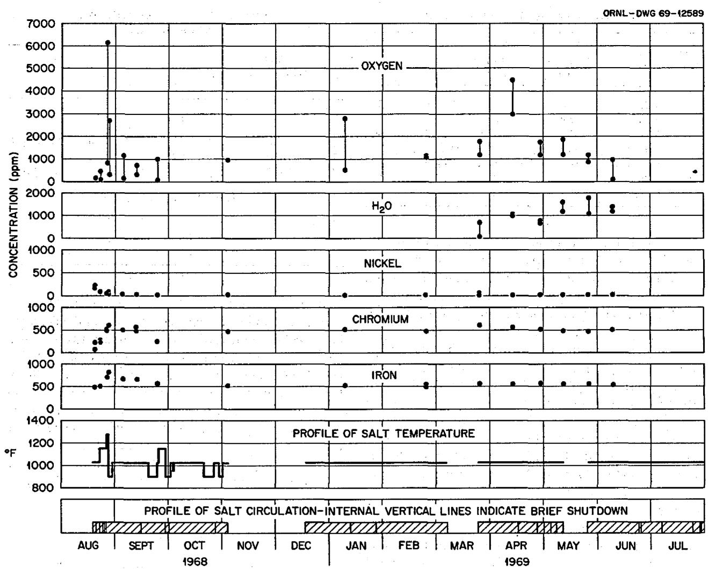  
Fig. 7.1. Analyses of Impurities in $\mathrm{NaBF_4}$ Salt Samples, $\mathrm{NaBF_4}$ Circulation Test, PKP Loop, Building 9201-3.

and any residual salt or vapor. During the test period, the temperature of the lower part of the trap was maintained at about $1000^{\circ}\mathrm{F}$ , and various internal arrangements were tested for effectiveness in retaining salt mist. The first arrangement was a baffle array containing nine plates with $\frac{1}{4}$ -in. spacing and $\frac{1}{8}$ -in. offset holes for gas flow. The second arrangement used a 2-in.-deep section of wire mesh packed to a density of about $0.15\mathrm{g / cc}$ . Third, all hardware was removed, making the unit a simple settling tank. Of the three arrangements tested, the first two were effective in removing about $50\%$ of the estimated input rate of $0.03\mathrm{g / hr}$ of salt mist. However, the $\frac{1}{8}$ -in. holes in the baffle array were too small to permit the trapped salt to drain

back into the pump bowl. Essentially none of the salt was removed by the settling tank.

Frozen salt particles that escaped from the mist trap were carried into a filter. The results of various weighings and visual inspections indicated that all the filter elements tested were effective in stopping the incoming solids. Preliminary observations indicate that the capacity of the filters is significantly lower during periods when the emission rate of the acid vapor is high.

Acid vapors which were emitted from the pump bowl or which might have formed from wet air contamination in the test section are believed to have been effectively removed from the off-gas by the $32^{\circ}\mathrm{F}$ cold trap. This belief is based on the fact that the down

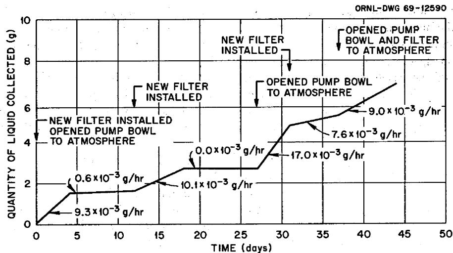  
Fig. 7.2. Liquid Collected in Off-Gas Cold Trap, $\mathrm{NaBF_4}$ Circulation Test.

stream control valve showed no evidence of fouling. The results of a series of cold trap weighings indicated that the rate of emission of acid did not, as had been predicted, go to zero, but it appeared to level off at about $1.5\mathrm{g / week}$ . The possible cause of the continuing emission was believed to be moisture in the incoming helium or $\mathrm{BF}_3$ or contamination with wet air. A cold trap test indicated that the $\mathrm{BF}_3$ was not responsible, and steps were taken to ensure that the $\mathrm{H}_2\mathrm{O}$ content of the incoming helium was less than 1 ppm. An examination of subsequent data indicates that the continued accumulation of acid is due to routine operational and maintenance activities which result in brief exposures of the system to the atmosphere. This is shown in Fig. 7.2.

# 7.4 MSBE PUMPS

A.G.Grindell P.G.Smith

C.K.McGlothlan L.V.Wilson

H.C.Young

# 7.4.1 MSBE Salt Pump Procurement

The specification for the primary salt pump was completed after revision to reflect comments by the pump manufacturers, the USAEC-DRDT, MSBE project personnel, the Metals and Ceramics Division, the Inspec

tion Engineering Department, ORNL Reactor Standards Office, ORNL Quality Assurance Office, and the UCC-ND Purchasing Division.

A brief specification for the secondary salt pump was also prepared. It is based on the primary salt pump specification and lists those changes that are appropriate for the secondary salt pump. The material and the quality assurance requirements are identical to those for the primary salt pump.

The preparation of a request for proposal package (RFP) was completed. The technical portion of the package includes the specifications for the primary and the secondary salt pumps, the proposed scope of work, information required in the proposal, and copies of all the RDT standards referenced in the specifications.

The procurement program as outlined in the RFP includes three phases: phase I is a conceptual design study; phase II consists of detail design and production of a prototype salt pump; phase III provides for the construction of the salt pumps required for the ETU and the MSBE.

The principal objectives in the phase I design concept study are: (1) to obtain the manufacturer's best design concept for the primary salt pump, (2) to obtain assurance that his pump concept can be scaled up satisfactorily to the flow capacities required by MSBR salt pumps, (3) to establish mutual understanding of the salt pump specifications, (4) to establish mutual understanding of the requirements of the quality assurance program, (5) to determine the personnel and the organization that the manufacturer proposes to use to perform phases II and III of the program, (6) to obtain

schedule and cost estimate information for phase II, and (7) to revise the pump specification to incorporate results of the conceptual study.

While the pump specifications require additional information that will be developed during design and analytical studies of the MSBE, we consider them sufficiently complete to be used by the pump manufacturers to prepare a proposal and to complete the phase I study.

The RFP package was reviewed and released by DRDT. It is being transmitted to the following pump manufacturers selected by the evaluation team: (1) Bingham Pump Company of Portland, Oregon, (2) Byron Jackson Pump Company of Los Angeles, California, and (3) the Westinghouse Electro Mechanical Division of Cheswick, Pennsylvania.

made utilizing a concentric pipe configuration with the cooling air flowing in the annulus. The study indicated that for an 8-in. pipe (sched 40), an air pressure drop of 3 psi, and a total air flow of 10,000 cfm, two heat exchangers each 14 ft long will provide adequate heat removal for 900 hp at $1000^{\circ}\mathrm{F}$ salt temperature. Two centrifugal multistage blowers presently installed in the EGCR are being considered for circulating the cooling air.

The preliminary design is scheduled for completion by November 1969. After its review by the AEC, we will initiate immediately the orders for the long-lead-time items: Ni-Mo-Cr alloy materials and the salt pressure measuring devices. We plan to complete the final design by June 1970.

# 7.4.2 MSBE Salt Pump Test Stand

Programmatic approval was received from the AEC to proceed with the salt pump test stand (SPTS). The conceptual system design description9 was completed and released for distribution.

Preliminary design of the stand has been started, and the concept10 that is being developed is similar to that described previously. The salt loop and its components are being designed specifically for the presently envisioned MSBE primary salt pump, which requires approximately 900 bhp. All the components external to the salt loop - that is, the cooling air system with its blowers, ducting, and stack and the electrical supply system for the pump drive motor - are being designed to provide capability for testing pumps requiring 1500 bhp.

Layout drawings have been made of the throttling valve, heat exchangers, salt loop, and support stand. The throttling valve, which will be sized to fit an 8-in. pipe, is based on a 4-in.-pipe-size valve that was designed at ORNL during the ANP program and subsequently used for several thousand hours in liquid metal and molten salt applications. A study of an air cooling system to remove pump power as heat was

# 7.4.3 ALPHA Pump

The design work on the ALPHA pump $^{11}$ was completed, and the detail drawings were released for the fabrication of all components required to provide a water test pump. The molten-salt or liquid-metal version of the pump, shown in Fig. 7.3, will operate at speeds up to $6000~\mathrm{rpm}$ to provide flows to $30~\mathrm{gpm}$ and heads to $300~\mathrm{ft}$ at temperatures up to $1400^{\circ}\mathrm{F}$ . These characteristics will provide a pump for test stand requirements that fall between those of the LFB and the DANA pump models.

For the water test the pump tank and auxiliary tank will be fabricated of Plexiglas to observe the behavior of the gas-liquid interface, gas entrainment in liquid, and mist generation and to evaluate the effectiveness of the means employed for their control. The water test program will include investigation of: (1) head-flow-speed characteristics, (2) cavitation characteristics, (3) effect of axial impeller clearances on pump performance, (4) radial hydraulic thrust on the impeller. The detail drawings of the high-temperature pump components will be completed based on the feedback information obtained in the water test program.

The water test stand is being prepared for the pump. It consists of piping, two flowmeters installed in parallel, two throttling valves, a water-to-water heat exchanger, and necessary instrumentation to determine pump performance.

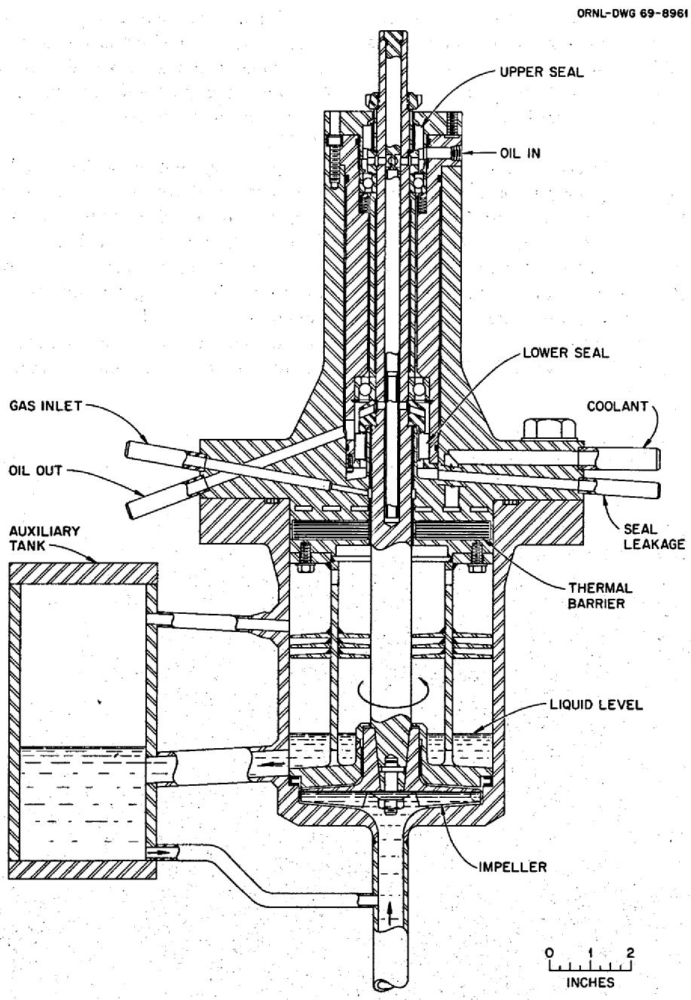  
Fig. 7.3. ALPHA Pump Assembly.

# 7.5 REMOTE WELDING

# P.P.Holz

Performance tests have been conducted with the pipe cutting and welding devices $^{12}$ developed and fabricated by ORNL as modifications of the equipment designed for the U.S. Air Force by North American Rockwell

Corporation. A remote-control programmer borrowed from the Air Force was used to operate the cutting and welding equipment while the ORNL programmer was being fabricated and tested. Debugging of the new programmer is still in progress.

The following operations have been performed with generally satisfactory results by remote maintenance methods: clamping of the carriage on the pipe, cutting and beveling with one orbital head, changing heads, and welding by the tungsten inert gas method. We noted that nearly perfect pipe joint preparation and alignment

were required to achieve acceptable root pass welding without the use of weld inserts. These requirements were the most difficult to meet with the orbital equipment, and root pass welding gave the most trouble. Filler passes were made easily and were of good quality.

During the tests, weld defects could often be detected as they occurred by noting the pips on recorder chart traces of the welding variables. A Sanborn 150 recorder was coupled to the programmer to obtain simultaneous printouts of data from the interrelated weld functions. Defects in the weld showed up as irregularities in the charted weld current, travel speed, wire feed rate, arc voltage, and arc voltage control. The system with the Sanborn recorder attached is shown in Fig. 7.4.

A 7-min color movie was prepared to show the performance of remote maintenance operations with the orbital equipment. We also completed a report, Feasibility Study of Remote Cutting and Welding for Nuclear Plant Maintenance, to be issued as ORNL-TM-2712.

Simple long-handled sockets and right-angle-drive tools were used for the remote operations to clamp equipment to the pipe and to adjust the cutter blade or torch position in horizontal and vertical planes. In actual remote operations, a hoist would be used to lower the orbital equipment into position on the pipes from overhead access locations.

Cutter performance tests included saw tracking and runout determinations and machining studies on stain

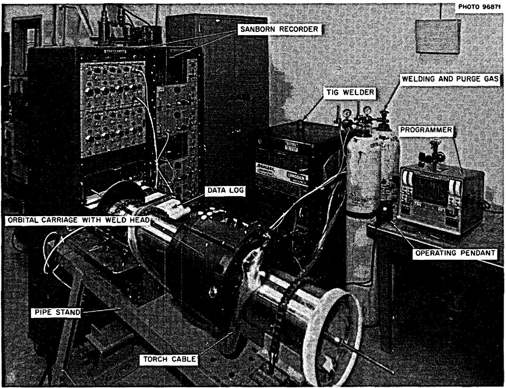  
Fig. 7.4. ORNL Orbital Equipment Test Station.

less steel and Inconel piping. We tested slitting saw blades of high-speed steel and alloy and single- and double-bevel cutters of high-speed steel. We varied the cutter speed, cutter feed, and carriage travel rate to determine the combinations for optimum tool performance and surface finish. Dry machining is specified for nuclear system maintenance because coolants might contaminate the nuclear system. However, dry machining requires that the rates of tool travel, cutting speed, and tool feed be considerably lower than is standard shop practice. Best tool performance was obtained with cutter teeth ground to precision specifications and generously relieved to provide ample clearance for chip fallout. Table 7.3 shows the number of inches of cut a blade can be expected to make before it must be resharpened. The table also shows how deep the blade would cut in traveling the indicated number of inches around a 6-in.-diam pipe, taking a 30-mil or a 12-mil cut, as indicated. A short cutter life experienced in test operations means that blades will have to be replaced frequently. We plan to test carbide cutter blades in hopes that they will last longer.

A machining technique has been developed for remotely preparing J-bevel pipe ends for welding. The procedure tends to compensate for the variations in pipe wall thickness which, under the ASME code, can be as much as $12\frac{1}{2}\%$ .

1. Make a light cut around the pipe with a thick slitting saw, and inspect for true tool tracking. Continue slitting to the predetermined depth which will leave a land surface for the root weld.   
2. On the cutter shaft, mount a hardened steel thrust washer and a single-angle milling cutter so that the washer will ride in the slit made by the saw and will guide the bevel cutter.   
3. After making the bevel cut, insert a thin slitting saw blade, and cut through the wall.   
4. Make a wax impression of the cut joint. Make an uncontaminated replica of plaster of paris.   
5. Machine to a constant land wall thickness at the joint by cutting metal from segments of the land surface where measurements of the replica indicate it is too thick.   
6. Make a second replica of the joint for use in out-of-cell machining on the stub end of a replacement component to make it fit the pipe inside the cell.   
7. Use information from the replica to set programmer weld current curves so that they will compensate for

variations in the arc gap caused by out of roundness or by the machining to give constant land thickness.

TIG welding with the orbital equipment has been done mostly without weld insert rings, but this method requires precise weld joint machining to obtain matching pipe inside surfaces and pipe wall thicknesses, as well as near-perfect alignment of the two joint members. Failure to meet these requirements results in root welds that are undercut, that lack full penetration, or that have too much penetration with a resultant convex bead inside the pipe. Fill-pass welding is less difficult, though we noted that the quality of successive welds depends on prior weld passes. It is quite simple to lay good fillers over good root welds, or over good prior filler welds; however, it is difficult to repair a poor weld by welding over it without first machining out the defect. These observations are based upon test welds on extra-heavy 6-in.-diam 347 stainless steel pipe prepared with V- or J-bevel joints and always fitted up without joint gap and without weld inserts. Remote work on nuclear systems cannot use gap joints because of purging difficulties, or the commercial weld insert rings without modification.

Because it is time consuming and difficult to do precision machining by remote control, we plan to experiment with joints in which one applies weld wire filler metal to one of the two joint ends prior to placing the pipe inside the cell. This type of joint preparation permits plain fusion root pass welding and requires no other filler wire additions. It should also greatly reduce the requirements for precision joint matching and alignment. Several successful root pass welds have already been performed by a similar method in which the pipe ends were machined to include an integral flat washer on one of the two mating J-joint sections. This washer permitted the root pass weld to be a single fusion weld which, in the tests, exhibited excellent bead shape and full weld penetration.

Satisfactory weld fill passes do not appear to present great problems. The first two or three fill passes after the root weld require special care with heat control to properly add filler wire and obtain weld buildup without melting the root pass sufficiently to cause drophrough. These and subsequent passes require only enough heat input to ensure fusion to the previous pass and to the joint sidewalls. The control of the arc voltage on the basis of wire feed rate has been found to maintain a relatively uniform bead buildup. Pulsing of the welding current was found to be useful in maintaining a stable weld puddle.

We were also able to repair some weld defects. Poorly fused areas, or pinholes in the head, were repaired by fusion welding without filler wire addition or oscillation. A procedure was developed to fill local areas which had to be milled out to remove weld defects. It consists in placing the carriage about $\frac{1}{2}$ in. in front of

the area to be filled, setting a short arc gap of $\frac{1}{32}$ in., and initiating a weld cycle. The automatic arc-voltage-controlled wire feed will start to add wire as soon as the arc gap increases upon entering the recessed area. The wire feeder motor will shut off on the far side of the depressed area to permit manual downsloping.

Table 7.3. Expected Life of Cutter Blades   

<table><tr><td rowspan="3">Description</td><td colspan="4">Blade Lifetime</td></tr><tr><td colspan="2">In Stainless Steel(Saw Tooth Speed, 70 to 80 ft/min;Carriage Speed, 31/4in./min;Feed per Tooth, 0.001 in.)</td><td colspan="2">In Inconel(Saw Tooth Speed, 50 ft/min;Carriage Speed, 1 in./min;Feed per Tooth, 0.0005 in.)</td></tr><tr><td>Inches ofCut, AverageDepth 30 mils</td><td>Total Depthof Cut, 6-in.Pipe Wall(in.)</td><td>Inches ofCut, AverageDepth 12 mils</td><td>Total Depthof Cut, 6-in.Pipe Wall(in.)</td></tr><tr><td>1/16-in.-thick slitting saw,3 in. diam, 32 teeth,high-speed steel</td><td>530</td><td>3/4</td><td></td><td></td></tr><tr><td>1/16-in.-thick slitting saw,3 in. diam, 32 teeth,Circoloya</td><td>800</td><td>11/8</td><td>730</td><td>716</td></tr><tr><td>3/32-in.-thick slitting saw,3 in. diam, 32 teeth,high-speed steel</td><td>430</td><td>5/8</td><td></td><td></td></tr><tr><td>3/32-in.-thick slitting saw,3 in. diam, 32 teeth,Circaloya</td><td>650</td><td>7/8</td><td>600</td><td>11/32</td></tr><tr><td>70° included double angle mill,23/4in. diam, 20 teeth,1/2in. wide, high-speed steel</td><td>470</td><td>11/16</td><td>420</td><td>1/4</td></tr></table>

$a$ Trade name for Circular Tool Co. (Providence, R.I.) special high-speed, steel-alloyed blades of high carbon, medium chrome, high vanadium, high tungsten, and medium cobalt composition.

# 8. MSBR Instrumentation and Controls

# 8.1 CONTROL SYSTEM ANALYSIS

W.H.Sides,Jr. J.L.Anderson

S.J.Ditto

The results of the simulation of the 1000 Mw (electrical) MSBR for the investigation of the overall plant control problems, previously reported, $^{1,2}$ revealed the need for continuing studies to develop a satisfactory scheme of control. This was expected because of the rudimentary nature of the control schemes tried and the limitations of the analog model. Work is proceeding on refinement of the model so that it will better represent the system. In particular the model of the reactor kinetics and the steam generators is being expanded with more nodes and provisions for variable primary salt flow rate. The heat transfer coefficients, transport lags associated with piping lengths, and other similar parameters are being corrected and updated according to the latest design information available from the project. In some cases it was necessary to recalculate the coefficients to make them applicable to the multizone models now being used. The revised model is now ready and is being patched on the machine. The model provides considerable latitude for trying different control schemes, and the improvements made in the model should permit its use over a wider range of power levels. It is expected that parameter studies will be made to determine the effect of various reactivity coefficients.

The partial-load operating conditions for the plant have not been well defined, and the results of the previous transient studies have prompted a more thorough study of the steady-state part-load plant conditions. Methods of changing plant load by varying flow rates, temperatures, etc., are being evaluated to

determine whether the resulting plant temperature and flow profiles are maintained within design limits under all part-load conditions. The design limits are maximum and minimum temperatures and flow rates imposed by the freezing points of the salts, pump capabilities, etc. The possible benefits and problems associated with valving off some of the steam generators in discrete steps for partial-load operation are being studied.

# 8.2 DYNAMIC ANALYSIS OF MSBR STEAM GENERATOR

F. H. Clark O. W. Burke

The subcontracted work on supercritical steam generators carried on at the University of Illinois has reached a reasonable interruption point. As has been indicated in previous reports, the University of Illinois model has not been expanded to the full detail contemplated: notably lacking are parallel channel effects. On the other hand, some features not originally contemplated have been factored into the model: in particular, a simple but explicit representation of the remainder of the thermal loop is incorporated instead of treating the unit as an open loop with boundary conditions. The control scheme is incomplete in that salt temperatures are not yet held fast and drift away from their operational levels (but not by a great deal). This is due to incompleteness rather than inherent deficiency of the control scheme.

We have in hand a preliminary report on the earlier part of this work from the University of Illinois and expect a further report on the work subsequently performed. In view of the lack of funds to support this work further on subcontract and in view of the fact that we shall have an operating hybrid facility within a few months, it is our intention to translate the steam generator program to our system in order to be in a position to expand the detail in the treatment and to complete the control studies.

The following are some of the substantive results of this subcontract:

1. A satisfactory hybrid computing program of a limited model of the system has been set up.   
2. Instabilities observed in the water leg of the system on the analog studies, which were thought to be computational rather than physical in nature, have been shown to be just that.

3. The nonlinearity of the hybrid model has permitted observation of the system under large changes.   
4. A fairly extensive, though still incomplete, control system has been mapped out and gives good indication of being satisfactory.

# 9. Heat and Mass Transfer and Thermophysical Properties

# 9.1. HEAT TRANSFER

B. Cox

In previous semiannual reports1,2 the experimental apparatus and procedures for determining the heat transfer coefficients of molten salts flowing in metal tubes were described. These reports also discussed the irregular axial tube temperature profiles that were observed with the initial test section; it was speculated that the irregularities could have been caused by flow disturbances attributable to a weld penetration at the point of repair of a hole in the tube wall.

A new test section, identical in geometry with the original, was installed, and experiments were conducted with Hitec $(\mathrm{KNO}_3 - \mathrm{NaNO}_2 - \mathrm{NaNO}_3;44 - 49 - 7$ mole $\%$ a salt whose heat transfer properties are well known. No significant irregularities in axial temperature profile were observed with Hitec beyond a short entrance region, and the results agreed well with the standard heat transfer correlations. The salt was removed, and the system was thoroughly flushed with water and dried prior to filling with a proposed MSBR fuel salt (LiF-BeF $_2$ -ThF $_4$ -UF $_4$ ; 67.5-20-12-0.5 mole $\%$ ) which was used in the earlier experiments. No alterations were made in the apparatus. Heat transfer coefficients were determined for 51 runs covering the range of Reynolds moduli 400 to 30,600. Table 9.1 is a summary of operating conditions and results for experiments with the fuel salt in the second test section. Figures 9.1-9.3 show typical measured outside tube wall temperatures and the mean fluid temperatures. A straight line has been drawn between the measured values of mean inlet and mean outlet fluid temperatures since, assuming uniform heat transfer at the inner tube wall and constant physical properties for the salt, the mean salt temperature varies linearly with tube length.

These figures include the laminar, transition, and turbulent flow ranges: $N_{\mathrm{Re}} = 597$ , 4277, and 28,104 respectively. While the temperature profile in the transition region (Fig. 9.2) exhibits an unexplained peak in wall temperature near the test section inlet which was also seen in the earlier studies with the MSBR fuel salt and with Hitec salt, the profile over the remainder of the tube length is generally regular and parallel to the liquid temperature profile. This is in agreement with the results obtained using Hitec, but in marked contrast with the earlier results obtained with the MSBR fuel salt, in which no region of regular wall temperature, parallel to the liquid temperature, was observed. No significant irregularities in wall temperature beyond a very short entrance region are seen in Fig. 9.3 for turbulent flow, again in marked contrast to the earlier MSBR fuel salt results.

In determining the heat transfer coefficients reported in Table 9.1 from the temperature data, the limiting, constant temperature difference, wall to liquid, was used in the transition and turbulent flow ranges. These results are believed to be much more reliable than those reported earlier, which were based on the variable temperature difference near the test section outlet.1,2 Integrated values of the local heat transfer coefficient over the entire tube length, coupled with the tube diameter-to-length ratio, $D / L$ were used in developing the laminar flow heat transfer correlations.

In the upper-laminar and lower-transition flow ranges, $1000 < N_{\mathrm{Re}} < 3500$ , irregular temperature profiles were observed over most of the length of the test section. This same effect could be produced up to $N_{\mathrm{Re}} = 5000$ at higher wall heat fluxes. Figures 9.4 and 9.5 illustrate the apparent effect of heat flux on entrance region length. At $N_{\mathrm{Re}} = 3762$ and a wall heat flux of $2.55 \times 10^{5}$ Btu hr $^{-1}$ ft $^{-2}$ (Fig. 9.4), there is no region of constant heat transfer coefficient, $h$ . In contrast, temperature profiles at $N_{\mathrm{Re}} = 3565$ and a lower wall heat flux of $0.74 \times 10^{5}$ Btu hr $^{-1}$ ft $^{-2}$ (Fig. 9.5) indicate that a significant region of constant $h$ is achieved. Since the fluid being studied has a viscosity that decreases with increasing temperature, heat transfer from the tube wall might have a stabilizing effect on

Table 9.1. Summary of Operating Conditions and Results for Heat Transfer Studies with an LiF-BeF $_2$ -ThF $_4$ -UF $_4$ (67.5-20-12-0.5 Mole %) Mixture Flowing in a Long Small-Diameter Hastelloy N Tube   

<table><tr><td>Run No.</td><td colspan="3">Liquid Temperature (°F)</td><td>W/(lbm/hr)</td><td>qA(Btu hr-1ft-2)</td><td>Heat Balancea</td><td>NRe(mean)</td><td>NPr(mean)</td><td>NNu</td><td>h(Btu hr-1ft-2°F-1)</td></tr><tr><td></td><td colspan="10">×105</td></tr><tr><td>107</td><td>1388.3</td><td>1436.0</td><td>47.7</td><td>2532.0</td><td>4.07</td><td>1.05</td><td>17,161</td><td>5.4</td><td>97.6</td><td>4882</td></tr><tr><td>115</td><td>1362.7</td><td>1415.8</td><td>53.1</td><td>1387.2</td><td>2.48</td><td>1.12</td><td>8,954</td><td>5.7</td><td>56.6</td><td>2831</td></tr><tr><td>117</td><td>1383.7</td><td>1438.4</td><td>54.7</td><td>1807.2</td><td>3.33</td><td>1.01</td><td>12,253</td><td>5.4</td><td>72.3</td><td>3617</td></tr><tr><td>119</td><td>1379.1</td><td>1436.6</td><td>57.5</td><td>1185.0</td><td>2.30</td><td>1.05</td><td>8,042</td><td>5.4</td><td>46.0</td><td>2302</td></tr><tr><td>121</td><td>1418.0</td><td>1474.4</td><td>56.4</td><td>2191.2</td><td>4.16</td><td>1.04</td><td>16,006</td><td>5.0</td><td>91.8</td><td>4590</td></tr><tr><td>122</td><td>1456.2</td><td>1507.9</td><td>51.7</td><td>2968.2</td><td>5.17</td><td>1.04</td><td>23,227</td><td>4.7</td><td>123.8</td><td>6192</td></tr><tr><td>123</td><td>1488.2</td><td>1537.8</td><td>49.6</td><td>3206.4</td><td>5.36</td><td>1.00</td><td>26,953</td><td>4.4</td><td>129.2</td><td>6462</td></tr><tr><td>127</td><td>1097.9</td><td>1156.4</td><td>58.5</td><td>1636.8</td><td>3.23</td><td>1.05</td><td>5,370</td><td>11.2</td><td>38.7</td><td>1936</td></tr><tr><td>129</td><td>1082.7</td><td>1163.3</td><td>80.6</td><td>250.8</td><td>0.68</td><td>1.01</td><td>792</td><td>11.6</td><td>7.9</td><td>396</td></tr><tr><td>130</td><td>1081.5</td><td>1177.1</td><td>95.6</td><td>279.6</td><td>0.90</td><td>1.00</td><td>900</td><td>11.4</td><td>8.5</td><td>427</td></tr><tr><td>131</td><td>1089.8</td><td>1159.9</td><td>70.1</td><td>227.4</td><td>0.54</td><td>1.02</td><td>722</td><td>11.6</td><td>8.1</td><td>407</td></tr><tr><td>132</td><td>1090.6</td><td>1160.2</td><td>69.6</td><td>256.2</td><td>0.60</td><td>0.97</td><td>815</td><td>11.5</td><td>7.6</td><td>381</td></tr><tr><td>133</td><td>1029.6</td><td>1118.7</td><td>89.1</td><td>221.4</td><td>0.66</td><td>0.93</td><td>597</td><td>13.6</td><td>7.1</td><td>357</td></tr><tr><td>134</td><td>1036.3</td><td>1134.8</td><td>98.5</td><td>155.4</td><td>0.52</td><td>0.93</td><td>435</td><td>13.1</td><td>7.2</td><td>358</td></tr><tr><td>143</td><td>1062.8</td><td>1117.7</td><td>54.9</td><td>1785.0</td><td>3.30</td><td>1.04</td><td>5,301</td><td>12.4</td><td>38.8</td><td>1940</td></tr><tr><td>144</td><td>1075.4</td><td>1135.7</td><td>60.3</td><td>1900.8</td><td>3.87</td><td>1.04</td><td>5,926</td><td>11.8</td><td>44.0</td><td>2200</td></tr><tr><td>145</td><td>1048.2</td><td>1103.4</td><td>55.2</td><td>2007.6</td><td>3.73</td><td>1.04</td><td>5,691</td><td>12.9</td><td>42.6</td><td>2129</td></tr><tr><td>146</td><td>1064.0</td><td>1115.9</td><td>51.9</td><td>2199.6</td><td>3.85</td><td>1.04</td><td>6,466</td><td>12.5</td><td>50.3</td><td>2513</td></tr><tr><td>147</td><td>1076.9</td><td>1131.0</td><td>54.1</td><td>2307.6</td><td>4.20</td><td>1.04</td><td>7,053</td><td>12.0</td><td>54.5</td><td>2727</td></tr><tr><td>148</td><td>1093.5</td><td>1148.3</td><td>54.8</td><td>2506.8</td><td>4.63</td><td>1.03</td><td>8,137</td><td>11.3</td><td>61.4</td><td>3068</td></tr><tr><td>149</td><td>1460.4</td><td>1482.9</td><td>22.5</td><td>1166.4</td><td>0.89</td><td>0.94</td><td>9,006</td><td>4.8</td><td>44.6</td><td>2230</td></tr><tr><td>150</td><td>1460.6</td><td>1489.5</td><td>28.9</td><td>1700.4</td><td>1.66</td><td>1.03</td><td>13,155</td><td>4.7</td><td>68.7</td><td>3434</td></tr><tr><td>151</td><td>1469.4</td><td>1488.4</td><td>19.0</td><td>2093.4</td><td>1.34</td><td>1.01</td><td>16,398</td><td>4.7</td><td>79.5</td><td>3977</td></tr><tr><td>152</td><td>1477.0</td><td>1501.8</td><td>24.8</td><td>2458.2</td><td>2.05</td><td>1.00</td><td>19,636</td><td>4.6</td><td>91.5</td><td>4573</td></tr><tr><td>153</td><td>1486.7</td><td>1513.4</td><td>26.7</td><td>2784.6</td><td>2.51</td><td>1.09</td><td>22,785</td><td>4.8</td><td>108.5</td><td>5426</td></tr><tr><td>154</td><td>1496.1</td><td>1523.3</td><td>27.2</td><td>3057.0</td><td>2.80</td><td>1.04</td><td>25,450</td><td>4.4</td><td>114.8</td><td>5740</td></tr><tr><td>155</td><td>1466.3</td><td>1484.7</td><td>18.4</td><td>3205.2</td><td>1.99</td><td>1.02</td><td>24,908</td><td>4.7</td><td>111.0</td><td>5551</td></tr><tr><td>156</td><td>1475.0</td><td>1488.2</td><td>13.2</td><td>3262.2</td><td>1.45</td><td>0.99</td><td>25,603</td><td>4.7</td><td>104.6</td><td>5229</td></tr><tr><td>157</td><td>1479.7</td><td>1502.7</td><td>23.0</td><td>3505.8</td><td>2.72</td><td>1.07</td><td>28,104</td><td>4.6</td><td>132.6</td><td>6627</td></tr><tr><td>158</td><td>1466.3</td><td>1483.8</td><td>17.5</td><td>1282.2</td><td>0.76</td><td>0.89</td><td>9,962</td><td>4.7</td><td>44.7</td><td>2236</td></tr><tr><td>159</td><td>1466.7</td><td>1492.6</td><td>25.9</td><td>1401.6</td><td>1.22</td><td>0.99</td><td>10,913</td><td>4.7</td><td>54.2</td><td>2708</td></tr><tr><td>160</td><td>1471.3</td><td>1492.2</td><td>20.9</td><td>1512.0</td><td>1.06</td><td>0.93</td><td>11,918</td><td>4.7</td><td>54.8</td><td>2741</td></tr><tr><td>161</td><td>1472.4</td><td>1494.4</td><td>22.0</td><td>1615.2</td><td>1.20</td><td>0.99</td><td>12,718</td><td>4.7</td><td>60.7</td><td>3033</td></tr><tr><td>162</td><td>1463.7</td><td>1522.0</td><td>58.3</td><td>1254.6</td><td>2.46</td><td>1.04</td><td>10,155</td><td>4.5</td><td>53.5</td><td>2675</td></tr><tr><td>163</td><td>1470.0</td><td>1527.5</td><td>57.5</td><td>1425.6</td><td>2.76</td><td>1.05</td><td>11,679</td><td>4.5</td><td>61.4</td><td>3071</td></tr><tr><td>164</td><td>1480.0</td><td>1535.8</td><td>55.8</td><td>1513.8</td><td>2.85</td><td>1.07</td><td>12,629</td><td>4.4</td><td>66.7</td><td>3334</td></tr><tr><td>165</td><td>1486.9</td><td>1539.2</td><td>52.3</td><td>2105.4</td><td>3.71</td><td>1.02</td><td>17,701</td><td>4.4</td><td>87.7</td><td>4385</td></tr><tr><td>166</td><td>1501.6</td><td>1546.2</td><td>44.6</td><td>2803.2</td><td>4.21</td><td>1.06</td><td>24,155</td><td>4.3</td><td>117.0</td><td>5852</td></tr><tr><td>167</td><td>1513.9</td><td>1561.7</td><td>47.8</td><td>3471.0</td><td>5.60</td><td>1.02</td><td>30,579</td><td>4.2</td><td>137.8</td><td>6892</td></tr><tr><td>170</td><td>1064.6</td><td>1080.1</td><td>15.5</td><td>1797.0</td><td>0.94</td><td>0.97</td><td>4,854</td><td>13.6</td><td>34.7</td><td>1737</td></tr><tr><td>171</td><td>1066.3</td><td>1082.2</td><td>15.9</td><td>2346.0</td><td>1.26</td><td>1.01</td><td>6,371</td><td>13.5</td><td>46.8</td><td>2340</td></tr><tr><td>172</td><td>1069.8</td><td>1084.0</td><td>14.2</td><td>2722.8</td><td>1.31</td><td>1.05</td><td>7,446</td><td>13.4</td><td>58.1</td><td>2905</td></tr><tr><td>173</td><td>1049.0</td><td>1081.2</td><td>32.2</td><td>202.2</td><td>0.22</td><td>0.96</td><td>529</td><td>14.0</td><td>6.4</td><td>320</td></tr><tr><td>186</td><td>1061.6</td><td>1076.2</td><td>14.6</td><td>1597.8</td><td>0.79</td><td>0.94</td><td>4,277</td><td>13.7</td><td>28.9</td><td>1445</td></tr><tr><td>191</td><td>1062.0</td><td>1078.5</td><td>16.5</td><td>1318.2</td><td>0.74</td><td>0.94</td><td>3,565</td><td>13.6</td><td>20.8</td><td>1041</td></tr><tr><td>192</td><td>1064.6</td><td>1080.3</td><td>15.7</td><td>1460.4</td><td>0.77</td><td>0.99</td><td>3,959</td><td>13.5</td><td>26.7</td><td>1337</td></tr><tr><td>193</td><td>1235.2</td><td>1262.7</td><td>27.5</td><td>1106.4</td><td>1.03</td><td>1.01</td><td>5,076</td><td>8.0</td><td>31.8</td><td>1591</td></tr><tr><td>195</td><td>1247.0</td><td>1270.6</td><td>23.7</td><td>2333.4</td><td>1.86</td><td>1.04</td><td>10,945</td><td>7.8</td><td>71.2</td><td>3560</td></tr><tr><td>198</td><td>1255.8</td><td>1296.0</td><td>40.2</td><td>3001.8</td><td>4.07</td><td>1.04</td><td>14,693</td><td>7.5</td><td>92.9</td><td>4645</td></tr><tr><td>199</td><td>1273.2</td><td>1294.4</td><td>21.2</td><td>3219.6</td><td>2.30</td><td>1.09</td><td>16,035</td><td>7.4</td><td>95.0</td><td>4752</td></tr><tr><td>200</td><td>1279.6</td><td>1303.7</td><td>24.1</td><td>3392.4</td><td>2.76</td><td>1.07</td><td>17,262</td><td>7.2</td><td>101.0</td><td>5050</td></tr></table>

${}^{a}$ Heat balance $=$ (sensible heat gained by fluid + heat loss)/(electrical heat input).

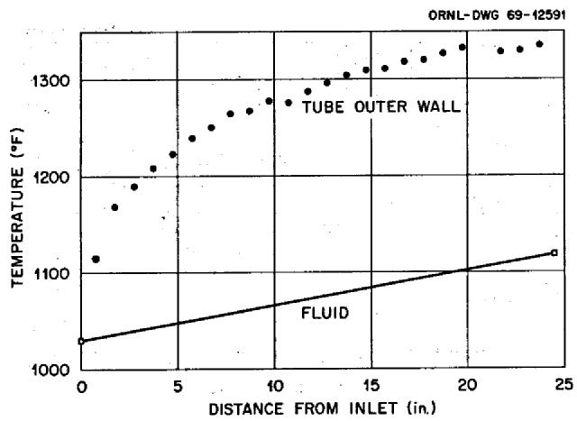  
Fig. 9.1. Axial Temperature Profiles with LiF- $\mathrm{BeF}_2\cdot$ $\mathrm{ThF_4 - UF_4}$ (67.5-20-12-0.5 mole %) Flowing in an Electrically Heated Tube. $N_{\mathrm{Re}} = 597$ (Run 133).

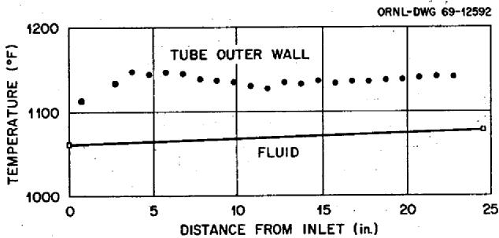  
Fig. 9.2. Axial Temperature Profiles with LiF-BeF $_2$ -ThF $_4$ -UF $_4$ (67.5-20-12-0.5 mole %) Flowing in an Electrically Heated Tube. $N_{\mathrm{Re}} = 4277$ (Run 186).

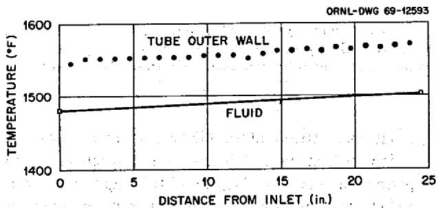  
Fig. 9.3. Axial Temperature Profiles with LiF-BeF $_2$ -ThF $_4$ -UF $_4$ (67.5-20-12-0.5 mole %) Flowing in an Electrically Heated Tube. $N_{\mathrm{Re}} = 28,104$ (Run 157).

the laminar boundary layer, thereby delaying transition, based on an analysis presented in ref. 3.

The heat transfer data have been put into dimensionless form for comparison with correlations available

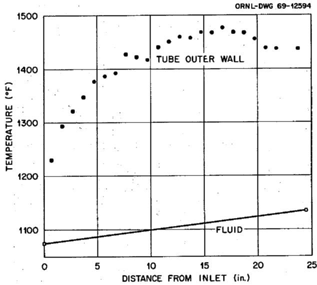  
Fig. 9.4. Axial Temperature Profiles with LiF-BeF $_2$ -ThF $_4$ -UF $_4$ (67.5-20-12-0.5 mole %) Flowing in an Electrically Heated Tube. $N_{\mathrm{Re}} = 3762, q/a = 2.55 \times 10^5$ Btu hr $^{-1}$ ft $^{-2}$ .

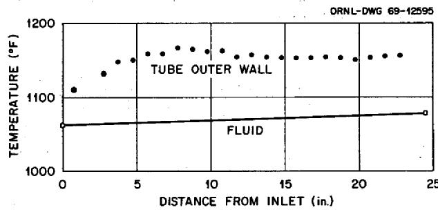  
Fig. 9.5. Axial Temperature Profiles with LiF-BeF $_2$ -ThF $_4$ -UF $_4$ (67.5-20-12-0.5 mole %) Flowing in an Electrically Heated Tube. $N_{\mathrm{Re}} = 3565$ , $q / a = 0.74 \times 10^5$ Btu hr $^{-1}$ ft $^{-2}$ (Run 191).

in the general literature. In Fig. 9.6 the dimensionless heat transfer function $N_{\mathrm{Nu}} (\mu_s / \mu)^{0.14} / N_{\mathrm{Pr}}^{0.33}$ (where $N_{\mathrm{Pr}}$ is the bulk Prandtl modulus, $N_{\mathrm{Nu}}$ is the bulk Nusselt modulus, and $\mu_s / \mu$ the ratio of fluid absolute viscosity evaluated at the tube surface temperature to that evaluated at the bulk liquid temperature) is plotted against the Reynolds modulus. The empirical correlations of Sieder and Tate for laminar and turbulent flow and Hausen for transitional flow are also shown.

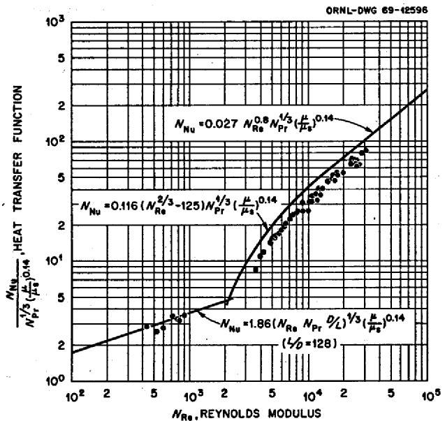  
Fig. 9.6. Summary of Heat Transfer Measurements with a Proposed MSBR Fuel Salt LiF-BeF $_2$ -ThF $_4$ -UF $_4$ (67.5-20-12-0.5 mole %). The upper and lower sections of the curve are the empirical correlations of Sieder and Tate and the center section that of Hausen.

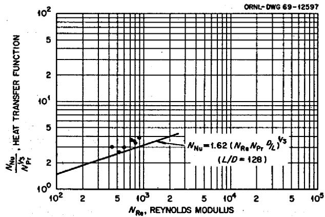  
Fig. 9.7. Summary of Laminar Heat Transfer Measurements with a Proposed MSBR Fuel Salt LiF-BeF $_2$ -ThF $_4$ -UF $_4$ (67.5-20-12-0.5 mole %). The line is the theoretical correlation of Martinelli and Boelter. $^6$

As can be seen, the experimental points follow the same general trend but are slightly below these relations. Further comparison of the laminar data can be seen in Fig. 9.7, where the experimental data are displayed along with the theoretical equation of Martinelli and Boelter. In this plot the experimental points are seen to be higher than those predicted by the equation. Two of the more widely accepted turbulent heat-transfer

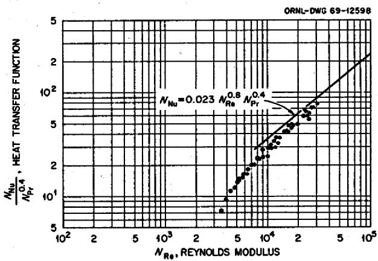  
Fig. 9.8. Summary of Heat Transfer Measurements with a Proposed MSBR Fuel Salt LiF-BeF $_2$ -ThF $_4$ -UF $_4$ (67.5-20-12-0.5 mole%). The line is the empirical correlation of McAdams.

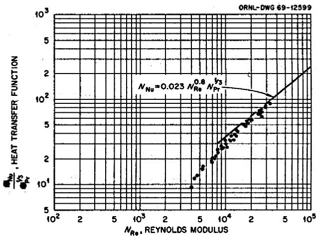  
Fig. 9.9. Summary of Heat Transfer Measurements with a Proposed MSBR Fuel Salt LiF-BeF $_2$ -ThF $_4$ -UF $_4$ (67.5-20-12-0.5 mole%). The line is the empirical correlation of Colburn.

correlations, attributed to McAdams and Colburn, are depicted in Figs. 9.8 and 9.9 respectively. The experimental data for $N_{\mathrm{Re}} > 12,000$ agree best with the Colburn relation wherein viscosities are evaluated at an average temperature between the mean bulk liquid

and mean inside tube wall temperatures. The data average about $10\%$ below the Colburn relation.

Figures 9.6-9.9 suggest that the experimental data in laminar and turbulent flow may be fitted to an equation of the form:

$$
\text {o r d i n a t e} = K N _ {\mathrm {R e}} ^ {n}, \tag {1}
$$

where $K$ and $n$ are constants having different values for laminar and turbulent flows and "ordinate" is the ordinate used in Figs. 9.6-9.9. Least-squares fitting of the data to the form of Eq. (1) was carried out assuming the accepted values for the Prandtl modulus exponent. The fits were tried with and without a viscosity ratio correction term; it was found that when this term was included the values for the Reynolds modulus exponent, $n$ , came closest to the commonly accepted values of approximately $\frac{1}{3}$ for laminar flow and approximately 0.8 for turbulent flow. The resulting equations fitting the experimental data are:

$$
N _ {\mathrm {N u}} = 1. 6 3 \left(N _ {\mathrm {R e}} N _ {\mathrm {P r}} D / L\right) ^ {0. 3 5} \left(\mu / \mu_ {s}\right) ^ {0. 1 4}, \tag {2}
$$

with an average absolute deviation of $5.7\%$ , for $N_{\mathrm{Re}} < 1000$ and

$$
N _ {\mathrm {N u}} = 0. 0 2 1 7 N _ {\mathrm {R e}} ^ {0. 8} N _ {\mathrm {P r}} ^ {1 / 3} \left(\mu / \mu_ {s}\right) ^ {0. 1 4}, \tag {3}
$$

with an average absolute deviation of $4.9\%$ , for $N_{\mathrm{Re}} > 12,000$ .

Because the data in the transition region did not follow the form of Eq. (1), the equation for the experimental data in this range of $N_{\mathrm{Re}}$ was found by adjusting the coefficient in the Hausen equation, resulting in the following relation:

$$
N _ {\mathrm {N u}} = 0. 0 8 9 \left(N _ {\mathrm {R e}} ^ {2 / 3} - 1 2 5\right) N _ {\mathrm {P r}} ^ {1 / 3} \left(\mu / \mu_ {s}\right) ^ {0. 1 4}, \tag {4}
$$

with an average absolute deviation of $4.5\%$ , for $3500 < N_{\mathrm{Re}} < 12,000$ .

Future experiments will be conducted with the test section vertical to investigate possible effects of natural convection. Plans are also being studied which involve modifying the system to permit evaluation of the effects of gas entrainment on heat transfer.

# 9.2 THERMOPHYSICAL PROPERTIES

J.W.Cooke

The absolute, variable-gap apparatus which is being used to measure the thermal conductivity of molten

salts has been described in previous progress reports. In these reports certain problems relating to the accuracy of the apparatus were also discussed, and it was pointed out that the experimental results for the conductivity of several calibration fluids were higher than published literature values ( $\sim 1\%$ higher for mercury, $\sim 15\%$ for water and Hitec salt). Furthermore, the thermal resistance of the conductivity cell as a function of specimen thickness was found to be nonlinear. A study has been made of these two problems.

Three effects were investigated which could, convincingly, cause the experimental results to be high and the thermal resistance to be nonlinear: natural convection and thermal radiation of heat through the specimen and shunting of heat around the specimen. Both from a theoretical consideration of the critical Rayleigh modulus and from the experimental results for a similar cell obtained by another investigator we have concluded that natural convection cannot be initiated in our conductivity cell under normal operating conditions. Furthermore, assuming a temperature level of $800^{\circ}\mathrm{C}$ and cell surface emissivities of 0.2, thermal radiation would contribute less than $4\%$ to the heat transfer across the cell, even for a transparent fluid. The remaining effect is thus heat shunting.

The apparatus now in use was designed to minimize the shunting error with fluids having conductivities in the range 0.05 to $0.10\mathrm{wcm}^{-1}$ ${}^{\circ}\mathbf{C}^{-1}$ . That is, the guard heating was designed to make the amount of heat shunted around the specimen negligible for salts having conductivities in this range. Unfortunately, the conductivities of the salts actually measured (including those of interest to the MSRE and MSBR) are about an order of magnitude lower than those for which the apparatus was designed, and corrections for the shunting of heat are required.

As can be seen from Fig. 9.10, the possible heat transfer paths and modes within the conductivity cell are complex, and the temperature distribution along the cell wall is not known. Thus it was necessary to assume the simplified model shown also in Fig. 9.10. By assuming a uniform heat flux and a uniform sink and wall temperature equal to $0^{\circ}C$ , an easy solution for the center line heat flux could be obtained from the generalized heat conduction equation. The radial heat transfer coefficient, $U_{2}$ , could then be decreased to account for the guard heating that was used.

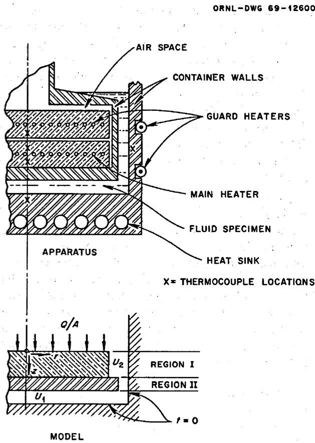  
Fig. 9.10. Schematic of the Variable-Gap Thermal Conductivity Cell and the Model Used for Calculating the Amount of Heat Shunted Around the Specimen.

$$
\frac {\partial^ {2} t}{\partial r ^ {2}} + \frac {1}{r} \frac {\partial t}{\partial r} + \frac {\partial^ {2} t}{\partial z ^ {2}} = 0, \tag {5}
$$

where $t$ is the temperature $(^{\circ}\mathrm{C})$ and $r$ and $z$ are the radial and axial coordinates (cm) measured as shown in Fig. 9.10. Dividing the model into two regions, the boundary conditions for either region can be written:

$$
K \frac {\partial t (r , 0)}{\partial z} = - C, \tag {6}
$$

$$
K \frac {\partial t (r , L)}{\partial z} = - U _ {1} [ t (r, L) ], \tag {7}
$$

$$
K \frac {\partial t (R , z)}{\partial r} = - U _ {2} [ t (R, z) ], \tag {8}
$$

where $K$ is the conductivity $(\mathbf{w}\mathrm{cm}^{-1}\mathrm{^{\circ}C^{-1}})$ of the cylindrical solid within the region, $L$ is the thickness of the solid (cm), $R$ is the radius (cm), $C$ is a constant, and $U_{1}$ and $U_{2}$ are the axial and radial overall heat transfer coefficients respectively.

The solution of Eq. (5) for the ratio of the axial center line heat fluxes entering and leaving region I, using the above boundary conditions, is

$$
\begin{array}{l} F _ {1} \equiv \frac {Q / A (0 , 0)}{Q / A (0 , L)} = \sum_ {n} \frac {2 a _ {n} J _ {1} \left(a _ {n}\right)}{\left(N _ {2} + a _ {n} ^ {2}\right) J _ {0} ^ {2} \left(a _ {n}\right)} \\ \times \left(\cosh \frac {a _ {n} L}{R} - D _ {n} \sinh \frac {a _ {n} L}{R}\right), \tag {9} \\ \end{array}
$$

where

$$
D _ {n} = \frac {N _ {1} \left| \sinh \left(a _ {n} L / R\right) + a _ {n} \cosh \left(a _ {n} L / R\right) \right.}{N _ {1} \cosh \left(a _ {n} L / R\right) + a _ {n} \sinh \left(a _ {n} L / R\right)}, \tag {10}
$$

$a_{n}$ are the roots of

$$
a _ {n} J _ {1} \left(a _ {n}\right) - N _ {2} J _ {0} \left(a _ {n}\right) = 0, \tag {11}
$$

and

$$
N _ {1} = \frac {R U _ {1}}{K}, N _ {2} = \frac {R U _ {2}}{K}.
$$

There is a similar equation for $F_{\mathrm{II}}$

The heat transfer coefficients, $U_{1}$ and $U_{2}$ , were calculated assuming series and parallel paths of all three heat transfer modes (convection, conduction, and radiation). The ratio, $F$ , of the heat flux entering region I to the heat flux leaving region II was calculated as

$$
F = F _ {1} F _ {1 1}. \tag {12}
$$

A plot of the percentage of heat shunted around the specimen, $1 - F$ , vs the specimen thickness, $\Delta X$ , for various specimen conductivities as determined by a computer solution of Eq. (7) is shown in Fig. 9.11. From this plot, for the case with no guard heating, it can be seen that the amount of heat shunted around the specimen can approach $100\%$ for large $\Delta X$ and very small specimen conductivities. Fortunately, in the actual conductivity measurements, some guard heating was used, and the specimen thickness was less than 0.1 cm.

The effect of the shunted heat on the conductivity measurement can be calculated from the reciprocal of

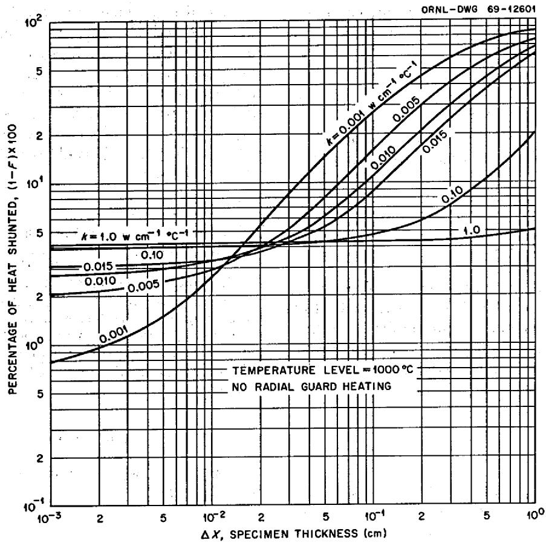  
Fig. 9.11. Percentage of Heat Shunted Around the Specimen of a Variable-Gap Thermal Conductivity Cell as a Function of the Specimen Thickness for Various Specimen Conductivities.

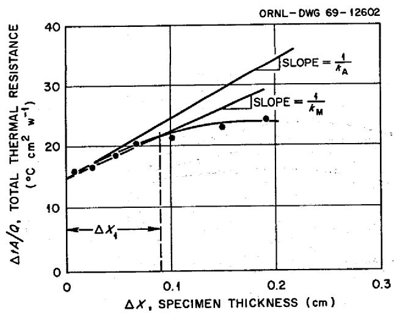  
Fig. 9.12. Total Thermal Resistance (including Specimen, Metal Walls, Deposits, etc.) as a Function of Specimen Thickness Showing the Difference Between the Actual and Measured Specimen Conductivities.

the slope of the total thermal resistance vs specimen thickness curve as estimated from the following equation (see Fig. 9.12):

$$
k = \frac {\Delta X _ {1}}{\left[ \Delta T / (Q / A) \right] _ {\Delta X = \Delta X _ {1}} \left[ - \Delta T / (Q / A) \right] _ {\Delta X = 0}}, \tag {13}
$$

where $k$ is the specimen conductivity, $\Delta X$ is a specimen thickness $(< 0.1\mathrm{cm})$ chosen to represent the data for small $\Delta X$ , and $\Delta T / (Q / A)$ is the total thermal resistance across the gap $(^{\circ}\mathrm{Ccm}^{2}\mathrm{w}^{-1})$ including specimen, wall, surface deposits, etc., with heat loss by shunting

$$
[ Q / A ] _ {\text {a c t u a l}} = F [ Q / A ] _ {\text {m e a s u r e d}}. \tag {14}
$$

The fractional error

$$
\frac {\delta k}{k} \equiv \frac {k _ {m} - k _ {A}}{k _ {A}}, \tag {15}
$$

where $k_{m}$ is the measured value and $k_{A}$ the actual value of conductivity, is determined by combining Eqs. (13) and (14) to give

$$
\frac {\delta k}{k} = \frac {1}{F _ {1} - \left(w k / \Delta X _ {1}\right) \left(F _ {0} - F _ {1}\right)} - 1, \tag {16}
$$

where subscript 1 refers to values corresponding to $\Delta X = \Delta X_{1}$ , subscript 0 refers to values corresponding to $\Delta X = 0$ , and

$$
w = \left[ \frac {\Delta T}{(Q / A) _ {m}} \right] _ {\Delta X = 0}
$$

is the fixed thermal resistance of the wall, deposits, etc. As can be seen from Eq.(16), the presence of a fixed resistance $w$ will increase the error in the conductivity measurement if heat shunting occurs. Thus, in designing a variable-gap apparatus, the fixed resistance should be kept as small as possible.

Using the procedure just described, correction for heat shunting was applied to the measured conductivities of the three calibration fluids. The corrected values are: for mercury at $60^{\circ}\mathrm{C}$ , 0.092 w cm $^{-1}$ °C $^{-1}$ ( $\pm 5\%$ ); for water at $47^{\circ}\mathrm{C}$ , 0.0068 w cm $^{-1}$ °C $^{-1}$ ( $\pm 10\%$ ); and for Hitec salt at $306^{\circ}\mathrm{C}$ , 0.0041 w cm $^{-1}$ °C $^{-1}$ ( $\pm 15\%$ ). These results compare favorably with published values of 0.093, $^{10}$ 0.0064, $^{11}$ and 0.0043 $^{12}$ w cm $^{-1}$ °C $^{-1}$ respectively.

$^{10}$ R. W. Powell and R. P. Tye, “The Thermal and Electrical Conductivity of Liquid Mercury,” pp. 836-62 in International Developments in Heat Transfer, Part IV, The American Society of Mechanical Engineers, New York, 1961.   
11J. E. S. Venart, "The Thermal Conductivity of Water/ Steam," pp. 237-45 in Advances in Thermophysical Properties at Extreme Temperatures and Pressures, The American Society of Mechanical Engineers, New York, 1965.   
12A. G. Turnbull, Australian J. Appl. Sci. 12: 30-41 (January 1961).

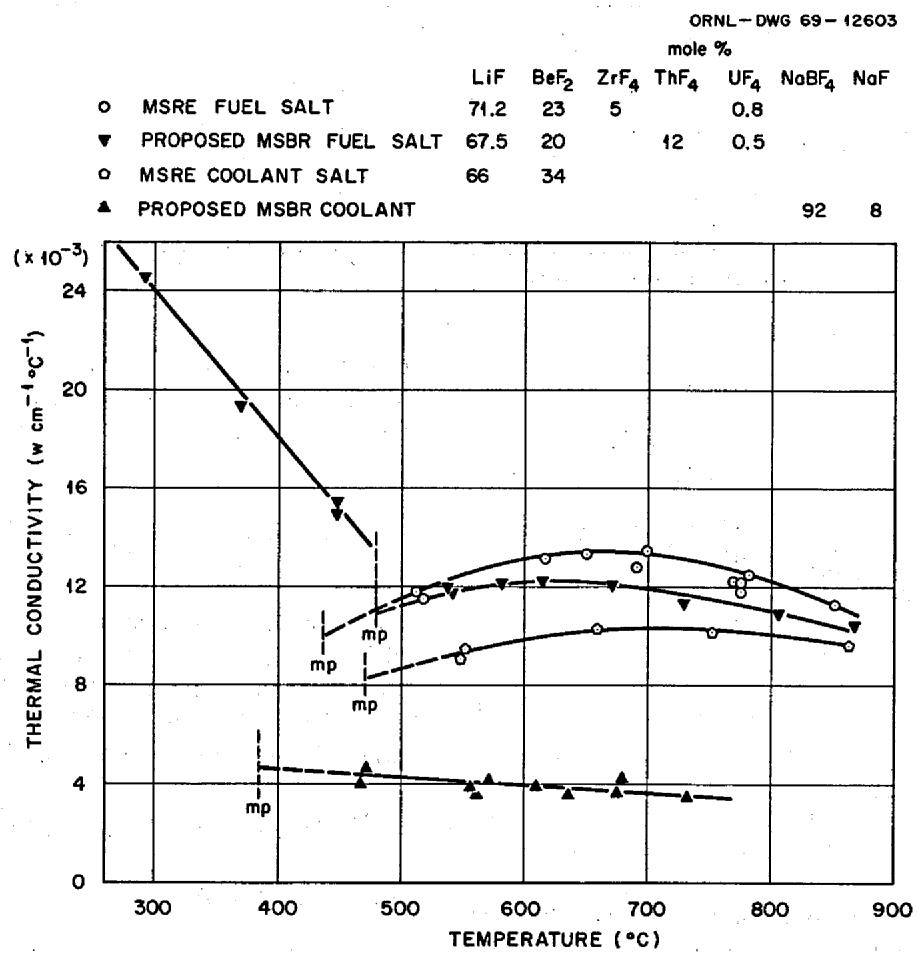  
Fig. 9.13. Corrected Results for the Thermal Conductivity of Several Salt Mixtures of Interest to the MSRE and MSBR Programs.

The corrections described above for heat shunted around the specimen have been applied to the preliminary results for the MSRE and MSBR fuel and coolant salts. The corrected results for these salts are presented in Fig. 9.13. Conductivities varied from $6\%$ lower at the highest value and lowest temperature $(0.025\mathrm{Wcm}^{-1}$ $\mathrm{^\circ C^{-1}}$ and $300^{\circ}\mathrm{C})$ to $16\%$ lower at $0.004\mathrm{Wcm}^{-1}$ $\mathrm{^\circ C^{-1}}$ and $700^{\circ}\mathrm{C}$ . A detailed error analysis has shown the maximum uncertainty in these results to be $\pm 15\%$ .

Conductivity measurements will be continued using an improved conductivity apparatus to study binary salt mixtures (probably $\mathbf{LiF - BcF}_2$ ) over a wide range of composition. It is the purpose of this work to develop correlations for estimating conductivities of other salt mixtures.

# 9.3 MASS TRANSFER

# TO CIRCULATING BUBBLES

# T. S. Kress

The experimental facility for investigating mass transfer between a liquid and gas bubbles in cocurrent turbulent flow has been completed, as shown in Fig. 9.14 with the safety shielding removed for clarity. The system is described in detail in ref. 1. In this final design, provision has been made to perform experiments with the test section either vertical or horizontal. In Fig. 9.14, the test section is in the vertical orientation. The bubble generator selected has a variable-area nozzle with the gas injected into the throat, as described in ref. 13. The bubble separator combines the features of centripetal separation, gravitational separation, and a conically shaped screen that acts as a wetted barrier. Both components performed well in corollary tests at flow rates lower than anticipated in the experiments. Full-scale tests have not been made.

Initial shakedown of the facility revealed certain problems which have required alterations to the pump to lessen undesirable side thrust and installation of a redesigned heat exchanger. These alterations are in progress and must be completed before shakedown tests can be performed to delineate the limits of operation of the system and to check performance of the various components at full-flow conditions. In the meantime, theoretical work is continuing.

A simple theoretical description of the problem is possible if it is assumed that a bubble moves at the local velocity of the liquid and that the flow field near the

bubble-liquid interface is primarily the turbulence fluctuations. If it is also assumed that this local flow field is homogeneous and isotropic, then a mass balance in a spherical coordinate system that moves at the speed of the bubble gives:

$$
\frac {\partial \theta}{\partial t} = \mathcal {D} \left[ \frac {\partial^ {2} \theta}{\partial r ^ {2}} + \frac {2}{r} \frac {\partial \theta}{\partial r} \right] + \frac {1}{r ^ {2}} \frac {\partial}{\partial r} [ r ^ {2} U _ {r} \theta ]. \tag {17}
$$

Making the "Reynolds assumptions"

$$
\theta \equiv \overline {{\theta}} + \theta^ {\prime}
$$

and

$$
U _ {r} \equiv u ^ {\prime},
$$

substituting into Eq. (17), collecting terms, and time averaging over a period that is short enough to still permit slow variation in the "steady" component, $\overline{\theta}$ yields:

$$
\frac {\partial \bar {\theta}}{\partial t} = \mathcal {D} \left[ \frac {\partial^ {2} \bar {\theta}}{\partial r ^ {2}} + \frac {2}{r} \frac {\partial \bar {\theta}}{\partial r} \right] + \frac {1}{r ^ {2}} \frac {\partial}{\partial r} \left[ r ^ {2} \overline {{u ^ {\prime} \theta^ {\prime}}} \right]. \tag {18}
$$

In these equations:

$$
\mathcal {D} = \text {b i n a r y m o l e c u l a r d i f f u s i o n c o e f f i c i e n t},
$$

$$
r = \text {r a d i a l}
$$

$$
t = \text {t i m e}
$$

$$
U _ {r} = \text {r a d i a l l y}
$$

$$
\begin{array}{l} u ^ {\prime} = \text {f l u c t u a t i n g} \\ \text {v e l o c i t y ,} \end{array}
$$

$$
\theta = \text {s c a l a r}
$$

$$
\bar {\theta} = \text {s t e a d y c o m p o n e n t o f s c a l a r c o n c e n t r a t i o n},
$$

$$
\begin{array}{c} \theta^ {\prime} = \text {f l u c t u a t i n g c o m p o n e n t o f s c a l a r c o n c e n t r a t i o n}, \\ \overline {{u ^ {\prime} \theta^ {\prime}}} = \text {t i m e - a v e r a g e d p r o d u c t o f f l u c t u a t i n g c o m p o n e n t s o f v e l o c i t y a n d s c a l a r c o n c e n t r a t i o n}. \end{array}
$$

Equation (18) may be considered as the primary equation describing the mass transfer between the bubbles and the liquid. Even with sufficient boundary values, it is unsolvable unless some relationship is established between $\overline{u^{\prime}\theta^{\prime}}$ and $\bar{\theta}$ . Finding such a relationship has been the central problem in turbulent fluid mechanics for some decades, and the problem is not likely to be solved without recourse to some exceedingly complex and cumbersome "turbulence theory"

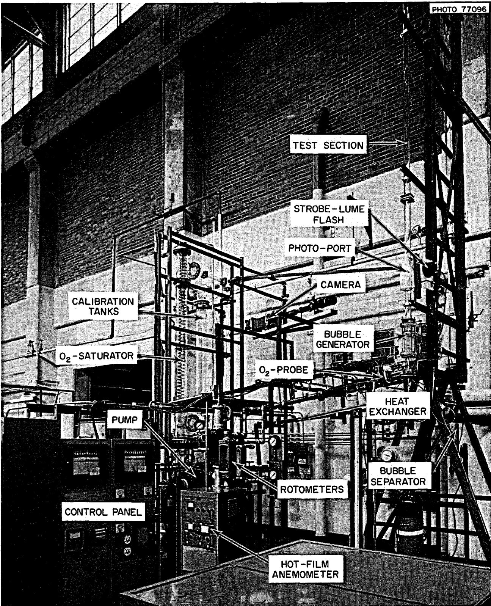  
Fig. 9.14. Photograph of Mass Transfer Experimental Facility.

such as that proposed by Kraichnan. $^{14}$ An alternative is to resort to classical concepts involving an "eddy diffusivity" or a "mixing length." Although mechanistically unsatisfactory, these concepts have certainly led to satisfactory empirical descriptions in many instances in the past and might prove to be a judicious path to follow for this case. It is believed, moreover, that the "eddy viscosity" concept has been considerably advanced by such recent works as that of Phillips. $^{15}$ A similar theory is being developed in this

study for the "eddy diffusivity" to relate it to the mean flow and the concentration gradient. If, in addition, a theory can be developed to determine the effects of various interfacial conditions on the "eddy diffusivity," then a satisfactory description of the mass transfer process may result.

14 R. H. Kraichnan, Phys. Fluids 8(4), 575-78 (April 1965).   
$^{15}$ O. M. Phillips, J. Fluid Mech. 27(1), 131-44 (1967).

# Part 3. Chemistry

W. R. Grimes

The chemical research and development efforts described below provide extensive support to the Molten-Salt Reactor Experiment (MSRE) and to the development of advanced molten-salt reactor systems.

A substantial fraction of these efforts is devoted to investigating the chemistry of the MSRE fuel salt and off-gas streams and the transport, distribution, and chemistry of fission products in these streams. Investigation of the relation of redox potential, density, and surface tension to gas bubble entrainment in the MSRE fuel salt and distribution of fission products within the fuel containment system has continued. Studies of fission product behavior have been continued with specimens removed from the MSRE fuel circuit, with the MSRE off-gas sampler-analyzer, with "synthetic" fuel mixtures, and by investigation of the chemistry of molybdenum, niobium, and ruthenium in molten fluoride mixtures.

A program for characterizing the physicochemical properties of the alkali fluoroborates was extended to develop a broad base of information for evaluation of fluoroborates as MSBR coolant salts.

Research in solution thermodynamics, electrochemistry, spectroscopy, and transport processes in molten fluorides continues to supply the basic data for reactor and chemical process design.

The effort to develop chemical separations processes for application to single-fluid molten-salt breeder re

actors continues to emphasize methods which employ selective reduction and extraction into molten bismuth containing either lithium or thorium as the reducing agent. Reductive extraction development efforts were expanded to include examination of various metal additives to bismuth and tin for possible process application. The distributions of cerium between the reference fuel solvent and pure tin were measured at various thorium concentrations in the metal phase. A small pumped loop was operated to investigate the electrolytic reduction of thorium from a simulated MSBR fuel solvent into molten lead and its simultaneous back extraction into a recovery salt. Examination of alternative methods included synthesis of and tests with sparingly soluble compounds containing the rare earths which could act as selective ion exchangers for such fission products.

Analytical chemical development has placed its principal emphasis on methods for application in semiautomated controls for molten-salt breeder reactors. These include electrochemical and spectrophotometric means for determination of the concentration of $\mathbf{U}^{3+}$ in fuels, improved methods for the determination of traces of bismuth in molten-salt breeder reactor fuels, and adaptation of small on-line computers to electroanalytical methods.

# 10. Chemistry of the MSRE

# 10.1 COMPOSITION OF THE MSRE FUEL SALT

R. E. Thoma

A material balance reported previously1 indicated that at the beginning of power operations with $^{233}\mathrm{U}$ in

January 1969 the net weight of the fuel salt was 4746 kg - 4708 kg of carrier salt containing 38 kg of

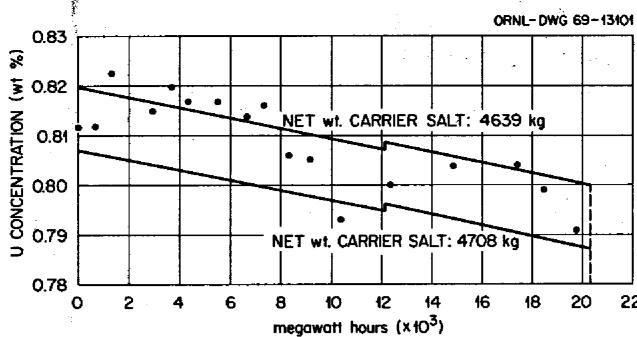  
Fig. 10.1. Comparison of Nominal and Analytical Values for Uranium Concentration of the MSRE Fuel Salt During $^{233}\mathrm{U}$ Power Operation.

uranium. This value was based on a number of assumptions, the most tenuous of which was that the mass of the carrier salt reserved for a distillation experiment $^2$ was $\sim 113\mathrm{kg}$ or $1.86\mathrm{ft}^3$ .

The MSRE was operated at various power levels from January 26 to June 1, 1969, with a nominal maximum power output of $8.0\mathrm{Mw}$ . The accumulated power during this period is estimated to be slightly in excess of 20,000 Mwhr. At a nominal uranium consumption rate of $1.010\mathrm{g/Mwd}$ the concentration of uranium in the fuel salt (based on the previous material balance1) should be given by the lower concentration line in Fig. 10.1. Samples of fuel salt were removed from the MSRE pump bowl and analyzed regularly by coulometric methods which had been applied previously and which are checked against standards on a routine basis. Their precision and accuracy is regarded to be $\sim \pm 0.5\%$ . The results of these analyses, shown as the data points in Fig. 10.1, are, on the average, greater than the nominal values by $0.008\mathrm{wt\%}$ , $\sim 1\%$ of the nominal value, and indicate (disregarding precision limits for purposes of this calculation) that the net weight of the carrier salt during this period was $4639\mathrm{kg}$ rather than $4708\mathrm{kg}$ , or that an additional mass of $69.0\mathrm{kg}$ (1.13 ft3) of salt, that is, a total of $2.99\mathrm{ft}^3$ of the original carrier salt, was not returned to the reactor to constitute the $^{233}\mathrm{U}$ fuel charge. In an attempt to support the conclusion that some $3.0\mathrm{ft}^3$ of carrier salt was left in the fuel storage tank, an isotopic dilution experiment was performed in April 1969, in which two samples of $^{6}\mathrm{LiF}$ were added to this tank. Retrieval of samples from the tank using a windlass and $10\mathrm{-g}$ sample ladles was subsequently successful in removing small amounts of salt (which incidentally were found to be encrusted

with metal residues) only through repeated attempts. The total weight of $^6\mathrm{LiF}$ added was $66.28\mathrm{g}$ (15.8 g of $^6\mathrm{Li}$ ). Prior to $^6\mathrm{LiF}$ addition the carrier salt was found by analysis to have an average $^7\mathrm{Li}/\Sigma\mathrm{Li}$ concentration of $99.9905 \pm 0.0015 \, \mathrm{wt\%}$ . The samples recovered after the addition had a concentration of $99.914 \pm 0.024 \, \mathrm{wt\%}$ , which would indicate that the volume of the salt is $3.0 \pm 0.84 \, \mathrm{ft^3}$ . However, samples of the carrier salt delivered to the still-pot section of the distillation apparatus were found to have concentrations of $^6\mathrm{Li}/\Sigma\mathrm{Li} = 1.59$ and $2.85 \, \mathrm{wt\%}$ , indicating that the $^6\mathrm{LiF}$ was not dispersed homogeneously in the storage tank but instead had dissolved preferentially in the salt fraction delivered to the still pot. Homogeneous dispersal would have resulted in a higher average $^6\mathrm{Li}$ concentration in the sample recovered from the fuel storage tank, and a lesser volume of salt would have been computed from the results of the isotopic dilution analysis experiment. Thus, although its lower limit cannot be deduced unequivocally from the isotopic data, the volume of salt retained in the storage tank cannot have been as high as $3.84 \, \mathrm{ft^3}$ .

The efforts to obtain samples from the storage tank provide additional information that allows a separate estimate of the salt volume. Sometimes small quantities of salt were obtained, sometimes none. If this is interpreted to mean that the salt level was at the point in the dished head directly below the samples, the pool contained $\cong 3.0\mathrm{ft}^3$ of salt. Assuming that the storage tank contained $3.0\mathrm{ft}^3$ of salt rather than $1.13\mathrm{ft}^3$ used before, we correct the earlier result $4708 - 182.6(3.0\mathrm{ft}^3)\mathrm{kg} + 113.0(1.13\mathrm{ft}^3)\mathrm{kg}$ and conclude that the drain tank contained $4638\mathrm{kg}$ of carrier salt at the beginning of $^{233}\mathrm{U}$ power operations. Thus the net weight of the fuel charge at the beginning of $^{233}\mathrm{U}$ power operations was $4638\mathrm{kg} + 38.3\mathrm{kg} = 4676\mathrm{kg}$ , and the uranium concentration was $0.819\mathrm{wt}\%$ . Assuming fission rates for $^{233}\mathrm{U} = 4.11\times 10^{-2}\mathrm{g / Mwhr}$ and $^{235}\mathrm{U} = 9.76\times 10^{-4}\mathrm{g / Mwhr}$ and the capture rate in $^{238}\mathrm{U} = 2.9\times 10^{-4}\mathrm{g / Mwhr}$ , $805\mathrm{g}$ of uranium should have been consumed during runs 17 and 18. At termination of run 18 the concentration of uranium in the fuel circuit should then have been $0.800\mathrm{wt}\%$ , and including the heels in the drain tanks its average concentration in the fuel should have been $0.802\mathrm{wt}\%$ . As noted in Fig. 10.1, the nominal values based on the preceding calculations are in excellent agreement with the analytical chemical results. The overall composition of

Table 10.1. Comparison of Computed and Analytical Values for Isotopic Composition of Uranium in the MSRE Fuel Salt   

<table><tr><td></td><td>233U</td><td>234U</td><td>235U</td><td>236U</td><td>238U</td></tr><tr><td colspan="6">At beginning of 233U power operations, January 1969</td></tr><tr><td>U/ΣU, wt % (calculated)</td><td>84.60</td><td>6.93</td><td>2.44</td><td>0.15</td><td>5.87</td></tr><tr><td>U/ΣU, wt % (analytical)</td><td>84.61</td><td>6.96</td><td>2.48</td><td>0.08</td><td>5.87</td></tr><tr><td>Kilograms U (analytical)</td><td>32.40</td><td>2.66</td><td>0.95</td><td>0.03</td><td>2.25</td></tr><tr><td>ΔU at 3500 Mwhr</td><td>-0.14</td><td></td><td>-0.003</td><td></td><td>-0.001</td></tr><tr><td>Σ kg U</td><td>32.26</td><td>2.66</td><td>0.95</td><td>0.03</td><td>2.25</td></tr><tr><td>U/ΣU, wt % (average)</td><td>84.56</td><td>6.98</td><td>2.49</td><td>0.08</td><td>5.89</td></tr><tr><td>U/ΣU, wt % (fuel circuit)</td><td>84.54</td><td>6.99</td><td>2.49</td><td>0.08</td><td>5.90</td></tr><tr><td>ΔU at 11,500 Mwhr</td><td>-0.47</td><td></td><td>-0.0112</td><td></td><td>-0.003</td></tr><tr><td>Σ kg U</td><td>31.93</td><td>2.66</td><td>0.94</td><td>0.03</td><td>2.25</td></tr><tr><td>U/ΣU, wt % (average)</td><td>84.45</td><td>7.05</td><td>2.49</td><td>0.08</td><td>5.94</td></tr><tr><td>U/ΣU, wt % (fuel circuit)</td><td>84.44</td><td>7.06</td><td>2.51</td><td>0.08</td><td>5.91</td></tr><tr><td colspan="6">FP18-10, at 14,813 Mwhr</td></tr><tr><td>U/ΣU, wt % (fuel circuit)</td><td>84.43</td><td>7.07</td><td>2.51</td><td>0.08</td><td>5.91</td></tr><tr><td>U/ΣU, wt % (analytical)</td><td>84.27</td><td>7.18</td><td>2.51</td><td>0.09</td><td>5.96</td></tr><tr><td>ΔU at 19,000 Mwhr</td><td>-0.78</td><td></td><td>-0.019</td><td></td><td>-0.006</td></tr><tr><td>Σ kg U</td><td>31.62</td><td>2.66</td><td>0.93</td><td>0.03</td><td>2.</td></tr><tr><td>U/ΣU, wt % (average)</td><td>84.34</td><td>7.11</td><td>2.49</td><td>0.08</td><td>5.98</td></tr><tr><td>U/ΣU, wt % (fuel circuit)</td><td>84.36</td><td>7.12</td><td>2.52</td><td>0.08</td><td>5.92</td></tr><tr><td colspan="6">FP18-43, at 19,688 Mwhr</td></tr><tr><td>U/ΣU, wt % (analytical)</td><td>84.05</td><td>7.25</td><td>2.54</td><td>0.10</td><td>6.08</td></tr></table>

the MSRE fuel salt on termination of run 18 should therefore have been $^7\mathrm{LiF - BeF}_2 - \mathrm{ZrF}_4 - \mathrm{UF}_4$ (64.52-30.18-5.16-0.137 mole%).

The fuel drain-flush-fill cycle has appeared previously to result in the transfer of approximately $18\mathrm{kg}$ of fuel salt to the flush salt and subsequent dilution of the fuel salt by $\sim 16\mathrm{kg}$ of flush salt. Corresponding effects might then be expected to cause the MSRE fuel salt in circulation at the beginning of run 19 to be ${}^{7}\mathrm{LiF - BeF}_{2}-$ $\mathsf{ZrF_4 - UF_4}$ (64.49-30.23-5.14-0.137 mole%).

Operation of the MSRE at a maximum power level of $8.0\mathrm{Mw}$ should have resulted in changes in the isotopic composition as described in Table 10.1. The few analytical data which are currently available (see Table 10.1) suggest that $\mathbf{233U}$ has been consumed at a slightly faster rate than anticipated for 8.0-Mw operation.

# 10.2 A MATERIAL BALANCE FOR PLUTONIUM IN THE MSRE FUEL SALT

R.E.Thoma

Current plans for resumption of operations with the MSRE include consideration of plutonium as a constituent of the fuel. During the final period of operation

with $^{235,238}$ U fuel, a sufficient amount of plutonium was generated for its detection in salt samples to be tractable by standard analytical methods. Until consideration was given to the possibility that additional plutonium would be added to the fuel in extended operation with the MSRE, the precision of plutonium analyses was not regarded to be of significant consequence. Now, however, it is advantageous to appraise the quality of previous analytical data in order that future operations of the reactor can be evaluated satisfactorily.

Approximately $600\mathrm{g}$ of plutonium was generated in the MSRE fuel as it was operated with ${}^{235}\mathrm{U}$ fuel by neutron absorptions in ${}^{238}\mathrm{U}$ , enough to afford a comparison of the analytical data with anticipated values. The results of that comparison, reported here, are expressed as a material balance for plutonium. They show that the analytical chemical methods which were previously satisfactory for determination of the concentration of plutonium in the fuel salt are of questionable utility for use with the present ${}^{233}\mathrm{U}$ fuel charge and that isotopic dilution methods, using mass spectrometric analyses, appear to offer the most satisfactory means of analysis. They indicate, in addition, that at the maximum concentrations in which plutonium has

occurred in the MSRE fuel salt, it has existed as a stable chemical entity and, by inference, that $\mathrm{Pu}_2\mathrm{O}_3$ is not precipitated in the presence of low concentrations (50 to 60 ppm) of oxide ion.

The net production rates for plutonium generated in the $^{235,238}$ U fuel salt have been estimated to be

$$
\begin{array}{l} G ^ {2 3 9} = G ^ {2 3 8} \cdot 0. 0 1 8 5 8 4 (e ^ {- 0. 6 0 5 3 7} ^ {- 7} T \\ - e ^ {- 0. 3 3 1 8 ^ {- 5} T}), \\ \end{array}
$$

$$
\begin{array}{l} G ^ {2 4 0} = G ^ {2 3 8} \cdot (0. 0 0 8 2 3 3 e ^ {- 0. 6 0 5 3 7 ^ {- 7} T} \\ - 0. 0 6 4 8 7 9 9 e ^ {- 0. 2 9 1 6 6 ^ {- 5} T} \\ + 0. 0 5 6 6 4 7 e ^ {- 0. 3 3 3 1 8 ^ {- 5} T}), \\ \end{array}
$$

where

$G^{k} = \text{mass of } k \text{ in circulation (g)}$ ( $k = 238, 239, 240$ refers to $^{238}\mathrm{U},^{239}\mathrm{Pu}$ , and $^{240}\mathrm{Pu}$ respectively),

$T =$ time-integrated power (Mwhr).

At termination of the $^{235}\mathrm{U}$ experiment, $589\mathrm{g}$ of plutonium should have been generated in the fuel salt with the reactor operating at a maximum power of 8.0 Mw. For a fuel charge of $4900\mathrm{kg}$ , this corresponds to $120~\mathrm{ppm}$ . The average concentration of plutonium in the fuel salt as determined from the results of analyses of 18 fuel salt samples obtained during the latter period of power operations with $^{235,238}\mathrm{U}$ fuel was $118~\mathrm{ppm}$ . The analytical data do not show a significant trend and are probably not sufficiently precise to use as a basis to infer that a real difference exists between calculated and analytical values. On completion of these power operations uranium was removed from the fuel salt by fluorination. It was anticipated that the plutonium would remain in the carrier salt. Five samples of the carrier salt were removed from the fuel drain after fluorination and found to have an average concentration of $120~\mathrm{ppm}$ of plutonium, representing a total of $562\mathrm{g}$ , as compared with an expected value of $125~\mathrm{ppm}$ ; that is, $27\mathrm{g}$ of plutonium is not accounted for by the results of these analyses.

The concentration of plutonium in a salt specimen is calculated from the relation:

$$
\operatorname {C o n c .} \mathrm {P u} (\mathrm {p p m}) = \mathrm {d p m} / \mathrm {g} \times 3. 9 7 \times 1 0 ^ {- 8} \div (^ {2 3 8} N
$$

$$
\begin{array}{l} \times 1. 4 7 0 + ^ {2 3 9} N \times 5. 4 0 2 \times 1 0 ^ {- 3} + ^ {2 4 0} N \times 2. 0 0 \times 1 0 ^ {- 2} \\ + ^ {2 4 1} N \times 4. 1 0 \times 1 0 ^ {- 4} + ^ {2 4 2} N \times 3. 5 \times 1 0 ^ {- 4}), \\ \end{array}
$$

where $N$ is the atom fraction of plutonium as the isotope designated.

The concentration of plutonium in each of the $10\mathrm{g}$ samples of fuel salt taken since the beginning of ${}^{233}\mathrm{U}$ operations was determined using conversion factors which assumed that the plutonium in the MSRE consisted entirely of ${}^{239}\mathrm{Pu}$ and ${}^{240}\mathrm{Pu}$ . The average concentration of plutonium after full loading of the reactor was achieved was found to be $147~\mathrm{ppm}$ . This value indicates the presence of a total of $689\mathrm{g}$ of plutonium; thus the enriching salt might then have been expected to contain $100\mathrm{g}$ of plutonium. In an attempt to substantiate this conclusion, a sample of the ${}^{7}\mathrm{LiF}_{-233}\mathrm{UF}_4$ enriching salt was obtained from a section of transfer line at the TURF and submitted for chemical and mass spectrometric analysis. The salt residue which was contained in the line was considered to be typical of that delivered for use in the MSRE. The results of mass spectrometric analysis showed that this salt contained plutonium, $1.64\mathrm{wt}\%$ of which was ${}^{238}\mathrm{Pu}$ . Revised conversion factors were therefore required for calculation of the total plutonium concentration of the TURF salt and ${}^{233}\mathrm{U}$ fuel salt because of the high specific activity, $6.46\times 10^{5}$ dis $\sec^{-1}\mu \mathrm{g}^{-1}$ , for ${}^{238}\mathrm{Pu}$ . The plutonium concentration of the TURF salt appears now to be $249~\mathrm{ppm}$ using the revised factor and corresponds to the addition of $16.37\mathrm{g}$ of plutonium along with the ${}^{7}\mathrm{LiF}_{-233}\mathrm{UF}_4$ eutectic. Current estimates of the nominal concentration of plutonium are now based on the assumption that this amount of plutonium was added to the fuel salt and therefore that the MSRE contained $\sim 605\mathrm{g}$ of plutonium at the beginning of ${}^{233}\mathrm{U}$ power operations.

A plutonium inventory of the MSRE fuel has been computed, both before and after loading with $^{233}\mathrm{U}$ fuel, based on Prince's estimates of the production and fission rates for plutonium and on the assumption that $16.4\mathrm{g}$ of plutonium was contained in the enriching salt. A comparison of the calculated values and analytical results is given in Tables 10.2 and 10.3 and in Fig. 10.2.

Table 10.2. Summary of MSRE Fuel Salt Analyses: Plutonium   

<table><tr><td rowspan="3">Sample No.</td><td rowspan="3">Mwhr</td><td colspan="3">Net Weight of Pu in Fuel Salt (g)</td><td colspan="4">Weight % Pu/ΣPu</td><td colspan="2">Concentration of Pu (ppm)</td></tr><tr><td rowspan="2">239Pu</td><td rowspan="2">240Pu</td><td rowspan="2">Σ</td><td colspan="2">Calculated</td><td colspan="2">Analytical</td><td rowspan="2">Calculateda</td><td rowspan="2">Analytical</td></tr><tr><td>239Pu</td><td>240Pu</td><td>239Pu</td><td>240Pu</td></tr><tr><td>FP14-41</td><td>67,767</td><td>487</td><td>18.6</td><td>506</td><td>96.32</td><td>3.68</td><td>96.46</td><td>3.31</td><td>94</td><td>95</td></tr><tr><td>FP14-42</td><td>62,305</td><td>492</td><td>18.8</td><td>511</td><td></td><td></td><td></td><td></td><td>95</td><td>120</td></tr><tr><td>FP14-43</td><td>62,705</td><td>495</td><td>19.0</td><td>514</td><td></td><td></td><td></td><td></td><td>95</td><td>125</td></tr><tr><td>FP14-44</td><td>63,251</td><td>498</td><td>19.3</td><td>517</td><td></td><td></td><td></td><td></td><td>96</td><td>128</td></tr><tr><td>FP14-46</td><td>63,537</td><td>500</td><td>19.5</td><td>520</td><td></td><td></td><td></td><td></td><td>96</td><td>127</td></tr><tr><td>FP14-47</td><td>63,671</td><td>501</td><td>19.6</td><td>521</td><td></td><td></td><td></td><td></td><td>97</td><td>122</td></tr><tr><td>FP14-48</td><td>64,211</td><td>505</td><td>19.8</td><td>525</td><td></td><td></td><td></td><td></td><td>97</td><td>126</td></tr><tr><td>FP14-49</td><td>64,232</td><td>505</td><td>19.8</td><td>525</td><td></td><td></td><td></td><td></td><td>97</td><td>125</td></tr><tr><td>FP14-50</td><td>64,234</td><td>505</td><td>19.8</td><td>525</td><td></td><td></td><td></td><td></td><td>97</td><td>123</td></tr><tr><td>FP14-51</td><td>64,367</td><td>507</td><td>20.0</td><td>527</td><td></td><td></td><td></td><td></td><td>97</td><td>119</td></tr><tr><td>FP14-52</td><td>64,994</td><td>510</td><td>20.3</td><td>530</td><td></td><td></td><td></td><td></td><td>98</td><td>111</td></tr><tr><td>FP14-54</td><td>65,397</td><td>513</td><td>20.5</td><td>534</td><td></td><td></td><td></td><td></td><td>99</td><td>98</td></tr><tr><td>FP14-56</td><td>65,809</td><td>517</td><td>20.8</td><td>538</td><td></td><td></td><td></td><td></td><td>100</td><td>119</td></tr><tr><td>FP14-58</td><td>66,351</td><td>521</td><td>21.2</td><td>542</td><td></td><td></td><td></td><td></td><td>101</td><td>118</td></tr><tr><td>FP14-59</td><td>66,982</td><td>525</td><td>21.5</td><td>547</td><td></td><td></td><td></td><td></td><td>102</td><td>120</td></tr><tr><td>FP14-64</td><td>68,720</td><td>537</td><td>22.7</td><td>560</td><td>95.94</td><td>4.06</td><td>96.05</td><td>3.67</td><td>104</td><td>145</td></tr><tr><td>FP14-65</td><td>69,481</td><td>543</td><td>23.3</td><td>566</td><td></td><td></td><td></td><td></td><td>114</td><td>97</td></tr><tr><td>FP14-68</td><td>69,838</td><td>546</td><td>23.5</td><td>570</td><td></td><td></td><td></td><td></td><td>115</td><td>102</td></tr><tr><td>FP14-Final</td><td>72,454</td><td>563</td><td>25.6</td><td>589</td><td></td><td></td><td></td><td></td><td>120</td><td>120</td></tr><tr><td>FP15-6</td><td>72,454</td><td>571</td><td>27.1</td><td>599</td><td></td><td></td><td></td><td></td><td>128</td><td>113</td></tr><tr><td>FP15-9</td><td>72,454</td><td>573</td><td>27.5</td><td>602</td><td></td><td></td><td></td><td></td><td>128</td><td>112</td></tr><tr><td>FP15-10</td><td>72,454</td><td>575</td><td>27.9</td><td>604</td><td></td><td></td><td></td><td></td><td>129</td><td>96</td></tr><tr><td>FP15-12</td><td>72,454</td><td>575</td><td>27.9</td><td>604</td><td></td><td></td><td></td><td></td><td>129</td><td>112</td></tr><tr><td>FP15-18</td><td>72,454</td><td>575</td><td>27.9</td><td>604</td><td></td><td></td><td></td><td></td><td>129</td><td>100</td></tr><tr><td>FP15-33</td><td>72,454</td><td>575</td><td>27.9</td><td>604</td><td></td><td></td><td></td><td></td><td>129</td><td>134</td></tr><tr><td>FP15-38</td><td>72,454</td><td>576</td><td>28.0</td><td>605</td><td></td><td></td><td></td><td></td><td>129</td><td>143</td></tr><tr><td>FP15-42</td><td>72,454</td><td>576</td><td>28.0</td><td>605</td><td></td><td></td><td></td><td></td><td>129</td><td>135</td></tr><tr><td>FP15-60</td><td>72,454</td><td>576</td><td>28.0</td><td>605</td><td></td><td></td><td></td><td></td><td>129</td><td>129</td></tr><tr><td>FP15-63</td><td>72,454</td><td>576</td><td>28.0</td><td>605</td><td></td><td></td><td></td><td></td><td>129</td><td>141</td></tr><tr><td>FP15-65</td><td>72,454</td><td>576</td><td>28.0</td><td>605</td><td></td><td></td><td></td><td></td><td>129</td><td>159</td></tr><tr><td>FP15-68</td><td>72,454</td><td>576</td><td>28.0</td><td>605</td><td>95.85</td><td>3.99</td><td>95.43</td><td>4.12</td><td>129</td><td>157</td></tr><tr><td>FP17-1</td><td>72,454</td><td>576</td><td>28.0</td><td>605</td><td></td><td></td><td></td><td></td><td>129</td><td>130</td></tr><tr><td>FP17-4</td><td>73,127</td><td>575</td><td>28.0</td><td>605</td><td></td><td></td><td></td><td></td><td>129</td><td>134</td></tr><tr><td>FP17-9</td><td>73,830</td><td>572</td><td>29.4</td><td>602</td><td></td><td></td><td></td><td></td><td>128</td><td>148</td></tr><tr><td>FP17-12</td><td>75,434</td><td>569</td><td>30.4</td><td>598</td><td></td><td></td><td></td><td></td><td>128</td><td>138</td></tr><tr><td>FP17-18</td><td>76,183</td><td>564</td><td>31.9</td><td>597</td><td></td><td></td><td></td><td></td><td>127</td><td>149</td></tr><tr><td>FP17-19</td><td>76,791</td><td>563</td><td>32.5</td><td>596</td><td></td><td></td><td></td><td></td><td>127</td><td>147</td></tr><tr><td>FP17-20</td><td>78,026</td><td>560</td><td>32.7</td><td>594</td><td></td><td></td><td></td><td></td><td>127</td><td>141</td></tr><tr><td>FP17-23</td><td>79,154</td><td>557</td><td>34.8</td><td>593</td><td></td><td></td><td></td><td></td><td>127</td><td>130</td></tr><tr><td>FP17-24</td><td>79,814</td><td>555</td><td>35.5</td><td>592</td><td></td><td></td><td></td><td></td><td>126</td><td>142</td></tr><tr><td>FP17-27</td><td>80,828</td><td>552</td><td>36.4</td><td>589</td><td></td><td></td><td></td><td></td><td>126</td><td>140</td></tr><tr><td>FP17-28</td><td>81,610</td><td>550</td><td>37.2</td><td>588</td><td></td><td></td><td></td><td></td><td>125</td><td>134</td></tr><tr><td>FP17-30</td><td>82,771</td><td>547</td><td>38.3</td><td>586</td><td></td><td></td><td></td><td></td><td>125</td><td>149</td></tr><tr><td>FP18-1</td><td>84,741</td><td>542</td><td>40.1</td><td>583</td><td></td><td></td><td></td><td></td><td>124</td><td>160</td></tr><tr><td>FP18-5</td><td>86,454</td><td>538</td><td>41.8</td><td>581</td><td></td><td></td><td></td><td></td><td>124</td><td>162</td></tr><tr><td>FP18-10</td><td>87,267</td><td>536</td><td>42.5</td><td>580</td><td></td><td></td><td></td><td></td><td>124</td><td>145</td></tr><tr><td>FP18-13</td><td>88,265</td><td>533</td><td>43.5</td><td>578</td><td></td><td></td><td></td><td></td><td>123</td><td>154</td></tr><tr><td>FP18-22</td><td>89,886</td><td>529</td><td>44.8</td><td>575</td><td>92.63</td><td>7.20</td><td>91.81</td><td>7.33</td><td>122</td><td>164</td></tr><tr><td>FP18-27</td><td>90,898</td><td>527</td><td>45.7</td><td>574</td><td></td><td></td><td></td><td></td><td>122</td><td>144</td></tr><tr><td>FP18-43</td><td>92,142</td><td>524</td><td>46.9</td><td>570</td><td>92.30</td><td>7.53</td><td>91.38</td><td>7.70</td><td>122</td><td>171</td></tr><tr><td>FP18-Final</td><td>92,985</td><td>524</td><td>47.3</td><td>570</td><td></td><td></td><td></td><td></td><td>122</td><td></td></tr></table>

$a_{\mathrm{Based}}$ on total fuel charge.

Table 10.3. Isotopic Composition of Plutonium in MSRE Fuel Salt   

<table><tr><td>Sample No.</td><td>Description</td><td>238Pu</td><td>239Pu</td><td>240Pu</td><td>241Pu</td><td>242Pu</td></tr><tr><td rowspan="3">FP14-41</td><td>Σ g (calculated)</td><td></td><td>487</td><td>18.6</td><td>a</td><td>a</td></tr><tr><td>% calculated</td><td></td><td>96.32</td><td>3.68</td><td></td><td></td></tr><tr><td>% analytical</td><td>0.011</td><td>96.45</td><td>3.32</td><td>0.22</td><td>0.002</td></tr><tr><td rowspan="3">FP14-64</td><td>Σ g (calculated)</td><td></td><td>537</td><td>22.7</td><td></td><td></td></tr><tr><td>% calculated</td><td></td><td>95.94</td><td>4.06</td><td></td><td></td></tr><tr><td>% analyticalb</td><td>≤0.015</td><td>96.05</td><td>3.67</td><td>0.28</td><td>0.005</td></tr><tr><td rowspan="5">FP15-68</td><td>Σ g generated in MSRE (calculated)</td><td></td><td>563</td><td>25.6</td><td></td><td></td></tr><tr><td>Σ g added with 7LiF.233UF4</td><td>0.27</td><td>12.9</td><td>2.44</td><td>0.37</td><td>0.33</td></tr><tr><td>Σ g</td><td>0.27</td><td>575.90</td><td>28.04</td><td>0.37</td><td>0.33</td></tr><tr><td>% calculated</td><td>0.04</td><td>95.20</td><td>4.64</td><td>0.06</td><td>0.06</td></tr><tr><td>% analytical</td><td>≤0.08</td><td>95.43</td><td>4.12</td><td>0.34</td><td>0.13</td></tr><tr><td rowspan="3">FP18-22</td><td>Σ g (calculated)</td><td>0.27</td><td>478.90</td><td>42.69</td><td>0.37</td><td>0.33</td></tr><tr><td>% calculated</td><td></td><td>92.03</td><td>7.81</td><td></td><td></td></tr><tr><td>% analytical</td><td>0.08</td><td>91.81</td><td>7.33</td><td>0.73</td><td>0.13</td></tr><tr><td rowspan="3">FP18-43</td><td>Σ g (calculated)</td><td>0.27</td><td>473.29</td><td>45.95</td><td>0.37</td><td>0.33</td></tr><tr><td>% calculated</td><td></td><td>91.76</td><td>8.22</td><td></td><td></td></tr><tr><td>% analytical</td><td>≤0.06</td><td>91.38</td><td>7.70</td><td>0.79</td><td>0.13</td></tr></table>

$a^{241}\mathrm{Pu}$ and $^{242}\mathrm{Pu}$ not included; B. E. Prince estimates $\Sigma \mathbf{g}^{241,242}\mathrm{Pu}\leqslant 1.8\mathrm{g}$   
$b$ Analyses performed by R.E. Eby.

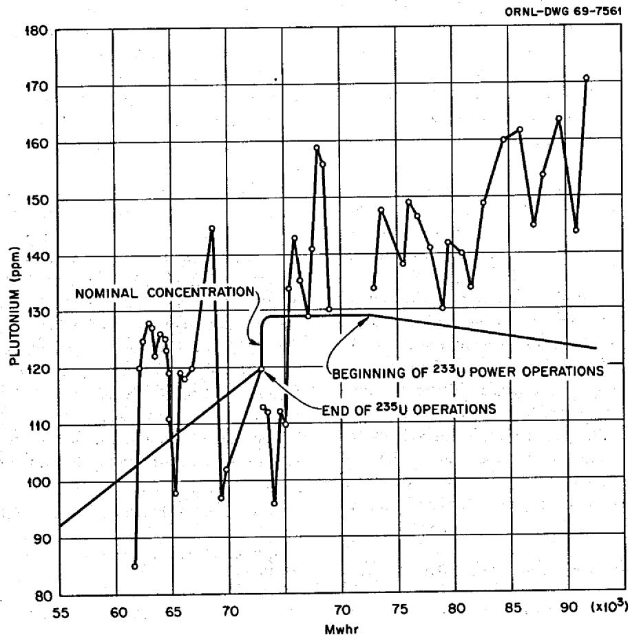  
Fig. 10.2. Comparison of Nominal and Analytical Values for the Concentration of Plutonium in the MSRE Fuel Salt.

# 10.3 SOME FACTORS IN GAS BEHAVIOR IN THE MSRE FUEL SYSTEM

J.H.Shaffer

Beginning early in the operation of the MSRE on $^{233}\mathrm{U}$ , the amount of gas entrained in the pump and circulating fuel was much higher than that experienced during operation with the original $^{235}\mathrm{U}$ fuel mixture.

This condition has been related to a rather dramatic effect detected upon insertion of beryllium or zirconium metal into the fuel mixture at the pump bowl and has resulted in much lower apparent densities of the salt in the pump bowl, in increased salt overflow rates, and in minor instabilities of reactor performance. Ensuing investigations have related the apparent density gradient in the salt and the appearance of voids in the circulating fuel to the speed of the fuel pump. These results imply that gas entrainment by the salt jets (used for xenon stripping in the pump bowl) varies with the speed of the fuel pump and is sufficient, at higher pump speeds, to induce gas entrainment at the pump suction. However, a better description of void formation characteristics in the fuel circuit and of their anomalous relation to the introduction of beryllium or zirconium into the pump bowl salt reservoir is needed. A reasonable explanation of these remaining problems can be derived from gas solubility behavior.

The MSRE fuel system design provides a free salt surface in the pump bowl which is swept at a nominal rate with an inert gas, helium or argon. Also, a side stream from the pump discharge is returned to the pump bowl as a salt jet spray. Although this salt spray functions as a stripper for removing gaseous fission products from the reactor fuel mixture, it should also be an excellent saturator for dissolving the helium or argon cover gas into the salt.

According to gas solubility behavior as defined by Henry's law, the fuel mixture during normal reactor operation should contain dissolved helium at a concentration corresponding to its saturation limit at the pressure of the pump bowl. Since this is the low-pressure point in the circuit, there should be neither a net gain or loss of dissolved helium in the system nor the formation of voids at any location in the fuel circuit. Thus, for gas solubility to be a factor in abnormal reactor performance, a mechanism is needed

Table 10.4. Maximum Dissolved Helium Concentrations in MSRE Fuel System at $650^{\circ}\mathrm{C}$   

<table><tr><td>Fuel Region</td><td>Pressure (atm)</td><td>Helium Concentration (moles of helium/liter of salt)</td></tr><tr><td></td><td></td><td>×10-4</td></tr><tr><td>Pump bowl</td><td>1.34</td><td>1.61</td></tr><tr><td>Heat exchanger</td><td>3.13</td><td>3.76</td></tr><tr><td>Reactor core</td><td>2.59</td><td>3.11</td></tr><tr><td>Core discharge</td><td>2.24</td><td>2.59</td></tr></table>

for increasing the dissolved gas content of the fuel beyond that corresponding to the pressure in the pump bowl.

As inferred from earlier investigations,7 excessive quantities of gas may be introduced into the MSRE fuel system by entrainment at the pump suction. Entrainment rates which would lead to significant effects on reactor performance can be quite low, well within pump design specifications8 and below limits of detection in the MSRE.9 Considering an isothermal fuel temperature of $650^{\circ}\mathrm{C}$ and estimated system pressures, the maximum concentrations of helium that could be dissolved in each fuel region are shown in Table 10.4 according to solubility estimates by G.M.Watson.10 The release of all gas from the fuel at these dilute concentrations would be equivalent to a void fraction of 0.9 vol $\%$ in the fuel system. Relatively small fuel temperature changes in the MSRE will alter gas solubility but should not have a pronounced effect on the system.

If the appearance of voids in the fuel system is considered as gas in excess of its solubility, then void fractions in the fuel loop can be related to gas entrainment at the pump suction. These effects are shown in Fig. 10.3 for the introduction of helium in excess of its solubility at the pump suction and at steady state. Thus a gas bubble entrainment rate of about $0.6\mathrm{vol}\%$ at the pump suction could be tolerated without the appearance of voids in the fuel system. Entrainment rates in excess of about $0.85\mathrm{vol}\%$ would produce voids in the reactor core.

Since gas addition and depletion from the MSRE fuel system occurs in the pump bowl, the rates at which gas

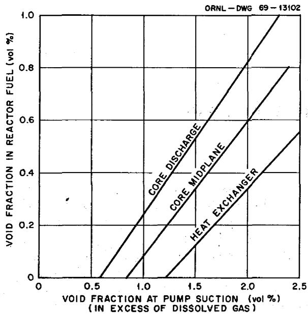  
Fig. 10.3. Effect of Gas Entrainment at the Pump Suction on Void Fraction in the Circulating Fuel of MSRE.

concentrations in the fuel increase are limited by the volume of the system $V$ , the bypass salt flow rate $F$ , and the helium input concentration $A$ at the pump suction. The rate at which the helium concentration in the fuel system, $N$ , varies with time $t$ can be estimated from the equation

$$
\frac {d N}{d t} = \frac {F}{V} (A - N).
$$

Solution of this equation by integration between limits corresponding to gas saturation of the salt in the pump bowl $(N = 1.61 \times 10^{-4}$ mole of He/liter of salt; $t = 0$ ) to its solubility limit at a specified location in the fuel system $(N; t)$ at arbitrary gas input concentrations $A$ yields values for time required to produce voids in the fuel system. According to this approximation, steady-state void fractions as low as $0.05\mathrm{vol}\%$ in the reactor core can be established in less than $30\mathrm{min}$ .

One may now realize that the formation of voids in the MSRE fuel system can be attributed to small, and otherwise innocuous, changes in operational behavior of the pump bowl. The formation of voids at lower pump speeds (lower gas entrainment rates) during the use of argon as the pump bowl cover gas can now be rationalized on the basis of its lower solubility in the salt. The dramatic effects observed at the reactor upon introduction of beryllium or zirconium can also be assigned to changes in the solubility of gas via changes in the surface tension of the salt.[11] The magnitude of these changes according to estimates, again by G. M. Watson,[10] are demonstrated in Fig. 10.4. Since the

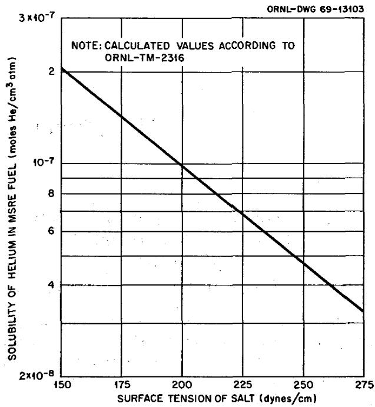  
Fig. 10.4. Effect of Surface Tension on the Solubility of Helium in MSRE Fuel at $650^{\circ}\mathrm{C}$ .

actual surface tension of the MSRE fuel salt now or at any period during its history is unknown, the contribution of this parameter can only be deduced from considerations of the reactor performance record. However, any change in the surface tension of the salt can be reflected through gas solubility behavior to the increase or decrease in the void fraction of the fuel.

Although gas solubility behavior can be employed to explain operational irregularities in the MSRE, further experimentation may be required to verify these conclusions and to better evaluate its effect on MSRE and MSBR operation. The relative rates at which the inert gases dissolve in molten salts would have a direct bearing on this argument. Since surface tensions are estimated to only $+30$ to $-10\%$ accuracy, additional measurements would be required to improve these values and to determine ranges over which salt surface tensions can realistically be varied. Although noble-gas solubilities in several fluoride mixtures have been measured,[12,13] estimated values for the MSRE and MSBR fluoride mixtures are known only to within a factor of 10. Accordingly, more direct measurements as functions of salt surface tensions may be desired.

# 11. Fission Product Behavior

# 11.1 EXAMINATION OF THE FOURTH SET OF SURVEILLANCE SPECIMENS FROM THE MSRE

F. F. Blankenship E. L. Compere S. S. Kirslis

A fourth set of graphite and Hastelloy N surveillance samples was removed from the MSRE core after the June 1, 1969, shutdown. The set was received at the hot cell for disassembly on June 6, and sampling was completed by June 16.

# 11.1.1 Examination of Graphite

In all there were 11 pieces of graphite for chemical examination. Three pieces of ordinary CGB graphite, designated NL-7, X-10, and ML-3, were exposed for 76,000 Mwhr (2.6 years at temperature) at the top, middle, and bottom of the core respectively. Similarly, M-1, X-23, and N-1 were ordinary CGB graphite exposed for 20,000 Mwhr (0.8 year) at the top, middle, and bottom of the core respectively. A third stringer was also exposed for 20,000 Mwhr (0.8 year), which was the duration of operation with $^{233}\mathrm{U}$ . From this stringer came V-47, an impregnated CGB, from the top of the core; P-129, an ordinary CGB from near the top of the core; K-3, a piece of impregnated Poco graphite from near the middle of the core; YY-22, ordinary CGB with one surface polished, from the middle of the core; then V-43, impregnated CGB, from the bottom of the core. The 76,000-Mwhr exposure corresponded to a thermal fluence $(E < 0.876\mathrm{ev})$ of $1.5\times 10^{21}$ neutrons/cm² and a fast fluence $(E > 50\mathrm{kev})$ of $1.1\times 10^{21}$ ; the 20,000-Mwhr exposure gave thermal and fast fluences of $5.1\times 10^{20}$ and $2.8\times 10^{20}$ neutrons/cm² respectively.

An important difference between this set of samples and earlier ones is that no 'flush salt' was used after the reactor fuel was drained. Visually, however, the pieces drained quite well. When examined under the binocular microscope at $30\times$ power, salt was found mainly at the joints between two pieces of graphite.

Except for pieces that were chipped while removing pins on disassembly, the graphite bars were weighed. No attempt was made to clean the bars before weighing, since this could have removed fission products from the surface. The weight gains ranged from 5 to $20\mathrm{mg}$ , corresponding to 0.001 to 0.006 wt%. This was mostly from salt on the surface and did not represent an appreciable penetration.

Visually, the graphite appeared unaltered by the exposure. Films that were visible under unusual lighting during dismantling of the sample assembly were not visible under the binocular microscope, although several lighting arrangements were tried. Lengths were measured, and in several cases the graphite had apparently grown. This is extremely unlikely, and we believe the measurements are spurious.

# 11.1.2 Radiochemical Analyses of the Graphite

Results were obtained on 21 faces of graphite (11 pieces). Material from a single 50-mil-deep cut on V-47 was lost. Profiles of fission product penetration to a depth of 50 mils were obtained for eight faces by milling successive samples of the following thickness: $\frac{1}{2}, \frac{1}{2}, 1, 2, 3, 5, 8, 10, 10, 10$ mils. Total depositions per square centimeter were obtained on the other 11 faces by means of single 50-mil-deep cuts.

Radiochemical analyses were requested for $^{89}\mathrm{Sr}$ , $^{90}\mathrm{Sr}$ , $^{91}\mathrm{Y}$ , $^{95}\mathrm{Zr}$ , $^{95}\mathrm{Nb}$ , $^{99}\mathrm{Mo}$ , $^{103}\mathrm{Ru}$ , $^{106}\mathrm{Ru}$ , $^{111}\mathrm{Ag}$ , $^{125}\mathrm{Sb}$ , $^{129}\mathrm{Te}$ , $^{132}\mathrm{Te}$ , $^{131}\mathrm{I}$ , $^{144}\mathrm{Ce}$ , $^{140}\mathrm{Ba}$ , $^{136}\mathrm{Cs}$ , and $^{137}\mathrm{Cs}$ . Results were available at the end of the reporting period only for the short-lived isotopes that had to be caught early. These were $^{99}\mathrm{Mo}$ , $^{132}\mathrm{Te}$ , $^{111}\mathrm{Ag}$ , and $^{131}\mathrm{I}$ , and because of their short half-lives the amounts of these isotopes present pertain only to the recent history of the reactor (see Table 11.1).

In terms of deposition per square centimeter, the amount of $^{99}\mathrm{Mo}$ was about 0.09 times the amount calculated to be present per gram of salt if it escaped from the fuel only by decay. This calculated amount will be referred to as the inventory per gram of fuel salt.

Table 11.1. Deposition of Short-Lived Fission Products on Graphite in the MSRE Core   

<table><tr><td rowspan="2">Graphite Sample No. and Face</td><td rowspan="2">Graphite Typea</td><td rowspan="2">Exposure (Mwhr)</td><td rowspan="2">Distance from bottom of coreb(in.)</td><td colspan="2">99Mo</td><td colspan="2">132Te</td><td colspan="2">111Ag</td><td colspan="2">131I</td></tr><tr><td>Dis min-1cm-2</td><td>Percent of Inventoryc</td><td>Dis min-1cm-2</td><td>Percent of Inventoryc</td><td>Dis min-1cm-2</td><td>Percent of Inventoryc</td><td>Dis min-1cm-2</td><td>Percent of Inventoryc</td></tr><tr><td></td><td></td><td></td><td></td><td>×1010</td><td></td><td>×1010</td><td></td><td>×108</td><td></td><td>×108</td><td></td></tr><tr><td>V-47 wide</td><td>CGBI</td><td>20,000</td><td>571/2</td><td>1.20</td><td>9.6</td><td>0.903</td><td>7.8</td><td>4.75</td><td>71.2</td><td>3.82</td><td>0.470</td></tr><tr><td>P-129 wide</td><td>CGB</td><td>20,000</td><td>547/8</td><td>1.82</td><td>14.6</td><td>1.01</td><td>8.7</td><td>6.04</td><td>90.5</td><td>6.38</td><td>0.787</td></tr><tr><td>P-129 narrow</td><td></td><td></td><td></td><td>0.746</td><td>6.0</td><td>0.947</td><td>8.2</td><td>5.54</td><td>83.0</td><td>5.16</td><td>0.636</td></tr><tr><td>K-3 wide</td><td>Pocol</td><td>20,000</td><td>501/4</td><td>0.186</td><td>1.4</td><td>0.703</td><td>6.1</td><td>1.19</td><td>17.7</td><td>2.26</td><td>0.291</td></tr><tr><td>K-3 narrow</td><td></td><td></td><td></td><td>1.72</td><td>13.7</td><td>1.57</td><td>13.6</td><td>16.2</td><td>242.1</td><td>8.22</td><td>1.014</td></tr><tr><td>YY-22 narrow</td><td>CGB</td><td>20,000</td><td>321/4</td><td>1.29</td><td>10.3</td><td>1.02</td><td>8.8</td><td>9.58</td><td>83.5</td><td>1.94</td><td>0.239</td></tr><tr><td>YY-22 wide</td><td></td><td></td><td></td><td>1.27</td><td>10.2</td><td>0.779</td><td>6.7</td><td>6.79</td><td>101.7</td><td>5.65</td><td>0.697</td></tr><tr><td>V-43 wide</td><td>CGBI</td><td>20,000</td><td>41/4</td><td>0.769</td><td>6.1</td><td>0.557</td><td>4.8</td><td>7.99</td><td>119.7</td><td>2.28</td><td>0.281</td></tr><tr><td>V-43 narrow</td><td></td><td></td><td></td><td>0.894</td><td>7.1</td><td>0.565</td><td>4.9</td><td>6.46</td><td>96.8</td><td>2.64</td><td>0.325</td></tr><tr><td>M-1 wide</td><td>CGB</td><td>20,000</td><td>571/2</td><td>8.36</td><td>6.7</td><td>1.07</td><td>9.2</td><td>6.41</td><td>96.0</td><td>5.82</td><td>0.717</td></tr><tr><td>M-1 narrow</td><td></td><td></td><td></td><td>1.74</td><td>13.9</td><td>1.56</td><td>13.5</td><td>8.31</td><td>124.4</td><td>4.55</td><td>0.561</td></tr><tr><td>X-23 wide</td><td>CGB</td><td>20,000</td><td>321/4</td><td>1.57</td><td>12.6</td><td>9.10</td><td>7.9</td><td>9.51</td><td>142.4</td><td>3.70</td><td>0.456</td></tr><tr><td>X-23 narrow</td><td></td><td></td><td></td><td>1.19</td><td>9.5</td><td>1.18</td><td>10.2</td><td>1.25</td><td>187.7</td><td>5.73</td><td>0.706</td></tr><tr><td>N-1 wide</td><td>CGB</td><td>20,000</td><td>41/4</td><td>9.89</td><td>7.9</td><td></td><td></td><td>1.19</td><td>177.6</td><td>2.64</td><td>0.326</td></tr><tr><td>N-1 narrow</td><td></td><td></td><td></td><td></td><td></td><td></td><td></td><td></td><td></td><td></td><td></td></tr><tr><td>NL-7 wide</td><td>CGB</td><td>76,000</td><td>571/2</td><td>0.632</td><td>5.0</td><td>1.45</td><td>12.5</td><td>6.06</td><td>90.8</td><td>2.28</td><td>0.281</td></tr><tr><td>NL-7 narrow</td><td></td><td></td><td></td><td>0.936</td><td>7.5</td><td>2.00</td><td>17.3</td><td>7.05</td><td>105.6</td><td>7.86</td><td>0.969</td></tr><tr><td>X-10 wide</td><td>CGB</td><td>76,000</td><td>321/4</td><td>2.06</td><td>16.5</td><td>2.60</td><td>22.5</td><td>9.82</td><td>147.1</td><td>11.3</td><td>1.398</td></tr><tr><td>X-10 narrow</td><td></td><td></td><td></td><td>2.03</td><td>16.3</td><td>3.04</td><td>26.3</td><td>1.04</td><td>155.9</td><td>11.1</td><td>1.365</td></tr><tr><td>ML-3 wide</td><td>CGB</td><td>76,000</td><td>41/4</td><td>6.52</td><td>5.2</td><td>1.42</td><td>12.3</td><td>8.81</td><td>131.9</td><td>1.73</td><td>0.213</td></tr><tr><td>ML-3 narrow</td><td></td><td></td><td></td><td>5.68</td><td>4.5</td><td>2.18</td><td>18.9</td><td>13.2</td><td>197.7</td><td>12.1</td><td>1.491</td></tr><tr><td colspan="4">Average for 76,000-Mwhr samples</td><td>8.71</td><td>6.9</td><td>1.36</td><td>11.7</td><td>1.17</td><td>175.0</td><td>5.10</td><td>0.628</td></tr><tr><td colspan="4">Average for all samples</td><td>2.98</td><td>9.17</td><td>2.11</td><td>18.3</td><td>7.66</td><td>148.7</td><td>7.73</td><td>0.95</td></tr><tr><td colspan="4">Average for 20,000-Mwhr samples</td><td>2.82</td><td>9.17</td><td>1.34</td><td>11.64</td><td>6.40</td><td>133.1</td><td>5.35</td><td>0.66</td></tr><tr><td colspan="4">Previous average (Survey 3)</td><td>2.76</td><td>9.10</td><td>1.59</td><td>8.72</td><td>5.89</td><td>120.6</td><td>4.37</td><td>0.536</td></tr><tr><td></td><td></td><td></td><td></td><td>4.11</td><td></td><td>1.64</td><td></td><td></td><td></td><td>2.42</td><td></td></tr><tr><td>Control CGB</td><td></td><td></td><td></td><td>2.07 × 107</td><td></td><td>3.35 × 108</td><td></td><td>3.7 × 105</td><td></td><td>6.91 × 105</td><td></td></tr></table>

$a$ CGBI is impregnated CGB; PocoI is impregnated Poco.   
$b$ Distance from bottom of core to the bottom of the sample.   
On a per gram basis, that is, the amount found per square centimeter of surface as a percentage of the amount calculated to be present in 1 g of fuel if the isotope left only by decay.

The amount of $^{99}\mathrm{Mo}$ deposited was lower by a factor of 3 or 4 than found on the last previous surveillance samples. Why this should be is not known.

For $^{132}$ Te the amount per square centimeter was about $20\%$ less than that previously found and corresponded to about 0.12 times the inventory per gram of salt. The $^{132}$ Te in the six faces that received a long exposure averaged over twice the average for 14 faces that had short exposure. This may have been a coincidence; it has not occurred previously and is difficult to explain.

With respect to propensity to deposit on graphite, $^{111}\mathrm{Ag}$ is in a class with $^{95}\mathrm{Nb}$ and thus differs from $^{99}\mathrm{Mo}$ or $^{132}\mathrm{Te}$ . This is borne out by the fact that the $^{111}\mathrm{Ag}$ deposited per square centimeter is $133\%$ of the inventory per gram of salt.

This time more than twice as much $^{131}$ I was found in the graphite as previously. This probably reflects the fact that flush salt was not used and should be expected for all the salt-seeking fission product ions. Preliminary results, however, indicated that this prediction did not hold. Instead, for example, the $^{95}\mathrm{Zr}$ , $^{137}\mathrm{Cs}$ , and $^{144}\mathrm{Ce}$ were present on metal to the same extent as when flush salt was used.

Typical profiles for $^{99}\mathrm{Mo}$ , $^{132}\mathrm{Te}$ , $^{111}\mathrm{Ag}$ , and $^{131}\mathrm{I}$ are shown in Fig. 11.1. As usual, the curves looked as though they could be resolved into two processes: a slow high-capacity diffusion process that accounts for the steep part of the curve, and a faster low-capacity process that accounts for the tail. The tails are believed to be real because they have been substantiated by grinding samples from the inside out to the surface. Control samples were lower by a factor of 1000 or more than the samples from the MSRE specimens.

There was no significant difference with respect to polished or unpolished surfaces, impregnated or unimpregnated CGB, or impregnated Poco, and with the possible exception of $^{132}\mathrm{Te}$ , as noted above, there was no significant difference with exposure time. The stationary liquid layer at the interface between flowing fuel and graphite appeared to be rate controlling.

# 11.1.3 Penetration of the Graphite by Uranium

There was much more scatter in the results for the penetration of uranium into graphite than heretofore encountered. Apparently there was scattered contami

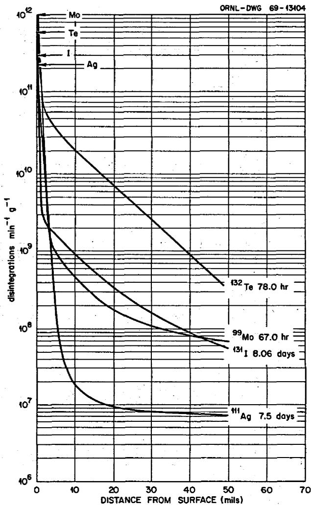  
Fig. 11.1. Concentration Profiles for Short-Lived Fission Products Deposited in MSRE Core Graphite.

nation in a random fashion which gave occasional high values that distorted the deposition pattern. Generally, these high numbers were not for the surface samples and were also encountered among the control samples which had not been exposed to either salt or irradiation. Fortunately, the amount of uranium in the graphite remained negligibly small even when the high numbers were used. In the worst case, a piece of unimpregnated CGB that was exposed only during the $^{233}\mathrm{U}$ operation contained $3.17\mu \mathrm{g} / \mathrm{cm}^2$ on one surface and $3.26\mu \mathrm{g} / \mathrm{cm}^2$ on another. This is slightly over twice as high as ever previously encountered and about four times higher than the average previously encountered. This may have been a result of cracks in the sample. However, a higher amount of uranium on the graphite might be expected, because flush salt was not used.

Table 11.2. Isotopic Composition of Uranium in MSRE Graphite   

<table><tr><td>U Isotope</td><td>Sample A</td><td>Sample B</td></tr><tr><td>233</td><td>25.75%</td><td>60.27%</td></tr><tr><td>234</td><td>2.01</td><td>5.00</td></tr><tr><td>235</td><td>12.70</td><td>3.91</td></tr><tr><td>238</td><td>59.54</td><td>30.82</td></tr><tr><td>Total U</td><td>7.45 μg or 9.06 μg/g</td><td>24.9 μg or 9.85 μg/g</td></tr><tr><td>\( ^{233}\mathrm {U} + ^{235}\mathrm {U} \)</td><td>1.18 μg/g</td><td>6.30 μg/g</td></tr><tr><td>\( ^{233}\mathrm {U} \)</td><td>0.166 μg/cm2</td><td>1.26 μg/cm2</td></tr><tr><td>\( ^{235}\mathrm {U} \)</td><td>0.082 μg/cm2</td><td>0.084 μg/cm2</td></tr></table>

There was a distressing lack of correlation between the exposure time and the amount of uranium found. This may have arisen from the fact that progressively poorer graphite, as far as cracks were concerned, was available for later insertions.

All of the samples were analyzed for uranium by delayed neutrons. The uranium was assumed to be $^{233}\mathrm{U}$ in these cases since this gave the upper limit, although some 6 of the 21 surfaces examined had been exposed to both $^{235}\mathrm{U}$ and $^{233}\mathrm{U}$ .

The potential for determining uranium content by isotopic analyses of samples spiked with $^{236}\mathrm{U}$ was also explored. A sample $A$ that had been exposed to $^{235}\mathrm{U}$ for 56,000 Mwhr and to $^{233}\mathrm{U}$ for 20,000 Mwhr was compared with a sample $B$ that had been exposed to only $^{233}\mathrm{U}$ for 20,000 Mwhr. The results are shown in Table 11.2. By delayed neutron counting 0.82 and 5.93 $\mu \mathrm{g/g}$ was found for the $^{233}\mathrm{U} + ^{235}\mathrm{U}$ in samples $A$ and $B$ respectively. In principle isotopic analyses could be used to determine the "geological history" of the uranium deposition in the graphite and at the same time to obtain an independent check on the results from delayed neutron counting. However, because of the expense ($60 per determination), the scatter, and most importantly the small amount of uranium found, we do not plan to pursue this "history."

Hastelloy N were taken at equally spaced intervals from top to bottom of the core. The results of radiochemical analyses are shown in Table 11.3. The sample sequence runs from H1 at the bottom to H7 at the top. The $99\mathrm{Mo}$ found on the metal was $25\%$ less than previously determined, which is reasonably good agreement. About $28\%$ more $^{132}\mathrm{Te}$ was found than last time; this was again fair agreement. Iodine was another story; the amount of $^{131}\mathrm{I}$ found was larger than last time by a factor of 3.5. This is attributed to the fact that flush salt was not used. Iodine as iodide ion is soluble in flush salt and would be expected to be lower when flush salt is used, and as noted earlier, the iodine on graphite was also higher this time than before.

In spite of not having used flush salt, the uranium on the metal was below the limit of detection, which is 19 $\mu \mathrm{g} / \mathrm{cm}^2$ .

In the previously reported material balance for fission products in the MSRE, the percentage of inventory deposited on metal was based on an estimate of $1.2 \times 10^{6} \mathrm{~cm}^{2}$ for the area of metal wetted by the circulating fuel. A more recent estimate indicates the area wetted by fuel is $0.79 \times 10^{6} \mathrm{~cm}^{2}$ . Thus previously reported values for percent deposition on metal should be corrected by the factor 0.79/1.2 or 0.66. The latest values for the distribution of short-lived fission products in the MSRE are shown in Table 11.4. These numbers are based on the assumption that the average value for the samples examined applies to the $2 \times 10^{6} \mathrm{~cm}^{2}$ of graphite and the $7.9 \times 10^{5} \mathrm{~cm}^{2}$ of metal in the reactor.

# 11.2 SAMPLES FROM MSRE PUMP BOWL

E.G.Bohlmann E.L.Compere

This section was not completed in time for inclusion in this report. The subject will be covered in a report to be issued separately as ORNL-TM-2753, Fission Product Behavior in the MSRE During 233 Uranium Operation, by E. L. Compere and E. G. Bohmann.

# 11.1.4 Radiochemical Analyses of Deposition of Fission Products on Hastelloy N from the Core of the MSRE

Hastelloy N tubing (1/8 in.) that had contained a dosimeter wire was used to provide metal samples from the surveillance assembly. Seven 3-in. sections of

Table 11.3. Deposition of Short-Lived Fission Products on Hastelloy N from the MSRE Core   

<table><tr><td rowspan="2">Sample</td><td rowspan="2">Metal Position, Distance from Bottom (in.)</td><td colspan="2">99Mo</td><td colspan="2">132Te</td><td colspan="2">111Ag</td><td colspan="2">131I</td></tr><tr><td>Dis min-1cm-2</td><td>Percent of Inventorya</td><td>Dis min-1cm-2</td><td>Percent of Inventorya</td><td>Dis min-1cm-2</td><td>Percent of Inventorya</td><td>Dis min-1cm-2</td><td>Percent of Inventorya</td></tr><tr><td></td><td></td><td>×1011</td><td></td><td>×1010</td><td></td><td>×108</td><td></td><td>×109</td><td></td></tr><tr><td>H1</td><td>1.5</td><td>0.896</td><td>69.8</td><td>15.7</td><td>136.4</td><td>7.18</td><td>107.5</td><td>8.30</td><td>10.23</td></tr><tr><td>H2</td><td>11.33</td><td>1.83</td><td>147.4</td><td>8.06</td><td>70.0</td><td>5.09</td><td>76.2</td><td>4.07</td><td>5.02</td></tr><tr><td>H3</td><td>21.17</td><td>2.38</td><td>191.1</td><td>8.57</td><td>74.4</td><td>6.18</td><td>02.5</td><td>6.08</td><td>7.50</td></tr><tr><td>H4</td><td>30.0</td><td>2.01</td><td>161.3</td><td>8.96</td><td>77.8</td><td>4.17</td><td>62.4</td><td>5.85</td><td>7.21</td></tr><tr><td>H5</td><td>39.0</td><td>1.85</td><td>148.8</td><td>8.49</td><td>73.7</td><td>2.12</td><td>31.7</td><td>5.04</td><td>6.22</td></tr><tr><td>H6</td><td>53.1</td><td>1.23</td><td>98.5</td><td>6.56</td><td>57.0</td><td>3.84</td><td>57.5</td><td>5.33</td><td>6.57</td></tr><tr><td>H7</td><td>60.5</td><td>0.922</td><td>74.1</td><td>9.20</td><td>79.9</td><td>1.04</td><td>15.5</td><td>3.65</td><td>4.50</td></tr><tr><td>Average</td><td></td><td>1.59</td><td>127.3</td><td>9.36</td><td>79.6</td><td>4.23</td><td>63.3</td><td>5.47</td><td>6.75</td></tr><tr><td>Previous average</td><td></td><td>2.13</td><td></td><td>7.29</td><td></td><td></td><td></td><td>1.56</td><td></td></tr></table>

${}^{a}$ The amount on $1{\mathrm{\;{cm}}}^{2}$ expressed as percent of the calculated amount that would be in $1\mathrm{\;g}$ of fuel if it escaped only by decay.

Table 11.4. Distribution of Short-Lived Fission Products in the MSRE   

<table><tr><td>Isotope</td><td>Percent on Metal</td><td>Percent on Graphite</td><td>Percent in \( \mathbf{{Fuel}}{}^{a} \)</td><td>Percent to \( {\mathbf{{Gas}}}^{b} \)</td></tr><tr><td>\( {}^{99}\mathrm{{Mo}} \)</td><td>23</td><td>5</td><td>0.2</td><td>72</td></tr><tr><td>\( {}^{132}\mathrm{{Te}} \)</td><td>14</td><td>5</td><td>0.5</td><td>79</td></tr><tr><td>\( {}^{111}\mathrm{{Ag}} \)</td><td>11</td><td>60</td><td></td><td>29</td></tr><tr><td>\( {}^{131}\mathrm{I} \)</td><td>1.2</td><td>0.3</td><td>60</td><td></td></tr></table>

$a_{\mathrm{Based}}$ on an inventory of $4.366 \times 10^{6}$ g of fuel.   
$b_{\mathrm{By}}$ difference.

# 11.3 EXAMINATION OF MATERIALS FROM MSRE OFF-GAS LINES

E.G.Bohlmann E.L.Compere

This section was not completed in time for inclusion in this report. The subject will be covered in a report to be issued separately as ORNL-TM-2753, Fission Product Behavior in the MSRE During 233 Uranium Operation, by E. L. Compere and E. G. Bohlmann.

# 11.4 THE SURFACE TENSION OF THE MSRE FUEL AND FLUSH SALTS

# S. S. Kirslis

To help explain some puzzling observations of foaming or high bubble fraction in the fuel melt during recent MSRE operation, some surface tension measurements on the salt in the MSRE pump bowl were undertaken. Since changes in bubble fraction were noted most particularly during the periodic reductions of the fuel salt with metallic beryllium, it was planned to measure the surface tension before and just after a reduction treatment. After some laboratory testing of several simple experimental methods for determining surface tension, the measurement of the capillary depression of fuel salt in drilled holes in a graphite cylinder was selected as the most satisfactory method for application in the MSRE pump bowl. The measurements of depression were made after the frozen salt had cooled to room temperature and presumably corresponded to the surface tension of the salt as it began to crystallize at about $430^{\circ}\mathrm{C}$ . It was assumed that the volume changes accompanying freezing and further cooling would not significantly affect the differences in salt levels in the holes of different diameters.

The surface tension tests in the MSRE pump bowl were carried out using capsules of the types shown in Fig. 11.2. The graphite cylinder inside each capsule was drilled longitudinally to provide three $\frac{1}{8}$ -in.-diam holes, three $\frac{1}{16}$ -in.-diam holes, and three $\frac{1}{32}$ -in.-diam holes. A slot $\frac{5}{16}$ in. wide admitted molten salt to the bottom of the capsule and served to indicate roughly the zero depression salt level. The capsule for a test after treatment of the fuel with metallic beryllium was fabricated by welding a cage containing metallic beryllium rods to the bottom of a standard surface-tension capsule.

A typical procedure was as follows. The assembled capsule was evacuated overnight at $650^{\circ}\mathrm{C}$ in a quartz container to remove water and oxygen from the graphite cylinder. The degassed capsule was transferred without exposure to air into the sampler-enricher cubicle above the MSRE. From there the capsule was lowered into the pump bowl gas space, allowed to warm up, then slowly lowered into the fuel salt, allowing the capsule to fill with salt from the bottom, but leaving a bubble of gas above the graphite cylinder. The capsule was then raised above the salt level, causing the salt to drain out to the level of the bottom of the window. The salt levels in the drilled holes were allowed to equilibrate for 30 min. In slow steps, the capsule was raised 2 ft above the pump bowl and the fuel salt allowed to freeze. The capsule was then rapidly raised up to the sampling cubicle and shipped to an analytical hot cell. Here the top of the capsule was cut off with a tubing cutter just above the top of the graphite cylinder. The levels of salt in the ten holes were measured using a pair of F-calipers modified so that the bottom 3 in. of the depth gauge strip was replaced with a straight piano wire 0.025 in. in diameter. The measurement of salt level in a given hole was usually reproducible to $\pm 0.01$ cm.

The procedure was slightly modified for the capsules with an attached cage of beryllium rods. The capsule was first lowered to a depth calculated to submerge the beryllium rods but not allow salt to enter the upper capsule. The capsule was to be lowered further and a sample of salt admitted to the surface-tension capsule when salt density or reactivity readings indicated an increase in foaming. However, in the two runs of this type to date, there was no change in readings for $2.5\mathrm{hr}$ . The capsule was lowered 2 in. further for $2\mathrm{hr}$ more, and still there was no change in density or reactivity readings. To be sure the capsule was submerged, it was lowered as far as possible and allowed to remain submerged for $30\mathrm{min}$ . The capsule was then drained, equilibrated, cooled, and withdrawn in the usual way.

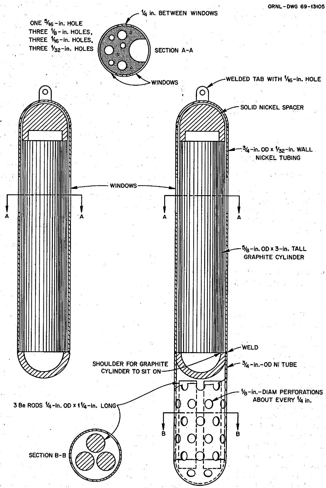  
Fig. 11.2. Surface Tension Capsule.

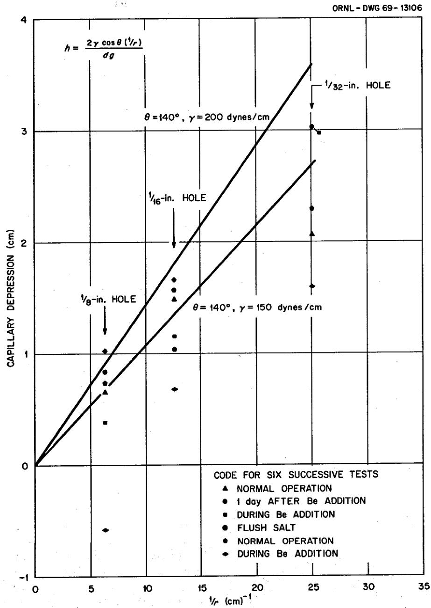  
Fig. 11.3. Surface Tension of MSRE Fuel and Flush Salt.

Six surface-tension tests have been carried out in this report period. The results are shown in Fig. 11.3 as a plot of capillary depression vs the reciprocal of the radius of the drilled hole. It is seen that most of the data points fall between the calculated lines for surface tensions of 150 and 200 dynes/cm. Each point represents the average of observations in three holes of a given radius. The lines were calculated from the

equation

$$
h = \frac {2 \gamma \cos \theta}{d g r},
$$

where

$h =$ the capillary depression, cm,

$r =$ the hole radius, cm,

$d =$ the density of the salt, $\mathbf{g} / \mathbf{cm}^3$

$g =$ the gravitational acceleration, $980~\mathrm{cm / sec}^2$

$\gamma =$ the surface tension, dynes/cm, and

$\theta =$ the contact angle (taken as $140^{\circ}$ for pure fuel salt or flush salt on clean dry graphite, as observed in previous work).

It is believed that the surface tensions of MSRE fuel salt and flush salt are in actuality about 220 dynes/cm at $600^{\circ}\mathrm{C}$ , and even higher at $430^{\circ}\mathrm{C}$ . The lower values obtained in this work are considered to be due to the uncertainties of the experimental method, in particular the effect of freezing on the salt levels in the drilled holes.

The most meaningful result of the present work is the definite decrease in capillary depression during the addition of metallic beryllium to the fuel salt. The lower capillary depression corresponds to a lower surface tension, which in turn indicates a higher solubility of helium in the fuel salt. Under these conditions, the bubble fraction of the fuel at a given gas entrainment rate would be reduced.[6]

Some laboratory tests are under way which should provide a quantitative calibration of the capillary depression method for measuring surface tension and should confirm the effect of adding metallic beryllium to the molten salt.

# 11.5 NIOBIUM REDUCTION POTENTIALS

# H.W.Kohn

In order to explain the peculiar behavior of niobium in the reactor, it was deemed desirable to examine the solution of niobium metal in molten fluoride mixtures as a function of oxidation potential. The nickel-nickel oxide electrode provided a convenient method of monitoring oxidation potential. Accordingly, the following experiment was performed:

A niobium rod tagged with $^{95}\mathrm{Nb}$ was prepared by the method of Senderoff and Mellors. The rod was then immersed in $2\mathrm{kg}$ of a reduced melt of $2\mathrm{LiF} \cdot \mathrm{BeF}_2 + 0.3$ mole $\%$ $\mathrm{UF_4}$ , the uranium having been previously

reduced with beryllium metal. The reduction potential was gradually lowered by additions of $\mathrm{NiF}_2$ . Changes in niobium concentration were measured by monitoring the $^{95}\mathrm{Nb}$ activity in salt samples which were removed periodically from the melt. At 882 mv, corresponding to $\mathrm{U}^{3+}/\Sigma \mathrm{U} = 0.09$ , the $\mathrm{U}^{3+}/\Sigma \mathrm{U}$ was analyzed spectrophotometrically by J. P. Young and shown to correspond reasonably well to the reduction potential then being read. When the potential had dropped to 375 mv, corresponding to a $\mathrm{U}^{4+}/\Sigma \mathrm{U}$ of $\sim 10^{-4}$ , very little ( $\sim 10$ ppm) of the niobium had appeared in the melt. The melt was then treated with dilute (5.4 meq/liter) HF for 15 min. The voltage dropped to 260 mv, and the niobium activity then appeared in the melt. Sweeping with hydrogen raised the voltage to 556 mv and caused a gradual decrease of the niobium from 105 to 11 ppm. Spectrographic analyses of selected samples showed poor agreement with the assay by radioactivity.

We attempted to repeat this experiment on salt having the composition of the MSRE fuel but met with less success because of erratic behavior of the electrode in the salt containing $\mathrm{ZrF_4}$ , particularly below $400\mathrm{mv}$ . Also, the fuel salt contained more oxidizing species than we had anticipated at the beginning of the experiment as well as niobium. By adding lithium metal we gradually raised the reduction potential to $600\mathrm{mv}$ $(\mathrm{U}^{3 + } / \Sigma \mathrm{U} = 2\times 10^{-3})$ , at which point the niobium disappeared from the melt. Lowering the reduction potential with $\mathrm{NiF_2}$ again failed to make niobium appear until the melt had been treated with HF. In this experiment spectrographic analyses checked the radiochemical quite well, and a spectrophotometric analysis when the melt was oxidizing showed no $\mathrm{U}^{3 + }$ $(<  0.1\%)$

The small amount ( $\sim 10$ ppm) of niobium which consistently is present in our reduced samples can either be particulate niobium which passes the filter stick or a slightly soluble low-valence form of niobium. In view of the high solubility of $\mathrm{Nb}^{+}$ in Flinak, $^{10}$ we deem this second possibility less likely than the first. Finally the apparent "hysteresis" observed in removing niobium from solution in going from the oxidized to the reduced state we attribute to the slowness of coagulation of the precipitated niobium or a slow rate of formation due to the great dilution. We find no evidence for stable soluble low-valence forms of niobium fluoride.

These data are summarized in Fig. 11.4. The numbers next to the data points indicate the order in which the experiments were done.

# 11.6 NOBLE-METAL FISSION PRODUCT CHEMISTRY

C.F.Weaver

The unpredictable behavior of noble-metal fission products (Nb, Mo, Tc, Ru, and Te) in the MSRE caused us to initiate studies of their high-temperature chemistry some time ago. Our preceding investigations have been confined to the chemistry of the molybdenum fluorides, principally because the combination of fission yield and cross section for the molybdenum isotopes poses a potential problem in neutron economy and hence in the breeding efficiency of an MSBR. The results of these investigations have been described extensively. $^{11-22}$ The program of investigation has necessarily included a variety of efforts, such as synthesis studies, investigation of the properties of the several fluorides representative of each stable oxidation state, their solution behavior, and efforts to identify the associated species occurring in the gaseous state. The following subjects were discussed in earlier reports: synthesis of molybdenum fluorides, $^{11,14,16,19,21,22}$ reactions of molybdenum fluorides with molten $2\mathrm{LiF} \cdot \mathrm{BeF}_2$ , $^{11,14,16,19,21,22}$ mass spectrometry of molybdenum fluorides, $^{12,15,17,21,22}$ potentiometric study of molybdenum in LiF-BeF $_2$ (67-33 mole %), $^{13}$ lithium fluoromolybdates(III), $^{14,16}$ and absorption spectroscopy of $\mathrm{MoF}_5$ , $^{16}$ $\mathrm{MoF}_3$ , $^{18,20}$ and $\mathrm{MoF}_6$ . $^{20}$ The infrared absorption spectrum of $\mathrm{MoF}_5$ was investigated recently and is described below.

As our understanding of fission product transport in the MSRE has developed, chemical differences among the noble-metal fission products are seen to be relevant and to suggest the need for additional kinds of information. One example is the recent evidence that niobium metal may be oxidized and enter fuel salt when $\mathrm{U}^{3+}/\mathrm{U}^{4+}$ ratios are quite low and might thus provide a means of monitoring the redox potential of such a system. In this connection investigation of the equilibrium $\mathrm{Nb} + x\mathrm{HF}(g) \rightleftharpoons (x/2)\mathrm{H}_2(g) + \mathrm{NbF}_x(d)$ in molten $2\mathrm{LiF} \cdot \mathrm{BeF}_2$ was initiated within the last month and will be reported in subsequent semiannual reports. The experimental approach to this problem was developed by C. M. Blood23 in his investigation of the solubility and stability of structural-metal difluorides in molten fluoride mixtures.

# 11.6.1 Synthesis and Stability of Molybdenum Fluorides

C. F. Weaver H. A. Friedman

Studies of the synthesis and decomposition of the molybdenum fluorides have been continued, with recent emphasis devoted to $\mathrm{MoF_4}$ . As with other fluorides of molybdenum, its behavior was very sensitive to experimental conditions, especially refluxing and overpressure. $\mathrm{MoF_4}$ was evaporated from a Knudsen cell (no refluxing) and the vapors were analyzed using a TOF mass spectrometer; this procedure has been reported previously[22] and is discussed below. Evaporation and disproportionation occurred simultaneously in the temperature range $500 - 700^{\circ}\mathrm{C}$ . At lower temperatures (265 and $352^{\circ}\mathrm{C}$ ) and under nonrefluxing conditions evaporation predominated. However, at $350^{\circ}\mathrm{C}$ with refluxing conditions and an $\mathrm{MoF_6}$ overpressure of a few millimeters, disproportionation predominated, and the $\mathrm{MoF_4}$ was converted to solid $\mathrm{MoF_3}$ and a complex vapor which contained $\mathrm{MoF_6}$ and $\mathrm{MoF_5}$ . At $250^{\circ}\mathrm{C}$ and

13 N. J. Meyer, C. F. Baes, Jr., and K. A. Romberger, Reactor Chem. Div. Ann. Progr. Rept. Dec. 31, 1967, ORNL-4229, p. 32-33.   
14C. F. Weaver, H. A. Friedman, and D. N. Hess, Reactor Chem. Div. Ann. Progr. Rept. Dec. 31, 1967, ORNL-4229, pp. 33-37.   
15J. D. Redman and R. A. Strehlow, Reactor Chem. Div. Ann. Progr. Rept. Dec. 31, 1967, ORNL-4229, pp. 37-39.   
16C. F. Weaver, H. A. Friedman, and D. N. Hess, MSR Program Semiann. Progr. Rept. Feb. 29, 1968, ORNL-4254, pp. 129-34.   
17R. A. Strehlow and J. D. Redman, MSR Program Semiann. Progr. Rept. Feb. 29, 1968, ORNL-4254, pp. 134-36.   
18 L. M. Toth, J. P. Young, and G. P. Smith, MSR Program Semiann. Progr. Rept. Feb. 29, 1968, ORNL-4254, p. 136.   
19C. F. Weaver, H. A. Friedman, and D. N. Hess, MSR Program. Semiann. Progr. Rept. Aug. 31, 1968, ORNL-4344, pp. 153-55.   
20L. M. Toth, J. P. Young, and G. P. Smith, MSR Program Semiann. Progr. Rept. Aug. 31, 1968, ORNL-4344, pp. 168-71.   
21C. F. Weaver, H. A. Friedman, J. W. Gooch, Jr., D. N. Hess, and J. D. Redman, Reactor Chem. Div. Ann. Progr. Rept. Dec. 31, 1968, ORNL-4400, in preparation.   
$^{22}$ C. F. Weaver, H. A. Friedman, J. W. Gooch, Jr., and J. D. Redman, MSR Program Semiann. Progr. Rept. Feb. 28, 1969, ORNL-4396, pp. 157-62.   
23C. M. Blood, F. F. Blankenship, G. M. Watson, and W. R. Grimes, "Thermodynamic Behavior of Structural-Metal Corrosion Products In Fluoride Melts," Reactor Chem. Div. Ann Progr. Rept. Jan. 31, 1960, ORNL-2931, pp. 39-43.

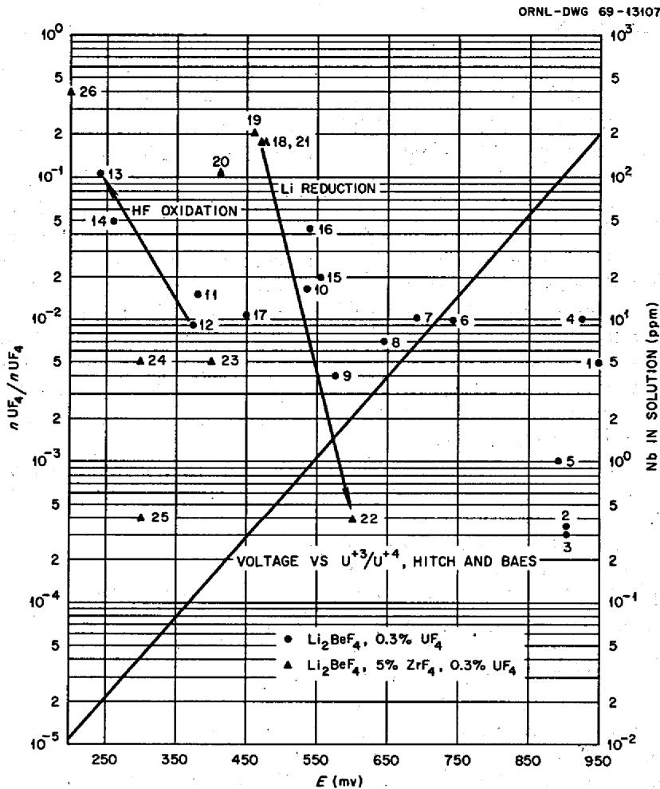  
Fig. 11.4. Solubility of Niobium Metal in Molten $\mathsf{Li}_2\mathsf{BeF}_4$ and Fuel Salt as a Function of Reductive Potential.

pressure in the micron range, $\mathsf{MoF}_4$ disproportionated to form solid $\mathsf{MoF}_3$ . The reaction was $\mathsf{MoF}_4(s) \rightarrow \mathsf{MoF}_3(s) + \mathsf{MoF}_5 \uparrow$ without refluxing and $3\mathsf{MoF}_4 \rightarrow 2\mathsf{MoF}_3 + \mathsf{MoF}_6 \uparrow$ with refluxing. The decomposition at $350^{\circ}\mathbf{C}$ required a copper container, while that at $250^{\circ}\mathbf{C}$ was accomplished satisfactorily in quartz.

The work described above essentially completes our synthesis studies of the molybdenum fluorides. Our procedures may now be summarized as follows: Excess molybdenum hexafluoride is refluxed over molybdenum metal in the temperature range 25 to $75^{\circ}\mathrm{C}$ until the metal is entirely consumed. The result is a yellow solution of $\mathsf{MoF}_5$ dissolved in the excess $\mathsf{MoF}_6$ . The excess $\mathsf{MoF}_6$ is pumped off at $75^{\circ}\mathrm{C}$ reaching pressures in the low micron range and leaving pure liquid $\mathsf{MoF}_5$ .

The $\mathbf{MoF}_5$ (melting point, $67^{\circ}\mathrm{C}$ ) must not be frozen at this stage because extreme expansion occurs on remelting and will rupture the container. The temperature of the system is slowly increased to $200^{\circ}\mathrm{C}$ while maintaining pressures in the micron range. The slow increase in temperature is necessary to maintain the low pressures and to reflux the evaporating $\mathbf{MoF}_5$ . During this step the reaction $\mathbf{MoF}_5 \rightarrow \mathbf{MoF}_4 \downarrow + \mathbf{MoF}_6 \uparrow$ occurs. The product is pure $\mathbf{MoF}_4$ , which is a solid at $200^{\circ}\mathrm{C}$ and is stable for several weeks under these conditions. The temperature is again slowly increased to $250^{\circ}\mathrm{C}$ and the pressure maintained in the micron range. During this step the reaction $3\mathbf{MoF}_4 \rightarrow 2\mathbf{MoF}_3 + \mathbf{MoF}_6 \uparrow$ occurs. These reactions may be carried out in quartz apparatus provided it is meticulously dried and the

Table 11.5. Reactivity of $\mathsf{MoF}_3$ and $\mathsf{RuF}_3$   

<table><tr><td>Compound</td><td>Container</td><td>Reaction</td></tr><tr><td>MoF3(d)a</td><td>Ni</td><td>Yes</td></tr><tr><td>MoF3(d)</td><td>Cu</td><td>No</td></tr><tr><td>MoF3(s)b</td><td>Ni</td><td>No</td></tr><tr><td>MoF3(s)</td><td>Cu</td><td>No</td></tr><tr><td>RuF3(d)</td><td>Cu</td><td>Yes</td></tr><tr><td>RuF3(s)</td><td>Cu</td><td>No</td></tr></table>

$a(d) =$ several mole $\%$ dissolved in molten $2\mathrm{LiF}\cdot \mathrm{BeF}_2$ at $500 - 700^{\circ}\mathrm{C}$   
$b(s) =$ pure solid in a sealed capsule at $500 - 700^{\circ}\mathrm{C}$

$\mathsf{MoF}_6$ carefully freed of HF. The $\mathsf{MoF}_3$ is a stable solid to approximately $400^{\circ}\mathbf{C}$ , above which it decomposes forming the metal and higher fluorides. No fluorides of molybdenum with valence less than 3 have been produced in these studies or reported in the literature. The disproportionation reactions are as simple as written above only if refluxing is maintained with the removal of the most volatile species, that is, $\mathsf{MoF}_6$ . Without refluxing, the vapor phase always contains $\mathsf{MoF}_6$ and $\mathsf{MoF}_5$ and frequently $\mathsf{MoF}_4$ as well. The synthesis studies will now be directed toward the fluorides of niobium and, to a lesser extent, those of ruthenium.

Attempts to dissolve $\mathbf{RuF}_3$ in molten $2\mathrm{LiF}\cdot \mathrm{BeF}_2$ using a copper container resulted in the reaction $2\mathrm{RuF}_3 + 3\mathrm{Cu} \rightarrow 3\mathrm{CuF}_2 + 2\mathrm{Ru}$ ; the products were identified using x-ray diffraction. Previously reported experiments in which $\mathbf{RuF}_3$ was heated and disproportionated in a copper container did not result in fluorination of the copper.[22] Apparently in the absence of liquid a protective layer forms on the copper. Analogous solutions of $\mathbf{MoF}_3$ in molten $2\mathrm{LiF}\cdot \mathrm{BeF}_2$ do not react significantly with copper but do react with nickel. These results are summarized in Table 11.5.

# 11.6.2 Kinetics of $\mathbf{MoF}_3$ Disproportionation in Molten 2LiF·BeF $_2$

C. F. Weaver H. A. Friedman F. A. Grimm24

Studies of the rate of removal of $\mathbf{Mo}^{3+}$ from molten $2\mathrm{LiF}\cdot \mathrm{BeF}_2$ have continued. It was previously reported[22] that at $500^{\circ}$ the $\mathbf{Mo}^{3+}$ was removed from the

solution by a half-order process and that neither the flow rate of helium nor hydrogen firing the copper container strongly affected either the order or the rate constant. The half-order rate constants, defined as $K = t^{-1}(C_0^{1/2} - C^{1/2})$ , associated with a helium flow of 12 liters/hr and with static helium were $8.1 \times 10^{-3}$ and $7.3 \times 10^{-3} \, \text{ppm}^{1/2} \, \text{hr}^{-1}$ respectively. Recently the effect of the surface area of the copper container was investigated. By adding copper mesh to the melt, the surface area was increased from approximately 180 to $1800 \, \text{cm}^2$ per liter of melt. The first addition of $\text{MoF}_3$ to this melt resulted in such wide scatter of the data that neither the order nor the rate constant could be determined. However, it was observed that the concentration of $\text{Mo}^{3+}$ dropped from about $400 \, \text{ppm}$ to $3 \, \text{ppm}$ in $2800 \, \text{hr}$ , a period only slightly longer than required in the two cases without the copper mesh described above. The second addition of $\text{MoF}_3$ to the same system produced the much smoother results shown in Fig. 11.5. The results of these experiments were subjected to a least-squares analysis, and the results are shown in Table 11.6. The large error associated with the

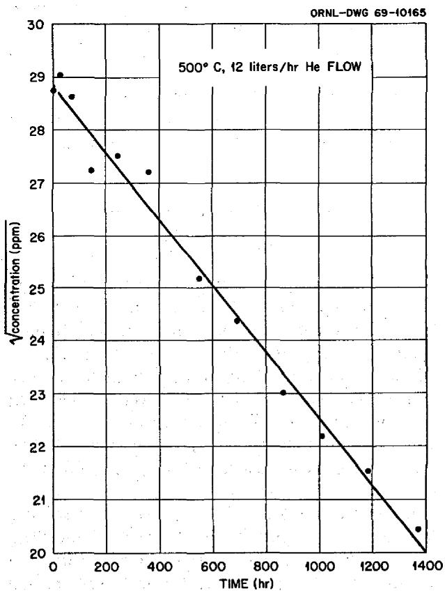  
Fig. 11.5. Removal of $\mathbf{Mo}^{3+}$ from Molten 2LiF $\cdot$ BeF $_2$ .

Table 11.6. Rate Constants from Least-Squares Analysis   

<table><tr><td colspan="2">Constant (ppm-1/2 hr-1)</td><td colspan="2">Conditions</td></tr><tr><td>Previously Reported; Graphical</td><td>Least Squares; Error at 99% Confidence Level</td><td>Helium Flow (liters/hr)</td><td>Surface Area (cm2)</td></tr><tr><td>×10-3</td><td>×10-3</td><td></td><td></td></tr><tr><td>8.1</td><td>7.98 ± 0.26</td><td>12</td><td>180</td></tr><tr><td>7.3</td><td>7.44 ± 0.31</td><td>0</td><td>180</td></tr><tr><td></td><td>6.32 ± 0.63</td><td>12</td><td>1800</td></tr></table>

third case results from fewer data points, since the experiment is not complete. The errors listed in Table 11.6 represent precision within a given experiment. It is our experience that the agreement from one experiment to another is far poorer and that the differences between the constants shown in Table 11.6 are not significant. Our present interpretation of these results is that the $\mathrm{Mo}^{3+}$ leaves the $2\mathrm{LiF}\cdot \mathrm{BeF}_2$ solvent by a half-order process which is not significantly affected by the flow rate of helium, the surface area of the copper container, or the quantity of molybdenum metal produced by the disproportionation. It was also reported previously[22] that the presence of 1-2 mole $\%$ $\mathrm{UF_4}$ in the $2\mathrm{LiF}\cdot \mathrm{BeF}_2$ had no appreciable effect on the behavior of the $\mathrm{Mo}^{3+}$ . These observations lead to the conclusion that the disproportionation of $\mathrm{MoF}_3$ in molten $\mathrm{LiF}\cdot \mathrm{BeF}_2$ or $\mathrm{LiF}\cdot \mathrm{BeF}_2\cdot \mathrm{UF}_4$ is a homogeneous event.

# 11.6.3 Mass Spectrometric Studies

C.F.Weaver J.D.Redman

Studies of the vapors associated with the evaporation or decomposition of the fluorides of niobium, molybdenum, and ruthenium from ambient to temperatures slightly in excess of the MSRE fuel have continued.

In previous reports of our mass spectrometric studies, estimated pressures were given which were reliable to an order of magnitude. We have recently attempted to refine the pressure calibration so that equilibrium constants and the associated thermodynamic values can be obtained.

Two materials were used as standards. These were single-crystal $^7\mathrm{LiF}$ with a purity $>99.999\%$ and silver with a purity of $99.997\%$ . The data were interpreted as described by R. T. Grimley.[25] The vapor pressure values of M. Eisenstadt[26] et al. were used for LiF and those of M. B. Panish[27] were used for Ag. A single

standard is sufficient in principle, but the use of two allowed a convenient internal cross check of our procedure. The agreement between the standards was satisfactory. These results have improved the reliability of our pressure estimates from an order of magnitude to within a factor of 2. The most severe problem with respect to further improvement in accuracy is that the corrosive noble-metal fluorides cause a deterioration in machine sensitivity during an experiment. The use of an inert gas standard which may be added and monitored during a fluoride run seems to be the most promising approach and will be our next step in calibration development.

A sample of freshly prepared $\mathrm{MoF_4}$ was completely sublimed in a copper Knudsen cell over the temperature range 225 to $750^{\circ}\mathrm{C}$ . The composition of the effusing gas may be seen in Figs. 11.6 and 11.7. In the region below approximately $220^{\circ}\mathrm{C}$ the $\mathrm{MoF_4}$ neither evaporated nor decomposed. The region between 220 and $300^{\circ}\mathrm{C}$ corresponds to the disproportionations:

$$
2 \operatorname {M o F} _ {4} (s) \rightarrow \operatorname {M o F} _ {3} (s) + \operatorname {M o F} _ {5} (g)
$$

and

$$
3 \mathrm {M o F} _ {4} (s) \rightarrow 2 \mathrm {M o F} _ {3} (s) + \mathrm {M o F} _ {6} (g).
$$

The discontinuity at $300^{\circ}\mathrm{C}$ in the pressure (Fig. 11.6) is not seen in the composition curves of Fig. 11.7. We interpret this break to be caused by melting of $\mathrm{MoF_4}$ , converting the high-surface-area solid mixture of $\mathrm{MoF_4}$ and $\mathrm{MoF_3}$ to a low-surface-area viscous mixture of liquid $\mathrm{MoF_4}$ and solid $\mathrm{MoF_3}$ . The drop in vapor pressure as the temperature increases may then be ascribed to activated $^{28}$ rather than equilibrium evaporation. Other experimental methods, for example, direct visual-thermal measurement of melting temperature and DTA, will be employed subsequently in an effort to confirm the melting point of pure $\mathrm{MoF_4}$ . The vapor pressure of $\mathrm{MoF_4}$ reaches the limit of detection near $550^{\circ}\mathrm{C}$ just as it has previously $^{22}$ in the reaction of $\mathrm{Mo} + \mathrm{MoF_6}$ and in the decomposition of $\mathrm{MoF_3}$ , both

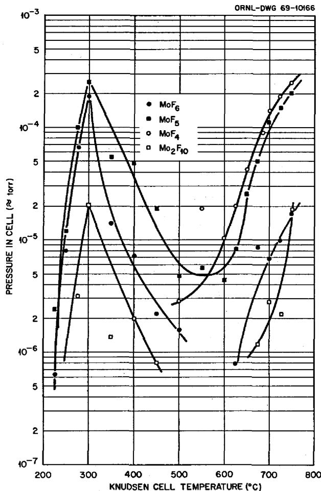  
Fig. 11.6. Pressure of Vapor Species Over Thermally Decomposing $\mathbf{MoF}_4$ .

pure and dissolved in molten $2\mathrm{LiF}\cdot \mathrm{BeF}_2$ .Above this temperature the following events are occurring simultaneously: $\mathrm{MoF_4(l)}$ evaporation, $3\mathrm{MoF_4(l)}\rightarrow 2\mathrm{MoF_3}+$ $\mathrm{MoF_6}\uparrow$ ,and $2\mathrm{MoF_3}\rightarrow \mathrm{Mo} + \mathrm{MoF_6}$ .In addition,the gas-phase equilibrium $2\mathrm{MoF}_{5}\rightleftharpoons \mathrm{MoF}_{6} + \mathrm{MoF}_{4}$ is established; the high concentration of $\mathrm{MoF_4}$ suppressed the concentration of $\mathrm{MoF_6}$ to a considerably lower pressure than seen in the decomposition of $\mathrm{MoF_3}$ (ref. 22 and dashed lines in Fig.11.7).The above equations indicate that the $\mathrm{MoF_3}$ cannot disappear until the $\mathrm{MoF_4}$ has been completely decomposed. This implies that the vapor composition curves for the decomposition of $\mathrm{MoF_4}$ (solid lines, Fig. 11.7) must approach those for the decomposition of $\mathrm{MoF_3}$ (dashed lines, Fig. 11.7).This can be seen to occur near $775^{\circ}\mathbf{C}$ Above $775^{\circ}\mathbf{C}$ the decomposition of $\mathrm{MoF_3}$ is complete, leaving a residue of molybdenum metal, identified by x-ray diffraction. This description of the evaporation of

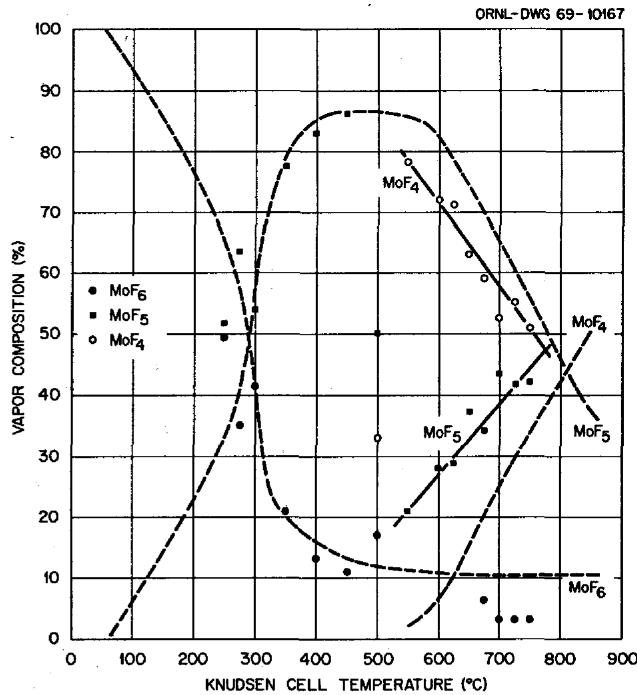  
Fig. 11.7. Percent Composition of the Vapor Over $\mathsf{MoF}_4$ and $\mathsf{MoF}_3$ .

Table 11.7. Appearance Potentials for Ion Fragments (ev) $^a$   

<table><tr><td></td><td>MoF6at 18°C</td><td>MoF5from Mo + MoF6at 500°C</td><td>Pure MoF5at 80°C</td></tr><tr><td>Mo2F9+</td><td></td><td>15.0</td><td>15.5</td></tr><tr><td>MoF5+</td><td>16</td><td></td><td>19</td></tr><tr><td>MoF4+</td><td>19.5</td><td>16.5</td><td>18</td></tr><tr><td>MoF3+</td><td>23.5</td><td></td><td>23</td></tr><tr><td>MoF2+</td><td>29.5</td><td></td><td>31</td></tr><tr><td>MoF+</td><td>35.5</td><td></td><td>36</td></tr><tr><td>Mo+</td><td>41.0</td><td></td><td>39.5</td></tr></table>

$\pmb{a}$ Argon reference gas: $\mathbf{Ar}^{+}$ at 15.75 ev.

$\mathsf{MoF_4}$ is entirely consistent with our synthesis experience, taking into account the lack of refluxing and shorter time span in the Knudsen effusion experiment.

The behavior of the more volatile $\mathsf{MoF}_5$ is being studied by both mass and absorption spectroscopy. We have found that the trimer, $\mathsf{Mo}_3\mathsf{F}_{15}$ , exists as well as the previously reported dimer, $^{22}$ $\mathsf{Mo}_2\mathsf{F}_{10}$ . The appearance potentials for the fragments of $\mathsf{MoF}_6$ and $\mathsf{MoF}_5$ may be found in Table 11.7 and the ionization efficiency curves in Figs. 11.8 and 11.9.

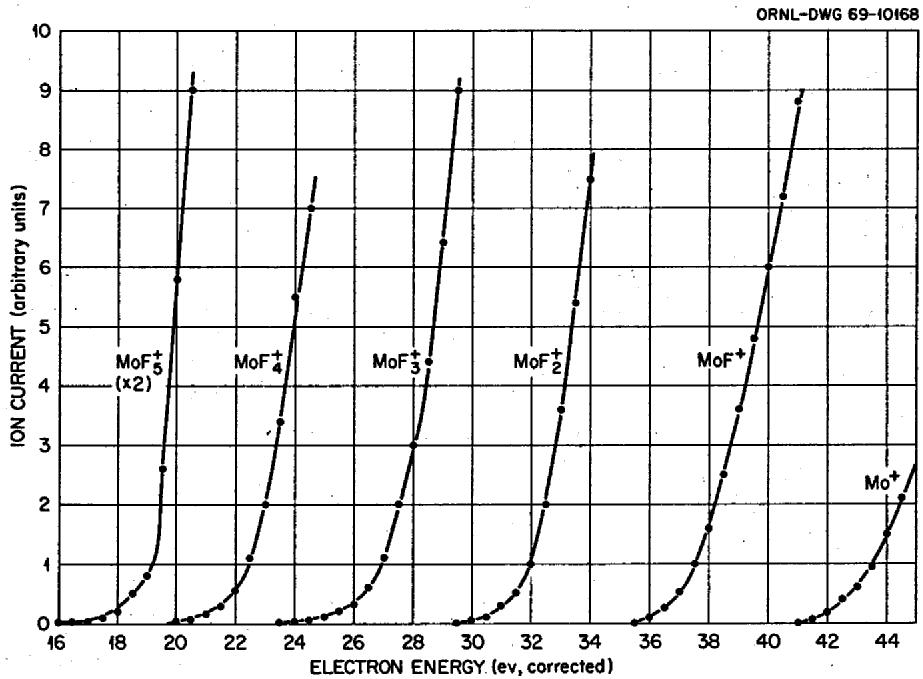  
Fig. 11.8. Ionization Efficiency Curves for $\mathrm{MoF_6}$ Fragments.

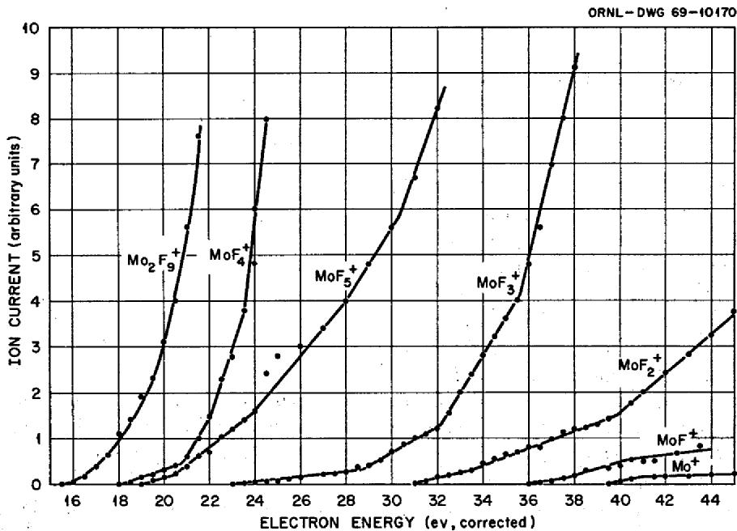  
Fig. 11.9. Ionization Efficiency Curves for $\mathsf{MoF}_5$ Fragments.

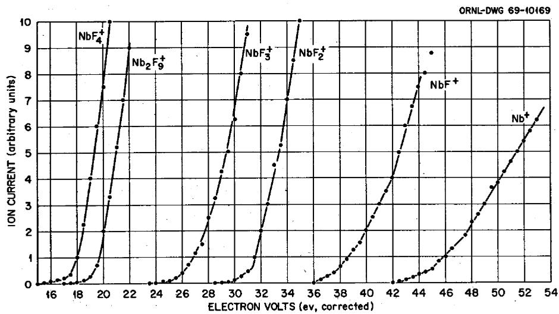  
Fig. 11.10. Ionization Efficiency Curves for $\mathrm{NbF}_5$ Effusing Through a 10-mil Orifice at $70^{\circ}\mathrm{C}$ .

Our results, subject to refinement with improved calibration, indicate that the pressure over liquid $\mathrm{MoF}_5$ ranges from $10^{-3}$ to $10^{-1}$ torr, considerably lower than the equilibrium pressures reported by previous investigators[29] and lower than observed in our own spectrophotometric cells. In addition, we find a greater temperature dependence than indicated by the reported heat of evaporation.[29] These facts indicate activated rather than equilibrium evaporation. The vapor in the observed pressure range consists of approximately $80\%$ monomer $(\mathrm{MoF}_5)$ , $20\%$ dimer $(\mathrm{Mo}_2\mathrm{F}_{10})$ , and $< 1\%$ trimer $(\mathrm{Mo}_3\mathrm{F}_{15})$ , and the standard enthalpy changes associated with the reactions $\mathrm{Mo}_2\mathrm{F}_{10} \rightleftharpoons 2\mathrm{MoF}_5$ and $\mathrm{Mo}_3\mathrm{F}_{15} \rightleftharpoons 3\mathrm{MoF}_5$ are 28 and 34 kcal respectively.

The results of the mass spectrometric studies reported here show that all of the molybdenum fluorides except $\mathsf{MoF}_3$ are volatile in the range of MSR operating temperatures both as pure compounds and when dissolved in molten $2\mathrm{LiF}\cdot \mathrm{BeF}_2$ . At no time has the species $\mathsf{MoF}_3$ been found in the gas phase, although the volatile decomposition products of solid $\mathsf{MoF}_3$ and $\mathsf{MoF}_3$ dissolved in molten $2\mathrm{LiF}\cdot \mathrm{BeF}_2$ are detected routinely and with high sensitivity.

The behavior of $\mathbf{NbF}_5$ has been described earlier.22 The cracking pattern, appearance potentials, and ionization efficiency curves were given for the fragments associated with $\mathbf{NbF}_5$ and its polymers. This information was obtained by effusing $\mathbf{NbF}_5$ from a Knudsen cell with a 20-mil-diam orifice.

Table 11.8. Appearance Potentials for Niobium Fluoride Fragments (ev) $^a$   

<table><tr><td rowspan="2">Fragment</td><td colspan="2">Pure NbF5</td><td colspan="2">Nb + F2</td></tr><tr><td>75°C, 20 mils</td><td>70°C, 10 mils</td><td>350°C</td><td>700°C</td></tr><tr><td>NbF4+</td><td>14.5</td><td>15.</td><td>14.5</td><td>15.</td></tr><tr><td>NbF3+</td><td>21.0</td><td>24.</td><td>25.5</td><td>25</td></tr><tr><td>NbF2+</td><td></td><td>28.5</td><td>30.5</td><td>32</td></tr><tr><td>NbF+</td><td></td><td>36.</td><td>40.5</td><td>38.5</td></tr><tr><td>Nb+</td><td></td><td>42.5</td><td>44.5</td><td>45.5</td></tr><tr><td>Nb2F9+</td><td>16.0</td><td>17.0</td><td></td><td>17.5</td></tr><tr><td>Nb3F14+</td><td>18.5</td><td></td><td></td><td></td></tr></table>

$a$ Argon reference gas; $\mathbf{Ar}^{+}$ at 15.75 ev.

A difficulty associated with the above experiment was the rapid evaporation of the $\mathrm{NbF}_5$ . An attempt was made to reduce the evaporation rate by using a Knudsen cell with one-half of the previous orifice diameter, 10 mils in this case. A reduction in effusion rate was achieved, but the increase in the ratio of background to molecular beam intensity essentially destroyed the usefulness of this approach, which for the present has been abandoned. The ionization efficiency curves obtained in this experiment may be seen in Fig. 11.10 and the appearance potentials in Table 11.8.

A second difficulty occurring with both of the above experiments is that the $\mathbf{NbF}_5$ is so volatile that samples are completely evaporated well below the temperature range of an MSR. To obtain samples of $\mathbf{NbF}_5$ vapor in

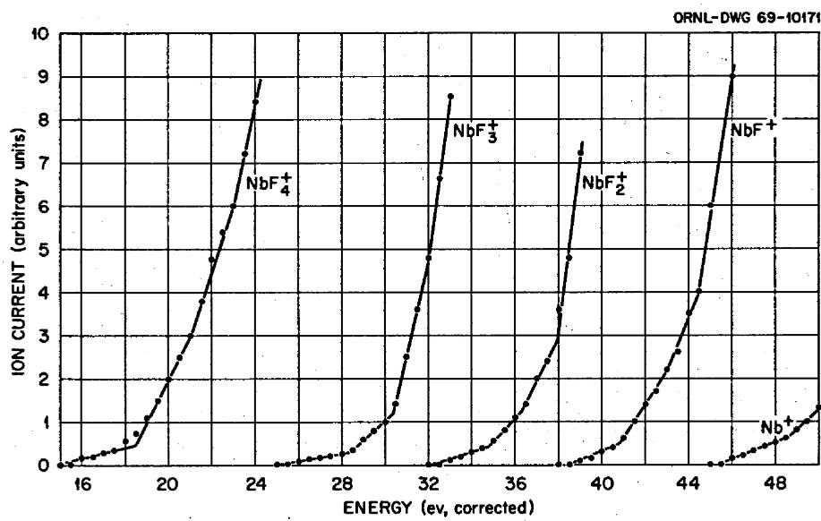  
Fig. 11.11. Ionization Efficiency Curves for the Effusing Products of $\mathbf{Nb} + \mathbf{F}_2$ .

the region ambient to $900^{\circ}\mathrm{C}$ , fluorine was added to a Knudsen cell containing metallic niobium. Niobium pentafluoride was produced, and at least one lower fluoride, possibly the trifluoride, was present. The ionization efficiency curves obtained in this experiment are shown in Fig. 11.11 and the appearance potentials in Table 11.8.

Examination of the several ionization efficiency curves and tables of appearance potentials for both the molybdenum and niobium fluorides reveals small but real variations. This is almost certainly caused by fragments having multiple parents. For example, $\mathrm{NbF_4^+}$ may be produced from the dissociative ionization of $\mathrm{NbF}_5$ , $\mathrm{Nb}_2\mathrm{F}_{10}$ , and $\mathrm{Nb}_3\mathrm{F}_{15}$ . The relative amounts of these precursors will of course depend on the temperature and pressures in a given experiment. The interpretation of such results will be aided considerably by the calibration efforts mentioned above.

Previously $^{22}$ the decomposition reaction, ionization efficiency curves, and appearance potentials for the disproportionation of $\mathrm{RuF_3}$ in a copper container were reported. An attempt was made to study the corresponding events in a solution of $\mathbf{R}\mathbf{u}^{3 + }$ in molten 2LiF-BeF $_2$ . As indicated in Sect. 11.4.1, the $\mathbf{R}\mathbf{u}^{3 + }$ was reduced producing $\mathbf{Cu}^{2 + }$ . Consequently the mixture studied was $\mathrm{CuF_2}$ in molten 2LiF-BeF $_2$ at temperatures up to $850^{\circ}\mathbf{C}$ . In addition to fragments typical of 2LiF-BeF $_2$ , the ions $\mathrm{CuF_2^+}$ , $\mathrm{CuF^+}$ , and $\mathrm{Cu^+}$ were observed with relative abundance of 57, 100, and 33 respectively. The partial pressure of $\mathrm{CuF_2}$ ranged from

$6 \times 10^{-3}$ torr after $3\mathrm{hr}$ of effusion to $9 \times 10^{-4}$ after $40\mathrm{hr}$ of effusion. In addition, significant mass transfer of copper occurred. The reaction $2\mathrm{CuF} \rightleftharpoons \mathrm{CuF}_2 + \mathrm{Cu}$ provided the likely mechanism which will allow mass transfer through either a temperature or a pressure gradient or both.

Recently F. F. Blankenship suggested $^{30}$ that since the noble-metal fission products form volatile fluorides, the possibility existed of removing these elements from the Hastelloy and graphite surfaces of an MSR with gentle fluorinating agents. Thermodynamic calculations are of little use in evaluating potential fluorinating agents because the reaction products are usually unknown and because the thermodynamic properties of most of the known products are unreported. Consequently, a survey of pertinent reactions was initiated using a high-temperature Knudsen effusion cell, a time-of-flight mass spectrometer, and a gas pressure of approximately $10^{-2}$ torr. $\mathbf{N}\mathbf{b}^{\mathbf{0}}$ and NbC were exposed to gaseous $\mathrm{CF_4}$ from room temperature to $800^{\circ}\mathrm{C}$ . Volatile reaction products if present were at pressures below the sensitivity limit of the mass spectrometer, about $10^{-7}$ torr. X-ray diffraction studies of the solid residues indicated that the starting materials had not changed. Graphite was exposed to $\mathbf{N}\mathbf{b}\mathbf{F}_{5}$ from room temperature to $100^{\circ}\mathrm{C}$ . Again no volatile or solid products were observed.

Although the three experiments listed above gave negative results, it is still possible that higher pressures and, in the $\mathbf{C} + \mathbf{N}\mathbf{b}\mathbf{F}_{5}$ case, higher temperatures may cause reactions to occur. $\mathbf{Mo^{0}}$ was exposed to $\mathbf{MoF_6}$ from room temperature to $850^{\circ}\mathrm{C}$ . The volatile products $\mathbf{MoF_6}$ , $\mathbf{MoF_5}$ , and $\mathbf{MoF_4}$ were observed, and no nonvolatile product was formed. $\mathbf{Nb^{0}}$ was exposed to $\mathbf{F_2}$ from ambient to $900^{\circ}\mathrm{C}$ . The volatile compound $\mathbf{NbF_5}$ was formed. While $\mathbf{F_2}$ is not a mild fluorinating agent, the absence in this experiment of nonvolatile fluorides is pertinent to the survey.

# 11.6.4 Infrared Spectroscopy

F. A. Grimm C. F. Weaver

Investigations have been started on the infrared absorption spectrum of gaseous $\mathsf{MoF}_5$ . G. M. Begun and A. C. Rutenberg, Chemistry Division, have obtained Raman spectra of solid and liquid $\mathsf{MoF}_5$ and initiated some studies on the infrared spectrum. Interpretation of these spectra can lead to a better understanding of the vapor phase and may also provide thermochemical data.

The major difficulty is obtaining pure $\mathsf{MoF}_5$ (free of any oxyfluoride species). The oxyfluorides of molybdenum are more volatile than the pentafluoride, so that a small amount of impurity in the solid becomes a major impurity in the gas phase. Even though a pure spectrum has not been obtained, it has been possible to attribute some of the observed bands in the spectrum to $\mathsf{MoF}_5$ (see Fig. 11.12). The major impurity is believed to be $\mathsf{MoOF}_4$ , and if this is the case it should be possible to subtract the spectrum of $\mathsf{MoOF}_4$ in order to obtain the bands due only to $\mathsf{MoF}_5$ . Work is now proceeding toward refining the required information. The bands attributed to $\mathsf{MoF}_5$ at this point in the investigation are located at 510, 770, and approximately $700~\mathrm{cm}^{-1}$ , the exact location being obscured by a band due to oxyfluoride at $720~\mathrm{cm}^{-1}$ .

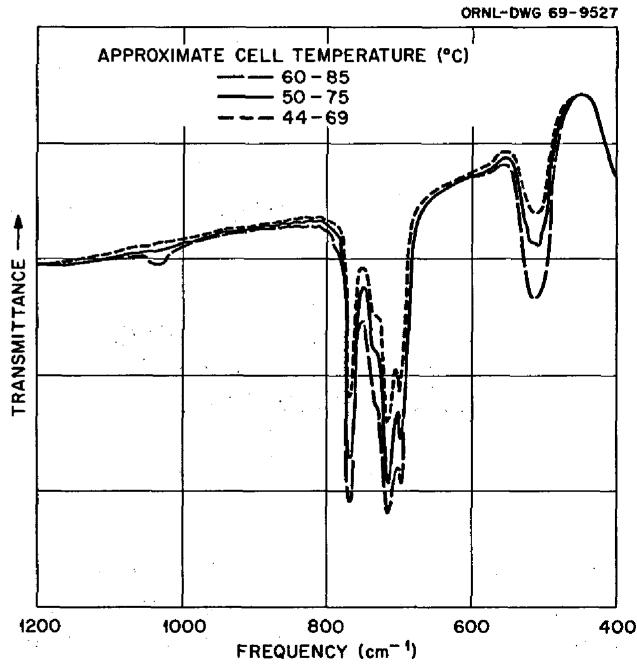  
Fig. 11.12. Absorption Spectrum of $\mathsf{MoF}_5$ with $\mathsf{MoOF}_4$ Impurity.

According to mass spectrometric studies of $\mathbf{MoF}_5$ (Sect. 11.4.3) there is a significant percentage of the dimer $\mathrm{Mo}_2\mathrm{F}_{10}$ in the vapor phase, so that one might expect to observe the infrared spectrum of the dimer along with the monomer. Further work on the lower-frequency bands and interpretation of the infrared spectrum is required before one will be in a position to confirm this prediction. With respect to interpretation, force field calculations based on the literature of fluorides and chlorides with structures similar to $\mathbf{MoF}_5$ are being made.

# 12. Properties of the Alkali Fluoroborates

# 12.1 MELTING POINTS AND SOLID TRANSITION TEMPERATURES OF ALKALI FLUOROBORATES

Stanley Cantor

L. O. Gilpatrick

This investigation is part of a study which seeks to systematically evaluate alkali fluoroborates as major components of coolants for molten-salt breeder reactors.

Thermal transition temperature data were obtained by using previously reported $^{1}$ DTA techniques. Nickel capsules were used as sample containers. The results, which are believed to be accurate to $\pm 1^{\circ}C$ , are listed in Table 12.1; the melting point of $\mathrm{LiBF_4}$ could be several degrees higher, since samples of this salt were used as received (from Foote Mineral Company) and may contain impurities which depress the melting point. The purity of the four other alkali fluoroborates is known by chemical analyses to be excellent. The data for $\mathrm{NaBF_4}$ and $\mathrm{KBF_4}$ were previously obtained by Barton and Gilpatrick. $^{2,3}$

Solid-state transition temperatures for $\mathrm{RbBF_4}$ and $\mathrm{CsBF_4}$ have not been previously reported. Melting points of $590^{\circ}\mathrm{C}$ for $\mathrm{RbBF_4}$ and $550^{\circ}\mathrm{C}$ for $\mathrm{CsBF_4}$ were observed by DeBoer and Van Liempt. No previous reports on the melting temperature of $\mathrm{LiBF_4}$ were found.

Table 12.1. Melting Points and Solid Transition Temperatures of Alkali Fluoroborates   

<table><tr><td>Salt</td><td>Temperature of Solid Transition (℃)</td><td>Melting Point (℃)</td></tr><tr><td>LiBF4</td><td>None observed</td><td>304</td></tr><tr><td>NaBF4</td><td>243</td><td>408</td></tr><tr><td>KBF4</td><td>283</td><td>570</td></tr><tr><td>RbBF4</td><td>245</td><td>582</td></tr><tr><td>CsBF4</td><td>169.5</td><td>555</td></tr></table>

# 12.2 DENSITIES AND MOLAR VOLUMES OF MOLTEN FLUOROBORATES

Stanley Cantor

Densities were measured in nickel vessels by means of a dilatometric method, the details of which have been published.5

For all five alkali fluoroborates the observed densities were linear with temperature. In each density run, individual data points were obtained at approximately equal temperature intervals. Table 12.2 summarizes the data and includes a computer-fitted least-squares equation for each melt. For all salts except $\mathrm{LiBF_4}$ the density measurements are believed to be accurate to within $0.3\%$ , the major sources of error being uncertainties in the initial calibration of the dilatometric vessel $(\sim 0.1\%)$ and in the irreversible expansion $(\sim 0.2\%)$ of the vessel as determined by recalibration. The uncertainties for $\mathrm{LiBF_4}$ are believed to be greater $(\sim 2\%)$ because of possible impurities in the samples measured and because of the rather high decomposition pressure of $\mathrm{BF}_3$ over the melt.

Molar volumes and expansivities, derived from the density-temperature equations of the five molten flu

Table 12.2. Density Data for Molten Alkali Fluoroborates   

<table><tr><td>Salt</td><td>Temperature Range Measured (°C)</td><td>Number of Points</td><td>Equation, ρ (g/cm3), t (°C)</td><td>Standard Deviation in ρ</td></tr><tr><td>LiBF4</td><td>309.8–402.7</td><td>13</td><td>ρ = 2.008 – 4.58 × 10-4t</td><td>2.3 × 10-3</td></tr><tr><td>NaBF4</td><td>415.3–554.1</td><td>12</td><td>ρ = 2.263 – 7.51 × 10-4t</td><td>8.1 × 10-4</td></tr><tr><td>KBF4</td><td>615.1–719.5</td><td>9</td><td>ρ = 2.228 – 8.15 × 10-4t</td><td>5.8 × 10-4</td></tr><tr><td>RbBF4</td><td>590.5–724.8</td><td>16</td><td>ρ = 2.795 – 10.4 × 10-4t</td><td>5.7 × 10-4</td></tr><tr><td>CsBF4</td><td>559.9–716.6</td><td>18</td><td>ρ = 3.152 – 11.9 × 10-4t</td><td>6.1 × 10-4</td></tr></table>

oroborates, were calculated at two corresponding temperatures; these are given in Table 12.3. The molar volumes increase in the expected order; that is, the larger the cation, the larger the molar volume. The expansivities follow the same order, although the expansivity of $\mathrm{CsBF_4}$ is only slightly greater than that of $\mathrm{RbBF_4}$ . Table 12.3 also compares the iodides with the fluoroborates at equal corresponding temperatures. In molar volume, fluoroborate is always slightly larger than the iodide. However, the expansivities of the fluoroborates are, except for $\mathrm{LiBF_4}$ , considerably greater; for example, the expansivity of $\mathrm{CsBF_4}$ is about $30\%$ greater than that of CsI. It is quite possible that the internal vibrations of the $(\mathrm{BF}_4)^-$ ion account for the divergence of expansivities between fluoroborates and iodides.

Table 12.3. Comparative Molar Volumes and Expansivities of Molten Fluoroborates and Molten Iodides   

<table><tr><td rowspan="2">Salt</td><td colspan="2">At θ = T/Tmelting = 1.0b</td><td colspan="2">At θ = T/Tmelting = 1.2b</td></tr><tr><td>Volume (cm3)</td><td>Expansivity (°K-1)</td><td>Volume (cm3)</td><td>Expansivity (°K-1)</td></tr><tr><td></td><td></td><td>× 10-4</td><td></td><td>× 10-4</td></tr><tr><td>LiBF4</td><td>50.2</td><td>2.45</td><td>51.6</td><td>2.52</td></tr><tr><td>LII</td><td>42.80</td><td>2.93</td><td>44.69</td><td>3.06</td></tr><tr><td>NaBF4</td><td>56.09</td><td>3.84</td><td>59.18</td><td>4.05</td></tr><tr><td>Nal</td><td>54.72</td><td>3.46</td><td>58.51</td><td>3.70</td></tr><tr><td>KBF4</td><td>71.40</td><td>4.62</td><td>77.42</td><td>5.01</td></tr><tr><td>KI</td><td>67.93</td><td>3.91</td><td>73.44</td><td>4.23</td></tr><tr><td>RbBF4</td><td>78.67</td><td>4.75</td><td>85.63</td><td>5.17</td></tr><tr><td>RBI</td><td>73.09</td><td>3.94</td><td>78.75</td><td>4.24</td></tr><tr><td>CsBF4</td><td>88.19</td><td>4.78</td><td>95.75</td><td>5.19</td></tr><tr><td>CsI</td><td>81.63</td><td>3.72</td><td>87.44</td><td>3.98</td></tr></table>

# 12.3 PREDICTED VOLUME CHANGES IN CRYSTALLINE ALKALI FLUOROBORATES

Stanley Cantor

The four heavier alkali fluoroborates, $\mathrm{NaBF}_4$ , $\mathrm{KBF}_4$ , $\mathrm{RbBF}_4$ , and $\mathrm{CsBF}_4$ , exhibit a first-order phase transition in the solid state. Only for the case of $\mathrm{KBF}_4$ has high-temperature x-ray diffraction investigation[6] elucidated the transition; in $\mathrm{KBF}_4$ , the low-temperature orthorhombic form changes to the high-temperature $(283^{\circ}\mathrm{C})$ cubic form. Above this transition temperature the volume of $\mathrm{KBF}_4$ is $15\%$ greater than that at room temperature. $\mathrm{KClO}_4$ , isomorphous to $\mathrm{KBF}_4$ , undergoes the same transition, also with a $15\%$ increase in volume. The analogies in structure between $\mathrm{KBF}_4$ and $\mathrm{KClO}_4$ , and the assumption of similar structural changes for $\mathrm{NaBF}_4$ , $\mathrm{RbBF}_4$ , and $\mathrm{CsBF}_4$ , lead to the following conjectures: (a) the four heavier alkali fluoroborates all have the same crystallographic transition, that is, a change from tetramolecular orthorhombic to tetramolecular cubic unit cells at the transition temperature, and (b) the volume change of this crystallographic transition parallels the known volume change of the corresponding alkali perchlorates. Thus in obtaining the estimated values in the fourth column of Table 12.4 we multiply the room-temperature molar volumes of $\mathrm{NaBF}_4$ , $\mathrm{RbBF}_4$ , and $\mathrm{CsBF}_4$ by the ratio of cell volumes for the two forms of $\mathrm{NaClO}_4$ , $\mathrm{RbClO}_4$ , and $\mathrm{CsClO}_4$ (obtaining the ratios from Wyckoff's compilation[7]).

The predicted volume changes at the solid transition are all quite large - an $18\%$ increase for $\mathrm{NaBF}_4$ , $11\%$ for $\mathrm{RbBF}_4$ , and $10\%$ for $\mathrm{CsBF}_4$ . Although these volume changes are to be considered as speculative estimates, it is noteworthy that there are no reports of the growth from the pure melt of large orthorhombic or cubic crystals of these salts. The difficulty in growing large crystals this way is probably associated with the large

Table 12.4. Molar Volumes of Crystalline Alkali Fluoroborates   

<table><tr><td>Salt</td><td>Molar Volume at Room Temperature (from X-Ray Data) (cm3)</td><td>Temperature of Solid Transition (°C)</td><td>Molar Volume of High Temperature Polymorph at Solid Transition Temperature (cm3)</td></tr><tr><td>NaBF4</td><td>43.90a</td><td>243</td><td>(51.8)b</td></tr><tr><td>KBF4</td><td>50.23c</td><td>283</td><td>57.7d</td></tr><tr><td>RbBF4</td><td>55.3d</td><td>245</td><td>(61.4)</td></tr><tr><td>CsBF4</td><td>65.46d</td><td>169.5</td><td>(72.0)</td></tr></table>

$^{a}$ G. D. Brunton, Acta Cryst. B24, 1703 (1968).   
bValues in parentheses are estimates; see text.   
$^{c}$ G. D. Brunton, Acta Cryst., in press (1969).   
$\pmb{d}_{\mathbb{R}}$ W.G.Wyckoff,CrystalStructures,2d ed.,vol.3,pp.47,50,56.

volume contraction occurring at or below the transition temperature. During the large contraction a relatively large crystal formed from the melt would be expected to fracture into much smaller crystals.

# 12.4 REFRACTIVE INDICES AND ELECTRONIC POLARIZABILITIES IN CRYSTALLINE ALKALI FLUOROBORATES

Stanley Cantor

The electronic polarizability is a valuable property for understanding the interactions of relatively large and complicated ions such as $\mathbf{BF}_4$ . The refractive indices of the alkali fluoroborates were therefore measured to quantitatively determine the polarizability of $\mathbf{BF}_4$ ion.

Indices of refraction were measured at room temperature by the oil immersion method. By filtering (filters manufactured by Bausch and Lomb, Inc., Rochester, New York) the white-light source of the microscope, indices of refraction were measured at three wavelengths, 4500, 5893, and 6500 A. The indices of the fluoroborates are given in Table 12.5. The values at $\lambda = 5893\mathrm{A}$ were measured directly. For the indices at $\lambda = \infty$ , the Cauchy equation, $N = A + B / \lambda^2$ , was extrapolated to $\lambda = \infty$ using the observed indices at the three wavelengths. As can be noted in Table 12.5 the optical anisotropy for each salt is rather small. In the case of $\mathrm{KBF_4}$ the indices of refraction (at constant $\lambda$ ) differ by less than 0.001. For $\mathrm{NaBF_4}$ and $\mathrm{KBF_4}$ the measured indices agreed with those in the literature; for $\mathrm{CsBF_4}$

Table 12.5. Indices of Refraction of the Alkali Fluoroborates   

<table><tr><td>Salt</td><td>N at λ = 5893 A</td><td>N at λ = ∞a</td></tr><tr><td rowspan="2">LiBF4</td><td>Nα= 1.334 ± 0.001</td><td rowspan="2">1.328 ± 0.002</td></tr><tr><td>Nγ= 1.332 ± 0.001</td></tr><tr><td rowspan="2">NaBF4</td><td>1.304 ± 0.001</td><td rowspan="2">1.299 ± 0.002</td></tr><tr><td>1.302 ± 0.001</td></tr><tr><td rowspan="2">KBF4</td><td>1.325 ± 0.001</td><td rowspan="2">1.320 ± 0.002</td></tr><tr><td>1.325 ± 0.001b</td></tr><tr><td rowspan="2">RbBF4</td><td>1.334 ± 0.001</td><td rowspan="2">1.323 ± 0.002</td></tr><tr><td>1.333 ± 0.001</td></tr><tr><td rowspan="2">CsBF4</td><td>1.354 ± 0.001</td><td rowspan="2">1.348 ± 0.002</td></tr><tr><td>1.352 ± 0.001</td></tr></table>

${}^{a}$ Obtained by using average values of the indices at known wavelengths.

bSee text.

our observations verified a previous assertion $^8$ that the average index of refraction is slightly higher than 1.35.

From the observed indices of refraction, the molecular polarizabilities were calculated by the Lorentz relationship:

$$
\alpha_ {m} = \frac {3}{4 \pi} V _ {m} \frac {N ^ {2} - 1}{N ^ {2} + 2}, \tag {1}
$$

where $V_{m}$ is the molecular volume (the crystallographic cell volume divided by 4, the number of molecules per

Table 12.6. Molecular Volume $V_{m}$ , Average Index of Refraction $N_{av}$ , and Molecular, Cation, and Fluoroborate Electronic Polarizabilities $\alpha_{m}, \alpha_{+}, \alpha_{-}$ (for the Sodium D Line)   

<table><tr><td></td><td>Nav</td><td>Vm(A3)</td><td>αm(A3)</td><td>α+(A3)a</td><td>α_ (A3)</td></tr><tr><td>LiBF4</td><td>1.333</td><td>71.6b</td><td>3.52</td><td>0.029</td><td>3.49</td></tr><tr><td>NaBF4</td><td>1.303</td><td>72.85c</td><td>3.282</td><td>0.408</td><td>2.874</td></tr><tr><td>KBF4</td><td>1.325</td><td>83.39d</td><td>4.005</td><td>1.334</td><td>2.671</td></tr><tr><td>RbBF4</td><td>1.333</td><td>91.8e</td><td>4.508</td><td>1.979</td><td>2.529</td></tr><tr><td>CsBF4</td><td>1.353</td><td>108.7e</td><td>5.627</td><td>3.335</td><td>2.292</td></tr></table>

$a$ Values obtained from J. R. Tessman et al., Phys. Rev. 92, 891 (1953).

$\pmb{b}_{\mathbf{G}}$ .D.Brunton and S.Cantor,sect.12.6,in this report.   
$\mathbf{cG}$ .D.Brunton,ActaCryst.324,1703(1968).   
$d_{\mathbf{G}}$ D. Brunton, Acta Cryst., in press (1969).   
$^{e}$ R. W. G. Wyckoff, Crystal Structures, 2d ed., vol. III, pp. 47, 50, Interscience, New York, 1965.

unit cell) and $N$ is the index of refraction. The values of $\alpha_{m}$ are listed in Table 12.6. Also in Table 12.6, in the last two columns, are the electronic polarizabilities of the cations $(\alpha_{+})$ and fluoroborate anion $(\alpha_{-})$ . These were obtained from the simple additivity relationship, $\alpha_{m} = \alpha_{+} + \alpha_{-}$ .

The molecular polarizabilities of the alkali fluoroborates are approximately the same as those of the corresponding alkali chlorides. Since molar volumes of alkali fluoroborates are similar to those of alkali iodides, one might have expected molecular polarizabilities to exhibit the same similarity. It seems quite probable that the polarizability of $\mathbf{BF}_4^-$ is less than that of iodide because of the extensive localization of electrons in B-F bonds.

A noteworthy feature of $\alpha_{-}$ , the electronic polarizability of $\mathbf{BF}_4^-$ , is that it does not remain constant among the alkali fluoroborates; instead, $\alpha_{-}$ decreases with the increasing size of the cation. Stated somewhat differently, the higher the polarization of the cation the lower the polarization of the fluoroborate ions. Similar trends can be observed for alkali sulfates, nitrates, and cyanides (see Table V of ref. 9). Evidently anions whose electron-charge distributions are nonspherical (e.g., tetrahedral $\mathbf{BF}_4^-$ and $\mathbf{SO}_4^{2-}$ , trigonal $\mathbf{NO}_3^-$ ) possess polarizabilities that change with the cation. By contrast, spherical halide ions exhibit polarizabilities that remain

approximately constant with varying cations. These trends in the polarizability of nonspherical anions probably reflect the decreasing order of covalency in cation-anion bonds; for example, $\mathbf{L}\mathbf{i}^{+}$ distorts (or polarizes) the electronic charge of $\mathbf{B}\mathbf{F}_4^-$ in the direction of the Li-F bond axis more than does $\mathbf{N}\mathbf{a}^{+}$ in the Na-F bond axis.

# 12.5 DECOMPOSITION PRESSURES AND

$S_{298}^{\circ}$ of $\mathbf{LiBF}_4$

Stanley Cantor

The published information on the decomposition reaction $\mathrm{LiBF}_4(c) = \mathrm{LiF}(c) + \mathrm{BF}_3(g)$ contains two widely different values for the enthalpy of reaction: (a) $\Delta H^{\circ} = 3.8\mathrm{kcal / mole}$ derived from a plot of log $P$ vs $1 / T,^{10}$ and (b) $\Delta H_{298}^{\circ} = 21.4\mathrm{kcal}$ obtained from reaction calorimetry.11 Although the latter is almost certainly the correct enthalpy, we measured the decomposition pressures to confirm that $\Delta H^{\circ}$ was indeed about 21.4 kcal/mole; more importantly, we wished to use the vapor pressure data to obtain $S_{298}^{\circ}$ for $\mathrm{LiBF}_4(c)$ . Using the previous study on decomposition pressure, Greenwood and Martin12 calculated that $S_{298}^{\circ}$ for $\mathrm{LiBF}_4(s)$ is 62.9 cal deg $^{-1}$ mole $^{-1}$ , a value which they thought was "surprisingly high."

Decomposition pressures were determined in a nickel vessel which was connected to one arm of a manometer. Pressure readings were corrected for altitude, latitude, and the thermal expansion of mercury. Prior to the vapor pressure measurements, the apparatus (including the sample) was evacuated for at least $15\mathrm{hr}$ at $\sim 100^{\circ}\mathrm{C}$ . Temperatures were measured with an NBS-calibrated Pt-Rh thermocouple positioned in a nickel thermowell which extended into the sample; the thermowell was welded into the nickel vessel.

Two types of samples were measured. One was pure $\mathrm{LiBF_4}$ ; the second was a 1:1 mixture of $\mathrm{LiBF_4}$ and LiF which had been kept for several hours in a closed vessel at $\sim 350^{\circ}\mathrm{C}$ ( $304^{\circ}\mathrm{C}$ is the melting point of $\mathrm{LiBF_4}^{13}$ ). The purpose of the second sample was to determine

from the vapor pressure measurements if LiF dissolves in solid $\mathrm{LiBF_4}$ . The sources of the chemicals were: $\mathrm{LiBF_4} -$ Foote Mineral Company, Exton, Pennsylvania; LiF ("Baker Analyzed" reagent) - J. T. Baker Chemical Company, Phillipsburg, New Jersey.

The vapor pressure data are given in the first two columns of Table 12.7. A computer-fitted least-squares equation for these data is:

$$
- R \ln P (\mathrm {a t m}) = 1 9, 3 4 0 / T (^ {\circ} \mathrm {K}) - 3 0. 7 7. \tag {1}
$$

The standard error in $R \ln P$ is 0.0549 cal deg $^{-1}$ mole $^{-1}$ .

The log $P$ vs $1 / T$ plot of the data (Fig. 12.1) shows that samples of $\mathbf{LiBF}_4$ and of $\mathbf{LiBF}_4 + \mathbf{LiF}$ fit on the same line. Therefore there is no perceptible solid solubility of LiF in $\mathbf{LiBF}_4$ .

The third-law analysis of the data yielded $\Delta H_{298}^{\circ} = 22.95 \pm 0.2 \, \text{kcal/mole}$ . The probable reason for this value being higher than the calorimetric value $(21.40 \pm 0.09)$ is that the estimated free energy function for $\mathrm{LiBF}_4$ is too high. For instance at $496.45^{\circ} \text{K}$ , $(G_T^{\circ} - H_{298}^{\circ}) / T$ of $\mathrm{LiBF}_4$ was estimated as $-34.23 \, \text{cal deg}^{-1}$

Table 12.7. Decomposition Pressures and Third-Law $\Delta H_{298}^{\circ}$ of the Reaction $\mathrm{LiBF}_4(c) = \mathrm{LiF}(c) + \mathrm{BF}_3(g)$   

<table><tr><td>Temperature (°C)</td><td>Pressure (mm)</td><td>-Δ(GT - HT298)/T(cal deg-1mole-1)</td><td>ΔHT298(kcal/mole)</td></tr><tr><td>223.3</td><td>13.0</td><td>37.67</td><td>22.71</td></tr><tr><td>235.5</td><td>20.2</td><td>37.60</td><td>22.79</td></tr><tr><td>235.9</td><td>19.9</td><td>37.62</td><td>22.83</td></tr><tr><td>248.1</td><td>30.3</td><td>37.53</td><td>22.90</td></tr><tr><td>259.5</td><td>45.2</td><td>37.50</td><td>22.96</td></tr><tr><td>261.7</td><td>49.6</td><td>37.49</td><td>22.95</td></tr><tr><td>271.6</td><td>69.3</td><td>37.44</td><td>22.99</td></tr><tr><td>272.3</td><td>70.9</td><td>37.43</td><td>22.99</td></tr><tr><td>284.2</td><td>105.2</td><td>37.37</td><td>23.02</td></tr><tr><td>295.8</td><td>153.0</td><td>37.33</td><td>23.04</td></tr><tr><td>296.3</td><td>155.4</td><td>37.30</td><td>23.05</td></tr><tr><td>301.1</td><td>182.4</td><td>37.28</td><td>23.04</td></tr><tr><td>301.6</td><td>176.9</td><td>37.27</td><td>23.09</td></tr><tr><td colspan="4">Average = 22.95 ± 0.2</td></tr></table>

Sources of $(G_T^0 - H_{298}^0) / T$ and heat capacities:   
LiF: JANAF Thermochemical Tables   
$\mathbf{BF}_3$ : JANAF Thermochemical Tables (addendum)   
$\mathrm{LiBF}_4: S_{298}^0 = 31.10$ (estimated from unpublished data on $\mathrm{NaBF}_4$ and $\mathrm{KBF}_4$ )   
$C_p = 14 + 0.04T$ [empirically estimated from $\mathrm{NaBF_4}$ and $\mathrm{KBF_4}$ (A. S. Dworkin, MSR Program Semiann Progr. Rept. Aug. 31, 1968, ORNL-4344, p. 157)]

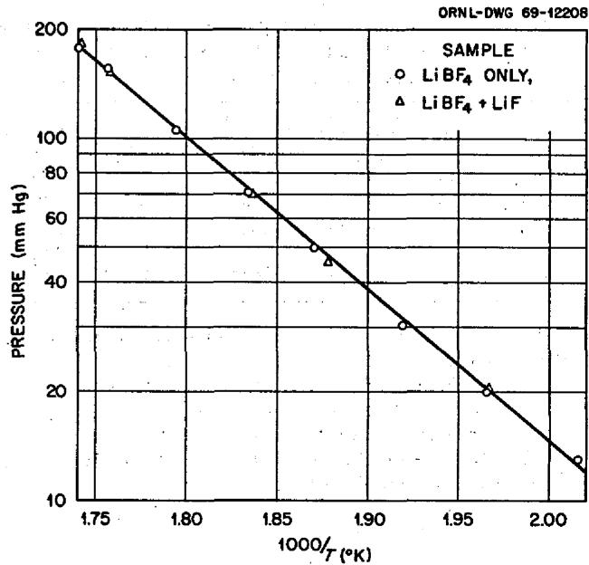  
Fig. 12.1. Decomposition Pressures of $\mathbf{BF}_3$ from the Reaction $\mathrm{LiBF}_4(c) = \mathrm{LiF}(c) + \mathrm{BF}_3(g)$ .

mole $^{-1}$ ; a value of $-36.88$ would have led to $\Delta H_{298}^{\circ} = 21.4 \, \text{kcal/mole}$ .

The second-law analysis of the data yielded $\Delta H_{298}^{\circ} = 21.1\mathrm{kcal / mole}$ , in excellent agreement with the calorimetric value. To calculate the second-law $\Delta H_{298}^{\circ}$ , we used $\Delta H_{535}^{\circ} = 19.34\mathrm{kcal / mole}$ ( $535^{\circ}\mathrm{K}$ is the midpoint of the experimental temperature range) together with the heat capacities given at the bottom of Table 12.7.

As stated earlier, one of the purposes of this investigation was to derive $S_{298}^{\circ}$ for $\mathrm{LiBF}_4(c)$ . The data of this investigation, the calorimetrically derived $\Delta H_{298}^{\circ}$ , and other thermochemical data were combined to yield $S_{298}^{\circ}$ of $\mathrm{LiBF}_4(c)$ using the equation:

$$
\begin{array}{l} S _ {2 9 8} ^ {\circ} \left[ \operatorname {L i B F} _ {4} (c) \right] = S _ {2 9 8} ^ {\circ} \left[ \operatorname {L i F} (c) \right] + S _ {2 9 8} ^ {\circ} \left[ \mathrm {B F} _ {3} (g) \right] \\ - R \ln P _ {\mathrm {B F} _ {3}} - \frac {\Delta H _ {2 9 8} ^ {c}}{T} + \int_ {2 9 8. 1 5} ^ {T} \Delta C _ {p} d \ln T \\ - \frac {1}{T} \int_ {2 9 8. 1 5} ^ {T} \Delta C _ {p} d T, \tag {2} \\ \end{array}
$$

where $\Delta H_{298}^{\circ} = 21.40\mathrm{kcal / mole}$ and $\Delta C_p$ is $C_p[\mathrm{LiF}(c)] + C_p[\mathrm{BF}_3(g)] - C_p[\mathrm{LiBF}_4(c)]$ . Equation (2) was solved (13 times) for each pressure-temperature pair listed in Table 12.7. To calculate the uncertainty in $S_{298}^{\circ}[\mathrm{LiBF}_4(c)]$ , only the uncertainties in the first four terms on the right-hand side of Eq. (2) were considered; that is, it was assumed that the uncertainties in the last

two terms (containing $\Delta C_p$ ) would cancel each other. By Eq. (2) the result obtained was:

$$
S _ {2 9 8} ^ {\circ} \left[ \operatorname {L i B F} _ {4} (c) \right] = 3 4. 0 \pm 0. 4 \text {c a l} \deg^ {- 1} \text {m o l e} ^ {- 1},
$$

where the $\pm 0.4$ is the square root of the sum of the squares of the uncertainties in the first four terms of Eq. (2) (respectively $0.04,140.3,140.055,0.18^{11}$ cal deg $^{-1}$ mole $^{-1}$ ).

# 12.6 X-RAY CRYSTAL PARAMETERS OF $\mathsf{LiBF}_4$

G. D. Brunton S. Cantor

To obtain a reasonably reliable value for the density of crystalline $\mathrm{LiBF_4}$ , the powder diffraction pattern was measured with the salt enclosed in a glass capillary. Cell parameters were derived by assigning Miller indices to the observed lines from the comparable reflections of the $\mathrm{LiClO_4}$ structure.[15] $\mathrm{LiBF_4}$ is orthorhombic, with a tetramolecular unit cell of dimensions:

$$
a = 8. 6 5 \pm 0. 0 8 \mathrm {A},
$$

$$
b = 6. 8 4 \pm 0. 0 7 \mathrm {A},
$$

$$
c = 4. 8 4 \pm 0. 0 3 \mathrm {A}.
$$

The density of $\mathrm{LiBF_4}$ is, therefore, $2.17\pm 0.06$ $\mathrm{g / cm^3}$

The above results should be considered as a preliminary measurement since there are some uncertainties about the purity and crystal size of the sample.

$^{14}$ K. K. Kelley and E. G. King, U.S. Bureau of Mines Bulletin 592, pp. 103, 109 (1961).

15 R. E. Gluyas, Dissertation Abstr. 17, 2800 (1959).

# 12.7 MIXING REACTIONS OF MSBR FUEL AND COOLANT SALTS

D.M.Moulton J.H.Shaffer

It has been known for some time that there is a wide range of liquid-liquid immiscibility in the system of $\mathrm{LiF - BeF_2 - ThF_4}$ and $\mathrm{NaBF_4}$ and that the fluorides of uranium and the trivalent lanthanides are insoluble in the latter salt.16 There seemed to be a possibility, however, that divalent rare earths would distribute to some extent into the fluoroborate phase, since it is a good acceptor of ions of low charge density, and that this might find use in a reprocessing scheme.

To test this, $0.98\mathrm{kg}$ of $\mathrm{LiF - BeF_2 - ThF_4}$ (68-20-12 mole %) with $0.75\mathrm{g}$ of $\mathrm{EuF_3}$ and $7\mathrm{g}$ of $\mathrm{UF_4}$ was mixed with $1.61\mathrm{kg}$ of $\mathrm{NaBF_4 - NaF}$ (92-8 mole %) at $538^{\circ}\mathrm{C}$ . An $\mathrm{Ar - 3\% BF_3}$ sparge gas was used to establish a $\mathrm{BF_3}$ pressure. Three additions of thorium metal were made to reduce the europium to the divalent state. There was no way to see the phase separation directly, but the analyses of the dipper samples of the two salts showed very different compositions. Data for this experiment are shown in Table 12.8. As expected, the extraction of both uranium and europium increased on reduction, but neither got high enough to be very useful in processing. The increased thorium distribution is hard to explain. The very large amount of beryllium moving to the fluoroborate despite its high charge density suggests a bona fide $\mathrm{BeF_4}^{2 - }$ ion in that salt.

$^{16}$ C. E. Bamberger et al., MSR Program Semiann. Progr. Rept. Feb. 29, 1968, ORNL-4254, p. 171.

Table 12.8. Mixing Reactions of MSBR Fuel and Coolant Salts Mole fractions are calculated on the basis of taking the components as LiF-BeF $_2$ -ThF $_4$ -NaF-BF $_3$ : coolant is NaF-BF $_3$ (52-48 mole %)   

<table><tr><td>Sample</td><td>NLiF</td><td>NBef2</td><td>NNaF</td><td>NTf4</td><td>NUF4</td><td>NBF3</td><td>DEu</td><td>Sum</td><td>Th Added (g)</td></tr><tr><td></td><td></td><td></td><td></td><td></td><td>×10-3</td><td></td><td></td><td></td><td></td></tr><tr><td>1</td><td>0.498</td><td>0.117</td><td>0.257</td><td>0.110</td><td>1.3</td><td>0.0185</td><td>0.0044</td><td>0.002</td><td>0</td></tr><tr><td>2-3</td><td>0.094</td><td>0.045</td><td>0.430</td><td>0.003</td><td>0.08</td><td>0.428</td><td></td><td>-0.008</td><td></td></tr><tr><td>4-5</td><td>0.486</td><td>0.104</td><td>0.242</td><td>0.085</td><td>1.1</td><td>0.082</td><td>0.0080</td><td>0.051</td><td>2.3</td></tr><tr><td>6-7</td><td>0.099</td><td>0.050</td><td>0.434</td><td>0.004</td><td>0.08</td><td>0.414</td><td></td><td>0.001</td><td></td></tr><tr><td>8-9</td><td>0.428</td><td>0.119</td><td>0.270</td><td>0.092</td><td>1.0</td><td>0.090</td><td>0.036</td><td>-0.049</td><td>7.3</td></tr><tr><td>10-11</td><td>0.131</td><td>0.058</td><td>0.430</td><td>0.009</td><td>0.15</td><td>0.371</td><td></td><td>0.033</td><td></td></tr><tr><td>12-13</td><td>0.438</td><td>0.108</td><td>0.272</td><td>0.085</td><td>1.0</td><td>0.097</td><td>0.034</td><td>0.010</td><td>12.3</td></tr><tr><td>14-15</td><td>0.125</td><td>0.059</td><td>0.428</td><td>0.009</td><td>0.17</td><td>0.379</td><td></td><td>0.015</td><td></td></tr></table>

The most interesting observation in the experiment is not the extraction but rather the mixing behavior of the two salts. As soon as the salts were mixed, the total pressure rose to 12 psig, presumably by $\mathrm{BF}_3$ evolution. The pressure was reduced periodically during the experiment by bleed-off but rose regularly to at least 2-3 psig when the system was closed. There appears to be a very substantial destabilization of the $\mathrm{BF}_4^-$ ion when Li, Be, or Th ions enter the fluoroborate phase, caused, for example, by such reactions as

$$
\mathrm {B e F} _ {2} + 2 \mathrm {B F} _ {4} ^ {-} \rightarrow \mathrm {B e F} _ {4} ^ {2 -} + 2 \mathrm {B F} _ {3},
$$

although there is no way to distinguish the individual effects of the three cations. Probably all of them have a destabilizing effect, and for lithium and thorium, at least, it is questionable whether the effect is caused by the formation of a specific complex species.

Bamberger found in thorium-free systems that the equality

$$
N _ {\mathrm {L i F}} + N _ {\mathrm {N a F}} = N _ {\mathrm {B F} _ {3}} + 2 N _ {\mathrm {B e F} _ {2}}
$$

held reasonably well and suggested that the system might be regarded as a reciprocal mixture of $\mathbf{Na}^+$ , $\mathbf{Li}^+$ , $\mathbf{BF}_4^-$ , and $\mathbf{BeF}_2^{2-}$ . In our case the relationship works only if the term $4.5(N_{\mathbf{ThF}_4} + N_{\mathbf{UF}_4})$ is added to the right-hand side. We have shown the quantity $N_{\mathbf{LiF}} + N_{\mathbf{NaF}} - N_{\mathbf{BF}_3} - 2N_{\mathbf{BeF}_2} - 4.5(N_{\mathbf{ThF}_4} + N_{\mathbf{UF}_4})$ as "Sum" in the table. The coefficient 4.5, which works better than either 4 or 5, implies that the average coordination number for thorium is 8.5. The data from this experiment do not allow distinguishing between a "physical" (Coulombic) and a "chemical" (complexing) mechanism for $\mathbf{BF}_3$ displacement, and in any case the greatest difference between these may be semantic.

Development of a leak in the MSBR heat exchanger and subsequent mixing of fuel and coolant salt would result in an increase in the partial pressure of $\mathrm{BF}_3$ over the salt mixture. Smith and Smith $^{17}$ found that unexpectedly high pressures were required to suppress cavitation in operation of a fluoroborate test loop that had previously contained LiF-BeF $_2$ -ThF $_4$ -UF $_4$ . Contamination of the fluoroborate salt by small amounts of residual LiF-BeF $_2$ -ThF $_4$ -UF $_4$ undoubtedly accounted for the unexpectedly high vapor pressure above the salt. On replacing the salt with a clean charge the pressure returned to normal. Any leakage of coolant into the fuel salt would cause similar behavior at the fuel pump,

since $\mathrm{BF}_3$ is not very soluble in the MSBR fuel salt.

The degree of contamination of the fuel salt by heat exchanger leakage is hard to assess. NaF will dissolve readily. $\mathrm{BF}_3$ will be quite volatile and should strip out, but whether it gets to a high enough rate to affect nuclear performance must be a function of the leak and stripping rates, of which the latter cannot yet be calculated. Copious amounts of $\mathrm{BF}_3$ could emerge in the gas stream. Gross contamination would require reprocessing of the salt streams, possibly by increasing the $\mathrm{BF}_3$ pressure and lowering the temperature to give maximum phase separation. Of the fission products, one would expect Rb and Cs, and possibly some of the Sr and Ba, to go to the fluoroborate phase, while rare earths, actinides, Zr, and other highly charged species would remain in the fuel salt. Most of the uranium should be recoverable in this way. Further studies of the fluoride-fluoroborate system are in progress.

# 12.8 PHASE RELATIONS IN THE SYSTEM NaF-KF-BF3

C.J.Barton L.O.Gilpatrick H.Insley

We reported earlier $^{18}$ that we had been unable to find the minimum-melting composition in the system NaF-KF-BF $_3$ that theoretically should exist on the boundary between the NaF and the $\mathrm{NaBF}_4$ -KBF $_4$ solid solution fields. At this composition the liquidus and solidus temperatures should coincide as they do at the minimum melting composition in the $\mathrm{NaBF}_4$ -KBF $_4$ quasi-binary system. We continued this search, concentrating our effort on compositions near the NaF-NaBF $_4$ binary eutectic and the $\mathrm{NaBF}_4$ -KBF $_4$ minimum. The DTA data in this part of the system, including some information previously reported, $^{18}$ are displayed in Table 12.9.

These data show that there is a small region defined by the limits (in mole %) $48.5 \pm 1.0 \mathrm{NaF}, 3.5 \pm 0.5 \mathrm{KF}$ , and $48.0 \pm 0.5 \mathrm{BF}_3$ , where the liquidus and solidus temperatures are essentially constant with an average spread of $5^{\circ}$ between the two values. It should be noted that quenching data for several compositions in or near this composition range show liquid persisting below $372^{\circ} \mathrm{C}$ , but the amount is believed to be small and may be attributed to the presence of a small amount of oxygen in the system. This effect may also help to account for our failure to find a composition with a

Table 12.9 DTA Data for the System NaF-KF-BF3   

<table><tr><td colspan="3">Composition (mole %)</td><td colspan="2">Temperature (°C)</td></tr><tr><td>NaF</td><td>KF</td><td>BF3</td><td>Liquidus</td><td>Solidus</td></tr><tr><td>50.5</td><td>1.5</td><td>48.0</td><td>382</td><td>376</td></tr><tr><td>49.5</td><td>1.5</td><td>49.0</td><td>388</td><td>383</td></tr><tr><td>50.0</td><td>3.0</td><td>47.0</td><td>378</td><td>373</td></tr><tr><td>50.0</td><td>3.0</td><td>47.0</td><td>377</td><td>373</td></tr><tr><td>49.0</td><td>3.0</td><td>48.0</td><td>379</td><td>374</td></tr><tr><td>48.5</td><td>3.0</td><td>48.5</td><td>379</td><td>373</td></tr><tr><td>48.0</td><td>3.0</td><td>49.0</td><td>384</td><td>375</td></tr><tr><td>47.5</td><td>4.0</td><td>48.5</td><td>379</td><td>372</td></tr><tr><td>46.5</td><td>5.0</td><td>48.5</td><td>382</td><td>372</td></tr><tr><td>45.5</td><td>6.0</td><td>48.5</td><td>383</td><td>371</td></tr><tr><td>44.5</td><td>7.0</td><td>48.5</td><td>386</td><td>373</td></tr></table>

smaller spread between liquidus and solidus temperatures. We have observed that the purest $\mathrm{NaBF}_4$ that we have been able to produce melted over a range of $10^{\circ}\mathrm{C}$ when heated in the DTA apparatus under the same conditions used to obtain the data in Table 12.9, and this compound makes up a large fraction of all these preparations. We believe that further study of this system is not likely to reveal a composition melting at a temperature significantly lower than that of the $\mathrm{NaF - NaBF_4}$ eutectic composition $(384^{\circ}\mathrm{C})$ . A phase diagram for this system that incorporates information

obtained since the publication of an earlier version $^{19}$ is shown in Fig. 12.2.

# 12.9 PREPARATION OF PURE $\mathbf{NaBF}_4$

C.J.Barton L.O.Gilpatrick

Part of our fluoroborate study has been devoted to preparation of pure $\mathrm{NaBF_4}$ because we need pure material for phase studies and preparation of an oxygen-free product has not been easily achieved. The technique that gave the highest-melting compound yet prepared, passing a mixture of $\mathrm{BF}_3$ , HF, and helium through molten $\mathrm{NaBF_4}$ , was used to prepare another batch of this compound. This time the entire $\mathrm{BF}_3$ -HF treatment was carried out at $425^{\circ}\mathrm{C}$ , whereas in the earlier trial the treatment was performed first at $500^{\circ}\mathrm{C}$ and then at $425^{\circ}\mathrm{C}$ . The resulting product melted at $406^{\circ}\mathrm{C}$ , as compared with $408^{\circ}\mathrm{C}$ for the earlier preparation. It appears that a higher temperature or more prolonged treatment at the lower temperature may be required for complete oxygen removal. The product was stored in a glass bottle after grinding to pass an 80-mesh sieve. After several months the bottle was

$^{19}$ MSR Program Semiann. Progr. Rept. Feb. 29, 1968, ORNL-4254, p. 166.

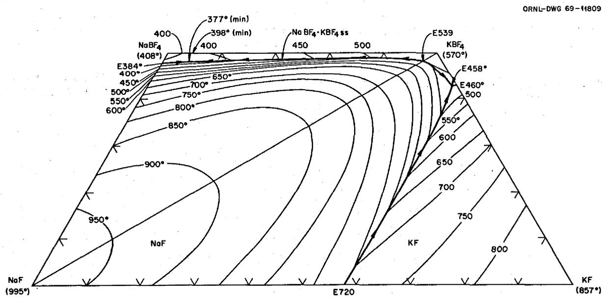  
Fig. 12.2. The System NaF-KF-BF $_3$ .

observed to be etched, and the powder had caked quite badly. We believe that HF or free $\mathbf{BF}_3$ remaining in the product after cooling to room temperature was responsible for both phenomena.

We found earlier that recrystallization of $\mathrm{NaBF_4}$ from 0.5 or $1M$ HF solution gave a fairly pure product. In an effort to produce oxygen-free $\mathrm{NaBF_4}$ we dissolved $\mathrm{NaBF_4}$ recrystallized from dilute HF in concentrated $(48\%)$ HF. Chemical analysis of the first crop of crystals that separated from the cold concentrated HF solution showed it to be a mixture of $\mathrm{NaBF_4}$ and NaF-HF.

One portion of a subsequent crop of crystals, after heating under a vacuum at about $150^{\circ}\mathrm{C}$ , gave an analysis that corresponded closely to the theoretical values for $\mathrm{NaBF}_4$ . The oxygen content of this material was 200 ppm, as low as any $\mathrm{NaBF}_4$ prepared to date, but it was reported to contain 500 ppm $\mathrm{H}_2\mathrm{O}$ . The other portion of this crop contained 340 ppm oxygen and 300 ppm $\mathrm{H}_2\mathrm{O}$ after 24 hr in a vacuum desiccator at room temperature. This technique may warrant further investigation for the laboratory-scale preparation of pure $\mathrm{NaBF}_4$ .

# 12.10 ATTEMPTED SYNTHESIS OF $\mathrm{NaBF}_3\mathrm{OH}$

L. O. Gilpatrick C. J. Barton

Hydroxyfluoroborates are of interest because they are hydrolysis products of the tetrafluoroborates and they will undoubtedly increase the corrosiveness of fluoroborate coolant materials. The successful synthesis of $\mathrm{KBF}_3\mathrm{OH}$ by the reaction

$$
2 \mathrm {K H F} _ {2} + \mathrm {H} _ {3} \mathrm {B O} _ {3} \xrightarrow {\circ^ {\circ} \mathrm {C}} \mathrm {K B F} _ {3} \mathrm {O H} + \mathrm {K F} + 2 \mathrm {H} _ {2} \mathrm {O}
$$

was reported earlier.20 We attempted to make $\mathrm{NaBF}_3\mathrm{OH}$ by a similar technique, but the product contained two phases in approximately equal amounts. One was $\mathrm{NaBF}_4$ and the other had a higher refractive index and was assumed to be the desired product, $\mathrm{NaBF}_3\mathrm{OH}$ . We attempted to separate the two products by dissolving the $\mathrm{NaBF}_4$ in hot acetone or a mixture of acetone and water, but the separation was not complete. We then found that addition of an organic amine to hot acetone resulted in complete solution of the $\mathrm{NaBF}_4$ , but a small amount of NaF was present in the residue. This was removed by dissolving the product in a small amount of water, filtering off the slightly soluble NaF, and recrystallizing the product by slowly evaporating the water. The resulting product appeared to be single-phase material when examined under the microscope. It had a refractive index of about 1.355, as compared to 1.305 for $\mathrm{NaBF}_4$ . Its chemical analysis corresponded very closely to the empirical formula $\mathrm{NaBF}_2\mathrm{O}$ . When heated for the first time in a sealed nickel capsule in the DTA apparatus, a large thermal effect was observed at about $408^{\circ}\mathrm{C}$ , near the melting point of $\mathrm{NaBF}_4$ , but subsequent thermal cycling revealed no significant thermal effects. When the capsule was opened at room temperature and examined under the microscope, the material was found to consist of NaF embedded in a glassy, water-soluble phase. Efforts to use infrared absorption to identify the $\mathrm{NaBF}_2\mathrm{O}$ compound, a formulation that does not appear to exist in the literature, have not as yet produced useful results. We plan to try other methods of making $\mathrm{NaBF}_3\mathrm{OH}$ , and we will also try to characterize the product we made, since it has apparently not been previously reported.

20C. J. Barton, L. O. Gilpatrick, and H. Insley, MSR Program Semiann. Progr. Rept. Aug. 31, 1968, ORNL-4344, p. 156.

# 13. Physical Chemistry of Molten Salts

# 13.1 PHASE RELATIONS IN THE SYSTEM LiF-BeF2-CeF3

C. J. Barton

L. O. Gilpatrick

H. Insley

As part of a long-range study of phase relations in the system $\mathrm{LiF - BeF_2 - ThF_4 - CeF_3}$ , which will allow prediction of the behavior of $\mathrm{PuF_3}$ in $\mathrm{LiF - BeF_2 - ThF_4}$ mixtures, we prepared nine mixtures in the system $\mathrm{LiF - BeF_2 - CeF_3}$ . Our immediate objective was to establish the temperature and composition of the $\mathrm{BeF_2 - CeF_3}$ eutectic, but the viscosity of $\mathrm{BeF_2}$ -rich compositions at temperatures below the melting point of $\mathrm{BeF_2}$ ( $555^{\circ}\mathrm{C}$ ) is believed to be too high to permit ready attainment of equilibrium. Thoma et al. made small additions of NaF to $\mathrm{BeF_2 - ThF_4}$ mixtures to lower the viscosity and to speed the attainment of equilibrium in the determination of the $\mathrm{BeF_2 - ThF_4}$ eutectic temperature and composition, but we chose to add LiF rather than NaF because of the need to establish phase relations in the ternary system $\mathrm{LiF - BeF_2 - CeF_3}$ . The $\mathrm{CeF_3}$ solubility work of Ward et al. established liquidus temperatures for compositions in this system containing 28.5 to 48.4 mole $\%$ $\mathrm{BeF_2}$ .

The mixtures were prepared by weighing the required amounts of ground, distilled $\mathrm{BeF}_2$ , LiF, and $\mathrm{CeF}_3$ into graphite crucibles, adding $\mathrm{NH}_4\mathrm{F}\cdot \mathrm{HF}$ , and heating to about $800^{\circ}\mathrm{C}$ in a flowing helium atmosphere. Some of the $\mathrm{BeF}_2$ distilled out of the crucibles during this process, and all the fused mixtures were weighed after cooling to room temperature in order to measure the loss in weight before grinding. Since LiF and $\mathrm{CeF}_3$ have low vapor pressures at $800^{\circ}\mathrm{C}$ , the weight loss was assumed to be due entirely to evaporation of $\mathrm{BeF}_2$ . Analyses of two compositions now available do not agree with the values calculated on this assumption.

Portions of the ground mixtures were sealed in gradient quench tubes and heated for 21 days before quenching. The results of this preliminary investigation can be summarized as follows:

1. $\mathbf{BeF}_2$ was observed as the primary phase (at $547^{\circ}\mathrm{C}$ ) in only one mixture, LiF- $\mathbf{BeF}_2$ - $\mathbf{CeF}_3$ (0.6-97.9-1.5 mole % by analysis).   
2. Liquidus temperatures in the $\mathbf{CeF}_3$ primary phase

field increase rapidly with increasing $\mathbf{CeF}_3$ content, as might be expected from the very high melting point $(1460^{\circ}\mathrm{C})$ of $\mathbf{CeF}_3$ .

3. The temperature of appearance of two crystalline phases $(\mathrm{CeF}_3$ and $\mathrm{BeF}_2)$ in equilibrium with liquid was surprisingly reproducible, falling in the range $538 \pm 3^{\circ}\mathrm{C}$ for seven mixtures. This is probably near the $\mathrm{BeF}_2$ - $\mathrm{CeF}_3$ eutectic temperature.   
4. Evidence of liquid immiscibility (two glasses) was noted in two compositions, that listed under item 1 above and $\mathrm{LiF - BeF_2 - CeF_3}$ (0.5-86.1-9.5 mole % by analysis), in the approximate temperature range 570 to $540^{\circ}\mathrm{C}$ .

Tests now under way will show whether equilibrium in $\mathsf{BeF}_2$ -rich $\mathsf{BeF}_2$ - $\mathsf{CeF}_3$ compositions can be achieved by a long equilibration period.

# 13.2 HETEROGENEOUS EQUILIBRIA BETWEEN CERIUM-CONTAINING MOLTEN FLUORIDES AND OXIDE PHASES

C.E.Bamberger C.F.Baes,Jr.

In search of an alternative method for removal of rare-earth fission products from MSBR fuels, we have begun a series of experiments to synthesize sparingly soluble compounds containing rare earths which could act as selective ion exchangers for such fission products. The initial tests have involved as starting materials various oxides which our experience and/or available thermochemical data suggest might be stable or nearly

stable in molten fluorides and which might react with rare-earth ions in the molten fluoride phase to form a rare-earth-containing oxide phase. Any such rare-earth compound so formed would, per se, be compatible with the molten fluoride phase and might well serve as a rare-earth ion exchanger.

The formation of a double oxide in the presence of an $\mathrm{LiF - BeF_2 - ThF_4}$ melt may be considered in terms of the following reactions:

$$
\mathrm {L n F} _ {3} (d) + \frac {3}{4} \mathrm {T h O} _ {2} (c) \rightleftharpoons \frac {1}{2} \mathrm {L n} _ {2} \mathrm {O} _ {3} (c) + \frac {3}{4} \mathrm {T h F} _ {4} (d). \tag {1}
$$

(The presence of $\mathrm{ThO_2}$ as an equilibrium oxide phase should provide the maximum concentration of dissolved oxide.) Available thermochemical data3 suggest that $\Delta G(1)$ for this reaction is $\sim +35$ kcal for cerium and $\sim +15$ kcal for samarium or europium. It is evident that if the reaction

$$
n \mathrm {M O} _ {z / 2} + \frac {1}{2} \mathrm {L n} _ {2} \mathrm {O} _ {3} \rightarrow \mathrm {L n M} _ {n} \mathrm {O} _ {(n z + 3) / 2} \tag {2}
$$

can provide the needed negative free energy [i.e., $\Delta G(2)$ more negative than $-15$ to $-35\mathrm{kcal}]$ then the double oxide should form by reaction of $\mathbf{MO}_{z / 2}$ , $\mathbf{ThO_2}$ , and dissolved $\mathbf{LnF}_3$ ,

$$
\begin{array}{l} \mathrm {L n F} _ {3} (d) + n \mathrm {M O} _ {2 / 2} (c) + \frac {3}{4} \mathrm {T h O} _ {2} (c) \rightleftharpoons \frac {3}{4} \mathrm {T h F} _ {4} (d) \\ + \operatorname {L n M} _ {n} \mathrm {O} _ {(n z + 3) / 2} (c) \tag {3} \\ \end{array}
$$

The high stability required of the double oxide suggests that it should appear in the $\mathrm{MO}_{z/2} - \mathrm{Ln}_2\mathrm{O}_3$ binary system as a congruently melting phase. It is also evident that the oxide $\mathrm{MO}_{z/2}$ must be stable - or nearly so - in the presence of the molten LiF-BeF $_2$ -ThF $_4$ phase; that is, there should be no extensive metathesis reaction to precipitate large amounts of ThO $_2$ ,

$$
\mathrm {M O} _ {z / 2} + \frac {z}{4} \mathrm {T h} ^ {4 +} \Rightarrow \mathrm {M} ^ {z +} + \frac {z}{4} \mathrm {T h O} _ {2} (c), \tag {4}
$$

or oxidation reaction, for example, of nickel,

$$
\begin{array}{l} \mathrm {M O} _ {z / 2} (c) + \frac {z - y}{2} \mathrm {N i} (c) + \frac {y}{4} \mathrm {T h} ^ {4 +} \rightleftharpoons M ^ {y +} \\ + \frac {z - y}{2} \mathrm {N i O} (c) + \frac {y}{4} \mathrm {T h O} _ {2} (c). \tag {5} \\ \end{array}
$$

Oxides of chromium, iron, and vanadium were chosen for testing because their oxidation reactions with nickel were predicted not to be extensive (Table 13.1) and because the binary systems $\mathrm{Cr_2O_3 - Ln_2O_3}$ , $\mathrm{Fe_2O_3}$

$$
\begin{array}{l} \mathrm {M O} _ {z / 2} (c) + \frac {z - y}{2} \mathrm {N i} (c) + \frac {y}{4} \mathrm {T h} ^ {4 +} \rightleftharpoons \mathrm {M} ^ {y +} \\ + \frac {(z - y)}{2} \mathrm {N i O} (c) + \frac {y}{4} \mathrm {T h O} _ {2} (c) \\ \end{array}
$$

$$
K = X _ {\mathrm {M} ^ {y +}} / \left(X _ {\mathrm {T h} ^ {4 +}}\right) ^ {y / 4}
$$

Table 13.1. Predicted Extent of Reaction of Various Oxides $(\mathrm{MO}_{z / 2})$ with Molten LiF-BeF2-ThF4 (72-16-12 Mole %) Saturated with NiO and $\mathbf{ThO_2}$ and Contained in Nickel at $600^{\circ}C$   

<table><tr><td rowspan="2">Oxide</td><td rowspan="2">Reaction Product</td><td colspan="2">Calculated Concentrationa</td></tr><tr><td>Mole Fraction</td><td>ppm</td></tr><tr><td>NiO</td><td>·Ni2+</td><td>6 × 10-5</td><td>60</td></tr><tr><td rowspan="2">Cr2O3</td><td>Cr2+</td><td>4 × 10-8</td><td>0.03</td></tr><tr><td>Cr3+</td><td>5 × 10-8</td><td>0.04</td></tr><tr><td rowspan="2">Fe3O4</td><td>Fe2+</td><td>0.002</td><td>1800</td></tr><tr><td>Fe3+</td><td>2 × 10-6</td><td>2</td></tr><tr><td rowspan="2">V2O5</td><td>V2+</td><td>~10-13</td><td>~10-7</td></tr><tr><td>V3+</td><td>~10-11</td><td>~10-5</td></tr><tr><td>Al2O3</td><td>Al3+</td><td>Extensive reaction</td><td></td></tr></table>

$a$ Estimated from the sources of free energy values listed in ref. 3.

$\mathrm{Ln_2O_3}$ , and $\mathbf{V}_2\mathbf{O}_5 - \mathbf{Ln}_2\mathbf{O}_3^4$ all contain congruently melting intermediate compounds. The possible reactions which might produce rare-earth-containing oxides are listed in Table 13.2, reactions 1-3. Note that in the case of $\mathrm{Fe_3O_4}$ , since oxidation is necessary to produce $\mathrm{LnFeO_3}$ , the reaction is favored by an oxidant, for example,NiO.

Silicates were also included in these tests since rare earths often are found associated with the mineral thorite $\left(\mathrm{ThSiO}_2\right)$ . The compounds $\mathrm{ThSiO}_4$ and $\mathrm{SiO}_2$ are expected to be stable phases in the presence of LiF-BeF $_2$ -ThF $_4$ melts at low partial pressures of $\mathrm{SiF}_4$ . Solid solutions of $\mathrm{UO}_2$ - $\mathrm{ThO}_2$ were also tested. In these two instances possible extraction reactions, if any,

Table 13.2. Possible Reactions for Extraction of Rare-Earth Cations from   
Molten LiF-BeF $_2$ -ThF $_4$   

<table><tr><td>1. 1/2Cr2O3(c) + 3/4ThO2(c) + Ln3+→3/4Th4+ + LnCrO3(c)</td></tr><tr><td>2. 1/3Fe3O4(c) + 3/4ThO2 + 1/6NiO(c) + Ln3+→3/4Th4+ + 1/6Ni(c) + LnFeO3(c)</td></tr><tr><td>3. 1/2V2O5(c or l) + 3/4ThO2(c) + Ln3+→3/4Th4+ + LnVO4(c)</td></tr><tr><td>4.a 1/2Th4+(SiO4) + F- + Ln3+→1/2Th4+ + F-(SiO4) + Ln3+(SiO4)</td></tr><tr><td>5.b 2U4+(O) + Ln3+→U3+ + U5+(O) + Ln3+(O)</td></tr></table>

$a^{\prime \prime}\mathrm{SiO}_4$ denotes an ion in a ThSiO lattice.   
$b^{*}\mathrm{O}^{*}$ denotes an ion in a $\mathrm{UO}_2\text{-ThO}_2$ solid solution.

might occur by replacement of a $\mathbf{Th}^{4 + }$ cation in the silicate or oxide lattice with two $\mathrm{Ce}^{3 + }$ plus two $\mathbf{F}^{-}$ ions (Table 13.2, reaction 4). In the case of the $\mathrm{UO}_2\text{-}\mathrm{ThO}_2$ solid solution, $\mathbf{Ln}^{3 + }$ cations might also enter the oxide lattice by releasing one $\mathbf{U}^{3 + }$ cation and oxidizing one $\mathbf{U}^{4 + }$ lattice cation to $\mathbf{U}^{5 + }$ (Table 13.2, reaction 5).

$\mathrm{Al_2O_3}$ is of interest and was included in these initial tests not only because it forms congruently melting compounds with rare-earth oxides but also because it, along with $\mathrm{SiO_2}$ , is a principal component of zeolite-molecular sieve materials which could act as ion exchangers.

The experimental technique consisted in stirring 0.1 mole or more of the oxide starting material with $\sim 500$ g of fluoride melt of a composition near LiF-BeF $_2$ -ThF $_4$ (72-16-12 mole %) in a leak-tight stirred vessel under argon or a mixture of argon- $4\%$ hydrogen. Cerium fluoride, usually 0.05 mole, was added as the representative rare earth because of the convenience of the tracer ${}^{144}\mathrm{Ce}$ which was incorporated into the fluoride mixture together with inert CeF $_3$ . The concentration of cerium in filtered samples was determined radiometrically with a precision of $\pm 3\%$ . Occasionally, samples of the solid phase were taken, and the stable solid compounds present were determined by x-ray and petrographic methods. ThO $_2$ was generally added to supply oxide ions.

The various tests are summarized in Table 13.3:

1. The equilibration of a melt containing $\mathrm{CeF}_3$ with $\mathrm{SiO}_2 + \mathrm{ThSiO}_4$ with $\mathrm{ThSiO}_4 + \mathrm{ThO}_2$ at $700^{\circ}\mathrm{C}$ did not produce a detectable cerium removal. The $\mathrm{ThSiO}_4$ was synthesized from $\mathrm{ThO}_2$ and $\mathrm{SiO}_2$ during these equilibrations, confirming the expected stability of this phase.

2. A $\mathrm{UO_2 - ThO_2}$ solid solution dilute in $\mathrm{UO_2}$ seemed to produce a slight removal of cerium from a fluoride phase containing a low concentration of cerium $(X_{\mathrm{CeF}_3} \sim 3 \times 10^{-4})$ . A $\mathrm{UO_2 - ThO_2}$ solid solution rich in $\mathrm{UO_2}$ caused the removal of much more cerium, but after cooling none was found associated with the oxide phase. Similarly, in a subsequent experiment at a higher concentration of cerium in the fluoride melt $(X_{\mathrm{CeF}_3} \sim 7 \times 10^{-3})$ , no cerium removal was detected, and no cerium activity was found in the separated oxide phase, even when NiO was added to favor reaction 5 in Table 13.2. At present we have no explanation for the removal of cerium observed in the earlier test.

3. $\mathrm{Cr_2O_3}$ with or without $\mathrm{ThO_2}$ did not show any cerium extraction (Table 13.2, reaction 1). This oxide was found to be stable, as expected. Indeed, it is probable that the amount of chromium dissolved in the melt (Table 13.3) was much lower than the analytical value because of incomplete removal of $\mathrm{Cr_2O_3}$ from the filtered samples. On the chance that the concentration of chromium in the melt at equilibrium was low enough to cause slow kinetics, $\mathrm{CrF_3}$ was added to precipitate $\mathrm{CeCrO_3}$ from the melt:

$$
\begin{array}{l} \mathrm {C r F} _ {3} (d) + \mathrm {C e F} _ {3} (d) + \frac {3}{2} \mathrm {T h O} _ {2} (c) \rightarrow \mathrm {C e C r O} _ {3} (c) \\ + \frac {3}{2} \operatorname {T h F} _ {4} (d). \tag {6} \\ \end{array}
$$

No detectable amount of cerium was removed.

4. Magnetite, $\mathrm{Fe_3O_4}$ , produced no detectable extraction with or without $\mathrm{ThO_2}$ present. The addition of $\mathrm{NiF_2}$ as an oxidant to promote reaction 2 in Table

Table 13.3. Tests of Rare-Earth Extraction from Molten LiF-BeF $_2$ -ThF $_4$ (72-16-12 Mole %) by Various Oxides   

<table><tr><td>Reagent Added to Melta</td><td>Oxide Phases PresentbAfter Contact with Meltb</td><td>Temperature (°C)</td><td>Cerium Remaining in Melt (%)</td><td>Solute Concentration in Meltc(mole %)</td></tr><tr><td>26 ThO2+ 34 SiO2+ 28 ThO2 + CeF3</td><td>ThO2ThSiO4 + SiO2ThSiO4 + ThO2</td><td>700–800</td><td>100</td><td>Ce3+ = 0.067Ce3+ = 0.067Ce3+ = 0.88</td></tr><tr><td>14 (0.28 UO2, 0.72 ThO2)</td><td>0.28 UO2·72 ThO2</td><td>700</td><td>96</td><td>Ce3+ = 0.043, U4+ = 0.018</td></tr><tr><td>38 (0.88 UO2, 0.12 ThO2)</td><td>0.88 UO2·12 ThO2</td><td>700</td><td>78</td><td>Ce3+ = 0.03, U4+ = 0.33</td></tr><tr><td>38 (0.93 UO2, 0.07 ThO2)</td><td>0.86 UO2·14 ThO2</td><td>725</td><td>100</td><td>U4+ = 0.15</td></tr><tr><td>18 Cr2O3+ 20 CrF3 + 40 ThO2</td><td>Cr2O3Cr2O3+ ThO2</td><td>700</td><td>100</td><td>Cr2+ = 0.12, Ni2+ = 0.021Cr2+ = 0.075, Ni2+ = 0.005</td></tr><tr><td rowspan="4">10 Fe3O4+ 22 ThO2+ 6 NiF2</td><td rowspan="4">Fe3O4Fe3O4+ ThO2Fe3O4+ ThO2 + [NiO]</td><td>700</td><td>100</td><td rowspan="4">Fe2+ = 0.042, Ni2+ = 0.024Fe2+ = 0.042, Ni2+ = 0.017Fe2+ = 0.11, Ni2+ = 0.019Fe2+ = 0.34, Ni2+ = 0.029</td></tr><tr><td>550</td><td>100</td></tr><tr><td>550</td><td>94</td></tr><tr><td>650</td><td>97</td></tr><tr><td rowspan="3">14 V2O5+ 8 NiO+ 20 ThO2 + 67 V2O5</td><td rowspan="3">V2O5V2O5+ [Ni(VO3)2]V2O5+ ThO2 + [Ni(VO3)2]</td><td>600</td><td>100</td><td>V3+ = 0.013, Ni2+ = 0.020</td></tr><tr><td>600</td><td>98</td><td>V3+ = 0.006, Ni2+ = 0.010</td></tr><tr><td>740</td><td>93</td><td>V3+ = 0.04, Ni2+ = 0.020</td></tr><tr><td>67 Al2O3</td><td>ThO2</td><td>700</td><td>100</td><td>Li+ = 68, Be2+ = 17, Th4+ = 4, Al3+ = 11</td></tr></table>

${}^{a}$ Numbers indicate millimoles of oxide added per mole (63.2 g) of ${\mathrm{{LiF} - {BeF}}}_{2} - {\mathrm{{ThF}}}_{4}$ (72-16-12 mole %).   
$b_{\text{Phases in brackets}}$ are presumed to be present but were not identified.   
Where not specified the $\mathrm{Ce}^{3+}$ concentration was 0.67 mole%.

13.2 produced a small amount of cerium removal, though again the precipitated phase was not established. With both NiO and $\mathrm{ThO_2}$ present, the amount of $\mathrm{Fe}^{2+}$ found in solution was in excellent agreement with the predicted value (Table 13.1).

5. The equilibration of $\mathbf{V}_2\mathbf{O}_5$ with a cerium-containing melt together with NiO and $\mathrm{ThO_2}$ (reaction 3, Table 13.2) showed some cerium removal, and then more removal when the amount of $\mathbf{V}_2\mathbf{O}_5$ was increased and the temperature was raised above the melting point of $\mathbf{V}_2\mathbf{O}_5$ ( $\sim 670^{\circ}\mathrm{C}$ ). After termination of this run, extensive corrosion of the nickel thermocouple well was found. We attribute this to mass transfer of nickel caused by the formation of an $\mathrm{NiO - V_2O_5}$ liquid phase. In a future test, the addition of NiO will be omitted. The low vanadium concentrations found in samples of the fluoride melt tend to confirm the predicted stability of $\mathbf{V}_2\mathbf{O}_5$ . Again, these values are thought to be high because of incomplete separation of the $\mathbf{V}_2\mathbf{O}_5$ phase from the filtered sample.   
6. $\mathrm{Al}_{2}\mathrm{O}_{3}$ was found to react completely with the fluoride melt to produce solid $\mathrm{ThO}_2$ . Analysis of

filtered samples showed large amounts of dissolved $\mathrm{AlF_3}$ and, below $700^{\circ}\mathbf{C}$ , composition changes which indicated the separation of a fluoride phase rich in LiF, $\mathrm{ThF_4}$ , and $\mathrm{AlF_3}$ , and containing some cerium. The instability of $\mathrm{Al_2O_3}$ plus the fact that the $\mathrm{Al_2O_3 - SiO_2}$ phase diagram shows no high-melting intermediate phase suggests that zeolite $(\mathrm{Al_2O_3 - SiO_2})$ ion exchangers would also be unstable in the presence of molten fluorides.

While thus far these tests have revealed no oxide material which could act as an effective agent for rare-earth removal from molten $\mathrm{LiF - BeF_2 - ThF_4}$ fluorides, $\mathbf{V}_2\mathbf{O}_5$ shows enough promise to warrant further study. Another important result is that we have confirmed the expected stability of these oxides in the presence of molten fluorides. $\mathrm{Cr_2O_3}$ , even though of no apparent use as an extractant for rare earths, may prove useful as a container or insulator material for MSBR fluorides. We have not exhausted the list of oxide materials which form double oxides with rare earths and which might be stable or nearly stable in molten fluorides. Among the oxides soon to be tested, in addition to further tests of $\mathbf{V}_2\mathbf{O}_5$ , are $\mathrm{TiO_2}$ , $\mathrm{ZrO_2}$ ,

$\mathrm{Nb}_2\mathrm{O}_5$ $\mathrm{Ta}_{2}\mathrm{O}_{5}$ , and $\mathrm{MoO_2}$ . In these tests rare earths heavier than cerium (whose tracer $^{144}\mathrm{Ce}$ we have used as an analytical convenience) will be present, since these should have a greater tendency to form the desired double-oxide phases.

# 13.3 LIQUIDUS TEMPERATURES IN THE SYSTEM LiF-BeF2-ThF4

C.J.Barton L.O.Gilpatrick H.Insley

During the course of fractional crystallization studies of $\mathrm{LiF - BeF_2}\cdot \mathrm{ThF_4}\cdot \mathrm{CeF_3}$ mixtures described in the previous report, it was observed that the liquidus temperature of the mixture having the composition $\mathrm{LiF - BeF_2}\cdot \mathrm{ThF_4}$ (60-28-12 mole $\%$ , average of four analyses; calculated composition 58-30-12 mole $\%$ ) was at least $50^{\circ}C$ higher than predicted by the published phase diagram. It seemed worth while, therefore, to redetermine liquidus temperatures of several compositions in this system that have been, or may be, of interest for use in breeder reactors. The measurements were made by use of the gradient quenching and DTA techniques. The results are recorded in Table 13.4. The liquidus values for the 72 and 68 mole $\%$ LiF mixtures, in the composition range presently favored for MSBR use, are in fair agreement with literature values. However, the new values for the 64 and 58 mole $\%$ LiF compositions show that they are not suitable for reactor use and that the range of $\mathrm{LiF - BeF_2}$ solvent compositions for such use is not as wide as the published phase diagram indicates.

The phases observed in the quenched samples agreed, in general, with the predictions of the published diagram, but some thermal effects were observed in the DTA curves that could not be explained by the quenching data. This is probably due to the fact that the quenching technique gives equilibrium data, whereas DTA is a dynamic process.

Table 13.4. Liquidus Temperatures in the System LiF-BeF $_2$ -ThF $_4$   

<table><tr><td colspan="3">Composition (mole %)</td><td colspan="3">Liquidus Temperature (℃)</td></tr><tr><td>LiF</td><td>BeF2</td><td>ThF4</td><td>Literature</td><td>Quenching</td><td>DTA</td></tr><tr><td>72</td><td>16</td><td>12</td><td>500</td><td>503</td><td>512</td></tr><tr><td>68</td><td>20</td><td>12</td><td>480</td><td>502</td><td>500</td></tr><tr><td>64</td><td>24</td><td>12</td><td>500</td><td>&gt;559</td><td>576</td></tr><tr><td>58</td><td>30</td><td>12</td><td>~525</td><td>602</td><td>618</td></tr></table>

# 13.4 THE SOLUBILITY OF THORIUM IN THORIUM TETRAFLUORIDE

A.S.Dworkin M.A.Bredig

Thermal analysis measurements were made to determine the eutectic temperature in the Th-ThF4 system, and through combination with the entropy of fusion of ThF4, the solubility of Th in ThF4. The eutectic temperature was found to be only 1 to $2^{\circ}$ lower than the melting point $(1110^{\circ}\mathrm{C})$ of ThF4, indicating a solubility of about 0.1 to 0.2 mole % Th in ThF4. This is of the same low order of magnitude as the solubility in 3LiF-ThF4 and as the solubilities of La, Ce, and Nd in their respective trifluorides, which we had measured earlier.

The low solubility of Th in $\mathrm{ThF_4}$ indicates that the formation of a stable trivalent thorium fluoride in any appreciable concentration is unlikely.

# 13.5 POTENTIOMETRIC DETERMINATION OF THE $\mathbf{U}^{4 + } / \mathbf{U}^{3 + }$ RATIO IN MOLTEN FLUORIDES

B.F.Hitch C.F.Baes,Jr.

The $\mathbf{U}^{4 + } / \mathbf{U}^{3 + }$ couple has been compared as previously described with the Ni,NiO,BeO reference electrode in the following cell:

$$
\mathrm {P t} (c) \left| \begin{array}{l} \mathrm {U F} _ {4}, \mathrm {U F} _ {3}, \\ \mathrm {L i F}, \mathrm {B e F} _ {2} \end{array} \right| \left\| \begin{array}{l} \mathrm {L i F} (0. 6 7), \\ \mathrm {B e F} _ {2} (0. 3 3), \\ \mathrm {N i F} _ {2} (\sim 1 0 ^ {- 4}) \end{array} \right| \tag {I}
$$

The Ni, NiO, BeO reference electrode was compartmented by using a silica liner inserted in a nickel tube. The silica and nickel tubes contained frits of $\sim 10\mu$ pore size. Experiments so far have been carried out in the two fluoride mixtures LiF-BeF2-UF4 (66-33-1 mole $\%$ ) and LiF-BeF2-ZrF4-UF4 (64-32-3-1). The time required for the reference electrode to reach a stable potential, once the reference electrode assembly is immersed in the melt, is 1 to 4 hr. Although the silica compartments are slowly attacked by the fluoride melts, they usually last from two to four weeks.

Measurements were made at $610^{\circ}$ by reducing $\mathbf{U}^{4+}$ to $\mathbf{U}^{3+}$ with either beryllium or zirconium metal, then oxidizing with weighed increments of anhydrous $\mathrm{NiF}_2$ . As indicated by the cell potential, a period of about 30 min was required for complete reaction of a typical 40-mg addition of $\mathrm{NiF}_2$ . In earlier experiments we tried to reduce the $\mathbf{U}^{4+}$ to $\mathbf{U}^{3+}$ incrementally by the addition of weighed amounts of beryllium or zirconium metal to the melt; however, beryllium additions gave erratic results, and while zirconium gave more reproducible results, the time required for complete reaction of zirconium with the melt was often several hours. It is possible that in these early experiments some of our difficulties may have been caused by beryllium or zirconium metal alloying with the nickel container vessel. Hence, for the initial reduction of melts in the present measurements, we have followed a procedure of carefully exposing the beryllium or zirconium metal to the melt without touching the container walls and then removing it when the desired potential was reached.

Results of several oxidation runs are shown as plots of $\log (X_{\mathbf{UF}_3} / X_{\mathbf{UF}_4})$ vs the cell potential $E_{1}$ in Fig. 13.1. The initial value of the ratio $X_{\mathbf{UF}_3} / X_{\mathbf{UF}_4}$ in each series of measurements was adjusted so that subsequent, lower ratios derived from the amounts of $\mathrm{NiF_2}$ oxidant added produced plots which were, as nearly as possible, linear and of the theoretical slope expected from the simple Nernst expression

$$
E _ {1} = E _ {1} ^ {\prime} - \frac {R T}{F} \ln \frac {X _ {\mathrm {U F} _ {4}}}{X _ {\mathrm {U F} _ {3}}}. \tag {1}
$$

This procedure was based on the assumption that the $\mathrm{NiF_2}$ added had oxidized only $\mathrm{UF_3}$ and was consumed by no other reducing agent. With the precautions cited above regarding the use of beryllium and zirconium metal in the initial reductions, this appeared to be a valid assumption since a suitable adjustment of the initial $X_{\mathrm{UF}_3} / X_{\mathrm{UF}_4}$ ratio did indeed produce linear plots of the expected slope. The plots for all runs at both melt compositions were essentially the same, giving

$$
E _ {\mathbf {I}} ^ {\prime} = 1. 0 6 7 \mathbf {v}
$$

at $610^{\circ}\mathrm{C}$

If in this cell we assume, as previously, $^{9}$ that all the current is carried across the liquid junction by the $\mathbf{L}\mathbf{i}^{+}$ ions, we may write the following reaction:

$$
\begin{array}{l} \frac {1}{2} \mathrm {N i O} (c) + \mathrm {U F} _ {3} (d) + \mathrm {L i F} (d) + \frac {1}{2} \mathrm {B e F} _ {2} (d, \mathrm {R}) \\ \rightarrow \frac {1}{2} \mathrm {N i} (c) + \frac {1}{2} \mathrm {B e O} (c) + \mathrm {U F} _ {4} (d) + \mathrm {L i F} (d, \mathrm {R}), \tag {1} \\ \end{array}
$$

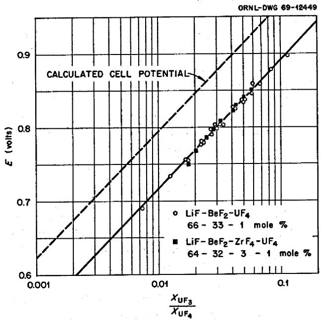  
Fig. 13.1. Potential of Cell I vs the ratio of $\mathbf{U}^{3+}$ to $\mathbf{U}^{4+}$ in LiF-BeF $_2$ Melts.

and hence the following expression for $E_{\mathbf{I}}$

$$
\begin{array}{l} E _ {1} = E _ {1} ^ {\infty} - \frac {R T}{F} \ln \frac {X _ {\mathrm {U F} _ {4}}}{X _ {\mathrm {U F} _ {3}}} - \frac {R T}{F} \ln \frac {\gamma_ {\mathrm {U F} _ {4}}}{\gamma_ {\mathrm {U F} _ {3}}} \\ \cdot \frac {1}{a _ {\mathrm {L i F}}} \cdot \frac {a _ {\mathrm {L i F} (\mathrm {R})}}{a _ {\mathrm {B e F} _ {2} (\mathrm {R})} ^ {1 / 2}}, \tag {2} \\ \end{array}
$$

where R designates solutes in the reference compartment. Since in the present measurements the reference solution closely approximated the composition 2LiF-BeF, the standard state which we have adopted for $\operatorname {LiF}(d)$ and $\mathrm{BeF}_2(d)$ , then $a_{\mathrm{LiF(R)}}$ and $a_{\mathrm{BeF_2(R)}}$ are unity. Thus we obtain the following expression for the observed value of $E_{1}^{\circ}$ , the cell potential corresponding to a unit ratio $\mathbf{U}^{4 + } / \mathbf{U}^{3 + }$ ..

$$
E _ {1} ^ {\prime} = E _ {1} ^ {\circ} - \frac {R T}{F} \ln \frac {\gamma_ {\mathrm {U F} _ {4}}}{\gamma_ {\mathrm {U F} _ {3}}} \cdot \frac {1}{a _ {\mathrm {L i F}}} \tag {3}
$$

Since the ratio $\gamma_{\mathbf{UF}_4} / \gamma_{\mathbf{UF}_3}^{10}$ and the activity of $\mathbf{LiF}^{11}$ are expected to change in opposite directions as the composition of the solution - and therefore the

free fluoride ion concentration - is changed, we would expect $E_{\mathbf{I}}^{\prime}$ to show an appreciable difference at the two melt compositions studied. Indeed, on estimating the changes expected in $\gamma_{\mathrm{UF_4}} / \gamma_{\mathrm{UF_3}}$ from the measurements by Long10 of the reaction

$$
\mathrm {U F} _ {4} (d) + \frac {1}{2} \mathrm {H} _ {2} (g) \rightleftharpoons \mathrm {U F} _ {3} (d) + \mathrm {H F} (g) \tag {II}
$$

and the changes in $a_{\mathbf{LiF}}$ expected from our measurements of the cell reaction11

$$
2 \mathrm {H F} (g) + \operatorname {B e} (c) \rightarrow \operatorname {B e F} _ {2} (d) + \mathrm {H} _ {2} (g), \tag {III}
$$

we would expect $E_{\mathbf{I}}^{\prime}$ for the two melts to differ by $\sim 38$ mv. The absence of a detectable difference in $E_{\mathbf{I}}^{\prime}$ for the two melts suggests that they both have about the same free fluoride ion activity, which is quite surprising since the presence of 3 mole $\%$ $\mathrm{ZrF_4}$ in one melt is expected to appreciably lower the concentration of free fluoride ion. The effect, or lack of effect, of melt composition on $E_{\mathbf{I}}^{\prime}$ will be examined further.

Another surprising result is that the observed value of $E_{\mathbf{I}}^{\prime}$ differs some 85 mv (Fig. 13.1) from the values of $E_{\mathbf{I}}^{\circ}$ which may be derived by combining the measurements for reactions II, III, and the following previously reported cell reaction:

$$
\operatorname {B e} (c) + \operatorname {N i O} (c) \rightarrow \operatorname {B e O} (c) + \operatorname {N i} (c). \tag {IV}
$$

Thus $E_{\mathbf{I}}^{\circ}$ should be given by

$$
E _ {\mathrm {I}} ^ {\circ} = E _ {\mathrm {I V}} ^ {\circ} - E _ {\mathrm {I I I}} ^ {\circ} - E _ {\mathrm {I I}} ^ {\circ} = 1. 2 9 1 - 0. 1 5 7 T / 1 0 ^ {3}, \tag {4}
$$

and at $610^{\circ}\mathbf{C}E_{\mathbf{I}}^{\circ}$ should be 1.147 v. Since one of the present melt compositions is quite close to 2LiF-BeF, wherein $E_{\mathbf{I}}^{\prime}$ must equal $E_{\mathbf{I}}^{\circ}$ by definition, the difference between the observed value of $E_{\mathbf{I}}^{\prime}$ and the predicted value of $E_{\mathbf{I}}^{\circ}$ cannot be attributed to medium effects alone. This discrepancy prompted us to recheck our previous potentiometric measurements of cell IV, $^9$

$$
\mathrm {B e} ^ {\circ} \left[ \text {L i F - B e F} _ {2} \right] \left[ \text {L i F , B e F} _ {2} \right] \left[ \text {N i O} (c) \right. \left. \text {B e O} (c) \right] \left[ \text {N i} ^ {\circ} \quad . \quad (\mathrm {V}) \right.
$$

The results over a temperature range of 500 to $700^{\circ}\mathrm{C}$ confirmed our earlier data. Thus we have no explanation for the inconsistency but plan to investigate it further.

Measurements of cell I so far indicate that the Ni, NiO, BeO electrode should be a satisfactory reference electrode for the potentiometric determination of the $\mathbf{U}^{4 + } / \mathbf{U}^{3 + }$ ratio in LiF-BeF $_2$ melts. The reproducibility thus far obtained (Fig. 13.1) suggests that accuracy of

the order of $\pm 5\%$ can be attained in the determination of this ratio once the value of $E^{\prime}$ has been established accurately from known $\mathrm{U}^{4 + } / \mathrm{U}^{3 + }$ ratios in the melt composition of interest.

# 13.6 REFINEMENT OF THE UF3 SPECTRUM

L.M.Toth

Successful development of diamond-windowed spectrophotometric cells $^{12}$ has enabled us to maintain stable molten salt solutions of $\mathrm{UF}_3$ and thereby to initiate a study of the absorption spectra in LiF-BeF $_2$ - $\mathrm{UF}_3$ melts. The spectrum of $\mathrm{UF}_3$ in LiF-BeF $_2$ (66-34 mole %) was investigated with the concentration of $\mathrm{UF}_3 \cong 0.3$ mole %. The spectrum of $\mathrm{UF}_3$ from 650 to $2500\mathrm{m}\mu$ was found to agree well with the set of values reported previously. $^{13}$ The measured absorption coefficient $^{14}$ at $890\mathrm{m}\mu$ was 40 liters $\mathrm{mole}^{-1}\mathrm{cm}^{-1}$ (cf. $\epsilon_{890} \cong 42$ previously $^{13}$ ).

The region from 250 to $650\mathrm{m}\mu$ , however, does not agree with the previous $\mathbf{U}\mathbf{F}_3$ spectrum. The peak positions are identical, but their intensities are greater by approximately a factor of 2. In particular $\epsilon_{360}$ was found to be 860 liters mole-1 cm-1 (cf. $\epsilon_{360}\cong 440$ liters mole-1 cm-1).13

This new value of $\epsilon_{360} = 860$ liters mole $^{-1}$ cm $^{-1}$ is consistent with what is expected by comparing spectra of $\mathbf{U}^{3+}$ in nonfluoride systems. $^{13}$ This refinement of $\pmb{\epsilon}$ at $360~\mathrm{m}\mu$ was achieved by comparing relative absorbances at 360 and $890~\mathrm{m}\mu$ in the same spectrum. Thus, using Beer's law,

$$
\frac {A _ {3 6 0}}{A _ {8 9 0}} = \frac {\epsilon_ {3 6 0} \rho}{\epsilon_ {8 9 0} \rho};
$$

$A_{360} / A_{890}$ was measured, and $\epsilon_{890}$ was calculated from concentrated $\mathrm{UF}_3$ solutions. With these values $\epsilon_{360}$ was calculated from the above equation.

The importance of measuring relative absorbances of the two peaks should be stressed. A spectrum that checks in this manner is referred to here as internally consistent. The details of the method used as well as the corrected $\mathrm{UF}_3$ spectrum will be reported later.

Table 13.5. U(III) Concentration as Percent of Total U   

<table><tr><td colspan="4">Spectrophotometric</td><td>Potentiometric</td><td>Voltammetric</td></tr><tr><td>Peaks Useda in Determination (mμ)</td><td>Old Value</td><td>Corrected Value</td><td></td><td></td><td></td></tr><tr><td>a</td><td>360</td><td>&lt;0.2</td><td>&lt;0.1</td><td>0.06</td><td>0.01</td></tr><tr><td>b</td><td>360</td><td>1.5</td><td>0.75</td><td>0.9-1.1</td><td>0.7-1.0</td></tr><tr><td>c</td><td>360</td><td>3.5</td><td>1.75</td><td>1.7-1.8</td><td>1.1-1.5</td></tr><tr><td>d</td><td>890</td><td>12.0</td><td>12.0</td><td>9.7</td><td>10.0</td></tr></table>

$\pmb{a}$ Private communication with J.P. Young.

This correction is of particular MSR interest because of its effect on $\mathrm{UF_3 / UF_4}$ ratios measured spectrophotometrically. Applying the correction to $\mathrm{UF_3 / UF_4}$ determinations where the $360\text{-m}\mu$ peak was used would reduce the previous values to approximately $\frac{1}{2}$ their value. For example, Table 15.1 of Sect. 15.2 (this report) would be corrected as shown in Table 13.5.

In every case where the $360\text{-}\mathfrak{m}\mu$ peak was used (values $a, b,$ and $c$ ), better agreement is achieved by applying the correction. Although the value for $a$ was below the detection limits of the instrument,[15] the correction is still legitimate. Furthermore it demonstrates that the sensitivity limit of the spectrophotometric method is at least one-half that which would be anticipated from the old value in the table. No correction was applied to $d$ because the $890\text{-}\mathfrak{m}\mu$ peak was used. The net result of the $360\text{-}\mathfrak{m}\mu$ absorption coefficient correction is better agreement of the spectrophotometric method with the other two methods.

Base-line uncertainty and light scatter can account for approximately $10\%$ error in $\epsilon_{360} = 860$ . Further refinement within this $10\%$ uncertainty is foreseen and will be reported as these sources of error are examined.

# 13.7 EMF MEASUREMENTS WITH CONCENTRATION CELLS WITH TRANSFERENCE IN MOLTEN MIXTURES OF LiF AND $\mathbf{BeF}_2$

K.A.Romberger J.Braunstein

As part of a general investigation orientated toward characterizing ionic mobilities in fused salts, emf measurements are being made in the LiF-BeF $_2$ system which employ the concentration cell with transference

$$
\mathrm {B e} \left| \begin{array}{l l} \mathrm {L i F} & \mathrm {L i F} \\ \mathrm {B e F} _ {2} & \mathrm {B e F} _ {2} \\ \mathrm {I} & \mathrm {I I} \end{array} \right| \quad \text {B e}. \tag {1}
$$

The initial results from these measurements were reported in the last report of this series.16 Therein emf data $(E_{t})$ were reported for 500 and $610^{\circ}\mathrm{C}$ which were obtained with an all-silica cell. The results over a limited range suggested that the transference number of lithium ion relative to fluoride ion was unity.

Measurements have now been extended over wider ranges of composition and temperature employing both silica and recently developed all-metal cells. The sensitivity, stability, and ruggedness of the latter have been demonstrated during several lengthy experiments. New results include:

1. Isothermal measurements with silica apparatus at $700^{\circ}\mathrm{C}$ for compositions between 0.90 and 0.30 mole fraction $\mathbf{BeF}_2$ .   
2. Two different sets of isothermal measurements at $610^{\circ}\mathrm{C}$ utilizing an all-metal (nickel, molybdenum) cell which covered compositions between 0.70 and the LiF liquidus at 0.267 mole fraction $\mathrm{BeF}_2$ .   
3. Measurements along the LiF liquidus between 610 and $800^{\circ}\mathrm{C}$ using the metal cell.   
4. Isothermal measurements at $500^{\circ}\mathrm{C}$ and constant composition measurements at temperatures between $500^{\circ}\mathrm{C}$ and the liquidus temperatures for $\mathsf{BeF}_2$ and $\mathsf{Li}_2\mathsf{BeF}_4$ for compositions between 0.60 and 0.33 mole fraction $\mathsf{BeF}_2$ . The latter experiment also utilized the metal cell and is still in progress.

We have noted previously $^{16}$ that the emf data $(E_{w})$ obtained by Hitch and Baes $^{17}$ for the cell

Table 13.6. EMF's of Cells With Transference $(E_{t})$ , EMF's of Cells Without Transference $(E_{w})$ , and Lithium Ion Transference Numbers $(t_{Li})$ for the System LiF-BeF $_2$   

<table><tr><td rowspan="3">BeF2Composition Range (mole fraction)</td><td rowspan="3">1-x 1+x</td><td colspan="6">500°C</td><td colspan="6">610°C</td><td colspan="3">700°C</td></tr><tr><td colspan="3">Silica</td><td colspan="3">Metal</td><td colspan="3">Silica</td><td colspan="3">Metal</td><td colspan="3">Silica</td></tr><tr><td>ΔEt (mv)</td><td>ΔEw a (mv)</td><td>tLi</td><td>ΔEt (mv)</td><td>ΔEw (mv)</td><td>tLi</td><td>ΔEt (mv)</td><td>ΔEw a (mv)</td><td>tLi</td><td>ΔEt (mv)</td><td>ΔEw a (mv)</td><td>tLi</td><td>ΔEt (mv)</td><td>ΔEw a (mv)</td><td>tLi</td></tr><tr><td>0.30→0.33</td><td>0.5209</td><td></td><td></td><td></td><td></td><td></td><td></td><td>39.9</td><td>21.6</td><td>0.96</td><td>40.6</td><td>21.6</td><td>0.98</td><td>39b</td><td>24.7</td><td>0.83</td></tr><tr><td>0.33→0.40</td><td>0.4662</td><td>85</td><td>45.8</td><td>0.86</td><td>95.4</td><td>45.8</td><td>0.97</td><td>93.4</td><td>47.4</td><td>0.92</td><td>92.0</td><td>47.4</td><td>0.90</td><td>96</td><td>48.7</td><td>0.92</td></tr><tr><td>0.40→0.50</td><td>0.3813</td><td>93</td><td>29.4</td><td>1.21</td><td>90.8</td><td>29.4</td><td>1.18</td><td>93.8</td><td>32.5</td><td>1.09</td><td>96.8</td><td>32.5</td><td>1.13</td><td>95.9</td><td>35.0</td><td>1.04</td></tr><tr><td>0.50→0.60</td><td>0.2950</td><td></td><td></td><td></td><td>41.9</td><td>14.9</td><td>0.83</td><td>49.2</td><td>16.5</td><td>0.88</td><td>54.5</td><td>16.5</td><td>0.97</td><td>61.3</td><td>18.1</td><td>1.00</td></tr><tr><td>0.60→0.70</td><td>0.2152</td><td></td><td></td><td></td><td></td><td></td><td></td><td>23.3</td><td>2.9</td><td>1.7</td><td>(20)c</td><td>2.9</td><td>~1.5</td><td>31.9</td><td>3.9</td><td>1.7</td></tr></table>

aFrom B.F.Hitch and C.F.Baes,Inorg.Chem.8,201 (1969).   
$b_{\text{Emf}}$ decreased with time at higher LiF concentrations, possibly from attack on the silica. Error could be $\pm 5 \, \text{mv}$ .   
cEmf was erratic near 0.70 mole fraction $\mathrm{BeF}_2$ . Error could be $\pm 3$ mv.

$$
\mathrm {P t}, \mathrm {H} _ {2}, \mathrm {H F} \left| \begin{array}{l} \mathrm {L i F} \\ \mathrm {B e F} _ {2} \end{array} \right| \mathrm {B e} \tag {2}
$$

could be combined with our emf values $(E_{t})$ at any one composition to determine the transport numbers of lithium and beryllium ions $(t_{\mathrm{Li}}, t_{\mathrm{Be}})$ relative to a fluoride ion reference through relations such as:

$$
d E _ {t} = t _ {\mathrm {L i}} \left(\frac {1 + x}{1 - x}\right) d E _ {w}, \tag {3a}
$$

$$
t _ {\mathrm {L i}} = \left(\frac {1 - x}{1 + x}\right) \frac {d E _ {t}}{d E _ {w}} = \left(\frac {1 - x}{1 + x}\right) \frac {d E _ {t} / d x}{d E _ {w} / d x}, \tag {3b}
$$

or for a composition interval between $a$ and $b$ ,

$$
\bar {t} _ {\mathrm {L i}} = \frac {E _ {t} ^ {b} - E _ {t} ^ {a}}{\int_ {b} ^ {a} [ (1 + x) / (1 - x) ] d E _ {w}}. \tag {4}
$$

Here $x$ is the mole fraction of beryllium fluoride. Our previous measurements showed that $\overline{t}_{\mathbf{L1}}$ equaled $1.00 \pm 0.05$ for compositions between 0.3 and 0.5 mole fraction $\mathrm{BeF}_2$ at both temperatures. This result has been confirmed by our subsequent measurements, not only for 500 and $610^{\circ}\mathrm{C}$ but for $700^{\circ}\mathrm{C}$ as well.

The results are shown in more detail in Table 13.6, where the values of $t_{\mathbf{Li}}$ for discrete composition intervals have been calculated at various temperatures. The uncertainty in $\overline{t}_{\mathbf{Li}}$ between 0.3 and 0.5 mole fraction $\mathrm{BeF}_2$ is about $\pm 5\%$ , while the uncertainty between 0.5 and 0.7 mole fraction $\mathrm{BeF}_2$ is about $\pm 20\%$ . Values are not tabulated for $t_{\mathbf{Li}}$ above 0.7 mole fraction

$\mathrm{BeF}_2$ because the relative error in $\Delta E_{w}$ is too large to give meaningful results. The $E_{t}$ values obtained recently at 610 and $500^{\circ}\mathrm{C}$ with metal cells reproduce closely the data obtained earlier at the same temperatures with silica cells. The conclusion is that the materials of construction of the cells did not influence the values of $E_{t}$ . This is remarkable in that the nickel compartments (which were electrically isolated from the rest of the cell) always had potentials which were positive (noble) relative to the beryllium electrodes from 0.4 to $1.2\mathrm{v}$ . The smallest potential difference which has been seen between a beryllium electrode and the separating (metal) compartment is over $300\mathrm{mv}$ . Silica frits were of much larger pore size ( $\sim 150\mu$ diameter) than the nickel frits ( $\sim 10\mu$ and $\sim 40\mu$ ), showing that for this range of pore diameters, $E_{t}$ was also independent of pore diameter.

Metal cells have a decided advantage over silica cells at higher LiF compositions ( $x_{\mathrm{BeF}_2}$ less than 0.3) since they are stable to the fluoride salts while silica is not. Moreover, the metal cells can be frozen without concentration change or damage, whereas the silica cells break upon freezing. Using metal cells we have made measurements along the LiF liquidus up to $800^{\circ}\mathrm{C}$ , the upper temperature limit of the furnace. We plan to make more measurements in this high-LiF region in the future, and the data which are presently available will be presented at that time.

Metal cells have also yielded more precise emf values than have silica cells for values of $x_{\mathrm{BeF}_2}$ below $\sim 0.55$ . This precision is illustrated in Fig. 13.2, wherein data are shown which were obtained between 365 and

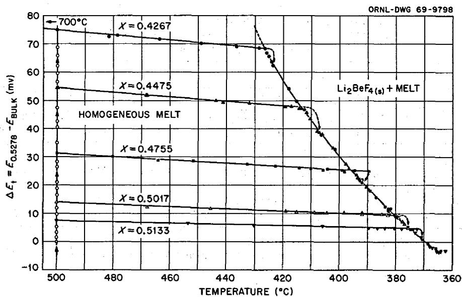  
Fig. 13.2. $E_{t}$ vs Temperature for the LiF-BeF $_2$ System Near the $\mathrm{Li}_2\mathrm{BeF}_4$ Liquidus. Reference composition: $\square$ , 0.5278 mole fraction $\mathrm{BeF}_2$ . Total bulk compositions: $\triangledown$ , 0.5133; $\triangle$ , 0.5017; $\square$ , 0.4755; $\triangle$ , 0.4475; and $\bullet$ 0.4267 mole fraction $\mathrm{BeF}_2$ . The points, $\bigcirc$ , are LiF addition points at $500^{\circ}\mathrm{C}$ .

$500^{\circ}\mathrm{C}$ for compositions near the eutectic of the $\mathrm{LiF - BeF_2}$ system. The reference composition (II) is the same throughout, $x_{\mathrm{BeF}_2} = 0.5278$ . The labeled lines in the homogeneous region identify the composition in the bulk (I); the numerous points which form the boundary (liquidus) curve where $\mathrm{Li_2BeF_4}$ begins to precipitate have been derived from the various total bulk compositions, and there is considerable overlap. Since this boundary curve represents an invariant composition point at any one temperature, it forms an internal composition reference. If there is diffusion or flow from the bulk into the reference compartment, any unknown "aging" effects which affect the potential, or an inability of the stirrer to maintain thermal equilibrium in the presence of the precipitated solid, the observed emf will deviate from the line. These measurements were made over a period of two weeks, with the entire system frozen six times in between. No deviation was observed until the 0.5278-0.4267 composition couple was followed down to $392^{\circ}\mathrm{C}$ . Here the deviation is $\sim 1.1$ mv or $0.8^{\circ}\mathrm{C}$ . At this point, it is calculated that $40\%$ of the total LiF and $27\%$ of the total $\mathrm{BeF_2}$ in the bulk compartment were present as precipitated $\mathrm{Li_2BeF_4}$ . For the same concentration set the deviation at $382^{\circ}\mathrm{C}$ was about $1.1^{\circ}\mathrm{C}$ or $1.0\mathrm{mv}$ . Here, $49\%$ of the total LiF and $33\%$ of the total $\mathrm{BeF_2}$ were present as a solid precipitate. The temperature at which the emf-temperature plot for any one composi

tion set intersects the invariant boundary curve is the liquidus temperature at that composition. These intersection points are obtainable with great precision, usually about $\pm 0.2^{\circ}\mathbf{C}$ . The values for these liquidus data are now being determined. They will be presented in the next volume of this series.

Although the general purpose of these emf studies is to aid in characterizing ionic transport properties, the excellent reproducibility and long-term stability of the all-metal cells indicate that they should have general applicability to several types of problems. These include:

1. Very precise determination of liquidus curves in binary, and possibly ternary, systems. We are pursuing this application as is demonstrated by Fig. 13.2.   
2. Routine analytical monitoring of compositions of binary salts. For example, with the $\mathrm{LiF - BeF_2}$ system between about $x_{\mathrm{BeF_2}} = 0.40$ and the LiF liquidus, $E_{t}$ changes approximately $14\mathrm{mv}$ per mole percent composition change. If a reference solution was saturated with LiF (i.e., its composition would be fixed) at any one temperature, then an emf uncertainty even as large as $\pm 1.4\mathrm{mv}$ would yield compositions precise to $\pm 0.001$ mole fraction.   
3. Reproducible and stable reference electrodes. Beryllium rod electrodes, immersed in melts of the same composition, in all-metal cells invariably show emf

differences of less than $0.3\mathrm{mv}$ .Usually the emf differences are no more than $0.05\mathrm{mv}$

# 13.8 IMPROVED DETERMINATION OF ELECTRICAL CONDUCTANCE OF LiF-BeF $_2$ (66-34 MOLE %)

G. D. Robbins J. Braunstein

The first determination of specific conductance in the current program of investigating electrical conductivities in systems of interest to the MSRP was that of the MSRE coolant salt, $\mathrm{LiF - BeF_2}$ (66-34 mole $\%$ ). Using a silica cell of refined design and an ac series-component Wheatstone-type bridge (both previously described $^{19}$ ), a more accurate determination of specific conductance over an extended temperature range has been obtained. These measurements extend the temperature range investigated to $470 - 645^{\circ}\mathrm{C}$ .

Starting material $^{20}$ which had been previously treated with $\mathbf{H}_2 / \mathbf{HF}$ was remelted and filtered $^{21}$ under a helium atmosphere. The frozen salt was subsequently loaded into the silica conductance cell in a dry box and melted under dried helium. The sample melted completely clear, remained transparent for more than $13\mathrm{hr}$ , appeared somewhat milky after $22\mathrm{hr}$ , and was cloudy after two days. The open circle data shown in Fig. 13.3 were taken in random order during this period and demonstrate the absence of effects from oxide formed during the experiment.

Employing a silica cell of cell constant $150.42\mathrm{cm}^{-1}$ and a peak-to-peak applied voltage of $25\mathrm{mv}$ across the cell, measured resistance was independent of measuring frequency over the range 5 to $50\mathrm{kHz}$ within the accuracy limits of the bridge $(\pm 0.2\%)$ . This was the first fluoride melt to show no frequency dispersion, probably indicative of its high purity.

Specific conductance data are given in Table 13.7. The variation of specific conductance with temperature appears linear over the temperature interval investi

Table 13.7. Specific Conductance of LiF-BeF $_2$ (66-34 Mole %)   

<table><tr><td>t(°C)</td><td>κ (ohm-1cm-1)</td></tr><tr><td>468.0</td><td>1.342</td></tr><tr><td>476.3</td><td>1.390</td></tr><tr><td>480.5</td><td>1.424</td></tr><tr><td>499.3</td><td>1.540</td></tr><tr><td>530.1</td><td>1.753</td></tr><tr><td>562.0</td><td>1.957</td></tr><tr><td>588.0</td><td>2.132</td></tr><tr><td>619.4</td><td>2.330</td></tr><tr><td>647.2</td><td>2.513</td></tr></table>

gated, 470 to $645^{\circ}\mathbf{C}$ . The line shown in Fig. 13.3 represents the computer-fitted least-squares equation,

$$
\kappa = - 1. 7 2 9 + 6. 5 5 7 \times 1 0 ^ {- 3} t (^ {\circ} \mathrm {C}) (\sigma = 0. 0 0 4, \mathrm {N}. \mathrm {O}. = 9),
$$

where $\sigma$ is the standard error of fit and N.O. is the number of observations. Also shown in Fig. 13.3 are the previously determined results for this system. Considering that in the previous measurements resistance varied

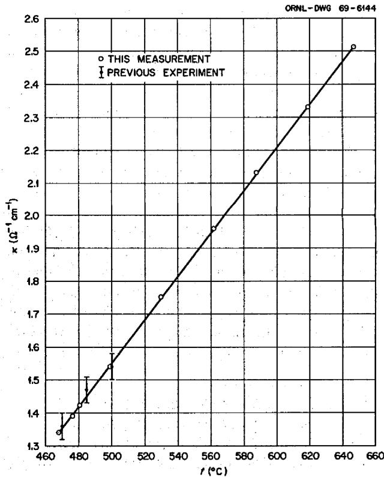  
Fig. 13.3. Specific Conductance of LiF-BeF $_2$ (66-34 mole %) vs Temperature.

markedly with both frequency and time, the agreement with the present results is exceedingly - perhaps fortuitously - good. We believe the results reported here to have an accuracy of $\pm 0.5\%$ .

# 13.9 ELECTRICAL CONDUCTIVITIES OF LOW-MELTING NaF-BeF $_2$ MIXTURES

G. D. Robbins J. Braunstein

The Vogel-Tammann-Fulcher (VTF) equation as applied to equivalent conductance, $\Lambda$ , in the form

$$
\ln \Lambda = A - \frac {1}{2} \ln T - \frac {k}{T - T _ {0}}
$$

has been successfully employed in binary nitrate melts to correlate the composition and temperature dependence of electrical conductivity.22-24 In this relation $T$ is the absolute temperature, while $A$ , $k$ , and $T_0$ are adjustable parameters. In the molten $\mathrm{KNO}_3\cdot \mathrm{Ca}(\mathrm{NO}_3)_2$ system Angell22,23 was able to determine $T_0$ , the zero-mobility temperature, for three glass-forming compositions by analyzing the curvature in plots of $\ln \Lambda$ vs $1 / T$ at temperatures below $2T_0$ . Employing the observed linear relationship between $T_0$ and mole fraction for these three compositions, $T_0$ was extrapolated to other compositions. The VTF equation was then found to adequately represent the data employing a single value of $k$ , independent of composition. The extent to which this behavior obtains in other systems is important in the correlation of electrical conductance with composition. To test the applicability of the VTF equation in correlating conductivities in molten fluorides, an attempt has been made to determine $T_0$ for three low-melting mixtures in the molten NaF-BeF2 system.

The previously described ac Wheatstone-type bridge, incorporating a series-component balancing arm, and the type of silica conductance cells used in studies of the LiF-BeF $_2$ system $^{25}$ were employed in these experiments. In the LiF-BeF $_2$ system it was possible to use silica cells with the molten fluoride, due in part to the slight solubility of BeO and low equilibrium partial

pressure of $\mathrm{SiF_4}$ formed via the corrosion reaction26

$$
2 \mathrm {B e F} _ {2} + \underline {{\mathrm {S i O} _ {2}}} \rightleftharpoons 2 \mathrm {B e O} + \mathrm {S i F} _ {4} \uparrow .
$$

A similar procedure has been followed with the NaF-BeF $_2$ system. The cell constant was determined to be $92.96 \, \text{cm}^{-1}$ ( $\pm 0.15\%$ precision) relative to molten potassium nitrate as a reference (accuracy = $\pm 0.5\%$ ). In all measurements the peak-to-peak voltage applied across the conductance cell was maintained at $25 \, \text{mv}$ , and the measured resistance was independent of the measuring frequency over the range 5 to $50 \, \text{kHz}$ , within the accuracy limits of the bridge ( $\pm 0.2\%$ ).

Hand-picked, glass-clear crystals of recrystallized NaF and sublimed $\mathrm{BeF}_2$ were melted under an inert atmosphere in the conductance cell. Semiquantitative spectrographic analysis of the starting materials showed the major impurities to be (in ppm by weight) for $\mathrm{BeF}_2: 50$ Li, $100\mathrm{Na}$ and for NaF: $2\mathrm{Mg}, 2\mathrm{Fe},$ and $3\mathrm{Ca}$ .

The phase diagram $^{28,29}$ for the system NaF-BeF $_2$ shows two low-melting eutectics (340 and $365^{\circ}\mathrm{C}$ ) at 43 and 55 mole % beryllium fluoride, with the compound NaBeF $_3$ congruently melting at $376^{\circ}\mathrm{C}$ . Specific conductances have been determined as functions of temperature for these three compositions and are shown in Fig. 13.4. Data are given in Table 13.8. The data were taken in random order over several days, at each composition, thus demonstrating the absence of time or corrosion effects on the results. The curves shown were calculated from computer-fitted least-squares equations similar to the VTF equation. The upper portion of Table 13.9 lists the parameter values, together with the standard parameter errors and the standard errors of fit.

Density data from ref. 30 were converted to molar volumes and computer fitted by linear expressions in mole fraction at constant temperature. Discarding the disparate data at 50 mole $\%$ $\mathrm{BeF_2}$ , the linear least-squares equations of molar volume as a function of composition at various temperatures were employed to interpolate to the desired compositions. Densities were obtained by linear interpolation for the three compositions of interest (the temperature variation of the

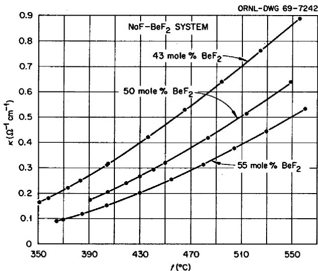  
Fig. 13.4. Specific Conductance vs Temperature $(^{\circ}\mathrm{C})$ for NaF-BeF $_2$ Mixtures.

Table 13.8. Specific Conductance of NaF-BeF $_2$ Mixtures   
Table 13.9. Parameter Values for Computer-Fitted Equations   

<table><tr><td>Mole % BeF2</td><td>t (°C)</td><td>κ (ohm-1cm-1)</td></tr><tr><td rowspan="11">43.0</td><td>350.8</td><td>0.1646</td></tr><tr><td>358.1</td><td>0.1789</td></tr><tr><td>373.6</td><td>0.2203</td></tr><tr><td>383.3</td><td>0.2492</td></tr><tr><td>404.1</td><td>0.3109</td></tr><tr><td>405.1</td><td>0.3167</td></tr><tr><td>436.4</td><td>0.4222</td></tr><tr><td>465.0</td><td>0.5276</td></tr><tr><td>494.1</td><td>0.6393</td></tr><tr><td>524.9</td><td>0.7632</td></tr><tr><td>555.5</td><td>0.8879</td></tr><tr><td rowspan="9">50.0</td><td>390.8</td><td>0.1733</td></tr><tr><td>404.7</td><td>0.2046</td></tr><tr><td>419.7</td><td>0.2413</td></tr><tr><td>429.7</td><td>0.2657</td></tr><tr><td>440.6</td><td>0.2942</td></tr><tr><td>449.8</td><td>0.3200</td></tr><tr><td>483.3</td><td>0.4178</td></tr><tr><td>514.0</td><td>0.5144</td></tr><tr><td>548.9</td><td>0.6389</td></tr><tr><td rowspan="10">55.0</td><td>364.6</td><td>0.0897</td></tr><tr><td>369.9</td><td>0.0964</td></tr><tr><td>384.3</td><td>0.1180</td></tr><tr><td>403.8</td><td>0.1517</td></tr><tr><td>429.9</td><td>0.2019</td></tr><tr><td>454.6</td><td>0.2548</td></tr><tr><td>480.0</td><td>0.3141</td></tr><tr><td>504.2</td><td>0.3776</td></tr><tr><td>529.5</td><td>0.4454</td></tr><tr><td>560.1</td><td>0.5346</td></tr></table>

$$
\ln \kappa = B - \frac {1}{2} \ln T - \frac {C}{T - D}
$$

<table><tr><td>Mole % BeF2</td><td>B</td><td>C</td><td>D</td><td>σ(fit)</td></tr><tr><td>43.0</td><td>5.824 (±0.071)</td><td>1270 (±52)</td><td>336.6 (±7.4)</td><td>0.0058</td></tr><tr><td>50.0</td><td>5.993 (±0.097)</td><td>1563 (±81)</td><td>316.2 (±10.7)</td><td>0.0037</td></tr><tr><td>55.0</td><td>5.840 (±0.051)</td><td>1590 (±41)</td><td>321.4 (±4.9)</td><td>0.0033</td></tr></table>

$$
\ln \Lambda = A - \frac {1}{2} \ln T - \frac {k}{T - T _ {0}}
$$

<table><tr><td>Mole % BeF2</td><td>A</td><td>k</td><td>T0</td><td>σ(fit)</td></tr><tr><td>43.0</td><td>8.661 (±0.073)</td><td>1379 (±56)</td><td>326.5 (±7.5)</td><td>0.0057</td></tr><tr><td>50.0</td><td>8.825 (±0.107)</td><td>1702 (±92)</td><td>304.1 (±11.5)</td><td>0.0039</td></tr><tr><td>55.0</td><td>8.637 (±0.056)</td><td>1719 (±46)</td><td>310.8 (±5.3)</td><td>0.0034</td></tr></table>

$$
\ln \Lambda = A ^ {\prime} - \frac {k ^ {\prime}}{T \ln T / T _ {0} ^ {\prime}}
$$

<table><tr><td>Mole % BeF2</td><td>A&#x27;</td><td>k&#x27;</td><td>T0&#x27;</td><td>σ(fit)</td></tr><tr><td>43.0</td><td>4.533 (±0.056)</td><td>1575 (±88)</td><td>316.7 (±9.0)</td><td>0.0057</td></tr><tr><td>50.0</td><td>4.601 (±0.084)</td><td>2095 (170)</td><td>286.5 (±14.3)</td><td>0.0039</td></tr><tr><td>55.0</td><td>4.405 (±0.045)</td><td>2101 (±82)</td><td>294.0 (±6.6)</td><td>0.0035</td></tr></table>

Table 13.10. Density Equations   

<table><tr><td>Mole % BeF2</td><td>Density Equation (g/cm3)</td><td>σ(fit)a</td></tr><tr><td>43.0</td><td>ρ = 2.4267 - 5.367 × 10-4t(°C)</td><td>0.0021</td></tr><tr><td>50.0</td><td>ρ = 2.4222 - 5.399 × 10-4t(°C)</td><td>0.0029</td></tr><tr><td>55.0</td><td>ρ = 2.4190 - 5.422 × 10-4t(°C)</td><td>0.0034</td></tr></table>

${}^{a}$ The number of points was 5 in each case.

densities appearing more nearly linear than molar volumes in this temperature interval). The equations employed in the interpolation are given in Table 13.10. The densities were combined with the specific conductance data to calculate equivalent conductances,

$$
\Lambda = \kappa \cdot \frac {\text {e q u i v a l e n t w e i g h t}}{\text {d e n s i t y}}.
$$

Equivalent weights were calculated as

equivalent weight $= 0.5N_{\mathrm{BeF}_2}M_{\mathrm{BeF}_2} + N_{\mathrm{NaF}}M_{\mathrm{NaF}}$

where $N$ and $M$ with subscripts refer to equivalent fraction and formula weight respectively.

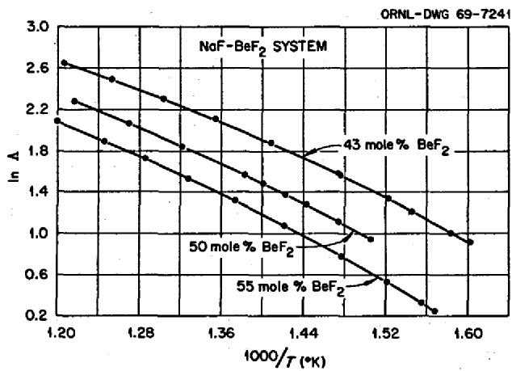  
Fig. 13.5. Logarithm Equivalent Conductance vs Reciprocal Temperature $(^{\circ}\mathbf{K})$ for NaF-BeF $_2$ Mixtures.

Plots of In $\Lambda$ vs reciprocal temperature $(^{\circ}\mathbf{K})$ are presented in Fig. 13.5. Results of least-squares fit of the VTF equation are shown in the center section of Table 13.9. The curves in Fig. 13.5 are from these equations. Comparison of $T_{0}$ with the parameter $D$ in the VTF analog of the specific conductance equation for the three compositions reveals the effect of incorporating density data in the analysis.

The Adam-Gibbs probability expression, $W(T)$ , for cooperative rearrangement, $^{31,24}$

$$
W (T) = A ^ {\prime} - \frac {k ^ {\prime}}{T \ln T / T _ {0} ^ {\prime}},
$$

differs from the VTF equation by the additive term $-\frac{1}{2}\ln T$ (which has little effect) and the approximation

$$
T \ln T / T _ {0} ^ {\prime} \simeq T - T _ {0}
$$

as $T$ approaches $T_0$ . To determine the effect of these differences in the temperature range encompassed by the data, expressions of the form

$$
\ln \Lambda = A ^ {\prime} - \frac {k ^ {\prime}}{T \ln T / T _ {0} ^ {\prime}}
$$

were also fitted. These results are shown in the lower portion of Table 13.9. Both the VTF and Adam-Gibbs expressions fit the data equally well. In both the VTF equation and the Adam-Gibbs probability expression $A(A^{\prime})$ is relatively constant, $k(k^{\prime})$ exhibits similar values for the two compositions richer in $\mathrm{BeF}_2$ , and the values

Table 13.11. $T_0$ Estimates Based on Lower-Temperature Data   

<table><tr><td>Mole % BeF2</td><td>T0</td><td>σ(fit)</td></tr><tr><td>43</td><td>258 (±165)</td><td>0.0096</td></tr><tr><td>50</td><td>387 (±22)</td><td>0.0016</td></tr><tr><td>55</td><td>299 (±43)</td><td>0.0041</td></tr></table>

of $T_{0}(T_{0}^{\prime})$ are similar in magnitude to $T_{0}$ obtained in an LiF-BeF2 mixture.25 Although the three NaF-BeF2 values of $T_{0}(T_{0}^{\prime})$ can be fitted by a line through the error limits when plotted vs composition, there are as yet insufficient data to define the relation between $T_{0}$ and composition accurately. While $A^{\prime}$ and $k^{\prime}$ differ significantly from $A$ and $k$ , $T_{0}$ and $T_{0}^{\prime}$ are comparable in magnitude, and the variation of $T_{0}$ and $T_{0}^{\prime}$ with composition is somewhat similar.

Based on values of $T_{0}$ given in Table 13.9, the ratios of melting temperatures to $T_{0}$ (in degrees K) are 1.88, 2.13, and 2.05 for 43, 50, and 55 mole % BeF₂ respectively. Since it did not prove possible to supercool these mixtures, probably due to the presence of beryllium oxide, none of the data for 50 or 55 mole % BeF₂ fall in the temperature range less than $2T_{0}$ , while only 3 of the 11 data at 43 mole % are below $2T_{0}$ .

It might be assumed that the lower portions of the temperature ranges covered should give a more accurate - though less precise - estimate of $T_{0}$ . However, as Table 13.11 demonstrates, estimates of $T_{0}$ based on the lowest five data for each composition resulted in values of considerable uncertainty. Hence, one must consider the data in Table 13.9 the best estimates available for this system. That $k$ for two of the three compositions is similar is encouraging. However, the results demonstrate the necessity of further measurements in cells not subject to fluoride attack. In addition, experiments are currently in progress to determine the experimental glass transition temperatures of these mixtures by differential thermal analysis.

# 13.10 VISCOSITY OF MOLTEN SALTS

# Stanley Cantor

In support of requirements for physical property information, the viscosity of five salts has been determined, using the oscillating-cup method.32 The

Table 13.12. Viscosity of Molten Salts   

<table><tr><td>Salt Composition (mole %)</td><td>Viscosity-Temperature Equation (η in centipoises, T in °K)</td><td>Temperature Range Measured (°C)</td><td colspan="3">Comments and Comparisons</td></tr><tr><td>72.7 LiF, 15.7 BeF2, 11.6 ThF4</td><td>η = 0.109 exp 4,090/T</td><td>553–673</td><td colspan="3">Equation for LiF-BeF2-UF4(70-18-12 mole %) is η = 0.0897 exp (4280/T)a</td></tr><tr><td>70.1 LiF, 23.9 BeF2, 6.0 ThF4</td><td>η = 0.660 exp 4,380/T</td><td>526–633</td><td colspan="3">Equation for LiF-BeF2-UF4(70-24-6 mole %) is η = 0.0804 exp (4350/T)a</td></tr><tr><td>92.0 NaBF4, 8.0 NaF</td><td>η = 0.0877 exp 2,240/T</td><td>408–537</td><td colspan="3">Viscosities are approximately 10% less than those of pure NaBF4</td></tr><tr><td rowspan="3">NaBF4</td><td rowspan="3">η = 0.0832 exp 2,360/T</td><td rowspan="3">419–513</td><td colspan="3">Salt Θ ≈ T/Tmelting= 1.0 Θ = 1.1</td></tr><tr><td>NaBF4NaIb</td><td>2.66 centipoises</td><td>1.95 centipoises</td></tr><tr><td>NaIb</td><td>1.52 centipoises</td><td>1.16 centipoises</td></tr><tr><td rowspan="3">KBF4</td><td rowspan="3">η = 0.0946 exp 2,280/T</td><td rowspan="3">584–681</td><td colspan="3">Salt Θ = 1.0 Θ = 1.1</td></tr><tr><td>KBF4KIb</td><td>1.41 centipoises</td><td>1.11 centipoises</td></tr><tr><td>KIb</td><td>1.63 centipoises</td><td>1.25 centipoises</td></tr></table>

$^{a}$ B. C. Blanke et al., Density and Viscosity of Fused Mixtures of Lithium, Beryllium, and Uranium Fluorides, MLM-1086, pp. 56, 63 (December 1956).   
bG. J. Janz et al., Molten Salts: Vol. 1, Electrical Conductance, Density, and Viscosity Data, NSRDS-NBS 15, p. 76 (October 1968).

actual measurements of amplitudes and of oscillation periods and the initial treatment of the data were performed at Mound Laboratory, Miamisburg, Ohio, by L. J. Wittenberg and R. Dewitt. Preparation of samples, fabrication of capsules, and supplementary interpretation were done at ORNL.

The data, summarized in Table 13.12, were usually collected over about a $100^{\circ}\mathrm{C}$ temperature interval. The two salts composed of $\mathrm{LiF - BeF_2 - ThF_4}$ exhibit viscosities rather close to salts where $\mathrm{UF_4}$ is substituted for $\mathrm{ThF_4}$ . The results for alkali fluoroborates are similar to those of alkali iodides at the same corresponding temperatures.

The equation given in Table 13.12 for $\mathrm{NaBF}_4$ represents a redetermination of viscosity data; these newer data are approximately $50\%$ higher than preliminary data for $\mathrm{NaBF}_4$ given in an earlier report.[33] The newer data (i.e., those given in Table 13.12) are believed to be more accurate, primarily because they agree with the viscosity data of 92-8 mole $\%$ $\mathrm{NaBF}_4$ -NaF.

# 13.11 DENSITY OF MOLTEN FLUORIDES OF REACTOR INTEREST

Stanley Cantor

The densities of several fluoride mixtures were measured dilatometrically, $^{34}$ continuing the work reported previously. $^{35}$ The results are summarized in Table 13.13; the last three salt mixtures listed were also in the last semiannual report. $^{35}$

An interesting result, derived from the study of the three $\mathrm{ThF_4}$ -containing mixtures, was that expansivity (which is the fractional change of volume with temperature) showed little change with the concentrations of $\mathrm{BeF}_2$ and of $\mathrm{ThF_4}$ . The results are given in Table 13.14. Assuming that the concentration of LiF in the fuel melt of an MSBR will be approximately 70 mole $\%$ then these results suggest that the MSBR fuel mixture will have an expansivity very close to $2.5\times 10^{-4} / ^{\circ}\mathrm{C}$ .

Table 13.13. Density of Melts of Molten-Salt Reactor Interest   

<table><tr><td>Salt Composition (mole %)</td><td>Temperature Range Measured (°C)</td><td>No. of Data Points</td><td>Least-Squares Density-Temperature Equation (ρ in g/cm3, t in °C)</td><td>Standard Error in ρ</td></tr><tr><td>70.11 LiF</td><td>555.1–707.4</td><td>12</td><td>ρ = 3.112 - 6.71 × 10-4t</td><td>0.0013</td></tr><tr><td>23.88 BeF2</td><td></td><td></td><td></td><td></td></tr><tr><td>6.01 ThF4</td><td></td><td></td><td></td><td></td></tr><tr><td>70.06 LiF</td><td>533.2–741.2</td><td>14</td><td>ρ = 3.824 - 8.06 × 10-4t</td><td>0.0014</td></tr><tr><td>17.96 BeF2</td><td></td><td></td><td></td><td></td></tr><tr><td>11.98 ThF4</td><td></td><td></td><td></td><td></td></tr><tr><td>69.98 LiF</td><td>543.4–749.5</td><td>13</td><td>ρ = 4.181 - 9.52 × 10-4t</td><td>0.0013</td></tr><tr><td>14.99 BeF2</td><td></td><td></td><td></td><td></td></tr><tr><td>15.03 ThF4</td><td></td><td></td><td></td><td></td></tr><tr><td>64.7 LiF</td><td>452.0–703.9</td><td>17</td><td>ρ = 2.539 - 5.77 × 10-4t</td><td>0.00097</td></tr><tr><td>30.1 BeF2</td><td></td><td></td><td></td><td></td></tr><tr><td>5.2 ZrF4</td><td></td><td></td><td></td><td></td></tr><tr><td>64.79 LiF</td><td>524.3–761.1</td><td>9</td><td>ρ = 2.533 - 5.62 × 10-4t</td><td>0.0017</td></tr><tr><td>29.96 BeF2</td><td></td><td></td><td></td><td></td></tr><tr><td>4.99 ZrF4</td><td></td><td></td><td></td><td></td></tr><tr><td>0.26 UF4</td><td></td><td></td><td></td><td></td></tr><tr><td>66.0 LiF</td><td>514.5–820.3</td><td>11</td><td>ρ = 2.280 - 4.88 × 10-4t</td><td>0.00046</td></tr><tr><td>34.0 BeF2</td><td></td><td></td><td></td><td></td></tr><tr><td>92.0 NaBF4</td><td>399.5–590.8</td><td>10</td><td>ρ = 2.252 - 7.11 × 10-4t</td><td>0.0018</td></tr><tr><td>8.0 NaF</td><td></td><td></td><td></td><td></td></tr></table>

Table 13.14. Expansivities of Melts of LiF-BeF $_2$ -ThF $_4$ (70-X-Y Mole %)   

<table><tr><td>Salt Composition (mole %)</td><td>Expansivity, 
α = 1/ρ(∂ρ/∂T), at 600°C 
[units are (°C)-1]</td></tr><tr><td></td><td>×10-4</td></tr><tr><td>70.11 LiF, 23.88 BeF2, 6.01 ThF4</td><td>2.48</td></tr><tr><td>70.06 LiF, 17.96 BeF2, 11.98 ThF4</td><td>2.41</td></tr><tr><td>69.98 LiF, 14.99 BeF2, 15.03 ThF4</td><td>2.64</td></tr></table>

# 13.12 ROOM-TEMPERATURE DENSITIES AND ESTIMATED DENSITY CHANGE, UPON MELTING, OF MSBR FUEL AND COOLANT SALTS

Stanley Cantor

The densities of $\mathrm{LiF - BeF_2 - ThF_4}$ (72-16-12 mole %) and of $\mathrm{NaBF_4}$ were determined pycnometrically, at room temperature, in a 25-ml Kimax "specific gravity bottle." Cottonseed oil was used as the displacement liquid; the precise volume of the bottle was determined

with distilled water. The results were:

LiF-BeF $_2$ -ThF $_4$ (72-16-12 mole $\%$ ): 3.788 $_7$ g/cm $^3$ ,

$\mathrm{NaBF}_4:2.435_{6}\mathrm{g/cm}^3$ (3% less than the x-ray density of $2.5075^{36}$ ).

Both salts had been previously fused.

A density-temperature curve (Fig. 13.6) for MSBR fuel salt was generated on the basis of the following assumptions: (a) the pycnometrically determined density $(3.79\mathrm{g} / \mathrm{cm}^3$ at room temperature) would occur in actual practice (i.e., in the MSBR fuel dump tank or in freeze flanges); (b) the expansivity of the solid salt is $5\times 10^{-5} / ^{\circ}\mathrm{C}$ , a crude estimate based on analogy with other salts; (c) the density above the liquidus is reliably predicted from additive molar volumes; ordinarily densities of these melts, predicted this way, have uncertainties of about $\pm 2\%$ .

Given the tenuous nature of assumption $a$ and the uncertainties in $b$ and $c$ , the predicted 8% decrease in density, upon melting, should be considered as a rough estimate. A fact that should not be overlooked is that

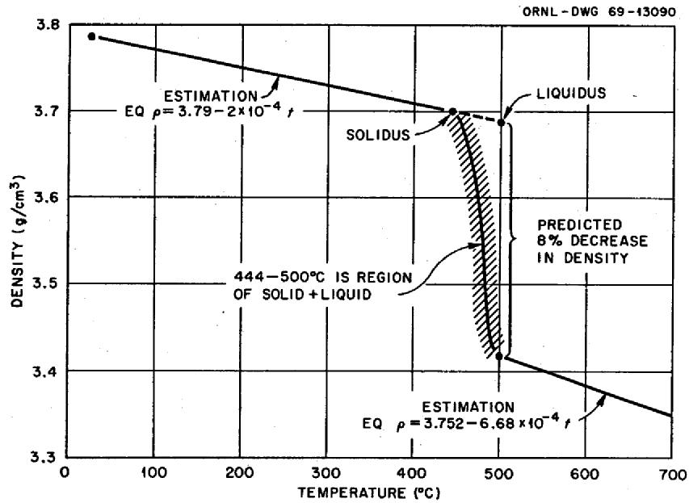  
Fig. 13.6. Density of MSBR Fuel Salt, LiF-BeF $_2$ -ThF $_4$ (72-16-12 mole%).

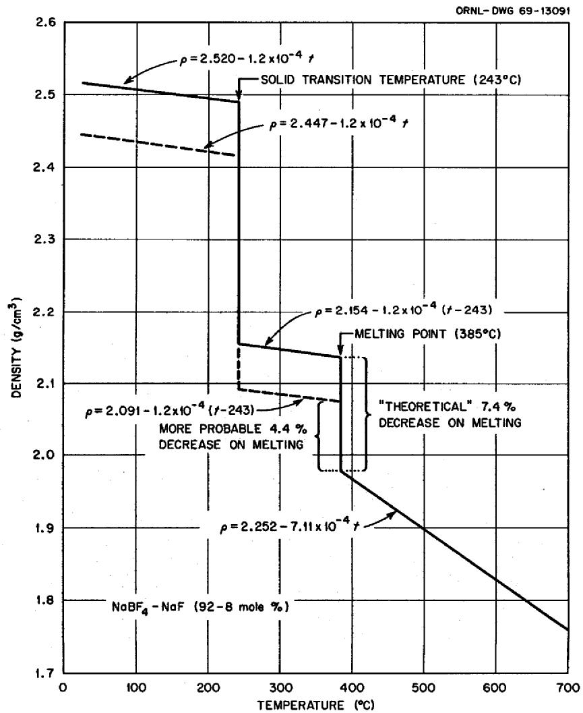  
Fig. 13.7. Density of MSBR Coolant.

the molten salt would freeze over a temperature range of about $60^{\circ}\mathrm{C}$ ; at $\sim 500^{\circ}\mathrm{C}$ , the first crystals precipitate; only at $\sim 444^{\circ}\mathrm{C}$ is the salt entirely frozen.

Two curves depicting the density-temperature behavior of MSBR coolant (92-8 mole $\%$ NaBF $_4$ -NaF) are given in Fig. 13.7. The solid lines refer to "theoretical" (or x-ray) densities; the dashed lines refer to more probable densities. At $243^{\circ}\mathrm{C}$ and at $385^{\circ}\mathrm{C}$ , the dashed and solid lines coincide over much of the density ranges. Three assumptions were used in drawing these curves:

1. At $243^{\circ}\mathrm{C}$ (the solid transition temperature of $\mathrm{NaBF}_4$ ) the partial density change, that is, that due to $\mathrm{NaBF}_4$ alone, is $17\%^{37}$ or $15.6\%$ for the density change of the coolant salt composition (the portion of the coolant that is NaF does not undergo an expansion).

2. The expansivity of the solid is $\sim 5 \times 10^{-5} / ^{\circ}\mathrm{C}$ [same as assumption $b$ above].   
3. In practice, the density of the coolant would be $3\%$ less than the x-ray density as was observed pyc-nometrically for pure $\mathrm{NaBF}_4$ .

On the basis of these three assumptions and experimental data for the liquid, a density decrease of $7.4\%$ on melting is possible; however, a density decrease of about $4\%$ is more likely. It should be noted that the coolant undergoes a rather large density change in the solid at $243^{\circ}\mathrm{C}$ ; the predicted extent of this change is based on the analogy between $\mathrm{NaBF}_4$ and $\mathrm{NaClO}_4$ and the validity of high-temperature x-ray diffraction data of $\mathrm{NaClO}_4$ . Thus a major uncertainty in predicting the change of density on melting is the uncertainty in predicting the change in density at the solid transition.

# 14. Chemistry of Molten-Salt Reactor Fuel Reprocessing Technology

14.1 REDUCTIVE EXTRACTION OF PROTACTINIUM AT HIGH CONCENTRATIONS (2000 ppm LEVEL) FROM MSBR FUEL SOLVENT SALT $(\mathsf{LiF - BeF}_2\cdot \mathsf{ThF}_4$ 72-16-12 MOLE %) INTO MOLTEN BISMUTH

R.G.Ross C.E.Bamberger C.F.Baes,Jr.

Previous studies1 in this system of the reductive extraction of protactinium have shown the equilibrium quotient for the extraction reaction

$$
\mathrm {P a} ^ {4 +} (\mathrm {F}) + \mathrm {T h} ^ {\mathbf {0}} (\mathrm {B i}) \rightleftharpoons \mathrm {P a} ^ {\mathbf {0}} (\mathrm {B i}) + \mathrm {T h} ^ {4 +} (\mathrm {F}), \tag {1}
$$

$$
Q _ {\mathrm {T h}} ^ {\mathrm {P a}} = \frac {D _ {\mathrm {P a}}}{D _ {\mathrm {T h}}} = \frac {X _ {\mathrm {P a} (\mathrm {B i})} / X _ {\mathrm {P a} (\mathrm {F})}}{X _ {\mathrm {T h} (\mathrm {B i})} / X _ {\mathrm {T h} (\mathrm {F})}},
$$

to be independent of protactinium concentration when up to 100 ppm protactinium was present. However, in the protactinium isolation column described by Whatley and McNeese, the concentrations of protactinium, uranium, and thorium vary over wide ranges in both the salt and bismuth phases. In particular the concentration of protactinium reaches the 2000-ppm level in both phases. It seemed desirable, therefore, to carry out laboratory studies of the distribution behavior and the phase stability of protactinium under conditions simulating those of this proposed reductive extraction process. This has been the purpose of our current reductive extraction studies.

An experiment was designed, using previously described procedures, in which both protactinium and uranium extraction could be studied at the various concentrations which would exist in the proposed isolation column. In this experiment $\mathbf{PaF_4}$ dissolved in a

carrier salt was to be added incrementally to a vessel containing $250\mathrm{g}$ of fuel solvent $\left(\mathrm{LiF - BeF_2 - ThF_4}\right.$ 72-16-12 mole $\%$ ) and $250\mathrm{g}$ of bismuth with 2000 ppm of dissolved thorium metal at $625^{\circ}\mathrm{C}$ . Protactinium additions were to be continued until the protactinium concentration in the bismuth phase as a result of reaction (1) was $\sim 2000~\mathrm{ppm}$ . At this point $\mathrm{UF_3}$ would be added incrementally to effect the reaction

$$
4 \mathrm {U} ^ {3 +} (\mathrm {F}) + 3 \mathrm {P a} ^ {0} (\mathrm {B i}) \rightleftharpoons 4 \mathrm {U} ^ {0} (\mathrm {B i}) + 3 \mathrm {P a} ^ {4 +} (\mathrm {F}), \tag {2}
$$

oxidizing the protactinium into the salt phase. Thorium metal would then be added incrementally and would extract, by reaction (1), the protactinium into the bismuth phase in the presence of uranium. An experiment conducted in this manner would yield both protactinium and uranium distribution data over a wide range of concentrations of thorium, uranium, and protactinium.

It was estimated that the first step (2000 ppm protactinium in the bismuth) of the above experiment could be completed by four 5-g additions of $\mathsf{PaF_4}$ carrier salt (20 g of LiF-BeF $_2$ -ThF $_4$ , 72-16-12 mole %, containing 35,000 ppm $^{231}\mathrm{Pa}$ ). However, after the second addition the reductant material balance became unsatisfactory, and we were able to obtain only one reliable value for $D_{\mathbf{Pa}}$ . The loss of reductant was attributed to the presence of an oxidant, probably OH $^{-}$ , in the protactinium carrier salt. Although this carrier salt had been extensively purified under the same conditions as have been established for LiF-BeF $_2$ melts, the equilibria for oxide-hydroxide removal from a salt containing high protactinium and thorium concentrations, such as this, presently are not well known.

Due to the unsatisfactory reductant material balance, it was decided to change the course of the experiment. All of the protactinium was oxidized into the salt phase by hydrofluorination in situ. Incremental additions of thorium metal allowed us to determine the equilibrium quotient for protactinium extraction with the concentration of protactinium in the bismuth reaching $\sim 2000$

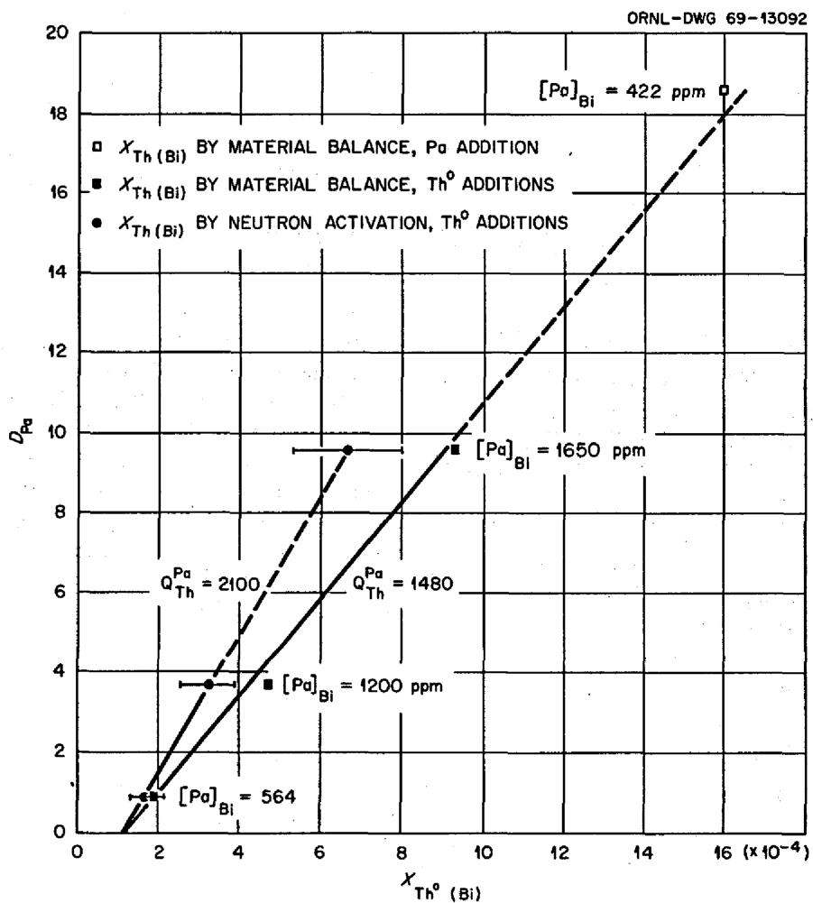  
Fig. 14.1. Variations of Protactinium Distribution Coefficient with Mole Fraction of Thorium in the Bismuth Phase.

ppm. These data, along with the one reliable value mentioned above, are shown in Fig. 14.1. $D_{\mathbf{Pa}}$ is plotted as a function of $X_{\mathrm{Th(Bi)}}$ , which has been determined by two different methods - material balance calculation (□) and neutron activation analysis (○). The accuracy of this last method is estimated to be $\pm 20\%$ .

The colorimetric method normally used for thorium analysis has apparently suffered some sort of interference from the high concentration of protactinium present; hence it is being revised by Analytical Chemistry Division personnel. These data will be reported when they are available.

The small amount of thorium metal which did not react with protactinium, $X_{\mathrm{Th(Bi)}} = 1 \times 10^{-4}$ , would indicate that hydrofluorination in situ was effective in removing the above-mentioned oxidant.

Equilibrium quotients at $625^{\circ}\mathrm{C}$ calculated for this experiment are:

$$
Q _ {\mathrm {T h}} ^ {\mathrm {P a}} = 1 4 8 0 \quad (X _ {\mathrm {T h}} \text {b y m a t e r i a l b a n c e}),
$$

$$
Q _ {\mathrm {T h}} ^ {\mathrm {P a}} = 2 1 0 0 \quad (X _ {\mathrm {T h}} \text {b y n e u t r o n a c t i v a t i o n}).
$$

In view of the large uncertainty (20%) associated with the neutron activation analyses, these values are in satisfactory agreement with $Q_{\mathrm{Th}}^{\mathrm{Pa}} = 1450$ reported for protactinium concentrations of $< 100$ ppm at the same temperature, thus indicating the absence of any apparent effect caused by protactinium concentration up to 2000 ppm.

Preparations have begun for an experiment as originally designed. With a more vigorous hydrofluorination we expect to avoid the presence of $\mathrm{OH}^{-}$ , which was assumed to be the oxidant in the carrier salt used in our

first experiment. According to Mathews4 we should be able to confirm the absence of $\mathrm{OH}^{-}$ by monitoring the HF evolution rate while sparging with hydrogen.

# 14.2 THE SEPARATION OF ZIRCONIUM FROM URANIUM IN BISMUTH SOLUTIONS BY PLATINIDE PRECIPITATION

D. M. Moulton J. H. Shaffer W. R. Grimes

In the reductive extraction process for removing uranium from molten-salt reactor fuels, the separation of fission product zirconium from uranium will be rather low. A good separation can be made by fluorinating a side stream, but there is another possibility now under investigation which will avoid fluorination and might reduce the uranium inventory in the processing plant.

It is known that zirconium and platinum form the very strong intermetallic compound $\mathbf{ZrPt}_3$ , with a heat of formation of some $-80\mathrm{kcal.}$ The activity coefficient of zirconium in bismuth is not too low, so one would expect the compound $\mathbf{ZrPt}_3$ to be rather insoluble. A rough calculation gives $K_{\mathfrak{sp}} = X_{\mathbf{Zr}}X_{\mathbf{Pt}}^3\sim 10^{-17}$ at $700^{\circ}$ . The strength of the compound $\mathbf{UPt}_3$ is not known but is probably less than that of $\mathbf{ZrPt}_3$ , while, on the other hand, uranium is more stable in bismuth than zirconium. Therefore $\mathbf{ZrPt}_3$ should be formed more easily.

If conditions can be found under which $\mathbf{ZrPt}_3$ will precipitate and $\mathrm{UPt_3}$ will dissolve, then one can take a salt stream containing these two and equilibrate it with a Bi-Pt alloy. Proper control of the reduction potential should let $\mathbf{ZrPt_3}$ precipitate and $\mathbf{UF_3}$ stay in the salt. The bismuth would need to be hydrofluorinated from time to time to strip it of zirconium.

We have begun a series of experiments to explore this possibility. For the first, a special vessel was made, as shown in Fig. 14.2. About $63\mathrm{g}$ Bi, $0.25\mathrm{g}$ U, and $0.86\mathrm{g}$ Pt were put into the upper section, and the vessel was heated to about $600^{\circ}$ using the arrangement shown in $\pmb{A}$ so that the filter was cold and did not pass the liquid metal. Next, $22.1\mathrm{g}$ of LiF-BeF $_2$ -ThF $_4$ (68-20-12 mole %) with $62\mathrm{mg}$ of labeled $\mathsf{ZrF_4}$ was introduced through a filter stick which then served as a sparge tube. After 2 hr the tube was raised out of the liquid, and the whole vessel was heated as in $\pmb{B}$ . Finally the system was

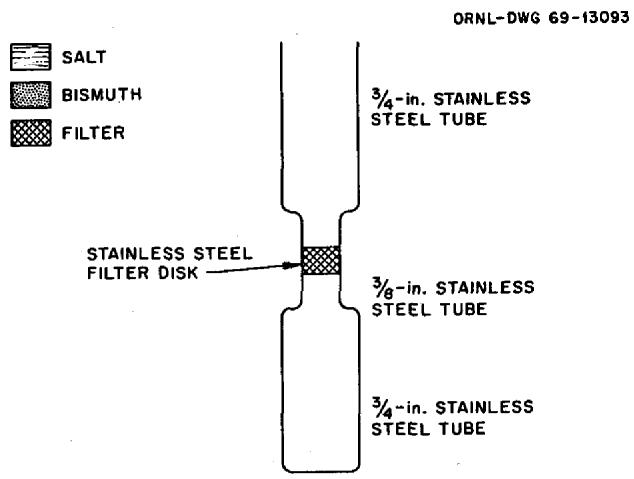

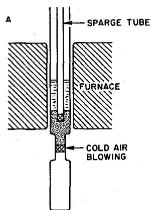

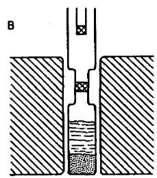  
Fig. 14.2. Molten-Salt-Metal Filtration Apparatus.

evacuated and repressurized to force the liquids into the lower chamber while catching any precipitate on the filter.

The system was cooled and cut up for analysis. The $95\mathrm{Zr}$ peak was counted on a Ge-Li diode and showed $40\%$ of the $\mathbf{Z}\mathbf{r}$ in the salt, less than $0.1\%$ in the metal, and $10\%$ in the filter section, which was counted whole. About $0.18\mathrm{g}$ of material was then shaken off the filter. The powder x-ray pattern of this material showed bismuth and salt (mostly $\mathrm{Li}_3\mathrm{ThF}_7$ ) with no evidence of $\mathrm{ZrPt}_3$ . This was confirmed by spectrochemical analysis giving about 20 wt $\%$ Bi and 8, 5, and 23 wt $\%$ LiF, $\mathrm{BeF}_2$ , and $\mathrm{ThF}_4$ (converting the reported metal values to fluorides). Only $1.4\mathrm{mg}$ of platinum was in the precipitate, while $0.38\mathrm{g}$ of platinum was in the metal and practically none was in the salt. The uranium behavior was similar to the zirconium: $26\%$ in the salt, $10\%$ in the precipitate, and $6\%$ in the metal. In the bismuth the lithium mole fraction was 0.0029 and that

Table 14.1. Extraction of Cerium and Thorium by Bismuth-Magnesium Mixtures   

<table><tr><td>Sample</td><td>Mg Added (g)</td><td>DLi</td><td>DTh</td><td>DMg</td><td>DCe</td><td>Percent Th Lost</td><td>Percent Ce Lost</td><td>XTh(M)</td></tr><tr><td>1-4</td><td>20 g MgCl2</td><td>0.0049</td><td>0.33</td><td>&lt;0.02</td><td>0.48</td><td>16</td><td>3</td><td>0 0066</td></tr><tr><td>5-8</td><td>15</td><td>0.0080</td><td>0.40</td><td>0.26</td><td>0.69</td><td>34</td><td>8</td><td>0.0070</td></tr><tr><td>9-12</td><td>45</td><td>0.024</td><td>1.35</td><td>0.094</td><td>1.71</td><td>75</td><td>29</td><td>0.0076</td></tr><tr><td>13-16</td><td>75</td><td>0.094</td><td>545</td><td>0.33</td><td>308</td><td>94</td><td>57</td><td>0.0079</td></tr><tr><td>17-20</td><td>75</td><td>0.194</td><td>843</td><td>0.14</td><td>~300</td><td>94</td><td>~61</td><td>0.0078</td></tr><tr><td>21-24</td><td>105</td><td>0.213</td><td>1610</td><td>0.22</td><td>1790</td><td>88</td><td>58</td><td>0.015</td></tr></table>

of thorium was 0.0006, which are not as close together as previous experience would predict.

The conclusions to be drawn from this experiment are clouded by the fact that not enough reductant metal was added, as can be seen from the high concentration in the salt of both uranium and zirconium. Although no appreciable amount of $\mathrm{ZrPt}_3$ was detected, some may have formed in the filter pores and not have been shaken loose. The fairly high concentration of both Pt and U in the metal phase is encouraging; if these are in equilibrium with solid $\mathrm{UPt}_3$ , then $K_{\mathfrak{sp}}$ for this is about $10^{-10}$ . The measured $K_{\mathfrak{sp}}$ for $\mathrm{ZrPt}_3$ is $10^{-13}$ , which is larger than expected, but there could be substantial errors if even a little of the $\mathrm{ZrPt}_3$ was formed below the filter or passed through it. It looks as though $\mathrm{UPt}_3$ is indeed less stable than $\mathrm{ZrPt}_3$ , and this has encouraged us to look at the system further.

# 14.3 BISMUTH-MAGNESIUM MIXTURES AS RARE-EARTH EXTRACTANTS

D. M. Moulton

J. H. Shaffer

The extraction of rare-earth fission products from thorium-containing fuel salt mixtures into bismuth is rather sharply limited by the precipitation of thorium bismuthide. If the solubility of this material could be increased, it would be possible to extract rare earths with a smaller volume of liquid metal. One of our objectives has been to look for additives to the bismuth which will have this effect.

Magnesium is a good solvent for thorium, and its binary diagram with bismuth makes it look as though the ternary system will contain more dissolved thorium than bismuth alone. Magnesium is a strong reductant, but there was a chance that its activity would be reduced enough in bismuth to keep it from being oxidized too much. A pot of $2.21\mathrm{kg}$ of $\mathrm{LiF - BeF_2 - ThF_4}$ (67-30-3 mole %) with a little $\mathrm{CeF_3}$ and $3\mathrm{kg}$ of

bismuth, which had already been used in an extraction, became available for the experiment. At $700^{\circ}$ we added first $20\mathrm{g}$ of $\mathrm{MgF_2}$ and then 15, 30, 30, and $30\mathrm{g}$ of magnesium metal. Some of the data are shown in Table 14.1.

After the second metal addition both the thorium and the cerium began to disappear from the salt; by the third they were just about gone. Most of the thorium was precipitated, presumably as the bismuthide $\mathrm{ThBi}_2$ , and something over half of the cerium was lost as well, very likely as a coprecipitate. Almost all of the magnesium went to the salt phase. Its mole fraction in the metal did not exceed 0.02, which apparently was not enough to increase the thorium solubility very much (perhaps by a factor of 2 in the last sample). On the basis of this experiment it looks as if magnesium will not be a useful additive to bismuth for the primary extraction step.

# 14.4 REDUCTIVE EXTRACTION OF RARE EARTH'S FROM MOLTEN LiF-BeF $_2$ -ThF $_4$ (72-16-12 MOLE %) INTO TIN AND ALUMINUM-TIN MIXTURES AT 600°C

J. H. Shaffer D. M. Moulton

An experimental program has been initiated to examine the application of tin as the primary metal phase constituent for the reductive extraction of rare earths from the MSBR fuel solvent. This program will seek a comparative evaluation of pertinent distribution coefficients and separation factors available in these systems with those determined for the salt-bismuth system. Some experimental findings with the salt-tin and salt-tin-aluminum systems are presented.

The equipment and procedure used for these experiments were very similar to those used in the investigation of the salt-bismuth system. The extraction vessel was constructed from a 14-in. length of 4-in. iron pipe

size stainless steel 304L pipe with welded end closures of $\frac{1}{4}$ -in. steel plate. The vessel was equipped with a graphite liner for primary containment of the two liquid phases. An internal pipe of graphite provided direct access to the metal phase for sampling purposes; the stainless steel thermowell was also sheathed with graphite. Each experiment contained $2.6\mathrm{kg}$ of tin and 2.5 to $3.0\mathrm{kg}$ of LiF-BeF $_2$ -ThF $_4$ (72-16-12 mole %) with approximately $4.8\times 10^{-5}$ mole fraction of cerium (~100 wt ppm) and 5 millicuries of $^{144}\mathrm{Ce}$ gamma activity. Samples of the two liquid phases were withdrawn for analysis after incremental additions of thorium and/or aluminum to the extraction systems.

The reported solubility of thorium in tin at $600^{\circ}\mathrm{C}$ is $< 0.025$ atom $\%$ (<489 wt ppm). However, the results of these experiments have yielded good material balances for thorium up to an indicated solubility of 2700 to 2900 ppm by weight. The behavior of cerium during these experiments also corresponded very nearly to solution behavior. In this respect, tin is comparable with bismuth as the metal phase for the reductive extraction process.

As in previous studies, the extraction of cerium from the salt phase into molten tin was examined according to the reaction

$$
4 \mathrm {C e F} _ {3} (\text {s a l t}) + 3 \mathrm {T h} ^ {0} (\mathrm {S n}) \rightleftharpoons 4 \mathrm {C e} ^ {0} (\mathrm {S n}) + 3 \mathrm {T h F} _ {4} (\text {s a l t}).
$$

The value of the equilibrium constant for this reaction,

$$
K _ {Q} = \left(\frac {N _ {\mathrm {C e}}}{N _ {\mathrm {C e F _ {3}}}}\right) ^ {4} \left(\frac {N _ {\mathrm {T h F _ {4}}}}{N _ {\mathrm {T h}}}\right) ^ {3} = D _ {\mathrm {C e}} ^ {4} / D _ {\mathrm {T h}} ^ {3},
$$

was calculated to be 0.054 with limits by standard deviation of 0.033 to 0.088. The separations of cerium from thorium, $D_{\mathrm{Ce}} / D_{\mathrm{Th}}$ , varied between 3.5 and 1.2. Their relation to the thorium concentration in the metal phase according to the equation

$$
\ln D _ {C e} / D _ {T h} = \frac {1}{4} \ln \left(K _ {Q} N _ {T h F _ {4}}\right) - \frac {1}{4} \ln N _ {T h 0}
$$

is compared with that obtained in the salt-bismuth system in Fig. 14.3. On the basis of these data, the salt-bismuth system is clearly more effective for rare-earth extraction than the salt-tin system.

Continued interest in tin for the reductive extraction process is based on its use as a solvent for other metals.

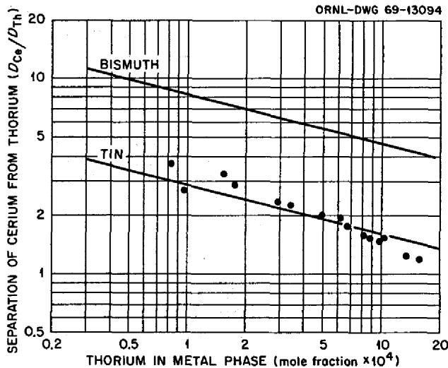  
Fig. 14.3. Comparative Separation of Cerium from Thorium by Reductive Extraction from LiF-BeF $_2$ -ThF $_4$ (72-16-12 mole %) into Bismuth and into Tin at $600^{\circ}\mathrm{C}$ .

These investigations will examine metal additives to tin for possible lowering of the thermodynamic activity of rare earths relative to that of thorium in the metal phase. By a preliminary examination, aluminum was found to be too strong as a reducing agent for the extraction process. In this experiment sufficient aluminum to yield a 5 wt % mixture in 2.6 kg of tin also sufficed for reducing approximately a third of the thorium and about a fourth of the cerium from the salt phase. The resultant salt mixture had a composition corresponding to 4.7–5.5 mole % Al, 8.1 mole % Th, 68.8–67.9 mole % Li, and 18.4–18.5 mole % Be. Material balance calculations, based on beryllium for the salt and tin for the metal, accounted for about 75% of the aluminum, 90–95% of the thorium, and 84% of the lithium in the system. Distribution coefficients and separation factors calculated from these data are as shown in Table 14.2. Except for the metal-phase analysis of aluminum in sample 5, the data are reasonably consistent considering the magnitude of the reduction.

Since aluminum had a finite distribution coefficient in the extraction system, an additional experiment was conducted at much lower aluminum concentrations. Although the results of this experiment are incomplete, the addition of 0.08 wt % aluminum to the tin phase of an extraction system also resulted in the reduction of thorium from the salt phase. Distribution coefficients for cerium and its separability from thorium are not readily distinguishable from those obtained for the pure tin system.

Table 14.2. Distribution Coefficients and Separation Factors in the LiF-BeF $_2$ -ThF $_4$ -Aluminum-Tin System   

<table><tr><td>Sample No.</td><td>DA1</td><td>DTh</td><td>DLi</td><td>DCe</td><td>DA1/DTh</td><td>DCe/DTh</td><td>DCe/DAl</td></tr><tr><td>2a</td><td>1.6</td><td>0.81</td><td>0.016</td><td>0.55</td><td>1.97</td><td>0.68</td><td>0.34</td></tr><tr><td>3</td><td>1.6</td><td>0.65</td><td>0.013</td><td>0.42</td><td>2.49</td><td>0.65</td><td>0.26</td></tr><tr><td>5</td><td>0.45</td><td>0.86</td><td>0.016</td><td>0.61</td><td>0.52</td><td>0.71</td><td>1.36</td></tr></table>

${}^{a}$ Samples 2 and 3 are duplicates.

# 14.5 EXTRACTION OF THORIUM FROM PROCESSED MSBR FUEL SALT INTO MOLTEN LEAD

D.M.Richardson J.H.Shaffer

Following the reductive extraction of uranium and protactinium from single-fluid MSBR fuel salt into molten bismuth, further processing is required in order to separate the rare earths from the bulk LiF-BeF $_2$ -ThF $_4$ fluid. A method of separation that appeared feasible on the basis of earlier, unreported work consists in (1) reduction of thorium into liquid lead leaving the rare earths in the salt; (2) reduction of the rare earths into liquid bismuth, leaving "clean" LiF-BeF $_2$ ; and (3) back extraction of thorium from liquid lead into LiF-BeF $_2$ by hydrofluorination. A small pumped loop was constructed of stainless steel to test steps 1 and 3 of this process in a dynamic, nonequilibrium system. $^7$

At each end of the horizontal flowing lead loop are vertical 4-in. iron pipe size vessels with graphite liners. The vessels have top penetrations for sparge tubes, electrodes, sampling devices, etc., and each has two bottom pipes for recirculation of lead. The loop was charged with $19\mathrm{kg}$ of hydrogen-fired lead, resulting in a lead pool approximately 3 in. deep in each vessel. The extraction vessel was charged with $2.6\mathrm{kg}$ of $\mathrm{LiF - BeF_2 - }$ $\mathrm{ThF_4}$ (65-23-12 mole %), containing labeled $\mathrm{CeF_3}$ . The recovery vessel was charged with $2.1\mathrm{kg}$ of $\mathrm{LiF - BeF_2}$ (66-34). The extraction vessel was hydrogen sparged and electrolyzed by a central anode in the top of the salt, with the lead pool and the graphite liner serving as cathodes. The recovery vessel was sparged with $\mathbf{H}_2$ -HF to reoxidize dissolved metals from the lead.

Initially various anodes were tested in the extraction vessel salt. A noble Pd-Ag anode was unacceptable because it was dissolved when contacted by splashes of liquid lead. A molybdenum anode was oxidized and

dissolved in the fluoride salt. A graphite anode did not pass essentially any current. In order to proceed with the thorium extraction experiment itself, the problem of finding a practical anode was bypassed by using a sacrificial beryllium rod as anode.

An additional advantage in using the active metal electrode, beryllium, was that on open circuit it served as a reference potential against the extraction vessel and apparently indicated the extent that the salt-cathode interfaces were populated by reduced materials. Before electrolyzing, a beryllium potential more negative than 1 v was observed. After electrolyzing, the beryllium potential was essentially zero. With prolonged sparging below the lead-salt interface in both vessels, the beryllium potential returned to its original value. However, if the extraction vessel liquid levels were lowered or raised after electrolysis, the beryllium potential would immediately become quite negative but would return again to essentially zero potential as soon as the levels were normalized. The effect of such level changes was to expose fresh graphite liner surfaces to the salt, and therefore a beryllium potential more like that prior to electrolyzing was observed. Raising or lowering only the beryllium electrode had no effect on potential.

In all operation to date there has been an unexpectedly slow rate of removal of reduced metal from the extraction vessel. Essentially zero removal was detectable unless the gas sparging was below the lead-salt interfaces. Either the reduced metal phases were not easily dissolved in lead, or they were dispersed in the salt so that they rarely contacted the lead. The first possibility is supported by the relatively low thorium solubility (504 ppm) in lead at $600^{\circ}\mathrm{C}$ . The second possibility is suggested by the observation that when a graphite cathode was operated in the extraction vessel it became wetted by the salt and

when removed from the vessel the salt adhering to the electrode contained what appeared to be finely divided metal particles. The solids remaining after dissolution of this adherent material in Versenate-boric acid-citrate solution contained only thorium and traces of iron. Since current to the graphite cathode was easily produced, it may be inferred that the graphite liner of the extraction vessel was also an effective cathode, as well as the lead pool, during the normal mode of electrolysis and that dispersed, reduced metal remained adherent to the graphite liner. The approximate relative cathodic areas were: salt-graphite liner, $85\%$ ; salt-lead pool, $15\%$ .

The recirculating lead loop has been operated on an intermittent basis, and a total pumping time of 162 hr at approximately $625^{\circ}\mathrm{C}$ has been accumulated. Total time with the lead loop melted exceeds 800 hr. The total electrolyzer operation with a beryllium anode in the extraction vessel is now 30 amp-hr.

The results obtained for transfer of thorium to the recovery vessel are shown in Fig. 14.4 as a function of electrolyzer ampere-hours. To account for all of the electrolyzer current it would be necessary to measure all species reduced. It was assumed that 1.67 moles of lithium was reduced for each mole of thorium, and the line slope of the figure, for $2\mathrm{kg}$ of recovery salt, represents $10\%$ current efficiency. It is probable that some of the unaccounted-for ampere-hours were due to a current of lead ions that resulted from the splashing of lead on the beryllium anode, since sparging below the lead-salt interface was employed during electrolysis.

In addition to thorium, salt samples from the recovery vessel were also found to contain cerium, displaying a clearly identifiable gamma peak for $^{144}\mathrm{Ce}$ at $134\mathrm{kv}$ . Although precise interpretation of such peak areas is difficult in the presence of thorium daughters, almost the same fractions of cerium and thorium appear to have transferred from the extraction vessel to the recovery vessel. These data are shown in Table 14.3.

Although no separation of thorium from cerium by reductive extraction into lead has been demonstrated by the present experiment, this finding is not conclusive. The same result would be found if entrained droplets of salt were actually being swept through by the flowing lead. A more general problem raised by this

ORNL-OWG 69-13095

*BASED ON 2kg RECOVERY SALT. ASSUMPTION MADE THAT 1.67 moles LITHIUM TRANSPORTED FOR EACH mole OF THORIUM

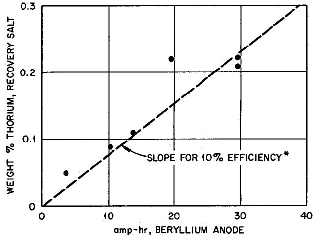  
Fig. 14.4. Thorium Transfer and Current Consumption.

Table 14.3. Relative Transport of Cerium and Thorium   

<table><tr><td rowspan="2">Ampere-Hours (Be Anode)</td><td colspan="2">Fraction Transferred to Recovery Salt</td></tr><tr><td>Cerium</td><td>Thorium</td></tr><tr><td></td><td>×10-3</td><td>×10-3</td></tr><tr><td>3.6</td><td>0.9</td><td>0.9</td></tr><tr><td>10.4</td><td>1.3</td><td>1.6</td></tr><tr><td>13.7</td><td>3.0</td><td>2.0</td></tr><tr><td>19.7</td><td>4.8</td><td>3.9</td></tr><tr><td>29.7</td><td>13.0</td><td>3.8</td></tr><tr><td>29.7</td><td>12.6</td><td>3.9</td></tr></table>

experiment, however, is what factors are responsible for the slow rate of removal of reduced metals from a molten fluoride salt into a liquid metal extractant. Although the problem may be uniquely acute with lead, this has not been demonstrated. Possible rate enhancement by suitable additives to the lead system is under consideration.

# 15. Development and Evaluation of Analytical Methods for Molten-Salt Reactors

# 15.1 DETERMINATION OF OXIDE IN MSRE FUEL

R.F.Apple J.M.Dale A.S.Meyer

Two samples of nonradioactive $\mathrm{LiF - BeF_2}$ submitted by E. L. Compere of the Reactor Chemistry Division were analyzed for oxide. These samples were taken from a larger quantity of salt which had been exposed in the molten state to the atmosphere of a helium-filled dry box for approximately $72\mathrm{hr}$ . The sample representing the surface salt contained $113~\mathrm{ppm}$ oxide and that representing the bulk salt contained $92~\mathrm{ppm}$ oxide.

As was noted in the last report, the NaF trap in the apparatus for determining the oxide content of radioactive salt samples has degraded and restricts the gas flow in the system. Preparations are now under way to replace this trap. Because the trap is an integral part of the directional gas flow control system which includes the valves and heated valve plate, it is planned to replace the system as a unit. This system is being fabricated.

# 15.2 VOLTAMMETRIC DETERMINATION OF U(IV)/U(III) RATIOS IN MSRE FUEL

J.M.Dale R.F.Apple

The equipment1 for making voltammetric U(IV)/U(III) measurements in radioactive MSRE fuel samples was installed in the hot cell. After repairing some leaks which were found in the gas system, it was shown that a molten sample could be maintained in the apparatus in the reduced state. This was done by reducing a

radioactive sample with hydrogen and observing that the half-wave potential of the U(IV) to U(III) reduction wave was stable with time.

During this period it was concluded from equilibrium considerations that knowledge of the U(III) concentration at $500^{\circ}\mathrm{C}$ is not sufficient to predict the U(III) concentration at reactor temperature $(650^{\circ}\mathrm{C})$ , due to the buffering action at $500^{\circ}\mathrm{C}$ of the $70 \pm 10$ ppm chromium present in the MSRE fuel. Voltammetric measurements on a radioactive fuel sample indicated that the U(III) concentration did increase when the sample was heated to $650^{\circ}\mathrm{C}$ and decreased when cooled to $500^{\circ}\mathrm{C}$ . Meaningful U(III) concentration measurements on fuel samples by any analytical technique should, therefore, be made on samples at reactor temperature.

Voltammetric measurements on an MSRE fuel sample received and analyzed on May 8 indicated that about $0.4\%$ of the uranium was present as U(III). At this time enough zirconium had been dissolved in the fuel in the reactor to reduce $1\%$ of the uranium. It can be shown, however, through equilibrium calculations that about $60\%$ of the zirconium could have been used up in reducing 6 ppm Fe(II) if the starting concentration of U(III) were about $0.08\%$ and the activity of the reduced iron had a value of 1. Another possibility for the disagreement in stoichiometry between the zirconium dissolved and the U(III) formed is discussed below.

An experimental setup in the Fluoride Research Laboratory at the Y-12 site is being used to follow the change in the U(IV)/U(III) ratio in a simulated MSRE fuel as either the U(IV) is reduced or the U(III) is reoxidized. The system contains $15 \, \text{kg}$ of $\text{LiF - BeF}_2 - \text{ZrF}_4 - \text{UF}_4$ (64.4-30.2-5.2-0.27 mole %) and is maintained at $650^{\circ}\text{C}$ under argon. Two methods are being used to follow the change in the U(IV)/U(III) ratio: (1) the voltammetric method using three platinum electrodes and (2) a potentiometric method using a reference electrode designed by C. F. Baes and B. F. Hitch of the Reactor Chemistry Division. In the first experiment the melt was reduced in steps by the

Table 15.1. U(III) Concentration as Percent of Total Uranium   

<table><tr><td>Spectrophotometric</td><td>Potentiometric</td><td>Voltammetric</td></tr><tr><td>&lt;0.2</td><td>0.06</td><td>0.01</td></tr><tr><td>1.5</td><td>0.9–1.1</td><td>0.7–1.0</td></tr><tr><td>3.5</td><td>1.7–1.8</td><td>1.1–1.5</td></tr><tr><td>12.0</td><td>9.7</td><td>10.0</td></tr></table>

immersion of zirconium rods until the voltammetric measurements indicated that $10\%$ of the 1000 meq of U(IV) present had been reduced to U(III). Results for various stages of reduction from both of the above methods and those from spectrophotometric measurements by J. P. Young are shown in Table 15.1. The spectrophotometric results of 1.5 and $3.5\%$ may be high due to an experimental problem which will be investigated (cf. Sect. 13.6).

At the $10\%$ reduction level the loss in weight of the several zirconium rods amounted to a total of 670 meq. Even after allowing for the reduction of about 100 meq of known impurities in the salt, 570 meq of zirconium is left, which would correspond to a $57\%$ reduction of U(IV) to U(III). Two possibilities exist: either a large amount of the zirconium metal goes into the salt as coated particles and cannot dissolve, or the solution used to clean the salt from the zirconium rods before weighing is removing some of the zirconium. It has been reported that the cleaning solution does not attack the surface of unused zirconium rods.

After the reduction with zirconium the U(IV)/U(III) ratios were followed as the fuel was reoxidized with $\mathrm{NiF_2}$ . A total of about 156 meq of $\mathrm{NiF_2}$ was required to oxidize the U(III) back to $0.02\%$ . The amount of U(III) oxidized plus the 21 meq each of iron and chromium totals to about 146 meq. This stoichiometric agreement obtained from the oxidation of the fuel confirms that all of the weight loss of the zirconium in the reduction experiments was not available to the fuel for a reduction process.

At the present time a piece of equipment is being fabricated which will permit the reduction of the fuel with zirconium wire. It is planned that all of the wire added to the fuel will be consumed and no second weighings will be necessary. It is also planned to use a working electrode sheathed with boron nitride for the voltammetric measurements with the hope that better-defined reduction waves will be obtained.

# 15.3 COMPUTER-OPERATED VOLTAMMETRIC U(IV)/U(III) RATIO DETERMINATION

M. T. Kelley R. W. Stelzner D. L. Manning

In one of the molten-salt cells utilized for the study of $\mathrm{U(IV) / U(III)}$ ratios in molten $\mathrm{LiF - BeF_2 - ZrF_4}$ by the voltammetric method, it was observed that the $\mathrm{U(IV) / }$ U(III) ratio slowly increased with time. Starting with a $\mathrm{U(IV) / U(III)}$ ratio of $\sim 10 / 1$ (0.25 mole $\%$ total U), the U(III) would essentially all be oxidized to U(IV) in about two to three days. The U(III) could be regenerated with zirconium metal.

The cell assembly consists of a graphite cell that contains the melt ( $\sim 50$ ml volume) which is then enclosed in a quartz jacket to maintain a vacuum or controlled atmosphere. The cap of the enclosure is held in place with an O-ring seal, and the electrodes are positioned by means of Cajon O-ring fittings. Although the system appears tight, it seems feasible that traces of impurities generated within the cell (SiF $_4$ and possible O-ring contaminants) could account for the disappearance of the U(III). It is indicated from the data that the rate of disappearance is first order with respect to U(III), which would seem to indicate an impurity route.

To study the problem further and also to gain practical experience in adapting small on-line computers to electroanalytical methods, a PDP-8 computer was attached to the controlled-potential, controlled-current cyclic voltammeter.

Two computer programs were written for the U(IV)/U(III) ratio determination. One program is written in machine language, the other in FOCAL (FOrmula CALculator). Briefly, in the FOCAL program the computer takes a data point for the current measurement (actually the time derivative of the current measurement) every 3 mv on the voltammogram for a total of 100 points taken over the curve. For each data point, however, an average of 128 samples per $\frac{1}{60}$ sec is taken. This step is designed to average out a small 60-cycle ripple that is superimposed on the signal. The computer next performs a 5-point smooth on the data, locates the peak of the derivative curve, and from this calculates and prints out the numerical value of the U(IV)/U(III) ratio. The machine language program is similar except that the computer takes a data point every 1.5 mv on the voltammogram for a total of 256 points. Both programs yield results with a standard deviation consistently less than $5\%$ .

The procedure was made completely automatic with the computer furnishing all command signals and computing the U(IV)/U(III) ratio from the recorded time derivative of the U(IV)/U(III) reduction wave. The sequence of operation involves bringing the electrodes from open circuit to a controlled-potential configuration. After waiting about 30 sec, a series of five voltammograms are recorded at approximately 1-min intervals. The U(IV)/U(III) ratio from each voltammogram is computed, and at the end of the five scans the average value of the ratio and standard deviation for the five runs are typed out. The cell is then placed at open circuit, and after a waiting period of 15 min the procedure is repeated. The results obtained so far appear most promising for adapting small on-line computers to electroanalytical methods.

# 15.4 ELECTROANALYTICAL STUDIES IN MOLTEN FLUORIDES

D. L. Manning H. W. Jenkins $^{3}$ Gleb Mamantov $^{4}$

Emf studies on the Ni/Ni(II) couple in molten fluorides have indicated that the nickel system appears to be a good choice for a reference electrode to be used in molten fluoride salt systems. The Ni/Ni(II) couple exhibits Nernstian reversibility, has only one valence state, and is relatively noble, which are desirable characteristics for a reference electrode.

A more quantitative measure of the reversibility of the $\mathrm{Ni} / \mathrm{Ni}(\mathrm{II})$ couple was determined from kinetic measurements. From such experiments, it was hoped to evaluate basic kinetic parameters such as exchange current, transfer coefficient, and heterogeneous rate constant for the reaction $\mathrm{Ni}^{2+} + 2e \rightleftharpoons \mathrm{Ni}^0$ . The definition of exchange current is

$$
i _ {0} = n F k C _ {\mathrm {O x}} ^ {1 - \alpha} C _ {\mathrm {R}} ^ {\alpha},
$$

where $k$ is the heterogeneous rate constant, $C_{\mathrm{Ox}}$ and $C_{\mathrm{R}}$ are the concentrations of the oxidized and reduced forms of the couple, and $\alpha$ is the transfer coefficient.

Two methods were used for these experiments, the relaxation voltage step method of Vielstich and

Table 15.2. Kinetic Parameters for the Ni/Ni(II) Couple in Molten LiF-BeF $_2$ -ZrF $_4$ at $500^{\circ}\mathrm{C}$   

<table><tr><td></td><td>Voltage Step</td><td>Chronocoulometry</td></tr><tr><td>Standard rate constant k, cm/sec</td><td>~1 × 103</td><td>~1.7 × 103</td></tr><tr><td>Transfer coefficient, α</td><td>0.68 to 0.45</td><td>~0.6</td></tr><tr><td>Molar exchange current, I0, amp/cm2</td><td>0.06 to 0.2</td><td></td></tr></table>

Delahay6 and the chronocoulometric method of Christie, Lauer, and Osteryoung.7

In the voltage step method, after applying a small voltage step (few millivolts) to the system, the Faradaic current, which is observed after the charging current has become negligible, is extrapolated back to zero time. The kinetic parameters are then calculated from the measured zero-time current, the known voltage step, and the known resistance of the system. For the chronocoulometric method, a potential step is again applied to the cell, following which the number of coulombs passed, following application of the potential step, is measured as a function of time. The coulombs can be separated with diffusing and nondiffusing coulombs, which permits the evaluation of kinetic parameters $k$ and $\alpha$ .

A summary of the kinetic parameters for the Ni/Ni(II) couple, believed to be reliable, is reported in Table 15.2. It is believed that the agreement between the two methods is good and that our values on the kinetic parameters for the nickel system in molten $\mathrm{LiF - BcF_2 - ZrF_4}$ are of the correct order of magnitude. The values for $k$ and $I_{0}$ are somewhat smaller than for nickel in other media. This suggests that the charge transfer for the $\mathrm{Ni}^{2 + } + 2e\rightarrow \mathrm{Ni}^0$ reaction may correspond to a quasi-reversible process more so than a truly reversible process in molten fluorides. The reason is not known, although the greater complexing affinity of fluoride melts forming more associated fluorocomplex species may be, in part, responsible. From a practical standpoint, however, as long as the exchange current is large compared with the net current a reference electrode is required to pass, it should remain poised. For most electroanalytical applications involving controlled potential, controlled current, and potentiometric techniques, this is generally the case.

# 15.5 SPECTRAL STUDIES OF SUPEROXIDE ION IN MOLTEN FLUORIDE SALTS

J.P.Young F.L.Whiting Gleb Mamantov

Evidence derived from spectral studies has shown that the superoxide ion, $\mathbf{O}_2^-$ , exists in several molten fluoride solutions. The species has been observed in molten LiF-NaF-KF, LiF-BeF $_2$ , and LiF-BeF $_2$ -ZrF $_4$ at approximately $500^{\circ}\mathrm{C}$ and in molten KHF $_2$ at $280^{\circ}\mathrm{C}$ . This solute species can be added directly to the molten solvent, in the case of the alkali fluoride eutectic, or can be generated either by the addition of suitable oxidants or by electrochemical oxidation.

The addition of sodium superoxide $(\mathrm{NaO}_2)$ to molten LiF-NaF-KF yields a yellow solution. The spectrum of this solution is shown in Fig. 15.1. The spectrum

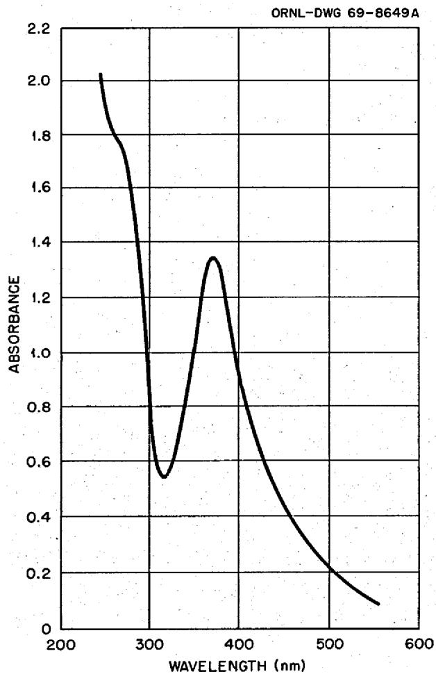  
Fig. 15.1. Spectrum of Superoxide Ion $(\mathbf{O}_2^-)$ in Molten LiF-NaF-KF at $500^{\circ}\mathrm{C}$ .

consists of an absorption peak at $372\mathrm{nm}$ and a shoulder at $260~\mathrm{nm}$ which is on the side of an absorption edge in the ultraviolet region. The $372\mathrm{-nm}$ peak agrees with the spectrum reported from $\mathbf{O}_2^-$ in liquid ammonia and with the reflectance spectrum of solid $\mathrm{NaO_2}$ . The $260\mathrm{-nm}$ shoulder has not been previously reported. Besides direct addition, $\mathbf{O}_2^-$ has been prepared in this solvent by the oxidation of O(II), perhaps as $\mathrm{O}^{2 - }$ or $\mathrm{OH^{-}}$ with Mn(III), $\mathbf{O}_2$ or Co(III). The species has also been observed spectrally after being generated anodically from O(II) at a Pt or pyrolytic graphite electrode.

The species is observed, at a much lower concentration level, after bubbling $\mathrm{O}_2$ gas into either molten $\mathrm{LiF - BeF_2}$ or $\mathrm{LiF - BeF_2 - ZrF_4}$ contained in a silica cell. In this case it is assumed that $\mathbf{O}^{2 - }$ ion, if not already present, would be furnished by reaction of the melt with $\mathrm{SiO_2}$ . It is not possible, yet, to establish absolute concentration or solubility levels of $\mathrm{O}_2^-$ in various fluoride melts as the sensitivity of the absorption peaks is not known: It is assumed that the spectrum arises from allowed transitions and as such is fairly sensitive ( $A_{m} = 10^{2}$ to $10^{3}$ liters mole $^{-1}$ cm $^{-1}$ ). The amount observed to be generated in the $\mathrm{BeF_2}$ -base solvents, therefore, would be expected to be low (ppm level). The fact that $\mathrm{O}_2^-$ is observed raises the possibility of radiolytic generation of $\mathrm{O}_2^-$ from oxide ion in the MSRE. In LiF-NaF-KF it was observed that although the $\mathrm{O}_2^-$ ion was stable in a silica cell, it slowly decomposed in a graphite windowless cell, possibly by reaction with graphite to form CO or $\mathrm{CO}_{2}$ . Thus if $\mathrm{O}_2^-$ were present in the MSRE it probably would not be stable in the presence of the reactor graphite. It should be noted that the $\mathrm{O}^{2 - }$ concentration of the reactor fuel dropped from 100 to 50 ppm as the reactor went critical; the concentration has remained at this low level since. Is this oxide concentration stable because of chemical purity or is it a steady-state concentration derived from several chemical and radiolytic processes? In discussing this idea with G. E. Boyd an alternate radiolytic route for the removal of $\mathrm{O}^{2 - }$ also became apparent – that of direct oxidation of $\mathrm{O}^{2 - }$ to $\mathrm{O}_2$ by atomic fluorine, which should be in relatively high concentration in the reactor core. It would seem that the radiolytic behavior of the various oxidation states of oxygen in molten fluoride salts should be considered

experimentally. The hot-cell spectrophotometric facility described in the next section will enable us to carry out such experiments.

# 15.6 HOT-CELL SPECTROPHOTOMETRIC FACILITY

J.P.Young

The design and fabrication of the optical components which are required for the hot-cell spectrophotometer have been completed by the vendor, Cary Instruments of Varian Associates. The completed unit, mounted on a temporary stand, is shown in Fig. 15.2. The source compartment and the monochromator-detector com

partment are shown, respectively, in the front and rear of the left side of the photograph. By the addition of the necessary optical elements the light beam of the spectrophotometer is directed through the 3-ft-long wall embedment (the shiny metal section shown in the center of the photograph) and into the hot cell. The portion of the facility which is within the hot cell is the darkened area at the right. Both sample and reference beams pass into and out of the hot cell. The beams are displaced vertically by 6 in. The molten-salt optics furnace will be located in the upper sample beam. The facility has been checked at the vendor's site. Mechanically the necessary components operate quite well. Two identical sets of optics have been fabricated, and,

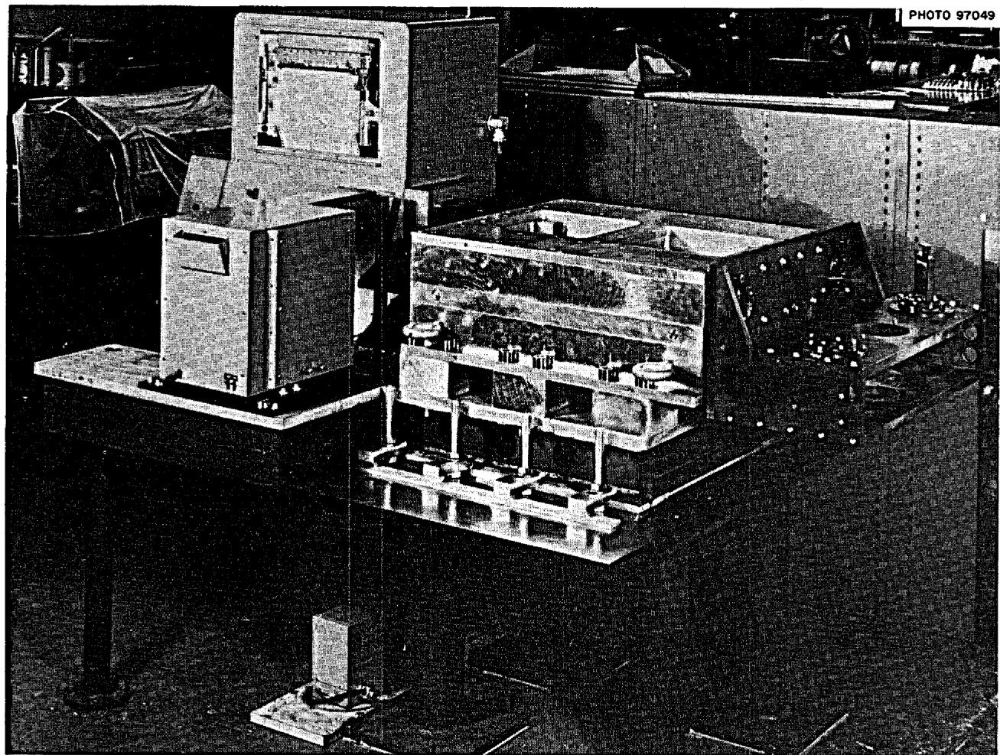  
Fig. 15.2. Hot-Cell Spectrophotometric Facility.

if necessary, those parts which must be replaced in the hot cell can be replaced with manipulators. Optically the facility should work quite well. On initial tests it did not completely meet specifications, but it has subsequently been realigned and is now en route to Oak Ridge. After checking to see that the facility, which weighs approximately 4 tons, was not damaged in shipment, it will be installed within the wall of cell 7, Building 3019, for final acceptance tests.

The sampling procedure for transferring a sample of MSRE fuel from reactor to optics furnace was previously discussed.10 All components required for this transfer have been fabricated. The optics furnace works quite well. The top assembly, which is used in transferring the final sample from the sample loading furnace to the optics furnace, works adequately. Minor faults in the operation are being corrected. Both of these pieces of equipment have been used routinely in the laboratory for spectral studies that have recently been carried out. The operation of the sample loading furnace, both thermally and mechanically, is not satisfactory. Further design studies are presently under way to determine what can be done to correct its operation. The transport container, which is used to contain the MSRE sample for transport from reactor to sample loading furnace, has some sealing problems. These problems will be corrected by altering the necessary seals. The shielded heated sample carrier, which provides radiation shielding and maintains the sample in the transport container above $200^{\circ}\mathrm{C}$ for the transit from reactor to hot cell, works quite well. To improve handling characteristics and decontamination methods, a cooling coil will be installed in the carrier to cool the outside skin temperature of the carrier to $<50^{\circ}\mathrm{C}$ at the hot-cell site. All components which will be within the hot cell have been checked as to mechanical operation with slave manipulators. These tests were performed in a mockup which simulated hot-cell conditions. Problems found in these evaluations are being corrected.

In connection with spectral studies of molten fluoride salts, there is a need for a melt container of fixed path length through which light can be transmitted. With windowless cells11 the path length can be determined but is not fixed. A diamond-windowed cell12 provides

an excellent fixed-path-length cell compatible with many fluoride melts, but at present the small size of available windows, $5 \times 5 \times 1 \mathrm{~mm}$ , and their possible deterioration in high radiation fields precludes their use with radioactive melts. Preliminary studies of a new type of windowless and fixed-path-length cell have been carried out. The cell makes use of "porous metal," a metal product developed by P. R. Mallory and Company. Porous metal is a foil that contains a number of small irregular pits formed by a proprietary electrochemical process; many of these pits are etched completely through the foil, so that light can be transmitted through the metal. Cells made with stainless steel porous metal will hold aqueous solutions quite adequately for spectral study. P. R. Mallory and Company has agreed to fabricate experimental batches of porous metal made from Hastelloy N which has been furnished to them by ORNL. If this product proves to be satisfactory, it should be possible to fabricate a fixed-path-length cell entirely of Hastelloy N, a material which has been demonstrated to be compatible with radioactive MSRE fuel.

# 15.7 REMOVAL OF OXIDE FROM $\mathrm{NaBF_4}$

# R.F.Apple A.S.Meyer

Because compatibility studies of the $\mathrm{NaBF_4}$ coolant with structural material have indicated that there may be some correlation between oxide and water contamination and corrosion rates, we have undertaken a program with the Metallurgy Division to study methods for the purification of the coolant. Since $\mathrm{BF}_3$ is used as a blanket gas for the salt, an attempt was made to remove oxide as a hydrate of $\mathrm{BF}_3$ by passing an He- $\mathrm{BF}_3$ gas mixture through the $\mathrm{NaBF_4}$ . Upon titrating the effluent gas with Karl Fischer reagent, it was found that the $\mathrm{NaBF_4}$ actually removed traces of moisture from the $\mathrm{BF}_3$ . Passing He-HF gas mixture through the salt at $950^{\circ}\mathrm{F}$ has shown that oxide can be removed from the melt according to the reaction

$$
2 \mathrm {H F} + \mathrm {O} ^ {2 -} \rightleftharpoons \mathrm {H} _ {2} \mathrm {O} + 2 \mathrm {F} ^ {-}.
$$

Tests are now under way to establish the optimum conditions for oxide removal by the hydrofluorination method.

# 15.8 DETERMINATION OF BISMUTH IN MSRP SALTS

A.M.Yoakum

C. Feldman

P. F. Thomason

In the previous report13 it was indicated that several approaches to the sensitive measurement of bismuth in MSRP salts were under development. At that time the only method sufficiently perfected for application to salt samples (the potassium iodide spectrophotometric method) was limited to samples containing approximately 10 ppm of bismuth or greater. Two additional methods whose ultimate sensitivity is less than 1 ppm have now been applied to MSRP salts. No attempts have yet been made to adapt any of these methods to highly radioactive salt samples.

# 15.8.1 Emission Spectrography

The sensitivity of the direct spectrographic determination of bismuth in breeder fuel is limited by interference of the emission spectra of thorium and uranium. The bismuth can be concentrated and quantitatively separated from the major constituents by extraction with dithizone (diphenylthiocarbazone) from acid solutions. Only silver, mercury, tin, and a fraction of the copper accompany the bismuth. None of these elements are present in sufficient concentration to interfere with the spectrographic measurement of the bismuth. The following procedure has been applied to simulated MSRP salts and actual samples from fuel reprocessing studies.

A sample weighing $10\mathrm{g}$ or less is fused with $\mathrm{NH_4HSO_4}$ in order to eliminate the fluoride. The excess $\mathrm{NH_4HSO_4}$ is then evaporated off and the residue dissolved in dilute HCl. The solution is adjusted to pH 1.5. The bismuth is now extracted from this solution by shaking it with a solution of dithizone in $\mathrm{CCl_4}$ . The organic phase is evaporated onto graphite powder and the powder analyzed by the standard $\mathrm{Li_2CO_3}$ -base spectrochemical procedure. The absolute limit of detection is $\sim 0.02\mu \mathrm{g}$ Bi. In a $10\mathrm{-g}$ sample, this corresponds to a sensitivity limit of $0.002\mathrm{ppm}$ in the sample. Some variation of this technique could obviously be adapted to the determination of other trace constituents in fuel samples.

The spectrographic method is obviously more complex and time consuming than the polarographic ap

proach described in the next section, but it is inherently more selective. For example, it is not subject to interference from traces of copper which may be introduced during sampling of the salts.

# 15.8.2 Inverse Polarography

Inverse polarographic methods (polarographic stripping techniques) provide enhanced waves for the measurement of trace metallic constituents. The metal is plated on an electrode for extended periods, and the current required for reoxidation at a relatively rapid rate is then measured. For MSRP samples the technique offers additional advantages in that major salt constituents such as uranium and thorium are not deposited and, therefore, do not contribute any interfering stripping waves.

In the method now being applied to MSRP salts only about $2\mathrm{ml}$ of sample solution $(\sim 20\mathrm{mg}$ of salt) is added

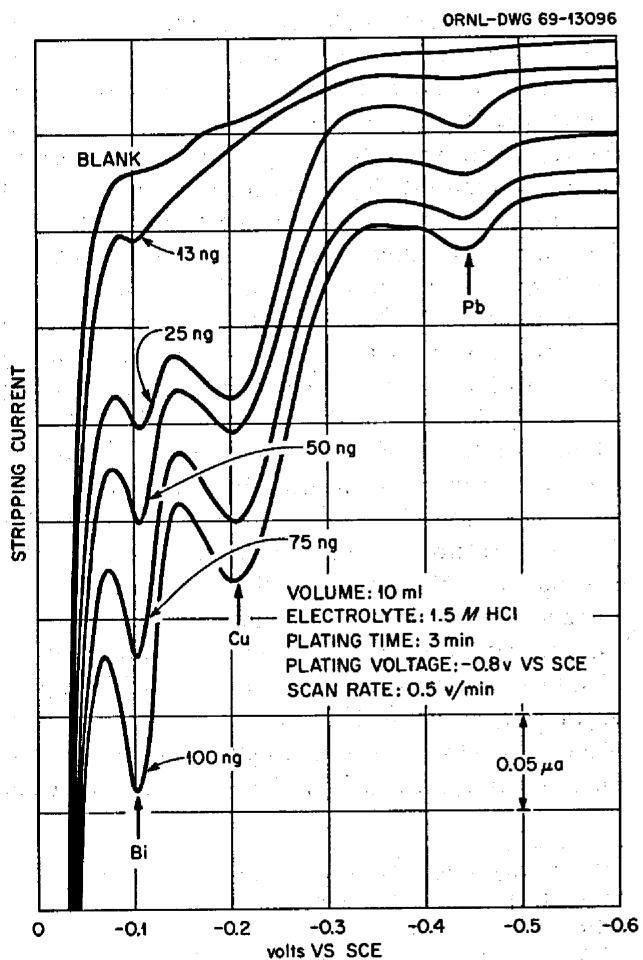  
Fig. 15.3. Calibration Curves for Bismuth Determination by Anodic Stripping.

to the $10\mathrm{ml}$ of $1.5M$ HCl electrolyte, and the remainder of the sample can be used for other determinations. The bismuth is deposited on a small $(\sim 0.5\mathrm{mm})$ drop of mercury whose dimensions are defined by injection of a reproducible quantity of mercury with a micrometer syringe through a polarographic capillary. Typical plating and stripping conditions are a 3-min plating period at $-0.8\mathrm{vvsS.C.E.}$ followed by an anodic scan at $0.5\mathrm{v / min}$ . Calibration waves for such measurements are shown in Fig. 15.3. These conditions can be varied for specific samples provided calibration curves are made under the same conditions as the samples. At present, detection limits are about $0.05\mathrm{ppm}$ . Tentatively, reproducibility is about $20\%$ for salts containing $1\mathrm{ppm}$ of bismuth.

The method is subject to interference from copper, whose stripping wave is separated from that of bismuth

by only about $90\mathrm{mv}$ . Approximately a tenfold ratio of copper to bismuth can be tolerated. No interference from major salt components and corrosion products (Fe, Cr, and Ni) has been experienced. No studies have yet been made on the effects of fission products and other possible trace contaminants in the fuel. Many of the earlier problems with the method have been traced to impurities in the reagents. At present a specially purified electrolyte prepared by isopiestic distillation of HCl into triple-distilled water is being used.

In the analysis of samples of simulated MSRP fuel from the Chemical Technology Division, concentrations of bismuth from 0.1 to 6 ppm were determined. Reasonable agreement with values measured by the spectrophotometric method was observed at the upper end of this concentration range.

# Part 4. Molten-Salt Irradiation Experiments

E.G.Bohlman

No work was carried out in this activity during the report period.

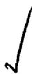

# Part 5 Materials Development

W. P. Eatherly

H. E. McCoy

J. R. Weir

Our materials program has concentrated on the development of graphite and Hastelloy N with improved resistance to irradiation damage. We have approached the graphite problem by studying the dimensional changes during irradiation of several commercial graphites. These studies have revealed which graphites are most stable and, additionally, have shown what preirradiation properties are important in giving this stability. These findings are being utilized in making some experimental graphites that likely will have improved dimensional stability during irradiation. The graphite used in an MSBR must also be sealed to reduce the permeability to gaseous fission products. We are developing techniques for sealing graphite with carbon.

The fast flux seen by the Hastelloy N is quite low, and the irradiation damage to this material is associated with the production of helium from the transmutation of $^{10}\mathrm{B}$ by thermal neutrons. The threshold boron level required to cause embrittlement is too low to be obtained commercially, so we sought to reduce the problem by changes in alloy chemistry. Modified compositions of Hastelloy N containing additions of Ti, Hf, and Nb look promising. The improved properties

are associated with the formation of a fine dispersion of type MC carbides, and we are studying how the carbide type changes with alloy composition and aging.

The compatibility of Hastelloy N with fluoride salts continues to receive attention; the main emphasis is currently placed on the proposed coolant salt, sodium fluoroborate. This salt is more corrosive than other fluoride salts; we attribute this aggressiveness to the presence of absorbed moisture. The variation of corrosion rate with moisture content and methods of removing moisture from a flowing salt stream are being studied.

Some work has begun on developing structural materials suitable for use in the chemical processing plant. In this application the materials will be exposed to both salt and bismuth. Nickel-base alloys are highly soluble in bismuth, and iron-base alloys mass transfer very badly. Molybdenum seems compatible but is difficult to fabricate. One avenue of research involves methods of coating steels with molybdenum or tungsten to protect them from the bismuth. A second area of endeavor is that of finding brazing alloys that are compatible with bismuth for joining molybdenum.

# 16. MSRE Surveillance Program

# 16.1 REMOVAL AND EXAMINATION OF SURVEILLANCE SAMPLES

W.H.Cook

The reactor core surveillance specimens of graphite and Hastelloy N were removed from the MSRE on June 5, 1969, after run 18 as part of the fourth group removed since the MSRE attained critical operation on June 1, 1965. Personnel of the Hot Cell Operation

Department have dissassembled all three stringers, and we have just started our detailed examination of them. One stringer was at temperature $(645\pm 10^{\circ}\mathrm{C})$ for a total of 2.6 years and accumulated fast $(E > 50\mathrm{kev})$ and thermal $(E < 0.876\mathrm{ev})$ fluences of $1.1\times 10^{21}$ and $1.5\times 10^{21}$ neutrons/cm² respectively. The other two

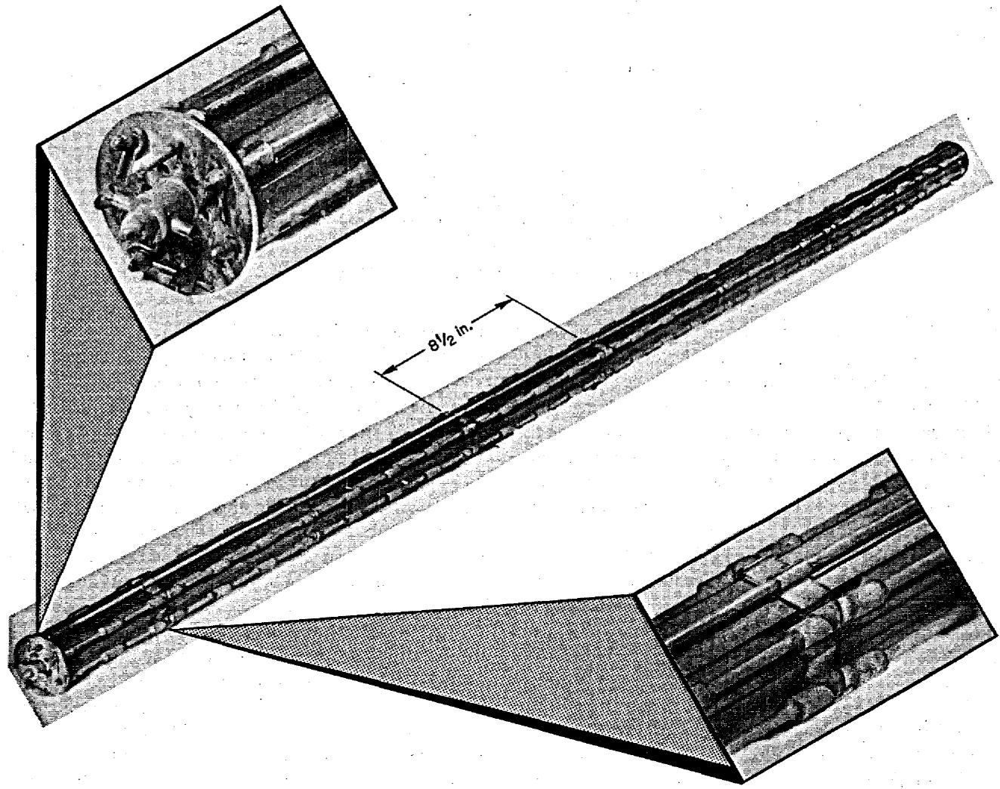  
Fig. 16.1. MSRE Surveillance Specimens of Graphite and Hastelloy N Removed After Run 18 (Stringers RS4, RR3 and RL2).

stringers were at temperature for 0.8 year and accumulated fast and thermal fluences of $2.8 \times 10^{21}$ and $5.1 \times 10^{20}$ neutrons/cm² respectively.

The specimens appeared mechanically sound by visual examinations, as shown in Fig. 16.1. As usual, the fuel salt drained well, so that the surfaces of the specimens were essentially free of salt. The graphite appeared unaltered; however, the Hastelloy N was slightly darker gray than observed previously. This is true for those with both short and long exposures; so the darkening is related to some characteristic of recent MSRE operation or to the current sampling operations.

The graphite samples removed previously had surface films that could be seen in special lighting and also flow

patterns near protrusions on the surveillance assembly.2 The films were still visible on the samples just removed that had been at temperature for 2.6 years (installed in the MSRE on September 13, 1966). However, the flow patterns were absent or modified by the conditions that produced the darker gray appearance of the Hastelloy N. The films on the graphite appeared to be approximately the same thickness as previously observed. To date we have been unable to acquire enough of the film material to make an identification. We could not find any films on the graphite from the other two stringers that had been in the MSRE for a little less than a year.

Table 16.1. Preliminary Examinations of the Microstructure of the MSRE Surveillance Hastelloy N Exposed in the Core at $645 \pm 10^{\circ}\mathbf{C}$   

<table><tr><td rowspan="2">Designation</td><td rowspan="2">Date Removed from MSRE</td><td rowspan="2">Time at Temperature (years)</td><td colspan="2">Fluence (neutrons/cm2)a</td><td rowspan="2">Heat No. NI</td><td rowspan="2">Comments on Microstructure</td></tr><tr><td>Thermal (E&lt;0.876 ev)</td><td>Fast (E&gt;50 kev)</td></tr><tr><td>RS4 strap</td><td>6-5-69</td><td>0.8</td><td>5.1 × 1020</td><td>2.8 × 1020</td><td>5055</td><td>1½ mils intergranular crack- ing or attack; it is more con- centrated on the outsideb</td></tr><tr><td>Untested RS4 strap material</td><td></td><td></td><td></td><td></td><td>5055</td><td>Relatively smooth surfaces; no intergranular cracking or attack</td></tr><tr><td>RR2 strap</td><td>4-3-68</td><td>1.74</td><td>9.4 × 1020</td><td>8.5 × 10</td><td>5055</td><td>1 to 1½ mils intermittent intergranular cracking or attack; slightly worse on insideb</td></tr><tr><td>RL2 strap</td><td>6-5-69</td><td>2.57</td><td>1.5 × 1021</td><td>1.1 × 1021</td><td>5055</td><td>3 mils intergranular cracking or attack; approximately same on in- side and outside surfaces</td></tr><tr><td>Untested RL2 and RR2 strap material</td><td></td><td></td><td></td><td></td><td>5055</td><td>Relatively smooth surfaces; no intergranular cracking or attack</td></tr><tr><td>J 13 tensile shoulderc</td><td>6-5-69</td><td>2.57</td><td>1.5 × 1021</td><td>1.1 × 1021</td><td>5085</td><td>Intermittent layer on the sur- face ~¼ mil thick; no intergranular attack</td></tr><tr><td>M 13 tensile shoulderc</td><td>6-5-69</td><td>2.57</td><td>1.5 × 1021</td><td>1.1 × 1021</td><td>5065</td><td>Relatively uniform, mottled on the surface, ~½ mil thick; no intergranular attack</td></tr></table>

${}^{a}$ Fluence values are calculated estimates supplied by R. C. Steffy.   
bThe strap encircles the graphite tongue-and-groove joint; the surface adjacent to the graphite is called the inside and the opposing surface is called the outside.   
$c$ Shoulder of one of the 27 tensile specimens of the tensile specimens rod.

Preliminary examinations have been made on some of the Hastelloy N from the surveillance assembly. For the first time, there was an indication of different behavior among different heats of Hastelloy N. The greatest differences were (1) grain boundary attack or separation to a maximum depth of 3 mil without a layer on the external surfaces and (2) mottled layers on the external surfaces $\frac{1}{4}$ to $\frac{1}{2}$ mil deep and no intergranular attack or separation. There is insufficient information to explain these differences at this time. The observations are summarized in Table 16.1. Heat NI-5055, which showed the cracking or attack, was used to make only the straps and was not used in the structure of the MSRE. Heats NI-5065 and NI-5085, respectively, were used to make the MSRE vessel heads and wall. The certified compositions of all three heats of Hastelloy N are essentially the same; so composition does not appear to be a factor in the differences of their microstructures. The normal carbide precipitates were

missing from the intergranular regions that were cracked or attacked. The intergranular separation is atypical of fluoride corrosion of nickel-base alloys.

The 20-mil-thick straps of heat NI-5055 have low ductility at room temperature. The microstructures of both sides were essentially the same, although one side contacted the graphite and the other fluoride salt. We still would expect to see a carburization gradient even across these thin straps for this exposure for $\sim 2.6$ years.

A cursory electron microprobe examination of a section of strap that had the deepest (3 mils) grain

boundary cracking or attack did not reveal anything unusual near the surface or in the interior. The molybdenum content appeared normal, and fission product tellurium and cesium were not detected in the grain boundaries.

The surveillance samples were contained in a perforated Hastelloy N basket. This sample basket has been used for $\sim 2$ years at $645 \pm 10^{\circ}\mathrm{C}$ and has accumulated a thermal fluence of $1 \times 10^{21}$ neutrons/cm $^2$ ( $E < 0.876$ ev). A portion of the perforated section of the basket was bent double ( $\sim 180^{\circ}$ ) at ambient temperature while handling in the hot cells. No visible macrocracks were formed in the tension side of the bend, indicating the retention of reasonable ductility.

# 16.2 PROPERTIES OF THE HASTELLOY N SURVEILLANCE SAMPLES

H.E.McCoy R.E.Gehlbach W.H.Cook

The fourth group of surveillance samples was removed from the core of the MSRE in June 1969. Samples of standard and modified Hastelloy N were removed, but only the standard material has been tested to date. The standard samples were placed in the core on September 13, 1966, when the reactor had been at temperature

$(650^{\circ}\mathrm{C})$ for 4800 hr and generated 8682 Mwhr of energy; they were removed after being at temperature for 22,533 hr, during which the MSRE had generated 84,223 Mwhr of energy. Two heats of standard Hastelloy N are involved in the surveillance program: heat 5085 used in fabricating the cylindrical portion of the MSRE vessel and heat 5065 used in fabricating the top and bottom heads.

The results of tensile tests on the standard alloy are shown in Figs. 16.2 and 16.3. The thermal control samples have not been tested yet, so the irradiated results are compared with those for unirradiated samples with no aging. The fracture strain of heat 5065 (Fig. 16.2) is generally decreased at all temperatures, the reduction becoming much greater at higher temperatures. The fracture strain is dependent upon the strain rate above about $400^{\circ}\mathrm{C}$ being lower the lower the strain rate. Heat 5085 (Fig. 16.3) has lower fracture strains than heat 5065 up to $550^{\circ}\mathrm{C}$ and slightly higher above $550^{\circ}\mathrm{C}$ .

The deterioration in the low-temperature fracture strain is associated with heavy grain-boundary carbide precipitation. Heat 5085 seems more susceptible to this type of damage than heat 5065. This precipitation occurs during aging in the absence of irradiation, but the ductility reductions as a result of combined thermal

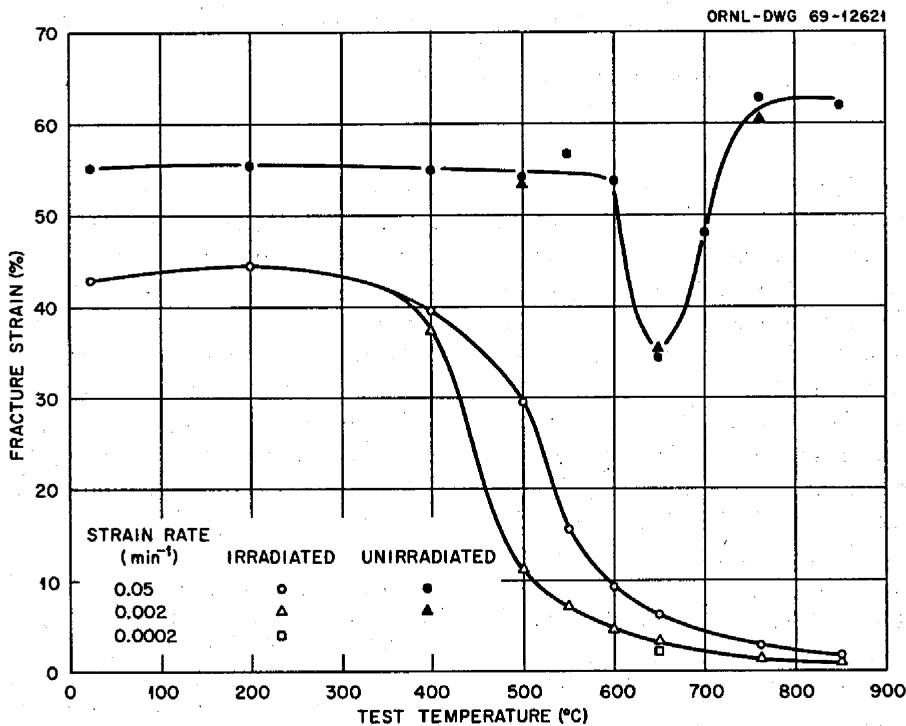  
Fig. 16.2. Variation of the Fracture Strain with Test Temperature for Hastelloy N (Heat 5065) Surveillance Samples Removed from the Core of the MSRE After 22,533 hr at $650^{\circ}\mathrm{C}$ and Exposure to a Thermal Fluence of $1.5 \times 10^{21}$ neutrons/cm $^2$ .

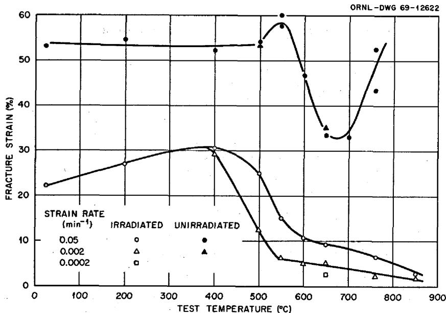  
Fig. 16.3. Variation of the Fracture Strain with Test Temperature for Hastelloy N (Heat 5085) Surveillance Samples Removed from the Core of the MSRE After 22,533 hr at $650^{\circ}\mathrm{C}$ and Exposure to a Thermal Fluence of $1.5 \times 10^{21}$ neutrons/cm $^2$ .

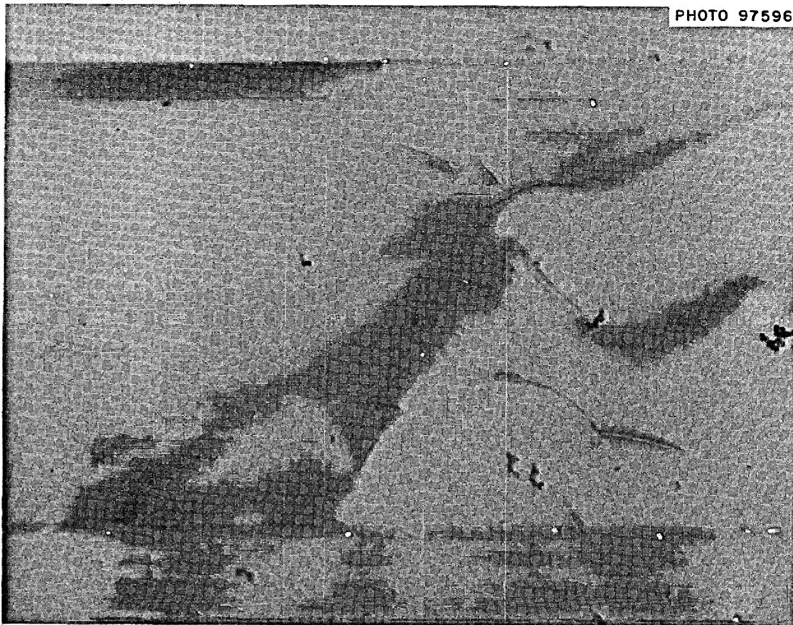  
Fig. 16.4. Transmission Electron Micrograph of Hastelloy N (Heat 5085) Removed from the MSRE After 22,533 hr at $650^{\circ}\mathrm{C}$ and Exposure to a Thermal Fluence of $1.5 \times 10^{21}$ and a Fast Fluence ( $>50$ kev) of $1.1 \times 10^{21}$ neutrons/cm $^2$ . The bubbles shown in this micrograph lie predominantly along twin boundaries. 25,000×.

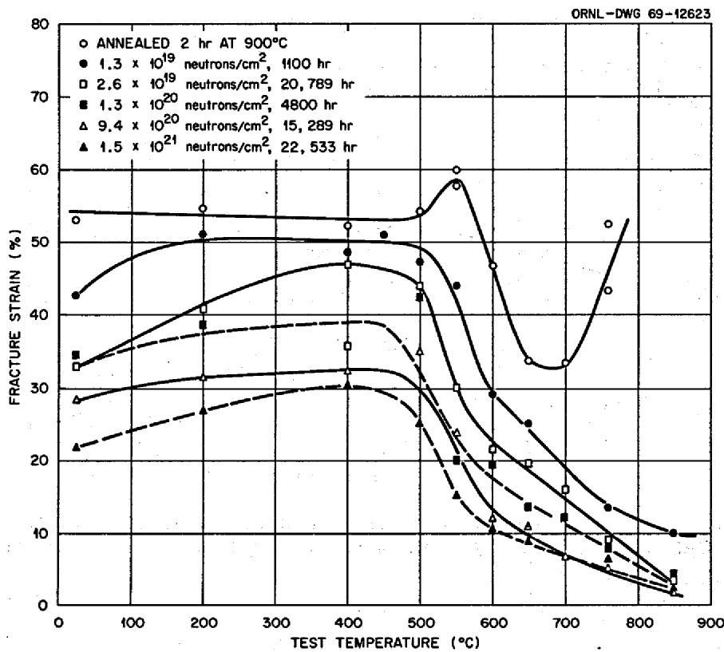  
Fig. 16.5. Tensile Fracture Strains of Hastelloy N (Heat 5085) Surveillance Samples.

aging and irradiation are greater. The reduction in fracture strain at high temperatures is associated with the formation of helium from the transmutation of $^{10}\mathrm{B}$ . The helium bubbles that result from this transmutation are quite apparent in Fig. 16.4.

The accumulated results on the surveillance samples give us an opportunity to observe the property changes of Hastelloy N as a function of thermal fluence. The fracture strain for heat 5085 is shown in Fig. 16.5 as a function of test temperature for the various samples tested in this program. The steady decline in fracture strain over the entire range of test temperature is obvious. The magnitude of the fracture strain is also very dependent upon the strain rate.7 The accumulated results on heat 5085 at $650^{\circ}\mathrm{C}$ are shown in Fig. 16.6. The strain rates of $300\%/\mathrm{hr}$ and $12\%/\mathrm{hr}$ were obtained in standard tensile tests where the strain rate is controlled. The minimum fracture strain for this material occurs in a fast creep test where the creep rate is about $0.1\%/\mathrm{hr}$ ; tests at a slower strain rate have slightly higher fracture strains. The MSRE vessel

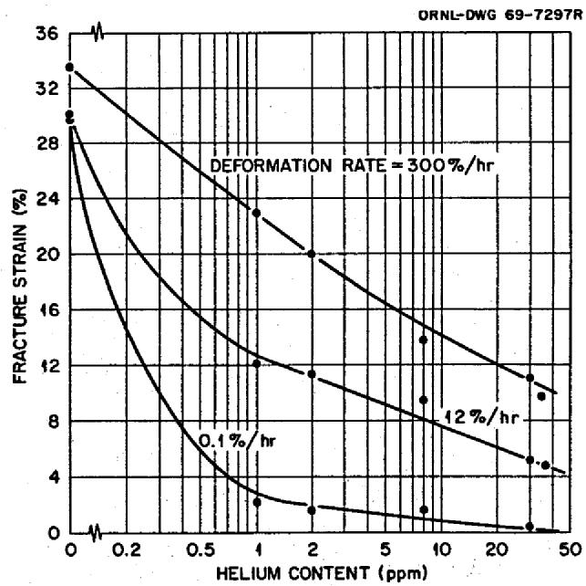  
Fig. 16.6. Variation of Fracture Strain with Calculated Helium Content and Strain Rate for Hastelloy N (Heat 5085) at $650^{\circ}\mathrm{C}$ .

presently has been exposed to a thermal fluence of 3.8 $\times 10^{19}$ neutrons/cm², and the helium content of heat 5085 is about 2 ppm.

# 17. Graphite Studies

# 17.1 Procurement of NEW GRAPHITES

W. H. Cook

The rate of procurement of new grades of graphite has slowed because we now have grades typical of most of the known variations in the current graphite technology. Materials for future work will come from our own fabrication studies and from new commercial products.

One new material was received, an isotropic graphite HL-18 from AIRCO Speer. It has a bulk density of $1.86 \, \text{g/cm}^3$ and is currently being evaluated.

The superior neutron irradiation damage resistance exhibited by Great Lakes Carbon Corporation² grade H337 and Poco Graphite Inc.³ grades AXF and AXF-5QBG (Sect. 17.6) warrants our making more detailed studies on these types of graphite. We have purchased modest quantities of Poco grades AXZ-5Q, AXM-5Q, AXF-5Q, and AXF-5QBG for part of these more detailed studies. These materials are listed in Table 17.1. The grades AXF-5Q and AXF-5QBG are typical of the grades that have shown superior resistance to irradiation damage. We shall expand our evaluation of these both in and out of neutron irradiation. The grades AXZ-5Q and AXM-5Q have bulk densities that are low for potential use in MSBR's, but they are fabricated from the same materials as the AXF series. Studies of these lower-density grades may contribute to our understanding of neutron irradiation damage. Grade AXM-5Q is of special interest since it was crushed to provide one of the principal reference filler materials for the study of special binders.⁴

Table 17.1. Grades of Poco Graphite Obtained for Evaluation for the MSRP   

<table><tr><td>Grade</td><td>Measured Bulk Density Range (g/cm3)</td><td>Samples</td><td>Total Weight (lb)</td></tr><tr><td>AXZ-5Q</td><td>1.522–1.584</td><td>23</td><td>38.5</td></tr><tr><td>AXM-5Q</td><td>1.685–1.796</td><td>24</td><td>42.6</td></tr><tr><td>AXF-5Q</td><td>1.777–1.928</td><td>27</td><td>34.7</td></tr><tr><td>AXF-5QBG</td><td>1.811–1.958</td><td>28</td><td>25.8</td></tr><tr><td></td><td></td><td>Total</td><td>141.6</td></tr></table>

# 17.2 GRAPHITE FABRICATION

R. L. Hamner

A development program was initiated to fabricate high-density isotropic graphite bodies for molten-salt reactor applications. The criteria for the properties of the graphite bodies are based on data obtained on many types of graphite bodies after irradiation testing in the High Flux Isotope Reactor (HFIR). Our preliminary plans are to fabricate bodies by extrusion, isostatic molding, and warm $(\leqslant 1400^{\circ}\mathrm{C})$ uniaxial molding. After the necessary characterizations are made, specimens will be selected for irradiation testing in the HFIR.

We now have the necessary facilities for fabrication by conventional techniques. We expect to develop new techniques as the program progresses. Associated with the development of new techniques is an autoclave, now on order, which is rated at 20,000 psi and $1000^{\circ}\mathrm{C}$ . We will use this autoclave to determine the effects of temperature and pressure on raw materials as well as preformed green graphite bodies.

For the initial stages of our work, we have selected a coal tar pitch and a prepolymerized furfuryl alcohol as binders and four types of fillers: JOZ grade graphite (Great Lakes Corporation), Robinson graphite (Carbon Products Division, Union Carbide Corporation), Santa Maria Coke (Collier Carbon and Chemical Corporation), and Thermax (R. T. Vanderbilt Company, Inc.). These materials are now being characterized.

# 17.3 X-RAY STUDIES

# O. B. Cavin

We have shown previously that the degree of crystalline anisotropy strongly influences the dimensional stability of polycrystalline nuclear graphite under neutron irradiation $(E > 50\mathrm{keV})$ As a continuing part of the graphite evaluation program, we are determining the x-ray anisotropy values for the grades of graphite being irradiated in the HFIR facility. In addition to the previously described Schulz method for arriving at the diffracted x-ray intensity distribution, we have used a sphere technique developed at this Laboratory and have shown that the results are in close agreement.

A spherical sample with a 0.2-in. diameter is machined on the end of a 0.25-in.-diam by 1-in.-long sample, the axis of which corresponds to the direction in which we desire the anisotropy parameter. This sample, shown in Fig. 17.1, is mounted on a special goniometer and rotated rapidly about the stem axis while simultaneously moving slowly through the angle $\phi$ , the angle between the stem axis and the normals to the diffracting planes. Rapid rotation about the stem axis averages the diffracted intensity around the sphere and approximates the integration through a $\beta$ angle of $360^{\circ}$ . With this technique, data can be collected through an angle $\phi$ of $90^{\circ}$ , and no correction of the diffracted intensity is necessary except for background scatter. The data for intensity vs angle $\phi$ are then analyzed in the same manner as is done in the Schulz technique to arrive at an anisotropy parameter $R$ .

The $R$ values for several graphites are listed in Table 17.2. These results indicate that the two methods for measuring anisotropy are comparable; the small variations are due to preferred orientation variations in the material from one sample position to the next. However, the sphere technique is preferred because of the short time $(\sim 36\mathrm{min})$ needed to collect the data.

Our anisotropy values agree very closely with those obtained at other installations on the same grades of material. These accurate anisotropy values will serve as a guide for the development of graphites more resistant to irradiation.

ORNL-DWG 69-12624

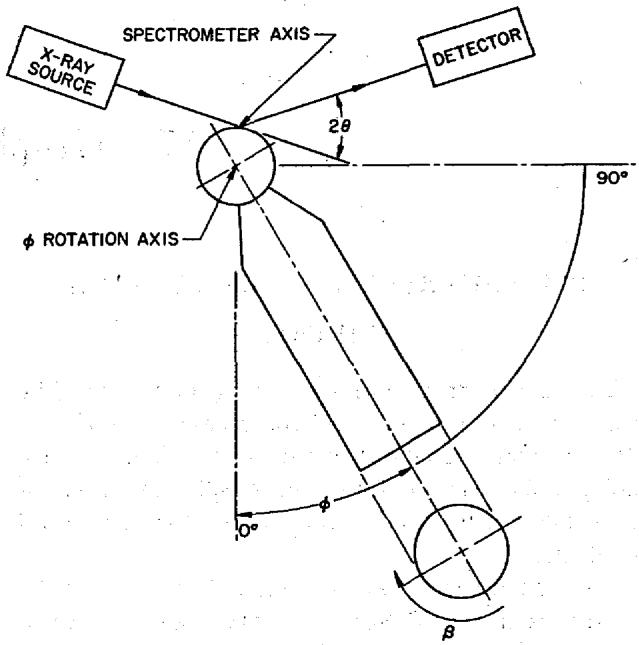  
Fig. 17.1. Spherical Specimen for Anisotropy.

Table 17.2. X-Ray Anisotropy Values   

<table><tr><td rowspan="2">Grade</td><td colspan="2">Spheresa</td><td colspan="3">Plates</td><td rowspan="2">Differencec</td></tr><tr><td>R||</td><td>R⊥</td><td>R||</td><td>R⊥</td><td>Tb</td></tr><tr><td>AXF</td><td>0.673</td><td>0.663</td><td>0.673</td><td>0.663</td><td>1.999</td><td>0</td></tr><tr><td>AXF-5QBG</td><td>0.678</td><td>0.661</td><td>0.667</td><td>0.666</td><td>1.999</td><td>0.011</td></tr><tr><td>H337</td><td>0.660</td><td>0.670</td><td>0.659</td><td>0.670</td><td>1.999</td><td>0.001</td></tr><tr><td>H364</td><td>0.664</td><td>0.668</td><td>0.645</td><td>0.676</td><td>1.987</td><td>0.019</td></tr><tr><td>1425</td><td>0.766</td><td>0.617</td><td>0.783</td><td>0.590</td><td>2.000</td><td>-0.017</td></tr><tr><td></td><td></td><td></td><td></td><td>0.627</td><td></td><td></td></tr><tr><td>BY12NF</td><td>0.623</td><td>0.688</td><td>0.585</td><td>0.707</td><td>1.999</td><td>0.038</td></tr><tr><td>BY12</td><td>0.639</td><td>0.681</td><td>0.588</td><td>0.706</td><td>2.000</td><td>0.051</td></tr><tr><td>ATJ-S</td><td>0.616</td><td>0.692</td><td>0.617</td><td>0.684</td><td>1.985</td><td>-0.001</td></tr><tr><td>ATJ-SG</td><td>0.648</td><td>0.676</td><td>0.638</td><td>0.680</td><td>1.998</td><td>0.011</td></tr></table>

${}^{a}{R}_{\parallel }$ measured experimentally and ${R}_{ \bot  }$ obtained from ${R}_{ \bot  } = 1$ - $\left( {{R}_{\parallel }/2}\right)$ .   
${}^{b}{R}_{\parallel }$ and ${R}_{ \bot }$ both measured experimentally. These parameters are summed by the following equation to obtain $T$ :

$$
T = R _ {\parallel} + 2 R _ {\perp}.
$$

Theoretically, $T$ should be equal to 2.0.

cDifference $= (R_{\parallel})_s - (R_{\parallel})_p$

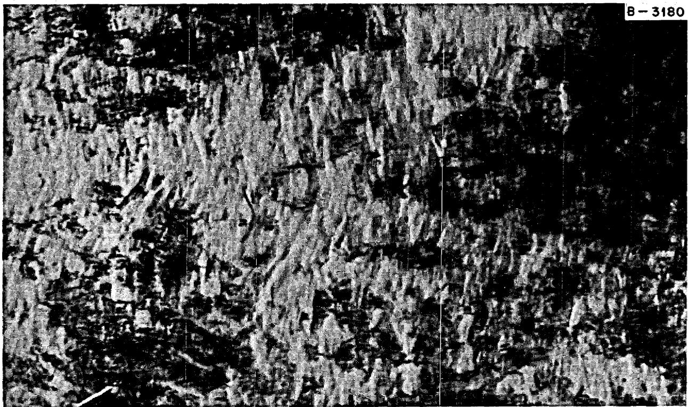

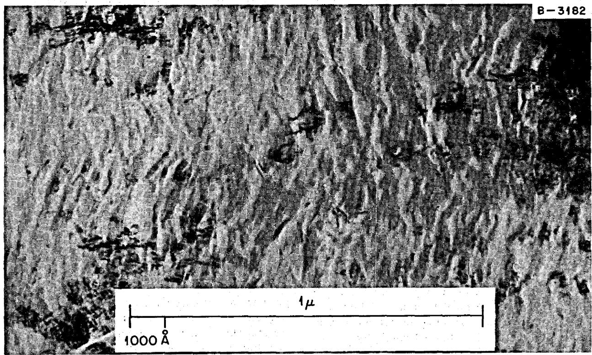  
Fig. 17.2. Transmission Electron Micrographs of Irradiated Grade AXF Graphite Viewed at Two Different Orientations. Magnification 97,500.

# 17.4 ELECTRON MICROSCOPY OF GRAPHITE

C. S. Morgan C. S. Yust

The microstructures of polycrystalline graphite are being studied by transmission electron microscopy. Several graphites have been examined in the as-fabricated condition including AXF, CGB, ATJ-S, ATJ-SG, H-337, AXF-UFG, UK-ISO, and AGOT. The microstructures generally consist of $(a)$ regions having a lamellar appearance, $(b)$ cracks between and within these regions, $(c)$ voids, and occasionally $(d)$ irregular fiber-like configurations which may be partially graphitized binder phase. The size and shape of the lamellar area vary with graphite type. These regions are probably sections through graphite filler particles. Selected area diffraction patterns from large lamellar areas indicate that such material contains a fiber texture consisting of rotations around the $c$ axis.

Diffraction contrast effects in the form of dark bands lying perpendicular to the lamellae are also observed. The position and intensity of these bands vary as the specimens are rotated on the microscope stage. This contrast may be caused by small crystallites within the lamellae or by bending of and/or cracking between lamellae at their intersection with the polished surface. An example of the contrast changes is shown in Fig. 17.2.

# 17.5 GAS IMPREGNATION OF GRAPHITE WITH CARBON

# R. L. Beatty

Carbon impregnation of graphite by gas pulsing continues to look promising. The process seems adaptable to graphites of widely different pore structures. For example, the two materials on which we have the most data, Poco-AXF and UCC-ATJ-SG, have respectively very narrow and very wide pore spectra, while they have similar open-pore volumes. By optimizing processing conditions for the individual pore spectrum we have impregnated each of these graphites with more than 7 wt % pyrolytic carbon.

We have applied the pulse impregnation treatment to a third graphite of potential interest for MSBR use, Great Lakes grade H337. This graphite has an unusually high density, $1.99\mathrm{g/cm^3}$ , compared with $1.86\mathrm{g/cm^3}$ for AXF and ATJ-SG, and a concomitant small open-pore volume. The impregnant carbon uptake was therefore small (less than 1 wt $\%$ ), but this did not interfere with achieving an effective seal in the H337.

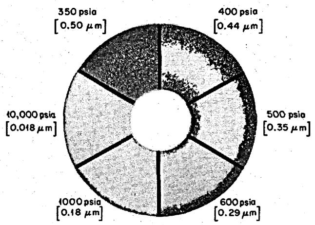  
PHOTO 94493  
Fig. 17.3. Pore Size Contours of AXF Graphite Impregnated at $800^{\circ}\mathrm{C}$ with 1-sec Butadiene Pulse and 15-sec Vacuum Pulse as Shown by Radiographing $0.5\mathrm{mm}$ Sections Exposed to Different Mercury Intrusion Pressures (Equivalent Pore Entrance Diameters). The light sections contained mercury and were opaque to the x rays; the dark sections were not filled with mercury at the particular pressure used and are transparent to x rays.

To evaluate the depth of carbon impregnation we have continued development of the procedure described earlier which employs mercury porosimetry and radiographic techniques. Figure 17.3 shows six sections of the same carbon-impregnated specimen which were exposed to six different mercury pressures (six different equivalent pore entrance diameters). The 350-psia section shows at least some degree of carbon infiltration completely through the wall of the specimen, since an untreated section of the same type of graphite shows complete mercury intrusion (opaque to x rays) at 350 psia. Proceeding clockwise around Fig. 17.3, the other sections show pore size contours with only a very thin layer at the outer edge having all pores less than 0.018 $\mu$ . It is thus apparent that the very low helium permeability of less than $10^{-8}$ cm²/sec is associated with only this outer thin layer.

We are also studying the gas pulsing with consideration of process scaleup. In all successful experiments thus far we have employed induction heating to generate the graphite temperatures necessary for impregnation. We are now experimenting with a radiant furnace which seems to reproduce the results of the induction heaters. This furnace transfers heat from

tungsten-silica lamps to the graphite without directly heating the glass process chamber, thus allowing the graphite to run much hotter than the surrounding wall. Having the graphite hotter than the wall seems to be a requirement to prevent gas-phase nucleation. The radiant furnace provides better temperature uniformity than induction heaters and should be much less expensive in large scale.

Analysis of the second set of gas-impregnated graphite specimens irradiated in the HFIR has been confused by the effects of ultrasonic cleaning used to decontaminate the specimens after irradiation. Therefore we do not have specific results on the effects of irradiation on the carbon impregnant seal. We did, however, obtain some indication from HFIR irradiation tests that the presence of a large amount (up to 8 wt %) of carbon impregnant in a graphite body may tend to accelerate volume expansion during irradiation. Accordingly, this effect will be considered in future tests. A third group of gas-impregnated graphite specimens has been prepared for irradiation in the HFIR. These specimens will receive a fluence of about $1 \times 10^{22}$ neutrons/cm $^2$ ( $E > 50$ kev).

# 17.6 GRAPHITE IRRADIATIONS IN HFIR

# C. R. Kennedy

HFIR graphite experiments 7 and 8 have been removed from the reactor, the specimens measured, and a number of samples recycled in experiments 9 and 10. The samples of H364 and Poco-AXF grades have received exposure up to $3.8 \times 10^{22}$ neutrons/cm $^2$ (>50 kev). Several Poco-grade specimens are in experiment 9 and will have accumulated $4.5 \times 10^{22}$ neutrons/cm $^2$ when the experiment is removed.

The dimensional changes of the Poco-AXF and the H364 grades continue to be nearly isotropic, and the volumetric changes are given in Figs. 17.4 and 17.5. Grades H364, H337, and H337M are laboratory and two pilot-plant-processed materials, respectively, made from the same coke, and appear to behave quite similarly under irradiation. The volumetric changes are compared with the more conventional materials in Fig. 17.6.

A conservative estimate of the useful life of H364 and the Poco grades is about $2.5 \times 10^{22}$ and greater than $3 \times 10^{22}$ neutrons/cm² respectively. Although an evaluation of these samples to give a more realistic lifetime estimate is incomplete, optical surface observations of the samples irradiated to $3.8 \times 10^{22}$ nvt and with as much as $30\%$ volume expansion did not reveal structural defects. All of these graphites are commercial

materials; however, the Poco grades are not available in the necessary sizes for an MSBE. Therefore R. Hamner (ORNL) and S. Napier (Y-12) have reconstituted AXF graphite in extruded bars to demonstrate the feasibility of obtaining this graphite in the required sizes. This reconstituted graphite has been irradiated for only one cycle to $1.2 \times 10^{22}$ neutrons/cm², and its irradiation behavior is about the same as the standard AXF grades. However, at least one more irradiation cycle is needed to confirm the success of this material.

One of the most important areas of study in this program is in understanding the density changes in graphite due to irradiation. The bulk density changes are shown by the volumetric changes in Fig. 17.6. These changes relate both the actual density of the graphite structure and the porosity. The porosity is considered to consist of two types, the first being accessible to the surface and the second being inaccessible. The two types may be distinguished by the use of the calculated x-ray crystal density and apparent density in a liquid, for example, mercury, kerosene, and helium. The apparent volume displaced by the graphite, and the density calculated therefrom, is dependent upon the volume of the accessible pores. The difference between the crystal density and the above measured density is then proportional to the inaccessible porosity. We have performed a number of the density measurements, and the results are given in Fig. 17.7 as a function of irradiation.

The interpretation of these results can only be qualitative because of the two variables - accessibility of pores and theoretical density. However, it does appear that all of the graphites with a fairly wide spectrum of unirradiated helium densities converge to the same helium density with irradiation. The decrease in helium density suggests that the crystal density has decreased, as would be expected by the changes in lattice parameters. The increase in helium density shown by other specimens can only be a result of increased pore accessibility due to irradiation. In fact, the overall behavior suggests that the pore accessibility of all the graphites becomes the same after an exposure of around $1 \times 10^{22}$ neutrons/cm² and does not change at higher fluences extending to the limits of the data shown in Fig. 10.10. This is fairly direct evidence that the large density changes seen in Fig. 17.8 are a result predominantly of pore volume changes rather than changes in the density of the graphite crystal structure. Clearly, the increase in pore accessibility at high density implies an increase in gas permeability. This effect, if existent, cannot be determined on the present samples, but awaits observations on very low-permeability materials.

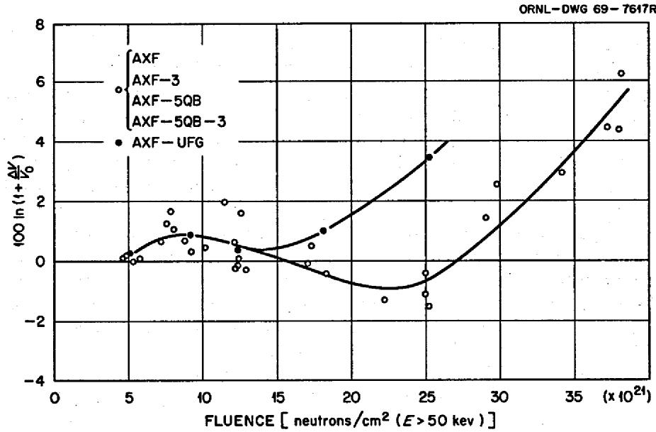  
Fig. 17.4. Volume Changes of Poco Graphites at $715^{\circ}\mathrm{C}$ .

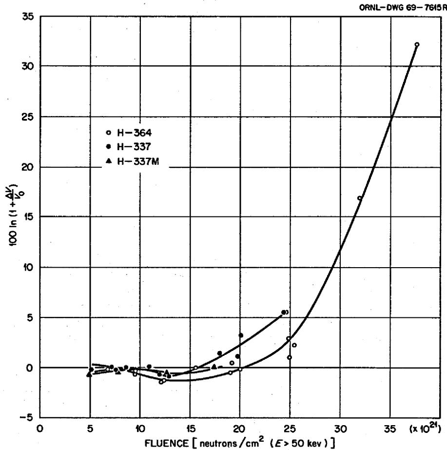  
Fig. 17.5. Volume Changes of H364, H337, and H337M at $715^{\circ}\mathrm{C}$ .

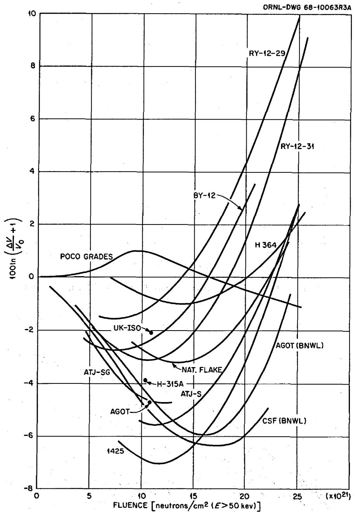  
Fig. 17.6. Volume Changes of Several Graphites During Irradiation at $715^{\circ}\mathrm{C}$ .

# 17.7 THE ENERGY DEPENDENCE OF NEUTRON DAMAGE IN GRAPHITE

M. T. Robinson

A displacement cascade may be characterized by the energy $E$ of the primary recoil ion which generates the cascade. The total number of displacements produced in the cascade is then given by a function $\nu(E)$ quite

aside from the ultimate fate of the displaced atoms. However, due to inelastic scattering and electronic excitation, the energy $E$ is not all available to produce the cascade; we may define a damage energy $E_{D}(< E)$ which represents the correct parameter to insert into $\pmb{\nu}$ to take into account the energy losses over the cascade.

Mean damage energies $E_{D}$ have been calculated for a number of materials, including graphite, taking into

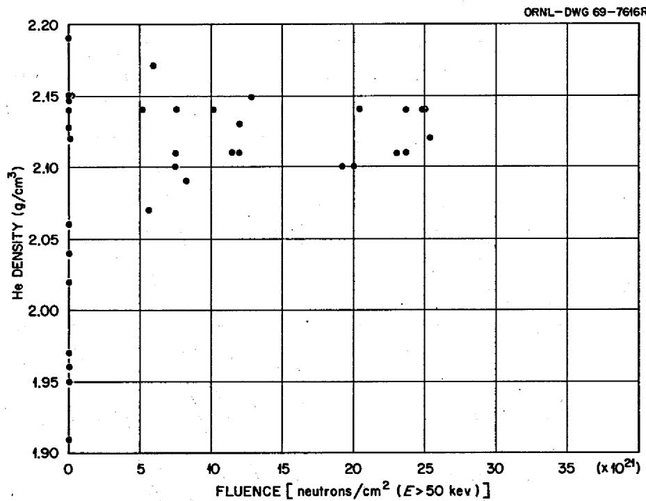  
Fig. 17.7. Helium Densities of Several Graphites After Irradiation at $715^{\circ}\mathrm{C}$ to the Indicated Fluence.

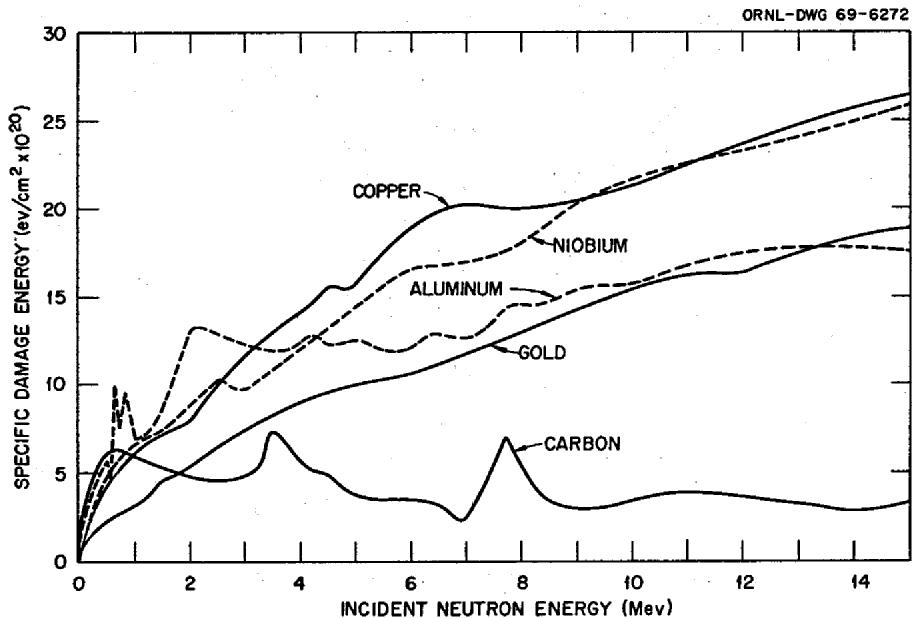  
Fig. 17.8. Specific Damage Energy Deposited in Various Materials by Fast Neutron Irradiation.

account anisotropic elastic and inelastic neutron scattering and using the semiempirical Lindhard formula for electronic excitation. In addition, where appropriate, the $(n,2n)$ reaction has also been considered as an additional source of displacements. This last does not occur in graphite.

The results of the calculation are shown in Figs. 17.8 and 17.9. We can define a "damage efficiency" by the ratio $E_{D} / E$ , which is shown in Fig. 17.9 as a function of

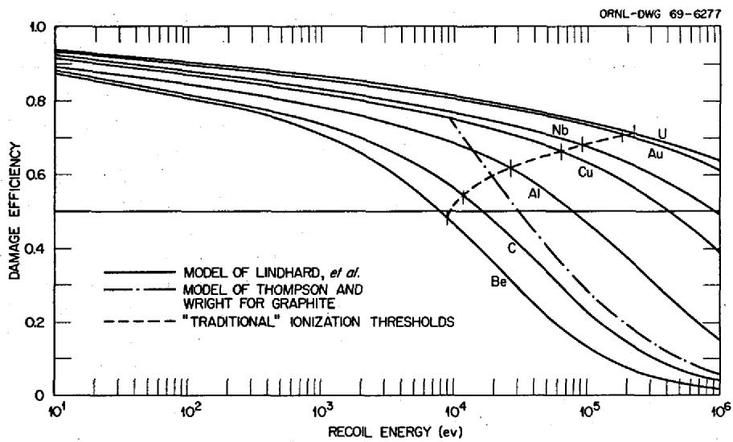  
Fig. 17.9. The Effect of Ionization on the Energy Available for Atomic Displacements.

the primary recoil energy $E$ . The best earlier calculation for graphite is that of Thompson and Wright,10 which overestimates the efficiency at high recoil energies. Figure 17.8 gives the product of cross section times damage energy $\sigma E_{D}$ as a function of incident neutron energy in the high-energy range. It will be noted the specific damage energy reaches a maximum for graphite at about 0.7 Mev and thereafter varies only mildly up to the maximum fission-neutron energy.

# 17.8 FUNDAMENTAL STUDIES OF RADIATION DAMAGE MECHANISMS IN GRAPHITE

D. K. Holmes S. M. Ohr W. E. Atkinson T. S. Noggle

The fundamental study of radiation damage mechanisms in graphite is a closely correlated effort between experimental and theoretical work on the damage in natural single crystals and pyrolytic graphite.

The theoretical work has focused primarily on a study of kinetic equations, which describe the rates of change of the concentrations of defects as they are produced and interact. Such an approach depends heavily on close correlation with experiment. While kinetic equations cannot yield final proof of the validity of a model, they can establish the plausibility of a model and are useful in suggesting new experiments, as well as in interpretation of experimental results.

The main effort so far has been a study of the effect of substitutional boron. Mayer has advanced the hypothesis that migrating interstitial carbon atoms are trapped by boron atoms and released only with a moderately high activation energy. A new set of kinetic equations has been developed covering the production of interstitials and vacancies and the trapping, detrapping, annihilation, and clustering of interstitials. These equations, despite technical difficulties with methods of numerical integration, have been programmed and run successfully on the IBM 360 computer. The results show clearly that trapping by boron dominates interstitial migration, and thereby formation of interstitial clusters, at surprisingly low boron concentrations. The concentration of clusters is shown to depend on the square root of the boron concentration, in agreement with Mayer's experiments. Both these results are illustrated in Fig. 17.10. While the results parallel Mayer's calculations, they avoid his approximations, which may not be valid with the high damage rate obtained in the electron microscope. In our calculations values used for several of the parameters have been merely educated guesses, and further work with these equations must await experimental results.

A second new set of kinetic equations has been developed to study Kelly's vacancy line hypothesis. Kelly's suggestion is that at very high dose sessile vacancies may accidentally fall close together in a line, and relaxation across the line may lead to a partial or complete healing of the layer plane except at the ends. If the lines are immune to attack by interstitials, this

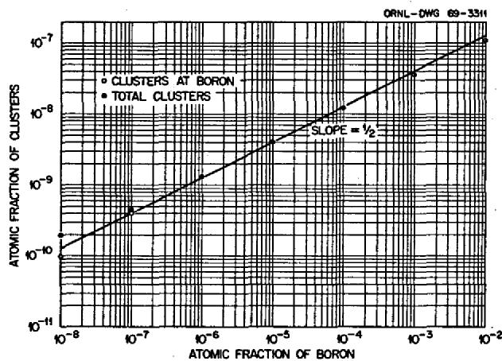  
Fig. 17.10. Atomic Fraction of Clusters as a Function of Initial Boron Concentration at a Time When $3\%$ of the Atoms Have Survived Initial Displacement.

would explain the increased damage rate at high dose; this is also the only model put forth to date that can explain the high rate of $a$ -axis contraction. The equations include vacancy migration, with the idea that very slow vacancy migration at moderate temperatures may make it possible for a vacancy to jump once or twice to a line, thus enhancing line growth. The equations are slowly yielding to sophisticated techniques of numerical analysis.

The experimental study of radiation damage is being carried out by electron microscope observation of the damage clusters formed in situ as a result of clustering of carbon atoms that have been displaced from their lattice sites by electrons in the illuminating beam of the microscope. The experimental work to date has principally been concerned with establishing the experimental conditions and techniques which will generate quantitative information on the defect clusters observed.

The experimental observations of damage resulting from irradiations with an electron beam intensity of $10^{18}$ electrons/cm² at temperatures of 350 to $550^{\circ}\mathrm{C}$ indicate that there is an incubation period of 30 to 60 min before damage becomes visible in the microscope. Irradiations are currently in progress to evaluate the effect of irradiation temperature and beam intensity on this incubation period as well as measurements on size and density of the damage clusters as a function of the experimental parameters. Application of electron diffraction contrast theory to the defect clusters observed has as yet failed to determine the nature of the clusters. It is supposed that they are interstitial clusters; however, they do not show the contrast behavior expected. It is currently thought that due to small size and high

density, the contrast behavior observed results from the interaction of the strain fields of neighboring clusters which are at slightly different levels in the material. Stereoscopic studies have shown that the damage is distributed more or less uniformly throughout the thickness of the specimen, and investigation is being made of the possibility of using a stereoscopic method to measure the dimensional changes parallel to the $c$ axis due to irradiation.

To date it has not been possible to employ the experimental observations to test or suggest changes in the theoretical treatment, due primarily to the uncertainty as to the detailed nature of the clusters. It is anticipated that the work in progress will delineate experimental conditions that will lead to damage structures amenable to detailed analysis, and the development of the technique for measuring dimensional changes will provide an additional experimental tool for studying the damage in graphite.

# 17.9 MACROSCOPIC DAMAGE MODELS

# W.P.Eatherly

The construction of macroscopic damage models serves a useful function in defining possible mechanisms by which properties change in irradiated graphite. They obviously cannot be taken literally, since they are in general both incomplete and nonunique. However, such models have been extremely useful in the past as a guide to experimental work and as some indication for directions to proceed toward improved graphites.

The general concept of accommodation coefficients1 certainly possesses validity. This concept assumes the dimensional changes in bulk graphite can be related to orientation factors plus an expansion of individual crystallites into adjacent voids. The eventual tendency of all observed graphites to asymptotically approach a growth depending quadratically on fluence suggests that at some point accommodation is no longer possible and the bulk graphite expands in a "rigid" sense.

We assume that the individual crystallites grow exponentially as

$$
l _ {a} = l _ {a 0} e ^ {\bar {g}} a ^ {\Phi},
$$

$$
l _ {c} = l _ {c 0} e ^ {g c \Phi},
$$

where $l_{a}$ and $l_{c}$ are the crystallite dimensions in the $a$ and $c$ directions, respectively, $g_{a}$ and $g_{c}$ are constants with $g_{a} < 0$ , and $\Phi$ is the fluence. In the bulk material the observed growth will be a second-rank tensor which can be related to an average over the individual crystallites. That is, if we select a fixed coordinate system in the bulk graphite and locate the $c$ axis of an individual crystallite by Eulerian angles $\theta$ and $\phi$ , then a rotation matrix $\Gamma_{i}^{\alpha}(\theta, \phi)$ will transform the crystal growth parameters $g_{c}$ and $g_{a}$ into components $g_{ij}$ in the fixed coordinate system according to

$$
g _ {i j} = \Gamma_ {i} ^ {\alpha} g _ {\alpha \beta} \Gamma_ {j} ^ {\beta}.
$$

The $\Gamma$ matrices satisfy the relationship

$$
\sum_ {\alpha} \Gamma_ {i} ^ {\alpha} \Gamma_ {i} ^ {\alpha} = 1,
$$

so that we can write for the diagonal components of $g_{ij}$

$$
g _ {i i} = g _ {a} + (g _ {c} - g _ {a}) I _ {i i},
$$

with

$$
I _ {i i} = \gamma_ {i} ^ {c} \gamma_ {i} ^ {c}.
$$

Although the last four equations have been written as applying to an individual crystallite, in the absence of accommodation we can assume they have been suitably averaged over the entire aggregate of crystallites. Thus the $I_{ii}$ are simply related to the complete set of Bacon anisotropy factors.

For the bulk material, we have

$$
l _ {i} = l _ {i 0} e ^ {g _ {i i} \Phi},
$$

which can also be written as

$$
e ^ {g i t \Phi} - 1 = \left(e ^ {g a \Phi} - 1\right) + \left(e ^ {g c \Phi} - e ^ {g a \Phi}\right) I _ {i i}.
$$

Expanding the functions yields

$$
\begin{array}{l} g _ {i i} \Phi = g _ {a} \Phi \\ + \sum_ {m = 1} ^ {\infty} \frac {(- 1) ^ {m + 1}}{m} I _ {i i} ^ {m} \left(\sum_ {n = 1} ^ {\infty} \frac {(g _ {c} - g _ {a}) ^ {n} \Phi^ {n}}{n !}\right) ^ {m}. \\ \end{array}
$$

Despite its apparent complexity, the double sum is rapidly convergent as a power series in $\Phi$ , yielding

$$
\begin{array}{l} g _ {i i} \Phi = g _ {a} + \left(g _ {c} - g _ {a}\right) I _ {i i} \Phi \\ + \frac {1}{2} I _ {i i} (1 - I _ {i i}) (g _ {c} - g _ {a}) ^ {2} \Phi^ {2} \sum_ {m = 0} ^ {\infty} a _ {m} \Phi^ {m}, \\ \end{array}
$$

where

$$
\begin{array}{l} a _ {0} = 1, \\ a _ {1} = \frac {1}{3} (1 - 2 I _ {i i}) (g _ {c} - g _ {a}), \\ a _ {2} = \frac {1}{1 2} \left(1 - 6 I _ {i i} + 6 I _ {i i} ^ {2}\right) \left(g _ {c} - g _ {a}\right) ^ {2}, \\ \end{array}
$$

etc.

We note that for a single crystal $g_{ii} = 0$ or 1 and all terms beyond the linear term in $\Phi$ vanish. For polycrystalline materials the higher terms represent void generation as the crystallites expand and work against one another. We note further that $g_{a} \approx -\frac{1}{2} g_{c}$ ; that is, the individual crystallites undergo very little change in volume during damage; hence the linear term in $\Phi$ becomes

$$
\left(\frac {3}{2} I _ {i i} - \frac {1}{2}\right) g _ {c} \Phi .
$$

For nearly isotropic materials, $I_{ii} \approx 1/3$ , and this term almost vanishes. Hence the behavior is almost purely quadratic. For materials that are anisotropic, there will be an increasing departure from quadratic behavior as the linear term becomes more important.

We conclude that a simple rigid expansion model with void generation can reproduce at least grossly the expansion behavior of bulk graphite at high fluences.

# 18. Hastelloy N

# 18.1 AGING OF TITANIUM-MODIFIED HASTELLOY N

C. E. Sessions

The creep behavior after aging 3000 hr at 650 and $760^{\circ}\mathrm{C}$ for four titanium-modified alloys has been measured at 40,000 psi and $650^{\circ}\mathrm{C}$ . The rupture life and ductility increase with titanium content when tested in the as-solution-annealed condition. The influence of aging treatment on the creep properties is shown in Figs. 18.1 and 18.2.

For the three lower titanium levels, aging at $760^{\circ}\mathrm{C}$ reduces the rupture life and increases the creep rate. Aging at $650^{\circ}\mathrm{C}$ generally increases the rupture life. Although the rate of creep deformation is increased over that of the solution-annealed material, it is lower than that found after $760^{\circ}\mathrm{C}$ aging. The most significant point, however, is that the $1.2\%$ titanium heat shows no change in its creep rate as a result of the aging process,

and the rupture life of this heat is slightly increased for each heat treatment plotted in Fig. 18.1.

The trends in creep elongation for these same treatments are shown in Fig. 18.2. For each heat treatment the ductility increases with increasing titanium content. Aging at $650^{\circ}\mathrm{C}$ significantly enhances the ductility, whereas annealing at $1260^{\circ}\mathrm{C}$ and aging at $760^{\circ}\mathrm{C}$ gives the lowest creep ductility of the treatments investigated. However, these lower ductility values are not appreciably different from those obtained for the $1260^{\circ}\mathrm{C}$ samples in the as-annealed condition (not plotted).

These results show that the $1.2\%$ titanium heat deteriorates only slightly in creep-rupture properties after 3000 hr at $650^{\circ}\mathrm{C}$ or $760^{\circ}\mathrm{C}$ , whereas alloys with lower levels of titanium exhibit higher creep rates and reduced rupture lives after aging, particularly at $760^{\circ}\mathrm{C}$ . The good creep behavior of this higher-titanium heat corresponds to a favorable distribution of MC carbides in the microstructure.

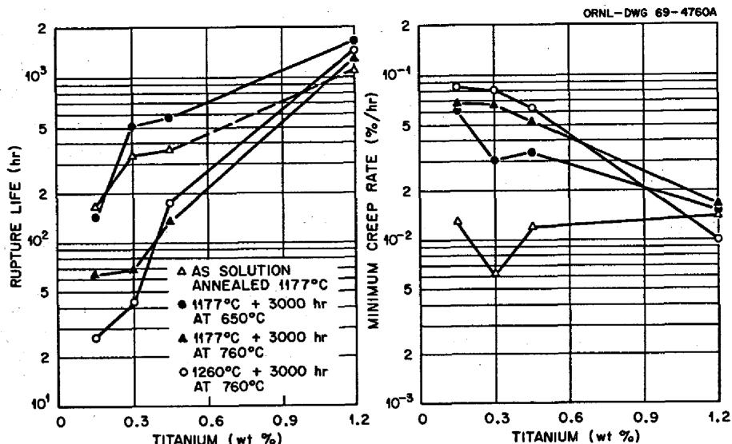  
Fig. 18.1. Variation in Rupture Life and Creep Rate with Titanium and Aging Treatment for 40,000 psi Creep Test at $650^{\circ}\mathrm{C}$ .

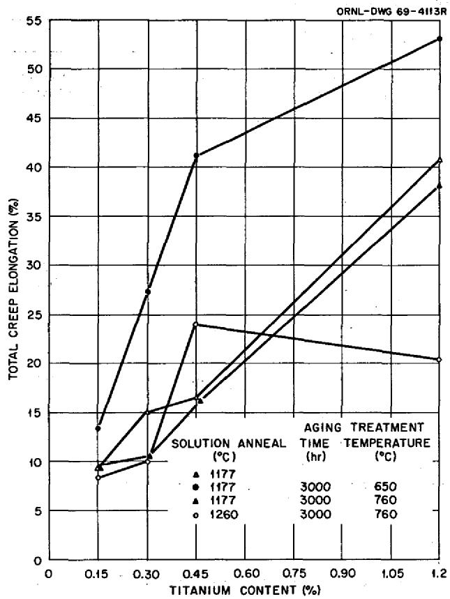  
Fig. 18.2. Ductility of Aged Titanium-Modified Hastelloy N After Creep at 40,000 psi and $650^{\circ}\mathrm{C}$

# 18.2 STATISTICAL TREATMENT OF AGING DATA FOR HASTELLOY N

C.S.Lever C.E.Sessions

We have previously discussed the analysis of variance procedure for testing the tensile property changes upon aging as a function of the variables in the aging program. The analysis of variance (Table 18.1) was calculated from the measurements made on 72 samples after aging 1500, 3000, and 10,000 hr at 650 and $760^{\circ}\mathrm{C}$ .

All of the main effects are significant except that the time of aging greater than 1500 hr did not affect the yield strength. Since many of the second-order interactions are significant, the tensile response depends on at least two variables. For instance, we must define the preage treatment to specify the influence of titanium content.

The third-order interactions were not significant in most cases and thus could be used with the four duplicate test results to estimate the error variation. This variation was then used to establish a basis for comparison of the main effect and second-order interactions.

We used a regression model to fit the tensile properties data as a function of aging time, temperature, and titanium content for a given pretest annealing condition. We used a model of the form

$$
\begin{array}{l} E (y) = \beta_ {0} + \beta_ {1} x _ {1} + \beta_ {1 1} x _ {1} ^ {2} + \beta_ {1 1 1} x _ {1} ^ {3} + \beta_ {2} x _ {2} + \beta_ {2 1} x _ {2} ^ {2} \\ + \beta_ {3} x _ {3} + \beta_ {1 2} x _ {1} x _ {2} + \beta_ {1 3} x _ {1} x _ {3} + \beta_ {2 3} x _ {2} x _ {3} + \beta_ {1 2 3} x _ {1} x _ {2} x _ {3}, \\ \end{array}
$$

where $E(y)$ is the expected value (predicted value) and $x_{1}, x_{2}$ , and $x_{3}$ are the variables time, temperature, and titanium content. By using a least-squares procedure we minimized the residual sum of squares in this linear regression model between $E(y)$ and the observed data for each tensile property. By considering other models with various terms omitted, we obtained the best equation to describe the experimental data with the minimum variance. Fifteen equations were obtained, describing the five tensile properties for the three pretest heat treatments.

The main difference in the models that were selected based on our fitting criteria is that the properties after a $1260^{\circ}\mathrm{C}$ solution anneal required the inclusion of a cubic term (i.e., $x_{1}^{3}$ ) to fit the data, while this term was not required to fit the $1177^{\circ}\mathrm{C}$ solution anneal data or the $1177^{\circ}\mathrm{C} + 10\%$ prestrain data.

Figure 18.3 is a plot of the fitted equations for yield strength and total elongation at $650^{\circ}\mathrm{C}$ for samples given a solution anneal of 1 hr at $1177^{\circ}\mathrm{C}$ . All data for a given preage treatment were used to determine the coefficients in the regression equation, and thus the curves plotted are defined by a least-squares fit of 24 points. The fit of the equation to the four experimental points for a given time of aging is better for the yield strength than for the elongation. The equations plotted are as follows:

yield strength $= 67.166 - 47.281x_{1} + 32.1x_{1}^{2}$

$$
\begin{array}{l} - 0. 7 0 9 x _ {2} + 0. 0 4 1 4 x _ {2} ^ {2} - 3. 4 2 6 x _ {3} \\ - 0. 3 3 6 2 x _ {1} x _ {2} + 1. 4 2 3 x _ {1} x _ {3} + 0. 0 0 3 8 x _ {2} x _ {3}, \\ \end{array}
$$

total elongation $= 139.2 - 0.1455x_{1} - 34.608x_{1}^{2}$

$$
\begin{array}{l} - 8. 7 0 x _ {2} + 0. 4 4 9 x _ {2} ^ {2} - 1 6. 6 6 x _ {3} \\ + 0. 4 4 9 x _ {1} x _ {2} + 9. 7 1 3 x _ {1} x _ {3} + 0. 3 8 3 x _ {2} x _ {3}, \\ \end{array}
$$

Table 18.1. Analysis of Variance for Tensile Property Changes   

<table><tr><td rowspan="2">Variable</td><td colspan="5">\( Response^a \)</td></tr><tr><td>Yield Strength</td><td>Ultimate Tensile Strength</td><td>Uniform Elongation</td><td>Total Elongation</td><td>Reduction of Area</td></tr><tr><td colspan="6">Main effects</td></tr><tr><td>Titanium content</td><td>x</td><td>x</td><td>x</td><td>x</td><td>x</td></tr><tr><td>Preage treatment</td><td>x</td><td>x</td><td>x</td><td>x</td><td>x</td></tr><tr><td>Time at temperature</td><td>NS</td><td>x</td><td>x</td><td>x</td><td>x</td></tr><tr><td>Aging temperature</td><td>x</td><td>x</td><td>x</td><td>x</td><td>x</td></tr><tr><td colspan="6">Interactions</td></tr><tr><td>Ti-preage</td><td>x</td><td>x</td><td>x</td><td>x</td><td>x</td></tr><tr><td>Ti-time</td><td>NS</td><td>x</td><td>NS</td><td>NS</td><td>NS</td></tr><tr><td>Ti-temperature</td><td>x</td><td>NS</td><td>x</td><td>x</td><td>x</td></tr><tr><td>Preage-time</td><td>x</td><td>NS</td><td>NS</td><td>NS</td><td>NS</td></tr><tr><td>Preage-temperature</td><td>x</td><td>x</td><td>x</td><td>x</td><td>x</td></tr><tr><td>Time-temperature</td><td>x</td><td>NS</td><td>x</td><td>x</td><td>x</td></tr><tr><td>Ti-preage-time</td><td>NS</td><td>x</td><td>NS</td><td>NS</td><td>NS</td></tr><tr><td>Ti-preage-temperature</td><td>NS</td><td>x</td><td>x</td><td>x</td><td>NS</td></tr><tr><td>Ti-time-temperature</td><td>NS</td><td>x</td><td>x</td><td>NS</td><td>NS</td></tr><tr><td>Preage-time-temperature</td><td>NS</td><td>NS</td><td>NS</td><td>NS</td><td>NS</td></tr></table>

$a_{\mathbf{x}}$ means that the variable significantly affected the tensile property; NS indicates that the effect was not significant.

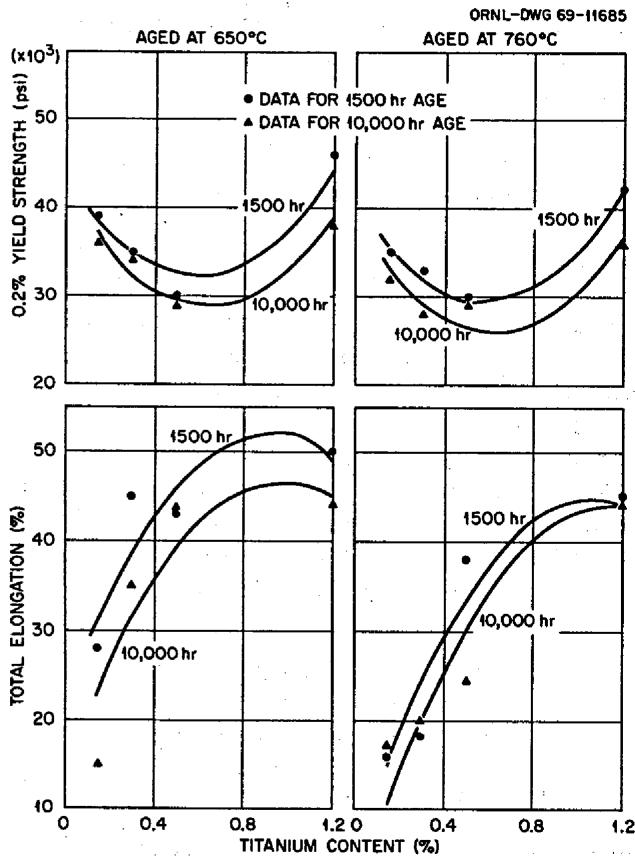  
Fig. 18.3. Tensile Strength and Ductility at $650^{\circ}\mathrm{C}$ as Fitted by Regression Model as a Function of Titanium Content and Aging Time.

where

$$
\begin{array}{l} x _ {1} = \text {t i t a n i u m c o n t e n t}, 0. 1 5 \leqslant x _ {1} \leqslant 1. 2, \\ x _ {2} = \text {a g i n g t i m e}, 1. 5 \leqslant x _ {2} \leqslant 1 0. 0, \\ x _ {3} = \text {a g i n g t e m p e r a t u r e ,} 6. 5 \leqslant x _ {3} \leqslant 7. 6. \\ \end{array}
$$

These equations indicate clearly the increased ductility with titanium, the small decrease in strength and ductility with aging time, the significantly lower ductility after aging at $760^{\circ}\mathrm{C}$ , and a predicted minimum in strength and maximum in ductility between 0.5 and $1.2\%$ titanium.

# 18.3 DEVELOPMENT OF A MODIFIED HASTELLOY N

H.E.McCoy C.E.Sessions   
B. McNabb R.E. Gehlbach

Our work has concentrated in the areas of (1) determining the optimum composition and (2) gaining further experience with these alloys through commercial vendors. Our previous studies indicated that certain alloys containing additions of Ti, Hf, Nb, and Y had good mechanical properties after being irradiated at $760^{\circ}\mathrm{C}$ . Additional samples have been tested, and this

general picture still holds. The fracture strains of several of the more attractive alloys are shown in Fig. 18.4.

Our rather fragmentary results show that certain alloys have good properties and that these alloys have the MC-type carbide. Our results indicate that Ti, Nb, and Hf favor the formation of the desired carbide and that silicon promotes the formation of the less desirable $\mathbf{M}_6\mathbf{C}$ type. We have melted about 30 alloys that contain various concentrations of these four elements. These alloys are included in all phases of our work and should enable us to select an optimum composition.

Our experience with alloys containing titanium and niobium and the low costs of these elements make it desirable that we utilize these elements in our alloy in preference to hafnium ( $\sim$ 100 per pound) or yttrium ( $\sim$ 300 per pound). We have demonstrated that alloys containing up to $1.2\%$ titanium and $2\%$ niobium have good weldability. Our postirradiation mechanical property studies leave some doubt as to whether niobium alone can produce the desired properties. Additions of titanium alone can produce good properties, but the exact level required is not clear.

Because of the potential importance of the titanium-modified alloys, let us look briefly at the available data. Several alloys that contain about $1\%$ titanium have been obtained from various sources and included in our program. The compositions of these alloys are given in Table 18.2, and the postirradiation creep results are summarized in Table 18.3. These results are plotted in Figs. 18.5-18.7 and compared with the properties of irradiated standard Hastelloy N and unirradiated modified alloys. These results lead to several important observations:

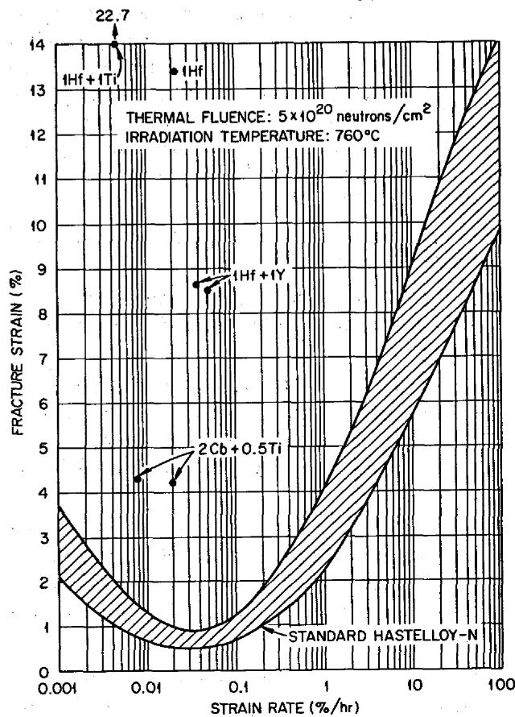  
ORNL-DWG 69-5877A   
Fig. 18.4. Postirradiation Fracture Strains of Several Compositions of Modified Hastelloy N. All samples were irradiated at $760^{\circ}\mathrm{C}$ and tested at $650^{\circ}\mathrm{C}$ . The base composition was $\mathrm{Ni}-12\% \mathrm{Mo}-7\% \mathrm{Cr}-0.2\% \mathrm{Mn}-0.05\%$ C.

Table 18.2. Chemical Analyses of Several Heats of Modified Hastelloy N   

<table><tr><td rowspan="2">Alloy No.</td><td rowspan="2">Melt Size (lb)</td><td rowspan="2">Origin of Melta</td><td colspan="7">Composition (wt %)</td></tr><tr><td>Mo</td><td>Cr</td><td>Fe</td><td>Mn</td><td>Si</td><td>Ti</td><td>C</td></tr><tr><td>21</td><td>2</td><td>A</td><td>16.0</td><td>7.0</td><td>3.3</td><td>0.5</td><td>0.5</td><td>1</td><td>0.038</td></tr><tr><td>107</td><td>2</td><td>A</td><td>11.6</td><td>6.6</td><td>0.082</td><td>0.19</td><td>&lt;0.005</td><td>1.04</td><td>0.05</td></tr><tr><td>75</td><td>2</td><td>A</td><td>11.8</td><td>7.9</td><td>&lt;0.05</td><td>0.2</td><td>0</td><td>1</td><td>0.062</td></tr><tr><td>76</td><td>2</td><td>A</td><td>11.8</td><td>7.9</td><td>&lt;0.05</td><td>0.2</td><td>0</td><td>1</td><td>0.117</td></tr><tr><td>67-552</td><td>100</td><td>B</td><td>11.9</td><td>7.0</td><td>0.02</td><td>0.11</td><td>0.01</td><td>0.84</td><td>0.01</td></tr><tr><td>67-570</td><td>100</td><td>B</td><td>11.7</td><td>7.0</td><td>0.02</td><td>0.12</td><td>0.02</td><td>0.92</td><td>0.028</td></tr><tr><td>67-549</td><td>100</td><td>B</td><td>11.7</td><td>7.0</td><td>0.03</td><td>0.13</td><td>0.02</td><td>0.93</td><td>0.08</td></tr><tr><td>67-551</td><td>100</td><td>B</td><td>12.2</td><td>7.0</td><td>0.02</td><td>0.12</td><td>0.02</td><td>1.1</td><td>0.028</td></tr><tr><td>67-548</td><td>100</td><td>B</td><td>12.0</td><td>7.1</td><td>0.04</td><td>0.12</td><td>0.03</td><td>1.1</td><td>0.102</td></tr></table>

$\pmb{a}_{\mathbf{A}} = \mathbf{ORNL},\mathbf{B} = \mathbf{Materials}$ Systems Division, UCC.

1. Alloy 21 behaves much like standard Hastelloy N. This alloy was prepared by remelting standard Hastelloy N, and most of the titanium likely ended up as oxide. The high molybdenum and silicon contents of this alloy should have resulted in the formation of the $\mathbf{M}_6\mathbf{C}$ carbide, and the properties would be expected to be equivalent to those of standard Hastelloy N.   
2. Alloys 75 and 76 have excellent properties under all conditions tested.   
3. Alloy 107 has about the same composition as alloy 75, but the single sample of 107 tested has poor properties.   
4. Alloys 67-552, 67-570, and 67-549 all contain about $0.9\%$ titanium, and the carbon level varies from 0.01 to $0.08\%$ . Tests on all three heats show poor properties except a single test on heat 67-549 at 25,000 psi.   
5. Alloys 67-551 and 67-548 contain $1.2\%$ titanium and have carbon levels of 0.028 and $0.102\%$ respectively. Again, only the specimens of the higher-carbon heat tested at 25,000 psi have good properties.

Thus the apparent inconsistencies of these results point to the complexity of the processes with which we are dealing. All of these alloys have nominal compositions of $1\%$ titanium, but the properties are quite different. Subtle changes in chemistry, differences in melting practice, and small variations in fabrication may all contribute to the observed property differences.

Our experience with commercial vendors has been rather limited because of the lack of funds to purchase large quantities of material. Since we began our program, a new melting process has gained favor with several vendors. This process, called the electro-slag remelting (ESR) process, remelts an electrode under a

pool of molten slag. This slag protects the melt from the air but likely introduces another set of impurities from the slag. In vacuum-melting practice this remelting takes place under vacuum. The claimed advantages of the ESR process are smoother ingot surfaces and some improvements in physical properties and weldability. We purchased two small (100 lb) melts made by the ESR process to examine their properties. The compositions of the alloys are given in Table 18.4; one alloy

Table 18.3. Postirradiation Creep Properties at $650^{\circ}\mathbf{C}$ of Several Modified Alloys of Hastelloy N   
All samples irradiated at $760^{\circ}\mathrm{C}$ to a thermal fluence of $3 \times 10^{20}$ neutrons/cm²   

<table><tr><td>Alloy</td><td>Test No.</td><td>Stress (psi)</td><td>Rupture Life (hr)</td><td>Minimum Creep Rate (%/hr)</td><td>Fracture Strain (%)</td></tr><tr><td rowspan="2">21</td><td>853</td><td>40,000</td><td>67.2</td><td>0.0089</td><td>0.92</td></tr><tr><td>819</td><td>27,000</td><td>414.6</td><td>0.0024</td><td>1.68</td></tr><tr><td rowspan="2">75</td><td>888</td><td>47,000</td><td>248.1</td><td>0.0442</td><td>13.1</td></tr><tr><td>855</td><td>35,000</td><td>2669.2</td><td>0.0061</td><td>23.6</td></tr><tr><td rowspan="2">76</td><td>889</td><td>47,000</td><td>276.0</td><td>0.0540</td><td>19.6</td></tr><tr><td>852</td><td>35,000</td><td>2688.4</td><td>0.0059</td><td>22.0</td></tr><tr><td>107</td><td>784</td><td>30,000</td><td>49.4</td><td>0.0238</td><td>1.58</td></tr><tr><td rowspan="4">67-552</td><td>633</td><td>15,000</td><td>2.5</td><td>0.0085</td><td>0.04</td></tr><tr><td>630</td><td>21,500</td><td>0.5</td><td>0.20</td><td>0.56</td></tr><tr><td>618</td><td>27,000</td><td>0.1</td><td>1.66</td><td>0.17</td></tr><tr><td>681</td><td>25,000</td><td>59.0</td><td>0.0156</td><td>1.44</td></tr><tr><td rowspan="3">67-570</td><td>863</td><td>27,000</td><td>0.1</td><td></td><td>0.18</td></tr><tr><td>887</td><td>21,500</td><td>0.25</td><td>0.20</td><td>0.07</td></tr><tr><td>680</td><td>25,000</td><td>0.1</td><td></td><td>0.62</td></tr><tr><td rowspan="3">67-549</td><td>825</td><td>25,000</td><td>3117.6</td><td>0.0017</td><td>7.3</td></tr><tr><td>850</td><td>35,000</td><td>1.0</td><td>0.071</td><td>0.47</td></tr><tr><td>672</td><td>30,000</td><td>0</td><td></td><td></td></tr><tr><td rowspan="2">67-551</td><td>861</td><td>35,000</td><td>0</td><td></td><td></td></tr><tr><td>685</td><td>25,000</td><td>0.2</td><td>1.22</td><td>0.32</td></tr><tr><td rowspan="3">67-548</td><td>835</td><td>40,000</td><td>0.4</td><td>0.50</td><td>0.50</td></tr><tr><td>824</td><td>25,000</td><td>2283.4</td><td>0.0030</td><td>7.84</td></tr><tr><td>686</td><td>25,000</td><td>1437.2</td><td>0.0042</td><td>7.51</td></tr></table>

Table 18.4. Chemical Analysis of Electro-Slag Remelted Heats   

<table><tr><td rowspan="2">Heat No.</td><td rowspan="2">Sourcea</td><td colspan="12">Concentration (wt %)</td><td colspan="4">Concentration (ppm)</td></tr><tr><td>Mo</td><td>Cr</td><td>Fe</td><td>Mn</td><td>C</td><td>Si</td><td>P</td><td>S</td><td>Cu</td><td>Co</td><td>Ti</td><td>B</td><td>N</td><td>O</td><td>H</td><td></td></tr><tr><td rowspan="2">68-688</td><td>A</td><td>10.0</td><td>7.91</td><td>4.98</td><td>0.52</td><td>0.079</td><td>0.38</td><td>0.042</td><td>&lt;0.002</td><td>0.023</td><td>0.08</td><td>0.013</td><td>2</td><td>8</td><td>8</td><td>3</td><td></td></tr><tr><td>B</td><td>13.8</td><td>7.8</td><td>5.0</td><td>0.50</td><td>0.077</td><td>0.39</td><td>0.002</td><td>0.003</td><td>0.025</td><td>0.07</td><td>0.02</td><td></td><td></td><td></td><td></td><td></td></tr><tr><td rowspan="2">68-689</td><td>A</td><td>12.6</td><td>7.69</td><td>4.84</td><td>0.47</td><td>0.081</td><td>0.53</td><td>0.010</td><td>&lt;0.002</td><td>0.020</td><td>0.075</td><td>0.36</td><td>2</td><td>11</td><td>12</td><td>3</td><td></td></tr><tr><td>B</td><td>13.9</td><td>7.64</td><td>4.8</td><td>0.47</td><td>0.078</td><td>0.52</td><td>0.001</td><td>0.003</td><td>0.03</td><td>0.07</td><td>0.45</td><td></td><td></td><td></td><td></td><td></td></tr></table>

$a_{\mathbf{A}} = \mathbf{ORNL},\mathbf{B} = \mathbf{vendor}$

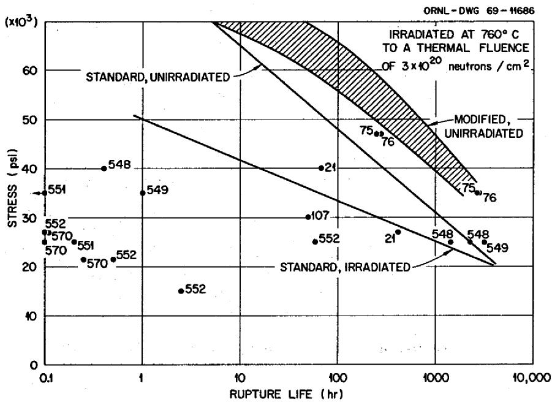  
Fig. 18.5. Stress-Rupture Properties of Several Heats of Titanium-Modified Hastelloy N at $650^{\circ}\mathrm{C}$ . Mo, Cr, Fe, Mn, Si, Ti, and C.

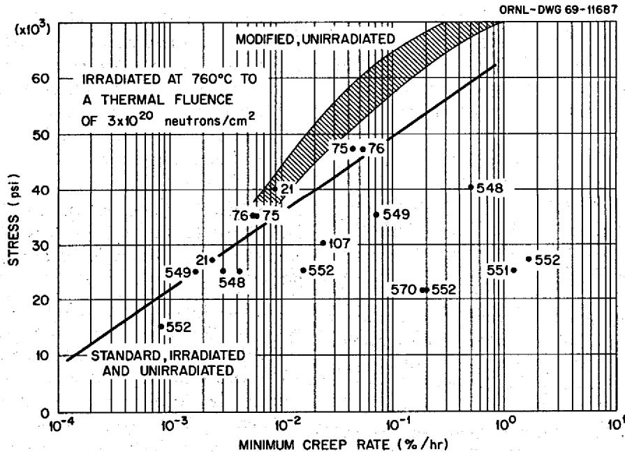  
Fig. 18.6. Creep-Rupture Properties of Several Heats of Titanium-Modified Hastelloy N at $650^{\circ}\mathrm{C}$ . Mo, Cr, Fe, Mn, Si, Ti, and C.

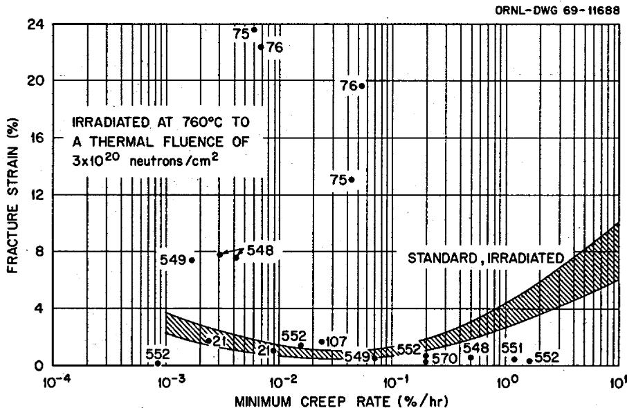  
Fig. 18.7. Fracture of Several Heats of Titanium-Modified Hastelloy N at $650^{\circ}\mathrm{C}$ . Mo, Cr, Fe, Mn, Si, Ti, and C.

contained a nominal $0.5\%$ titanium and the other alloy did not contain any added titanium. The molybdenum concentration was on the high side of our specification, and the silicon content was from 0.4 to $0.5\%$ . Two micrographs of the two alloys are shown in Figs. 18.8 and 18.9. The composition was such that both alloys contained stringers of $\mathbf{M}_6\mathbf{C}$ -type carbides, just as we noted in standard Hastelloy N. Thus it is likely that these alloys will not have good postirradiation properties; an experiment will be removed from the ORR in October 1969 containing some of these alloys.

The ESR alloys were fabricated into $\frac{1}{2}$ -in.-thick plates and were about 6 in. wide by 12 in. long. High-restraint welds were made by welding the individual plates to a carbon steel strongback. Wire fabricated from the same heat was used as filler metal, and the material welded very well.

Several mechanical property tests have been run on the ESR heats. The results of tensile tests are summarized in Figs. 18.10 and 18.11. The tensile strengths of both ESR heats are equal to each other and equivalent to those of standard Hastelloy N. The vacuum-melted modified alloy generally has lower tensile strength. However, the vacuum-melted modified alloy has much better tensile ductility, especially at room temperature. The ESR heats and the standard alloy have comparable fracture strains at low temperatures. At $650^{\circ}\mathrm{C}$ the ductility ranges from the highest of

47% for the vacuum-melted heat to the lowest of 32% for the titanium-modified ESR heat.

Stress-rupture tests at $650^{\circ}\mathrm{C}$ show that the ESR alloys resist rupture at a given stress level about as long as the standard alloy, but not nearly as long as the vacuum-melted titanium-modified alloy (Fig. 18.12). Two tests on stress-relieved ESR welds show that the rupture lives of the welds are equivalent to those of the base metal. The creep rates from these tests show that the ESR melts have better creep strength than standard Hastelloy N but lower strength than the vacuum-melted modified alloy (Fig. 18.13).

Thus the ESR alloys have acceptable properties in the unirradiated condition, but the unavoidable presence of high silicon (from the slag) likely will give a carbide structure that is not conducive to good postirradiation properties.

Two small melts were made by Allvac Metals Company having nominal compositions equivalent to two ORNL alloys that had excellent postirradiation properties. One alloy had additions of $1\%$ titanium and $1\%$ hafnium; a 50-lb heat was melted and fabricated without problem. A second melt contained $0.5\%$ titanium and $2\%$ niobium and required frequent grinding to remove cracks that developed during fabrication. These alloys will be included in all phases of our program.

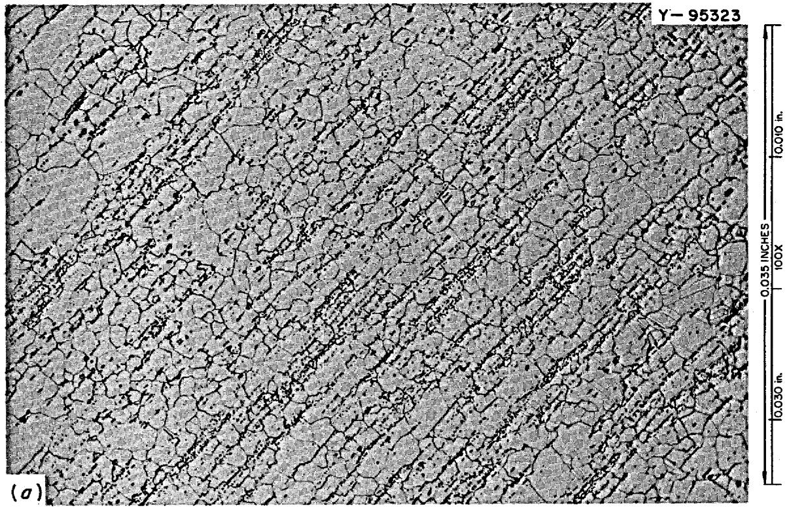

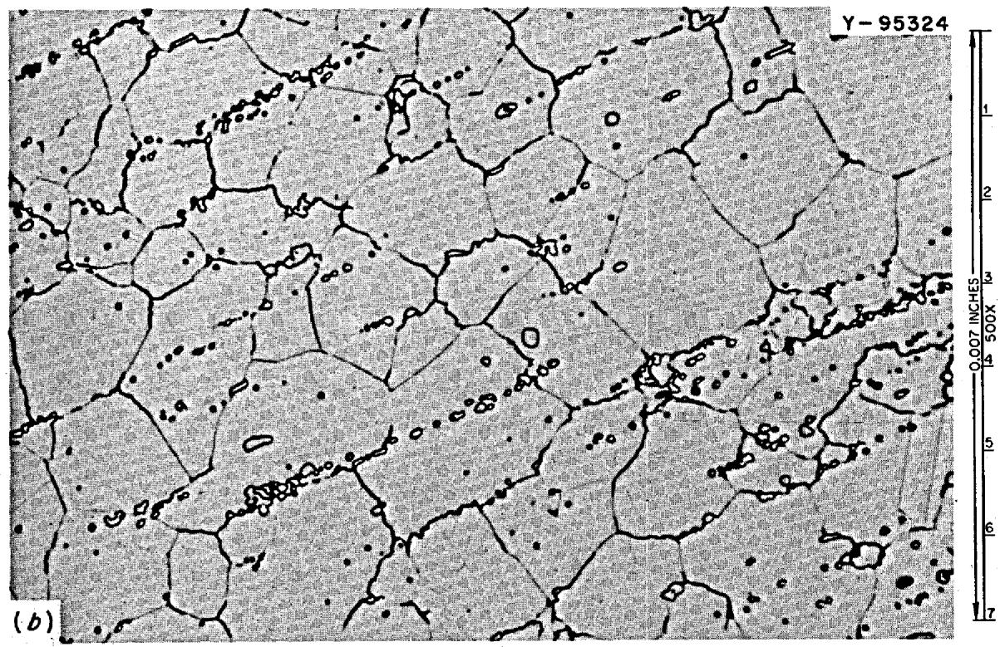  
Fig. 18.8. Photomicrographs of ESR Alloy 68-688 After a 1-hr Anneal at $1177^{\circ}\mathrm{C}$ . Longitudinal section. Etchant: glyceregia, (a) $100\times$ , (b) $500\times$ .

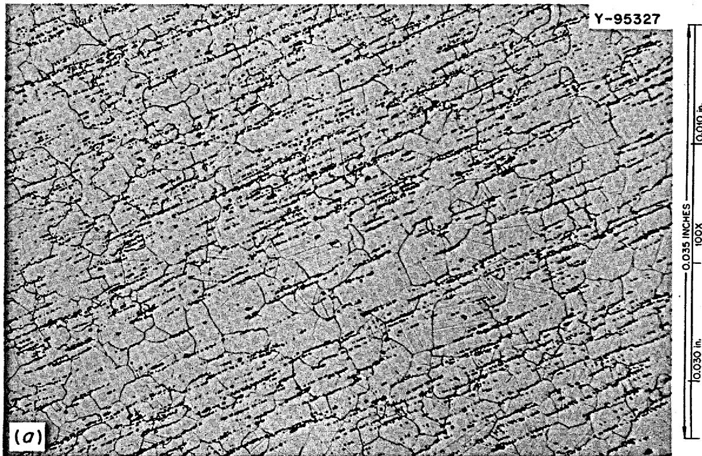

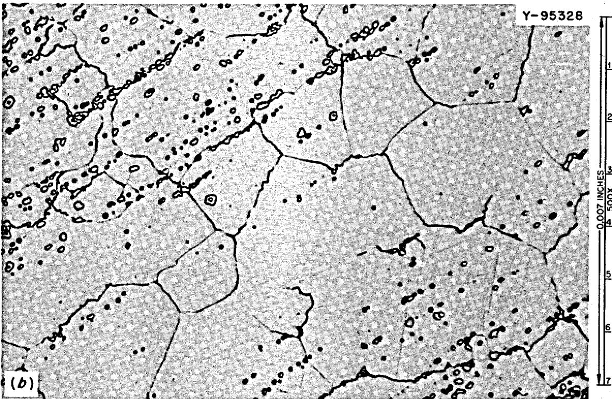  
Fig. 18.9. Photomicrographs of ESR Alloy 68-689 After a 1-hr Anneal at $1177^{\circ}\mathrm{C}$ . Longitudinal Section. Etchant: glyceregia, (a) $100\times$ , (b) $500\times$ .

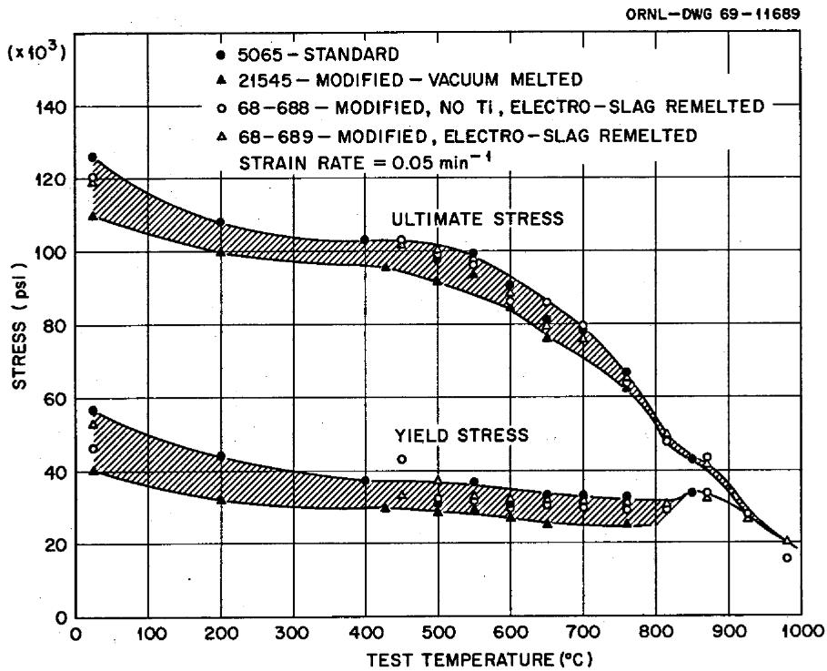  
Fig. 18.10. Tensile Properties of Several Modified Compositions of Hastelloy N.

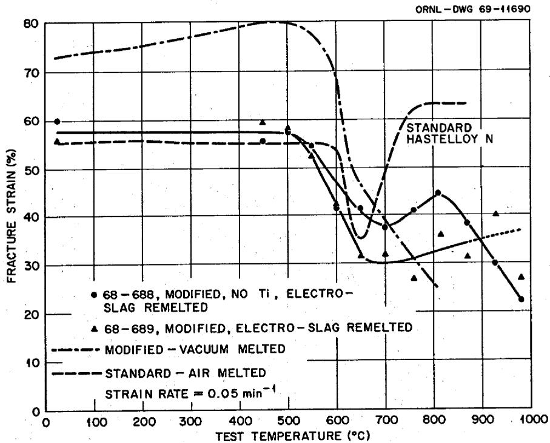  
Fig. 18.11. Fracture Strains of Several Modified Compositions of Hastelloy N.

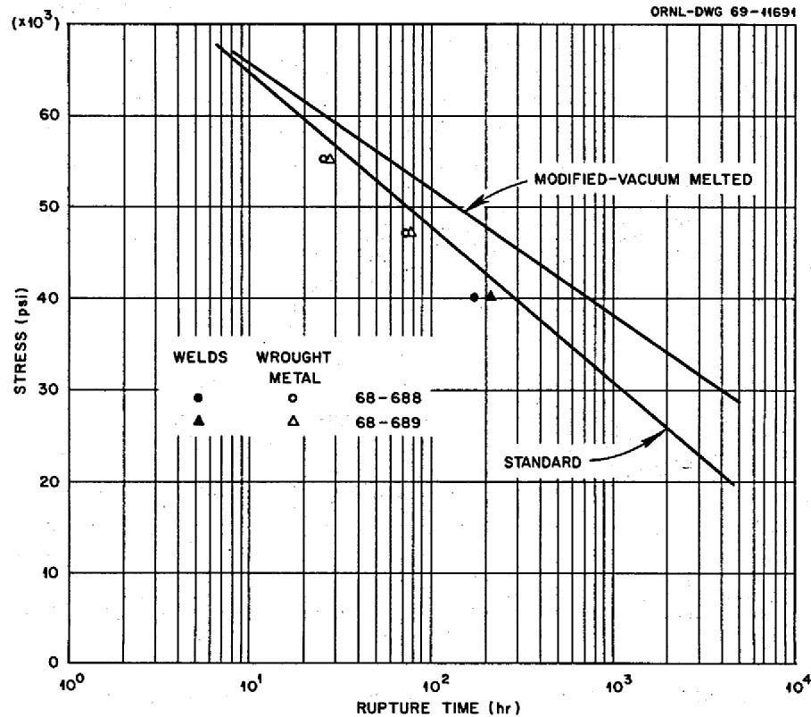  
Fig. 18.12. A Composition of the Stress-Rupture Properties of ESR Alloys with Other Compositions of Hastelloy N Alloys at $650^{\circ}\mathrm{C}$ .

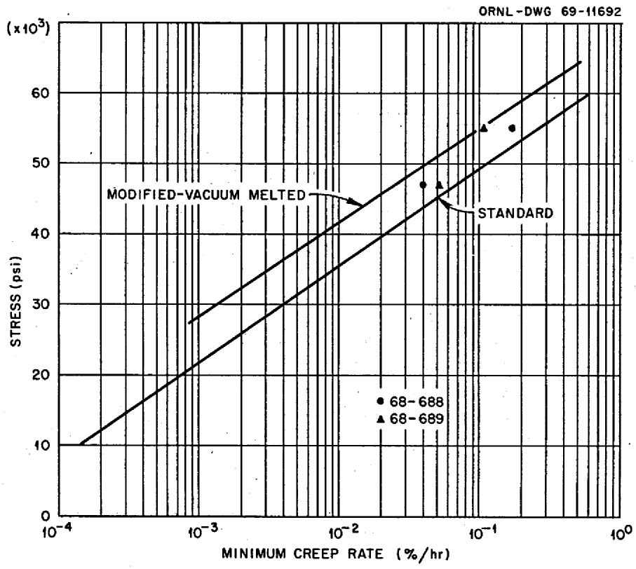  
Fig. 18.13. A Composition of the Creep Properties of ESR Alloys with Other Compositions of Hastelloy N Alloys at $650^{\circ}\mathrm{C}$ .

# 18.4 ELECTRON MICROSCOPE STUDIES

R.E.Gehlbach C.E.Sessions S.W.Cook

We are continuing our studies of the role of the elements Ti, Nb, Hf, and Si on precipitation in modified Hastelloy N. As previously reported, additions of Ti, Nb, and Hf cause the precipitation of MC carbides rather than the $\mathbf{M}_2\mathbf{C}$ type that is found in the modified alloy when the above elements are not present. Additions of silicon shift the type of carbides from $\mathbf{M}_2\mathbf{C}$ to $\mathbf{M}_6\mathbf{C}$ and possibly from MC to $\mathbf{M}_2\mathbf{C}$ . The MC-type carbides are finer than either the $\mathbf{M}_2\mathbf{C}$ or $\mathbf{M}_6\mathbf{C}$ , and in view of their morphologies and distribution we feel that they are responsible for the superior postirradiation properties of some modified alloys, particularly after irradiation at temperatures above $700^{\circ}\mathbf{C}$ .

The MC carbides which precipitate in the titanium-modified versions of the alloy are not TiC but are based on (Mo, Cr)C. Figure 18.14 shows the concentrations of metallic constituents (normalized to $100\%$ ) of the MC as a function of titanium in the alloy. Some titanium substitutes for a portion of the chromium as the concentration of titanium in the alloys is increased. The molybdenum content remains relatively constant. The MC lattice parameter increases from about 4.21 to 4.29 A with titanium enrichment, and this is expected since the atomic diameter of titanium (2.93 A) is greater than that of chromium (2.57 A) which it replaces.

The morphologies of MC in the titanium-modified alloys are different for grain-boundary and matrix precipitation. Carbides at the grain boundaries are generally "pancake" shaped, approximately $1\mu$ in diameter and several tenths of a micron or less in thickness. The boundaries are quite rough because the particles usually do not follow the grain boundary direction. In alloys containing $0.5\%$ titanium or more, a considerable amount of precipitation extends 1 or $2\mu$ into the matrix. Matrix precipitation is generally composed of very fine particles $(\leqslant 200\mathrm{A})$ on thin films which form at stacking faults as seen in Fig. 18.15. Stacking faults are not observed when this matrix precipitate does not form.

The stacking fault precipitation is nucleated at primary MC particles which are not put into solid solution during the initial annealing. Dislocations produced around these particles due to thermally induced stresses provide sites for initial precipitation. The faults grow by

a process of climb of the partial dislocation bounding the sheet of precipitate. The diameter of these sheets is often 6 to $8\mu$ depending on the prior history of the specimen.

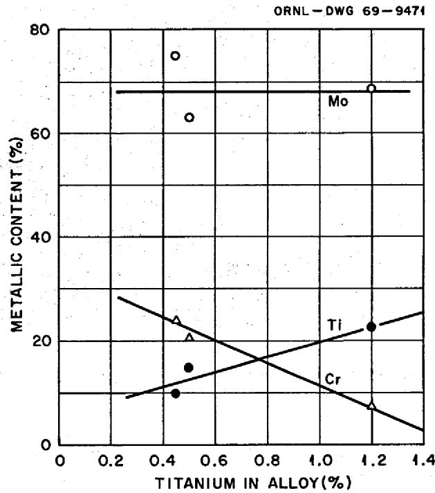

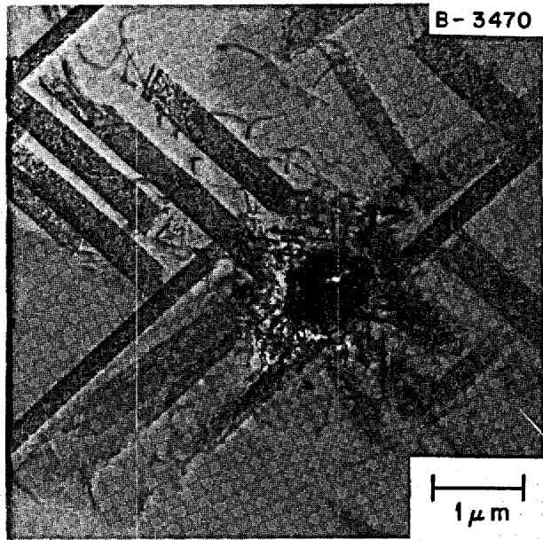  
Fig. 18.14. Metallic Composition (Normalized to $100\%$ ) of MC Carbides as a Function of Titanium Concentration in the Alloy.   
Fig. 18.15. Precipitation of (Mo, Cr, Ti)C on Stacking Faults Nucleated Around the Primary MC Particle. Hastelloy N containing $0.5\%$ Ti (Heat 196) annealed at $1177^{\circ}\mathrm{C}$ and aged 1500 hr at $650^{\circ}\mathrm{C}$ . $(10,000\times)$ .

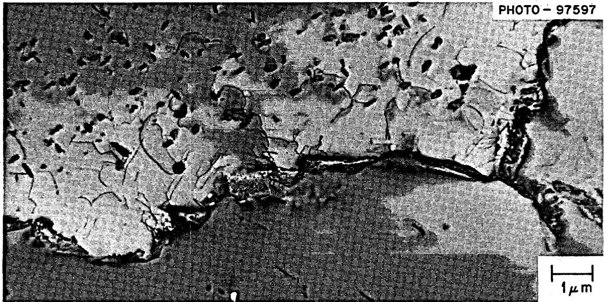  
Fig. 18.16. Microstructure of Hastelloy N Containing $1\%$ Ti and $1\%$ Hf (Heat 184) After Aging 128 hr at $760^{\circ}\mathrm{C}$ . The carbides are MC (HfC and TiC). $(10,000\times)$ .

The amount and extent of this type of precipitate is sensitive to both annealing and aging temperatures. Much greater amounts are formed on aging after annealing at $1260^{\circ}\mathrm{C}$ rather than the usual $1177^{\circ}\mathrm{C}$ . More primary particles are put into solution at the higher temperature; thus more supersaturation exists and enhances the stacking fault precipitation. Subsequent aging temperatures also affect the extent and amount of this precipitate, with higher temperatures (760 rather than $650^{\circ}\mathrm{C}$ ) giving more extensive precipitation.

The MC precipitation in an alloy modified with $1\%$ titanium and $1\%$ hafnium is different from the alloys modified with titanium only. The carbides formed are HfC and TiC, the former in much greater quantities. This would be expected since hafnium is a stronger MC former than titanium. The carbides in the grain boundaries are quite thin and somewhat finer than in the titanium-modified alloys. A more marked difference is that very little stacking fault precipitation is observed. Most matrix precipitates are in the form of platelets with diameters of $0.5\mu$ or less as shown in Fig. 18.16.

As previously reported, titanium in concentrations of $>0.5\%$ , or in combination with other strong MC-forming elements, is necessary to stabilize MC rather than $\mathbf{M}_2\mathbf{C}$ at $760^{\circ}\mathbf{C}$ . The modified alloys which contain sufficient quantities of Ti, Hf, or Nb to give this stability at $760^{\circ}\mathbf{C}$ exhibit very good postirradiation properties after irradiating at temperatures in excess of

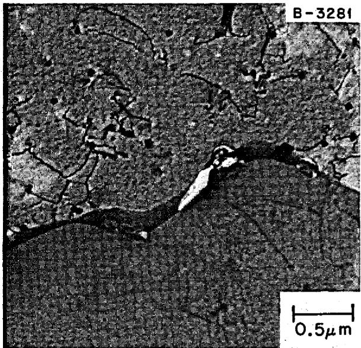  
Fig. 18.17. Microstructure of Heat 184, Irradiated $>1000$ hr at $760^{\circ}\mathrm{C}$ , Creep Tested 2150 hr at $650^{\circ}\mathrm{C}$ , 27,000 psi Before Discontinuing Test. The specimen was taken from the unstressed portion of the sample. 25,000X.

$700^{\circ}\mathrm{C}$ . Figure 18.17 shows the microstructure of an alloy containing $1\%$ Ti, $1\%$ Hf, and $0.2\%$ Si (heat 184) after irradiation at $760^{\circ}\mathrm{C}$ . The specimen was taken from an unstressed portion of a creep sample with more

than $5\%$ reduction in area when the test was discontinued after nearly 2200 hr at 27,000 psi.

We feel that superior postirradiation properties result from favorable precipitate distributions which are attainable with MC-type carbides. We are presently irradiating alloys with several types of microstructures to evaluate their resistance to high-temperature irradiation damage. We can achieve stability of MC carbides by adding $1\%$ titanium, although $0.5\%$ is not sufficient. One percent hafnium, with or without titanium, is sufficient to stabilize MC, even with $0.2\%$ silicon in the alloy. Since silicon promotes the formation of $\mathbf{M}_2\mathbf{C}$ and $\mathbf{M}_6\mathbf{C}$ , it is likely that considerably less hafnium would be needed for alloys with lower silicon concentrations. The role of niobium is not clear at this time, but at least when used in combination with titanium it is effective in stabilizing MC with very good irradiation resistance.

# 18.5 CORROSION STUDIES

J.W.Koger A.P.Litman

Successful operation of molten-salt breeder reactors (MSBR) requires understanding of the mass transfer phenomena of structural materials while in contact by the various fused fluoride salts. Mass transfer is influenced by many factors including the impurity content of the salt, the temperature and the temperature difference, the container materials, and, under certain conditions, the velocity. Therefore we have continued studying mass transfer in a temperature gradient to further evaluate the effects of these various factors.

Our work is currently centered around the compatibility of the Hastelloy N alloys (compositions given in Table 18.5) with salts appropriate for single-fluid breeder reactors, especially the coolant salt. Some tests begun earlier with salts of interest for two-fluid systems have also been continued. Most of the work discussed concerns natural circulation loops whose service parameters are detailed in Table 18.6.

Table 18.5. Composition of Hastelloy N   

<table><tr><td rowspan="2">Alloy</td><td colspan="7">Chemical Content (wt %)</td></tr><tr><td>Ni</td><td>Mo</td><td>Cr</td><td>Fe</td><td>Si</td><td>Mn</td><td>Ti</td></tr><tr><td>Standard</td><td>70</td><td>17.2</td><td>7.4</td><td>4.5</td><td>0.6</td><td>0.54</td><td>0.02</td></tr><tr><td>Hastelloy N</td><td></td><td></td><td></td><td></td><td></td><td></td><td></td></tr><tr><td>Titanium-modified</td><td>78</td><td>13.6</td><td>7.3</td><td>&lt;0.1</td><td>&lt;0.01</td><td>0.14</td><td>0.5</td></tr><tr><td>Hastelloy N</td><td></td><td></td><td></td><td></td><td></td><td></td><td></td></tr></table>

# 18.5.1 Fuel Salts

Loop 1255, constructed of standard Hastelloy N and containing a simulated MSRE fuel salt plus 1 mole $\%$ $\mathrm{ThF_4}$ , continues to operate without difficulty after 7.4 years.

Loop 1258, constructed of type 304L stainless steel and containing removable specimens in the hot leg, has operated about 6.1 years with the same salt as is in Loop 1255. A plot of the weight change of the specimens in the hot leg at various temperatures is given in Fig. 18.18 as a function of operating time. The corrosion rate at the highest temperature, $688^{\circ}\mathrm{C}$ , based on these weight changes and assuming uniform attack is 1.1 mils/year. Even though the weight losses are large, the mass transfer has not been large enough to cause a deterioration of the flow conditions.

Loop NCL-16, constructed of standard Hastelloy N with removable specimens in each leg, has operated with the two-fluid MSBR fuel salt for over 13,500 hr. A plot of the weight change of the specimens in the hottest and coldest positions as a function of operating time is given in Fig. 18.19. This figure is typical of the plots of total weight change of the specimens vs time that we obtain from all the natural circulation loops. It is clear that material is removed in the hot sections and deposited in the cold sections. It is also obvious that these changes are temperature dependent and that the corrosion and deposition rates decrease with time.

The corrosion rate at the highest temperature, $704^{\circ}\mathrm{C}$ , in NCL-16 based on these weight changes and assuming uniform attack is 0.04 mil/year, a very small amount of attack. For this system, and all others studied to date, titanium-modified Hastelloy N specimens continue to have smaller weight changes than standard Hastelloy N specimens. Figure 18.20 shows the micrographs of a titanium-modified specimen exposed at $704^{\circ}\mathrm{C}$ and a standard Hastelloy N specimen exposed at $676^{\circ}\mathrm{C}$ . The weight losses of these specimens are about the same and are given in Fig. 18.19. Figure 18.21 shows the changes in the concentration of chromium and iron in the NCL-16 fuel salt as a function of operating time. The chromium continues to show a steady increase with time, while the iron content has stabilized. The attack by high-purity fuel salt and other $\mathrm{LiF - BeF_2}$ based salts is for the most part selective for chromium.

# 18.5.2 Fertile-Fissile Salts

Loop NCL-19 (which has a molybdenum hot finger containing bismuth at $540^{\circ}\mathrm{C}$ at the bottom of the hot

Table 18.6. MSRP Natural Circulation Loop Operation Through February 28, 1969   

<table><tr><td>Loop No.</td><td>Loop Material</td><td>Specimens</td><td>Salt Type</td><td>Salt Composition (mole %)</td><td>Maximum Temperature (°C)</td><td>ΔT (°C)</td><td>Operating Time (hr)</td></tr><tr><td>1255</td><td>Hastelloy N</td><td>Hastelloy N + 2% Nba,b</td><td>Fuel</td><td>LiF-BeF2-ZrF4-UF4-ThF4 (70-23-5-1-1)</td><td>704</td><td>90</td><td>65,000</td></tr><tr><td>1258</td><td>Type 304L SS</td><td>Type 304L stainless steelb,c</td><td>Fuel</td><td>LiF-BeF2-ZrF4-UF4-ThF4 (70-23-5-1-1)</td><td>688</td><td>100</td><td>53,700</td></tr><tr><td>NCL-13</td><td>Hastelloy N</td><td>Hastelloy Nc,d</td><td>Coolant</td><td>NaBF4-NaF (92-8)</td><td>607</td><td>150</td><td>4,700e</td></tr><tr><td>NCL-13A</td><td>Hastelloy N</td><td>Hastelloy N; Ti-modified Hastelloy N controlsc,d</td><td>Coolant</td><td>NaBF4-NaF (92-8)</td><td>607</td><td>125</td><td>7,500</td></tr><tr><td>NCL-14</td><td>Hastelloy N</td><td>Ti-modified Hastelloy Nc,d</td><td>Coolant</td><td>NaBF4-NaF (92-8)</td><td>607</td><td>150</td><td>16,000</td></tr><tr><td>NCL-15</td><td>Hastelloy N</td><td>Ti-modified Hastelloy N; Hastelloy N controlsc,d</td><td>Blanket</td><td>LiF-BeF2-ThF4 (73-2-25)</td><td>677</td><td>55</td><td>2,000f</td></tr><tr><td>NCL-15A</td><td>Hastelloy N</td><td>Ti-modified Hastelloy N; Hastelloy N controlsc,d</td><td>Blanket</td><td>LiF-BeF2-ThF4 (73-2-25)</td><td>677</td><td>55</td><td>9,100</td></tr><tr><td>NCL-16</td><td>Hastelloy N</td><td>Ti-modified Hastelloy N; Hastelloy N controlsc,d</td><td>Fuel</td><td>LiF-BeF2-UF4 (65.5-34.0-0.5)</td><td>704</td><td>170</td><td>13,500</td></tr><tr><td>NCL-17</td><td>Hastelloy N</td><td>Ti-modified Hastelloy N; Hastelloy N controlsc,d</td><td>Coolant</td><td>NaBF4-NaF (92-8) plus water vapor additions</td><td>607</td><td>150</td><td>16,000</td></tr><tr><td>NCL-18</td><td>Hastelloy N</td><td>Ti-modified Hastelloy N; Hastelloy N controlsc,d</td><td>Fertile-fissile</td><td>LiF-BeF2-ThF4-UF4 (68-20-11.7-0.3)</td><td>704</td><td>170</td><td>7,300</td></tr><tr><td>NCL-19</td><td>Hastelloy N</td><td>Ti-modified Hastelloy N; Hastelloy N controlsc,d</td><td>Fertile-fissile</td><td>LiF-BeF2-ThF4-UF4 (68-20-11.7-0.3) plus bismuth in molybdenum hot finger</td><td>704</td><td>170</td><td>4,741g</td></tr><tr><td>NCL-20</td><td>Hastelloy N</td><td>Ti-modified Hastelloy N; Hastelloy N controlsc,d</td><td>Coolant</td><td>NaBF4-NaF (92-8)</td><td>675</td><td>265</td><td>Under construction</td></tr></table>

$a$ Permanent specimens.   
bHot leg only.   
$c$ Removable specimens.

$a_{\mathrm{Hot}}$ and cold legs.

$\pmb{\mathcal{E}}$ Reworked - operating as NCL-13A.

$f_{\text{Repaired}}$ - operating as NCL-15A.

To be repaired.

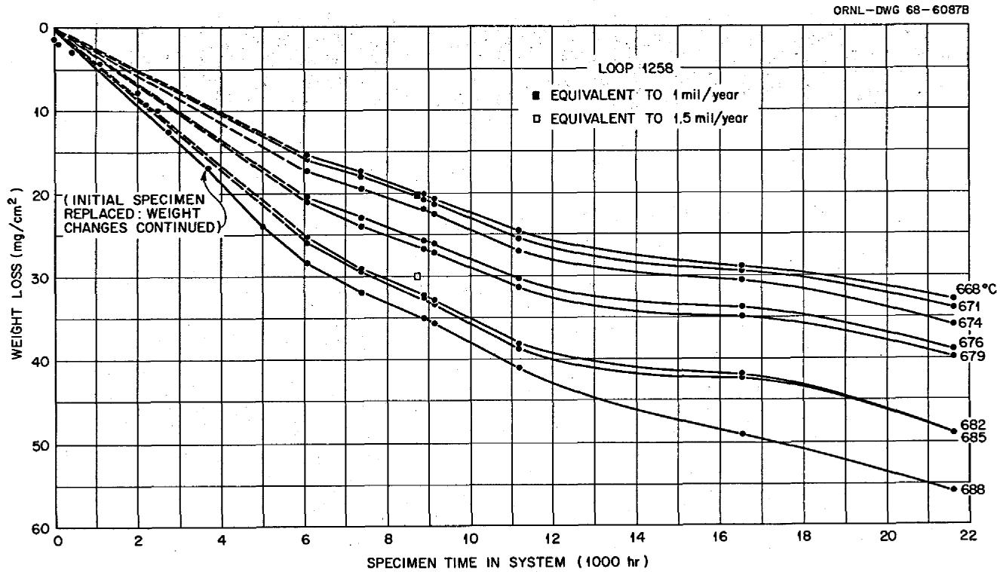  
Fig. 18.18. Weight Loss of Type 304L Stainless Steel Specimens as a Function of Operation Time at Various Temperatures in LiF-BeF $_2$ -ZrF $_4$ -ThF $_4$ -UF $_4$ (70-23-5-1-1 mole %) Salt.

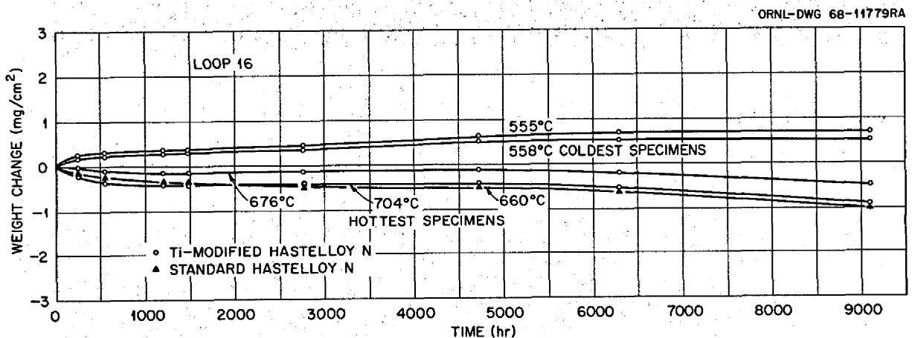  
Fig. 18.19. Weight Change vs Time for Standard and Titanium-Modified Specimens in Loop NCL-16 Exposed to Fuel Salt (LiF-BeF $_2$ -UF $_4$ , 65.5-34.0-0.05 mole %) at Various Temperatures.

leg) and NCL-18, both constructed of standard Hastelloy N with removable specimens in each leg, have operated with fertile-fissile salt under identical temperature conditions. These loops were operated to obtain data on mass transfer by the salt and to determine if contact of molten salt and molten bismuth would affect the corrosion rate.

After a power outage, the bismuth finger on NCL-19 was inadvertently heated to temperatures over $1900^{\circ}\mathrm{F}$

and all power to the loop shut off. Subsequent examination disclosed localized melting of the Hastelloy N which surrounded the molybdenum container. The loop was reheated and the salt dumped. Portions of the loop and the finger were removed for examination and replacement parts fabricated for repair.

Prior to shutdown the loop operated for 4741 hr, with a maximum weight loss of $0.8\mathrm{mg/cm}^2$ observed for a standard Hastelloy N specimen at $704^{\circ}\mathrm{C}$ . This is

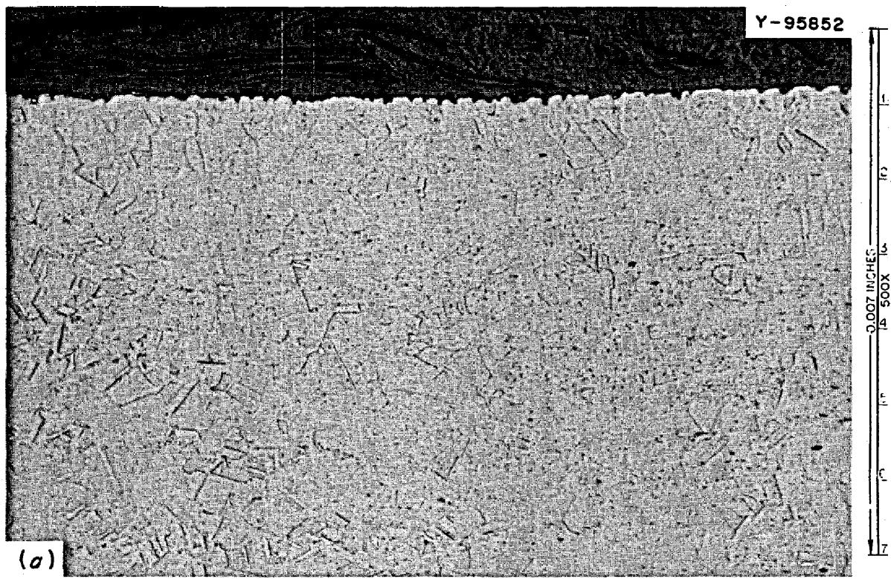

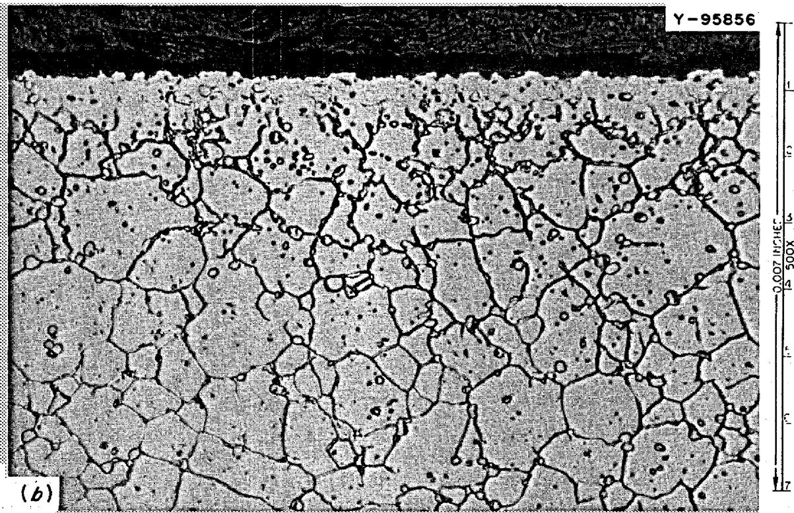  
Fig. 18.20. (a) Micrograph of a Titanium-Modified Hastelloy N Specimen Exposed to Fuel Salt at $704^{\circ}\mathrm{C}$ in NCL-16 Weight Loss of $0.9\mathrm{mg/cm}^2$ in 9100 hr. Etchant 1 glyceregia. (b) Micrograph of Standard Hastelloy N Specimen Exposed to Fuel Salt at $660^{\circ}\mathrm{C}$ in NCL-16 weight loss of $1.0\mathrm{mg/cm}^2$ in 9100 hr. Etchant 1 glyceregia.

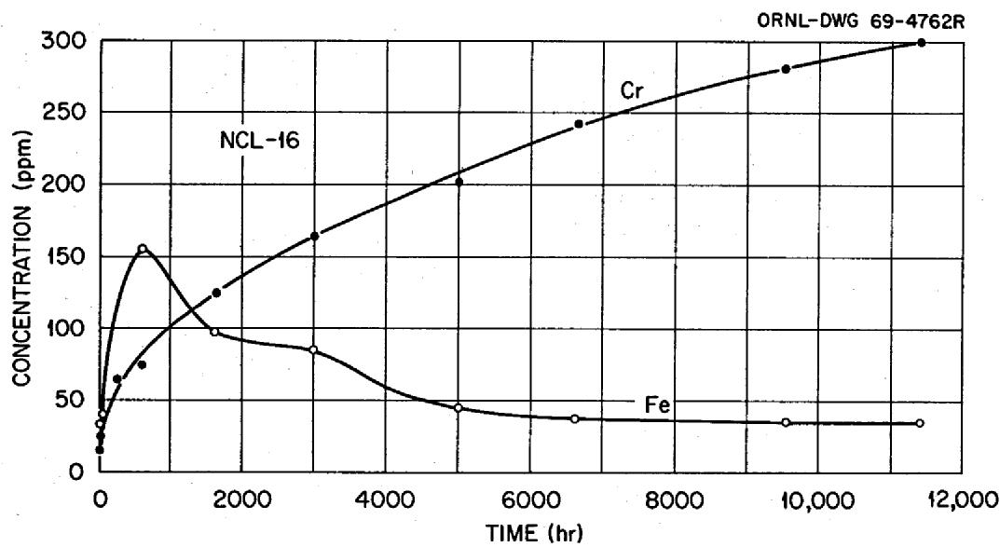  
Fig. 18.21. Concentration of Iron and Chromium in the Fuel Salt in Loop NCL-16.

equivalent to 0.07 mil/year, assuming uniform dissolution, which is a very low corrosion rate. The chromium content of the salt increased from 25 to 66 ppm. The bismuth content of the salt was $< 20$ ppm for the last 1500 hr. (The detailed analyses for bismuth were presented previously.) After shutdown the dumped salt and the bismuth at the top of the finger were both analyzed for certain metal impurities, and the results are given in Table 18.7.

Table 18.7 shows that bismuth extracted impurities from the salt in quantities proportional to the solubility of these structural metals in bismuth. An analysis of different portions of the bismuth (middle and lower portions) is under way to enable us to determine a mass balance. At present it is unclear, based on corrosion rates of NCL-18 and -19, whether the removal of metal impurities by the bismuth materially affected system compatibility. For example, in NCL-18 the maximum weight loss of a standard Hastelloy N specimen was 0.8 $\mathrm{mg/cm^2}$ at $704^{\circ}\mathrm{C}$ in 3400 hr, a very low rate, equivalent to 0.08 mil/year assuming uniform attack. The chromium concentration in the salt in this loop has increased from 21 to 90 ppm. Analysis of the dumped salt from NCL-19 disclosed 225 ppm bismuth. We do not know how much of the bismuth is in the salt by virtue of the high-temperature excursion, but it illus

Table 18.7. Analysis of Salt and Bismuth from Hot Finger Portion of NCL-19   

<table><tr><td>Major Constituent</td><td>Impurities</td><td>Concentration (ppm)</td><td>Solubility at 600°Ca</td></tr><tr><td rowspan="4">Bismuth</td><td>Ni</td><td>3000</td><td>6.0%</td></tr><tr><td>Cr</td><td>80</td><td>140 ppm</td></tr><tr><td>Fe</td><td>10</td><td>50 ppm</td></tr><tr><td>Mo</td><td>0.2</td><td>&lt;1 ppm</td></tr><tr><td>Salt</td><td>Bi</td><td>225</td><td></td></tr></table>

$^{a}$ C. J. Klamut et al., "Material and Fuel Technology for an LMFR," pp. 433-72 in Progress in Nuclear Energy, Series IV, vol. 2, Technology, Engineering and Safety, Pergamon, London, 1960.

trates again that bismuth, in some form, can be carried into the salt.

The loop containing fertile-fissile salt and having the bismuth appendage will be restarted because of its extreme importance. This loop has been important from several vantage points: (1) it stimulated the development of better methods of analyzing salt for low concentrations of bismuth, (2) it showed that bismuth can move into a slowly moving salt steam, likely due to the initial presence of impurities, (3) it showed that metal impurities are extracted from the salt stream by the bismuth, and (4) it demonstrated over an operating period of 4700 hr that these processes did not cause an appreciable change in the corrosion behavior.

# 18.5.3 Blanket Salts

Loop NCL-15A, constructed of standard Hastelloy N with removable specimens in each leg, has operated 9100 hr with the thorium-rich blanket salt. The chromium concentration in the salt has increased from 25 to 145 ppm in 7000 hr, which indicates quite good compatibility. Specimens exposed to this salt are often "glazed" with a material that is impossible to remove without damaging the metal, and this has made weight change measurements difficult.

# 18.5.4 Coolant Salts

Loops. - Loop NCL-13A, constructed of standard Hastelloy N with removable specimens in each leg, has operated for 7500 hr with the fluoroborate coolant salt. Figure 18.22 gives the weight changes of specimens at various temperatures as a function of operating time. The corrosion rate at the maximum temperature, $605^{\circ}\mathrm{C}$ , is 0.6 mil/year. The attack in this case is probably uniform, as the analysis of the salt shows approximately 1000 ppm water and 1000 ppm oxygen. Large amounts of these impurities are indicative of high corrosion rates and nonselective attack by HF (produced by the reaction of water with fluoride salt). The chromium concentration initially was 253 ppm and has remained near that value throughout operation.

Loop NCL-14, constructed of standard Hastelloy N with removable specimens in each leg, has operated for

16,000 hr with the fluoroborate coolant salt. The weight changes of the specimens at the various temperatures as a function of operating time are given in Fig. 18.23. Two changes of corrosion rate are noted in the plot. The first change, after $3500\mathrm{hr}$ , was due to a defective gas line, and the effects from this have been discussed. The second change, at some time between 11,000 and $13,000\mathrm{hr}$ , was due to a leaking standpipe ball valve. This last intake of impurities illustrates a continuing problem of detection (other than the obvious after-the-fact increase of impurities and corrosion rate), since the loop overpressure did not change significantly. The apparent mechanism involves the diffusion of moisture in the air into the relatively moisture-free atmosphere of the loop (equalization of partial pressure) without regard to the overall pressure gradients involved. In this last corrosion rate increase period the analyzed water and oxygen in the salt increased from 1000 to $2300\mathrm{ppm}$ and 1300 to $4500\mathrm{ppm}$ respectively. The ball valve was repaired, and the loop is continuing to operate.

Loop NCL-17, constructed of standard Hastelloy N with removable specimens in each leg, is being used to determine the effect of steam injection in a flowing fluoroborate-salt-Hastelloy N system. This experiment is conducted in order to provide information on the

6J. W. Koger and A. P. Litman, MSR Program Semiann. Progr. Rept. Feb. 28, 1969, ORNL-4396, p. 246.

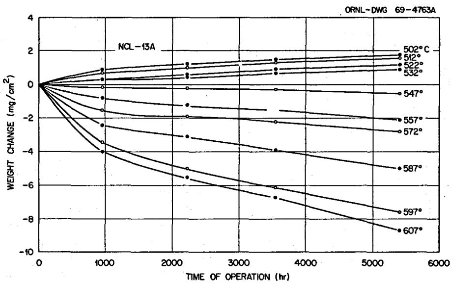  
Fig. 18.22. Weight Change vs Time for Standard Hastelloy N Specimens in NCL-13A Exposed to Fluoroborate Salt at Various Temperatures.

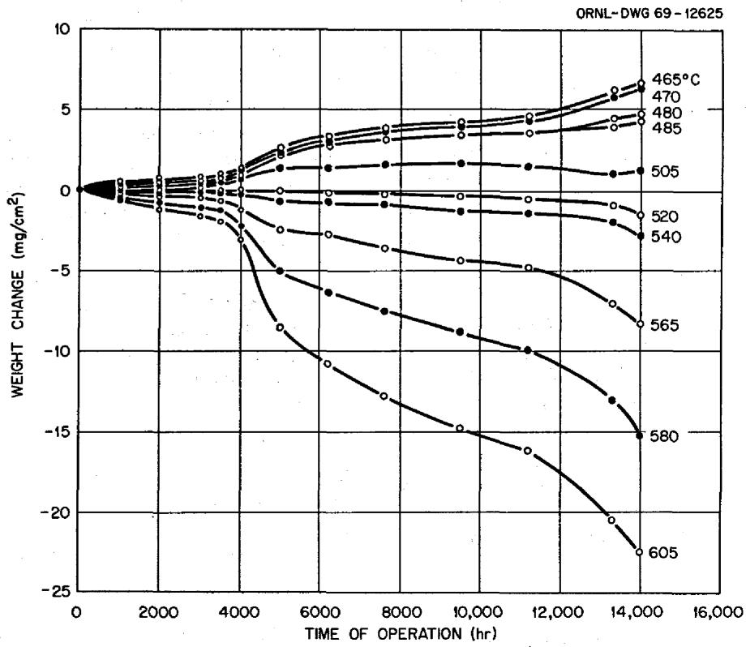  
Fig. 18.23. Weight Change vs Time for Titanium-Modified Hastelloy N Specimens in NCL-14 Exposed to Fluoroborate Salt at Various Temperatures.

immediate and long-range corrosion of the system, any local heating effects, and any large changes in pressure due to steam entering the system.

The loop was operated for 1000 hr and the specimens removed and weighed. Steam was put into the flowing salt system through a 16-mil hole in a closed $\frac{1}{4}$ -in. Hastelloy N tube. Five pieces of $\frac{1}{16}$ -in. Hastelloy N wire, to simulate heat exchanger tubes, were spaced around the tube, one immediately in front of the hole, $\frac{1}{32}$ in. from the tube. These will be studied to assess any localized heating or corrosion. The only visible effect of the steam injection was a rise of the bulk fluid temperature of $17^{\circ}\mathrm{C}$ for a very short period of time. After injecting steam for 20 min, an overflow of salt was noted in a gas trap, temporarily disrupting flow. It appeared that at this time the steam was no longer soluble in salt and acted as a blanket gas. The steam injection was stopped, flow was restored, a salt sample was taken, and the specimens were replaced in the loop. Future plans call for removal of specimens to assess the effect of the steam on the corrosion process.

An experiment has been completed to determine the solubility and diffusion characteristics of chromium from standard Hastelloy N alloy into relatively pure

$\mathrm{NaBF}_4$ -NaF (92-8 mole %) containing approximately 400 ppm each of oxygen and water. Four capsules at four different temperatures (427, 538, 649, and $760^{\circ}\mathrm{C}$ ) and containing large amounts of surface area of standard Hastelloy N were exposed to the salt for 1200 hr. An Arrhenius-type plot of the results divulged a linear relationship for chromium uptake vs temperature between 427 and $760^{\circ}\mathrm{C}$ . The absolute values for chromium concentration are somewhat lower than data from previous fluoroborate loop tests. These levels may be associated with the impurity levels of the salts, higher purity favoring lower chromium solubility.

With the realization that the fluoroborate salt is easily contaminated with oxygen and water-type impurities and that corrosion increases with the amount of these impurities, we have attempted, in close cooperation with R. F. Apple and A. S. Meyer, to purify the fluoroborate in a manner which could be adapted to a large system. Our first attempt was the use of $\mathrm{BF}_3$ gas as the cleansing agent. It is known that both $\mathrm{BF}_3$ and $\mathrm{NaBF}_4$ react with water, and it was hoped that the $\mathrm{BF}_3$ passed through the melt would remove the water from the $\mathrm{NaBF}_4$ . Even though we were using $\mathrm{BF}_3$ in this case, we were aware of problems that might occur with

another gas that removes $\mathbf{BF}_3$ from the melt, thus changing the composition and the melting point. Therefore the experiment was conducted at $\sim 427^{\circ}\mathrm{C}$ to minimize the $\mathbf{BF}_3$ vapor pressure over the melt. The experiments have consisted in passing the gases through a capsule of impure (3000 ppm $\mathbf{H}_2\mathbf{O}$ and 3000 ppm $\mathbf{O}_2$ ) $\mathbf{NaBF}_4$ -NaF (92-8 mole $\%$ ). The gas removed from the capsule was dissolved in methyl alcohol with $10\%$ pyridine and titrated to the dead stop end point with Karl Fischer reagent. Results from these experiments are being evaluated.

The second method gave more favorable results and utilized a mixture of He and HF (purified with fluorine) that was passed through the fluoroborate at $454^{\circ}\mathrm{C}$ . Calculations are being made to determine the rate of moisture removal. The HF flow was quite low and will be increased along with the temperature of the salt to improve the kinetics of the process. In the next experiments $\mathrm{BF}_3$ will be added along with the other gases to replace that being removed in the process.

# 18.5.5 Corrosion Meter

Work has begun on the development of a corrosion meter for rate measurements in high-temperature molten salt media. The basic instrument being used at the present time is the Petrolite corrosion rate meter, model 103, made by the Petrolite Corporation, Houston, Texas. The meter uses the linear polarization technique and can be used for any metal or alloy in a conducting medium which corrodes electrochemically by a single metallic oxidation. Identical test, reference, and auxiliary electrodes were successfully used because only potential differences of approximately $10\mathrm{mv}$ are measured.

In brief, an adjustable current source is used to transmit a small electrical current between the test and auxiliary electrodes. At the same time, a special voltmeter measures the potential difference between the test electrode and a reference electrode. The current flow, by slightly polarizing the surface of the test electrode, causes a shift in potential with respect to the reference electrode, which is unpolarized and is corroding freely. If the corrosion rate is low, a very small current will polarize the surface of the test electrode. If the corrosion rate is high, a large current is needed to polarize the surface of the test electrode. With the use of appropriate constants, the corrosion rate as given by the current may be expressed in mils per year.

The standard meter has not previously been applied to systems with temperatures over $150^{\circ}\mathrm{C}$ and has never been applied to fused salts. Thus a large portion of our initial work has been directed toward the solution of materials problems unique to our proposed application.

We have used the corrosion meter successfully in the following systems and are taking measurements of the corrosion rate of standard Hastelloy N in LiF-BeF $_2$ -ThF $_4$ -UF $_4$ (68-20-11.7-0.3 mole %) at $693^{\circ}\mathrm{C}$ .

0.5, 0.75 mH $_2$ SO $_4$ -316 stainless steel at <100°C

1 M HCl-316 stainless steel at $< 100^{\circ}\mathrm{C}$

$\mathrm{NaNO_2 - NaNO_3 - KNO_3}$ (40-7-53 wt $\%$ )-mild steel at $200^{\circ}\mathrm{C}$

$\mathbf{SnCl}_2 - 316$ stainless steel at $290^{\circ}\mathbf{C}$

The next steps in the development of the corrosion meter for molten-salt use will be a quantitative measure of the interference effects due to the competing reduction reactions in the system and possible interference of stray electric currents from the capsule to the furnace. Through these experiments, it should be possible to determine whether the corrosion of Hastelloy N in this medium is a simple oxidation of chromium, limited by the element's ability to interact with the salt, or whether the corrosion proceeds by a number of different mechanistic pathways involving several metallic oxidations.

# 18.5.6 Corrosion Status

The time seems appropriate to orient the reader to the current status of compatibility of MSR systems. Table 18.8 compares recent standard Hastelloy N corrosion data, reduced to mils per year equivalent uniform attack, acquired from the first $4000\mathrm{hr}$ of exposure to various fused fluorides.

It is clear from the table that with the exception of the coolant-salt performance, the corrosion rates are very low. Comparison of the rates experienced by NCL-13A and MSR-FCL-1, both circulating the 92-8 mole % sodium fluoroborate, indicates a strong velocity effect on mass transfer. It is our opinion that the effect of velocity on corrosion in this system is of declining importance as the purity level of the secondary coolant salt improves. At some purity level, perhaps 200-400 ppm water and/or oxygen, solid-state diffusion of the most active constituents in Hastelloy N, chromium and iron, should control corrosion. Above this level the attack becomes more r-neral, and the corrosion rate is limited by the availability of hydrogen fluoride.

Table 18.8. Comparison of Corrosion Rates for Standard Hastelloy N in MSR Systems After 4000-hr Operation   

<table><tr><td>Loop Designation</td><td>Salt Type</td><td>TMax; ΔT(℃)</td><td>Velocity (fps)</td><td>Equivalent Corrosion Ratea(mils/year)</td></tr><tr><td>NCL-13A</td><td>Coolantb</td><td>605; 145</td><td>0.1</td><td>0.5</td></tr><tr><td>MSR-FCL-1</td><td>Coolantb</td><td>588; 78</td><td>10.</td><td>1.3</td></tr><tr><td>NCL-16</td><td>Fuelc</td><td>705; 170</td><td>0.1</td><td>0.05</td></tr><tr><td>MSRE</td><td>Fueld</td><td>650; 20</td><td>19</td><td>~0.01e</td></tr><tr><td>NCL-15A</td><td>Blanketf</td><td>675; 55</td><td>0.1</td><td>0.03</td></tr><tr><td>NCL-18</td><td>Fertile-fissileg</td><td>705; 170</td><td>0.1</td><td>0.06</td></tr></table>

${}^{a}$ All numbers assume the uniform removal of the metal surface. This assumption is quite good for the coolant salt, but the other salts selectively remove chromium, and the true depth of corrosion is greater than indicated.

$^b$ NaBF $_4$ -NaF (92-8 mole %), 1000 ppm each water and oxygen.

${}^{\mathrm{c}}$ LiF-BeF ${}_{2}$ -UF ${}_{4}$ (65.5-34.0-0.5 mole %), $< {200}\mathrm{{ppm}}$ each water and oxygen.

$d_{\mathrm{LiF - BcF_2 - ZrF_4 - UF_4}}$ (65-29-5-0.9 mole $\%$ ), $< 200$ ppm each water and oxygen.

$e$ Calculated from chemistry changes in salt.

$f_{\text{LiF-BeF}_2\text{-ThF}_4}$ (73-2-25 mole $\%$ ), $< 200$ ppm each water and oxygen.

$\mathbf{g}$ LiF-BeF2-ThF4-UF4 (68-20-11.7-0.3 mole %), <200 ppm each water and oxygen.

# 18.6 FORCED CONVECTION LOOP (MSR-FCL-1)

J.M.Baker W.R.Huntley

P.A.Gnadt J.W.Koger

A.P.Litman

The MSR-FCL-1 forced circulation loop is being operated to evaluate the compatibility of standard Hastelloy N with $\mathrm{NaBF}_4$ -NaF (92-8 mole %) coolant salt at temperatures and flow rates similar to those which exist in the MSRE coolant circuit. The test loop operates with liquid velocities of 10 fps, maximum bulk fluid temperature of $588^{\circ}\mathrm{C}$ , and minimum bulk fluid temperature of $510^{\circ}\mathrm{C}$ .

On February 29, 1969, a bearing failure occurred in the LFB centrifugal pump after $2082\mathrm{hr}$ of operation at design conditions. The pump rotary element was removed, and a new bearing was installed. To take advantage of this unscheduled downtime, portions of the loop piping and the corrosion specimens were removed for metallographic examination and weight

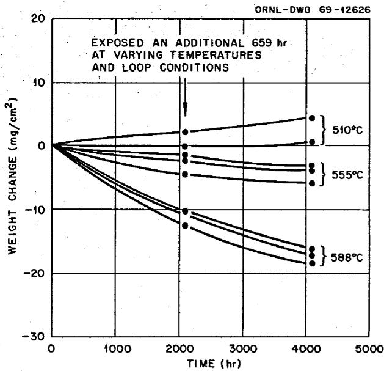  
Fig. 18.24. Weight Changes of Standard Hastelloy N Specimens in MSR-FCL-1.

change measurements. The loop was reassembled incorporating the same specimens and operated without incident for another 2000 hr, after which a scheduled shutdown was made for the second removal and examination of corrosion specimens. On July 30, 1969, the test loop was again reassembled and started on a third 2000-hr run. At the end of this report period the test loop had accumulated a total of approximately 4800 hr at design conditions. Salt samples have been taken about every 500 hr during the run.

Figure 18.24 shows the weight changes for specimens in MSR-FCL-1 as a function of salt exposure time. The corrosion rate has decreased with time and now averages 1.3 mils/year for 4000 hr of operation, assuming uniform attack. This relatively high rate is likely due to the higher velocity in this system compared with natural circulation loops. The initial exposure time of 2741 hr is divided as shown in Table 18.9. We feel that

Table 18.9. Time of Salt Exposure for MSR-FCL-1   

<table><tr><td>Time (hr)</td><td>Conditions</td></tr><tr><td>478</td><td>Flush salt, isothermal</td></tr><tr><td>181</td><td>Operating salt, isothermal</td></tr><tr><td>96</td><td>Operating salt, ΔT; 506°C max, 471°C min bulk fluid temperatures</td></tr><tr><td>1986</td><td rowspan="2">Operating salt, ΔT; design conditions, 588°C max, 510°C min bulk fluid temperatures</td></tr><tr><td>2741</td></tr></table>

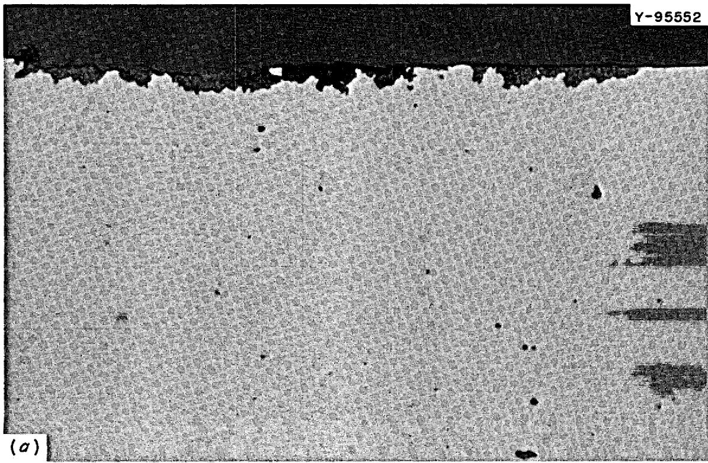  
0.007 INCHES 10.007 in. 1 500x 10.003 in. 1 10.001 in.

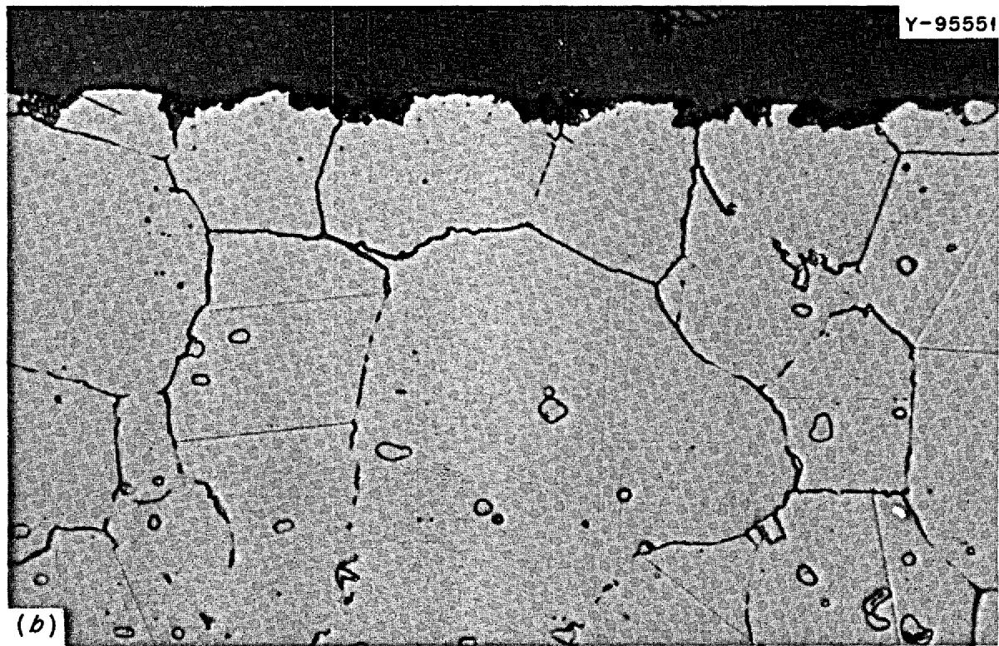  
0.007 INCHES 10.005 in. 500x 10.003 in. 1 10.001 in.   
Fig.18.25. Photomicrograph of a Standard Hastelloy N Specimen from MSR-FCL-1, Exposed to $\mathrm{NaBF_4}$ NaF (92.8 mole %) at $588^{\circ}\mathrm{C}$ for 4088 hr (Exposed for an Additional 659 hr at Varying Temperatures and Loop Conditions). Weight loss $18\mathrm{mg/cm}^2$ . (a) As polished, (b) etched with glyceria. 500X.

exposure to isothermal salt should cause little corrosion but yet realize that initial corrosion of a surface could be large, especially since the salt is somewhat impure. However, only salt exposure time at design conditions is used in Fig. 18.24.

The chromium in the coolant salt increased from 66 to $300~\mathrm{ppm}$ during the first $2082\mathrm{hr}$ of operation of this pump loop. During shutdown the original salt was diluted by an equivalent amount of salt when it was dumped into the loop sump tank. Within the first 500 hr of the second run the chromium increased from 192 to approximately $240~\mathrm{ppm}$ . The chromium level then remained at about $240~\mathrm{ppm}$ for the duration of the second run. The iron content of the salt decreased from 407 to $252~\mathrm{ppm}$ during the first $2000\mathrm{hr}$ and from 323 to $60~\mathrm{ppm}$ during the last $2000\mathrm{hr}$ . These changes are illustrative of the reaction

$\mathrm{Cr}^0$ (dissolved in metal) $+\mathrm{Fe}^{2 + }\rightarrow \mathrm{Cr}^{2 + } + \mathrm{Fe}^0$ (deposited),

which occurs in molten fluoride systems that contain metallic impurities.

The results of the analyses for oxygen and water in the salt have been quite scattered, with the values around 1000 ppm for each.

Figures 18.25-18.27 show micrographs of specimens from each specimen location in MSR-FCL-1 after $\sim 4000$ hr exposure. In Fig. 18.25 it is clear that the attack at $599^{\circ}\mathrm{C}$ , the highest salt temperature, occurred primarily at the intersection of the grain boundary and the surface. At $555^{\circ}\mathrm{C}$ , as the weight changes indicated, much less attack has occurred (Fig. 18.26). At $510^{\circ}\mathrm{C}$ , the lowest salt temperature, a metallic deposit of the approximate composition of Hastelloy N is visible along the surface in the as-polished condition. This deposit occurs under steady-state conditions and is unlike the green deposit which is a mixture of fluorides and occurs after saturation.

Examination of the pump and the pump bowl did not disclose any gross contamination; however, small amounts of green material were found on the pump bowl at the salt level. After water washing the bowl to remove the salt, very fine green whisker-like crystals were also found in the bottom of the pump bowl. A large piece of the green material mixed with salt $(< 1\mathrm{g})$ was analyzed (Table 18.10) to give us insight into the nature of the mass transfer deposits. These figures are equivalent to $55\mathrm{wt}\% \mathrm{NaBF}_4$ and $30\mathrm{wt}\% \mathrm{Na}_3\mathrm{CrF}_6$ plus some mixture of iron, nickel, and molybdenum fluorides. The presence of the green corrosion product and the level of chromium concentration in the salt

Table 18.10. Chemical Composition of Green Deposit Removed from the Pump Bowl   

<table><tr><td>Element</td><td>Concentration (wt %)</td></tr><tr><td>Cr</td><td>6.14</td></tr><tr><td>Fe</td><td>0.26</td></tr><tr><td>Ni</td><td>0.30</td></tr><tr><td>Mo</td><td>0.022</td></tr><tr><td>Na</td><td>21.6</td></tr><tr><td>B</td><td>4.56</td></tr><tr><td>F</td><td>57.0</td></tr></table>

indicate that we reached the saturation concentration of chromium corrosion product in the pump bowl during the test. Based on other studies it is reasonable that at the same time the other metals deposited in the cold sections. No indication of plugging by fluoride deposit in any other part of the system has been seen.

# 18.7 STEAM CORROSION OF HASTELLOY N

B. McNabb H.E.McCoy

Hastelloy N was developed for use in a molten-salt environment and has excellent corrosion resistance in molten salt as well as good oxidation resistance in air. It would be desirable to use the same material of construction in the secondary loop of a molten-salt reactor, where it would be exposed to coolant salt and steam. Information on the corrosion resistance of Hastelloy N in a water-vapor or steam environment is sparse and contradictory.

To obtain the needed information, a facility was designed and installed in TVA's Bull Run Steam Plant to evaluate the corrosion resistance of Hastelloy N and modified Hastelloy N to supercritical steam at 3500 psi and $538^{\circ}\mathrm{C}$ $(1000^{\circ}\mathrm{F})$ .

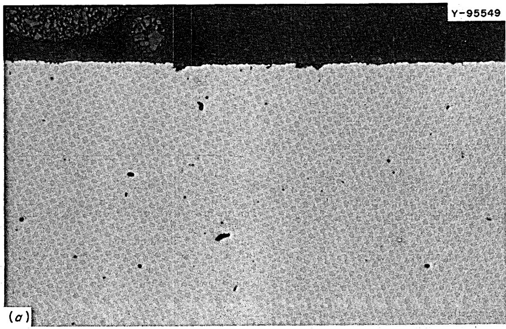  
0.007 INCHES 10.005 in. 1 500x 10.003 in. 1 10.001 in.

Fig. 18.26. Photomicrograph of a Standard Hastelloy N Specimen from MSR-FCL-1, Exposed to $\mathrm{NaBF}_4$ (92-8 mole %) at $555^{\circ}\mathrm{C}$ for 4088 hr (Exposed for an Additional 659 hr at Varying Temperatures and Loop Conditions). Weight loss $4\mathrm{mg/cm}^2$ . (a) As polished, (b) etched with glyceregia. $500\times$ .   
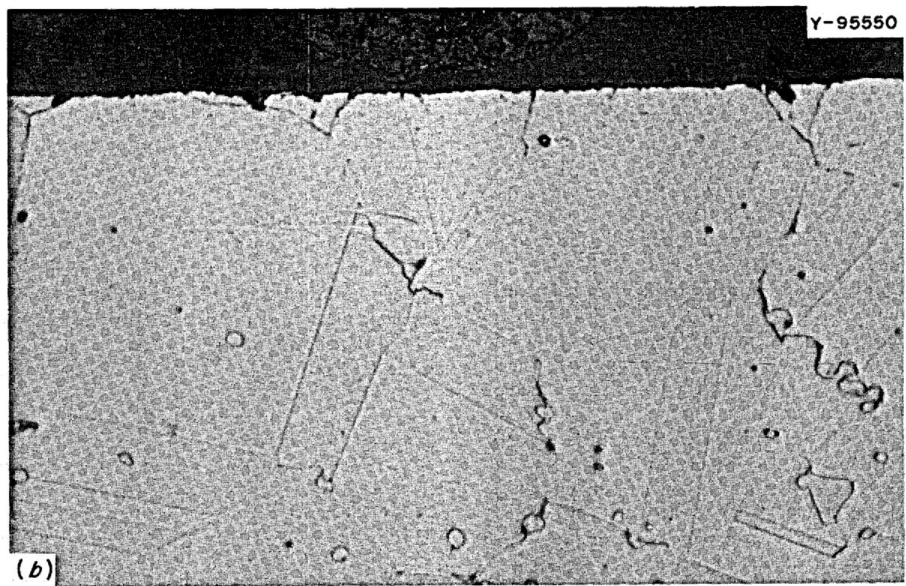  
0.007 INCHES 10.005 in. 1 500x 10.003 in. 1 10.001 in.

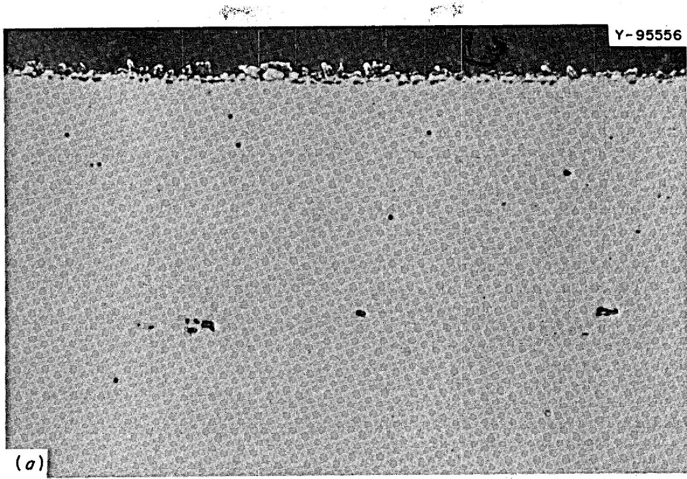  
0.007 INCHES 10.005 in. 1 500x 10.003 in. 1 10.001 in.

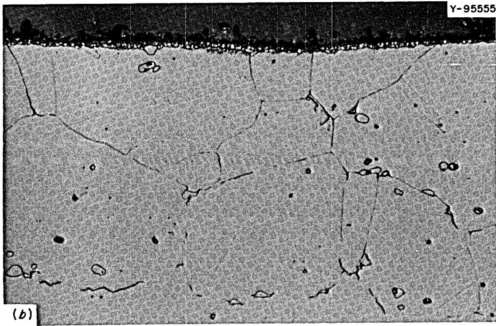  
0.007 INCHES 10.005 in. 1 500x 10.003 in. 1 10.001 in.   
Fig. 18.27. Photomicrograph of a Standard Hastelloy N Specimen from MSR-FCL-1, Exposed to $\mathrm{NaBF}_4$ -NaF (92-8 mole %) at $510^{\circ}\mathrm{C}$ for 4088 hr (Exposed for an Additional 659 hr at Varying Temperatures and Loop Conditions). Weight gain $4\mathrm{mg/cm}^2$ . (a) As polished, (b) etched with glyceregia. 500X.

Figure 18.28 is a schematic of the facility, and Fig. 18.29 is a photograph of the specimen holder withdrawn from its chamber during welding. The steam enters the specimen chamber through the valve on the right, flows longitudinally past the specimens, through the filter, through the flow restriction, and into the condenser. The steam pressure is reduced to approximately 1 psig in the flow restrictor. A thermocouple well was installed in the specimen holder to monitor temperature, and this tube also supports the sample holder. The Grayloc flange is removable with the specimen holder. The specimens are coupons made from sheet material of 0.010, 0.020, 0.035, and 0.060 in. thickness. The coupons are $0.5 \times 2.0$ in. with 0.1875-in. holes at each end for mounting on the bolts in the specimen holder. Some 0.010- and 0.020-in. specimens were stressed by bending around 0.125-in.-diam rod to make U-bend specimens. The specimens were not loaded into the holder when Fig. 18.29 was made, but they are bolted in parallel to the thermocouple well. The working volume of the facility is about $2 \times 2 \times 2$ in., and approximately 100 specimens were included in the first loading. The steam velocity across the specimens is approximately 20 fps, and the mass flow rate is about 1000 lb/hr.

Specimens from some commercial heats of standard air-melted and vacuum-melted Hastelloy N and from some 2-lb lab melts and larger commercial melts of modified Hastelloy N were included in the first loading. Steam was turned on the facility August 7, 1969, with no difficulties. We plan to remove the samples for weighing after about 500 hr of exposure.

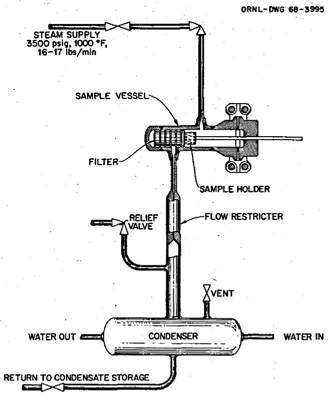  
Fig. 18.28. Schematic Drawing of the Steam Corrosion Facility at the Bull Run Steam Plant.

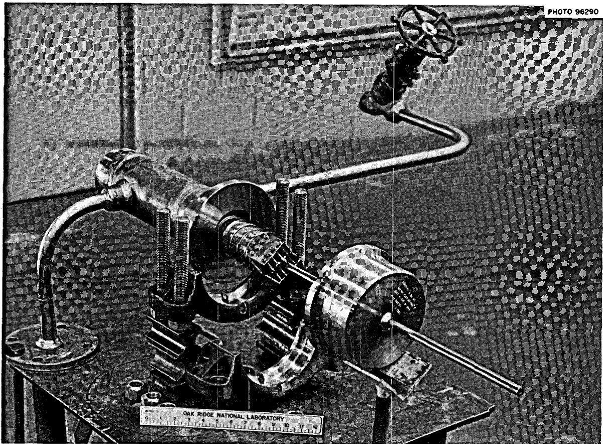  
Fig. 18.29. Photograph of the Steam Corrosion Facility Before Installation. The valve ties into the steam supply. The flange has been unbolted to allow removal of the sample holder and the filter.

# 19. Support for Chemical Processing

# 19.1 CHEMICAL-VAPOR-DEPOSITED COATINGS

# J. I. Federer

Mass transfer of elements such as Fe, Cr, and Ni in structural alloys limits the life of experimental bismuth-salt extraction columns and associated components. Although certain refractory metals and alloys are resistant to liquid bismuth, fabrication of reprocessing equipment using these materials is difficult. Therefore, coating of refractory metals on relatively easy-to-fabricate materials affords a potential solution to the problem.

Tungsten, molybdenum, and other refractory metals can be chemically vapor deposited by hydrogen reduction of the metal halides. However, these metals generally have lower coefficients of thermal expansion than the iron- and nickel-base structural materials. Table 19.1 shows the average coefficients of thermal expansion over the temperature range 25 to $600^{\circ}\mathrm{C}$ for some of these materials. The difference in expansion will cause the coatings to be in compression upon cooling from the deposition temperature to $25^{\circ}\mathrm{C}$ or when thermally cycled during operation. Under such conditions cracks in the coating or separation of the coating from the base metal often occurs.

Table 19.1. Average Coefficients of Thermal Expansion of Some Structural and Coating Materials over the Temperature Range 25 to $600^{\circ}\mathrm{C}$   

<table><tr><td></td><td>μin. in-1°C-1</td></tr><tr><td>Type 304 stainless steel</td><td>18.5</td></tr><tr><td>Carbon steel</td><td>14.5</td></tr><tr><td>Hastelloy C</td><td>14.0</td></tr><tr><td>Tungsten</td><td>4.6</td></tr><tr><td>Molybdenum</td><td>5.8</td></tr><tr><td>Niobium</td><td>8.0</td></tr><tr><td>Tantalum</td><td>6.6</td></tr><tr><td>Rhenium</td><td>6.7</td></tr></table>

A few experiments have been conducted to evaluate tungsten coatings on carbon steel and type 304 stainless steel. The coatings were applied by hydrogen reduction of $\mathbf{WF}_6$ at 500 to $600^{\circ}\mathrm{C}$ . The steel substrates were approximately 2-in.-ID pipes, both bare and coated with approximately 0.001-in.-thick nickel by electrodeposition. One-mil-thick tungsten coatings were adherent on cooling to room temperature after deposition except in a few small areas. Thermal cycling between 25 and $800^{\circ}\mathrm{C}$ caused some spalling of the

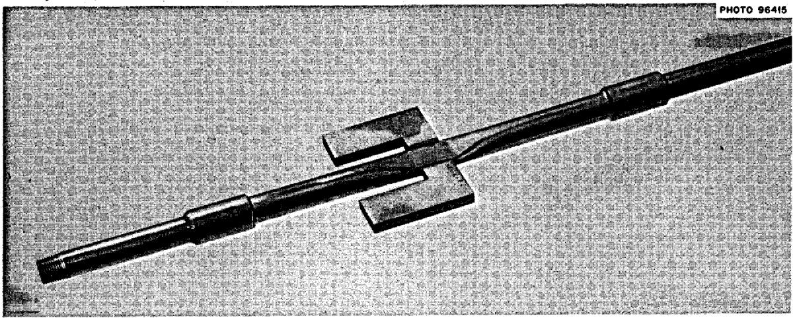  
Fig. 19.1. Electromagnetic Pump Duct for Liquid Bismuth.

coatings but was less in the case of the nickel-coated pipes.

One-mil-thick tungsten coatings on bare and nickel-coated type 304 stainless steel tubes (approximately $\frac{3}{4}$ in. ID) spalled completely when thermal cycled between 25 and $600^{\circ}\mathrm{C}$ . Coatings between 0.005 and 0.013 in. thick developed fine cracks during thermal cycling but did not spall after 15 cycles. Based upon these results two stainless steel electromagnetic pump ducts for liquid bismuth were coated with 0.010- to 0.015-in.-thick tungsten. One of the ducts is shown in Fig. 19.1. Although cracking of the coating will probably occur during thermal cycling, contact between bismuth and stainless steel should be minimized, and the lifetime of the pump duct may be substantially increased due to the presence of the coating.

Although molybdenum coatings have not yet been studied, results similar to those obtained for tungsten are expected. Since nonadherent and cracked coatings are not satisfactory for the protection of structural materials, experiments are now being conducted to determine whether a metallurgical bond between the coating and base metal can be obtained by diffusion. In addition, coating and thermal cycling tests are being conducted with several iron-nickel alloys which have coefficients of thermal expansion near those of tungsten and molybdenum.

# 19.2 DEVELOPMENT OF BISMUTH-RESISTANT BRAZING FILLER METALS FOR JOINING MOLYBDENUM

R.W.Gunkel N.C.Cole J.W.Koger

Molybdenum or one of its alloys is a proposed structural material for an MSBR processing plant. Since brazing provides an attractive means for fabricating complex structures, a program has been undertaken to develop a brazing filler metal which is compatible with both fluoride salts and bismuth.

Recrystallized materials generally are less ductile than worked materials; therefore the temperature at which brazing will occur is an important factor. Since the recrystallization temperature depends upon both composition and fabrication history, we felt that some preliminary studies of the recrystallization behavior of

several commercially obtained molybdenum alloys using typical brazing cycles would be helpful. The following materials were chosen for these studies: unalloyed molybdenum, TZM (Mo-0.5% Ti-0.1% Zr), and a special grade designated commercially as HT molybdenum. The metallographic appearance of the TZM samples after heating to some typical brazing temperatures is shown in Fig. 19.2. A brazing temperature of $1350^{\circ}\mathrm{C}$ for 10 min (typical time at temperature for brazing small components) appears to be satisfactory for TZM. Similar studies with unalloyed molybdenum indicate that the brazing temperature should not be higher than $1050^{\circ}\mathrm{C}$ for 10 min. A special grade of molybdenum known as HT molybdenum should have had, according to the manufacturer, a recrystallization temperature in excess of $1700^{\circ}\mathrm{C}$ and should have been more ductile when recrystallized than regular molybdenum when recrystallized. However, our tests have shown that it recrystallized after heating to $1525^{\circ}\mathrm{C}$ for 2 or 3 min. We did not have enough sample to determine its ductility after recrystallization.

Based on these studies we feel that a brazing alloy that flows at $1350^{\circ}\mathrm{C}$ or less will be required. Since available corrosion data indicate that iron possesses modest resistance to molten bismuth in the temperature range of interest, brazing filler metals rich in iron appear to provide the best chance for meeting the combined requirements of flow temperature $(1050 - 1350^{\circ}\mathrm{C})$ , compatibility, and metallurgical behavior. Consequently, we have melted several iron-base alloys containing small amounts of boron, carbon, and other elements as melting-point depressants.

One iron-boron-carbon brazing alloy was subjected to static bismuth for 671 hr at $600^{\circ}\mathrm{C}$ . The sample size and the volume of bismuth were chosen so that corrosion would not be limited by bismuth becoming saturated with iron. Metallographic cross sections of the exposed and control samples are shown in Fig. 19.3. Bismuth dissolved the iron-rich portion of the fillet but did not attack the molybdenum-rich reaction zone between the brazing filler metal and the molybdenum. The iron content of the bismuth increased about 22 ppm, but no changes in titanium or zirconium were detectable. Since the remaining braze metal appeared structurally sound and the TZM was unaffected by the exposure, we feel joints of this type have good potential for the containment of bismuth.

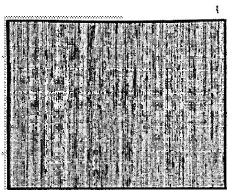  
As-Received

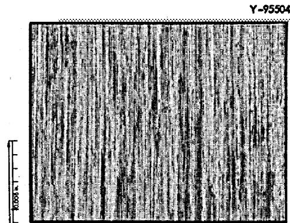  
1050°C

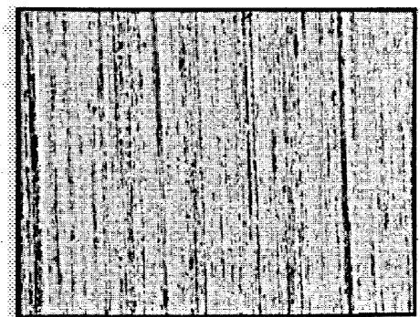  
1350°C

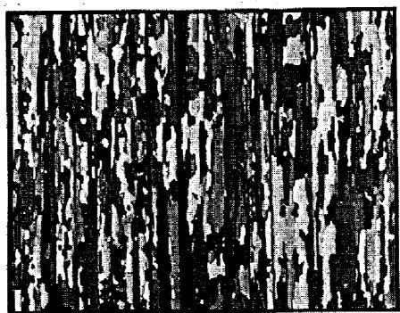  
1450°C   
Fig. 19.2. Effect of Brazing Temperature on Microstructure of TZM Base Metal. All specimens were held at temperature for $10\mathrm{min}$ .

Y-95582

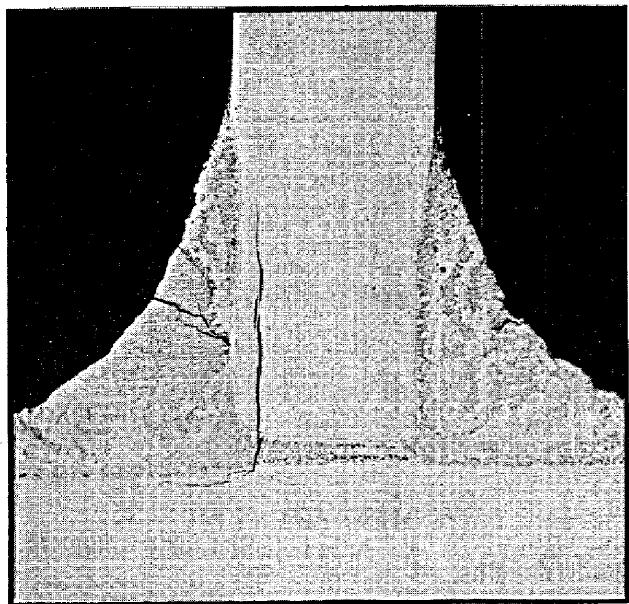  
Before Exposure

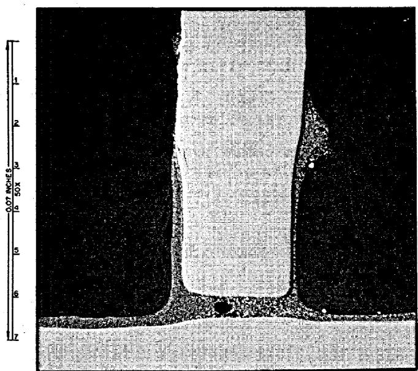  
After Exposure   
Fig. 19.3. Molybdenum T-Joint Brazed with Experimental Iron-Boron-Carbon Brazing Filler Metal. The bismuth has corroded the braze fillet, but the reaction zone containing molybdenum remains unattacked. As polished.

# 20. Support for Components Development Program

# 20.1 REMOTE WELDING STUDIES

L.C.Williams T.R.Housley

The automated remote orbital welding equipment (discussed in Sect. 7.5 by P. P. Holz) has been moved to the Welding Laboratory in Building 4508. All components of the system are currently undergoing a complete checkout as to compatibility with the new control console which has just recently been completed by ORNL Instrument Department personnel. Specimens machined from 6-in. sched 80 pipe have been obtained to simulate the Y-ring insert type of joint which we have recommended for study. Y-ring inserts have been

ordered to continue these experiments. Preliminary work with the orbital welding equipment has shown that good quality cover pass welds on austenitic stainless steel pipe can be made. Therefore we shall presently emphasize development of a procedure that will give high-quality root passes. The use of Y-ring-type joints has shown a much improved root pass over conventional joint designs. Other experimental welds are being made to determine the effect of pulsing the weld current in the "overhead" weld position.

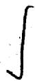

# Part 6. Molten-Salt Processing and Preparation

M. E. Whatley

Part 6 deals with the development of processes for the isolation of protactinium and the removal of fission products from molten-salt reactors. The chemical basis for the flowsheets presently being considered is now firm, and engineering development is under way. Protactinium is to be isolated by a reductive extraction scheme which traps it in an extraction cascade between thorium (less noble) and uranium (more noble). The rare earths are to be removed by a reductive extraction operation on a salt stream from which the uranium and protactinium have already been removed.

The study of the distribution of the rare earths during reductive extraction was extended to consider the effect of temperature and the effect of varying the free fluoride equivalence of the salt. While definite trends were established, they are probably not large enough to be useful. A flowsheet analysis of the rare-earth removal system employing rare-earth-thorium separation factors that range from about 1.2 for europium to about 3 for neodymium show the process to be workable if the engineering development of process components is successful. However, the need for a large electrolytic cell, at least three times as large as the electrolytic cell used in the protactinium isolation system, that will operate at a low salt flow rate with the salt phase almost totally depleted in thorium makes the development difficult. Among the alternatives being explored is the separation of thorium from the rare earths by the selective precipitation of thorium bismuthide from the bismuth extract phase. This separation is not complete and may not be useful.

The transuranium elements, with the exception of curium, were found to fall between uranium and protactinium under the reduction extraction conditions of the protactinium isolation flowsheet. Curium, except for its trivalent behavior, distributes much like protac

tinium. Plutonium, which possibly could be used in an initial fuel loading for an MSBR, exhibits a separation factor from protactinium of about 10. Analysis has shown that equipment designed to operate with a U-Pa-Th system would serve acceptably with a Pu-Pa-Th system. We have made an iterative calculation of the protactinium isolation system to simulate transient behavior and have found that the system is stable, assuming a straightforward control system and reasonable random error in a control element.

Our engineering efforts have focused on the development of extraction equipment and electrolytic cells. The flowthrough facility, designed to pass 15 liters of bismuth countercurrent to as much as 15 liters of salt in a small continuous contactor, is undergoing its shakedown operation. A variety of problems, most of which stem from the use of carbon steel as a material of construction, were encountered; however, we are encouraged that the system will function to yield the required data on extraction tower performance.

Work with electrolytic cells was concerned primarily with the establishment of a usable protecting layer of frozen salt on the exposed surfaces of the container for the molten bismuth anode. During this reporting period our successes were limited, but we have been developing operational techniques which promise ultimate success.

Distillation as a practicable operation for use in processes for molten-salt reactors was demonstrated by processing 11 liters of MSRE carrier salt during $31\mathrm{hr}$ of remote operation of an experimental still at the MSRE. Although distillation is not now one of the principal operations in our reference flowsheet, it has several peripheral applications, and its successful demonstration broadens the scope of possibilities for manipulating salt systems.

# 21. Measurement of Distribution Coefficients in Molten-Salt-Metal Systems

L.M.Ferris

During the past six months distribution coefficients for some transuranium elements and rare earths, using $\mathbf{LiF - BeF_2 - ThF_4}$ solutions and liquid bismuth solutions, were measured as part of the continuing development of the reductive extraction process. The distribution coefficients

$$
D _ {\mathrm {M}} = \frac {\text {m o l e f r a c t i o n o f c o m p o n e n t M i n b i s m u t h p h a s e}}{\text {m o l e f r a c t i o n o f c o m p o n e n t M i n s a l t p h a s e}}
$$

at a given temperature can be expressed as

$$
\log D _ {\mathbf {M}} = n \log D _ {\mathbf {L i}} + \log K ^ {\prime},
$$

in which $D_{\mathbf{Li}}$ is the lithium distribution coefficient, $K^{\prime}$ is a constant, and $\pmb{n}$ is the valence of the species $\mathbf{MF}_n$ in the salt phase.

Tests were also made to determine whether thorium could be selectively precipitated by cooling bismuth solutions to provide higher overall rare-earth-thorium separation factors in the reductive extraction process.

# 21.1 EXTRACTION OF TRANSURANIUM ELEMENTS FROM SINGLE-FLUID MSBR FUELS

J.C.Mailen F.J.Smith

Startup of an MSBR using plutonium as the fuel is a distinct possibility. Therefore, knowledge of the behavior of plutonium and the transplutonium elements in the reductive extraction process obviously is of interest. Distribution coefficients for plutonium, using two different $\mathrm{LiF - BeF_2 - ThF_4}$ melts at $600^{\circ}\mathrm{C}$ , were presented in the previous semiannual report. These data showed that plutonium was less easily extracted than uranium (U-Pu separation factor of about 10) but was more easily extracted than protactinium. Plutonium probably could be separated from protactinium

since, under the desired operating conditions, the Pu-Pa separation factor would be about 10.

Data for several transuranium elements were obtained in experiments with $\mathrm{LiF - BeF_2 - ThF_4}$ (72-16-12 mole %) at $600^{\circ}\mathrm{C}$ . The distribution coefficients obtained for neptunium are shown in Fig. 21.1, and those for plutonium, americium, curium, and californium are

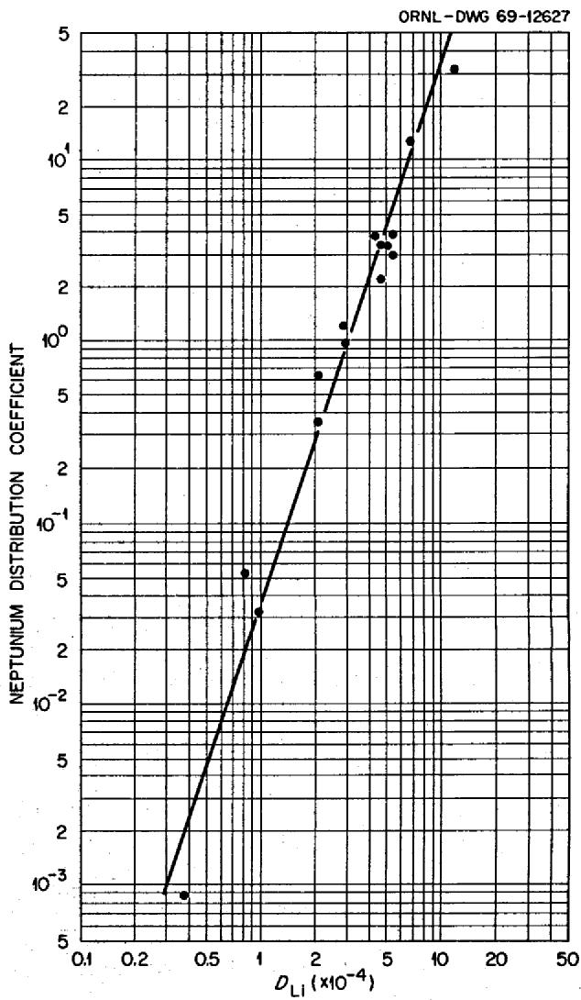  
Fig. 21.1. Equilibrium Distribution of Neptunium Between LiF-BeF $_2$ -ThF $_4$ (72-16-12 mole %) and Bismuth Solutions at $600^{\circ}\mathrm{C}$ .

shown in Fig. 21.2. The distribution coefficients can be reproduced from the equations given in Table 21.1. Within experimental error, it was concluded that each species was trivalent in the salt phase. The data obtained for neptunium show that its extractability is between that of uranium and plutonium. The uranium-neptunium and neptunium-plutonium separation factors are each about 3. As seen in Fig. 21.2 plutonium, americium, and californium are nearly inseparable, whereas the plutonium-curium separation factor is about 10. These results indicate that curium would probably coextract with protactinium in the process and suggest that curium could be used as a stand-in for protactinium in reductive extraction experiments.

Table 21.1. Expressions for the Distribution Coefficients for Several Transuranium Elements Using LiF-BeF $_2$ -ThF $_4$ (72-16-12 Mole %) and Liquid Bismuth at $600^{\circ}\mathbf{C}$   

<table><tr><td>Element</td><td>Equilibrium Expression</td></tr><tr><td>Np</td><td>log D Np = 3 log D L i + 10.514</td></tr><tr><td>Pu</td><td>log D Pu = 3 log D L i + 9.979</td></tr><tr><td>Am</td><td>log D Am = 3 log D L i + 9.865</td></tr><tr><td>Cm</td><td>log D Cm = 3 log D L i + 9.090</td></tr><tr><td>Cf</td><td>log D Cf = 3 log D L i + 9.952</td></tr></table>

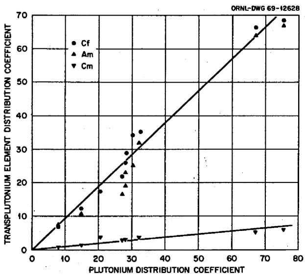  
Fig. 21.2. Distribution Coefficients for Transuranium Elements Obtained at $600^{\circ}\mathrm{C}$ with $\mathbf{LiF - BeF_2 - ThF_4}$ (72-16-12 mole %) and Bismuth.

# 21.2 EXTRACTION OF RARE EARTH'S AND THORIUM FROM SINGLE-FLUID MSBR FUELS

L.M.Ferris F.J.Smith

J.C.Mailen J.F.Land

Distribution coefficients for thorium and several rare earths, measured with LiF-BeF $_2$ -ThF $_4$ (72-16-12 mole %) at $600^{\circ}\mathrm{C}$ , were reported previously. Additional measurements during this reporting period include those for promethium and europium.

Data for promethium were obtained as follows: About $0.5\mathrm{mg}$ of ${}^{147}\mathrm{Pm}$ was irradiated to produce $1\mathrm{mc}$ of the 5.4-day ${}^{148}\mathrm{Pm}$ . The promethium isotopes were then dissolved in $100\mathrm{g}$ of $\mathrm{LiF - BeF_2 - ThF_4}$ (72-16-12 mole %) by a 24-hr treatment at $600^{\circ}\mathrm{C}$ with $\mathrm{HF - H_2}$ (50-50 mole %) in the presence of $200\mathrm{g}$ of bismuth. The bismuth phase was saturated with thorium at $600^{\circ}\mathrm{C}$ , and after equilibrium had been attained, four pairs of filtered samples of the salt and bismuth phases were taken. The 1.46-MeV gamma peak from the 5.4-day ${}^{148}\mathrm{Pm}$ was used for promethium assay of each phase. The average promethium distribution coefficient from the four pairs of samples was $0.025 \pm 0.003$ , yielding a promethium-thorium separation factor of 1.7 $\pm 0.3$ .

The distribution coefficients obtained for europium at $600^{\circ}\mathrm{C}$ using $\mathrm{LiF - BeF_2 - ThF_4}$ (72-16-12 mole $\%$ ) can be expressed as $\log D_{\mathrm{Eu}} = 2\log D_{\mathrm{Li}} + 3.74$ . These results, along with those obtained for thorium, showed that the europium-thorium separation factor was about 1.1 at $600^{\circ}\mathrm{C}$ when the bismuth phase was saturated with thorium. At thorium saturation of the bismuth phase, the separation factor decreased from about 1.6 to about O.9 as the temperature was increased from 525 to $750^{\circ}\mathrm{C}$

The effect of temperature on the lanthanum-thorium and samarium-thorium separation factors was determined in separate experiments with $\mathrm{LiF - BeF_2 - ThF_4}$ (72-16-12 mole $\%$ ). In each experiment, about four pairs of samples were taken at each of several temperatures between 525 and $750^{\circ}\mathrm{C}$ ; the bismuth phase was saturated with thorium in each case. Average values for the respective distribution coefficients and separation factors are given in Table 21.2. The samarium-thorium separation factor was about 2 regardless of the temperature, whereas the lanthanum-thorium separation factor decreased from about 2 to 1.5 as the temperature was increased from 525 to $750^{\circ}\mathrm{C}$ . Despite the scatter in the data, these results (and those for europium given above) clearly show that temperature has no marked effect on the rare-earth-thorium separation factors.

Table 21.2. Effect of Temperature on Rare-Earth-Thorium Separation Factors Obtained with LiF-BeF $_2$ -ThF $_4$ (72-16-12 Mole %)   

<table><tr><td>Temperature (°C)</td><td>Rare Earth</td><td>Thorium Concentration in Bismuth (ppm)</td><td>DRE</td><td>DTh</td><td>Separation Factor</td></tr><tr><td rowspan="2">525</td><td>La</td><td>843</td><td>0.0125</td><td>0.00633</td><td>1.97</td></tr><tr><td>Sm</td><td>785</td><td>0.0115</td><td>0.00589</td><td>1.95</td></tr><tr><td rowspan="2">560</td><td>La</td><td>1290</td><td>0.0206</td><td>0.00968</td><td>2.13</td></tr><tr><td>Sm</td><td>1210</td><td>0.0189</td><td>0.00908</td><td>2.08</td></tr><tr><td rowspan="2">600</td><td>La</td><td>2082</td><td>0.0251</td><td>0.0156</td><td>1.60</td></tr><tr><td>Sm</td><td>2080</td><td>0.033</td><td>0.0156</td><td>2.11</td></tr><tr><td rowspan="2">650</td><td>La</td><td>3830</td><td>0.0448</td><td>0.0287</td><td>1.56</td></tr><tr><td>Sm</td><td>3788</td><td>0.0562</td><td>0.0284</td><td>1.98</td></tr><tr><td>700</td><td>Sm</td><td>6022</td><td>0.0962</td><td>0.0452</td><td>2.13</td></tr><tr><td rowspan="2">750</td><td>La</td><td>10230</td><td>0.113</td><td>0.0768</td><td>1.47</td></tr><tr><td>Sm</td><td>8772</td><td>0.113</td><td>0.0658</td><td>1.72</td></tr></table>

Methods for enhancing the rare-earth-thorium separation are constantly being sought. Distillation has been considered as a means for increasing the "free fluoride" equivalence of the salt that would be fed to the rare-earth removal part of the reductive extraction process. As shown in earlier studies1,3-5 the rare-earth-thorium separation factors increase with increasing "free fluoride" equivalence of the salt. Distillation would be used primarily to remove $\mathrm{BeF}_2$ (along with some LiF) from the salt, since the relative volatility of $\mathrm{BeF}_2$ is much higher than that of $\mathrm{ThF}_4$ . Relatively low-melting salts having "free fluoride" equivalences of at least +25 could probably be produced in the distillation of $\mathrm{LiF - BeF_2 - ThF_4}$ (72-16-12 mole %), which has a "free fluoride" equivalence of only +4. The extractability of samarium and thorium from such a salt, $\mathrm{LiF - BeF_2 - ThF_4}$ (80.5-6.1-13.4 mole %), which has a "free fluoride" equivalence of +28, was determined at $700^{\circ}\mathrm{C}$ . The distribution coefficients obtained in this experiment are shown in Fig. 21.3. The slope of the line representing the plot of $\log D_{\mathrm{Li}}$ vs $\log D_{\mathrm{Sm}}$ is 3, whereas that for the plot of $\log D_{\mathrm{Sm}}$ vs $\log D_{\mathrm{Th}}$ is $3\%$ .

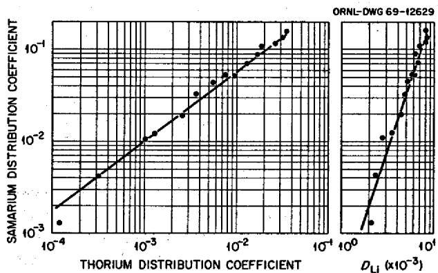  
Fig. 21.3. Equilibrium Distribution of Thorium and Samarium Between LiF-BeF $_2$ -ThF $_4$ (80.5-6.1-13.4 mole %) and Bismuth Solutions at $700^{\circ}\mathrm{C}$ .

These results show that the samarium species in the salt phase was primarily trivalent. When the bismuth phase was saturated with thorium $(D_{\mathrm{Th}} \sim 0.035)$ , the samarium distribution coefficient was about 0.14, corresponding to a separation factor of 4. This separation factor is only about twice as high as that obtained at $700^{\circ}\mathrm{C}$ with $\mathrm{LiF - BeF_2 - ThF_4}$ (72-16-12 mole%).

# 21.3 COPRECIPITATION OF RARE EARTHSH WITH THORIUM BISMUTHIDE

F.J:Smith C.T.Thompson

A possible means of increasing the overall rare-earth-thorium separation factor in the reductive extraction

process would involve the selective precipitation of thorium from the thorium-bismuth-rare-earth solution generated in the rare-earth removal step. In this connection, precipitation of thorium bismuthide from solutions containing rare-earth metals is being studied. Partitioning of the rare earth between the liquid and solid phases has been observed in each experiment conducted to date.

In the experiments, rare-earth metal was added to bismuth at $700^{\circ}\mathrm{C}$ to produce a solution containing either 1000 to 1300 ppm of lanthanum or 200 ppm of europium. Analyses of filtered samples confirmed the rare-earth concentration. After the rare earth had dissolved, enough crystal-bar thorium was added to ensure saturation of the bismuth at or below $600^{\circ}\mathrm{C}$ , but not at $700^{\circ}\mathrm{C}$ . The system was then slow cooled stepwise to several temperatures between 600 and $350^{\circ}\mathrm{C}$ and was held at least 24 hr at each temperature before a filtered sample of the liquid phase was removed for analysis. At the end of the experiment the temperature was raised to $700^{\circ}\mathrm{C}$ , and a sample was taken. Analyses of these final samples showed that no thorium or rare earth was consumed by irreversible side reactions during the experiments.

The results from one of the experiments (LA-2) are shown in Fig. 21.4. As seen, lanthanum coprecipitated with thorium bismuthide at each temperature below $600^{\circ}\mathrm{C}$ . The thorium concentrations obtained at temperatures of $600^{\circ}\mathrm{C}$ and below are in excellent agreement with the solubility values obtained previously. On the other hand, the lanthanum concentrations were well below the reported solubility values. The data obtained in each experiment can be represented by the logarithmic distribution relationship

$$
\log \left(\mathrm {R E} _ {0} / \mathrm {R E} _ {f}\right) = \lambda \log \left(\mathrm {T h} _ {0} / \mathrm {T h} _ {f}\right),
$$

described by Doerner and Hoskins. In this equation, $\mathrm{RE_0}$ and $\mathrm{Th_0}$ denote the initial concentrations of rare earth and thorium, respectively, and $\mathrm{RE_f}$ and $\mathrm{Th_f}$ denote the concentrations in solution at each temperature. The plots of $\log (\mathrm{RE_0} / \mathrm{RE_f})$ vs $\log (\mathrm{Th_0} / \mathrm{Th_f})$ were linear and yielded values of $\lambda$ of 0.5 and 0.1 for

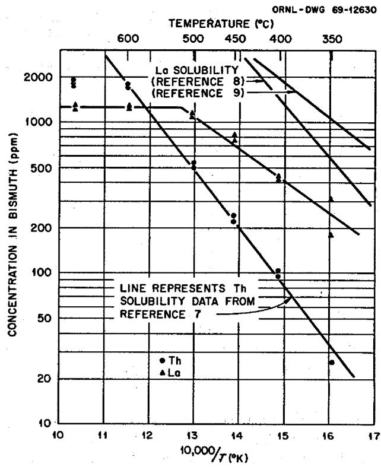  
Fig. 21.4: Data from Experiment LA-2 Showing Coprecipitation of Lanthanum with Thorium Bismuthide at Temperatures Below $600^{\circ}\mathrm{C}$ . Initial concentrations: thorium, 1800 ppm; lanthanum, 1300 ppm.

lanthanum and europium respectively. Apparently europium does not coprecipitate to the extent that lanthanum does. Although coprecipitation occurs, there is some separation of the rare earths from thorium. The data obtained with lanthanum indicate that a lanthanum-thorium separation factor of about 25 would be obtained if the bismuth phase from the rare-earth removal system were cooled slowly to $350^{\circ}\mathrm{C}$ . Since the lanthanum-thorium separation factor is about 2 in the reductive extraction step, the overall rare-earth-thorium separation factor would be about 50. A careful engineering evaluation will be required to determine whether addition of a crystallization step to the rare-earth removal system will be practical.

As postulated by Doerner and Hoskins, $^{10}$ a logarithmic distribution of the solute (rare earth) would be expected if each crystal layer of thorium bismuthide, as it forms, were in equilibrium with the solution at the time. The equation is normally utilized with data obtained in aqueous systems at a constant temperature, and $\lambda$ is usually slightly temperature dependent. In the

experiments described above, $\lambda$ appeared to be independent of temperature. It is interesting to note that similar results were obtained by Moriarty, Johnson, and Feder $^{11}$ in their studies of the coprecipitation of trace metals with $\mathrm{CeCd}_{11}$ from liquid cadmium.

# 21.4 DISSOLVABILITY AND SOLUBILITY OF $\mathbf{PuF}_3$ IN LiF-BeF $_2$ (66-34 MOLE %)

J.C.Mailen F.J.Smith

If present schedules are met, the first of several small additions of plutonium to the MSRE fuel salt will be made in September 1969. It has been proposed that the MSRE be refueled later using LiF-BeF $_2$ (66-34 mole %) as the carrier salt and plutonium as the primary fissionable isotope. Ultimately, thorium fluoride might be added to make the salt 1 to 2 mole % in ThF $_4$ . Plutonium will be added to the MSRE fuel salt as $\mathrm{PuF_3}$ powder (see Chap. 25), a technique that could probably be employed when the reactor is refueled. Laboratory-scale tests were conducted to show that powdered $\mathrm{PuF_3}$ is readily soluble in LiF-BeF $_2$ (66-34 mole %) at $600^{\circ}\mathrm{C}$ and to confirm earlier measurements of the solubility of $\mathrm{PuF_3}$ in this salt.

The $\mathrm{PuF_3}$ used in these tests was prepared at Los Alamos Scientific Laboratory and was designated a $5 - \mu$ powder. The as-poured bulk density of the powder was determined to be about $1.4\mathrm{g / cc}$ . The experiment was initiated by adding $1.48\mathrm{g}$ of $\mathrm{PuF_3}$ through a long-stemmed funnel to $100\mathrm{g}$ of unstirred molten LiF-BeF $_2$ (66-34 mole %) at $600^{\circ}\mathrm{C}$ . Filtered samples of the liquid were then taken at short intervals. Analyses of these samples showed that half of the $\mathrm{PuF_3}$ dissolved in about 10 min and that complete dissolution was achieved in about 1 hr. The final solution contained about 0.165 mole % $\mathrm{PuF_3}$ . These data predict rapid dissolution of $\mathrm{PuF_3}$ in the MSRE pump bowl, where good mixing can be achieved.

Table 21.3. Solubility of $\mathbf{PuF_3}$ in LiF-BeF $_2$ (66-34 Mole %)   

<table><tr><td>Temperature (℃)</td><td>PuF3 Solubility (mole %)</td></tr><tr><td>502</td><td>0.158</td></tr><tr><td>522</td><td>0.223</td></tr><tr><td>540</td><td>0.268</td></tr><tr><td>574</td><td>0.385</td></tr><tr><td>595</td><td>0.460</td></tr></table>

Following the dissolution test, more $\mathbf{PuF_3}$ was added to the system, and the solubility of $\mathbf{PuF_3}$ was determined at several temperatures. The data obtained (Table 21.3) are in excellent agreement with the earlier measurements of Barton. $^{12}$ The values reported in Table 21.3 are based on alpha-pulse-height analyses for $^{239}\mathrm{Pu}$ . It is interesting to note, however, that the same values were obtained by gamma-spectroscopic analysis of the $^{241}\mathrm{Am}$ decay product when the count rate obtained with the samples taken at the end of the dissolution test was used as the reference point. The $\mathbf{PuF_3}$ concentration in these samples (0.165 mole %) was well below the solubility limit.

After the solubility measurements were completed, sufficient $\mathrm{ThF_4}$ was added to the salt to make it 2 mole $\%$ in $\mathrm{ThF_4}$ . The solubility of $\mathrm{PuF_3}$ in the resulting solution was then determined over the temperature range of 500 to $650^{\circ}\mathrm{C}$ . Analyses of the samples for plutonium have not yet been completed; however, gamma-spectroscopic analyses for ${}^{241}\mathrm{Am}$ showed that the solubility of $\mathrm{PuF_3}$ was not markedly affected by the presence of 2 mole $\%$ $\mathrm{ThF_4}$ .

# 22. Flowsheet Analysis

M.W. Whatley L.E.McNeese

The process flowsheet envisioned for a single-fluid MSBR has been described previously.1 Calculations have been continued on several aspects of the flow-sheet. These include the protactinium isolation system, the rare-earth removal system, the stripping of thorium from salt entering the electrolytic cell in the rare-earth removal system, and the fission product concentrations and heat generation rates in a processing plant. Results of these calculations are summarized in the following sections.

# 22.1 ISOLATION OF PROTACTINIUM

# L. E. McNeese

System performance for the proposed flowsheet for isolating protactinium from a single-fluid MSBR (Fig. 22.1) has been recalculated using current data on reduction potentials and thorium solubility. Calculations were made for an MSBR fueled with uranium, as well as for initial operation of an MSBR fueled with plutonium. According to the flowsheet, fuel salt from the reactor enters the bottom of the extraction column and flows countercurrently to a stream of bismuth containing reduced metals. Ideally, the metal stream entering the top of the column contains sufficient thorium and lithium to extract only the uranium and plutonium entering the system. The system exploits the fact that protactinium is less noble than uranium but more noble than thorium. Both uranium and plutonium are preferentially extracted in the lower part of the column, while protactinium refluxes in the center. High protactinium concentrations are produced in the salt and metal streams. Most of the protactinium in the system can be isolated by diverting the salt stream through a tank of sufficient size (about $200\mathrm{ft}^3$ ).

Calculations have been made for both steady-state and transient system performance. The following values

were assumed for the calculations: fuel salt composition, 71.7-16-12-0.3 mole $\%$ LiF-BeF $_2$ -ThF $_4$ -UF $_4$ ; reactor volume, 1461 ft $^3$ ; processing rate, 2.5 gpm (three-day cycle); operating temperature, $600^{\circ}\mathrm{C}$ ; reactor power, 1000 Mw (electrical); and protactinium decay tank volume, 200 ft $^3$ . The thorium and lithium concentrations in the bismuth stream being fed to the column were 0.0016 and $1.4 \times 10^{-4}$ mole fraction respectively. In the calculations for an MSBR fueled with plutonium, the salt composition was assumed to be 71.8-16-12-0.2 mole $\%$ LiF-BeF $_2$ -ThF $_4$ -PuF $_3$ ; other values were the same as those given above.

# 22.1.1 Steady-State Performance for the Case of MSBR Fueled with Uranium

Calculated concentration profiles in the extraction column are shown in Fig. 22.2. The uranium concentration in the salt increases from the inlet value of 0.003 mole fraction to approximately 0.004 mole fraction in the first stage because of the reduction of U(IV) to U(III). It then decreases steadily to negligible

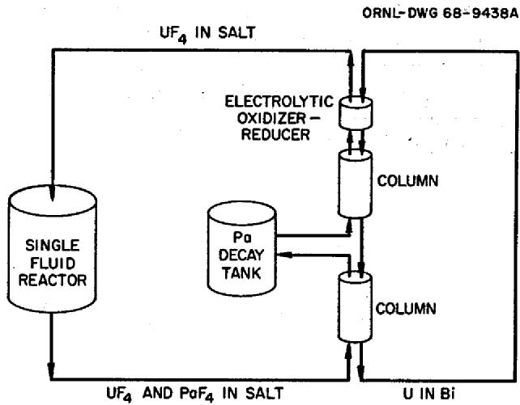  
Fig. 22.1. Scheme for Isolating Protactinium in a Single-Fluid MSBR.

values at the salt outlet. The concentration of protactinium in the salt increases from the inlet value of 1.39 $\times 10^{-5}$ mole fraction to a maximum of 0.0021 mole fraction, then decreases to negligible values near the salt outlet. The concentration of thorium in the bismuth stream decreases from about 0.00132 mole fraction in the upper part of the column to $7.9 \times 10^{-8}$ mole fraction near the bismuth outlet. The concentration of lithium in the bismuth decreases from about 0.00124 mole fraction in the upper part of the column to about 0.00011 mole fraction at the bottom of the column.

The concentrations of uranium and protactinium in the salt entering the decay tank are $1.25 \times 10^{-5}$ and $1.325 \times 10^{-3}$ mole fraction respectively. The concentrations of uranium and protactinium in the decay tank are $2.63 \times 10^{-5}$ and $1.312 \times 10^{-3}$ mole fraction respectively. Under ideal steady-state operating conditions, approximately $93\%$ of the protactinium present in the reactor system would be held in the decay tank. However, it is likely that the actual amount of protactinium isolated from the reactor will be some

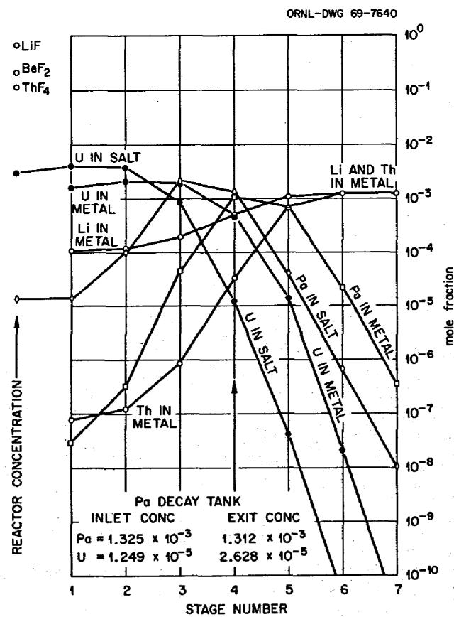  
Fig. 22.2. Calculated Concentration Profiles in a Protactinium Isolation Column for a Reactor Fueled with Uranium.

what below this value because of an inability to maintain optimum operating conditions.

The variation of the calculated steady-state protactinium concentration in the reactor and in the decay tank with bismuth flow rate is shown in Fig. 22.3. The bismuth flow rate is a typical operational variable; changes in the concentration of reductant in the bismuth phase or the salt flow rate would produce similar effects. The minimum protactinium concentration in the reactor is obtained when the bismuth flow rate is just sufficient to extract the uranium entering the system. At slightly higher bismuth flow rates, protactinium will also be extracted, since it is the next component in order of decreasing nobility. At bismuth flow rates slightly lower than the optimum rate (about 5.3 gpm), some of the uranium will not be extracted; instead, it will displace protactinium from the decay tank, forcing the latter to flow out the top of the column. In either case, some protactinium would be allowed to return to the reactor, and the effectiveness of the system would be diminished.

The flowsheet has several very desirable characteristics, including: (1) a negligible holdup of fissile $^{233}\mathrm{U}$ in the isolation system, (2) an almost immediate return of newly produced $^{233}\mathrm{U}$ to the reactor system, and (3) a closed system that precludes loss of protactinium, $^{233}\mathrm{U}$ , or other components of the fuel salt. Since the performance of the system is sensitive to variations in operating conditions, attention has been given to methods for controlling the system and for making the performance less dependent on operating conditions. Removal of uranium from the center of the column makes the system less sensitive to minor changes in operating conditions (see Fig. 22.4). For example, removal of $2\%$ of the uranium in the salt entering the decay tank results in stabilization of the system with respect to bismuth flow variations (below the optimum flow rate) as large as $1.03\%$ of the optimum. The uranium concentration in the salt, which is very sensitive to small changes in operating conditions near optimum conditions, increases by a factor of 5000 for a decrease in bismuth flow rate of only $0.037\%$ .

# 22.1.2 Transient Performance for the Case of MSBR Fueled with Uranium

Calculations were also made to show the transient behavior of the protactinium isolation system. Since the uranium concentration in the salt entering the decay tank had been shown to be very sensitive to operating conditions when these conditions were near optimum, measurement of this concentration was chosen as the

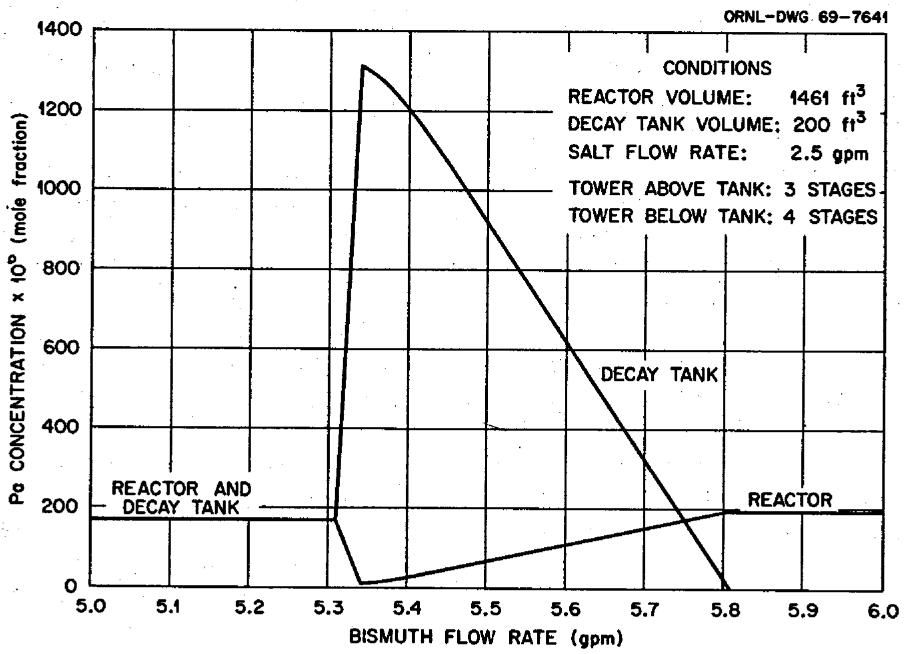  
Fig. 22.3. Protactinium Isolation from an MSBR Fueled with Uranium.

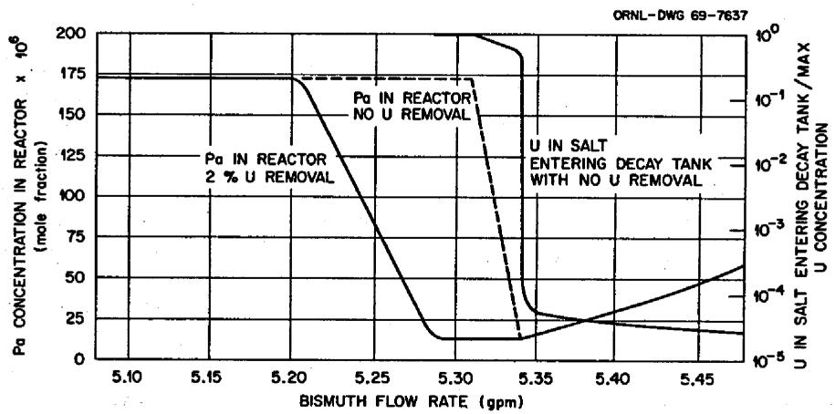  
Fig. 22.4. Effects of Uranium Removal and Bismuth Flow Rate on Protactinium Concentration in the Reactor and on Uranium Concentration in Salt Entering the Decay Tank.

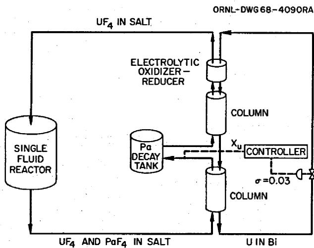  
Fig. 22.5. Schematic Diagram Showing the Method for Controlling Metal Flow Rate by Measurement of Uranium Concentration in Salt Entering the Protactinium Decay Tank.

means of controlling the system (see Fig. 22.5). It was assumed that the uranium concentration in the salt entering the decay tank could be measured by fluorinating approximately $5\%$ of the stream. The measured uranium concentration would then be used by a controller having proportional, integral, and derivative actions to control the bismuth flow rate through the columns. A random error distributed normally about the controller output and having a specified standard deviation (usually $5\%$ ) was considered to be imposed on the control system. The system was assumed to operate for a specified time interval (0.06 day) at each bismuth flow rate selected by the control system. During this period the extraction columns were assumed to operate at steady state; however, the reactor and decay tank were treated as perfectly mixed vessels having inlet concentrations equal to the column effluent concentrations.

The calculated system response is shown in Fig. 22.6 for an initial protactinium concentration of $10^{-4}$ mole

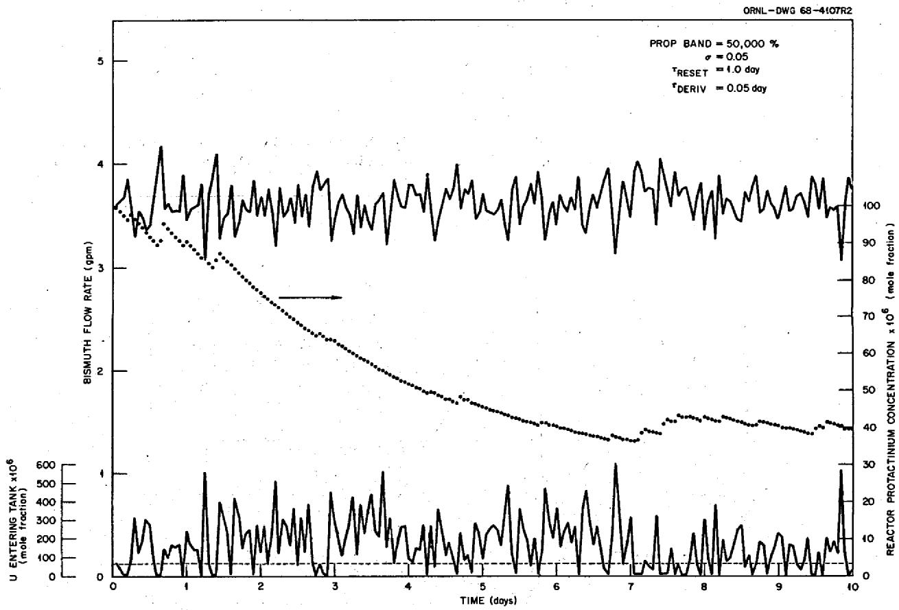  
Fig. 22.6. Control of the Protactinium Isolation Process Through Measurement of Uranium Concentration in Salt Entering the Decay Tank.

fraction in the reactor. (The reactor volume used for the transient calculations was $1000\mathrm{ft}^3$ , which was an earlier estimate than the current 1461 ft.) This concentration is seen to decrease to approximately $4\times$ $10^{-5}$ mole fraction, which is acceptably low. This value would be expected to be even lower for a larger reactor volume. It is believed that control of the protactinium isolation system in the manner suggested is practical.

# 22.1.3 Steady-State Performance for the Case of MSBR Fueled with Plutonium

An MSBR may be fueled initially with plutonium, which would remain in the reactor system during the time required for the $^{233}\mathrm{Pa}$ and $^{233}\mathrm{U}$ inventories to build up. Since the separation factor between plutonium and protactinium is only about one-half that between uranium and protactinium, we would expect the isolation of protactinium from a plutonium-fueled system to be more difficult than from a uranium-fueled system. Typical calculated concentration profiles in the extraction column for a plutonium-fueled system are shown in Fig. 22.7. It was assumed that the protactinium inventory in the system was the steady-state value but that a negligible quantity of uranium was present; although this condition will not actually exist, results from such a case should indicate the relative ease or difficulty to be encountered in isolating protactinium from a system fueled with plutonium. The

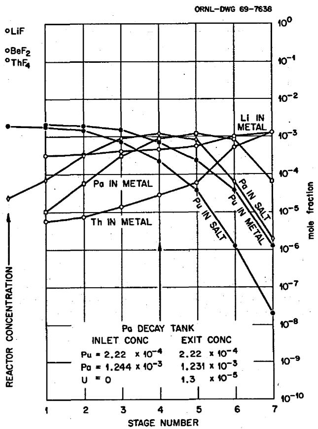  
Fig. 22.7. Calculated Concentration Profiles in the Protactinium Isolation Column for a Reactor Fueled with Plutonium.

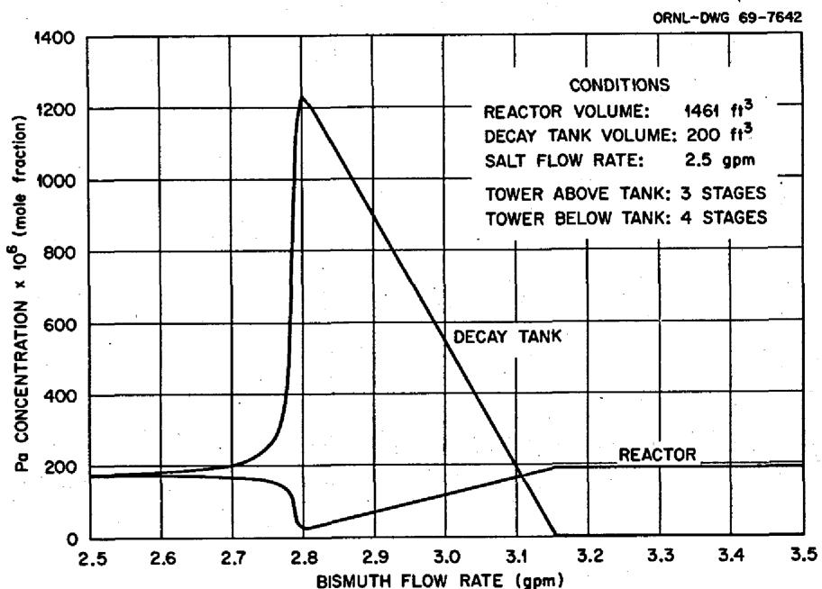  
Fig. 22.8. Protactinium Isolation from an MSBR Fueled with Plutonium.

plutonium concentration in the salt decreases steadily from the inlet value of 0.002 mole fraction to negligible values at the salt outlet. The concentration of protactinium in the salt increases from the inlet value of $2.5 \times 10^{-5}$ mole fraction to a maximum of $1.244 \times 10^{-3}$ mole fraction, then decreases to negligible values. The concentration of thorium in the bismuth stream drops from $1.26 \times 10^{-3}$ mole fraction in the upper part of the column to $5.6 \times 10^{-6}$ mole fraction at the bismuth outlet. The concentration of lithium in the bismuth decreases from about $1.23 \times 10^{-3}$ mole fraction in the upper part of the column to about $3.2 \times 10^{-4}$ mole fraction at the column exit.

The concentrations of plutonium and protactinium in the salt entering the decay tank are $2.22 \times 10^{-4}$ and $1.244 \times 10^{-3}$ mole fraction respectively. The concentration of protactinium in the decay tank is $1.231 \times 10^{-3}$ mole fraction. Under ideal steady-state operating conditions, approximately $87\%$ of the protactinium present in the reactor system would be held in the decay tank. The variation of protactinium concentration in the reactor and in the decay tank with bismuth flow rate is shown in Fig. 22.8. The results indicate that isolation of protactinium in a reactor fueled with plutonium would be feasible.

It should be noted that the number of stages in the column was chosen on the basis of a reactor fueled with uranium and that use of more stages would result in improved plutonium-protactinium separation and hence lower plutonium concentrations in the protactinium decay tank. The additional stages would not present operating difficulties when the plutonium was replaced by uranium during operation of the reactor.

# 22.2 REMOVAL OF RARE EARTHSH FROM A SINGLE-FLUID MSBR

L.E.McNeese C.P.Tung

The proposed method for removing rare earths from a single-fluid reactor by reductive extraction has been described previously.2 Calculated performance results were given for a 1000 Mw (electrical) reactor having a volume of 1461 ft³ and a salt processing rate (for rare-earth removal) of 0.25 gpm (30-day cycle). The extraction columns contained a total of 12 or 24 theoretical stages, and the feed point was located at the center of the column, which represents a near-optimum condition for a rare-earth-thorium separation factor of 2.0. The separation factors for several important rare

earths have been found to be less than 2.0, and recent results indicate that the separation factor for europium may be lower than was believed earlier, perhaps as low as 1.1. Since the optimum feed point location is dependent on separation factor, additional attention has been given to this relationship in order that improved operation might be obtained. Calculations showing the effect of feed point location for total numbers of stages of 18, 24, and 30 have been made. For a separation factor of 1.1, the optimum feed location is within 1 to 2 stages of the top of the combined extraction columns; with this location, removal times of 960, 750, and 630 days may be obtained. It should be noted (Fig. 22.9) that the removal time for materials with separation factors of 1.5 or higher is increased by locating the feed point near the top of the combined columns. The number of stages above and below the feed point will finally be set by considering the removal times desired for materials having low separation factors (e.g., europium) as well as the removal times desired for materials having separation factors of 1.5 to 2.0.

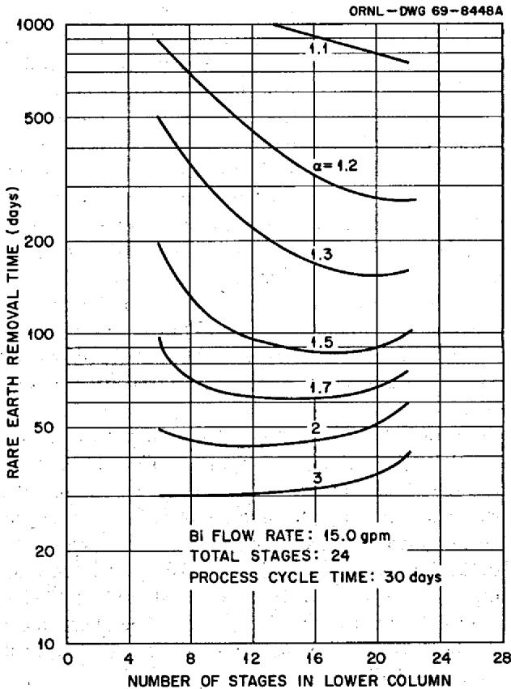  
Fig. 22.9. Variation of Rare-Earth Removal Time with Feed Point Location and Rare-Earth-Thorium Separation Factor.

Results for a system having 20 stages below the feed point indicate that the removal times for materials having separation factors of 1.1 to 1.3 are essentially unaffected by the addition of stages above the feed point. However, for materials having separation factors greater than 1.5, the removal time decreases with the addition of stages above the feed point.

The effect of salt feed rate was determined for a bismuth flow rate of 15 gpm and a system having 5 stages above the feed point and 19 stages below the feed point. The removal time for materials with separation factors of 1.3 or lower increased negligibly as the salt feed rate was increased. A decrease in removal time was noted for materials having separation factors greater than 1.5; the extent of decrease became greater as the separation factor increased.

# 22.3 STRIPPING OF $\mathsf{ThF}_4$ FROM MOLTEN SALT BY REDUCTIVE EXTRACTION

L.E.McNeese C.P.Tung

Efficient operation of the reductive extraction system for rare-earth removal requires3 that only a negligible quantity of $\mathrm{ThF_4}$ remain in the salt which passes through the electrolytic cell and returns to the bottom of the extraction column. It has been proposed that this low $\mathrm{ThF_4}$ concentration be maintained by stripping the $\mathrm{ThF_4}$ from salt that is fed to the cell by countercurrent contact with a lithium-bismuth stream produced at the cell cathode. We have made calculations that show the extent to which $\mathrm{ThF_4}$ can be removed from the salt with a column containing one to four theoretical stages. It was assumed that the salt entering the stripping column had the composition 72-16-12 mole % LiF $\cdot$ BeF $_2$ -ThF $_4$ and that the metal entering the column consisted of a lithium-bismuth mixture having a lithium concentration of 0.008 mole fraction. The metal-to-salt molar flow rate ratio, based on the feed streams, was 74.6.

The fraction of the $\mathrm{ThF_4}$ remaining in the salt stream that left the column is shown in Fig. 22.10 as a function of the number of theoretical stages used. With one theoretical stage, the fraction of $\mathrm{ThF_4}$ remaining in the salt stream is approximately 0.12; for two stages, 0.013; for three stages, $0.96 \times 10^{-4}$ ; and for four stages, $2.16 \times 10^{-7}$ . Since the required fractional $\mathrm{ThF_4}$ removal is about 0.99, two to three theoretical stages will be sufficient to maintain the desired fractional removal of $\mathrm{ThF_4}$ .

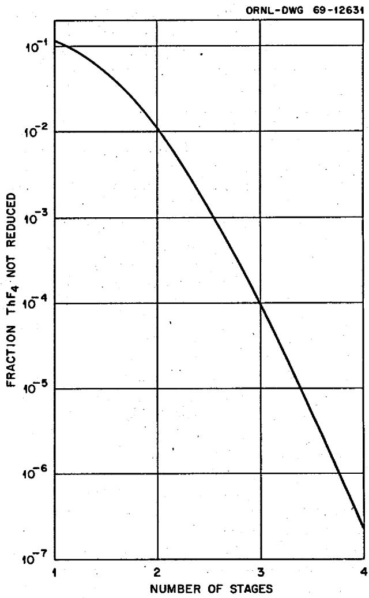  
Fig. 22.10. Fraction of $\mathbf{ThF_4}$ Remaining in Salt After Countercurrent Contact with an Li-Bi Stream for a Column Having a Variable Number of Stages.

# 22.4 MSBR PROCESSING PLANT MATERIAL AND ENERGY BALANCE CALCULATIONS

W. L. Carter

Two computer programs have been written for determining fission product concentrations and heat generation rates for each operation in an MSBR processing plant. The calculations begin with the equilibrium reactor composition for the fuel stream, as determined by a reactor physics calculation, and follow this stream through each processing step in the plant. Radioactive decay and chemical removal of nuclides are taken into account. The programs treat 459 fission product nuclides beginning with $^{72}\mathrm{Zn}$ and ending with $^{161}\mathrm{Dy}$ .

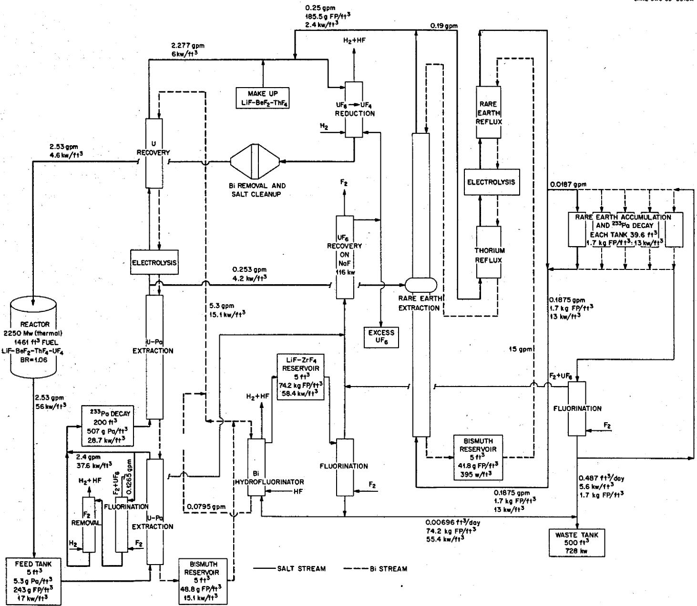  
Fig. 22.11. Reductive Extraction Process for MSBR: Fuel.

Figure 22.11 gives pertinent data for the reductive extraction processing plant. The calculations were made for a $2250\mathrm{Mw}$ (thermal) reactor operating with 1461 ft³ of $\mathrm{LiF - BeF_2 - ThF_4 - UF_4}$ fuel salt. Noble metals and rare gases were assumed to be removed on a 50-sec cycle, halogens and rare earths on a 50-day cycle, zirconium and seminoble metals on a 200-day cycle, and alkaline earths and alkali metals on a 3000-day cycle. With these assumptions the decay heat generation rate in the fuel salt as it leaves the reactor would be about $56\mathrm{kw / ft^3}$ ; a 15-min holdup in the feed tank would decrease this rate by a factor of about 3.3. If it were not for the concentration of $^{233}\mathrm{Pa}$ and fission products at certain points in the process, the heat generation rate in the salt would continue to decrease as the salt proceeded through the process. However, the trapping of $^{233}\mathrm{Pa}$ at the center of the extraction column increases its concentration to about 92 times

that in the reactor, resulting in a heat generation rate of $28.7\mathrm{kw / ft}^3$ . There are large concentrations of fission products at two other points also: the zirconium removal system and the rare-earth accumulation system. In the former, the decay heat generation rate can reach 55.8 kw per cubic foot of salt for the equilibrium condition of 49 mole % fission product zirconium present in LiF-ZrF₄. In the rare-earth accumulators, the rate increases to 12.9 kw per cubic foot of salt when the rare-earth concentration is increased to 0.0069 mole %.

The equilibrium fission product composition of the fuel salt as it leaves a 2250 Mw (thermal) MSBR for processing is given in Table 22.1. The low concentration of certain elements, for example, the noble metals and rare gases, is based on the assumption that extremely effective plating out and stripping mechanisms for removing these nuclides are at work in the reactor.

Table 22.1. Equilibrium Concentrations of Fission Products in Fuel Salt Leaving a 2250 Mw (Thermal) MSBR for Processing   
Fuel salt: LiF-BeF $_2$ -ThF $_4$ -UF $_4$ (71.7-16.0-12.0-0.3 mole %)   

<table><tr><td>Element</td><td>Processing Cycle Time</td><td>Concentration (atom fraction)</td><td>Element</td><td>Processing Cycle Time</td><td>Concentration (atom fraction)</td></tr><tr><td></td><td></td><td>×10-6</td><td></td><td></td><td>×10-6</td></tr><tr><td>Zn</td><td>200 days</td><td>0.25 × 10-4</td><td>In</td><td>200 days</td><td>0.016</td></tr><tr><td>Ga</td><td>200 days</td><td>0.16 × 10-4</td><td>Sn</td><td>200 days</td><td>2.50</td></tr><tr><td>Ge</td><td>200 days</td><td>0.065</td><td>Sb</td><td>200 days</td><td>1.46</td></tr><tr><td>As</td><td>200 days</td><td>0.67 × 10-5</td><td>Te</td><td>50 sec</td><td>0.75 × 10-3</td></tr><tr><td>Se</td><td>200 days</td><td>0.13 × 10-3</td><td>I</td><td>50 days</td><td>0.29</td></tr><tr><td>Br</td><td>50 days</td><td>0.71 × 10-3</td><td>Xe</td><td>50 sec</td><td>0.80 × 10-3</td></tr><tr><td>Kr</td><td>50 sec</td><td>0.69 × 10-3</td><td>Cs</td><td>3000 days</td><td>264</td></tr><tr><td>Rb</td><td>3000 days</td><td>16.0</td><td>Ba</td><td>3000 days</td><td>152</td></tr><tr><td>Sr</td><td>3000 days</td><td>651</td><td>La</td><td>50 days</td><td>13.1</td></tr><tr><td>Y</td><td>50 days</td><td>14.0</td><td>Ce</td><td>50 days</td><td>47.8</td></tr><tr><td>Zr</td><td>200 days</td><td>303</td><td>Pr</td><td>50 days</td><td>11.6</td></tr><tr><td>Nb</td><td>50 sec</td><td>0.67 × 10-3</td><td>Nd</td><td>50 days</td><td>31.2</td></tr><tr><td>Mo</td><td>50 sec</td><td>0.19 × 10-3</td><td>Pm</td><td>50 days</td><td>3.23</td></tr><tr><td>Tc</td><td>50 sec</td><td>0.80 × 10-4</td><td>Sm</td><td>50 days</td><td>3.57</td></tr><tr><td>Ru</td><td>50 sec</td><td>0.30 × 10-4</td><td>Eu</td><td>3000 days</td><td>5.14</td></tr><tr><td>Rh</td><td>50 sec</td><td>0.15 × 10-5</td><td>Gd</td><td>50 days</td><td>0.42</td></tr><tr><td>Pd</td><td>50 sec</td><td>0.41 × 10-5</td><td>Tb</td><td>50 days</td><td>0.23 × 10-2</td></tr><tr><td>Ag</td><td>50 sec</td><td>0.11 × 10-5</td><td>Dy</td><td>50 days</td><td>0.25 × 10-3</td></tr><tr><td>Cd</td><td>200 days</td><td>0.12</td><td>Total</td><td></td><td>1520</td></tr></table>

# 23. Engineering Development of Process Operations

L. E. McNeese

Engineering development related to processing of single-fluid MSBR's is being carried out in several areas. These include operation of a reductive extraction system in which up to 15 liters each of molten salt and bismuth can be countercurrently contacted in an 0.82-in.-ID packed column, development of electrolytic cells, development of salt-metal contactors, and measurement of axial mixing in packed and open columns. Results of these studies are given in the remainder of this section.

# 23.1 REDUCTIVE EXTRACTION ENGINEERING STUDIES

H.D.Cochran,Jr.B.A.Hannaford L.E.McNeese

In spite of difficulties encountered in handling molten salt and bismuth in a carbon steel system, three runs have been made in which salt and bismuth were contacted in the packed column described in earlier reports. Problems involving the control of the flow rates of the two phases in these runs have been eliminated by modifying the system.

During March about $200\mathrm{kg}$ of bismuth was charged to the graphite crucible in the treatment vessel. The molten bismuth was sparged with hydrogen at $650^{\circ}\mathrm{C}$ to reduce oxides, and about $300\mathrm{g}$ of thorium metal was added to convert any remaining oxides to $\mathrm{ThO_2}$ . Hydrogen was also passed through the equipment at $600^{\circ}\mathrm{C}$ in order to reduce any iron oxide that was present in the system. The thorium-bismuth solution was then transferred through the system to reduce any remaining iron oxide, but it appeared that virtually all of the iron oxide had been reduced during the hydrogen treatment. About $53\mathrm{kg}$ of $\mathrm{LiF - BeF_2 - ThF_4}$ (72-16-12 mole $\%$ ) was charged to the treatment vessel and was sparged with $30\%$ HF in hydrogen for $30\mathrm{hr}$ at $600^{\circ}\mathrm{C}$ to

remove oxide impurities. The salt was then sparged with hydrogen in order to remove dissolved HF.

In the first run, flow control problems were severe. As bismuth flow (50 ml/min) was begun, salt was forced out of the column, and salt flow was interrupted. Bismuth flow to the column was maintained for about $\frac{1}{2}$ hr. During this time, salt flow was intermittent; the direction of salt flow reversed three times, corresponding to small surges in the bismuth flow rate. About half of the 3 liters of bismuth fed to the column overflowed to the salt catch tank. This was the first evidence of a flow restriction in the bismuth exit line. The presence of the constriction was confirmed in the second run.

In the second run the column was filled with salt, and the salt overflow line was sealed. Very little salt flowed through the bismuth exit line to the catch tank when bismuth was fed to the column. Subsequent examination of the bismuth outlet line revealed several deposits of a whisker-like metallic material, which analysis showed to be mostly iron. Evidently iron, dissolved from the hotter parts of the system, had deposited in cold spots. Examination of this line also revealed several areas of severe oxidation on the outer surface at likely hot spots.

In a third run plugging was avoided, and salt and bismuth were continuously fed to the column for about $2^{1/2}$ hr at flow rates of 90 and $75\mathrm{cm}^3/\mathrm{min}$ respectively. During this run, flow control was poor; the flow rate of each phase surged intermittently. As a consequence of this poor flow control, our measurement of pressure drop through the column ( $\sim40$ in. of salt) was erratic and unreliable. It is believed that the surging of the flow rate was caused by the presence of bismuth in the low point of the salt overflow line from the column. Probably this line contained bismuth from an earlier run or from entrainment or flooding at the top of the column. We believe that we have solved this problem by draining the low point of the salt overflow line to the bismuth outlet line. The drain line has been equipped with an expanded section containing a bubbler-type

interface monitor with a freeze valve below it. Thus it will be possible to catch entrained bismuth and to measure the rate of accumulation. It will also be possible to ensure that the overflow line is free of bismuth at the start of each run. In addition to this modification, the jackleg column used for measuring salt head has been equipped for automatic level control to eliminate the changes in salt inventory which had complicated flow control.

A fourth run was terminated when the bismuth outlet line from the column failed, spilling about $100\mathrm{ml}$ of bismuth and $2800\mathrm{ml}$ of salt into the catch pan behind the splash shield. Unfortunately, in this aborted run it was not possible to confirm improved operation as a result of the modifications, although the control of the level in the jackleg tank was good.

Difficulties have been encountered in using carbon steel as a material of construction in these early engineering experiments. The operating temperature $(600^{\circ}\mathrm{C})$ is higher than customary for hardware fabricated of carbon steel, since air oxidation becomes severe at temperatures above $600^{\circ}\mathrm{C}$ . Application of a high-temperature aluminum paint appears to give some protection against oxidation; thus this paint has been applied to all of the replaced lines. The solubility of iron in bismuth varies from about 20 ppm at $525^{\circ}\mathrm{C}$ to about 70 ppm at $625^{\circ}\mathrm{C}$ . In order to reduce iron deposition in the lines, we decided to operate the bismuth feed and catch tanks (where the bismuth remains in contact with iron for a significant period of time) at about $540^{\circ}\mathrm{C}$ . It appears that, in systems of carbon steel, plugging and line failures may continue to plague experiments; however, we believe that there will be successful future runs. When satisfactory flow control has been demonstrated, $\mathrm{UF_4}$ will be added to the salt phase and thorium metal will be added to the bismuth phase so that mass transfer performance may be studied.

# 23.2 ELECTROLYTIC CELL DEVELOPMENT

An electrolytic cell is an important and necessary equipment item in the reductive extraction systems for isolating protactinium and for removing rare earths. Work in three areas related to cell development is reported in the remainder of this section. These consist of experiments with static cells, installation of the Flow Electrolytic Cell Facility, and analysis of mass transfer in electrolytic cells.

# 23.2.1 Static Cell Experiments

M. S. Lin

C.W.Kee

J. R. Hightower, Jr.

L. E. McNeese

The experiments with static cells have been directed toward solving two problems concerning the electrolyzer in the reductive extraction process: finding an electrically insulating material that is capable of withstanding the highly corrosive cell environment and devising a method for removing the heat that is generated by the resistance losses in the salt. Because frozen salt has the required insulating properties and is also inert, experiments are being carried out to explore the potential of forming frozen salt films in electrolytic cells. Experiments were performed in which frozen films were formed along the tops of quartz and beryllium oxide electrode dividers. These experiments used only the corrosion resistance properties of the films. One experiment involved the use of an all-metal cell that required a frozen film to cover completely a cup containing the bismuth anode.

Pursuant to the heat generation problem, cell performance was evaluated with both ac and dc sources to determine if heat transfer studies could be carried out using an ac source; if feasible, this arrangement would eliminate the complication of electrochemical reactions encountered when dc sources are used. A graphite anode was tested to explore the possibility of using a solid anode in close proximity to the cathode. A small anode-to-cathode distance is important since this reduces the cell resistance and, in turn, the amount of heat generated. These experiments are summarized below.

Alternating Current Experiment. - Heat generation rates and heat transfer are important aspects of electrolytic cell operation. The use of ac power with electrolytic cells should provide the same distribution of heat generation that will be present in cells operating with dc power and should allow study of the heat transfer aspects of cell operation without the associated mass transfer effects produced by dc power. An experiment using ac power was made in a 4-in.-diam quartz cell having semicircular bismuth electrodes, each of which had an area of $33.7~\mathrm{cm}^2$ . The cell contained about $400~\mathrm{cm}^3$ each of bismuth and molten salt (66-34 mole $\%$ LiF-BeF $_2$ ) and was operated at temperatures from 500 to $750^{\circ}\mathrm{C}$ with current densities as high as 5 amp/ $\mathrm{cm}^2$ . The measured cell resistance was the same regardless of whether alternating or direct current was used. Although the salt was somewhat less transparent after operation with ac power, it was concluded that ac power can be used without undesirable reactions or side effects.

Graphite Anode Experiment. - The use of a solid anode, such as graphite, has potential advantages. For example, considerably more freedom in relative placement of the anode-cathode surfaces is possible; this may allow reduction of the distances separating the surfaces and hence the heat generation.

A test was made of the feasibility of using a graphite anode in an electrolytic cell operating at a high current density. The cell consisted of a flat-bottomed 4-in.-diam quartz tube containing $6.7\mathrm{kg}$ of bismuth and $1.5\mathrm{kg}$ of molten salt (66-34 mole $\%$ LiF-BeF $_2$ ). The bismuth pool served as the cathode. The anode was a 1-in.-diam graphite rod located in the salt about $\frac{1}{4}$ in. from the bismuth surface. The bottom of the rod was cut at a $10^{\circ}$ angle to facilitate disengagement of the $\mathrm{CF_4}$ that formed on the graphite surface. The cathode area was $71~\mathrm{cm}^2$ , and the anode area was $5\mathrm{cm}^2$ (considering the bottom of the rod only). The operating temperature was $500^{\circ}\mathrm{C}$ . The cell polarized rapidly when dc voltage (15 v) was applied to the electrodes. The initial current was 45 amp ( $9\mathrm{amp/cm}^2$ at the anode); however, the current rapidly decreased to 22.5 amp after 5 sec, to 4.5 amp after 17 sec, and reached a nearly constant value between 0.2 and 0.4 amp with intermittent increases in current. The cell was also operated with ac voltage to demonstrate that polarization of the anode had limited the current. The alternating current varied linearly from 12 to 260 amp for applied voltages of 1 to 20 v. It appears that a graphite anode cannot be operated at desired current densities unless a means can be found for stripping $\mathrm{CF_4}$ gas from the anode surface.

All-Metal Static Cell Experiment. - The equipment for the all-metal static cell experiment has been previously described.2 Briefly, the all-metal cell consisted of a cooled anode cup which was surrounded by a 6-in.-diam annular bismuth cathode. The cup had an inside diameter of $1^{3/4}$ in., an outside diameter of $2^{3/4}$ in., and a total height of $2^{1/4}$ in. In operation, a layer of frozen salt was formed on the anode container to prevent its oxidation. The cell was charged with sufficient molten salt and bismuth to produce salt and metal depths of about 4.8 and 3.5 in. respectively.

It was found that a layer of frozen salt could be formed on the anode cup and could be maintained after the cup was lowered into the bismuth cathode pool. The thickness of the frozen salt could not, however, be controlled by adjusting the coolant (nitrogen and water) rate to the cup. Direct current was applied to the

cell three times during the experiment. In the first instance 2.6 v was applied; the cell potential was 1.5 v (as compared with 2.2 v observed in quartz cells), and the cell resistance was 0.1 ohm. The cell was shorted when part of the frozen salt was melted.

In the two subsequent runs the measured cell resistances were 1.35 and 6 ohms respectively. This variation in resistance was due mainly to the change in effective anode area. The cell potential remained at about $1.5\mathbf{v}$ for the second run but was only about $0.2\mathbf{v}$ for the last run. The high resistance and the low cell potential of the last run suggested that the anode was fully covered with frozen salt and that a small portion of the mild-steel cooling tube was unprotected. Inspection of the cell after cooling revealed that the top section of the coolant exit line had not been covered by frozen salt and had corroded through, allowing cooling water to enter the cell.

Experiment with Frozen Salt on Quartz Electrode Divider. - A test was made with a quartz static cell to assess the difficulty of maintaining a frozen salt protective film in a region of high heat generation while part of the frozen salt was in contact with molten bismuth. A U-shaped cooling tube fabricated from $\frac{1}{4}$ -in. tubing was placed about $\frac{1}{4}$ in. above the quartz divider in a 4-in.-diam quartz cell. The area of each semicircular electrode was about $30~\mathrm{cm}^2$ .

With no current passing through the cell and with a purge of argon (0.1 to 0.2 scfh) in each electrode, a salt film was easily formed on the tube using a mixture of nitrogen and water as coolant. The temperature of the salt (66-34 mole $\%$ LiF-BeF $_2$ ) in the cell was approximately $510^{\circ}\mathrm{C}$ . The frozen film was thicker at the two $90^{\circ}$ bends than along the straight section of the tube. The thickness of frozen material decreased from about $5/16$ in. at the colder end of the divider to about $3/16$ in. at the warmer end.

With the initiation of current flow (ac was used to avoid forming $\mathbf{BiF}_3$ , which would react with the quartz), the molten salt turned a brownish color. With a heat generation rate of $37.5\mathrm{w}$ , the salt film was visible and appeared to be as thick (approx $1/4$ in.) as with no current flow. At higher currents the salt in the cell became opaque, making observation of the salt film impossible. With $4\mathrm{v}$ between the electrodes, the current was initially 17.8 amp but decreased to 8.8 amp over a period of $15\mathrm{min}$ . This decrease in current may have been caused by an increase in the thickness of the frozen salt on the cooling tube and a resulting decrease in the effective cross section of the cell. With $6\mathrm{v}$ between the electrodes, the current increased from 13.8

to 14.2 amp over a period of about $3\mathrm{min}$ . At this point the current and coolant flow were turned off. This apparently induced thermal stresses in the quartz, causing it to crack and allowing molten salt to flow out of the cell.

Examination of the cell after the salt had drained from it showed that a salt layer approximately $\frac{1}{2}$ in. thick remained on the coolant tube. The tube with adherent salt is shown in Fig. 23.1. This salt layer is believed to represent that present at the end of the experiment, since the salt drained from the cell in less than 30 sec.

Experiment with Frozen Salt on Beryllium Oxide Electrode Divider. - The operation of an electrolytic cell should be simplified somewhat if frozen salt is not depended upon entirely for electrical insulation and corrosion protection. For example, the two bismuth electrodes could be separated by a BeO insulator, while the small area of the BeO which might be exposed to

molten salt (containing corrosive $\mathrm{BiF}_3$ ) would be protected by a layer of frozen salt. Beryllium oxide is only slightly soluble in molten salt.

To test such an operation we constructed a cell that used a cup-shaped anode with beryllium oxide as the electrical insulator between electrodes. Bismuth, which formed the anode, was contained in the innermost of three concentric cups, as shown in Fig. 23.2. A cooling coil, serving also as an anode support and electrical lead, was welded to the interior cup. The coolant (water and nitrogen) was introduced and removed from the coil in concentric tubes. The BeO cup was attached to the inner cup by four pins; the outer cup was suspended from the top of the BeO cup by four lugs. There was no electrical connection between the inner and outer cups. The anode, whose maximum area was $13.8~\mathrm{cm}^2$ , was placed in a 4-in.-diam quartz enclosure that formed the concentric bismuth cathode. The assembled cell is shown in Fig. 23.3.

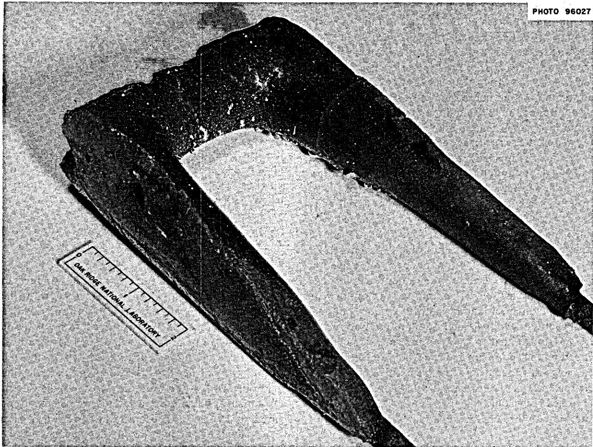  
Fig. 23.1. Frozen Salt on the Coolant Tube at the Top of the Quartz Electrode Divider.

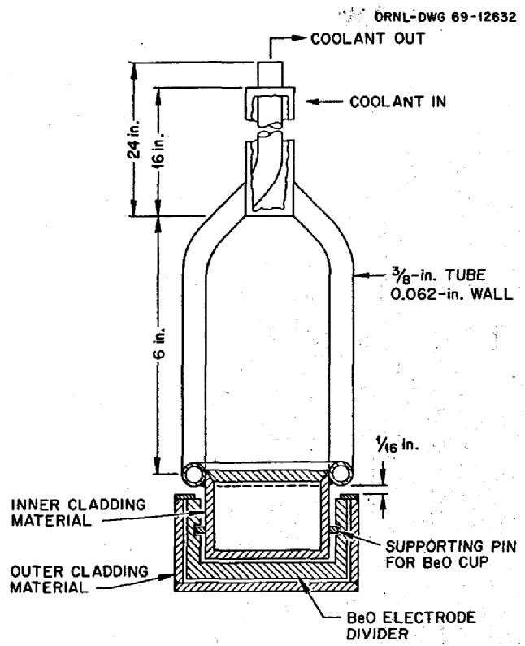  
Fig. 23.2. Diagram of Anode Cup with BeO Electrode Divider.

It was rather difficult to form a frozen layer on the anode cooling ring without bridging the $5 / 8$ in. annular space between the anode and the quartz vessel. When the frozen film did not span this region, it was so thin that it melted when the anode was lowered into the bismuth cathode pool. It finally became necessary to run the cell with the anode cup located in the salt phase. A current density of 2 to $5\mathrm{amp} / \mathrm{cm}^2$ (based on gross anode area) was obtained. The current was unstable, and the total time for the run was only about $7\mathrm{min}$ . The salt was opaque during most of this time. At the end of the run, the cell was shorted internally even though a frozen layer extended to the quartz wall; in an attempt to thaw the frozen salt by reducing the coolant rate, the quartz cell was broken.

Subsequent examination of the cell showed that the layer of frozen salt on the inlet cooling tube was about $\frac{1}{2}$ in. thick but was very thin on the coolant outlet tube. The BeO cup had cracked, probably because of stresses induced by freezing salt and bismuth in the space between the BeO cup and the cladding cups. Further studies with different anode cup designs are planned.

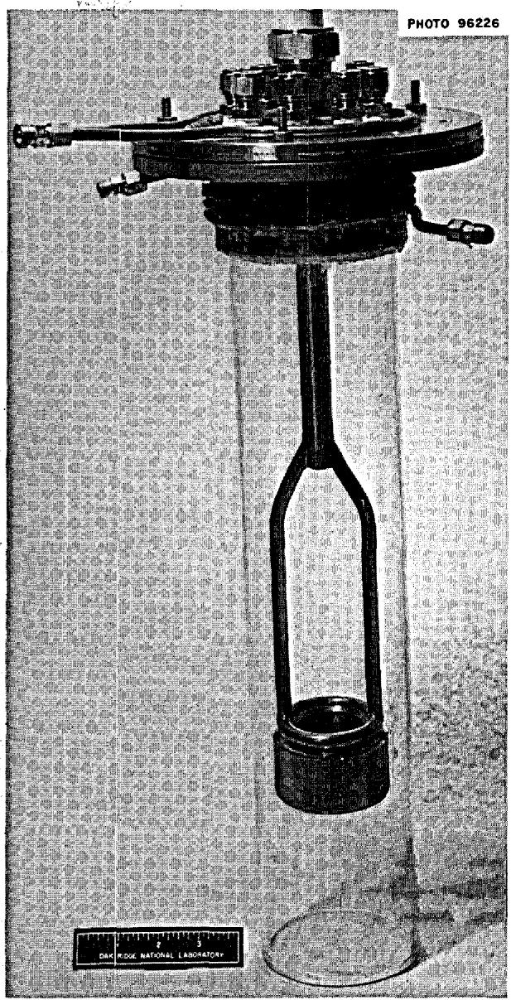  
Fig. 23.3. Assembled Quartz Cell with BeO Anode Cup.

# 23.2.2 Flow Electrolytic Cell Facility

L. E. McNeese

W. F. Schaffer, Jr.

C.W.Kee

E. L. Nicholson

J. R. Hightower, Jr.

E. L. Youngblood

Not all the information necessary for the design of the electrolyzer in the processing plant can be obtained from experiments with static cells. A measurement of current efficiency can be made most conveniently in a system having a molten-salt stream that recirculates through the electrolyte compartment and a bismuth stream that recirculates through the cathode compa

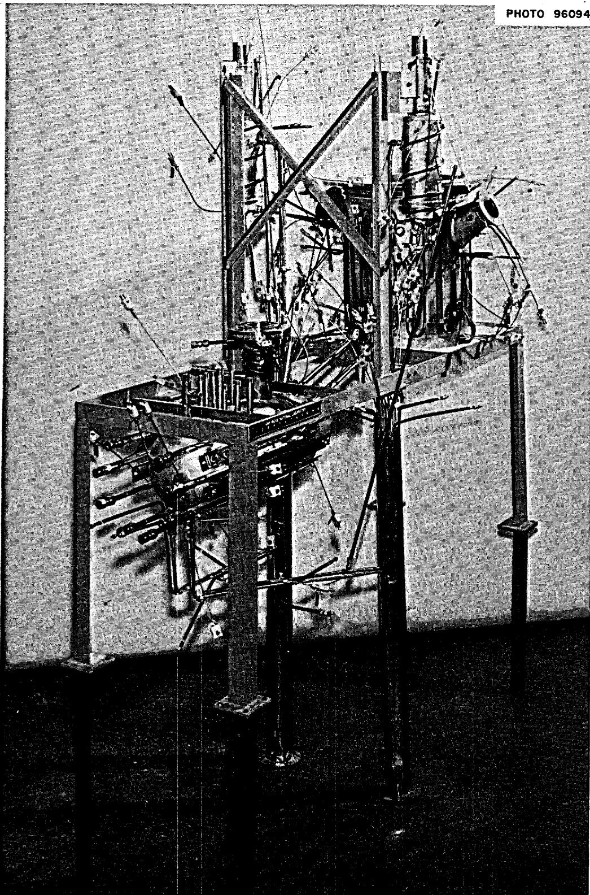  
Fig. 23.4. Flow Electrolytic Cell Testing Equipment Before Installation of Insulation.

ment. A system for performing such an experiment, described earlier, is now being installed in Building 3541. The vessel that will contain the cell, gas-lift pumps, flow measuring devices, and transfer lines and a mixer-settler tank for equilibrating salt and bismuth streams have been fabricated, assembled, and installed in a walk-in hood. This equipment is shown in Fig. 23.4. All heaters and thermocouples have been attached, and the equipment has been insulated. Gas supplies, electrical power, and instrumentation for the experiment are now being installed.

An $\mathrm{HF - H_2}$ treatment vessel, 16 in. OD with a type 304 stainless steel outer shell and a graphite liner, has also been fabricated for use with the system. Porous molybdenum filters are included to remove reduced iron from the purified salt and bismuth. This equipment was not included in the initial planning of the system because it was thought that the use of purified salt and bismuth in the initial charge would be adequate. However, high corrosion and mass transfer rates encountered in other low-carbon steel systems made it prudent to provide equipment for frequent cleanup of the salt and bismuth.

Salt and bismuth will be recirculated by gas-lift pumps; the flow rates will be controlled by varying the gas flow to the lift pumps. Disengagement of the gas from the liquid and damping of the flow from the lift pumps are accomplished in disengagement vessels that also act as gravity-head-type orifice flowmeters.

Since the orifice flowmeters are not of standard design, experimental determination of the orifice discharge coefficient, $C_D$ , is required. The equation defining the discharge coefficient is as follows:

$$
C _ {D} = \frac {Q}{A} \sqrt {\frac {\rho}{2 g _ {c} \Delta P}}, \tag {1}
$$

where

$Q =$ volumetric flow rate,

$\rho =$ fluid density,

$A =$ cross-sectional area of orifice,

$\Delta P =$ pressure drop across orifice.

Two facilities are available for experimental determination of the discharge coefficient: a Lucite mockup for measurements with water and mercury and a mild steel disengagement vessel for measurements with salt and bismuth. Several measurements with water and mercury and three measurements with bismuth have

been made with an orifice $0.3\mathrm{cm}$ in diameter. To date, the results for bismuth have shown considerable scatter.

The discharge coefficient for water was calculated to be $0.72 \pm 0.01$ for flow rates from 280 to 470 $\mathrm{cm}^3/\mathrm{min}$ ; that for mercury was calculated to be $0.69 \pm 0.02$ for flow rates from 180 to $430\mathrm{cm}^3/\mathrm{min}$ . In three experiments with bismuth, the discharge coefficients were $0.62 \pm 0.09$ , $0.59 \pm 0.04$ , and $0.78 \pm 0.07$ at flow rates of 180, 270, and $430\mathrm{cm}^3/\mathrm{min}$ respectively. The degree of scatter in the results with bismuth is greater than we can tolerate; however, the decreased amount of scatter in experiments with water and mercury gives us reason to expect improvement in additional measurements using bismuth. It is possible that the wetting characteristics of the bismuth are changing or that the orifice has been affected by the mass transfer of iron. We will be able to examine the orifice in the near future; at that time, such changes may be visible.

More experiments with bismuth and several experiments with molten salt are planned using orifices of different sizes. If necessary, it will be possible to calibrate each orifice to be used in the Flow Electrolytic Cell Facility with the fluid and range of flow rates of interest.

# 23.2.3 Analysis of Mass Transfer in Electrolytic Cells

# J.S.Watson L.E.McNeese

In an effort to gain a better understanding of the proposed electrolytic cells, an analytical study of mass transfer at the cathode surface is being made. Thus far, our efforts have been directed toward evaluating a cell containing $\mathrm{LiF - BeF_2 - BiF_3}$ but no $\mathrm{ThF_4}$ . Such a salt is expected in the electrolytic cell for the rare-earth removal system. The analytical study is expected to be useful in estimating (1) maximum current density and (2) current efficiencies. The principal limitations or shortcomings of this study result from a lack of quantitative knowledge of several important parameters of the system.

For this study the cathode region was assumed to consist of a well-mixed bulk salt, a stagnant salt boundary layer adjacent to the metal interface, a stagnant metal boundary layer, and a well-mixed bulk bismuth region. Lithium and bismuth ions are transported by diffusive and electromotive forces through the salt boundary layer. Lithium (as metal) then diffuses through the metal boundary layer into the bulk metal. Bismuth fluoride was assumed to be reduced much more readily than LiF; therefore the concentration of bismuth fluoride at the cathode interface was set equal to zero.

Each metal ion was assumed to exist as a single ionic species in the salt phase. Lithium fluoride was assumed to be completely ionized, but beryllium was assumed to be in the form of a complex, $\mathrm{BeF_4}^{2-}$ . Since the state of bismuth fluoride was less well known, two assumptions were tested: a completely ionized state, $\mathrm{Bi}^{3+}$ , and a complexed state, $\mathrm{BiF_5}^{2-}$ . For estimation of current efficiencies, the completely ionized assumption is more conservative. The estimated current efficiencies with the $\mathrm{Bi}^{3+}$ assumption are shown in Fig. 23.5. The current efficiency (lithium current/total current) increases with current density; its value at a current density slightly greater than $0.1\mathrm{amp/cm^2}$ is $50\%$ .

The current density cannot be made arbitrarily large, however, because of constraints on the system. The most likely limitation on current density will result if one chooses to avoid the reduction of beryllium. Since beryllium is insoluble in bismuth, its reduction would introduce a third phase, which is likely to be undesirable.

Conditions leading to the reduction of $\mathrm{BeF}_2$ were estimated. The two marks on Fig. 23.5 denote current densities that could result in beryllium reduction. The higher mark, at about $0.65\mathrm{amp / cm}^2$ , gives the current density at which the salt adjacent to the cathode

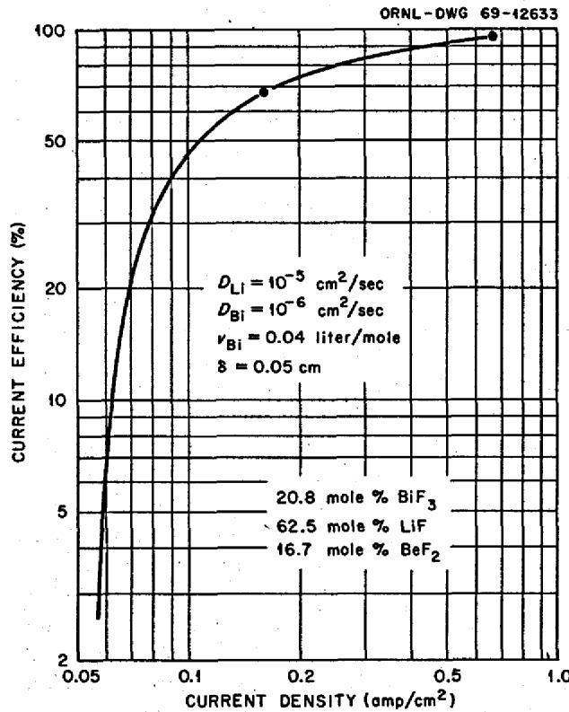  
Fig. 23.5. Current Efficiency with an LiF-BeF $_2$ BiF $_3$ Salt.

becomes (under the simplification of these calculations) pure $\mathbf{BeF}_2$ . With higher current densities one would expect beryllium to be reduced. The lower mark, at $0.16\mathrm{amp / cm}^2$ , represents a point at which beryllium reduction would more likely start, even though the salt still contains an appreciable quantity of LiF. This point was estimated by assuming salt-metal equilibrium at the cathode interface and the same diffusion coefficients and boundary layer thickness in both the metal and salt phases for a given transferring material.

These current densities are lower than we have considered using. It should be kept in mind that a number of approximations have been made in setting up the mathematical model and that it is necessary to assume values for a number of parameters (the most important is the boundary layer thickness). Values assumed for the important parameters are listed in Fig. 23.5. The $D$ 's denote diffusion coefficients, $\delta$ is the boundary layer thickness, and $\nu_{\mathrm{Bi}}$ is the molar volume of bismuth fluoride. (The molar volumes for the other components are available from experimental measurements.) An important assumption required for the calculations is the existence of only one complex or species for each component (e.g., $\mathrm{Bi}^{3+}$ , $\mathrm{Li}^{+}$ , and $\mathrm{BeF}_4^{2-}$ ). This assumption is violated at high current densities where the calculated lithium concentration near the interface is not high enough to allow (assuming electroneutrality) sufficient fluoride to completely complex the beryllium. Experiments to confirm the calculated results will be made in the Flow Electrolytic Cell Facility.

# 23.3 SALT-METAL CONTACTOR DEVELOPMENT

J. S. Watson L. E. McNeese

Axial mixing (or diffusion) in the salt phase can reduce the performance of packed column contactors, which are proposed for the MSBR fuel processing system. Effects of axial mixing will be most severe in the rare-earth removal columns, where high flow ratios are required. We have initiated an experimental program in which axial diffusion coefficients in packed columns are measured under conditions similar to those in the proposed reductive extraction processes; mercury and water are used to simulate bismuth and molten salt. The measured axial diffusion coefficients will be used to estimate column performance in the proposed systems. If the required heights for ordinary packed columns are found to be excessive, devices for reducing axial mixing will be developed. The calculation of column performance is described in Sect. 23.4.

A steady-state technique was used for the axial diffusivity measurements; its theoretical development was as follows. Consider a column of constant cross section in which a fluid moves with constant superficial velocity $\pmb{\nu}$ . If a tracer material is introduced near the column exit, the tracer will tend to diffuse upstream, and a concentration profile will be established. At steady state the flux of the tracer due to axial diffusion is equal to the convective flux; that is,

$$
- E \frac {d C}{d Z} = v C,
$$

where

$E =$ axial diffusivity,

$C =$ tracer concentration at position $Z$

$\pmb{\nu}$ = superficial fluid velocity,

$Z =$ position along column.

Integration of this relation, assuming that the concentration at point $Z_{1}$ is $C_{1}$ , yields the relation

$$
\ln \frac {C}{C _ {1}} = - \frac {\nu}{E} (Z - Z _ {1}),
$$

which indicates that a semilogarithmic plot of $C / C_1$ vs $Z$ should yield a straight line of slope $-\nu / E$ .

The experimental technique for measuring the concentration profile is as follows. A small stream of water (flow rate, approximately $1\mathrm{ml} / \mathrm{min}$ ) is withdrawn from the column, circulated through a cell containing a light source and a photocell, and then returned to the column at the same elevation. This circulating side stream is driven by a small centrifugal pump containing a magnetically coupled impeller. The cells are cylindrical in shape and have a $\frac{1}{2}$ -in. inside diameter. The light path, $\frac{1}{2}$ in. in length, is along the axis of the cell. The light source is a G.E. No. 253X lamp, and the detectors are Clairex CL707L photoresistors.

The tracer material, cupric nitrate solution, is injected near the top of the column with a syringe pump. Several sampling points are located at various positions down the column. The composition in each photocell is followed on a recorder until steady state is reached; with a 4-ft column, this normally takes 2 to $4\mathrm{hr}$ . The solutions to be analyzed are very dilute, and the response of the photoresistors is essentially linear (a limited form of Beer's law), as confirmed by experiment. Readings are taken for each detector both with no tracer present (e.g., with the column containing water) and with a single calibration solution. This

calibration solution is generated by injecting a small amount of tracer into the column when no water is flowing; after the tracer has been mixed throughout the column, each detector can be calibrated at the same tracer concentration. Such a calibration is made at the beginning of each run. This procedure requires that only relative concentrations, rather than absolute concentrations, be measured.

The results of a typical run are shown in Fig. 23.6. In this case the column was packed with $\frac{3}{8}$ -in.-diam Raschig rings, and the mercury and water flow rates were 9.1 and 29 ft/hr respectively. The axial diffusion coefficient is calculated from the slope of the line drawn through the data. Results obtained in seven runs indicate that the axial diffusion coefficient is approximately $3.5 \, \text{cm}^2/\text{sec}$ . The data correspond to several water rates (as well as several mercury rates). The conditions used in the runs are given in Table 23.1. It is possible that the axial diffusivity increases as the flow ratio increases, but this increase is relatively small and cannot be confirmed by the data. Additional data will be required to determine whether such a dependence actually exists. Note that although the water and mercury rates were varied, all of the data were taken at less than $50\%$ of the estimated flooding rate. We may find in subsequent experiments that $E$ is essentially constant over a wider range of flow rates; however, one should not presently extrapolate these findings to

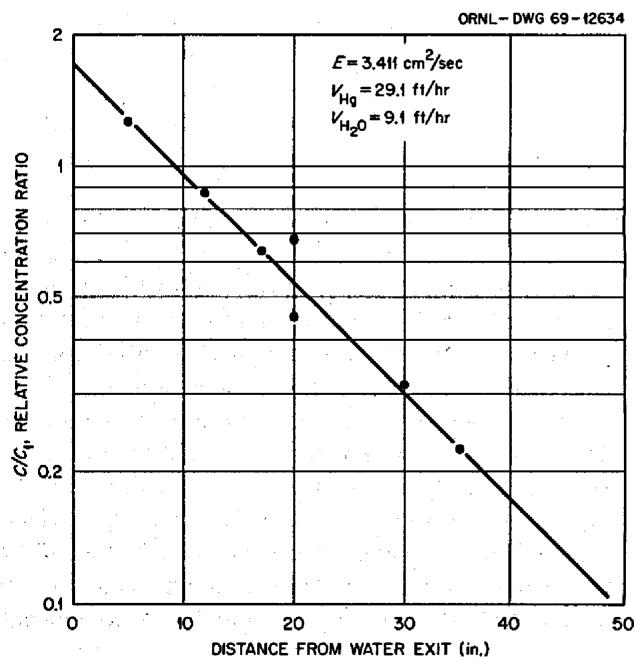  
Fig. 23.6. Variation of Relative Concentration with Column Height.

Table 23.1. Summary of Axial Diffusion Data for Column Packed with $\frac{3}{8}$ -in. Raschig Rings   

<table><tr><td>Run No.</td><td>Water Superficial Velocity (ft/hr)</td><td>Mercury Superficial Velocity (ft/hr)</td><td>Mercury-to-Water Flow Ratio</td><td>Axial Diffusivity (cm2/sec)</td></tr><tr><td>1</td><td>13.1</td><td>87.4</td><td>6.67</td><td>3.7</td></tr><tr><td>2</td><td>2.33</td><td>29.1</td><td>12.5</td><td>3.84</td></tr><tr><td>4</td><td>4.56</td><td>58.3</td><td>12.7</td><td>2.68</td></tr><tr><td>5</td><td>4.56</td><td>87.4</td><td>19.1</td><td>3.07</td></tr><tr><td>6</td><td>2.28</td><td>121.4</td><td>53.2</td><td>4.33</td></tr><tr><td>8</td><td>9.13</td><td>29.1</td><td>3.19</td><td>3.41</td></tr><tr><td>11</td><td>4.56</td><td>116.6</td><td>25.5</td><td>4.03</td></tr></table>

flooding conditions since, just before flooding is reached, holdup and drop sizes change significantly and the indicated axial diffusion coefficient may be inaccurate.

# 23.4 EFFECT OF AXIAL MIXING ON EXTRACTION COLUMN HEIGHT

J.S.Watson H.D.Cochran,Jr. L.E.McNeese

In a two-phase flow countercurrent operation, longitudinal dispersion (or axial mixing) has a detrimental effect on equipment performance. We have made calculations to determine the effects of axial mixing on the performance of columns being considered for isolating protactinium and for removing rare earths. Calculations that show the characteristics of devices for reducing the effects of backmixing were also made.

Axial mixing in packed columns has been studied by Miyauchi and Vermeulen, who developed analytical solutions to differential equations describing longitudinal dispersion accompanying mass transfer between two phases in countercurrent flow. Concentrations of a transferring component within a contactor and at the outlet were shown to depend upon four dimensionless parameters that are functions of the dispersion rates and velocities, the distribution coefficient between the phases, and the overall mass transfer coefficients. These relationships can be applied to contactors for the MSBR flowsheet if several simplifying assumptions are made. These include: (1) The transfer of only one component

is treated; (2) the distribution ratio for this component is constant throughout the column; (3) salt and metal flow rates are constant throughout the column; and (4) the axial diffusion coefficient is constant throughout the column. Backmixing was considered in the salt phase only.

The analytical solution developed by Miyauchi and Vermeulen is quite complicated, and it was found that within the range of interest the results could be approximated sufficiently well by the following empirical relation:

$$
\eta = 1 - \left(\frac {N _ {\mathrm {P e}}}{\mathrm {N T U}} + 1 - F + \frac {1}{\mathrm {N T U}}\right) ^ {- 1},
$$

where

$$
\eta = \text {c o l u m n e f f i c i e n c y} = \mathrm {N T U} / \mathrm {N T U} ^ {*} = L / L ^ {*},
$$

NTU = number of salt-phase transfer units in plug flow column,

$\mathbf{NTU}^{*} =$ number of salt-phase transfer units in back-mixed column,

$\pmb{L} =$ length of plug flow column,

$L^{*} =$ length of backmixed column,

$$
N _ {\mathrm {P e}} = \text {P e c l e t n u m b e r} = V _ {s} L ^ {*} / E,
$$

$V_{s} =$ superficial velocity of salt phase,

$$
E = \text {a x i a l}
$$

$$
F = \text {e x t r a c t i o n f a c t o r} = S D / M,
$$

$$
S = \text {s a l t f l o w r a t e},
$$

$$
D = \text {d i s t r i b u t i o n}
$$

$$
M \simeq \text {m e t a l f l o w r a t e}.
$$

To interpret this relation we must have estimates of NTU, $F$ , and $N_{\mathbf{Pe}}$ for the columns of interest. The results are summarized in Table 23.2 for the four columns that constitute the MSBR processing system.

For the protactinium columns, where the assumption of constant $D$ is poor, calculations were made for several $D$ 's over the range of variation. It was found that the results are largely independent of the value of $D$ . The most important observation was that the efficiency of the column is high; that is, backmixing will require

Table 23.2. Input Parameters and Results of Calculations with Dispersion Model   

<table><tr><td></td><td>αa</td><td>D</td><td>F</td><td>NPe</td><td>NTU</td><td>η</td><td>L*(ft)</td></tr><tr><td colspan="8">Protactinium columns</td></tr><tr><td rowspan="2">Top section</td><td></td><td>33.4</td><td>0.01600</td><td>17.6</td><td>2-5</td><td>0.94</td><td>7-17</td></tr><tr><td></td><td>16.7</td><td>0.03199</td><td>17.6</td><td>2-5</td><td>0.94</td><td>7-17</td></tr><tr><td rowspan="2">Bottom section</td><td></td><td>37.3</td><td>0.01432</td><td>17.6</td><td>2-5</td><td>0.94</td><td>7-17</td></tr><tr><td></td><td>0.404</td><td>1.325</td><td>17.6</td><td>2-5</td><td>0.94</td><td>7-17</td></tr><tr><td colspan="8">Rare-earth columns</td></tr><tr><td rowspan="3">Top section</td><td>1.2</td><td></td><td>1.988</td><td>1.5</td><td>3-5</td><td>&lt;0.10</td><td>&gt;95</td></tr><tr><td>1.5</td><td></td><td>1.589</td><td>1.5</td><td>3-5</td><td>0.10-0.20</td><td>48-160</td></tr><tr><td>2.0</td><td></td><td>1.182</td><td>1.5</td><td>3-5</td><td>~0.27</td><td>35-60</td></tr><tr><td rowspan="3">Bottom section</td><td>1.2</td><td></td><td>0.8297</td><td>0.61</td><td>25</td><td>&lt;0.20</td><td>&gt;350</td></tr><tr><td>1.5</td><td></td><td>0.6718</td><td>0.61</td><td>25</td><td>&lt;0.20</td><td>&gt;350</td></tr><tr><td>2.0</td><td></td><td>0.5038</td><td>0.61</td><td>25</td><td>~0.15</td><td>~500</td></tr></table>

$a_{\alpha} =$ Rare-earth-thorium separation factor.

that the length of the column be increased by less than $10\%$ over that of a column in which no backmixing occurs.

The values of $F$ were computed from flowsheet calculations of McNeese. The estimate of HTU (3.2 ft) used in calculating $N_{\mathrm{Pe}}$ and $L^{*}$ was taken from the experimental results of Johnson et al. A value of 3.5 cm/sec was used for $E$ in calculating $N_{\mathrm{Pe}}$ . This number is based on measurements made with columns packed with 3/8-in. Raschig rings (described in Sect. 23.3). The column height is acceptably low and is dependent only upon the number of transfer units desired.

For the rare-earth columns, extraction factors corresponding to rare-earth-thorium separation factors, $\alpha$ , of 1.2, 1.5, and 2.0 were calculated from the flowsheet calculations of McNeese. The same values for HTU (3.2 ft) and axial diffusivity $(3.5~\mathrm{cm}^2/\mathrm{sec})$ were assumed as for the protactinium columns (see above). In the upper column, efficiencies were quite low and were strongly dependent on $N_{\mathrm{Pe}}$ and NTU. It appears likely that column heights will be excessive in this section. In the lower part of the rare-earth system, low efficiencies and very long columns are a certainty since the Peclet number is low and the number of transfer units required is high.

Because of the detrimental effect of backmixing on column performance, the effect of segmenting the rare-earth column at intervals with backflow preventers was investigated. The model used in this study was a staged column featuring salt-phase backflow between adjacent stages. As in the previous calculations the rare-earth extraction system was simplified in order to

permit consideration of only one component transferring between immiscible phases with constant molar flow rates. The equilibrium distribution coefficient of this component between the two phases was assumed to remain constant through the column.

Multicomponent mass balance equations with variable distribution coefficients have been solved by McNeese for staged columns with no backflow (see Sect. 22.2). These results constitute the basis of the reference flowsheet for MSBR fuel processing and indicate that 5 and 19 theoretical stages will be required in the upper and lower columns, respectively, of the rare-earth extraction system. Metal and salt flow rates and rare-earth concentrations in the feed and product salt and metal were taken from McNeese's calculations. It was also necessary to select the constant distribution coefficient, $D$ , which, with no salt backflow, would produce the same degree of extraction as that obtained with variable distribution coefficients. Once the proper value of $D$ had been obtained, solution of the problem with various degrees of salt backflow was straightforward.

The column efficiency (i.e., the ratio of the number of theoretical stages to the number of mechanical stages) was found to decrease approximately linearly with the percentage of salt throughput that returns through the backflow preventers. To achieve stage efficiencies of $75\%$ or greater, the return flow through the preventer must be less than $17.5\%$ of the salt flow in the upper column and less than $25\%$ in the lower column. As noted earlier, the need for backflow preventers is most critical in the lower portion of the

rare-earth column, where a back circulation of salt as high as $25\%$ can be tolerated. Development of backflow preventers with this effectiveness seems practical.

# 23.5 AXIAL MIXING IN BUBBLE COLUMN

# M. S. Bautista L. E. McNeese

Axial mixing is important in the design of tubular reactors in which a reaction between a gas and a liquid occurs (e.g., a continuous fluorinator). Experiments were made to study axial mixing during the countercurrent flow of air and water in a 2-in.-diam column. A steady-state experimental technique was employed in which the concentration of a tracer, copper(II) nitrate, was measured at points along the column by photometric analysis. It was found that the axial diffusion coefficient was independent of column height and water flow rate and that, above a certain height, radial gradients were negligible. Dispersion coefficients increased slowly as the air rate was increased until excessive bubble coalescence or "slugging" was observed (about 1.9 std liters/min); above this point the dispersion coefficients increased more rapidly.

The underlying theory for the measurement of axial diffusion coefficients has been developed in Sect. 23.3. The experimental system consisted of a 2-in.-diam, 7-ft-long column that was equipped with 20 cells spaced at 3-in. intervals for determining concentrations in the column. Means were provided for maintaining constant, known flow rates of air and water to the column and for feeding copper nitrate solution (i.e., tracer) near the

bottom of the column. Solution was circulated between the column and each of the cells at the rate of 0.12 $\mathrm{cm}^3/\mathrm{sec}$ , a rate sufficiently low that mixing in the column was unaffected.

The variation of the dispersion coefficient with air flow rate for two superficial water velocities is shown in Fig. 23.7. From the close agreement of the data points, it was concluded that varying the water velocity has no effect on the dispersion coefficient. This observation suggests that the relative velocity between water and rising bubbles is approximately the same for both cases; therefore the degree of turbulence or mixing should be similar. The slope of the curve abruptly increases at an air flow rate of $31~\mathrm{cm}^3/\mathrm{sec}$ . Above this rate excessive bubble coalescence or slugging occurred, resulting in the formation of bubbles which expanded in size to approximately that of the column diameter.

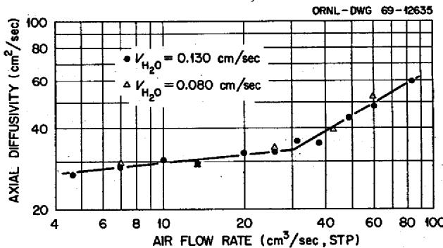  
Fig. 23.7. Effect of Gas Flow Rate on Dispersion Coefficient.

# 24. Distillation of MSRE Fuel Carrier Salt

J.R.Hightower, Jr. H.D.Cochran, Jr.

L.E.McNeese B.A.Hannaford

An experiment demonstrating the high-temperature, low-pressure distillation of irradiated MSRE fuel carrier salt has been successfully completed. Although the quantity of salt processed was less than that anticipated (12 liters vs 48 liters), the objectives of the experiment were met in an extremely smooth 31-hr operation.

The equipment for the experiment and its installation at the MSRE have been described previously. The attempt to transfer 48 liters of irradiated MSRE fuel salt (containing no uranium) from the fuel storage tank (FST) to the still feed tank was initiated by evacuating the feed tank, which contained about 2 liters of unirradiated salt, to 1.5 psia. After about 12 liters of salt had been transferred from the FST, the feed tank pressure rose from 4 psia to atmospheric pressure over a period of about 2 min, indicating that gas was being drawn through the transfer line. Repeated attempts to transfer more salt by evacuating the still feed tank failed, although the bubbler in the FST indicated that additional salt was present. After establishing that the freeze valve in the transfer line could be sealed, we decided to proceed with the experiment.

To start the experiment, 7 liters of salt was transferred from the feed tank to the still pot. The still pot was heated to $900^{\circ}\mathrm{C}$ , and distillation was initiated by decreasing the condenser pressure to $0.2\mathrm{mmHg}$ . The remaining salt in the feed tank was fed with the automatic control system maintaining a constant level in the still pot. During this part of the run the still pot temperature was slowly increased to $980^{\circ}\mathrm{C}$ . During the experiment, temperatures at the condenser exit became abnormally high, indicating that the condenser capacity was being exceeded. By increasing the condenser pressure to $0.8\mathrm{mmHg}$ , the distillation rate was reduced to a value that allowed the condenser exit temperature to remain acceptably low (about $700^{\circ}\mathrm{C}$ ).

When the remaining salt in the feed tank (7 liters) had been distilled, a salt plug was frozen in the line from the feed tank to the still pot, and four of the seven liters of salt in the still pot were subsequently evaporated. The still pot temperature during this part of the run was $980^{\circ}\mathrm{C}$ , and the condenser pressure was about $0.1\mathrm{mmHg}$ .

During the first part of the run (semicontinuous), the average distillation rate was about 0.71 liter/hr; during the second part (batch), the average rate was about 0.30 liter/hr. In nonradioactive semicontinuous operation, distillation rates of about 0.9 liter/hr were achieved. The distillation rate was limited by the condenser capacity in the radioactive semicontinuous operation. The heat removal capability of the condenser in the radioactive operation was lower than in the nonradioactive operation because more insulation had inadvertently been installed on the condenser at the MSRE and because air circulation across the condenser was lower. High LiF concentrations in the still pot liquid during the batch operation caused the vapor pressure over the still pot liquid to be lower than during the semicontinuous operation, which, in turn, caused the vaporization rate to be lower. These rates are consistent with rates measured in the nonradioactive tests.

Eleven condensate samples were taken during the run at approximately 90-min intervals. When these samples were removed at the end of the experiment, radiation readings (at contact) ranged from $4\mathrm{r / hr}$ for the first sample to $500\mathrm{mr / hr}$ for the last sample. The predominant activity was ${}^{137}\mathbf{C}\mathbf{s}$ .

Analyses for several fission products $(^{95}\mathrm{Zr},^{137}\mathrm{Cs},$ $^{144}\mathrm{Ce},$ and $^{147}\mathrm{Pm})$ in the samples have been completed, and effective relative volatilities with respect to LiF have been calculated. The relative volatility, $\alpha$ , of component $i$ with respect to LiF is defined as

$$
\alpha_ {i - \mathrm {L i F}} \equiv \frac {y _ {i} / x _ {i}}{y _ {\mathrm {L i F}} / x _ {\mathrm {L i F}}}, \tag {1}
$$

where $y_{\mathrm{LiF}}$ and $y_{i}$ are mole fractions in the vapor (condensate) and $x_{\mathrm{LiF}}$ and $x_{i}$ are mole fractions in the liquid (still pot). Concentrations in the still pot were not measured directly during the run; however, data taken during the experiment allowed these concentrations to be estimated from material balances for each component. Concentrations of $^{95}\mathrm{Zr}$ , $^{144}\mathrm{Ce}$ , $^{90}\mathrm{Sr}$ , and $^{147}\mathrm{Pm}$ in the feed salt were measured directly. Concentrations of other fission products such as $^{137}\mathrm{Cs}$ in the feed salt were calculated using estimated fission product concentrations in the MSRE. Except for fission products with long-lived gaseous precursors, these estimated concentrations have generally agreed with measured concentrations. Such is the case, for example, for $^{144}\mathrm{Ce}$ , $^{95}\mathrm{Zr}$ , and $^{90}\mathrm{Sr}$ . For $^{147}\mathrm{Pm}$ , however, the measured concentration in the feed salt was only about 34% of the calculated concentration. For the present the effective relative volatility of $^{147}\mathrm{Pm}$ calculated from the condensate analyses will be based on the measured $^{147}\mathrm{Pm}$ concentration rather than the calculated number. It should be noted that, because the analysis for $^{147}\mathrm{Pm}$ is difficult and because the measured and calculated concentrations for comparable materials agree so well, the calculated concentration of $^{147}\mathrm{Pm}$ in the feed is probably better than the measured concentration. In case this is true, the relative volatilities for $^{147}\mathrm{Pm}$ which are discussed below are actually only 34% of the values given.

The effective relative volatilities of fluorides of Be, $\mathbf{Zr}$ , and $^{95}\mathbf{Zr}$ are shown in Fig. 24.1. The effective relative volatility of $\mathrm{BeF}_2$ remained constant at a value of 5.4 during the semicontinuous operation but rose

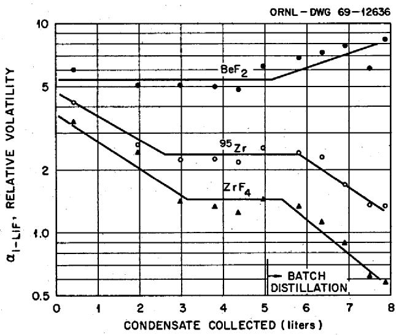  
Fig. 24.1. Effective Relative Volatilities of Major Salt Constituents and $^{95}\mathrm{Zr}$ .

gradually to 8.4 during the batch operation. The value measured during semicontinuous operation was in fair agreement with the value measured with equilibrium stills in $\mathbf{LiF - BeF}_2$ systems (i.e., 4.7). The tendency of the value to increase during batch distillation is in qualitative agreement with measurements in the LiF-BeF $_2$ -ThF $_4$ systems which showed that the relative volatility of $\mathbf{BeF}_2$ increases as the mole fraction of $\mathbf{BeF}_2$ in the liquid decreases.

The relative volatility of zirconium (both natural zirconium and fission product $^{95}\mathrm{Zr}$ ) decreased from about 4 at the start of the experiment to a constant value near 2 about halfway through the semicontinuous operation. It then decreased further during the batch distillation to about 1. These values are consistent with those measured under equilibrium conditions. The material balance calculations show that the $\mathrm{ZrF_4}$ concentration in the still pot decreases near the start of the semicontinuous portion, levels off near the end of the semicontinuous portion, then decreases further during the batch operation. Since it is known that the activity coefficient of $\mathrm{ZrF_4}$ is low at low $\mathrm{ZrF_4}$ concentrations in LiF-BeF $_2$ systems and increases with increasing $\mathrm{ZrF_4}$ concentration, one would expect the trend seen in the run.

Figure 24.2 shows the relative volatility of $^{137}\mathrm{Cs}$ , which decreased during the experiment from nearly 10 initially to approximately 0.1 at the end of the experiment. Smith et al. measured a value of 95.1 for $\alpha_{\mathrm{CsF}}$ in a mixture of LiF-BeF $_2$ containing 0.03 mole% CsF. The values of the relative volatility of $^{137}\mathrm{Cs}$ calculated from the sample analyses are very sensitive to the assumed feed concentration of $^{137}\mathrm{Cs}$ . If the feed concentrations were only 60% of the estimated value used for these calculations, the resulting $\alpha$ 's would be higher by about a factor of 10. The large change in $\alpha$ for $^{137}\mathrm{Cs}$ during the course of the run could be a consequence of concentration polarization; this possibility is being explored by calculations.

The effective relative volatility of $^{144}\mathrm{Ce}$ (Fig. 24.3) increased from about $6 \times 10^{-4}$ at the start of the experiment to about $1 \times 10^{-2}$ at the end of the experiment. Figure 24.3 also shows the relative volatility of $^{147}\mathrm{Pm}$ , which was initially less than $2.3 \times$

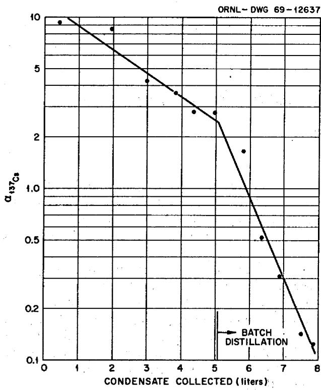  
Fig. 24.2. Effective Relative Volatility of $^{137}\mathrm{Cs}$ .

$10^{-3}$ and increased to about $1 \times 10^{-2}$ during the experiment. The final value for cerium is about a factor of 30 higher than that measured in small recirculating equilibrium stills in LiF-BeF $_2$ systems. The discrepancy between the values for relative volatilities

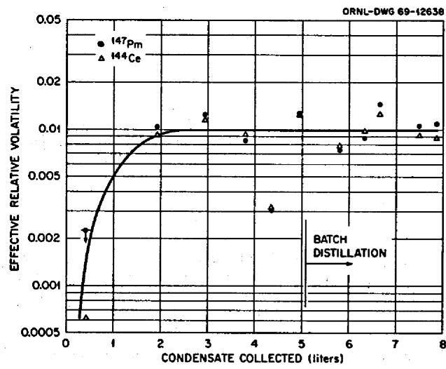  
Fig. 24.3. Effective Relative Volatilities of $^{144}\mathrm{Ce}$ and $^{147}\mathrm{Pm}$ .

for these materials is not explicable at present, but it may be resolved as analyses of more fission products are received.

If all the lanthanide fission products have relative volatilities with respect to LiF as low as the values for $^{144}\mathrm{Ce}$ and $^{147}\mathrm{Pm}$ , recovery of $^{7}\mathrm{LiF}$ and $\mathrm{BeF}_2$ from waste streams by distillation will be possible. For example, recovery of $90\%$ of the LiF by batch distillation with a rare-earth-fluoride-LiF separation factor of 0.01 would result in virtually complete $\mathrm{BeF}_2$ recovery and volatilization of only $2.3\%$ of the rare-earth fluorides.

# 25. Design Studies for Salt Processing

E. L. Nicholson

# 25.1 HEAT TRANSFER THROUGH THE FROZEN SALT WALLS OF AN ELECTROLYTIC CELL

E. L. Nicholson

Natural convection heat transfer coefficients, heat fluxes, and the thickness of the insulating film of frozen salt were calculated for a hypothetical cell having a 0.1-ft-high vertical wall protected with an insulating layer of frozen salt and containing molten bismuth with molten salt floating on top. The temperature of the molten salt and bismuth was assumed to be $100^{\circ}\mathrm{F}$ higher than the melting point of the salt, $930^{\circ}\mathrm{F}$ $(500^{\circ}\mathrm{C})$ , although the salt melts over the range of 824 to $842^{\circ}\mathrm{F}$ and finally becomes liquid at $930^{\circ}\mathrm{F}$ . This lack of a sharp melting point may lead to a poor-quality slushlike salt deposit at certain temperatures. For the bismuth in contact with the frozen salt wall, the natural convection heat transfer coefficient, $h_c$ , was calculated to be 728 Btu hr $^{-1}$ ft $^{-2}$ F $^{-1}$ , and the heat flux, Q, was calculated to be 72,800 Btu hr $^{-1}$ ft $^{-2}$ . The corresponding values for the molten salt in contact with the frozen salt wall were $h_c = 148$ Btu hr $^{-1}$ ft $^{-2}$ F $^{-1}$ and $Q = 14,800$ Btu hr $^{-1}$ ft $^{-2}$ .

It was assumed that a 0.01-ft (approximately $\frac{1}{8}$ -in.) thickness of frozen salt was the minimum that could be tolerated for electrical insulation of the container wall in contact with molten bismuth. Thermal conductivity data for solid MSBR salt were expressed by $k = 2.51 - 1.93 \times 10^{-3} t$ (°F) (English units). The temperature drop over the 0.01-ft-thick frozen salt film was found to be $574^{\circ}\mathrm{F}$ for the heat flux calculated for bismuth in contact with frozen layer, and the surface of the cold metal container will be required to remain at a temperature of $356^{\circ}\mathrm{F}$ or less (bismuth melts at $520^{\circ}\mathrm{F}$ ). Hence a cell coolant consisting of a low-melting metal (e.g., NaK) or more conventional materials (e.g., pres

surized water or gas-water spray mixtures) would have to be used. The frozen salt insulator in contact with molten salt immediately above the bismuth layer was calculated to be 0.05 ft (0.6 in.) thick if the coolant is at $356^{\circ}\mathbf{F}$ .

The preceding calculations are for a highly simplified geometry and do not account for concentrated local heating effects, fluid flow, possible nonadherence of frozen salt films to walls, local freezing of bismuth, etc., that may affect heat transfer in an actual cell. The control of all parameters affecting cell operation and of thermal stresses in the materials of construction will be very difficult.

Calculations for a system using mercury as a stand-in for bismuth and water as a stand-in for salt showed that this system has heat transfer characteristics at low temperature that are similar to those of the salt-bismuth system at higher temperature. The water-mercury combination would be useful for mockup purposes since experiments at high temperatures with salt and bismuth are difficult.

# 25.2 DESIGN OF A CONTINUOUS SALT PURIFICATION SYSTEM

R.B.Lindauer

E. L. Nicholson

W. F. Schaffer, Jr.

E. L. Youngblood

Equipment is being designed and built to study the continuous method for purifying salt mixtures as a possible replacement for the time-consuming batch method. The first step to be studied will be the continuous reduction, using hydrogen, of iron fluoride (dissolved in salt) to metallic iron. The experimental equipment (Fig. 25.1) will consist of a Raschig-ring-packed column and salt feed and receiver tanks with associated filters for removing reduced iron from the

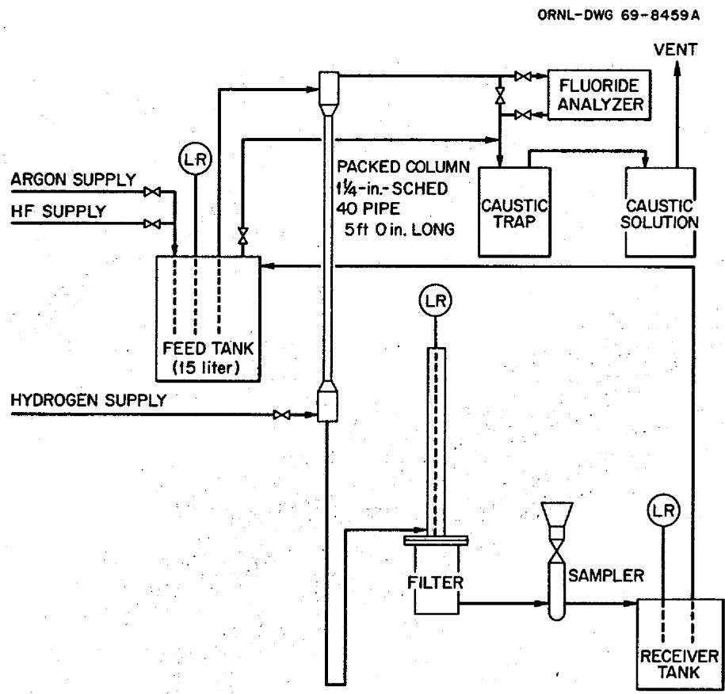  
Fig. 25.1. Equipment for Investigation of Continuous Salt Purification.

treated salt. All process equipment will be constructed of nickel.

The experimental program will use salt flow rates as high as $250~\mathrm{cm}^3/\mathrm{min}$ , hydrogen gas rates as high as 25 std liters/min, and temperatures up to $750^{\circ}\mathrm{C}$ . Operation will generally be carried out using salt and gas flow rates near the column flooding point to ensure maximum contacting efficiency and reaction of the hydrogen with iron fluoride. Reduction efficiency will be determined by continuous analysis of the used hydrogen for hydrogen fluoride, by salt sampling, and by the amount of metallic iron removed by the salt filter. The system will be installed in cell 4B, Building 4505.

# 25.3 DESIGN AND PREPARATION OF $^{239}\mathrm{PuF}_3$ CAPSULES FOR SMALL REFUELING ADDITIONS TO THE MSRE

W.H.Carr W.F.Schaffer

E. L. Nicholson

It is anticipated that about $30\mathrm{g}$ of ${}^{239}\mathrm{Pu}$ per full-power week will be added to the MSRE to

compensate for fuel burnup and to provide operating experience with plutonium. The capsules will be added to the fuel salt through the fuel sampler-enricher system; additions are expected to start in September.

After considering the problems of preparing various Pu-Li-Be fluoride salt mixtures, we have concluded that direct addition of ${}^{239}\mathrm{PuF}_3$ powder to the fuel salt is the preferred method. About $1000\mathrm{g}$ of plutonium in the form of $\mathrm{PuF_3}$ powder, with a particle size of about $5\mu$ and an approximate composition of $94\%$ ${}^{239}\mathrm{Pu}$ , $5.5\%$ ${}^{240}\mathrm{Pu}$ , $0.5\%$ ${}^{241}\mathrm{Pu}$ , plus $50~\mathrm{ppm}$ of ${}^{241}\mathrm{Am}$ , is being obtained from Los Alamos Scientific Laboratory. The $\mathrm{PuF}_3$ powder will be added to the fuel salt via a capsule having the dimensions of the $50\mathrm{-g}$ salt sample capsule but suitably modified to contain the $\mathrm{PuF}_3$ powder. An addition capsule is shown in Fig. 25.2. Twelve $\frac{1}{4}$ -in.-diam holes and one $\frac{3}{6}$ -in.-diam hole were drilled on the side and the bottom, respectively, of the capsule. Each hole was covered with a mechanically retained 4-mil-thick zirconium foil disk that will react with the $\mathrm{UF}_4$ and dissolve in the circulating salt in the pump bowl. This will permit the $\mathrm{PuF}_3$ powder to

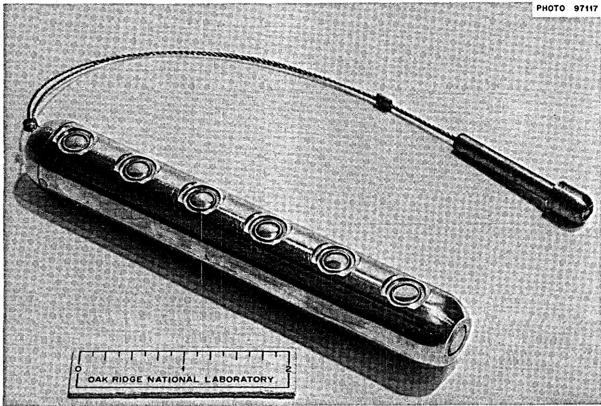  
Fig. 25.2. $^{239}\mathrm{PuF}_3$ Capsule for MSRE Refueling.

dissolve in the fuel salt. Laboratory tests have shown that dissolution is rapid and that the solubility of $\mathbf{PuF_3}$ in fuel salt is adequate. Pressure tests of the capsule at 5 psi show no leakage of the joint between the foil disks and the capsule wall. The capsule is vented through a sintered nickel filter positioned in a small hole in the top of the capsule to prevent internal pressure buildup and premature rupturing of the foil disks before the capsule is immersed in salt. The loaded capsule should provide good containment of the $\mathbf{PuF_3}$ powder. Fabrication of the capsules is under way.

A new 6-ft glove box and an existing glove box in building 3019 will be used for the capsule filling

operation. In the first glove box the capsules will be filled with powder; then the top plug of each will be inserted, pinned, and sealed in place; finally the capsules will be decontaminated and weighed. Additional decontamination, if necessary, and packaging in the MSRE fuel enrichment capsule carriers will be done in the second glove box. Capsule filling procedures are being tested using talcum powder as a stand-in for $\mathbf{PuF_3}$ . Safety reviews for the capsule filling operation have been submitted for approval. The first shipment of $\mathbf{PuF_3}$ is scheduled to arrive September 2, 1969; capsule filling will start shortly thereafter.

# OAK RIDGE NATIONAL LABORATORY

# MOLTEN-SALT REACTOR PROGRAM

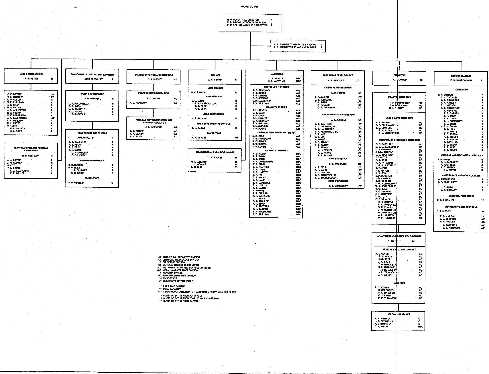

#

#

（）

）

# INTERNAL DISTRIBUTION

1. R.K. Adams

2. G.M. Adamson

3. H.I. Adler

4. R. G. Affel

5. J. L. Anderson

6. W. E. Atkinson

7. R.F. Apple

8.C.F.Baes

9. J.M. Baker

10. S.J. Ball

11. C. E. Bamberger

12. C.J. Barton

13. H. F. Bauman

14. M.S. Bautista

15. S. E. Beall

16. R. L. Beatty

17. M.J.Bell

18. M. Bender

19. C. E. Bettis

20. E. S. Bettis

21. D. S. Billington

22. R. E. Blanco

23. F. F. Blankenship

24. J. O. Blomeke

25. R. Blumberg

26. A. L. Boch

27. E.G. Bohlmann

28. C. J. Borkowski

29. H.I. Bowers

30. C.M. Boyd

31. G.E. Boyd

32. J. Braunstein

33. M.A.Bredig

34. E. J. Breeding

35-49. R. B. Briggs

50. H.R. Bronstein

51. W.E.Browning

52. F. R. Bruce

53. G. D. Brunton

54. O.W. Burke

55. D. A. Canonico

56. S. Cantor

57. D.W.Cardwell

58. W. H. Carr

59. W. L. Carter

60. G.I. Cathers

61. J. E. Caton

62. O. B. Cavin

63. J.M. Chandler

64. S.I.Chang

65. C. J. Claffey

66. F. H. Clark

67. W.R. Cobb

68. H. E. Cochran

69. Nancy Cole

70. C.W.Collins

71. E. L. Compere

72. J.A. Conlin

73. K.V.Cook

74. W. H. Cook

75. J.W. Cooke

76. L. T. Corbin

77. W. B. Cottrell

78. G.A.Cristy

79. S.J. Cromer (K-25)

80. J. L. Crowley

81. F. L. Culler

82. D.R.Cuneo

83. J.M. Dale

84. D.G.Davis

85. W.W. Davis

86. R. J. DeBakker

87. J. H. DeVan

88. J. R. Distefano

89. S.J. Ditto

90. R. G. Donnelly

91. F.A. Doss

92. I. T. Dudley

93. N.E.Dunwoody

94-95. A. S. Dworkin

96. D.A. Dyslin

97-98. W.P. Eatherly

99. J.R. Engel

100. E.P. Epler

101. W. K. Ergen

102. J.I. Federer

103. D. E. Ferguson

104. L.M. Ferris

105. A.P. Fraas

106. J.K. Franzreb

107. H. A. Friedman

108. D.N. Fry

109. J. H. Frye, Jr.

110. L.C. Fuller

111. W.K. Furlong

112. C. H. Gabbard

113. W.R. Gall

114. R. B. Gallaher

115. R.E.Gehlbach

116. J. H. Gibbons

117. R.G. Gilliland

118. L. O. Gilpatrick

119. G. Goldberg

120. W.R. Grimes

121. A. G. Grindell

122. R.W.Gunkel

123. R. H. Guymon

124. J. P. Hammond

125. R. P. Hammond

126. R. L. Hammer

127. T. H. Handley

128. B. A. Hannaford

129. P. H. Harley

130. D. G. Harman

131. W.O. Harms

132. C.S. Harrill

133. P.N. Haubenreich

134. F.K. Heacker

135. F.A. Heddleson

136. R.E. Helms

137. P.G. Herndon

138. R.F. Hibbs

139. J. R. Hightower

140. M.R. Hill

141. E.C. Hise

142. B.F.Hitch

143. H.W. Hoffman

144. D. K. Holmes

145. P.P.Holz

146. R.W. Horton   
147. A. Houtzeel   
148. T. L. Hudson   
149. W. R. Huntley   
150. H. Inouye   
151. W. H. Jordan   
152. P.R.Kasten   
153. R. J. Kedl   
154. C.W. Kee   
155. M. T. Kelley   
156. M. J. Kelly   
157. C. R. Kennedy   
158. T.W. Kerlin   
159. H.T. Kerr   
160. J.J. Keyes   
161. D. V. Kiplinger   
162. S. S. Kirlis   
163. D.J. Knowles   
164. L. R. Koffman   
165. J.W. Koger   
166. H. W. Kohn   
167. R. B. Korsmeyer   
168. A.I. Krakoviak   
169. T. S. Kress   
170. J. W. Krewson   
171. C.E. Lamb   
172. J.A. Lane   
173. E. J. Lawrence   
174. M.S. Lin   
175. T. A. Lincoln   
176. R.B. Lindauer   
177. J. L. Liverman   
178. R. S. Livingston   
179. G. H. Llewellyn   
180. E. L. Long   
181. A. L. Lotts   
182. M.I. Lundin   
183. R. N. Lyon   
184. R. L. Macklin   
185. H. G. MacPherson   
186. R.E. MacPherson   
187. F. C. Maienschein   
188. J. C. Mailen   
189. D. L. Manning   
190. C.D. Martin   
191. W.R. Martin   
192. H. V. Mateer   
193. C. E. Mathews   
194. T. H. Mauney   
195. R.W. McClung   
196. H.E. McCoy

197. D. L. McElroy   
198. C. K. McGlothlan   
199. C.J. McHargue   
200. H. A. McLain   
201. B. McNabb   
202. L. E. McNeese   
203. J. R. McWherter   
204. H. J. Metz   
205. A. S. Meyer   
206. E.C. Miller   
207. C. A. Mills   
208. W.R. Mixon   
209. R. L. Moore   
210. K. Z. Morgan   
211. C. A. Mossman   
212. D.M. Moulton   
213. J.C.Moyers   
214. T. R. Mueller   
215. M. L. Myers   
216. H. A. Nelms   
217. H. H. Nichol   
218. J. P. Nichols   
219. E. L. Nicholson   
220. T. S. Noggle   
221. L.C. Oakes   
222. S.M.Ohr   
223. W.R. Osborn   
225. R.B. Parker   
226. L.F. Parsly   
227. P. Patriarca   
228. H. R. Payne   
229. A. M. Perry   
230. T. W. Pickel   
231. H. B. Piper   
232. C. B. Pollock   
233. B.E. Prince   
234. H.P.Raaen   
235. G. L. Ragan   
236. J. L. Redford   
237. J. D. Redman   
238. D. M. Richardson   
239. M. Richardson   
240. G. D. Robbins   
241. R. C. Robertson   
242. W. C. Robinson   
243. D.J. Rose   
418. M. W. Rosenthal   
419. R.G. Ross   
420. J. Roth   
421. J. P. Sanders   
422. H.C. Savage

423. A. W. Savolainen

424. W. F. Schaffer

425. C. E. Schilling

426. Dunlap Scott

427. J. L. Scott

428. H. E. Seagren

429. C. E. Sessions

430. J. H. Shaffer

431. E. D. Shipley

432. W. H. Sides

433. M.J. Skinner

434. G.M. Slaughter

435. A. N. Smith

436. F.J. Smith

437. G.P. Smith

438. O. L. Smith

439. P.G. Smith

440. A. H. Snell

441. W.F. Spencer

442. I. Spiewak

443. R.C. Steffy

444. C. E. Stevenson

445. W.C. Stoddart

446. H.H. Stone

447. R.A. Strehlow

448. R. D. Stulting

449. D. A. Sundberg

450. J.R. Tallackson

451. E.H. Taylor

452. W. Terry

453-454. R.E.Thoma

455. P.F. Thomason

456. L. M. Toth

457. D. B. Trauger

458. A. L. Travaglini

459. R.W. Tucker

460. Chia-Pao Tung

461. W.C. Ulrich

462. W.E. Unger

463. D.C. Watkins

464. G.M. Watson

465. J.S. Watson

466. H. L. Watts

467. C.F. Weaver

468. B. H. Webster

469. A. M. Weinberg

470. J.R. Weir

471. W.J. Werner

472. K.W. West

473. H. L. Whaley

474-479. M.E. Whatley

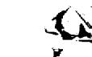

480. J.C. White   
481. R.P. Wichner   
482. L.V. Wilson   
483. G.J. Young   
484. H.C. Young   
485. J.P. Young   
486. E. L. Youngblood

487. F. C. Zapp   
488. Biology Library   
489-490. ORNL - Y-12 Technical Library   
Document Reference Section   
491-493. Central Research Library   
494-646. Laboratory Records Department   
647. Laboratory Records, ORNL R.C.

# EXTERNAL DISTRIBUTION

648. W. O. Allen, Atomics International, P.O. Box 309, Canoga Park, California 91304   
649. A. Amorosi, LMFBR Program Office, Argonne National Laboratory, Argonne, Illinois 60439   
650. J. S. V. Andrews, Atomic Energy Attache, UKAEA, British Embassy, Washington, D.C. 20008   
651. J. G. Asquith, *Atoms International*, P.O. Box 309, Canoga Park, California 91304   
652. N. W. Bass, Brush Beryllium Co., 17876 St. Clair Ave., Cleveland, Ohio 44110   
653. David Bendaniel, General Electric Co., R&D Center, Schenectady, N.Y.   
654. J. C. Bowman, Union Carbide Technical Center, 12900 Snow Road, Parma, Ohio 44130   
655. G. D. Brady, Materials Systems Division, UCC, Kokomo, Indiana 46901   
656. Paul Cohen, Westinghouse Electric Corp., P.O. Box 158, Madison, Pennsylvania 15663   
657. D. F. Cope, Atomic Energy Commission, RDT Site Office (ORNL)   
658. J. W. Crawford, Atomic Energy Commission, Washington 20545   
659. F. E. Crever, National Nuclear Corp., 701 Welch Road, Palo Alto, California 94304   
660. M. W. Croft, Babcock and Wilcox Company, P.O. Box 1260, Lynchburg, Virginia 24505   
661. Walter A. Danker, Jr., Westinghouse Electric, P.O. Box 19218, Tampa, Florida 33616   
662. C. B. Deering, Black & Veatch, P.O. Box 8405, Kansas City, Missouri 64114   
663. D. A. Douglas, Materials Systems Division, UCC, Kokomo, Indiana 46901   
664. Donald E. Erb, Battelle Memorial Institute, 505 King Ave., Columbus, Ohio 43201   
665. H. L. Falkenberry, Tennessee Valley Authority, 303 Power Building, Chattanooga, Tenn. 37401   
666. C. W. Fay, Wisconsin Michigan Power Company, 231 W. Michigan Street, Milwaukee, Wisconsin 53201   
667. A. Giambusso, Atomic Energy Commission, Washington 20545   
668. Gerald Golden, Argonne National Laboratory, 9700 S. Cass Avenue, Argonne, Illinois 60439   
669. A. Goldmen, UCC, 270 Park Ave., N.Y., N.Y. 10017   
670. W. W. Grigorieff, Assistant to the Executive Director, Oak Ridge Associated Universities   
671. Norton Haberman, RDT, USAEC, Washington, D.C. 20545   
672. E. E. Kintner, U.S. Atomic Energy Commission, Washington, D.C.   
673. P. M. Krishner, Pioneer Service and Engineering, 400 W. Madison St., Chicago, Illinois 60606   
674. J. Ladesich, Southern California Edison Co., P.O. Box 351, Los Angeles, California 90053   
675. L. W. Lang, Douglas United Nuclear, 703 Bldg., Richland, Washington 99352   
676. R. A. Langley, Bechtel Corp., 50 Beale St., San Francisco, California 94119   
677. R. A. Lorenzini, Foster Wheeler, 110 S. Orange, Livingston, N.J. 07039   
678. W. D. Manly, Material Systems Division, UCC, 270 Park Avenue, New York, N.Y. 10017   
679. J.P. Mays, Great Lakes Carbon Co., 299 Park Avenue, New York, New York 10017   
680. W. B. McDonald, Battelle-Pacific Northwest Laboratory, Hanford, Washington 99352   
681-682. T. W. McIntosh, Atomic Energy Commission, Washington 20542   
683. W. J. Mordarski, Nuclear Development, Combustion Engineering, Windsor, Connecticut 06095   
684. E. H. Okrent, Esso Research and Engineering Co., Government Research Laboratory, P.O. Box 8, Linden, New Jersey 07036   
685. F. N. Pables, Dean of Engineering, University of Tennessee, Knoxville, Tennessee 37900   
686. Sidney Parry, Great Lakes Carbon, P.O. Box 667, Niagara Falls, New York 14302

687. G. J. Petretic, Atomic Energy Commission, Washington 20545   
688. A. J. Pressesky, U.S. Atomic Energy Commission, Washington, D.C.   
689. M. V. Ramaniah, Head, Radiochemistry Division, Ahabha Atomic Research Centre, Radiological Laboratories, Trombay, Bombay-85AS, India   
690. David Richman, Research Division, USAEC, Washington, D.C. 20545   
691. Kermit Laughon, Atomic Energy Commission, RDT Site Office (ORNL)   
692. C. L. Matthews, Atomic Energy Commission, RDT Site Office (ORNL)   
693. J. C. Robinson, Department of Nuclear Engineering, University of Tennessee, Knoxville, Tenn. 37900   
694. M.A. Rosen, Atomic Energy Commission, Washington 20545   
695. H. M. Roth, Atomic Energy Commission, ORO   
696. R. W. Schmitt, General Electric Co., Schenectady, New York 12301   
697. R. N. Scroggins, U.S. Atomic Energy Commission, Washington, D.C.   
698. M. Shaw, Atomic Energy Commission, Washington 20545   
699. E. E. Sinclair, Atomic Energy Commission, Washington 20545   
700. W. L. Smalley, Atomic Energy Commission, ORO   
701. T. M. Snyder, General Electric Co., 175 Curtner Ave., San Jose, California 95103   
702. N. Srinivasan, Head, Full Reprocessing Division, Bhabha Atomic Research Centre, Trombay, Bombay 74, India   
703. L. D. Stoughton, UCC, P.O. Box 500, Lawrenceburg, Tennessee 38464   
704. Philip T. Stroup, Alcoa, P.O. Box 772, New Kensington, Pennsylvania   
705. J. A. Swartout, UCC, New York, N.Y.   
706. Richard Tait, Poco Graphite, P.O. Box 1524, Garland, Texas 75040   
707. D. R. Thomas, Commonwealth Associates, Inc., 209 E. Washington Ave., Jackson, Michigan 49201   
708. M. Tsou, General Motors, 12 Mile and Mound Roads, Warren, Michigan 48089   
709. J. W. Ullman, UCC, P.O. Box 278, Tarrytown, New York 10591   
710. C. H. Waugaman, Tennessee Valley Authority, 303 Power Building, Chattanooga, Tenn. 37401   
711. D. B. Weaver, Tennessee Valley Authority, New Sprinkle Building, Knoxville, Tennessee 37900   
712. G. O. Wessenauer, Tennessee Valley Authority, Chattanooga, Tennessee 37401   
713. M. J. Whitman, Atomic Energy Commission, Washington 20545   
714. H. A. Wilber, Power Reactor Development Company, 1911 First Street, Detroit, Michigan 48200   
715. James H. Wright, Westinghouse Electric, P.O. Box 355, Pittsburgh, Pennsylvania 15230   
716. Laboratory and University Division, AEC, ORO   
717-924. Given distribution as shown in TID-4500 under Reactor Technology category (25 copies - CFSTI)