ORNL-4451

UC-70 - Waste Disposal and Processing

JUL-81970

DATE ISSUED:

SITING OF FUEL REPROCESSING PLANTS AND

WASTE MANAGEMENT FACILITIES


OAK RIDGE NATIONAL LABORATORY

operated by

UNION CARBIDE CORPORATION

for the

U.S. ATOMIC ENERGY COMMISSION

Printed in the United States of America. Available from Clearinghouse for Federal Scientific and Technical Information, National Bureau of Standards, U.S. Department of Commerce, Springfield, Virginia 22151 Price: Printed Copy $3.00; Microfiche $0.65

# LEGAL NOTICE

This report was prepared as an account of Government sponsored work. Neither the United States, nor the Commission, nor any person acting on behalf of the Commission:

A. Makes any warranty or representation, expressed or implied, with respect to the accuracy, completeness, or usefulness of the information contained in this report, or that the use of any information, apparatus, method, or process disclosed in this report may not infringe privately owned rights; or   
B. Assumes any liabilities with respect to the use of, or for damages resulting from the use of any information, apparatus, method, or process disclosed in this report.

As used in the above, "person acting on behalf of the Commission" includes any employee or contractor of the Commission, or employee of such contractor, to the extent that such employee or contractor of the Commission, or employee of such contractor prepares, disseminates, or provides access to, any information pursuant to his employment or contract with the Commission, or his employment with such contractor.

Contract No. W-7405-eng-26

CHEMICAL TECHNOLOGY DIVISION

SITING OF FUEL REPROCESSING PLANTS AND WASTE MANAGEMENT FACILITIES

Compiled and Edited

by the

Staff of the Oak Ridge National Laboratory

JULY 1970

OAK RIDGE NATIONAL LABORATORY

Oak Ridge, Tennessee

operated by

UNION CARBIDE CORPORATION

for the

U. S. ATOMIC ENERGY COMMISSION

# CONTENTS

# Page

1. Introduction 1-1   
2. Summary and Conclusions 2-1

2.1 Key Issues 2-2   
2.2 Conclusions 2-3   
2.3 Magnitude of the Problem 2-8   
2.4 Technical Considerations 2-10   
2.5 Transportation Considerations 2-14   
2.6 Economic Considerations 2-16   
2.7 Siting Considerations 2-18

2.7.1 Environmental Considerations 2-18   
2.7.2 Geographic Considerations 2-20

2.8 Health and Safety Aspects of Plant Siting 2-22

2.8.1 Routine Release of Radioactive Materials 2-23   
2.8.2 Releases from Upper Limit Accidents 2-25

3. Magnitude of the Problem 3-1

3.1 Projected Nuclear Power Buildup and Reprocessing Loads 3-1   
3.2 Reactor Design and Performance Characteristics 3-11   
3.3 Radiation Characteristics of Irradiated Fuels and of Wastes Generated During Spent-Fuel Processing 3-11

3.3.1 Diablo Canyon Reference LWR 3-15   
3.3.2 Atomics International Reference Oxide LMFBR 3-23

3.4 Shipments of Spent Fuel 3-43   
3.5 Waste Management Projections 3-55

3.5.1 High-Level Wastes 3-55   
3.5.2 Management of Solidified High-Level Wastes 3-62   
3.5.3 Intermediate- and Low-Level Liquid Wastes 3-62   
3.5.4 Solid Wastes 3-62

3.6 References 3-68

# Page

4. Technical Considerations 4-1

4.1 Design of Fuel Reprocessing Plants 4-1

4.1.1 Preventive Measures and Containment Criteria 4-3   
4.1.2 Probable Trend of Plant Design 4-5   
4.1.3 Plant Decommissioning Considerations 4-8   
4.1.4 Design Criteria for Resistance to Earthquakes and Tornadoes 4-10

4.2 Waste Management Technology: General 4-14

4.2.1 Applications of the Dilution-Dispersion Principle 4-16   
4.2.2 Applications of the Delay-Decay Principle 4-16   
4.2.3 Applications of the Concentration-Containment Principle 4-17   
4.2.4 Applications of ICRP Recommendations to Waste Releases 4-17   
4.2.5 Assessment of Current Waste Disposal Practices 4-18   
4.2.6 Definitions of Terms 4-18

4.3 Waste Management Technology: High-Level Wastes 4-19

4.3.1 Liquid Wastes 4-20   
4.3.2 Solidification 4-25   
4.3.3 Interim Storage of Solidified Wastes 4-52   
4.3.4 Disposal of Solidified Wastes in Bedded Salt Formations 4-55   
4.3.5 Disposal of Solidified Wastes in Rock Types Other Than Bedded Salt 4-67

4.4 Waste Management Technology: Intermediate- and Low-Level Wastes 4-71

4.4.1 Treatment of Liquid Wastes 4-75   
4.4.2 Problems with Tritium 4-79   
4.4.3 Disposal by Hydraulic Fracturing 4-81

4.5 Waste Management Technology: Solid Wastes 4-86

4.5.1 Land Burial 4-86   
4.5.2 Disposal in Salt Mines 4-92

# Page

4.6 References 4-94

5. Transportation Considerations 5-1

5.1 Cask Requirements and Design Considerations 5-3

5.1.1 Release of Radionuclides 5-3   
5.1.2 Increased Dose Rate 5-4   
5.1.3 Temperature Limits 5-5   
5.1.4 Contamination of the Primary Coolant 5-5   
5.1.5 Emission of Neutrons from Spent Fuels and Wastes 5-6   
5.2 Shipments of Spent Fuel and Waste 5-6   
5.2.1 Effects of Source Design on the Design of Spent Fuel Casks 5-7   
5.2.2 Shipment of Wastes 5-8   
5.3 Shipment of Product Material 5-9   
5.4 Conclusions 5-10   
5.5 References 5-11

6. Economic Considerations 6-1

6.1ReprocessingCosts 6-1

6.1.1 Economies of Scale 6-2   
6.1.2 Unit Reprocessing Costs 6-6   
6.1.3 Optimization Studies 6-8

6.2 Fuel Shipping Costs 6-14

6.2.1 Costs of Shipping Spent Fuel 6-15   
6.2.2 Recovered Fissile and Fertile Materials 6-21

6.3 Waste Management Costs 6-23

6.3.1 Basis and Economic Model 6-23   
6.3.2 Perpetual Tank Storage 6-26   
6.3.3 Solidification and Disposal in Salt 6-31   
6.3.4 Comparison of Salt with Concrete Volumes and Granite . 6-142   
6.3.5 Salt Mine Repository Charges 6-44

6.4 Site Costs 6-46   
6.5Costs of Engineered Safeguards 6-48   
6.6 References 6-50

# 7. Siting Considerations 7-1

7.1 Environmental Factors 7-1

7.1.1 Meteorology 7-1   
7.1.2 Geology and Hydrology 7-5   
7.1.3 Geoseismology 7-8

7.2 Geographic Factors 7-13

7.2.1 Site Size 7-14   
7.2.2 Population Density of the Surrounding Area 7-15   
7.2.3 Land Usage 7-15   
7.2.4 Relation of the Plant to Other Nuclear Facilities. 7-16   
7.2.5 Regional Distribution of Potential Sites in the United States 7-16

7.3 References 7-26

# 8. Health and Safety Aspects of Plant Siting 8-1

8.1 Buildup of $^{85}\mathrm{Kr}$ and $^{3}\mathrm{H}$ in an Expanding Nuclear Power Industry 8-4

8.1.1 85Kr Distribution and Dose Equivalent 8-4   
8.1.2 Tritium Distribution and Dose Equivalents 8-7

8.2 Routine Release of Radionuclides to the Atmosphere 8-11

8.2.1 Sources of Routine Releases 8-11   
8.2.2 Local Environmental Consequences of Releasing 85Kr and ${}^{3}\mathbb{H}$ 8-18   
8.2.3 Local Environmental Consequences from All Routine Releases 8-35

# 8.3 Accidental Releases of Radioactive Materials 8-39

8.3.1 Assumed Properties of Fuel Reprocessing Plants 8-41   
8.3.2 Analytical Models and Mechanisms of Accidental Release 8-45

8.3.3 Method of Analysis of the Downwind Consequences of a Unit Release of Radioactive Material. 8-57   
8.3.4 Downwind Consequences of Upper Limit Accidents 8-82   
8.3.5 Maximum Theoretical Accident 8-92   
8.3.6 Consequences of the Leakage of High-Level Wastes to the Ground 8-97

8.4 Requirements for Treatment of Routine Effluents 8-108   
8.5 References 8-110

# 1. INTRODUCTION

This report contains background information which is believed to be pertinent in establishing a policy with respect to the siting of spent-fuel processing plants and their radioactive waste management facilities. It contains much basic information that has been published previously; however, this material has been reviewed and revised, where required, to serve present needs. In addition, much new information has been included, particularly on the health and safety aspects of the problem.

The information is organized to conform generally with an outline transmitted to ORNL by the USAEC (letter from Milton Shaw, USAEC, to F. L. Culler, Jr., ORNL, dated February 16, 1968). It was developed in cooperation with Battelle-Northwest, the Idaho Nuclear Corporation, the Savannah River Plant and the Savannah River Laboratory, the Atlantic Richfield Hanford Company, and the Atmospheric Turbulence and Diffusion Laboratory of the Environmental Science Services Administration.

The information is analyzed and discussed principally within the context of the subject matter contained in individual sections; however, an attempt has been made to interpret a number of key issues more comprehensively in the Summary and Conclusions, Sect. 2. Section 3 contains the basic data on reactor and fuel characteristics, projections of spent-fuel processing loads, fuel shipping requirements, and waste characteristics and production. In Sect. 4, fuel reprocessing is discussed very briefly and waste management technology is considered in significant detail; considerations of cask design as related to safety in transporting spent fuel and solidified waste are discussed in Sect. 5; fuel reprocessing and waste management costs are considered in Sect. 6; environmental and geographical considerations of siting are reviewed in Sect. 7; and health and safety aspects are presented in Sect. 8.


# 2. SUMMARY AND CONCLUSIONS

The principal objective of this study is to identify and characterize the factors that may influence the growth patterns of the fuel reprocessing industry. Emphasis is placed on the siting of reprocessing plants and waste storage and disposal facilities, particularly those for high-level waste. Another purpose is to explore the need for an AEC policy on siting, which, while fully meeting the requirements imposed by considerations of public health and safety, would not present an impediment to the growth of economic nuclear power.

In this section, a compilation of the key issues under consideration and the principal conclusions of the study are presented. Then, the technical information found in the body of the report relating to these issues and conclusions is summarized.

In this study, it has been assumed that future fuel reprocessing plants and their associated waste management facilities will be located, built, and operated subject to the following bases, which are believed to be practical and reasonable:

(1) The secondary confinement barriers (the cell, vault, water in the storage pool, and ventilation-filter system) and the tertiary barrier (the building) will be designed, tested, and routinely inspected to ensure that their confinement potential is maintained following exposure to any credible internal forces.   
(2) Process and confinement systems will be designed, tested, routinely inspected, and maintained so that exposure to credible external events or forces (loss of power, earthquakes, tornados, floods, hurricanes, impaction by moving vehicles, etc., but not including acts of war) will not impair the ability to shut down the plant safely and maintain safe shutdown conditions.   
(3) While the circumvention of administrative measures (as well, in general, as those involving instrument systems) for prevention of accidents is considered credible, it is considered incredible that the obvious remedial measures for mitigation of the consequences

of accidents would not be instituted within hours following a clear notification of the occurrence of an accident.

# 2.1 Key Issues

The key issues of this study were considered to be the following:

1. Are new federal regulations needed to govern the siting of fuel reprocessing plants and waste management facilities, or should licensing procedures continue to be performed using existing federal regulations for protection of the public against radiation (LOCFR20), siting of nuclear power reactors (LOCFR100), and licensing of production and utilization facilities (LOCFR50)?   
2. Do routine releases or potential releases from accidents control the siting of fuel reprocessing plants and waste storage facilities with respect to site boundaries and population centers? After what period of time will it be necessary to limit the release of noble-gas fission products and tritium to the atmosphere to prevent worldwide pollution of the troposphere? What local restrictions are imposed by the routine release of radioactive materials to the environment?   
3. Current fuel-cycle economics favor the use of large-capacity fuel reprocessing plants. Are there technical and safety factors which indicate preference for either a few large-capacity, or more numerous small-capacity, fuel reprocessing plants (sites)? Are there limitations, either inherent or as a matter of prudence, which should be imposed on the capacity of fuel reprocessing plants (independent of site size and geography) from a public safety standpoint? Is the risk to the public increased by higher inventories of hazardous materials?   
4. Does the storage of high-level liquid waste in subsurface tanks represent an acceptable waste management approach? (In this report, "storage" connotes intended retrievability and a high degree of surveillance, whereas "disposal" connotes the reverse.)

5. What are the technically acceptable alternatives to tank storage of high-level waste? Is a significant economic penalty involved in providing greater assurance of containment than has been demonstrated by tank storage of waste? Does immediate solidification of liquid waste result in an appreciable decrease in risk to the public?   
6. What are the considerations that affect the decisions to dispose of radioactive waste on other than government-owned land?   
7. Can the reprocessing plant ever be decontaminated to the degree necessary to permit subsequent abandonment? If not, is government ownership of the property required?   
8. Are the hazards or the economics of shipping spent fuels, solid wastes, and fissile materials of such magnitude that these shipments should be limited to specified routes within regional boundaries or that shipping off-site should be precluded?

# 2.2 Conclusions

1. Minimal impediments to the growth of economic nuclear power, while meeting the requirements imposed by considerations of public safety, may result from the promulgation of standards or regulations that establish (1) the acceptable chronic and acute radiation exposure of each of the critical organs of men, women, and children, both in individuals and in critical population groups, and (2) performance criteria for engineered safety features. Information is presently available to allow substantial progress toward these goals through revision of existing AEC regulations. Any revisions should attempt to provide an appropriate balance of risk vs benefit on the basis of current technological alternatives, should be subject to periodic upgrading, and, preferably, should be sufficiently inclusive to apply to all nuclear fuel-cycle installations including their waste storage and disposal facilities. The criteria for chronic exposure of members of the public should be related to maximum acceptable

doses and to body organs rather than to permissible concentrations of radioactive effluents in air and water. The latter do not explicitly consider perhaps more limiting pathways of radiation exposure than those caused by submergence in (or inhalation of) air and ingestion of water. Given acceptable doses and dose rates, the designer (with the assistance of experts in the field of radiation protection) can evaluate all important pathways of radiation exposure. However, it may be desirable to retain the "maximum allowable" concentrations in air and water as point-of-departure reference values to facilitate monitoring and inspection.

The criteria for acute or emergency exposure of members of the public surrounding a nuclear facility should provide guidelines for acceptable doses and dose commitments to all organs and be developed in conformance with the recommendations of authoritative agencies such as the Federal Radiation Council (FRC) and the National Council on Radiation Protection and Measurement. The acceptable acute doses and dose commitments for members of the public would presumably be applicable to the quantitative determination of a site boundary and the required distance from a large population center.

The performance criteria for engineered safety features in fuel reprocessing plants and waste management facilities would presumably be similar to those proposed for nuclear power reactors in the proposed Appendix A of LOCFR50 entitled, "General Design Criteria for Nuclear Power Plant Construction Permits."

2. These studies indicate that, based on the current technology of systems for cleaning off-gas streams from fuel reprocessing plants, routine releases tend to control the site boundaries. It is estimated that on-site waste storage facilities do not materially increase either the rate of routine release of radioactive material or the potential release of such material as a result of accidents, provided these facilities are designed to ensure containment following exposure to internal and external forces. For large plants, the estimated site boundaries are of

such a size that economics will probably favor the installation of noble-gas removal equipment in plants handling more than a few tons of fuel per day. The development of off-gas systems having a capability of routinely removing iodine by a factor of about $10^{8}$ is necessary if FBR fuels are to be processed after decay periods approximating only 30 days.

Study indicates that the worldwide distribution of $^{85}\mathrm{Kr}$ and $^{3}\mathrm{H}$ in the year 2000, assuming the complete release of these nuclides during fuel reprocessing, results in dose equivalents to man that are small (<1%) compared with current guidelines for population exposure. In other words, these nuclides will constitute radiation problems to the local environment long before they cause worldwide pollution hazards.

3. These studies indicate that the confinement barriers of fuel reprocessing plants in the size range of interest, including their waste storage facilities, can be designed to maintain their confinement potential following exposure to credible internal or external forces (excluding acts of war or sabotage). Regardless of size, plants that are sited and constructed within a given set of acceptable criteria for chronic and probably acute exposure of members of the public at the site boundary are considered to be equivalently safe. The costs of preventive measures and the relatively expensive confinement systems are estimated to scale in such a way that larger plants are favored, while the costs of off-gas treatment facilities required to achieve practical site sizes in large plants are estimated to be modest. Consequently, the conclusion that economics favors fewer larger plants is valid.

4. High-level liquid wastes can be stored safely in tanks that have been provided with adequate engineered safety features. These features include, as a minimum, two independent cooling systems (e.g., submerged coils and a reflux condenser); reinforced concrete vaults, lined with steel, which are designed either to withstand credible internal pressures without rupture or to

relieve these pressures safely by ventilation to a containment system with large capacitance or to a pool of water for steam suppression; installation of a containment structure, located above the waste vaults, that is ventilated through a condenser and filter; provision of spare tankage; and the capability for prompt, efficient transfer of the waste from any tank to a spare. Because of the requirement for the continuous removal of heat, the effectiveness of the containment system will require a very high degree of surveillance. Liquid waste storage can be condoned only as long as the reprocessing plant remains fully active. In this context, "storage" does not constitute disposal, and "perpetual tank storage," even under government auspices, is not an acceptable substitute for disposal.

5. The only current, technically acceptable alternative to tank storage of high-level liquid wastes is immediate solidification of the wastes. Currently, the disposal of solidified wastes by emplacement in bedded salt deposits is believed to be the safest method and has been shown to be technologically feasible. Economic studies indicate that the series of operations consisting of immediate solidification, storage of the solid wastes on-site for 3 to 4 years, and shipment and disposal in salt mines, could be carried out for about 0.038 mill/kwhr (electrical). This is about $20\%$ more than is estimated for perpetual storage of liquid wastes in tanks. If the solidified wastes are shipped to salt mines after storage on-site for only one year (the earliest time believed to be feasible), the total cost would be about 0.044 mill/kwhr. Disposal of wastes of low specific heat generation rates by hydrofracturing or by emplacement in bedrock caverns may be acceptable at sites with suitable geology. The application of properly engineered safety features, together with a high degree of surveillance, can result in low risk to the public, regardless of whether the waste is stored as a solid or liquid.

6. Considerations of the long-term hazard of the wastes and the nearly prohibitive costs for reclaiming large areas of contaminated land militate against any disposal (or burial) of wastes on privately owned land. All radioactive wastes must be maintained in a retrievable condition as long as they are retained on-site. In-tank solidification of wastes, as practiced at Hanford and SRP, is not an acceptable form of storage on privately owned land because of the difficulties that would be encountered at the time of removal.

Government ownership must extend to any subsurface geological formation used for disposal, as well as to the land areas above. Control of the land surface must be maintained to prevent unauthorized explorations of the formations utilized for disposal, although the surface per se can be put to agricultural or recreational use.

7. Plants and storage facilities built with proper foresight can be decontaminated and/or made sufficiently inaccessible (e.g., by grouting) so that they do not represent hazards to public safety. If it can be stipulated that all contaminated equipment and materials outside the massively shielded concrete canyons and vaults be removed from the premises before abandonment of the site, then government ownership is not required. Private ownership of the site should be permitted, however, only if the site, with all its facilities, appurtenances, buildings, tanks, cribs, and lands, can be returned to unrestricted use within some finite time (perhaps 10 to 50 years) after plant retirement.

8. These studies indicate that shipping of all nuclear materials, except high-level liquid wastes, can be conducted safely and economically. The costs of shipping will tend to favor location of the various fuel cycle and waste disposal facilities in close proximity. The shipment of liquid wastes is considered to be unwise because of considerations of steam-pressure buildup within casks following a loss-of-cooling incident.

# 2.3 Magnitude of the Problem

Projections of the Civilian Nuclear Power Program (Table 2.1) indicate that the nuclear economy will expand from about $14$ gigawatts (electrical) in 1970 to about $153$ gigawatts by 1980, and to about $735$ gigawatts by the year 2000. It is expected that most of the nuclear power stations will be located in FPC Power Supply Regions III (southeastern states) and I (northeastern states) by the year 2000, and that the fewest will be found in Regions VI and VII (the western plains and mountain states). The fuel shipping industry will also expand at a very rapid rate. The number of casks to be shipped annually will increase from 30 in 1970 (an average of one in transit on any given day) to 1200 in 1980 (14 in transit on any day) and to 9500 in 2000 (85 in transit). Approximate total fuel reprocessing rates (in metric tons/year) will increase from 100 in 1970 to 3500 in 1980, and to 15,000 in the year 2000. The heat-generation rate of FBR core fuels at the time of processing, i.e., after 30 to 75 days of cooling for FBR fuel and after 150 days for LWR fuel, will be 10 to 6 times as high as that for LWR fuel. The gross beta activity of FBR core fuels will be 8 to 5 times that of LWR fuels.

The total radioactivity due to beta emitters in the accumulated wastes will increase from 210 megacuries in 1970 to 18,800 megacuries in 1980 and to 209,000 megacuries in 2000. The annual generation of high-level wastes will increase from 17,000 gal in 1970 to 1,000,000 gal in 1980 and to 4,600,000 gal in 2000. If these wastes are stored as liquids, 60,000,000 gal is expected to accumulate by the year 2000. On the other hand, if they are converted to solid forms, volumes may be reduced by a factor of about 13.

Another significant type of solid waste will be spent-fuel hulls. Induced activity will be produced in either stainless steel or Zircaloy by $(\underline{\mathsf{n}},\gamma)$ or $(\underline{\mathsf{n}},\underline{\mathsf{p}})$ reactions; in each case, shielding will be required to handle or to ship these hulls. In addition to the induced activities, up to $0.1\%$ of the plutonium in the fuel can be associated with the cladding.

Table 2.1. Projected Fuel Processing Requirements and High-Level Waste Conditions for the Civilian Nuclear Power Program   

<table><tr><td rowspan="2"></td><td colspan="4">Calendar Year</td></tr><tr><td>1970</td><td>1980</td><td>1990</td><td>2000</td></tr><tr><td>Installed capacity, Mw(e)a</td><td>14,000</td><td>153,000</td><td>368,000</td><td>735,000</td></tr><tr><td>Electricity generated, 109kwhr/yeara</td><td>71</td><td>1000</td><td>2410</td><td>4420</td></tr><tr><td>Spent fuel shipping</td><td></td><td></td><td></td><td></td></tr><tr><td>Number of casks shipped annually</td><td>30</td><td>1200</td><td>6800</td><td>9500</td></tr><tr><td>Number of loaded casks in transit</td><td>1</td><td>14</td><td>60</td><td>85</td></tr><tr><td>Spent-fuel processed, metric tons/yeara</td><td>94</td><td>3500</td><td>13,500</td><td>15,000</td></tr><tr><td>Volume of high-level liquid waste generatedb,c</td><td></td><td></td><td></td><td></td></tr><tr><td>Annually, 106gal/year</td><td>0.017</td><td>0.97</td><td>2.69</td><td>4.60</td></tr><tr><td>Accumulated, 106gal</td><td>0.017</td><td>4.40</td><td>23.8</td><td>60.1</td></tr><tr><td>Volume of high-level waste, if solidifiedb,d</td><td></td><td></td><td></td><td></td></tr><tr><td>Annually, 103ft3/year</td><td>0.17</td><td>9.73</td><td>26.9</td><td>46.0</td></tr><tr><td>Accumulated, 103ft3</td><td>0.17</td><td>44.0</td><td>238</td><td>601</td></tr><tr><td>Solidified Waste Shippings</td><td></td><td></td><td></td><td></td></tr><tr><td>Number of casks shipped annuallyf</td><td>0</td><td>3</td><td>172</td><td>477</td></tr><tr><td>Number of loaded casks in transitf</td><td>0</td><td>1</td><td>4</td><td>10</td></tr><tr><td>Significant radiol isotopes in wasteg,h</td><td></td><td></td><td></td><td></td></tr><tr><td>Total accumulated weight, metric tons</td><td>1.8</td><td>450</td><td>2400</td><td>6200</td></tr><tr><td>Total accumulated beta activity, megacuries</td><td>210</td><td>18,900</td><td>85,000</td><td>209,000</td></tr><tr><td>Total heat-generation rate, megawatts</td><td>0.9</td><td>80</td><td>340</td><td>810</td></tr><tr><td>90Sr generated annually, megacuries</td><td>4.0</td><td>230</td><td>560</td><td>770</td></tr><tr><td>90Sr accumulated, megacuries</td><td>4.0</td><td>960</td><td>4600</td><td>10,000</td></tr><tr><td>137Cs generated annually, megacuries</td><td>5.6</td><td>320</td><td>880</td><td>1500</td></tr><tr><td>137Cs accumulated, megacuries</td><td>5.6</td><td>1300</td><td>6500</td><td>15,600</td></tr><tr><td>129I generated annually, curies</td><td>2.0</td><td>110</td><td>440</td><td>670</td></tr><tr><td>129I accumulated, curies</td><td>2.0</td><td>480</td><td>2700</td><td>7600</td></tr><tr><td>85Kr generated annually, megacuries</td><td>0.6</td><td>33</td><td>90</td><td>150</td></tr><tr><td>85Kr accumulated, megacuries</td><td>0.6</td><td>124</td><td>570</td><td>1200</td></tr><tr><td>3H generated annually, megacuries</td><td>0.04</td><td>2.1</td><td>6.2</td><td>12</td></tr><tr><td>3H accumulated, megacuries</td><td>0.04</td><td>7.3</td><td>36</td><td>90</td></tr><tr><td>238Pu generated annually, megacuries</td><td>0.0007</td><td>0.041</td><td>0.2</td><td>0.6</td></tr><tr><td>238Pu accumulated, megacuries</td><td>0.0007</td><td>1.20</td><td>8.3</td><td>31</td></tr><tr><td>239Pu generated annually, megacuries</td><td>0.00009</td><td>0.005</td><td>0.05</td><td>0.2</td></tr><tr><td>239Pu accumulated, megacuries</td><td>0.00009</td><td>0.02</td><td>0.24</td><td>1.3</td></tr><tr><td>240Pu generated annually, megacuries</td><td>0.00012</td><td>0.007</td><td>0.06</td><td>0.21</td></tr><tr><td>240Pu accumulated, megacuries</td><td>0.00012</td><td>0.04</td><td>0.4</td><td>1.9</td></tr><tr><td>241Am generated annually, megacuries</td><td>0.009</td><td>0.5</td><td>4.4</td><td>15</td></tr><tr><td>241Am accumulated, megacuries</td><td>0.009</td><td>2.3</td><td>23</td><td>120</td></tr><tr><td>243Am generated annually, megacuries</td><td>0.00021</td><td>0.01</td><td>0.1</td><td>0.5</td></tr><tr><td>243Am accumulated, megacuries</td><td>0.00021</td><td>0.23</td><td>1.5</td><td>5.2</td></tr><tr><td>244Cm generated annually, megacuries</td><td>0.13</td><td>7.4</td><td>18</td><td>23</td></tr><tr><td>244Cm accumulated, megacuries</td><td>0.13</td><td>30</td><td>140</td><td>260</td></tr><tr><td>Volume of cladding hulls generated1</td><td></td><td></td><td></td><td></td></tr><tr><td>Annually, 103ft3</td><td>0.3</td><td>8</td><td>40</td><td>90</td></tr><tr><td>Accumulated, 103ft3</td><td>0.3</td><td>40</td><td>320</td><td>1030</td></tr></table>

$^{a}$ Data from Phase 3, Case 42, Systems Analysis Task Force (Apr. 11, 1968).   
bBased on an average fuel exposure of 33,000 Mwd/ton, and a delay of 2 years between power generation and fuel processing.   
${}^{\mathrm{c}}$ Assumes wastes concentrated to 100 gal per 10,000 MWD (thermal).   
Assumes 1 ft³ of solidified waste per 10,000 MWD (thermal).   
<sup>e</sup>Assumes 10-year-old wastes, shipped in thirty-six 6-in.-diam cylinders per shipment cask.   
fOne-way transit time is 7 days.   
Assumes LWR fuel continuously irradiated at 30 Mw/ton to 33,000 Mwd/ton, and fuel processing 90 days after discharge from reactor; LMFTR core continuously irradiated to 80,000 Mwd/ton at 14.8 Mw/ton, axial blanket to 2500 Mw/d ton at 4.6 Mw/ton, radial blanket to 8100 Mw/d ton at 8.4 Mw/ton, and fuel processing 30 days after discharge.   
${}^{h}$ Assumes 0.5% of Pu in spent fuel is lost to waste.   
Based on 2.1 ft³ of cladding hulls per ton of LWR fuel processed, and 8.7 ft³ of cladding hardware per ton of LMFBR mixed core and blankets processed.

# 2.4 Technical Considerations

Present-day fuel reprocessing plants make use of organic-aqueous solvent-extraction processes to separate U, Pu, and Th from mixtures of fission products and inert materials. Volatile fission products are separated during dissolution of the fuel. These fission products, and radioactive particulates from the process are removed from the plant off-gas, as required before discharge, by sorption, chemical interactions, and filtration. In addition to the treatment of normal radioactive effluent streams, special consideration must be given, during the design and operation of these plants, to the containment of radioactivity in the event of accidents or natural phenomena such as earthquakes and tornadoes.

The future trends in plant design for the nuclear power industry must take both safety and economy into account while reprocessing fuels containing higher quantities of fissionable materials and fission products at shorter cooling times. This implies more severe problems at almost all stages of reprocessing, including shipment and management of the waste effluents.

Finally, in designing these plants, consideration must be given to the problem of eventual decommissioning of the plants and the return of the site to other uses. Much of the technology for resolving these problems either exists or is being developed. This includes the design of carriers for safe transport of fuels, efficient mechanical head-end equipment, continuous dissolution equipment, high-speed solvent-extraction contactors, methods for improved separation and containment of fission-product gases and particulates, and improved methods of waste management.

High-level wastes originate mainly from the first cycle of solvent extraction and contain greater than $99.9\%$ of the nonvolatile fission products. The present practice is to concentrate and store these wastes on an interim basis in underground carbon and stainless steel tanks, which are equipped with devices for removing decay heat if necessary. More than 80,000,000 gal of waste are now in storage at AEC production sites.

Although corrosion data indicate tank lifetimes in excess of 100 years might be expected, there have been 15 known instances of tank failure, all in carbon steel systems at Hanford and Savannah River. Eleven of the failures have occurred at Hanford, where it is estimated that liquid waste containing 140,000 curies of $^{137}\mathrm{Cs}$ has leaked to the ground and been retained in the soil about 10 ft below the tank bottoms. In one of the four tank failures at the Savannah River Plant (SRP), about 700 gal of waste may have escaped the liner, although ground water has shown contamination levels equivalent to only a few gallons of waste. The causes of these failures are established as stress-corrosion cracking and/or thermal stress of the reinforced concrete structures, and these factors are being taken into account in new tankage under construction; however, it is clear that many of the liquid waste storage facilities now in existence do not merit confidence in their long-term integrity.

Waste management plans at Hanford call for separating about $95\%$ of the $90\mathrm{Sr}$ and $137\mathrm{Cs}$ from the waste and concentrating the residue, after a suitable decay period, by in-tank evaporation until the residual salts solidify into a massive cake. The strontium and cesium fractions are to be solidified and packaged for interim storage in on-site storage basins pending decisions on their long-term disposition. At SRP, the most practical, safe, and economical long-term alternative to present tank storage practices is believed to be storage of these wastes in vaults excavated in crystalline bedrock about 1500 ft beneath the plant site. Toward this end, exploratory drilling has been done, hydrologic data have been collected, and safety analyses have been made. As presently conceived, the storage facility would consist of tunnels, about 30 ft wide, 15 ft high, and 1000 to 2000 ft long, radiating from a central access shaft that extends vertically from the surface. At ICPP, all stored waste solutions are converted to granular solids in the Waste Calcining Facility (WCF). These solids are stored in underground stainless steel bins.

The storage of liquid wastes from power-reactor fuel reprocessing will be even more difficult than the storage of current production wastes because of their higher heat-generation rates, significant rates of radiolytic hydrogen production, and corrosive nature. Nevertheless, it should

be possible to store them safely for a limited period of time and at an acceptable cost, provided adequate engineered safeguards are built into the storage systems.

The alternative to long-term or perpetual storage of wastes in tanks is conversion of the wastes to thermally and radiolytically stable solids of low solubility for burial in selected geologic formations or storage in man-made vaults. Processes for conversion of these wastes to solids are being developed both in the United States and overseas. The four U.S. solidification methods currently emphasized are the pot, spray, phosphate-glass, and fluidized-bed processes. The pot, spray, and phosphate-glass processes have been demonstrated for the AEC on a full-radioactivity-level, engineering scale in the WSEP at Hanford. The fluidized-bed process has been demonstrated at the ICPP in a large-capacity plant operating on intermediate-level feeds since 1963. Within the next few years, the AEC's waste solidification development program of currently known concepts will be completed. The processes will have been demonstrated using wastes from advanced fuels, and effects of severe temperature and radiation on the properties of the solidified waste products will have been measured and evaluated. This technology will provide a reliable basis for the design and safe operation of waste solidification plants.

Once solidified, the wastes may be stored safely on-site (prior to disposal) and at less expense than can the corresponding liquid wastes. Conceptual designs have been published for the storage of encapsulated, solidified wastes in water-filled canals and air-cooled vaults, and for the storage of granular solids from fluidized-bed processing in air-cooled bins.

The most promising method for disposal of the solidified high-level wastes involves their placement in natural salt formations. In this regard, a 19-month demonstration disposal of high-level radioactive wastes solids was carried out in a salt mine at Lyons, Kansas, using spent reactor fuel in lieu of actual solidified wastes. In the course of this program, most of the technical problems related to disposal in salt were resolved. The feasibility and safety of handling highly radioactive materials in an underground environment were demonstrated; salt was shown to be stable

under the effects of heat and radiation; and data on the creep and plastic flow characteristics of salt were obtained, thereby making possible the design of a safe disposal facility. Cost studies indicate that this method is economically acceptable. The 2000 acres of salt that may be committed to disposal purposes by the year 2000 is only a small fraction of the 500,000 square miles that are underlain by salt in the United States.

Dry openings that could be utilized for the storage of radioactive solid wastes can be excavated in rocks other than salt; however, investigations are needed to delineate the effects of heat and radiation on the rock media, as well as to define more precisely the geological conditions that determine the usefulness of local sites within the most desirable geographic regions.

Intermediate- and low-level wastes are usually large in volume and are handled by storage in tanks, by disposal to the ground, or by partial decontamination and release to surface waters. The release of large quantities of these wastes to the environment has been controlled so that the exposure of members of the public from this source has been considerably less than the limits recommended by the ICRP and other authoritative bodies. However, the trend is toward less dependence on environmental disposal and greater emphasis on methods for concentration and containment of the radioactive material. Evaporation, ion exchange, and coprecipitation and coagulation processes are frequently used for concentrating the radionuclides, and waste-water recycle schemes have been studied. The radioactive concentrates from treatment may be insolubilized by incorporation in asphalts or certain plastic materials for long-term storage, land burial, or disposal in salt mines.

Disposal of intermediate- and low-level wastes by a method based on the technique of hydraulic fracturing has been demonstrated to be both safe and economical. This method prevents radionuclides from being released, via any credible accident, into the biological environment by depositing them deep underground in a solid matrix. The technique is limited, however, to use at sites that are underlain by suitable geological formations of low permeability.

Tritium causes difficulty in waste management because it is unresponsive to separation and concentration by conventional procedures. For example, the 75 to greater than $99\%$ of the tritium in spent fuel that appears in the low-level liquid wastes cannot be sufficiently diluted with process water in the plant to obtain the concentration specified in 10CFR20 (i.e., $3 \times 10^{-3} \mu \mathrm{c} / \mathrm{cc}$ ) before discharge to surface waters. Tritium can be released more effectively as a gas to the atmosphere by vaporizing the tritiated water up the stack; under this condition, the tritium would be dispersed widely and diluted well below acceptable concentrations.

Currently, from 2,000,000 to 3,000,000 ft³ of low- and intermediate-level solid wastes are buried annually above the water table on state or federal land; about one-fourth of this volume is from commercial sources. Projections of future land requirements for burial of the solid wastes that will accrue from power-reactor fuel reprocessing indicate that land consumption will increase from 1 acre/year in 1970 to 80 acres/year in 2000, and that the accumulated area of land devoted to this purpose should increase from 4 acres in 1970 to 940 acres in 2000. In the interests of land conservation, it may be desirable to store part or all of this material in salt mines. Sufficient space already has been mined in bedded salt to contain all solid wastes that are expected to be generated through the year 2020. It should also be possible to utilize part of the space that may be mined for disposal of high-level solidified wastes.

# 2.5 Transportation Considerations

The transportation of radioactive materials to and from the reprocessing plant is an important consideration in plant siting. Fuel reprocessing plants receive fuel elements from the reactor, export purified fissile and fertile materials to fuel fabrication plants, and transport wastes to designated disposal sites.

Heavily shielded containers are used for shipping both spent fuel and solidified waste. The main difference is in the integrity of the material that is being shipped. Available evidence, based on experience, is that all types of spent-fuel shipping casks can be designed to meet present

contamination requirements. Ruptured spent fuel must be encapsulated prior to shipment, while fast reactor fuel will probably have to be encapsulated with sodium for heat dissipation purposes. A canister and closure can be designed such that containment of the contents is maintained even under accident conditions. Containment may be lost due to relative deflections of the lid and cask body in a 30-ft impact; however, tests have shown that feasible shock-absorbing members can sufficiently dissipate energy and distribute the impact load in such a manner that seals are maintained.

A reprocessor has more control over the solid wastes leaving his plant than he has over the spent fuel entering it. Decay times of the wastes are easily varied without incurring the economic penalties that exist for spent fuel. In addition, waste containers can be designed for shipment via either truck or rail, whereas there may be little choice available for transporting spent fuel. The waste product will be doubly contained, first by a welded steel container and then by the shipping cask itself. The calcined or glass waste product is relatively immobile; although the 30-ft impact accident condition could create some fracturing of the product, this amount would be of little consequence. The $1475^{\circ}\mathrm{F}$ fire accident condition could increase the center-line temperature of calcined wastes above $1650^{\circ}\mathrm{F}$ , but the consequences of this thermal transient do not appear to be severe. Pressure increases would be small, certainly within the resistance capabilities of the steel pot whose maximum temperature will not rise more than $300^{\circ}\mathrm{F}$ above normal. In short, the degree of control over solid waste shipments, coupled with the fact that the fission products are in a relatively nondispersible form, indicate that such waste shipments should be safe.

The shipment of high-level liquid wastes is not considered safe because of the possibility of radiolytic gas explosions or steam-pressure buildup within casks following loss-of-cooling incidents.

Considerable experience has been accumulated in the shipment of fissile material in both liquid and solid forms. Shipments are made in a birdcage-type package, often a 55-gal drum in which a central cavity is formed by metal, wood, or other support. Since the material is free

from most fission products, little or no shielding is required; and, since there is negligible heat evolved from the material, substantial insulation may be installed to protect the material from external fires. For these reasons, the shipment of fissile and fertile products in either liquid or solid forms is feasible. Designs of product containers that will meet (and exceed) the requirements of the shipping regulations are available. Potential damage resulting from severe accidents may be expected to be minimal and thus should not affect siting of the plant.

# 2.6 Economic Considerations

Present-day spent-fuel processing costs, including waste disposal, are approximately 0.2 mill/kwhr (electrical) for standard light-water reactors (LWR's). Unit reprocessing costs are expected to decrease significantly as plant size increases; unit waste disposal costs will also decrease, but not as rapidly as reprocessing costs. The combined total reprocessing cost for LWR fuel is projected to decrease to 0.1 mill/kwhr (electrical) by 1985-1990 and to 0.05 mill/kwhr (electrical) by 2010, assuming that our cost estimates are valid up to about a 40-metric ton/day capacity for LWR fuel or a 20-metric ton/day capacity for FBR fuel and that plant size is permitted to increase to these levels by about the year 2010. (By 2020, there should be about ten reprocessing plants in operation in the U.S., with capacities ranging from 20 to 40 metric tons/day for LWR fuel or 10 to 20 metric tons/day for FBR fuel.) In making these estimates, we have used 1970 dollars and made no allowance for escalation.

Reprocessing costs for FBR fuels are projected to be about twice those of LWR fuels on a weight basis, but can be about the same on a mills/kwhr (electrical) basis if the (core-plus-blanket) FBR burnup averages about $60\%$ higher (and the thermal efficiency averages $25\%$ higher) than for LWR's. If individual reprocessing plant sizes are limited to 10 metric tons/day for LWR fuel or to 5 metric tons/day for FBR fuel, the cost will stop decreasing by about 1990. In this case, about 30 reprocessing plants would be needed in the United States by the year 2010, at

a cost penalty of $75 \%$ as compared with ten larger plants ( $1.3 billion vs$ 0.8 billion per year in 2010).

Present-day spent-fuel shipping costs for IWR fuels are about 0.020 to 0.025 mill/kwhr (electrical) for 700-mile shipments (estimated average distance in 1970). Our estimates for 1000-mile shipments of spent FBR fuel vary from 0.04 to 0.11 mill/kwhr (electrical), for a variety of proposed designs. The costs for 700-mile shipments would be about $15\%$ less. Assuming that reprocessing plants can be built in all geographical regions of the United States (as required by economic optimization of shipping and reprocessing cost totals), shipping costs should decrease about $20\%$ by the year 2000 as the average shipping distance decreases from 700 miles (in 1970) to 350 miles; they should decrease an additional $10\%$ as a result of technological improvements. Shipping costs in the year 2000 are projected to be $120 million for spent fuel, plus $15 million for recovered uranium and plutonium. If siting policies are sufficiently restrictive to increase the average shipping distance to 1000 miles, the total costs for the year 2000 would increase from $135 million to $200 million (not including an estimated $6 million increase in inventory charges associated with increased shipping time).

The current cost for perpetual tank storage of neutralized wastes at Nuclear Fuel Services, Inc. (NFS) has been reported to be about 0.012 mill/kwhr (electrical); however, this does not include operating costs or any interest or return on investment during the first 15 years. On a somewhat more conservative basis, we estimate a total of 0.031 to 0.032 mill/kwhr (electrical) for perpetual tank storage of acid wastes in a plant reprocessing 688 metric tons/year of spent fuel irradiated to 33,000 Mwd/ton, 0.034 to 0.039 mill/kwhr (electrical) for waste management by a series of operations consisting of interim liquid storage, pot calcination, interim storage of solids, shipment, and disposal in a salt mine. Waste management unit costs decrease only slowly as the plant size increases, perhaps $35\%$ as the size increases by a factor of 10. Thus, in 1970, waste management may contribute $15\%$ of a total reprocessing cost of 0.20 mill/kwhr (electrical), but may contribute $25\%$ of a total of 0.07 mill/kwhr (electrical) in the year 2010.

These reprocessing and waste management cost estimates probably should be revised upward about $10\%$ to allow for improved containment systems costs to cover enhanced removal of rare gases and iodine, improved containment of internal explosions, and earthquake-resistant design and construction. This alternative appears to be more economical than accepting the extremely large and remote sites that would otherwise be required for large reprocessing plants, especially for those handling short-cooled FBR fuel.

We have not estimated the cost of inspection to safeguard against the diversion of fissile material to unauthorized use; instead, we have assumed this to be a national or international policing cost that would not be charged directly to the electric power industry. This cost should, however, scale in such a manner that fewer larger reprocessing plants, rather than many small ones, would be favored.

# 2.7 Siting Considerations

In general, except possibly for dispersive events caused by acts of sabotage or war, engineered safety features can be devised that will mitigate practically all of the environmental or geographical deficiencies of a site. However, in some cases (e.g., those involving the location of a plant on a known active fault or in the center of a metropolitan city), an economic analysis of the costs of development, design, construction, and testing of special, engineered safety features will dictate against a radical departure from the conservative norm. The following sections will discuss environmental and geographical factors in site selection.

# 2.7.1 Environmental Considerations

The environmental factors of principal concern in site selection are meteorology, geology, hydrology, and geoseismology.

Meteorology. - An understanding of the meteorology of a site is important because the atmosphere provides a potential means of conveying an active, and practically unavoidable, threat to the safety of persons

downwind. Conversely, it can serve as a very large sink for the safe dispersal of radioactive materials if local problems can be avoided. Fortunately, meteorology is perhaps the best understood and most easily quantified of the environmental factors that influence siting. The methodology for estimating concentrations and deposition of materials is relatively well established, and appropriate data for a given site may usually be obtained by relatively simple measurements, complemented with data from local or regional weather stations.

Geology and Hydrology. - The geology and hydrology of the site of a nuclear fuel reprocessing plant can influence: (1) the foundations of the plant, (2) the emplacement of underground waste-storage tanks, (3) the water supply, (4) the routine disposal of liquid and solid radioactive wastes, (5) the danger from earthquakes, and (6) the consequences of an accidental release of significant quantities of radioactive materials. Geologic conditions that would be favorable for one of these considerations might be unfavorable for another; therefore, an ideal environment does not exist, and the selection of any actual site will require compromise. Perhaps the only valid generalization is that all of these considerations will be easier to evaluate if the geology and hydrology of the site are simple and predictable.

In connection with the consequences of accidental release, simplicity in the hydrologic and climatologic environment is particularly desirable. Only in cases where the conditions can be analyzed in detail and with considerable confidence can predictions of the possible results of an accident be made. These predictions will allow proper precautions to be taken against such an eventuality, as well as suggest effective remedial measures in the event of an accident. A simple geologic and hydrologic environment also makes it possible to determine, with confidence, the most effective local methods for ultimate disposal, the maximum quantities of radioactive material that may be released to the environment, and the best methods for monitoring the environment to make certain that safe levels of discharge are not being exceeded.

Geoseismology. - Faults, vibrations, and tsunamis are the major earthquake-induced phenomena to be considered in the siting and the design of nuclear facilities (including fuel reprocessing plants). All of these are important for some sites along the West Coast of the United States; on the other hand, vibratory effects are generally the sole concern in the eastern part of the country. In many regions of the United States, it appears that earthquake-induced phenomena can be adequately considered through currently acceptable engineering practices; however, in some highly seismically active regions, the high degree of geoseismological conservatism requires that unique and presently improved designs be considered.

# 2.7.2 Geographic Considerations

The primary consideration in acquiring a site for a fuel reprocessing plant is to provide sufficient distance between the plant and private lands to ensure that the general public will not be harmed by either normal operations or by credible accidents. Second, the site should be located at a place where the aggregate cost of raw materials, transportation of materials to the plant, manufacturing, and transportation of finished products to the market will be at a minimum. In present plants, the basic raw materials are water, nitric acid, solvent, and aggregate for concrete. Either a railroad spur or a waterway with barging facilities is a practical necessity since some spent-fuel shipping casks weigh 50 to 100 tons. Paved highways are necessary for trucking smaller casks, raw materials, finished products, and waste. Manufacturing costs are dependent on an adequate supply of skilled labor and on the prevailing wage scales in the vicinity. Conveniently located housing and community facilities are desirable. Long commuting distances, poor social facilities, and undesirable climates all tend to result in a large labor turnover. The plant must have adequate acreage for possible future expansion, suitable soil or rock foundations for heavy concrete structures, and reliable electric power, preferably from two independent sources. Ideally, the plant should be located relatively near power reactors and sites designated for the disposal of high- and low-level wastes.

Site Size. - The site boundary is determined most accurately and restrictively by the requirement that the direct exposure of the surrounding public to radioactive gaseous or liquid effluents must be maintained at allowable levels. Penetrating radiation that escapes through the shielding used in the plant is not normally a consideration.

Studies at Hanford indicate that controlled areas extending 0.5 to 1 mile from the plant are desirable for the control of "nuisance contamination" resulting from a temporary loss of control of relatively small quantities of radioactive materials. Such minor releases might result from outside decontamination operations on large pieces of process equipment or shipping casks. This is not an absolute limitation; it is possible (i.e., at increased cost) to house those facilities that would potentially disperse low-level contaminants. It was found that the routine release of noxious nonradioactive chemicals to the atmosphere (most significantly $\mathrm{NO}_2$ ) would dictate a site boundary about 1 mile from the stack. This is also not an absolute limitation, since such gases may be removed from stack effluents to practically any extent required using present technology. The discharge of low-level liquid radioactive effluents is determined primarily by the relative flow rate of groundwater and surface water as a function of distance from the plant and the subsequent use of the water.

Surrounding Population Density. - Federal regulations (LOCFR100) specify that there shall be a zone of low population (presently not quantitatively defined) surrounding a reactor plant. The primary concern is to prevent the general public from receiving somatically or genetically significant doses of radiation. The cost of indemnification is also of concern; claims resulting from overexposure to radiation during an accident would probably be directly proportional to the number of persons involved.

Land and Water Usage. - Special considerations are required when fuel reprocessing plants are located in areas where there are mechanisms for reconcentration of the radioactive effluents and pathways for ingestion by the public. Since certain radionuclides (e.g., $^{90}\mathrm{Sr},$ $^{137}\mathrm{Cs}$ ) are known to concentrate in crops and fish, the restrictions on the discharge of low-level liquid waste effluents containing these nuclides to surface waters subsequently used for irrigation or fishing may be more severe

than if the water were used only for drinking. Deposition of radioiodine from gaseous wastes on grass, followed by the cow-milk pathway to the thyroid of small children, may result in maximum permissible air concentrations which are lower by a factor of 500 to 1000 than those for inhalation.

Relation of the Plant to Other Nuclear Facilities. - The fuel reprocessing plant should be designed and located to take into account adjacent nuclear facilities, including reactor plants, other reprocessing plants, and waste disposal sites. Effluents from the plant must not mask nuclear instrumentation at adjacent sites. Accidents in the plant should not cause undue haste and unsafe evacuations of adjacent sites. In addition, the effluents from each plant must be restricted in such a way that their combined effect will not endanger the safety of the public. In practice, the effect of these restrictions has been minimal at the production plants and national laboratories; the incremental costs of additional engineered safety features are generally offset by the decreased costs resulting from shared personnel, services, and facilities.

Regional Distribution of Potential Sites. - Results of a rather general study (see Sect. 7.2.5), which takes into account the results presented elsewhere in this report, indicate that there are many potential sites for fuel reprocessing plants in each of the electric utility districts in the United States. Of the districts that are predicted to have a large concentration of power reactors, it appears that the least difficulty would be encountered by siting in the Southeast because of the low population density, adequate access to railroads, and low seismic probability; the most difficulty should be encountered in siting near the West Coast, primarily because of the high seismic probability.

# 2.8 Health and Safety Aspects of Plant Siting

The principal criterion for judging the adequacy of a site for a fuel reprocessing plant is the provision that no undue risk exists with regard to public health and safety in the surrounding areas. Present and foreseeable technology requires that such plants routinely discharge small quantities of radioactive materials to the atmosphere; for this reason, and

also because of the large inventory of hazardous materials, there is always a small, but finite, probability of a major discharge.

# 2.8.1 Routine Release of Radioactive Materials

The consequences of, and the site boundary distances dictated by, routine releases from fuel reprocessing plants were estimated by assuming the following: (1) ORNL meteorological conditions, (2) the complete release of noble gases and tritium, (3) iodine decontamination factors (DF's) of 1000 (present technology) and $10^{7}$ in plants for processing highly irradiated fuels after cooling periods of 150 and 30 days, respectively, and (4) a particulate-release-rate model that agrees satisfactorily with existing data. For reference purposes, the acceptable concentrations at the site boundary were selected as one-third of the air concentrations listed in LOCFR20, Appendix B, Table II, Column l, with the exception that the ${}^{131}\mathrm{I}$ concentrations were reduced by a factor of 700 to account for the grass-cow-milk pathway to the thyroids of small children.

Table 2.2 compares the average annual air concentrations of radionuclides at the (dictated) site boundaries of conceptual plants with those estimated for the NFS, MFRP, and BNFP plants. The downwind doses resulting from the normal release of radionuclides from plants are estimated to be controlled by the noble gases and iodine.

The magnitude of the distances to the site boundary estimated for plants of large capacity indicates the need for at least partial removal of the noble gases and removal of a larger fraction of the iodine than was assumed for the analysis. On the basis that the site boundaries dictated by routine releases should be no greater than those dictated by "upper limit accident," equipment for removing 50 to $99\%$ of the noble gases appears necessary for plants having capacities of more than a few tons per day; an iodine removal capability greater than that demonstrated in present technology will be required for LWR plants having capacities greater than about 6 to 10 tons/day, while DF's as high as $10^8$ will be required for FBR plants if the FBR fuel is to be processed after decay times of only 30 days.

Table 2.2. Fraction of Maximum Permissible Average Annual Air Concentrations Resulting from the Routine Release of Radionuclides at the Site Boundaries of Existing, Proposed, and Conceptual Private Industrial Fuel Processing Plants   
(260 days of operation per year)   

<table><tr><td rowspan="2">Plant</td><td rowspan="2">Plant Capacity (metric tons/day)</td><td colspan="3">Fuel Characteristics</td><td rowspan="2">Distance to Site Boundary (km)</td><td rowspan="2">Average Annual Aeolian Dilution (sec/m3)</td><td colspan="5">Fraction of 1/3 x(LOCFR20) Concentrations at Site Boundarya,b</td></tr><tr><td>Burnup (Mwd/ton)</td><td>Specific Power (Mw/ton)</td><td>Decay Period (days)</td><td>85Kr-133Xe</td><td>3H</td><td>129I-131I</td><td>Fission Product Solids</td><td>Actinide Solids</td></tr><tr><td>NFS</td><td>1</td><td>20,000</td><td>32</td><td>150</td><td>1.5</td><td>2.2 x 10-7</td><td>0.23 (3,300,000)</td><td>0.002 (18,000)</td><td>0.47 (3.1)</td><td>0.0007c (~1)</td><td>-</td></tr><tr><td>MFRP</td><td>1</td><td>43,800</td><td>30</td><td>160</td><td>0.6-3</td><td>1.1 x 10-7</td><td>0.12 (3,300,000)</td><td>0.005 (100,000)</td><td>0.23 (3.1)</td><td>&lt;0.0005 (&lt;2.2)</td><td>&lt;0.11 (&lt;0.63)</td></tr><tr><td>BNEP</td><td>5.8</td><td>35,000</td><td>40</td><td>160</td><td>2</td><td>5.7 x 10-8</td><td>0.24 (1.4 x 107)</td><td>0.02 (600,000)</td><td>0.27 (21)</td><td>0.003 (60)</td><td>0.017 (3.5)</td></tr><tr><td>LWR</td><td>1</td><td>33,000</td><td>30</td><td>150</td><td>&lt;0.6</td><td>6.3 x 10-7</td><td>0.58 (2.9 x 106)</td><td>0.054 (180,000)</td><td>0.15 (0.56)</td><td>0.003 (13)</td><td>0.021 (0.43)</td></tr><tr><td>LWR</td><td>6</td><td>33,000</td><td>30</td><td>150</td><td>0.5-6</td><td>1.8 x 10-7</td><td>1.0 (1.7 x 107)</td><td>0.093 (1,100,000)</td><td>0.25 (3.4)</td><td>0.002 (41)</td><td>0.018 (1.3)</td></tr><tr><td>LWR</td><td>36</td><td>33,000</td><td>30</td><td>150</td><td>5-29</td><td>3.0 x 10-8</td><td>1.0 (1.0 x 108)</td><td>0.093 (6,500,000)</td><td>0.25 (20)</td><td>0.001 (120)</td><td>0.009 (3.8)</td></tr><tr><td>FBR</td><td>1</td><td>33,000</td><td>58</td><td>30</td><td>&lt;0.6</td><td>6.3 x 10-7</td><td>0.92 (4.6 x 106)</td><td>0.073 (240,000)</td><td>0.52 (3.6)</td><td>0.0003 (4.5)</td><td>0.008 (0.16)</td></tr><tr><td>FBR</td><td>6</td><td>33,000</td><td>58</td><td>30</td><td>1.5-10</td><td>1.1 x 10-7</td><td>1.0 (2.8 x 107)</td><td>0.079 (1,450,000)</td><td>0.56 (22)</td><td>0.0001 (9.0)</td><td>0.003 (0.31)</td></tr><tr><td>FBR</td><td>36</td><td>33,000</td><td>58</td><td>30</td><td>7-42</td><td>1.9 x 10-8</td><td>1.0 (1.7 x 108)</td><td>0.079 (8,700,000)</td><td>0.56 (130)</td><td>0.0001 (54)</td><td>0.003 (1.9)</td></tr></table>

The reference values selected are one-third of the concentrations found in 10CFR20, Appendix B, Table II, Column 1. They are $1 \times 10^{-7}$ , $7 \times 10^{-8}$ , $1 \times 10^{-10}$ , $3 \times 10^{-10}$ , and $4 \times 10^{-13}$ for ${}^{85}\mathrm{Kr}-{}^{133}\mathrm{Xe}$ , ${}^{3}\mathrm{H}$ , mixed LWR fission products, mixed FBR fission products, and mixed actinides respectively. The 10CFR20 value for ${}^{131}\mathrm{I}$ was reduced by a factor of 700, resulting in a reference concentration of $1.4 \times 10^{-13}$ . The 10CFR20 value for ${}^{131}\mathrm{I}$ was reduced by a factor of 700, resulting in a reference concentration of $1.4 \times 10^{-13}$ . The 10CFR20 value for ${}^{129}\mathrm{I}$ was reduced by a factor of 7000, resulting in a reference concentration of $3 \times 10^{-15}$ .   
bRelease rates, in curies/year, are given in parentheses.

# 2.8.2 Releases from Upper Limit Accidents

The consequences of upper limit accidents were estimated assuming that the acceptable annual dose commitments resulting from exposure to the radioactive cloud or inhalation at the site boundary are values recommended by the National Committee on Radiation Protection for annual occupational exposure. The dose commitment analysis was based on the assumptions of flat downwind terrain and exposure to the radioactive cloud. The consequences of downwind ground contamination and additional exposures by such phenomena as reentrainment were not considered as mechanisms that would limit plant siting. Excessive levels of ground contamination would cause inconveniences, require expensive decontamination procedures, and result in property loss; however, they probably would not present an unavoidable threat to the health and safety of the public.

In Table 2.3, the total dose commitments resulting from various upper limit accidents at the accident-dictated site boundaries of the conceptual plants are compared with estimated dose commitments at the site boundaries of the NFS, MFRP, and BNFP plants. Confinement and ventilation systems in fuel reprocessing plants remove particulates of nonvolatiles dispersed under accidental conditions to such an extent that the upper limit accidents are controlled by the release of such volatile and semivolatile materials as the noble gases, iodine, ruthenium, cesium, and tellurium. The maximum site boundaries for all plants are estimated to be determined by the whole-body dose resulting from the release of volatile "fresh" fission products from a nuclear excursion (30% and 1% release of iodines from LWR and FBR plants, respectively, plus 100% release of the noble gases).

Credible upper limit accidents in well-designed facilities for the interim storage of either liquid or solid wastes are estimated to be inconsequential with respect to those from processing operations in the plant. It is assumed that future liquid waste storage facilities will be designed to maintain their containment potential when exposed to credible internal (e.g., a hydrogen-air explosion) or external (e.g., loss of power, earthquake, etc.) forces. The consequences of a liquid

Table 2.3. Estimated Lifetime Dose Commitments to Critical Organs Resulting from Upper Limit Accidents at NFS, MFRP, BNFPP, and Conceptual Plants for Processing LWR and FBR Fuels<sup>a,b</sup>   

<table><tr><td rowspan="2">Type of Release</td><td rowspan="2">NFS</td><td rowspan="2">MFRP</td><td rowspan="2">BNFP</td><td colspan="3">Conceptual LWR Plants of Capacity:</td><td colspan="3">Conceptual FBR Plants of Capacity:</td></tr><tr><td>1 Metric Ton/Day</td><td>6 Metric Tons/Day</td><td>36 Metric Tons/Day</td><td>1 Metric Ton/Day</td><td>6 Metric Tons/Day</td><td>36 Metric Tons/day</td></tr><tr><td>&quot;Fresh&quot; fission products</td><td></td><td></td><td></td><td></td><td></td><td></td><td></td><td></td><td></td></tr><tr><td>Total number of fissions</td><td>\( 10^{20} \)</td><td>\( 10^{20} \)</td><td>\( 10^{18} \)</td><td>\( 2.7 \times 10^{20} \)</td><td>\( 1.6 \times 10^{21} \)</td><td>\( 1.6 \times 10^{21} \)</td><td>\( 8.0 \times 10^{20} \)</td><td>\( 1.6 \times 10^{21} \)</td><td>\( 2.4 \times 10^{21} \)</td></tr><tr><td>Thyroid dose commitment, rems</td><td>~2</td><td>26</td><td>-</td><td>9.4</td><td>30</td><td>30</td><td>0.65</td><td>1.0</td><td>1.3</td></tr><tr><td>Whole-body dose commitment, rems</td><td></td><td>0.09</td><td>\( 0.002^c \)</td><td>5.0</td><td>5.0</td><td>5.0</td><td>5.0</td><td>5.0</td><td>5.0</td></tr><tr><td>Noble gases (85Kr and 133Xe)</td><td></td><td></td><td></td><td></td><td></td><td></td><td></td><td></td><td></td></tr><tr><td>Release, curies</td><td>-</td><td>-</td><td>-</td><td>70,000</td><td>420,000</td><td>2,500,000</td><td>350,000</td><td>2,100,000</td><td>13,000,000</td></tr><tr><td>Whole-body dose commitment, rems</td><td>-</td><td>-</td><td>-</td><td>0.054</td><td>0.18</td><td>1.0</td><td>0.18</td><td>0.88</td><td>4.4</td></tr><tr><td>Halogens (131I and 129I)</td><td></td><td></td><td></td><td></td><td></td><td></td><td></td><td></td><td></td></tr><tr><td>Release, curies</td><td>1.7</td><td>1.2</td><td>1.1</td><td>3.1</td><td>18</td><td>55</td><td>1100</td><td>6500</td><td>9700</td></tr><tr><td>Thyroid dose commitment, rems</td><td>-</td><td>0.017</td><td>-</td><td>0.05</td><td>0.2</td><td>0.5</td><td>4.6</td><td>22</td><td>27</td></tr><tr><td>Semivolatile fission products</td><td></td><td></td><td></td><td></td><td></td><td></td><td></td><td></td><td></td></tr><tr><td>Release, curies</td><td>-</td><td>-</td><td>1900</td><td>760</td><td>4500</td><td>4500</td><td>3600</td><td>7300</td><td>11,000</td></tr><tr><td>106Ru, curies</td><td>-</td><td>-</td><td>1500</td><td>410</td><td>2500</td><td>2500</td><td>1300</td><td>2600</td><td>3900</td></tr><tr><td>Lung dose commitment, rems</td><td>-</td><td>-</td><td>\( \sim 0.0007^c \)</td><td>2.7</td><td>8.9</td><td>8.9</td><td>5.0</td><td>7.9</td><td>13</td></tr><tr><td>Nonvolatile fission products and transplutonics</td><td></td><td></td><td></td><td></td><td></td><td></td><td></td><td></td><td></td></tr><tr><td>Release, curies</td><td>1.1</td><td>5</td><td>120</td><td>3.3</td><td>20</td><td>20</td><td>37</td><td>74</td><td>111</td></tr><tr><td>\( 1\mu_4Ce \),curies</td><td>-</td><td>-</td><td>23</td><td>0.58</td><td>3.5</td><td>3.5</td><td>2.3</td><td>4.7</td><td>7.1</td></tr><tr><td>\( 2\mu_2Cm \),curies</td><td></td><td></td><td>1.7</td><td>0.011</td><td>0.068</td><td>0.068</td><td></td><td></td><td></td></tr><tr><td>Lung dose commitment, rems</td><td>-</td><td>-</td><td>\( &lt; 0.0007^c \)</td><td>0.008</td><td>0.03</td><td>0.03</td><td>0.04</td><td>0.06</td><td>0.07</td></tr><tr><td>Bone dose commitment, rems</td><td>(~0.02)</td><td>0.075</td><td>-</td><td>0.024 (0.005)</td><td>0.077 (0.017)</td><td>0.077 (0.017)</td><td>0.060 (0.024)</td><td>0.10 (0.04)</td><td>0.12 (0.05)</td></tr><tr><td>Plutonium</td><td></td><td></td><td></td><td></td><td></td><td></td><td></td><td></td><td></td></tr><tr><td>Release, alpha curies</td><td>0.65</td><td>&lt;3</td><td>0.11</td><td>0.16</td><td>0.98</td><td>0.98</td><td>0.30</td><td>0.61</td><td>0.91</td></tr><tr><td>Bone dose commitment, rems</td><td></td><td>13</td><td>\( &lt; 0.0007^c \)</td><td>6.7 (0.26)</td><td>22 (0.8)</td><td>22 (0.8)</td><td>8.6 (0.3)</td><td>14 (0.5)</td><td>18 (0.7)</td></tr><tr><td>Distance to site boundary, km</td><td>1.5</td><td>0.6</td><td>2</td><td>0.14</td><td>2.0</td><td>2.0</td><td>1.2</td><td>2.0</td><td>2.8</td></tr></table>

aThe underlined numbers are those that fix the radial distance to the site boundary.   
The numbers in parentheses are the first-year dose commitment for those cases in which the first-year dose commitment is not equal to the lifetime dose commitment.   
The Allied Chemical Corporation reports the external exposure dose from beta and gamma radiation.

waste tank boildown that occurs over several days (assuming that no remedial action is taken) with the accompanying release of radioactive material directly to the atmosphere by entrainment in the steam, or a loss of canal water with resultant meltdown and entrainment of calcined waste, are sufficiently serious that they must be rendered incredible by the provision of adequately engineered safety features.

# 3. MAGNITUDE OF THE PROBLEM

This section contains the data characterizing the fuel reprocessing and waste management operations associated with the civilian nuclear power economy that is projected for the United States over the next three to four decades. Much of the material serves as the basis for further calculations and considerations in subsequent sections of the report. A recent projection of nuclear power growth and of fuel reprocessing requirements for the entire nation is broken into components corresponding to the geographical regions of the Federal Power Commission; design and performance characteristics are summarized for a typical light-water reactor (LWR) and a liquid-metal-cooled fast breeder reactor (LMFBR); isotopic compositions and radiation characteristics of the irradiated fuels from these reactors, and of the wastes generated by the reprocessing of these fuels, are tabulated; and projections of spent-fuel shipping requirements and waste management operations are made. For the primary purposes of this report, only projections through the end of this century are emphasized; however, in many of the following tables and figures, the forecasts have been extended an additional 20 years as a matter of general interest.

# 3.1 Projected Nuclear Power Buildup and Reprocessing Loads

The projection of nuclear power growth and fuel reprocessing requirements that served as a basis for this study was taken from Phase 3, Case 42, a study made by the AEC Systems Analysis Task Force (SATF) in April 1968.* This particular case considers power generation by only two reactor types. Light-water reactors predominate until the early 1990's, but fast breeder reactors go on-stream during the 1980-1981 period and assume an increasingly significant role thereafter (Table 3.1 and Fig. 3.1). The

Table 3.1. Projected Installed Nuclear Capacity in the United States<sup>a</sup>   

<table><tr><td rowspan="2">Period</td><td colspan="3">Installed Capacity [gigawatts (electrical)]b</td></tr><tr><td>LWR</td><td>IMFBR</td><td>Total</td></tr><tr><td>1970-1971</td><td>14</td><td>0</td><td>14</td></tr><tr><td>1972-1973</td><td>32</td><td>0</td><td>32</td></tr><tr><td>1974-1975</td><td>52</td><td>0</td><td>52</td></tr><tr><td>1976-1977</td><td>77</td><td>0</td><td>77</td></tr><tr><td>1978-1979</td><td>112</td><td>0</td><td>112</td></tr><tr><td>1980-1981</td><td>149</td><td>4</td><td>153</td></tr><tr><td>1982-1983</td><td>181</td><td>12</td><td>193</td></tr><tr><td>1984-1985</td><td>203</td><td>28</td><td>231</td></tr><tr><td>1986-1987</td><td>211</td><td>60</td><td>271</td></tr><tr><td>1988-1989</td><td>223</td><td>95</td><td>318</td></tr><tr><td>1990-1991</td><td>223</td><td>145</td><td>368</td></tr><tr><td>1992-1993</td><td>223</td><td>201</td><td>424</td></tr><tr><td>1994-1995</td><td>223</td><td>265</td><td>488</td></tr><tr><td>1996-1997</td><td>223</td><td>337</td><td>560</td></tr><tr><td>1998-1999</td><td>223</td><td>420</td><td>643</td></tr><tr><td>2000-2001</td><td>209</td><td>526</td><td>735</td></tr><tr><td>2002-2003</td><td>192</td><td>655</td><td>847</td></tr><tr><td>2004-2005</td><td>201</td><td>768</td><td>969</td></tr><tr><td>2006-2007</td><td>238</td><td>861</td><td>1099</td></tr><tr><td>2008-2009</td><td>247</td><td>990</td><td>1237</td></tr><tr><td>2010-2011</td><td>360</td><td>1023</td><td>1383</td></tr><tr><td>2012-2013</td><td>387</td><td>1150</td><td>1537</td></tr><tr><td>2014-2015</td><td>368</td><td>1329</td><td>1697</td></tr><tr><td>2016-2017</td><td>506</td><td>1357</td><td>1863</td></tr><tr><td>2018-2019</td><td>541</td><td>1493</td><td>2034</td></tr></table>

aTaken from Phase 3, Case 42, Systems Analysis Task Force (April 11, 1968).   
The installed capacities given here correspond to those in existence at the midpoint of the respective two-year periods.

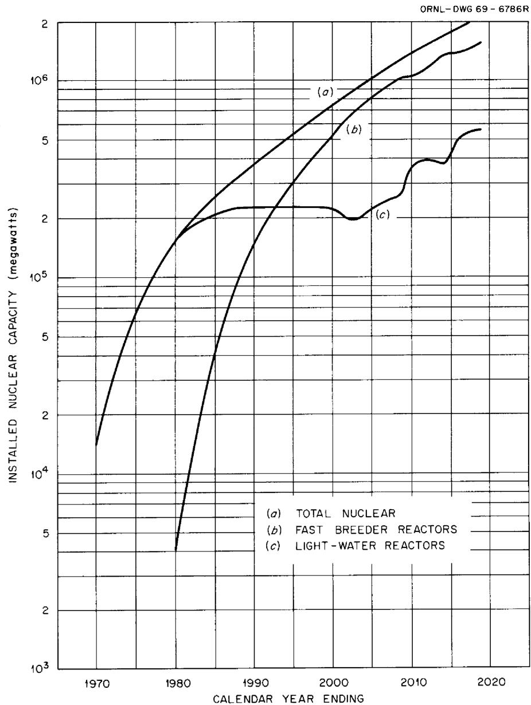  
Fig. 3.1. Installed Nuclear Electric Generating Capacity in the United States (SATF Phase 3, Case 42).

total installed nuclear generating capacity increases from 14,000 Mw (electrical) in 1970 to 153,000 Mw in 1980, and reaches 735,000 Mw in the year 2000. The quantities of spent fuel discharged by reactor and by fuel type are presented in Table 3.2. In the case of LWR's, enriched uranium and plutonium recycle fuels are listed separately; the IMFBR estimates include both core and blankets.

The Phase 3, Case 42 projections for the entire United States were apportioned into the eight geographical power supply regions of the Federal Power Commission (FPC), as shown in Fig. 3.2.<sup>1</sup> This was done by using previous AEC estimates of nuclear power growth through $1980^2$ and a distribution proposed by Searl<sup>3</sup> for the year 2000. For the present study, the AEC data were regrouped according to FPC region to serve for the 1970-1980 period. For the period between 1980 and 2000, the data were smoothed and normalized in order to yield the same distribution in the year 2000 as was forecast by Searl. Finally, for the years following 2000, the assumption was made that the nuclear power distribution remained unchanged. Table 3.3 presents the resulting projections of installed nuclear power capacity for the FPC regions, and these data are presented graphically in Fig. 3.3.

The projected regional distribution of spent fuel is given in Table 3.4 and Fig. 3.4. These data were generated by assuming a time lag between power generation and spent-fuel discharge computed on the basis that the distribution in any year is proportional to two-thirds of the power distribution one year earlier, and to one-third of the power distribution two years earlier. Mathematically,

$$
\mathrm {L} _ {\mathrm {t}, \mathrm {r}} = \mathrm {T} \left[ \frac {2}{3} \mathrm {f} (\mathrm {t} - 1), \mathrm {r} + \frac {1}{3} \mathrm {f} (\mathrm {t} - 2), \mathrm {r} \right],
$$

where $\mathbf{L}_{\mathbf{t},\mathbf{r}} =$ load generated in region, $\mathbf{r}$ , at time t,

T = total load generated at time t,

$f =$ fraction of power generated in region r.

(Metric tons discharged during the two-year period indicated)

Table 3.2. Projected Spent Fuel Discharge Schedule by Reactor and Fuel Type   

<table><tr><td>Period</td><td>LWR-U</td><td>LWR-Pu Recycle</td><td>LMFBR</td><td>Total</td></tr><tr><td>1970-1971</td><td>415</td><td>0</td><td>0</td><td>415</td></tr><tr><td>1972-1973</td><td>1,291</td><td>34</td><td>0</td><td>1,325</td></tr><tr><td>1974-1975</td><td>2,238</td><td>164</td><td>0</td><td>2,402</td></tr><tr><td>1976-1977</td><td>3,307</td><td>386</td><td>0</td><td>3,693</td></tr><tr><td>1978-1979</td><td>5,276</td><td>509</td><td>0</td><td>5,785</td></tr><tr><td>1980-1981</td><td>6,308</td><td>1,445</td><td>91</td><td>7,844</td></tr><tr><td>1982-1983</td><td>6,483</td><td>4,104</td><td>359</td><td>10,946</td></tr><tr><td>1984-1985</td><td>7,028</td><td>7,211</td><td>749</td><td>14,988</td></tr><tr><td>1986-1987</td><td>7,621</td><td>9,118</td><td>2,475</td><td>19,214</td></tr><tr><td>1988-1989</td><td>7,284</td><td>9,574</td><td>5,439</td><td>22,297</td></tr><tr><td>1990-1991</td><td>7,981</td><td>9,943</td><td>9,221</td><td>27,145</td></tr><tr><td>1992-1993</td><td>7,965</td><td>8,911</td><td>10,612</td><td>27,488</td></tr><tr><td>1994-1995</td><td>7,553</td><td>7,100</td><td>11,994</td><td>26,647</td></tr><tr><td>1996-1997</td><td>6,863</td><td>6,822</td><td>14,477</td><td>28,162</td></tr><tr><td>1998-1999</td><td>6,764</td><td>5,897</td><td>16,135</td><td>28,796</td></tr><tr><td>2000-2001</td><td>6,610</td><td>5,640</td><td>17,872</td><td>30,122</td></tr><tr><td>2002-2003</td><td>4,984</td><td>4,803</td><td>21,232</td><td>31,019</td></tr><tr><td>2004-2005</td><td>4,434</td><td>5,299</td><td>25,044</td><td>34,777</td></tr><tr><td>2006-2007</td><td>4,168</td><td>6,467</td><td>26,118</td><td>36,753</td></tr><tr><td>2008-2009</td><td>3,037</td><td>10,018</td><td>27,082</td><td>40,137</td></tr><tr><td>2010-2011</td><td>0</td><td>15,299</td><td>32,693</td><td>47,992</td></tr><tr><td>2012-2013</td><td>0</td><td>18,107</td><td>30,973</td><td>49,080</td></tr><tr><td>2014-2015</td><td>0</td><td>20,727</td><td>33,708</td><td>54,434</td></tr><tr><td>2016-2017</td><td>0</td><td>20,785</td><td>36,264</td><td>57,049</td></tr><tr><td>2018-2019</td><td>0</td><td>23,813</td><td>40,221</td><td>64,034</td></tr></table>

aTaken from Phase 3, Case 42, Systems Analysis Task Force (April 11, 1968).

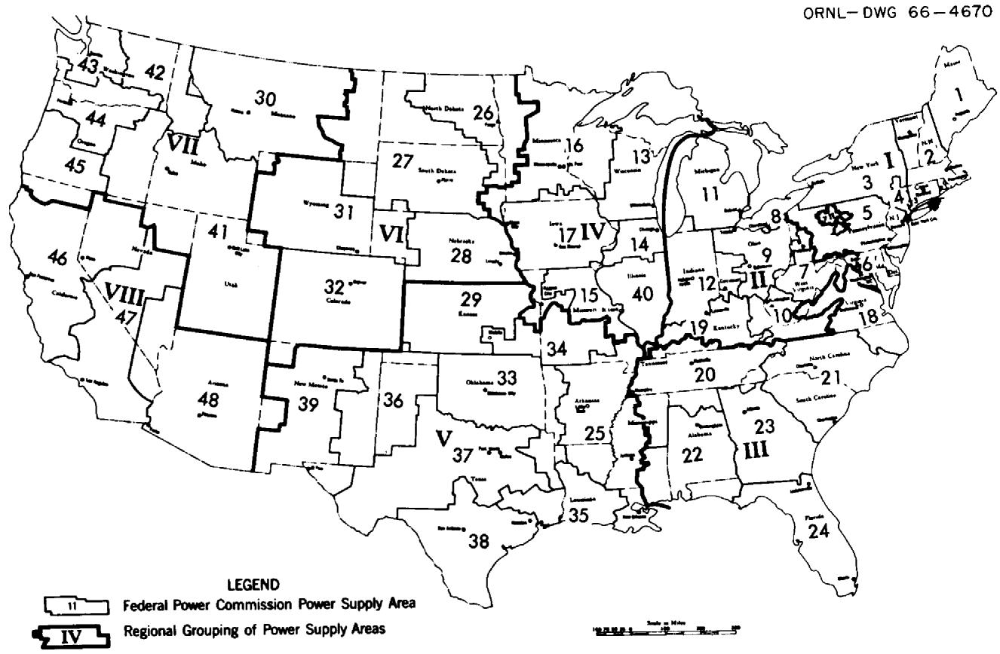  
Fig. 3.2. Federal Power Commission Electric Power Supply Areas.

Table 3.3. Projected Geographical Distribution of Nuclear Power Capacity (Gigawatts installed as of beginning of year)   

<table><tr><td rowspan="2">Year</td><td colspan="8">FPC Region Designation</td><td rowspan="2">Total in U.S.A.a</td></tr><tr><td>I</td><td>II</td><td>III</td><td>IV</td><td>V</td><td>VI</td><td>VII</td><td>VIII</td></tr><tr><td>1970</td><td>2.8</td><td>0.3</td><td>0.5</td><td>2.3</td><td>0.0</td><td>0.0</td><td>0.6</td><td>0.4</td><td>7</td></tr><tr><td>1971</td><td>5.9</td><td>0.5</td><td>2.8</td><td>4.0</td><td>0.0</td><td>0.0</td><td>0.7</td><td>0.4</td><td>14</td></tr><tr><td>1972</td><td>8.8</td><td>0.8</td><td>6.6</td><td>4.8</td><td>0.0</td><td>0.5</td><td>0.8</td><td>0.5</td><td>23</td></tr><tr><td>1973</td><td>10.3</td><td>2.9</td><td>8.0</td><td>6.6</td><td>0.0</td><td>1.3</td><td>0.8</td><td>2.0</td><td>32</td></tr><tr><td>1974</td><td>12.9</td><td>2.9</td><td>10.8</td><td>7.7</td><td>0.7</td><td>1.2</td><td>1.6</td><td>3.6</td><td>41</td></tr><tr><td>1975</td><td>16.1</td><td>3.9</td><td>14.0</td><td>9.0</td><td>0.7</td><td>1.6</td><td>2.4</td><td>4.6</td><td>52</td></tr><tr><td>1976</td><td>19.7</td><td>4.2</td><td>16.9</td><td>10.7</td><td>0.7</td><td>1.6</td><td>3.5</td><td>6.5</td><td>64</td></tr><tr><td>1977</td><td>23.4</td><td>5.4</td><td>20.7</td><td>12.3</td><td>1.4</td><td>1.5</td><td>4.1</td><td>8.5</td><td>77</td></tr><tr><td>1978</td><td>28.3</td><td>5.9</td><td>25.7</td><td>14.4</td><td>1.4</td><td>2.3</td><td>5.1</td><td>10.9</td><td>94</td></tr><tr><td>1979</td><td>33.8</td><td>7.4</td><td>30.5</td><td>16.9</td><td>1.5</td><td>2.4</td><td>6.2</td><td>13.7</td><td>112</td></tr><tr><td>1980</td><td>39.1</td><td>8.9</td><td>36.4</td><td>19.1</td><td>2.3</td><td>3.2</td><td>7.2</td><td>16.6</td><td>133</td></tr><tr><td>1982</td><td>49.4</td><td>12.7</td><td>47.3</td><td>23.7</td><td>4.1</td><td>4.2</td><td>9.4</td><td>22.7</td><td>173</td></tr><tr><td>1984</td><td>58.3</td><td>16.8</td><td>57.4</td><td>28.1</td><td>6.3</td><td>5.1</td><td>11.5</td><td>28.5</td><td>212</td></tr><tr><td>1986</td><td>66.1</td><td>21.6</td><td>66.9</td><td>32.4</td><td>9.2</td><td>6.0</td><td>13.7</td><td>34.3</td><td>250</td></tr><tr><td>1988</td><td>73.8</td><td>27.2</td><td>77.5</td><td>37.6</td><td>13.8</td><td>7.1</td><td>16.3</td><td>41.0</td><td>294</td></tr><tr><td>1990</td><td>81.2</td><td>33.9</td><td>88.4</td><td>43.2</td><td>20.2</td><td>8.3</td><td>19.2</td><td>48.1</td><td>342</td></tr><tr><td>1992</td><td>88.0</td><td>41.6</td><td>98.6</td><td>49.3</td><td>29.6</td><td>9.6</td><td>22.7</td><td>55.8</td><td>395</td></tr><tr><td>1994</td><td>95.8</td><td>50.9</td><td>110.1</td><td>56.6</td><td>39.7</td><td>11.1</td><td>26.7</td><td>64.4</td><td>455</td></tr><tr><td>1996</td><td>104.7</td><td>61.5</td><td>122.5</td><td>64.4</td><td>51.3</td><td>12.8</td><td>31.7</td><td>73.7</td><td>523</td></tr><tr><td>1998</td><td>115.3</td><td>73.9</td><td>136.3</td><td>73.4</td><td>64.6</td><td>14.8</td><td>37.8</td><td>84.2</td><td>600</td></tr><tr><td>2000</td><td>127.5</td><td>87.4</td><td>151.8</td><td>83.3</td><td>78.8</td><td>16.9</td><td>45.6</td><td>95.2</td><td>686</td></tr><tr><td>2002</td><td>143.6</td><td>103.2</td><td>170.7</td><td>94.6</td><td>95.7</td><td>19.4</td><td>54.2</td><td>108.3</td><td>790</td></tr><tr><td>2004</td><td>161.9</td><td>121.4</td><td>192.9</td><td>108.0</td><td>113.8</td><td>22.3</td><td>64.3</td><td>122.3</td><td>907</td></tr><tr><td>2006</td><td>181.2</td><td>141.3</td><td>216.6</td><td>122.8</td><td>133.6</td><td>25.4</td><td>75.3</td><td>136.7</td><td>1033</td></tr><tr><td>2008</td><td>202.4</td><td>162.5</td><td>241.7</td><td>138.3</td><td>154.4</td><td>28.8</td><td>87.3</td><td>151.5</td><td>1167</td></tr><tr><td>2010</td><td>225.0</td><td>185.3</td><td>269.2</td><td>154.7</td><td>176.9</td><td>32.5</td><td>99.5</td><td>165.8</td><td>1309</td></tr><tr><td>2012</td><td>249.7</td><td>208.3</td><td>297.6</td><td>172.2</td><td>200.3</td><td>36.3</td><td>113.2</td><td>181.5</td><td>1459</td></tr><tr><td>2014</td><td>275.2</td><td>233.3</td><td>325.5</td><td>190.2</td><td>225.3</td><td>40.4</td><td>127.1</td><td>197.1</td><td>1616</td></tr><tr><td>2016</td><td>301.7</td><td>259.0</td><td>358.4</td><td>209.4</td><td>250.9</td><td>44.7</td><td>142.0</td><td>213.8</td><td>1779</td></tr><tr><td>2018</td><td>328.6</td><td>285.8</td><td>390.8</td><td>229.4</td><td>277.1</td><td>49.0</td><td>156.5</td><td>230.4</td><td>1948</td></tr><tr><td>2020</td><td>357.2</td><td>313.3</td><td>424.0</td><td>250.1</td><td>304.2</td><td>53.6</td><td>172.1</td><td>247.0</td><td>2122</td></tr></table>

aPhase 3, Case 42, Systems Analysis Task Force (April 11, 1968).

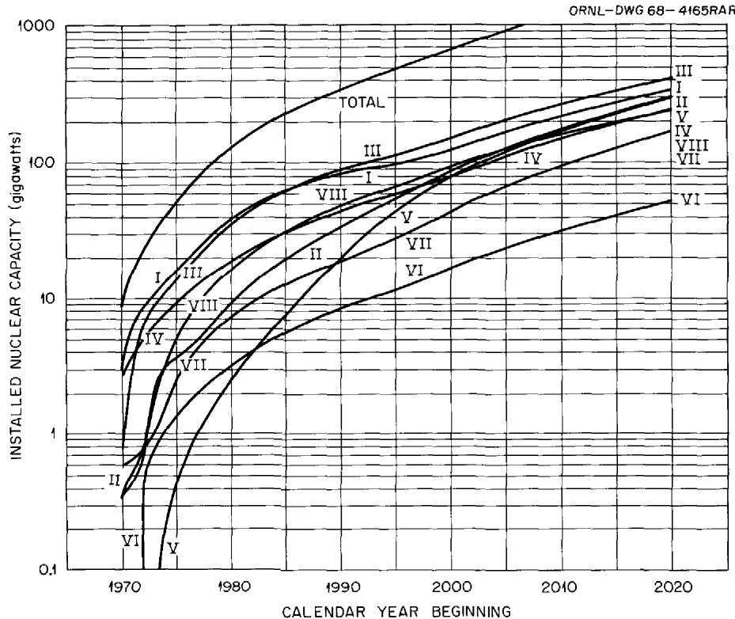  
Fig. 3.3. Projected Geographical Distribution of Installed Nuclear Electric Generating Capacity in Eight FPC Power Supply Regions.

Table 3.4. Projected Geographical Distribution of Spent Fuel Discharges (Metric tons discharged during year)   

<table><tr><td rowspan="2">Year</td><td colspan="8">FPC Region Designation</td><td rowspan="2">Total in U.S.A.a</td></tr><tr><td>I</td><td>II</td><td>III</td><td>IV</td><td>V</td><td>VI</td><td>VII</td><td>VIII</td></tr><tr><td>1970</td><td>56</td><td>2</td><td>0</td><td>12</td><td>0</td><td>0</td><td>15</td><td>9</td><td>94</td></tr><tr><td>1971</td><td>156</td><td>11</td><td>16</td><td>88</td><td>0</td><td>0</td><td>31</td><td>20</td><td>321</td></tr><tr><td>1972</td><td>218</td><td>20</td><td>82</td><td>156</td><td>0</td><td>0</td><td>32</td><td>20</td><td>528</td></tr><tr><td>1973</td><td>314</td><td>28</td><td>206</td><td>185</td><td>0</td><td>12</td><td>32</td><td>20</td><td>797</td></tr><tr><td>1974</td><td>357</td><td>75</td><td>275</td><td>216</td><td>0</td><td>35</td><td>29</td><td>52</td><td>1040</td></tr><tr><td>1975</td><td>430</td><td>105</td><td>351</td><td>263</td><td>16</td><td>43</td><td>46</td><td>109</td><td>1362</td></tr><tr><td>1976</td><td>490</td><td>116</td><td>421</td><td>281</td><td>23</td><td>46</td><td>69</td><td>139</td><td>1585</td></tr><tr><td>1977</td><td>653</td><td>146</td><td>562</td><td>358</td><td>25</td><td>55</td><td>105</td><td>204</td><td>2108</td></tr><tr><td>1978</td><td>805</td><td>181</td><td>705</td><td>427</td><td>41</td><td>56</td><td>138</td><td>282</td><td>2635</td></tr><tr><td>1979</td><td>950</td><td>205</td><td>857</td><td>489</td><td>50</td><td>72</td><td>169</td><td>358</td><td>3150</td></tr><tr><td>1980</td><td>1064</td><td>228</td><td>963</td><td>535</td><td>48</td><td>78</td><td>193</td><td>424</td><td>3534</td></tr><tr><td>1982</td><td>1449</td><td>340</td><td>1359</td><td>701</td><td>98</td><td>120</td><td>270</td><td>631</td><td>4968</td></tr><tr><td>1984</td><td>1966</td><td>524</td><td>1893</td><td>942</td><td>177</td><td>167</td><td>378</td><td>918</td><td>6966</td></tr><tr><td>1986</td><td>2506</td><td>752</td><td>2487</td><td>1210</td><td>294</td><td>221</td><td>501</td><td>1250</td><td>9222</td></tr><tr><td>1988</td><td>2744</td><td>930</td><td>2803</td><td>1360</td><td>421</td><td>254</td><td>578</td><td>1453</td><td>10,542</td></tr><tr><td>1990</td><td>3332</td><td>1278</td><td>3542</td><td>1722</td><td>685</td><td>328</td><td>750</td><td>1892</td><td>13,530</td></tr><tr><td>1992</td><td>3211</td><td>1400</td><td>3543</td><td>1742</td><td>887</td><td>337</td><td>778</td><td>1952</td><td>13,849</td></tr><tr><td>1994</td><td>2866</td><td>1411</td><td>3247</td><td>1636</td><td>1037</td><td>320</td><td>759</td><td>1857</td><td>13,134</td></tr><tr><td>1996</td><td>2897</td><td>1596</td><td>3353</td><td>1734</td><td>1271</td><td>343</td><td>830</td><td>1978</td><td>14,002</td></tr><tr><td>1998</td><td>2803</td><td>1703</td><td>3302</td><td>1749</td><td>1444</td><td>349</td><td>877</td><td>2004</td><td>14,232</td></tr><tr><td>2000</td><td>2839</td><td>1863</td><td>3362</td><td>1824</td><td>1646</td><td>368</td><td>956</td><td>2093</td><td>14,949</td></tr><tr><td>2002</td><td>2767</td><td>1931</td><td>3299</td><td>1816</td><td>1763</td><td>370</td><td>1016</td><td>2078</td><td>15,040</td></tr><tr><td>2004</td><td>3092</td><td>2261</td><td>3685</td><td>2048</td><td>2105</td><td>420</td><td>1192</td><td>2338</td><td>17,141</td></tr><tr><td>2006</td><td>3182</td><td>2422</td><td>3803</td><td>2138</td><td>2277</td><td>442</td><td>1285</td><td>2404</td><td>17,953</td></tr><tr><td>2008</td><td>3335</td><td>2629</td><td>3982</td><td>2267</td><td>2487</td><td>470</td><td>1403</td><td>2513</td><td>19,087</td></tr><tr><td>2010</td><td>4124</td><td>3340</td><td>4928</td><td>2828</td><td>3182</td><td>589</td><td>1794</td><td>3075</td><td>23,860</td></tr><tr><td>2012</td><td>4094</td><td>3387</td><td>4893</td><td>2819</td><td>3249</td><td>593</td><td>1830</td><td>3007</td><td>23,871</td></tr><tr><td>2014</td><td>4593</td><td>3857</td><td>5476</td><td>3171</td><td>3710</td><td>671</td><td>2096</td><td>3318</td><td>26,891</td></tr><tr><td>2016</td><td>4704</td><td>4006</td><td>5591</td><td>3256</td><td>3868</td><td>692</td><td>2187</td><td>3349</td><td>27,651</td></tr><tr><td>2018</td><td>5378</td><td>4639</td><td>6393</td><td>3741</td><td>4480</td><td>799</td><td>2540</td><td>3788</td><td>31,757</td></tr><tr><td>2020</td><td>5556</td><td>4849</td><td>6605</td><td>3884</td><td>4701</td><td>832</td><td>2661</td><td>3868</td><td>32,956</td></tr></table>

aPhase 3, Case 42, Systems Analysis Task Force (April 11, 1968).

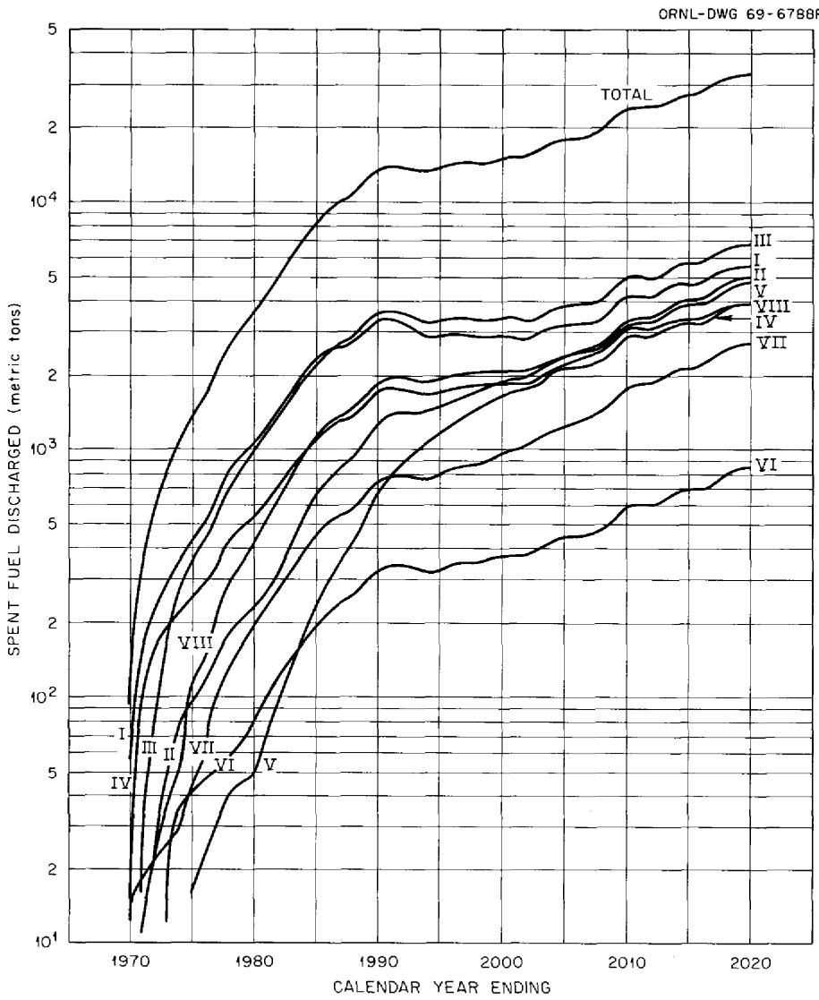  
Fig. 3.4. Projected Discharges of Spent Fuel in the Eight FPC Regions.

The projected annual discharge of fissile plutonium isotopes in the eight FPC power supply regions during the period 1970-2020 is presented in Table 3.5 and Fig. 3.5. Again, a time lag, which was computed in the same manner as that used to estimate the distribution of spent-fuel discharges, was applied.

# 3.2 Reactor Design and Performance Characteristics

Two 1000-Mw (electrical) reactors whose design and performance characteristics have been previously defined were chosen as representative types for this study (Table 3.6). The LWR is the reference pressurized-water type described in a recent AEC-sponsored task force study. Fueled with Zircaloy-clad $\mathrm{UO}_2$ (3.3% $^{235}\mathrm{U}$ ), it operates at an average power level of 34.8 MW/metric ton and achieves a fuel exposure of 33,000 Mwd/metric ton.

The IMFBR is the reference oxide design that was developed by Atomics International (AI) for the Systems Analysis Task Force Study.5 It is fueled with stainless-steel-clad $\mathrm{UO}_2$ -15.6% $\mathrm{PuO}_2$ in the core, and stainless-steel-clad, slightly enriched $\mathrm{UO}_2$ in the axial and radial blankets. Fuel exposures of 80,000 Mwd/metric ton at a specific power of 175 Mw/metric ton, 2500 Mwd/metric ton at 5.5 Mw/metric ton, and 8100 Mwd/metric ton at 10 Mw/metric ton are achieved in the core, the axial blanket, and the radial blanket respectively. The projected refueling cycle is once every 153 days, when one-third of the core and the axial blanket and about three-sixteents of the radial blanket are discharged.

# 3.3 Radiation Characteristics of Irradiated Fuels and of Wastes Generated During Spent-Fuel Processing

The masses, radioactivity, and thermal power of fission products, actinide isotopes, and activation products present in the irradiated fuels from the LWR and the LMFBR described above, and in the wastes generated during spent-fuel processing, were calculated as a function of decay time using the computer program ORIGEN. The nuclear characteristics of the Diablo Canyon Nuclear Power Plant reactor were used in the calculations for the reference LWR since some of the required data were not given for

(Metric tons discharged during year)

Table 3.5. Projected Geographical Distribution of Fissile Plutonium Discharged by Reactors   

<table><tr><td rowspan="2">Year</td><td colspan="8">FPC Region Designation</td><td rowspan="2">Total in U.S.A.a</td></tr><tr><td>I</td><td>II</td><td>III</td><td>IV</td><td>V</td><td>VI</td><td>VII</td><td>VIII</td></tr><tr><td>1970</td><td>0.5</td><td>0</td><td>0</td><td>0.2</td><td>0</td><td>0</td><td>0.1</td><td>0.1</td><td>0.9</td></tr><tr><td>1971</td><td>0.5</td><td>0</td><td>0</td><td>0.3</td><td>0</td><td>0</td><td>0.1</td><td>0.1</td><td>1.0</td></tr><tr><td>1972</td><td>1.4</td><td>0.1</td><td>0.5</td><td>1.0</td><td>0</td><td>0</td><td>0.2</td><td>0.1</td><td>3.3</td></tr><tr><td>1973</td><td>1.5</td><td>0.1</td><td>1.0</td><td>1.1</td><td>0</td><td>0.1</td><td>0.2</td><td>0.1</td><td>4.1</td></tr><tr><td>1974</td><td>2.1</td><td>0.4</td><td>1.6</td><td>1.2</td><td>0</td><td>0.2</td><td>0.2</td><td>0.3</td><td>6.0</td></tr><tr><td>1975</td><td>2.9</td><td>0.8</td><td>2.2</td><td>1.8</td><td>0.1</td><td>0.2</td><td>0.3</td><td>0.7</td><td>9.0</td></tr><tr><td>1976</td><td>3.4</td><td>1.0</td><td>2.8</td><td>2.0</td><td>0.1</td><td>0.3</td><td>0.4</td><td>1.2</td><td>11</td></tr><tr><td>1977</td><td>4.0</td><td>1.1</td><td>3.5</td><td>2.2</td><td>0.2</td><td>0.4</td><td>0.7</td><td>1.8</td><td>14</td></tr><tr><td>1978</td><td>5.2</td><td>1.2</td><td>4.6</td><td>2.6</td><td>0.2</td><td>0.4</td><td>0.9</td><td>2.0</td><td>17</td></tr><tr><td>1979</td><td>6.8</td><td>1.4</td><td>5.8</td><td>3.1</td><td>0.3</td><td>0.8</td><td>1.3</td><td>2.8</td><td>23</td></tr><tr><td>1980</td><td>8</td><td>2</td><td>7</td><td>4</td><td>0.4</td><td>1</td><td>1</td><td>3</td><td>26</td></tr><tr><td>1982</td><td>13</td><td>3</td><td>12</td><td>6</td><td>1</td><td>1</td><td>2</td><td>6</td><td>44</td></tr><tr><td>1984</td><td>21</td><td>6</td><td>20</td><td>10</td><td>2</td><td>2</td><td>4</td><td>10</td><td>74</td></tr><tr><td>1986</td><td>26</td><td>8</td><td>26</td><td>13</td><td>3</td><td>2</td><td>5</td><td>13</td><td>97</td></tr><tr><td>1988</td><td>37</td><td>13</td><td>38</td><td>18</td><td>6</td><td>3</td><td>8</td><td>20</td><td>140</td></tr><tr><td>1990</td><td>55</td><td>21</td><td>59</td><td>29</td><td>11</td><td>5</td><td>12</td><td>31</td><td>220</td></tr><tr><td>1992</td><td>66</td><td>29</td><td>72</td><td>36</td><td>18</td><td>7</td><td>16</td><td>40</td><td>280</td></tr><tr><td>1994</td><td>73</td><td>36</td><td>82</td><td>41</td><td>26</td><td>8</td><td>19</td><td>47</td><td>330</td></tr><tr><td>1996</td><td>84</td><td>46</td><td>97</td><td>50</td><td>37</td><td>10</td><td>24</td><td>57</td><td>400</td></tr><tr><td>1998</td><td>91</td><td>55</td><td>107</td><td>57</td><td>47</td><td>11</td><td>29</td><td>65</td><td>460</td></tr><tr><td>2000</td><td>97</td><td>64</td><td>115</td><td>62</td><td>56</td><td>13</td><td>33</td><td>71</td><td>510</td></tr><tr><td>2002</td><td>111</td><td>77</td><td>132</td><td>73</td><td>70</td><td>15</td><td>41</td><td>83</td><td>600</td></tr><tr><td>2004</td><td>134</td><td>98</td><td>160</td><td>89</td><td>91</td><td>18</td><td>52</td><td>101</td><td>740</td></tr><tr><td>2006</td><td>140</td><td>106</td><td>167</td><td>94</td><td>100</td><td>19</td><td>56</td><td>106</td><td>790</td></tr><tr><td>2008</td><td>147</td><td>116</td><td>175</td><td>100</td><td>109</td><td>21</td><td>62</td><td>110</td><td>840</td></tr><tr><td>2010</td><td>180</td><td>146</td><td>215</td><td>123</td><td>139</td><td>26</td><td>78</td><td>134</td><td>1040</td></tr><tr><td>2012</td><td>182</td><td>151</td><td>218</td><td>125</td><td>145</td><td>26</td><td>81</td><td>134</td><td>1060</td></tr><tr><td>2014</td><td>198</td><td>166</td><td>236</td><td>137</td><td>160</td><td>29</td><td>90</td><td>143</td><td>1160</td></tr><tr><td>2016</td><td>202</td><td>172</td><td>240</td><td>140</td><td>166</td><td>30</td><td>94</td><td>144</td><td>1190</td></tr><tr><td>2018</td><td>238</td><td>205</td><td>282</td><td>165</td><td>198</td><td>35</td><td>112</td><td>167</td><td>1400</td></tr><tr><td>2020</td><td>244</td><td>213</td><td>290</td><td>171</td><td>207</td><td>37</td><td>117</td><td>170</td><td>1500</td></tr></table>

aPhase 3, Case 42, Systems Analysis Task Force (April 11, 1968).

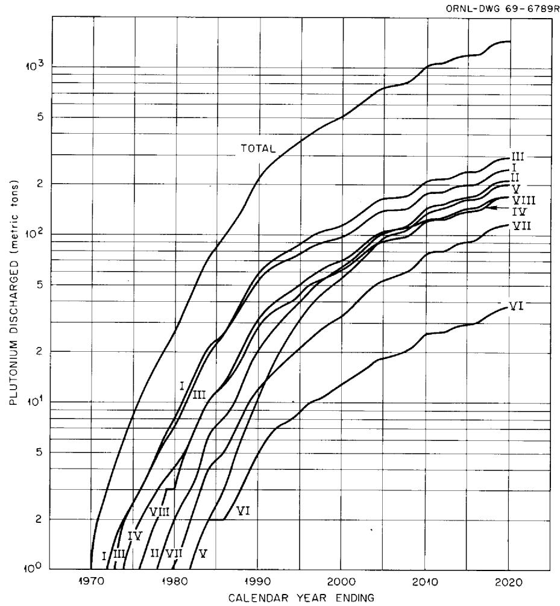  
Fig. 3.5. Projected Discharge of Fissile Plutonium in the Eight FPC Regions.

Table 3.6. Summary of Reactor Design and Performance Characteristics   

<table><tr><td></td><td>LWR</td><td>IMFBR</td></tr><tr><td>Fuel form</td><td>Oxide pellets</td><td>Oxide pellets</td></tr><tr><td>Power, Mw (thermal)</td><td>3083</td><td>2500</td></tr><tr><td>Thermal efficiency, %</td><td>35.4</td><td>40</td></tr><tr><td>Core</td><td></td><td></td></tr><tr><td>Avg. sp. power, Mw/metric ton</td><td>34.8</td><td>175</td></tr><tr><td>Burnup, Mwd/metric ton</td><td>33,000</td><td>80,000</td></tr><tr><td>Charge, metric tons</td><td>88.6 (U)</td><td>12.6 (U + Pu)</td></tr><tr><td>Enrichment, %</td><td>3.3 (235U)</td><td>15.6 (239Pu)</td></tr><tr><td>Refueling interval, full-power days</td><td>~365</td><td>153a</td></tr><tr><td>Refueling fraction</td><td>1/3</td><td>1/3a</td></tr><tr><td>Fuel element</td><td>Square</td><td>Hexa</td></tr><tr><td>Rods/element</td><td>204</td><td>217a</td></tr><tr><td>Elements/reactor</td><td>193</td><td>252a</td></tr><tr><td>Rod length, with plenum, in.</td><td>148</td><td>144a</td></tr><tr><td>Cladding</td><td>Zircaloy-4</td><td>304 SSa</td></tr><tr><td></td><td>(Inconel spacers)</td><td></td></tr><tr><td>Outside diameter, in.</td><td>0.422</td><td>0.25a</td></tr><tr><td>Wall thickness, in.</td><td>0.0243</td><td>0.015a</td></tr><tr><td>Axial blanket</td><td></td><td></td></tr><tr><td>Avg. sp. power, Mw/metric ton</td><td></td><td>5.5</td></tr><tr><td>Burnup, Mwd/metric ton</td><td></td><td>2500</td></tr><tr><td>Charge, metric tons</td><td></td><td>7.32 (U)</td></tr><tr><td>Enrichment, %</td><td></td><td>0.3 (235U)</td></tr><tr><td>Radial blanket</td><td></td><td></td></tr><tr><td>Avg. sp. power, Mw/metric ton</td><td></td><td>10</td></tr><tr><td>Burnup, Mwd/metric ton</td><td></td><td>8100</td></tr><tr><td>Charge, metric tons</td><td></td><td>26.7 (U)</td></tr><tr><td>Enrichment, %</td><td></td><td>1.96 (235U)</td></tr><tr><td>Refueling interval, full-power days</td><td></td><td>153</td></tr><tr><td>Refueling fraction</td><td></td><td>~3/16</td></tr><tr><td>Fuel element</td><td></td><td>Hex</td></tr><tr><td>Rods/element</td><td></td><td>169, 91</td></tr><tr><td>Elements/reactor</td><td></td><td>39, 87</td></tr><tr><td>Rod length, with plenum, in.</td><td></td><td>84, 72</td></tr><tr><td>Cladding</td><td></td><td>304 SS</td></tr><tr><td>Outside diameter, in.</td><td></td><td>0.35, 0.51</td></tr><tr><td>Wall thickness, in.</td><td></td><td>0.015</td></tr></table>

${}^{a}$ Also applicable to the axial blanket which is an integral unit with the core assembly.

the reference reactor that was described in the task force report. $^{4}$ The LWR was assumed to operate at a constant average specific power of 30 Mw/ metric ton (equivalent to a load factor of 0.85).

In the case of the AI Reference Oxide IMFBR, the core was assumed to operate at a constant average specific power of 148.15 Mw/metric ton for 540 days (equivalent to a load factor of 0.85). The specific power of the axial blanket was input as a step function, varying from 2.27 Mw/metric ton (at startup) to 6.99 Mw/metric ton (at a discharge time of 540 days) and averaging 4.63 Mw/metric ton. The specific power of the radial blanket varied from 2.32 Mw/metric ton (at startup) to 14.38 Mw/metric ton (at discharge) and averaged 8.4 Mw/metric ton. In this study, it is assumed that the core and blankets are mixed proportionately ("homogenized") prior to processing, yielding a fuel mixture having an average burnup of 33,000 Mwd/metric ton.

Transient conditions of about 700 nuclides in the current data libraries of ORIGEN were calculated for each reactor, and the results are presented in the form of summary tables of the most significant isotopes present in spent fuels and wastes in terms of mass, activity, and thermal power. These properties are tabulated for each isotope and for each element. All results are based on one metric ton of uranium charged to the LWR, and on one metric ton of uranium-plus-plutonium originally charged in the "homogenized" IMFBR core and blankets.

# 3.3.1 Diablo Canyon Reference LWR

Fission Products. - Tables 3.7 through 3.12 present the calculated masses, radioactivity, and thermal power of significant fission products present in the wastes generated by the processing of spent Diablo Canyon reference fuel (or in the spent fuel before reprocessing) as a function of postirradiation decay times of 90 to 365,250 days. Tables 3.7, 3.9, and 3.11 give the weight, activity, and thermal power, respectively, for individual isotopes; these same data, summed for each fission-product element, are given in Tables 3.8, 3.10, and 3.12 respectively.

Table 3.7. Masses of Fission-Product Nuclides Calculated to Be Present in Spent Diablo Canyon Reference LWR Fuel and in the Wastes Generated by the Reprocessing of This Fuel   
DIABLO CANYON REFERENCE LWR - WASTE DECAY TIMES (PROCESSED 90 DAYS) POWER= 30.00 MW/MT, BURNUP= 33000. MWD/MT, FLUX= 2.91E 13 N/CM**2-SEC   

<table><tr><td colspan="11">NUCLIDE CONCENTRATIONS, GRAMS / METRIC TON FUEL CHARGED TO REACTOR</td><td></td></tr><tr><td></td><td>CHARGE</td><td>90.D</td><td>150.D</td><td>365.D</td><td>3652.D</td><td>36525.D</td><td>365250.D</td><td></td><td></td><td></td><td></td></tr><tr><td>SE 78</td><td>0.0</td><td>2.55E</td><td>00</td><td>2.55E</td><td>00</td><td>2.55E</td><td>00</td><td>2.55E</td><td>00</td><td>2.55E</td><td>00</td></tr><tr><td>SE 79</td><td>0.0</td><td>5.65E</td><td>00</td><td>5.65E</td><td>00</td><td>5.65E</td><td>00</td><td>5.65E</td><td>00</td><td>5.64E</td><td>00</td></tr><tr><td>SE 80</td><td>0.0</td><td>1.03E</td><td>01</td><td>1.03E</td><td>01</td><td>1.03E</td><td>01</td><td>1.03E</td><td>01</td><td>1.03E</td><td>01</td></tr><tr><td>BR 81</td><td>0.0</td><td>1.51E</td><td>01</td><td>1.51E</td><td>01</td><td>1.51E</td><td>01</td><td>1.51E</td><td>01</td><td>1.51E</td><td>01</td></tr><tr><td>SE 82</td><td>0.0</td><td>3.25E</td><td>01</td><td>3.25E</td><td>01</td><td>3.25E</td><td>01</td><td>3.25E</td><td>01</td><td>3.25E</td><td>01</td></tr><tr><td>KR 83</td><td>0.0</td><td>4.08E</td><td>01</td><td>4.08E</td><td>01</td><td>4.08E</td><td>01</td><td>4.08E</td><td>01</td><td>4.08E</td><td>01</td></tr><tr><td>KR 84</td><td>0.0</td><td>1.11E</td><td>02</td><td>1.11E</td><td>02</td><td>1.11E</td><td>02</td><td>1.11E</td><td>02</td><td>1.11E</td><td>02</td></tr><tr><td>KR 85</td><td>0.0</td><td>2.90E</td><td>01</td><td>2.87E</td><td>01</td><td>2.76E</td><td>01</td><td>1.55E</td><td>01</td><td>4.69E-02</td><td>0.0</td></tr><tr><td>RB 85</td><td>0.0</td><td>9.41E</td><td>01</td><td>9.45E</td><td>01</td><td>9.55E</td><td>01</td><td>1.08E</td><td>02</td><td>1.23E</td><td>02</td></tr><tr><td>KR 86</td><td>0.0</td><td>1.92E</td><td>02</td><td>1.92E</td><td>02</td><td>1.92E</td><td>02</td><td>1.92E</td><td>02</td><td>1.92E</td><td>02</td></tr><tr><td>RB 87</td><td>0.0</td><td>2.39E</td><td>02</td><td>2.39E</td><td>02</td><td>2.39E</td><td>02</td><td>2.39E</td><td>02</td><td>2.39E</td><td>02</td></tr><tr><td>SR 88</td><td>0.0</td><td>3.51E</td><td>02</td><td>3.51E</td><td>02</td><td>3.51E</td><td>02</td><td>3.51E</td><td>02</td><td>3.51E</td><td>02</td></tr><tr><td>SR 89</td><td>0.0</td><td>7.57E</td><td>00</td><td>3.40E</td><td>00</td><td>1.94E-01</td><td>1.81E-20</td><td>0.0</td><td></td><td>0.0</td><td></td></tr><tr><td>Y 89</td><td>0.0</td><td>4.57E</td><td>02</td><td>4.61E</td><td>02</td><td>4.65E</td><td>02</td><td>4.65E</td><td>02</td><td>4.65E</td><td>02</td></tr><tr><td>SR 90</td><td>0.0</td><td>5.44E</td><td>02</td><td>5.41E</td><td>02</td><td>5.34E</td><td>02</td><td>4.27E</td><td>02</td><td>4.64E</td><td>01</td></tr><tr><td>ZR 90</td><td>0.0</td><td>2.64E</td><td>01</td><td>2.86E</td><td>01</td><td>3.64E</td><td>01</td><td>1.43E</td><td>02</td><td>5.24E</td><td>02</td></tr><tr><td>Y 91</td><td>0.0</td><td>1.32E</td><td>01</td><td>6.50E</td><td>00</td><td>5.16E-01</td><td>7.70E-18</td><td>0.0</td><td></td><td>0.0</td><td></td></tr><tr><td>ZR 91</td><td>0.0</td><td>5.96E</td><td>02</td><td>6.03E</td><td>02</td><td>6.09E</td><td>02</td><td>6.09E</td><td>02</td><td>6.09E</td><td>02</td></tr><tr><td>ZR 92</td><td>0.0</td><td>6.63E</td><td>02</td><td>6.63E</td><td>02</td><td>6.63E</td><td>02</td><td>6.63E</td><td>02</td><td>6.63E</td><td>02</td></tr><tr><td>ZR 93</td><td>0.0</td><td>7.35E</td><td>02</td><td>7.35E</td><td>02</td><td>7.35E</td><td>02</td><td>7.35E</td><td>02</td><td>7.35E</td><td>02</td></tr><tr><td>ZR 94</td><td>0.0</td><td>7.89E</td><td>02</td><td>7.89E</td><td>02</td><td>7.89E</td><td>02</td><td>7.89E</td><td>02</td><td>7.89E</td><td>02</td></tr><tr><td>ZR 95</td><td>0.0</td><td>2.47E</td><td>01</td><td>1.31E</td><td>01</td><td>1.32E</td><td>00</td><td>7.94E-16</td><td>0.0</td><td></td><td>0.0</td></tr><tr><td>NB 95</td><td>0.0</td><td>2.21E</td><td>01</td><td>1.32E</td><td>01</td><td>1.51E</td><td>00</td><td>4.81E-10</td><td>0.0</td><td></td><td>0.0</td></tr><tr><td>MO 95</td><td>0.0</td><td>7.23E</td><td>02</td><td>7.44E</td><td>02</td><td>7.67E</td><td>02</td><td>7.70E</td><td>02</td><td>7.70E</td><td>02</td></tr><tr><td>ZR 96</td><td>0.0</td><td>8.30E</td><td>02</td><td>8.30E</td><td>02</td><td>8.30E</td><td>02</td><td>8.30E</td><td>02</td><td>8.30E</td><td>02</td></tr><tr><td>MO 96</td><td>0.0</td><td>3.95E</td><td>01</td><td>3.95E</td><td>01</td><td>3.95E</td><td>01</td><td>3.95E</td><td>01</td><td>3.95E</td><td>01</td></tr><tr><td>MO 97</td><td>0.0</td><td>8.38E</td><td>02</td><td>8.38E</td><td>02</td><td>8.38E</td><td>02</td><td>8.38E</td><td>02</td><td>8.38E</td><td>02</td></tr><tr><td>MO 98</td><td>0.0</td><td>8.49E</td><td>02</td><td>8.49E</td><td>02</td><td>8.49E</td><td>02</td><td>8.49E</td><td>02</td><td>8.49E</td><td>02</td></tr><tr><td>TC 99</td><td>0.0</td><td>8.35E</td><td>02</td><td>8.35E</td><td>02</td><td>8.35E</td><td>02</td><td>8.35E</td><td>02</td><td>8.35E</td><td>02</td></tr><tr><td>MO100</td><td>0.0</td><td>9.71E</td><td>02</td><td>9.71E</td><td>02</td><td>9.71E</td><td>02</td><td>9.71E</td><td>02</td><td>9.71E</td><td>02</td></tr><tr><td>RU100</td><td>0.0</td><td>5.56E</td><td>01</td><td>5.56E</td><td>01</td><td>5.56E</td><td>01</td><td>5.56E</td><td>01</td><td>5.56E</td><td>01</td></tr><tr><td>RU101</td><td>0.0</td><td>7.76E</td><td>02</td><td>7.76E</td><td>02</td><td>7.76E</td><td>02</td><td>7.76E</td><td>02</td><td>7.76E</td><td>02</td></tr><tr><td>RU102</td><td>0.0</td><td>7.68E</td><td>02</td><td>7.68E</td><td>02</td><td>7.68E</td><td>02</td><td>7.68E</td><td>02</td><td>7.68E</td><td>02</td></tr><tr><td>RU103</td><td>0.0</td><td>7.95E</td><td>00</td><td>2.78E</td><td>00</td><td>6.45E-02</td><td>0.0</td><td></td><td></td><td>0.0</td><td></td></tr><tr><td>RH103</td><td>0.0</td><td>3.84E</td><td>02</td><td>3.89E</td><td>02</td><td>3.92E</td><td>02</td><td>3.92E</td><td>02</td><td>3.92E</td><td>02</td></tr><tr><td>RU104</td><td>0.0</td><td>5.38E</td><td>02</td><td>5.38E</td><td>02</td><td>5.38E</td><td>02</td><td>5.38E</td><td>02</td><td>5.38E</td><td>02</td></tr><tr><td>PD104</td><td>0.0</td><td>2.46E</td><td>02</td><td>2.46E</td><td>02</td><td>2.46E</td><td>02</td><td>2.46E</td><td>02</td><td>2.46E</td><td>02</td></tr><tr><td>PD105</td><td>0.0</td><td>2.94E</td><td>02</td><td>2.94E</td><td>02</td><td>2.94E</td><td>02</td><td>2.94E</td><td>02</td><td>2.94E</td><td>02</td></tr><tr><td>RU106</td><td>0.0</td><td>1.37E</td><td>02</td><td>1.22E</td><td>02</td><td>8.13E</td><td>01</td><td>1.64E-01</td><td>0.0</td><td></td><td>0.0</td></tr><tr><td>PD106</td><td>0.0</td><td>3.12E</td><td>02</td><td>3.26E</td><td>02</td><td>3.67E</td><td>02</td><td>4.48E</td><td>02</td><td>4.48E</td><td>02</td></tr><tr><td>PD107</td><td>0.0</td><td>2.36E</td><td>02</td><td>2.36E</td><td>02</td><td>2.36E</td><td>02</td><td>2.36E</td><td>02</td><td>2.36E</td><td>02</td></tr><tr><td>PD108</td><td>0.0</td><td>1.56E</td><td>02</td><td>1.56E</td><td>02</td><td>1.56E</td><td>02</td><td>1.56E</td><td>02</td><td>1.56E</td><td>02</td></tr><tr><td>AG109</td><td>0.0</td><td>6.00E</td><td>01</td><td>6.00E</td><td>01</td><td>6.00E</td><td>01</td><td>6.00E</td><td>01</td><td>6.00E</td><td>01</td></tr><tr><td>PD110</td><td>0.0</td><td>3.36E</td><td>01</td><td>3.36E</td><td>01</td><td>3.36E</td><td>01</td><td>3.36E</td><td>01</td><td>3.36E</td><td>01</td></tr><tr><td>CD110</td><td>0.0</td><td>4.10E</td><td>01</td><td>4.10E</td><td>01</td><td>4.11E</td><td>01</td><td>4.11E</td><td>01</td><td>4.11E</td><td>01</td></tr><tr><td>CD111</td><td>0.0</td><td>1.71E</td><td>01</td><td>1.71E</td><td>01</td><td>1.71E</td><td>01</td><td>1.71E</td><td>01</td><td>1.71E</td><td>01</td></tr><tr><td>CD112</td><td>0.0</td><td>9.17E</td><td>00</td><td>9.17E</td><td>00</td><td>9.17E</td><td>00</td><td>9.17E</td><td>00</td><td>9.17E</td><td>00</td></tr><tr><td>CD114</td><td>0.0</td><td>1.22E</td><td>01</td><td>1.22E</td><td>01</td><td>1.22E</td><td>01</td><td>1.22E</td><td>01</td><td>1.22E</td><td>01</td></tr><tr><td>IN115</td><td>0.0</td><td>1.20E</td><td>00</td><td>1.20E</td><td>00</td><td>1.20E</td><td>00</td><td>1.20E</td><td>00</td><td>1.20E</td><td>00</td></tr><tr><td>CD116</td><td>0.0</td><td>3.78E</td><td>00</td><td>3.78E</td><td>00</td><td>3.78E</td><td>00</td><td>3.78E</td><td>00</td><td>3.78E</td><td>00</td></tr><tr><td>SN116</td><td>0.0</td><td>2.67E</td><td>00</td><td>2.67E</td><td>00</td><td>2.67E</td><td>00</td><td>2.67E</td><td>00</td><td>2.67E</td><td>00</td></tr><tr><td>SN117</td><td>0.0</td><td>3.94E</td><td>00</td><td>3.94E</td><td>00</td><td>3.94E</td><td>00</td><td>3.94E</td><td>00</td><td>3.94E</td><td>00</td></tr><tr><td>SN118</td><td>0.0</td><td>4.02E</td><td>00</td><td>4.02E</td><td>00</td><td>4.02E</td><td>00</td><td>4.02E</td><td>00</td><td>4.02E</td><td>00</td></tr><tr><td>SN119</td><td>0.0</td><td>4.16E</td><td>00</td><td>4.16E</td><td>00</td><td>4.17E</td><td>00</td><td>4.17E</td><td>00</td><td>4.17E</td><td>00</td></tr><tr><td>SN120</td><td>0.0</td><td>4.35E</td><td>00</td><td>4.35E</td><td>00</td><td>4.35E</td><td>00</td><td>4.35E</td><td>00</td><td>4.35E</td><td>00</td></tr><tr><td>SB121</td><td>0.0</td><td>4.54E</td><td>00</td><td>4.54E</td><td>00</td><td>4.54E</td><td>00</td><td>4.54E</td><td>00</td><td>4.54E</td><td>00</td></tr><tr><td>SN122</td><td>0.0</td><td>5.10E</td><td>00</td><td>5.10E</td><td>00</td><td>5.10E</td><td>00</td><td>5.10E</td><td>00</td><td>5.10E</td><td>00</td></tr><tr><td>SB123</td><td>0.0</td><td>5.45E</td><td>00</td><td>5.47E</td><td>00</td><td>5.50E</td><td>00</td><td>5.51E</td><td>00</td><td>5.51E</td><td>00</td></tr><tr><td>SN124</td><td>0.0</td><td>7.62E</td><td>00</td><td>7.62E</td><td>00</td><td>7.62E</td><td>00</td><td>7.62E</td><td>00</td><td>7.62E</td><td>00</td></tr><tr><td>SB125</td><td>0.0</td><td>8.00E</td><td>00</td><td>7.67E</td><td>00</td><td>6.59E</td><td>00</td><td>6.54E-01</td><td>6.03E-11</td><td>0.0</td><td>0</td></tr><tr><td>TE125</td><td>0.0</td><td>3.25E</td><td>00</td><td>3.58E</td><td>00</td><td>4.68E</td><td>00</td><td>1.08E</td><td>01</td><td>1.14E</td><td>01</td></tr><tr><td>SN126</td><td>0.0</td><td>1.94E</td><td>01</td><td>1.94E</td><td>01</td><td>1.94E</td><td>01</td><td>1.94E</td><td>01</td><td>1.94E</td><td>01</td></tr><tr><td>I127</td><td>0.0</td><td>3.90E</td><td>01</td><td>3.93E</td><td>01</td><td>3.98E</td><td>01</td><td>3.99E</td><td>01</td><td>3.99E</td><td>01</td></tr><tr><td>TE128</td><td>0.0</td><td>1.34E</td><td>02</td><td>1.34E</td><td>02</td><td>1.34E</td><td>02</td><td>1.34E</td><td>02</td><td>1.34E</td><td>02</td></tr><tr><td>XE128</td><td>0.0</td><td>2.98E</td><td>00</td><td>2.98E</td><td>00</td><td>2.98E</td><td>00</td><td>2.98E</td><td>00</td><td>2.98E</td><td>00</td></tr><tr><td>I129</td><td>0.0</td><td>2.32E</td><td>02</td><td>2.33E</td><td>02</td><td>2.33E</td><td>02</td><td>2.33E</td><td>02</td><td>2.33E</td><td>02</td></tr><tr><td>TE130</td><td>0.0</td><td>4.26E</td><td>02</td><td>4.26E</td><td>02</td><td>4.26E</td><td>02</td><td>4.26E</td><td>02</td><td>4.26E</td><td>02</td></tr><tr><td>XE130</td><td>0.0</td><td>1.07E</td><td>01</td><td>1.07E</td><td>01</td><td>1.07E</td><td>01</td><td>1.07E</td><td>01</td><td>1.07E</td><td>01</td></tr><tr><td>XF131</td><td>0.0</td><td>4.09E</td><td>02</td><td>4.09E</td><td>02</td><td>4.09E</td><td>02</td><td>4.09E</td><td>02</td><td>4.09E</td><td>02</td></tr><tr><td>XE132</td><td>0.0</td><td>1.15E</td><td>03</td><td>1.15E</td><td>03</td><td>1.15E</td><td>03</td><td>1.15E</td><td>03</td><td>1.15E</td><td>03</td></tr><tr><td>CS133</td><td>0.0</td><td>1.01E</td><td>03</td><td>1.01E</td><td>03</td><td>1.01E</td><td>03</td><td>1.01E</td><td>03</td><td>1.01E</td><td>03</td></tr><tr><td>XE134</td><td>0.0</td><td>1.53E</td><td>03</td><td>1.53E</td><td>03</td><td>1.53E</td><td>03</td><td>1.53E</td><td>03</td><td>1.53E</td><td>03</td></tr><tr><td>CS134</td><td>0.0</td><td>1.73E</td><td>02</td><td>1.64E</td><td>02</td><td>1.34E</td><td>02</td><td>6.40E</td><td>00</td><td>3.98E-13</td><td>0.0</td></tr><tr><td>BA134</td><td>0.0</td><td>8.40E</td><td>01</td><td>9.33E</td><td>01</td><td>1.23E</td><td>02</td><td>2.51E</td><td>02</td><td>2.57E</td><td>02</td></tr><tr><td>CS135</td><td>0.0</td><td>3.26E</td><td>02</td><td>3.26E</td><td>02</td><td>3.26E</td><td>02</td><td>3.26E</td><td>02</td><td>3.26E</td><td>02</td></tr><tr><td>XE136</td><td>0.0</td><td>2.32E</td><td>03</td><td>2.32E</td><td>03</td><td>2.32E</td><td>03</td><td>2.32E</td><td>03</td><td>2.32E</td><td>03</td></tr><tr><td>BA136</td><td>0.0</td><td>2.57E</td><td>01</td><td>2.57E</td><td>01</td><td>2.57E</td><td>01</td><td>2.57E</td><td>01</td><td>2.57E</td><td>01</td></tr><tr><td>CS137</td><td>0.0</td><td>1.23E</td><td>03</td><td>1.22E</td><td>03</td><td>1.21E</td><td>03</td><td>9.81E</td><td>02</td><td>1.23E</td><td>02</td></tr><tr><td>BA137</td><td>0.0</td><td>5.01E</td><td>01</td><td>5.48E</td><td>01</td><td>7.13E</td><td>01</td><td>2.98E</td><td>02</td><td>1.16E</td><td>03</td></tr><tr><td>BA138</td><td>0.0</td><td>1.21E</td><td>03</td><td>1.21E</td><td>03</td><td>1.21E</td><td>03</td><td>1.21E</td><td>03</td><td>1.21E</td><td>03</td></tr><tr><td>LA139</td><td>0.0</td><td>1.27E</td><td>03</td><td>1.27E</td><td>03</td><td>1.27E</td><td>03</td><td>1.27E</td><td>03</td><td>1.27E</td><td>03</td></tr><tr><td>CE140</td><td>0.0</td><td>1.46E</td><td>03</td><td>1.46E</td><td>03</td><td>1.46E</td><td>03</td><td>1.46E</td><td>03</td><td>1.46E</td><td>03</td></tr><tr><td>CF141</td><td>0.0</td><td>7.15E</td><td>00</td><td>1.98E</td><td>00</td><td>1.99E-02</td><td>0.0</td><td>0.0</td><td>0.0</td><td>0.0</td><td>0.0</td></tr><tr><td>PR141</td><td>0.0</td><td>1.19E</td><td>03</td><td>1.20E</td><td>03</td><td>1.20E</td><td>03</td><td>1.20E</td><td>03</td><td>1.20E</td><td>03</td></tr><tr><td>CE142</td><td>0.0</td><td>1.18E</td><td>03</td><td>1.18E</td><td>03</td><td>1.18E</td><td>03</td><td>1.18E</td><td>03</td><td>1.18E</td><td>03</td></tr><tr><td>ND142</td><td>0.0</td><td>2.08E</td><td>01</td><td>2.08E</td><td>01</td><td>2.08E</td><td>01</td><td>2.08E</td><td>01</td><td>2.08E</td><td>01</td></tr><tr><td>ND143</td><td>0.0</td><td>8.08E</td><td>02</td><td>8.08E</td><td>02</td><td>8.08E</td><td>02</td><td>8.08E</td><td>02</td><td>8.08E</td><td>02</td></tr><tr><td>CE144</td><td>0.0</td><td>2.79E</td><td>02</td><td>2.41E</td><td>02</td><td>1.43E</td><td>02</td><td>4.68E-02</td><td>0.0</td><td>0.0</td><td>0.0</td></tr><tr><td>ND144</td><td>0.0</td><td>1.06E</td><td>03</td><td>1.10E</td><td>03</td><td>1.20E</td><td>03</td><td>1.34E</td><td>03</td><td>1.34E</td><td>03</td></tr><tr><td>ND145</td><td>0.0</td><td>7.06E</td><td>02</td><td>7.06E</td><td>02</td><td>7.06E</td><td>02</td><td>7.06E</td><td>02</td><td>7.06E</td><td>02</td></tr><tr><td>ND146</td><td>0.0</td><td>7.11E</td><td>02</td><td>7.11E</td><td>02</td><td>7.11E</td><td>02</td><td>7.11E</td><td>02</td><td>7.11E</td><td>02</td></tr><tr><td>PM147</td><td>0.0</td><td>1.12E</td><td>02</td><td>1.07E</td><td>02</td><td>9.16E</td><td>01</td><td>8.47E</td><td>00</td><td>3.86E-10</td><td>0.0</td></tr><tr><td>SM147</td><td>0.0</td><td>5.99E</td><td>01</td><td>6.46E</td><td>01</td><td>8.01E</td><td>01</td><td>1.63E</td><td>02</td><td>1.72E</td><td>02</td></tr><tr><td>ND148</td><td>0.0</td><td>3.78E</td><td>02</td><td>3.78E</td><td>02</td><td>3.78E</td><td>02</td><td>3.78E</td><td>02</td><td>3.78E</td><td>02</td></tr><tr><td>SM148</td><td>0.0</td><td>2.51E</td><td>02</td><td>2.51E</td><td>02</td><td>2.51E</td><td>02</td><td>2.51E</td><td>02</td><td>2.51E</td><td>02</td></tr><tr><td>SM149</td><td>0.0</td><td>6.19E</td><td>00</td><td>6.19E</td><td>00</td><td>6.19E</td><td>00</td><td>6.19E</td><td>00</td><td>6.19E</td><td>00</td></tr><tr><td>ND150</td><td>0.0</td><td>1.83E</td><td>02</td><td>1.83E</td><td>02</td><td>1.83E</td><td>02</td><td>1.83E</td><td>02</td><td>1.83E</td><td>02</td></tr><tr><td>SM150</td><td>0.0</td><td>3.15E</td><td>02</td><td>3.15E</td><td>02</td><td>3.15E</td><td>02</td><td>3.15E</td><td>02</td><td>3.15E</td><td>02</td></tr><tr><td>SM151</td><td>0.0</td><td>4.23E</td><td>01</td><td>4.23E</td><td>01</td><td>4.21E</td><td>01</td><td>3.92E</td><td>01</td><td>1.91E</td><td>01</td></tr><tr><td>SM152</td><td>0.0</td><td>9.20E</td><td>01</td><td>9.20E</td><td>01</td><td>9.20E</td><td>01</td><td>9.20E</td><td>01</td><td>9.21E</td><td>01</td></tr><tr><td>EU153</td><td>0.0</td><td>1.30E</td><td>02</td><td>1.30E</td><td>02</td><td>1.30E</td><td>02</td><td>1.30E</td><td>02</td><td>1.30E</td><td>02</td></tr><tr><td>SM154</td><td>0.0</td><td>3.70E</td><td>01</td><td>3.70E</td><td>01</td><td>3.70E</td><td>01</td><td>3.70E</td><td>01</td><td>3.70E</td><td>01</td></tr><tr><td>EU154</td><td>0.0</td><td>4.73E</td><td>01</td><td>4.70E</td><td>01</td><td>4.58E</td><td>01</td><td>3.10E</td><td>01</td><td>6.29E-01</td><td>7.28E-18</td></tr><tr><td>GD154</td><td>0.0</td><td>2.22F</td><td>00</td><td>2.55E</td><td>00</td><td>3.74E</td><td>00</td><td>1.85E</td><td>01</td><td>4.89E</td><td>01</td></tr><tr><td>EU155</td><td>0.0</td><td>5.32E</td><td>00</td><td>5.00E</td><td>00</td><td>3.99E</td><td>00</td><td>1.27E-01</td><td>1.37E-16</td><td>0.0</td><td>0</td></tr><tr><td>GD156</td><td>0.0</td><td>8.45E</td><td>01</td><td>8.45E</td><td>01</td><td>8.45E</td><td>01</td><td>8.45E</td><td>01</td><td>8.45E</td><td>01</td></tr><tr><td>GD158</td><td>0.0</td><td>1.33E</td><td>01</td><td>1.33E</td><td>01</td><td>1.33E</td><td>01</td><td>1.33E</td><td>01</td><td>1.33E</td><td>01</td></tr><tr><td>TB159</td><td>0.0</td><td>1.77E</td><td>00</td><td>1.77E</td><td>00</td><td>1.77E</td><td>00</td><td>1.77E</td><td>00</td><td>1.77E</td><td>00</td></tr><tr><td>SUBTOT</td><td>0.0</td><td>3.51E</td><td>04</td><td>3.51E</td><td>04</td><td>3.51E</td><td>04</td><td>3.51E</td><td>04</td><td>3.50E</td><td>04</td></tr><tr><td>TOTALS</td><td>0.0</td><td>3.51E</td><td>C4</td><td>3.51E</td><td>C4</td><td>3.51E</td><td>C4</td><td>3.51E</td><td>C4</td><td>3.51E</td><td>C4</td></tr></table>

Table 3.8. Total Masses of Significant Fission Product Elements Calculated to Be Present in Spent Diablo Canyon Reference LWR Fuel and in the Wastes Generated by the Reprocessing of This Fuel   

<table><tr><td colspan="9">DIABLO CANYON REFERENCE LWR - WASTE DECAY TIMES (PROCESSSED 90 DAYS)</td></tr><tr><td colspan="9">POWER= 30.00 MW/MT, BURNUP= 33000, MWD/MT, FLUX= 2.91E 13 N/CM**2-SEC</td></tr><tr><td colspan="9">ELEMENT CONCENTRATIONS, GRAMS / METRIC TON FUEL CHARGED TO REACTOR</td></tr><tr><td></td><td>CHARGE</td><td>90.D</td><td>150.D</td><td>365.D</td><td>3652.D</td><td>36525.D</td><td>365250.D</td><td></td></tr><tr><td>H</td><td>0.0</td><td>7.20E-02</td><td>7.14E-02</td><td>6.90E-02</td><td>4.16E-02</td><td>2.61E-04</td><td>0.0</td><td></td></tr><tr><td>GA</td><td>0.0</td><td>1.04E-19</td><td>0.0</td><td>0.0</td><td>0.0</td><td>0.0</td><td>0.0</td><td></td></tr><tr><td>GE</td><td>0.0</td><td>3.79E-01</td><td>3.79E-01</td><td>3.79E-01</td><td>3.79E-01</td><td>3.79E-01</td><td>3.79E-01</td><td></td></tr><tr><td>AS</td><td>0.0</td><td>8.78E-02</td><td>8.78E-02</td><td>8.78E-02</td><td>8.78E-02</td><td>8.78E-02</td><td>8.78E-02</td><td></td></tr><tr><td>SF</td><td>0.0</td><td>5.20E-01</td><td>5.20E-01</td><td>5.20E-01</td><td>5.20E-01</td><td>5.20E-01</td><td>5.19E-01</td><td></td></tr><tr><td>BR</td><td>0.0</td><td>1.51E-01</td><td>1.51E-01</td><td>1.51E-01</td><td>1.51E-01</td><td>1.51E-01</td><td>1.51E-01</td><td></td></tr><tr><td>KR</td><td>0.0</td><td>3.74E-02</td><td>3.73E-02</td><td>3.72E-02</td><td>3.60E-02</td><td>3.45E-02</td><td>3.45E-02</td><td></td></tr><tr><td>RB</td><td>0.0</td><td>3.33E-02</td><td>3.33E-02</td><td>3.34E-02</td><td>3.46E-02</td><td>3.62E-02</td><td>3.62E-02</td><td></td></tr><tr><td>SR</td><td>0.0</td><td>9.02E-02</td><td>8.96E-02</td><td>8.85E-02</td><td>7.78E-02</td><td>3.97E-02</td><td>3.51E-02</td><td></td></tr><tr><td>Y</td><td>0.0</td><td>4.71E-02</td><td>4.68E-02</td><td>4.65E-02</td><td>4.65E-02</td><td>4.65E-02</td><td>4.65E-02</td><td></td></tr><tr><td>ZR</td><td>0.0</td><td>3.66E-03</td><td>3.66E-03</td><td>3.66E-03</td><td>3.77E-03</td><td>4.15E-03</td><td>4.20E-03</td><td></td></tr><tr><td>NB</td><td>0.0</td><td>2.22E-01</td><td>1.32E-01</td><td>1.51E-00</td><td>3.93E-03</td><td>3.45E-02</td><td>3.40E-01</td><td></td></tr><tr><td>MO</td><td>0.0</td><td>3.42E-03</td><td>3.44E-03</td><td>3.46E-03</td><td>3.47E-03</td><td>3.47E-03</td><td>3.47E-03</td><td></td></tr><tr><td>TC</td><td>0.0</td><td>8.35E-02</td><td>8.35E-02</td><td>8.35E-02</td><td>8.35E-02</td><td>8.35E-02</td><td>8.32E-02</td><td></td></tr><tr><td>RU</td><td>0.0</td><td>2.28E-03</td><td>2.26E-03</td><td>2.22E-03</td><td>2.14E-03</td><td>2.14E-03</td><td>2.14E-03</td><td></td></tr><tr><td>RH</td><td>0.0</td><td>3.84E-02</td><td>3.89E-02</td><td>3.92E-02</td><td>3.92E-02</td><td>3.92E-02</td><td>3.92E-02</td><td></td></tr><tr><td>PD</td><td>0.0</td><td>1.28E-03</td><td>1.29E-03</td><td>1.33E-03</td><td>1.41E-03</td><td>1.41E-03</td><td>1.41E-03</td><td></td></tr><tr><td>AG</td><td>0.0</td><td>6.01E-01</td><td>6.01E-01</td><td>6.01E-01</td><td>6.00E-01</td><td>6.00E-01</td><td>6.00E-01</td><td></td></tr><tr><td>CD</td><td>0.0</td><td>8.35E-01</td><td>8.35E-01</td><td>8.36E-01</td><td>8.36E-01</td><td>8.36E-01</td><td>8.36E-01</td><td></td></tr><tr><td>IN</td><td>0.0</td><td>1.20E-00</td><td>1.20E-00</td><td>1.20E-00</td><td>1.20E-00</td><td>1.20E-00</td><td>1.20E-00</td><td></td></tr><tr><td>SN</td><td>0.0</td><td>5.16E-01</td><td>5.15E-01</td><td>5.15E-01</td><td>5.15E-01</td><td>5.15E-01</td><td>5.14E-01</td><td></td></tr><tr><td>SB</td><td>0.0</td><td>1.80E-01</td><td>1.77E-01</td><td>1.66E-01</td><td>1.07E-01</td><td>1.00E-01</td><td>1.00E-01</td><td></td></tr><tr><td>TF</td><td>0.0</td><td>5.66E-02</td><td>5.65E-02</td><td>5.66E-02</td><td>5.72E-02</td><td>5.72E-02</td><td>5.72E-02</td><td></td></tr><tr><td>I</td><td>0.0</td><td>2.71E-02</td><td>2.72E-02</td><td>2.73E-02</td><td>2.73E-02</td><td>2.73E-02</td><td>2.73E-02</td><td></td></tr><tr><td>XE</td><td>0.0</td><td>5.42E-03</td><td>5.42E-03</td><td>5.42E-03</td><td>5.42E-03</td><td>5.42E-03</td><td>5.42E-03</td><td></td></tr><tr><td>CS</td><td>0.0</td><td>2.74E-03</td><td>2.72E-03</td><td>2.68E-03</td><td>2.32E-03</td><td>1.46E-03</td><td>1.34E-03</td><td></td></tr><tr><td>BA</td><td>0.0</td><td>1.37E-03</td><td>1.39E-03</td><td>1.43E-03</td><td>1.79E-03</td><td>2.65E-03</td><td>2.77E-03</td><td></td></tr><tr><td>LA</td><td>0.0</td><td>1.27E-03</td><td>1.27E-03</td><td>1.27E-03</td><td>1.27E-03</td><td>1.27E-03</td><td>1.27E-03</td><td></td></tr><tr><td>CE</td><td>0.0</td><td>2.92E-03</td><td>2.88E-03</td><td>2.78E-03</td><td>2.64E-03</td><td>2.64E-03</td><td>2.64E-03</td><td></td></tr><tr><td>PR</td><td>0.0</td><td>1.19E-03</td><td>1.20E-03</td><td>1.20E-03</td><td>1.20E-03</td><td>1.20E-03</td><td>1.20E-03</td><td></td></tr><tr><td>ND</td><td>0.0</td><td>3.87E-03</td><td>3.91E-03</td><td>4.00E-03</td><td>4.15E-03</td><td>4.15E-03</td><td>4.15E-03</td><td></td></tr><tr><td>PM</td><td>0.0</td><td>1.12E-02</td><td>1.07E-02</td><td>9.16E-01</td><td>8.47E-00</td><td>3.86E-10</td><td>0.0</td><td></td></tr><tr><td>SM</td><td>0.0</td><td>8.03E-02</td><td>8.08E-02</td><td>8.23E-02</td><td>9.04E-02</td><td>9.92E-02</td><td>8.73E-02</td><td></td></tr><tr><td>EU</td><td>0.0</td><td>1.82E-02</td><td>1.82E-02</td><td>1.80E-02</td><td>1.64E-02</td><td>1.54E-02</td><td>1.72E-02</td><td></td></tr><tr><td>GD</td><td>0.0</td><td>1.02E-02</td><td>1.03E-02</td><td>1.05E-02</td><td>1.23E-02</td><td>1.54E-02</td><td>1.54E-02</td><td></td></tr><tr><td>TB</td><td>0.0</td><td>1.82E-00</td><td>1.80E-00</td><td>1.78E-00</td><td>1.77E-00</td><td>1.77E-00</td><td>1.77E-00</td><td></td></tr><tr><td>DY</td><td>0.0</td><td>9.93E-01</td><td>1.02E-00</td><td>1.07E-00</td><td>1.12E-00</td><td>1.12E-00</td><td>1.12E-00</td><td></td></tr><tr><td>HO</td><td>0.0</td><td>8.49E-02</td><td>8.49E-02</td><td>8.49E-02</td><td>8.49E-02</td><td>8.49E-02</td><td>8.49E-02</td><td></td></tr><tr><td>ER</td><td>0.0</td><td>2.79E-02</td><td>2.79E-02</td><td>2.79E-02</td><td>2.79E-02</td><td>2.79E-02</td><td>2.80E-02</td><td></td></tr><tr><td>TOTALS</td><td>0.0</td><td>3.51E-04</td><td>3.51E-04</td><td>3.51E-04</td><td>3.51E-04</td><td>3.51E-04</td><td>3.51E-04</td><td></td></tr></table>

Table 3.9. Calculated Radioactivity Levels of Significant Fission Product Nuclides Present in Spent Diablo Canyon Reference LWR Fuel and in the Wastes Generated by the Reprocessing of This Fuel   
DIABLO CANYON REFERENCE LWR - WASTE DECAY TIMES (PROCESSED 90 DAYS) POWER= 30.00 MW/MT, BURNUP= 3300C. MWD/MT, FLUX= 2.91E 13 N/CM**2-SEC   

<table><tr><td colspan="9">NUCLIDE RADIOACTIVITY, CURIES / METRIC TON FUEL CHARGED TO REACTOR</td></tr><tr><td></td><td>CHARGE</td><td>90.D</td><td>150.D</td><td>365.D</td><td>3652.D</td><td>36525.D</td><td>365250.D</td><td></td></tr><tr><td>H 3</td><td>C.O</td><td>6.98E 02</td><td>6.92E 02</td><td>6.69E 02</td><td>4.03E 02</td><td>2.53E 00</td><td>0.0</td><td></td></tr><tr><td>KR 85</td><td>0.0</td><td>1.13E 04</td><td>1.12E 04</td><td>1.08E 04</td><td>6.05E 03</td><td>1.83E 01</td><td>0.0</td><td></td></tr><tr><td>RB 86</td><td>0.0</td><td>1.72E 01</td><td>1.85E 00</td><td>6.49E-04</td><td>0.0</td><td>0.0</td><td>0.0</td><td></td></tr><tr><td>SR 89</td><td>0.0</td><td>2.14E 05</td><td>9.60E 04</td><td>5.47E 03</td><td>5.12E-16</td><td>0.0</td><td>0.0</td><td></td></tr><tr><td>SR 90</td><td>0.0</td><td>7.69E 04</td><td>7.66E 04</td><td>7.55E 04</td><td>6.04E 04</td><td>6.56E 03</td><td>1.50E-06</td><td></td></tr><tr><td>Y 90</td><td>0.0</td><td>7.69E 04</td><td>7.66E 04</td><td>7.55E 04</td><td>6.05E 04</td><td>6.57E 03</td><td>1.50E-06</td><td></td></tr><tr><td>Y 91</td><td>0.0</td><td>3.22E 05</td><td>1.59E 05</td><td>1.26E 04</td><td>1.88E-13</td><td>0.0</td><td>0.0</td><td></td></tr><tr><td>ZR 93</td><td>0.0</td><td>1.88E 00</td><td>1.88E 00</td><td>1.88E 00</td><td>1.88E 00</td><td>1.88E 00</td><td>1.88E 00</td><td></td></tr><tr><td>ZR 95</td><td>0.0</td><td>5.24E 05</td><td>2.76E 05</td><td>2.79E 04</td><td>1.68E-11</td><td>0.0</td><td>0.0</td><td></td></tr><tr><td>NB 95M</td><td>0.0</td><td>1.11E 04</td><td>5.86E 03</td><td>5.92E 02</td><td>3.56E-13</td><td>0.0</td><td>0.0</td><td></td></tr><tr><td>NB 95</td><td>0.0</td><td>8.69E 05</td><td>5.18E 05</td><td>5.93E 04</td><td>1.89E-05</td><td>0.0</td><td>0.0</td><td></td></tr><tr><td>TC 99</td><td>0.0</td><td>1.42E 01</td><td>1.42E 01</td><td>1.42E 01</td><td>1.42E 01</td><td>1.42E 01</td><td>1.42E 01</td><td></td></tr><tr><td>RU103</td><td>0.0</td><td>2.55E 05</td><td>8.91E 04</td><td>2.07E 03</td><td>0.0</td><td>0.0</td><td>0.0</td><td></td></tr><tr><td>RH103M</td><td>0.0</td><td>2.55E 05</td><td>8.91E 04</td><td>2.07E 03</td><td>0.0</td><td>0.0</td><td>0.0</td><td></td></tr><tr><td>RU106</td><td>0.0</td><td>4.59E 05</td><td>4.10E 05</td><td>2.73E 05</td><td>5.50E 02</td><td>0.0</td><td>0.0</td><td></td></tr><tr><td>RH106</td><td>0.0</td><td>4.59E 05</td><td>4.10E 05</td><td>2.73E 05</td><td>5.50E 02</td><td>0.0</td><td>0.0</td><td></td></tr><tr><td>AG110M</td><td>0.0</td><td>3.08E 02</td><td>2.61E 02</td><td>1.45E 02</td><td>1.78E-02</td><td>0.0</td><td>0.0</td><td></td></tr><tr><td>AG110</td><td>0.0</td><td>4.01E 01</td><td>3.40E 01</td><td>1.89E 01</td><td>2.31E-03</td><td>0.0</td><td>0.0</td><td></td></tr><tr><td>CD115M</td><td>0.0</td><td>1.17E 02</td><td>4.43E 01</td><td>1.39E 00</td><td>0.0</td><td>0.0</td><td>0.0</td><td></td></tr><tr><td>SN119M</td><td>0.0</td><td>1.29E 01</td><td>1.09E 01</td><td>6.02E 00</td><td>6.62E-04</td><td>0.0</td><td>0.0</td><td></td></tr><tr><td>SN123M</td><td>0.0</td><td>5.11E 02</td><td>3.66E 02</td><td>1.11E 02</td><td>1.35E-06</td><td>0.0</td><td>0.0</td><td></td></tr><tr><td>SB124</td><td>0.0</td><td>1.73E 02</td><td>8.63E 01</td><td>7.20E 00</td><td>2.33E-16</td><td>0.0</td><td>0.0</td><td></td></tr><tr><td>SN125</td><td>0.0</td><td>1.67E 01</td><td>2.00E-01</td><td>2.61E-08</td><td>0.0</td><td>0.0</td><td>0.0</td><td></td></tr><tr><td>SB125</td><td>0.0</td><td>8.48E 03</td><td>8.13E 03</td><td>6.99E 03</td><td>6.93E 02</td><td>6.39E-08</td><td>0.0</td><td></td></tr><tr><td>TE125M</td><td>0.0</td><td>3.32E 03</td><td>3.28E 03</td><td>2.89E 03</td><td>2.87E 02</td><td>2.65E-08</td><td>0.0</td><td></td></tr><tr><td>TE127M</td><td>0.0</td><td>9.04E 03</td><td>6.18E 03</td><td>1.57E 03</td><td>1.32E-06</td><td>0.0</td><td>0.0</td><td></td></tr><tr><td>TE127</td><td>0.0</td><td>8.94E 03</td><td>6.11E 03</td><td>1.56E 03</td><td>1.30E-06</td><td>0.0</td><td>0.0</td><td></td></tr><tr><td>TE129M</td><td>0.0</td><td>2.27E 04</td><td>6.69E 03</td><td>8.36E 01</td><td>0.0</td><td>0.0</td><td>0.0</td><td></td></tr><tr><td>TE129</td><td>0.0</td><td>1.46E 04</td><td>4.29E 03</td><td>5.36E 01</td><td>0.0</td><td>0.0</td><td>0.0</td><td></td></tr><tr><td>I131</td><td>0.0</td><td>3.81E 02</td><td>2.17E 00</td><td>1.98E-08</td><td>0.0</td><td>0.0</td><td>0.0</td><td></td></tr><tr><td>YE131M</td><td>0.0</td><td>1.06E 02</td><td>3.27E 00</td><td>1.08E-05</td><td>0.0</td><td>0.0</td><td>0.0</td><td></td></tr><tr><td>CS134</td><td>0.0</td><td>2.25E 05</td><td>2.13E 05</td><td>1.75E 05</td><td>8.33E 03</td><td>5.18E-10</td><td>0.0</td><td></td></tr><tr><td>CS136</td><td>0.0</td><td>5.10E 02</td><td>2.08E 01</td><td>2.18E-04</td><td>0.0</td><td>0.0</td><td>0.0</td><td></td></tr><tr><td>CS137</td><td>0.0</td><td>1.07E 05</td><td>1.06E 05</td><td>1.05E 05</td><td>9.53E 04</td><td>1.07E 04</td><td>9.93E-06</td><td></td></tr><tr><td>BA137M</td><td>0.0</td><td>9.99E 04</td><td>9.96E 04</td><td>9.82E 04</td><td>7.98E 04</td><td>9.97E 03</td><td>9.29E-06</td><td></td></tr><tr><td>BA140</td><td>0.0</td><td>1.11E 04</td><td>4.30E 02</td><td>3.78E-03</td><td>0.0</td><td>0.0</td><td>0.0</td><td></td></tr><tr><td>LA140</td><td>0.0</td><td>1.28E 04</td><td>4.95E 02</td><td>9.75E 01</td><td>0.0</td><td>0.0</td><td>0.0</td><td></td></tr><tr><td>CE141</td><td>0.0</td><td>2.05E 05</td><td>5.67E 04</td><td>5.70E 02</td><td>0.0</td><td>0.0</td><td>0.0</td><td></td></tr><tr><td>PR143</td><td>0.0</td><td>1.44E 04</td><td>6.94E 02</td><td>1.31E-02</td><td>0.0</td><td>0.0</td><td>0.0</td><td></td></tr><tr><td>CE144</td><td>0.0</td><td>8.92E 05</td><td>7.70E 05</td><td>4.56E 05</td><td>1.50E 02</td><td>0.0</td><td>0.0</td><td></td></tr><tr><td>PR144</td><td>0.0</td><td>8.92E 05</td><td>7.70E 05</td><td>4.56E 05</td><td>1.50E 02</td><td>0.0</td><td>0.0</td><td></td></tr><tr><td>ND147</td><td>0.0</td><td>2.16E 03</td><td>5.10E 01</td><td>7.54E-05</td><td>0.0</td><td>0.0</td><td>0.0</td><td></td></tr><tr><td>PM147</td><td>0.0</td><td>1.04E 05</td><td>9.94E 04</td><td>8.51E 04</td><td>7.87E 03</td><td>3.59E-07</td><td>0.0</td><td></td></tr><tr><td>PM148M</td><td>0.0</td><td>1.06E 03</td><td>3.92E 02</td><td>1.13E 01</td><td>0.0</td><td>0.0</td><td>0.0</td><td></td></tr><tr><td>PM148</td><td>0.0</td><td>8.92E 01</td><td>3.15E 01</td><td>9.67E-01</td><td>0.0</td><td>0.0</td><td>0.0</td><td></td></tr><tr><td>SM151</td><td>0.0</td><td>1.15E 03</td><td>1.15E 03</td><td>1.15E 03</td><td>1.07E 03</td><td>5.21E 02</td><td>4.00E-01</td><td></td></tr><tr><td>EU152</td><td>0.0</td><td>1.16E 01</td><td>1.15E 01</td><td>1.11E 01</td><td>6.59E 00</td><td>3.64E-02</td><td>0.0</td><td></td></tr><tr><td>GD153</td><td>0.0</td><td>2.66E 01</td><td>2.24E 01</td><td>1.21E 01</td><td>9.85E-04</td><td>0.0</td><td>0.0</td><td></td></tr><tr><td>EU154</td><td>0.0</td><td>6.87E 03</td><td>6.82E 03</td><td>6.65E 03</td><td>4.50E 03</td><td>9.13E 01</td><td>1.06E-15</td><td></td></tr><tr><td>EU155</td><td>0.0</td><td>6.79E 03</td><td>6.37E 03</td><td>5.09E 03</td><td>1.62E 02</td><td>1.75E-13</td><td>0.0</td><td></td></tr><tr><td>EU156</td><td>0.0</td><td>3.51E 03</td><td>2.19E 02</td><td>1.06E-02</td><td>0.0</td><td>0.0</td><td>0.0</td><td></td></tr><tr><td>TB160</td><td>0.0</td><td>5.34E 02</td><td>3.00E 02</td><td>3.80E 01</td><td>7.59E-13</td><td>0.0</td><td>0.0</td><td></td></tr><tr><td>GD162</td><td>0.0</td><td>1.86E 02</td><td>1.66E 02</td><td>1.11E 02</td><td>2.16E-01</td><td>0.0</td><td>0.0</td><td></td></tr><tr><td>TB162M</td><td>0.0</td><td>1.86E 02</td><td>1.66E 02</td><td>1.11E 02</td><td>2.16E-01</td><td>0.0</td><td>0.0</td><td></td></tr><tr><td>SUBTOT</td><td>0.0</td><td>6.19E 06</td><td>4.39E 06</td><td>2.22E 06</td><td>3.17E 05</td><td>3.44E 04</td><td>1.65E 01</td><td></td></tr><tr><td>TOTALS C.O</td><td></td><td>6.19E 06</td><td>4.39E 06</td><td>2.22E 06</td><td>3.17E 05</td><td>3.44E 04</td><td>2.07E 01</td><td></td></tr></table>

Table 3.10. Calculated Radioactivity (Total) of Fission Product Elements Present in Spent Diablo Canyon Reference LWR Fuel and in the Wastes Generated by the Reprocessing of This Fuel   

<table><tr><td colspan="9">DIABLO CANYON REFERENCE LWR = WASTE DECAY TIMES (PROCESSSED 90 DAYS)</td></tr><tr><td colspan="9">POWER=30.00 MW/MT, BURNUP=3300C, MWD/MT, FLUX=2.91E 13 N/CM**2-SEC</td></tr><tr><td colspan="9">ELEMENT RADIOACTIVITY, CURIES / METRIC TON FUEL CHARGED TO REACTOR</td></tr><tr><td></td><td>CHARGE</td><td>90.D</td><td>150.D</td><td>365.D</td><td>3652.D</td><td>36525.D</td><td>365250.D</td><td></td></tr><tr><td>H</td><td>0.0</td><td>6.98E 02</td><td>6.92E 02</td><td>6.69E 02</td><td>4.03E 02</td><td>2.53E 00</td><td>0.0</td><td></td></tr><tr><td>GA</td><td>0.0</td><td>3.20E-13</td><td>0.0</td><td>0.0</td><td>0.0</td><td>0.0</td><td>0.0</td><td></td></tr><tr><td>SF</td><td>0.0</td><td>3.93E-01</td><td>3.93E-01</td><td>7.93E-01</td><td>3.93E-01</td><td>3.93E-01</td><td>3.89E-01</td><td></td></tr><tr><td>KR</td><td>0.0</td><td>1.13E 04</td><td>1.12E 04</td><td>1.08E 04</td><td>6.05E 03</td><td>1.83E 01</td><td>0.0</td><td></td></tr><tr><td>RR</td><td>0.0</td><td>1.72E 01</td><td>1.85E 00</td><td>6.69E-04</td><td>1.96E-05</td><td>1.96E-05</td><td>1.96E-05</td><td></td></tr><tr><td>SR</td><td>0.0</td><td>2.90E 05</td><td>1.73E 05</td><td>8.09E 04</td><td>6.04E 04</td><td>6.56E 03</td><td>1.50E-06</td><td></td></tr><tr><td>Y</td><td>0.0</td><td>3.99E 05</td><td>2.35E 05</td><td>8.81E 04</td><td>6.05E 04</td><td>6.57E 03</td><td>1.50E-06</td><td></td></tr><tr><td>ZR</td><td>0.0</td><td>5.24E 05</td><td>2.76E 05</td><td>2.79E 04</td><td>1.88E 00</td><td>1.88E 00</td><td>1.88E 00</td><td></td></tr><tr><td>NB</td><td>0.0</td><td>8.80E 05</td><td>5.24E 05</td><td>5.99E 04</td><td>8.39E-01</td><td>1.87E 00</td><td>1.88E 00</td><td></td></tr><tr><td>MD</td><td>0.0</td><td>3.02E-04</td><td>1.02E-10</td><td>0.0</td><td>0.0</td><td>0.0</td><td>0.0</td><td></td></tr><tr><td>TC</td><td>0.0</td><td>1.47E 01</td><td>1.42E 01</td><td>1.42E 01</td><td>1.42E 01</td><td>1.42E 01</td><td>1.42E 01</td><td></td></tr><tr><td>RU</td><td>0.0</td><td>7.14E 05</td><td>4.99E 05</td><td>2.75E 05</td><td>5.50E 02</td><td>0.0</td><td>0.0</td><td></td></tr><tr><td>RH</td><td>0.0</td><td>7.14E 05</td><td>4.99E 05</td><td>2.75E 05</td><td>5.50E 02</td><td>0.0</td><td>0.0</td><td></td></tr><tr><td>AG</td><td>0.0</td><td>3.58E 02</td><td>2.95E 02</td><td>1.64E 02</td><td>2.01E-02</td><td>0.0</td><td>0.0</td><td></td></tr><tr><td>CD</td><td>0.0</td><td>1.17E 02</td><td>4.44E 01</td><td>1.43E 00</td><td>2.72E-02</td><td>3.16E-04</td><td>0.0</td><td></td></tr><tr><td>IN</td><td>0.0</td><td>7.19E-05</td><td>3.13E-05</td><td>1.59E-06</td><td>0.0</td><td>0.0</td><td>0.0</td><td></td></tr><tr><td>SN</td><td>0.0</td><td>5.41E 02</td><td>3.78E 02</td><td>1.18E 02</td><td>5.53E-01</td><td>5.52E-01</td><td>5.48E-01</td><td></td></tr><tr><td>SB</td><td>0.0</td><td>8.65E 03</td><td>8.22E 03</td><td>7.00E 03</td><td>6.94E 02</td><td>1.10E 00</td><td>1.09E 00</td><td></td></tr><tr><td>TE</td><td>0.0</td><td>5.86E 04</td><td>2.65E 04</td><td>6.16E 03</td><td>2.87E 02</td><td>2.65E-08</td><td>0.0</td><td></td></tr><tr><td>I</td><td>0.0</td><td>3.81E 02</td><td>2.21E 00</td><td>3.80E-02</td><td>3.80E-02</td><td>3.80E-02</td><td>3.80E-02</td><td></td></tr><tr><td>XE</td><td>0.0</td><td>1.17E 02</td><td>3.28E 00</td><td>1.08E-05</td><td>0.0</td><td>0.0</td><td>0.0</td><td></td></tr><tr><td>CS</td><td>0.0</td><td>3.33E 05</td><td>3.20E 05</td><td>2.80E 05</td><td>9.37E 04</td><td>1.07E 04</td><td>2.88E-01</td><td></td></tr><tr><td>BA</td><td>0.0</td><td>1.11E 05</td><td>1.00E 05</td><td>9.82E 04</td><td>7.98E 04</td><td>9.97E 03</td><td>9.29E-06</td><td></td></tr><tr><td>LA</td><td>0.0</td><td>1.28E 04</td><td>4.95E 02</td><td>9.75E 01</td><td>0.0</td><td>0.0</td><td>0.0</td><td></td></tr><tr><td>CE</td><td>0.0</td><td>1.10E 06</td><td>8.27E 05</td><td>4.56E 05</td><td>1.50E 02</td><td>0.0</td><td>0.0</td><td></td></tr><tr><td>PR</td><td>0.0</td><td>9.66E 05</td><td>7.71E 05</td><td>4.56E 05</td><td>1.50E 02</td><td>0.0</td><td>0.0</td><td></td></tr><tr><td>ND</td><td>0.0</td><td>2.16E 03</td><td>5.10E 01</td><td>7.54E-05</td><td>0.0</td><td>0.0</td><td>0.0</td><td></td></tr><tr><td>PM</td><td>0.0</td><td>1.05E 05</td><td>9.98E 04</td><td>8.51E 04</td><td>7.87E 03</td><td>3.59E-07</td><td>0.0</td><td></td></tr><tr><td>SM</td><td>0.0</td><td>1.15E 03</td><td>1.15E 03</td><td>1.15E 03</td><td>1.07E 03</td><td>5.21E 02</td><td>4.00E-01</td><td></td></tr><tr><td>EU</td><td>0.0</td><td>1.72E 04</td><td>1.34E 04</td><td>1.17E 04</td><td>4.67E 03</td><td>9.13E 01</td><td>1.06E-15</td><td></td></tr><tr><td>GD</td><td>0.0</td><td>2.13E 02</td><td>1.89E 02</td><td>1.23E 02</td><td>2.17E-01</td><td>0.0</td><td>0.0</td><td></td></tr><tr><td>TB</td><td>0.0</td><td>7.21E 02</td><td>4.66E 02</td><td>1.49E 02</td><td>2.16E-01</td><td>0.0</td><td>0.0</td><td></td></tr><tr><td>DY</td><td>0.0</td><td>1.11E-10</td><td>5.39E-16</td><td>0.0</td><td>0.0</td><td>0.0</td><td>0.0</td><td></td></tr><tr><td>HC</td><td>0.0</td><td>7.71E-05</td><td>7.71E-05</td><td>7.71E-05</td><td>7.67E-05</td><td>7.28E-05</td><td>4.33E-05</td><td></td></tr><tr><td>TOTALS</td><td>0.0</td><td>6.19E 06</td><td>4.39E 06</td><td>2.22E 06</td><td>3.17E 05</td><td>3.44E 04</td><td>2.07E 01</td><td></td></tr></table>

Table 3.11. Calculated Thermal Power of Significant Fission Product   
Nuclides Present in Spent Diablo Canyon Reference LWR Fuel and in the   
Wastes Generated by the Reprocessing of This Fuel   
DIABLO CANYON REFERENCE LWR - WASTE DECAY TIMES (PROCESSED 90 DAYS) POWER= 30.00 MW/MT, BURNUP= 33000, MWD/MT, FLUX= 2.91E 13 N/CM**2-SEC   

<table><tr><td colspan="8">NUCLIDE THERMAL POWER, WATTS / METRIC TON FUEL CHARGED TO REACTOR</td></tr><tr><td></td><td>CHARGE</td><td>90.D</td><td>150.D</td><td>365.D</td><td>3652.D</td><td>36525.D</td><td>365250.D</td></tr><tr><td>H 3</td><td>0.C</td><td>2.48E-02</td><td>2.46E-02</td><td>2.38E-02</td><td>1.43E-02</td><td>8.99E-05</td><td>0.C</td></tr><tr><td>KR 85</td><td>0.C</td><td>1.82E 01</td><td>1.80E 01</td><td>1.73E 01</td><td>9.71E 00</td><td>2.95E-02</td><td>0.C</td></tr><tr><td>RB 86</td><td>0.C</td><td>8.08E-02</td><td>8.69E-03</td><td>3.05E-06</td><td>0.C</td><td>0.C</td><td>0.C</td></tr><tr><td>SR 89</td><td>0.C</td><td>7.69E 02</td><td>3.45E 02</td><td>1.97E 01</td><td>1.84E-18</td><td>0.C</td><td>0.C</td></tr><tr><td>SR 90</td><td>0.C</td><td>1.00E 02</td><td>9.98E 01</td><td>9.84E 01</td><td>7.88E 01</td><td>8.56E 00</td><td>1.95E-09</td></tr><tr><td>Y 90</td><td>0.C</td><td>4.40E 02</td><td>4.38E 02</td><td>4.32E 02</td><td>3.46E 02</td><td>3.76E 01</td><td>8.57E-09</td></tr><tr><td>Y 91</td><td>0.C</td><td>1.23E 03</td><td>6.04E 02</td><td>4.79E 01</td><td>7.15E-16</td><td>0.C</td><td>0.C</td></tr><tr><td>ZR 95</td><td>0.C</td><td>2.74E 03</td><td>1.45E 03</td><td>1.46E 02</td><td>8.79E-14</td><td>0.C</td><td>0.C</td></tr><tr><td>NB 95M</td><td>0.C</td><td>1.55E 01</td><td>8.17E 00</td><td>8.25E-01</td><td>4.96E-16</td><td>0.C</td><td>0.C</td></tr><tr><td>NB 95</td><td>0.C</td><td>4.17E 03</td><td>2.48E 03</td><td>2.85E 02</td><td>9.05E-08</td><td>0.C</td><td>0.C</td></tr><tr><td>TC 99</td><td>0.C</td><td>9.62E-03</td><td>9.62E-03</td><td>9.62E-03</td><td>9.62E-03</td><td>9.61E-03</td><td>9.58E-03</td></tr><tr><td>PU103</td><td>0.C</td><td>8.31E 02</td><td>2.91E 02</td><td>6.75E 00</td><td>0.C</td><td>0.C</td><td>0.C</td></tr><tr><td>RH103M</td><td>0.C</td><td>6.04E 01</td><td>2.11E 01</td><td>4.90E-01</td><td>0.C</td><td>0.C</td><td>0.C</td></tr><tr><td>RU106</td><td>0.C</td><td>2.72E 01</td><td>2.43E 01</td><td>1.62E 01</td><td>3.26E-02</td><td>0.C</td><td>0.C</td></tr><tr><td>RH106</td><td>0.C</td><td>4.44E 03</td><td>3.96E 03</td><td>2.64E 03</td><td>5.31E 00</td><td>0.C</td><td>0.C</td></tr><tr><td>AG110M</td><td>0.C</td><td>4.97E 00</td><td>4.22E 00</td><td>2.34E 00</td><td>2.87E-04</td><td>0.C</td><td>0.C</td></tr><tr><td>AG110</td><td>0.C</td><td>2.91E-01</td><td>2.47E-01</td><td>1.37E-01</td><td>1.68E-05</td><td>0.C</td><td>0.C</td></tr><tr><td>AG111</td><td>0.C</td><td>2.32E-02</td><td>9.07E-05</td><td>2.13E-13</td><td>0.C</td><td>0.C</td><td>0.C</td></tr><tr><td>CD115M</td><td>0.C</td><td>4.75E-01</td><td>1.80E-01</td><td>5.64E-03</td><td>0.C</td><td>0.C</td><td>0.C</td></tr><tr><td>SN119M</td><td>0.C</td><td>6.81E-03</td><td>5.77E-03</td><td>3.18E-03</td><td>3.49E-07</td><td>0.C</td><td>0.C</td></tr><tr><td>SN123M</td><td>0.C</td><td>1.74E 00</td><td>1.25E 00</td><td>3.79E-01</td><td>4.60E-09</td><td>0.C</td><td>0.C</td></tr><tr><td>SB124</td><td>0.C</td><td>2.33E 00</td><td>1.17E 00</td><td>9.73E-02</td><td>3.15E-18</td><td>0.C</td><td>0.C</td></tr><tr><td>SN125</td><td>0.C</td><td>1.01E-01</td><td>1.21E-03</td><td>1.58E-10</td><td>0.C</td><td>0.C</td><td>0.C</td></tr><tr><td>SB125</td><td>0.C</td><td>2.84E 01</td><td>2.73E 01</td><td>2.34E 01</td><td>2.33E 00</td><td>2.14E-10</td><td>0.C</td></tr><tr><td>TE125M</td><td>0.C</td><td>2.85E 00</td><td>2.82E 00</td><td>2.48E 00</td><td>2.47E-01</td><td>2.28E-11</td><td>0.C</td></tr><tr><td>SB126</td><td>0.C</td><td>9.25E-03</td><td>6.11E-03</td><td>5.99E-03</td><td>5.99E-03</td><td>5.99E-03</td><td>5.95E-03</td></tr><tr><td>TE127M</td><td>0.C</td><td>4.99E 00</td><td>3.40E 00</td><td>8.68E-01</td><td>7.25E-10</td><td>0.C</td><td>0.C</td></tr><tr><td>TE127</td><td>0.C</td><td>1.46E 01</td><td>9.95E 00</td><td>2.54E 00</td><td>2.12E-09</td><td>0.C</td><td>0.C</td></tr><tr><td>TE129M</td><td>0.C</td><td>4.50E 01</td><td>1.33E 01</td><td>1.65E-01</td><td>0.C</td><td>0.C</td><td>0.C</td></tr><tr><td>TE129</td><td>0.C</td><td>5.29E 01</td><td>1.56E 01</td><td>1.94E-01</td><td>0.C</td><td>0.C</td><td>0.C</td></tr><tr><td>I131</td><td>0.C</td><td>1.57E 00</td><td>8.94E-03</td><td>8.15E-11</td><td>0.C</td><td>0.C</td><td>0.C</td></tr><tr><td>XE131M</td><td>0.C</td><td>1.03E-01</td><td>3.18E-03</td><td>1.05E-08</td><td>0.C</td><td>0.C</td><td>0.C</td></tr><tr><td>CS134</td><td>0.C</td><td>2.36E 03</td><td>2.24E 03</td><td>1.93E 03</td><td>8.74E 01</td><td>5.43E-12</td><td>0.C</td></tr><tr><td>CS136</td><td>0.C</td><td>7.89E 00</td><td>3.22E-01</td><td>3.38E-06</td><td>0.C</td><td>0.C</td><td>0.C</td></tr><tr><td>CS137</td><td>0.C</td><td>1.73E 02</td><td>1.72E 02</td><td>1.70E 02</td><td>1.38E 02</td><td>1.73E 01</td><td>1.61E-08</td></tr><tr><td>BA137M</td><td>0.C</td><td>3.92E 02</td><td>3.91E 02</td><td>3.85E 02</td><td>3.13E 02</td><td>3.91E 01</td><td>3.64E-08</td></tr><tr><td>BA140</td><td>0.C</td><td>3.74E 01</td><td>1.45E 00</td><td>1.27E-05</td><td>0.C</td><td>0.C</td><td>0.C</td></tr><tr><td>LA140</td><td>0.C</td><td>2.12E 02</td><td>8.21E 00</td><td>1.62E 00</td><td>0.C</td><td>0.C</td><td>0.C</td></tr><tr><td>CE141</td><td>0.C</td><td>4.02E 02</td><td>1.12E 02</td><td>1.12E 00</td><td>0.C</td><td>0.C</td><td>0.C</td></tr><tr><td>PR143</td><td>0.C</td><td>3.13E 01</td><td>1.51E 00</td><td>2.84E-05</td><td>0.C</td><td>0.C</td><td>0.C</td></tr><tr><td>CE144</td><td>0.C</td><td>7.82E 02</td><td>6.76E 02</td><td>4.00E 02</td><td>1.31E-01</td><td>0.C</td><td>0.C</td></tr><tr><td>PR144</td><td>0.C</td><td>6.63E 03</td><td>5.73E 03</td><td>3.39E 03</td><td>1.11E 00</td><td>0.C</td><td>0.C</td></tr><tr><td>ND147</td><td>0.C</td><td>6.05E 00</td><td>1.43E-01</td><td>2.11E-07</td><td>0.C</td><td>0.C</td><td>0.C</td></tr><tr><td>PM147</td><td>0.C</td><td>5.35E 01</td><td>5.13E 01</td><td>4.39E 01</td><td>4.06E 00</td><td>1.85E-10</td><td>0.C</td></tr><tr><td>PM148M</td><td>0.C</td><td>1.34E 01</td><td>4.98E 00</td><td>1.43E-01</td><td>0.C</td><td>0.C</td><td>0.C</td></tr><tr><td>PM148</td><td>0.C</td><td>7.21E-01</td><td>2.58E-01</td><td>7.42E-03</td><td>0.C</td><td>0.C</td><td>0.C</td></tr><tr><td>SM151</td><td>0.C</td><td>2.01E 00</td><td>2.01E 00</td><td>2.00E 00</td><td>1.86E 00</td><td>9.07E-01</td><td>6.97E-04</td></tr><tr><td>EU152</td><td>0.C</td><td>1.41E-01</td><td>1.40E-01</td><td>1.35E-01</td><td>8.05E-02</td><td>4.45E-04</td><td>0.C</td></tr><tr><td>GD153</td><td>0.C</td><td>3.93E-02</td><td>3.22E-02</td><td>1.74E-02</td><td>1.42E-06</td><td>0.C</td><td>0.C</td></tr><tr><td>EU154</td><td>0.C</td><td>6.44E 01</td><td>6.39E 01</td><td>6.23E 01</td><td>4.22E 01</td><td>8.55E-01</td><td>9.90E-18</td></tr><tr><td>EU155</td><td>0.C</td><td>5.71E 00</td><td>5.36E 00</td><td>4.28E 00</td><td>1.36E-01</td><td>1.47E-15</td><td>0.C</td></tr><tr><td>EU156</td><td>0.C</td><td>3.70E 01</td><td>2.31E 00</td><td>1.12E-04</td><td>0.C</td><td>0.C</td><td>0.C</td></tr><tr><td>TB160</td><td>0.C</td><td>4.50E 00</td><td>2.53E 00</td><td>3.20E-01</td><td>6.39E-15</td><td>0.C</td><td>0.C</td></tr><tr><td>GD162</td><td>0.C</td><td>6.34E-01</td><td>5.66E-01</td><td>3.76E-01</td><td>7.36E-04</td><td>0.C</td><td>0.C</td></tr><tr><td>TB162M</td><td>0.C</td><td>1.25E 00</td><td>1.11E 00</td><td>7.41E-01</td><td>1.45E-03</td><td>0.C</td><td>0.C</td></tr><tr><td>SUBTOT</td><td>0.C</td><td>2.62E 04</td><td>1.93E 04</td><td>1.00E 04</td><td>1.03E 03</td><td>1.04E 02</td><td>1.62E-02</td></tr><tr><td>TOTALS C.O</td><td></td><td>2.62E 04</td><td>1.93E 04</td><td>1.00E 04</td><td>1.03E 03</td><td>1.04E 02</td><td>1.77E-02</td></tr></table>

Table 3.12. Calculated Thermal Power (Total) of Significant Fission Product Elements Present in Spent Diablo Canyon Reference LWR Fuel and in the Wastes Generated by the Reprocessing of This Fuel   
DIABLO CANYON REFERENCE LWR - WASTE DECAY TIMES (PROCESSED 90 DAYS) POWER = 30.00 MW/MT, BURNUP = 33000, MWD/MT, FLUX = 2.91 F 13 N/cm**2-SEC   

<table><tr><td colspan="8">ELEMENT THERMAL POWER, WATTS / METRIC TON FUEL CHARGED TO REACTOR</td></tr><tr><td></td><td>CHARGE</td><td>90.D</td><td>150.D</td><td>365.D</td><td>3652.D</td><td>36525.D</td><td>365250.D</td></tr><tr><td>H</td><td>C.O</td><td>2.48E-02</td><td>2.46E-02</td><td>2.38E-02</td><td>1.43E-02</td><td>8.99E-05</td><td>0.0</td></tr><tr><td>GA</td><td>C.O</td><td>6.57E-15</td><td>0.0</td><td>0.0</td><td>0.0</td><td>0.0</td><td>0.0</td></tr><tr><td>SE</td><td>C.O</td><td>1.49E-04</td><td>1.49E-04</td><td>1.49E-04</td><td>1.49E-04</td><td>1.49E-04</td><td>1.48E-04</td></tr><tr><td>KR</td><td>C.O</td><td>1.82E</td><td>1.80E</td><td>1.73E</td><td>9.71E</td><td>2.95E-02</td><td>0.0</td></tr><tr><td>RB</td><td>C.O</td><td>8.08E-02</td><td>8.69E-03</td><td>3.07E-06</td><td>1.28E-08</td><td>1.28E-08</td><td>1.28E-08</td></tr><tr><td>SR</td><td>C.O</td><td>8.69E</td><td>02</td><td>1.18E</td><td>7.88E</td><td>8.56E</td><td>1.95E-09</td></tr><tr><td>Y</td><td>C.O</td><td>1.67E</td><td>1.04E</td><td>4.80E</td><td>3.46E</td><td>3.76E</td><td>8.57E-09</td></tr><tr><td>ZR</td><td>C.O</td><td>2.74E</td><td>1.45E</td><td>1.46E</td><td>2.23E-04</td><td>2.23E-04</td><td>2.23E-04</td></tr><tr><td>NB</td><td>C.O</td><td>4.19E</td><td>2.49E</td><td>2.85E</td><td>1.49E-04</td><td>3.33E-04</td><td>3.35E-04</td></tr><tr><td>MO</td><td>C.O</td><td>1.36E-06</td><td>4.59E-13</td><td>0.0</td><td>0.0</td><td>0.0</td><td>0.0</td></tr><tr><td>TC</td><td>C.O</td><td>1.00E-02</td><td>9.62E-03</td><td>9.62E-03</td><td>9.62E-03</td><td>9.61E-03</td><td>9.58E-03</td></tr><tr><td>RU</td><td>C.O</td><td>8.59E</td><td>02</td><td>2.29E</td><td>3.26E-02</td><td>0.0</td><td>0.0</td></tr><tr><td>RH</td><td>C.O</td><td>4.50E</td><td>3.98E</td><td>2.64E</td><td>5.31E</td><td>0.0</td><td>0.0</td></tr><tr><td>AG</td><td>C.O</td><td>5.28E</td><td>4.46E</td><td>2.48E</td><td>3.03E-04</td><td>0.0</td><td>0.0</td></tr><tr><td>CD</td><td>C.O</td><td>4.75E-01</td><td>1.81E-01</td><td>5.70E-03</td><td>3.59E-05</td><td>4.17E-07</td><td>0.0</td></tr><tr><td>IN</td><td>C.O</td><td>2.18E-07</td><td>9.50E-08</td><td>4.82E-09</td><td>0.0</td><td>0.0</td><td>0.0</td></tr><tr><td>SN</td><td>C.O</td><td>1.65E</td><td>00</td><td>3.82E-01</td><td>2.95E-04</td><td>2.94E-04</td><td>2.92E-04</td></tr><tr><td>SB</td><td>C.O</td><td>3.08E</td><td>01</td><td>2.35E</td><td>2.33E</td><td>6.31E-03</td><td>6.27E-03</td></tr><tr><td>TE</td><td>C.O</td><td>1.20E</td><td>4.50E</td><td>6.25E</td><td>2.47E-01</td><td>2.28E-11</td><td>0.0</td></tr><tr><td>I</td><td>C.O</td><td>1.57E</td><td>00</td><td>1.64E-05</td><td>1.64E-05</td><td>1.64E-05</td><td>1.64E-05</td></tr><tr><td>XE</td><td>C.O</td><td>1.15E-01</td><td>3.19E-03</td><td>1.05E-08</td><td>0.0</td><td>0.0</td><td>0.0</td></tr><tr><td>CS</td><td>C.O</td><td>2.55E</td><td>03</td><td>2.00E</td><td>2.26E</td><td>1.73E</td><td>1.40E-04</td></tr><tr><td>BA</td><td>C.O</td><td>4.30E</td><td>02</td><td>3.85E</td><td>3.13E</td><td>3.91E</td><td>3.64E-08</td></tr><tr><td>LA</td><td>C.O</td><td>2.12E</td><td>02</td><td>1.62E</td><td>0.0</td><td>0.0</td><td>0.0</td></tr><tr><td>CE</td><td>C.O</td><td>1.18E</td><td>03</td><td>4.01E</td><td>1.31E-01</td><td>0.0</td><td>0.0</td></tr><tr><td>PR</td><td>C.O</td><td>6.66E</td><td>03</td><td>3.39E</td><td>1.11E</td><td>0.0</td><td>0.0</td></tr><tr><td>ND</td><td>C.O</td><td>6.05E</td><td>00</td><td>2.11E-07</td><td>0.0</td><td>0.0</td><td>0.0</td></tr><tr><td>PM</td><td>C.O</td><td>6.77E</td><td>01</td><td>4.40E</td><td>4.06E</td><td>1.95E-10</td><td>0.0</td></tr><tr><td>SM</td><td>C.O</td><td>2.01E</td><td>00</td><td>2.00E</td><td>1.86E</td><td>9.07E-01</td><td>6.97E-04</td></tr><tr><td>FU</td><td>C.O</td><td>1.07E</td><td>02</td><td>6.67E</td><td>4.24E</td><td>8.55E-01</td><td>9.90E-18</td></tr><tr><td>GD</td><td>C.O</td><td>6.73E-01</td><td>5.98E-01</td><td>3.94E-01</td><td>7.37E-04</td><td>0.0</td><td>0.0</td></tr><tr><td>TB</td><td>C.O</td><td>5.75E</td><td>00</td><td>1.06E</td><td>1.45E-03</td><td>0.0</td><td>0.0</td></tr><tr><td>DY</td><td>C.O</td><td>9.40E-14</td><td>4.57E-19</td><td>0.0</td><td>0.0</td><td>0.0</td><td>0.0</td></tr><tr><td>HO</td><td>C.O</td><td>8.31E-07</td><td>8.30E-07</td><td>8.30E-07</td><td>8.26E-07</td><td>7.84E-07</td><td>4.66E-07</td></tr><tr><td>TOTALS C.C</td><td>2.62E</td><td>04</td><td>1.93E</td><td>04</td><td>1.03E</td><td>03</td><td>1.77E-02</td></tr></table>

Actinides. - Tables 3.13 through 3.24 present the calculated masses, radioactivity, and thermal power of important actinide isotopes (and elements) present in discharged Diablo Canyon Reference LWR fuel, and in the wastes generated by the reprocessing of this fuel. The concentrations of many of the transuranium isotopes in the wastes depend on the efficiency of uranium and plutonium recovery during reprocessing, as well as on the decay time prior to reprocessing. In these calculations, we have assumed that reprocessing is done 90 days after the fuel is discharged from the reactor, and that $0.5\%$ each of the uranium and the plutonium is lost to the waste.

Cladding. - Tables 3.25 through 3.30 present the calculated masses, radioactivity, and thermal power of activation products of the Zircaloy-4 cladding and Inconel spacers used in current LWR fuel assemblies. As can be seen from Table 3.27, the calculated $^{95}\mathrm{Zr-Nb}$ activity predominates for about the first half-year following discharge of the fuel from the reactor; however, rather substantial contributions from $^{60}\mathrm{Co}$ , $^{55}\mathrm{Fe}$ , and $^{63}\mathrm{Ni}$ prevail thereafter. These latter nuclides are derived from the Inconel spacers. In addition to the neutron-induced activities calculated here, experience at Nuclear Fuel Services, Inc., indicates that about $0.1\%$ of the plutonium in the fuel can be associated with the cladding, presumably due to diffusion while in the reactor.

# 3.3.2 Atomics International Reference Oxide LMFBR

In all of the calculations for the AI Reference Oxide LMFBR given below, we have assumed that the core and blankets are mixed for reprocessing in the same proportions as they are discharged from the reactor; consequently, the calculations are based on one metric ton of uranium-plus-plutonium charged to the reactor in the mixed core and blankets. Reprocessing is assumed to begin 30 days after the fuel is discharged from the reactor.

Fission Products. - Tables 3.31 through 3.36 present the calculated masses, radioactivity, and thermal power of significant fission products in the spent fuel and in the waste that is generated during the processing of the latter. Tables 3.31, 3.33, and 3.35 give the weight, radioactivity,

Table 3.13. Masses of Important Actinide Isotopes Calculated to Be Present in Spent Diablo Canyon Reference LWR Fuel   

<table><tr><td colspan="9">DIABLO CANYON REFERENCE LWR - FUEL DECAY TIMES
POWER= 30.00 MW/MT, BURNUP= 3300C, MWD/MT, FLUX= 2.91E 13 N/CM**2-SEC</td><td></td></tr><tr><td colspan="9">NUCLIDE CONCENTRATIONS, GRAMS / METRIC TON FUEL CHARGED TO REACTOR</td><td></td></tr><tr><td></td><td>CHARGE</td><td>DISCHARGE</td><td>90.D</td><td>120.D</td><td>150.D</td><td>365.D</td><td>1096.D</td><td></td><td></td></tr><tr><td>TH228</td><td>0.0</td><td>8.96E-07</td><td>1.27E-06</td><td>1.42E-06</td><td>1.58E-06</td><td>2.96E-06</td><td>9.14E-06</td><td></td><td></td></tr><tr><td>TH229</td><td>0.0</td><td>5.88E-08</td><td>6.06E-08</td><td>6.12E-08</td><td>6.18E-08</td><td>6.61E-08</td><td>8.06E-08</td><td></td><td></td></tr><tr><td>TH230</td><td>0.0</td><td>5.40E-06</td><td>6.80E-06</td><td>7.31E-06</td><td>7.84E-06</td><td>1.24E-05</td><td>3.70E-05</td><td></td><td></td></tr><tr><td>TH231</td><td>0.0</td><td>8.93E-09</td><td>3.22E-10</td><td>3.22E-10</td><td>3.22E-10</td><td>3.22E-10</td><td>3.22E-10</td><td></td><td></td></tr><tr><td>TH232</td><td>0.0</td><td>2.19E-04</td><td>2.48E-04</td><td>2.57E-04</td><td>2.67E-04</td><td>3.36E-04</td><td>5.68E-04</td><td></td><td></td></tr><tr><td>TH233</td><td>0.0</td><td>4.66E-10</td><td>0.0</td><td>0.0</td><td>0.0</td><td>0.0</td><td>0.0</td><td></td><td></td></tr><tr><td>PA231</td><td>0.0</td><td>2.02E-06</td><td>2.03E-06</td><td>2.04E-06</td><td>2.05E-06</td><td>2.09E-06</td><td>2.24E-06</td><td></td><td></td></tr><tr><td>PA232</td><td>0.0</td><td>3.26E-09</td><td>0.0</td><td>0.0</td><td>0.0</td><td>0.0</td><td>0.0</td><td></td><td></td></tr><tr><td>PA233</td><td>0.0</td><td>7.58E-07</td><td>7.78E-08</td><td>3.64E-08</td><td>1.71E-08</td><td>7.41E-11</td><td>6.89E-19</td><td></td><td></td></tr><tr><td>PA234M</td><td>0.0</td><td>3.67E-14</td><td>0.0</td><td>0.0</td><td>0.0</td><td>0.0</td><td>0.0</td><td></td><td></td></tr><tr><td>PA234</td><td>0.0</td><td>2.92E-10</td><td>0.0</td><td>0.0</td><td>0.0</td><td>0.0</td><td>0.0</td><td></td><td></td></tr><tr><td>U232</td><td>0.0</td><td>1.74E-04</td><td>2.33E-04</td><td>2.52E-04</td><td>2.71E-04</td><td>3.92E-04</td><td>6.92E-04</td><td></td><td></td></tr><tr><td>U233</td><td>0.0</td><td>1.73E-03</td><td>1.73E-03</td><td>1.73E-03</td><td>1.73E-03</td><td>1.73E-03</td><td>1.73E-03</td><td></td><td></td></tr><tr><td>U234</td><td>0.0</td><td>1.90E</td><td>2.21E</td><td>2.31E</td><td>2.42E</td><td>3.17E</td><td>5.75E</td><td>00</td><td></td></tr><tr><td>U235</td><td>3.30E</td><td>04</td><td>7.95E</td><td>03</td><td>7.95E</td><td>03</td><td>7.95E</td><td>03</td><td></td></tr><tr><td>U236</td><td>0.0</td><td>4.08E</td><td>03</td><td>4.08E</td><td>03</td><td>4.08E</td><td>03</td><td>4.08E</td><td>03</td></tr><tr><td>U237</td><td>0.0</td><td>1.70E</td><td>01</td><td>1.64E-03</td><td>7.55E-05</td><td>3.47E-06</td><td>8.94E-16</td><td>0.0</td><td></td></tr><tr><td>U238</td><td>9.67E</td><td>05</td><td>9.43E</td><td>05</td><td>9.43E</td><td>05</td><td>9.43E</td><td>05</td><td></td></tr><tr><td>U239</td><td>0.0</td><td>5.50E-01</td><td>0.0</td><td>0.0</td><td>0.0</td><td>0.0</td><td>0.0</td><td></td><td></td></tr><tr><td>NP236</td><td>0.0</td><td>7.53E-06</td><td>0.0</td><td>0.0</td><td>0.0</td><td>0.0</td><td>0.0</td><td></td><td></td></tr><tr><td>NP237</td><td>0.0</td><td>7.44E</td><td>02</td><td>7.62E</td><td>02</td><td>7.62E</td><td>02</td><td>7.62E</td><td>02</td></tr><tr><td>NP238</td><td>0.0</td><td>2.80E</td><td>00</td><td>3.52E-13</td><td>1.76E-17</td><td>8.82E-22</td><td>0.0</td><td></td><td></td></tr><tr><td>NP239</td><td>0.0</td><td>7.91E</td><td>01</td><td>7.48E-05</td><td>7.48E-05</td><td>7.48E-05</td><td>7.48E-05</td><td></td><td></td></tr><tr><td>PU236</td><td>0.0</td><td>1.04E-03</td><td>9.82E-04</td><td>9.63E-04</td><td>9.44E-04</td><td>8.18E-04</td><td>5.03E-04</td><td></td><td></td></tr><tr><td>PU238</td><td>0.0</td><td>1.60E</td><td>02</td><td>1.65E</td><td>02</td><td>1.66E</td><td>02</td><td>1.68E</td><td>02</td></tr><tr><td>PU239</td><td>0.0</td><td>5.30E</td><td>03</td><td>5.38E</td><td>03</td><td>5.38E</td><td>03</td><td>5.38E</td><td>03</td></tr><tr><td>PU240</td><td>0.0</td><td>2.17E</td><td>03</td><td>2.17E</td><td>03</td><td>2.17E</td><td>03</td><td>2.17E</td><td>03</td></tr><tr><td>PU241</td><td>0.0</td><td>1.03E</td><td>03</td><td>1.01E</td><td>03</td><td>1.01E</td><td>03</td><td>9.75E</td><td>02</td></tr><tr><td>PU242</td><td>0.0</td><td>3.49E</td><td>02</td><td>3.49E</td><td>02</td><td>3.49E</td><td>02</td><td>3.49E</td><td>02</td></tr><tr><td>PU243</td><td>0.0</td><td>1.36E-01</td><td>0.0</td><td>0.0</td><td>0.0</td><td>0.0</td><td>0.0</td><td></td><td></td></tr><tr><td>AM241</td><td>0.0</td><td>3.96E</td><td>01</td><td>5.30E</td><td>01</td><td>5.74E</td><td>01</td><td>9.28E</td><td>01</td></tr><tr><td>AM242M</td><td>0.0</td><td>4.14E-01</td><td>4.14E-01</td><td>4.14E-01</td><td>4.14E-01</td><td>4.14E-01</td><td>4.09E-01</td><td></td><td></td></tr><tr><td>AM242</td><td>0.0</td><td>6.85E-02</td><td>4.97E-06</td><td>4.97E-06</td><td>4.97E-06</td><td>4.95E-06</td><td>4.91E-06</td><td></td><td></td></tr><tr><td>AM243</td><td>0.0</td><td>9.03E</td><td>01</td><td>9.04E</td><td>01</td><td>9.04E</td><td>01</td><td>9.04E</td><td>01</td></tr><tr><td>AM244</td><td>0.0</td><td>4.28E-03</td><td>0.0</td><td>0.0</td><td>0.0</td><td>0.0</td><td>0.0</td><td></td><td></td></tr><tr><td>CM242</td><td>0.0</td><td>8.49E</td><td>00</td><td>5.83E</td><td>00</td><td>4.52E</td><td>00</td><td>8.18E-02</td><td></td></tr><tr><td>CM243</td><td>0.0</td><td>8.90E-02</td><td>8.76E-02</td><td>8.74E-02</td><td>8.72E-02</td><td>8.61E-02</td><td>8.25E-02</td><td></td><td></td></tr><tr><td>CM244</td><td>0.0</td><td>3.12E</td><td>01</td><td>3.09E</td><td>01</td><td>3.07E</td><td>01</td><td>2.78E</td><td>01</td></tr><tr><td>SUBTOT</td><td>1.0CE</td><td>06</td><td>9.65E</td><td>05</td><td>9.65E</td><td>05</td><td>9.65E</td><td>05</td><td></td></tr><tr><td>TOTALS</td><td>1.00E</td><td>06</td><td>9.65E</td><td>05</td><td>9.65E</td><td>05</td><td>9.65E</td><td>05</td><td></td></tr></table>

Table 3.14. Total Masses of Important Actinide Elements Calculated to Be Present in Spent Diablo Canyon Reference LWR Fuel   

<table><tr><td colspan="11">DIABLO CANYON REFERENCE LWR - FUEL DECAY TIMES
POWER = 30.00 MW/MT, BURNUP = 33000, MWD/MT, FLUX = 2.91E 13 N/CM**2-SEC</td></tr><tr><td>ELEMENT</td><td colspan="5">CONCENTRATIONS, GRAMS / METRIC TON</td><td colspan="5">FUEL CHARGED TO REACTOR</td></tr><tr><td></td><td>CHARGE</td><td>DISCHARGE</td><td>90.D</td><td>120.D</td><td>150.D</td><td>365.D</td><td>1096.D</td><td></td><td></td><td></td></tr><tr><td>TH</td><td>0.0</td><td>2.26E-04</td><td>2.56E-04</td><td>2.66E-04</td><td>2.77E-04</td><td>3.51E-04</td><td>6.15E-04</td><td></td><td></td><td></td></tr><tr><td>PA</td><td>0.0</td><td>2.78E-06</td><td>2.11E-06</td><td>2.08E-06</td><td>2.06E-06</td><td>2.09E-06</td><td>2.24E-06</td><td></td><td></td><td></td></tr><tr><td>U</td><td>1.00E 06</td><td>9.55E 05</td><td>9.55E 05</td><td>9.55E 05</td><td>9.55E 05</td><td>9.55E 05</td><td>9.55E 05</td><td></td><td></td><td></td></tr><tr><td>NP</td><td>0.0</td><td>8.26E 02</td><td>7.62E 02</td><td>7.62E 02</td><td>7.62E 02</td><td>7.62E 02</td><td>7.62E 02</td><td></td><td></td><td></td></tr><tr><td>PU</td><td>0.0</td><td>9.01E 03</td><td>9.08E 03</td><td>9.08E 03</td><td>9.08E 03</td><td>9.05E 03</td><td>8.95E 03</td><td></td><td></td><td></td></tr><tr><td>AM</td><td>0.0</td><td>1.30E 02</td><td>1.44E 02</td><td>1.48E 02</td><td>1.53E 02</td><td>1.84E 02</td><td>2.82E 02</td><td></td><td></td><td></td></tr><tr><td>CM</td><td>0.0</td><td>3.98E 01</td><td>3.68E 01</td><td>3.60E 01</td><td>3.53E 01</td><td>3.19E 01</td><td>2.80E 01</td><td></td><td></td><td></td></tr><tr><td>TOTALS</td><td>1.00E 06</td><td>9.65E 05</td><td>9.65E 05</td><td>9.65E 05</td><td>9.65E 05</td><td>9.65E 05</td><td>9.65E 05</td><td></td><td></td><td></td></tr></table>

Table 3.15. Calculated Radioactivity Levels of Important Actinide Isotopes Present in Spent Diablo Canyon Reference LWR Fuel   

<table><tr><td colspan="8">DIABLO CANYON REFERENCE LWR - FUEL DECAY TIMES
POWER= 30.00 MW/MT, BURNUP= 33000, MWD/MT, FLUX= 2.91E 13 N/CM**2-SEC</td></tr><tr><td colspan="8">NUCLIDE RADIOACTIVITY, CURIES / METRIC TON FUEL CHARGED TO REACTOR</td></tr><tr><td></td><td>CHARGE</td><td>DISCHARGE</td><td>90.D</td><td>120.D</td><td>150.D</td><td>365.D</td><td>1096.D</td></tr><tr><td>TH228</td><td>0.0</td><td>7.36E-04</td><td>1.05E-03</td><td>1.17E-03</td><td>1.30E-03</td><td>2.43E-03</td><td>7.51E-03</td></tr><tr><td>TH229</td><td>0.0</td><td>1.26E-08</td><td>1.30E-08</td><td>1.31E-08</td><td>1.32E-08</td><td>1.41E-08</td><td>1.72E-08</td></tr><tr><td>TH230</td><td>0.0</td><td>1.05E-07</td><td>1.32E-07</td><td>1.42E-07</td><td>1.52E-07</td><td>2.41E-07</td><td>7.19E-07</td></tr><tr><td>TH231</td><td>0.0</td><td>4.74E-03</td><td>1.70E-04</td><td>1.70E-04</td><td>1.70E-04</td><td>1.70E-04</td><td>1.70E-04</td></tr><tr><td>TH232</td><td>0.0</td><td>2.40E-11</td><td>2.71E-11</td><td>2.82E-11</td><td>2.92E-11</td><td>3.67E-11</td><td>6.22E-11</td></tr><tr><td>TH233</td><td>0.0</td><td>1.70E-02</td><td>0.0</td><td>0.0</td><td>0.0</td><td>0.0</td><td>0.0</td></tr><tr><td>PA231</td><td>0.0</td><td>9.60E-08</td><td>9.69E-08</td><td>9.72E-08</td><td>9.75E-08</td><td>9.96E-08</td><td>1.07E-07</td></tr><tr><td>PA232</td><td>0.0</td><td>1.39E-03</td><td>0.0</td><td>0.0</td><td>0.0</td><td>0.0</td><td>0.0</td></tr><tr><td>PA233</td><td>0.0</td><td>1.55E-02</td><td>1.59E-03</td><td>7.45E-04</td><td>3.49E-04</td><td>1.52E-06</td><td>1.41E-14</td></tr><tr><td>PA234M</td><td>0.0</td><td>2.52E-05</td><td>0.0</td><td>0.0</td><td>0.0</td><td>0.0</td><td>0.0</td></tr><tr><td>PA234</td><td>0.0</td><td>5.79E-04</td><td>0.0</td><td>0.0</td><td>0.0</td><td>0.0</td><td>0.0</td></tr><tr><td>U232</td><td>0.0</td><td>3.72E-03</td><td>4.99E-03</td><td>5.40E-03</td><td>5.79E-03</td><td>8.40E-03</td><td>1.48E-02</td></tr><tr><td>U233</td><td>0.0</td><td>1.64E-05</td><td>1.64E-05</td><td>1.64E-05</td><td>1.64E-05</td><td>1.64E-05</td><td>1.64E-05</td></tr><tr><td>U234</td><td>0.0</td><td>1.17E-02</td><td>1.37E-02</td><td>1.43E-02</td><td>1.49E-02</td><td>1.96E-02</td><td>3.56E-02</td></tr><tr><td>U235</td><td>7.07E-04</td><td>1.70E-04</td><td>1.70E-04</td><td>1.70E-04</td><td>1.70E-04</td><td>1.70E-04</td><td>1.70E-04</td></tr><tr><td>U236</td><td>0.0</td><td>2.59E-01</td><td>2.59E-01</td><td>2.59E-01</td><td>2.59E-01</td><td>2.59E-01</td><td>2.59E-01</td></tr><tr><td>U237</td><td>0.0</td><td>1.39E-06</td><td>1.34E-02</td><td>6.16E-00</td><td>2.83E-01</td><td>7.30E-11</td><td>0.0</td></tr><tr><td>U238</td><td>3.22E-01</td><td>3.14E-01</td><td>3.14E-01</td><td>3.14E-01</td><td>3.14E-01</td><td>3.14E-01</td><td>3.14E-01</td></tr><tr><td>U239</td><td>0.0</td><td>1.84E-07</td><td>0.0</td><td>0.0</td><td>0.0</td><td>0.0</td><td>0.0</td></tr><tr><td>NP236</td><td>0.0</td><td>4.55E-00</td><td>0.0</td><td>0.0</td><td>0.0</td><td>0.0</td><td>0.0</td></tr><tr><td>NP237</td><td>0.0</td><td>5.25E-01</td><td>5.37E-01</td><td>5.37E-01</td><td>5.37E-01</td><td>5.37E-01</td><td>5.37E-01</td></tr><tr><td>NP238</td><td>0.0</td><td>7.32E-05</td><td>9.19E-08</td><td>4.60E-12</td><td>2.31E-16</td><td>0.0</td><td>0.0</td></tr><tr><td>NP239</td><td>0.0</td><td>1.84E-07</td><td>1.74E-01</td><td>1.74E-01</td><td>1.74E-01</td><td>1.74E-01</td><td>1.74E-01</td></tr><tr><td>PU236</td><td>0.0</td><td>5.52E-01</td><td>5.22E-01</td><td>5.12E-01</td><td>5.02E-01</td><td>4.35E-01</td><td>2.67E-01</td></tr><tr><td>PU238</td><td>0.0</td><td>2.70E-03</td><td>2.79E-03</td><td>2.80E-03</td><td>2.81E-03</td><td>2.84E-03</td><td>2.82E-03</td></tr><tr><td>PU239</td><td>0.0</td><td>3.25E-02</td><td>3.30E-02</td><td>3.30E-02</td><td>3.30E-02</td><td>3.30E-02</td><td>3.30E-02</td></tr><tr><td>PU240</td><td>0.0</td><td>4.78E-02</td><td>4.78E-02</td><td>4.78E-02</td><td>4.78E-02</td><td>4.78E-02</td><td>4.79E-02</td></tr><tr><td>PU241</td><td>0.0</td><td>1.17E-05</td><td>1.16E-05</td><td>1.15E-05</td><td>1.15E-05</td><td>1.11E-05</td><td>1.00E-05</td></tr><tr><td>PU242</td><td>0.0</td><td>1.36E-00</td><td>1.36E-00</td><td>1.36E-00</td><td>1.36E-00</td><td>1.36E-00</td><td>1.36E-00</td></tr><tr><td>PU243</td><td>0.0</td><td>3.52E-05</td><td>0.0</td><td>0.0</td><td>0.0</td><td>0.0</td><td>0.0</td></tr><tr><td>AM241</td><td>0.0</td><td>1.29E-02</td><td>1.72E-02</td><td>1.86E-02</td><td>2.00E-02</td><td>3.01E-02</td><td>6.19E-02</td></tr><tr><td>AM242M</td><td>0.0</td><td>4.03E-00</td><td>4.02E-00</td><td>4.02E-00</td><td>4.02E-00</td><td>4.01E-00</td><td>3.97E-00</td></tr><tr><td>AM242</td><td>0.0</td><td>5.55E-04</td><td>4.02E-00</td><td>4.02E-00</td><td>4.02E-00</td><td>4.01E-00</td><td>3.97E-00</td></tr><tr><td>AM243</td><td>0.0</td><td>1.74E-01</td><td>1.74E-01</td><td>1.74E-01</td><td>1.74E-01</td><td>1.74E-01</td><td>1.74E-01</td></tr><tr><td>AM244</td><td>0.0</td><td>1.27E-05</td><td>0.0</td><td>0.0</td><td>0.0</td><td>0.0</td><td>0.0</td></tr><tr><td>CM242</td><td>0.0</td><td>2.81E-04</td><td>1.93E-04</td><td>1.70E-04</td><td>1.50E-04</td><td>6.00E-03</td><td>2.71E-02</td></tr><tr><td>CM243</td><td>0.0</td><td>4.05E-00</td><td>4.03E-00</td><td>4.02E-00</td><td>4.01E-00</td><td>3.96E-00</td><td>3.79E-00</td></tr><tr><td>CM244</td><td>0.0</td><td>2.53E-03</td><td>2.50E-03</td><td>2.49E-03</td><td>2.49E-03</td><td>2.43E-03</td><td>2.25E-03</td></tr><tr><td>SUBTOT</td><td>3.23E-01</td><td>3.96E-07</td><td>1.42E-05</td><td>1.39E-05</td><td>1.36E-05</td><td>1.24E-05</td><td>1.07E-05</td></tr><tr><td>TOTALS</td><td>3.23E-01</td><td>3.96E-07</td><td>1.42E-05</td><td>1.39E-05</td><td>1.36E-05</td><td>1.24E-05</td><td>1.07E-05</td></tr></table>

Table 3.16. Calculated Radioactivity (Total) of Important Actinide Elements Present in Spent Diablo Canyon Reference LWR Fuel   

<table><tr><td colspan="10">DIABLO CANYON REFERENCE LWR - FUEL DECAY TIMES
POWER= 30.00 MW/MT, BURNUP= 33000, MWD/MT, FLUX= 2.91E 13 N/CM**2-SEC</td></tr><tr><td colspan="10">ELEMENT RADIOACTIVITY, CURIES / METRIC TON FUEL CHARGED TO REACTOR</td></tr><tr><td></td><td>CHARGE</td><td>DISCHARGE</td><td>90.D</td><td>120.D</td><td>150.D</td><td>365.D</td><td>1096.D</td><td></td><td></td></tr><tr><td>TH</td><td>0.0</td><td>2.25E-02</td><td>1.22E-03</td><td>1.34E-03</td><td>1.47E-03</td><td>2.60E-03</td><td>7.68E-03</td><td></td><td></td></tr><tr><td>PA</td><td>0.0</td><td>1.75E-02</td><td>1.59E-03</td><td>7.45E-04</td><td>3.49E-04</td><td>1.62E-06</td><td>1.07E-07</td><td></td><td></td></tr><tr><td>U</td><td>3.23E-01</td><td>1.98E-07</td><td>1.35E-02</td><td>6.76E-00</td><td>8.77E-01</td><td>6.01E-01</td><td>6.24E-01</td><td></td><td></td></tr><tr><td>NP</td><td>0.0</td><td>1.91E-07</td><td>1.79E-01</td><td>1.79E-01</td><td>1.79E-01</td><td>1.79E-01</td><td>1.79E-01</td><td></td><td></td></tr><tr><td>PU</td><td>0.0</td><td>4.73E-05</td><td>1.19E-05</td><td>1.19E-05</td><td>1.19E-05</td><td>1.15E-05</td><td>1.04E-05</td><td></td><td></td></tr><tr><td>AM</td><td>0.0</td><td>1.93E-05</td><td>1.97E-02</td><td>2.12E-02</td><td>2.26E-02</td><td>3.26E-02</td><td>6.44E-02</td><td></td><td></td></tr><tr><td>CM</td><td>0.0</td><td>3.06E-04</td><td>2.18E-04</td><td>1.95E-04</td><td>1.74E-04</td><td>8.43E-03</td><td>2.53E-03</td><td></td><td></td></tr><tr><td>TOTALS</td><td>3.23E-01</td><td>3.96E-07</td><td>1.42E-05</td><td>1.39E-05</td><td>1.36E-05</td><td>1.24E-05</td><td>1.07E-05</td><td></td><td></td></tr></table>

Table 3.17. Calculated Thermal Power of Important Actinide Isotopes Present in Spent Diablo Canyon Reference LWR Fuel   

<table><tr><td colspan="8">DIABLO CANYON REFERENCE LWR - FUEL DECAY TIMES
POWER = 30.00 MW/MT, BURNUP = 33000, MWD/MT, FLUX = 2.91E 13 N/CM**2-SEC</td></tr><tr><td colspan="8">NUCLIDE THERMAL POWER, WATTS / METRIC TON FUEL CHARGED TO REACTOR</td></tr><tr><td></td><td>CHARGE</td><td>DISCHARGE</td><td>90.0</td><td>120.0</td><td>150.0</td><td>365.0</td><td>1096.0</td></tr><tr><td>TH228</td><td>0.0</td><td>2.41E-05</td><td>3.43E-05</td><td>3.82E-05</td><td>4.25E-05</td><td>7.96E-05</td><td>2.46E-04</td></tr><tr><td>TH229</td><td>0.0</td><td>3.80E-10</td><td>3.92E-10</td><td>3.96E-10</td><td>4.00E-10</td><td>4.27E-10</td><td>5.21E-10</td></tr><tr><td>TH230</td><td>0.0</td><td>2.97E-09</td><td>3.73E-09</td><td>4.01E-09</td><td>4.31E-09</td><td>6.80E-09</td><td>2.03E-08</td></tr><tr><td>TH231</td><td>0.0</td><td>6.54E-06</td><td>2.35E-07</td><td>2.35E-07</td><td>2.35E-07</td><td>2.35E-07</td><td>2.35E-07</td></tr><tr><td>TH232</td><td>0.0</td><td>5.80E-13</td><td>6.56E-13</td><td>6.81E-13</td><td>7.06E-13</td><td>8.87E-13</td><td>1.50E-12</td></tr><tr><td>TH233</td><td>0.0</td><td>4.23E-05</td><td>0.0</td><td>0.0</td><td>0.0</td><td>0.0</td><td>0.0</td></tr><tr><td>PA231</td><td>0.0</td><td>2.93E-09</td><td>2.96E-09</td><td>2.97E-09</td><td>2.98E-09</td><td>3.04E-09</td><td>3.26E-09</td></tr><tr><td>PA232</td><td>0.0</td><td>4.62E-06</td><td>0.0</td><td>0.0</td><td>0.0</td><td>0.0</td><td>0.0</td></tr><tr><td>PA233</td><td>0.0</td><td>3.93E-05</td><td>4.04E-06</td><td>1.89E-06</td><td>8.85E-07</td><td>3.85E-09</td><td>3.58E-17</td></tr><tr><td>PA234M</td><td>0.0</td><td>1.30E-07</td><td>0.0</td><td>0.0</td><td>0.0</td><td>0.0</td><td>0.0</td></tr><tr><td>PA234</td><td>0.0</td><td>5.83E-06</td><td>0.0</td><td>0.0</td><td>0.0</td><td>0.0</td><td>0.0</td></tr><tr><td>U232</td><td>0.0</td><td>1.20E-04</td><td>1.60E-04</td><td>1.73E-04</td><td>1.86E-04</td><td>2.70E-04</td><td>4.75E-04</td></tr><tr><td>U233</td><td>0.0</td><td>4.76E-07</td><td>4.76E-07</td><td>4.76E-07</td><td>4.76E-07</td><td>4.76E-07</td><td>4.76E-07</td></tr><tr><td>U234</td><td>0.0</td><td>3.38E-04</td><td>3.93E-04</td><td>4.12E-04</td><td>4.30E-04</td><td>5.65E-04</td><td>1.02E-03</td></tr><tr><td>U235</td><td>1.96E-05</td><td>4.73E-06</td><td>4.73E-06</td><td>4.73E-06</td><td>4.73E-06</td><td>4.73E-06</td><td>4.73E-06</td></tr><tr><td>U236</td><td>0.0</td><td>7.01E-03</td><td>7.01E-03</td><td>7.01E-03</td><td>7.02E-03</td><td>7.02E-03</td><td>7.02E-03</td></tr><tr><td>U237</td><td>0.0</td><td>2.97E-03</td><td>2.88E-01</td><td>1.32E-02</td><td>6.07E-04</td><td>1.57E-13</td><td>0.0</td></tr><tr><td>U238</td><td>8.15E-03</td><td>7.95E-03</td><td>7.95E-03</td><td>7.95E-03</td><td>7.95E-03</td><td>7.95E-03</td><td>7.95E-03</td></tr><tr><td>U239</td><td>0.0</td><td>4.37E-04</td><td>0.0</td><td>0.0</td><td>0.0</td><td>0.0</td><td>0.0</td></tr><tr><td>NP236</td><td>0.0</td><td>1.28E-02</td><td>0.0</td><td>0.0</td><td>0.0</td><td>0.0</td><td>0.0</td></tr><tr><td>NP237</td><td>0.0</td><td>C.0</td><td>C.0</td><td>C.0</td><td>C.0</td><td>C.0</td><td>C.0</td></tr><tr><td>NP238</td><td>0.0</td><td>3.76E-03</td><td>4.72E-10</td><td>2.36E-14</td><td>1.18E-18</td><td>0.0</td><td>0.0</td></tr><tr><td>NP239</td><td>0.0</td><td>5.45E-04</td><td>5.16E-02</td><td>5.16E-02</td><td>5.16E-02</td><td>5.16E-02</td><td>5.16E-02</td></tr><tr><td>PU236</td><td>0.0</td><td>1.92E-02</td><td>1.82E-02</td><td>1.78E-02</td><td>1.75E-02</td><td>1.51E-02</td><td>9.30E-03</td></tr><tr><td>PU238</td><td>0.0</td><td>8.95E-01</td><td>9.24E-01</td><td>9.27E-01</td><td>9.30E-01</td><td>9.40E-01</td><td>9.35E-01</td></tr><tr><td>PU239</td><td>0.0</td><td>1.01E-01</td><td>1.03E-01</td><td>1.03E-01</td><td>1.03E-01</td><td>1.03E-01</td><td>1.03E-01</td></tr><tr><td>PU240</td><td>0.0</td><td>1.49E-01</td><td>1.49E-01</td><td>1.49E-01</td><td>1.49E-01</td><td>1.49E-01</td><td>1.49E-01</td></tr><tr><td>PU241</td><td>0.0</td><td>4.87E-00</td><td>4.81E-00</td><td>4.78E-00</td><td>4.76E-00</td><td>4.62E-00</td><td>4.15E-00</td></tr><tr><td>PU242</td><td>0.0</td><td>4.02E-02</td><td>4.02E-02</td><td>4.02E-02</td><td>4.02E-02</td><td>4.02E-02</td><td>4.02E-02</td></tr><tr><td>PU243</td><td>0.0</td><td>5.01E-02</td><td>0.0</td><td>0.0</td><td>0.0</td><td>0.0</td><td>0.0</td></tr><tr><td>AM241</td><td>0.0</td><td>4.28E-00</td><td>5.73E-00</td><td>6.21E-00</td><td>6.69E-00</td><td>1.00E-01</td><td>2.07E-01</td></tr><tr><td>AM242M</td><td>0.0</td><td>1.15E-03</td><td>1.15E-03</td><td>1.14E-03</td><td>1.14E-03</td><td>1.14E-03</td><td>1.13E-03</td></tr><tr><td>AM242</td><td>0.0</td><td>7.40E-01</td><td>5.37E-03</td><td>5.37E-03</td><td>5.36E-03</td><td>5.35E-03</td><td>5.30E-03</td></tr><tr><td>AM243</td><td>0.0</td><td>5.60E-01</td><td>5.61E-01</td><td>5.61E-01</td><td>5.61E-01</td><td>5.61E-01</td><td>5.61E-01</td></tr><tr><td>AM244</td><td>0.0</td><td>4.03E-02</td><td>0.0</td><td>0.0</td><td>0.0</td><td>0.0</td><td>0.0</td></tr><tr><td>CM242</td><td>0.0</td><td>1.04E-03</td><td>7.11E-02</td><td>6.26E-02</td><td>5.51E-02</td><td>2.21E-02</td><td>9.98E-00</td></tr><tr><td>CM243</td><td>0.0</td><td>1.48E-01</td><td>1.47E-01</td><td>1.47E-01</td><td>1.47E-01</td><td>1.45E-01</td><td>1.39E-01</td></tr><tr><td>CM244</td><td>0.0</td><td>8.84E-01</td><td>8.75E-01</td><td>8.73E-01</td><td>8.70E-01</td><td>8.50E-01</td><td>7.88E-01</td></tr><tr><td>SUBTOT</td><td>8.17E-03</td><td>1.07E-05</td><td>9.28E-02</td><td>8.43E-02</td><td>7.69E-02</td><td>4.41E-02</td><td>2.33E-02</td></tr><tr><td>TOTALS</td><td>8.17E-03</td><td>1.07E-05</td><td>9.28E-02</td><td>8.43E-02</td><td>7.69E-02</td><td>4.41E-02</td><td>2.33E-02</td></tr></table>

Table 3.18. Calculated Thermal Power of Important Actinide Elements Present in Spent Diablo Canyon Reference LWR Fuel  
DIABLO CANYON REFERENCE LWR - FUEL DECAY TIMES  
POWER = 30.00 MW/MT, BURNUP = 33000, MWD/MT, FLUX = 2.91E 13 N/cm**2-SEC   

<table><tr><td colspan="10">ELEMENT THERMAL POWER, WATTS / METRIC TON FUEL CHARGED TO REACTOR</td></tr><tr><td></td><td>CHARGE</td><td>DISCHARGE</td><td>90.D</td><td>120.D</td><td>150.D</td><td>365.D</td><td>1096.D</td><td></td><td></td></tr><tr><td>TH</td><td>0.C</td><td>7.30E-05</td><td>3.45E-05</td><td>3.85E-05</td><td>4.28E-05</td><td>7.98E-05</td><td>2.46E-04</td><td></td><td></td></tr><tr><td>PA</td><td>0.C</td><td>4.99E-05</td><td>4.04E-06</td><td>1.89E-06</td><td>8.88E-07</td><td>6.89E-09</td><td>3.26E-09</td><td></td><td></td></tr><tr><td>U</td><td>8.17E-03</td><td>4.67E-04</td><td>3.04E-01</td><td>2.88E-02</td><td>1.62E-02</td><td>1.58E-02</td><td>1.65E-02</td><td></td><td></td></tr><tr><td>NP</td><td>0.O</td><td>5.83E-04</td><td>5.16E-02</td><td>5.16E-02</td><td>5.16E-02</td><td>5.16E-02</td><td>5.16E-02</td><td></td><td></td></tr><tr><td>PU</td><td>0.O</td><td>6.20E-02</td><td>1.22E-02</td><td>1.23E-02</td><td>1.23E-02</td><td>1.24E-02</td><td>1.23E-02</td><td></td><td></td></tr><tr><td>AM</td><td>0.C</td><td>4.82E-02</td><td>6.30E-00</td><td>6.78E-00</td><td>7.25E-00</td><td>1.06E-01</td><td>2.12E-01</td><td></td><td></td></tr><tr><td>CM</td><td>0.O</td><td>1.12E-03</td><td>7.99E-02</td><td>7.14E-02</td><td>6.38E-02</td><td>3.06E-02</td><td>8.89E-01</td><td></td><td></td></tr><tr><td>TOTALS</td><td>8.17E-03</td><td>1.07E-05</td><td>9.28E-02</td><td>8.43E-02</td><td>7.69E-02</td><td>4.41E-02</td><td>2.33E-02</td><td></td><td></td></tr></table>

Table 3.19. Masses of Actinide Isotopes Calculated to Be Present in Wastes Generated by the Processing of Spent Diablo Canyon Reference LWR Fuel   
Table 3.20. Masses of Actinide Elements Calculated to Be Present in Wastes Generated by the Processing of Spent Diablo Canyon Reference LWR Fuel   

<table><tr><td colspan="9">DIABLO CANYON REFERENCE LWR - WASTE DECAY TIMES (PROCESSSED 90 DAYS)</td></tr><tr><td colspan="9">POWER= 30.00 MW/MT, BURNUP= 33000. MWD/MT, FLUX= 2.91E 13 N/CM**2-SEC</td></tr><tr><td colspan="9">NUCLIDE CONCENTRATIONS, GRAMS / METRIC TON FUEL CHARGED TO REACTOR</td></tr><tr><td></td><td>CHARGE</td><td>90.D</td><td>150.D</td><td>365.D</td><td>3652.D</td><td>36525.D</td><td>365250.D</td><td></td></tr><tr><td>TH228</td><td>0.0</td><td>1.27E-06</td><td>1.20E-06</td><td>9.80E-07</td><td>1.58E-07</td><td>6.35E-08</td><td>1.10E-11</td><td></td></tr><tr><td>TH229</td><td>0.0</td><td>6.06E-08</td><td>6.06E-08</td><td>6.06E-08</td><td>6.09E-08</td><td>6.37E-08</td><td>9.00E-08</td><td></td></tr><tr><td>TH230</td><td>0.0</td><td>6.80E-06</td><td>6.80E-06</td><td>6.84E-06</td><td>1.28E-05</td><td>5.43E-04</td><td>1.59E-02</td><td></td></tr><tr><td>TH231</td><td>0.0</td><td>3.22E-10</td><td>1.61E-12</td><td>1.61E-12</td><td>1.61E-12</td><td>1.61E-12</td><td>1.64E-12</td><td></td></tr><tr><td>TH232</td><td>0.0</td><td>2.48E-04</td><td>2.48E-04</td><td>2.48E-04</td><td>2.54E-04</td><td>3.06E-04</td><td>8.85E-04</td><td></td></tr><tr><td>TH233</td><td>0.0</td><td>0.0</td><td>0.0</td><td>0.0</td><td>0.0</td><td>0.0</td><td>0.0</td><td></td></tr><tr><td>PA231</td><td>0.0</td><td>2.03E-06</td><td>2.03E-06</td><td>2.03E-06</td><td>2.04E-06</td><td>2.07E-06</td><td>2.37E-06</td><td></td></tr><tr><td>PA232</td><td>0.0</td><td>0.0</td><td>0.0</td><td>0.0</td><td>0.0</td><td>0.0</td><td>0.0</td><td></td></tr><tr><td>PA233</td><td>0.0</td><td>7.78E-08</td><td>1.71E-08</td><td>7.41E-11</td><td>0.0</td><td>0.0</td><td>0.0</td><td></td></tr><tr><td>PA234M</td><td>0.0</td><td>0.0</td><td>0.0</td><td>0.0</td><td>0.0</td><td>0.0</td><td>0.0</td><td></td></tr><tr><td>PA234</td><td>0.0</td><td>0.0</td><td>0.0</td><td>0.0</td><td>0.0</td><td>0.0</td><td>0.0</td><td></td></tr><tr><td>U232</td><td>0.0</td><td>1.17E-06</td><td>1.35E-06</td><td>1.96E-06</td><td>5.17E-06</td><td>2.37E-06</td><td>4.12E-10</td><td></td></tr><tr><td>U233</td><td>0.0</td><td>8.64E-06</td><td>8.70E-06</td><td>8.72E-06</td><td>8.72E-06</td><td>8.71E-06</td><td>8.68E-06</td><td></td></tr><tr><td>U234</td><td>0.0</td><td>1.10E-02</td><td>1.29E-02</td><td>2.93E-02</td><td>4.53E-01</td><td>3.48E 00</td><td>6.68E 00</td><td></td></tr><tr><td>U235</td><td>3.30E 04</td><td>3.98E 01</td><td>3.98E 01</td><td>3.98E 01</td><td>3.98E 01</td><td>3.98E 01</td><td>4.06E 01</td><td></td></tr><tr><td>U236</td><td>0.0</td><td>2.04E 01</td><td>2.04E 01</td><td>2.04E 01</td><td>2.04E 01</td><td>2.07E 01</td><td>2.43E 01</td><td></td></tr><tr><td>U237</td><td>0.0</td><td>8.22E-06</td><td>1.73E-08</td><td>4.47E-18</td><td>0.0</td><td>0.0</td><td>0.0</td><td></td></tr><tr><td>U238</td><td>9.67E 05</td><td>4.72E 03</td><td>4.72E 03</td><td>4.72E 03</td><td>4.72E 03</td><td>4.72E 03</td><td>4.72E 03</td><td></td></tr><tr><td>U239</td><td>0.0</td><td>0.0</td><td>0.0</td><td>0.0</td><td>0.0</td><td>0.0</td><td>0.0</td><td></td></tr><tr><td>NP236</td><td>0.0</td><td>0.0</td><td>0.0</td><td>0.0</td><td>0.0</td><td>0.0</td><td>0.0</td><td></td></tr><tr><td>NP237</td><td>0.0</td><td>7.62E 02</td><td>7.62E 02</td><td>7.62E 02</td><td>7.62E 02</td><td>7.70E 02</td><td>8.06E 02</td><td></td></tr><tr><td>NP238</td><td>0.0</td><td>3.52E-13</td><td>8.81E-22</td><td>0.0</td><td>0.0</td><td>0.0</td><td>0.0</td><td></td></tr><tr><td>NP239</td><td>0.0</td><td>7.48E-05</td><td>7.48E-05</td><td>7.48E-05</td><td>7.47E-05</td><td>7.41E-05</td><td>6.83E-05</td><td></td></tr><tr><td>PU236</td><td>0.0</td><td>4.91E-06</td><td>4.72E-06</td><td>4.09E-06</td><td>4.58E-07</td><td>1.43E-16</td><td>0.0</td><td></td></tr><tr><td>PU238</td><td>0.0</td><td>8.26E-01</td><td>2.12E 00</td><td>4.76E 00</td><td>6.04E 00</td><td>3.07E 00</td><td>7.44E-03</td><td></td></tr><tr><td>PU239</td><td>0.0</td><td>2.69E 01</td><td>2.69E 01</td><td>2.69E 01</td><td>2.70E 01</td><td>2.77E 01</td><td>3.38E 01</td><td></td></tr><tr><td>PU240</td><td>0.0</td><td>1.08E 01</td><td>1.10E 01</td><td>1.17E 01</td><td>2.03E 01</td><td>4.02E 01</td><td>3.73E 01</td><td></td></tr><tr><td>PU241</td><td>0.0</td><td>5.07E 00</td><td>5.03E 00</td><td>4.87E 00</td><td>3.02E 00</td><td>2.48E-02</td><td>3.58E-23</td><td></td></tr><tr><td>PU242</td><td>0.0</td><td>1.75E 00</td><td>1.75E 00</td><td>1.75E 00</td><td>1.75E 00</td><td>1.77E 00</td><td>1.82E 00</td><td></td></tr><tr><td>PU243</td><td>0.0</td><td>0.0</td><td>0.0</td><td>0.0</td><td>0.0</td><td>0.0</td><td>0.0</td><td></td></tr><tr><td>AM241</td><td>0.0</td><td>5.30E 01</td><td>5.30E 01</td><td>5.31E 01</td><td>5.43E 01</td><td>5.00E 01</td><td>1.28E 01</td><td></td></tr><tr><td>AM242M</td><td>0.0</td><td>4.14E-01</td><td>4.14E-01</td><td>4.13E-01</td><td>3.96E-01</td><td>2.63E-01</td><td>4.33E-03</td><td></td></tr><tr><td>AM242</td><td>0.0</td><td>4.97E-06</td><td>4.97E-06</td><td>4.95E-06</td><td>4.75E-06</td><td>3.15E-06</td><td>5.20E-08</td><td></td></tr><tr><td>AM243</td><td>0.0</td><td>9.04E 01</td><td>9.04E 01</td><td>9.04E 01</td><td>9.03E 01</td><td>8.96E 01</td><td>8.26E 01</td><td></td></tr><tr><td>AM244</td><td>0.0</td><td>0.0</td><td>0.0</td><td>0.0</td><td>0.0</td><td>0.0</td><td>0.0</td><td></td></tr><tr><td>CM242</td><td>0.0</td><td>5.83E 00</td><td>4.52E 00</td><td>1.81E 00</td><td>9.62E-04</td><td>6.32E-04</td><td>1.04E-05</td><td></td></tr><tr><td>CM243</td><td>0.0</td><td>8.76E-02</td><td>8.72E-02</td><td>8.61E-02</td><td>7.09E-02</td><td>1.01E-02</td><td>3.45E-11</td><td></td></tr><tr><td>CM244</td><td>0.0</td><td>3.09E 01</td><td>3.07E 01</td><td>3.00E 01</td><td>2.13E 01</td><td>6.77E-01</td><td>7.32E-16</td><td></td></tr><tr><td>SUBTOT</td><td>1.00E 06</td><td>5.76E 03</td><td>5.76E 03</td><td>5.76E 03</td><td>5.76E 03</td><td>5.76E 03</td><td>5.76E 03</td><td></td></tr><tr><td>TOTALS</td><td>1.00E 06</td><td>5.76E 03</td><td>5.76E 03</td><td>5.76E 03</td><td>5.76E 03</td><td>5.76E 03</td><td>5.76E 03</td><td></td></tr></table>

DIABLO CANYON REFERENCE LWR - WASTE DECAY TIMES (PROCESSED 90 DAYS) POWER= 30.00 MW/MT, BURNUP= 33000, MWD/MT, FLUX= 2.91E 13 N/CM**2-SEC   

<table><tr><td colspan="11">ELEMENT CONCENTRATIONS, GRAMS / METRIC TON FUEL CHARGED TO REACTOR</td></tr><tr><td></td><td>CHARGE</td><td>90.D</td><td>150.D</td><td>365.D</td><td>3652.D</td><td>36525.D</td><td>365250.D</td><td></td><td></td><td></td></tr><tr><td>IH</td><td>0.0</td><td>2.56E-04</td><td>2.56E-04</td><td>2.56E-04</td><td>2.67E-04</td><td>8.49E-04</td><td>1.67E-02</td><td></td><td></td><td></td></tr><tr><td>PA</td><td>0.0</td><td>2.11E-06</td><td>2.05E-06</td><td>2.03E-06</td><td>2.04E-06</td><td>2.07E-06</td><td>2.37E-06</td><td></td><td></td><td></td></tr><tr><td>U</td><td>1.00E 06</td><td>4.78E 03</td><td>4.78E 03</td><td>4.78E 03</td><td>4.78E 03</td><td>4.78E 03</td><td>4.79E 03</td><td></td><td></td><td></td></tr><tr><td>NP</td><td>0.0</td><td>7.62E 02</td><td>7.62E 02</td><td>7.62E 02</td><td>7.62E 02</td><td>7.70E 02</td><td>8.06E 02</td><td></td><td></td><td></td></tr><tr><td>PU</td><td>0.0</td><td>4.54E 01</td><td>4.69E 01</td><td>5.00E 01</td><td>5.81E 01</td><td>7.28E 01</td><td>7.30E 01</td><td></td><td></td><td></td></tr><tr><td>AM</td><td>0.0</td><td>1.44E 02</td><td>1.44E 02</td><td>1.44E 02</td><td>1.45E 02</td><td>1.40E 02</td><td>9.54E 01</td><td></td><td></td><td></td></tr><tr><td>CM</td><td>0.0</td><td>3.68E 01</td><td>3.53E 01</td><td>3.19E 01</td><td>2.13E 01</td><td>6.88E-01</td><td>1.04E-05</td><td></td><td></td><td></td></tr></table>

TOTALS 1.COE 06 5.76E 03 5.76E 03 5.76E 03 5.76E 03 5.76E 03

Table 3.21. Calculated Radioactivity of Actinide Isotopes Present in Wastes Generated by the Processing of Spent Diablo Canyon Reference LWR Fuel   
DIABLO CANYON REFERENCE LWR - WASTE DECAY TIMES (PROCESSED 90 DAYS) POWER = 30.00 MW/MT, BURNUP = 3300C. MWD/MT, FLUX = 2.91E 13 N/CM**2-SEC   
Table 3.22. Calculated Radioactivity of Actinide Elements Present in Wastes Generated by the Processing of Spent Diablo Canyon Reference LWR Fuel   

<table><tr><td colspan="8">NUCLIDE RADIOACTIVITY, CURIES / METRIC TON FUEL CHARGED TO REACTOR</td></tr><tr><td></td><td>CHARGE</td><td>90.D</td><td>150.D</td><td>365.D</td><td>3652.D</td><td>36525.D</td><td>365250.D</td></tr><tr><td>TH228</td><td>0.C</td><td>1.05E-03</td><td>9.88E-04</td><td>8.05E-04</td><td>1.29E-04</td><td>5.21E-05</td><td>9.07E-09</td></tr><tr><td>TH229</td><td>0.C</td><td>1.30E-08</td><td>1.30E-08</td><td>1.30E-08</td><td>1.30E-08</td><td>1.36E-08</td><td>1.93E-08</td></tr><tr><td>TH230</td><td>0.O</td><td>1.32E-07</td><td>1.32E-07</td><td>1.33E-07</td><td>2.49E-07</td><td>1.05E-05</td><td>3.08E-04</td></tr><tr><td>TH231</td><td>0.C</td><td>1.70E-04</td><td>8.52E-07</td><td>8.52E-07</td><td>8.53E-07</td><td>8.54E-07</td><td>8.71E-07</td></tr><tr><td>TH232</td><td>0.C</td><td>2.71E-11</td><td>2.71E-11</td><td>2.72E-11</td><td>2.77E-11</td><td>3.35E-11</td><td>9.68E-11</td></tr><tr><td>TH233</td><td>0.O</td><td>0.O</td><td>0.O</td><td>0.O</td><td>0.O</td><td>0.O</td><td>0.O</td></tr><tr><td>PA231</td><td>0.O</td><td>9.69E-08</td><td>9.69E-08</td><td>9.69E-08</td><td>9.71E-08</td><td>9.85E-08</td><td>1.13E-07</td></tr><tr><td>PA232</td><td>0.O</td><td>0.O</td><td>0.O</td><td>0.O</td><td>0.O</td><td>0.O</td><td>0.O</td></tr><tr><td>PA233</td><td>0.O</td><td>1.59E-03</td><td>3.49E-04</td><td>1.52E-06</td><td>0.O</td><td>0.O</td><td>0.O</td></tr><tr><td>PA234M</td><td>0.O</td><td>0.O</td><td>0.O</td><td>0.O</td><td>0.O</td><td>0.O</td><td>0.O</td></tr><tr><td>PA234</td><td>0.O</td><td>0.O</td><td>0.O</td><td>0.O</td><td>0.O</td><td>0.O</td><td>0.O</td></tr><tr><td>U232</td><td>0.O</td><td>2.50E-05</td><td>2.90E-05</td><td>4.20E-05</td><td>1.11E-04</td><td>5.08E-05</td><td>8.83E-09</td></tr><tr><td>U233</td><td>0.O</td><td>8.19E-08</td><td>8.24E-08</td><td>8.26E-08</td><td>8.26E-08</td><td>8.26E-08</td><td>8.23E-08</td></tr><tr><td>U234</td><td>0.O</td><td>6.83E-05</td><td>7.99E-05</td><td>1.81E-04</td><td>2.80E-03</td><td>2.15E-02</td><td>4.14E-02</td></tr><tr><td>U235</td><td>7.07E-04</td><td>8.52E-07</td><td>8.52E-07</td><td>8.52E-07</td><td>8.53E-07</td><td>8.54E-07</td><td>8.71E-07</td></tr><tr><td>U236</td><td>0.O</td><td>1.29E-03</td><td>1.29E-03</td><td>1.29E-03</td><td>1.29E-03</td><td>1.32E-03</td><td>1.54E-03</td></tr><tr><td>U237</td><td>0.O</td><td>6.71E-01</td><td>1.42E-03</td><td>3.65E-13</td><td>0.O</td><td>0.O</td><td>0.O</td></tr><tr><td>U238</td><td>3.22E-01</td><td>1.57E-03</td><td>1.57E-03</td><td>1.57E-03</td><td>1.57E-03</td><td>1.57E-03</td><td>1.57E-03</td></tr><tr><td>U239</td><td>0.O</td><td>0.O</td><td>0.O</td><td>0.O</td><td>0.O</td><td>0.O</td><td>0.O</td></tr><tr><td>NP236</td><td>0.O</td><td>0.O</td><td>0.O</td><td>0.O</td><td>0.O</td><td>0.O</td><td>0.O</td></tr><tr><td>NP237</td><td>0.O</td><td>5.37E-01</td><td>5.37E-01</td><td>5.37E-01</td><td>5.38E-01</td><td>5.43E-01</td><td>5.68E-01</td></tr><tr><td>NP238</td><td>0.O</td><td>9.19E-08</td><td>2.30E-16</td><td>0.O</td><td>0.O</td><td>0.O</td><td>0.O</td></tr><tr><td>NP239</td><td>0.O</td><td>1.74E 01</td><td>1.74E 01</td><td>1.74E 01</td><td>1.74E 01</td><td>1.72E 01</td><td>1.59E 01</td></tr><tr><td>PU236</td><td>0.O</td><td>2.61E-03</td><td>2.51E-03</td><td>2.18E-03</td><td>2.44E-04</td><td>7.60E-14</td><td>0.O</td></tr><tr><td>PU238</td><td>0.O</td><td>1.39E 01</td><td>3.57E 01</td><td>8.04E 01</td><td>1.02E 02</td><td>5.19E 01</td><td>1.26E-01</td></tr><tr><td>PU239</td><td>0.O</td><td>1.65E 00</td><td>1.65E 00</td><td>1.65E 00</td><td>1.66E 00</td><td>1.70E 00</td><td>2.08E 00</td></tr><tr><td>PU240</td><td>0.O</td><td>2.39E 00</td><td>2.43E 00</td><td>2.58E 00</td><td>4.48E 00</td><td>8.87E 00</td><td>8.22E 00</td></tr><tr><td>PU241</td><td>0.O</td><td>5.79E 02</td><td>5.74E 02</td><td>5.56E 02</td><td>3.44E 02</td><td>2.84E 00</td><td>4.09E-21</td></tr><tr><td>PU242</td><td>0.C</td><td>6.81E-03</td><td>6.81E-03</td><td>6.81E-03</td><td>6.82E-03</td><td>6.92E-03</td><td>7.09E-03</td></tr><tr><td>PU243</td><td>0.C</td><td>0.O</td><td>0.O</td><td>0.O</td><td>0.O</td><td>0.O</td><td>0.O</td></tr><tr><td>AM241</td><td>0.O</td><td>1.72E 02</td><td>1.72E 02</td><td>1.72E 02</td><td>1.76E 02</td><td>1.62E 02</td><td>4.15E 01</td></tr><tr><td>AM242M</td><td>0.C</td><td>4.02E 00</td><td>4.02E 00</td><td>4.01E 00</td><td>3.85E 00</td><td>2.55E 00</td><td>4.21E-02</td></tr><tr><td>AM242</td><td>0.C</td><td>4.02E 00</td><td>4.02E 00</td><td>4.01E 00</td><td>3.85E 00</td><td>2.55E 00</td><td>4.21E-02</td></tr><tr><td>AM243</td><td>0.O</td><td>1.74E 01</td><td>1.74E 01</td><td>1.74E 01</td><td>1.74E 01</td><td>1.72E 01</td><td>1.59E 01</td></tr><tr><td>AM244</td><td>0.O</td><td>0.O</td><td>0.O</td><td>0.O</td><td>0.O</td><td>0.O</td><td>0.O</td></tr><tr><td>CM242</td><td>0.C</td><td>1.93E 04</td><td>1.50E 04</td><td>6.00E 03</td><td>3.18E 00</td><td>2.09E 00</td><td>3.46E-02</td></tr><tr><td>CM243</td><td>0.O</td><td>4.03E 00</td><td>4.01E 00</td><td>3.96E 00</td><td>3.26E 00</td><td>4.64E-01</td><td>1.58E-09</td></tr><tr><td>CM244</td><td>0.C</td><td>2.50E 03</td><td>2.49E 03</td><td>2.43E 03</td><td>1.72E 03</td><td>5.49E 01</td><td>5.92E-14</td></tr><tr><td>SUBTOT</td><td>3.23E-01</td><td>2.26E 04</td><td>1.83E 04</td><td>9.29E 03</td><td>2.40E 03</td><td>3.25E 02</td><td>8.45E 01</td></tr><tr><td>TOTALS</td><td>3.23E-01</td><td>2.26E 04</td><td>1.83E 04</td><td>9.29E 03</td><td>2.40E 03</td><td>3.25E 02</td><td>8.45E 01</td></tr></table>

DIABLO CANYON REFERENCE LWR - WASTE DECAY TIMES (PROCESSED 90 DAYS)  
POWER = 30.0C MW/MT, BURNUP = 3300C. MWD/MT, FLUX = 2.91E 13 N/CM**2-SEC   

<table><tr><td colspan="10">ELEMENT RADIOACTIVITY, CURIES / METRIC TON FUEL CHARGED TO REACTOR</td></tr><tr><td></td><td>CHARGE</td><td>90.D</td><td>150.D</td><td>365.D</td><td>3652.D</td><td>36525.D</td><td>365250.D</td><td></td><td></td></tr><tr><td>TH</td><td>1.0</td><td>1.22E-03</td><td>9.99E-04</td><td>8.06E-04</td><td>1.31E-04</td><td>6.35E-05</td><td>3.09E-04</td><td></td><td></td></tr><tr><td>PA</td><td>0.0</td><td>1.59E-03</td><td>3.49E-04</td><td>1.61E-06</td><td>9.71E-08</td><td>9.85E-08</td><td>1.13E-07</td><td></td><td></td></tr><tr><td>U</td><td>3.23F-01</td><td>6.74F-01</td><td>4.39F-03</td><td>3.09E-03</td><td>5.78E-03</td><td>2.45E-02</td><td>4.45E-02</td><td></td><td></td></tr><tr><td>NP</td><td>0.0</td><td>1.79E-01</td><td>1.79E-01</td><td>1.79E-01</td><td>1.79E-01</td><td>1.78E-01</td><td>1.65E-01</td><td></td><td></td></tr><tr><td>PU</td><td>0.0</td><td>5.97E-02</td><td>6.14E-02</td><td>6.41E-02</td><td>4.52E-02</td><td>6.53E-01</td><td>1.04E-01</td><td></td><td></td></tr><tr><td>AM</td><td>0.0</td><td>1.97E-02</td><td>1.97E-02</td><td>1.99E-02</td><td>2.01E-02</td><td>1.84E-02</td><td>5.75E-01</td><td></td><td></td></tr><tr><td>CM</td><td>0.0</td><td>2.18E-04</td><td>1.74E-04</td><td>8.43E-03</td><td>1.73E-03</td><td>5.74E-01</td><td>3.46E-02</td><td></td><td></td></tr><tr><td>TOTALS</td><td>3.23E-01</td><td>2.26E-04</td><td>1.83E-04</td><td>9.29E-03</td><td>2.40E-03</td><td>3.25E-02</td><td>8.45E-01</td><td></td><td></td></tr></table>

Table 3.23. Calculated Thermal Power of Actinide Isotopes Present in Wastes Generated by the Processing of Spent Diablo Canyon Reference LWR Fuel   
DIABLO CANYON REFERENCE LWR - WASTE DECAY TIMES (PROCESSED 90 DAYS) POWER= 30.00 MW/MT, BURNUP= 33000. MWD/MT, FLUX= 2.91E 13 N/CM**2-SEC   

<table><tr><td colspan="9">NUCLIDE THERMAL POWER, WATTS / METRIC TON FUEL CHARGED TO REACTOR</td></tr><tr><td></td><td>CHARGE</td><td>90.D</td><td>150.D</td><td>365.D</td><td>3652.D</td><td>36525.D</td><td>365250.D</td><td></td></tr><tr><td>TH228</td><td>0.0</td><td>3.43E-05</td><td>3.24E-05</td><td>2.64E-05</td><td>4.24E-06</td><td>1.71E-06</td><td>2.97E-10</td><td></td></tr><tr><td>TH229</td><td>0.0</td><td>3.92E-10</td><td>3.92E-10</td><td>3.92E-10</td><td>3.94E-10</td><td>4.12E-10</td><td>5.82E-10</td><td></td></tr><tr><td>TH230</td><td>0.0</td><td>3.73E-09</td><td>3.74E-09</td><td>3.75E-09</td><td>7.03E-09</td><td>2.98E-07</td><td>8.71E-06</td><td></td></tr><tr><td>TH231</td><td>0.0</td><td>2.35E-07</td><td>1.18E-09</td><td>1.18E-09</td><td>1.18E-09</td><td>1.18E-09</td><td>1.20E-09</td><td></td></tr><tr><td>TH232</td><td>0.0</td><td>6.56E-13</td><td>6.56E-13</td><td>6.57E-13</td><td>6.71E-13</td><td>8.10E-13</td><td>2.34E-12</td><td></td></tr><tr><td>TH233</td><td>0.0</td><td>0.0</td><td>0.0</td><td>0.0</td><td>0.0</td><td>0.0</td><td>0.0</td><td></td></tr><tr><td>PA231</td><td>0.0</td><td>2.96E-09</td><td>2.96E-09</td><td>2.96E-09</td><td>2.96E-09</td><td>3.01E-09</td><td>3.45E-09</td><td></td></tr><tr><td>PA232</td><td>0.0</td><td>0.0</td><td>0.0</td><td>0.0</td><td>0.0</td><td>0.0</td><td>0.0</td><td></td></tr><tr><td>PA233</td><td>0.0</td><td>4.04E-06</td><td>8.85E-07</td><td>3.84E-09</td><td>0.0</td><td>0.0</td><td>0.0</td><td></td></tr><tr><td>PA234M</td><td>0.0</td><td>0.0</td><td>0.0</td><td>0.0</td><td>0.0</td><td>0.0</td><td>0.0</td><td></td></tr><tr><td>PA234</td><td>0.0</td><td>0.0</td><td>0.0</td><td>0.0</td><td>0.0</td><td>0.0</td><td>0.0</td><td></td></tr><tr><td>U232</td><td>0.0</td><td>8.01E-07</td><td>9.29E-07</td><td>1.35E-06</td><td>3.55E-06</td><td>1.63E-06</td><td>2.83E-10</td><td></td></tr><tr><td>U233</td><td>0.0</td><td>2.38E-09</td><td>2.40E-09</td><td>2.40E-09</td><td>2.40E-09</td><td>2.40E-09</td><td>2.39E-09</td><td></td></tr><tr><td>U234</td><td>0.0</td><td>1.97E-06</td><td>2.30E-06</td><td>5.22E-06</td><td>8.07E-05</td><td>6.19E-04</td><td>1.19E-03</td><td></td></tr><tr><td>U235</td><td>1.96E-05</td><td>2.37E-08</td><td>2.37E-08</td><td>2.37E-08</td><td>2.37E-08</td><td>2.37E-08</td><td>2.42E-08</td><td></td></tr><tr><td>U236</td><td>0.0</td><td>3.51E-05</td><td>3.51E-05</td><td>3.51E-05</td><td>3.51E-05</td><td>3.57E-05</td><td>4.18E-05</td><td></td></tr><tr><td>U237</td><td>0.0</td><td>1.44E-03</td><td>3.04E-06</td><td>7.83E-16</td><td>0.0</td><td>0.0</td><td>0.0</td><td></td></tr><tr><td>U238</td><td>8.15E-03</td><td>3.98E-05</td><td>3.98E-05</td><td>3.98E-05</td><td>3.98E-05</td><td>3.98E-05</td><td>3.98E-05</td><td></td></tr><tr><td>U239</td><td>0.0</td><td>0.0</td><td>0.0</td><td>0.0</td><td>0.0</td><td>0.0</td><td>0.0</td><td></td></tr><tr><td>NP236</td><td>0.0</td><td>0.0</td><td>0.0</td><td>0.0</td><td>0.0</td><td>0.0</td><td>0.0</td><td></td></tr><tr><td>NP237</td><td>0.0</td><td>0.0</td><td>0.0</td><td>0.0</td><td>0.0</td><td>0.0</td><td>0.0</td><td></td></tr><tr><td>NP238</td><td>0.0</td><td>4.72E-10</td><td>1.18E-18</td><td>0.0</td><td>0.0</td><td>0.0</td><td>0.0</td><td></td></tr><tr><td>NP239</td><td>0.0</td><td>5.16E-02</td><td>5.16E-02</td><td>5.16E-02</td><td>5.15E-02</td><td>5.11E-02</td><td>4.71E-02</td><td></td></tr><tr><td>PU236</td><td>0.0</td><td>9.09E-05</td><td>8.73E-05</td><td>7.57E-05</td><td>8.48E-06</td><td>2.64E-15</td><td>0.0</td><td></td></tr><tr><td>PU238</td><td>0.0</td><td>4.62E-01</td><td>1.18E 00</td><td>2.66E 00</td><td>3.38E 00</td><td>1.72E 00</td><td>4.16E-03</td><td></td></tr><tr><td>PU239</td><td>0.0</td><td>5.13E-02</td><td>5.13E-02</td><td>5.13E-02</td><td>5.15E-02</td><td>5.28E-02</td><td>6.45E-02</td><td></td></tr><tr><td>PU240</td><td>0.0</td><td>7.45E-02</td><td>7.59E-02</td><td>8.04E-02</td><td>1.39E-01</td><td>2.76E-01</td><td>2.56E-01</td><td></td></tr><tr><td>PU241</td><td>0.0</td><td>2.40E-02</td><td>2.38E-02</td><td>2.31E-02</td><td>1.43E-02</td><td>1.18E-04</td><td>1.70E-25</td><td></td></tr><tr><td>PU242</td><td>0.0</td><td>2.01E-04</td><td>2.01E-04</td><td>2.01E-04</td><td>2.01E-04</td><td>2.04E-04</td><td>2.09E-04</td><td></td></tr><tr><td>PU243</td><td>0.0</td><td>0.0</td><td>0.0</td><td>0.0</td><td>0.0</td><td>0.0</td><td>0.0</td><td></td></tr><tr><td>AM241</td><td>0.0</td><td>5.73E 00</td><td>5.73E 00</td><td>5.75E 00</td><td>5.87E 00</td><td>5.41E 00</td><td>1.39E 00</td><td></td></tr><tr><td>AM242M</td><td>0.0</td><td>1.15E-03</td><td>1.14E-03</td><td>1.14E-03</td><td>1.10E-03</td><td>7.27E-04</td><td>1.20E-05</td><td></td></tr><tr><td>AM242</td><td>0.0</td><td>5.37E-03</td><td>5.36E-03</td><td>5.35E-03</td><td>5.13E-03</td><td>3.41E-03</td><td>5.62E-05</td><td></td></tr><tr><td>AM243</td><td>0.0</td><td>5.61E-01</td><td>5.61E-01</td><td>5.61E-01</td><td>5.60E-01</td><td>5.56E-01</td><td>5.12E-01</td><td></td></tr><tr><td>AM244</td><td>0.0</td><td>0.0</td><td>0.0</td><td>0.0</td><td>0.0</td><td>0.0</td><td>0.0</td><td></td></tr><tr><td>CM242</td><td>0.0</td><td>7.11E 02</td><td>5.51E 02</td><td>2.21E 02</td><td>1.17E-01</td><td>7.72E-02</td><td>1.27E-03</td><td></td></tr><tr><td>CM243</td><td>0.0</td><td>1.47E-01</td><td>1.47E-01</td><td>1.45E-01</td><td>1.19E-01</td><td>1.69E-02</td><td>5.79E-11</td><td></td></tr><tr><td>CM244</td><td>0.0</td><td>9.75E 01</td><td>8.70E 01</td><td>8.50E 01</td><td>6.03E 01</td><td>1.92E 00</td><td>2.07E-15</td><td></td></tr><tr><td>SUBTOT</td><td>9.17E-03</td><td>8.06E 02</td><td>6.46E 02</td><td>3.15E 02</td><td>7.06E 01</td><td>1.01E 01</td><td>2.27E 00</td><td></td></tr><tr><td>TOTALS</td><td>9.17E-03</td><td>8.06E 02</td><td>6.46E 02</td><td>3.15E 02</td><td>7.06E 01</td><td>1.01E 01</td><td>2.27E 00</td><td></td></tr></table>

Table 3.24. Calculated Thermal Power of Actinide Elements Present in Wastes Generated by the Processing of Spent Diablo Canyon Reference LWR Fuel   

<table><tr><td colspan="9">DIABLO CANYON REFERENCE LWR - WASTE DECAY TIMES (PROCESSED 90 DAYS)
POWER = 30.CO MW/MT, BURNUP = 33000. MWD/MT, FLUX = 2.91E 13 N/CM**2-SEC</td></tr><tr><td colspan="9">ELEMENT THERMAL POWER, WATTS / METRIC TON FUEL CHARGED TO REACTOR</td></tr><tr><td></td><td>CHARGE</td><td>90.D</td><td>150.D</td><td>365.D</td><td>3652.D</td><td>36525.D</td><td>365250.D</td><td></td></tr><tr><td>TH</td><td>0.0</td><td>3.45E-05</td><td>3.24E-05</td><td>2.64E-05</td><td>4.25E-06</td><td>2.01E-06</td><td>8.71E-06</td><td></td></tr><tr><td>PA</td><td>0.0</td><td>4.04E-06</td><td>8.88E-07</td><td>6.80E-09</td><td>2.96E-09</td><td>3.01E-09</td><td>3.45E-09</td><td></td></tr><tr><td>U</td><td>8.17E-03</td><td>1.52E-03</td><td>8.11E-05</td><td>8.14E-05</td><td>1.59E-04</td><td>6.97E-04</td><td>1.27E-03</td><td></td></tr><tr><td>NP</td><td>0.0</td><td>5.16E-02</td><td>5.16E-02</td><td>5.16E-02</td><td>5.15E-02</td><td>5.11E-02</td><td>4.71E-02</td><td></td></tr><tr><td>PU</td><td>0.0</td><td>6.12E-01</td><td>1.33E-00</td><td>2.82E-00</td><td>3.58E-00</td><td>2.05E-00</td><td>3.25E-01</td><td></td></tr><tr><td>AM</td><td>0.0</td><td>6.30E-00</td><td>6.30E-00</td><td>6.31E-00</td><td>6.43E-00</td><td>5.97E-00</td><td>1.90E-00</td><td></td></tr><tr><td>CM</td><td>0.0</td><td>7.99E-02</td><td>6.38E-02</td><td>3.06E-02</td><td>6.05E-01</td><td>2.01E-00</td><td>1.27E-03</td><td></td></tr><tr><td>TOTALS</td><td>8.17E-03</td><td>8.06E-02</td><td>6.46E-02</td><td>3.15E-02</td><td>7.06E-01</td><td>1.01E-01</td><td>2.27E-00</td><td></td></tr></table>

Table 3.25. Masses of Activation-Product Nuclides Calculated to Be Present in the Zircaloy-4 Cladding and Inconel Spacers of Irradiated Diablo Canyon Fuel Assemblies   
DIABLO CANYON REFERENCE LWR -- CLADDING ACTIVATION POWER= 30.00 MW/MT, BURNUP= 33000, MWD/MT, FLUX= 5.82E 13 N/CM**2-SEC  

<table><tr><td colspan="12">NUCLIDE CONCENTRATIONS, GRAMS / METRIC TON FUEL CHARGED TO REACTOR</td><td></td></tr><tr><td></td><td>CHARGE</td><td>DISCHARGE</td><td>90.D</td><td>150.D</td><td>365.D</td><td>1096.D</td><td>10958.D</td><td></td><td></td><td></td><td></td><td></td></tr><tr><td>C 12</td><td>1.80E 01</td><td>1.80E 01</td><td>1.80E 01</td><td>1.80E 01</td><td>1.80E 01</td><td>1.80E 01</td><td>1.80E 01</td><td>1.80E 01</td><td>1.80E 01</td><td>1.80E 01</td><td>1.80E 01</td><td></td></tr><tr><td>AL 27</td><td>1.08E 02</td><td>1.08E 02</td><td>1.08E 02</td><td>1.08E 02</td><td>1.08E 02</td><td>1.08E 02</td><td>1.08E 02</td><td>1.08E 02</td><td>1.08E 02</td><td>1.08E 02</td><td>1.08E 02</td><td></td></tr><tr><td>SI 28</td><td>1.70E 01</td><td>1.71E 01</td><td>1.71E 01</td><td>1.71E 01</td><td>1.71E 01</td><td>1.71E 01</td><td>1.71E 01</td><td>1.71E 01</td><td>1.71E 01</td><td>1.71E 01</td><td>1.71E 01</td><td></td></tr><tr><td>TI 46</td><td>1.40E 01</td><td>1.40E 01</td><td>1.40E 01</td><td>1.40E 01</td><td>1.40E 01</td><td>1.40E 01</td><td>1.40E 01</td><td>1.40E 01</td><td>1.40E 01</td><td>1.40E 01</td><td>1.40E 01</td><td></td></tr><tr><td>TI 47</td><td>1.30E 01</td><td>1.30E 01</td><td>1.30E 01</td><td>1.30E 01</td><td>1.30E 01</td><td>1.30E 01</td><td>1.30E 01</td><td>1.30E 01</td><td>1.30E 01</td><td>1.30E 01</td><td>1.30E 01</td><td></td></tr><tr><td>TI 48</td><td>1.33E 02</td><td>1.31E 02</td><td>1.31E 02</td><td>1.31E 02</td><td>1.31E 02</td><td>1.31E 02</td><td>1.31E 02</td><td>1.31E 02</td><td>1.31E 02</td><td>1.31E 02</td><td>1.31E 02</td><td></td></tr><tr><td>TI 49</td><td>1.00E 01</td><td>1.18E 01</td><td>1.18E 01</td><td>1.18E 01</td><td>1.18E 01</td><td>1.18E 01</td><td>1.18E 01</td><td>1.18E 01</td><td>1.18E 01</td><td>1.18E 01</td><td>1.18E 01</td><td></td></tr><tr><td>TI 50</td><td>1.00E 01</td><td>1.00E 01</td><td>1.00E 01</td><td>1.00E 01</td><td>1.00E 01</td><td>1.00E 01</td><td>1.00E 01</td><td>1.00E 01</td><td>1.00E 01</td><td>1.00E 01</td><td>1.00E 01</td><td></td></tr><tr><td>V 51</td><td>0.0</td><td>7.19E 00</td><td>7.47E 00</td><td>7.50E 00</td><td>7.51E 00</td><td>7.51E 00</td><td>7.51E 00</td><td>7.51E 00</td><td>7.51E 00</td><td>7.51E 00</td><td>7.51E 00</td><td></td></tr><tr><td>CR 50</td><td>2.52E 02</td><td>2.45E 02</td><td>2.45E 02</td><td>2.45E 02</td><td>2.45E 02</td><td>2.45E 02</td><td>2.45E 02</td><td>2.45E 02</td><td>2.45E 02</td><td>2.45E 02</td><td>2.45E 02</td><td></td></tr><tr><td>CR 52</td><td>2.99E 03</td><td>2.98E 03</td><td>2.98E 03</td><td>2.98E 03</td><td>2.98E 03</td><td>2.98E 03</td><td>2.98E 03</td><td>2.98E 03</td><td>2.98E 03</td><td>2.98E 03</td><td>2.98E 03</td><td></td></tr><tr><td>CR 53</td><td>3.40E 02</td><td>3.34E 02</td><td>3.34E 02</td><td>3.34E 02</td><td>3.34E 02</td><td>3.34E 02</td><td>3.34E 02</td><td>3.34E 02</td><td>3.34E 02</td><td>3.34E 02</td><td>3.34E 02</td><td></td></tr><tr><td>CR 54</td><td>8.50E 01</td><td>9.58E 01</td><td>9.58E 01</td><td>9.58E 01</td><td>9.58E 01</td><td>9.58E 01</td><td>9.58E 01</td><td>9.58E 01</td><td>9.58E 01</td><td>9.58E 01</td><td>9.58E 01</td><td></td></tr><tr><td>MN 55</td><td>1.80E 01</td><td>1.77E 01</td><td>1.78E 01</td><td>1.78E 01</td><td>1.78E 01</td><td>1.79E 01</td><td>1.79E 01</td><td>1.82E 01</td><td>1.82E 01</td><td>1.85E 01</td><td>1.85E 01</td><td></td></tr><tr><td>FE 54</td><td>2.18E 02</td><td>2.17E 02</td><td>2.17E 02</td><td>2.17E 02</td><td>2.17E 02</td><td>2.17E 02</td><td>2.17E 02</td><td>2.17E 02</td><td>2.17E 02</td><td>2.17E 02</td><td>2.17E 02</td><td></td></tr><tr><td>FE 56</td><td>3.42E 03</td><td>3.40E 03</td><td>3.40E 03</td><td>3.40E 03</td><td>3.40E 03</td><td>3.40E 03</td><td>3.40E 03</td><td>3.40E 03</td><td>3.40E 03</td><td>3.40E 03</td><td>3.40E 03</td><td></td></tr><tr><td>FE 57</td><td>8.20E 01</td><td>9.68E 01</td><td>9.68E 01</td><td>9.68E 01</td><td>9.68E 01</td><td>9.68E 01</td><td>9.68E 01</td><td>9.68E 01</td><td>9.68E 01</td><td>9.68E 01</td><td>9.68E 01</td><td></td></tr><tr><td>FE 58</td><td>1.80E 01</td><td>2.09E 01</td><td>2.11E 01</td><td>2.11E 01</td><td>2.11E 01</td><td>2.12E 01</td><td>2.12E 01</td><td>2.12E 01</td><td>2.12E 01</td><td>2.12E 01</td><td>2.12E 01</td><td></td></tr><tr><td>CO 59</td><td>5.40E 01</td><td>4.83E 01</td><td>4.83E 01</td><td>4.83E 01</td><td>4.83E 01</td><td>4.83E 01</td><td>4.83E 01</td><td>4.83E 01</td><td>4.83E 01</td><td>4.83E 01</td><td>4.83E 01</td><td></td></tr><tr><td>CO 60</td><td>0.0</td><td>5.67E 00</td><td>5.48E 00</td><td>5.37E 00</td><td>4.97E 00</td><td>3.82E 00</td><td>3.82E 00</td><td>3.82E 00</td><td>3.82E 00</td><td>3.82E 00</td><td>3.82E 00</td><td></td></tr><tr><td>NI 58</td><td>6.49E 03</td><td>6.43E 03</td><td>6.43E 03</td><td>6.43E 03</td><td>6.43E 03</td><td>6.43E 03</td><td>6.43E 03</td><td>6.43E 03</td><td>6.43E 03</td><td>6.43E 03</td><td>6.43E 03</td><td></td></tr><tr><td>NI 59</td><td>0.0</td><td>5.06E 01</td><td>5.06E 01</td><td>5.06E 01</td><td>5.06E 01</td><td>5.06E 01</td><td>5.06E 01</td><td>5.06E 01</td><td>5.06E 01</td><td>5.06E 01</td><td>5.06E 01</td><td></td></tr><tr><td>NI 60</td><td>2.51E 03</td><td>2.50E 03</td><td>2.50E 03</td><td>2.50E 03</td><td>2.50E 03</td><td>2.50E 03</td><td>2.50E 03</td><td>2.50E 03</td><td>2.50E 03</td><td>2.50E 03</td><td>2.50E 03</td><td></td></tr><tr><td>NI 61</td><td>1.14E 02</td><td>1.25E 02</td><td>1.25E 02</td><td>1.25E 02</td><td>1.25E 02</td><td>1.25E 02</td><td>1.25E 02</td><td>1.25E 02</td><td>1.25E 02</td><td>1.25E 02</td><td>1.25E 02</td><td></td></tr><tr><td>NI 62</td><td>3.50E 02</td><td>3.41E 02</td><td>3.41E 02</td><td>3.41E 02</td><td>3.41E 02</td><td>3.41E 02</td><td>3.41E 02</td><td>3.41E 02</td><td>3.41E 02</td><td>3.41E 02</td><td>3.41E 02</td><td></td></tr><tr><td>NI 63</td><td>0.0</td><td>9.12E 00</td><td>9.12E 00</td><td>9.12E 00</td><td>9.12E 00</td><td>9.12E 00</td><td>9.12E 00</td><td>9.12E 00</td><td>9.12E 00</td><td>9.12E 00</td><td>9.12E 00</td><td></td></tr><tr><td>NI 64</td><td>1.03E 02</td><td>1.03E 02</td><td>1.03E 02</td><td>1.03E 02</td><td>1.03E 02</td><td>1.03E 02</td><td>1.03E 02</td><td>1.03E 02</td><td>1.03E 02</td><td>1.03E 02</td><td>1.03E 02</td><td></td></tr><tr><td>ZR 90</td><td>1.28E 05</td><td>1.28E 05</td><td>1.28E 05</td><td>1.28E 05</td><td>1.28E 05</td><td>1.28E 05</td><td>1.28E 05</td><td>1.28E 05</td><td>1.28E 05</td><td>1.28E 05</td><td>1.28E 05</td><td></td></tr><tr><td>ZR 91</td><td>2.79E 04</td><td>2.10E 04</td><td>2.10E 04</td><td>2.10E 04</td><td>2.10E 04</td><td>2.10E 04</td><td>2.10E 04</td><td>2.10E 04</td><td>2.10E 04</td><td>2.10E 04</td><td>2.10E 04</td><td></td></tr><tr><td>ZR 92</td><td>4.25E 04</td><td>4.95E 04</td><td>4.95E 04</td><td>4.95E 04</td><td>4.95E 04</td><td>4.95E 04</td><td>4.95E 04</td><td>4.95E 04</td><td>4.95E 04</td><td>4.95E 04</td><td>4.95E 04</td><td></td></tr><tr><td>ZR 93</td><td>0.0</td><td>3.97E 01</td><td>3.97E 01</td><td>3.97E 01</td><td>3.97E 01</td><td>3.97E 01</td><td>3.97E 01</td><td>3.97E 01</td><td>3.97E 01</td><td>3.97E 01</td><td>3.97E 01</td><td></td></tr><tr><td>ZR 94</td><td>4.32E 04</td><td>4.32E 04</td><td>4.32E 04</td><td>4.32E 04</td><td>4.32E 04</td><td>4.32E 04</td><td>4.32E 04</td><td>4.32E 04</td><td>4.32E 04</td><td>4.32E 04</td><td>4.32E 04</td><td></td></tr><tr><td>ZR 96</td><td>6.96E 03</td><td>6.96E 03</td><td>6.96E 03</td><td>6.96E 03</td><td>6.96E 03</td><td>6.96E 03</td><td>6.96E 03</td><td>6.96E 03</td><td>6.96E 03</td><td>6.96E 03</td><td>6.96E 03</td><td></td></tr><tr><td>NB 93</td><td>9.54E 02</td><td>9.52E 02</td><td>9.52E 02</td><td>9.52E 02</td><td>9.52E 02</td><td>9.52E 02</td><td>9.52E 02</td><td>9.52E 02</td><td>9.52E 02</td><td>9.52E 02</td><td>9.52E 02</td><td></td></tr><tr><td>NB 94</td><td>0.0</td><td>1.83E 00</td><td>1.83E 00</td><td>1.83E 00</td><td>1.83E 00</td><td>1.83E 00</td><td>1.83E 00</td><td>1.83E 00</td><td>1.83E 00</td><td>1.83E 00</td><td>1.83E 00</td><td></td></tr><tr><td>MO 92</td><td>8.8CE 01</td><td>8.80E 01</td><td>8.80E 01</td><td>8.80E 01</td><td>8.80E 01</td><td>8.80E 01</td><td>8.80E 01</td><td>8.80E 01</td><td>8.80E 01</td><td>8.80E 01</td><td>8.80E 01</td><td></td></tr><tr><td>MO 94</td><td>5.00E 01</td><td>5.00E 01</td><td>5.00E 01</td><td>5.00E 01</td><td>5.00E 01</td><td>5.00E 01</td><td>5.00E 01</td><td>5.00E 01</td><td>5.00E 01</td><td>5.00E 01</td><td>5.00E 01</td><td></td></tr><tr><td>MO 95</td><td>8.8CE 01</td><td>8.89E 01</td><td>8.89E 01</td><td>8.89E 01</td><td>8.89E 01</td><td>8.89E 01</td><td>8.89E 01</td><td>8.89E 01</td><td>8.89E 01</td><td>8.89E 01</td><td>8.89E 01</td><td></td></tr><tr><td>MO 96</td><td>9.20E 01</td><td>1.02E 02</td><td>1.02E 02</td><td>1.02E 02</td><td>1.02E 02</td><td>1.02E 02</td><td>1.02E 02</td><td>1.02E 02</td><td>1.02E 02</td><td>1.02E 02</td><td>1.02E 02</td><td></td></tr><tr><td>MO 97</td><td>5.30E 01</td><td>5.29E 01</td><td>5.29E 01</td><td>5.29E 01</td><td>5.29E 01</td><td>5.29E 01</td><td>5.29E 01</td><td>5.29E 01</td><td>5.29E 01</td><td>5.29E 01</td><td>5.29E 01</td><td></td></tr><tr><td>MO 98</td><td>1.33E 02</td><td>1.32E 02</td><td>1.32E 02</td><td>1.32E 02</td><td>1.32E 02</td><td>1.32E 02</td><td>1.32E 02</td><td>1.32E 02</td><td>1.32E 02</td><td>1.32E 02</td><td>1.32E 02</td><td></td></tr><tr><td>MO100</td><td>5.40E 01</td><td>5.37E 01</td><td>5.37E 01</td><td>5.37E 01</td><td>5.37E 01</td><td>5.37E 01</td><td>5.37E 01</td><td>5.37E 01</td><td>5.37E 01</td><td>5.37E 01</td><td>5.37E 01</td><td></td></tr><tr><td>SN114</td><td>2.50E 01</td><td>2.50E 01</td><td>2.50E 01</td><td>2.50E 01</td><td>2.50E 01</td><td>2.50E 01</td><td>2.50E 01</td><td>2.50E 01</td><td>2.50E 01</td><td>2.50E 01</td><td>2.50E 01</td><td></td></tr><tr><td>SN115</td><td>1.30E 01</td><td>1.30E 01</td><td>1.30E 01</td><td>1.30E 01</td><td>1.30E 01</td><td>1.30E 01</td><td>1.30E 01</td><td>1.30E 01</td><td>1.30E 01</td><td>1.30E 01</td><td>1.30E 01</td><td></td></tr><tr><td>SN116</td><td>5.43E 02</td><td>5.36E 02</td><td>5.36E 02</td><td>5.36E 02</td><td>5.36E 02</td><td>5.36E 02</td><td>5.36E 02</td><td>5.36E 02</td><td>5.36E 02</td><td>5.36E 02</td><td>5.36E 02</td><td></td></tr><tr><td>SN117</td><td>2.89E 02</td><td>1.83E 02</td><td>1.83E 02</td><td>1.83E 02</td><td>1.83E 02</td><td>1.83E 02</td><td>1.83E 02</td><td>1.83E 02</td><td>1.83E 02</td><td>1.83E 02</td><td>1.83E 02</td><td></td></tr><tr><td>SN118</td><td>9.12F</td><td>1.03E 02</td><td>1.03E 02</td><td>1.03E 02</td><td>1.03E 02</td><td>1.03E 02</td><td>1.03E 02</td><td>1.03E 02</td><td>1.03E 02</td><td>1.03E 02</td><td>1.03E 02</td><td></td></tr><tr><td>SN119</td><td>3.26E 02</td><td>2.09E 02</td><td>2.09E 02</td><td>2.09E 02</td><td>2.09E 02</td><td>2.09E 02</td><td>2.09E 02</td><td>2.09E 02</td><td>2.09E 02</td><td>2.09E 02</td><td>2.09E 02</td><td></td></tr><tr><td>SN120</td><td>1.25E 03</td><td>1.36E 03</td><td>1.36E 03</td><td>1.36E 03</td><td>1.36E 03</td><td>1.36E 03</td><td>1.36E 03</td><td>1.36E 03</td><td>1.36E 03</td><td>1.36E 03</td><td>1.36E 03</td><td></td></tr><tr><td>SN122</td><td>1.79F</td><td>1.79F</td><td>1.79F</td><td>1.79F</td><td>1.79F</td><td>1.79F</td><td>1.79F</td><td>1.79F</td><td>1.79F</td><td>1.79F</td><td>1.79F</td><td></td></tr><tr><td>SN124</td><td>2.26E 02</td><td>2.26E 02</td><td>2.26E 02</td><td>2.26E 02</td><td>2.26E 02</td><td>2.26E 02</td><td>2.26E 02</td><td>2.26E 02</td><td>2.26E 02</td><td>2.26E 02</td><td>2.26E 02</td><td></td></tr><tr><td>SUBTOT</td><td>2.71F</td><td>2.71F</td><td>2.71F</td><td>2.71F</td><td>2.71F</td><td>2.71F</td><td>2.71F</td><td>2.71F</td><td>2.71F</td><td>2.71F</td><td>2.71F</td><td></td></tr><tr><td>TOTALS</td><td>2.71E 05</td><td>2.71F</td><td>2.71F</td><td>2.71F</td><td>2.71F</td><td>2.71F</td><td>2.71F</td><td>2.71F</td><td>2.71F</td><td>2.71F</td><td>2.71F</td><td></td></tr></table>

Table 3.26. Masses of Activation-Product Elements Calculated to Be Present in the Zircaloy-4 Cladding and Inconel Spacers of Irradiated Diablo Canyon Fuel Assemblies   
DIABLO CANYON REFERENCE LWR -- CLADDING ACTIVATION POWER= 30.00 MW/MT, BURNUP= 3300C, MWD/MT, FLUX= 5.82E 13 N/CM**2-SEC  

<table><tr><td colspan="9">ELEMENT CONCENTRATIONS, GRAMS / METRIC TON FUEL CHARGED TO REACTOR</td></tr><tr><td></td><td>CHARGE</td><td>DISCHARGE</td><td>90.D</td><td>150.D</td><td>365.D</td><td>1096.D</td><td>10958.D</td><td></td></tr><tr><td>H</td><td>0.0</td><td>1.57E-09</td><td>1.54E-09</td><td>1.52E-09</td><td>1.48E-09</td><td>1.32E-09</td><td>2.89E-10</td><td></td></tr><tr><td>HE</td><td>0.0</td><td>2.26E-02</td><td>2.26E-02</td><td>2.26E-02</td><td>2.26E-02</td><td>2.26E-02</td><td>2.26E-02</td><td></td></tr><tr><td>LI</td><td>0.0</td><td>4.48E-09</td><td>4.48E-09</td><td>4.48E-09</td><td>4.48E-09</td><td>4.48E-09</td><td>4.48E-09</td><td></td></tr><tr><td>BE</td><td>0.0</td><td>3.36E-05</td><td>3.36E-05</td><td>3.36E-05</td><td>3.36E-05</td><td>3.36E-05</td><td>3.36E-05</td><td></td></tr><tr><td>B</td><td>0.0</td><td>1.55E-16</td><td>3.10E-16</td><td>4.14E-16</td><td>7.86E-16</td><td>2.05E-15</td><td>1.91E-14</td><td></td></tr><tr><td>C</td><td>1.80E 01</td><td>1.80E 01</td><td>1.80E 01</td><td>1.80E 01</td><td>1.80E 01</td><td>1.80E 01</td><td>1.80E 01</td><td></td></tr><tr><td>N</td><td>0.0</td><td>1.42E-14</td><td>1.80E-14</td><td>2.05E-14</td><td>2.96E-14</td><td>6.05E-14</td><td>4.76E-13</td><td></td></tr><tr><td>O</td><td>0.0</td><td>7.73E-12</td><td>7.73E-12</td><td>7.73E-12</td><td>7.73E-12</td><td>7.73E-12</td><td>7.73E-12</td><td></td></tr><tr><td>F</td><td>0.0</td><td>7.14E-19</td><td>7.14E-19</td><td>7.14E-19</td><td>7.14E-19</td><td>7.14E-19</td><td>7.14E-19</td><td></td></tr><tr><td>NE</td><td>0.0</td><td>3.82E-09</td><td>3.82E-09</td><td>3.82E-09</td><td>3.82E-09</td><td>3.82E-09</td><td>3.82E-09</td><td></td></tr><tr><td>NA</td><td>0.0</td><td>3.32E-07</td><td>2.30E-10</td><td>2.30E-10</td><td>2.30E-10</td><td>2.30E-10</td><td>2.30E-10</td><td></td></tr><tr><td>MG</td><td>0.0</td><td>4.38E-04</td><td>4.39E-04</td><td>4.39E-04</td><td>4.39E-04</td><td>4.39E-04</td><td>4.39E-04</td><td></td></tr><tr><td>AL</td><td>1.08E 02</td><td>1.08E 02</td><td>1.08E 02</td><td>1.08E 02</td><td>1.08E 02</td><td>1.08E 02</td><td>1.08E 02</td><td></td></tr><tr><td>SI</td><td>1.80E 01</td><td>1.80E 01</td><td>1.80E 01</td><td>1.80E 01</td><td>1.80E 01</td><td>1.80E 01</td><td>1.80E 01</td><td></td></tr><tr><td>P</td><td>0.0</td><td>4.97E-08</td><td>4.97E-08</td><td>4.97E-08</td><td>4.97E-08</td><td>4.97E-08</td><td>4.97E-08</td><td></td></tr><tr><td>S</td><td>0.0</td><td>6.68E-12</td><td>7.13E-12</td><td>7.13E-12</td><td>7.13E-12</td><td>7.13E-12</td><td>7.13E-12</td><td></td></tr><tr><td>CL</td><td>0.0</td><td>3.52E-13</td><td>3.52E-13</td><td>3.52E-13</td><td>3.52E-13</td><td>3.52E-13</td><td>3.52E-13</td><td></td></tr><tr><td>AR</td><td>0.0</td><td>1.04E-09</td><td>1.04E-09</td><td>1.04E-09</td><td>1.04E-09</td><td>1.04E-09</td><td>1.04E-09</td><td></td></tr><tr><td>K</td><td>0.0</td><td>3.49E-11</td><td>3.36E-11</td><td>3.36E-11</td><td>3.36E-11</td><td>3.36E-11</td><td>3.36E-11</td><td></td></tr><tr><td>CA</td><td>0.0</td><td>4.66E-04</td><td>4.66E-04</td><td>4.66E-04</td><td>4.65E-04</td><td>4.65E-04</td><td>4.65E-04</td><td></td></tr><tr><td>SC</td><td>0.0</td><td>1.40E-04</td><td>6.57E-05</td><td>4.27E-05</td><td>1.32E-05</td><td>7.44E-06</td><td>7.45E-06</td><td></td></tr><tr><td>TI</td><td>1.80E 02</td><td>1.80E 02</td><td>1.80E 02</td><td>1.80E 02</td><td>1.80E 02</td><td>1.80E 02</td><td>1.80E 02</td><td></td></tr><tr><td>V</td><td>0.0</td><td>7.22E 00</td><td>7.51E 00</td><td>7.53E 00</td><td>7.54E 00</td><td>7.54E 00</td><td>7.54E 00</td><td></td></tr><tr><td>CR</td><td>3.66E 03</td><td>3.66E 03</td><td>3.66E 03</td><td>3.66E 03</td><td>3.66E 03</td><td>3.66E 03</td><td>3.66E 03</td><td></td></tr><tr><td>MN</td><td>1.80E 01</td><td>1.78E 01</td><td>1.78E 01</td><td>1.78E 01</td><td>1.79E 01</td><td>1.82E 01</td><td>1.85E 01</td><td></td></tr><tr><td>FE</td><td>3.74E 03</td><td>3.74E 03</td><td>3.74E 03</td><td>3.74E 03</td><td>3.74E 03</td><td>3.74E 03</td><td>3.74E 03</td><td></td></tr><tr><td>CO</td><td>5.40E 01</td><td>5.43E 01</td><td>5.39E 01</td><td>5.38E 01</td><td>5.33E 01</td><td>5.21E 01</td><td>4.85E 01</td><td></td></tr><tr><td>NI</td><td>9.56E 03</td><td>9.56E 03</td><td>9.56E 03</td><td>9.56E 03</td><td>9.56E 03</td><td>9.56E 03</td><td>9.56E 03</td><td></td></tr><tr><td>CU</td><td>0.0</td><td>3.71E-01</td><td>3.88E-01</td><td>3.99E-01</td><td>4.40E-01</td><td>5.75E-01</td><td>2.22E 00</td><td></td></tr><tr><td>SR</td><td>0.0</td><td>1.97E-01</td><td>1.96E-01</td><td>1.95E-01</td><td>1.95E-01</td><td>1.95E-01</td><td>1.95E-01</td><td></td></tr><tr><td>Y</td><td>0.0</td><td>5.91E-03</td><td>1.14E-03</td><td>5.63E-04</td><td>4.46E-05</td><td>9.54E-09</td><td>7.56E-10</td><td></td></tr><tr><td>ZR</td><td>2.49E 05</td><td>2.49E 05</td><td>2.49E 05</td><td>2.49E 05</td><td>2.49E 05</td><td>2.49E 05</td><td>2.49E 05</td><td></td></tr><tr><td>NB</td><td>9.54E 02</td><td>9.55E 02</td><td>9.54E 02</td><td>9.54E 02</td><td>9.54E 02</td><td>9.54E 02</td><td>9.54E 02</td><td></td></tr><tr><td>MO</td><td>5.58E 02</td><td>5.68E 02</td><td>5.69E 02</td><td>5.70E 02</td><td>5.70E 02</td><td>5.70E 02</td><td>5.70E 02</td><td></td></tr><tr><td>TC</td><td>0.0</td><td>8.12E-01</td><td>8.12E-01</td><td>8.12E-01</td><td>8.12E-01</td><td>8.12E-01</td><td>8.12E-01</td><td></td></tr><tr><td>RU</td><td>0.0</td><td>2.46E-01</td><td>2.46E-01</td><td>2.46E-01</td><td>2.46E-01</td><td>2.46E-01</td><td>2.46E-01</td><td></td></tr><tr><td>CO</td><td>0.0</td><td>1.73E-07</td><td>1.69E-07</td><td>1.69E-07</td><td>1.69E-07</td><td>1.69E-07</td><td>1.69E-07</td><td></td></tr><tr><td>SN</td><td>3.76E 03</td><td>3.76E 03</td><td>3.76E 03</td><td>3.76E 03</td><td>3.76E 03</td><td>3.76E 03</td><td>3.76E 03</td><td></td></tr><tr><td>SB</td><td>0.0</td><td>8.34E-01</td><td>8.33E-01</td><td>8.31E-01</td><td>8.26E-01</td><td>8.13E-01</td><td>7.94E-01</td><td></td></tr><tr><td>TE</td><td>0.0</td><td>2.76E-02</td><td>3.09E-02</td><td>3.27E-02</td><td>3.81E-02</td><td>5.12E-02</td><td>7.07E-02</td><td></td></tr><tr><td>TOTALS</td><td>2.71E 05</td><td>2.71E 05</td><td>2.71E 05</td><td>2.71E 05</td><td>2.71E 05</td><td>2.71E 05</td><td>2.71E 05</td><td></td></tr></table>

Table 3.27. Calculated Radioactivity of Activation-Product Isotopes Present in the Zircaloy-4 Cladding and Inconel Spacers of Irradiated Diablo Canyon Fuel Assemblies   

<table><tr><td colspan="11">DIABLO CANYON REFERENCE LWR -- CLADDING ACTIVATION
POWER= 30.00 MW/MT, BURNUP= 33000, MWD/MT, FLUX= 5.82E 13 N/CM**2-SEC</td></tr><tr><td colspan="11">NUCLIDE RADIOACTIVITY, CURIES / METRIC TON FUEL CHARGED TO REACTOR</td></tr><tr><td></td><td>CHARGE</td><td>DISCHARGE</td><td>90.D</td><td>150.D</td><td>365.D</td><td>1096.D</td><td>10958.D</td><td></td><td></td><td></td></tr><tr><td>SC 46</td><td>0.0</td><td>4.24E 00</td><td>2.01E 00</td><td>1.23E 00</td><td>2.08E-01</td><td>4.95E-04</td><td>0.0</td><td></td><td></td><td></td></tr><tr><td>CR 51</td><td>0.0</td><td>2.92E 04</td><td>3.10E 03</td><td>6.95E 02</td><td>3.27E 00</td><td>3.97E-08</td><td>0.0</td><td></td><td></td><td></td></tr><tr><td>MN 54</td><td>0.0</td><td>2.48E 02</td><td>2.01E 02</td><td>1.76E 02</td><td>1.07E 02</td><td>2.02E 01</td><td>3.23E-09</td><td></td><td></td><td></td></tr><tr><td>FE 55</td><td>0.0</td><td>1.99E 03</td><td>1.86E 03</td><td>1.78E 03</td><td>1.52E 03</td><td>8.94E 02</td><td>6.68E-01</td><td></td><td></td><td></td></tr><tr><td>FE 59</td><td>0.0</td><td>2.26E 02</td><td>5.64E 01</td><td>2.24E 01</td><td>8.16E-01</td><td>1.04E-05</td><td>0.0</td><td></td><td></td><td></td></tr><tr><td>CO 58</td><td>0.0</td><td>9.27E 03</td><td>3.87E 03</td><td>2.16E 03</td><td>2.67E 02</td><td>2.19E-01</td><td>0.0</td><td></td><td></td><td></td></tr><tr><td>CO 60</td><td>0.0</td><td>6.42E 03</td><td>6.22E 03</td><td>6.08E 03</td><td>5.63E 03</td><td>4.32E 03</td><td>1.23E 02</td><td></td><td></td><td></td></tr><tr><td>NI 59</td><td>0.0</td><td>3.83E 00</td><td>3.83E 00</td><td>3.83E 00</td><td>3.83E 00</td><td>3.83E 00</td><td>3.83E 00</td><td></td><td></td><td></td></tr><tr><td>NI 63</td><td>0.0</td><td>5.63E 02</td><td>5.62E 02</td><td>5.61E 02</td><td>5.59E 02</td><td>5.50E 02</td><td>4.49E 02</td><td></td><td></td><td></td></tr><tr><td>SR 89</td><td>0.0</td><td>4.34E 01</td><td>1.31E 01</td><td>5.87E 00</td><td>3.34E-01</td><td>1.96E-05</td><td>0.0</td><td></td><td></td><td></td></tr><tr><td>Y 91</td><td>0.0</td><td>8.05E 01</td><td>2.79E 01</td><td>1.37E 01</td><td>1.09E 00</td><td>1.97E-04</td><td>0.0</td><td></td><td></td><td></td></tr><tr><td>ZR 95</td><td>0.0</td><td>2.87E 04</td><td>1.10E 04</td><td>5.80E 03</td><td>5.86E 02</td><td>2.41E-01</td><td>0.0</td><td></td><td></td><td></td></tr><tr><td>NB 95</td><td>0.0</td><td>2.78E 04</td><td>1.78E 04</td><td>1.06E 04</td><td>1.22E 03</td><td>5.12E-01</td><td>0.0</td><td></td><td></td><td></td></tr><tr><td>SN112M</td><td>0.0</td><td>2.61E 01</td><td>2.03E 01</td><td>1.72E 01</td><td>9.47E 00</td><td>1.25E 00</td><td>1.66E-12</td><td></td><td></td><td></td></tr><tr><td>SB124</td><td>0.0</td><td>1.39E 01</td><td>4.93E 00</td><td>2.47E 00</td><td>2.06E-01</td><td>4.42E-05</td><td>0.0</td><td></td><td></td><td></td></tr><tr><td>SB125</td><td>0.0</td><td>4.46E 01</td><td>4.19E 01</td><td>4.02E 01</td><td>3.45E 01</td><td>2.07E 01</td><td>2.01E-02</td><td></td><td></td><td></td></tr><tr><td>TE125M</td><td>0.0</td><td>2.02E 01</td><td>1.80E 01</td><td>1.69E 01</td><td>1.43E 01</td><td>8.56E 00</td><td>8.35E-03</td><td></td><td></td><td></td></tr><tr><td>SUBTOT</td><td>0.0</td><td>1.05E 05</td><td>4.48E 04</td><td>2.80E 04</td><td>9.96E 03</td><td>5.82E 03</td><td>5.77E 02</td><td></td><td></td><td></td></tr><tr><td>TOTALS</td><td>0.0</td><td>1.24E 05</td><td>4.48E 04</td><td>2.80E 04</td><td>9.96E 03</td><td>5.82E 03</td><td>5.77E 02</td><td></td><td></td><td></td></tr></table>

Table 3.28. Calculated Radioactivity of Activation-Product Elements Present in the Zircaloy-4 Cladding and Inconel Spacers of Irradiated Diablo Canyon Fuel Assemblies   

<table><tr><td colspan="9">DIABLO CANYON REFERENCE LWR -- CLADDING ACTIVATION
POWER= 30.00 MW/MT, BURNUP= 33000, MWD/MT, FLUX= 5.82E 13 N/CM**2-SEC</td></tr><tr><td colspan="9">ELEMENT RADIOACTIVITY, CURIES / METRIC TON FUEL CHARGED TO REACTOR</td></tr><tr><td></td><td>CHARGE</td><td>DISCHARGE</td><td>90.D</td><td>150.D</td><td>365.D</td><td>1096.D</td><td>10958.D</td><td></td></tr><tr><td>H</td><td>0.0</td><td>1.52E-05</td><td>1.50E-05</td><td>1.48E-05</td><td>1.43E-05</td><td>1.28E-05</td><td>2.80E-06</td><td></td></tr><tr><td>BE</td><td>0.0</td><td>8.95E-04</td><td>3.26E-11</td><td>3.26E-11</td><td>3.26E-11</td><td>3.26E-11</td><td>3.26E-11</td><td></td></tr><tr><td>C</td><td>0.0</td><td>5.69E-10</td><td>5.69E-10</td><td>5.69E-10</td><td>5.69E-10</td><td>5.69E-10</td><td>5.67E-10</td><td></td></tr><tr><td>P</td><td>0.0</td><td>1.29E-07</td><td>1.64E-09</td><td>8.96E-11</td><td>2.67E-15</td><td>0.0</td><td>0.0</td><td></td></tr><tr><td>S</td><td>0.0</td><td>5.74E-09</td><td>4.60E-19</td><td>2.87E-19</td><td>5.27E-20</td><td>1.66E-22</td><td>0.0</td><td></td></tr><tr><td>CL</td><td>0.0</td><td>1.45E-12</td><td>2.42E-26</td><td>2.42E-26</td><td>2.42E-26</td><td>2.42E-26</td><td>2.42E-26</td><td></td></tr><tr><td>AR</td><td>0.0</td><td>3.30E-07</td><td>4.33E-16</td><td>4.32E-16</td><td>4.32E-16</td><td>4.30E-16</td><td>4.01E-16</td><td></td></tr><tr><td>K</td><td>0.0</td><td>4.97E-06</td><td>1.10E-28</td><td>1.10E-28</td><td>1.10E-28</td><td>1.10E-28</td><td>1.10E-28</td><td></td></tr><tr><td>CA</td><td>0.0</td><td>3.17E-02</td><td>2.16E-02</td><td>1.68E-02</td><td>6.80E-03</td><td>3.15E-04</td><td>2.31E-25</td><td></td></tr><tr><td>SC</td><td>0.0</td><td>1.23E-01</td><td>2.01E-00</td><td>1.23E-00</td><td>2.08E-01</td><td>4.95E-04</td><td>0.0</td><td></td></tr><tr><td>CR</td><td>0.0</td><td>2.95E-04</td><td>3.10E-03</td><td>6.95E-02</td><td>3.27E-00</td><td>3.97E-08</td><td>0.0</td><td></td></tr><tr><td>MN</td><td>0.0</td><td>3.11E-03</td><td>2.01E-02</td><td>1.76E-02</td><td>1.07E-02</td><td>2.02E-01</td><td>3.23E-09</td><td></td></tr><tr><td>FE</td><td>0.0</td><td>2.21E-03</td><td>1.92E-03</td><td>1.80E-03</td><td>1.52E-03</td><td>8.94E-02</td><td>6.68E-01</td><td></td></tr><tr><td>CO</td><td>0.0</td><td>2.17E-04</td><td>1.01E-04</td><td>8.24E-03</td><td>5.90E-03</td><td>4.32E-03</td><td>1.23E-02</td><td></td></tr><tr><td>NI</td><td>0.0</td><td>1.41E-03</td><td>5.66E-02</td><td>5.65E-02</td><td>5.62E-02</td><td>5.54E-02</td><td>4.53E-02</td><td></td></tr><tr><td>SR</td><td>0.0</td><td>5.05E-01</td><td>1.31E-01</td><td>5.87E-00</td><td>3.35E-01</td><td>8.20E-04</td><td>4.11E-04</td><td></td></tr><tr><td>Y</td><td>0.0</td><td>1.51E-03</td><td>2.79E-01</td><td>1.37E-01</td><td>1.09E-00</td><td>9.98E-04</td><td>4.11E-04</td><td></td></tr><tr><td>ZR</td><td>0.0</td><td>2.87E-04</td><td>1.10E-04</td><td>5.80E-03</td><td>5.86E-02</td><td>3.43E-01</td><td>1.02E-01</td><td></td></tr><tr><td>NB</td><td>0.0</td><td>2.79E-04</td><td>1.78E-04</td><td>1.06E-04</td><td>1.22E-03</td><td>5.36E-01</td><td>9.52E-02</td><td></td></tr><tr><td>MO</td><td>0.0</td><td>2.26E-03</td><td>2.00E-02</td><td>2.00E-02</td><td>2.00E-02</td><td>2.00E-02</td><td>1.99E-02</td><td></td></tr><tr><td>TC</td><td>0.0</td><td>2.03E-03</td><td>1.45E-02</td><td>1.40E-02</td><td>1.40E-02</td><td>1.40E-02</td><td>1.40E-02</td><td></td></tr><tr><td>CD</td><td>0.0</td><td>2.83E-03</td><td>1.39E-15</td><td>0.0</td><td>0.0</td><td>0.0</td><td>0.0</td><td></td></tr><tr><td>SN</td><td>0.0</td><td>2.49E-03</td><td>2.08E-01</td><td>1.75E-01</td><td>9.62E-00</td><td>1.33E-00</td><td>6.66E-02</td><td></td></tr><tr><td>SB</td><td>0.0</td><td>8.64E-01</td><td>4.70E-01</td><td>4.26E-01</td><td>3.47E-01</td><td>2.07E-01</td><td>2.01E-02</td><td></td></tr><tr><td>TE</td><td>0.0</td><td>2.02E-01</td><td>1.80E-01</td><td>1.69E-01</td><td>1.43E-01</td><td>8.56E-00</td><td>8.35E-03</td><td></td></tr><tr><td>TOTALS</td><td>0.0</td><td>1.24E-05</td><td>4.48E-04</td><td>2.80E-04</td><td>9.96E-03</td><td>5.82E-03</td><td>5.77E-02</td><td></td></tr></table>

Table 3.29. Calculated Thermal Power of Activation-Product Isotopes Present in the Zircaloy-4 Cladding and Inconel Spacers of Irradiated Diablo Canyon Fuel Assemblies   

<table><tr><td colspan="9">DIABLO CANYON REFERENCE LWR -- CLADDING ACTIVATION
POWER= 30.00 MW/MT, BURNUP= 33000. MWD/MT, FLUX= 5.82E 13 N/CM**2-SEC</td></tr><tr><td>NUCLIDE THERMAL
CHARGE</td><td colspan="8">POWER, WATTS / METRIC TON FUEL CHARGED TO REACTOR</td></tr><tr><td></td><td>DISCHARGE</td><td>90.D</td><td>150.D</td><td>365.D</td><td>1096.D</td><td>10958.D</td><td></td><td></td></tr><tr><td>SC 46 0.0</td><td>5.95E-02</td><td>2.83E-02</td><td>1.72E-02</td><td>2.92E-03</td><td>6.95E-06</td><td>0.0</td><td></td><td></td></tr><tr><td>CR 51 0.0</td><td>1.30E 02</td><td>1.38E 01</td><td>3.08E 00</td><td>1.45E-02</td><td>1.76E-10</td><td>0.0</td><td></td><td></td></tr><tr><td>MN 54 0.0</td><td>2.00E 00</td><td>1.62E 00</td><td>1.42E 00</td><td>8.66E-01</td><td>1.63E-01</td><td>2.61E-11</td><td></td><td></td></tr><tr><td>FE 55 0.0</td><td>2.59E 00</td><td>2.43E 00</td><td>2.32E 00</td><td>1.99E 00</td><td>1.17E 00</td><td>8.71E-04</td><td></td><td></td></tr><tr><td>FE 59 0.0</td><td>1.75E 00</td><td>4.37E-01</td><td>1.73E-01</td><td>6.32E-03</td><td>8.09E-08</td><td>0.0</td><td></td><td></td></tr><tr><td>CO 58 0.0</td><td>1.74E 02</td><td>7.24E 01</td><td>4.04E 01</td><td>5.00E 00</td><td>4.10E-03</td><td>0.0</td><td></td><td></td></tr><tr><td>CO 60 0.0</td><td>1.00E 02</td><td>9.69E 01</td><td>9.48E 01</td><td>8.77E 01</td><td>6.74E 01</td><td>1.92E 00</td><td></td><td></td></tr><tr><td>NI 63 0.0</td><td>9.01E-02</td><td>8.99E-02</td><td>8.98E-02</td><td>8.94E-02</td><td>8.81E-02</td><td>7.18E-02</td><td></td><td></td></tr><tr><td>SR 89 0.0</td><td>1.56E-01</td><td>4.70E-02</td><td>2.11E-02</td><td>1.20E-03</td><td>7.05E-08</td><td>0.0</td><td></td><td></td></tr><tr><td>Y 91 0.0</td><td>3.06E-01</td><td>1.06E-01</td><td>5.23E-02</td><td>4.15E-03</td><td>7.50E-07</td><td>0.0</td><td></td><td></td></tr><tr><td>ZR 95 0.0</td><td>1.50E 02</td><td>5.76E 01</td><td>3.04E 01</td><td>3.07E 00</td><td>1.26E-03</td><td>0.0</td><td></td><td></td></tr><tr><td>NB 92 0.0</td><td>7.87E-02</td><td>1.69E-04</td><td>2.83E-06</td><td>1.21E-12</td><td>0.0</td><td>0.0</td><td></td><td></td></tr><tr><td>NB 95 0.0</td><td>1.33E 02</td><td>8.52E 01</td><td>5.09E 01</td><td>5.85E 00</td><td>2.46E-03</td><td>0.0</td><td></td><td></td></tr><tr><td>SN119M 0.0</td><td>1.37E-02</td><td>1.07E-02</td><td>9.07E-03</td><td>5.00E-03</td><td>6.58E-04</td><td>8.77E-16</td><td></td><td></td></tr><tr><td>SN123M 0.0</td><td>1.51E-03</td><td>9.18E-04</td><td>6.58E-04</td><td>2.00E-04</td><td>3.47E-06</td><td>0.0</td><td></td><td></td></tr><tr><td>SB124 0.0</td><td>1.89E-01</td><td>6.67E-02</td><td>3.33E-02</td><td>2.78E-03</td><td>5.98E-07</td><td>0.0</td><td></td><td></td></tr><tr><td>SB125 0.0</td><td>1.50E-01</td><td>1.41E-01</td><td>1.35E-01</td><td>1.16E-01</td><td>6.93E-02</td><td>6.76E-05</td><td></td><td></td></tr><tr><td>SB126 0.0</td><td>1.99E-01</td><td>1.35E-03</td><td>4.86E-05</td><td>3.23E-10</td><td>0.0</td><td>0.0</td><td></td><td></td></tr><tr><td>TE125M 0.0</td><td>1.74E-02</td><td>1.54E-02</td><td>1.46E-02</td><td>1.23E-02</td><td>7.36E-03</td><td>7.17E-06</td><td></td><td></td></tr><tr><td>SUBTOT 0.0</td><td>6.95E 02</td><td>3.31E 02</td><td>2.24E 02</td><td>1.05E 02</td><td>6.89E 01</td><td>1.99E 00</td><td></td><td></td></tr><tr><td>TOTALS 0.0</td><td>7.93E 02</td><td>3.31E 02</td><td>2.24E 02</td><td>1.05E 02</td><td>6.89E 01</td><td>1.99E 00</td><td></td><td></td></tr></table>

Table 3.30. Calculated Thermal Power of Activation-Product Elements Present in the Zircaloy-4 Cladding and Inconel Spacers of Irradiated Diablo Canyon Fuel Assemblies   

<table><tr><td colspan="8">DIABLO CANYON REFERENCE LWR -- CLADDING ACTIVATION
POWER= 30.00 MW/MT, BURNUP= 33000, MWD/MT, FLUX= 5.82E 13 N/CM**2-SEC</td></tr><tr><td colspan="8">ELEMENT THERMAL POWER, WATTS / METRIC TON FUEL CHARGED TO REACTOR</td></tr><tr><td></td><td>CHARGE</td><td>DISCHARGE</td><td>90.D</td><td>150.D</td><td>365.D</td><td>1096.D</td><td>10958.D</td></tr><tr><td>H</td><td>0.0</td><td>5.40E-10</td><td>5.32E-10</td><td>5.27E-10</td><td>5.10E-10</td><td>4.56E-10</td><td>9.95E-11</td></tr><tr><td>C</td><td>0.0</td><td>1.69E-13</td><td>1.69E-13</td><td>1.69E-13</td><td>1.69E-13</td><td>1.69E-13</td><td>1.68E-13</td></tr><tr><td>P</td><td>0.0</td><td>5.31E-10</td><td>6.76E-12</td><td>3.69E-13</td><td>1.10E-17</td><td>0.0</td><td>0.0</td></tr><tr><td>S</td><td>0.0</td><td>1.21E-10</td><td>1.31E-22</td><td>8.15E-23</td><td>1.50E-23</td><td>4.73E-26</td><td>0.0</td></tr><tr><td>CL</td><td>0.0</td><td>2.66E-14</td><td>4.51E-29</td><td>4.51E-29</td><td>4.51E-29</td><td>4.51E-29</td><td>4.51E-29</td></tr><tr><td>AR</td><td>0.0</td><td>5.07E-09</td><td>6.00E-19</td><td>6.00E-19</td><td>5.99E-19</td><td>5.96E-19</td><td>5.56E-19</td></tr><tr><td>CA</td><td>0.0</td><td>2.09E-05</td><td>1.32E-05</td><td>1.02E-05</td><td>4.15E-06</td><td>1.92E-07</td><td>5.84E-28</td></tr><tr><td>SC</td><td>0.0</td><td>1.35E-01</td><td>2.83E-02</td><td>1.72E-02</td><td>2.92E-03</td><td>6.95E-06</td><td>0.0</td></tr><tr><td>CR</td><td>0.0</td><td>1.32E-02</td><td>1.38E-01</td><td>3.08E-00</td><td>1.45E-02</td><td>1.76E-10</td><td>0.0</td></tr><tr><td>MN</td><td>0.0</td><td>4.78E-01</td><td>1.62E-00</td><td>1.42E-00</td><td>8.66E-01</td><td>1.63E-01</td><td>2.61E-11</td></tr><tr><td>FE</td><td>0.0</td><td>4.34E-00</td><td>2.87E-00</td><td>2.50E-00</td><td>1.99E-00</td><td>1.17E-00</td><td>8.71E-04</td></tr><tr><td>CO</td><td>0.0</td><td>2.77E-02</td><td>1.69E-02</td><td>1.35E-02</td><td>9.27E-01</td><td>6.74E-01</td><td>1.92E-00</td></tr><tr><td>NI</td><td>0.0</td><td>6.17E-00</td><td>8.99E-02</td><td>8.98E-02</td><td>8.94E-02</td><td>8.81E-02</td><td>7.18E-02</td></tr><tr><td>SR</td><td>0.0</td><td>2.30E-01</td><td>4.70E-02</td><td>2.11E-02</td><td>1.20E-03</td><td>1.11E-06</td><td>5.36E-07</td></tr><tr><td>Y</td><td>0.0</td><td>8.47E-00</td><td>1.06E-01</td><td>5.23E-02</td><td>4.15E-03</td><td>5.33E-06</td><td>2.35E-06</td></tr><tr><td>ZR</td><td>0.0</td><td>1.50E-02</td><td>5.76E-01</td><td>3.04E-01</td><td>3.07E-00</td><td>1.27E-03</td><td>1.21E-05</td></tr><tr><td>NB</td><td>0.0</td><td>1.34E-02</td><td>8.52E-01</td><td>5.09E-01</td><td>5.85E-00</td><td>2.46E-03</td><td>2.09E-05</td></tr><tr><td>MD</td><td>0.0</td><td>1.38E-01</td><td>4.97E-05</td><td>4.97E-05</td><td>4.97E-05</td><td>4.97E-05</td><td>4.96E-05</td></tr><tr><td>TC</td><td>0.0</td><td>3.71E-00</td><td>2.45E-05</td><td>2.40E-05</td><td>2.40E-05</td><td>2.40E-05</td><td>2.40E-05</td></tr><tr><td>CD</td><td>0.0</td><td>1.48E-05</td><td>4.62E-18</td><td>0.0</td><td>0.0</td><td>0.0</td><td>0.0</td></tr><tr><td>SN</td><td>0.0</td><td>2.54E-00</td><td>1.20E-02</td><td>9.83E-03</td><td>5.29E-03</td><td>7.51E-04</td><td>6.99E-05</td></tr><tr><td>SB</td><td>0.0</td><td>5.44E-01</td><td>2.09E-01</td><td>1.68E-01</td><td>1.19E-01</td><td>6.93E-02</td><td>6.76E-05</td></tr><tr><td>TE</td><td>0.0</td><td>1.74E-02</td><td>1.54E-02</td><td>1.46E-02</td><td>1.23E-02</td><td>7.36E-03</td><td>7.17E-06</td></tr><tr><td colspan="2">TOTALS C.C</td><td>7.93E-02</td><td>3.31E-02</td><td>2.24E-02</td><td>1.05E-02</td><td>6.89E-01</td><td>1.99E-00</td></tr></table>

Table 3.31. Masses of Fission Product Isotopes Calculated to Be Present in Spent LMFBR (AI Reference Oxide) Fuel and in the Wastes Generated by the Reprocessing of This Fuel   

<table><tr><td colspan="11">AI REFERENCE OXIDE LMFBR - WASTE DECAY TIMES (PROCESSED AT 30 DAYS)</td></tr><tr><td colspan="11">POWER=58.23 MW/MT, BURNUP=32977. MWD/MT, FLUX=2.65E 15 N/CM**2-SEC</td></tr><tr><td colspan="11">NUCLIDE CONCENTRATIONS, GRAMS / METRIC TON FUEL CHARGED TO REACTOR</td></tr><tr><td></td><td>CHARGE</td><td>30.D</td><td>365.D</td><td>1096.D</td><td>3652.D</td><td>36525.D</td><td>365250.D</td><td></td><td></td><td></td></tr><tr><td>SE 80 0.0</td><td>1.34E 00</td><td>1.34E 00</td><td>1.34E 00</td><td>1.34E 00</td><td>1.34E 00</td><td>1.34E 00</td><td>1.34E 00</td><td></td><td></td><td></td></tr><tr><td>BR 81 0.0</td><td>2.23E 00</td><td>2.23E 00</td><td>2.23E 00</td><td>2.23E 00</td><td>2.23E 00</td><td>2.23E 00</td><td>2.23E 00</td><td></td><td></td><td></td></tr><tr><td>SE 82 0.0</td><td>4.29E 00</td><td>4.29E 00</td><td>4.29E 00</td><td>4.29E 00</td><td>4.29E 00</td><td>4.29E 00</td><td>4.29E 00</td><td></td><td></td><td></td></tr><tr><td>KR 83 0.0</td><td>6.54E 01</td><td>6.54E 01</td><td>6.54E 01</td><td>6.54E 01</td><td>6.54E 01</td><td>6.54E 01</td><td>6.54E 01</td><td></td><td></td><td></td></tr><tr><td>KR 84 0.0</td><td>1.14E 02</td><td>1.14E 02</td><td>1.14E 02</td><td>1.14E 02</td><td>1.14E 02</td><td>1.14E 02</td><td>1.14E 02</td><td></td><td></td><td></td></tr><tr><td>KR 85 0.0</td><td>2.61E 01</td><td>2.46E 01</td><td>2.16E 01</td><td>1.38E 01</td><td>4.18E-02</td><td>0.0</td><td></td><td></td><td></td><td></td></tr><tr><td>RB 85 0.0</td><td>4.41E 01</td><td>4.56E 01</td><td>4.85E 01</td><td>5.64E 01</td><td>7.01E 01</td><td>7.02E 01</td><td></td><td></td><td></td><td></td></tr><tr><td>KR 86 0.0</td><td>1.08E 02</td><td>1.08E 02</td><td>1.08E 02</td><td>1.08E 02</td><td>1.08E 02</td><td>1.08E 02</td><td>1.08E 02</td><td></td><td></td><td></td></tr><tr><td>RB 87 0.0</td><td>1.34E 02</td><td>1.34E 02</td><td>1.34E 02</td><td>1.34E 02</td><td>1.34E 02</td><td>1.34E 02</td><td>1.34E 02</td><td></td><td></td><td></td></tr><tr><td>SR 88 0.0</td><td>2.04E 02</td><td>2.04E 02</td><td>2.04E 02</td><td>2.04E 02</td><td>2.04E 02</td><td>2.04E 02</td><td>2.04E 02</td><td></td><td></td><td></td></tr><tr><td>SR 89 0.0</td><td>2.26E 01</td><td>2.60E-01</td><td>1.52E-05</td><td>2.43E-20</td><td>0.0</td><td></td><td></td><td></td><td></td><td></td></tr><tr><td>Y 89 0.0</td><td>2.23E 02</td><td>2.45E 02</td><td>2.46E 02</td><td>2.46E 02</td><td>2.46E 02</td><td>2.46E 02</td><td>2.46E 02</td><td></td><td></td><td></td></tr><tr><td>SR 90 0.0</td><td>3.07E 02</td><td>3.00E 02</td><td>2.86E 02</td><td>2.41E 02</td><td>2.61E 01</td><td>5.96E-09</td><td></td><td></td><td></td><td></td></tr><tr><td>ZR 90 0.0</td><td>6.65E 00</td><td>1.35E 01</td><td>2.80E 01</td><td>7.33E 01</td><td>2.88E 02</td><td>3.14E 02</td><td></td><td></td><td></td><td></td></tr><tr><td>Y 91 0.0</td><td>3.77E 01</td><td>7.27E-01</td><td>1.32E-04</td><td>1.08E-17</td><td>0.0</td><td></td><td></td><td></td><td></td><td></td></tr><tr><td>ZR 91 0.0</td><td>3.09E 02</td><td>3.46E 02</td><td>3.47E 02</td><td>3.47E 02</td><td>3.47E 02</td><td>3.47E 02</td><td>3.47E 02</td><td></td><td></td><td></td></tr><tr><td>ZR 92 0.0</td><td>4.49E 02</td><td>4.49E 02</td><td>4.49E 02</td><td>4.49E 02</td><td>4.49E 02</td><td>4.49E 02</td><td>4.49E 02</td><td></td><td></td><td></td></tr><tr><td>ZR 93 0.0</td><td>5.56E 02</td><td>5.56E 02</td><td>5.56E 02</td><td>5.56E 02</td><td>5.56E 02</td><td>5.56E 02</td><td>5.56E 02</td><td></td><td></td><td></td></tr><tr><td>ZR 94 0.0</td><td>6.30E 02</td><td>6.30E 02</td><td>6.30E 02</td><td>6.30E 02</td><td>6.30E 02</td><td>6.30E 02</td><td>6.30E 02</td><td></td><td></td><td></td></tr><tr><td>ZR 95 0.0</td><td>9.92E 01</td><td>2.79E 00</td><td>1.15E-03</td><td>1.67E-15</td><td>0.0</td><td></td><td></td><td></td><td></td><td></td></tr><tr><td>NB 95 0.0</td><td>6.78E 01</td><td>3.19E 00</td><td>1.31E-03</td><td>1.91E-15</td><td>0.0</td><td></td><td></td><td></td><td></td><td></td></tr><tr><td>MO 95 0.0</td><td>6.17E 02</td><td>7.78E 02</td><td>7.84E 02</td><td>7.84E 02</td><td>7.84E 02</td><td>7.84E 02</td><td>7.84E 02</td><td></td><td></td><td></td></tr><tr><td>ZR 96 0.0</td><td>7.34E 02</td><td>7.34E 02</td><td>7.34E 02</td><td>7.34E 02</td><td>7.34E 02</td><td>7.34E 02</td><td>7.34E 02</td><td></td><td></td><td></td></tr><tr><td>MO 96 0.0</td><td>1.30E 01</td><td>1.30E 01</td><td>1.30E 01</td><td>1.30E 01</td><td>1.30E 01</td><td>1.30E 01</td><td>1.30E 01</td><td></td><td></td><td></td></tr><tr><td>MO 97 0.0</td><td>9.84E 02</td><td>9.84E 02</td><td>9.84E 02</td><td>9.84E 02</td><td>9.84E 02</td><td>9.84E 02</td><td>9.84E 02</td><td></td><td></td><td></td></tr><tr><td>MO 98 0.0</td><td>8.56E 02</td><td>8.56E 02</td><td>8.56E 02</td><td>8.56E 02</td><td>8.56E 02</td><td>8.56E 02</td><td>8.56E 02</td><td></td><td></td><td></td></tr><tr><td>TC 99 0.0</td><td>8.74E 02</td><td>8.74E 02</td><td>8.74E 02</td><td>8.74E 02</td><td>8.74E 02</td><td>8.74E 02</td><td>8.74E 02</td><td></td><td></td><td></td></tr><tr><td>MO100 0.0</td><td>1.01E 03</td><td>1.01E 03</td><td>1.01E 03</td><td>1.01E 03</td><td>1.01E 03</td><td>1.01E 03</td><td>1.01E 03</td><td></td><td></td><td></td></tr><tr><td>RU100 0.0</td><td>2.04E 01</td><td>2.04E 01</td><td>2.04E 01</td><td>2.04E 01</td><td>2.04E 01</td><td>2.04E 01</td><td>2.04E 01</td><td></td><td></td><td></td></tr><tr><td>RU101 0.0</td><td>8.34E 02</td><td>8.34E 02</td><td>8.34E 02</td><td>8.34E 02</td><td>8.34E 02</td><td>8.34E 02</td><td>8.34E 02</td><td></td><td></td><td></td></tr><tr><td>RU102 0.0</td><td>9.36E 02</td><td>9.36E 02</td><td>9.36E 02</td><td>9.36E 02</td><td>9.36E 02</td><td>9.36E 02</td><td>9.36E 02</td><td></td><td></td><td></td></tr><tr><td>RU103 0.0</td><td>5.49E 01</td><td>1.56E-01</td><td>4.37E-07</td><td>0.0</td><td></td><td></td><td></td><td></td><td></td><td></td></tr><tr><td>RH103 0.0</td><td>8.19E 02</td><td>8.74E 02</td><td>8.74E 02</td><td>8.74E 02</td><td>8.74E 02</td><td>8.74E 02</td><td>8.74E 02</td><td></td><td></td><td></td></tr><tr><td>RU104 0.0</td><td>8.70E 02</td><td>8.70E 02</td><td>8.70E 02</td><td>8.70E 02</td><td>8.70E 02</td><td>8.70E 02</td><td>8.70E 02</td><td></td><td></td><td></td></tr><tr><td>PD105 0.0</td><td>5.61E 02</td><td>5.61E 02</td><td>5.61E 02</td><td>5.61E 02</td><td>5.61E 02</td><td>5.61E 02</td><td>5.61E 02</td><td></td><td></td><td></td></tr><tr><td>RU106 0.0</td><td>3.84E 02</td><td>2.04E 02</td><td>5.13E 01</td><td>4.11E-01</td><td>0.0</td><td></td><td></td><td></td><td></td><td></td></tr><tr><td>PD106 0.0</td><td>2.94E 02</td><td>4.74E 02</td><td>6.27E 02</td><td>6.77E 02</td><td>6.77E 02</td><td>6.77E 02</td><td>6.77E 02</td><td></td><td></td><td></td></tr><tr><td>PD107 0.0</td><td>4.96E 02</td><td>4.96E 02</td><td>4.96E 02</td><td>4.96E 02</td><td>4.96E 02</td><td>4.96E 02</td><td>4.96E 02</td><td></td><td></td><td></td></tr><tr><td>PD108 0.0</td><td>3.11E 02</td><td>3.11E 02</td><td>3.11E 02</td><td>3.11E 02</td><td>3.11E 02</td><td>3.11E 02</td><td>3.11E 02</td><td></td><td></td><td></td></tr><tr><td>AG109 0.0</td><td>3.63E 02</td><td>3.63E 02</td><td>3.63E 02</td><td>3.63E 02</td><td>3.63E 02</td><td>3.63E 02</td><td>3.63E 02</td><td></td><td></td><td></td></tr><tr><td>PD110 0.0</td><td>3.95E 00</td><td>3.95E 00</td><td>3.95E 00</td><td>3.95E 00</td><td>3.95E 00</td><td>3.95E 00</td><td>3.95E 00</td><td></td><td></td><td></td></tr><tr><td>CD110 0.0</td><td>1.84E 01</td><td>1.86E 01</td><td>1.87E 01</td><td>1.88E 01</td><td>1.88E 01</td><td>1.88E 01</td><td>1.88E 01</td><td></td><td></td><td></td></tr><tr><td>CD111 0.0</td><td>6.13E 01</td><td>6.13E 01</td><td>6.13E 01</td><td>6.13E 01</td><td>6.13E 01</td><td>6.13E 01</td><td>6.13E 01</td><td></td><td></td><td></td></tr><tr><td>CD112 0.0</td><td>3.75E 01</td><td>3.75E 01</td><td>3.75E 01</td><td>3.75E 01</td><td>3.75E 01</td><td>3.75E 01</td><td>3.75E 01</td><td></td><td></td><td></td></tr><tr><td>CD113 0.0</td><td>3.49E 00</td><td>3.49E 00</td><td>3.49E 00</td><td>3.49E 00</td><td>3.49E 00</td><td>3.49E 00</td><td>3.49E 00</td><td></td><td></td><td></td></tr><tr><td>CD114 0.0</td><td>4.01E 00</td><td>4.01E 00</td><td>4.01E 00</td><td>4.01E 00</td><td>4.01E 00</td><td>4.01E 00</td><td>4.01E 00</td><td></td><td></td><td></td></tr><tr><td>IN115 0.0</td><td>2.03E 00</td><td>2.04E 00</td><td>2.04E 00</td><td>2.04E 00</td><td>2.04E 00</td><td>2.04E 00</td><td>2.04E 00</td><td></td><td></td><td></td></tr><tr><td>CD116 0.0</td><td>1.05E 00</td><td>1.05E 00</td><td>1.05E 00</td><td>1.05E 00</td><td>1.05E 00</td><td>1.05E 00</td><td>1.05E 00</td><td></td><td></td><td></td></tr><tr><td>SN117 0.0</td><td>4.16E 00</td><td>4.16E 00</td><td>4.16E 00</td><td>4.16E 00</td><td>4.16E 00</td><td>4.16E 00</td><td>4.16E 00</td><td></td><td></td><td></td></tr><tr><td>SN118 0.0</td><td>1.48E 00</td><td>1.48E 00</td><td>1.48E 00</td><td>1.48E 00</td><td>1.48E 00</td><td>1.48E 00</td><td>1.48E 00</td><td></td><td></td><td></td></tr><tr><td>SN119 0.0</td><td>2.26E 00</td><td>2.26E 00</td><td>2.27E 00</td><td>2.27E 00</td><td>2.27E 00</td><td>2.27E 00</td><td>2.27E 00</td><td></td><td></td><td></td></tr><tr><td>SN120 0.0</td><td>1.47E 00</td><td>1.47E 00</td><td>1.47E 00</td><td>1.47E 00</td><td>1.47E 00</td><td>1.47E 00</td><td>1.47E 00</td><td></td><td></td><td></td></tr><tr><td>SN121M 0.0</td><td>1.39E 00</td><td>1.38E 00</td><td>1.35E 00</td><td>1.27E 00</td><td>5.59E-01</td><td>1.53E-04</td><td></td><td></td><td></td><td></td></tr><tr><td>SB121 0.0</td><td>1.24E 01</td><td>1.24E 01</td><td>1.24E 01</td><td>1.25E 01</td><td>1.32E 01</td><td>1.38E 01</td><td></td><td></td><td></td><td></td></tr><tr><td>SN122 0.0</td><td>1.61E 00</td><td>1.61E 00</td><td>1.61E 00</td><td>1.61E 00</td><td>1.61E 00</td><td>1.61E 00</td><td>1.61E 00</td><td></td><td></td><td></td></tr><tr><td>SB123 0.0</td><td>1.52E 00</td><td>1.59E 00</td><td>1.60E 00</td><td>1.60E 00</td><td>1.60E 00</td><td>1.60E 00</td><td>1.60E 00</td><td></td><td></td><td></td></tr><tr><td>SN124 0.0</td><td>1.63E 00</td><td>1.63E 00</td><td>1.63E 00</td><td>1.63E 00</td><td>1.63E 00</td><td>1.63E 00</td><td>1.63E 00</td><td></td><td></td><td></td></tr><tr><td>SB125 0.0</td><td>1.85E 01</td><td>1.47E 01</td><td>8.77E 00</td><td>1.48E 00</td><td>1.48E 00</td><td>1.48E 00</td><td>1.48E 00</td><td></td><td></td><td></td></tr><tr><td>TE125 0.0</td><td>3.66E 00</td><td>7.65E 00</td><td>1.37E 01</td><td>2.12E 01</td><td>2.26E 01</td><td>2.26E 01</td><td></td><td></td><td></td><td></td></tr><tr><td>SN126 0.0</td><td>5.99E 01</td><td>5.99E 01</td><td>5.99E 01</td><td>5.99E 01</td><td>5.98E 01</td><td>5.98E 01</td><td>5.98E 01</td><td></td><td></td><td></td></tr></table>

Table 3.31 (Continued)   

<table><tr><td colspan="10">AI REFERENCE OXIDE LMFBR - WASTE DECAY TIMES (PROCESSED AT 30 DAYS)</td></tr><tr><td colspan="10">POWER=58.23 MW/MT, BURNUP=32977. MWD/MT, FLUX=2.65E 15 N/CM**2-SEC</td></tr><tr><td colspan="10">NUCLIDE CONCENTRATIONS, GRAMS / METRIC TON FUEL CHARGED TO REACTOR</td></tr><tr><td></td><td>CHARGE</td><td>30.D</td><td>365.D</td><td>1096.D</td><td>3652.D</td><td>36525.D</td><td>365250.D</td><td></td><td></td></tr><tr><td>TE126</td><td>0.0</td><td>1.60E</td><td>00</td><td>1.61E</td><td>00</td><td>1.62E</td><td>00</td><td>1.62E</td><td>00</td></tr><tr><td>TE127M</td><td>0.0</td><td>6.47E</td><td>00</td><td>7.69E-01</td><td>7.36E-03</td><td>6.44E-10</td><td>0.0</td><td>0.0</td><td></td></tr><tr><td>I127</td><td>0.0</td><td>1.15E</td><td>02</td><td>1.21E</td><td>02</td><td>1.22E</td><td>02</td><td>1.22E</td><td>02</td></tr><tr><td>TE128</td><td>0.0</td><td>1.61E</td><td>02</td><td>1.61E</td><td>02</td><td>1.61E</td><td>02</td><td>1.61E</td><td>02</td></tr><tr><td>XE128</td><td>0.0</td><td>3.76E</td><td>00</td><td>3.76E</td><td>00</td><td>3.76E</td><td>00</td><td>3.76E</td><td>00</td></tr><tr><td>TE129M</td><td>0.0</td><td>6.08E</td><td>00</td><td>6.58E-03</td><td>2.22E-09</td><td>0.0</td><td>0.0</td><td>0.0</td><td></td></tr><tr><td>I129</td><td>0.0</td><td>3.27E</td><td>02</td><td>3.33E</td><td>02</td><td>3.33E</td><td>02</td><td>3.33E</td><td>02</td></tr><tr><td>TE130</td><td>0.0</td><td>3.65E</td><td>02</td><td>3.65E</td><td>02</td><td>3.65E</td><td>02</td><td>3.65E</td><td>02</td></tr><tr><td>XE130</td><td>0.0</td><td>9.77E</td><td>00</td><td>9.77E</td><td>00</td><td>9.77E</td><td>00</td><td>9.77E</td><td>00</td></tr><tr><td>XE131</td><td>0.0</td><td>6.80E</td><td>02</td><td>6.81E</td><td>02</td><td>6.81E</td><td>02</td><td>6.81E</td><td>02</td></tr><tr><td>XE132</td><td>0.0</td><td>9.78E</td><td>02</td><td>9.78E</td><td>02</td><td>9.78E</td><td>02</td><td>9.78E</td><td>02</td></tr><tr><td>CS133</td><td>0.0</td><td>1.24E</td><td>03</td><td>1.24E</td><td>03</td><td>1.24E</td><td>03</td><td>1.24E</td><td>03</td></tr><tr><td>XE134</td><td>0.0</td><td>1.37E</td><td>03</td><td>1.37E</td><td>03</td><td>1.37E</td><td>03</td><td>1.37E</td><td>03</td></tr><tr><td>CS134</td><td>0.0</td><td>2.22E</td><td>01</td><td>1.63E</td><td>01</td><td>8.29E</td><td>00</td><td>7.78E-01</td><td>4.96E-14</td></tr><tr><td>BA134</td><td>0.0</td><td>4.61E</td><td>00</td><td>1.05E</td><td>01</td><td>1.86E</td><td>01</td><td>2.61E</td><td>01</td></tr><tr><td>CS135</td><td>0.0</td><td>1.33E</td><td>03</td><td>1.33E</td><td>03</td><td>1.33E</td><td>03</td><td>1.33E</td><td>03</td></tr><tr><td>XE136</td><td>0.0</td><td>1.22E</td><td>03</td><td>1.22E</td><td>03</td><td>1.22E</td><td>03</td><td>1.22E</td><td>03</td></tr><tr><td>BA136</td><td>0.0</td><td>3.79E</td><td>01</td><td>3.82E</td><td>01</td><td>3.82E</td><td>01</td><td>3.82E</td><td>01</td></tr><tr><td>CS137</td><td>0.0</td><td>1.25E</td><td>03</td><td>1.23E</td><td>03</td><td>1.17E</td><td>03</td><td>9.97E</td><td>02</td></tr><tr><td>BA137</td><td>0.0</td><td>2.45E</td><td>01</td><td>5.08E</td><td>01</td><td>1.06E</td><td>02</td><td>2.81E</td><td>02</td></tr><tr><td>BA138</td><td>0.0</td><td>1.22E</td><td>03</td><td>1.22E</td><td>03</td><td>1.22E</td><td>03</td><td>1.22E</td><td>03</td></tr><tr><td>LA139</td><td>0.0</td><td>1.14E</td><td>03</td><td>1.14E</td><td>03</td><td>1.14E</td><td>03</td><td>1.14E</td><td>03</td></tr><tr><td>BA140</td><td>0.0</td><td>7.17E</td><td>00</td><td>9.34E-08</td><td>0.0</td><td>0.0</td><td>0.0</td><td>0.0</td><td></td></tr><tr><td>CE140</td><td>0.0</td><td>1.24E</td><td>03</td><td>1.25E</td><td>03</td><td>1.25E</td><td>03</td><td>1.25E</td><td>03</td></tr><tr><td>CE141</td><td>0.0</td><td>5.18E</td><td>01</td><td>4.00E-02</td><td>6.45E-09</td><td>0.0</td><td>0.0</td><td>0.0</td><td></td></tr><tr><td>PR141</td><td>0.0</td><td>1.08E</td><td>03</td><td>1.13E</td><td>03</td><td>1.13E</td><td>03</td><td>1.13E</td><td>03</td></tr><tr><td>CE142</td><td>0.0</td><td>1.01E</td><td>03</td><td>1.01E</td><td>03</td><td>1.01E</td><td>03</td><td>1.01E</td><td>03</td></tr><tr><td>ND142</td><td>0.0</td><td>4.78E</td><td>00</td><td>4.78E</td><td>00</td><td>4.78E</td><td>00</td><td>4.78E</td><td>00</td></tr><tr><td>PR143</td><td>0.0</td><td>9.66E</td><td>00</td><td>4.15E-07</td><td>3.60E-23</td><td>0.0</td><td>0.0</td><td>0.0</td><td></td></tr><tr><td>ND143</td><td>0.0</td><td>1.03E</td><td>03</td><td>1.04E</td><td>03</td><td>1.04E</td><td>03</td><td>1.04E</td><td>03</td></tr><tr><td>CE144</td><td>0.0</td><td>4.00E</td><td>02</td><td>1.77E</td><td>02</td><td>2.96E</td><td>01</td><td>5.79E-02</td><td>0.0</td></tr><tr><td>ND144</td><td>0.0</td><td>4.46E</td><td>02</td><td>6.69E</td><td>02</td><td>8.16E</td><td>02</td><td>8.46E</td><td>02</td></tr><tr><td>ND145</td><td>0.0</td><td>6.65E</td><td>02</td><td>6.65E</td><td>02</td><td>6.65E</td><td>02</td><td>6.65E</td><td>02</td></tr><tr><td>ND146</td><td>0.0</td><td>6.17E</td><td>02</td><td>6.17E</td><td>02</td><td>6.17E</td><td>02</td><td>6.17E</td><td>02</td></tr><tr><td>ND147</td><td>0.0</td><td>2.31E</td><td>00</td><td>1.90E-09</td><td>0.0</td><td>0.0</td><td>0.0</td><td>0.0</td><td></td></tr><tr><td>PM147</td><td>0.0</td><td>3.80E</td><td>02</td><td>3.00E</td><td>02</td><td>1.77E</td><td>02</td><td>2.77E-09</td><td>0.0</td></tr><tr><td>SM147</td><td>0.0</td><td>8.71E</td><td>01</td><td>1.70E</td><td>02</td><td>2.93E</td><td>02</td><td>4.42E</td><td>02</td></tr><tr><td>ND148</td><td>0.0</td><td>3.83E</td><td>02</td><td>3.83E</td><td>02</td><td>3.83E</td><td>02</td><td>3.83E</td><td>02</td></tr><tr><td>PM148M</td><td>0.0</td><td>1.97E</td><td>00</td><td>7.83E-03</td><td>4.55E-08</td><td>0.0</td><td>0.0</td><td>0.0</td><td></td></tr><tr><td>SM148</td><td>0.0</td><td>3.44E</td><td>01</td><td>3.64E</td><td>01</td><td>3.64E</td><td>01</td><td>3.64E</td><td>01</td></tr><tr><td>SM149</td><td>0.0</td><td>2.83E</td><td>02</td><td>2.83E</td><td>02</td><td>2.83E</td><td>02</td><td>2.83E</td><td>02</td></tr><tr><td>ND150</td><td>0.0</td><td>2.26E</td><td>02</td><td>2.26E</td><td>02</td><td>2.26E</td><td>02</td><td>2.26E</td><td>02</td></tr><tr><td>SM150</td><td>0.0</td><td>2.07E</td><td>01</td><td>2.07E</td><td>01</td><td>2.07E</td><td>01</td><td>2.07E</td><td>01</td></tr><tr><td>SM151</td><td>0.0</td><td>1.72E</td><td>02</td><td>1.71E</td><td>02</td><td>1.68E</td><td>02</td><td>7.78E</td><td>01</td></tr><tr><td>EU151</td><td>0.0</td><td>1.09E</td><td>00</td><td>2.34E</td><td>00</td><td>5.05E</td><td>00</td><td>9.57E</td><td>01</td></tr><tr><td>SM152</td><td>0.0</td><td>1.53E</td><td>02</td><td>1.53E</td><td>02</td><td>1.53E</td><td>02</td><td>1.54E</td><td>02</td></tr><tr><td>EU153</td><td>0.0</td><td>7.48E</td><td>01</td><td>7.48E</td><td>01</td><td>7.48E</td><td>01</td><td>7.48E</td><td>01</td></tr><tr><td>SM154</td><td>0.0</td><td>6.04E</td><td>01</td><td>6.04E</td><td>01</td><td>6.04E</td><td>01</td><td>6.04E</td><td>01</td></tr><tr><td>EU154</td><td>0.0</td><td>6.72E</td><td>00</td><td>6.46E</td><td>00</td><td>5.93E</td><td>00</td><td>8.87E-02</td><td>1.03E-18</td></tr><tr><td>EU155</td><td>0.0</td><td>6.23E</td><td>01</td><td>4.38E</td><td>01</td><td>2.04E</td><td>01</td><td>1.51E-15</td><td>0.0</td></tr><tr><td>GD155</td><td>0.0</td><td>2.08E</td><td>01</td><td>3.93E</td><td>01</td><td>6.27E</td><td>01</td><td>8.17E</td><td>01</td></tr><tr><td>GD156</td><td>0.0</td><td>4.80E</td><td>01</td><td>4.85E</td><td>01</td><td>4.85E</td><td>01</td><td>4.85E</td><td>01</td></tr><tr><td>GD157</td><td>0.0</td><td>2.76E</td><td>01</td><td>2.76E</td><td>01</td><td>2.76E</td><td>01</td><td>2.76E</td><td>01</td></tr><tr><td>GD158</td><td>0.0</td><td>7.54E</td><td>01</td><td>7.54E</td><td>01</td><td>7.54E</td><td>01</td><td>7.54E</td><td>01</td></tr><tr><td>TB159</td><td>0.0</td><td>3.75E</td><td>01</td><td>3.75E</td><td>01</td><td>3.75E</td><td>01</td><td>3.75E</td><td>01</td></tr><tr><td>GD160</td><td>0.0</td><td>3.12E</td><td>00</td><td>3.12E</td><td>00</td><td>3.12E</td><td>00</td><td>3.12E</td><td>00</td></tr><tr><td>DY160</td><td>0.0</td><td>2.72E</td><td>00</td><td>3.52E</td><td>00</td><td>3.55E</td><td>00</td><td>3.55E</td><td>00</td></tr><tr><td>DY161</td><td>0.0</td><td>7.68E</td><td>00</td><td>7.69E</td><td>00</td><td>7.69E</td><td>00</td><td>7.69E</td><td>00</td></tr><tr><td>GD162</td><td>0.0</td><td>2.00E</td><td>00</td><td>1.06E</td><td>00</td><td>2.65E-01</td><td>2.07E-03</td><td>0.0</td><td></td></tr><tr><td>DY162</td><td>0.0</td><td>1.79E</td><td>00</td><td>2.73E</td><td>00</td><td>3.53E</td><td>00</td><td>3.79E</td><td>00</td></tr><tr><td>DY163</td><td>0.0</td><td>1.46E</td><td>00</td><td>1.46E</td><td>00</td><td>1.46E</td><td>00</td><td>1.46E</td><td>00</td></tr><tr><td>SUBTOT</td><td>0.0</td><td>3.49E</td><td>04</td><td>3.49E</td><td>04</td><td>3.49E</td><td>04</td><td>3.49E</td><td>04</td></tr><tr><td>TOTALS</td><td>0.0</td><td>3.49E</td><td>04</td><td>3.49E</td><td>04</td><td>3.49E</td><td>04</td><td>3.49E</td><td>04</td></tr></table>

Table 3.32. Masses of Fission Product Elements Calculated to Be Present in Spent IMFBR (AI Reference Oxide) Fuel and in the Wastes Generated by the Reprocessing of This Fuel   
AI REFERENCE OXIDE LMFBR - WASTE DECAY TIMES (PROCESSED AT 30 DAYS) POWER= 58.23 MW/MT, BURNUP= 32977, MWD/MT, FLUX= 2.65E 15 N/CM**2-SEC  

<table><tr><td colspan="9">ELEMENT CONCENTRATIONS, GRAMS / METRIC TON FUEL CHARGED TO REACTOR</td></tr><tr><td></td><td>CHARGE</td><td>30.D</td><td>365.D</td><td>1096.D</td><td>3652.D</td><td>36525.D</td><td>365250.D</td><td></td></tr><tr><td>H</td><td>0.0</td><td>9.61E-02</td><td>9.13E-02</td><td>8.16E-02</td><td>5.50E-02</td><td>3.45E-04</td><td>0.0</td><td></td></tr><tr><td>ZN</td><td>0.0</td><td>1.20E-08</td><td>0.0</td><td>0.0</td><td>0.0</td><td>0.0</td><td>0.0</td><td></td></tr><tr><td>GA</td><td>0.0</td><td>5.24E-09</td><td>0.0</td><td>0.0</td><td>0.0</td><td>0.0</td><td>0.0</td><td></td></tr><tr><td>GE</td><td>0.0</td><td>1.63E-01</td><td>1.63E-01</td><td>1.63E-01</td><td>1.63E-01</td><td>1.63E-01</td><td>1.63E-01</td><td></td></tr><tr><td>AS</td><td>0.0</td><td>1.86E-02</td><td>1.86E-02</td><td>1.86E-02</td><td>1.86E-02</td><td>1.86E-02</td><td>1.86E-02</td><td></td></tr><tr><td>SE</td><td>0.0</td><td>6.57E</td><td>6.57E</td><td>6.57E</td><td>6.57E</td><td>6.57E</td><td>6.56E</td><td>00</td></tr><tr><td>BR</td><td>0.0</td><td>2.23E</td><td>2.23E</td><td>2.23E</td><td>2.23E</td><td>2.23E</td><td>2.24E</td><td>00</td></tr><tr><td>KR</td><td>0.0</td><td>3.13E</td><td>3.11E</td><td>3.08E</td><td>3.01E</td><td>2.87E</td><td>2.87E</td><td>02</td></tr><tr><td>RB</td><td>0.0</td><td>1.78E</td><td>1.79E</td><td>1.82E</td><td>1.90E</td><td>2.04E</td><td>2.04E</td><td>02</td></tr><tr><td>SR</td><td>0.0</td><td>5.34E</td><td>5.05E</td><td>4.90E</td><td>4.45E</td><td>2.31E</td><td>2.04E</td><td>02</td></tr><tr><td>Y</td><td>0.0</td><td>2.61E</td><td>2.46E</td><td>2.46E</td><td>2.46E</td><td>2.46E</td><td>2.46E</td><td>02</td></tr><tr><td>ZR</td><td>0.0</td><td>2.78E</td><td>2.73E</td><td>2.74E</td><td>2.79E</td><td>3.00E</td><td>3.03E</td><td>03</td></tr><tr><td>NB</td><td>0.0</td><td>6.79E</td><td>01</td><td>3.19E</td><td>2.28E-03</td><td>2.76E-03</td><td>2.59E-02</td><td>2.57E-01</td></tr><tr><td>MO</td><td>0.0</td><td>3.48E</td><td>03</td><td>3.64E</td><td>3.64E</td><td>3.64E</td><td>3.64E</td><td>03</td></tr><tr><td>TC</td><td>0.0</td><td>8.74E</td><td>02</td><td>8.74E</td><td>8.74E</td><td>8.74E</td><td>8.74E</td><td>02</td></tr><tr><td>RU</td><td>0.0</td><td>3.10E</td><td>03</td><td>2.86E</td><td>2.71E</td><td>2.66E</td><td>2.66E</td><td>03</td></tr><tr><td>RH</td><td>0.0</td><td>8.19E</td><td>02</td><td>8.74E</td><td>8.74E</td><td>8.74E</td><td>8.74E</td><td>02</td></tr><tr><td>PD</td><td>0.0</td><td>1.67E</td><td>03</td><td>1.85E</td><td>2.00E</td><td>2.05E</td><td>2.05E</td><td>03</td></tr><tr><td>AG</td><td>0.0</td><td>3.64E</td><td>02</td><td>3.63E</td><td>3.63E</td><td>3.63E</td><td>3.63E</td><td>02</td></tr><tr><td>CD</td><td>0.0</td><td>1.26F</td><td>02</td><td>1.27E</td><td>1.27E</td><td>1.26E</td><td>1.26E</td><td>02</td></tr><tr><td>IN</td><td>0.0</td><td>2.04E</td><td>00</td><td>2.08E</td><td>2.13E</td><td>2.27E</td><td>2.60E</td><td>00</td></tr><tr><td>SN</td><td>0.0</td><td>7.42E</td><td>01</td><td>7.41E</td><td>7.40E</td><td>7.39E</td><td>7.32E</td><td>01</td></tr><tr><td>SB</td><td>0.0</td><td>3.24E</td><td>01</td><td>2.86E</td><td>01</td><td>1.55E</td><td>1.48E</td><td>01</td></tr><tr><td>TE</td><td>0.0</td><td>5.45E</td><td>02</td><td>5.37E</td><td>5.42E</td><td>5.50E</td><td>5.51E</td><td>02</td></tr><tr><td>I</td><td>0.0</td><td>4.43E</td><td>02</td><td>4.54E</td><td>4.55E</td><td>4.55E</td><td>4.55E</td><td>02</td></tr><tr><td>XE</td><td>C.0</td><td>4.26E</td><td>03</td><td>4.26E</td><td>4.26E</td><td>4.26E</td><td>4.26E</td><td>03</td></tr><tr><td>CS</td><td>0.0</td><td>3.85E</td><td>03</td><td>3.82E</td><td>3.75E</td><td>3.57E</td><td>2.70E</td><td>03</td></tr><tr><td>BA</td><td>0.0</td><td>1.29E</td><td>03</td><td>1.32E</td><td>1.38E</td><td>1.56E</td><td>2.44E</td><td>03</td></tr><tr><td>LA</td><td>0.0</td><td>1.14E</td><td>03</td><td>1.14E</td><td>1.14E</td><td>1.14E</td><td>1.14E</td><td>03</td></tr><tr><td>CE</td><td>0.0</td><td>2.70E</td><td>03</td><td>2.43E</td><td>2.28E</td><td>2.25E</td><td>2.25E</td><td>03</td></tr><tr><td>PR</td><td>0.0</td><td>1.09E</td><td>03</td><td>1.13E</td><td>1.13E</td><td>1.13E</td><td>1.13E</td><td>03</td></tr><tr><td>ND</td><td>C.G</td><td>3.38E</td><td>03</td><td>3.61E</td><td>3.75E</td><td>3.78E</td><td>3.78E</td><td>03</td></tr><tr><td>PM</td><td>0.0</td><td>3.82E</td><td>02</td><td>3.00E</td><td>02</td><td>2.77E</td><td>01</td><td>1.26E-09</td></tr><tr><td>SM</td><td>0.0</td><td>8.11E</td><td>02</td><td>8.95E</td><td>02</td><td>1.02E</td><td>03</td><td>1.10E</td></tr><tr><td>EU</td><td>0.0</td><td>1.45E</td><td>02</td><td>1.27E</td><td>02</td><td>1.06E</td><td>02</td><td>1.71E</td></tr><tr><td>GD</td><td>0.0</td><td>1.77E</td><td>02</td><td>1.95E</td><td>02</td><td>2.19E</td><td>02</td><td>2.45E</td></tr><tr><td>TB</td><td>0.0</td><td>3.83E</td><td>01</td><td>3.75E</td><td>01</td><td>3.75E</td><td>01</td><td>3.75E</td></tr><tr><td>DY</td><td>0.0</td><td>1.43E</td><td>01</td><td>1.61E</td><td>01</td><td>1.69E</td><td>01</td><td>1.71E</td></tr><tr><td>HO</td><td>0.0</td><td>2.21E-01</td><td>2.21E-01</td><td>2.21E-01</td><td>2.21E-01</td><td>2.21E-01</td><td>2.21E-01</td><td></td></tr><tr><td>ER</td><td>0.0</td><td>1.56E-01</td><td>1.56E-01</td><td>1.56E-01</td><td>1.56E-01</td><td>1.56E-01</td><td>1.56E-01</td><td></td></tr><tr><td>TOTALS</td><td>0.0</td><td>3.49E</td><td>04</td><td>3.49E</td><td>04</td><td>3.49E</td><td>04</td><td>3.49E</td></tr></table>

Table 3.33. Calculated Radioactivity of Fission Product Nuclides Present in Spent LMFBR (AI Reference Oxide) Fuel and in the Wastes Generated by the Reprocessing of This Fuel   

<table><tr><td colspan="9">AI REFERENCE OXIDE LMFBR - WASTE DECAY TIMES (PROCESSED AT 30 DAYS)</td></tr><tr><td colspan="9">POWER = 58.23 MW/MT, BURNUP = 32977. MWD/MT, FLUX = 2.65E 15 N/CM**2-SEC</td></tr><tr><td colspan="9">NUCLIDE RADIOACTIVITY, CURIES / METRIC TON FUEL CHARGED TO REACTOR</td></tr><tr><td></td><td>CHARGE</td><td>30.D</td><td>365.D</td><td>1096.D</td><td>3652.D</td><td>36525.D</td><td>365250.D</td><td></td></tr><tr><td>H 3</td><td>0.0</td><td>9.32E 02</td><td>8.85E 02</td><td>7.91E 02</td><td>5.33E 02</td><td>3.34E C0</td><td>0.0</td><td></td></tr><tr><td>KR 85</td><td>0.0</td><td>1.02E 04</td><td>9.63E 03</td><td>8.46E 03</td><td>5.39E 03</td><td>1.64E C1</td><td>0.0</td><td></td></tr><tr><td>RB 86</td><td>0.0</td><td>1.02E 03</td><td>4.03E-03</td><td>6.49E-15</td><td>0.0</td><td>0.0</td><td>0.0</td><td></td></tr><tr><td>SR 89</td><td>0.0</td><td>6.37E 05</td><td>7.33E 03</td><td>4.29E-01</td><td>6.85E-16</td><td>0.0</td><td>0.0</td><td></td></tr><tr><td>SR 90</td><td>0.0</td><td>4.34E 04</td><td>4.25E 04</td><td>4.04E 04</td><td>3.40E 04</td><td>3.69E 03</td><td>8.43E-07</td><td></td></tr><tr><td>Y 90</td><td>0.0</td><td>4.35E 04</td><td>4.25E 04</td><td>4.04E 04</td><td>3.40E 04</td><td>3.70E 03</td><td>8.43E-07</td><td></td></tr><tr><td>Y 91</td><td>0.0</td><td>9.21E 05</td><td>1.78E 04</td><td>3.21E 00</td><td>2.64E-13</td><td>0.0</td><td>0.0</td><td></td></tr><tr><td>ZR 93</td><td>0.0</td><td>1.43E 00</td><td>1.43E 00</td><td>1.43E 00</td><td>1.43E 00</td><td>1.43E 00</td><td>1.42E 00</td><td></td></tr><tr><td>ZR 95</td><td>0.0</td><td>2.10E 06</td><td>5.89E 04</td><td>2.43E 01</td><td>3.53E-11</td><td>0.0</td><td>0.0</td><td></td></tr><tr><td>NB 95M</td><td>0.0</td><td>4.45E 04</td><td>1.25E 03</td><td>5.15E-01</td><td>7.49E-13</td><td>0.0</td><td>0.0</td><td></td></tr><tr><td>NB 95</td><td>0.0</td><td>2.66E 06</td><td>1.25E 05</td><td>5.15E 01</td><td>7.49E-11</td><td>0.0</td><td>0.0</td><td></td></tr><tr><td>MO 99</td><td>0.0</td><td>1.81E 03</td><td>0.0</td><td>0.0</td><td>0.0</td><td>0.0</td><td>0.0</td><td></td></tr><tr><td>TC 99M</td><td>0.0</td><td>1.73E 03</td><td>0.0</td><td>0.0</td><td>0.0</td><td>0.0</td><td>0.0</td><td></td></tr><tr><td>TC 99</td><td>0.0</td><td>1.49E 01</td><td>1.49E 01</td><td>1.49E 01</td><td>1.49E 01</td><td>1.49E 01</td><td>1.48E 01</td><td></td></tr><tr><td>RUI03</td><td>0.0</td><td>1.76E 06</td><td>5.00E 03</td><td>1.40E-02</td><td>0.0</td><td>0.0</td><td>0.0</td><td></td></tr><tr><td>RH103M</td><td>0.0</td><td>1.76E 06</td><td>5.00E 03</td><td>1.40E-02</td><td>0.0</td><td>0.0</td><td>0.0</td><td></td></tr><tr><td>RU106</td><td>0.0</td><td>1.29E 06</td><td>6.85E 05</td><td>1.72E 05</td><td>1.38E 03</td><td>0.0</td><td>0.0</td><td></td></tr><tr><td>RH106</td><td>0.0</td><td>1.29E 06</td><td>6.85E 05</td><td>1.72E 05</td><td>1.38E 03</td><td>0.0</td><td>0.0</td><td></td></tr><tr><td>AG110M</td><td>0.0</td><td>1.59E 03</td><td>6.34E 02</td><td>8.55E 01</td><td>7.78E-02</td><td>0.0</td><td>0.0</td><td></td></tr><tr><td>AG110</td><td>0.0</td><td>2.06E 02</td><td>8.24E 01</td><td>1.11E 01</td><td>1.01E-02</td><td>0.0</td><td>0.0</td><td></td></tr><tr><td>AG111</td><td>0.0</td><td>1.26E 04</td><td>4.50E-10</td><td>0.0</td><td>0.0</td><td>0.0</td><td>0.0</td><td></td></tr><tr><td>CD113M</td><td>0.0</td><td>1.26E 02</td><td>1.20E 02</td><td>1.09E 02</td><td>7.72E 01</td><td>8.95E-01</td><td>3.98E-20</td><td></td></tr><tr><td>IN114M</td><td>0.0</td><td>1.43E 00</td><td>1.38E-02</td><td>5.45E-07</td><td>0.0</td><td>0.0</td><td>0.0</td><td></td></tr><tr><td>IN114</td><td>0.0</td><td>1.38E 00</td><td>1.33E-02</td><td>5.26E-07</td><td>0.0</td><td>0.0</td><td>0.0</td><td></td></tr><tr><td>CD115M</td><td>0.0</td><td>2.69E 02</td><td>1.22E 00</td><td>9.33E-06</td><td>0.0</td><td>0.0</td><td>0.0</td><td></td></tr><tr><td>SN119M</td><td>0.0</td><td>2.10E 01</td><td>8.28E 00</td><td>1.09E 00</td><td>9.12E-04</td><td>0.0</td><td>0.0</td><td></td></tr><tr><td>SN121M</td><td>0.0</td><td>5.41E 01</td><td>5.36E 01</td><td>5.26E 01</td><td>4.94E 01</td><td>2.17E 01</td><td>5.96E-03</td><td></td></tr><tr><td>SN123M</td><td>0.0</td><td>6.86E 02</td><td>1.07E 02</td><td>1.86E 00</td><td>1.29E-06</td><td>0.0</td><td>0.0</td><td></td></tr><tr><td>TE123M</td><td>0.0</td><td>2.91E 00</td><td>4.00E-01</td><td>5.27E-03</td><td>1.39E-09</td><td>0.0</td><td>0.0</td><td></td></tr><tr><td>SB124</td><td>0.0</td><td>7.67E 01</td><td>1.60E 00</td><td>3.44E-04</td><td>5.16E-17</td><td>0.0</td><td>0.0</td><td></td></tr><tr><td>SN125</td><td>0.0</td><td>6.72E 03</td><td>1.26E-07</td><td>0.0</td><td>0.0</td><td>0.0</td><td>0.0</td><td></td></tr><tr><td>SB125</td><td>0.0</td><td>1.96E 04</td><td>1.55E 04</td><td>9.29E 03</td><td>1.54E 03</td><td>1.43E-07</td><td>0.0</td><td></td></tr><tr><td>TE125M</td><td>0.0</td><td>6.86E 03</td><td>6.41E 03</td><td>3.86E 03</td><td>6.39E 02</td><td>5.91E-08</td><td>0.0</td><td></td></tr><tr><td>SN126</td><td>0.0</td><td>1.70E 00</td><td>1.70E 00</td><td>1.70E 00</td><td>1.70E 00</td><td>1.70E 00</td><td>1.69E 00</td><td></td></tr><tr><td>SB126M</td><td>0.0</td><td>1.70E 00</td><td>1.70E 00</td><td>1.70E 00</td><td>1.70E 00</td><td>1.70E 00</td><td>1.69E 00</td><td></td></tr><tr><td>SB126</td><td>0.0</td><td>9.35E 02</td><td>1.68E 00</td><td>1.68E 00</td><td>1.68E 00</td><td>1.68E 00</td><td>1.67E 00</td><td></td></tr><tr><td>SB127</td><td>C.0</td><td>1.60E 03</td><td>0.0</td><td>0.0</td><td>0.0</td><td>0.0</td><td>0.0</td><td></td></tr><tr><td>TE127M</td><td>0.0</td><td>6.11E 04</td><td>7.26E 03</td><td>6.95E 01</td><td>6.08E-06</td><td>0.0</td><td>0.0</td><td></td></tr><tr><td>TE127</td><td>0.0</td><td>6.18E 04</td><td>7.17E 03</td><td>6.87E 01</td><td>6.01E-06</td><td>0.0</td><td>0.0</td><td></td></tr><tr><td>TE129M</td><td>0.0</td><td>1.81E 05</td><td>1.96E 02</td><td>6.61E-05</td><td>0.0</td><td>0.0</td><td>0.0</td><td></td></tr><tr><td>TE129</td><td>0.0</td><td>1.16E 05</td><td>1.26E 02</td><td>4.23E-05</td><td>0.0</td><td>0.0</td><td>0.0</td><td></td></tr><tr><td>I131</td><td>0.0</td><td>1.39E 05</td><td>4.12E-08</td><td>0.0</td><td>0.0</td><td>0.0</td><td>0.0</td><td></td></tr><tr><td>XE131M</td><td>0.0</td><td>6.19E 03</td><td>2.44E-05</td><td>0.0</td><td>0.0</td><td>0.0</td><td>0.0</td><td></td></tr><tr><td>TE132</td><td>0.0</td><td>4.17E 03</td><td>0.0</td><td>0.0</td><td>0.0</td><td>0.0</td><td>0.0</td><td></td></tr><tr><td>I132</td><td>0.0</td><td>4.30E 03</td><td>0.0</td><td>0.0</td><td>0.0</td><td>0.0</td><td>0.0</td><td></td></tr><tr><td>XE133</td><td>0.0</td><td>7.44E 04</td><td>5.44E-15</td><td>0.0</td><td>0.0</td><td>0.0</td><td>0.0</td><td></td></tr><tr><td>CS134</td><td>0.0</td><td>2.90E 04</td><td>2.12E 04</td><td>1.08E 04</td><td>1.01E 03</td><td>6.46E-11</td><td>0.0</td><td></td></tr><tr><td>CS135</td><td>0.0</td><td>1.17E 00</td><td>1.17E 00</td><td>1.17E 00</td><td>1.17E 00</td><td>1.17E 00</td><td>1.17E 00</td><td></td></tr><tr><td>CS136</td><td>0.0</td><td>2.88E 04</td><td>5.01E-04</td><td>0.0</td><td>0.0</td><td>0.0</td><td>0.0</td><td></td></tr><tr><td colspan="9">AI REFERENCE OXIDE LMFBR - WASTE DECAY TIMES (PROCESSSED AT 30 DAYS)</td></tr><tr><td colspan="9">POWER= 58.23 MW/MT, BURNUP= 32977. MWD/MT, FLUX= 2.65E 15 N/CM**2-SEC</td></tr><tr><td colspan="9">NUCLIDE RADIOACTIVITY, CURIES / METRIC TON FUEL CHARGED TO REACTOR</td></tr><tr><td></td><td>CHARGE</td><td>30.D</td><td>365.D</td><td>1096.D</td><td>3652.D</td><td>36525.D</td><td>365250.D</td><td></td></tr><tr><td>CS137</td><td>0.0</td><td>1.09E 05</td><td>1.07E 05</td><td>1.02E 05</td><td>8.67E 04</td><td>1.08E 04</td><td>1.01E-05</td><td></td></tr><tr><td>BA137M</td><td>0.0</td><td>1.02E 05</td><td>9.99E 04</td><td>9.53E 04</td><td>8.11E 04</td><td>1.01E 04</td><td>9.44E-06</td><td></td></tr><tr><td>BA140</td><td>0.0</td><td>5.23E 05</td><td>6.81E-03</td><td>0.0</td><td>0.0</td><td>0.0</td><td>0.0</td><td></td></tr><tr><td>LA140</td><td>0.0</td><td>6.01E 05</td><td>7.83E-03</td><td>0.0</td><td>0.0</td><td>0.0</td><td>0.0</td><td></td></tr><tr><td>CE141</td><td>0.0</td><td>1.48E 06</td><td>1.14E 03</td><td>1.85E-04</td><td>0.0</td><td>0.0</td><td>0.0</td><td></td></tr><tr><td>PR143</td><td>0.0</td><td>6.44E 05</td><td>2.77E-02</td><td>2.4CE-18</td><td>0.0</td><td>0.0</td><td>0.0</td><td></td></tr><tr><td>CE144</td><td>0.0</td><td>1.28E 06</td><td>5.64E 05</td><td>9.47E 04</td><td>1.85E 02</td><td>0.0</td><td>0.0</td><td></td></tr><tr><td>PR144</td><td>0.0</td><td>1.28E 06</td><td>5.64E 05</td><td>9.47E 04</td><td>1.85E 02</td><td>0.0</td><td>0.0</td><td></td></tr><tr><td>ND147</td><td>0.0</td><td>1.85E 05</td><td>1.52E-04</td><td>0.0</td><td>0.0</td><td>0.0</td><td>0.0</td><td></td></tr><tr><td>PM147</td><td>0.0</td><td>3.53E 05</td><td>2.79E 05</td><td>1.64E 05</td><td>2.58E 04</td><td>1.17E-06</td><td>0.0</td><td></td></tr><tr><td>PM148M</td><td>0.0</td><td>4.15E 04</td><td>1.65E 02</td><td>9.56E-04</td><td>0.0</td><td>0.0</td><td>0.0</td><td></td></tr><tr><td>PM148</td><td>0.0</td><td>4.93E 03</td><td>1.32E 01</td><td>7.68E-05</td><td>0.0</td><td>0.0</td><td>0.0</td><td></td></tr><tr><td>PM149</td><td>0.0</td><td>6.15E 01</td><td>0.0</td><td>0.0</td><td>0.0</td><td>0.0</td><td>0.0</td><td></td></tr><tr><td>SM151</td><td>0.0</td><td>4.69E 03</td><td>4.66E 03</td><td>4.59E 03</td><td>4.34E 03</td><td>2.12E 03</td><td>1.63E 00</td><td></td></tr><tr><td>EU152</td><td>0.0</td><td>1.05E 01</td><td>9.93E 00</td><td>8.84E 00</td><td>5.90E 00</td><td>3.26E-02</td><td>0.0</td><td></td></tr><tr><td>EU154</td><td>0.0</td><td>9.76E 02</td><td>9.38E 02</td><td>8.60E 02</td><td>6.35E 02</td><td>1.29E 01</td><td>1.50E-16</td><td></td></tr><tr><td>EU155</td><td>0.0</td><td>7.94E 04</td><td>5.59E 04</td><td>2.60E 04</td><td>1.78E 03</td><td>1.93E-12</td><td>0.0</td><td></td></tr><tr><td>EU156</td><td>0.0</td><td>3.06E 04</td><td>5.80E-03</td><td>1.24E-17</td><td>0.0</td><td>0.0</td><td>0.0</td><td></td></tr><tr><td>TB160</td><td>0.0</td><td>9.46E 03</td><td>3.78E 02</td><td>3.35E-01</td><td>7.13E-12</td><td>0.0</td><td>0.0</td><td></td></tr><tr><td>TB161</td><td>0.0</td><td>9.08E 02</td><td>2.20E-12</td><td>0.0</td><td>0.0</td><td>0.0</td><td>0.0</td><td></td></tr><tr><td>GD162</td><td>0.0</td><td>4.42E 03</td><td>2.34E 03</td><td>5.84E 02</td><td>4.57E 00</td><td>0.0</td><td>0.0</td><td></td></tr><tr><td>TB162M</td><td>0.0</td><td>4.42E 03</td><td>2.34E 03</td><td>5.84E 02</td><td>4.57E 00</td><td>0.0</td><td>0.0</td><td></td></tr><tr><td>SUBTOT</td><td>0.0</td><td>2.01E 07</td><td>3.43E 06</td><td>1.04E 06</td><td>2.81E 05</td><td>3.06E 04</td><td>2.41E 01</td><td></td></tr><tr><td>TOTALS</td><td>0.0</td><td>2.01E 07</td><td>3.43E 06</td><td>1.04E 06</td><td>2.81E 05</td><td>3.06E 04</td><td>2.56E 01</td><td></td></tr></table>

Table 3.34. Calculated Radioactivity of Fission Product Elements Present in Spent LMFBR (AI Reference Oxide) Fuel and in the Wastes Generated by the Reprocessing of This Fuel   

<table><tr><td colspan="9">AI REFERENCE OXIDE LMFBR - WASTE DECAY TIMES (PROCESSSED AT 30 DAYS)</td></tr><tr><td colspan="9">POWER= 58.23 MW/MT, BURNUP= 32977. MWD/MT, FLUX= 2.65E 15 N/CM**2-SEC</td></tr><tr><td colspan="9">ELEMENT RADIOACTIVITY, CURIES / METRIC TON FUEL CHARGED TO REACTOR</td></tr><tr><td></td><td>CHARGE</td><td>30.D</td><td>365.D</td><td>1096.D</td><td>3652.D</td><td>36525.D</td><td>365250.D</td><td></td></tr><tr><td>H</td><td>0.0</td><td>9.32E 02</td><td>8.85E 02</td><td>7.91E 02</td><td>5.33E 02</td><td>3.34E 00</td><td>0.0</td><td></td></tr><tr><td>ZN</td><td>0.0</td><td>1.13E-02</td><td>0.0</td><td>0.0</td><td>0.0</td><td>0.0</td><td>0.0</td><td></td></tr><tr><td>GA</td><td>0.0</td><td>1.62E-02</td><td>0.0</td><td>0.0</td><td>0.0</td><td>0.0</td><td>0.0</td><td></td></tr><tr><td>AS</td><td>0.0</td><td>8.92E-C4</td><td>0.0</td><td>0.0</td><td>0.0</td><td>0.0</td><td>0.0</td><td></td></tr><tr><td>SE</td><td>0.0</td><td>3.92E-02</td><td>3.92E-02</td><td>3.92E-02</td><td>3.92E-02</td><td>3.92E-02</td><td>3.88E-02</td><td></td></tr><tr><td>BR</td><td>0.0</td><td>2.06E-04</td><td>0.0</td><td>0.0</td><td>0.0</td><td>0.0</td><td>0.0</td><td></td></tr><tr><td>KR</td><td>0.0</td><td>1.02E 04</td><td>9.63E 03</td><td>8.46E 03</td><td>5.39E 03</td><td>1.64E 01</td><td>0.0</td><td></td></tr><tr><td>RB</td><td>0.0</td><td>1.02E 03</td><td>4.04E-03</td><td>1.10E-05</td><td>1.10E-05</td><td>1.10E-05</td><td>1.10E-05</td><td></td></tr><tr><td>SR</td><td>0.0</td><td>6.81E 05</td><td>4.98E 04</td><td>4.04E 04</td><td>3.40E 04</td><td>3.69E 03</td><td>8.43E-07</td><td></td></tr><tr><td>Y</td><td>0.0</td><td>9.64E 05</td><td>6.02E 04</td><td>4.04E 04</td><td>3.40E 04</td><td>3.70E 03</td><td>8.43E-07</td><td></td></tr><tr><td>ZR</td><td>0.0</td><td>2.10E 06</td><td>5.89E 04</td><td>2.57E 01</td><td>1.43E 00</td><td>1.43E 00</td><td>1.42E 00</td><td></td></tr><tr><td>NB</td><td>0.0</td><td>2.71E 06</td><td>1.27E 05</td><td>5.23E 01</td><td>6.01E-01</td><td>1.42E 00</td><td>1.42E 00</td><td></td></tr><tr><td>MO</td><td>0.0</td><td>1.81E 03</td><td>0.0</td><td>0.0</td><td>0.0</td><td>0.0</td><td>0.0</td><td></td></tr><tr><td>TC</td><td>0.0</td><td>1.74E 03</td><td>1.49E 01</td><td>1.49E 01</td><td>1.49E 01</td><td>1.49E 01</td><td>1.48E 01</td><td></td></tr><tr><td>RU</td><td>0.0</td><td>3.05E 06</td><td>6.90E 05</td><td>1.72E 05</td><td>1.38E 03</td><td>0.0</td><td>0.0</td><td></td></tr><tr><td>RH</td><td>0.0</td><td>3.05E 06</td><td>6.90E 05</td><td>1.72E 05</td><td>1.38E 03</td><td>0.0</td><td>0.0</td><td></td></tr><tr><td>PD</td><td>0.0</td><td>5.03E-06</td><td>0.0</td><td>0.0</td><td>0.0</td><td>0.0</td><td>0.0</td><td></td></tr><tr><td>AG</td><td>0.0</td><td>1.44E 04</td><td>7.16E 02</td><td>9.66E 01</td><td>8.79E-02</td><td>0.0</td><td>0.0</td><td></td></tr><tr><td>CD</td><td>0.0</td><td>3.96E 02</td><td>1.22E 02</td><td>1.09E 02</td><td>7.72E 01</td><td>8.95E-01</td><td>3.98E-20</td><td></td></tr><tr><td>IN</td><td>0.0</td><td>3.40E 00</td><td>2.70E-02</td><td>1.07E-06</td><td>0.0</td><td>0.0</td><td>0.0</td><td></td></tr><tr><td>SN</td><td>0.0</td><td>7.48E 03</td><td>1.71E 02</td><td>5.73E 01</td><td>5.11E 01</td><td>2.34E 01</td><td>1.69E 00</td><td></td></tr><tr><td>SB</td><td>0.0</td><td>2.22E 04</td><td>1.55E 04</td><td>9.29E 03</td><td>1.54E 03</td><td>3.38E 00</td><td>3.36E 00</td><td></td></tr><tr><td>TE</td><td>0.0</td><td>4.31E 05</td><td>2.12E 04</td><td>3.99E 03</td><td>6.39E 02</td><td>5.91E-08</td><td>0.0</td><td></td></tr><tr><td>I</td><td>0.0</td><td>1.43E 05</td><td>5.43E-02</td><td>5.43E-02</td><td>5.43E-02</td><td>5.43E-02</td><td>5.43E-02</td><td></td></tr><tr><td>XE</td><td>0.0</td><td>8.06E 04</td><td>2.44E-05</td><td>0.0</td><td>0.0</td><td>0.0</td><td>0.0</td><td></td></tr><tr><td>CS</td><td>0.0</td><td>1.67E 05</td><td>1.28E 05</td><td>1.13E 05</td><td>8.78E 04</td><td>1.08E 04</td><td>1.17E 00</td><td></td></tr><tr><td>BA</td><td>0.0</td><td>6.25E 05</td><td>9.99E 04</td><td>9.53E 04</td><td>8.11E 04</td><td>1.01E 04</td><td>9.44E-06</td><td></td></tr><tr><td>LA</td><td>0.0</td><td>6.01E 05</td><td>7.83E-03</td><td>0.0</td><td>0.0</td><td>0.0</td><td>0.0</td><td></td></tr><tr><td>CE</td><td>0.0</td><td>2.76E 06</td><td>5.65E 05</td><td>9.47E 04</td><td>1.85E 02</td><td>0.0</td><td>0.0</td><td></td></tr><tr><td>PR</td><td>0.0</td><td>1.92E 06</td><td>5.64E 05</td><td>9.47E 04</td><td>1.85E 02</td><td>0.0</td><td>0.0</td><td></td></tr><tr><td>ND</td><td>0.0</td><td>1.85E 05</td><td>1.52E-04</td><td>0.0</td><td>0.0</td><td>0.0</td><td>0.0</td><td></td></tr><tr><td>PM</td><td>0.0</td><td>3.99E 05</td><td>2.79E 05</td><td>1.64E 05</td><td>2.58E 04</td><td>1.17E-06</td><td>0.0</td><td></td></tr><tr><td>SM</td><td>0.0</td><td>4.70E 03</td><td>4.66E 03</td><td>4.59E 03</td><td>4.34E 03</td><td>2.12E 03</td><td>1.63E 00</td><td></td></tr><tr><td>EU</td><td>0.0</td><td>1.11E 05</td><td>5.68E 04</td><td>2.68E 04</td><td>2.42E 03</td><td>1.29E 01</td><td>1.50E-16</td><td></td></tr><tr><td>GD</td><td>0.0</td><td>4.42E 03</td><td>2.34E 03</td><td>5.84E 02</td><td>4.57E 00</td><td>0.0</td><td>0.0</td><td></td></tr><tr><td>TB</td><td>0.0</td><td>1.48E 04</td><td>2.72E 03</td><td>5.85E 02</td><td>4.57E 00</td><td>0.0</td><td>0.0</td><td></td></tr><tr><td>DY</td><td>0.0</td><td>6.13E-01</td><td>0.0</td><td>0.0</td><td>0.0</td><td>0.0</td><td>0.0</td><td></td></tr><tr><td>HO</td><td>0.0</td><td>9.14E-01</td><td>0.0</td><td>0.0</td><td>0.0</td><td>0.0</td><td>0.0</td><td></td></tr><tr><td>TOTALS</td><td>0.0</td><td>2.01E 07</td><td>3.43E 06</td><td>1.04E 06</td><td>2.81E 05</td><td>3.06E 04</td><td>2.56E 01</td><td></td></tr></table>

Table 3.35. Calculated Thermal Power of Fission Product Nuclides Present in Spent IMFBR (AI Reference Oxide) Fuel and in the Wastes Generated by the Reprocessing of This Fuel   
AI REFERENCE OXIDE LMFBR - WASTE DECAY TIMES (PROCESSED AT 30 DAYS) POWER= 58.23 MW/MT, BURNUP= 32977. MWD/MT, FLUX= 2.65E 15 N/CM**2-SEC   

<table><tr><td colspan="9">NUCLIDE THERMAL POWER, WATTS / METRIC TON FUEL CHARGED TO REACTOR</td></tr><tr><td></td><td>CHARGE</td><td>30.D</td><td>365.D</td><td>1096.D</td><td>3652.D</td><td>36525.D</td><td>365250.D</td><td></td></tr><tr><td>H</td><td>3 0.0</td><td>3.31E-02</td><td>3.15E-02</td><td>2.81E-02</td><td>1.90E-02</td><td>1.19E-04</td><td>0.0</td><td></td></tr><tr><td>KR</td><td>85 0.0</td><td>1.64E 01</td><td>1.55E 01</td><td>1.36E 01</td><td>8.66E 00</td><td>2.63E-02</td><td>0.0</td><td></td></tr><tr><td>RB</td><td>86 0.0</td><td>4.81E 00</td><td>1.90E-05</td><td>3.05E-17</td><td>0.0</td><td>0.0</td><td>0.0</td><td></td></tr><tr><td>SR</td><td>89 0.0</td><td>2.29E 03</td><td>2.64E 01</td><td>1.54E-03</td><td>2.47E-18</td><td>0.0</td><td>0.0</td><td></td></tr><tr><td>SR</td><td>90 0.0</td><td>5.67E 01</td><td>5.54E 01</td><td>5.27E 01</td><td>4.44E 01</td><td>4.82E 00</td><td>1.10E-09</td><td></td></tr><tr><td>Y</td><td>90 0.0</td><td>2.49E 02</td><td>2.43E 02</td><td>2.31E 02</td><td>1.95E 02</td><td>2.11E 01</td><td>4.82E-09</td><td></td></tr><tr><td>Y</td><td>91 0.0</td><td>3.50E 03</td><td>6.76E 01</td><td>1.22E-02</td><td>1.00E-15</td><td>0.0</td><td>0.0</td><td></td></tr><tr><td>ZR</td><td>95 0.0</td><td>1.10E 04</td><td>3.08E 02</td><td>1.27E-01</td><td>1.85E-13</td><td>0.0</td><td>0.0</td><td></td></tr><tr><td>NB</td><td>95M 0.0</td><td>6.20E 01</td><td>1.74E 00</td><td>7.17E-04</td><td>1.04E-15</td><td>0.0</td><td>0.0</td><td></td></tr><tr><td>NB</td><td>95 0.0</td><td>1.28E 04</td><td>6.01E 02</td><td>2.47E-01</td><td>3.59E-13</td><td>0.0</td><td>0.0</td><td></td></tr><tr><td>MO</td><td>99 0.0</td><td>8.11E 00</td><td>0.0</td><td>0.0</td><td>0.0</td><td>0.0</td><td>0.0</td><td></td></tr><tr><td>TC</td><td>99M 0.0</td><td>1.46E 00</td><td>0.0</td><td>0.0</td><td>0.0</td><td>0.0</td><td>0.0</td><td></td></tr><tr><td>TC</td><td>99 0.0</td><td>1.01E-02</td><td>1.01E-02</td><td>1.01E-02</td><td>1.01E-02</td><td>1.01E-02</td><td>1.00E-02</td><td></td></tr><tr><td>RU103</td><td>0.0</td><td>5.75E 03</td><td>1.63E 01</td><td>4.57E-05</td><td>0.0</td><td>0.0</td><td>0.0</td><td></td></tr><tr><td>RH103M</td><td>0.0</td><td>4.18E 02</td><td>1.19E 00</td><td>3.32E-06</td><td>0.0</td><td>0.0</td><td>0.0</td><td></td></tr><tr><td>RU106</td><td>0.0</td><td>7.65E 01</td><td>4.06E 01</td><td>1.02E 01</td><td>8.18E-02</td><td>0.0</td><td>0.0</td><td></td></tr><tr><td>RH106</td><td>0.0</td><td>1.25E 04</td><td>6.62E 03</td><td>1.66E 03</td><td>1.33E 01</td><td>0.0</td><td>0.0</td><td></td></tr><tr><td>AG110M</td><td>0.0</td><td>2.56E 01</td><td>1.02E 01</td><td>1.38E 00</td><td>1.25E-03</td><td>0.0</td><td>0.0</td><td></td></tr><tr><td>AG110</td><td>0.0</td><td>1.50E 00</td><td>5.98E-01</td><td>8.06E-02</td><td>7.34E-05</td><td>0.0</td><td>0.0</td><td></td></tr><tr><td>AG111</td><td>0.0</td><td>3.01E 01</td><td>1.08E-12</td><td>0.0</td><td>0.0</td><td>0.0</td><td>0.0</td><td></td></tr><tr><td>CD113M</td><td>0.0</td><td>1.67E-01</td><td>1.59E-01</td><td>1.44E-01</td><td>1.02E-01</td><td>1.18E-03</td><td>5.26E-23</td><td></td></tr><tr><td>IN114M</td><td>0.0</td><td>2.03E-03</td><td>1.96E-05</td><td>7.76E-10</td><td>0.0</td><td>0.0</td><td>0.0</td><td></td></tr><tr><td>IN114</td><td>0.0</td><td>6.49E-03</td><td>6.25E-05</td><td>2.48E-09</td><td>0.0</td><td>0.0</td><td>0.0</td><td></td></tr><tr><td>CD115M</td><td>0.0</td><td>1.10E 00</td><td>4.95E-03</td><td>3.80E-08</td><td>0.0</td><td>0.0</td><td>0.0</td><td></td></tr><tr><td>SN119M</td><td>0.0</td><td>1.11E-02</td><td>4.37E-03</td><td>5.75E-04</td><td>4.81E-07</td><td>0.0</td><td>0.0</td><td></td></tr><tr><td>SN121M</td><td>0.0</td><td>5.67E-02</td><td>5.62E-02</td><td>5.52E-02</td><td>5.18E-02</td><td>2.28E-02</td><td>6.25E-06</td><td></td></tr><tr><td>SN123M</td><td>0.0</td><td>2.34E 00</td><td>3.65E-01</td><td>6.33E-03</td><td>4.40E-09</td><td>0.0</td><td>0.0</td><td></td></tr><tr><td>TE123M</td><td>0.0</td><td>4.28E-03</td><td>5.88E-04</td><td>7.74E-06</td><td>2.04E-12</td><td>0.0</td><td>0.0</td><td></td></tr><tr><td>SB124</td><td>0.0</td><td>1.04E 00</td><td>2.16E-02</td><td>4.65E-06</td><td>6.97E-19</td><td>0.0</td><td>0.0</td><td></td></tr><tr><td>SN125</td><td>0.0</td><td>4.06E 01</td><td>7.60E-10</td><td>0.0</td><td>0.0</td><td>0.0</td><td>0.0</td><td></td></tr><tr><td>SB125</td><td>0.0</td><td>6.57E 01</td><td>5.21E 01</td><td>3.12E 01</td><td>5.17E 00</td><td>4.78E-10</td><td>0.0</td><td></td></tr><tr><td>TE125M</td><td>0.0</td><td>5.89E 00</td><td>5.51E 00</td><td>3.31E 00</td><td>5.49E-01</td><td>5.08E-11</td><td>0.0</td><td></td></tr><tr><td>SB126</td><td>0.0</td><td>1.02E 01</td><td>1.85E-02</td><td>1.85E-02</td><td>1.84E-02</td><td>1.84E-02</td><td>1.83E-02</td><td></td></tr><tr><td>SB127</td><td>C.0</td><td>8.81E 00</td><td>0.0</td><td>0.0</td><td>0.0</td><td>0.0</td><td>0.0</td><td></td></tr><tr><td>TE127M</td><td>0.0</td><td>3.37E 01</td><td>4.00E 00</td><td>3.83E-02</td><td>3.35E-09</td><td>0.0</td><td>0.0</td><td></td></tr><tr><td>TE127</td><td>0.0</td><td>1.01E 02</td><td>1.17E 01</td><td>1.12E-01</td><td>9.80E-09</td><td>0.0</td><td>0.0</td><td></td></tr><tr><td>TE129M</td><td>0.0</td><td>3.59E 02</td><td>3.88E-01</td><td>1.31E-07</td><td>0.0</td><td>0.0</td><td>0.0</td><td></td></tr><tr><td>TE129</td><td>0.0</td><td>4.21E 02</td><td>4.56E-01</td><td>1.54E-07</td><td>0.0</td><td>0.0</td><td>0.0</td><td></td></tr><tr><td>I131</td><td>0.0</td><td>5.71E 02</td><td>1.70E-10</td><td>0.0</td><td>0.0</td><td>0.0</td><td>0.0</td><td></td></tr><tr><td>XE131M</td><td>0.0</td><td>6.02E 00</td><td>2.37E-08</td><td>0.0</td><td>0.0</td><td>0.0</td><td>0.0</td><td></td></tr><tr><td>TE132</td><td>0.0</td><td>5.69E 00</td><td>0.0</td><td>0.0</td><td>0.0</td><td>0.0</td><td>0.0</td><td></td></tr><tr><td>I132</td><td>0.0</td><td>6.88E 01</td><td>0.0</td><td>0.0</td><td>0.0</td><td>0.0</td><td>0.0</td><td></td></tr><tr><td>XE133</td><td>0.0</td><td>8.03E 01</td><td>5.87E-18</td><td>0.0</td><td>0.0</td><td>0.0</td><td>0.0</td><td></td></tr><tr><td>CS134</td><td>0.0</td><td>3.04E 02</td><td>2.23E 02</td><td>1.13E 02</td><td>1.06E 01</td><td>6.77E-13</td><td>0.0</td><td></td></tr><tr><td>CS136</td><td>0.0</td><td>4.45E 02</td><td>7.75E-06</td><td>0.0</td><td>0.0</td><td>0.0</td><td>0.0</td><td></td></tr><tr><td>CS137</td><td>0.0</td><td>1.77E 02</td><td>1.73E 02</td><td>1.65E 02</td><td>1.40E 02</td><td>1.75E 01</td><td>1.63E-08</td><td></td></tr><tr><td>BA137M</td><td>0.0</td><td>4.00E 02</td><td>3.92E 02</td><td>3.74E 02</td><td>3.18F 02</td><td>3.98E 01</td><td>3.70E-08</td><td></td></tr><tr><td>BA140</td><td>0.0</td><td>1.76E 03</td><td>2.30E-05</td><td>0.0</td><td>0.0</td><td>0.0</td><td>0.0</td><td></td></tr><tr><td>LA140</td><td>0.0</td><td>9.98E 03</td><td>1.30E-04</td><td>0.0</td><td>0.0</td><td>0.0</td><td>0.0</td><td></td></tr><tr><td colspan="9">AI REFERENCE OXIDE LNFBR - WASTE DECAY TIMES (PROCESSED AT 30 DAYS)</td></tr><tr><td colspan="9">POWER= 58.23 MW/MT, BURNUP= 32977. MWD/MT, FLUX= 2.65E 15 N/CM**2-SEC</td></tr><tr><td colspan="9">NUCLIDE THERMAL POWER, WATTS / METRIC TON FUEL CHARGED TO REACTOR</td></tr><tr><td></td><td>CHARGE</td><td>30.D</td><td>365.D</td><td>1096.D</td><td>3652.D</td><td>36525.D</td><td>365250.D</td><td></td></tr><tr><td>CE141</td><td>0.0</td><td>2.91E 03</td><td>2.25E 00</td><td>3.63E-07</td><td>0.0</td><td>0.0</td><td>0.0</td><td></td></tr><tr><td>PR143</td><td>0.0</td><td>1.40E 03</td><td>6.01E-05</td><td>5.20E-21</td><td>0.0</td><td>0.0</td><td>0.0</td><td></td></tr><tr><td>CE144</td><td>0.0</td><td>1.12E 03</td><td>4.95E 02</td><td>8.31E 01</td><td>1.62E-01</td><td>0.0</td><td>0.0</td><td></td></tr><tr><td>PR144</td><td>0.0</td><td>9.50E 03</td><td>4.20E 03</td><td>7.05E 02</td><td>1.38E 00</td><td>0.0</td><td>0.0</td><td></td></tr><tr><td>ND147</td><td>0.0</td><td>5.18E 02</td><td>4.26E-07</td><td>0.0</td><td>0.0</td><td>0.0</td><td>0.0</td><td></td></tr><tr><td>PM147</td><td>0.0</td><td>1.82E 02</td><td>1.44E 02</td><td>8.46E 01</td><td>1.33E 01</td><td>6.05E-10</td><td>0.0</td><td></td></tr><tr><td>PM148M</td><td>0.0</td><td>5.26E 02</td><td>2.09E 00</td><td>1.21E-05</td><td>0.0</td><td>0.0</td><td>0.0</td><td></td></tr><tr><td>PM148</td><td>0.0</td><td>4.03E 01</td><td>1.08E-01</td><td>6.28E-07</td><td>0.0</td><td>0.0</td><td>0.0</td><td></td></tr><tr><td>PM149</td><td>0.0</td><td>1.54E-01</td><td>0.0</td><td>0.0</td><td>0.0</td><td>0.0</td><td>0.0</td><td></td></tr><tr><td>SM151</td><td>0.0</td><td>8.18E 00</td><td>8.12E 00</td><td>7.99E 00</td><td>7.56E 00</td><td>3.69E 00</td><td>2.83E-03</td><td></td></tr><tr><td>EU152</td><td>0.0</td><td>1.28E-01</td><td>1.21E-01</td><td>1.08E-01</td><td>7.21E-02</td><td>3.98E-04</td><td>0.0</td><td></td></tr><tr><td>EU154</td><td>0.0</td><td>9.14E 00</td><td>8.79E 00</td><td>8.06E 00</td><td>5.95E 00</td><td>1.21E-01</td><td>1.41E-18</td><td></td></tr><tr><td>EU155</td><td>0.0</td><td>6.68E 01</td><td>4.70E 01</td><td>2.19E 01</td><td>1.50E 00</td><td>1.62E-15</td><td>0.0</td><td></td></tr><tr><td>EU156</td><td>0.0</td><td>3.23E 02</td><td>6.12E-05</td><td>1.31E-19</td><td>0.0</td><td>0.0</td><td>0.0</td><td></td></tr><tr><td>TB160</td><td>0.0</td><td>7.96E 01</td><td>3.18E 00</td><td>2.82E-03</td><td>6.00E-14</td><td>0.0</td><td>0.0</td><td></td></tr><tr><td>TB161</td><td>0.0</td><td>1.48E 00</td><td>3.59E-15</td><td>0.0</td><td>0.0</td><td>0.0</td><td>0.0</td><td></td></tr><tr><td>GD162</td><td>0.0</td><td>1.50E 01</td><td>7.96E 00</td><td>1.99E 00</td><td>1.55E-02</td><td>0.0</td><td>0.0</td><td></td></tr><tr><td>TB162M</td><td>0.0</td><td>2.96E 01</td><td>1.57E 01</td><td>3.91E 00</td><td>3.06E-02</td><td>0.0</td><td>0.0</td><td></td></tr><tr><td>SUBTOT</td><td>0.0</td><td>8.03E C4</td><td>1.38E 04</td><td>3.58E 03</td><td>7.66E 02</td><td>8.72E 01</td><td>3.12E-02</td><td></td></tr><tr><td>TOTALS</td><td>0.0</td><td>8.03E 04</td><td>1.38E 04</td><td>3.58E 03</td><td>7.66E 02</td><td>8.72E 01</td><td>3.41E-02</td><td></td></tr></table>

Table 3.36. Calculated Thermal Power of Fission Product Elements Present in Spent LMFBR (AI Reference Oxide) Fuel and in the Wastes Generated by the Reprocessing of This Fuel   

<table><tr><td colspan="8">AI REFERENCE OXIDE LMEBR - WASTE DECAY TIMES (PROCESSSED AT 30 DAYS)</td></tr><tr><td colspan="8">POWER= 58.23 MW/MT, BURNUP= 32977. MWD/MT, FLUX= 2.65E 15 N/CM**2-SEC</td></tr><tr><td colspan="8">ELEMENT THERMAL POWER, WATTS / METRIC TON FUEL CHARGED TO REACTOR</td></tr><tr><td></td><td>CHARGE</td><td>30.D</td><td>365.D</td><td>1096.D</td><td>3652.D</td><td>36525.D</td><td>365250.D</td></tr><tr><td>H</td><td>0.0</td><td>3.31E-02</td><td>3.15E-02</td><td>2.81E-02</td><td>1.90E-02</td><td>1.19E-04</td><td>0.0</td></tr><tr><td>ZN</td><td>0.0</td><td>1.64E-05</td><td>0.0</td><td>0.0</td><td>0.0</td><td>0.0</td><td>0.0</td></tr><tr><td>GA</td><td>0.0</td><td>3.32E-04</td><td>0.0</td><td>0.0</td><td>0.0</td><td>0.0</td><td>0.0</td></tr><tr><td>AS</td><td>0.0</td><td>1.24E-06</td><td>0.0</td><td>0.0</td><td>0.0</td><td>0.0</td><td>0.0</td></tr><tr><td>SE</td><td>0.0</td><td>1.49E-05</td><td>1.49E-05</td><td>1.49E-05</td><td>1.49E-05</td><td>1.49E-05</td><td>1.47E-05</td></tr><tr><td>BR</td><td>0.0</td><td>3.40E-06</td><td>0.0</td><td>0.0</td><td>0.0</td><td>0.0</td><td>0.0</td></tr><tr><td>KR</td><td>0.0</td><td>1.64E</td><td>01</td><td>1.36E</td><td>01</td><td>2.63E-02</td><td>0.0</td></tr><tr><td>RB</td><td>0.0</td><td>4.81E</td><td>00</td><td>7.18E-09</td><td>7.18E-09</td><td>7.18E-09</td><td>7.18E-09</td></tr><tr><td>SR</td><td>0.0</td><td>2.35E</td><td>03</td><td>5.27E</td><td>01</td><td>4.82E</td><td>00</td></tr><tr><td>Y</td><td>0.0</td><td>3.75E</td><td>03</td><td>2.31E</td><td>02</td><td>2.11E</td><td>01</td></tr><tr><td>ZR</td><td>0.0</td><td>1.10E</td><td>04</td><td>1.27E-01</td><td>1.69E-04</td><td>1.69E-04</td><td>1.69E-04</td></tr><tr><td>NB</td><td>0.0</td><td>1.28E</td><td>04</td><td>2.48E-01</td><td>1.07E-04</td><td>2.52E-04</td><td>2.53E-04</td></tr><tr><td>MO</td><td>0.0</td><td>8.11E</td><td>00</td><td>0.0</td><td>0.0</td><td>0.0</td><td>0.0</td></tr><tr><td>TC</td><td>0.0</td><td>1.47E</td><td>00</td><td>1.01E-02</td><td>1.01E-02</td><td>1.01E-02</td><td>1.00E-02</td></tr><tr><td>RU</td><td>0.0</td><td>5.82E</td><td>03</td><td>1.02E</td><td>01</td><td>8.18E-02</td><td>0.0</td></tr><tr><td>RH</td><td>0.0</td><td>1.29E</td><td>04</td><td>1.66E</td><td>03</td><td>1.33E</td><td>0.0</td></tr><tr><td>PD</td><td>0.0</td><td>2.86E-09</td><td>0.0</td><td>0.0</td><td>0.0</td><td>0.0</td><td>0.0</td></tr><tr><td>AG</td><td>0.0</td><td>5.72E</td><td>01</td><td>1.46E</td><td>00</td><td>1.33E-03</td><td>0.0</td></tr><tr><td>CD</td><td>0.0</td><td>1.27E</td><td>00</td><td>1.44E-01</td><td>1.02E-01</td><td>1.18E-03</td><td>5.26E-23</td></tr><tr><td>IN</td><td>0.0</td><td>9.71E-03</td><td>8.20E-05</td><td>3.25E-09</td><td>0.0</td><td>0.0</td><td>0.0</td></tr><tr><td>SN</td><td>0.0</td><td>4.31E</td><td>01</td><td>6.30E-02</td><td>5.27E-02</td><td>2.37E-02</td><td>9.07E-04</td></tr><tr><td>SB</td><td>0.0</td><td>8.58E</td><td>01</td><td>3.12E</td><td>01</td><td>5.19E</td><td>00</td></tr><tr><td>TE</td><td>0.0</td><td>9.26E</td><td>02</td><td>3.46E</td><td>00</td><td>5.49E-01</td><td>0.0</td></tr><tr><td>I</td><td>0.0</td><td>6.40E</td><td>02</td><td>2.35E-05</td><td>2.35E-05</td><td>2.35E-05</td><td>2.35E-05</td></tr><tr><td>XE</td><td>0.0</td><td>8.63E</td><td>01</td><td>2.37E-08</td><td>0.0</td><td>0.0</td><td>0.0</td></tr><tr><td>CS</td><td>0.0</td><td>9.25E</td><td>02</td><td>2.78E</td><td>02</td><td>1.75E</td><td>01</td></tr><tr><td>BA</td><td>0.0</td><td>2.16E</td><td>03</td><td>3.74E</td><td>02</td><td>3.98E</td><td>01</td></tr><tr><td>LA</td><td>0.0</td><td>9.98E</td><td>03</td><td>1.30E-04</td><td>0.0</td><td>0.0</td><td>0.0</td></tr><tr><td>CE</td><td>0.0</td><td>4.03E</td><td>03</td><td>8.31E</td><td>01</td><td>1.62E-01</td><td>0.0</td></tr><tr><td>PR</td><td>0.0</td><td>1.09E</td><td>04</td><td>7.05E</td><td>02</td><td>1.38E</td><td>0.0</td></tr><tr><td>ND</td><td>0.0</td><td>5.18E</td><td>02</td><td>4.26E-07</td><td>0.0</td><td>0.0</td><td>0.0</td></tr><tr><td>PM</td><td>0.0</td><td>7.49E</td><td>02</td><td>8.46E</td><td>01</td><td>1.33E</td><td>0.0</td></tr><tr><td>SM</td><td>0.0</td><td>8.19E</td><td>00</td><td>7.99E</td><td>00</td><td>7.56E</td><td>00</td></tr><tr><td>EU</td><td>0.0</td><td>3.99E</td><td>02</td><td>3.00E</td><td>01</td><td>7.52E</td><td>00</td></tr><tr><td>GD</td><td>0.0</td><td>1.50E</td><td>01</td><td>7.96E</td><td>00</td><td>1.55E-02</td><td>0.0</td></tr><tr><td>TB</td><td>0.0</td><td>1.11E</td><td>02</td><td>1.88E</td><td>01</td><td>3.92E</td><td>0.0</td></tr><tr><td>DY</td><td>0.0</td><td>5.19E-04</td><td>0.0</td><td>0.0</td><td>0.0</td><td>0.0</td><td>0.0</td></tr><tr><td>HO</td><td>0.0</td><td>4.01E-03</td><td>0.0</td><td>0.0</td><td>0.0</td><td>0.0</td><td>0.0</td></tr><tr><td>TOTALS</td><td>0.0</td><td>8.03E</td><td>04</td><td>3.58E</td><td>03</td><td>7.66E</td><td>02</td></tr></table>

and thermal power, respectively, for individual isotopes; the same data, summed for each fission-product element, are given in Tables 3.32, 3.34, and 3.36 respectively.

Actinides. - Tables 3.37 through 3.42 present the calculated masses, radioactivity, and thermal power of important actinides in the fuel, compiled for each isotope and summed for each element; Tables 3.42 through 3.48 present comparable data for the waste. In making the calculations for the waste, we assumed that reprocessing occurs 30 days after the fuel is discharged from the reactor and that $0.5\%$ of the uranium and $0.5\%$ of the plutonium in the spent fuel appear in the waste.

Cladding. - Tables 3.49 through 3.54 present the calculated masses, radioactivity, and thermal power of neutron-induced activation products of the oxygen, stainless steel, and sodium in the cladding of the mixed core and blankets. These data include only the cladding in the zones exposed to neutrons, and assume a 0.001-in.-thick layer of sodium at the fuel-cladding interface. In addition to the neutron-induced isotopes calculated here, ORNL hot-cell experience indicates that about $0.03\%$ of the plutonium in the core and blankets may be associated with the cladding. $^7$

# 3.4. Shipments of Spent Fuel

Spent nuclear fuel will continue to be shipped, as at present, from reactors to a processing plant in large shielded casks. Cask sizes will tend to become larger to permit higher payload ratios and to minimize the shipping cost. Sizes in the 100- to 120-ton range are anticipated. Most shipments will be carried by rail; barges and trucks will be used to a lesser extent. Although transportation by barge is economical, water routes between reactor and processing plant sites are not always available. Shipments by truck are relatively expensive because the cask weight in this case is limited to about 30 tons.

The anticipated growth of the shipping industry from 1970 to 2020 is indicated in Table 3.55. The figures are based on Phase 3, Case 42 of the SATF study, which assumes an LWR-LMFBR nuclear economy, and are,

Table 3.37. Masses of Actinide Isotopes Calculated to Be Present in Spent LMFBR (AI Reference Oxide) Fuel   

<table><tr><td colspan="9">AI REFERENCE OXIDE LMFBR - FUEL DECAY TIMES</td><td></td></tr><tr><td colspan="9">POWER= 58.23 MW/MT, BURNUP= 32977. MWD/MT, FLUX= 2.65E 15 N/CM**2-SEC</td><td></td></tr><tr><td colspan="6">NUCLIDE CONCENTRATIONS, GRAMS / METRIC TON</td><td colspan="3">FUEL CHARGED TO REACTOR</td><td></td></tr><tr><td></td><td>CHARGE</td><td>DISCHARGE</td><td>30.D</td><td>60.D</td><td>90.D</td><td>150.D</td><td>365.D</td><td></td><td></td></tr><tr><td>TH228</td><td>0.0</td><td>4.91E-07</td><td>5.78E-07</td><td>6.13E-07</td><td>7.78E-07</td><td>1.01E-06</td><td>2.05E-06</td><td></td><td></td></tr><tr><td>TH229</td><td>0.0</td><td>1.17E-08</td><td>1.20E-08</td><td>1.22E-08</td><td>1.25E-08</td><td>1.31E-08</td><td>1.51E-08</td><td></td><td></td></tr><tr><td>TH230</td><td>0.0</td><td>1.71E-05</td><td>1.89E-05</td><td>2.09E-05</td><td>2.29E-05</td><td>2.73E-05</td><td>4.63E-05</td><td></td><td></td></tr><tr><td>TH231</td><td>0.0</td><td>4.99E-09</td><td>5.74E-11</td><td>5.74E-11</td><td>5.74E-11</td><td>5.74E-11</td><td>5.75E-11</td><td></td><td></td></tr><tr><td>TH232</td><td>0.0</td><td>1.08E-06</td><td>1.16E-06</td><td>1.25E-06</td><td>1.34E-06</td><td>1.52E-06</td><td>2.17E-06</td><td></td><td></td></tr><tr><td>TH233</td><td>0.0</td><td>1.76E-12</td><td>0.0</td><td>0.0</td><td>0.0</td><td>0.0</td><td>0.0</td><td></td><td></td></tr><tr><td>PA231</td><td>0.0</td><td>5.89E-07</td><td>5.94E-07</td><td>5.95E-07</td><td>5.97E-07</td><td>5.99E-07</td><td>6.07E-07</td><td></td><td></td></tr><tr><td>PA232</td><td>0.0</td><td>4.11E-10</td><td>5.92E-17</td><td>0.0</td><td>0.0</td><td>0.0</td><td>0.0</td><td></td><td></td></tr><tr><td>PA233</td><td>0.0</td><td>2.81E-09</td><td>1.32E-09</td><td>6.16E-10</td><td>2.89E-10</td><td>6.33E-11</td><td>2.75E-13</td><td></td><td></td></tr><tr><td>PA234M</td><td>0.0</td><td>2.76E-16</td><td>0.0</td><td>0.0</td><td>0.0</td><td>0.0</td><td>0.0</td><td></td><td></td></tr><tr><td>PA234</td><td>0.0</td><td>9.12E-14</td><td>0.0</td><td>0.0</td><td>0.0</td><td>0.0</td><td>0.0</td><td></td><td></td></tr><tr><td>U232</td><td>0.0</td><td>1.2+E-04</td><td>1.40E-04</td><td>1.55E-04</td><td>1.69E-04</td><td>1.97E-04</td><td>2.89E-04</td><td></td><td></td></tr><tr><td>U233</td><td>0.0</td><td>8.04E-04</td><td>8.04E-04</td><td>8.04E-04</td><td>8.04E-04</td><td>8.04E-04</td><td>8.04E-04</td><td></td><td></td></tr><tr><td>U234</td><td>0.0</td><td>8.04E</td><td>8.46E</td><td>8.88E</td><td>9.30E</td><td>1.01E</td><td>1.32E</td><td>0.1</td><td></td></tr><tr><td>U235</td><td>1.46E</td><td>1.42E</td><td>1.42E</td><td>1.42E</td><td>1.42E</td><td>1.42E</td><td>1.42E</td><td>0.3</td><td></td></tr><tr><td>U236</td><td>0.0</td><td>3.75E</td><td>0.1</td><td>3.79E</td><td>0.1</td><td>3.80E</td><td>0.1</td><td>3.95E</td><td>0.1</td></tr><tr><td>U237</td><td>0.0</td><td>2.28E</td><td>0.0</td><td>1.05E-01</td><td>4.81E-03</td><td>2.21E-04</td><td>4.65E-07</td><td>1.20E-16</td><td></td></tr><tr><td>U238</td><td>9.20E</td><td>8.77E</td><td>0.5</td><td>8.77E</td><td>0.5</td><td>8.77E</td><td>0.5</td><td>8.77E</td><td>0.5</td></tr><tr><td>U239</td><td>0.0</td><td>1.48E</td><td>0.0</td><td>0.0</td><td>0.0</td><td>0.0</td><td>0.0</td><td></td><td></td></tr><tr><td>NP236</td><td>0.0</td><td>5.01E-06</td><td>7.05E-16</td><td>0.0</td><td>0.0</td><td>0.0</td><td>0.0</td><td></td><td></td></tr><tr><td>NP237</td><td>0.0</td><td>1.24E</td><td>0.2</td><td>1.26E</td><td>0.2</td><td>1.27E</td><td>0.2</td><td>1.27E</td><td>0.2</td></tr><tr><td>NP238</td><td>0.0</td><td>9.06E-02</td><td>4.54E-06</td><td>2.32E-10</td><td>1.19E-14</td><td>2.98E-23</td><td>0.0</td><td></td><td></td></tr><tr><td>NP239</td><td>0.0</td><td>2.13E</td><td>0.2</td><td>3.10E-02</td><td>2.18E-04</td><td>2.13E-04</td><td>2.13E-04</td><td></td><td></td></tr><tr><td>PU236</td><td>0.0</td><td>7.84E-04</td><td>7.72E-04</td><td>7.56E-04</td><td>7.41E-04</td><td>7.12E-04</td><td>6.17E-04</td><td></td><td></td></tr><tr><td>PU238</td><td>9.40E</td><td>6.62E</td><td>0.2</td><td>6.64E</td><td>0.2</td><td>6.68E</td><td>0.2</td><td>6.71E</td><td>0.2</td></tr><tr><td>PU239</td><td>4.69E</td><td>5.73E</td><td>0.4</td><td>5.75E</td><td>0.4</td><td>5.75E</td><td>0.4</td><td>5.75E</td><td>0.4</td></tr><tr><td>PU240</td><td>1.88E</td><td>1.93E</td><td>0.4</td><td>1.93E</td><td>0.4</td><td>1.93E</td><td>0.4</td><td>1.93E</td><td>0.4</td></tr><tr><td>PU241</td><td>9.43E</td><td>5.28E</td><td>0.3</td><td>5.25E</td><td>0.3</td><td>5.21E</td><td>0.3</td><td>5.16E</td><td>0.3</td></tr><tr><td>PU242</td><td>3.17E</td><td>3.26E</td><td>0.3</td><td>3.26E</td><td>0.3</td><td>3.26E</td><td>0.3</td><td>3.26E</td><td>0.3</td></tr><tr><td>PU243</td><td>0.0</td><td>1.68E-01</td><td>0.0</td><td>0.0</td><td>0.0</td><td>0.0</td><td>0.0</td><td></td><td></td></tr><tr><td>AM241</td><td>0.0</td><td>4.61E</td><td>0.2</td><td>4.84E</td><td>0.2</td><td>5.07E</td><td>0.2</td><td>5.75E</td><td>0.2</td></tr><tr><td>AM242M</td><td>0.0</td><td>8.92E</td><td>0.0</td><td>8.91E</td><td>0.0</td><td>8.91E</td><td>0.0</td><td>8.90E</td><td>0.0</td></tr><tr><td>AM242</td><td>0.0</td><td>1.76E-01</td><td>1.07E-04</td><td>1.07E-04</td><td>1.07E-04</td><td>1.07E-04</td><td>1.07E-04</td><td></td><td></td></tr><tr><td>AM243</td><td>0.0</td><td>2.57E</td><td>0.2</td><td>2.58E</td><td>0.2</td><td>2.58E</td><td>0.2</td><td>2.58E</td><td>0.2</td></tr><tr><td>AM244</td><td>0.0</td><td>1.78E-03</td><td>0.0</td><td>0.0</td><td>0.0</td><td>0.0</td><td>0.0</td><td></td><td></td></tr><tr><td>CM242</td><td>0.0</td><td>2.23E</td><td>0.1</td><td>1.98E</td><td>0.1</td><td>1.53E</td><td>0.1</td><td>1.19E</td><td>0.1</td></tr><tr><td>CM243</td><td>0.0</td><td>8.42E-01</td><td>8.40E-01</td><td>8.39E-01</td><td>8.37E-01</td><td>8.34E-01</td><td>8.24E-01</td><td></td><td></td></tr><tr><td>CM244</td><td>0.0</td><td>1.53E</td><td>0.1</td><td>1.53E</td><td>0.1</td><td>1.52E</td><td>0.1</td><td>1.51E</td><td>0.1</td></tr><tr><td>SUBTOT</td><td>1.00E</td><td>9.66E</td><td>0.5</td><td>9.66E</td><td>0.5</td><td>9.66E</td><td>0.5</td><td>9.66E</td><td>0.5</td></tr><tr><td>TOTALS</td><td>1.00E</td><td>9.66E</td><td>0.5</td><td>9.66E</td><td>0.5</td><td>9.66E</td><td>0.5</td><td>9.66E</td><td>0.5</td></tr></table>

Table 3.38. Masses of Actinide Elements Calculated to Be Present in IMFBR (AI Reference Oxide) Fuel and in the Wastes Generated by the Reprocessing of This Fuel   

<table><tr><td colspan="11">AI REFERENCE OXIDE LMFBR - FUEL DECAY TIMES
POWER= 58.23 MW/MT, BURNUP= 32977. MWD/MT, FLUX= 2.65E 15 N/CM**2-SEC</td></tr><tr><td colspan="11">ELEMENT CONCENTRATIONS, GRAMS / METRIC TON FUEL CHARGED TO REACTOR</td></tr><tr><td></td><td>CHARGE</td><td>DISCHARGE</td><td>30.D</td><td>60.D</td><td>90.D</td><td>150.D</td><td>365.D</td><td></td><td></td><td></td></tr><tr><td>TH</td><td>0.0</td><td>1.86E-05</td><td>2.07E-05</td><td>2.28E-05</td><td>2.51E-05</td><td>2.99E-05</td><td>5.05E-05</td><td></td><td></td><td></td></tr><tr><td>PA</td><td>0.0</td><td>5.92E-07</td><td>5.96E-07</td><td>5.96E-07</td><td>5.97E-07</td><td>5.99E-07</td><td>6.07E-07</td><td></td><td></td><td></td></tr><tr><td>U</td><td>9.21E 05</td><td>8.79E 05</td><td>8.79E 05</td><td>8.79E 05</td><td>8.79E 05</td><td>8.79E 05</td><td>8.79E 05</td><td></td><td></td><td></td></tr><tr><td>NP</td><td>0.0</td><td>3.38E 02</td><td>1.26E 02</td><td>1.27E 02</td><td>1.27E 02</td><td>1.27E 02</td><td>1.27E 02</td><td></td><td></td><td></td></tr><tr><td>PU</td><td>7.93E 04</td><td>8.58E 04</td><td>8.60E 04</td><td>8.60E 04</td><td>8.60E 04</td><td>8.59E 04</td><td>8.58E 04</td><td></td><td></td><td></td></tr><tr><td>AM</td><td>0.0</td><td>7.27E 02</td><td>7.50E 02</td><td>7.73E 02</td><td>7.96E 02</td><td>8.41E 02</td><td>1.00E 03</td><td></td><td></td><td></td></tr><tr><td>CM</td><td>0.0</td><td>3.85E 01</td><td>3.59E 01</td><td>3.35E 01</td><td>3.14E 01</td><td>2.78E 01</td><td>2.04E 01</td><td></td><td></td><td></td></tr><tr><td>TOTALS</td><td>1.00E 06</td><td>9.66E 05</td><td>9.66E 05</td><td>9.66E 05</td><td>9.66E 05</td><td>9.66E 05</td><td>9.66E 05</td><td></td><td></td><td></td></tr></table>

Table 3.39. Calculated Radioactivity of Actinide Isotopes Present in Spent IMFBR (AI Reference Oxide) Fuel   

<table><tr><td colspan="9">AI REFERENCE OXIDE LMFBR - FUEL DECAY TIMES</td></tr><tr><td colspan="9">POWER= 58.23 MW/MT, BURNUP= 32977. MWD/MT, FLUX= 2.65E 15 N/CN**2-SEC</td></tr><tr><td colspan="9">NUCLIDE RADIOACTIVITY, CURIES / METRIC TON</td></tr><tr><td></td><td>CHARGE</td><td>DISCHARGE</td><td>30.D</td><td>60.D</td><td>90.D</td><td>150.D</td><td>365.D</td><td></td></tr><tr><td>TH228</td><td>0.0</td><td>4.03E-04</td><td>4.74E-04</td><td>5.53E-04</td><td>6.39E-04</td><td>8.29E-04</td><td>1.68E-03</td><td></td></tr><tr><td>TH229</td><td>0.0</td><td>2.50E-09</td><td>2.56E-09</td><td>2.62E-09</td><td>2.68E-09</td><td>2.80E-09</td><td>3.22E-09</td><td></td></tr><tr><td>TH230</td><td>0.0</td><td>3.31E-07</td><td>3.68E-07</td><td>4.06E-07</td><td>4.46E-07</td><td>5.32E-07</td><td>8.99E-07</td><td></td></tr><tr><td>TH231</td><td>0.0</td><td>2.65E-03</td><td>3.04E-05</td><td>3.04E-05</td><td>3.05E-05</td><td>3.05E-05</td><td>3.05E-05</td><td></td></tr><tr><td>TH232</td><td>0.0</td><td>1.18E-13</td><td>1.27E-13</td><td>1.37E-13</td><td>1.47E-13</td><td>1.66E-13</td><td>2.38E-13</td><td></td></tr><tr><td>TH233</td><td>0.0</td><td>6.45E-05</td><td>0.0</td><td>0.0</td><td>0.0</td><td>0.0</td><td>0.0</td><td></td></tr><tr><td>PA231</td><td>0.0</td><td>2.80E-08</td><td>2.83E-08</td><td>2.84E-08</td><td>2.84E-08</td><td>2.85E-08</td><td>2.89E-08</td><td></td></tr><tr><td>PA232</td><td>0.0</td><td>1.75E-04</td><td>2.52E-11</td><td>0.0</td><td>0.0</td><td>0.0</td><td>0.0</td><td></td></tr><tr><td>PA233</td><td>0.0</td><td>5.75E-05</td><td>2.69E-05</td><td>1.26E-05</td><td>5.90E-06</td><td>1.29E-06</td><td>5.62E-09</td><td></td></tr><tr><td>PA234M</td><td>0.0</td><td>1.90E-07</td><td>0.0</td><td>0.0</td><td>0.0</td><td>0.0</td><td>0.0</td><td></td></tr><tr><td>PA234</td><td>0.0</td><td>1.81E-07</td><td>0.0</td><td>0.0</td><td>0.0</td><td>0.0</td><td>0.0</td><td></td></tr><tr><td>U232</td><td>0.0</td><td>2.66E-03</td><td>2.99E-03</td><td>3.31E-03</td><td>3.62E-03</td><td>4.23E-03</td><td>6.20E-03</td><td></td></tr><tr><td>U233</td><td>0.0</td><td>7.62E-06</td><td>7.62E-06</td><td>7.62E-06</td><td>7.62E-06</td><td>7.62E-06</td><td>7.62E-06</td><td></td></tr><tr><td>U234</td><td>0.0</td><td>4.98E-02</td><td>5.23E-02</td><td>5.49E-02</td><td>5.75E-02</td><td>6.27E-02</td><td>8.15E-02</td><td></td></tr><tr><td>U235</td><td>3.12E-05</td><td>3.04E-05</td><td>3.04E-05</td><td>3.04E-05</td><td>3.05E-05</td><td>3.05E-05</td><td>3.05E-05</td><td></td></tr><tr><td>U236</td><td>0.0</td><td>2.38E-03</td><td>2.39E-03</td><td>2.40E-03</td><td>2.41E-03</td><td>2.43E-03</td><td>2.50E-03</td><td></td></tr><tr><td>U237</td><td>0.0</td><td>1.86E 05</td><td>8.54E 03</td><td>3.92E 02</td><td>1.80E 01</td><td>3.80E-02</td><td>9.80E-12</td><td></td></tr><tr><td>U238</td><td>3.06E-01</td><td>2.92E-01</td><td>2.92E-01</td><td>2.92E-01</td><td>2.92E-01</td><td>2.92E-01</td><td>2.92E-01</td><td></td></tr><tr><td>U239</td><td>0.0</td><td>4.97E 07</td><td>0.0</td><td>0.0</td><td>0.0</td><td>0.0</td><td>0.0</td><td></td></tr><tr><td>NP236</td><td>0.0</td><td>3.03E 00</td><td>4.26E-10</td><td>0.0</td><td>0.0</td><td>0.0</td><td>0.0</td><td></td></tr><tr><td>NP237</td><td>0.0</td><td>8.75E-02</td><td>8.91E-02</td><td>8.92E-02</td><td>8.93E-02</td><td>8.94E-02</td><td>8.98E-02</td><td></td></tr><tr><td>NP238</td><td>0.0</td><td>2.37E 04</td><td>1.19E 00</td><td>6.07E-05</td><td>3.11E-09</td><td>7.79E-18</td><td>0.0</td><td></td></tr><tr><td>NP239</td><td>0.0</td><td>4.96E 07</td><td>7.22E 03</td><td>5.06E 01</td><td>4.96E 01</td><td>4.96E 01</td><td>4.96E 01</td><td></td></tr><tr><td>PU236</td><td>0.0</td><td>4.17E-01</td><td>4.10E-01</td><td>4.02E-01</td><td>3.94E-01</td><td>3.79E-01</td><td>3.28E-01</td><td></td></tr><tr><td>PU238</td><td>1.59E 04</td><td>1.12E 04</td><td>1.12E 04</td><td>1.13E 04</td><td>1.13E 04</td><td>1.13E 04</td><td>1.14E 04</td><td></td></tr><tr><td>PU239</td><td>2.88E 03</td><td>3.52E 03</td><td>3.53E 03</td><td>3.53E 03</td><td>3.53E 03</td><td>3.53E 03</td><td>3.53E 03</td><td></td></tr><tr><td>PU240</td><td>4.14E 03</td><td>4.26E 03</td><td>4.26E 03</td><td>4.26E 03</td><td>4.26E 03</td><td>4.26E 03</td><td>4.26E 03</td><td></td></tr><tr><td>PU241</td><td>1.08E 06</td><td>6.02E 05</td><td>6.00E 05</td><td>5.97E 05</td><td>5.95E 05</td><td>5.89E 05</td><td>5.71E 05</td><td></td></tr><tr><td>PU242</td><td>1.24E 01</td><td>1.27E 01</td><td>1.27E 01</td><td>1.27E 01</td><td>1.27E 01</td><td>1.27E 01</td><td>1.27E 01</td><td></td></tr><tr><td>PU243</td><td>0.0</td><td>4.36E 05</td><td>0.0</td><td>0.0</td><td>0.0</td><td>0.0</td><td>0.0</td><td></td></tr><tr><td>AM241</td><td>0.0</td><td>1.49E 03</td><td>1.57E 03</td><td>1.64E 03</td><td>1.72E 03</td><td>1.86E 03</td><td>2.38E 03</td><td></td></tr><tr><td>AM242M</td><td>0.0</td><td>8.67E 01</td><td>8.67E 01</td><td>8.66E 01</td><td>8.66E 01</td><td>8.65E 01</td><td>8.63E 01</td><td></td></tr><tr><td>AM242</td><td>0.0</td><td>1.42E 05</td><td>8.67E 01</td><td>8.66E 01</td><td>8.66E 01</td><td>8.65E 01</td><td>8.63E 01</td><td></td></tr><tr><td>AM243</td><td>0.0</td><td>4.95E 01</td><td>4.96E 01</td><td>4.96E 01</td><td>4.96E 01</td><td>4.96E 01</td><td>4.96E 01</td><td></td></tr><tr><td>AM244</td><td>0.0</td><td>5.28E 04</td><td>0.0</td><td>0.0</td><td>0.0</td><td>0.0</td><td>0.0</td><td></td></tr><tr><td>CM242</td><td>0.0</td><td>7.40E 04</td><td>6.55E 04</td><td>5.77E 04</td><td>5.08E 04</td><td>3.94E 04</td><td>1.58E 04</td><td></td></tr><tr><td>CM243</td><td>0.0</td><td>3.87E 01</td><td>3.86E 01</td><td>3.86E 01</td><td>3.85E 01</td><td>3.84E 01</td><td>3.79E 01</td><td></td></tr><tr><td>CM244</td><td>0.0</td><td>1.24E 03</td><td>1.24E 03</td><td>1.24E 03</td><td>1.23E 03</td><td>1.22E 03</td><td>1.20E 03</td><td></td></tr><tr><td>SUBTOT</td><td>1.10E 06</td><td>1.01E 08</td><td>7.03E 05</td><td>6.77E 05</td><td>6.68E 05</td><td>6.51F 05</td><td>6.10E 05</td><td></td></tr><tr><td>TOTALS</td><td>1.10E 06</td><td>1.01E 08</td><td>7.03E 05</td><td>6.77E 05</td><td>6.68E 05</td><td>6.51F 05</td><td>6.10E 05</td><td></td></tr></table>

Table 3.40. Calculated Radioactivity of Actinide Elements Present in Spent IMFBR (AI Reference Oxide) Fuel   

<table><tr><td colspan="11">AI REFERENCE OXIDE LMFBR - FUEL DECAY TIMES
POWER= 58.23 MW/MT, BURNUP= 32977. MWD/MT, FLUX= 2.65E 15 N/CM**2-SEC</td></tr><tr><td colspan="11">ELEMENT RADIOACTIVITY, CURIES / METRIC TON FUEL CHARGED TO REACTOR</td></tr><tr><td></td><td>CHARGE</td><td>DISCHARGE</td><td>30.D</td><td>60.D</td><td>90.D</td><td>150.D</td><td>365.D</td><td></td><td></td><td></td></tr><tr><td>TH</td><td>0.0</td><td>3.12E-03</td><td>5.05E-04</td><td>5.84E-04</td><td>6.70E-04</td><td>8.60E-04</td><td>1.71E-03</td><td></td><td></td><td></td></tr><tr><td>PA</td><td>0.0</td><td>2.33E-04</td><td>2.70E-05</td><td>1.26E-05</td><td>5.93E-06</td><td>1.32E-06</td><td>3.45E-08</td><td></td><td></td><td></td></tr><tr><td>U</td><td>3.06E-01</td><td>4.99E 07</td><td>8.54E 03</td><td>3.93E 02</td><td>1.84E 01</td><td>4.00E-01</td><td>3.83E-01</td><td></td><td></td><td></td></tr><tr><td>NP</td><td>0.0</td><td>4.97E 07</td><td>7.22E 03</td><td>5.07E 01</td><td>4.97E 01</td><td>4.97E 01</td><td>4.96E 01</td><td></td><td></td><td></td></tr><tr><td>PU</td><td>1.10E 06</td><td>1.06E 06</td><td>6.19E 05</td><td>6.16E 05</td><td>6.14E 05</td><td>6.08E 05</td><td>5.90E 05</td><td></td><td></td><td></td></tr><tr><td>AM</td><td>0.0</td><td>1.97E 05</td><td>1.79E 03</td><td>1.86E 03</td><td>1.94E 03</td><td>2.08E 03</td><td>2.60E 03</td><td></td><td></td><td></td></tr><tr><td>CM</td><td>0.0</td><td>7.52E 04</td><td>6.68E 04</td><td>5.90E 04</td><td>5.21E 04</td><td>4.06E 04</td><td>1.71E 04</td><td></td><td></td><td></td></tr><tr><td>TOTALS</td><td>1.10E 06</td><td>1.01E 08</td><td>7.03E 05</td><td>6.77E 05</td><td>6.68E 05</td><td>6.51E 05</td><td>6.10E 05</td><td></td><td></td><td></td></tr></table>

Table 3.41. Calculated Thermal Power of Actinide Isotopes Present in Spent IMFBR (AI Reference Oxide) Fuel   

<table><tr><td colspan="9">AI REFERENCE OXIDE LMFBR - FUEL DECAY TIMES
POWER= 58.23 MW/MT, BURNUP= 32977. MWD/MT, FLUX= 2.65E 15 N/CM**2-SEC</td></tr><tr><td rowspan="2">NUCLIDE THERMAL
CHARGE</td><td colspan="8">POWER, WATTS / METRIC TON FUEL CHARGED TO REACTOR</td></tr><tr><td>DISCHARGE</td><td>30.D</td><td>60.D</td><td>90.D</td><td>150.D</td><td>365.D</td><td></td><td></td></tr><tr><td>TH228</td><td>0.0</td><td>1.32E-05</td><td>1.55E-05</td><td>1.81E-05</td><td>2.09E-05</td><td>2.72E-05</td><td>5.51E-05</td><td></td></tr><tr><td>TH229</td><td>0.0</td><td>7.56E-11</td><td>7.74E-11</td><td>7.92E-11</td><td>3.10E-11</td><td>8.46E-11</td><td>9.74E-11</td><td></td></tr><tr><td>TH230</td><td>0.0</td><td>9.37E-09</td><td>1.04E-08</td><td>1.15E-08</td><td>1.26E-C8</td><td>1.50E-08</td><td>2.54E-08</td><td></td></tr><tr><td>TH231</td><td>0.0</td><td>3.66E-06</td><td>4.20E-08</td><td>4.21E-08</td><td>4.21E-C8</td><td>4.21E-08</td><td>4.21E-08</td><td></td></tr><tr><td>TH232</td><td>0.0</td><td>2.84E-15</td><td>3.08E-15</td><td>3.31E-15</td><td>3.55E-15</td><td>4.02E-15</td><td>5.75E-15</td><td></td></tr><tr><td>TH233</td><td>0.0</td><td>1.61E-07</td><td>0.0</td><td>0.0</td><td>0.0</td><td>0.0</td><td>0.0</td><td></td></tr><tr><td>PA231</td><td>0.0</td><td>8.56E-10</td><td>8.64E-10</td><td>8.66E-10</td><td>8.67E-10</td><td>8.71E-10</td><td>8.82E-10</td><td></td></tr><tr><td>PA232</td><td>0.0</td><td>5.82E-07</td><td>8.38E-14</td><td>0.0</td><td>0.0</td><td>0.0</td><td>0.0</td><td></td></tr><tr><td>PA233</td><td>0.0</td><td>1.46E-07</td><td>6.84E-03</td><td>3.20E-08</td><td>1.50E-C8</td><td>3.28E-09</td><td>1.43E-11</td><td></td></tr><tr><td>PA234M</td><td>0.0</td><td>9.78E-10</td><td>0.0</td><td>0.0</td><td>0.0</td><td>0.0</td><td>0.0</td><td></td></tr><tr><td>PA234</td><td>0.0</td><td>1.83E-09</td><td>0.0</td><td>0.0</td><td>0.0</td><td>0.0</td><td>0.0</td><td></td></tr><tr><td>U232</td><td>0.0</td><td>8.55E-05</td><td>9.60E-05</td><td>1.06E-04</td><td>1.16E-04</td><td>1.36E-04</td><td>1.99E-04</td><td></td></tr><tr><td>U233</td><td>0.0</td><td>2.22E-07</td><td>2.22E-07</td><td>2.22E-07</td><td>2.22E-C7</td><td>2.22E-07</td><td>2.22E-07</td><td></td></tr><tr><td>U234</td><td>0.0</td><td>1.43E-03</td><td>1.51E-03</td><td>1.58E-03</td><td>1.66E-03</td><td>1.81E-03</td><td>2.35E-03</td><td></td></tr><tr><td>U235</td><td>8.67E-07</td><td>8.45E-07</td><td>8.45E-07</td><td>8.45E-07</td><td>8.45E-C7</td><td>8.45E-07</td><td>8.46E-07</td><td></td></tr><tr><td>U236</td><td>0.0</td><td>6.45E-05</td><td>6.48E-05</td><td>6.51E-05</td><td>6.53E-C5</td><td>6.59E-05</td><td>6.79E-05</td><td></td></tr><tr><td>U237</td><td>0.0</td><td>3.99E-02</td><td>1.83E-C1</td><td>8.42E-01</td><td>3.87E-02</td><td>8.15E-05</td><td>2.10E-14</td><td></td></tr><tr><td>U238</td><td>7.75E-03</td><td>7.39E-03</td><td>7.39E-03</td><td>7.39E-03</td><td>7.39E-C3</td><td>7.39E-03</td><td>7.39E-03</td><td></td></tr><tr><td>U239</td><td>0.0</td><td>1.18E-05</td><td>0.0</td><td>0.0</td><td>0.0</td><td>0.0</td><td>0.0</td><td></td></tr><tr><td>NP236</td><td>0.0</td><td>8.54E-03</td><td>1.20E-12</td><td>0.0</td><td>0.0</td><td>0.0</td><td>0.0</td><td></td></tr><tr><td>NP237</td><td>0.0</td><td>0.0</td><td>0.0</td><td>0.0</td><td>0.0</td><td>0.0</td><td>0.0</td><td></td></tr><tr><td>NP238</td><td>0.0</td><td>1.22E-02</td><td>6.13E-03</td><td>3.14E-07</td><td>1.60E-11</td><td>4.02E-20</td><td>0.0</td><td></td></tr><tr><td>NP239</td><td>0.0</td><td>1.47E-05</td><td>2.14E-01</td><td>1.50E-01</td><td>1.47E-01</td><td>1.47E-01</td><td>1.47E-01</td><td></td></tr><tr><td>PU236</td><td>0.0</td><td>1.45E-02</td><td>1.43E-02</td><td>1.40E-02</td><td>1.37E-02</td><td>1.32E-02</td><td>1.14E-02</td><td></td></tr><tr><td>PU238</td><td>5.26E-02</td><td>3.70E-02</td><td>3.72E-02</td><td>3.73E-02</td><td>3.74E-C2</td><td>3.75E-02</td><td>3.77E-02</td><td></td></tr><tr><td>PU239</td><td>8.95E-01</td><td>1.09E-02</td><td>1.10E-C2</td><td>1.10E-02</td><td>1.10E-C2</td><td>1.10E-02</td><td>1.10E-02</td><td></td></tr><tr><td>PU240</td><td>1.29E-02</td><td>1.33E-02</td><td>1.33E-C2</td><td>1.33E-02</td><td>1.33E-02</td><td>1.33E-02</td><td>1.33E-02</td><td></td></tr><tr><td>PU241</td><td>4.47E-01</td><td>2.50E-01</td><td>2.49E-01</td><td>2.48E-01</td><td>2.47E-01</td><td>2.45E-01</td><td>2.37E-01</td><td></td></tr><tr><td>PU242</td><td>3.65E-01</td><td>3.76E-01</td><td>3.76E-01</td><td>3.76E-01</td><td>3.76E-01</td><td>3.76E-01</td><td>3.76E-01</td><td></td></tr><tr><td>PU243</td><td>0.0</td><td>6.21E-02</td><td>0.0</td><td>0.0</td><td>0.0</td><td>0.0</td><td>0.0</td><td></td></tr><tr><td>AM241</td><td>0.0</td><td>4.98E-01</td><td>5.23E-01</td><td>5.48E-01</td><td>5.72E-C1</td><td>6.21E-01</td><td>7.93E-01</td><td></td></tr><tr><td>AM242M</td><td>0.0</td><td>2.47E-02</td><td>2.47E-02</td><td>2.47E-02</td><td>2.46E-02</td><td>2.46E-02</td><td>2.46E-02</td><td></td></tr><tr><td>AM242</td><td>0.0</td><td>1.90E-02</td><td>1.16E-01</td><td>1.16E-01</td><td>1.16E-01</td><td>1.15E-01</td><td>1.15E-01</td><td></td></tr><tr><td>AM243</td><td>0.0</td><td>1.60E-00</td><td>1.60E-00</td><td>1.60E-00</td><td>1.60E-00</td><td>1.60E-00</td><td>1.60E-00</td><td></td></tr><tr><td>AM244</td><td>0.0</td><td>1.68E-02</td><td>0.0</td><td>0.0</td><td>0.0</td><td>0.0</td><td>0.0</td><td></td></tr><tr><td>CM242</td><td>0.0</td><td>2.73E-03</td><td>2.42E-03</td><td>2.13E-03</td><td>1.87E-03</td><td>1.45E-03</td><td>5.83E-02</td><td></td></tr><tr><td>CM243</td><td>0.0</td><td>1.41E-00</td><td>1.41E-00</td><td>1.41E-00</td><td>1.41E-00</td><td>1.40E-00</td><td>1.38E-00</td><td></td></tr><tr><td>CM244</td><td>0.0</td><td>4.35E-01</td><td>4.34E-01</td><td>4.32E-01</td><td>4.31E-01</td><td>4.28E-01</td><td>4.19E-01</td><td></td></tr><tr><td>SUBTOT</td><td>7.89E-02</td><td>2.70E-05</td><td>3.19E-03</td><td>2.87E-03</td><td>2.62E-03</td><td>2.20E-03</td><td>1.35E-03</td><td></td></tr><tr><td>TOTALS</td><td>7.89E-02</td><td>2.70E-05</td><td>3.19E-03</td><td>2.87E-03</td><td>2.62E-03</td><td>2.20E-03</td><td>1.35E-03</td><td></td></tr></table>

Table 3.42. Calculated Thermal Power of Actinide Elements Present in Spent IMFBR (AI Reference Oxide) Fuel   

<table><tr><td colspan="11">AI REFERENCE OXIDE LMFBR - FUEL DECAY TIMES
POWER= 58.23 MW/MT, BURNUP= 32977. MWD/MT, FLUX= 2.65E 15 N/CM**2-SEC</td></tr><tr><td>ELEMENT THERMAL
CHARGE</td><td>POWER, WATTS / METRIC TON FUEL
DISCHARGE</td><td>30.D</td><td>60.D</td><td>90.D</td><td>150.D</td><td>365.D</td><td></td><td></td><td></td><td></td></tr><tr><td>TH</td><td>0.0</td><td>1.70E-05</td><td>1.56E-05</td><td>1.82E-05</td><td>2.10E-05</td><td>2.72E-05</td><td>5.52E-05</td><td></td><td></td><td></td></tr><tr><td>PA</td><td>0.0</td><td>7.31E-07</td><td>6.92E-08</td><td>3.29E-08</td><td>1.59E-08</td><td>4.16E-09</td><td>8.97E-10</td><td></td><td></td><td></td></tr><tr><td>U</td><td>7.75E-03</td><td>1.18E-05</td><td>1.83E-01</td><td>8.51E-01</td><td>4.79E-02</td><td>9.48E-03</td><td>1.00E-02</td><td></td><td></td><td></td></tr><tr><td>NP</td><td>0.0</td><td>1.47E-05</td><td>2.14E-01</td><td>1.50E-01</td><td>1.47E-01</td><td>1.47E-01</td><td>1.47E-01</td><td></td><td></td><td></td></tr><tr><td>PU</td><td>7.89E 02</td><td>1.26E-03</td><td>6.39E-02</td><td>6.40E-02</td><td>6.41E-02</td><td>6.42E-02</td><td>6.43E-02</td><td></td><td></td><td></td></tr><tr><td>AM</td><td>0.0</td><td>4.09E-02</td><td>5.40E-01</td><td>5.65E-01</td><td>5.90E-01</td><td>6.39E-01</td><td>8.11E-01</td><td></td><td></td><td></td></tr><tr><td>CM</td><td>0.0</td><td>2.77E-03</td><td>2.46E-03</td><td>2.17E-03</td><td>1.92E-03</td><td>1.50E-03</td><td>6.26E-02</td><td></td><td></td><td></td></tr><tr><td>TOTALS</td><td>7.89E 02</td><td>2.70E-05</td><td>3.19E-03</td><td>2.87E-03</td><td>2.62E-03</td><td>2.20E-03</td><td>1.35E-03</td><td></td><td></td><td></td></tr></table>

Table 3.43. Masses of Actinide Isotopes Calculated to Be Present in Wastes Generated by the Reprocessing of Spent LMFBR (AI Reference Oxide) Fuel   
AI REFERENCE OXIDE LMFBR - WASTE DECAY TIMES (PROCESSED AT 30 DAYS) POWER=58.23 MW/MT, BURNUP=32977. MWD/MT, FLUX=2.65E 15 N/CM**2-SEC   
Table 3.44. Masses of Actinide Elements Calculated to Be Present in Wastes Generated by the Reprocessing of Spent IMFBR (AI Reference Oxide) Fuel   

<table><tr><td colspan="9">NUCLIDE CONCENTRATIONS, GRAMS / METRIC TON FUEL CHARGED TO REACTOR</td></tr><tr><td></td><td>CHARGE</td><td>30.D</td><td>365.D</td><td>1096.D</td><td>3652.D</td><td>36525.D</td><td>365250.D</td><td></td></tr><tr><td>TH228</td><td>0.0</td><td>5.78E-07</td><td>4.22E-07</td><td>2.33E-07</td><td>1.06E-07</td><td>4.76E-08</td><td>8.27E-12</td><td></td></tr><tr><td>TH229</td><td>0.0</td><td>1.20E-08</td><td>1.2CE-08</td><td>1.20E-08</td><td>1.21E-08</td><td>1.35E-08</td><td>2.70E-08</td><td></td></tr><tr><td>TH230</td><td>0.0</td><td>1.89E-05</td><td>1.91E-05</td><td>2.07E-05</td><td>4.09E-05</td><td>1.98E-03</td><td>6.64E-02</td><td></td></tr><tr><td>TH231</td><td>0.0</td><td>5.74E-11</td><td>2.87E-13</td><td>2.88E-13</td><td>2.90E-13</td><td>3.20E-13</td><td>6.21E-13</td><td></td></tr><tr><td>TH232</td><td>0.0</td><td>1.16E-06</td><td>1.17E-06</td><td>1.18E-06</td><td>1.23E-06</td><td>3.21E-06</td><td>1.61E-04</td><td></td></tr><tr><td>TH233</td><td>0.0</td><td>0.0</td><td>0.0</td><td>0.0</td><td>0.0</td><td>0.0</td><td>0.0</td><td></td></tr><tr><td>PA231</td><td>0.0</td><td>5.94E-07</td><td>5.95E-07</td><td>5.95E-07</td><td>5.95E-07</td><td>6.01E-07</td><td>6.89E-07</td><td></td></tr><tr><td>PA232</td><td>0.0</td><td>5.92E-17</td><td>0.0</td><td>0.0</td><td>0.0</td><td>0.0</td><td>0.0</td><td></td></tr><tr><td>PA233</td><td>0.0</td><td>1.32E-09</td><td>2.75E-13</td><td>2.56E-21</td><td>0.0</td><td>0.0</td><td>0.0</td><td></td></tr><tr><td>PA234M</td><td>0.0</td><td>0.0</td><td>0.0</td><td>0.0</td><td>0.0</td><td>0.0</td><td>0.0</td><td></td></tr><tr><td>PA234</td><td>0.0</td><td>0.0</td><td>0.0</td><td>0.0</td><td>0.0</td><td>0.0</td><td>0.0</td><td></td></tr><tr><td>U232</td><td>0.0</td><td>6.98E-07</td><td>1.45E-06</td><td>2.58E-06</td><td>3.87E-06</td><td>1.78E-06</td><td>3.09E-10</td><td></td></tr><tr><td>U233</td><td>0.0</td><td>4.02E-06</td><td>4.02E-06</td><td>4.02E-06</td><td>4.02E-06</td><td>4.02E-06</td><td>4.00E-06</td><td></td></tr><tr><td>U234</td><td>0.0</td><td>4.23E-02</td><td>1.29E-01</td><td>4.53E-01</td><td>1.63E 00</td><td>1.29E 01</td><td>2.92E 01</td><td></td></tr><tr><td>U235</td><td>1.46E 03</td><td>7.10E 00</td><td>7.11E 00</td><td>7.13E 00</td><td>7.18E 00</td><td>7.91E 00</td><td>1.54E 01</td><td></td></tr><tr><td>U236</td><td>0.0</td><td>1.88E-01</td><td>1.97E-01</td><td>2.17E-01</td><td>2.87E-01</td><td>1.27E 00</td><td>1.09E 01</td><td></td></tr><tr><td>U237</td><td>0.0</td><td>5.23E-04</td><td>6.00E-19</td><td>0.0</td><td>0.0</td><td>0.0</td><td>0.0</td><td></td></tr><tr><td>U238</td><td>9.20E 05</td><td>4.39E 03</td><td>4.39E 03</td><td>4.39E 03</td><td>4.39E 03</td><td>4.39E 03</td><td>4.39E 03</td><td></td></tr><tr><td>U239</td><td>0.0</td><td>0.0</td><td>0.0</td><td>0.0</td><td>C.0</td><td>0.0</td><td>0.0</td><td></td></tr><tr><td>NP236</td><td>0.0</td><td>7.05E-16</td><td>0.0</td><td>0.0</td><td>0.0</td><td>0.0</td><td>0.0</td><td></td></tr><tr><td>NP237</td><td>0.0</td><td>1.26E 02</td><td>1.27E 02</td><td>1.28E 02</td><td>1.34E 02</td><td>1.96E 02</td><td>5.17E 02</td><td></td></tr><tr><td>NP238</td><td>0.0</td><td>4.54E-06</td><td>0.0</td><td>0.0</td><td>0.0</td><td>0.0</td><td>0.0</td><td></td></tr><tr><td>NP239</td><td>0.0</td><td>3.10E-02</td><td>2.13E-04</td><td>2.13E-04</td><td>2.13E-04</td><td>2.11E-04</td><td>1.95E-04</td><td></td></tr><tr><td>PU236</td><td>0.0</td><td>3.86E-06</td><td>3.09E-06</td><td>1.90E-06</td><td>3.46E-07</td><td>1.08E-16</td><td>0.0</td><td></td></tr><tr><td>PU238</td><td>9.40E 02</td><td>3.32E 00</td><td>1.80E 01</td><td>2.22E 01</td><td>2.15E 01</td><td>1.23E 01</td><td>1.11E-01</td><td></td></tr><tr><td>PU239</td><td>4.69E 04</td><td>2.88E 02</td><td>2.88E 02</td><td>2.88E 02</td><td>2.88E 02</td><td>2.90E 02</td><td>3.02E 02</td><td></td></tr><tr><td>PU240</td><td>1.88E 04</td><td>9.65E 01</td><td>9.70E 01</td><td>9.81E 01</td><td>1.01E 02</td><td>1.10E 02</td><td>1.01E 02</td><td></td></tr><tr><td>PU241</td><td>9.43E 03</td><td>2.63E 01</td><td>2.50E 01</td><td>2.25E 01</td><td>1.55E 01</td><td>1.28E-01</td><td>1.84E-22</td><td></td></tr><tr><td>PU242</td><td>3.17E 03</td><td>1.63E 01</td><td>1.63E 01</td><td>1.63E 01</td><td>1.64E 01</td><td>1.69E 01</td><td>1.79E 01</td><td></td></tr><tr><td>PU243</td><td>0.0</td><td>0.0</td><td>0.0</td><td>0.0</td><td>0.0</td><td>0.0</td><td>0.0</td><td></td></tr><tr><td>AM241</td><td>0.0</td><td>4.84E 02</td><td>4.84E 02</td><td>4.85E 02</td><td>4.87E 02</td><td>4.39E 02</td><td>1.12E 02</td><td></td></tr><tr><td>AM242M</td><td>0.0</td><td>8.91E 00</td><td>8.88E 00</td><td>8.80E 00</td><td>8.52E 00</td><td>5.65E 00</td><td>9.33E-02</td><td></td></tr><tr><td>AM242</td><td>0.0</td><td>1.07E-04</td><td>1.07E-04</td><td>1.06E-04</td><td>1.02E-04</td><td>6.79E-05</td><td>1.12E-06</td><td></td></tr><tr><td>AM243</td><td>0.0</td><td>2.58E 02</td><td>2.58E 02</td><td>2.58E 02</td><td>2.57E 02</td><td>2.55E 02</td><td>2.35E 02</td><td></td></tr><tr><td>AM244</td><td>0.0</td><td>0.0</td><td>0.0</td><td>0.0</td><td>0.0</td><td>0.0</td><td>0.0</td><td></td></tr><tr><td>CM242</td><td>0.0</td><td>1.98E 01</td><td>4.78E 00</td><td>2.34E-01</td><td>2.06E-02</td><td>1.36E-02</td><td>2.25E-04</td><td></td></tr><tr><td>CM243</td><td>0.0</td><td>8.40E-01</td><td>8.24E-01</td><td>7.89E-01</td><td>6.78E-01</td><td>9.65E-02</td><td>3.29E-10</td><td></td></tr><tr><td>CM244</td><td>0.0</td><td>1.53E 01</td><td>1.48E 01</td><td>1.37E 01</td><td>1.05E 01</td><td>3.33E-01</td><td>3.60E-16</td><td></td></tr><tr><td>SUBTOT</td><td>1.00E 06</td><td>5.74E 03</td><td>5.74E 03</td><td>5.74E 03</td><td>5.74E 03</td><td>5.74E 03</td><td>5.74E 03</td><td></td></tr><tr><td>TOTALS</td><td>1.00E 06</td><td>5.74E 03</td><td>5.74E 03</td><td>5.74E 03</td><td>5.74E 03</td><td>5.74E 03</td><td>5.74E 03</td><td></td></tr></table>

AI REFERENCE OXIDE LMFBR - WASTE DECAY TIMES (PROCESSED AT 30 DAYS) POWER= 58.23 MW/MT, BURNUP= 32977. MWD/MT, FLUX= 2.65E 15 N/CM**2-SEC   

<table><tr><td colspan="11">ELEMENT CONCENTRATIONS, GRAMS / METRIC TON FUEL CHARGED TO REACTOR</td></tr><tr><td></td><td>CHARGE</td><td>30.D</td><td>365.D</td><td>1096.D</td><td>3652.D</td><td>36525.D</td><td>365250.D</td><td></td><td></td><td></td></tr><tr><td>TH</td><td>0.0</td><td>2.07E-05</td><td>2.07E-05</td><td>2.21E-05</td><td>4.22E-05</td><td>1.98E-03</td><td>6.65E-02</td><td></td><td></td><td></td></tr><tr><td>PA</td><td>0.0</td><td>5.96E-07</td><td>5.95E-07</td><td>5.95E-07</td><td>5.95E-07</td><td>6.01E-07</td><td>6.89E-07</td><td></td><td></td><td></td></tr><tr><td>U</td><td>9.21E 05</td><td>4.39E 03</td><td>4.39E 03</td><td>4.39E 03</td><td>4.40E 03</td><td>4.41E 03</td><td>4.44E 03</td><td></td><td></td><td></td></tr><tr><td>NP</td><td>0.0</td><td>1.26E 02</td><td>1.27E 02</td><td>1.28E 02</td><td>1.34E 02</td><td>1.96E 02</td><td>5.17E 02</td><td></td><td></td><td></td></tr><tr><td>PU</td><td>7.93E 04</td><td>4.30E 02</td><td>4.44E 02</td><td>4.47E 02</td><td>4.43E 02</td><td>4.29E 02</td><td>4.21E 02</td><td></td><td></td><td></td></tr><tr><td>AM</td><td>0.0</td><td>7.50E 02</td><td>7.51E 02</td><td>7.52E 02</td><td>7.53E 02</td><td>7.00E 02</td><td>3.48E 02</td><td></td><td></td><td></td></tr><tr><td>CM</td><td>0.0</td><td>3.59E 01</td><td>2.04E 01</td><td>1.47E 01</td><td>1.12E 01</td><td>4.43E-01</td><td>2.25E-04</td><td></td><td></td><td></td></tr></table>

TOTALS 1.00E 06 5.74E 03 5.74E 03 5.74E 03 5.74E 03

Table 3.45. Calculated Radioactivity of Actinide Isotopes Present in Wastes Generated by the Reprocessing of Spent LMFBR (AI Reference Oxide) Fuel   
AI REFERENCE OXIDE LMFBR - WASTE DECAY TIMES (PROCESSED AT 30 DAYS) POWER= 58.23 MW/MT, BURNUP= 32977. MWD/MT, FLUX= 2.65E 15 N/CM**2-SEC   
Table 3.46. Calculated Radioactivity of Actinide Elements Present in Wastes Generated by the Reprocessing of Spent IMFBR (AI Reference Oxide) Fuel   

<table><tr><td colspan="9">NUCLIDE RADIOACTIVITY, CURIES / METRIC TON FUEL CHARGED TO REACTOR</td></tr><tr><td></td><td>CHARGE</td><td>30.D</td><td>365.D</td><td>1096.D</td><td>3652.D</td><td>36525.D</td><td>365250.D</td><td></td></tr><tr><td>TH228</td><td>0.0</td><td>4.74E-04</td><td>3.47E-04</td><td>1.91E-04</td><td>8.71E-05</td><td>3.91E-05</td><td>6.80E-09</td><td></td></tr><tr><td>TH229</td><td>0.0</td><td>2.56E-09</td><td>2.56E-09</td><td>2.57E-09</td><td>2.59E-09</td><td>2.89E-09</td><td>5.77E-09</td><td></td></tr><tr><td>TH230</td><td>0.0</td><td>3.68E-07</td><td>3.71E-07</td><td>4.02E-07</td><td>7.94E-07</td><td>3.85E-05</td><td>1.29E-03</td><td></td></tr><tr><td>TH231</td><td>0.0</td><td>3.04E-05</td><td>1.52E-07</td><td>1.53E-07</td><td>1.54E-07</td><td>1.70E-07</td><td>3.29E-07</td><td></td></tr><tr><td>TH232</td><td>0.0</td><td>1.27E-13</td><td>1.28E-13</td><td>1.29E-13</td><td>1.35E-13</td><td>3.51E-13</td><td>1.76E-11</td><td></td></tr><tr><td>TH233</td><td>0.0</td><td>0.0</td><td>0.0</td><td>0.0</td><td>0.0</td><td>0.0</td><td>0.0</td><td></td></tr><tr><td>PA231</td><td>0.0</td><td>2.83E-08</td><td>2.83E-08</td><td>2.83E-08</td><td>2.84E-08</td><td>2.86E-08</td><td>3.28E-08</td><td></td></tr><tr><td>PA232</td><td>0.0</td><td>2.52E-11</td><td>0.0</td><td>0.0</td><td>0.0</td><td>0.0</td><td>0.0</td><td></td></tr><tr><td>PA233</td><td>0.0</td><td>2.69E-05</td><td>5.62E-09</td><td>5.23E-17</td><td>0.0</td><td>0.0</td><td>0.0</td><td></td></tr><tr><td>PA234M</td><td>0.0</td><td>0.0</td><td>0.0</td><td>0.0</td><td>0.0</td><td>0.0</td><td>0.0</td><td></td></tr><tr><td>PA234</td><td>0.0</td><td>0.0</td><td>0.0</td><td>0.0</td><td>0.0</td><td>0.0</td><td>0.0</td><td></td></tr><tr><td>U232</td><td>0.0</td><td>1.50E-05</td><td>3.10E-05</td><td>5.52E-05</td><td>8.29E-05</td><td>3.80E-05</td><td>6.62E-09</td><td></td></tr><tr><td>U233</td><td>0.0</td><td>3.81E-08</td><td>3.81E-08</td><td>3.81E-08</td><td>3.81E-08</td><td>3.81E-08</td><td>3.79E-08</td><td></td></tr><tr><td>U234</td><td>0.0</td><td>2.62E-04</td><td>8.00E-04</td><td>2.80E-03</td><td>1.01E-02</td><td>8.01E-02</td><td>1.81E-01</td><td></td></tr><tr><td>U235</td><td>3.12E-05</td><td>1.52E-07</td><td>1.52E-07</td><td>1.53E-07</td><td>1.54E-07</td><td>1.70E-07</td><td>3.29E-07</td><td></td></tr><tr><td>U236</td><td>0.0</td><td>1.20E-05</td><td>1.25E-05</td><td>1.38E-05</td><td>1.82E-05</td><td>8.04E-05</td><td>6.88E-04</td><td></td></tr><tr><td>U237</td><td>0.0</td><td>4.27E 01</td><td>4.90E-14</td><td>0.0</td><td>0.0</td><td>0.0</td><td>0.0</td><td></td></tr><tr><td>U238</td><td>3.06E-01</td><td>1.46E-03</td><td>1.46E-03</td><td>1.46E-03</td><td>1.46E-03</td><td>1.46E-03</td><td>1.46E-03</td><td></td></tr><tr><td>U239</td><td>0.0</td><td>0.0</td><td>0.0</td><td>0.0</td><td>0.0</td><td>0.0</td><td>0.0</td><td></td></tr><tr><td>NP236</td><td>0.0</td><td>4.26E-10</td><td>0.0</td><td>0.0</td><td>0.0</td><td>0.0</td><td>0.0</td><td></td></tr><tr><td>NP237</td><td>0.0</td><td>8.91E-02</td><td>8.96E-02</td><td>9.06E-02</td><td>9.42E-02</td><td>1.38E-01</td><td>3.65E-01</td><td></td></tr><tr><td>NP238</td><td>0.0</td><td>1.19E 00</td><td>0.0</td><td>0.0</td><td>0.0</td><td>0.0</td><td>0.0</td><td></td></tr><tr><td>NP239</td><td>0.0</td><td>7.22E 03</td><td>4.96E 01</td><td>4.95E 01</td><td>4.95E 01</td><td>4.91E 01</td><td>4.53E 01</td><td></td></tr><tr><td>PU236</td><td>0.0</td><td>2.05E-03</td><td>1.64E-03</td><td>1.01E-03</td><td>1.84E-04</td><td>5.73E-14</td><td>0.0</td><td></td></tr><tr><td>PU238</td><td>1.59E 04</td><td>5.61E 01</td><td>3.04E 02</td><td>3.75E 02</td><td>3.62E 02</td><td>2.07E 02</td><td>1.88E 00</td><td></td></tr><tr><td>PU239</td><td>2.88E 03</td><td>1.76E 01</td><td>1.77E 01</td><td>1.77E 01</td><td>1.77E 01</td><td>1.78E 01</td><td>1.85E 01</td><td></td></tr><tr><td>PU240</td><td>4.14E 03</td><td>2.13E 01</td><td>2.14E 01</td><td>2.16E 01</td><td>2.23E 01</td><td>2.43E 01</td><td>2.22E 01</td><td></td></tr><tr><td>PU241</td><td>1.08E 06</td><td>3.00E 03</td><td>2.86E 03</td><td>2.57E 03</td><td>1.77E 03</td><td>1.46E 01</td><td>2.10E-20</td><td></td></tr><tr><td>PU242</td><td>1.24E 01</td><td>6.36E-02</td><td>6.36E-02</td><td>6.37E-02</td><td>6.39E-02</td><td>6.59E-02</td><td>6.97E-02</td><td></td></tr><tr><td>PU243</td><td>0.0</td><td>0.0</td><td>0.0</td><td>0.0</td><td>0.0</td><td>0.0</td><td>0.0</td><td></td></tr><tr><td>AM241</td><td>0.0</td><td>1.57E 03</td><td>1.57E 03</td><td>1.57E 03</td><td>1.58E 03</td><td>1.42E 03</td><td>3.64E 02</td><td></td></tr><tr><td>AM242M</td><td>0.0</td><td>8.67E 01</td><td>8.63E 01</td><td>8.55E 01</td><td>8.28E 01</td><td>5.50E 01</td><td>9.07E-01</td><td></td></tr><tr><td>AM242</td><td>0.0</td><td>8.67E 01</td><td>8.63E 01</td><td>8.55E 01</td><td>8.28E 01</td><td>5.50E 01</td><td>9.07E-01</td><td></td></tr><tr><td>AM243</td><td>0.0</td><td>4.96E 01</td><td>4.96E 01</td><td>4.95E 01</td><td>4.95E 01</td><td>4.91E 01</td><td>4.53E 01</td><td></td></tr><tr><td>AM244</td><td>0.0</td><td>0.0</td><td>0.0</td><td>0.0</td><td>0.0</td><td>0.0</td><td>0.0</td><td></td></tr><tr><td>CM242</td><td>0.0</td><td>6.55E 04</td><td>1.58E 04</td><td>7.74E 02</td><td>6.82E 01</td><td>4.51E 01</td><td>7.44E-01</td><td></td></tr><tr><td>CM243</td><td>0.0</td><td>3.86E 01</td><td>3.79E 01</td><td>3.63E 01</td><td>3.12E 01</td><td>4.44E 00</td><td>1.52E-08</td><td></td></tr><tr><td>CM244</td><td>0.0</td><td>1.24E 03</td><td>1.20E 03</td><td>1.11E 03</td><td>8.48E 02</td><td>2.70E 01</td><td>2.91E-14</td><td></td></tr><tr><td>SUBTOT</td><td>1.10E 06</td><td>7.90E 04</td><td>2.21E 04</td><td>6.74E 03</td><td>4.96E 03</td><td>1.97E 03</td><td>5.01E 02</td><td></td></tr><tr><td>TOTALS</td><td>1.10E 06</td><td>7.90E 04</td><td>2.21E 04</td><td>6.74E 03</td><td>4.96E 03</td><td>1.97E 03</td><td>5.01E 02</td><td></td></tr></table>

AI REFERENCE OXIDE LMFBR - WASTE DECAY TIMES (PROCESSED AT 30 DAYS) POWER= 58.23 MW/MT, BURNUP= 32977. MWD/MT, FLUX= 2.65E 15 N/CM**2-SEC   

<table><tr><td colspan="10">ELEMENT RADIOACTIVITY, CURIES / METRIC TON FUEL CHARGED TO REACTOR</td></tr><tr><td></td><td>CHARGE</td><td>30.D</td><td>365.D</td><td>1096.D</td><td>3652.D</td><td>36525.D</td><td>365250.D</td><td></td><td></td></tr><tr><td>TH</td><td>0.0</td><td>5.05E-04</td><td>3.47E-04</td><td>1.92E-04</td><td>8.81E-05</td><td>7.77E-05</td><td>1.29E-03</td><td></td><td></td></tr><tr><td>PA</td><td>0.0</td><td>2.70E-05</td><td>3.40E-08</td><td>2.83E-08</td><td>2.84E-08</td><td>2.86E-08</td><td>3.28E-08</td><td></td><td></td></tr><tr><td>U</td><td>3.06E-01</td><td>4.27E 01</td><td>2.30E-03</td><td>4.33E-03</td><td>1.16E-02</td><td>8.16E-02</td><td>1.83E-01</td><td></td><td></td></tr><tr><td>NP</td><td>0.0</td><td>7.22E 03</td><td>4.96E 01</td><td>4.96E 01</td><td>4.96E 01</td><td>4.93E 01</td><td>4.56E 01</td><td></td><td></td></tr><tr><td>PU</td><td>1.10E 06</td><td>3.09E 03</td><td>3.20E 03</td><td>2.98E 03</td><td>2.17E 03</td><td>2.64E 02</td><td>4.27E 01</td><td></td><td></td></tr><tr><td>AM</td><td>0.0</td><td>1.79E 03</td><td>1.79E 03</td><td>1.79E 03</td><td>1.79E 03</td><td>1.58E 03</td><td>4.11E 02</td><td></td><td></td></tr><tr><td>CM</td><td>0.0</td><td>6.68E 04</td><td>1.71E 04</td><td>1.92E 03</td><td>9.47E 02</td><td>7.65E 01</td><td>7.44E-01</td><td></td><td></td></tr></table>

TOTALS 1.10E 06 7.90E 04 2.21E 04 6.74E 03 4.96E 03 1.97E 03 5.01E 02

Table 3.47. Calculated Thermal Power of Actinide Isotopes Present in Wastes Generated by the Reprocessing of Spent IMFBR (AI Reference Oxide) Fuel   
AI REFERENCE OXIDE LMFBR - WASTE DECAY TIMES (PROCESSED AT 30 DAYS) POWER= 58.23 MW/MT, BURNUP= 32977. MWD/MT, FLUX= 2.65E 15 N/CM**2-SEC   

<table><tr><td colspan="8">NUCLIDE THERMAL POWER, WATTS / METRIC TON FUEL CHARGED TO REACTOR</td></tr><tr><td></td><td>CHARGE</td><td>30.D</td><td>365.D</td><td>1096.D</td><td>3652.D</td><td>36525.D</td><td>365250.D</td></tr><tr><td>TH228</td><td>0.0</td><td>1.55E-05</td><td>1.14E-05</td><td>6.27E-06</td><td>2.85E-06</td><td>1.28E-06</td><td>2.23E-10</td></tr><tr><td>TH229</td><td>0.0</td><td>7.74E-11</td><td>7.75E-11</td><td>7.77E-11</td><td>7.84E-11</td><td>8.75E-11</td><td>1.74E-10</td></tr><tr><td>TH230</td><td>0.0</td><td>1.04E-08</td><td>1.05E-08</td><td>1.14E-08</td><td>2.25E-08</td><td>1.09E-06</td><td>3.65E-05</td></tr><tr><td>TH231</td><td>0.0</td><td>4.20E-08</td><td>2.10E-10</td><td>2.11E-10</td><td>2.13E-10</td><td>2.34E-10</td><td>4.55E-10</td></tr><tr><td>TH232</td><td>0.0</td><td>3.08E-15</td><td>3.09E-15</td><td>3.12E-15</td><td>3.26E-15</td><td>8.50E-15</td><td>4.25E-13</td></tr><tr><td>TH233</td><td>0.0</td><td>0.0</td><td>0.0</td><td>0.0</td><td>0.0</td><td>0.0</td><td>0.0</td></tr><tr><td>PA231</td><td>0.0</td><td>8.64E-10</td><td>8.65E-10</td><td>8.65E-10</td><td>8.65E-10</td><td>8.73E-10</td><td>1.00E-09</td></tr><tr><td>PA232</td><td>0.0</td><td>8.38E-14</td><td>0.0</td><td>0.0</td><td>0.0</td><td>0.0</td><td>0.0</td></tr><tr><td>PA233</td><td>0.0</td><td>6.84E-08</td><td>1.43E-11</td><td>1.33E-19</td><td>0.0</td><td>0.0</td><td>0.0</td></tr><tr><td>PA234M</td><td>0.0</td><td>0.0</td><td>0.0</td><td>0.0</td><td>0.0</td><td>0.0</td><td>0.0</td></tr><tr><td>PA234</td><td>0.0</td><td>0.0</td><td>0.0</td><td>0.0</td><td>0.0</td><td>0.0</td><td>0.0</td></tr><tr><td>U232</td><td>0.0</td><td>4.80E-07</td><td>9.94E-07</td><td>1.77E-06</td><td>2.66E-06</td><td>1.22E-06</td><td>2.12E-10</td></tr><tr><td>U233</td><td>0.0</td><td>1.11E-09</td><td>1.11E-09</td><td>1.11E-09</td><td>1.11E-09</td><td>1.11E-09</td><td>1.10E-09</td></tr><tr><td>U234</td><td>0.0</td><td>7.53E-06</td><td>2.30E-05</td><td>8.07E-05</td><td>2.90E-04</td><td>2.30E-03</td><td>5.21E-03</td></tr><tr><td>U235</td><td>8.67E-07</td><td>4.22E-09</td><td>4.23E-09</td><td>4.24E-09</td><td>4.27E-09</td><td>4.70E-09</td><td>9.13E-09</td></tr><tr><td>U236</td><td>0.0</td><td>3.24E-07</td><td>3.39E-07</td><td>3.73E-07</td><td>4.94E-07</td><td>2.18E-06</td><td>1.87E-05</td></tr><tr><td>U237</td><td>0.0</td><td>9.17E-02</td><td>1.05E-16</td><td>0.0</td><td>0.0</td><td>0.0</td><td>0.0</td></tr><tr><td>U238</td><td>7.75E-03</td><td>3.70E-05</td><td>3.70E-05</td><td>3.70E-05</td><td>3.70E-05</td><td>3.70E-05</td><td>3.70E-05</td></tr><tr><td>U239</td><td>0.0</td><td>0.0</td><td>0.0</td><td>0.0</td><td>0.0</td><td>0.0</td><td>0.0</td></tr><tr><td>NP236</td><td>0.0</td><td>1.20E-12</td><td>0.0</td><td>0.0</td><td>0.0</td><td>0.0</td><td>0.0</td></tr><tr><td>NP237</td><td>0.0</td><td>0.0</td><td>0.0</td><td>0.0</td><td>0.0</td><td>0.0</td><td>0.0</td></tr><tr><td>NP238</td><td>0.0</td><td>6.13E-03</td><td>0.0</td><td>0.0</td><td>0.0</td><td>0.0</td><td>0.0</td></tr><tr><td>NP239</td><td>0.0</td><td>2.14E 01</td><td>1.47E-01</td><td>1.47E-01</td><td>1.47E-01</td><td>1.46E-01</td><td>1.34E-01</td></tr><tr><td>PU236</td><td>0.0</td><td>7.14E-05</td><td>5.71E-05</td><td>3.51E-05</td><td>6.40E-06</td><td>1.99E-15</td><td>0.0</td></tr><tr><td>PU238</td><td>5.26E 02</td><td>1.86E 00</td><td>1.01E 01</td><td>1.24E 01</td><td>1.20E 01</td><td>6.86E 00</td><td>6.23E-02</td></tr><tr><td>PU239</td><td>8.95E 01</td><td>5.48E-01</td><td>5.48E-01</td><td>5.49E-01</td><td>5.49E-01</td><td>5.53E-01</td><td>5.76E-01</td></tr><tr><td>PU240</td><td>1.29E 02</td><td>6.63E-01</td><td>6.67E-01</td><td>6.74E-01</td><td>6.95E-01</td><td>7.57E-01</td><td>6.92E-01</td></tr><tr><td>PU241</td><td>4.47E 01</td><td>1.24E-01</td><td>1.18E-01</td><td>1.06E-01</td><td>7.33E-02</td><td>6.04E-04</td><td>8.71E-25</td></tr><tr><td>PU242</td><td>3.65E-01</td><td>1.88E-03</td><td>1.88E-03</td><td>1.88E-03</td><td>1.89E-03</td><td>1.95E-03</td><td>2.06E-03</td></tr><tr><td>PU243</td><td>0.0</td><td>0.0</td><td>0.0</td><td>0.0</td><td>0.0</td><td>0.0</td><td>0.0</td></tr><tr><td>AM241</td><td>0.0</td><td>5.23E 01</td><td>5.24E 01</td><td>5.25E 01</td><td>5.27E 01</td><td>4.74E 01</td><td>1.22E 01</td></tr><tr><td>AM242M</td><td>0.0</td><td>2.47E-02</td><td>2.46E-02</td><td>2.43E-02</td><td>2.36E-02</td><td>1.56E-02</td><td>2.58E-04</td></tr><tr><td>AM242</td><td>0.0</td><td>1.16E-01</td><td>1.15E-01</td><td>1.14E-01</td><td>1.10E-01</td><td>7.33E-02</td><td>1.21E-03</td></tr><tr><td>AM243</td><td>0.0</td><td>1.6CE 00</td><td>1.60E 00</td><td>1.60E 00</td><td>1.60E 00</td><td>1.58E 00</td><td>1.46E 00</td></tr><tr><td>AM244</td><td>0.0</td><td>0.0</td><td>0.0</td><td>0.0</td><td>0.0</td><td>0.0</td><td>0.0</td></tr><tr><td>CM242</td><td>0.0</td><td>2.42E 03</td><td>5.83E 02</td><td>2.85E 01</td><td>2.51E 00</td><td>1.69E 00</td><td>2.74E-02</td></tr><tr><td>CM243</td><td>0.0</td><td>1.41E 00</td><td>1.38E 00</td><td>1.32E 00</td><td>1.14E 00</td><td>1.62E-01</td><td>5.53E-10</td></tr><tr><td>CM244</td><td>0.0</td><td>4.34E 01</td><td>4.19E 01</td><td>3.88E 01</td><td>2.97E 01</td><td>9.45E-01</td><td>1.02E-15</td></tr><tr><td>SUBTOT</td><td>7.89E 02</td><td>2.54E 03</td><td>6.92E 02</td><td>1.37E 02</td><td>1.01E 02</td><td>6.02E 01</td><td>1.51E 01</td></tr><tr><td>TOTALS</td><td>7.89E 02</td><td>2.54E 03</td><td>6.92E 02</td><td>1.37E 02</td><td>1.01E 02</td><td>6.02E 01</td><td>1.51E 01</td></tr></table>

Table 3.48. Calculated Thermal Power of Actinide Elements Present in Wastes Generated by the Reprocessing of Spent LMFBR (AI Reference Oxide) Fuel   

<table><tr><td colspan="9">AI REFERENCE OXIDE LMFER - WASTE DECAY TIMES (PROCESSED AT 30 DAYS)</td></tr><tr><td colspan="9">POWER= 58.23 MW/MT, BURNUP= 32977, MWD/MT, FLUX= 2.65E 15 N/CM**2-SEC</td></tr><tr><td colspan="9">ELEMENT THERMAL POWER, WATTS / METRIC TON FUEL CHARGED TO REACTOR</td></tr><tr><td></td><td>CHARGE</td><td>30.D</td><td>365.D</td><td>1096.D</td><td>3652.D</td><td>36525.D</td><td>365250.D</td><td></td></tr><tr><td>TH</td><td>0.0</td><td>1.56E-05</td><td>1.14E-05</td><td>6.28E-06</td><td>2.88E-06</td><td>2.37E-06</td><td>3.65E-05</td><td></td></tr><tr><td>PA</td><td>0.0</td><td>6.92E-08</td><td>8.79E-10</td><td>8.65E-10</td><td>8.65E-10</td><td>8.73E-10</td><td>1.00E-09</td><td></td></tr><tr><td>U</td><td>7.75E-03</td><td>9.17E-02</td><td>6.13E-05</td><td>1.20E-04</td><td>3.30E-04</td><td>2.35E-03</td><td>5.26E-03</td><td></td></tr><tr><td>NP</td><td>0.0</td><td>2.14E-01</td><td>1.47E-01</td><td>1.47E-01</td><td>1.47E-01</td><td>1.46E-01</td><td>1.34E-01</td><td></td></tr><tr><td>PU</td><td>7.89E 02</td><td>3.20E 00</td><td>1.14E 01</td><td>1.33E 01</td><td>1.33E 01</td><td>8.18E 00</td><td>1.33E 00</td><td></td></tr><tr><td>AM</td><td>0.0</td><td>5.40E 01</td><td>5.41E 01</td><td>5.42E 01</td><td>5.44E 01</td><td>4.91E 01</td><td>1.36E 01</td><td></td></tr><tr><td>CM</td><td>0.0</td><td>2.46E 03</td><td>6.26E 02</td><td>6.86E 01</td><td>3.33E 01</td><td>2.80E 00</td><td>2.74E-02</td><td></td></tr><tr><td>TOTALS</td><td>7.89E 02</td><td>2.54E 03</td><td>6.92E 02</td><td>1.37E 02</td><td>1.01E 02</td><td>6.02E 01</td><td>1.51E 01</td><td></td></tr></table>

Table 3.49. Masses of Activation-Product Isotopes Calculated to Be Present in Irradiated LMFBR Fuel Cladding   

<table><tr><td colspan="13">AI REFERENCE OXIDE LMFBR - CLADDING ACTIVATION
POWER = 58.23 MW/MT, BURNUP = 32077, MWD/MT, FLUX = 2.65E 15 N/CM**2-SEC</td></tr><tr><td colspan="13">NUCLIDE CONCENTRATIONS, GRAMS / METRIC TON FUEL CHARGED TO REACTOR</td></tr><tr><td></td><td>CHARGE</td><td>DISCHARGE</td><td>30.D</td><td>90.D</td><td>150.D</td><td>1096.D</td><td>10958.D</td><td></td><td></td><td></td><td></td><td></td></tr><tr><td>HE 4</td><td>0.0</td><td>3.45E 00</td><td>3.45E 00</td><td>3.45E 00</td><td>3.45E 00</td><td>3.45E 00</td><td>3.45E 00</td><td>3.45E 00</td><td>3.45E 00</td><td>3.45E 00</td><td>3.45E 00</td><td>3.45E 00</td></tr><tr><td>C 12</td><td>1.72E 02</td><td>1.72E 02</td><td>1.72E 02</td><td>1.72E 02</td><td>1.72E 02</td><td>1.72E 02</td><td>1.72E 02</td><td>1.72E 02</td><td>1.72E 02</td><td>1.72E 02</td><td>1.72E 02</td><td>1.72E 01</td></tr><tr><td>C 13</td><td>2.62E 00</td><td>1.31E 01</td><td>1.31E 01</td><td>1.31E 01</td><td>1.31E 01</td><td>1.31E 01</td><td>1.31E 01</td><td>1.31E 01</td><td>1.31E 01</td><td>1.31E 01</td><td>1.31E 01</td><td>1.31E 01</td></tr><tr><td>O 16</td><td>1.34E 05</td><td>1.34E 05</td><td>1.34E 05</td><td>1.34E 05</td><td>1.34E 05</td><td>1.34E 05</td><td>1.34E 05</td><td>1.34E 05</td><td>1.34E 05</td><td>1.34E 05</td><td>1.34E 05</td><td>1.34E 05</td></tr><tr><td>C 17</td><td>5.71E 01</td><td>6.94E 01</td><td>6.94E 01</td><td>6.94E 01</td><td>6.94E 01</td><td>6.94E 01</td><td>6.94E 01</td><td>6.94E 01</td><td>6.94E 01</td><td>6.94E 01</td><td>6.94E 01</td><td>6.94E 01</td></tr><tr><td>C 18</td><td>3.33E 02</td><td>3.33E 02</td><td>3.33E 02</td><td>3.33E 02</td><td>3.33E 02</td><td>3.33E 02</td><td>3.33E 02</td><td>3.33E 02</td><td>3.33E 02</td><td>3.33E 02</td><td>3.33E 02</td><td>3.33E 02</td></tr><tr><td>NA 23</td><td>1.74E 03</td><td>1.74E 03</td><td>1.74E 03</td><td>1.74E 03</td><td>1.74E 03</td><td>1.74E 03</td><td>1.74E 03</td><td>1.74E 03</td><td>1.74E 03</td><td>1.74E 03</td><td>1.74E 03</td><td>1.74E 01</td></tr><tr><td>SI 28</td><td>1.50E 03</td><td>1.50E 03</td><td>1.50E 03</td><td>1.50E 03</td><td>1.50E 03</td><td>1.50E 03</td><td>1.50E 03</td><td>1.50E 03</td><td>1.50E 03</td><td>1.50E 03</td><td>1.50E 03</td><td>1.50E 03</td></tr><tr><td>SI 29</td><td>7.97E 01</td><td>7.97E 01</td><td>7.97E 01</td><td>7.97E 01</td><td>7.97E 01</td><td>7.97E 01</td><td>7.97E 01</td><td>7.97E 01</td><td>7.97E 01</td><td>7.97E 01</td><td>7.97E 01</td><td>7.97E 01</td></tr><tr><td>SI 37</td><td>5.41E 01</td><td>5.41E 01</td><td>5.41E 01</td><td>5.41E 01</td><td>5.41E 01</td><td>5.41E 01</td><td>5.41E 01</td><td>5.41E 01</td><td>5.41E 01</td><td>5.41E 01</td><td>5.41E 01</td><td>5.41E 01</td></tr><tr><td>P 31</td><td>8.73E 01</td><td>8.73E 01</td><td>8.73E 01</td><td>8.73E 01</td><td>8.73E 01</td><td>8.73E 01</td><td>8.73E 01</td><td>8.73E 01</td><td>8.73E 01</td><td>8.73E 01</td><td>8.73E 01</td><td>8.73E 02</td></tr><tr><td>S 32</td><td>6.19E 01</td><td>6.19E 01</td><td>6.19E 01</td><td>6.19E 01</td><td>6.19E 01</td><td>6.19E 01</td><td>6.19E 01</td><td>6.19E 01</td><td>6.19E 01</td><td>6.19E 01</td><td>6.19E 01</td><td>6.19E 01</td></tr><tr><td>S 34</td><td>2.92E 00</td><td>2.92E 00</td><td>2.92E 00</td><td>2.92E 00</td><td>2.92E 00</td><td>2.92E 00</td><td>2.92E 00</td><td>2.92E 00</td><td>2.92E 00</td><td>2.92E 00</td><td>2.92E 00</td><td>2.92E 00</td></tr><tr><td>V 51</td><td>0.0</td><td>1.06E 00</td><td>1.06E 00</td><td>1.10E 00</td><td>1.13E 00</td><td>1.14E 00</td><td>1.14E 00</td><td>1.14E 00</td><td>1.14E 00</td><td>1.14E 00</td><td>1.14E 00</td><td>1.14E 00</td></tr><tr><td>CR 50</td><td>1.63E 02</td><td>1.62E 02</td><td>1.62E 02</td><td>1.62E 02</td><td>1.62E 02</td><td>1.62E 02</td><td>1.62E 02</td><td>1.62E 02</td><td>1.62E 02</td><td>1.62E 02</td><td>1.62E 02</td><td>1.62E 02</td></tr><tr><td>CR 52</td><td>3.28E 04</td><td>3.28E 04</td><td>3.28E 04</td><td>3.28E 04</td><td>3.28E 04</td><td>3.28E 04</td><td>3.28E 04</td><td>3.28E 04</td><td>3.28E 04</td><td>3.28E 04</td><td>3.28E 04</td><td>3.28E 04</td></tr><tr><td>CR 53</td><td>3.81E 03</td><td>3.72E 03</td><td>3.72E 03</td><td>3.72E 03</td><td>3.72E 03</td><td>3.72E 03</td><td>3.72E 03</td><td>3.72E 03</td><td>3.72E 03</td><td>3.72E 03</td><td>3.72E 03</td><td>3.72E 03</td></tr><tr><td>CR 54</td><td>9.70E 02</td><td>1.08E 03</td><td>1.08E 03</td><td>1.08E 03</td><td>1.08E 03</td><td>1.08E 03</td><td>1.08E 03</td><td>1.08E 03</td><td>1.08E 03</td><td>1.08E 03</td><td>1.08E 03</td><td>1.08E 03</td></tr><tr><td>MN 54</td><td>0.C</td><td>8.30E 00</td><td>8.30E 00</td><td>8.22E 00</td><td>7.16E 00</td><td>6.25E 00</td><td>7.17E-01</td><td>1.15E-10</td><td></td><td></td><td></td><td></td></tr><tr><td>MN 55</td><td>4.36E 03</td><td>4.35E 03</td><td>4.35E 03</td><td>4.35E 03</td><td>4.35E 03</td><td>4.35E 03</td><td>4.36E 03</td><td>4.36E 03</td><td>4.36E 03</td><td>4.36E 03</td><td>4.36E 03</td><td>4.36E 03</td></tr><tr><td>FE 54</td><td>8.70E 03</td><td>8.66E 03</td><td>8.66E 03</td><td>8.66E 03</td><td>8.66E 03</td><td>8.66E 03</td><td>8.66E 03</td><td>8.66E 03</td><td>8.66E 03</td><td>8.66E 03</td><td>8.66E 03</td><td>8.66E 03</td></tr><tr><td>FE 55</td><td>0.0</td><td>1.45E 01</td><td>1.45E 01</td><td>1.42E 01</td><td>1.36E 01</td><td>1.36E 01</td><td>1.30E 01</td><td>6.51E 00</td><td>6.51E 00</td><td>4.86E-03</td><td></td><td></td></tr><tr><td>FE 56</td><td>1.42E 05</td><td>1.42E 05</td><td>1.42E 05</td><td>1.42E 05</td><td>1.42E 05</td><td>1.42E 05</td><td>1.42E 05</td><td>1.42E 05</td><td>1.42E 05</td><td>1.42E 05</td><td></td><td></td></tr><tr><td>FE 57</td><td>3.44E 03</td><td>3.66E 03</td><td>3.66E 03</td><td>3.66E 03</td><td>3.66E 03</td><td>3.66E 03</td><td>3.66E 03</td><td>3.66E 03</td><td>3.66E 03</td><td>3.66E 03</td><td></td><td></td></tr><tr><td>FE 58</td><td>5.26E 02</td><td>5.70E 02</td><td>5.71E 02</td><td>5.71E 02</td><td>5.73E 02</td><td>5.74E 02</td><td>5.74E 02</td><td>5.74E 02</td><td>5.74E 02</td><td>5.74E 02</td><td></td><td></td></tr><tr><td>CO 58</td><td>0.0</td><td>5.99E 00</td><td>4.48E 00</td><td>2.50E 00</td><td>1.39E 00</td><td>1.46E-04</td><td>0.0</td><td></td><td></td><td></td><td></td><td></td></tr><tr><td>CO 59</td><td>2.18E 02</td><td>2.18E 02</td><td>2.18E 02</td><td>2.18E 02</td><td>2.18E 02</td><td>2.18E 02</td><td>2.18E 02</td><td>2.18E 02</td><td>2.18E 02</td><td>2.18E 02</td><td></td><td></td></tr><tr><td>NI 58</td><td>1.17E 04</td><td>1.16E 04</td><td>1.16E 04</td><td>1.16E 04</td><td>1.16E 04</td><td>1.16E 04</td><td>1.16E 04</td><td>1.16E 04</td><td>1.16E 04</td><td>1.16E 04</td><td></td><td></td></tr><tr><td>NI 59</td><td>0.0</td><td>1.36E 01</td><td>1.36E 01</td><td>1.36E 01</td><td>1.36E 01</td><td>1.36E 01</td><td>1.36E 01</td><td>1.36E 01</td><td>1.36E 01</td><td>1.36E 01</td><td></td><td></td></tr><tr><td>NI 60</td><td>4.67E 03</td><td>4.66E 03</td><td>4.66E 03</td><td>4.66E 03</td><td>4.66E 03</td><td>4.66E 03</td><td>4.66E 03</td><td>4.66E 03</td><td>4.66E 03</td><td>4.66E 03</td><td></td><td></td></tr><tr><td>NI 61</td><td>2.14E 02</td><td>2.18E 02</td><td>2.18E 02</td><td>2.18E 02</td><td>2.18E 02</td><td>2.18E 02</td><td>2.18E 02</td><td>2.18E 02</td><td>2.18E 02</td><td>2.18E 02</td><td></td><td></td></tr><tr><td>NI 62</td><td>6.73E 02</td><td>6.73E 02</td><td>6.73E 02</td><td>6.73E 02</td><td>6.73E 02</td><td>6.73E 02</td><td>6.73E 02</td><td>6.73E 02</td><td>6.73E 02</td><td>6.73E 02</td><td></td><td></td></tr><tr><td>NI 64</td><td>2.06E 02</td><td>2.06E 02</td><td>2.06E 02</td><td>2.06E 02</td><td>2.06E 02</td><td>2.06E 02</td><td>2.06E 02</td><td>2.06E 02</td><td>2.06E 02</td><td>2.06E 02</td><td></td><td></td></tr><tr><td>SUBTOT</td><td>3.53E 05</td><td>3.53E 05</td><td>3.53E 05</td><td>3.53E 05</td><td>3.53E 05</td><td>3.53E 05</td><td>3.53E 05</td><td>3.53E 05</td><td>3.53E 05</td><td>3.53E 05</td><td></td><td></td></tr><tr><td>TOTALS</td><td>3.53E 05</td><td>3.53E 05</td><td>3.53E 05</td><td>3.53E 05</td><td>3.53E 05</td><td>3.53E 05</td><td>3.53E 05</td><td>3.53E 05</td><td>3.53E 05</td><td>3.53E 05</td><td></td><td></td></tr></table>

Table 3.50. Masses of Activation-Product Elements Calculated to Be Present in Irradiated IMFBR Fuel Cladding   

<table><tr><td colspan="9">AI REFERENCE OXIDE LMEBR - CLADDING ACTIVATION
POWER = 58.23 MW/MT, BURNUP = 32977, MWD/MT, FLUX = 2.65E 15 N/CM**2-SEC</td></tr><tr><td colspan="9">ELEMENT CONCENTRATIONS, GRAMS / METRIC TON FUEL CHARGED TO REACTOR</td></tr><tr><td></td><td>CHARGE</td><td>DISCHARGE</td><td>30.D</td><td>90.D</td><td>150.D</td><td>1096.D</td><td>10958.D</td><td></td></tr><tr><td>H</td><td>C.C</td><td>1.30E-09</td><td>1.29E-09</td><td>1.29E-09</td><td>1.27E-09</td><td>1.10E-09</td><td>2.40E-10</td><td></td></tr><tr><td>HE</td><td>0.0</td><td>3.45E 00</td><td>3.45E 00</td><td>3.45E 00</td><td>3.45E 00</td><td>3.45E 00</td><td>3.45E 00</td><td></td></tr><tr><td>LI</td><td>0.0</td><td>5.67E-07</td><td>5.67E-07</td><td>5.67E-07</td><td>5.67E-07</td><td>5.67E-07</td><td>5.67E-07</td><td></td></tr><tr><td>BE</td><td>0.0</td><td>1.32E-03</td><td>1.32E-03</td><td>1.32E-03</td><td>1.32E-03</td><td>1.32E-03</td><td>1.32E-03</td><td></td></tr><tr><td>B</td><td>0.0</td><td>2.05E-07</td><td>2.05E-07</td><td>2.05E-07</td><td>2.05E-07</td><td>2.05E-07</td><td>2.08E-07</td><td></td></tr><tr><td>C</td><td>1.75F 02</td><td>1.85E 02</td><td>1.85E 02</td><td>1.85E 02</td><td>1.85E 02</td><td>1.85E 02</td><td>1.85E 02</td><td></td></tr><tr><td>N</td><td>0.0</td><td>4.55E-07</td><td>5.03E-07</td><td>6.30E-07</td><td>7.53E-07</td><td>2.68E-06</td><td>2.27E-05</td><td></td></tr><tr><td>r</td><td>1.34F 05</td><td>1.34E 05</td><td>1.34E 05</td><td>1.34E 05</td><td>1.34E 05</td><td>1.34E 05</td><td>1.34E 05</td><td></td></tr><tr><td>F</td><td>0.0</td><td>3.05E-02</td><td>3.05E-02</td><td>3.05E-02</td><td>3.05E-02</td><td>3.05E-02</td><td>3.05E-02</td><td></td></tr><tr><td>NF</td><td>0.0</td><td>1.96E-02</td><td>1.96E-02</td><td>1.96E-02</td><td>1.96E-02</td><td>1.96E-02</td><td>1.96E-02</td><td></td></tr><tr><td>NA</td><td>1.74E 03</td><td>1.74E 03</td><td>1.74E 03</td><td>1.74E 03</td><td>1.74E 03</td><td>1.74E 03</td><td>1.74E 03</td><td></td></tr><tr><td>MG</td><td>0.0</td><td>5.52E-01</td><td>5.53E-01</td><td>5.53E-01</td><td>5.53E-01</td><td>5.53E-01</td><td>5.53E-01</td><td></td></tr><tr><td>AL</td><td>0.0</td><td>1.27E-04</td><td>1.27E-04</td><td>1.27E-04</td><td>1.27E-04</td><td>1.27E-04</td><td>1.27E-04</td><td></td></tr><tr><td>SI</td><td>1.64E 03</td><td>1.64E 03</td><td>1.64E 03</td><td>1.64E 03</td><td>1.64E 03</td><td>1.64E 03</td><td>1.64E 03</td><td></td></tr><tr><td>P</td><td>8.73E 01</td><td>8.73E 01</td><td>8.73E 01</td><td>8.73E 01</td><td>8.73E 01</td><td>8.73E 01</td><td>8.73E 01</td><td></td></tr><tr><td>S</td><td>6.54E 01</td><td>6.53E 01</td><td>6.53E 01</td><td>6.53E 01</td><td>6.53E 01</td><td>6.53E 01</td><td>6.53E 01</td><td></td></tr><tr><td>CL</td><td>0.0</td><td>1.45E-08</td><td>1.54E-08</td><td>1.67E-08</td><td>1.75E-08</td><td>1.89E-08</td><td>1.89E-08</td><td></td></tr><tr><td>AP</td><td>0.0</td><td>6.60E-17</td><td>1.00E-17</td><td>1.00E-17</td><td>1.00E-17</td><td>1.00E-17</td><td>1.00E-17</td><td></td></tr><tr><td>K</td><td>0.0</td><td>8.70E-14</td><td>8.70E-14</td><td>8.70E-14</td><td>8.70E-14</td><td>8.70E-14</td><td>8.70E-14</td><td></td></tr><tr><td>CA</td><td>0.0</td><td>4.79E-07</td><td>4.77E-07</td><td>4.77E-07</td><td>4.77E-07</td><td>4.77E-07</td><td>4.77E-07</td><td></td></tr><tr><td>SC</td><td>0.0</td><td>5.03E-08</td><td>1.16E-10</td><td>6.71E-12</td><td>7.60E-12</td><td>1.10E-11</td><td>1.10E-11</td><td></td></tr><tr><td>TI</td><td>0.0</td><td>2.29E-01</td><td>2.29E-01</td><td>2.29E-01</td><td>2.29E-01</td><td>2.29E-01</td><td>2.29E-01</td><td></td></tr><tr><td>V</td><td>0.0</td><td>1.13E 00</td><td>1.18E 00</td><td>1.21E 00</td><td>1.22E 00</td><td>1.22E 00</td><td>1.22E 00</td><td></td></tr><tr><td>CR</td><td>3.78E 04</td><td>3.78E 04</td><td>3.78E 04</td><td>3.78E 04</td><td>3.78E 04</td><td>3.78E 04</td><td>3.78E 04</td><td></td></tr><tr><td>MN</td><td>4.36E 03</td><td>4.36E 03</td><td>4.36E 03</td><td>4.36E 03</td><td>4.36E 03</td><td>4.36E 03</td><td>4.36E 03</td><td></td></tr><tr><td>FE</td><td>1.55E 05</td><td>1.55E 05</td><td>1.55E 05</td><td>1.55E 05</td><td>1.55E 05</td><td>1.55E 05</td><td>1.55E 05</td><td></td></tr><tr><td>CO</td><td>2.19E 02</td><td>2.25E 02</td><td>2.23E 02</td><td>2.21E 02</td><td>2.20E 02</td><td>2.19E 02</td><td>2.18E 02</td><td></td></tr><tr><td>NI</td><td>1.74E 04</td><td>1.74E 04</td><td>1.74E 04</td><td>1.74E 04</td><td>1.74E 04</td><td>1.74E 04</td><td>1.74E 04</td><td></td></tr><tr><td>CU</td><td>0.0</td><td>1.37E-01</td><td>1.37E-01</td><td>1.38E-01</td><td>1.38E-01</td><td>1.49E-01</td><td>2.44E-01</td><td></td></tr><tr><td>TOTALS</td><td>3.53E 05</td><td>3.53E 05</td><td>3.53E 05</td><td>3.53E 05</td><td>3.53E 05</td><td>3.53E 05</td><td>3.53E 05</td><td></td></tr></table>

Table 3.51. Calculated Radioactivity of Activation-Product Isotopes Present in Irradiated IMFBR Fuel Cladding   

<table><tr><td colspan="10">AI REFERENCE OXIDE LMEBR - CLADDING ACTIVATION
POWER = 58.23 MW/MT, BURNUP = 32977. MWD/MT, FLUX = 2.65E 15 N/CM**2-SEC</td></tr><tr><td colspan="10">NUCLIDE RADIOACTIVITY, CURIES / METRIC TON FUEL CHARGED TO REACTOR</td></tr><tr><td></td><td>CHARGE</td><td>DISCHARGE</td><td>30.D</td><td>90.D</td><td>150.D</td><td>1096.D</td><td>110958.D</td><td></td><td></td></tr><tr><td>P 32</td><td>C.O</td><td>1.07E 03</td><td>2.49E 02</td><td>1.36E 01</td><td>7.41E-01</td><td>0.0</td><td>0.0</td><td></td><td></td></tr><tr><td>P 33</td><td>0.0</td><td>6.21E 00</td><td>2.70E 00</td><td>5.12E-01</td><td>9.71E-02</td><td>3.92E-13</td><td>0.0</td><td></td><td></td></tr><tr><td>CR 51</td><td>0.0</td><td>7.96E 03</td><td>3.77E 03</td><td>8.44E 02</td><td>1.89E 02</td><td>1.08E-08</td><td>0.0</td><td></td><td></td></tr><tr><td>MN 54</td><td>C.F</td><td>7.03E 04</td><td>6.56E 04</td><td>5.72E 04</td><td>4.99E 04</td><td>5.73E 03</td><td>9.17E-07</td><td></td><td></td></tr><tr><td>FE 55</td><td>0.0</td><td>3.62E 04</td><td>3.54E 04</td><td>3.39E 04</td><td>3.25E 04</td><td>1.63E 04</td><td>1.22E 01</td><td></td><td></td></tr><tr><td>FE 59</td><td>0.0</td><td>4.71E 03</td><td>2.97E 03</td><td>1.18E 03</td><td>4.68E 02</td><td>2.20E-04</td><td>0.0</td><td></td><td></td></tr><tr><td>CO 58</td><td>0.0</td><td>1.89E 05</td><td>1.41E 05</td><td>7.89E 04</td><td>4.41E 04</td><td>4.63E 02</td><td>0.0</td><td></td><td></td></tr><tr><td>CO 60</td><td>0.0</td><td>6.47E 02</td><td>6.40E 02</td><td>6.26E 02</td><td>6.13E 02</td><td>4.36E 02</td><td>1.24E 01</td><td></td><td></td></tr><tr><td>NI 59</td><td>0.0</td><td>1.03E 00</td><td>1.03E 00</td><td>1.03E 00</td><td>1.03E 00</td><td>1.03E 00</td><td>1.03E 00</td><td></td><td></td></tr><tr><td>NI 62</td><td>0.0</td><td>3.28E 01</td><td>3.27E 01</td><td>3.27E 01</td><td>3.27E 01</td><td>3.20E 01</td><td>2.61E 01</td><td></td><td></td></tr><tr><td>SUBTOT</td><td>0.0</td><td>3.10E 05</td><td>2.50E 05</td><td>1.73E 05</td><td>1.28E 05</td><td>2.25E 04</td><td>5.17E 01</td><td></td><td></td></tr><tr><td>TOTALS</td><td>0.0</td><td>5.67E 05</td><td>2.50E 05</td><td>1.73E 05</td><td>1.28E 05</td><td>2.25E 04</td><td>5.18E 01</td><td></td><td></td></tr></table>

Table 3.52. Calculated Radioactivity of Activation-Product Elements Present in Irradiated IMFBR Fuel Cladding   

<table><tr><td colspan="9">AI REFERENCE OXIDE LMFBR - CLADDING ACTIVATION
POWER= 58.23 MW/MT, BURNUP= 32977, MWD/MT, FLUX= 2.65E 15 N/CM**2-SEG</td></tr><tr><td colspan="9">ELEMENT RADIOACTIVITY, CURIES / METRIC TON* FUEL CHARGED TO REACTOR</td></tr><tr><td></td><td>CHARGE</td><td>DISCHARGE</td><td>30.D</td><td>90.D</td><td>150.D</td><td>1096.D</td><td>10958.D</td><td></td></tr><tr><td>H</td><td>0.0</td><td>1.26E-05</td><td>1.25E-05</td><td>1.24E-05</td><td>1.23E-05</td><td>1.06E-05</td><td>2.32E-06</td><td></td></tr><tr><td>BE</td><td>0.0</td><td>2.51E-01</td><td>4.35E-06</td><td>4.35E-06</td><td>4.35E-06</td><td>4.35E-06</td><td>4.35E-06</td><td></td></tr><tr><td>C</td><td>0.0</td><td>2.74E-02</td><td>2.74E-02</td><td>2.74E-02</td><td>2.74E-02</td><td>2.74E-02</td><td>2.73E-02</td><td></td></tr><tr><td>NA</td><td>0.0</td><td>7.13E 03</td><td>2.53E-11</td><td>0.0</td><td>0.0</td><td>0.0</td><td>0.0</td><td></td></tr><tr><td>P</td><td>0.0</td><td>1.07E 03</td><td>2.52E 02</td><td>1.41E 01</td><td>8.38E-01</td><td>3.92E-13</td><td>0.0</td><td></td></tr><tr><td>S</td><td>0.0</td><td>1.85E-04</td><td>1.46E-04</td><td>9.12E-05</td><td>5.68E-05</td><td>3.30E-08</td><td>0.0</td><td></td></tr><tr><td>CL</td><td>0.0</td><td>7.20E-14</td><td>1.62E-30</td><td>1.62E-30</td><td>1.62E-30</td><td>1.62E-30</td><td>1.62E-30</td><td></td></tr><tr><td>AR</td><td>0.0</td><td>2.34E-09</td><td>3.64E-21</td><td>1.11E-21</td><td>3.38E-22</td><td>0.0</td><td>0.0</td><td></td></tr><tr><td>K</td><td>0.0</td><td>6.81E-09</td><td>5.62E-25</td><td>5.62E-25</td><td>5.62E-25</td><td>5.62E-25</td><td>5.62E-25</td><td></td></tr><tr><td>CA</td><td>0.0</td><td>2.43E-04</td><td>2.57E-06</td><td>8.37E-08</td><td>6.48E-08</td><td>1.22E-09</td><td>3.79E-25</td><td></td></tr><tr><td>SC</td><td>0.0</td><td>6.99E-02</td><td>8.94E-05</td><td>1.58E-08</td><td>8.70E-09</td><td>3.53E-12</td><td>0.0</td><td></td></tr><tr><td>V</td><td>0.0</td><td>1.17E 05</td><td>2.18E-03</td><td>1.92E-03</td><td>1.69E-03</td><td>2.32E-04</td><td>2.35E-13</td><td></td></tr><tr><td>CR</td><td>0.0</td><td>9.48E 03</td><td>3.77E 03</td><td>8.44E 02</td><td>1.89E 02</td><td>1.08E-08</td><td>0.0</td><td></td></tr><tr><td>MN</td><td>0.0</td><td>1.95E 05</td><td>6.56E 04</td><td>5.72E 04</td><td>4.99E 04</td><td>5.73E 03</td><td>9.17E-07</td><td></td></tr><tr><td>FE</td><td>0.0</td><td>4.09E 04</td><td>3.84E 04</td><td>3.51E 04</td><td>3.29E 04</td><td>1.63E 04</td><td>1.22E 01</td><td></td></tr><tr><td>CO</td><td>0.0</td><td>1.90E 05</td><td>1.42E 05</td><td>7.96E 04</td><td>4.47E 04</td><td>4.40E 02</td><td>1.24E 01</td><td></td></tr><tr><td>NI</td><td>0.0</td><td>7.69E 02</td><td>3.38E 01</td><td>3.37E 01</td><td>3.37E 01</td><td>3.31E 01</td><td>2.72E 01</td><td></td></tr><tr><td>CU</td><td>0.0</td><td>2.82E 00</td><td>1.01E-18</td><td>0.0</td><td>0.0</td><td>0.0</td><td>0.0</td><td></td></tr><tr><td>TOTALS</td><td>0.0</td><td>5.67E 05</td><td>2.50E 05</td><td>1.73E 05</td><td>1.28E 05</td><td>2.25E 04</td><td>5.18E 01</td><td></td></tr></table>

Table 3.53. Calculated Thermal Power of Activation-Product Isotopes Present in Irradiated LMFBR Fuel Cladding   

<table><tr><td colspan="9">AI REFERENCE OXIDE LMEBR - CLADDING ACTIVATION
POWER= 18.23 MW/MT, BURNUP= 32977, MWD/MT, FLUX= 2.65E 15 N/CM**2-SEC</td></tr><tr><td colspan="9">NUCLIDE THERMAL POWER, WATTS / METRIC TON FUEL CHARGED TO REACTOR</td></tr><tr><td></td><td>CHARGE</td><td>DISCHARGE</td><td>30.D</td><td>90.D</td><td>150.D</td><td>1096.D</td><td>10958.D</td><td></td></tr><tr><td>NA</td><td>24</td><td>0.0</td><td>2.00E 02</td><td>7.08E-13</td><td>0.0</td><td>0.0</td><td>0.0</td><td></td></tr><tr><td>P</td><td>32</td><td>0.0</td><td>4.39E 00</td><td>1.02E 00</td><td>5.59E-02</td><td>3.05E-03</td><td>0.0</td><td></td></tr><tr><td>P</td><td>33</td><td>0.0</td><td>2.80E-03</td><td>1.22E-03</td><td>2.31E-04</td><td>4.37E-05</td><td>1.77E-16</td><td></td></tr><tr><td>CR</td><td>51</td><td>0.0</td><td>3.54E 01</td><td>1.67E 01</td><td>3.75E 00</td><td>8.40E-01</td><td>4.79E-11</td><td></td></tr><tr><td>MN</td><td>54</td><td>0.0</td><td>5.66E 02</td><td>5.29E 02</td><td>4.61E 02</td><td>4.02E 02</td><td>4.62E 01</td><td>7.39E-09</td></tr><tr><td>FE</td><td>55</td><td>0.0</td><td>4.72E 01</td><td>4.62E 01</td><td>4.42E 01</td><td>4.23E 01</td><td>2.12E 01</td><td>1.59E-02</td></tr><tr><td>FE</td><td>59</td><td>0.0</td><td>3.65E 01</td><td>2.30E 01</td><td>9.12E 00</td><td>3.62E 00</td><td>1.70E-06</td><td>0.0</td></tr><tr><td>CO</td><td>58</td><td>0.0</td><td>3.55E 03</td><td>2.65E 03</td><td>1.48E 03</td><td>8.25E 02</td><td>8.67E-02</td><td>0.0</td></tr><tr><td>CO</td><td>60</td><td>0.0</td><td>1.01E 01</td><td>9.98E 00</td><td>9.77E 00</td><td>9.56E 00</td><td>6.79E 00</td><td>1.94E-01</td></tr><tr><td>NI</td><td>63</td><td>0.0</td><td>5.24E-03</td><td>5.24E-03</td><td>5.23E-03</td><td>5.23E-03</td><td>5.13E-03</td><td>4.18E-03</td></tr><tr><td>SUBTOT</td><td>0.0</td><td></td><td>4.45E 03</td><td>3.28E 03</td><td>2.01E 03</td><td>1.28E 03</td><td>7.43E 01</td><td>2.14E-01</td></tr><tr><td colspan="3">TOTALS C.</td><td>8.36E 03</td><td>3.28E 03</td><td>2.01E 03</td><td>1.28E 03</td><td>7.43E 01</td><td>2.14E-01</td></tr></table>

Table 3.54. Calculated Thermal Power of Activation-Product Elements Present in Irradiated IMFBR Fuel Cladding   

<table><tr><td colspan="9">AI REFERENCE OXIDE LMERR - CLADDING ACTIVATION
POWER = 58.23 MW/MT, BURNUP = 32977, MWD/MT, FLUX = 2.65E 15 V/CM**2-SEC</td></tr><tr><td colspan="9">ELEMENT THERMAL POWER, WATTS / METRIC TON FUEL CHARGED TO REFACTOR</td></tr><tr><td></td><td>CHARGE</td><td>DISCHARGE</td><td>30.D</td><td>90.D</td><td>150.D</td><td>1096.D</td><td>10958.D</td><td></td></tr><tr><td>H</td><td>C.O</td><td>4.48E-10</td><td>4.46E-10</td><td>4.42E-10</td><td>4.38E-10</td><td>3.78E-10</td><td>8.26E-11</td><td></td></tr><tr><td>C</td><td>0.0</td><td>8.13E-06</td><td>8.13E-06</td><td>8.13E-06</td><td>9.13E-06</td><td>8.13E-06</td><td>8.10E-06</td><td></td></tr><tr><td>NA</td><td>0.0</td><td>2.20E-02</td><td>7.58E-13</td><td>0.0</td><td>0.0</td><td>0.0</td><td>0.0</td><td></td></tr><tr><td>P</td><td>0.0</td><td>4.40E-02</td><td>1.03E-00</td><td>5.62E-02</td><td>3.10E-03</td><td>1.77E-16</td><td>0.0</td><td></td></tr><tr><td>S</td><td>0.0</td><td>5.27E-08</td><td>4.16E-08</td><td>2.59E-08</td><td>1.62E-08</td><td>9.40E-12</td><td>0.0</td><td></td></tr><tr><td>CL</td><td>0.0</td><td>1.32E-15</td><td>3.01E-33</td><td>3.01E-33</td><td>3.01E-33</td><td>3.01E-33</td><td>3.01E-33</td><td></td></tr><tr><td>AR</td><td>0.0</td><td>3.59E-11</td><td>1.75E-23</td><td>5.35E-24</td><td>1.63E-24</td><td>0.0</td><td>0.0</td><td></td></tr><tr><td>K</td><td>0.0</td><td>1.33E-10</td><td>0.0</td><td>0.0</td><td>0.0</td><td>0.0</td><td>0.0</td><td></td></tr><tr><td>CA</td><td>0.0</td><td>2.10E-06</td><td>2.14E-08</td><td>5.31E-11</td><td>3.96E-11</td><td>7.44E-13</td><td>9.59E-28</td><td></td></tr><tr><td>SC</td><td>0.0</td><td>7.28E-04</td><td>7.75E-07</td><td>2.13E-10</td><td>1.22E-10</td><td>4.96E-14</td><td>0.0</td><td></td></tr><tr><td>V</td><td>0.0</td><td>1.80E-03</td><td>8.01E-06</td><td>7.06E-06</td><td>6.23E-06</td><td>8.53E-07</td><td>8.62E-16</td><td></td></tr><tr><td>CR</td><td>0.0</td><td>4.64E-01</td><td>1.67E-01</td><td>3.75E-00</td><td>8.40E-01</td><td>4.79E-11</td><td>0.0</td><td></td></tr><tr><td>MN</td><td>0.0</td><td>2.57E-03</td><td>5.29E-02</td><td>4.61E-02</td><td>4.025E-02</td><td>4.62E-01</td><td>7.39E-09</td><td></td></tr><tr><td>FE</td><td>0.0</td><td>8.37E-01</td><td>6.92E-01</td><td>5.34E-01</td><td>4.60E-01</td><td>2.12E-01</td><td>1.59E-02</td><td></td></tr><tr><td>CO</td><td>0.0</td><td>3.56E-03</td><td>2.66E-03</td><td>1.49E-03</td><td>8.35E-02</td><td>6.98E-00</td><td>1.94E-01</td><td></td></tr><tr><td>NI</td><td>0.0</td><td>5.27E-00</td><td>5.24E-03</td><td>5.23E-03</td><td>5.23E-03</td><td>5.13E-03</td><td>4.18E-03</td><td></td></tr><tr><td>CU</td><td>0.0</td><td>1.93E-02</td><td>6.19E-21</td><td>0.0</td><td>0.0</td><td>0.0</td><td>0.0</td><td></td></tr><tr><td>TOTALS</td><td>0.0</td><td>8.36E-03</td><td>3.28E-03</td><td>2.01E-03</td><td>1.28E-03</td><td>7.43E-01</td><td>2.14E-01</td><td></td></tr></table>

Table 3.55. Anticipated Growth of the Spent-Fuel Shipping Industry from 1970 to 2020   

<table><tr><td rowspan="2">Year Ending</td><td rowspan="2">Installed Nuclear Capacity [1000 Mw (electrical)]</td><td rowspan="2">Fuel Load (metric tons/year)a</td><td rowspan="2">Number of Casks Shipped per year</td><td colspan="2">Number of Loaded Casks in Transit</td><td colspan="3">Estimated System Growth Pattern</td></tr><tr><td>500 Miles</td><td>1000 Miles</td><td>Number of Plantsb</td><td>Shipping Distancec</td><td>Loaded Casks in Transitd</td></tr><tr><td>1970</td><td>14</td><td>94</td><td>30</td><td>1</td><td>1</td><td>1</td><td>700</td><td>1</td></tr><tr><td>1975</td><td>64</td><td>1,400</td><td>470</td><td>6</td><td>9</td><td>3</td><td>600</td><td>6</td></tr><tr><td>1980</td><td>153</td><td>3,500</td><td>1,200</td><td>14</td><td>23</td><td>4</td><td>500</td><td>14</td></tr><tr><td>1985</td><td>250</td><td>7,500</td><td>2,700</td><td>30</td><td>52</td><td>5</td><td>450</td><td>27</td></tr><tr><td>1990</td><td>368</td><td>13,500</td><td>6,800</td><td>75</td><td>130</td><td>6</td><td>400</td><td>60</td></tr><tr><td>2000</td><td>735</td><td>15,000</td><td>9,500</td><td>105</td><td>181</td><td>6</td><td>400</td><td>85</td></tr><tr><td>2020</td><td>2210</td><td>33,000</td><td>20,000</td><td>220</td><td>382</td><td>6</td><td>400</td><td>170</td></tr></table>

Metric tons of total heavy metal per year. Source: Systems Analysis Task Force, Phase 3, Case 42.   
${}^{\mathrm{b}}$ Estimated number of fuel processing plants in operation.   
Approximate average distance in miles, assuming roughly uniform geographical distribution of plants.   
This is the average number of loaded casks that might be expected to be in transit on any given day of the year.

of course, very approximate. The number of casks shipped annually was calculated on the basis of average loads of 3 and 1.2 metric tons per cask for LWR and LMFBR fuels respectively. The average load, in the case of the LMFBR fuel, includes both core and blanket material. The radial blanket material has a relatively low radioactivity level because of its low exposure, and can be carried in loads of 3 or 4 metric tons per cask. Loads of core--axial blanket fuel, however, are limited to about 0.5 to 1 metric ton per cask because of the heat-removal problem under accident conditions.

The number of loaded casks in transit at a given time depends on the average length of the trip from the reactor to the reprocessing plant. Table 3.55 shows estimates for average distances of 500 and 1000 miles, using one-way transit times of 4 days and 7 days respectively. The last three columns in the table are based on calculations using current estimates of the growth pattern of the fuel reprocessing industry. These estimates were made in connection with the work of the AEC Fuel Recycle Task Force. The average shipping distance is based on an approximately uniform geographical distribution of plants, which is equivalent to the assumption that suitable sites can be found in most areas of the country. No attempt was made to weight the average by locating plants close to large load centers, although this factor is always considered when choosing actual plant locations.

# 3.5 Waste Management Projections

Estimates were made of waste management conditions anticipated for the period 1970 to 2020. These estimates were based on the SATF Phase 3, Case 42 projections of nuclear power growth in the United States (Fig. 3.1). In making these estimates, the LWR and the LMFBR were considered separately, and the results were combined to obtain composites reflecting the overall economy.

# 3.5.1 High-Level Wastes

Light-Water Reactors. - In the case of LWR's (Table 3.56), it is assumed that the fuel has been continuously irradiated to a burnup of

Table 3.56. Projected Wastes from LWR Reactor Fuels   
(Aqueous processing of all fuels)   

<table><tr><td rowspan="2"></td><td colspan="5">Calendar Year Ending</td></tr><tr><td>1970</td><td>1980</td><td>1990</td><td>2000</td><td>2020</td></tr><tr><td>Installed capacity, 103Mw (electrical)a</td><td>14</td><td>153</td><td>223</td><td>209</td><td>541</td></tr><tr><td>Volume of waste generated, as liquidb</td><td></td><td></td><td></td><td></td><td></td></tr><tr><td>Annually, 106gal/year</td><td>0.017</td><td>0.97</td><td>1.98</td><td>1.58</td><td>4.62</td></tr><tr><td>Accumulated, 106gal</td><td>0.017</td><td>4.40</td><td>21.4</td><td>39.2</td><td>87.4</td></tr><tr><td>Volume of waste generated, as solidc</td><td></td><td></td><td></td><td></td><td></td></tr><tr><td>Annually, 103ft3/year</td><td>0.17</td><td>9.73</td><td>19.8</td><td>15.8</td><td>46.2</td></tr><tr><td>Accumulated, 103ft3</td><td>0.17</td><td>44.0</td><td>214</td><td>392</td><td>876</td></tr><tr><td>Accumulated radioisotopesd</td><td></td><td></td><td></td><td></td><td></td></tr><tr><td>Total weight, metric tons</td><td>1.75</td><td>451</td><td>2180</td><td>4000</td><td>8960</td></tr><tr><td>Total activity, megacuries</td><td>210</td><td>18,900</td><td>54,500</td><td>62,550</td><td>142,700</td></tr><tr><td>Total heat-generation rate, Mw</td><td>0.91</td><td>81.6</td><td>226</td><td>244</td><td>571</td></tr><tr><td>90Sr, megacuries</td><td>3.98</td><td>962</td><td>4340</td><td>7085</td><td>13,900</td></tr><tr><td>137Cs, megacuries</td><td>5.27</td><td>1280</td><td>5800</td><td>9530</td><td>18,900</td></tr><tr><td>129I, curies</td><td>1.85</td><td>476</td><td>2320</td><td>4250</td><td>9510</td></tr><tr><td>85Kr, megacuries</td><td>0.56</td><td>124</td><td>501</td><td>701</td><td>1280</td></tr><tr><td>3H, megacuries</td><td>0.033</td><td>7.29</td><td>30.2</td><td>43.4</td><td>80</td></tr><tr><td>238Pu, megacuriese</td><td>0.002</td><td>1.20</td><td>6.3</td><td>11.6</td><td>24.5</td></tr><tr><td>239Pu, megacuriese</td><td>0.00009</td><td>0.022</td><td>0.107</td><td>0.196</td><td>0.438</td></tr><tr><td>240Pu, megacuriese</td><td>0.00013</td><td>0.0409</td><td>0.239</td><td>0.53</td><td>1.37</td></tr><tr><td>241Pu, megacuriese</td><td>0.0295</td><td>6.63</td><td>27.7</td><td>40.3</td><td>74.1</td></tr><tr><td>242Pu, curiese</td><td>0.354</td><td>91</td><td>441</td><td>807</td><td>1806</td></tr><tr><td>241Am, megacuriese</td><td>0.0089</td><td>2.31</td><td>11.3</td><td>20.8</td><td>46.6</td></tr><tr><td>243Am, megacuries</td><td>0.0009</td><td>0.232</td><td>1.13</td><td>2.07</td><td>4.62</td></tr><tr><td>244Cm, megacuries</td><td>0.128</td><td>29.9</td><td>130</td><td>200</td><td>379</td></tr><tr><td>242Cm, megacuries</td><td>0.725</td><td>43.2</td><td>90</td><td>72</td><td>211</td></tr></table>

$^{a}$ Data from Phase 3, Case 42, Systems Analysis Task Force (April 11, 1968).   
Assumes that wastes are concentrated to 100 gal per $10^{4}$ Mwd (thermal) and that there is a delay of 2 years between power generation and waste generation.   
Assumes 1 ft³ of solidified waste per 10⁴ MWD (thermal).   
Assumes that fuel was continuously irradiated at 30 Mw/metric ton to a burnup of 33,000 Mwd/metric ton, and that fuel is processed 90 days after being discharged from reactor.   
${}^{\mathrm{e}}$ Assumes that 0.5% of the plutonium in the spent fuel is lost to waste.

33,000 Mwd/metric ton at an average specific power of 30 Mw/metric ton, that reprocessing is done 90 days after the fuel has been discharged from the reactor, and that there is a two-year delay between power generation and waste generation. Assuming that the fuel is reprocessed by aqueous methods and that the resulting waste is concentrated to 100 gal per 10,000 Mwd (thermal) burnup, the volume of waste generated annually will increase from 17,000 gal in 1970 to 1.58 million gal in 2000. If the waste is stored as a liquid, 39.2 million gal will accumulate by the year 2000. On the other hand, if it is converted to a solid form, waste volumes may be reduced by a factor of about 13. The weight, radioactivity, and heat-generation rate of all the fission products, and the accumulated activities of each significant fission-product and actinide isotopes $(t_{1/2} > 10$ years), is also shown in Table 3.56.

Fast Breeder Reactors. - For LMFBR's (Table 3.57), it is assumed that the core is continuously irradiated at a specific power of $148\mathrm{Mw}$ /metric ton to a burnup of 80,000 Mwd/metric ton, the axial blanket is irradiated at $4.6\mathrm{Mw}$ /metric ton to a burnup of 2500 Mwd/metric ton, and the radial blanket is irradiated at $8.4\mathrm{Mw}$ /metric ton to a burnup of 8100 Mwd/metric ton. In addition, it is assumed that the fuel is reprocessed 30 days after it has been discharged from the reactor, and that a two-year delay occurs between power production and waste generation. With aqueous processing of the spent fuels, it is estimated that 20.9 million gal of liquid waste, concentrated to a volume of 100 gal/10,000 Mwd (thermal) will accumulate by the year 2000. If this waste is converted to solids, $209,000\mathrm{ft}^3$ will accumulate by 2000. The levels of accumulated fission products and actinides in these wastes are also given in Table 3.57.

Total Nuclear Economy. - The projected annual and accumulated volumes of wastes for the total U.S. nuclear economy are given in Table 3.58. Data for the principal radioisotopes in the wastes from spent LWR and LMFBR fuel processing are also given. The total accumulated radioactivity and thermal power of these radioisotopes are shown in Figs. 3.6 and 3.7 respectively. It should be pointed out that the total quantities of actinides in the wastes would be less than is estimated here if there is a significant contribution from thorium-fueled reactors in the nuclear economy.

Table 3.57. Projected Wastes from LMFBR Reactor Fuels (Aqueous processing of all fuels)   

<table><tr><td rowspan="2"></td><td colspan="4">Calendar Year Ending</td></tr><tr><td>1985</td><td>1990</td><td>2000</td><td>2020</td></tr><tr><td>Installed capacity, 103Mw (electrical)a</td><td>28</td><td>145</td><td>546</td><td>1669</td></tr><tr><td>Volume of waste generated, as liquidb</td><td></td><td></td><td></td><td></td></tr><tr><td>Annually, 106gal/year</td><td>0.118</td><td>0.71</td><td>3.02</td><td>9.08</td></tr><tr><td>Accumulated, 106gal</td><td>0.248</td><td>2.4</td><td>20.9</td><td>150.6</td></tr><tr><td>Volume of waste generated, as solidc</td><td></td><td></td><td></td><td></td></tr><tr><td>Annually, 103ft3/year</td><td>1.18</td><td>7.1</td><td>30.2</td><td>90.8</td></tr><tr><td>Accumulated, 103ft3</td><td>2.48</td><td>24</td><td>209</td><td>1504</td></tr><tr><td>Accumulated radioisotopesd</td><td></td><td></td><td></td><td></td></tr><tr><td>Total weight, metric tons</td><td>25</td><td>260</td><td>2200</td><td>15,640</td></tr><tr><td>Total activity, megacuries</td><td>4,388</td><td>30,000</td><td>146,450</td><td>523,300</td></tr><tr><td>Total heat-generation rate, megawatts</td><td>17.4</td><td>117</td><td>563</td><td>1949</td></tr><tr><td>90Sr, megacuries</td><td>31.8</td><td>300</td><td>2465</td><td>15,500</td></tr><tr><td>137Cs, megacuries</td><td>78.3</td><td>740</td><td>6070</td><td>38,600</td></tr><tr><td>129I, curies</td><td>39.1</td><td>380</td><td>3300</td><td>22,690</td></tr><tr><td>85Kr, megacuries</td><td>7.2</td><td>66</td><td>489</td><td>2620</td></tr><tr><td>3H, megacuries</td><td>0.653</td><td>6.0</td><td>46.1</td><td>252</td></tr><tr><td>238Pu, megacuriese</td><td>0.18</td><td>1.98</td><td>9.1</td><td>141.5</td></tr><tr><td>239Pu, megacuriese</td><td>0.013</td><td>0.128</td><td>1.114</td><td>8.01</td></tr><tr><td>240Pu, megacuriese</td><td>0.0161</td><td>0.156</td><td>1.38</td><td>10.0</td></tr><tr><td>241Pu, megacuriese</td><td>2.12</td><td>19.5</td><td>150.7</td><td>835</td></tr><tr><td>242Pu, curiese</td><td>48</td><td>469</td><td>4063</td><td>29,094</td></tr><tr><td>241Am, megacuriese</td><td>1.18</td><td>11.4</td><td>100</td><td>716</td></tr><tr><td>243Am, megacuries</td><td>0.037</td><td>0.36</td><td>3.12</td><td>22.4</td></tr><tr><td>244Cm, megacuries</td><td>0.73</td><td>7</td><td>55</td><td>321</td></tr><tr><td>242Cm, megacuries</td><td>14.5</td><td>95</td><td>415</td><td>1279</td></tr></table>

${}^{a}$ Data from Phase 3,Case 42,Systems Analysis Task Force (April 11,1968).   
bAssumes that wastes are concentrated to 100 gal per $10^{4}$ Mwd (thermal) and that there is a delay of 2 years between power generation and waste generation.   
${}^{\mathrm{c}}$ Assumes $1{\mathrm{{ft}}}^{3}$ of solidified waste per ${10}^{4}\mathrm{{Mwd}}$ (thermal).   
Assumes that the core was continuously irradiated at 148 Mw/metric ton to a burnup of 80,000 Mwd/metric ton, the axial blanket was irradiated to 2500 Mwd/metric ton at 4.6 Mw/metric ton, and that the radial blanket was irradiated to 8100 Mwd/metric ton at 8.4 Mw/metric ton. It was also assumed that the fuel was processed 30 days after discharge from the reactor.   
${}^{\mathrm{e}}$ Assumes that 0.5% of the plutonium in the spent fuel is lost to waste.

Table 3.58. Projected Fuel Processing Wastes from Total U. S. Nuclear Power Economy (Aqueous processing of all fuels)   

<table><tr><td rowspan="2"></td><td colspan="5">Calendar Year Ending</td></tr><tr><td>1970</td><td>1980</td><td>1990</td><td>2000</td><td>2020</td></tr><tr><td>Installed capacity, 103Mw (electrical)a</td><td>14</td><td>153</td><td>368</td><td>735</td><td>2210</td></tr><tr><td>Volume of waste generated, as liquidb</td><td></td><td></td><td></td><td></td><td></td></tr><tr><td>Annually, 106gal/year</td><td>0.017</td><td>0.97</td><td>2.69</td><td>4.60</td><td>13.7</td></tr><tr><td>Accumulated, 106gal</td><td>0.017</td><td>4.40</td><td>23.8</td><td>60.1</td><td>238</td></tr><tr><td>Volume of waste generated, as solidc</td><td></td><td></td><td></td><td></td><td></td></tr><tr><td>Annually, 103ft3/year</td><td>0.17</td><td>9.73</td><td>26.9</td><td>46.0</td><td>137</td></tr><tr><td>Accumulated, 103ft3</td><td>0.17</td><td>44.0</td><td>238</td><td>600</td><td>2380</td></tr><tr><td>Accumulated radioisotopesd</td><td></td><td></td><td></td><td></td><td></td></tr><tr><td>Total weight, metric tons</td><td>1.75</td><td>451</td><td>2440</td><td>6200</td><td>24,600</td></tr><tr><td>Total activity, megacuries</td><td>210</td><td>18,900</td><td>84,500</td><td>209,000</td><td>666,000</td></tr><tr><td>Total heat-generation rate, megawatts</td><td>0.91</td><td>81.6</td><td>343</td><td>807</td><td>2520</td></tr><tr><td>90Sr, megacuries</td><td>3.98</td><td>962</td><td>4640</td><td>9550</td><td>29,400</td></tr><tr><td>137Cs, megacuries</td><td>5.27</td><td>1280</td><td>6540</td><td>15,600</td><td>57,500</td></tr><tr><td>129I, curies</td><td>1.85</td><td>476</td><td>2700</td><td>7550</td><td>32,200</td></tr><tr><td>85Kr, megacuries</td><td>0.56</td><td>124</td><td>567</td><td>1190</td><td>3900</td></tr><tr><td>3H, megacuries</td><td>0.033</td><td>7.29</td><td>36.2</td><td>89.5</td><td>332</td></tr><tr><td>238Pu, megacuriese</td><td>0.002</td><td>1.20</td><td>8.28</td><td>30.7</td><td>166</td></tr><tr><td>239Pu, megacuriese</td><td>0.00009</td><td>0.022</td><td>0.235</td><td>1.31</td><td>8.45</td></tr><tr><td>240Pu, megacuriese</td><td>0.00013</td><td>0.0409</td><td>0.395</td><td>1.91</td><td>11.4</td></tr><tr><td>241Pu, megacuriese</td><td>0.0295</td><td>6.63</td><td>47.2</td><td>191</td><td>909</td></tr><tr><td>242Pu, curiese</td><td>0.354</td><td>91</td><td>910</td><td>4870</td><td>30,900</td></tr><tr><td>241Am, megacuriese</td><td>0.0089</td><td>2.31</td><td>22.7</td><td>121</td><td>763</td></tr><tr><td>243Am, megacuries</td><td>0.0009</td><td>0.232</td><td>1.49</td><td>5.19</td><td>27.0</td></tr><tr><td>244Cm, megacuries</td><td>0.128</td><td>29.9</td><td>137</td><td>255</td><td>700</td></tr><tr><td>242Cm, megacuries</td><td>0.725</td><td>43.2</td><td>185</td><td>487</td><td>1490</td></tr></table>

${}^{a}$ Data from Phase 3,Case 142,Systems Analysis Task Force (April ll,1968).   
<sup>b</sup>Assumes that wastes are concentrated to 100 gal per $10^{4}$ Mwd (thermal) and that there is a delay of 2 years between power generation and waste generation.   
${}^{\mathrm{c}}$ Assumes 1 ft ${}^{3}$ of solidified waste per ${10}^{4}\mathrm{{MWD}}$ (thermal).   
Assumes that LWR fuel is continuously irradiated at a specific power of 30 Mw/metric ton to a burnup of 33,000 Mwd/metric ton, and that the fuel is processed 90 days after discharge from reactor; LMFBR core continuously irradiated to 80,000 Mwd/metric ton at 14.8 MWD/metric ton, axial blanket to 2500 MWD/metric ton at 4.6 Mw/metric ton, and radial blanket to 8100 MWD/metric ton at 8.4 Mw/metric ton, and that fuel is processed 30 days after discharge.   
${}^{\mathrm{e}}$ Assumes that 0.5% of the plutonium in the spent fuel is lost to waste.

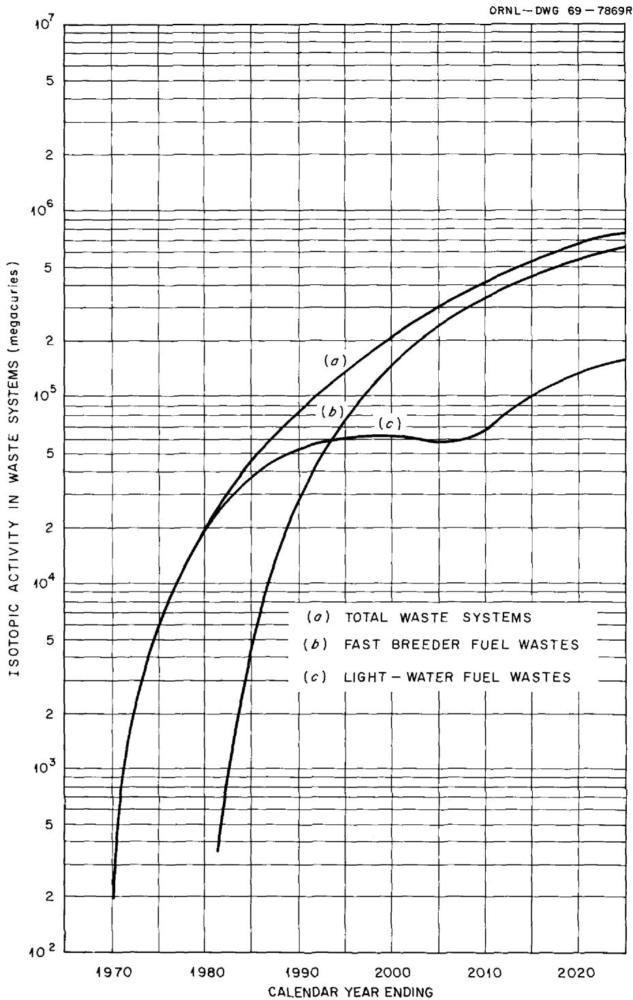  
Fig. 3.6. Total Accumulated Radioactivity in Wastes Generated by Reprocessing Spent LWR and IMFBR Fuels.

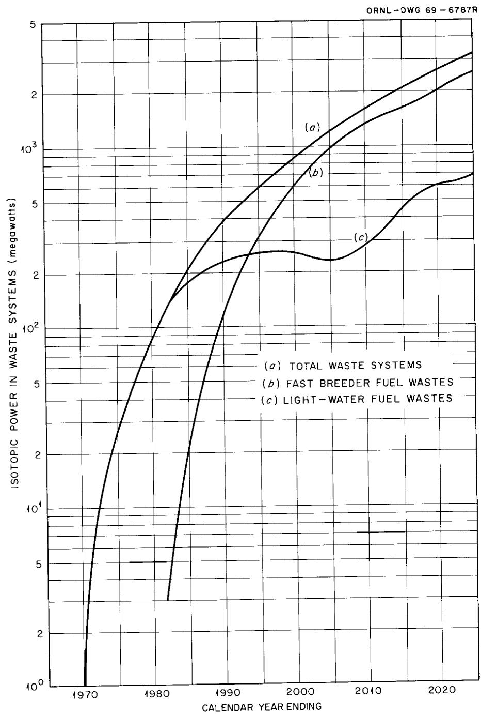  
Fig. 3.7. Total Accumulated Thermal Power in Wastes Generated by Reprocessing Spent LWR and LMFBR Fuels.

Annual Generation Rates. - The estimated annual generation of key fission-product and actinide isotopes is presented in Table 3.59.

# 3.5.2 Management of Solidified High-Level Wastes

Estimates were made of the conditions that would exist if high-level liquid wastes from fuel reprocessing were solidified and then shipped to a salt mine repository for permanent storage. Table 3.60 presents the volumes in storage, the required storage canal capacities, the number of waste shipments, and the total and accumulated mine space needed if the wastes were solidified immediately and shipped after 5 years of interim storage on-site. Table 3.61 gives analogous data for the case of storing the solidified wastes on-site for 10 years.

# 3.5.3 Intermediate- and Low-Level Liquid Wastes

The projected generation of so-called intermediate- and low-level liquid wastes as the result of LWR and LMFBR fuel reprocessing is given in Table 3.62. Volumes of these wastes were calculated on the basis that about 200 gal and 10,000 gal, respectively, are produced per metric ton of fuel reprocessed. This corresponds roughly to present practice; however, it can be anticipated that, in the future, intermediate-level wastes will be combined with high-level wastes and converted to a solid form. In addition to the volumes of low-level wastes shown in Table 3.62, about 3 million gal of low-level waste is generated annually at each reprocessing plant from sources such as cell drainage, equipment decontamination flushes, and laboratory sinks.

# 3.5.4 Solid Wastes

If mechanical decladding, as exemplified by a shear-leach head-end step, is used in reprocessing, the cladding hulls and associated fuel-assembly hardware containing neutron-induced radioisotopes (as well as some of the actinides) will constitute an important source of solid waste. Calculated levels of these isotopes for Zircaloy cladding and for stainless steel cladding are given in Tables 3.25-3.30 and Tables 3.49-3.54 respectively. Annual and accumulated volumes of cladding wastes, assuming compaction to $70\%$ of their theoretical densities, are given in Table 3.63.

Table 3.59. Projected Annual Generation of Key Fission Product and Actinide Isotopes in Wastes from LWR and LMFBR Fuel Processing<sup>a,b</sup>   

<table><tr><td rowspan="2">Calendar Year Ending</td><td colspan="6">Light-Water Reactor Fuels</td><td colspan="4">Fast-Breeder Reactor Fuels</td><td colspan="5">Total</td></tr><tr><td>1970</td><td>1980</td><td>1985</td><td>1990</td><td>2000</td><td>2020</td><td>1985</td><td>1990</td><td>2000</td><td>2020</td><td>1970</td><td>1980</td><td>1990</td><td>2000</td><td>2020</td></tr><tr><td>90Sr, megacuries/year</td><td>3.99</td><td>227</td><td>410</td><td>462</td><td>367</td><td>1080</td><td>15.5</td><td>93.5</td><td>398</td><td>1180</td><td>3.99</td><td>227</td><td>556</td><td>765</td><td>2280</td></tr><tr><td>137Cs, megacuries/year</td><td>5.55</td><td>316</td><td>571</td><td>643</td><td>511</td><td>1500</td><td>38.8</td><td>235</td><td>1000</td><td>3010</td><td>5.55</td><td>316</td><td>878</td><td>1510</td><td>4510</td></tr><tr><td>129I, curies/year</td><td>1.96</td><td>112</td><td>202</td><td>320</td><td>181</td><td>531</td><td>19.0</td><td>115</td><td>489</td><td>1470</td><td>1.96</td><td>112</td><td>435</td><td>670</td><td>2000</td></tr><tr><td>85Kr, megacuries/year</td><td>0.59</td><td>33</td><td>60</td><td>68</td><td>54</td><td>158</td><td>3.63</td><td>22</td><td>93.6</td><td>282</td><td>0.59</td><td>33</td><td>90</td><td>148</td><td>440</td></tr><tr><td>3H, megacuries/year</td><td>0.036</td><td>2.1</td><td>3.7</td><td>4.2</td><td>3.3</td><td>9.8</td><td>0.33</td><td>2.0</td><td>8.6</td><td>25.8</td><td>0.036</td><td>2.1</td><td>6.2</td><td>11.9</td><td>35.6</td></tr><tr><td>238Pu, megacuries/yearc</td><td>0.00072</td><td>0.041</td><td>0.074</td><td>0.084</td><td>0.066</td><td>0.195</td><td>0.02</td><td>0.121</td><td>0.515</td><td>1.55</td><td>0.00072</td><td>0.041</td><td>0.205</td><td>0.58</td><td>1.75</td></tr><tr><td>239Pu, megacuries/yearc</td><td>0.000085</td><td>0.0049</td><td>0.0088</td><td>0.0099</td><td>0.0079</td><td>0.023</td><td>0.0063</td><td>0.0379</td><td>0.162</td><td>0.486</td><td>0.000085</td><td>0.0049</td><td>0.0478</td><td>0.17</td><td>0.509</td></tr><tr><td>24CuPu, megacuries/yearc</td><td>0.000123</td><td>0.00705</td><td>0.0127</td><td>0.0144</td><td>0.0114</td><td>0.0335</td><td>0.0076</td><td>0.046</td><td>0.196</td><td>0.589</td><td>0.000123</td><td>0.0071</td><td>0.0604</td><td>0.207</td><td>0.623</td></tr><tr><td>24LuPu, megacuries/yearc</td><td>0.03</td><td>1.71</td><td>3.09</td><td>3.48</td><td>2.76</td><td>8.11</td><td>1.07</td><td>6.46</td><td>27.5</td><td>82.9</td><td>0.03</td><td>1.71</td><td>9.94</td><td>30.3</td><td>91.0</td></tr><tr><td>24LuPu, curies/yearc</td><td>0.35</td><td>20.1</td><td>36.3</td><td>40.9</td><td>32.5</td><td>95.4</td><td>22.6</td><td>137</td><td>584</td><td>1760</td><td>0.35</td><td>20.1</td><td>178</td><td>617</td><td>1850</td></tr><tr><td>24LuAm, megacuries/year</td><td>0.009</td><td>0.51</td><td>0.92</td><td>1.03</td><td>0.821</td><td>2.41</td><td>0.56</td><td>3.38</td><td>14.4</td><td>43.4</td><td>0.009</td><td>0.51</td><td>4.41</td><td>15.2</td><td>45.8</td></tr><tr><td>24LuAm, megacuries/year</td><td>0.00021</td><td>0.012</td><td>0.021</td><td>0.024</td><td>0.0192</td><td>0.056</td><td>0.0177</td><td>0.107</td><td>0.46</td><td>1.37</td><td>0.00021</td><td>0.012</td><td>0.131</td><td>0.474</td><td>1.43</td></tr><tr><td>24LuCm, megacuries/year</td><td>0.99</td><td>56.9</td><td>103</td><td>116</td><td>92.1</td><td>270</td><td>23.3</td><td>141</td><td>601</td><td>1810</td><td>0.99</td><td>56.9</td><td>257</td><td>693</td><td>2080</td></tr><tr><td>24LuCm, megacuries/year</td><td>0.129</td><td>7.37</td><td>13.3</td><td>15.0</td><td>11.9</td><td>35</td><td>0.44</td><td>2.67</td><td>11.5</td><td>34.3</td><td>0.129</td><td>7.37</td><td>17.7</td><td>23.3</td><td>69.3</td></tr></table>

${}^{a}$ Based on Systems Analysis Task Force,Phase 3,Case 42 (April 11,1968),and assumes a 2-year lag in waste generation after power production.   
bAssures that the LWR fuel is continuously irradiated to a burnup of 33,000 Mwd/metric ton at a specific power of 30 Mw/metric ton; also assumes that the LMFBR core is continuously irradiated to a burnup of 80,000 Mwd/metric ton at 14.8 Mw/metric ton, the axial blanket is continuously irradiated to 2500 Mwd/metric ton at 4.6 Mw/metric ton, and the radial blanket is continuously irradiated to 8100 Mwd/metric ton at 0.4 Mw/metric ton.   
<sup>c</sup>Assumes that 0.5% of the plutonium in the spent fuel is lost to waste.

Table 3.60. Waste Management Data for Conversion-to-Solids Concept (5-year interim solid storage)   

<table><tr><td rowspan="2"></td><td colspan="3">Calendar Year Ending</td></tr><tr><td>1980</td><td>1990</td><td>2000</td></tr><tr><td>Solid waste generation, ft3/yeara</td><td>9,730</td><td>26,900</td><td>46,000</td></tr><tr><td>5-year interim solid storage</td><td></td><td></td><td></td></tr><tr><td>Volume in storage, ft3</td><td>34,400</td><td>117,500</td><td>206,000</td></tr><tr><td>Length of 24-ft-wide canals, ft</td><td>690</td><td>2,340</td><td>4,100</td></tr><tr><td>1000-mile shipment to salt minesb</td><td></td><td></td><td></td></tr><tr><td>Number of shipments per year</td><td>62</td><td>332</td><td>614</td></tr><tr><td>Number of casks in transitc</td><td>2</td><td>7</td><td>12</td></tr><tr><td>Disposal in salt mines</td><td></td><td></td><td></td></tr><tr><td>Area required, acres/year</td><td>17</td><td>83</td><td>157</td></tr><tr><td>Accumulated area used, acres</td><td>43</td><td>540</td><td>1780</td></tr></table>

<sup>a</sup>One cubic foot of solid waste per $10^{4}$ Mwd (thermal) irradiation.   
bEach shipment consists of thirty-six 6-in.-diam pots containing 8 megacuries of radioactivity and generating 100,000 Btu/hr.   
One-way transit time is 7 days.

Table 3.61. Waste Management Data for Conversion-to-Solids Concept (10-year interim solid storage)   

<table><tr><td rowspan="2"></td><td colspan="4">Calendar Year Ending</td></tr><tr><td>1980</td><td>1990</td><td>2000</td><td>(2010)a</td></tr><tr><td>Solid waste generation, ft3/yearb</td><td>9,730</td><td>26,900</td><td>46,000</td><td>(--)</td></tr><tr><td>10-year interim solid storage</td><td></td><td></td><td></td><td></td></tr><tr><td>Volume in storage, ft3</td><td>43,800</td><td>194,000</td><td>363,000</td><td>(--)</td></tr><tr><td>Length of 24-ft-wide canals, ft</td><td>870</td><td>3,860</td><td>7,230</td><td>(--)</td></tr><tr><td>1000-mile shipment to salt minesc</td><td></td><td></td><td></td><td></td></tr><tr><td>Number of shipments per year</td><td>3</td><td>172</td><td>477</td><td>(814)</td></tr><tr><td>Number of casks in transitd</td><td>1</td><td>4</td><td>10</td><td>(16)</td></tr><tr><td>Disposal in salt mines</td><td></td><td></td><td></td><td></td></tr><tr><td>Area required, acres/year</td><td>0.7</td><td>40</td><td>113</td><td>(197)</td></tr><tr><td>Accumulated area used, acres</td><td>0.7</td><td>186</td><td>1010</td><td>(2560)</td></tr></table>

<sup>a</sup>Commitments made in the year 2000.   
bOne cubic foot of solid waste per 10,000 Mwd (thermal) fuel exposure.   
Each shipment consists of thirty-six 6-in.-diam pots containing 5 megacuries of radioactivity and generating 56,000 Btu/hr.   
One-way transit time is 7 days.

Table 3.62. Estimated Volumes of Low- and Intermediate-Level Liquid Wastes<sup>a</sup>   

<table><tr><td>Calendar Year Ending</td><td>Gallons per Year</td><td>Accumulated Gallonsb</td></tr><tr><td colspan="3">Intermediate-Level Wastec</td></tr><tr><td>1970</td><td>31,000</td><td>31,000</td></tr><tr><td>1980</td><td>777,000</td><td>3.5 x 106</td></tr><tr><td>1990</td><td>2.6 x 106</td><td>2.0 x 107</td></tr><tr><td>2000</td><td>3.2 x 106</td><td>4.9 x 107</td></tr><tr><td colspan="3">Low-Level Wasted</td></tr><tr><td>1970</td><td>1.6 x 106</td><td></td></tr><tr><td>1980</td><td>3.9 x 107</td><td></td></tr><tr><td>1990</td><td>1.5 x 108</td><td></td></tr><tr><td>2000</td><td>1.4 x 108</td><td></td></tr></table>

${}^{a}$ Based on fuel processing projections of Phase 3,Case 42,Systems Analysis Task Force (April 1968).   
bIn the future, these wastes will probably be combined with high-level wastes and solidified.   
Based on the generation of 200 gal of intermediate-level waste per metric ton of fuel processed.   
Based on the generation of 10,000 gal of low-level waste per metric ton of fuel processed. These wastes are decontaminated of radioisotopes to required levels and discharged to the environment.

Table 3.63. Solid Wastes from Spent LWR and LMFBR Fuel Processing   

<table><tr><td rowspan="2"></td><td colspan="4">Calendar Year Ending</td></tr><tr><td>1970</td><td>1980</td><td>1990</td><td>2000</td></tr><tr><td colspan="5">Volume of cladding wasteb</td></tr><tr><td>Annual, 103 ft3</td><td>0.3</td><td>8.3</td><td>41</td><td>87</td></tr><tr><td>Accumulated, 103 ft3</td><td>0.3</td><td>37</td><td>320</td><td>1030</td></tr><tr><td colspan="5">Total volume of solid wastec</td></tr><tr><td>Annual, 106 ft3</td><td>0.03</td><td>0.8</td><td>2.2</td><td>3.2</td></tr><tr><td>Accumulated, 106 ft3</td><td>0.03</td><td>3.5</td><td>16</td><td>49</td></tr><tr><td colspan="5">Burial ground aread</td></tr><tr><td>Annual, acres</td><td>0.6</td><td>16</td><td>44</td><td>64</td></tr><tr><td>Accumulated, acres</td><td>0.6</td><td>70</td><td>320</td><td>980</td></tr></table>

${}^{a}$ Based on fuel processing projections of Phase 3,Case 42,Systems Analysis Task Force (April 1968).   
${}^{\mathrm{b}}$ Based on 2.1 ft ${}^{3}$ of cladding hulls per ton of LWR fuel processed, and 8.7 ft ${}^{3}$ of cladding hardware per ton of LMFBR mixed core and blankets processed.   
Based on an average volume of 200 ft³ of solid wastes per ton of fuel processed.   
Based on burial of 50,000 ft³ of solid waste per acre of burial ground.

Other solid wastes that are generated as a result of routine reprocessing plant operation vary widely in size and characteristics. Annual and accumulated volumes were estimated (see Table 3.63) by using $200\mathrm{ft}^3/$ metric ton as the average volume of all solid wastes produced in fuel reprocessing. The land area needed for the ultimate disposal of all these solid wastes, assuming that the burial of a $50,000\text{-ft}^3$ volume requires one acre, is also shown in the table.

# 3.6 References

1. United States Federal Power Commission, National Power Survey, Parts 1 and 2, U.S. Government Printing Office, Washington, D.C. (1964).   
2. Forecast of Growth of Nuclear Power, USAEC, Division of Operations Analysis and Forecasting, WASH-1084 (December 1967).   
3. M. Searl, USAEC, memorandum ("Electricity Requirements and Generating Capacity by Areas for the Year 2000") to J. Vallance, March 1, 1967.   
4. Jackson & Moreland and S. M. Stoller Associates, Current Status and Future Technical and Economic Potential of Light Water Reactors, WASH-1082 (March 1968).   
5. K. Buttrey, O. R. Hillig, P. M. Magee, and E. H. Ottewitte, Liquid Metal Fast Breeder Reactor Task Force Fuel Cycle Study, NAA-SR-MEMO-12604 (January 1968).   
6. Chem. Technol. Div. Ann. Progr. Rept. May 31, 1969, ORNL-4422, pp. 89-91.   
7. J. H. Goode, ORNL, personal communication, January 8, 1969.

# 4. TECHNICAL CONSIDERATIONS

# 4.1 Design of Fuel Reprocessing Plants

Fuel reprocessing plants are characterized by their complexity. Typically, a fuel recovery process entails shearing the fuel (to rupture the corrosion-resistant sheath and expose the fuel), dissolution of the fuel in nitric acid, separation and purification of the uranium and plutonium by solvent extraction and ion exchange, and conversion of the product nitrates to oxides suitable for refabrication into fuel elements. In addition to the primary process, there are many auxiliary operations: treatment of the solvent to provide for its reuse, recovery of nitric acid from the aqueous streams, management of the gaseous, liquid, and solid waste effluents, and the specialized techniques and equipment required for process control and personnel protection.

The spent fuel is transported from the reactor to the reprocessing plant in heavy, shielded casks. The cask is unloaded in a water-filled pool, and the fuel is stored under water, which serves both as a transparent radiation shield and as a coolant. The fuel elements to be processed are transferred to a head-end cell and sheared into 2-in. lengths to expose the inner core, which is then leached with nitric acid in batch dissolving tanks. The leached hulls constitute a solid waste that is ultimately disposed of by land burial. The nitric acid solution of the fuel, containing the uranium, plutonium, and nearly all of the fission products, is the feed solution for the solvent extraction process.

Solvent extraction processes exploit the wide difference in concentration distribution between two immiscible phases - the organic and the aqueous. Nearly all major fuel reprocessing facilities employ some form of the Purex process, which makes use of the organic complexing compound, tributyl phosphate (TBP), in an inert hydrocarbon diluent. When this organic mixture is brought into countercurrent contact with the aqueous feed solution, the TBP extracts both the uranium and the plutonium into the organic phase, leaving the fission and corrosion products behind in the aqueous phase.

The TBP-organic solution of uranium and plutonium is stripped or back-extracted with dilute nitric acid. The back-extraction of plutonium can be vastly enhanced if the plutonium is reduced to the trivalent form, usually with ferrous sulfamate; this makes it possible to back-extract selectively first the plutonium and then the uranium. The two aqueous solutions are usually further purified by a second extraction cycle or by ion exchange.

The ferrous sulfamate that is used for reducing plutonium is, itself, oxidized to ferric sulfate in the reduction process, and thus contributes to the waste and interferes in the chemistry of subsequent plutonium purification steps. Uranium in the tetravalent state has been successfully used by the Europeans for this purpose; also, plutonium reduction can be effected with hydrogen.[2] Neither of these reductants contributes spurious chemicals to the process.

The uranium and plutonium may be precipitated from dilute nitric acid solution with oxalic acid. These oxalate precipitates are then removed by filtration, and the filter cakes are thermally decomposed to produce uranium and plutonium oxides. The oxides are sintered and ground, or extruded into pellets for fabrication into new fuel elements.

In the recently developed sol-gel process, $^3$ the nitric acid is removed from the aqueous solutions of plutonium or uranium by extracting the acid with an amine solvent. As the acid extraction proceeds, a stable, colloidally dispersed suspension of uranium oxide is formed. This is a "sol," which can be handled like a true solution. Progressive removal of water by evaporation or by extraction with a hygroscopic solvent converts the sol to a plastic gel. The sol can be formed into gel microspheres of controlled size by adding the sol dropwise into a stream of the hygroscopic solvent. When fired to about $1200^{\circ}\mathrm{C}$ , the gel attains a density near the theoretical density and is suitable for fabrication into reactor elements. Sols of plutonium and uranium can be combined and gelled to form "mixed" oxide microspheres in which the two elements are homogeneously dispersed.

Radioactive gaseous wastes from these operations are treated chemically, as well as by filtration, sorption, and scrubbing in order to reduce

their radioisotope content to levels that can be discharged to the atmosphere. The aqueous radioactive wastes that contain essentially all the fission products are generally concentrated by evaporation and stored on an interim basis in underground tanks. The evaporator overheads are sufficiently decontaminated of radioisotopes to permit their discharge to the environment under existing regulations.

# 4.1.1 Preventive Measures and Containment Criteria

Criticality. - Criticality is normally prevented by a combination of the following: limiting the concentration or quantity of material "in-process" by administrative means; imposing dimensional limitations on the process equipment; and adding parasitic neutron absorbers, either soluble or fixed to the process tanks. (The latter are usually in the form of raschig rings or parallel spaced plates.)

Administrative control is usually arranged so that the positive, simultaneous action of two responsible operators is required to add critical material to an "in-plant" inventory and to transfer material within the plant. A visual display of the fissionable material inventory status in each area is maintained, and transfer valves are kept locked with the keys in the immediate control of supervision. "Double-batching" is thus prevented, and the plant or discrete portion of the plant is made safe by limiting its in-process inventory to less than the minimum critical quantity.

Neutron absorbers, such as boron and cadmium added directly to the dissolver as soluble salts, are effective for criticality control in the dissolution and feed adjustment steps. These absorbers remain with the aqueous waste. Tanks of large volume packed with borosilicate-glass raschig rings may be used for the storage of fissile product solutions. Parallel plates of boronated stainless steel have been used in the bell-shaped end sections of pulsed columns.

Radiation. - Airborne radioactivity in the cell ventilation system, and in personnel operating areas, is usually detected by radiation-sensing instruments focused upon a filter through which a constant volume of air is drawn. Some designs use continuous filters and are set to alarm at

certain radiation levels; others employ a fixed filter but are set to alarm at a given rate-of-rise of the filter activity. Radiation fields in operating areas are monitored by ion chambers with level alarms. In order to avoid the hazard of spurious alarms, signals from two out of three instruments are required before an alarm sounds. The inadvertent entry of personnel into shielded process areas having high radiation fields is prevented by securely locking these areas, with access in the immediate control of supervision or other properly designated authority.

Containment Systems. - Processing plants are designed to ensure containment of airborne radioactivity by providing increasing levels of vacuum in three successive envelopes so that all air leakage flows from areas of low to those of high contamination potential. The building forms the outermost envelope, and it is operated at a pressure approximately 0.3 in. $\mathrm{H}_{2} \mathrm{O}$ lower than atmospheric pressure. This is a higher vacuum than a 30-mph wind could be expected to produce on the lee side of a rectangular building. All openings in the building communicate either with uncontaminated personnel areas, or with two doors in series, only one of which can be open at any time. The vestibule formed by the space between the doors is maintained as an uncontaminated area.

The shielded process cells form the second envelope of containment and are operated with a vacuum of about 0.7 in. $\mathrm{H}_{2}\mathrm{O}$ with respect to the building. The cell exhaust system has a rated capacity of approximately 0.1 cell volume per minute (to accommodate explosions or fires without pressurizing the cell), and the cell in-leakage rate is limited to approximately $10^{-3}$ cell volume per minute at a 2-in. $\mathrm{H}_{2}\mathrm{O}$ differential pressure. Seals that are used to close cracks and crevices are designed to withstand a minimum pressure of 10 in. $\mathrm{H}_{2}\mathrm{O}$ . The cell structure and its closures are designed to withstand the pressure that could be generated by any credible accident. Finally, the process equipment in the cell is operated at a negative pressure, with respect to the cell, of about 10 in. $\mathrm{H}_{2}\mathrm{O}$ .

Similarly, the direction of air flow through personnel areas in the building is controlled by introducing a positive air flow into offices that exhaust into corridors. From the corridors, the air flows successively toward operating areas, to limited access areas, and to hot laboratories, from which the air is exhausted through filters to the atmosphere.

Off-Gas Treatment. - Because of its higher radioactivity and chemical fumes content, the dissolver off-gas in most radiochemical plants is treated, in turn, for nitric acid recovery, for iodine removal, and for removal of residual acid fumes before being blended with the off-gas from the vessels in the balance of the plant. The vessel off-gas is usually scrubbed with caustic, dried, and filtered through one roughing and two high-efficiency filters (HEPA, asbestos-glass fiber paper, 99.97% DOP efficiency).

Iodine in most of its chemical states is removed from gas streams by reaction with $\mathrm{AgNO}_3$ impregnated on ceramic packing and by scrubbing with $\mathrm{Hg(NO_3)_2 - HNO_3}$ or caustic solutions. However, organic iodides, particularly methyl iodide, can be removed most efficiently by catalytic decomposition and sorption on silver, copper, or iodine-impregnated charcoal. The efficiency of iodine removal units is sharply dependent upon the concentration of the iodine, but $99.5\%$ is a commonly quoted design efficiency in cases where organic iodides are not removed. $^5$ The efficiency of charcoal impregnated with potassium iodide has been quoted at $99.99\%$ . $^6$

All off-gas streams from the plant are blended with the cell ventilation streams and passed through a sand filter, a deep-bed fiber-glass filter, or a bank of high-efficiency particulate air filters before being monitored and discharged up a stack.

# 4.1.2 Probable Trend of Plant Design

The principal concern in chemical plant design is safety, but economy is a necessary parallel objective. The size of processing plants will increase to take advantage of the lower unit processing costs associated with higher plant capacity. Newer reactor fuels, the IMFBR fuels in particular, will contain higher quantities of fissionable material. The high value of this fissionable material will supply an economic inducement for minimizing out-of-reactor processing time; thus fuel may be processed with as little as 30 days preprocessing decay time. This short decay period, combined with the increasing specific power and high burnups of future reactor designs, will exaggerate many fuel processing problems; for example, there will be more decay heat to dissipate, more radioactive off-gas to contend

with, more extensive disintegration of process reagents due to radiation, and more severe plutonium criticality considerations. In addition, the product-finishing end of the plant must be shielded owing to the presence of certain isotopes in recycled plutonium and uranium (238Pu, 232U).

The effect will be to direct plant design toward the use of high-capacity, small-volume equipment; this is equivalent to minimizing the plant inventory of both reactor fuel and process reagents. Continuous equipment (as opposed to the batch operations characterizing the industry in the past), and perhaps parallel lines to ensure operational continuity, will be easier to maintain and cheaper to operate. Minimizing the in-process inventory will serve both safety and economic considerations.

Transport. - Spent fuel shipping casks are expensive, but are most economical in large sizes (about 120 tons). Casks will be designed with relatively inexpensive removable canisters of such integrity as to ensure containment of the enclosed fuel throughout the postulated accidents that might occur during shipment. The sealed containers will permit the cask to be readily loaded and unloaded at the processing plant to minimize cask turnaround time, and the canisters will provide safe, contained storage while the fuel is awaiting processing.

Head-End. - Present mechanical shears are designed to accept entire subassemblies, denuded only of their hardware. If fuel elements could be designed to be readily disassembled (preshipment disassembly may prove desirable with fuel elements of high specific power in order to facilitate heat dissipation during shipment), small high-capacity shears, operating continuously at high output, would decrease the cost of the head-end equipment as well as facilitate its maintenance.

Outgassing of Volatile Fission Products. - One of the most difficult problems in reprocessing is that of containment of the volatile fission products, especially $^{131}\mathrm{I}$ . The volatile fission products (iodine, ruthenium, tellurium, cesium, tritium, krypton, and xenon) have been found to volatilize from oxide fuel at moderate temperatures (450 to $750^{\circ}\mathrm{C}$ ).<sup>9,10</sup> Outgassing of these elements is accelerated when the atmosphere contains oxygen because the interstitially-bound gas in the fuel is released during

the resulting oxidation of $\mathrm{UO_2}$ to $\mathrm{U}_3\mathrm{O}_8$ . This preoxidation will relieve the dissolution step of such treatment, thus reducing the consumption of nitric acid and the formation of nitrogen oxides. If dilution by the cell atmosphere is minimized, the volatile fission products can remain concentrated, thereby making their capture and eventual encapsulation much more efficient and reliable.

Although the noble gases are chemically inert, they can be concentrated by cryogenic distillation, $^{11}$ absorption in fluorocarbons, $^{12}$ or diffusion through permselective membrane. $^{13}$ The concentrated noble gases could then be compressed and stored, $^{14}$ or immobilized with foam (plastic, glass, or metal), $^{15}$ assuming that this method can be shown to be practical.

Dissolution. - Simple batch dissolvers are frequently preferred for small plants, particularly in instances where process control relies upon chemical analyses. However, continuous leachers are presently under active development in response to the obvious advantages of small physical size and better criticality control. The use of oxygen sparging promises to enhance the dissolution rate and to inhibit still further the evolution of the nitrogen oxides that complicate vessel off-gas treatment.

Extraction. - Countercurrent solvent extraction has been carried out in a variety of contactors: mixer-settlers, pulsed columns, and, more recently, fast centrifugal contactors such as those in service at Savannah River or the stacked-clone contactors under development at ORNL. Whereas the solvent has a total residence time in pulsed columns (and, therefore, exposure to the fission product radiation associated with the aqueous feed stream) on the order of 1 hr per extraction cycle, the centrifugal contactors reduce this time to a few minutes. Not only is the radiation damage to the solvent substantially reduced, but the volume of organic in the system and the attendant fire hazards are also reduced.

Instrumentation and Control. - Continuous equipment, such as the centrifugal solvent extraction contactors, have such a rapid response to process variables that automatic controls are almost mandatory. Centrifugal contactors are controlled by the position of the uranium concentration gradient in the cascade, largely eliminating the accumulation of off-grade material resulting from operator error.

Cell and Vessel Off-Gas. - The cell-ventilation and vessel off-gas systems are primary sources of routine and accidental releases of radioactivity. The recycle of gas from both systems is feasible and will minimize the volume of off-gas needing routine treatment. Recycle will probably be economical, and the use of an inert cell atmosphere may become practical. This would practically eliminate the possibility of solvent fires in process cells.

Liquid and Solid Wastes. - It can be anticipated that all radioactive liquid wastes from fuel reprocessing will be evaporated and blended to yield only two streams: a high-level waste consisting of a highly concentrated solution of fission products and actinides, and a low-level aqueous waste that has been sufficiently decontaminated of radioisotopes to permit it to be either discharged to the environment or recycled to the process. The conventional practice of accumulating aqueous solutions of fission products in underground storage tanks will probably be curtailed because of the difficulty in providing safe containment of the more concentrated solutions derived from reprocessing highly exposed power-reactor fuels. Adequately engineered storage systems may be so complex and expensive, as compared with the cost of early solidification of the wastes, that liquid storage systems will be limited in capacity merely to those surge volumes needed for plant flexibility. Under these circumstances, liquid waste inventories in storage would represent, at most, only a few weeks (or months) of plant operations.

# 4.1.3 Plant Decommissioning Considerations

With the exception of the studies of land reclamation costs at AEC production sites, there has been no known, careful consideration given to the eventual decommissioning of fuel-reprocessing plants. In the absence of a formal review, only the following general comments on this subject are offered.

The problem may be considered in two parts: one related to the plant process structures, and the other to the surrounding land, including that devoted to waste tank farms, solid waste burial grounds, and low-level liquid waste disposal. With respect to the plant buildings, the question

might be raised as to the need, in an expanding nuclear power economy, for them to be decommissioned in a manner that would return them to unrestricted use. Experience within the AEC has demonstrated that buildings housing fuel reprocessing and other types of radiochemical facilities can be decontaminated to levels that permit routine access by personnel and conversion of the facilities to other nuclear-related uses. One of the best documented instances of such a decontamination operation is that which followed an accidental plutonium release in an ORNL fuel reprocessing pilot plant.[18] The facilities in which this release occurred had been used to develop and demonstrate processes for recovering irradiated reactor fuels since 1944. Following this incident, they were decontaminated to levels well below those presently required by the AEC in terminating licenses for all materials licensees. Furthermore, there is experience in decontaminating nuclear power plants.[19] The Pathfinder, BONUS, Hallam, Carolinas Virginia Tube, and Piqua reactors have all been retired from nuclear service. In most instances, the uncontaminated areas were converted to non-nuclear uses, while the radioactive areas and major equipment were confined within biological shielding and sealed to prevent access by the public. In the case of Hallam, the reactor-complex building was demolished and removed from the site. The costs that have been reported for operations of this kind cannot be considered to be exhorbitant; yet it seems reasonable to expect that they might have been even less if the facilities had been designed and constructed with the need for eventual decontamination and decommissioning in mind.

Regulations have already been established that effectively limit the disposal of radioactive materials on other than federal- or state-owned land to very small (i.e., virtually negligible) quantities. Assuming that this very prudent policy will not be relaxed to any significant extent, and considering the prohibitive costs of reclaiming substantial areas of contaminated ground, it is obvious that the risks of contaminating land must be minimized. This entails interim storage of all solid radioactive wastes in concrete or other impervious enclosures from which they can be retrieved. Similarly, all exterior piping and vessels containing radioactive solutions, including liquid waste storage tanks, must be

designed to meet the same containment criteria as are specified for the processing areas.

# 4.1.4 Design Criteria for Resistance to Earthquakes and Tornadoes

The design analysis made for the Midwest Fuel Recovery Plant* (MFRP) tends to demonstrate that fuel reprocessing plants can be made resistant to the damaging effects of earthquakes and tornadoes.

One of the bases for MFRP design is that maximum earthquake and tornado conditions shall not impair the ability to shut down the plant safely and to maintain safe shutdown conditions. All potentially mobile radioactive process streams are confined to the Main Process Building. Process design is such that those operations which provide potential sources of mobile radioactivity can be suspended on short notice. Control under abnormal or emergency conditions is based on: prompt shutdown of process operations; maintenance of the integrity of confinement provisions, including systems for off-gas control; and assurance that radioactive decay heating does not lead to conditions of potential mobility.

On these bases, facilities critical to plant safety under emergency conditions are: the shielded cell (canyon) area, which provides confinement for major process systems; radioactive material storage areas, including the Fuel Storage Basin, Waste Volumes, and facilities for on-site retention of Pu and Np product prior to shipment, and sand filter and associated off-gas control and handling equipment.

Seismic design criteria for the MFRP plant are compared with those of three operating power reactors in Table 4.1. The MFRP plant is located in a zone of low seismic activity. All foundations extend to bedrock, which is either shale or limestone. The design earthquake forces, for which no damage to critical structures and components shall occur, are those associated with a ground acceleration of $0.1\mathrm{g}$ . Maximum earthquake ground acceleration, for which there shall be no loss of safe shutdown capability, is

Table 4.1. Examples of Principal Seismic Design Criteria for Containment   

<table><tr><td>Power Plant</td><td>San Onofre</td><td>Connecticut Yankee</td><td>Malibua</td><td>MFRPb</td></tr><tr><td>Horizontal ground acceleration of MPE</td><td>25% g c</td><td></td><td>30% g d</td><td>10%</td></tr><tr><td>Stress basis</td><td>Workingc</td><td></td><td>2/3 yielde</td><td>Working</td></tr><tr><td>Ratio of vertical to horizontal ground acceleration</td><td>2/3c</td><td>2/3f,g</td><td>2/3h</td><td>2/3</td></tr><tr><td>Provision for &quot;safe shutdown&quot; earthquake and accident</td><td>No loss of function at 50% g c</td><td>Stress ≤ yield and no loss of function at 17% g f</td><td>Stress ≤ yield e at 45% g</td><td>Stress ≤ yield and no loss of function at 20% g</td></tr><tr><td>Maximum horizontal ground acceleration estimate by Coast and Geodetic Survey</td><td>40% g i</td><td>17% g j</td><td>30% g k</td><td>20% g l</td></tr></table>

${}^{a}$ Current status does not include possible design provisions for fault displacement.   
bFrom Preliminary Design and Analysis Report, Amendment 3.   
Final Engineering Report and Safety Analysis, Sect. 11.2.   
d Preliminary Hazards Summary Report, Amendment 3, Exhibit C, Fig. 1.   
Preliminary Hazards Summary Report, Amendment 7, Exhibit F, p. 9.   
f Preliminary Hazards Summary Report, Amendment 2, Sect. 2.5 (revised).   
$\mathfrak{g}_{\mathrm{Horizontal}}$ and vertical responses are considered separately.   
hPreliminary Hazards Summary Report, Amendment 8, p. 3.   
$^{1}$ U.S. Coast and Geodetic Survey Report (Oct. 4, 1963).   
$\mathrm{j}_{\mathrm{U.S.}}$ Coast and Geodetic Survey Report (Jan. 9, 1964).   
$\mathbf{k}_{\mathrm{U.S.}}$ Coast and Geodetic Survey Report (Nov. 24, 1964).   
U.S.Coast and Geodetic Survey Report (June 30,1967).

0.2 g. The response spectra for the Design Earthquake are shown in Fig. 4.1. Response spectra for the maximum condition have twice the spectral amplitude shown in the figure.

MFRP plant structures are designed to withstand sustained wind velocities of 110 mph without impairment of any safety-related function. In addition, critical structures are designed to withstand the effects of short-term wind velocities of 300 mph without loss of shutdown and inventory control capability.

Seismic design of critical structures utilizes the shears, mounts, and displacements obtained from the preliminary analysis of their response to the specified ground accelerations under anticipated plant operating conditions. Recommendations set forth in the Uniform Building Code may be followed by using horizontal static forces that are equivalent in their design effect to the dynamic loads, and by taking into account the interaction of adjacent structures. Finally, to verify seismic design adequacy, structures thus designed may be subjected to additional dynamic analysis by the methods of modal analysis now being applied to critical power-reactor facilities.

In the seismic design of critical mechanical equipment, vessels and piping procedures developed for critical power-reactor system design may be utilized. This requires determination of the natural periods of vibration of the equipment; these periods are classified as rigid, resonant, or flexible, depending on whether the ratio of the fundamental frequency of the equipment to that of the structure is greater than (or the fundamental frequency of the equipment is greater than 20 cps), between 0.5 and 2.0, or less than 0.5 respectively. At MFRP, rigid equipment is designed to resist the spectral accelerations determined from the response spectra. Items falling in the resonant category will, if possible, be modified by design to avoid this classification. In cases where this is not feasible, the design of such equipment will take into account the interaction between the item and its supporting structure by utilizing appropriate analytical procedures (e.g., response determined from time-history acceleration input.)

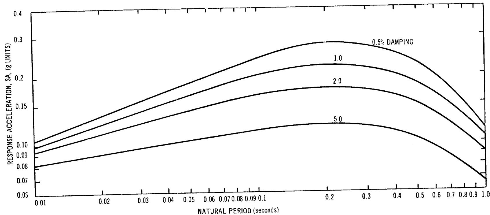  
[\xi  - 7]   
Fig. 4.1. Response Acceleration Spectra. (Drawing by courtesy of General Electric Co.)

In responding elastically with small damping, structures dissipate only a minor portion of the input energy; the remainder goes into strain energy and kinetic energy. Damping is a type of deflection-energy hysteresis with internal vibration that converts input energy into heat. Damping factors allow estimates of values of elastic energy absorption under excitation and are expressed as percentages of "critical" damping. Table 4.2 gives examples of assumed damping factors used for the design of three operating power reactor plants and the MFRP plant.

If the energy input under excitation exceeds the elastic energy storage capacity of the structure, the response must become inelastic, and the excess energy must be dissipated through yield of the structure. In turn, the elements that are most rigid in the direction of distortion will yield. One characteristic that an earthquake-surviving structure must have is toughness, for, in many places, brittle failures cannot be tolerated. In other, less-vital parts of the plant, the design for inelastic response (based on the energy absorption capacity) can lead to an important savings in materials.

# 4.2 Waste Management Technology: General

Radioactive wastes - solids, liquids, and gases - are produced at all nuclear industrial and research establishments. These waste materials will vary in chemical composition, volume, and radioactivity level, depending on the operations involved in their production. Normally, the sources of principal concern are the plants in which irradiated reactor fuels are reprocessed and, to a very much lesser extent, the reactor power stations; in fact, the real focal point of the waste management problem rests at the fuel-reprocessing plants and waste-disposal facilities because, at any given time, most of the total inventory of long-lived, biologically hazardous fission product will be found here.

The management of these waste materials currently is governed by the application of three widely accepted principles: (1) "dilute and disperse" the low-level liquid and gaseous wastes; (2) "delay and decay" the intermediate- and high-level liquid and gaseous wastes, particularly those waste

Table 4.2. Damping Factors in Percent of Critical Damping   

<table><tr><td>Component</td><td>San Onofre a</td><td>Connecticut Yankee b</td><td>Malibu c</td><td>MFRP d</td></tr><tr><td>Reinforced concrete structure (including the reactor vessel, reactor support structure, or process cells)</td><td>4.0</td><td></td><td>7.0</td><td>5.0</td></tr><tr><td>Containment structure and foundation</td><td>4.0</td><td>7.0</td><td>8.5 to 9.5e</td><td>5.0</td></tr><tr><td>Concrete structures above ground</td><td></td><td></td><td></td><td></td></tr><tr><td>a. Shear wall type</td><td>7.0</td><td>-</td><td>7.0</td><td>-</td></tr><tr><td>b. Rigid frame type</td><td>5.0</td><td>5.0</td><td>5.0</td><td>5.0</td></tr><tr><td>Steel frame structures, including supporting structures and foundations</td><td></td><td></td><td></td><td></td></tr><tr><td>a. Welded</td><td>2.5</td><td>1.0</td><td>1.0</td><td>1.0</td></tr><tr><td>b. Bolted or riveted</td><td>2.5</td><td>2.5</td><td>2.5</td><td>2.0</td></tr><tr><td>Mechanical equipment, including pumps, fans, and similar items</td><td>-</td><td>2.0</td><td>2.0</td><td>-</td></tr><tr><td>Vital piping systems</td><td></td><td></td><td></td><td></td></tr><tr><td>a. Carbon steel</td><td>0.5</td><td>0.5</td><td>0.5</td><td>0.5</td></tr><tr><td>b. Stainless steel</td><td>0.5</td><td>1.0</td><td>1.0</td><td>0.5</td></tr></table>

<sup>a</sup>From Final Engineering Report and Safety Analysis.   
bFrom Preliminary Hazards Summary Report, Amendment 3.   
cFrom Preliminary Hazards Summary Report, Amendment 2, Sect. 2.5 (revised).   
dFrom Preliminary Design and Analysis Report, Amendment 3.   
eTentative, assuming subsoil shear modulus of 60 ksi.

streams that contain short-lived radionuclides; and (3) "concentrate and contain" the intermediate- and high-level solid, liquid, and gaseous wastes. Since it is not always a simple matter to select one principle in preference to the other two, some combination of the three is often followed; of course, the nature and the volume of the waste, the limitations of the site for safe disposal, the possible radiation risk to nearby populations stemming from releases to the environment, and the cost must be taken into account.

# 4.2.1 Applications of the Dilution-Dispersion Principle

The application of this principle requires an understanding of the behavior of radioactive materials in the environment and of the pathways by which the released radionuclides, particularly those that are considered to be critical, may later lead to the exposure of man. There is a large body of knowledge available for use in the applications of this principle, particularly in the fields of meteorology, geology, geography, hydrology, hydrography, oceanography, ecology, soil science, and environmental engineering. Also, the experience with the disposal of gaseous effluents into the atmosphere, of liquid wastes into streams and oceans, of solid wastes at sea and on land, and of liquid wastes into the ground should prove invaluable. Applications of this principle have been made cautiously, and wisely so, thus ensuring that the releases are minimal and well within what is judged to be the local environment's capacity to receive them.

# 4.2.2 Applications of the Delay-Decay Principle

This principle is concerned with techniques dealing with the handling, storage, and disposal of intermediate- and high-level liquid and gaseous wastes - in some circumstances, even with the methods used to handle low-level wastes. The intent is to ease the problems of subsequent handling or to lessen the risk of releases to the environment, taking advantage of the passage of time and the decay of some of the radionuclides (particularly those having short half-lives). Of course, if waste is held in storage in a liquid form, the greater risk involved might, in some circumstances, dictate the need for early conversion to solids.

# 4.2.3 Applications of the Concentration-Containment Principle

This principle is invoked in techniques dealing with: air and gas cleaning; treatment of liquid wastes by scavenging-precipitation, ion exchange, and evaporation; treatment of solid wastes by incineration, baling, and packaging; treatment of solid and liquid wastes by insolubilization in asphalt; conversion of high-level liquid wastes to insoluble solids by high-temperature calcination or incorporation in glass; tank storage of intermediate- and high-level liquid wastes; storage of solid wastes in vaults or caverns; and disposal of liquid and solid wastes in deep geological formations.

# 4.2.4 Applications of ICRP Recommendations to Waste Releases

The policy of the nuclear industry has always been to try to keep radiation exposures of the general population within the dose levels set by the ICRP and various other national bodies. Indeed, its aim has been to reduce the potential exposures below these levels, having regard for what is reasonable and economical in the particular circumstances. Thus, more restrictive limitations are sometimes applied than those considered adequate by the ICRP.

In preoperational surveys or investigations in the initial phases of operation, crude estimates of permissible release rates are calculated in relation to appropriate dose limits for members of the public. The calculations are based on information relative to (1) the properties of the waste, (2) the physical and biological characteristics of the site and surrounding areas, and (3) the activities and habits of the nearby populations. Because of imprecisions in much of the information, additional safety factors are often applied to arrive at working standards (usually derived concentration limits) that are applicable to environmental media and/or foodstuffs. As the operations proceed and the results of environmental monitoring become available, the relationships between discharge rates and working standards are brought into clearer focus and the permissible discharge rates and/or derived concentration limits are revised as required.

# 4.2.5 Assessment of Current Waste Disposal Practices

Ultimately, the effectiveness of waste-disposal operations in the nuclear industry must be evaluated in terms of doses or dose commitments to members of the public as a result of these operations. The effects that such operations may have on the physical and biological environment must also be taken into account. Such an evaluation is almost impossible to make at the present time. To date, the ecological effects of waste releases have not received much attention because the releases have been minimal and limited to a few localities. However, these effects may require more attention by ecologists in the future.

A great deal of attention has been given to the dispersal of wastes from the nuclear industry in the past 10 to 15 years. The primary objective has been to obtain positive assurance that the resulting radiation exposures of members of the public have not exceeded the recommended population dose limits.

# 4.2.6 Definitions of Terms

Wastes are usually classified as high-, intermediate-, or low-level, depending on the concentrations and the toxicities of the radioactive constituents present. However, there are no generally accepted quantitative definitions of these categories, possibly because of the many complicated, and sometimes unknown, factors that must be taken into account to satisfy a rigorous definition. Each installation usually classifies its effluents on the basis of its own requirements for handling, treatment, and release, although the classification is generally related, at least qualitatively, to the maximum permissible concentrations in air (MPC<sub>a</sub>) and water (MPC<sub>w</sub>) recommended by the International Commission on Radiological Protection (ICRP).<sup>20</sup> In this report, unless otherwise specified, low-level wastes are defined as wastes that contain radionuclides at concentrations from 10 to $10^{4}$ times their MPC for the general population; intermediate-level wastes are defined as wastes that contain nuclides from $10^{4}$ to $10^{6}$ times their MPC; and high-level wastes are defined as wastes that contain radionuclides in excess of $10^{6}$ times their MPC.

In practice, the words "storage" and "disposal" are often used interchangeably with respect to radioactive waste management. In this report, the word "storage" means emplacement of materials with the intent and in such a manner that the materials can be retrieved later. "Disposal" means emplacement of materials in a manner or location that, for all practical purposes, makes them irretrievable.

# 4.3 Waste Management Technology: High-Level Wastes

The high-level wastes obtained from decladding the fuel and from the first-cycle solvent extraction are usually so different with regard to physical, chemical, and radiochemical characteristics that they are handled separately. Fuels are clad in alloys of Al, Mg, Be, Zr, and stainless steel, all of which become radioactive by virtue of neutron activation of the primary constituents or of impurities. From the standpoint of waste disposal, the most significant of these isotopes are $^{58-60}\mathrm{Co}$ , $^{55}\mathrm{Fe}$ , $^{54}\mathrm{Mn}$ , and $^{59-63}\mathrm{Ni}$ in stainless steel, $^{95}\mathrm{Zr}-\mathrm{Nb}$ and $^{125}\mathrm{Sb}$ in Zircaloy, and $^{26}\mathrm{Al}$ in aluminum. In the United States, aluminum cladding from natural-uranium metal fuels is removed by dissolution in $\mathrm{NaOH}-\mathrm{NaNO}_3$ solutions, whereas European practice has been to remove the cladding by mechanical means. In either case, the resulting wastes require long-term containment. Aluminium cladding solutions are stored in underground carbon steel tanks. $^{21,22}$ In the United Kingdom, metallic cladding waste is stored in special concrete buildings, $^{23}$ whereas, in France, it is compressed and stored in baskets under water. $^{24}$

Processes have been developed for the dissolution of Zircaloy in $\mathrm{NH_4NO_3 - NH_4F}$ solutions and for the dissolution of stainless steel in $\mathrm{H_2SO_4}$ solutions. Hot-cell studies of these processes have shown that the cladding wastes contain about $0.1\%$ of the total fission products and other constituents of the fuel,[25] as much as $90\%$ of the fission product[137]Cs may also be present in the cladding wastes from oxide fuels. These wastes are very large in volume, averaging 1500 to 2000 gal per metric ton of fuel processed. They are quite corrosive to ordinary materials of construction and, on neutralization, form bulky sludges and precipitates that make handling difficult. Because of these factors, mechanical methods for removing the claddings appear especially attractive from the standpoint of waste management.

The first-cycle raffinates contain greater than $99.9\%$ of the non-volatile fission products originally present in the fuel; as a consequence, they are the wastes that represent the greatest potential hazard. The most prevalent waste of this type arises from processing natural or slightly enriched uranium fuels, and can be a relatively pure solution of fission products in dilute nitric acid. The operating practices at some plants are such, however, that additional inert constituents, such as iron, sulfate, aluminum, phosphate, mercury, and silica, may also be present. Raffinates obtained from processing other types of fuels (e.g., alloys of enriched uranium with stainless steels, zirconium, molybdenum, and aluminium) contain substantial concentrations of the alloying materials. If these raffinates are neutralized, many of the alloying constituents and fission products that are present form precipitates. As much as $80\%$ of the decay heat may be associated with the solids under such conditions, thus complicating the problems of heat removal and waste transport.

Fission products are present in typical first-cycle raffinates in concentrations from $10^{4}$ to $10^{10}$ greater than their $\mathsf{MPC}_{\mathsf{W}}$ values; this indicates that a high degree of separation would be required before the water and other inert constituents of the waste could be safely released to the environment. A total of about $9 \times 10^{9} \mathsf{m}^{3}$ (5 cubic miles) of water would be required to dilute to $\mathsf{MPC}_{\mathsf{W}}$ all the fission products present in the waste obtained from processing 1 metric ton of fuel that had been irradiated to $10,000 \mathsf{Mwd}$ (thermal). From 1000 to 1500 years would be required for the longest-lived nuclides, $^{90} \mathsf{Sr}$ and $^{161} \mathsf{Sm}$ , to reach $\mathsf{MPC}_{\mathsf{W}}$ through natural decay. Furthermore, in addition to fission products, these wastes contain variable quantities of actinides, notably isotopes of $\mathsf{Pu}$ , $\mathsf{Am}$ , and $\mathsf{Cm}$ , with half-lives and biological toxicities that impose additional restrictions. Clearly, fission-product separation, dilution, or decay alone does not offer a feasible method of managing these wastes; however, all of these methods may be used singly or in combination as important steps in achieving that end.

# 4.3.1 Liquid Wastes

Interim Liquid Storage. - Currently, the first-cycle raffinates are reduced in volume, by evaporation, for more economic storage in tanks.

During the evaporation step, the volatility of nitric acid may be enhanced by steam stripping, and part of the acid may be decomposed by reaction with formaldehyde $^{26}$ or sugar. $^{27}$ In the United Kingdom, the evaporation is carried out under a vacuum corresponding to a pressure of $70 \mathrm{~mmHg}$ .

At AEC production sites, the volumes of concentrated raffinates range from 40 to several hundred gal per metric ton of fuel processed; and activity levels may be as high as several thousand curies per gallon, resulting in heat generation rates of 20 to 30 Btu $\mathrm{hr}^{-1}$ gal $^{-1}$ . In both the United Kingdom and France, great care is taken during processing to keep the first-cycle wastes free of inert salts; consequently, volume reductions to 10 to 15 gal per metric ton of fuel (and proportionately higher volumetric heat generation rates) are routinely achieved.

The wastes are stored as acid solutions in stainless steel tanks, or they are neutralized and stored in carbon-steel tanks. In the United States, these tanks, which range in capacity from 0.33 to 1.3 million gal, are encased in concrete and buried underground.[21,29,30] Decay heat is removed during storage either by allowing the neutralized wastes to self-heat, condensing the vapors, and returning the condensate to the tanks, or by use of water-cooling coils submerged in the waste. The smaller volumes of more-concentrated fission product solutions in Europe are stored at environmental temperatures in stainless steel tanks of 15,000- to 20,000-gal capacity. These tanks are equipped with water-cooling coils, and are housed in concrete vaults that are enclosed in industrial-type buildings.[26,28]

The tanks are equipped with devices for measuring temperatures and liquid levels, detecting leaks, and agitating the contents; they are also equipped with emergency facilities to maintain cooling and other essential services. Costs are dependent on tank size, materials of construction, and the degree of cooling and secondary containment required. In the United States, capital costs range from about $0.50 per gallon of storage capacity for 1.3 x 10⁶-gal carbon-steel tanks without cooling facilities to$ 5.40 per gallon for 300,000-gal stainless steel tanks equipped with cooling coils.

The experience with tank storage over the past 20 years has not been uniformly good. A total of more than 80 million gal of waste is currently

being stored in about 200 underground tanks in the United States. Fifteen tank failures, all in carbon-steel systems,\* have been reported. Eleven of these failures occurred at Hanford, where it is estimated that 140,000 curies of $^{137}\mathrm{Cs}$ (and relatively minor amounts of $^{90}\mathrm{Sr}$ and $^{239}\mathrm{Pu}$ were released to the ground. $^{31}$ Subsequent investigation showed that the radionuclides were retained by the soil within 10 to 15 ft below the tanks. Four tank failures and one release during a waste transfer operation occurred at the Savannah River Plant (SRP). $^{32,33}$ It is estimated that about 700 gal of waste may have leaked from the tanks, although measurements of groundwater contamination indicated that the release was much smaller than this. A plugged waste tank inlet at SRP caused an overflow of waste concentrate containing about 2000 curies of $^{137}\mathrm{Cs}$ during a waste transfer. However, no appreciable amount of radioactivity reached the river due to the sorption of cesium by sediments in the sewer and in the stream into which the sewer discharged. Although the causes of the tank failures are believed to be well understood and appropriate corrective measures are believed to have been incorporated in the designs of new tanks now under construction, a general lack of confidence in the long-term integrity of these systems seems to be merited, particularly as they pertain to the Civilian Nuclear Power Program.

An alternative to liquid storage may be immediate solidification of the wastes and interim storage as stable, solid products encapsulated in relatively small, portable containers of high integrity. If the wastes are solidified, using a fluidized-bed calciner, it may be more economical to store the granular solids on an interim basis in vented, air-cooled bins (similar to those at ICPP) before encapsulation and shipment to permanent storage.[34] However, it is possible that the practical and economic advantages to be gained by allowing many fission products with short and intermediate half-lives to decay prior to additional waste processing will make interim liquid storage for at least a few years a virtual necessity.

If so, the problems of heat removal, the requirement that the waste be maintained in a condition amenable to rapid, efficient transfer, and the economics of future solidification would dictate that the fission products be stored as relatively pure, acid solutions under non-boiling conditions. This statement is based on the considerations discussed below.

Heat Generation Rates. - Power-reactor wastes that are derived from fuels of high nuclear burnup will contain much larger quantities of fission products than do current wastes. In designing tanks and cooling systems to remove decay heat, consideration must be given to: (1) the age and concentration of the fission products at the time they are to be added to the tank, (2) the thermal characteristics of the waste, as determined largely by the physical states and concentrations of the inert chemicals present, and (3) the rate at which the tank is to be filled. There is little experience in storing power-reactor wastes, but a careful review of Hanford and Savannah River operating experience with existing tank farms indicates that, as acid solutions 120 to 150 days old, wastes with concentrations of inert salts comparable to present Purex production wastes could be stored at a volume of about 100 gal per $10^{4}$ Mwd (thermal) of fuel exposure. If these wastes are neutralized, considerations of heat removal from the precipitated solids indicate that storage at about 600 gal per $10^{4}$ Mwd (thermal) of fuel exposure would be practical. On this basis, the radioactivity level of the acid wastes 150 days after removal of the fuel from the reactor is about 13,700 curies/gal, which is equivalent to 200 Btu hr $^{-1}$ gal $^{-1}$ ; in the alkaline case, it is about 2300 curies/gal, or 30 Btu hr $^{-1}$ gal $^{-1}$ .

If a plant handled the fuel from an installed capacity of 23,500 Mw (electrical) (an annual load of $\sim$ 687 tons of 33,000 Mwd/ton fuel, decayed 150 days) for a period of 20 years, it would accumulate fission products (in its waste storage system) having heat generation rates as shown in Fig. 4.2. If the wastes were stored as liquids, approximately 227,000 gal of acid waste or 1,360,000 gal of alkaline waste would be accumulated annually. Figure 4.2 shows example cases of tanks containing from about 100,000 to 900,000 gal of acid waste, or the proportionate amounts of alkaline waste. Maximum heat-generation rates of $1.7 \times 10^{7}$ , $2.8 \times 10^{7}$ ,

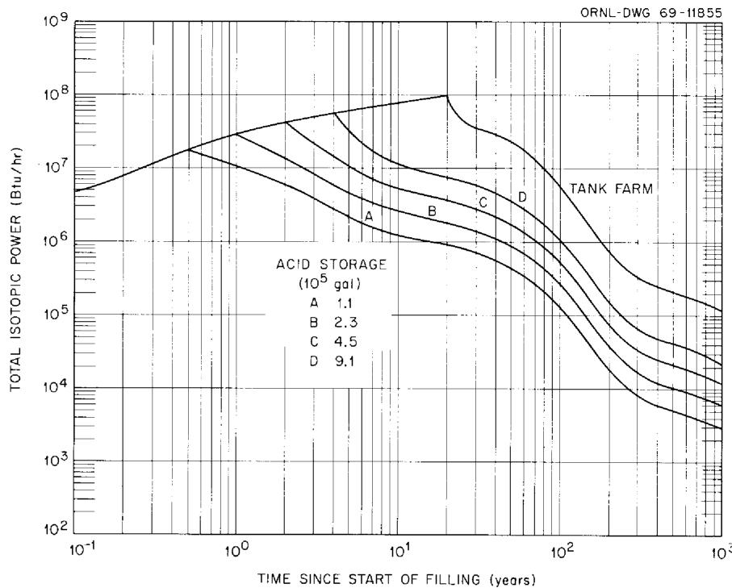  
Fig. 4.2. Variation of Isotopic Power with Time for Tanks Containing Fuel Reprocessing Wastes from a 23,500-Mw (Installed) Nuclear Power Economy.

$4.2 \times 10^{7}$ , and $5.6 \times 10^{7}$ Btu/hr are obtained when tanks A through D, respectively, are first filled. The rates then decrease with time and reach a value of $10^{5}$ Btu/hr after a decay period of 100 to 250 years. This is about the rate of heat loss by natural conduction to the environment from each of these tanks.

Radiolytic Hydrogen Production. - The radiolysis of water or aqueous solutions results in the production of hydrogen and oxygen. In the case of nitrate solutions, the hydrogen yields, $\mathrm{G}(\mathrm{H}_{2})$ , defined as the number of molecules formed per 100 ev of absorbed energy, have been shown to be dependent on the nitrate ion concentration. From the data of Mahlman,[35] it is estimated that $\mathrm{G}(\mathrm{H}_{2})$ for the acid wastes and the alkaline wastes are 0.03 and 0.10 respectively. These values are equivalent to about 3 ft $^3$ of $\mathrm{H}_{2}$ (STP) per 10 $^6$ Btu of fission-product heat in acid waste, and 10 ft $^3$ /10 $^6$ Btu in the alkaline case. If the waste is not stored under self-boiling conditions, provisions must be made to sweep the hydrogen from the vapor space above the waste and prevent its accumulation in the tank.

Corrosion. - Although the general corrosion rate for carbon steel that is used to store alkaline waste is only about 0.02 mil/year, some pitting has been observed;36 also, stress corrosion which occurs at the weld-affected areas, has indicated the need for heat treatment of the tanks, in place, before use.32 Overall corrosion rates of types 304L and 347 stainless steel during storage of acid wastes at about $140^{\circ}\mathrm{F}$ are a few hundredths of a mil per month, with grain-boundary but no intergranular attack.37,38 However, the rate of corrosion of stainless steel by acid wastes is accelerated to 30 to 45 mils/year at temperatures near boiling.39

# 4.3.2 Solidification

The conversion of high-level liquid wastes to solids as a pretreatment for disposal is being developed in laboratories of nearly all countries with significant near-future nuclear energy. Solidification is the only reasonably attainable technique for achieving a substantial increase in the safety associated with the storing and disposal of the high-level waste from the nuclear power industry. Other techniques, more exotic and perhaps

more positive (such as transporting wastes to other planets or to stars, or "neutralizing" the radioactivity by nuclear physics) are certainly not attainable in the immediate future.

It is expected that, for any given storage environment, storage of high-level wastes as solids will provide greater safety, by several orders of magnitude, than storage as liquids. Increased safety is provided by the solid form because this form is:

(1) immobile,   
(2) less soluble in water,   
(3) considerably smaller in volume, and   
(4) more rugged physically.

These advantages are significant and real for material that must be stored for many years or transported over private property.

It must be recognized that solidification is only part of the total disposal scheme. The other part is storage virtually forever* under stable, controlled conditions. Although guidelines for such storage are very important to the problem, they have not yet been established on a national or world-wide basis.

A considerable amount of work has been conducted in the past 13 years, and is in progress presently, for the development of solidification techniques for high-level liquid wastes. Four processes for solidification of high-level liquid wastes have been developed in the United States to the point of radioactive demonstration on an engineering scale. These four processes are pot calcination, spray solidification, phosphate glass solidification, and fluidized-bed calcination.

Overall Status. - The four solidification processes (pot, spray, phosphate glass, and fluidized bed) developed to the point of radioactive

demonstration on an engineering scale in the United States are shown in Fig. 4.3. The pot, spray, and phosphate glass processes have been demonstrated for the AEC on a full-level, engineering scale in the Waste Solidification Engineering Prototypes (WSEP) by Battelle-Northwest at Richland, Washington, since November 1966.[42-44] This demonstration will be completed in 1970. For the past seven years, the fluidized-bed process has been demonstrated for the AEC in a large-capacity plant in the Waste Calcining Facility (WCF) by Idaho Nuclear Corporation at Idaho Falls, Idaho, operating with aluminum and zirconium type wastes.

The pot, spray, and phosphate glass processes have been developed and demonstrated at processing rates of 10 to 20 liters of liquid waste, per hour, comparable to waste from processing about 1 metric ton of nuclear fuel per day. The fluidized-bed process has been demonstrated at rates as high as 300 liters/hr with wastes containing relatively low concentrations of self-heat-generating constituents. Scale-up of all processes beyond the equivalent of about 1 metric ton of fuel per day will require some additional nonradioactive development unless the present units are paralleled. An overall summary of the status of development of these and several other processes is given in Table 4.3.

In each of the four processes, heat is applied to raise the temperature of the waste to $400$ to $1200^{\circ}\mathrm{C}$ . At these temperatures, essentially all the volatile constituents (primarily water and nitrates) are driven off, leaving a solid or a melt that will cool to a solid. The resulting solids are relatively stable chemically, especially at temperatures lower than those used during processing.

General Chemical Considerations for Waste Solidification. - Solvent extraction using nitric acid or nitrate salts is the only production-scale means currently being used for the first-stage removal of fission products from the fissionable material in spent nuclear fuel. Consequently, all high-level wastes are primarily aqueous solutions of inorganic nitrate salts (which will decompose at temperatures below $500^{\circ}\mathrm{C}$ ). Differences in wastes occur mainly in the amounts and types of salts added to the solutions during reprocessing of the spent reactor fuel. The amounts of these artificially added chemicals can vary from being predominant to being mere

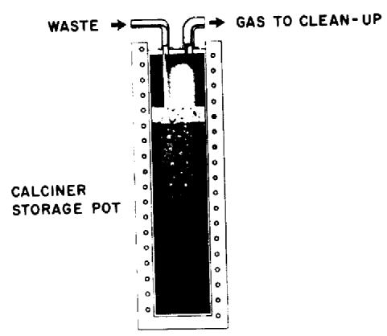  
a - Pot Solidification

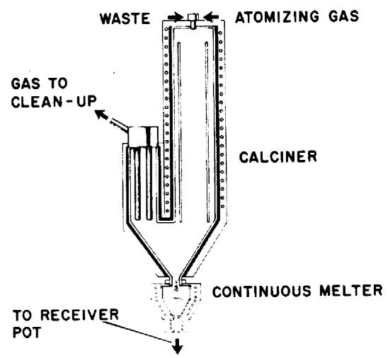  
b - Spray Solidification

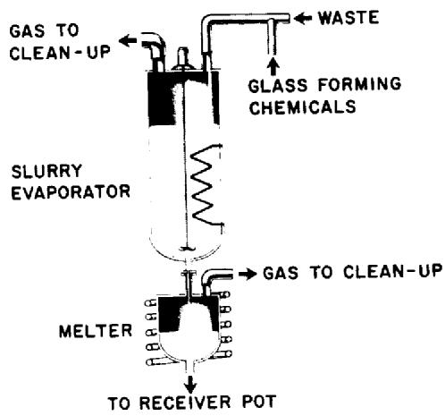  
c - Phosphate Glass Solidification

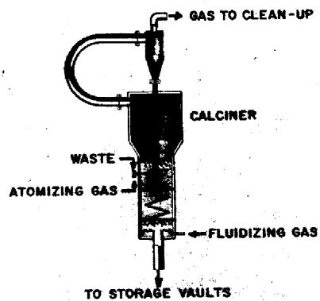  
d - Fluidized Bed Solidification   
Fig. 4.3. Primary Solidification Techniques in the United States. (Drawing by courtesy of Battelle-Northwest)

Table 4.3. Summary of Research and Development on the Solidification of High-Level Waste ${}^{a}$   

<table><tr><td rowspan="2">Process and Sites</td><td rowspan="2">Time Span</td><td rowspan="2">Lab Scale Radioactivityb</td><td colspan="2">Pilot Plant</td><td rowspan="2">Product</td><td rowspan="2">Chemical Additives</td><td rowspan="2">Status of Work</td></tr><tr><td>Radioactivityb</td><td>Capacity (liters/hr)</td></tr><tr><td colspan="8">Pot Calcination</td></tr><tr><td>ORNL</td><td>1958-1965</td><td>None</td><td>None</td><td>25</td><td>Calcine</td><td>Calcium, sulfate</td><td>Completed</td></tr><tr><td>BNW</td><td>1959-1962</td><td>None</td><td>None</td><td>10</td><td>Calcine</td><td>Sulfate</td><td>Completed</td></tr><tr><td></td><td>1962 to date</td><td>H</td><td>H</td><td>20</td><td>Calcine</td><td>Sulfate, calcium</td><td>In progress</td></tr><tr><td colspan="8">Spray</td></tr><tr><td>BNW</td><td>1959 to date</td><td>H</td><td>H</td><td>20</td><td>Ceramic, glass</td><td>Phosphate, borophosphate</td><td>In progress</td></tr><tr><td>USSR</td><td>~1961 to date</td><td>?</td><td>?</td><td>20</td><td>Calcine, glass</td><td>Borosilicate</td><td>In progress</td></tr><tr><td colspan="8">Phosphate Glass</td></tr><tr><td>BNL</td><td>1960 to date</td><td>None</td><td>None</td><td>20</td><td>Glass</td><td>Phosphate</td><td>In progress</td></tr><tr><td>BNW</td><td>1964 to date</td><td>H</td><td>H</td><td>20</td><td>Glass</td><td>Phosphate</td><td>In progress</td></tr><tr><td colspan="8">Fluidized Bed</td></tr><tr><td>ANL</td><td>1955-1959</td><td>None</td><td>L</td><td>6</td><td>Granules</td><td>None</td><td>Completed</td></tr><tr><td>INC</td><td>1955 to date</td><td>L</td><td>I</td><td>300</td><td>Granules</td><td>None</td><td>In progress</td></tr><tr><td>BNW</td><td>1959-1961</td><td>No work</td><td>None</td><td>20</td><td>Granules</td><td>None</td><td>Completed</td></tr><tr><td>USSR</td><td>~1962 to date</td><td>?</td><td>?</td><td>30</td><td>Glass, granules</td><td>Borosilicate</td><td>In progress</td></tr><tr><td colspan="8">Pot Glass</td></tr><tr><td>AERE</td><td>1959-1966</td><td>None</td><td>H</td><td>6</td><td>Glass</td><td>Borosilicate</td><td>Completed</td></tr><tr><td>FAR</td><td>1962 to date</td><td>H</td><td>L</td><td>20</td><td>Glass</td><td>Boroulumo-silicate</td><td>In progress</td></tr><tr><td>CPP</td><td>1969 startup</td><td>No work</td><td>H</td><td>20</td><td>Glass</td><td>Phosphosilicate</td><td>In progress</td></tr><tr><td>ORNL</td><td>1961-1966</td><td>None</td><td>None</td><td>3</td><td>Semiglass</td><td>Boroulumo-silicate</td><td>Completed</td></tr><tr><td colspan="8">Rotary Kiln</td></tr><tr><td>BNL</td><td>1955-1963</td><td>None</td><td>None</td><td>20</td><td>Powder</td><td>None</td><td>Completed</td></tr><tr><td>FAR</td><td>1960 to date</td><td>None</td><td>None</td><td>6</td><td>Glass</td><td>Phosphosilicate, Borosilicate</td><td>In progress</td></tr><tr><td colspan="8">Ceramic Sponge</td></tr><tr><td>LASL</td><td>1959-1964</td><td>None</td><td>L</td><td>4</td><td>Ceramic balls</td><td>None</td><td>Completed</td></tr></table>

${}^{a}$ Work is also being done in Canada, Germany, Denmark, India, Japan, and Czechoslovakia.   
bValues are based upon ref 15:   
H is $>70~\mathrm{Ci / kg}$ of solid:   
I is 0.07 to 70 Ci/kg of solid;   
L is $< 0.07$ Ci/kg of solid.   
Abbreviation summary:   
1. ORNL Oak Ridge National Laboratory, Oak Ridge, Tennessee   
2. BW Battelle-Northwest, Richland, Washington   
3. USSR Union of Soviet Socialist Republics   
4. BNL Brookhaven National Laboratory, Upton, Long Island, New York   
5. ANL Argonne National Laboratory, Argonne, Illinois   
6. INC Idaho Nuclear Corporation, Idaho Falls, Idaho   
7. AERE Atomic Energy Research Establishment, Harwell, Berks, England   
8. FAR Center for Nuclear Studies, Fontenay-aux-Roses, France   
9. CPP Center for Plutonium Production, Marcoule, France   
10. LASL Los Alamos Scientific Laboratory, Los Alamos, New Mexico

impurities when compared with the chemical fission product content of the wastes. The variations usually have marked impact on the solidification process conditions and on the nature of the final solidified waste.

All processes for solidifying high-level waste generate additional waste streams that contain intermediate levels of radioactivity. These are the vapor or condensate streams from the solidifier that have been decontaminated by factors of 10 to 1000. From this point, decontamination requirements of the effluents are comparable to those from the high-level liquid waste handling system of the fuel reprocessing plant. Processing of these effluent streams would logically and readily be done by recycle routing to the existing high-level liquid waste concentration and processing equipment. Only a modest increase in capacity (on the order of $10\%$ ) of the liquid waste processing capacity of the reprocessing plant would be required.

The first part of Table 4.4 describes five waste compositions that bracket the ranges of nonfission product compositions of wastes expected from fuel reprocessing by solvent extraction. All compositions are shown at a volume of 378 liters per metric ton of uranium fuel (100 gal/metric ton) to provide a common basis, although concentrations greater than about $\underline{4} \underline{\mathbb{N}}$ in total metallic ions will generally result in excessive precipitation which is unmanageable for extended storage.[28,26,46] The compositions shown in Table 4.4 assume that the fuel cladding is not dissolved with the fuel; consequently, the fuel cladding constituents are not present in the high-level waste.

Waste composition No. 1 is typified by a very high content of iron and a low content of other constituents. This waste has been generated by one reprocessor $^{47}$ by dissolving an iron fuel container with the fuel. Composition No. 2 is a moderately "dirty" waste from first-cycle waste combined with second-cycle waste that contains sulfate (which comes from a reductant in the uranium-plutonium partitioning step). Waste No. 3 is the same as waste No. 2 except that it has been neutralized prior to storage. Waste No. 4 is a "clean" waste, which would come from the first-solvent extraction cycle if reasonable care is taken to maintain a flow-sheet reasonably free of nonradioactive chemicals. This is expected to

Table 4.4. Range of Chemical Compositions of High-Level Liquid Wastes   

<table><tr><td rowspan="2">Constituent</td><td colspan="5">Concentration (M at 378 liters/metric ton) for Waste Composition</td></tr><tr><td>No.1</td><td>No.2</td><td>No.3</td><td>No.4</td><td>No.5</td></tr><tr><td colspan="6">A. General Chemical Composition of Inert Materials</td></tr><tr><td>Na</td><td>Low</td><td>High</td><td>High</td><td>Low</td><td>Low</td></tr><tr><td>Fe</td><td>High</td><td>Medium</td><td>Medium</td><td>Low</td><td>Low</td></tr><tr><td>Al</td><td>0</td><td>0</td><td>0</td><td>0</td><td>High</td></tr><tr><td>SO4</td><td>0</td><td>High</td><td>High</td><td>0</td><td>0</td></tr><tr><td colspan="6">B. Actual Chemical Composition of Inert Materials</td></tr><tr><td>H</td><td>3.7</td><td>3.93</td><td>(-)0.01</td><td>6.29</td><td>4.25</td></tr><tr><td>Fe</td><td>0.93</td><td>0.445</td><td>0.445</td><td>0.05</td><td>0.05</td></tr><tr><td>Cr</td><td>0.012</td><td>0.024</td><td>0.024</td><td>0.012</td><td>0.012</td></tr><tr><td>Ni</td><td>0.005</td><td>0.010</td><td>0.010</td><td>0.008</td><td>0.008</td></tr><tr><td>Al</td><td>0.001</td><td>0.001</td><td>0.001</td><td>0.001</td><td>0.65</td></tr><tr><td>Na</td><td>0.138</td><td>0.93</td><td>3.67</td><td>0.10</td><td>0.10</td></tr><tr><td>U</td><td>0.010</td><td>0.010</td><td>0.010</td><td>0.010</td><td>0.010</td></tr><tr><td>Hg</td><td>&lt;0.001</td><td>&lt;0.001</td><td>&lt;0.001</td><td>&lt;0.001</td><td>&lt;0.001</td></tr><tr><td>No3</td><td>7.5</td><td>5.37</td><td>2.0</td><td>6.66</td><td>6.5</td></tr><tr><td>SO4</td><td>-</td><td>0.87</td><td>0.87</td><td>-</td><td>-</td></tr><tr><td>PO4</td><td>0.003</td><td>0.006</td><td>0.006</td><td>0.003</td><td>0.003</td></tr><tr><td>SiO3</td><td>0.010</td><td>0.010</td><td>0.010</td><td>0.010</td><td>0.010</td></tr><tr><td>F</td><td>&lt;0.001</td><td>&lt;0.001</td><td>&lt;0.001</td><td>&lt;0.001</td><td>&lt;0.001</td></tr><tr><td>ΣM+chem (ref. a)</td><td>3.03</td><td>2.48</td><td>5.22</td><td>0.365</td><td>2.31</td></tr><tr><td>kg oxide/metric ton</td><td>31.7</td><td>28.1b</td><td>60b</td><td>4.6</td><td>17.2</td></tr><tr><td colspan="6">C. Chemical Composition of Major Materials from Nuclear Fission</td></tr><tr><td></td><td colspan="5">Fuel Exposure in Thermal Reactors</td></tr><tr><td></td><td colspan="3">20,000 Mwd/metric ton at 15 Mw/metric ton</td><td colspan="2">45,000 Mwd/metric ton at 30 Mw/metric ton</td></tr><tr><td>Mo</td><td colspan="3">0.065</td><td colspan="2">0.130</td></tr><tr><td>Tc</td><td colspan="3">0.014</td><td colspan="2">0.031</td></tr><tr><td>Sr</td><td colspan="3">0.0155</td><td colspan="2">0.036</td></tr><tr><td>Ba</td><td colspan="3">0.0195</td><td colspan="2">0.041</td></tr><tr><td>Cs</td><td colspan="3">0.035</td><td colspan="2">0.078</td></tr><tr><td>Rb</td><td colspan="3">0.007</td><td colspan="2">0.014</td></tr><tr><td>Y+REC</td><td colspan="3">0.12</td><td colspan="2">0.274</td></tr><tr><td>Zr</td><td colspan="3">0.065</td><td colspan="2">0.143</td></tr><tr><td>Ru</td><td colspan="3">0.032</td><td colspan="2">0.082</td></tr><tr><td>Rh</td><td colspan="3">0.0074</td><td colspan="2">0.013</td></tr><tr><td>Pd</td><td colspan="3">0.017</td><td colspan="2">0.043</td></tr><tr><td>Ag</td><td colspan="3">0.0008</td><td colspan="2">0.0016</td></tr><tr><td>Cd</td><td colspan="3">0.0008</td><td colspan="2">0.0025</td></tr><tr><td>Te</td><td colspan="3">0.0064</td><td colspan="2">0.014</td></tr><tr><td>ΣM+fp (ref. a)</td><td colspan="3">0.91</td><td colspan="2">2.11</td></tr><tr><td>kg oxide/metric ton</td><td colspan="3">22</td><td colspan="2">49</td></tr></table>

${}^{a}_{M^{+}}$ is metal equivalents, or normality of metal ions (does not include acid).   
b. Does not include the sulfate. If sulfate is not volatilized, approximately $27\mathrm{kg}$ of additional oxides per metric ton are formed.   
$c_{\mathrm{RE}}$ is rare earth elements.

be a fairly typical waste in the near future. Waste No. 5 is a waste that is generated in a TBP-25 process in which aluminum nitrate is used for the salting agent in the solvent extraction process.

Chemical adjustment of waste No. 3 is required before solidification since direct calcination will form unstable, hygroscopic $\mathrm{Na}_{2}\mathrm{O}$ . Upon acidification, the composition of this waste then approaches that of waste No. 2. The TBP-25 process offers no known major advantages over the Purex process for commercial plants; therefore, waste No. 5 is believed to have only minor importance in the future. Consequently, wastes having composition Nos. 1, 2, and 4 bracket the range of expected high-level liquid waste compositions.

The third part of Table 4.4 shows the amounts of fission product elements resulting from fissioning in thermal reactors with moderate- and high-exposure histories. The 20,000-Mwd/metric ton exposure is typical of current reactors, and the 45,000 Mwd/metric ton exposure represents probable maximum exposures in future thermal reactors.[48] It is obvious that, unless intermediate-level wastes from fuel reprocessing are mixed with the high-level wastes, the chemical content of fission produces will be significant in essentially all fuel reprocessing schemes. In fact, with moderate attempts to minimize the inert contaminants in the waste, the chemical equivalents of fission products will exceed those of the non-fission products, and the chemistry of the fission products will be the controlling factor in the waste treatment steps.

Another point of interest is that the absolute minimum weight of solidified waste (that of fission product oxides alone) is about $1.1 \, \text{kg}/1000 \, \text{Mwd}$ thermal exposure. Contributions from inert chemicals in the compositions shown in Table 4.4 can increase that volume by a factor up to about 4. Additional chemical additives are often needed to perform chemical functions during solidification. These additives are based on the total composition of chemicals present, and can increase the waste volumes by as much as a factor of 2.

Solidification processes that form melts require significant chemical modification of almost any waste composition. Compositions for waste

solidification generally require at least 70 mole % of inert chemicals to incorporate the fission products into materials that are meltable at reasonably low temperatures (i.e., at less than about $1000^{\circ}\mathrm{C}$ ). (A more typical value for inert chemical content in melts is $85\%$ ). Melts have been developed in which the major melt-making fluxes are phosphates, borophosphates, silicates, borosilicates and borates. In most cases, workable chemical composition ranges have been defined. However, general correlations for chemical compositions are somewhat difficult to define because of the complex interaction of all the constituents in the wastes. Therefore, each waste composition encountered usually requires at least some laboratory investigation of melt-forming composition. Similar studies are usually necessary to predict the occurrence of special problems, such as ruthenium or sulfate volatility, foaming, stickiness, etc., for all solidification processes.

Three of the inert chemical constituents listed in Table 4.4 are sufficiently troublesome during solidification to merit efforts to keep them out of high-level wastes. These constituents are sulfate, fluoride, and mercuric ions. Sulfate ion is generally unstable chemically at the higher range of temperatures reached in solidification (700°C and higher) and tends to volatilize. Retention of sulfate in the solidified waste at temperatures above 700°C requires chemical additives (usually calcium); for melts, it becomes very difficult above 950 to 1000°C.[49] The volatilization of sulfate results in added corrosion problems in the off-gas system recycle and in increased sulfate concentrations in the liquid waste for cases of partial volatilization; in cases of complete volatilization, another medium-to-high-level waste stream requiring special treatment and disposal is produced. Sulfate also causes severe precipitation and resultant solution handling problems from sodium - rare earth sulfates when the latter are present at concentrations of approximately 0.5 M or greater.[58]

Fluoride is retained with difficulty (by using calcium) during solidified waste processing up to temperatures of about $600^{\circ}\mathrm{C}$ , and is nearly impossible to retain significantly at higher temperatures. If it cannot be retained, it must be disposed of by another means (e.g., via the plant stack or discharge in a separate lower-level waste stream). A fluoride

content much greater than about 0.001 M will significantly increase corrosion of stainless steel and titanium (used generally in waste processing systems), although this corrosion can be partly overcome by use of complexing agents (aluminum, zirconium, etc.).

Mercury cannot be retained in solidified waste that is processed at temperatures above $400$ to $500^{\circ}\mathrm{C}$ . When volatilized, the mercury and its oxides condense at temperatures of about $350^{\circ}\mathrm{C}$ and provide relatively serious potential plugging problems. A means for pretreating the waste for removal of mercury has been developed in the laboratory.[61]

Ruthenium is just as troublesome in waste solidification as it is in fuel reprocessing. Its removal from the off-gas stream is more difficult than that of nonvolatile materials. One to eighty percent of the ruthenium will usually oxidize and volatilize during solidification. Additions of certain chemicals are sometimes required to minimize oxidation to the volatile $\mathsf{RuO_4}$ form. Even then, volatilization of at least $1\%$ is usually encountered.

Pot Calcination. - Pot calcination, which was developed at ORNL, is a batch process that has been developed to a state of readiness for commercial radioactive use. It is presently being demonstrated with full-level radioactivity on a pilot-plant scale. Its advantages are that it is a simple process and is adaptable to a wide variety of feed compositions. Its disadvantages are: (1) a stainless steel pot is required, (2) the amount of heat that can be incorporated into a pot is limited, (3) the capacity of a system using this process must be increased by multiple-pot lines, and (4) the solidified waste is more leachable than glassy solids.

Pot calcination is a batch process in which the principal processing vessel, the pot, is also the final container for the solidified waste. In pot calcination, liquid waste is added to a pot that is heated in a multiple-zone heating and cooling furnace. The waste is sufficiently concentrated at a constant volume that scale (salt cake) forms on the walls of the pot. As calcination continues, the scale grows in thickness and reduces the capacity for heat transfer from the pot wall to the boiling sludge; therefore, the feed rate must be reduced proportionately. When the feed rate is reduced to an "unprofitable" rate (about 5 liters/hr),

the feed supply is shut off. At this point, the scale has grown inward from the pot wall and upward from the bottom of the pot to fill the pot, except for a thin-cone-shaped liquid-containing void in the upper 2 to 3 ft of the salt cake. Heating is then continued until the liquid is boiled to dryness and all of the waste in the pot has been calcined and has reached the temperature of 850 to $900^{\circ}\mathrm{C}$ . The pot is then cooled in the furnace, removed, sealed, and sent to storage.

The product from pot calcination (i.e., the solidified waste) is a mixture of the oxides (and sulfates, if sulfate is present in the waste) of the metallic constituents in the original liquid waste. The product is a porous, friable calcine with a low thermal conductivity and a relatively high solubility in aqueous solutions.

The basic items of equipment required for pot calcination are: (1) a multiple-zone furnace for heating and cooling the calcine, (2) a pot for calcining the waste, and (3) an off-gas line from the pot to the first process condenser which can be washed down continually. The successful performance of pot calcination equipment fulfilling these requirements has been demonstrated, using full-level wastes in the Waste Solidification Engineering Prototypes.

Because the pots serve as the processing vessels, they are exposed to severe corrosion conditions during clacination; therefore, they must be made of corrosion-resistant material. Corrosion of type 304L stainless steel was found to be negligible during processing (< 0.0003 in./day). The pots must be equipped with liquid-level and temperature-measurement devices. Liquid level may be measured with a standard gas-purged dip tube or with an internal temperature sensor located near the top of the pot. In demonstration tests, temperature measurements were taken, with in-place thermocouples, at the center line and at the pot walls in each zone. Because of the significant cost of thermocouples, an incentive exists for either reducing the required number of these devices or for making them reusable.

Internal heat from the decay of radioactive constituents requires slight modifications of operating techniques. When internal heat is

present, the pot wall must be cooled before the material at the center of the pot has reached its final maximum temperature; if cooling is not available, the center temperature will exceed that desired. (Higher temperatures result in severe corrosion and potentially undesirable volatility of some constituents.) Control of this temperature has been successfully demonstrated by using a simple three-step reduction of furnace temperatures, based on pot wall and center temperatures.[62]

The pot calcination cycle may be divided into three major periods: (1) feeding and concentrating the waste at a constant feed rate, (2) pot wall scaling and calcining, which cause a gradual reduction of feed rate, and (3) calcining and cooling when the feed supply is turned off and the calcine is heated to 850 to $900^{\circ}\mathrm{C}$ and then cooled in preparation for removing the pot from the furnace. Typical time requirements for the steps are summarized in Table 4.5. Since the diameter of the pot has a relatively small effect on the overall processing capacity, an increase in capacity must be obtained by effecting changes in pot geometry (e.g., by use of annular pots) or by multiple pot lines.

Table 4.5. Time Cycles and Capacities for Pot ${}^{a}$ Calcination ${}^{62}$   

<table><tr><td>Pot diameter, in.</td><td>8</td><td>12</td></tr><tr><td>Pot height of fill, ft</td><td>6</td><td>6</td></tr><tr><td>Volume of calcine, liters</td><td>60</td><td>120</td></tr><tr><td>Feed volume, liters</td><td>500</td><td>1000</td></tr><tr><td>Initial feed rate, liters/hrb</td><td>30</td><td>60</td></tr><tr><td>Time at initial feed rate, hrb</td><td>10</td><td>10</td></tr><tr><td>Time at reduced feed rate, hr</td><td>20</td><td>30</td></tr><tr><td>Calcining and cooling time after feed is turned off, hr</td><td>10</td><td>30c</td></tr><tr><td>Total time cycle, hr</td><td>40</td><td>70</td></tr><tr><td>Overall cycle capacity, liters/hr</td><td>12</td><td>14</td></tr><tr><td>Equivalent waste processing capacity,d metric tons/day with Feed Concentration = 378 liters/tonne</td><td>0.75</td><td>0.9</td></tr></table>

aFor pots with an internal heat of 5 kw.   
bFor feeds relatively free of foaming tendencies.   
Estimated; exact data not available.   
dWith a feed concentration of 378 liters/metric ton.

Longer pots provide a slight increase in capacity because there is no marked increase in calcining and cooling times for such pots. Maximum boilup rate is limited by entrainment in the upper part of the pot, or by the cross sectional area of the pot. Some feeds may contain significant amounts of foam-making constituents (e.g., dibutyl phosphate from the reprocessing plant). If foaming is present, feed rates during the initial boiling period must be reduced from those shown in Table 4.5.

During the pot calcination of Purex wastes, ruthenium is volatilized to the extent of about $5\%$ and 10 to $30\%$ for low-sulfate wastes and high-sulfate wastes respectively.[62] Lower volatility can be effected by the addition of chemical reductants, such as nitric oxide or phosphites.[63]

When sulfate is present in the waste, less than $2\%$ of it will be volatilized from the calcine if the chemical composition of the feed is adjusted in such a manner that the chemical equivalent of alkali or alkaline-earth metallic ions is present. In practice, sodium and/or calcium nitrates are usually used.

The volatility of cesium and rubidium, which are always present as fission products, can be virtually eliminated by adding enough sulfate or phosphate ions to the feed to be chemically equivalent to the total amount of alkali metals present.

When the pot calciner is operated on a reasonably conservative basis, entrainment from it corresponds to approximately $0.1\%$ of the total feed.[62]

Spray Solidification. - Spray solidification is a continuous process that has been extensively developed and is approaching readiness for commercial use. It is currently being demonstrated with full-level radio-activity on a pilot-plant scale. The spray solidification process was developed at Battelle-Northwest. Its advantages are: (1) it is a continuous process with low hold-up volumes, (2) it is adaptable to a moderately wide variety of feed compositions, and (3) it produces a variety of good-quality solids. Its disadvantages are: (1) it is a moderately complicated system, (2) it requires good flow control of sometimes difficult-to-handle feed solutions, (3) its performance requires high-quality atomization, and (4) at present, it requires the use of a relatively expensive platinum melter. Results obtained from current pilot

plant tests of melting the calcined powder in the receiver pot, rather than using an expensive platinum melter, may eliminate one of the disadvantages.

In the spray calciner (see Fig. 4.3), liquid waste (which contains some or all of the melt-making additives) is fed through a pneumatic atomizing nozzle into the top of a heated cylindrical tower. The atomized waste is sequentially evaporated, dried, and calcined to a powder as it falls into a continuous melter (below the calciner), where it is melted at temperatures of 800 to $1200^{\circ}\mathrm{C}$ . Process gases from calcination flow into the adjacent filter chamber, carrying much of the calcined powder as dust. The dust collects on the porous metal filters as the gas passes through. The dust deposits are periodically blown off the filters by sudden pulses of high-pressure steam or air that is directed backward through the filters by small nozzles. The dislodged dust falls into the melter with the main stream of powder. The molten calcine flows through an overflow weir or a freeze valve into the receiver-storage pot below. After the pot is filled, it is cooled in the furnace, sealed, and sent to storage.

The product from spray solidification is a monolithic solid that is formed after the melt is cooled. The solid is a tough, microcrystalline, rock-like material having a good thermal conductivity and a moderately low solubility in aqueous solutions. (Glassy solids have also been prepared in the spray solidifier, but primary emphasis has been on microcrystalline materials.)

The basic items of equipment required for spray solidification are: (1) a pneumatic atomizing nozzle and a spray tower for atomizing and drying-calcining the feed, (2) a multiple-zone furnace for heating the spray tower, (3) an off-gas cleaning system near the spray tower to remove the bulk of the entrained calcine dust from the off-gases, (4) a continuous melter for melting the powdered calcine, (5) a furnace for heating the melter, (6) a pot for receiving the molten waste, and (7) a multiple-zoneed "furnace" for cooling (and possibly heating) the receiver pot.

In the continuous melter, the small amounts of residual nitrate and water present in the calcine are volatilized, and the calcine is melted. To date, platinum is the only reliable metallic material of construction that has been found to withstand the environment of corrosion and high temperature. The capacity of a platinum melter that is 10 in. in diameter and has a 14-in.-high heated section is 1.7 liters of melt per hour.[57] Platinum has been used extensively at temperatures up to $1250^{\circ}\mathrm{C}$ . A special alloy of $50\%$ chromium - $50\%$ nickel is generally satisfactory at temperatures up to $1000^{\circ}\mathrm{C}$ ; also, steels with high chromium and nickel contents, as well as some alloys with a high nickel content, are satisfactory at temperatures up to $900^{\circ}\mathrm{C}$ . The discharge of melt from the melter has been adequately demonstrated both on a continuous basis, using overflow weirs, and batchwise, using straight-tube freeze valves in which a plug of melt about 2 in. long is melted or frozen to provide on-off flow control.

The pot for receiving the molten waste may be made of mild steel if the pot is to be filled with melt by large, rapid, batchwise "dumps" from the melter, or if the pot is to be filled with a melt having a low melting point (less than about $700^{\circ}\mathrm{C}$ ). Mild steel is acceptable since the pots must be heated under most conditions only to the point where the melt will slump; this ensures complete filling of the pots, without formation of stalagmites or voids. (Mild steel pots can acceptably resist temperatures up to about $650^{\circ}\mathrm{C}$ for several-day periods.) Corrosion of mild steel or stainless steel pots by phosphate melts at temperatures of about $700^{\circ}\mathrm{C}$ or lower is negligible.[64-66]

The spray solidifier concept requires that the sintering point of the calcined feed in the spray tower be higher than the temperature of the walls of the spray tower. Adherence to this limit will prevent gross sticking of calcine to the tower walls. In addition, the melting point of the final powder must be no more than about $900^{\circ}\mathrm{C}$ (see above). The chemical composition of the feed is then adjusted to fit these limitations. Some or all of the melt-making flux can be added, as a solid, directly to the melter to further widen flowsheet and operational flexibility.

The capacity of a spray tower increases significantly with (1) wall temperature, (2) degree of atomization, or spray drop size, (3) decreased stickiness of the feed, and (4) length and diameter of the tower. The capacity increases by about $30\%$ for each $100^{\circ}\mathrm{C}$ increase in wall temperature in the normal operating range of 500 to $750^{\circ}\mathrm{C}$ . Atomizing quality can affect capacity by a factor of 2. The drying capacity during the calcination of nonmelting calcines is about $30\%$ less than that with water; the capacity for the calcination of "melting" feeds is approximately a factor of 2 lower than that for nonmelting calcines. The calcine capacity increases approximately linearly with diameter up to about 2 ft and with length up to about 10 ft. Scale-up factors beyond these size limits are not yet well-defined. The typical capacity for a melting feed in a spray calciner of the size used in Waste Solidification Engineering Prototypes (13 in. in diameter by 6 ft long) is 20 liters of liquid waste per hour.

Most of the flowsheets used for spray solidification at Battelle-Northwest produce alkali metal - phosphate solids. These are used primarily because (1) they offer a relatively large latitude in chemical composition, (2) they have generally low melting points (700 to $900^{\circ}\mathrm{C}$ ), (3) they produce melts with reasonably low viscosities (less than 50 poises) at operating temperatures, and (4) the chemically adjusted feed solutions are easier to handle than those of other flowsheets and generally produce homogenous melts. The primary disadvantage of phosphate melts is the associated corrosion rate which is higher than that for other melts such as silicates, borates, etc. With the typical phosphate melts, microcrystalline solids are formed in spray solidification by adding enough phosphate to approach the composition of orthophosphate melts (total normality of cations/phosphorus = 2.5 to 3.0). Sufficient alkali metals are added to reduce the melting point to $700 - 900^{\circ}\mathrm{C}$ . Although the flowsheets are not always compatible with the spray solidifier, glassy solids are formed by adding more phosphate to the range of metaphosphate of hypophosphate melts (total normality of cations/phosphorus = 1.0 to 2.0).

Calcium is added in excess to melts containing sulfate; the calcium combines chemically with the sulfate and retains it. In some cases, a small amount of aluminum is added to increase the sintering temperature to

achieve more efficient operation in the spray calciner. Then, enough alkali-metal and phosphate ions are added to reduce the melting point to about $700^{\circ}\mathrm{C}$ . Some of these ions are added, in the form of solids, directly to the melter to permit operation of the spray calciner with a melt of a chemical composition having a higher melting point than that of the final melt. With the conditions used in the spray solidifier, $95\%$ of the sulfate is retained in the final solid.

Up to $75\%$ of the ruthenium can be volatilized from the spray calcination step (not during melting) with the phosphate flowsheets.[67] This volatility can be reduced by eliminating the melt-making flux from the feed and adding it to the melter,[66] or by reducing the oxidizing potential in the calciner. The volatilities of cesium and rubidium have not been significant in spray solidification flowsheets.

Phosphate Glass Solidification. - Phosphate glass solidification is a continuous process that has been extensively developed at Brookhaven National Laboratory (BNL) and is approaching readiness for commercial use. It is being demonstrated with full-level radioactivity on a pilot-plant scale. Its advantages are that it is a continuous process and it yields a good-quality glass product. Its disadvantages are: (1) it is a moderately complicated system, (2) it requires operation with slurries that are difficult to handle, (3) it cannot retain sulfate in the final solid, and (4) at present, it requires the use of a relatively expensive platinum melter.

In phosphate glass solidification, liquid waste that contains all of the melt-making additives is first fed to the evaporator, where it is concentrated and denitrated, by factors of 2 to 10, to a thick, syrupy, aqueous phosphate slurry.[68] The slurry is fed to the continuous melter, where final volatilization of the water, nitrates, and other volatile constituents is accomplished; then the resulting material is heated to 1000 to $1200^{\circ}\mathrm{C}$ to form a molten glass. The molten glass flows through an overflow weir or a freeze valve into the receiver-storage pot below. After the pot is filled, it is cooled in the furnace, sealed, and sent to storage.

The product from the phosphate glass process is a monolithic, moderately brittle glass that is formed after the melt has cooled. This glass has a fairly good thermal conductivity and a low solubility in aqueous solutions.

The basic items of equipment required for phosphate glass solidification are: (1) a continuous evaporator to concentrate the feed to a syrupy consistency, (2) a means to provide controlled feeding of the syrupy concentrate to the melter, (3) a continuous melter for final evaporation and melting of the waste, (4) a furnace for heating the melter, (5) a pot for receiving the molten waste, and (6) a multiple-zoneed furnace for heating and cooling the receiver pot. The last four needs are essentially identical to those in the spray solidifier.

The requirements for the continuous melter are essentially the same as those discussed previously for the spray solidifier. Exceptions are that, in the phosphate glass melter, the net heat transfer requirements are 50 to $100\%$ higher (primarily because of the added evaporation load) and the desired freeboard requirements above the melt level are somewhat higher because of the foaming tendency in the melter.[69] The capacity of a platinum melter that is 10 in. in diameter and has a 14 in.-high heated section is 1.2 liters of glass per hour, or about 3 liters of slurry feed per hour.[43,70] The vapor stream from the melter is hot (400 to $600^{\circ}\mathrm{C}$ ) and corrosive,[70,71] and must be routed through platinum piping until the temperature is reduced to about $120^{\circ}\mathrm{C}$ .

The pot for receiving the molten glass is similar to that for the spray solidification process. The low slump point (600 to $700^{\circ}\mathrm{C}$ ) and the continuous viscosity-temperature relationship for the phosphate glasses permit the filling of pots by the slow continuous dripping of the melt while the pot is heated only to $500 - 600^{\circ}\mathrm{C}$ .<sup>71</sup> Mild steel can tolerate these conditions during the filling of one pot.

The phosphate glass process can readily solidify high-level wastes solutions that contain sulfate, but the sulfate is completely volatilized from the melter. In this case, the vapor stream from the melter forms a separate stream of intermediate-level waste. This stream contains all the

sulfate, and normally about $30\%$ of the nitrate, 5 to $10\%$ of the radio-. ruthenium, and less than $0.5\%$ of all other radioactivity that was origi- nally in the liquid waste stream.[70] Because the sulfate cannot be reused, it requires special treatment for final disposal. When sulfate is not present, the condensate from the melter contains only nitrates and can be combined with the condensate from the denitrator-evaporator; alternatively, it can be condensed separately and recycled to the denitrator-evaporator to reduce the overall off-gas activity from the solidifier to less than about $1 \%$ for radioruthenium and to $0.5\%$ or less for all other radionuclides.

The chemical adjustments required for the phosphate glass process consist mainly of adding phosphoric acid to the feed to obtain a metaphosphate melt (total normality of metal ions/phosphorus = 1). The concentration (mole %) of the oxides of the alkali metals is maintained at about one-half of that of the total metal oxides in the melt in order to obtain a glass that forms at a reasonable temperature (850 to $1000^{\circ}\mathrm{C}$ ), melts at a low temperature (650 to $700^{\circ}\mathrm{C}$ ), and has good handling properties. The solids in the chemically adjusted feed to the denitrator-evaporator are gelatinous and are readily suspended. Concentration in the denitrator-evaporator sometimes progresses through stages of foaming or heavy crystalline deposits at lower than, as well as higher than, normal concentration factors.[72] These conditions must be defined for each flowsheet.

Fluidized-Bed Solidification. - The fluidized-bed solidification process that has been extensively developed for use with aluminum nitrate and zirconium fluoride - aluminum nitrate wastes. Development of this process was initiated at ANL, and has been extensively demonstrated by Idaho Nuclear Corporation. It has been extensively demonstrated with moderate radioactivity levels in production-scale equipment since 1963, and is now ready for commercial application. Development with the more complex Purex wastes has been limited. The advantages of the fluidized-bed process are that it is a continuous process with a relatively high capacity for a given equipment size, and the solidified waste product is readily transportable by pneumatic means. Its disadvantage is that it is a moderately complicated system.

In fluidized-bed solidification, liquid waste is continuously converted to granular solids by being heated in a fluidized bed of the solids, and the solids are continuously withdrawn from the calciner to storage bins (or the solids may be further converted to monolithic forms). The liquid waste is injected through pneumatic atomizing nozzles into the side of a heated $(400$ to $600^{\circ}\mathrm{C})$ bed of granular solids. This bed is continuously agitated (fluidized) by sparging gas upward through the fluidized-bed reactor. Contact of the waste with the hot, granular bed results in evaporation and calcination of the feed as coatings of the bed particles. The calcine that is entrained with the process gases from the calciner is removed from the gas stream by cyclone separators or filters, and is then returned to the main stream of particles. The main stream of particles is continuously removed from the reactor and transported to storage bins.

The product from fluidized-bed solidification is granular, with a mean particle diameter of about $500~\mu \mathrm{m}$ . The granules may be composed of crystals or amorphous solids. The granules are generally spherically shaped, and are moderately soft and friable. The thermal conductivity of the bulk calcine is relatively low.

The basic items of equipment required for fluidized-bed calcination are: (1) an atomizing nozzle and a reactor for atomizing and calcining the feed, (2) a means for heating the bed of calcine in the reactor, (3) an off-gas cleaning system located immediately downstream of the fluidized-bed reactor to remove the bulk of the entrained calcine dust from the off-gases,[73] and (4) a storage container for the calcined solids.

The heat for calcining must be provided in such a manner that the maximum temperature of the heat-transfer surface is less than the sintering point of the calcine, and the heat must be distributed in such a manner that is can be absorbed by the needs of the reactor. For small reactors (less than about 12 in. in diameter), the heat has been provided solely through the walls of the reactor, using conventional electric heating systems.[74-76] For larger reactors (and for some smaller reactors), additional heat has been added through heat-transfer surfaces inside the reactor bed to provide better heat distribution. Liquid NaK has been satisfactorily demonstrated as a heat-transfer fluid at the Waste

Calcination Facility (WCF), located at Idaho Falls, Idaho, and the combustion of gases is being investigated as an alternative heating method.[77] For high-level wastes having high rates of self-heat generation, the fluidized-bed system requires a means for cooling the contents of the bed or for dumping the bed during shutdown periods. Such provisions will eliminate the potential for self-overheating of the bed when the flow of feed to the bed is terminated.

Containers for fluidized-bed calcine may be individual pots, as discussed previously, or they may be large slab or annular containers, as demonstrated at the WCF.[78] The latter geometry provides for heat removal by air or water circulating around the outsides of the concentric annuli between the concentric storage bins. Thus far, containers for storing fluidized-bed calcine have been made of stainless steel; however, mild steel could possibly be used if air cooling were provided.

The fluidized-bed process has been amply demonstrated in the WCF with aluminum nitrate and aluminum nitrate — zirconium fluoride wastes having moderately high radioactivity levels.[77,79,80] The relatively limited development with Purex wastes indicates that the calcination of such wastes by fluidized-bed calcination is expected to be successful.[75,81] Purex wastes are less amenable to processing than aluminum wastes because of their greater solubility in the feed solution, their relatively high decomposition temperature, and the low melting point of the sodium nitrate in the wastes. Although these characteristics cause increased agglomeration of particles and increased formation of lumps around the nozzle, the formation of agglomerates can be controlled by impingement air-jet grinding, variations in fluidizing gas rates, and simple modifications to commercial atomizing nozzles.[75,81]

The volatility of ruthenium from aluminum nitrate wastes varies from less than $1\%$ at $550^{\circ}\mathrm{C}$ to greater than $90\%$ at $350^{\circ}\mathrm{C}$ ,[75] and averages $40\%$ in the WCF during operation at $400^{\circ}\mathrm{C}$ .[80] The addition of chemical reductants greatly reduces the volatility of ruthenium. For example, the volatility from Purex wastes at $500^{\circ}\mathrm{C}$ was about $70\%$ , but was reduced to about $1\%$ when sugar (a chemical reductant) was added to the feed.[75]

Sulfate is retained (greater than $99\%$ ) in the fluidized-bed calcination of Purex waste.[75] Fluoride is also retained $(99\%)$ with the calcine. Corrosion is controlled in the fluidized-bed calcination of zirconium fluoride - aluminum nitrate wastes by adding calcium in stoichiometric equivalence to the amount of fluoride present.[59]

Characteristics of Solidified Waste. - The three conditions that will determine the desirable characteristics of solidified waste are: (1) interterm storage, (2) transportation to long-term storage, and (3) long-term storage. The basic criterion is that radioactivity beyond safe limits is not permitted to enter the human environment. The desired characteristics of solidified waste with primary importance are: (1) high thermal conductivity, (2) low leachability by water (or possibly air), (3) good chemical stability and radiation resistance, (4) mechanical ruggedness, (5) noncorrosiveness to container, (6) minimum volume, and (7) minimum cost.

The net effect of high thermal conductivity is to increase the allowable heat-generation rate in a pot. This characteristic also reduces the amount of time that liquid waste must be stored before solidification and permits possible reductions in the volumes for solidified wastes. These effects are summarized in Fig. 4.4 for values that are typical for wastes from thermal reactors. The heat-generation rates of wastes from processing the mixed core and blanket fuels of future fast reactors will not be significantly different from those in Fig. 4.4 after the first half-year of decay.

Low leachability of the solidified products is desired in order to minimize the amount of contamination resulting in any water that might contact a breached container of solidified waste. The leachability and other characteristics of wastes solidified by the processes developed in the United States are shown in Table 4.6. In the case of the best solidified waste materials produced to date, less than one-millionth of the radionuclides are leached per unit specific surface per day.

On the first contact of melt-solidified waste with water, the leachability is relatively high; then, over a period of 10 to 50 days, it decreases by about a factor of 10 to a relatively steady rate.[82-84]

ORNL DWG 68-5840R1

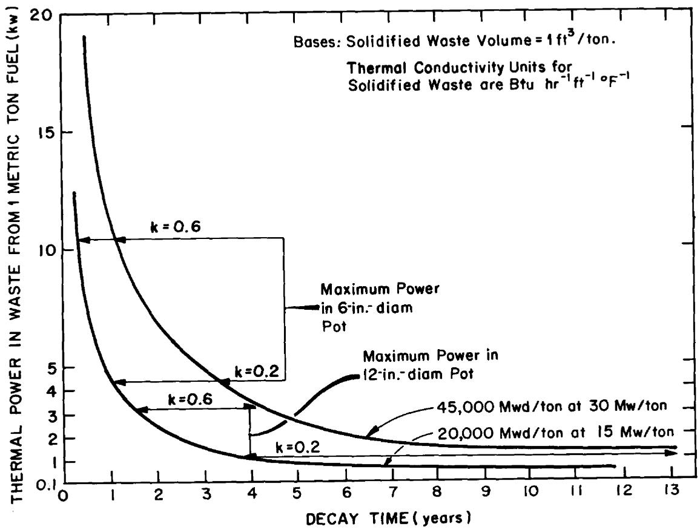  
Fig. 4.4. Effect of Thermal Conductivity upon Maximum Thermal Power Which May Be Stored in Containers of Solidified Wastes.

Table 4.6. Characteristics of Solidified High-Level Waste   

<table><tr><td></td><td>Pot Calcine</td><td>Spray Melt</td><td>Phosphate Glass</td><td>Fluidized-Bed Calcine</td></tr><tr><td>Form</td><td>Calcine cake</td><td>Monolithic</td><td>Monolithic</td><td>Granular</td></tr><tr><td>Description</td><td>Scale</td><td>Microcrystallinea</td><td>Glass</td><td>Amorphousb</td></tr><tr><td>Chemical composition, mole %</td><td></td><td></td><td></td><td></td></tr><tr><td>Fission product oxides</td><td>15 to ~80</td><td>5 to 30</td><td>5 to 25</td><td>5 to 50c</td></tr><tr><td>Inert metal oxides</td><td>10 to 50</td><td>40 to 50</td><td>10 to 30</td><td>10 to &gt;90</td></tr><tr><td>Sulfur oxides (if in waste)</td><td>0 to 40</td><td>0 to 40</td><td>0</td><td>0 to 40</td></tr><tr><td>Phosphorous oxides</td><td>~0</td><td>25 to 40</td><td>~60</td><td>~0</td></tr><tr><td>Bulk density, g/ml</td><td>1.1 to 1.5</td><td>2.7 to 3.3</td><td>2.7 to 3.0</td><td>1.0 to 1.7</td></tr><tr><td>Thermal conductivity, Btu/hr-1 ft-1 °F-1</td><td>0.15 to 0.25</td><td>0.4 to 1.0</td><td>0.4 to 1.0</td><td>0.10 to 0.25</td></tr><tr><td>Maximum heat, w/liter solidd</td><td>85</td><td>205</td><td>190</td><td>70</td></tr><tr><td>Leachability in cold water, g/cm-2day-1</td><td>1.0 to 10-1</td><td>10-3to 10-6</td><td>10-4to 10-7</td><td>1.0 to 10-1</td></tr><tr><td>Hardness</td><td>Soft</td><td>Hard</td><td>Very hard</td><td>Moderate</td></tr><tr><td>Friability</td><td>Crumbly</td><td>Tough</td><td>Brittle</td><td>Moderate</td></tr><tr><td>Residual nitrate, wt % of product</td><td>≤0.05</td><td>≤0.005</td><td>≤0.005</td><td>≤4.0</td></tr><tr><td>Volume, liters/1000 Mwd (thermal)</td><td>1 to 2.5</td><td>1.2 to 3</td><td>1.5 to 5</td><td>1.5 to 5</td></tr><tr><td>Maximum stable temperature, °C</td><td>~900</td><td>Phase separation at ~900</td><td>Devitrifies at ~500</td><td>~600</td></tr><tr><td>Container material</td><td>Stainless steel</td><td>Mild steel or stainless steel</td><td>Mild steel or stainless steel</td><td>Mild steel or stainless steel</td></tr></table>

Glassy products can also be made with some difficulty.   
b Microcrystalline products can also be made.   
Composition ranges for fluidized bed are also for Purex waste and are estimated.   
Approximate values for storage in air in 8 in. -diam cylindrical pots to maintain pot centerline temperatures at less than $900^{\circ}\mathrm{C}$ and pot wall temperatures at less than $125^{\circ}\mathrm{C}$ . Average k values were used.

The chemical stability and radiation resistance of solidified waste are important for two reasons. First, they ensure that gases, which may significantly affect the integrity of the product (or container, if present), are not generated during storage. Second, they ensure that the basic structure and properties of the solidified waste are known. Experience to date indicates that the formation of gas from solidified waste in enclosed containers is generally not significant if the storage temperature does not approach processing temperature.[78,82,85-87] However, a few exceptions have been indicated for calcine prepared from feeds with a high sodium nitrate content (nitrogen oxide volatility)[86] and for some phosphate-sulfate melts (sulfur oxide volatility).[88] Some "nonvolatile" constituents have been found to volatilize at temperatures above processing temperatures. For example, at $800^{\circ}\mathrm{C}$ , significant volatilization of cesium and ruthenium occurs from alumina solids prepared by the fluidized-bed process;[78] at $1200^{\circ}\mathrm{C}$ or higher, boron is volatilized from borosilicate glasses, and some phosphate is volatilized from phosphate melts.[82]

The basic structure and chemical properties of solidified waste will change with time because about $15\%$ of the fission products present after 6 months out of the reactor will eventually decay to other chemical elements. For calcines, this $15\%$ represents up to $10\%$ of the oxides present in the total waste; for melts, it represents up to $5\%$ of the oxides present. A clear definition of these changes with regard to properties and their effects is not well known. Some glasses will devitrify to microcrystalline structures if held at 400 to $800^{\circ}\mathrm{C}$ for days or weeks;[51,82,83,85,89,90] calcined alumina granules change from amorphous to crystalline form;[78] some volatile constituents migrate from thermally hot locations and condense at cooler locations,[78] and phosphates and other glasses sometimes exude liquids.[85,89]

Mechanical ruggedness of the solidified waste package is desirable, primarily during transportation. In the event that the container is breached, the ruggedness of the solidified waste is important in terms of its tendency to be dispersed. A waste that has low leachability, but is very brittle or easily scattered, may contaminate the environs to the same degree that a physically rugged waste with a higher leachability would.

The corrosiveness of the solidified waste to the container determines, in part, the life of the container. Corrosion of containers by solidified wastes has indicated no problem areas in limited measurements to date; however, very long-term effects have not been evaluated. The useful life of the containers is expected to be much longer than the 15 to 40 years for containers for liquid wastes.[91,92]

The minimum volume of the solidified waste is important, primarily, for economic reasons. In general, reducing the volume will reduce the size and cost of containers, container storage areas, shipping equipment, and land to be used for storage areas. Minimizing cost, without affecting quality, is an obvious merit.

Near Future Technology. - The technology of solidification has progressed to the point that three of the major processes in the United States are being demonstrated with full-activity-level wastes in engineering-scale equipment, and the fourth major process has been demonstrated with lower-activity-level wastes in large-scale equipment for six years. Most of the basic technology has been obtained; nonradioactive development work is nearly completed; and fully radioactive tests are in progress. The status of the radioactive demonstration program at the WSEP has been summarized recently,[93] and experimental results from that program are presented in Table 4.7.

The modest amount of nonradioactive development work on solidification processes now in progress in the United States is expected to be completed within the next two years, unless new applications arise. A small amount of laboratory-scale flowsheet work for special problems may continue beyond that time. Current work includes that on fluidized-bed calcination at ICPP, phosphate glass solidification at BNL, and spray solidification at BW. On completion of these studies, basic process and equipment technology will have been developed for general use.

Also, during 1970, demonstration of three processes (pot, spray, and phosphate glass solidification) with Purex wastes will be completed in the WSEP. The processes will have been demonstrated using fully radioactive wastes with thermal power and fission-product contents equivalent to the

maximum expected from advanced light-water reactors and fast-breeder reactors. The operation of the fluidized-bed calcination facility at ICPP will continue to convert aluminum nitrate and zirconium fluoride wastes to granular calcine having a thermal power up to about 1 w/liter.

Table 4.7. Overall Status of Radioactive Demonstrations at the WSEP as of February 1970   

<table><tr><td rowspan="2"></td><td colspan="4">Solidification Method</td></tr><tr><td>Pot</td><td>Spray</td><td>Phosphate Glass</td><td>Total</td></tr><tr><td>Runs completed</td><td>6</td><td>10</td><td>11</td><td>27</td></tr><tr><td>Megacuries solidified</td><td>4.0</td><td>17.5</td><td>19.3</td><td>41</td></tr><tr><td>Equivalent metric ton processed</td><td>11.3</td><td>14.6</td><td>12.8</td><td>39</td></tr><tr><td>Mwd (electrical) repre-sented by \( waste^a \)</td><td>75,000</td><td>98,000</td><td>106,000</td><td>279,000</td></tr><tr><td>Metric ton/day rate</td><td>0.6-1.0</td><td>0.5-0.9</td><td>0.3-0.7</td><td>-</td></tr><tr><td>Maximum kw in one pot</td><td>5.1</td><td>12.7</td><td>11.8</td><td>\( 153^c \)</td></tr><tr><td>Maximum w/liter in 8-in.-diam pot</td><td>85</td><td>205</td><td>\( 195^b \)</td><td>-</td></tr><tr><td>Maximum center-line temperature in pot, °C</td><td>940</td><td>930</td><td>840</td><td>-</td></tr><tr><td>Liters of solid/metric ton</td><td>40-50</td><td>30-65</td><td>50-100</td><td>-</td></tr><tr><td>Runs to complete</td><td>6</td><td>3</td><td>0</td><td>9</td></tr></table>

aAssuming $33\%$ thermal efficiency for 20,000 Mwd/metric ton and 45,000 Mwd/metric ton.   
b In a 6-in.-diam pot, 315 w/liter has been attained.   
Total kilowatts encapsulated to date.

In about two years, the fluidized-bed solidification system at the Midwest Fuel Recovery Plant will be converting Purex wastes, diluted with aluminum nitrate, to solidified, granular calcine having power densities up to about 200 w per liter of solid.

During the next two to four years, the technology obtained from this testing program will be as complete as reasonably possible. The characteristics of the solids generated in the WSEP program will have been measured and evaluated for the first few years following solidification.[94] This is the time period during which the solid is at its highest temperature and about one-half of the total radiation dose is obtained. Measurements will be made on core-drilled specimens from actual solidified wastes. Characteristics of solids generated in the ICPP and stored at higher temperatures (about $700^{\circ}\mathrm{C}$ ) will also have been investigated.[73] Current data[34,92,95] on economics of waste solidification and its management will be updated and well defined.

At least a small amount of developmental effort on any process in the nuclear fuel reprocessing industry, including waste solidification, will be required for any specific application that has not been previously demonstrated. The developmental requirements may be limited to laboratory tests; however, because of the high degree of reliability needed in the nuclear fuel reprocessing industry, a short demonstration program in pilot plants is frequently warranted.

# 4.3.3 Interim Storage of Solidified Wastes

Conceptual designs and cost estimates have been made for the storage of solidified, encapsulated power-reactor-fuel wastes for periods up to 30 years in water-filled canals, in air-cooled annular bins, and in air-cooled concrete vaults. While the bins and vaults were not characterized specifically as facilities for either "interim storage" or "permanent disposal," the systems, as conceived, should probably be considered suitable for storage over decades rather than centuries.

The interim storage of solid wastes can be accomplished safely in much less complex and less expensive systems than those required for the storage of the corresponding liquid wastes, although equivalent amounts of decay heat must be dissipated in all facilities having comparable inventories of radionuclides. An essential safeguard to be supplied is a thoroughly reliable and independent backup method for removing this heat in the event of a failure of the primary system.

Water-Filled Canals. - Canals were chosen for the interim storage of solids in ORNL waste-management evaluations because of their better heat-transfer environment and because canals present simpler mechanical problems in handling and transfer of the packaged wastes.[96] The storage facility (Fig. 4.5) consists of a central-facility canal, storage canals, and a service area containing water-cooling and purification equipment. The central facility was designed for receiving cylinders of waste from the solidification plant, and for routing them to the proper canal for storage. It was equipped with bridge cranes of 100- and 5-ton capacities mounted on tracks overhead. The containers of solidified waste were stored upright in a series of 24-ft-wide canals adjoining the central facility. The depth of the canals, as determined by the thickness of water needed for shielding and by the depth required to maintain the cylinders in an upright position, varied from 23 to 28 ft. As an aid in locating defective cylinders during storage, aluminum partitions were provided, spaced 8 ft apart, along the lengths of the canals. These partitions would channel the water for purposes of monitoring. The canal water was recycled for demineralization and cooling, and a structure was provided to house the area. About 500 ft of 24-ft-wide canals would be required to store the solidified acid wastes that would accumulate over a 10-year period from an installed 23,500-Mw nuclear economy. In the year 2000, it is projected that 7230 ft of 24-ft-wide canals will be required for 10-years interim storage of all solidified high-level fuel reprocessing wastes (see Table 3.61).

Air-Cooled Annular Bins. - A conceptual design for the storage of granular solids obtained from the fluidized-bed solidification of power-reactor fuel-reprocessing wastes was patterned after the original solids-storage facilities at the ICPP.[97] The solids are pneumatically transported to nested annular, vented, air-cooled, stainless steel bins contained in underground concrete vaults. The thickness of the bins is dependent upon the volumetric heat-generation rate and the thermal properties of the solids; heat is removed by air that is circulated by forced convection through 2-in.-wide passages separating the annular sections.

Air-Cooled Concrete Volumes. - Five 150-ft-long, 28-ft-wide, and 18-ft-high concrete vaults, ventilated through a single stack, were proposed by

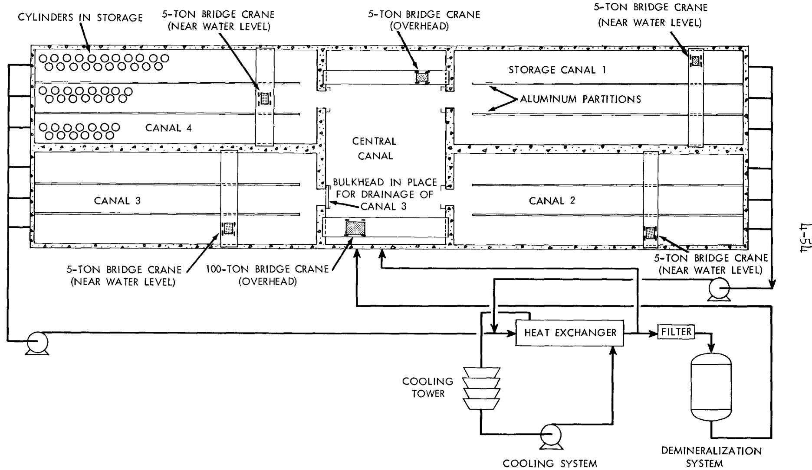  
Fig. 4.5. Concept of Interim Solids Storage Facility.

the British for storing waste that had been converted into cylinders of glass by the Fingal process.[98] In this concept, the vaults are constructed above grade and equipped with a mild-steel liner, which is surrounded by thermal insulation to maintain the concrete at ambient temperature. Air is circulated by fans to remove decay heat during the early years of storage, with the expectation that natural-draft ventilation would suffice thereafter. A facility of the size considered in this concept would contain the solidified wastes that would accumulate from reprocessing 1500 metric tons of Magnox fuel annually over about a 28-year period. To maintain safe storage conditions, ventilation would be required for 200 years.

# 4.3.4 Disposal of Solidified Wastes in Bedded Salt Formations

Background. - In September 1955, at the request of the AEC, a committee of geologists and geophysicists was established by the National Academy of Sciences - National Research Council (NAS - NRC) to consider the disposal of high-level radioactive wastes in geologic structures within the continental United States. This committee proposed storage in natural salt formations as the most promising method for the near future.[99] As a result of the recommendations of this committee, a study of the problems of disposing of high-level radioactive waste in salt was begun.

Some of the advantages of natural salt formations as repositories for radioactive wastes are:

1. Salt is essentially impermeable due to its plastic properties.   
2. Salt is widely distributed and abundant, underlying about 500,000 square miles in the United States (see Fig. 4.6) and with known reserves greater than $6 \times 10^{13}$ tons.[100,101]   
3. The cost of developing space is relatively low as compared with other rock types.   
4. The heat-transfer properties of salt are good as compared with other rock types (k = 2.5 Btu hr⁻¹ ft⁻¹ °F⁻¹ at 200°F).<sup>102</sup>   
5. Salt formations in the United States are located in areas of low seismicity.

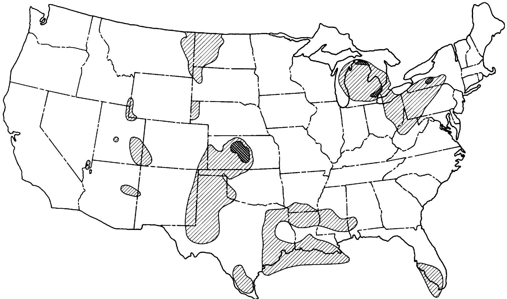

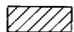  
ROCK SALT DEPOSITS IN THE UNITED STATES (SEE PIERCE AND RICH, U.S.G.S. BULL. 1148)

Fig. 4.6. Salt Deposits in the United States, and Those Portions Suitable for Initial Waste Disposal Facility.   
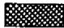  
SALT DEPOSITS HAVING THICKNESS OF AT LEAST 200 ft AND LYING WITHIN 2000 ft OF LAND SURFACE.

6. The compressive strength of salt is similar to that of concrete, or about 3000 psi.

Early investigations in the laboratory and in the field were aimed at the disposal of liquid wastes.[103-107] This approach was prompted by the fact that, while processes for converting aqueous fuel-reprocessing wastes to solids had been proposed, they were, at that time, in a very early stage of development.

In December 1961, the NAS-NRC committee met at AEC's Savannah River Plant to discuss progress made since the 1955 meeting and to make recommendations regarding future work. The conclusions and recommendations of the committee at this meeting were:

"that experience both in the field and in the laboratory on disposal of wastes in salt have been very productive, well-conceived; and that plans for the future are very promising. The Committee noted that the interpretations relating to disposal in salt are by the very nature of salt deposits capable of being extrapolated to a considerable degree from one deposit to another...;" [and]

"that the effect of storing dry packaged radioactive wastes in a salt deposit be tested, and urges the Atomic Energy Commission to consider using, at an early date, Federally controlled land in the Hutchinson area."

Following this meeting, the AEC requested that ORNL consider the possibility of testing or demonstrating the disposal of high-level radioactive solids in a salt mine, using whatever sources might be available. Consequently, several radiation sources were examined, with the final choice being fuel assemblies from the Engineering Test Reactor (ETR) at the National Reactor Testing Station (NRTS).

In 1962, a preliminary study indicated that it was feasible to use irradiated fuel elements to establish the practicality of using salt for waste disposal. In this way, it would be possible to demonstrate the practicability of the disposal-in-salt concept before significant quantities of solidified waste would be produced.

Early in 1963, discussions between ORNL and the AEC led to a decision to extend considerably the scope of the demonstration as conceived in the

preliminary study. This extension in scope made it possible to obtain a vast amount of additional information on the deformational properties of salt at elevated temperatures, which would be valuable in the design of an actual disposal facility, and to demonstrate the use of prototype waste-handling equipment.

Major Conclusions from Studies of the Disposal in Natural Salt Formations. - The operation of Project Salt Vault (an experimental disposal of high-level radioactive waste solids in a bedded salt mine at Lyons, Kansas, using Engineering Test Reactor fuel assemblies in lieu of actual solidified wastes) successfully demonstrated waste-handling equipment and techniques similar to those required in an actual disposal operation.[109] A total of about $\frac{4}{3}$ million Ci of fission products in 21 containers, each containing an average of about 200,000 Ci, was transferred to the disposal facility in the mine and then returned to the NRTS at the end of the test. No hot cells were used at the mine; and, even under these conditions, the maximum personnel exposure was only about 200 mrad to the hands and head. In an actual disposal facility, hot cells would be required since the waste containers will offer only single containment. (The fuel cladding and the sealed canister was considered as double containment.)

During the 19-month operation of the radioactive phase of the demonstration, the average dose to the salt over the depth of the fuel assembly container holes was about $8 \times 10^{8}$ rads, and the peak dose was about $10^{9}$ rads. The dose decreased very rapidly with distance out into the salt; for example, the dose at 6 in. into the salt was only about $10^{8}$ rads. As anticipated from the laboratory studies, no significant radiation effects were detected.

Theoretical studies indicate that some free chlorine should be radiolytically produced within the salt structure; however, as predicted from laboratory studies, no detectable quantities of chlorine were released. Small quantities of what is believed to be a radiolytically produced organic peroxide were detected when the salt temperature exceeded $175^{\circ}\mathrm{C}$ , but this is expected to be of no consequence in an actual disposal operation. Although ultimate doses to the salt by wastes of the future

may exceed $10^{10}$ rads, the mass of salt involved will still be small and no detrimental effects are anticipated.

Both theoretical and experimental results indicate that rock salt is approximately equivalent to concrete as an absorber of gamma radiation. If this is true, approximately 5 ft of solid salt or 7-1/2 ft of crushed salt (assuming one-third to be composed of voids) will give adequate biological shielding to allow unlimited access to a salt mine room whose floor is filled with the most radioactive waste containers of the future. The containers would be located in backfilled holes in the floor, with the tops of the containers at the proper depth and with container spacing based on heat dissipation calculations.

Field tests have indicated that the heat-transfer properties of salt are sufficiently close to the values determined in the laboratory that confidence can be placed on theoretical heat-transfer calculations.110 Calculations to date have generally been approximate and on the conservative side, but more precise calculations are being made by using more sophisticated heat-transfer models.

At the beginning of the study of the use of salt for waste disposal, very little was known about the effects of heat on the behavior of salt in mines. It soon became apparent that, due to the unusual quasi-plastic properties of rock salt, there was little hope of developing exact theoretical solutions for the effects of stress, temperature, and other variables on the behavior of salt in mines. Consequently, the use of model salt pillars was investigated and found to be applicable. The behavior of model pillars at ambient temperatures was found to correlate with observed phenomena under actual mine conditions.[11] It was thus concluded that the behavior at elevated temperatures could be extrapolated to mine conditions. This conclusion has been borne out by the field tests.

The most significant finding in the field tests regarding the effects of heat on salt behavior is that the insertion of heat sources in the floor of a mine room produces a thermal stress whose effects are instantaneously transmitted around the opening (to the pillars and roof). These stresses produce increased plastic flow rates in the salt, and could possibly cause

mine stability problems if the roof of the room is very near a shale layer (a plane of weakness). In the demonstration area, such a shale layer existed at about 2 ft above the ceiling; however, it was found that conventional roof-bolting techniques were adequate to handle the problem. In an actual disposal operation, it is anticipated that rooms would be filled with waste and then backfilled with crushed salt rapidly enough that roof bolts would probably not be required.

The combined field and laboratory tests have provided sufficient information on the deformation characteristics of the salt to allow the development of both general and specific empirical criteria for design of a disposal facility in almost any bedded salt deposit.

In the course of these tests, it was discovered that small brine-filled cavities (in general, roughly cubic in shape, with sizes ranging from a few millimeters to microscopic) migrate toward a heat source. A typical bedded salt deposit might contain about $1/2\%$ water by volume. Calculations based on theoretical models and laboratory tests of the migration rates, as a function of temperature, were in reasonable agreement. Based on theoretical calculations, one might expect a total inflow of 2 to 10 liters of brine per waste container hole, which would take place over a period of 20 to 30 years after burial. The peak inflow rate of 200 ml to 1 liter per year per hole would occur about 1 year after burial. This brine inflow rate would be expected to taper off and approach zero after 20 to 30 years. Inflow rates similar to these were observed in the demonstration.

The field tests indicated that, once the migrating brine reaches the crushed salt backfilling the hole, the moisture moves upward and condenses in the colder regions above the waste containers. Since the upper regions of the waste containers may not be full of waste, the upper ends of the containers may be located in the condensation zone under some conditions. If this is the case, stress-corrosion-cracking of these portions of containers made of stainless steel may be anticipated. However, container failure would not be anticipated during the relatively short period of operation in an individual room (typically, about 1 month). If the containers are made of mild steel, then only generalized rusting may be

expected, and container integrity should be maintained for an indefinite period of years. Even if some containers do fail, this should not produce any problem since there should be no gas pressure in the containers. In the event that a cylinder becomes pressurized and then ruptures, the 7 to 8 ft of crushed salt above the containers would be expected to act as a filter and absorber for any material released. If some material should manage to escape the hole in spite of the crushed salt, the anticipated operating procedure will prevent ventilating air from coming in contact with personnel after it passes a waste storage room. Provision will also be made to route the ventilating air through an air-cleaning system and up a stack in the event of an activity release.

Generalized Concept of a Disposal-in-Salt Facility. - A generalized concept<sup>113</sup> of a mine facility to dispose of containers of solidified high-level radioactive wastes has evolved over a period of more than 10 years of research at ORNL. The facility is discussed here primarily to introduce the mode of operation, the basic elements, and the various requirements. Such a disposal facility could be located at any suitable place where an area underlain by bedded salt of appropriate thickness and depth is available. One quadrant of this postulated area is shown in Fig. 4.7. Each quadrant or sector around a central shaft complex would be developed and utilized in sequence. Initial development requires outlining the sector with dual corridors in order to maintain a dual ventilation system throughout the operations. Also, one row of rooms would have to be excavated before disposal could commence. One ventilation system serves the salt excavation activities, while the other isolated system provides fresh air to the waste-disposal operations. Operations would be conducted in such a manner that the fresh air never passes the front of a previously filled room before reaching areas of active waste-disposal operations.

The top of the waste shaft, which is used solely for lowering waste containers into the mine, is contained within a topside hot cell. The shipping casks, containing a number of waste containers, are unloaded in this facility; the containers are inspected, recanned or decontaminated if required, and lowered, successively, into the mine. A second hot cell, located at the bottom of the waste shaft, serves primarily as a radiation

ORNL-DWG 64-3902R

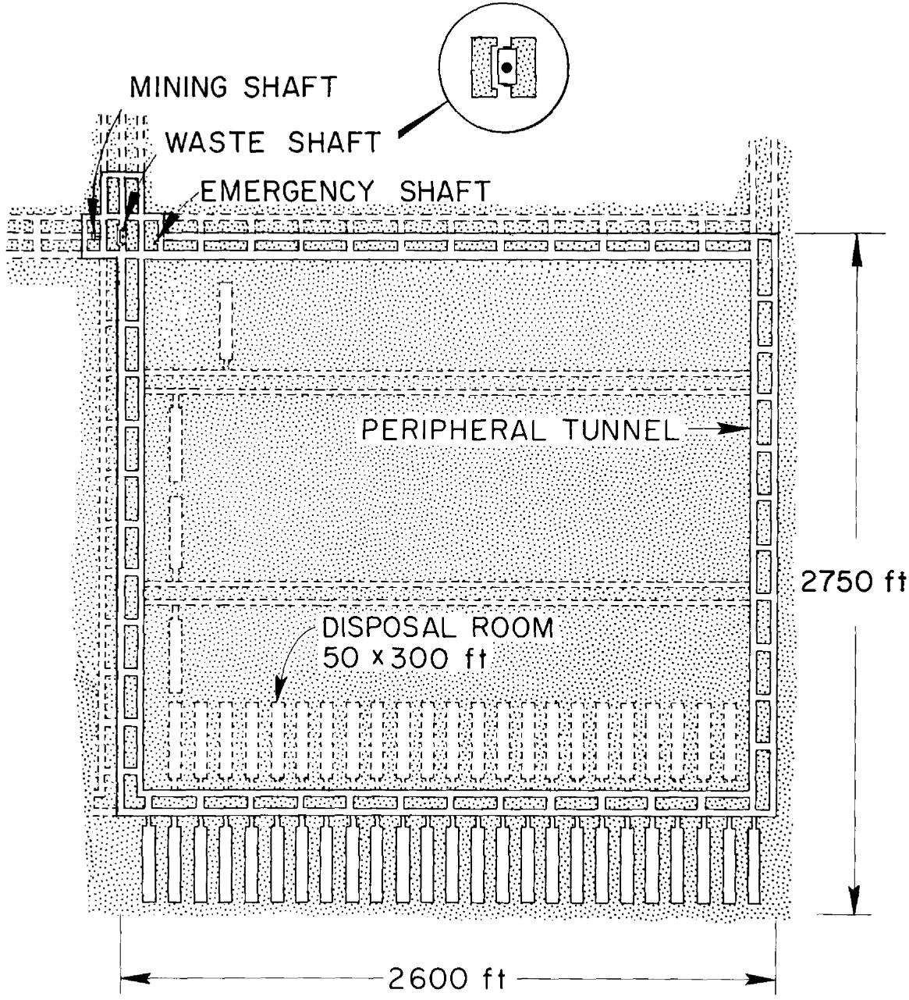  
Fig. 4.7. Quadrant of Mine Based on the l-Square-Mile Concept.

shield and a containment shell. Each waste container is lowered into this hot cell and into an underground waste transporter, which might be similar to that shown in Fig. 4.8. The waste container, enclosed in the lead-shielded transporter, is carried to the currently active waste-disposal room and deposited in a hole drilled in the floor; then the hole is backfilled with crushed salt via remote methods. When the entire floor area of a single room has been filled with waste containers, in a spacing pattern dictated by the heat-generation rate of the waste, the room itself is backfilled with crushed salt obtained from the excavation of the next row of rooms. In this general concept, the corridors connecting the filled waste rooms would also be backfilled, allowing the deformed solid salt to reconsolidate and, in time, the crushed salt, to recrystallize. Recrystallization of the crushed salt at the elevated pressure and temperatures would completely isolate the waste materials and thus prevent any possible contact with the environment.

Concept of an Initial Repository. - A study was made of the feasibility of establishing a repository in salt to serve the nation's needs for the next two to three decades. The availability of solidified wastes from the nuclear power industry and the cumulative space in salt required for their burial after 4 years and 10 years of aging are summarized in Table 4.8. These two particular aging periods were chosen as a basis for the study because burial prior to 4 years after their generation would entail a considerable cost premium, whereas there would be relatively little cost reduction for wastes aged more than about 10 years. In actual practice, wastes may become available at some intermediate age or, what is more probable, in a mixture of ages and container sizes. It was concluded from Table 4.8 that, for 4-year-old wastes, the quantity available for burial will be large enough and will increase so rapidly that a disposal facility should be ready to accept wastes near the end of calendar year 1975. In the case of wastes that have been aged for 10 years, the first facility should be ready by 1981. Although the wastes could be backlogged at their source for several additional years before they are buried in salt, it is considered essential to inaugurate a new facility of this nature slowly and to gain experience with waste-handling equipment and

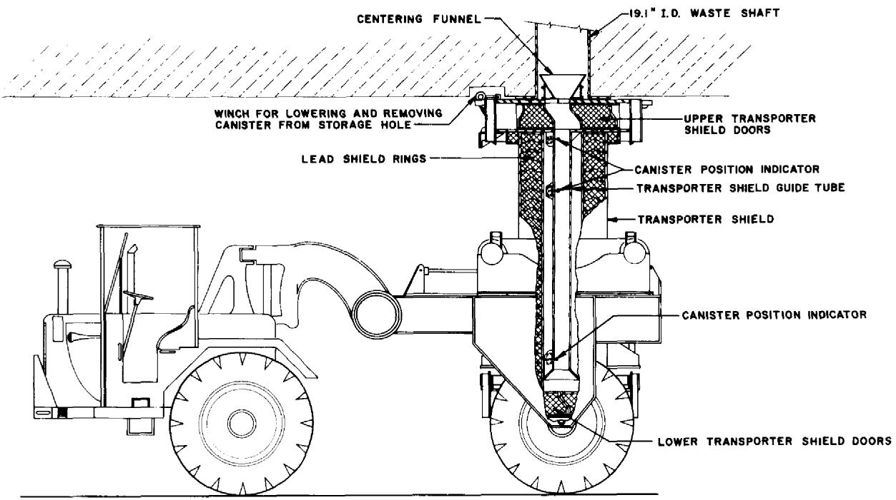  
Fig. 4.8. Underground Transporter.

Table 4.8. Estimated Quantities of Solidified Wastes and Cumulative Salt Space Requirements for Nuclear Power Industrya   

<table><tr><td rowspan="3">Calendar Year</td><td colspan="2">Number of Waste Containers Buried During \(Year^b\)</td><td colspan="2">Cumulative Acres of Salt Space Used by End of Year</td></tr><tr><td>Reprocessing Wastes</td><td>Aged For:</td><td>Reprocessing Wastes</td><td>Aged For:</td></tr><tr><td>4 years</td><td>10 years</td><td>4 years</td><td>10 years</td></tr><tr><td>1975</td><td>170</td><td>-</td><td>1.2</td><td>-</td></tr><tr><td>1976</td><td>270</td><td>-</td><td>3.2</td><td>-</td></tr><tr><td>1978</td><td>660</td><td>-</td><td>11</td><td>-</td></tr><tr><td>1980</td><td>1410</td><td>-</td><td>28</td><td>-</td></tr><tr><td>1981</td><td>2000</td><td>170</td><td>43</td><td>1.1</td></tr><tr><td>1982</td><td>2700</td><td>270</td><td>65</td><td>3</td></tr><tr><td>1984</td><td>4600</td><td>660</td><td>120</td><td>10</td></tr><tr><td>1986</td><td>6400</td><td>1410</td><td>205</td><td>25</td></tr><tr><td>1988</td><td>8300</td><td>2700</td><td>315</td><td>56</td></tr><tr><td>1990</td><td>10,300</td><td>4600</td><td>450</td><td>110</td></tr><tr><td>1992</td><td>12,200</td><td>6400</td><td>530</td><td>185</td></tr><tr><td>1994</td><td>14,300</td><td>8300</td><td>815</td><td>285</td></tr><tr><td>1996</td><td>16,700</td><td>10,300</td><td>1040</td><td>410</td></tr><tr><td>1998</td><td>-</td><td>12,200</td><td>-</td><td>560</td></tr><tr><td>2000</td><td>-</td><td>14,300</td><td>-</td><td>735</td></tr><tr><td>2001</td><td>-</td><td>16,700</td><td>-</td><td>835</td></tr></table>

${}^{a}$ Based on an installed nuclear electrical capacity of ${11},{000}\mathrm{{Mw}}$ in 1970, ${145},{000}\mathrm{{Mw}}$ in 1980, and 735,000 Mw in 2000; a delay of 3 years between power generation and fuel processing was assumed.   
bAssumes 1 ft of solidified waste per $10^{4}$ Mwd (thermal), and that wastes are enclosed in 6-in.-diam by 10-ft-long containers.

procedures before undertaking high-volume operations. If 20 years is assumed to be a reasonable operating life, based on economics and obsolescence, a gross mine area of 835 acres is indicated.

In the consideration of siting requirements for an initial repository, salt domes were eliminated because of inadequate knowledge of their possible behavior (some domes are believed to be undergoing movement), and because some are in contact with circulating ground water, which is known to have caused flooding in at least one mine (see Sect. 4.3.2). A suitable bedded salt deposit should be at least 200 ft thick and lie between 500 and 2000 ft below the surface. To ensure long-term stability, a considerable thickness of shale or some other impermeable rock should overlie the salt, and the excavation itself should be located well within the salt deposit. The maximum depth is governed by mine stability conditions during the operating period and cost considerations (costs increase at greater depths due to shaft length and the increased amount of salt that must be left as support pillars). For example, a disposal facility at a depth of 500 ft (about the minimum desirable depth) could be operated at a cost about 5 to $7\%$ less than a similar facility at 1000 ft. At 1500 ft, the operating costs would be 15 to $18\%$ more than at 1000 ft; at 2000 ft, the cost would be 25 to $33\%$ greater than at 1000 ft. The four areas known to meet these criteria are shown in Fig. 4.6. The largest area (about 10,000 square miles) lies in central Kansas; two smaller areas are in Michigan; and one small area is in west-central New York.

Other major siting requirements are: (1) the site must offer means for disposing of excess salt as a "backup" in the event that the salt cannot be routinely marketed, (2) it must not be adjacent to large population centers and related high land values, (3) it must be accessible by rail and highway, and (4) it must be acceptable to public officials and private citizens of the area.

For purposes of cost estimation, a mine depth of 1000 ft was selected and disposal costs were calculated for $4-$ and 10-year old wastes over mine operating periods of 1975-1995 and 1981-2002, respectively. Two possibilities were considered: (1) that a new mine was developed especially for this purpose, and (2) that initial phases of the operation began in an

existing, inactive mine. In all cases, costs were escalated to 1971 levels, and $5\%$ was used as the cost of money.

For a new mine, the initial capital outlay required before start of operations was about $17.5 million; in contrast, the initial outlay for a facility starting in an existing mine was only about $10.5 million. The total costs over the entire period ranged from $91 - $95 million, for use of an existing mine, to $101 - $106 million for a new mine. The corresponding costs, in terms of kilowatt-hours of electricity produced, ranged from 0.0055 to 0.0067 mill/kwhr.

# 4.3.5 Disposal of Solidified Wastes in Rock Types Other than Bedded Salt

The widespread occurrence of rock salt throughout the United States has been commonly accepted as one of the principal advantages for the use of these rocks as storage sites for radioactive waste materials. Indeed, salt deposits do underlie portions of 24 of the 50 states; however, from recent laboratory and field studies on the flowage of rock salt at elevated temperatures and high overburden loads, it is apparent that many of these deposits are unsuitable for disposal sites.[114] At present, there are perhaps three principal areas in the United States where disposal in salt would appear to be highly desirable. These areas are: (1) the Silurian salt deposits of the Northeast, which underlie parts of New York, Pennsylvania, West Virginia, Ohio, and Michigan; (2) the Permian basin salts, which underlie parts of Kansas, Oklahoma, Texas, and New Mexico; and (3) the Gulf Coast Embayment salts, which underlie parts of Louisiana, Texas, Arkansas, and Mississippi (see Fig. 4.6). The first two areas are bedded deposits, while the latter contains only salt domes.

Most of the other deposits throughout the United States are less suitable because of their great depths below the surface, their numerous inclusions of other rock types, or a general lack of knowledge concerning their extents, depths, etc. In general, mine workings at great depths in salt are initially expensive to open and, due to the greater overburden loads, accelerated deformation of the salt occurs. The presence of other rock types with the salt beds may further accelerate the deformation of

the salt. For instance, in the Williston basin, which covers a part of North Dakota, the minimum depth to salt is 3600 ft; also, the bed is only about 20 ft thick. Thicker deposits occur, but they lie between 4300 and 2000 ft below the surface. Salt beds are also present in Florida, but they are only about 30 ft thick and occur at depths of 10,000 to 12,000 ft. Even in the Permian basin, much of the salt is located at great depths below the surface and contains numerous inclusions of other rocks. Perhaps the principal concern in the disposal of waste in bedded deposits is the stability of the structure at elevated temperatures and stresses. This has been found to be especially significant when shale beds occur interbedded with the salt. These shale beds are usually absent in dome deposits; thus, in this respect, domes may be favored over bedded deposits for waste disposal sites. From recent laboratory and field tests, it appears that efficient and safe operations in bedded rock salt can be designed; however, there are several problems, unique to salt dome deposits, that require investigation before a similar operation can be designed for these structures.

More than 300 salt domes are now known to be present in the Gulf Coast Embayment. There are no shale beds overlying these formations, the salt is of a higher purity than that found in bedded deposits, and the domes often occur relatively near the land surface. Many lie between 500 and 1000 ft below the surface; and, of course, the salt extends to depths of many thousands of feet. A large part of the available mined-out space in salt deposits also exists in salt domes. Approximately $40\%$ of the total space vacated by rock salt mining each year results from workings in the domes of the Gulf Coast region.

The principal technical concern in the disposal of waste to salt domes is in ensuring that migrating waters do not reach the stored waste. The recent flooding of the Winnfield, Louisiana, dome mine may serve to illustrate the concern. Also, in Germany, where domal-type salt structures have been mined for many years, at least 20 mines have been reported to have been flooded by groundwaters. At present, apparently little is known about the movement of groundwater in the vicinity of salt domes; thus, prior to utilization of these domes for radioactive disposal media, investigations

would have to be initiated to ascertain the geohydrological factors or other parameters that were, or appeared to be, instrumental in the flooding at Winnfield and other salt domes. It is obvious that the distance between mine workings and aquifers is important, but it is not possible to state at this time, for example, what the minimum distance would be under specified conditions of mine depth, structural and stratigraphic conditions of the intruded native rocks, etc. Once the important parameters that bear most directly on mine flooding are identified, laboratory and/or field investigations, if necessary, would have to be initiated to demonstrate that safe and efficient disposals can be made in salt domes.

Even though salt is believed to be the most suitable environment for the ultimate disposal of high-level waste, and it is widely distributed throughout the country, it does not underlie any of the major AEC laboratories and plants that are currently engaged in fuel reprocessing or waste disposal. In addition, of the six geologic basins recently discussed by the American Association of Petroleum Geologists for radioactive waste-disposal potential, only three contain salt deposits.[115] Thus, even though high-level wastes could be shipped to areas where salt structures are available for ultimate disposal, they could probably also be safely and economically stored in other rock types that may be available at a given site or areas adjacent to it.

Dry mine workings are probably not as commonplace as are wet mines in the United States. However, thick and relatively undisturbed beds of limestone and shale (and even granite and other crystalline rocks) exist, many of which are essentially free of circulating water. For instance, in Barberton, Ohio, a dry 2000-ft-deep limestone mine is in operation.[116] Also, mined caverns in chalk near Demopolis, Alabama, have been found to be relatively free of water.[117] Excavations in thick shale beds in Illinois have remained dry since they were opened.[99] It is reported that a mine in crystalline rocks in Ontario, Canada, has remained free of water even though the mine is situated directly beneath a large lake.[99] Loess deposits offer another possibility for the disposal of high-level waste in some areas above the water table.[99] Evaporite deposits other than rock salt (e.g., potash, trona, anhydrite, gypsum, etc.) may also be suitable.

For hard rock, such as limestone and granite, it is expected that mined cavities will remain stable under loads up to several thousand psi and temperatures up to a few hundred degrees centigrade. Recent model pillar tests on samples of dolomite from a local (ORNL) quarry show that there are negligible amounts of deformation in the rock up to loads of 10,000 psi and temperatures as high as $200^{\circ}\mathrm{C}$ . In comparison, it is of interest that, in similar pillar model tests for rock salt at temperatures of $200^{\circ}\mathrm{C}$ and 6000 psi, pillar deformation had exceeded $35\%$ after only 1 hr. Thus it appears that the structural integrity of the excavated openings in these rocks, due to the superincumbent load, will not be of primary concern in the event that these rocks should be used as storage media; however, it is likely that such factors as ensuring the isolation of these excavations from migrating groundwaters and the geographic location of suitable deposits and their vertical and lateral extents, along with possible radiation and heat effects on the rocks, would be critical.

On a regional basis, it appears that the most promising areas of rock deposits suitable for radioactive waste storage would include relatively tectonically undisturbed areas such as the mid-continent region of the United States. Other areas, such as the Colorado Plateau, would also appear to be highly desirable. In parts of the arid west, where there is no groundwater recharge from rainfall and where site locations in rock exist above the water table, suitable excavations may also be practicable. In many localities within these areas, it is likely that horizontal shaft-type or tunneling operations may be feasible. This method of excavation is preferable, in many respects, to vertical shaft mining since it is generally agreed that mining costs are lower and the openings are more accessible. Tunneling into the faces of hills, escarpments, or other topographic features of high relief is a common method for mining limestone in many areas where horizontal bedding prevails. Many mines of this type in Middle Tennessee have been found to be structurally stable; and, except for some leakage at the mine entrances, they are entirely free of circulating groundwater. On a larger scale, underground excavations in limestone near Kansas City, Kansas are currently

being used as refrigerated cold storage bins. Here, facilities have been provided to accommodate the storage of entire rail cars and their refrigerated products in tunneled-out, dry cavities.

In summary, it is apparent that dry openings that could be utilized for the storage of radioactive wastes can be excavated in rocks other than salt; however, investigations are needed to define more precisely such factors as the geohydrological and geotopographical conditions that determine the usefulness of local sites within the most desirable geographic regions and the effects of heat and radiation on the enclosed rock media.

# 4.4 Waste Management Technology: Intermediate- and Low-Level Wastes

The volumes of intermediate-level wastes obtained from evaporating second- and third-cycle raffinates, product concentration, cell and equipment decontamination, solvent cleanup, and off-gas scrubbers, range from 200 to 500 gal per metric ton of fuel processed. They are principally nitrate solutions of sodium, potassium, aluminum, and iron, and often contain sulfate, fluoride, and phosphate in addition. Their activity levels are generally several tenths of a curie per gallon. In the United States, they are stored in underground tanks, sometimes mixed with cladding wastes. In the United Kingdom, they are discharged to coastal waters under carefully monitored conditions after suitable periods of decay.[118] At Marcoule, they are partially decontaminated by coprecipitation and coagulation at a pH of about 11.5, using lime, $\mathrm{NaH_2PO_4}$ , $\mathrm{Al_2(SO_4)_3}$ , and tannin.[119] The resulting sludges are mixed with asphalt, packaged in barrels, and stored in protected areas; the decontaminated effluents are discharged to the Rhone River.

In addition, a plant may discharge several tens of thousands of gallons of contaminated organic solvent wastes annually. These are usually either burned or stored in tanks.

The low-level liquid wastes from fuel processing are not greatly different, chemically, from natural waters. They contain only very small amounts of inert chemicals and radionuclides in addition to those chemicals

that contribute to natural hardness. The radionuclides of greatest routine importance in these wastes are $^{90}\mathrm{Sr}$ , $^{137}\mathrm{Cs}$ , $^{106}\mathrm{Ru}$ , and $^{3}\mathrm{H}$ ; however, under unusual circumstances of accidental contamination, other fission products, as well as $^{60}\mathrm{Co}$ , U, Pu, and Th, may also be present. These wastes are very large in volume. Evaporator condensates alone may average 10,000 gal per metric ton of fuel processed, and the total generation from all sources within a plant may average several hundred thousands of gallons per day. Because of their great volumes and low concentrations of radionuclides, these wastes have been suitable for environmental disposal.

At AEC production sites, where processing plants are located on large tracts of land, ground disposal via seepage basins, cribs, trenches, etc., has been practiced. In these cases, the sorptive capacity of the soils is such that the majority of the isotopes are retained and, in turn, contamination of the ground water is reduced. Each year during the past 5 years, almost 1 billion gal of low-level waste, containing an average of 35 to 415 kilocuries of radionuclides, has been safely discharged in this manner. In Europe, such wastes receive appropriate treatment for decay or decontamination and are then released to the sea or to rivers.

The release of limited amounts of radionuclides to the environment has played an important part in waste management practices to date. It has not been uncommon for low-level liquid wastes to be discharged directly to environmental waters without treatment, depending upon large dilution factors to reduce potential radiation exposure of populations to acceptable levels. A review of these practices in North America<sup>120</sup> (summarized in Tables 4.9 and 4.10) shows that the quantities of isotopes released have been controlled so that the exposure of people from this source has been considerably less than the limits recommended by the ICRP and other authoritative bodies.

The trend, however, is toward relatively less dependence on the environmental disposal of radioactive wastes. This reflects an awareness of the projected greatly increased production and application of radioisotopes, and of the realization that the pressures of an expanding population and nuclear industry will make it difficult for "remoteness" to

Table 4.9. Quantities of Low-Level Radioactive Wastes Added to Streams (curies/day)   

<table><tr><td rowspan="2">Nuclide</td><td rowspan="2">Half-Life</td><td colspan="5">Origin of Wastes</td></tr><tr><td>Chalk R.</td><td>Hanford</td><td>Oak Ridge</td><td>Savannah R.</td><td>Nuclear Power Stations</td></tr><tr><td colspan="7">Activation Products</td></tr><tr><td>64Cu</td><td>13 h</td><td>-</td><td>200a-1000b</td><td>-c</td><td>-</td><td>-</td></tr><tr><td>24Na</td><td>15 h</td><td>Td-10</td><td>200-1000</td><td>-</td><td>-</td><td>-</td></tr><tr><td>76As</td><td>26 h</td><td>Td-5</td><td>50-300</td><td>-</td><td>-</td><td>-</td></tr><tr><td>238Np</td><td>2.3 d</td><td>-</td><td>200-1000</td><td>-</td><td>2e</td><td>-</td></tr><tr><td>32P</td><td>14 d</td><td>0.01-0.1</td><td>20-70</td><td>-</td><td>-</td><td>-</td></tr><tr><td>51Cr</td><td>28 d</td><td>-</td><td>600-2000</td><td>-</td><td>3.5</td><td>Td</td></tr><tr><td>59Fe</td><td>45 d</td><td>-</td><td>Td</td><td>-</td><td>-</td><td>Td</td></tr><tr><td>58Co</td><td>71 d</td><td>-</td><td>Td</td><td>-</td><td>-</td><td>Td</td></tr><tr><td>35S</td><td>87 d</td><td>0.001</td><td>Td</td><td>-</td><td>0.4</td><td>-</td></tr><tr><td>68Zn</td><td>250 d</td><td>0.002</td><td>30-100</td><td>-</td><td>0.09</td><td>-</td></tr><tr><td>60Co</td><td>5.3 y</td><td>Td-0.05</td><td>1-2</td><td>0.04-0.2</td><td>0.01</td><td>Td</td></tr><tr><td>3H</td><td>12 y</td><td>0.1-20</td><td>T</td><td>-</td><td>205</td><td>-</td></tr><tr><td colspan="7">Fission Products</td></tr><tr><td>131I</td><td>8 d</td><td>-</td><td>1-3</td><td>0.001-0.01</td><td>0.1</td><td>Td</td></tr><tr><td>140Ba</td><td>13 d</td><td>-</td><td>Td</td><td>-</td><td>0.1</td><td>Td</td></tr><tr><td>95Nb</td><td>35 d</td><td>-</td><td>-</td><td>0.002-0.2</td><td>-</td><td>-</td></tr><tr><td>89Sr</td><td>50 d</td><td>-</td><td>Td</td><td>-</td><td>0.09</td><td>-</td></tr><tr><td>95Zr</td><td>65 d</td><td>-</td><td>Td</td><td>0.001-0.1</td><td>0.1</td><td>-</td></tr><tr><td>144Ce</td><td>285 d</td><td>0.005-0.015</td><td>-</td><td>0.003-0.1</td><td>0.1</td><td>-</td></tr><tr><td>106Ru</td><td>1 y</td><td>0.002</td><td>-</td><td>1-5</td><td>0.03</td><td>-</td></tr><tr><td>90Sr</td><td>28 y</td><td>0.001-0.005</td><td>0.1</td><td>0.02-0.2</td><td>0.03</td><td>f</td></tr><tr><td>137Cs</td><td>30 y</td><td>0.002-0.02</td><td>Td</td><td>0.01-0.2</td><td>0.3</td><td>-</td></tr><tr><td>Total beta</td><td>(Exclusive of 8H)</td><td>0.05-15</td><td>2000</td><td>1-6</td><td>(0.5 in river)</td><td>10-5-0.01</td></tr></table>

<table><tr><td rowspan="2" colspan="2"></td><td colspan="5">Receiving Stream</td></tr><tr><td>Ottawa R.</td><td>Columbia R.</td><td>Clinch R.</td><td>Savannah R.</td><td>Various</td></tr><tr><td rowspan="2">Flow, 1010liters/day</td><td>Range</td><td>3-13</td><td>10-75</td><td>0.6-2</td><td>1.4-8</td><td>1-10</td></tr><tr><td>avg.</td><td>6</td><td>27</td><td>1</td><td>2.5</td><td></td></tr><tr><td>Measurement point</td><td></td><td>Ottawa R.; process sewer; Perch Lake</td><td>Columbia R. (Pasco)</td><td>White Oak Creek</td><td>Storage-basin discharge</td><td>Various waste streams</td></tr></table>

a-bWhere a substantial variation is reported, both the low a and high b values are listed.   
c(-) Indicates the nuclide is not reported. It may be present, but in amounts that are trivial in relation to other nuclides encountered.   
$\mathbf{\dot{d}}_{\mathrm{T}} = \mathrm{trace}$   
Where a yearly average is reported, or there is little variation, only one value is listed.   
$f_{\text{Fallout}}$ contributed from 0.1 to 1 curie of $\varepsilon_{\mathrm{Sr}}$ per day to large rivers of North America in 1963.

Table 4.10. Significance of Exposure from Various Sources   

<table><tr><td>Site</td><td>Nuclides of Greatest Interest</td><td>Mode of Exposure</td><td>Critical Organ</td><td>Type of Person Receiving Greatest Exposure</td><td>Percent of Limita</td><td>Year</td><td>Reference Limit</td></tr><tr><td rowspan="2">Chalk R.</td><td>90Sr</td><td>Drinking water</td><td>Bone</td><td>Pembroke resident</td><td>&lt; 1b</td><td></td><td>ICRP, population at large</td></tr><tr><td>32P</td><td>Fish</td><td>Bone</td><td>Fisherman</td><td>&lt; 0.1</td><td>1963</td><td>ICRP, Group B (c)e</td></tr><tr><td rowspan="3">Hanford</td><td>32P</td><td>Fish and irrigated crops</td><td>Bone</td><td>Fisherman, farmer</td><td>&lt; 10</td><td></td><td>ICRP, Group B (c)</td></tr><tr><td>76As + 239Np +51Cr</td><td>Drinking water</td><td>G.I. tract</td><td>Pasco resident</td><td>&lt; 8</td><td>1963</td><td>ICRP, population at large</td></tr><tr><td>131I</td><td>Drinking water</td><td>Thyroid</td><td>Pasco child</td><td>&lt; 6</td><td></td><td>FRC, exposed population</td></tr><tr><td rowspan="3">Oak Ridge</td><td>00Sr</td><td>Fish</td><td>Bone</td><td>Fisherman</td><td>&lt; 30e</td><td></td><td>ICRP, Group B (c)</td></tr><tr><td>90Sr</td><td>Drinking water</td><td>Bone</td><td>Clinch R. residente</td><td>&lt; 5</td><td>1961</td><td>ICRP, Group B (c)</td></tr><tr><td>106Ru</td><td>Drinking water</td><td>G.I. tract</td><td>Clinch R. residentf</td><td>&lt; 5</td><td></td><td>ICRP, Group B (c)</td></tr><tr><td rowspan="3">Savannah R.</td><td>3H</td><td>Drinking water</td><td>Whole body</td><td>Savannah R. residentf</td><td>&lt; 4</td><td></td><td>ICRP, genetic apportionment</td></tr><tr><td>131I</td><td>Drinking water</td><td>Thyroid</td><td>Savannah R. residentf</td><td>&lt; 0.3</td><td>1963</td><td>ICRP, population at large</td></tr><tr><td>90Sr</td><td>Fish + water</td><td>Bone</td><td>Fisherman</td><td>&lt; 1b</td><td></td><td>ICRP, population at large</td></tr><tr><td>Power</td><td>60Co</td><td>Fish</td><td>G.I. tract</td><td>Fisherman</td><td>&lt; 0.01</td><td></td><td>ICRP, Group B (c)</td></tr></table>

aExcludes atmospheric pathways, but includes contributions to the same organ from other man-made isotopes present in the water.   
bMost of the $\mathrm{SO}$ Sr contributing to this exposure was from fallout, and not from plant operations.   
"Recommendation adopted September 9, 1958. Group B (c) is "members of the public living in the neighborhood of controlled areas."   
Federal Radiation Council (US) Recommendations (September 1961).   
${}^{\mathrm{e}}$ Assumes that whole fish,including bones,is eaten. If only the flesh is eaten,the estimate is $< 6$ per cent.   
fA hypothetical person who drinks untreated river water. No such person has been found.

provide the necessary safety factor between the point of waste discharge and the point of population exposure. Present regulations, 10 CFR 20, encourage a minimum of dependence on environmental dispersion and contain a standard clause requiring reduction of the radioactivity in effluents to $10\%$ of the continuous occupational MPC before the effluents are discharged to unrestricted areas; however, amendment of licenses to permit higher limits is possible if the licensee makes a "reasonable effort" to minimize radioactive discharges and if the resulting exposure of individuals in nearby areas is not likely to exceed $10\%$ of the continuous occupational MPC.

# 4.4.1 Treatment of Liquid Wastes

Evaporation, ion exchange, and coprecipitation and coagulation processes are most frequently used for removing radionuclides from low-level wastes; the choice of treatment depends on factors such as the degree of decontamination required, the volume of waste to be treated, and the considerations of cost that pertain at the installation in question. Although evaporation generally yields the highest decontamination factors (i.e., ratios of the activity in the feed to that in condensates of $10^{4}$ to $10^{5}$ are routinely obtained), the cost is in the range of several cents per gallon. Single-stage coprecipitation processes typically remove from 60 to $90\%$ of the radioactivity at a cost of $\$0.25$ to $\$1.00$ per thousand gallons. Ion exchange with either natural minerals or organic resins is frequently used in conjunction with precipitation for additional decontamination at extra cost. In addition to partially decontaminated waste water (which can be released to surface waters), each process produces a sludge, a slurry, or a solution containing the separated isotopes. This material is usually packaged and may have to be shipped off-site for burial.

There has been an increasing emphasis on research and development aimed at treatment processes that will provide high decontamination factors for the bulk of the waste volume. Such processes will permit environmental disposal at or near MPC levels, and allow concentration of the bulk of the radionuclides into a relatively small volume, which can be

stored or converted to an essentially insoluble solid suitable for disposal by burial. Improved scavenging-precipitation methods have been studied, both alone and in combination with ion exchange and other sorption processes. Attention has been given to incorporating the precipitation sludges, organic wastes, the ion exchange regenerants, the ion exchange media, and ashes from the incineration of combustible waste materials into low-solubility solid bodies for disposal by burial. In addition, a method, based on the hydraulic fracturing of shale, has been developed for disposing of liquid wastes.

Scavenging-Precipitation. - The treatment of low-level liquid waste has usually involved a scavenging-precipitation step, either alone or as the first step in a series. This step includes: (1) formation of a bulk precipitate that contains some of the trace-level radioactive species; or (2) precipitation of a flocculating agent such as ferric hydroxide or aluminum hydroxide to promote separation of suspended solids, precipitates, and colloidal species in the waste; or both (1) and (2). Common examples of coprecipitation include strontium with calcium carbonate or calcium phosphate, and cesium with copper or nickel ferrocyanide.[121] Single-stage scavenging-precipitation processes do not usually give high decontamination factors (they are typically 2 to 10, and rarely as high as 100). The actual value obtained depends on the radioactive species, the chemistry of the precipitation step, and the efficiency of the clarification method. Recent work on improving clarification efficiency includes the use of zeta-potential control to optimize flocculation conditions,[122] especially with regard to radiocolloid removal, and the use of an optimum arrangement of filter coal and sand in a polishing filter after flocculation and clarification.[123]

Inorganic Ion Exchange. - The use of inorganic exchange materials in waste treatment has received considerable attention. This attention can be attributed to: (1) studies of exchange reactions of minerals that have been made in connection with ground disposal of wastes, (2) a desire to use inexpensive natural sorbents that can be disposed of as solid wastes instead of more-expensive synthetic materials, which usually must be regenerated and reused, and (3) an attempt to find sorbents that are highly

selective for particular waste components. The use of vermiculite columns by the British to provide additional waste decontamination, especially for cesium, after one or two scavenging-precipitation steps is the "classical" example of the application of natural exchange materials to waste treatment. $^{124}$ The most promising natural mineral exchange material to be developed for sorption column application is clinoptilolite, which has been studied extensively at Hanford. $^{125,126}$ The addition of grundite clay in scavenging-precipitation steps to improve cesium decontamination is another example of the use of natural exchange materials in waste treatment. $^{122}$ The use of an activated alumina bed to remove phosphate, which otherwise would interfere with the precipitation of calcium carbonate from low-level waste, is an interesting application of a synthetic inorganic sorbent. $^{122}$

Organic Ion Exchange. - The application of inorganic ion exchange resins to radioactive waste treatment has received considerable study, beginning early in the atomic energy program. However, the use of organic ion exchange in actual low-level waste treatment has not been widely practiced because its cost is typically higher than a standard single-stage scavenging-precipitation process and because the potentially higher decontamination factors have not been considered necessary. As a rule, ion exchange resins are too expensive to discard as a solid waste after a single use; hence they are normally regenerated, and the regenerant waste is subsequently treated as an intermediate- or high-level liquid waste. Most ion exchange resins are not highly selective; that is, calcium and magnesium must generally be removed with strontium, sodium must be removed with cesium, etc. The high decontamination factors possible with ion exchange processes are usually based not so much on selective sorption as on the fact that performance corresponding to a large number of transfer units or theoretical stages can be obtained with a single piece of equipment.

An exception to the low-selectivity rule is the preference shown for cesium over sodium by phenolic-base cation exchangers at pH values high enough to ionize a significant fraction of the phenolic groups. The cesium-sodium separation factor for a resin containing only phenolic exchange

groups is about 160; however, despite somewhat lower cesium-sodium separation factors, polyfunctional resins such as phenolic-sulfonic and phenolic-carboxylic have more useful capacities for treating wastes containing calcium and magnesium. A several-month series of pilot-plant tests of an integrated scavenging-precipitation, phenolic-ion exchange process were conducted at a 10-gal/min scale with ORNL low-level waste. In its final form, the flowsheet included a fluidized-bed alumina column to prevent the interference of phosphate with calcium-magnesium-strontium precipitation. It also included a provision for the recycle of ion exchange regenerate waste to the scavenging-precipitation step with grundite clay addition. All of the removed radionuclides are concentrated in the clarifier sludge.[122] The overall decontamination factors varied from 1200 to 12,000 for strontium, 100 to 3000 for cesium, 20 to 700 for rare earths, 10 to 150 for zirconium-niobium, and 1.5 to 8 for ruthenium; the radioactivity of the effluent was reduced to less than $2\%$ of the continuous occupational MPC. Cost estimates for a 750,000-gal/day plant waste treatment rate were 60 to $80\%$ per thousand gallons for this process under various conditions.

Demineralization and Waste-Water Recycle. - High-decontamination-factor processes such as demineralization may yield treated water that is of higher quality than the normal water supply of the waste-producing nuclear facility. This raises the question of whether the waste water should be reused instead of being discharged to the environment. Burns and Gluekauf considered three possible alternative schemes and concluded that limited reuse for certain purposes could be justified economically, but that complete demineralization and general reuse were more expensive, at least under the assumed Harwell conditions; however, work concerning the ion exchange and electrodeionization of waste water has been continued on laboratory and pilot-plant scales at Harwell. Work at ORNL on a "drinking water" process gave decontamination factors of greater than 1000, 300, 1300, 200, 600, and 25 for Sr, Cs, Co, Ru, Ce, and Zr-Nb, respectively, with all the activities being reduced to analytical background levels when low-level waste was treated successively by: (1) alum coagulation under optimum zeta-potential conditions, (2) ion exchange demineralization, and (3) passage through activated carbon.

Insolubilization of Waste Concentrates. - The immobilization of wastes by incorporation into relatively inert solid materials prior to storage or disposal can be advantageous for safety and economic reasons. Liquid wastes, such as ion-exchange regenerant wastes, and solid wastes, such as scavenging-precipitation sludges and incinerator ashes, have been mixed with cement or concrete to give moderately insoluble solid blocks. A 1:1 mixture, by volume, of expanded vermiculite and cement gives a stronger solid, with a lower leaching rate, than is obtained when vermiculite is not included.[121] A substantial volume increase occurs during the conversion of liquid and solid wastes to concretes because of the relatively large amounts of cement (and vermiculite) required. A promising recent development is the use of bituminous material to solidify and insolubilize waste concentrates. This technology originated in Europe and currently is in widespread use there on an industrial scale. A process designed to incorporate all types of organic and alkaline aqueous wastes or slurries in asphalt or polyethylene is being developed at ORNL. This process appears to offer greater versatility and economy than any others developed thus far.[122,127]

# 4.4.2 Problems with Tritium

Tritium is produced in the fission of $^{235}\mathrm{U}$ and $^{239}\mathrm{Pu}$ , with yields of about $0.01\%$ and $0.02\%$ respectively. $^{128}$ It merits special consideration from the standpoint of its management in fuel reprocessing because it is unresponsive to separation and concentration by conventional procedures for treating waste. $^{129,130}$ In fuel reprocessing, as much as $25\%$ of the tritium may be released as a gas during the dissolution of metallic fuels, but apparently less than $1\%$ can be expected to volatilize during the dissolution of oxide fuels. $^{131}$ There is experimental evidence that tritium tends to escape from oxide fuels during reactor operation; $^{132}$ however, the tritium remaining with the fuel can be expected to appear as tritiated water in the reprocessing plant evaporator condensates.

Based on the projections of Sect. 3.5, the annual generation of fission-product tritium from the Civilian Power Program may be expected to increase from about 36,000 curies in 1970 to about 12 megacuries in the

year 2000. Allowing for natural decay, the accumulated quantity should increase from about 36,000 curies in 1970 to about 90 megacuries in 2000. The subsequent discussion is based on the assumption that all of the tritium will be present in the fuel at the time of reprocessing.

If this tritium could be uniformly dispersed throughout the environment, the resulting increase in background would be of little significance.[133] In the actual case, however, a fuel-processing plant will have only its immediate environs available for dispersion, and the capacity of these environs to accept tritium will depend on the rate that the latter is released, as well as on the many environmental factors that pertain to the particular site.

Two immediately available possibilities for the release of tritium-bearing wastes under existing regulations are: (1) dilution and release directly to surface waters, and (2) distillation into the plant off-gass system and subsequent release up the stack.

The quantity of tritium that can be released to surface waters can be computed within the limitations that the concentration shall not exceed the permissible concentration in water under 10 CFR 20, or $3 \times 10^{-3} \mu \mathrm{c} / \mathrm{cc}$ at the boundary of the controlled zone, and that the concentration shall subsequently not exceed $1 \times 10^{-3} \mu \mathrm{c} / \mathrm{cc}$ for the general population. If the controlled zone borders a stream of any significant size, the first of these restrictions is controlling.

A ton of fuel irradiated to a burnup of 33,000 Mwd contains about 700 curies of tritium, which would require dilution in water to the extent of about 63 million gallons before it could be released from the controlled zone at the permissible concentration of $3 \times 10^{-3} \mu \mathrm{c} / \mathrm{cc}$ . The total aqueous effluent from a plant operating with a Purex process flowsheet may be as much as $10^{6}$ gal per ton of fuel processed, but this is far short of the requirements for tritium dilution. The most practical means of achieving the on-site dilution requirement would be to have available, for this purpose, a stream flowing through the controlled area. To meet the specification for use by the general population, this stream would have to flow into a larger body of water to achieve additional dilution by a factor of 3 or more.

It is desirable that a plant be situated adjacent to a large, preferably navigable, river for other (and possibly more important) reasons than tritium disposal; however, it is much less obvious that acceptable sites should be limited to those which, in addition, encompass a stream of the size useful for dilution. Therefore, we conclude that, with restrictions as presently interpreted, the alternative of release to surface waters is of very limited applicability as a general case.

Distillation into the plant off-gas provides a more effective means of releasing tritium. Calculations presented in Sect. 8 indicate that plants having spent-fuel capacities up to 20 metric tons/day and site boundaries two to three km distant can release their tritium in this manner under existing regulations. This is not to imply, however, that attempts should not be made to develop methods for removing tritium, before it becomes greatly diluted with air or process streams, and encapsulating it for long-term storage.

# 4.4.3 Disposal by Hydraulic Fracturing

The study of a method for disposing of intermediate-level radioactive wastes, based on the oil-field technique of hydraulic fracturing, was initiated at ORNL in 1959. $^{134}$ The first actual waste was injected in December 1966. To date (February 1970), 540,000 gal of concentrated intermediate-level waste containing almost 340,000 curies of fission products has been disposed of at depths of 360 to 900 ft, well below the zone of circulating water.

The method consists of mixing the aqueous wastes with preblended dry solids containing principally cement, and then pumping the resulting slurry down a well and out into a conformable, nearly horizontal fracture in a thick shale formation at the desired depth (Fig. 4.9). The cased well is prepared for the injection by perforating the casing at the desired depth and pressurizing the well with water. This induces a fracture in the rocks, which is further extended as the slurry is pumped into it. After the pumping phase is completed, the cement slurry is allowed to harden under pressure, thereby forming a thin, horizontal grout sheet. This procedure can be repeated successively up the well, creating a stack of horizontal grout sheets.

ORNL-DWG 63-3830

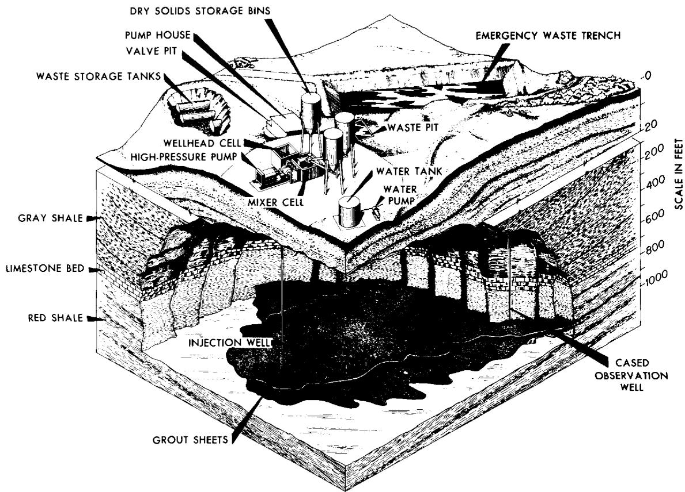  
Fig. 4.9. ORNL Fracturing Disposal Pilot Plant.

The successful application of this method required research and development in three main areas: (1) design, construction, and testing of the plant and equipment, including tanks, bins, mixers, and pumps capable of safely handling the materials; (2) chemical development of mix formulations providing, at minimum cost, a pumpable slurry and a grout offering maximum radionuclide retention; (3) development of an understanding of the mechanical behavior of the host rock under the influence of repeated injections and suitable instruments and techniques for monitoring that behavior.

The Plant and Its Operation. - Immediately prior to a waste injection, the dry solids are blended and temporarily stored at the site along with the waste solutions. After the equipment has been checked and the well has been prepared, the dry solids and the liquid wastes are vigorously mixed, at a constant flow rate, by the jet mixer. The slurry is then pumped to the wellhead, down the well, and out into the prefractured shale. At ORNL this usually requires a pumping pressure ranging from about 1500 to 2500 psi. The jet mixer, the high-pressure injection pump, and the wellhead are enclosed in individual concrete cells to provide shielding and to facilitate decontamination.

Development of the Mix. - The cost of the dry solids to be mixed with the waste solutions represents one of the larger fixed expenses of disposal by the hydraulic fracturing method. The development of the slurry formulation was, therefore, mainly a search for less-expensive materials and the establishment of the minimum required quantities of these materials. Specifications that had to be met with regard to the slurry were: (1) the slurry should have a viscosity and a thickening time such that the slurry could be pumped and would remain fluid during the entire injection phase, which might last up to 8 hr, (2) the slurry should harden into a grout having at least some physical integrity within a reasonable period, (3) all of the fluid should be taken up during the setting process so that there would be no phase separation, and (4) the radionuclides should be firmly retained in the grout in a reasonably unleachable state.

These requirements were met by developing a solids blend, based on Portland cement, which provided the hardening and strength characteristics

of the grout sheet. The cement also combines chemically with the radio- strontium in the waste, providing satisfactory retention of that nuclide. Since a high-strength grout was not necessary, the quantity of cement used was approximately 5 lb/gal, about one-third the usual concentration. Attapulgite clay was used to prevent any possible phase separation of the slurry as the result of this low quantity of cement. Adequate pumping time was assured by the addition of a small quantity of commercial organic retarder (a sugar, delta gluconolactone). Radiocesium, the major radionuclide in the waste, was retained by the addition of illite (Grundite) clay. Finally, it was discovered that highly siliceous possolanic materials, such as fly ash, could be substituted for part of the cement (up to 2.5 lb/gal) with a further reduction in cost and the added dividend of an improved strontium retention capacity.

The formula for the mix was usually modified slightly for each injection because of small differences in the composition and concentration of the waste, but, in general, it met the slurry specifications and provided for about $99\%$ retention of all radionuclides as measured by water-leaching tests.

Monitoring. - It was realized from the beginning of the developmental program that the behavior of the shale near the injected grout sheets and the rocks making up the rest of the system would exercise a controlling influence on the general applicability of the method. The rocks overlying the injections provide both shielding and an isolation barrier, the integrity of which must be maintained if the method is to be successful. Obviously, it is not possible to continue to inject grout sheets indefinitely, one on top of another, with each injection adding an increment of rock deformation and surface uplift.

Monitoring of the operation at Oak Ridge is carried out in several ways. The injection pressures are carefully noted during the progress of each injection. Any departure from the normal pattern would require shutting down the operation until a survey could be made. A number of small-diameter cased wells, which extend below the deepest fracture, are logged with a gamma-sensitive probe after each disposal operation; new peaks of activity show where the latest injection has intersected each of these

wells. In this way, the location and extent of each grout sheet may be determined. At intervals, core drilling is used to confirm the information derived from the logging and to obtain samples of the grout sheet. The continued integrity of the rock cover is tested by periodically attempting to pump water down each of a number of wells that are uncased for an interval of about 100 ft, a little above the depth of the shallower fracture. At present, each of these wells will accept only a few gallons of water before the pressure reaches the limit (75 psi) of the test pump. Any marked increase in the volume of water that can be injected in this manner would indicate an increase in the permeability of the rock cover. The elevation of each of a widespread network of bench marks in the disposal area is determined periodically with high-precision equipment. The normal response of the land surface is to arch up very slightly with each injection, the uplift forming a smooth dome without any marked steps or discontinuities. If the cover rock fails in shear, there should be irregularities in the surface uplift. These several methods of monitoring provide a high degree of assurance that the disposal operation is proceeding as planned and that no hazardous conditions are being created.

The cost of disposing of intermediate-level waste by hydraulic fracturing has been estimated, based on the limited experience with the ORNL plant (which was, of course, originally an experimental facility). The total unit cost, including capital investment charges, for a plant of approximately the same size and similar design as the one now in operation at ORNL, disposing of approximately 400,000 gal/year in 150,000-gal batches, would be expected to be in the range of $0.30 to $0.35/gal.

Summary. - Although hydraulic fracturing has been an extremely satisfactory disposal method at the Oak Ridge site, it is not yet possible to consider it without reservation for any other site. Further work is required in two main areas: (1) further development of the understanding of the mechanisms of fracture propagation and the disturbance created in the host rock, and (2) determination of site-testing procedures and acceptance criteria. Oil-field experience suggests that vertical fracturing is more common than the (near) horizontal fractures required for waste disposal. Since the orientation of hydraulically induced fractures is

influenced by many factors, some of which (e.g., the state-of-stress in the ground at the site) cannot be predicted in advance, it will be necessary to conduct site tests prior to adopting this method of waste disposal. The development of improved site-testing procedures, especially with a view toward reducing their cost, is currently in progress at ORNL. Also, a research program to understand and predict the underground behavior of the injected grout sheets is being continued.

# 4.5 Waste Management Technology: Solid Wastes

This section is limited to considerations of the solid wastes from fuel reprocessing operations other than the solidified high-level raffinates from the solvent extraction processes that are discussed in Sect. 4.3.

# 4.5.1 Land Burial

Much of the information summarized below was taken from a report that was prepared primarily for those who may be involved in the evaluation and approval of proposed waste burial operations.[135] It contains current information and recommendations regarding commercial waste burial practice.

Waste solids that may be radioactive are produced in practically all operations involving the production or utilization of nuclear materials. The low-level solid wastes of greatest volume, for which land disposal is most suitable and advantageous, are designated as "low-hazard potential" and consist typically of paper trash, packing material, broken glassware, clothing, experimental animal carcasses, and contaminated equipment or building material.

Table 4.11 shows the volumes of solid waste buried at AEC sites beginning with fiscal year 1961. Total volumes of solid waste buried at the commercial burial grounds beginning in 1962 are shown in Table 4.12.<sup>136</sup> Burial charges have ranged from $1.50 to about $0.70/ft<sup>3</sup>. Based on current average charges of about $1.00/ft<sup>3</sup>, this table is a reasonable indication of the size of the market for burial service.

The practice of burying solid wastes at selected land sites began very early in the Manhattan District and AEC programs. The possibility that the

buried radionuclides might be leached, with resulting contamination of groundwater (and possibly of surface water), prompted extensive studies of various types of soils and of burial techniques. Much has been learned scientifically and technically of the proper procedures for disposing of solid wastes with maximum safety in various situations.

Table 4.11. Volumes<sup>a</sup> of Solid Radioactive Waste Buried at AEC Sites<sup>136</sup>   

<table><tr><td>Fiscal Yearb</td><td>From AEC and AEC Contractor Operations</td><td>From Other Government Agenciesc</td><td>From Licenseesc</td><td>Total</td></tr><tr><td>1961</td><td>2,892,600</td><td>20,600</td><td>74,400</td><td>2,987,600</td></tr><tr><td>1962</td><td>2,268,200</td><td>21,800</td><td>68,900</td><td>2,358,900</td></tr><tr><td>1963</td><td>1,698,900</td><td>24,500</td><td>77,700</td><td>1,801,100</td></tr><tr><td>1964</td><td>1,697,400</td><td>2,700d</td><td>15,300d</td><td>1,715,400</td></tr><tr><td>1965</td><td>1,454,300</td><td></td><td></td><td>1,454,300</td></tr><tr><td>1966</td><td>1,413,000</td><td></td><td></td><td>1,413,000</td></tr><tr><td>1967</td><td>1,800,000</td><td></td><td></td><td>1,800,000</td></tr></table>

${}^{a}$ Values are given in cubic feet.   
bFiscal Year is from July 1 to June 30.   
<sup>c</sup>Buried at Oak Ridge and National Reactor Testing Station (Idaho) under AEC Interim Burial Program.   
$\mathbf{d}_{\text{Buried during the period July-August 1963}}$

Table 4.12. Volumes<sup>a</sup> of Solid Radioactive Waste Buried at Commercial Sites<sup>136</sup>   

<table><tr><td>Year</td><td>Jan.-June</td><td>July-Dec.</td><td>Annual Total</td></tr><tr><td>1962</td><td></td><td>36,281</td><td>36,281</td></tr><tr><td>1963</td><td>119,069</td><td>95,821</td><td>214,890</td></tr><tr><td>1964</td><td>241,660</td><td>205,434</td><td>447,094</td></tr><tr><td>1965</td><td>258,997</td><td>230,982</td><td>489,979</td></tr><tr><td>1966</td><td>264,800</td><td>238,172</td><td>502,972</td></tr><tr><td>1967</td><td>380,584</td><td>393,266</td><td>773,850</td></tr><tr><td>1968</td><td>324,940</td><td>341,630</td><td>666,570</td></tr><tr><td>1969</td><td>306,522</td><td></td><td></td></tr></table>

aValues are given in cubic feet.

As the nuclear industry developed, certain AEC installations, which had established facilities for the burial of their own wastes, made their burial grounds available for the disposal of solid wastes from industrial users of radioisotopes and from other AEC installations.

In 1960 the AEC announced that regional sites for the permanent disposal of solid low-level packaged radioactive wastes would be established on land owned by the state or federal government, and sites were designated for this purpose at ORNL and at NRTS. The AEC continued to furnish this service until 1963, when commercial service became available at two locations (Beatty, Nevada, and Morehead, Kentucky) from one company. In late 1969, service was available from two companies operating burial grounds at five sites (Fig. 4.10). On-site burial facilities are maintained by the AEC at Oak Ridge National Laboratory, the Savannah River Plant, the National Reactor Test Station (Idaho), Hanford, and Los Alamos Scientific Laboratory.

ORNL DWG 70-2773

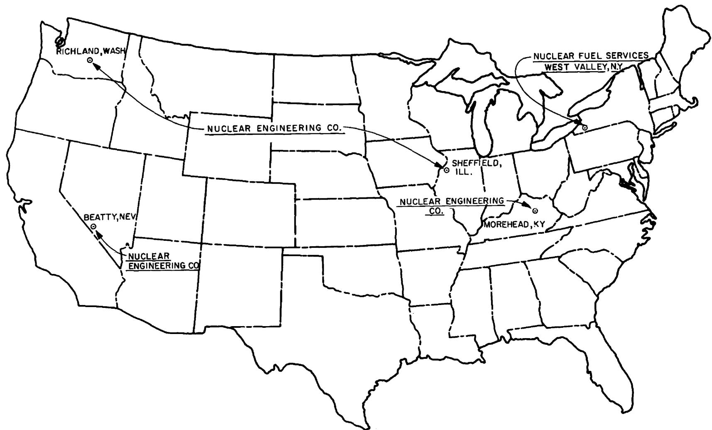  
Fig. 4.l0. Commercial Burial Sites for Low-Level Wastes.

Transportation of waste to the burial site may be accomplished in any one of three ways: common carriers may haul the waste packages along with ordinary shipment of freight; contract carriers may handle only radioactive materials but collect from various sources; and private carriers may transport their own wastes from the point of origin to the disposal area.

In the evaluation of a proposal or an existing operation for land burial of radioactive wastes, all the conditions that might reduce the effectiveness of radiation protection must be considered. It is necessary that the applicant or licensee submit information from which the adequacy of radiation protection can be judged and the site and the entire operation can be appraised. The Division of Materials Licensing of the AEC has prepared an outline of licensing requirements for land burial of radioactive wastes. Essentially the same information as required by the agreement states, since, in accepting the transfer of materials licensing functions from the AEC, they have agreed to keep their regulations and requirements compatible with those of the AEC.

The AEC outline of licensing requirements specifies that an application for land burial of radioactive wastes must include information regarding: the amount of by-product material, source material, and special nuclear material to be handled and disposed of; qualifications of the applicant and members of his staff to engage in the proposed activities, including specialized training and experience in handling radioactive materials and dealing with radiation problems; a description of the radiation detection instruments that will be available; the radiation protection procedures, including emergency procedures, for each phase of the program; and a description of the site and facilities that will be used for storing, processing, and disposing of the radioactive wastes. Maps and drawings of the proposed facilities and a description of the buildings and equipment to be used are essential. The outline refers to the AEC's Rules and Regulations, which specify that the licensee must comply with the regulations, and that standard operating procedures must be based on the regulatory requirements.

The outline of licensing requirements calls for detailed information concerning geology, hydrology of the site, groundwater conditions in relation to burial methods, the use of groundwater and surface water at the site and in the general area, geochemical characteristics of the soil in which the burial trenches are excavated, and specific plans for monitoring of soils and water by methods that are related to techniques used in the geologic and hydrologic evaluation of the site and its environs. In their transportation of radioactive materials, waste disposal licensees must adhere to applicable regulations of the Interstate Commerce Commission and other federal agencies having jurisdiction. It is understood that licensees will be subject to state and local regulations regarding highway safety, handling of radiation emergencies, and other problems that may be involved.

In judging the acceptability for licensing of a proposed facility for waste burial, the primary considerations are radiological health and safety. Thus the quantities of radionuclides and the extent of their dispersion to the environment must be evaluated, and the acceptability of the potential radiation exposures that may result must be determined. Evaluation studies of proposed waste burial sites are necessary as a basis for these judgments. These studies must develop information that is sufficiently accurate and complete to enable the licensing officials to decide whether or not the proposed site is acceptable from the standpoints of health and safety.[137]

Burial grounds must be located on federally or state owned land, and are regulated by either the AEC or, in the case of agreement states, by the appropriate state agency. In practice, the administrative control over those waste disposal operations must be a coordinated responsibility of federal, state, and local agencies. Programs and standards must be compatible and technically similar. When the burial site is located on state-owned land, perpetual maintenance becomes the responsibility of the state. Funds for this are secured by imposing a burial fee (currently $0.05/ft³) for the establishment of a maintenance fund.

Projected volumes of solid wastes from spent-fuel processing, and estimates of land requirements for their burial, are given in Table 3.63. These estimates are based on averages of $200\mathrm{ft}^3$ of solid waste produced

per metric ton of fuel processed (NFS experience) and 50,000 ft³ of solid waste buried per acre of land. Actually, these "averages" may be rather far removed from actual practice at any particular plant at any particular time, but they are believed to be realistic for purposes of overall projections. The total land requirements for the spent-fuel reprocessing industry should increase from about 1 acre/year in 1970 to 64 acres/year in 2000, and the accumulated area of land devoted to this purpose should increase from about 1 acre in 1970 to 980 acres in 2000. Is is of interest to note that this is only about one-half of the projected salt mine area requirements for disposing of high-level solidified wastes (Table 3.60).

# 4.5.2 Disposal in Salt Mines

The disposal of high-level solidified wastes in natural salt formations has been discussed previously (see Sect. 4.4.1). The large amount of existing space in salt mines represents a very attractive possibility for the disposal of the other types of solid wastes from fuel reprocessing. More than 40,000,000 ft² of mined-out area exists in nonproducing mines in bedded salt. This area, approximately 915 acres, could contain all the solid wastes projected through the year 2020. Table 4.13 gives projected mine space requirements for the disposal of these wastes in salt through the year 2020.

The routine low-level solid waste material, which can be handled directly by using standard material handling procedures and equipment, may be stacked on the floor in open rooms. It would probably be desirable to backfill the remaining space in the rooms with crushed salt. In order to carry out such an operation, the size and weight of the packages of waste would have to be limited in such a manner that the packages could be placed on the mine hoist and handled by the underground equipment. Is is unlikely that disposal of these solids in salt-producing mines would be acceptable. However, as the mined areas become larger, it may become feasible to separate older areas by bulkheads and carry on waste disposal operations through separate shafts. Both ventilation and access would have to be entirely separate for each area.

Table 4.13. Salt Mine Requirements for Solid Wastes from Fuel Reprocessing   

<table><tr><td rowspan="2"></td><td colspan="5">Calendar Year Ending</td></tr><tr><td>1970</td><td>1980</td><td>1990</td><td>2000</td><td>2020</td></tr><tr><td colspan="6">Total volume</td></tr><tr><td>Annual, 106 ft3</td><td>0.03</td><td>0.8</td><td>2.2</td><td>3.2</td><td>7</td></tr><tr><td>Accumulated, 106 ft3</td><td>0.03</td><td>3.5</td><td>16</td><td>49</td><td>140</td></tr><tr><td colspan="6">Mine Area</td></tr><tr><td>Net annual, acres</td><td>0.1</td><td>2.6</td><td>7</td><td>10</td><td>23</td></tr><tr><td>Net accumulated, acres</td><td>0.1</td><td>11</td><td>52</td><td>160</td><td>460</td></tr><tr><td>Gross annual, acres</td><td>0.2</td><td>5.2</td><td>14</td><td>20</td><td>46</td></tr><tr><td>Gross accumulated, acres</td><td>0.2</td><td>22</td><td>104</td><td>320</td><td>920</td></tr></table>

Cladding hulls (Zircaloy or stainless steel) resulting from the chop- leach dissolution of fuel present a radiation problem which approaches that of high-level wastes (see Sect. 3.3). The volume, after compaction, will range from 2 to $10\mathrm{ft}^3/$ ton, and the hulls will require several inches of lead shielding for shipment. The radioactivity of stainless hulls is due principally to 5.2-year $^{60}\mathrm{Co}$ , which will not decay significantly before disposal is desirable. The radioactivity of Zircaloy hulls is due to 65-day $^{95}\mathrm{Zr}$ , which will essentially be decayed in two years; however, the $^{60}\mathrm{Co}$ radioactivity induced in Inconel spacers presents a shielding problem. Although it will be necessary to handle the stainless steel hulls in the same way that high-level wastes are handled due to the high radiation fields present, very little heat would be generated. Thus, the hulls could be placed in holes drilled in the space between those holes containing solidified fuel reprocessing wastes. On the other hand, the less radioactive Zircaloy hulls, if allowed to decay for two years, could probably be handled in drums using semiremote techniques, provided the Inconel spacers were separated and handled separately. It is important to recognize that, in addition to induced radioactivity, several hundredths to $0.1\%$ of the

plutonium in the spent fuels is associated with the cladding, presumably as a result of diffusion while in the reactor.

Concentrates obtained from the treatment of low- and intermediate-level liquid wastes and other materials (see Sect. 4.4.1) constitute another source of solid waste that could be deposited in salt mines. The radiation levels of these concentrates would be sufficiently high to require remote handling and disposal procedures similar to those considered for cladding hulls.

# 4.6 References

1. E. R. Irish and W. H. Reas, The Purex Process - A Solvent Extraction Reprocessing Method for Irradiated Uranium, HW-49483A (Apr. 8, 1957).   
2. Chem. Technol. Div. Ann. Progr. Rept. May 31, 1967, ORNL-4145.   
3. Sol-Gel Processes for Ceramic Nuclear Fuels (Proceedings of a Panel), International Atomic Energy Agency, Vienna, 1968.   
4. J. P. Nichols, Soluble Neutron Poisons as a Primary Criticality Control in Shielded and Contained Radiochemical Facilities, ORNL-3309 (July 12, 1962).   
5. Nuclear Fuel Services, Inc., Safety Analysis Report, AEC Docket No. 50-201.   
6. R. E. Adams, R. D. Ackley, and W. E. Browning, Jr., Removal of Radioactive Methyl Iodide from Steam-Air Systems, ORNL-4040 (January 1967).   
7. G. H. Sykes and J. A. Harper, "Design and Operation of a Large Sand Bed for Air Filtration," in Treatment of Airborne Radioactive Wastes (Proceedings of a Symposium), CONF-680811 (1968).   
8. A. G. Blasewitz et al., Filtration of Radioactive Aerosols by Glass Fibers, HW-20847 (Apr. 16, 1951).   
9. G. W. Parker et al., Out-of-Pile Studies of Fission-Product Release from Overheated Reactor Fuels at ORNL, 1955-1965, ORNL-3981 (July 1967).   
10. Chem. Technol. Div. Ann. Progr. Rept. May 31, 1969, ORNL-4422, pp. 67-69.   
11. C. L. Bendixen and G. F. Offutt, Rare Gas Recovery Facility at the Idaho Chemical Processing Plant, IN-1221 (April 1969).

12. J. R. Merriman, J. H. Pashley, K. E. Habiger, M. J. Stevenson, and L. W. Anderson, "Concentration and Collection of Krypton and Xenon by Selective Absorption in Fluorocarbon Solvents," in Treatment of Airborne Radioactive Wastes (Proceedings of a Symposium), CONF-680811 (1968).   
13. S. Blumkin, H. Griggs, A. Dounoucos, E. Von Halle, J. M. Holmes, and R. H. Rainey, "Preliminary Results of Diffusion Membrane Studies for the Separation of Noble Gases from Reactor Accident Atmospheres," presented at the Ninth AEC Air Cleaning Conference, Boston, Mass., Sept. 13-16, 1966.   
14. J. O. Blomeke and J. J. Perona, Management of Noble-Gas Fission-Product Wastes from Reprocessing Spent Fuels, ORNL-TM-2677 (Nov. 21, 1969).   
15. W. E. Clark and R. E. Blanco, Encapsulation of Noble Fission-Product Gases in Solid Media Prior to Transportation and Storage, ORNL-4473 (February 1970).   
16. D. A. Orth and J. M. McKibben, Evaluation of Centrifugal Contactors, DPSPU 69-30-1, Savannah River Plant (June 1969).   
17. W. S. Groenier and M. E. Whatley, The Stacked-Clone Contactor: A High-Performance Solvent Extraction Machine Having Potential for Use in the Processing of Highly Radioactive Nuclear Fuels, ORNL-4267 (July 1968).   
18. L. J. King and W. T. McCarley, *Plutonium Release Incident of November 20, 1959*, ORNL-2989 (Feb. 1, 1959).   
19. Reactor Operations Division Conference on Reactor Operating Experience, October 1-3, 1969, San Juan, Puerto Rico, Trans. Am. Nucl. Soc. 12 (Suppl.), 52-56 (1969).   
20. International Commission on Radiological Protection, Recommendations of the International Commission on Radiological Protection, ICRP Publication No. 2, Pergamon, New York, 1959; also ICRP Publication No. 6, Pergamon, New York, 1964.   
21. B. F. Campbell, E. Doud, and R. E. Tomlinson, pp. 23-40 in Treatment and Storage of High-Level Radioactive Wastes, IAEA, Vienna, 1963.   
22. A. N. Daniel, Underground Storage of Low-Level Radioactive Wastes at the Savannah River Plant, DP-478 (1960).   
23. H. J. Dunster and L.F.U. Wix, pp. 403-9 in Disposal of Radioactive Wastes, Vol. 1, IAEA, Vienna, 1960.   
24. C. Oger, Trans. Am. Nucl. Soc. 4(2), 237 (1961).

25. J. H. Goode, M. G. Baillie, and J. W. Ullmann, Demonstration of the Zirflex and Sulfex Decladding Processes and a Modified Purex Solvent Extraction Process, Using Irradiated Zircaloy-2 and Stainless Steel-Clad Urania Specimens, ORNL-3404 (1963).   
26. M. Chambon and J. Rodier, pp. 43-61 in Treatment and Storage of High-Level Radioactive Wastes, IAEA, Vienna, 1963.   
27. L. A. Bray, Denitration of Purex Wastes with Sugar, HW-76973 (Rev.) (1963).   
28. D. W. Clelland, pp. 63-91 in Treatment and Storage of High-Level Radioactive Wastes, IAEA, Vienna, 1963.   
29. E. E. Wilson, Chem. Eng. Progr. Symp. Ser. 52(19), 153-57, (1956).   
30. J. I. Stevens, pp. 481-507 in Disposal of Radioactive Wastes, Vol. 1, IAEA, Vienna, 1960.   
31. P. W. Smith, Atlantic Richfield Hanford Company, private communication, June 23, 1969.   
32. R. M. Girdler, Leaks in Radioactive-Waste Tanks, DP-990 (December 1965).   
33. A. S. Barab, Savannah River Plant, private communication, Jan. 20, 1969.   
34. J. L. Lockard and J. W. Garner, "Economics of Waste Management Involving Fluidized Bed Calcination," pp. 844-57 in Proceedings of the Symposium on the Solidification and Long-Term Storage of Highly Radio-active Wastes, CONF-660208 (November 1966).   
35. H. A. Mahlman, "Hydrogen Formation in the Radiation Chemistry of Water," J. Chem. Phys. 32(2), 601-3 (1960).   
36. B. F. Campbell et al., "Management of High-Level Wastes - Current Practice," presented as paper No. 53 at the 1962 Nuclear Congress, New York, June 4-7, 1962.   
37. D. N. Hess et al., Corrosion of Stainless Steel in Acidic Nitrate Waste Solutions from Processing Stainless Steel Reactor Fuels, ORNL-3474 (September 1963).   
38. T. L. Hoffman, Corrosion Evaluation of Stainless Steels Exposed in ICPP High-Level Radioactive Waste Tanks, ID0-14600 (December 1962).   
39. A. T. Clark, Jr. (compiler), Processing of Power Reactor Fuels, Eighteenth Quarterly Progress Report, January 1 to April 1, 1962, DP-740 (June 1962).   
40. K. J. Schneider, Status of Technology in the United States for Solidification of Highly Radioactive Liquid Wastes, BNWL-820 (October 1968).

41. C. M. Slansky and J. A. Buckham, "Ultimate Management of Radioactive Liquid Wastes," Chem. Eng. Progr. Symp. Ser. 65, No. 97, 26-31 (1969).   
42. K. J. Schneider (ed.), Waste Solidification Program, Volume 1, Process Technology for the Pot, Spray and Phosphate Glass Processes, BWNL-1073 (August 1969).   
43. K. J. Schneider and V. P. Kelly, Waste Solidification Program, Volume 2, Design Features of the Waste Solidification Engineering Prototype, BNWL-968 (February 1969).   
44. V. P. Kelly, Waste Solidification Program, Volume 3, Design Features of the Facilities and Equipment for the WSEP Product Evaluation Program, BNWL-832 (December 1968).   
45. "Proposed Definition of Radioactive Waste Categories" (USA Standard), American Institute of Chemical Engineers, 1967.   
46. P. Faugeras, Problem of Storing the Fission Products Resulting from the Processing of Irradiated U-Mo Alloys, AERE-Trans-939, Atomic Energy Research Establishment, Harwell, Berks, England (December 1962).   
47. J. M. Holmes, Survey of Nuclear Fuel Services, Inc., Waste Compositions, ORNL-TM-1013 (Dec. 7, 1964).   
48. Design and Analysis, Midwest Fuel Recovery Plant, General Electric Company, Docket 50-268-1 (November 1966).   
49. J. E. Mendel, G. Rey, and J. L. McElroy, "Design Verification Testing of Waste Solidification Processes," in Proceedings of the Symposium on the Solidification and Long-Term Storage of Highly Radioactive Wastes, CONF-660208 (November 1966).   
50. G. B. Barton, Solidification of High Level Wastes. Part IV. Phosphate Melts for Fixation of Radioactive Residues from Purex Type Wastes, Three to Fifty Percent Fission Product Oxides, BNWL-80 (July, 1965).   
51. G. B. Barton, Solidification of High Level Wastes. Part V. A Factorial Study of the Effect of Varying the Concentration of the Components of Purex Type Waste on the Properties of Phosphate Solids, BWL-544 (January, 1968).   
52. G. B. Barton, Solidification of High Level Wastes. Part VI. Mixed Phosphate, Borate, Silicate Melts for Fixation of Purex Type Wastes, ENWL-373 (January 1967).   
53. J. E. Mendel, "Preparation of Melts from Solidified Waste," in Quarterly Progress Report, Research and Development Activities, Fixation of Radioactive Residues (ed. by A. M. Platt), BNWL-76 (January-March 1965).

54. W. E. Clark and H. W. Godbee, "Fixation of Simulated Highly Radioactive Wastes in Glassy Solids," in Treatment and Storage of High-Level Radioactive Wastes, IAEA, Vienna, 1963.   
55. K. D. B. Johnson, J. R. Grover, and W. H. Hardwick, "Work in the United Kingdom on Fixation of Highly Radioactive Wastes in Glass," in Proceedings of the Third International Conference on the Peaceful Uses of Atomic Energy, Geneva, Aug. 31-Sept. 9, 1964, A1CONF. 281 p. 188.   
56. R. Bonniaud, "Survey of the Studies Conducted in France on the Solidification of Concentrated Fission Product Solutions," in Proceedings of the Symposium on the Solidification and Long-Term Storage of Highly Radioactive Wastes, CONF-660208 (November 1966).   
57. J. D. Kaser and J. D. Moore, "The Development of a Spray Calciner-Melter," in Proceedings of the Symposium on the Solidification and Long-Term Storage of Highly Radioactive Wastes, CONF-660208 (November 1966).   
58. J. E. Mendel, "Pot Solidification Process Technology," in Quarterly Progress Report, Research and Development Activities, Fixation of Radioactive Residues (ed. by A. M. Platt), BNWL-434 (January-March 1967).   
59. J. C. Petrie, E. J. Bailey, D. W. Rhodes, and B. M. Legler, Fluidized Bed Calcination of Simulated Zirconium Fluoride Wastes in Exploratory Pilot Plant Tests, ID0-14653 (July 1965).   
60. R. F. Maness, Pacific Northwest Laboratory, Richland, Washington, unpublished data, April 1968.   
61. W. E. Clark and C. L. Fitzgerald, Proposed Means for the Removal of Mercury from Radioactive Waste Solutions, ORNL-TM-827 (March 1964).   
62. J. L. McElroy, C. R. Cooley, W. V. DeMeir, J. E. Mendel, J. O. Blomeke, and J. C. Suddath, Pot Calcination Performance During First Radioactive Tests in Waste Solidification Engineering Prototypes: Waste Solidification Program, Vol. 4, BNWL-814 (December 1968).   
63. H. W. Godbee and J. T. Roberts, Laboratory Development of a Pot Calcination Process for Converting Liquid Wastes to Solids, ORNL-2986 (Aug. 30, 1961).   
64. R. F. Maness, Pacific Northwest Laboratory, Richland, Washington, unpublished data, 1965.   
65. G. Rey, Pacific Northwest Laboratory, Richland, Washington, unpublished data, April 1966.

66. W. R. Bond, "Developmental Spray Calciner Runs," in Quarterly Progress Report, Research and Development Activities, Fixation of Radioactive Residues (ed. by A. M. Platt), BNWL-677 (July-October, 1967).   
67. J. D. Moore and K. J. Schneider, "Radioactive Demonstration of Spray Solidification," in Quarterly Progress Report, Research and Development Activities, Fixation of Radioactive Residues (ed. by A. M. Platt), BNWL-507 (April-June 1967).   
68. E. J. Tuthill, G. G. Weth, L. C. Emma, G. Strickland, and L. P. Hatch, "Phosphate Glass Process for Disposal of High Level Radioactive Wastes," Ind. Eng. Chem., Process Design Develop. 6, 314-21 (1967).   
69. G. G. Weth, G. Strickland, and E. J. Tuthill, "Platinum for High Temperature Crucible Used in Processing Radioactive Waste," in Proceedings of the Symposium on the Solidification and Long-Term Storage of Highly Radioactive Wastes, CONF-660208 (November 1966).   
70. J. L. McElroy, J. N. Hartley, K. J. Schneider, and R. F. Drager, Waste Solidification Program, Volume 5, Phosphate Glass Solidification Performance During First Radioactive Tests in Waste Solidification Engineering Prototypes, BNWL-1185 (January 1970).   
71. M. E. Spaeth and M. R. Schwab, Pacific Northwest Laboratory, Richland, Washington, unpublished data, April 1968.   
72. G. Strickland, E. J. Tuthill, and R. F. Drager, "Phosphate Glass Process: Evaporator Studies with Simulated Purex Wastes," in Proceedings of the Symposium on the Solidification and Long-Term Storage of Highly Radioactive Wastes, CONF-660208 (November 1968).   
73. R. D. Modrow and L. T. Lakey, Removal of Particulates from Waste Calcining Facility Off-Gas, ID0-14607 (June 1964).   
74. L. T. Lakey, G. E. Lohse, and W. P. Palica, Development of Fluidized Bed Calcination of Aluminum Nitrate Wastes in the Waste Calcining Facility, ID0-14608 (May 1965).   
75. J. W. Loeding, E. L. Carls, L. J. Anastasia, and A. A. Jonke, The Fluid Bed Calcination of Radioactive Waste, ANL-6322 (May 1961).   
76. K. J. Schneider, Fluidized Bed Calcination Studies With Simulated ICPP Waste Solution, HW-65838-RD (June 6, 1960).   
77. J. A. Buckham (ed.), Chemical Technology Branch Progress Report, January, 1968, Idaho Nuclear Corporation (Feb. 2, 1968).   
78. D. W. Rhodes, "Storage and Further Treatment of Product from Fluidized Bed Calcination of Radioactive Wastes," in Proceedings of the Symposium on the Solidification and Long-Term Storage of Highly Radioactive Wastes. CONF-660208 (November 1966).

79. G. E. Lohse, "Initial Operation of the Idaho Waste Calcining Facility with Radioactive Feed," in Proceedings of the Symposium on the Solidification and Long-Term Storage of Highly Radioactive Wastes, CONF-660208 (November 1966).   
80. R. E. Commander, G. E. Lohse, D. E. Black, and E. D. Cooper, Operation of the Waste Calcining Facility with Highly Radioactive Aqueous Waste, IDO-14662 (June 1966).   
81. M. D. Alford, Fluidized Bed Calcination of Simulated Purex High-Activity Level Wastes, HW-66384-RD (Sept. 1, 1960).   
82. J. R. Grover and M. N. Elliot, "Long-Term Examination of Glasses for the FINGAL Process," in Proceedings of the Symposium on the Solidification and Long-Term Storage of Highly Radioactive Wastes, CONF-660208 (November 1966).   
83. R. Bonniaud et al., "Vitrification of Concentrated Solutions of Fission Products: Study of Glasses and Their Characteristics," in Treatment and Storage of High-Level Radioactive Wastes, IAEA, Vienna, 1963.   
84. J. E. Mendel, "Laboratory Studies on Product Characteristics and Storage from WSEP," in Quarterly Progress Report, Research and Development Activities, Fixation of Radioactive Residues, January-March, 1967 (ed. by A. M. Platt), BNWL-434 (June 1967).   
85. U. L. Upson, "Observed Properties of Some Solidified-High-Level Wastes and Their Stability Under Simulated Storage Conditions," in Proceedings of the Symposium on the Solidification and Long-Term Storage of Highly Radioactive Wastes, CONF-660208 (November 1966).   
86. R. T. Allemann, F. P. Roberts, and U. L. Upson, Solidification of High-Level Radioactive Reprocessing Wastes by Spray and Pot Calcination - Hot Cell Pilot Plant Studies, HW-83896 (September 1964).   
87. W. V. DeMier, "Measurement, Techniques and Equipment for Product Characteristics and Storage from WSEP," in Treatment and Storage of High-Level Radioactive Wastes, IAEA, Vienna, 1963.   
88. J. E. Mendel, Pacific Northwest Laboratory, Richland, Washington, unpublished data, February 1968.   
89. P. B. Zimakov et al., in Treatment and Storage of High-Level Radio-active Wastes, IAEA, Vienna, 1963.   
90. G. B. Barton, "Effects of Compositional Variation on Drip Temperature and Leachability of Phosphate Solids Under Consideration for Fixation of Radioactive Residues," in Proceedings of the Symposium on the Solidification and Long-Term Storage of Highly Radioactive Waste, CONF-660208 (November 1966).

91. D. W. Clelland, "Storage of Highly Active Wastes in the United Kingdom," pp. 74-81 in Proceedings of the Symposium on the Solidification and Long-Term Storage of Highly Radioactive Wastes, CONF-660208 (November 1966).   
92. W. L. Lennemann, "A Look at Long Range Management Costs at U. S. AEC Sites," in Proceedings of the Symposium on the Solidification and Long-Term Storage of Highly Radioactive Wastes, CONF-660208 (November 1966).   
93. A. G. Blasewitz, J. E. Mendel, K. J. Schneider, and R. J. Thompson, Interim Status Report on the Waste Solidification Demonstration Program, ENWL-1083 (June 1969).   
94. C. R. Cooley and A. M. Platt, "The Waste Solidification Engineering Prototypes Technical Program," in Proceedings of the Symposium on the Solidification and Long-Term Storage of Highly Radioactive Wastes, CONF-660208 (November 1966).   
95. J. O. Blomeke et al., "Estimated Costs of High-Level Waste Management," in Proceedings of the Symposium on the Solidification and Long-Term Storage of Highly Radioactive Wastes, CONF-660208 (November 1966).   
96. J. O. Blomeke, J. J. Perona, H. O. Weeren, and R. L. Bradshaw, Evaluation of Ultimate Disposal Methods for Liquid and Solid Radioactive Wastes. III. Interim Storage of Solidified Wastes, ORNL-3355 (October 1963).   
97. J. I. Stevens, An Economic Evaluation of Ultimate Disposal of Liquid Radioactive Wastes by the Fluidized Bed Calcination Process, ID0-14595 (October 1962).   
98. D. W. Clelland, A. D. W. Corbet, and R. F. Coles, "Design of a Plant for the Incorporation of Highly Active Wastes Into Glass," Chem. Eng. Progr. Symp. Ser. 65 (94), 89-101 (1969).   
99. Committee on Waste Disposal, Division of Earth Sciences, Disposal of Radioactive Wastes on Land, p. 6, National Academy of Sciences, National Research Council Publication 519, April 1957.   
100. W. B. Lang, Annotated Bibliography of Salt Deposits in the United States, Geological Survey Bulletin 1019-J, 1957.   
101. Mineral Resources of the United States, p. 180, Public Affairs Press, 1958.   
102. Francis Birch and H. Clark, "The Thermal Conductivity of Rocks and Its Dependence on Temperature and Composition," Am. J. Sci. 238, 552 (1940).

103. F. L. Parker, L. Hemphill, and J. Crowell, Status Report on Waste Disposal in Natural Salt Formation, ORNL-2560 (August 1958).   
104. F. L. Parker (ed.), Status Report on Waste Disposal in Natural Salt Formations: II, ORNL-2700 (April 1959).   
105. F. M. Empson (ed.), Status Report on Waste Disposal in Natural Salt Formations: III, ORNL-3053 (July 1961).   
106. F. L. Parker, W. J. Boegly, Jr., R. L. Bradshaw, F. M. Empson, L. Hemphill, E. G. Struxness, and T. Tamura, "Disposal of Radio-active Wastes in Natural Salt," pp. 365-86 in Disposal of Radio-active Wastes, Vol. 2, IAEA, Vienna, 1960.   
107. W. J. Boegly, Jr., R. L. Bradshaw, F. M. Empson, and F. L. Parker, "Disposal of Radioactive Wastes in Natural Salt - Field Experiments," pp. 577-90 in Proceedings of the Fifteenth Industrial Waste Conference, May 3-5, 1960, Purdue University, Lafayette, Indiana, March 1961.   
108. William Thurston (Secretary), Minutes of the Meeting of December 7-8, 1961, National Academy of Sciences - National Research Council, Division of Earth Sciences, Committee on Geologic Aspects of Radioactive Waste Disposal Advisory to the U. S. Atomic Energy Commission.   
109. R. L. Bradshaw et al., "Disposal in Natural Salt Formation," pp. 18-31 in Health Physics Div. Ann. Progr. Rept. July 31, 1967, ORNL-4168.   
110. R. L. Bradshaw, F. M. Empson, W. J. Boegly, Jr., H. Kubota, F. L. Parker, and E. G. Struxness, "Properties of Salt Important in Radioactive Waste Disposal," International Conference on Saline Deposits, 1962, GSA Special Paper 88 (1968).   
111. R. L. Bradshaw, T. F. Lomenick, W. C. McClain, and F. M. Empson, "Model and Underground Studies of the Influence of Stress Temperature, and Radiation on Flow and Stability in Rock Salt Mines," pp. 429-33 in Proceedings of the First Congress of the International Society of Rock Mechanics, Lisbon, 25 September to 1 October 1966, Vol. II, 1966.   
112. R. L. Bradshaw and F. Sanchez, "Migration of Brine Cavities in Rock Salt," J. Geophys. Res. 74(17), 4209-12 (1969).   
113. R. L. Bradshaw, J. J. Perona, J. O. Blomeke, and W. J. Boegly, Jr., Evaluation of Ultimate Disposal Methods for Liquid and Solid Radioactive Wastes, Part VI. Disposal of Solid Wastes in Salt Formations, ORNL-3358 (Rev.) (March 1969).   
114. T. F. Lomenick, Accelerated Deformation of Rock Salt at Elevated Temperature and Pressure and Its Implications for High Level Radio-active Waste Disposal (Thesis), ORNL-TM-2102 (March 1968).

115. J. E. Galley (ed.) Subsurface Disposal in Geologic Basins - A Study of Reservoir Strata, American Association of Petroleum Geologists, Tulsa, Oklahoma, 1968.   
116. Oliver Bowles, Limestone and Dolomite, Information Circular 7738, 1956.   
117. W. G. Pierce and E. I. Rich, Summary of Rock Salt Deposits in the United States as Possible Storage Sites for Radioactive Waste Materials, U.S. Geological Survey Bulletin 1148, p. 78.   
118. H. J. Dunster, Proc. Intern. Conf. Peaceful Uses At. Energy, 2d, Geneva, 1958, 18, 390-97.   
119. C. Bernaud, Proc. Intern. Conf. Peaceful Uses At. Energy, 2d, Geneva, 1958, 18, 86-89.   
120. H. M. Parker, R. F. Foster, I. L. Ophel, F. L. Parker, and W. C. Reinig, Proc. Intern. Conf. Peaceful Uses At. Energy, 3rd, Geneva, 1964, 14, 62-68.   
121. Technology of Radioactive Waste Management Avoiding Environmental Disposal, Technical Report Series No. 27, IAEA, Vienna, 1964.   
122. R. E. Blanco, W. Davis, Jr., H. W. Godbee, L. J. King, J. T. Roberts, W. C. Yee, G. J. Alkire, E. R. Irish, and B. W. Mercer, "Recent Developments in Treating Low- and Intermediate-Level Wastes in the United States of America," pp. 793-839 in Practices in the Treatment of Low- and Intermediate-Level Radioactive Wastes, IAEA, Vienna, 1966.   
123. R. W. Pitman, Increasing Water Filtration at Hanford, UL-REA-1 (1964).   
124. R. H. Burns and E. Glueckauf, Proc. Intern. Conf. Peaceful Uses At. Energy, 2d, Geneva, 1958, 18, 150-60.   
125. The Use of Inorganic Exchange Materials for Radioactive Waste Treatment (Proceedings of a meeting held in Washington, D.C., Aug. 13-14, 1962), TID-764 (1963).   
126. B. W. Mercer, The Removal of Cesium and Strontium from Condensate Wastes with Clinoptilolite, HW-66276 (1960).   
127. Chem. Technol. Div. Ann. Progr. Rept. May 31, 1968, ORNL-4272, Sect. 5.2.   
128. N. D. Dudey, Review of Low-Mass Atom Production in Fast Reactors, ANL-7434 (1968).   
129. W. A. Haney, "Fission-Product Tritium in Fuel-Processing Waste," Nucl. Safety 5(4), 399-403 (1964).

130. J. O. Blomeke, Management of Fission Product Tritium in Fuel Processing Wastes, ORNL-TM-851 (May 1964).   
131. J. H. Goode, Hot-Cell Evaluation of the Release of Tritium and Krypton During Processing of $\mathsf{ThO}_2\mathsf{-UO}_2$ Fuels, ORNL-3956 (June 1966).   
132. J. H. Goode and V. C. A. Vaughen, ORNL Experiments on the Behavior of Tritium During Head-End Processing of Irradiated Reactor Fuels, ORNL-TM-2793 (February 1970).   
133. D. G. Jacobs, Sources of Tritium and Its Behavior Upon Release to the Environment, TID-24635 (1968).   
134. W. de Laguna, T. Tamura, H. O. Weeren, E. G. Struxness, W. C. McClain, and R. C. Sexton, Engineering Development of Hydraulic Fracturing as a Method for Permanent Disposal of Radioactive Wastes, ORNL-4259 (August 1968).   
135. R. J. Morton, Land Burial of Solid Radioactive Wastes: Study of Commercial Operations and Facilities, WASH-1143 (1968).   
136. The Nuclear Industry, 1969, U.S. Atomic Energy Commission, U.S. Government Printing Office, Washington, D.C.   
137. A. E. Peckham and Walter G. Belter, "Considerations for Selection and Operation of Radioactive Waste Burial Sites," pp. 428-36 in Proceedings of the Second Conference on Ground Disposal of Radioactive Waste, Chalk River, Canada, September 26-29, 1961, TID-7628 (March 1962).

# 5. TRANSPORTATION CONSIDERATIONS

The siting of a fuel reprocessing plant can be influenced by the factors involved in transporting radioactive material to and from the plant. The plant feed material will consist of spent fuel elements, while the plant discharges will consist of fissile product materials and conditioned waste effluents.

The designs of the three types of shipping containers (spent fuel, product, and waste) are different, reflecting the differences in radioactivity, thermal power, critical mass, etc., of the material being carried. All shipments, however, must conform to the shipping regulations specified by the AEC and the Department of Transportation (DOT).<sup>1,2</sup>

The distances traversed by the incoming and outgoing shipments will vary with the site location. If the total cost of transporting each of the three materials per vehicle mile were known, the minimum cost could be obtained, based on given boundary conditions. However, the total cost of transporting each of the three materials is made up not only of direct transport, insurance, handling, and capital equipment costs, but also of costs associated with the accident potential per vehicle mile for that type of shipment. Reasonable estimates of the former costs can be made. Difficulty arises when we attempt to assign costs associated with accidents, since it is conceivable that such costs could make up a large fraction of the total cost of transportation.

Costs associated with potential accidents, $C_a$ , can be written as the product of three terms: $P_a$ , $P_h$ , and $C_c$ . Here, $P_a$ is the probability of an accident, $P_h$ is the probability of a hazard occurring as a result of the accident (either a release of activity or an increased dose rate from the cask), and $C_c$ is the cost of protecting people from the hazard, which includes protection of a given area and, if necessary, restoration of the area to its original state. Some information on the magnitude of $P_a$ is available, both for truck and rail shipments. The accident rate of motor carriers, typical of those that might transport radioactive materials, has been estimated at 3.626 per million vehicle miles.[3,4] Freight trains have a slightly lower accident frequency, approximately 2.85 per million miles.[5] Fire has been estimated to occur in from 1 to 3% of the accidents.[3,4,6]

In evaluating the results of accidents, we estimate that only 5 to $10\%$ of them are severe enough to cause what might be classed as permanent damage to a shipping container. It seems reasonable to assume that spent fuel, waste, and product shipments will be subject to the same accident rate per million vehicle miles. However, the product of $\mathsf{P_h}$ and $\mathsf{C_c}$ , which is the dollar loss resulting from the accident, could vary widely, depending on the type of shipment that is involved in the accident.

The potential dollar loss would depend on the container design; more specifically, in the case of spent fuel shipments, it would be affected by the history of the fuel being carried, the final form of the fuel (i.e., whether or not it was encapsulated), the type of primary coolant used, etc. Similar considerations would affect the waste and product shipments.

The regulations require that all packages used in transporting radioactive and/or fissile material be able to withstand specific accident conditions without releasing greater than a specified amount of radioactive material or increasing the external dose rate more than a specified amount. The accident sequence that these packages must withstand, as specified in the regulations, includes a 30-ft free fall (impact velocity = 30 mph) onto a solid, unyielding surface, followed by a 40-in. drop onto a 6-in.-diam piston. This is to be followed, successively, by exposure for 30 min to a $1475^{\circ}\mathrm{F}$ fire and submergence in water for $24\mathrm{hr}$ .

It is generally understood that accident velocities greater than 30 mph and fire temperatures higher than $1475^{\circ}\mathrm{F}$ do actually occur. However, the impact surface is never truly unyielding; nor is it likely that the cask will be placed in such a manner that the maximum heat input is received by all its surfaces. The regulations, therefore, offer a reasonable chance of proving, by mathematical analysis, that a package will meet the requirements (and because of normal engineering conservatism, exceed them) without forbidding the movement of radioactive materials. This is a reasonably practical solution to the problem of protecting the public, even though it is recognized there is still the finite, although very small, probability that an accident could cause a large monetary loss.

In recent years, the problems raised by the prospect of an increasing number of large radioactive shipments have received serious attention by the AEC and by engineers involved in container design and fabrication. One outgrowth of this emphasis was the publication of a comprehensive Guide on cask design. Areas in which the greatest potential problems occur, and the manner in which they affect the design, are described in the following sections.

# 5.1 Cask Requirements and Design Considerations

Of the applicable AEC and DOT regulations governing shipments of fuel, waste, and fissile material, those having the greatest effect on cask design, and consequently on shipping economy, pertain to the release of radionuclides and the reduction of shield-accident conditions as described in 10 CFR 71. Whereas consideration of criticality must be given to all shipments of fissile material, the use of fixed poisons and proper geometrical spacing provide sufficient safeguards in most cases.

# 5.1.1 Release of Radionuclides

The maximum amount of radionuclides that can be released within the regulations is: (1) $0.1\%$ of the total radioactivity of the package, or (2) 0.01 Ci of Group I, 0.5 Ci of Group II, and 10 Ci of Groups III and IV radionuclides, except that inert gases are limited to a release of 1000 Ci.* The release of radionuclides from the cask is most likely to occur as the result of impact or of involvement in a fire.

An acceptable container design must provide two lines of containment to restrict the movement of the contained radioactive materials. The outermost line is generally the container closure-and-seal, which is designed to remain intact under the hypothetical accident conditions. Recent research has indicated that such closures can be designed to withstand the 30-ft free fall, primarily by protecting the area surrounding the closure

from localized, concentrated impact loads. Frequently, heat-transfer fins can be expected to offer the required impact protection. The innerline of containment may take several forms, depending on the material shipped. The unruptured cladding on a spent thermal reactor fuel element may be an adequate barrier; ruptured and fast reactor fuel elements may require separate capsules. Additional work is required to make a quantitative evaluation of the effect of encapsulating individual fuel elements.

If a cask that has been designed for water coolant is involved in a fire, it is unlikely that the outer cask seal can be maintained. Generally, such a cask contains a pressure relief valve. Once this valve is actuated, it is extremely difficult to reseat; therefore, we must postulate that all the coolant will be lost in a fire. If the radioactive material in the cask is encapsulated, this inner line of containment will probably prevent the release of any radionuclides to the environment. In summary, it appears likely that, based on current design technology, the specifications regarding limits for the release of radionuclides can be met for all types of casks carrying fuel, fissile material, or waste, even if the casks are involved in the postulated 30-ft drop, followed by the puncture and 30-min fire.

# 5.1.2 Increased Dose Rate

Of the casks considered, the lead-shielded type would probably be the most vulnerable with regard to loss of shielding, if it were involved in the accident sequence mentioned above. Lead can move under impact conditions; it has a low melting point and a high coefficient of expansion that could lead to rearrangement of the metal and a subsequent loss of shielding from important areas after melting. This is not to say that lead-shielded casks cannot be designed to meet regulations; however, the design may necessarily be somewhat complex, thereby resulting in higher capital costs. Although impact and fire could create excessive stresses in steel and uranium casks, the potential loss of these shielding materials is less than that for lead exposed to the same environment.

# 5.1.3 Temperature Limits

The DOT regulations do not place specific temperature limits on the cask shield or on the material being transported; however, the temperature of the accessible surface of the package (which may be a personnel shield) is limited to $122^{\circ}\mathrm{F}$ (or to $180^{\circ}\mathrm{F}$ if the cask is shipped "exclusive use of the vehicle"). In addition, the temperature of the lead in a lead-shielded cask should be limited to $400^{\circ}\mathrm{F}$ or less as a practical matter (the melting point of lead is $621^{\circ}\mathrm{F}$ ). Even at $400^{\circ}\mathrm{F}$ , thermal cycling, thermal shock, and lead expansion during the operating cycle must be considered in the cask design.

As far as the regulations are concerned, the fuel or waste can melt as long as the material does not achieve criticality or escape from the cask. As a practical matter, the temperature of the transported material should be restricted as necessary to avoid any phase changes which could facilitate the escape of radionuclides to the primary coolant, even under the hypothetical accident conditions. The temperatures attained by fuel elements are affected primarily by fuel burnup, specific power, decay time, fuel element design, and the number of fuel elements carried per shipment. In the case of waste, the temperature attained is affected by the thermal conductivity and the isotopic power density of the waste, and by the diameter of the waste containers. Temperatures may be controlled by varying the cooling time (both of fuel or waste) or the cask design. Both of these variables affect economic considerations. That is, as the cooling time increases, the inventory and inventory charges increase, and as cask designs become smaller, the unit shipping costs increase.

# 5.1.4 Contamination of the Primary Coolant

The primary coolant is defined as the gas, liquid, and/or solid that is used to remove decay heat from the radioactive material or its container. Under normal operating conditions, contamination of the primary coolant is limited, per milliliter, to $10^{-7}$ Ci of Group I radionuclides, $5 \times 10^{-6}$ Ci of Group II radionuclides, and $3 \times 10^{-4}$ Ci of Groups III and IV radionuclides. In addition, in a hypothetical accident, release cannot exceed either (1) $0.1\%$ of the total radioactivity of the contents of the package

or (2) 0.01 Ci of Group I, 0.5 Ci of Group II, and 10 Ci of Groups III and IV and radionuclides, except in the case of chemically inert gases. In the latter instance, the limit is 1000 Ci. These specifications can be met, with varying degrees of difficulty, depending on the form and type of material being shipped.

# 5.1.5 Emission of Neutrons from Spent Fuels and Wastes

Calculations indicate that the quantities of actinide isotopes present in highly irradiated reactor fuels will be sufficient to require these fuels and the solidified wastes arising from such fuels to be provided with neutron shielding during shipment. The neutrons are produced by spontaneous fission of $^{242}\mathrm{Cm}$ and $^{244}\mathrm{Cm}$ , and from $(\alpha, \underline{n})$ reactions with the oxygen in the fuel and wastes. Present design estimates indicate that shields of hydrogenous material equivalent to 3 to 6 in. of $\mathrm{H}_2\mathrm{O}$ will be required in addition to the gamma shield. Neutron shielding can be added either inside or outside the gamma shield. In either case, the dimensions and weight of the cask will be increased; this increase will, in turn, affect both the shipping cost and the cask optimization.

# 5.2 Shipments of Spent Fuel and Waste

Shipments of spent fuel and waste are discussed simultaneously since the heavy, shielded containers used in both cases are similar. It has been assumed, based on experience, that all types of spent fuel shipping casks can be designed to meet the requirements discussed in Sect. 5.1. Ruptured spent fuel elements should be encapsulated prior to shipment. Fast reactor fuel may be encapsulated with sodium as a heat-transfer agent. Containment may be lost due to relative deflections of the lid and cask body resulting from a 30-ft impact. However, a canister and closure can be designed in such a manner that containment is maintained even under accident conditions. Tests have shown that shock-absorbing members can dissipate considerable energy and distribute the impact load to the extent that seals may be maintained.

Lead-shielded casks can absorb large amounts of impact energy when the lead is deformed; this shielding material is relatively inexpensive and

simple to machine and fabricate. Steel and uranium casks, while being more resistant to fires and impact, have a potential to impart higher g loadings to their contents, which would increase the likelihood of fuel damage and fission-product leakage to the cask coolant. Impact tests with a finned uranium cask have shown that internal g loadings can be reduced to reasonable levels if the fins are designed to act as shock absorbers as well as heat dissipators.

The loss of primary coolant, particularly water, is very difficult to prevent when a cask is involved in an accident. Most water-cooled casks will probably be designed with pressure relief valves to limit the internal pressure in the event of fire. The problem becomes one of guaranteeing that only a limited quantity of fission products will be released from the fuel (or capsule) through the relief valve or damaged closure seal following an accident. The quantities of fission products lost will depend upon fuel burnup, radiation damage, cooling time, fuel element design, and other factors. Little information is available on which to base predictions concerning a release under such circumstances.

Criticality generally presents no severe restrictions in the shipment of spent reactor fuel. It is important, however, that the effective neutron multiplication factor be maintained well below 1.0 to limit the neutron source from subcritical neutron multiplication. Experience and calculations indicate that relatively large arrays of reactor fuels of principal interest can be maintained appropriately subcritical through the use of fixed neutron absorbers and judicious spacing of the elements.

# 5.2.1 Effects of Source Design on the Design of Spent Fuel Casks

Fast Reactors. - The fuel elements to be used in fast reactors are designed to be about 17 ft long and most of the heat is produced in the center third of the elements. Because of the high plutonium inventory, there is a strong economic incentive to ship the spent fuel to reprocessing plants after cooling times of only 30 days or less. For shipments of 1 to 2 tons of fuel, the high heat output of the fuel at these early decay times precludes the use of lead-shielded casks, since the operating temperature of the shield material under the loss-of-coolant condition is

above the melting point of lead. In order to ship 18 elements per cask, a steel cask of approximately 120 tons will be required, $^{9}$ and the mode of shipment will be limited to rail.

Because of heat-transfer problems, this fuel may require a sodium coolant, which implies that each element must be separately encapsulated in sodium (constituting a "special form" as defined in the regulations). Such control over this fuel may make the problems of contamination and potential leakage less severe than they are for thermal reactor fuels, although the transfer of heat becomes somewhat more difficult.

Thermal Reactor Fuel. - The length of elements to be used in thermal reactors approaches that of fast reactor elements. The cooling time of the fuel at the time of shipment is usually about 120 days after discharge from the reactor; thus, heat dissipation is not as severe as for fast reactor elements. Depending upon the dimensions of the fuel elements and the number of elements to be carried per cask, shipments can be made by truck or rail. Truck shipments are generally limited to 20- to 25-ton casks. For truck shipments, uranium may be an attractive shield material since the cavity can be made larger than for a lead or steel cask of the same weight. A 65-ton cask designed for shipping 3 to 5 tons of LWR fuels has recently been proposed.[10]

Assuming that the fuel elements are initially intact, heat transfer is such that the fuel will not be expected to undergo excessive distortion and fission-product release when air is used as the primary coolant. Fuel elements that are known to be leaking can be encapsulated, but it is almost impossible to predict potential leakage resulting from cladding failure during transit.

# 5.2.2 Shipment of Wastes

The shipment of wastes will be governed by the Code of Federal Regulations, Title 10, Part 71, which has been discussed above. The shipping of high-level liquid wastes is generally considered to be too hazardous because of the possibility of radiolytic gas explosions or excessive steam pressurization in the event of a fire. Consequently, only solid waste shipments are discussed.

Processed waste will be in the form of a calcined oxide or glass, encased in a 6-, 12-, or 24-in.-diam steel pipe with a welded closure. A reprocessor can exercise considerably more control over the solid wastes leaving his plant than he can over the spent fuel entering it. Cooling times of the waste containers are more easily varied without incurring the same degree of economic penalties as for spent fuel.

The waste product will be doubly contained, first in its welded-steel can and then in the shipping cask itself. The calcined or glass waste product is relatively immobile; although the 30-ft impact accident condition could create some fracturing in the product, it would be of little consequence.

The $1475^{\circ}\mathrm{F}$ fire accident condition could increase the center-line temperature of calcined wastes; however, the consequences of this thermal transient do not appear to be severe. The increases in pressure would be small, certainly within the resistance capabilities of the steel pot whose maximum temperature increase in the hypothetical fire will be in the range of 10 to $300^{\circ}\mathrm{F}$ .

In short, the degree of control available over shipments of waste and the fact that the fission products are in a nondispersible form argue that such shipments should be quite safe. In fact, these shipments should be more acceptable, from the standpoint of interstate travel, than incoming spent-fuel shipments.

# 5.3 Shipment of Product Material

Considerable experience has been accumulated in the shipment of fissile material both in liquid and in solid form. Shipments are made in a birdcage-type package, often a 55-gal drum in which a central cavity is held in place by metal, wood, or other support. Because the product is free from most fission products, little or no shielding is required; and, because only negligible quantities of heat are evolved from the material and virtually no radiolytic gases are generated, substantial insulation can be used to protect the material from external fires. For this reason, shipments of liquids as well as solids are feasible.

The significant problem in such shipments is one of maintaining subcriticality under all conditions. One container designed at Rocky Flats* will permit the shipment of 100 packages, each containing 100 liters of plutonium nitrate at concentrations up to 250 g/liter.[11] Similar containers designed at Rocky Flats were tested in a vehicle that impacted into an unyielding barrier at $41\mathrm{mph}$ .[12] All these containers maintained their drum covers, and no damage to the inner containment vessel was noted.

In summary, it appears that container designs which will exceed the requirements as noted in the regulations are available. Potential damage resulting from severe accidents may be expected to be minimal and thus not affect the siting of the reprocessing plant.

# 5.4 Conclusions

Based on the information and arguments presented above, the most significant potential shipping problem appears to be associated with the transport of spent fuel elements to the reprocessing site. The problems associated with the transport of waste or product material are considered to be less severe.

Although there is little doubt that casks can be designed to meet existing regulations, the degree of complexity and the expense involved depend largely on the characteristics of the fuel being transported.

Since there is insufficient information to allow a quantitative assessment of the safety actually achieved by such additional precautions as encapsulation of the fuel, exclusive use of the vehicle, etc., it is difficult to determine whether or not these precautions are economically justified. In our opinion, spent fuel shipping casks designed by today's standards need not be significantly more hazardous than shipments of waste or product material; therefore shipping hazards, taken by themselves, need not markedly affect plant siting.

# 5.5 References

1. "Safety Standards for the Packaging of Radioactive and Fissile Materials," Chap. 0529 in AEC Manual (Aug. 22, 1966).   
2. Code of Federal Regulations, Title 10, Part 71.   
3. F. F. Leimkuhler, Trucking of Radioactive Materials: Safety vs. Economy in Highway Transport, The Johns Hopkins Press, Baltimore, 1963.   
4. F. F. Leimkuhler, M. J. Karson, and J. T. Thompson, Statistical Analyses of the Frequency and Severity of Accidents to Potential Highway Carriers of Highly Radioactive Materials, NYO-9771 (July 1961).   
5. K. B. Stewart, Rail Accident Statistics Pertinent to the Shipment of Radioactive Materials, HW-76299 (Jan. 21, 1963).   
6. H. A. Knapp, "Cost and Safety Considerations in the Transport of Radioactive Materials," pp. 54-63 in TID-7569 (May 15, 1959).   
7. Proceedings of the Second International Symposium on Packaging and Transportation of Radioactive Materials, CONF-681001 (Oct. 14, 1968).   
8. L. B. Shappert et al., A Guide for the Design, Fabrication, and Operation of Shipping Casks for Nuclear Applications, ORNL-NSIC-68 (February 1970).   
9. A. R. Irvine, "Shipping-Cask Design Considerations for Fast Breeder Reactor Fuel," pp. 197-204 in Proceedings of the 16th Conference on Remote Systems Technology, American Nuclear Society, 1969.   
10. Design and Analysis Report IF 300 Shipping Cask, Docket No. 70-1220, General Electric Co., 1969.   
11. F. E. Adcock et al., Plutonium Nitrate Shipping Packages, RFP-437 (Oct. 16, 1964).   
12. O. A. Kelly and W. C. T. Stoddart, Highway Vehicle Impact Studies: Tests and Mathematical Analyses of Vehicle, Package and Tiedown Systems Capable of Carrying Radioactive Material, ORNL-NSIC-61 (in press).

# 6. ECONOMIC CONSIDERATIONS

# 6.1 Reprocessing Costs

Chemical reprocessing plants are generally thought of as being expensive, although this reputation is largely undeserved in the overall context of a large, growing nuclear power economy. One 1000-Mw (electrical) light-water reactor (LWR) requires a refueling rate of about 27 metric tons/year (based on a burnup of 33,000 Mwd/metric ton, 80% load factor, 32.5% thermal efficiency). The proposed Allied Chemical reprocessing plant is expected to handle a nominal 5 metric tons of LWR fuel per day at an announced capital cost of about $70 million. If this plant operates at its nominal production rate of 1500 metric tons/year, it can service a nuclear economy of approximately fifty-five 1000-Mw (electrical) LWR's costing on the order of $180 million each. Based on the annual fixed charge rates used in the AEC Systems Analysis Task Force (SATF) and AEC Fuel Recycle Task Force (FRTF) studies (13.5% on reactor capital and 24.0% on reprocessing plant capital), the respective capital contributions to total power cost would be about 3.5 mills/kwhr for reactor capital and 0.05 mill/kwhr for reprocessing plant capital. Operating costs of the reprocessing plant add another 0.02 mill/kwhr. Thus, the total contribution of chemical reprocessing to nuclear power cost is comparatively small.

In the near term, of course, fuel reprocessing will be somewhat more expensive, since the reprocessing economy is starting up with smaller plants than the proposed Allied plant and since each plant will be operated initially at less than full load. The Nuclear Fuel Services, Inc. (NFS) and the General Electric Company (GE) plants have a nominal 1-metric ton/day capacity each, although the two may provide a combined "stretch" capacity of 5 metric tons/day (more in NFS than GE). The near-term NFS base reprocessing charge for 20,000-Mwd/metric ton LWR fuel is $31.3/kg (plus escalation), which corresponds to about 0.20 mill/kwhr (electrical). The NFS price would have to be significantly higher if the cost of capital for NFS were more typical of chemical plants, or if there were no AEC

"base load." ORNL studies for the FRTF have projected a decrease, by 1985-1990, in LWR reprocessing costs to 0.10 mill/kwhr (electrical) (in terms of 1967 dollars), based on a burnup of 20,000 MWD/metric ton.<sup>1</sup>

# 6.1.1 Economies of Scale

Two studies[2,3] of reprocessing plant costs made by du Pont during the 1961-64 period indicated a base project cost of $58 to 70 million, depending on maintenance philosophy and fuel type, for a 9.07-metric ton/day plant. The reference $58 million plant was estimated to have annual operating costs of $6.2 million. A smaller version of the reference plant, having a 0.907-metric ton/day capacity, was estimated to cost $43 million, with annual operating costs of $3.7 million. These estimates did not include land, startup, working capital, or ultimate waste disposal, but did include interim waste storage. The estimates can be characterized by their low cost-scaling factors of about 0.15 for capital cost and about 0.22 for operating cost; that is:

$$
\begin{array}{l} \text {C a p i t a l} \quad \text {c o s t} \approx (\$ 6 0. 0 \times 1 0 ^ {6}) \left(\frac {\text {m e t r i c t o n s / d a y}}{9 . 0 7}\right) ^ {0. 1 4 5} \\ \approx (\$ 43.6 \times 1 0 ^ {6}) (\text {m e t r i c} \text {t o n s / d a y}) ^ {0. 1 4 5} \tag {6.1} \\ \end{array}
$$

$$
\begin{array}{l} \text {A n n u a l} \quad \text {c o s t} \approx (\$ 6. 2 3 \times 1 0 ^ {6}) (\frac {\text {m e t r i c t o n s / d a y}}{9 . 0 7}) ^ {0. 2 2 4} \\ \approx (\mathbb {S} 3. 8 0 \times 1 0 ^ {6}) (\text {m e t r i c} \text {t o n s / d a y}) ^ {0. 2 2 4} \tag {6.2} \\ \end{array}
$$

More normal cost-scaling factors for the chemical industry are in the range of 0.6 to 0.7; however, the factors may increase to 0.8 to 1.0 for scale-up (based on multiple units), or may decrease to 0.3 to 0.5 for processes involving extremes of temperature and pressure. By analogy, the extremes of radiation involved in reprocessing may be considered to be responsible for the extremely low scaling factors indicated by the du Pont studies.

The reported NFS capital cost (in 1964), for a nominal 1-metric ton/day plant, was about $32 million, including land, startup, working capital, and interim waste storage. The reported cost estimate for the GE 1-metric ton/day plant is only $17.4 million; however, this figure

does not include all the items that make up the NFS cost. The French (in 1964 and 1965) estimated a cost of $29 million for a l-metric ton/day plant, but did not supply a sufficiently definitive breakdown to indicate how all-inclusive this cost may be. Thus, there is some doubt about the actual cost of a l-metric ton/day reprocessing plant, although the differences between the du Pont, NFS, and GE plants can probably be explained on the basis of different design philosophies (maintenance methods, on-stream time requirements, ease of capacity expansion, etc.) and on the basis of what items are included in the quoted figure.

There is also some difference of opinion about scaling factors. The French have used costs in their evaluation studies, equivalent to the following scaling laws, for plants with capacities at least as high as 26 metric tons/day:

$$
\begin{array}{l} \text {C a p i t a l} \quad \text {c o s t} \approx (\$ 2 9 x 1 0 ^ {6}) (\text {m e t r i c} \quad \text {t o n s / d a y}) ^ {0. 4} (6.3) \\ \text {A n n u a l} \quad \text {o p e r a t i n g} \quad \text {c o s t} \approx (\mathbb {S} 1. 4 5 \times 1 0 ^ {6}) (\text {m e t r i c} \quad \text {t o n s / d a y}) ^ {0. 3} \\ + (\mathbb {S} 0. 3 6 \times 1 0 ^ {6}) (\text {m e t r i c t o n s / d a y}) ^ {0. 4} \\ + (\mathbb {S} 0. 3 8 \times 1 0 ^ {6}) (\text {m e t r i c t o n s / d a y}) \\ \approx (\mathbb {S} 2. 2 \times 1 0 ^ {6}) (\text {m e t r i c t o n s / d a y}) ^ {0. 5 4} (6.4) \\ \end{array}
$$

These equations give a capital cost of $29 million and an annual operating cost of $2.2 million for a 1-metric ton/day plant. At a capacity of 9.07 metric tons/day, they give a capital cost of $70 million and an annual operating cost of $7.1 million. The French estimates are lower than those of NFS for a 1-metric ton/day plant (we estimate the NFS annual operating cost to be $2.5 to 3.0 million) and higher than those of du Pont for a 9.07-metric ton/day plant. The scaling factors used by the French are more than twice those used by du Pont. The reason for this is not known. Using the French factors to extrapolate to a 10-metric ton/day plant would be more conservative (i.e., it would give higher costs).

For FRTF studies, the following estimates, based on NFS estimates at 1 metric ton/day and du Pont estimates at 9.07 metric tons/day, were used to make cost projections:

<table><tr><td></td><td>1.0-metric ton/day Plant</td><td>9.07-metric ton/day Plant</td></tr><tr><td></td><td colspan="2">(in millions of dollars)</td></tr><tr><td>Basic project cost (limited maintenance concept)</td><td>27.5</td><td>58.0</td></tr><tr><td>Modifications for LWR-U fuel</td><td>+1.5</td><td>+4.0</td></tr><tr><td>Interim waste storage</td><td>-3.0</td><td>-5.0</td></tr><tr><td></td><td>26.0</td><td>57.0</td></tr><tr><td>Land, startup, and work- ing capital</td><td>+3.0</td><td>+6.0</td></tr><tr><td>Total capital investment</td><td>29.0</td><td>63.0</td></tr><tr><td>Annual operating costs, exclusive of waste storage</td><td>2.57</td><td>6.47</td></tr></table>

It should be noted that the total capital investments given above do not include waste storage facilities, either interim or permanent. These costs yield scaling factors of 0.35 and 0.42 for capital cost and operating cost respectively. We separated the operating cost into two portions, with the larger part being proportional to plant capital cost and the smaller part being proportional to plant throughput. To obtain 1970 costs, we multiplied by a factor of 1.3, which will account approximately for the increases in building and labor costs that have occurred since the FRTF estimates were made. The resulting cost equations, in 1970 dollars, are as follows:

$$
\text {C a p i t a l} \approx (\$ 3 8 x 1 0 ^ {6}) (\text {s i z e}, \text {m e t r i c} \text {t o n s / d a y}) ^ {0. 3 5} \tag {6.5}
$$

$$
\begin{array}{l} \text {A n n u a l} \quad \text {c o s t} \approx 0. 0 8 4 (\text {c a p i t a l} \\ + \left(\frac {\left. \left(\mathbf {S} 0 . 1 7 \times 1 0 ^ {6}\right) \right.}{\text {t o n s / d a y}}\right) (\text {t h r o u g h p u t}, \text {m e t r i c} \tag {6.6} \\ \end{array}
$$

In order to obtain costs that would apply to other fuel types, we made estimates of the incremental capital cost of modifying a 1-metric ton/day LWR-U reprocessing plant for handling, in addition, 1 metric ton of LWR-Pu fuel or 0.5 metric ton of LMFBR fuel per day. The scaling factor was assumed to remain equal to 0.35. The resulting capital costs are shown as a function of plant size (excluding waste storage facilities) in Table 6.1.

Table 6.1. Capital Investment (in Millions of Dollars<sup>a</sup>) Required for Plants of Various Sizes and Purposes   

<table><tr><td rowspan="2">Plant</td><td colspan="5">Plant Capacity (metric tons/day)</td></tr><tr><td>1</td><td>5</td><td>10</td><td>20</td><td>40</td></tr><tr><td>Single-Purpose Type:</td><td></td><td></td><td></td><td></td><td></td></tr><tr><td>LWR-U</td><td>38</td><td>67</td><td>85</td><td>108</td><td>138</td></tr><tr><td>LWR-Pu</td><td>41</td><td>72</td><td>92</td><td>116</td><td>148</td></tr><tr><td>LMFBR-Oxideb</td><td>49</td><td>86</td><td>109</td><td>139</td><td>-</td></tr><tr><td>LMFBR-Carbideb</td><td>52</td><td>91</td><td>116</td><td>147</td><td>-</td></tr><tr><td>Multipurpose Type:</td><td></td><td></td><td></td><td></td><td></td></tr><tr><td>LWR-U + LWR-Pu</td><td>41</td><td>72</td><td>92</td><td>117</td><td>149</td></tr><tr><td>LWR + LMFBR-Oxidec</td><td>45</td><td>79</td><td>100</td><td>127</td><td>161</td></tr><tr><td>LWR + LMFBR-Carbide and -Oxidec</td><td>48</td><td>84</td><td>107</td><td>136</td><td>173</td></tr></table>

$^\mathrm{a}$ Based on 1970 dollars.   
bIn single-purpose plants, fast breeder reactor (FBR) fuel is assumed to be handled at the nominal throughput capacity.   
cIn multipurpose plants, FBR fuel is assumed to be handled at one-half of the nominal throughput capacity.

# 6.1.2 Unit Reprocessing Costs

Table 6.2 presents estimates of the unit cost of reprocessing LWR-U and LMFBR-oxide fuels in fully loaded single-purpose plants having capacities of 1, 6, and 36 metric tons/day. Capital charges were based on the FRTF annual fixed charge rate of $24\%$ , which was, in turn, based on the following assumptions:

Plant lifetime = 15 years

Capital investment in bonds = 30%

Capital investment in equity $= 70\%$

Interest rate on bonds $= 5\%$

Rate of return on equity (after taxes) = 16%

Federal income tax rate = 50%

State income tax rate $= 3\%$

Local property tax rate $= 3.2\%$

Annual cost of replacements $= 0.35\%$

Annual property insurance rate = 0.25%

By 1970 standards, the $5\%$ bond interest rate given above appears low. Increasing it to $8\%$ would increase the fixed charge rate to about $26\%$ , and the reprocessing costs in Table 6.2 would be increased accordingly. Interest on construction funds would also be higher under 1970 conditions. It is not clear, of course, that the currently high interest rates will prevail indefinitely.

In the FRTF studies, the annual operating costs for a plant were calculated for each year during the buildup of the load to nominal capacity. On the average, levelized unit costs in the as-loaded plants were about $20\%$ higher than would have been calculated for fully loaded plants. The operating costs in Table 6.2 are based on Eq. (6.6), and are based on operation of the plants at full capacity for 260 days per year.

Table 6.2. Estimated Costs<sup>a</sup> of Reprocessing LWR-U and LMFBR-Oxide Fuels in Fully Loaded Single-Purpose Plants<sup>b</sup>   

<table><tr><td rowspan="3"></td><td colspan="6">Plant Type and Nominal Capacity (metric tons/day)</td></tr><tr><td colspan="3">LWR-Uc</td><td colspan="3">LMFBR-Oxide d</td></tr><tr><td>1</td><td>6</td><td>36</td><td>1</td><td>6</td><td>36</td></tr><tr><td>Capital cost of plant, $10^6</td><td>38</td><td>71</td><td>133</td><td>49</td><td>92</td><td>172</td></tr><tr><td>Annual operating cost, $10^6</td><td>3.4</td><td>7.0</td><td>17.1</td><td>4.3</td><td>8.8</td><td>20.6</td></tr><tr><td>Total annual cost, $10^6</td><td>12.5</td><td>24.0</td><td>49.0</td><td>16.1</td><td>30.9</td><td>61.9</td></tr><tr><td>$/kg of fuel</td><td>48</td><td>15.4</td><td>5.2</td><td>62</td><td>19.8</td><td>6.6</td></tr><tr><td>mills/kwhr (electrical)</td><td>0.19</td><td>0.060</td><td>0.020</td><td>0.20</td><td>0.063</td><td>0.021</td></tr></table>

$^\mathrm{a}$ Based on 1970 dollars.   
bThe nominal capacity, in metric tons of fuel per day, is based on 260 days of operation per year. Waste storage costs are not included.   
cLWR fuel is assumed to have a burnup of 33,000 Mwd/metric ton, at a time-averaged specific power of 30 Mw/metric ton, and a thermal-to-electrical conversion efficiency of $32.5\%$ .   
dLMFBR fuel (core plus radial and axial blankets) is assumed to have a burnup of 33,000 Mwd/metric ton, at a time-averaged specific power of 58 Mw/metric ton, and a thermal-to-electrical conversion efficiency of $140\%$ .

# 6.1.3 Optimization Studies

Reprocessing cost estimates for the main-line FRTF-SATF effort were based on a "marketplace" model of the reprocessing economy. This intuitive, somewhat arbitrary, model required that the reprocessing capacity in a given year always be at least equal to the reactor discharge schedule for that year; that is, "backlogging" of spent fuel to postpone capital expenditures and allow operation nearer the fully loaded condition was not permitted. It was required that three plants approximately equivalent to the NFS, GE, and Allied Chemical plants be on-stream by 1974 and that the total number of plants in operation (not including those which "died" after their nominal 15-year life) increase approximately linearly with time at the rate of about one every five years. The location of the plants was not considered.

A simplified linear-growth-rate model used at ORNL provides some insight into the problem of optimization of sizing and timing for the more general case of backlogging fuel before the startup of a reprocessing plant sufficiently large to handle an increasing spent-fuel load for several years into the future.[8,9] This model assumes that fuel is backlogged for $y$ years, incurring storage and inventory costs, at which time a plant of capacity $mx$ comes on-stream. The cycle is repetitive, with plants of $mx$ coming on-stream every $x$ years starting at $y$ . The total present-worth-levelized processing cost, including fuel inventory costs, per unit amount of fuel for this model is given by the following equation:

$$
C _ {p} = g + \frac {\frac {k j ^ {2}}{m} \left(\frac {m y ^ {2}}{2}\right) ^ {\beta} + \frac {K j ^ {2}}{m} (m s) ^ {\alpha} e ^ {- j y} - (P _ {s} - g) (2 j y e ^ {- j y} + e ^ {- 2 j y} - l)}{(1 - e ^ {- j x})},
$$

where

$g =$ the part of the unit processing cost that is constant (e.g., expendable materials proportional to production rate),

$k =$ capitalized cost of building and operating a fuel-receipt-and-storage (backlogging) facility of unit capacity, such that $k(\mathbf{my}^2 / 2)^{\beta}$ is the capitalized cost of building and operating (indefinitely) a backlogging facility that accumulates fuel for y years before processing begins,

$m =$ rate of growth of spent-fuel production, units per year per year,

$j = \text{cost of money, the effective (continuous) discount interest rate for the present-worth calculation, fraction per year,}$

$\beta =$ cost-scaling factor for backlogging facility, dimensionless fraction,

K = capitalized cost of building and operating a processing plant of unit annual capacity, such that K (mx) is the capitalized cost of building, operating, and replacing (indefinitely) a processing plant of throughput capacity mx,

$\alpha =$ cost-scaling factor for processing plant,

$P_{s} =$ constant unit price assumed for sale of recovered fuel.

Table 6.3 shows the results of a typical calculation. It is based on LWR fuel value and processing-cost estimates, a growth rate of 300 metric tons/(year) $^2$ (predicted for the 1970's in the United States), and a discount rate of $12\%$ /year (applicable to common ownership of the fuel, the backlogging facility, and the reprocessing plant by a private corporation with a "medium" cost of money). The growth rate is roughly equivalent to 1.0 metric ton per day per year, so that, in this case, x is equal to the processing plant capacity in metric tons/day. In this linear-growth-rate model, the value of y cannot exceed 0.5x. The cost drops from about $\$40/$ kg in a 1.0-metric ton/day plant (relatively independent of backlogging time) to less than one-half of this figure in a 5.0-metric ton/day plant (still relatively insensitive to backlogging time in this case) and to a little more than one-third of the 1-metric ton/day cost at the optimal conditions of y = 1.7 to 1.8 years and x = 17 to 18 years (i.e., a 17-to 18-metric ton/day plant). The optimum is quite "flat;" for example, a 10.0-metric ton/day plant with 1.0-year backlogging gives a levelized unit cost that is only $6\%$ higher than the minimum, and might be preferable from the risk point of view. The location of the plant is not optimized.

The assumed cost-scaling equations, particularly the scaling factors (exponents), and the interest rate play an important part in the optimization. In general, low scaling factors and low interest rates lead to an

Table 6.3. Processing Costs* (in Dollars per Kilogram) for Selected Values of Backlogging Time (y) and Plant Size (x)   

<table><tr><td>x(years)</td><td>y/x = 0</td><td>0.05</td><td>0.10</td><td>0.15</td><td>0.20</td><td>0.25</td><td>0.50</td></tr><tr><td>1</td><td>39.55</td><td>40.35</td><td>40.78</td><td>41.11</td><td>41.38</td><td>41.63</td><td>42.58</td></tr><tr><td>2</td><td>26.92</td><td>27.51</td><td>27.76</td><td>27.94</td><td>28.08</td><td>28.20</td><td>28.76</td></tr><tr><td>3</td><td>22.02</td><td>22.48</td><td>22.63</td><td>22.74</td><td>22.80</td><td>22.87</td><td>23.41</td></tr><tr><td>5</td><td>17.77</td><td>18.07</td><td>18.11</td><td>18.10</td><td>18.11</td><td>18.15</td><td>19.29</td></tr><tr><td>10</td><td>14.74</td><td>14.78</td><td>14.61</td><td>14.55</td><td>14.64</td><td>14.94</td><td>20.06</td></tr><tr><td>15</td><td>14.25</td><td>14.05</td><td>13.78</td><td>13.83</td><td>14.30</td><td>15.25</td><td>26.83</td></tr><tr><td>16</td><td>14.25</td><td>14.01</td><td>13.73</td><td>13.83</td><td>14.42</td><td>15.54</td><td>28.60</td></tr><tr><td>17</td><td>14.27</td><td>13.99</td><td>13.70</td><td>13.86</td><td>14.56</td><td>15.87</td><td>30.47</td></tr><tr><td>18</td><td>14.33</td><td>13.99</td><td>13.70</td><td>13.92</td><td>14.76</td><td>16.26</td><td>32.44</td></tr><tr><td>19</td><td>14.38</td><td>14.00</td><td>13.71</td><td>14.00</td><td>14.99</td><td>16.71</td><td>34.49</td></tr><tr><td>20</td><td>14.46</td><td>14.01</td><td>13.74</td><td>14.11</td><td>15.26</td><td>17.20</td><td>36.61</td></tr><tr><td>25</td><td>14.94</td><td>14.25</td><td>14.05</td><td>14.96</td><td>17.08</td><td>20.33</td><td>47.97</td></tr></table>

Basis: \(\alpha = 0.35\); \(\beta = 0.35\); \(j = 0.12/year\); \(m = 300\) metric tons/(year)\(^2\); \(P_s = \\(130,000/\)metric ton; \(g = \\)650/\(metric ton; \(k = \\(3.46 x\) \(10^6/\) (metric ton)\(^{0.35}\); \(k = \\)12.45 x 10^6/\(metric ton/year)\)^{0.35}\).   
Costs are in terms of 1970 dollars and have been escalated by a factor of 1.3 to account for the change since 1967.

optimal solution, which indicates that plants should be built sufficiently large to handle the fuel load for many years in the future. An optimization study by the French, mentioned previously, used an interest rate of $7\%$ , a plant life of 15 years, and the following approximate cost-scaling laws (derived from ref. ? and escalated by a factor of 1.3):

Capital investment ≈ ($37.70 x 10^6) (plant capacity, metric tons/day)^{0.4}

Annual expenses proportional to investment ≈ ($0.47 x 10⁶) (metric tons/day)⁰.⁴

Annual expenses proportional to throughput rate ≈ ($0.49 x 10⁶) (metric tons/day)

Other annual expenses, primarily labor ≈ ($1.89 x 10⁶) (metric tons/day)⁰.3

Their indicated optimal policy was to build two reprocessing plants, one at a time (of sufficiently large size to handle the projected load for 15 years). Their model included optimization of location; however, the indicated optimal policy was to build both plants at the same location, so that the same result would have been obtained without considering the location.

The ORNL linear-programming (LP) model (Sect. 6.1.3) of the U.S. spent-fuel reprocessing economy during the period 1970-2040 has been carried through to two solutions: one with no limits on reprocessing plant sizes, and another with "intuitive" limits on plant size imposed in each year (i.e., the limits increase with time). The method presently used to correct for nonlinearities in reprocessing costs does not guarantee that the two solutions obtained will represent true global optima (minimum cost solutions); however, it is thought that these solutions are probably near-optimal as far as present-worth total cost (of shipping, inventorying, and reprocessing) is concerned.

The estimated amount of spent fuel to be discharged from nuclear reactors in each of eight geographical regions of the United States in each of the 70 years, in the period 1970-2040, together with intra- and interregional shipping costs, estimated costs of inventorying spent fuel prior to processing, and the estimated cost-scaling laws for reprocessing,

was supplied as input to the IBM-360-75 "MPS" LP code. This code decides to what extent fuel should be backlogged before a reprocessing plant is built. It also determines the desired locations and sizes of such plants.

Table 6.4 gives the solutions obtained for the problem with and without limits on individual reprocessing plant sizes. The present-worth-averaged cost over the 70 years of shipping, backlogging, and reprocessing for the no-limits case was about $114.30/kg; only nine plants were built during the entire period. When arbitrary, "intuitive," plant size limits were imposed (starting at 2 metric tons/day for plants coming on-stream in 1970, and increasing to 5 metric tons/day by 1974, 10 metric tons/day by 1980, and 40 metric tons/day after 2010), the present-worth-levelized cost increased to about$ 18.2/kg, and the number of plants built increased to 49.

Essentially the same problem was solved using another code, FUELCO, that has been developed at ORNL. The FUELCO solution indicated more, smaller plants (a total of 52), and gave a present-worth-averaged reprocessing cost of $14.95/kg, which would have to be adjusted to approximately$ 19.50/kg for comparison with the optimized LP results (i.e., by adding $4.55/kg for shipping costs).

The LP results with no limit on plant size are thought to be unrealistic because the cost-scaling laws are known to be invalid for the very large sizes indicated (e.g., 178 metric tons/day); and, also, sitting and other considerations may limit individual plant sizes. However, it is economically important to determine what limits really are applicable to this problem on a more accurate basis than "arbitrary" or "intuitive." Apparently, the optimal solution to the LP model will be to built plants, mostly at the upper limit imposed on size, with the code indicating where and in what year to build. The near-term costs could be significantly less if one 10-metric ton/day plant, of two 5-metric ton/day plants, were built in the 1973-1975 period.

In this model $1\mathrm{kg}$ of FBR fuel is assumed to be equivalent to $2\mathrm{kg}$ of LWR fuel; therefore, the unit costs given above must be doubled for the FBR fuel. The "average" costs apply, roughly, to the 1985-1990 period.

Table 6.4. Schedule Showing the Locations, Sizes, and Dates of Construction of Processing Plants, as Indicated by a Linear-Programming Model<sup>a</sup>   

<table><tr><td>First Year of Operation</td><td>Results with No Limits Placed on Individual Plant Size (size, metric tons/day)</td><td>Results with Upper Limits Placed on Individual Plant Size with Time (size, metric tons/day)</td></tr><tr><td>1972</td><td></td><td>3.5 (I)</td></tr><tr><td>1974</td><td>18.4 (III)</td><td></td></tr><tr><td>1976</td><td></td><td>6.5 (III)</td></tr><tr><td>1980</td><td></td><td>9.5 (I)</td></tr><tr><td>1983</td><td></td><td>12.5 (III)</td></tr><tr><td>1986</td><td>77.0 (III)</td><td>15.0 (VIII)</td></tr><tr><td>1988</td><td></td><td>18.0 (IV)</td></tr><tr><td>1990</td><td></td><td>20.0 (II)</td></tr><tr><td>1992</td><td></td><td>22.0 (III)</td></tr><tr><td>1995</td><td></td><td>25.0 (I)</td></tr><tr><td>1997</td><td></td><td>26.5 (V)</td></tr><tr><td>1998</td><td>18.5 (III)</td><td></td></tr><tr><td>1999</td><td></td><td>28.5 (III)</td></tr><tr><td>2001</td><td></td><td>31.5 (VIII)</td></tr><tr><td>2002</td><td>178 (III)</td><td></td></tr><tr><td>2003</td><td></td><td>33.5 (IV)</td></tr><tr><td>2004</td><td></td><td>35.0 (VII)</td></tr><tr><td>2005</td><td></td><td>36.0 (II)</td></tr><tr><td>2007</td><td></td><td>39.5 (III)</td></tr><tr><td>2008</td><td></td><td>40.0 (I)</td></tr><tr><td>2010</td><td></td><td>40.0 (V)</td></tr><tr><td>2011</td><td></td><td>40.0 (I)</td></tr><tr><td>2012</td><td>43.4 (VIII)</td><td>40.0 (II)</td></tr><tr><td>2014</td><td></td><td>40.0 (III)</td></tr><tr><td>2015</td><td></td><td>40.0 (V)</td></tr><tr><td>2016</td><td></td><td>40.0 (VIII)</td></tr><tr><td>2017</td><td>185 (III)</td><td>40.0 (IV)</td></tr><tr><td>2018</td><td></td><td>40.0 (III)</td></tr><tr><td>2019</td><td></td><td>40.0 (VII)</td></tr><tr><td>2020</td><td></td><td>40.0 (II)</td></tr><tr><td>2021</td><td>65.5 (I)</td><td></td></tr><tr><td>2022</td><td></td><td>40.0 (I), 40.0 (III)</td></tr><tr><td>2023</td><td></td><td>40.0 (IV), 40.0 (VIII)</td></tr><tr><td>2025</td><td></td><td>40.0 (I), 40.0 (V)</td></tr><tr><td>2026</td><td>118 (II), 68.7 (VIII)</td><td>40.0 (I)</td></tr><tr><td>2027</td><td></td><td>40.0 (II)</td></tr><tr><td>2029</td><td></td><td>40.0 (III)</td></tr><tr><td>2030</td><td></td><td>40.0 (II), 40.0 (V), 40.0 (VI), 40.0 (VII)</td></tr><tr><td>2031</td><td></td><td>40.0 (VIII)</td></tr><tr><td>2032</td><td></td><td>40.0 (IV)</td></tr><tr><td>2033</td><td></td><td>40.0 (III)</td></tr><tr><td>2035</td><td></td><td>40.0 (VII)</td></tr><tr><td>2037</td><td></td><td>40.0 (I), 40.0 (II), 40.0 (III)</td></tr><tr><td>2038</td><td></td><td>40.0 (IV), 40.0 (VIII)</td></tr><tr><td>Total No. of plants</td><td>9</td><td>49</td></tr></table>

${}^{a}$ Basis: Spent-fuel discharge schedules based on SATF Phase 2,Case 7,for no-limits problem,and on Phase 3,Case ${40}$ ,for the problem with limits. The two schedules are quite similar to each other and to Phase 3,Case ${42}$ ,used elsewhere in this report. Sizes are expressed in "equivalent" metric tons/day,with one metric ton of FBR or thorium fuel assumed to be equivalent to two metric tons of PWR fuel. Backlogging of spent fuel for one or more years before reprocessing is permitted if it is economically justified. Reprocessing plant life is assumed to be 15 years. Intra- and interregional shipping costs, backlogging costs, and reprocessing costs (varying with scale) were estimated by ORNL. Radioactive waste disposal costs are not included in the optimization. The Roman numerals in parentheses indicate FPC region designation numbers.

The LP code also indicates in which region (see Fig. 3.2 and Table 6.4) the reprocessing plants should be built; however, the present method of handling nonlinear costs in the linear program probably distorts the location results more severely than it does the size and time results. An improved version of the LP code, using the separable programming method of handling nonlinearities, is also under current development at ORNL. It is expected to greatly increase the probability of arriving at a true minimum-cost solution (as regards sizing, timing, backlogging, and location) instead of a "local" optimum.

# 6.2 Fuel Shipping Costs

Shipping costs include container costs, freight charges, handling costs, and property insurance covering damage to, or loss of, the shipment. Liability insurance is not included since such coverage is normally provided under the reactor or reprocessing plant policies. Inventory charges on the fuel during cooling and shipping are not considered part of the shipping cost under the definition used here, but are taken into account in determining an optimal cooling and shipping schedule.

Fuel cycles may include shipments of the following commodities:

(1) fresh fuel assemblies to a reactor,   
(2) spent fuel assemblies from a reactor,   
(3) recovered uranium and plutonium solutions from a reprocessing plant,   
(4) $\mathsf{UF}_6$ to and from a gaseous diffusion plant, and   
(5) various chemicals, used in fuel preparation, to a fuel preparation plant.

For the purposes of the present study, the only shipments of interest are (2) and (3) above; thus the discussion will be limited to these two types.

# 6.2.1 Costs of Shipping Spent Fuel

1000-Mile Shipments. - The cost estimating methods used in this study and in the AEC systems analysis program have been discussed in previous ORNL reports.[10-12] They are based on making an approximate cask design, either by computer code or by hand, that meets the requirements of current AEC-ICC shipping regulations.[13,14] Spent fast breeder fuel assemblies were assumed to be shipped in a fully assembled condition, with each assembly enclosed in a sealed metal canister filled with either liquid sodium or some other liquid metal. This follows the concept proposed by GE.[15]

Spent-fuel shipping costs that were estimated for the systems analysis program are shown in Table 6.5. Costs were increased by a factor of 1.3 to account for the escalation since 1967. The ground rules and assumptions used in arriving at these costs are listed in Table 6.6. In using these costs, it should be noted that the shipping costs, in dollars per kilogram and in mills/kwhr, are affected by the fuel exposure (burnup); the exposures used in estimating the costs are given in Table 6.5.

The cost of shipping spent LWR fuel is about 0.02 to 0.03 mill/kwhr. For FBR fuel, cost estimates range from 0.03 to 0.07 mill/kwhr, depending on the fuel assembly design and operating characteristics. Since the heat-removal and handling problems involved in shipping FBR fuels have not been completely resolved, these estimates should be used with caution. The figures given here are for rail shipment in large casks, and assume that the cask costs are shared among several reactors of the same type. A complete discussion of the cost-estimating methodology used in the AEC systems analysis study is given in the report of the Fuel Recycle Task Force.<sup>1</sup>

Effect of Distance. - The approximate effect of distance on shipping cost is shown by Fig. 6.1. The curve, calculated from estimates presented in ORNL-3943, $^{12}$ gives a multiplier that is applied to the 1000-mile cost. The curve may be used for both rail and motor freight, but is only approximated in either case.

Table 6.5. Estimated Costs for Shipping Spent Nuclear Fuel<sup>a</sup>   

<table><tr><td>Type of Reactor Fuel</td><td colspan="2">Shipping Cost ($/kg heavy metal) (mills/kwhr)</td><td>Assumed Average Exposure (Mwd/metric ton)</td></tr><tr><td rowspan="2">Light-water reactor</td><td>4.88</td><td>0.031</td><td>20,000</td></tr><tr><td>5.20</td><td>0.022</td><td>30,000</td></tr><tr><td>HTGR</td><td>32.50</td><td>0.051</td><td>61,600</td></tr><tr><td>Reference oxide LMFBR</td><td></td><td></td><td></td></tr><tr><td>Core-axial blanket</td><td>55.77</td><td>0.100</td><td>80,000b</td></tr><tr><td>Radial blanket</td><td>6.37</td><td>0.009</td><td>8,100</td></tr><tr><td>Totalc</td><td>34.71</td><td>0.109</td><td>33,000</td></tr><tr><td>Advanced oxide LMFBR</td><td></td><td></td><td></td></tr><tr><td>Core-axial blanket</td><td>43.16</td><td>0.070</td><td>97,000b</td></tr><tr><td>Radial blanket</td><td>4.81</td><td>0.005</td><td>6,000</td></tr><tr><td>Totalc</td><td>28.21</td><td>0.075</td><td>35,400</td></tr><tr><td>Reference carbide LMFBR</td><td></td><td></td><td></td></tr><tr><td>Core-axial blanket</td><td>33.41</td><td>0.066</td><td>79,000b</td></tr><tr><td>Radial blanket</td><td>3.90</td><td>0.016</td><td>3,800</td></tr><tr><td>Totalc</td><td>13.91</td><td>0.082</td><td>19,600</td></tr><tr><td>Advanced carbide LMFBR</td><td></td><td></td><td></td></tr><tr><td>Core-axial blanket</td><td>30.03</td><td>0.036</td><td>110,300b</td></tr><tr><td>Radial blanket</td><td>3.64</td><td>0.004</td><td>8,340</td></tr><tr><td>Totalc</td><td>16.90</td><td>0.040</td><td>47,400</td></tr></table>

<sup>a</sup>One-way distance, 1000 miles; rail freight. Costs are given on a near-term basis; long-term costs are estimated to be about $10\%$ less. All costs are in 1970 dollars.   
bAverage core exposure.   
Average cost based on total fuel.

Table 6.6. Ground Rules and Assumptions for Spent-Fuel Shipping

1. The chemical reprocessing plant is located at a distance of 1000 miles from the reactor site. The shipping cost is given for a round trip of 2000 miles.   
2. The maximum allowable cask weight is 120 tons, fully loaded.   
3. Shipments of spent fuel are made by rail. All sites have railroad sidings and facilities for handling 120-ton casks.   
4. Rail freight rates are: full cask, $0.0265/lb; empty cask, $0.0243/lb.   
5. The round-trip time is 20 days for FBR fuel and 16 days for other types of reactor fuel.   
6. Casks are purchased at a cost of $1.63 per pound of cask weight. Fixed charges on casks are 15% per year; this includes the recovery of investment, the return on investment, taxes, and maintenance.   
7. Shipments are designed to comply with CFR Title 10 Part 71 and with ICC Order 70. The cask is assumed to have the exclusive use of the vehicle. The maximum dose rate is $10 \, \text{mr/hr}$ at a distance of 6 ft from the vehicle.[13,14]   
8. Casks may be shared among reactors of the same type. When casks are shared, a maximum limit of $80\%$ is placed on the cask utilization factor (time in use divided by total time).   
9. The cost of property insurance against damage to, or loss of, the cask and its contents is 0.0005 times the value of the shipment.   
10. It is assumed that it will not be necessary for a courier to accompany the shipment.   
11. Individual canning of fuel assemblies is not required, except in the case of FBR fuel.   
12. Fuel assemblies are not disassembled before being shipped.   
13. Costs are given in 1970 dollars.

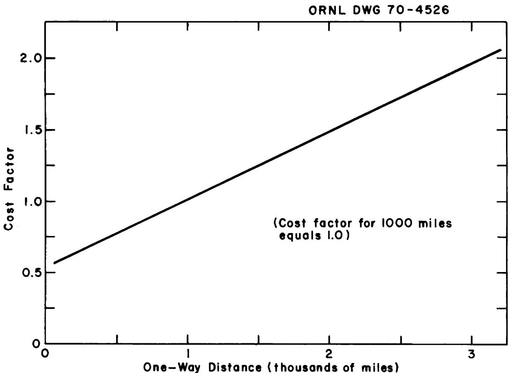  
Fig. 6.l. Effect of Distance on Shipping Cost.

Both the freight cost and the container cost are affected by shipping distance. Rental charges on containers are based on the number of days in use, which, in turn, depends on the distance. If the containers are capitalized, the cost per trip is equal to the annual fixed charges on the container investment divided by the number of trips per year. Other things being equal, the number of trips that can be made annually is inversely proportional to the number of days required per trip. Approximate estimates of the time required for trips of various distances are as follows:

<table><tr><td rowspan="2">One-Way Distance (miles)</td><td colspan="2">Round-Trip Time (days)</td></tr><tr><td>Rail Freight</td><td>Motor Freight</td></tr><tr><td>250</td><td>8</td><td>4</td></tr><tr><td>500</td><td>12</td><td>6</td></tr><tr><td>1000</td><td>16</td><td>10</td></tr><tr><td>1500</td><td>20</td><td>12</td></tr><tr><td>2000</td><td>23</td><td>14</td></tr><tr><td>3000</td><td>36</td><td>18</td></tr></table>

These estimates include one day each for loading and unloading.

The data given here and in Sect. 3 can be used to compare the economics of various plant location policies. For example, the annual expenditures for spent-fuel shipping can be compared on the basis of restricted and unrestricted siting. Using SATF Phase 3, Case 42, and the year 2000, for example, the annual expenditure based on a shipping distance of 1000 miles would be approximately as follows:

<table><tr><td>Type of Fuel</td><td>metric tons/year</td><td>$/kg fuel</td><td>$10^6/year</td></tr><tr><td>LWR</td><td>6100</td><td>4.7</td><td>29</td></tr><tr><td>IMFBR</td><td>8500</td><td>17.5</td><td>149</td></tr><tr><td>Total</td><td></td><td></td><td>178</td></tr></table>

When the costs of shipping recovered enriched uranium and plutonium solutions are included (see Sect. 6.2.2), the total cost becomes about $200 million per year. If the average shipping distance is reduced to

350 miles, the cost decreases to about $135 million (see Fig. 6.1). The shipping cost penalty associated with the larger distance is thus about $65 million annually. Inventory charges incurred because of the longer time in transit must be added to this penalty. Assuming that the average kilogram of material is worth $250 and that the additional time in transit is 5 days, the additional inventory charges associated with the longer shipping distance would be about $6 million per year. These figures give some indication of the possible magnitude of the cost penalties that might be associated with restrictive siting practices. Table 6.7 shows total annual shipping costs (for spent fuel and recovered material), as a function of time, that were calculated for 1000-mile distances, as well as for the shorter average distances projected in Table 3.55.

Table 6.7. Projected Total Annual Shipping Costs $^a$ (Based on SATF Phase 3, Case 42)   

<table><tr><td rowspan="2">Year</td><td colspan="3">Annual Costs (millions of dollars)</td></tr><tr><td>For 1000-Mile Shipments</td><td>For Shorter \( Distances^b \)</td><td>Difference</td></tr><tr><td>1980</td><td>21</td><td>16</td><td>5</td></tr><tr><td>1990</td><td>144</td><td>101</td><td>43</td></tr><tr><td>2000</td><td>200</td><td>135</td><td>65</td></tr><tr><td>2010</td><td>319</td><td>208</td><td>111</td></tr><tr><td>2020</td><td>395</td><td>247</td><td>148</td></tr></table>

${}^{a}$ All costs are given in terms of 1970 dollars.   
bDistances were obtained from Table 3.55.

# 6.2.2 Recovered Fissile and Fertile Materials

Plutonium Nitrate Solutions. - Plutonium that is recovered from spent nuclear fuels is shipped from the reprocessing plant as plutonium nitrate solution at a concentration of $250\mathrm{g}$ of plutonium per liter. The primary container is a 10-liter polyethylene bottle. Each bottle is enclosed in a 5-in. sched 40 stainless steel pipe having a flanged and bolted end; in turn, this pipe is centered in a steel drum that is about 22 in. in diameter and about 6 ft high. The drum is packed with vermiculite or similar material. A single motor freight trailer shipment consists of up to 68 bottles, or a total of $170\mathrm{kg}$ of plutonium. Each package weighs about 140 lb.

Shipping costs are estimated as follows:

500

19-26

1000

26-39

2500

39-52

The higher costs are based on present-day conditions; the lower ones are those that might be expected to prevail in the 1980-1990 period.

The plutonium content of the spent fuel from LWR's operating on 2 to $3\%$ enriched uranium is about $0.8\%$ . The plutonium content of spent fuel from the FBR's considered in this study varies from 6 to $11\%$ of the total core and blanket. Using these figures, the plutonium shipping costs per kilogram of total fuel are as follows:

Distance (miles)   
Cost ($/kg Fu)   

<table><tr><td rowspan="2">One-Way Distance (miles)</td><td colspan="2">Costs ($/kg fuel) for:</td></tr><tr><td>LWR Fuel (1970)</td><td>FBR Fuel (1980-1990)</td></tr><tr><td>500</td><td>0.21</td><td>1.20-2.20</td></tr><tr><td>1000</td><td>0.31</td><td>1.50-2.90</td></tr><tr><td>2500</td><td>0.42</td><td>2.30-4.30</td></tr></table>

Future material from high-exposure power reactors will have higher concentrations of $^{238}\mathrm{Pu}$ and may, therefore, have to be shielded with a moderating material to reduce neutron radiation to acceptable levels. This will increase the cost of shipment significantly.

The polyethylene bottles tend to crack after prolonged use. Therefore, other container materials are being investigated.

Uranyl Nitrate $(^{238}\mathrm{U}-^{235}\mathrm{U})$ Solutions. - Recovered uranium that is only slightly enriched and has essentially zero gamma activity can be shipped as uranyl nitrate solution in tank trucks of about 3000-gal capacity. This solution must meet the "low specific activity" criterion specified in CFR Title 10 Part 71. The concentration of uranium in the solution is typically $320\mathrm{g/liter}$ and is limited to a maximum of $357\mathrm{g/liter}$ . The concentration of $^{235}\mathrm{U}$ must not exceed $5\%$ .

Insulated stainless steel tank trailers are used. Freezing in cold weather must be avoided.

Shipping costs for this method of transport are estimated as follows:

<table><tr><td>Distance (miles)</td></tr><tr><td>500</td></tr><tr><td>1000</td></tr><tr><td>2500</td></tr></table>

<table><tr><td>Cost ($/kg U)</td></tr><tr><td>0.50-0.80</td></tr><tr><td>0.80-1.05</td></tr><tr><td>1.70-2.60</td></tr></table>

The higher costs are based on present-day conditions; the lower ones are those that might be expected in the 1980-1990 period.

Gamma-Active Uranyl Nitrate Solutions. - The reprocessing of fuels from thorium-uranium fuel cycles may require the shipment of $^{233}\mathrm{U}$ solutions containing gamma-active daughters of $^{232}\mathrm{U}$ . ORNL-3943 gives estimated shipping costs ranging from $30 to$ 50 per kilogram of uranium for a shipping distance of 500 miles when an escalation factor of 1.4 (1966 to 1970) is applied. The cost depends on the $^{232}\mathrm{U}$ concentration and on the total volume shipped per year. In making these estimates, it was assumed that the solution was shipped by rail in large lead-shielded steel casks and that internal compartmentation can be used to prevent criticality.

# 6.3 Waste Management Costs

A series of studies was made at ORNL during the period 1961-1965 to evaluate the economics associated with the treatment and the permanent disposal of high-level wastes.[16-23] Analyses were made of each operation shown in Fig. 6.2 for a nominal 20,000-Mw (electrical) nuclear power economy; based on government ownership of the facilities, it was estimated that management via the series of operations consisting of interim liquid storage, pot calcination, interim solid storage, shipment, and disposal in salt mines could be accomplished for about 0.017 to 0.020 mill per kwhr of electricity produced from the original fuel.[24] This was about the same cost as that estimated for "perpetual" tank storage of the wastes in liquid form, which is a much more hazardous and less satisfactory method of long-term management.

Recently, these analyses were incorporated in a computer program to facilitate cost optimization over a wide range of conditions and for different methods of financing. Costs were escalated to nationally averaged, early-1970 dollar values based on indexes in Engineering News-Record and Cost Engineering, and on data from the Bureau of Labor Statistics. Using current interest rates and economic models that are representative of corporate financing, we calculated new estimates of the cost of high-level radioactive waste management by solidification and disposal in salt mines. These figures range from 0.03 to 0.05 mill/kwhr ($7650 to $12,750 per metric ton of fuel irradiated to a burnup of 33,000 Mwd/ton). Perpetual storage in tanks is estimated to cost about 0.032 mill/kwhr ($8160 per metric ton of fuel irradiated to a burnup of 33,000 Mwd/ton).

# 6.3.1 Basis and Economic Model

The current calculations are based on a 20,000-Mw (electrical) nuclear economy that, annually, generates 1.753 x $10^{11}$ kWh of electricity and produces 687.5 metric tons of spent fuel irradiated to 33,000 Mwd/ton. The fuel is assumed to be reprocessed 150 days following its discharge from the reactor, and the pot calcination facility is sized so that the waste is solidified at the rate at which it is generated during fuel reprocessing.

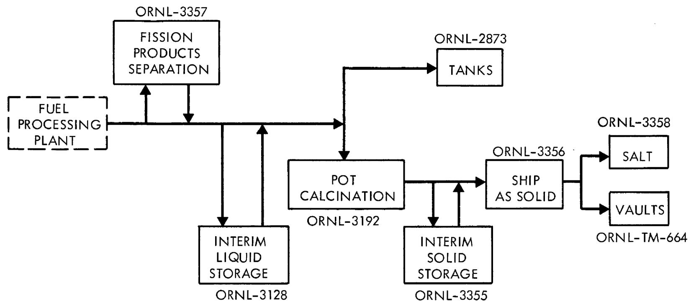  
Fig. 6.2. Management of High-Level Radioactive Wastes.

Waste management costs are computed using an economic model based on the "payout" method described by Salmon.[25,26] This method is basically a discounted cash flow calculation, which requires that the incomes received must provide for the recovery of the investment, the desired return on investment, all cash expenses of the project, and the establishment of an escrow fund to pay for the waste management operations that remain to be completed after all income has ceased. The basic features of this model are as follows:

1. The bond interest for a given year is equal to the bond interest rate multiplied by the bond principal outstanding at the beginning of that particular year.   
2. The return on equity for a given year is equal to the earning rate on equity multiplied by the equity capital outstanding at the beginning of that particular year.   
3. The interest on the escrow fund is equal to the interest rate multiplied by the total amount accumulated in the fund at the beginning of the year. This interest is then added to the fund principal.   
4. Incomes and expenses are assumed to occur at the end of each year; capital expenditures occur at the beginning of the year.   
5. The cash income from sales received at the end of a given year is divided into six portions:

(a) One portion is used to pay the cash expenses for that year, including operating charges and taxes (but not including depreciation).   
(b) The second portion is used to pay bond interest.   
(c) The third portion goes to return on equity.   
(d) The fourth portion is paid into the escrow fund.   
(e) The fifth portion is used to reduce the outstanding bond principal (the capital in bonds and in equity is paid off in the same ratio as that in which the debts were originally established).

(f) The remainder is used to reduce the outstanding equity capital.

6. At the end of the income-receiving period, the outstanding investments both in bonds and in equity are reduced to zero.   
7. After all income has ceased, the escrow fund is used to pay any capital expenditures as well as all operating expenses that have been incurred.   
8. The following items are summed to give the total tax-deductible expenses during the income-receiving period: bond interest, payment to the escrow fund, operating expenses, and depreciation.

In these calculations, $30\%$ of the capital investment is financed by bonds at $8\%$ interest; an after-tax return of $16\%$ is allowed on stockholders' equity; the straight-line method of depreciation is used; and the federal income tax rate is $48\%$ . These conditions are equivalent to an effective "cost of money" of $12.4\%$ and to a fixed-charge rate of $24\%$ . The escrow fund draws $5\%$ tax-exempt interest annually.

# 6.3.2 Perpetual Tank Storage

In a previous study,[23] the costs of perpetual tank storage were examined for three representative types of financing: government ownership, private ownership, and a combination of government and private ownership. The case of government ownership provided only for the recovery of capital and operating expenses, and for interest on the investment capital; however, in the case of private ownership, costs reflected a return on equity, as well as the recovery of capital and operating expenses, insurance, taxes, and interest. In the third case, private ownership was assumed during the 20-year period of waste accumulation, after which the government assumed responsibility for perpetual care of the tank farm.

To provide for perpetual care of the waste after cessation of income, a permanent, tax-free fund was established by making annual deposits during the income-accumulation period. The size of this fund was calculated so that the annual tax-free interest would be sufficient to provide for the

periodic replacement of tanks, the replacement of other necessary equipment at 30-year intervals, and the annual operating expenses of the facility. The permanent fund also included a contingency account, equal to the cost of replacing one tank unexpectedly, transferring its contents, and filling the defective tank with concrete. No advantage was taken of the accumulation of interest on this part of the permanent, tax-free fund, since this account might have to be expended at any time.

The tank farms were designed for storing high-level radioactive wastes, in both acid and alkaline forms, in tanks similar to those being used at the Savannah River Plant. The wastes were assumed to be concentrated to 100 gal per $10^{4}$ Mwd (thermal) for storage in acid form, or 600 gal per $10^{4}$ Mwd (thermal) for storage in alkaline form. Capacities ranged from 200,000 to 5,000,000 gal. Capital costs were estimated for each case and then used in computer code TASCO $^{23}$ to estimate the total costs for each method of financing as a function of tank size, tank life-time, and fission product concentration in the waste. Although no attempt was made to determine the hazards quantitatively, the concept of double containment of radioactivity was applied throughout; in all instances, the stipulated philosophy of design and operation emphasized safety over any potential savings in costs.

We have recalculated the costs of perpetual storage after revising TASCO to reflect an escalation of $17\%$ in the cost of tanks and $30\%$ in the cost of equipment. Also, overhead was increased from $50\%$ of the labor cost to $100\%$ ; the government interest rate was set at $5\%$ ; and the economic parameters described in Sect. 6.3.1 were used for private financing. Results show that, for storage in optimum sized tanks, the initial capital expenditures vary from $10 million to$ 13 million, and the annual operating expenses range from $0.6 million to$ 1.2 million. The magnitude of the permanent tax-free fund needed for "perpetual care" ranges from $19 million to $39 million, and annual payments of from $0.6 million to $1.2 million are required to establish the permanent fund.

The total costs of perpetual tank storage for acid waste are given in Fig. 6.3. The total cost, in mills/kwhr of electricity generated, is plotted against tank capacity for tank lifetimes of 25, 50, and 75 years for the three types of financing. Minima occur at a tank capacity of

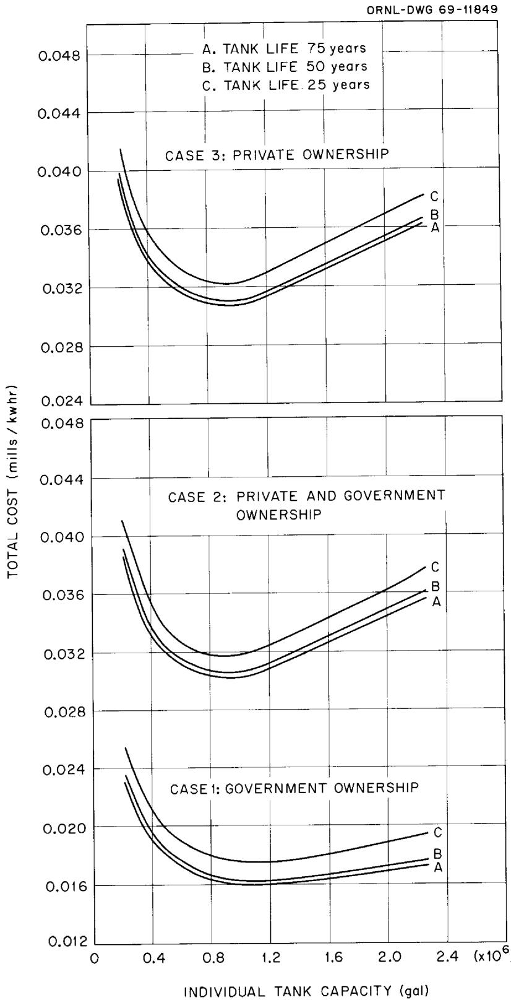  
Fig. 6.3. Cost of Acid Waste Storage as a Function of Tank Capacity, Tank Life, and Method of Financing.

about 1,000,000 gal in all cases. These minima range from 0.0160 to 0.0175 mill/kwhr for Case 1, from 0.0308 to 0.0318 mill/kwhr for Case 2, and from 0.0318 to 0.0325 mill/kwhr for Case 3. The total costs for alkaline waste storage were generally higher than the equivalent costs for acid storage (Fig. 6.4). For alkaline wastes, the optimum tank capacity was about 2,500,000 gal, and the minimum total costs were from 0 to $15\%$ higher than those for acid wastes.

To obtain an indication of the effect of fission product concentration on costs, a second set of costs was computed, assuming that the wastes are reduced in volume to one-half those of the original design basis. In this instance, acid Purex and Thorex wastes are assumed to be stored at 50 gal per $10^{4}$ Mwd of fuel exposure, while alkaline Purex and Thorex wastes are stored at 300 gal per $10^{4}$ Mwd of exposure. This reduction in volumes caused a decrease of 15 to $30\%$ in total costs. The optimum capacity for a tank for storing acid waste remained at about 1,000,000 gal, whereas the optimum size for alkaline waste storage decreased from about 2,500,000 to 1,500,000 gal.

Comparison with Reported Costs at NFS. - Nuclear Fuel Services, Inc. (NFS), of West Valley, New York, has contractual arrangements with the state of New York for the management of high-level radioactive wastes from NFS on a "perpetual" tank-storage basis. Under the terms of this contract, New York State provides a tank farm needed for 15 years' operation of the plant and is reimbursed by NFS for the capital cost of this farm as the tank capacity is utilized. In addition, NFS makes payments into a state-owned "perpetual care" escrow fund, which earns $4 \%$ annual interest and matures in 15 years. The total cost of high-level waste management under this plan has been reported informally to be about $1870 per ton of fuel processed [0.012 mill/kwhr (electrical)]. The exact details of the financial arrangement are not available, but it is believed that this reported cost can be reconstructed approximately as discussed below.

On the basis of processing 225 tons of 20,000 Mwd/ton fuel annually, and concurrently storing waste under alkaline conditions at a concentration of 400 gal/ton, NFS will generate about 1,400,000 gal of waste over

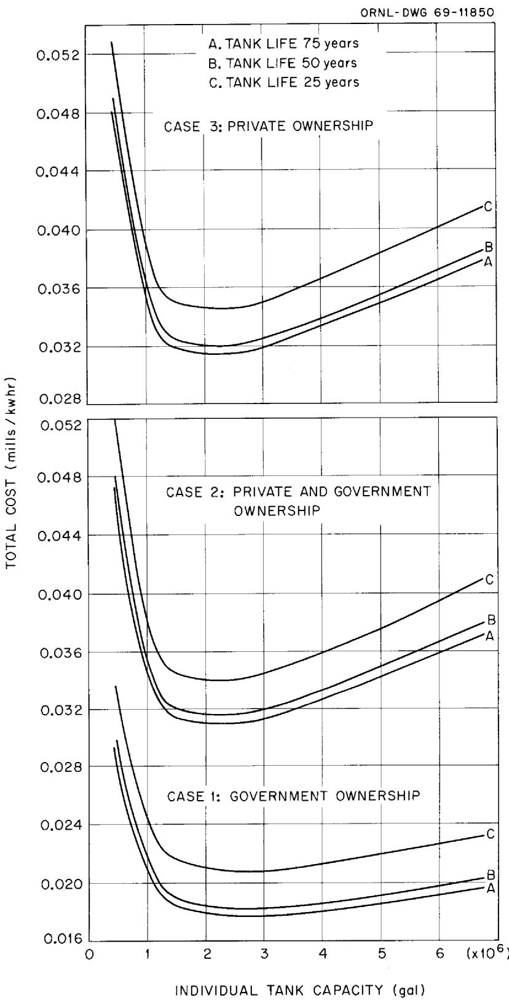  
Fig. 6.4. Cost of Alkaline Waste Storage as a Function of Tank Capacity, Tank Life, and Method of Financing.

a period of 15 years. Tankage is supplied in the form of one 320,000-gal and two 600,000-gal carbon-steel "working" tanks, and decay heat is removed from the wastes by allowing them to self-boil. The capital cost of the farm was estimated at $3.2 million to$ 4.0 million. Nuclear Fuel Services repays the state of New York $210,000 annually ($933 per ton of fuel processed), based on a straightline depreciation of $3.2 million over a period of 15 years. Nuclear Fuel Services also makes an annual payment of $211,000 ($938 per ton of fuel) into the "perpetual care" fund. Thus, the total cost of high-level waste management at NFS, excluding tank-farm operating costs, interest, and return on the capital investment, is $1871 per ton of fuel processed.

When the ORNL tank-farm design and cost model (computer code TASCO) was used to estimate the perpetual storage costs for wastes from an installation of a size similar to that of NFS, a total cost of $3080 per ton of fuel [0.02 mill/kwhr (electrical)] was obtained. In this case, a plant processing 225 tons of 20,000-Mwd/ton fuel annually for 15 years was assumed. Waste generated at the rate of 90,000 gal/year was stored in three 530,000-gal tanks equipped with submerged coils for heat removal. The total cost of $3080 per ton of fuel includes: $800 for the escrow payment; $430 for operation, maintenance, and insurance; $1440 for straight-line depreciation of the capital investment over 15 years; and $410 for average interest on the investment, computed at 5% per annum. It appears that the lower cost reported for NFS waste management is due primarily to the exclusion of operating costs and interest on the capital, and to the lower capital costs, which are possibly a reflection of less-expensive tankage required for storage under self-boiling conditions.

# 6.3.3 Solidification and Disposal in Salt

After escalating the capital and operating costs developed previously for the various operations shown in Fig. 6.2, we calculated present-valued costs for interim liquid storage in acid form, pot calcination, interim solid storage, shipment, and disposal in salt mines as a function of time (or age of the wastes), using the financing model described in Sect. 6.3.1.

Interim Liquid Storage. - Figure 6.5 presents the costs, in units of $10^{-3}$ mill/kwhr, for interim liquid storage as a function of storage time, in years. Interim liquid storage costs are based on the same tank-farm design and capital and operating costs that were used for perpetual liquid storage. The wastes were stored at a concentration corresponding to 100 gal per 10,000 Mwd (thermal), and a tank lifetime of 50 years was assumed. The tank size was optimized for each storage period, and provisions were made for the reuse of tanks when possible. Costs for interim liquid storage ranged from 13 x $10^{-3}$ to 27 x $10^{-3}$ mill/kwhr for storage periods of 1 to 30 years respectively. There is very little difference in cost between a 20- and a 30-year storage period because the same total storage capacity is required and none of the tanks can be reused.

Pot Calcination and Shipment. - Figure 6.6 presents pot-calcination and waste-shipment costs as a function of the age of the waste at the time of calcination and shipment. Costs were calculated for calcination in 6-, 12-, and 24-in.-diam cylinders for every case in which the center-line temperatures of the cylinders were permitted to remain at less than $1650^{\circ}\mathrm{F}$ when the cylinders were standing in air. The volume of calcined solids was taken to be $1\text{ft}^3$ per 10,000 MWD (thermal) of fuel irradiation. Calcination costs were computed after the costs from the earlier study[17] had been escalated as follows: permanent facilities, $50\%$ ; calcination pots, $30\%$ ; labor, increased to $\$10,000$ per man-year; overhead, assumed to be $100\%$ of the labor costs. The calculated costs ranged from $16.5 \times 10^{-3}$ mill/kwhr, for the calcination of 1-year-old wastes in 6-in.-diam pots, to $1.8 \times 10^{-3}$ mill/kwhr for the calcination of 30-year-old wastes in 24-in.-diam pots. Costs for 1000-mile shipment of the pots in lead-shielded casks weighing 50 to 90 tons, without forced convection cooling enroute, ranged from $2.3 \times 10^{-3}$ mill/kwhr for shipment two years after fuel reprocessing to less than $1 \times 10^{-3}$ mill/kwhr for shipment 40 or more years later. In arriving at these estimates, freight costs were escalated by $20\%$ over those previously used;[19] the purchase price of the casks was based on $\$1.25$ per pound of weight; labor costs were increased to $\$100$ per man-day, including overhead; the cost of the loading crane was escalated to $\$1200$ per ton; and a period of 14 days was allowed for a 2000-mile round-trip shipment.

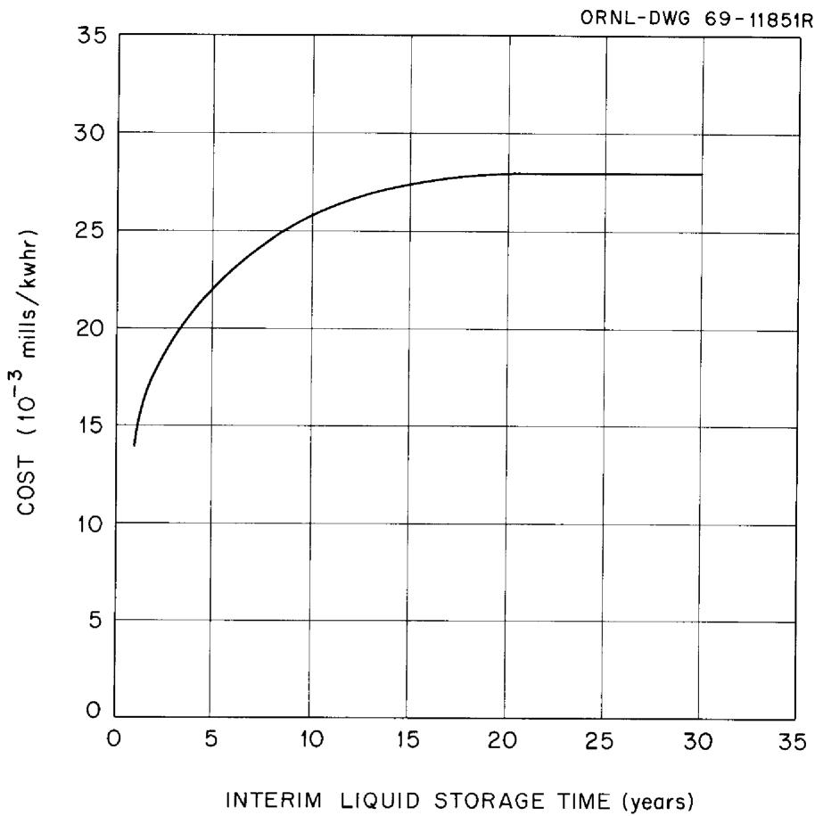  
Fig. 6.5. Cost of Interim Liquid Storage as a Function of Storage Time.

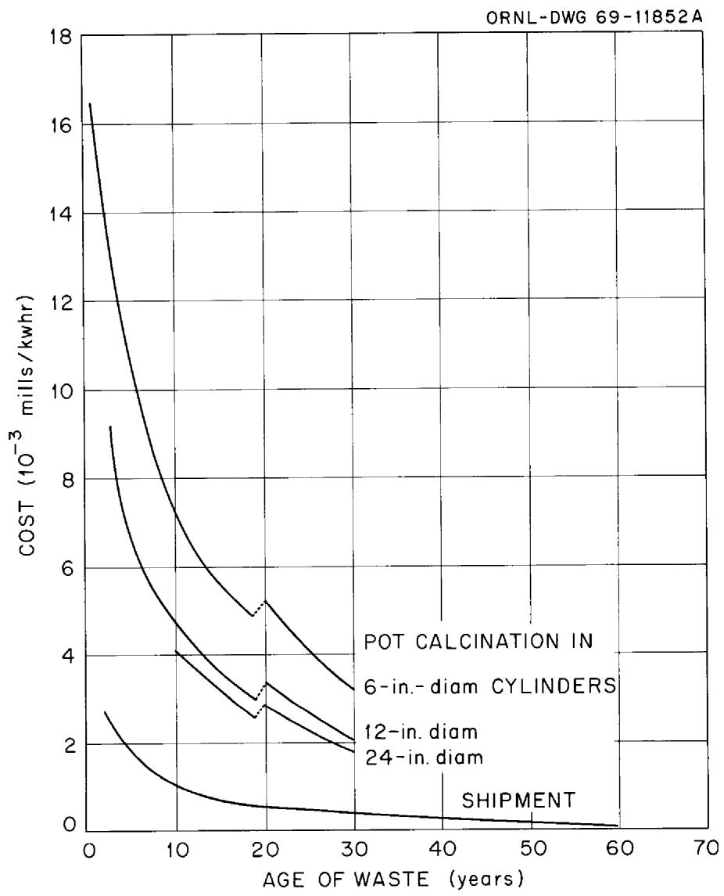  
Fig. 6.6. Present-Valued Costs of Pot Calcination and Shipment of Solidified Wastes as a Function of the Age of the Wastes.

Interim Solid Storage. - Present-valued costs for interim solid storage of the calcined wastes in water-filled canals are presented as a function of the age of the waste (specifically, interim liquid storage time) for 1, 3, 10, and 30 years of storage (Fig. 6.7). The costs range from 16 x $10^{-3}$ mill/kwhr (obtained by extrapolation) for 30-year storage of 1-year-old waste in 6-in.-diam pots, to 0.5 x $10^{-3}$ mill/kwhr for 1-year storage of 30-year-old waste in 6-, 12-, or 24-in.-diam pots. For these calculations, the costs that were escalated over those used in the previous study are: excavation, $\$5/\text{yd}^3$ ; concrete in place, $\$120/\text{yd}^3$ ; epoxy lining, $\$1.50/\text{ft}^2$ ; aluminum partitions, $\$10/\text{ft}^2$ ; 5-ton crane, $\$7000$ ; track, $\$37/\text{ft}$ ; demineralizer system, $\$450/\text{gpm}$ ; Geiger tube detectors, $\$1200$ each; scintillation detectors, $\$2300$ each; service and office building, $\$35/\text{ft}^2$ ; and a building to house the storage canals, $\$10/\text{ft}^2$ . The costs of the aluminum stands to hold the cylinders were estimated at $\$25$ , $\$39$ , and $\$63$ each for 6-, 12-, and 24-in.-diam pots respectively. Cooling system costs, which include cooling towers, heat exchangers, and pumps, were increased by $25\%$ .

The discontinuity in each of the cost curves of Figs. 6.6 and 6.7 at the 19- to 20-year marks is a characteristic of the particular economic model that is used. In this model, it is assumed that any investments made after the end of the 20-year income-receiving period would have to be financed out of the escrow fund. Investments made during the 20-year period, on the other hand, would be recovered from incomes received during that same 20-year period. Since any investments outstanding during this period are expected to yield an annual interest of $12.4\%$ , the incomes used to retire these investments are, in effect, earning at this rate all through the payout period. An investment made in the twentieth year must be recovered (reduced to zero) at the end of that year. This is done by making use of accumulated annual incomes that have been received during the previous 20 years and that have, in effect, been accumulating interest at $12.4\%$ per year. If these incomes had been accumulating at an interest rate of only $5\%$ per year, the amount of annual income required to retire the same investment would have had to be much larger. The discontinuity comes about because of the assumption that an investment made in the twentieth year can be retired by incomes that have been accumulating for

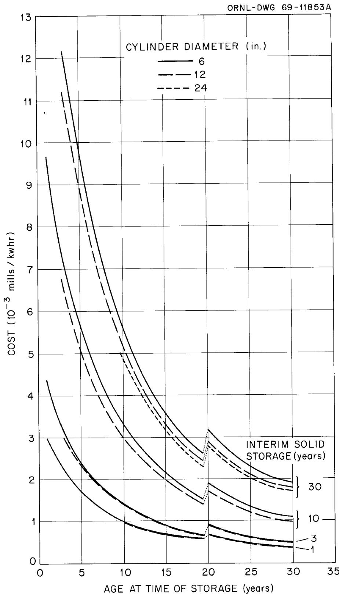  
Fig. 6.7. Present-Valued Costs of Interim Storage of Solidified Wastes as a Function of Their Age at the Time of Burial.

20 years at $12.4\%$ per year, while the same investment made in the twenty-first year must be retired by incomes that have been accumulating at only $5\%$ per year. For example, in Fig. 6.6, a 19-year age for the waste at the time of calcination means that the investment for the calcination facility was made in year 20, while a 20-year age at the time of calcination means that the investment was made in year 21. In constructing the model, there seemed to be no simple, valid method of eliminating this discontinuity, which never amounts to more than about $2\%$ of the cost in any event.

Disposal in Salt Mines. - The estimated costs for the disposal of solidified wastes in a salt mine are presented in Fig. 6.8. As in the previous study,[21] the cylinders are buried in vertical holes in the floor of a mine that is excavated 1000 ft below the surface. The pots are spaced in such a manner that the decay heat can be dissipated without increasing the temperature of the salt above $200^{\circ}\mathrm{C}$ . Costs that were developed in the study of an initial government-owned repository (described in Sect. 4.3.4) were utilized in arriving at the estimates shown in Fig. 6.8. A cost of $381,000 per acre of the net mine area, including all capital and operating costs and 5% annual interest on money, was an average of several cases considered. To determine the costs of burying a can of waste, the required mine area was first calculated from considerations of the heat-generation rate and the age of the waste at the time of its burial. This area was multiplied by $381,000; then the product was converted to mills per kilowatt-hour of electricity originally generated, and present-valued. Disposal costs lie in the range of 0.1 x $10^{-3}$ to $10.9 \times 10^{-3}$ mill/kwhr; they increase with pot diameter because the heat is dissipated easier from smaller vessels, thus permitting more efficient utilization of space in the mine.

Total Costs of Management. - Minimum total costs for six cases representing different schedules of waste management operations carried out sequentially are summarized in Table 6.8. In addition to pertinent descriptive data, the initial capital investment and present-valued unit cost are given for interim liquid storage, pot calcination, interim solid storage, and shipment of the solidified waste. For the salt-mine repository, only

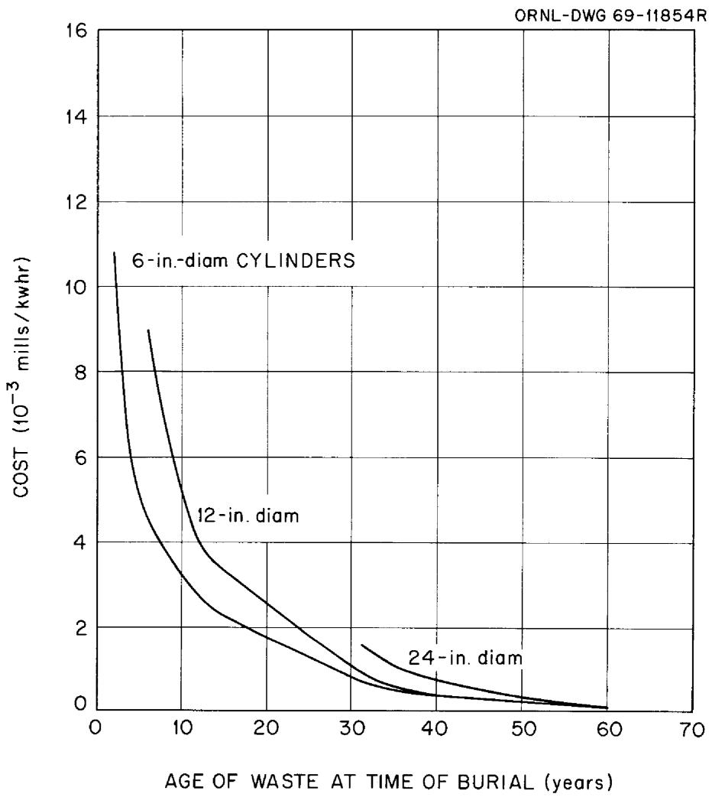  
Fig. 6.8. Present-Valued Costs of Disposal in Salt as a Function of the Age of the Waste at the Time of Its Burial.

Table 6.8. Optimal Schedules and Costs of High-Level Waste Management   

<table><tr><td>Case No.</td><td>1</td><td>2</td><td>3</td><td>4</td><td>5</td><td>6</td></tr><tr><td>Interim liquid storage</td><td></td><td></td><td></td><td></td><td></td><td></td></tr><tr><td>Storage time, years</td><td>20</td><td>10</td><td>5</td><td>0</td><td>0</td><td>0</td></tr><tr><td>Number of tanks, with spare</td><td>6</td><td>5</td><td>5</td><td>0</td><td>0</td><td>0</td></tr><tr><td>Tank size, 10^6 gal</td><td>1.05</td><td>0.88</td><td>0.55</td><td>0</td><td>0</td><td>0</td></tr><tr><td>Initial capital cost, $10^6</td><td>13.2</td><td>12.2</td><td>10.0</td><td>0</td><td>0</td><td>0</td></tr><tr><td>Unit cost, 10^-3 mill/kwhr</td><td>27.7</td><td>25.9</td><td>22.9</td><td>0</td><td>0</td><td>0</td></tr><tr><td>Pot calcination</td><td></td><td></td><td></td><td></td><td></td><td></td></tr><tr><td>Residual solids volume, ft^3/10^4 Mwd (thermal)</td><td>1.0</td><td>1.0</td><td>1.0</td><td>1.5</td><td>1.0</td><td>1.5</td></tr><tr><td>Solids conductivity, Btu hr^-1 ft^-1 °F^-1</td><td>0.26</td><td>0.26</td><td>0.26</td><td>0.26</td><td>1.4</td><td>0.26</td></tr><tr><td>Pot diameter, in.</td><td>9</td><td>12</td><td>12</td><td>6</td><td>9</td><td>6</td></tr><tr><td>Number of pot lines</td><td>5</td><td>5</td><td>5</td><td>10</td><td>22</td><td>10</td></tr><tr><td>Initial capital cost, $10^6</td><td>4.1</td><td>4.2</td><td>4.4</td><td>6.5</td><td>8.3</td><td>6.5</td></tr><tr><td>Unit cost, 10^-3 mill/kwhr</td><td>3.7</td><td>4.8</td><td>7.4</td><td>24.1</td><td>22.7</td><td>24.1</td></tr><tr><td>Interim solid storage</td><td></td><td></td><td></td><td></td><td></td><td></td></tr><tr><td>Storage time, years</td><td>0</td><td>0</td><td>5</td><td>3</td><td>4</td><td>1</td></tr><tr><td>Initial capital cost, $10^6</td><td>0</td><td>0</td><td>2.8</td><td>3.8</td><td>3.5</td><td>2.2</td></tr><tr><td>Unit cost, 10^-3 mill/kwhr</td><td>0</td><td>0</td><td>3.0</td><td>6.6</td><td>6.3</td><td>4.1</td></tr><tr><td>Shipmenta of solidified waste</td><td></td><td></td><td></td><td></td><td></td><td></td></tr><tr><td>Number of shipments per year</td><td>45</td><td>45</td><td>45</td><td>67</td><td>40</td><td>67</td></tr><tr><td>Number of casks, with spare</td><td>3</td><td>3</td><td>3</td><td>4</td><td>3</td><td>4</td></tr><tr><td>Initial capital cost, $10^6</td><td>0.4</td><td>0.5</td><td>0.5</td><td>0.8</td><td>0.6</td><td>0.9</td></tr><tr><td>Unit cost, 10^-3 mill/kwhr</td><td>0.6</td><td>1.0</td><td>1.0</td><td>3.0</td><td>1.7</td><td>4.3</td></tr><tr><td>Salt mine repository</td><td></td><td></td><td></td><td></td><td></td><td></td></tr><tr><td>Unit cost, 10^-3 mill/kwhr</td><td>2.0</td><td>5.0</td><td>4.7</td><td>5.1</td><td>6.4</td><td>11.2</td></tr><tr><td>Total cost</td><td></td><td></td><td></td><td></td><td></td><td></td></tr><tr><td>Maximum unrecovered capital, millions of dollars</td><td>13.2</td><td>12.2</td><td>13.9</td><td>10.4</td><td>11.9</td><td>8.7</td></tr><tr><td>Unit cost, 10^-3 mill/kwhr</td><td>34.0</td><td>36.7</td><td>39.0</td><td>38.8</td><td>37.1</td><td>43.7</td></tr></table>

a2000-mile round trip.

the unit cost of disposal is given since it is assumed that this is a national facility owned and operated by the government on a full cost-recovery, but nonprofit, basis. Finally, the minimum total unit cost, in mills per kilowatt-hour, is given for each case, as is the maximum amount of capital that remains to be recovered at any time during the 20 years that income is received.

Cases 1 through 3 indicate that the total cost increases from 0.034 mill/kwhr to 0.039 mill/kwhr as the interim liquid storage time is decreased from 20 years to 5 years. In case 1, calcination in 9-in.-diam pots and shipment to the repository are carried out after a 20-year storage period; these operations are financed entirely by the fund which is established for that purpose. This is the least expensive of any of the cases that were considered.

Case 2 shows that calcination in 12-in.-diam pots, shipment, and disposal can be carried out, after only 10-years liquid storage, for 0.0367 mill/kwhr. However, if the waste is solidified after only 5-years storage, it can be seen from case 3 that an additional 5-years storage of the solids prior to shipment and disposal is justified.

Because of their high heat-generation rates, these wastes cannot be calcined without some prior storage as liquids unless the residual solids are either diluted with inert material or treated in some manner designed to increase their thermal conductivities. In case 4, it is assumed that the volume of residual solids has been increased by $50\%$ [i.e., from 1.0 to $1.5 \mathrm{ft}^{3} / 10^{4}$ Mwd (thermal)] without affecting the thermal conductivity. The wastes are calcined immediately in 6-in.-diam pots, stored in canals for 3 years, and then shipped to a salt mine for permanent storage. The total cost for this schedule of operations is 0.0388 mill/kwhr, about $14\%$ more than for case 1.

Results of laboratory studies show that our capability of producing dispersions of calcined solids in a sodium tetraborate matrix is potentially good. These dispersions would have a thermal conductivity of about 1.4 Btu hr $^{-1}$ ft $^{-1}$ (°F) $^{-1}$ , and their volume would be no greater than that of the calcined solids.[27] Case 5 assumes the formation of such a dispersion in 9-in.-diam pots without prior liquid storage. After 4-years

storage in solid form, this waste is shipped to the repository; storage and shipment result in a combined cost of 0.0371 mill/kwhr.

Case 6 represents the most accelerated schedule possible, as determined by the maximum allowable heat-generation rates of wastes buried in salt. Here, it is assumed that the wastes are solidified immediately [after dilution of the residual solids to $1.5\mathrm{ft}^{3}/10^{4}$ Mwd (thermal)], and then shipped to the repository after only 1 year of interim solid storage. A total cost of $0.0437$ mill/kwhr is estimated for this case.

In summary, these costs indicate that the least-expensive management consists of storing the waste in liquid form for the full 20 years that income is received before solidifying and shipping it to the salt-mine repository. Storage as a liquid for only 10 years, followed by solidification and shipment to the repository, increases the total cost about $8\%$ ; and immediate solidification, followed by 3 to 4 years on-site storage of the solids prior to shipment and disposal, costs 9 to $14\%$ more. If for any reason, such as for enhanced safety, the schedule should need to be carried out with the least practical delay, we would expect to pay about $30\%$ more.

Effect of Scale. - A consideration of the major components of the costs in the management of high-level wastes indicates that these costs should be dependent on the quantity of fission products handled rather than on the mass of fuel reprocessed. The quantity of fission products can be represented by the burnup of the fuel, and, on an annual basis, it is equivalent to the total number of thermal megawatt-days represented by all the fuel reprocessed during that year. Accordingly, cases 2, 4, and 5 were investigated from the standpoint of the total annual waste management cost over the burnup range $1.13 \times 10^{7}$ to $1.82 \times 10^{8}$ Mwd (thermal)/year. (These burnups are equivalent to about 340 and 5500 metric tons/year, respectively, of fuel that has been exposed to 33,000 Mwd/metric ton.)

The total annual costs for case 2 are represented, within $+10\%$ , by:

$$
\mathbb {S} / \text {y e a r} = 4. 0 7 \times 1 0 ^ {6} \left[ \frac {\text {M w d (t h e r m a l) / y e a r}}{1 0 ^ {7}} \right] ^ {0. 7 6}.
$$

Case 4 is represented, within $+10\%$ , by:

$$
\mathbb {S} / \text {y e a r} = 4. 0 5 \times 1 0 ^ {6} \left[ \frac {\text {M w d (t h e r m a l) / y e a r}}{1 0 ^ {7}} \right] ^ {0. 8 5}.
$$

Case 5 is represented, within $+10\%$ , by:

$$
\mathbb {S} / \text {y e a r} = 3. 8 0 \times 1 0 ^ {6} \left[ \frac {\text {M w d (t h e r m a l) / y e a r}}{1 0 ^ {7}} \right] ^ {0. 8 6}.
$$

All costs calculated for the three cases can be represented, within $+25\%$ , by:

$$
\mathbb {S} / \text {y e a r} = 3. 9 7 \times 1 0 ^ {6} \left[ \frac {\text {M w d (t h e r m a l) / y e a r}}{1 0 ^ {7}} \right] ^ {0. 8 1}.
$$

The $10^{7}$ figure in the denominators of the above expressions is a normalizing factor.

# 6.3.4 Comparison of Salt with Concrete Volumes and Granite

The choice of a permanent disposal site for solidified high-level radioactive wastes must be made on the basis of both safety and economic considerations. Although the safety and cost requirements cannot be rigorously defined, the hazards associated with the wastes are of sufficient magnitude that provisions for containment outside the environment are required, virtually forever. It is implicit that this containment be effected under conditions requiring a minimum of surveillance and at a cost commensurate with the costs of other items in the power reactor fuel cycle.

In the United States, cavities mined in natural salt formations are believed to offer the best possibilities for the permanent disposal of high-level radioactive wastes. However, since a salt mine could be located at a considerable distance from a fuel reprocessing plant, shipment of the wastes would almost certainly be required. Suitable deposits of granite or shale might be more accessible to a plant. Also, it is conceivable that high-integrity concrete vaults could be constructed at the plant site to serve the purposes of permanent containment.

If we have available, as a point of reference, the more detailed analysis of the cost factors in the disposal of calcined wastes in salt mines,[21] a rather perfunctory analysis can show the relative costs for disposal of wastes in concrete vaults at the surface of the earth and in areas excavated from granite formations. In lieu of a formal safety analysis, a qualitative observation can be made that disposal in granite would, at best, be no safer than in salt. In addition, concrete vaults would be less safe because of the limited period of integrity of the concrete and the proximity of the waste to the biosphere. Therefore, in order for these alternative methods to be competitive, the costs of mining space in granite should be as low as the costs for salt, whereas the costs for vaults should be lower than those for salt.

Costs were estimated for the permanent storage of calcined radioactive wastes in concrete vaults and in rooms mined out of granite formations.[22] The costs for concrete vaults were five to seven times as much as the previously estimated costs for storage in salt mines, whereas the costs for storage in granite were only about twice as much. Thus, its economic advantage, as well as the greater safety it is believed to offer, makes salt the preferred choice. While it is possible to design vaults of lower costs than those calculated in ref. 22, it seems unlikely that the costs could be reduced sufficiently to make them comparable to those for storage in salt formations, unless many safety features are sacrificed.

Vaults for use in the storage of high-level solid wastes would be similar in their gross features to many of the tanks built for storing liquid radioactive wastes, in that they would be underground structures of reinforced concrete with an earth cover. To make storage in vaults as safe as possible, we assumed that the vaults were sealed completely from the surface. Space requirements were calculated by assuming that the heat of radioactive decay was dissipated via conduction through the earth cover. Volumes of two types of concrete were considered: ordinary concrete (capable of withstanding temperatures of 400 to $500^{\circ}\mathrm{F}$ ), and "high-temperature concrete" (capable of withstanding a temperature of $1000^{\circ}\mathrm{F}$ ).

Space requirements for storing calcined wastes in rooms mined out of granite formations are about the same as those for storage in salt formations. However, mining costs are higher for granite because heavier equipment is required, drilling is more difficult and slower, and costs of explosives are higher.

It must be borne in mind that, whereas the costs given in ref. 22 should be valid for comparative purposes, a more subtle interpretation may be placed on them when they are used to optimize the total costs of waste management. For example, disposal in concrete vaults has been estimated to be five to seven times as expensive as disposal in salt formations; however, a concrete vault located at the plant site would eliminate the need for waste shipment. Although the costs for shipping long-decayed waste in the largest-diameter cylinders would be $10\%$ , or less, of disposal costs, shipment of the wastes in smaller cylinders after short periods of decay could amount to as much as 25 to $50\%$ of the costs of disposal in vaults. Again, with a moderate increase in cost, the vaults could be equipped with forced-air convection cooling (i.e., to serve as interim storage facilities) until the fission product heat generation had decreased to a level that would allow the vault to be finally sealed. In this way, interim storage in canals prior to permanent disposal could be avoided. Of course, these same considerations would apply to granite or salt in the event that the fuel processing plant is situated adjacent to suitable deposits of either.

As has been previously pointed out, a really meaningful optimization of waste management must include safety, as well as economic considerations. At present, it is believed that salt offers the greatest safety and that the costs for disposal in salt, even allowing for shipment under reasonable conditions, are less than for other alternatives.

# 6.3.5 Salt Mine Repository Charges

A preliminary estimate of the charges for handling and emplacement of containers of solidified waste at a salt mine repository has been developed using the latest information available at the time this report was published.

Subject to a minimum charge for handling, the cost for disposal of a container of waste is determined as the product of the cost per unit of floor area of the mine and the area that is required to provide for sufficient dissipation of heat from the container. The characteristic mine area required by a container is determined by the transient thermal power of the container and imposed conditions that are necessary to ensure thermal stability of the mine and acceptable temperatures near the land surface. A unit cost of $9.90 per ft² of floor area of the mine was derived on the basis that 245 net acres of burial space would be utilized over the 20-year life of the repository and that the total cost incurred in this period would be$ 106,000,000. This total cost (in 1970 dollars) provides for full recovery of all capital and operating expenses over the life of the repository, with 5% annual interest on outstanding debt and provisions for a $500,000 fund for "perpetual" surveillance after decommissioning.

The following equation has been found to correlate the unit cost data that have been developed in comprehensive studies:

$$
C = 1. 1 7 4 \int_ {0} ^ {\infty} \frac {q (t)}{\sqrt {t}} d t,
$$

where

C = unit cost for receipt, handling, and disposal of a container at the repository, dollars per container,

$q(t) =$ linear thermal power of the container, w/ft, and

$t =$ time since receipt of the container at the repository, years.

For single radioisotopes (or mixtures of isotopes if proper consideration if given to radioactive daughters), this equation may be expressed as:

$$
c = 2. 5 \sum_ {i} q _ {i} ^ {\circ} \sqrt {\tau_ {i}},
$$

where

$q_{i}^{0} =$ initial linear thermal power of isotope i upon receipt at the repository, w/ft, and

$\tau_{i} =$ half-life for radioactive decay, years.

These equations and/or the containers for emplacement in the mine are subject to the following restrictions:

(1) Containers shall be right cylinders having outside diameters in the range of 6 to 24 in. and heights in the range of 2 to 10 ft.   
(2) The minimum cost per container shall be $300.   
(3) A container may not have transient power density such that the calculated cost is greater than $10,000.   
(4) The initial linear thermal power of a container shall not exceed 500 w/ft.   
(5) At any time greater than 5000 years after receipt of the container, the following equation shall be satisfied: $q(t) \leqslant C / 1000$ .

Table 6.9 presents estimated costs, assuming that the waste consists of mixed fission products and actinides resulting from the processing of fuel from an LWR. The value of the integral in the cost equation was obtained by summing contributions from individual isotopes.

# 6.4 Site Costs

In the NFs cost estimate, $500,000 was included for the 1300-acre plant site furnished by the state of New York. This is less than 2% of the estimate for the total capital investment. If the cost of the site

Table 6.9. Estimated Costs for Receipt and Storage of Solidified Fission Product Waste from LWR Fuel at a Salt Repository as a Function of the Age of the Waste<sup>a</sup>   

<table><tr><td>Post-irradiation age of waste, years</td><td>1</td><td>2</td><td>3</td><td>5</td><td>7</td><td>10</td><td>15</td></tr><tr><td>Thermal power, w/metric ton of fuel</td><td>10,320</td><td>5200</td><td>3490</td><td>2130</td><td>1540</td><td>1100</td><td>826</td></tr><tr><td>1.174q0 ∫∞ q(t) dt, dollars/(w/ft)</td><td>3.85</td><td>5.30</td><td>6.55</td><td>8.70</td><td>10.45</td><td>12.74</td><td>14.1</td></tr><tr><td>Initial linear thermal power, w/ft</td><td colspan="7">Cost, dollars/container</td></tr><tr><td>30</td><td>300</td><td>300</td><td>300</td><td>300</td><td>310</td><td>380</td><td>420</td></tr><tr><td>60</td><td>300</td><td>320</td><td>390</td><td>520</td><td>630</td><td>760</td><td>850</td></tr><tr><td>120</td><td>460</td><td>640</td><td>790</td><td>1040</td><td>1250</td><td>1528</td><td>1690</td></tr><tr><td>180</td><td>690</td><td>950</td><td>1180</td><td>1570</td><td>1880</td><td>2290</td><td>2540</td></tr><tr><td>240</td><td>920</td><td>1270</td><td>1570</td><td>2090</td><td>2510</td><td>3060</td><td>3380</td></tr><tr><td>300</td><td>1160</td><td>1590</td><td>1970</td><td>2610</td><td>3140</td><td>3820</td><td>4230</td></tr><tr><td>360</td><td>1390</td><td>1910</td><td>2358</td><td>3130</td><td>3760</td><td>4590</td><td>5080</td></tr><tr><td>420</td><td>1620</td><td>2230</td><td>2750</td><td>3650</td><td>4390</td><td>5350</td><td>5920</td></tr><tr><td>480</td><td>1850</td><td>2540</td><td>3140</td><td>4180</td><td>5020</td><td>6110</td><td>6770</td></tr><tr><td>500</td><td>1930</td><td>2650</td><td>3280</td><td>4350</td><td>5230</td><td>6370</td><td>7050</td></tr><tr><td></td><td colspan="7">Cost, dollars/cmetric ton of fuel</td></tr><tr><td>Waste in 10-ft-long containers</td><td>3970</td><td>2760</td><td>2290</td><td>1850</td><td>1610</td><td>1400</td><td>1170</td></tr></table>

aThe fuel is assumed to have been irradiated at an average specific power of 30 Mw/metric ton to an exposure of 33,000 Mwd/metric ton. The waste consists of all fission products plus the actinides remaining after removal of $99.5\%$ of the uranium and plutonium following a postirradiation decay period of 150 days.

were a function of the 0.70 power of the plant size, instead of the 0.35 power assumed for total capital investment, it would contribute about 5 to $6\%$ of the total capital investment we have allowed for a 40-metric ton/day plant. However, unless the noble gases and iodine are removed from the off-gas to a much greater extent than at present, the cost of the reprocessing plant site area will be a function of greater than the 1.0 power of the plant area and, in turn, the site costs could become a substantial fraction of the total capital investment (see Sect. 8). As discussed in Sect. 8, the enhanced removal of noble gases and iodine, improved containment of internal explosions, and earthquake-resistant structures can reduce site size requirements to the point that considerations other than health and safety are controlling. The extra cost of these safety features might add $10\%$ to the capital costs estimated in Sect. 6.l, thereby increasing the total reprocessing cost estimates (including waste disposal) by less than $10\%$ .

# 6.5 Costs of Engineered Safeguards

The word "safeguards" has been used to refer to engineered safety features designed to protect the public against the potential hazards of reactor or other nuclear facility operations or accidents. It has also been used to imply inspection procedures for ensuring that fissile materials are not diverted to unauthorized uses. In this report, we have used the term "containment systems" instead of "engineered safeguards." We have not independently estimated the costs of "political safeguards," but have assumed that these costs will be paid by the national or international agencies responsible for the policing rather than being charged to the utilities whose fuel is being reprocessed. It has been reported that 29 people would be required to police NFS; on this basis, we can estimate that such antidiversion inspection could increase the total reprocessing cost estimates of Sect. 6.1 by less than $2.5\%$ , assuming that present labor and overhead costs are involved. (No allowance is made for increased capital cost or reduced operating efficiency.)

We have not made any recent estimates of the cost of noble gas removal. In an early cost analysis of the Idaho Chemical Processing Plant, the added cost of $99\%$ noble gas removal was less than $3\%$ of the total capital cost.[28] New technology is under development, and new cost estimates are needed, particularly for the case of short-cooled FBR fuel; however, we still feel that the removal of noble gases will add only a few percent to plant capital cost.

To date, we have not made any estimates of the cost of high-degree iodine removal (by factors of $10^8$ or more in some cases discussed in Sect. 8). However, we plan to make some estimates in connection with our FBR reprocessing development program. Again, our tentative appraisal is that iodine removal will increase the capital cost of the plant by only a few percent.

Examples of the incremental cost of earthquake-resistant structures have been summarized by Bell and Lomenick.[29] Cost increases due to augmented earthquake survival capacity in structures can be divided into those for design and those for construction. Unfortunately, the art of cost-benefit analysis has not yet been established, even for conventional structures. For both conventional structures and nuclear plants, the burden of work on the structural design engineer is greatly increased as seismic loading is increased. It is estimated that the recent building code changes in Los Angeles, which permit high-rise reinforced concrete structures in cases where ductility requirements are met, will increase the proportion of cost allocated to structural engineering by $50\%$ . The proportional change in the costs of construction and materials will not be as great. It was estimated that a conventional 12-story building would cost about 4 to $6\%$ more if designed for 0.10 gravity than if earthquake excitation were not considered. An inspection of the Preliminary Hazards Summary Report for the proposed Malibu reactor allows a rough estimate of the added cost of steel for earthquake reinforcement of the containment system to be made as no more than $10\%$ of the containment cost, or less than $1\%$ of the total plant cost.

We have not made a detailed estimate of the added cost of protecting reprocessing plant and waste tanks against possible 100-psi internal

explosions. Such a detailed study would be desirable; however, we feel that this added containment will add only a small percent to our reference capital cost estimates.

All in all, we feel that the possible additional capital cost for these "engineered safeguards" or "containment systems" is on the order of $10\%$ of the capital costs allowed for in Sect. 6.1 (with the uncertainty already being on the order of $\pm 30\%$ ).

# 6.6 References

1. Reactor Fuel Cycle Costs for Nuclear Power Evaluation, WASH-1099 (in press).   
2. W. H. Farrow, Jr., Radiochemical Separations Plant Study, Part II - Design and Cost Estimates, USAEC Report DP-566 (March 1961).   
3. R. J. Christl, J. E. Crawley, and C. S. Otto, Radiochemical Separations Plant Study, Limited Maintenance - Case VII, USAEC Report DP-930 (September 1964).   
4. Chemical Reprocessing Plant (Hearing Before the Joint Committee on Atomic Energy, 81st Congress of the United States, May 14, 1963), U.S. Govt. Printing Office, Washington (1964).   
5. Atomic Energy Clearing House 13 (40), 8 (Oct. 2, 1967).   
6. L. Thiriet, C. Oger, and P. de Vaumas, Long-Term Developments in Irradiated Natural Uranium Processing Costs - Optimal Size and Siting of Plants, French Report CEA-R-2642 (August 1964); also published as Paper A/Conf. 28/P/98, Third United Nations International Conference on the Peaceful Uses of Atomic Energy, Geneva, 1964.   
7. L. Thiriet et al., "Capital and Operating Costs of Plants for the Reprocessing of Irradiated Natural Uranium," Proceedings of the European Atomic Energy Society Enlarged Symposium on Fuel Cycles for Nuclear Power Reactors, Baden-Baden, Germany, Sept. 9-14, 1965; also available as French Report CEA-R-2937 (January 1966).   
8. Chem. Technol. Div. Ann. Progr. Rept. May 31, 1966, ORNL-3945.   
9. Chem. Technol. Div. Ann. Progr. Rept. May 31, 1967, ORNL-4145.   
10. M. W. Rosenthal et al., A Comparative Evaluation of Advanced Converters, ORNL-3686 (January 1965).   
11. R. Salmon, A Computer Code for Calculating the Cost of Shipping Spent Reactor Fuels, ORNL-3648 (August 1964).

12. R. Salmon, Estimation of Fuel-Shipping Costs for Nuclear Power Cost-Evaluation Purposes, ORNL-3943 (March 1966).   
13. Code of Federal Regulations, Title 10, Part 71, as published in the Federal Register 31 (141), (July 22, 1966).   
14. Interstate Commerce Commission Order No. 70, Nov. 18, 1965, amended Apr. 14, 1966, as reported in the Federal Register 31 (83), (Apr. 29, 1966).   
15. M. J. McNelly, Liquid Metal Fast Breeder Reactor Design Study (1000 Mwe $\mathsf{UO}_2$ - $\mathsf{PuO}_2$ Fueled Plant), Vols. I and II, GEAP-418 (January 1964).   
16. R. L. Bradshaw, J. J. Perona, J. T. Roberts, and J. O. Blomeke, Evaluation of Ultimate Disposal Methods for Liquid and Solid Radioactive Wastes. I. Interim Liquid Storage, ORNL-3128 (August 1961).   
17. J. J. Perona, R. L. Bradshaw, J. T. Roberts, and J. O. Blomeke, Evaluation of Ultimate Disposal Methods for Liquid and Solid Radioactive Wastes. II. Conversion to Solid by Pot Calcination, ORNL-3192 (September 1961).   
18. J. O. Blomeke, J. J. Perona, H. O. Weeren, and R. L. Bradshaw, Evaluation of Ultimate Disposal Methods for Liquid and Solid Radioactive Wastes. III. Interim Storage of Calcined Solid Wastes, ORNL-3355 (October 1963).   
19. J. J. Perona, R. L. Bradshaw, J. O. Blomeke, and J. T. Roberts, Evaluation of Ultimate Disposal Methods for Liquid and Solid Radioactive Wastes. IV. Shipment of Calcined Solids, ORNL-3356 (October 1962).   
20. J. J. Perona, J. O. Blomeke, R. L. Bradshaw, and J. T. Roberts, Evaluation of Ultimate Disposal Methods for Liquid and Solid Radioactive Wastes. V. Effects of Fission Product Removal on Costs of Waste Management, ORNL-3357 (June 1963).   
21. R. L. Bradshaw, J. J. Perona, J. O. Blomeke, and W. J. Boegly, Jr., Evaluation of Ultimate Disposal Methods for Liquid and Solid Radioactive Wastes. VI. Disposal of Solid Wastes in Salt Formations, ORNL-3358 (Rev.) (March 1969).   
22. J. J. Perona, R. L. Bradshaw, and J. O. Blomeke, Comparative Costs for Final Disposal of Radioactive Solids in Concrete Vaults, Granite, and Salt Formations, ORNL-TM-664 (October 1963).   
23. J. O. Blomeke, E. J. Frederick, R. Salmon, and E. D. Arnold, The Costs of Permanent Disposal of Power-Reactor Fuel-Processing Wastes in Tanks, ORNL-2873 (September 1965).

24. J. O. Blomeke, R. Salmon, J. T. Roberts, R. L. Bradshaw, and J. J. Perona, "Estimated Costs of High-Level Waste Management," pp. 830-39 in Proceedings of the Symposium on the Solidification and Long-Term Storage of Highly Radioactive Wastes, CONF-660208 (November 1966).   
25. R. Salmon, A Revision of Computer Code POWERCO (Cost of Electricity Produced by Nuclear Power Stations) to Include Breakdowns of Power Cost and Fixed Charge Rates, ORNL-4116 (August 1969).   
26. R. Salmon, A Procedure and a Computer Code (POWERCO) for Calculating the Cost of Electricity Produced by Nuclear Power Stations, ORNL-394 (June 1966).   
27. Chem. Technol. Div. Ann. Progr. Rept. May 31, 1969, ORNL-4422, pp. 136-41.   
28. P. L. Robertson and W. G. Stockdale, A Cost Analysis of the Idaho Chemical Processing Plant, ORNL-1792 (Jan. 3, 1955).   
29. C. G. Bell and T. F. Lomenick, Earthquakes and Power Reactor Design, ORNL-NSIC-28 (to be published).

# 7. SITING CONSIDERATIONS

# 7.1 Environmental Factors

# 7.1.1 Meteorology

Meteorology and Atomic Energy, $^{1}$ AECU-3066, provides a detailed discussion of meteorology and its role in air quality from the standpoint of the nuclear industries. A referral to the Nuclear Safety Information Center (NSIC) will furnish up-to-date studies and data on specific related subjects.

For convenience, the meteorological factors can be divided into two groups: (1) commercial considerations, and (2) health and safety aspects.

Commercial Considerations. - Technology has obviated the importance of most meteorological parameters in the location and design of industrial facilities. Electrical power "outages," for example, have yielded to advanced circuitry, thereby reducing the importance of thunderstorm frequency to electrically dependent industries. The climate inside most new offices is controlled by decree, not by the outside environment; consequently, the same types of office buildings may be found throughout all climatological regions.

Rainfall and wet-bulb temperatures continue to be important criteria for manufacturing industries with large cooling requirements. Rainfall -- its frequency, duration, distribution with time, and reliability -- determines the input parameters for hydrological considerations.

Wet-bulb data are necessary when the water in the cooling facilities is to be recycled rather than immediately being discharged into nearby rivers or lakes. Wet-bulb frequency tables, as well as temperature and dew point tables, are obtainable from the Environmental Science Service Administration (ESSA), Department of Commerce, in the United States, and from the national meteorology services of other nations. Subjective aspects of the use of cooling towers are the appearance of vapor clouds and the attendant hazards to motorists traveling nearby roads during cold weather.

Health and Safety Aspects. - From the moment a particle or a gas escapes to the outside environment, its fate is determined by the prevailing meteorological conditions. The wind and temperature fields traversed by the effluent are of primary importance. The following paragraphs outline the variables that are likely to be important in the considerations of various sites.

Wind Speed and Direction. - The significance of detailed wind data is obvious. The frequency of wind direction toward any given sector determines the actuarial experience or potential to the population or facilities within that sector from material emitted upwind. The wind speed directly affects the dilution rate of effluent material. Consequently, the first consideration of the meteorologist is to obtain or construct wind roses. Once wind vector data become available, calculations of the concentration of material vs emission can be made, based on a number of references.1-4 Where possible, "night" and "day" wind roses (lapse vs inversion data would be more useful, but they are rarely avail-able) are preferable to the 24-hr averages.

There are a number of locations where a simple wind rose is neither available nor can be readily estimated. For example, sites in deep valleys and sites near oceans or lakes have complex wind patterns that vary from night to day. The normal regional wind flows are superimposed on these local effects. Thus, although a few broad generalizations may be made, special observations over a period of time are necessary for detailed analysis.

Calm winds (generally, wind speeds of less than 3 mph) require more than superficial analysis. Winds of 1 to 3 mph are considered "light air" on the Beaufort scale,[5] and are described as follows: "Direction of wind shown by smoke drift, but not by wind vanes." Here, the effects of local terrain, surface heating vs inversions, etc., on effluent behavior are most marked. Moreover, the effluent's own characteristics play an important, perhaps dominant, role in the height to which the material will rise. The skillful analysis of "calm" wind data and potential effects on effluent material presents a challenge to the most experienced investigator.

The persistence of wind vectors or calms is generally secondary to the wind roses themselves. If a potentially harmful release over a protracted period is considered, the potential hazards to a sector or to a number of adjacent sectors are calculated by assuming a degree of continuous flow toward the areas of concern.<sup>6</sup> The persistence of calms may become a limiting factor in areas of persistent anticyclonic circulation.

Wind variation with height (or elevation) assumes increasing importance as the height of the stack is increased. Surface wind data are generally sufficient for estimating average downwind concentrations when stacks are $30\mathrm{m}$ or less in height and the effluent temperature is near ambient. However, if the terrain has a noticeable effect on lower-level winds, wind data obtained above the first $100\mathrm{m}$ or so must be considered. Also, tall stacks and high effluent temperatures introduce effluent to wind regimes that are different from those at ground level. Interpolation between wind observations made near the surface and routine information that has been gathered from the upper air network of ESSA can serve as a first approximation to the wind pattern at intermediate heights.

The temperature variation with height was a parameter used primarily to determine the extent and the intensity of inversions. It is now being utilized, when available, for determining effective stack heights of fossil-fueled power plants and other facilities where large quantities of heat released to the atmosphere may be used to advantage.

Rainfall, Rainout, and Washout. - Specific elements of interest are removed by rainfall at rates varying with the form of material and the intensity of the rainfall.<sup>7</sup> The removal of effluents by rainfall poses the question of the amount of material deposited on the area involved.<sup>8</sup> Where possible, a "rainfall wind rose" should be constructed. The significance of rainfall rates vs wind direction may then be applied to effluent removal models.

Deposition. - The removal of material from the atmosphere via deposition is strongly dependent on the concentration profiles of the effluent in the vertical. The parameters of stability and wind speed, in combination with a deposition model (such as Chamberlain's deposition velocity), can be statistically manipulated to estimate the depletion of material as

a function of distance from its source and, as a corollary, the amount and pattern of deposition around the source.

The terrain has been mentioned in relation to its contribution to wind behavior. In a slightly different manner, we may consider terrain as a parameter in source configuration or emission rates. For example, if an industrial site is located in a deep valley, the air in the valley has a capacitance effect; that is, it smooths the outflow of the effluent over a period of time. Aside from possible increased deposition to the sides of the valley, concentrations and deposition calculations over periods of a day or longer are only slightly different from the estimates obtained from flat terrain. The "smoothing" delays, but does not alter, the introduction of effluent into the surrounding wind pattern. However, a sudden increase in the rate at which the material is emitted will be mitigated by the capacitive effect. The nearby environment suffers a longer and a heavier effluent burden, whereas the distant terrain, although receiving the same total amount of material, experiences a lesser load over a greater period of time than would have been the case if the effluent moved freely from its source.

When the amount of material that is released to a volume of air exceeds the inflow of "fresh" air, stagnation begins. Stagnation is not confined to valleys by any means. It is quite pronounced in arctic towns and cities in the wintertime, as well as in cities like London and Los Angeles in temperate climates. Nevertheless, in temperate climates, valleys are more prone to suffer from stagnation than open areas. A quick estimate based on the routine off-gas levels and the volume of surrounding air will give some idea of how susceptible a facility is to stagnation problems.

Vegetation, particularly wooded areas, can be considered a meteorological factor that alters the wind behavior in the vertical and changes the deposition and concentrations accordingly.

# 7.1.2 Geology and Hydrology

The geology and hydrology of the site of a nuclear fuel reprocessing plant can influence: (1) the foundations of the plant, (2) the emplacement of underground waste-storage tanks, (3) the water supply, (4) the routine disposal of liquid and solid radioactive wastes, (5) the danger from earthquakes, and (6) the consequences of an accidental release of significant quantities of radioactive materials. Geologic conditions that would be favorable for one of these considerations might be unfavorable for another; therefore, an ideal environment does not exist, and the selection of any actual site will require a compromise. Perhaps the only valid generalization is that all of these considerations will be easier to evaluate if the geology and hydrology of the site are simple (although determining what constitutes a "simple" environment may frequently be difficult).

Foundations. - Satisfactory foundations can be provided in almost any geologic environment, although water-saturated, poorly compacted clays and silts may require deep and expensive excavations or pile driving. Many limestones contain extensive and unpredictable networks of solution cavities, which are difficult to wash free of mud and fill with cement grout. Fault zones, particularly in basic igneous rock, weather more deeply than the adjacent unfractured material and may cause difficulties if they are not detected by preliminary test bores. These points may appear somewhat elementary; however, they bear repeating since several of them have, on occasion, been neglected in the siting of nuclear facilities both in this country and in Europe.

Emplacement of Underground Waste Storage Tanks. - A nuclear fuel reprocessing plant will probably need waste-storage tanks, which may be located underground. If hard bedrock exists at a shallow depth, the emplacement of the tanks may be relatively expensive. On the other hand, some unconsolidated deposits may need to be shored up (i.e., to hold open excavations), which is both expensive and potentially dangerous. The most important requirement, however, is that the excavations in which the tanks are located be well drained and located safely above the water table.

(Partly filled tanks will float up out of the ground if surrounded by water.) If located near a river, the plant site must be well above any possible flood level.

Water Supply. - If sufficient quantities are available, groundwater is generally preferable to surface water as a source of water supply, since surface water is nearly always more variable in temperature and chemical composition. This suggests that the plant site should be underlain by at least a moderately deep deposit of sand or other permeable material. Permeable limestone, which can yield an excellent supply of groundwater, may not be desirable (as has been mentioned), because of potential problems with the plant foundations. Also, aquifers with an irregular and unpredictable permeability may seriously complicate the problems of routine low-level waste disposal or of remedial action following an accidental release of radioactive materials.

Routine Waste Management. - High-level radioactive liquid wastes may have to be aged in tanks prior to ultimate disposal. At least 50 ft of easily excavated sediments, or deeply weathered rock of moderate permeability, and appreciable ion exchange capacity are required for satisfactory tank emplacement. After aging, the wastes can be solidified and then shipped to a permanent disposal site. As described in Sect. 4.3.5, excavations in salt or other dry, underground workings are highly desirable for a permanent repository, and sites with these characteristics may be many miles distant from the reprocessing plant.

Intermediate-level liquid wastes can best be handled by combining them with high-level wastes for eventual solidification and permanent storage outside the biosphere. A less desirable alternative is to solidify the intermediate-level wastes, perhaps by incorporation in asphalt or cement, and to ship them off-site to licensed burial grounds or special repositories. Still another alternative may be the disposal of these wastes by hydraulic fracturing (Sect. 4.4.3). At least several hundred feet of flat-lying beds of shale at depths between 500 and 3000 ft are required for this method of disposal. The shale would have to be tested to make certain that horizontal, rather than vertical or steeply dipping, fractures will be formed.

Low-level liquid waste and potentially contaminated cooling water are produced in such volumes that storage is impractical. This waste is treated, usually by evaporation or ion exchange, and then released to the ocean, to a river, or into a shallow or deep groundwater aquifer. Although release to the ocean has apparently been satisfactory at various sites that routinely use this type of disposal, it has required detailed, continuing surveillance of fish, sea weed, and beaches in the affected area. Release to rivers has, perhaps, been somewhat less satisfactory, depending greatly on the particular circumstances; however, even under favorable conditions, it has entailed extensive, detailed environmental monitoring. In cases where the circumstances have been even mildly unfavorable, severe restrictions have been placed on the concentration and the total quantities of radioactive materials that could be discharged, necessitating careful and potentially expensive treatment of the low-level waste prior to discharge. Successful releases of waste into shallow (water-table) aquifers also depend greatly on local conditions. In sparsely inhabited areas, large, unused aquifers may be available to provide dilution and, more importantly, long holdup times for the waste. In instances where the aquifer that is used for disposal is also used in the same general area for water supply, extensive geohydrologic investigations will be required; even then, severe restrictions may be placed on waste discharge. The most favorable situation for disposal of low-level liquid waste would be provided by a deep, permeable, and porous artesian aquifer that is not a source of water supply. This would be the case if equally good (or better) sources of water were available on the surface or at a shallow depth. Then a deep, moderately permeable aquifer could be developed in such a manner that it would receive all the low-level waste and cooling water from a large nuclear fuel reprocessing plant. However, to ensure that no hazard would exist, considerable geologic and hydrologic information would have to be assembled and analyzed. Such information has been collected for several areas in the United States by a committee of the American Association of Petroleum Geologists.<sup>9</sup> The areas described as favorable in this report would be particularly suitable sites for nuclear fuel reprocessing plants.

Consequences of the Accidental Release of Radioactive Material. - If large quantities of radioactive materials were accidentally released and then quickly reached a stream, a river, or the ocean, with only a small proportion being held back at or near the plant site, the consequences could be serious. Rapid movement and low retention should be expected at a site where the earth or rock is sufficiently impermeable to allow released liquids to move rapidly over the surface and virtually no ion exchange with the soil to take place. On the other hand, in many permeable terrains, the released radioactive materials would travel through the soil (i.e., below the surface); and, if the plant were located at even a short distance from the nearest stream or river, the travel time might be long enough to permit important remedial action to be taken. Also, during this time, appreciable quantities of many of the radionuclides might be fixed virtually permanently in the soil and thus be rendered effectively harmless.

In connection with the consequences of accidental release, simplicity in the geologic environment is particularly desirable. Only in cases where the conditions can be analyzed in detail and with considerable confidence can predictions of the possible results of an accident be made. These predictions will allow proper precautions to be taken against such an eventuality, as well as suggest effective remedial measures in the event of an accident. A simple geologic and hydrologic environment also makes it possible to determine, with confidence, the most effective local methods for ultimate disposal, the maximum quantities of radioactive material that may be released to the environment, and the best methods for monitoring the environment to make certain that safe levels of discharge are not being exceeded.

# 7.1.3 Geoseismology

General. - Faults, vibrations, and tsunamis are the major earthquake-induced phenomena to be considered in the siting and the design of nuclear facilities (including fuel reprocessing plants). All of these are important for some sites along the West Coast of the Unites States; on the other hand, vibratory effects are generally the sole concern in the eastern part of the country.

The rapid growth of the nuclear power economy has focused considerable attention on the unknown and/or imperfectly understood aspects of earthquakes as related to reactor siting and design.10 In general, this lack of knowledge has made it imperative that conservative estimates and evaluations of the critical geoseismological and engineering design parameters be made for nuclear facilities in all parts of the country. In many areas, it appears that earthquake-induced phenomena can be adequately considered through currently acceptable engineering practices; however, in some highly seismically active regions, the high degree of geoseismological conservatism requires that unique and presently unproved designs be considered.

With regard to the needed improvements in predicting faulting, shaking, and tsunami effects at potential nuclear facility sites, it is emphasized that, since there is no quantitative way to predict earthquakes, empirical and somewhat indirect approaches to the problem must be used. One of the principal means for studying earthquake phenomena is, of course, through the observation of earthquake events. Since large earthquakes occur rather infrequently and there are currently few, if any, positive correlations between the occurrence (as to place and time) of earthquakes and measurable changes in the physical and/or chemical properties of rocks that comprise the earth's crust, major improvements in defining and determining the geoseismological factors pertinent to reactor siting and design of nuclear facilities will require intense and concerted efforts in the geological, seismological, and engineering disciplines.

Structural designs for accommodating moderate amounts of differential ground displacement and for ensuring plant survival for most of the conceivably strong ground motions appear to be attainable; however, demonstrable proof of these designs is needed to ensure the functioning of all components or systems that are directly or indirectly related to the containment of radioactivity.

**Faulting.** - The exact mechanisms for generating earthquakes are not known, but it is generally agreed that faulting is the cause of most of the large shallow earthquakes in California and in other tectonically similar areas of the world. In the continental United States, historic

faulting has been largely confined to the area west of the Rocky Mountains (see Fig. 7.1), and there is good reason to believe that faulting in the foreseeable future will continue to be restricted primarily to this area.

Through observations of historic surface breaks, we can make a general evaluation of the length of the main fault trace, its location, and the amount of displacement that may be expected when an earthquake of a specific magnitude occurs along a major fault. However, it is much more difficult to determine the nature and extent of the many secondary, minor, or subsidiary faults that commonly occur adjacent to, or near, the main fault traces. At the present time, relatively little is known about the characteristics of faulting that occurs at areas located away from the main fault traces. Thus, secondary or minor faulting is one of the principal problems in the siting and design of nuclear facilities in seismically active areas.

Another important and controversial problem in siting concerns the degree of activity of faults. Many faults in the western part of the United States can be clearly labeled as active, while others have been determined to be unquestionably inactive. However, the large number of faults that lie between these two extremes are probably of greatest concern. At present, it is difficult to determine precisely enough the date of the most recent motion along such faults. In addition, it is difficult, in many cases, to state what elapsed period of time after the last movement along a fault would provide assurance that the fault is inactive and that no further movement would occur in the foreseeable future. Since the majority of faults have not moved in historic times, we must rely on geologic relationships and seismological evidence to provide data regarding the tectonic activity of many faults.

Shaking. - Small earthquakes, which occur over most of the earth's crust, may cause localized shaking. However, during shocks of great magnitude, extremely large areas, covering hundreds or thousands of square miles, may be subjected to severe shaking. The strong earth motions associated with larger shocks should be recognized and taken into account in the siting and design of fuel reprocessing plants. However, at the present time, there is some uncertainty in defining the characteristics of these expected motions.

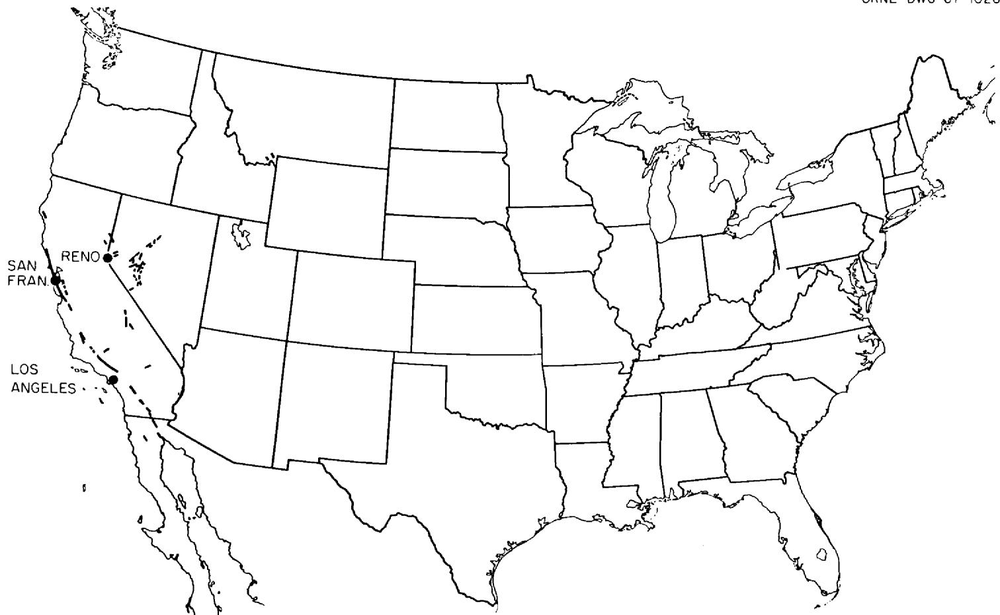  
Fig. 7.1. Locations of Known Surface Faulting Accompanying Earthquakes in Historic Times in the United States.

ORNL-DWG 67-10281R2

Strong-motion accelerometers are currently being used to record severe shaking in the United States. Although ground accelerations have been recorded for a relatively large number of small shocks, only a few large earthquakes have been recorded on strong-motion instruments. The characteristics of these ground accelerations have been thoroughly analyzed, and this information, along with other seismic and geologic data, is commonly used to estimate the amount and the nature of the expected ground motions at other sites. Because of the general lack of instrumental records of strong ground motions, and because there is no suitable theoretical basis for predicting these motions, we do not have an acceptable quantitative method for precisely determining accelerations, velocities, and displacements of the ground motions for a given earthquake at most sites. Thus, estimates of the important design parameters of ground motion must be conservative.

Earthquake-induced ground motions in soils are usually larger than those in hard rock; however, it is not possible to state precisely the magnitude of the difference. Most of the studies of the intensity of shaking in various types of rock and soil have been conducted with small shocks, and there is no satisfactory technical method for extrapolation to larger shocks. Recently, determinations of the dynamic properties of soil sections and theoretical considerations have yielded important relationships concerning some soil conditions and ground motion characteristics; however, before reliable predictions can be made for the majority of soil conditions, extensive laboratory and field investigations must be carried out. In addition to their amplification and/or attenuation properties, soils may also fail or be displaced, via consolidation, differential compaction, sliding, and liquefaction, as a result of earthquake-induced ground oscillations.

Tsunamis. - Tsunami and tsunami-generated oscillations are potentially dangerous to nuclear fuel reprocessing installations at coastal sites, since they may cause damage to the plant and water intake structures by means of runups and/or withdrawals. Most tsunamis are thought to be generated by vertical displacement of the subsea bottom. About $60\%$ of all recorded tsunamis originate in the Pacific Ocean, where large earthquakes

occur along deep, bordering trenches. Runup heights in Japan, Kamchatka, Chile, Peru, Alaska, and the Hawaiian Islands have often exceeded 30 ft; however, during historic times, the West Coast of the United States has apparently not been subjected to runup heights greater than 16 ft. The relatively low runup along the West Coast of the United States is attributed to the coastal shelf. In contrast to the experience on the West Coast, damaging tsunamis have not been recorded along the Gulf and Eastern Coasts of the United States. Chances that a tsunami will be generated by a local disturbance off the West Coast are thought to be limited, since apparently no locally generated damaging tsunamis have occurred there in the past.

At many sites, the prediction of maximum runup height is difficult because relatively obscure coastal and submarine features tend to amplify waves. Since some sites have consistently high waves and others have consistently low waves, the best guideline for prediction along the West Coast appears to be previous experience with tsunamis, regardless of the direction of approach. With the exception of the Alaskan tsunami that occurred in March 1961 and caused runups as high as 16 ft at Crescent City, California, the recorded runups along the West Coast have not exceeded the tidal range of about 6 ft.

# 7.2 Geographic Factors

The primary consideration in acquiring a site for a fuel reprocessing plant is to provide sufficient distance between the plant and private lands to ensure that the general public will not be harmed by either normal operations or by credible accidents. Second, the site should be located at a place where the aggregate cost of raw materials, transportation of materials to the plant, manufacturing, and transportation of finished products to the market will be at a minimum.[11] In present plants, the basic raw materials are water, nitric acid, solvent, and aggregate for concrete. Either a railroad spur or a waterway with barging facilities is a practical necessity since some spent-fuel shipping casks weigh 50 to 100 tons. Paved highways are required for trucking smaller casks, raw materials, finished

products, and waste. Manufacturing costs are dependent on an adequate supply of skilled labor and the prevailing wage scales in the vicinity. Conveniently located housing and community facilities are desirable. Long commuting distances and poor facilities (as well as an undesirable climate) tend to result in a large labor turnover. The plant must have adequate acreage for possible future expansion, adequate soil or rock foundations to support heavy concrete structures, and reliable electric power; the latter should preferably be available from two independent sources. Ideally, the plant should be located relatively near nuclear power reactors and sites for disposal of high- and low-level waste. The following sections briefly describe considerations that affect the site size, the surrounding population density, the land usage in the vicinity, and the relation of the plant to other nuclear facilities. Regions in the United States having certain desirable and undesirable features will be delineated.

# 7.2.1 Site Size

The site boundary is determined most accurately and restrictively by the requirement that the direct exposure of the surrounding public to radioactive gaseous or liquid effluents must be maintained at allowable levels. These considerations will be discussed in detail in Sect. 8. Penetrating radiation that escapes through the shielding used in the plant is not normally a consideration. For example, the penetrating radiation from an unshielded nuclear excursion of $10^{20}$ fissions would cause whole-body exposures no greater than 25 rem at distances of only about $350\mathrm{m}$ .<sup>12</sup>

Studies at Hanford<sup>13,14</sup> indicate that controlled areas extending 0.5 to 1 mile from the plant are desirable for the control of "nuisance contamination" resulting from a temporary loss of control of relatively small quantities of radioactive materials. Such minor releases might result from outside decontamination operations on large pieces of process equipment or shipping casks. This is not an absolute limitation; it is possible (i.e., at increased cost) to house those facilities that would potentially disperse low-level contaminants. It was found that the routine release of noxious nonradioactive chemicals to the atmosphere (most significantly

$\mathrm{NO}_2$ would dictate a site boundary about 1 mile from the stack. This is also not an absolute limitation, since such gases may be removed from stack effluents to practically any extent required using present technology. The discharge of low-level radioactive effluents is determined primarily by the relative flow rate of groundwater and surface water as a function of distance from the plant.

# 7.2.2 Population Density of the Surrounding Area

Federal regulations (10CFR100) specify that there shall be a zone of low population surrounding a reactor plant. The primary concern is to prevent population groups from receiving somatically or genetically significant doses of radiation. The costs of indemnification are also of concern; claims resulting from overexposure to radiation resulting from accidents would probably be directly proportional to the number of persons involved. Guthrie and Nichols have estimated that monetary losses of $50,000,$ 10,000, and $2000 would result from exposures of greater than 100, 10 to 100, and 1 to 10 times the allowable annual industrial radiation dose respectively.[8] It was estimated that severe contamination, resulting in long-term evacuation and total loss of property value, would cause an average monetary loss of $10,000 per person. Minor contamination, which would necessitate short-term evacuation, washing nonporous surfaces, and replacing or recovering porous surfaces such as sidewalks, pavements, roofs, etc., was estimated to result in monetary losses of $1500 per person. Minor contamination, which would require roofs, streets, and buildings in urban areas to be hosed was estimated to result in a monetary loss of about 5 mills per square meter of projected surface.

# 7.2.3 Land Usage

Special considerations are required when fuel reprocessing plants are located in areas where there is a mechanism for reconcentration of the radioactive effluents and a pathway for ingestion by the general public. Because certain radionuclides (e.g., $^{90}\mathrm{Sr}$ , and $^{137}\mathrm{Cs}$ , see ref. 8) are known to concentrate in crops, the restrictions on low-level liquid waste effluents that are subsequently to be used for irrigation may be

more severe than if the water were used only for drinking. Deposition of radioiodine from gaseous wastes on grass, followed by the cow-milk pathway to the thyroid of small children, may result in maximum permissible air concentrations lower by a factor of 700 than those for inhalation. Special considerations are also required when fuel reprocessing plants are located near other plants whose products are very sensitive to radiation (e.g., the photographic industry).

# 7.2.4 Relation of the Plant to Other Nuclear Facilities

The fuel reprocessing plant should be designed and located to take into account adjacent nuclear facilities, including reactor plants, other reprocessing plants, and waste disposal sites. Effluents from the plant must not mask nuclear instrumentation at adjacent sites. Accidents in the plant should not cause unduly hasty and unsafe evacuations of adjacent sites. In addition, the effluents from each plant must be restricted in such a manner that their combined effect does not endanger the health and safety of the surrounding public. In practice, the effect of these restrictions has been minimal at production plants and national laboratories; the cost of engineered features is generally offset by the decreased cost of logistics.

# 7.2.5 Regional Distribution of Potential Sites in the United States

We have gathered information that may be of value in selecting potential sites, based on surrounding population density, distance to a population center, and seismicity. The attached packet of overlay maps includes: (1) a base map showing population densities, by county, of the United States minus Alaska and Hawaii; (2) an overlay of major towns for all communities having a population of 20,000 or more; (3) an overlay showing all presently used railroad lines; and (4) an overlay indicating the major seismic areas of the country.

The colored base map shows population density<sup>15</sup> according to the following color code:

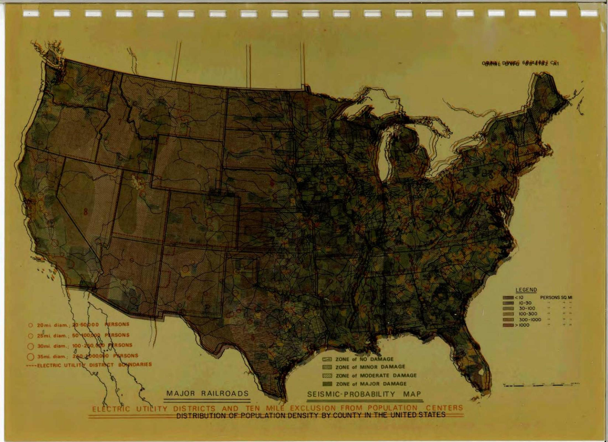

```txt
<p>purple  
10-30 persons/mile² blue  
30-100 persons/mile² green  
100-300 persons/mile² yellow  
300-1000 persons/mile² orange  
>1000 persons/mile² red 
```

The first overlay (red) indicates the location of all single communities having populations of 20,000 or more (according to the 1960 U.S. census), plus a number of towns that have grown to this size on the basis of more recent census estimates. Federal power districts are also indicated. The 250 U.S. metropolitan areas with populations ranging from 52,000 to about 10,000,000 were plotted first. Then all towns with populations as low as 20,000 persons were plotted. The sizes of the circles indicate, in general, the sizes of the cities, and they were plotted with a radius based on the distance to the edge of concentrated housing plus 10 miles. On this basis, the circles have the following diameters:

```txt
20,000-50,000 20-mile diameter   
50,000-100,000 25-mile diameter   
100,000-250,000 30-mile diameter   
250,000-1,000,000 35-mile diameter   
>1,000,000 40-mile diameter, or 10 miles beyond the edge of the metropolitan area 
```

It is interesting to note that a large number of the communities in the 20,000-50,000 population range were found to be suburbs of the larger metropolitan districts.

In order to complete this survey, it is recommended that all towns with populations as low as 10,000 be plotted in order to discover twin cities and tri-cities having combined populations of 20,000 or more. These data are now in hand. In addition, it must be noted that, for the nonmetropolitan-area towns, actual city limit population values were used and that the actual built-up areas may include 20 to $100\%$ more people.

The second overlay (blue) shows the location of all major rail lines that are presently in commercial use, $^{16}$ but does not include a number of presently unused branch lines. These branch lines are in varying degrees of disrepair, and their capacity for handling heavy fuel casks would have to be determined in the event that interest in their use should be indicated.

The third overlay (green) shows the seismic risk zones from the seismic risk map of Algermissen.[17] The four zones may be expected to approximately represent expected damage and intensity. Zone 0 contains the areas in which earthquake damage is not expected to occur, and where Modified Mercalli (M.M.) intensities in excess of IV have not been observed. Zone 1 is composed of areas of expected minor damage, where M.M. intensities in excess of VI have not been observed. Zone 2 contains areas where moderate damage may be expected. Zone 3 contains areas where major destructive earthquakes have occurred in the recorded past. There is no clear distinction between zones 2 and 3 on the basis of expected intensity, other than that catastrophic earthquakes have occurred in zone 3.

# 7.3 References

1. U.S. Department of Commerce, Weather Bureau, Meteorology and Atomic Energy, AECU-3066 (July 1955).   
2. W. M. Culkowski, Estimates of Accumulated Exposures and Environmental Buildup of Radioactivity, TID-7593 (1959), pp. 89-99.   
3. F. A. Gifford, The Problem of Forecasting Dispersion in the Lower Atmosphere, USAEC pamphlet (1961).   
4. W. M. Culkowski, Deposition and Washout Computations Based on the Generalized Gaussian Plume Model, OR0-599 (1963).   
5. Manual of Surface Observations (WBAN), Circular N, 7th ed., Weather Bureau, Air Weather Service, and Naval Weather Service (November 1961), p. 100.   
6. I. A. Singer, Steadiness of the Wind, BNL-11282 (1967).   
7. A. C. Chamberlain and A. E. J. Eggleton, "Washout of Tritiated Water Vapour by Rain," Int. J. Air Wat. Poll. 8, 135-49 (1964).

8. C. E. Guthrie and J. P. Nichols, Theoretical Possibilities and Consequences of Major Accidents in $U^{233}$ and $\text{Pu}^{239}$ Fuel Fabrication and Radioisotope Processing Plants, ORNL-3441 (April 1964).   
9. John E. Galley (ed.), Subsurface Disposal in Geologic Basins - A Study of Reservoir Strata, Memoir 10, The American Association of Petroleum Geologists, Tulsa, Okla., 1968.   
10. T. F. Lomenick and C. G. Bell, Earthquakes and Reactor Plant Design, ORNL-NSIC 28 (in press).   
11. F. C. Vilbrandt, Chemical Engineering Plant Design, p. 366, McGraw-Hill, New York, 1942.   
12. H. T. Williams et al., Safety Analysis of Enriched Uranium Processing, NY0-2980 (Mar. 18, 1960).   
13. R. J. Sloat, Progress Report - Study of Land Requirements, ISO-668 (Jan. 1, 1967).   
14. R. J. Sloat, Study of Land Requirements, ISO-842 (May 8, 1967).   
15. L. H. Long (ed.), "U.S. Population by States and Counties; Land Area," pp. 30l-20 in The World Almanac, Newspaper Enterprise Association, Inc., 1967.   
16. Major American Railroads, Rand-McNally and Company.   
17. S. T. Algermissen, "Seismic Risk Studies in the United States," to be published in the Proceedings of the Fourth World Conference on Earthquake Engineering.

# 8. HEALTH AND SAFETY ASPECTS OF PLANT.SITING

The principal criterion for judging the adequacy of a site for a fuel reprocessing plant is the provision that no undue risk exists with regard to public health and safety in the surrounding areas. Present and foreseeable technology requires that such plants routinely discharge small quantities of radioactive materials to the atmosphere; for this reason, and also because of the large inventory of physiologically hazardous materials, there is always a small, but finite, probability of a more massive discharge. The magnitude of the routine discharge and the probability of a more massive discharge are determined by the inventory of radioactive materials and by the design features of the plant.

Present licensing procedures for fuel reprocessing plants apply existing federal regulations for radiation protection (1OCFR20),<sup>1</sup> licensing of production and utilization facilities (1OCFR50),<sup>2</sup> and siting of nuclear reactors (1OCFR100),<sup>3</sup> wherever applicable, to the plant under study. The safety of a proposed facility is determined by evaluating, as a unit, the proposed plant and the site. The design features of the plant, together with the geological, hydrological, seismological, and meteorological characteristics of the site, are analyzed to determine whether the proposed design is adequate to maintain the barrier between radioactivity and the surrounding population under adverse environmental conditions such as earthquakes, tornadoes, and floods. The consequences of releasing radioactive effluents during normal operations as well as during "upper limit accident" conditions, are evaluated using environmental characteristics of the site. The calculated concentrations of normal plant effluents are compared with the values published in 1OCFR20; the engineered features for prevention and mitigation of the consequences of accidents are compared with the guidelines of 1OCFR50; and the calculated doses received by a member of the general public from postulated accidental releases are compared with the guidelines specified in 1OCFR100. If, by employing conservative assumptions, it can be demonstrated that engineered safety features and releases under all credible conditions are within the guidelines, then the plant and the site are considered acceptable

The following sections of this chapter present estimates of the effect of health and safety considerations on the siting of spent-fuel processing plants. These include the consequences of an expanding nuclear economy on the worldwide distribution of long-lived volatile radionuclides, local environmental effects of the routine release of radionuclides, and the effects of credible accidents.

Section 8.1 presents estimates of the worldwide distribution of $^{85}\mathrm{Kr}$ and $^{3}\mathrm{H}$ in an expanding nuclear economy, assuming that these nuclides are released quantitatively to the atmosphere and the hydrosphere. These estimates, together with those of following sections, lead to the conclusion that worldwide pollution hazards will be avoided and local operating personnel will be protected by the necessary expedient of providing engineered safety features and site boundary distances that ensure appropriately low radiation exposures of members of the public at the site boundary.

Section 8.2 presents estimates of the effect of routine releases of radioactive materials from spent-fuel processing plants. The consequences of, and site boundary distances dictated by, routine releases from fuel processing plants were estimated assuming (1) ORNL meteorological conditions, (2) the complete release of noble gases and tritium, (3) iodine decontamination factors of 2000 (present technology) and $10^{7}$ in plants for processing highly irradiated fuels that have decayed 150 and 30 days, respectively, and (4) a particulate-release-rate model that agrees satisfactorily with existing data. For reference purposes, the acceptable concentrations at the site boundary were selected as one-third of the air concentrations listed in LOCFR20, Appendix B, Table II, Column 1, with the exception that the $^{131}\mathrm{I}$ concentrations were further reduced by a factor of 700 to account for the grass-cow-milk pathway to the thyroids of small children.

The downwind consequences resulting from the routine release of radio-nuclides from a plant processing light-water reactor (LWR) fuel (postirradiation decay period of 150 days) or a plant processing fast breeder reactor (FBR) fuel (decay time of 30 days) are estimated to be controlled by the release of noble gases and iodine. It is concluded that equipment for removing 50 to $99\%$ of the noble gases is necessary in plants of

capacity more than a few tons per day; more efficient iodine removal than that demonstrated in present technology is required for LWR plants of capacity greater than about 6 to 10 tons/day, whereas DF's for iodine as high as $10^{8}$ may be required for FBR plants.

Section 8.3 presents estimates of the effect of releases of radioactive effluents in "upper limit accidents." The consequences of upper limit accidents were estimated assuming that the acceptable annual dose commitments resulting from exposure to the cloud or inhalation at the site boundary are those recommended by the National Committee on Radiation Protection for annual occupational exposure. Although the assumed acceptable dose commitments have been employed only for reference purposes, they may be plausible on the basis that the ratio of benefit to probability of exposure is believed to be greater for an individual of the general population living near the site boundary than for a worker in the plant.

The meteorological and dose commitment analysis was based on the assumptions of flat downwind terrain and exposure to the radioactive cloud. The consequences of downwind ground contamination and additional exposures by such phenomena as reentrainment were not considered as mechanisms that would limit plant siting. Excessive levels of ground contamination would cause inconveniences, require expensive decontamination procedures, and result in property loss; however, they would probably not present an unavoidable threat to the health and safety of the public.

It is concluded that the confinement and ventilation systems in spent-fuel processing plants remove particulates of nonvolatiles dispersed under accidental conditions to such an extent that the upper limit accidents are controlled by the release of such volatile and semivolatile materials as the noble gases, iodine, ruthenium, cesium, and tellurium. Credible upper limit accidents in well-designed facilities for interim storage of wastes, either in liquid or solid form, are estimated to be inconsequential with respect to those from processing operations in the plant.

# 8.1 Buildup of $^{85}\mathrm{Kr}$ and $^{3}\mathrm{H}$ in an Expanding Nuclear Power Industry

As the free world's nuclear power production increases, the buildup of $^{85}\mathrm{Kr}$ in the atmosphere and $^{3}\mathrm{H}$ in the hydrosphere may become important. Therefore, estimates of dose equivalents to the year 2000 from a uniform worldwide distribution of these radionuclides have been made.

Estimates of the annual production of $^{85}\mathrm{Kr}$ and $^{3}\mathrm{H}$ are based on the AEC's projected civilian nuclear power economy in the United States and in the free world. In Fig. 8.1, which shows the growth of the nuclear power industry, foreign capacity in the year 2000 is assumed to be equal to the estimates of capacity in the United States at that time. Thermal power generation was estimated by assuming load factors of 0.8 to 1980 and 0.7 at the year 2000, and a thermal efficiency of 0.31. Thus, in the year 2000, the free world's nuclear capacity for continuous operation is estimated to be 1 million electrical megawatts and 3.3 million thermal megawatts.

The rates of production and accumulation of $^{85}\mathrm{Kr}$ and $^{3}\mathrm{H}$ are shown in Fig. 8.2. Production rates were based on an assumed core irradiation of 20,000 Mw/d/metric ton and a specific power of 25 Mw/metric ton. The accumulated quantities of $^{85}\mathrm{Kr}$ and $^{3}\mathrm{H}$ were obtained by allowing each radionuclide produced in the immediately preceding 5-year period to decay for 2.5 years and adding this value to the previously accumulated quantity (corrected for decay for 5 years). Accordingly, in the year 2000, $^{85}\mathrm{Kr}$ production will be 520 megacuries/year, and 3000 megacuries will have been accumulated. Tritium production will be 15 megacuries/year, and 96 megacuries will have been accumulated.

# 8.1.1 85 Kr Distribution and Dose Equivalent

The concentration of $^{85}\mathrm{Kr}$ in the atmosphere was estimated by assuming complete mixing of the $^{85}\mathrm{Kr}$ and the air throughout the first 8 miles of the atmosphere. Within this zone, $^{85}\mathrm{Kr}$ was assumed to be distributed according to the density mass of air. Above 8 miles, the tropopause would inhibit rapid mixing into the stratosphere. Rainout was considered negligible, since calculations indicated that the atmosphere

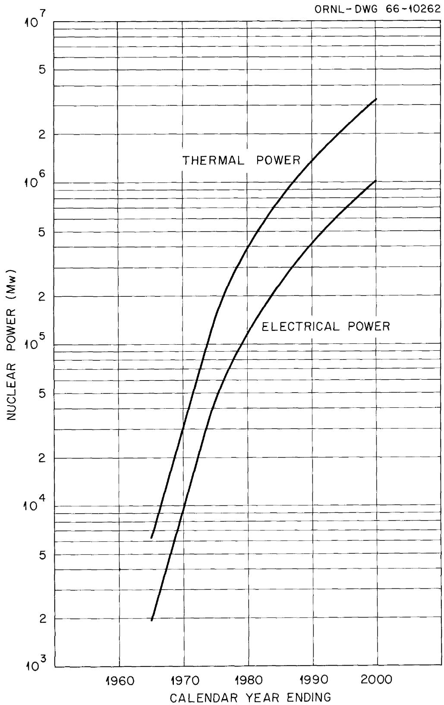  
Fig. 8.1. Estimated Growth of Civilian Nuclear Power in the Free World.

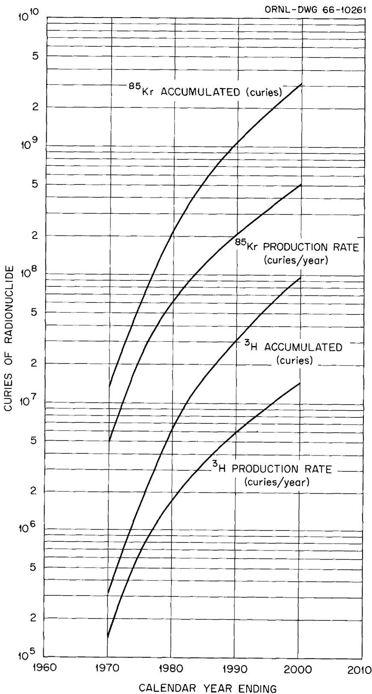  
Fig. 8.2. Estimated Production of $^{85}\mathrm{Kr}$ and $^{3}\mathrm{H}$ from the Nuclear Power Industry of the Free World.

contained more than $95\%$ of the stable krypton as compared with the oceans.7

Figure 8.3 shows the estimated whole-body exposure from $^{85}\mathrm{Kr}$ as a function of elevation. A maximum dose rate of 1.8 millirems/year in the first one-fourth mile of the atmosphere can be compared to an average background radiation of 100 millirads/year (to skin) near sea level and to permissible whole-body exposures of average population groups of 170 millirems/year, and of members of the public of 500 millirems/year, as recommended by ICRP and FRC. $^{8,9}$

# 8.1.2 Tritium Distribution and Dose Equivalents

Practically all of the tritium in irradiated fuel elements may be released to the environment during spent fuel processing. This release is assumed to occur as HTO, either as tritiated water or as tritiated water vapor. The volumes of circulating waters in the world, listed in Table 8.1, were used to calculate the concentration of tritium in the environment. It was assumed that: (l) tritium was mixed in oceans and seas to a depth of $40\mathrm{m}$ , (2) all the water in stream channels and in the first $10\mathrm{km}$ of the atmosphere was circulating, (3) only the portion of the groundwater located in the root zone was available for mixing, and (4) complete isotopic dilution occurred in these waters. As shown in Fig. 8.4, the estimated dose equivalents to body tissue due to inhalation of air and absorption through skin, and to ingestion of surface water containing ${}^{3}\mathrm{H}$ are $7.2\times 10^{-4}$ and $1.4\times 10^{-3}$ millirems/year, respectively, for the year 2000. Nonuniform distribution of ${}^{3}\mathrm{H}$ in rainwater and surface water has been indicated by Libby in his claim that $50\%$ of the tritium released from the detonation of thermonuclear devices in 1958 had fallen between $30^{\circ}$ and $50^{\circ}$ north latitude. $^{10}$ If this occurs in the case of releases of ${}^{3}\mathrm{H}$ from fuel reprocessing plants, then approximately $10\%$ of the earth's surface will receive one-half of the total ${}^{3}\mathrm{H}$ . Thus, the dose equivalents in this temperate zone may be five times the calculated average.

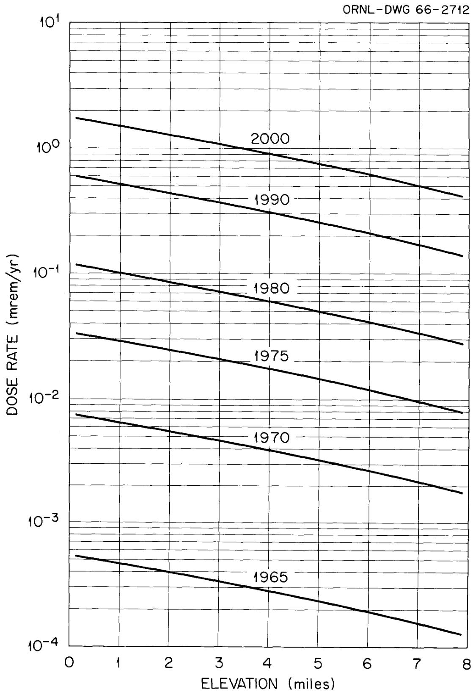  
Fig. 8.3. Dose Rate from $^{85}\mathrm{Kr}$ in the Atmosphere According to Elevation.

Table 8.1. Volumes of Circulating Water in the World   

<table><tr><td></td><td colspan="2">Volume of Water (m3)</td></tr><tr><td></td><td>Total</td><td>North Latitude (30°-50°)</td></tr><tr><td>Oceans and seas, in surface 40 m</td><td>1.44 x 1016</td><td>1.43 x 1015</td></tr><tr><td>Stream channels, average</td><td>1.17 x 1013</td><td>2.51 x 1012</td></tr><tr><td>Atmospheric moisture, average</td><td>1.29 x 1014</td><td>1.72 x 1013</td></tr><tr><td>Subsurface water in the root zone</td><td>2.50 x 1014</td><td>5.38 x 1013</td></tr><tr><td>Total circulating water</td><td>1.48 x 1016</td><td>1.50 x 1015</td></tr></table>

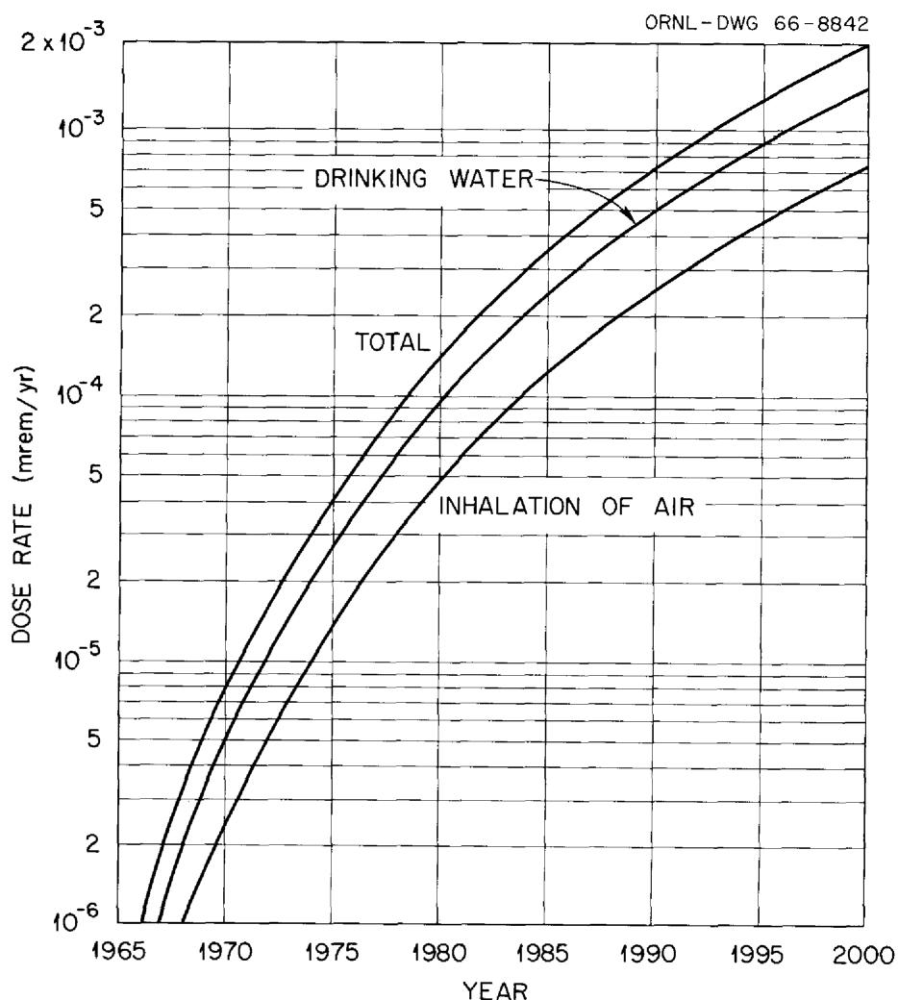  
Fig. 8.4. Dose Rate Received by Body Tissue from $^3\mathrm{H}$ That Is Inhaled and Ingested in Drinking Water.

# 8.2 Routine Release of Radionuclides to the Atmosphere

Present technology requires that fuel reprocessing plants continuously discharge off-gas and ventilation air to the atmosphere. Nonradioactive gases are generated in some process operations; for example, air is supplied deliberately to some process vessels for such purposes as pneumatic liquid level determination, mixing of solutions by sparging, and maintaining nonflammable concentrations of gases and vapors. Since absolutely leak-tight containment barriers are impractical, a flow of ventilation air from normal working areas to enclosures (glove boxes, cells, canyons, etc.) containing radioactive materials in process equipment is required to maintain a contamination gradient. By a variety of mechanisms, radioactive gases, vapors, and aerosols of liquid and solid particles tend to become entrained in these off-gas and ventilation streams. The absolute removal of all radioactive materials from these streams prior to discharge to the atmosphere is impractical.

The policy for the routine discharge of radioactive effluents to the environment is to maintain the rate of release of radioactive materials at the lowest practical level consistent with current technology by careful control and continuous monitoring. In any event, the consequences of the release must be within the limits established by federal regulations (LOCFR20), which have the intent of providing that negligible risk to the health and safety of the public will result. This policy is achieved by (1) striving to maintain process vessel enclosures free of mobile radioactive materials in order to minimize the possibility that the ventilation air will become contaminated, (2) maintaining the flow rate of the off-gas that contains (or comes in contact with) mobile radioactive materials at the minimum practical level, (3) employing devices such as scrubbers and filters to remove as much of the radioactive material from the effluent as is practical, and (4) discharging the effluent through stacks to provide effective atmospheric dispersal.

# 8.2.1 Sources of Routine Releases

The rate of routine release of radionuclides to the atmosphere from fuel reprocessing plants as a function of capacity (Table 8.2) was esti-

Table 8.2. Estimated Routine Release Rates for Radionuclides as a Function of Reprocessing Plant Capacity   

<table><tr><td rowspan="2"></td><td colspan="2">Release Rate per Unit of Throughput</td></tr><tr><td>LWR FuelReprocessingPlantaa</td><td>FBR FuelReprocessingPlantb</td></tr><tr><td>Noble Gas85Kr133Xe</td><td>1.0</td><td>1.00.1</td></tr><tr><td>Tritium</td><td>1.0</td><td>1.0</td></tr><tr><td>Halogens</td><td>0.001</td><td>10-7</td></tr><tr><td>Particulatesc</td><td>1.2 x 10-8</td><td>8.5 x 10-10</td></tr></table>

aLWR fuel irradiated to a burnup of 33,000 Mwd/metric ton, at a specific power of 30 Mw/metric ton, and allowed to decay for 150 days. Off-gas rate = 1000 cfm per metric ton per day. Filter effluent = 0.00l2 mg of solution per m³. Solution concentration = 0.3 kg of fuel per liter.   
bLMFBR (mixed core and blankets) irradiated to a burnup of 33,000 Mwd/metric ton, at a specific power of 58.2 Mw/metric ton, and allowed to decay for 30 days. Off-gas rate = 70 cfm per metric ton per day. Filter effluent = 0.0012 mg of solution per m³. Solution concentration = 0.3 kg of fuel per liter.   
Particulate release rates are assumed to scale approximately as the 0.6 power of the plant throughput rate. The rates given are estimated for a plant with a capacity of 260 metric tons per year.

mated, based on current technology for LWR fuel reprocessing plants and foreseeable technological developments for plants that will process FBR fuels. The corresponding release rates, in curies, may be obtained as the product of the fractional release (Table 8.2), the fuel processing rate (in metric tons/day), and the concentration of the isotopes in a metric ton of fuel (Table 8.3). These values permit a preliminary estimation of site sizes that would result from the effect of routine releases. Section 8.4 will present an analysis of tradeoffs that can be made in site size through the use of additional engineered safety features.

Noble Gases. - A total of approximately 0.001 ft³ (STP) of the noble gases He, Kr, and Xe is generated in each megawatt-day of reactor operation. The radioisotopes of physiological hazard significance that remain after 30 or more days of postirradiation decay are $^{85}\mathrm{Kr}$ and $^{133}\mathrm{Xe}$ . Unvented fuel contains approximately 0.3 curie of $^{85}\mathrm{Kr}$ for each megawatt-day of burnup. Unvented fuel contains about 1300 curies of $^{133}\mathrm{Xe}$ per megawatt of thermal power after 30 days of decay and negligible quantities after 60 days of decay.

In preparing Table 8.2, it was assumed that these gases will continue to be released quantitatively from LWR fuel reprocessing plants as the fuel is chopped and/or dissolved. It was assumed that, in plants for reprocessing FBR fuels after 30 days of decay, the gas would be held up (in a charcoal bed) for a period of 18 days to effect an order-of-magnitude reduction in the $^{133}\mathrm{Xe}$ activity. Several processes (employing charcoal adsorption, liquid nitrogen, Amsco, or fluorocarbon scrubbing, or permselective membranes), within moderate extensions of current technology, may be employed to remove 90 to $99\%$ of both xenon and krypton if required because of particular site limitations or a strict adherence to a policy of maintaining "lowest practicable" release rates. Release rates, particularly for $^{85}\mathrm{Kr}$ , would be lower for reactor fuels that use the vented fuel concept.

Tritium. - Approximately 0.025 curie of $^3\mathrm{H}$ is formed for each megawatt-day of reactor exposure. The common and most stable compound, HTO, is practically unrecoverable by present technology after it has been mixed with water. Present plants discharge tritium essentially quanti-

Table 8.3. Radionuclide Content of LWR Fuel Decayed 150 Days and Mixed Core-Blanket LMFBR Fuel Decayed 30 Days<sup>a</sup>   

<table><tr><td rowspan="2">Nuclide</td><td colspan="2">Concentration (curies/metric ton)</td><td rowspan="2">Nuclide</td><td colspan="2">Concentration (curies/metric ton)</td></tr><tr><td>In LWR Fuel</td><td>In IMFBR Fuel</td><td>In LWR Fuel</td><td>In IMFBR Fuel</td></tr><tr><td>3H</td><td>692</td><td>932</td><td>131I</td><td>2.17</td><td>139,000</td></tr><tr><td>85Kr</td><td>11,200</td><td>10,200</td><td>132I</td><td>-</td><td>4300</td></tr><tr><td>89Sr</td><td>96,000</td><td>637,000</td><td>133Xe</td><td>-</td><td>74,400</td></tr><tr><td>90Sr</td><td>76,600</td><td>43,400</td><td>134Cs</td><td>213,000</td><td>29,000</td></tr><tr><td>90Y</td><td>76,600</td><td>43,500</td><td>136Cs</td><td>20.8</td><td>28,800</td></tr><tr><td>91Y</td><td>159,000</td><td>921,000</td><td>137Cs</td><td>106,000</td><td>109,000</td></tr><tr><td>95Zr</td><td>276,000</td><td>2,100,000</td><td>140Ba</td><td>430</td><td>523,000</td></tr><tr><td>95Nb</td><td>518,000</td><td>2,660,000</td><td>140La</td><td>495</td><td>601,000</td></tr><tr><td>99Mo</td><td>-</td><td>1810</td><td>141Ce</td><td>56,700</td><td>1,480,000</td></tr><tr><td>99mTc</td><td>-</td><td>1730</td><td>144Ce</td><td>770,000</td><td>1,280,000</td></tr><tr><td>99Tc</td><td>14.2</td><td>14.9</td><td>143Pr</td><td>694</td><td>644,000</td></tr><tr><td>103Ru</td><td>89,100</td><td>1,760,000</td><td>147Nd</td><td>51.0</td><td>185,000</td></tr><tr><td>106Ru</td><td>410,000</td><td>1,290,000</td><td>147Pm</td><td>99,400</td><td>353,000</td></tr><tr><td>103mRh</td><td>89,100</td><td>1,760,000</td><td>149Pm</td><td>-</td><td>61.5</td></tr><tr><td>111Ag</td><td>-</td><td>12,600</td><td>151Sm</td><td>1150</td><td>4690</td></tr><tr><td>115mCd</td><td>44.3</td><td>269</td><td>152Eu</td><td>11.5</td><td>10.5</td></tr><tr><td>124Sb</td><td>86.3</td><td>76.7</td><td>155Eu</td><td>6370</td><td>79,400</td></tr><tr><td>125Sn</td><td>20.0</td><td>6720</td><td>160Tb</td><td>300</td><td>9460</td></tr><tr><td>125Sb</td><td>8130</td><td>19,600</td><td>239Np</td><td>17.4</td><td>7220</td></tr><tr><td>125mTe</td><td>3280</td><td>6860</td><td>238Pu</td><td>2810</td><td>11,200</td></tr><tr><td>127mTe</td><td>6180</td><td>61,100</td><td>239Pu</td><td>330</td><td>3530</td></tr><tr><td>127Te</td><td>6110</td><td>61,800</td><td>240Pu</td><td>478</td><td>4260</td></tr><tr><td>129mTe</td><td>6690</td><td>181,000</td><td>241Pu</td><td>115,000</td><td>600,000</td></tr><tr><td>129Te</td><td>4290</td><td>116,000</td><td>241Am</td><td>200</td><td>1570</td></tr><tr><td>132Te</td><td>-</td><td>4170</td><td>242Cm</td><td>15,000</td><td>65,500</td></tr><tr><td>129I</td><td>0.038</td><td>0.053</td><td>244Cm</td><td>2490</td><td>1240</td></tr></table>

These data are taken from Tables 3.9, 3.15, 3.33, and 3.39.

tatively to the environment in off-gas and low-level liquid waste. $^{11}$ Complete release of tritium to the atmosphere, the planned means of disposal at the MFRP plant, $^{12}$ is assumed in Table 8.2. Advanced technology, employing either vented fuel elements or a high-temperature oxidation process after the fuel has been chopped, may reduce the rate of release of tritium from fuel processing plants by factors of 10 to 100.

Halogens. - Of the fission-product halogens, only the isotopes $^{131}\mathrm{I}$ and $^{129}\mathrm{I}$ are physiologically significant after 30 days or more of post-irradiation decay. The $^{131}\mathrm{I}$ contents of reactor fuels are approximately 0.07 and 2400 curies per megawatt of thermal power after decay times of 150 and 30 days respectively. The $^{129}\mathrm{I}$ content is about $10^{-6}$ per megawatt-day of fuel exposure.

In current technology, iodine reports, almost completely, to off-gas systems as $\mathbf{I}_2$ , HI, or iodine-organic compounds that are generated in such process operations as chopping, dissolving, and evaporation. Current off-gas trains use caustic scrubbers, which remove approximately $90\%$ of the iodine, and silver nitrate towers, which remove about $99\%$ of the remaining iodine. Through 1962, such devices were used to maintain an average $^{131}$ I release rate to the atmosphere of approximately 0.3 curie/day at NRTS, HAPO, SRP, and ORNL. $^{13}$

It is assumed that plants for reprocessing fuels that have decayed at least 150 days will routinely release $0.1\%$ of the iodine. However, plants for reprocessing fuels after a decay period of 30 days will require development of techniques for maintaining the fractional $^{131}\mathrm{I}$ release in the range of $10^{-7}$ .

Particulates. - The common chemical forms of the fission products other than the noble gases, tritium, and halogens have sufficiently low vapor pressures that the predominant mechanism of release to the off-gas systems is by entrainment of particulates. While several semivolatile fission products (Tc, Se, Ru, Cs, and Te) are known to concentrate in off-gases from certain process operations,[14] the general experience at ORNL in fuel reprocessing operations has been that particulates in off-gas streams have essentially the same relative content of fission products as

the fuel being processed. The explanation is that most of the aerosol in the ventilation streams consists of liquid particles that have become entrained in off-gases that have contacted radioactive solutions. The liquid particles probably have the same fission product content as the original solution since the off-gas streams generally have high relative humidities. The particles that dry after being deposited on ventilation ducts and filters largely tend to remain fixed and to contribute little to the routine release of nonvolatile fission products. (However, they may be the source of a serious accidental release if there is a means for sudden and massive reentrainment.)

At ORNL it has been found that the off-gases from aqueous fuel reprocessing operations contain particles of aqueous solutions at a concentration of approximately $10\mathrm{mg/m}^3$ (i.e., the concentration of water particles in fog) and that there are equal weight fractions of particles in the size ranges less than $0.4\mu$ , $0.4$ to $1.3\mu$ , 3 to $5\mu$ , and greater than $5\mu$ . Also, it is known that the weight distribution of particles less than about $5\mu$ in size is relatively constant even if there is gross entrainment of larger particles. Typical deep-bed sand or High Efficiency Particulate Air (HEPA) filters used in processing plants would quantitatively remove $100\%$ of the particles greater than about $3\mu$ in size and about $99.98\%$ of the particles less than $3\mu$ , which have the size distribution indicated above. From these data, it is estimated that the concentration of aerosol in the filter effluent is of the order of $0.0012\mathrm{mg/m}^3$ . Assuming that the radioactive solutions in the plant contain $300\mathrm{g}$ of fuel per liter (typical of the dissolver and accountability tanks, which contribute significantly to the off-gas) and have a specific gravity of about 1.2, the estimated concentration of fuel in the filter effluent is $0.3\times 10^{-12}$ metric ton of fuel per cubic meter of air.

The estimated fractional release of fuel to the atmosphere from a 1-metric ton/day plant for processing $\geqslant 150$ -day-decayed LWR fuel, using current technology, is $1.2 \times 10^{-8}$ , assuming a combined dissolver and vessel off-gas flow rate of 1000 cfm. By comparison, the dissolver and the vessel off-gas flow rates are 400 and 620 cfm, respectively, at the NFs plant<sup>16</sup> and approximately 500 and 1000 cfm at the Hanford Purex plant.

It is estimated that the flow rate of the dissolver-vessel off-gas at the MFRP plant will be 250 cfm.[12]

The estimated fractional release from a 1-metric ton/day plant corresponds to daily release rates of 0.037 curie of mixed fission products, 0.0006 curie of $^{90}\mathrm{Sr}$ , 0.007 curie of $^{95}\mathrm{Zr}-^{95}\mathrm{Nb}$ , 0.004 curie of $^{106}\mathrm{Ru}$ , 0.0005 curie of $^{141}\mathrm{Ce}$ , and 0.00003 curie of Pu. By comparison, the average daily release of nonvolatile fission products from the three Hanford processing plant stacks includes 0.01 curie of $^{95}\mathrm{Zr}-^{95}\mathrm{Nb}$ , 0.007 curie of $^{103}\mathrm{Ru}$ , 0.006 curie of $^{106}\mathrm{Ru}$ , 0.001 curie of $^{141}\mathrm{Ce}$ , and 0.00003 curie of total alpha emitters (presumed to be Pu). It is estimated that the daily release of particulates from the MFRP plant stack will consist of less than 0.006 curie of mixed fission products and less than 0.002 curie of alpha activity from plutonium. The estimated daily release of particulates from the 5-metric ton/day BNFP plant consists of less than 0.17 curie of mixed fission products and less than 0.0001 curie of alpha activity from plutonium; this corresponds to a fractional release of about $1 \times 10^{-8}$ .

It is estimated that technological developments will permit the dissolver and the vessel off-gas flow rates to be reduced to 20 and 50 cfm in 1-metric ton/day plants that would process 30-day-decayed FBR fuel. If such is the case, the routine release of particulate activity should be lower than from current plants, in spite of the higher specific activity of FBR fuels.

It is assumed that the routine release of radioactive particulates to the environment will increase in direct proportion to the vessel off-gas flow rate in plants having larger throughput rates. The fuel inventory of individual process vessels will not increase in direct proportion to the production rate because of the necessity for multiple equipment lines to permit continuity of operation and the use of progressively more continuous equipment. The routine release to the off-gas system is roughly proportional to the area of the interface between the radioactive solid or solution and the gas. Radioactive aerosols are entrained in off-gas streams primarily by sparging (usually at a fixed rate of approximately $1\, \text{scfm} / \text{ft}^2$ ), but also by diffusion and recoil from surfaces. As a first

approximation, continuous equipment will have a greater surface-to-volume ratio, which will offset the effect of larger process vessels.

# 8.2.2 Local Environmental Consequences of Releasing $^{85}\mathrm{Kr}$ and $^{3}\mathrm{H}$

Many pathways have been postulated by which radionuclides may be transmitted through the environment and thereby contribute to the total dose received by man.[19] A generalized model that relates the principal parameters involved in estimating the external dose is as follows:[20]

$$
D _ {i j k} ^ {\text {e x t}} \left[ t _ {1}, t _ {2}, \gamma \left(t _ {1}\right) \right] = Q _ {i j} \int^ {t _ {2}} P _ {i j k} (t) C _ {i j} [ \gamma (t) ] d t, \tag {1}
$$

where

$$
\begin{array}{l} D _ {i j k} ^ {\text {e x t}} \left[ t _ {1}, t _ {2}, \gamma \left(t _ {1}\right) \right] = \text {t o t a l e x t e r n a l d o s e t o r a d i o n u c l i d e i i n} \\ \text {p a t h w a y j a t l o c a t i o n k f o r a n i n d i v i d u a l} \\ \text {o f a g e \gamma (t _ {1}) a t t h e b e g i n n i n g o f e x p o s u r e ,} \end{array}
$$

$$
\begin{array}{l} Q _ {i j} = \text {q u a n t i t y o f r a d i o n u c l i d e i r e l e a s e d t h a t i s} \\ \text {e n t e r i n g o r a v a i l a b l e t o p a t h w a y j ,} \end{array}
$$

$$
\begin{array}{l} P _ {i j k} (t) = \text {c o n c e n t r a t i o n o f r a d i o n u c l i d e i i n p a t h w a y} \\ \text {j a t l o c a t i o n k d u r i n g t i m e t p e r u n i t o f} \\ \text {r a d i o n u c l i d e i n i t i a l l y a v a i l a b l e , a n d} \end{array}
$$

$$
C _ {i j} [ \gamma (t) ] = \text {d o s e r a t e t o t h e r e f e r e n c e o r g a n o f a n i n d i v i d u a l o f a g e \gamma p e r u n i t c o n c e n t r a t i o n o f r a d i o n u c l i d e}.
$$

The total external dose due to radionuclide i in pathway j at location k, accumulated from time $t_1$ to $t_2$ by an individual of age $\gamma(t_1)$ at the beginning of exposure, is the integral of the product of the level of contamination (the quantity $Q_{ij}$ and the concentration $P_{ijk}$ ) and the dose rate term, $C_{ij}$ . The later term includes all necessary factors that account for the habits and characteristics of the individual. With minor changes, the same expression can be used to estimate internal dose. For internal dose, the $C_{ij}$ term denotes the dose commitment in the $(t_2 - t)$ days following a one-day exposure of the individual.

According to the International Commission on Radiological Protection, the entire human body is the critical organ for exposure to $^{85}\mathrm{Kr}$ . The principal mode of exposure is submersion in contaminated air. Body tissue is the critical organ in the case of exposure to tritium as tritiated water or tritiated water vapor. However, the external dose resulting from submersion in air containing HTO vapor is limited to areas where the skin has minimal thickness, because of the limited penetration range of tritium's beta particle.

Prior studies at Hanford and Oak Ridge have demonstrated that not all modes of exposure, or pathways contributing to the same mode, are of equal importance.[21,22] The modes of exposure considered in this analysis will include ingestion, inhalation (and accompanying skin absorption), irradiation from a contaminated surface, submersion in contaminated water, and submersion in contaminated air. These estimates of dose consider only the dose to "standard" man.

Procedures for Estimating Permissible Release. - Acceptable release rates for $^{85}\mathrm{Kr}$ and $^{3}\mathrm{H}$ were investigated for a hypothetical fuel reprocessing plant located at the Oak Ridge National Laboratory. This selection was made since information was already available on some of the environmental factors that influence the dispersion and possible reconcentration of fission products that may be released.

Average annual downwind air concentrations are calculated by a modified Gaussian plume formula as follows:

$$
X (\theta x) = \sum_ {i = 1} ^ {S} \sum_ {\substack {2.032 F (\theta S) _ {i} Q _ {o} \\ \sigma (S x) _ {z} \overline {{\mu}} (\theta S) _ {i} x}} \cdot \exp \left[ - \frac {h ^ {2}}{2 \tau (S x) _ {z} ^ {2}} \right] ， \tag{2}
$$

where

$$
\begin{array}{l} \mathrm {X} (\theta \mathrm {x}) = \text {a v e r a g e a n n u a l c o n c e n t r a t i o n a l o n g a 2 2 . 5 ^ {\circ} a r c a t d i s t a n c e} \\ \mathrm {x i n d i r e c t i o n} \vartheta (\text {c u r i e s / m} ^ {3}), \end{array}
$$

$$
\mathrm {F} (\theta \mathrm {S}) _ {\mathrm {i}} = \text {f r a c t i o n o f t i m e t h a t t h e w i n d i s i n d i r e c t i o n \theta , f o r} \quad \text {s t a b i l i t y S a n d w i n d s p e e d g r o u p i},
$$

$$
Q _ {0} = \text {i n i t i a l e m i s s i o n r a t e (c u r i e s / s e c)},
$$

$$
\begin{array}{l} \sigma (S x) _ {z} = \text {v e r t i c a l d i s p e r s i o n c o e f f i c i e n t a t d i s t a n c e x f o r s t a b i l i t y} \\ S (m), \end{array}
$$

$\overline{\mathbf{u}} (\mathfrak{g}\mathbf{S})_{\hat{\mathbf{i}}} =$ average wind speed in direction $\theta$ , for stability S and speed group i (m/sec),

h = stack height (m),   
R = index denoting wind-speed groups,   
S = index denoting stability parameter.

This expression is obtained by integrating the Gaussian plume formula over the crosswind direction and distributing the results uniformly along the entire arc. Since the average wind-speed vector and its frequency of occurrence are used, calculations yield average annual air concentrations. Applications of this technique have been demonstrated previously by Culkowski.[23]

Equation (2) is modified to include washout and fallout by multiplying by the appropriate correction factors. Corrections for washout and fallout are based on the work of Chamberlain and Slade respectively.[24,25] These corrections are as follows:

$$
Q _ {\text {w a s h o u t}} = \exp \left[ - \frac {\Delta x}{\bar {\mu} (\theta S) _ {i}} \right], \tag {3}
$$

where $\Lambda$ is the washout coefficient (sec $^{-1}$ ); and

$$
Q _ {\text {f a l l o u t}} = \exp \left\{- (2 / \pi) ^ {1 / 2} \frac {V g}{\bar {\mu} (\theta S) _ {i}} \int_ {0} ^ {x} \frac {1}{\sigma (S x) _ {z}} \exp \left[ - \frac {h ^ {2}}{2 \sigma (S x) ^ {2}} \right] d x \right\}, \tag {4}
$$

where $V_g$ is the deposition velocity (m/sec). Equation (4) can be evaluated numerically, based on curves of $\sigma_z$ values given by Hilsmeyer and Gifford.[26]

Figure 8.5 shows the calculated air concentrations at the ground surface for a 1-part/sec release from a 100-m stack located at ORNL. The most recent meteorological data reported by Hilsmeyer are used in these calculations.[27] Concentrations shown in Fig. 8.5 can be compared with others that include fallout, washout, and changes in stack height; by this process, average annual doses can be estimated for a variety of conditions.

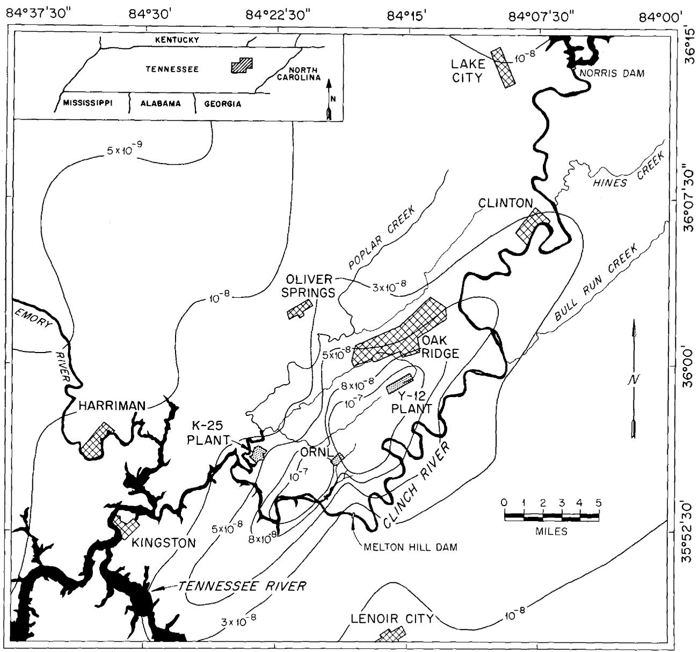  
Fig. 8.5. Average Annual Air Concentrations at Ground Surface in Parts per Cubic Meter. Source height, h = 100 m; source strength, Q = 1 part/sec.

Washout. - Washout coefficients for soluble gases have been calculated by Chamberlain, using the assumption that the rate of absorption is controlled by the rate of gas diffusion to the raindrop.[24,28] Since the solubility of krypton in water is small (1.85 x 10 $^{-10}$ g of krypton per gram of water at equilibrium),[7] it was assumed that the solubility limit controls the amount of krypton absorbed. The solubility of $^{85}\mathrm{Kr}$ in rain-water, even when released at 1 curie/sec, would be limited by the stable krypton in the atmosphere (about 4 x 10 $^{-3}$ g/m $^3$ near sea level).[29] It was further assumed that krypton is washed out of the atmosphere, beginning at an average height of 1 mile. This assumption is based on the height of rain-bearing cumulus clouds and on the extent of vertical development of radioactive clouds released as a point source. The average intensity of rainfall is about 4 mm/hr in the Oak Ridge area,[30] and, at equilibrium, 2 x 10 $^{-14}$ g of krypton per second could be absorbed in a column of the atmosphere 1 mile high and 1 cm $^2$ in area. About 5 x 10 $^{-4}$ g of stable krypton per square centimeter is contained in the atmosphere to a height of 1 mile. Based on these considerations, the average washout coefficient was calculated to be:

$$
\Lambda = \frac {2 x 1 0 ^ {- 1 4} g o f K r \sec^ {- 1} c m ^ {- 2}}{5 x 1 0 ^ {- 4} g o f K r c m ^ {- 2}} = 4 x 1 0 ^ {- 1 1} \sec^ {- 1}.
$$

The washout coefficient of tritiated water vapor (HTO) has been estimated from Chamberlain's calculations for $\mathrm{SO}_2$ deposition in rainwater.[24] It was considered to be proportional to the diffusion coefficient of the vapor in air. Therefore, the following expression was used to calculate $\Lambda_{\mathrm{HTO}}$ for a $4\mathrm{-mm/hr}$ rainfall:

$$
\Lambda_ {\mathrm {H T O}} = \Lambda_ {\mathrm {S O} _ {2}} \frac {\mathrm {D} _ {\mathrm {H T O}}}{\mathrm {D} _ {\mathrm {S O} _ {2}}} = 1 4 \times 1 0 ^ {- 4} \sec^ {- 1},
$$

where

$$
\Lambda_ {\mathrm {H T O}} = \text {w a s h o u t c o e f f i c i e n t o f H T O v a p o r} (\sec^ {- 1}),
$$

$$
\Lambda_ {\mathrm {S O} _ {2}} = \text {w a s h o u t c o e f f i c i e n t o f S O} _ {2} (2 \times 1 0 ^ {- 4} \sec^ {- 1}), ^ {2 4}
$$

$$
D _ {H T O} = \text {d i f f u s i o n c o e f f i c i e n t o f H T O v a p o r i n a i r (0 . 2 3 c m ^ {2} / s e c)}, ^ {3 1}
$$

$$
D _ {S O _ {2}} = \text {d i f f u s i o n c o e f f i c i e n t o f S O} _ {2} \text {i n a i r (0 . 1 l 5 c m} ^ {2} / \text {s e c}) ^ {.} ^ {2 4}
$$

Loss of HTO from a raindrop to the atmosphere was assumed to be negligible. This assumption is valid if the distance the raindrop falls below the contaminated cloud is small as compared with the relaxation length.*

A washout coefficient of $4 \times 10^{-4} \, \text{sec}^{-1}$ for HTO vapor is consistent with that indicated by Chamberlain and Eggleton. $^{32}$ Similar values can also be deduced from published data on the concentration of tritium in the atmosphere and in rainwater. For example, the maximum concentration of tritium, in tritium units (TU), was reported to be $10^{6}$ in hydrogen, $^{33}$ $10^{3}$ in water vapor, $^{33}$ $2 \times 10^{4}$ in methane, $^{34}$ and $1.4 \times 10^{3}$ in rainwater. $^{35}$ Assuming the average water content of air to be $8.6 \, \text{g/m}^{3}$ (at $50\%$ relative humidity and $20^{\circ}\text{C}$ ) and using the values of TU listed above, the concentration of tritium in the atmosphere is estimated to be $2.9 \times 10^{-11} \, \text{curie/m}^{3}$ . The tritium content in a column of the atmosphere is mile high and in area is $4.7 \times 10^{-8}$ curie. The rate of tritium removal from a $1-m^{2}$ area by a $4-mm/hr$ rainfall would be $5.1 \times 10^{-12} \, \text{curie/sec}$ . Therefore, the washout coefficient is calculated to be:

$$
\Lambda = \frac {5 . 1 x 1 0 ^ {- 1 2} \text {c u r i e / s e c}}{4 . 7 x 1 0 ^ {- 8} \text {c u r i e}} = 1. 1 x 1 0 ^ {- 4} \sec^ {- 1}.
$$

Since the annual frequency of a $4\mathrm{-mm / hr}$ rainfall in Oak Ridge is only 0.037, the average annual ground-level air concentrations are not reduced significantly at these washout coefficients.

Fallout. - If the sorption of a radionuclide by the ground surface is irreversible, the flux of the radionuclide to the surface does not depend on the amount already deposited. $^{36}$ Chamberlain describes the rate of deposition for such a system in terms of a deposition velocity. The following equation is used to estimate the deposition velocity of gases or very small particles: $^{28}$

$$
V _ {g} \left(Z _ {1}\right) = \frac {k u *}{\ln \left(k u * Z _ {1} D ^ {- 1}\right)} \tag {5}
$$

where

$$
\begin{array}{l} V _ {g} = \text {d e p o s i t i o n v e l o c i t y (c m / s e c)}, \\ k = \text {v o n} K a r m a n ^ {\prime} s \text {c o n s t a n t} (0. 4), \\ u * = \text {f r i c t i o n v e l o c i t y} (\mathrm {c m} / \sec), \\ Z _ {1} = \text {r e f e r e n c e h e i g h t a b o v e g r o u n d s u r f a c e a t w h i c h t h e c o n c e n t r a t i o n} \\ D = \text {m o l e c u l a r d i f f u s i v i t y} (\mathrm {c m} ^ {2} / \sec). \\ \end{array}
$$

By assuming $u* = 40 \, \text{cm/sec}$ (appropriate to the Oak Ridge area), $Z_{1} = 100 \, \text{cm}$ , and $D = 0.15 \, \text{cm}^2 / \text{sec}$ (diffusion coefficient of krypton in nitrogen), the deposition velocity of krypton is $1.7 \, \text{cm/sec}$ . For tritiated water vapor, with $D = 0.23 \, \text{cm}^2 / \text{sec}$ , the deposition velocity is $1.8 \, \text{cm/sec}$ .<sup>30</sup>

The retention of krypton by the soil is assumed to be limited by the adsorption capacity of the soil for krypton. The retention of krypton by soil can be estimated, assuming that the amount of adsorbed krypton is proportional to the surface area of the soil. From measurements of krypton adsorption on charcoal (2 x 10 $^{-6}$ g of krypton per gram of charcoal at 25°C and 10 $^{-3}$ mm Hg partial pressure) $^{39}$ and the ratio of soil area to charcoal surface area (0.05), $^{40}$ the adsorption of krypton by soil is estimated to be 10 $^{-7}$ g per gram of soil (or 1.2 x 10 $^{-7}$ g/cm $^3$ for a soil density of 1.2 g/cm $^3$ ). The rate at which krypton is deposited on the soil is estimated as the product of the deposition velocity (Vg = 0.017 m/sec) and the krypton concentration in the atmosphere (X = 4 x 10 $^{-3}$ g/m $^3$ ), or 6.8 x 10 $^{-5}$ g m $^{-2}$ sec $^{-1}$ . At this rate, the soil will probably become saturated with krypton and may not act as a perfect sink for the addition of ${}^{85}\mathrm{Kr}$ . The amount of ${}^{85}\mathrm{Kr}$ adsorbed on the soil at equilibrium is assumed to be directly proportional to the ratio of radioactive and stable krypton in the atmosphere. For a ${}^{85}\mathrm{Kr}$ release rate of 1 curie/sec, the soil load (at equilibrium) at the point of maximum ground-level air concentration would be the product of 1.2 x 10 $^{-7}$ g/cm $^3$ (soil) and 4 x 10 $^{-9}$ g/m $^3$ divided by the product of 4 x 10 $^{-3}$ g/m $^3$ (air) and 397 curies per gram of ${}^{85}\mathrm{Kr}$ , or 4.8 x 10 $^{-11}$ curie/cm $^3$ .

Since the adsorption of $^{85}\mathrm{Kr}$ by the soil may not be an irreversible process, the net flux of $^{85}\mathrm{Kr}$ to the soil ( $g\,m^{-2}\,sec^{-1}$ ) may change as the

soil approaches saturation. The deposition velocity calculated from Eq. (4) can be used to estimate only the initial flux of $^{85}\mathrm{Kr}$ to the soil (and cloud depletion by fallout). The flux to the soil would be expected to diminish with time until steady-state conditions are attained.

The mechanisms by which HTO vapor may be retained by the soil would probably include adsorption, condensation, and exchange with soil moisture. Evaporation, evapotranspiration, and soil drainage would act to redistribute the deposited material. Water vapor $(\mathrm{H}_2\mathrm{O})$ in the atmosphere would also be acted upon by these mechanisms and would compete with HTO for retention by the soil. In the absence of isotopic fractionation, the ratio at equilibrium of the deposition rate of HTO vapor to $\mathrm{H}_2\mathrm{O}$ vapor would be directly proportional to the ratio of their respective concentrations in air. A deposition velocity of 0.018 m/sec can be used to estimate the flux when the soil acts as a perfect sink. Assuming an average water vapor content in the atmosphere of $8.6\mathrm{g} / \mathrm{m}^3$ , the flux of water vapor to the soil due to fallout would be $0.15\mathrm{g}\mathrm{m}^{-2}\mathrm{sec}^{-1}$ (4.7 x $10^{6}\mathrm{g}\mathrm{m}^{-2}$ year $^{-1}$ ). The average rate of rainfall in Oak Ridge is $1.1\mathrm{g}\mathrm{m}^{-2}\mathrm{sec}^{-1}$ . For a frequency of rainfall of 0.037, the quantity of rainwater deposited each year is $1.3\times 10^{6}\mathrm{g} / \mathrm{m}^{2}$ . These rates imply that, if the soil acts as a perfect sink for water vapor fallout, the soil would receive an amount of water equivalent to a continuous rainfall of about $0.4\mathrm{mm / hr}$ . Obviously, this does not occur; thus the soil would not act as a perfect sink for either HTO or $\mathrm{H}_2\mathrm{O}$ vapor, and the flux of HTO vapor to the soil would be expected to vary with time. Only a free water surface, such as the Clinch River, can be assumed to act as a perfect sink for HTO vapor that is released from a stack. Further studies are necessary to evaluate the flux of both ${}^{3}\mathbf{H}$ and ${}^{85}\mathbf{Kr}$ to the soil during transient and steady-state conditions.

As a first approximation, the following conservative assumptions are made: (1) the contaminated cloud is not depleted of $^{85}\mathrm{Kr}$ and HTO by fallout; (2) the quantity of $^{85}\mathrm{Kr}$ retained by the soil or by the Clinch River is proportional to the ratio of radioactive and stable krypton in the atmosphere; (3) the quantity of HTO retained by the soil is proportional to the ratio of HTO vapor and $\mathrm{H}_2\mathrm{O}$ vapor in the atmosphere; and (4) the Clinch River is a perfect sink for HTO vapor.

Krypton and $\mathrm{H}_2\mathrm{O}$ vapor may be adsorbed on particles in the atmosphere and, therefore, be deposited on the ground with these particles. The quantity of krypton associated with particles is estimated by assuming that the air contains $1.4 \times 10^{-4} \mathrm{~g}$ of particles per cubic meter (average of city atmosphere) $^{41}$ and, as an upper limit, that these particles can adsorb as much krypton as charcoal ( $2 \times 10^{-6} \mathrm{~g}$ of krypton per gram). Adsorption of krypton on particles is estimated to be $3 \times 10^{-10} \mathrm{~g}$ per cubic meter of air, which is negligible as compared with the krypton in the atmosphere ( $4 \times 10^{-3} \mathrm{~g/m}^3$ ). Assuming that charcoal particles can retain two layers of water vapor, the adsorption of water vapor by the particles is estimated to be $7 \times 10^{-5} \mathrm{~g}$ per cubic meter of air. This value is negligible as compared with that of water vapor in the atmosphere ( $8.6 \mathrm{~g/m}^3$ ).

Dose Estimation Models. - Methods described and parameters given in ICRP Publication $2^{8}$ are used to convert concentrations (X in curies/m $^{3}$ ) to estimates of dose equivalents to "standard" man from submersion in a contaminated cloud, from ingestion, and from inhalation. In particular, Eqs. (12), (13), and (20) in ref. 8 are used, and equilibrium conditions are assumed where appropriate. These dose equations are summarized in Table 8.4.

Submersion dose rates in contaminated water were calculated by assuming that the body is in the center of a sphere and receives equal quantities of radiation from all directions.[22] Other assumptions included: (1) the radius of the contaminated fluid is large as compared with the range of beta particles and to the half thickness of the fluid for gamma rays, (2) an effective energy that is equal to the average energy of the beta particle is absorbed, and (3) penetration distance for the beta particle in the body is short, thus limiting beta radiation to skin and subsurface tissue. The following expressions were derived to calculate dose equivalents at the surface of a body submerged in contaminated fluid:

$$
\begin{array}{l} \text {F o r} 8 5 _ {\mathrm {K r}} \\ R = 0. 2 6 X _ {W} \text {r e m s / h r} \\ \mathrm {F o r} ^ {3} \mathrm {H}: \\ R = 1. 1 x 1 0 ^ {- 2} X _ {w} r e m s / h r, \\ \end{array}
$$

Table 8.4. Equations to Calculate Dose Equivalents (rems per week) to Standard Man<sup>a</sup>   

<table><tr><td rowspan="2">Exposure Modeb</td><td rowspan="2">Critical Organb</td><td colspan="2">40-hr Week Exposure</td><td colspan="2">168-hr Week Exposure</td></tr><tr><td>3H</td><td>85Kr</td><td>3H</td><td>85Kr</td></tr><tr><td>Inhalation and skin absorption</td><td>Total body</td><td>1.2 x 10^4 Xa</td><td></td><td>3.6 x 10^4 Xa</td><td></td></tr><tr><td>Inhalation and skin absorption</td><td>Body tissue</td><td>2.0 x 10^4 Xa</td><td></td><td>5.8 x 10^4 Xa</td><td></td></tr><tr><td>Ingestion</td><td>Total body</td><td>0.67 Xw</td><td></td><td>1.9 Xw</td><td></td></tr><tr><td>Ingestion</td><td>Body tissue</td><td>1.1 Xw</td><td></td><td>3.2 Xw</td><td></td></tr><tr><td>Submersion in air</td><td>Total body</td><td></td><td>9.2 x 10^3 Xa</td><td></td><td>4.0 x 10^4 Xa</td></tr><tr><td>Submersion in air</td><td>Skin</td><td>3.9 x 10^2 Xa</td><td></td><td>1.7 x 10^3 Xa</td><td></td></tr><tr><td>External exposure, 2.5 ft above contaminated ground surface</td><td>Total body</td><td></td><td>2.4 x 10^1 Xa</td><td></td><td>1.0 x 10^2 Xa</td></tr></table>

${}^{a}$ Dose rate,in rems/week,when the concentration in air, ${\mathrm{X}}_{\mathrm{a}}$ ,or the concentration in water, ${\mathrm{X}}_{\mathrm{w}}$ ,is expressed in units of curies/m3.   
bExposure mode and critical organ for inhalation and skin absorption, ingestion, and submersion in air are based on information contained in ref. 8.

where

$X_{w}$ is the concentration of $^{85}\mathrm{Kr}$ or $^{3}\mathrm{H}$ in the fluid in microcuries per gram of fluid.

Hine and Brownell describe the derivation of equations that relate to the calculation of dose rates in air from beta emitters associated with an infinite plane of negligible thickness. Equations (10), (11), (20), and (21) in ref. are selected for calculation in cases where the energy-dependent parameters are those adapted for dose estimates in soft tissue. Equation 9-30 from work by Morgan and Turner is used to calculate the dose due to gamma emitters when the source is of infinite planar extent and infinite thickness. External dose equations listed in Table 8.4 for soil contaminated with $\mathrm{^{85}Kr}$ are then derived from the expected soil load $(4.8 \times 10^{-11} \, \text{curie/cm}^3)$ at the maximum air concentration $(1.6 \times 10^{-6} \, \mu\text{C/cm}^3)$ . The range, in aluminum, of the average-energy beta particle from $\mathrm{^{85}Kr}$ is used to estimate the thickness of contaminated soil contributing to the beta radiation dose and, thus, the amount present per unit area. The beta radiation dose rate is calculated by assuming that this amount of $\mathrm{^{85}Kr}$ is spread uniformly over the surface without taking self-absorption within the soil layer into consideration.

Estimated Dose Equivalents. - For the purposes of this analysis, we have chosen $^{85}\mathrm{Kr}$ and $^{3}\mathrm{H}$ release rates of 0.55 and 0.034 curie/sec respectively. These release rates correspond to a reprocessing plant with a capacity of about 6 metric tons/day (a fuel exposure of 33,000 Mw/dm metric ton and a specific power of 30 Mw/metric ton). All of the $^{85}\mathrm{Kr}$ is assumed to be released to the atmosphere. It is assumed that 0.0085 curie of $^{3}\mathrm{H}$ per second is released to the atmosphere as HTO vapor and 0.0255 curie of $^{3}\mathrm{H}$ per second is discharged to the Clinch River at mile 20.5 (below the Oak Ridge municipal water intake and above the water intake for the Oak Ridge Gaseous Diffusion Plant) as liquid waste and is diluted with $4900\mathrm{ft}^3$ of river water per second. Other schemes of $^{3}\mathrm{H}$ release, such as the distillation of $^{3}\mathrm{H}$ -bearing liquids and release to the stack as water vapor, are possible, but would require an appropriate adjustment in the dose estimates that follow.

Surface water in the area can be contaminated directly by fallout and washout of $^{85}\mathrm{Kr}$ and $^{3}\mathrm{H}$ , as well as by the direct release of HTO in liquid waste. Clinch River water is assumed to equilibrate with $^{85}\mathrm{Kr}$ at the maximum specific activity expected in the atmosphere up to the solubility limit of krypton in water. Soils that equilibrate with $^{85}\mathrm{Kr}$ or $^{3}\mathrm{H}$ from the overlying atmosphere are assumed to retain these materials. The contribution, by washout, is based on the deposition rates that are calculated in the northeast sector; and these are the maximum rates. Assumptions made for the addition of $^{85}\mathrm{Kr}$ by fallout and $^{3}\mathrm{H}$ by washout would then give conservative estimates of concentrations in Clinch River water.

Figure 8.6 shows the average annual dose equivalents in millirems per year, to the total body for submersion in air containing $^{85}\mathrm{Kr}$ . Exposures are assumed to be continuous (168 hr/week and 50 weeks/year). These average dose rates were calculated from the ground-level air concentrations (Fig. 8.5) that result from a 1-curie/sec release rate and a negligible cloud depletion by washout and fallout. Figure 8.7 shows the estimated dose rates for continuous exposure, in millirems per year, at a distance 2.5 ft above a ground surface contaminated with $^{85}\mathrm{Kr}$ . Ionizing radiation associated with tritium on the ground surface would be shielded effectively by 2.5 ft of air.

Table 8.5 contains the estimated annual dose equivalents, to the standard man working at the Oak Ridge Gaseous Diffusion Plant (ORGDP) or residing in Oak Ridge, due to the release of 0.55 curie of $^{85}\mathrm{Kr}$ and 0.034 curie of $^{3}\mathrm{H}$ per second in the environment. Periods of occupancy are 40 hr/week and 50 weeks/year for the ORGDP employee, and 168 hr/week and 50 weeks/year for the Oak Ridge resident. A "less than" sign preceding certain values reflects a conservative estimate. The critical modes of exposure are submersion in air for $^{85}\mathrm{Kr}$ , and inhalation and absorption through the skin for $^{3}\mathrm{H}$ . The estimated total-body exposure, due to releases from a 6-ton/day plant, is about 90 millirems/year for the standard man residing in Oak Ridge.

Interpretation of Results. - The Federal Radiation Council (FRC), in consideration of a linear relationship between biological effect and dose, background radiation, benefits and risks to be derived from radiation use,

ORNL-DWG64-6697R2A

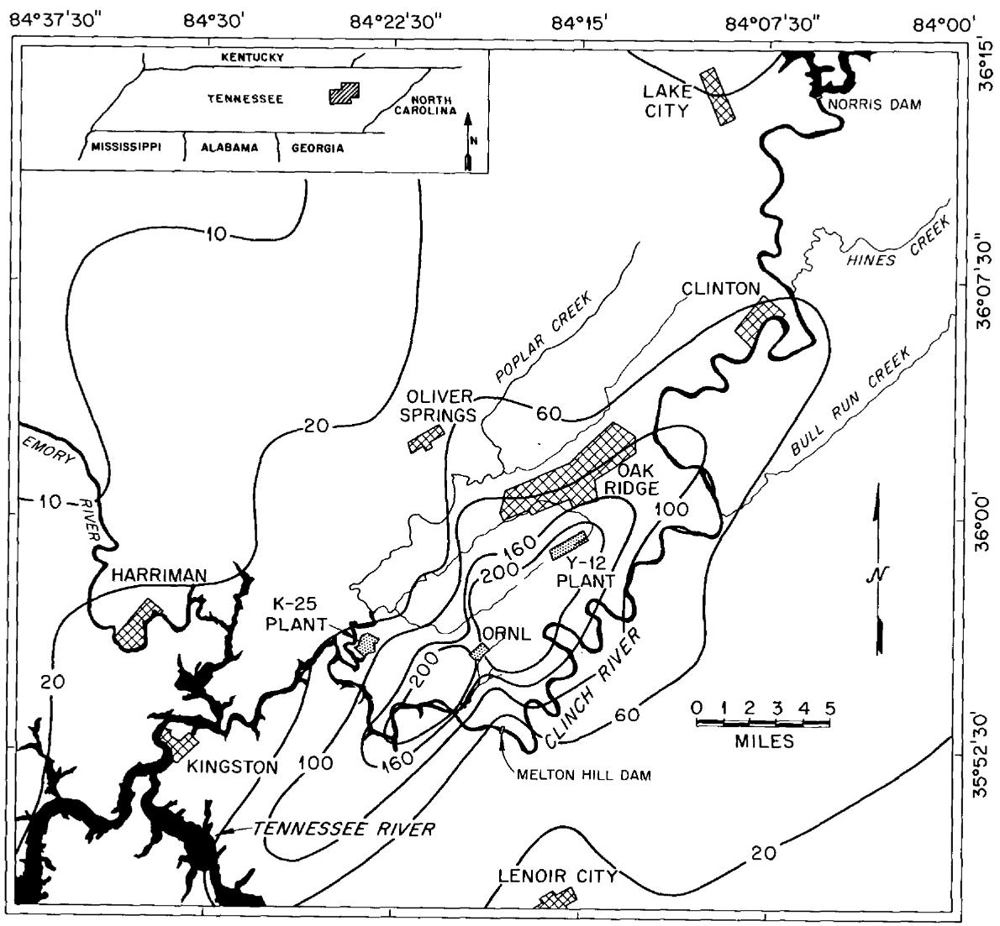  
Fig. 8.6. Average Annual Ground-Level Dose Equivalents, in milli-rems/year, to Total Body for Submersion in Air Containing $^{85}\mathrm{Kr}$ . Source height, $h = 100\mathrm{m}$ ; source strength, $Q = 1$ curie/sec.

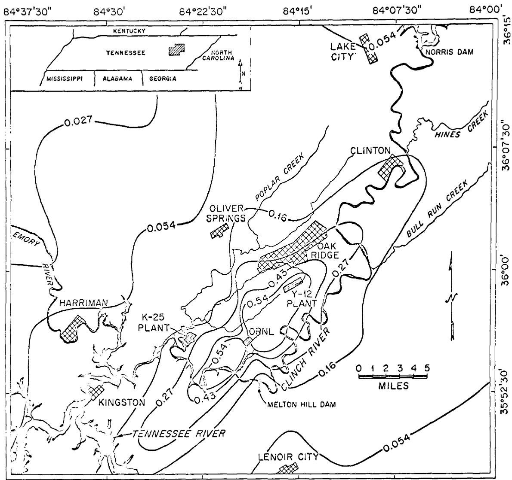  
Fig. 8.7. Average Annual Dose Equivalents, in millirems/year, at a Distance 2.5 ft Above Ground Surface Contaminated with $^{85}\mathrm{Kr}$ . Source height, h = 100 m; source strength, Q = 1 curie/sec.

Table 8.5. Estimated Annual Dose Equivalents, in millirems, Received by the Standard Man due to a 6-metric ton-per-day Reprocessing Plant Located at ORNL   

<table><tr><td rowspan="2">Mode of Exposurea</td><td rowspan="2">Reference Organa</td><td colspan="2">Dose Rate (millirems/year)</td></tr><tr><td>Employee of ORGDP</td><td>Oak Ridge Resident</td></tr><tr><td></td><td></td><td>Krypton-85</td><td></td></tr><tr><td>Submersion in air</td><td>Total body</td><td>13</td><td>88</td></tr><tr><td>Submersion in water</td><td>Total body</td><td>&lt;0.006</td><td>&lt;0.006</td></tr><tr><td>Contaminated ground (2.5 ft above surface)</td><td>Total body</td><td>0.03</td><td>0.2</td></tr><tr><td></td><td></td><td>Tritium</td><td></td></tr><tr><td>Inhalation and skin absorption</td><td>Body tissue</td><td>0.43</td><td>1.9</td></tr><tr><td>Ingestion of water</td><td>Body tissue</td><td>10.0</td><td>&lt;0.08</td></tr><tr><td>Submersion in air</td><td>Skin</td><td>0.009</td><td>0.06</td></tr><tr><td>Submersion in water</td><td>Skin</td><td>0.22</td><td>&lt;0.001</td></tr></table>

aExposure mode and reference organ for submersion in air, inhalation and skin absorption, and ingestion of water is based on information contained in ref. 8.

and other factors, established, as its basic recommendation, that the annual radiation exposure to the whole bodies of individuals in the general population (exclusive of natural background or medical exposures) should not exceed 0.5 rem.<sup>9</sup> In the event of widespread radioactive contamination, and because of uncertainties in the relationship between average and maximum exposure, the FRC suggests the use of the arbitrary assumption that the majority of individuals do not vary from the average by a factor greater than 3. Thus, the use of 0.17 rem for the annual whole-body exposure of average population groups is recommended. When the size of the population group under consideration is sufficiently large, consideration must also be given to the contribution of the genetically significant population dose. According to the FRC,

"The use of 0.17 rem per capita per year, as described in paragraph 5.4 as a technique for assuring that the basic Guide for individual whole body dose is not exceeded, is likely in the immediate future to assure that the gonadal exposure Guide is not exceeded."

These guides are essentially in agreement with current recommendations of the ICRP and NCRP. Each agency also encourages that every reasonable effort be made to keep exposures as far below the offered guidance as practicable.

In current reports, the ICRP and NCRP list the total body as the critical organ and submersion in a semispherical infinite cloud of radioactive gas as the critical mode of exposure for $^{85}\mathrm{Kr}$ . However, the basic recommendations in effect at the time these reports were published considered the whole body and the blood-forming organs as a unit, and, as mentioned above, even the genetic dose was partially related to whole-body dose. Because of the rather short range of the beta radiation from $^{85}\mathrm{Kr}$ , only a small fraction of the total mass of the blood-forming organs or the testes would be exposed to a significant part of the beta dose to skin; however, this might be as much as $1\mathrm{g}$ of red marrow (e.g., in the skull). The mass of $1\mathrm{g}$ was previously used as a basis for dose assessment. In later publications of the ICRP, the principle of averaging the dose over organs and tissues is stated without qualification. This principle would permit a higher dose. Since the beta radiation does penetrate well below the skin layer, as shown subsequently, a significant

volume of body tissue would be irradiated at $50\%$ or greater of the surface skin dose. If this tissue is to be limited to 1.5 rems per year, an increase by about a factor of 3 or slightly more might be warranted.

Krypton-85 decays principally by emitting a 0.514-Mev photon $0.7\%$ of the time and a beta particle of 0.695 Mev maximum energy $99.3\%$ of the time. $^{47}$ Calculations indicate that the total dose at the surface of a body submerged in a semispherical infinite cloud containing $^{85}\mathrm{Kr}$ is composed of about $99\%$ beta and $1\%$ gamma. The ranges in tissue of the beta rays of maximum and average energy are estimated to be $2.6 \, \mathrm{mm}$ and $0.55 \, \mathrm{mm}$ respectively. A considerable fraction of the beta particle energy will be deposited, on the average, in the epidermal (range in thickness, 0.023 to $0.070 \, \mathrm{mm}$ ) and dermal (average thickness, $0.70 \, \mathrm{mm}$ ) layers of the skin of the total body. $^{48}$ Thus, there is reason to reevaluate the total body as the critical organ from submersion exposure to $^{85}\mathrm{Kr}$ as a function of depth-dose relationships.

For the complete release of $^{85}\mathrm{Kr}$ and $^{3}\mathrm{H}$ from a fuel reprocessing plant sited at ORNL, $^{85}\mathrm{Kr}$ would be of greater dose potential to man than $^{3}\mathrm{H}$ . Of the modes of exposure considered, submersion in contaminated air would deliver the largest dose, that is, about 90 millirems per year for a 6-ton/day plant. As explained above, current guidance for total-body exposure to $^{85}\mathrm{Kr}$ limits the maximum permissible dose of individuals in the general population to 500 millirems per year (and of average population groups to 170 millirems per year).

The potential dose resulting from the release of $^3\mathrm{H}$ in liquid waste is small because credit can be taken for dilution in the Clinch River in which flow is substantial (4919 ft³/sec) and the river is not used as a source of municipal water. Dose estimates by the ingestion of water (10 millirems annually) at ORGDP would increase in direct proportion to a reduction in flow rate and increase by a factor of 3 if the water were used as a municipal water supply. Disposal of $^3\mathrm{H}$ in water vapor released to the stack may be one way to reduce the potential exposure from ingestion of water.

Economic benefits would be expected to accrue from large processing plants, but remote siting may not be a practical method for restricting population exposures in the future. This is the justification, therefore, to continue research and development studies, now in progress, to reduce the amounts of $^{85}\mathrm{Kr}$ and $^{3}\mathrm{H}$ released and to understand more completely the fate of these radionuclides after discharge to the environment.

# 8.2.3 Local Environmental Consequences from All Routine Releases

Although the routine releases of $^{85}\mathrm{Kr}$ and $^{3}\mathrm{H}$ were emphasized in the preceding section, the absolute removal of all other radioactive materials from gases and vapors prior to discharge to the atmosphere is impractical. Of the remaining radionuclides, $^{131}\mathrm{I}$ is known to be important because of reconcentration that occurs in the grass-cow-milk pathway to the thyroids of small children. Less experimental information is available on the behavior of $^{129}\mathrm{I}$ in the environment, but the assumption will be made that the grass-cow-milk pathway is the dominant mode of exposure from this radioisotope. The controlling pathways for exposure from particulates of mixed fission products and actinides are, also, not well understood. However, it is known that, under some circumstances, such effects as reconcentration in fish or crops and resuspension may be important. In this analysis, it will be assumed that the major exposures from the atmospheric release of particulates will result from direct inhalation of the contaminated air.

Based on the results of the preceding section, it will be assumed that the maximum acceptable average annual concentrations of $^{85}\mathrm{Kr}$ and $^{3}\mathrm{H}$ in air at the boundary of a fuel reprocessing plant site are $1 \times 10^{-7}$ and $7 \times 10^{-8}$ curies/m³ respectively. These are the values recommended by LOCFR20, Appendix B, Column II, and correspond to annual whole-body exposures of 170 millirems. Experimental evidence has suggested that the average annual concentration of $^{13}\mathrm{I}$ in air, as provided by LOCFR20, should be reduced by a factor of about 700 to account for deposition followed by the grass-cow-milk pathway. It is assumed that this same reconcentration factor of 700 should be applied to $^{129}\mathrm{I}$ , but that, in addition, another factor of 10 is required to account for the relatively longer effective half-life of $^{129}\mathrm{I}$ on grass. Consequently, the assumed

maximum acceptable average annual concentrations of $^{131}\mathrm{I}$ and $^{129}\mathrm{I}$ at the site boundary are 1 x $10^{-10} / 700$ , or 1.4 x $10^{-13}$ curie/m $^3$ , and 2 x $10^{-11} / 700 / 10$ , or 3 x $10^{-15}$ curie/m $^3$ , respectively. The assumed acceptable average annual air concentrations of particulates containing mixtures of radionuclides are weighted average values that were derived using one-third of the LOCFR20 concentrations for specific nuclides and relative radionuclide concentrations from Table 8.3. These assumed values are 1 x $10^{-10}$ curie/m $^3$ for mixed fission products from the LWR fuel, 3 x $10^{-10}$ curie/m $^3$ for the mixed fission products from FBR fuel, and 4 x $10^{-13}$ curie/m $^3$ for the mixed actinides from either type of fuel.

Maximum site boundary distances dictated by the routine release of radionuclides to the atmosphere were estimated by assuming average annual concentration parameters that prevail in the direction northeast of ORNL (Fig. 8.5). Figure 8.8 compares this concentration parameter for the northeast direction at ORNL with corresponding parameters that have been estimated for the Hanford, $^{50}$ , NRTS, $^{51}$ and Savannah River Sites. $^{49}$ The dashed curve labeled "I" shows the concentration parameter for iodine at ORNL that would result if the iodine were depleted from the plume with a deposition velocity of $0.04 \, \text{m/sec}$ . $^{52}$ The ORNL, Hanford, and NRTS data presented in Fig. 8.8 are based on meteorological calculations averaged over annual-weather conditions, but they are known to be reasonable based on long-term environmental monitoring studies. The Savannah River data are derived from results of air sampling studies for $^{131}$ I made at the site boundary over a period of one year. The Savannah River data reflect the depletion of iodine in the plume.

Table 8.6 presents estimates of the site boundary distances and resultant average annual concentrations of the various species of radionuclides that would be dictated by routine releases from conceptual LWR and FBR plants sited at ORNL. These estimates assume that the plume is not depleted by deposition, fallout, and washout. Table 8.6 also gives estimates of the average annual concentrations of radionuclides at the site boundaries of the NFS, $^{16}$ MFRP, $^{12}$ and BNFP $^{18}$ plants. These latter results were taken from the Safety Analysis Reports for the three plants; thus the assumptions made in the calculations are not necessarily the same

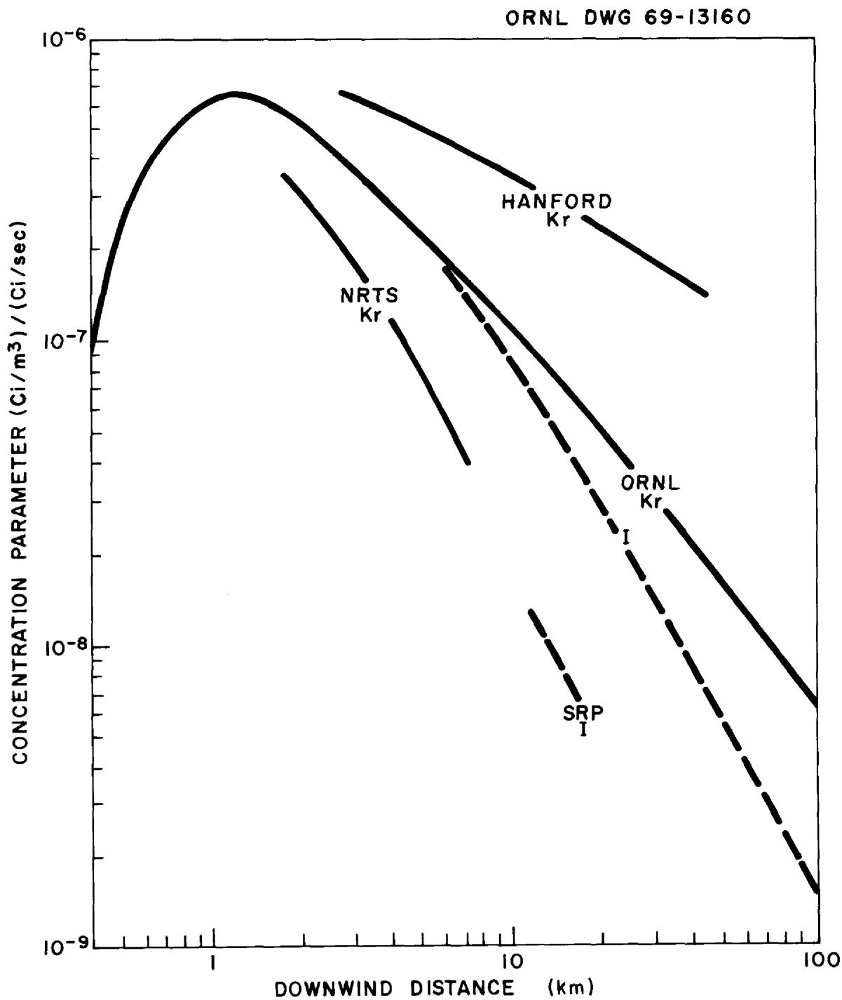  
Fig. 8.8. Effect of Downwind Distance on the Average Annual Downwind Ground Concentration per Unit Emission Rate from a 100-m-tall Stack.

Table 8.6. Fraction of Maximum Permissible Average Annual Air Concentrations Resulting from the Routine   
Release of Radionuclides at the Site Boundaries of Existing, Proposed, and Conceptual   
Private Industrial Fuel Processing Plants   
(260 days of operation per year)   

<table><tr><td rowspan="2">Plant</td><td rowspan="2">Plant Capacity (metric tons/day)</td><td colspan="3">Fuel Characteristics</td><td rowspan="2">Distance to Site Boundary (km)</td><td rowspan="2">Average Annual Aeolian Dilution (sec/m3)</td><td colspan="5">Fraction of 1/3 x(LOCFR20) Concentrations at Site Boundarya,b</td></tr><tr><td>Burnup (Mcd/ton)</td><td>Specific Power (Mcd/ton)</td><td>Decay Period (days)</td><td>85Kr-133Xe</td><td>3H</td><td>129I-131I</td><td>Fission Product Solids</td><td>Actinide Solids</td></tr><tr><td>NPS</td><td>1</td><td>20,000</td><td>32</td><td>150</td><td>1.5</td><td>2.2 x 10-7</td><td>0.23 (3,300,000)</td><td>0.002 (18,000)</td><td>0.47 (3.1)</td><td>0.0007c (~1)</td><td>-</td></tr><tr><td>MFRP</td><td>1</td><td>43,800</td><td>30</td><td>160</td><td>0.6-3</td><td>1.1 x 10-7</td><td>0.12 (3,300,000)</td><td>0.005 (100,000)</td><td>0.23 (3.1)</td><td>&lt;0.0005 (&lt;2.2)</td><td>&lt;0.11 (&lt;0.63)</td></tr><tr><td>BNPP</td><td>5.8</td><td>35,000</td><td>40</td><td>160</td><td>2</td><td>5.7 x 10-8</td><td>0.24 (1.4 x 107)</td><td>0.02 (600,000)</td><td>0.27 (21)</td><td>0.003 (60)</td><td>0.017 (3.5)</td></tr><tr><td>LWR</td><td>1</td><td>33,000</td><td>30</td><td>150</td><td>&lt;0.6</td><td>6.3 x 10-7</td><td>0.58 (2.9 x 106)</td><td>0.054 (180,000)</td><td>0.15 (0.56)</td><td>0.003 (13)</td><td>0.021 (0.43)</td></tr><tr><td>LWR</td><td>6</td><td>33,000</td><td>30</td><td>150</td><td>0.5-6</td><td>1.8 x 10-7</td><td>1.0 (1.7 x 107)</td><td>0.093 (1,100,000)</td><td>0.25 (3.4)</td><td>0.002 (41)</td><td>0.018 (1.3)</td></tr><tr><td>LWR</td><td>36</td><td>33,000</td><td>30</td><td>150</td><td>5-29</td><td>3.0 x 10-8</td><td>1.0 (1.0 x 108)</td><td>0.093 (6,500,000)</td><td>0.25 (20)</td><td>0.001 (120)</td><td>0.009 (3.8)</td></tr><tr><td>FBR</td><td>1</td><td>33,000</td><td>58</td><td>30</td><td>&lt;0.6</td><td>6.3 x 10-7</td><td>0.92 (4.6 x 106)</td><td>0.073 (240,000)</td><td>0.52 (3.6)</td><td>0.0003 (4.5)</td><td>0.008 (0.16)</td></tr><tr><td>FBR</td><td>6</td><td>33,000</td><td>58</td><td>30</td><td>1.5-10</td><td>1.1 x 10-7</td><td>1.0 (2.8 x 107)</td><td>0.079 (1,450,000)</td><td>0.56 (22)</td><td>0.0001 (9.0)</td><td>0.003 (0.31)</td></tr><tr><td>FBR</td><td>36</td><td>33,000</td><td>58</td><td>30</td><td>7-42</td><td>1.9 x 10-8</td><td>1.0 (1.7 x 108)</td><td>0.079 (8,700,000)</td><td>0.56 (130)</td><td>0.0001 (54)</td><td>0.003 (1.9)</td></tr></table>

The reference values selected are one-third of the concentrations found in 10CFR20, Appendix B, Table II, Column 1. They are $1 \times 10^{-7}$ , $7 \times 10^{-8}$ , $1 \times 10^{-10}$ , $3 \times 10^{-10}$ , and $4 \times 10^{-13}$ for $^{85} \mathrm{Kr}-^{133} \mathrm{Xe}$ , $^{3} \mathrm{H}$ , mixed LWR fission products, mixed FBR fission products, and mixed actinides respectively. The 10CFR20 value for $^{131} \mathrm{I}$ was reduced by a factor of 700, resulting in a reference concentration of $1.4 \times 10^{-13}$ . The 10CFR20 value for $^{131} \mathrm{I}$ was reduced by a factor of 700, resulting in a reference concentration of $1.4 \times 10^{-13}$ . The 10CFR20 value for $^{129} \mathrm{I}$ was reduced by a factor of 7000, resulting in a reference concentration of $3 \times 10^{-15}$ .   
$b_{\text{Release rates, in curies/year, are given in parentheses.}}$

as those employed for the present analysis of conceptual plants. The comparisons are of value in that they reflect the range of results that can be obtained through the use of various assumptions and computational techniques, as well as point out differences that may exist in meteorological conditions from site to site.

The large site boundary distances that are estimated for plants of high capacity provide incentive for removal of a larger fraction of the noble gases and iodine than was assumed in Sect. 8.2.1. This will be considered further in Sect. 8.4 after estimates are presented of the site boundary distances that are dictated by upper limit accidents.

# 8.3 Accidental Releases of Radioactive Materials

Fuel processing plants utilize three barriers for the confinement of radioactive materials. Accidents may cause the primary barrier to fail and, in turn, radioactive gas, liquid, or aerosol (usually under pressure) to be discharged to the second barrier. The first confinement barrier consists of the process vessels, the associated interconnecting piping, and the highly efficient vessel off-gas train. The second barrier is the thick concrete cell wall, which is designed to provide radiation shielding and to limit the effect of the maximum explosion in a process vessel within the cell to minor leakage of air or gas to the third barrier. The latter barrier, an industrial building, surrounds all penetrations in the cell walls. Under normal conditions, outside air is drawn into the building through (1) a roughing filter, (2) a check valve and another roughing filter to the cells, and (3) a ventilation duct (where it mixes with the effluent from the off-gas train) and HEPA or deep-bed filter to blowers, which exhaust to a stack. Normally a portion of the ventilation air from the building does not pass through the cells but flows directly, through a suitable restriction, to the upstream side of the filters. In an accident situation, in which one or more cells may become pressurized, this latter flow tends to maintain the building at a negative pressure with respect to the environment. Glove-box facilities have three barriers - the box, the laboratory, and the building - which have comparable confinement potential to the vessel, cell, and building. Mobile materials in storage canals are confined by a container, the water, and a building.

Potentially, liquid waste management facilities also have three barriers of confinement – the tank, a vault, and a building. In present practice, however, massive failure of the tank (such as by a hydrogen-air explosion in the vapor space), resulting in significant pressurization of the vault, is not considered credible because of the assumed reliability of preventive measures; therefore, the third barrier (a backup floor pan and a building) may not be considered necessary. By making the more pessimistic assumption that a hydrogen-air explosion in a waste tank is credible, it is assumed in this study that either the waste tank or the vault (which is possibly vented through a large pipe to other vaults or to cells of the processing plant) is designed to contain the explosion (a maximum of ~100 psig in the vapor space of the tank), resulting in only minor leakage that is confined to a building and routed through a filtered ventilation system.

The following basic assumptions were made for the purpose of assessing the effects of credible accidents in fuel reprocessing plants:

(1) The secondary containment barrier (cell, vault, water in the storage pool, and ventilation-filter system) and the building can, and will be, designed to maintain their confinement potential following exposure to any credible internal forces.   
(2) Process and confinement systems can, and will be, designed in such a manner that exposure to credible external events or forces (loss of power, earthquake, tornado, flood, hurricane, impaction by moving vehicles, etc., but not including acts of war) will not impair the ability to shut down the plant safely and maintain safe shutdown conditions.

The following sections will describe more detailed assumptions that have been made with respect to the properties of fuel reprocessing plants and waste management facilities, estimates of the fractional release of radioactive materials resulting from accidents, a model for the assessment of downwind consequences of a release, and implications of the estimated dose rates as a function of distance downwind.

# 8.3.1 Assumed Properties of Fuel Reprocessing Plants

Properties of fuel reprocessing plants as a function of capacity (see Table 8.7) have been assumed for the purpose of estimating the fractional release of radioactive materials in the event of an accident. With a few exceptions, the containment and confinement features that were selected represent either present or only moderate extensions of current technology. Future large-capacity plants will, undoubtedly, have many properties different from those selected; however, it is assumed that the important derived numbers (i.e., the quantities of radioactive materials released in accidents) will remain unchanged or decrease with advancing technology.

The assumed properties are for central plants processing spent fuels from light water (LWR) or fast breeder (FBR) reactors employing unit operations of chop-leach, solvent extraction, and ion exchange. A schematic drawing of the type of plant that is assumed is shown in Fig. 8.9. It is assumed that spent fuels are stored prior to processing in water-filled canals. High-level wastes are assumed to be either pot-calcined immediately and stored in water-filled canals for two years prior to shipment or stored for two years in an acid solution and then calcined prior to shipment. Low-level wastes are assumed to be discharged predominantly to the atmosphere. Intermediate-level wastes (spent solvent, resins, etc.) are assumed to be fixed in asphalt, polyethylene, or concrete; and hulls are assumed to be stored in vaults in relatively small containers.

Process Equipment. - It is assumed that the concentrations of fuel $(U + Pu)$ in aqueous solutions in the head ends of the LWR and FBR plants are 0.3 and 0.1 metric ton/m³ respectively. The volume of fuel solution in a single vessel was kept relatively small, 3 to $30\mathrm{m}^3$ , by assuming that the relative processing rate will have increased by a factor of 3 (because of more continuous equipment) by the time that 18-metric ton/day LWR plants or 9-metric ton/day FBR plants are built, and that the 36-metric ton/day plants for LWR and FBR fuels consist, respectively, of two 18-metric ton/day and four 9-metric ton/day independent modules. Multiple tanks of these assumed sizes, in separate compartments to prevent interaction in the event of an accident, would be employed if additional capacity is needed for head-end equipment (dissolver, and accountability and solvent extrac-

Table 8.7. Assumed Properties of Reprocessing Plants and Waste Storage Facilities   

<table><tr><td rowspan="3"></td><td colspan="6">Fuel Processing Rate (metric tons/day)a</td></tr><tr><td colspan="3">LWR Fuel</td><td colspan="3">FBR Fuel</td></tr><tr><td>1</td><td>6</td><td>36</td><td>1</td><td>6</td><td>36</td></tr><tr><td>Processing plant</td><td></td><td></td><td></td><td></td><td></td><td></td></tr><tr><td>Total dissolver solution, m3/day</td><td>3.33</td><td>20</td><td>120</td><td>10</td><td>60</td><td>360</td></tr><tr><td>No. of independent lines</td><td>1</td><td>1</td><td>2</td><td>1</td><td>1</td><td>4</td></tr><tr><td>Relative processing rate/line</td><td>1</td><td>1</td><td>3</td><td>1</td><td>3</td><td>3</td></tr><tr><td>Max. head-end vessel capacity, m3</td><td>3.33</td><td>20</td><td>20</td><td>10</td><td>20</td><td>30</td></tr><tr><td>Total cell capacity/line, m3</td><td>2333</td><td>14,000</td><td>14,000</td><td>7000</td><td>14,000</td><td>21,000</td></tr><tr><td>No. of cells/line</td><td>7</td><td>14</td><td>14</td><td>7</td><td>14</td><td>14</td></tr><tr><td>Cell size, m3</td><td>333</td><td>1000</td><td>1000</td><td>1000</td><td>1000</td><td>1500</td></tr><tr><td>Cell ventilation rate, m3/min</td><td>66.7</td><td>200</td><td>200</td><td>200</td><td>200</td><td>300</td></tr><tr><td>Total ventilation rate/line, m3/min</td><td>700</td><td>4200</td><td>4200</td><td>2100</td><td>4200</td><td>6300</td></tr><tr><td>Ventilation trainb</td><td>F,M</td><td>F,M</td><td>F,M</td><td>F,A,M</td><td>F,A,M</td><td>F,A,M</td></tr><tr><td>Total off-gas flow rate</td><td>28</td><td>85</td><td>255</td><td>2.0</td><td>4.0</td><td>24</td></tr><tr><td>Off-gas trainb</td><td>S,T,F</td><td>S,T,F</td><td>S,T,F</td><td>S,I,F</td><td>S,I,F</td><td>S,I,F</td></tr><tr><td>Interimc liquid waste (acid) storage facility</td><td></td><td></td><td></td><td></td><td></td><td></td></tr><tr><td>Tank volume (80% filled), m3</td><td>812</td><td>3785</td><td>3785</td><td>990</td><td>3785</td><td>3785</td></tr><tr><td>No. tanks required for 2-year accumulation</td><td>2</td><td>3</td><td>10</td><td>2</td><td>3</td><td>13</td></tr><tr><td>Off-gas flow rate/tank, m3/min</td><td>6.1</td><td>28</td><td>28</td><td>7.4</td><td>28</td><td>28</td></tr><tr><td>Off-gas trainb</td><td>C,F</td><td>C,F</td><td>C,F</td><td>C,F</td><td>C,F</td><td>C,F</td></tr><tr><td>Vault ventilation rate, m3/min</td><td>6.1</td><td>56</td><td>224</td><td>7.4</td><td>56</td><td>280</td></tr><tr><td>Ventilation trainb</td><td>C,F,M</td><td>C,F,M</td><td>C,F,M</td><td>C,F,M</td><td>C,F,M</td><td>C,F,M</td></tr><tr><td>Interimc waste solids storage canal</td><td></td><td></td><td></td><td></td><td></td><td></td></tr><tr><td>Length for 14.6-m width, m</td><td>5.8</td><td>35</td><td>210</td><td>7.1</td><td>42</td><td>250</td></tr><tr><td>Ventilation rate, m3/min</td><td>170</td><td>1000</td><td>6100</td><td>210</td><td>1200</td><td>7300</td></tr><tr><td>Ventilation trainb</td><td>C,F</td><td>C,F</td><td>C,F</td><td>C,F</td><td>C,F</td><td>C,F</td></tr></table>

$^{a}$ A 1.0-metric ton/day plant processes 260 metric tons of uranium + plutonium per year.   
${}^{\mathrm{b}}\mathrm{S} =$ caustic scrubber; ${90}\%$ removal of iodine.   
T = silver tower; 99% removal of iodine.   
A = activated charcoal filter; 99% removal of iodine.   
M = metal mesh or silica gel; 99.9% removal of Te, Cs, and Ru.   
$I =$ high-efficiency iodine removal units; iodine DF of $10^{7}$   
C = steam condenser; discharges air at $100^{\circ}\mathrm{F}$ and $100\%$ relative humidity.   
$\mathbf{F} =$ either reliably-protected HEPA or deep bed filter.   
Normal effluent $= 0.0012\mathrm{mg / m}^3$   
Accident effluent $= 0.02\mathrm{mg / m}^3$

cTwo years.

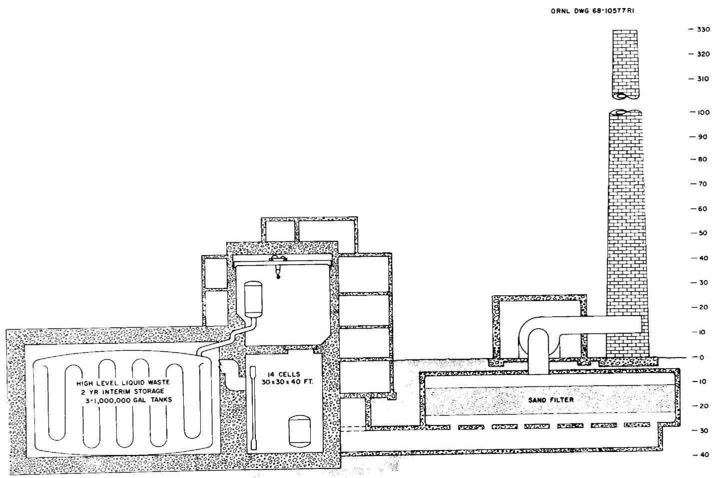  
Fig. 8.9. Spent-Fuel Processing Plant with a Capacity of 6 Metric Tons/Day.

tion feed tanks) or plutonium storage (tanks of the assumed maximum size packed with borosilicate-glass raschig rings containing solution at a plutonium concentration of 0.25 metric ton/m³).

Process Cells. - Process cells are assumed to have reinforced (1 to $2\%$ steel) concrete outer walls that are approximately 5 ft thick, reinforced concrete partition walls between cells that are approximately 2 ft thick, and volumes 50 to 100 times greater than the maximum vessel. Such cells, roughly 25 to 35 ft cubes that have secured roof plugs, could withstand a sustained pressure of 30 to 50 psig or the detonation of 25 to 50 lb of TNT at their geometric centers without rupture. It is assumed that 7 cells are used in small plants; however, more compartments (i.e., 14 cells per process line) are used in plants having capacities greater than 6 metric tons/day.

Vessel Off-Gas System. - Present technology, with a trend toward relatively lower off-gas flow rates per unit of plant capacity, is assumed for LWR plants. It is also assumed that FBR plants will be designed to minimize the vessel off-gas flow rate to approximately 70 cfm in a 1-metric ton/day plant and that this flow will vary directly with plant capacity but inversely with relative processing rate. The off-gas is assumed to pass through a train (wet scrubber, solid halogen absorber, and filter) to effect partial removal of iodine, semivolatile fission products, and particulates and to discharge to the ventilation system on the upstream side of the ventilation filter. It is assumed that the wet scrubber serves to retain about $93\%$ of the iodine in a relatively nondispersible form and that the off-gas train for FBR plants will include devices which will provide a cumulative DF of $10^7$ for iodine.

Ventilation System. - The ventilation air exhaust is assumed to consist of the air flow from the cells (at 0.2 air change per min) plus an additional $50\%$ that flows directly from the building (third containment barrier). This stream is filtered, passed through metal mesh or silica gel for $99.5\%$ removal of ruthenium vapors, and finally exhausted to the atmosphere through a 100-m-tall stack. In addition, the FBR plant is assumed to be equipped with activated charcoal filters for $99\%$ removal of iodine. The filter system is assumed to be composed of either a sand

filter or roughing and HEPA filters with equivalent reliability and integrity. Independent process lines are assumed to have independent ventilation systems.

Facility for Interim Storage of Liquid Wastes. - The interim liquid waste storage facility is assumed to provide for two-year storage of acid waste (at a concentration of 0.01 gal per MWD of burnup) consistent with a maximum tank size (80% filled) of 1,000,000 gal and at least 30% spare tankage. The off-gas stream - 1000 cfm for a 1,000,000-gal tank - is assumed to pass, first, through a condenser (which would condense and recycle the distillate to the tank in the event of loss of coolant), then through a filter, and finally be discharged to the ventilation system for the vault. The latter ventilation system collects the small purge flow from each tank vault (plus the combined off-gas from all tanks) and discharges it through a backup condenser, filter, and ruthenium removal device to a 100-m stack. The tanks and/or the vault are assumed to be designed to withstand a hydrogen-air explosion (an internal pressure of $\sim$ 100 psi) without rupture, possibly by venting to other tanks or vaults. The tanks, vaults, and ventilation system are assumed to be designed to withstand the effects of the maximum earthquake.

Canal for Interim Storage of Waste Solids. - The canal for interim storage of waste solids (i.e., calcined waste) is assumed to provide for a two-year accumulation of 6-in.-diam by 10-ft-long pots, each containing fission products from $14,100\text{Mwd}$ of burnup at an average solids concentration of $1.0 \times 10^{-4} \text{ft}^3/\text{MwD}$ . The pots are assumed to be covered with at least 20 ft of water. The ventilation system for the canal and building provides 12 air changes per hour to minimize fog formation. The ventilation system is assumed to be exhausted through a dehumidifier and HEPA filters at the roof of the building.

# 8.3.2 Analytical Models and Mechanisms of Accidental Release

Mechanisms that tend to negate the primary confinement barrier (process vessels, associated piping, and the efficient, low-flow off-gas system) have the potential of releasing radioactive materials to the atmosphere through the ventilation system. The following sections will describe

models for predicting the fractional release, discuss dispersive mechanisms, and present estimates of the fractional release to the atmosphere from upper limit accidents.

The designs of models for the release of radioactive materials depend on whether the material is released to the ventilation system as a gas (or vapor) or as an aerosol.

Gas or Vapor. - Certain of the fission products (the noble gases, halogens, and semivolatiles) may escape from the primary containment barrier in gaseous form. The release to the environment from such sources is relatively easy to predict; it is the fractional release from the vessel mitigated by the removal efficiency of the devices in the ventilation train. The noble-gas fission products, dominated by $^{85}\mathrm{Kr}$ and $^{133}\mathrm{Xe}$ , may be released essentially quantitatively from process vessels. Devices for partial removal of noble-gas fission products are not used in present commercial reprocessing plants, but several types of devices have been proposed for this application.[51,53] The halogens, dominated by $^{131}\mathrm{I}$ and $^{129}\mathrm{I}$ , may be volatilized from process operations as $\mathrm{I}_2$ , HI, or organic iodides. Since these compounds have high vapor pressures at room temperature, they are not appreciably removed by filtration. Usually, activated charcoal filters may be relied upon to remove 99% of the iodine from a ventilation stream, especially if most of the iodine is in the form of $\mathrm{I}_2$ or HI (the typical forms released from most process operations).

Certain other fission products, notably (in approximate order of importance) Ru, Cs, Te, Tc, and Se, may be classed as semivolatiles since gases or vapors of these elements may result from certain abnormal process operations. The oxides of Se and Tc are completely volatilized at temperatures in the vicinity of $200^{\circ}\mathrm{C}$ , while the normal oxides of Ru, Cs, and Te require temperatures generally greater than $750^{\circ}\mathrm{C}$ . Under highly oxidizing conditions in acid solutions, ruthenium may form the tetroxide, which has a boiling temperature of approximately $80^{\circ}\mathrm{C}$ . A slight excess of $\mathrm{KMnO}_4$ in an acid uranyl nitrate solution at $80^{\circ}\mathrm{C}$ will result in the volatilization of 70 to $80\%$ of the contained ruthenium in 5 to 10 min. For this reason, highly oxidizing conditions are avoided in present fuel

reprocessing plants. Evaporation and complete boildown of a nitric acid solution of fission products will result in the volatilization of 10 to $20\%$ of the ruthenium.[56,57] Once airborne, the vapor tends to rapidly deposit on metal surfaces and decompose to the relatively nonvolatile dioxide. For this reason, a "bucket of Brillo" (i.e., a tank packed with stainless steel mesh) has been found to be effective for removing ruthenium from off-gas and ventilation streams at the Savannah River Plant. Silica gel absorbers, operating at about $70^{\circ}\mathrm{C}$ , were found to remove $99.6\%$ of the ruthenium from waste calciner off-gas at Idaho.[58]

Radioactive Aerosols. - The aerosol that would be dispersed in cell air by an accident would consist of a dispersion of a radioactive solution, solid particles, or smoke. The physical properties of aerosols are such that they effectively restrict the escape of radioactive particles to the environment. This is seen commonly in practice since, through the use of appropriate deentrainment mechanisms, the condensate from the evaporation of a radioactive solution may be made to contain only $10^{-4}$ to $10^{-6}$ of the activity of the solution. Gravitational settling serves to limit the maximum aerosol concentration; we have been able to demonstrate this through an approximate correlation of the solution concentration in air or vapor arising from cooling towers, evaporators, and air-sparged vessels.[59] This correlation is shown in Fig. 8.10.

In order to properly describe the release of aerosols from a cell, we must be able to ascribe removal efficiencies to filters and to cracks in cell walls. For superficial velocities less than approximately 0.15 ft/sec, it has been found that an aerosol formed by vigorous mixing of a solution with air is metastable and has a concentration of the order of $10\mathrm{mg/m}^3$ . This metastable concentration is approximately equivalent to fog, which has a concentration of approximately $10\mathrm{mg/m}^3$ and a particle size of approximately $10\mu$ . For orientational purposes, a l-in./hr rain with a mass mean particle size of $3000\mu$ has a concentration of $1000\mathrm{mg/m}^3$ . At ORNL, the particle size distribution of the metastable aerosol in a ventilation stream downstream from the source has consistently been found to have the particle size distribution shown in Fig. 8.11. Another piece of relevant information reported by Garner is that the weight distribu

ORNL-LR-DWG 47936 R2

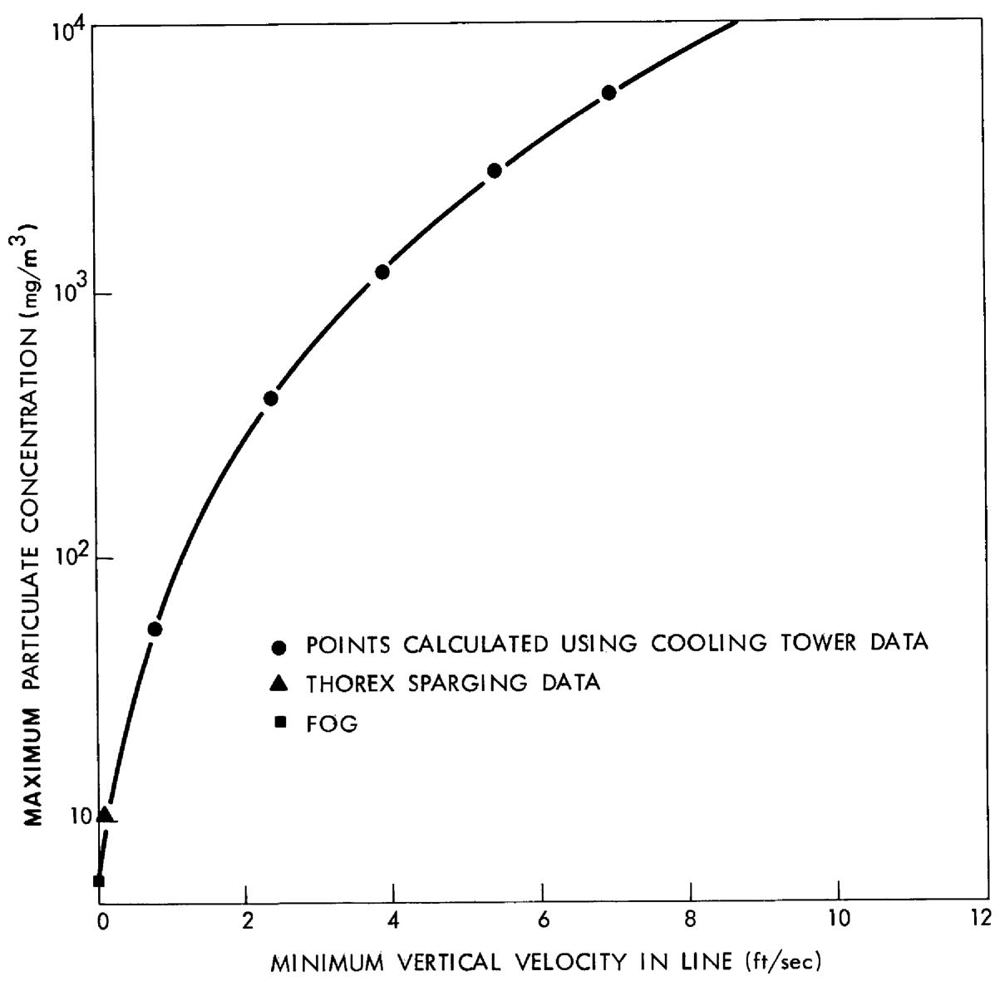  
Fig. 8.10. Effect of Minimum Superficial Velocity in an Off-Gas Line on the Concentration of Liquid Solution Particles Resulting from Vigorous Mixing of a Solution with Air. Density of solution, $\mathrm{lg / cc}$ .

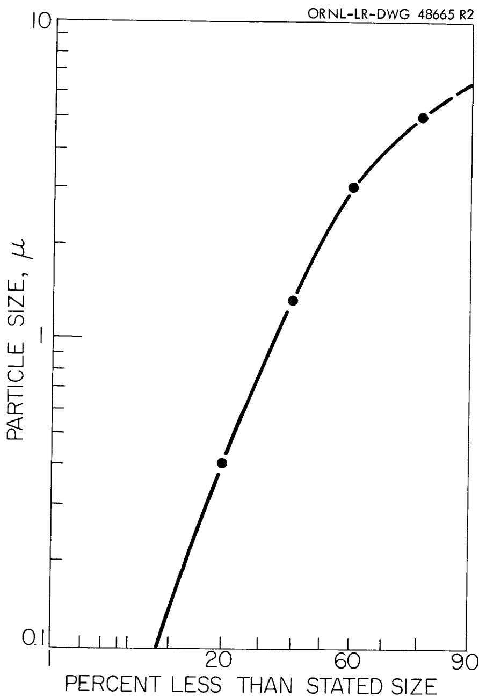  
Fig. 8.11. The Particle Size Distribution of a Stable Aerosol Which Has Encountered Several Changes of Direction in a Pipeline.

tion of particles smaller than 10 to $20\mu$ will be fairly constant, even if there is gross entrainment of larger droplets. The knowledge that this distribution is fairly constant and constitutes approximately 10 $\mathrm{mg / m}^3$ may be used to estimate the approximate concentration of particles smaller than a given size, even in an air stream which is very concentrated with liquid droplets. Practically, it is possible to assign efficiencies to an absolute filter and calculate the effluent concentration.

In evaluating the concentration of aerosols in air which leaks from a cell, it is considered that the aerosol must follow many small tortuous paths in its escape through 5 ft of concrete. The evaporator deentrainment studies by Walsh and Schlea[61] indicate that a single right-angle impingement will reduce a liquid aerosol concentration to $10\mathrm{mg/m}^3$ or less. Fine heavy-element dust would be reduced to the order of $1\mathrm{mg/m}^3$ , and the concentration of smoke in leaked air would probably be no more than approximately $100\mathrm{mg/m}^3$ . These numbers are primarily of use in estimating the radiation dose to plant operating personnel. Essentially all of the material that escapes from the cells through cracks during a period of temporary pressurization would be routed through the filtered cell ventilation system.

Junge $^{62}$ and Friedlander $^{63}$ have observed that the particle size distribution of airborne aerosols is remarkably constant or "self-preserving." Small particles tend to agglomerate rapidly by Brownian motion, while large particles are removed by impingement or sedimentation. Friedlander suggests that a quasi-stationary state exists such that the rate at which matter enters a differential size is equal to the rate at which matter is lost by sedimentation. It has also been determined that the stable concentration of small particles (less than about $3\mu$ in diameter), because of agglomeration, is consistently less than a few grams per cubic meter after the aerosol has been permitted to "age" for a few seconds or minutes. $^{64-66}$ Friedlander has proposed the following formulation for the differential concentration of particles in a metastable aerosol as a function of size:

$$
\mathrm {d n} = \mathrm {k} ^ {\prime} \mathrm {r} ^ {\mathrm {a} - 1} \mathrm {d r}, \tag {6}
$$

where

$\mathbf{n} =$ number of particles per unit volume,

$\mathbf{k}^{\prime} = \mathbf{a}$ constant,

$\mathbf{r} =$ radius of the particle,

a = a constant with a value of ~-1 to -1.5.

By converting to a mass concentration and integrating from $r = 0$ to $r = r$ , the concentration of particles with less than a given diameter is:

$$
C (<   D) = k _ {\rho} D ^ {3 + a}, \tag {7}
$$

where

C(<D) = mass concentration of particles with diameter less than D, mg/m³,

$\rho =$ density of the agglomerate, $\mathrm{g/cm^3}$ ,

D = diameter of the agglomerate, μ,

$\mathbf{k} =$ another constant.

It has been found that agglomerates, even of dense particles, have a density of approximately $1 \, \text{g/cm}^3$ .

A related expression may be derived using the largely substantiated expression for the rate of agglomeration of an aerosol containing particles of a single size:64

$$
\frac {\mathrm {d n}}{\mathrm {d t}} = \mathrm {K n} ^ {2}, \tag {8}
$$

where

$t =$ time since beginning of agglomeration,   
K = agglomeration coefficient, 64   
$\cong 9 \times 10^{-11} / D \quad \mathrm{cm}^3 / \mathrm{sec}$ for $D \leqslant 0.3 \mu$ ,   
$\cong 3 \times 10^{-10} \mathrm{~cm}^{3} / \mathrm{sec}$ for $D \geqslant 0.3 \mu$ .

From this expression, the initial concentration, Co, of particles having a diameter Do and a half-life of $t_{1/2}$ is:

$$
C O = \frac {\pi D o ^ {3} \rho}{6 K t _ {1 / 2}}. \tag {9}
$$

Assuming a half-life of 10 min and converting to appropriate units, this expression becomes:

$$
\mathrm {C o} = 9 7 0 0 \rho \mathrm {D o} ^ {4} \quad \mathrm {D o} \leqslant 0. 3 \tag {10}
$$

$$
\mathrm {C o} = 2 9 0 0 \rho \mathrm {D o} ^ {3} \quad \mathrm {C o} \geqslant 0. 3 \tag {11}
$$

These expressions for aerosol concentration are compared with experimental data for a wide variety of heavily concentrated and turbulent aerosols (smoke, fly ash, DOP, etc. in air, and water droplets in air and steam) in Fig. 8.12. Expressions (10) and (11), for concentrations of monodispersed aerosols with a half-life of 10 min, provide a practical upper bound for the concentrations of solid particles in air. A better description of aerosols containing liquid particles, is provided by expression (7) when a is approximately equal to -2.

Based on the maximum concentration of particulates as a function of particle size (see Fig. 8.12) and assuming that the efficiency of deep-bed sand or HEPA filters is $100\%$ for particles $0.3\mu$ in diameter, the predicted concentration of particles in the effluent from absolute filters is $0.02\mathrm{mg / m}^3$ . Cheever determined experimentally that the maximum concentration of plutonium particles in the effluent from a 30-in.-deep sand filter, occurring at the optimum superficial velocity for a penetration of $4.8\mathrm{ft / min}$ , was $0.02\mathrm{mg / m}^3$ (ref. 68). This experiment was performed under conditions that are very unlikely to occur in accident situations; the filter influent concentration was $100\mathrm{mg / m}^3$ , and the count-mean particle size was only $0.07\mu$ because the aerosol had aged for only a few seconds. Cheever also found that an HEPA filter removed an additional $99\%$ of the particles in the effluent from the sand filter. From these data and known characteristics of filter systems, it is assumed that filter effluent concentrations of $0.02\mathrm{mg / m}^3$ or less are attainable in practice, regardless of the mass concentration of the influent.

The release of radioactive material through the cell ventilation system by a mechanism that generates aerosols is estimated to be as follows:

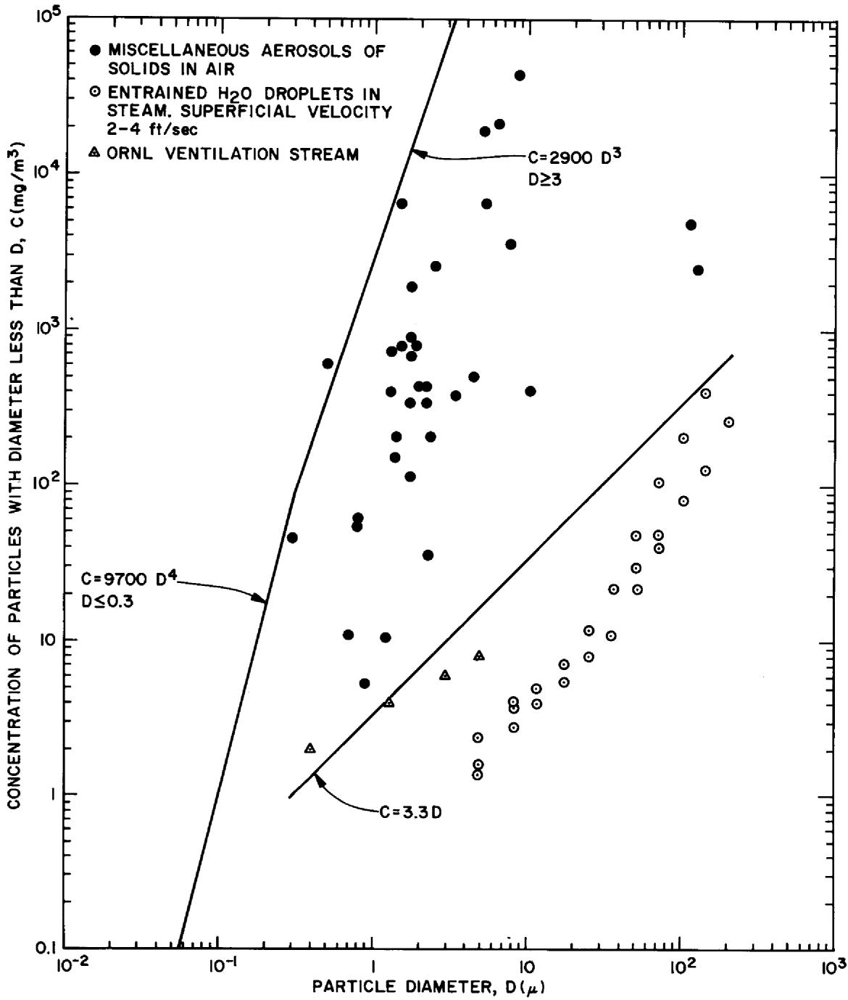  
Fig. 8.12. Mass Concentration of Solid and Liquid Particles in Aerosols.

$$
8 - 5 4
$$

$$
R = C \frac {D _ {P}}{D _ {f}} \left[ F _ {V} t + V _ {c} \frac {F _ {V}}{F _ {C}} \right], \tag {12}
$$

where

$R =$ the quantity of a component (in one metric ton of fuel) that is released to the atmosphere,

C = mass concentration of particles in the filter effluent = 2 x 10 $^{-8}$ kg/m $^3$ ,

$D_p =$ concentration of the component in the particles, weight fraction, $D_f =$ concentration of the component in the fuel, weight fraction,

$F_{\mathrm{v}} =$ total flow rate in ventilation system, $\mathrm{m}^3 /\mathrm{min}$

$F_{c} = \frac{flow rate}{cell}$ from the cell in which the aerosol has been generated, $m^3/min$ ,

$t =$ duration of the source term for aerosol generation, min,

$V_{c} =$ volume of the air in the cell (evaluated at one atmosphere of pressure) following the dispersion of aerosol, $\mathfrak{m}^3$ .

When the aerosol is formed essentially instantaneously, as in an explosion, the rate of release to the atmosphere will decrease exponentially with a mean life of $\frac{F_c}{V_c}$ (which is assumed to be 5 min).

Dispersive Mechanisms. - Mechanisms for the dispersion of gases and aerosols in cells include chemical explosions, fires, nuclear excursions, and leakage. Some properties of explosions relative to the containment potential of cells are shown in Table 8.8. All of the quantities of the limiting explosive materials are very large as compared with their credible inventories in a process vessel. The allowable quantities are even larger if the cells are vented to another confinement zone of large volume (i.e., the cell-canyon concept used at Hanford and planned for MFRP). It is assumed to be incredible that the cell would first fill with hydrogen or solvent vapor and then explode. The flow rate of cell ventilation air is sufficient to dilute any radiolytic $\mathrm{H}_2\mathrm{-O}_2$ .

The most serious fires in a fuel processing plant would be those involving plutonium, that is, solvent or ion exchange resin loaded with

Table 8.8. Estimated Properties of Explosions That Could Occur at the Center of a $10 - m^3$ Cell with 5-ft-thick Reinforced (1 to 2% Steel) Cell Walls Without Rupture   

<table><tr><td>Source of Explosion</td><td>Total Energy Release (Btu)</td><td>Pressure at Cell Wall (psig)</td></tr><tr><td>30 lb TNT</td><td>54,000</td><td>≤100</td></tr><tr><td>500 m³ of 40 vol % H₂ in air</td><td>1,500,000</td><td>50</td></tr><tr><td>420 m³ of 5 vol % propane in air</td><td>1,500,000</td><td>50</td></tr><tr><td>150 lb of &quot;Red Oil&quot;</td><td>~1,500,000</td><td>50</td></tr><tr><td>300 lb of sodium in water</td><td>~1,500,000</td><td>50</td></tr><tr><td>Nuclear burst of 3 x 10²⁰ fissionsb</td><td>9,100,000</td><td>~0.7</td></tr></table>

aInside dimensions.   
bMaximum burst of $10^{16}$ fissions/liter in a tank containing 30,000 liters of solution at a temperature of $85^{\circ}\mathrm{F}$ .

plutonium. Purex-type solvent will burn at the rate of about 1 in. of depth per hour and generate approximately 20,000 Btu/hr per ft² of burning surface. Experience in gloved enclosures has shown that fires covering the entire area of the floor of the enclosure tend to self-extinguish in a matter of minutes because of depletion of the oxygen. This has been true even in well-ventilated enclosures because the pressure increases to several inches of water and reverses the flow through the intake. It has been observed that ion exchange resin loaded with plutonium nitrate can ignite spontaneously at about $120^{\circ}\mathrm{C}$ and burn (in the absence of air), liberating about 540 Btu/lb.

Experience has shown that the initial burst resulting from a super prompt-critical nuclear excursion in a solution is limited to a maximum of $10^{19}$ fissions per $\mathfrak{m}^3$ of solution.[69] At this fission density, the void coefficient caused by the generation of radiolytic gas ( $\sim 1.4\mathrm{~m}^3$ of gas, at STP, per $\mathfrak{m}^3$ of solution) is sufficient to override the effect of high reactivity addition rates. Assuming that the temperature of the solution is $85^{\circ}\mathrm{F}$ (the yield would be lower if the temperature were higher), this burst would increase the temperature to boiling. If the solution is not rendered permanently subcritical by the initial or succeeding bursts or by ejection of solution, it may possibly boil to dryness. The dried solids, if not subcritical because of low density and lack of moderation, probably would be dispersed by one last burst.

Assuming that all of the solution in an equilateral cylinder with a volume $V_{\mathrm{T}}$ is involved in a nuclear excursion, the upper limit yield of the initial burst (and probably the most powerful burst, resulting in the generation of a radiolytic gas void fraction, at STP, of 1.4) is $10^{19} \mathrm{~V}_{\mathrm{T}}$ fissions. When boiling begins, the steam void coefficient $(2.3 \times 10^{-17} \mathrm{~m}^{3} / \text{fission})$ (ref. 70) would limit individual bursts to approximately $6.1 \times 10^{16}$ fissions/ $\mathrm{m}^{3}$ . Since the height of the solution in the tank is $1.08 \mathrm{~V}^{1/3}$ , and the bubble rise rate is about $12 \mathrm{~m/min}$ , the period between bursts is approximately $0.09 \mathrm{~V}^{1/3}$ min. The total time required for boil-down of the solution (assuming $2.1 \times 10^{6}$ Btu/ton) is about $52 \mathrm{~V}^{1/3}$ min.

The sudden generation of radiolytic gas or steam in the solution would cause an inertial force to be exerted against the walls of the

tank. An overestimate of the maximum amount of work that can be done in deforming the vessel, taking no credit for free expansion into the vapor space of the tank, may be calculated $^{71}$ assuming that the liquid and gas expand reversibly against the plastic flow pressure of the vessel. Assuming a gas void fraction (at STP) of 1.4 per burst, no more than about $0.5\%$ of the energy released in the burst could do pressure-volume work against a resisting pressure of 200 psig. An unrestrained cylindrical tank of characteristics assumed in this study could, theoretically, withstand repeated bursts without rupture. [The rupture strain of 304L stainless steel is 0.65 (ref. 71)].

# 8.3.3 Method of Analysis of the Downwind Consequences of a Unit Release of Radioactive Material

The method that has been selected for investigation of the environmental consequences of an accidental release of radioactive material from a fuel reprocessing plant consists, first, of the examination of a "unit" release of activity and, second, the application of the resulting data to actual releases which could be expected from the various credible accidents.

Two different mixtures of isotopes have been considered. These mixtures (listed in Table 8.3) simulate the fission product and actinide contents of typical spent LWR fuel and LMFBR core and blanket fuel mixtures which will actually be encountered. It is assumed that the LWR fuel has decayed for 150 days prior to processing and that the LMFBR material has decayed for 30 days.

For these mixtures, a "unit" release is defined to be the release of all materials that are associated with $1\mathrm{kg}$ of fuel; therefore, the fundamental calculations have been performed on this basis. Initially, no provision is made for differences in the chemical or physical behavior of the various isotopes, and it is assumed that all of the components in a unit release escape. However, as will be shown, it is possible to treat differences in behavior and thus account for variations in the release fraction due to filtration, chemical reactions, and other processes that affect some of the components but not others.

We have investigated both the external gamma dose and the external beta dose that result from direct exposure to the radiation flux originating in the plume and from the internal radiation dose received as a result of the inhalation of radioactive material by a receptor submerged in the plume. The calculation of both types of doses depends on a knowledge of the concentration of radioactive material in the plume as a function of time and space. The concentrations have been computed by using the "Gaussian Plume" formula $^{72}$ and by utilizing the source term and ground reflection correction described by Binford, Barish, and Kam. $^{73}$ The source term is derived using the assumption that a unit quantity of radioactive material is released into the processing building, where it is instantly and uniformly mixed with the air in the building. It is further assumed that a constant fraction of the building volume is being discharged from the stack per unit time. These assumptions lead to the following expression for the concentration at the space point $(x,y,z)$ , relative to an origin of Cartesian coordinates at the stack orifice, and at time $\tau$ after the release has occurred:

$$
\begin{array}{l} X (x, y, z, \tau) = \frac {a q e ^ {- \lambda \tau} \cdot e ^ {a (x / u - \tau)}}{2 \pi u a _ {y} a _ {z}} e ^ {- y ^ {2} / 2 \sigma_ {y} ^ {2}} \tag {13} \\ \times \left[ e ^ {- z ^ {2} / 2 \tau_ {z} ^ {2}} + e ^ {- (2 h + z) ^ {2} / 2 \tau_ {z} ^ {2}} \right], \quad \tau \geqslant x / u \\ \end{array}
$$

where

$$
\begin{array}{l} X (x, y, z, \tau) = \text {c o n c e n t r a t i o n}, \left(\text {c u r i e s} / m ^ {3}\right), \\ q = \text {i n i t i a l} \quad \text {r e l e a s e}, \quad (\text {c u r i e s}), \\ u = \text {w i n d s p e e d i n t h e} x - \text {d i r e c t i o n}, (m / \min ), \\ \end{array}
$$

$$
x, y, z = \text {s p a c e} (m),
$$

$$
\begin{array}{l} \sigma_ {y} (x), \sigma_ {z} (x) = \text {h o r i z o n t a l a n d v e r t i c a l d i s p e r s i o n p a r a m e t e r s}, ^ {7 2} \text {r e s p e c t i v e l y , (m)}, \\ \alpha = \text {e x h a u s t r a t e}, \left(\min  ^ {- 1}\right), \\ \lambda = \text {d e c a y} (\min  ^ {- 1}), \\ h = \text {e f f e c t i v e} (m), \\ \tau = \text {t i m e s i n c e r e l e a s e , (m i n)}. \\ \end{array}
$$

Decay will be neglected for the mixtures under consideration so that $\lambda$ is set equal to zero. Moreover, the value of the concentration at the plume center line ( $y = 0$ ) at ground level ( $z = -h$ ) is of great interest. Under these conditions,

$$
\begin{array}{l} X (x, 0, - h, \tau) = \frac {a q e ^ {a (x / u - \tau)}}{\pi u \sigma_ {y} \sigma_ {z}} \cdot e ^ {- h ^ {2} / 2 \sigma_ {z} ^ {2}}, \quad \tau \geq x / u \tag {14} \\ = 0, \quad \tau <   x / u. \\ \end{array}
$$

This expression is proportional to the inhalation dose rate at ground level at the plume center line and very nearly proportional to the external beta dose. The time integral from $\tau = 0$ to $\tau \rightarrow \infty$ is then proportional to the total dose. This integral,

$$
\begin{array}{l} \infty \\ 0 \end{array} X (x, o, - h, \tau) d _ {\tau} = \frac {- h ^ {2} / 2 \sigma_ {z} ^ {2}}{\pi u x y \sigma_ {z}}, \tag {15}
$$

is independent of $\alpha$ , the exhaust rate.

The dispersion parameters $\sigma_{\mathbf{y}}(\mathbf{x})$ and $\sigma_{\mathbf{z}}(\mathbf{x})$ are monotonic increasing functions of the downwind distance, $\mathbf{x}$ ; however, they also vary with atmospheric stability. For a given value of $\mathbf{x}$ , the dispersion parameters decrease with increasing stability. It is, therefore, necessary to specify the degree of atmospheric stability in order to select the appropriate set of values for the parameters. For the purpose of investigating the external doses, two sets of atmospheric conditions have been utilized:

(1) "Most Representative Conditions," where the wind speed has been chosen to be $100 \, \text{m/min}$ (3.73 mph) and slightly unstable (C) conditions are assumed to prevail.   
(2) "Inversion Conditions," where the wind speed is $50 \, \text{m/min}$ (1.86 mph), moderately stable (F) conditions prevail, and an inversion "lid" exists just above the stack orifice. To account for the latter, the vertical dispersion parameter is modified by being held constant once it reaches the value $\sigma_{\mathbf{z}}(\mathbf{x}) = h / 2.15$ (see ref. 72).

Many other combinations of wind speed and stability conditions are possible; however, it is believed that these two are reasonably typical, cover most of the likely situations that may arise, and permit valid interpolation to other cases which lie in between.

The inhalation doses have been computed on a somewhat more comprehensive basis. As suggested above, many different combinations of wind speed and stability conditions are possible. Thus the inhalation doses have been computed for each of six different stability conditions, the results have been plotted on a single graph, and the envelope of the curves thus obtained have been utilized to estimate the inhalation dose to be expected at each ground level point downwind on the plume center line.

In all cases, it is assumed that the effective stack height, $h$ , is $100 \, \text{m}$ . (The effect of stack height on ground-level concentration will be discussed in detail in a later section.) Finally, it should be pointed out that all of the doses computed below assume exposure of the receptor during the entire course of the accident.

External Beta and Gamma Doses. - These doses stem from direct exposure of the receptor to the radiation flux in the plume. Because of their short range, only the beta particles that originate in the vicinity of the receptor contribute to the dose. Hence, the dose rate may be assumed to be proportional to the concentration of beta emitters at the location of the receptor.[73] The gamma dose, on the other hand, requires a space integration over the entire volume of the cloud in order to sum the photon flux incident on the receptor.

The computer program PLUME, $^{73}$ which was originally developed in order to calculate internal iodine and external iodine and noble-gas doses following a reactor accident was used to perform these calculations. Input for the beta dose calculation is the average energy per disintegration, the equivalent number of curies, and a numerical constant to convert $\text{Mev/m}^3$ into dose units. Input for the gamma calculation consists of the gamma-emitting inventory, divided into nine energy groups, and the appropriate cross sections and buildup factor parameters. The results are displayed in Figs. 8.13 and 8.14. Note that, in these cases, there is no physical

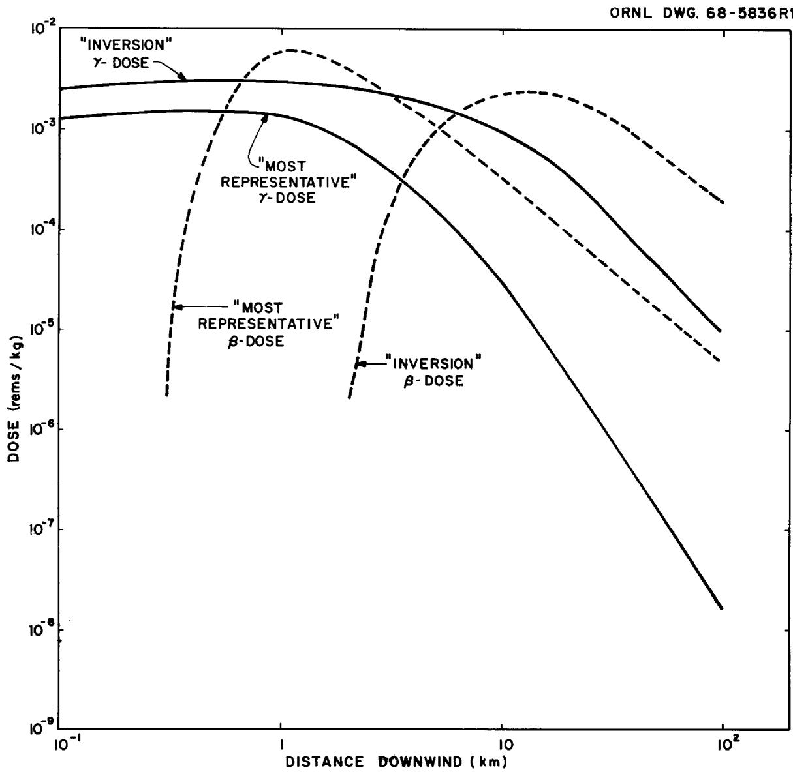  
Fig. 8.13. External Radiation Dose due to All Fission Products Released in Reprocessing $1\mathrm{kg}$ of LWR Fuel.

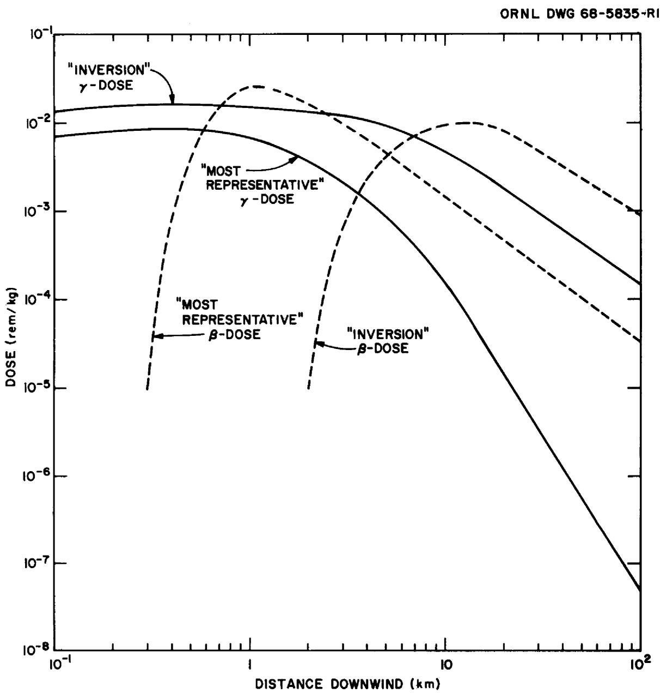  
Fig. 8.14. External Radiation Dose due to All Fission Products Released in Reprocessing $1\mathrm{kg}$ of LMFBR Mixed Core and Blankets.

separation of the components and that all of the isotopes present are assumed to behave similarly.

Inhalation Dose Calculations. - These radiation doses result from inhalation of the contaminated air in the plume and from subsequent deposition of radioactive material in the various organs of the body. The rate of intake of radioactive material is proportional to the breathing rate and to the concentration of the radioactive material at the location of the receptor. The total intake is simply the time integral of the product of these two quantities. For the purpose of these calculations, it will be assumed that the receptor is located at ground level on the center line of the plume and that the exposure lasts for the duration of the accident so that the intake rate is integrated over infinite time. If the breathing rate is assumed to be constant, the total intake is:

$$
I = \frac {\beta q e}{\pi u \sigma_ {y} \sigma_ {z}} \text {c u r i e s}, \tag {16}
$$

where $\beta$ is the breathing rate in $\mathrm{m}^3/\mathrm{min}$ and the other symbols are as defined previously. For this study, $\beta$ has been taken to be $2.08 \times 10^{-2}$ $\mathrm{m}^3/\mathrm{min}$ . The quantity I/q is the total amount of activity inhaled per curie of originally released material.

It should be noted that the spatial variation of the inhalation dose is independent of the amount of released material, the wind speed, and the breathing rate. Thus, for a given wind speed, breathing rate, and quantity of material released, the expression

$$
\vartheta = \frac {e ^ {- h ^ {2} / 2 \sigma_ {z} ^ {2}}}{\sigma_ {y} \sigma_ {z}} \tag {17}
$$

is the same function of $x$ , regardless of the amount of material that is released. This function, normalized to unity at its maximum value, has been plotted in Fig. 8.15 for each of the six stability conditions. An envelope enclosing the six curves has been drawn; this envelope permits estimations of the dose at each point downwind by using a knowledge of the dose at any given point.

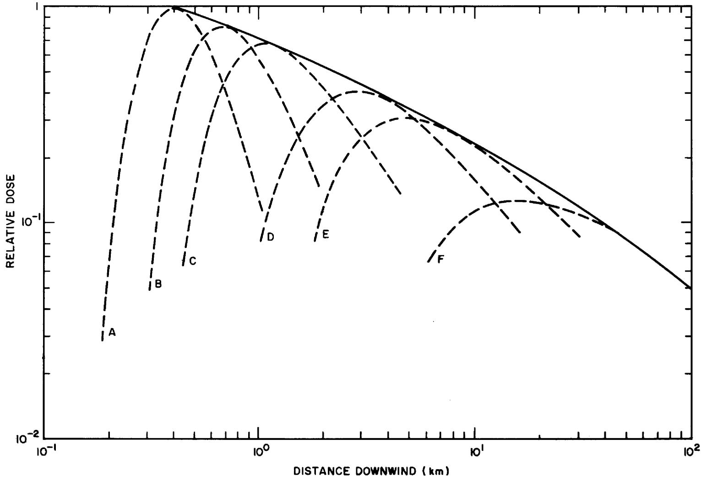  
Fig. 8.15. Generalized Curve for Estimating Inhalation Doses as a Function of Distance Downwind ( $h = 100 \, \text{m}$ ). The fraction of released material that is inhaled by a person $400 \, \text{m}$ downwind is estimated to be $4.3 \times 10^{-9}$ .

The dose at $400\mathrm{m}$ under A (extremely unstable) conditions is the maximum and has been chosen for reference. At a wind speed of $100\mathrm{m / min}$ , the total intake following the release described above is $4.3 \times 10^{-3}$ per curie released. This factor has been utilized as input data for a computer program INREM, which, given the quantity of radioactive material inhaled, computes the dose to the most important organs as a function of time after inhalation. The program takes into consideration uptake by the various organs, effective half-life, and the age of the receptor, which, for this study, was chosen to be 20 years.

The INREM Computer Code. - The rate of intake of radioactivity is the primary radioactivity input for calculating the cumulative dose equivalents by the INREM Code. These estimates of dose are compiled for the various body organs from inhalation or ingestion of radioactivity programmed as continuous or intermittent intakes as a function of age. The parameters in the dose equations change as a function of time as the person ages during the time of intake or during the period of interest (which may be longer than the period of intake). This code, as currently dimensioned, has the capacity to handle 110 radionuclides and 11 body organs. The model, programmed for all organs except the gastrointestinal (GI) tract, is written as follows:

$$
\begin{array}{l} D _ {i n} \left(t _ {1}, t _ {2}, t _ {b}\right) = 5 1 \int_ {t _ {1}} ^ {t _ {2}} I _ {i} [ t - t _ {b}), t ] f _ {i n} (t - t _ {b}) \left\{\int_ {t} ^ {t _ {2}} \frac {\varepsilon_ {i n} \left(s - t _ {b}\right)}{m _ {n} \left(s - t _ {b}\right)} \right. \\ \left. \times \exp \left[ - \int_ {t - t _ {b}} ^ {s - t _ {b}} \lambda_ {i n} (r) d r \right] d s \right\} d t, \tag {18} \\ \end{array}
$$

where

$\mathsf{D}_{\mathsf{in}}(\mathsf{t}_1,\mathsf{t}_2,\mathsf{t}_b) =$ cumulative dose equivalent (rems) received during the time interval $\mathsf{t}_1$ to $\mathsf{t}_2$ from the ith radionuclide in the nth organ, resulting from intake during this time interval by an individual born at $\mathsf{t}_b$ ,

$t_{1} = \text{time(days)}$ of initial intake relative to time of release (t = 0 at time of release),

$t_2 =$ time (days) at end of period of interest relative to time of release,

$t_b = \text{time(days)}$ of birth relative to time of release,

$t =$ time(days)after release,

s = time after intake relative to time of release,

$\mathbf{I}_{i}(t) = \text{intake}(\mu c / day)$ of ith radionuclide at t,

$m_{n}(t) = \text{mass} (g)$ of the nth organ at t,

$\mathbf{f}_{\mathrm{in}}(t) =$ fractional absorption (dimensionless) of the ith radio-nuclide in the nth organ at t,

$\varepsilon_{in}(t) =$ effective absorbed energy (Mev) of the ith radionuclide in the nth organ at t, and

$\lambda_{in}(t) =$ effective elimination constant (day $^{-1}$ ) of the $i$ th radio-nuclide in the $n$ th organ at $t$ .

The variables $t_1, t_2, t_b, t$ , and $s$ are measured relative to release, whereas the variables $I(t), m_n(t), f_{in}(t), \varepsilon_{in}(t)$ , and $\lambda_{in}(t)$ are functions of the age of the individual. The code uses Eq. (18) for ingestion of contaminated food and water, or inhalation of contaminated air, and calculates the cumulative doses to all organs except the GI tract.

When the age-dependent cumulative dose equivalents to the GI tract are to be calculated, the $(\mathsf{MPC})_{\mathsf{a}}$ or $(\mathsf{MPC})_{\mathsf{w}}$ is used in the following way:

$$
\begin{array}{l} D _ {i y z} \left(t _ {1}, t _ {2}, t _ {b}\right) = \frac {0 . 3}{7 I _ {y} ^ {\prime} (M P C) _ {i y z}} \int_ {t _ {1}} ^ {t _ {2}} I _ {i} \left[ \left(t - t _ {b}\right), t \right] m _ {s} / m _ {\ell} \left(t - t _ {b}\right) \varepsilon_ {i \ell} \left(t - t _ {b}\right) / \varepsilon_ {i s} \\ \times f _ {i \ell} \left(t - t _ {b}\right) / f _ {i s} d t, \tag {19} \\ \end{array}
$$

where

$$
\begin{array}{l} \begin{array}{l} D _ {i y z} (t _ {1}, t _ {2}, t _ {b}) = \text {c u m u l a t i v e d o s e , e q u i v a n t (r e m s) t o a c r i t i c a l} \\ \text {s e g m e n t o f t h e G I t r a c t , r e c e i v e d d u r i n g t h e t i m e} \\ \text {i n t e r v a l t t _ {1} t o t _ {2} f r o m i n h a l a t i o n (y = 1) o r i n g e s t i o n (y = 2) o f t h e s o l u b l e (z = 1) o r i n s o l u b l e} \\ \text {(z = 2) f o r m o f t h e i t h r a d i o n u c l i d e f o r a n i n t a k e} \\ \text {d u r i n g t h i s t i m e i n t e r v a l b y a p e r s o n b o r n a t t h e} \\ \text {t _ {b}}, \end{array} \\ I _ {y} ^ {\prime} = \text {i n t a k e (c c / d a y) o f a i r (y = 1) o r w a t e r (y = 2)}, \\ \begin{array}{l} \left(\mathrm {M P C}\right) _ {\mathrm {i y z}} = \text {m a x i m u m p e r m i s s i b l e c o n c e n t r a t i o n} (\mu \mathrm {c / c c}) \text {o f t h e} \\ \text {i t h r a d i o n u c l i d e i n a i r (y = 1) o r w a t e r (y = 2)}, \\ \text {w h e r e t h e i t h r a d i o n u c l i d e i s s o l u b l e (z = 1) o r} \\ \text {i n s o l u b l e (z = 2)}, \end{array} \\ \begin{array}{l} t _ {1} = \text {t i m e (d a y s)} \text {o f i n i t i a l i n t a k e r e l a t i v e t o t i m e o f} \\ \text {r e l e a s e ,} \end{array} \\ \begin{array}{l} t _ {2} = \text {t i m e (d a y s) a t e n d o f p e r i o d o f i n t e r s t r e l a t i v e} \\ \text {t o t i m e o f r e l a s e ,} \end{array} \\ t _ {b} = \text {t i m e o f b i r t h r e l a t i v e t o t i m e o f r e l a s e}, \\ I _ {i} (t) = \text {i n t a k e} (\mu c / d a y) \text {o f t h e i t h r a d i o n u c l i d e a t} t, \\ s = \text {s t a n d a r d} \\ \ell = \text {a g e} \\ \begin{array}{l} m _ {\ell} = \text {m a s s (g)} \text {o f t h e c r i t i c a l s e g n e n t o f t h e G I t r a c t f o r} \\ \text {t h e} \ell \text {t h a g e g r o u p ,} \end{array} \\ \varepsilon_ {i \ell} = \text {e f f e c t i v e a b s o r b e d e n e r g y (M e v) o f t h e i t h r a d i o n u c l i d e i n t h e c r i t i c a l s e g m e n t o f t h e G I t r a c t i n t h e \ell t h a g e g r o u p ,} \\ \begin{array}{l} f _ {i \ell} = \text {f r a c t i o n a l i n t a k e o f t h e i t h r a d i o n u c l i d e r e a c h i n g} \\ \text {t h e c r i t i c a l s e g m e n t o f t h e G I t r a c t i n t h e} \ell \text {t h a g e} \\ \text {g r o u p .} \end{array} \\ \end{array}
$$

Calculations were made with the INREM code to determine the dose commitment for the first year following inhalation (which, in this model, is the highest annual dose commitment) and also the dose commitment for a period of 50 years following the intake. The complete output data from

INREM have been reproduced in Tables 8.9 through 8.12. The results at $\mathbf{400m}$ were then utilized to obtain the doses at each point downwind by means of the generalized curve of Fig. 8.15.

In order to allow for differences in chemical and physical behavior of the various isotopes, the isotopes may be divided roughly into categories, depending upon their volatilities, as follows:

1. Volatile fission products: noble gases, halogens, tritium   
2. Semivolatile fission products: Ru, Te, Cs, Tc, Se   
3. Nonvolatile fission products: all other fission products   
4. Nonvolatile actinides: plutonium and transplutonic elements The dose commitment to the various organs, as well as to the whole body, by these categories is given in Table 8.13.

Deposition. - In all of the foregoing calculations, it has been tacitly assumed that there is no depletion of the plume by deposition, fallout, or rainout. Consequently, the results thus far obtained are conservative in that some depletion of the plume due to these mechanisms will occur. On the other hand, the deposition of relatively large quantities of an extremely toxic substance, such as $^{90}\mathrm{Sr}$ or plutonium, on the ground in and around a highly populated area may give rise to a serious hazard.[69]

Criticality Accidents. - One possible cause of a serious accident in a fuel reprocessing plant is inadvertent criticality that results in a nuclear excursion. Aside from damaging mechanical effects, such an accident would augment the inventory of fission products to an extent depending on the number of fissions taking place during the excursion.

In order to assess the additional radiation doses that would result from such an incident, a "unit" nuclear excursion of $3.7 \times 10^{18}$ fissions has been investigated. The iodine isotopes and the noble gases and their daughters were considered to be of primary importance. The internal dose due to iodine and the external dose due to both iodine and noble gases plus their daughters, have been calculated for both the "most representative" and "inversion" conditions, using the PLUME computer program.[73]

Table 8.9. Internal Dose at ${400}\mathrm{\;m}$ Downwind Following the Release of $1\mathrm{\;{kg}}$ of LWR Fuel   
Inhalation dose commitment (in rems) integrated over 1 year   
Intake period of 1-day duration; begins at age 20   

<table><tr><td>NO.</td><td>NUCLIDE</td><td>LABEL</td><td>TOTAL BODY</td><td>BONE</td><td>MUSCLE</td><td>THYRGID</td><td>LIVER</td><td>KIDNEYS</td><td>SPLEEN</td><td>TESTES</td><td>OVARIES</td></tr><tr><td>1</td><td>H-3</td><td>303</td><td>3.700E-07</td><td>NO DATA</td><td>NO DATA</td><td>NO DATA</td><td>NO DATA</td><td>NO DATA</td><td>NO DATA</td><td>NO DATA</td><td>NO DATA</td></tr><tr><td>2</td><td>SR-89</td><td>39</td><td>4.703E-03</td><td>1.679E-01</td><td>NO DATA</td><td>NO DATA</td><td>NO DATA</td><td>NO DATA</td><td>NO DATA</td><td>NO DATA</td><td>NO DATA</td></tr><tr><td>3</td><td>SR-90A</td><td>901</td><td>4.506E-04</td><td>6.758E-03</td><td>NC DATA</td><td>NO DATA</td><td>NO DATA</td><td>NO DATA</td><td>NO DATA</td><td>NO DATA</td><td>NO DATA</td></tr><tr><td>4</td><td>SR-90B</td><td>902</td><td>6.587E-03</td><td>9.880E-02</td><td>NO DATA</td><td>NO DATA</td><td>NO DATA</td><td>NO DATA</td><td>NO DATA</td><td>NO DATA</td><td>NO DATA</td></tr><tr><td>5</td><td>SR-90C</td><td>903</td><td>3.677E-02</td><td>5.516E-01</td><td>NO DATA</td><td>NO DATA</td><td>NO DATA</td><td>NO DATA</td><td>NO DATA</td><td>NO DATA</td><td>NO DATA</td></tr><tr><td>6</td><td>Y-90</td><td>43</td><td>2.035E-04</td><td>7.647E-03</td><td>NO DATA</td><td>NO CATA</td><td>NO DATA</td><td>NO DATA</td><td>NO DATA</td><td>NO DATA</td><td>NO DATA</td></tr><tr><td>7</td><td>Y-91</td><td>48</td><td>5.984E-03</td><td>2.235E-01</td><td>NO DATA</td><td>NO DATA</td><td>NO DATA</td><td>NO CATA</td><td>NO DATA</td><td>NO DATA</td><td>NO DATA</td></tr><tr><td>8</td><td>ZR-95</td><td>65</td><td>1.857E-02</td><td>7.141E-02</td><td>NO DATA</td><td>NO DATA</td><td>3.034E-02</td><td>3.840E-02</td><td>2.304E-02</td><td>NO DATA</td><td>NO DATA</td></tr><tr><td>9</td><td>NB-95</td><td>67</td><td>9.854E-03</td><td>2.885E-02</td><td>NO DATA</td><td>NO DATA</td><td>1.660E-02</td><td>1.803E-02</td><td>1.456E-02</td><td>NO DATA</td><td>NO DATA</td></tr><tr><td>10</td><td>TC-99</td><td>79</td><td>2.974E-09</td><td>7.435E-09</td><td>NO DATA</td><td>NO DATA</td><td>1.102E-08</td><td>1.388E-07</td><td>NO DATA</td><td>NO DATA</td><td>NO DATA</td></tr><tr><td>11</td><td>RU-103</td><td>88</td><td>2.924E-04</td><td>5.908E-04</td><td>NC DATA</td><td>NO DATA</td><td>NO DATA</td><td>2.446E-03</td><td>NO DATA</td><td>NO DATA</td><td>NO DATA</td></tr><tr><td>12</td><td>RU-106</td><td>97</td><td>4.972E-03</td><td>3.563E-02</td><td>NO DATA</td><td>NO DATA</td><td>NO DATA</td><td>6.872E-02</td><td>NO DATA</td><td>NO DATA</td><td>NO DATA</td></tr><tr><td>13</td><td>RH-103M</td><td>89</td><td>2.908E-07</td><td>5.740E-07</td><td>NO DATA</td><td>NO DATA</td><td>4.789E-07</td><td>1.903E-06</td><td>1.332E-06</td><td>NO DATA</td><td>NO DATA</td></tr><tr><td>14</td><td>AG-111</td><td>114</td><td>5.269E-07</td><td>2.371E-06</td><td>NO DATA</td><td>NO DATA</td><td>1.017E-06</td><td>2.916E-06</td><td>NO DATA</td><td>NO DATA</td><td>NO DATA</td></tr><tr><td>15</td><td>CD-115M</td><td>125</td><td>1.053E-06</td><td>NO DATA</td><td>NO DATA</td><td>NO DATA</td><td>3.295E-05</td><td>2.666E-05</td><td>NO DATA</td><td>NO DATA</td><td>NO DATA</td></tr><tr><td>16</td><td>SB-124</td><td>159</td><td>3.821E-06</td><td>1.007E-05</td><td>NO DATA</td><td>2.332E-08</td><td>1.675E-09</td><td>NO DATA</td><td>NO DATA</td><td>NO DATA</td><td>NO DATA</td></tr><tr><td>17</td><td>SN-125</td><td>161</td><td>1.759E-07</td><td>2.977E-06</td><td>NO DATA</td><td>6.823E-08</td><td>8.113E-08</td><td>NO DATA</td><td>NO DATA</td><td>NO DATA</td><td>NO DATA</td></tr><tr><td>18</td><td>SB-125</td><td>162</td><td>1.267E-04</td><td>5.698E-04</td><td>NO DATA</td><td>5.680E-07</td><td>6.170E-06</td><td>NO DATA</td><td>NO DATA</td><td>NO DATA</td><td>NO DATA</td></tr><tr><td>19</td><td>TE-125M</td><td>163</td><td>9.967E-06</td><td>5.053E-05</td><td>NO DATA</td><td>1.663E-05</td><td>3.360E-05</td><td>2.856E-04</td><td>7.235E-05</td><td>6.171E-05</td><td>NO DATA</td></tr><tr><td>20</td><td>TE-127M</td><td>169</td><td>4.353E-05</td><td>3.230E-04</td><td>NC DATA</td><td>9.120E-05</td><td>1.669E-04</td><td>1.419E-03</td><td>3.594E-04</td><td>3.780E-04</td><td>NO DATA</td></tr><tr><td>21</td><td>TE-127</td><td>170</td><td>9.420E-07</td><td>4.325E-06</td><td>NO DATA</td><td>3.210E-06</td><td>2.095E-06</td><td>1.781E-05</td><td>4.512E-06</td><td>4.898E-06</td><td>NO DATA</td></tr><tr><td>22</td><td>TE-129M</td><td>176</td><td>1.248E-04</td><td>5.197E-04</td><td>NO DATA</td><td>1.917E-04</td><td>3.265E-04</td><td>2.608E-03</td><td>6.607E-04</td><td>6.345E-04</td><td>NO DATA</td></tr><tr><td>23</td><td>TE-129</td><td>177</td><td>3.631E-07</td><td>9.281E-07</td><td>NO DATA</td><td>7.780E-07</td><td>5.861E-07</td><td>4.641E-06</td><td>1.176E-06</td><td>1.126E-06</td><td>NO DATA</td></tr><tr><td>24</td><td>I-131</td><td>187</td><td>2.425E-8</td><td>NO DATA</td><td>NO DATA</td><td>1.361E-05</td><td>NO DATA</td><td>NO DATA</td><td>NO DATA</td><td>NO DATA</td><td>NO DATA</td></tr><tr><td>25</td><td>CS-134</td><td>327</td><td>4.985E-02</td><td>2.971E-02</td><td>7.702E-02</td><td>NO DATA</td><td>8.623E-02</td><td>3.051E-02</td><td>6.427E-02</td><td>NO DATA</td><td>NO DATA</td></tr><tr><td>26</td><td>CS-136</td><td>207</td><td>4.970E-07</td><td>2.382E-07</td><td>5.018E-07</td><td>NO DATA</td><td>7.614E-07</td><td>4.704E-07</td><td>5.481E-07</td><td>NO DATA</td><td>NO DATA</td></tr><tr><td>27</td><td>CS-137</td><td>210</td><td>1.423E-02</td><td>2.299E-02</td><td>2.261E-02</td><td>NO DATA</td><td>3.341E-02</td><td>1.281E-02</td><td>2.784E-02</td><td>NO DATA</td><td>NO DATA</td></tr><tr><td>28</td><td>BA-140</td><td>221</td><td>1.320E-05</td><td>1.636E-04</td><td>1.084E-07</td><td>NO DATA</td><td>2.366E-07</td><td>7.661E-08</td><td>9.614E-08</td><td>NO DATA</td><td>NO DATA</td></tr><tr><td>29</td><td>LA-140</td><td>222</td><td>1.760E-06</td><td>1.001E-05</td><td>NO DATA</td><td>NO DATA</td><td>6.714E-06</td><td>NO DATA</td><td>NO DATA</td><td>NO DATA</td><td>NO DATA</td></tr><tr><td>30</td><td>CE-141</td><td>227</td><td>3.978E-04</td><td>4.757E-03</td><td>NO DATA</td><td>NO DATA</td><td>3.258E-03</td><td>1.591E-03</td><td>NO DATA</td><td>NO DATA</td><td>NO DATA</td></tr><tr><td>31</td><td>CE-144</td><td>239</td><td>1.563E-01</td><td>2.547E-00</td><td>NO DATA</td><td>NO DATA</td><td>1.324E-00</td><td>7.292E-01</td><td>NO DATA</td><td>NO DATA</td><td>NO DATA</td></tr><tr><td>32</td><td>PR-143</td><td>237</td><td>3.340E-06</td><td>6.729E-05</td><td>NO DATA</td><td>NO DATA</td><td>2.689E-05</td><td>1.559E-05</td><td>NO DATA</td><td>NO DATA</td><td>NO DATA</td></tr><tr><td>33</td><td>ND-147</td><td>246</td><td>2.523E-07</td><td>3.207E-06</td><td>NO DATA</td><td>NO DATA</td><td>3.893E-06</td><td>1.825E-06</td><td>NO DATA</td><td>NO DATA</td><td>NO DATA</td></tr><tr><td>34</td><td>PM-147</td><td>247</td><td>1.413E-03</td><td>2.848E-02</td><td>NO DATA</td><td>NO DATA</td><td>4.656E-03</td><td>6.596E-03</td><td>NO DATA</td><td>NO DATA</td><td>NO DATA</td></tr><tr><td>35</td><td>SM-151</td><td>255</td><td>1.125E-05</td><td>1.390E-04</td><td>NO DATA</td><td>NO DATA</td><td>1.102E-04</td><td>5.249E-05</td><td>NO DATA</td><td>NO DATA</td><td>NO DATA</td></tr><tr><td>36</td><td>EU-152</td><td>328</td><td>1.719E-06</td><td>4.702E-06</td><td>NO DATA</td><td>NO DATA</td><td>4.505E-06</td><td>5.073E-06</td><td>NO DATA</td><td>NO DATA</td><td>NO DATA</td></tr><tr><td>37</td><td>EU-155</td><td>262</td><td>1.971E-04</td><td>1.374E-03</td><td>NO DATA</td><td>NO DATA</td><td>6.365E-04</td><td>7.915E-04</td><td>NO DATA</td><td>NO DATA</td><td>NO DATA</td></tr><tr><td>38</td><td>TB-160</td><td>272</td><td>1.834E-5</td><td>1.463E-04</td><td>NO DATA</td><td>NC DATA</td><td>NO DATA</td><td>6.042E-05</td><td>NO DATA</td><td>NO DATA</td><td>NO DATA</td></tr><tr><td>39</td><td>NP-239</td><td>330</td><td>1.310E-08</td><td>1.947E-07</td><td>NO DATA</td><td>NO DATA</td><td>2.127E-08</td><td>6.639E-08</td><td>NO DATA</td><td>NO DATA</td><td>NO DATA</td></tr><tr><td>40</td><td>PU-238</td><td>280</td><td>4.482E-02</td><td>1.762E-00</td><td>NO DATA</td><td>NO DATA</td><td>2.799E-01</td><td>2.087E-01</td><td>NO DATA</td><td>NO DATA</td><td>NO DATA</td></tr><tr><td>41</td><td>PU-239</td><td>281</td><td>4.913E-03</td><td>2.003E-01</td><td>NO DATA</td><td>NO DATA</td><td>3.068E-02</td><td>2.288E-02</td><td>NO DATA</td><td>NO DATA</td><td>NO DATA</td></tr><tr><td>42</td><td>PU-240</td><td>282</td><td>7.116E-03</td><td>2.901E-01</td><td>NO DATA</td><td>NO DATA</td><td>4.444E-02</td><td>3.314E-02</td><td>NO DATA</td><td>NO DATA</td><td>NO DATA</td></tr><tr><td>43</td><td>PU-241</td><td>283</td><td>7.239E-02</td><td>3.525E-00</td><td>NO DATA</td><td>NC DATA</td><td>1.965E-01</td><td>3.665E-01</td><td>NO DATA</td><td>NO DATA</td><td>NO DATA</td></tr><tr><td>44</td><td>AM-241</td><td>1</td><td>3.186E-03</td><td>3.962E-02</td><td>NO DATA</td><td>NO DATA</td><td>4.482E-02</td><td>2.234E-02</td><td>NO DATA</td><td>NO DATA</td><td>NO DATA</td></tr><tr><td>45</td><td>CM-242</td><td>2</td><td>1.707E-01</td><td>2.566E-00</td><td>NO DATA</td><td>NO DATA</td><td>2.668E-00</td><td>7.765E-01</td><td>NO DATA</td><td>NO DATA</td><td>NO DATA</td></tr><tr><td>46</td><td>CM-244</td><td>3</td><td>4.104E-02</td><td>6.179E-01</td><td>NO DATA</td><td>NO DATA</td><td>6.525E-01</td><td>1.915E-01</td><td>NO DATA</td><td>NO DATA</td><td>NO DATA</td></tr><tr><td></td><td>TOTAL</td><td></td><td>6.952E-01</td><td>1.283E 01</td><td>9.962E-02</td><td>3.178E-04</td><td>5.417E 00</td><td>2.535E 00</td><td>1.308E-01</td><td>1.080E-03</td><td>0.0</td></tr></table>

Table 8.9 (Continued)   

<table><tr><td colspan="6">LUNGSS</td><td colspan="2">G.I. TRACT</td></tr><tr><td>NO.</td><td>NUCLIDE</td><td>LABEL</td><td>SOLUBLE</td><td>INSOLUBLE</td><td>SOLUBLE</td><td>INSOLUBLE</td><td></td></tr><tr><td>1</td><td>H-3</td><td>303</td><td>NO DATA</td><td>2.791E-05</td><td>6.286E-08</td><td>3.143E-06</td><td></td></tr><tr><td>2</td><td>SR-89</td><td>38</td><td>NO DATA</td><td>7.311E-02</td><td>9.690E-03</td><td>1.744E-02</td><td></td></tr><tr><td>3</td><td>SR-90A</td><td>901</td><td>NO DATA</td><td>3.433E-01</td><td>2.320E-03</td><td>3.866E-03</td><td></td></tr><tr><td>4</td><td>SR-90B</td><td>902</td><td>NO DATA</td><td>3.433E-01</td><td>2.320E-03</td><td>3.866E-03</td><td></td></tr><tr><td>5</td><td>SR-90C</td><td>903</td><td>NO DATA</td><td>3.433E-01</td><td>2.320E-03</td><td>3.866E-03</td><td></td></tr><tr><td>6</td><td>Y-90</td><td>43</td><td>NO DATA</td><td>6.968E-03</td><td>1.740E-02</td><td>2.320E-02</td><td></td></tr><tr><td>7</td><td>Y-91</td><td>48</td><td>NO DATA</td><td>1.428E-01</td><td>2.407E-02</td><td>2.889E-02</td><td></td></tr><tr><td>8</td><td>7R-95</td><td>65</td><td>NO DATA</td><td>2.314E-01</td><td>2.507E-02</td><td>2.507E-02</td><td></td></tr><tr><td>9</td><td>NB-95</td><td>67</td><td>NO DATA</td><td>1.423E-01</td><td>2.353E-02</td><td>2.353E-02</td><td></td></tr><tr><td>10</td><td>TC-99</td><td>79</td><td>9.368E-10</td><td>5.485E-06</td><td>1.843E-07</td><td>4.300E-07</td><td></td></tr><tr><td>11</td><td>RU-103</td><td>88</td><td>NO DATA</td><td>2.866E-02</td><td>4.047E-03</td><td>8.094E-03</td><td></td></tr><tr><td>12</td><td>RU-106</td><td>97</td><td>NO DATA</td><td>1.898E 00</td><td>1.242E-01</td><td>1.862E-01</td><td></td></tr><tr><td>13</td><td>RH-103M</td><td>89</td><td>NO DATA</td><td>7.267E-06</td><td>2.701E-05</td><td>4.052E-05</td><td></td></tr><tr><td>14</td><td>AG-111</td><td>114</td><td>NO DATA</td><td>3.964E-05</td><td>3.443E-05</td><td>4.304E-05</td><td></td></tr><tr><td>15</td><td>CD-115M</td><td>125</td><td>NO DATA</td><td>3.334E-05</td><td>6.707E-06</td><td>1.006E-05</td><td></td></tr><tr><td>16</td><td>SB-124</td><td>159</td><td>7.519E-06</td><td>1.241E-04</td><td>1.568E-05</td><td>1.96CE-05</td><td></td></tr><tr><td>17</td><td>SN-125</td><td>161</td><td>NO DATA</td><td>6.590E-06</td><td>4.542E-06</td><td>6.056E-06</td><td></td></tr><tr><td>18</td><td>SB-125</td><td>162</td><td>3.946E-04</td><td>7.601E-03</td><td>3.693E-04</td><td>3.693E-04</td><td></td></tr><tr><td>19</td><td>TE-125M</td><td>163</td><td>NO DATA</td><td>6.969E-04</td><td>2.971E-04</td><td>1.485E-04</td><td></td></tr><tr><td>20</td><td>TE-127M</td><td>169</td><td>NO DATA</td><td>4.271E-03</td><td>2.807E-04</td><td>6.238E-04</td><td></td></tr><tr><td>21</td><td>TE-127</td><td>170</td><td>NO DATA</td><td>2.219E-05</td><td>9.236E-05</td><td>1.847E-04</td><td></td></tr><tr><td>22</td><td>TE-129M</td><td>176</td><td>NO DATA</td><td>5.612E-03</td><td>8.695E-04</td><td>1.522E-03</td><td></td></tr><tr><td>23</td><td>TE-129</td><td>177</td><td>NO DATA</td><td>6.225E-06</td><td>1.949E-05</td><td>3.897E-05</td><td></td></tr><tr><td>24</td><td>I-131</td><td>187</td><td>NO DATA</td><td>1.915E-07</td><td>9.857E-09</td><td>1.971E-07</td><td></td></tr><tr><td>25</td><td>CS-134</td><td>327</td><td>9.179E-03</td><td>4.522E-01</td><td>1.535E-03</td><td>2.764E-02</td><td></td></tr><tr><td>26</td><td>CS-136</td><td>207</td><td>6.215E-08</td><td>3.329E-06</td><td>9.448E-08</td><td>1.890E-06</td><td></td></tr><tr><td>27</td><td>CS-137</td><td>210</td><td>3.613E-03</td><td>1.772E-01</td><td>4.815E-04</td><td>1.204E-02</td><td></td></tr><tr><td>28</td><td>BA-140</td><td>221</td><td>1.322E-07</td><td>2.715E-04</td><td>6.510E-05</td><td>9.766E-05</td><td></td></tr><tr><td>29</td><td>LA-140</td><td>222</td><td>NO DATA</td><td>3.517E-05</td><td>8.994E-05</td><td>1.124E-04</td><td></td></tr><tr><td>30</td><td>CE-141</td><td>227</td><td>NO DATA</td><td>1.005E-02</td><td>2.575E-03</td><td>2.575E-03</td><td></td></tr><tr><td>31</td><td>CE-144</td><td>238</td><td>NO DATA</td><td>3.144E 00</td><td>2.332E-03</td><td>3.497E-01</td><td></td></tr><tr><td>32</td><td>PR-143</td><td>237</td><td>NO DATA</td><td>1.065E-04</td><td>6.305E-05</td><td>7.005E-05</td><td></td></tr><tr><td>33</td><td>ND-147</td><td>246</td><td>NO DATA</td><td>6.161E-06</td><td>4.633E-06</td><td>4.633E-06</td><td></td></tr><tr><td>34</td><td>PM-147</td><td>247</td><td>NO DATA</td><td>2.576E-02</td><td>1.806E-03</td><td>2.257E-03</td><td></td></tr><tr><td>35</td><td>SM-151</td><td>255</td><td>NO DATA</td><td>1.980E-04</td><td>1.306E-05</td><td>1.492E-05</td><td></td></tr><tr><td>36</td><td>EU-152</td><td>328</td><td>NO DATA</td><td>1.532E-05</td><td>5.224E-07</td><td>1.447E-04</td><td></td></tr><tr><td>37</td><td>EU-155</td><td>262</td><td>NO DATA</td><td>2.180E-03</td><td>5.224E-07</td><td>1.447E-04</td><td></td></tr><tr><td>38</td><td>TB-160</td><td>272</td><td>NO DATA</td><td>2.519E-04</td><td>2.725E-05</td><td>3.407E-05</td><td></td></tr><tr><td>39</td><td>NP-239</td><td>330</td><td>NO DATA</td><td>2.481E-07</td><td>5.269E-07</td><td>7.903E-07</td><td></td></tr><tr><td>40</td><td>PU-238</td><td>280</td><td>NO DATA</td><td>1.135E 00</td><td>4.255E-04</td><td>5.105E-04</td><td></td></tr><tr><td>41</td><td>PU-239</td><td>281</td><td>NO DATA</td><td>1.243E-01</td><td>4.996E-05</td><td>5.996E-05</td><td></td></tr><tr><td>42</td><td>PU-240</td><td>282</td><td>NO DATA</td><td>1.801E-01</td><td>7.237E-05</td><td>8.685E-05</td><td></td></tr><tr><td>43</td><td>PU-241</td><td>283</td><td>NO DATA</td><td>4.234E-02</td><td>3.482E-04</td><td>5.224E-04</td><td></td></tr><tr><td>44</td><td>AM-24*</td><td>1</td><td>NO DATA</td><td>4.682E-02</td><td>3.028E-05</td><td>3.634E-05</td><td></td></tr><tr><td>45</td><td>CM-242</td><td>2</td><td>NO DATA</td><td>2.520E 00</td><td>2.725E-03</td><td>3.407E-03</td><td></td></tr><tr><td>46</td><td>CM-244</td><td>3</td><td>NO DATA</td><td>6.061E-01</td><td>3.770E-04</td><td>4.524E-04</td><td></td></tr><tr><td colspan="3">TOTAL</td><td>1.319E-02</td><td>1.204E 01</td><td>2.505E-01</td><td>7.269E-01</td><td></td></tr></table>

Inhalation dose commitment (in rems) integrated over 50 years

Intake period of 1-day duration; begins at age 20

Table 8.10. Internal Dose at $400\mathrm{m}$ Downwind Following the Release of $1\mathrm{kg}$ of LWR Fuel   

<table><tr><td>NO.</td><td>NUCLIDE</td><td>LABEL</td><td>TOTAL BODY</td><td>BONE</td><td>MUSCLE</td><td>THYROID</td><td>LIVER</td><td>KIDNEYS</td><td>SPEEN</td><td>TESTES</td><td>OVARIES</td></tr><tr><td>1</td><td>H-3</td><td>303</td><td>3.700E-07</td><td>NO DATA</td><td>NO DATA</td><td>NC DATA</td><td>NO DATA</td><td>NO DATA</td><td>NO DATA</td><td>NO DATA</td><td>NO DATA</td></tr><tr><td>2</td><td>SR-89</td><td>38</td><td>4.734E-03</td><td>1.690E-01</td><td>NO DATA</td><td>NO DATA</td><td>NO DATA</td><td>NO DATA</td><td>NO DATA</td><td>NO DATA</td><td>NO DATA</td></tr><tr><td>3</td><td>SR-90A</td><td>901</td><td>4.566E-04</td><td>6.758E-03</td><td>NC DATA</td><td>NC CATA</td><td>NO DATA</td><td>NO DATA</td><td>NO DATA</td><td>NO DATA</td><td>NO DATA</td></tr><tr><td>4</td><td>SR-COB</td><td>902</td><td>6.608E-03</td><td>9.912E-02</td><td>NO DATA</td><td>NO DATA</td><td>NO DATA</td><td>NO DATA</td><td>NO DATA</td><td>NO DATA</td><td>NO DATA</td></tr><tr><td>5</td><td>SR-90C</td><td>903</td><td>5.753E-01</td><td>8.630E 00</td><td>NO DATA</td><td>NO CATA</td><td>NO DATA</td><td>NO DATA</td><td>NO DATA</td><td>NO DATA</td><td>NO DATA</td></tr><tr><td>6</td><td>Y-90</td><td>43</td><td>2.035E-04</td><td>7.647E-03</td><td>NO DATA</td><td>NO DATA</td><td>NO DATA</td><td>NO DATA</td><td>NO DATA</td><td>NO DATA</td><td>NO DATA</td></tr><tr><td>7</td><td>Y-9!</td><td>48</td><td>6.061E-03</td><td>2.264E-01</td><td>NO DATA</td><td>NC CATA</td><td>NO DATA</td><td>NO DATA</td><td>NO DATA</td><td>NO DATA</td><td>NO DATA</td></tr><tr><td>8</td><td>ZR-95</td><td>65</td><td>1.877E-02</td><td>7.244E-02</td><td>NO DATA</td><td>NO DATA</td><td>3.060E-02</td><td>3.894E-02</td><td>2.336E-02</td><td>NO DATA</td><td>NO DATA</td></tr><tr><td>9</td><td>NB-95</td><td>67</td><td>9.859E-03</td><td>2.887E-02</td><td>NO DATA</td><td>NO CATA</td><td>1.661E-02</td><td>1.804E-02</td><td>1.456E-02</td><td>NO DATA</td><td>NO DATA</td></tr><tr><td>10</td><td>TC-99</td><td>79</td><td>2.974E-09</td><td>7.435E-09</td><td>NO DATA</td><td>NO CATA</td><td>1.102E-08</td><td>1.388E-07</td><td>NO DATA</td><td>NO DATA</td><td>NO DATA</td></tr><tr><td>11</td><td>RU-103</td><td>88</td><td>2.924E-04</td><td>5.908E-04</td><td>NC DATA</td><td>NO CATA</td><td>NO DATA</td><td>2.446E-03</td><td>NO DATA</td><td>NO DATA</td><td>NO DATA</td></tr><tr><td>12</td><td>RU-106</td><td>97</td><td>4.972E-03</td><td>3.563E-02</td><td>NO DATA</td><td>NO CATA</td><td>NO DATA</td><td>6.872E-02</td><td>NO DATA</td><td>NO DATA</td><td>NO DATA</td></tr><tr><td>13</td><td>RH-103M</td><td>99</td><td>2.908E-07</td><td>5.740E-07</td><td>NO DATA</td><td>NO CATA</td><td>4.789E-07</td><td>1.903E-06</td><td>1.332E-06</td><td>NO DATA</td><td>NO DATA</td></tr><tr><td>14</td><td>AG-111</td><td>114</td><td>5.269E-07</td><td>2.371E-06</td><td>NO DATA</td><td>NO CATA</td><td>1.017E-06</td><td>2.916E-06</td><td>NO DATA</td><td>NO DATA</td><td>NO DATA</td></tr><tr><td>15</td><td>CD-115M</td><td>125</td><td>1.054E-06</td><td>NO DATA</td><td>NO DATA</td><td>NC DATA</td><td>3.297E-05</td><td>2.669E-05</td><td>NO DATA</td><td>NO DATA</td><td>NO DATA</td></tr><tr><td>16</td><td>SB-124</td><td>159</td><td>3.821E-06</td><td>1.008E-05</td><td>NC DATA</td><td>2.332E-08</td><td>1.675E-09</td><td>NO CATA</td><td>NO DATA</td><td>NO DATA</td><td>NO DATA</td></tr><tr><td>17</td><td>SN-125</td><td>161</td><td>1.759E-07</td><td>2.977E-06</td><td>NO DATA</td><td>6.823E-08</td><td>8.113E-08</td><td>NO DATA</td><td>NO DATA</td><td>NO DATA</td><td>NO DATA</td></tr><tr><td>18</td><td>SB-125</td><td>162</td><td>1.268E-04</td><td>6.064E-04</td><td>NO DATA</td><td>5.680E-07</td><td>6.176E-06</td><td>NO CATA</td><td>NO DATA</td><td>NO DATA</td><td>NO DATA</td></tr><tr><td>19</td><td>TE-125M</td><td>163</td><td>9.967E-06</td><td>5.053E-05</td><td>NO DATA</td><td>1.663E-05</td><td>3.360E-05</td><td>2.856E-04</td><td>7.235E-05</td><td>6.171E-05</td><td>NO DATA</td></tr><tr><td>20</td><td>TE-127M</td><td>169</td><td>4.353E-05</td><td>3.230E-04</td><td>NO DATA</td><td>9.120E-05</td><td>1.669E-04</td><td>1.419E-03</td><td>3.594E-04</td><td>3.780E-04</td><td>NO DATA</td></tr><tr><td>21</td><td>TE-127</td><td>170</td><td>9.420E-07</td><td>4.325E-06</td><td>NO DATA</td><td>3.210E-06</td><td>2.095E-06</td><td>1.781E-05</td><td>4.512E-06</td><td>4.898E-06</td><td>NO DATA</td></tr><tr><td>22</td><td>TE-129M</td><td>176</td><td>1.248E-04</td><td>5.197E-04</td><td>NO DATA</td><td>1.917E-04</td><td>3.265E-04</td><td>2.608E-03</td><td>6.607E-04</td><td>6.345E-04</td><td>NO DATA</td></tr><tr><td>23</td><td>TE-129</td><td>177</td><td>3.631E-07</td><td>9.281E-07</td><td>NO DATA</td><td>7.780E-07</td><td>5.861E-07</td><td>4.641E-06</td><td>1.176E-06</td><td>1.126E-06</td><td>NO DATA</td></tr><tr><td>24</td><td>I-131</td><td>187</td><td>2.425E-08</td><td>NO DATA</td><td>NC DATA</td><td>1.361E-05</td><td>NO DATA</td><td>NO DATA</td><td>NO DATA</td><td>NO DATA</td><td>NO DATA</td></tr><tr><td>25</td><td>CS-134</td><td>327</td><td>5.090E-02</td><td>3.383E-02</td><td>8.770E-02</td><td>NO DATA</td><td>9.022E-02</td><td>3.056E-02</td><td>6.813E-02</td><td>NO DATA</td><td>NO DATA</td></tr><tr><td>26</td><td>CS-136</td><td>27</td><td>4.970E-07</td><td>2.382E-07</td><td>5.018E-07</td><td>NO DATA</td><td>7.614E-07</td><td>4.704E-07</td><td>5.481E-07</td><td>NO DATA</td><td>NO DATA</td></tr><tr><td>27</td><td>CS-137</td><td>210</td><td>1.463E-02</td><td>2.738E-02</td><td>2.692E-02</td><td>NC DATA</td><td>3.549E-02</td><td>1.285E-02</td><td>3.006E-02</td><td>NO DATA</td><td>NO DATA</td></tr><tr><td>28</td><td>BA-140</td><td>221</td><td>1.320E-05</td><td>1.636E-04</td><td>1.084E-07</td><td>NO DATA</td><td>2.366E-07</td><td>7.661E-08</td><td>9.614E-08</td><td>NO DATA</td><td>NO DATA</td></tr><tr><td>29</td><td>LA-140</td><td>222</td><td>1.760E-06</td><td>1.001E-05</td><td>NO DATA</td><td>NO DATA</td><td>6.714E-06</td><td>NO DATA</td><td>NO DATA</td><td>NO DATA</td><td>NO DATA</td></tr><tr><td>30</td><td>CE&#x27;-41</td><td>227</td><td>3.979E-04</td><td>4.758E-03</td><td>NC DATA</td><td>NO CATA</td><td>3.258E-03</td><td>1.592E-03</td><td>NO DATA</td><td>NO DATA</td><td>NO DATA</td></tr><tr><td>31</td><td>CE-144</td><td>238</td><td>2.130E-01</td><td>3.940E 00</td><td>NO DATA</td><td>NC DATA</td><td>1.609E 00</td><td>9.939E-01</td><td>NO DATA</td><td>NO DATA</td><td>NO DATA</td></tr><tr><td>32</td><td>PR-143</td><td>237</td><td>3.340E-06</td><td>6.729E-05</td><td>NO DATA</td><td>NO CATA</td><td>2.689E-05</td><td>1.559E-05</td><td>NO DATA</td><td>NO DATA</td><td>NO DATA</td></tr><tr><td>33</td><td>ND-147</td><td>246</td><td>2.523E-07</td><td>3.207E-06</td><td>NO DATA</td><td>NO CATA</td><td>3.893E-06</td><td>1.825E-06</td><td>NO DATA</td><td>NO DATA</td><td>NO DATA</td></tr><tr><td>34</td><td>PM-147</td><td>247</td><td>2.926E-03</td><td>7.953E-02</td><td>NO DATA</td><td>NO CATA</td><td>9.640E-03</td><td>1.366E-02</td><td>NO DATA</td><td>NO DATA</td><td>NO DATA</td></tr><tr><td>35</td><td>SM-151</td><td>255</td><td>3.471E-05</td><td>8.644E-04</td><td>NO DATA</td><td>NC CATA</td><td>1.484E-04</td><td>1.620E-04</td><td>NO DATA</td><td>NO DATA</td><td>NO DATA</td></tr><tr><td>36</td><td>EU-152</td><td>328</td><td>4.727E-06</td><td>2.360E-05</td><td>NO DATA</td><td>NO CATA</td><td>5.181E-06</td><td>2.522E-05</td><td>NO DATA</td><td>NO DATA</td><td>NO DATA</td></tr><tr><td>37</td><td>EU-155</td><td>262</td><td>3.565E-04</td><td>3.140E-03</td><td>NO DATA</td><td>NO CATA</td><td>6.995E-04</td><td>1.806E-03</td><td>NO DATA</td><td>NO DATA</td><td>NO DATA</td></tr><tr><td>38</td><td>TB-160</td><td>272</td><td>1.875E-05</td><td>1.500E-04</td><td>NO DATA</td><td>NO CATA</td><td>NO DATA</td><td>6.176E-05</td><td>NO DATA</td><td>NO DATA</td><td>NO DATA</td></tr><tr><td>39</td><td>NP-239</td><td>330</td><td>1.310E-08</td><td>1.947E-07</td><td>NO DATA</td><td>NC CATA</td><td>2.127E-C3</td><td>6.639E-08</td><td>NO DATA</td><td>NO DATA</td><td>NO DATA</td></tr><tr><td>40</td><td>PU-238</td><td>280</td><td>1.717E 00</td><td>6.823E 01</td><td>NO DATA</td><td>NO CATA</td><td>9.764E 00</td><td>7.280E 00</td><td>NO DATA</td><td>NO DATA</td><td>NO DATA</td></tr><tr><td>41</td><td>PU-239</td><td>281</td><td>2.236F-01</td><td>9.212E 00</td><td>NO DATA</td><td>NO CATA</td><td>1.259E 00</td><td>9.501E-01</td><td>NO DATA</td><td>NO DATA</td><td>NO DATA</td></tr><tr><td>42</td><td>PU-240</td><td>282</td><td>3.234E-01</td><td>1.333E 01</td><td>NO DATA</td><td>NO CATA</td><td>1.823E 00</td><td>1.376E 00</td><td>NO DATA</td><td>NO DATA</td><td>NO DATA</td></tr><tr><td>43</td><td>PU-241</td><td>283</td><td>1.246E 00</td><td>6.068E 01</td><td>NC DATA</td><td>NO CATA</td><td>3.137E 00</td><td>5.969E 00</td><td>NO DATA</td><td>NO DATA</td><td>NO DATA</td></tr><tr><td>44</td><td>AM-241</td><td>1</td><td>1.154E-01</td><td>1.761E 00</td><td>NO DATA</td><td>NO CATA</td><td>6.107E-01</td><td>8.650E-01</td><td>NO DATA</td><td>NO DATA</td><td>NO DATA</td></tr><tr><td>45</td><td>CM-242</td><td>2</td><td>2.158E-01</td><td>3.250E 00</td><td>NO DATA</td><td>NO CATA</td><td>3.312E 00</td><td>9.817E-01</td><td>NO DATA</td><td>NO DATA</td><td>NO DATA</td></tr><tr><td>46</td><td>CM-244</td><td>3</td><td>7.895E-01</td><td>1.331E 01</td><td>NO DATA</td><td>NC Data</td><td>5.743E 00</td><td>3.684E 00</td><td>NO DATA</td><td>NO DATA</td><td>NO DATA</td></tr><tr><td></td><td>TOTAL</td><td></td><td>5.540E 00</td><td>1.831E 02</td><td>1.146E-01</td><td>3.178E-04</td><td>2.744E 01</td><td>2.229E 01</td><td>1.372E-01</td><td>1.08GE-03</td><td>0.0</td></tr></table>

Table 8.10 (Continued)   

<table><tr><td colspan="6">LUNG5</td><td colspan="2">G.I. TRACT</td></tr><tr><td>NO.</td><td>NUCLIDE</td><td>LABEL</td><td>SOLUBLE</td><td>INSOLUBLE</td><td>SOLUBLE</td><td>INSOLUBLE</td><td></td></tr><tr><td>1</td><td>H-3</td><td>303</td><td>NO DATA</td><td>3.154E-05</td><td>6.286E-08</td><td>3.143E-06</td><td></td></tr><tr><td>2</td><td>SR-89</td><td>38</td><td>NO DATA</td><td>7.317E-02</td><td>9.690E-03</td><td>1.744E-02</td><td></td></tr><tr><td>?</td><td>SR-90A</td><td>901</td><td>NO DATA</td><td>3.896E-01</td><td>2.320E-03</td><td>3.866E-03</td><td></td></tr><tr><td>4</td><td>SR-90B</td><td>902</td><td>NO DATA</td><td>3.896E-01</td><td>2.320E-03</td><td>3.866E-03</td><td></td></tr><tr><td>5</td><td>SR-90C</td><td>903</td><td>NO DATA</td><td>3.896E-01</td><td>2.320E-03</td><td>3.866E-03</td><td></td></tr><tr><td>6</td><td>Y-90</td><td>43</td><td>NO DATA</td><td>6.968E-03</td><td>1.740E-C2</td><td>2.320E-02</td><td></td></tr><tr><td>7</td><td>Y-91</td><td>48</td><td>NO DATA</td><td>1.430E-01</td><td>2.407E-02</td><td>2.889E-02</td><td></td></tr><tr><td>8</td><td>ZR-95</td><td>65</td><td>NO DATA</td><td>2.319E-01</td><td>2.507E-02</td><td>2.507E-02</td><td></td></tr><tr><td>9</td><td>NB-95</td><td>67</td><td>NO DATA</td><td>1.423E-01</td><td>2.353E-C2</td><td>2.353E-02</td><td></td></tr><tr><td>10</td><td>TC-99</td><td>79</td><td>9.368E-10</td><td>6.245E-06</td><td>1.843E-07</td><td>4.300E-07</td><td></td></tr><tr><td>11</td><td>RU-103</td><td>88</td><td>NO DATA</td><td>2.866E-02</td><td>4.047E-03</td><td>8.094E-03</td><td></td></tr><tr><td>12</td><td>RU-106</td><td>97</td><td>NO DATA</td><td>2.021E-00</td><td>1.242E-01</td><td>1.862E-01</td><td></td></tr><tr><td>13</td><td>RH-103M</td><td>89</td><td>NO DATA</td><td>7.267E-06</td><td>2.701E-05</td><td>4.052E-05</td><td></td></tr><tr><td>14</td><td>AG-111</td><td>114</td><td>NO DATA</td><td>3.964E-05</td><td>3.443E-05</td><td>4.304E-05</td><td></td></tr><tr><td>15</td><td>CO-115M</td><td>125</td><td>NO DATA</td><td>3.335E-05</td><td>6.707E-06</td><td>1.006E-05</td><td></td></tr><tr><td>16</td><td>SB-124</td><td>159</td><td>7.529E-06</td><td>1.244E-04</td><td>1.568E-05</td><td>1.960E-05</td><td></td></tr><tr><td>17</td><td>SN-125</td><td>161</td><td>NO DATA</td><td>6.590E-06</td><td>4.542E-06</td><td>6.056E-06</td><td></td></tr><tr><td>18</td><td>SB-125</td><td>162</td><td>4.199E-04</td><td>8.366E-03</td><td>3.693E-C4</td><td>3.693E-04</td><td></td></tr><tr><td>19</td><td>TE-125M</td><td>163</td><td>NO DATA</td><td>6.979E-04</td><td>2.971E-04</td><td>1.485E-04</td><td></td></tr><tr><td>20</td><td>TE-127M</td><td>169</td><td>NO DATA</td><td>4.318E-03</td><td>2.807E-04</td><td>6.238E-04</td><td></td></tr><tr><td>21</td><td>TE-127</td><td>170</td><td>NO DATA</td><td>2.219E-05</td><td>9.236E-05</td><td>1.847E-04</td><td></td></tr><tr><td>22</td><td>TE-129M</td><td>176</td><td>NO DATA</td><td>5.612E-03</td><td>8.695E-04</td><td>1.522E-03</td><td></td></tr><tr><td>23</td><td>TE-29</td><td>177</td><td>NO DATA</td><td>6.225E-06</td><td>1.949E-05</td><td>3.897E-05</td><td></td></tr><tr><td>24</td><td>I-131</td><td>187</td><td>NO DATA</td><td>1.915E-07</td><td>9.857E-09</td><td>1.971E-07</td><td></td></tr><tr><td>25</td><td>CS-134</td><td>327</td><td>1.045E-02</td><td>4.970E-01</td><td>1.935E-03</td><td>2.764E-02</td><td></td></tr><tr><td>26</td><td>CS-136</td><td>207</td><td>6.215E-08</td><td>3.329E-06</td><td>9.448E-08</td><td>1.890E-06</td><td></td></tr><tr><td>27</td><td>CS-137</td><td>210</td><td>4.303E-03</td><td>2.011E-01</td><td>4.815E-04</td><td>1.204E-02</td><td></td></tr><tr><td>28</td><td>BA-140</td><td>221</td><td>1.322E-07</td><td>2.715E-04</td><td>6.510E-05</td><td>9.766E-05</td><td></td></tr><tr><td>29</td><td>LA-140</td><td>222</td><td>NO DATA</td><td>3.517E-05</td><td>8.994E-05</td><td>1.124E-04</td><td></td></tr><tr><td>30</td><td>CE-141</td><td>227</td><td>NO DATA</td><td>1.005E-02</td><td>2.575E-03</td><td>2.575E-03</td><td></td></tr><tr><td>31</td><td>CE-144</td><td>238</td><td>NO DATA</td><td>3.313E-00</td><td>2.332E-03</td><td>3.497E-01</td><td></td></tr><tr><td>32</td><td>PR-143</td><td>237</td><td>NO DATA</td><td>1.065E-04</td><td>6.305E-05</td><td>7.005E-05</td><td></td></tr><tr><td>33</td><td>ND-147</td><td>246</td><td>NO DATA</td><td>6.161E-06</td><td>4.633E-06</td><td>4.633E-06</td><td></td></tr><tr><td>34</td><td>PM-147</td><td>247</td><td>NO DATA</td><td>2.839E-02</td><td>1.806E-03</td><td>2.257E-03</td><td></td></tr><tr><td>35</td><td>SM-151</td><td>255</td><td>NO DATA</td><td>2.253E-04</td><td>1.306E-05</td><td>1.492E-05</td><td></td></tr><tr><td>36</td><td>EU-152</td><td>328</td><td>NO DATA</td><td>1.731E-05</td><td>5.224E-07</td><td>1.045E-06</td><td></td></tr><tr><td>37</td><td>EU-155</td><td>262</td><td>NO DATA</td><td>2.373E-03</td><td>1.447E-04</td><td>1.447E-04</td><td></td></tr><tr><td>38</td><td>TB-160</td><td>272</td><td>NO DATA</td><td>2.529E-04</td><td>2.725E-05</td><td>3.407E-05</td><td></td></tr><tr><td>39</td><td>NP-239</td><td>330</td><td>NO DATA</td><td>2.481E-07</td><td>5.269E-07</td><td>7.903E-07</td><td></td></tr><tr><td>40</td><td>PU-238</td><td>280</td><td>NO DATA</td><td>2.255E-00</td><td>4.255E-04</td><td>5.105E-04</td><td></td></tr><tr><td>41</td><td>PU-239</td><td>281</td><td>NO DATA</td><td>2.489E-01</td><td>4.996E-05</td><td>5.996E-05</td><td></td></tr><tr><td>42</td><td>PU-240</td><td>282</td><td>NO DATA</td><td>3.605E-01</td><td>7.237E-05</td><td>8.685E-05</td><td></td></tr><tr><td>43</td><td>PU-241</td><td>283</td><td>NO DATA</td><td>8.061E-02</td><td>3.482E-04</td><td>5.224E-04</td><td></td></tr><tr><td>44</td><td>AM-241</td><td>1</td><td>NO DATA</td><td>5.330E-02</td><td>3.028E-05</td><td>3.634E-05</td><td></td></tr><tr><td>45</td><td>CM-242</td><td>2</td><td>NO DATA</td><td>2.587E-00</td><td>2.725E-03</td><td>3.407E-03</td><td></td></tr><tr><td>46</td><td>CM-244</td><td>3</td><td>NO DATA</td><td>6.865E-01</td><td>3.770E-04</td><td>4.524E-04</td><td></td></tr><tr><td colspan="3">TOTAL</td><td>1.518E-02</td><td>1.416E 01</td><td>2.505E-01</td><td>7.269E-01</td><td></td></tr></table>

Table 8.11. Internal Dose at $400\mathrm{m}$ Downwind Following the Release of $\mathbf{l}$ kg of LMFBR Fuel   
Inhalation dose commitment (in rems) integrated over 1 year Intake period of 1-day duration; begins at age 20   

<table><tr><td>NO.</td><td>NUCLIDE</td><td>LABEL</td><td>TOTAL BODY</td><td>BONE</td><td>MUSCLE</td><td>THYRCID</td><td>LIVER</td><td>KIDNEYS</td><td>SPLEEN</td><td>TESTES</td><td>OVARIES</td></tr><tr><td>1</td><td>H-3</td><td>303</td><td>4.984E-07</td><td>NO DATA</td><td>NO DATA</td><td>NO DATA</td><td>NO DATA</td><td>NO DATA</td><td>NO DATA</td><td>NO DATA</td><td>NO DATA</td></tr><tr><td>2</td><td>SR-89</td><td>38</td><td>3.120E-02</td><td>1.114E 00</td><td>NO DATA</td><td>NO DATA</td><td>NO DATA</td><td>NO DATA</td><td>NO DATA</td><td>NO DATA</td><td>NO DATA</td></tr><tr><td>3</td><td>SR-90A</td><td>901</td><td>2.553E-04</td><td>3.829E-03</td><td>NO DATA</td><td>NO DATA</td><td>NO DATA</td><td>NO DATA</td><td>NO DATA</td><td>NO DATA</td><td>NO DATA</td></tr><tr><td>4</td><td>SR-90B</td><td>902</td><td>3.732E-03</td><td>5.598E-02</td><td>NO DATA</td><td>NO DATA</td><td>NO DATA</td><td>NO DATA</td><td>NO DATA</td><td>NO DATA</td><td>NO DATA</td></tr><tr><td>5</td><td>SR-90C</td><td>903</td><td>2.083E-02</td><td>3.125E-01</td><td>NO DATA</td><td>NO DATA</td><td>NO DATA</td><td>NO DATA</td><td>NO DATA</td><td>NO DATA</td><td>NO DATA</td></tr><tr><td>6</td><td>Y-90</td><td>43</td><td>1.156E-04</td><td>4.343E-03</td><td>NO DATA</td><td>NO DATA</td><td>NO DATA</td><td>NO DATA</td><td>NO DATA</td><td>NO DATA</td><td>NO DATA</td></tr><tr><td>7</td><td>Y-91</td><td>48</td><td>3.466E-02</td><td>1.295E 00</td><td>NO DATA</td><td>NO DATA</td><td>NO DATA</td><td>NO DATA</td><td>NO DATA</td><td>NO DATA</td><td>NO DATA</td></tr><tr><td>8</td><td>ZR-95</td><td>65</td><td>1.413E-01</td><td>5.433E-01</td><td>NC DATA</td><td>NO DATA</td><td>2.308E-01</td><td>2.922E-01</td><td>1.753E-01</td><td>NO DATA</td><td>NO DATA</td></tr><tr><td>9</td><td>NB-95</td><td>67</td><td>5.060E-02</td><td>1.481E-01</td><td>NO DATA</td><td>NO DATA</td><td>8.523E-02</td><td>9.260E-02</td><td>7.474E-02</td><td>NO DATA</td><td>NO DATA</td></tr><tr><td>10</td><td>MO-99</td><td>77</td><td>5.096E-06</td><td>NO DATA</td><td>NO DATA</td><td>NO DATA</td><td>2.699E-05</td><td>6.493E-05</td><td>NO DATA</td><td>NO DATA</td><td>NO DATA</td></tr><tr><td>11</td><td>TC-99M</td><td>78</td><td>1.110E-08</td><td>5.550E-11</td><td>NO DATA</td><td>NO DATA</td><td>5.999E-10</td><td>8.418E-09</td><td>NO DATA</td><td>NO DATA</td><td>NO DATA</td></tr><tr><td>12</td><td>TC-99</td><td>79</td><td>3.100E-09</td><td>7.749E-09</td><td>NO DATA</td><td>NO DATA</td><td>1.148E-08</td><td>1.446E-07</td><td>NO DATA</td><td>NO DATA</td><td>NO DATA</td></tr><tr><td>13</td><td>RU-103</td><td>88</td><td>5.777E-03</td><td>1.167E-02</td><td>NO DATA</td><td>NO DATA</td><td>NO DATA</td><td>4.831E-02</td><td>NO DATA</td><td>NO DATA</td><td>NO DATA</td></tr><tr><td>14</td><td>RU-106</td><td>97</td><td>1.564E-02</td><td>1.121E-01</td><td>NO DATA</td><td>NO DATA</td><td>NO DATA</td><td>2.162E-01</td><td>NO DATA</td><td>NO DATA</td><td>NO DATA</td></tr><tr><td>15</td><td>RH-103M</td><td>89</td><td>5.737E-06</td><td>1.132E-05</td><td>NO DATA</td><td>NO DATA</td><td>9.449E-06</td><td>3.755E-05</td><td>2.629E-05</td><td>NO DATA</td><td>NO DATA</td></tr><tr><td>16</td><td>AG-111</td><td>114</td><td>1.752E-05</td><td>7.883E-05</td><td>NO DATA</td><td>NO DATA</td><td>3.382E-05</td><td>9.695E-05</td><td>NO DATA</td><td>NO DATA</td><td>NO DATA</td></tr><tr><td>17</td><td>CD-115M</td><td>125</td><td>6.393E-06</td><td>NO DATA</td><td>NO DATA</td><td>NO DATA</td><td>2.001E-04</td><td>1.619E-04</td><td>NO DATA</td><td>NO DATA</td><td>NO DATA</td></tr><tr><td>18</td><td>SB-124</td><td>159</td><td>3.396E-06</td><td>8.950E-06</td><td>NO DATA</td><td>2.073E-08</td><td>1.489E-09</td><td>NO DATA</td><td>NO DATA</td><td>NO DATA</td><td>NO DATA</td></tr><tr><td>19</td><td>SN-125</td><td>161</td><td>5.885E-05</td><td>9.959E-04</td><td>NO DATA</td><td>2.282E-05</td><td>2.714E-05</td><td>NO DATA</td><td>NO DATA</td><td>NO DATA</td><td>NO DATA</td></tr><tr><td>20</td><td>SB-125</td><td>162</td><td>3.147E-04</td><td>1.416E-03</td><td>NO DATA</td><td>1.411E-06</td><td>1.533E-05</td><td>NO DATA</td><td>NO DATA</td><td>NO DATA</td><td>NO DATA</td></tr><tr><td>21</td><td>TE-125M</td><td>163</td><td>2.158E-05</td><td>1.094E-04</td><td>NO DATA</td><td>3.600E-05</td><td>7.275E-05</td><td>6.184E-04</td><td>1.566E-04</td><td>1.336E-04</td><td>NO DATA</td></tr><tr><td>22</td><td>TE-127M</td><td>169</td><td>4.304E-04</td><td>3.194E-03</td><td>NO DATA</td><td>9.017E-04</td><td>1.650E-03</td><td>1.403E-02</td><td>3.553E-03</td><td>3.737E-03</td><td>NO DATA</td></tr><tr><td>23</td><td>TE-127</td><td>170</td><td>9.544E-06</td><td>4.382E-05</td><td>NO DATA</td><td>3.252E-05</td><td>2.123E-05</td><td>1.804E-04</td><td>4.571E-05</td><td>4.962E-05</td><td>NO DATA</td></tr><tr><td>24</td><td>TE-129M</td><td>176</td><td>3.371E-03</td><td>1.404E-02</td><td>NO DATA</td><td>5.179E-03</td><td>8.821E-03</td><td>7.046E-02</td><td>1.785E-02</td><td>1.714E-02</td><td>NO DATA</td></tr><tr><td>25</td><td>TE-129</td><td>177</td><td>9.817E-06</td><td>2.510E-05</td><td>NO DATA</td><td>2.104E-05</td><td>1.585E-05</td><td>1.255E-04</td><td>3.179E-05</td><td>3.045E-05</td><td>NO DATA</td></tr><tr><td>26</td><td>TE-132</td><td>191</td><td>3.488E-05</td><td>5.680E-05</td><td>NO DATA</td><td>4.389E-05</td><td>4.882E-05</td><td>3.621E-04</td><td>9.174E-05</td><td>7.572E-05</td><td>NO DATA</td></tr><tr><td>27</td><td>I-131</td><td>187</td><td>1.553E-03</td><td>NO DATA</td><td>NO DATA</td><td>8.716E-01</td><td>NO DATA</td><td>NO DATA</td><td>NO DATA</td><td>NO DATA</td><td>NO DATA</td></tr><tr><td>28</td><td>I-132</td><td>192</td><td>2.370E-06</td><td>NO DATA</td><td>NO DATA</td><td>9.725E-04</td><td>NO DATA</td><td>NO DATA</td><td>NO DATA</td><td>NO DATA</td><td>NO DATA</td></tr><tr><td>29</td><td>CS-134</td><td>327</td><td>6.788E-03</td><td>4.045E-03</td><td>1.049E-02</td><td>NO DATA</td><td>1.174E-02</td><td>4.154E-03</td><td>8.751E-03</td><td>NO DATA</td><td>NO DATA</td></tr><tr><td>30</td><td>CS-136</td><td>207</td><td>6.882E-04</td><td>3.299E-04</td><td>6.949E-04</td><td>NO DATA</td><td>1.054E-03</td><td>6.513E-04</td><td>7.590E-04</td><td>NO DATA</td><td>NO DATA</td></tr><tr><td>31</td><td>CS-137</td><td>210</td><td>1.464E-02</td><td>2.364E-02</td><td>2.325E-02</td><td>NO DATA</td><td>3.435E-02</td><td>1.318E-02</td><td>2.863E-02</td><td>NO DATA</td><td>NO DATA</td></tr><tr><td>32</td><td>BA-140</td><td>221</td><td>1.606E-02</td><td>1.990E-01</td><td>1.318E-04</td><td>NO DATA</td><td>2.878E-04</td><td>9.318E-05</td><td>1.169E-04</td><td>NO DATA</td><td>NO DATA</td></tr><tr><td>33</td><td>LA-140</td><td>222</td><td>2.137E-03</td><td>1.215E-02</td><td>NO DATA</td><td>NO DATA</td><td>8.151E-03</td><td>NO DATA</td><td>NO DATA</td><td>NO DATA</td><td>NO DATA</td></tr><tr><td>34</td><td>CE-141</td><td>227</td><td>8.420E-03</td><td>1.007E-01</td><td>NO DATA</td><td>NO DATA</td><td>6.895E-02</td><td>3.368E-02</td><td>NO DATA</td><td>NO DATA</td><td>NO DATA</td></tr><tr><td>35</td><td>CE-144</td><td>238</td><td>2.597E-01</td><td>4.234E 00</td><td>NO DATA</td><td>NO DATA</td><td>2.201E 00</td><td>1.212E 00</td><td>NO DATA</td><td>NO DATA</td><td>NO DATA</td></tr><tr><td>36</td><td>PR-143</td><td>237</td><td>3.099E-03</td><td>6.244E-02</td><td>NO DATA</td><td>NO DATA</td><td>2.496E-02</td><td>1.446E-02</td><td>NO DATA</td><td>NO DATA</td><td>NO DATA</td></tr><tr><td>37</td><td>ND-147</td><td>246</td><td>9.15CE-04</td><td>1.163E-02</td><td>NO DATA</td><td>NO DATA</td><td>1.412E-02</td><td>6.619E-03</td><td>NO DATA</td><td>NO DATA</td><td>NO DATA</td></tr><tr><td>38</td><td>PM-147</td><td>247</td><td>5.019E-03</td><td>1.011E-01</td><td>NO DATA</td><td>NO DATA</td><td>1.653E-02</td><td>2.342E-02</td><td>NO DATA</td><td>NO DATA</td><td>NO DATA</td></tr><tr><td>39</td><td>PM-149</td><td>251</td><td>8.139E-08</td><td>1.031E-06</td><td>NO DATA</td><td>NO DATA</td><td>2.185E-07</td><td>2.954E-07</td><td>NO DATA</td><td>NO DATA</td><td>NO DATA</td></tr><tr><td>40</td><td>SM-151</td><td>255</td><td>4.587E-05</td><td>5.667E-04</td><td>NO DATA</td><td>NO DATA</td><td>4.495E-04</td><td>2.141E-04</td><td>NO DATA</td><td>NO DATA</td><td>NO DATA</td></tr><tr><td>41</td><td>EU-152</td><td>328</td><td>1.569E-06</td><td>4.293E-06</td><td>NO DATA</td><td>NO DATA</td><td>4.114E-06</td><td>4.632E-06</td><td>NO DATA</td><td>NO DATA</td><td>NO DATA</td></tr><tr><td>42</td><td>EU-155</td><td>262</td><td>2.456E-03</td><td>1.713E-02</td><td>NO DATA</td><td>NO DATA</td><td>7.933E-03</td><td>9.866E-03</td><td>NO DATA</td><td>NO DATA</td><td>NO DATA</td></tr><tr><td>43</td><td>TB-160</td><td>272</td><td>5.784E-04</td><td>4.615E-03</td><td>NO DATA</td><td>NO DATA</td><td>NO DATA</td><td>1.905E-03</td><td>NO DATA</td><td>NO DATA</td><td>NO DATA</td></tr><tr><td>44</td><td>NP-239</td><td>330</td><td>5.435E-06</td><td>8.081E-05</td><td>NO DATA</td><td>NO DATA</td><td>8.828E-06</td><td>2.755E-05</td><td>NO DATA</td><td>NO DATA</td><td>NO DATA</td></tr><tr><td>45</td><td>PU-238</td><td>280</td><td>1.787E-01</td><td>7.023E 00</td><td>NO DATA</td><td>NO DATA</td><td>1.116E 00</td><td>8.319E-01</td><td>NO DATA</td><td>NO DATA</td><td>NO DATA</td></tr><tr><td>46</td><td>PU-239</td><td>281</td><td>5.255E-02</td><td>2.142E 00</td><td>NO DATA</td><td>NO DATA</td><td>3.282E-01</td><td>2.448E-01</td><td>NO DATA</td><td>NO DATA</td><td>NO DATA</td></tr><tr><td>47</td><td>PU-240</td><td>282</td><td>6.342E-02</td><td>2.585E 00</td><td>NO DATA</td><td>NO DATA</td><td>3.961E-01</td><td>2.954E-01</td><td>NO DATA</td><td>NO DATA</td><td>NO DATA</td></tr><tr><td>48</td><td>PU-241</td><td>283</td><td>3.777E-01</td><td>1.839E 01</td><td>NO DATA</td><td>NO DATA</td><td>1.025E 00</td><td>1.912E 00</td><td>NO DATA</td><td>NO DATA</td><td>NO DATA</td></tr><tr><td>49</td><td>AM-241</td><td>1</td><td>2.501E-02</td><td>3.110E-01</td><td>NO DATA</td><td>NO DATA</td><td>3.518E-01</td><td>1.753E-01</td><td>NO DATA</td><td>NO DATA</td><td>NO DATA</td></tr><tr><td>50</td><td>CM-242</td><td>2</td><td>7.452E-01</td><td>1.121E 01</td><td>NO DATA</td><td>NO DATA</td><td>1.165E 01</td><td>3.391E 00</td><td>NO DATA</td><td>NO DATA</td><td>NO DATA</td></tr><tr><td>51</td><td>CM-244</td><td>3</td><td>2.044E-02</td><td>3.077E-01</td><td>NO DATA</td><td>NO DATA</td><td>3.250E-01</td><td>9.539E-02</td><td>NO DATA</td><td>NO DATA</td><td>NO DATA</td></tr><tr><td></td><td></td><td></td><td></td><td></td><td></td><td></td><td></td><td></td><td></td><td></td><td></td></tr><tr><td></td><td></td><td></td><td></td><td></td><td></td><td></td><td></td><td></td><td></td><td></td><td></td></tr><tr><td></td><td></td><td></td><td></td><td></td><td></td><td></td><td></td><td></td><td></td><td></td><td></td></tr><tr><td></td><td></td><td></td><td></td><td></td><td></td><td></td><td></td><td></td><td></td><td></td><td></td></tr><tr><td></td><td></td><td></td><td></td><td></td><td></td><td></td><td></td><td></td><td></td><td></td><td></td></tr><tr><td></td><td></td><td></td><td></td><td></td><td></td><td></td><td></td><td></td><td></td><td></td><td></td></tr><tr><td></td><td></td><td></td><td></td><td></td><td></td><td></td><td></td><td></td><td></td><td></td><td></td></tr><tr><td></td><td></td><td></td><td></td><td></td><td></td><td></td><td></td><td></td><td></td><td></td><td></td></tr></table>

Table 8.11 (Continued)   

<table><tr><td colspan="5">LUNGSS</td><td colspan="2">G.I. TRACT</td></tr><tr><td>NO.</td><td>NUCLIDE</td><td>LABEL</td><td>SOLUBLE</td><td>INSCLUBLE</td><td>SOLUBLE</td><td>INSOLUBLE</td></tr><tr><td>1</td><td>H-3</td><td>303</td><td>NO DATA</td><td>3.758E-05</td><td>8.467E-08</td><td>4.233E-06</td></tr><tr><td>2</td><td>SR-89</td><td>38</td><td>NO DATA</td><td>4.851E-01</td><td>6.430E-02</td><td>1.157E-01</td></tr><tr><td>3</td><td>SR-90A</td><td>901</td><td>NO DATA</td><td>1.945E-01</td><td>1.314E-03</td><td>2.190E-03</td></tr><tr><td>4</td><td>SR-90B</td><td>902</td><td>NO DATA</td><td>1.945E-01</td><td>1.314E-03</td><td>2.190E-03</td></tr><tr><td>5</td><td>SR-90C</td><td>903</td><td>NO DATA</td><td>1.945E-01</td><td>1.314E-03</td><td>2.190E-03</td></tr><tr><td>6</td><td>Y-90</td><td>43</td><td>NO DATA</td><td>3.957E-03</td><td>9.879E-03</td><td>1.317E-02</td></tr><tr><td>7</td><td>Y-91</td><td>48</td><td>NO DATA</td><td>8.271E-01</td><td>1.394E-01</td><td>1.673E-01</td></tr><tr><td>8</td><td>ZR-95</td><td>65</td><td>NO DATA</td><td>1.760E 00</td><td>1.908E-01</td><td>1.908E-01</td></tr><tr><td>9</td><td>NB-95</td><td>67</td><td>NO DATA</td><td>7.306E-01</td><td>1.208E-01</td><td>1.208E-01</td></tr><tr><td>10</td><td>MO-99</td><td>77</td><td>NO DATA</td><td>9.236E-05</td><td>3.289E-05</td><td>2.349E-04</td></tr><tr><td>11</td><td>TC-99M</td><td>78</td><td>3.060E-10</td><td>8.497E-08</td><td>1.572E-06</td><td>3.143E-06</td></tr><tr><td>12</td><td>TC-99</td><td>79</td><td>9.764E-10</td><td>5.716E-06</td><td>1.921E-07</td><td>4.482E-07</td></tr><tr><td>13</td><td>RU-103</td><td>88</td><td>NO DATA</td><td>5.661E-01</td><td>7.994E-02</td><td>1.599E-01</td></tr><tr><td>14</td><td>RU-106</td><td>97</td><td>NO DATA</td><td>5.972E 00</td><td>3.906E-01</td><td>5.859E-01</td></tr><tr><td>15</td><td>RH-103M</td><td>89</td><td>NO DATA</td><td>1.434E-04</td><td>5.329E-04</td><td>7.994E-04</td></tr><tr><td>16</td><td>AG-111</td><td>114</td><td>NO DATA</td><td>1.318E-03</td><td>1.145E-03</td><td>1.431E-03</td></tr><tr><td>17</td><td>CD-115M</td><td>125</td><td>NO DATA</td><td>2.025E-04</td><td>4.073E-05</td><td>6.109E-05</td></tr><tr><td>18</td><td>SB-124</td><td>159</td><td>6.683E-06</td><td>1.103E-04</td><td>1.394E-05</td><td>1.742E-05</td></tr><tr><td>19</td><td>SN-125</td><td>161</td><td>NO DATA</td><td>2.204E-03</td><td>1.519E-03</td><td>2.026E-03</td></tr><tr><td>20</td><td>SB-125</td><td>162</td><td>9.804E-04</td><td>1.888E-02</td><td>9.175E-04</td><td>9.175E-04</td></tr><tr><td>21</td><td>TE-125M</td><td>163</td><td>NO DATA</td><td>1.509E-03</td><td>6.432E-04</td><td>3.216E-04</td></tr><tr><td>22</td><td>TE-127M</td><td>169</td><td>NO DATA</td><td>4.222E-02</td><td>2.775E-03</td><td>6.167E-03</td></tr><tr><td>23</td><td>TE-127</td><td>170</td><td>NO DATA</td><td>2.248E-04</td><td>9.357E-04</td><td>1.871E-03</td></tr><tr><td>24</td><td>TE-129M</td><td>176</td><td>NO DATA</td><td>1.516E-01</td><td>2.349E-02</td><td>4.111E-02</td></tr><tr><td>25</td><td>TE-129</td><td>177</td><td>NO DATA</td><td>1.683E-04</td><td>5.269E-04</td><td>1.054E-03</td></tr><tr><td>26</td><td>TE-132</td><td>191</td><td>NO DATA</td><td>5.574E-04</td><td>5.412E-04</td><td>9.470E-04</td></tr><tr><td>27</td><td>I-131</td><td>187</td><td>NO DATA</td><td>1.227E-02</td><td>6.314E-04</td><td>1.263E-02</td></tr><tr><td>28</td><td>I-132</td><td>192</td><td>NO DATA</td><td>1.625E-05</td><td>4.340E-05</td><td>1.302E-04</td></tr><tr><td>29</td><td>CS-134</td><td>327</td><td>1.250E-03</td><td>6.157E-02</td><td>2.634E-04</td><td>3.764E-03</td></tr><tr><td>30</td><td>CS-136</td><td>207</td><td>8.606E-05</td><td>4.610E-03</td><td>1.308E-04</td><td>2.616E-03</td></tr><tr><td>31</td><td>CS-137</td><td>210</td><td>3.715E-03</td><td>1.822E-01</td><td>4.951E-04</td><td>1.238E-02</td></tr><tr><td>32</td><td>BA-140</td><td>221</td><td>1.608E-04</td><td>3.302E-01</td><td>7.919E-02</td><td>1.188E-01</td></tr><tr><td>33</td><td>LA-140</td><td>222</td><td>NO DATA</td><td>4.271E-02</td><td>1.092E-01</td><td>1.365E-01</td></tr><tr><td>34</td><td>CE-141</td><td>227</td><td>NO DATA</td><td>2.128E-01</td><td>5.451E-02</td><td>5.451E-02</td></tr><tr><td>35</td><td>CE-144</td><td>238</td><td>NO DATA</td><td>5.226E 00</td><td>3.876E-03</td><td>5.814E-01</td></tr><tr><td>36</td><td>PR-143</td><td>237</td><td>NO DATA</td><td>9.880E-02</td><td>5.850E-02</td><td>6.500E-02</td></tr><tr><td>37</td><td>ND-147</td><td>246</td><td>NO DATA</td><td>2.235E-02</td><td>1.681E-02</td><td>1.681E-02</td></tr><tr><td>38</td><td>PM-147</td><td>247</td><td>NO DATA</td><td>9.148E-02</td><td>6.414E-03</td><td>8.017E-03</td></tr><tr><td>39</td><td>PM-149</td><td>251</td><td>NO DATA</td><td>2.279E-06</td><td>5.587E-06</td><td>6.984E-06</td></tr><tr><td>40</td><td>SM-151</td><td>255</td><td>NO DATA</td><td>8.075E-04</td><td>5.326E-05</td><td>6.087E-05</td></tr><tr><td>41</td><td>EU-152</td><td>328</td><td>NO DATA</td><td>1.398E-05</td><td>4.766E-07</td><td>9.539E-07</td></tr><tr><td>42</td><td>EU-155</td><td>262</td><td>NO DATA</td><td>2.718E-02</td><td>1.803E-03</td><td>1.803E-03</td></tr><tr><td>43</td><td>TB-160</td><td>272</td><td>NO DATA</td><td>7.945E-03</td><td>8.594E-04</td><td>1.074E-03</td></tr><tr><td>44</td><td>NP-239</td><td>330</td><td>NO DATA</td><td>1.029E-04</td><td>2.186E-04</td><td>3.279E-04</td></tr><tr><td>45</td><td>PU-238</td><td>280</td><td>NO DATA</td><td>4.523E 00</td><td>1.696E-03</td><td>2.035E-03</td></tr><tr><td>46</td><td>PU-239</td><td>281</td><td>NO DATA</td><td>1.330E 00</td><td>5.345E-04</td><td>6.414E-04</td></tr><tr><td>47</td><td>PU-240</td><td>282</td><td>NO DATA</td><td>1.605E 00</td><td>6.450E-04</td><td>7.74CE-04</td></tr><tr><td>48</td><td>PU-241</td><td>283</td><td>NO DATA</td><td>2.209E-01</td><td>1.817E-03</td><td>2.725E-03</td></tr><tr><td>49</td><td>AM-241</td><td>1</td><td>NO DATA</td><td>3.675E-01</td><td>2.377E-04</td><td>2.852E-04</td></tr><tr><td>50</td><td>CM-242</td><td>2</td><td>NO DATA</td><td>1.100E 01</td><td>1.190E-02</td><td>1.488E-02</td></tr><tr><td>51</td><td>CM-244</td><td>3</td><td>NO DATA</td><td>3.018E-01</td><td>1.877E-04</td><td>2.253E-04</td></tr><tr><td colspan="3">TOTAL</td><td>6.199E-03</td><td>3.682E 01</td><td>1.383E 00</td><td>2.455E 00</td></tr></table>

Table 8.12. Internal Dose at $400\mathrm{m}$ Downwind Following the Release of $1\mathrm{kg}$ of LMFBR Fuel   
Inhalation dose commitment (in rems) integrated over 50 years   
Intake period of 1-day duration; begins at age 20   

<table><tr><td>NO.</td><td>NUCLIDE</td><td>LABEL</td><td>TOTAL BODY</td><td>BONE</td><td>MUSCLE</td><td>THYROID</td><td>LIVER</td><td>KIDNEYS</td><td>SPLEEN</td><td>TESTES</td><td>OVARIES</td></tr><tr><td>1</td><td>H-3</td><td>303</td><td>4.984E-07</td><td>NO DATA</td><td>NO DATA</td><td>NO DATA</td><td>NO DATA</td><td>NO DATA</td><td>NO DATA</td><td>NO DATA</td><td>NO DATA</td></tr><tr><td>2</td><td>SR-89</td><td>38</td><td>3.141E-02</td><td>1.122E-00</td><td>NO DATA</td><td>NO DATA</td><td>NO DATA</td><td>NO DATA</td><td>NO DATA</td><td>NO DATA</td><td>NO DATA</td></tr><tr><td>3</td><td>SR-90A</td><td>901</td><td>2.553E-04</td><td>3.829E-03</td><td>NO DATA</td><td>NO DATA</td><td>NO DATA</td><td>NO DATA</td><td>NO DATA</td><td>NO DATA</td><td>NO DATA</td></tr><tr><td>4</td><td>SR-90B</td><td>902</td><td>3.744E-03</td><td>5.616E-02</td><td>NO DATA</td><td>NO DATA</td><td>NO DATA</td><td>NO DATA</td><td>NO DATA</td><td>NO DATA</td><td>NO DATA</td></tr><tr><td>5</td><td>SR-90C</td><td>903</td><td>3.26CE-01</td><td>4.889E-00</td><td>NO DATA</td><td>NO DATA</td><td>NO DATA</td><td>NO DATA</td><td>NO DATA</td><td>NO DATA</td><td>NO DATA</td></tr><tr><td>6</td><td>Y-90</td><td>43</td><td>1.156E-04</td><td>4.343E-03</td><td>NO CATA</td><td>NO DATA</td><td>NO DATA</td><td>NO DATA</td><td>NO DATA</td><td>NO DATA</td><td>NO DATA</td></tr><tr><td>7</td><td>Y-91</td><td>48</td><td>3.511E-02</td><td>1.312E-00</td><td>NO CATA</td><td>NO CATA</td><td>NO DATA</td><td>NO DATA</td><td>NO DATA</td><td>NO DATA</td><td>NO DATA</td></tr><tr><td>8</td><td>ZR-95</td><td>65</td><td>1.428E-01</td><td>5.512E-01</td><td>NO DATA</td><td>NO DATA</td><td>2.328E-01</td><td>2.963E-01</td><td>1.778E-01</td><td>NO DATA</td><td>NO DATA</td></tr><tr><td>9</td><td>NB-95</td><td>67</td><td>5.063E-02</td><td>1.482E-01</td><td>NO DATA</td><td>NO DATA</td><td>8.527E-02</td><td>9.265E-02</td><td>7.478E-02</td><td>NO DATA</td><td>NO DATA</td></tr><tr><td>10</td><td>MO-99</td><td>77</td><td>5.096E-06</td><td>NO DATA</td><td>NO DATA</td><td>NO DATA</td><td>2.699E-05</td><td>6.493E-05</td><td>NO DATA</td><td>NO DATA</td><td>NO DATA</td></tr><tr><td>11</td><td>TC-99M</td><td>78</td><td>1.116E-08</td><td>5.550E-11</td><td>NC DATA</td><td>NO DATA</td><td>5.999E-10</td><td>8.418E-09</td><td>NO DATA</td><td>NO DATA</td><td>NO DATA</td></tr><tr><td>12</td><td>TC-99</td><td>79</td><td>3.100E-09</td><td>7.749E-09</td><td>NO DATA</td><td>NO DATA</td><td>1.149E-08</td><td>1.446E-07</td><td>NO DATA</td><td>NO DATA</td><td>NO DATA</td></tr><tr><td>13</td><td>RU-103</td><td>88</td><td>5.777E-03</td><td>1.167E-02</td><td>NC DATA</td><td>NO DATA</td><td>NO DATA</td><td>4.831E-02</td><td>NO DATA</td><td>NO DATA</td><td>NO DATA</td></tr><tr><td>14</td><td>RU-106</td><td>97</td><td>1.564E-02</td><td>1.121E-01</td><td>NO DATA</td><td>NO DATA</td><td>2.162E-01</td><td>NO DATA</td><td>NO DATA</td><td>NO DATA</td><td>NO DATA</td></tr><tr><td>15</td><td>RH-103M</td><td>89</td><td>5.737E-06</td><td>1.132E-05</td><td>NO DATA</td><td>NO DATA</td><td>9.449E-06</td><td>3.755E-05</td><td>2.629E-05</td><td>NO DATA</td><td>NO DATA</td></tr><tr><td>16</td><td>AG-111</td><td>114</td><td>1.752F-05</td><td>7.883E-05</td><td>NO DATA</td><td>NO DATA</td><td>3.382E-05</td><td>9.695E-05</td><td>NO DATA</td><td>NO DATA</td><td>NO DATA</td></tr><tr><td>17</td><td>CD-115M</td><td>125</td><td>6.398E-06</td><td>NO DATA</td><td>NO DATA</td><td>NO DATA</td><td>2.022E-04</td><td>1.621E-04</td><td>NO DATA</td><td>NO DATA</td><td>NO DATA</td></tr><tr><td>18</td><td>SB-124</td><td>159</td><td>3.396E-06</td><td>8.961E-06</td><td>NO DATA</td><td>2.073E-08</td><td>1.489E-09</td><td>NO DATA</td><td>NO DATA</td><td>NO DATA</td><td>NO DATA</td></tr><tr><td>19</td><td>SN-125</td><td>161</td><td>5.885E-05</td><td>9.959E-04</td><td>NO DATA</td><td>2.282E-05</td><td>2.714E-05</td><td>NO DATA</td><td>NO DATA</td><td>NO DATA</td><td>NO DATA</td></tr><tr><td>20</td><td>SB-125</td><td>162</td><td>3.150E-04</td><td>1.507E-03</td><td>NO DATA</td><td>1.411E-06</td><td>1.534E-05</td><td>NO DATA</td><td>NO DATA</td><td>NO DATA</td><td>NO DATA</td></tr><tr><td>21</td><td>TE-125M</td><td>163</td><td>2.158F-05</td><td>1.094E-04</td><td>NO DATA</td><td>3.600E-05</td><td>7.275E-05</td><td>6.184E-04</td><td>1.566E-04</td><td>1.336E-04</td><td>NO DATA</td></tr><tr><td>22</td><td>TE-127M</td><td>169</td><td>4.304E-04</td><td>3.194E-03</td><td>NO DATA</td><td>9.017E-04</td><td>1.650E-03</td><td>1.403E-02</td><td>3.554E-03</td><td>3.737E-03</td><td>NO DATA</td></tr><tr><td>23</td><td>TE-127</td><td>170</td><td>9.544E-06</td><td>4.382E-05</td><td>NO DATA</td><td>3.252E-05</td><td>2.123E-05</td><td>1.804E-04</td><td>4.571E-05</td><td>4.962E-05</td><td>NO DATA</td></tr><tr><td>24</td><td>TE-129M</td><td>176</td><td>3.371E-03</td><td>1.404E-02</td><td>NO DATA</td><td>5.179E-03</td><td>8.821E-03</td><td>7.046E-02</td><td>1.785E-02</td><td>1.714E-02</td><td>NO DATA</td></tr><tr><td>25</td><td>TE-129</td><td>177</td><td>9.817E-06</td><td>2.510E-05</td><td>NO DATA</td><td>2.104E-05</td><td>1.585E-05</td><td>1.255E-04</td><td>3.179E-05</td><td>3.045E-05</td><td>NO DATA</td></tr><tr><td>26</td><td>TE-132</td><td>191</td><td>3.488E-05</td><td>5.680E-05</td><td>NO DATA</td><td>4.389E-05</td><td>4.882E-05</td><td>3.621E-04</td><td>9.174E-05</td><td>7.572E-05</td><td>NO DATA</td></tr><tr><td>27</td><td>I-131</td><td>187</td><td>1.553E-03</td><td>NO DATA</td><td>NO DATA</td><td>8.716E-01</td><td>NO DATA</td><td>NO DATA</td><td>NO DATA</td><td>NO DATA</td><td>NO DATA</td></tr><tr><td>28</td><td>I-132</td><td>192</td><td>2.370E-06</td><td>NO DATA</td><td>NO DATA</td><td>9.725E-04</td><td>NO DATA</td><td>NO DATA</td><td>NO DATA</td><td>NO DATA</td><td>NO DATA</td></tr><tr><td>29</td><td>CS-134</td><td>327</td><td>6.930E-03</td><td>4.606E-03</td><td>1.194E-02</td><td>NO DATA</td><td>1.228E-02</td><td>4.161E-03</td><td>9.276E-03</td><td>NO DATA</td><td>NO DATA</td></tr><tr><td>30</td><td>CS-136</td><td>207</td><td>6.882E-04</td><td>3.299E-04</td><td>6.949E-04</td><td>NO DATA</td><td>1.054E-03</td><td>6.513E-04</td><td>7.590E-04</td><td>NO DATA</td><td>NO DATA</td></tr><tr><td>31</td><td>CS-137</td><td>210</td><td>1.504E-02</td><td>2.815E-02</td><td>2.768E-02</td><td>NO DATA</td><td>3.649E-02</td><td>1.321E-02</td><td>3.091E-02</td><td>NO DATA</td><td>NO DATA</td></tr><tr><td>32</td><td>BA-140</td><td>221</td><td>1.606E-02</td><td>1.990E-01</td><td>1.318E-04</td><td>NO DATA</td><td>2.878E-04</td><td>9.318E-05</td><td>1.169E-04</td><td>NO DATA</td><td>NO DATA</td></tr><tr><td>33</td><td>LA-140</td><td>222</td><td>2.137E-03</td><td>1.215E-02</td><td>NO DATA</td><td>NO DATA</td><td>8.151E-03</td><td>NO DATA</td><td>NO DATA</td><td>NO DATA</td><td>NO DATA</td></tr><tr><td>34</td><td>CE-141</td><td>227</td><td>8.422E-03</td><td>1.007E-01</td><td>NO DATA</td><td>NGDATA</td><td>6.896E-02</td><td>3.369E-02</td><td>NO DATA</td><td>NO DATA</td><td>NO DATA</td></tr><tr><td>35</td><td>CE-144</td><td>238</td><td>3.541E-01</td><td>6.549E 00</td><td>NO DATA</td><td>NGDATA</td><td>2.675E 00</td><td>1.652E 00</td><td>NO DATA</td><td>NO DATA</td><td>NO DATA</td></tr><tr><td>36</td><td>PR-143</td><td>237</td><td>3.099E-03</td><td>6.244E-02</td><td>NO DATA</td><td>NGDATA</td><td>2.496E-02</td><td>1.446E-02</td><td>NO DATA</td><td>NO DATA</td><td>NO DATA</td></tr><tr><td>37</td><td>ND-147</td><td>246</td><td>9.150E-04</td><td>1.163E-02</td><td>NO DATA</td><td>NGDATA</td><td>1.412E-02</td><td>6.619E-03</td><td>NO DATA</td><td>NO DATA</td><td>NO DATA</td></tr><tr><td>38</td><td>PM-147</td><td>247</td><td>1.039E-02</td><td>2.824E-01</td><td>NO DATA</td><td>NGDATA</td><td>3.423E-02</td><td>4.850E-02</td><td>NO DATA</td><td>NO DATA</td><td>NO DATA</td></tr><tr><td>39</td><td>PM-149</td><td>251</td><td>8.139E-08</td><td>1.031E-06</td><td>NO DATA</td><td>NGDATA</td><td>2.185E-07</td><td>2.954E-07</td><td>NO DATA</td><td>NO DATA</td><td>NO DATA</td></tr><tr><td>40</td><td>SM-151</td><td>255</td><td>1.415E-04</td><td>3.525E-03</td><td>NO DATA</td><td>NGDATA</td><td>6.050E-04</td><td>6.605E-04</td><td>NO DATA</td><td>NO DATA</td><td>NO DATA</td></tr><tr><td>41</td><td>EU-152</td><td>328</td><td>4.316E-06</td><td>2.154E-05</td><td>NO DATA</td><td>NGDATA</td><td>4.730E-06</td><td>2.303E-05</td><td>NO DATA</td><td>NO DATA</td><td>NO DATA</td></tr><tr><td>42</td><td>EU-155</td><td>262</td><td>4.444E-03</td><td>3.914E-02</td><td>NO DATA</td><td>NGDATA</td><td>8.719E-03</td><td>2.251E-02</td><td>NO DATA</td><td>NO DATA</td><td>NO DATA</td></tr><tr><td>43</td><td>TB-16C</td><td>272</td><td>5.912E-04</td><td>4.730E-03</td><td>NO DATA</td><td>NGDATA</td><td>NGDATA</td><td>1.948E-03</td><td>NO DATA</td><td>NO DATA</td><td>NO DATA</td></tr><tr><td>44</td><td>NP-239</td><td>330</td><td>5.435E-06</td><td>8.081E-05</td><td>NO DATA</td><td>NGDATA</td><td>8.828E-06</td><td>2.755E-05</td><td>NO DATA</td><td>NO DATA</td><td>NO DATA</td></tr><tr><td>45</td><td>PU-238</td><td>280</td><td>6.842E 00</td><td>2.719E 02</td><td>NO DATA</td><td>NGDATA</td><td>3.892E 01</td><td>2.902E 01</td><td>NO DATA</td><td>NO DATA</td><td>NO DATA</td></tr><tr><td>46</td><td>PU-239</td><td>281</td><td>2.392E 00</td><td>9.854E 01</td><td>NO DATA</td><td>NGDATA</td><td>1.346E 01</td><td>1.016E 01</td><td>NO DATA</td><td>NO DATA</td><td>NO DATA</td></tr><tr><td>47</td><td>PU-240</td><td>282</td><td>2.883E 00</td><td>1.188E 02</td><td>NO DATA</td><td>NGDATA</td><td>1.625E 01</td><td>1.226E 01</td><td>NO DATA</td><td>NO DATA</td><td>NO DATA</td></tr><tr><td>48</td><td>PU-241</td><td>283</td><td>6.502E 00</td><td>3.166E 02</td><td>NO DATA</td><td>NGDATA</td><td>1.637E 01</td><td>3.114E 01</td><td>NO DATA</td><td>NO DATA</td><td>NO DATA</td></tr><tr><td>49</td><td>AM-241</td><td>1</td><td>9.058E-01</td><td>1.383E 01</td><td>NO DATA</td><td>NGDATA</td><td>4.794E 00</td><td>6.790E 00</td><td>NO DATA</td><td>NO DATA</td><td>NO DATA</td></tr><tr><td>50</td><td>CM-242</td><td>2</td><td>9.422E-01</td><td>1.419E 01</td><td>NO DATA</td><td>NGDATA</td><td>1.446E 01</td><td>4.287E 00</td><td>NO DATA</td><td>NO DATA</td><td>NO DATA</td></tr><tr><td>51</td><td>CM-244</td><td>3</td><td>3.931E-01</td><td>6.630E 00</td><td>NO DATA</td><td>NGDATA</td><td>2.860E 00</td><td>1.835E 00</td><td>NO DATA</td><td>NO DATA</td><td>NO DATA</td></tr><tr><td></td><td></td><td></td><td></td><td></td><td></td><td></td><td></td><td></td><td></td><td></td><td></td></tr><tr><td></td><td></td><td></td><td></td><td></td><td></td><td></td><td></td><td></td><td></td><td></td><td></td></tr><tr><td></td><td></td><td></td><td></td><td></td><td></td><td></td><td></td><td></td><td></td><td></td><td></td></tr><tr><td></td><td></td><td></td><td></td><td></td><td></td><td></td><td></td><td></td><td></td><td></td><td></td></tr><tr><td></td><td></td><td></td><td></td><td></td><td></td><td></td><td></td><td></td><td></td><td></td><td></td></tr><tr><td></td><td></td><td></td><td></td><td></td><td></td><td></td><td></td><td></td><td></td><td></td><td></td></tr><tr><td></td><td></td><td></td><td></td><td></td><td></td><td></td><td></td><td></td><td></td><td></td><td></td></tr><tr><td></td><td></td><td></td><td></td><td></td><td></td><td></td><td></td><td></td><td></td><td></td><td></td></tr></table>

Table 8.12 (Continued)   

<table><tr><td colspan="6">LUNGSS</td><td colspan="2">G.I. TRACT</td></tr><tr><td>NO.</td><td>NUCLIDE</td><td>LABEL</td><td>SOLUBLE</td><td>INSOLUBLE</td><td>SOLUBLE</td><td>INSOLUBLE</td><td></td></tr><tr><td>1</td><td>H-3</td><td>303</td><td>NO DATA</td><td>4.247E-05</td><td>8.467E-08</td><td>4.233E-06</td><td></td></tr><tr><td>2</td><td>SR-89</td><td>38</td><td>NO DATA</td><td>4.855E-01</td><td>6.430E-02</td><td>1.157E-01</td><td></td></tr><tr><td>3</td><td>SR-90A</td><td>901</td><td>NO DATA</td><td>2.207E-01</td><td>1.314E-03</td><td>2.190E-03</td><td></td></tr><tr><td>4</td><td>SR-90B</td><td>902</td><td>NO DATA</td><td>2.207E-01</td><td>1.314E-03</td><td>2.190E-03</td><td></td></tr><tr><td>5</td><td>SR-90C</td><td>903</td><td>NO DATA</td><td>2.207E-01</td><td>1.314E-03</td><td>2.190E-03</td><td></td></tr><tr><td>6</td><td>Y-90</td><td>43</td><td>NO DATA</td><td>3.957E-03</td><td>9.875E-03</td><td>1.317E-02</td><td></td></tr><tr><td>7</td><td>Y-91</td><td>48</td><td>NO DATA</td><td>8.284E-01</td><td>1.394E-01</td><td>1.673E-01</td><td></td></tr><tr><td>8</td><td>ZR-95</td><td>65</td><td>NO DATA</td><td>1.764E-00</td><td>1.908E-01</td><td>1.908E-01</td><td></td></tr><tr><td>9</td><td>NB-95</td><td>67</td><td>NO DATA</td><td>7.307E-01</td><td>1.208E-01</td><td>1.208E-01</td><td></td></tr><tr><td>10</td><td>MO-99</td><td>77</td><td>NO DATA</td><td>9.236E-05</td><td>3.289E-05</td><td>2.349E-04</td><td></td></tr><tr><td>11</td><td>TC-99M</td><td>78</td><td>3.060E-10</td><td>8.497E-08</td><td>1.572E-06</td><td>3.143E-06</td><td></td></tr><tr><td>12</td><td>TC-99</td><td>79</td><td>9.764E-10</td><td>6.509E-06</td><td>1.921E-07</td><td>4.482E-07</td><td></td></tr><tr><td>13</td><td>RU-103</td><td>88</td><td>NO DATA</td><td>5.662E-01</td><td>7.994E-02</td><td>1.599E-01</td><td></td></tr><tr><td>14</td><td>RU-106</td><td>97</td><td>NO DATA</td><td>6.359E-00</td><td>3.906E-01</td><td>5.859E-01</td><td></td></tr><tr><td>15</td><td>RH-103M</td><td>89</td><td>NO DATA</td><td>1.434E-04</td><td>5.329E-04</td><td>7.994E-04</td><td></td></tr><tr><td>16</td><td>AG-111</td><td>114</td><td>NO DATA</td><td>1.318E-03</td><td>1.145E-03</td><td>1.431E-03</td><td></td></tr><tr><td>17</td><td>CD-115M</td><td>125</td><td>NO DATA</td><td>2.025E-04</td><td>4.073E-05</td><td>6.109E-05</td><td></td></tr><tr><td>18</td><td>SB-124</td><td>159</td><td>6.691E-06</td><td>1.105E-04</td><td>1.394E-05</td><td>1.742E-05</td><td></td></tr><tr><td>19</td><td>SN-125</td><td>161</td><td>NO DATA</td><td>2.204E-03</td><td>1.519E-03</td><td>2.026E-03</td><td></td></tr><tr><td>20</td><td>SB-125</td><td>162</td><td>1.043E-03</td><td>2.078E-02</td><td>9.175E-04</td><td>9.175E-04</td><td></td></tr><tr><td>21</td><td>TE-125M</td><td>163</td><td>NO DATA</td><td>1.511E-03</td><td>6.432E-04</td><td>3.216E-04</td><td></td></tr><tr><td>22</td><td>TE-127M</td><td>169</td><td>NO DATA</td><td>4.269E-02</td><td>2.775E-03</td><td>6.167E-03</td><td></td></tr><tr><td>23</td><td>TE-127</td><td>170</td><td>NO DATA</td><td>2.248E-04</td><td>9.357E-04</td><td>1.871E-03</td><td></td></tr><tr><td>24</td><td>TE-129M</td><td>176</td><td>NO DATA</td><td>1.516E-01</td><td>2.349E-02</td><td>4.111E-02</td><td></td></tr><tr><td>25</td><td>TE-129</td><td>177</td><td>NO DATA</td><td>1.683E-04</td><td>5.269E-04</td><td>1.054E-03</td><td></td></tr><tr><td>26</td><td>TE-132</td><td>191</td><td>NO DATA</td><td>5.574E-04</td><td>5.412E-04</td><td>9.470E-04</td><td></td></tr><tr><td>27</td><td>I-131</td><td>187</td><td>NO DATA</td><td>1.227E-02</td><td>6.314E-04</td><td>1.263E-02</td><td></td></tr><tr><td>28</td><td>I-132</td><td>192</td><td>NO DATA</td><td>1.625E-05</td><td>4.340E-05</td><td>1.302E-04</td><td></td></tr><tr><td>29</td><td>CS-134</td><td>327</td><td>1.423E-03</td><td>6.767E-02</td><td>2.634E-04</td><td>3.764E-03</td><td></td></tr><tr><td>30</td><td>CS-136</td><td>207</td><td>8.606E-05</td><td>4.610E-03</td><td>1.308E-04</td><td>2.616E-03</td><td></td></tr><tr><td>31</td><td>CS-137</td><td>210</td><td>4.424E-03</td><td>2.068E-01</td><td>4.951E-04</td><td>1.238E-02</td><td></td></tr><tr><td>32</td><td>BA-140</td><td>221</td><td>1.608E-04</td><td>3.302E-01</td><td>7.919E-02</td><td>1.188E-01</td><td></td></tr><tr><td>33</td><td>LA-140</td><td>222</td><td>NO DATA</td><td>4.271E-02</td><td>1.092E-01</td><td>1.365E-01</td><td></td></tr><tr><td>34</td><td>CE-141</td><td>227</td><td>NO DATA</td><td>2.128E-01</td><td>5.451E-02</td><td>5.451E-02</td><td></td></tr><tr><td>35</td><td>CE-144</td><td>238</td><td>NO DATA</td><td>5.507E 00</td><td>3.876E-03</td><td>5.814E-01</td><td></td></tr><tr><td>36</td><td>PR-143</td><td>237</td><td>NO DATA</td><td>9.880E-02</td><td>5.850E-02</td><td>6.500E-02</td><td></td></tr><tr><td>37</td><td>ND-147</td><td>246</td><td>NO DATA</td><td>2.235E-02</td><td>1.681E-02</td><td>1.681E-02</td><td></td></tr><tr><td>38</td><td>PM-147</td><td>247</td><td>NO DATA</td><td>1.008E-01</td><td>6.414E-03</td><td>8.017E-03</td><td></td></tr><tr><td>39</td><td>PM-149</td><td>251</td><td>NO DATA</td><td>2.279E-06</td><td>5.587E-06</td><td>6.984E-06</td><td></td></tr><tr><td>40</td><td>SM-151</td><td>255</td><td>NO DATA</td><td>9.187E-04</td><td>5.326E-05</td><td>6.087E-05</td><td></td></tr><tr><td>41</td><td>EU-152</td><td>328</td><td>NO DATA</td><td>1.581E-05</td><td>4.769E-07</td><td>9.539E-07</td><td></td></tr><tr><td>42</td><td>EU-155</td><td>262</td><td>NO DATA</td><td>2.958E-02</td><td>1.803E-03</td><td>1.803E-03</td><td></td></tr><tr><td>43</td><td>TB-160</td><td>272</td><td>NO DATA</td><td>7.974E-03</td><td>8.594E-04</td><td>1.074E-03</td><td></td></tr><tr><td>44</td><td>NP-239</td><td>330</td><td>NO DATA</td><td>1.229E-04</td><td>2.186E-04</td><td>3.279E-04</td><td></td></tr><tr><td>45</td><td>PU-239</td><td>280</td><td>NO DATA</td><td>8.986E 00</td><td>1.696E-03</td><td>2.035E-03</td><td></td></tr><tr><td>46</td><td>PU-239</td><td>281</td><td>NO DATA</td><td>2.662E 00</td><td>5.365E-04</td><td>6.414E-04</td><td></td></tr><tr><td>47</td><td>PU-240</td><td>282</td><td>NO DATA</td><td>3.213E 00</td><td>6.450E-04</td><td>7.740E-04</td><td></td></tr><tr><td>48</td><td>PU-241</td><td>283</td><td>NO DATA</td><td>4.206E-01</td><td>1.817E-03</td><td>2.725E-03</td><td></td></tr><tr><td>49</td><td>AM-241</td><td>1</td><td>NO DATA</td><td>4.184E-01</td><td>2.377E-04</td><td>2.852E-04</td><td></td></tr><tr><td>50</td><td>CM-242</td><td>2</td><td>NO DATA</td><td>1.130E 01</td><td>1.190E-02</td><td>1.488E-02</td><td></td></tr><tr><td>51</td><td>CM-244</td><td>3</td><td>NO DATA</td><td>3.419E-01</td><td>1.877E-04</td><td>2.253E-04</td><td></td></tr><tr><td colspan="3">TOTAL</td><td>7.145E-03</td><td>4.561E 01</td><td>1.383 E 00</td><td>2.455 E 00</td><td></td></tr></table>

Table 8.13. Summary of Maximum Inhalation Dose Commitments<sup>a</sup> at $400\mathrm{m}$ Downwind Following the Release of 1 kg of LWR or Mixed LMFBR Fuel from a 100-m Stack   

<table><tr><td></td><td>Whole Body</td><td>Bone</td><td>Lungs</td><td>Liver</td><td>Thyroid</td></tr><tr><td colspan="6">LWR Fuel - First-Year Dose Commitment</td></tr><tr><td>Volatile fission products</td><td>0.00000039</td><td>-</td><td>0.000018</td><td>-</td><td>0.0000136</td></tr><tr><td>Semivolatile fission products</td><td>0.0695</td><td>0.0898</td><td>2.56</td><td>0.120</td><td>0.000303</td></tr><tr><td>Nonvolatile fission products</td><td>0.242</td><td>3.74</td><td>4.83</td><td>1.38</td><td>-</td></tr><tr><td>Plutonium</td><td>0.129</td><td>5.78</td><td>1.48</td><td>0.552</td><td>-</td></tr><tr><td>Transplutonic elements</td><td>0.215</td><td>3.22</td><td>3.17</td><td>3.37</td><td>-</td></tr><tr><td>Total</td><td>0.655</td><td>12.8</td><td>12.0</td><td>5.42</td><td>0.000318</td></tr><tr><td colspan="6">LWR Fuel - Lifetime Dose Commitment</td></tr><tr><td>Volatile fission products</td><td>0.00000039</td><td>-</td><td>0.0000317</td><td>-</td><td>0.0000136</td></tr><tr><td>Semivolatile fission products</td><td>0.0709</td><td>0.0983</td><td>2.76</td><td>0.126</td><td>0.000304</td></tr><tr><td>Nonvolatile fission products</td><td>0.839</td><td>13.7</td><td>5.13</td><td>1.64</td><td>-</td></tr><tr><td>Plutonium</td><td>3.51</td><td>151.</td><td>2.94</td><td>16.0</td><td>-</td></tr><tr><td>Transplutonic elements</td><td>1.12</td><td>18.3</td><td>3.33</td><td>9.67</td><td>-</td></tr><tr><td>Total</td><td>5.54</td><td>183.</td><td>14.2</td><td>27.4</td><td>0.000318</td></tr><tr><td colspan="6">LMFBR Core-Blanket Fuel - First-Year Dose Commitment</td></tr><tr><td>Volatile fission products</td><td>0.00156</td><td>-</td><td>0.0123</td><td>-</td><td>0.872</td></tr><tr><td>Semivolatile fission products</td><td>0.0194</td><td>0.169</td><td>6.98</td><td>0.0578</td><td>0.00621</td></tr><tr><td>Nonvolatile fission products</td><td>0.610</td><td>8.29</td><td>10.4</td><td>2.68</td><td>-</td></tr><tr><td>Plutonium</td><td>0.672</td><td>30.1</td><td>7.68</td><td>2.87</td><td>-</td></tr><tr><td>Transplutonic elements</td><td>0.791</td><td>11.8</td><td>11.7</td><td>12.3</td><td>-</td></tr><tr><td>Total</td><td>2.09</td><td>50.4</td><td>36.8</td><td>17.9</td><td>0.879</td></tr><tr><td colspan="6">LMFBR Core-Blanket Fuel - Lifetime Dose Commitment</td></tr><tr><td>Volatile fission products</td><td>0.00156</td><td>-</td><td>0.0123</td><td>-</td><td>0.873</td></tr><tr><td>Semivolatile fission products</td><td>0.0480</td><td>0.174</td><td>7.40</td><td>0.0604</td><td>0.00621</td></tr><tr><td>Nonvolatile fission products</td><td>1.01</td><td>15.4</td><td>10.9</td><td>3.14</td><td>-</td></tr><tr><td>Plutonium</td><td>18.6</td><td>806.</td><td>15.3</td><td>85.0</td><td>-</td></tr><tr><td>Transplutonic elements</td><td>2.24</td><td>34.6</td><td>12.0</td><td>22.1</td><td>-</td></tr><tr><td>Total</td><td>21.9</td><td>856.</td><td>45.6</td><td>110.</td><td>0.879</td></tr></table>

aIn rems.

The input data for this calculation are presented in Table 8.14, and the results are given in Fig. 8.16.

In some instances, iodine may be retained on a charcoal filter; in such cases the thyroid dose shown in Fig. 8.16 would be reduced by a factor equal to one minus the filter efficiency. For very efficient filters, virtually all of the iodine would be retained; the whole-body dose would then be due only to the noble gases produced during the excursion and to those that result from the decay of the iodines trapped on the filter. The external gamma-ray dose delivered due to noble gases alone is shown in Fig. 8.17.

Validity of These Calculations. - The foregoing methods for estimating the downwind radiation doses following a nuclear accident have been developed using the "Gaussian Plume" model.[72,75] Implicit in this derivation are the assumptions that the degree of atmospheric stability, the wind speed, and the wind direction remain unchanged during the entire course of the incident.

Although the results have, in most cases, been extrapolated to a distance of $100\mathrm{km}$ from the stack, it is extremely doubtful whether this model is valid for distances of more than 20 or $30\mathrm{km}$ . At a speed of $100\mathrm{m / min}$ , it would require 17 hr for the plume to extend for a distance of $100\mathrm{km}$ . However, it is almost certain that variations of the weather conditions, both with time and distance, would occur.

Moreover, the model also assumes flat, featureless terrain and does not take into account the various topographical features such as hills, valleys, and lakes. No provision is made for the presence of buildings and other structures, which may affect the behavior of the effluent either because of proximity to the emitting source or because of modification of the behavior of the plume in the vicinity of the receptor. Items such as these must be handled on an individual basis, and, at present, there seems to be no obvious way of generalizing the results of these effects.

In all cases, it has been assumed that the release takes place at an elevation of $100\mathrm{m}$ . This assumption produces somewhat lower ground-level concentrations than would a similar release that occurs at ground level.

Table 8.14. Source Terms for Criticality Accident   
(based on 3.7 x $10^{18}$ fissions)   

<table><tr><td colspan="2">Isotope</td><td>Yield</td><td>λ(sec-1)</td><td>q (curies)</td></tr><tr><td rowspan="15">I</td><td>131I</td><td>0.029</td><td>9.96 x 10-7</td><td>2.9</td></tr><tr><td>132I</td><td>0.044</td><td>8.02 x 10-5</td><td>352.9</td></tr><tr><td>133I</td><td>0.065</td><td>9.25 x 10-6</td><td>60.1</td></tr><tr><td>134I</td><td>0.076</td><td>2.20 x 10-4</td><td>1,672.0</td></tr><tr><td>135I</td><td>0.059</td><td>2.89 x 10-5</td><td>170.5</td></tr><tr><td>83mKr</td><td>0.0048</td><td>1.01 x 10-4</td><td>48.5</td></tr><tr><td>85mKr</td><td>0.015</td><td>4.41 x 10-5</td><td>66.2</td></tr><tr><td>87Kr</td><td>0.027</td><td>1.48 x 10-4</td><td>399.6</td></tr><tr><td>88Kr</td><td>0.037</td><td>6.95 x 10-5</td><td>257.2</td></tr><tr><td>89Kr</td><td>0.046</td><td>3.63 x 10-3</td><td>16,698.0</td></tr><tr><td>133mXe</td><td>0.0016</td><td>3.49 x 10-6</td><td>0.56</td></tr><tr><td>133Xe</td><td>0.065</td><td>1.52 x 10-6</td><td>9.9</td></tr><tr><td>135mXe</td><td>0.018</td><td>7.40 x 10-4</td><td>1,332.0</td></tr><tr><td>135Xe</td><td>0.062</td><td>2.11 x 10-5</td><td>130.8</td></tr><tr><td>138Xe</td><td>0.055</td><td>6.79 x 10-4</td><td>3,734.5</td></tr><tr><td rowspan="3">II</td><td>88Rb</td><td>Same as 88Kr</td><td></td><td>257.2</td></tr><tr><td>89Rb</td><td>Same as 89Kr</td><td></td><td>16,698.0</td></tr><tr><td>188Cs</td><td>Same as 138Cs</td><td></td><td>3,734.5</td></tr><tr><td rowspan="3">III</td><td>133Xe</td><td>Same as 133I</td><td></td><td>60.1</td></tr><tr><td>135mXe</td><td>30% of 135I</td><td></td><td>51.2</td></tr><tr><td>135Xe</td><td>70% of 135I</td><td></td><td>119.3</td></tr></table>

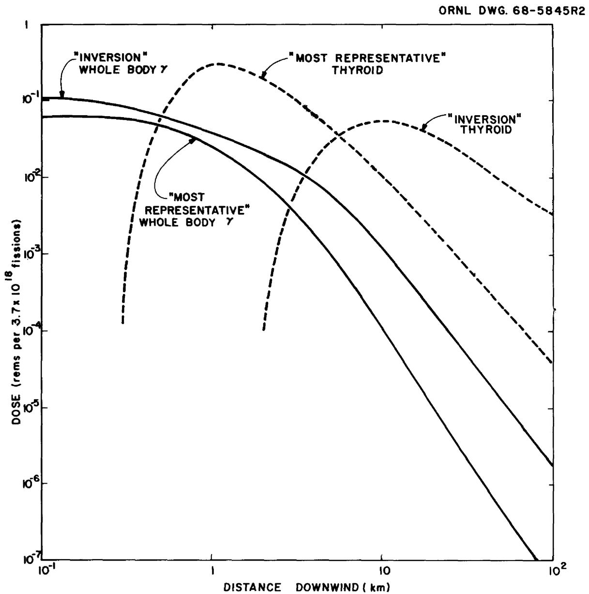  
Fig. 8.16. Radiation Dose due to Volatile Fission Products Produced During a Nuclear Excursion (Based on $3.7 \times 10^{18}$ Fissions).

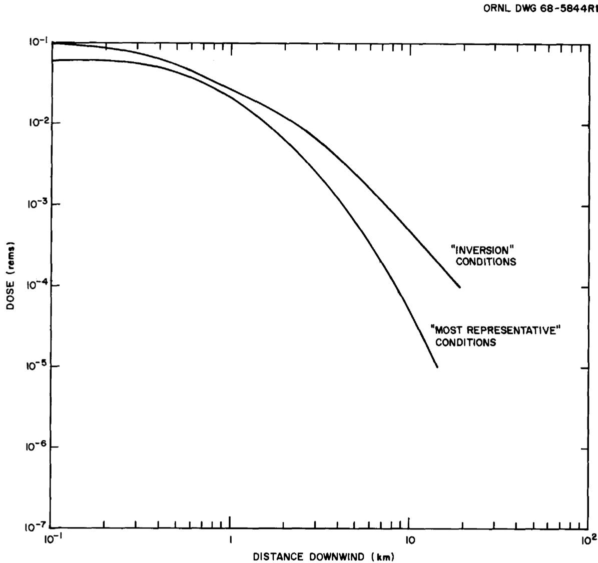  
Fig. 8.17. Whole-Body External Gamma-Ray Dose due to Noble Gases Produced During a Nuclear Excursion (Based on $3.7 \times 10^{-18}$ Fissions). (Note: In this case it is assumed that all of the iodine isotopes are retained on filters.)

However, except for extremely stable meteorological conditions, the difference is quite small once the peak ground concentration produced by the elevated release has been passed. For example, under C-conditions, the ground concentration from a release taking place at an elevation of $100\mathrm{m}$ reaches $75\%$ of that from a similar ground-level release at a distance of $1.2\mathrm{km}$ from the point of release.

The wind speeds used in these calculations have been chosen to be $100 \, \text{m/min}$ and $50 \, \text{m/min}$ because this range of wind speed is reasonably characteristic of many locations. However, as can be seen from Eq. (16), the dose is inversely proportional to the wind speed.

Finally, it should be pointed out that all of the doses calculated are those which are delivered at ground level on the plume center line. To obtain off-center-line ground-level doses, it is necessary to multiply the results by the quantity

$$
e ^ {- y ^ {2} / 2 \sigma_ {y} ^ {2}},
$$

where $y$ is the distance (in meters) normal to the plume center line at which the dose is required, and $\sigma_y$ (in meters) is the horizontal dispersion parameter. For convenience, values of $\tau_y$ and $\sigma_z$ for the various stability conditions are shown in Figs. 8.18 and 8.19.

Despite the obvious shortcomings of the procedures outlined, it is believed that they will, at least, produce order-of-magnitude results. These procedures will permit the development of sufficient "feel" for the magnitude of the various credible accidents so that the problem of sitting can be approached in a quantitative manner.

# 8.3.4 Downwind Consequences of Upper Limit Accidents

Upper limit accidents were determined using the assumed properties of fuel reprocessing plants (Sect. 8.3.1) and models and mechanisms described in Sect. 8.3.2 such that the release of noble gases, "fresh" fission products, iodine, semivolatile fission products, nonvolatile fission products, and plutonium is maximized. The computed fractional releases from the most significant accidents are summarized in Table 8.15.

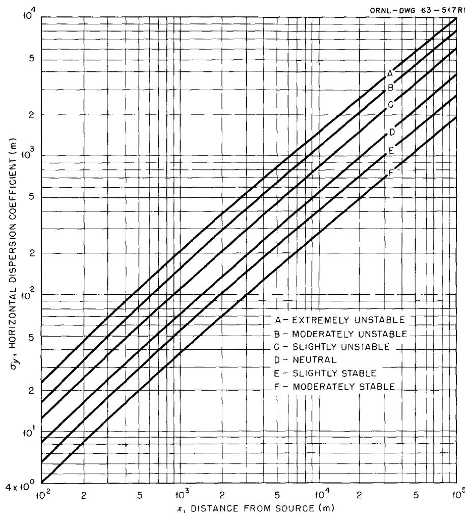  
Fig. 8.18. Horizontal Dispersion Parameter as a Function of Distance Downwind.

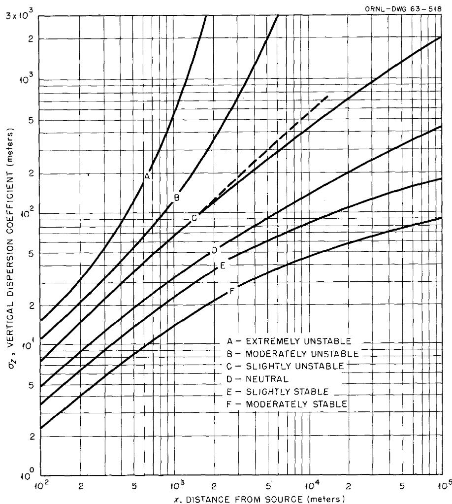  
Fig. 8.19. Vertical Dispersion Parameter as a Function of Distance Downwind.

Table 8.15. Accidental Releases from Fuel Reprocessing Plants as a Function of Capacity   

<table><tr><td rowspan="3">Accident</td><td colspan="6">Release (kg of \( Fuel^a \) Unless Otherwise Indicated) from Plants of Capacity (metric tons/day) of:</td></tr><tr><td colspan="3">LWR Fuel Reprocessing Plant</td><td colspan="3">FBR Fuel Reprocessing Plant</td></tr><tr><td>1</td><td>6</td><td>36</td><td>1</td><td>6</td><td>36</td></tr><tr><td colspan="7">Nuclear Excursion in Head End</td></tr><tr><td>Duration, min</td><td>78</td><td>140</td><td>140</td><td>110</td><td>140</td><td>160</td></tr><tr><td>No. of fissions</td><td>\( 2.7 x 10^{20} \)</td><td>\( 1.6 x 10^{21} \)</td><td>\( 1.6 x 10^{21} \)</td><td>\( 8.0 x 10^{20} \)</td><td>\( 1.6 x 10^{21} \)</td><td>\( 2.4 x 10^{21} \)</td></tr><tr><td>Noble gas, %</td><td>100</td><td>100</td><td>100</td><td>100</td><td>100</td><td>100</td></tr><tr><td>Iodine, %</td><td>30</td><td>30</td><td>30</td><td>1.0</td><td>1.0</td><td>1.0</td></tr><tr><td>Volatile fission products</td><td>300</td><td>2000</td><td>2000</td><td>10</td><td>20</td><td>30</td></tr><tr><td>Semivolatile fission products</td><td>1</td><td>6</td><td>6</td><td>1</td><td>2</td><td>3</td></tr><tr><td>Nonvolatile fission products</td><td>\( 0.00043 \)</td><td>\( 0.0046 \)</td><td>\( 0.0046 \)</td><td>\( 0.00082 \)</td><td>\( 0.0020 \)</td><td>\( 0.0035 \)</td></tr><tr><td>Transplutonic elements</td><td>\( 0.00043 \)</td><td>\( 0.0046 \)</td><td>\( 0.0046 \)</td><td>\( 0.00082 \)</td><td>\( 0.0020 \)</td><td>\( 0.0035 \)</td></tr><tr><td>Pu (head end)</td><td>\( 0.00043 \)</td><td>\( 0.0046 \)</td><td>\( 0.0046 \)</td><td>\( 0.00082 \)</td><td>\( 0.0020 \)</td><td>\( 0.0035 \)</td></tr><tr><td>\( Pu (Pu storage tank)^b \)</td><td>0.035</td><td>0.37</td><td>0.37</td><td>0.018</td><td>\( 0.044 \)</td><td>0.075</td></tr><tr><td colspan="7">Noble-Gas Release</td></tr><tr><td>\( 85_{Kr + 133Xe} \),curies</td><td>70,000</td><td>420,000</td><td>2,500,000</td><td>350,000</td><td>2,100,000</td><td>13,000,000</td></tr><tr><td colspan="7">Halogen Release</td></tr><tr><td>\( 131_I \)</td><td>780</td><td>4700</td><td>114,000</td><td>7.8</td><td>47</td><td>70</td></tr><tr><td>\( 129_I \)</td><td>36,000</td><td>220,000</td><td>660,000</td><td>360</td><td>2200</td><td>3300</td></tr><tr><td colspan="7">Semivolatile Release</td></tr><tr><td>Semivolatile fission products</td><td>1</td><td>6</td><td>6</td><td>1</td><td>2</td><td>3</td></tr><tr><td colspan="7">Release of Nonvolatiles</td></tr><tr><td>Semivolatile fission products</td><td>0.00075</td><td>0.0045</td><td>0.0045</td><td>0.0018</td><td>0.0037</td><td>0.0055</td></tr><tr><td>Nonvolatile fission products</td><td>0.00075</td><td>0.0045</td><td>0.0045</td><td>0.0018</td><td>0.0037</td><td>0.0055</td></tr><tr><td>Transplutonic elements</td><td>0.00075</td><td>0.0045</td><td>0.0045</td><td>0.0018</td><td>0.0037</td><td>0.0055</td></tr><tr><td colspan="7">Plutonium Release</td></tr><tr><td>Plutonium</td><td>0.045</td><td>0.27</td><td>0.27</td><td>0.016</td><td>0.032</td><td>0.048</td></tr></table>

aThe release of a component of the fuel is the product of these numbers and the concentration of that component in a kilogram of average LWR or LMPBR fuel.   
bThe nuclear excursion in the Pu storage tank is estimated to have the same yield and duration, but would release only "fresh" fission products and plutonium.

Site boundaries dictated by the upper limit accidents were estimated assuming that the maximum acceptable annual dose commitments resulting from exposure to the cloud or inhalation at the site boundary are those recommended by the NCRP for annual occupational exposure. These emergency dose commitments are compared with those of LOCFR100, $^{3}$ an Isochem land requirements study, $^{76}$ and an ORNL study involving peacetime applications of nuclear explosives $^{20}$ in Table 8.16. The assumed acceptable dose commitments have been employed only for reference purposes, but are believed to be reasonable in view of the very low probability of occurrence of the assumed upper limit accidents.

The maximum site boundaries (Table 8.17) for all LWR plants and the l-metric ton/day FBR plant are determined by the whole-body dose resulting from the release of volatile "fresh" fission products from a nuclear excursion (30% and 1% release of iodines from LWR and FBR plants, respectively, plus 100% release of the noble gases). Site boundaries for the larger FBR plants are determined by the thyroid dose resulting from a silver tower explosion, which is assumed to release 0.1% of the equilibrium inventory of iodine. In Table 8.18, the total dose commitments resulting from various upper limit accidents at the accident-dictated site boundaries of these conceptual plants are compared with estimated dose commitments at the site boundaries of the NFS, MFRP, and BNFP plants.

Noble Gases. - In plants that will partially remove the noble gases from off-gas streams, the upper limit accident involving these gases is considered to involve the complete release of the contents of a storage vessel that contains a 7-day accumulation of krypton and xenon. A release of approximately 6,400,000 curies of $^{85}\mathrm{Kr}$ plus $^{133}\mathrm{Xe}$ is required to cause a maximum (at $400\mathrm{m}$ ) downwind whole-body dose of 5 rems. This quantity represents the total accumulation of these gases over 890, 148, and 25 days in LWR plants with capacities of 1, 6, and 36 metric tons/day, respectively, and the total accumulation over 680, 115, and 3 days in FBR plants with capacities of 1, 6, and 36 metric tons/day respectively. The release of the 7-day accumulation of $^{85}\mathrm{Kr}$ and $^{133}\mathrm{Xe}$ in a 36-metric ton/day FBR plant would result in a whole-body dose of greater than 5 rems within distances of about $2.3\mathrm{km}$ .

Table 8.16. Comparison of Assumed Maximum Dose Commitments for Individuals in the General Population as a Result of Upper Limit Accidents with Those Given in LOCFR100, an Isochem Land Requirement Study, and a Study for Excavation of a Sea-Level Canal with Nuclear Explosives   

<table><tr><td rowspan="2"></td><td colspan="2">This Study</td><td>LOCFR100</td><td>Isochem Study</td><td colspan="2">Nuclear Excavation Studyd</td></tr><tr><td>Maximum Annual Dose Commitment (rems/yeara)</td><td>Approximate Total Dose Commitment (rems/50 yearsb)</td><td>Maximum Total Dose Commitment (remsc)</td><td>Maximum Total Dose Commitment (rems/l lifetime)</td><td>Maximum Annual Dose Commitment (rems/year)</td><td>Maximum Total Dose Commitment (rems/70 years)</td></tr><tr><td>Whole body</td><td>5</td><td>50</td><td>25</td><td>25</td><td>3</td><td>10</td></tr><tr><td>Red bone marrow</td><td>5</td><td></td><td></td><td></td><td>3</td><td>10</td></tr><tr><td>Head and trunk</td><td>5</td><td></td><td></td><td></td><td></td><td></td></tr><tr><td>Gonads</td><td>5</td><td></td><td></td><td></td><td>3</td><td>10</td></tr><tr><td>Lens of eyes</td><td>5</td><td></td><td></td><td></td><td>8</td><td>15</td></tr><tr><td>Skin</td><td>30</td><td></td><td></td><td>300</td><td>15</td><td>30</td></tr><tr><td>Thyroid</td><td>30</td><td>30</td><td>300</td><td>300</td><td>15</td><td>30</td></tr><tr><td>Bone</td><td>30</td><td>500</td><td></td><td>300</td><td>15</td><td>30</td></tr><tr><td>Hands, forearms, feet, and ankles</td><td>75</td><td></td><td></td><td></td><td>38</td><td>75</td></tr><tr><td>Other single organs</td><td>15</td><td>90 (liver)18 (lung)</td><td></td><td>150</td><td>8</td><td>15</td></tr></table>

${}^{a}$ These data are maximum permissible annual doses for occupational exposure as recommended by NCRP.   
bThese data represent the approximate 50-year dose commitment resulting from a single intake of mixed spent reactor fuel such that the maximum annual (first-year) dose commitments do not exceed those given in the first column.   
C10CFR100 provides reference values of total whole-body and thyroid dose (incurred during passage of the radioactive cloud) for use in the evaluation of reactor sites with respect to potential reactor accidents of exceedingly low probability of occurrence and low risk of public exposure to radiation.   
These data are proposed maximum acceptable dose commitments for use in planning for the construction of a sea-level canal with nuclear explosives. They are considered applicable to special radiation protection problems in which an assessment of risk vs benefit would dictate greater annual dose commitments than those recommended by the ICRP, FRC, and IAEA.

Table 8.17. Site Boundaries (Distance from the 100-m Stack) Determined by the Maximum Upper Limit Accidents in a Spent-Fuel Processing Plant<sup>a</sup>   

<table><tr><td rowspan="3">Accident</td><td colspan="6">Distance to Site Boundary (km) for Reprocessing Plants of Capacity (metric tons/day) of:</td></tr><tr><td colspan="3">LWR Fuel</td><td colspan="3">FBR Fuel</td></tr><tr><td>1</td><td>6</td><td>36</td><td>1</td><td>6</td><td>36</td></tr><tr><td>Nuclear excursion</td><td>0.44</td><td>2.0</td><td>2.0</td><td>1.2</td><td>2.0</td><td>2.8</td></tr><tr><td>Release of:</td><td></td><td></td><td></td><td></td><td></td><td></td></tr><tr><td>Noble gases</td><td>(1.1)b</td><td>(6.6)b</td><td>(39)b</td><td>(5.5)b</td><td>(33)b</td><td>2.2</td></tr><tr><td>Halogens</td><td>(0.2)b</td><td>(1.0)b</td><td>(2.9)b</td><td>(23)b</td><td>1.0</td><td>2.3</td></tr><tr><td>Semivolatiles</td><td>(17)b</td><td>0.44</td><td>0.44</td><td>(47)b</td><td>(0.93)b</td><td>1.0</td></tr><tr><td>Nonvolatiles</td><td>(0.04)b</td><td>(0.23)b</td><td>(0.23)b</td><td>(0.27)b</td><td>(0.55)b</td><td>(0.81)b</td></tr><tr><td>Plutonium</td><td>(0.9)b</td><td>(5.2)b</td><td>(5.2)b</td><td>(1.6)b</td><td>(3.2)b</td><td>(4.8)b</td></tr></table>

${}^{a}$ These boundaries are selected such that the maximum annual (first-year) dose commitment to the critical organ will not exceed that recommended by the NCRP for annual occupational exposure.   
bThe maximum acceptable dose commitment is not exceeded at any distance downwind. The numbers in parentheses are the maximum percentages of the maximum acceptable dose commitment, which occur 400 m downwind of the stack.

Table 8.18. Estimated Lifetime Dose Commitments to Critical Organs Resulting from Upper Limit Accidents at NFS, MFRP, BNFP, and Conceptual Plants for Processing LWR and FBR Fuels<sup>a,b</sup>   

<table><tr><td rowspan="2">Type of Release</td><td rowspan="2">NFS</td><td rowspan="2">MFRP</td><td rowspan="2">BNFP</td><td colspan="3">Conceptual LWR Plants of Capacity:</td><td colspan="3">Conceptual FBR Plants of Capacity:</td></tr><tr><td>1 Metric Ton/Day</td><td>6 Metric Tons/Day</td><td>36 Metric Tons/Day</td><td>1 Metric Ton/Day</td><td>6 Metric Tons/Day</td><td>36 Metric Tons/day</td></tr><tr><td>&quot;Fresh&quot; fission products</td><td></td><td></td><td></td><td></td><td></td><td></td><td></td><td></td><td></td></tr><tr><td>Total number of fissions</td><td>\( 10^{20} \)</td><td>\( 10^{20} \)</td><td>\( 10^{18} \)</td><td>\( 2.7 \times 10^{20} \)</td><td>\( 1.6 \times 10^{21} \)</td><td>\( 1.6 \times 10^{21} \)</td><td>\( 8.0 \times 10^{20} \)</td><td>\( 1.6 \times 10^{21} \)</td><td>\( 2.4 \times 10^{21} \)</td></tr><tr><td>Thyroid dose commitment, rems</td><td>~2</td><td>26</td><td>-</td><td>9.4</td><td>30</td><td>30</td><td>0.65</td><td>1.0</td><td>1.3</td></tr><tr><td>Whole-body dose commitment, rems</td><td></td><td>0.09</td><td>\( 0.002^c \)</td><td>5.0</td><td>5.0</td><td>5.0</td><td>5.0</td><td>5.0</td><td>5.0</td></tr><tr><td>Noble gases (85Kr and 133Xe)</td><td></td><td></td><td></td><td></td><td></td><td></td><td></td><td></td><td></td></tr><tr><td>Release, curies</td><td>-</td><td>-</td><td>-</td><td>70,000</td><td>420,000</td><td>2,500,000</td><td>350,000</td><td>2,100,000</td><td>13,000,000</td></tr><tr><td>Whole-body dose commitment, rems</td><td>-</td><td>-</td><td>-</td><td>0.054</td><td>0.18</td><td>1.0</td><td>0.18</td><td>0.88</td><td>4.4</td></tr><tr><td>Halogens (131I and 129I)</td><td></td><td></td><td></td><td></td><td></td><td></td><td></td><td></td><td></td></tr><tr><td>Release, curies</td><td>1.7</td><td>1.2</td><td>1.1</td><td>3.1</td><td>18</td><td>55</td><td>1100</td><td>6500</td><td>9700</td></tr><tr><td>Thyroid dose commitment, rems</td><td>-</td><td>0.017</td><td>-</td><td>0.05</td><td>0.2</td><td>0.5</td><td>4.6</td><td>22</td><td>27</td></tr><tr><td>Semivolatile fission products</td><td></td><td></td><td></td><td></td><td></td><td></td><td></td><td></td><td></td></tr><tr><td>Release, curies</td><td>-</td><td>-</td><td>1900</td><td>760</td><td>4500</td><td>4500</td><td>3600</td><td>7300</td><td>11,000</td></tr><tr><td>106Ru, curies</td><td>-</td><td>-</td><td>1500</td><td>410</td><td>2500</td><td>2500</td><td>1300</td><td>2600</td><td>3900</td></tr><tr><td>Lung dose commitment, rems</td><td>-</td><td>-</td><td>\( \sim 0.0007^c \)</td><td>2.7</td><td>8.9</td><td>8.9</td><td>5.0</td><td>7.9</td><td>13</td></tr><tr><td>Nonvolatile fission products and transplutonics</td><td></td><td></td><td></td><td></td><td></td><td></td><td></td><td></td><td></td></tr><tr><td>Release, curies</td><td>1.1</td><td>5</td><td>120</td><td>3.3</td><td>20</td><td>20</td><td>37</td><td>74</td><td>111</td></tr><tr><td>\( 144Ce \), curies</td><td>-</td><td>-</td><td>23</td><td>0.58</td><td>3.5</td><td>3.5</td><td>2.3</td><td>4.7</td><td>7.1</td></tr><tr><td>\( 242Cm \), curies</td><td></td><td></td><td>1.7</td><td>0.011</td><td>0.068</td><td>0.068</td><td></td><td></td><td></td></tr><tr><td>Lung dose commitment, rems</td><td>-</td><td>-</td><td>\( &lt; 0.0007^c \)</td><td>0.008</td><td>0.03</td><td>0.03</td><td>0.04</td><td>0.06</td><td>0.07</td></tr><tr><td>Bone dose commitment, rems</td><td>(~0.02)</td><td>0.075</td><td>-</td><td>0.024 (0.005)</td><td>0.077 (0.017)</td><td>0.077 (0.017)</td><td>0.060 (0.024)</td><td>0.10 (0.04)</td><td>0.12 (0.05)</td></tr><tr><td>Plutonium</td><td></td><td></td><td></td><td></td><td></td><td></td><td></td><td></td><td></td></tr><tr><td>Release, alpha curies</td><td>0.65</td><td>&lt;3</td><td>0.11</td><td>0.16</td><td>0.98</td><td>0.98</td><td>0.30</td><td>0.61</td><td>0.91</td></tr><tr><td>Bone dose commitment, rems</td><td></td><td>13</td><td>\( &lt; 0.0007^c \)</td><td>6.7 (0.26)</td><td>22 (0.8)</td><td>22 (0.8)</td><td>8.6 (0.3)</td><td>14 (0.5)</td><td>18 (0.7)</td></tr><tr><td>Distance to site boundary, km</td><td>1.5</td><td>0.6</td><td>2</td><td>0.44</td><td>2.0</td><td>2.0</td><td>1.2</td><td>2.0</td><td>2.8</td></tr></table>

aThe underlined numbers are those that fix the radial distance to the site boundary.   
bThe numbers in parentheses are the first-year dose commitment for those cases in which the first-year dose commitment is not equal to the lifetime dose commitment.   
The Allied Chemical Corporation reports the external exposure dose from beta and gamma radiation.

8-89

Fresh Fission Products. - Fresh fission products would be generated in a nuclear excursion. A nuclear excursion in a head-end vessel of maximum capacity, resulting in complete boildown of the solution, is assumed. After boildown and dehydration, the reaction would terminate in the assumed vessels because of the low effective density of the fissile material ( $\sim 3$ g per $\mathrm{cm}^3$ of uranium plus plutonium in calcined solids is assumed). The thermal power of the nonvolatile fission products (the fresh fission product heat is significant for the first 1 to 2 hr following the excursion) would then calcine the solids; these solids would probably subsequently melt through the vessel, flow onto the cell floor, and resolidify.

It is assumed that the initial rupture breaks the off-gas line and that all of the steam generated in the boildown phase (containing all of the noble gases, $30\%$ of the iodine, $20\%$ of the semivolatile fission products, and particulates of solution have the average concentration of nonvolatile fission products and plutonium) is discharged to the cell atmosphere and exhausted through the ventilation system. It is assumed that $99.5\%$ of the semivolatile fission products are removed from the hot (air and saturated steam at $\sim 100^{\circ}\mathrm{C}$ ) ventilation stream by passage through metal mesh or silica gel absorbers. The ventilation systems of FBR plants are assumed to incorporate activated charcoal filters for removal of $99\%$ of the iodine. The particulate release is calculated using the model presented in Sect. 8.3.2.

The doses delivered by a nuclear excursion are dominated by the whole-body dose that results from exposure to the radioactive cloud of fresh fission products (Fig. 8.17).

Release of Iodine Inventory. - It is assumed that a fire or explosion in a solid halogen absorber would completely release the contained equilibrium concentration of $^{131}\mathrm{I}$ and a two-year accumulation of $^{129}\mathrm{I}$ . It is assumed that approximately $93\%$ of the iodine collected by pretreatment in a wet scrubber is not dispersible. FBR plants are assumed to utilize charcoal filters that remove $99\%$ of the remaining iodine.

The thyroid dose which results from the explosion of a silver reactor is obtained by properly prorating the $^{131}\mathrm{I}$ and $^{129}\mathrm{I}$ doses at 0.4 km, as found in Tables 8.9 and 8.11, and applying the generalized dose curve (Fig. 8.15).

Release of Semivolatiles. - It is assumed that a total of $0.1\%$ of the semivolatiles in the largest vessel is released by a mechanism other than a nuclear excursion (i.e., a tank boildown or an inadvertent addition of oxidants to a process vessel).

The upper limit accident in a waste tank for interim (2-year) storage of mixed fission products would release a smaller amount of ruthenium by comparison. In evaluating the waste tank accident, it is assumed that coolant is lost from the tank and that the tank leaks, discharging steam to the vault ventilation system and its condenser. The distillate, containing about $20\%$ of the semivolatiles, is assumed to be returned to the tank, but an aerosol composed of particulates containing $20\%$ of the concentration of semivolatiles in the waste is discharged through the filters. The release from this source is insignificant (semivolatiles content, $\leq 10^{-8}$ ton of fuel).

The doses resulting from the release of semivolatiles are controlled by the dose to the lung. They are obtained by application of the data in Tables 8.9 and 8.11, and the generalized curve (Fig. 8.15).

Release of Nonvolatiles. - The upper limit accident involving the release of nonvolatile fission products and transplutonic elements was determined to result from an explosion in the waste calciner containing fission products at a concentration of $10^{-4}$ ft $^3$ per megawatt-day of burnup. The explosion in a waste evaporator would cause essentially the same release if the droplets evaporated in the ventilation system upstream of the filter. No "credible" accidents that would cause a larger release of nonvolatile fission products could be postulated in the interim solids storage pool or interim liquid waste tank.

The downwind doses resulting from the postulated releases were found to be negligible.

Release of Plutonium. - The maximum credible plutonium release was assumed to result from a fire of 0.5-hr duration (the fractional release is proportional to the time of aerosol generation) involving either resin or solvent loaded with plutonium. The particles escaping from the filter were assumed to be pure $\mathrm{PuO}_2$ (a pessimistic assumption). The release of

plutonium from this source is about the same as that from a nuclear excursion involving complete boiledown of the plutonium storage tank (containing up to 7.5 tons of plutonium).

The controlling bone dose from a plutonium fire is found in a manner similar to that used to calculate the dose resulting from the release of semivolatiles.

# 8.3.5 Maximum Theoretical Accident

A maximum theoretical accident has been evaluated for the purpose of illustrating the worst possible consequences that could result from poor design and/or implementation of good practice. Since waste storage tanks are known to have the largest inventory of physiologically hazardous materials, we have assumed that a hydrogen-air explosion occurs in the vapor space of an acid waste tank containing a 2-year accumulation of fission products.

Mechanical Consequences. - Illustrative (but not the worst possible) mechanical consequences of such an accident were made assuming that the tank contains fission products from 39,000,000 Mwd of fuel exposure (a 2-year accumulation from a 6-metric ton/day plant processing fuels irradiated to a burnup of 12,000 Mwd/ton), generating 56,000,000 Btu/hr in 390,000 gal of solution. The tank, $80\%$ filled with solution, is assumed to: (1) be fabricated of 0.5-in.-thick stainless steel, (2) have a diameter of 65 ft and a height (with flat heads) of 20 ft, and (3) be housed in a 3-ft-thick concrete vault buried under 10 ft of earth. Following the loss of purge air to the tank, the concentration of hydrogen in the $13,000\text{-ft}^3$ vapor space would increase to $4\text{vol}\%$ (the minimum flammable concentration) after about 3 hr and to $30\text{vol}\%$ after about $24\text{hr}$ . Assuming that the loss of purge air is undetected and that there is a source of ignition after $24\text{hr}$ , the resultant explosion would liberate approximately 1,100,000 Btu of energy, generate a pressure of approximately 100 psig in the vapor space, elevate the concrete roof and earth cover by several feet, and (we assume) rupture the coolant and off-gas piping in such a manner that complete loss of cooling would ensue and the tank would be directly vented to the atmosphere.

Assuming that no remedial measures were taken following the loss of coolant and the breach of containment, the solution would heat to boiling in about 10 hr and evaporate to dryness after about 125 hr. The wastes could calcine, melt through the floor of the tank, decompose the concrete, and flow into the earth beneath the tank after a total of approximately 160 hr following the explosion.

A comparable accident in an alkaline waste storage tank would have similar consequences, but would take place over a longer time period because of the greater dilution. Calculations made for a 1,200,000-gal alkaline waste tank containing waste generating $43,000,000$ Btu/hr indicate that the waste would heat to boiling after approximately 23 hr, boil to dryness after approximately 273 hr, decompose after approximately 290 hr, and melt through the vault in approximately 330 hr.

The transient growth of a molten sphere in infinite media of dry sand and limestone was estimated, assuming that the fission products are mixed by convection in the molten zone and that the molten zone has the same density as the surrounding earth (so that no settling or flotation of the sphere would occur). Assumed properties of the dry sand and limestone are shown in Table 8.19. The results (Fig. 8.20) indicate that the radius of the molten sphere in dry sand would grow to a maximum of about 75 ft after about 1500 days. In limestone, the radius of the sphere would grow to a maximum of approximately 50 ft after 700 days. The molten zone would completely solidify after about 150 years.

Release of Radioactive Materials to the Atmosphere. - The semivolatile fission products (Ru, Cs, and Te) would be released quantitatively to the atmosphere during the boildown-calcination phase of this maximum theoretical accident. In addition, about $0.1\%$ of the mixed nonvolatile fission products would be released by entrainment in the steam; however, these can be neglected in an analysis of consequences because their effect is negligible by comparison. In the evaluation of downwind consequences, it can be assumed that thermal currents carry the semivolatile fission products to the top of an atmospheric inversion layer.

Table 8.19. Assumed Properties of Dry Sand and Limestone   

<table><tr><td>Property</td><td>Dry Sand</td><td>CaCO3</td><td>CaOa</td><td>Limestone</td></tr><tr><td>Density, o, lb/ft3</td><td>94.9</td><td>162</td><td>90.8</td><td></td></tr><tr><td>Heat capacity, c, Btu lb-1(°F)-1</td><td>0.183 + 0.0000446T</td><td>0.203 + 0.0002T</td><td>0.177 + 0.00011T</td><td></td></tr><tr><td>Thermal conductivity, k, Btu hr-1 ft-1(°F)-1</td><td>0.18 + 0.00012T</td><td>1.3 + 0.00012T</td><td>0.18 + 0.00012T</td><td></td></tr><tr><td>Transition temperature, Tm, °F</td><td>3133 (melt)</td><td>1400 (losses CO2)</td><td>4660 (melt)</td><td>4660 (melt)</td></tr><tr><td>Heat of transition, ℃, Btu/lb</td><td>50.1</td><td>0.0</td><td>385</td><td></td></tr><tr><td>Average thermal diffusivity, α, ft2/hr</td><td>0.014</td><td></td><td></td><td>0.011</td></tr><tr><td>εo, Btu/ft3</td><td>4750</td><td></td><td></td><td>35,000</td></tr><tr><td>(Tm - Ta) c/ℓ</td><td>15.5b</td><td></td><td></td><td>6.37b</td></tr></table>

a Made by calcination of $\mathrm{CaCO}_3$   
Ambient earth temperature, Ta, is $77^{\circ}\mathrm{F}$

8-94

ORNL DWG 68-4181

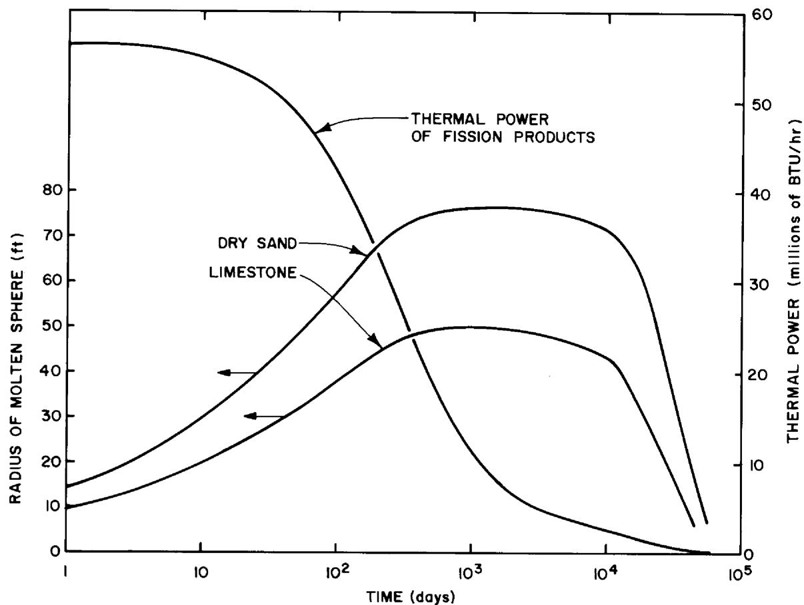  
Fig. 8.20. Transient Radius of a Molten Sphere Resulting from Discharge of a 2-Year Accumulation of Calcined Fission Products from a 6-metric ton/day Reprocessing Plant (3870 ft³ of Solids) to an Infinite Medium of Dry Sand or Limestone.

The release to the atmosphere from the maximum theoretical accident in an alkaline waste tank would be comparable to that from the acid waste tank except that it would take place over a longer time period. The cerium would probably be released quantitatively during the boildown phase. The ruthenium would be released during the calcination phase, although it is probable that a portion would be deposited on cool $(< 800^{\circ}\mathrm{C})$ surfaces as it diffuses to the postulated break in the off-gas line.

The consequences of a waste tank boildown may be found by proper prorating of the $0.4\text{-km}$ doses found in Table 8.13 and by use of the generalized dose curve (Fig. 8.18). The doses thus obtained $(>10^{5}$ rems at $0.4\text{km}$ downwind) have little meaning other than to show why such maximum theoretical accidents must be rendered incredible through the use of appropriate engineered safety features.

Another related type of accident in an acid waste tank, also considered only of a theoretical nature since it depends on a very improbable combination of circumstances, involves simultaneous failure of the coolant for the coils of the tank and the off-gas condenser. In the event of such an accident, the contents of the tank would boil down on essentially the same time scale as that discussed previously. Because of the low heat capacity of the air and typical ventilation ducts, a mixture of air and saturated steam at approximately $100^{\circ}\mathrm{C}$ could pass through the off-gas and ventilation filters and be exhausted to the stack. Certain of the semivolatile fission products (in particular, ruthenium tetroxide, which has a boiling point of $\sim 80^{\circ}\mathrm{C}$ ) may be carried by this stream. It is assumed (as in the case of the nuclear incident discussed previously) that $20\%$ of the ruthenium is volatilized during the boildown phase and that, of this, $99.5\%$ is removed by deposition on metal or on the filter. The remainder of the semivolatile fission products might be evolved in the calcination phase, but the off-gas line is assumed to cool following cessation of steam flow, permitting essentially complete (by comparison) removal of the semivolatile fission products by deposition and filtration.

Mitigation of Accidents. - The authors stress that such accidents as the one denoted as "maximum theoretical" may be converted to the tolerable category, in terms of consequences, by proper forethought and design. For

example, the effects of the postulated hydrogen-air explosion can be mitigated by one of the following (and possibly by others, limited only by the ingenuity of the designers):

(1) Increase the reliability of preventive measures for control of the purge air flow and the hydrogen concentration.   
(2) Enclose the waste tanks within a building that is ventilated through a condenser and filter.   
(3) Design the tank and/or the vault to withstand a pressure of about 100 psig without rupture.   
(4) Decouple the tank from the vault. Use a pressure suppression and/or pressure relief system in the tank. Vent the vault to a containment system with large capacitance or to a pool of water for steam suppression.   
(5) Use titanium tanks and self-boiling wastes to ensure effective purging of the hydrogen by steam.

# 8.3.6 Consequences of the Leakage of High-Level Wastes to the Ground

Radioactive waste solutions that are released by tank failure might be routed through the geologic formation lying between the tank site and the nearest surface drainageways. Since analyses must be made using specific site conditions, a hypothetical tank site at Oak Ridge was chosen for didactic purposes. This site was considered to be located in Conasauga shale on a promontory, with intermittent surface streams passing to the east, south, and west of the tank site. The shale formation is quite impermeable, and the movement of water is restricted so that it flows only along bedding planes.

Samples of the Conasauga shale were obtained below the highly weathered zone in a direct path toward the surface streams. These samples were acidified for the removal of calcite, and the exchange capacities were determined by the calcium titration method of Jackson.[77] A mean value of $11 \pm 1$ meq/100 g was obtained. Overnight refluxing in $7\underline{\underline{M}}\mathrm{HNO}_3$ at $85^{\circ}\mathrm{C}$ showed a hydrogen ion consumption of 260 meq/100 g, which would be sufficient to neutralize

the entire contents of an acid waste tank within a distance of 30 ft from the tank. In the case of acid waste, it was assumed that neutralization of the acid by calcite in the formation would result in a calcium salt system. In this system, strontium was assumed to compete with calcium without selectivity of either ion, although strontium might be slightly more selectively sorbed than calcium.[78] For the sorption of strontium from neutralized wastes, and for the sorption of cesium and ruthenium, information on the sorption properties of Conasauga shale were obtained from previous laboratory studies.[78-82]

The quality of the groundwater was assumed to be similar to that of Clinch River water, which has a total cation (calcium and magnesium) concentration of about 0.002 meq/ml.[83] Seepage rates were assumed to be characteristic of the area surrounding Waste Pit 2, where the average seepage rate from 1953 to 1958 was 3900 gal/day through an average sidewall area of 9000 ft² (ref. 84). This corresponds to a mean superficial velocity of 0.064 ft/day. A mean groundwater velocity of 0.67 ft/day was used, which implies approximately 10% efficiency of contact between the shale and solution. If the initial seepage rate were maintained, the daily seepage rate from the acid waste tank (filled to a height of 35 ft with $10^6$ gal of waste) would be 2275 gal. The seepage from the neutralized waste tank (filled to a height of 36 ft with 1.25 x $10^6$ gal of waste) would be 2340 gal.

Dispersion properties of solution in the formation (Fig. 8.21) were estimated from the results of a chloride tracer test conducted at the site.[84] These data indicate an effective plate height of $46.5$ , according to the notation of Glueckauf.[85]

Calculation of Radionuclide Movement. - In addition to the assumptions outlined above, it was further assumed that the waste would move longitudinally through a zone 75 ft wide, with a height equal to the original liquid level in the waste tank, to surface water at a distance of 200 ft. No allowance was made for lateral dispersion, but the spread of the solute was assumed to occur according to Glueckauf's model for the elution of a band of solute through a linear ion exchange column. The porosity of the

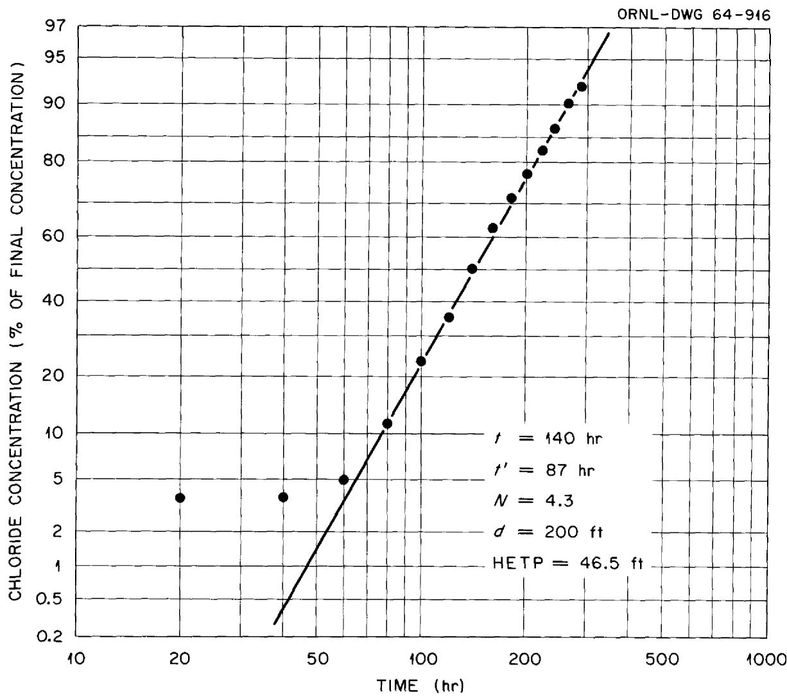  
Fig. 8.21. Dispersion Properties of Chloride in Conasauga Shale at a Four-Acre Tank Site.

shale effectively contacted by solution was assumed to be $25\%$ , with a grain density of $2.64 \, \text{g/ml}$ .

If a leak were to develop in a waste tank, the amount of solution lost to the formation would be limited by the ability of the formation to accept the solution. During percolation of the waste solution, the groundwater concentration in the zone of migration would be increased, returning to normal when the waste solution was again displaced by the local groundwater. Movement and dispersion of the specific radionuclides were estimated by using Glueckauf's model in order to describe the dispersion of the unsorbed anions and correcting for retention of the radionuclides by the formation, as discussed by Inoue and Kaufman.[86] However, due to the variable concentration of electrolyte in the groundwater, the retention factor was not constant with time. In addition, radioactive decay was considered.

The results of calculations for the movement of $^{90}\mathrm{Sr}$ from an acid tank are shown in Fig. 8.22. The initial peak in $^{90}\mathrm{Sr}$ activity at the surface drainage occurs at about 1 year and is due to the relatively slight sorption of strontium by the shale in the presence of high concentrations of electrolyte. With time, these high concentrations of salt are diluted and replaced by fresh groundwater, and a second concentration peak occurs after about 150 years. The relative magnitude of these two peaks depends on the total quantity of electrolyte released to the formation. If, after a leak occurs, the waste solution is pumped from the ground, the initial rapid movement will not be observed due to the removal of the excess electrolyte. Furthermore, in the case of $^{90}\mathrm{Sr}$ in an acid waste system, an appreciable fraction of the total radioactivity could be removed (Table 8.20).

For neutralized waste, the precipitation of strontium, in addition to the increased probability for ion exchange, prevents $^{90}\mathrm{Sr}$ from attaining any significant concentration at the surface drainageways. The high affinity of the Conasauga shale for cesium deters movement of $^{137}\mathrm{Cs}$ so that radioactive decay occurs before significant concentrations would be observed in either acid or neutralized waste systems. The relatively rapid

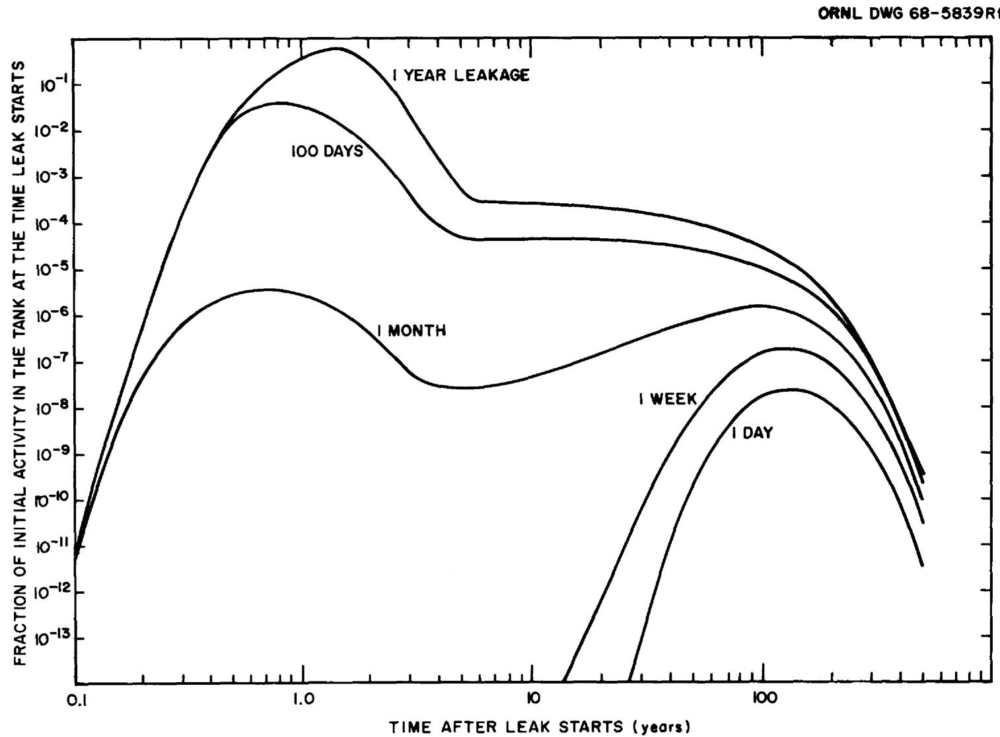  
Fig. 8.22. Strontium-90 Activity in the Groundwater at a Point 200 ft from a Leaking Tank of Acid Waste.

Table 8.20. Recovery of Radionuclides from the Soil After a Leak Has Developed in a Waste Tank   

<table><tr><td rowspan="2">Isotope</td><td colspan="2">Percentage Recoverable</td></tr><tr><td>Acid Waste</td><td>Neutralized Waste</td></tr><tr><td>90Sr</td><td>88</td><td>&lt;1</td></tr><tr><td>137Cs</td><td>2</td><td>&lt;1</td></tr><tr><td>106Ru</td><td>18</td><td>20</td></tr></table>

decay of $^{106}\mathrm{Ru}$ (half-life, 1 year) would prevent it from attaining significantly high levels at surface seeps unless a very extensive leak were to occur.

Several factors must be incorporated into the mathematical model in order to arrive at predicted concentrations. Each parameter used is subject to variation. Figure 8.22 was estimated using the following guesses for these parameters:

Mass of soil contacted per milliliter of pore solution.... 8 g

Stable composition of acid waste. 5.7 M

Stable composition of groundwater. 0.0020 N

Distance of travel. 200 ft

Groundwater velocity. 0.67 ft/day

Theoretical plate height. 50 ft

Strontium distribution factor. 0.11 ml/g

In addition, cases were considered in which each of these variables was allowed to vary by $\pm 10\%$ of its average value. The maximum and minimum concentration curves for a 100-day leak are shown in Fig. 8.23. It is seen that, although the shape of the curve (as plotted on a log-log scale)

ORNL DWG 68-5837R1

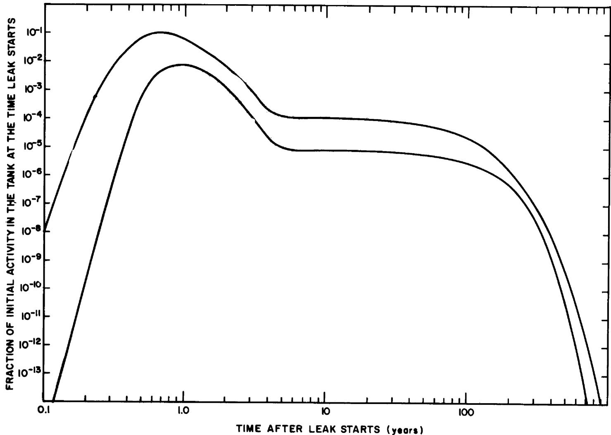  
Fig. 8.23. Strontium-90 Activity in Groundwater Resulting from 100 Days of Leakage from an Acid Waste Tank.

is not significantly affected, estimates of the activity levels at any time may be in error by one or two orders of magnitude.

The distribution factor and the mass of soil contacted per milliliter of pore solution will determine the relative velocity of the radionuclide in comparison to the percolating groundwater. The larger these two factors, the slower the relative velocity. Since the distribution factor is inversely proportional to the concentration of the percolating solution, the movement of the radionuclide is most rapid initially and is then reduced as the groundwater concentration returns to normal. The level plateau on the curves between the two peaks reflects the ratio of the normal groundwater concentration to the concentration of the waste solution.

The time of travel is dependent on the groundwater velocity and the distance traveled. In our local situation, flow is nearly unidirectional. However, because this would not likely be the case in other situations, additional consideration would need to be given to the geometry of the flow patterns. In our situation, it was found that the dispersion of the chloride tracer could be described by a chromatographic breakthrough curve with a theoretical plate height of 46.5 ft. This implies that about $1\%$ of the groundwater will traverse 200 ft in one-third the time of the average movement. In other situations, the average groundwater velocity may be quite different from the values we used; thus it may be impossible to fit travel times to simple dispersion or chromatographic breakthrough equations. A greater degree of dispersion hastens the appearance of radioactivity at a given point, but the peak concentrations are diminished unless adequate time has elapsed to permit radioactive decay.

Thermal Effects. - The distribution of radionuclides in the soil is important because of the thermal problems that are likely to result from high concentrations of radioactive material in a medium that has poor heat-conducting properties. Spherical shell geometry and thermal equilibrium were assumed as a first approximation to estimate the magnitude of the thermal problem in contaminated Conasauga shale. Figure 8.24 shows the simplified model and the heat-generating capacity of the contaminated shale according to zones. A solution in the spherical shell geometry has been described by Etherington.[87] In the present study, the tank has been

ORNL DWG. 66-10860R1

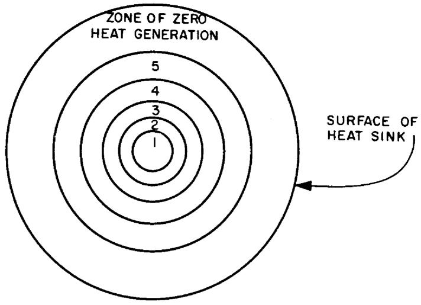

<table><tr><td colspan="5">LIQUID RETAINED LIQUID NOT RETAINED ZONE</td></tr><tr><td>1</td><td>Btu ft-3 hr-1</td><td>ft3/gal</td><td>Btu ft-3 hr-1</td><td>ft3/gal</td></tr><tr><td>1</td><td>200</td><td>0.15</td><td>61</td><td>0.15</td></tr><tr><td>2</td><td>280</td><td>0.05</td><td>220</td><td>0.06</td></tr><tr><td>3</td><td>250</td><td>0.09</td><td>140</td><td>0.25</td></tr><tr><td>4</td><td>33</td><td>0.18</td><td>4.7</td><td>2.80</td></tr><tr><td>5</td><td>0.45</td><td>0.01</td><td>0.05</td><td>0.73</td></tr></table>

Fig. 8.24. Configuration and Characteristics of Contaminated Soil Zones.

ignored as a heat sink, and a heat sink was assumed to be located at the edge of a variable-sized non-heat-generating region. To define the limits of temperature rise, two cases were considered. The first assumes that liquid waste is retained in the shale pore volume, and the second assumes that liquid is not retained in this way. The source strength is listed for each zone, and the volume occupied by each zone is normalized to 1 gal of waste. For example, if a leak of 1000 gal occurs and liquid waste is retained by the shale pores, then the volume of zone 1 is $150\mathrm{ft}^3$ and the heat-generating rate in this zone is 30,000 Btu/hr.

When acid waste leaks from a tank, it will be neutralized by the buffering action of the shale (260 meq of $\mathbf{H}^+$ per $100\mathrm{g}$ of shale). Zone 1 depicts the acid zone; the remaining zones are neutralized. Soil loadings were estimated from studies conducted at ambient temperatures and from judicious application of these results to the analysis. Values of thermal conductivity of unweathered Conasauga shale range from 1 to 2 Btu min $^{-1}$ ft $^{-1}$ ( $^\circ\mathrm{F}$ ) $^{-1}$ when measured at 30 to $33^\circ\mathrm{C}$ . Similar data do not exist for elevated temperatures. Therefore, it was assumed that the thermal conductivity of shale increases gradually with increasing temperature and follows the pattern observed in metal systems.[89] In all likelihood, the thermal conductivity of shale will decrease as the temperature increases, especially when water is lost from the shale. Thus, the temperature rise estimated in this analysis is likely to be lower than that which may actually occur.

Figure 8.25 shows the steady-state temperature attained in the center of the spherical system as a function of leak volume. Maximum temperatures increase with the volume of the leak, the retention of liquid in pore spaces, and the absence of a heat sink. Temperatures range from 870 to $1250^{\circ}\mathrm{F}$ for a leak of 100 gal.

Transient temperatures are being investigated as a function of time and space in a system that includes a variable-sized cylindrical geometry (representing the contaminated zone) and variably spaced heat sinks located at the tank, the groundwater table, and the ground surface.

A digital computer program, TOSS, contains many of the requisites for solving the transient problem for a multivariate system.[90] This program,

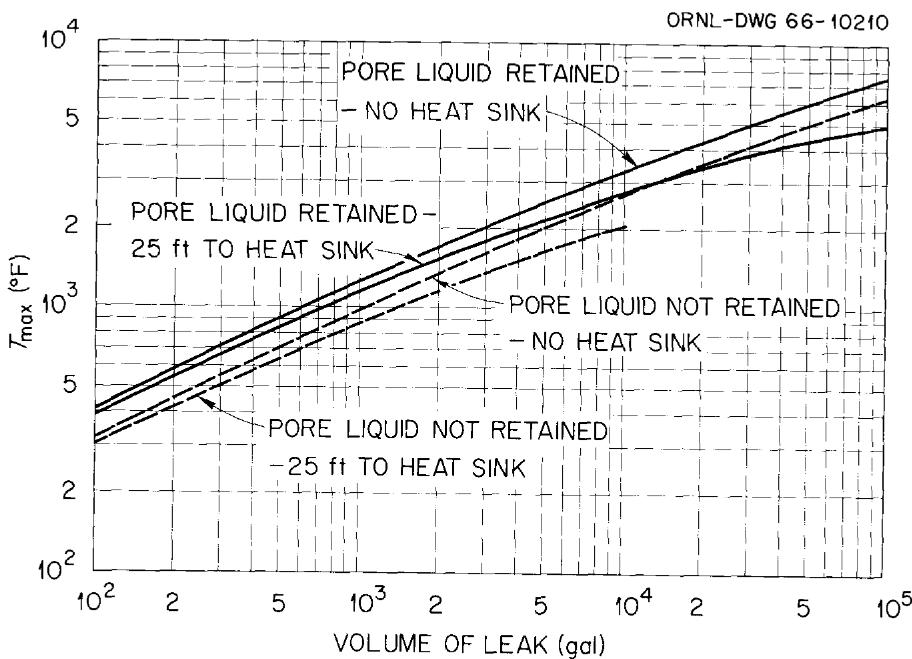  
Fig. 8.25. Steady-State Temperatures Attained in the Center of the Spherical System as a Function of Leak Volume.

which has been modified to suit the needs of the present study, has the capability of calculating the temperature distribution for a three-dimensional, multiregional problem having internal heat generation. A number of cases are being analyzed. Studies are also under way to evaluate the diffusivity, or specific heat, and the thermal conductivity of Conasauga shale as functions of temperature.

Conclusions. - In a formation similar to Conasauga shale, the slow rate of percolation of the solution, combined with rather high sorptive properties of the formation (except for $^{90}\mathrm{Sr}$ in an acid waste system), would tend to prevent the rapid release of large quantities of radionuclides directly into surface waterways. However, this delay would result in the buildup of activity in the formation to levels that would probably present a serious thermal problem. The delay time afforded by the formation could be used for remedial measures (e.g., for pumping groundwater from the formation to recover the unsorbed radionuclides and for preventing further transport of the fission products).

The absolute values for radionuclide movement that have been calculated and presented in this discussion should not be considered to be precise since the estimates were based on a rather limited description of the site. However, the procedure for making these estimations could be applied for any proposed site. Actual tests of seepage and dispersion at a proposed site employing the layout of the tank system would provide a more adequate basis for such calculations.

# 8.4 Requirements for Treatment of Routine Effluents

The preceding sections have shown that the assumed routine releases of radionuclides from fuel reprocessing plants require greater site boundary distances than those required by the assumed upper limit accidents. The large site boundary distances that were estimated to be required by the routine release from plants of high capacity provide incentive for partial removal of the noble gases and a larger percentage of the iodine than that assumed in Sect. 8.2.1.

Table 8.21 shows approximate site boundaries that would result if

Table 8.21. Required Factors for Removal of Noble Gases and Iodine Such That the Site Radius Is Controlled by the Upper Limit Accident   

<table><tr><td rowspan="3"></td><td colspan="6">Reprocessing Plant Capacity (metric tons/day)</td></tr><tr><td colspan="3">LWR Fuel</td><td colspan="3">FBR Fuel</td></tr><tr><td>1</td><td>6</td><td>36</td><td>1</td><td>6</td><td>36</td></tr><tr><td>Site radius, km</td><td>0.44a</td><td>2.0</td><td>2.0</td><td>1.2</td><td>2.0</td><td>2.8</td></tr><tr><td>Site area, km2</td><td>0.61</td><td>12</td><td>12</td><td>4.5</td><td>12</td><td>25</td></tr><tr><td>Noble gas DFb</td><td>0.58c</td><td>2.6</td><td>16</td><td>4.4</td><td>20</td><td>92</td></tr><tr><td>Iodine DFb</td><td>150</td><td>680</td><td>4100</td><td>5.2 x 106</td><td>2.4 x 107</td><td>1.1 x 108</td></tr></table>

<sup>a</sup>At the ORNL site, the required DF's are unchanged for site boundaries less than 1.2 km to the northeast since the average annual downwind concentration "peaks" at this distance.   
bDF is defined as the ratio of the average annual release rate obtained without treatment devices to that required to attain, at the site boundary, average annual concentrations of $1 \times 10^{-7}$ , $0.77 \times 10^{-13}$ , and $1.4 \times 10^{-13}$ curies/m $^3$ of noble gases, iodine from LWR fuel, and iodine from FBR fuel respectively.   
cNo removal of noble gas is required. The average annual noble gas concentration at the site boundary is $5.8 \times 10^{-8}$ curies/m $^3$ .

the noble gases and iodine were removed from the normal effluent to such an extent that the maximum site radius is determined by the upper limit accident. On this basis, equipment for removing 50 to $99\%$ of the noble gases appears to be necessary for plants with capacities of more than a few tons per day. More efficient iodine removal than that demonstrated in present technology will be required for LWR plants with capacities greater than about 6 to 10 tons/day, and decontamination factors (DF's) as high as $10^8$ will be required for FBR plants if the spent FBR fuel is to be processed after decay times of only 30 days.

# 8.5 References

1. U.S. Atomic Energy Commission, Rules and Regulations, Title 10-Atomic Energy, Part 20, Standards for Protection Against Radiation (Dec. 10, 1969).   
2. U.S. Atomic Energy Commission, Rules and Regulations, Title 10-Atomic Energy, Part 50, Licensing of Production and Utilization Facilities (Dec. 12, 1967).   
3. U.S. Atomic Energy Commission, Rules and Regulations, Title 10-Atomic Energy, Part 100, Reactor Site Criteria   
4. Estimated Growth of Civilian Nuclear Power, WASH-1055 (March 1955).   
5. Civilian Nuclear Power, Appendices to a Report to the President, USAEC, 1962.   
6. L. Machta, "Status of Global Radioactive-Fallout Predictions," Radioactive Fallout from Nuclear Weapons Tests, Proceedings of the Second Conference, Germantown, Maryland, November 3-6, 1964 (November 1965).   
7. H. Hintenberger et al., "Krypton and Xenon in the Oceans," Z. Naturforsch. 19a, 1227-28 (1966).   
8. International Commission on Radiological Protection, Recommendations of the International Commission on Radiological Protection (Report of Committee 2 on Permissible Dose for Internal Radiation), ICRP Publ. 2, Pergamon, London (1959); Health Phys. 3 (June 1960).   
9. Federal Radiation Council, Background Material for Development of Radiation Protection Standards, Report No. 1, U.S. Govt. Printing Office, Washington, D.C. (May 13, 1960).   
10. W. F. Libby, J. Geophys. Res. 68, 4484 (1963).

11. W. A. Haney, "Fission Product Tritium in Fuel Processing Waste," Nucl. Safety 5(4), 399-403 (1964).   
12. General Electric Company, Design and Analysis - Midwest Fuel Recovery Plant (1966-1967).   
13. K. E. Cowser, "Release and Monitoring of $^{131}$ I at NRTS, Hanford, Savannah River and ORNL," 6(2), 212-18 (1964-1965).   
14. S. J. Rimshaw, "Ruthenium - A Special Safety Problem," Nucl. Safety 14(4), 117-19 (1963).   
15. E. D. Arnold, A. T. Gresky, and J. P. Nichols, The Evaluation of Radioactive Releases from Chemical Plants, ORNL-TM-19 (October 1961).   
16. Nuclear Fuels Services, Inc., Safety Analysis - Spent Fuel Processing Plant (1962-1965).   
17. R. E. Tomlinson, "Radiochemical Plant Containment at Hanford," Nucl. Safety 3(1), 51-56 (1961).   
18. Allied Chemical Nuclear Products, Inc., Barnwell Nuclear Fuel Plant - Safety Analysis Report (1969-1970).   
19. H. M. Parker, "Exposure Pathways of Released Radioactive Wastes," Ind. Radioactive Waste Disposal 3, 2359 (1959); (also, in published hearings before the Special Subcommittee on Radiation of the Joint Committee on Atomic Energy, Congress of the United States, Jan. 28-30, Feb. 2-3, 1959.   
20. K. E. Cowser, S. V. Kaye, P. S. Rohwer, W. S. Snyder, and E. G. Struxness, Dose-Estimation Studies Related to Proposed Construction of an Atlantic-Pacific Interoceanic Canal with Nuclear Explosives: Phase I, ORNL-4101 (March 1967).   
21. R. F. Foster and J. K. Soldat, "Evaluation of the Exposure Resulting from the Disposal of Radioactive Wastes Into the Columbia River," p. 683 in Proceedings of Symposium on Disposal of Radioactive Wastes Into Seas, Oceans, and Surface Waters, May 16-20, 1966, Vienna, Austria, IAEA, Vienna, 1966.   
22. K. E. Cowser et al., "Evaluation of Radiation Dose to Man from Radio-nuclides Released to the Clinch River," pp. 639-71 in Proceedings of Symposium on Disposal of Radioactive Wastes Into Seas, Oceans, and Surface Waters, May 16-20, 1966, Vienna, Austria, IAEA, Vienna, 1966.   
23. W. M. Culkowski, "Estimates of Accumulated Exposures and Environmental Buildup of Radioactivity," Proceedings of Sixth Air Cleaning Conference, July 7-9, 1959, TID-7593 (Oct. 1960), pp. 89-99.   
24. A. C. Chamberlain, Aspects of Travel and Deposition of Aerosol and Vapor Clouds, AERE HP/R - 1261 (1955).

25. D. H. Slade, Dispersion Estimates from Pollutant Releases of a Few Seconds to 8 Hours in Duration, Technical Note 2-ARL-1 (August 1965).   
26. W. F. Hilsmeyer and F. A. Gifford, Jr., Graphs for Estimating Atmospheric Dispersion, OR0-545 (July 1962).   
27. W. F. Hilsmeyer, Supplementary Meteorological Data for Oak Ridge, ORO-199 (Mar. 15, 1965).   
28. A. C. Chamberlain, Intern. J. Air Pollution 3, 63 (1960).   
29. E. Glueckauf and G. P. Kitt, Proc. Roy. Soc. (London), Ser. A 234, 557 (1956).   
30. A. S. Rogowski, private communication, December 1966.   
31. P. J. Barry, The Use of Radioactive Trace Gases to Study the Rate of Exchange of Water Vapor Between Air and Natural Surfaces, AECL-2576 (1966).   
32. A. C. Chamberlain and A. E. J. Eggleton, Washout of Tritiated Water Vapour by Rain, AERE-R3970 (1962).   
33. A. Doury, "Risques Presentes far la Diffusion de Grandes Quantites de Tritium dans l'Atmosphere," Seminaire sur la Protection Contre les Daniers du Tritium, Le Vesinet, April 16-18, 1964.   
34. J. Roulin, "Contamination par le Tritium Partir de l'Atmosphere," Seminaire sur la Protection Contre les Daniers du Tritium, Le Vesinet, April 16-18, 1964.   
35. R. Bibron, Detection Atmospherique du Tritium, CEA-R2629 (1965), p. 70.   
36. A. C. Chamberlain, "Aspects of the Deposition of Radioactive and Other Gases and Particles," Aerodynamic Capture of Particles, Pergamon, New York, 1960.   
37. W. M. Culkowski, private communication, May 31, 1967.   
38. G. A. Cook (ed.), Argon, Helium, and the Rare Gases, Vol. 1, p. 38, Interscience, New York, 1961.   
39. W. F. Browning, personal communication, November 1966.   
40. L. D. Baves, Soil Physics, 3d ed., p. 14, Wiley, New York, 1956.   
41. H. E. Landberg and J. van Mieghen (eds.), Advances in Geophysics, vol. 4, pp. 39, 97, Academic, New York, 1958.   
42. G. J. Hine and G. L. Brownell, "Discrete Radioisotope Sources," Chap. 16 in Radiation Dosimetry, p. 694, Academic, New York, 1956.

43. K. Z. Morgan and J. E. Turner, "Dose From External Sources of Radiation," Chap. 9 in Principles of Radiation Protection, p. 268, Wiley, New York, 1967.   
44. National Committee on Radiation Protection, Maximum Permissible Body Burdens and Maximum Permissible Concentrations of Radionuclides in Air and in Water for Occupational Exposure, NBS Handbook 69 and Addenda, U.S. Govt. Printing Office, Washington, D.C. (June 1959).   
45. National Committee on Radiation Protection, Permissible Dose from External Sources of Ionizing Radiation, N.B.S. Handbook 59, pp. 28 and 29, U.S. Govt. Printing Office, Washington, D.C. (September 1954).   
46. International Commission on Radiological Protection, Recommendations of the International Commission on Radiological Protection (As Amended 1959 and Revised 1962), ICRP Publ. 6, Pergamon, London, 1964.   
47. Radiological Health Handbook, revised ed., U.S. Department of Health, Education, and Welfare, Public Health Service, September 1960.   
48. W. F. W. Southwood, "The Thickness of the Skin," Plastic Reconstruct. Surg. 15, 423-29 (1955).   
49. A. G. Evans, W. L. Marter, and W. C. Reinig, Guides Limiting the Release of Radionuclides by the Savannah River Plant, DP-MS-67-13 (March 1967).   
50. R. J. Sloat, Study of Land Requirements, ISO-842 (May 1967).   
51. C. M. Slansky, K. Peterson, and V. G. Johnson, "Nuclear Power Growth Spurs Interest in Fuel Plant Wastes," Environ. Sci. Technol. 3(5) (May 1969).   
52. F. A. Gifford and D. H. Pack, "Surface Deposition of Airborne Material," Nucl. Safety 3, 76-80 (1962).   
53. S. Blumkin et al., Preliminary Results of Diffusion Membrane Studied for the Separation of Noble Gases from Reactor Accident Atmospheres, AEC-660904, Vol. 2 (January 1967), p. 801.   
54. E. L. Nicholson et al., "Recent Developments in Thorium Fuel Processing," p. 608 in Thorium Fuel Cycle, 12th AEC Symposium Series (February 1968).   
55. S. J. Rimshaw, "Ruthenium: A Special Safety Problem," Nucl. Safety 4(4), 117 (1963).   
56. A. S. Wilson, Ruthenium Behavior in Nitric Acid Distillation, HW-45620 (Sept. 1, 1956).   
57. R. L. Moore, "Hot Cell Studies of the Spray and Pot Calcination of Fully Radioactive Fuel Reprocessing Wastes," p. 400 in CONF-660208 (1966).

58. R. E. Commander, "Operation of the Waste Calcining Facility with Highly Radioactive Aqueous Waste," ID0-14662 (June 1966), p. 20.   
59. E. D. Arnold, A. T. Gresky, and J. P. Nichols, "The Evaluation of Radioactive Releases from Chemical Plants," p. 222 in Proceedings of the Seventh AEC Air Cleaning Conference, TID-7627 (March 1962).   
60. F. H. Garner et al., "The Size Distribution and Entrainment of Droplets," Trans. Inst. Chem. Engrs. (London) 32, 222 (1954).   
61. C. S. Schlea and J. P. Walsh (E. I. duPont de Nemours and Company, Aiken, South Carolina), "Deentrainment in Evaporators," presented at the 42nd National Meeting of the American Institute of Chemical Engineers, Preprint 38 (February 1960).   
62. C. E. Junge, "Atmospheric Chemistry," Advan. Geophys. 4, 1-108 (1958).   
63. S. K. Friedlander, "Theoretical Considerations for the Particle Size Spectrum of the Stratospheric Aerosol," J. Meteorol. 18, 753-59 (1961).   
64. L. P. Davis, Deposition of Submicron-Size Particles in Ventilation Ducts, ORNL-TM-873 (May 25, 1964).   
65. P. Spiegler et al., "Evaluation of the Equation that Governs the Coagulation of an Aerosol," p. 626 in Proceedings of the Ninth AEC Air Cleaning Conference, CONF-660904, Vol. 2 (January 1967).   
66. T. A. Rich, On the Behavior of Airborne Particles, General Engineering Laboratory Report 57GL13 (Jan. 2, 1957).   
67. S. K. Friedlander et al., Handbook on Air Cleaning, Harvard University School of Industrial Hygiene (September 1962).   
68. C. L. Cheever et al., "ZPRR Roof Sand Filtration of Uranium, Plutonium, and Uranine Aerosols," pp. 942-64 in CONF-660904, vol. 2 (January 1967).   
69. C. E. Guthrie and J. P. Nichols, Theoretical Possibilities and Consequences of Major Accidents in $^{233}\mathrm{U}$ and $^{239}\mathrm{Pu}$ Fuel Fabrication Plants and Radioisotope Processing Plants, ORNL-341 (April 1964).   
70. H. T. Williams et al., Safety Analysis of Enriched Uranium Processing, NY0-2980 (March 1960).   
71. J. P. Nichols, "Containment Potential of the HFIR Pressure Vessel and Primary Coolant System," Appendix J, pp. 231-32, The High Flux Isotope Reactor Accident Analysis, ORNL-3573 (April 1967).   
72. F. A. Gifford, Jr., The Problem of Forecasting Dispersion in the Lower Atmosphere (booklet), DTIE USAEC, Oak Ridge, Tenn. 1961.   
73. F. T. Binford, J. Barish, and F. B. K. Kam, Estimation of Radiation Doses Following a Reactor Accident, ORNL-4086 (February 1968).

74. S. V. Kaye, D. Turner, and P. S. Rohwer, EXREM and INREM Computer Codes for Estimating Doses to Populations from Construction of a Sea-Level Canal with Nuclear Explosives, K-1752 (Sept. 16, 1968).   
75. F. T. Binford, "Estimating the Upper Bound of the Inhalation Dose from Reactor Stack Discharge," presented at the IAEA Symposium, Bombay, India, March 1963.   
76. R. J. Sloat, Progress Report - Study of Land Requirements, ISO-668 (Jan. 1, 1967).   
77. M. L. Jackson, Soil Chemical Analysis, Prentice-Hall, Englewood Cliffs, N. J., 1958.   
78. D. G. Jacobs, "Ion Exchange in the Deep Well Disposal of Radioactive Wastes," pp. 43-45 in International Colloquium on Retention and Migration of Radioactive Ions in Soils, Centre d'Etudes Nucleaires de Saclay, France, October 16, 17, and 18, 1962 (1963).   
79. R. L. Blanchard, B. Kahn, and G. G. Robeck, Laboratory Studies on the Ground Disposal of ORNL Intermediate-Level Liquid Radioactive Wastes, ORNL-2475 (March 15, 1958).   
80. W. J. Lacy, Radioactive Waste Disposal Report on Seepage Pit Liquid Waste-Shale Column Experiment, ORNL-2415 (Nov. 1, 1957).   
81. D. G. Jacobs and T. Tamura, Proc. 7th Int. Conf. Soil Sci. 2, 206 (1960).   
82. D. G. Jacobs, Health Phys. 4, 157 (1960).   
83. R. J. Morton (ed.), Status Report No. 3 on Clinch River Study, ORNL-3370 (Nov. 21, 1962).   
84. K. E. Cowser, W. de Laguna, and F. L. Parker, Soil Disposal of Radioactive Wastes at ORNL (to be published).   
85. E. Glueckauf, Trans. Faraday Soc. 51, 34 (1955).   
86. Y. Inoue and W. J. Kaufman, Ground Disposal of Radioactive Wastes, TID-7628 (1962), p. 303.   
87. H. Etherington, Nuclear Engineering Handbook, pp. 1-53, McGraw-Hill, New York, 1958.   
88. W. H. Diment and E. C. Robertson, J. Geophys. Res. 68(17), 5035-47 (Sept. 1, 1963).   
89. L. R. Ingersall, O. J. Zobei, and A. C. Ingersall, Heat Conduction, p. 288, Univ. of Wisconsin Press, Madison, Wis., 1954.   
90. D. Bagwell, TOSS, an IBM-7090 Code for Computing Transient of Steady-State Temperature Distributions, K-1494 (December 1961).

Battelle Pacific Northwest Laboratory, P. O. Box 999, Richland, Washington 99352   
143. R. L. Junkins   
144. H. M. Parker   
145. A.M.Platt   
146. K. J. Schneider   
147. E. C. Watson

Atlantic Richfield Hanford Co., Attention: Document Control, P. O. Box 250, Richland, Washington 99352

148. S.J.Beard   
149. R.E. Tomlinson   
150. J. H. Warren

E. I. du Pont de Nemours & Co., Savannah River Laboratory, Aiken, South Carolina 29801

151. C.H. Ice   
152. C.M. Patterson

E. I. du Pont de Nemours & Co., Savannah River Plant, Aiken, South Carolina 29801

153. A. S. Barab   
154. D. G. Orth   
155. E.B.Sheldon

E. I. du Pont de Nemours & Co., Atomic Energy Division, Wilmington, Delaware 19898

156. R.J.Christl

AEC-IDO, P. O. Box 2108, Idaho Falls, Idaho 83401

157. K. K. Kennedy

Idaho Nuclear Corp., P. O. Box 1845, Idaho Falls, Idaho 83401

158. J.A.Buckham   
159. G.E. Lohse   
160. B.R.Wheeler

Gulf General Atomic, P. O. Box 608, San Diego, California 92112

161. S. Jaye

ORNL-4451

UC-70-Waste Disposal and Processing

# INTERNAL DISTRIBUTION

1. E. D. Arnold   
2. M. J. Bell   
3. R.E.Blanco   
4. F. T. Binford

5-29. J.O.Blomeke   
30. R. L. Bradshaw   
31. R.E.Brooksbank   
32. C.V. Chester   
33. K. E. Cowser   
34. F. L. Culler   
35. W. Davis, Jr.   
36. W. de Laguna   
37. R.S. Dillon   
38. P. H. Emmett (consultant)   
39. F. M. Empson   
40. D. E. Ferguson   
41. J. C. Frye (consultant)   
42. H.W.Godbee   
43. H.E.Goeller   
44. A. R. Irvine   
45. D. G. Jacobs   
46. J. J. Katz (consultant)   
47. J. L. Liverman   
48. T. F. Lomenick

19. J. L. Margrave (consultant)   
50. E. A. Mason (consultant)   
51. W. C. McClain

52-56. J.P.Nichols

57. E. L. Nicholson   
58. R. B. Richards (consultant)   
59. J. T. Roberts   
60. P. S. Rohwer   
61. R. Salmon   
62. L.B.Shappert   
63. E. G. Struxness   
64. J. C. Suddath   
65. D. A. Sundberg   
66. D. B. Trauger   
67. W. E. Unger   
68. M. E. Whatley   
69. R. G. Wymer

70-94. Laboratory Records

95. Laboratory and University

Div., AEC-ORO

96-97. Central Research Library   
98. ORNL - Y-12 Technical Library   
99. Biology Library   
100. Laboratory Records, ORNL-RC   
101. ORNL Patent Office

# EXTERNAL DISTRIBUTION

USAEC, RDT Site Office (ORNL)

102. D. F. Cope

USAEC, Washington, D. C. 20545

103. J. P. Abbadessa   
10h. C. B. Bartlett   
105. W. G. Belter   
106. W. C. Bennett   
107. J.A. Erlewine

108-112. L.E.Johnson

113. W. L. Lennemann   
114. K. L. Mattern

115-134. W.H.McVey

135. W.A. Nixon   
136. A. F. Perge   
137. A. J. Pressesky   
138. H. L. Price   
139. W.H. Regan   
140. M. Shaw   
141. E.E.Sinclair   
142. E. B. Tremmel

196. Y. J. Sousselier, Boite Postale No. 6, Fontenay-aux Roses (Seine), France   
197. C. M. Slansky, IAEA, Vienna, Austria   
198. Giacomo Calleri, Comitato Nazionale per l'Energia Nucleare, Programma EUREX, Saluggia (Vc), Italy   
199. R. H. Burns, AERE, Harwell, Didcot, Berkshire, England   
200. A. D. W. Corbet, UKAEA, Risley, Warrington, Lancashire, England   
201. B. F. Warner, UKAEA, Windscale and Calder Works, Sellafield, Seascale, Cumberland, England   
202. H. Krause, Gesellschaft fur Kernforschung m.b.H., Karlsruhe, Germany   
203. T. Ishihara, Japan Atomic Energy Research Institute, Tokai-mura, Ibaraki-Ken, Japan   
204. K. T. Thomas, Atomic Energy Establishment, Trombay, Bombay 85, India   
205. Jorgen Klitgaard, Atomic Energy Commission Res. Estab. Riso, Roskilde, Denmark   
206. R. Rometsch, Eurochemical, Mol, Belgium   
207. H. O. G. Witte, Juelich Nuclear Research Center, Juelich, Germany   
208. A. Shimozato, Hitachi Works, Hitachi, Ltd., Hitachi-Shi, Ibaraki-ken, Japan   
209. Hans W. Levi, Hahn-Meitner Institut für Kernforschung, Glienicker Strasse 100, 1 Berlin 39, Germany   
210. J. Van Caeneghem, Direction Generale Industrie et Economie, EURATOM, Brussels, Belgium   
211. S. Thorstensen, IAEA, Vienna   
212. Claude J. Jouannaud, Head, Chemical Industrial Processing Service, CEA, Marcoule Research Center, France   
213. Maurice Delange, Head, Production Services, Production Division, La Hague Research Center, France   
214. D. W. Clelland, UKAEA, Risley, Warrington, Lancashire, England   
215. L. Zahn, Atlantic Richfield Hanford Co., Attention: Document Control, P. O. Box 250, Richland, Washington 99352   
216. Laboratory and University Division, AEC, ORO   
217. Patent Office, AEC, ORO   
218-390. Given distribution as shown in TID-4500 under Waste Disposal and Processing category (25 copies - CFSTI)

162. W. M. Culkowski, ESSA, Oak Ridge   
163. R. M. Fryar, Nuclear Division, Kerr McGhee Corp., Oklahoma City, Oklahoma 73102   
164. J. A. Swartout, Union Carbide Corp., 270 Park Avenue, New York, New York 10017   
165. Cyrus Klingsberg, NAS-NRC, 2101 Constitution Ave., Washington 20418   
166. Clark Goodman, Dept. of Physics, Univ. of Houston, Houston, Texas 77004   
167. W. K. Davis, Bechtel Corp., P. O. Box 3965, San Francisco, California 94119   
168. R. D. Evans, Dept. of Physics, Massachusetts Institute of Technology, Cambridge, Mass. 02139   
169. J. E. McKee, Division of Engr. and Applied Science, California Institute of Technology, Pasadena, California 91109   
170. J. H. Rust, Dept. of Pharmacology, Univ. of Chicago, 947 E. 58th St., Chicago, Illinois 60637   
171. F. H. Spedding, Ames Laboratory, Iowa State University, Ames, Iowa 50010   
172. H. Worthington, Devon Apartments, #1512, 2401 Pennsylvania Ave., Wilmington, Delaware 19806   
173. F. L. Parker, Vanderbilt University, Nashville, Tenn. 37203   
174. S. K. Breslauer, ASDA, 230 Park Ave., New York, N. Y. 10017   
175. E. A. Wiggin, Atomic Industrial Forum, 850 Third Ave., New York, N. Y. 10022   
176. R. H. Gifford, Southern Interstate Nuclear Board, 800 Peachtree St., Atlanta, Georgia 30308   
177-178. W. H. Lewis, Nuclear Fuel Services, Inc., Wheaton Plaza Building, Wheaton, Maryland 20902   
179. E. H. Okrent, Jersey Nuclear Company, 924 104 Avenue N. E., Bellevue, Washington 98004   
180. G. G. Eichholz, Georgia Institute of Technology, Atlanta, Ga. 30332   
181. S. H. Brown, National Lead Co., 111 Broadway, New York, N. Y. 10000   
182-183. R. F. Duda, NUMEC, 609 N. Warren Ave., Apollo, Pa. 15613   
184-185. R. I. Newman, Allied Chemical Corp., P. O. Box 70, Morristown, New York 07960   
186. W. A. Rodger, Nuclear Safety Assoc., 1055-R Rockville Pike, Rockville, Maryland 20852   
187-188. A. B. Carson, General Electric Company, 283 Brokaw Road, Santa Clara, California 95050   
189. J. A. McBride, E. R. Johnson Assoc., Suite 312, Barr Building, 910 17th Street, N. W., Washington, D. C. 20006   
190. Manson Benedict, MIT, Cambridge, Massachusetts 02139   
191. P. T. Flawn, University Station, Box X, Austin, Texas 78712   
192. J. F. Reed, National Science Foundation, 1800 G Street, N. W. Washington, D. C. 20550   
193. H. H. Seliger, Department of Biology, The Johns Hopkins University, Baltimore, Maryland 21218   
194. Clarke Williams, Nassau-Suffolk Regional Planning Board, Hauppauge, New York 11787   
195. C. E. Guthrie, S. M. Stoller Assoc., 1250 Broadway, New York, New York 10001