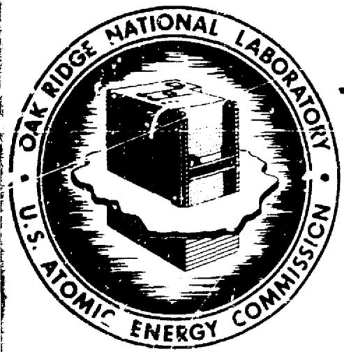
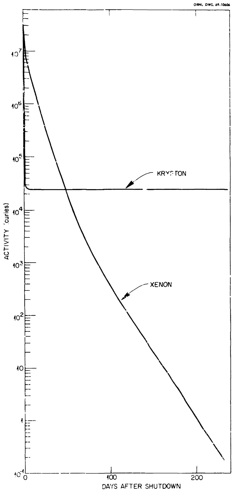
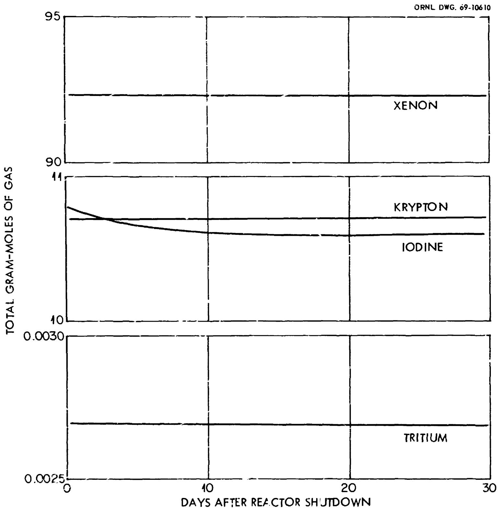
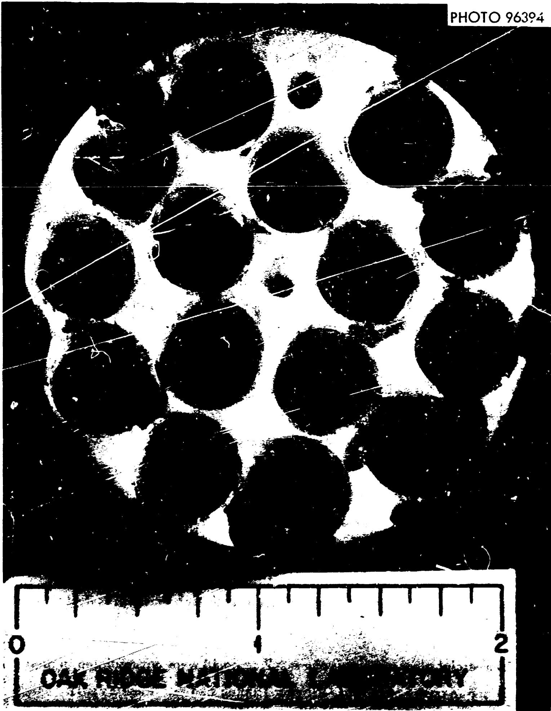
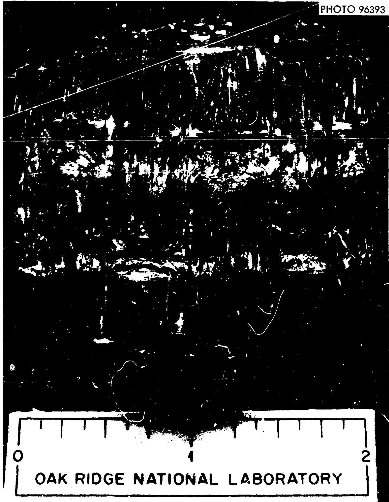
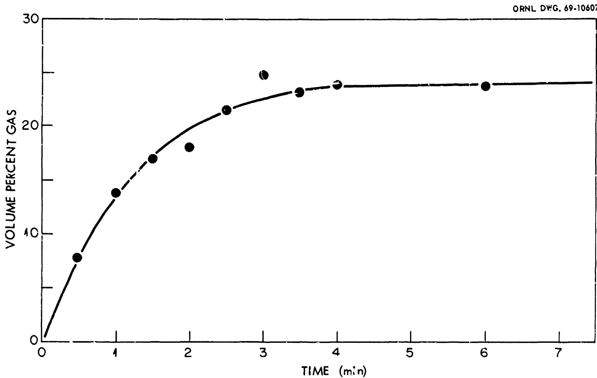
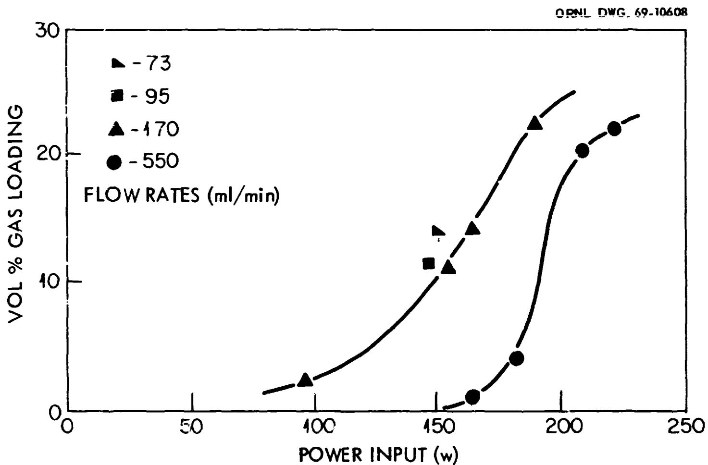
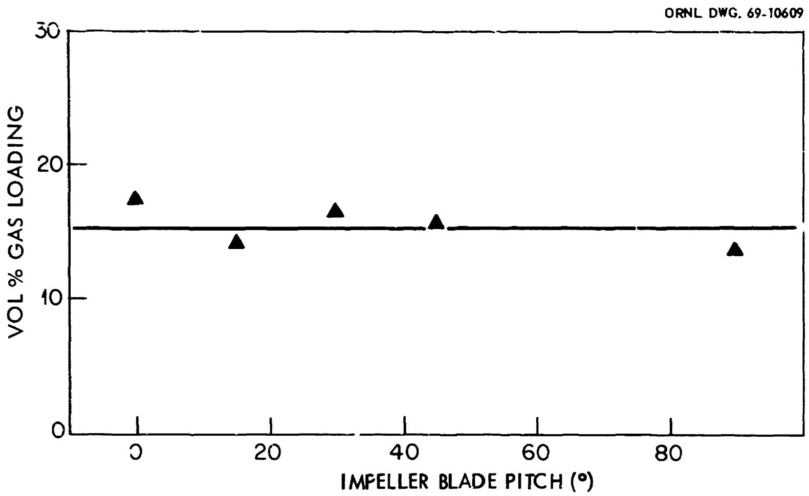
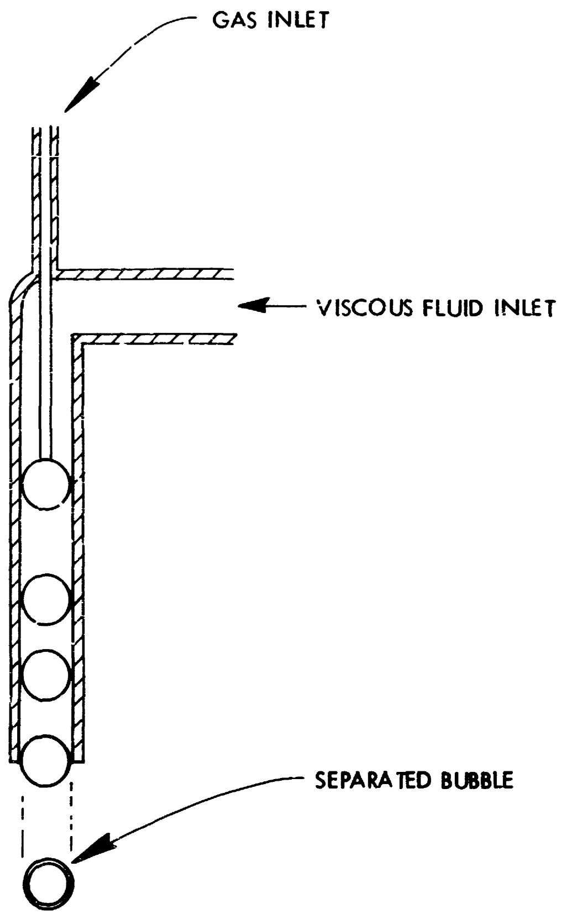

CRNL-4473

UC-10 - Chemical Separations Processes for Plutonium and Uranium

MASTER

ENCAPSULATION OF NOBLE FISSION PRODUCT GASES IN SOLID MEDIA PRIOR TO TRANSPORTATION AND STORAGE

W.E.Clark R. E.Blanco

OAK RIDGE NATIONAL LABORATORY

operated by UNION CARBIDE CORPORATION for the

U.S. ATOMIC ENERGY COMMISSION

M

# BLANK PAGE

Printed in the United States of America. Available from Clearinghouse for Federal

Scientific and Technical Information, National Bureau of Standards,

U.S. Department of Commerce, Springfield, Virginia 22151

Price: Printed Copy $3.00; Microfiche $0.65

# LEGAL NOTICE

This report was prepared as an account of Government sponsored work. Neither the United States, nor the Commission nor any persons acting on behalf of the Commission:

A. Makes any warranty or representation, expressed x implied, with respect to the accuracy, completeness, or usefulness of the information contained in this report, or that the use of any information, apparatus, method, or process disclosed in this report may not infringe privately owned rights; or   
B. Assumes any liability, with respect to the use of, or for damages resulting from the use of any information, apparatus, method, or process disclosed in this report.

As used in the above, "person cting on behalf of the Commission" includes any employee or contractor of the Commission, or employee of such contractor, to the extent that such employee or contractor of the Commission, or employee of such contractor prepares, disseminates, or provides access to any information pursuant to his employment or contract with the Commission, or his employment with such contractor.

# BLANK PAGE

Contract No. W-7405-eng-26

# CHEMICAL TECHNOLOGY DIVISION

# Chemical Development Section B

# ENCAPSULATION OF NOBLE FISSION PRODUCT GASES IN SOLID MEDIA PRIOR TO TRANSPORTATION AND STORAGE

W.E.Clark

R. E. Blanco

# LEGAL NOTICE

This report was prepared as an account of Government sponsored work. Neither the United States, nor the Commission, nor any person acting on behalf of the Commission. A. Makes any warranty or express acceptance of the following statements:

rity, completeness, or completeness of the information contained in this report, or that the use of any information, appear thus, method, or process disclosed in this report may not infrige

use of any information apparatus, method, or process disclosed in this report.

pey or contrtior of the Commissio, or employees of each contractor, to the extent that   
dissimulatio, or its employment with such contractor.

FEBRUARY 1970

OAK RIDGE NATIONAL LABORATORY

Oak Ridge, Tennessee

operated by

UNION CARBIDE CORPORATION

for the

U.S. ATOMIC ENERGY COMMISSION

# CONTENTS

Page

Abstract 1

1. Introduction 2   
2. Assumptions for Survey and Safety Criteria 3   
3. Estimated Volumes of Fission Product Gases 5   
4. Alternative Methods for Secondary Containment 10   
5. Discussion, Conclusions, and Recommendations 30   
6. Acknowledgment 32   
7.References 33

# ENCapsulation OF NOELE FISSION PRODUCT GASES IN SOLID MEDIA PRIOR TO TRANSPORTATION AND STORAGE

W.E.Clark

R. E. Blanco

# ABSTRACT

The encapsulation of fission product gases in various solid media is being considered at ORNL as a possible method for immobilizing these gases during interim storage, transportation, and ultimate storage. This type of immobilization would decrease the possibility of the un-controlled release of such materials. In the study reported here, three media – glass, plastics, and metals – were investigated for use in encapsulation. The combination of known techniques and extrapolated test results showed that gas loadings of up to 50% of those currently obtained in cylinder storage are obtainable by using either pressurized steel bulbs or molecular sieves in a matrix of epoxy resin. Loadings of up to at least 7.5% should be obtainable by direct dispersion of the gases in glass. Other possible encapsulation methods were also considered, and the advantages and limitations of each are discussed.

The volumes of fission product gases produced in reactors fueled with $239\text{FU}$ (LMFBR), $233\text{U}$ (M' BR), and $235\text{U}$ (PWR-1) were estimated. It was assumed that tritium and iodine will be separated from the noble gases and will be converted to stable solid compounds for permanent storage. The combined volumes of krypton and xenon are considered to be 25.0, 27.6, and 30.9 liters (STP) per 1000 Mwd for the LMFBR, MSBR, and PWR-1, respectively. The volumes of xenon and krypton generated daily in a 5-metric-ton-per-day reprocessing plant for LMFBR fuel represent about 81% of the capacity of a standard gas cylinder. If the relatively short-lived xenon were separated from krypton, the daily volume of krypton would occupy less than one-tenth the volume of a standard gas cylinder.

Basic technology is already available for encapsulating radioactive gas in solid matrices to yield a final product containing 25 to $50\%$ , by volume, of the gaseous component. Engineering and economic evaluations are needed to determine whether the added safety factor obtained by immobilizing such a gas warrants the additional expense.

# BLANK PAGE

# 1. INTRODUCTION

The growth of the nuclear power industry has resulted in an increasing awareness of the possible cumulative effects on the environment of the release of even very low levels of long-lived radioisotopes. Whereas high-level radioactive wastes have always been carefully stored under surveillance, it has been customary to either discharge low-level streams directly to the environment or to give them the minimum treatment necessary to decrease the activity below specified levels. With an increasing number of nuclear power plants and the resulting fuel reprocessing facilities, more efficient removal of radioactive components from off-gas streams will be necessary to meet Federal and USAEC regulations and to prevent a buildup of the long-lived radionuclides in the environment.

Normally, industrial gases are stored and transported in steel cylinders under pressures up to about 2600 psig at $70^{\circ}\mathrm{F}$ . The shipment and the handling of such cylinders require precautions because of the potential for rupture and sudden release of pressure. Storage and transportation of highly radioactive gases in cylinders require secondary containment that is rugged enough to prevent the escape of these gases during the following sequential tests:

(1) a 30-ft fall onto an unyielding surface,   
(2) a puncture test consisting of a 40-in. fall onto the end of an unyielding vertical steel bar,   
(3) exposure for 30 min to a temperature of $1375^{\circ}\mathsf{F}$ , and   
(4) immersion in 3 ft or more of water for at least 24 hr.

The purpose of our studies was to investigate the technical feasibility of either solidifying the fission product gases or of dispersing them in stable solid media as a means of minimizing the hazards in case of an accident and/or reducing the size, complexity, and cost of the secondary shipping container. Another advantage of solidification or dispersion would be increased safety against accidental release during interim and final storage. This report summarizes the results of our scoping

tests, compares the various proposed methods for secondary containment, and contains estimates of the amounts of radioactive gases expected to be generated by the reprocessing of reactor fuels.

# 2. ASSUMPTIONS FOR SURVEY AND SAFETY CRITERIA

The long-lived radioactive isotopes found in gaseous waste streams from reactors and nuclear fuel reprocessing plants - $129_{1/2} = 1.6 \times 10^{7}$ years), $3_{H} (t_{1/2} - 12.26$ years), and $85_{Kr} (t_{1/2} = 10.76$ years) - are of primary interest. Since separation of stable and radioactive isotopes may not be economically attractive with present technology, the stable isotopes must be included in the volumes of gases to be treated and stored. All fission product isotopes of xenon are relatively short-lived ( $t_{1/2} \leq 12$ days). Xenon can, therefore, be safely released after a holdup period of a few months (Fig. 1). In order to obtain minimum storage volumes, iodine and tritium must be separated from the noble gases and converted to stable solid compounds for storage. Xenon should be separated from krypton $2-4$ and then eventually be released to the atmosphere after decay to an acceptably low level. This leaves only krypton to be stored as a gas for long periods. Our scoping studies were, therefore, primarily designed to test the feasibility of encapsulating the noble gases, specifically krypton.

Krypton is now separated from xenon and other off-gases at the Idaho Nuclear Corporation Plant, where it is stored in conventional gas cylinders at pressures up to 2000 psig at $70^{\circ}\mathrm{F}$ (21.1°C). The major fraction of the stored gas consists of stable isotopes. After a 1-day decay period, essentially all of the remaining activity is from K.

We have assumed (1) that the separation of stable and radioactive isotopes of the same element will not be economically attractive in the near future and (2) that $85\mathrm{Kr}$ constitutes $7.76\%$ of the total amount of krypton (LMFBR core). For purposes of comparison, we have defined a "standard gas cylinder" $\ast$ (ICC-3A2000) as a

  
Fig. 1. Decay of Xe and Kr After Shutdown (LMFBR Core).

cylinder having an absolute volume of 40 liters at $70^{\circ}\mathrm{F}$ $(21.1^{\circ}\mathrm{C})$ . At the rated pressure of 2000 psig, this cylinder will contain 5089 liters (179.7 ft³) or 227 g-moles of gas at STP. This approximates current storage conditions at the Idaho plant. The internal heat generated by Kr on removal from the reactor will be 2150.2 Btu/hr ft³;* and the total absorbable radiation energy during complete decay will amount to 4.35 x 10¹⁸ ergs. Of the radiation energy, all except 0.41% is attributable to the 0.67-Mev beta emission. The small gamma component has an energy of 0.52 Mev. More than 99% of the radiation will, therefore, be absorbed inside the container.

# 3. ESTIMATED VOLUMES OF FISSION PRODUCT GASES

Estimates are made for gaseous wastes produced by the reprocessing of fuels from three types of reactors: the liquid metal-cooled fast breeder reactor (LMFBR), the molten salt breeder reactor (MSBR), and the pressurized water reactor (PWR-1). These estimates are based upon recent computer calculations and are subject to change as more exact information becomes available. In the cases of the LMFBR and the MSBR, minimum amounts of gaseous impurities derived from the fuel are also estimated. However, these estimated impurities may be negligible as compared with the impurities that will be present as a result of in-leakage.

# 3.1 Case 1: The Liquid Metal-Cooled Fast Breeder Reactor (LMFBR)

The amounts of xenon, krypton, and iodine expected to be present during the reprocessing of an LMFBR core after cooling times of 0 to 30 days (Fig. 2) were calculated using the RIBDOR code, based on the operation of the Atomics International reference LMFBR at an average specific power of 150 Mw(thermal)/metric ton for 540 days. The amount of tritium produced was calculated from the fission yields recommended by Dudey. The largest uncertainty among the individual constituents is in the value for tritium, which does not include any allowance for $(\underline{\mathbf{n}}, \underline{\mathbf{p}})$ reactions

  
Fig. 2. Change in Amounts of Fission Product Gases After Reactor Shutdown. LMFBR core and blankets, 33,000 Mwd in 540 days.

in the cladding and, in this respect, represents a minimum value. However, the contribution of tritium to the total amount of gases is negligible either with or without the product of the $(\underline{\mathsf{n}},\underline{\mathsf{p}})$ reactions.

The amounts of water, carbon dioxide, carbon, hydrocarbons, and nitrogen (see Table 1) estimated to be present during processing are based on the specifications suggested by Olsen for impurities in the fuel. It is assumed that the hydrocarbon fraction is in the form of methane (i.e., the form that would give the maximum gas volume on oxidation) and that this is converted entirely to $\mathsf{CO}_2$ and $\mathsf{H}_2\mathsf{O}$ . It is assumed that all the carbon is converted to $\mathsf{CO}_2$ .

The volumes of xenon and krypton estimated to be generated per 1000 Mwd are 22.4 liters and 2.59 liters respectively; the estimated quantities of iodine and tritium are $5.72 \times 10^{-2} \mathrm{~g}$ -moles and $1.08 \times 10^{-3} \mathrm{~g}$ -moles, respectively. If both xenon and krypton were stored or encapsulated, the output of a 5-metric-ton-per-day plant would represent about $81\%$ of the volume of a standard gas cylinder (see Sect. 2) at 2000 psig and $70^{\circ} \mathrm{C}$ . If the xenon were separated from krypton and were released to the atmosphere after holdup and only the krypton were stored, only about $9\%$ of a standard gas cylinder would be required per day.

# 3.2 Case 2: The Molten Salt Breeder Reactor (MSBR)

The molten salt reactor considered here is a single-fluid breeder containing $1461\mathrm{ft}^3$ of fuel salt of the nominal composition $\mathrm{LiF - BeF_2 - ThF_4 - }^{233}\mathrm{UF_4}$ (71.7-16-12-0.3 mole %). The assumed power level is 2250 Mw(thermal), and the volume of volatile products is calculated both for one day's operation at the planned power level of 2250 Mw and for 1000 Mwd (Table 2).

Noble gases and tritium* are continuously removed from the reactor by a helium purge. Large quantities of other fission products (tellurium, noble metals, etc.) are

Table 1. Amounts of Gases and Potentially Volatile Materials Estimated to be Present During the Processing of LMFRRa Core   

<table><tr><td>Constituent</td><td>Assumed Form</td><td>Daily Quantity 
From 5-Metric-Ton 
(U + Pu)/day P&#x27;nt</td><td>Quantity per 
Metric Ton 
(U + Pu)</td><td>Quantity per 
1000 Mwd</td></tr><tr><td colspan="5">Fission Product Gases 
at 30 Days Cooling</td></tr><tr><td>Tritium, g-moles</td><td>3HHO</td><td>0.028</td><td>0.179</td><td>0.00106</td></tr><tr><td>Krypton, liters (STP)</td><td>Kr</td><td>85.4</td><td>427.1</td><td>2.59</td></tr><tr><td>Iodine, g-moles</td><td>I2</td><td>1.89</td><td>9.43</td><td>0.0572</td></tr><tr><td>Xenon, liters (STP)</td><td>Xe</td><td>739.2</td><td>3696.1</td><td>22.40</td></tr><tr><td>Helium (bonding), b liters (STP)</td><td>He</td><td>86.0</td><td>429.8</td><td>2.62</td></tr><tr><td colspan="5">Estimated Impurities, c liters (STP)</td></tr><tr><td>Water (50 ppm)</td><td>H2O</td><td>70.7</td><td>353.3</td><td>2.14</td></tr><tr><td>Carbon (100 ppm)</td><td>CO2</td><td>212.0</td><td>1060.0</td><td>6.42</td></tr><tr><td>Hydrocarbons (50 ppm)</td><td>CH4→ CO2+ 2H2O</td><td>238.5</td><td>1192.5</td><td>7.23</td></tr><tr><td>Nitrogen (50 ppm)</td><td>N2</td><td>45.4</td><td>227.1</td><td>1.38</td></tr></table>

aAtomics International Reference Oxide LMFBR. Burnup: core - 80,000 Mwd; axial blanket - 2500 Mwd; radial blanket (undifferentiated) - 8100 Mwd. Fuel weight (in metric tons): core - 12.027; axial blanket - 7.318; radial blanket (undifferentiated) - 26.564.   
bFor core and axial blanket, the volume of helium is estimated to be equal to the volume of the oxide fuel; for the radial blanket, it is estimated to be equal to 0.05 of the volume of the oxide fuel (A. P. Irvine, ORNL, personal communication, Nov. 20, 1968).   
Fuel specifications (ref. 10) state that the volume of gas evolved from the fuel on heating to $1800^{\circ}C$ is less than 0.03 $\mathrm{cm}^3 /\mathrm{g}$ . This would include water, $\mathsf{N}_2$ , hydrocarbons, and all adsorbed or entrapped atmospheric gases. !r does not allow for oxidation of carbon or of hydrocarbons. Total impurities listed here are roughly ten times the specified maximum "gas content," which would be 56.8 liters/metric ton $(U + Pu)$ .

Table 2. Amounts of Gases Estimated to be Present During the Continuous Processing of MSBR Fuel Salt   
Power - 2250 Mw(thermal) Salt Discard Cycle - 800 days Continuous helium sparge, 20 scfm   

<table><tr><td>Element</td><td>Assumed Form</td><td>Amounts per Day from the Reactor After a Holdup Time of 30 days</td><td>Amounts (at 30 days) per 1000 Mwd</td></tr><tr><td colspan="4">Fission Gases</td></tr><tr><td>Tritium, liters (STP)</td><td>3HH or 3HF</td><td>0.132</td><td>0.059</td></tr><tr><td>Krypton, liters (STP)</td><td>Kr</td><td>15.0</td><td>6.7</td></tr><tr><td>Xenon, liters (STP)</td><td>Xe</td><td>47.1</td><td>20.9</td></tr><tr><td>Iodine, g-moles</td><td>I2</td><td>0.134</td><td>0.0594</td></tr><tr><td colspan="4">Estimated Impurities, b liters (STP)</td></tr><tr><td>Water (100 ppm)</td><td>HF</td><td>48.2</td><td>21.4</td></tr><tr><td>Sulfur (10 ppm)</td><td>1 atom/molecule</td><td>1.35</td><td>0.60</td></tr><tr><td colspan="2">Helium Spurge Gas, liters (STP)</td><td>8.16 x i05</td><td>3.63 x 105</td></tr></table>

aFuel salt has the nominal composition: LiF-BeF2-ThF4-233LiF4 (71.7-16-12-0.3 mole%).   
b J. H. Shaffer, ORNL, private communication, Oct. 15, 1968. The amounts of impurities listed here fall within the limits specified (i.e., water is $10\%$ of the specified limit, and sulfur is $40\%$ of the specified limit) for fuel components in ref. 13. These amounts of impurities may decrease with recycle of the fuel.

also removed by the purge gas, but are believed to be in the form of entrained solids rather than volatile compounds. Tellurium, in turn, decays to iodine. Most of the iodine is retained in the fused fuel salt and is released in the processing plant during the fluorination step to recover uranium. A large percentage of the total volume of noble gas is produced by the decay of these entrained elements. Minute amounts of the fission product gases can be expected to appear at two or three points in the various reprocessing side streams; however, their contribution to the volume of the gas to be processed will be negligible.

# 3.3 Case 3: Pressurized Water Reactor (PWR-1)

Fission product gas data $^{8,9}$ for a PWR are listed in Table 3. No estimate was made of gases that would be produced from impurities in this fuel. However, the amounts of gases estimated to be produced by fuel impurities for the LMFBR (see Table 1) are indicative of the order of magnitude of the amounts which can be expected for a PWR. A total of 30.9 liters of noble gases (Xe and Kr) is generated per 1000 Mwd of burnup.

# 4. ALTERNATIVE METHODS FOR SECONDARY CONTAINMENT

# 4.1 General Considerations

Alternative secondary containment methods include:

1. Double containment by simple mechanical means. The containment cylinder can be enclosed in a secondary pressure vessel fabricated of metal or other material. If warranted, a layer of shock-absorbing material can be placed between the containers.

2. Enclosure of gas in small containers (capsules) of metal, glass, etc., which are then incorporated in a suitable matrix of glass, metal, plastic, concrete, etc. Fracture of the exterior container would result in breakage of none, or only a few, of these primary containers. The storage of gas in zeolite

Table 3. Amounts of Gases Estimated to be Present During the Reprocessing of PWR-1 Fuel   
Basis - 1 metric ton uranium
Burnup - 20334.0 Mwd in 605 days   

<table><tr><td rowspan="2">Element</td><td rowspan="2">Assumed Form</td><td colspan="3">Amounts at</td><td rowspan="2">Amounts (at 30 days) per 1000 Mwd</td></tr><tr><td>0 days</td><td>30 days</td><td>1 year</td></tr><tr><td>Tritium, g-mole</td><td>\( ^{3}HH \) or \( ^{3}HHC \)</td><td>0.00138</td><td>0.00136</td><td>0.00132</td><td>0.00069</td></tr><tr><td>Krypton, liters (STP)</td><td>Kr</td><td>65.0</td><td>65.0</td><td>64.7</td><td>3.20</td></tr><tr><td>Xenon, liters (STP)</td><td>\( Xa \)</td><td>563.1</td><td>563.6</td><td>563.6</td><td>27.72</td></tr><tr><td>Iodine, g-mole</td><td>\( I_2 \)</td><td>0.607</td><td>0.58</td><td>0.59</td><td>0.029</td></tr></table>

structures $^{6,14}$ or in clathrates is considered to be a variation of this method.

3. Dispersions of gas in a solid matrix (i.e. as bubbles in glass, metal, plastic, etc.). In a very viscous matrix (e.g., molten glass), the release of activity would be slow even at high temperatures.

There are several reasons why the formation of compounds or adsorbates cannot presently be considered as a means of storing noble gases. For example, none of the known compounds of krypton are stable at temperatures higher than about $50^{\circ}\mathrm{C}$ . Moreover, adsorbates must always be in equilibrium with the free gas and the required pressure of the free gas rises rapidly with increasing temperature. On the other hand, there is a possibility that either compounds or adsorbates could prove useful as intermediates in the formation of dispersions although, at present, other methods of generation appear to be more satisfactory in this respect. All methods of containment must make provision for the continuous removal of decay heat. An excessive rise in temperature will, of course, result in a rapid rise in the pressure in the container.

In estimating the amounts of gas that can be shipped or stored in various forms (Table 4), we have assumed that the encapsulated gas within the matrix is stored in a container of the same shape and size as that of our standard gas cylinder; that is, encapsulation is used only to increase the safety factor, not as a substitute for the gas cylinder. Thus, the cylinder becomes the secondary containment barrier, while the encapsulating medium becomes the primary barrier. In the event that the secondary barrier is breached, a negligible amount of gas would be released at low temperatures and only a slow release would occur at temperatures where the medium is molten.

# 4.2 Factors Affecting Choice of Matrix

Glass, plastics, and metals have been suggested as matrices for encapsulating radioactive gases. The ideal material would be mechanically strong, exhibit stability when exposed to heat and to radiation, and have a sufficiently high thermal

Table 4. Conditions for Storing or Shipping Encapsulated Noble Gases   

<table><tr><td>Type of Storage</td><td>Encapsulation Pressure (psig)</td><td>Encapsulation Temperature (°C)</td><td>Standard Liters of Gas per liter of Storage Volume</td><td>Remarks</td></tr><tr><td colspan="5">A. Cylinder Storage</td></tr><tr><td>1. Maximum</td><td>2640</td><td>21.1</td><td>167.7</td><td>ICC-3AA 2400 (or &quot;T&quot; cylinder with 10% overload pressure.</td></tr><tr><td>2. Actual</td><td>2000</td><td>21.1</td><td>127.2</td><td>Approximates conditions used by Idaho Nuclear Corp. Plant.</td></tr><tr><td colspan="5">B. Dispersions (&quot;Foams&quot;)</td></tr><tr><td>1. In glass</td><td></td><td></td><td></td><td></td></tr><tr><td>25% by volume</td><td>14.7</td><td>550</td><td>0.083</td><td>Experimental; up to 26% in polybutene; 23% in glass.</td></tr><tr><td></td><td>1469.6</td><td>550</td><td>8.30</td><td>Calculated.</td></tr><tr><td>50% by volume</td><td>&#x27;1469.6</td><td>550</td><td>16.6</td><td>Calculated; very speculative.</td></tr><tr><td>2. In epoxy resins</td><td></td><td></td><td></td><td></td></tr><tr><td>67% by volume</td><td>14.7</td><td>100</td><td>0.732</td><td>Experimental; top of resin only.</td></tr><tr><td>Limited by irradiation</td><td>--</td><td>--</td><td>2.92</td><td>Calculated; assuming a radiation dose of 2 x 1010 rad.</td></tr><tr><td colspan="5">C. Entrapment</td></tr><tr><td>1. In molecular sieves</td><td>62,500</td><td>350</td><td>168</td><td>Linde patent (pores need sealing).</td></tr><tr><td>2. In clothrates</td><td>294</td><td>95</td><td>57.7</td><td>Experimental (literature); probably limited by heat and irradiation levels.</td></tr><tr><td>3. In steel bulbs encapsulated in resin, glass, or metal</td><td>1500</td><td>21.1</td><td>53.8</td><td>Calculated using commercially available gas bulbs of 20.5-cc volume each.</td></tr><tr><td colspan="5">D. Combinations</td></tr><tr><td>1. Molecular sieve in glass</td><td>--</td><td>--</td><td>--</td><td>Not satisfactorily demonstrated. 40% of trapped gas apparently retained in one experiment. Relative volumes, best glass compositions, and annealing cycles undetermined.</td></tr><tr><td>2. Molecular sieve in metal</td><td>--</td><td>--</td><td>--</td><td>Essentially untried. One experiment showed 1.8% of entrapped gas retained at atmospheric pressure in Wood&#x27;s metal.</td></tr><tr><td>3. Molecular sieve in resin</td><td>--</td><td>--</td><td>--</td><td>Negligible gas lost during encapsulation. Metal (e.g., Al) filler practical up to 50% by volume of resin. Metal improves thermal conductivity, strength, and radiation resistance. Estimated maximum volume of gas = 64 standard liters per liter of storage space; if limited to a maximum radiation dose of 2 x 1010 rods the storage volume ≈ 13.9 standard liters per liter of storage space.</td></tr></table>

conductivity to allow rapid dissipation of decay heat. If exposed to temperatures greatly in excess of those designed for (see Sect. 1), it would be helpful if the material melted to yield a stable, viscous liquid from which the entrapped gas would escape only slowly, if at all. It would also be convenient if the encapsulation process could be carried out at ambient temperatures.

# 4.2.1 Glass

Glass is the outstanding candidate from the standpoint of forming a viscous fluid on melting. The mechanical strength of large blocks of it is high, and enclosure in a steel cylinder would supply the necessary reinforcement to prevent widespread shattering. However, the relief of the thermal stresses resulting from differential coefficients of expansion of the glass and the container might be a problem. These stresses can be minimized by the selection of glass with the proper combination of expansion coefficient and annealing characteristics. Glasses that soften at almost any desired temperature are available. Unfortunately, many of the types with low melting points contain some material (e.g., water) that will decrease the radiation stability; also, many show a rapid decrease in viscosity as the temperature is increased. This latter property can be very helpful during the encapsulation process but will result in more rapid loss of gas on remelting. Some glasses suffer failure on exposure to irradiation because of the buildup of an electrical charge, which eventually results in a sudden, severe cracking. Such failure can be avoided by using a glass that is a comparatively good conductor of electricity. As is evident from these considerations, the selection of a glass with all of the desired characteristics may be difficult.

# 4.2.2 Plastics

The most obvious shortcoming of plastic as a matrix is its relatively poor resistance to radiation and high temperatures. We can readily obtain plastics that exhibit satisfactory mechanical properties after absorbing total radiation doses as high as $2 \times 10^{10}$ rads.[17,18] This is roughly an order of magnitude less than the calculated dose received by a resin (density, 2.5) in contact with a $50\%$ (by volume) dispersion of fission product

krypton, assuming complete decay and $100\%$ absorption of energy by the plastic. Radiation damage alone would, therefore, rule out the dispersion of krypton directly into plastics unless materials with greater radiation resistance become available. The relatively poor thermal conductivity of plastics constitutes another limiting factor. Although some plastics have been reported to be useful at temperatures up to $500 - 700^{\circ}C,$ most of the proposed uses were of short duration. For storage purposes, the material must have long-term stability and undergo very slight weight loss at storage temperatures. Epoxy resin systems can be readily developed to provide long-time service life at temperatures up to $150^{\circ}C;$ special epoxy systems for use at temperatures up to $180^{\circ}C$ have been developed. At temperatures in excess of $180^{\circ}C,$ service life is considerably reduced.[21]

The use of a metal-filled plastic matrix to contain gas entrapped in capsules or in molecular sieves (see Sect. 4.3.2) is a very good possibility. For example, consider two hypothetical cases in which $50\%$ of the volume of a standard gas cylinder is filled with matrix, the other $50\%$ being fission product krypton contained (a) in pressurized steel capsules with a wall at least 14 mils thick and (b) in molecular sieve aggregates of cylindrical shape, 1/16 in. in diameter.

The beta radiation from $^{85}\mathrm{Kr}$ would be completely absorbed and degraded in the steel capsule. The small gamma component plus bremsstrahlung generated during absorption of the beta radiation in iron would result in a total radiation dose of $8.2 \times 10^{9}$ rods to a resin matrix assuming decay of all the $^{35}\mathrm{Kr}$ . This is well within the radiation doses acceptable to a number of the plastic types on which radiation studies have been reported.[17-21]

The radiation dose to the matrix from $^{85}$ Kr entrapped in the molecular sieve cannot be calculated exactly since commercial aggregates contain a binder of undisclosed nature and quantity. If one assumes that only the crystalline sieve material (density = 1.99) is present, about $63/3^*$ of the beta energy is absorbed and degraded in the sieve and the total dose to the matrix is about $1.6 \times 10^{-11}$ rads, almost an order of magnitude

greater than the maximum dose administered in the reported tests. $^{18}$ Obviously, testing at higher doses is needed. There is also some question as to the relevance of the reported tests to storage conditions. Changes in such mechanical properties as flexural strength, elongation, and tangent modulus, which are some of the properties commonly tested, are useful as indicators of radiation-induced changes in the structure of the matrix but these mechanical tests are probably more severe than those to which the material will be subjected. It seems possible that a storage matrix might prove resistant to considerably higher doses based upon tests of gas permeability and the generation of off-gas from degradation of the resin.

Dissipation of internally generated heat poses no real problem. The maximum heat generation from the proposed $50\%$ gas loading cases mentioned above would amount to about 1075 Btu/hr-ft3. If one assumes that the surface temperature of the cylinder is $100^{\circ}\mathrm{F} \left(\sim 38^{\circ}\mathrm{C}\right)$ , and that k for the matrix is 0.435 Btu/hr-ft4F as reported for epoxy resin plus $10\%$ aluminum powder21, the centerline temperature would be about $127^{\circ}\mathrm{F}$ (86.1°C). The value of k can be increased by a factor of about 2-1/2 by increasing the content of aluminum powder to $30\%$ . Use of aluminum fibers instead of powder increases the conductivity even more. In laboratory scouting studies, we found that mixtures of about $33\%$ (by volume) each of epoxy resin, aluminum powder, and molecular sieves could be readily handled and appeared qualitatively to have good physical properties.

From the standpoint of fabrication, the epoxy resins are attractive; however, some other classes of plastics (e.g., phenolics) are rated as more resistant to radiation. As compared with glass and metal matrices, plastics would require only low to moderate temperatures for encapsulation.

# 4.2.3 Metals

Metals are the most satisfactory materials available with respect to high thermal conductivity and mechanical strength. The melting temperature and other physical properties can be varied widely by alloying. On the other hand, most metals melt

sharply at well-defined temperatures, and molten metals are generally much less viscous than glasses. Metals are, therefore, not particularly attractive as media for direct containment of gas bubbles, but would be very attractive as matrices for secondary containment of capsules, molecular sieves, etc.

# 4.3 Comparison of Specific Methods

# 4.3.1 Cylinder Storage

Conditions for the storage of krypton in cylinders have already been discussed (see Sect. 2). The current practice at the Idaho Nuclear Corporation Plant amounts to storage of 127.2 standard liters of gas per liter of storage volume.5 By using the higher-pressure "T" cylinder (ICC-3AA2400) with a $10\%$ overload pressure, this could be increased to 167.7 standard liters per liter of storage volume6 (Table 4).

# 4.3.2 Incorporation of Loaded Capsules, Loaded Zeolites and Clathrates into Stable Media

Capsules. - An early suggestion for mechanical encapsulation was to pressurize gas in small-bore glass tubes, which would be sealed off into sausage-like sections. These sections would then be incorporated into a glass matrix. Using an internal pressure of 2500 psig for a tube with an inside diameter of 0.04 in. and 0.033-in. walls, and assuming an inside cylinder length equal to the inside diameter of the tube, the calculated value for storage would equal 6.94 standard liters per liter of storage volume. The use of glass containers at such high pressures is doubtless unrealistic.

Commercial glass ampules (volume ≈ 2 cc each) were encapsulated in glass (Fig. 3) and in epoxy resin (Fig. 4) in our scoping studies. These ampules, which were very thin-walled, were filled with air at room temperature ( $\sim 26^{\circ}C$ ) and atmospheric pressure. They contained between 32 and $35\%$ , by volume, of the total storage volume, or between 0.288 and 0.315 standard liter of air per liter of storage volume.

  
Fig. 3. Commercial Glass Ampules Encapsulated in Glass. Cross section obtained by sawing through stainless steel container. The encapsulating glass was not melted to sufficient fluidity to remove all voids.

  
Fig. 4. Commercial Glass Ampules Encapsulated in Epoxy Resin.

A few of the ampules cracked during encapsulation in clear epoxy. It is probable that a larger number cracked during encapsulation in the glass at about $600^{\circ}\mathrm{C}$ . Steel ampules would be much more practical than glass, particularly for encapsulation in resin or in metal. Commercially available industrial gases are compressed to 1500 psig (at $21^{\circ}\mathrm{C}$ ) in steel pressure bulbs that may have void volumes as small as 5.5 cc. Using a similar commercial bulb,\* about 54 standard liters of gas per liter of storage space could be readily obtained. Use of higher encapsulation pressures and/or larger bulbs could easily increase the volume of gas per volume of storage space to $50\%$ of that obtained in current practice. These storage volumes appear to be obtainable under much safer operating conditions than will apply when glass is used as the primary container.

Encapsulation of Gas Entrapped in Zeolite Structures and in Clathrates. - Certain zeolitic molecular sieves have pore openings that expand when the material is heated, thereby admitting gas molecules larger than those which are normally allowed to pass. Cooling of the system, while maintaining the pressure, causes the gas to be physically entrapped within the sieve. Heating of the entrapped gas to encapsulation temperature under zero partial pressure will result in the eventual release of all of the gas. As much argon or krypton can be encapsulated in these materials as is normally compressed into corresponding standard gas cylinders, provided a sufficiently high encapsulation pressure is employed. The data in Table 4 assume a pressure of 62,500 psig at $350^{\circ}\mathrm{C}$ . Data for argon indicate that about $50\%$ as much gas is encapsulated at 5000 psig. Using Type A Linde molecular sieve, some leakage of the encapsulated argon always occurred; however, zero leakage of krypton is claimed during 30 days' storage of the krypton encapsulated in a special sieve material having a $\mathsf{K} / \mathsf{Na}$ atom ratio of 40/60. This entrapment technique must not be confused with the more common use of molecular sieves as adsorbents. Actually, it corresponds more nearly to the behavior of a clathrate; that is, once entrapment has taken place, the gas in the structure is no longer in equilibrium with external gas but is essentially in a micro-conotrainer. Although the

entrapped gas is released upon heating to $350 - 400^{\circ}C$ , the sieve structure is stable to above $700^{\circ}C$ . Therefore, we need to find some way of sealing the pores at temperatures up to those at which the sieve structure is destroyed.

In our scoping studies, we entrapped between 5.7 and 6.1 cc of argon per gram of sieve by heating the sieve to $350^{\circ}\mathrm{C}$ under 1000 psig of argon for $1 - 1/2$ to 2 hr and allowing it to cool overnight under the pressurized argon. Molten Pemco 41G glass ( $\sim 600^{\circ}\mathrm{C}$ ) was poured onto the unheated sieve in a stainless steel tube. Analysis of the resulting ccrglomerate showed that approximately $40\%$ of the entrapped argon had been retained in the mixture. Other experiments showed that the loaded sieve is difficult to coat with glass because the sieve releases gas rapidly at these temperatures. Encapsulation of the loaded sieve in Araldite epoxy resin produced almost no bubbling, and the few bubbles that were produced were held by the matrix. The epoxy penetrates the sieve material readily, and most of the gas remains effectively entrapped during destruction of the resin with solvents and subsequent treatment of the sieve with hot water. Products containing about equal volumes of resin, aluminum powder, and sieve were easily prepared.

Loaded sieve encapsulated in molten Wood's metal retained about $1.8\%$ of the entrapped gas (Table 4).

A similar technique would involve the preparation of a clathrate of krypton, which could then be encapsulated in a suitable matrix. For example, a recurring suggestion is to encapsulate the well-characterized hydroquinone clathrate (up to 57 standard liters of gas per liter of clathrate)22 in plastic. Although clathrates are thermodynamically unstable at all temperatures,23 the hydroquinone clathrate structure decomposes only slowly below $172.5^{\circ}C$ , the melting point of hydroquinone. Gas is lost rather rapidly at temperatures of $130^{\circ}C$ and higher. The hydroquinone clathrate of krypton decomposes more slowly than its argon counterpart. The hydroquinone clathrate is surprisingly stable in irradiation; argon was lost more slowly from samples irradiated up to total doses of $10^9$ rods than from unirradiated samples.23 This radiation phenomenon has not been adequately investigated.

We prepared the hydroquinone clathrate of krypton, a random sample of which, on analysis, was found to contain $6.7\%$ , by weight, of krypton. When we encapsulated selected crystals of the clathrate in clear Araldite epoxy resin, a very slight reaction occurred between the resin and the hydroquinone. This soon ceased. Only c negligible amount of gas was released into the resin, and no appreciable changes were noticed in the shape or the structure of the clathrate crystals.

Encapsulation without destruction of the clathrate will depend upon the development of cloths that exhibiting stability to a highly radioactive environment, to the temperatures necessary for encapsulation, and toward the matrix used. The zeolitic molecular sieves proposed for entrapment approximate such a material. It seems possible that true inorganic clathrates with the necessary stability can be developed if sufficient need exists. It also seems possible to use organic clathrates as intermediates in the formation of gas dispersions (see Sect. 4.3.3 below).

# 4.3.3 Direct Dispersions of Gas in Stable Matrices

Dispersions of gas in liquid can be generated in a variety of ways; the following methods are being considered in this program:

(1) Agitation of the interface between liquid and gas in such a manner that the gas is dispersed into the liquid in small bubbles (e.g., "blending").   
(2) Introduction of the gas into the liquid in the form of bubbles that are sufficiently small to form a stable dispersion. The two-fluid nozzle is one method of forming these small bubbles.   
(3) Incorporation of gas-bearing materials (e.g., compounds, clathrates, adsorbates, etc.) into a matrix, followed by treatment to produce gas evolution in place. Commercial foam glass is made in this manner.

(4) Incorporation of very small capsules of gas into a matrix in which the capsule walls dissolve or otherwise lose their identity. The use of very small glass capsules in a glass matrix would be an example of this type of generation.

We have investigated method (1), in some detail, using Newtonian fluids (polybutenes)* as matrices instead of materials (e.g., glass) that would subsequently solidify. Our experimental arrangements included ordinary laboratory stirreres, commercial blenders (Waring Blendor), and specially designed equipment consisting of impellers that were carefully machined to give accurate angles of blade pitch and are driven from below like those of the blender.

Dispersions containing a maximum of about $25\%$ of gas, by volume, were obtained in both flowing and static systems. These maximum loadings were achieved only at impeller speeds equal to, or greater than, about 5000 rpm. The maximum loading of about $25\%$ seems to represent the point at which the rate of bubble coalescence and escape becomes equal to the rate of bubble formation in the systems studied (Fig. 5). At loadings below the maximum, the loading rate increased as the rate of power input into the system increased (Fig. 6). Gas could be conveniently fed into the blender from above (i.e., through the vortex); bubbling the gas through the liquid increased the rate of loading only slightly and did not affect maximum loading. Formation of an open vortex reaching from the gas-liquid interface to the impeller was a critical process. The loading rate increased instantaneously when such a vortex was formed. The pitch of the impeller blades was important primarily as it affected vortex formation and power input; that is, maximum loading was independent of impeller blade pitch (Fig. 7), but c high angle of pitch resulted in a more rapid transfer of power to the liquid and, consequently, in a more rapid attainment of maximum loading.

  
Fig. 5. Gas Loading as a Function of Blending Time. Batch study in a blender. (From ORNL-MIT-31)

  
Fig. 6. Percentage Loading as a Function of Power Input and Liquid Flow Rates in a Flowing System Using Polybutene No. i6. (From ORNL-MIT-81)

  
Fig. 7. Effect of Impeller Blade Pitch on Gas Loading in Polyutene 16 at Constant Power Input (155 w at a flow rate of 74 ml/min). (From ORNL-MIT-81)

There were indications that higher loadings might be possible with the more viscous grades of polybutene, but the effect, if real, tended to be obscured by the decrease in viscosity caused by the temperature rise accompanying the rapid transfer of energy to the fluid. Additional work needs to be done to define the effect of viscosity on gas loading.

The dispersions produced were quite stable for periods of time sufficient to allow pouring, measurement of viscosity, etc. The dispersions were also Newtonian in behavior. Further details of the polybutene work are reported elsewhere.[24,25]

Similar experiments in which air was dispersed in lead borate glass,\* using a laboratory-type stirrer-impeller attached to a high-speed, variable-speed (max $\geq$ 20,000 rpm) motor at temperatures between 500 and $700^{\circ}\mathrm{C}$ , resulted in products that contained a maximum of $23\%$ gas, by volume, after cooling. Much more sophisticated equipment must be used if closely controlled experiments are to be done with glass. Attempts at producing a dispersion in Wood's metal were unsuccessful; a maximum of only about $3\%$ , by volume, of gas was obtained. In Araldite epoxy resin, uniform dispersions were initially obtained using a blender; however, the bubbles partially coalesced and rose to the top of the samples, resulting in sharply defined bubble layers representing about $30\%$ of the total resin-gas volume. Within these layers, the gas accounted for about $67\%$ of the volume; on the other hand, the lower parts of the samples were almost free from gas. Attempts were made to circumvent this phenomenon and produce a uniform dispersion by postponing the blending step until immediately before the resin underwent its initial "set." Under these circumstances, however, nearly all of the gas was rejected before the resin hardened.

The generation of stable dispersions of gas in glass is certainly possible by the use of blending techniques. The application of this method to the encapsulation of radioactive gas on a practical scale will involve the solution of difficult engineering problems resulting from the simultaneous use of high temperatures, high impeller speeds, and moderately high pressures. The glass used in our experiments was selected

because of its relatively low softening temperature and rapid decrease in viscosity with increasing temperatures. For routine use in a practical process, other characteristics would also need to be considered (see Sect. 4.2.1).

As noted above, gases can be dispersed in plastics and resins. However, the dispersions that we prepared did not have the necessary stability in the particular plastic employed. It is almost certain that plastics with the required physical properties and hardening characteristics are commercially available. The use of unreinforced plastic matrices will be limited by their stability to heat and to radiation as discussed in Sect. 4.2.2.

The experiments with Wood's metal demonstrated the difficulty of obtaining high gas loadings in relatively nonviscous molten metals. Although better metal candidates than Wood's metal can be found, the operational problems listed for glass apply generally to metals.

Numerous attempts were made to produce dispersions through the use of the two-fluid nozzle [method (2) listed in Sect. 4.3.3; see also Fig. 8] in which the gas was introduced via a hypodemic needle into a small tube through which the matrix fluid flowed. Using glycerin, polybutenes, and freshly mixed Araldite epoxy resin as matrix fluids, we were never able to obtain a dispersion that approached uniformity. By using the nozzle in a downflow position, it was possible to deposit bubbles on a cooled surface in such a manner that foam which must locally have contained up to $50\%$ gas, by volume, was formed. However, bubble coalescence and escape occurred at temperatures ranging from ambient to those obtained when dry ice mixtures were used as coolants. Significant volumes of the foam were never obtained. Up-flow experiments were equally unsatisfactory. The operation of the two-fluid nozzle is strongly dependent upon the flow ratio of gas to fluid. Maintaining the proper flow ratio becomes increasingly difficult as the viscosity of the fluid increases. In principle, it should be possible to operate a large number of such devices in a manifold which could be used to fill a steel cylinder by beginning at the bottom and slowly withdrawing the manifold as the cylinder is filled. However, the operational problems appear to be very severe for a high-temperature process in which glass is the matrix material.

ORNL DWG. 69-13611

  
Fig. 8. Two-Fluid Nozzle as a Bubble Generator (Schematic Diagram).

We have not attempted to produce dispersions by internal generation of gases from the dispersion of solid compounds, adsorbates, or encapsulates of gas in matrix materials. However, our experiments aimed at the encapsulation of gas-loaded molecular sieves (see above) indicate that the encapsulated gas-bearing material must be very finely divided if the bubbles are to be small and evenly distributed. In glass, for example, much of the entrapped argon escaped in the form of relatively large bubbles. In epoxy resin, where the rate of gas evolution was much slower, bubble size was correspondingly smaller. Encapsulation of the original gas-bearing material in the matrix appears to be generally more desirable than the generation of a dispersion.

We briefly tested atomization as a method for producing dispersions. Qualitatively, the product that was formed from glycerol and air appeared to be as satisfactory as that produced in the blender. The technique seems impractical for scale-up, particularly with gloss or metal matrices.

# 5. DISCUSSION, CONCLUSIONS, AND RECOMMENDATIONS

These initial studies serve to outline the possibilities and to define the problems that will be involved in the development of practical processes for encapsulating fission product gases in solid media. A large number of processes were screened; none were studied intensively. No particular alternative process is clearly superior to the others. Of the processes considered (Table 4), the encapsulation of steel bulbs containing pressurized krypton in metal-filled plastic (e.g., epoxy) appears to be the most immediately amenable to practical use. Development of new technology will not be necessary. The temperature required for encapsulation would be relatively low and easily controlled. The radiation resistance of commercial plastics is adequate in instances where beta is the chief type of emitted radiation; this type of radiation will be absorbed by capsule containers. However, the radiation resistance of such plastics is probably not adequate to permit direct dispersion of gas into them. Entropment in molecular sieves is or intriguing and potentially useful method of storage,

provided that an effective method of sealing the sieve pore can be developed and demonstrated on a practical scale. Relatively high pressures are required, although lower loadings at lower pressures may be acceptable. The encapsulation of the loaded sieve in the matrix would not require high pressure. The slow rate at which the process proceeds may be a disadvantage; for example, the pressurized gas requires 1 to 2 hr (minimum) at 350 to $400^{\circ}\mathrm{C}$ to fill! the interior of the sieve, and the pressure must be maintained while the loaded sieve is cooled.

The production of a dispersion containing practical amounts of gas also requires operation at fairly high pressures. When a high-melting matrix (e.g., glass) is used, relatively less gas will enter the dispersion than would be true at lower temperatures. Regardless of the method used for preparation of the dispersion, the mechanical and materials problems will multiply as the operational temperature and pressure increase. Dispersions in highly viscous glasses should possess very desirable safety properties, but their preparation is difficult.

Matrices of metal (e.g., aluminum) approach the ideal medium for encapsulation in terms of mechanical strength, thermal conductivity, and resistance to radiation damage. Our few experiments with low-melting alloys have shown less promise than those with either glass or epoxy resins.

Stable inorganic clathrates would also approach the ideal vehicle for long-term storage in every respect except possibly that of thermal conductivity. If they were stable at high temperatures, they might not require secondary containment. Unfortunately, such highly stable inorganic clathrates are unknown at present.

Future work should be directed toward the solution of specific problems that would allow early testing of the encapsulation concept on an engineering scale. Suggested studies are listed below in order of probable importance.

1. For plastic-resin systems, determine which specific resins have the most desirable characteristics of compatibility with metals and with molecular sieves, stability to irradiation at levels greater than $2 \times 10^{10}$ rods at temperatures up to $150^{\circ}C$ , and operational properties that would

make encapsulation of either loaded molecular sieve or pressurized steel capsules in a plastic-metal matrix feasible. The thermal conductivity of the encapsulate should be measured, and the efficiency with which the matrix seals the pores of the molecular sieve should be determined.

2. For glass systems, determine (on a laboratory scale) the feasibility of preparing dispersions containing $20\%$ or more, by volume, of gas in glass, of pouring these dispersions into steel containers, and of annealing them to give small-scale prototypes of the proposed shipping-storage containers. The studies would involve selection of the most suitable type of glass, based on the expansion coefficients of glass and container material, annealing characteristics of the glass and of the dispersion, and the nature of the viscosity-vs-temperature curve for the glass. They should also yield data for use in designing scaled-up equipment for generating dispersions and in predicting the lifetime of such equipment. This would involve corrosion/erosion and metallographic studies of the materials of construction of the generator equipment as a function of operating time.

3. For metal systems, determine the feasibility of encapsulating pressurized steel capsules in aluminum or in other suitable metal matrices.

# 6. ACKNOWLEDGMENT

A major part of the polybutene work was carried out by M. H. Jorris, W. A. Heath, and L. S. Bowers of the MIT School of Chemical Engineering Practice. We are indebted to R. H. Mayer and P. J. Wood of the MIT staff for helpful suggestions in designing the polybutene experiments and in interpreting the results, and to W. F. Schaffer of ORNL for the engineering design of the equipment. We are especially indebted to D. E. Spangler for many practical ideas as well as for assistance in all phases of the laboratory work.

# 7. REFERENCES

1. "Safety Standards for the Packaging of Radioactive and Fissile Materials," USAEC Manual, Chap. OR 0529, TN-0500-33, 1966.   
2. R. H. Rainey, W. L. Carter, S. Blumkin, and D. E. Fain, "Separation of Radioactive Xenon and Krypton from Other Gases by Use of Permselective Membranes," paper SM 110/27, pp. 323-42 in the Proceedings of the Symposium on Operating and Developmental Experience in the Treatment of Airborne Radioactive Wastes, New York, August 26-30, 1968.   
3. J. R. Merrimun, J. H. Pashley, K. E. Habiger, M. J. Stephenson, and L. W. Anderson, "Concentration and Collection of Krypton and Xenon by Selective Absorption in Fluorocarbon Solvents," paper SM 110/25 presented at the Symposium on Operating and Developmental Experience in the Treatment of Airborne Radioactive Wastes, New York, August 26-30, 1968.   
4. C. L. Bendixsen and G. F. Offutt, *Rare Gas Recovery Facility at the Idaho Chemical Processing Plant*, IN-1221 (April 1969); cf. C. E. Stevenson, *IDO-14453* (1958).   
5. G. F. Offutt, Idaho Nuclear Corp., personal communication.   
6. G. A. Cook, Argon, Helium, and the Rare Gases, Interscience, New York, 1961, p. 230.   
7. C. M. Lederer, J. M. Hollander, and I. Perlman, Table of Isotopes, 6th ed., Wiley, New York, 1967.   
8. RIBDOR code; A. R. Irvine, ORNL, personal communication.   
9. N. D. Dudey, Review of Low-Mass Atom Production in Fast Reactors, ANL-7434 (April 1968).   
10. A. R. Olsen, ORNL, personal communication, May 20, 1968.

11. MSR Program Semiann. Progr. Rept. Aug. 31, 1968, ORNL-4344, Sect. 5.   
12. M. J. Bell and L. E. McNeese, Unit Operations Section Quarterly Progress Report, October-December 1968, OR'VL-4448 (to be published).   
13. MSR Program Semiann. Progr. Rept. July 31, 1964, ORNL-3708, p. 292.   
14. L. H. Shaffer and W. J. Sesny, U.S. Patent 3,316,691 (May 2, 1967).   
15. J. H. Holloway, Noble Gas Chemistry, Methuen and Co., London, 1968.   
16. R. E. Blanco, "Ultimate Storage of Volatile Radioactive Wastes in Solid Foams," letter to D. E. Ferguson, ORNL, dated Mar. 4, 1968.   
17. W. W. Parkinson, "Radiation-Resistant Polymers," in Encyclopedia of Polymer Science and Technology, Interscience, New York (in press).   
18. R. Sheldon and G. B. Stapleton, The Effect of High Energy Radiation on the Mechanical Properties of Epoxy Resin Systems Used for Particle Accelerator Construction, RHEL/R 152 (1968).   
19. Chem. Eng. News, p. 58 (Apr. 13, 1964).   
20. Chem. Eng. News, p. 38 (May 17, 1965).   
21. H. Lee and K. Neville, Handbook of Epoxy Resins, McGraw-Hill, New York, 1967.   
22. H. M. Powell, J. Chem. Soc. (London) 1950, 300.   
23. K. O. Lindquist and W. S. Diethcrn, Intern. J. Appl. Radiation and Isotopes 19, 333-44 (1968).   
24. M. H. Jorris and L. S. Bowers, A Study of the Dispersion of Gases in Viscous Liquids with Application to Radioactive Krypton and Xenon Disposal, Part i, ORNL-MIT-81 (May 8, 1969).   
25. W. A. Heath and M. H. Jorris, A Study of the Dispersion of Grases in Viscous Liquids with Application to Radioactive Krypton and Xenon Disposal, Part II, ORNL-M!T-84 (June 4, 1969).