216 313/70

ORNL-4528

UC-80 - Reactor Technology

TWO-FLUID MÖLTEN-SALT BREEDER REACTOR

DESIGN STUDY (STATUS AS OF JANUARY 1, 1968)

R.C.Robertson

O. L. Smith

R.B.Briggs

E. S. Bettis

OAK RIDGE NATIONAL LABORATORY

operated by

UNION CARBIDE CORPORATION

for the

U.S. ATOMIC ENERGY COMMISSION

Printed in the United States of America, Available from Clearinghouse for Federal

Scientific and Technical Information, National Bureau of Standards,

U.S. Department of Commerce, Springfield, Virginia 22151

Price: Printed Copy $3.00; Microfiche $0.65

# LEGAL NOTICE

This report was prepared as an account of Government sponsored work. Neither the United States, nor the Commission, nor any person acting on behalf of the Commission:

A. Makes any warranty or representation, expressed or implied, with respect to the accuracy, completeness, or usefulness of the information contained in this report, or that the use of any information, apparatus, method, or process disclosed in this report may not infringe privately owned rights; or   
B. Assumes any liabilities with respect to the use of, or for damages resulting from the use of any information, apparatus, method, or process disclosed in this report.

As used in the above, "person acting on behalf of the Commission" includes any employee or contractor of the Commission, or employee of such contractor, to the extent that such employee or contractor of the Commission, or employee of such contractor prepares, disseminates, or provides access to, any information pursuant to his employment or contract with the Commission, or his employment with such contractor.

Contract No. W-7405-eng-26

REACTOR DIVISION

TWO-FLUID MOLTEN-SALT BREEDER REACTOR DESIGN STUDY (STATUS AS OF JANUARY 1, 1968)

R.C.Robertson

O. L. Smith

R. B. Briggs

E. S. Bettis

# LEGAL NOTICE

This report was prepared as an account of work sponsored by the United States Government, Neither the United States nor the United States Atomic Energy Commission, nor any of their employees, nor any of their contractors, subcontractors, or their employees, makes any warranty, express or implied, or assumes any legal liability or responsibility for the accuracy, completeness or usefulness of any information, apparatus, product or process disclosed, or represents that its use would not infringe privately owned rights.

AUGUST 1970

OAK RIDGE NATIONAL LABORATORY

Oak Ridge, Tennessee

operated by

UNION CARBIDE CORPORATION

for the

U.S. ATOMIC ENERGY COMMISSION

# CONTENTS

# Abstract 1

1. Introduction 2   
2. Résumé of Design Considerations 2

3.Materials 6

3.1 General 6   
3.2 Salts 7   
3.3 Hastelloy N 11   
3.4 Graphite 12   
3.5 Graphite-to-Metal Joints 14

4. General Plant Description and Flowsheets 16

4.1 General 16   
4.2 Site 16   
4.3 Reactor Plant 18   
4.4 Turbine Plant 26   
4.5 Salt Processing Plant 29

5. Major Components 32

5.1 Reactor 32   
5.2 Fuel Salt Primary Heat Exchanger 40   
5.3 Blanket Salt Primary Heat Exchanger 42   
5.4 Salt Circulating Pumps 44   
5.5 Off-Gas System 48   
5.6 Drain Tanks 49   
5.7 Steam Generators 53   
5.8 Steam Reheaters 53   
5.9 Reheat Steam Preheaters 57   
5.10 Maintenance 57

6. Reactor Physics and Fuel Cycle Analysis 60

6.1 Optimization of Reactor Parameters 60   
6.2 Useful Life of Moderator Graphite 63   
6.3 Flux Flattening 66   
6.4 Fuel Cell Calculations 67   
6.5 Temperature Coefficients of Reactivity 68   
6.6 Dynamics Analysis 70

7.Cost Estimates 71

7.1 General 71   
7.2 Construction Costs 71   
7.3 Power Production Costs 73

Appendix A: Cost Estimates 75

# TWO-FLUID MOLTEN-SALT BREEDER REACTOR DESIGN STUDY (STATUS AS OF JANUARY 1, 1968)

R.C.Robertson

O. L. Smith

R. B. Briggs

E. S. Bettis

# ABSTRACT

A conceptual design study of a 1000-Mw(e) thermal breeder power station based on a two-fluid MSBR was commenced in 1966 as part of a program to determine whether a molten-salt reactor using the thorium-233U fuel cycle could produce electric power at sufficiently low cost to be of interest and at the same time show good utilization of U.S. nuclear fuel resources. This report covers the progress made in the study up to August 1967, at which time the two-fluid MSBR work was set aside in order to study a single-fluid MSBR concept. The latter became of interest at that time due to the discovery that protactinium and other fission products could be separated from a uranium-and-thorium-bearing fuel salt by reductive extraction into liquid bismuth.

The two-fluid MSBR is graphite-moderated and -reflected, with a $^7\mathrm{LiF - BeF_2 - UF_4}$ fuel salt circulated through the core and a $^7\mathrm{LiF - ThF_4 - BeF_2}$ blanket salt circulated through separate flow channels distributed throughout the core, as well as in a surrounding undermoderated region. The fissions raise the temperature of the fuel salt to about $1300^{\circ}\mathrm{F}$ and that of the blanket salt to about $1250^{\circ}\mathrm{F}$ . Heat is removed from the salts in shell-and-tube heat exchangers to raise the temperature of a circulating $\mathrm{NaBF_4 - NaF}$ coolant salt to about $1150^{\circ}\mathrm{F}$ . The coolant salt transports the heat to steam generators and reheaters to provide 3500-psia $1000^{\circ}\mathrm{F} / 1000^{\circ}\mathrm{F}$ steam for a conventional turbine-generator.

The conceptual design was based on use of four reactors and the associated heat transfer systems in a so-called modular arrangement to supply steam to a single turbine-generator. This made it practical to consider replacement of an entire reactor vessel assembly after the core graphite received its allowable exposure to neutrons. The total fluence at which it was thought that additional graphite dimensional changes would become excessive was taken as $3 \times 10^{22}$ neutrons/cm $^2$ ( $E > 50\mathrm{keV}$ ), or about eight years of full-power operation.

All portions of the systems in contact with the fluoride or fluoroborate salts would be fabricated of Hastelloy N that has a small amount of titanium added to improve the resistance to radiation damage. The graphite would be a specially coated grade having low gas permeability to xenon and better resistance to radiation damage than conventional material. The two-fluid concept involves joining graphite core elements to Hastelloy N tubing using a brazing process developed at ORNL.

The reactors and associated systems would be housed in concrete cells to provide biological shielding and double containment of all radioactive materials.

Plant flowsheets and layouts were developed sufficiently during the study to give an indication of feasibility and to give a basis for cost estimates, but no optimization studies were made. Safety aspects were considered throughout the design effort, but no formal safety analysis was completed.

Fuel and blanket salts would be continuously processed in a nearby cell to remove fission products and to recover the bred product. The processing rate would correspond to removal of uranium and protactinium from the blanket on a 3-day cycle and rare-earth fission products from the core on a 60-day cycle. Since no conceptual designs for the chemical plant were completed, cost estimates could not be on a definitive basis. The tentatively estimated fuel cycle cost is about 0.5 mill/kwhr, which includes the fixed charges and operating costs for the processing equipment, the fuel inventory charge, and the credit for bred fuel. Graphite replacement costs, which are not included, would add about 0.2 mill/kwhr.

The tentatively estimated total construction cost of a 1000-Mw(e) MSBR station, based on the early 1968 value of the dollar, is about $141 per kilowatt. The power production cost for a privately owned station, based on fixed charges of 13.7% and 80% plant factor, is about 4 mills/kwhr. The net thermal efficiency of the plant would be about 44.9%.

The off-gas, fuel processing, afterheat removal, and maintenance systems needed further investigation at the time the study was suspended, and the limited performance of the graphite undoubtedly restricts the design and imposes a maintenance penalty, but the study did not disclose any aspects which indicated that major technological discoveries would be required to design a two-fluid molten-salt reactor power station. The major concern was whether mechanical failure of graphite tubes in the reactor core would cause the effective lifetime of the core to be significantly less than the eight years imposed by the effects of irradiation on the graphite.

# 1. INTRODUCTION

The basic objective of the Molten-Salt Reactor Program is to develop the technology for economical nuclear power reactors that make use of fluid fuels which are solutions of fissile and fertile materials in suitable carrier salts. A major goal is to achieve a thermal breeder reactor based on the thorium $^{233}$ U fuel cycle that will produce power at low cost while conserving and extending the nation's fuel resources.

Conceptual design studies of a variety of molten-salt breeder reactors for large plants are an important part of this program. In August 1966 we published a survey report, ORNL-3996, $^{1}$ in which we described briefly the status of molten-salt reactor technology and the designs of reactors and fuel processing facilities for 1000-Mw(e) power stations. This survey led us to conclude that the two-fluid reactor which separates the fuel and blanket salts held the most promise for development as a breeder reactor. The modular version, consisting of four reactor modules and associated intermediate systems supplying steam to one turbine-generator, was selected for more detailed analysis.

The study of the modular design of a 1000-Mw(e) plant was begun in the fall of 1966, and some of the results were published in the MSRP progress reports, ORNL-4037, $^{2}$ ORNL-4119, $^{3}$ and ORNL-4191. $^{4}$ Much of the effort was spent on designs for the core and in exploring the effects of radiation-induced damage to graphite on the core designs. The plant layout, the cell designs, the drain tank systems, the nuclear characteristics, the maintenance, and the cost estimates were also examined in more detail than had been possible in the earlier survey.

Considerable progress had been made in these studies when, in August 1967, encouraging information obtained from research on the processing of molten-salt fuels indicated that protactinium and some fission products could be separated from the uranium-and-thorium-containing fuel salt of a one-fluid reactor by reductive extraction into liquid bismuth. At about this same time, nuclear calculations indicated that a conversion ratio greater than 1 could be achieved in a

one-fluid reactor of acceptable dimensions by increasing the fuel-salt-to-graphite ratio in the outer regions of the core. The one-fluid breeder is mechanically simpler than the two-fluid breeder because it involves only one salt stream, which contains both the fissile $(^{233}\mathrm{U})$ and the fertile (thorium) constituents. Also, the one-fluid breeder is a direct descendant of the one-fluid MoltenSalt Reactor Experiment, which has operated well at Oak Ridge National Laboratory. The attractive possibility of being able to progress in a direct path from the MSRE to large thermal breeder reactors of similar design led us to set aside the studies of two-fluid breeders to examine one-fluid breeder reactors in equal detail. The studies of the one-fluid breeders were begun in September 1967 and are continuing.

Although the one-fluid breeder has the desirable features mentioned above, the fact remains that the two-fluid MSBR is inherently capable of achieving a significantly higher breeding performance. This feature alone will sustain interest in the two-fluid system. It is thus important to document the progress made in the two-fluid breeder study before it was set aside. Presenting this information adequately is difficult, because several months of studies of the one-fluid reactor have changed some of our ideas about MSBR design, and new data relevant to the two-fluid reactor have continued to come from the research and development program. For example, the physical properties of the salts have a profound influence on the design, yet many of these properties are under continuous study and adjustment. Some of the new information will be mentioned briefly, but the reader should understand that this report does not fully represent current ideas and that some designs and conceptual drawings presented here would be considerably altered if they were to be reexamined on the basis of today's knowledge.

The studies upon which this report is based involved personnel from almost all the divisions of ORNL, but particularly those from the Reactor Division, Reactor Chemistry Division, Chemical Technology Division, the Metals and Ceramics Division, and the General Engineering Division. A group composed of members of these divisions, under the leadership of E. S. Bettis, provided the conceptual designs and data which are basic to the report.

# 2. RÉSUMÉ OF DESIGN CONSIDERATIONS

Several basic considerations influenced our choice of a two-fluid MSBR concept and many of the details of the plant design. They are reviewed here to provide the

reader with a better understanding of the design that evolved.

A simplified diagram of a two-fluid breeder reactor is shown in Fig. 2.1. The core of the reactor consists of an array of tubular graphite elements in the center of the reactor vessel. A molten fuel salt is recirculated through the graphite elements and through a shell-and-tube heat exchanger by means of a centrifugal pump. A molten blanket salt is similarly recirculated through the space around and between the graphite pieces in the reactor vessel and through an external heat transport circuit. Heat generated in the reactor is transferred from the fuel and blanket salts to a coolant salt in the heat exchangers. The coolant salt is recirculated through steam generators where the energy is used to convert the feedwater into superheated steam that drives a conventional turbine-generator to produce electricity.

The MSBR is a thermal breeder reactor that is intended to attain the highest breeding performance consistent with producing power at low cost. Our past studies have indicated that a good measure of the

performance of a breeder system is the total quantity of fissionable material that must be mined in order to provide the fissile inventory for a large nuclear power system. This total ore requirement should be low. The terms that describe the performance vary with the assumed growth rate of the nuclear electrical industry and the types of reactors that precede and accompany the breeders, but in the range of interest the performance of a breeder is approximately proportional to the product of the breeding gain $G$ and the reciprocal of the square of the specific inventory, $1 / S^2$ . The "conservation coefficient" $G / S^2$ for MSBR's can be expected to be in the range of 0.02 to 0.10, where the specific inventory has units of kilograms of fissionable material per megawatt of electricity and the breeding gain is dimensionless.

A practical thermal breeder reactor can only be fueled on the thorium- ${}^{233}\mathrm{U}$ cycle, and it has a small potential breeding gain. Typically, $\eta$ for an MSBR is 2.22 neutrons produced per neutron absorbed in fissile material that is an equilibrium mixture of ${}^{233}\mathrm{U}$ and

ORNL-DWG 69-6868

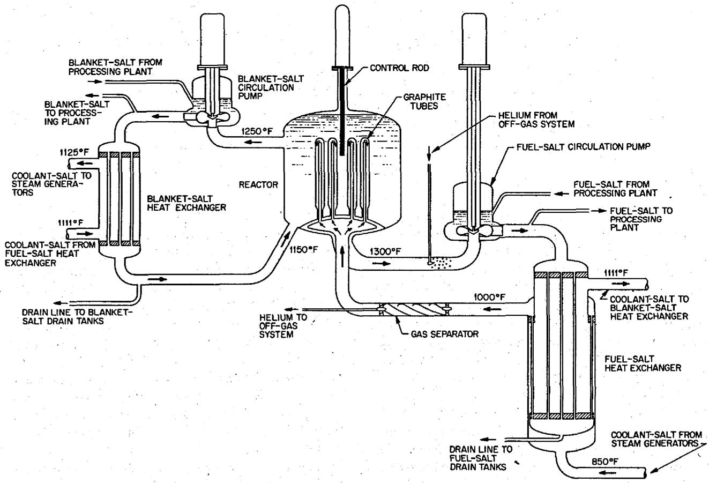  
Fig. 2.1. Simplified Flow Diagram of Two-Fluid MSBR.

$\mathbf{235}\mathrm{U}$ . Absorption of one neutron in fissile material and one in fertile material leaves 0.22 of a neutron for losses to moderator, carrier salt, leakage, higher isotopes, protactinium, fission products, and structural materials and for absorption in thorium to produce the gain in $\mathbf{233}\mathrm{U}$ .

Achieving high performance in a breeder depends on keeping the parasitic absorption of neutrons and the specific inventory of fissile material low. Losses to carrier salt, moderator, and structural materials and the rate and cost of processing to keep the fission product losses low all decrease with increasing concentration of uranium in the fuel salt and increasing inventory in the reactor core. The specific inventory, however, includes the inventory in the heat transfer equipment external to the reactor vessel, in storage, and in the fuel processing plants, so that the specific inventory and the total inventory cost increase rapidly with increasing concentration of uranium in the fuel salt. The breeding gain and specific inventory must be balanced to obtain the highest breeding performance (large $G / S^2$ ) that is consistent with producing power at low cost.

The favored fuel salt contains about 0.2 mole $\%$ $\mathrm{UF_4}$ of which about $70\%$ is $^{233}\mathrm{U}$ and $^{235}\mathrm{U}$ , $23\%$ is $^{234}\mathrm{U}$ , and $7\%$ is $^{236}\mathrm{U}$ . The uranium fluoride is dissolved in a ${}^{7}\mathrm{LiF - BeF}_2$ (67-33 mole $\%$ ) carrier salt. As shown in Table 3.1, this salt has a liquidus temperature of about $840^{\circ}\mathrm{F}$ and good flow and heat transfer properties at the working temperatures. It also has excellent thermal and radiation stability and, with the use of ${}^{7}\mathrm{Li}$ , a low cross section for the parasitic absorption of neutrons. A $\mathrm{ThF_4 - }^{7}\mathrm{LiF - BeF_2}$ salt (27-71-2 mole $\%$ ), which melts at about $1040^{\circ}\mathrm{F}$ , is a good choice for the blanket salt. The physical properties of this salt are also shown in Table 3.1.

Although lithium and beryllium nuclei are good moderators for neutrons, the moderating properties of the fluoride salts are not sufficiently good, when compared with their neutron absorbing properties, to build a thermal breeder without the use of other moderator. Graphite is the best material for this purpose, because it has good moderation properties, a low neutron absorption cross section, and good structural properties at high temperature and can be used in direct contact with molten fluoride salts.

The design and performance of the reactor depend considerably on the effects of fast neutrons on the graphite. Neutron irradiation causes graphite to change dimensions and its physical properties to deteriorate. The life of the graphite is expected to be limited to some total exposure to fast neutrons and therefore to vary inversely with the maximum power density in the

core. Selection of a design power density for the core must be based on a balance between the costs of fuel inventory, periodic replacement of the graphite, and other factors that reflect on the net cost of the electricity produced.

In order for the graphite to have an acceptable radiation life, we estimate that the maximum power density should not exceed about 100 kw per liter of core volume. With this limit on power density, the core of a central-station power reactor would have a volume of several hundred cubic feet. This size is too large for the core to consist of graphite bars and highly enriched fuel salt contained in a thin metal shell and surrounded by a region of blanket salt. The critical concentration of $^{233}\mathrm{U}$ in the fuel salt would be so low that the absorptions in the carrier salt and the graphite would be excessive. Absorption of neutrons by the shell would further degrade the performance.

The concentration of $^{233}\mathrm{U}$ in the fuel salt can be raised to the desired level by dispersing blanket salt throughout the core. This is accomplished by making the graphite moderator in the form of tubular elements and flowing the fuel salt through the elements and the blanket salt around the elements. The core composition is obtained by optimizing the relative volumes of fuel salt, blanket salt, and graphite within bounds imposed by limits on the concentration of thorium in the blanket salt and by the engineering of the core.

Results of many calculations have shown that the combined neutron losses to fuel and blanket carrier salts, the graphite moderator, and higher isotopes will be near 0.11 in an optimized reactor, leaving 0.11 for other losses and the breeding gain. Leakage losses are reduced to a small amount by a thorium blanket of reasonable thickness around the core. The losses due to protactinium are kept small by keeping its concentration in the blanket salt low. This is accomplished by having a blanket of large volume at low neutron flux or by removing the protactinium from the blanket salt on a few-day cycle and allowing it to decay in the processing plant. Xenon-135 must be removed from the fuel salt on a few-second cycle, or the surfaces of the graphite elements must be sealed to greatly reduce the rate of diffusion of xenon into the pores. Most of the other fission products must be removed by processing the fuel salt on a 30- to 50-day cycle. Limiting the total of the above losses to 0.03 to 0.07 appears to be reasonable; this leaves a potential breeding gain of 0.04 to 0.08.

A reactor with a breeding gain in this range and a specific inventory of $1.5\mathrm{kg / Mw(e)}$ or less will have good breeding performance. In order to have this low a

specific inventory, the amount of $^{233}\mathrm{U}$ external to the reactor core must be kept to a minimum. The heat transfer circuit of the reactor must be closely coupled to the reactor vessel, and it must have high performance. The fissile inventory in the blanket systems must be kept small by extracting the bred $^{233}\mathrm{U}$ from the blanket salt on a few-day cycle and making it available for adding to the fuel salt to compensate for burnup. Processing the fuel and blanket salts at the reactor site is necessary to avoid inventory in transport and storage, and short cooling time is important in reducing the inventory in processing. The processes must be simple and involve few changes in the physical or chemical nature of the salts if they are to be carried out rapidly and inexpensively. Fluorination to remove the uranium as the volatile $\mathrm{UF}_6$ followed by vacuum distillation to separate the carrier salt from the rare-earth fission products satisfies these requirements for processing the fuel salt. Fluorination to remove the uranium or extraction of protactinium and uranium into molten bismuth can satisfy the requirements for the blanket.

With thorium blanket salt dispersed throughout the core, the breeding gain is largely independent of the size of the core, but this arrangement imposes several conditions on the design. The first of these is that graphite elements must be joined to metal-piping in the reactor vessel. A perfect separation between the fuel and blanket salts is not essential to the safety of the operation, but the leakage must not be so great as to put an excessive burden on the processing facilities. Processing considerations lead to a preference for any leakage to be blanket salt into fuel salt, and the leakage must be kept below about $1\mathrm{ft}^3/\mathrm{day}$ in a 1000-Mw(e) plant. Such a plant would have several hundred graphite-to-metal joints. Our experience led us to choose graphite-to-metal brazing as the method for obtaining adequate leak-tightness.

The graphite elements for the core must be of a size and shape that are within the capability of manufacturers to make and inspect for reasonable cost and with good quality control. Isotropic material appears desirable and may be essential from the standpoint of irradiation effects. Thicknesses of sections must be limited so that the temperature rise due to heating in the graphite is not large. Effects of irradiation increase with temperature, and stresses increase with temperature difference, so a large rise in internal temperature could result in a large decrease in service life of the core elements. Graphite tubes 6 in. or less in diameter and with a wall $3/4$ in. or less in thickness appear to fulfill all these requirements.

Neutron irradiation produces substantial changes in length of the graphite elements, and the difference in expansion of the graphite and the metal parts of the reactor vessel with temperature changes can also be large. These effects must be accommodated without overstressing the graphite. We propose to accomplish this by making the graphite elements in the form of concentric tubes connected to the reactor vessel at only one end in order to provide freedom for axial expansion and contraction. The fuel salt would flow in and out at the same end of the elements, and the connections would be to tube sheets at the bottom of the reactor vessel to allow the salt to drain completely.

Because of the irradiation effects, the graphite tubes will have to be replaced periodically. Also, one could expect an occasional failure of a graphite element or a graphite-to-metal joint from other causes. The reactor vessel and internals will be highly radioactive after a short time at high power, and with the graphite elements brazed to a tube sheet in the bottom of the reactor vessel, individual tubes could not be readily inspected or replaced. We concluded that the most practical way to renew the graphite in the core would be to replace the entire reactor vessel and its contents. Suitable provisions would be required for remotely operated tools and viewing equipment to cut, weld, and inspect joints in the piping system. Provisions for handling and disposing of spent reactor vessels would have to be included in the plant.

The high melting temperatures of the salts make it necessary to preheat the reactor equipment to high temperature before introducing the salts and to maintain the temperature when they are present. The special problems of maintenance and inspection of the reactor equipment after it has become radioactive led to our proposals to install the reactor systems in heated cells, which are comparable to large furnaces, rather than to apply heaters and insulation to the vessels and piping.

In our studies of designs for molten-salt breeder reactors, we are concerned primarily with power stations having outputs of 1000 Mw(e) or more. The capacities of salt circulation pumps, heat exchangers, steam generators, etc., needed for such plants are greater than could reasonably be designed into single units. In the 1000-Mw(e) MSBR design described in ORNL-3996, we chose to connect four primary heat removal circuits to one reactor vessel, to provide one coolant and steam generator circuit for each primary heat removal circuit, and to send the steam from all the steam generators in the plant to one turbine.

Since the two-fluid breeder has a blanket of low $^{233}\mathrm{U}$ and high thorium content around the core to capture the leakage neutrons, reactors of this type can have about the same breeding performance over a wide range of size if the maximum power density in the core is held constant. These facts, together with the special problems and time required to replace a reactor vessel, led us to consider a modular design for the two-fluid MSBR in which separate, but smaller, reactor vessels would be coupled to primary heat removal circuits to provide four autonomous reactor systems delivering steam to one turbine-generator. This modular plant would be slightly larger than the integral plant, since four small reactor vessels with associated control systems would be substituted for the single larger vessel. Otherwise the equipment in the plant would be the same. The advantage would be that the plant could continue to operate at part load while one or two modules were down for maintenance. We were sufficiently impressed by this capability to make the modular concept the basis for the design studies described in later sections of this report. No analysis was made of the optimum size for a module. We simply decided for the purposes of this study to provide four modules in our 1000-Mw(e) plant.

All our designs for MSBR plants have fuel and blanket circulation systems that are separated from the steam system by an intermediate coolant system. If the steam system were coupled directly to the fuel salt system by means of a steam generator, any leaks in the tubes of the steam generator would result in steam or water leaking into the fuel salt. Reactions between water and fuel salt would not be violent, but corrosive hydrogen fluoride would be generated, and uranium oxide would precipitate in the salt. Also, special provisions would have to be included in the design to prevent the fuel circulation system from being raised to the high pressure of the steam system. Molten sodium, helium, and other coolants have been considered for use in the coolant system, but we prefer a molten salt. Sodium reacts with the fuel salt to generate considerable heat, precipitate uranium, and raise the melting point of the salt. Helium does not react with the salt but must be used at high pressure in order to obtain a good heat transfer coefficient in the primary heat exchanger. At best the heat transfer coefficient with gas is considerably less than can be obtained with sodium or salt and results in an undesirably high inventory of fuel salt and fissionable uranium in the reactor system. The $^7\mathrm{LiF - BeF}_2$ coolant salt used in the MSRE is a good coolant, but it costs about $\$1400$ per cubic foot, and its melting point is about $840^{\circ}$ F. We would prefer to have

a less expensive cooling salt with a lower melting point. The salt $\mathrm{NaBF}_4$ -NaF (92-8 mole %) costs only about $60 per cubic foot, melts at $725^{\circ}\mathrm{F}$ , and is a favored candidate for use in the coolant system.

Minimum operating temperatures for the MSBR are set by the liquidus temperatures of the salts, and the materials of construction are governed by the operating temperatures and the properties of the salts. The reactor fuel and blanket systems must be operated at temperatures above about $1000^{\circ}\mathrm{F}$ , and the coolant system must be operated above about $750^{\circ}\mathrm{F}$ . High nickel alloys have good resistance to corrosion by fluoride salts at high temperature and good creep strength to about $1300^{\circ}\mathrm{F}$ . Since the temperature must be high and the materials are expensive, we believe it appropriate to couple the reactor plant to a steam cycle that is representative of the best current practice. The 3500-psia, $1000^{\circ}\mathrm{F}$ -throttle, $1000^{\circ}\mathrm{F}$ -reheat cycle that is presently being specified for most new large fossil-fueled plants was selected for use in our design studies largely on this basis. The supercritical cycle has the added advantage that the feedwater to the steam generators could be preheated to $700^{\circ}\mathrm{F}$ without much loss in thermal efficiency by direct injection of superheated steam into the water. This procedure may be necessary if use of feedwater at a more common temperature creates problems in the steam generators by freezing coolant salt on the tubes. (At subcritical pressures the Loeffler cycle employing a steam circulator and mixing drum probably would have to be used to attain the requisite high-temperature entering stream.)

Finally, it is important to emphasize that the designs discussed here are based largely on current technology and developments that we believe to be readily achievable. The materials, processes, and performance factors are developed sufficiently that no major inventions appear to be required to solve the technological problems.

# 3. MATERIALS

# 3.1 General

This section briefly discusses some of the materials which are unique to molten-salt breeder reactors. These include the fuel, blanket, and coolant salts; the reactor graphite; and the Hastelloy N used to contain the salts. A brazed joint of graphite to Hastelloy N is also described.

These, or similar, materials have been under study at ORNL for many years, beginning with the ANP

program in the early 1950's and continuing through the MSRE program to the present. Specific evidence has accumulated that fluoride salt mixtures containing fissile and fertile materials have the nuclear and physical properties to make them suitable for use in a moltensalt thermal breeder reactor. The salts possess suitable liquidus temperatures and stability to temperature and irradiation. The Hastelloy N, used to contain the salts, and the graphite, which acts as the moderator, are compatible with each other and with the salts. Except for the graphite, which suffers irradiation damage, there are no characteristics of the materials which significantly limit the MSBR in the concept discussed here.

The accumulated background of information on the materials is too extensive to be covered fully in this report. References are made, however, to some key reports that contain more complete information or bibliographies.

# 3.2 Salts

# 3.2.1 General

Table 3.1 shows the salt compositions and physical properties used in the two-fluid MSBR study. Recently measured values of the physical properties are also included where pertinent. (See Sect. 5.6.1 for estimates of volumes of salts in the systems.)

# 3.2.2 Fuel Salt

The fuel salt is a ternary mixture of $^{7}\mathrm{LiF}$ , $\mathrm{BeF}_2$ , and $^{233}\mathrm{UF}_4$ (68.5-31.1-0.2 mole %). A phase diagram for the system is shown in Fig. 3.1, and the properties are given in Table 3.1.

The MSRE uses essentially the same fuel salt except that it contains 5 mole $\%$ of $\mathrm{ZrF_4}$ to eliminate the possibility of precipitating $\mathrm{UO_2}$ in the event of accidental contamination of the system with oxygen or water. The zirconium addition is judged to be unnecessary for the MSBR in that the MSRE has been operated for four years without contaminating the fuel salt, and the frequent processing of the MSBR fuel should keep the oxide content low.

The MSRE data also indicate excellent compatibility of the salt with the Hastelloy N and graphite materials in the system. The corrosion rate of the metal is less than 0.2 mil/year, and the mechanical properties are virtually unaffected by long exposure to the salt. The graphite is not wetted by the salt mixture, and bulk permeation by the salt is less than $0.2\%$ , well below the amount considered acceptable.

As indicated in Fig. 3.1, on cooling of the fuel salt in the temperature interval from about $450^{\circ}\mathrm{C}$ $(842^{\circ}\mathrm{F})$ to $438^{\circ}\mathrm{C}$ $(820^{\circ}\mathrm{F})$ , the compound $2\mathrm{LiF} \cdot \mathrm{BeF}_2$ precipitates from the melt. At $438^{\circ}\mathrm{C}$ $(820^{\circ}\mathrm{F})$ the salt mixture solidifies and produces a mixture of two crystalline phases, $2\mathrm{LiF} \cdot \mathrm{BeF}_2$ (89 wt %) and $\mathrm{LiF} \cdot \mathrm{UF}_4$ (11%). On reheating, the mixture resumes its initial composition and physical properties without change.

A considerable body of information exists to indicate that the MSRE fuel salt is stable under irradiation and

Table 3.1. Physical Properties of Salts for Two-Fluid MSBR ${}^{a}$   

<table><tr><td></td><td>Fuel Salt</td><td>Blanket Salt</td><td>Coolant Salt</td></tr><tr><td>Reference temperature, °F(unless otherwise noted)</td><td>1150</td><td>1200</td><td>988</td></tr><tr><td>Components</td><td>\( ^7\text{LiF-BeF}_2-UF_4 \)</td><td>\( ^7\text{LiF-ThF}_4-BeF_2 \)</td><td>\( NaBF_4-NaF \)</td></tr><tr><td>Composition, mole %</td><td>68.5-31.3-0.2</td><td>71-27-2</td><td>92.0-8.0</td></tr><tr><td>Molecular weight, approx</td><td>34</td><td>103</td><td>104</td></tr><tr><td>Liquidus temperature, °F</td><td>842</td><td>1040</td><td>700 (725)</td></tr><tr><td>Density, \( \rho \), lb/ft3</td><td>127 ± 6</td><td>277 ± 14</td><td>125 (121 at 850°F)</td></tr><tr><td>Viscosity, \( \mu \), lb ft-1 hr-1</td><td>27 ± 3</td><td>38 ± 19</td><td>12 (4.6 at 850°F)</td></tr><tr><td>Thermal conductivity, k, Btu hr-1 ft-1 °F-1</td><td>1.5 (0.8)</td><td>1.5 (0.6)</td><td>1.3 (0.27)</td></tr><tr><td>Heat capacity, \( c_p \), Btu lb-1 °F-1</td><td>0.55 ± 0.14</td><td>0.22 ± 0.06</td><td>0.14 (0.36)</td></tr><tr><td>Vapor pressure, torrs (mm Hg) at 1150°F</td><td>&lt;0.1</td><td>&lt;0.1</td><td>40 (252)</td></tr></table>

${}^{a}$ The physical properties shown are those generally in use at the time the two-fluid reactor study was set aside. Values in parentheses are based on current information and are believed to be more representative.

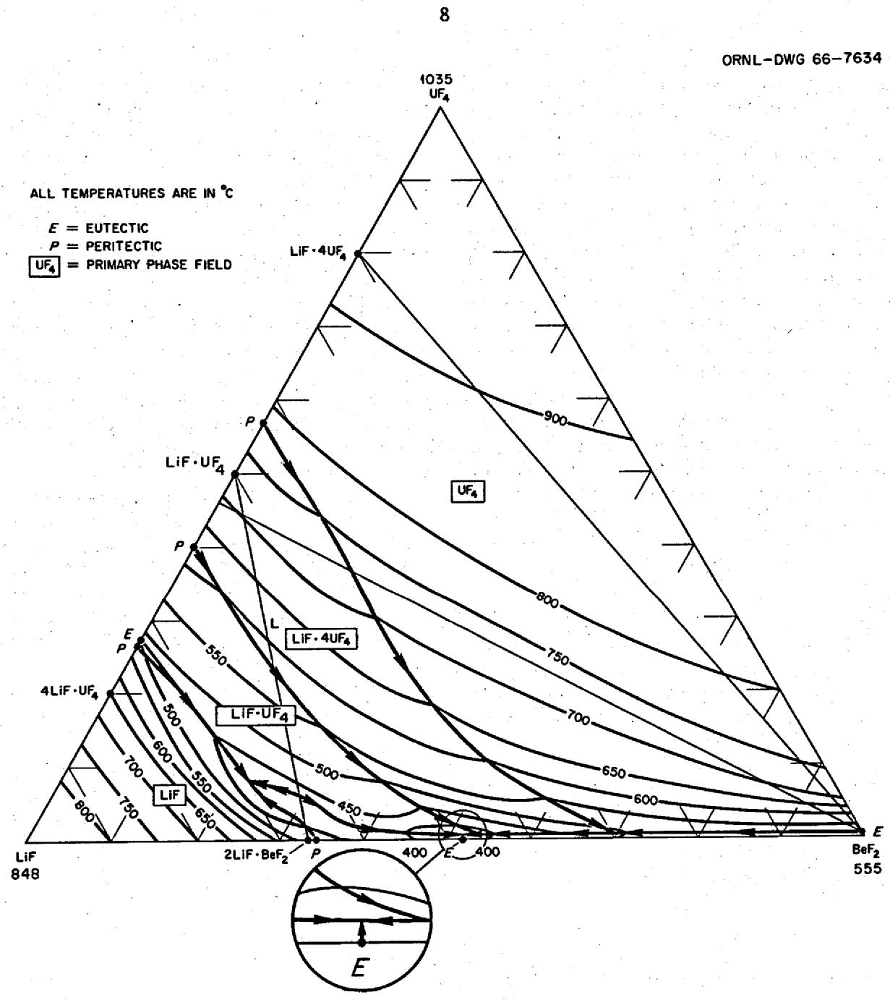  
Fig. 3.1. Two-Fluid MSBR Fuel Salt - The System LiF-BeF $_2$ -UF $_4$ .

to temperatures well above $800^{\circ}\mathrm{C}$ $(1470^{\circ}\mathrm{F})$ . The MSBR fuel should behave similarly. However, if irradiated salt is allowed to freeze and cool below about $100^{\circ}\mathrm{C}$ $(212^{\circ}\mathrm{F})$ , radiolysis occurs with release of $\mathbf{F}_2$ . This reaction can be easily suppressed by maintaining the salt above, say, $200^{\circ}\mathrm{C}$ $(390^{\circ}\mathrm{F})$ .

Fission products will be produced in a 2225-Mw(t) MSBR at the rate of about $2.3\mathrm{kg/day}$ . The success of a molten-salt reactor as a breeder hinges upon the ability

to process the fuel and blanket salts rapidly enough to maintain the fission products at relatively low levels and on keeping the costs of this processing low enough to afford attractive fuel cycle costs. (The processing aspects are more fully discussed in Sect. 4.4.) Even with rapid processing, however, the fission product concentrations are high enough to cause their behavior in the salt to be of interest.

Table 3.2. Approximate Fission Product Distribution in MSRE After 32,000 Mwhr of Operation   

<table><tr><td>Isotope</td><td>Inventory in MSRE (dis/min)a</td><td>Percent in Fuel</td><td>Percent on Graphiteb</td><td>Percent on Hastelloy Nb</td><td>Percent in Cover Gasb</td></tr><tr><td></td><td>×1017</td><td></td><td></td><td></td><td></td></tr><tr><td>99Mo</td><td>7.91</td><td>0.94</td><td>10.9</td><td>40.5</td><td>77</td></tr><tr><td>132Te</td><td>5.86</td><td>0.83</td><td>10.0</td><td>70.0</td><td>66</td></tr><tr><td>103Ru</td><td>3.36</td><td>0.13</td><td>6.6</td><td>14.9</td><td>40</td></tr><tr><td>95Nb</td><td>4.40</td><td>0.044</td><td>36.4</td><td>34.1</td><td>5.7</td></tr><tr><td>95Zr</td><td>6.00</td><td>96.1</td><td>0.03</td><td>0.06</td><td>0.14</td></tr><tr><td>89Sr</td><td>5.02</td><td>77.0</td><td></td><td>0.26</td><td>33c</td></tr><tr><td>131I</td><td>4.00</td><td>64.0</td><td></td><td>1.0d</td><td>16d</td></tr></table>

${}^{a}$ Total inventory calculated from the power history of the MSRE.   
${}^{b}$ Values for graphite and metal are based on the amounts found on specimens removed from the core, and the values for the cover gas are based on samples of gas obtained from the pump bowl.   
cProduced by decay of 89Kr in cover gas.   
$d$ Produced by decay of 131Te.

Data obtained from the MSRE have confirmed the chemists' predictions regarding the state of the fission products in a molten-salt reactor. The rare gases krypton and xenon are only slightly soluble in the high-temperature salt and are readily removed by sparging the salt with helium bubbles. Rubidium, cesium, strontium, barium, zirconium, yttrium, and the lanthanides form very stable fluorides, which are found primarily in the salt. Some of these elements, such as rubidium and cesium, have gaseous precursors and appear in the graphite and the off-gas system in proportion to the amounts of the precursors that escape from the salt. The more noble metals from elements 41 and 42 (niobium and molybdenum) through element 52 (tellurium) are largely reduced to the metallic state in the salt. They deposit on graphite and metal surfaces in the reactor and somewhat surprisingly appear in the cover gas, presumably as a "smoke" of metallic particles. The distribution of representative fission products of this group in the MSRE after 32,000 Mwhr of operation is shown in Table 3.2. A similar distribution, modified to reflect differences in relative surface areas and in flow conditions, must be expected in an MSBR. The data in Table 3.2 and other analyses of samples of salt indicate that iodine forms stable iodides in the salt. Iodine found on MSRE surfaces and in the cover gas is produced there by decay of the noble metal tellurium. Bromine forms stable bromides that remain in the salt.

# 3.2.3 Blanket Salt

The blanket salt for the two-fluid MSBR is a ternary mixture of $^7\mathrm{LiF}$ $\mathrm{BeF}_2$ , and $\mathrm{ThF_4}$ (71-27-2 mole $\%$

This system is shown in Fig. 3.2, and the properties are listed in Table 3.1.

The blanket salt has a liquidus temperature of about $560^{\circ}\mathrm{C}$ $(1040^{\circ}\mathrm{F})$ , and during solidification the solid phases $\mathrm{LiF} \cdot \mathrm{ThF}_4$ and $3\mathrm{LiF} \cdot \mathrm{ThF}_4$ are formed, incorporating $\mathrm{Be}^{2+}$ in both the interstitial and substitutional sites.

The blanket salt can be expected to exhibit the same good compatibility with Hastelloy N and graphite under reactor conditions as does the fuel salt. Capsule tests in the MTR demonstrated the radiation stability of similar salts containing $\mathrm{ThF_4}$ . Early in the operation of the MSRE there was some discussion of eventually operating with a fuel salt mixture containing thorium, but this is now considered unnecessary since the results are largely predictable.

The blanket salt will be processed on a rapid cycle to remove the bred protactinium and/or fissile material in order to minimize the fissile inventory, the fission rate, and the concentration of fission products in the blanket salt. The chemical processing is discussed in more detail in Sect. 4.4.

# 3.2.4 Coolant Salt

In our design of an MSBR, a coolant is used for transporting heat from the primary heat exchangers to the steam generators and reheaters. Characteristics considered to be desirable in the coolant include low melting temperature, compatibility with Hastelloy N,

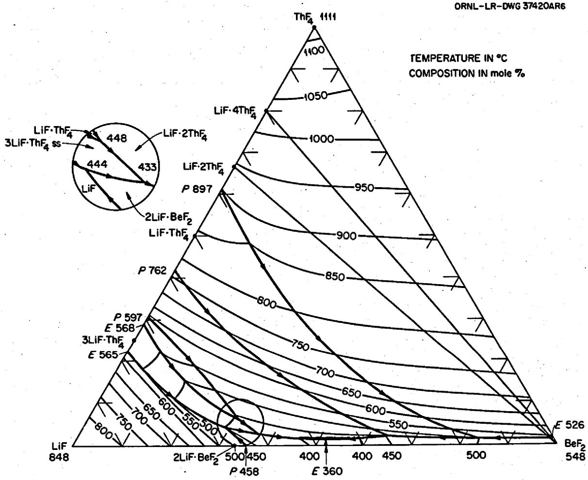  
Fig. 3.2. Two-Fluid MSBR Blanket Salt - The System LiF-BeF $_2$ -ThF $_4$ .

resistance to decomposition by heat and radiation, good heat transfer and pumping characteristics, low vapor pressure at operating temperature, freedom from violent chemical reactions with associated materials, and low cost. Sodium is undesirable because of its reactivity with air, water, and fuel salt. The MSRE coolant, $^7\mathrm{LiF - BeF}_2$ (66-34 mole %), has a liquidus temperature near $455^{\circ}\mathrm{C}$ ( $850^{\circ}\mathrm{F}$ ) and is more expensive than one would like to use in the large volume of an MSBR system. Sodium fluoroborate of the eutectic composition $\mathrm{NaBF}_4$ -NaF (92-8 mole %) was selected as most nearly satisfying all the requirements for a coolant. The phase diagram for the $\mathrm{NaBF}_4$ -NaF system is shown in Fig. 3.3, and the physical properties are given in Table 3.1.

Several mixtures of fluoroborates of the alkali metals were considered in making the selection. Some were ruled out because of high viscosity or high cost.

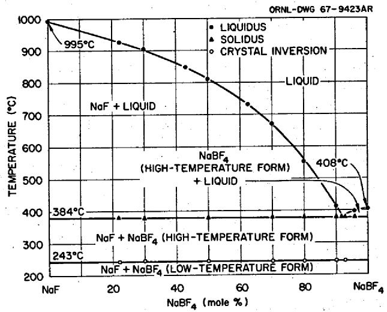  
Fig. 3.3. Two-Fluid MSBR Coolant Salt - The System NaF-NaBF $_4$ .

Stoichiometric $\mathrm{NaBF_4}$ does not exist in the molten state without a very high partial pressure of $\mathrm{BF}_3$ gas. The eutectic composition, however, has most of the properties considered desirable for the MSBR coolant, and it can operate with a dilute mixture of $\mathrm{BF}_3$ in helium at about 2 atm pressure as the cover gas. The melting temperature of about $385^{\circ}\mathrm{C}$ ( $725^{\circ}\mathrm{F}$ ) is acceptable. Although a lower temperature would be desirable, it is not clear at this time whether the liquidus temperature can be successfully depressed by use of additives. The fluoroborate has a modest cost of less than $50\phi/\mathrm{lb}$ , and commercial grades may have acceptable purity.

Thermal convection loop studies of the corrosion of Hastelloy N by sodium fluoroborate at temperatures to $607^{\circ}\mathrm{C}$ $(1130^{\circ}\mathrm{F})$ have indicated a low corrosion rate in the absence of contamination of the salt by moisture, although not as low as with the MSRE coolant. As with other fluoride salts, the presence of moisture greatly increases the corrosion rates. The absence of severe corrosion problems is confirmed qualitatively by experience with the circulation of sodium fluoroborate in a large test loop for about 1800 hr. A corrosion product precipitate, $\mathrm{Na}_3\mathrm{CrF}_6$ , has been obtained from both types of loops. Its solubility is inferred to be sufficiently low that cold trapping may be required to prevent the material from interfering with operation of the coolant system by depositing on heat transfer surfaces and in other cooled regions.

Molten sodium fluoroborate has been irradiated in gamma fluxes as high as $8 \times 10^{7} \mathrm{r/hr}$ without significant effects on the salt or the Hastelloy N container and specimens.

# 3.3 Hastelloy N

The reactor vessel, piping, and primary and secondary heat transfer equipment require a material that is resistant to corrosion by fluoride salts; compatible with graphite; capable of being fabricated into complicated shapes by rolling, forging, machining, and welding; mechanically strong and ductile at temperatures up to $700^{\circ}\mathrm{C}$ $(1300^{\circ}\mathrm{F})$ ; and capable of maintaining these properties during long exposure to this elevated temperature in a neutron environment. Hastelloy N is the preferred material for this application.

Hastelloy N is a nickel-base alloy containing chromium for oxidation resistance and molybdenum for strength at high temperature. The "standard alloy" has

Table 3.3. Nominal Chemical Composition of Hastelloy N   

<table><tr><td>Element</td><td>Standard Alloy11(Much as Used in MSRE)(wt %)a</td><td>Modified Alloy9Recommended forMSBR&#x27;s(wt %)</td></tr><tr><td>Nickel</td><td>Balance</td><td>Balance</td></tr><tr><td>Molybdenum</td><td>15–18</td><td>12</td></tr><tr><td>Chromium</td><td>6–8</td><td>7</td></tr><tr><td>Iron</td><td>5</td><td>0–4</td></tr><tr><td>Manganese</td><td>1</td><td>0.2–0.5</td></tr><tr><td>Silicon</td><td>1</td><td>0.1 max</td></tr><tr><td>Boron</td><td>0.01</td><td>0.001 max</td></tr><tr><td>Titanium</td><td></td><td>0.5–1.0</td></tr><tr><td>Hafnium or Niobium</td><td></td><td>0–2</td></tr><tr><td>Copper</td><td>0.35</td><td></td></tr><tr><td>Cobalt</td><td>0.2</td><td></td></tr><tr><td>Phosphorus</td><td>0.015</td><td></td></tr><tr><td>Sulfur</td><td>0.02</td><td>0.35</td></tr><tr><td>Carbon</td><td>0.04–0.08</td><td></td></tr><tr><td>Tungsten</td><td>0.5</td><td></td></tr><tr><td>Aluminum + Titanium</td><td>0.5</td><td></td></tr></table>

aSingle values are maximum percentages unless otherwise specified.

the composition shown in Table 3.3 and was developed in the ANP program to contain molten fluoride salts at temperatures to about $870^{\circ}\mathrm{C}$ $(1600^{\circ}\mathrm{F})$ . The MSRE was constructed of standard Hastelloy N. The material was obtained from commercial vendors, and it was fabricated using conventional practices comparable with those used for stainless steel. The major material problem encountered was weld cracking, which was overcome by slight changes in the melting practice and by strict quality control of the materials. Heats of the metal subject to cracking were identified and eliminated by means of a weldability test included as part of the specifications.

Results of extensive corrosion tests, examination of specimens exposed to the fuel salt in the center of the core of the MSRE, and analyses of samples of fuel salt from the MSRE have demonstrated the excellent resistance of Hastelloy N to corrosion by fluoride salts. If the salt is kept slightly reducing and is not continually contaminated by oxygen or moisture, the corrosion rate at temperatures to $700^{\circ}\mathrm{C}$ $(1300^{\circ}\mathrm{F})$ is less than 0.5 mil/year. The effect of the corrosion is to gradually deplete the alloy of chromium, leaving behind the major constituents and, at higher temperatures, a network of subsurface voids.

Irradiation of the standard Hastelloy N by thermal neutrons drastically reduces the ductility and stress rupture life of the metal at high temperatures. This

Table 3.4. Physical Properties of Hastelloy N   

<table><tr><td></td><td>80°F</td><td>500°F</td><td>1000°F</td><td>1300°F</td><td>1500°F</td></tr><tr><td>Density, lb/in.3</td><td>0.320a</td><td></td><td></td><td></td><td></td></tr><tr><td>Density, lb/ft3</td><td>553.0</td><td></td><td></td><td></td><td></td></tr><tr><td>Thermal conductivity, But hr-1 ft-1°F-1</td><td>6.0</td><td>7.8</td><td>10.4</td><td>12.6</td><td>14.1</td></tr><tr><td>Specific heat, Btu lb-1°F-1</td><td>0.098</td><td>0.104</td><td>0.115a</td><td>0.136</td><td>0.153</td></tr><tr><td>Coefficient of thermal expansion per°Fb</td><td>5.7 × 10-6</td><td>7.0 × 10-6</td><td>8.6 × 10-6</td><td>9.5 × 10-6</td><td>9.9 × 10-6</td></tr><tr><td>Modulus of elasticity, lb/in.2</td><td>31 × 106</td><td>29 × 106</td><td>27 × 106</td><td>25 × 106</td><td>24 × 106</td></tr><tr><td>Electrical resistance, microhm-cm</td><td>120.5a</td><td>123.7</td><td>125.8</td><td>126.0a</td><td>124.1a</td></tr><tr><td>Approximate tensile strength, psi</td><td>115,000</td><td>106,000</td><td>95,000</td><td>75,000</td><td>55,000</td></tr><tr><td>Maximum allowable stress, psiC</td><td>25,000</td><td>20,000</td><td>17,000</td><td>3500</td><td></td></tr><tr><td>Maximum allowable stress, psi (bolts)</td><td>10,000</td><td>7700</td><td>6600</td><td>3500</td><td></td></tr><tr><td>Melting temperature, °F</td><td></td><td></td><td>2470-2555</td><td></td><td></td></tr></table>

${}^{a}$ Taken directly from ref. 10. All other values found from interpolation of plots of ref. 10 data. See this reference for more precise information.   
$b_{\text{Average coefficient of expansion over 212 to } 1832^{\circ}\text{F range is } 8.6 \times 10^{-6} \text{ per } ^{\circ}\text{F}}$ . $c_{\text{Ref. 11}}$ .

deterioration results from the transmutation of ${}^{10}\mathrm{B}$ to lithium and helium, with the latter collecting in the grain boundaries to promote intergranular cracking. The irradiation effects become appreciable at a fluence of about $10^{18}$ neutrons/cm². At $650^{\circ}\mathrm{C}$ ( $1200^{\circ}\mathrm{F}$ ) and with stresses above 20,000 psi, metal irradiated to fluences above $5\times 10^{19}$ can fracture with an elongation less than $0.5\%$ and with less than $1\%$ of the life of unirradiated metal. Theoretical considerations and some data indicate that the effects decrease with decreasing stress. $^{10}$ The damage occurs even though the boron content of the alloy is as low as 1 ppm. It is, therefore, not practical to limit the radiation effect by control of trace amounts of boron.

Because the MSRE was intended to operate for only a few years, the standard Hastelloy N was an acceptable material of construction. A material with greater resistance to radiation effects is, however, required for those parts of an MSBR that are subjected to neutron irradiation. Marked improvement in the properties of irradiated Hastelloy N has been achieved by adding small amounts of titanium and/or hafnium or niobium to a slightly altered base material to obtain modified Hastelloy N of the range of compositions shown in Table 3.3.

The stress rupture life and the ductility of modified Hastelloy N can vary considerably with variations in treatment and in amounts of some minor constituents. In general, we have found that irradiation decreases the rupture life and ductility of the modified alloy, but, for irradiation to fluences of about $10^{21}$ neutrons/cm²

(fast and thermal) at temperatures to $750^{\circ}\mathrm{C}$ (1380°F), its properties are about equal to those of the standard alloy when unirradiated. On this basis and on the assumption that the reactor equipment would be made of modified Hastelloy N, we used the extensive data on the properties of unirradiated Hastelloy N in our studies of designs for the reactor equipment. Those properties are reported in Table 3.4.

The specific heat, electrical resistivity, and thermal conductivity data all show inflections with respect to temperature at $650^{\circ}\mathrm{C}$ ( $1200^{\circ}\mathrm{F}$ ). This is thought to be due to an order-disorder reaction. No changes in the mechanical properties are detectable as a result of this reaction, however. The alloy has greater strength than the austenitic stainless steels and is comparable with the stronger alloys of the Hastelloy type. The maximum allowable stresses shown in Table 3.4 were established by performing mechanical property tests on experimental heats of commercial size. The data were reviewed by the American Society of Mechanical Engineers Boiler and Pressure Vessel Code Committee, and the stress values were approved for use under Case 1315 for Unfired Pressure Vessels and under Case 1345 for Nuclear Vessels.[11]

# 3.4 Graphite

The characteristics desired of the moderator material for the core of a two-fluid MSBR concept are good neutron moderation, low neutron absorption, compatibility with the molten fuel and blanket salts and

with Hastelloy N, sufficient strength and integrity to separate the fuel and blanket salts with good reliability, low permeability to salt and gases, fabricability at reasonable cost, capability for being joined to Hastelloy N, and finally, ability to maintain all the desirable properties after exposure to operating temperatures as high as about $1400^{\circ}\mathrm{F}$ and to neutron fluences above $10^{23}$ neutrons/cm² (for $E > 50$ kev). In order to obtain these characteristics a special grade of coated graphite will have to be developed specifically for MSBR use.

The chemical purity and neutron performance, compatibility with materials, salt permeability, and strength characteristics are sufficient in currently available graphite. Preliminary experiments indicate that a surface impregnation can be developed to keep the gas absorption within acceptable limits. The effect of neutron irradiation, however, is to first shrink and then swell the graphite to cause an increase in porosity and, we expect, a deterioration in physical properties. The dimensional changes occur slowly, and their effects on the neutronics of the reactor can be accommodated by gradually adjusting the fuel-salt composition, although at a small detriment to the nuclear performance. The radiation damage to the graphite, however, limits the useful life of the reactor core. Increases in cost that result from more frequent replacements of the graphite at higher power densities must be balanced against the cost saving obtained from higher power density to obtain a minimum cost for power.

The background of information on graphite is extensive. A detailed report on graphite technology and its influence on MSBR performance has been prepared by Kasten et al. $^{12}$ A few factors are briefly reviewed here.

Grade $\mathbf{CGB^{13}}$ was the first graphite designed specifically for molten-salt reactor use and was first made in commercial quantities for the MSRE. It is basically a petroleum needle coke bonded with coal-tar pitch, extruded to rough shape, and graphitized at $2800^{\circ}\mathrm{C}$ $(5072^{\circ}\mathrm{F})$ . High density and low gas permeability were achieved through multiple pitch impregnations and heat treatments. The material is highly anisotropic, however, and while suitable for the MSRE neutron fluence, it would not have the dimensional stability needed for an MSBR. $^{14}$

Tests of the graphite indicate that isotropy is essential if linear dimensional changes and overall volume changes are to be kept small in irradiated material. A graphite with strong binder and a fairly high density also appears to be important. For this reason, isotropic graphite has been specified for use in the MSBR concepts. Unless otherwise noted, this is the type of graphite implied throughout this report. The nominal physical properties expected of the graphite before irradiation are given in Table 3.5.

There has been recent progress in the development of isotropic and near-isotropic grades of graphite having greater resistance to dimensional changes under irradiation. Some of the sources of materials are Speer Carbon Company (grades 9948, 9949, 9950, 9972), Poco Graphite, Inc. (grades AXF, AXF-5Q, etc.), Carbon Products Division of Union Carbide Corporation (grades ATJ-S and ATJ-SG), and Great Lakes Carbon Company (grades H315A and H337). The isotropic graphites can be made into various shapes by means of conventional molding equipment, the limits on the gas permeability playing a major role in the sequences of operations. Much of the manufacturing information, however, is proprietary and unpublished.

While different grades of graphite behave somewhat differently, it can be generally said that single graphite crystals expand in the $c$ -axis direction and contract in the $a$ -axis direction under irradiation by high-energy neutrons. When large numbers of crystals are bonded together to form a piece of commercial graphite, the behavior under irradiation tends to be that shown in

Table 3.5. Nominal Values for Properties of Graphite   

<table><tr><td>Density, lb/ft3at room temperature</td><td>~115</td></tr><tr><td>Bending strength, psi</td><td>4000-6000</td></tr><tr><td>Young&#x27;s modulus of elasticity,E, psi</td><td>1.7 × 106b</td></tr><tr><td>Poisson&#x27;s ratio, μ</td><td>0.27c</td></tr><tr><td>Thermal expansion, α, per °F</td><td>2.3 × 10-6d</td></tr><tr><td>Thermal conductivity,k,Btu hr-1 ft-1 °F-1</td><td>22-41e</td></tr><tr><td>Electrical resistivity, ohm-cm × 104</td><td>8.9-9.9</td></tr><tr><td>Specific heat,Btu lb-1 °F-1 at 600°F</td><td>0.33</td></tr><tr><td>Specific heat,Btu lb-1 °F-1 at 1200°F</td><td>0.42f</td></tr></table>

Fig. 6.4. Initially the volume contracts and the density increases as some of the imperfections in the structure are filled. On continued irradiation the volume increases sharply, passing through the initial volume at a fluence that decreases with increasing temperature. After examining the available data we concluded that a fluence of about $2.5 \times 10^{22}$ neutrons/cm² equivalent Pluto dose could be sustained at $600^{\circ}\mathrm{C}$ (1112°F) without deterioration of the physical properties of the graphite. As explained in Sect. 6, this corresponds to a fluence of $5.1 \times 10^{22}$ neutrons/cm² ( $E > 50$ kev). For purposes of the design studies reported here, the time to accumulate this dose was taken as the design lifetime for the graphite in the reactor core.

Graphite with a density of $115\mathrm{lb / ft^3}$ contains about 23 vol $\%$ voids. Low permeation of salt into the voids is desirable to keep both the fission product poisoning and the internal heat generation low, particularly after the reactor is drained. For the MSRE design we specified that less than $0.5\%$ of the bulk volume of the graphite should fill with salt; specimens of grade CGB graphite averaged less than $0.2\%$ . The fuel and blanket salts do not wet the graphite surface, $^{12}$ and a pore size of less than about $1\mu$ is sufficient to effectively keep the salt out of the material. Experience with the MSRE indicates that irradiation does not change this characteristic.

Gaseous fission products tend to diffuse from the salt into the voids in the graphite. The graphite should have a low gas permeability to reduce the levels of the xenon poison in the core and also to keep the heat generation due to decay of fission product gases within the graphite low. A target value of $0.5\%$ xenon poison fraction was selected for the two-fluid MSBR. The permeability of graphite is usually measured with helium at room temperature, and a value of less than $10^{-7}\mathrm{cm}^2/\mathrm{sec}$ is necessary if the diffusion of xenon at reactor temperature is to be kept to an acceptable level. Recent tests of six grades of isotropic graphite which are of interest in the MSBR program showed permeabilities ranging from $3 \times 10^{-4}$ to $1 \times 10^{-2}$ cm²/sec. Reducing the permeability sufficiently by

pitch impregnation and graphitization treatments would be very difficult; however, it is possible to achieve acceptable permeabilities by depositing pyrolytic carbon in the surface pores.

In sealing the graphite with pyrolytic carbon the radiation-induced dimensional changes in the two materials may be sufficiently different to cause spalling of the coating. This problem can be largely circumvented, however, if the carbon is deposited in pores near the surface rather than on the surface itself. A method for depositing the pyrocarbon has been developed at ORNL. The graphite is cycled between a vacuum and a regulated pressure of hydrocarbon (butadiene) gas while it is being heated in a high-frequency induction field to between 800 and $1000^{\circ}\mathrm{C}$ (1472-1832 $^{\circ}\mathrm{F}$ ). The cycles are of a few seconds duration, and permeabilities of less than $1.3 \times 10^{-10} \mathrm{~cm}^2/\mathrm{sec}$ have been obtained. In one series of tests the depth of penetration at $800^{\circ}\mathrm{C}$ ( $1472^{\circ}\mathrm{F}$ ) sealing temperature was found to be about 0.015 in.

Calculations were made by Kedl to determine the effect on the xenon poison fraction of sealing the graphite with a thin layer of pyrolytic carbon (or other low-permeability graphite). Various xenon parameters were chosen that would yield a high $^{135}\mathrm{Xe}$ poison fraction with ordinary graphite, and the calculations were then extended to demonstrate the effect of the coatings. The void fraction available to xenon was made variable in such a way that it changed by one order of magnitude when the diffusion coefficient changed by two orders of magnitude. The diffusion coefficient of $10^{-3} \mathrm{ft}^2/\mathrm{hr}^{18}$ assumed for the bulk graphite is believed to be readily attainable. The results are presented in Fig. 3.4. It is interesting to note that the diffusion coefficient in the bulk graphite would have to be $10^{-7} \mathrm{ft}^2/\mathrm{hr}$ or less in order to obtain a significant reduction in the xenon poison fraction, whereas an 8-mil coating of $10^{-8} \mathrm{ft}^2/\mathrm{hr}$ material would reduce the poison fraction to the target value of $0.5\%$ .

# 3.5 Graphite-to-Metal Joints

The two-fluid MSBR concept involves the joining of the graphite core elements to stubs of Hastelloy N tubing which are then welded into the tube sheets, as indicated in Figs. 5.3 and 5.5. The graphite-to-metal

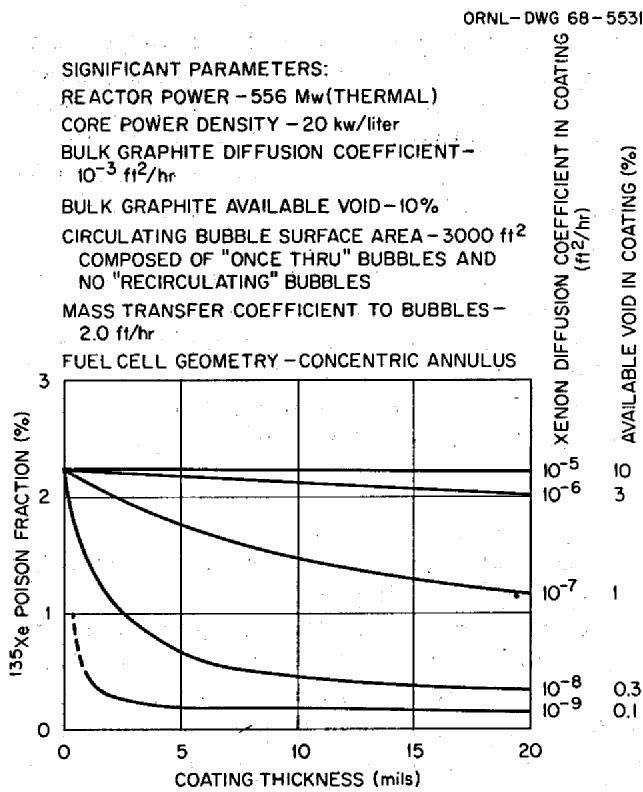  
Fig. 3.4. Effect of Pyrolytic Carbon Coating for Graphite on Xenon Poison Fraction in Two-Fluid MSBR.

joints would be made under carefully controlled shop conditions. Methods for joining the graphite and Hastelloy are being studied at ORNL and have progressed sufficiently to indicate that the materials can be successfully brazed together.

It is difficult to join graphite directly to Hastelloy because the thermal coefficient of expansion of the graphite is significantly lower than that of the metal. The mean coefficient of thermal expansion of isotropic graphite in the temperature range between 70 and $1100^{\circ}\mathrm{F}$ is about $2.4 \times 10^{-6}$ in. $\mathbf{/}^{\circ}\mathbf{F}$ , whereas that of Hastelloy N is about $6.8 \times 10^{-6}$ in. $\mathbf{/}^{\circ}\mathbf{F}$ . This difference is of primary concern when cooling from brazing temperatures of about $2300^{\circ}\mathrm{F}$ .

One of the approaches to the problem is to design the joint so that the Hastelloy N applies a compressive load on the graphite as it cools, the graphite being stronger in compression than in tension. Another approach is to join the graphite to a transition material having a coefficient of thermal expansion more nearly that of the graphite. This material would in turn be brazed to the Hastelloy N. A refinement of this is to use a series of transition materials that would approach the thermal expansion properties of the Hastelloy N in steps.

One of the families of materials investigated for use in transition pieces is the heavy-metal alloys of tungsten or molybdenum. It was found that tungsten with nickel and iron added in the ratio $7\mathrm{Ni} / 3\mathrm{Fe}$ gave far better fabrication characteristics than those with molybdenum.[17] By adjusting the composition, the thermal coefficient of expansion can be varied over the requisite range of about $3 \times 10^{-6}$ in. ${}^{\circ}\mathbf{F}$ to $6 \times 10^{-6}$ in. ${}^{\circ}\mathbf{F}$ as shown in Fig. 3.5.[17] Segments with highest tungsten concentration would be located adjacent to the graphite, and the segments with the most nickel and iron would be next to the Hastelloy.[9]

Test specimens were prepared using nuclear-grade graphite as well as the Poco type, which has a higher coefficient of expansion, as shown in Fig. 3.5. The distribution of the expansion coefficients of the individual segments in relation to those for the graphite and the Hastelloy N is also shown in Fig. 3.5. The composites were made by fabricating the segments individually and copper-brazing them together in a vacuum under light load. To achieve an effective bond between the graphite and the metal requires prior metallizing of the graphite surface by subjecting it to gaseous products of a graphite- $\mathrm{Cr_2O_3}$ reduction reaction conducted under a low vacuum at $1400^{\circ}\mathrm{C}$ .

A minimum of intervening segments was employed in an attempt to reduce fabrication costs. A typical specimen consists of nuclear graphite, a 0.2-in.-thick segment of Poco graphite, a 0.2-in.-thick segment of $80\%$ W-14% Ni-6% Fe alloy, and a 0.2-in.-thick segment of $60\%$ W-28% Ni-12% Fe alloy joined to the

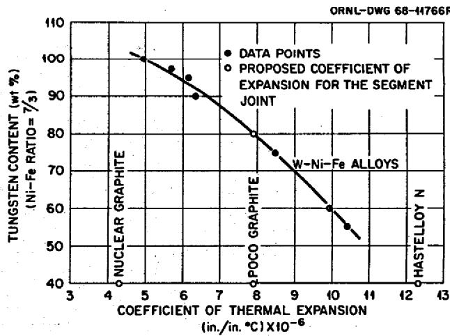  
Fig. 3.5. Expansion Coefficients of Transition Joint Materials as a Function of Composition. Coefficients are mean values between room temperature and $600^{\circ}\mathrm{C}$ and were determined on an optical interferometer.

Hastelloy N. Extensive temperature cycling of the specimens between $750^{\circ}\mathrm{C}$ and room temperature over a 20-min cycle failed to produce detectable cracks. The copper bond between the metallized graphite and the tungsten alloy remained intact, and there was no evident reaction or alloying of the copper with the chromium carbide. It was concluded that the graphite-to-metal joint would give good performance under MSBR service conditions.

# 4. GENERAL PLANT DESCRIPTION AND FLOWSHEETS

# 4.1 General

A large MSBR power station consists of three main sections: the reactor plant that furnishes high-temperature steam and breeds new fissionable material, the turbine that generates the electric power, and the chemical plant that processes the salts. The functions and equipment for the three plants are closely interdependent, but it is convenient to discuss them separately. Less emphasis will be given to the description of the turbine plant, since this involves more or less standard equipment.

In the 1000-Mw(e) power station described in this report, the heat is generated in four reactors, each designed for a thermal output of about 575 Mw(t). Each reactor module is distinctly separate from the others, having its own reactor vessel, primary fuel and

blanket heat exchangers, salt-circulating pumps, steam generators, and steam reheaters. One chemical processing plant serves all four reactor modules. The steam provided by the four modules supplies one 1000-Mw(e) turbine-generator in the turbine plant. One regenerative feedwater system consisting of two parallel streams returns boiler water to the reactor modules.

The reactor plant was the main subject of these design studies, and very little was done on the site and building layouts and on the chemical processing in addition to what was reported in ORNL-3996. In the interest of making this report more complete, we have included some information from ORNL-3996.

# 4.2 Site

The plant site is that described in the AEC handbook for estimating costs. It is a 1200-acre plot of grass-covered, level terrain adjacent to a river having adequate flow for cooling-water requirements. The ground elevation is 20 ft above the high-water mark and is 40 ft above the low-water level. A limestone foundation exists about 8 ft below grade. The location is satisfactory with respect to distance from population centers, meteorological conditions, frequency and intensity of earthquakes, and other environmental conditions.

As shown in Fig. 4.1, the plant is in a 20-acre fenced area above the high-water contour on the bank of the river. The usual cooling-water intake and discharge structures are provided, along with fuel-oil storage for a

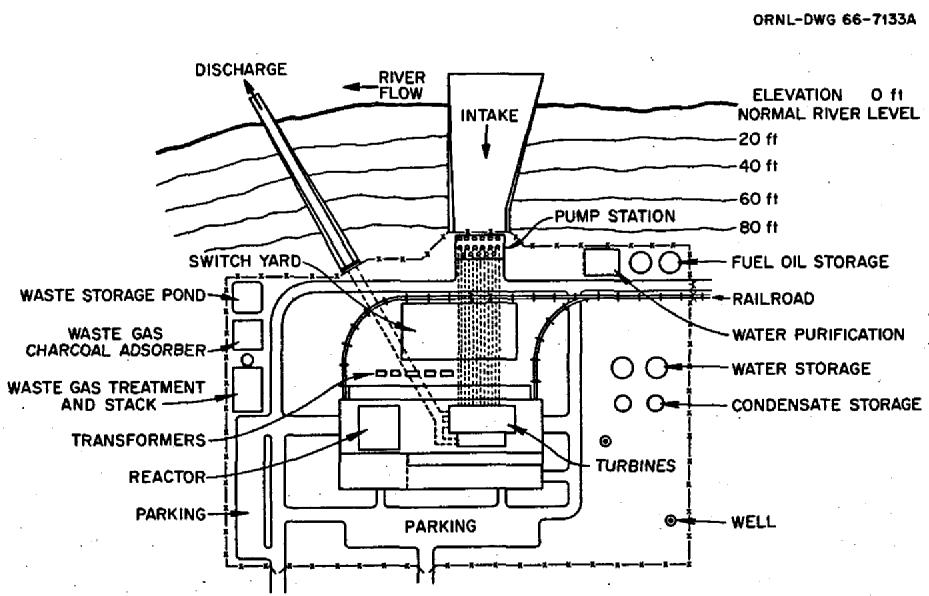  
Fig. 4.1. Plant Site Layout.

startup boiler, a water purification plant, water storage tanks, and a deep well. This plant area also includes systems for treatment, storage, and disposal of radioactive wastes. Space is provided for transformers and switchyard. A railroad spur serves for transportation of heavy equipment.

One large building houses the reactor, chemical processing, and turbine plants, offices, shops, and all supporting facilities. One version of this building, shown in Figs. 4.2 and 4.3, is 250 ft wide and 530 ft long; it rises 98 ft above and descends 48 ft below grade level. An alternative plan in which the building is 340 ft

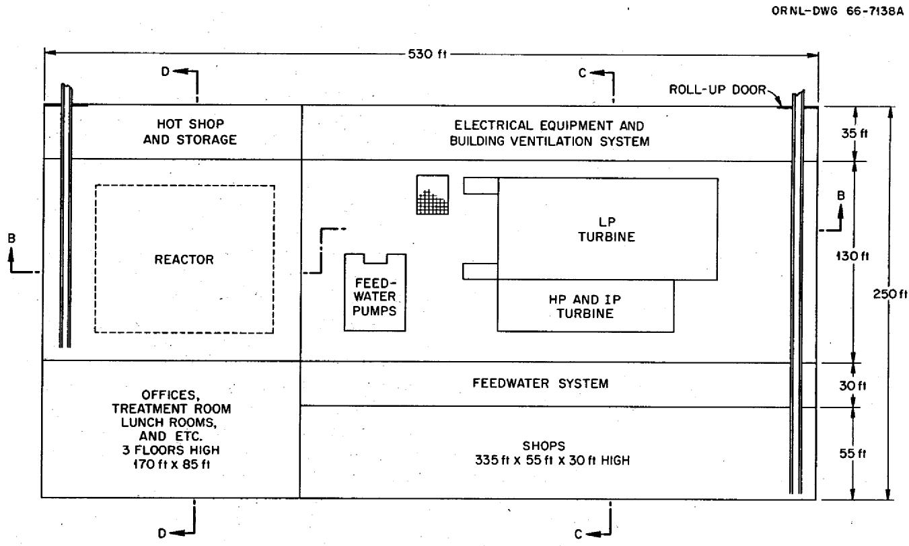  
Fig. 4.2. Building Plan.

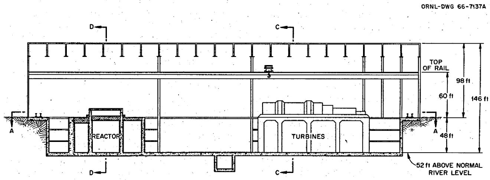  
Fig. 4.3. Building Elevation.

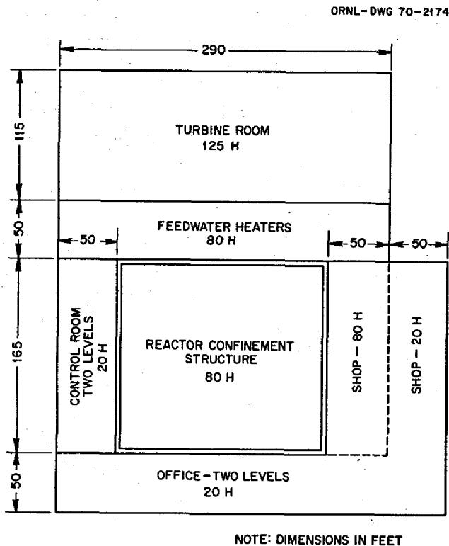  
Fig. 4.4. Alternative Building Layout (Used in Cost Estimate).

by 380 ft, as shown in Fig. 4.4, was used in estimating the building costs. In either case, the building is of steel frame construction with steel roof trusses, precast concrete roof slabs, concrete floors with steel gratings as required, and insulated aluminum or steel panel walls. The wall joints are sealed in the reactor end of the building to provide a confinement volume in the event of a release of radioactivity. The reactor area is provided with a separate ventilation and air-filtration system that discharges to a stack.

# 4.3 Reactor Plant

# 4.3.1 Flowsheet

A flowsheet for a reactor module is shown in Fig. 4.5. In brief, the fuel salt enters the bottom of the reactor vessel at a rate of 25 cfs at $1000^{\circ}\mathrm{F}$ , passes through the core, and leaves at about $1300^{\circ}\mathrm{F}$ . It then enters the fuel salt pump at the top of the primary heat exchanger, where it is pumped into the center section of tubes. After reversing direction at the bottom, the salt flows upward through the outer section of tubes and into the return line to the bottom of the reactor.

The fuel salt pump and its sump, or pump tank, are below the reactor vessel, so that failure of the pump to develop the required head causes the salt to drain from the reactor vessel through the pump tank to the fuel salt drain tank. The tank above the pump impeller is required during startup so that the fuel salt can be pressurized from the drain tank into the primary system to provide the pump with the necessary submergence and surge volume as it starts and fills the reactor core.

Helium is used as the cover gas over the salt in the pump bowl and as the medium for stripping gaseous fission products from the salt. For this latter purpose, small bubbles are injected into the salt in the suction line to the pump and are removed with their burden of krypton and xenon in a centrifugal separator in the line from the outlet of the heat exchanger to the reactor vessel. This gas is circulated through a gaseous fission product disposal system, described in Sect. 5.9.

The blanket salt enters the reactor vessel at a rate of 4.3 cfs at $1150^{\circ}\mathrm{F}$ . It flows along the vessel wall, through the interstitial spaces between the graphite elements of the core and the radial blanket, and exits at about $1250^{\circ}\mathrm{F}$ . The fertile salt then flows into the suction of the blanket pump and is pumped through the blanket heat exchanger and back to the reactor vessel. Helium covers the blanket salt at the salt-to-gas interface in the pump. Only a small fraction of the fissions occurs in the blanket, so there is no need for a gaseous fission product removal system.

The sodium fluoroborate coolant salt is circulated to the bottom of the fuel salt heat exchanger at a rate of 37.5 cfs at $850^{\circ}\mathrm{F}$ , flows upward through the shell, and leaves at about $1111^{\circ}\mathrm{F}$ . It then flows through the shell of the blanket salt heat exchanger, where it is heated to about $1125^{\circ}\mathrm{F}$ , and returns to the coolant salt circulating pump, where its pressure is raised from about 110 psig to 260 psig. The pump supplies about $87\%$ of the coolant salt to the steam generators and the remainder to the steam reheaters. A cover-gas system is required for the coolant circuit, the cover gas being a mixture of boron trifluoride in helium. There is no requirement for injecting cover gas into the circulating salt or for removing it.

Each of the salt circulating systems is provided with heated drain tanks for safe storage of the salt during shutdown of the reactor. These tanks are described in detail in Sect. 5.6. The fuel drain tanks have cooling systems for removal of afterheat. Flow of salt to the tanks during a drain is by gravity; salt is returned to the systems from the tanks by pressurizing the tanks with helium. A salt seal is frozen in the special valves in the drain lines to effect a positive cutoff.

ORNL-DWG 67-3084AR

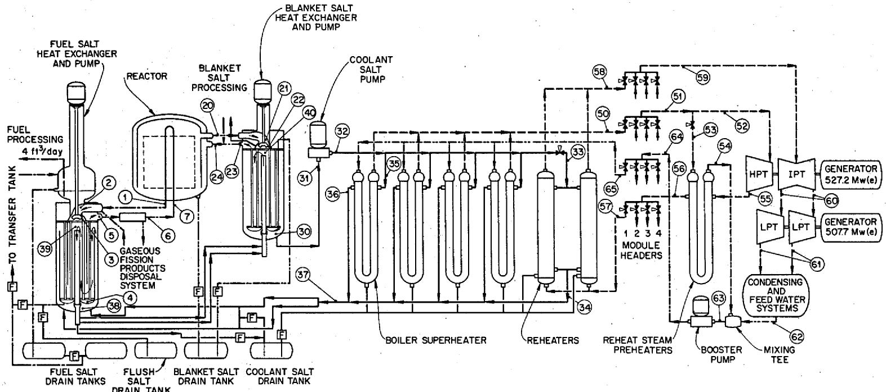  
Fig. 4.5. Flowsheet for 250-Mw(e) MSBR Module.

<table><tr><td colspan="4">FUEL</td></tr><tr><td>POINT</td><td>ft3/sec</td><td>psig</td><td>TEMP (°F)</td></tr><tr><td>①</td><td>25.0</td><td>13</td><td>1300</td></tr><tr><td>②</td><td>25.0</td><td>9</td><td>1300</td></tr><tr><td>③</td><td>25.0</td><td>146</td><td>1300</td></tr><tr><td>④</td><td>25.0</td><td>110</td><td></td></tr><tr><td>⑤</td><td>25.0</td><td>50</td><td>1000</td></tr><tr><td>⑥</td><td>25.0</td><td>31</td><td>1000</td></tr><tr><td>⑦</td><td>25.0</td><td>18</td><td>1000</td></tr></table>

<table><tr><td colspan="4">BLANKET</td></tr><tr><td>20</td><td>4.3</td><td>12.5</td><td>1250</td></tr><tr><td>21</td><td>4.3</td><td>6.0</td><td>1250</td></tr><tr><td>22</td><td>4.3</td><td>111.0</td><td>1250</td></tr><tr><td>23</td><td>4.3</td><td>20.0</td><td>1150</td></tr><tr><td>24</td><td>4.3</td><td>14.5</td><td>1150</td></tr></table>

<table><tr><td colspan="4">COOLANT</td></tr><tr><td>POINT</td><td>ft3/sec</td><td>psig</td><td>TEMP (°F)</td></tr><tr><td>30</td><td>37.5</td><td>129</td><td>1125</td></tr><tr><td>31</td><td>37.5</td><td>110</td><td>1125</td></tr><tr><td>32</td><td>37.5</td><td>260</td><td>1125</td></tr><tr><td>33</td><td>5.0</td><td>208</td><td>1125</td></tr><tr><td>34</td><td>5.0</td><td>212</td><td>850</td></tr><tr><td>35</td><td>8.1</td><td>252</td><td>1125</td></tr><tr><td>36</td><td>8.1</td><td>194</td><td>850</td></tr><tr><td>37</td><td>37.5</td><td>203</td><td>850</td></tr><tr><td>38</td><td>37.5</td><td>198</td><td>850</td></tr><tr><td>39</td><td>37.5</td><td>164</td><td>1111</td></tr><tr><td>40</td><td>37.5</td><td>138</td><td>1111</td></tr></table>

<table><tr><td colspan="4">STEAM</td></tr><tr><td>POINT</td><td>106lb/hr</td><td>psia</td><td>TEMP(°F)</td></tr><tr><td>50</td><td>2.52</td><td>3600</td><td>1000</td></tr><tr><td>51</td><td>10.07</td><td>3600</td><td>1000</td></tr><tr><td>52</td><td>7.15</td><td>3515</td><td>1000</td></tr><tr><td>53</td><td>2.92</td><td>3515</td><td>1000</td></tr><tr><td>54</td><td>2.92</td><td>3500</td><td>866</td></tr><tr><td>55</td><td>5.13</td><td>600</td><td>552</td></tr><tr><td>56</td><td>5.13</td><td>570</td><td>650</td></tr><tr><td>57</td><td>1.28</td><td>570</td><td>650</td></tr><tr><td>58</td><td>1.28</td><td>540</td><td>1000</td></tr><tr><td>59</td><td>5.13</td><td>540</td><td>1000</td></tr><tr><td>60</td><td>5.00</td><td>172</td><td>706</td></tr><tr><td>61</td><td>4.30</td><td>1.5 in.Hg</td><td>92</td></tr><tr><td>62</td><td>7.16</td><td>3500</td><td>551</td></tr><tr><td>63</td><td>10.07</td><td>3475</td><td>695</td></tr><tr><td>64</td><td>10.07</td><td>3800</td><td>700</td></tr><tr><td>65</td><td>2.52</td><td>3800</td><td>700</td></tr></table>

<table><tr><td colspan="3">PERFORMANCE DATA</td></tr><tr><td colspan="3">1000 Mw(e) GENERATION PLANT</td></tr><tr><td>NET OUTPUT</td><td>1000</td><td>Mw(e)</td></tr><tr><td>GROSS GENERATION</td><td>1034.9</td><td>Mw(e)</td></tr><tr><td>BOILER FEED PUMPS</td><td>29.4</td><td>Mw</td></tr><tr><td>BOOSTER PUMPS</td><td>9.2</td><td>Mw(e)</td></tr><tr><td>STATION AUXILIARY</td><td>25.7</td><td>Mw(e)</td></tr><tr><td>REACTOR HEAT INPUT</td><td>2225</td><td>Mw(t)</td></tr><tr><td>NET HEAT RATE</td><td colspan="2">7601 Btu/kwhr</td></tr><tr><td>NET EFFICIENCY</td><td colspan="2">44.9%</td></tr></table>

<table><tr><td></td><td>LEGEND</td></tr><tr><td>FUEL</td><td></td></tr><tr><td>BLANKET</td><td></td></tr><tr><td>COOLANT</td><td></td></tr><tr><td>STEAM</td><td></td></tr><tr><td>WATER</td><td></td></tr><tr><td>FREEZE VALVE</td><td>#</td></tr><tr><td>DATA POINT</td><td>×</td></tr></table>

A small side stream of fuel salt is taken from the fuel system at the circulating pump discharge. After storage in a transfer tank, the salt is processed and reconstituted in the associated chemical plant to remove fission product contaminants and to adjust the composition. The clean salt is returned to the circulating system at the pump bowl. A side stream is removed from the blanket system, similarly processed for removal of bred $^{233}\mathrm{Pa}$ and $^{233}\mathrm{U}$ , and returned to the reactor. The flowsheets for fuel and blanket salt chemical plants are described in Sect. 4.4.

# 4.3.2 General Layout of Reactor Plant

The reactor plant consists of four major cell complexes, as shown in Figs. 4.6 and 4.7, all contained in a

reinforced concrete structure having outside dimensions of about 150 by 170 ft and 45 to 65 ft high. Each major cell complex includes a reactor cell, a coolant cell, and a hot-storage cell to house a spent reactor assembly. Two drain-tank cells and two off-gas cells are located between the main cell complexes, and each serves two reactors. A centrally located instrumentation cell houses equipment for all four reactors. The chemical processing cell and the hot cells needed for maintenance of radioactive equipment are also integral parts of the structure.

All cells have removable top plugs of reinforced concrete to permit maintenance operations to be performed from above by use of remotely operated tools and equipment.

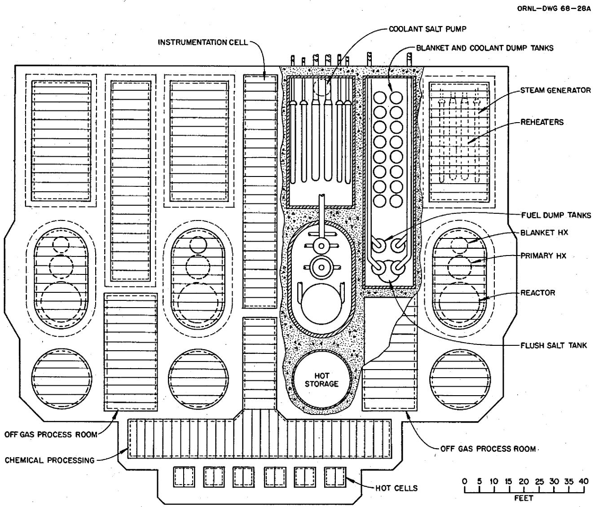  
Fig. 4.6. Plan View of Reactor Plant.

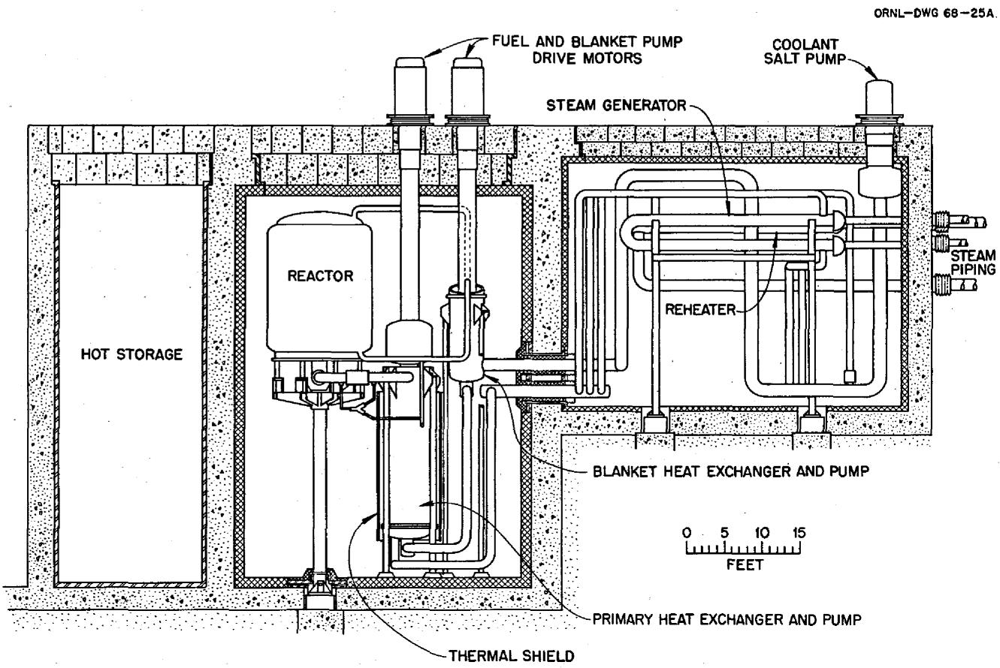  
Fig. 4.7. Sectional Elevation of Reactor Cell.

All the cells containing fuel, blanket, and coolant salts are provided with electric resistance heating elements which preheat the systems and maintain the cell ambient temperature at about $1100^{\circ}\mathrm{F}$ , well above the liquidus temperatures of the salts. In addition to the massive concrete biological shielding, the reactor cell has thick double-walled steel liners to protect the concrete from excessive temperatures and radiation-induced damage. The liners also seal the cell spaces to provide containment for all equipment which contains radioactive material. The cell structure itself is housed in a sealed confinement building which provides yet another line of defense against the escape of fission products.

# 4.3.3 Reactor Cell

As shown in more detail in Figs. 4.7 and 4.8, the reactor cell contains the 575-Mw(t) reactor, fuel salt circulating pump, fuel salt heat exchanger, blanket salt circulating pump, blanket salt heat exchanger, and the

interconnecting salt piping. The cell has circular ends of 12 ft radius and is about 24 ft wide by 40 ft long by about 63 ft deep, including the 8-ft-thick roof plugs.

In this design version the major components in the reactor cell are supported on columns, or pedestals, which penetrate the floor of the cell. The columns rest on vibration dampers which are supported on footings beneath the cell floor structure. The degree of protection against seismic disturbances has not been analyzed. (Subsequent design concepts for a single-fluid MSBR adopted an overhead support system.) Differential expansions in the piping and equipment are partially absorbed by the flexibility of the supports. Figure 4.7 shows the single 18-in.-diam pedestal for the reactor vessel hinged at the bottom to reduce the stresses in the fuel salt piping. Calculations made on the basis of a fixed joint, however, gave stresses within allowable limits. Because of the high ambient temperature in the reactor cell, the support structure would probably be fabricated of 304 SS. Bellows joints at the base of each column would provide the necessary hermetic seal.

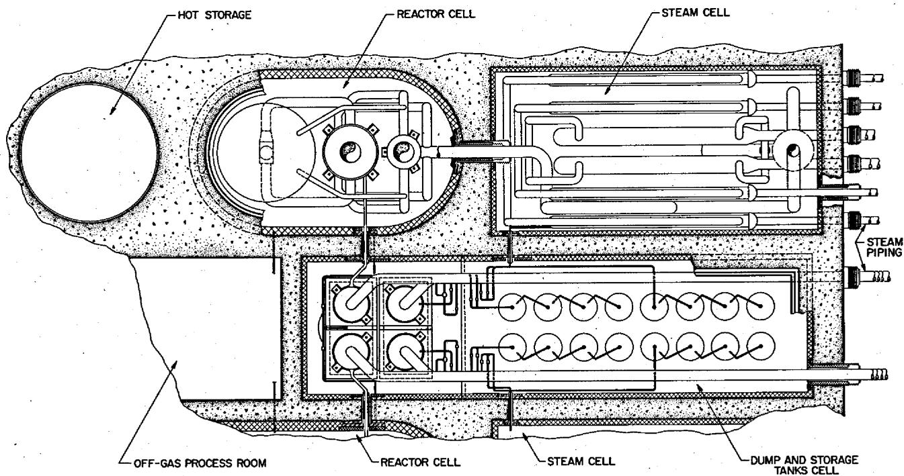  
Fig. 4.8. Plan View of Steam Generator and Drain Tank Cells.

The reactor cell atmosphere will be an inert gas, probably nitrogen. Since the interior of the cell will operate at about $1100^{\circ}\mathrm{F}$ , the cell walls must provide thermal insulation and gamma shielding to prevent overheating of the 8-ft thickness of concrete in the biological shielding. Blanket-type insulation about 6 in. thick will be used, protected on the inside of the cell by a thin stainless steel liner which will also serve as a radiant heat reflector. The construction is shown in Fig. 4.9. A carbon steel membrane on the outside of the thermal insulation provides a sealed structure. The space between this membrane and a surrounding 3-in.-thick carbon steel thermal shield is also sealed and continuously pumped down and monitored for leakage through the inner shell. A second 3-in. carbon steel plate is separated from the inner plate by a 3-in.-wide air space through which cooling air is circulated. At an air velocity of about 50 fps the maximum estimated temperature of the concrete is less than $200^{\circ}\mathrm{F}$ .

The electric heaters for the cells are Inconel pipes welded together at one end to form a hairpin. Lavite

washers separate and support the pipes in the thimbles in which each unit is inserted. These thimbles are installed in the permanent portions of the cell roof structure. With this arrangement individual heaters can be disconnected and removed in event of failure. Heaters of this type have proved reliable as reactor vessel heaters in the MSRE.

The reactor cell roof plugs would incorporate the same general design features as the walls. Figure 4.10 shows the double barrier at the top of the reactor cell, at the thimbles for the electric heaters, and also indicates how the cooling air can be introduced into the removable roof plugs. Figure 4.9 shows how the double barrier sealing membranes would be arranged at the bottom corners of the reactor cell and at the pedestal supports to permit relative movement. The total heat loss from the reactor cell has been estimated to be about $2\mathrm{Mw}(\mathrm{t})$

The design pressure for the reactor cell is about 50 psia. In considering the integrity of the cell it should be noted that no water is normally present which could accidentally mix with the hot fuel or blanket salt to cause a pressure buildup through vaporization. To prevent accidental entry of steam into the cell via the coolant salt circuit, rupture disks are provided on the

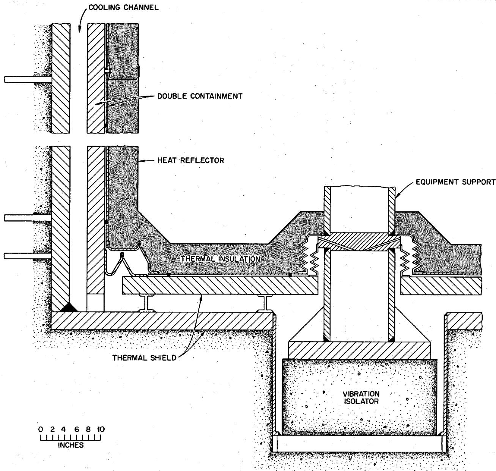  
Fig. 4.9. Cell Wall Construction at Supports.

secondary system which would discharge the coolant salt into the steam generator cell if there were a pressure buildup in the system due to a tube failure in the steam generator. The rupture disk ratings would be well below the collapsing pressure of the tubing in the primary heat exchanger, but even in the highly unlikely event of tube collapse and shell rupture, sufficient escape of vapor to cause a significant rise in the reactor cell pressure does not necessarily follow.

# 4.3.4 Coolant Cell

Each of these four cells contains a coolant salt circulating pump, four boiler-superheater units, two reheater units, and associated salt and steam piping. The cells are approximately 24 by 45 ft and about 34 ft deep, including the roof plugs.

The construction is similar to that used in the reactor cells in that the cells must be heated and sealed. The

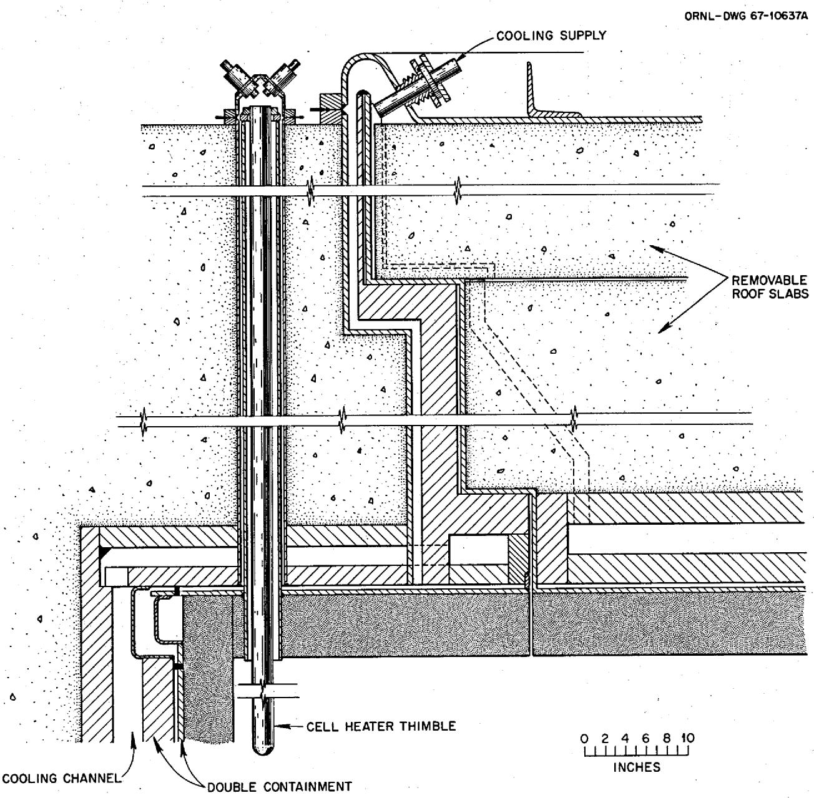  
Fig. 4.10. Cell Wall Construction at Roof Plugs.

radioactivity, however, is only that induced into the coolant salt, so there is no need for the steel radiation shield to protect the concrete. Thermal insulation would be applied in the same thickness and about the same manner as in the reactor cell, and the liner would form the hermetic seal. A double barrier is not required for containment purposes, but an air flow passage must be provided to carry away the heat passing through the thermal insulation to prevent the concrete shielding from getting too hot.

Figures 4.6-4.8 illustrate the arrangement of equipment in the coolant cell. As in the reactor cell, all components are mounted on support columns which rest on the floor of the cell. The coolant salt piping is provided with several expansion loops to achieve the necessary flexibility without the use of expansion joints. The expansion of the steam lines is absorbed in piping loops located outside the cell. Bellows seals are provided where the various pipes pass through the coolant cell walls. Analyses of the stresses in piping and

equipment indicate that all are within the limits allowed by the codes.

# 4.3.5 Drain-Tank Cells

The two drain-tank cells are located as shown in Figs. 4.6 and 4.8. A cross section of the cell is shown in Fig. 4.11. Each cell is about 17 by 50 ft with the end containing the fuel drain tanks about 73 ft deep. The other end of the cell houses the blanket and coolant salt tanks and is about 37 ft deep. The walls of these cells are constructed much the same as the reactor cell walls. Double containment must be provided, and the cells must be heated to about $1100^{\circ}\mathrm{F}$ .

In addition to the various salt lines entering the drain-tank cells, there are also pipes to provide for steam cooling of the tanks and for the inert gas used for pressurizing the tanks to transfer the salt. (Subsequent studies have indicated that a natural-convection salt system may be superior to a steam system for cooling the drain tanks.) Bellows seals are used where the piping passes through the cell walls.

# 4.3.6 Off-Gas Cells

As will be explained in Sect. 5.5, the helium that removes the gaseous fission products from the fuel and all other contaminated gases are routed to an off-gas cell for filtration, decay of radioactive contaminants, and other treatment. The two off-gas cells are approximately $17\mathrm{ft}\times 38\mathrm{ft}\times 62$ ft deep. The wall and roof construction is similar to the reactor cell in that double containment is provided. Since salts are not present, these cells are not heated and thermally insulated.

# 4.3.7 Salt Processing Cell

The chemical processing plant for treatment of the fuel and blanket salts is contained in a single cell. As described in Sect. 4.5, the plant serves all four of the reactor modules. The cell has a T shape, one leg being about $10\mathrm{ft} \times 34\mathrm{ft} \times 62\mathrm{ft}$ deep and the other about $12\mathrm{ft} \times 88\mathrm{ft} \times 62\mathrm{ft}$ deep.

Double containment is required, but since some pieces of equipment need to be heated and others

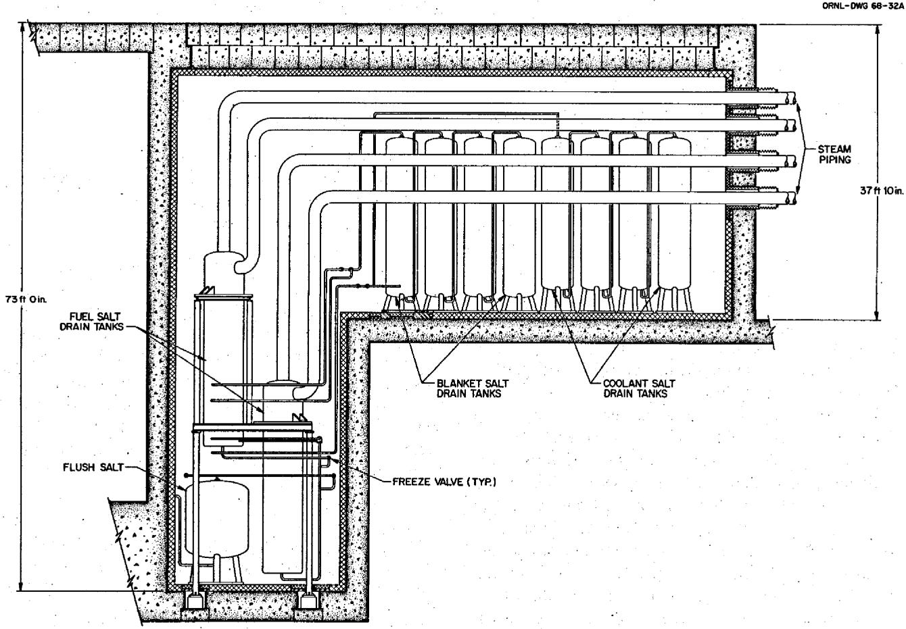  
Fig. 4.11. Cross Sectional Elevation of Drain Tank Cell.

cooled, the ambient temperature of the cell is relatively low. The pipes and vessels would be heated or cooled individually as required. Biological shielding is needed because of the high level of radioactivity.

# 4.3.8 Instrumentation Cell

A centrally located cell is provided for the piping, junction boxes, controls, etc., associated with the instrumentation of the reactor complex. This 10- by 80-ft cell would be operated at normal ambient temperatures and is not a containment area.

# 4.3.9 "Hot" Storage Cell (for Reactors)

A cylindrical cell 20 ft in diameter by 62 ft deep is provided at each reactor module for storage of the reactor vessels and spent graphite cores until most of the radioactivity decays and they can be processed for disposal. The cells are hermetically sealed.

# 4.3.10 "Hot" Cells

A series of small cells, possibly 8 by 8 ft, are shown in Fig. 4.6 to indicate that cubicles equipped with remotely operated manipulators and other equipment will be needed for repair and inspection operations.

# 4.3.11 Control Rooms, Offices, Shops, etc.

As indicated in Figs. 4.2 and 4.4, space has been allowed for control rooms, offices, laboratories, shops, storage, etc.

# 4.4 Turbine Plant

# 4.4.1 General

A preliminary study of the MSBR turbine plant was included in ORNL-3996. This work has not yet been extended in any more detail for subsequent MSBR conceptual design studies.

The steam supplied to the turbine from the steam generator cells would not be radioactive, and no reasonable accident situation can be conceived where contamination could enter the steam-circulating system. The turbine plant is thus conventional with regard to design, maintenance, and operational procedures.

The relatively high salt temperatures which are available make it possible to generate $1000^{\circ}\mathrm{F}$ steam and to reheat to $1000^{\circ}\mathrm{F}$ . The upper limit on the steam temperature was chosen more on the basis of current steam-system operating practice than on specific limitations of the salt systems. Double reheat would offer no

appreciable technical difficulties and could be considered in future steam-system optimization studies. Supercritical pressure was selected for the steam cycle because it offered better cycle efficiency, followed an established trend in the steam power industry,[20] and provided an opportunity for heating the feedwater to $700^{\circ}\mathrm{F}$ .

The cycle provides for mixing prime steam with the feedwater to raise the temperature to the inlets of the steam generators to avoid local freezing of the coolant salt or excessive temperature gradients in tubing walls. Future development may show that lower feedwater temperatures can be used. In this case, sufficiently high feedwater temperatures possibly could be attained through additional stages of regenerative feedwater heating. ORNL-4037² and MSR-66-18²¹ discussed an alternative cycle in which 580°F feedwater is supplied to the steam generators and 552°F "cold" reheat steam is sent to the reheaters. All the feedwater heating would be accomplished by use of extraction steam from the turbine. The flow through the steam generator would be reduced to about 7.5 × 10⁶ lb/hr, and the boiler feed booster pumps would not be required. There would be a saving in the cost of equipment and an increase in the net overall thermal efficiency from about 44.9 to 45.4%.

# 4.4.2 Turbine Plant Flowsheet

The turbine plant flowsheet is shown in Fig. 4.12, and pertinent data are listed in Table 4.1. The flowsheet is not represented to be the optimum one but rather is one that appears to be operable and one upon which preliminary cost estimates can be reasonably based.

Steam is delivered to the turbine throttle at 3500 psia and $1000^{\circ}\mathrm{F}$ . After expansion to 600 psia and about $550^{\circ}\mathrm{F}$ in the high-pressure turbine, it is preheated to about $650^{\circ}\mathrm{F}$ , then reheated to $1000^{\circ}\mathrm{F}$ before returning to the intermediate-pressure turbines at about 540 psia. After expansion to about 170 psia, the steam crosses to the two double-flow low-pressure turbines, where it expands to about 1.5 in. Hg abs before entering the water-cooled condensers. The gross generated output is about 1035 Mw(e).

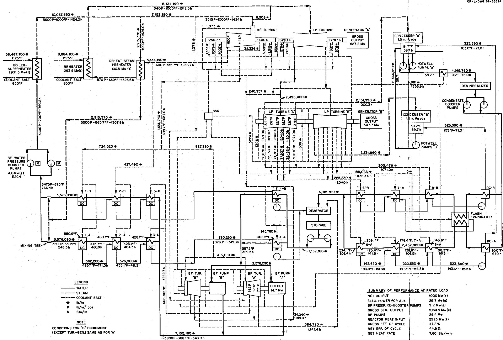  
Fig. 4.12. Steam System Flowsheet for 1000-Mw(e) MSBR Power Station.

Table 4.1. MSBR Steam-Power System Design and Performance Data   
with $700^{\circ}\mathrm{F}$ Feedwater   

<table><tr><td colspan="2">General performance</td></tr><tr><td>Total reactor power, Mw</td><td>2225</td></tr><tr><td>Net electrical output, Mw</td><td>1000</td></tr><tr><td>Gross electrical generation, Mw</td><td>1034.9</td></tr><tr><td>Station auxiliary load, Mw</td><td>25.7</td></tr><tr><td>Boiler feedwater pressure-booster pump load, Mw</td><td>9.2</td></tr><tr><td>Boiler feedwater pump steam-turbine power output, Mw (mechanical)</td><td>29.3</td></tr><tr><td>Flow to turbine throttle, lb/hr</td><td>\( 7.15 \times 10^6 \)</td></tr><tr><td>Flow from superheater, lb/hr</td><td>\( 10.1 \times 10^6 \)</td></tr><tr><td>Gross efficiency, % (1034.9 + 29.3)/2225</td><td>47.8</td></tr><tr><td>Gross heat rate, Btu/kwhr</td><td>7136</td></tr><tr><td>Net efficiency, %</td><td>44.9</td></tr><tr><td>Net heat rate, Btu/kwhr</td><td>7601</td></tr><tr><td colspan="2">Boiler-superheaters</td></tr><tr><td>Number of units</td><td>16</td></tr><tr><td>Total duty, Mw(th)</td><td>1932</td></tr><tr><td>Total steam capacity, lb/hr</td><td>\( 10.1 \times 10^6 \)</td></tr><tr><td>Temperature of inlet feedwater, °F</td><td>700</td></tr><tr><td>Enthalpy of inlet feedwater, Btu/lb</td><td>769</td></tr><tr><td>Pressure of inlet feedwater, psia</td><td>3770</td></tr><tr><td>Temperature of outlet steam, °F</td><td>1000</td></tr><tr><td>Pressure of outlet steam, psia</td><td>~3600</td></tr><tr><td>Enthalpy of outlet steam, Btu/lb</td><td>1424</td></tr><tr><td>Temperature of inlet coolant salt, °F</td><td>1125</td></tr><tr><td>Temperature of outlet coolant salt, °F</td><td>850</td></tr><tr><td>Average specific heat of coolant salt, Btu \( lb^{-1} \)\( ^{\circ}F^{-1} \)</td><td>0.41</td></tr><tr><td>Total coolant salt flow</td><td></td></tr><tr><td>lb/hr</td><td>\( 58.5 \times 10^6 \)</td></tr><tr><td>cfs</td><td>130</td></tr><tr><td>gpm</td><td>58,300</td></tr><tr><td>Coolant salt pressure drop, inlet to outlet, psi</td><td>~60</td></tr><tr><td colspan="2">Steam reheaters</td></tr><tr><td>Number of units</td><td>8</td></tr><tr><td>Total duty, Mw(th)</td><td>294</td></tr><tr><td>Total steam capacity, lb/hr</td><td>\( 5.13 \times 10^6 \)</td></tr><tr><td>Temperature of inlet steam, °F</td><td>650</td></tr><tr><td>Pressure of inlet steam, psia</td><td>~570</td></tr><tr><td>Enthalpy of inlet steam, Btu/lb</td><td>1324</td></tr><tr><td>Temperature of outlet steam, °F</td><td>1000</td></tr><tr><td>Pressure of outlet steam, psia</td><td>557</td></tr><tr><td>Enthalpy of outlet steam, Btu/lb</td><td>1518</td></tr><tr><td>Temperature of inlet coolant salt, °F</td><td>1125</td></tr><tr><td>Temperature of outlet coolant salt, °F</td><td>850</td></tr><tr><td>Average specific heat of coolant salt, Btu \( lb^{-1} \)\( ^{\circ}F^{-1} \)</td><td>0.41</td></tr><tr><td>Total coolant salt flow</td><td></td></tr><tr><td>lb/hr</td><td>\( 8.88 \times 10^6 \)</td></tr><tr><td>cfs</td><td>19.7</td></tr><tr><td>gpm</td><td>8860</td></tr><tr><td>Coolant salt pressure drop, inlet to outlet, psi</td><td>~17</td></tr><tr><td></td><td></td></tr><tr><td></td><td></td></tr><tr><td></td><td></td></tr><tr><td></td><td></td></tr><tr><td></td><td></td></tr><tr><td></td><td></td></tr><tr><td></td><td></td></tr><tr><td></td><td></td></tr><tr><td></td><td></td></tr><tr><td></td><td></td></tr><tr><td></td><td></td></tr><tr><td></td><td></td></tr><tr><td></td><td></td></tr><tr><td></td><td></td></tr><tr><td></td><td></td></tr><tr><td></td><td></td></tr><tr><td></td><td></td></tr><tr><td></td><td></td></tr><tr><td></td><td></td></tr><tr><td></td><td></td></tr><tr><td></td><td></td></tr><tr><td></td><td></td></tr><tr><td></td><td></td></tr><tr><td></td><td></td></tr><tr><td></td><td></td></tr><tr><td></td><td>Reheat-steam preheaters</td></tr><tr><td>Number of units</td><td>8</td></tr><tr><td>Total duty, Mw(th)</td><td>100</td></tr><tr><td>Total heat rate, Btu/kwhr</td><td>\( 5.13 \times 10^6 \)</td></tr><tr><td>Boiler feedwater pressure-booster pump load, Mw (mechanical)</td><td>29.3</td></tr><tr><td>Boiler feedwater pump pump output, Mw (mechanical)</td><td>29.3</td></tr><tr><td>Boiler feedwater pump pump output, Mw (mechanical)</td><td>29.3</td></tr><tr><td>Boiler feedwater pump pump output, Mw (mechanical)</td><td>29.3</td></tr><tr><td>Boiler feedwater pump pump output, Mw (mechanical)</td><td>29.3</td></tr><tr><td>Boiler feedwater pump pump output, Mw (mechanical)*</td><td>29.3</td></tr><tr><td>Boiler feedwater pump pump output, Mw (mechanical)*</td><td>29.3</td></tr><tr><td>Boiler feedwater pump pump output, Mw (mechanical)*</td><td>29.3</td></tr><tr><td>Boiler feedwater pump pump output, Mw (mechanical)*</td><td>29.3</td></tr><tr><td>Boiler feedwater pump pump output, Mw (mechanical)*</td><td>29.3</td></tr></table>

${}^{a}$ Taken from ORNL-3996 (ref. 1).

The two feedwater pumps are driven by separate turbines using steam at about 1100 psia taken from an extraction point on the high-pressure turbine. (The pump turbines can also be driven by prime steam if the need arises.) The capacity of each pump is about 8000 gpm and the nominal power requirement19 20,000 hp each. Eight stages of regenerative feedwater heating are used, including the deaerator, employing steam extracted from the high- and low-pressure turbines and from the feedwater pump turbines. Full-flow demineralizers will maintain the feedwater purity to within a few parts per billion. Feedwater enters the steam generators at $700^{\circ}\mathrm{F}$ .

The steam system is conventional in almost every respect except for preheating of the reheat steam and the heating of the feedwater to $700^{\circ}\mathrm{F}$ before it enters the steam generators. As mentioned above, the steam to be reheated leaves the high-pressure turbine exhaust at 600 psia and about $550^{\circ}\mathrm{F}$ . It is then heated on the shell side of two preheaters by prime steam inside the tubes. The reheat steam, now at about $650^{\circ}\mathrm{F}$ and 570 psia, enters the reheaters, where it is raised to $1000^{\circ}\mathrm{F}$ by counterflow with the coolant salt. The reheated steam returns to the intermediate-pressure turbine at $1000^{\circ}\mathrm{F}$ and 540 psia.

The throttle-pressure heating steam leaving the tubes of the preheater mentioned above, now at about $866^{\circ}\mathrm{F}$ , is directly mixed with the feedwater leaving the top extraction heater at about $550^{\circ}\mathrm{F}$ and 3475 psia. Since both streams are at supercritical pressure, the mixing can be accomplished simply. The resulting $695^{\circ}\mathrm{F}$ mixture is then raised to 3800 psia and heated an additional $5^{\circ}\mathrm{F}$ by two boiler feedwater pressure-booster pumps operating in parallel. These 9500-gpm pumps are shown on the flowsheet as driven by electric motors (about 6000 hp each) but in an optimized system could very well be steam-turbine driven.

# 4.4.3 Layout of Turbine Plant

The relatively high efficiency of the turbine plant and use of a 3600-rpm turbine-generator make the space requirements for the turbine plant less than for the turbine-generator in a water reactor plant of the same capacity. The layout of the plant, indicated in Fig. 4.4, is substantially the same as for a conventional station. The feedwater heaters, pumps, water treatment equipment, etc., would be located on several floor levels of a building bay provided for this purpose. Use of a tandem-compounded turbine-generator rather than a cross-compounded unit would not require significant alterations to the layout shown.

# 4.5 Salt Processing Plant

# 4.5.1 General

A major attractive feature of the two-fluid MSBR is the relative ease with which the fuel and blanket salts can be processed to remove fission products, recover the bred product, and add new fuel. For the reactor to be a high-performance breeder, the processing must take place on a fairly rapid cycle and with low holdup of $^{233}\mathrm{U}$ in the processing equipment. A closely knit complex of MSBR power stations might make use of a central processing facility, but the MSBR concept described here assumes that the processing plant is part of the 1000-Mw(e) station and serves only the four reactor modules.

Small side streams of salt are taken from the fuel and blanket salt circulating systems for processing in an adjacent cell. A relatively small space is needed for the processing equipment. A cell having one space about 10 ft × 34 ft × 62 ft deep and another 12 ft × 88 ft × 62 ft deep is provided in Fig. 4.6.

Many of the station facilities such as offices, shops, laboratories, electrical and water services, waste disposal, data logging and analysis equipment, etc., are shared by the reactor and salt processing plants.

# 4.5.2 Fuel Salt Processing

Almost all the fissions occur in the fuel salt, and the objective of the fuel salt processing is to keep the fission product concentrations at a low enough level for the neutron losses to be acceptably low. This must be accomplished economically and with low losses of $^{233}\mathrm{U}$ and $\mathrm{LiF - BeF_2}$ carrier salt. The gaseous fission products, krypton and xenon, are removed continuously from the circulating fuel in the reactor as described in Sect. 4.3.1. In the processing plant the fluoride volatility process and vacuum distillation are used to separate the $^{233}\mathrm{U}$ and the carrier salt from most of the remaining fission products. Discard of a small amount of carrier salt is required to remove fission products that distill with the lithium and beryllium fluorides.

An overall flowsheet for the salt processing plant is shown in Fig. 4.13. The fuel salt is drawn semicon- tinuously from the circulating systems of the four reactor modules at a combined rate of about $24\mathrm{ft}^3 /$ day (corresponding to a 60-day cycle for a reactor with an average power density of $20\mathrm{kw / liter}$ ) and is collected in a holdup tank in the salt processing cell. Since the reactants used in the processing are not damaged by irradiation, it is not necessary to provide decay time for

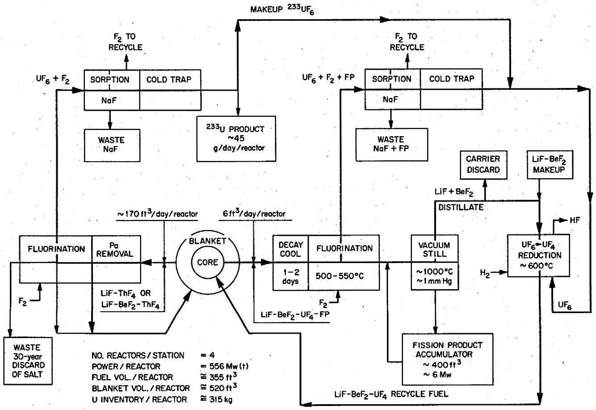  
Fig. 4.13. Processing Diagram for Two-Fluid MSBR.

this reason, but up to 24 hr decay may be required for the fission product heating to be reduced to a level that will allow proper control of the temperature in the fluorination process. Removal of decay heat is a principal design consideration for the holdup tank and for other equipment in the fuel salt processing plant.

Salt is drawn from the holdup tank into the processing equipment continuously. Some of the processing operations are of the batch type, but continuous flow is achieved through the use of parallel flow paths and alternate sets of equipment. First, the salt flows to the top of a fluorination column, where it is contacted by a stream of fluorine flowing countercurrent to the salt. The temperature is controlled at about $550^{\circ}\mathrm{C}$ . The uranium in the salt reacts with the fluorine to produce volatile $\mathrm{UF}_6$ , which is carried overhead by an excess flow of fluorine. The uranium removal efficiency is about $99.9\%$ . Two types of continuous fluorinators are promising for this application: a falling-drop type,

described by Mailen and Cathers, $^{22}$ and one in which the wall of the fluorinator is cooled to produce a $3/4$ -in.-thick layer of frozen salt to protect the metal from corrosion.

Volatile fluorides of ruthenium, niobium, molybdenum, technetium, and tellurium are swept out with the $\mathrm{UF}_6$ . Fission product iodine and bromine are also present in the gas. The carrier salt, barren of uranium but containing most of the fission products, flows out the bottom of the column for subsequent purification in a vacuum still.

The $\mathrm{UF}_6$ is separated from the other volatile fluorides in a series of sorption and desorption operations. The gas is first passed over pellets of sodium fluoride at

about $400^{\circ}\mathrm{C}$ , where the fluorides of niobium, ruthenium, and tellurium are irreversibly removed. When the bed becomes loaded with fission products, it is discharged to waste and refilled with fresh pellets. The exit gas then flows over a bed of sodium fluoride pellets maintained at about $100^{\circ}\mathrm{C}$ , where the $\mathrm{UF}_6$ and $\mathrm{MoF}_6$ are sorbed. When this low-temperature bed becomes saturated with $\mathrm{UF}_6$ , it is taken off stream and the temperature is raised slowly to about $150^{\circ}\mathrm{C}$ to selectively desorb the $\mathrm{MoF}_6$ . The temperature is then increased further to drive off the $\mathrm{UF}_6$ , which is collected in cold traps at $-40$ to $-60^{\circ}\mathrm{C}$ . When a cold trap is loaded with $\mathrm{UF}_6$ , it is warmed to the triple point $(90^{\circ}\mathrm{C}, 46$ psia), drained to the reduction unit for reconstitution of the fuel salt, and then recycled to the reactor. The fluorine carrier gas leaving the low-temperature sodium fluoride bed is recycled to the fluorinator. Radioactive technetium, iodine, and bromine remaining in the recycled gas decay somewhat, but about $10\%$ purge and makeup with fresh fluorine is required to keep the concentrations of these gases within the desired limits.

The carrier salt, on leaving the bottom of the fluorinator, enters a vacuum still that is operated at about 1 torr and $1000^{\circ}\mathrm{C}$ . Most of the beryllium fluoride and lithium fluoride distill, leaving behind the rare-earth fluorides, which would have been the principal neutron poisons in the reactor. The bottom liquid is recycled through the still and a decay tank as necessary to control the heating by fission products. The decay tank has a volume of about $400\mathrm{ft}^3$ , which is judged sufficient to collect the fission products over the 30-year life of the plant. At the end of this time, the lithium fluoride and beryllium fluoride in this waste can be recovered, and the fission products can be packaged for permanent disposal.

The distilled lithium and beryllium fluorides contain small amounts of cesium fluoride and rubidium fluoride and some zirconium fluoride. A small fraction (no more than $5\%$ ) of the carrier salt is discarded to purge this poison. The very small amount of $\mathrm{UF_4}$ in the carrier salt that enters the still is also partially volatilized and recovered.

The lithium fluoride—beryllium fluoride distillate and the $\mathrm{UF}_6$ from the cold traps are added continuously in the proper proportions to a reducer, where the fuel salt is reconstituted for return to the reactor modules. The $\mathrm{UF}_6$ is dissolved in the salt at about $600^{\circ}\mathrm{C}$ and reduced to $\mathrm{UF}_4$ by addition of hydrogen and discharge of hydrogen fluoride. The conditions in the reducing column precipitate nickel and iron that are present as fluorides due to corrosion of the processing equipment.

A filter after the reduction unit removes metallic precipitates from the fuel salt before it is returned to the reactor modules.

Experience with batch processing by the fluoride volatility method dates back to 1954 and includes all phases of laboratory and development work and successful operation of a pilot plant.[23] The process was demonstrated on a large scale in recovering $^{235}\mathrm{U}$ from the fuel salt in the MSRE. The principles of continuous fluorination have been demonstrated in the laboratory. Separation of lithium and beryllium fluorides from rare-earth fission products by vacuum distillation has been investigated in the laboratory and has been demonstrated in an engineering-scale unit by distilling about half a cubic foot of salt from the MSRE.[24] The reconstitution of fuel salt by hydrogen reduction of $\mathrm{UF}_6$ in carrier salt has been demonstrated in the laboratory.

# 4.5.3 Blanket Salt Processing

The $^{233}\mathbf{U}$ in a two-fluid breeder is produced by the reaction

$$
{ } ^ { 2 3 2 } \mathrm { T h } + n \xrightarrow { \gamma } { } ^ { 2 3 3 } \mathrm { T h } \frac { \beta } { 2 3 \mathrm { m i n } } { } ^ { 2 3 3 } \mathrm { P a } \frac { \beta } { 2 7 \mathrm { d a y s } } { } ^ { 2 3 3 } \mathrm { U } .
$$

All the $^{233}\mathrm{U}$ is produced in the blanket salt. A major objective of the blanket salt processing is to recover the $^{233}\mathrm{U}$ about as rapidly as it is produced in order to make it available for addition to the fuel salt to compensate for burnup. Rapid processing reduces the inventory of $^{233}\mathrm{U}$ in the plant and the amount of fissioning that occurs in the blanket salt. The latter is important because thorium is difficult to separate from the rare-earth fission products except by aqueous processes, and accumulation of fission products in the blanket salt would adversely affect the breeding performance.

The major objective can be achieved by processing the blanket salt to remove $^{233}\mathrm{U}$ alone or to remove $^{233}\mathrm{Pa}$ and $^{233}\mathrm{U}$ . Removal of $^{233}\mathrm{U}$ alone can be accomplished by the proven fluoride volatility process, and this is the method that was proposed for the two-fluid MSBR in ORNL-3996. This choice, however, places certain

restrictions on the design of a breeder reactor. The volume of blanket salt in the low-flux region of the reactor blanket, or in tanks outside the reactor vessel, must be large enough so that the average thermal neutron flux seen by the $^{233}\mathrm{Pa}$ is about $10^{13}$ neutrons/cm $^2$ or less, if the loss by neutron absorption to form $^{234}\mathrm{Pa}$ is to be kept below $0.5\%$ . The $^{233}\mathrm{U}$ in the blanket salt must be removed on about a 20-day cycle in order to keep the fissioning to a very low rate.

Removal of the $^{233}\mathrm{Pa}$ as well as the $^{233}\mathrm{U}$ from the blanket salt can reduce the volume of blanket salt required and the thorium inventory by a factor of 2 to 3. Such a process has been conceived, and its basic principles have been demonstrated in the laboratory. This is now the preferred method for processing the blanket salt for the two-fluid MSBR and is included in the flowsheet of Fig. 4.13.

The protactinium removal must be on a short cycle to be fully effective, possibly as rapid as treating the entire blanket inventory once every three days, or at a rate of about 3.6 gpm. The salt is continuously withdrawn from the blanket circulating system and enters the bottom of an extraction column to contact a descending stream of liquid bismuth which contains 3000 to 4000 ppm of metallic thorium. The protactinium and the small amount of uranium in the blanket salt are reduced to metal by the thorium and dissolve in the bismuth. The thorium that is oxidized enters the salt. Thorium is an ideal reductant because the removed protactinium is replaced by an equivalent amount of the fertile material. About $96\%$ of the protactinium and uranium are removed by the process. The protactinium and uranium now in the bismuth are extracted into a second salt mixture; the protactinium is allowed to decay to uranium, which is released by fluorination to become the plant product and replacement fissionable material in the fuel salt.

The bulk of the blanket salt with most of the protactinium and uranium removed is returned to the reactor systems, but a small portion is taken off and discarded to remove accumulated fission products. This salt is stored until the residual protactinium decays, and the uranium is recovered by fluorination before the salt is discarded.

# 5. MAJOR COMPONENTS

# 5.1 Reactor

In a molten-salt breeder reactor the $^{233}\mathrm{U}$ fissions in the fuel salt and heats the salt as it flows through graphite elements in the reactor vessel. We considered

several designs for the reactor vessel and the arrangement of the graphite. Two designs finally evolved. One design is considerably less complicated, but the nuclear characteristics are more affected by changes in the dimensions of the graphite. In the other, radiation-induced changes in the dimensions of the graphite are almost fully compensated and would have little effect on the nuclear characteristics of the reactor. The less complicated design is discussed first.

A vertical section through the center of the reactor vessel for one module of a 1000-Mw(e) plant is shown in Fig. 5.1, and a horizontal section is shown in Fig. 5.2. The dimensions on the drawing are for a reactor with an average power density of $20\mathrm{kw / liter}$ in the core. Some dimensions for reactor vessels with other power densities are shown in Table 5.1. The vessel is made of Hastelloy N and is almost completely filled with graphite elements or cells. The central portion of the reactor core contains the fuel cells. These are surrounded by several rows of blanket cells. A graphite reflector is interposed between the blanket and the vessel wall. Blanket salt fills most of the volume of the vessel above and below the graphite elements.

Fuel salt enters the vessel through a plenum in the bottom, flows through the fuel cells, and leaves through a second plenum, also in the bottom of the vessel. The blanket salt enters the vessel through the side near the top and flows downward along the wall to cool it. The salt then flows upward through the blanket cells and through the spaces between blanket cells and between fuel cells and leaves the vessel through the side near the top. The channels through the blanket elements and the spaces between blanket elements are restricted at the top in order to direct most of the flow through the spaces between core elements where the heat production rates are greatest.

In molten-salt breeder reactors the major changes in reactivity are made by adjusting the composition of the fuel salt. Control rods are primarily for making minor changes in reactivity such as those required for adjusting the temperature during operation and for holding the reactor subcritical at temperatures near the operating temperature. The design requirements for the control rods have not been studied in detail. Since one rod in the center of the core can have sufficient worth for the easily defined requirements, only one is shown in the design. It is envisioned as a graphite cylinder about 4 in. in diameter that would operate in blanket salt. The rod would move in a graphite sleeve, and provision would be made for good circulation of blanket salt through the sleeve. Inserting the rod would increase, and withdrawing the rod would decrease, the

ORNL-DWG 67-10638A

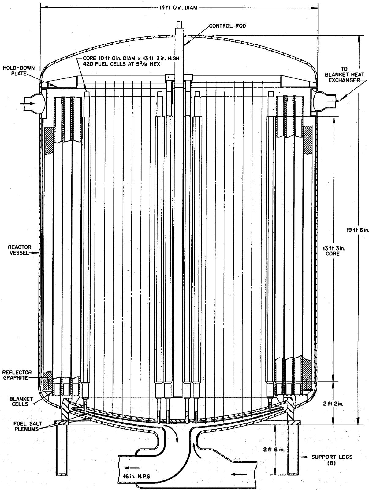  
Fig. 5.1. Vertical Section Through Center of Reactor Vessel for One Module of 1000-Mw(e) Plant.

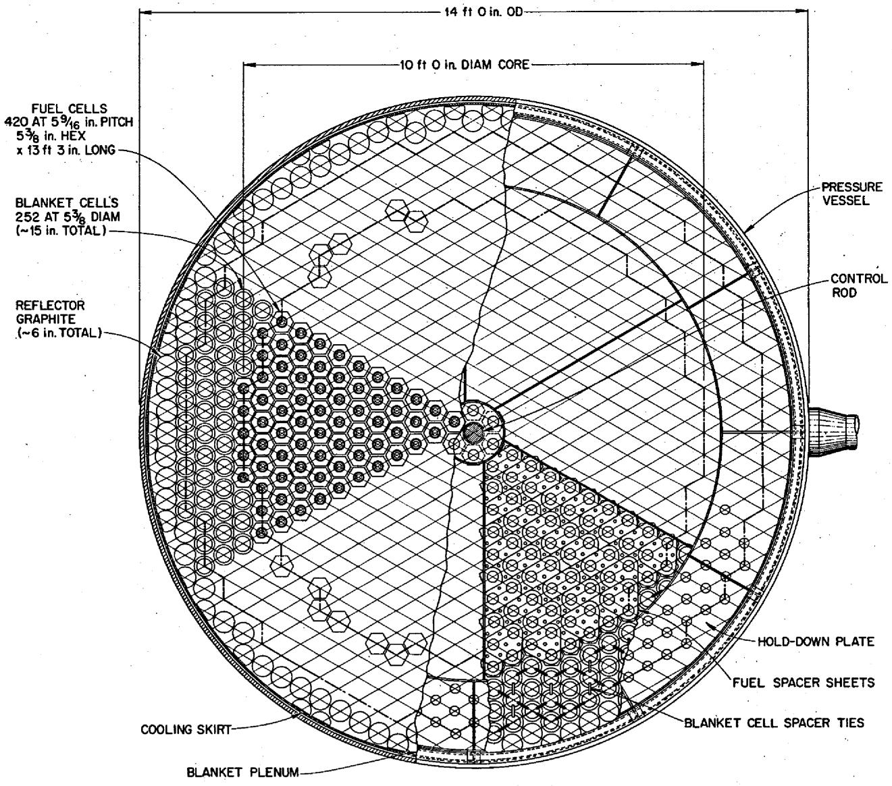  
Fig. 5.2. Horizontal Section Through Center of Reactor Vessel.

reactivity. Rapid movement does not appear to be necessary.

A sectional drawing of a graphite fuel cell is shown in Fig. 5.3. For the reactor with an average power density of $20\mathrm{kw / liter}$ , the cell has an outer hexagonal tube $5\%$ in. across flats with a $2^{23} / 32$ -in.-diam bore. Inside this tube is a concentric tube $2^{1/4}$ in. OD by $1\frac{1}{2}$ in. ID. The hexagonal section of the element is about $13\frac{1}{2}$ ft long; end sections are reduced in diameter to provide for blanket regions at the top and bottom of the core. The outer graphite tube is brazed to a metal piece at the bottom end, and this piece is welded into the fuel inlet

plenum. The inner graphite tube is a sliding fit over a metal tube that is welded into the fuel outlet plenum. Fuel flows in and upward through the annulus between the concentric tubes and downward and out through the bore of the inner tube.

The fuel cells are arranged in the core on a triangular spacing of $5\%^{16}$ in. pitch, so that the volume fractions are 0.802 graphite, 0.134 fuel salt, and 0.064 blanket salt. The blanket elements are simple cylindrical tubes $5\%$ in. OD by $3\%^{16}$ in. ID, also arranged on $5\%^{16}$ in. triangular pitch. This provides volume fractions of 0.58 blanket salt and 0.42 graphite in the blanket region. For

Table 5.1. Variation of Some Reactor Characteristics with Power Density and Design Lifetime Blank spaces in table represent data that were not fully developed since the reference design was taken as the 20-kw/liter case   

<table><tr><td>Average core power density, kw/liter</td><td>10</td><td>20</td><td>40</td><td>80</td></tr><tr><td>Design lifetime, full-power yearsa</td><td>17.2</td><td>8.6</td><td>4.3</td><td>2.2</td></tr><tr><td>Power, Mw(t)a</td><td>556</td><td>556</td><td>556</td><td>556</td></tr><tr><td>Core diameter, ft</td><td>12</td><td>10</td><td>8</td><td>6.3</td></tr><tr><td>Core height, ft</td><td>18</td><td>13.3</td><td>10</td><td>8</td></tr><tr><td>Core volume, ft3</td><td>2036</td><td>1041</td><td>503</td><td>253</td></tr><tr><td>Fraction fuel in core</td><td>0.098</td><td>0.134</td><td>0.154</td><td>0.165</td></tr><tr><td>Fraction blanket in core</td><td>0.058</td><td>0.064</td><td>0.067</td><td>0.06</td></tr><tr><td>Blanket thickness, ft</td><td>1.0</td><td>1.25</td><td>1.25</td><td>1.35</td></tr><tr><td>Fraction salt in blanket volume</td><td></td><td>0.58</td><td></td><td></td></tr><tr><td>Fraction salt in graphite</td><td></td><td>0.42</td><td></td><td></td></tr><tr><td>Number fuel cells in core</td><td></td><td>240</td><td></td><td></td></tr><tr><td>Number blanket cells in core</td><td></td><td>252</td><td></td><td></td></tr><tr><td>Overall length of fuel cell, ft</td><td></td><td>15.3</td><td></td><td></td></tr><tr><td>Overall length of blanket cell, ft</td><td></td><td>15</td><td></td><td></td></tr><tr><td>Reflector thickness, ft</td><td></td><td>0.5</td><td></td><td></td></tr><tr><td>Fuel-salt volumesb</td><td></td><td></td><td></td><td></td></tr><tr><td>Reactor core, ft3</td><td></td><td>139</td><td></td><td></td></tr><tr><td>Plenum and piping, ft3</td><td></td><td>37</td><td></td><td></td></tr><tr><td>Heat exchangers and pumps, ft3</td><td></td><td>160</td><td></td><td></td></tr><tr><td>Processing plant, ft3</td><td></td><td>6</td><td></td><td></td></tr><tr><td>Total, ft3</td><td></td><td>355</td><td></td><td></td></tr><tr><td>Salt processing cycle times, days</td><td></td><td></td><td></td><td></td></tr><tr><td>Fuel stream</td><td>173</td><td>110</td><td>77</td><td>50</td></tr><tr><td>Fertile stream</td><td>144</td><td>110</td><td>70</td><td>50</td></tr><tr><td>Pa removal stream</td><td>1.4</td><td>1.1</td><td>0.7</td><td>0.5</td></tr><tr><td>Breeding ratio</td><td>1.05</td><td>1.06</td><td>1.06</td><td>1.05</td></tr><tr><td>Fuel yield, % per year</td><td>2.75</td><td>4.07</td><td>5.01</td><td>5.59</td></tr><tr><td>Fuel cycle cost, mills/kwhr</td><td>0.6</td><td>0.5</td><td>0.5</td><td>0.4</td></tr><tr><td>Fissile inventory, kg</td><td>413</td><td>315</td><td>261</td><td>220</td></tr><tr><td>Fertile inventory, kg</td><td>63,000</td><td>54,000</td><td>39,000</td><td>31,000</td></tr><tr><td>Specific power, Mw(t)/kg</td><td>1.35</td><td>1.77</td><td>2.13</td><td>2.53</td></tr><tr><td>Average flux, &gt;0.82 Mv, 10-13neutrons cm-2sec-1</td><td>1.77</td><td>3.33</td><td>6.72</td><td>13.1</td></tr><tr><td>&gt;0.50 kev, 10-14neutrons cm-2sec-1</td><td>0.50</td><td>0.94</td><td>1.90</td><td>3.70</td></tr></table>

aThe design lifetime is based on an allowable fluence of $5.1\times 10^{22}$ neutrons $\mathrm{cm}^2$ (see ref. 15, Sect. 3.4). bPer reactor module.

reactors with core power densities different from 20 kw/liter, the dimensions of the fuel and blanket cells and their spacings are adjusted to provide the desired sizes of core and blanket and volume fractions of materials.

In Sect. 3.4 we indicated that the graphite could be expected to contract and then expand when irradiated in the core of an MSBR. The useful life for design purposes is assumed to be the time for graphite to be irradiated to a fluence of $5.1 \times 10^{22}$ neutrons/cm² (E

$>50\mathrm{kev})$ .25 With fluence limiting, the design lifetime of the graphite varies inversely with the damage flux, which in turn is proportional to the power density in kilowatts per liter of core volume. By properly varying the volume fractions of fuel and blanket salt with position in the core, a ratio of maximum to average power density of 2 can reasonably be obtained. A core

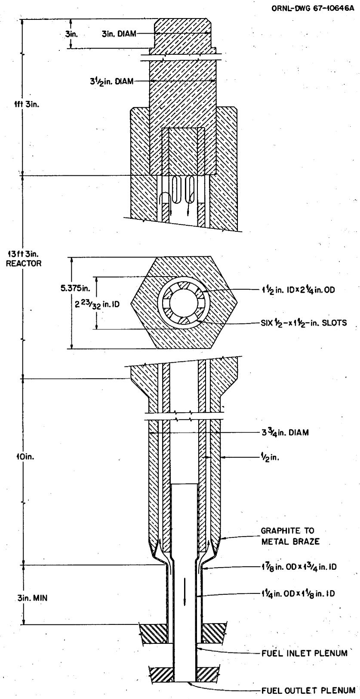  
Fig. 5.3. Sectional Drawing of Graphite Fuel Cell.

with an average power density of $20\mathrm{kw / liter}$ would have a maximum power density of $40\mathrm{kw / liter}$ , a maximum damage flux of $1.9\times 10^{14}$ neutrons $\mathrm{cm}^2$ and a design lifetime of 8.6 full-power years, or 10.8 years with an 0.8 plant factor. Table 5.1 shows how some of the characteristics of a reactor for one module of a 1000-Mw(e) plant would vary with average power density and design lifetime.

Under irradiation the isotropic graphite being considered at the time of these studies would decrease in volume by $7.5\%$ during the contraction stage and then would increase in volume by as much as $7.5\%$ over its initial volume by the end of its useful life. These changes in volume correspond to changes in linear dimensions of $\pm 2.5\%$ over the initial dimensions and create several design problems. The overall lengths of the graphite fuel cells would change by several inches during the lifetime of a core and would vary with location in the reactor. We preferred not to use a bellows in the fuel salt line to each fuel cell and favored a minimum number of graphite-to-metal seals. We therefore chose to have the fuel enter and leave the bottom of the fuel cell so that each element would have only one metal-to-graphite brazed joint and the graphite would be free to contract and expand axially, as shown in Fig. 5.1.

The change in radial dimensions presented a more difficult problem. Densification of the graphite to produce a $2.5\%$ reduction in distance across the flats of the hexagonal tubes would cause the fraction of the cross section of the core occupied by fuel cells to decrease by $5\%$ , and the space occupied by the blanket salt would increase correspondingly. For the reactor with an average power density of $20~\mathrm{kw / liter}$ , the volume fractions in the core would change from 0.802 to 0.762 for graphite, 0.134 to 0.127 for fuel salt, and 0.064 to 0.111 for blanket salt. Changes of equal magnitude, but opposite in direction, would occur during the expansion phase. The rates of change of dimensions would vary with local power density, so at no time during the life of a core would the volume fractions corresponding to the maximum contraction or expansion exist throughout the core. At the end of life the graphite at the center of the core would have reached its maximum volume; graphite in the regions of average power density would be about at its minimum volume, and graphite in the outer fuel cells would be about halfway into the contraction stage.

Stresses arise in the graphite from dimensional changes due to gradients in temperature and neutron flux. A maximum tensile stress estimated to be about 700 psi would occur at an axial position slightly above

the center of the core. In subsequent, more detailed analyses of graphite elements of similar configuration in a one-fluid reactor concept, the maximum stress was calculated to be 500 psi.[26] These stresses are all well below the tensile strength range of 4000 to 5000 psi of graphites being considered for use in MSBR's.[4,26]

No nuclear calculations were completed to show how the fuel salt and blanket salt compositions would have to be adjusted to compensate for the change in volume fractions and how the adjustments would affect the performance. However, the power-flattening calculations showed that the power distribution in the core was quite sensitive to the local volume fraction of blanket salt. We concluded that a design in which the volume fraction of blanket salt varied so widely was not likely to be satisfactory; thus we looked for an alternative.[27]

An alternative design for the reactor vessel is shown in Fig. 5.4. The graphite fuel tube assembly for the core of this reactor is shown in Fig. 5.5. Blanket cells are simply cylindrical tubes of graphite $6\%$ in. OD by 5 in. ID, each with a metal tube brazed into the upper end. The reference design concept described here is again for a reactor with an average power density of 20 kw/liter in the core. Basic dimensions of reactors designed for other power densities are those in Table 5.1.

The primary difference between this design and the one just described is that in this case the blanket salt in the core is confined to the annulus between fuel-containing tubes and the outer tube of graphite fuel-tube assemblies. The salt in the blanket region is confined to the inside of the blanket cells. To accomplish this the blanket-salt-containing tubes are connected to plenum in the top of the reactor vessel and dip into a pool of blanket salt in the bottom of the vessel. Helium fills the space between core assemblies and between blanket assemblies at a pressure that is controlled to provide the desired level of blanket salt in the bottom of the reactor vessel.

In this design the changes in axial dimensions are accommodated as before. The graphite tubes are fastened

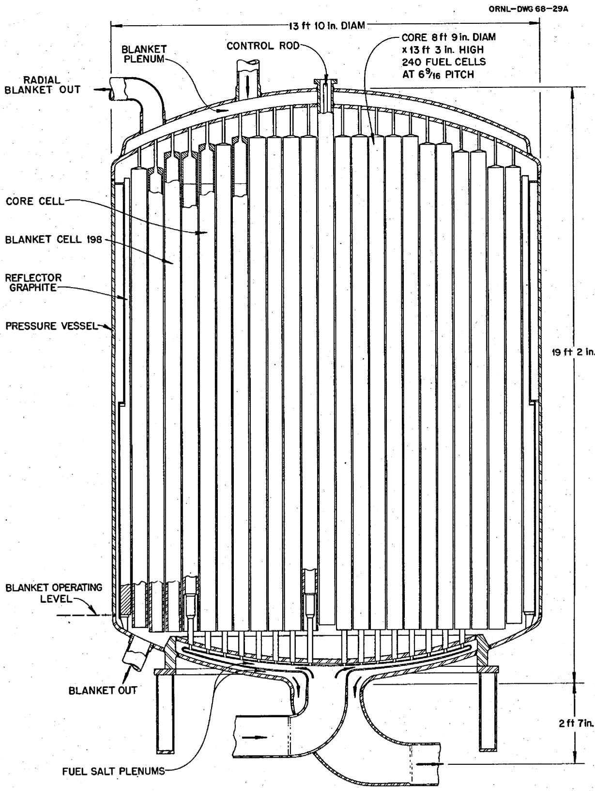  
Fig. 5.4. Vertical Section Through Center of Alternative Design of Reactor Vessel for One Module of 1000-Mw(e) Plant.

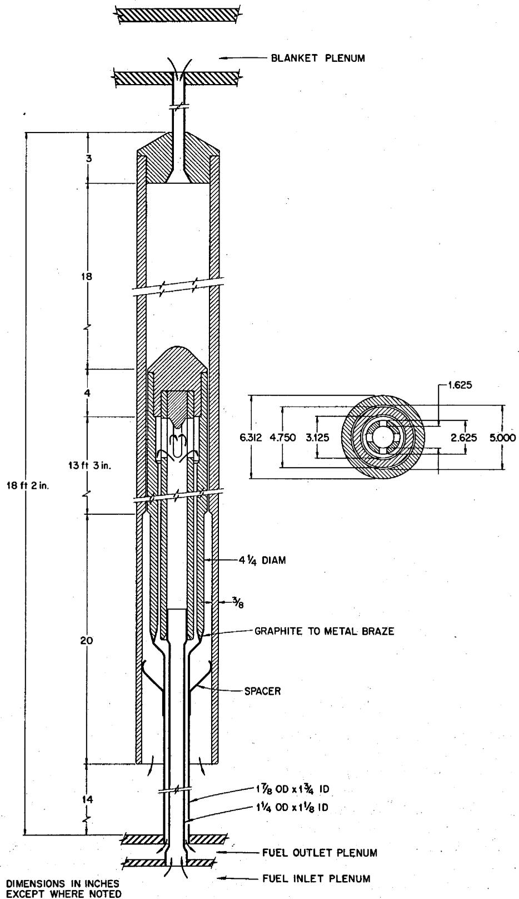  
Fig. 3.5. Graphite Fuel Tube Assembly for Core Region.

to a metal structure at one end only and are free to move axially. With blanket salt and fuel salt confined by graphite tubes in the core region, radiation-induced changes in the transverse dimensions of the graphite will produce proportionate changes in volumes of graphite, blanket salt, and fuel salt. The relative volumes of these materials would remain about constant, and the only major changes in fractional volume would occur in the gas spaces between elements. Although the nuclear characteristics would vary some with time (the amount had not been calculated when the work was interrupted), it would be surprising if there were a large or serious effect.

In this design the fuel salt enters the reactor vessel through a plenum in the bottom, flows through the reentrant tubes of the fuel tube assemblies, and leaves through a second plenum in the bottom of the vessel. The blanket salt enters through a plenum in the top of the vessel and flows downward through the outer annulus of the fuel tube assemblies and into the pool of blanket salt in the bottom of the vessel. Two-thirds of the blanket salt flow goes out through a pipe from the bottom of the reactor vessel to the suction of the blanket salt circulation pump. The discharge from this pump, after passing through the blanket salt heat exchanger, enters four ejector-type jet pumps operating in parallel. The suction side of these jets is connected to the radial blanket plenum in the top of the reactor vessel. The jets draw blanket salt upward through the radial blanket cells and discharge the combined flow into the plenum that supplies the core elements. This method was chosen for circulating the blanket salt because it seems to overcome the problems of distributing the flow between the core elements and radial blanket elements while assuring that the elements will be kept full of salt.

# 5.2 Fuel Salt Primary Heat Exchanger

Each reactor module has a fuel salt primary heat exchanger in which the fission heat in the fuel salt is transferred to the coolant salt. The exchanger is of the vertical countercurrent shell-and-tube type with the fuel salt in the tubes. The impeller and bowl of the fuel salt circulating pump are an integral part of the top head assembly of the heat exchanger. The pump will be discussed separately in Sect. 5.4.

The general configuration of the exchanger is shown in Fig. 5.6, and the principal data are given in Table 5.2. Each exchanger is about 6.5 ft in diameter $\times$ 20 ft high and has an effective surface of $12,230\mathrm{ft}^2$ . All portions

Table 5.2. Fuel Salt Primary Heat Exchanger Data   

<table><tr><td>Number required per reactor module</td><td>1</td></tr><tr><td>Rate of heat transfer, Mw</td><td>5.29</td></tr><tr><td>Rate of heat transfer, Btu/hr</td><td>1.80 × 109</td></tr><tr><td>Total surface, ft2</td><td>12,230</td></tr><tr><td>Shell side</td><td></td></tr><tr><td>Hot fluid or cold fluid</td><td>Cold (coolant salt)</td></tr><tr><td>Entrance temperature, °F</td><td>850</td></tr><tr><td>Exit temperature, °F</td><td>1110</td></tr><tr><td>Entrance pressure, psi</td><td>198</td></tr><tr><td>Exit pressure, psi</td><td>164</td></tr><tr><td>ΔP across exchanger, psi</td><td>34</td></tr><tr><td>Mass flow rate, lb/hr</td><td>1.68 × 107</td></tr><tr><td>Tube side</td><td></td></tr><tr><td>Hot fluid or cold fluid</td><td>Hot (fuel salt)</td></tr><tr><td>Entrance temperature, °F</td><td>1300</td></tr><tr><td>Exit temperature, °F</td><td>1000</td></tr><tr><td>Entrance pressure, psi</td><td>146</td></tr><tr><td>Exit pressure, psi</td><td>50</td></tr><tr><td>ΔP across exchanger, psi</td><td>96</td></tr><tr><td>Mass flow rate, lb/hr</td><td>1.09 × 107</td></tr><tr><td>Velocity in tubes, fps</td><td>~9</td></tr><tr><td>Tube material</td><td>Hastelloy N</td></tr><tr><td>Tube OD, in.</td><td>0.375</td></tr><tr><td>Tube thickness, in.</td><td>0.035</td></tr><tr><td>Tube length, tube sheet to tube sheet, ft</td><td></td></tr><tr><td>Inner annulus</td><td>15.3</td></tr><tr><td>Outer annulus</td><td>16.7</td></tr><tr><td>Shell material</td><td>Hastelloy N</td></tr><tr><td>Shell thickness, in.</td><td>1</td></tr><tr><td>Shell ID, in.</td><td>67</td></tr><tr><td>Tube sheet material</td><td>Hastelloy N</td></tr><tr><td>Tube sheet thickness, in.</td><td></td></tr><tr><td>Top outer annulus</td><td>1.5</td></tr><tr><td>Top inner annulus</td><td>2.5</td></tr><tr><td>Floating head</td><td>3.5</td></tr><tr><td>Number of tubes</td><td></td></tr><tr><td>Inner annulus</td><td>4347</td></tr><tr><td>Outer annulus</td><td>3794</td></tr><tr><td>Pitch of inner annulus tubes, in.</td><td></td></tr><tr><td>Radial</td><td>0.600</td></tr><tr><td>Circumferential</td><td>0.673</td></tr><tr><td>Pitch of outer annulus tubes, in.</td><td>0.625, triangular</td></tr><tr><td>Type of baffle</td><td>Doughnut</td></tr><tr><td>Number of baffles</td><td></td></tr><tr><td>Inner annulus</td><td>4</td></tr><tr><td>Outer annulus</td><td>10</td></tr></table>

in contact with the fuel and coolant salts are constructed of Hastelloy N. The pump tank, which is about 6 ft in diameter $\times 8$ ft high, is mounted directly above the heat exchanger and is part of the pump and heat exchanger assembly. A 5-in. fill-and-drain line connects the bottom of this tank to the fuel salt drain tanks.

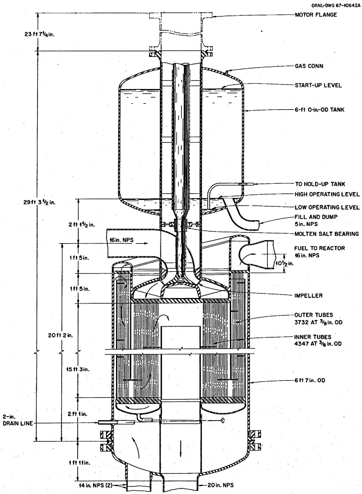  
Fig. 5.6. Fuel Salt Primary Heat Exchanger and Pump Assembly for 250-Mw(e) Reactor Module.

Fuel salt flows from the reactor at $1300^{\circ}\mathrm{F}$ through the 16-in. pipe connected directly to the top of the circulating pump. The pump boosts the pressure from about 9 psi to approximately 146 psi and discharges the salt downward through 4347 bent tubes to the lower tube sheet. The flow direction then reverses, and the salt flows upward through 3794 straight tubes in the outer annulus, or bank, of tubes and leaves the exchanger at about $1000^{\circ}\mathrm{F}$ . The tubes in both banks are $\frac{3}{8}$ in. OD, and the salt velocity in the tubes averages about 9 fps. Using a tube sheet at the bottom, rather than employing U-tubes, provides a plenum for draining the fuel salt from the exchanger. A loop in the 2-in. drain line inside the shell provides the necessary flexibility for thermal expansion and movement of the bottom tube sheet.

The bent tubes in the inner annulus accommodate the differential expansion between the inner and outer banks of tubes. To simplify the bends, the inner tubes are placed on concentric circles with a constant delta radius and a nearly constant circumferential pitch. A radial spacing of about 0.6 in. was selected as being the minimum practical pitch. The tubes in the outer annulus are located on a triangular pitch of 0.625 in.[28]

The $850^{\circ}\mathrm{F}$ coolant salt enters at the bottom through two 14-in. pipes at a pressure of 194 psi and flows upward through the outer annulus to cool the vessel outer wall. It then reverses direction and flows downward over the outer bank of tubes in a counterflow arrangement. At the bottom tube sheet it again reverses direction and flows upward across the inner bank of tubes. Doughnut-shaped baffles are used in both annuli. The salt then leaves through a 20-in. coolant salt pipe at the center line of the exchanger at about $1111^{\circ}\mathrm{F}$ and 161 psi. Drain ports, not shown in Fig. 5.6, allow the coolant salt to be drained from the space above the lower tube sheet.

The heat transfer and stress correlations used in conceptual design of the heat exchanger have been reported by Bettis et al.28 The properties of the fuel and coolant salts and of the Hastelloy N used in the calculations are given in Tables 3.1 and 3.4. Computer codes were written to optimize the salt-to-salt and salt-to-steam MSBR heat transfer equipment. Except for some work on the steam generators, however, the codes were not fully operational when this equipment was designed.

The number of tubes in each of the annular regions was determined on the basis of the desirable pressure drop for the fuel salt flow through the tubes and on the allowable temperature drop across the wall. The heat transfer coefficient in the inner annulus needed to be lowered to minimize the temperature gradient through the wall; the velocity was therefore reduced by using 4347 tubes as compared with 3794 in the outer bank.[28] The length of the tubes was determined largely on the basis of preliminary calculations which showed that 15 ft would provide about the desired geometry. Baffle spacing in the inner annulus was fixed by the distances required for the unrestrained bends in the tubes and the maximum allowable temperature drop across the walls. The spacing in the outer annulus was selected to give the most efficient use of the shell-side pressure drop. Ten baffles were used in this region.[28]

In this conceptual design, individual tubes cannot be inspected, repaired, or replaced. Reliance is therefore placed on quality control in the manufacture and installation to obtain highly reliable units. Should major difficulties develop in an exchanger, however, it would be necessary to replace an entire heat-exchanger-pump assembly, as discussed in Sect. 5.10. The rotating parts of the pump can be replaced with relatively little difficulty.

As may be noted in Table 3.1, the thermal conductivity of both the fuel and coolant salts is now known to be substantially less than the values used in design of the heat exchanger presented here. Use of the newer values would increase somewhat the amount of heat transfer surface and the inventory of salt.

# 5.3 Blanket Salt Primary Heat Exchanger

Each reactor module has a blanket salt heat exchanger for transferring heat from the blanket salt to the coolant salt. The exchangers are about 4.7 ft in diameter $\times$ 19 ft high overall and are of the vertical shell-and-tube type with the blanket salt in the tubes, as shown in Fig. 5.7. Although smaller, the units are very similar to the fuel salt heat exchangers and have the same arrangement of the salt circulating pumps as an integral part of the top head. Hastelloy N is used for all portions in contact with the salts.

The blanket salt is cooled from about 1250 to $1150^{\circ}\mathrm{F}$ in its passage through the exchanger. The flow is from the reactor, through the pump, downward through the inner bank of $3/8$ in.-OD tubes, to the bottom tube sheet, where the flow turns upward through the outer bank of tubes. Unlike the fuel salt

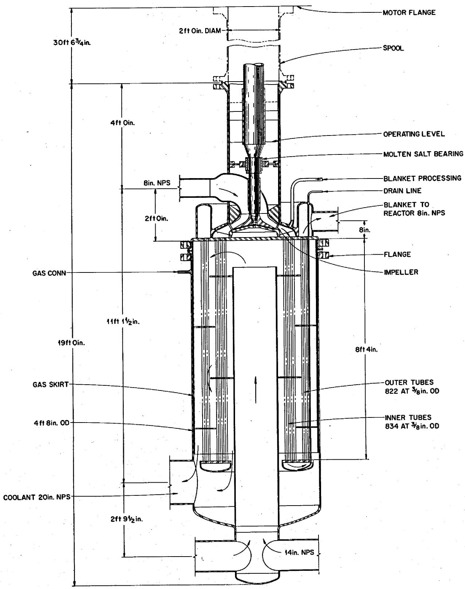  
Fig. 5.7. Blanket Salt Primary Heat Exchanger and Pump Assembly for 250-Mw(e) Reactor Module.

exchanger, straight tubes are used in both banks. The pertinent data are given in Table 5.3.

The coolant salt is circulated in series through the fuel salt and blanket salt exchangers. The salt leaves the fuel salt exchanger at about $1111^{\circ}\mathrm{F}$ and is heated to about $1150^{\circ}\mathrm{F}$ in the blanket salt unit, absorbing about 28 $\mathrm{Mw(t)}$ of heat per reactor module. The coolant makes one pass through the shell side, entering through the 20-in.-diam central column, flowing downward between the disk-and-doughnut baffles, and exiting through a 20-in.-diam side nozzle.

Table 5.3. Blanket Salt Primary Heat Exchanger Data   

<table><tr><td>Number required</td><td>4</td></tr><tr><td>Rate of heat transfer, Mw</td><td>27.8</td></tr><tr><td>Rate of heat transfer, Btu/hr</td><td>9.47 × 107</td></tr><tr><td>Shell side</td><td></td></tr><tr><td>Hot fluid or cold fluid</td><td>Cold (coolant salt)</td></tr><tr><td>Entrance temperature, °F</td><td>1110</td></tr><tr><td>Exit temperature, °F</td><td>1125</td></tr><tr><td>Entrance pressure,a psi</td><td>138</td></tr><tr><td>Exit pressure,a psi</td><td>129</td></tr><tr><td>ΔP across exchanger,b psi</td><td>15</td></tr><tr><td>Mass flow rate, lb/hr</td><td>1.68 × 107</td></tr><tr><td>Tube side</td><td></td></tr><tr><td>Hot fluid or cold fluid</td><td>Hot (blanket salt)</td></tr><tr><td>Entrance temperature, °F</td><td>1250</td></tr><tr><td>Exit temperature, °F</td><td>1150</td></tr><tr><td>Entrance pressure,a psi</td><td>111</td></tr><tr><td>Exit pressure,a psi</td><td>20</td></tr><tr><td>ΔP across exchanger,b psi</td><td>91</td></tr><tr><td>Mass flow rate, lb/hr</td><td>4.3 × 106</td></tr><tr><td>Velocity, fps</td><td>10.5</td></tr><tr><td>Tube material</td><td>Hastelloy N</td></tr><tr><td>Tube OD, in.</td><td>0.375</td></tr><tr><td>Tube thickness, in.</td><td>0.035</td></tr><tr><td>Tube length, tube sheet to tube sheet, ft</td><td>8.3</td></tr><tr><td>Shell material</td><td>Hastelloy N</td></tr><tr><td>Shell thickness, in.</td><td>0.50</td></tr><tr><td>Shell ID, in.</td><td>55</td></tr><tr><td>Tube sheet material</td><td>Hastelloy N</td></tr><tr><td>Tube sheet thickness, in.</td><td>1</td></tr><tr><td>Number of tubes</td><td></td></tr><tr><td>Inner annulus</td><td>834</td></tr><tr><td>Outer annulus</td><td>822</td></tr><tr><td>Pitch of tubes, in.</td><td>0.8125, triangular</td></tr><tr><td>Total heat transfer area, ft2</td><td>1318</td></tr><tr><td>Basis for area calculation</td><td>Tube OD</td></tr><tr><td>Type of baffle</td><td>Disk and doughnut</td></tr><tr><td>Number of baffles</td><td>4</td></tr><tr><td>Baffle spacing, in.</td><td>19.8</td></tr><tr><td>Disk OD, in.</td><td>33.6</td></tr><tr><td>Doughnut ID, in.</td><td>31.8</td></tr><tr><td>Overall heat transfer coefficient, U, Btu hr-1 ft-2</td><td>1030</td></tr></table>

$a_{\mathrm{I}}$ Includes pressure due to gravity head.   
$b_{\text{Pressure}}$ loss due to friction only.

Drainage of the blanket salt can be accomplished through a drain line at the bottom of the tube sheet, not shown in Fig. 5.7. A large pump tank is not required, as in the fuel salt system, since the reactor blanket volume is filled with salt before circulation is started.

Essentially the same heat transfer relationships were used for analysis of both the fuel and the blanket salt exchangers. The number of tubes per pass in the blanket unit could be established in a straightforward manner, but determination of the baffle spacing and the tube length that fulfilled both the heat transfer and pressure-drop requirements became involved. The first step was to generate data for the outside film resistance as a function of the baffle spacing. It was next determined whether the baffle spacing was limited by the thermal stress in the tube wall or by the allowable shell-side pressure drop. Equations were then developed to relate the baffle spacing, the outside film resistance, and the pressure drop, as described in ORNL-TM-1545.[28]

# 5.4 Salt Circulating Pumps

# 5.4.1 General

The 1000-Mw(e) MSBR conceptual design employs four fuel salt circulating pumps and four blanket salt pumps, one of each for each of the four reactor modules. The pumps are integral with the primary heat exchangers, as illustrated in Figs. 5.6 and 5.7. There is also a coolant salt pump located in each of the four coolant cells. These pumps are somewhat larger but are similar to the fuel and blanket salt pumps.

All the pumps are vertical-shaft, sump-type, single-stage centrifugal units and are driven by electric motors. The fuel and blanket salt pumps operate at a constant speed of about 1160 rpm, while the coolant salt pumps operate at speeds that are variable between about 300 and 1160 rpm. The principal data for the three types of pumps are given in Table 5.4.

As shown in Fig. 4.7, all the pumps have the electric drive motors located in sealed housings at the operating floor level. This facilitates access to the motors for maintenance, and they can be shielded to protect electric insulation and lubricants from radiation damage. The motor housing is thus an integral part of the containment system and is subject to the same integrity requirements.

The fuel and blanket salt pumps have long shafts with the impeller and casing located some 30 ft below the

Table 5.4. Salt-Circulating Pumps for the 1000-Mw(e) MSBR   

<table><tr><td></td><td>Fuel</td><td>Blanket</td><td>Coolant</td></tr><tr><td>Number required</td><td>4a</td><td>4a</td><td>4a</td></tr><tr><td>Design temperature, °F</td><td>1300</td><td>1300</td><td>1300</td></tr><tr><td>Capacity, gpm</td><td>11,000</td><td>2000</td><td>16,000</td></tr><tr><td>Head, ft</td><td>150</td><td>80</td><td>150</td></tr><tr><td>Speed, rpm</td><td>1160</td><td>1160</td><td>300–1160</td></tr><tr><td>Specific speed, Ns</td><td>2830</td><td>2150</td><td>3400</td></tr><tr><td>Net positive suction head required, ft</td><td>25</td><td>8</td><td>32</td></tr><tr><td>Impeller input power, hp</td><td>990</td><td>250</td><td>1440</td></tr><tr><td>Distance between bearings, ftb</td><td>29</td><td>29</td><td>1.5</td></tr><tr><td>Impeller overhang, ftb</td><td>2.5</td><td>2.5</td><td>5</td></tr></table>

$a$ One pump is required for each of the four modules in the MSBR. $^b$ Estimated from preliminary pump layouts.

drive motor. The upper bearing for the shaft is oil-lubricated, but the bearing at the lower end is lubricated by the pumped salt. In general, a short-shaft pump with an overhung impeller and all bearings of the oil-lubricated type are desirable features since there are fewer development problems with regard to both the salt-lubricated bearings and the rotor dynamics. Long shafts were used in this MSBR two-fluid design concept, however, because the fuel salt enters and leaves at the bottom of the reactor vessel, placing the pump casing at about this same elevation conserves salt inventory, and we preferred to locate the drive motors outside the reactor cell.

The number of reactor modules selected for the two-fluid MSBR design study was influenced by the size of pump that appeared to be a reasonable extrapolation of the MSRE pump size. One salt pump was assumed per circuit, on the basis of a study made by Grindell and Young,[29] which found that parallel operation of pumps in which the liquid level in the pump bowl is maintained by a gas overpressure could lead to instability problems.

Only preliminary studies were completed on the conceptual design of the salt pumps. Work had progressed sufficiently to indicate, however, that a careful study of the effect of pump shaft and casing sizes on the rotor dynamics would probably be required. Selection of suitable materials for the salt-lubricated bearing had just begun when the work was terminated.

# 5.4.2 Fuel Salt Circulating Pump

A design concept for the fuel salt circulating pump is shown in Fig. 5.8. The oil-lubricated ball bearings and shaft seal at the top are similar to those which have performed satisfactorily in the MSRE. The seal consists of a Graphitar stator bearing against a tool steel rotor. Lubricating oil is on one side of the seal, and helium gas is in the shaft annulus on the other side. The gas, in flowing upward through a labyrinth seal, prevents movement of lubricating oil vapors downward and scavenges oil vapors from the system. A downward flow of the purge gas is also provided along the shaft to retard the upward diffusion of salt vapors and fission product gases.

Some preliminary development was done on the salt-lubricated bearing for the lower end of the 34-ft-long pump shaft. One study $^{30}$ indicated that self-acting hydrodynamic film lubrication was to be preferred over the externally pumped hydrostatic type of film. The relatively high viscosity of the molten salt provides good load capacity and hydrodynamic film operation in the laminar regime. A tilting (pivoted) four-pad type of self-acting bearing design was selected as being the most stable. $^{31}$ The bearing would be constructed of Hastelloy N with a special hard-surface coating. Four of the coating materials under consideration were: (1) cobalt

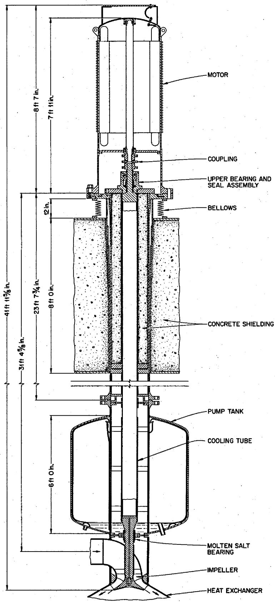  
Fig. 5.8. Fuel Salt Circulating Pump.

bonded tungsten carbide, (2) nickel-bonded tungsten carbide and mixed tungsten-chromium carbides, (3) nickel-chromium-bonded chromium carbide, and (4) molybdenum-bonded tungsten carbide. Specimens of these hard-surface coatings were obtained but had not been tested.

Because the fuel salt pump is a critical item in a molten-salt reactor and the proposed design of pump was considerably outside the range of our experience, some features of the pump were examined in detail. The rotor dynamics were studied under a contract with Mechanical Technology Incorporated.[30,32] Computer studies were made of the conceptual designs to determine flexural and torsional critical speeds and flexural response to dynamic unbalance. The stability characteristics of the bearing designs were also reviewed. The work, as summarized by Grindell,[31] covered both 9- and 7.5-in.-OD shaft sizes. The first critical speed for the larger shaft was about 700 rpm and for the smaller shaft about 560 rpm, both below the design speed of 1200 rpm. The second shaft critical speed was substantially above 1200 rpm for the larger shaft and about $25\%$ above it for the smaller. Serious study of the problems of acceleration and deceleration of both sizes of shafts through the first critical speed was recommended. It was further recommended that the pump shaft be designed to operate below the first shaft critical speed to reduce the probability of low-speed, high-amplitude whirl and the problems of traversing the critical speed. This would require reduction of the shaft length, lower design operating speeds, or both. These objectives would be difficult to attain without major revisions to the two-fluid MSBR design described in this report.

A preliminary analysis of the undamped torsional critical speed4 indicated that the two torsional critical speeds that might affect pump operation could be strongly dependent upon the electromagnetic torsional stiffness of the drive motor. By changing some of the component dimensions, such as increasing the stiffness of the outer pump casing and accounting for inherent damping, it appeared possible that the pump could operate satisfactorily between the first and second critical speeds. If supercritical speed operation were chosen, the study strongly recommended that a practical means for dynamic balancing of the shaft be developed and that a rotor-dynamic evaluation simulator be constructed. This simulator would be a

full-scale model of the pump rotor dynamic system to evaluate the dynamic response experimentally.

The studies31 indicated that approximately 0.025 in. of bow in the middle of a uniformly bowed shaft and approximately 0.019 in. of eccentricity between the inner and outer diameters of a uniformly eccentric shaft could be accommodated at the shaft critical speed. The values are limited by the bearing eccentricity. A bearing eccentricity value of 0.95 was used in making the calculations. A survey was made of U.S. manufacturers who could fabricate the 34-ft pump shafts to the tolerances required.4 One was found who expressed confidence that shafts of the diameters and wall thicknesses of interest could be produced with a guaranteed straightness from end to end of 0.005 in. and with an OD-ID concentricity of 0.005 in. or better. It was estimated that the cost would be relatively high, however. A study of the effect of the tolerances on the pump design and costs and on the dynamic balancing facilities required was in the planning stage.

As shown in Fig. 5.6, a startup tank is provided above the fuel salt primary heat exchanger. The purpose of the tank is to provide submergence for the pump as it is started and the reactor is filled, the pumping capacity of the pump being significantly greater than the transfer rate of the salt from the drain tank. If the pump were stopped, intentionally or otherwise, the fuel salt would flow upward into the bottom of the startup tank and then through the 5-in. overflow pipe to the fuel salt drain tank. Since the tank is not provided with a cooling system the fuel salt is not allowed to fill the tank to more than a few inches in depth except during startup, at which time the overflow pipe is closed.

Some cooling of the startup tank and the pump shaft is provided when the pump is operating. A small stream of fuel salt from the pump discharge passes partway up through the center of the pump shaft and then up through a narrow annulus between the shaft and a cooling tube surrounding the shaft. Salt leaving the annulus at the top spills back into the tank. Another small stream of salt from the pump discharge flows into the double wall of the tank bottom and upward in the outer double wall to the top of the tank. The flow then turns downward through the annulus formed between the center column of the tank and the pump casing. Analysis of the shaft and tank wall heating was only partly completed, particularly with regard to removal of afterheat. These and other aspects needed further study.

The pumps are arranged so that the rotary element can be replaced by remote maintenance techniques without having to cut any of the salt piping. After the

motor housing has been set aside, the 2-ft-diam pump casing can be withdrawn, carrying the upper bearing and seal, the lower molten-salt-lubricated bearing, and the impeller with it as a unit assembly. Although not clearly evident in Figs. 5.6 and 5.8, the inlet salt pipe to the pump is welded to the wall of the vessel surrounding the pump casing, and the $90^{\circ}$ elbow, or inlet flow guide on the inside of the casing, is an integral part of the rotary element and is withdrawn with it. Maintenance of the drive motor and upper bearing and seal assembly can probably be performed in place through use of a static seal on the shaft to isolate the upper assembly from gas-borne fission products and other contaminants in the pump tank and fuel salt system.

# 5.4.3 Blanket Salt Circulating Pumps

There is little difference between the fuel salt and blanket salt pumps except in the capacity and horsepower requirements, as shown in Table 5.4. The shafts are about the same length, have the same bearing arrangements, and the dynamic response is probably similar.

# 5.4.4 Coolant Salt Circulating Pumps

The coolant salt pumps are similar to the fuel and blanket salt pumps, although of larger capacity, as indicated in Table 5.4.

The coolant salt pumps are located near the top of the steam-generator cells and are of the short-shaft type with an overhung impeller and do not need a salt-lubricated lower bearing. These pumps will be operated at variable speeds over the range from about 300 to 1200 rpm. Preliminary studies indicate that to operate below the first critical speed the shaft would have to be 8 in. or more in diameter.

A double volute pump casing was selected for the coolant salt pump in order to reduce the radial loads on the impeller, particularly at off-design conditions. This arrangement also reduces the diameter of the flexible connection from the volute to the pump tank nozzle. The coolant salt system would be provided with a tank to act as a surge volume and to accommodate thermal expansion of the coolant salt.

# 5.5 Off-Gas System

Fission product gases must be continuously removed from the circulating fuel salt to prevent $^{135}\mathrm{Xe}$ from absorbing so many neutrons that the breeding gain will be significantly lowered. The neutron losses can be

greatly reduced by continuously sparging the salt with helium which, in its subsequent removal, carries away the xenon and krypton. Both of these gases are only slightly soluble in the salt. Xenon that diffuses into the pores of the reactor core graphite must also be considered. As discussed in Sect. 3.4, the amount of xenon that diffuses depends on the ratio of the surface area of helium bubbles in the circulating salt to the surface area of graphite in the core, the rate of injection and removal of bubbles, the coefficients for transfer of xenon to both bubble and graphite surfaces, and the permeability of the graphite to xenon. Assuming a processing-cycle time of about 1 min and a graphite coating effectiveness which reduces the permeability to xenon as effectively as the preliminary tests indicate, about 0.5 vol % of gas bubbles in the fuel salt in the core will keep the $^{135}\mathrm{Xe}$ poison fraction below 0.5%.

The major features of the off-gas system were established, but only a few of the details were examined. The helium is injected into the circulating fuel salt through a bubble generator at a rate of about 2.5 scfm per reactor module. The bubble generator is a Venturi-like section of pipe capable of producing bubbles with diameters in the range of 15 to 20 mils. The bubbles recirculate with the fuel salt, making, on the average, about ten passes through the primary system before being removed by means of a centrifugal separator. Swirl vanes at the entrance to the separator induce rotational flow in the liquid that causes entrained gas bubbles to collect in an axial vortex from which the gas is withdrawn. Vanes at the exit of the separator remove the swirl.

The gas separator and bubble generator can be installed in a bypass line around the fuel salt circulating pump or in the main circulating system. In the former location the bypass flow would have to be about $10\%$ of the total flow, the separator efficiency should be near $100\%$ , and a large pressure drop would be available to operate the separator. If installed in the main stream, the pressure drop that could be allotted to operation of the separator would be much less, but the bubble removal efficiency would only have to be about $10\%$ .

Effluent from the gas separator, composed of helium, krypton, xenon, a "smoke" of noble metal fission products, and as much as 50 vol % of salt, is delivered to an entrainment separator. There it is joined by a second stream of about 0.5 scfm of gas that is used to purge the fuel salt pump tank. The salt and gas are separated, the salt is returned to the suction of the fuel salt circulating pump, and the gas with its burden of fission products and a small amount of salt mist is discharged to a gas processing system that retains the

xenon for about 48 hr - time enough for most of the $^{135}\mathrm{Xe}$ to decay - before it is recycled to the reactor.

Whether four, two, or one gas processing system would be provided for a 1000-Mw(e) modular plant had not been decided, but for the purposes of this discussion we will assume that the gases from the four reactor modules are combined and handled by one processing system. The first part of the gas processing system is a decay tank where the 12 scfm of gas is held for about 1 hr and most of the short-lived fission products release their heat. In this tank the solid daughters of the radioactive gases, the noble metal particles, and the salt mist are separated from the gases by a particle trapping system and are sent to the fuel reprocessing plant. Heat is released in the decay tank and particle trap at a rate of about $18\mathrm{Mw}$ , and care must be taken to provide adequate cooling.

Gas leaving the 1-hr decay tank passes into beds of charcoal that are designed to retain xenon for about 47 hr. These traps are water-cooled, and the heat load is about $3.2\mathrm{Mw}$ . On leaving the charcoal beds, about 10 scfm of gas passes through a water monitor and trap to a compressor that recirculates the gas to the bubble generators in the reactor primary systems. The remaining 2 scfm is processed further to remove the krypton, xenon, and tritium, and the helium is recycled to the pump tanks and to other parts of the reactor that require clean gas.

# 5.6 Drain Tanks

# 5.6.1 General

Drain tanks are provided for the fuel, blanket, and coolant salts so that they may be safely stored and isolated when maintenance or reactor replacement is required. Draining of the fuel salt is also a shutdown measure in that the reactor quickly drains and becomes subcritical if the fuel salt pump stops. In any situation where heat generated in the primary system could not be effectively removed via the coolant salt circuit, it would be necessary to quickly drain the fuel salt into the storage tank where an independent heat removal system is provided.[33]

The volumes of salt to be stored were not firmly established because of dependence on only tentative plant layouts, but a rough estimate of the total storage requirements is 1200 to $1400\mathrm{ft}^3$ of fuel salt, 2000 to

2500 ft³ of blanket salt, and 800 to 1000 ft³ of coolant salt.

Two fuel salt tanks, four blanket salt tanks, and four coolant salt tanks are provided for each reactor module. These tanks are installed in a drain tank cell that is shared by adjacent reactor modules, as shown in Fig. 4.6. In addition, a flush salt tank (see Sect. 5.6.5) located in the same cell serves both reactor modules. The drain tank cells are heated to maintain the salts above the liquidus temperatures.

The fuel salt drain tank represents more of a design problem than the other salt storage vessels and will be discussed in greater detail. It may be noted that the fuel salt drain tanks have many of the design requirements of the reactor vessel itself in that the tanks must be fabricated of Hastelloy N, are designed for essentially the same pressures and temperatures, and must meet the same requirements for leak-tightness and integrity. In addition, each of the eight tanks must have sufficient heat transfer surface for removing at least $12\mathrm{Mw(t)}$ of heat from the drained fuel salt. Conceptual designs for the drain tanks are presented here. Many details remained to be examined.

# 5.6.2 Fuel Salt Drain Tanks

The two fuel salt drain tanks are connected together at the bottom of a salt line provided with a freeze valve, as indicated on the flowsheet, Fig. 4.5. The pump overflow line enters the top of one tank, and the system drain line enters the bottom of the other. By using two tanks, pressurization can be used to return the salt to the circulating system without need for a valve in the pump overflow line. The volume of the heels left in the tank is also reduced.

Each of the fuel salt drain tanks is about 5 ft in diameter $\times$ 25 ft high, as shown in Fig. 5.9. Pertinent data are given in Table 5.5. The salt-containing portion is about 19 ft 6 in. high and has $3/4$ -in.-thick Hastelloy N walls. The 1-in.-thick inverted dished bottom head is designed to minimize the inventory of fuel salt in the tank heel. The inside of the tank has a $1/4$ -in.-thick liner, or skirt, standing off from the wall about $1/8$ in., which acts as a downcomer on filling the tank and as a riser when gas pressurization is used to empty it. It may be noted in Fig. 5.9 that the riser skirt communicates with the tank only at the bottom of the heel. A drain line is provided at the low point.

Steam at 500 to 600 psia and about $650^{\circ}\mathrm{F}$ is introduced as a coolant at the top of the drain tank. The steam enters through an 18-in.-diam reinforced nozzle in the $1\frac{1}{2}$ -in.-thick top head. The steam then

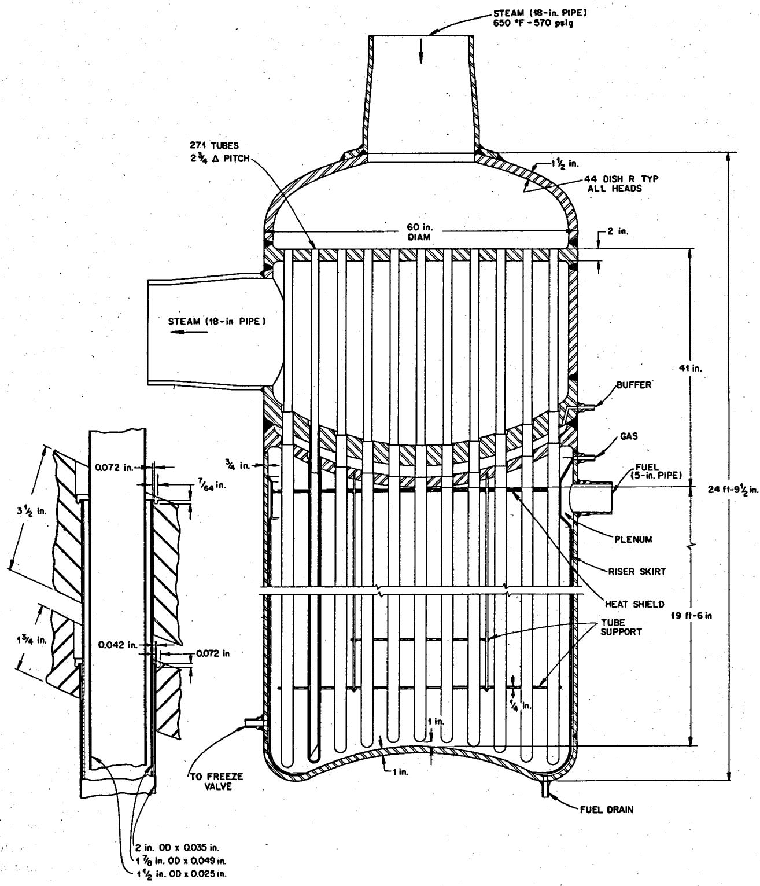  
Fig. 5.9. Fuel Salt Drain Tank for Two-Fluid MSBR.

circulates through 271 cooling thimbles which are immersed in the fuel salt. The steam flows downward through $1^{1/2}$ -in.-OD $\times$ 0.025-in.-wall-thickness tubes which are inside a $1^{7/8}$ -in.-OD $\times$ 0.049-in.-wall-thickness tube to form an annular passage through which the steam returns upward to the steam chest at the top of the tank.

Each thimble is encased in a 2-in.-OD $\times$ 0.035-in.-wall-thickness thimble which provides the requisite

double containment between the fuel salt and the steam. The 0.027-in. annular space between the inner and outer thimbles is filled with a stagnant salt, probably of about the same composition as the coolant salt, which acts as a heat transfer medium. While this buffer space between the thimbles retards the heat transfer somewhat, it has the desirable effect of limiting the thermal shock on the steam thimbles after a drain and also of preventing excessive thermal gradients.

Table 5.5. Fuel Salt Drain Tank Data   

<table><tr><td>Number required per reactor module</td><td>2</td><td></td></tr><tr><td>Rate of heat transfer per tank, Mw</td><td>12</td><td></td></tr><tr><td>Coolant in thimbles</td><td>Steam</td><td></td></tr><tr><td>Inlet coolant temperature, °F</td><td>650</td><td></td></tr><tr><td>Outlet coolant temperature, °F</td><td>1000</td><td></td></tr><tr><td>Inlet steam pressure, psia</td><td>540</td><td></td></tr><tr><td>Fuel salt temperature, °F</td><td>1150</td><td></td></tr><tr><td>Number of thimble assemblies per tank</td><td>271</td><td></td></tr><tr><td>Active heat transfer length, ft</td><td>19½</td><td></td></tr><tr><td>Thimble spacing arrangement</td><td>Δ</td><td></td></tr><tr><td>Thimble pitch, in.</td><td>2¾</td><td></td></tr><tr><td>Shell inside diameter, in.</td><td>60</td><td></td></tr><tr><td>Steam flow rate, Ib/hr</td><td>211,000</td><td></td></tr><tr><td>Steam pressure drop, psi</td><td>7</td><td></td></tr><tr><td>Steam outlet velocity, fps</td><td>72</td><td></td></tr><tr><td>Thickities, in.</td><td></td><td></td></tr><tr><td>Tank wall exposed to steam</td><td>1½</td><td></td></tr><tr><td>Tank wall exposed to salt</td><td>3¼</td><td></td></tr><tr><td>Top dished head</td><td>1½</td><td></td></tr><tr><td>Bottom reversed dished head</td><td>1</td><td></td></tr><tr><td>Top tube sheet (flat)</td><td>2</td><td></td></tr><tr><td>Middle tube sheet (dished)</td><td>3½</td><td></td></tr><tr><td>Bottom tube sheet (dished)</td><td>1¾</td><td></td></tr><tr><td>Thimble tubes, in.</td><td>ID</td><td>OD</td></tr><tr><td>Outer wall</td><td>1.930</td><td>2.000</td></tr><tr><td>Inner wall</td><td>1.777</td><td>1.875</td></tr><tr><td>Coolant supply tube</td><td>1.450</td><td>1.500</td></tr><tr><td>Calculated heat transfer coefficients, Btu hr-1°F-1ft-2</td><td></td><td></td></tr><tr><td>Fuel salt film</td><td>130</td><td></td></tr><tr><td>Outer wall</td><td>4000</td><td></td></tr><tr><td>Stagnant salt</td><td>184</td><td></td></tr><tr><td>Inner wall</td><td>2180</td><td></td></tr><tr><td>Steam film</td><td>189</td><td></td></tr><tr><td>Overall</td><td>52.3</td><td></td></tr><tr><td>Calculated stresses at inside surface of inner tube in bayonet assembly, psi</td><td></td><td></td></tr><tr><td>Hoop stress due to pressure</td><td>10,400</td><td></td></tr><tr><td>Longitudinal stress due to pressure</td><td>5200</td><td></td></tr><tr><td>Radial stress due to pressure</td><td>-540</td><td></td></tr><tr><td>Maximum thermal stress</td><td>2760</td><td></td></tr><tr><td>Allowable stress intensity</td><td>17,000</td><td></td></tr><tr><td>Maximum primary plus secondary stress intensity</td><td>13,700</td><td></td></tr><tr><td>Approximate storage volume per tank, ft3</td><td>200</td><td></td></tr></table>

Table 5.6. Decay Heat of Fission Products in Fuel Salt   

<table><tr><td rowspan="2">Time After Drain</td><td colspan="2">Watts per ft3of Fuel</td><td rowspan="2">Difference in Heat Generation (%)</td></tr><tr><td>Gross Amounts of Fission Products</td><td>Kr and Xe Sparged on 30-sec Cycle</td></tr><tr><td></td><td>×104</td><td>×104</td><td></td></tr><tr><td>0</td><td>16.4</td><td>14.4</td><td>24.2</td></tr><tr><td>1 min</td><td>6.2</td><td>4.7</td><td>14.2</td></tr><tr><td>5 min</td><td>4.8</td><td>3.5</td><td>27.1</td></tr><tr><td>10 min</td><td>4.2</td><td>3.0</td><td>28.6</td></tr><tr><td>30 min</td><td>3.1</td><td>2.2</td><td>29.0</td></tr><tr><td>1 hr</td><td>2.5</td><td>1.8</td><td>28.0</td></tr><tr><td>2 hr</td><td>1.9</td><td>1.45</td><td>23.7</td></tr><tr><td>5 hr</td><td>1.35</td><td>1.08</td><td>20.0</td></tr><tr><td>1 day</td><td>0.699</td><td>0.656</td><td>6.1</td></tr></table>

The exit steam chest is formed by the uppermost 2-in.-thick tube sheet and an inverted dished head about $3^{1/2}$ in. thick. A third $1^{3/4}$ -in.-thick tube sheet forms the buffer space for the stagnant salt. A $1/2$ -in.-thick heat shield is suspended beneath the lower tube sheet to protect it from thermal gradients and stresses when the hot fuel salt enters the drain tank after a sudden drain. Thimble support plates $1/4$ in. thick are suspended from the lower tube sheet to minimize vibrations induced in the thimbles by the flowing steam and to maintain the spacing.

The two fuel salt tanks which serve a reactor module are located in the deeper end of the drain tank cell, as shown in Fig. 4.11, with one of the tanks at a higher elevation than the other. The upper tank is the one depicted in Fig. 5.9 and has a 5-in. salt drain line nozzle at the top connected to the overflow from the fuel salt circulating pump bowl. The drain tank at the lower level does not require the 5-in. nozzle but is filled and emptied through the 1-in. bottom drain connection. This 1-in. line is connected through a freeze valve to the bottom of the fuel salt primary heat exchanger.

The liquidus temperature of the fuel salt is about $842^{\circ}\mathrm{F}$ . Although there is little danger of the fuel salt freezing once the reactor has operated at power, nevertheless the cooling steam temperature cannot be operated too far below the salt temperature if the likelihood of local freezing of the salt is to be avoided. Of greater concern are the temperature gradients in the tube walls and tube sheets if the differences in temperature between the salt and the steam are too great. The cooling steam has been assumed to be admitted at about $650^{\circ}\mathrm{F}$ . The source of the $650^{\circ}\mathrm{F}$ steam has not been fully studied, but presumably it could be taken from the exit of the reheat steam preheaters in the turbine plant.

The cooling steam in the drain tanks could be heated to as high as about $1000^{\circ}\mathrm{F}$ in the thimbles by the conditions existing immediately after a drain following long-term operation at full reactor power. The steam would be condensed in the turbine condensers, and the condensate would be returned to the feedwater system. In this two-fluid MSBR concept other reactor modules could continue to operate even though one or more of the reactors had been drained. In the event that all the reactors were drained, cooling steam would be supplied by the auxiliary boiler which is used to supply initial warmup steam for the plant.

The heat generation in the fuel salt after a drain from the reactor was investigated by Carter.34 He considered both the equilibrium concentrations of fission products with no sparging of krypton and xenon during reactor operation and the concentrations of fission products if these gases were sparged from the reactor system on a 30-sec cycle. The results are shown in Table 5.6.

The heat transfer to be expected in the drain tank was studied by Pickel.35 The results are summarized in Table 5.5. Preliminary investigation of the stresses indicated that they were within allowable limits. A complete analysis of the vessel was not made, however. Use of air rather than steam as a coolant was also briefly investigated.

# 5.6.3 Blanket Salt Drain Tanks

A total of 16 drain tanks was selected to store the estimated 2000 to $2500\mathrm{ft}^3$ of blanket salt. This provides four blanket salt tanks per module.

The amount of heat that could be generated in the blanket salt after an emergency drain to the storage tanks was not calculated, but the preliminary assumption was that no cooling thimbles would be needed in the tanks. If required, a steam cooling system similar to that used in the fuel salt tanks would be provided.

# 5.6.4 Coolant Salt Drain Tanks

The layouts of coolant salt piping were not sufficiently detailed to estimate the quantity of coolant salt in the systems. A rough estimate of the storage capacity required was 800 to $1000\mathrm{ft}^3$ , but this is likely to be low. Four coolant salt tanks were provided per reactor module.

The coolant salt tanks would not require cooling systems.

# 5.6.5 Flush Salt Drain Tanks

A flush salt is provided for removal of residual fuel salt from the circulating system in order to lower the radioactivity level during maintenance and to assure more complete recovery of valuable constituents. On startup, the flush salt would be circulated in the systems to sweep out foreign materials, moisture, etc., before introducing the enriched salts. The composition of the flush salt would be very similar to the $^7\mathrm{LiF}$ $\mathrm{BeF}_2$ fuel carrier salt. The volumes required and the tank sizes were not established.

# 5.7 Steam Generators

The 1000-Mw(e) MSBR power station described in this report requires about $10 \times 10^{6} \mathrm{lb/hr}$ of total steam generation. This is divided between 16 steam generators, or 4 steam generators per module. The number of units was selected on the basis that the high (3800 psia) design pressure on the steam side made larger capacity units appear to have disproportionately thick heads and tube sheets. Maintenance aspects also favored selection of a multiplicity of units since the generators as designed are not easily repaired and replacement of entire units could be required.

The coolant salt flow is proportioned between the steam generators and the reheaters as necessary to obtain a $1000^{\circ}\mathrm{F}$ outlet steam temperature from each. About $87\%$ of the total coolant salt flow is required for the steam generators. The coolant salt is cooled from about 1150 to $850^{\circ}\mathrm{F}$ in the units. Flow control is accomplished either by a regulating valve in the salt line, as indicated in Fig. 4.5, or by use of two variable-speed coolant salt circulating pumps per

module. Load regulation and partial-load operation received only superficial investigation.

As shown in Fig. 5.10 the steam generator is a vertical shell-and-tube unit with counterflow between the once through passage of the supercritical pressure water in the tubes and the coolant salt in the baffled shell space. The generator has a U-shaped cylindrical shell about 18 in. in diameter with each leg standing about 34 ft high, including the spherical head. A baffle on the shell side of each tube sheet provides a stagnant layer to help reduce the stresses in the sheet due to temperature gradients. The coolant salt can be drained from the shell, but the water would have to be removed from the tubes by evaporation, by gas pressurization, or by flushing. (Drainability of the water was considered desirable but not mandatory.) Both the tubes and shell are fabricated of Hastelloy N in this design concept, but less-expensive materials might be acceptable.

The principal data for the steam generators are listed in Table 5.7. The design variables to be determined were the number of tubes, the tube pitch, length of tubes, thickness of tube wall, thickness of tube sheet, baffle size and spacing, diameter of shell, thickness of shell, and thickness and shape of the heads. Because of the marked changes in the physical properties of water as its temperature is increased above the critical point at supercritical pressures, the temperature driving force and the heat transfer coefficient varied markedly along the length of the tubes. These conditions required that the heat transfer and pressure drop be calculated for increments of length. An iterative procedure was programmed for the CDC 1604 computer, as described in ORNL-TM-1545.[28] Based on the coolant salt properties given in Table 3.1, the optimum design was calculated to have a long slim shell and relatively wide baffle spacing as shown in Fig. 5.10. Subsequently the thermal conductivity of the coolant salt was found to be substantially less than had been used in the calculations. Use of the lower thermal conductivity could be expected to increase the number and length of tubes and to increase the shell diameter by a small amount.

# 5.8 Steam Reheaters

A single-reheat power cycle was selected for the MSBR plant although additional stages of reheat could be provided should this prove to be economically desirable. The steam conditions used in this study, and shown in Fig. 4.12, are that the steam from the high-pressure turbine exhaust is at $552^{\circ}\mathrm{F}$ , a temperature judged to be too low to be admitted directly into

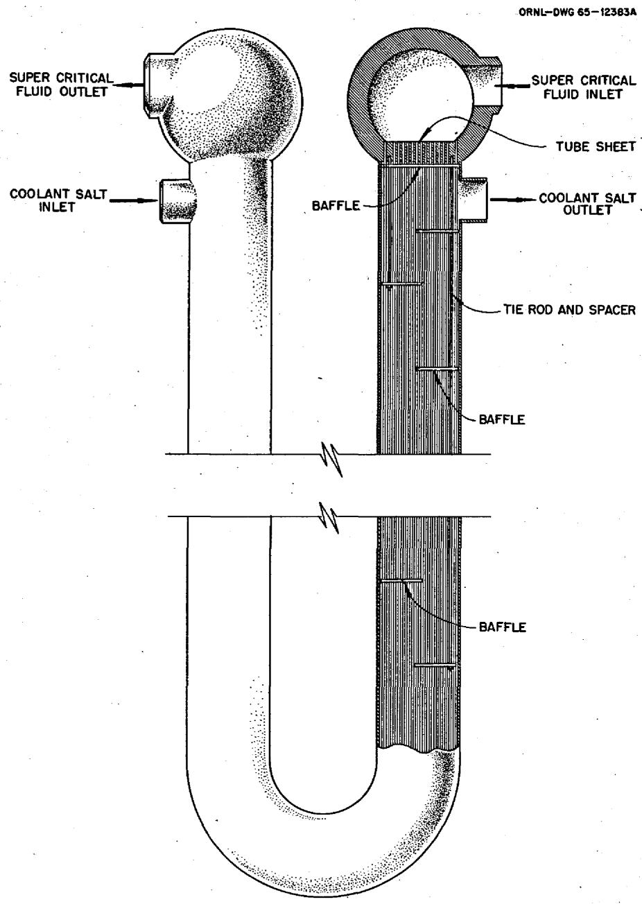  
Fig. 5.10. Steam Generator-Superheater.

the reheaters without the likelihood of local freezing of the coolant salt. The steam is therefore preheated by use of prime steam. (See Sect. 5.9 for a description of the preheaters.) The preheated steam, at about $650^{\circ}\mathrm{F}$ and 570 psia, is then reheated to $1000^{\circ}\mathrm{F}$ in the steam reheaters. About $13\%$ of the total reactor heat output is used for steam reheating in a total of eight units, or two per module. Selection of the number of units was largely intuitive because optimization studies had not commenced.

The reheater units are counterflow, vertical, shell-and-tube exchangers with straight tubes containing the steam and coolant salt flowing through the disk and doughnut baffles on the shell side. Tubes and shell are constructed of Hastelloy N. The principal data are listed in Table 5.8, and the unit is pictured in Fig. 5.11.

The methods used in the calculations of the heat transfer and stresses are much the same as those used for the steam generator and are described in detail in ORNL-TM-1545.[28]

Table 5.7. Steam Generator Data   

<table><tr><td>Type</td><td>U-tube U-shell exchanger with crossflow baffles</td></tr><tr><td>Number required per reactor module</td><td>4</td></tr><tr><td>Rate of heat transfer, each</td><td></td></tr><tr><td>Mw</td><td>120.9</td></tr><tr><td>Btu/hr</td><td>\( 4.13 \times 10^8 \)</td></tr><tr><td>Shell-side conditions</td><td></td></tr><tr><td>Hot fluid</td><td>Coolant salt</td></tr><tr><td>Entrance temperature,\( ^\circ F \)</td><td>1125</td></tr><tr><td>Exit temperature,\( ^\circ F \)</td><td>850</td></tr><tr><td>Entrance pressure, psi</td><td>252</td></tr><tr><td>Exit pressure, psi</td><td>194</td></tr><tr><td>Pressure drop across exchanger, psi</td><td>58.1</td></tr><tr><td>Mass flow rate, lb/hr</td><td>\( 3.6625 \times 10^6 \)</td></tr><tr><td>Tube-side conditions</td><td></td></tr><tr><td>Cold fluid</td><td>Supercritical fluid</td></tr><tr><td>Entrance temperature,\( ^\circ F \)</td><td>700</td></tr><tr><td>Exit temperature,\( ^\circ F \)</td><td>1000</td></tr><tr><td>Entrance pressure, psi</td><td>3766.4</td></tr><tr><td>Exit pressure, psi</td><td>3600</td></tr><tr><td>Pressure drop across exchanger, psi</td><td>166.4</td></tr><tr><td>Mass flow rate, lb/hr</td><td>\( 6.3312 \times 10^5 \)</td></tr><tr><td>Mass velocity, lb \( hr^{-1} ft^{-2} \)</td><td>\( 2.78 \times 10^6 \)</td></tr><tr><td>Tube material</td><td>Hastelloy N</td></tr><tr><td>Tube OD, in.</td><td>0.50</td></tr><tr><td>Tube thickness, in.</td><td>0.077</td></tr><tr><td>Tube length, tube sheet to tube sheet, ft</td><td>63.81</td></tr><tr><td>Shell material</td><td>Hastelloy N</td></tr><tr><td>Shell thickness, in.</td><td>0.375</td></tr><tr><td>Shell ID, in.</td><td>18.25</td></tr><tr><td>Tube sheet material</td><td>Hastelloy N</td></tr><tr><td>Tube sheet thickness, in.</td><td>4.75</td></tr><tr><td>Number of tubes</td><td>349</td></tr><tr><td>Pitch of tubes, in.</td><td>0.875</td></tr><tr><td>Total heat transfer area, \( ft^2 \)</td><td>2915</td></tr><tr><td>Basis for area calculation</td><td>Outside surface</td></tr><tr><td>Type of baffle</td><td>Crossflow</td></tr><tr><td>Number of baffles</td><td>9</td></tr><tr><td>Baffle spacing</td><td>Variable</td></tr><tr><td>Overall heat transfer coefficient, U, Btu \( hr^{-1} ft^{-2} \)</td><td>1030</td></tr><tr><td>Maximum stress intensity,\( ^a psi \)</td><td></td></tr><tr><td>Tube</td><td></td></tr><tr><td>Calculated</td><td>\( P_m = 13,843;P_m + Q = 40,662 \)</td></tr><tr><td>Allowable</td><td>\( P_m = S_m = 16,000;P_m + Q = 3S_m = 48,000 \)</td></tr><tr><td>Shell</td><td></td></tr><tr><td>Calculated</td><td>\( P_m = 6372;P_m + Q = 14,420 \)</td></tr><tr><td>Allowable</td><td>\( P_m = S_m = 10,500;P_m + Q = 3S_m = 31,500 \)</td></tr><tr><td>Maximum tube sheet stress, psi</td><td></td></tr><tr><td>Calculated</td><td>&lt;16,600</td></tr><tr><td>Allowable</td><td>16,600</td></tr></table>

${}^{a}$ The symbols are the same as those used in Sect. III of the ASME Boiler and Pressure Vessel Code.

Table 5.8. Steam Reheater Data   

<table><tr><td>Type</td><td>Straight tube and shell with disk and doughnut baffles</td></tr><tr><td>Number required per reactor module</td><td>2</td></tr><tr><td>Rate of heat transfer per unit</td><td></td></tr><tr><td>Mw</td><td>36.25</td></tr><tr><td>Btu/hr</td><td>1.24 × 108</td></tr><tr><td>Shell-side conditions</td><td></td></tr><tr><td>Hot fluid</td><td>Coolant salt</td></tr><tr><td>Entrance temperature, °F</td><td>1125</td></tr><tr><td>Exit temperature, °F</td><td>850</td></tr><tr><td>Entrance pressure, psi</td><td>208.5</td></tr><tr><td>Exit pressure, psi</td><td>197.1</td></tr><tr><td>Pressure drop across exchanger, psi</td><td>11.4</td></tr><tr><td>Mass flow rate, lb/hr</td><td>1.1 × 106</td></tr><tr><td>Mass velocity, lb hr-1 ft-2</td><td>1.44 × 106</td></tr><tr><td>Tube side conditions</td><td></td></tr><tr><td>Cold fluid</td><td>Steam</td></tr><tr><td>Entrance temperature, °F</td><td>650</td></tr><tr><td>Exit temperature, °F</td><td>1000</td></tr><tr><td>Entrance pressure, psi</td><td>580</td></tr><tr><td>Exit pressure, psi</td><td>568</td></tr><tr><td>Pressure drop across exchanger, psi</td><td>12</td></tr><tr><td>Mass flow rate, lb/hr</td><td>6.3 × 105</td></tr><tr><td>Mass velocity, lb hr-1 ft-2</td><td>3.98 × 105</td></tr><tr><td>Velocity, fps</td><td>145</td></tr><tr><td>Tube material</td><td>Hastelloy N</td></tr><tr><td>Tube OD, in.</td><td>0.75</td></tr><tr><td>Tube thickness, in.</td><td>0.035</td></tr><tr><td>Tube length, tube sheet to tube sheet, ft</td><td>22.1</td></tr><tr><td>Shell material</td><td>Hastelloy N</td></tr><tr><td>Shell thickness, in.</td><td>0.5</td></tr><tr><td>Shell ID, in.</td><td>28</td></tr><tr><td>Tube sheet material</td><td>Hastelloy N</td></tr><tr><td>Tube sheet thickness, in.</td><td>4.75</td></tr><tr><td>Number of tubes</td><td>628</td></tr><tr><td>Pitch of tubes, in.</td><td>1.0</td></tr><tr><td>Total heat transfer area, ft2</td><td>2723</td></tr><tr><td>Basis for area calculation</td><td>Outside of tubes</td></tr><tr><td>Type of baffle</td><td>Disk and doughnut</td></tr><tr><td>Number of baffles</td><td>10 and 10</td></tr><tr><td>Baffle spacing, in.</td><td>12.375</td></tr><tr><td>Disk OD, in.</td><td>24.3</td></tr><tr><td>Doughnut ID, in.</td><td>16.9</td></tr><tr><td>Overall heat transfer coefficient, U</td><td>285</td></tr><tr><td>Btu hr-1 ft-2</td><td></td></tr><tr><td>Maximum stress intensity, a psi</td><td></td></tr><tr><td>Tube</td><td></td></tr><tr><td>Calculated</td><td>Pm=4349; Pm+Q=13,701</td></tr><tr><td>Allowable</td><td>Pm=S_m=14,500; P_m+Q=3S_m=43,500</td></tr><tr><td>Shell</td><td></td></tr><tr><td>Calculated</td><td>Pm=6046.5; P_m+Q=17,165</td></tr><tr><td>Allowable</td><td>Pm=S_m=10,600; P_m+Q=3S_m=31,800</td></tr><tr><td>Maximum tube sheet stress, psi</td><td></td></tr><tr><td>Calculated</td><td>&lt;10,500</td></tr><tr><td>Allowable</td><td>10,500</td></tr></table>

${}^{a}$ The symbols are the same as those used in Sect. III of the ASME Boiler and Pressure Vessel Code.

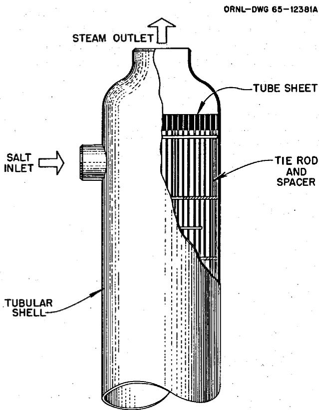

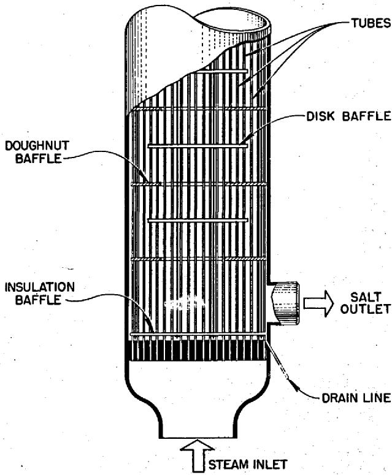  
Fig. 5.11. Steam Reheater.

# 5.9 Reheat Steam Preheaters

Steam at turbine throttle conditions of 3500 psia and $1000^{\circ}\mathrm{F}$ is used to preheat the reheat steam from 552 to $650^{\circ}\mathrm{F}$ before it enters the reheaters. The eight preheaters, two per module, are single-pass, counterflow, U-tube, U-shell units with the supercritical-pressure steam in the tubes and the reheat steam in the unbaffled shell, as shown in Fig. 5.12. Selection of a U shell rather than a divided cylindrical shell permits smaller diameters for the heads and reduces the thickness required for the heads and tube sheets. Principal data are given in Table 5.9. The heat transfer and stress calculations are covered in ORNL-TM-1545.[28]

The preheaters are more a part of the turbine plant than the reactor plant and need not be installed in a shielded cell nor necessarily manifolded in conformity with the modular arrangement adopted for the reactor plant. Two preheaters have been shown associated with each reactor module, however, primarily as a matter of convenience in the layout.

# 5.10 Maintenance

Maintenance is a major subject for consideration in the design of any fluid fuel reactor, and it is discussed briefly here only because the two-fluid MSBR conceptual studies were discontinued before maintenance procedures could be considered in detail. It was, however, recognized throughout the design effort that it must be possible to repair or replace system components within a reasonable downtime for the plant, and this requirement influenced much of the design. Even though the systems containing fuel salt are drained and flushed, the residual radioactivity will require that all maintenance be accomplished by remotely operated tools and equipment. The off-gas systems will also require remote maintenance. On the other hand, most of the coolant salt system components can probably be approached for direct maintenance after flushing and elapse of a short decay time. Little or no radioactivity should be present in the steam and feedwater systems even during full-power operation.

As mentioned in Sect. 2, the radiation damage to graphite will make it necessary to replace the reactor core vessel several times during the lifetime of the plant. Since the two-fluid MSBR concept does not lend itself to use of a removable top cover for the reactor vessel to gain access for replacement of the core graphite, it was decided that use of four small reactors or modules, with replacement of an entire reactor vessel and core

assembly, would be more practical than in-place maintenance of a single, larger reactor. Replacement of a module would require cutting of the salt piping and withdrawal of the assembly upward into a shielded transport cask for transfer of the spent unit into a

shielded pit for decay and ultimate disposal. A shop-assembled and -tested replacement module would be standing by. The salt-piping stubs would be previously machined for welding through use of a jig which matches the installed piping system.

Table 5.9. Reheat Steam Preheater Data   

<table><tr><td>Type</td><td>One-tube-pass, one-shell-pass U-tube, U-shell exchanger with no baffles</td></tr><tr><td>Number required per reactor module</td><td>2</td></tr><tr><td>Rate of heat transfer, each</td><td></td></tr><tr><td>Mw</td><td>12.33</td></tr><tr><td>Btu/hr</td><td>4.21 × 107</td></tr><tr><td>Shell-side conditions</td><td></td></tr><tr><td>Cold fluid</td><td>Steam</td></tr><tr><td>Entrance temperature, °F</td><td>551</td></tr><tr><td>Exit temperature, °F</td><td>650</td></tr><tr><td>Entrance pressure, psi</td><td>595.4</td></tr><tr><td>Exit pressure, psi</td><td>590.0</td></tr><tr><td>Pressure drop across exchanger, psi</td><td>5.4</td></tr><tr><td>Mass flow rate, lb/hr</td><td>6.31 × 105</td></tr><tr><td>Mass velocity, lb hr-1 ft-2</td><td>3.56 × 105</td></tr><tr><td>Tube-side conditions</td><td></td></tr><tr><td>Hot fluid</td><td>Supercritical water</td></tr><tr><td>Entrance temperature, °F</td><td>1000</td></tr><tr><td>Exit temperature, °F</td><td>869</td></tr><tr><td>Entrance pressure, psi</td><td>3600</td></tr><tr><td>Exit pressure, psi</td><td>3535</td></tr><tr><td>Pressure drop across exchanger, psi</td><td>65</td></tr><tr><td>Mass flow rate, lb/hr</td><td>3.68 × 105</td></tr><tr><td>Mass velocity, lb hr-1 ft-2</td><td>1.87 × 106</td></tr><tr><td>Velocity, fps</td><td>93.5</td></tr><tr><td>Tube material</td><td>Croloy</td></tr><tr><td>Tube OD, in.</td><td>0.375</td></tr><tr><td>Tube thickness, in.</td><td>0.065</td></tr><tr><td>Tube length, tube sheet to tube sheet, ft</td><td>13.2</td></tr><tr><td>Shell material</td><td>Croloy</td></tr><tr><td>Shell thickness, in.</td><td>%16</td></tr><tr><td>Shell ID, in.</td><td>20.25</td></tr><tr><td>Tube sheet material</td><td>Croloy</td></tr><tr><td>Tube sheet thickness, in.</td><td>6.5</td></tr><tr><td>Number of tubes</td><td>603</td></tr><tr><td>Pitch of tubes, in.</td><td>0.75</td></tr><tr><td>Total heat transfer area, ft2</td><td>781</td></tr><tr><td>Basis for area calculation</td><td>Tube OD</td></tr><tr><td>Type of baffle</td><td>None</td></tr><tr><td>Overall heat transfer coefficient, U, Btu hr-1 ft-2</td><td>162</td></tr><tr><td>Maximum stress intensity,a psi</td><td></td></tr><tr><td>Tube</td><td></td></tr><tr><td>Calculated</td><td>Pm=10,503;Pm+Q=7080</td></tr><tr><td>Allowable</td><td>Pm=S_m=10,500 at 961°F;P_m+Q=3S_m=31,500</td></tr><tr><td>Shell</td><td></td></tr><tr><td>Calculated</td><td>Pm=14,375;P_m+Q=33,081</td></tr><tr><td>Allowable</td><td>Pm=S_m=15,000 at 650°F;P_m+Q=3S_m=45,000</td></tr><tr><td>Maximum tube sheet stress, psi</td><td></td></tr><tr><td>Calculated</td><td>7800</td></tr><tr><td>Allowable</td><td>7800 at 1000°F</td></tr></table>

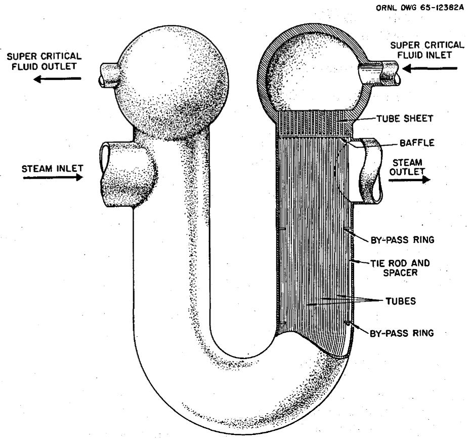  
Fig. 5.12. Reheat Steam Preheater.

If a major tube leak should occur in the primary heat exchanger, it would be necessary to replace the entire heat-exchanger-pump assembly. The procedure would be to cut the large fuel salt pipes and the two inlet coolant salt pipes, to cut the seal welds, and unbolt the large flange at the bottom of the shell. The exchanger could then be lifted from the cell, disengaging the central coolant salt pipe at the slip joint provided for this purpose. Drain, fill and drain, gas pressurization, and several other connections must also be cut when removing the exchanger.

The rotating parts of the fuel salt circulating pump can be withdrawn upward after the drive motor has been set aside. This is a relatively simple operation that does not require breaking the salt piping connections.

The type of maintenance of a large MSBR reactor plant described here requires the cutting and welding of salt piping by remote means. Some original work by the Air Force has been modified and is being developed by Holz $^{36}$ at ORNL to provide this capability. A compact orbital system is designed to be clamped around the pipe and has interchangeable modules and a weld programmer for cutting, beveling, tungsten-arc welding,

and inspection. Preliminary tests have produced welds of acceptable quality in 6- and 8-in.-diam pipes with fully remote operation.

Much valuable experience has been gained at the MSRE with remote maintenance operations similar to those required for a larger molten-salt reactor. The use of jigs and optical tooling has proven to be a practical and expeditious method of fitting replacement parts and components into the existing system.

The first cost of the special equipment required for maintenance operations is a part of the capital cost of the plant. This has been included in Table 7.1 as an allowance, since conceptual designs for the equipment were not available. The cost of the materials used in replacement of reactor modules and the special labor forces required are included in the power production cost as a separate item (see Table 7.2). (Some may wish to include this expense with the fuel-cycle cost; others may consider it to be an operating cost.)

# 6. REACTOR PHYSICS AND FUEL CYCLE ANALYSIS

# 6.1 Optimization of Reactor Parameters

In addition to the so-called conservation coefficient discussed in Sect. 2, which relates specific inventory and breeding gain, two other principal indices by which the performance of a molten-salt breeder reactor can be evaluated are the cost of power and the annual fuel yield. The latter two indices were used as figures of merit in assessing the influence of various design parameters and the effect of design changes on the two-fluid MSBR.

We customarily combine the cost factor and the fuel yield, that is, the annual fractional increase in the inventory of fissionable material, into a composite figure of merit

$$
F = y + 1 0 0 (C + X) ^ {- 1},
$$

in which $y$ is the annual fuel yield in percent per year, $C$ is that part of the power cost which depends on any of the parameters considered, and $X$ is an adjustable constant, having no physical significance, whose value merely determines the relative sensitivity of $F$ to $y$ and $C$ . Since a large number of reactor parameters are involved, we make use of an automatic search procedure, carried out on a computer, which finds that combination of the variable design parameters that maximizes the figure of merit $F$ subject to whatever constraints may be imposed by the fixed values of other design parameters. This procedure, called OPTIMERC, incorporates a multigroup diffusion calculation (synthesizing a two-space-dimensional description of the flux by alternating one-dimensional flux calculations), a determination of the fissile, fertile, and fission product concentrations consistent with the processing rates of the fuel and fertile salt streams, and a method of steepest gradients for optimizing the values of the variables. By choosing different values for the constant $X$ in the figure of merit $F$ , we can generate a curve showing the minimum cost associated with any attainable value of the fuel yield. By carrying out the optimization procedure for different successive fixed values of selected design parameters, we obtain families of curves of $C$ as a function of $y$ .

One of the design parameters which has a significant influence on both yield and power cost is the power

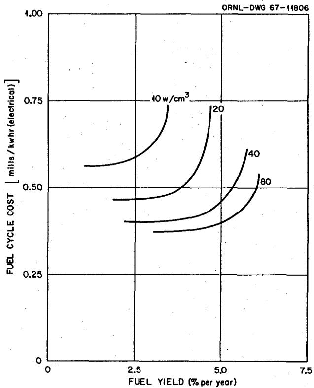  
Fig. 6.1. MSBR Fuel Cycle Cost vs Annual Fuel Yield.

density in the core. The performance of the reactor is better at high power densities. At the same time, the useful life of the graphite moderator, which is dependent on the total exposure to fast neutrons, is inversely proportional to the power density (see Table 5.1 and Sect. 6.2). It is necessary, therefore, to determine the effect of power density on performance with considerable care.

In Fig. 6.1 the fuel-cycle cost is used because it reflects most of the variations of power cost due to the influences of the parameters being varied. It may be seen from Fig. 6.1 that a reduction in average power density from 80 to $20\mathrm{w/cm^3}$ involves a fuel-cycle cost penalty of about 0.1 mill/kwhr(e) and a reduction in annual fuel yield of perhaps $1.5\%$ . There is an increase in the capital cost of the reactor, but this is offset somewhat by a reduction in the cost of replacing the graphite (and the reactor vessel) since this can be done at less frequent intervals. The penalty for having to replace the graphite (compared with a high-power-density core not requiring replacement) is about 0.2 mill/kwhr(e). The capital cost portion increases and the replacement cost portion decreases with decreasing power density so that the total remains about constant.

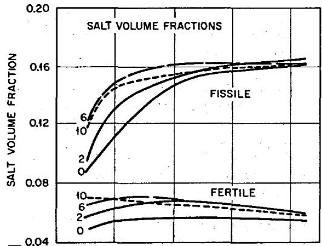

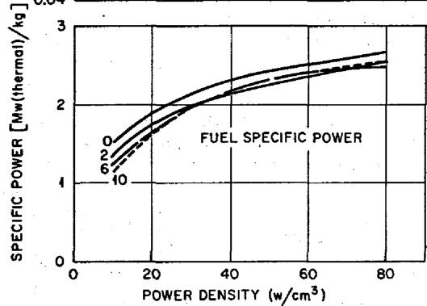

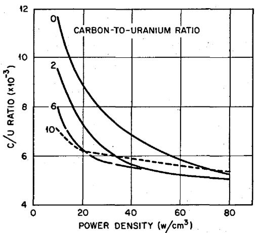  
Fig. 6.2. Variation of MSBR Parameters with Average Core Power Density. Numbers attached to curves are values of the adjustable constant $X$ .

Figures 6.2 and 6.3 show the variation of other selected parameters with power density and the adjustable constant $X$ . For given values of power density and $X$ , the corresponding values of the selected parameters are those of the reactor with the optimum combination of yield and fuel-cycle cost.

It is apparent from these results that the useful life of the graphite is not increased by reducing core power density without some sacrifice in other aspects of reactor performance. The reduction in yield and the increase in cost are quite modest for a reduction of power density from 80 to $40\mathrm{w/cm^3}$ , but they become increasingly more significant for each further factor of 2 reduction in power density. Nonetheless, as shown in Fig. 6.1, it appears that with an average power density as low as $20\mathrm{w/cm^3}$ the MSBR can still achieve an annual fuel yield of 3.5 to $4\%$ and a fuel-cycle cost of about 0.5 mill/kwhr(e).

The fuel-cycle cost estimate for the $40\mathrm{-w/cm^3}$ configuration summarized in Fig. 6.1 is shown in more detail in Tables 6.1, 6.2, 6.3, and 6.4. The economic ground rules for the fuel-cycle cost calculations are given in Table 6.1. The worth of the fissile isotopes was

taken from the AEC price schedules. The capital changes of $13.7\%$ /year for depreciating items and $10\%$ /year for nondepreciating materials are typical of those for privately owned plants under 1968 conditions, as shown in Appendix Table A.12.

Results of the fuel-cycle calculations for the MSBR design are summarized in Table 6.2, and the neutron balance is given in Table 6.3. The reactor has the

Table 6.1. Basic Economic Assumptions Used in Nuclear Design Studies   

<table><tr><td>Reactor power, Mw(e)</td><td>250</td></tr><tr><td>Thermal efficiency, %</td><td>45</td></tr><tr><td>Load factor</td><td>0.80</td></tr><tr><td>Cost assumptions</td><td></td></tr><tr><td>Value of 233U and 233Pa, $/g</td><td>14.00</td></tr><tr><td>Value of 235U, $/g</td><td>12.19</td></tr><tr><td>Value of thorium, $/kg</td><td>12.37</td></tr><tr><td>Value of carrier salt, $/kg</td><td>25.97</td></tr><tr><td>Capital charge, %/year</td><td></td></tr><tr><td>Plant</td><td>13.7</td></tr><tr><td>Nondepreciating capital, including fissile inventory</td><td>10.0</td></tr></table>

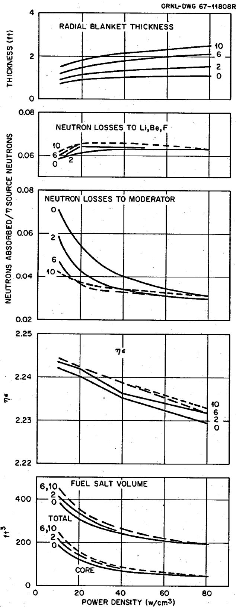  
Fig. 6.3. Variation of MSBR Parameters with Average Core Power Density. Numbers attached to curves are values of the adjustable constant $X$ .

Table 6.2. MSBR Fuel-Cycle Performance   

<table><tr><td>Fuel yield, %/year</td><td>4.07</td></tr><tr><td>Breeding ratio</td><td>1.06</td></tr><tr><td>Fissile losses in processing, atoms per fissile absorption</td><td>0.0040</td></tr><tr><td>Neutron production per fissile absorption (ηe)</td><td>2.22</td></tr><tr><td>Specific inventory, kg of fissile material per megawatt of electricity produced</td><td>1.26</td></tr><tr><td>Specific power, Mw(t) per kg of fissile material</td><td>1.77</td></tr><tr><td>Power density, core average, kw/liter</td><td></td></tr><tr><td>Gross</td><td>19</td></tr><tr><td>In fuel salt</td><td>140</td></tr><tr><td>Fraction of fissions in fuel stream</td><td>0.996</td></tr><tr><td>Fraction of fissions in thermal-neutron group</td><td>0.846</td></tr><tr><td>Mean η of 233U</td><td>2.225</td></tr><tr><td>Mean η of 235U</td><td>1.981</td></tr></table>

Table 6.3. MSBR Neutron Balance for Average Power Density of ${20}\mathrm{\;w}/{\mathrm{{cm}}}^{3}$   

<table><tr><td rowspan="2">Material</td><td colspan="3">Neutrons per Absorption in Fissile Fuel</td></tr><tr><td>Total Absorbed</td><td>Absorbed Giving Fission</td><td>Neutrons Produced</td></tr><tr><td>232Th</td><td>0.9876</td><td>0.0020</td><td>0.0047</td></tr><tr><td>233Pa</td><td>0.0002</td><td></td><td></td></tr><tr><td>233U</td><td>0.9290</td><td>0.8267</td><td>2.0670</td></tr><tr><td>234U</td><td>0.0801</td><td>0.0003</td><td>0.0010</td></tr><tr><td>235U</td><td>0.0748</td><td>0.0607</td><td>0.1482</td></tr><tr><td>236U</td><td>0.0082</td><td>0.0001</td><td>0.0001</td></tr><tr><td>237Np</td><td>0.0011</td><td></td><td></td></tr><tr><td>238U</td><td>0.0</td><td></td><td></td></tr><tr><td>Carrier salt (except 6Li)</td><td>0.0682</td><td></td><td>0.0210</td></tr><tr><td>6Li</td><td>0.0068</td><td></td><td></td></tr><tr><td>Graphite</td><td>0.0430</td><td></td><td></td></tr><tr><td>135Xe</td><td>0.0050</td><td></td><td></td></tr><tr><td>149Sm</td><td>0.0061</td><td></td><td></td></tr><tr><td>151Sm</td><td>0.0019</td><td></td><td></td></tr><tr><td>Other fission products</td><td>0.0187</td><td></td><td></td></tr><tr><td>Delayed neutrons losta</td><td>0.0033</td><td></td><td></td></tr><tr><td>Leakageb</td><td>0.0080</td><td></td><td></td></tr><tr><td>Total</td><td>2.2420</td><td>0.89</td><td>2.24</td></tr></table>

$a$ Delayed neutrons emitted outside the core.   
bLeakage, including neutrons absorbed in the reflector.

advantage of no neutron losses to structural materials in the core other than the moderator. Except for some unavoidable loss of delayed neutrons in the external fuel circuit, there is almost zero neutron leakage from the reactor because of the thick blanket. The neutron losses to fission products are minimized by the rapid integrated processing.

The portion of the fuel-cycle cost due to processing losses is shown in Table 6.4 and is based on a fertile

Table 6.4. Estimated Fuel-Cycle Cost for a Privately Owned Two-Fluid 1000-Mw(e) MSBR Power Station   

<table><tr><td rowspan="2"></td><td colspan="4">Cost [mills/kwhr(e)]</td></tr><tr><td>Fuel Stream</td><td>Fertile Stream</td><td>Subtotal</td><td>Grand Total</td></tr><tr><td>Fissile inventorya</td><td>0.2242</td><td>0.0215</td><td>0.2457</td><td></td></tr><tr><td>Thorium inventory</td><td></td><td>0.0379</td><td>0.0379</td><td></td></tr><tr><td>Salt inventory</td><td>0.0289</td><td>0.0482</td><td>0.0771</td><td></td></tr><tr><td>Total inventoryb</td><td></td><td></td><td></td><td>0.361</td></tr><tr><td>Thorium replacement</td><td></td><td>0.0043</td><td>0.0043</td><td></td></tr><tr><td>Salt replacement</td><td>0.0491</td><td>0.0038</td><td>0.0529</td><td></td></tr><tr><td>Total replacement</td><td></td><td></td><td></td><td>0.057</td></tr><tr><td>Fixed charges for processing equipmentc</td><td></td><td></td><td></td><td>0.10</td></tr><tr><td>Operating labor and suppliesd</td><td></td><td></td><td></td><td>0.11</td></tr><tr><td>Total</td><td></td><td></td><td></td><td>0.628</td></tr><tr><td>Production credite</td><td></td><td></td><td></td><td>-0.084</td></tr><tr><td>Net fuel-cycle cost, mills/kwhr(e)</td><td></td><td></td><td></td><td>0.5-0.6</td></tr></table>

aIncluding 233Pa, 233U,and 235U.   
$b_{\text{Based on}}$ on $80\%$ plant factor and fixed charges of $10\%/\text{year}$ .   
$^c$ Based on total equipment cost of $5.3$ million taken from ORNL-3996 $^1$ plus $10\%$ escalation of 1966–68 less $\$ 556,000$ for structures included in Table 7.1, and fixed charges of $13.7\%$ /year with $80\%$ plant factor.   
$d_{\text{Based on operating costs of $793,000/year taken from ORNL-3996}}$ plus $10\%$ escalation 1966-68 and $80\%$ plant factor.   
$e$ Based on $4 \%$ yield at average core power density of 20 w/cc.

material loss of $0.1\%$ per pass through fuel-recycle processing.

The fuel-cycle costs for fixed charges on processing equipment are based on cost estimates published in ORNL-3996, but escalated by $10\%$ to 1968 conditions. The operating costs for labor and plant supplies (other than salt inventories and makeup) specifically related to the chemical processing portion of the power station are also based on the ORNL-3996 estimate with $10\%$ escalation, as shown in Table 6.4.

It may be noted in Table 6.4 that the main cost items are for the fissile inventory and the processing costs. The inventory costs are rather rigid for a given reactor design, since they are largely determined by the fuel volume external to the reactor core region. The

Table 6.5. Processing Cycle Times with $X = 2$   

<table><tr><td rowspan="2">Power Density (w/cm3)</td><td colspan="3">Cycle Time (days)</td></tr><tr><td>Fuel Stream</td><td>Fertile Stream</td><td>Pa</td></tr><tr><td>80</td><td>50</td><td>50</td><td>0.5</td></tr><tr><td>40</td><td>77</td><td>70</td><td>0.7</td></tr><tr><td>20</td><td>110</td><td>110</td><td>1.1</td></tr><tr><td>10</td><td>173</td><td>144</td><td>1.4</td></tr></table>

processing costs are, of course, a function of the processing-cycle times, one of the chief parameters optimized in this study. The processing cycle times for the optimized case with $X = 2$ are given in Table 6.5. The cycle times show a systematic increase with decreasing power density.

# 6.2 Useful Life of Moderator Graphite

Information used in the two-fluid MSBR studies regarding the dependence of graphite dimensional changes on fast neutron dose was derived primarily from experiments carried out in the Dounreay Fast Reactor (DFR).

A curve of volume change vs fast neutron dose for a nearly isotropic graphite at temperatures in the range 550 to $600^{\circ}\mathrm{C}$ is shown in Fig. 6.4, which is taken from the paper of Henson, Perks, and Simmons. The neutron dose in Fig. 6.4 is expressed in terms of an

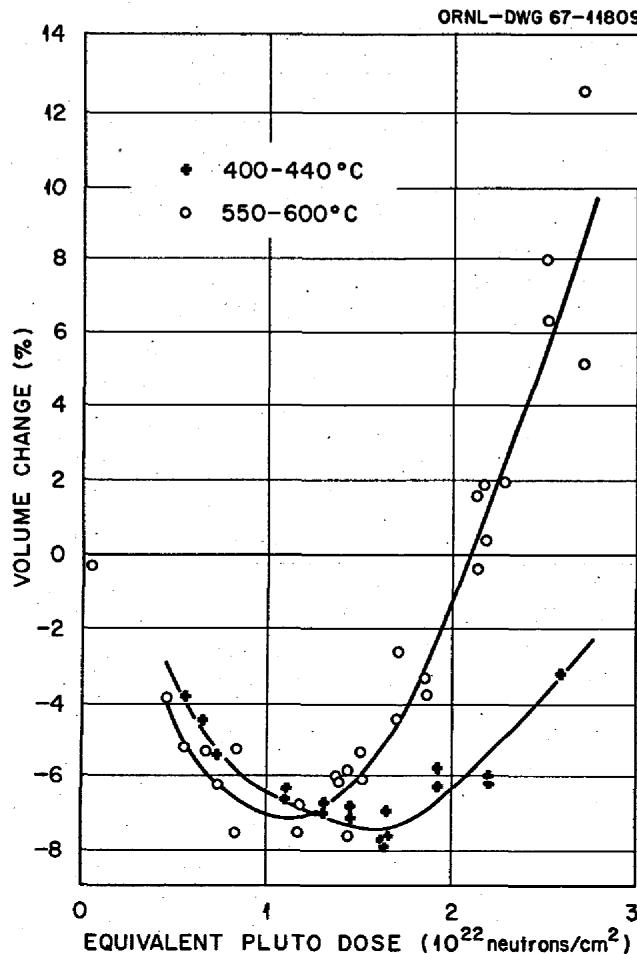  
Fig. 6.4. Volume Changes in Near-Isotropic Graphite Resulting from Neutron Irradiation. See text for dose in forms of MSBR flux.

equivalent Pluto dose; the total DFR dose, that is,

$$
\int_ {0} ^ {T} \int_ {0} ^ {\infty} \Phi (E, t) d E d t,
$$

is 2.16 times the equivalent Pluto dose. From an inspection of all the available data, we concluded that a dose of about $2.5 \times 10^{22}$ neutrons/cm² (equivalent Pluto dose) could be sustained without any significant deterioration of the physical properties of the graphite. This was adopted as the allowable dose in these MSBR studies, pending further detailed consideration of mechanical design problems that might be associated with dimensional changes in the graphite.

In order to interpret these experiments to obtain predictions of graphite damage vs time in the molten-salt reactor, it is necessary to take into account the difference between the neutron spectrum in the DFR and in the MSBR. This, in turn, requires assumptions

regarding the effectiveness of neutrons of different energies for producing the observable effects with which one is concerned. At present the best approach available is to base the estimates of neutron damage effectiveness on the theoretical calculations of graphite lattice displacements vs carbon recoil energy carried out by Thompson and Wright.[39] Their "damage function" is integrated over the distribution of carbon recoil energies resulting from the scattering of a neutron of a given energy, and the result is then multiplied by the energy-dependent scattering cross section and integrated over the neutron spectrum in the reactor. Tests of the model were made by Thompson and Wright by calculating the rate of electrical resistivity change in graphite relative to the $^{58}\mathrm{Ni}(n,p)^{58}\mathrm{Co}$ reaction, in different reactor spectra, and the data were compared with experimental determinations of the same quantities. The results indicate that the model is at least useful for predicting relative damage rates in different spectra. The spectral effects are discussed more fully by Perry in ORNL-TM-2136.[12]

A useful simplification arises from the observation that the damage per unit time is closely proportional to the total neutron flux above some energy $E_0$ , where $E_0$ has the same value for widely different reactor spectra. We have reconfirmed this observation to our own satisfaction by comparing the calculated damage per unit flux above energy $E_0$ as a function of $E_0$ for spectra appropriate to three different moderators (H₂O, D₂O, and C) and for a "typical" fast reactor spectrum. The results plotted in Fig. 6.5 show that the flux above about 50 kev is a reliable indication of the relative damage rate in graphite for quite different spectra. Figure 6.6 shows the spectra for which these results were derived. The equivalence between MSBR and DFR experiments is found by equating the doses due to neutrons above 50 kev in the two reactors. We have not yet calculated the DFR spectrum explicitly, but we expect it to be similar to the "fast reactor" spectrum of Fig. 6.6, in which 94% of the total flux lies above 50 kev. Since the damage flux in the MSBR is essentially proportional to the local power density, we postulate that the useful life of the graphite is governed by the maximum power density rather than by the average, and thus depends on the degree of power flattening that can be achieved (see Sect. 6.3). In the two-fluid MSBR the average flux above 50 kev is about $0.94 \times 10^{14}$ neutrons cm⁻² sec⁻¹ at a power density of 20 w/cm³.

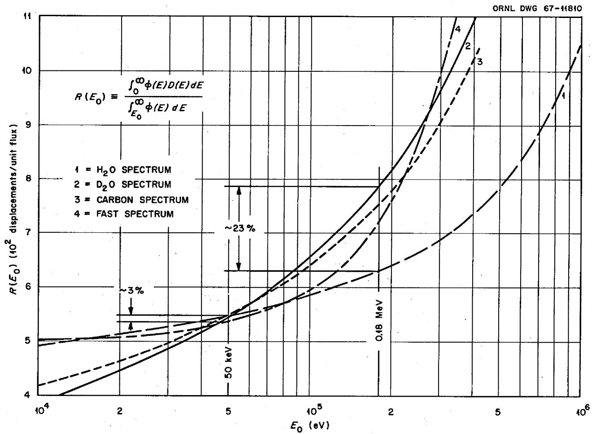  
Fig. 6.5. Fast Flux as a Measure of Radiation Damage.

In the DFR irradiations the equivalent Pluto dose of 2.5 $\times 10^{22}$ neutrons/cm² that was taken as the tolerable exposure for the graphite is a dose of $5.1\times 10^{22}$ neutrons/cm² (>50 kev).40 The approximate useful lifetime of the graphite is then easily computed and is shown in Table 6.6 for various combinations of the average power density and peak-to-average power density ratio.

It must be acknowledged that some uncertainties remain in applying the results of DFR experiments to

Table 6.6. Useful Life of MSBR Graphite   

<table><tr><td>Average Power Density (w/cm3)</td><td>Pmax/Pav</td><td>Life (full-power years)</td></tr><tr><td>40</td><td>2.0</td><td>4.3</td></tr><tr><td>40</td><td>1.5</td><td>5.7</td></tr><tr><td>20</td><td>2.0</td><td>8.6</td></tr><tr><td>20</td><td>1.5</td><td>11.5</td></tr></table>

the MSBR, including the possibility of an appreciable dependence of the damage on the rate at which the dose is accumulated, as well as on the total dose. The dose rate in the DFR was approximately ten times greater than that expected in the MSBR, and if there is a significant dose-rate effect, the life of the graphite in an MSBR might be appreciably longer than shown in Table 6.6.

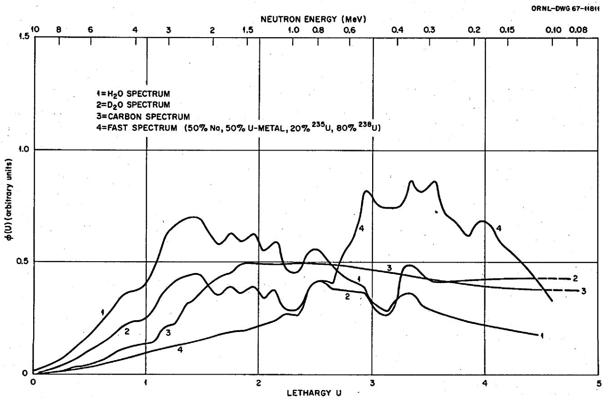  
Fig. 6.6. Neutron Flux per Unit Lethargy vs Lethargy. Normalized for equal damage in graphite.

# 6.3 Flux Flattening

Because the useful life of the graphite moderator in the MSBR depends on the maximum value of the damage flux rather than on its average value in the core, there is obviously an incentive to reduce the maximum-to-average flux ratio as much as possible, provided that this can be accomplished without serious penalty to other aspects of the reactor performance. In addition, there is an incentive to make the temperature rise in parallel fuel passages through the core as nearly uniform as possible, or at least to minimize the maximum deviation of fuel outlet temperature from the average value. Since the damage flux (in effect, the total neutron flux above 50 kev) is essentially proportional to the fission density per unit of core volume, the first incentive requires an attempt to flatten the power density per unit core volume throughout the core, that is, in both radial and axial directions. Since the fuel moves through the core only in the axial direction, the second incentive requires an attempt to flatten, in the

radial direction, the power density per unit volume of fuel. Both objectives can be accomplished by maintaining a uniform volume fraction of fuel salt throughout the core and by flattening the power density distribution in both directions to the greatest extent possible.

The general approach taken to flattening the power distribution is the classical one of providing a central core zone with $k_{\infty} \cong 1$ , that is, one which is neither a net producer nor a net absorber of neutrons, surrounded by a "buckled" zone whose surplus neutron production just compensates for the neutron leakage through the core boundary. Since the fuel salt volume fraction is to be kept uniform throughout the core and since the concentrations of both the fuel and the fertile salt streams are uniform throughout their respective circuits, the principal remaining parameter that can be varied with position in the core to achieve the desired effects is the fertile salt volume fraction. The problem then reduces to finding the value of the fertile salt volume fraction that gives $k_{\infty} = 1$ for the central,

flattened zone, with fixed values of the other parameters, and finding the volume fraction of the fertile salt in the buckled zone that makes the reactor critical for different sizes of the flattened zone. As the fraction of the core volume occupied by the flattened zone is increased, the fertile salt fraction in the buckled zone must be decreased, and the peak-to-average power density ratio decreases toward unity. The largest flattened zone and the smallest power density ratio are achieved when the fertile material is removed entirely from the outer core zone. Increasing the fuel salt concentration or its volume fraction (with an appropriate adjustment of the fertile salt volume fraction in the flattened zone) would permit a still larger flattened zone and smaller $P_{\mathrm{max}} / P_{\mathrm{av}}$ , but this could be expected to compromise the reactor performance by increasing the fuel inventory.

There are many possible combinations of parameters to consider. For example, it is not obvious, a priori, whether the flattened zone should have the same height-to-diameter ratio as the entire core, or whether the axial buckled zones should have the same composition as the radial buckled zone. While we have by no means completed investigations in this area, we have progressed far enough to recognize several important aspects.

First, by flattening the power to various degrees in the radial direction only and performing fuel-cycle and economic calculations for each of these cases, we find that the radial power distribution can be markedly flattened with very little effect on fuel cost or on annual fuel yield. That is, the radial peak-to-average power density ratio, which is about 2.0 for the uniform core (which is surrounded by a heavily absorbing blanket region and hence behaves essentially as if it were unreflected), can be reduced to 1.25 or less with changes in fuel cost and yield of less than 0.02 mill/kwhr(e) and $0.2\%$ per year respectively. The enhanced neutron leakage from the core, which results from the power flattening, is taken up by the fertile blanket and does not represent a loss in breeding performance.

Second, attempts at power flattening in two dimensions have shown that the power distribution is very sensitive to details of composition and placement of the flattened zone. Small differences in upper and lower blanket composition, which are of no consequence in the case of the uniform core, produce pronounced axial asymmetry of the power distribution if too much axial flattening is attempted. In addition, the axial and radial buckled zones may interact through the flattened zone to some extent, giving a distribution that is concave

upward in one direction and concave downward in the other, even though the integrated neutron current over the entire boundary of the central zone vanishes. In view of these tendencies, it may be anticipated that a flattened power distribution would be difficult to maintain if graphite dimensional changes, resulting from exposure to fast neutrons, were allowed to influence the salt volume fractions very strongly. Consequently, a core of the design shown in Fig. 5.4 was under consideration as a means of reducing the sensitivity of the power distribution to graphite dimensional changes.

# 6.4 Fuel Cell Calculations

A series of calculations was performed to investigate the nuclear characteristics of the two-fluid MSBR fuel cells, or elements. These were based on the geometry shown in Fig. 6.7. (Subsequent to these calculations, a graphite sleeve was added around the fertile salt.)

The cell calculations were performed with the code TONG and involved varying (1) cell diameter, (2) fuel distribution (i.e., fuel separation distance), (3) $^{233}\mathrm{U}$ concentration, (4) $^{232}\mathrm{Th}$ concentration, (5) fuel salt volume fraction, and (6) fertile salt volume fraction. Each of these parameters was varied separately while holding the others constant. Figure 6.8 shows the effect on reactivity of varying the parameters. The variations are shown relative to a reference cell which had a diameter of 3 in., a fuel separation distance of $\frac{1}{4}$ in., a fuel salt fraction of 0.1648, and a fertile salt fraction of 0.0585, with $\sim 0.2$ mole $\%$ $^{233}\mathrm{UF}_4$ in the fuel salt and 27 mole $\%$ $\mathrm{ThF_4}$ in the fertile salt.

These calculations showed that as the cell diameter increases, the increased self-shielding of the $^{232}$ Th resonances leads to an increase in the reactivity of the cell. Thus a decrease in breeding ratio associated with the decreased $^{232}$ Th resonance integral is accompanied

ORNL DWG 70-2175

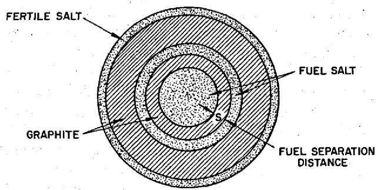  
Fig. 6.7. Geometry Used in Fuel Cell Calculations.

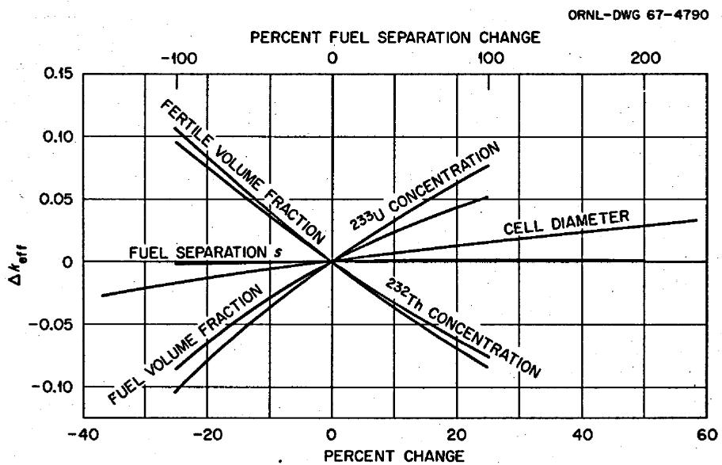  
Fig. 6.8. Effect on Reactivity of Changing Cell Properties. Changes in all parameters are shown at the bottom for the fuel separation that is shown at the top.

by a decrease in the required $^{233}\mathrm{U}$ loading. Optimization calculations using cross sections based on 3- and 5-in.-diam cells indicated that the annual fuel yield of the system is essentially insensitive to fuel cell diameters between 3 and 5 in. This is significant because the larger cells are preferred for hydrodynamic reasons, particularly in order to achieve the desired Reynolds numbers for the fuel salt flow in the channels.

Table 6.7 and Fig. 6.9 show the flux distribution in the 5-in.-diam cell. Table 6.7 gives the ratio of the average flux in the fuel to the cell average flux, the ratio of the average flux in the graphite to the cell average flux, and the ratio of the average flux in the fertile salt to the cell average flux for the epithermal and fast flux ranges. Figure 6.9 shows the thermal flux distribution in the cell.

Two-dimensional diffusion-theory calculations indicated that the central cell of the reactor may be useful for control purposes. For example, if the central cell is a 5-in.-OD $\times$ 4-in.-ID graphite tube and if this completely empty tube is filled with fertile salt, the change in reactivity is $\delta k / k = -0.018\%$ . If the empty tube is filled with graphite, the reactivity change is $\delta k / k = +0.0012\%$ . Thus there appears to be a substantial amount of reactivity control available by varying the height of the fertile column in the tubes, which might be accomplished through use of a movable graphite plug.

Table 6.7. Flux Ratios in Epithermal and Fast Energy Ranges   

<table><tr><td rowspan="2">Energy Range</td><td colspan="3">Ratio of Average Flux to Cell Average Flux</td></tr><tr><td>Fuel</td><td>Graphite</td><td>Fertile</td></tr><tr><td>0.821–10 Mev</td><td>1.226</td><td>0.929</td><td>0.878</td></tr><tr><td>0.0318–0.821 Mev</td><td>1.090</td><td>0.984</td><td>0.958</td></tr><tr><td>1.234–31.82 kev</td><td>1.014</td><td>0.998</td><td>0.991</td></tr><tr><td>0.0479–1.234 kev</td><td>1.0</td><td>1.0</td><td>1.0</td></tr><tr><td>1.86–47.9 ev</td><td>1.0</td><td>1.0</td><td>1.0</td></tr></table>

# 6.5 Temperature Coefficients of Reactivity

In analyzing power transients in the two-fluid MSBR, one must be able to determine the reactivity effects of temperature changes in the fuel salt, the fertile salt, and the graphite moderator. Since the fuel is also the coolant and since only small fractions of the total heat are generated in the fertile salt and in the moderator, one expects very much smaller temperature changes in the latter components than in the fuel during a power transient. Expansion of the fuel salt, which removes fuel from the active core, is thus the principal inherent mechanism for compensating any reactivity additions.

We accordingly calculated the magnitudes of the temperature coefficients of reactivity separately for the fuel salt, the fertile salt, and the graphite over the range

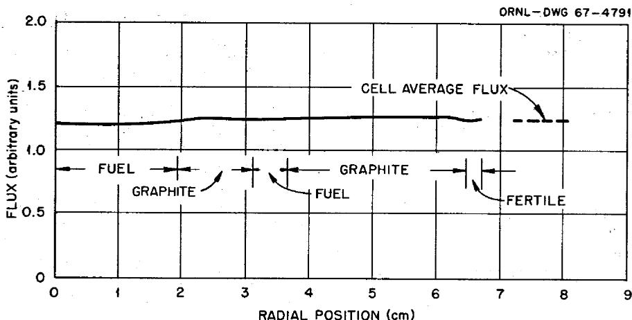  
Fig. 6.9. Thermal Flux Distribution in Cell. $E < 1.86$ ev.

of temperatures from 800 to $1000^{\circ}\mathrm{K}$ . The results of these calculations, as shown in Fig. 6.10a, illustrate the change in multiplication factor vs moderator temperature (with $\delta k$ arbitrarily set equal to zero at $900^{\circ}\mathrm{K}$ ). Similar curves of $\delta k$ vs temperature for fuel and fertile salts are shown in Figs. 6.10b and 6.10c, and the combined effects are shown in Fig. 6.10d. All these curves are nearly linear, the slopes being the temperature coefficients of reactivity. The magnitudes of the coefficients at $900^{\circ}\mathrm{K}$ are shown in Table 6.8.

The moderator coefficient comes almost entirely from changes in the spectrum-averaged cross sections. It is particularly worthy of note that the moderator coefficient appears to be quite insensitive to uncertainties in the energy dependence of the $233\mathrm{U}$ cross sections in the energy range below 1 ev. This is to say that reasonable choices of cross sections based on available experimental data yield essentially the same coefficient.

The fertile salt reactivity coefficient comprises a strong positive component due to salt expansion (and hence reduction in the number of fertile atoms per unit core volume) and an appreciable negative component due to temperature dependence of the effective resonance-absorption cross sections, so that the overall coefficient, though positive, is less than half as large as that due to salt expansion alone.

The fuel salt coefficient is due mainly to expansion of the salt, which of course reduces the average density of fuel in the core. Even if all core components were to undergo equal temperature changes, the fuel salt coefficient would dominate. In transients in which the fuel

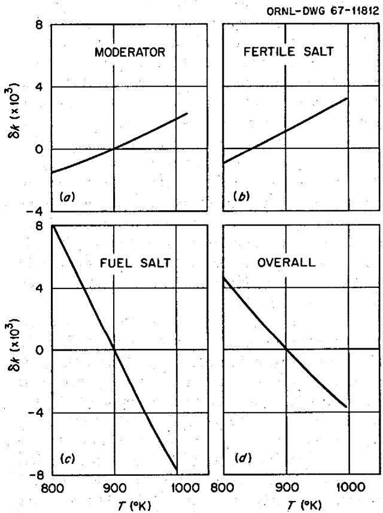  
Fig. 6.10. MSBR Multiplication Factor vs Temperature.

temperature change is far larger than that of the other components, the fuel coefficient is even more controlling.

Table 6.8. Temperature Coefficients of Reactivity   

<table><tr><td rowspan="2">Component</td><td>Coefficient</td></tr><tr><td>1 dk/k dT [(&#x27;K&#x27;)-1]</td></tr><tr><td></td><td>× 10-5</td></tr><tr><td>Moderator</td><td>+1.66</td></tr><tr><td>Fertile salt</td><td>+2.05</td></tr><tr><td>Fuel salt</td><td>-8.05</td></tr><tr><td>Overall</td><td>-4.34</td></tr></table>

# 6.6 Dynamics Analysis

The dynamic behavior of the MSBR, particularly the reactor stability, was investigated using a linearized model of the two-fluid system. The model included a lumped parameter representation of the neutronics (including pure time delays for out-of-core precursor transport), fuel salt heat transfer in the core, fertile salt heat transfer in the core, fuel salt heat exchanger, and the salt side of the boiler and reheater. The heat removal from the boiler and reheater was assumed constant. The resulting model consisted of 34 coupled differential equations with 15 pure time delays.

The estimates of the temperature coefficients of reactivity for the fuel salt, fertile salt, and graphite were revised during the course of these dynamics calculations. Some of the calculations were based on the early values and some were based on the later ones. Both values are shown in Table 6.9. The neutron generation time was $3.3 \times 10^{-4}$ sec.

The model was used for analyses of system stability, transient response, and frequency response. The stability analysis (using the newer temperature coefficients in Table 6.9) was accomplished by employing the modified Mikhailov method described by Wright.41 The analysis showed that the system is linearly stable.

The stability of the system is also indicated by the response of the system to step changes in reactivity. The linearized response of the reactor power to a step change of $10^{-4}\Delta k / k$ is shown in Fig. 6.11. This curve is based on the old reactivity coefficients given in Table 6.9. Since the model is linear, the response to some other reactivity step is the product of the computed response and the ratio of the new reactivity

Table 6.9. Reactivity Coefficients $(\Delta k / k$ per F)   

<table><tr><td></td><td>Old Value</td><td>New Value</td></tr><tr><td>Fuel salt</td><td>-4.6 × 10-5</td><td>-4.54 × 10-5</td></tr><tr><td>Fertile salt</td><td>+1.43 × 10-5</td><td>+1.12 × 10-5</td></tr><tr><td>Graphite</td><td>+5.1 × 10-6</td><td>+9.2 × 10-6</td></tr></table>

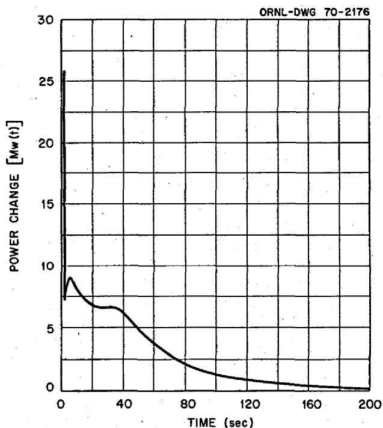  
Fig. 6.11. Power Transient Following a Reactivity Step of $10^{-4}\delta k / k$ with Reactor Operating at 556 Mw(t).

to the old reactivity. The linear results are obviously not valid for large reactivity inputs, but would be sufficiently accurate for transients in which the power changes by less than $10\%$ . The response shown in Fig. 6.11 is expressed as the deviation from the full-power output $[556\mathrm{Mw(t)}]$ of a single reactor module.

The power-to-reactivity frequency response of the reactor is shown in Figs. 6.12 and 6.13 for the case of full-power operation. In this instance the results are based on the newer reactivity coefficients given in Table 6.9. As would be expected from the transient response results, there are no tall peaks in the frequency response amplitude which would indicate strong resonance behavior. The frequency response was also computed using the old reactivity coefficients. Since the change in the results was very small, the transient response calculations were not repeated.

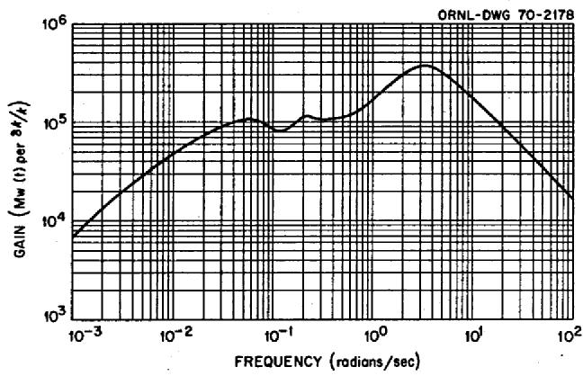  
Fig. 6.12. Amplitude of the Power-to-Reactivity Frequency Response. Reactor at full power.

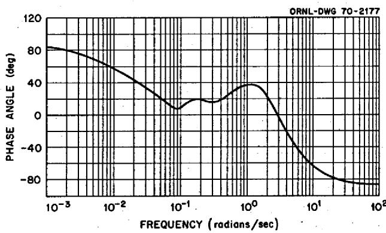  
Fig. 6.13. Phase of the Power-to-Reactivity Frequency Response. Reactor at full power.

In general, the system is well behaved dynamically, and satisfactory operation should not be difficult to obtain.

# 7. COST ESTIMATES

# 7.1 General

One of the promising aspects of the molten-salt breeder reactor is the potential for producing low-cost power. At the present stage of development, accurate detailed cost estimates are not possible, but our best estimate of the construction cost of a two-fluid 1000-Mw(e) MSBR station is about $140/kw(e). This estimate is in terms of early 1968 conditions and value of the dollar, and includes indirect costs. The estimated

net cost to produce power with private ownership of the plant is about 4 mills/kwhr.

In making the cost estimates we assumed that an established molten-salt reactor industry exists and that materials are being supplied and plants are being constructed and licensed on a routine basis. We also assumed that the indirect charges, or owner's costs, for a molten-salt reactor are not significantly different from those for other types of reactors.

Although the chemical reprocessing plant is part of the reactor station, not all the chemical plant costs are included in the estimate of the station construction cost. The cost of the shielded cells to house the chemical plant is included in the overall structures account for the reactor plant, but the cost of the processing equipment, the fuel and blanket salt inventories, and the operation of the chemical plant was kept separate from the rest of the station costs in order to arrive at a fuel cycle cost which is comparable with the fuel cycle costs for other types of nuclear power stations. The estimated fuel cycle cost is about 0.5 mill/kwhr, or about 0.7 mill/kwhr if the expense of periodic replacement of the reactor vessels and graphite cores is included. This is lower than has been projected for most other types of nuclear power plants and accounts for much of the interest in molten-salt reactors.

The costs reported here for the two-fluid MSBR are higher than those published in ORNL-3996 $^{1}$ in 1966. This is primarily because of changes in the plant concept, modifications to the design due to revisions in the physical properties data, and escalation of costs between 1966 and 1968. The present estimate of the direct construction cost is about the same as the estimated cost for a pressurized-water reactor of 1000-Mw(e) size built on the same site. Because the accuracy of the estimates is uncertain, we think the major value is in comparing MSBR and PWR costs to learn where the inherent differences in the systems have an important bearing on the relative costs of the two kinds of plants. Two areas stand out: The allowance for maintenance is less on the PWR, but the cost of the turbine-generator is less for the MSBR.

# 7.2 Construction Costs

The estimate of the construction cost of a two-fluid 1000-Mw(e) MSBR power station is summarized in Table 7.1. Tables A.1 through A.11 in the appendix give more details of the costs. About half the total construction cost is for conventional parts of the plant, such as structures, turbine-generator, etc., for which

Table 7.1. Comparison of Construction Cost of Two-Fluid MSBR and FWR 1000-Mw(e) Power Stations   

<table><tr><td rowspan="2"></td><td colspan="2">Cost (millions of dollars)</td></tr><tr><td>MSBRa</td><td>PWBb</td></tr><tr><td>Land (included in indirect costs)</td><td></td><td></td></tr><tr><td>Structures and improvements (see Table A.1)</td><td>10.6</td><td>14.6</td></tr><tr><td>Reactor equipment</td><td></td><td></td></tr><tr><td>Reactor vessel (see Table A.2)</td><td>6.9</td><td>7.5</td></tr><tr><td>Graphite (see Table A.3)</td><td>2.8</td><td></td></tr><tr><td>Shielding and containment (see Table A.4)</td><td>5.1</td><td>c</td></tr><tr><td>Heating and cooling systems</td><td>2.1</td><td>3.9</td></tr><tr><td>Cranes</td><td>0.2</td><td>0.2</td></tr><tr><td>Control rods</td><td>1.0</td><td>2.4</td></tr><tr><td>Heat transfer systems (see Table A.5)</td><td>21.1</td><td>19.7</td></tr><tr><td>Drain tanks or nuclear fuel handling (see Table A.6)</td><td>4.2</td><td>1.8</td></tr><tr><td>Waste treatment and disposal</td><td>0.5</td><td>0.5</td></tr><tr><td>Instrumentation and controls</td><td>4.1</td><td>3.9</td></tr><tr><td>Feedwater supply and treatment (see Table A.7)</td><td>4.8</td><td>3.7</td></tr><tr><td>Steam piping</td><td>4.8</td><td>5.4</td></tr><tr><td>Maintenance equipment allowance</td><td>5.0</td><td>0.9</td></tr><tr><td>Turbine-generator (see Table A.8)</td><td>23.2</td><td>36.1</td></tr><tr><td>Accessory electrical (see Table A.9)</td><td>4.5</td><td>4.8</td></tr><tr><td>Miscellaneous (see Table A.10)</td><td>1.6</td><td>1.3</td></tr><tr><td>Total direct construction cost</td><td>102.5</td><td>106.7</td></tr><tr><td>Sales tax and indirect costs (see Table A.11)d</td><td>38.4</td><td>40.0</td></tr><tr><td>Total construction cost</td><td>140.9</td><td>146.7</td></tr></table>

$a$ MSBR costs are in early 1968 value of the dollar.   
bPWR costs taken from J. A. Lane, M. L. Myers, and R. C. Olson, Power Plant Capital Cost Normalization, ORNL-TM-2385 (June 1969), plus $4\%$ escalation for the 1968 dollar. Since the costs in the Lane study were based on the 1967 value of the dollar, they were escalated by $4\%$ to more closely approximate 1968 conditions. The PWR indirect costs used in the study were not used in the two-fluid MSBR estimate shown in Table 7.1 because they were not on the same basis. For simplicity, the same value for indirect costs of $33.5\%$ was applied to the direct construction cost of both the MSBR and PWR. A sales tax of $3\%$ was added to the construction cost of both types of plants.   
PWR shielding cost included in structures and improvements.   
$d$ Assumes $3\%$ sales tax and MSBR indirect costs $33.5\%$ as shown in Table A.11.

costs are relatively well established. The reactor-associated costs are less certain because of the preliminary nature of the designs and the use of special graphite and Hastelloy N for which there is no experience in large-scale production and fabrication.

With regard to the graphite, a long-term cost of $5/lb (see Table A.3) was used in these estimates. More recent studies by Cook et al.[42] suggest that the price could approach $8/lb. Installed costs of Hastelloy N com

ponents were assumed to vary between $8 and $20/lb, depending upon the form of the Hastelloy N and complexity of construction, as shown in Table A.2.

A few of the items listed in Table 7.1, such as maintenance equipment, are subject to considerable uncertainty because little design work was completed in those areas. A study by Blumberg43 indicated that about $5 million should be allowed for maintenance equipment for the MSBR station.

The comparative costs shown in Table 7.1 for a PWR station were taken from the normalization studies by Lane et al.44 The MSBR and PWR costs are about equal in many areas, but in at least two instances the differences are worthy of note:

1. The maintenance equipment required for replacement of the reactor vessels in the MSBR station is included as a capital expense. This allowance is considerably higher than corresponding PwR costs. The replacement costs in terms of the materials and special labor required were handled separately, as discussed in Sect. 7.3.   
2. The cost of the turbine-generator and associated turbine plant equipment is much less for the MSBR station because it operates at about $45\%$ thermal efficiency, as compared with the $33\%$ thermal efficiency of the PWR, and it uses supercritical-pressure steam rather than the low-pressure steam of the water reactor plant.

# 7.3 Power Production Costs

The total cost to produce electric power in a privately owned 1000-Mw(e) two-fluid MSBR station is estimated to be about 4 mills/kwhr. The costs are summarized in Table 7.2. The fuel cycle cost is sufficiently low that even the addition of the expense of periodically replacing reactor vessels and graphite results in a combined cost of only about 0.7 mill/kwhr. The net cost of about 4 mills/kwhr to produce electricity is attractively low.

The fixed charge of $13.7\%$ used in making the estimates is explained in Table A.12 in the appendix. In estimating the depreciation allowance, a 30-year plant life was assumed in order to be consistent with other reactor evaluation studies. The possibility that the low fuel cycle cost and higher thermal efficiency would make the useful life of an MSBR considerably greater than 30 years was considered. An increase in plant life to 45 years would produce a net reduction in the power

Table 7.2. Estimated Electric Power Production Costs for a Privately Owned Two-Fluid MSBR 1000-Mw(e) Power Station In mills/kwhr   

<table><tr><td>Capital costa</td><td>2.8</td></tr><tr><td>Fuel cycle cost</td><td></td></tr><tr><td>Reactor vessel and graphite replacement cost (see Table A.13)</td><td>0.2</td></tr><tr><td>Chemical reprocessing cost (see Tables 6.1 and 6.4)</td><td>0.5</td></tr><tr><td>Operating cost (see Table A.14)</td><td>0.3</td></tr><tr><td>Total</td><td>3.8</td></tr></table>

${}^{a}$ Capital cost based on total construction cost shown in Table 7.1, on fixed charges of ${13.7}\%$ per annum,as listed in Table A.12,and a plant factor of 80%.

production cost of a little less than 0.1 mill/kwhr, as explained in footnote $b$ of Table A.12.

In applying the fixed charge, no distinction was made between depreciating and nondepreciating capital investment except for the inventory components of the fuel cycle cost. Such a refinement to the estimate would be overshadowed by uncertainties in other costs. The salvage value of many of the items is not clear; the costs of decontaminating and reclaiming such things as land, salt inventory, etc., must be balanced against the intrinsic worth and the expense of disposal that would otherwise be required.

The estimate of the cost of replacing the reactor vessels at the end of the useful life of the graphite cores is summarized in Table A.13. As explained in the footnotes to the table, an indirect cost of $10\%$ was applied to the procurement of the replacement reactors. Many of the indirect costs of first construction would not be applicable to the replacement equipment. The lifetime of the core is such that the replacements can be made during periods of extensive general maintenance of the plant and turbine generators, so no outage other than that included in the $80\%$ plant factor was charged against the production cost. This seemed to be a reasonable approach since no downtime is required for refueling. If additional time were required for replacing the reactor vessels, the cost of power would be increased by about 0.05 mill/kwhr for each two weeks of extra time.[45]

Labor costs in addition to those for the regular plant maintenance crew were included in the reactor replace

ment expenses. Allowance was made for a special crew of 18 men at $10/hr on a three-shift basis over a two-month period. This time would include preparatory and cleanup operations. The total cost of the special labor amounts to$ 300,000. Scheduling of the replacement and other maintenance operations was not considered in detail. The simplifying assumption was made that the four modules would be replaced every eight years.

A capital cost associated with replacement of reactor vessels and cores was obtained by use of a replacement cost factor. The capital needed at the present time to amount to $1 eight years hence is$ 0.63, 16 years hence is $0.39, and 24 years hence is $0.25 if the interest rate is 6%. The total replacement cost factor is the sum of these, or 1.27. The total replacement cost of four vessels and cores is $11 million, so the capital that must be set aside at the time of plant construction for future reactor replacements is $14 million. This capital would not incur all the fixed charges given in Table A.12. A rate of 8% was taken as being more appropriate in arriving at a total replacement cost of about 0.2 mill/kwhr.

The estimated fuel cycle cost for the two-fluid MSBR is summarized in Table 6.4. Among the major constituents of the cost are items associated with the large capital investment in inventories of fissile and fertile materials and carrier salt. The inventories were treated

as a nondepreciating investment subject to fixed charges of $10\%$ . The daily makeup and discard of salt in the processing plant amount to complete replacement of the fuel carrier salt every five years.

The cost associated with the investment in processing equipment is about 0.1 mill/kwhr and is based on the equipment costs reported in ORNL-3996. This cost, escalated to 1968 conditions, as explained in Table 6.4, is included in the fuel cycle cost. The usual fixed charges of $13.7\%$ and $80\%$ plant factor were applied.

Operating costs associated only with the chemical processing were also included. A product credit of about 0.1 mill/kwhr was estimated on the basis of a $4\%$ yield and $\mathbf{233}\mathbf{U}\mathbf{F}_{4}$ worth of about $\$14 / g$ . The total fuel cycle cost is about 0.5 mill/kwhr, or about 0.7 mill/kwhr if the expense of replacing the reactor vessels and cores is included.

The costs for operating the power station are summarized in Table A.14. The total is about 0.3 mill/kwhr. It includes labor and materials for normal operation and maintenance, insurance, and miscellaneous services. Also included is the expense of replacing coolant salt. This estimate assumes $2\%$ makeup per year and a cost of about $25\phi/\mathrm{lb}$ for sodium fluoroborate. Subsequent study and allowances for escalation have resulted in more recent estimates of $50\phi/\mathrm{lb}$ , although this would possibly be reduced by quantity buying in an MSBR industry.

# APPENDIX A: COST ESTIMATES

Table A.1. Estimated Cost of Improvements, Buildings, and Structures for a 1000-Mw(e) Power Station   

<table><tr><td></td><td>Cost
(thousands of dollars)</td></tr><tr><td>Ground improvements</td><td>800</td></tr><tr><td>Buildings and structures</td><td></td></tr><tr><td>Reactor building (see Fig. 4.4)</td><td></td></tr><tr><td>Excavation, 10,000 yd3 at $8/yd3</td><td>80</td></tr><tr><td>Substructure concrete, 8600 yd3 at $120/yd3</td><td>1,032</td></tr><tr><td>Above-grade concrete, 11,120 yd at $80/yd3</td><td>890</td></tr><tr><td>Confinement building, 2.3 × 106 ft3 at $1/ft3</td><td>2,304</td></tr><tr><td>Turbine building, 290 × 115 × 125 at $0.60/ft3</td><td>2,501</td></tr><tr><td>Feedwater heater space, 50 × 290 × 80 at $0.60/ft3</td><td>696</td></tr><tr><td>Offices, 50 × 240 × 20 at $1.50/ft3</td><td>355</td></tr><tr><td>Control rooms, 50 × 165 × 20 at $1.50/ft3</td><td>248</td></tr><tr><td>Shop, 50 × 165 × 80 + 50 × 265 × 20 at $0.60/ft3</td><td>555</td></tr><tr><td>Waste disposal building</td><td>150</td></tr><tr><td>Stack</td><td>200</td></tr><tr><td>Warehouse</td><td>40</td></tr><tr><td>Intake screen structure for cooling water</td><td>700</td></tr><tr><td>Miscellaneous</td><td>30</td></tr><tr><td>Total</td><td>10,600</td></tr></table>

Table A.2. Estimated Cost of Four Reactor Vessels for a 1000-Mw(e) Power Station   

<table><tr><td colspan="2">Dimensions
In feet</td></tr><tr><td>Vessel diametera</td><td>13.4</td></tr><tr><td>Vessel heighta</td><td>17</td></tr><tr><td colspan="2">Weights per Module
In pounds</td></tr><tr><td>Hastelloy N at $8/lb</td><td></td></tr><tr><td>Base flange</td><td>2,894</td></tr><tr><td>Tangent</td><td>1,044</td></tr><tr><td>Wall liner</td><td>9,984</td></tr><tr><td>Cylinder</td><td>43,902</td></tr><tr><td></td><td>57,824</td></tr><tr><td>Hastelloy N at $10/lb</td><td></td></tr><tr><td>Base rings, lb</td><td>7,855</td></tr><tr><td>Hastelloy N at $12/lb</td><td></td></tr><tr><td>Bottom outside head, lb</td><td>20,053</td></tr><tr><td>Top outside head, lb</td><td>17,499</td></tr><tr><td></td><td>37,552</td></tr><tr><td>Hastelloy N at $20/lb</td><td></td></tr><tr><td>Bottom inside head, lb</td><td>7,844</td></tr><tr><td>Top inside head, lb</td><td>17,361</td></tr><tr><td>Bottom deflector, lb</td><td>3,417</td></tr><tr><td></td><td>28,622</td></tr><tr><td colspan="2">Costs
In millions of dollars</td></tr><tr><td>Hastelloy N at $8/lb</td><td>0.463</td></tr><tr><td>Hastelloy N at $10/lb</td><td>0.079</td></tr><tr><td>Hastelloy N at $12/lb</td><td>0.451</td></tr><tr><td>Hastelloy N at $20/lb</td><td>0.572</td></tr><tr><td>Total for one module</td><td>1.565</td></tr><tr><td>Total + 10% contingency</td><td>1.722</td></tr><tr><td>Total for four modules</td><td>6.9</td></tr></table>

$a$ Dimensions of the core used in the cost estimates are shown in Table A.3.

Table A.3. Weights and Estimated Costs of Graphite for Four Reactor Modules   
Table A.4. Estimated Cost of Shielding and Containment for a 1000-Mw(e) MSBR Power Station   

<table><tr><td>Core</td><td></td></tr><tr><td>Diameter, ft</td><td>10</td></tr><tr><td>Height, ft</td><td>13.3</td></tr><tr><td>Volume, ft3/module</td><td>1041</td></tr><tr><td>Volume-fraction graphite</td><td>0.80</td></tr><tr><td>Volume graphite, ft3/module</td><td>830</td></tr><tr><td>Volume graphite, ft3for four modules</td><td>3320</td></tr><tr><td>Blanket and reflector</td><td></td></tr><tr><td>Outer diameter, ft</td><td>13.4</td></tr><tr><td>Height, ft</td><td>17</td></tr><tr><td>Volume blanket and reflector, ft3/module</td><td>2397</td></tr><tr><td>Volume-fraction graphite</td><td>0.42</td></tr><tr><td>Volume blanket and reflector graphite, ft3/module</td><td>423</td></tr><tr><td>Volume blanket and reflector graphite, ft3for four modules</td><td>1692</td></tr><tr><td>Total graphite in four modules, ft3</td><td>5012</td></tr><tr><td>Total weight of graphite in four modules, 103lb (at 112 lb/ft3)</td><td>561.3</td></tr><tr><td>Total cost of graphite in four modules, $106(at $5/lb)</td><td>2.81</td></tr></table>

Note: This account covers the cost of the thermal shields for the cell walls. The cost of the concrete biological shielding and the confinement building is included in Table 7.1.

<table><tr><td colspan="2">3-in. carbon steel plate</td></tr><tr><td>1,861,000 lb/module × 4 × $0.35/lb</td><td>$2,605,000</td></tr><tr><td colspan="2">3/16-in. carbon steel plate</td></tr><tr><td>57,000 lb/module × 4 × $0.50/lb</td><td>114,000</td></tr><tr><td colspan="2">1/2-in. carbon steel plate</td></tr><tr><td>137,800 lb/module × 4 × $0.35/lb</td><td>193,000</td></tr><tr><td>316,600 lb/module × 2 × $0.35/lb</td><td>222,000</td></tr><tr><td colspan="2">1/8-in. stainless steel linera</td></tr><tr><td>70,200 lb/module × 4 × $1.50/lb</td><td>422,000</td></tr><tr><td>56,600 lb × 2 × $1.50/lb</td><td>170,000</td></tr><tr><td colspan="2">Insulationb</td></tr><tr><td>127,000 ft2/module × 4 × $2/ft2</td><td>1,016,000</td></tr><tr><td>100,000 ft2 × 2 × $2/ft2</td><td>400,000</td></tr><tr><td>Total</td><td>$5,142,000</td></tr></table>

${}^{a}$ The ${1}_{16}$ -in. stainless steel liner used in the cost estimates in ORNL-MSR-68-46 (ref. 45) is now judged too thin, and ${1}_{8}$ in. is used here.   
The insulation cost of $1/ft² used in ORNL-MSR-68-46 (ref. 45) is believed to be low. Although still not known with any certainty the$ 2/ft² cost used here is probably more realistic. Some believe that the cost of the insulation would be even higher.

Table A.5. Estimated Cost of Heat Transfer Equipment for a 1000-Mw(e) Power Station   

<table><tr><td></td><td>Cost
(thousands
of dollars)</td></tr><tr><td colspan="2">Fuel salt primary heat exchange system</td></tr><tr><td>Primary heat exchanger (4)</td><td></td></tr><tr><td>12,530 × 4 × $103/ft2</td><td>5,162</td></tr><tr><td>Hangers, etc.</td><td>300</td></tr><tr><td>Fuel salt pumps (4)</td><td></td></tr><tr><td>Bowls</td><td>300</td></tr><tr><td>Pumps</td><td>700</td></tr><tr><td>Piping</td><td>200</td></tr><tr><td colspan="2">Blanket salt primary heat exchange system</td></tr><tr><td>Primary heat exchanger (4)</td><td></td></tr><tr><td>1318 ft2 × 4 × $190/ft2</td><td>1,000</td></tr><tr><td>Hangers, etc.</td><td>200</td></tr><tr><td>Blanket salt pumps (4)</td><td></td></tr><tr><td>Bowls</td><td>200</td></tr><tr><td>Pumps</td><td>300</td></tr><tr><td>Piping</td><td>100</td></tr><tr><td colspan="2">Coolant salt circulating system</td></tr><tr><td>Pumps (4)</td><td>2,000</td></tr><tr><td>Piping</td><td>1,000</td></tr><tr><td>Steam generators (16)</td><td></td></tr><tr><td>2915 ft2 × 16 × $140/ft2</td><td>6,530</td></tr><tr><td>Steam reheaters (8)</td><td></td></tr><tr><td>2723 ft2 × 8 × $130/ft2</td><td>2,832</td></tr><tr><td>Coolant salt supply and treatmenta</td><td>300</td></tr><tr><td>Total</td><td>21,124</td></tr></table>

${}^{a}$ Does not include coolant salt drain tanks (see Table A.6).

Table A.6. Estimated Drain Tank Costs   

<table><tr><td colspan="2">Fuel Salt Drain Tanks</td></tr><tr><td>Volume of salt stored, ft3</td><td>1444</td></tr><tr><td>Storage capacity per tank, ft3</td><td>200</td></tr><tr><td>Number of tanks (2 per module)</td><td>8</td></tr><tr><td>Inside diameter, in.a</td><td>48</td></tr><tr><td>Weight</td><td></td></tr><tr><td>Shell and heads, lb</td><td>82,000</td></tr><tr><td>Tubes and tube sheets, lb</td><td>115,000</td></tr><tr><td>Cost</td><td></td></tr><tr><td>Shell and heads at $8/lb, $106</td><td>0.7</td></tr><tr><td>Tubes and tube sheets at $20/lb, $106</td><td>2.3</td></tr><tr><td>Heat removal system allowance, $106</td><td>0.5</td></tr><tr><td>Total for fuel salt tanks, $106</td><td>3.5</td></tr><tr><td colspan="2">Blanket Salt Drain Tanks</td></tr><tr><td>Volume of salt stored, ft3</td><td>2500</td></tr><tr><td>Number of tanks (4 per module)</td><td>16</td></tr><tr><td>Inside diameter, in.</td><td>12</td></tr><tr><td>Height, ft</td><td>20</td></tr><tr><td>Wall thickness, in.</td><td>0.5</td></tr><tr><td>Weight, total lb</td><td>42,900</td></tr><tr><td>Cost at $10/lb + 15% allowance for nozzles, etc., $106</td><td>0.3</td></tr><tr><td colspan="2">Coolant Salt Drain Tanks</td></tr><tr><td>Volume of salt stored, ft3</td><td>1000</td></tr><tr><td>Cost allowance, $106</td><td>0.15</td></tr><tr><td colspan="2">Flush Salt Tanks</td></tr><tr><td>Cost allowance, $106</td><td>0.15</td></tr></table>

${}^{a}$ Subsequent studies indicated that a 60-in.-diam tank may be required.

Table A.8. Estimated Turbine-Generator Plant Costs for a 1000-Mw(e) Power Station   

<table><tr><td>Turbine-generator unita</td><td>$18,970,000</td></tr><tr><td>Circulating water systemb</td><td>1,460,000</td></tr><tr><td>Condenser and auxiliaries</td><td>1,700,000</td></tr><tr><td>Central lube oil system</td><td>80,000</td></tr><tr><td>Turbine plant instrumentation</td><td>400,000</td></tr><tr><td>Turbine plant piping</td><td>220,000</td></tr><tr><td>Auxiliary equipment for generator</td><td>75,000</td></tr><tr><td>Other turbine plant equipment</td><td>125,000</td></tr><tr><td>Turbine bypass (25% throttle flow)</td><td>300,000</td></tr><tr><td>Total</td><td>$23,200,000</td></tr></table>

Based on 3600-rpm tandem-compound unit.   
bCondensing water intake structure and screens are included with structures and improvements (Table A.1).

Table A.9. Accessory Electrical Costs for a 1000-Mw(e) Power Station   

<table><tr><td>Switchgear</td><td>$ 775,000</td></tr><tr><td>Switchboards</td><td>285,000</td></tr><tr><td>Station service transformer</td><td>262,000</td></tr><tr><td>Auxiliary generator</td><td>78,000</td></tr><tr><td>Distributed items</td><td>3,100,000</td></tr><tr><td>Total</td><td>$4,500,000</td></tr></table>

Table A.7. Estimated Cost of Feedwater Supply and Treatment System for a 1000-Mw(e) Station   

<table><tr><td></td><td>Cost
(thousands of dollars)</td></tr><tr><td>Makeup water supply</td><td>4</td></tr><tr><td>Feedwater purification system</td><td>466</td></tr><tr><td>Feedwater heaters</td><td>1299</td></tr><tr><td>Feedwater pumps and drives</td><td>1600</td></tr><tr><td>Reheat steam preheaters (8)</td><td>275</td></tr><tr><td>Pressure-booster pumps (2)</td><td>407</td></tr><tr><td>Total</td><td>4050</td></tr><tr><td>Total, with 20% allowance for contingencies</td><td>4800</td></tr></table>

Table A.10. Miscellaneous Costs for a 1000-Mw(e) Power Station   

<table><tr><td>Turbine crane and hoists</td><td>$ 300,000</td></tr><tr><td>Air and vacuum systems</td><td>300,000</td></tr><tr><td>Communications systems</td><td>50,000</td></tr><tr><td>Machine tools</td><td>300,000</td></tr><tr><td>Service water</td><td>300,000</td></tr><tr><td>Coolant salt inventory ($0.25/lb)</td><td>300,000</td></tr><tr><td>Total</td><td>$1,600,000</td></tr></table>

Table A.11. Explanation of Indirect Costs Used in Table 7.1   

<table><tr><td></td><td>Percent</td><td>Total Costa</td></tr><tr><td>General and administrative</td><td>4.7</td><td>$1.047</td></tr><tr><td>Miscellaneous construction</td><td>1.0</td><td>1.057</td></tr><tr><td>Architect-engineer fees</td><td>5.1</td><td>1.111</td></tr><tr><td>Nuclear engineering fees</td><td>2.0</td><td>1.134</td></tr><tr><td>Startup costs</td><td>0.7</td><td>1.142</td></tr><tr><td>Contingency</td><td>2.7</td><td>1.172</td></tr><tr><td>Interest during 5-year construction period</td><td>13.5</td><td>1.331</td></tr><tr><td>Land ($360,000)</td><td></td><td>1.335</td></tr></table>

For direct cost of $1.

Table A.12. Fixed Charge Rate Used for Investor-Owned Power Station   

<table><tr><td></td><td>Rate (%/year)</td></tr><tr><td>Return on money investeda</td><td>7.2</td></tr><tr><td>Thirty-year depreciationb</td><td>1.02</td></tr><tr><td>Interim replacementsc</td><td>0.35</td></tr><tr><td>Federal income taxesd</td><td>2.04</td></tr><tr><td>Other taxese</td><td>2.84</td></tr><tr><td>Insurance other than liabilityf</td><td>0.25</td></tr><tr><td>Total</td><td>13.7</td></tr></table>

${}^{a}$ Return based on 52% in bonds at 4.615% return, 48% in equity capital at 10%.

bThe sinking-fund method was used in determining the depreciation allowance for the 30-year assumed life of the plant. The depreciation allowance amounts to less than $8\%$ of the fixed charges. A 45-year life, say, would decrease this by about two-thirds, and reduce the total fixed charges to about $13.4\%$ per annum.

cIn accordance with FPC practice, a $0.35\%$ allowance was made for replacement of equipment having an anticipated life shorter than 30 years. (Reactor and graphite replacement is included in a special operating cost account.)

$d_{\text{Federal income taxes}}$ were based on "sum of the year digits" method of computing tax deferrals. The sinking-fund method was used to normalize this to a constant return per year.

eThe recommended value of $2.84\%$ was used for other taxes.

fA conventional allowance of $0.25\%$ was made for property damage insurance. Third-party liability insurance is listed as an operating cost.

Table A.13. Graphite and Reactor Vessel Replacement Cost for 1000-Mw(e) Power Station   

<table><tr><td>Reactor vessel costa</td><td>$ 7.6 × 10^6</td></tr><tr><td>Graphite costb</td><td>3.1 × 10^6</td></tr><tr><td>Power revenue lossc</td><td>None</td></tr><tr><td>Labor costd</td><td>0.3 × 10^6</td></tr><tr><td>Total for four modules per replacement</td><td>$11.0 × 10^6</td></tr><tr><td>Estimated life, yearse</td><td>8</td></tr><tr><td>Replacement cost factor (see text)</td><td>1.27</td></tr><tr><td>Thirty-year replacement cost</td><td>$14.0 × 10^6</td></tr><tr><td>Power production cost, mills/kwhrf</td><td>0.16</td></tr></table>

${}^{a}$ Based on Table A.2 with 10% added for indirect costs.

$b$ Based on Table A.3 with $10\%$ added for indirect costs.

$c$ Assumes that reactor can be replaced within normal downtime for plant and that no additional power outage is chargeable to graphite replacement.

$a_{\text{Labor cost is in addition to that of operating crew.}}$

Estimated life of graphite based on 20 kw/liter average core power density and allowable dose to graphite of $3 \times 10^{22}$ neutrons/cm².

$f_{\text{Power production cost for reactor replacement based on } 8\%}$ fixed charges for capital and $80\%$ plant factor.

Table A.14. Operating Costs for a 1000-Mw(e) Power Station   

<table><tr><td></td><td>Annual Cost</td></tr><tr><td>Total payroll, 70 employees with 20% fringe benefitsa</td><td>$ 554,000</td></tr><tr><td>Private insurance</td><td>260,000</td></tr><tr><td>Federal insurance, at $30/Mw(t)</td><td>66,800</td></tr><tr><td>Repair and maintenance materialsb</td><td>1,065,000</td></tr><tr><td>Makeup coolant salt, at 2% of capital cost</td><td>7,000</td></tr><tr><td>Contract services</td><td>71,500</td></tr><tr><td>Total annual operating costc</td><td>$2,024,300</td></tr></table>

${}^{a}$ Does not include special crew used in replacing the reactor. This special labor cost is included in the reactor replacement cost shown in Table A.13.

$b$ Does not include materials for replacing the reactor vessel and graphite (see Table A.13).

Total operating cost in mills/kwhr based on $80\%$ plant factor is 0.29. This operating cost is essentially the same as that used in other reactor evaluation studies.

# INTERNAL DISTRIBUTION

1. R. K. Adams   
2. G. M. Adamson   
3. R. G. Affel   
4. J. L. Anderson   
5. R. F. Apple   
6. W. E. Atkinson   
7. C. F. Baes   
8. J. M. Baker   
9. C. E. Bamberger   
0. C. J. Barton   
1. J. B. Bates   
2. H. F. Bauman   
3. S. E. Beall   
4. H. R. Beatty   
5. M. J. Bell   
6. M. Bender   
7. C. E. Bettis

18-19. E.S.Bettis

20. D. S. Billington   
21. R. E. Blanco   
22. F. F. Blankenship   
23. J. O. Blomeke   
24. R. Blumberg   
25. E. G. Bohlmann   
26. C. J. Borkowski   
27. H. I. Bowers   
28. G.E. Boyd   
29. J. Braunstein   
30. M. A. Bredig   
31. R. B. Briggs   
32. H. R. Bronstein   
33. G.D. Brunton   
34. O.W.Burke   
35. S. Cantor   
36. D. W. Cardwell   
37. R. S. Carlsmith   
38. W. L. Carter   
39. J. E. Caton   
40. O. B. Cavin   
41. S. I. Chang   
42. R. H. Chapman   
43. C. J. Claffey   
44. F. H. Clark   
45. Nancy Cole

46. C. W. Collins   
47. E. L. Compere   
48. W. H. Cook   
49. J. W. Cooke   
50. L. T. Corbin   
51. J. L. Crowley   
52. F. L. Culler   
53. D. R. Cuneo   
54. J. M. Dale   
55. R. J. DeBakker   
56. J. H. DeVan   
57. J. R. Distefano   
58. S. J. Ditto   
59. F. A. Doss   
60. A. S. Dworkin   
61. W.P.Eatherly   
62. J. R. Engel   
63. J. I. Federer   
64. D. E. Ferguson   
65. L. M. Ferris   
66. A. P. Fraas   
67. J. K. Franzreb   
68. J.H. Frye   
69. L. C. Fuller   
70. W. K. Furlong   
71. C. H. Gabbard   
72. R. B. Gallaher   
73. R.E. Gehlbach   
74. J. H. Gibbons   
75. L. O. Gilpatrick   
76. G. Goldberg   
77. W. R. Grimes   
78. A. G. Grindell   
79. R. H. Guymon   
80. R. L. Hamner   
81. T. H. Handley   
82. B. A. Hannaford   
83. P. H. Harley   
84. W. O. Harm   
85. C. S. Harrill   
86. P. N. Haubenreich   
87. F. K. Heacker   
88. R. E. Helms   
89. P. G. Herndon

90. D. M. Hewett   
91. R.F. Hibbs   
92. J. R. Hightower   
93. M. R. Hill   
94. E. C. Hise   
95. B. F. Hitch   
96. H. W. Hoffman   
97. D. K. Holmes   
98. P. P. Holz   
99. W. R. Huntley   
00. H. Inouye   
01. W. H. Jordan   
02. P. R. Kasten   
03. R. J. Kedi   
04. C. W. Kee   
05. M. T. Kelley   
06. M. J. Kelly   
07. C. R. Kennedy   
08. T. W. Kerlin   
09. H.T. Kerr   
10. J. J. Keyes   
11. S. S. Kirlis   
12. L. R. Koffman   
13. J.W. Koger   
14. H.W.Kohn   
15. R. B. Korsmeyer   
16. A. I. Krakoviak   
17. T. S. Kress   
18. J.W. Krewson   
19. C. E. Lamb   
20. J. A. Lane   
21. R. B. Lindauer   
22. E. L. Long   
23. M. I. Lundin   
24. R. N. Lyon   
25. R. L. Macklin   
26. H. G. MacPherson   
27. R. E. MacPherson   
28. J. C. Mailen   
29. D. L. Manning   
30. C. D. Martin   
31. W. R. Martin   
32. H. E. McCoy   
33. D. L. McElroy

134. C. K. McGlothlan   
135. C. J. McHargue   
136. H. A. McLain   
137. B. McNabb   
138. L. E. McNeese   
139. J.R. McWherter   
140. A. P. Malinauskas   
141. H. J. Metz   
142. A. S. Meyer   
143. C. A. Mills   
144. R. L. Moore   
145. A. J. Moorehead   
146. C. A. Mossman   
147. D. M. Moulton   
148. T. R. Mueller   
149. M. L. Myers   
150. H. H. Nichol   
151. J. P. Nichols   
152. E. L. Nicholson   
153. T. S. Nuggle   
154. L. C. Oakes   
155. S. M. Ohr   
156. P. Patriarca   
157. A. M. Perry   
158. T. W. Pickel   
159. H. B. Piper   
160. C. B. Pollock   
161. H. M. Poly   
162. B. E. Prince   
163. G. L. Ragan   
164. J. L. Redford   
165. J. D. Redman   
166. D. M. Richardson   
167. M. Richardson   
168. G. D. Robbins

169-178. R.C. Robertson

179. R. G. Ross   
180. J. Roth   
181. J. P. Sanders   
182. H. C. Savage   
183. W. F. Schaffer   
184. Dunlap Scott   
185. J. L. Scott   
186. H. E. Seagren

187. C. E. Sessions

188. J.H. Schaffer

189. W. H. Sides

190. M. J. Skinner

191. G.M. Slaughter

192. A. N. Smith

193. F. J. Smith

194. G.P. Smith

195. O. L. Smith

196. I. Spiewak

197. H. H. Stone

198. R. A. Strehlow

199. R. D. Stulting

200. D. A. Sundberg

201. J. R. Tallackson

202. E. H. Taylor

203. W. Terry

204. R. E. Thoma

205. L. M. Toth

206. D. B. Trauger

207. Chia-Pao Tung

208. W.E. Unger

209. G. M. Watson

210. J. S. Watson

211. H. L. Watts

212. C.F.Weaver

213. A. M. Weinberg

214. J.R.Weir

215. H. L. Whaley

216. M. E. Whatley

217. J. C. White

218. R. P. Wichner

219. L. V. Wilson

220. Gale Young

221. H.C. Young

222. J. P. Young

223. E. L. Youngblood

224. F. C. Zapp

225-227. Central Research Library

228-229. ORNL - Y-12 Technical Library Document Reference Section

230-329. MSRP Director's Office (Y-12)

330-364. Laboratory Records Department

365. Laboratory Records, ORNL R.C.

# EXTERNAL DISTRIBUTION

366. Kermit Laughon, RDT Site Office, Oak Ridge National Laboratory   
367. C. L. Matthews, RDT Site Office, Oak Ridge National Laboratory   
368. D. F. Cope, RDT Site Office, Oak Ridge National Laboratory   
369. T. W. McIntosh, Atomic Energy Commission, Washington   
370. F. N. Peebles, University of Tennessee, Knoxville   
371. H. M. Roth, Atomic Energy Commission, Oak Ridge   
372. M. Shaw, Atomic Energy Commission, Washington   
373. J. A. Swartout, Union Carbide Corporation, New York   
374. W. L. Smalley, Atomic Energy Commission, Oak Ridge   
375. David Elias, Atomic Energy Commission, Washington   
376. W. T. Hannum, Atomic Energy Commission, Washington   
377. D. R. Riley, Atomic Energy Commission, Washington   
378. J. J. Schreiber, Atomic Energy Commission, Washington   
379. F. N. Watson, Atomic Energy Commission, Washington   
380. M. J. Whitman, Atomic Energy Commission, Washington   
381. Laboratory and University Division, AEC, ORO   
382. AEC Patent Office, ORO   
383-590. Given distribution as shown in TID-4500 under Reactor Technology category (25 copies - CFSTI)