#

MASTEN

ORNL-4541

UC-80 - Reactor Technology

CONCEPTUAL DESIGN STUDY OF A

SINGLE-FLUID MOLTEN-SALT BREEDER REACTOR

Molten-Salt Reactor Program Staff

Compiled and edited by

Roy C. Robertson

OAK RIDGE NATIONAL LABORATORY

operated by

UNION CARBIDE CORPORATION

for the

U.S. ATOMIC ENERGY COMMISSION

Printed in the United States of America, Available from

National Technical Information Service

U.S. Department of Commerce

5285 Port Royal Road, Springfield, Virginia 22151

Price: Printed Copy $3.00; Microfiche $0.95

This report was prepared as an account of work sponsored by the United States Government. Neither the United States nor the United States Atomic Energy Commission, nor any of their employees, nor any of their contractors, subcontractors, or their employees, makes any warranty, express or implied, or assumes any legal liability or responsibility for the accuracy, completeness or usefulness of any information, apparatus, product or process disclosed, or represents that its use would not infringe privately owned rights.

Contract No, W-7405-eng-26

# MOLTEN-SALT REACTOR PROGRAM

# CONCEPTUAL DESIGN STUDY OF A

# SINGLE-FLUID MOLTEN-SALT BREEDER REACTOR

Molten-Salt Reactor Program Staff

Compiled and edited by

Roy C. Robertson

# With principal report contributions by:

John L. Anderson

H. F. Bauman

C. E. Bettis

E. S. Bettis

R. B. Briggs

W. L. Carter

C.W.Collins

W.P.Eatherly

S. J. Ditto

W. K. Furlong

P. N. Haubenreich

E.C.Hise

P. R. Kasten

R.J.Kedl

H. E. McCoy

H.A.McLain

L. E. McNeese

J.R.McWherter

R. L. Moore

A.M.Perry

Roy C. Robertson

M. W. Rosenthal

Dunlap Scott

W. H. Sides

A.N. Smith

O. L. Smith

J. R. Tallackson

Roy E. Thoma

H. L. Watts

L.V.Wilson

JUNE 1971

OAK RIDGE NATIONAL LABORATORY

Oak Ridge, Tennessee

operated by

UNION CARBIDE CORPORATION

for the

U.S. ATOMIC ENERGY COMMISSION

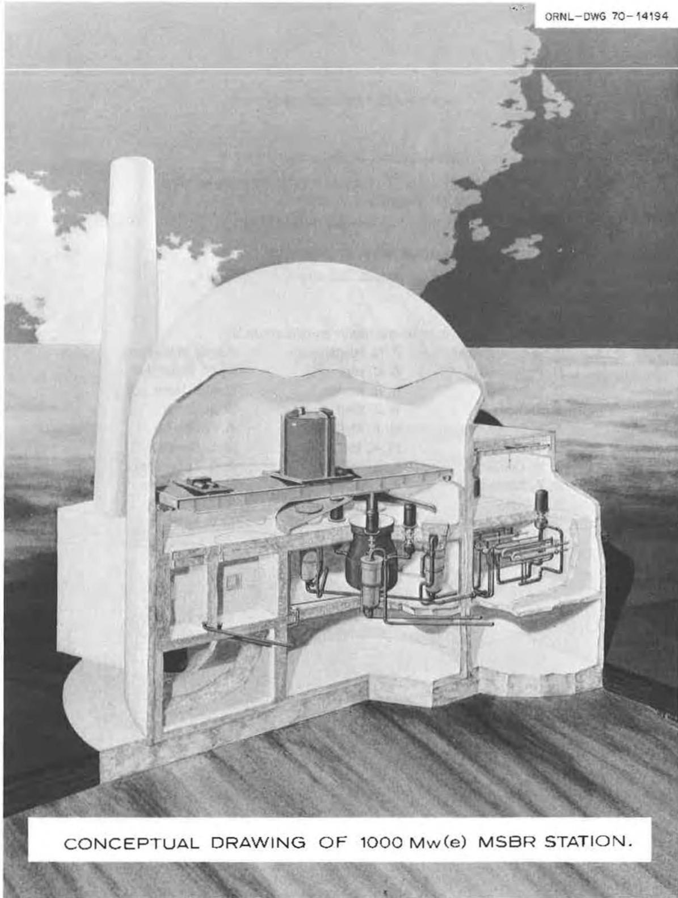

# Contents

SUMMARY ix

ACKNOWLEDGMENTS xvi

1. INTRODUCTION 1   
2. OVERALL SYSTEMS DESCRIPTIONS AND FEATURES 3

2.1 Reactor Primary System 3   
2.2 Secondary-Salt Circulating System 5   
2.3 Steam-Power System for the Turbine-Generator Plant 5   
2.4 Fuel-Salt Drain System 6   
2.5 Off-Gas System 7   
2.6 Fuel-Salt Processing System 7   
2.7 Auxiliary and Other Support Systems 9

3. REACTOR PRIMARY SYSTEM 10

3.1 General Description 10

3.1.1 Design Objectives 10   
3.1.2 General Description and Design Considerations 10

3.2 Special Materials 20

3.2.1 Fuel Salt 20   
3.2.2 Coolant Salt 22   
3.2.3 Reactor Graphite 22   
3.2.4 Hastelloy N 26

3.3 Nuclear Characteristics 28

3.3.1 Selection of MSBR Core Design 28   
3.3.2 Optimization of Core Design 29   
3.3.3 Effect of Changes in the Fuel-Cycle and Core Design Parameters 31   
3.3.4 Reactivity Coefficients 35   
3.3.5 Gamma and Neutron Heating in the MSBR 36   
3.3.6 Fission Product Heating in the MSBR 37   
3.3.7Tritium Production and Distribution 38

3.4 Thermal and Hydraulic Design of Core and Reflector 44

3.4.1 Core 44   
3.4.2 Radial Reflector 49   
3.4.3 Axial Reflectors 50

3.5 Reactor Vessel Design 51

3.5.1 Reactor Vessel Description 51   
3.5.2 Reactor Vessel Temperatures 52   
3.5.3 Reactor Vessel Stresses 52

3.6 Primary System Salt Piping 53   
3.7 Primary Heat Exchangers 54

3.7.1 Design Requirements 54   
3.7.2 General Description 54   
3.7.3 Design Calculations 57   
3.7.4 Reliability of Design Calculations 58

3.8 Salt Circulation Pumps 58

3.8.1 Fuel-Salt Pumps 58   
3.8.2 Coolant-Salt Circulation Pumps 61   
3.8.3 Salt Transfer Pump 61

3.9 Bubble Generator and Gas Separator 61

3.9.1 Introduction 61   
3.9.2 Bubble Generator 61   
3.9.3 Bubble Separator 63   
3.9.4 Bubble Removal and Addition System 63

# 4.COOLANT-SALT CIRCULATING SYSTEM 65

4.1 General 65   
4.2 Steam Generators 65

4.2.1 General 65   
4.2.2 Description 66   
4.2.3 Design Calculations 68   
4.2.4 Reliability of Design Calculations 68

4.3 Steam Reheaters 69

4.3.1 General 69   
4.3.2 Description 69   
4.3.3 Design Calculations 71   
4.3.4 Reliability of Design Calculations 71

4.4 Coolant-Salt System Piping 71   
4.5 Secondary-System Rupture Disks 71   
4.6Coolant-Salt Drain System 72

# 5. STEAM-POWER SYSTEM 74

5.1 General 74   
5.2 Description of the Reference Design MSBR Steam-Power System 75   
5.3 MSBR Plant Thermal Efficiency 77   
5.4Selection of Steam Conditions for the MSBR Steam-Power Cycle 77   
5.5 Use of Reheat in the MSBR Steam Cycle 79   
5.6 Effect of Feedwater Temperature on the MSBR Steam-Power Cycle 80   
5.7 Pressure-Booster Pumps for Mixing Feedwater-Heating System 81   
5.8 Mixing Chamber for Feedwater Heating 81   
5.9 Superheat Control by Attemperation 81

5.10 Reheat Steam Preheaters 81

5.10.1 General Description 81   
5.10.2 Design Considerations 81

# 6. FUEL-SALT DRAIN SYSTEM 84

6.1 General Design Considerations 84   
6.2 Fuel-Salt Drain Line 85

6.3 Primary Drain Tank with Salt-Cooled Heat-Disposal System 85

6.3.1 Description 85   
6.3.2 Heat Sources in Drain Tank 90   
6.3.3 Heat Transfer in Drain Tank Walls 90   
6.3.4 Heat-Removal System 91

6.4 Fuel-Salt Drain Tank with NaK Cooling 94

6.4.1 Introduction 94   
6.4.2 Description 95

6.5 Fuel-Salt Storage Tank 97

# 7. REACTOR OFF-GAS SYSTEM 98

7.1 General 98   
7.2 Basic Assumptions and Design Criteria for Steady-State Operation 99   
7.3 Summary Description of Off-Gas System 100   
7.4 The 47-hr Xenon Holdup System 102   
7.5 Long-Delay Charcoal Bed 104   
7.6 The Gas Cleanup System 106   
7.7 Compressors 109   
7.8 Piping and Valving 109

# 8. FUEL-SALT PROCESSING SYSTEM 110

8.1 General 110   
8.2 Protactinium Isolation 111   
8.3 Rare-Earth Removal 112   
8.4 Integrated Plant Flowsheet 112   
8.5 Salt-Bismuth Contactors 114   
8.6 Fluorinators 114   
8.7 Fuel Reconstitution 114   
8.8 Salt Cleanup 114   
8.9Pumps 115   
8.10 Materials 115

# 9. LIQUID WASTE DISPOSAL SYSTEM 116

# 10. PLANT OPERATION, CONTROL, AND INSTRUMENTATION 117

10.1 General 117   
10.2 MSBR Reactivity Control 117   
10.3 Reactivity Control for Emergency Shutdown 119

10.4 Plant Protective System 119

10.4.1 General 119   
10.4.2 Reactivity Reduction 119   
10.4.3 Load Reduction 119   
10.4.4 Fuel Drain 119

10.5 Availability of Instrumentation and Controls for the Reference Design MSBR 120

10.6 Allowable Rates of Load Changes 120   
10.7 Control of Full and Partial Load Operation 121   
10.8 Control for Fast Shutdown 122   
10.9 Startup, Standby, and Shutdown Procedures 123

10.9.1 General 123   
10.9.2 Startup Procedures 124   
10.9.3 Normal Shutdown 125

11.AUXILIARY SYSTEMS 126

11.1 Auxiliary Electric Power 126   
11.2 Cell Electric Heating Systems 126   
11.3 Radioactive Material Disposal System 127

12.MAINTENANCE AND REPAIR SYSTEMS 129

12.1 General 129   
12.2 Semidirect Maintenance Procedures 130   
12.3 Remote Maintenance Procedures 130   
12.4 Graphite Disposal and Alternate Reactor Vessel Head Reclamation 133   
12.5 Decontamination 134

13. BUILDINGS AND CONTAINMENT 135

13.1 General 135   
13.2 Reactor Building 135   
13.3 Reactor Cell 138   
13.4 Primary Drain Tank Cell 144   
13.5 Freeze-Valve Cell 145   
13.6 Spent Reactor Core and Heat Exchanger Cells 145   
13.7 Waste Storage Cell 146   
13.8 Chemical Processing Cell 146   
13.9 Off-Gas System Cell 146   
13.10 Miscellaneous Reactor Building Cells 146   
13.11 Steam-Generator Cells and Service Areas 146   
13.12Feedwater Heater and Turbine Buildings 147

14. SITE DESCRIPTION 148

15.COST ESTIMATES FOR THE MSBR STATION 150

15.1 Capital Cost Estimate 150   
15.2 Power Production Cost 151

16. UNCERTAINTIES AND ALTERNATIVES, AND THEIR EFFECTS ON FEASIBILITY AND PERFORMANCE 154

16.1 General 154   
16.2 Materials 154

16.2.1 Fuel Salt 154   
16.2.2 Secondary Fluid 155   
16.2.3 Hastelloy N 156   
16.2.4 Graphite 157

16.3 Systems and Components 158

16.3.1 Reactor 158   
16.3.2 Primary Heat Exchangers 158   
16.3.3 Salt Circulation Pumps 158   
16.3.4 Drain Tank 159   
16.3.5 Fuel-Salt Drain Valve 159   
16.3.6 Gaseous Fission Product Removal System 159   
16.3.7 Off-Gas System 159   
16.3.8 Steam Generators 159   
16.3.9 Instrumentation and Controls 160   
16.3.10 Piping and Equipment Supports 160   
16.3.11 Cell Construction 160

16.4Tritium Confinement 160   
16.5 Chemical Processing System 162   
16.6 Fission Product Behavior 163   
16.7 Steam Conditions in the Thermal-Power Cycle 163   
16.8 Maintenance Equipment and Procedures 164   
16.9 Safety Studies 165

REFERENCES 166

APPENDIX A. THEORY OF NOBLE GAS MIGRATION 170   
APPENDIX B. NEUTRON PHYSICS 175   
APPENDIX C. EQUIVALENT UNITS FOR ENGLISH ENGINEERING AND INTERNATIONAL SYSTEMS 176   
APPENDIX D. COST ESTIMATES FOR THE MSBR STATION 177

# Summary

Preparation of a conceptual design for a 1000-MW(e) single-fluid molten-salt reactor power station has given confidence that such a plant is technically feasible and economically attractive. Successful operation of the Molten-Salt Reactor Experiment and the substantial amount of research and development already accomplished on molten-salt reactor materials and processes indicate that after the technology has been extended in a few specific areas, a prototype Molten-Salt Breeder Reactor (MSBR) plant could be successfully constructed and operated. Studies of the fuel-salt chemical processing system are not as far advanced, but small-scale experiments lead to optimism that a practical system can be developed.

The reference MSBR operates on the $\mathrm{Th}^{2,3,3}\mathrm{U}$ cycle, with both fissile and fertile materials incorporated in a single molten-salt mixture of the fluorides of lithium, beryllium, thorium, and uranium. This salt, with the composition $\mathrm{LiF - BeF_2 - ThF_4 - UF_4}$ (71.7-16.0-12.0-0.3 mole %), has a liquidus temperature of $930^{\circ}\mathrm{F}$ $(772^{\circ}\mathrm{K})$ , has good flow and heat transfer properties, and has a very low vapor pressure in the operating temperature range. It is also nonwetting and virtually noncorrosive to graphite and the Hastelloy N container material.

The 22-ft-diam by 20-ft-high reactor vessel contains graphite for neutron moderation and reflection, with the moderating region divided into zones of different fuel-to-graphite ratios. As the salt flows upward through the passages in and between the bare graphite bars, fission energy heats it from about $1050^{\circ}\mathrm{F}$ $(839^{\circ}\mathrm{K})$ to $1300^{\circ}\mathrm{F}$ $(978^{\circ}\mathrm{K})$ . Graphite control rods at the center of the core are moved to displace salt and thus regulate the nuclear power and average temperature, but these rods do not need to be fast scrambling for safety purposes. Long-term reactivity control is by adjustment of the fuel concentration.

The core neutron power density was chosen to give a moderator life of about four years, based on the irradiation tolerance of currently available grades of graphite. The specific inventory of the plant, including the processing system, is $1.47\mathrm{kg}$ of fissile material per

$\mathrm{MW(e)}$ which, together with the breeding ratio of 1.06 gives an annual fissile yield of $3.3\%$ The heat-power system has a net thermal efficiency of over $44\%$ which makes a reactor plant of about 2250 MW(t) ample for a net electrical output of 1000 MW(e).

A simplified flow diagram of the MSBR is shown in Fig. S.1. The primary salt is circulated outside the reactor vessel through four loops. (For simplicity, only one loop is shown in the figure.) Each circuit contains a 16,000-gpm single-stage centrifugal pump and a shell-and-tube heat exchanger. Tritium, xenon, and krypton are sparged from the circulating primary salt by helium introduced in a side stream by a bubble generator and subsequently removed by a gas separator. A 1-gpm (0.06 liter/sec) side stream of the primary salt is continuously processed to remove $^{233}\mathrm{Pa}$ , to recover the bred $^{233}\mathrm{U}$ , and to adjust the fissile content. A drain tank provides safe storage of the salt during maintenance operations.

Heat is transferred from the primary salt to a secondary fluid, sodium fluoroborate, having a composition of $\mathrm{NaBF_4}$ -NaF (92-8 mole $\%$ ) and a liquidus temperature of $725^{\circ}\mathrm{F}$ $(658^{\circ}\mathrm{K})$ . Each of the four secondary circuits has a 20,000-gpm centrifugal pump with variable-speed drive. The secondary salt streams are divided between the steam generators and the reheaters to obtain $1000^{\circ}\mathrm{F}$ steam temperatures from each. Steam is supplied to a single 3500-psia, $1000^{\circ}\mathrm{F} / 1000^{\circ}\mathrm{F}$ , 1035-MW(e) turbine-generator unit exhausting at $1\frac{1}{2}$ in. Hg abs. Regenerative heating and live steam mixing are used to heat the feedwater entering the steam generator to $700^{\circ}\mathrm{F}$ $(644^{\circ}\mathrm{K})$ to provide assurance that the coolant salt remains liquid.

The estimated plant capital costs for a fully developed MSBR, although differing in breakdown, are about the same as those for a light-water nuclear power station. Fuel-cycle costs are expected to be quite low and relatively insensitive to the prices of fissile and fertile materials.

The major uncertainties in the conceptual design are in the areas of tritium confinement, fuel-salt processing, graphite and Hastelloy N behavior under irradiation,

suitability of the coolant salt, maintenance procedures, and behavior of the fission product particulates. Although more study is needed of these aspects, it is believed that they can be resolved with reasonable difficulty.

Principal design data for the reference MSBR power station are listed in Table S.1 both in English engineering units, as commonly used in the molten-salt reactor literature, and in the International (metric) system of units.

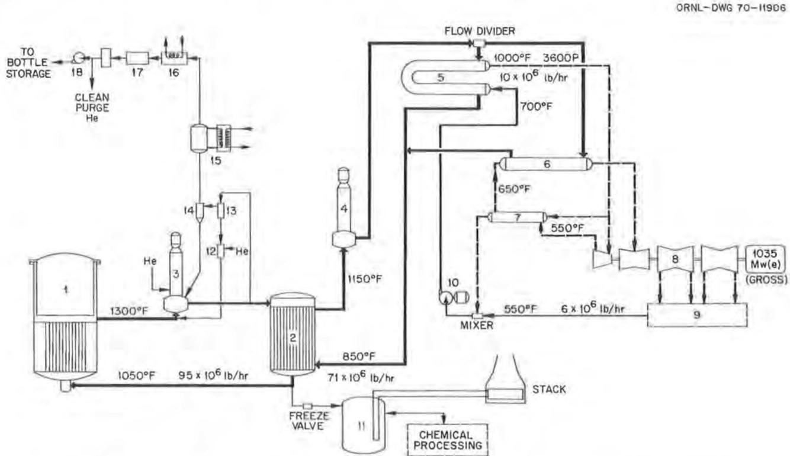  
Fig. S.1. Simplified flow diagram of MSBR system. (1) Reactor, (2) Primary heat exchanger, (3) Fuel-salt pump, (4) Coolant-salt pump, (5) Steam generator, (6) Steam reheater, (7) Reheat steam preheater, (8) Steam turbine-generator, (9) Steam condenser, (10) Feedwater booster pump, (11) Fuel-salt drain tank, (12) Bubble generator, (13) Gas separator, (14) Entrainment separator, (15) Holdup tank, (16) 47-hr Xe holdup charcoal bed, (17) Long-delay charcoal bed, (18) Gas cleanup and compressor system.

Table S.1. Summary of principal data for MSBR power station   

<table><tr><td></td><td>Engineering unitsa</td><td>International system unitsb</td></tr><tr><td colspan="3">General</td></tr><tr><td>Thermal capacity of reactor</td><td>2250 MW(t)</td><td>2250 MW(t)</td></tr><tr><td>Gross electrical generation</td><td>1035 MW(e)</td><td>1035 MW(e)</td></tr><tr><td>Net electrical output</td><td>1000 MW(e)</td><td>1000 MW(e)</td></tr><tr><td>Net overall thermal efficiency</td><td>44.4%</td><td>44.4%</td></tr><tr><td>Net plant heat rate</td><td>7690 Btu/kWhr</td><td>2252 J/kW-sec</td></tr><tr><td colspan="3">Structures</td></tr><tr><td>Reactor cell, diameter × height</td><td>72 × 42 ft</td><td>22.0 × 12.8 m</td></tr><tr><td>Confinement building, diameter × height</td><td>134 × 189 ft</td><td>40.8 × 57.6 m</td></tr><tr><td colspan="3">Reactor</td></tr><tr><td>Vessel ID</td><td>22.2 ft</td><td>6.77 m</td></tr><tr><td>Vessel height at center (approx)</td><td>20 ft</td><td>6.1 m</td></tr><tr><td>Vessel wall thickness</td><td>2 in.</td><td>5.08 cm</td></tr><tr><td>Vessel head thickness</td><td>3 in.</td><td>7.62 cm</td></tr><tr><td>Vessel design pressure (abs)</td><td>75 psi</td><td>5.2 × 10^5 N/m²</td></tr><tr><td>Core height</td><td>13 ft</td><td>3.96 m</td></tr><tr><td>Number of core elements</td><td>1412</td><td>1412</td></tr><tr><td>Radial thickness of reflector</td><td>30 in.</td><td>0.762 m</td></tr><tr><td>Volume fraction of salt in central core zone</td><td>0.13</td><td>0.13</td></tr><tr><td>Volume fraction of salt in outer core zone</td><td>0.37</td><td>0.37</td></tr><tr><td>Average overall core power density</td><td>22.2 kW/liter</td><td>22.2 kW/liter</td></tr><tr><td>Peak power density in core</td><td>70.4 kW/liter</td><td>70.4 kW/liter</td></tr><tr><td>Average thermal-neutron flux</td><td>2.6 × 10^14 neutrons cm^-2 sec^-1</td><td>2.6 × 10^14 neutrons cm^-2 sec^-1</td></tr><tr><td>Peak thermal-neutron flux</td><td>8.3 × 10^14 neutrons cm^-2 sec^-1</td><td>8.3 × 10^14 neutrons cm^-2 sec^-1</td></tr><tr><td>Maximum graphite damage flux (&gt;50 keV)</td><td>3.5 × 10^14 neutrons cm^-2 sec^-1</td><td>3.5 × 10^14 neutrons cm^-2 sec^-1</td></tr><tr><td>Damage flux at maximum damage region (approx)</td><td>3.3 × 10^14 neutrons cm^-2 sec^-1</td><td>3.3 × 10^14 neutrons cm^-2 sec^-1</td></tr><tr><td>Graphite temperature at maximum neutron flux region</td><td>1284°C</td><td>969°C</td></tr><tr><td>Graphite temperature at maximum graphite damage region</td><td>1307°C</td><td>982°C</td></tr><tr><td>Estimated useful life of graphite</td><td>4 years</td><td>4 years</td></tr><tr><td>Total weight of graphite in reactor</td><td>669,000 lb</td><td>304,000 kg</td></tr><tr><td>Maximum flow velocity of salt in core</td><td>8.5 fps</td><td>2.6 m/sec</td></tr><tr><td>Total fuel salt in reactor vessel</td><td>1074 ft³</td><td>30.4 m³</td></tr><tr><td>Total fuel-salt volume in primary system</td><td>1720 ft³</td><td>48.7 m³</td></tr><tr><td>Fissile-fuel inventory in reactor primary system and fuel processing plant</td><td>3316 lb</td><td>1504 kg</td></tr><tr><td>Thorium inventory</td><td>150,000 lb</td><td>68,100 kg</td></tr><tr><td>Breeding ratio</td><td>1.06</td><td>1.06</td></tr><tr><td>Yield</td><td>3.2%/year</td><td>3.2%/year</td></tr><tr><td>Doubling time, compounded continuously, at 80% power factor</td><td>22 years</td><td>22 years</td></tr><tr><td colspan="3">Primary heat exchangers (for each of 4 units)</td></tr><tr><td>Thermal capacity, each</td><td>556.3 MW(t)</td><td>556.3 MW(t)</td></tr><tr><td colspan="3">Tube-side conditions (fuel salt)</td></tr><tr><td>Tube OD</td><td>3/8 in.</td><td>0.953 cm</td></tr><tr><td>Tube length (approx)</td><td>22.2 ft</td><td>6.8 m</td></tr><tr><td>Number of tubes</td><td>5896</td><td>5896</td></tr><tr><td>Inlet-outlet conditions</td><td>1300–1050°F</td><td>978–839°C</td></tr><tr><td>Mass flow rate</td><td>23.45 × 10^6 lb/hr</td><td>2955 kg/sec</td></tr><tr><td>Total heat transfer surface</td><td>13,000 ft²</td><td>1208 m²</td></tr><tr><td colspan="3">Shell-side conditions (coolant salt)</td></tr><tr><td>Shell ID</td><td>68.1 in.</td><td>1.73 m</td></tr><tr><td>Inlet-outlet temperatures</td><td>850–1150°F</td><td>727–894°C</td></tr><tr><td>Mass flow rate</td><td>17.6 × 10^6 lb/hr</td><td>2218 kg/sec</td></tr><tr><td>Overall heat transfer coefficient (approx)</td><td>850 Btu hr^-1 ft^-2 (°F)^{-1}</td><td>4820 W m^-2 (°K)^{-1}</td></tr><tr><td colspan="3">Primary pumps (for each of 4 units)</td></tr><tr><td>Pump capacity, nominal</td><td>16,000 gpm</td><td>1.01 m3/sec</td></tr><tr><td>Rated head</td><td>150 ft</td><td>45.7 m</td></tr><tr><td>Speed</td><td>890 rpm</td><td>93.2 radians/sec</td></tr><tr><td>Specific speed</td><td>2625 rpm(gpm)0.5/(ft)0.75</td><td>5,321 radians/sec(m3/sec)0.5/(m)0.75</td></tr><tr><td>Impeller input power</td><td>2350 hp</td><td>1752 kW</td></tr><tr><td>Design temperature</td><td>1300°F</td><td>978°K</td></tr><tr><td colspan="3">Secondary pumps (for each of 4 units)</td></tr><tr><td>Pump capacity, nominal</td><td>20,000 gpm</td><td>1.262 m3/sec</td></tr><tr><td>Rated head</td><td>300 ft</td><td>91.4 m</td></tr><tr><td>Speed, principal</td><td>1190 rpm</td><td>124.6 radians/sec</td></tr><tr><td>Specific speed</td><td>2330 rpm(gpm)0.5/(ft)0.75</td><td>4.73 radians/sec(m3/sec)0.5/(m)0.75</td></tr><tr><td>Impeller input power</td><td>3100 hp</td><td>2310 kW</td></tr><tr><td>Design temperature</td><td>1300°F</td><td>978°K</td></tr><tr><td colspan="3">Fuel-salt drain tank (1 unit)</td></tr><tr><td>Outside diameter</td><td>14 ft</td><td>4.27 m</td></tr><tr><td>Overall height</td><td>22 ft</td><td>6.71 m</td></tr><tr><td>Storage capacity</td><td>2500 ft3</td><td>70.8 m3</td></tr><tr><td>Design pressure</td><td>55 psi</td><td>3.79 × 105 N/m2</td></tr><tr><td>Number of coolant U-tubes</td><td>1500</td><td>1500</td></tr><tr><td>Size of tubes, OD</td><td>3/4 in.</td><td>1.91 cm</td></tr><tr><td>Number of separate coolant circuits</td><td>40</td><td>40</td></tr><tr><td>Coolant fluid</td><td>7LiF-BeF2</td><td>7LiF-BeF2</td></tr><tr><td colspan="3">Under normal steady-state conditions:</td></tr><tr><td>Maximum heat load</td><td>18 MW(t)</td><td>18 MW(t)</td></tr><tr><td>Coolant circulation rate</td><td>830 gpm</td><td>0.0524 m3/sec</td></tr><tr><td>Coolant temperatures, in/out</td><td>900–1050°F</td><td>755–839°K</td></tr><tr><td>Maximum tank wall temperature</td><td>~1260°F</td><td>~955°K</td></tr><tr><td>Maximum transient heat load</td><td>53 MW(t)</td><td>53 MW(t)</td></tr><tr><td colspan="3">Fuel-salt storage tank (1 unit)</td></tr><tr><td>Storage capacity</td><td>2500 ft3</td><td>70.8 m3</td></tr><tr><td>Heat-removal capacity</td><td>1 MW(t)</td><td>1 MW(t)</td></tr><tr><td>Coolant fluid</td><td>Boiling water</td><td>Boiling water</td></tr><tr><td colspan="3">Coolant-salt storage tanks (4 units)</td></tr><tr><td>Total volume of coolant salt in systems</td><td>8400 ft3</td><td>237.9 m3</td></tr><tr><td>Storage capacity of each tank</td><td>2100 ft3</td><td>59.5 m3</td></tr><tr><td>Heat-removal capacity, first tank in series</td><td>400 kW</td><td>400 kW</td></tr><tr><td colspan="3">Steam generators (for each of 16 units)</td></tr><tr><td>Thermal capacity</td><td>120.7 MW(t)</td><td>120.7 MW(t)</td></tr><tr><td colspan="3">Tube-side conditions (steam at 3600–3800 psi)</td></tr><tr><td>Tube OD</td><td>1/2 in.</td><td>1.27 cm</td></tr><tr><td>Tube-sheet-to-tube-sheet length (approx)</td><td>76.4 ft</td><td>23.3 m</td></tr><tr><td>Number of tubes</td><td>393</td><td>393</td></tr><tr><td>Inlet-outlet temperatures</td><td>700–1000°F</td><td>644–811°K</td></tr><tr><td>Mass flow rate</td><td>633,000 lb/hr</td><td>79.76 kg/sec</td></tr><tr><td>Total heat transfer surface</td><td>3929 ft2</td><td>365 m2</td></tr><tr><td colspan="3">Shell-side conditions (coolant salt)</td></tr><tr><td>Shell ID</td><td>1.5 ft</td><td>0.457 m</td></tr><tr><td>Inlet-outlet temperatures</td><td>1150–850°F</td><td>894–727°K</td></tr><tr><td>Mass flow rate</td><td>3.82 × 106 lb/hr</td><td>481.3 kg/sec</td></tr><tr><td>Apparent overall heat transfer coefficient range</td><td>490–530 Btu hr-1 ft-2 (°F)-1</td><td>2780–3005 W m-2(°K)-1</td></tr><tr><td colspan="3">Steam reheaters (for each of 8 units)</td></tr><tr><td>Thermal capacity</td><td>36.6 MW(t)</td><td>36.6 MW(t)</td></tr><tr><td colspan="3">Tube-side conditions (steam at 550 psi)</td></tr><tr><td>Tube OD</td><td>3/4in.</td><td>1.9 cm</td></tr><tr><td>Tube length</td><td>30.3 ft</td><td>9.24 m</td></tr><tr><td>Number of tubes</td><td>400</td><td>400</td></tr><tr><td>Inlet-outlet temperatures</td><td>650–1000°F</td><td>616–811°C</td></tr><tr><td>Mass flow rate</td><td>641,000 lb/hr</td><td>80.77 kg/sec</td></tr><tr><td>Total heat transfer surface</td><td>2381 ft2</td><td>221.2 m2</td></tr><tr><td colspan="3">Shell-side conditions (coolant salt)</td></tr><tr><td>Shell ID</td><td>21.2 in.</td><td>0.54 m</td></tr><tr><td>Inlet-outlet temperatures</td><td>1150–850°F</td><td>894–727°C</td></tr><tr><td>Mass flow rate</td><td>1.16 × 106lb/hr</td><td>146.2 kg/sec</td></tr><tr><td>Overall heat transfer coefficient</td><td>298 Btu hr-1 ft-2(°F)-1</td><td>1690 W m-2(°K)-1</td></tr><tr><td colspan="3">Turbine-generator plant (see "General" above)</td></tr><tr><td>Number of turbine-generator units</td><td>1</td><td>1</td></tr><tr><td>Turbine throttle conditions</td><td>3500 psia, 1000°F</td><td>24.1 × 106N/m2, 811°C</td></tr><tr><td>Turbine throttle mass flow rate</td><td>7.15 × 106lb/hr</td><td>900.9 kg/sec</td></tr><tr><td>Reheat steam to IP turbine</td><td>540 psia, 1000°F</td><td>3.72 × 106N/m2, 811°C</td></tr><tr><td>Condensing pressure (abs)</td><td>1.5 in. Hg</td><td>5,078 N/m2</td></tr><tr><td>Boiler feed pump work</td><td>19,700 hp</td><td>14,690 kW</td></tr><tr><td colspan="3">(steam-turbine-driven), each of 2 units</td></tr><tr><td>Booster feed pump work (motor-driven), each of 2 units</td><td>6200 hp</td><td>4620 kW</td></tr><tr><td colspan="3">Fuel-salt inventory, primary system</td></tr><tr><td colspan="3">Reactor</td></tr><tr><td>Core zone I</td><td>290 ft3</td><td>8.2 m3</td></tr><tr><td>Core zone II</td><td>382 ft3</td><td>10.8 m3</td></tr><tr><td>Plenum, inlets, outlets</td><td>218 ft3</td><td>6.2 m3</td></tr><tr><td>2-in. annulus</td><td>135 ft3</td><td>3.8 m3</td></tr><tr><td>Reflectors</td><td>49 ft3</td><td>1.4 m3</td></tr><tr><td colspan="3">Primary heat exchangers</td></tr><tr><td>Tubes</td><td>269 ft3</td><td>7.6 m3</td></tr><tr><td>Inlets, outlets</td><td>27 ft3</td><td>0.8 m3</td></tr><tr><td>Pump bowls</td><td>185 ft3</td><td>5.2 m3</td></tr><tr><td>Piping, including drain line</td><td>145 ft3</td><td>4.1 m3</td></tr><tr><td>Off-gas bypass loop</td><td>10 ft3</td><td>0.3 m3</td></tr><tr><td>Tank heels and miscellaneous</td><td>10 ft3</td><td>0.3 m3</td></tr><tr><td>Total enriched salt in primary system</td><td>1720 ft3</td><td>48.7 m3</td></tr><tr><td colspan="3">Fuel-processing system (Chemical Treatment Plant)</td></tr><tr><td>Inventory of barren salt (Lif-BeF2-ThF4) in plant</td><td>480 ft3</td><td>13.6 m3</td></tr><tr><td>Processing rate</td><td>1 gpm</td><td>63.1 × 10-6m3/sec</td></tr><tr><td>Cycle time for salt inventory</td><td>10 days</td><td>10 days</td></tr><tr><td>Heat generation in salt to processing plant</td><td>56 kW/ft3</td><td>1980 kW/m3</td></tr><tr><td colspan="3">Design properties of fuel salt</td></tr><tr><td>Components</td><td>7LiF-BeF2-ThF4-UF4</td><td>7LiF-BeF2-ThF4-UF4</td></tr><tr><td>Composition</td><td>71.7-16-12-0.3 mole %</td><td>71.7-16-12-0.3 mole %</td></tr><tr><td>Molecular weight (approx)</td><td>64</td><td>64</td></tr><tr><td>Melting temperature (approx)</td><td>930°F</td><td>772°C</td></tr><tr><td>Vapor pressure at 1150°F (894.3°C)</td><td>&lt;0.1 mm Hg</td><td>&lt;13.3 N/m2</td></tr><tr><td colspan="3">Density: ρ(g/cm3)=3.752-6.68×10-4t(°C); ρ(lb/ft3)=235.0-0.02317t(°F)</td></tr><tr><td>At 1300°F (978°C)</td><td>204.9 lb/ft3</td><td>3283.9 kg/m3</td></tr><tr><td>At 1175°F (908°C)</td><td>207.8 lb/ft3</td><td>3330.4 kg/m3</td></tr><tr><td>At 1050°F (839°C)</td><td>210.7 lb/ft3</td><td>3376.9 kg/m3</td></tr><tr><td colspan="3">Viscosity:αμ (centipoises) = 0.109 exp [4090/T (°K)]; μ (lb ft-1hr-1) = 0.2637 exp [7362/T (°R)]</td></tr><tr><td>At 1300°F (978°C)</td><td>17.3 lb hr-1ft-1</td><td>0.007 N sec m-2</td></tr><tr><td>At 1175°F (908°C)</td><td>23.8 lb hr-1ft-1</td><td>0.010 N sec m-2</td></tr><tr><td>At 1050°F (839°C)</td><td>34.5 lb hr-1ft-1</td><td>0.015 N sec m-2</td></tr><tr><td>Heat capacitye (specific heat, Cp)</td><td>0.324 Btu lb-1(°F)-1± 4%</td><td>1.357 J g-1(°K)-1± 4%</td></tr><tr><td colspan="3">Thermal conductivity (k)f</td></tr><tr><td>At 1300°F (978°C)</td><td>0.69 Btu hr-1(°F)-1 ft-1</td><td>1.19 W m-1(°K)-1</td></tr><tr><td>At 1175°F (908°C)</td><td>0.71 Btu hr-1(°F)-1 ft-1</td><td>1.23 W m-1(°K)-1</td></tr><tr><td>At 1050°F (839°C)</td><td>0.69 Btu hr-1(°F)-1 ft-1</td><td>1.19 W m-1(°K)-1</td></tr><tr><td colspan="3">Design properties of coolant salt</td></tr><tr><td>Components</td><td>NaBF4-NaF</td><td>NaBF4-NaF</td></tr><tr><td>Composition</td><td>92-8 mole %</td><td>92-8 mole %</td></tr><tr><td>Molecular weight (approx)</td><td>104</td><td>104</td></tr><tr><td>Melting temperature (approx)</td><td>725°C</td><td>658°C</td></tr><tr><td colspan="3">Vapor pressure:g log P (mm Hg) = 9.024 - 5920/T (°K)</td></tr><tr><td>At 850°F (727°C)</td><td>8 mm Hg</td><td>1066 N/m2</td></tr><tr><td>At 1150°F (894°C)</td><td>252 mm Hg</td><td>33,580 N/m2</td></tr><tr><td colspan="3">Density:ρ (g/cm3) = 2.252 - 7.11 × 10-4t (°C); ρ (lb/ft3) = 141.4 - 0.0247t (°F)</td></tr><tr><td>At 1150°F (894°C)</td><td>113.0 lb/ft3</td><td>1811.1 kg/m3</td></tr><tr><td>At 1000°F (811°C)</td><td>116.7 lb/ft3</td><td>1870.4 kg/m3</td></tr><tr><td>At 850°F (727°C)</td><td>120.4 lb/ft3</td><td>1929.7 kg/m3</td></tr><tr><td colspan="3">Viscosity:d μ (centipoises) = 0.0877 exp [2240/T (°K)]; μ (lb_m ft-1hr-1) = 0.2121 exp [4032/T (°R)]</td></tr><tr><td>At 1150°F (894°C)</td><td>2.6 lb ft-1hr-1</td><td>0.0011 N sec m-2</td></tr><tr><td>At 1000°F (811°C)</td><td>3.4 lb ft-1hr-1</td><td>0.0014 N sec m-2</td></tr><tr><td>At 850°F (727°C)</td><td>4.6 lb ft-1hr-1</td><td>0.0019 N sec m-2</td></tr><tr><td>Heat capacityh (specific heat, Cp)</td><td>0.360 Btu lb-1(°F)-1± 2%</td><td>1507 J kg-1(°K)-1± 2%</td></tr><tr><td colspan="3">Thermal conductivity (k)i</td></tr><tr><td>At 1150°F (894°C)</td><td>0.23 Btu hr-1(°F)-1 ft-1</td><td>0.398 W m-1(°K)-1</td></tr><tr><td>At 1000°F (811°C)</td><td>0.23 Btu hr-1(°F)-1 ft-1</td><td>0.398 W m-1(°K)-1</td></tr><tr><td>At 850°F (727°C)</td><td>0.26 Btu hr-1(°F)-1 ft-1</td><td>0.450 W m-1(°K)-1</td></tr><tr><td colspan="3">Design properties of graphitej</td></tr><tr><td>Density, at 70°F (294.3°C)</td><td>115 lb/ft3</td><td>1843 kg/m3</td></tr><tr><td>Bending strength</td><td>4000-6000 psi</td><td>28 × 10^6-41 × 10^6 N/m2</td></tr><tr><td>Modulus of elasticity coefficient</td><td>1.7 × 10^6 psi</td><td>11.7 × 10^9 N/m2</td></tr><tr><td>Poisson's ratio</td><td>0.27</td><td>0.27</td></tr><tr><td>Thermal expansion coefficient</td><td>2.3 × 10^-6/°F</td><td>1.3 × 10^-6/K</td></tr><tr><td>Thermal conductivity at 1200°F, unirradiated (approx)</td><td>18 Btu hr-1(°F)-1 ft-1</td><td>31.2 W m-1(°K)-1</td></tr><tr><td>Electrical resistivity</td><td>8.9 × 10^-4-9.9 × 10^-4 Ω·cm</td><td>8.9 × 10^-4-9.9 × 10^-4 Ω·cm</td></tr><tr><td colspan="3">Specific heat</td></tr><tr><td>At 600°F (588.8°C)</td><td>0.33 Btu lb-1(°F)-1</td><td>1380 J kg-1(°K)-1</td></tr><tr><td>At 1200°F (922.0°C)</td><td>0.42 Btu lb-1(°F)-1</td><td>1760 J kg-1(°K)-1</td></tr><tr><td>Helium permeability at STP with sealed surfaces</td><td>1 × 10^-8 cm²/sec</td><td>1 × 10^-8 cm²/sec</td></tr><tr><td></td><td>Engineering units \( {}^{a} \)</td><td>International system units \( {}^{\mathrm{b}} \)</td></tr><tr><td colspan="3">Design properties of Hastelloy \( {\mathrm{N}}^{\mathrm{k}} \)</td></tr><tr><td colspan="3">Density</td></tr><tr><td>At \( {80}^{ \circ  }\mathrm{F}\left( {{300}^{ \circ  }\mathrm{K}}\right) \)</td><td>\( {557}\mathrm{\;{lb}}/{\mathrm{{ft}}}^{3} \)</td><td>\( {8927}\mathrm{\;{kg}}/{\mathrm{m}}^{3} \)</td></tr><tr><td>At \( {1300}^{ \circ  }\mathrm{F}\left( {{978}^{ \circ  }\mathrm{K}}\right) \)</td><td>\( {541}\mathrm{\;{lb}}/{\mathrm{{ft}}}^{3} \)</td><td>\( {8671}\mathrm{\;{kg}}/{\mathrm{m}}^{3} \)</td></tr><tr><td colspan="3">Thermal conductivity</td></tr><tr><td>At \( {80}^{ \circ  }\mathrm{F}\left( {{300}^{ \circ  }\mathrm{K}}\right) \)</td><td>\( {6.0}\mathrm{{Btu}}{\mathrm{{hr}}}^{-1}{\left( {}^{ \circ  }\mathrm{F}\right) }^{-1}{\mathrm{{ft}}}^{-1} \)</td><td>\( {10.4}\mathrm{\;W}{\mathrm{\;m}}^{-1}{\left( {}^{ \circ  }\mathrm{K}\right) }^{-1} \)</td></tr><tr><td>At \( {1300}^{ \circ  }\mathrm{F}\left( {{978}^{ \circ  }\mathrm{K}}\right) \)</td><td>\( {12.6}\mathrm{{Btu}}{\mathrm{{hr}}}^{-1}{\left( {}^{ \circ  }\mathrm{F}\right) }^{-1}{\mathrm{{ft}}}^{-1} \)</td><td>\( {21.8}\mathrm{\;W}{\mathrm{\;m}}^{-1}{\left( {}^{ \circ  }\mathrm{K}\right) }^{-1} \)</td></tr><tr><td colspan="3">Specific heat</td></tr><tr><td>At \( {80}^{ \circ  }\mathrm{F}\left( {{300}^{ \circ  }\mathrm{K}}\right) \)</td><td>\( {0.098}\mathrm{{Btu}}{\mathrm{{lb}}}^{-1}{\left( {}^{ \circ  }\mathrm{F}\right) }^{-1} \)</td><td>\( {410}\mathrm{\;J}{\mathrm{\;{kg}}}^{-1}{\left( {}^{ \circ  }\mathrm{K}\right) }^{-1} \)</td></tr><tr><td>At \( {1300}^{ \circ  }\mathrm{F}\left( {{978}^{ \circ  }\mathrm{K}}\right) \)</td><td>\( {0.136}\mathrm{{Btu}}{\mathrm{{lb}}}^{-1}{\left( {}^{ \circ  }\mathrm{F}\right) }^{-1} \)</td><td>\( {569}\mathrm{\;J}{\mathrm{\;{kg}}}^{-1}{\left( {}^{ \circ  }\mathrm{K}\right) }^{-1} \)</td></tr><tr><td colspan="3">Thermal expansion</td></tr><tr><td>At \( {80}^{ \circ  }\mathrm{F}\left( {{300}^{ \circ  }\mathrm{K}}\right) \)</td><td>\( {5.7} \times  {10}^{-6}/{}^{ \circ  }\mathrm{F} \)</td><td>\( {3.2} \times  {10}^{-6}/{}^{ \circ  }\mathrm{K} \)</td></tr><tr><td>At \( {1300}^{ \circ  }\mathrm{F}\left( {{978}^{ \circ  }\mathrm{K}}\right) \)</td><td>\( {9.5} \times  {10}^{-6}/{}^{ \circ  }\mathrm{F} \)</td><td>\( {5.3} \times  {10}^{-6}/{}^{ \circ  }\mathrm{K} \)</td></tr><tr><td colspan="3">Modulus of elasticity coefficient</td></tr><tr><td>At \( {80}^{ \circ  }\mathrm{F}\left( {{300}^{ \circ  }\mathrm{K}}\right) \)</td><td>\( {31} \times  {10}^{6} \) psi</td><td>\( {214} \times  {10}^{9}\mathrm{\;N}/{\mathrm{m}}^{2} \)</td></tr><tr><td>At \( {1300}^{ \circ  }\mathrm{F}\left( {{978}^{ \circ  }\mathrm{K}}\right) \)</td><td>\( {25} \times  {10}^{6} \) psi</td><td>\( {172} \times  {10}^{9}\mathrm{\;N}/{\mathrm{m}}^{2} \)</td></tr><tr><td colspan="3">Tensile strength (approx)</td></tr><tr><td>At \( {80}^{ \circ  }\mathrm{F}\left( {{300}^{ \circ  }\mathrm{K}}\right) \)</td><td>115,000 psi</td><td>\( {793} \times  {10}^{6}\mathrm{\;N}/{\mathrm{m}}^{2} \)</td></tr><tr><td>At \( {1300}^{ \circ  }\mathrm{F}\left( {{978}^{ \circ  }\mathrm{K}}\right) \)</td><td>75,000 psi</td><td>\( {517} \times  {10}^{6}\mathrm{\;N}/{\mathrm{m}}^{2} \)</td></tr><tr><td colspan="3">Maximum allowable design stress</td></tr><tr><td>At \( {80}^{ \circ  }\mathrm{F}\left( {{300}^{ \circ  }\mathrm{K}}\right) \)</td><td>25,000 psi</td><td>\( {172} \times  {10}^{6}\mathrm{\;N}/{\mathrm{m}}^{2} \)</td></tr><tr><td>At \( {1300}^{ \circ  }\mathrm{F}\left( {{978}^{ \circ  }\mathrm{K}}\right) \)</td><td>3500 psi</td><td>\( {24} \times  {10}^{6}\mathrm{\;N}/{\mathrm{m}}^{2} \)</td></tr><tr><td>Melting temperature</td><td>\( {2500}^{ \circ  }\mathrm{F} \)</td><td>\( {1644}^{ \circ  }\mathrm{K} \)</td></tr></table>

aEnglish engineering units as used in MSR literature.   
Meter-kilogram-second system. Table closely follows International System (SI). See Appendix C for conversion factors from engineering to SI units.   
See p. 147, Fig. 13.6, ORNL-4449 (ref. 1).   
aSee p. 145, Table 13.2, ORNL-4449 (ref. 1).   
eSec p.163, ORNL-4344 (ref. 2).   
See p. 92, Fig. 9.13, ORNL-4449 (ref. 1). The value of $k$ shown is for salt with about $5\%$ less LiF than the reference salt. Addition of LiF would increase the average value, probably to 0.72-0.74. The established, and conservative, value of 0.71 was used in the MSBR calculations.   
gSee p.170, ORNL-4254 (ref. 3).   
See p. 168, ORNL-4254 (ref. 3).   
See p.92, Fig. 9.13, ORNL-4449 (ref. 1).   
Additional graphite properties are listed in Table 3.4.   
Composition, wt %: Ni, balance; Mo, 12; Cr, 7; Fe, 0–5; Mn, 0.2–0.5; Si, 0.1 max; B, 0.001 max; Ti, 0.5–2.0; Hf or Nb, 0–2; Cu, Co, P, S, C, W, Al (total), 0.35.

# Acknowledgment

This design study was carried out by the staff of the Molten-Salt Reactor Program (M. W. Rosenthal, Director; R. B. Briggs and P. N. Haubenreich, Associate Directors). It was a team effort involving personnel from eight different divisions of the Oak Ridge National Laboratory. The conceptual design upon which the study is based was produced by a group led by E. S. Bettis. The persons listed below all made substantial contributions to the study.

John L. Anderson

H.F.Bauman

C.E.Bettis

E. S. Bettis

Howard I. Bowers

Robert Blumberg

R.B.Briggs

J.H.Carswell

Lloyd Carter

C.W.Collins

W.H.Cook

W. K. Crowley

W.P.Eatherly

S.J.Ditto

W.K.Furlong

W.R.Grimes

P.N.Haubenreich

J.W.Helm

R.E.Helms

Peter P. Holz

P. R. Kasten

R.J.Kedl

H. T. Kerr

C. R. Kennedy

M. I. Lundin

H.E.McCoy

R.E. MacPherson

H. A. McLain

L.E.McNeese

J.R.McWherter

R. L. Moore

M. L. Myers

H.A.Nelms

E. L. Nicholson

A.M.Perry

T.W.Pickel

H.M.Poly

Roy C. Robertson

M. W. Rosenthal

Dunlap Scott

W. H. Sides

M. Siman-Tov

A.N. Smith

O. L. Smith

Roy E. Thoma

W.C.T.Stoddart

J.R.Tallackson

H. L. Watts

L.V.Wilson

# 1. Introduction

A major objective of the Molten-Salt Reactor Program is to achieve a power reactor which will produce electric energy at low cost and at the same time extend the nation's low-cost fuel resources. A graphite-moderated thermal breeder reactor making use of solutions of fissile and fertile materials in fluoride carrier salts shows considerable potential for meeting this objective. This report summarizes present information on the design characteristics of such a Molten-Salt Breeder Reactor (MSBR).

Molten salts as reactor fuels and as coolants have been under study and development for over 20 years, and their chemical, physics, and irradiation properties are excellent. The Molten-Salt Reactor Experiment (MSRE) at ORNL, which was recently shut down after about five years of very successful operation, contributed significantly to molten-salt reactor technology. A survey report4 was published in August 1966 which summarized the potential of molten-salt thermal breeder reactors and described preliminary designs and fuel processing facilities for a 1000-MW(e) power station. More detailed design studies followed,5-7 and a comprehensive report8 was written which covered the status of the design studies as of January 1968. These reports considered the two-fluid reactor concept, that is, one in which the fissile atoms are carried in one molten-salt solution, called the fuel salt,* and the fertile material in another, called the blanket salt. In the fall of 1967, however, information was obtained that made a single-fluid MSBR, in which fissile and fertile materials are dissolved in the same salt, appear practical and attractive. The two-fluid study was set aside and a design study of the single-fluid system commenced. Some of the factors involved were:

1. Research in the processing of the molten-salt fuels showed that protactinium and other fission products could be separated from the salts containing both uranium and thorium by reductive extraction into liquid bismuth. A single salt containing both the fissile and fertile materials could thus be processed, although with more difficulty than if separate fuel and fertile salts were used.   
2. Nuclear calculations indicated that a conversion ratio greater than 1.0 could be achieved in a one-fluid reactor with an acceptably low inventory if the graphite-to-fuel ratio were reduced in the outer regions of the reactor core. While the fuel specific power fell short of the performance of a two-fluid type, yields of 3 to $4\%$ /year were indicated.   
3. Reactor exposure limitations were found to exist relative to use of a graphite moderator, making it necessary to design for graphite replacement. In a two-fluid reactor it appears more practical to replace the entire reactor assembly, including the reactor vessel, when replacing the graphite. The single-fluid MSBR, however, permits easier access through the top head, so that only the core graphite need be replaced.   
4. The two-fluid concept depends upon the integrity of the graphite "plumbing" in the reactor vessel to keep the fuel and fertile salt streams separated. The single-fluid design eliminates this potential problem.   
5. Radiation damage to graphite during reactor exposure leads to dimensional changes in graphite which are more easily accommodated in a single-fluid MSBR than in a two-fluid design.

1. The design study is to establish concept feasibility, to serve as a basis for preliminary estimates of cost and performance features, to identify the research and development needed to achieve a full-scale MSBR, and to guide the design of an experimental prototype reactor that will test the features of the larger plants to follow.   
2. The conceptual design of the MSBR is to be based on a technology which does not require major inventions or technological breakthroughs. Reasonable engineering development is considered permissible, however.   
3. The conceptual design is to be based on a plant capacity of 1000 MW(e).   
4. Cost estimates are to be based on existence of a well-established MSBR power reactor industry.

The design of the MSBR plant is presented in terms of various systems, or facilities, which are categorized as:

1. the reactor system, in which fission heat generated in the fuel salt in its passage through the reactor vessel is removed in primary heat exchangers;   
2. an off-gas system for purging the fuel salt of fission product gases and gas-borne particulates;   
3. a chemical processing facility for continuously removing fission products from the fuel salt, recovering bred $^{233}\mathrm{U}$ , and replenishing fertile material;   
4. a coolant-salt circulating system, steam generators, and a turbine-generator plant for converting the thermal energy into electric power;   
5. general facilities and equipment, including controls and instrumentation, maintenance tools, auxiliary

power equipment, waste disposal systems, condensing water works, electrical switchyard, stacks, and conventional buildings and services.

The above categories are not always separate and are closely interdependent, but it is convenient to discuss them separately. The reactor and its related structures and maintenance system, the drain tank, the off-gas system, and the chemical processing system are of primary interest and are discussed in more detail in the following sections. The steam turbine plant and the general facilities are more or less conventional and are discussed only to the extent necessary to complete the overall picture as to feasibility and costs of an MSBR station.

There are many alternatives open to the designer of an MSBR station. These can be resolved by detailed optimization work, but to initiate this preliminary study it was necessary in many areas to make early decisions largely on the basis of considered judgment. Some examples are: selection of the number of coolant loops and steam generators, use of $700^{\circ}\mathrm{F}$ feedwater, an assumed useful graphite life of four years, etc. The reference design described here, therefore, illustrates that an MSBR power station is practical and feasible, but it does not represent a design which has been optimized for best performances and costs.

An effort has been made to revise and annotate the report to indicate the status of the technology, particularly with regard to the behavior of materials, up to the late fall of 1970. As indicated above, however, major features of the conceptual design were established much earlier, generally on the basis of information available in late 1969 and early 1970.

# 2. Overall Systems Descriptions and Features

E.S.Bettis

# 2.1 REACTOR PRIMARY SYSTEM

The MSBR primary system consists of the reactor, four primary heat exchangers that transfer heat from the fuel salt to the coolant salt, and four pumps that circulate the molten fluoride fuel-salt mixture. All of this equipment is contained within the reactor cell, as shown in Sect. 13. The fuel-salt drain tank and afterheat-removal equipment are considered to be a separate system and are described in Sect. 2.4.

The reactor primary system flowsheet is shown in Fig. 2.1. About $94.8 \times 10^{6} \mathrm{lb/hr}$ of fuel salt enters the bottom of the reactor at $1050^{\circ}\mathrm{F}$ . Fission energy within the graphite-moderated core raises the salt temperature to an average value of $1300^{\circ}\mathrm{F}$ at the reactor exit at the top. The salt then enters the bottom of the four fuel-salt circulation pumps. (For simplicity, only one of the four circuits is shown in Fig. 2.1.) These centrifugal pumps force the salt through the tubes of the four shell-and-tube primary heat exchangers, where the fuel salt is cooled to about $1050^{\circ}\mathrm{F}$ before returning to the bottom of the reactor.

Each of the fuel-salt circulation pumps has a bypass in which about $10\%$ of the total pump discharge flow is circulated. This loop contains a gas bubble injection section, where a sparging gas (principally helium) is introduced as small bubbles. The bubble generator is a venturi-like section in the pipe capable of generating bubble diameters in the range of 15 to 20 mils. The same bypass loop contains a gas separator, upstream of the bubble generator, which removes the inert gas and its burden of fission products with nearly $100\%$ stripping efficiency. Downstream vanes kill the swirl imparted by the centrifugal gas separator. The removed fission products consist principally of xenon, krypton, tritium, and exceedingly small particles of noble metals. Based on $10\%$ bypass flow, after a bubble is introduced it would make an average of ten passes through the reactor before being removed by the separator.

The removed gases, along with a small amount of entrained salt, are taken to a small tank, where the off-gas is combined with that purged from the pump bowls and from the exit annulus at the top of the reactor. Since the off-gas leaving this tank is intensely radioactive, the line is cooled by a jacket in which there is a flow of $1050^{\circ}\mathrm{F}$ fuel salt taken from the reactor drain line just upstream of the freeze valve. This relatively small flow of fuel salt, which is subsequently returned to the pump bowl, also assures an open line between the drain valve and the reactor vessel.

Each fuel-salt pump bowl overflows about $150\mathrm{~gpm}$ through the small tank, and this fluid flows with the off-gas to the drain tank. The overflow arrangement simplifies liquid level control and helps cool the drain tank head and walls. Salt-operated jet pumps at the bottom of the drain tank continuously return the molten salt to the circulation systems, as described in Sect. 2.4. The drain tank is provided with ample afterheat-removal capacity.

The fuel-salt drain tank is connected to the bottom of the reactor vessel by a drain line having a freeze-plant type of "valve." At the discretion of the plant operator, the plug can be thawed in a few minutes to allow gravity drain of salt from the system into the drain tank. The freeze plug would also thaw in the event of a major loss of electric power or failure of the plug cooling system. The drain system is provided primarily in the event a leak develops in the fuel salt circulating loop and for safe storage of salt during maintenance operations. Although drainage is a positive reactor shutdown mechanism, it is not normally used as an emergency procedure since the reactor control and safety rods can quickly take the reactor subcritical while fuel-salt circulation is continued to remove fission product decay heat via the primary heat exchangers.

A catch basin is provided at the bottom of the heated reactor cell in the unlikely event of a major spill of fuel salt from the system. The basin pitches toward a drain

ORNL DWG 69-10494AR

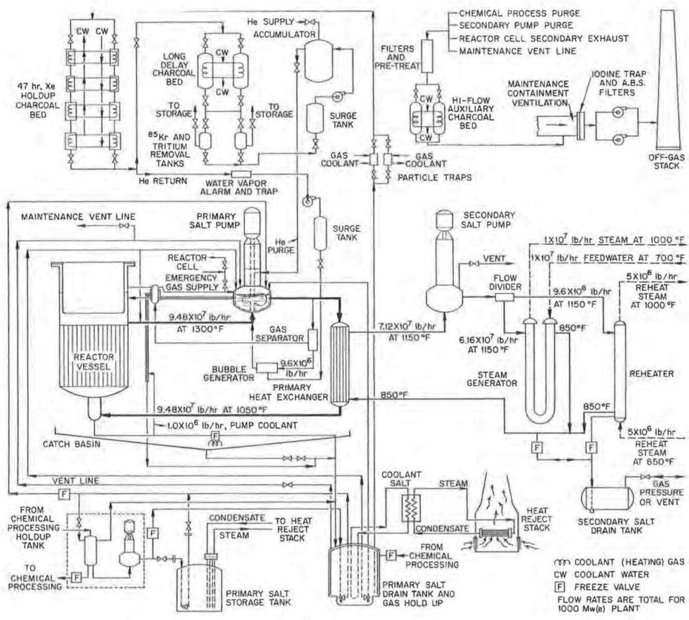  
Fig. 2.1. Flow diagram for MSBR reactor plant. (A) Reactor core, (B) Fuel-salt circulating pumps, (C) Primary heat exchangers, (D) Bubble generators, (E) Gas separators, (F) Off-gas combiner tank, (G) Fuel-salt drain tank and gas holdup volume, (H) Particle traps, (I) Charcoal beds for Xe and Kr holdup, (J) Off-gas cleanup and storage system, (K) Coolant-salt circulating pumps, (L) Steam generators, (M) Steam reheaters.

which would allow the salt to be collected in the fuel-salt drain tank.

A fuel-salt storage tank is provided in addition to the drain tank in the event the latter requires maintenance. The heat-removal system for the storage tank has less stringent requirements and consists of simple U-tubes immersed in the salt. Water is boiled in the tubes and the steam condensed in a closed system by air-cooled coils located in the base of the natural-draft stack. A jet pump in this tank is used to return the fuel salt to the circulation system or to the drain tank.

# 2.2 SECONDARY-SALT CIRCULATION SYSTEM

The secondary system in the MSBR consists of the 4 coolant-salt circulation pumps, 16 steam generators, and 8 reheaters, all located in the steam generator cells, as described in Sect. 13. Coolant-salt storage tanks are located in cells directly beneath the steam generator cells.

The molten sodium fluoroborate coolant salt is circulated at a rate of about $71.2 \times 10^{6} \mathrm{lb/hr}$ , as indicated on flowsheet in Fig. 2.1. The coolant enters the shell side of the primary heat exchangers at $850^{\circ}\mathrm{F}$ and leaves at $1150^{\circ}\mathrm{F}$ . Each of the four coolant-salt

pumps circulates the coolant through four steam generators and two steam reheaters, with the flow proportioned so that outlet steam temperatures of $1000^{\circ}\mathrm{F}$ are obtained from each. The coolant-salt pumps can be operated at variable speed to minimize temperature excursions during power transients, and the steady-state temperature can be adjusted to match station load.

# 2.3 STEAM-POWER SYSTEM FOR THE TURBINE-GENERATOR PLANT

The steam-power system consists of a single 1035-MW(e) gross electrical capacity turbine-generator unit, condensing system, condensate polishing and regenerative feedwater heating systems, steam-turbine-driven main feedwater pumps, feedwater and reheat steam preheating equipment, and associated controls, switchgear, station output transformers, etc. All the steampower system equipment, with the exception of the feedwater and reheat steam preheating facilities, is conventional in present-day power stations and will not be described in detail.

A simplified steam system flowsheet is shown in Fig. 2.2, and some of the principal data are summarized in

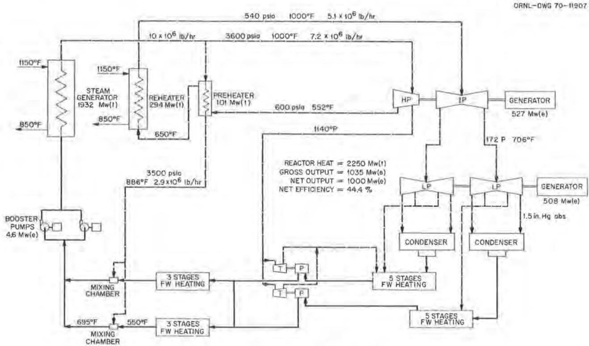  
Fig. 2.2. Simplified MSBR steam system flowsheet.

Table S.1. About $7.15 \times 10^{6}$ lb/hr of steam at 3500 psia and $1000^{\circ}\mathrm{F}$ is delivered to the turbine throttle. The high-pressure turbine exhaust steam is first preheated to $650^{\circ}\mathrm{F}$ and then reheated to $1000^{\circ}\mathrm{F}$ before readmission to the intermediate-pressure turbine. The turbine exhausts at $1\%$ in. $\mathrm{Hg}$ abs to water-cooled condensers. The turbine is indicated on the flowsheet as a cross-compounded unit, but a tandem-compound machine could be used.

Eight stages of feedwater heating are shown, with extraction steam taken from the high- and low-pressure turbines and from the two turbine-driven boiler feed pumps. The 600-psia, $552^{\circ}\mathrm{F}$ steam from the high-pressure turbine exhaust is preheated to about $650^{\circ}\mathrm{F}$ in a steam-to-steam U-shell, U-tube type heat exchanger, with steam (at about 3600 psia and $1000^{\circ}\mathrm{F}$ ) from the steam generator outlet entering the tube side and leaving at about $866^{\circ}\mathrm{F}$ . This exit steam is directly mixed with the high-pressure $551^{\circ}\mathrm{F}$ feedwater leaving the top extraction heater to raise the water temperature to about $695^{\circ}\mathrm{F}$ . Motor-driven canned-rotor centrifugal pumps then boost the water from about 3500 to 3800 psia and $700^{\circ}\mathrm{F}$ before entering the steam generator.

A supercritical-pressure steam system was chosen for the MSBR because the $700^{\circ}\mathrm{F}$ feedwater needed for the steam generator because of the coolant-salt characteristics can be conveniently and efficiently attained through mixing of the supercritical-pressure steam with high-pressure feedwater. Also, the supercritical-pressure system affords a thermal efficiency of $44.4\%$ , as compared with $41.1\%$ for a 2400-psia cycle using a Loeffler boiler principle to attain the $700^{\circ}\mathrm{F}$ feedwater temperature. Further, the capital cost of a supercritical-pressure system for the MSBR is judged to be about the same as, and possibly less than, the cost of the 2400-psia system.

# 2.4 FUEL-SALT DRAIN SYSTEM

The MSBR drain system consists of the drain tank, the drain line and freeze valve, a pump and jet system to return salt to the circulation loop or to the fuel processing plant, the off-gas heat disposal system, an afterheat disposal system, and heater equipment which maintains the salt above its liquidus temperature. The drain system is housed in separate cells apart from the reactor cell.

The drain tank serves several functions, the chief one being a safe storage volume for the fuel salt when it is drained from the circulation loop. A critical mass cannot exist in the tank because of insufficient neutron

moderation, and the afterheat-removal system has assured reliability in that it is independent of the need for mechanical equipment, power supply, or initiating action by the operating personnel. Cell heaters assure that the tank and its contents remain above the salt liquidus temperature of about $935^{\circ}\mathrm{F}$ .

The drain tank serves as a 2-hr holdup volume for the highly radioactive fission product gases after they are separated from the circulating fuel salt in the processing system. Also, the drain tank acts as a sump for the overflow streams from the bowls of the salt-circulation pumps. The small stream of fuel salt which is sent to the fuel-processing cell for removal of fission products, protactinium, excess bred material, and impurities is taken from the drain tank and returned to it after treatment and adjustment of the uranium concentration. An additional use of the drain tank is that its storage volume, which is about $50\%$ greater than the fuel-salt inventory, permits accommodation of some of the coolant salt in the unlikely event that a heat exchanger tube failure and pressure differential reversal permit coolant leakage into the primary system.

The fuel-salt drain tank contains a liner to absorb gamma heat and to form an annular flow passage at the tank wall for about $600\mathrm{gpm}$ of overflow salt from the pump bowls. The salt stream passes along the bottom surface of the top head and down the sides to maintain metal temperatures within the design limits.

A well in the bottom head of the drain tank contains five salt-actuated jet pumps. Four of the jets are provided with salt from the primary pump discharges to actuate the jets and return the overflow salt to the respective circulation systems. Siphon breaks prevent fuel salt from the pump bowl from draining back in the event a jet stops operating. The fifth jet pump is activated by about $100\mathrm{gpm}$ from a separate fuel-salt pump and is used to transfer salt to the fuel-processing cell or to fill the primary-salt circulation loop.

Afterheat released in the drain tank is removed by a natural convection system employing an intermediate heat transport fluid. As shown in Fig. 2.3, $^7\mathrm{LiF - BeF}_2$ coolant salt circulates through U-tubes immersed in the fuel salt to heat exchangers located at the base of a natural-draft stack. There are 40 separate and independent natural-convection circuits to afford a high degree of reliability. The heat exchangers transfer heat from tubes containing the transport salt to water-cooled plates which make no physical contact with the salt tubes. The steam generated in the plates is condensed in finned air-cooled coils in the natural-draft stack.

An alternate drain tank cooling system using NaK as the coolant is described in Sect. 6.4

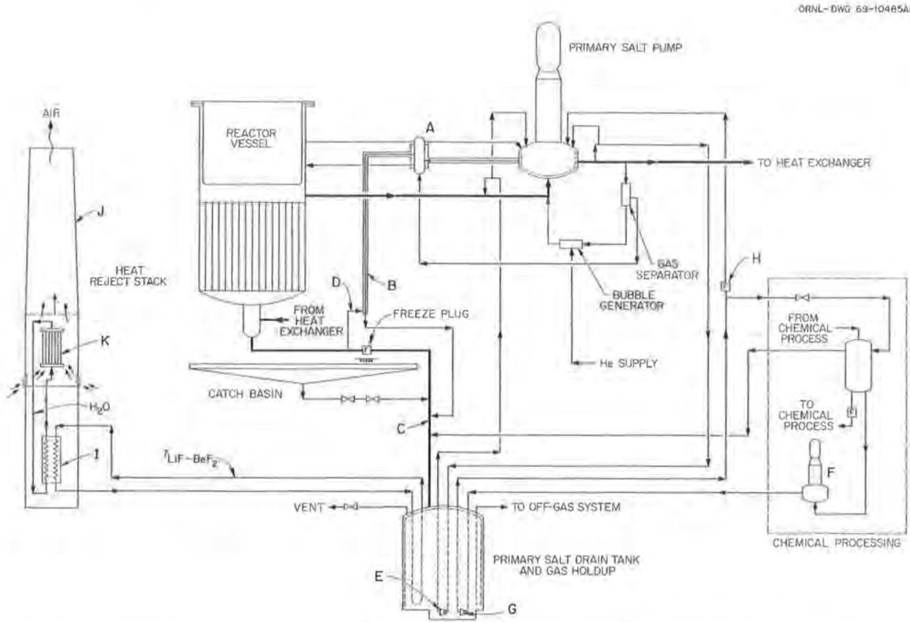  
Fig. 2.3. Simplified flow diagram of primary drain tank and heat removal system using ${}^{7}\mathrm{LiF - BeF_2}$ salt as coolant. (A) Combiner tank for separated gases and overflow salt, (B) Off-gas line with cooling jacket, (C) Fuel-salt drain line, (D) Drain line continuous bleed flow, (E) Jet pumps for returning overflow fuel salt to primary system, (F) Ancillary fuel-salt transfer pump, (G) Jet pump for filling primary system and sending salt to chemical processing, (H) Freeze-plug type valve, (I) ${}^{7}\mathrm{LiF - BeF_2}$ -to- $\mathrm{H}_2\mathrm{O}$ heat exchanger, (J) Natural draft stack, (K) Water-to-air heat exchanger.

# 2.5 OFF-GAS SYSTEM

The off-gases will be held in the fuel-salt drain tank for about 2 hr, during which time a portion of the noble metals will probably deposit on the internal surfaces. Referring to Fig. 2.1, the gases vented from the drain tank pass through particle traps, where remaining particulates are removed before the gases enter the charcoal beds for absorption and 47-hr holdup of the xenon, permitting decay of $97\%$ of the $^{135}\mathrm{Xe}$ . Most of the gas leaving the charcoal bed is compressed for reintroduction into the salt-circulation system at the bubble generators. A small portion of the gas leaving the 47-hr charcoal bed enters the long-delay charcoal bed (about 90-day xenon holdup), the outflow of which passes through tritium and krypton traps before entering a gas storage tank. The gas from this tank is augmented by makeup helium if required and reintro

duced into the circulation system as purge gas for the circulation pumps and at other places where clean helium is needed. The accumulated krypton and tritium are stored in tanks in the waste cell facility.

# 2.6 FUEL-SALT PROCESSING SYSTEM

L.E.McNeese

Breeding with thermal neutrons is economically feasible with a molten-salt reactor because it is possible to process the fluid fuel rapidly enough to keep the neutron losses to protactinium and fission products to a very low level. The equipment used to strip gaseous fission products from the fuel salt was described in Sects. 2.1 and 2.5. The concentrations of protactinium, rare earths, and some other fission products are limited by continuously processing a small stream of the fuel salt in an on-site processing system, described below.

There are several basic processes which could be incorporated in a molten-salt reactor "kidney." The effective cycle times for protactinium and fission product removal assumed in the calculations of breeding performance (Table 3.7) were based on the use of the system described in ref. 1. Recent developments have shown that it is possible to attain the same breeding performance by using a somewhat different processing plant having equipment that should be considerably simpler to develop and operate.[11] The newer, more attractive concept is described here and in Sect. 8.

The flowsheet for the continuous salt-processing system is shown in Fig. 2.4. In essence, the process consists of two parts: (1) removal of uranium and protactinium from salt leaving the reactor and reintroduction of uranium into salt returning to the reactor and (2) removal of rare-earth fission products from the salt.

A small $(0.88\mathrm{-gpm})$ stream of fuel salt, taken from the reactor drain tank, flows through a fluorinator, where

about $95\%$ of the uranium is removed as gaseous $\mathrm{UF}_6$ . The salt then flows to a reductive extraction column, where protactinium and the remaining uranium are chemically reduced and extracted into liquid bismuth flowing countercurrent to the salt. The reducing agent, lithium and thorium dissolved in bismuth, is introduced at the top of the extraction column. The bismuth stream leaving the column contains the extracted uranium and protactinium as well as lithium, thorium, and fission product zirconium. The extracted materials are removed from the bismuth stream by contacting the stream with an $\mathrm{HF - H_2}$ mixture in the presence of a waste salt which is circulated through the hydrofluorinator from the protactinium decay tank. The salt stream leaving the hydrofluorinator, which contains $\mathrm{UF}_4$ and $\mathrm{PaF_4}$ , passes through a fluorinator, where about $95\%$ of the uranium is removed. The resulting salt stream then flows through a tank having a volume of about $130\mathrm{ft}^3$ , where most of the protactinium is held and where most of the protactinium decay heat is removed. Uranium

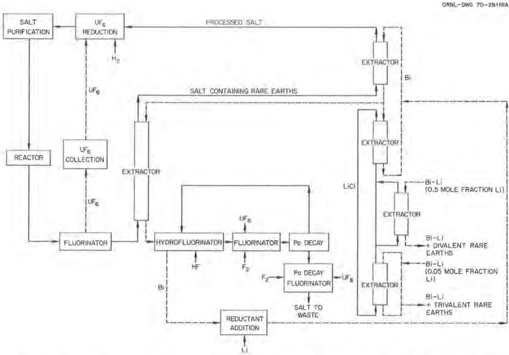  
Fig. 2.4. Flowsheet for continuous salt-processing system for a single-fluid MSBR by fluorination-reductive extraction and the metal-transfer process.

produced in the tank by protactinium decay is removed by circulation of the salt through a fluorinator.

Materials that do not form volatile fluorides during fluorination will also accumulate in the decay tank; these include fission product zirconium and corrosion product nickel. These materials are subsequently removed from the tank by periodic discard of salt at a rate equivalent to about 0.1 ft³/day.

In summary, in the protactinium isolation system, all the uranium that leaves the reactor, plus that produced by decay of the protactinium, appears as $\mathrm{UF}_6$ , whereas the effluent salt from the extraction column carries fission products but no uranium or protactinium.

The rare earths are removed from the salt stream leaving the top of the protactinium extractor by contacting it with a stream of bismuth that is practically saturated with thorium metal. This bismuth stream, with the extracted rare earths, is contacted with an "acceptor salt," lithium chloride. Because the distribution coefficient (metal/salt) is several orders of magnitude higher for thorium than for the rare earths, a large fraction of the rare earths transfer to the LiCl in

this contactor, while the thorium remains with the bismuth. Finally, the rare earths are removed from the recirculating LiCl by contacting it with bismuth streams containing high concentrations of lithium (5 and 50 mole $\%$ ). These materials, containing the rare earths, are removed from the process.

The fully processed salt, on its way back to the reactor, has uranium added at the rate required to maintain or adjust the uranium concentration in the reactor (and hence the reactivity) as desired. This is done by contacting the salt with $\mathrm{UF}_6$ and hydrogen to produce $\mathrm{UF}_4$ in the salt and HF gas.

# 2.7 AUXILIARY AND OTHER SUPPORT SYSTEMS

In addition to the principal systems previously described, the molten-salt reactor complex requires an emergency power system, cell heating systems, coolant-salt storage tanks, and a maintenance and graphite-replacement facility. The steam-power system will require an oil- or gas-fired boiler for preheating the feedwater and the turbine equipment during startup.

# 3. Reactor Primary System

# 3.1 GENERAL DESCRIPTION

# 3.1.1 Design Objectives

The MSBR conceptual design study was concerned with exploring and delineating design problems and with evolving a design which would establish the feasibility of the concept.

The basic objective was to provide the fissile concentration and geometry of graphite and fuel salt to obtain a nuclear heat release of about $2250\mathrm{MW(t)}$ at conditions affording the best utilization of the nation's fuel resources at lowest power cost. A good indicator of the performance of a breeder reactor is the total quantity of uranium ore that must be mined to fuel the industry before it becomes self-sustaining. An index of good performance in a growing reactor industry is $GP^2$ where $G$ is the breeding gain and $P$ is the specific power in megawatts of thermal power per kilogram of fissionable material. This term, the so-called conservation coefficient, was used in nuclear physics optimization studies to determine the dimensions of the reactor core and reflector and the salt-to-graphite ratios, as discussed in more detail in Sect. 3.3.2. (In general, the conditions for the highest value of the fuel conservation coefficient also corresponded with the lowest fuel-cycle cost and lowest overall cost to produce power.)

Neutron fluences and maximum graphite temperatures were kept low enough to provide an estimated core graphite life of about four years. The salt flow through the core passages was designed for each stream to have about the same $250^{\circ}\mathrm{F}$ temperature rise, with the pressure drop due to flow being kept within the head capabilities of a single-stage circulation pump. Cooling was provided for the reactor vessel and other metal parts to keep the temperatures within the tolerances imposed by stress considerations. The design aspects, that the coefficient of thermal expansion of Hastelloy N is about three times that of the core graphite, that the graphite experiences dimensional changes with irradiation, and that the graphite has considerable buoyancy in the fuel salt, were all

accommodated in such a manner as to maintain the core internals in a compact array without significant changes in the fuel-to-graphite ratios and salt velocities, and to prevent vibrations. The salt will be maintained well above its liquidus temperature of $930^{\circ}\mathrm{F}$ , and the salt flow is upward through the core to promote natural circulation. The reactor is capable of being drained essentially free of salt, and afterheat following shutdown can be safely dissipated. The reactor vessel and the reflector graphite are expected to last the life of the plant, but the core was designed to facilitate periodic replacement of the entire assembly.

There are, of course, many possible arrangements for a molten-salt breeder reactor and power station. The concept described here represents one design that appeared feasible; more detailed study and optimization would probably produce a better arrangement.

# 3.1.2 General Description and Design Considerations

# E.S.Bettis

The principal design data are summarized in Table S.1, and more detailed reactor data are given in Table 3.1. The detailed nuclear physics data are listed in Table 3.7. Overall plan and elevation views of the reactor are shown in Figs. 3.1 and 3.2. The Hastelloy N vessel material and the moderator and reflector graphite are described in Sects. 3.2.3 and 3.2.4.

The reactor vessel is about 22 ft in diameter and 20 ft high and is designed for 75 psig. It has 2-in.-thick walls and 3-in.-thick dished heads at the top and bottom. Salt at about $1050^{\circ}\mathrm{F}$ enters the central manifold at the bottom through four 16-in.-diam nozzles and flows through the lower plenum and upward through the passages in the graphite to exit at the top at about $1300^{\circ}\mathrm{F}$ through four equally spaced nozzles which connect to the 20-in.-diam salt-suction lines leading to the circulation pumps. The 6-in.-diam fuel-salt drain line connects to the bottom of the reactor vessel inlet manifold.

Since graphite experiences dimensional changes with neutron irradiation, the reactor core must be designed

Table 3.1. Principal reactor design data   

<table><tr><td>Reactor vessel inside diameter, ft</td><td>22.2</td></tr><tr><td>Vessel height at center,a ft</td><td>20</td></tr><tr><td>Vessel wall thickness, in.</td><td>2</td></tr><tr><td>Vessel head thickness, in.</td><td>3</td></tr><tr><td>Vessel design pressure, psig</td><td>75</td></tr><tr><td>Number of core elements</td><td>1412</td></tr><tr><td>Length of zone I portion of core elements, ft</td><td>13</td></tr><tr><td>Overall length of core elements (approx), ft</td><td>15</td></tr><tr><td>Distance across flats, zone 1,b ft</td><td>14</td></tr><tr><td>Outside diameter of undermoderated region, zone II, ft</td><td>16.8</td></tr><tr><td>Overall height of zone I plus zone II,b ft</td><td>18</td></tr><tr><td>Radial distance between reflector and core, zone II,b in.</td><td>2</td></tr><tr><td>Radial thickness of reflector, in.</td><td>30</td></tr><tr><td>Average thickness of axial reflectors (approx), in.</td><td>22</td></tr><tr><td>Volume fraction salt in zone Ib</td><td>0.13</td></tr><tr><td>Volume fraction salt in zone IIb</td><td>0.37</td></tr><tr><td>Core power density, kW/liter</td><td></td></tr><tr><td>Average</td><td>22.2</td></tr><tr><td>Peak</td><td>70.4</td></tr><tr><td>Core fuel-salt power density, kW/liter</td><td></td></tr><tr><td>Average</td><td>74</td></tr><tr><td>Peak</td><td>492</td></tr><tr><td>Core graphite power density, kW/liter</td><td></td></tr><tr><td>Average</td><td>2.3</td></tr><tr><td>Peak</td><td>6.3</td></tr><tr><td>Core thermal neutron flux, neutrons cm-2sec-1</td><td></td></tr><tr><td>Average</td><td>2.6 × 1014</td></tr><tr><td>Peak</td><td>8.3 × 1014</td></tr><tr><td>Maximum graphite damage flux (&gt;50 keV), neutrons cm-2sec-1</td><td>3.5 × 1014</td></tr><tr><td>Graphite temperature at maximum graphite damage flux region, °F</td><td>1307</td></tr><tr><td>Estimated useful life of graphite, years</td><td>4</td></tr><tr><td>Total weight of graphite in reactor,c lb</td><td>669,000</td></tr><tr><td>Weight of removable core assembly,d lb</td><td>600,000</td></tr><tr><td>Maximum flow velocity in core, fps</td><td>8.5</td></tr><tr><td>Pressure drop due to salt flow in core, psi</td><td>18</td></tr><tr><td>Volume of fuel salt, ft3</td><td></td></tr><tr><td>Total in core (see Table 3,2)</td><td>1074</td></tr><tr><td>Total in primary system</td><td>1720</td></tr><tr><td>Fissile-fuel inventory of reactor plant and fuel processing plant, kg</td><td>1470</td></tr><tr><td>Thorium inventory, kg</td><td>68,000</td></tr><tr><td>Breeding ratio</td><td>1.06</td></tr><tr><td>Yield,e %/year</td><td>3.3</td></tr><tr><td>Doubling time,e compounded continuously, years</td><td>21</td></tr></table>

${}^{a}$ Does not include upper extension cylinder.   
See Table 3.3 for definition.   
cDoes not include 60,000 lb in alternate head assembly.   
${}^{a}$ Hoist load to be lifted into transport cask.   
eAt $80\%$ plant factor.

for periodic replacement. The design chosen for the reference MSBR has an average core power density of 22.2 W/cc, which, based on the irradiation behavior of materials presently available, indicates a useful core

graphite life of about four years. It was decided to remove and install the core graphite as an assembly rather than by individual pieces, since it appeared that this method could be performed quickly and with less likelihood of escape of radioactivity. Handling the core as an assembly also permits the replacement core to be carefully preassembled and tested under shop conditions. (Maintenance procedures are described in Sect. 12.)

The reflector graphite will normally last the 30-year life of the plant. The radial reflector pieces are installed inside the vessel with no special provisions made for replacement. The bottom axial reflector will be replaced each time a new core is installed, since this is a more convenient design arrangement. The top axial reflector is attached to the removable top head, but since two heads are provided, which will be alternated each time the core is replaced, this graphite should last the life of the plant without replacement.

The reactor has a central zone in which $13\%$ of the volume is fuel salt, an outer, undermoderated region having $37\%$ salt, and a reflector region containing about $1\%$ salt. There is a 2-in.-wide annulus which is $100\%$ salt between the removable core and the reflector blocks to provide clearance when removing and inserting a core assembly. The volumes and weights of salt and graphite in the various portions of the reactor are summarized in Table 3.2. For convenience, a terminology for reactor zones and regions was established, as shown in Table 3.3, and these designations will be used in the descriptions to follow.

The central portion, zones I-A and I-B, is made up of 4-in. $\times$ 4-in. $\times$ 13-ft-long graphite elements, as indicated in Figs. 3.1 and 3.2 and shown in more detail in Figs. 3.3, 3.4, and 3.27. The elements will be manufactured by an extrusion process and will require only relatively minor machining. After fabrication, the pieces may be treated with a sealing process to increase the resistance to gas permeation, as discussed in Sect. 3.2.3. Holes through the centers and ridges on the sides of the graphite elements separate the pieces, furnish flow passages, and provide the requisite salt-to-graphite ratios. The interstitial flow passages have hydraulic diameters approximately equal to the central hole. A more detailed discussion of the thermal and hydraulic considerations in design of the elements is given in Sect. 3.4.

The fission energy release in the reactor is highest at the center of the core, with the power density (in kilowatts per liter) falling off approximately as a cosine function of the core radius. By varying the salt velocity from 8 fps at the center to about 2 fps near the periphery, a uniform temperature rise of $250^{\circ}\mathrm{F}$ is

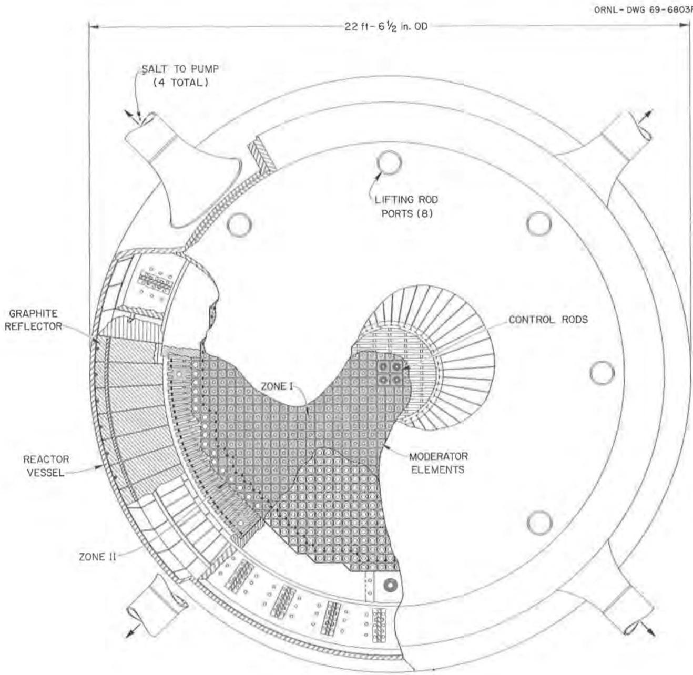  
Fig. 3.1. Plan view of MSBR vessel.

obtained. The salt velocities are determined by the hole size, by the flow passage dimensions between the graphite elements, and by orificing at the ends of the flow channels. An element hole size of 0.6 in. ID is used in the most active portion of the core, and a 1.347-in.-ID hole is used in the outer portion. In the latter case the size of the interstitial passages is reduced to maintain the desired $13\%$ salt volume. The 0.6-in. hole size was selected for the inner region, zone I-A, primarily on the basis that a smaller opening would

present significantly more difficulty in sealing the graphite during manufacture of the elements. The ends of the graphite elements are machined to a cylindrical shape for about 10 in. on each end to provide the undermoderated $37\%$ salt region at the top and bottom of the reactor. The top of each element is also machined, as shown in Fig. 3.4, to provide a 3-in.-deep outlet plenum at the top of the core to direct the salt flow to the four exit nozzles of the vessel. Under the effects of buoyancy and drag forces, the $1\frac{3}{4}$ -in.-OD

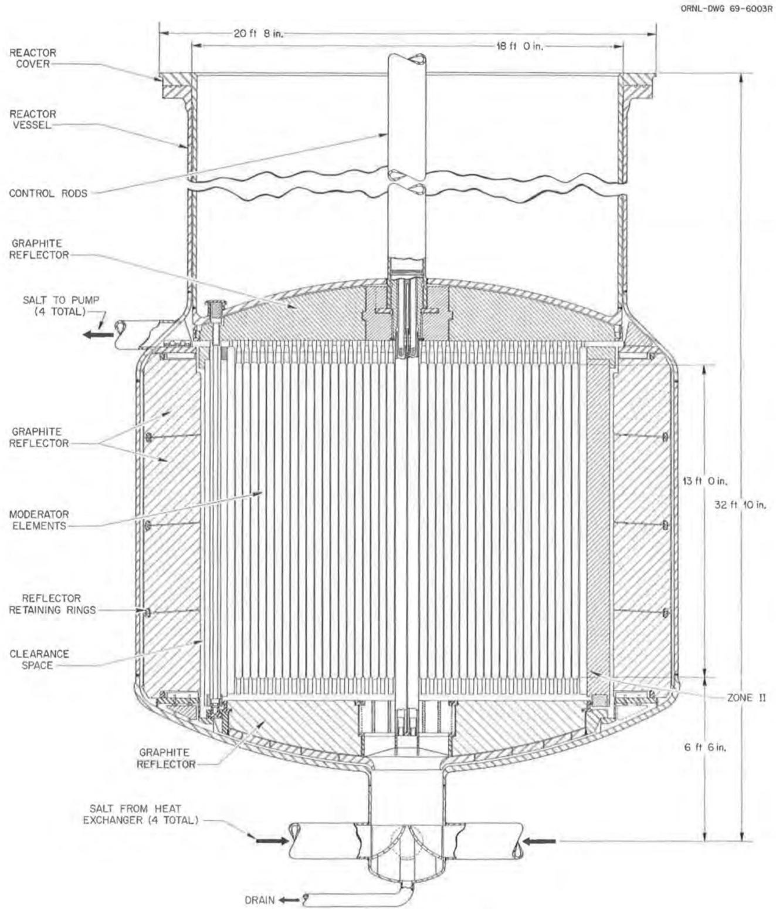  
Fig. 3.2. Sectional elevation of MSBR vessel.

Table 3.2. Volumes and weights in the MSBR core and reflector   

<table><tr><td></td><td>Percent salt</td><td>Salt volume (ft3)</td><td>Graphite weight (lb)</td></tr><tr><td>Core, zone I (14 ft octagon, 13 in. high)</td><td>13</td><td>288</td><td>221,400</td></tr><tr><td>Lower and upper axial, zone II, 9 in. thick, top and bottom</td><td>37</td><td>94.5</td><td>18,500</td></tr><tr><td>Upper plenum, 3 in. thick, top only</td><td>85</td><td>36.2</td><td>700</td></tr><tr><td>Lower plenum, 2½ in. thick, bottom</td><td>100</td><td>35.4</td><td></td></tr><tr><td>Radial, zone II, 16.8 ft. diam × 14.5 ft high</td><td>37</td><td>282</td><td>55,000</td></tr><tr><td>Annulus, 17.2 ft diam × 15 ft high (2-in. gap)</td><td>100</td><td>132</td><td></td></tr><tr><td>Salt inlet (lower section), 3.5 ft diam × 1.2 ft high.</td><td>98</td><td>11</td><td></td></tr><tr><td>Salt inlet (upper section), 4 ft diam × 1.2 ft high</td><td>50</td><td>9</td><td>900</td></tr><tr><td>Lower vessel coolant passage, ½ in.</td><td>100</td><td>8.2</td><td></td></tr><tr><td>Radial vessel coolant plenum</td><td>62.5</td><td>46.5</td><td>3,400</td></tr><tr><td>Radial vessel coolant, ¼-in. gap</td><td>100</td><td>21.2</td><td></td></tr><tr><td>Radial reflector, 17.2 ft high × 22.2 ft OD</td><td>1.2</td><td>26.9</td><td>254,400</td></tr><tr><td>Axial reflector, bottom</td><td>3</td><td>14.7</td><td>54,800</td></tr><tr><td>Axial reflector, top</td><td>4</td><td>14.7</td><td>54,800</td></tr><tr><td>Control rod entrance thimble</td><td></td><td>2.9</td><td></td></tr><tr><td>Outlet passage</td><td></td><td>42.1</td><td>5,400</td></tr><tr><td>Annulus between upper head flange extension and vessel, ½-in. gap</td><td>100</td><td>8.7</td><td></td></tr><tr><td>Total</td><td></td><td>1074</td><td>669,000</td></tr></table>

neck of each prism is pressed firmly against the top reflector blocks. When the reactor is empty of salt the graphite rests on the Hastelloy N support plate at the bottom of the vessel.

Four 6- by 6-in. graphite elements with a 4-in.-diam hole are shown installed axially at the center line of the reactor in Figs. 3.1 and 3.2. More rods may be required, however, as discussed in Sect. 10.2. Two or more of the holes receive relatively simple graphite control rods which, on insertion, increase the reactivity by displacing some of the fuel salt. Since these rods have a pronounced tendency to float in the salt, they are self-ejecting with respect to decreasing the reactivity, even if the graphite should fracture. The other two holes are for neutron-absorbing rods used only for reactor shutdown. These 6- by 6-in. elements are retained at the bottom by fitting them into a Hastelloy N enclosure in the bottom of the bottom-head salt-distribution assembly. Since the elements are restrained

in position, they serve as a base around which the core elements can be stacked when the core is assembled. A jig is used to hold the elements until the entire core is assembled and the restraining rings are in place.

The undermoderated zone with $37\%$ salt, or radial "blanket," surrounding the more active portion serves to reduce neutron leakage from the core. This zone is made up of two kinds of elements: 4-in. $\times$ 4-in. $\times$ 13- ft-long elements like those in the core except for a larger hole size (2.581 in. ID) (Fig. 3.5), and 2-in.-thick $\times$ 13-ft-long slats arranged radially around the core, as shown in Fig. 3.1. The slats average about 10.5 in. in width, the dimension varying to transform the generally octagonal cross-sectional shape of the core element array into a circular one. The slats also provide stiffness to hold the inner core elements in a compact array as dimensional changes occur in the graphite. Dowel pins separate the slats to provide flow passages, and vertical elliptical graphite sealing pins at the outer periphery of the array isolate, to a large extent, the salt flowing through the core from that flowing through the reflector region. The slabs are separated from each other by graphite buttons located at approximately 18-in. intervals along the length. Each slab has a groove running axially about $1\frac{1}{2}$ in. from the outside edge to accommodate the long elliptical-shaped graphite dowels which are inserted between adjacent slabs to isolate the slab salt flow from the flow in the previously mentioned 2-in. annulus. There are similar elliptical-shaped dowels running axially between the prisms of the outer row of the core to perform the same function, in that they isolate the flow in zone I from that in zone II.

There are eight graphite slabs with a width of 6 in. in zone II, one of which is illustrated in Fig. 3.3. The holes running through the centers are for the core lifting rods used during the core replacement operations mentioned above. These holes also allow a portion of the fuel salt at essentially the reactor inlet temperature of $1050^{\circ}\mathrm{F}$ to flow to the top of the vessel for cooling the top head and axial reflector.

Figure 3.3 also shows the previously mentioned 2-in.-wide annular space between the removable core graphite in zone II-B and the permanently mounted reflector graphite. This annulus, which is $100\%$ fuel salt, provides clearances for moving the core assembly, helps absorb the out-of-roundness dimensions of the reactor vessel, and serves to reduce the damage flux arriving at the surface of the graphite reflector blocks.

Since the reflector graphite is in a position of lower neutron flux, it does not have to be sealed to reduce xenon penetration. Also, because of the lower neutron dose level, it does not have to be designed for

Table 3.3 Terminology used to designate regions and zones of reactor   

<table><tr><td>Term used</td><td>Region or zonea</td></tr><tr><td>Core</td><td>This includes the 13, 37, 85, and 100% salt regions out to the inner face of the reflector but does not include the reflector</td></tr><tr><td>Zone Ib (zone I-A, zone I-B, etc.)</td><td>~13% salt region of core</td></tr><tr><td>Zone IIc (zone II-A, zone II-B, etc.)</td><td>~37% salt region of core</td></tr><tr><td>Annulus</td><td>~100% salt annular region of core between zone II and radial reflector</td></tr><tr><td>Lower plenum</td><td>~100% salt region of core between zone II and lower axial reflector</td></tr><tr><td>Upper plenum</td><td>~85% salt region of core between zone II and upper axial reflector</td></tr><tr><td>Radial reflector</td><td>Graphite region surrounding core in radial direction</td></tr><tr><td>Upper axial reflector</td><td>Graphite region above core</td></tr><tr><td>Lower axial reflector</td><td>Graphite region below core</td></tr><tr><td>Radial vessel coolant passage</td><td>Gap between radial reflector and vessel wall</td></tr><tr><td>Upper vessel coolant passage</td><td>Gap between upper axial reflector and upper vessel head</td></tr><tr><td>Lower vessel coolant passage</td><td>Gap between lower axial reflector and lower vessel head</td></tr><tr><td>Inlet</td><td>Salt inlet passage in lower vessel head and lower axial reflector</td></tr><tr><td>Outlet passage</td><td>Salt outlet passage in upper axial reflector</td></tr></table>

${}^{a}$ See Figs. 3.1,3.3,and 3.26.   
$^{b}$ I-A, I-B, etc., are used to designate different element shapes in a zone.   
The terms "radial zone II," "upper axial zone II," and "lower axial zone II" should be used as necessary.

replacement during the reactor lifetime. The reflector is comprised of molded graphite blocks which require only minor machining operations to fabricate. The radial reflector graphite is made up of slightly wedgeshaped blocks to provide a reflector about $2\frac{1}{2}$ ft thick. The blocks are about 10 in. wide at the vessel wall, about 9 in. wide at the inner end, and about 43 in. high and are assembled in four layers. Hastelloy N axial ribs, indicated in Fig. 3.3, provide a $\frac{1}{4}$ -in. standoff space from the vessel wall and also align the reflector blocks together in the vertical direction. Fuel salt from the reactor inlet plenum flows upward through this vertical space to cool the vessel wall and the outer portion of the reflector graphite.

In addition to the axial flow of salt for cooling the radial reflector graphite, an inward flow of fuel salt is maintained by 1-in.-OD graphite pins, or dowels, which are inserted in the reflector pieces to hold them apart. The salt flow passages are about 0.05 in. wide in the cold condition and widen to about 0.1 in. at operating temperature. Slotted Hastelloy N orifice plates are set

into the reflector graphite at the outer wall to distribute the radial flow of salt between the top and bottom passages to provide more uniform cooling in the reflector. About $1\%$ of the reflector volume is fuel salt. All the radial flow channels slope downward toward the vessel wall to allow the salt to drain when the system is emptied.

Since graphite has about one-third the thermal coefficient of expansion of Hastelloy N, the clearances between blocks will tend to increase as the system is heated to operating temperature. Even distribution of these clearances is maintained by restraining lateral shifting of the graphite. Each reflector block in the bottom layer of graphite has a shallow radial groove milled for about 18 in. in the bottom center. These grooves fit over radial webs welded to the bed plate on which the reflector blocks are stacked. The webs maintain each block at a given position relative to the metal bed plate as the plate expands. The upper layers of radial reflector blocks are forced to maintain registry with the bottom keyed block by the previously

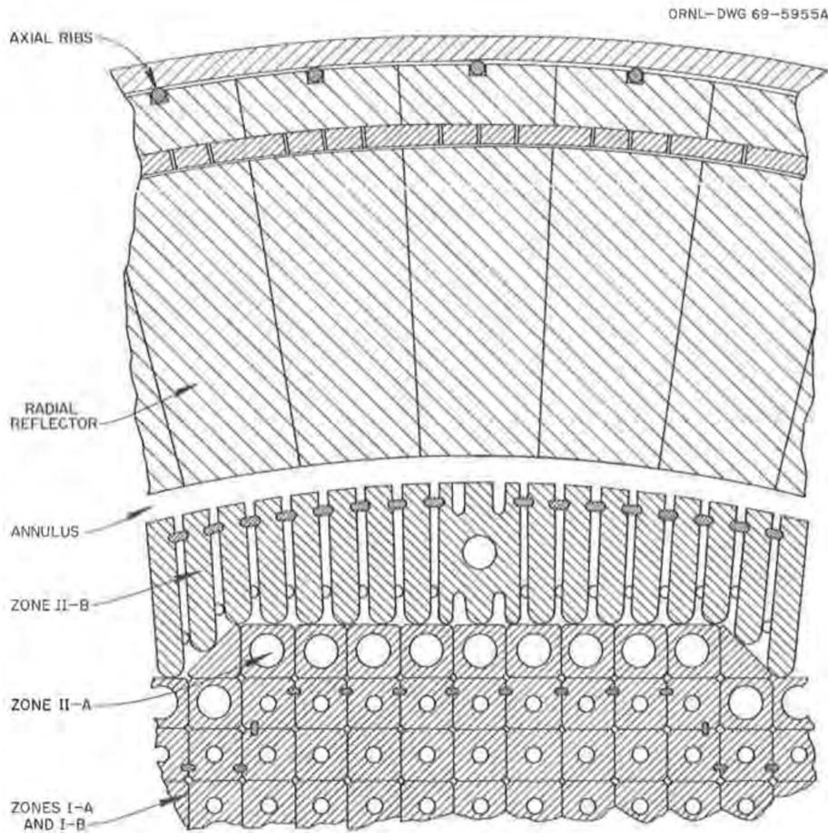  
Fig. 3.3. Detailed plan view of graphite reflector and moderator elements.

mentioned Hastelloy N axial ribs, which also provide the cooling gap between the blocks and the vessel wall. The radial reflector blocks are pushed outward against the spacer ribs as the vessel expands by Hastelloy N hoops inserted in circumferential slots at each layer of blocks in the reflector as indicated in Fig. 3.2. The rings or hoops expand at the same rate as the vessel and keep the reflector blocks pushed outward to follow the vessel wall.

Since the radial blocks on the top layer are wedge shaped and there is not room to lower the last block into place from above, two of the top-layer blocks are split wedges which form a rectangular space into which a block can be moved laterally to complete the assembly. After all reflector pieces have been put in place, a segmented metal retainer plate is put on top of the top layer and bolted to gussets which are attached to the overhanging vessel wall. This retainer plate prevents the reflector from floating when the reactor is filled with salt.

The axial reflectors at top and bottom are made up of wedge-shaped pieces of graphite, the inner end being about 2 in. wide and the end at the outer circumference being about 16 in. wide. In addition, because of the dished heads on the vessel, the wedge-shaped pieces are about 30 in. thick at the center and about 15 in. thick at the outer edge. The top head of the vessel (and its alternate) contains a permanently installed axial reflector assembly supported in the manner indicated in Fig. 3.2. The lower axial reflector graphite is renewed with each core, since it forms the base upon which a new core is assembled. A support structure around the bottom inlet supports the bottom graphite, and the axial reflector assembly is prevented from floating in the fuel salt by the weight of the 3-in.-thick Hastelloy N inner head (core support plate) to which it is attached.

A flow of fuel salt is provided for cooling the axial reflectors in much the same manner as for the radial reflector graphite. Salt for the lower reflector taken from the reactor inlet flow is used to cool both the

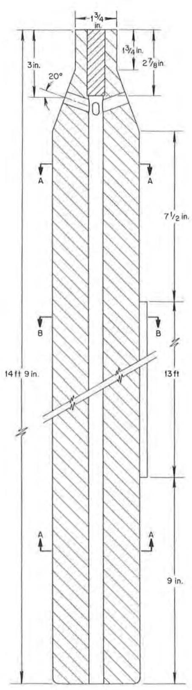

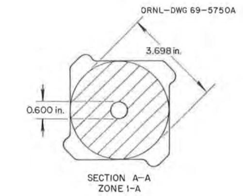

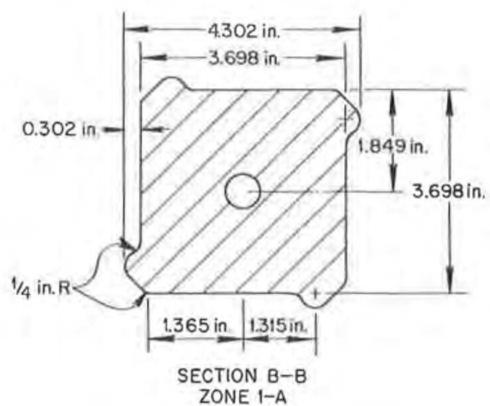

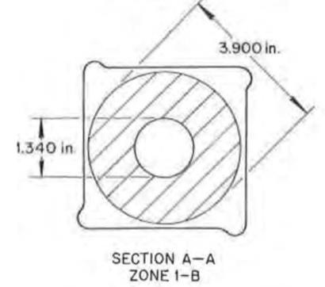

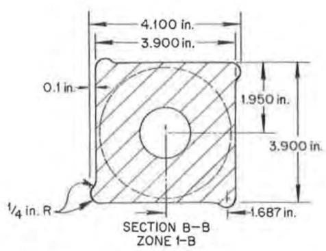  
Fig. 3.4. Graphite moderator elements for zone I.

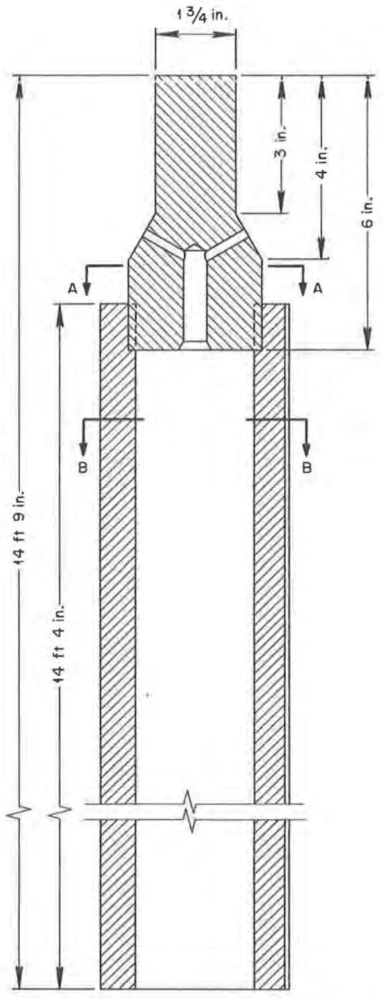

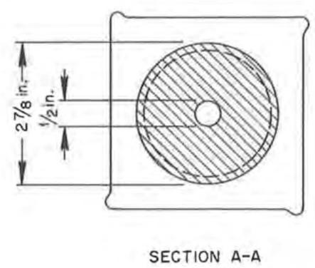

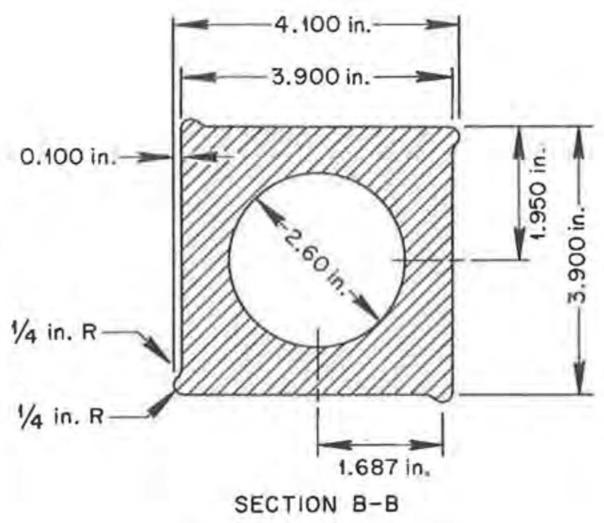  
Fig. 3.5. Graphite moderator elements for zone II.

lower head of the vessel, the inner head (core support plate), and the axial reflector graphite. The inner head is provided with standoffs to permit salt to flow between it and the bottom head of the vessel. Holes through the inner head allow some salt to flow upward through passages between the bottom axial reflector pieces. The lower passage between the bottom heads also supplies the salt which flows upward at the wall to cool the vessel and the radial reflector graphite. Fuel salt for cooling the top head and upper axial reflector flows upward through the control rod region at the center of the core and through the core lifting rod holes in zone II, as shown in Fig. 3.1 and described below. This salt is initially at near the inlet salt temperature of about $1050^{\circ}\mathrm{F}$ and, after absorbing the heat in the upper head and graphite, it leaves the reactor with the exit salt flow.

The top head of the reactor vessel is flanged to facilitate access to the core. The flange is located several feet above the top dished head for better accessibility and a lower radiation and temperature environment. For the core removal and replacement operations, the core is temporarily attached to the top head and axial reflector and the entire assembly moved as a unit. To accomplish this, eight seal-welded flanged openings in the top head of the reactor vessel give access to vertical holes in the graphite core structure for insertion of $2^{1/2}$ -in.-diam molybdenum lifting rods which attach by a ball latch to the forged support ring at the bottom of the reactor core, as shown in Figs. 3.6 and 3.7. Molybdenum was selected for the rod material because of its strength at elevated temperatures, it being anticipated that the core temperature would increase above its average $1100^{\circ}\mathrm{F}$ operating temperature during the transfer operation. The ball latch mechanism is activated from above by a push rod running inside the length of the lifting rods. An enlarged section at the top of each rod engages the top head to clamp the core and head together. The rods are used to lift the entire core assembly into the transport cask, in which it is then moved to the storage cell for eventual core disassembly and discard into the waste cell. The core assembly is about 16 ft in diameter and weighs about 240 tons.

The reactor vessel is supported from the top by an extension of the outer wall which carries a large flange at the top (see Figs. 3.2 and 12.2) that rests on the reinforced concrete roof structure. This cylindrical piece extends about 15 ft above the top of the reactor vessel and has walls 2 in. thick. The top head of the reactor vessel also carries a cylindrical extension with a flange at the top to mate with the vessel flange. The flanged joint is thus located outside the high

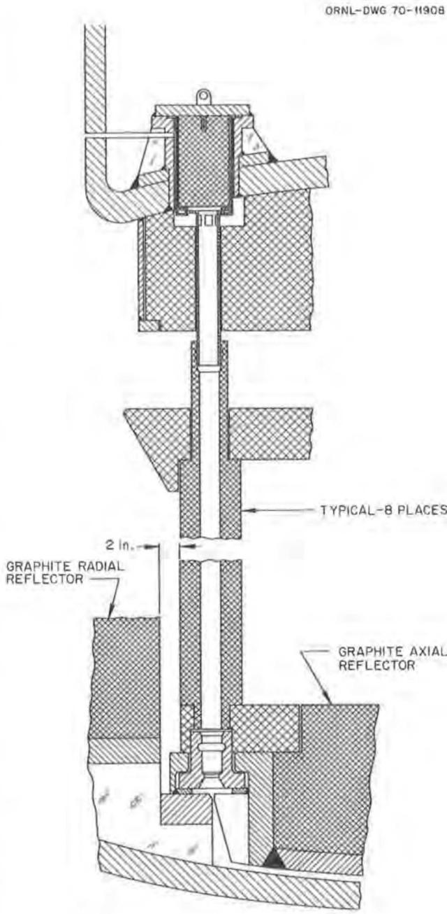  
Fig. 3.6. Core-lifting rod access holes.

temperature region of the reactor cell, is elevated above the maximum salt level, and is not subjected to high temperature gradients or strong irradiation levels. Double metal gaskets with a leak detection system are used in the joint. The flanges are held together by clamps, with the bolting readily accessible from the operating floor level. It may be noted that with this arrangement the weight of the roof plugs augments the bolting in clamping the flanges together.

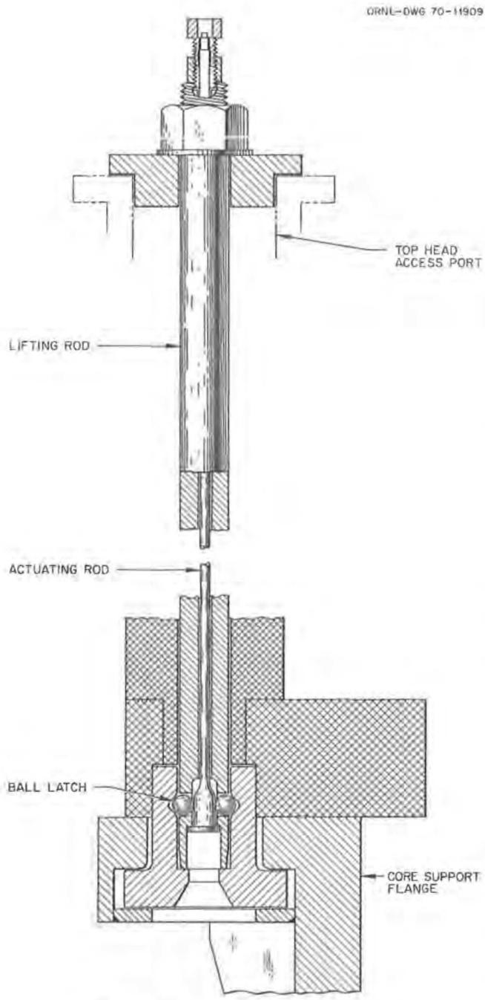  
Fig. 3.7. Reactor core-lifting rod assembly.

As previously mentioned, a second reactor vessel top head and its cylindrical extension piece will be required in order to assemble a new reactor core prior to the core replacement. After each use and a suitable decay time, the top head will be reclaimed for the next core replacement operation. The new core will be assembled under shop conditions in a "clean room" located outside the MSBR containment. The core will be

erected on a new Hastelloy N support plate which has been provided with new graphite lower axial reflector blocks. When all the elements are in place in the octagonal array, a segmented graphite band is installed around the top head and bottom to hold them in place, as indicated in Fig. 3.2. After assembly of the core is complete, it is moved through the gas lock into the containment. The reactor top head and top axial reflector assembly, which has been cleaned and inspected after previous use, is now attached to the new core with the previously mentioned tie rods. After the spent reactor core is removed from the vessel, as described above, the replacement assembly can be lowered into place, the tie rods removed, and the rod access port and top head flanges sealed. Maintenance operations are described in more detail in Sect. 13.

# 3.2 SPECIAL MATERIALS

The fuel and coolant salts, the reactor graphite, and the modified Hastelloy N are special MSBR materials which have been studied and developed at ORNL in a program that started over 15 years ago. The background information and documentation supporting this area of the MSBR design study are far too extensive to be reviewed here. In general, each of the materials has been investigated sufficiently to give confidence that their use, within the limits prescribed, is feasible and practical in the MSBR. Selected physical properties of the four materials are listed in Table S.1, and some general characteristics, as specifically related to the MSBR design study, are briefly discussed below.

# 3.2.1 Fuel Salt

The fuel salt selected for use in the MSBR is ${}^{7}\mathrm{LiF - BeF}_2\mathrm{-ThF}_4\mathrm{-UF}_4$ (71.7-16-12-0.3 mole %). The lithium is enriched to $99.995\%$ ${}^{7}\mathrm{Li}$ . In brief, the fuel salt melts at about $930^{\circ}\mathrm{F}$ and has a low vapor pressure at operating temperatures. It has low thermal-neutron capture cross sections and is stable throughout the proposed range of application. With a viscosity about twice that of kerosene, a volumetric heat capacity about the same as that of water, and a thermal conductivity more than twice that of water, it has adequate heat transfer characteristics and a reasonable pressure drop due to flow. It is compatible with the materials in the system.

In selecting a fuel salt for the MSBR it was recognized that the fuel salt must consist of elements having low capture cross sections for neutrons typical of the chosen energy spectrum. The fuel must dissolve more than the critical concentrations of fissionable material

$(^{235}\mathrm{U},^{233}\mathrm{U},$ or ${}^{239}\mathrm{Pu}^{\ast})$ and high concentrations of fertile material $(^{232}\mathrm{Th})$ at temperatures well below $1050^{\circ}\mathrm{F}$ . The mixture must be thermally stable, and its vapor pressure needs to be low in the operating temperature range of 1050 to $1300^{\circ}\mathrm{F}$ . It must possess heat transfer and hydrodynamic properties adequate for service as a heat-exchange fluid. It must be nonaggressive toward the materials of construction, notably the Hastelloy N and the graphite. The fuel salt must be stable toward reactor irradiation, must be able to survive fissioning of the uranium or plutonium, and must tolerate fission product accumulation without serious deterioration of its useful properties. It must be

*Plutonium, as $^{239}\mathrm{PuF}_3$ , could be used instead of $^{233}\mathrm{U}$ or $^{235}\mathrm{U}$ for the initial fissile loading, and there may be economic advantages to doing so for the nuclear startup and shakedown runs on an MSBR station. (The molten-salt reactor could not breed on the $^{238}\mathrm{U}$ - $^{239}\mathrm{Pu}$ cycle, however, because of plutonium's low value of $\eta$ for thermal neutrons.)

capable of being processed for turnaround of unburned fissile material, effective recovery of bred fissile material, and removal of fission product poisons, all with sufficient economy to assure a low fuel-cycle cost.

As discussed by Grimes,10 fluorides are the only salts with acceptable absorption cross sections and the requisite stability and melting temperatures. Both uranium tetrafluoride $(\mathrm{UF}_4)$ and thorium tetrafluoride $(\mathrm{ThF_4})$ are sufficiently stable, and, fortunately, their relatively high melting temperatures are markedly depressed by use of diluent fluorides. The preferred diluents are $\mathrm{BeF_2}$ and $^7\mathrm{LiF}$ .The phase behavior of systems based on these diluents has been examined in detail,14 and the system $\mathrm{LiF - BeF_2 - ThF_4}$ is shown in Fig.3.8.

Successful operation of the MSRE lent confidence that oxide contamination of the fuel system can be kept to adequately low levels and that $\mathrm{ZrF_4}$ (5 mole %), used as a constituent of the fuel in the experimental

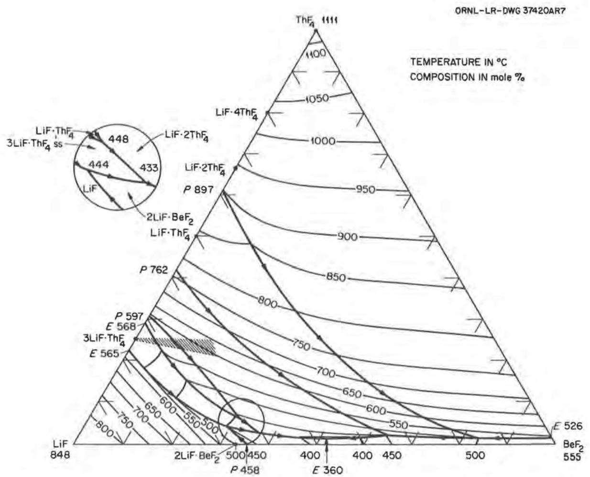  
Fig. 3.8. The system $\mathsf{LiF - BeF}_2\mathsf{-ThF}_4$

reactor to preclude inadvertent precipitation of $\mathrm{UO}_2$ would not be needed in the MSBR.

The single-fluid MSBR requires a concentration of $\mathrm{ThF_4}$ near 12 mole $\%$ and criticality studies indicate that the $^{233}\mathrm{UF}_4$ concentration should be about $< 0.3$ mole $\%$ The ratio of $^7\mathrm{LiF}$ to $\mathrm{BeF_2}$ should be high to keep the viscosity low. To maintain the liquidus temperature below about $932^{\circ}\mathrm{F}$ (for a melt with $12\%$ $\mathrm{ThF_4}$ ), the $\mathrm{BeF_2}$ concentration must be in the range of 16 to $25\%$ . The most likely choice for the MSBR fuel salt composition was thus $^7\mathrm{LiF - BeF_2 - ThF_4 - UF_4}$ (71.7-16-12-0.3 mole $\%$ ). This salt is undamaged by radiation and is completely stable at operating conditions.

As indicated in Table D.2 of Appendix D, the estimated cost of the primary salt for the MSBR reference design is about $13 per pound for the$ \mathrm{LiF - BeF_2}$ carrier salt; about $9 per pound for the $\mathrm{LiF - BeF_2 - ThF_4}$ barren salt, and about $57 per pound for the enriched fuel salt, based on a fissile material cost of $13 per gram. The total cost of the primary salt inventory in the MSBR reactor and chemical treatment plant systems is thus about $23 million.

# 3.2.2 Coolant Salt

The MSBR uses a circulating secondary fluid to transport heat from the fuel salt to the steam generators and reheaters. This coolant must be stable at all temperatures up to $1300^{\circ}\mathrm{F}$ , must not be damaged by radiation (including the delayed-neutron emissions in the primary heat exchangers), must be compatible with other materials, must have acceptable heat transfer and hydraulic properties, and, because of the relatively large volume required, must be reasonable in cost. The coolant selected for the reference design is a eutectic sodium fluoroborate salt having the composition $\mathrm{NaBF_4 - NaF}$ (92-8 mole $\%$ ).Pertinent physical properties are listed in Table S.1.

The $\mathrm{NaBF_4}$ NaF system is shown in Fig. 3.9. The eutectic has a vapor pressure at $1150^{\circ}\mathrm{F}$ of about 252 mm Hg and could operate with a dilute mixture of $\mathrm{BF}_3$ in helium as the cover gas. It has a melting temperature of about $725^{\circ}\mathrm{F}$ and has a viscosity, volumetric heat capacity, and thermal conductivity properties close to those of water. The salt mixture is stable in the system environment. If the sodium fluoroborate is free of contaminants and water, test loop experience indicates that the corrosion rate of Hastelloy N at the reactor system conditions will probably be less than 0.2 mil/year. Commercial grades may have acceptable purity and would have a modest cost of less than 50 cents/lb.

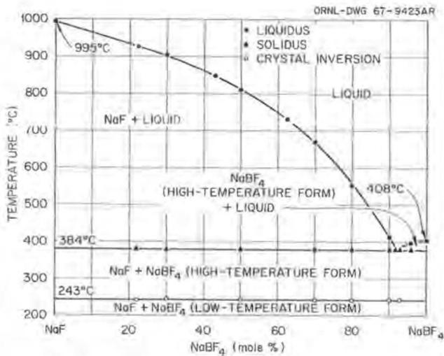  
Fig. 3.9. MSBR coolant salt - The system NaF-NaBF4.

The choice of sodium fluoroborate was based on a survey of possible molten-salt reactor coolants by McDuffie et. al.15 Consideration of a number of coolants has been previously reported1,2,9 and summarized by Grimes.10 The remaining uncertainties and problems in the use of sodium fluoroborate are described in Chap. 16, along with a discussion of alternative coolants and the effect their use would have on the MSBR design.

# 3.2.3 Reactor Graphite

W.P.Eatherly C.R.Kennedy

3.2.3.1 Introduction. Graphite is the principal material other than salt in the core of a molten-salt reactor. As such, its behavior under radiation damage is of considerable significance. Prior to 1966, data on graphite behavior at elevated temperatures and high fluences were scattered, and there was good reason to believe the effects of radiation damage in graphite were self-limiting and would saturate at exposures of the order $2 \times 10^{22}$ neutrons/cm $^2$ at $700^{\circ}\mathrm{C}$ .

During 1966-1967, British data,[16] quickly confirmed in this country,[17] demonstrated that the dimensional changes induced by radiation did not saturate but eventually resulted in gross expansion of the graphite accompanied with structural deterioration. Under the fluences and temperatures existing within proposed high-performance molten-salt reactors, this meant that the graphite in the core would not last the life of the reactor and would have to be replaced at rather frequent intervals.

In view of this situation, two studies were immediately initiated: (1) to ascertain the effect of the graphite on reactor performance and (2) to estimate the probability of improving existing graphites. The general results of these studies were as follows:

1. The behavior of existing graphites can be tolerated from the standpoint of both design and economics.   
2. The cost and design penalties are significant enough to justify search for an improved material.   
3. There is a reasonable probability that better graph- ites can be developed.

Subsequent events have justified these conclusions.

3.2.3.2 Structural and dimensional stability. There are two overriding requirements on the graphite, namely, that both molten salt and xenon be excluded from the open pore volume. Any significant penetration of the graphite by the fuel-bearing salt would generate a local hot spot, leading to enhanced radiation damage to the graphite and perhaps local boiling of the salt. It would obviously also lead to uncertainties in the reactor fuel inventory and dynamic reactor behavior. Since the salt is nonwetting to the graphite, this requires only that the graphite be free of gross structural defects and that the pore structure be largely confined to diameters less than $1\mu$ . Both requirements can be met by currently available commercial graphites.

Xenon-135 is a serious poison to the reactor and could cost several percent in breeding ratio if not stripped from the salt or excluded from the graphite. Calculations2 indicate that with graphite having a gas permeability of the order of $10^{-8}\mathrm{cm}^2/\mathrm{sec}$ STP helium, a reasonably effective gas stripping system can reduce the poisoning to a negligible level. The best commercially available graphites have gas permeabilities in the $10^{-3}$ to $10^{-4}\mathrm{cm}^2/\mathrm{sec}$ range, although experimental materials have achieved levels of $10^{-5}$ to $10^{-6}\mathrm{cm}^2/\mathrm{sec}$ . These values seem to be the achievable limit relative to closure of pores by repeated carbonaceous impregnation and graphitization of bulk graphite.

It is obvious that the structural deterioration of graphite under radiation damage will lead to eventual loss of impermeability and hence to a definable lifetime of graphite in the core. In addition, the dimensional changes will lead to changes in the core configuration and behavior. Data available by 1968 on graphite behavior were analyzed, and a set of curves was established representing the expected behavior of the graphite obtainable at that time. The resultant curves for isotropic graphite are shown in Fig. 3.10.* From these curves and the presumed temperature distribu

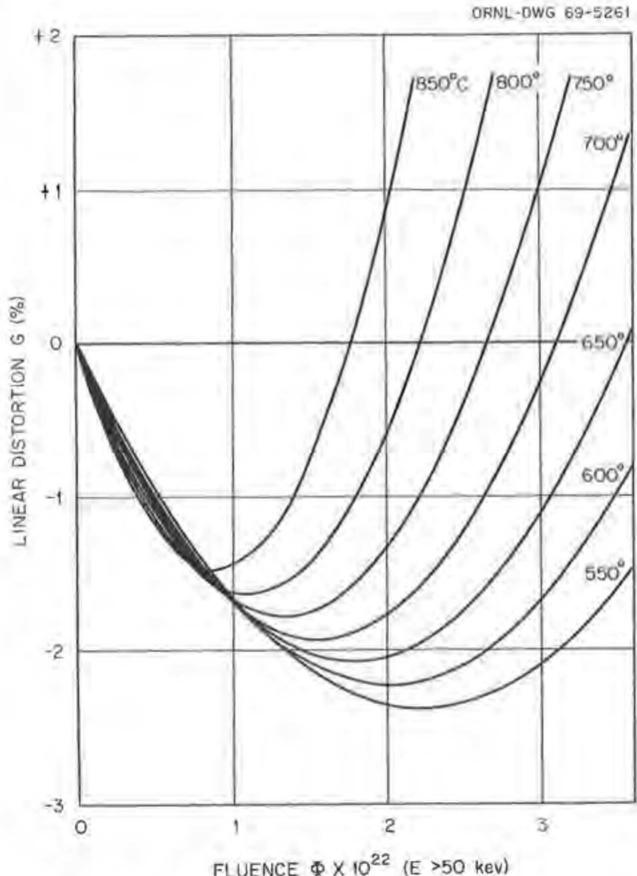  
Fig. 3.10. Dimensional behavior of graphite as a function of fluence at various temperatures.

tions in the core, the changes in core configuration have been calculated.20,21 It is concluded that changes in reactor performance due to strictly geometrical changes are not significant.18

For lack of a better definition, it has been assumed that permeability will improve or remain unaffected during the period of time the graphite is in a contracted phase, and hence the point at which the graphite returns to its original density defines its useful life. This leads to the conclusion20 that the graphite can absorb a fluence of $3\times 10^{22}$ neutrons $\mathrm{cm}^2$ $(E > 50\mathrm{keV})$ before deteriorating significantly or, equivalently, that it will have to be replaced in the core about every four years in the present design. The associated operating cost penalty for replacing graphite is estimated to be between 0.1 and 0.2 mill/kWhr.

Recent results obtained from irradiations in the High Flux Isotope Reactor (HFIR) at ORNL indicate that the definition of lifetime based on return to original density is indeed conservative for almost all graphites examined. The observed changes in microstructure represent an increased generation of extremely small pores at the expense of reduction in the size of the larger pores during the contraction phase. The exceptions are graphite containing a high portion of low-density phases, a type of material which can be avoided for MSBR applications.

Other than the common commercial technique of repeated liquid impregnation of graphite, several other alternatives exist: (1) metallic or carbide coating, (2) pyrolytic carbon coating, (3) gaseous impregnation and decomposition (pyrolytic impregnation), and (4) liquid or solid salt impregnation. The use of metal-containing coatings has been investigated, and successful coatings were demonstrated. The useful metals and coating thicknesses required lead to a significant loss of neutrons, however, and this approach has been abandoned, at least temporarily. Of the pyrolytic techniques, the impregnation approach was initially preferred over coating because of the less fragile nature of the impregnated surface. An apparatus has been designed[22] which permits gaseous impregnation of graphite accompanied by pyrolytic decomposition. This leads to filling of the pores near the surface with pyrolytic carbon and graphite, and permeabilities of $10^{-10}\mathrm{cm}^2/\mathrm{sec}$ have been easily achieved. Various samples of such impregnated materials have been irradiated, however, and they have withstood fluences only to about $1.5 \times 10^{22}$ neutrons/cm $^2$ ( $E > 50\mathrm{keV}$ ).[21] Such results are to be anticipated, because both the base graphite and pyrolytic material undergo dimensional changes under irradiation. A variety of behavior of pyrolytic materials can be obtained by altering the hydrocarbon gas used as the

source of carbon, the temperature of decomposition, and partial pressures of hydrocarbon and other inert or catalytic gases. Considerable work may be required to define a process for a given base graphite, and such a process may be unique to each base stock. The program is actively proceeding and looks both technically feasible and economically attractive.

Pyrolytic coating, on the other hand, is a much more tractable process and requires less process control. Coatings only 3 to 5 mils thick readily yield permeabilities in the range $10^{-8}$ to $10^{-9} \mathrm{~cm}^2/\mathrm{sec}$ . These have survived irradiations to $2 \times 10^{22}$ neutrons/ $\mathrm{cm}^2$ with negligible loss in permeability and hence look very attractive. However, the samples must be protected against chipping due to external mechanical stressing. It is probable that a combination of impregnation and coating will turn out to be the preferred technique. Pending more results on these experiments, work has been curtailed on studying the feasibility of liquid or solid salt impregnation.

3.2.3.3 Thermal and mechanical properties. The thermal conductivity of the graphite becomes important only as it affects the internal temperature of the material due to gamma and neutron heating. For the reference design of the MSBR, this heat is quite significant, up to $8.3\mathrm{W / cm}^3$ . The temperature gradients thus developed lead not only to thermal stresses but also to radiation-induced stresses generated by the temperature dependence of the damage. Values of the relevant properties of a fine-grained isotropic graphite have been estimated from properties of various grades of graphite given in the literature. The estimates are given in Table 3.4. Although some of these values, such as the thermal conductivity, will change during irradiation, the changes will probably not seriously affect the calculated stresses.

Table 3.4. Estimated design graphite properties of base graphite for an MSBR ${}^{a}$   

<table><tr><td>Thermal conductivity, \( {}^{b}\mathrm{\;W}{\mathrm{\;{cm}}}^{-1}{\left( {}^{ \circ  }\mathrm{C}\right) }^{-1} \)</td><td>\( {37.63}{\left( T\right) }^{-{0.7}} \) ,where \( T = {}^{ \circ  }\mathrm{K} \)</td></tr><tr><td>Thermal expansion, \( {\left( {}^{ \circ  }\mathrm{C}\right) }^{-1} \)</td><td>\( {5.52} \times  {10}^{-8} + {1.0} \times  {10}^{-9}T \)</td></tr><tr><td>Young&#x27;s modulus, psi</td><td>\( {1.9} \times  {10}^{6} \)</td></tr><tr><td>Ultimate tensile strength, psi</td><td>5000</td></tr><tr><td>Poisson’s ratio</td><td>0.27</td></tr><tr><td>Creep constant, psi \( {}^{-1} \) neutron \( {}^{-1}{\mathrm{\;{cm}}}^{2} \)</td><td>\( \left( {{5.3} - {1.45} \times  {10}^{-2}T + {1.4} \times  {10}^{-5}{T}^{2}}\right)  \times  {10}^{-{27}} \)</td></tr><tr><td>Anisotropy</td><td>&lt;0.05%</td></tr><tr><td>Density, \( \mathrm{g}/{\mathrm{{cm}}}^{3} \)</td><td>~1.9</td></tr><tr><td>Permeability, \( {\mathrm{{cm}}}^{3} \) (STP He)/sec</td><td>\( &lt; 1 \times  {10}^{-2} \)</td></tr><tr><td>Accessible void volume, %</td><td>&lt;10</td></tr></table>

${}^{a}$ All temperatures expressed as degrees centigrade,except as noted.   
bUnirradiated; radiation may decrease conductivity.

Constitutive equations for the graphite prisms have been set up and solved $^{20,21}$ to obtain the thermal and radiation-induced stresses. The equations include the elastic response as well as primary and secondary creep, $^{23}$ the important contribution being that of secondary creep. Despite the fact that the radiation-induced strains far exceed the maximum tensile strain of graphite at failure, the relaxation due to creep largely keeps pace with these strains and reduces the induced stresses to relatively low levels. A curve of stress vs time for MSBR graphite is shown in Fig. 3.11. The initial thermal stresses anneal out in a few weeks' time, and there is a gradual buildup of the radiation-induced stresses. In no case do the stresses exceed 600 psi, which is quite acceptable in view of the anticipated 5000-psi ultimate tensile strength.

It is concluded, therefore, that the induced stresses in the graphite do not constrain the reference MSBR design or performance.

3.2.3.4 Improved graphites. Before considering the probability of improvement of the graphite, it is advantageous to review briefly the mechanism of damage. On the average, each fission neutron will produce 500 to 1000 interstitial-vacancy pairs in the

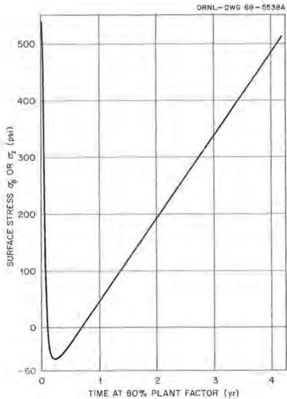  
Fig. 3.11. Maximum stress produced in MSBR reactor core graphite as a function of time.

graphite. At the temperatures under consideration in the MSBR, the interstitials are highly mobile, and the vacancies are slightly mobile. Although some direct recombination of vacancies and interstitials does occur, enough survive to generate both interstitial and vacancy aggregates. The vacancy aggregates collapse to lead to a shrinkage of the crystallites in the $a$ -axis direction, whereas the interstitial aggregates grow into new planes leading to crystallite growth in the $c$ -axis direction. Rather fortuitously, the net growth leads to virtually no change in crystallite volume, although the shape change is marked.

There is general agreement on the above qualitative explanation, but detailed attempts to quantify the model have not led to satisfactory results. The British work demonstrated (at low temperatures) a relationship between radiation damage and thermal expansion. Later work at General Atomic on pyrolytics has demonstrated an effect of crystallite size and density. More recent work at ORNL has shown even more complex effects, presumably due to intracrystallite plastic deformation and micropore structure. It is apparent that existing models of radiation damage are still incomplete and do not imply that the behavior of existing graphite represents an ultimate behavior of the graphite in general.

Subsequent to the analysis of dimensional behavior of materials represented by Fig. 3.10, type AXQ graphite* has been studied in the HFIR at ORNL. This graphite demonstrates some improvement in behavior, as shown in Fig. 3.12, and satisfies many of the desired requirements, but it is a molded material and cannot be fabricated to the required shapes. At present, both ORNL and the vendor are studying methods to form the material.

3.2.3.5 Conclusions. On the basis of the survey of the capabilities of the graphite industry, coupled with current programs on radiation damage and fabrication, the following conclusions have been made.

1. Current state-of-the-art materials are adequate to produce base graphites meeting the technical requirements for an MSBR. These graphites will have a core lifetime at the reference MSBR flux levels of the order of four years, which introduces a cost penalty of 0.1 to $0.2\mathrm{mil} / \mathrm{kWhr}$   
2. Early studies of gaseous impregnation have demonstrated the capability of meeting the permeability of $< 10^{-8}$ cc/sec that would be desirable to help minimize the $^{135}\mathrm{Xe}$ neutron absorption. It remains to be

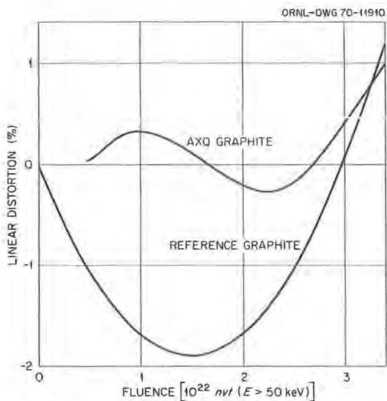  
Fig. 3.12. Behavior of type AXQ graphite at $715^{\circ}\mathrm{C}$ contrasted to the presumed behavior of the reference graphite used in MSBR design calculations.

demonstrated that such impregnated materials will satisfactorily withstand radiation damage.

3. Geometrical restrictions introduced by requirements of fabricability do not restrict reactor performance.   
4. Sufficient data now exist to imply that improved graphites for MSBR usage can be developed. However, these improvements will most probably be incremental relative to the best graphites tested to date.

# 3.2.4 Hastelloy N

# H.E.McCoy

In this reference design of the MSBR, the material that is specified for nearly all of the metal surfaces contacting the fuel and coolant salts is an alloy which is a slight modification of the present commercial Hastelloy N. (The only exceptions are parts of the chemical processing system, which are made of molybdenum, and the infrequently used fuel storage tank, which is of stainless steel.) As described below, the modified Hastelloy N anticipated in the MSBR design is currently in an advanced stage of development. It is very similar in composition and most physical properties to standard Hastelloy N, which has been fully developed and approved for ASME Code construction and was used

successfully in the MSRE. The modified alloy is superior to standard Hastelloy N, however, in that it suffers much less loss of ductility under neutron irradiation. The design of the MSBR reactor vessel counts on this improvement, and throughout the description of the design in this report "Hastelloy N" means the modified alloy unless otherwise stated. The consequences of failure to commercially produce an approved alloy with the desired properties are discussed in Sect. 16.2.3.

3.2.4.1 Primary system. The metal in the reactor vessel and in the primary piping will be exposed to molten fuel salt at temperatures up to $1300^{\circ}\mathrm{F}$ on one side and to the cell atmosphere $(95\% \mathrm{N}_2 - 5\% \mathrm{O}_2)$ at $1000^{\circ}\mathrm{F}$ on the other. The anticipated service life is 30 years, during which time the most highly irradiated portions of the reactor vessel will be exposed to a fast-neutron $(E > 0.1\mathrm{MeV})$ fluence of less than $1\times 10^{21}$ neutrons/cm² and a thermal-neutron fluence of about $5\times 10^{22}$ neutrons/cm².

Hastelloy N is an alloy developed specifically for use in molten fluoride systems, with the composition shown in Table 3.5. Among the major constituents, chromium is the least resistant to attack by the fluorides. The chromium content of Hastelloy N is low enough for the alloy to have excellent corrosion resistance toward the salts. (The leaching of chromium is limited by the rate at which it can diffuse to the surface.) The chromium is high enough, on the other

Table 3.5. Chemical composition of modified Hastelloy N   

<table><tr><td rowspan="2">Element</td><td colspan="2">Concentration (wt %)\( ^a \)</td></tr><tr><td>Standard alloy</td><td>Modified alloy</td></tr><tr><td>Nickel</td><td>Balance</td><td>Balance</td></tr><tr><td>Molybdenum</td><td>15.0-18.0</td><td>11.0-13.0</td></tr><tr><td>Chromium</td><td>6.0-8.0</td><td>6.0-8.0</td></tr><tr><td>Iron</td><td>5.0</td><td>5.0</td></tr><tr><td>Carbon</td><td>0.04-0.08</td><td>0.04-0.08</td></tr><tr><td>Manganese</td><td>1.0</td><td>0.2</td></tr><tr><td>Silicon</td><td>1.0</td><td>0.1</td></tr><tr><td>Tungsten</td><td>0.5</td><td>0.1</td></tr><tr><td>Aluminum</td><td></td><td>0.1</td></tr><tr><td>Titanium</td><td>0.5</td><td>2.0</td></tr><tr><td>Copper</td><td>0.35</td><td>0.1</td></tr><tr><td>Cobalt</td><td>0.20</td><td>0.2</td></tr><tr><td>Phosphorus</td><td>0.015</td><td>0.015</td></tr><tr><td>Sulfur</td><td>0.020</td><td>0.015</td></tr><tr><td>Boron</td><td>0.010</td><td>0.0010</td></tr><tr><td>Others, total</td><td>0.50</td><td></td></tr><tr><td>Hafnium</td><td></td><td>1.0</td></tr><tr><td>Niobium</td><td></td><td>2.0</td></tr></table>

aSingle values are maximum concentrations.

hand, to impart good oxidation resistance toward the cell atmosphere. The molybdenum content was adjusted to give good strength without an embritling second-phase formation. The resulting alloy has very good physical and mechanical properties.[27-29]

Standard Hastelloy N was approved by the ASME Boiler and Unfired Pressure Vessel Code Committee under Case 1315-3 (ref. 30) and Case 1345-1 (ref. 31) for nuclear vessel construction and was the primary structural material in the MSRE. In the fuel system of this reactor, Hastelloy N was exposed to salt at about $1200^{\circ}\mathrm{F}$ for 22,000 hr. Corrosion was very moderate, with chromium leaching equivalent to complete removal from a layer only 0.2 mil deep. (Surveillance specimens showed a chromium gradient to a depth of 2 mils.) Oxidation on surfaces exposed to the cell atmosphere amounted to only 2 mils. However, surveillance specimens exposed just outside the reactor vessel and at the center of the core showed marked reduction in fracture strain and stress-rupture life due to neutron irradiation.[32-34]

In the MSBR reference design the metal in the vessel walls is protected by a thick graphite reflector and sees a fast-neutron fluence only on the order of $1 \times 10^{21}$ neutrons/cm² (actually less than was received by core specimens in the MSRE). This fast-neutron fluence is too low to produce the swelling or void formation that is associated with the metal used for cladding the fuel in fast reactors. The major concern in developing an improved alloy for use in the MSBR was therefore not fast-neutron damage but the production of helium in the metal, primarily due to the thermal-neutron transmutation of $^{10}\mathrm{B}$ to $^{4}\mathrm{He}$ and $^{7}\mathrm{Li}$ . Boron is an impurity of Hastelloy N that comes from the refractories used in melting the alloy. Careful commercial practice makes it possible to produce alloys containing 1 to 5 ppm boron (18.2% of natural boron is $^{10}\mathrm{B}$ ). Irradiation tests, however, show that the amount of helium (and thus boron) required to cause embrittlement is so low that even alloys containing 0.1 ppm of boron are badly damaged in this respect. The strong influence of such a small quantity of boron is due to the segregation of boron at the grain boundaries, where helium production can have a profound effect on the fracture behavior. It was thus concluded that the problem of irradiation-induced embrittlement could not be solved by reducing the boron level.

The embrittlement problem was approached by adding alloying metals, such as titanium, niobium, zirconium, and hafnium, so as to form borides that would be dispersed as precipitates and not particularly segregated at the grain boundaries. This approach

proved successful, with a fine dispersion of MC-type carbides giving the most desirable properties.37 The postirradiation fracture strains of several promising alloys are shown in Fig. 3.13. (Although the fluence received by these specimens is low compared with that expected in the MSBR, over one-half of the boron will have been transmuted at the $5 \times 10^{20}$ -neutron/cm² fluence level, and there is relatively little change in ductility beyond this point.)

To obtain the desired structure and welding properties of the modified alloy, close control is required of the concentrations of titanium, niobium, and hafnium. Successful highly restrained test welds have been made in $\frac{1}{2}$ in.-thick plate using alloys containing $1.2\%$ titanium, $0.5\%$ hafnium, combined $0.75\%$ hafnium and $0.75\%$ titanium, and combined $0.5\%$ titanium and $2\%$ niobium. (Zirconium induced severe weld metal cracking and is no longer considered as a constituent.) The composition of the Hastelloy N for the MSBR has not been optimized, but the anticipated values are given in Table 3.5.

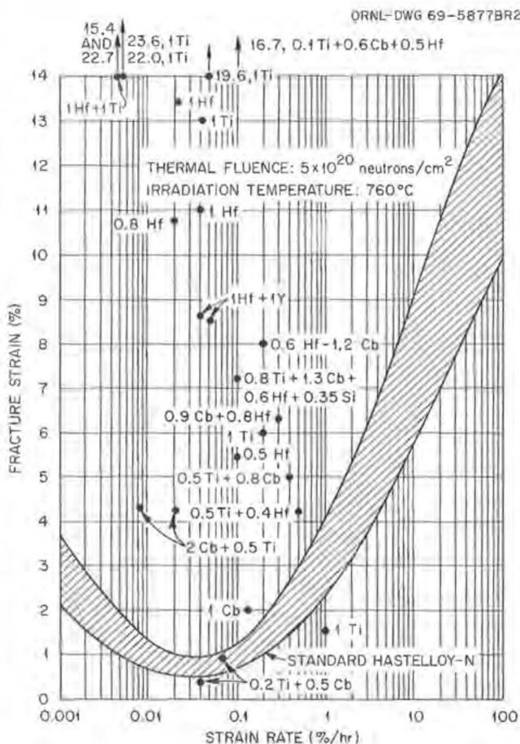  
Fig. 3.13. Postirradiation ductility of Hastelloy N at $650^{\circ}\mathrm{C}$ .

The corrosion resistance of the modified material has been tested, and specimens have been exposed in the MSRE core. The melts used to date have $< 0.1\%$ iron and have even lower corrosion rates than observed for the standard alloy with 4 to $5\%$ iron. Iron does not serve a critical role in the alloy and could be removed to give a lower corrosion rate in sodium fluoroborate should this prove to be necessary. The presence of titanium and the other reactive metals will not contribute appreciably to the corrosion rate at the anticipated concentrations.[38,39] The molybdenum was dropped from $16\%$ in the standard material to about $12\%$ in the modified alloy to obtain the desired carbide.

The mechanical properties of the modified alloys are generally better than those of standard Hastelloy N and are considerably better than those of the early heat used in establishing the allowable design stresses under the ASME Code. For the purposes of this reference MSBR design, however, the approved stresses, listed in Table S.1, were used.

In summary, the reference MSBR design assumes that material having strength and corrosion resistance equal to standard Hastelloy N will be available. The reactor vessel requires, in addition, that the postirradiation ductility be much better than that of the standard alloy. Many experimental heats of modified Hastelloy N meet these requirements. There appears to be no reason why a selected alloy cannot be produced commercially and be approved for code construction.

3.2.4.2 Secondary system. The coolant salt in the MSBR is sodium fluoroborate. This does not present a basically different corrosion situation from that for other fluoride salts, since the elements present as fluorides are more stable than are the fluorides of the metals present in the Hastelloy N. Impurities in the salt, however, may present mechanisms for corrosion.

Static corrosion tests showed insignificant attack of Hastelloy N by $\mathrm{NaBF_4}$ -NaF mixtures (4 to 8 mole % NaF) on Hastelloy N with low amounts of oxygen and water present.40 Increased amounts of oxygen and water may accelerate the corrosion rate.

Dynamic corrosion test experience with Hastelloy N in sodium fluoroborate includes several thermal convection loops and a single forced-circulation system. Results indicate that metal will be removed from the hotter portions of the loop and deposited on the cooler sections. For the thermal convection loops the minimum rate of metal removal was about 0.2 mil/year over about 10,000 hr of operation. Accelerated corrosion is associated with high levels of $\mathrm{H}_2\mathrm{O}$ and $\mathrm{O}_2$ . Purging the system with a gaseous mixture of hydrogen fluoride, $\mathrm{BF}_3$ , and helium appears to be an effective method of

purifying the coolant salt of moisture and oxygen, however. In general, the compatibility of Hastelloy N with sodium fluoroborate appears acceptable. If on-line methods for removing corrosion products and moisture are included in the system, the corrosion rate is likely to be less than about 0.2 mil/year.

The compatibility of Hastelloy N with supercritical pressure steam has been tested by exposing specimens in the TVA Bull Run steam station. In over 10,000 hr the corrosion rate has been less than $\frac{1}{4}$ mil/year,[41] a rate that by industry standards would certainly be acceptable in the steam generator tubing. (There is no significant difference between the standard and modified Hastelloy N in this respect.) Results of continued testing, but with stressed specimens, are not yet available.

# 3.3 NUCLEAR CHARACTERISTICS

# 3.3.1 Selection of MSBR Core Design

H. F. Bauman

The core of the single-fluid MSBR consists of two zones: a well-moderated inner zone (I) (see Table 3.3 for definition of zones) surrounded by an undermoderated outer zone (II). The same fuel salt, containing both fissile and fertile material, is used in both zones and throughout the reactor. The neutron spectrum in each zone is controlled by adjusting the proportion of salt to graphite, from a salt fraction of about $13\%$ in zone I to about $37\%$ in zone II. The overall spectrum is adjusted for the best "performance" associated with a high breeding ratio and a low fissile inventory (optimization of the core is discussed in following sections). The spectrum in zone II is made harder, to enhance the rate of thorium resonance capture relative to the fission rate, thus depressing the flux in the outer core zone and reducing the neutron leakage.

Earlier MSBR designs achieved excellent performance (good breeding ratio and low fissile inventory) by incorporating fissile and fertile materials in two separate fluids.4 Both fluids (separated by graphite walls) were present in the core, which was surrounded by a blanket of fertile salt. The advantages of this two-fluid design were low fissile inventory (because the fissile material was confined to a relatively small volume of fuel salt) and ease of processing (because the fuel salt was free of fertile material and the fertile salt was practically free of fission products). The main disadvantage was the complex graphite structure required to separate the two fluids, a structure that would have to be replaced at intervals because of neutron damage to the graphite.

A design intermediate between the two-fluid and the reference single-fluid designs is the single-fluid core with separate blanket. The core is a well-moderated region like zone I of the single-fluid design, surrounded by a blanket of thorium-bearing salt separated from the core by a thin wall of Hastelloy N (or possibly graphite). The core salt contains both fissile and fertile materials and thus offers no processing advantage over the single-fluid design, but the presence of the blanket controls neutron leakage without involving a large fissile inventory in the blanket region and results in a low total reactor fissile inventory. Exploratory calculations have shown that the performance of this design approaches that of the two-fluid reactor mentioned above. Its major disadvantage is the necessity for a dividing wall between the core and the blanket, a wall that would have to be replaced periodically (along with the core graphite) because of fast-neutron damage.

Another possibility is a single-fluid design with a power density low enough for the allowable damage flux to the core to not be exceeded in the lifetime of the reactor. Preliminary calculations show that such a reactor should have a large core (on the order of 30 ft in diameter) and that an undermoderated zone II is not needed because leakage is inherently low from such a large core. The advantage of this design is simplicity of construction and the elimination of core replacement. Its disadvantages are the relatively high fissile inventory and the large size of the reactor vessel.

The performance of typical examples of these four reactor designs is summarized in Table 3.6. The second one listed, the single-fluid two-zone replaceable core design, was selected for detailed analysis in this design study because it offers moderately good breeding performance in a design that can be built with only a modest extension of today's technology.

# 3.3.2 Optimization of Core Design

H.F.Bauman

The ROD (Reactor Optimum Design) code, used to optimize the core design for the single-fluid MSBR, consists of three major sections:

1. A multigroup, one-dimensional neutron diffusion calculation based on the code MODRIC with a routine added to synthesize a two-dimensional calculation in cylindrical geometry.

2. An equilibrium reactor calculation based on the code ERC. The equilibrium concentrations of up to 250 nuclides including fission products may be calculated for considering continuous fuel processing with up to ten removal modes, each with its individual processing time. The breeding ratio, fuel yield, material inventories, and fuel-cycle costs are calculated in this section.

3. An optimization procedure, based on the gradient projection method or "method of steepest ascent," for locating the maximum of a specified figure of merit when given reactor parameters are allowed to vary. The figure of merit may be any desired function of the breeding ratio, the specific fuel inventory, the fuel-cycle costs, or similar factors, while such parameters as core salt fraction, the core zone dimensions, reflector thickness, and processing cycle times may be variables. Parameter surveys at specified levels of the variables (without optimization) may also be performed.

3.3.2.1 Cross sections. Cross-section sets for use in MSBR calculations were developed using XSDRN, a discrete ordinates spectral code for the generation of nuclear multigroup constants in the fast, resonance, and thermalization energy regions. Cross-section sets were made for each of the four major regions of the reactor: the $13.2\%$ salt zone, the $37\%$ salt zone, the $100\%$ salt gap, and the reflector. In each case a "cell structure"

Table 3.6. Calculated nuclear performance of 1000-MW(e) MSBR design concepts   

<table><tr><td rowspan="2">Design concept(in increasing order of complexity)</td><td colspan="4">Typical performance value</td></tr><tr><td>Conservation coefficienta[MW(t)/kg]2</td><td>Breeding ratio</td><td>Fissile inventory (kg)</td><td>Annual fuel yield(%/year)</td></tr><tr><td>Single-fluid, nonreplaceable core</td><td>5</td><td>1.06</td><td>2300</td><td>2.0</td></tr><tr><td>Single-fluid, two-zone replaceable core(reference MSBR)</td><td>15</td><td>1.06</td><td>1500</td><td>3.2</td></tr><tr><td>Single-fluid core with separate blanket and replaceable core</td><td>50</td><td>1.07</td><td>900</td><td>7.0</td></tr><tr><td>Two-fluid core plus blanket and replaceable core</td><td>75</td><td>1.07</td><td>700</td><td>8.0</td></tr></table>

An index of merit, the definition and significance of which are discussed in sect. 3.3.2.2.

was set up to describe a part of the particular regions. The cross sections were then flux weighted over the cell. The input data for XSDRN were taken from the 123-group XSDRN master library tape. This 123-group structure was reduced to a 9-group structure in the XSDRN calculations; this broad group structure consists of 5 fast groups and 4 thermal groups. Nuclide concentrations for these calculations were obtained from a ROD calculation. All the nuclides appearing in the reactor plus four $1 / \nu$ "nuclides" were considered in each region so that four sets of cross sections were used to describe the entire reactor.

3.3.2.2 Conservation coefficient. The figure of merit selected for optimization of the single-fluid MSBR has been named the "conservation coefficient," defined as the breeding gain times the square of the specific power in thermal megawatts per kilogram of fissile material (which is proportional to the inverse of the product of the doubling time and the fuel specific inventory). The conservation coefficient is related to the capability of a breeder reactor system to conserve fissile material in a nuclear power economy expanding linearly with time. For this power growth condition, maximizing the conservation coefficient results in a minimum in the total amount of uranium that must be mined up to the point when the breeder system becomes self-sustaining (i.e., independent of any external supply of fissionable material).

3.3.2.3 Optimization. The optimization of the reactor design, while based on maximizing the conservation coefficient, was subject to several economic constraints, including limits on the power density (and hence the graphite life) and the overall reactor vessel dimensions. In addition, the rare-earth and $^{233}\mathrm{Pa}$ processing rates were fixed at rates found reasonable for the reductive-extraction processing method considered here. Fuel-cycle costs were computed as part of the core calculations, as shown in Table 3.7. Although not used as the basis for the optimization, it turned out that fuel-cycle costs were near minimum at the selected optimum configurations.

3.3.2.4 Reference design. The results of the optimization study led to the selection of a reference design with the characteristics given in Table 3.7. Additional data on the flux spectrum and the neutron absorption by individual fission product nuclides in the reference design are given in Appendix B. The data given are from the calculation of the reference design and include details of the processing and buildup of higher isotopes. However, another calculation, which differs only in

detail from the reference design calculation, was used for several subsidiary calculations, such as the neutron and gamma heating in the core and the power distribution in the core, and for several of the parameter surveys given in the following section.

Table 3.7. Characteristics of the single-fluid MSBR reference design   

<table><tr><td colspan="2">A. Description</td></tr><tr><td>Identification</td><td>CC120</td></tr><tr><td>Power</td><td></td></tr><tr><td>MW(e)</td><td>1000</td></tr><tr><td>MW(t)</td><td>2250</td></tr><tr><td>Plant factor</td><td>0.8</td></tr><tr><td>Dimensions, ft</td><td></td></tr><tr><td>Core zone 1</td><td></td></tr><tr><td>Height</td><td>13.0</td></tr><tr><td>Diameter</td><td>14.4</td></tr><tr><td>Region thicknesses</td><td></td></tr><tr><td>Axial:</td><td></td></tr><tr><td>Core zone 2</td><td>0.75</td></tr><tr><td>Plenum</td><td>0.25</td></tr><tr><td>Reflector</td><td>2.0</td></tr><tr><td>Radial:</td><td></td></tr><tr><td>Core zone 2</td><td>1.25</td></tr><tr><td>Annulus</td><td>0.167</td></tr><tr><td>Reflector</td><td>2.5</td></tr><tr><td>Salt fractions</td><td></td></tr><tr><td>Core zone 1</td><td>0.132</td></tr><tr><td>Core zone 2</td><td>0.37</td></tr><tr><td>Plenums</td><td>0.85</td></tr><tr><td>Annulus</td><td>1.0</td></tr><tr><td>Reflector</td><td>0.01</td></tr><tr><td>Salt composition, mole %</td><td></td></tr><tr><td>\( UF_4 \)</td><td>0.232</td></tr><tr><td>\( PuF_3 \)</td><td>0.0006</td></tr><tr><td>\( ThF_4 \)</td><td>12</td></tr><tr><td>\( BeF_2 \)</td><td>16</td></tr><tr><td>LiF</td><td>72</td></tr></table>

B. Processing   

<table><tr><td>Processing group</td><td>Nuclides</td><td>Cycle time (at full power)</td></tr><tr><td rowspan="2">Rare earths</td><td>Y, La, Ce, Pr, Nd, Pm, Sm, Gd</td><td>50 days</td></tr><tr><td>Eu</td><td>500 days</td></tr><tr><td>Noble metals</td><td>Se, Nb, Mo, Tc, Ru, Rh, Pd, Ag, Sb, Te</td><td>20 sec</td></tr><tr><td>Sominable metals</td><td>Zr, Cd, In, Sn</td><td>200 days</td></tr><tr><td>Gases</td><td>Kr, Xe</td><td>20 sec</td></tr><tr><td>Volatile fluorides</td><td>Br, I</td><td>60 days</td></tr><tr><td>Discard</td><td>Rb, Sr, Cs, Ba</td><td>3435 days</td></tr><tr><td>Salt discard</td><td>Th, Li, Be, F</td><td>3435 days</td></tr><tr><td>Protactinium</td><td>233Pa</td><td>3 days</td></tr><tr><td>Higher nuclides</td><td>237Np, 242Pu</td><td>16 years</td></tr></table>

Table 3.7 (continued)   

<table><tr><td colspan="2">C. Performance</td></tr><tr><td>Conservation coefficient, \( [MW(t)/kg)]^2 \)</td><td>14.1</td></tr><tr><td>Breeding ratio</td><td>1.063</td></tr><tr><td>Yield,\( ^a \)% per annum</td><td>3.20</td></tr><tr><td>Inventory, fissile, kg</td><td>1504</td></tr><tr><td>Specific power, MW(t)/kg</td><td>1.50</td></tr><tr><td>Doubling time, system,\( ^a \)years</td><td>22</td></tr><tr><td>Peak damage flux, \( E &gt; 50 \text{keV} \), neutrons\( cm^{-2} \)sec\( ^{-1} \)</td><td></td></tr><tr><td>Core zone 1</td><td>\( 3.5 \times 10^{14} \)</td></tr><tr><td>Reflector</td><td>\( 3.7 \times 10^{13} \)</td></tr><tr><td>Vessel</td><td>\( 4.3 \times 10^{11} \)</td></tr><tr><td>Thermal-neutron flux, neutrons\( cm^{-2} \)sec\( ^{-1} \)</td><td></td></tr><tr><td>Average, core</td><td>\( 2.6 \times 10^{14} \)</td></tr><tr><td>Peak</td><td>\( 8.3 \times 10^{14} \)</td></tr><tr><td>Fraction of fissions from thermal neutrons</td><td>0.84</td></tr><tr><td>Power density, \( W/cm^3 \)</td><td></td></tr><tr><td>Core</td><td></td></tr><tr><td>Average</td><td>22.2</td></tr><tr><td>Peak</td><td>70.4</td></tr><tr><td>Core, fuel salt</td><td></td></tr><tr><td>Average</td><td>74</td></tr><tr><td>Peak</td><td>492</td></tr><tr><td>Core, graphite (gamma and neutron heating)</td><td></td></tr><tr><td>Average</td><td>2.3</td></tr><tr><td>Peak</td><td>6.3</td></tr><tr><td>Fission power fractions by zone</td><td></td></tr><tr><td>Core zone 1</td><td>0.790</td></tr><tr><td>Core zone 2</td><td>0.150</td></tr><tr><td>Annulus and plenum</td><td>0.049</td></tr><tr><td>Reflector</td><td>0.012</td></tr><tr><td>Ratio, C/Th/U</td><td></td></tr><tr><td>Core zone 1</td><td>8660/52/1</td></tr><tr><td>Core zone 2</td><td>2240/52/1</td></tr></table>

D. Neutron balance   

<table><tr><td>Constituent</td><td>Concentrationb</td><td>Absorptions</td><td>Fissions</td></tr><tr><td>232Th</td><td>3.75 × 10-3</td><td>0.9779</td><td>0.0030</td></tr><tr><td>233Pa</td><td>3.88 × 10-7</td><td>0.0016</td><td></td></tr><tr><td>233U</td><td>6.64 × 10-5</td><td>0.9152</td><td>0.8163</td></tr><tr><td>234U</td><td>2.31 × 10-5</td><td>0.0804</td><td>0.0004</td></tr><tr><td>235U</td><td>6.01 × 10-6</td><td>0.0747</td><td>0.0609</td></tr><tr><td>236U</td><td>6.21 × 10-6</td><td>0.0085</td><td></td></tr><tr><td>237Np</td><td>8.59 × 10-7</td><td>0.0074</td><td></td></tr><tr><td>238Pu</td><td>6.10 × 10-6</td><td>0.0074</td><td></td></tr><tr><td>239Pu</td><td>1.29 × 10-7</td><td>0.0073</td><td>0.0045</td></tr><tr><td>240Pu</td><td>6.83 × 10-8</td><td>0.0027</td><td></td></tr><tr><td>241Pu</td><td>6.21 × 10-8</td><td>0.0027</td><td>0.0020</td></tr><tr><td>242Pu</td><td>1.23 × 10-7</td><td>0.0006</td><td></td></tr><tr><td>6Li</td><td>1.95 × 10-7</td><td>0.0035</td><td></td></tr><tr><td>7Li</td><td>2.24 × 10-2</td><td>0.0157</td><td></td></tr><tr><td>9Be</td><td>5.00 × 10-3</td><td>0.0070</td><td>0.0045c</td></tr><tr><td>19F</td><td>4.77 × 10-2</td><td>0.0201</td><td></td></tr><tr><td>Graphite</td><td></td><td>0.0513</td><td></td></tr><tr><td>Fission products</td><td></td><td>0.0202</td><td></td></tr><tr><td>Leakage</td><td></td><td>0.0244</td><td></td></tr><tr><td>ηe</td><td></td><td>2.2285</td><td></td></tr></table>

Table 3.7 (continued)   
E. Fuel-cycle costs ${}^{d}$   

<table><tr><td>Item</td><td>Cost (mills/kWhr)</td></tr><tr><td>Inventory</td><td></td></tr><tr><td>Fissile</td><td>0.364</td></tr><tr><td>Salt</td><td>0.077</td></tr><tr><td>Replacement salt</td><td>0.040</td></tr><tr><td>Processing</td><td>0.360</td></tr><tr><td>Fissile production credit</td><td>-0.088</td></tr><tr><td>Total</td><td>0.753</td></tr></table>

$^a$ At 0.80 plant factor,   
bNuclide concentration in fuel salt (atoms $\mathsf{b}^{-1}\mathsf{cm}^{-1}$   
$c(n,2n)$ reaction.   
$d_{\text{Bases}}$ for the fuel-cycle cost estimate are summarized in Table D.2.

# 3.3.3 Effect of Changes in the Fuel-Cycle and Core Design Parameters

# H.F.Bauman

3.3.3.1 Power density and core life. The power density of the core affects both the reactor performance and the core graphite life. As the first step in selecting the core power density, the core dimensions (and the salt fraction of zone I) were optimized to maximize the conservation coefficient. Then several cases were run in which the maximum permissible fast-neutron fluence was limited to low values, which had the effect of increasing the core size, limiting the peak power density, and increasing the core graphite life. The results of this study are shown in Fig. 3.14, in which the performance parameters are plotted as a function of graphite life. Both the breeding gain and the fissile inventory increase as the core is made larger, but the increase in breeding gain flattens out for larger cores, so that a maximum conservation coefficient is obtained at a core life of about three years, which corresponds to about a 15-ft-diam core with a peak power density of about $100\mathrm{W/cm^3}$ . However, there is little change in the conservation coefficient as the core is enlarged to increase the graphite life to about four years, which corresponds to the reference design core diameter of about 17 ft and peak power density of about $70\mathrm{W/cm^3}$ .

3.3.3.2 Salt volume fraction and thorium concentration. The function of thorium as the fertile material in the reactor is to absorb neutrons and thereby produce fissile $^{2,3,3}$ U. Thorium competes for the available neutrons with fissile material on the one hand and parasitic absorbers such as fission products and the

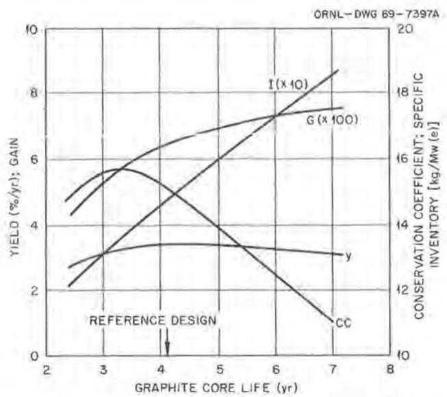  
Fig. 3.14. Performance of 1000-MW(e) MSBR as a function of core life (at 0.8 plant factor).

material of the carrier salt and the moderator on the other. As a result of this competition there is an optimum concentration of thorium in the core. If the thorium concentration is high, the breeding ratio will be high, but a large amount of fissile material (to compete with the thorium for neutrons) will be required to make the reactor critical. If the thorium concentration is low, the fissile inventory required will be low, but the breeding ratio will also be low because more neutrons will be lost to the parasitic absorbers (because of a lack of competition from thorium and uranium). The thorium concentration also affects the neutron energy spectrum, which becomes harder as the thorium is increased. Hardening the spectrum tends to increase the resonance absorptions in thorium while decreasing the relative absorptions in fissile and parasitic materials, thus reinforcing the competitive effect of thorium already described.

In the MSBR the core thorium concentration is determined by the core salt fraction and the concentration of thorium in the salt. The thorium concentration in the salt determines the ratio of thorium to most parasitic absorbers, while the concentration and salt fraction together determine the thorium-to-uranium and carbon-to-uranium ratios.

The effect of thorium concentration on performance of the MSBR is shown in Fig. 3.15. The cases represented in this figure were calculated before the reference design was selected and were based on a slightly smaller external salt inventory. Details of these cases are given in Table 3.8 and ref. 9. The core

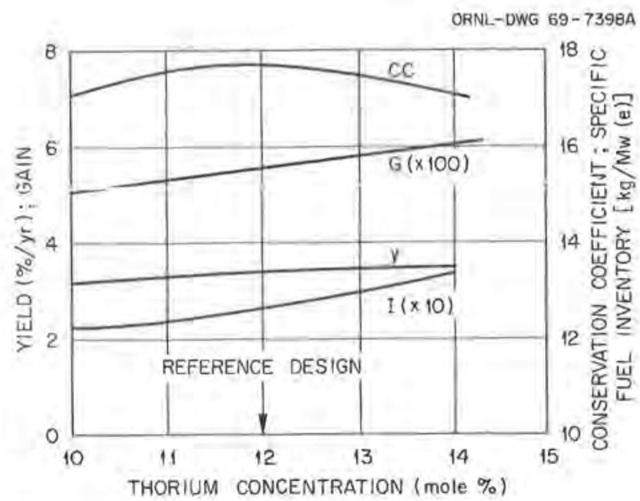  
Fig. 3.15. Influence of thorium concentration on the performance of a single-fluid MSBR.

dimensions and zone I volume fraction were allowed to optimize. As each case approached an optimum the cross sections were reweighted to allow for spectrum changes. The broad maximum in the conservation coefficient occurs in the vicinity of the 12 mole $\%$ thorium concentration, and this concentration was selected for the reference design.

One of the principal conclusions reached in the study of the MSBR was that the performance of the reactor is not sensitive to small changes in the thorium concentration in the salt, provided that the salt fraction is freely adjusted to maintain about the optimum carbon-to-thorium ratio. The optimum thorium concentration tends to increase as the core power density is decreased, but this effect is small over the range of power densities that give graphite lifetimes in the range of two to four years.

The effect of allowing the core zone I volume fraction to change, with all other parameters held fixed as in the reference design, is shown in Fig. 3.16. There is a broad optimum in the conservation coefficient at $13\mathrm{vol}\%$ salt and a very broad optimum in the fuel yield at $14\mathrm{vol}\%$ . The reference design value of $13.2\mathrm{vol}\%$ salt is the result of a ROD optimization calculation.

The effect of the core zone II volume fraction was also studied. With the total volume of fuel salt in zone II held fixed at its optimum value, a very broad optimum in the conservation coefficient was found to lie between 35 and $60\mathrm{vol}\%$ salt. The salt fraction of $37\%$ in the reference design was chosen to permit the use of a random-packed ball bed (of $37\%$ void volume) for zone II if desired.

Table 3.8. Influence of thorium concentration on the performance of a single-fluid MSBR   

<table><tr><td>Fuel salt, mole % LiF-BeF2-ThF4</td><td>74-16-10</td><td>72-16-12</td><td>70-16-14</td></tr><tr><td>Core height,a ft</td><td>9.75</td><td>9.8</td><td>11.7</td></tr><tr><td>Core diameter,a ft</td><td>11.2</td><td>11.1</td><td>11.5</td></tr><tr><td>Radial blanket thickness,a ft</td><td>2.52</td><td>2.20</td><td>1.89</td></tr><tr><td>Axial blanket thickness,a ft</td><td>1.45</td><td>1.19</td><td>0.91</td></tr><tr><td>Radial reflector thickness, ft</td><td>3.0</td><td>3.0</td><td>3.0</td></tr><tr><td>Axial reflector thickness, ft</td><td>2.0</td><td>2.0</td><td>2.0</td></tr><tr><td>Core salt fractiona</td><td>0.137</td><td>0.121</td><td>0.114</td></tr><tr><td>Radial blanket salt fraction</td><td>0.37</td><td>0.37</td><td>0.37</td></tr><tr><td>Axial blanket salt fraction</td><td>0.37</td><td>0.37</td><td>0.37</td></tr><tr><td>Reactor power, MW(t)</td><td>2250</td><td>2250</td><td>2250</td></tr><tr><td>Average power density, W/cm3</td><td>29.4</td><td>33.14</td><td>33.5</td></tr><tr><td>Maximum power density, W/cm3</td><td>97.3</td><td>106.3</td><td>101.6</td></tr><tr><td>Graphite replacement life, years</td><td>2.1</td><td>1.9</td><td>2.0</td></tr><tr><td>Specific fuel inventory, kg/MW(e)</td><td>1.23</td><td>1.26</td><td>1.33</td></tr><tr><td>Breeding ratio</td><td>1.051</td><td>1.055</td><td>1.060</td></tr><tr><td>Annual fuel yield, %/year</td><td>3.18</td><td>3.35</td><td>3.42</td></tr><tr><td>Conservation coefficient</td><td>17.19</td><td>17.65</td><td>17.05</td></tr></table>

aVariables allowed to optimize.

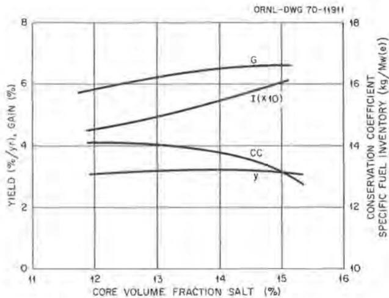  
Fig. 3.16. Effect of core zone I volume fraction of salt on MSBR performance. (Other parameters are held fixed at reference design values.)

3.3.3.3 Reflector. Both the thickness and the salt fraction of the reflector are important to the MSBR design. Increasing the reflector thickness over the range from 1 to 4 ft was shown to increase the conservation coefficient of a typical MSBR design. Much of the benefit of the reflector stems from its effect in increasing the neutron flux in the outer region of the core, thus giving a more even core power density distribution and improving the specific power without increasing the peak damage flux in the core. However, the improvement in performance was slight beyond a

3-ft thickness. On this basis, a 2-ft axial and 2.5-ft radial reflector thickness were selected for the reference design.

The salt fraction in the reflector is also important. Calculations have shown that if all the fuel salt were eliminated from the reflector region, the conservation coefficient of the reference design could be improved by $20\%$ over the reference design, mainly due to a significant reduction in the neutron leakage from the reactor. However, the reflector salt fraction of $1\%$ selected for the reference design was determined by engineering considerations and is about as low as could be achieved in a practical design.

3.3.3.4 Processing. The ROD code was set up to model in detail the reductive extraction processes described in ref. 1. The various parasitic absorber groups and the processing cycle times assumed in the calculation of the reference design are given in Table 3.7. The treatment of the processing appears complicated, but only two of the steps, the protactinium removal and the rare-earth removal, control the economics and performance of the MSBR. The effect on the conversion ratio of varying the processing rate of these two main steps, along with proportionate rate changes for subsidiary steps (e.g., seminoble metals with protactinium removal), is given in Fig. 3.17.

The most obvious conclusion from this study is that rapid processing is essential to good breeding performance. Another conclusion is that somewhat less stringent processing times than were assumed for the reference design, say a 10-day instead of a 3-day

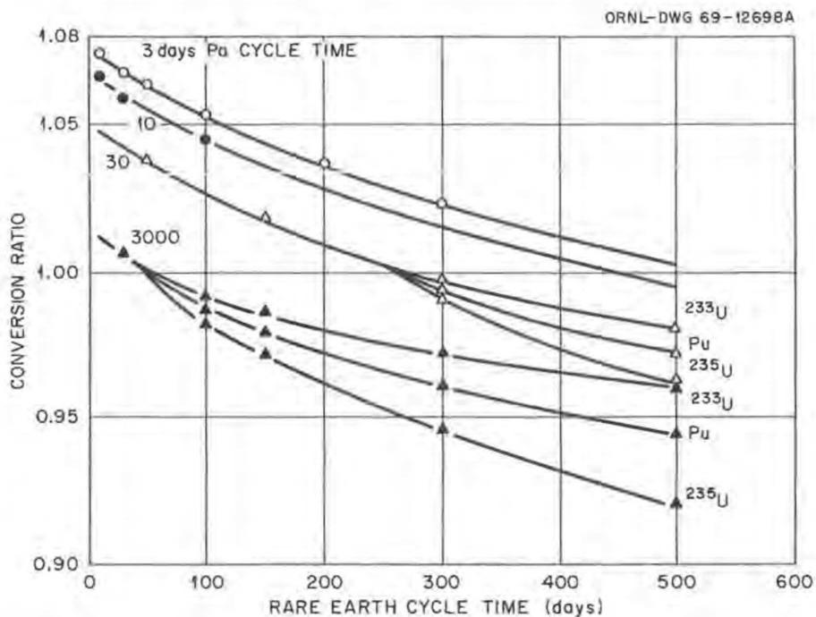  
Fig. 3.17. Conversion ratio of a single-fluid MSBR as a function of processing cycle times and feed materials. (The plutonium feed composition was assumed to be $^{239}\mathrm{Pu} = 60\%$ , $^{240}\mathrm{Pu} = 24\%$ , $^{241}\mathrm{Pu} = 12\%$ , and $^{242}\mathrm{Pu} = 4\%$ . Other parameters were held fixed at reference design values.)

protactinium cycle and a 100-day instead of a 50-day rare-earth cycle, can still give fairly good breeding performance. Further, increasing the protactinium processing cycle time can be "traded" for a decreased cycle time for the rare earths. Thus, use of a 10-day protactinium removal cycle time and a 25-day rare-earth removal cycle time would give about the same breeding ratio as would the processing times assumed for the reference design, that is, about 3 days for protactinium removal and 50 days for rare-earth removal. (The processing plant described in Sects. 2.6 and 8 gives a 10-day protactinium cycle time.)

Rapid and inexpensive processing is the potential advantage of fluid-fueled reactors. However, very long processing times have been considered in order to examine the performance of the MSR at processing rates more typical of solid-fueled reactors. For long cycle times, where the conversion ratio drops below 1.00, three makeup feed fuels were investigated: $^{233}\mathrm{U}$ , a plutonium mixture typical of that from water reactors, and $93\%$ enriched $^{235}\mathrm{U}$ . The results are shown in Fig. 3.17. The calculations show, for example, that with no protactinium processing and a 500-day rare-earth cycle (which would correspond to about a three-year batch-processing interval), the conversion ratio is well over 0.90, which is very good compared with solid-fueled converters. The study also shows that

plutonium would be an attractive fuel for converter operation.

An important parasitic absorber that was not considered to be removed in the reductive-extraction processes is $^{237}\mathrm{Np}$ . There are now indications that it can be successfully eliminated. If $^{237}\mathrm{Np}$ were removed on a 200-day cycle, a ROD calculation indicates that the breeding ratio of the reference MSBR would increase from 1.063 to 1.070 and the conservation coefficient from 14.1 to 16.2.

3.3.3.5 Plant size. Neutron leakage is important in the single-fluid MSBR due to the absence of a blanket. Furthermore, the undermoderated core zone II, which substitutes for a blanket, although reasonably effective in reducing leakage, contains a large volume of fuel salt and therefore adds heavily to the fissile inventory. The performance of the reactor, then, is strongly affected by factors which affect the leakage; the most important of these is the size of the reactor.

The 1000-MW(e) plant size selected for the reference MSBR was chosen because this has become a standard size for comparative studies of reactor plants. No attempt was made to revise the plant design for larger or smaller sizes, but a simple scaling study was made to indicate the performance that could be expected from other size plants, particularly larger ones.

The scaling study was started by taking the external fissile inventory and the volume of core zone I proportional to plant power and holding fixed the thicknesses of core zone II, annulus, plenums, and reflector. The results of this study for reactor plants of 500 to $4000\mathrm{MW(e)}$ are shown as the dashed curves in Fig. 3.18. There was considerable spread in the peak power densities, and therefore the core graphite life, in this set of cases, and a second set was run in which the core zone I volumes were adjusted to give about the same peak power density in each case. The results of this set are shown as the solid curves in Fig. 3.18 and are given in Table 3.9. The performance, as measured by both the conservation coefficient and the fuel yield, increases sharply with increase in plant size. The single-fluid MSBR, then, is well suited to large plants. For small plants, reactor designs less sensitive to neutron leakage, such as the single fluid MSBR with fertile blanket, should be considered.

# 3.3.4 Reactivity Coefficients

O. L. Smith J.H. Carswell

A number of isothermal reactivity coefficients were calculated using the reference reactor geometry. These coefficients are summarized in Table 3.10. The Doppler coefficient is primarily that of thorium. The salt and graphite thermal base coefficients are positive because of the competition between thermal captures in fuel, which decrease less rapidly than $1 / \nu$ , and thermal captures in thorium, which decrease nearly as $1 / \nu$ , with increasing temperature. The salt density component represents all effects of salt expansion, including the decreasing self-shielding of thorium with decreasing salt density.

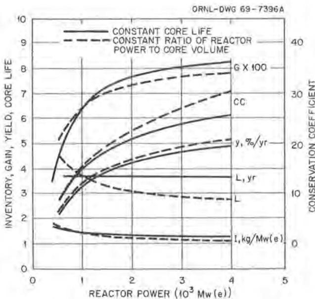  
Fig. 3.18. Effect of plant size on MSBR performance.

The graphite density component includes both changing graphite density and displacement of graphite surfaces. In calculating the displacements, it was assumed that the graphite-vessel interface did not move, that is, the vessel temperature did not change. For short-term reactivity effects, this is the most reasonable assumption, since inlet salt bathes the vessel's inner face. In any case, it should be noted that the graphite density coefficient is a small and essentially negligible component.

From Table 3.10 it is seen that the total core coefficient is negative. But more important, the total salt coefficient, which is prompt and largely controls

Table 3.9. Performance of single-fluid MSBR's as a function of plant size ${}^{a}$   

<table><tr><td>Reactor power [MW(e)]</td><td>500</td><td>1000</td><td>2000</td><td>4000</td></tr><tr><td>Core height, ft</td><td>9.44</td><td>11.0</td><td>17.44</td><td>23.0</td></tr><tr><td>Core diameter, ft</td><td>10.42</td><td>14.4</td><td>19.36</td><td>25.5</td></tr><tr><td>Salt specific volume, ft3/MW(e)</td><td>1.75</td><td>1.68</td><td>1.62</td><td>1.55</td></tr><tr><td>Fuel specific inventory, kg/MW(e)</td><td>1.65</td><td>1.47</td><td>1.36</td><td>1.28</td></tr><tr><td>Peak power density, W/cm3</td><td>62.2</td><td>65.2</td><td>66.1</td><td>65.9</td></tr><tr><td>Peak flux (E&gt;50 keV), 1014neutrons cm-2sec-1</td><td>3.04</td><td>3.20</td><td>3.25</td><td>3.24</td></tr><tr><td>Core life, years at 0.8 plant factor</td><td>3.9</td><td>3.7</td><td>3.7</td><td>3.7</td></tr><tr><td>Leakage, neutrons per fissile absorption × 100</td><td>3.89</td><td>2.44</td><td>1.53</td><td>0.96</td></tr><tr><td>Breeding ratio</td><td>1.043</td><td>1.065</td><td>1.076</td><td>1.083</td></tr><tr><td>Annual fuel yield,b%/year</td><td>1.99</td><td>3.34</td><td>4.28</td><td>4.95</td></tr><tr><td>Conservation coefficient</td><td>8.0</td><td>15.1</td><td>21.0</td><td>25.9</td></tr></table>

The thickness of core zone II, annulus, plenum, reflectors, and other parameters not otherwise indicated were held fixed at the reference design values indicated in Table 3.1.   
The plant factor is assumed to be 0.80.

Table 3.10. Isothermal reactivity coefficients of the reference reactor   

<table><tr><td>Component</td><td>Reactivity coefficient, \( \frac{I}{k}\frac{\partial k}{\partial T} \) (per °C)</td></tr><tr><td></td><td>\( \times 10^{-5} \)</td></tr><tr><td>Doppler</td><td>-4.37</td></tr><tr><td>Salt thermal base</td><td>+0.27</td></tr><tr><td>Salt density</td><td>+0.82</td></tr><tr><td>Total salt</td><td>-3.22</td></tr><tr><td>Graphite thermal base</td><td>+2.47</td></tr><tr><td>Graphite density</td><td>-0.12</td></tr><tr><td>Total graphite</td><td>+2.35</td></tr><tr><td>Total core</td><td>-0.87</td></tr></table>

the fast transient response of the system, is a relatively large negative coefficient and affords adequate reactor stability and controllability.

The salt density coefficient is particularly important with regard to bubbles in the core salt. It is expected that the salt will contain a few tenths of a percent of xenon bubbles. Under certain circumstances the bubbles might expand or decrease in volume without change in core temperature and hence without invoking the total salt temperature coefficient. Since the salt density component is positive, without decreasing density, bubble expansion would produce a positive reactivity effect. Using a salt expansion coefficient of $\delta V / V = 2.1 \times 10^{-4} / ^{\circ}\mathrm{C}$ , an increase in core bubble fraction from, say, 0.01 to 0.02 would yield a reactivity change of $\delta k / k = +0.00039$ . This is approximately one-fourth the worth of the delayed neutrons in the core. Analogously complete instantaneous collapse of a 0.01 bubble fraction would yield a reactivity change of $\delta k / k = -0.00039$ .

Finally, the equilibrium fuel concentration coefficient, $(\delta k / k) / (\delta n / n)$ , where $n$ is atomic density, was calculated to be 0.42 for $^{233}\mathrm{U}$ and 0.027 for $^{235}\mathrm{U}$ and 0.39 for total fissile uranium. (The coefficient for $^{235}\mathrm{U}$ is much smaller because the $^{235}\mathrm{U}$ inventory in the MSBR is very low relative to $^{233}\mathrm{U}$ .)

# 3.3.5 Gamma and Neutron Heating in the MSBR

O. L. Smith J.H. Carswell

Gamma and neutron heat sources in the one-fluid reactor, vessel, and thermal and biological shields were calculated using gamma and neutron transport techniques based on the ANISN transport code.

Results are given here for one axial and two radial traverses of the reactor and shields. The region thick

nesses and composition are shown with the results in Figs. 3.19-3.24. For the radial traverses, two one-dimensional infinite-cylinder calculations were performed - the first at the core midplane and the second in a plane two-thirds of the distance from the midplane to the top of the core. In each case the neutron (and gamma) flux was normalized to the value of the actual center-line core flux at that elevation. No allowance was made for axial buckling. Thus, particularly in the shields, the calculated heat sources should be considered as upper limits to the actual heat sources. It is estimated that the calculated sources inside the reactor vessel are only a few percent high. But because of the large air gap between the vessel and shields, the calculated heat sources in the thermal shield and concrete should be reduced by about $50\%$ to account for the actual finite height of the reactor.

In the axial center-line calculation, the system was represented in slab geometry, infinite in the radial dimension. Again, transverse buckling effects inside the vessel are small. The results for the thermal and biological shields are upper limits, but the overestimation is lower in the axial direction since the air gap is only a few feet.

The calculations were performed in several linked stages starting with a one-dimensional ANISN transport calculation of the neutron space and energy distribution in the reactor and shields. From neutron fluxes and scattering cross sections, the neutron heat distribution was determined. The neutron heating in the reactor is shown in Figs. 3.19, 3.21, and 3.23 for the two radial traverses and one axial traverse. In each figure, curve A shows the heat source per unit volume of homogenized core, blanket, reflector, or plenum. Curves B and C show, respectively, the heat source per unit volume of graphite and salt separately in those regions. Curve D shows the heating in the INOR vessel.

Figures 3.20, 3.22, and 3.24 show the gamma and neutron heating in the thermal and biological shields. The thermal shield is treated as pure iron. The concrete is a standard grade.

The gamma heat distribution is similarly presented in the figures. Three sources of gammas were calculated from the neutron flux distribution: prompt fission, delayed (fission product), and capture gammas. The first and last of these had the spatial distribution of the neutron flux. The delayed source was assumed uniform in the circulating salt. Since the salt spends approximately half its time in the reactor, approximately half of the delayed gammas are emitted inside the vessel.

These three sources of gammas were combined in a fixed-source ANISN gamma transport calculation using

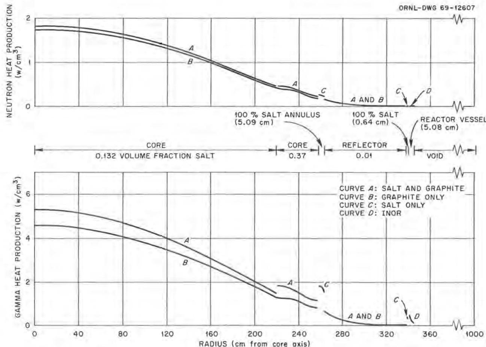  
Fig. 3.19. Gamma and neutron heating in the core midplane of a 1000-MW(e) MSBR $(R = 0$ to $1000\mathrm{cm})$

seven gamma energy groups. From the gamma fluxes the gamma heat sources were then calculated.

From the results it should be particularly noted that neutron thermalization is a major heat source in the graphite.

# 3.3.6 Fission Product Heating in the MSBR

R.B.Briggs J.R.Tallackson

One of the principal design considerations for an MSBR is the safe disposal of reactor afterheat. The five major sources of heat which remain in the primary system after shutdown are:

1. fission heat due to decay of flux at shutdown, including the effect of delayed-neutron precursor transport by the salt;   
2. decay of fission products (and daughters) dispersed in the primary salt;

3. decay of noble-metal fission products (and daughters) deposited on the graphite and Hastelloy N surfaces;   
4. decay of gaseous krypton and xenon (and daughters) diffused into the graphite;   
5. heat stored in moderator and reflector graphite.

The heat loads imposed by fission products must be recognized and evaluated in order to design cooling systems for the chemical processing equipment, the off-gas system, the drain tanks, and the primary salt circuit. The distribution of heat producers within the system depends on chemical behavior, half-life and complexity of decay chains, graphite characteristics, and the effectiveness of the chemical and off-gas removal systems. The available evidence indicates that the noble metals (Nb, Mo, Tc, Ru, Rh, and Te) plate out on metal and graphite surfaces almost as soon as they are formed, collect at liquid-gas interfaces in the

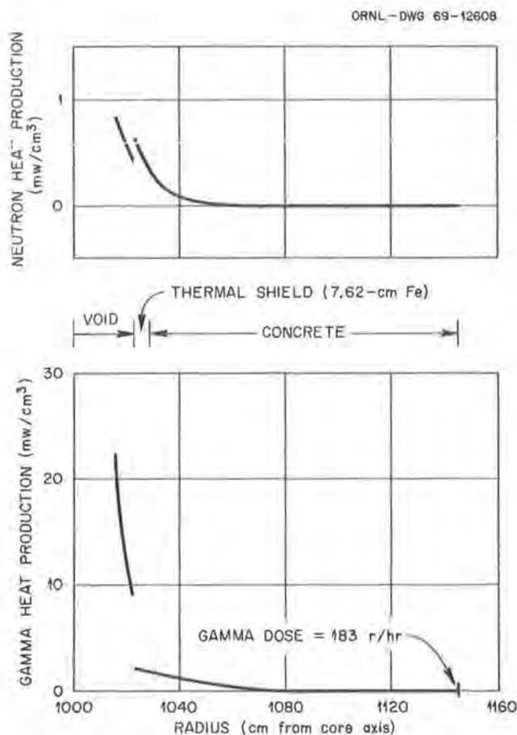  
Fig. 3.20. Gamma and neutron heating in the core midplane of a 1000-MW(e) MSBR $(R = 1000$ to $1160\mathrm{cm})$

salt system, or are removed with the off-gas. The krypton and xenon either diffuse into the graphite or are removed with the off-gas. The iodine daughters of the telluriums are assumed to remain with their parents, and the iodine produced directly by fission remains dissolved in the salt. The remaining heat producers are either dissolved in the salt or retained in the chemical processing plant.

Kedl has calculated the rates of diffusion of krypton and xenon from the salt to the graphite and to the gas bubbles in the salt. The theory and calculations are outlined in Appendix A of this report. Briggs, using MSRE data as a guide, estimated the distribution of fission products in a typical MSBR design, as summarized in Table 3.11. The estimate indicated that $10\%$ of the noble-metal production would deposit on surfaces of the graphite in the core, $40\%$ would deposit on metal surfaces in the circulation system, and $50\%$ would enter the gas bubbles and be transported to the off-gas system.

Fig. 3.25, prepared by Tallackson, shows the distribution of afterheat in the reference MSBR based on the estimates of distribution by Briggs and Kedl and using afterheat rates computed with the FOULBALL and CALDRON programs by Carter. Although further experimental evidence supporting the choice of diffusion coefficients and sticking coefficients is needed and the throughput to the chemical processing plant is subject to revision, the data of Fig. 3.25 probably would produce a conservative design.

Some of the factors associated with afterheat have been studied by Furlong,92 including various combinations of magnitude and rate of reactivity insertion, salt flow rate changes, and delay prior to the reactivity insertion. In an example cited by Furlong,9 the case of flow coastdown, with $1\%$ negative reactivity inserted at $0.1\%/\mathrm{sec}$ after a 1-sec delay (with ${}^{235}\mathrm{U}$ fuel), there would be 3.75 MWhr of energy production in the salt. Using only the heat capacity of the salt, this would result in a $113^{\circ}\mathrm{F}$ rise in the salt temperature after shutdown. The core graphite heat capacity, which is twice that of the salt, would become available as a heat sink after the salt reached an average temperature of about $1200^{\circ}\mathrm{F}$ , with the net effect that the salt temperature could be raised to about $1250^{\circ}\mathrm{F}$ in 5 min after shutdown due to the effect of fission heat production alone (assuming adiabatic conditions).

Most of the heat generated after normal reactor shutdown will be dispersed by continued circulation of the fuel and coolant salts and condensation of steam in the turbine condenser. In event of a fuel-salt drain, the heat generated in the salt would be dissipated through the primary drain tank cooling system, as described in Sect. 6.

# 3.3.7 Tritium Production and Distribution

# P.N.Haubenreich

3.3.7.1 Introduction. Tritium is produced in all reactors as a fission product and in some as a result of neutron absorptions in deuterium, lithium, or boron in the reactor. Because of the abundant lithium in the MSBR, the tritium production rate is relatively high: comparable with that in heavy-water reactors, or roughly 20 to 50 times that in light-water reactors of equal electrical output. Even though the tritium constitutes only an extremely small fraction of the total radioactivity that is produced, it stands out as a special problem because at high temperatures it readily diffuses through most metals and is difficult to contain.

Tritium in the primary salt, in its off-gas, or in the secondary salt does not add significantly to the bio

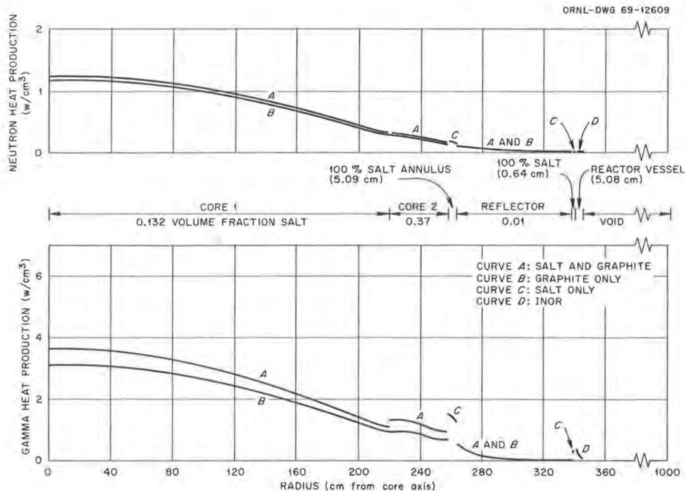  
Fig. 3.21. Gamma and neutron heating in a radial plane two-thirds of the distance from the midplane to the top of the core of a 1000-MW(e) MSBR $(R = 0$ to $1000\mathrm{cm})$

logical hazards of these fluids. Neither does diffusion of tritium from the salt systems into the containment cell atmosphere present a serious problem, since it should be simple to extract the tritium from the atmosphere in a concentrated form. It is very important, however, that the fraction of the tritium production that reaches the steam system be limited to a few percent. Higher concentrations could require special precautions in dealing with steam leaks or in handling the condensate, and, most importantly, unacceptable amounts of tritium must not be released into the environment in the normal, unavoidable discharges from the steam system.

In the reference MSBR design described in this report, it was assumed that the barriers presented by the tubes in the primary and secondary heat exchangers were enough to limit the tritium reaching the steam system to a rate that required no special precautions. Recent developments, however, cast doubt on the validity of

this assumption. One aspect is the experience with the MSRE, where a significant fraction of the tritium was observed to diffuse through the secondary heat exchanger tubes into the coolant air. Another aspect is the new emphasis on reducing releases of radioactivity from any source to minimum practicable levels. Some modifications in the MSBR reference design to deal with tritium are to be anticipated, but what they will be depends on the outcome of investigations currently under way. The discussion which follows presents some considerations that will be involved in specifying the modifications.

3.3.7.2 Tritium in the MSRE. Disposal of tritium produced in the MSRE was never a serious problem, and for the first several years of operation the only measurements were those necessary for health physics monitoring of liquid wastes. Then, in 1969, with the increasing awareness of the importance of tritium in future molten-salt reactors, a campaign was launched to

Noble gases are assumed to be stripped and noble metals to plate out on a 30-sec cycle; other fission products are removed on a 50-day cycle

Table 3.11. Distribution of heat produced by decay of fission products in a 1000-MW(e) MSBR   

<table><tr><td rowspan="3">Element</td><td colspan="13">Heat Production (kW)</td></tr><tr><td colspan="4">At shutdown</td><td colspan="3">103-sec (17-min) decay</td><td colspan="3">104-sec (2.8-hr) decay</td><td colspan="3">105-sec (28-hr) decay</td></tr><tr><td>Salt</td><td>Off-gas</td><td>Graphite and metal</td><td>Processing plant</td><td>Salt</td><td>Off-gas</td><td>Graphite and metal</td><td>Salt</td><td>Off-gas</td><td>Graphite and metal</td><td>Salt</td><td>Off-gas</td><td>Graphite and metal</td></tr><tr><td>Zn</td><td>0.00020</td><td></td><td></td><td></td><td>0.00020</td><td></td><td></td><td>0.00020</td><td></td><td></td><td>0.00013</td><td></td><td></td></tr><tr><td>Ga</td><td>0.26</td><td></td><td></td><td></td><td>0.033</td><td></td><td></td><td>0.0093</td><td></td><td></td><td>0.0047</td><td></td><td></td></tr><tr><td>Ge</td><td>1.8</td><td></td><td></td><td></td><td>1.1</td><td></td><td></td><td>0.56</td><td></td><td></td><td>0.083</td><td></td><td></td></tr><tr><td>As</td><td>45</td><td></td><td></td><td></td><td>5.5</td><td></td><td></td><td>2.8</td><td></td><td></td><td>0.14</td><td></td><td></td></tr><tr><td>Se</td><td>206</td><td></td><td></td><td></td><td>37</td><td></td><td></td><td>1.7</td><td></td><td></td><td>0.00023</td><td></td><td></td></tr><tr><td>Br</td><td>4,220</td><td></td><td></td><td></td><td>242</td><td></td><td></td><td>18</td><td></td><td></td><td>0.014</td><td></td><td></td></tr><tr><td>Kr</td><td>1,130</td><td>2,370</td><td>250</td><td></td><td>15</td><td>1,270</td><td>142</td><td>5.6</td><td>560</td><td>60</td><td>0.016</td><td>2.8</td><td>0</td></tr><tr><td>Rb</td><td>5,560</td><td>2,930</td><td>290</td><td></td><td>434</td><td>1,620</td><td>164</td><td>2.0</td><td>450</td><td>51</td><td>0.0058</td><td>1.0</td><td>0</td></tr><tr><td>Sr</td><td>4,270</td><td>374</td><td>40</td><td>1.5</td><td>1,660</td><td>376</td><td>38</td><td>1010</td><td>340</td><td>34</td><td>131</td><td>220</td><td>23</td></tr><tr><td>Y</td><td>4,750</td><td>140</td><td>17</td><td>170</td><td>2,640</td><td>140</td><td>16</td><td>1530</td><td>128</td><td>14</td><td>267</td><td>79</td><td>7</td></tr><tr><td>Zr</td><td>648</td><td></td><td></td><td>350</td><td>648</td><td></td><td></td><td>600</td><td></td><td></td><td>349</td><td></td><td></td></tr><tr><td>Nb</td><td>314</td><td>1,790</td><td>1790</td><td>318</td><td>592</td><td>760</td><td>760</td><td>950</td><td>212</td><td>212</td><td>406</td><td>97</td><td>97</td></tr><tr><td>Mo</td><td>69</td><td>835</td><td>835</td><td></td><td>12</td><td>460</td><td>460</td><td>0.043</td><td>188</td><td>188</td><td>0.026</td><td>145</td><td>145</td></tr><tr><td>Tc</td><td>25</td><td>1,240</td><td>1240</td><td></td><td>27</td><td>670</td><td>670</td><td>0.042</td><td>38</td><td>38</td><td>0.0051</td><td>30</td><td>30</td></tr><tr><td>Ru</td><td>2.5</td><td>160</td><td>160</td><td></td><td>0.24</td><td>144</td><td>144</td><td>0.097</td><td>126</td><td>126</td><td>0.0032</td><td>88</td><td>88</td></tr><tr><td>Rh</td><td>4.1</td><td>52</td><td>52</td><td></td><td>0.17</td><td>47</td><td>47</td><td>0.015</td><td>40</td><td>40</td><td>0.0038</td><td>33</td><td>33</td></tr><tr><td>Pd</td><td>2.0</td><td>0.4</td><td>0.4</td><td></td><td>1.3</td><td>0.4</td><td>0.4</td><td>0.4</td><td>0.3</td><td>0.3</td><td>0.12</td><td>0.1</td><td>0.1</td></tr><tr><td>Ag</td><td>14</td><td>0.1</td><td>0.1</td><td>0.2</td><td>9.1</td><td>0.1</td><td>0.1</td><td>6.8</td><td>0.1</td><td>0.1</td><td>1.8</td><td></td><td></td></tr><tr><td>Cd</td><td>5.3</td><td></td><td></td><td></td><td>3.5</td><td></td><td></td><td>1.5</td><td></td><td></td><td>0.38</td><td></td><td></td></tr><tr><td>In</td><td>14</td><td></td><td></td><td></td><td>4.3</td><td></td><td></td><td>1.5</td><td></td><td></td><td>0.28</td><td></td><td></td></tr><tr><td>Sn</td><td>60</td><td></td><td></td><td></td><td>50</td><td></td><td></td><td>15</td><td></td><td></td><td>0.20</td><td></td><td></td></tr><tr><td>Sb</td><td>5,450</td><td></td><td></td><td></td><td>970</td><td></td><td></td><td>272</td><td></td><td></td><td>14</td><td></td><td></td></tr><tr><td>Te</td><td>510</td><td>1,970</td><td>1970</td><td></td><td>1,190</td><td>1,290</td><td>1290</td><td>153</td><td>233</td><td>233</td><td>3.2</td><td>78</td><td>78</td></tr><tr><td>I</td><td>4,510</td><td>2,120</td><td>2120</td><td></td><td>610</td><td>2,110</td><td>2110</td><td>356</td><td>1470</td><td>1470</td><td>48</td><td>745</td><td>745</td></tr><tr><td>Xe</td><td>1,080</td><td>2,770</td><td>414</td><td></td><td>42</td><td>730</td><td>125</td><td>52</td><td>340</td><td>56</td><td>28</td><td>180</td><td>22</td></tr><tr><td>Cs</td><td>4,000</td><td>2,600</td><td>383</td><td></td><td>200</td><td>1,700</td><td>265</td><td>5.2</td><td>98</td><td>20</td><td>2.5</td><td>8.1</td><td>0</td></tr><tr><td>Ba</td><td>4,030</td><td>490</td><td>58</td><td></td><td>1,450</td><td>480</td><td>52</td><td>342</td><td>210</td><td>24</td><td>230</td><td>96</td><td>10</td></tr><tr><td>La</td><td>4,620</td><td>470</td><td>50</td><td>68</td><td>3,030</td><td>470</td><td>50</td><td>1980</td><td>460</td><td>49</td><td>1380</td><td>450</td><td>46</td></tr><tr><td>Ce</td><td>1,260</td><td>3</td><td>0.5</td><td>154</td><td>650</td><td>3</td><td>0.5</td><td>558</td><td>3</td><td>0.5</td><td>375</td><td>3</td><td>0.5</td></tr><tr><td>Pr</td><td>1,740</td><td></td><td></td><td>492</td><td>1,150</td><td></td><td></td><td>413</td><td></td><td></td><td>230</td><td></td><td></td></tr><tr><td>Nd</td><td>213</td><td></td><td></td><td>25</td><td>173</td><td></td><td></td><td>111</td><td></td><td></td><td>80</td><td></td><td></td></tr><tr><td>Pm</td><td>150</td><td></td><td></td><td>12</td><td>116</td><td></td><td></td><td>108</td><td></td><td></td><td>72</td><td></td><td></td></tr><tr><td>Sm</td><td>10</td><td></td><td></td><td>0.3</td><td>7.9</td><td></td><td></td><td>5.7</td><td></td><td></td><td>3.8</td><td></td><td></td></tr><tr><td>Eu</td><td>3.8</td><td></td><td></td><td>0.04</td><td>3.6</td><td></td><td></td><td>3.4</td><td></td><td></td><td>2.9</td><td></td><td></td></tr><tr><td>Gd</td><td>0.055</td><td></td><td></td><td></td><td>0.047</td><td></td><td></td><td>0.043</td><td></td><td></td><td>0.017</td><td></td><td></td></tr><tr><td>Tb</td><td>0.0024</td><td></td><td></td><td></td><td>0.0018</td><td></td><td></td><td>0.0018</td><td></td><td></td><td>0.0016</td><td></td><td></td></tr><tr><td>Dy</td><td>0</td><td></td><td></td><td></td><td>0</td><td></td><td></td><td>0</td><td></td><td></td><td>0</td><td></td><td></td></tr><tr><td>Pa</td><td>500</td><td></td><td></td><td>5000</td><td>500</td><td></td><td></td><td>500</td><td></td><td></td><td>485</td><td></td><td></td></tr><tr><td>Total</td><td>49,400</td><td>20,300</td><td>9670</td><td>6590</td><td>16,500</td><td>12,300</td><td>6330</td><td>9010</td><td>4900</td><td>2610</td><td>4110</td><td>2260</td><td>1330</td></tr></table>

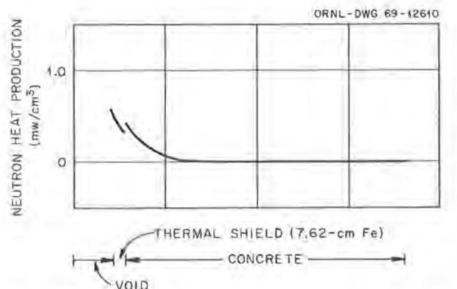

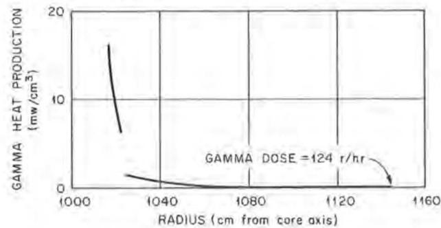  
Fig. 3.22. Gamma and neutron heating in a radial plane two-thirds of the distance from the midplane to the top of the core of a 1000-MW(e) MSBR $(R = 1000$ to $1160\mathrm{cm})$

determine the distribution of tritium in the MSRE and to compare it with calculated production rates.43

The calculated production of tritium in the MSRE fuel salt when the reactor was operating at 7.25 MW with $^{233}\mathrm{U}$ fuel* amounted to 40 Ci/day. Of this, 35 Ci/day was from thermal-neutron absorptions in $^{6}\mathrm{Li}$ , which comprised $0.0048\%$ of the lithium, and 5 Ci/day from fast-neutron reactions with $^{7}\mathrm{Li}$ . There was also some production of tritium in lithium in the thermal insulation around the reactor vessel. Because of the large uncertainty in the lithium content of the particular batch of insulation that had been used in the MSRE, the calculated production from this source could be anywhere from 0.1 to 6 Ci/day.

Moisture condensed from the containment cell atmosphere had, since the beginning of power operation, carried with it tritium which had been routinely measured before disposal. Measured rates, which were averages over collection periods of several months,

ranged from 4 to 6 Ci/day. When the change to $^{233}\mathrm{U}$ was made, the change in tritium collection, if any, was within the scatter of the measurements.

Tritium in the MSRE fuel off-gas at the exit from the fission product absorbers was measured in November and December 1969 at intervals through a 23-day shutdown, a startup, and the final 16-day run at full power. The tritium was collected by flowing the gas through hot copper oxide and then trapping out water. Experiments with the copper oxide at different temperatures indicated that roughly half of the tritium was present as hydrocarbons (presumably as a result of exchange with hydrogen in oil vapors coming from the fuel pump). Just before the shutdown, after more than a month of operation at full power, the tritium effluent in the off-gas was measured to be $23\mathrm{Ci}/$ day. Nineteen days after the fuel was drained, the effluent rate was still half as high, indicating tritium holdup somewhere in the fuel or off-gas systems. During the final run, several analyses showed tritium gradually building up in the fuel off-gas over a two-week period, extrapolating to between 25 and $30\mathrm{Ci}/$ day.

It had been recognized that tritium could diffuse in atomic form through metal walls, and samples of the off-gas from the MSRE coolant salt showed $0.6\mathrm{Ci/day}$ clearly more than the 0.0001 Ci/day calculated to be produced in the coolant-salt system. Much more tritium was found to be leaving the reactor in the air that had passed over the coolant radiator. The concentration was extremely low $(< 0.1\mu \mathrm{Ci} / \mathrm{m}^3)$ , and divergent results were obtained by various methods of sampling and analysis. The values thought to be most reliable fell at around 5 Ci/day.

It thus appeared from the measurements that in the MSRE about 60 to $70\%$ of the calculated production in the fuel salt eventually found its way out through the fuel off-gas system. About 12 to $15\%$ of the production in the fuel diffused through the heat exchanger tubes, and about nine-tenths of this went on out through the radiator tubes into the cooling air. The uncertainty in the production in the thermal insulation clouded the interpretation of the tritium observed in the reactor cell. The rate was 10 to $15\%$ of the production in the fuel, but the lack of measurable change when the substitution of ${}^{233}\mathrm{U}$ nearly doubled the production in the fuel strongly suggested that a large fraction probably originated in the insulation. The sum of the most probable values of the measured effluent rates amounted to only about $85\%$ of the calculated total production in the reactor. Although the probable errors in the calculations and measurements amount to at least this much, the comparison suggested the retention of tritium somewhere in the system.

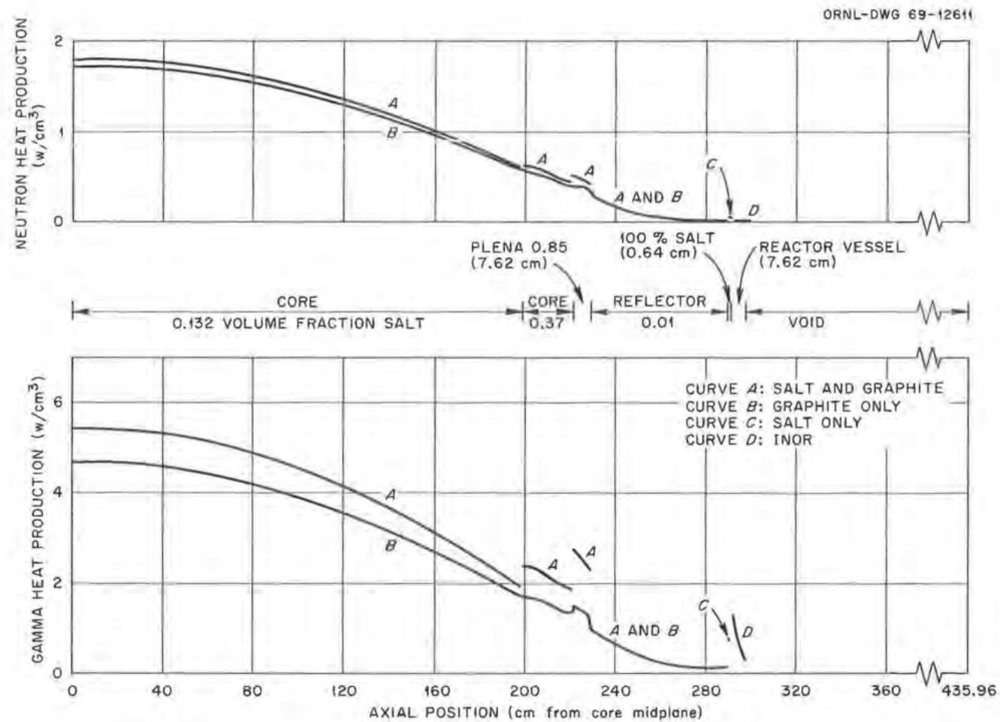  
Fig. 3.23. Neutron and gamma heating near the core axis of a 1000-MW(e) MSBR $(R = 0$ to $436~\mathrm{cm})$

An attempt was made to determine whether one could, with existing data, calculate a distribution of tritium in the MSRE that agreed with the observed distribution.44 The calculations were based on conventional mass transfer and diffusion equations and made use of constants obtained from the technical literature or calculated by conventional methods. They indicated that of the tritium produced in the MSRE fuel salt, up to $15\%$ should come out of the radiator tubes, more than $50\%$ should leave in the fuel off-gas, and up to $40\%$ should appear in the reactor cell atmosphere. This distribution was in reasonable agreement with that observed, except for the much larger fraction which would be expected to escape into the cell atmosphere. The calculations further indicated that in addition to the hydrocarbons deposited in the off-gas system from fuel pump oil leakage, graphite in the core and metal in the salt containers could have been reservoirs for the tritium that was seen to persist after shutdown.

3.3.7.3 Production and distribution in the MSBR. Kerr and Perry45 estimated that a 1000-MW(e) MSBR would produce a total of about 2420 Ci per full-power day from the various sources shown in Table 3.12.

Using the same basic tritium behavior information applied to the MSRE analysis, Briggs and Korsmeyer calculated the tritium distribution in the reference MSBR design, as shown in Table 3.13. These calculations assumed that shortly after birth the tritium would form either ${}^{3}\mathrm{H}_{2}$ or tritium fluoride, ${}^{3}\mathrm{HF}$ . The sparging action of the helium bubbles used to strip xenon would remove virtually all of the ${}^{3}\mathrm{HF}$ but only a fraction of the ${}^{3}\mathrm{H}_{2}$ . The cause of the different behavior is that ${}^{3}\mathrm{H}_{2}$ which reaches a metal wall would readily dissociate to form ${}^{3}\mathrm{H}$ atoms, which can diffuse into the walls, while ${}^{3}\mathrm{HF}$ molecules would not dissociate. (There would be some reaction of ${}^{3}\mathrm{HF}$ with the metal to release ${}^{3}\mathrm{H}$ , but this was assumed to be negligible.) The ratio of ${}^{3}\mathrm{H}_{2}$ to ${}^{3}\mathrm{HF}$ would depend on the $\mathrm{UF}_3 / \mathrm{UF}_4$ ratio in the fuel salt, assumed to be 0.001 in the

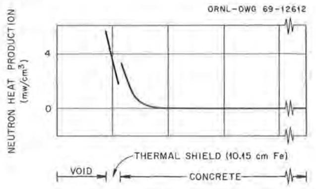

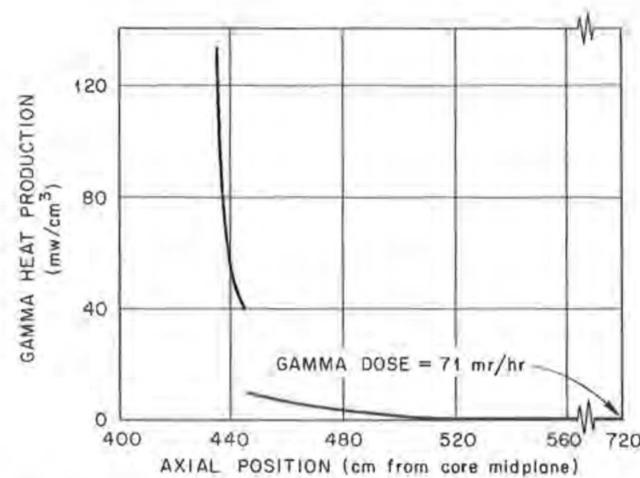  
Fig 3.24. Neutron and gamma heating near the core axis of a 1000-MW(e) MSBR $(R = 400$ to $720\mathrm{cm}$

calculations reported in Table 3.13. A fraction of the tritium from the fuel salt would pass through the pipe and vessel walls to the reactor cell atmosphere, but a major part would diffuse through the relatively large area and thin walls of the tubes in the primary heat exchanger into the secondary-salt system. Some of this tritium would diffuse out through the walls into the steam cell, a very small fraction would be carried out of the coolant-salt loop with the cover gas, but the larger proportion would dissociate and diffuse through the steam generator tube walls to form tritiated water in the heat-power system. In the calculations for Table 3.13 no account was taken of the resistance of the oxide film on the water side of the heat exchanger tubes. Some data indicate that this resistance should appreciably reduce the transfer to the steam system, which tends to make the rate in Table 3.13 a conservatively high estimate.

3.3.7.4 Concentrations and release rates. The steady-state tritium concentration that is reached in the steam system is the ratio of the tritium infusion rate to the

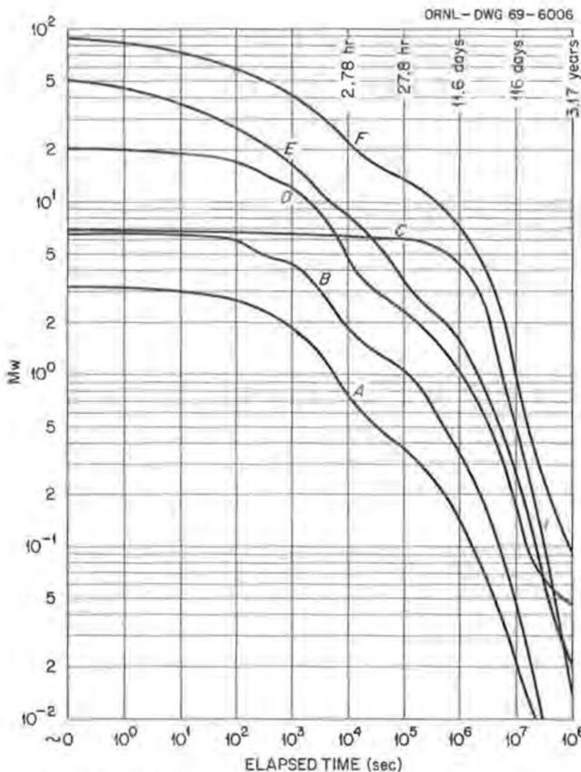  
Fig. 3.25. Afterheat distribution with saturation concentration of fission products in a 1000-MW(e) single-fluid MSBR fueled with $^{235}\mathrm{U}$ .

Curve A. Afterheat in core region produced by Kr and Xe diffused into the graphite plus heating by $10\%$ of the total noble metal fission products assumed to be plated on surfaces.

Curve B. Afterheat in the four heat exchangers produced by $40\%$ of total noble metal fission products plated on metal surfaces.

Curve C. Afterheat in the chemical processing system produced by protactinium and long-lived fission products.

Curve D. Afterheat in the off-gas system produced by Kr and Xe, plus heating by $50\%$ of the total noble metal fission products.

Curve E. Afterheat produced by fission products which remain dispersed in the primary salt.

Curve F. The sum of all curves, A through E.

In curve A the concentration of $\mathrm{Kr} + \mathrm{Xe}$ is that which produces a poison fraction of $0.0056\delta k / k$ and is obtained by gas sparging on a 30-sec removal cycle. Curves A, B, and D are based on the assumption that the noble metals are either deposited immediately on metal and graphite surfaces or enter the off-gas system immediately. In curves A, B, and D the afterheat includes that from decay of the daughter products of the noble metals and gases.

rate of water discharge from the system (leaks, blowdown, and sampling streams). A reasonable estimate for

Table 3.12. Rates of tritium production in the MSBR at 2250 MW(t)   

<table><tr><td></td><td>Production (Ci/day)</td></tr><tr><td>Ternary fission</td><td>31</td></tr><tr><td>\( ^6\mathrm {Li}(n,\alpha)^3\mathrm {H} \)</td><td>1210</td></tr><tr><td>\( ^7\mathrm {Li}(n,\alpha n)^3\mathrm {H} \)</td><td>1170</td></tr><tr><td>\( ^{19}\mathrm {F}(n,^{17}\mathrm {O})^3\mathrm {H} \)</td><td>9</td></tr><tr><td></td><td>2420</td></tr></table>

Source: ref. 45.

the water discharge rate is $1\%$ of the $2.1 \times 10^{6}$ lb of water in the system per hour. Assuming that 1670 Ci/day does enter the system, the tritium concentration would level off in about two weeks of full-power operation at $7\mu \mathrm{Ci}$ of ${}^{3}\mathrm{H}$ per gram of water.

In the current Standards for Protection against Radiation,46 the maximum permissible concentration of tritium in water for $40\mathrm{hr}$ /week occupational exposure is $0.1\mu \mathrm{Ci} / \mathrm{ml}$ . Thus, if the tritium in the MSBR steam is anywhere near as high as the $7\mu \mathrm{Ci} / \mathrm{g}$ calculated, means would have to be taken to limit exposure of plant operators. These measures would not have to be nearly as elaborate as those required around some heavy-water reactors, where tritium concentrations are more than $10^{3}$ times that predicted for the MSBR steam,47 but the precautions in the MSBR steam plant would certainly include tritium monitors, good ventilation of work areas, restrictions on handling discharged water, and possibly use of masks in working on steam leaks. (Air saturated at $100^{\circ}\mathrm{F}$ with vapor from the steam system would contain $3\times 10^{-4}\mu \mathrm{Ci}$ of ${}^{3}\mathrm{H}$ per cubic centimeter, or 70 times the MPC for air for $40\mathrm{hr}$ /week exposure.)46

It would be convenient if the water bled from the MSBR steam system could be released by simply mixing it with the $\sim 440,000$ gpm of condenser cooling water effluent. If 1670 Ci/day were being discharged, the concentration in this stream would be $0.7 \times 10^{-3} \mu \mathrm{Ci} / \mathrm{ml}$ . This is less than the $3 \times 10^{-3} \mu \mathrm{Ci} / \mathrm{ml}$ currently specified as the MPC for water discharged to an unrestricted area.[46]

It thus appears that even if the conservatively high estimate of tritium transfer to the steam system were correct, the concentration in the MSBR steam would not seriously hamper plant operation and maintenance, and the plant effluent would meet the current standards for release to unrestricted areas. Expert reviews of the biological effects of tritium lead to the conclusion that

Table 3.13. Calculated distribution of the tritium produced in the reference MSBR design   

<table><tr><td rowspan="2"></td><td colspan="2">Rate</td></tr><tr><td>Percent of total \( ^3\text{H} \) production</td><td>Curies/day at 2250 MW(t)</td></tr><tr><td colspan="3">Removed from primary system with sparge gas</td></tr><tr><td>\( As^{3}\text{H}_{2} \)</td><td>5.8</td><td>140</td></tr><tr><td>\( As^{3}\text{HF} \)</td><td>7.0</td><td>170</td></tr><tr><td>Entering secondary system cover gas</td><td>0.1</td><td>2</td></tr><tr><td>Entering reactor cell atmosphere</td><td>8.7</td><td>211</td></tr><tr><td>Entering steam cell atmosphere</td><td>9.4</td><td>227</td></tr><tr><td>Entering steam-power system</td><td>69.0</td><td>1670</td></tr><tr><td></td><td>100.0</td><td>2420</td></tr></table>

Source:ref.11

the currently specified maximum permissible concentrations are conservative and limit increased dose to the population to a negligible fraction of background.48 Nevertheless, it would be quite unrealistic to assume that the reference design of the MSBR is satisfactory with regard to tritium control. Release of a curie of tritium per megawatt-day of electricity from an MSBR plant will not be tolerated, especially since other reactors and fuel-reprocessing plants release far less. Fortunately, there appear to be several practical ways to ensure that the tritium release from an MSBR is far below the values listed in Table 3.13. These are discussed briefly in Sect. 16.4 of this report.

# 3.4 THERMAL AND HYDRAULIC DESIGN OF CORE AND REFLECTOR

W.K.Furlong H.A.McLain

# 3.4.1 Core

A basic objective for the thermal and hydraulic design of the core is to regulate the salt to achieve a uniform temperature rise of the salt flowing through each of the channels. From plenum to plenum, this rise is set at $250^{\circ}\mathrm{F}$ . There are other important factors, however, which must be minimized or kept within allowable limits, such as the fuel-salt inventory, the pressure drop due to flow, the graphite temperatures, and the vessel wall temperatures.

Neutron-induced volume changes in the graphite are sensitive to temperature, as discussed in Sect. 3.2.3; thus the temperatures should be minimized in the regions of high damage-neutron flux $(E > 50\mathrm{keV})$ if

the design goal of a four-year graphite life is to be achieved. Figure 3.10 gives a graphical representation of the graphite volume changes as a function of fluence, with temperature as a parameter. The minimum graphite temperature is set by the salt temperature at its boundary. However, the graphite is heated internally by neutron scattering and absorption of gamma radiation, raising its temperature above the salt datum and making it dependent upon the film heat transfer coefficient as well.

The gamma and neutron heating has been calculated from transport theory, as reported in Sect. 3.3.5. The radial variation of fission power density, which governs the radial flow distribution, is shown in Fig. 3.26. The discontinuity in the curve is between zone I, having $13.2\%$ salt by volume, and zone II, having $37\mathrm{vol}\%$ (see Table 3.3 for definition of zones). For the purpose of temperature calculations, the axial power density variation in zone I was approximated by a cosine function of the form

$$
Q = Q _ {\max } \cos (\pi z / H),
$$

where $z$ is the distance from the midplane and $H$ is an extrapolated height of 16.2 ft. (The actual design height, excluding reflectors, is 15 ft.)

The choice of prismatic moderator elements with a central hole was based on a combination of neutronic and heat transfer considerations. Two alternatives considered were tangent solid cylinders and spheres. The cylinders have a less-than-optimum salt fraction of about $9\%$ . An objection to this geometry is the cusp formed near the region of contact; the relatively poor heat transfer in this area could be a problem at the power densities used in the present design. Also, the cylinders have only line contact, and the possibility exists for misalignment or bridging, particularly after dimensional changes. Spheres which are randomly packed have a $37\%$ void space. This would give a salt fraction far too great for the major portion of the core. Use of two different sphere sizes would reduce the void fraction closer to the value needed in zone I for optimum breeding performance, but pressure drop considerations made this approach questionable. The $37\%$ void space in the spheres would, however, be about optimum for the undermoderated portion, or "blanket" region. The graphite balls would require some sort of barrier to contain them, however, and the spheres did not appear to offer any particular advantages over the graphite element design selected for the undermoderated region.

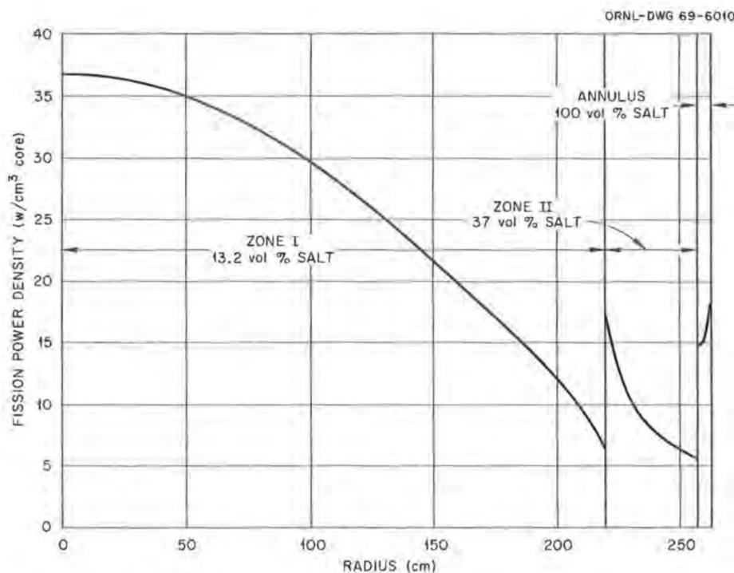  
Fig. 3.26. Radial distribution of fission power density averaged over length of MSBR core and both axial reflectors.

As a result of the above considerations, the selected moderator element consists of a long prism with a 4-in. square cross section containing a central hole. Ribs on the faces separate adjacent elements and form interstitial salt flow channels. The geometry of the cross section is a compromise between the neutronic, heat transfer, and fabrication considerations. In zone I it is desirable from a nuclear viewpoint to have a more heterogeneous cell (larger dimensions), but the controlling consideration is heat conduction out of the graphite. In zone II the neutronics favor a smaller element, but buckling and vibration impose a lower limit. Although not an optimum dimension, the 4-in. square appeared to be the best compromise.

The optimized physics calculations indicated that the volume fraction of salt in zones I and II should be 0.132 and 0.37 respectively. These fractions are obtained by adjusting either the diameter of the center hole or the rib size (which alters the interstitial channel size). Minimum dimensions on both the hole and the ribs are influenced by fabrication considerations. Specifically, to achieve relatively low costs of fabrication by the extrusion method will require that the element geometry contain no radii of less than about 0.25 in. Also, it is believed that the center hole diameter should

not be less than about 0.6 in. to assure successful deposition of the pyrolytic graphite coating on the graphite surfaces.

The graphite moderator elements are shown in Figs. 3.4 and 3.5. The central part of the core, zone I-A, will be comprised of elements of the type shown in Fig. 3.27, while those at a larger radius (lower power density) will be of the type shown in part $b$ of the figure and are designated as zone I-B. The salt fraction is 0.132 in both zones I-A and I-B, but the interstitial channels have been made smaller and the central hole larger in zone I-B. The purpose of this arrangement is to achieve flow control by orificing only the central hole rather than by complicating the design with orifices for the interstitial channels as well. The calculations indicate that in the present design the average temperature rise through each flow channel approximates $250^{\circ}\mathrm{F}$ . For a given moderator element near the reactor center line the temperature rise for the salt flowing through the hole is essentially the same as that flowing through an interstitial passage; away from the center line the temperature rise through the hole is greater than $250^{\circ}\mathrm{F}$ and that in the interstitial channel is less than $250^{\circ}\mathrm{F}$ . The orificing for the central holes will be designed so that the salt streams discharging from all

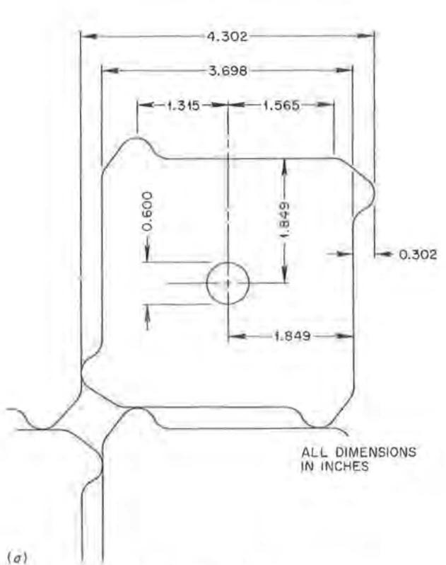

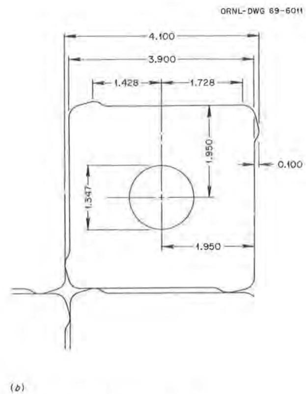  
Fig. 3.27. Graphite moderator element for (a) zone I-A and (b) zone I-B of reactor core,

flow channels associated with a given element will combine to give a bulk temperature of $250^{\circ}\mathrm{F}$ above the inlet value.

The elements for core zone II-A are prismatic and are shown in Fig. 3.5. They are identical to the elements used in zone I-B except that the central hole diameter is 2.581 in. to obtain the 0.37 salt fraction needed in the undermoderated region. The elements for zone II-B are in the form of rectangular slats spaced far enough apart to provide the 0.37 salt fraction. As shown in Fig. 3.3, the slats are separated by pins and elliptical rods. The latter are intended to minimize the cross flow which would otherwise occur from zones I and II into the annulus due to the annulus being orificed at the bottom and operating at a lower pressure than the core and reflector regions. (The annulus was orificed in this manner so that the salt flow will be predominantly radially inward through the radial reflector, as will be described subsequently.)

Since the center of zone I is the region of highest power and greatest flow requirements, if all the flow channels at that location could have equal hydraulic diameters, the pressure drop through the core could be designed to be a minimum value. Unfortunately, the restriction on the minimum hole size through the elements, mentioned above, dictates that the hole have a larger hydraulic diameter than the interstitial channels and that orifices be used for the holes. The penalty is

not a great one, however, since the total pressure drop across the core at rated flow is estimated at only 18 psi. In this connection it may be noted that experiments have been reported in which the flow through channels formed by closely packed rods on a triangular pitch is greater than that predicted by the equivalent hydraulic diameter theory. Further study, and probably model testing, will be required to verify the calculations, particularly with regard to the passages formed by the corners of four adjacent core elements.

The flow divisions and various flow paths through the reactor are shown schematically in Fig. 3.28. The salt volumes and approximate power generation for each region are also shown. The dashed lines in the figure indicate lines of minimal flow, that is, paths for which flow is purposely minimized by orificing or for which it is unavoidable due to clearances. From Fig. 3.28 it may be noted that there are three major flow paths: (1) through zones I and II, where the bulk of the power is generated, (2) between the vessel and reflectors and through the radial reflector pieces to the annulus, and (3) through the control rod region and lifting-rod holes. The flow and temperature aspects will receive further discussion in the sections that follow.

Peak and average steady-state temperatures in the central moderator elements were investigated using the HEATING code.50 This is based on the relaxation method and employs constant thermal conductivity.

Fig. 3.28. Salt flow paths for MSBR core and reflectors.   
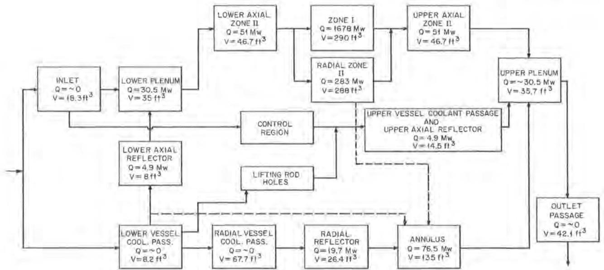  
ORNL-DWG 70-11913

The center of the core is the region of maximum damage flux, but the maximum element center-line temperature occurs at an axial position a few feet above the midplane, as determined from a heat balance with appropriate integration of the axial power density variation. The worst combination of damage flux and temperature, which will result in minimum graphite life, is found to occur about 1 ft above the midplane and along the center line of the core. Figure 3.29 shows the results of the temperature calculations at the midplane and at a plane 1 ft higher. The significant input parameters used in the calculations are listed in Table 3.14. The heat transfer coefficients were based on the Dittus-Boelter correlation. Recent investigations at ORNL indicate that in the range of Reynolds numbers of interest, heat transfer coefficients for the fuel salt are slightly lower (about $20\%$ ) than those predicted by the correlation used in the MSBR conceptual study. Even if the lower values are used, however, it should not make any significant change in the temperatures reported here, since the graphite itself is the major resistance to heat transfer. The effects of vertical flow and entrained gas on the heat transfer coefficient remain to be investigated. It was assumed in the calculations that the effect of volumetric heat sources on heat transfer between graphite and salt was

Table 3.14. Input parameters for calculating MSBR moderator element temperatures using the HEATING code   

<table><tr><td></td><td>At midplane</td><td>At 1 ft above midplane</td></tr><tr><td>Salt temperature, °F</td><td>1175</td><td>1200</td></tr><tr><td>Heat generation rate, Btu hr-1in. -3</td><td>290.8</td><td>286.1</td></tr><tr><td>Graphite thermal conductivity, Btu hr-1in. -1 (°F) -1</td><td>1.415</td><td>1.415</td></tr><tr><td>Heat transfer coefficient for center hole, Btu hr-1in. -2 (°F) -1</td><td>12.26</td><td>12.63</td></tr><tr><td>Heat transfer coefficient for outer surface, Btu hr-1in. -2 (°F) -1</td><td>12.85</td><td>13.22</td></tr></table>

${}^{a}$ At near the reactor center line,where the temperature rise through the holes and through the interstitial passages is essentially the same. Further out from the center line the rise is not equal.

negligible and that there was no heat transfer between graphite and salt for a distance of 0.1 in. on either side of the apex of the ribs on the outer edge of the moderator elements. The latter assumption is a first approximation to account for the restricted flow in that area.

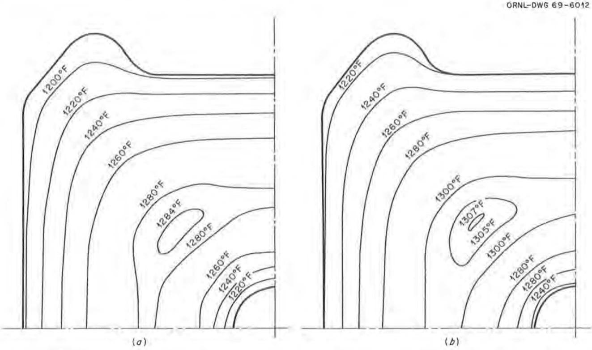  
Fig. 3.29. Temperature distribution in graphite moderator element at (a) midplane of core and (b) 1 ft above midplane.

Temperatures have not yet been investigated in the moderator elements at radial positions other than at the center of the core, nor have they been examined in zone II. In these areas of lower radial power density and consequently lower salt flow rates, the heat transfer coefficients will be less. However, the heat sources within the graphite are also reduced, as is the damage flux. Although a more detailed analysis may indicate higher peak graphite temperatures at locations other than those investigated, the reduction in damage flux is expected to be more than compensating. On the basis of the data presented in Sect. 3.2.3 on damage flux and graphite life, the MSBR graphite will achieve the design objective of a four-year life at the temperatures which would exist in the reference design.

Preliminary calculations indicate that vibration of the moderator elements should not be a problem. The magnitude of the vibrations was determined by extrapolating known information about the amplitude of rod vibrations associated with parallel flow and adding to this the rod deflection due to cross flow of salt between the channels. Assuming the velocity of the salt between adjacent channels to be $\frac{1}{4}$ fps and extrapolating information on vibration due to cross-flow vortex shedding, the sum of the two effects gives a total calculated amplitude of vibration at the center line of less than 0.002 in. Model tests will be required for substantiation, but on this basis it is believed that core vibrations will not limit the design parameters.

It may be noted that a 12- by 12-in. area has been assigned for control rods in the center of the reactor. The salt flow in this region will be in excess of that needed to cool the rods in order to bring sufficient cool salt to the top axial reflector. Orificing of the flow in this central region will also be required to limit variations in the flow as a function of control rod position.

# 3.4.2 Radial Reflector

Determination of reflector temperatures is important because of their relationship to graphite life, amount and temperature of coolant required, and stored energy during afterheat removal. The relationship between life, damage flux, and temperature is shown in Fig. 3.10. For a given nuclear design there is a maximum allowable temperature for any reflector section which is intended to remain fixed in position for the design life of the reactor. Conversely, a temperature distribution calculated for given reflector geometry and coolant conditions may dictate a reduction in the incident damage flux, even though this entails a departure from optimum nuclear conditions. The amount and tempera

ture of coolant are interdependent. The major part of the coolant temperature rise is due to its own internal fission heating, and it is desirable to have each unit volume of salt experience the same plenum-to-plenum temperature rise. On the other hand, the need for improved heat transfer coefficients or lower sink temperatures may dictate a higher flow rate than that required to attain this rise.

A reflector design using graphite blocks averaging about $1\mathrm{ft}^3$ was rejected when analysis indicated excessive temperatures. The principal cause was fission heat from trapped interstitial salt. This heat had to be transferred to a cooled surface by conduction, which required large temperature gradients. A conclusion was that regions of static salt must be avoided everywhere within the reactor vessel. Without the presence of internal fission heat, the sources in the reflectors consist primarily of photons leaking from adjacent blanket regions and from neutron slowing down. These sources are shown in Fig. 3.30.

The present radial reflector design, shown in Figs. 3.1-3.3, has been analyzed using the HEATING code.50 Boundary temperatures were based on the fluid temperature required at a given location for an overall $250^{\circ}\mathrm{F}$ rise and also considered surface temperatures due to the volumetric heat source in the fluid. The volume fraction of salt in the reference design reflector is about $1\%$ , but as long as the salt is flowing this quantity is not important to the temperature distribution estimates in that heat generation within the salt is carried away by the salt and the fission heating in the salt far exceeds the heat transferred into it from the graphite. Hence the conduction problems have been treated with fixed boundary conditions rather than having to couple the salt and graphite by an energy balance. Heat transfer coefficients were based on laminar flow of fluid between graphite segments and between reflector and vessel and on turbulent flow of the fluid at the reflector-blanket boundary in the 2-in.-wide annular space between the reflector and the removable core assembly. Resulting temperatures at the axial midplane are shown in Fig. 3.31. This is about the location of the peak damage flux, which has been constrained to about $4\times 10^{13}$ $(E > 50\mathrm{keV})$ to achieve the 30-year design life at the calculated $1250^{\circ}\mathrm{F}$ surface temperature. The decrease of damage flux with distance into the reflector overrides the effect on graphite life of increasing temperature near the edge of the reflector.

In order to meet the heat-removal requirements and the other objectives mentioned above, the flow of salt through the reflector graphite must be in the radial direction rather than vertically upward, as it is in the

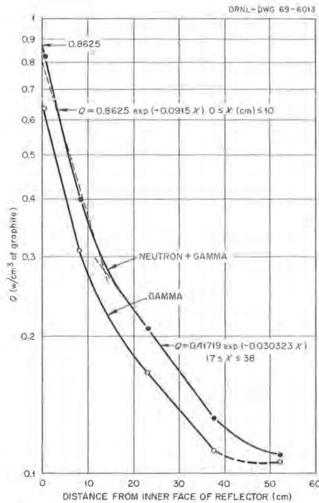  
Fig. 3.30. Heat sources in graphite radial reflector at midplane.

core. In large part this is due to the fact that the thermal coefficient of expansion of Hastelloy N is greater than that of the graphite. The reflector graphite could be restrained into essentially the room-temperature geometry with little change in the flow channel geometry, but the expanding vessel would draw away from the reflector and increase the salt volume in the annulus between the vessel wall and the graphite. This would result in an undesirable increase in the primary-salt inventory. It was therefore decided to restrain the reflector graphite to maintain its position relative to the wall and let the flow passages in the graphite open up as the system is brought up to temperature. With an increase in the width of the flow channels in the reflector graphite, axial flow passages for the reflector are not fixed. Connecting the reflector flow passages, the annular space at the vessel wall, and the annular space between the reflector and the removable core to

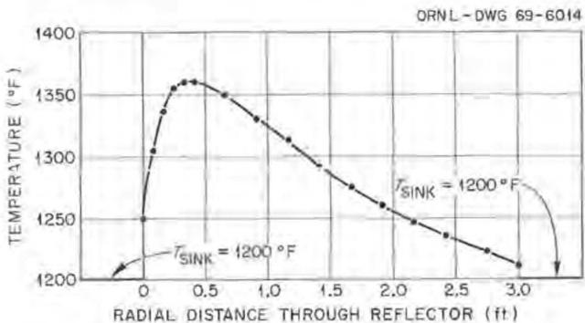  
Fig. 3.31. Temperature distribution in graphite radial reflector at midplane based on heat sources shown in Fig. 3.30.

common plenums located at the upper and lower ends of the reflector is not satisfactory with axial flow. There would be inadequate axial flow through the reflector if the pressure difference was limited to the amount necessary to get the desired temperature rise for the salt flow through the annular space. On the other hand, there would be excessive salt flow through the annular spaces if this pressure difference was increased to get the necessary flow through the reflector region. However, the use of radial flow circumvents these design difficulties.

The salt in the reflector flows inward toward the core in order to minimize the vessel wall temperature and because of orificing considerations. The annulus between the core and reflector is orificed at the bottom because of mechanical assembly considerations and because this annulus serves as the collection plenum for the radial flow through the reflector. Salt flow from the undermoderated region of the core into the annulus is restricted by graphite rib seals located between the graphite slabs in the undermoderated region, zone II. Axial distribution in the radial flow through the reflector is controlled by orifices located at the inlets of the radial flow passages.

# 3.4.3 Axial Reflectors

The axial reflectors are subjected to a $66\%$ higher peak damage flux than the radial reflector. However, the lower one is replaced with the moderator, and the upper one must last only half of design life due to the alternate use of the two heads. Hence, temperature and damage flux considerations are not as stringent as in the radial reflector. The heating rate in the upper axial reflector was analyzed using the HEATING code.[50] The axial behavior of the source is shown in Fig. 3.32. The radial variation was described by a cosine. The

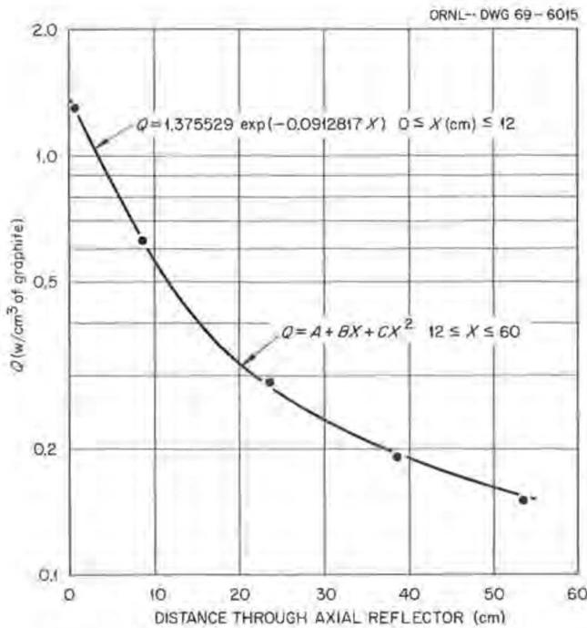  
Fig. 3.32. Gamma and neutron heating in graphite axial reflectors.

inner face was subjected to $1300^{\circ}\mathrm{F}$ salt, while the other faces were in contact with somewhat cooler salt, which is transported from the reactor inlet via the control region and lifting-rod holes, to provide a low-temperature fluid coolant sink for the vessel head. On the above basis, the peak temperature was found to be $1363^{\circ}\mathrm{F}$ , and the surface temperature in the region of peak damage flux was $1265^{\circ}\mathrm{F}$ .

# 3.5 REACTOR VESSEL DESIGN

# 3.5.1 Reactor Vessel Description

E. S. Bettis

The basic features of the reactor vessel are shown in Figs. 3.1 and 3.2. The vessel has an inside diameter of 22.2 ft, an overall height at the center line of about 20 ft, a wall thickness of 2 in., and a head thickness of 3 in. Major considerations in the design of the vessel were:

1. The core must be replaceable without undue difficulty.   
2. The holdup of fuel salt in nozzles, plenums, and other volumes exterior to the core must be a minimum.   
3. The vessel walls and heads must be protected from excessive temperatures and radiation damage.

4. The vessel must be designed for 75 psig and a wall temperature of $1300^{\circ}\mathrm{F}$ and must meet ASME code requirements for nuclear vessels.[56]   
5. The vessel must be constructed entirely of modified Hastelloy N.

The reactor vessel is constructed of the following major pieces:

1. A cylindrical section, 22.5 ft OD × ~13 ft high, with a wall thickness of 2 in.   
2. A transition section, about 4 ft high, with one end having a diameter of about 18 ft and the other 22.5 ft. This section has four symmetrically spaced salt outlet nozzles and radial gusset plates attached to it. The wall thickness is 2 in.   
3. Two cylindrical sections about $13\frac{1}{2}$ ft high with 2-in.-thick walls. One has an inside diameter of 18 ft and the other an outside diameter of slightly less than 18 ft, so that one fits inside the other, as shown in Fig. 3.2. Forged flanges at the top provide the vessel closure.   
4. One upper and one lower dished head, each 3 in. thick. The upper head is about 18 ft in diameter and the lower about $22\frac{1}{2}$ ft.

With the exception of the flanged closure at the top, the vessel is of all-welded construction, fabricated of modified Hastelloy N having the physical properties listed in Table S.1 and discussed in Sect. 3.2.4.

The design requirement for core replaceability led to adoption of the cylindrical extension on the vessel and top head which permits the closure flange to be located in a relatively lower temperature region and one with greatly reduced radiation intensity. The flange face is about 6 in. wide and is machined for two metal ring gaskets. The space between the two rings will be continuously evacuated and monitored for fission gases. The flanges are joined by a clamp which encircles the outside of the flange and extends upward to the operating floor level. Thirty-four 1-in. bolts in this clamp are easily accessible and supply the force which is transmitted to the flange faces for making the closure. It may be noted that the weight of the upper layer of roof plugs rests on the upper flange and reduces the bolt tension required to maintain the gasket loading.

The transition section was adopted to conserve fuel-salt inventory in the region of the outlet salt nozzles and to minimize the diameter of the top head assembly to be handled during core replacements. The necking in of the vessel at the top prevents top loading of the last row of reflector graphite and requires a special shape for two of the blocks, as discussed in Sect.

3.1.2. The transition section also serves as a collection header for the fuel salt leaving the top of the reactor, diverting it into the four exit nozzles. These nozzles are of a special shape, elliptical in cross section at the vessel end and cylindrical in cross section where joined to the fuel-salt piping leading to the pump inlet. Reinforcing webs are used in the construction of the outlet nozzle to provide needed strength.

The cylindrical portion of the vessel is fabricated of rolled plate, rough machined after heat treatment. The roundness tolerance is probably about $\pm 1 / 2$ in. The dished top head has a forged ring welded around its circumference for joining it to the upper cylindrical extension. The maximum thickness of the ring is about 4 in.

The fuel-salt inlet is at the center of the bottom head. The inlet plenum is a well about 3 ft in diameter and 4 ft high at the center line of the vessel. The four 16-in.-diam fuel-salt pipes enter symmetrically around this well, as indicated in Fig. 3.1. The 6-in. drain connection is to a nozzle in the bottom head of the well. Hastelloy N flow diverters, or turning vanes, are provided in the plenum to direct the salt flow upward and to reduce the turbulence in the reactor vessel inlet nozzle.

The top head of the vessel has an 18-in.-diam nozzle at the center line for the pipe containing the control rod assembly. The cylindrical extension of the top head is provided with lifting lugs into which the spider carried by the hoisting machine engages to lift the reactor core assembly from the vessel, as described in Sects. 3.1.2 and 12.3.

# 3.5.2 Reactor Vessel Temperatures

W.K.Furlong

The reactor vessel will be heated above the $1000^{\circ}\mathrm{F}$ ambient cell temperature by the hot molten salt flowing on the inside and by neutron and gamma absorptions. The maximum metal temperature and the temperature distribution are important because they affect the calculated and design stress intensities in the walls, heads, and nozzles.

An analysis of the 2-in.-thick cylindrical wall indicated that the peak metal temperature would be about $69^{\circ}\mathrm{F}$ above the interior salt temperature and would occur close to the outside surface at about midheight. In making this study it was assumed that the salt temperature at the inside face was uniform at $1100^{\circ}\mathrm{F}.$ A similar study of the 3-in.-thick upper head gave peak temperatures 20 to $80^{\circ}\mathrm{F}$ above the inside salt temperature (again assumed as $1100^{\circ}\mathrm{F}$ ), also occurring

on the outside surface. The lower head has less incident gamma flux due to the shielding provided by the internal structures and is cooled by salt closer to the $1050^{\circ}\mathrm{F}$ inlet salt temperature and thus will operate somewhat cooler than the upper head.

The calculated stress intensities in the walls and upper head are generally within the allowable, or design, intensity range, since the salt sweeping the inside surfaces is a bypass stream taken from the reactor inlet and should not significantly exceed the assumed average of $1100^{\circ}\mathrm{F}$ . However, if the metal were bathed by salt closer to the reactor outlet temperature of $1300^{\circ}\mathrm{F}$ , it is possible that some metal temperatures would be unacceptably high in that the allowable, or design, stress intensity would have to be revised downward. The vessel has not been designed or analyzed in detail, but it is considered a possibility that further study would disclose localized areas, such as the outlet nozzles or the junction of the top dished head with the cylindrical portion (where stresses tend to be high), which would have to be shielded from the flow of hottest salt. Although the lower head is larger in diameter than the upper head and thus would have higher stress intensities in withstand the internal pressure, the temperature is sufficiently low to keep the stress intensities in this part of the vessel within the acceptable range.

# 3.5.3 Reactor Vessel Stresses

C.W.Collins

A preliminary elastic stress analysis was made for the reactor vessel using an Air Force computer program which has been modified by ORNL. The analysis was based on the top of the vessel operating at $1300^{\circ}\mathrm{F}$ and 42 psig and the bottom at $1100^{\circ}\mathrm{F}$ and 61 psig. The maximum stress in the removable head due to pressure alone is 5220 psi. This stress is located in the dished head near the junction of the head and shell skirt. The maximum stress in the vessel occurs at the junction of the lower head and shell and is 16,324 psi. The cylindrical portions of the vessel are 2 in. thick, and the dished heads are 3 in. thick.

No analytical work has been done on the nozzles, closure flanges, thermal stresses, or discontinuity stresses at the necked-down portion of the vessel

because of the large amount of time that would be required to develop computer programs. As an allowance for the uncertainty, the stresses were held well below those allowed by the ASME Boiler and Pressure Vessel Code for standard Hastelloy N. As described in Sect. 3.2.4, experimental heats of modified Hastelloy N are stronger than the standard alloy, and the alloy that will be used in the MSBR will probably be approved for higher stresses than the standard alloy. Neutron irradiation to the extent anticipated in the MSBR should not require a reduction in allowable stress. The graphite reflector is sufficiently thick to reduce the 30-year integrated neutron dose $(>300\mathrm{keV})$ at the wall to below $1\times 10^{21}$ neutrons/cm². At this fluence the reduction in metal strength is insignificant.

As stated in Sect. 3.2, standard Hastelloy N is approved for use under Sects. III (ref. 56) and VIII (ref. 57) of the ASME Boiler and Pressure Vessel Code. The design stresses applicable for nuclear vessels at temperatures up to $1300^{\circ}\mathrm{F}$ were determined through the following case interpretations.

Case 1315-3 (ref. 30) approves use of Hastelloy N for pressure vessels constructed in accordance with provisions of Sect. VIII, Division 1. Allowable stresses are given for temperatures to $1300^{\circ}\mathrm{F}$ .

Case 1345-1 (ref. 31) approves use of Hastelloy N for class A vessels constructed in accordance with provisions of Sect. III of the Code. Design stress intensity values are provided only to $800^{\circ}\mathrm{F}$ , in common with other materials approved for use under Sect. III (ref. 56).

Case 1331-4 (ref. 58) provides rules for construction of class A nuclear vessels that are to operate at temperatures above those provided for in Sect. III (ref. 56). It permits the use of allowable stresses from Division 1 of Sect. VIII (ref. 57) and the related Code Case 1315-3 (ref. 30).

In applying these Code cases, it is found that the allowable primary stress intensity $(S_{m})$ is 3500 psi at $1300^{\circ}\mathrm{F}$ and 13,000 psi at $1100^{\circ}\mathrm{F}$ . At the juncture of the heads and shells, where the maximum stresses occur, paragraph 5 of Case 1331-4 (ref. 58) establishes the allowable value of the primary plus secondary stress intensity as three times the allowable design stress intensity $(S_{m})$ for the metal temperature involved. On this basis, the allowable stress intensity at $1100^{\circ}\mathrm{F}$ is 39,000 psi and at $1300^{\circ}\mathrm{F}$ is 10,500 psi. Stresses in the preliminary design of the vessel have been held well below these allowable values.

From these preliminary calculations it appears that the critical stress regions are at the junction of the head and shell in the removable head and, most particularly,

at the outlet nozzles where the highest temperature occurs and for which no analysis has been attempted. When a more rigorous analysis is completed, it may be found necessary to add a thermal barrier in this region with cooling from the inlet salt stream or to alter the vessel design in this region to reduce the discontinuity stresses.

# 3.6 PRIMARY SYSTEM SALT PIPING

C.W.Collins

Because of the fuel inventory costs, a prime consideration in the design of the primary system piping was to limit the piping volume to the minimum permitted by reasonable pressure drop and by required piping flexibility. The piping must accommodate the expansion associated with the high operating temperatures of 1050 to $1300^{\circ}\mathrm{F}$ . To provide needed flexibility and low fuel-salt inventory, the fuel-salt piping must probably be limited to 16 to 20 in. in diameter.

The support scheme for the primary loop is based upon anchoring the reactor vessel to the concrete building structure while the other components are mounted on flexible supports. The pumps, heat exchanger, and piping are positioned radially around the reactor vessel, with essentially the only restraint being the vertical support by hangers mounted to the roof structure, thus allowing the components to move freely without developing excessive piping stresses. The layout of the primary-salt loop is shown in Figs. 13.7 and 13.8.

The piping system was analyzed at operating temperatures using the MEL-21 "Piping Flexibility Analysis"59 computer program. It was determined that the piping meets the requirements of USAS B31.7 "Tentative USA Standard for Nuclear Power Piping"60 for stresses due to thermal expansion, weight, and pressure loading of the system under the operating conditions. The analysis is incomplete in that no off-design conditions were considered, nor were any localized thermal or discontinuity stresses taken into account. This would have involved considerably more effort than was warranted for this conceptual design study.

The maximum computed expansion stress was 5570 psi, occurring at the point where the pump discharge pipe connects to the heat exchanger. ASME Code Case 1331.4 (ref. 58) establishes the allowable value of the primary plus secondary stress intensity as the larger of three times the allowable design stress intensity $(S_{m})$ or, as an alternate, three times the allowable stress amplitude $(S_{a})$ at $10^{6}$ cycles for the metal temperature involved. The allowable stress intensities at $1300^{\circ}\mathrm{F}$ are thus 10,500 psi, based on $3S_{m}$ , or 19,500 psi, based on

$3S_{a}$ , the latter establishing the allowable primary plus secondary stress intensity. When the $\sim 1500$ -psi stress due to pressure is added to the maximum expansion stress of 5570 psi, the allowable primary plus secondary stress intensity is not exceeded.

The primary loop is designed to be flexible enough to accommodate the large thermal expansions due to the relatively high operating temperatures. This flexibility must be controlled during an earthquake or after an accidental break in the piping that tends to cause whipping or other movement. Light-water reactors use spring supports and hydraulic dashpots on equipment and piping which permit slow movements due to thermal expansions but dampen the rapid shaking encountered in earthquakes and resist sudden reactions that would occur if a pipe ruptured. Very large support components are required in water reactors to withstand the reactions that could occur with pipe failure. Smaller supports can be used in the molten-salt reactors because the systems operate at lower pressure and have less stored energy. The MSBR supports, however, must operate at the high ambient temperatures in the cells. This can be done either by designing dashpots which use gases, molten salts, or pellet beds as the working medium or by installing insulation and cooling systems for dashpots using conventional fluids.

An engineering consultant[61] made a preliminary review and evaluation of the ability of the MSBR to withstand seismic disturbances. His findings were based primarily on engineering judgment and extensive experience in seismic engineering. No major problem areas were indicated for the seismic spectra used in current designs of reactor plants. The shaking of piping and the sloshing of fluids in the MSBR vessels do not appear to be of major concern.

# 3.7 PRIMARY HEAT EXCHANGERS

C. E. Bettis

M. Siman-Tov

H.A.Nelms

W.C.T.Stoddart

# 3.7.1 Design Requirements

The overall conditions in the MSBR system impose several specific design requirements on the primary heat exchangers:

1. The volume of fuel salt in the heat exchanger must be kept as low as practical to minimize the fuel doubling time for the reactor.

2. The entrance and exit salt temperatures, maximum (or desired) pressure drops, and the total heat transfer capacity must conform with the overall system operating conditions.

3. The type of heat exchanger, general location of nozzles, height of the unit, and minimum tube diameter must be compatible with various design, layout, and fabrication considerations.   
4. The heat exchanger must be arranged for relatively easy tube-bundle replacement by means of remotely operated tooling.   
5. All portions of the exchangers in contact with the fuel or coolant salt must be fabricated of Hastelloy N. As in any heat exchanger, the physical properties of the material establish maximum allowable temperature gradients across walls, allowable stresses, and the degree of flexibility required to accommodate differential expansions.   
6. Flow velocities, baffle thickness, tube clearance, and baffle spacing should be selected to minimize possibilities of vibration.

Within the framework of the above requirements and guidelines, design procedures $^{6,2}$ and a computer program $^{6,3}$ were developed to produce an efficient design with low fuel-salt volume.

# 3.7.2 General Description

Four counterflow vertical shell-and-tube-type heat exchangers are used to transfer heat from the fuel salt to the sodium fluoroborate coolant salt. The units are almost 6 ft in diameter and about 24 ft tall, not including the coolant-salt U-bend piping at the top. A cross-sectional drawing is shown in Fig. 3.33, and the pertinent data are given in Table 3.15.

The fuel salt enters the top of each unit at about $1300^{\circ}\mathrm{F}$ and exits at the bottom at about $1050^{\circ}\mathrm{F}$ after single-pass flow through the $\frac{3}{8}$ -in.-OD tubes. The coolant salt enters the shell at the top, flows to the bottom through a 20-in.-diam central downcomer, turns and flows upward through modified disk and doughnut baffling, and exits through a 28-in.-diam pipe concentric with the inlet pipe at the top. The coolant salt is heated from 850 to $1150^{\circ}\mathrm{F}$ in the process.

The 5803 Hastelloy N tubes are arranged in concentric rings in the bundle, with a constant radial and circumferential pitch. The tubes are L-shaped and are welded into a horizontal tube sheet at the bottom and into a vertical tube sheet at the top. The toroidal-shaped top head and tube sheet assembly has a significant strength advantage, simplifies the arrangement for the coolant-salt flow, and permits the seal weld for the top closure to be located outside the heat exchanger. About 4 ft of the upper portion of the tubing is bent into a sine wave configuration to absorb

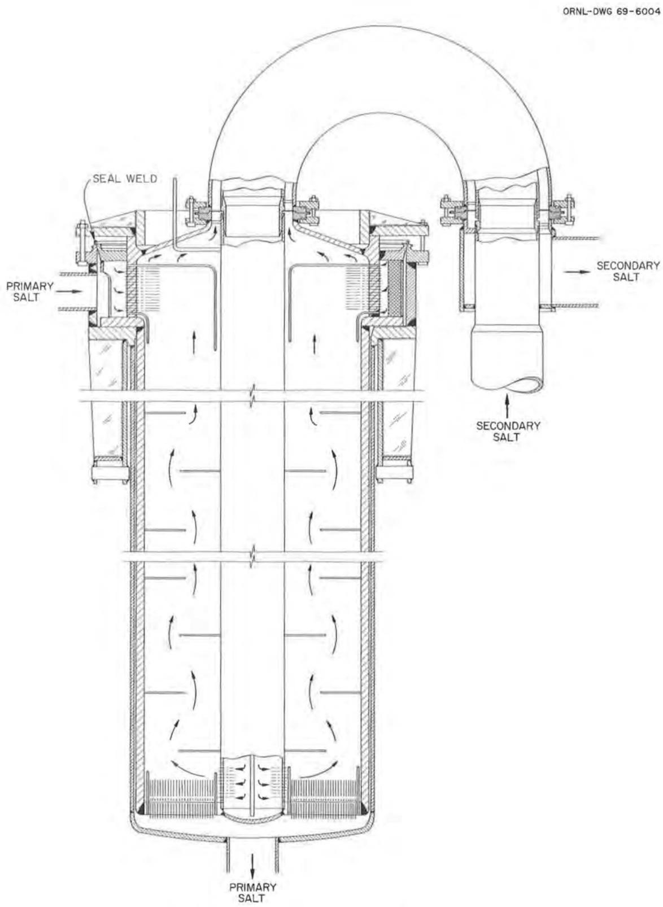  
Fig. 3.33. Sectional elevation of primary heat exchanger.

Table 3.15. Primary heat exchanger design data   

<table><tr><td>Type</td><td>One-pass shell and tubes with disk and doughnut baffles</td></tr><tr><td>Rate of heat transfer per unit</td><td></td></tr><tr><td>MW</td><td>556.5</td></tr><tr><td>Btu/hr</td><td>\( 1.9 \times 10^9 \)</td></tr><tr><td>Tube-side conditions</td><td></td></tr><tr><td>Hot fluid</td><td>Fuel \( salt^a \)</td></tr><tr><td>Entrance temperature, °F</td><td>1300</td></tr><tr><td>Exit temperature, °F</td><td>1050</td></tr><tr><td>Entrance pressure, psi</td><td>180</td></tr><tr><td>Pressure drop across exchanger, psi</td><td>130</td></tr><tr><td>Mass flow rate, lb/hr</td><td>\( 23.4 \times 10^6 \)</td></tr><tr><td>Shell-side conditions</td><td></td></tr><tr><td>Cold fluid</td><td>Coolant \( salt^a \)</td></tr><tr><td>Entrance temperature, °F</td><td>850</td></tr><tr><td>Exit temperature, °F</td><td>1150</td></tr><tr><td>Exit pressure, psi</td><td>34</td></tr><tr><td>Pressure drop across exchanger, psi</td><td>115.7</td></tr><tr><td>Mass flow rate, lb/hr</td><td>\( 17.8 \times 10^6 \)</td></tr><tr><td>Tube material</td><td>Hastelloy \( Na \)</td></tr><tr><td>Tube OD, in.</td><td>0.375</td></tr><tr><td>Tube thickness, in.</td><td>0.035</td></tr><tr><td>Tube length, ft</td><td>24.4</td></tr><tr><td>Tube-sheet-to-tube-sheet distance, ft</td><td>23.2</td></tr><tr><td>Expansion bend radius, in.</td><td>9.5</td></tr><tr><td>Shell material</td><td>Hastelloy N</td></tr><tr><td>Shell thickness, in.</td><td>0.5</td></tr><tr><td>Shell ID, in.</td><td>67.6</td></tr><tr><td>Central tube diameter, OD, in.</td><td>20</td></tr><tr><td>Tube sheet material</td><td>Hastelloy N</td></tr><tr><td>Tube sheet thickness, in.</td><td>4.75</td></tr><tr><td>Tube maximum primary (P) stresses, psi</td><td>683</td></tr><tr><td>Allowed primary stresses, \( psi^b \)</td><td>4232</td></tr><tr><td>Tube maximum primary and secondary (P+Q) stresses, psi</td><td>12,484</td></tr><tr><td>Allowed primary and secondary stresses, psi</td><td>12,696</td></tr><tr><td>Tube maximum peak (P+Q+F) stresses, psi</td><td>13,563</td></tr><tr><td>Allowed peak stresses, psi (see ref. 12)</td><td>25,000</td></tr><tr><td>Number of tubes</td><td>5803</td></tr><tr><td>Pitch of tubes, in.</td><td>0.75</td></tr><tr><td>Total heat transfer area, \( ft^2 \)</td><td>13,916</td></tr><tr><td>Basis for area calculation</td><td>Outside of tubes</td></tr><tr><td>Type of baffle</td><td>Disk and doughnut</td></tr><tr><td>Number of baffles, total</td><td>21</td></tr><tr><td>Baffle spacing, in.</td><td>11.23</td></tr><tr><td>Disk OD, in.</td><td>54.2</td></tr><tr><td>Doughnut ID, in.</td><td>45.3</td></tr><tr><td>Overall heat transfer coefficient, U, Btu \( hr^{-1} ft^{-2} (^{o}F)^{-1} \)</td><td>784.8</td></tr><tr><td>Volume of fuel salt in tubes, \( ft^3 \)</td><td>71.9</td></tr></table>

${}^{a}$ Salt and Hastelloy N properties are those listed in Table S.1.   
$b$ Based on average metal temperature in tube wall of $1244^{\circ}\mathrm{F}$

differential expansion between the tubes and the shell. Baffles are not used in this bent-tube portion, the tubes being supported by wire lacing as needed to minimize vibration. Without baffles the upper section of the tube bundle experiences essentially parallel flow and relatively lower heat transfer performance.

In the baffled section of the exchanger the tubes have a helical indentation knurled into the surface to enhance the film heat transfer coefficients and thus reduce the fuel-salt inventory in the heat exchanger. No enhancement was used in the bent-tube portion because of present uncertainty in the reliability of the tubes if they were both bent and indented.

The shells of the exchangers are also fabricated of Hastelloy N. Disk-and-doughnut baffles, modified for the central downcomer, are used in the shell to a height of about 20 ft. The baffles produce cross flow and also help support the tubes to minimize the vibration. Although testing at conditions as near as possible to design values is necessary to learn what tube vibrations may occur, use of thick baffles (equal to, or slightly greater than, the tube OD) and tube-to-baffle diametrical clearances of the order of a few mils would tend toward creating a "fixed-tube" situation at each baffle and would be likely to prevent problems due to vibration.

The upper and lower tube sheets are welded to a cylinder with a $2^{1/2}$ in. wall thickness, which gives rigidity to the tube bundle for transport, provides a gamma shield for the shell, and forms a $1/2$ -in.-wide passage between it and the shell for downward flow of a portion of the fuel salt to cool the wall. The top extension of this inner cylinder, to which the upper toroidal header is mounted, rests on a projection near the top of the heat exchanger shell and supports the tube bundle. The heat exchanger assembly is supported from the cell roof structure and is mounted at a point near the center of gravity by a gimbal-type joint that permits rotation to accommodate unequal thermal expansions in the inlet and outlet pipes.

Through close material control and inspection the heat exchangers are expected to have a high degree of reliability and to last the 30-year life of the plant. If maintenance is required, a tube bundle can be removed and replaced using remotely operated tooling, as discussed in Sect. 12. No specific arrangements are made for replacement of the shell, although this could be accomplished during a more extended shutdown of the plant. A slip joint is provided at the inlet coolant-salt connection to permit removal of the large U-bend in the piping at the top. Once this is set aside, the bolting on the top clamp is loosened and the clamp removed to

expose the seal weld. After this is ground away, the tube bundle can be withdrawn as an assembly.

# 3.7.3 Design Calculations

The design of the MSBR heat exchanger equipment has been reported by Bettis et al.62,63 Heat transfer experience with the primary and secondary salts is limited. As experimental values for the physical properties of the salts become more reliable, confidence will also increase in the heat transfer correlations and in the overall design. The salt properties used in the MSBR reference design heat exchange equipment are those listed in Table S.1.

Since molten fluoride salts do not wet Hastelloy N, it was suspected that usual heat transfer correlations, often based on experiments with water or petroleum products, might not be valid. MSRE experience and recent experiments by Cox showed that basically the fuel salt behaves very similarly to conventional fluids. His correlations result in heat transfer coefficients somewhat below those obtained from the Sieder and Tate correlations for turbulent regions, Hansen's equation for transition regions, and Sieder and Tate's correlation for laminar regions. The tube-side heat transfer calculations were made on the basis of correlations recommended by McLain, which were based on Cox's data.

No experiments have been performed to date for correlating the heat transfer behavior of a sodium fluoroborate coolant salt in the shell side of the heat exchanger. Bergelin's correlation for the baffle zone and Donohue's correlation for the unbaffled section were chosen as the most representative available. Since Bergelin's correlation is strictly for cross flow situations, the equation was modified by introducing a correction factor which depends on the degree of actual cross flow existing as influenced by the ratio between the baffle spacing and the shell annular thickness.

The tubes are spirally indented in the baffled zone to improve the heat transfer performance. Experiments performed by Lawson et al.[71] showed that one can expect an improvement by a factor of 2 for the tube-side heat transfer coefficient. Lawson also recommends a factor of 1.3 for the heat transfer coefficient outside the tube, although no experiments have been done to substantiate this. Since Lawson's experiment was limited to Reynolds numbers greater than 10,000, there is some uncertainty in the degree of improvement at numbers less than 10,000. It was assumed that no improvement can be expected in a truly laminar flow $(\mathrm{Re} < 1000)$ . The range in between was extrapolated using a method recommended by McLain.[72]

The shell-side pressure drop was calculated by the procedure suggested by Bergelin et al.69 The tube-side pressure drop was calculated by the conventional friction-factor method. The effect of the spiral indenting in the tubes on the pressure drop was assumed to be in the same proportion as the effect on the heat transfer performance.

A bypass correction factor due to baffle leakage of 0.5 was used for the pressure drop in the shell side of the heat exchanger, and a factor of 0.8 was applied in the heat transfer calculations. These leakage factors were chosen on the bases of recommendations by Bergelin et al.[73]

A computer program was written which accepts the design restrictions discussed above, takes into account the differences in the physical properties of the salts as they move through the exchanger, recognizes variations in the flow and heat transfer regimes in the various sections and applies the appropriate correlations and correction factors, and, by performing a parametric study, selects the heat exchanger design with the minimum fuel-salt volume. Bettis et al. have described the design procedures and the computer program and its application.[62,63] The reliability of the performance estimates is assessed in Sect. 3.7.4.

A stress analysis subroutine was incorporated in the main computer program. It performs a preliminary stress analysis on the basis of the assumption that the maximum tube stresses will occur in the curved-tube region. The subroutine considers pressure stresses, thermal expansion stresses, and stresses resulting from thermal gradients across the tube wall. The primary and secondary stresses are computed and compared with the allowable stresses given in the ASME Sect. III Code. As additional information becomes available, the stress analysis subroutine program will be expanded to include fatigue analysis, tube sheet joints, and the effects on strength of the tube wall indenting.

# 3.7.4 Reliability of Design Calculations

It is believed that the use of the MSBR primary heat exchanger design program results in an efficient and reliable design.

Among the input data which significantly affect the heat exchanger design are the physical properties of the fuel and coolant salts and their variation with temperature, the heat transfer correlations applied, the enhancement factors assumed for the indented tubes, and the leakage factors associated with fabrication clearances. The most notable uncertainties in the salt physical property values at the present time are the viscosity and thermal conductivity of the fuel salt. The average

deviation for the fuel-salt heat transfer correlation is reported as being about $5.7\%$ . The deviation or error in the use of Bergelin's correlation is not certain, but shell-side heat transfer coefficients might normally have a deviation of about $25\%$ . Leakage factor deviations might be about $30\%$ for the pressure drop calculations and about $10\%$ for the shell-side heat transfer correlation. The enhancement factor deviation might be about $15\%$ .

Two extreme cases were examined: one where all the pessimistic values were used and the other where the optimistic values were taken. The result was a deviation in overall heat transfer area (or fuel-salt volume) of $+38\%$ for the pessimistic case and $-28\%$ for the optimistic case.

# 3.8 SALT CIRCULATION PUMPS

# 3.8.1 Fuel-Salt Pumps

L.V.Wilson

The MSBR employs four primary-salt pumps and four secondary-salt pumps, with one of each located in the four system loops. In addition, there is a small ancillary salt transfer pump with the dual purpose of filling the primary-salt system and pumping the primary salt to the chemical processing plant. For comparison purposes the operating requirements for the pumps and tentative values of some of the pertinent dimensions are shown in Table 3.16. The secondary-salt pump is discussed in Sect. 3.8.2 and the transfer pump in Sect. 3.8.3.

The fuel-salt circulation pump in the MSRE accumulated over 29,000 hr of successful operation, the

Table 3.16.Salt pumps for the 1000-MW(e) MSBR   

<table><tr><td></td><td>Primary</td><td>Secondary</td><td>\( Transfer^a \)</td></tr><tr><td>Number required</td><td>4</td><td>4</td><td>1</td></tr><tr><td>Design temperature, °F</td><td>1300</td><td>1150</td><td>1300</td></tr><tr><td>Capacity, gpm, nominal</td><td>16,000</td><td>20,000</td><td>100 (3)</td></tr><tr><td>Head, ft</td><td>150</td><td>300</td><td>100 (25)</td></tr><tr><td>Speed, rpm</td><td>890</td><td>1190</td><td>1790 (890)</td></tr><tr><td>Specific speed, \( N_s \)</td><td>2630</td><td>2335</td><td>560 (140)</td></tr><tr><td>NPSH required,\( ^bft \)</td><td>16</td><td>20</td><td></td></tr><tr><td>Brake horsepower, each</td><td>~2350</td><td>3230</td><td>20 (3)</td></tr><tr><td>Impeller diameter, in.</td><td>34</td><td>\( 35^{1/2}_2 \)</td><td>\( 9^{1/4}_4 \)</td></tr><tr><td>Pump tank diameter, in.</td><td>72</td><td>72</td><td>24</td></tr><tr><td>Suction diameter, in.</td><td>21</td><td>21</td><td>3</td></tr><tr><td>Discharge diameter, in.</td><td>16</td><td>16</td><td>2</td></tr></table>

Where two values are listed, the first applies to filling the primary-salt system and the second to circulating the primary salt to the chemical processing plant.   
bNPSH = net positive suction head.

only problem encountered being partial restriction of the off-gas flow from the pump bowl.74 The pump had a capacity of 1200 gpm and was driven by a 75-hp motor. The dependability of this pump, a similar pump in the coolant-salt system, and many others run for thousands of hours in test stands has given confidence that salt circulation pumps for the MSBR do not present a major development problem.

The conceptual layout for the MSBR primary salt pump is shown in Fig. 3.34. The lower portion of the pump (pump tank, impeller, casing, etc.) is located in the reactor cell, and the drive motor is located on the crane bay floor, that is, above the concrete shielding. The bearing housing is recessed into the concrete shielding to reduce the shaft overhang. The pump shaft is mounted on two pairs of preloaded oil-lubricated ball bearings, and the impeller is overhung about $6\frac{1}{2}$ ft below the lower bearing. The first shaft critical speed will be greater than 1500 rpm to enable the pump to be run at 1200 rpm when it is to be used for circulating gas.

Since the reactor is the fixed component in the system, the primary-salt pumps are subjected to thermal expansion displacements of about 2 in. horizontally and about 1 in. vertically at the pump tank when the system is heated up from room temperature to operating temperature. During operation at temperature the coupling will accommodate the approximately $\frac{1}{8}$ -in. horizontal displacements due to thermal cycling. The design effects of these displacements on the pump are apparent in the shield configuration, method of pump support, cell and/or pump containment, and the coupling between the motor and the pump. The shielding around the pump is of the disk-and-doughnut type and will permit the unhindered displacement of the pump and also provide adequate shielding of the lubricant and coolant in the region of the lower bearing and seal.

A shield plug is provided to protect the lubricant and other radiation-sensitive elements in the region of the bearing housing. Approximately a 1-ft thickness of Hastelloy N will limit the accumulated dosage at the lower seal to $10^{8}$ rads for the anticipated pump life. The top of the shield plug will be cooled by an organic liquid, possibly the same as the bearing lubricant. Additional shielding will be provided to reduce the nuclear radiation intensity at the crane bay floor to an acceptable biological level.

The motor is mounted in a fixed position on the crane bay floor, and the pump is suspended on spring-mounted rods that are free to pivot at both ends. The spring constant of the springs is sufficiently low

that the forces on the pump tank nozzles are not excessive. The coupling between the motor and the pump is a floating shaft gear type which is installed in the maximum horizontal displacement position. During system heatup the pump moves into a position where the pump shaft is nominally aligned with the motor shaft for normal pump operating conditions.

The pump has a large seal leakage containment volume to accept the oil in event of a gross failure of the lower seal. In addition, a Visco seal, adjacent to the lower seal, will help to prevent oil from entering the salt system when the shaft is rotating. When the pump is stopped, a static shutdown seal can be actuated by gas pressure to prevent the flow of oil down the shaft annulus. The primary purpose of the static shutdown seal is to prevent the leakage of gas-borne fission products and thus permit the removal of the bearing housing assembly without removing the shield plug, shaft, and impeller from the pump tank.

The pump tank provides a volume to accommodate the anticipated thermal expansion of the fuel salt at off-design conditions. It is almost completely decoupled hydraulically from the flowing salt in the impeller and volute passages by (1) labyrinth seals installed in the pump casing around the pump shaft and on the periphery of the casing and (2) bridge tubes that connect the volute to the inlet and outlet nozzles attached to the pump tank. The bridge tubes also eliminate structural redundancies between the pump tank and the volute and its supporting structure.

The above-mentioned hydraulic decoupling serves to minimize the changes that may occur in the pump tank liquid level if one pump stops when several pumps are being operated in parallel. Assuming that the gas volumes of the salt pumps being operated in parallel are interconnected, that the salt volume in each pump tank is connected directly to its pump suction, and that all pumps are being supplied from a common plenum in the reactors, if one stops, the level of salt in the tank of the stopped pump would try to increase by an amount equal to the velocity head at the pump suction plus the head loss in the suction line from the common supply to the pump tank. This change in level would be 10 ft or more and would represent an undesirable increase in the pump shaft length. Also, unless there is sufficient reserve salt volume in the other pump tanks to supply the increased salt requirement of the stopped pump, the system fluid would in-gas when the salt level in the tanks of the operating pumps is lowered to the level of the pump suction. However, by connecting the liquid in the hydraulically decoupled version of the pump tank to a point in the reactor plenum where the velocity

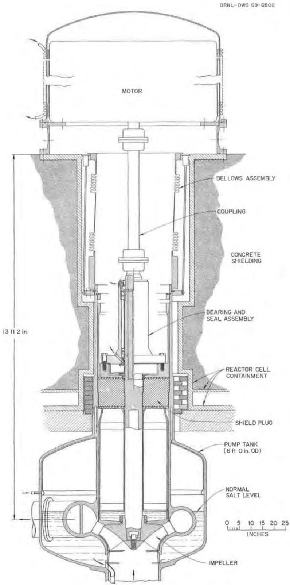  
Fig. 3.34. Primary-salt circulation pump.

changes very little when one pump is stopped and by making the pressure drop in this connecting line very low for the salt flow returning from the tank to the plenum, the level change in the pump tanks probably can be held to about 2 ft.

The pump tank, its internal structural elements, the pump shaft, and the lower end of the shield plug are cooled by a flow of primary salt (at about $1150^{\circ}\mathrm{F}$ ) which enters a plenum around the inner periphery of the pump tank and flows upward in an annular liner (see Fig. 3.34). At the junction of the pump tank and the outer pump casing the flow splits, with part of it passing downward between the inner and outer pump casings and part of it passing across the lower end of the shield plug and into the annulus between the shaft and the shaft sleeve. These flows and the fountain flow from the labyrinth seal then combine with the bulk salt flow in the pump bowl. Filler blocks may be used in the pump tank to reduce the parasitic volume of fuel salt.

At each pump the primary cell containment is extended through the concrete shielding above the reactor cell to contain the pump drive motor. The drive motor heat sink is provided by cooling water circulated through cooling coils attached to the inside of the motor containment vessel. Internally, a blower attached to the motor shaft will circulate helium through the motor and over cooling fins attached to the inside of the motor containment vessel. The motor is mounted on a ring through which all electrical, instrument, gas, coolant, and lubricant lines are connected to the pump. To obtain a speed range from 10 to $110\%$ of design speed, each coolant-salt pump drive motor will probably be supplied with variable-frequency power obtained from individual solid-state inverters.

# 3.8.2 Coolant-Salt Circulation Pumps

The design conditions for the primary- and secondary-salt pumps are such that the same impeller and casing design can be used for both. The secondary pump will operate at higher speed, however, as shown in Table 3.16. Except for the drive motor and the pump tank, the two pump designs will be practically identical.

# 3.8.3 Salt Transfer Pump

The pump used to transfer fuel salt from the drain tank, etc., could be an updated version of the PKA-2 pump that was designed for use in the ANP program and has had several thousand hours of successful operating experience. It will be operated at about 1790 rpm when filling the primary-salt system from the drain tank and at 890 rpm when circulating salt to the chemical processing system.

# 3.9 BUBBLE GENERATOR AND GAS SEPARATOR

R.J.Kedl

# 3.9.1 Introduction

To enhance the breeding potential of the MSBR, it is necessary to remove as many neutron-absorbing fission products as possible from the fuel salt and dispose of them external to the core. This is particularly true for $^{135}\mathrm{Xe}$ , with its very large absorption cross section. Several mechanisms for removing xenon (and krypton) have been studied. The one chosen for the MSBR involves recirculation of helium bubbles. The theory and calculations pertinent to this mechanism are presented in Appendix A of this report. Summarizing briefly, noble gases, because of their extreme insolubility in fuel salt, will migrate readily to any gaseous interface available. Since they form a true solution in salt (obey Henry's law), they will migrate in accordance with the conventional laws of mass transfer. If small helium bubbles are circulated with the fuel salt, they will "soak up" xenon and krypton fission products. The fission-product-rich bubbles may then be separated from the salt and expelled to the off-gas system. Xenon migration to the circulating bubbles is in competition with xenon migration to the porous moderator graphite. The graphite is especially of concern because it absorbs xenon and holds it in the core. This tendency can be counteracted to a great extent by sealing the surface pores of the graphite with chemically deposited carbon as discussed in Sect. 3.2.3. In Appendix A it is concluded that, with moderate success of the coated-graphite program, the $0.5\%$ target value for $^{135}\mathrm{Xe}$ poison fraction can be achieved when circulating helium bubbles 0.020 in. in diameter. (The average void fraction in the fuel loop would be about $0.2\%$ .) This is accomplished by bypassing $10\%$ of the fuel salt from the pump discharge through a bubble separator to remove the xenon-containing bubbles, then through a clean helium bubble generator for replenishment of helium bubbles, and back into the pump suction, as shown in Fig. 2.1. The average residence time of a bubble in the fuel loop would be ten circuits.

# 3.9.2 Bubble Generator

In studying bubble generator concepts, essentially no industrial experience was found, and very little information was available in the literature concerning generation of bubbles in systems similar to the MSBR. An exploratory program was therefore undertaken to examine both mechanical and fluid-powered devices. As a

result, a venturi device was selected for the MSBR, in which gas is injected into the venturi throat and bubbles are generated by the fluid turbulence in the diffuser section.

The experimental bubble generator and its test facility are shown schematically in Fig. 3.35 It consisted of a teardrop shape inside a 1-in.-ID Plexiglas tube through which water was flowing. Air was injected into the annular throat through forty-eight $\frac{1}{6}$ -in.-diam holes around the circumference of the teardrop. The model was tested under a variety of conditions of air and water flow rates, teardrop shapes, and different throat widths. Study of high-speed photographs of the bubble action led to the following observations:

1. A continuous plume developed from each hole in the teardrop and extended into the diffuser region. The plume was then broken up into bubbles by the fluid turbulence in this region.   
2. The bubble size developed was apparently not a strong function of the hole size used for gas injection, at least over the range observed.

3. The bubble size was independent of the gas flow rate over the range tested.   
4. The bubble size was a mild inverse function of the water flow rate.   
5. The average bubble size was approximately $25\%$ of the throat width over the range tested. On this basis, a throat width of about 0.08 in. would provide the 0.02-in. bubble size selected as desirable for the MSBR.

A conceptual design for the MSBR bubble generator is shown in Fig. 3.36. It consists of a system of linear venturis formed by arranging air foils in parallel. The throat width would be about 0.08 in., as discussed above. The fluid velocity through the throat was established as 40 fps, thus fixing the total throat length. A conceptual cross section of a single air foil is also shown in Fig. 3.36. The helium channel is shown as a "controlled crack"; that is, one of the mating surfaces is roughened in such a manner that when the two surfaces bear against each other, a crack of controlled dimension is formed through which the helium flow can be

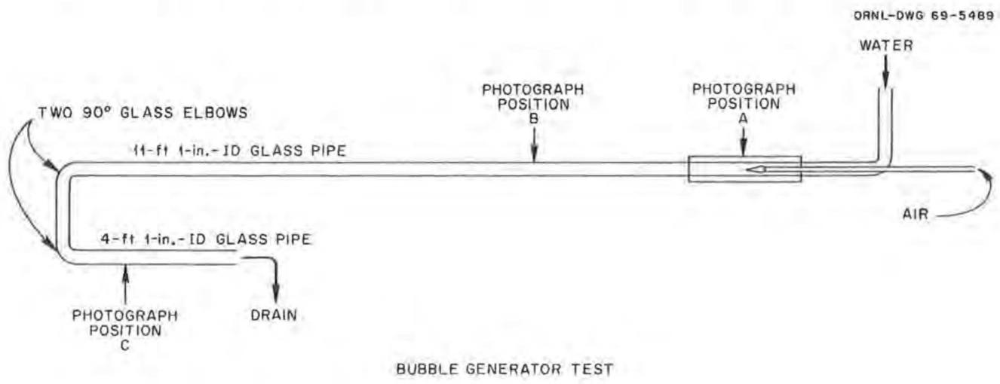

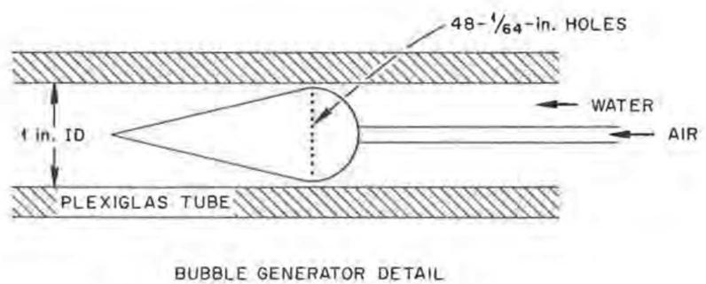  
Fig. 3.35. Bubble generator test flow diagram.

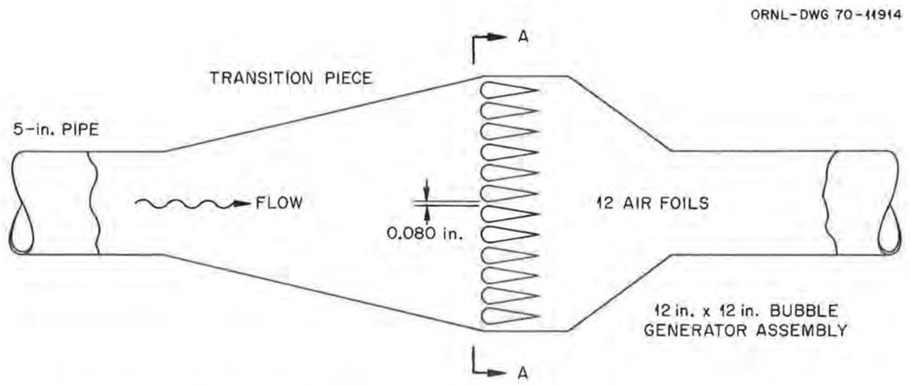

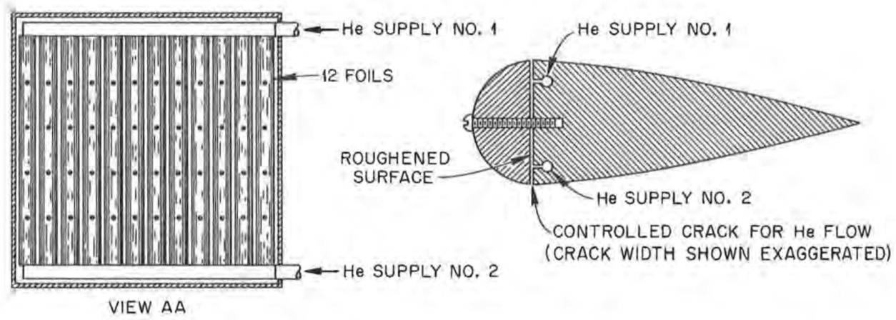  
Fig. 3.36. Preliminary concept of MSBR bubble generator.

regulated. A crack width of only about 0.001 in. will probably be needed. The helium channel dimension is kept small to reduce the likelihood that a pressure surge in the salt system could push salt into the channel and plug it. Since the fuel salt does not wet Hastelloy N, a considerable pressure would be required to force the salt into a 0.001-in.-wide opening. An alternative to the controlled-crack method would be to install a narrow graphite diffuser in the throat region of the venturi.

# 3.9.3 Bubble Separator

A pipeline bubble separator was chosen to remove the gas-rich bubbles from the fuel salt. This type was chosen primarily because of its low volume inventory and high performance. In addition, there has been considerable experience with this device at ORNL in connection with the Homogeneous Reactor Test.[75] A

device was tested which consists simply of a straight section of pipe with swirl vanes at the inlet end and recovery vanes at the outlet end, as shown in Fig. 3.37. The swirl vanes rotate the fluid and develop an artificial gravity field. This causes the bubbles to migrate to the gas-filled core at the center of the pipe. The gas then flows down the core and into the takeoff line which is located in the hub of the recovery vanes. The recovery vanes straighten out the fluid and recover some of its energy.

# 3.9.4 Bubble Removal and Addition System

Figure 3.37 shows a schematic of the MSBR bubble removal and generation equipment installed in a bypass stream around the fuel pump. The pump head is in excess of that needed to operate the system; therefore, load orifices are required. (The pressures listed have

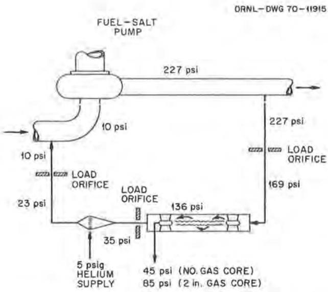  
Fig. 3.37. Schematic flow diagram of bubble removal and generation bypass in MSBR fuel-salt stream.

been estimated from the model studies and are only approximate.) The load orifice downstream of the bubble generator is sized so that the generator will induct helium from a 5-psig supply. The load orifice between the separator and generator is sized so that the pressure in the center of the separator, when no gas is present, is sufficient to force salt into the takeoff line and into the pump bowl. When gas is present at normal operating conditions, the gas core will build up to about 2 in. in diameter and the pressure will rise. The load orifice upstream of the bubble separator is provided to take up the excess head. For maintenance purposes, both the bubble generator and bubble separator should be remotely replaceable, although one could anticipate more maintenance for the bubble generator than for the bubble separator.

# 4. Coolant-Salt Circulation System

# 4.1 GENERAL

W.K.Furlong H.A.McLain

An intermediate circulating coolant salt is used to transport the heat generated in the primary system to the steam-power system rather than to use direct transfer because:

1. The loop provides an additional barrier for containing the fission products in the fuel salt in the event of a heat exchanger tube failure and may provide a barrier to tritium migration from the fuel salt to the steam system.   
2. It links the high-melting-temperature fuel salt $(930^{\circ}\mathrm{F})$ to the steam generator inlet feedwater temperature $(700^{\circ}\mathrm{F})$ with a salt of relatively low melting point $(725^{\circ}\mathrm{F})$ , thus reducing the possibility of freezing the fuel salt.   
3. The loop isolates the high-pressure steam from the primary system, making it less likely that the primary system could be subjected to high pressure in the event of a steam generator tube failure.   
4. It guards against entry of water into the primary system, which could cause oxidation and precipitation of uranium and thorium.   
5. It provides an additional degree of freedom in control of the system through allowing the secondary-salt flow rate to be varied.

One of the design features desired for the MSBR is that the coolant-salt system have natural circulation capabilities under decay-heat-removal conditions. Multiple loops are also desirable in order to improve the reliability of the coolant flow.

The coolant-salt circulation system consists of four independent loops, each containing a salt circulation pump, steam generators, steam reheaters, coolant-salt piping, and the shell side of one primary heat exchanger. The latter was described in Sect. 3.7, and the coolant-salt circulation pumps were discussed in Sect. 3.8.2.

The heat transport fluid selected for the MSBR is sodium fluoroborate salt. The various factors involved in the selection were discussed in Sect. 3.2.2, and the salt physical properties used in the design of the system were listed in Table S.1. In brief, the salt is a eutectic of NaF and $\mathrm{NaBF_4}$ with a melting point of about $725^{\circ}\mathrm{F}$ and a low vapor pressure at operating conditions. It is compatible with Hastelloy N, has satisfactory heat transfer and flow properties, and has a low cost of less than 50 cents/lb.

# 4.2 STEAM GENERATORS

T.W.Pickel W.K.Crowley W.C.T.Stoddart

# 4.2.1 General

The factors influencing the design of the steam generators are much the same as those for the primary heat exchangers, as discussed in Sect. 3.7, except that the inventory of salt held in the units is not critical.

The total steam generation requirement, including that needed for feedwater and reheat steam preheating, is about $10 \times 10^{6} \mathrm{lb/hr}$ . It was arbitrarily decided to divide this load between 16 steam generators, 4 to be served by each of the 4 secondary-salt circulation loops. The capacity required of each of the steam generators is thus about 630,000 lb/hr, or about 121 MW(t).

The steam generators are operated in parallel with respect to both the coolant-salt and steam flows, and they are identical in operation and design. The feedwater supplied to the steam generators will be preheated to $700^{\circ}\mathrm{F}$ and is at a pressure of about 3750 psia in the inlet region of the unit. (The feedwater heating system is described in Sect. 5.) The $700^{\circ}\mathrm{F}$ feedwater temperature should eliminate the danger of freezing of the coolant salt in the inlet region, although this is yet to be determined experimentally.

The water-steam fluid in the tubes is heated to exit conditions of $1000^{\circ}\mathrm{F}$ and 3600 psia. The coolant salt is cooled from 1150 to $850^{\circ}\mathrm{F}$ as it flows through the shell side of the exchangers in a direction that is principally

countercurrent to the steam flow. The steam temperature delivered to the steam turbine will be controlled by varying the coolant-salt flow rate through the steam generators and by using a desuperheater, or attemperator, in the outlet steam mains, as discussed in Sect. 5.

The radioactivity induced in the coolant salt in its passage through the primary heat exchangers will require biological shielding for the steam generators. After reactor shutdown and a decay period of about ten days, however, the generators can be approached for direct maintenance, as discussed in Sect. 12.

The steam generator conditions analyzed in depth were those for full-load operation, since this indicates

the size, approximate cost, and general feasibility of the units. Some of the aspects of partial load and startup conditions are discussed in Sect. 10. A computer program was written to arrive at an efficient design for the steam generators within the established design parameters. This program accommodated changes in the properties of the supercritical-pressure water with temperature as it passed through the unit.

# 4.2.2 Description

The conceptual design of the steam generators is shown in Fig. 4.1, and the principal data are listed in

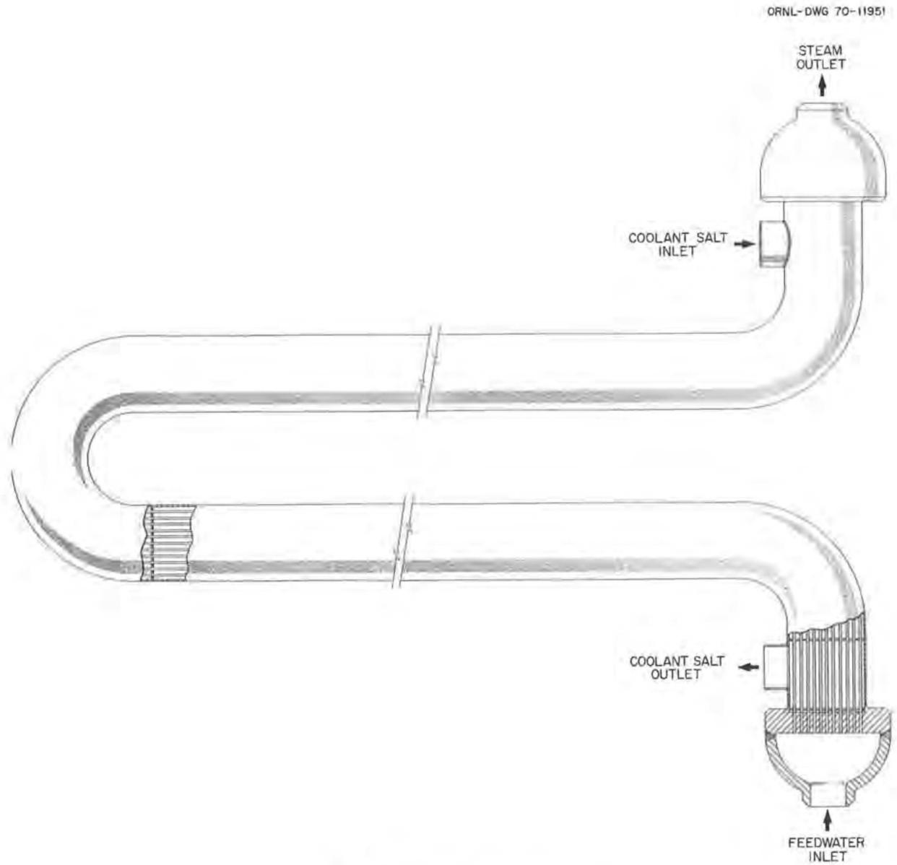  
Fig.4.1.MSBR steam generator.

Table 4.1. Each unit is a counterflow U-shell, U-tube heat exchanger mounted horizontally with one leg above the other. Both shell and tubes are fabricated of Hastelloy N. There are 393 tubes per unit, each $\frac{1}{2}$ in. in. outside diameter and having a tube-sheet-to-tube-sheet length of about 76 ft. The 18-in.-diam steam-side hemispherical plenum chambers are designed for 3800 psia. The coolant salt circulates in counterflow through segmental baffles in the shell to improve the heat

transfer coefficient for the salt film and to minimize salt stratification. A baffle on the shell side of each tube sheet provides a stagnant layer of salt to help reduce stresses due to temperature gradients across the tube sheets.

As in any once-through type of steam generator, the feedwater must have the impurities limited to a few parts per billion. Buildup of solids would only mean decreased capacity, however, and would not present

Table 4.1. MSBR steam generator design data   

<table><tr><td>Type</td><td>Horizontal U-tube, U-shell exchanger with cross-flow baffles</td></tr><tr><td>Number required</td><td>16</td></tr><tr><td>Rate of heat transfer</td><td></td></tr><tr><td>MW</td><td>121</td></tr><tr><td>Btu/hr</td><td>\( 4.13 \times 10^8 \)</td></tr><tr><td>Shell-side conditions</td><td></td></tr><tr><td>Hot fluid</td><td>Coolant salt</td></tr><tr><td>Entrance temperature, \( ^\circ F \)</td><td>1150</td></tr><tr><td>Exit temperature, \( ^\circ F \)</td><td>850</td></tr><tr><td>Entrance pressure, psia</td><td>233</td></tr><tr><td>Exit pressure, psia</td><td>172.0</td></tr><tr><td>Pressure drop across exchanger, psi</td><td>61</td></tr><tr><td>Mass flow rate, lb/hr</td><td>\( 3.82 \times 10^6 \)</td></tr><tr><td>Tube-side conditions</td><td></td></tr><tr><td>Cold fluid</td><td>Supercritical fluid</td></tr><tr><td>Entrance temperature, \( ^\circ F \)</td><td>700</td></tr><tr><td>Exit temperature, \( ^\circ F \)</td><td>1000</td></tr><tr><td>Entrance pressure, psia</td><td>3752</td></tr><tr><td>Exit pressure, psia</td><td>3600</td></tr><tr><td>Pressure drop across exchanger, psi</td><td>152</td></tr><tr><td>Mass flow rate, lb/hr</td><td>\( 6.33 \times 10^5 \)</td></tr><tr><td>Mass velocity, \( lb hr^{-1} ft^{-2} \)</td><td>\( 2.55 \times 10^6 \)</td></tr><tr><td>Tube material</td><td>Hastelloy N</td></tr><tr><td>Tube OD, in.</td><td>0.50</td></tr><tr><td>Tube thickness, in.</td><td>0.077</td></tr><tr><td>Tube length, tube sheet to tube sheet, ft</td><td>76.4</td></tr><tr><td>Shell material</td><td>Hastelloy N</td></tr><tr><td>Shell thickness, in.</td><td>0.375</td></tr><tr><td>Shell ID, in.</td><td>18.25</td></tr><tr><td>Tube sheet material</td><td>Hastelloy N</td></tr><tr><td>Tube sheet thickness, in.</td><td>4.5</td></tr><tr><td>Number of tubes</td><td>393</td></tr><tr><td>Pitch of tubes, in. (triangular)</td><td>0.875</td></tr><tr><td>Total heat transfer area, \( ft^2 \)</td><td>3929</td></tr><tr><td>Basis for area calculation</td><td>Outside surface</td></tr><tr><td>Type of baffle</td><td>Cross flow</td></tr><tr><td>Number of baffles</td><td>18</td></tr><tr><td>Baffle spacing, ft</td><td>4.02</td></tr></table>

problems of hot spots or burnout. The steam system flowsheet, Fig. 5.1, follows established practice and indicates full-flow demineralizers in the feedwater system.

# 423 Design Calculations

Because of the marked changes in the physical properties of water as its temperature is raised above the critical point at supercritical pressures, the heat transfer and pressure drop calculations for the steam generator were made on the basis of a detailed spatial analysis with a computer program written for this study. The program numerically integrates the heat transfer and pressure drop relationships with respect to tube length. The calculations establish the number of tubes, tube length, shell diameter, and number of baffles which are consistent with the specified thermal capacity, steam pressure drops, and stress limits.

The heat transfer coefficient for the supercritical-fluid film on the interior of the tubes was determined from the relationship presented by Swenson et al.76 The frictional pressure drop on the inside of the tubes was calculated by using Fanning's equation, with the friction factor defined77 as

$$
f = 0. 0 0 1 4 0 + 0, 1 2 5 (\mu / D G) ^ {0, 3 2}
$$

Values for the specific volume and enthalpy of supercritical steam as functions of temperature and pressure were taken from the work of Keenan and Keyes.78 The thermal conductivity and viscosity as functions of temperature and pressure were taken from data reported by Nowak and Grosh.79

The heat transfer coefficient for the salt film on the outside surface of the tubes and the shell-side pressure drop were based on the work of Bergelin et al.69,73 A correction factor was applied to the heat transfer relationships presented in these papers because of the large ratio of baffle spacing to shell diameter (approximately 2.7) required in this application. This correction factor is given by

$$
C = 0. 7 7 (2 y / B) ^ {0. 1 3 8},
$$

where

$C =$ ratio of the corrected heat transfer coefficient to the heat transfer coefficient calculated by Berge-lin's relationship,

$y =$ distance from the center line of the shell to the centroid of the segmental window area,

$B =$ baffle spacing.

The physical properties for the salt used in these calculations are as listed in Table S.1. The specific heat and thermal conductivity of the salt were given as constant values, but the density and viscosity were functions of temperature. The functional relationships were included in the computer program.

The $\sim 3750$ -psia fluid pressure on the inside of the tubes imposes relatively severe requirements on the heads and tube sheets. This factor was considered in selecting the number of steam generator units used in the MSBR, since the relatively small diameter of 18 in. selected for the shell allows the stresses to be kept within more tolerable limits.

A preliminary stress analysis was made to establish the feasibility of the steam generator design concept. The analysis was based on the requirements given in Sect. III of the ASME Boiler and Pressure Vessel Code. A complete stress analysis, however, as required by this code, has not been made. For example, fatigue analyses were not made in these preliminary calculations. Additional information on the number and types of operating cycles and on the effects of transient conditions is required before a fatigue analysis can be made. The stresses in the tubes due to steady-state radial temperature gradients were treated as secondary stresses rather than as peak stresses. This is the approach taken in USAS B31.7 (1969) Nuclear Piping Code and is more conservative than the method of ASME Sect. III. The results of the stress calculations are given in Table 4.2. As discussed in Sect. 3.5.3, the allowable stress values for Hastelloy N were those prescribed for the standard alloy in the ASME Boiler and Pressure Vessel Code Cases 1315-3 (ref. 30) and 1331-4 (ref. 58).

# 4.2.4 Reliability of Design Calculations

The heat transfer and pressure drop calculations are subject to review due to the empirical nature of the correlations and the uncertainties in the physical properties used in the computations. Although both of these aspects have been applied without safety factors, it is believed that the preliminary design is a reasonable one. In any event, the performance data will be confirmed in test equipment before a final design is initiated.

The design computer program was modified to permit steady-state calculations for a specified heat exchanger design under off-design operating conditions. This program has been used to evaluate the performance of the steam generator for operating conditions ranging from 20 to $100\%$ of design conditions. The calculations indicate that the steady-state performance of the steam

Table 4.2. Summary of stress calculations for an MSBR steam generator   

<table><tr><td colspan="2">Maximum stress intensity, \( {}^{a} \) psi</td></tr><tr><td colspan="2">Tube</td></tr><tr><td>Calculated</td><td>\( {P}_{m} = {13},{900};{P}_{m} + Q = {30},{900} \)</td></tr><tr><td>Allowable \( {}^{b} \)</td><td>\( {P}_{m} = {15},{500};{P}_{m} + Q = {46},{500} \)</td></tr><tr><td colspan="2">Shell</td></tr><tr><td>Calculated</td><td>\( {P}_{m} = {5800};{P}_{m} + Q = {13},{200} \)</td></tr><tr><td>Allowable \( {}^{c} \)</td><td>\( {P}_{m} = {8800};{P}_{m} + Q = {26},{400} \)</td></tr><tr><td colspan="2">Maximum tube sheet stress, psi</td></tr><tr><td>Calculated</td><td>&lt;17,000</td></tr><tr><td>Allowable \( {}^{d} \)</td><td>17,000</td></tr></table>

aThe symbols are those of Sect. III of the ASME Boiler and Pressure Vessel Code,56 with $P_{m} =$ primary membrane stress intensity, $Q =$ secondary stress intensity, and $S_{m} =$ allowable stress intensity.

$b$ Based on a temperature of the inside tube surface of $1038^{\circ}\mathrm{F}$ which represents the worst stress condition.

${}^{c}$ Based on the maximum coolant-salt temperature,or ${1150}^{ \circ  }\mathrm{F}$ .

$d_{\text{Based on the steam temperature of } 1000^{\circ}\text{F}}$ and use of a baffle on the salt side.

generator will be satisfactory over this range of operating conditions.

The problem of stability in the steam generator has been considered briefly. As indicated by Goldman et al.80 and by Tong,81 instabilities in steam generators can arise from two sources: (1) a true thermodynamic instability where, for a given pressure drop across a tube, the flow rate through the tube may be changed from one steady-state value to another by a finite disturbance, and (2) a system instability which is caused by fluid "resonant conditions. Krasyakova and Gluska82 have presented data concerned with the first type of instability, and Quandt83 and Shotkin84 have presented information on the second. A qualitative evaluation of these data indicates that the mass flow rate, pressure drop, and heat flux used in the horizontal

U-tube, U-shell design will result in stable operations. Operation of a test module will provide further information about the stability of this design concept.

# 4.3 STEAM REHEATERS

C. E. Bettis M. Siman-Tov W. C. T. Stoddart

# 4.3.1 General

The design of the reheaters was influenced by most of the factors that applied to design of the steam generators, as discussed in Sect. 4.2.

The total steam reheating requirement is about $5.1 \times 10^{6} \mathrm{lb/hr}$ . It was decided to divide this load between eight units, the capacity of each thus being about 641,000 lb/hr, or 36.6 MW(t). The steam reheaters operate in parallel both in respect to the coolant salt and to steam flow. The coolant salt enters at $1150^{\circ}\mathrm{F}$ and leaves at $850^{\circ}\mathrm{F}$ . The reheat steam is preheated to about $650^{\circ}\mathrm{F}$ , as explained in Sect. 5, before it enters the tube side of the reheaters at about 580 psia. The exit steam is at $1000^{\circ}\mathrm{F}$ , the coolant-salt flow rate being varied to maintain this temperature within a few degrees.

The $650^{\circ}\mathrm{F}$ steam temperature entering the reheaters is below the $725^{\circ}\mathrm{F}$ liquidus temperature of the coolant salt, but a study of the heat transfer relationships leads to the conclusion that there would be no significant problem with freezing of the salt. This remains to be verified experimentally, however.

As for the steam generator, a computer program was written to arrive at an efficient design for the reheater on the basis of the designated parameters. These studies were based only on full-load conditions.

# 4.3.2 Description

As shown in Fig. 4.2, the steam reheater is a 22-in.-diam $\times$ 30-ft-long horizontal straight-tube single

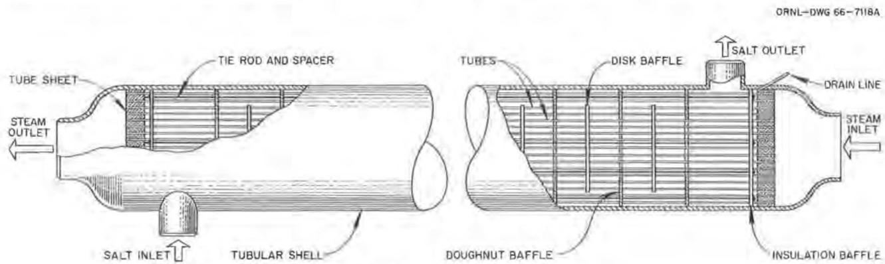  
Fig. 4.2. Steam reheater.

Table 4.3. Steam reheater design data   

<table><tr><td>Type</td><td>Straight tube and shell with disk and doughnut baffles</td></tr><tr><td>Number required</td><td>8</td></tr><tr><td>Rate of heat transfer per unit</td><td></td></tr><tr><td>MW</td><td>36.6</td></tr><tr><td>Btu/hr</td><td>\( 1.25 \times 10^8 \)</td></tr><tr><td>Shell-side conditions</td><td></td></tr><tr><td>Hot fluid</td><td>Coolant salt</td></tr><tr><td>Entrance temperature, °F</td><td>1150</td></tr><tr><td>Exit temperature, °F</td><td>850</td></tr><tr><td>Entrance pressure, psi</td><td>228</td></tr><tr><td>Exit pressure, psi</td><td>168</td></tr><tr><td>Pressure drop across exchanger, psi</td><td>59.5</td></tr><tr><td>Mass flow rate, lb/hr</td><td>\( 1.16 \times 10^6 \)</td></tr><tr><td>Tube-side conditions</td><td></td></tr><tr><td>Cold fluid</td><td>Steam</td></tr><tr><td>Entrance temperature, °F</td><td>650</td></tr><tr><td>Exit temperature, °F</td><td>1000</td></tr><tr><td>Entrance pressure, psi</td><td>580</td></tr><tr><td>Exit pressure, psi</td><td>550</td></tr><tr><td>Pressure drop across exchanger, psi</td><td>29.9</td></tr><tr><td>Mass flow rate, lb/hr</td><td>\( 6.41 \times 10^5 \)</td></tr><tr><td>Tube material</td><td>Hastelloy N</td></tr><tr><td>Tube OD, in.</td><td>0.75</td></tr><tr><td>Tube thickness, in.</td><td>0.035</td></tr><tr><td>Tube length, tube sheet to tube sheet, ft</td><td>30.3</td></tr><tr><td>Shell material</td><td>Hastelloy N</td></tr><tr><td>Shell thickness, in.</td><td>0.5</td></tr><tr><td>Shell ID, in.</td><td>21.2</td></tr><tr><td>Tube sheet material</td><td>Hastelloy N</td></tr><tr><td>Number of tubes</td><td>400</td></tr><tr><td>Pitch of tubes, in. (triangular)</td><td>1.0</td></tr><tr><td>Total heat transfer area, \( ft^2 \)</td><td>2376</td></tr><tr><td>Basis for area calculation</td><td>Outside of tubes</td></tr><tr><td>Type of baffle</td><td>Disk and doughnut</td></tr><tr><td>Number of baffles</td><td>21 and 21</td></tr><tr><td>Baffle spacing, in.</td><td>8.65</td></tr><tr><td>Disk OD, in.</td><td>17.8</td></tr><tr><td>Doughnut ID, in.</td><td>11.6</td></tr><tr><td>Overall heat transfer coefficient, U, Btu \( hr^{-1} ft^{-2} (\circ F)^{-1} \)</td><td>306</td></tr><tr><td>Maximum stress intensity,\( ^b \) psi</td><td></td></tr><tr><td>Tube</td><td></td></tr><tr><td>Calculated</td><td>\( P_m = 4582;P_m + Q = 14,090 \)</td></tr><tr><td>Allowable</td><td>\( P_m = S_m = 13,000;P_m + Q = 3S_m = 39,000 \)</td></tr><tr><td>Shell</td><td></td></tr><tr><td>Calculated</td><td>\( P_m = 5016;P_m + Q = 14,550 \)</td></tr><tr><td>Allowable</td><td>\( P_m = S_m = 9500;P_m + Q = 3S_m = 28,500 \)</td></tr></table>

${}^{a}$ Salt and Hastelloy N properties are listed in Table S.1.   
bThe symbols are those of Sect. III of the ASME Boiler and Pressure Vessel Code, where $P_{m} =$ primary membrane stress intensity, $\mathcal{Q} =$ secondary stress intensity, and $S_{m} =$ allowable stress intensity.

pass shell-and-tube heat exchanger. There are 400 tubes, $3 / 4$ -in.-OD, in a triangular pitch array. Principal data are listed in Table 4.3.

The tube surfaces are not indented to enhance heat transfer, as in the primary heat exchanger. The coolant salt is in counterflow through the disk-and-doughnut baffles on the shell side. The units are installed in the steam generating cells, as indicated in Figs. 13.7 and 13.8.

# 4.3.3 Design Calculations

A computer program was developed for designing the reheater by modifying the primary heat exchanger program as it existed in the early stages of development. The properties of the steam were assumed to be essentially constant along the length of the exchanger, although it was recognized that some gain in the reliability of the estimates could have been attained by incorporating the steam properties as a function of pressure and temperature.

The usual Dittus-Boelter equations were used for the film heat transfer coefficient on the tube side. Other procedures used in the heat transfer calculations were described by Bettis et al.[62,63]

A preliminary stress analysis was made for the reheaters. This analysis was based on the requirements of Sect. III of the ASME Boiler and Pressure Vessel Code; however, a complete stress analysis, as required by this code, has not been made. The calculated stresses are compared with allowable values in Table 4.3.

# 4.3.4 Reliability of Design Calculations

The confidence in the steam reheater design calculations is greater than in the primary heat exchanger because steam is a more familiar fluid than the fuel salt and because no enhancement factors are involved. Vibration problems are not likely to be encountered because velocities are less than 6.5 fps and the tubes are supported by baffles with relatively close spacing.

Two extreme cases were examined, one where all the pessimistic values of the heat transfer coefficient were used and the other where the optimistic end of the range of possible values was assumed. The maximum deviation in the overall heat transfer area, relative to the reference design, was found to be $+23\%$ in the pessimistic case and $-13\%$ in the optimistic case.

# 4.4 COOLANT-SALT SYSTEM PIPING

C.W.Collins

The secondary system piping connects the primary heat exchangers in the reactor cell with the coolant

pumps and steam generators and reheaters in the steam generating cells. The main piping is 22 in. in diameter, with branches as small as 12 in. in diameter. The operating temperatures are from 850 to $1150^{\circ}\mathrm{F}$ , but in the design it was conservatively assumed that all the secondary-coolant system piping would operate at $1150^{\circ}\mathrm{F}$ . This condition could actually exist only for a short time, corresponding to removal of the steam generators and reheaters from service due to loss of turbine load.

The piping flexibility analysis for the secondary system piping was included in the calculations for the primary system piping, since the two systems are connected and interact with each other all the way to the anchor points of the steam generators and reheaters.

The maximum expansion stress of 19,510 psi occurs in one of the coolant return lines from a steam generator. The operating temperature of this line is 850 rather than $1150^{\circ}\mathrm{F}$ , as assumed in the calculations. The highest stress in the $1150^{\circ}\mathrm{F}$ pump suction line is 13,000 psi. Taking the allowable primary plus secondary stress intensity to be three times the allowable design stress intensity $(S_{m})$ , the allowable stress intensity at $850^{\circ}\mathrm{F}$ is 54,000 psi and at $1150^{\circ}\mathrm{F}$ is 28,500 psi. The maximum stress due to pressure is approximately 3600 psi; therefore, the sums of the pressure stress and the above maximum expansion stresses do not exceed $3S_{m}$ , as specified by the codes.

Both the pump suction and coolant return lines of each loop penetrate the reactor containment vessels and cell walls. Bellows seals are used at these penetrations on both the reactor cell and steam cell sides to maintain the containment and permit about 1 in. of thermal expansion of the piping along each of three axes. Several flexibility analyses were made with the piping fixed at the cell wall rather than use of bellows. This resulted in excessive stresses in both the primary and secondary loops, and since it did not appear that the stresses could be reduced substantially without increasing the piping lengths excessively, bellows seals at the walls were adopted for the MSBR conceptual design.

# 4.5 SECONDARY-SYSTEM RUMENTURE DISKS

J.R.McWherter

Each of the four secondary circulating loops will be provided with a pressure-relief system to prevent overpressurization in the event of a failure in the barrier between the coolant salt and the steam system.

A rupture disk will be located at the secondary-salt outlet of each steam generator. A preliminary design, where the rupture disk assembly is set into a 12-in.

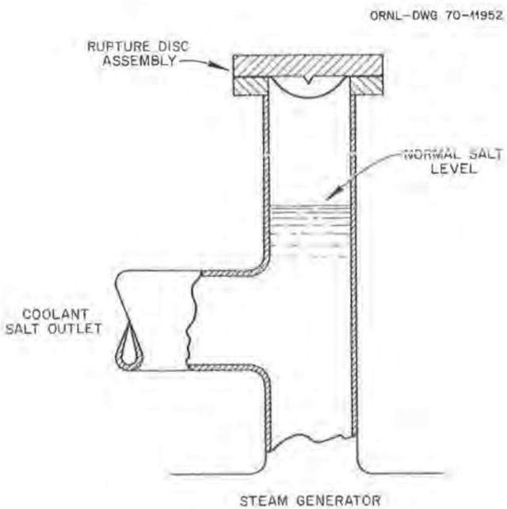  
Fig. 4.3. Secondary-salt system rupture disk.

vertical tec, is shown in Fig. 4.3. The elevation of the disk is well above the normal level of the secondary salt in the system. A gas pocket probably can be provided to further reduce the possibility of salt contacting the disk. The assembly is located in the steam generator cell, which is maintained at about $1000^{\circ}\mathrm{F}$ , and its downstream face is exposed to the ambient cell atmosphere, making it improbable that the opening would be obstructed with frozen salt, even in the unlikely event that any of the coolant reached the disk elevation.

The rupture disk will be fabricated from low-carbon nickel, ASTM B162. This is a relatively pure metal with adequate physical properties and corrosion resistance for the service conditions. The disk will be designed to rupture at $1000^{\circ}\mathrm{F}$ with a differential pressure equal to the design pressure of the secondary-salt circulation system (200 psi). A commercially available reverse-buckling disk is proposed because of its accuracy (rupture within $\pm 2\%$ of rating) and greater cycle life. The strength of the metal, and hence the failure pressure of the disk, increases as the temperature decreases. At $900^{\circ}\mathrm{F}$ the disk would fail at an estimated pressure differential $10\%$ higher than that at $1000^{\circ}\mathrm{F}$ . Protective action, such as isolating the affected steam generators with block valves, would be taken if the temperature of the rupture disk falls below some specified value, say $900^{\circ}\mathrm{F}$ .

If one of the $\frac{1}{2}$ -in.-diam tubes in a steam generator were to fail, the pressure at the coolant-salt outlet of the steam generator could rise from a normal value of 130 psi to about 200 psi in less than 1 sec. In analyzing the pressure-containing requirements, it is pessimistically assumed that the six tubes surrounding a failed tube will also fail in the estimated 5 sec required to close the steam-system block valves at the inlet and outlet of each steam generator. The total steam and feedwater released to the cell via the rupture disk, including that trapped between the block valves, is estimated to be about 1150 lb, representing a heat release of about $1.2 \times 10^{6}$ Btu. The steam generator cell has been designed for 50 psig and will accommodate this energy release (see Sect. 13.11).

# 4.6 COOLANT-SALT DRAIN SYSTEM

# W.K.Furlong

Four Hastelloy N tanks, each capable of holding 2100 ft³ of salt with ample freeboard, are connected in series to store the ~8400 ft³ of coolant salt when it is drained from the secondary circulation system. Four tanks were chosen in order for them to be of a more reasonable size, and the series arrangement was adopted to facilitate heat removal if the coolant became contaminated with fuel salt. The tanks are located in a cell directly beneath the steam generator cells, as shown in Fig. 13.3. This cell is heated to about 800°F by electric resistance heaters in order to maintain the salt above its melting point.

Freeze valves are used to connect the first of the coolant-salt storage tanks to the "cold" leg of the coolant-salt circulation loops. When the freeze valves are thawed, the bulk of the salt in the coolant system will drain by gravity, but about $730\mathrm{ft}^3$ in each of the primary heat exchanger shells will not and must be removed by gas pressurization of the shell. Each heat exchanger is provided with a 1-in. dip line for this purpose.

Since the coolant salt will undergo volume changes in excess of the free volume available in the pump bowl, each bowl has been provided with an overflow line directed to the first coolant-salt drain tank. The salt will be returned from the tank to the circulation system by a jet pump arrangement analogous to the arrangement in the primary system. Gas pressurization can be used to transfer salt from the other three tanks into the first tank.

About $400\mathrm{kW}$ of heat-removal capability is provided in the first storage tank in the event some fuel salt finds its way into the coolant by accidental means. Most of

this heat would be transferred by radiation to cooler surfaces in the cell. It has been estimated that in event of tube failures in the primary heat exchangers, about $1370\mathrm{ft}^3$ of coolant salt could be drained by gravity from each coolant loop. In this situation, even with tube failure, the fuel salt would continue to be circulated to remove afterheat. (The heating due to noble-metal deposition on the heat exchanger bundle is the governing heat load.) During the circulation period there could be considerable mixing between fuel salt leaking from the primary system and the approximately $730\mathrm{ft}^3$ of coolant salt remaining in a heat exchanger shell after the coolant drain. If the shell is pressurized after about 100 days and the salt mixture transferred to

the coolant-salt storage tank, the heat load to be removed from the tank would be about $400\mathrm{kW}$ as mentioned above. It is recognized that during the transfer process some of the salt mixture could be forced back into the primary system through the accidental opening. This salt would be drained with the fuel salt into the primary system drain tank, it being noted that in this type of system malfunction the fuel salt was probably already contaminated with coolant salt, since the coolant system normally operates at a higher pressure than the fuel-salt system. The fuel-salt drain tank has been provided with extra storage capacity to accommodate some of the coolant salt, as discussed in Sect. 6.

# 5. Steam-Power System

Roy C. Robertson

# 5.1 GENERAL

The thermal energy released in the MSBR is converted to electric power in a steam cycle employing once-through steam-generator-superheaters, a turbine-generator, and a regenerative feedwater heating system. The relatively high operating temperatures in the MSBR salt systems make it possible to generate steam at conditions suitable for the most modern and efficient steam-electric equipment now commonly in use.

Since the steam system components are more or less conventional, there was no need to study the steam cycle in any more detail than was necessary to make cost and performance estimates for the MSBR plant. There was thus a strong incentive to select a system for which costs and thermodynamic data were readily available, such as that used in the nearby Bull Run steam station of the TVA. This 950-MW(e) plant supplies steam at 3500 psia and $1000^{\circ}\mathrm{F}$ to the turbine throttle, with reheat to $1000^{\circ}\mathrm{F}$ , and exhausts at $1\frac{1}{2}$ in. Hg abs. When applied to the MSBR reference design, the cycle yields an overall net thermal efficiency for the plant of $44.4\%$ .

A particular requirement of the MSBR steam system is that the feedwater supplied to the steam generator be at a temperature high enough to avoid problems of coolant-salt freezing. The lower limit for the water temperature has not been established experimentally, but for purposes of this study it was taken to be $700^{\circ}\mathrm{F}$ . Also, for the same reason, it was assumed that the cold reheat steam must be preheated to $650^{\circ}\mathrm{F}$ before it enters the reheaters. These requirements, and the convenience of using the Bull Run data in the conceptual design study, led to selection of a system in which the final stage of feedwater heating is by direct mixing with high-pressure steam. Although the method is somewhat unconventional and requires use of pressure-booster pumps in the feedwater supply, the arrangement appears feasible and allows use of the Bull

Run information with only minor modifications. This mixing method would probably be practical only if supercritical pressures are used.

When detailed optimization studies become warranted, several variations in the steam cycle can be considered. It seems certain that tandem-compounded single-shaft turbine-generators would be used in future MSBR stations of large capacity rather than the cross-compounded type at Bull Run.* Use of subcritical steam pressures, although less efficient, may prove desirable from other standpoints. Use of reheat is optional and would depend upon the steam conditions selected, the turbine arrangement, etc. Startup and partial-load conditions will have an important influence on the steam cycle design.

The effects on plant performance and costs of use of wet natural-draft cooling towers rather than the fresh once-through condensing water supply assumed in the reference design are discussed in Sect. 16.7 and explained in Table D.17.

Although reasonably good efficiencies are attainable with a variety of arrangements and the feasibility of the molten-salt reactor concept is not strongly dependent upon the details of the steam system associated with it, this section recognizes that the steam-electric equipment represents more than one-half the total station investment, that it occupies a greater portion of the plant space, and that even small differences in efficiency have economic value, all of which are of interest to a plant owner. Some of the factors developed in the course of making this study which relate to these aspects will therefore be briefly discussed.

# 5.2 DESCRIPTION OF THE REFERENCE DESIGN MSBR STEAM-POWER SYSTEM

Basic data for full-load conditions in the reference design steam system are summarized in Table 5.1, and a simplified flowsheet is shown in Fig. 5.1. Superheated steam leaves the once-through-type steam generators at about 3600 psia and $1000^{\circ}\mathrm{F}$ at a rate of about $10 \times 10^{6} \mathrm{lb/hr}$ . Coolant salt at $1150^{\circ}\mathrm{F}$ is supplied to the steam generator at a controlled rate to hold the steam outlet temperature to within a few degrees of $1000^{\circ}\mathrm{F}$ . A steam attemperator, or desuperheater, supplied with $700^{\circ}\mathrm{F}$ feedwater assists in holding the steam temperature to within tolerances. (The steam generator was described in Sect. 4.2.)

Table 5.1. Reference design MSBR steam-power system and performance data with $700^{\circ}\mathrm{F}$ feedwater   

<table><tr><td colspan="2">General performance</td></tr><tr><td>Reactor heat input to steam system, a MW(t)</td><td>2225</td></tr><tr><td>Net electrical output, MW(c)</td><td>1000</td></tr><tr><td>Gross electrical generation, MW(e)</td><td>1034.9</td></tr><tr><td>Station auxiliary load, MW(e)</td><td>25.7</td></tr><tr><td>Boiler-feedwater pressure-booster pump load, MW(e)</td><td>9.2</td></tr><tr><td>Boiler-feedwater pump steam-turbine power output, MW (mechanical)</td><td>29.3</td></tr><tr><td>Flow to turbine throttle, lb/hr</td><td>\( 7.15 \times 10^6 \)</td></tr><tr><td>Flow from superheater, lb/hr</td><td>\( 10.1 \times 10^6 \)</td></tr><tr><td>Gross efficiency, \( (1034.9 + 29.3)/2225, \)%</td><td>47.8</td></tr><tr><td>Gross heat rate, Btu/kWhr</td><td>7136</td></tr><tr><td>Net efficiency, station, 1000/2250, %</td><td>44.4</td></tr><tr><td>Net heat rate, Btu/kWhr</td><td>7687</td></tr><tr><td colspan="2">Steam generators</td></tr><tr><td>Number of units</td><td>16</td></tr><tr><td>Total duty, MW(t)</td><td>1932</td></tr><tr><td>Total steam capacity, lb/hr</td><td>\( 10.1 \times 10^6 \)</td></tr><tr><td>Temperature of inlet feedwater, °F</td><td>700</td></tr><tr><td>Enthalpy of inlet feedwater, Btu/lb</td><td>769</td></tr><tr><td>Pressure of inlet feedwater, psia</td><td>3770</td></tr><tr><td>Temperature of outlet steam, °F</td><td>1000</td></tr><tr><td>Pressure of outlet steam, psia</td><td>~3600</td></tr><tr><td>Enthalpy of outlet steam, Btu/lb</td><td>1424</td></tr><tr><td>Temperature of inlet coolant salt, °F</td><td>1150</td></tr><tr><td>Temperature of outlet coolant salt, °F</td><td>850</td></tr><tr><td>Average specific heat of coolant salt, Btu \( lb^{-1} (^{ \circ}F)^{-1} \)</td><td>0.36</td></tr><tr><td colspan="2">Total coolant-salt flow</td></tr><tr><td>lb/hr</td><td>\( 61.12 \times 10^6 \)</td></tr><tr><td>cfs</td><td>145.5</td></tr><tr><td>gpm</td><td>65,290</td></tr><tr><td>Coolant-salt pressure drop, inlet to outlet, psi</td><td>61</td></tr><tr><td colspan="2">Steam reheaters</td></tr><tr><td>Number of units</td><td>8</td></tr><tr><td>Total duty, MW(t)</td><td>294</td></tr><tr><td>Total steam capacity, lb/hr</td><td>\( 5.13 \times 10^6 \)</td></tr><tr><td>Temperature of inlet steam, °F</td><td>650</td></tr><tr><td>Pressure of inlet steam, psia</td><td>~570</td></tr><tr><td>Enthalpy of inlet steam, Btu/lb</td><td>1324</td></tr><tr><td>Temperature of outlet steam, °F</td><td>1000</td></tr><tr><td>Pressure of outlet steam, psia</td><td>557</td></tr><tr><td>Enthalpy of outlet steam, Btu/lb</td><td>1518</td></tr><tr><td>Temperature of inlet coolant salt, °F</td><td>1150</td></tr><tr><td>Temperature of outlet coolant salt, °F</td><td>850</td></tr><tr><td>Average specific heat of coolant salt, Btu \( lb^{-1} (^{ \circ}F)^{-1} \)</td><td>0.36</td></tr><tr><td colspan="2">Total coolant salt flow</td></tr><tr><td>lb/hr</td><td>\( 9.28 \times 10^6 \)</td></tr><tr><td>cfs</td><td>22.1</td></tr><tr><td>gpm</td><td>9913</td></tr><tr><td>Coolant-salt pressure drop, inlet to outlet, psi</td><td>59.4</td></tr></table>

Table 5.1 (continued)   

<table><tr><td colspan="2">Reheat-steam preheaters</td></tr><tr><td>Number of units</td><td>8</td></tr><tr><td>Total duty, MW(t)</td><td>100</td></tr><tr><td>Total heated steam capacity, lb/hr</td><td>5.13 × 10^6</td></tr><tr><td>Temperature of heated steam, °F</td><td></td></tr><tr><td>Inlet</td><td>552</td></tr><tr><td>Outlet</td><td>650</td></tr><tr><td>Pressure of heated steam, psia</td><td></td></tr><tr><td>Inlet</td><td>595</td></tr><tr><td>Outlet</td><td>590</td></tr><tr><td>Enthalpy of heated steam, Btu/lb</td><td></td></tr><tr><td>Inlet</td><td>1257</td></tr><tr><td>Outlet</td><td>1324</td></tr><tr><td>Total heating steam, lb/hr</td><td>2.92 × 10^6</td></tr><tr><td>Temperature of heating steam, °F</td><td></td></tr><tr><td>Inlet</td><td>1000</td></tr><tr><td>Outlet</td><td>869</td></tr><tr><td>Pressure of heating steam, psia</td><td></td></tr><tr><td>Inlet</td><td>3600</td></tr><tr><td>Outlet</td><td>3544</td></tr><tr><td colspan="2">Boiler-feedwater pumps</td></tr><tr><td>Number of units</td><td>2</td></tr><tr><td>Centrifugal pump</td><td></td></tr><tr><td>Number of stages</td><td>6</td></tr><tr><td>Feedwater flow rate, total, lb/hr</td><td>7.15 × 10^6</td></tr><tr><td>Required capacity, gpm</td><td>8060</td></tr><tr><td>Head, approximate, ft</td><td>9380</td></tr><tr><td>Speed, rpm</td><td>5000</td></tr><tr><td>Water inlet temperature, °F</td><td>358</td></tr><tr><td>Water inlet enthalpy, Btu/lb</td><td>330</td></tr><tr><td>Water inlet specific volume, ft^3/lb</td><td>~0.0181</td></tr><tr><td>Steam-turbine drive</td><td></td></tr><tr><td>Power required at rated flow, MW (each)</td><td>14.7</td></tr><tr><td>Power, nominal, hp (each)</td><td>20,000</td></tr><tr><td>Throttle steam conditions, psla/°F</td><td>1070/700</td></tr><tr><td>Throttle flow, lb/hr (each)</td><td>414,000</td></tr><tr><td>Exhaust pressure, approximate, psia</td><td>77</td></tr><tr><td>Number of stages</td><td>8</td></tr><tr><td>Number of extraction points</td><td>3</td></tr><tr><td colspan="2">Boiler-feedwater pressure-booster pumps</td></tr><tr><td>Number of units</td><td>2</td></tr><tr><td>Centrifugal pump</td><td></td></tr><tr><td>Feedwater flow rate, total, lb/hr</td><td>10.1 × 10^6</td></tr><tr><td>Required capacity, gpm (each)</td><td>18,950</td></tr><tr><td>Head, approximate, ft</td><td>1413</td></tr><tr><td>Water inlet temperature, °F</td><td>695</td></tr><tr><td>Water inlet pressure, psia</td><td>~3400</td></tr><tr><td>Water inlet specific volume, ft^3/lb</td><td>~0.0302</td></tr><tr><td>Water outlet temperature, °F</td><td>~700</td></tr><tr><td>Electric-motor drive</td><td></td></tr><tr><td>Power required at rated flow, MW(e) (each)</td><td>4.6</td></tr><tr><td>Power, nominal, hp (each)</td><td>6150</td></tr></table>

${}^{a}$ Does not include ${25}\mathrm{{MW}}\left( \mathrm{t}\right)$ heat losses from reactor system.

Of the steam leaving the steam generator about $2.9 \times 10^{6} \mathrm{lb/hr}$ is diverted for the last stage of feedwater heating; the remainder enters the 3600-rpm high-pressure turbine throttle valve at 3500 psia and $1000^{\circ} \mathrm{F}$ . After expansion of 1146 psia in the turbine, about $1.5 \times 10^{6} \mathrm{lb/hr}$ is extracted for driving the main boiler feedwater pump turbines and for the final stage of regenerative feedwater heating. The remainder of the steam in the high-pressure turbine expands to about 600 psia and $552^{\circ} \mathrm{F}$ before exhausting into the two 34-in.-diam cold reheat mains leading to the reheat steam preheater. A portion of this exhaust steam is also used for feedwater heating in the No. 2 heaters.

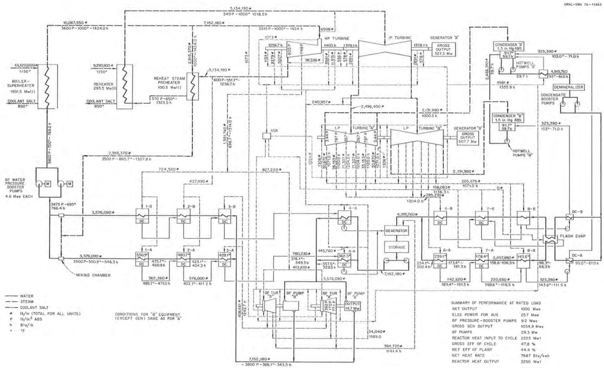  
Fig. 5.1. MSBR steam power cycle flowsheet.

The minimum temperature for the steam entering the reheaters was assumed to be $650^{\circ}\mathrm{F}$ . The $552^{\circ}\mathrm{F}$ high-pressure turbine exhaust steam is therefore preheated, or tempered, in the shell side of a surface heat exchanger using prime steam at 3600 psia and $1000^{\circ}\mathrm{F}$ in the tubes. (The preheater is described in Sect. 5.10.) The high-pressure steam leaves the tubes at about 3500 psia and $866^{\circ}\mathrm{F}$ and is used for preheating the feedwater, as described below. The preheated "cold" reheat steam, now at $650^{\circ}\mathrm{F}$ , then enters eight reheaters, which are supplied with coolant salt at $1150^{\circ}\mathrm{F}$ at a controlled rate to provide $1000^{\circ}\mathrm{F}$ steam at the exit. (The reheates were described in Sect. 4.3.) The reheated steam is supplied to the double-flow 3600-rpm intermediate-pressure turbine stop valve at about 540 psia and $1000^{\circ}\mathrm{F}$ .

There are no extraction points on the intermediate-pressure turbine. Each cylinder exhausts directly into the two double-flow 1800-rpm low-pressure turbines at a rate of about $2.5 \times 10^{6} \mathrm{lb/hr}$ per turbine. Steam for the No. 4 feedwater heaters is also taken from the intermediate-pressure turbine exhaust.

Each of the four low-pressure turbine cylinders has three extraction points for feedwater heating. About $2.1 \times 10^{6}$ lb/hr is finally exhausted from each pair of low-pressure turbines into four surface condensers operating at about $1\frac{1}{2}$ in. Hg abs. Hot-well pumps circulate the $92^{\circ}\mathrm{F}$ condensate through full-flow demineralizers for the condensate polishing necessary to obtain the high-purity water required in a once-though steam generator. The feedwater flow then splits into two parallel paths for successive stages of feedwater heating anddeaeration. Booster pumps at the bottom of the deaerators circulate the water through feedwater heater 4 and to the two main boiler feed pumps. These barrel-type six-stage centrifugal units have a capacity of 7500 gpm at 10,800 ft of head. Each is driven by an eight-stage steam turbine with a brake horsepower capacity of 21,500. The turbines have three extraction points for feedwater heating and exhaust at 77 psia into the deaerating feedwater heaters. The turbines normally operate on 1146-psia steam extracted from the main high-pressure turbine but can also accept 3500-psia steam during startup or other times when extraction steam is not available from the high-pressure turbine.

The feedwater, now at a pressure in excess of 3800 psia, flows through the three top regenerative heaters and leaves at $\sim 3500$ psia and $551^{\circ}\mathrm{F}$ . Each of the $3.6 \times 10^{6} \mathrm{lb/hr}$ parallel-flow streams then enters a mixing chamber, where the steam at 3500 psia and $866^{\circ}\mathrm{F}$ from the tube side of the reheat steam preheater is mixed directly with it. (The mixing chamber is discussed in

Sect. 5.8.) The resulting mixture, actually compressed water at about 3475 psia and $695^{\circ}\mathrm{F}$ , then enters the boiler feedwater pressure-booster pumps. (Two pumps are shown on the flowsheet in Fig. 5.1, but as indicated in Sect. 5.7, more detailed study of the pumps and the system performance may indicate four or six parallel units. They are also shown as motor-driven pumps, but optimization studies would be likely to indicate an advantage for steam-turbine drives for some of the units.) The feedwater, now at about 3800 psia and $700^{\circ}\mathrm{F}$ , is returned to the steam generator at a rate adjusted to the plant load by controlling the pumping rate.

# 5.3 MSBR PLANT THERMAL EFFICIENCY

The steam system efficiency was estimated by using performance values taken from the TVA Bull Run plant cycle for the major items, particularly with regard to pressure and temperature conditions. Bull Run mass flow rates required adjustment, however, in that the gross generating capacity of the MSBR is about 1035 MW(e) compared with 950 MW(e) for the TVA station.

The gross capacity requirement for the MSBR of 1035 MW(e) is based on an assumed plant auxiliary electric load of 35 MW(e), of which 10 MW(e) would be required to drive the boiler feed booster pumps. The reactor plant would need to supply about 2225 MW(t) of energy to the steam-power cycle to deliver this output. Heat losses from the reactor plant, exclusive of long-range decay heat in off-gases, etc., have been roughly estimated at 25 MW(t), making the total required thermal capacity of the reactor about 2250 MW. The heat rejected by the drain tank heat disposal system in normal operation is about 18 MW(t). This decay heat has not been included in the thermal capacity of the reactor. (It is reasonable to assume that in optimized MSBR systems, a portion of this rejected heat could be usefully applied.)

Based on a net output of the plant of $1000\mathrm{MW(e)}$ and a reactor capacity of $2250\mathrm{MW(t)}$ , the overall thermal efficiency of the station is $44.4\%$ . The efficiency based on the 2225 MW(t) of heat input to the steam system is $44.9\%$ , or a heat rate of 7601 Btu/kWhr.

# 5.4 SELECTION OF STEAM CONDITIONS FOR THE MSBR STEAM-POWER CYCLE

If the thermal gradients in the steam generator tubing walls and the coolant-salt freezing point do indeed impose the requirements for a high feedwater temperature of, say, $700^{\circ}\mathrm{F}$ , the last stage of feedwater heating

in an MSBR plant obviously requires an arrangement not found in a conventional steam power station, and tenets of performance of the latter would not necessarily apply.

The top temperatures for practical regenerative feedwater heating could range from about 550 to $575^{\circ}\mathrm{F}$ in a supercritical-pressure cycle and from 475 to $500^{\circ}\mathrm{F}$ in a subcritical-pressure cycle. Heating of the water to $700^{\circ}\mathrm{F}$ can be accomplished in a relatively simple manner in the supercritical-pressure system by mixing supercritical-pressure steam with supercritical-pressure water, as shown in Figs. 5.1 and 5.2. (A mixing chamber is discussed in Sect. 5.8.) The resulting mixture is pumped back up to steam generator pressure by special low-head high-pressure pumps, referred to as pressure-booster pumps in Sect. 5.7. As an alternative, a high-pressure heat exchanger could be used to heat the supercritical-pressure feedwater to $700^{\circ}\mathrm{F}$ , with the exit high-pressure heating steam reintroduced into the cycle, possibly by heating it to $1000^{\circ}\mathrm{F}$ in a salt-heated exchanger, thereby eliminating the pressure-booster pumps and the 10-MW(e) auxiliary plant load they imposed. Further study is needed of this alternate arrangement to determine the extent of the economic penalty.

Heating the feedwater to $700^{\circ}\mathrm{F}$ in a subcritical-pressure cycle by surface heat exchange between steam generator outlet steam and the water would require an inordinate amount of steam generator throughput and surface area. In the subcritical-pressure system, heating is best accomplished in a Loeffler cycle, where steam from the steam generator outlet is mixed with incoming feedwater in a separate drum provided with distribution

nozzles to reduce the sparging effects. In a Loeffler cycle modified for the MSBR conditions, as shown in Fig. 5.3, the water would be converted to superheated steam in the drum and then compressed and blown into the "steam generator." The latter, in reality, would act only as a superheater. The steam compressor would probably be driven by a steam turbine, since the power requirements could be in excess of $50\mathrm{MW(e)}$ . In this connection, it may be noted that the higher the initial pressure of the steam to the compressor inlet, the less the required compressive work on the steam.

A 3500-psia $1000^{\circ}\mathrm{F} / 1000^{\circ}\mathrm{F}$ cycle with direct mixing and booster pumps was compared by Robertson with a 2400-psia $1000^{\circ}\mathrm{F} / 1000^{\circ}\mathrm{F}$ Loeffler cycle with steam compressors. The supercritical-pressure steam cycle used as a reference was that shown in Fig. 5.1. The mixing arrangement for the 2400-psia cycle is that shown schematically in Fig. 5.3; the regenerative 2400-psia steam system flowsheet used for comparison is taken from ref. 88. Both cycles include facilities for preheating the cold reheat steam to about $650^{\circ}\mathrm{F}$ before it enters the reheaters. As may be seen in Table 5.2, use of subcritical-pressure steam results in a lower thermal efficiency; also, the mass flow through the steam generator would be about twice as great. Since the specific volume of the steam at 2400 psia is about 1.5 times greater than at 3500 psia, the volumetric flow rate is two to three times greater for the subcritical-pressure system. This flow volume would have to be accommodated by a greater number of tubes in the steam generator. The expense of the greater number of tube welds and larger shell diameter probably overshadows the cost of the thicker heads and tube sheets required for the supercritical-pressure system.

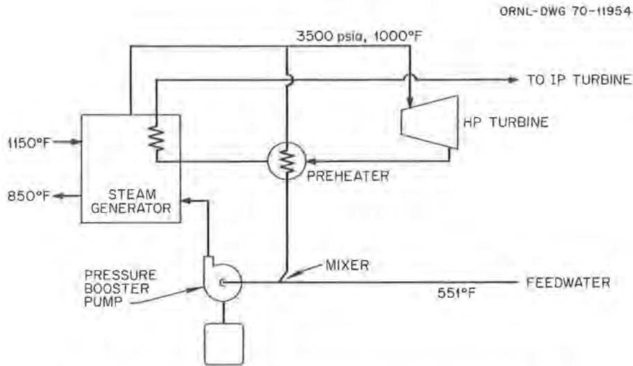  
Fig. 5.2. Supercritical-pressure cycle with feedwater heated by mixing.

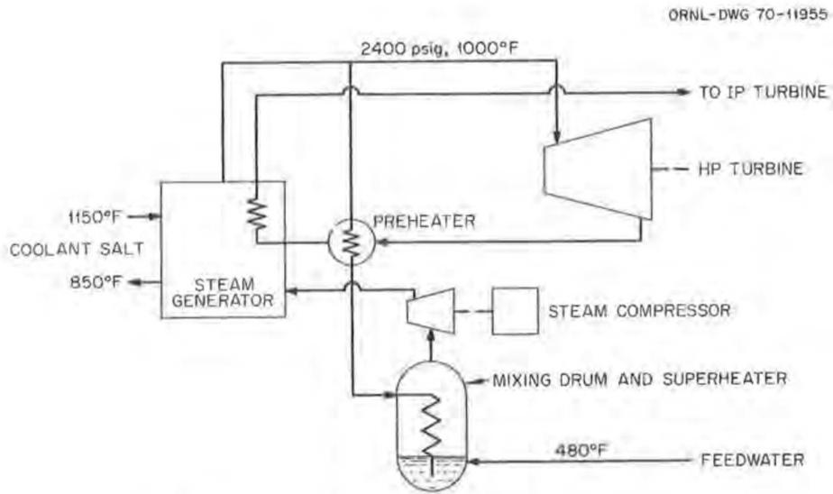  
Fig. 5.3. Modified Loeffler cycle for feedwater heating.

Table 5.2. Comparison of performance of supercritical-pressure direct-mixing cycle with subcritical Loeffler cycle to attain $700^{\circ}\mathrm{F}$ feedwater   

<table><tr><td></td><td>Supercritical cycle</td><td>Subcritical cycle</td></tr><tr><td>Nominal feed temperature to steam generator, °F</td><td>700</td><td>~700</td></tr><tr><td>Mixing pressure, nominal, psia</td><td>3500</td><td>2600</td></tr><tr><td>Booster pump or steam compressor discharge pressure, psia</td><td>3800</td><td>2900</td></tr><tr><td>Booster pump or steam compressor power requirement, MW(e)</td><td>7.4</td><td>52</td></tr><tr><td>Steam flow through steam generator, lb/hr (total)</td><td>\( 9.5 \times 10^6 \)</td><td>\( 19 \times 10^6 \)</td></tr><tr><td>Overall thermal efficiency of heat-power cycle,%</td><td>44.5</td><td>41.1</td></tr></table>

Use of supercritical-pressure steam also has some advantages with regard to the heat transfer coefficient on the steam side of the tubes in the steam generator. Essentially all the heat transferred is in the superheated regime, and the steam-side coefficient is largely controlling. The physical properties of steam at $900^{\circ}\mathrm{F}$ for 3500 and 2400 psia are briefly compared in Table 5.3. It can be seen that the film coefficient for heat transfer in the 3500-psia system is about twice that in a 2400-psia system, and the surface area requirement would therefore be significantly less.

In summary, the supercritical-pressure system provides a higher thermal efficiency, appears to offer a

Table 5.3. Properties of superheated steam at ${900}^{ \circ  }{\mathrm{F}}^{\mathrm{a}}$   

<table><tr><td></td><td>2400 psia</td><td>3500 psia</td></tr><tr><td>Thermal conductivity, Btu hr-1 ft-1(°F)-1</td><td>0.052</td><td>0.062</td></tr><tr><td>Viscosity, lb sec ft-2× 107</td><td>63</td><td>67</td></tr><tr><td>Specific volume, ft3/lb</td><td>0.285</td><td>0.176</td></tr><tr><td>Specific heat, Btu lb-1 (°F)-1</td><td>0.74</td><td>0.91</td></tr><tr><td>Relative film resistance to heat transferb</td><td>1.9</td><td>1.0</td></tr></table>

a1967 ASME steam table values (ref. 78).   
${}^{b}$ Assuming the same tube diameters and velocities.

more direct means of attaining $700^{\circ}\mathrm{F}$ feedwater, and could require a less expensive steam generator. The higher efficiency not only affords a lower electric power production cost but means less fuel processing, less accumulation of fission products, and less heat discharge to the environment.

# 5.5 USE OF REHEAT IN THE MSBR STEAM CYCLE

Reheat would probably be profitable in the MSBR steam cycle, particularly if plant layouts could be made having shorter reheat steam lines than those used in the reference design. More study is needed, however, before it can be said conclusively that the improved efficiency gained by use of reheat offsets the added complexity and cost of the system. In considering reheat vs nonreheat cycles, it should be noted that if reheat is not

used, external moisture separators are required to prevent excessive moisture in the last stages of the low-pressure turbines and that reheating does provide somewhat better turbine performance than moisture separation. These factors have not been evaluated because this would involve obtaining rather precise comparative information on equipment costs and turbine performance, a refinement which to data has not been warranted in the MSBR conceptual studies.

It is interesting that a study made for the LMFBR89 comparing moisture separation with reheat for a 2400psig $900^{\circ}\mathrm{F} / 900^{\circ}\mathrm{F}$ steam cycle concluded that the economic gain for reheat (using sodium as the heat source) was not sufficient to offset the added complexity and reduction in plant reliability. These conditions do not necessarily apply to the MSBR, however, because the MSBR can attain $1000^{\circ}\mathrm{F}$ top temperatures and does not require a relatively expensive reheater design to accommodate exothermic reactions, as would have been required for the LMFBR.

If future economic studies should indicate that reheat for the MSBR cycle is indeed marginal, the system could be simplified by elimination of the reheaters, reheat steam preheaters, and the flow proportioners that divide the coolant-salt flow between the steam generators and reheaters.

# 5.6 EFFECT OF FEEDWATER TEMPERATURE ON THE MSBR STEAM-POWER CYCLE

As previously mentioned, a feedwater temperature as high as $700^{\circ}\mathrm{F}$ may be required for the steam generators, and an entering steam temperature of $650^{\circ}\mathrm{F}$ or more may be needed for the reheaters. The special equipment necessary to achieve these temperatures and, more importantly, the loss of available energy in the cycle are distinct disadvantages of the arrangement. In the unlikely event that an even higher feedwater temperature would be required, say $800^{\circ}\mathrm{F}$ , the disadvantages would become strikingly greater. It is therefore of interest to briefly discuss the magnitude of the cost penalties involved in order to compare them with possible development costs for an improved arrangement.

An MSBR steam cycle with $700^{\circ}\mathrm{F}$ feedwater and $650^{\circ}\mathrm{F}$ cold reheat steam was compared with one with $580^{\circ}\mathrm{F}$ feedwater and $552^{\circ}\mathrm{F}$ reheat steam in ORNL-3996 (ref. 4) and with a cycle with $800^{\circ}\mathrm{F}$ feedwater and $650^{\circ}\mathrm{F}$ cold reheat steam.[8] The results are summarized in Table 5.4. The $580^{\circ}\mathrm{F}$ temperature was selected primarily on the basis that this was about the highest temperature that could be reasonably attained by regenerative feedwater heating. In this case no

Table 5.4. Effect of feedwater temperature on performance of MSBR supercritical-pressure steam-power cycle   

<table><tr><td>Nominal feed temperature (°F)</td><td>Booster pump work [MW(e)]</td><td>Steam generator flow rate (lb/hr)</td><td>Net plant efficiency (%)</td></tr><tr><td></td><td></td><td>×106</td><td></td></tr><tr><td>580b</td><td>None required</td><td>7.4</td><td>44.9</td></tr><tr><td>700c,d</td><td>7.4</td><td>9.5</td><td>44.5</td></tr><tr><td>800c</td><td>87</td><td>28</td><td>41.3</td></tr></table>

${}^{a}$ Based on net plant output of ${1000}\mathrm{{MW}}\left( \mathrm{e}\right)$ and reactor heat of 2250 MW(t).   
${}^{b}$ Assumes extra stage of regenerative feedwater heating and no mixing or booster pumps required.   
cFeedwater heated by mixing with steam from reheat steam preheater.   
This case represents the performance now cited in MSBR literature. Small variations exist due to different steam tables used in the calculations.

special mixer or booster pump would be required, and it was assumed that the reheat steam would not require preheating.

Comparing the 580 and $700^{\circ}\mathrm{F}$ cases in Table 5.4, the lower temperature affords a higher efficiency, which can amount to about 10 MW(e) of additional output capacity. An additional high-pressure feedwater heater is required to obtain the $580^{\circ}\mathrm{F}$ water, but this cost is more than offset by the expense of the mixing chamber, pressure booster pumps, and reheat steam preheaters needed in the $700^{\circ}\mathrm{F}$ cycle. As a result, the $580^{\circ}\mathrm{F}$ cycle is estimated to have a total construction cost, including indirect charges, of about half a million dollars less than for the $700^{\circ}\mathrm{F}$ system.[88] Taking fixed charges at $13.7\%$ per annum, the saving amounts to about $\$68,500$ per year. This saving is small, however, in comparison with the value of a better thermal efficiency. Based on power worth 4 mills/kWhr, the value of 10 MW(e) at $80\%$ plant factor is about $\$280,000$ per year. The total yearly saving of the lower temperature system is thus about $\$350,000$ . The present worth (discounted at $6\%$ ) over a 30-year plant life of this yearly sum is equivalent to roughly $\$5$ million for an MSBR station. In a power economy with many molten-salt reactors in operation, there would thus be a strong incentive to develop a means for lowering the required feedwater temperature, either through use of a different heat transport fluid or improved steam generator design, or both. (With regard to use of a different secondary coolant, however, it should be noted that the sodium fluoroborate pro

posed in the reference design MSBR has an estimated cost of less than 50 cents/lb. Since the coolant inventory is about 900,000 lb, if a different coolant costs as much as about $3 per pound, the increased inventory cost could nullify the cost advantages of the lower temperature cycle.)

# 5.7 PRESSURE-BOOSTER PUMPS FOR MIXING FEEDWATER-HEATING SYSTEM

After the feedwater is heated to about $700^{\circ}\mathrm{F}$ in the mixing chamber used in the reference design (described in Sect. 5.8), about 38,000 gpm of the mixture must be raised to the steam generator inlet pressure of about 3800 psia. Canned-rotor pumps are currently in use which operate under much the same pressure and temperature conditions as those required. Preliminary information obtained from pump vendors indicates that development may be needed to produce multistage variable-speed pumps, as may be required for the MSBR, but no major extensions of the technology appear to be involved.

# 5.8 MIXING CHAMBER FOR FEEDWATER HEATING

The reference design provides $700^{\circ}\mathrm{F}$ feedwater by direct mixing of supercritical-pressure steam at about $866^{\circ}\mathrm{F}$ with supercritical-pressure water at about $550^{\circ}\mathrm{F}$ . The problems associated with the mixing of steam and water at lower temperatures are well known; the rapid formation and collapse of vapor bubbles causes noise, vibration, and erosion similar to those found in pump cavitation. At supercritical pressure, however, there is no phase change or bubble formation, and the mixing can be accomplished in a simple device.

At the TVA Bull Run steam plant, supercritical pressure steam and water are mixed in a 42-in.-diam sphere, with the steam brought in at the top and the water entering tangentially at the equator. The mixture leaves at the bottom after passing through a screen with $3\%$ -in.-diam holes. The total pressure drop is said to be less than 25 psi. One sphere handles a flow of over 4,000,000 lb/hr. Other mixing chamber configurations may be possible, such as a simple pipe tee. Choice of this method of feedwater heating for the MSBR cycle does not appear to impose major development problems.

# 5.9 SUPERHEAT CONTROL BY ATTEMPERATION

Coarse control of the outlet steam temperature from the steam generators will be by adjustment of the

coolant-salt pumping rate. Fine control, and more gross control under certain loading conditions, will be achieved by attempering the steam with $700^{\circ}\mathrm{F}$ feedwater injection. The attemperator design has not been studied in any detail. The possible problem of moisture in the throttle steam is alleviated to a large extent because there would be approximately 150 ft of high-temperature steam piping downstream of the attemperator before the steam reached the turbine. A major steam turbine manufacturer has stated that this suggested method of superheat control by attemperation is acceptable in principle.

# 5.10 REHEAT STEAM PREHEATERS

T.W.Pickel

# 5.10.1 General Description

The reference design requires that about $5.1 \times 10^{6}$ lb/hr of $551^{\circ}\mathrm{F}$ steam leaving the high-pressure turbine exhaust be preheated to about $650^{\circ}\mathrm{F}$ before it enters the reheaters. The proposed arrangement is to heat the steam by heat exchange with steam at steam generator exit conditions of 3600 psia and $1000^{\circ}\mathrm{F}$ . The capacity required in each of eight preheater units is thus about 630,000 lb/hr, or 12.3 MW(t).

There are eight identical preheater units operating in parallel. The supercritical-pressure heating steam enters the tube side at about 3600 psia and $1000^{\circ}\mathrm{F}$ and exits at about 3535 psia and $869^{\circ}\mathrm{F}$ . The turbine exhaust steam enters the shell side at about 595 psia and $551^{\circ}\mathrm{F}$ and leaves at about 590 psia and $650^{\circ}\mathrm{F}$ .

A conceptual design for the preheater is shown in Fig. 5.4, and the principal data are given in Table 5.5. The units are vertical single-pass U-shell, U-tube, with an overall height of about 15 ft. The legs of the shell are about 21 in. in diameter and are surmounted by 25-in.-ID spherical plenum chambers for the supercritical-pressure heating steam. Each unit has about 600 tubes, $\frac{3}{8}$ in. in. outside diameter, located in a triangular array. There are no flow baffles used on the shell side, but bypass preventer rings are installed at intervals around the tube bundle to prevent channeling of flow in the clearance space between the bundle and the shell. A baffle plate on the shell side of each tube sheet provides a stagnant layer to help reduce stresses due to the temperature gradient across the sheet.

# 5.10.2 Design Considerations

The preheaters may be constructed of Croloy since they are not in contact with the fluoride salts. The units will not be exposed to any radioactivity and will be

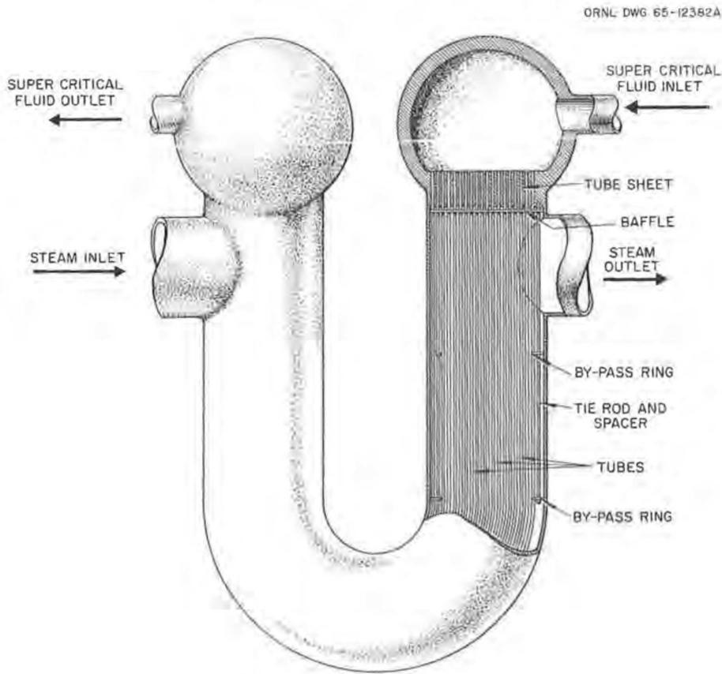  
Fig. 5.4. Reheat steam preheater.

located in the feedwater heating bay, where direct maintenance can be performed.

The high pressure of the heating steam prompted selection of a U-shell rather than a divided cylindrical shell, since it permits smaller diameters for the heads and reduces the thicknesses required for the heads and tube sheets. The same pressure considerations led to selection of the spherical plenum for the high-pressure steam.

The preheaters have been shown as vertical units, but there is no compelling reason why they could not be used horizontally. Gravity drainage is not considered mandatory.

The heat transfer coefficient for the supercritical-fluid film inside the tubes was calculated by using the Dittus-Boelter equation,

$$
\frac {h _ {i} d _ {i}}{k} = 0. 0 2 3 \left(N _ {\mathrm {R e}}\right) ^ {0. 8} \left(N _ {\mathrm {P r}}\right) ^ {0. 4}.
$$

The film heat transfer coefficient for the lower pressure reheat steam flowing outside of and parallel to the tubes was calculated by a correlation reported by Short, given by

$$
h _ {o} = 0. 1 6 \frac {k}{d _ {o}} \left(\frac {d _ {o} G}{\mu_ {b}}\right) ^ {0. 6} \left(\frac {C _ {p} \mu_ {b}}{k}\right) ^ {0. 3 3}
$$

Pressure drops in the tubes and in the shell were calculated by using the Darcy equation for the friction loss; four velocity heads were associated with the inlet, exit, and reversal losses; a correction factor was used for changes in kinetic energy between the inlet and exit of the exchanger.

An analysis was made of the stress intensities in the tubes, tube sheets, shells, and high-pressure heads and of the discontinuity-induced stresses at the junction of the tubes and tube sheets. The results are shown in Table 5.5. The calculated stresses are within the allowable values.

Table 5.5. Design data for the reheat-steam preheater   

<table><tr><td>Type</td><td>One-tube-pass, one-shell-pass U-tube, U-shell exchanger with no baffles</td></tr><tr><td>Number required</td><td>8</td></tr><tr><td>Rate of heat transfer, each</td><td></td></tr><tr><td>MW</td><td>12.33</td></tr><tr><td>Btu/hr</td><td>\( 4.21 \times 10^7 \)</td></tr><tr><td>Shell-side conditions</td><td></td></tr><tr><td>Cold fluid</td><td>Steam</td></tr><tr><td>Entrance temperature, \( ^\circ F \)</td><td>551</td></tr><tr><td>Exit temperature, \( ^\circ F \)</td><td>650</td></tr><tr><td>Entrance pressure, psi</td><td>595.4</td></tr><tr><td>Exit pressure, psi</td><td>590.0</td></tr><tr><td>Pressure drop across exchanger, psi</td><td>5.4</td></tr><tr><td>Mass flow rate, lb/hr</td><td>\( 6.31 \times 10^5 \)</td></tr><tr><td>Mass velocity, \( lb hr^{-1} ft^{-2} \)</td><td>\( 3.56 \times 10^5 \)</td></tr><tr><td>Tube-side conditions</td><td></td></tr><tr><td>Hot fluid</td><td>Supercritical water</td></tr><tr><td>Entrance temperature, \( ^\circ F \)</td><td>1000</td></tr><tr><td>Exit temperature, \( ^\circ F \)</td><td>869</td></tr><tr><td>Entrance pressure, psi</td><td>3600</td></tr><tr><td>Exit pressure, psi</td><td>3535</td></tr><tr><td>Pressure drop across exchanger, psi</td><td>65</td></tr><tr><td>Mass flow rate, lb/hr</td><td>\( 3.68 \times 10^5 \)</td></tr><tr><td>Mass velocity, \( lb hr^{-1} ft^{-2} \)</td><td>\( 1.87 \times 10^6 \)</td></tr><tr><td>Velocity, fps</td><td>93.5</td></tr><tr><td>Tube material</td><td>Croloy</td></tr><tr><td>Tube OD, in.</td><td>0,375</td></tr><tr><td>Tube thickness, in.</td><td>0.065</td></tr><tr><td>Tube length, tube sheet to tube sheet, ft</td><td>13.2</td></tr><tr><td>Shell material</td><td>Croloy</td></tr><tr><td>Shell thickness, in.</td><td>7/16</td></tr><tr><td>Shell ID, in.</td><td>20,25</td></tr><tr><td>Tube sheet material</td><td>Croloy</td></tr><tr><td>Tube sheet thickness, in.</td><td>6.5</td></tr><tr><td>Number of tubes</td><td>603</td></tr><tr><td>Pitch of tubes, in. (triangular)</td><td>0.75</td></tr><tr><td>Total heat transfer area, \( ft^2 \)</td><td>781</td></tr><tr><td>Basis for area calculation</td><td>Tube OD</td></tr><tr><td>Type of baffle</td><td>None</td></tr><tr><td>Type of baffle</td><td>None</td></tr><tr><td>Overall heat transfer coefficient, \( U, Btu hr^{-1} ft^{-2} \)</td><td>162</td></tr><tr><td>Maximum stress intensity,\( ^a psi \)</td><td></td></tr><tr><td>Tube</td><td></td></tr><tr><td>Calculated</td><td>\( P_m = 10,503; P_m + Q = 7080 \)</td></tr><tr><td>Allowable</td><td>\( P_m = S_m = 10,500 at 961^\circ F; \) \( P_m + Q = 3S_m = 31,500 \)</td></tr><tr><td>Shell</td><td></td></tr><tr><td>Calculated</td><td>\( P_m = 14,375; P_m + Q = 33,081 \)</td></tr><tr><td>Allowable</td><td>\( P_m = S_m = 15,000 at 650^\circ F; \) \( P_m + Q = 3S_m = 45,000 \)</td></tr><tr><td>Maximum tube sheet stress, psi</td><td></td></tr><tr><td>Calculated</td><td>7800</td></tr><tr><td>Allowable</td><td>7800 at 1000^\circ F</td></tr></table>

aThe symbols are those of Sect. III of the ASME Boiler and Pressure Vessel Code (ref. 56), where $P_{m} =$ primary membrane stress intensity, $Q =$ secondary stress intensity, and $S_{m} =$ allowable stress intensity.

# 6. Fuel-Salt Drain System

W. K. Furlong

# 6.1 GENERAL DESIGN CONSIDERATIONS

The preferred mode of MSBR operation is that the fuel salt remain in the primary system after reactor shutdown so that circulation can be continued through the primary heat exchanger for afterheat removal. There are some circumstances, however, either planned or unplanned, which will require that the salt be drained. Intentional drains are usually associated with maintenance operations, such as reactor core graphite replacement and servicing of pumps, heat exchangers, etc. In these instances the salt circulation can be continued as long as necessary prior to the drain to allow the activity to decay to the necessary level for the maintenance task. There is a low probability of unscheduled drains, but they must be accommodated in the design. Examples of unplanned situations are:

1. massive failure of a primary system pipe or vessel,   
2. a slow loss of salt from the primary system so that pumps would eventually be unable to maintain circulation,   
3. loss of heat-removal capacity in the steam system,   
4. loss of coolant or circulation in the secondary loops,   
5. loss of power or mechanical failure of primary pumps,   
6. inadvertent thawing of the freeze valve which holds the fuel salt in the primary loop.

The principal function of the fuel-salt drain system is to provide a place where the salt can be safely contained and cooled under any of the accidental or intentional situations. The drain system must, therefore, have a highly reliable cooling system capable of removing the afterheat even with a sudden drain after long-term operation at full reactor power. In designing the cooling system the overall objectives were:

1. It must be able to keep the maximum drain tank temperature well within the safe operating range even under the worst condition of transient heat loads.   
2. The system must be reliable, with a minimum of reliance on the electric power supply or operator-initiated actions.   
3. If only a single barrier is provided between the tank coolant and the fuel salt, leakage of the coolant into the salt should not require chemical processing to prevent adverse nuclear or chemical effects.   
4. The cooling system should impose a minimal risk for freezing of either the fuel salt or the cooling system coolant.

Several methods of cooling the drained fuel salt were considered. One was to store the salt in a long pipe with radiant heat transfer to cooled plates. Another possible method was the use of heat pipes to cool fuel-salt-filled tanks. Since a storage tank with a convective cooling system was used with good results in the MSRE, it was decided that the above objectives would be best met by storage of the salt in a tank having a coolant circulated by natural convection to a water-cooled heat exchanger. A variety of heat-transport fluids were studied. The salt originally selected as having the most promise was ${}^{7}\mathrm{LiF - BeF}_{2}$ , and a drain system using this salt was studied in some detail, as described in Sect. 6.3. Late in the study, however, the apparent advantages of an NaK-cooled system led to consideration of an alternate drain tank cooling system using NaK as the coolant, as discussed in Sect. 6.4. Unfortunately, the NaK system study could not be developed in time to be reported as comprehensively as the salt-cooled system.

Without impairing the above-mentioned principal function of the drain system, the drain tank can be conveniently used for other purposes, such as a holdup volume for off-gases to allow about a 2-hr decay time

before the gases are processed. The drain tank cooling system can continuously remove the decay heat load of these gases and at the same time provide assurance that the cooling system is operable and could accommodate a major drain. With this arrangement, internal surfaces in the drain tank, particularly cooled ones, may act as sites for deposition of noble metals in the off-gas and will possibly eliminate the need for a particle trap in the off-gas system. The decay heat load in the drain tank, estimated to total about $18\mathrm{MW(t)}$ is discussed in more detail in Sect. 6.3.2.

The drain tank also serves usefully as a surge volume to which salt can be continuously overflowed from the primary pump bowl. The supply and return connections to the chemical processing facility will be made at the drain tank. The same jet pump arrangement used to fill the primary system from the drain tank can be used to transfer salt to the chemical facility, eliminating the need for pressurizing the tank for salt transfer. With this arrangement, salt can be taken from the tank for processing independently of reactor operation.

It was also decided that the reference MSBR design would provide a backup container if the drain tank should develop a leak. In addition, a second safe storage tank was provided for the salt to permit the primary drain tank to be drained for repairs.

# 6.2 FUEL-SALT DRAIN LINES

Although draining the fuel salt from the reactor is a positive shutdown mechanism, it is not necessary to rely on this as an emergency procedure, and rapid drainage is not a primary design criterion. The drain tank is connected to the bottom of the reactor vessel by a 6-in. drain line equipped with a freeze-plug type of "valve" which can be thawed to allow gravity drainage of the entire primary circulating system in about $7\mathrm{min}$ . A small circulation of fuel salt is normally maintained in the drain line between the reactor and the freeze valve to prevent overheating due to stagnant salt, as indicated in the drain system flowsheet, Fig. 2.3.

During normal operation of the reactor about 150 gpm of fuel salt overflows from each circulating pump bowl. The gases stripped from the fuel salt at the gas separator, laden with highly radioactive fission product gases and particulates, are combined with the overflow salt from the pump bowls in a small tank (A in Fig. 2.3) before flowing to the drain tank. The 2-in. overflow line has a 3-in.-diam counterflow cooling jacket supplied with $1050^{\circ}\mathrm{F}$ fuel salt from the reactor inlet. This salt, in flowing upward through the jacket, also cools the small mixing tank and the lower portion of the pump bowl before mixing with the bulk salt flow in the bowl.

The overflow gas-salt mixture, which reaches the drain tank at an estimated temperature of about $1200^{\circ}\mathrm{F}$ , enters the top of the drain tank and is first directed beneath the top head and then downward through a $\frac{1}{2}$ -in.-wide annulus between the tank wall and an internal liner (used as a gamma shield) to cool the drain tank and the internal liner.

# 6.3 PRIMARY DRAIN TANK WITH SALT-COOLED HEAT- DISPOSAL SYSTEM

# 6.3.1 Description

The drain tank is a vertical cylinder about 14 ft in diameter and 22 ft high with torispherical heads and internal U-tubes. All portions in contact with salt are constructed of Hastelloy N. Plan and elevation views are shown in Figs. 6.1 and 6.2, and the principal data are listed in Table 6.1. The layout of the drain tank and its cooling system is shown in Fig. 6.3.

The storage volume of the tank is about $2500\mathrm{ft}^3$ The tank dimensions were based on the following volume requirements $(\mathrm{ft}^{3})$ ..

Total fuel-salt volume 1720

Volume of coolant salt that could 730

reach drain tank in event of tube

failure in one primary heat exchanger

Volume occupied by U-tubes and 250

other components in drain tank

After considering various means of cooling the tank walls and heads, it was decided to use the internal liner with a continuous fuel-salt flow to remove the heat. A flow of $150\mathrm{gpm}$ of fuel salt from each of the primary circulation pumps, after being cooled to about $1200^{\circ}\mathrm{F}$ by a counterflow of "cold"-leg salt, as mentioned above, will enter the drain tank and flow down the annulus between the liner and the wall. The annulus is orificed at the bottom to ensure that it remains full of salt. The maximum steady-state wall temperature is estimated to be $1260^{\circ}\mathrm{F}$ , occurring at the bottom. The liner is separated from the walls by standoffs to provide a 0.5-in. radial cooling passage and to make it structurally independent of the tank. The liner also provides support for internal baffles, which are provided to impart a circuitous path for the off-gas and also to stiffen the U-tubes. Since there are no structural connections between the tank and the inner liner, the status of the tank as an ASME Code Sect. III, class A vessel is not impaired by this approach.

The 0.75-in.-diam U-tubes through which the cooling salt circulates to remove the heat generated in the

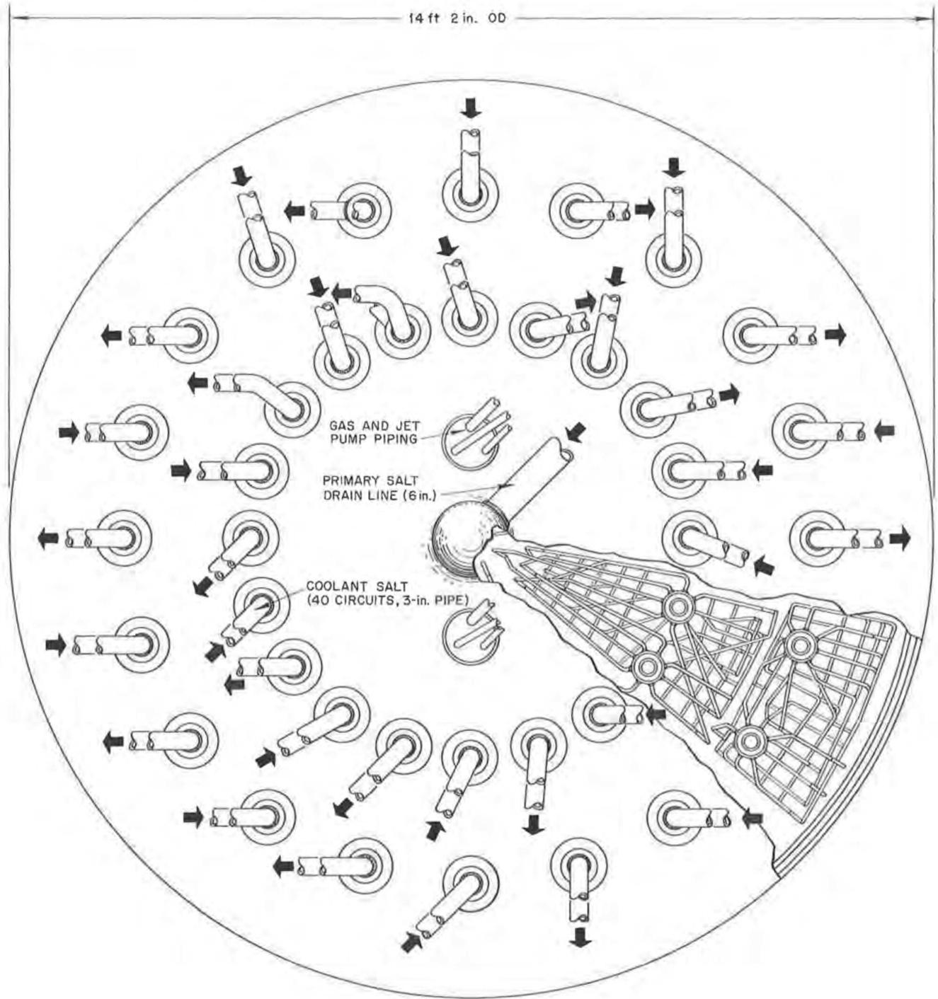  
Fig. 6.1. Plan view of fuel-salt drain tank with salt cooling.

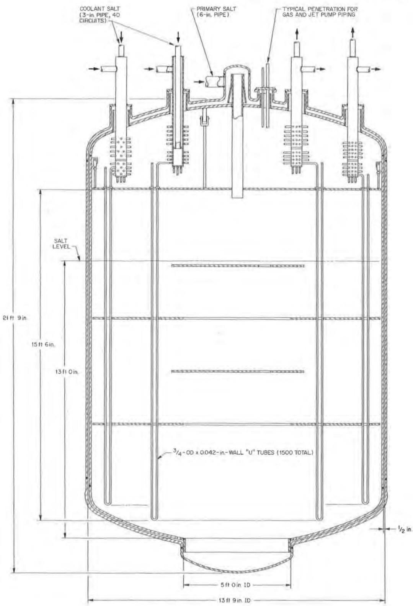  
Fig. 6.2. Elevation of fuel-salt drain tank with salt cooling.

Table 6.1. Principal design parameters and data for primary drain system using salt cooling system   

<table><tr><td colspan="2">Drain tank</td></tr><tr><td>Outside diameter, ft</td><td>14</td></tr><tr><td>Overall height, ft</td><td>22</td></tr><tr><td>Wall thickness, in.</td><td>1</td></tr><tr><td>Bottom head thickness, in.</td><td>\( 1^{\frac{1}{2}} \)</td></tr><tr><td>Liner thickness, in.</td><td>1</td></tr><tr><td>Material</td><td>Hastelloy N</td></tr><tr><td>Storage capacity, \( ft^3 \)</td><td>~2500</td></tr><tr><td>Design conditions, psig/°F</td><td>40/1300</td></tr><tr><td>Number of internal U-tubes</td><td>~1500</td></tr><tr><td>U-tube OD × wall thickness, in.</td><td>0.75 × 0.042</td></tr><tr><td>Off-gas flow rate, cfm at 10 psig and 1000°F</td><td>18</td></tr><tr><td>Flow rate of overflow salt, gpm</td><td>600</td></tr><tr><td>Entering temperature of overflow salt, °F</td><td>1200</td></tr><tr><td>Fraction of total noble metal yield found in off-gas</td><td>0.5</td></tr><tr><td>Off-gas holdup time, hr</td><td>~2.3</td></tr><tr><td>Equilibrium heat generation in off-gas and noble metals, MW(t)</td><td>18</td></tr><tr><td>Heat absorbed in tank liner and walls, MW(t)</td><td>2</td></tr><tr><td>Maximum heat release from salt after sudden drain, MW(t)</td><td>53</td></tr><tr><td>Maximum steady-state heat load, MW(t)</td><td>18</td></tr><tr><td>Maximum steady-state wall temperature, °F</td><td>~1260</td></tr><tr><td>Estimated time for primary system to drain, min</td><td>7</td></tr><tr><td colspan="2">Heat disposal system</td></tr><tr><td>Drain tank coolant fluid</td><td>\( ^7\text{LiF-BeF}_2 \)</td></tr><tr><td>Coolant composition, mole %</td><td>67-33</td></tr><tr><td>Number of autonomous cooling circuits</td><td>40</td></tr><tr><td>Total coolant volume, \( ft^3 \)</td><td>~400</td></tr><tr><td colspan="2">For normal steady-state operation at 18 MW(t) heat release in drain tank:\( ^a \)</td></tr><tr><td>Temperature of coolant entering drain tank, °F</td><td>900</td></tr><tr><td>Temperature of coolant leaving drain tank, °F</td><td>1050</td></tr><tr><td>Coolant circulation rate, gpm at av temperature</td><td>714</td></tr><tr><td colspan="2">For conditions after sudden drain of salt, heat release of 53 MW(t);</td></tr><tr><td>Temperature of coolant entering drain tank, °F</td><td>900</td></tr><tr><td>Temperature of coolant leaving drain tank, °F</td><td>1163</td></tr><tr><td>Coolant circulation rate, gpm at av temperature</td><td>1200</td></tr><tr><td>Number of salt-to-water heat exchangers</td><td>40</td></tr><tr><td>Number of tubes in each exchanger</td><td>333</td></tr><tr><td>Tube size, length (ft) × OD (in.)</td><td>10 × 0.625</td></tr><tr><td>Area in each exchanger, \( ft^2 \)</td><td>544</td></tr><tr><td>Water pressure, psia</td><td>100</td></tr><tr><td>Distance of heat exchangers above drain tank midplane, ft</td><td>60</td></tr><tr><td>Stack size, height × diam, ft</td><td>400 × 60</td></tr></table>

aDue to decay of gases and noble metals only.

stored salt are divided into 40 separate circuits. The choice of the number of circuits was somewhat arbitrary, the primary objective being to have a large number so that in event of failure, any one of them would represent only a small loss in capacity. There were also space limitations in arranging the header circuits at the top of the drain tank. It may be noted that all welds for the coolant system tubes and headers are well above the normal fuel-salt level in the drain tank.

Salt flows into the drain tank by gravity. It is transferred from the tank by salt-actuated jet pumps located in a salt reservoir provided by a depression in the bottom of the tank. Four jet pumps, one in parallel across each primary salt pump, return the overflow salt to the "hot" leg of each primary loop. Some internal cooling of the drain tank wall can be maintained even if three of the four primary salt pumps should fail. An ancillary salt circulation pump is used in conjunction with a fifth jet pump in the bottom of the drain tank to

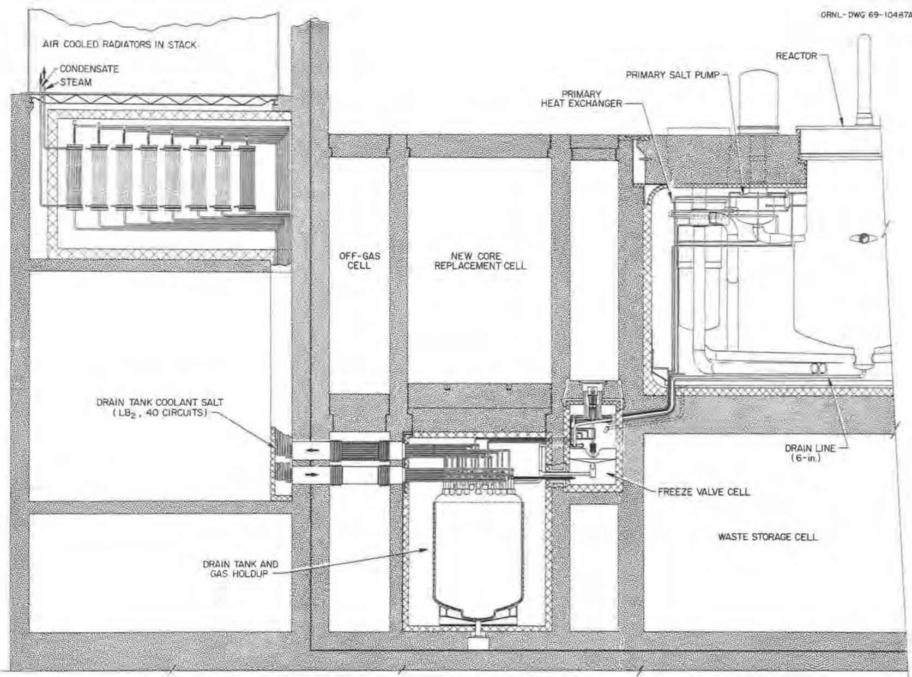  
Fig. 6.3. Elevation of drain tank cell with salt cooling system.

transfer salt to the chemical processing facility. By thawing a freeze valve, indicated as $H$ in Fig. 2.3, this jet pump can also be used to transfer salt from the drain tank to fill the primary system.

One feature not shown in Figs. 6.1 and 6.2 is an external shell around the side walls and bottom of the drain tank which acts as a backup container in the unlikely event of a failure of the tank below the salt level. This shell, sometimes referred to as a "crucible" in the MSR literature, is made of stainless steel and is open at the top. The annular space between the shell and the tank is filled with tightly packed copper rope, the purpose of which is twofold: to minimize the salt volume which can occupy the annulus and to provide a good conductor for heat to the tank wall.

# 6.3.2 Heat Sources in Drain Tank

In normal operation the drain tank receives $\sim 11$ scfm of off-gas containing radioactive gases and metals. Besides tritium, the gases are primarily Kr and Xe, and the noble metals are Nb, Rh, Mo, Ru, Tc, and Te. Heat is also produced by decay of the daughters of Kr and Xe, notably Ba, La, Cs, Rb, Sr, Y, and Zr. Assuming that all of the noble metals present in the system deposit on the U-tube walls and other internal surfaces of the drain tank, the equilibrium value for the heat source would be about $9\mathrm{MW(t)}$ . Decay of the radioactive gases and daughters contributes a maximum of another $9\mathrm{MW(t)}$ , making a maximum total of about 18 MW(t) generated in the drain tank for a reactor which has run several weeks at full power.

The heat sources in the tank were assumed to be uniformly distributed over the drain tank volume, and the methods of Rockwell were applied to estimate the source strength in the liner and tank walls. It was noted that approximately $40\%$ of the off-gas energy is released as betas and hence is deposited locally. Similarly, about $40\%$ of the energy due to the noble metals is from beta emission. The gamma source per unit of homogenized tank volume then becomes 3857 W/ft³. This converts to $2150 \mathrm{~W} / \mathrm{ft}^2$ impinging on the liner. Close agreement is obtained between cylindrical and spherical models.

Estimates of the internal energy absorption by the U-tubes and other internals were based on a linear energy absorption coefficient of 0.82 in., which was determined for attenuation of reactor spectrum gamma radiation in the reactor vessel wall using a gamma transport calculation (ANISN). Assuming the same absorption coefficient, $56\%$ or a heat flux of 949 $\mathrm{W / ft^2}$ is absorbed in the 1-in.-thick liner, leaving 782

$\mathrm{W / ft^2}$ to be absorbed in the 1-in.-thick tank wall from this source. The rest of the energy will be absorbed in the backup vessel in which the drain tank sits. Since the tank walls and head have about $1000\mathrm{ft}^2$ of surface area, a heat load of about $2\mathrm{MW(t)}$ must be accommodated.

The drain tank will be used as a salt repository during shutdown for core graphite replacement or other maintenance. The design basis for such a drain has been taken as $10^{6}$ sec, or 11.6 days, after reactor shutdown. During this interval the salt is circulated with the primary-salt pumps to remove afterheat, including that associated with sources adsorbed on and diffused into the graphite in the reactor. The heat load due to the salt and noble metals in the drain tank at the end of this period, and immediately after the drain, is about 4 MW(t).

The most severe heat loads imposed on the drain tank would be an inadvertent thaw of the freeze valve or an emergency shutdown and drain. (Possible causes for such shutdowns were discussed in Sect. 6.1 above and by Furlong.[92]) The maximum heat load that could occur in such circumstances is estimated to be about 50 MW(t), if about 7 min is allowed for the drainage to take place. The maximum possible heat release in the tank, with no credit taken for heat sources retained by the graphite, is shown in Fig. 6.4. In general, the afterheat rejection requirements decrease by a factor of 10 during the first day.

# 6.3.3 Heat Transfer in Drain Tank Walls

During normal operation the tank walls and liner are cooled by overflow salt from the reactor, as mentioned above. A value of 150 gpm per pump was chosen somewhat arbitrarily for the overflow rate. It was desirable to have a value large enough to give adequate cooling and also be large compared with the discharge rate from chemical processing to assure good mixing of processed salt as it returns to the reactor. On the other hand, an upper constraint was the jet pump size. The mixture of overflow salt and off-gas flows in a 2-in. pipe located concentrically inside a 3-in. pipe. The annulus between the pipes is connected to the drain line upstream of the freeze valve. Cold $(1050^{\circ}\mathrm{F})$ salt from this source cools the overflow lines, the mixing chamber (A in Fig. 2.3), and the walls of the pump bowl. About $150\mathrm{gpm}$ will cool the overflow mixture to $1213^{\circ}\mathrm{F}$ (average of four lines) upon entering the drain tank and will have a temperature range (depending upon the line length) of 1124 to $1167^{\circ}\mathrm{F}$ upon entering the mixing chamber and slightly higher temperatures upon entering the pump bowl. A higher value may be desirable,

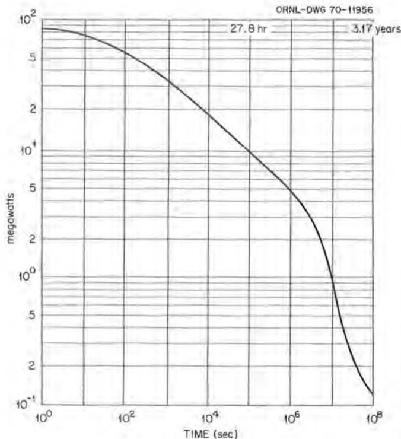  
Fig. 6.4. Total afterheat production.

depending upon the relative importance of the colder drain tank wall coolant and the ability to keep it cool with less than four pumps running vs the acceptable salt temperature impinging on the pump tank walls.

With the heat sources described in Sect. 6.3.2 and with a total flow of $600\mathrm{gpm}$ cooled to $1213^{\circ}\mathrm{F}$ , it is estimated that the maximum drain tank wall temperature will be $\sim 1260^{\circ}\mathrm{F}$ and that the maximum liner temperature will be about $1300^{\circ}\mathrm{F}$ during normal steady-state operation. These temperatures appear to be acceptable. However, if necessary, they can be lowered by appropriate adjustments in the flow rates of overflow salt and/or counterflow salt.

# 6.3.4 Heat-Removal System

A qualitative comparison of the coolants considered for the drain tank heat-removal system is given in Table 6.2. The fused salts, NaK (see Sect. 6.4), and the steam-water systems were considered to be most worthy of further consideration. The most likely salt of the candidates were (1) sodium fluoroborate $\mathrm{(NaBF_4 - NaF)}$ , the same salt used in the MSBR secondary system; (2) $^7\mathrm{LiF - BeF}_2$ of the peritectic composition 66-34 mole %; and (3) Hitec, a commercial nitrite/nitrate heat transfer salt. The significant physical properties of these three salts are listed in Table 6.3,

and each is compared with a steam-water system in Table 6.4.

Although water appears to be a very attractive coolant, provided a double barrier is used in the drain tank cooling tubes to avoid thermal shock following a salt drain and to give better assurance that water could not reach the fuel salt, calculations showed that it would be difficult to fit the required number of tubes into the drain tank head. A compromise was therefore reached which employs natural circulation of an $^7\mathrm{LiF - BeF}_2$ salt mixture through the drain tank tubes and then cooling of the salt by radiative heat transfer to boiling water. Heat transfer from the gas in the tank to the $^7\mathrm{LiF - BeF}_2$ is by conduction and some internal heat absorption; heat transfer from the salt is by convection, conduction, and internal absorption. Selection of this compromise arrangement was motivated largely by the desire to have chemical compatibility between the coolant and the fuel salt.

The layout of the drain tank cooling system is indicated in Fig. 6.3 and in the flowsheet, Fig. 2.3. The pertinent data are listed in Table 6.1.

The steady-state natural circulation flow rate of the drain tank coolant salt was calculated as a function of the heat load on the system. The method of calculation involved iterating between the calculated thermal driving head and calculated head losses due to piping and fittings until a flow rate was obtained which made those two quantities equal. The coolant inlet temperature was fixed at $900^{\circ}\mathrm{F}$ (freezing point $856^{\circ}\mathrm{F}$ ). The other system temperatures are functions of flow rate for a given heat load. Salt density and viscosity were reevaluated for each successive value of flow rate (and hence temperatures) and then used in determining the heads mentioned above. Figure 6.5 is a plot of fraction of design flow (that corresponding to design heat load) and salt temperature at the U-tube outlet as functions of fraction of design heat load. During normal reactor operation the heat load on the drain tank due to the off-gas and noble metals is about $16\mathrm{MW}$ , or about $25\%$ of the design value. It is noted from the figure that about $55\%$ of design flow is obtained at this heat load. This is particularly advantageous because a drain will not require the system to be accelerated from a very low flow or from a static condition, as would be the situation if the drain tank were not used for off-gas holdup.

The drain tank coolant salt is cooled in 40 salt-to-water heat exchangers located about 60 ft above the drain tank to provide the thermal driving head for natural circulation. The heat exchange is entirely by radiation from salt tubes to a plate (or tubes) in which

Table 6.2. Qualitative comparison of fuel-salt drain tank coolants   

<table><tr><td>Coolant</td><td>General ability to transfer heat at temperatures and rates required for an MSBR system</td><td>Ease of circulating required volumes</td><td>Ease and reliability of retention in closed system</td><td>Compatibility if mixed with fuel salt</td><td>Compatibility if spilled in cell</td><td>Cost of coolant</td><td>Cost and complexity of components and equipment</td><td>Radiation and thermal stability</td><td>Ease of instrumenting and controlling</td><td>Corrosion</td><td>Conclusions</td></tr><tr><td>Water and steam</td><td>Excellent as coolant; poor for adding heat</td><td>Excellent</td><td>Good; pressure can get high</td><td>Poor</td><td>Poor; generates high pressure and some H2+O2gas</td><td>Very low</td><td>Low</td><td>Good</td><td>Good; protect against freezing and high steam pressure</td><td>Requires Inconel or stainless steel and special treatment</td><td>Suitable for cooling, possibly best</td></tr><tr><td>Liquid metals, NaK and Na</td><td>Good for cooling or heating</td><td>Good</td><td>Excellent; low pressure, low corrosion</td><td>Poor</td><td>Good if N2in cell; poor if air</td><td>Low</td><td>Medium to high</td><td>Excellent</td><td>Excellent; protect against freezing</td><td>Stainless steel or possibly carbon steel</td><td>Excellent for heating or cooling in absence of air</td></tr><tr><td>Fused salts, fluorides, carbonates, and nitrate-nitrites</td><td>Good for cooling or heating</td><td>Good</td><td>Excellent; low pressure, low corrosion</td><td>Excellent to good</td><td>Excellent; protect against toxic vapors</td><td>Low to high</td><td>Medium to high</td><td>Excellent to good</td><td>Good; protect against freezing</td><td>Requires stainless steels or Hastelloy N</td><td>Excellent for heating or cooling</td></tr><tr><td>Organics, diphenyls and polyphenyls</td><td>Good for cooling; poor for heating</td><td>Excellent</td><td>Good; pressure can get high</td><td>Poor</td><td>Poor; generates high-pressure, flammable, and toxic vapor</td><td>Low</td><td>Medium; requires purification system</td><td>Fair; tends to decompose above 700°F</td><td>Good; protect against freezing and high pressure</td><td>Carbon steels</td><td>Fair</td></tr><tr><td>Cases, CO2, N2, and argon</td><td>Poor for heating or cooling</td><td>Poor</td><td>Good; pressure is high</td><td>Excellent</td><td>Good to excellent, depending on ratio of volume of pressurized gas to volume of cell or provisions for pressure relief</td><td>Low</td><td>Medium to high; large high-pressure systems</td><td>Excellent</td><td>Excellent</td><td>Carbon steels</td><td>Fair</td></tr></table>

Table 6.3. Properties of possible fused-salt coolants for drain tank system   

<table><tr><td></td><td>NaBF4-NaF eutectic</td><td>\( {}^{7} \) LiF-BeF \( {}_{2} \) peritectic</td><td>\( {\mathrm{{KNO}}}_{3} - {\mathrm{{NaNO}}}_{2} - {\mathrm{{NaNO}}}_{3} \) eutectic</td></tr><tr><td>Composition, mole %</td><td>92-8</td><td>66-34</td><td>53-40-7</td></tr><tr><td colspan="4">Viscosity, Ib ft \( {}^{-1}{\mathrm{{hr}}}^{-1} \)</td></tr><tr><td>At \( {900}^{ \circ  }\mathrm{F} \)</td><td>4.1</td><td>40.4</td><td>3.1</td></tr><tr><td>At \( {1150}^{ \circ  }\mathrm{F} \)</td><td>2.6</td><td>18.7</td><td>2.5</td></tr><tr><td>Liquidus temperature, ℉</td><td>725</td><td>856</td><td>228</td></tr><tr><td colspan="4">Density, Ib/ft \( {}^{3} \)</td></tr><tr><td>At \( {900}^{ \circ  }\mathrm{F} \)</td><td>119.4</td><td>125.5</td><td>108.0</td></tr><tr><td>At \( {1150}^{ \circ  }\mathrm{F} \)</td><td>112.9</td><td>121.9</td><td>103.0</td></tr><tr><td>Specific heat, Btu Ib \( {}^{-1}{\left( {}^{ \circ  }\mathrm{F}\right) }^{-1} \)</td><td>0.36</td><td>0.57</td><td>0.37</td></tr><tr><td>Thermal conductivity, Btu hr \( {}^{-1}{\mathrm{{ft}}}^{-1}{\left( {}^{ \circ  }\mathrm{F}\right) }^{-1} \)</td><td>0.27</td><td>0.58</td><td>0.33</td></tr></table>

Table 6.4. Evaluation of salt-type coolants and water-steam for primary drain tank cooling system   

<table><tr><td>Coolant</td><td>Desirable features</td><td>Undesirable features</td></tr><tr><td>NaBF4-NaF</td><td>Inexpensive (~$70/ft3)High melting point means reduced thermal shock on drain tankRelatively low viscosity</td><td>Reactor must be shut down if coolant gets into fuel salt, and the fuel must be processedHigh melting point makes freezing in stack more likelyHastelloy N would be required in coolant circuit</td></tr><tr><td>7LiF-BeF2</td><td>No processing of fuel salt is required in event of leakLeast thermal shock on drain systemExtensive experience with this coolant in MSREHastelloy N may not be required in coolant circuitNo volume change on freezing</td><td>Very expensive (~$1500/ft3)High melting pointHigh viscosity</td></tr><tr><td>KNO3-NaNO2-NaNO3</td><td>InexpensiveCarbon steel can be used up to 850°F; stainless steel for higher temperaturesLow melting point</td><td>Of doubtful stability at high temperatures and in radiation fieldSalt processing on leak may be required</td></tr><tr><td>Water-steam</td><td>Has least danger of freezingLowest costUsed in MSRE drain tankRelatively easy to get natural circulation</td><td>Requires double barrier tubes (e.g., bayonet)Relatively large number of tubes required</td></tr></table>

low-quality steam is produced at about 100 psia. Steam separators divert the steam to one of several air-cooled condensers located in a natural-draft stack. The condensate is returned by gravity to provide a circuit which operates entirely by natural circulation. (A similar system demonstrated satisfactory performance in the MSRE drain tank.) Preliminary calculations indicate a stack height of about 400 ft and an average diameter of about 60 ft. Use of elliptical-shaped tubes and an increase in longitudinal pitch would possibly permit reduction in the stack height. During some months it

may be necessary to preheat the air or use other methods to prevent freezing of the condensate in the coils during periods of light load on the plant. Water-cooled condensers could obviously be substituted for the air-cooled coils and stack if an assured source of cooling water were available at a particular site.

In calculating the transient temperature behavior of the drain tank and associated cooling system, the system was divided into a number of nodes, and appropriate energy and momentum balances were written. Allowance was made for the time variation of

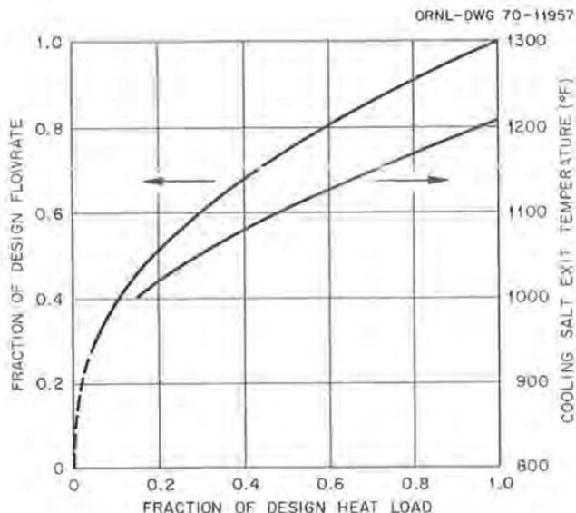  
Fig. 6.5. Effect of heat load on drain tank cooling salt flow rate and exit temperature.

the heat sources and of the salt volume in the tank as it fills. The allowable stress limitations on the Hastelloy N were based on long-term creep restrictions. The duration of the transient temperatures exceeding the present design maximum of $1300^{\circ}\mathrm{F}$ was found to be only a few hours due to the rapid decay of the heat sources in the salt.

One area of uncertainty in the above analyses is the heat transfer coefficient between fluid and tubes. Although the literature contains some work on the subject of heat transfer with fluids containing sources, little information is available for the case of open lattices. This is an area of experimental investigation which remains to be done before reliable temperatures can be calculated for the drain tank. Another area of uncertainty is the amount of noble metals which will adhere to surfaces in the drain tank. For heating purposes, it was assumed that all the noble metals present in the off-gas remain in the drain tank. When the salt is drained, some of these could be washed off the vertical surfaces and agglomerate on the bottom of the tank. If the salt becomes more oxidizing, the noble metals will go back in solution. Niobium is the first to be oxidized. After its oxidation is complete, the other noble metals will oxidize more or less together. A final area of uncertainty is the disposition of the daughters of the gases which decay in the drain tank. Heat from the decay of daughter products has been included in calculations. These daughters would be expected to go back into the salt when it is drained, and some fraction

should dissolve in the 600 gpm which is circulated through the drain tank for cooling purposes.

Calculations for the salt-to-boiling-water heat exchangers indicate that $0.3\mathrm{kW}$ of heat per foot of salt tube can be transferred. This assumes surfaces which are well oxidized to give emissivities of 0.8, a salt tube surface temperature of $1200^{\circ}\mathrm{F}$ at maximum heat load, and a steam tube or plate-coil surface temperature of $250^{\circ}\mathrm{F}$ . The salt was assumed to be located inside $\frac{5}{8}$ -in. tubes spaced on a 1.5-in. square pitch, with the plate coils interspersed between tube rows. Each of the four heat exchangers would require 333 tubes, each 10 ft long, to handle a total of $40\mathrm{MW}$ of power. It is estimated that under the worst-case transient conditions a maximum heat load of about $40\mathrm{MW}$ is all that these exchangers could experience. This is due to the rapid decay of the sources during the drain time and the relatively long transit time of the drain-tank cooling loops.

Calculations for the natural-draft stack were first made assuming that the hot fluid was saturated vapor at atmospheric pressure and using an ambient air inlet (dry bulb) temperature of $100^{\circ}\mathrm{F}$ . Size and pressure drop data were based on the data of Zimmerman[93] for commercial fin-tube heat exchangers. Results indicated that it was not feasible to use a natural-draft stack of reasonable height because of the small draft available from the low temperature differences involved. By pressurizing the water system to 100 psia, the saturated vapor temperature was raised to $327.8^{\circ}\mathrm{F}$ . This resulted in a stack height of 400 ft, assuming a $100^{\circ}\mathrm{F}$ inlet temperature and a maximum heat load of 40 MW. Such a stack would have to be about 60 ft in diameter to accommodate the commercial units on which the calculations were based. Because of the low gas temperatures, only a minimum amount of stack insulation would be needed.

# 6.4 FUEL-SALT DRAIN TANK WITH NaK COOLING

# 6.4.1 Introduction

There are several features which could be improved in the salt-cooled primary drain tank system described above, such as the general complexity and the need for a relatively tall natural-draft stack. A restudy of the conceptual design of the drain tank system led to favorable consideration of an alternate arrangement in which NaK is used as the coolant. In addition to eliminating the stack, the revised concept is believed to provide a more dependable emergency cooling system

and to offer other improvements. There was not sufficient time, however, to carry the study of the alternate design to as great a detail as was possible for the initial system.

NaK can be heated to relatively high temperatures and can experience significant radiation fluences without problems of dissociation or high vapor pressure. Since its density and viscosity variations with temperature are favorable for natural circulation in the system, no auxiliary power or action by the plant operators is required to initiate and maintain circulation. The use of NaK and placing primary emphasis on radiant heat transfer (which varies as the fourth power of the absolute temperature) accommodate the wide ranges of temperature and heat loads which may be encountered, such as the factor of 3 difference between the normal off-gas heating load and the maximum transient after a sudden salt drain. The NaK is compatible with Croloy or stainless steel and does not require the more expensive Hastelloy N used in the salt systems. Since it has a eutectic temperature of about $10^{\circ}\mathrm{F}$ , it is liquid at

room temperature, and no preheating of the NaK circuits prior to filling is required.

# 6.4.2 Description

A schematic flowsheet for the NaK-cooled system is shown in Fig. 6.6, and the design data are given in Table 6.5.

The alternate drain tank design is for a vessel about 14 ft in diameter and 20 ft high, with the bottom head containing a plenum for the jet pumps used to transfer the salt. It is constructed of Hastelloy N, and the vessel, internals, and supports are designed for the reference earthquake loading referred to in Sect. 14. There are 1028 Hastelloy N thimbles extending vertically downward into the tank. Each 2-in.-ID thimble contains a concentric Croloy $2^{1/4}$ (or stainless steel) bayonet tube in which eutectic NaK circulates by natural convection to a bank of NaK-filled tubes inserted in horizontal tubes which are immersed in a pool of water at an elevation about 60 ft above the drain tank. The

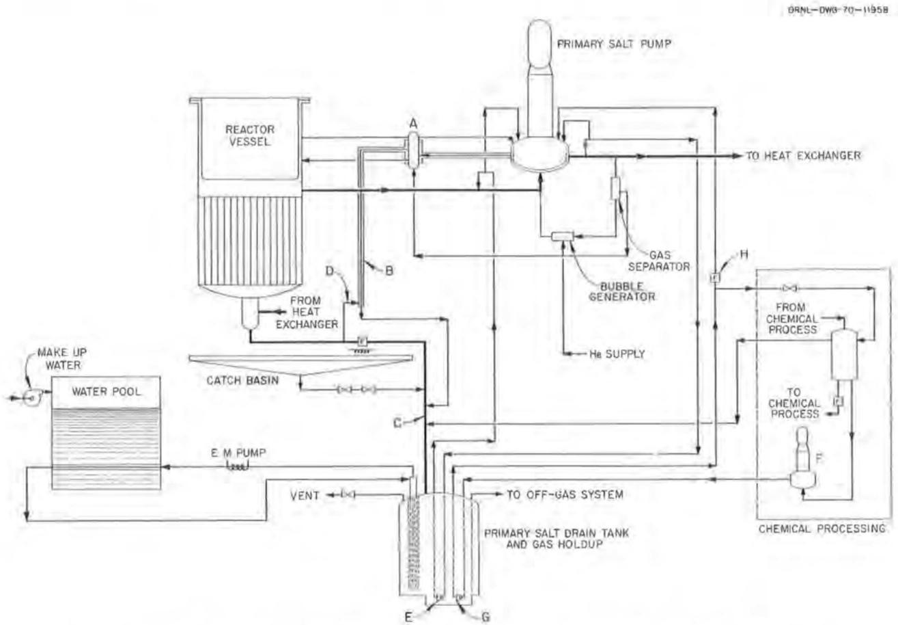  
Fig. 6.6. Simplified flow diagram of primary drain tank and heat-removal system using NaK as the coolant.

Table 6.5. Design data for NaK-cooled drain tank   

<table><tr><td>Salt capacity, ft3</td><td>2500</td></tr><tr><td>Outside diameter of vessel, ft</td><td>13.8</td></tr><tr><td>Overall height, ft</td><td>20</td></tr><tr><td>Design heat load, MW(t)</td><td></td></tr><tr><td>Due to off-gas decay</td><td>18</td></tr><tr><td>Maximum transient after sudden salt drain</td><td>53</td></tr><tr><td>Emissivity of Hastelloy N surface</td><td>0.55</td></tr><tr><td>Emissivity of surface coated with iron or calcium titanate</td><td>0.90</td></tr><tr><td>Emissivity of water-tube surface (oxidized steel or copper)</td><td>0.75</td></tr><tr><td>Conductivity of nitrogen gas in annuli, Btu hr-1 ft-1(°F)-1</td><td>0.026-0.031</td></tr><tr><td>Thimble surface area, based on temperature of 850°F under off-gas load conditions, ft2</td><td>10,700</td></tr><tr><td>Thimble ID, in.</td><td>2</td></tr><tr><td>Number of thimbles required</td><td>1028</td></tr><tr><td>Average NaK temperature under off-gas load, °F</td><td>400</td></tr><tr><td>Average NaK temperature under maximum load, °F</td><td>640</td></tr><tr><td>Maximum thimble temperature, °F</td><td>1400</td></tr><tr><td>Number of autonomous NaK circuits selected for this study (number is optional)</td><td>10</td></tr><tr><td>NaK flow rate per circuit under off-gas heat load of 18 MW(t), gpm</td><td>801</td></tr><tr><td>NaK flow rate per circuit under maximum heat load of 53 MW(t), gpm</td><td>1081</td></tr><tr><td>Hot- and cold-leg temperatures, °F</td><td></td></tr><tr><td>Under off-gas load of 18 MW(t)</td><td>436-350</td></tr><tr><td>Under maximum heat load of 53 MW(t)</td><td>726-550</td></tr><tr><td>NaK circuit pipe size (sched 40), in.</td><td>12</td></tr><tr><td>Assumed length of each leg of circuit, ft</td><td>100</td></tr><tr><td>Assumed elevation difference, center of drain tank to center of water pool, ft</td><td>60</td></tr><tr><td>Temperature of receiving surface of thimble in water tank, °F</td><td>232</td></tr><tr><td>Heat transfer area of NaK tubes in water tank, ft2</td><td>83,100a</td></tr><tr><td>Total water boiled from water tank, ft3</td><td></td></tr><tr><td>2 days after shutdown</td><td>24,000</td></tr><tr><td>10 days after shutdown</td><td>81,000</td></tr><tr><td>35 days after shutdown</td><td>192,000</td></tr><tr><td>Makeup water required for 18 MW(t) heat load, gpm</td><td>126</td></tr></table>

${}^{a}$ Thimbles with internal fins can be considered as a means of reducing the total length required,but fabrication of this special tubing would probably require development by the manufacturer.

arrangement provides a double barrier between the fuel salt and the NaK and between the NaK and the water.

The drain tank is surrounded by essentially an open-topped stainless steel vessel about $14^{3/4}$ ft in diameter and with a 3- to 4-in.-thick wall provided with two autonomous internal cooling channels for circulation of NaK. The outside tank serves as a backup in event a salt leak develops in the drain tank and also as a

gamma shield. Heat transfer by radiation across the 3-in.-wide annular space between the vessels cools the walls and lower head of the drain tank. In event of a major leak of fuel salt into the external vessel, the NaK circulating through its walls would provide the necessary cooling. An advantage of the redesigned drain tank and use of the cooled outer vessel is that the internal liner for the drain tank, as was used in the salt-cooled system, is eliminated.

Heat generation in the drain tank due to radioactive decay of off-gases and entrained particulates is about 18 MW(t) during normal full-load operation of the MSBR, as discussed in Sect. 6.3.2. The maximum transient heat release is about 53 MW(t), which would occur after a sudden salt drain. About $60\%$ of the energy release is in the form of gamma rays, much of which will be absorbed by the vessel walls or by the bayonet tubes and thus be directly transferred into the NaK. Most of the generated heat is removed by the cooling thimbles. Heat is transferred from the thimble wall to the NaK-cooled bayonet tube by radiation, although some will be conducted by the nitrogen which fills the 0.1-in.-wide annular space between the two. The thermal-radiation-receiving surface on the NaK tubes is assumed to be coated with iron or calcium titanate to afford an emissivity factor of about 0.9. Since the thimbles and bayonet tubes are not in physical contact either in the drain tank or in the water pool, a leak in any system is unlikely to contaminate another.

The NaK cooling system is arranged with several autonomous circulating loops, so that failure of one circuit would not cause a severe loss of cooling capacity and necessitate an immediate shutdown of the plant. Ten separate loops were assumed in the preliminary study reported here. As indicated in Fig. 6.6, an electromagnetic pump (acting as a brake) is installed in each of the NaK circuits to retard or stop the NaK natural circulation as necessary to protect against freezing of the fuel salt in the drain tank. This arrangement is particularly advantageous during startup or partial load operation.

The arrangement of the heat transfer surface in the water pool has not been studied in detail but would probably be somewhat as indicated in Fig. 6.6. Heat transfer would be by radiation and gas conduction from the outside surface of the NaK-filled tubes to the inner surface of the concentric tubes which are submerged in water. The water would boil and require either condensation and return or a continuous makeup of about $126\mathrm{gpm}$ of treated water under normal full-load reactor power and even larger amounts under conditions of a sudden reactor drain. Its water storage

capacity, however, can be made large enough to accommodate the decay heat for a protracted period even without water makeup. This arrangement provides a reliable heat sink, is not dependent upon a power source, and may be more earthquake resistant than the natural-draft stack used with the salt-cooled drain tank system.

# 6.5 FUEL-SALT STORAGE TANK

A storage tank is provided for the fuel salt in event it is necessary to carry out repairs on the fuel-salt drain tank or its associated components or piping. Although the tank is located in the chemical processing cell, it is not used as a part of the chemical system, since the tank does not have a heat-removal system capable of handling the high volumetric heat sources in the chemical system. The storage tank will be the same regardless of the type of cooling used for the primary drain tank.

The tank has a storage capacity of about $2500\mathrm{ft}^3$ and may be constructed of 304L stainless steel rather than Hastelloy N, since the tank will have a low use factor.* The tank is connected into the drain tank system as shown in the flow diagram, Fig. 2.1. Centrifugal and jet pumps will transfer salt into and out of the storage tank.

The tank has a heat-removal capacity of about 1 MW(t), which is provided by boiling water in 12-ft-long U-tubes, with the steam being condensed in an air-cooled condenser in the same manner as was used in the MSRE system.[94,95] The heat-removal capacity is based on allowing about a 100-day decay period for both the salt and the noble metals.

# 7. Reactor Off-Gas System

A.N.Smith

# 7.1 GENERAL

The function of the primary off-gas system is to reduce the concentration of undesirable contaminants in the primary system off-gas stream to a level low enough to permit continuous recycle of the helium carrier gas to the primary system. The term "undesirable contaminants" includes gaseous and gas-borne fission products, fission product daughters, water, oxygen, hydrocarbons, etc. The off-gas system also includes the equipment for handling all the associated functions, such as dissipation of decay heat, collection and storage or disposal of stable and long-lived gases, liquids, and solids, and recompression of the recycle gas. As shown in Fig. 7.1, the boundaries of the off-gas system on the upstream side are defined as the outlet of the particle trap in the gas flow leaving the fuel-salt drain tank and, on the downstream side, as the outlet of the accumulator tanks supplying helium to the bubble generators and the purge flow for the salt-circulation pumps.

The fission yields of noble gases (krypton and xenon) are such that nearly one atom of gas is produced for every atom of $^{233}\mathrm{U}$ which fissions. Since the fission of $1\mathrm{g}$ of uranium is roughly equal to 1 MWd, the MSBR at 2250 MW will produce more than $1\mathrm{kg}$ of noble-gas fission products per day. About $15\%$ of the gaseous fission products are relatively short-lived and will decay in the fuel-salt system. The remaining $85\%$ are either stable or have half-lives which are long enough for them to be removed at the gas separator along with the helium carrier gas. Continuous decay processes will produce nonvolatile or slightly volatile daughter products which may deposit on duct or vessel surfaces or which may be carried along with the gas stream in the form of smokes or mists until removed by filtration or adsorption. In addition to the kryptons and xenons, the carrier gas which leaves the gas separator is expected to contain tritium, oxygen resulting from fluorine

burnup, noble metal fission products, and a small amount of entrained fuel salt.

The nonvolatile fission products either will deposit in the primary system drain tank or will be removed by the filter at the outlet of the drain tank, so that the off-gas stream at the inlet to the off-gas system will consist primarily of gaseous components. On a volume basis, the contaminants in the stream are expected to be on the order of $0.1\%$ , or about 1000 ppm. This number is based on a flow from the gas separator of 11 scfm, stable noble-gas yields of $7\%$ for krypton and $21\%$ for xenon, and a recycle rate of $80\%$ from the 47-hr xenon holdup system to the bubble generator. As the gas stream passes through the off-gas system, the decay of the radioactive noble gases and daughters will continue, as will also the attendant necessities for heat dissipation and materials collection and disposal. The amount of decay heat per unit volume will be high at first but will drop off rather quickly during the first hour due to the rapid disappearance of the short-lived isotopes, as shown in Fig. 7.2.

An estimate was made of the distribution of fission product decay heat in a 1000-MW(e) MSBR off-gas system. The calculations were based on the following model:

1. The flux of krypton and xenon into the off-gas line was to be as calculated by Kedl for a $0.56\%$ poison fraction (see Table A.2). Solid daughters of krypton and xenon were assumed to plate out at the point of formation.

2. A 2-hr residence time in the drain tank was assumed between the outlet of the reactor system and the inlet to the 47-hr xenon holdup system.

3. Krypton delay in the charcoal beds was assumed to be one-twelfth of the xenon delay.

4. The off-gas system was divided into 20 regions in which the radioactive noble gases were assumed to

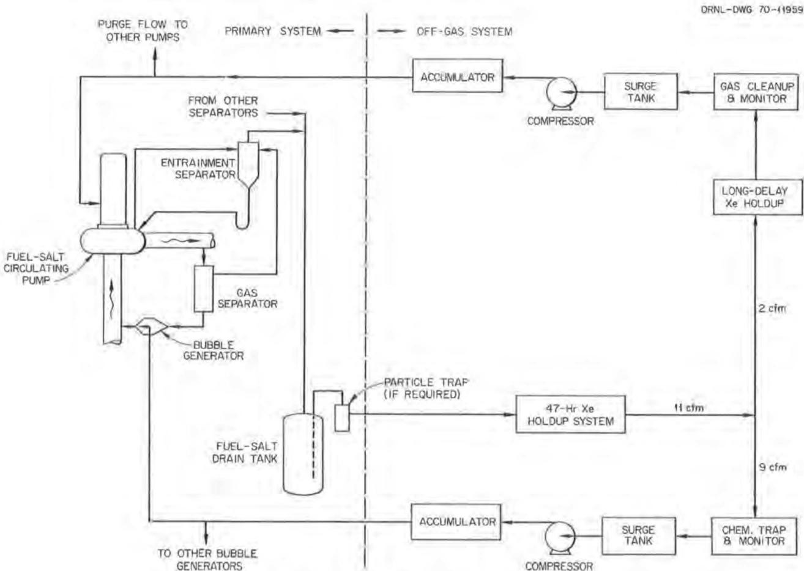  
Fig. 7.1. Schematic flow diagram MSBR off-gas system.

decay exponentially in accordance with an assigned delay or residence time. The 2-hr volume holdup and the 47-hr xenon delay charcoal bed were divided into compartments with various delay times in an attempt to obtain approximately equal heat loads. The delay times for the pipe sections were arbitrarily set at 18 sec each. The results of this calculation, shown in Fig. 7.3, were used in estimating heat loads in the various sections of the off-gas system.

With regard to iodine in the MSBR, the iodine isotopes produced directly by fissions will remain with the fuel salt. Much of the tellurium (the precursor of iodine) will probably deposit on surfaces as noble metal particulates, but significant amounts could be swept into the off-gas system. Here, upon decay of the tellurium, the iodine will be quickly trapped as it contacts the charcoal in the adsorber beds. Effluent gas from the beds is normally recycled, and none is vented. (The decay heats from the iodine nuclides of concern - those with half-lives greater than $10\mathrm{min}$ - are shown in Table 7.1.)

# 7.2 BASIC ASSUMPTIONS AND DESIGN CRITERIA FOR STEADY-STATE OPERATION

The following assumptions were made in the design of study of the off-gas system:

1. Reactor power is 2250 MW(t), and the fuel is ${}^{233}\mathrm{U}$ .   
2. The carrier gas is helium, with a total flow to the off-gas system of 11 scfm. This total is the combination of flows from each of the four pump loops, consisting of 2.25 scfm from each of the gas separators and 0.5 scfm of purge gas for each of the pump shafts. Net flow of fission products and materials other than helium is about $0.1\%$ , or 0.01 scfm.   
3. The atom flow rates of krypton and xenon into the off-gas system are based on calculated atom flow rates at the gas separator discharge, with appropriate corrections for a 2-hr residence time in the fuel-salt drain tank. All solids which are gas-borne at the outlet of the drain tank (including noble metals, salt mist, and

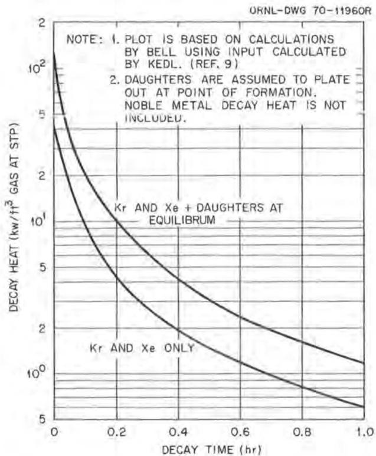  
Fig. 7.2. Decay heat vs time for 1000-MW(e) MSBR off-gas stream using $^{233}\mathrm{U}$ fuel.

solid daughters of the noble gases) will be removed by a filter before the gas stream enters the off-gas system. The total yield of tritium $(^{3}\mathrm{H})$ from all mechanisms will be 2400 Ci/day, and all tritium will remain in the off-gas stream; that is, for the purpose of studying the

off-gas system, the rate of diffusion of tritium through vessel and pipe walls is assumed to be zero. (Tritium diffusion rates are discussed in Sect. 3.3.7.)

4. The gas will enter the off-gas system at 15 psig; 9 scfm will be returned to the bubble generators at 5 psig, and 2 scfm will be returned to the purge gas header at 45 psig.   
5. At least two barriers, or containment walls (one of which is the wall of the gas duct or vessel), will be provided to guard against leakage of radioactive off-gas. Shielding will be provided for attenuation of penetrating radiation to permissible levels. Instrumentation will warn of excessive leakage of gas or penetrating radiation.   
6. The target reliability of the system is $100\%$ ; that is, spare units will be provided, and the maintainability of units will be such that predictable failures in the off-gas system will not result in shutdown of the reactor or loss of the contaminants to the environment.

# 7.3 SUMMARY DESCRIPTION OF OFF-GAS SYSTEM

The flow of gas in the primary system can be represented by two recycle loops, a 47-hr xenon holdup loop and a long-delay (~90-day) xenon holdup loop. The 47-hr loop circulates through the bubble generator and gas separator to strip the $^{135}\mathrm{Xe}$ from the fuel salt;

ORNL-DWG69-5498R

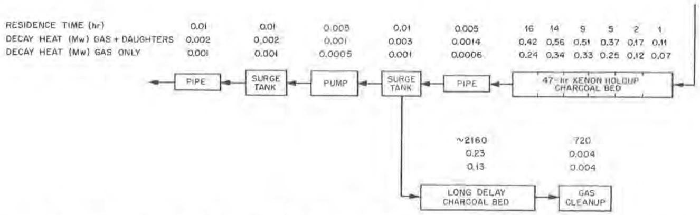  
Fig. 7.3. Distribution of decay heat in MSBR off-gas system. The residence time for krypton in the charcoal beds is about one-twelfth of that for xenon. The flux of atoms into the off-gas line was calculated by Kedl (see Table A.2 and ref. 9). Decay heat calculations, assuming a 2-hr holdup in the primary drain tank, were made by Bell and were based on previously reported values for 1-hr holdup.[9]

Table 7.1.Decay heat from iodine nuclides   

<table><tr><td>Iodine isotope \( {}^{a} \)</td><td>Half-life</td><td>\( {}^{233}\mathrm{U} \) cumulative fission yield (%)</td><td>Total heat per disintegration (MeV)</td><td>Fraction gamma heat</td><td>Decay heat \( {}^{b} \) (MW)</td></tr><tr><td>131</td><td>8.0 days</td><td>2.90</td><td>0.7</td><td>0.57</td><td>0.23</td></tr><tr><td>132</td><td>2.4 hr</td><td>4.54</td><td>2.7</td><td>0.78</td><td>1.36</td></tr><tr><td>133</td><td>20.8 hr</td><td>5.78</td><td>1.1</td><td>0.51</td><td>0.71</td></tr><tr><td>134</td><td>52.5 min</td><td>5.75</td><td>3.3</td><td>0.81</td><td>2.11</td></tr><tr><td>135</td><td>6.68 hr</td><td>5.05</td><td>2.3</td><td>0.84</td><td>1.29</td></tr><tr><td></td><td></td><td></td><td></td><td>Total</td><td>5.70</td></tr></table>

${}^{a}$ Only those nuclides with half-lives greater than 10 min are included.

Equilibrium conditions are assumed, that is, the decay rate is equal to the fission yield. The yield in atoms per day $= 6.22 \times 10^{22} \mathrm{Yi}$ , where $\mathrm{Yi}$ is the yield in percent. The decay heat in $\mathrm{MW} = 0.11 \mathrm{YiQ}$ , where $Q = \mathrm{MeV}/\mathrm{disintegration}$ .

Table 7.2. Flow of principal gaseous components to off-gas system of 2250-MW(t) single-fluid MSBR   

<table><tr><td colspan="2">Isotope</td><td rowspan="2">Half-life \( \left( {{t}_{1/2}}\right) \)</td><td rowspan="2">Decay constant (hr \( {}^{-1} \) )</td><td rowspan="2">Cumulative \( {}^{233}\mathrm{U} \) fission yield (%)</td><td colspan="3">Flow \( \times  {10}^{-{22}} \) (atoms/hr)</td></tr><tr><td>Element</td><td>Mass No.</td><td>Out of reactor system</td><td>Entering 47-hr Xe holdup</td><td>Leaving 47-hr Xe holdup</td></tr><tr><td>H</td><td>3</td><td>12.26 years</td><td>\( {6.45} \times  {10}^{-6} \)</td><td>0.8</td><td>0.21</td><td>0.21</td><td>0.21</td></tr><tr><td rowspan="9">Kr</td><td>82</td><td>Stable</td><td>0</td><td>0.3</td><td>0.35</td><td>0.35</td><td>0.35</td></tr><tr><td>83</td><td>Stable</td><td>0</td><td>1.14</td><td>1.50</td><td>1.50</td><td>1.50</td></tr><tr><td>84</td><td>Stable</td><td>0</td><td>1.10</td><td>1.45</td><td>1.45</td><td>1.45</td></tr><tr><td>85</td><td>10.76 years</td><td>\( {7.35} \times  {10}^{-6} \)</td><td>2.49</td><td>3.28</td><td>3.28</td><td>3.28</td></tr><tr><td>86</td><td>Stable</td><td>0</td><td>3.28</td><td>4.32</td><td>4.32</td><td>4.32</td></tr><tr><td>87</td><td>76 min</td><td>0.55</td><td>4.50</td><td>1.15</td><td>0.63</td><td>\( {3.0} \times  {10}^{-9} \)</td></tr><tr><td>88</td><td>2.80 hr</td><td>0.25</td><td>5.70</td><td>1.75</td><td>1.33</td><td>0.40</td></tr><tr><td>89</td><td>3.18 min</td><td>13</td><td>6.23</td><td>0.92</td><td>\( {1.2} \times  {10}^{-{12}} \)</td><td>0</td></tr><tr><td>Σ Kr</td><td></td><td></td><td></td><td>14.7</td><td>12.9</td><td>11.3</td></tr><tr><td rowspan="12">Xe</td><td>128</td><td>Stable</td><td>0</td><td>0.02</td><td>0.025</td><td>0.025</td><td>0.025</td></tr><tr><td>129</td><td>Stable</td><td>0</td><td>2.10</td><td>2.76</td><td>2.76</td><td>2.76</td></tr><tr><td>130</td><td>Stable</td><td>0</td><td>0.10</td><td>0.13</td><td>0.13</td><td>0.13</td></tr><tr><td>131</td><td>Stable</td><td>0</td><td>3.85</td><td>5.05</td><td>5.05</td><td>5.05</td></tr><tr><td>132</td><td>Stable</td><td>0</td><td>5.48</td><td>7.20</td><td>7.20</td><td>7.20</td></tr><tr><td>133</td><td>5.27 days</td><td>\( {5.48} \times  {10}^{-3} \)</td><td>6.48</td><td>4.30</td><td>4.25</td><td>3.30</td></tr><tr><td>134</td><td>Stable</td><td>0</td><td>6.83</td><td>9.00</td><td>9.00</td><td>9.00</td></tr><tr><td>135</td><td>9.14 hr</td><td>0.0753</td><td>6.16</td><td>1.50</td><td>1.29</td><td>0.040</td></tr><tr><td>136</td><td>Stable</td><td>0</td><td>7.00</td><td>9.20</td><td>9.20</td><td>9.20</td></tr><tr><td>137</td><td>4.2 min</td><td>9.9</td><td>7.16</td><td>1.16</td><td>\( {5.1} \times  {10}^{-{10}} \)</td><td>0</td></tr><tr><td>138</td><td>17 min</td><td>2.45</td><td>6.63</td><td>1.45</td><td>0.01</td><td>0</td></tr><tr><td>Σ Xe</td><td></td><td></td><td></td><td>41.7</td><td>38.9</td><td>36.7</td></tr></table>

Votes:   
1. Tritium $(^{3}\mathrm{H})$ yield includes yield from lithium burnup and assumes zero diffusion through vessel and pipe walls.   
2. Isotopes with half-lives of less than 2 min are not shown.   
3. A residence time of 2 hr is assumed between outlet of reactor system and inlet to 47-hr xenon holdup system.   
4. Fluxes for krypton and xenon are taken from calculations by Kedl and Bell (ref. 9). The stable and long-lived isotopes appear at five times yield due to the $80\%$ recycle stream.

the long-delay loop carries the balance of the gas flow in the fuel system. The two loops are joined together at the salt entrainment separator and flow cocurrently through the primary drain tank and the 47-hr holdup system, as shown in Fig. 7.1.

The cocurrent stream enters the primary off-gas system at the discharge from the fuel-salt drain tank. The tank will probably serve as an efficient collector of particulates in the gas, but if it proves necessary a particle trap, or filter, can be added, as shown in Fig. 7.1. At this point the gas will have been stripped of nongaseous components (noble metals, salt mist, and nongaseous daughters of the noble gases), so that the primary contaminants are Kr, Xe, and ${}^{3}\mathrm{H}$ . About $2\mathrm{hr}$ will have elapsed since the gas first left the fuel-salt system. The gas first passes through the $47\mathrm{-hr}$ xenon holdup system to provide a residence time for xenon molecules sufficient to permit the ${}^{135}\mathrm{Xe}$ to decay to about $3\%$ of the inlet amount. The $47\mathrm{-hr}$ holdup system will utilize charcoal for the dynamic adsorption and holdup of krypton and xenon. The decay heat will be transferred to boiling water.

At the outlet of the 47-hr system the gas stream is divided into the two recycle loops. In the 47-hr recycle loop, 9 scfm, or about $80\%$ of the total flow, passes in succession through a chemical trap and alarm system, a compressor, and a surge tank. From the surge tank the gas is metered to the bubble generators at the four circulating pumps. In the second recycle gas stream, 2 scfm, or $20\%$ of the total flow, passes first through the long-delay xenon holdup system, where the residence times for krypton and xenon are sufficiently long to allow all radioisotopes except the ten-year ${}^{85}\mathrm{Kr}$ to decay to insignificant levels. The gas then passes through a purification system which reduces the level of any remaining contaminants $(^{85}\mathrm{Kr}, {}^{3}\mathrm{H},$ stable isotopes of Kr and Xe, water, hydrocarbons, etc.) to an acceptable level, then through a surge tank, a compressor, and an accumulator, and finally is returned to the primary system.

Table 7.2 shows the flow of tritium and noble-gas isotopes at the outlet of the reactor system and at the inlet and outlet of the 47-hr xenon holdup system. The flow rates at the outlet of the reactor system are based on calculations by Kedl assuming a $0.56\%$ xenon poison fraction. The second and third flow rate columns in Table 7.1 are based on calculations by Bell using the first column as input and assuming: (1) simple exponential decay, with a 2-hr residence time between the reactor system outlet and the inlet to the 47-hr xenon holdup system; (2) a residence time for krypton one-twelfth that for xenon; and (3) $80\%$ of the flow

from the 47-hr xenon holdup system to be recycled to the primary system. (For stable and long-lived isotopes the effect of the recycle flow is to increase the total flow by a factor of about 5.)

# 7.4 THE 47-hr XENON HOLDUP SYSTEM

The 47-hr xenon holdup system provides residence time for xenon isotopes to reduce the concentration of $^{135}\mathrm{Xe}$ in the effluent. The design criteria for the system are as follows:

1. The residence time for xenon is $47\mathrm{hr}$ . This time is exclusive of the volume holdup in the primary system drain tank and other vessels and ducts. A 47-hr delay time permits $97\%$ of the 9.14-hr ${}^{135}\mathrm{Xe}$ to decay.

2. The estimated heat load, based on Fig. 7.3, is 2.14 MW, $42\%$ of which is due to daughter-product decay. The design capacity of the heat-removal system is $125\%$ of calculated, or 2.7 MW.

3. A dynamic adsorption system is used for delay of the xenon. The adsorbent is activated charcoal, with transfer of the decay heat to boiling water. The design temperature of the charcoal duct wall is $250^{\circ}\mathrm{F}$ . The average temperature of the charcoal is $340^{\circ}\mathrm{F}$ .

4. The assumed charcoal properties are: bulk density, $30\mathrm{lb / ft^3}$ ; thermal conductivity, 0.03 Btu $\mathrm{hr^{-1}}$ ft $^{-2}$ ( $^\circ \mathrm{F}$ ) $^{-1}$ ft; and size range, 6 to 14 Tyler sieve series ( $1/8$ to $3/64$ in.).

5. The decay heat distribution is obtained from the calculations by Kedl and Bell, as shown in Fig. 7.2.

6. The efficiency of the bed is assumed to decrease with time due to accumulation of solid daughters. Spare capacity is provided, and provision is made for replacement of modules by remote maintenance techniques.

7. Carrier-gas flow is 11 scfm, and the overall pressure drop is 5 psi. An estimate of the size of the charcoal bed is obtained by using the empirical relationship developed by Browning and Bolta.[9]

$$
\tau_ {h} = \frac {k m}{f}, \tag {1}
$$

where $t_h$ is holdup time, $m$ is mass of charcoal, $f$ is volume flow rate of carrier gas at local conditions, and $k$ is a proportionality factor which is known as the adsorption coefficient and which varies with the carrier-gas composition, the adsorbent, the adsorbate, and the temperature. For typical commercial charcoals, Ackley and Browning have determined the following relationship between $k$ and temperature for xenon at temperatures between 32 and $140^{\circ}\mathrm{F}$ :

$$
k (\mathrm {X e}) = 3. 2 \times 1 0 ^ {- 4} \exp \frac {5 8 8 0}{T ^ {\circ} \mathrm {R}} \mathrm {f t} ^ {3} / \mathrm {l b}. \tag {2}
$$

Equation (1) indicates that the holdup time increases directly with $k$ . However, an increase in holdup time increases the heat generation, which results in an increase in charcoal temperature and a decrease in $k$ , in accordance with Eq. (2). Note also that an increase in temperature causes an increase in $f$ (local flow rate), which results in a decrease in holdup time. For any given section of the bed, $k$ and $t_h$ will seek equilibrium values which are a balance between the opposing forces.

For the purpose of this estimate, the assumption was made that Eq. (2) is valid up to $500^{\circ}\mathrm{F}$ and that the average charcoal temperature is $340^{\circ}\mathrm{F}$ . Equation (2) indicates that this temperature would be equivalent to an adsorption coefficient of 0.5 ft³/lb. For a holdup time of 48 hr and a flow of 11 scfm, Eq. (1) indicates that the required mass of charcoal would be 63,360 lb. It should be noted that, within limits, the average charcoal temperature can be adjusted by the pipe diameter and the heat-removal capability. Due to the complex interaction of variables, however, the optimum system would not necessarily be the one with the smallest mass of charcoal.

The physical concept for the 47-hr charcoal bed would be similar to that proposed by Burch et al. Hairpin tubes filled with charcoal are suspended in large tanks. The decay heat is transferred to boiling water. The steam is passed through an external condenser, and the condensate is recycled. In an actual system, one would use the largest diameter pipe which would permit

an acceptable average charcoal temperature. Smaller diameters may be necessary at the inlet end, where the decay heat rate is high. For this system, it is estimated that $1^{1/2}$ -in. pipe may be required for the inlet end, but that 2-in. and possibly 3-in. pipe would be suitable for a large portion of the bed. Figures 7.4 and 7.5 show how the charcoal bed might be arranged, assuming the use of 2-in. pipe throughout and an excess charcoal capacity

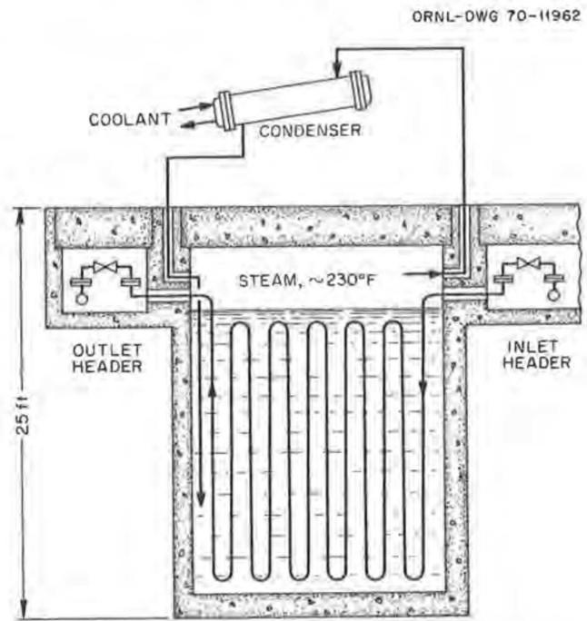  
Fig. 7.5. Cross section of one bank of 47-hr Xe holdup charcoal bed for MSBR (see Fig. 7.4).

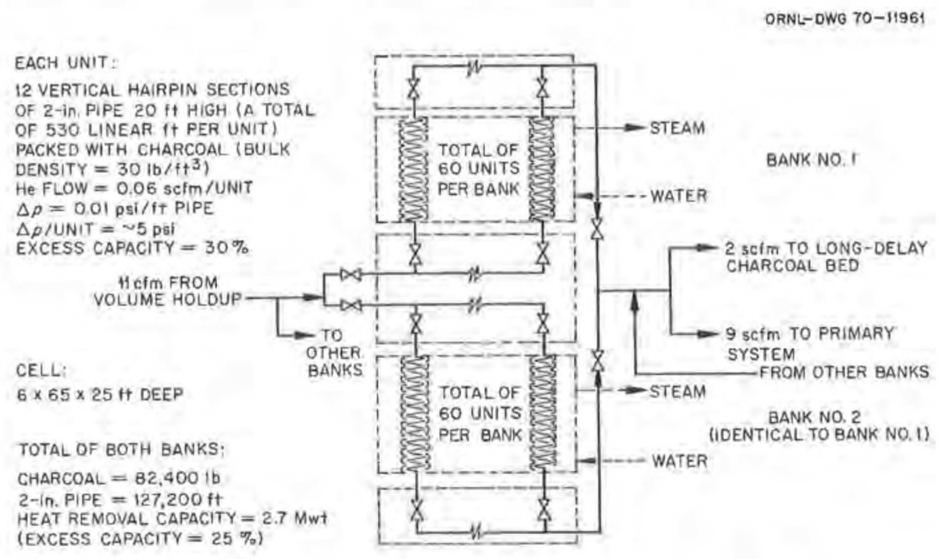  
Fig. 7.4. Plan view MSBR charcoal bed - 47-hr Xe holdup (see Fig. 7.5).

Table 7.3.Accumulation of nonvolatile materials in the 47-hr xenon holdup systema   

<table><tr><td rowspan="2">Gaseous parent</td><td colspan="3">Accumulation rate</td><td rowspan="2">Nonvolatile daughter</td></tr><tr><td>atoms/hr</td><td>g-moles/day</td><td>g/year</td></tr><tr><td></td><td>\( \times 10^{22} \)</td><td></td><td></td><td></td></tr><tr><td>\( ^{87}\mathrm {Kr} \)</td><td>0.33</td><td>0.13</td><td>4,015</td><td>\( 6.2\times 10^{10}year^{87}Rb \)</td></tr><tr><td>\( ^{88}\mathrm {Kr} \)</td><td>0.65</td><td>0.26</td><td>8,395</td><td>Stable \( ^{88}Sr \)</td></tr><tr><td>\( ^{133}\mathrm {Xe} \)</td><td>0.97</td><td>0.39</td><td>18,970</td><td>Stable \( ^{133}Cs \)</td></tr><tr><td>\( ^{135}\mathrm {Xe} \)</td><td>1.24</td><td>0.50</td><td>24,820</td><td>\( 3\times 10^6year^{135}Cs \)</td></tr></table>

${}^{a}$ The accumulation rate of the four isotopes is ${56},{210}\mathrm{\;g}/$ year. If this amount is distributed uniformly over the 30 tons of charcoal,the concentration is ${0.002}\mathrm{\;g}$ of nonvolatile per gram of charcoal.

of $30\%$ . There are 240 parallel units, arranged in banks of 60 units each, with each bank containing 530 lin ft of pipe. The mass of charcoal is 82,400 lb, and the length of pipe is 127,200 ft. The overall plan area required is about 32 by 65 ft, and the pipes are suspended in cells about 25 ft deep. The valves and headers are located in smaller ducts, as shown in Fig. 7.5. A minimum of two containment barriers are provided to guard against leakage of the radioactive fission gas into areas which would be hazardous to personnel. The condenser capacity is 2.7 MW, which is $25\%$ over the maximum estimated heat load. The estimated accumulation of nonvolatile materials is shown in Table 7.3.

# 7.5 LONG-DELAY CHARCOAL BED

At the outlet of the 47-hr xenon holdup system the off-gas flow is split into two streams, as shown in Fig. 7.1. One stream of 9 scfm is returned to the primary system by way of the bubble generator, and the other stream, of 2 scfm, is fed to the long-delay charcoal bed.

The function of the latter is to provide a relatively long residence time, so that the heat load and penetrating radiation in the ensuing gas cleanup system will be at a reasonable level. Table 7.4 lists the isotopes which have the longest lives and hence are controlling in the bed design. Figures 7.6-7.8 show the activity load and the heat load in the gas cleanup system as a function of the holdup time in the long-delay system. The assumed design residence time is somewhat arbitrary since whatever load is not handled by the long-delay bed must be dissipated by the gas cleanup system. The incentive, however, is to handle as much as possible with the long-delay bed, since its construction and operation would probably be more simple than that of the gas cleanup system. The following criteria were used in the design of the long-delay charcoal bed.

1. Holdup time for xenon is 90 days.

2. The heat load is $0.25\mathrm{MW}$ based on calculations by Bell and using input data provided by Kedl, as shown in Fig. 7.2. The average heat load is $2\times 10^{-3}$ kW per minute of holdup time.

Table 7.4. Longer-lived noble-gas fission products ${}^{a}$ exclusive of ${}^{3}\mathrm{H}$ and ${}^{85}\mathrm{{Kr}}$   

<table><tr><td rowspan="2">Isotope</td><td colspan="2">Half-life, \( {t}_{1/2} \)</td><td rowspan="2">Decay constant (hr \( {}^{-1} \) )</td><td rowspan="2">\( {}^{233}\mathrm{U} \) fission yield (%)</td><td colspan="3">Average energy per disentegration (MeV)</td></tr><tr><td>Days</td><td>Hours</td><td>Beta</td><td>Gamma</td><td>Total</td></tr><tr><td></td><td></td><td></td><td>\( \times  {10}^{-3} \)</td><td></td><td></td><td></td><td></td></tr><tr><td>\( {}^{131}{m}_{\mathrm{{Xe}}} \)</td><td>12.0</td><td>288</td><td>2.4</td><td>0.023</td><td>0</td><td>0.16</td><td>0.16</td></tr><tr><td>\( {}^{133}\mathrm{{Xe}} \)</td><td>5.27</td><td>126.5</td><td>5.5</td><td>5.78</td><td>0.12</td><td>0.08</td><td>0.20</td></tr><tr><td>\( {}^{135}\mathrm{{Xe}} \)</td><td>0.38</td><td>9.13</td><td>7.6</td><td>6.16</td><td>0.30</td><td>0.27</td><td>0.57</td></tr><tr><td>\( {}^{85}{m}_{\mathrm{{Kr}}} \)</td><td>0.18</td><td>4.36</td><td>159</td><td>2.43</td><td>0.23</td><td>0.18</td><td>0.41</td></tr><tr><td>\( {}^{88}\mathrm{{Kr}} \)</td><td>0.12</td><td>2.77</td><td>250</td><td>5.84</td><td>0.33</td><td>2.1</td><td>2.44</td></tr></table>

${}^{a}$ Includes only the fission products having significant fractions remaining at the inlet to the gas cleanup system.

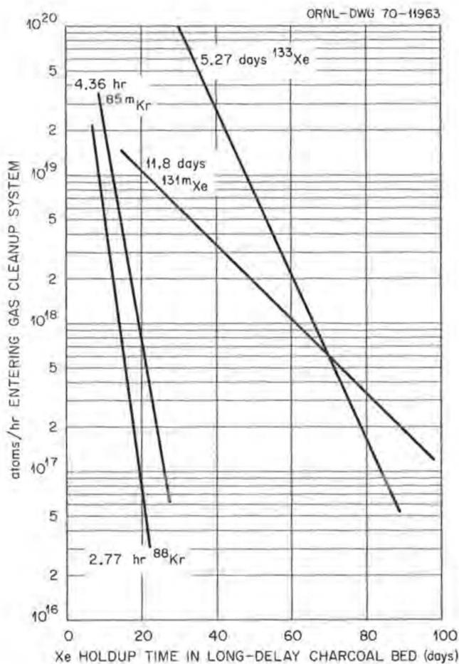  
Fig. 7.6. Effect of charcoal bed holdup time on atoms per hour of xenon and krypton entering gas cleanup system.

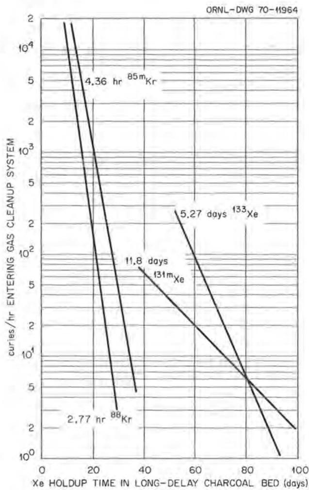  
Fig. 7.7. Effect of charcoal bed holdup time on curies per hour of xenon and krypton entering gas cleanup system.

3. The physical properties of the charcoal are the same as those noted in the description of the 47-hr xenon holdup system, Sect. 7.4.   
4. The gas flow rate is 2 scfm at an inlet pressure of 5 psig, and the design $\Delta p$ is 5 psi.   
5. The gas composition is $99.9\%$ helium, with trace quantities of contaminants, as described in Sect. 7.1. Since noble-gas daughters will be deposited on the charcoal during operation, there will be gradual reduction in the effectiveness of the charcoal. About $30\%$ spare capacity is provided to offset this loss in effectiveness.   
6. The heat will be transferred to cooling water. The average temperature of the charcoal duct wall is $80^{\circ}\mathrm{F}$ .

The size of the long-delay bed was estimated using a method similar to that used for the 47-hr xenon holdup

charcoal bed. The results indicate that 3-in. pipe is a reasonable duct size, and on this basis the average charcoal temperature is $125^{\circ}\mathrm{F}$ , the mass of charcoal is 18.5 tons, the volume of charcoal is $1234\mathrm{ft}^3$ , the length of pipe is 24,060 ft, and the average heat flux is 41 Btu $\mathrm{hr}^{-1}$ ft $^{-2}$ . Figure 7.9 shows a proposed layout for the system in an arrangement that requires a cell about 60 ft long, 25 ft wide, and 25 ft deep. The unit design is based on a calculated $\Delta p$ of 0.005 psi/ft for a helium flow of 0.07 cfm. Thirty-three percent spare capacity is provided, and any unit may be isolated from the rest of the system. The estimated charcoal pipe wall temperature is $80^{\circ}\mathrm{F}$ with the decay heat transferred to circulating water. The principal nonvolatiles accumulating in the long-delay charcoal are the four isotopes listed in Table 7.5.

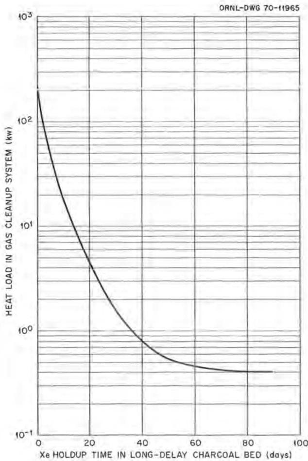  
Fig. 7.8. Effect of charcoal bed holdup time on heat load in gas cleanup system.

# 7.6 THE GAS CLEANUP SYSTEM

After leaving the long-delay charcoal bed, the off-gas stream enters the gas cleanup system. At this point, all the radioactive fission product gases except the 10-year

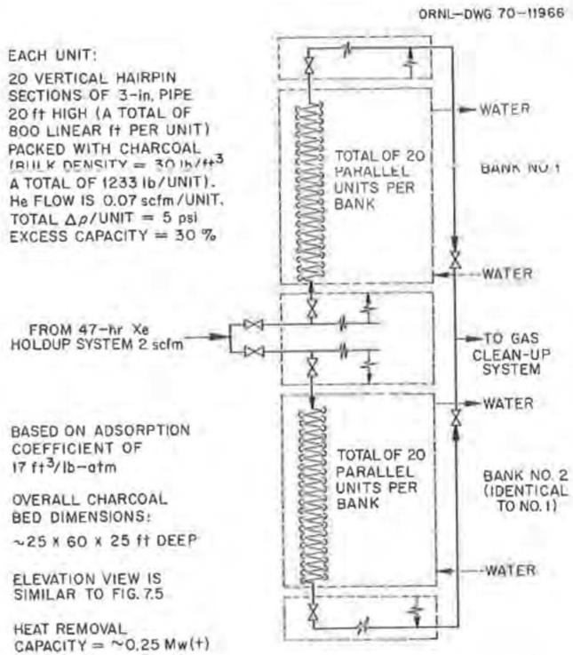  
Fig. 7.9. Plan view of long-delay MSBR charcoal bed.

${}^{85}\mathrm{Kr}$ and the 12-year ${}^{3}\mathrm{H}$ have decayed to negligible amounts. Thus, if one assumes a delay time of 90 days for xenon, the longest-lived isotope (12-day $^{131m}\mathrm{Xe}$ ) would be reduced to $0.6\%$ of its original value, and the reduction for the shorter-lived isotopes would be proportionally greater. The stable noble gases, as well as essentially $100\%$ of the ${}^{85}\mathrm{Kr}$ and ${}^{3}\mathrm{H}$ , will be carried into the gas cleanup system at a rate equal to the rate of production in the reactor (assuming that no tritium is lost to other parts of the reactor system by diffusion through duct and vessel walls).

Table 7.5.Accumulation of nonvolatiles in the long-delay charcoal beda   

<table><tr><td rowspan="2">Gaseous parent</td><td colspan="3">Accumulation rate</td><td rowspan="2">Nonvolatile daughter</td></tr><tr><td>atoms/hr</td><td>g-moles/day</td><td>g/year</td></tr><tr><td></td><td>× 1022</td><td></td><td></td><td></td></tr><tr><td>87Kr</td><td>0.075</td><td>0.03</td><td>952</td><td>6.2 × 1010year 87Rb</td></tr><tr><td>88Kr</td><td>0.51</td><td>0.20</td><td>6351</td><td>Stable 88Sr</td></tr><tr><td>133Xe</td><td>3.3</td><td>1.3</td><td>63108</td><td>Stable 133Cs</td></tr><tr><td>135Xe</td><td>0.04</td><td>0.016</td><td>788</td><td>3 × 106year 135Cs</td></tr></table>

${}^{a}$ The cumulative total for the four isotopes is ${71},{200}\mathrm{\;g}/$ year. If this quantity is distributed uniformly over 18.5 tons of charcoal, the concentration is ${0.004}\mathrm{\;g}$ of isotope per gram of charcoal.

The function of the gas cleanup system is to process the carrier gas to reduce the residual contaminants to a level which will permit the effluent carrier gas to be recycled to the reactor purge-gas system. Design criteria for the gas cleanup system were as follows:

1. Carrier gas is helium at a flow of 2 scfm and an inlet pressure of 20 psia. The design pressure drop is 4 psi.   
2. The level of each contaminant in the effluent gas is not more than $1\%$ of the value at inlet. Table 7.6 shows the calculated isotopic flow rates at inlet for the stable and very long-lived isotopes.

The gas contains some $^{131m}\mathrm{Xe}$ , which is negligible from a mass flow standpoint but which must be considered in the design of shielding and the heat dissipation system. The tritium values are based on the assumption that the gas cleanup system receives all the estimated total yield of 2400 Ci/day. This is undoubtedly a maximum figure, since a significant fraction of the tritium may be transferred to other parts of the reactor system by diffusion through duct and vessel walls, as discussed in Sect. 3.3.7.

Upon entering the gas cleanup system, as shown in Fig. 7.10, the off-gas first passes through a preheater, which raises the gas temperature to $1500^{\circ}\mathrm{F}$ . It then passes through an oxidizer, which converts the tritium to ${}^{3}\mathrm{H}_{2}\mathrm{O}$ , and then through an aftercooler, which reduces the gas temperature to $100^{\circ}\mathrm{F}$ . (Both the

preheater and the aftercooler have heat loads of $3\mathrm{kW}$ and are designed for negligible $\Delta p$ due to flow. The function of the aftercoolers is to reduce the heat load on the ensuing components.) The off-gas then passes through a charcoal-packed adsorber which is maintained at $0^{\circ}\mathrm{F}$ . The ${}^{3}\mathrm{H}_{2}\mathrm{O}$ and the kryptons and xenons are retained on the charcoal, while the carrier gas passes through the bed. After leaving the refrigerated adsorber, the carrier gas is recompressed and recycled to the reactor purge system. In normal operation, two adsorbers are alternated on a fixed cycle. A regeneration process is used to transfer the adsorbed gases in the off-stream unit to a receiver cylinder for permanent storage.

The tritium oxidizer is 2 in. in inside diameter and 3 ft long, is packed with 13 lb of copper oxide, and operates at $1500^{\circ}\mathrm{F}$ . The tritium flow is 0.036 ft³/day with an allowable $\Delta p$ of 2 psi. The CuO consumption at breakthrough is $60\%$ , and the operating life of a unit is estimated to be 1000 days. Development work will be needed to confirm the efficiency and pressure drop estimates, however.

Each adsorber is made up of 16 pieces of charcoalpacked 8-in. pipe with $1\frac{1}{2}$ -in. interconnections. The total length of 8-in. pipe is 288 ft, arranged in two branches to provide a $\Delta p$ of 2 psi. The pipes are closely stacked inside a 3- to 4-ft-diam pipe with a heated or cooled fluid circulated in the interstitial spaces to

Table 7.6. Flow of isotopes into gas cleanup system   

<table><tr><td colspan="2">Isotope</td><td rowspan="2">Half-life</td><td rowspan="2">Yield (%)</td><td colspan="3">Flow to gas cleanup</td><td rowspan="2">Concentration (ppm, by volume)</td></tr><tr><td>Element</td><td>Mass No.</td><td>atoms/hr</td><td>g-moles/day</td><td>ft3/day</td></tr><tr><td></td><td></td><td></td><td></td><td>× 1023</td><td></td><td></td><td></td></tr><tr><td rowspan="4">Kr</td><td>83</td><td>Stable</td><td>1.14</td><td>0.029</td><td>0.12</td><td>0.092</td><td>31</td></tr><tr><td>84</td><td>Stable</td><td>1.95</td><td>0.049</td><td>0.20</td><td>0.15</td><td>52</td></tr><tr><td>85</td><td>10.76 years</td><td>0.66</td><td>0.017</td><td>0.068</td><td>0.052</td><td>18</td></tr><tr><td>86</td><td>Stable</td><td>3.41</td><td>0.085</td><td>0.34</td><td>0.27</td><td>94</td></tr><tr><td>Total</td><td></td><td></td><td></td><td></td><td>0.73</td><td>0.56</td><td>195</td></tr><tr><td rowspan="4">Xe</td><td>131</td><td>Stable</td><td>3.39</td><td>0.085</td><td>0.34</td><td>0.27</td><td>94</td></tr><tr><td>132</td><td>Stable</td><td>4.54</td><td>0.11</td><td>0.44</td><td>0.36</td><td>125</td></tr><tr><td>134</td><td>Stable</td><td>5.94</td><td>0.15</td><td>0.60</td><td>0.47</td><td>163</td></tr><tr><td>136</td><td>Stable</td><td>6.89</td><td>0.17</td><td>0.68</td><td>0.55</td><td>191</td></tr><tr><td>Total</td><td></td><td></td><td></td><td></td><td>2.06</td><td>1.65</td><td>573</td></tr><tr><td>H</td><td>3</td><td>12.26 years</td><td>0.8</td><td>0.02</td><td>0.04</td><td>0.032</td><td>11</td></tr></table>

# NOTES:

1. Calculations of flow to gas cleanup system based on carrier gas flow rate of 2 scfm.   
2. Yield values for Kr and Xe isotopes may differ slightly from values shown in Table 7.1.   
3. Tritium values are based on the assumption that all of the ${}^{3}\mathrm{H}$ production (estimated at 2400 Ci/day) goes to the gas cleanup system.

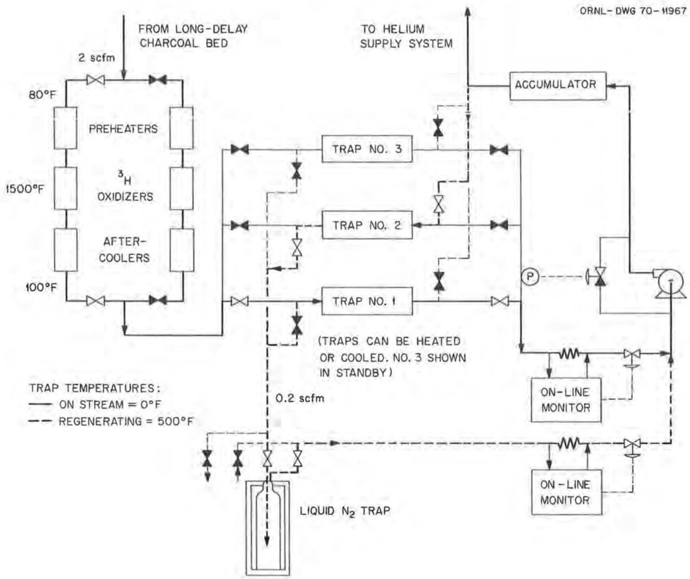  
7.10. MSBR off-gas cleanup system.

provide an average on-stream operating temperature of $0^{\circ}\mathrm{F}$ and a temperature of $500^{\circ}\mathrm{F}$ when on the regeneration cycle. Using an adsorption coefficient of 4.8 ft³/lb, the estimated total charcoal requirement is about 3000 lb. The operating cycle is eight days - four days on stream and four days regenerating.

The helium gas used for regeneration is taken from the helium purge header, as indicated in Fig. 7.10. During regeneration the gas flow is about $10\%$ of normal on-stream flow and moves through the adsorber unit in the opposite direction. After leaving the heated adsorber bed, the regenerating gas, now laden with ${}^{3}\mathrm{H}_{2}\mathrm{O}$ , krypton, and xenon, passes through a storage bottle maintained at a liquid-nitrogen temperature of $-325^{\circ}\mathrm{F}$ . The water, krypton, and xenon are trapped in

the bottle, and the purified effluent is returned to the main carrier-gas stream. Assuming a storage bottle similar to a $1.5\mathrm{-ft}^3$ high-pressure gas cylinder, each container would be kept on line for 12 cycles, or 48 days. About 30 lb of xenon, 6 lb of krypton, and 0.1 lb of tritiated water would be accumulated in each bottle. Each freshly filled bottle would contain about 240 Ci of ${}^{85}\mathrm{Kr}$ , equivalent to a decay energy of about 0.4 W per bottle. The bottle pressure after equilibrating to room temperature would be $\sim 1000$ psi. About 230 bottles would be filled during the 30-year life of an MSBR station. Each filled container would be transferred to long-term storage, where, after a period of about 100 years, the ${}^{3}\mathrm{H}$ and ${}^{85}\mathrm{Kr}$ would decay sufficiently for the contents to be released or sold without radiological protection.

# 7.7 COMPRESSORS

A compressor is used to return the effluent of the gas cleanup system to the purge-gas cycle. The compressor has a capacity of about 2 scfm of helium, with an inlet pressure of 14.7 psia and an outlet pressure of 60 psia. A major requirement for the compressor is to provide positive sealing for the pumped fluid so that the highly purified gas is not recontaminated.

The 47-hr xenon recycle system will be designed to operate on the available pressure drop, so a compressor probably will not be required. However, if one is needed, the flow will be 9 scfm, and the compression ratio will be fairly low, about 1.4 to 1. Positive sealing will be essential to prevent outleakage of the highly radioactive gas. Other requirements will be radiation resistance and remote maintainability.

# 7.8 PIPING AND VALVING

Double containment, or better, is provided in all parts of the system where outleakage could cause a hazard to

personnel. In especially critical areas, favorable pressure gradients are provided, for example, by use of a high-pressure inert gas blanket in an annulus surrounding the radioactive gases. The off-gas system layout recognized the necessity to minimize the effects of solids accumulations at valve seats, pipe bends, etc., where fission product decay heating would tend to cause hot spots, and additional study and development will be required.

All valves are provided with welded bellows for positive stem sealing. Positive-sealed end connections, either buffered O-rings or butt welds, are also used. Where necessary, provisions are made for remote maintenance of valving.

Gas system piping and components are provided with a controlled-circulation ambient air system, which assures prompt detection of gas leaks and the channeling of such leaks to an absolute filter system.

# 8. Fuel-Salt Processing System

L.E.McNeese

# 8.1 GENERAL

The principal objectives of fuel processing are the isolation of $^{233}\mathrm{Pa}$ from regions of high neutron flux during its decay to $^{233}\mathrm{U}$ and the removal of fission products from the system. It is also necessary to remove impurities from the reactor fuel salt which may arise from corrosion or maloperation of the reactor system.

The fuel processing system is an integral part of the reactor system and will be operated continuously. This allows processing of the reactor on a short cycle with acceptably small inventories of salt and fissile materials. The reactor can continue to operate even if the processing facility is shut down, however, although at a gradual decrease in nuclear performance as the poisons accumulate.

The processing methods are based on reductive extraction, which involves the selective distribution of materials between salt and bismuth containing reducing agents such as thorium and lithium. The isolation of protactinium by reductive extraction is relatively straightforward since there are significant differences in chemical behavior between protactinium and the other components of the fuel salt (U, Th, Li, and Be), as is evidenced by the distribution ratios of these materials between fuel salt and bismuth containing a reductant. Extraction of the protactinium into bismuth requires the prior and complete removal of uranium from the fuel salt. Two methods (described below) are available for accomplishing this.

In the older protactinium isolation method,[9] the salt stream from the reactor was fed directly into a bismuth contactor, and sufficient reductant was fed counter-current to the fuel salt to not only isolate the protactinium but to also reduce all of the $\mathrm{UF_4}$ present in the fuel salt. The $\mathrm{UF_4}$ concentration in the fuel salt is relatively high (0.003 mole fraction), and the quantity of reductant required $(10^{4}$ gram equivalents per day) was sufficiently large that its purchase would

be uneconomical. For this reason a relatively large electrolytic cell was used to reduce LiF and $\mathrm{ThF_4}$ from the fuel salt to provide the required reductant.

In the preferred protactinium isolation system, only recently devised, fluorination is used for removing most of the uranium from the fuel salt prior to protactinium isolation. With this system, the quantity of reductant required is such that it can be purchased economically, and an electrolytic cell (which presents unusual development problems) is not required.

The removal of the rare-earth fission products from the fuel salt is more difficult because the chemical behavior of the rare-earth fluorides is similar to that of thorium fluoride, which is a major component of the fuel salt. Two rare-earth-removal systems, both based on reductive extraction, have been considered.

In the older rare-earth-removal system,[9] the fuel carrier salt containing rare-earth fluorides was countercurrently contacted with bismuth in order to exploit the small differences in the extent to which thorium and the rare earths distribute between the fuel carrier salt and bismuth containing a reductant. Since the distribution behavior of the rare earths and thorium is quite similar (i.e., rare-earth-thorium separation factors near unity),[2,9] it was necessary to use a large number of stages in the extraction columns and high metal-to-salt flow ratios. The system used a large amount of reductant (about $4.5 \times 10^{4}$ gram equivalents per day) which was provided by electrolytic reduction of LiF.

The preferred rare-earth-removal method, known as the metal-transfer process,[1] was also devised only recently. This process exploits the relatively large differences in the extent to which rare earths and thorium distribute between bismuth containing a reductant and lithium chloride.[1] The new process does not require an electrolytic cell; this is an important advantage over the earlier process.

The remainder of this section describes a system incorporating the fluorination-reductive-extraction

process for protactinium isolation and the metaltransfer process for rare-earth removal.

# 8.2 PROTACTINIUM ISOLATION

The fluorination-reductive-extraction system for isolating protactinium is shown in Fig. 8.1. The salt stream from the reactor first passes through a fluorinator, where about $95\%$ of the uranium is removed. The salt stream leaving the fluorinator is countercurrently contacted with a bismuth stream containing lithium and thorium in a multistage contactor in order to remove the uranium and protactinium from the salt. The bismuth stream leaving the column, which contains the extracted uranium and protactinium as well as lithium and thorium, is contacted with an $\mathrm{HF - H_2}$ mixture in the presence of a molten-salt stream in order to remove these materials from the bismuth. The salt stream which flows through the hydrofluorinator also circulates through a fluorinator, where about $95\%$ of the uranium is removed, and through a tank which contains most of the protactinium. Uranium produced in the tank by

decay of protactinium is removed by the circulating salt stream. Reductant (lithium) is added to the bismuth stream leaving the hydrofluorinator, and the resulting stream is returned to the extraction column. The salt stream leaving the column is essentially free of uranium and protactinium and is processed for removal of rare earths before being returned to the reactor.

Calculations have shown that the system is quite stable with respect to variations as large as $20\%$ for most of the important parameters: flow rates, reductant concentration, and number of extraction stages. The required uranium-removal efficiency in the initial fluorinator is less than $95\%$ . The number of stages required in the extraction column is relatively low, and the metal-to-salt flow ratio (about 0.14) is in a range where the effects of axial mixing in packed column extractors will be negligible. Since the protactinium-removal efficiency is very high and the system is quite stable, materials such as $\mathrm{^{231}Pa}$ , $\mathrm{Zr}$ , Ni, and Pu should accumulate in the protactinium decay tank.

Operating conditions that will yield a ten-day protac-tinium removal time include a fuel-salt flow rate of 0.88

ORNL-DWG 70-11032A

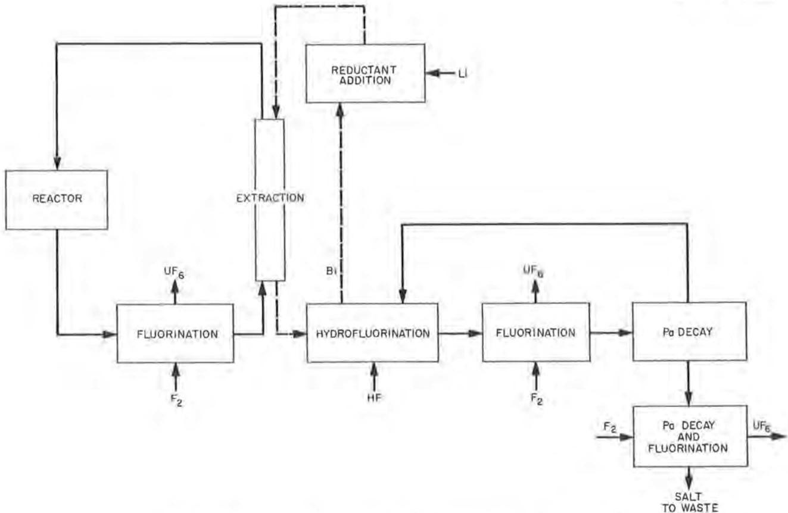  
Fig. 8.1. Protactinium isolation with uranium removal by fluorination.

gpm (ten-day processing cycle), a bismuth flow of 0.11 gpm, and five stages in the extraction column. The required quantity of reductant is 371 equivalents per day, which will cost $288 per day, or 0.012 mill/kWhr, if $^7\mathrm{Li}$ is purchased at $120 per kilogram.

# 8.3 RARE-EARTH REMOVAL

Rare-earth and alkaline-earth fission products can be removed effectively from the fuel salt by the metaltransfer process. In this process, bismuth containing thorium and lithium is used to transport the rare-earth fission products from the reactor fuel salt to an acceptor salt. Although LiCl is the preferred acceptor salt, LiBr or LiCl-LiBr mixtures could also be used.

Both thorium and rare earths transfer to the bismuth; however, because of favorable distribution coefficients, only a small fraction of the thorium transfers with the rare earths from the bismuth to the LiCl. The effective thorium-rare-earth separation factors for the various rare earths range from about $10^{4}$ to about $10^{8}$ . The final step of the process is removal of the rare earths from the LiCl by extraction with bismuth containing 0.05 to 0.50 mole fraction lithium.

The conceptual process flowsheet (Fig. 8.2) includes four extractors that operate at about $640^{\circ}\mathrm{C}$ . Fuel salt from the protactinium isolation system, which is free of uranium and protactinium but contains the rare earths at the reactor concentration, is countercurrently contacted with bismuth containing approximately 0.002 mole fraction lithium and 0.0025 mole fraction thorium (90% of thorium solubility) in extractor 1. Fractions of the rare earths transfer to the downflowing metal stream and are carried into extractor 2. Here, the bismuth stream is contacted countercurrently with LiCl, and fractions of the rare earths and a trace of the thorium transfer to the LiCl. The resulting LiCl stream is routed to extractor 4, where it is contacted with a bismuth solution having a lithium concentration of 0.05 mole fraction for removal of trivalent rare earths. About 2% of the LiCl leaving extractor 4 is routed to extractor 3, where it is contacted with a bismuth solution having a lithium concentration of 0.5 mole fraction for removal of divalent rare earths (samarium and europium) and the alkaline earths (barium and strontium). The LiCl from extractors 3 and 4 (still containing some rare earths) is then returned to extractor 2.

Calculations were made to identify the important system parameters. It was found that there is considerable latitude in choosing operating conditions which will yield a stated removal time. The number of stages required in the extractors is low: less than six in

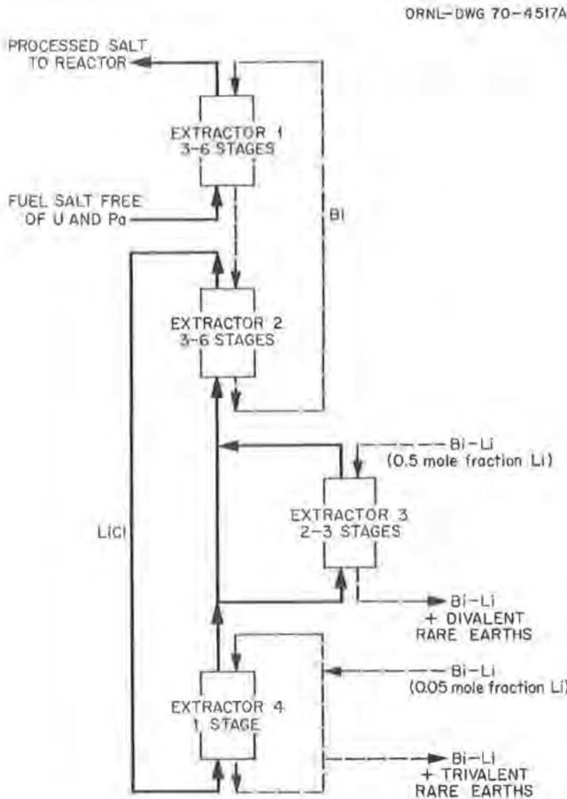  
Fig. 8.2. Mass transfer process for removal of rare earths from a single-fluid MSBR.

extractors 1 and 2, three or less in extractor 3, and one in extractor 4. The process appears to be essentially insensitive to minor variations in operating conditions such as flow ratios, reductant concentrations, and temperature. The required salt and bismuth flow rates depend on the desired rare-earth-removal times.

# 8.4 INTEGRATED PLANT FLOWSHEET

The flowsheet that has been adopted for the MSBR is a combination of the processes described in the two previous sections. Figure 2.4 shows the integrated flowsheet. A description and analysis follow.

A small stream of fuel salt taken from the reactor drain tank flows through a fluorinator, where about $95\%$ of the uranium is removed as gaseous $\mathrm{UF}_6$ . The salt then flows to a reductive-extraction column, where protactinium and the remaining uranium are chemically reduced and extracted into liquid bismuth flowing countercurrent to the salt. The reducing agent, lithium and thorium dissolved in bismuth, is introduced at the

top of the extraction column. The bismuth stream leaving the column contains the extracted uranium and protactinium as well as lithium, thorium, and fission product zirconium. The extracted materials are removed from the bismuth stream by contacting the stream with an $\mathrm{HF - H_2}$ mixture in the presence of a waste salt which is circulated through the hydrofluorinated from the protactinium decay tank. The salt stream leaving the hydrofluorinated, which contains $\mathrm{UF_4}$ and $\mathrm{PaF_4}$ , passes through a fluorinated, where about $90\%$ of the uranium is removed. The resulting salt stream then flows through a tank having a volume of about $130\mathrm{ft}^3$ , where most of the protactinium is held and where most of the protactinium decay heat is removed. Uranium produced in the tank by protactinium decay is removed by circulation of the salt through the fluorinated. Materials that do not form volatile fluorides during fluorination will also accumulate in the decay tank; these include fission product zirconium and corrosion product nickel. These materials are subsequently removed from the tank by periodic discard of salt at a rate equivalent to about 0.1 ft³/day. This salt is withdrawn to a storage tank on a 220-day cycle (eight $^{233}\mathrm{Pa}$ half-lives) in order to ensure sufficiently complete decay of the protactinium. After this decay period a batch fluorination of the $22\mathrm{-ft}^3$ salt volume is carried out in the storage vessel for removal of residual uranium. The salt is then discarded.

The bismuth stream leaving the hydrofluorinator is then combined with sufficient reductant (lithium) for operation of the protactinium isolation system. Effectively, this stream is fed to the extraction column of the protactinium isolation system; actually, it first passes through a captive bismuth phase in the rare-earth-removal system in order to purge uranium and protactinium from this captive volume.

The salt stream leaving the protactinium extraction column contains negligible amounts of uranium and protactinium but contains the rare earths at essentially the reactor concentration. This stream is fed to the rare-earth-removal system, where fractions of the rare earths are removed from the fuel carrier salt by countercurrent contact with bismuth containing lithium and thorium. The bismuth stream is contacted with LiCl, to which the rare earths, along with a negligible amount of thorium, are transferred. The rare earths are then removed from the LiCl by contact with bismuth containing a high concentration of $^7\mathrm{Li}$ . Separate extractors are used for removal of the divalent and trivalent rare earths in order to minimize the quantity of $^7\mathrm{Li}$ required. Only about $2\%$ of the LiCl leaving the trivalent-rare-earth extractor is fed to the extractor in which the divalent materials are removed.

Calculations have been made for a range of operating conditions in order to evaluate the flowsheet just described. In making these calculations the MATLAB code was used to determine the reactor breeding ratio for each set of processing plant operating conditions examined. Data are not available on the cost of processing for this flowsheet or for the reference flowsheet for the processing system that uses electrolyzers in both the protactinium- and rare-earth-removal systems. In the absence of these data, processing conditions were examined which would result in the same reactor performance (i.e., the same breeding ratio) as that obtained with the previous reference flowsheet.

Although the optimum operating conditions which will result in a breeding ratio equal to that of the reference reactor and processing system (1.063) have not been determined, the following conditions are believed to be representative. The reactor was processed on a ten-day cycle, with the complete fuel-salt stream (0.88 gpm) passing through both the protactinium isolation system and the rare-earth-removal system. The resulting protactinium removal time was ten days, and reductant requirement was 371 equivalents per day, or $230 per day, which costs 0.012 mill/kWhr. The protactinium isolation column is 3 in. in diameter, and the total number of required stages is about 5. The protactinium isolation system also results in a ten-day removal time for materials that are more noble than thorium but do not have volatile fluorides. These include zirconium, $^{231}\mathrm{Pa}$ , plutonium, the seminoble metals, and corrosion products.

The rare-earth-removal system consists of three primary contactors: (1) a 7.1-in.-diam six-stage column in which the rare earths are transferred from the fuel salt to a 12.5-gpm bismuth stream, (2) a 13-in.-diam six-stage column in which the rare earths are transferred from the bismuth to a 33.4-gpm LiCl stream, and (3) a 12.3-in.-diam column in which the trivalent rare earths are transferred from the LiCl to an 8.1-gpm bismuth stream having a lithium concentration of 0.05 mole fraction. Two percent of the LiCl (0.69 gpm) leaving the trivalent-rare-earth extractor is contacted with a bismuth stream (1.5 cm³/min) having a lithium concentration of 0.5 mole fraction for removal of the divalent fission products such as Sm, Eu, Ba, and Sr. The total lithium consumption rate for the rare-earth system is 119 moles/day, or $81 per day, which costs 0.0042 mill/kWhr.

The rare-earth-removal times range from 15.5 days for cerium to 50.4 days for europium. The distribution data for neodymium, which are believed to be conservative, were used for rare earths for which distribution data were not available (i.e., Y, Pr, and $\mathbf{Pm}$ ).

The costs for reductant in both the protactinium isolation system and in the rare-earth-removal system constitute only a small fraction of the total processing costs; however, they indicate that one can purchase reductant rather than use an electrolytic cell for producing this material. As data become available on processing costs, the optimum conditions will be determined for the most economic operation of the processing plant.

# 8.5 SALT-BISMUTH CONTACTORS

Salt-metal contactors are required at several points in the flowsheets. Where multistage contactors are needed, packed columns operated with the salt phase continuous are the preferred type of contactors. In cases where only a single stage is required, mixer-settlers could be used instead.

Studies have been made of pressure drop, flooding, dispersed phase holdup, and axial mixing for columns packed with both solid cylindrical and Raschig ring packing ranging in size from $\frac{1}{8}$ to $\frac{1}{2}$ in. For most applications the preferred packing is $\frac{3}{8}$ -in. Raschig rings. Sufficient data are available for determining the required column diameter for stated throughputs of salt and bismuth, but additional data are needed on the column height equivalent to a theoretical stage (HETS). The HETS values for the required contactors are assumed to be 20 to 24 in. The column diameters range from 3 to 13 in.

# 8.6 FLUORINATORS

Uranium is removed from the salt streams as $\mathrm{UF}_6$ by countercurrently contacting the salt with fluorine gas in a salt-phase-continuous system. Because this process involves quite corrosive conditions, it is carried out in columns whose walls are protected from corrosion by a layer of salt frozen on all surfaces that potentially contact both fluorine and salt.

The fluorinators are envisioned as open columns, and axial mixing in the salt phase caused by rising gas bubbles tends to reduce fluorinator performance. Axial dispersion data have been obtained during countercurrent flow of air and water in columns having diameters of 1.5, 2, 3, and 6 in. These data were combined with previous data on uranium removal in a 1-in.-diam continuous fluorinator in order to predict the performance of fluorinators having larger diameters. The two continuous fluorinators used in the processing system, which remove $95\%$ of the uranium from salt streams having flow rates of about $170\mathrm{ft}^3/\mathrm{day}$ , are 6 in. in diameter and 10 ft high.

# 8.7 FUEL RECONSTITUTION

Uranium is removed as $\mathrm{UF}_6$ at two points in the process, and it is necessary to return most of this uranium to the fuel salt returning to the reactor. This is accomplished by absorbing the $\mathrm{UF}_6$ into the processed salt and reducing the resulting mixture with $\mathrm{H}_2$ to produce $\mathrm{UF}_4$ . Although the overall reaction is straightforward,

$$
\mathrm {U F} _ {6} + \mathrm {H} _ {2} \rightarrow \mathrm {U F} _ {4} + 2 \mathrm {H F},
$$

it is believed that intermediate uranium fluorides such as $\mathrm{UF}_5$ which are soluble in the salt and nonvolatile, are responsible for the rapid absorption reaction which occurs when $\mathrm{UF}_6$ is contacted with salt containing lower valence uranium fluorides. The rate at which $\mathrm{UF}_6$ must be reduced to $\mathrm{UF}_4$ is about 700 moles/day. It is believed that the reaction can be carried out continuously with the $\mathrm{H}_2$ and $\mathrm{UF}_6$ added either to the same vessel or to different vessels between which the salt is circulated. Conditions in the system are likely to be corrosive, and frozen wall corrosion protection may be required.

# 8.8 SALT CLEANUP

Before the processed salt is returned to the reactor, the concentration of impurities which may be harmful to the reactor system must be reduced to safe levels. It will also be necessary to ensure that the $\mathrm{U}^{3+}/\mathrm{U}^{4+}$ ratio in the salt has the proper value so that conditions in the reactor will be noncorrosive to Hastelloy N.

Since nickel is quite soluble in bismuth and Hastelloy N is a nickel-base alloy, bismuth is the most important potential impurity in the salt. Bismuth could be dissolved or entrained in the salt or could be present as a soluble bismuth compound. Few data are available with which to assess the magnitude of the bismuth problem. The solubility of bismuth in the fuel salt is believed to be no greater than about 2 ppm and may be much lower. Entrainment is not considered a serious problem. Also, the bismuth concentration which can be tolerated in the reactor is not known. Until additional data are obtained, however, the problem of bismuth being present in the salt will be regarded as significant. The concentration of other impurities such as $\mathrm{FeF_2}$ and $\mathrm{NiF_2}$ must also be reduced to low levels since these materials will interact with chromium, a constituent of Hastelloy N.

The presently envisioned salt cleanup system consists of a 2-in.-diam, 50-ft-long vessel packed with nickel mesh. Salt flowing through the vessel is contacted with

a countercurrent flow of $\mathrm{H}_{2}$ at a rate of about 34 scfm. The salt then passes through a porous metal filter prior to its return to the reactor.

# 8.9 PUMPS

Several small pumps will be required for both molten salt and bismuth throughout the processing plant. The capacities for bismuth pumps range from about 0.15 to $12.3\mathrm{gpm}$ and for salt pumps from about 1 to $33\mathrm{gpm}$ .

# 8.10 MATERIALS

The MSBR chemical processes impose severe limitations on containment materials. Compatibility with liquid bismuth and molten salt fuels at $1200^{\circ}\mathrm{F}$ $(650^{\circ}\mathrm{C})$ is required. Conventional nickel- and iron-base alloys are not satisfactory because of their susceptibility to dissolution and mass transfer in bismuth. The most promising materials appear to be molybdenum, tungsten, rhenium, tantalum, and graphite. Of these, molybdenum, tungsten, rhenium, and graphite are difficult to fabricate into complex shapes, and tantalum has a high reactivity with environments other than ultrahigh vacuums. In addition, it is necessary to consider the possible effects of lithium or thorium in bismuth and a

high fluoride ion concentration in the molten salt on compatibility. With these factors in mind, it was concluded that molybdenum has the highest probability for success in this application.

Molybdenum vessels can be fabricated by the back-extrusion process, which involves the flow of metal into a die and extrusion back over an advancing plunger. The advantages of this process are that the final diameter is as large as or larger than the starting blank, the geometry can be changed by relatively simple changes in die and mandrel design, and deformation can be accomplished below the recrystallization temperature, so that a wrought structure having good mechanical properties is produced. By this technique, vessel heads can be produced with integral bosses for pipe connections.

Brazing produces joints in molybdenum systems with good mechanical properties, but commercially available brazing alloys for molybdenum are not compatible with both bismuth and fluoride salts. Molybdenum can be welded by either a gas tungsten-arc process or by an electron beam technique. Welding has the disadvantage, however, that the recrystallized region is very brittle. The most satisfactory joint may be a butt weld backed up by a brazed sleeve which limits the stress on the brittle zone.

# 9. Liquid-Waste Disposal System

Radioactive liquid wastes accumulated from decontamination operations and other sources will be collected in the chemical processing facility for treatment. The concentrated waste will be stored for decay and eventual disposal. The waste treatment and storage

systems have not received any conceptual study, but it is anticipated that the design will be straightforward and will not pose major development problems. An allowance was made in the cost estimate for these facilities.

# 10. Plant Operation, Control, and Instrumentation

# 10.1 GENERAL

Operation of the MSBR power station embraces all phases of startup from either cold or standby conditions, reliable delivery of electric power at any demanded load between about 20 and $100\%$ of capacity, and procedures for both scheduled and unplanned shutdowns. An overriding consideration at all times is safe operation of the plant to protect the public from possible radioactive hazards and to prevent injury to operating personnel and major damage to equipment.

The controls system must recognize the different requirements for the various operating modes and establish safe and appropriate operating conditions. The systems must coordinate the reactor, the primary- and secondary-salt loops, the steam generators and reheaters, the turbine-generator, and the several associated auxiliary systems. In general, the load demand is the primary signal to which the controls subsystems are subordinate, unless overridden by safety considerations. The controls should minimize temperature fluctuations at critical points, such as at the turbine throttle, should limit rates of temperature changes to keep stresses in materials within the acceptable ranges, and should guard against freezing of the fuel and heat-transport salts in the systems.

It may be noted that the steam conditions to be maintained at the turbine throttle cannot be realized by simply controlling the power produced in the reactor, since the transport lag, or time delay, between a change in reactor power and a corresponding change in the heat transferred to the steam is about 10 sec under most conditions. A faster adjustment can be made by controlling the coolant-salt flow to the steam generator. Salt flow regulation can be accomplished either by valves in the salt lines or by varying the speed of the coolant-salt circulating pumps. Since the pump rotation can be varied with sufficient speed of response to accommodate anticipated load changes, this is the control method selected for the MSBR reference design. Although valves for salt service have received relatively

little development to date, it is to be noted that flow control valves for salt service are relatively simple in concept as compared with mechanical-type shutoff valves,* and the problems in developing the flow control device are not necessarily great. Fluidic valves were briefly studied at ORNL and appear to have considerable promise for proportioning flows in molten-salt systems.

To establish the general feasibility of the MSBR concept, estimates were made of material stresses under transient conditions to determine whether the allowable rates of load change would be acceptable. Analog simulations were carried out to indicate whether the systems were stable and whether the basic control conditions and requirements could reasonably be met. Standby, startup, and shutdown modes were explored sufficiently to suggest a flowsheet, to outline the special equipment needed, and to generally evaluate this aspect of plant operation.

# 10.2 MSBR REACTIVITY CONTROL

John L.Anderson S.J.Ditto

Two types of rods are planned for the MSBR core: (1) control rods, which have both regulating and shimming functions for normal load following and shutdown, and (2) safety rods, which are primarily for backup to assure adequate negative reactivity for emergency situations.

The control rods are movable graphite cylinders about $3\%$ in. in diameter with axial passages through them for a cooling flow of fuel salt, as shown in Fig. 3.1. Withdrawal of the graphite leaves an undermoderated region at the center of the reactor and causes a reduction in reactivity. It may be noted that the graphite has considerable buoyancy in the fuel salt;

thus, if a rod should break, the graphite pieces would float out of the core and reduce the reactivity. The total worth of each rod, as calculated by Smith, in moving the full core height from fully inserted to the fully withdrawn position is about $0.08\% \delta k / k$ . Based on a higher anticipated worth than this, two control rods and two safety rods were originally planned, as shown in Fig. 3.1. On the basis of later estimates, however, it now appears that a total of four control rods and two safety rods may be required to achieve satisfactory control.

MSBR reactor control simulations reported by Sides[104] indicate that a reactivity rate of change of about $0.01\%/\mathrm{sec} \delta k/k$ is adequate for normal control of the reactor. This would require linear velocities for four rods acting together of 0.4 fps. It is reasonable to expect that this velocity could be attained with a relatively simple rod-drive system using electric motors.

Circumstances could arise which would require a faster rate of reactivity decrease than the $0.01\%/\mathrm{sec}$ mentioned above, such as sudden large load reductions or loss of load. Such transients may require negative reactivity rates as high as 0.05 to $0.1\%/\mathrm{sec} \delta k/k$ . One method of attaining the fast rate of control rod withdrawal would be by an air turbine and an electric motor coupled to the control rod drive through differential gearing. The electric motor would be used to increase the reactivity at a relatively slow rate, and the air turbine would be capable of fast withdrawal. The inherent unidirectional characteristics of the turbine would make it impossible for it to run backward to insert reactivity at a fast rate. More study will be required to arrive at definitive designs, but the control rod drives appear to be within established technology.

Long-term reactivity adjustments will be accomplished in the MSBR by varying the fuel concentration. Initial fuel loading will be done by gradually increasing the concentration in circulating barren salt. Subsequent refills of the reactor system may be with already enriched salt from the drain tank. The normal fuel-addition rates will be slow and manageable, so that very modest control of reactivity rates can oversee the process. The possibilities for misoperation of the fuel-addition process have not been assessed at this stage of the MSBR design study, but a reasonable allowance in shutdown control reactivity will be made for this eventuality.

Temperature changes in the primary salt will affect the reactivity. The mean temperature of the salt could possibly increase about $150^{\circ}\mathrm{F}$ from startup to full-load conditions. With a nominal temperature coefficient of

reactivity of $-5\times 10^{-6} / {}^{\circ}\mathrm{F},^{11}$ a net reactivity change of about $0.075\%$ $\delta k / k$ must be accommodated. Temperature changes will normally be made slowly in order to minimize thermal stresses in the system, but there is the possibility that on stopping and restarting of a fuel salt pump a cooler slug of salt from the heat exchanger could be carried into the reactor core to produce a relatively rapid increase in reactivity. The amount of reactivity involved, however, is not likely to be great because of the improbability that all the primary pumps would be stopped and then restarted simultaneously.

In normal MSBR operation there is a reactivity loss due to delayed neutron precursors being carried out of the core by the circulating fuel salt. At the present time it is planned to operate the MSBR with a constant circulation rate for the fuel salt, but if the flow rate were decreased or stopped, this effect would cause an increase in positive reactivity. It is estimated that total flow stoppage would result in a reactivity change of about $+0.2\% \delta k / k$ .

Since the amount of gas entrained in the fuel salt affects the reactivity, changes in the salt circulation rate, the system pressure, salt chemistry, and performance of the stripping gas injection and removal systems could cause relatively rapid insertion or removal of reactivity. Maximum rates are related to the velocity of the fuel salt in the core. Extrapolation of MSRE experience to the MSBR indicates that the maximum total reactivity effect due to gas entrainment will be less than $0.2\% \delta k / k$ . A change in gas entrainment from the expected normal level of $1\%$ to a level of $2\%$ is calculated to produce a reactivity change of about $-0.04\% \delta k / k$ .

The amount of reactivity needed to override xenon reactivity transients associated with changes in reactor power is quite small in the MSBR compared with other reactor types in that a large fraction of the xenon is continuously removed by the gas purging and stripping system. The total equilibrium xenon effect from low power to full power is estimated to be about $0.3\%$ $\delta k / k.$ Transient effects can, of course, vary widely, depending upon the amount and duration of the power changes.

In summary, although the sum of the reactivity effects discussed above is about $0.85\% \delta k / k$ all the effects will not have maximum importance occurring simultaneously, and some will be of opposite sign. A total of $0.3\% \delta k / k$ provided by the graphite control rods is expected to be adequate to cover short-term reactivity effects in the MSBR. As previously mentioned, long-term effects will be compensated by fuel concentration changes.

# 10.3 REACTIVITY CONTROL FOR EMERGENCY SHUTDOWN

John L. Anderson S.J.Ditto

Over and above the normal reactivity control needs discussed above, additional shutdown capacity is necessary to take care of unforeseen situations or emergency conditions, such as major changes in salt composition or temperature effects when filling the primary system, flow stoppages in the circulating loops, gross temperature changes, malfunctions in the control rod system, etc.

Safety rods consisting of boron carbide clad in Hastelloy N can be used at the center of the core to furnish an independent shutdown capability. Each of these absorber rods would have an estimated worth of about $-1.5\%$ $\Delta k / k$ and two to four rods would probably be sufficient.[105] The presence of neutron-absorbing material in the core is undesirable during normal operation; therefore the rods would be for safety purposes only and would normally be fully withdrawn. Since there would be times, however, when it might be preferable to operate for short periods with the absorber rods partially inserted, they should have full adjustment capability in addition to a fast-insertion action.

# 10.4 PLANT PROTECTIVE SYSTEM

John L. Anderson S.J.Ditto

# 10.4.1 General

The plant protective system includes those components and interconnection devices, from sensors through final actuating mechanisms, which have the function of limiting the consequences of specified accidents or equipment malfunctions. The minimum requirement of the plant protective system is protection of the general public. In addition, the protective system should limit the hazard to operating personnel and provide protection against major plant damage.

This section briefly outlines specific protective actions considered necessary for the MSBR, together with some of the requirements for their initiation. The plant protective system would function by three primary mechanisms: reactivity reduction, load reduction, and fuel-salt drain.

# 10.4.2 Reactivity Reduction

The protective system must be capable of coping with reactivity disturbances beyond the capability of the

normal control system. As discussed in Sect. 10.3, such postulated conditions include malfunction of the controls system, accidental large additions of reactivity, sudden loss of plant load, gross loss of core cooling capability, etc.

The safety rods provided for the MSBR must have a time response, reliability, and a total worth adequate for the worst-case accident. A dynamic system analysis will be necessary to establish the performance required. The necessary reliability is a function of the estimated frequency of need and the consequences of failure to perform as planned.

# 10.4.3 Load Reduction

The relatively high melting temperatures of both the fuel and coolant salts make freezing of the salt in the heat exchangers a concern, since loss or reduction of salt flow in any loop can lead to overcooling if appropriate steps are not taken. In addition, failure to maintain a proper balance between reactor power and heat removed by the steam system can lead to system cooldown. The MSRE, however, demonstrated that prevention of freezing of salts in a molten-salt reactor is not a particularly difficult controls problem.

Loss of temperature control through failure of the controls system or by other accidents must be protected against. The need for protective action will be sensed by measuring appropriate temperatures, flow rates, and power balances. The action taken will be dependent upon the type of condition existing and will probably involve stopping circulation in various salt loops as well as shedding parts of the load. A particular problem exists when an emergency shutdown of the reactor occurs. Immediate reduction of the load to the afterheat level is required so that the salt systems can be held at acceptable temperature levels.

# 10.4.4 Fuel Drain

While draining of the fuel salt into the drain tank is an ultimate shutdown mechanism for the MSBR system, it is anticipated that sudden drains would be required only if the integrity of the primary system were lost. In general, the best place for the fuel salt is within the primary circulation system, but if through pipe rupture or other failure circulation within the system cannot be maintained, the drain mechanism will be used. While the drain system must be very reliable, it is not mandatory that it be capable of being initiated rapidly in the "dumping" sense.

# 10.5 AVAILABILITY OF INSTRUMENTATION AND CONTROLS FOR THE REFERENCE DESIGN MSBR

R. L. Moore

As was reported by Tallackson,[106] the MSRE provided valuable design and operating experience with molten-salt reactor nuclear and process instrumentation. One of the important differences between the MSRE and the MSBR concept, however, is that the high-temperature cells planned for the MSBR could subject some of the instruments to ambient temperatures as high as $1000^{\circ}\mathrm{F}$ unless they are provided with special cooling.

Nuclear detectors are not now available which could operate at temperatures in excess of $1000^{\circ}\mathrm{F}$ . Inasmuch as Ruble and Hanauer[107] were of the opinion that there was a practical upper limit of about $900^{\circ}\mathrm{F}$ for electrical insulating materials for ionization chambers and counters, development work in this area, and in the location of the detectors, will be needed for an MSBR. In this connection, neutron fluctuation analyses may prove to be a valuable tool for monitoring and predicting anomalous behavior.[108,109]

Process instrumentation located inside the MSBR cells will tend to require development because of the high ambient temperatures, as mentioned above. Thermocouple temperature measurements in the MSRE were generally satisfactory, although more work was needed on measurement of small differences at the higher temperatures. Ceramic-insulated platinum resistance thermometers and ultrasonic methods of temperature measurement could have application in the MSBR.

Direct and differential pressure measurements in the MSBR can probably best be accomplished by NaK-filled pressure transmitters. In addition to the venturi-type flowmeters used in the MSRE, turbine and magnetic-type flowmeters can be considered for the MSBR. The gas bubblers and the conductivity-type probes[110] used for liquid level indication in the MSRE worked adequately, but supplementation by float-type instrumentation would be desirable. The pneumatic weighing system used to determine MSRE tank inventories would require adaptation to the higher temperatures in an MSBR. The containment penetration seals, gas-system control valves, electrical disconnects, and wiring and insulation associated with all the above-mentioned devices will also require study and development.

Effort is needed in many areas to arrive at detailed designs and specifications for MSBR control system components, but it may be noted that work being

accomplished for other reactor types will probably have application in the MSBR. $^{112}$

The aspects of the MSBR instrumentation and controls systems requiring significant development have been discussed in detail in ORNL-TM-3303.113

# 10.6 ALLOWABLE RATES OF LOAD CHANGES

R.B.Briggs

To design the controls system for an MSBR station it is necessary to know rates of change which should not normally be exceeded when varying the plant load. A major consideration is the rate that the temperatures of the fuel and coolant salts can be allowed to change. The factor most likely to govern is the thermal stresses generated in the Hastelloy N in contact with the salts. Changing the temperature of the salt will cause the metal surface temperature to change more rapidly than the interior, resulting in a greater temperature gradient and increased stresses. The magnitude of the stress will depend upon the thickness of the metal, the salt-film heat transfer coefficients, the rate of change of temperature, and, for many situations, the total range of temperature change.

The results of a simple study to provide preliminary information are given in Table 10.1. In this study, computer calculations were made of stresses induced in Hastelloy N plates 2 to 4 in. thick, with various heat transfer coefficients and with varying rates of change of salt temperature. The latter were selected to represent the conditions providing maximum stress that would occur due to load changes of 10, 20, and $40\%$ of full load, with the reactor inlet temperature held constant at $1050^{\circ}\mathrm{F}$ and with full design flow of fuel salt across one surface of the plate but with no heat flow through the other surface. The temperature distribution through the plate was calculated for various times after initiating changes in the salt temperature, and the corresponding stresses were determined. The calculated maximum stresses were compared with an allowable stress value of

Table 10.1. Effect of metal plate thickness on allowable rate of change of MSBR plant load   

<table><tr><td rowspan="2">Plate thickness (in.)</td><td colspan="4">Allowable rate of change (%/min) for total change in load of -</td></tr><tr><td>10%</td><td>20%</td><td>40%</td><td>100%</td></tr><tr><td>2</td><td>&gt;40</td><td>40</td><td>~6</td><td>4</td></tr><tr><td>3</td><td>&gt;40</td><td>4</td><td>~2</td><td>~1</td></tr><tr><td>4</td><td>&gt;40</td><td>~2</td><td>&lt;1</td><td>&lt;1</td></tr></table>

18,000 psi, which is based on the assumption that the MSBR will be designed for combined stresses and will experience no more than about 10,000 cycles of $20\%$ or more in power over the plant life. On this basis the effect of plate thickness on the allowable rate of load change is as shown in Table 10.1. These values are believed to be conservative in that the thicker plates will probably be cooled to some extent from both surfaces. In addition, the walls of the reactor vessel are cooled by the inlet flow of salt, so that the heavy sections do not have to change through the full range of temperature when the power changes through the full range.

Since the estimated allowable rates of load change, even when based on these somewhat pessimistic assumptions, are much the same as those presently used in thermal power stations, it can be concluded that operation of the reference design MSBR is not uniquely restricted in this sense.

# 10.7 CONTROL OF FULL AND PARTIAL LOAD OPERATION

W.H.Sides,Jr.

The power operating range for the 1000-MW(e) MSBR station is from 20 to $100\%$ of full design load. Throughout this load swing the steam temperature to the turbine throttle must be held essentially constant, the primary- and secondary-salt temperatures and flow rates must be kept within acceptable limits, and the resulting stresses due to induced thermal gradients must remain within the acceptable ranges. Also, the system temperature and flow profile at $20\%$ load must be compatible with the conditions existing in the plant in the upper portion of the startup range.

A master load programmer would probably be used to divide the required load demand among the four primary-coolant loops and among the steam generators and reheaters associated with each primary-coolant loop. It should be possible to operate the plant at, say, $75\%$ of full load by operating three of four primary loops (and their associated secondary-salt loops) at $100\%$ capacity each. Although perhaps not mandatory, it seems reasonable that all parallel loops should operate under essentially identical conditions, sharing the existing load equally. This is, in part, because all parallel loops always have identical salt conditions at their inlets.

A scheme for dividing the load should be capable of making load allotments to the various loops on the basis of total power demand and number of operable loops. It should also be capable of recognizing a power

demand exceeding the capability of operable loops and correcting such conditions, by shedding load, in a way that does not jeopardize plant operation at its current maximum capacity. Presuming all operating loops operate under similar conditions, closed loop control can perform normally for the appropriate percentage of design point power as described for full system operation.

Plant load control may be accomplished by the use of two basic control loops: a steam temperature controller and a reactor outlet temperature controller, as indicated in Fig. 10.1. The steam temperature may be controlled by varying the secondary-salt flow rate in the steam generator. For example, if the mass flow rate of the steam is decreased, the outlet steam temperature tends to increase. A steam temperature error is generated by comparing the measured value with its set point of $1000^{\circ}\mathrm{F}$ . The error reduces the secondary-salt flow rate and thus the heat input to the steam generator. This control loop continues to adjust the salt flow rate appropriately to maintain the steam temperature at $1000^{\circ}\mathrm{F}$ . Results of analog simulations have shown that accurate steam temperature control may be accomplished in this way. A change in plant load from 100 to $50\%$ at a rate of $5\%/\mathrm{min}$ produced a maximum simulated steam temperature error of about $2^{\circ}\mathrm{F}$ . The maximum required rate of change in secondary-salt flow to accomplish this was about $9\%/\mathrm{min}$ .

The temperatures and flow rates in the salt system required to produce $1000^{\circ}\mathrm{F}$ , 3600-psia steam at part loads, using the reactor outlet temperature controller considered here, were determined by specifying the reactor outlet temperature as a function of load and the primary-salt flow rate as constant. The remaining temperatures and the secondary-salt flow rate were calculated from heat balance considerations through the plant.

The reactor outlet temperature controller is similar to that used successfully on the MSRE. Specifically, a load demand signal determines the reactor outlet temperature set point. The measured reactor inlet temperature is subtracted from the reactor outlet temperature set point, and since the primary-salt flow rate is constant, a reactor power set point is generated by multiplying this $\Delta T$ by a proportionality constant. The measured value of reactor power (from neutron flux) is compared with the reactor power set point, and any error is fed to the control rod servo for appropriate reactivity adjustment. The reactor power set point, generated from the outlet temperature set point and the measured reactor inlet temperature, is a function of the reactor inlet temperature during a transient and thus a

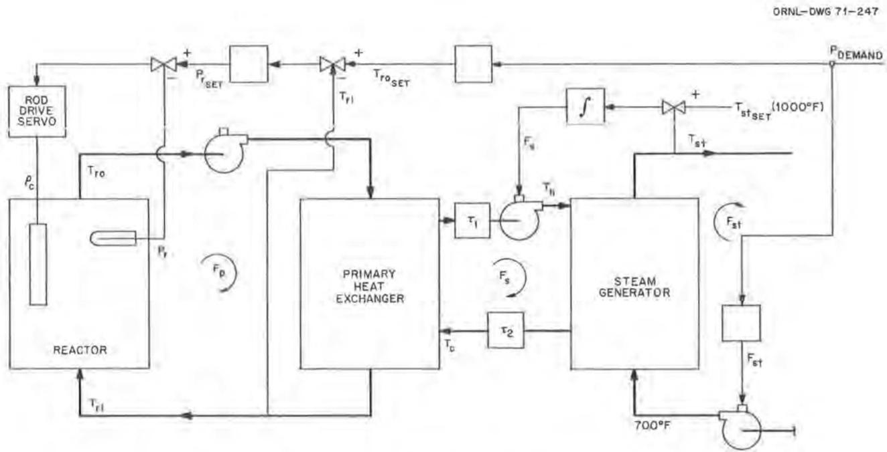  
Fig. 10.1. Simulation model of plant and control system.

function of dynamic load. Analog simulations of the plant employing abbreviated models for the reactor core, primary heat exchanger, and steam generator[115] indicate that plant load control can be accomplished in this way. The control system also is capable of canceling small reactivity perturbations.

The small isothermal temperature coefficient of reactivity in the reactor core implies that only modest amounts of control reactivity are needed to accomplish plant load maneuvering. For a normal load change of 100 to $50\%$ at a rate of $5\%/\mathrm{min}$ , the maximum amount of reactivity required was $0.06\% \delta k/k$ , reduced at a rate of $-0.0053\% \delta k/k$ per minute.[11]

# 10.8 CONTROL FOR FAST SHUTDOWN

# W. H. Sides

A fast-acting load and power reduction system may be required to enable the plant to remain in operation if failures occur in the heat transfer system. Such a system could avoid total shutdown of the plant and also facilitate resumption of normal operation when conditions permit.

Upon loss of primary- or secondary-salt flow in a loop due to the failure of a primary or secondary pump or due to some failure of piping or components which necessitates reduction of flow, care must be taken to prevent undesirably low temperatures of the salts. For example, if the flow of secondary salt in a loop is stopped or greatly reduced, the transit time of the salt through the four steam generators associated with that

loop increases, and the secondary-salt cold leg temperature decreases. To prevent freezing of the secondary salt in the shell of the steam generator near the feedwater inlet, the flow of steam through the tubes must be decreased. A reduction in load by about $25\%$ must take place upon the loss of flow in a secondary-salt loop at a rate sufficient to prevent excessively low coolant-salt temperatures. The fuel-salt temperature in the primary heat exchanger tends to increase upon loss of secondary-salt flow and thus does not approach the freezing point.

If there is a loss of fuel-salt flow, the temperature of the salt in the primary heat exchanger decreases to undesirably low values. The freezing point of the primary salt is approximately $930^{\circ}\mathrm{F}$ , and the temperature of the secondary salt entering the primary heat exchanger at design point is $850^{\circ}\mathrm{F}$ . Analog simulations have shown that due to transit time of the secondary salt in the piping from the steam generators to the primary heat exchanger, a reduction in steam flow in the steam generators does not reflect rapidly enough in the primary exchanger to prevent low temperature of the fuel salt in the tubes. Loss of primary flow in a loop must therefore be followed by a reduction in secondary-salt flow, and, as discussed above, a major reduction in secondary-salt flow requires a reduction in steam flow through the four steam generators associated with the particular loop.

In summary, loss of primary or secondary flow in a loop requires that in the loop affected the reactor system must be decoupled from the steam system to

prevent low temperatures from occurring in the salts. If secondary flow is reduced, the associated steam flow must be reduced, but the associated primary flow need not be reduced. If primary flow is reduced, both the associated secondary-salt and steam flows must be reduced to prevent low salt temperatures. In any of these situations the reactor power must be quickly lowered in proportion to the net reduction in steam load. Similarly, upon large or total loss of load, it may be necessary to assist the control system by providing fast power reduction and perhaps fast reduction of secondary-salt flow rate to keep system temperatures within acceptable bounds.

# 10.9 STARTUP, STANDBY, AND SHUTDOWN PROCEDURES

E.C.Hise

# 10.9.1 General

This preliminary study of the startup, standby, and shutdown procedures was carried only to the point of indicating feasibility. Although they have not had the benefit of close study or optimization, the arrangements do not appear more complicated or restrictive than the systems now in use in large supercritical-pressure steam stations. The procedures would lend themselves to computerized program control, as is presently the trend.

The freezing temperatures of the primary and secondary salts are such that the salt systems must be filled and circulating isothermally at $1000^{\circ}\mathrm{F}$ before power withdrawal can be initiated by decreasing the coolant-salt temperature. To avoid freezing of the salt and to prevent excessive temperature gradients, the minimum feedwater temperature to the steam generators must vary between $1000^{\circ}\mathrm{F}$ at zero load and $700^{\circ}\mathrm{F}$ in the 8 to $100\%$ power range. In addition, the afterheat load in the reactor system, which decays essentially as indicated in Fig. 6.4, requires that the feedwater and heat rejection systems remain in operation following shutdown of the main steam system. Most of the special systems and equipment needed to handle the startup and shutdown conditions in an MSBR station are therefore associated with the steam-power system. The requirements impose some departure from the equivalent systems used in conventional fossil-fired supercritical-pressure steam plants and will require further study.

The proposed general arrangement of the MSBR steam system was described in Sect. 5, and the overall steam system flowsheet was shown in Fig. 5.1. For convenience, pertinent aspects of that flowsheet are

included in the startup, standby, and shutdown flow-sheet, Fig. 10.2. (The letters used in the following discussion refer to Fig. 10.2.)

Briefly, steam at 3500 psia and $1000^{\circ}\mathrm{F}$ is supplied by 16 steam generators SG. Superheat control is partially by varying the coolant-salt circulation rate and by vaporizing a small amount of $700^{\circ}\mathrm{F}$ water into the outlet steam at the attemperator A. Feedwater at $700^{\circ}\mathrm{F}$ is normally supplied by mixing steam with the $550^{\circ}\mathrm{F}$ feedwater leaving the top extraction heater TEH in a mixing chamber M. The steam used for this feedwater heating is the $867^{\circ}\mathrm{F}$ exit heating steam from the reheat steam preheater RSP. The heated feedwater is raised to about 3800 psia inlet steam generator pressure by boiler feedwater pressure-booster pumps PBP. The $552^{\circ}\mathrm{F}$ exhaust of the high-pressure turbine HPT is first preheated to about $650^{\circ}\mathrm{F}$ in a heat exchanger RSP supplied with 3600-psia, $1000^{\circ}\mathrm{F}$ steam from the steam generator outlet. The reheat steam then enters the reheaters RH, in which coolant salt is circulated to raise the steam temperature to $1000^{\circ}\mathrm{F}$ . Reheat temperature control is by varying the coolant-salt flow rate. The feedwater system contains steam-driven feedwater pumps BFP, conventional feedwater heaters, condensers, full-flow demineralizers, deaerators, etc.

The equipment necessary for startup, hot standby, and heat rejection is also included in the steam system. Briefly, this consists of an auxiliary startup boiler $AB$ , either oil or gas fired, which can deliver supercritical-pressure steam at $1000^{\circ}\mathrm{F}$ , an associated auxiliary boiler feed pump $A-BFP$ , a desuperheater $DSH$ , a steam dryer $SD$ , and various throttling and letdown valves, as will be discussed below. A standby-power steam turbine generator $S-TG$ of about $10\mathrm{MW(e)}$ capacity, as discussed in Sect. 11.1, may also be considered in conjunction with the startup and standby systems.

It may be noted in the flowsheet, Fig. 10.2, that the boiler feed pump drive turbine BFP-T is supplied both with extracted steam from the high-pressure turbine and from the dryer SD in the standby system in order to assure continued operation of the feed pumps when the flow of steam to the main turbines is interrupted for any reason. Steam for the dryer is obtained by taking off a small portion of the steam generator outlet steam at the boiler throttle valve BTV, reducing its pressure to 1100 psia $(860^{\circ}\mathrm{F})$ through the boiler extraction valve BE, and reheating it to about $950^{\circ}\mathrm{F}$ in the steam dryer SD by means of heat exchange with some of the 3600 psia, $1000^{\circ}\mathrm{F}$ prime steam. Steam from the dryer also plays an important part in startup, restart, and shutdown operations, as will be explained below.

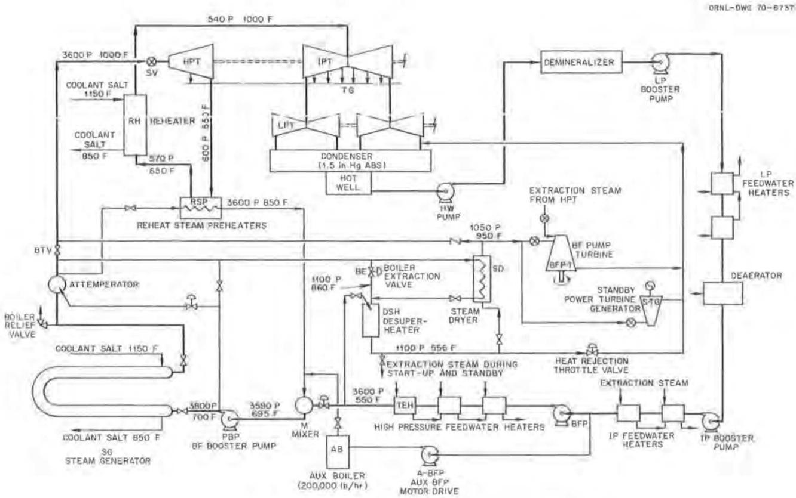  
Fig. 10.2. MSBR steam plant startup and shutdown system.

# 10.9.2 Startup Procedures

There are two startup procedures to be considered: (1) cold startup, with all systems cold and empty, and (2) hot restart from a hot standby condition. As in any thermal power station, the ability to hold the system in hot standby and to achieve quick starts from this condition is desirable to avoid excessive outage times for the plant.

10.9.2.1 Cold Start. A normal startup from the cold-empty condition proceeds as follows: The primary and secondary cell electric heaters are turned on, and the primary and secondary circulation pumps are started to circulate helium in the salt systems. When the temperature of the secondary system reaches $850^{\circ}\mathrm{F}$ , the loop is filled with coolant salt from the heated drain tank, and salt circulation is started. When the primary system reaches $1000^{\circ}\mathrm{F}$ , it is filled from the fuel-salt drain tank, and salt circulation is commenced. Both salt systems will continue to be circulated isothermally at $1000^{\circ}\mathrm{F}$ until power escalation is started. The primary- and secondary-salt flow rates are at the levels required for the zero-power mode.

The reactor is made critical at essentially zero power using the methods discussed above. This operation requires removal of safety rods and further addition of reactivity by insertion of graphite control rods under

the surveillance of startup instrumentation and a flux level control system. When the power reaches an appropriate level, which is still below the sensible power generating range, the automatic neutron flux level controller is used to control the power.

Concurrently with the salt systems being electrically heated, the steam system is warmed and brought to operating conditions by means of an oil- or gas-fired auxiliary boiler. Deaeration and demineralization of the feedwater and warmup of piping, feedwater heaters, turbines, etc., proceed in a conventional manner with steam taken from this auxiliary boiler. To avoid excessive thermal gradients in a steam generator, it must be at nearly full operating conditions of 3600 psia and $1000^{\circ}\mathrm{F}$ before steam is admitted. As the auxiliary boiler is being raised to this pressure, steam from it is throttled through the boiler extraction valve $BE$ and through the desuperheater $DSH$ , and is used for feedwater heating, for warming and rolling the boiler feed pump drive turbines $BFP-T$ , and for warming the high-pressure feedwater heaters. When the auxiliary boiler reaches full pressure and temperature, circulation can be started through the steam generator.

When the steam system is ready to take on load, the set point of the flux controller is adjusted as required to maintain the desired salt temperatures as the feedwater flow is increased. The feedwater temperature to the

steam generator is reduced by tempering the feed steam with $550^{\circ}\mathrm{F}$ water in the mixing chamber $M$ . As the steam load is slowly increased the reactor power is matched to the load, and salt temperatures are kept at the desired level by manipulating the flux set point. (In the 2 to $10\%$ power range, temperature changes are slow, and control should not be difficult.) When the load reaches 800,000 lb/hr, or about 8 to $10\%$ of full load, the reactor can be put in a temperature control mode instead of a flux control mode after matching the temperature set point with the existing outlet temperature. The load is held essentially constant until the system comes to equilibrium, at which point the reactor outlet temperature set point is adjusted to meet the requirements for subsequent load-following control. The boiler feedwater pressure-booster pumps PBP are then started to raise the steam generator inlet pressure to about 3800 psia, and the auxiliary boiler and its feedwater pump can be taken off the line. The system is now self-supporting at about $8\%$ load.

At this point in the startup procedure, part of the steam generator output is going to the mixer $M$ via the reheat steam preheater, and the remaining steam is going through the boiler extraction valve $BE$ to drive the main boiler feed pumps, etc. The main turbines, which have previously been warmed, can now be gradually brought up to speed and temperature, first using steam from the hot standby equipment and then switching to steam taken directly from the steam generators.

The load is next increased to about $20\%$ at which time the steam temperature controller is activated. At this power level the "normal" control system regulates the reactor outlet temperature as a function of load, and the steam temperature controller holds the steam temperature at $1000^{\circ}\mathrm{F}$ . To prevent undesirable transients as the control system is first activated, the various system parameters and set points are adjusted to the requirements of the existing power demand prior to switching to fully automatic control.

More exact definition of the conditions at which the various steps of the startup program are initiated, as well as allowable rates of change of the variables, was beyond the scope of the present study.

10.9.2.2 Hot Standby and Startup. On reduction of the main turbine load and closure of the stop valve $SV$ , steam will be immediately let down through the boiler extraction valve $BE$ , through the desuperheater and heat rejection valve $HRTV$ , and then to the main turbine condenser. Except for extreme situations of sudden loss of turbine load, and possibly not then, the

boiler pressure-relief valves need not vent steam to the atmosphere.

A portion of the steam from the steam generator can be used to drive the boiler feed pump turbine BFP-T and to continue circulation of feedwater to the steam generators for heat removal and rejection to the turbine condensers. Another portion of the steam will continue to drive the standby steam turbine-generator to supply standby power (if not available from the electric power grid through the station service transformer) to drive the salt circulation pumps, some of the main condensing water supply pumps, and the hot well, pressure booster, and other pumps required to maintain the feedwater system operative.

Afterheat from the reactor system will continue to be transferred to the steam system and maintain it at operating temperature for several hours, depending upon the burden of fission products in the system. As this heat source decays, the auxiliary boiler can be started if it is desired to maintain the system in the hot standby condition. The time required for restart from this mode would be limited by the acceptable rate of temperature rise in the main turbines, as in conventional steam systems.

# 10.9.3 Normal Shutdown

The normal shutdown procedure is for the system power to be reduced under control of the operating circuits (until about $8\%$ of full-load power is reached) by gradually reducing the flow to the main turbines to zero and at the same time transferring the generated steam to the hot standby system through the boiler extraction valve $BE$ and thence to the turbine condenser. If it is desired to stay in the hot standby condition the auxiliary boiler can be started; if not, the main turbine can be allowed to cool, the rate being controlled by admitting some steam from the steam dryer $SD$ through the turbine seals and warmup system. Feedwater will continue to be supplied to as many of the steam generators as required (probably one or two) to remove reactor afterheat and to maintain the desired salt temperature profiles. After about ten days of afterheat removal (depending on the operating history of the reactor) the fuel salt will be transferred to the drain tank. The cell electric heaters will maintain the cell temperature high enough for the coolant salt to remain in the molten condition. With termination of all steam generation the steam system can be allowed to cool.

# 11. Auxiliary Systems

# 11.1 AUXILIARY ELECTRIC POWER

E. S. Bettis

Even though the MSBR is designed on the basis that the safety of the public will not be endangered even if there were a complete loss of electric power, it is highly desirable that a small amount of power be available to operate the controls system and certain other components to prevent possible damage to equipment in particular emergency situations.

The MSBR will probably use an auxiliary power source for instruments and controls the same as that employed successfully at the MSRE. This was a system of storage batteries kept charged by an ac-dc motor-generator (M-G) set. Without the M-G set operative the batteries can deliver $100\mathrm{kW}$ of power at $250\mathrm{V}$ for at least an hour. In addition to freedom from interruption of the power supply, use of the batteries also eliminates concern for any possible transients in voltage, etc., that could be induced if there were other connected equipment. A static dc-ac inverter changes the power from the batteries into the ac required for the instruments and controls circuits.

In addition to the relatively small amount of auxiliary power needed for instruments and controls, standby power is also required for the salt circulation pumps, freeze-valve coolant pumps, cell cooling systems, etc. A delay of several minutes can be tolerated in restoring these items to service, however. The total connected load for this type of equipment cannot be precisely estimated at this time, but even with ample allowances for uncertainties, it should not exceed about $10\mathrm{MW(e)}$

Several possible methods were considered for producing the standby power. It was decided to use auxiliary steam turbine-generators, although diesel-driven generators and gas turbines were also likely candidates. The steam turbines seem a logical choice because an ample source of steam is always available, either from the afterheat-removal system or from the auxiliary startup boiler. As shown in the flowsheet, Fig.

10.2, the auxiliary steam turbines take their steam from the steam dryer in the startup system. These units must be kept at operating temperature at all times in any case, since it is part of the heat-rejection system for nuclear afterheat and would be required in event of a main turbine trip and loss of plant load. The supply of steam from the afterheat disposal system is sufficient to drive the auxiliary turbines for several hours. Should the MSBR be isolated from the power grid for a longer period, the auxiliary startup boiler can be fired to supply the necessary steam.

# 11.2 CELL ELECTRIC HEATING SYSTEMS

E. S. Bettis

All the cells containing fuel or coolant salts (except the chemical processing cell) operate at ambient temperatures of 1000 to $1100^{\circ}\mathrm{F}$ . Heat losses from the equipment are sufficient to maintain most of the cells at this temperature during normal operation of the MSBR. During initial warmups, downtime, or possibly at very low reactor power levels, electric space heaters are used to heat the cells. The cells can be likened to low-temperature electrically heated furnaces, with thermal insulation in the walls to reduce heat losses. The biological shielding is cooled to prevent the concrete temperature from exceeding $150^{\circ}\mathrm{F}$ . The heater element design is essentially the same as that used successfully in the MSRE for over five years.

The heater units consist of two lengths of $3/8$ -in.-diam $\times$ 0.035-in.-wall-thickness Inconel tubing about 20 ft long with the two ends welded together at the bottom to form a hairpin shape, as shown in Fig. 11.1. Each unit is contained within a thimble of a similar hairpin shape made from 2-in.-OD stainless steel tubing with Lavite bushings spaced at 3-ft intervals to center the heater within the thimble. The heaters are designed for 120-V, three-phase power from a solid-state-controlled supply which limits the thimble surface to about $1200^{\circ}\mathrm{F}$ .

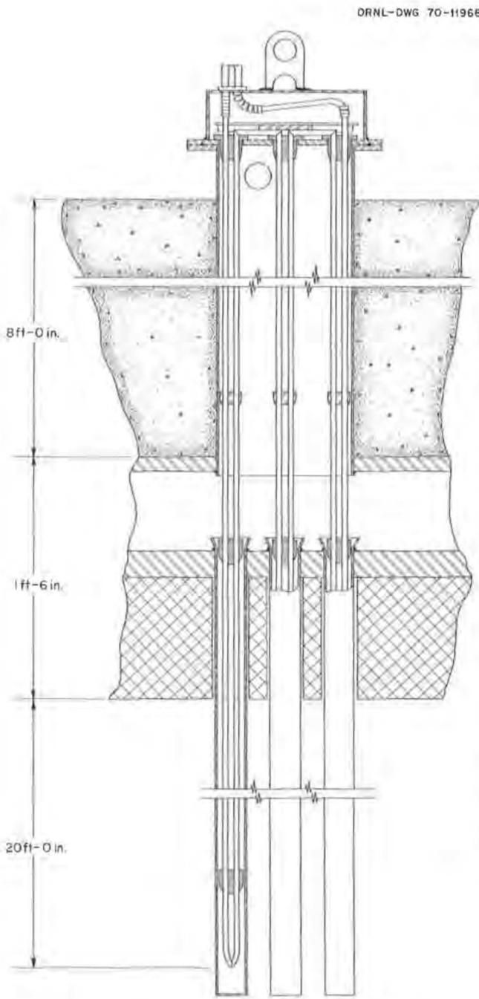  
Fig. 11.1. Electric cell heating unit cluster.

The heater element electrical leads are copper rods brazed to the top ends and extending about 10 ft through the top shielding structure of the cells. The exit cooling gas from the cell liner space passes through the heater lead penetrations to cool the copper rods. Three heaters are connected in series to reduce the number of connector leads and penetrations required. A removable flanged cover encloses each group of three heaters to

collect the exit cooling gas and return it to the circulating system. The electrical leads pass through gas-tight electrically insulated penetrations in these cover boxes.

The heater thimbles are welded to the inner liner of the cell and thus become part of the containment system. With this arrangement the heater elements can be withdrawn without disturbing the integrity of the containment. A total of 592 thimbles are arranged around the periphery of the reactor cell in such a way as to avoid too close proximity to cell equipment. There are eight symmetrical groupings of 74 heaters each. Heaters in the drain tank and steam-generating cells are similarly arranged. Some of the heaters in the cells will be used as spares, thus making it possible to postpone a shutdown of the reactor in event a heater repair becomes necessary.

The cell heating loads and heater data are given in Table 11.1.

Table 11.1. Cell heating loads and electric heater data   

<table><tr><td></td><td>Reactor cell</td><td>\( Steam\ cell^a \)</td><td>Drain tank cell</td></tr><tr><td>Heat loss at 1100°cell temperature, kW</td><td>413</td><td>195</td><td>122</td></tr><tr><td>Cell contents heatup load, kWh</td><td>86,000</td><td>5000</td><td>~10,000</td></tr><tr><td>Heatup power, kW</td><td>413</td><td>195</td><td>122</td></tr><tr><td>Approximate heatup time, days</td><td>9</td><td>1</td><td>6</td></tr><tr><td>Heater length, ft</td><td>40</td><td>40</td><td>40</td></tr><tr><td>Kilowatts per heater</td><td>2.66</td><td>2.66</td><td>2.66</td></tr><tr><td>Number heaters required</td><td>312</td><td>147</td><td>93</td></tr><tr><td>Number installed</td><td>592</td><td>147</td><td>186</td></tr></table>

$a_{\mathrm{Each of four}}$

# 11.3 RADIOACTIVE MATERIAL DISPOSAL SYSTEM

E. S. Bettis

Although it is recognized that storage and disposal of radioactive materials is subject to many regulations and would affect siting considerations, the reference MSBR design assumes that it will be possible to retain within the shielded containment all radioactive debris accumulated over the design lifetime of the plant. This waste material would include solid fission products from the chemical processing plant, spent cores taken from the reactor vessel, failed pieces of equipment which could not be salvaged, and other radioactive materials.

A waste pit provides the necessary storage space. The pit is a circular cell about 72 ft in diameter and 30 ft deep located directly beneath the reactor cell (see Fig. 13.3). Calculations of the heat production in the waste materials give equilibrium values of between 100 and $600\mathrm{kW}$ . The cell is cooled by a circulating gas, probably nitrogen, which passes through the cell and over a water-cooled coil. The circulating fans and the heat exchangers are located in a shielded and sealed cell immediately adjacent to the waste storage cell. The heat exchanger has stop valves in the water system in event of a break or leak in the tubes. It is estimated that even if all the water in the coil were to leak into the cell and be vaporized, there would be an insignificant rise in the cell pressure. Redundancy could be provided in the cooling system if required.

It may be practical to containerize the fission products from the chemical processing system before depositing them in the storage cell. Residue resulting from decontamination of the crane bay and other areas will also be packaged before being stored in the waste cell.

No specific plans have been made for removal of wastes from the storage pit after an MSBR station has been permanently shut down for obsolescence or other reasons. It may be permissible to pour concrete into the waste pit to encapsulate the material. The MSBR design could obviously be modified to accommodate shipment of radioactive wastes to disposal sites, should this be required.

# 12. Maintenance and Repair Systems

E.C.Hise

# 12.1 GENERAL

It is evident that a practical method of remote maintenance and a method for replacing the core graphite are essential for the success of the MSBR conceptual design presented in this report. Since the size and radioactivity level of some of the items of MSBR equipment are greater than the present range of maintenance experience, many of the procedures remain to be developed. To reach a reasonably valid judgment as to the feasibility of the maintenance arrangements, it is necessary to visualize each of the major steps required.

The plan for maintenance of the MSBR follows the technology developed for previous fluid-fuel reactors. All the radioactive MSBR equipment is installed in containment cells having the overhead shielding arranged in removable sections to permit access from the top. The systems will be designed so that each piece of equipment, its supports, electrical instrumentation, process piping connections, etc., may be viewed from above and be accessible when using remotely operated tools. The usual procedure would be to remove and replace a failed component rather than to make repairs in place, since the latter would usually result in a longer plant downtime. The defective unit would be transported in a shielded carrier to a hot cell within the reactor complex for examination and be either repaired or discarded to the waste storage cell.

Some of the MSBR items requiring maintenance will be comparable in size and type with the equipment used in the MSRE, for which there is a valuable background of practical maintenance experience. The design of the special tools and MSRE maintenance procedures were described by Blumberg116,117 and in MSR progress reports.2,3,5,9 A feasible method for remotely cutting and welding radioactive piping is being developed by Holz.118

Since most of the cell areas cannot be reentered once the reactor has generated neutrons, maintenance procedures must be carefully planned, with much of the special equipment and fixtures installed and tested as the plant is constructed. The maintenance system must therefore be an integral part of the plant design.

The investment required for the equipment needed for major maintenance operations has been included as a capital cost for an MSBR station. Relatively small and routine maintenance operations are considered as a plant operating cost. The expense of the materials and special labor required for periodic replacement of the core graphite is treated as a separate account (see Sect. 15 and Table D.15).

The MSBR maintenance requirements fit into four general classes:

Class I - permanent equipment. This category contains all those items which should last the design lifetime of the plant and will normally require no maintenance. Examples are the reactor vessel, the pump vessels, primary heat exchanger shells, the fuel-salt drain tank, thermal shielding, thermal insulation, connecting process piping, etc. Although essentially no provisions are included with the installation for maintenance of these items, it would be possible to replace them using specially prepared facilities and at the expense of a long plant outage. (All of this equipment, however, does have built-in provisions for in-service inspection.)

Class II - equipment allowing direct maintenance. This group includes the items which probably can be approached for direct maintenance once the coolant salt has been drained and flushed and a decay period of several days has elapsed. The steam generators, heaters, coolant-salt pumps, and the equipment in the heat-rejection cell fall into this class. In the unlikely event that a component did become radioactive, its removal would be treated as a class III or IV item, discussed below. Once the source of activity was

removed from the cell, cleanup and component replacement could proceed in the normal fashion using direct maintenance.

Class III equipment requiring semidirect maintenance. Much of the equipment in the off-gas and chemical processing cells, such as pumps, blowers, valves, processing vessels, filters, etc., will become radioactive. In general, these items are of relatively small size and are comparable with MSRE equipment size. The in-cell maintenance methods for this class of equipment will, however, require appropriate changes in the shielding, etc., to accommodate MSBR radiation levels, which may be a factor of 10 or more higher than experienced in the MSRE.

Class IV large equipment requiring remote maintenance. This group includes items which are clearly beyond present experience because of a combination of size, radiation level, afterheat removal, and disposal considerations. Examples are the pump rotary element, the primary heat exchanger bundle, etc. The principal maintenance operation falling into this classification is replacement of the reactor core moderator assembly. Since this operation must be repeated several times during the lifetime of the plant, the procedures can be planned in considerable detail.

# 12.2 SEMIDIRECT MAINTENANCE PROCEDURES

To perform maintenance on class III items, and those in class II if the activity level requires it, the roof section, or plug, immediately above the component is removed and set aside. A work shield similar to that shown in Fig. 12.1 is then placed over the opening. The work shield would have viewing ports and lights, openings for insertion of periscopes, extension tools, and other maintenance equipment. Movement of the slides and eccentrics in the shield can place any of the openings in the shield over the desired point. The mechanical operations of disconnecting and reconnecting components are done with extension tools inserted through the work shield. A failed component is drawn through the work shield into a shielded carrier for transport to a hot cell for repair or disposal.

# 12.3 REMOTE MAINTENANCE PROCEDURES

Replacement of the reactor core assembly is one of the more difficult maintenance operations both because of the size of the equipment and the intensity of the radioactivity encountered. Special maintenance equipment will be required, the major item being a 20-ft-diam, 40-ft-high shielded transport cask for the reactor core assembly. As shown in Fig. 12.2, the cask is an

integral part of a polar crane which can be rotated to cover all points in the reactor building. The cask moves laterally (but not vertically) and has a 240-ton-capacity remotely controlled hoisting mechanism on top to draw the core assembly up into the cask. The carbon steel walls of the cask are about 2 in. thick, which is sufficient to reduce the radiation level on contact with the outside of the cask to about $1000\mathrm{R / hr}$ after a ten-day decay period for the core. (The activity level on contact with the outside wall of the reactor building would be less than $100\mathrm{mR / hr}$ .) After this decay time the estimated heat generation in the core assembly is about $0.25\mathrm{MW}$ , as shown in Fig. 3.25. Conservative estimates indicate that this amount of heat can be safely dissipated through the cask wall and that no special cooling system for the cask will be required. The cask is provided with an adjustable sealing ring and shield at the bottom to provide a tight connection with the cell closure transition pieces described below. The cask can be closed at the bottom with a two-leaf gate valve, or shutter.

As shown in Fig. 12.2, a domed maintenance containment vessel is permanently installed over the top of the reactor cell. It is relatively thin walled and is designed primarily to contain airborne contaminants during maintenance operations. It is provided with access ports over the fuel-salt pumps and heat exchangers and has a central 24-ft-diam cover which can be removed to provide access to the shield plugs covering the reactor vessel. This top opening in the maintenance vessel has an inner extension in the form of a cylinder with a four-leaf gate valve at the bottom, termed the reactor vessel maintenance closure in Fig. 12.2, which extends to the top elevation of the roof plugs. The cylinder serves as a transition piece between the reactor vessel and the transport cask to provide positive containment during the core hoisting operation. It is equipped with a high-capacity exhaust fan to assure an inward movement of air through the opening. The gate valve prevents convective circulation of gases from the reactor cell while the reactor vessel is open.

A reactor work shield will also be required. It has the same dimensions as the roof plug covering the reactor vessel and is installed in its place to provide viewing ports and tool access for engaging the moderator lifting rods and other semiremote maintenance operations.

Transition pieces are also provided for temporarily connecting the transport cask to the spent equipment cells and to the new core replacement cell to prevent escape of particulates into the high-bay area.

A 150-ton conventional hoist, shown in Fig. 12.2, also travels on the polar crane to handle work shields,

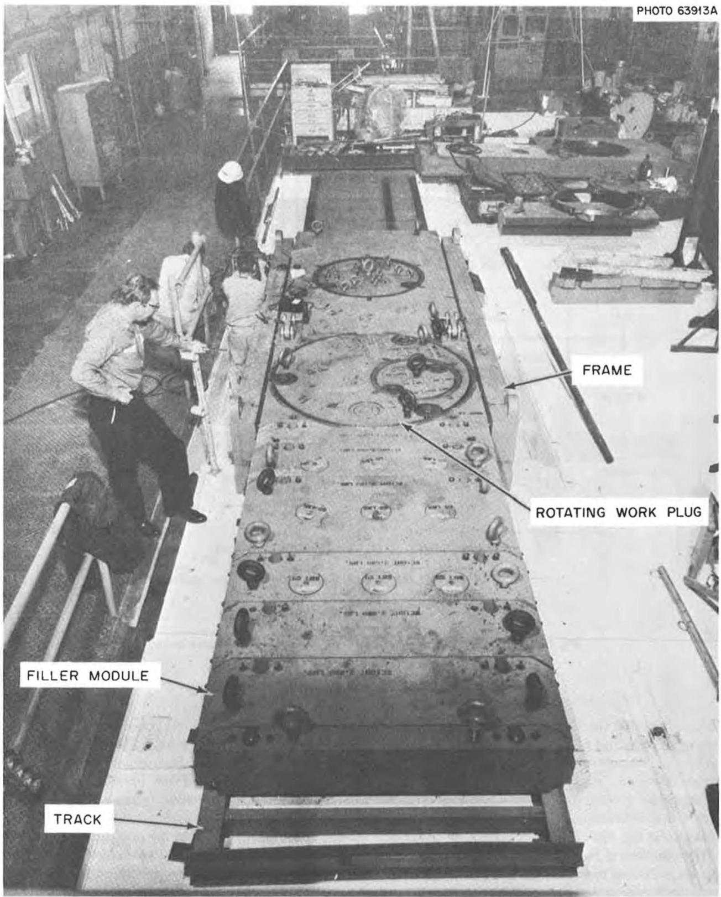  
Fig. 12.1. Portable work shield for MSBR reactor cell.

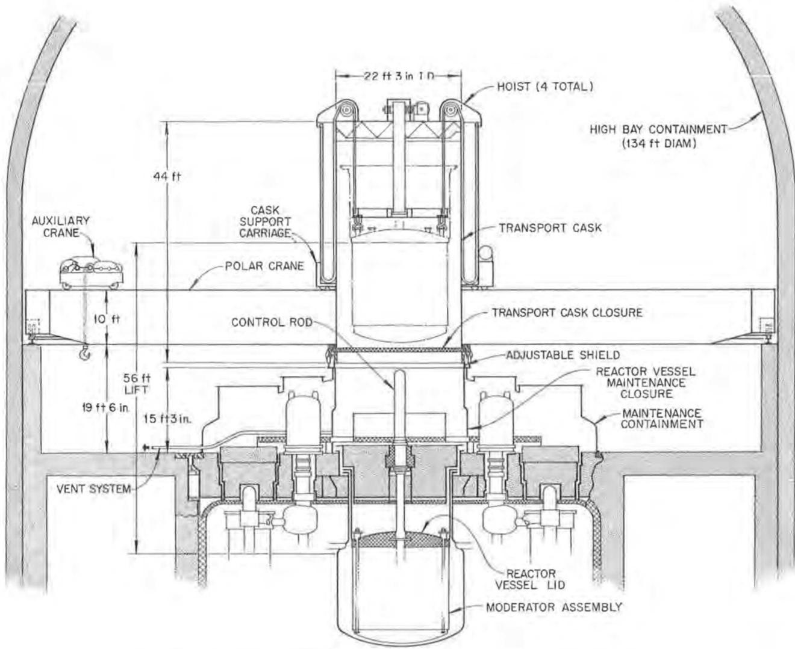  
Fig. 12.2. MSBR reactor core assembly transport cask and maintenance system.

transition pieces, etc. This hoist, as well as those on the transport cask, and other equipment such as the polar crane, the reactor vessel maintenance closure, surveillance television, etc., can be controlled from the maintenance control room. This room is a protected area with shielded windows overlooking the high bay, as indicated in Fig. 13.4.

The functions of the equipment can best be explained by the following brief description of the steps used in replacing a core moderator assembly.

During the reactor cooldown period, transition pieces are set up over the new core replacement cell and over the spent core storage cell (see Fig. 13.5). At the end of

about ten days the central cover in the maintenance containment vessel is set aside. The high-volume exhaust system from the maintenance vessel assures a controlled movement of air in the working zone. Through direct and semiremote means the control rod drive mechanism is disconnected at the elevation of the top of the shield plug, and the mechanism is drawn up into a cask, sealed, and stored in the high-bay area awaiting reinstallation. The control rod tube opening into the reactor vessel is closed with a blind flange. The holddown bolts for the reactor vessel top head are removed, and the shield plug is prepared for lift. The auxiliary hoist is engaged with the shield plug, and the

hoist is initiated to assure that it is clear. At this juncture the maintenance crew vacates the high-bay area.

From the maintenance control room the reactor vessel shield plug is lifted and set aside. After the reactor work shield is installed in its place, the maintenance crew can return to the high bay. Using semiremote methods through the work shield, the moderator assembly lifting rod ports are opened and the lifting rods are engaged (see Fig. 3.7). The 150-ton auxiliary hoist is engaged with the work shield and prepared for lift. The high-bay area is again vacated.

By operating the hoist from the control room, the work shield is removed and set aside. The transport cask is positioned over the reactor vessel, and the adjustable shield is closed to provide a good seal with the maintenance vessel. The four cask hoists are engaged to the eight lifting rods, and the core assembly is carefully hoisted into the transport cask. The valves at the bottom of the cask and at the top of the cell are then closed, the adjustable shield at the bottom of the cell is released, and the cask is moved into position over the spent storage cell.

The cask is engaged with the transition piece over the spent core storage cell, the lower valve in the cask is opened, and the moderator assembly is lowered into the cell. The assembly is supported by the top head flange in the same manner as it was installed in the reactor cell. The cask valve is closed, and the cask is moved to one side to permit the auxiliary hoist to place a shield plug over the spent core storage cell and to place the work shield over the reactor vessel.

After the transport cask has been decontaminated, the reactor vessel work shield is reinstalled, and the high-bay area is again made safe for occupancy, the maintenance crew can return to inspect the reactor vessel. Optical and ultrasonic equipment is operated through the work shield to inspect vessel welds, etc., and to assure that the vessel is ready for installation of a new moderator assembly.

After again clearing the high bay of personnel, the auxiliary hoist is used to set aside the work shield. The reactor vessel maintenance valve is closed to maintain containment as the shield is lifted. The new moderator assembly, previously made ready and standing by in the new core replacement cell, is then hoisted into the transport cask and moved into position above the reactor vessel. After sealing the cask to the maintenance closure, the maintenance valve is opened, and the new core is carefully lowered into place inside the reactor vessel. About a 2-in. radial clearance has been provided for the assembly, and it is not necessary to observe any

rotational orientation of the moderator with respect to the vessel. The auxiliary hoist is then used to replace the work shield.

Personnel can then return to the high bay to perform the semiremote operations of disengaging the lifting rods and resealing the lifting rod ports in the top head of the vessel. Operating from the maintenance control room again, the work shield is removed, and the permanent reactor shield plug is installed. Personnel can then seal the vessel closure by direct approach and also install the control rod drives. The system can then be leak tested and prepared for operation.

# 12.4 GRAPHITE DISPOSAL AND ALTERNATE REACTOR VESSEL HEAD RECLAMATION

An MSBR reactor core assembly is estimated to have a useful full-power life of about four years. During this operating period the spent core assembly would be disposed of, and the alternate reactor vessel head, with its attached reflector graphite and upper cylinder extension, would be prepared for reuse. The spent core storage cell would also be cleared to receive the next core assembly, and a new core would be prepared in the core replacement cell.

The spent core storage cell is equipped with viewing windows, manipulators, and tooling for dismantling the assembly. The graphite moderator sticks are removed and broken into short lengths and deposited in the waste storage cell beneath the reactor, as mentioned in Sect. 13.6. The Hastelloy N support plate for the graphite will also be cut into smaller pieces and stored in the waste cell.

After an extended decay time the top head and its attached graphite reflector, which will be reused along with the head, are decontaminated as much as possible by wiping and vacuuming.

A new shop-assembled core is brought into the reactor building through the air lock shown in Fig. 13.5 and is set into the new core replacement cell. The alternate top head for the reactor vessel is then brought from the spent core storage cell by means of the transport cask. Using semiremote maintenance procedures through a work shield, the lifting rods are installed and the reactor vessel closure seal rings on the head are replaced. The assembly is now ready for installation when needed.

The spent core storage cell is then decontaminated as much as possible and cleared for the next maintenance operation.

# 12.5 DECONTAMINATION

On the basis of past experience with the MSRE, few decontamination problems are likely to arise. The contamination can be almost entirely restricted to the reactor equipment cells. The tools are bagged on withdrawal from the cell and, along with the transport casks, are sent to decontamination. MSRE experience has been that particulate contamination is readily removed by scrubbing with high-pressure water jets alone or with the aid of detergents. Occasionally an inhibited acid may be required.

The large transport cask will become contaminated after it is used to move the reactor core assembly to the storage cell. It must be decontaminated to a lower radiation level before the maintenance crew can enter the high-bay area. It is cleaned in place on the polar crane by mounting a catch pan beneath it, and high-pressure pumps are used to circulate a decontaminating fluid through nozzles which can be manipulated to clean all portions of the interior.

# 13. Buildings and Containment

E. S. Bettis H. L. Watts H. M. Poly

# 13.1 GENERAL

Plan and elevation layout drawings for the station are shown in Figs. 13.1 and 13.2. The principal structures are the cylindrical reactor building, the steam-generator bay, the steam piping and feedwater heater bay, and the turbine-generator bay. The reactor and steam-generator facilities are located on one reinforced concrete pad and the remaining structures on another. With this arrangement relative displacements due to seismic disturbances would not threaten the integrity of the containment, since no piping or connections containing radioactive materials would cross the boundary between the pads. The plant site is briefly discussed in Sect. 14.

# 13.2 REACTOR BUILDING

One of the primary functions of the cylindrical reactor building is to provide containment and biological shielding during the maintenance operation of removing and replacing the reactor core assembly. During normal operation the reactor cell is the primary containment.

The cylindrical portion of the reactor building is shown in the elevation drawing in Fig. 13.3. Plan views at the three major levels are shown in Fig. 13.4 (crane bay), Fig. 13.5 (upper level), and Fig. 13.6 (lower level). The building is 189 ft high and 134 ft in diameter. Excavation for the reactor building will be to

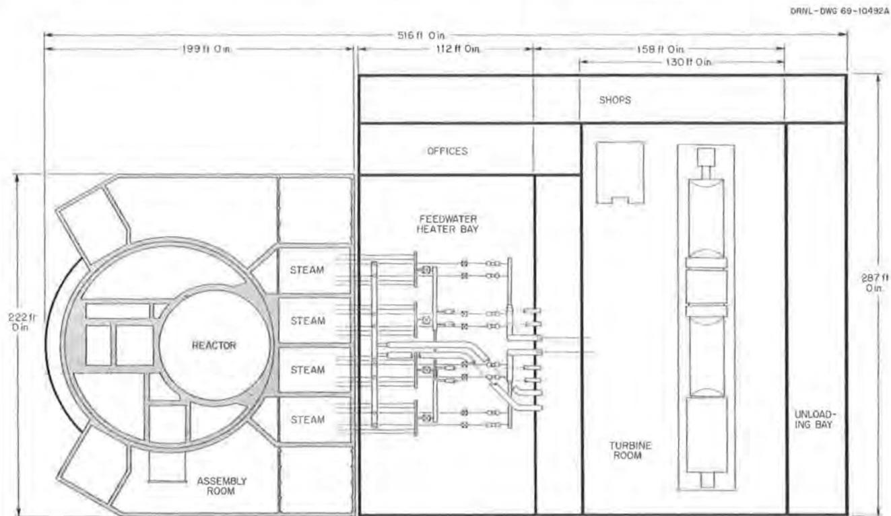  
Fig. 13.1. Overall plan view of MSBR power station.

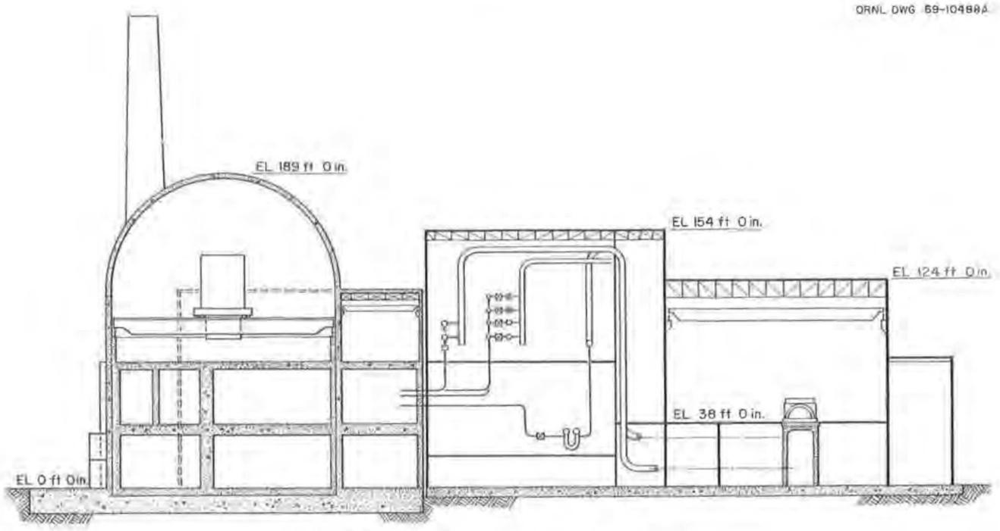  
Fig. 13.2. Sectional elevation of MSBR power station.

the depth required for firm support of the monolithic concrete pad upon which it rests. Finished grade level thus depends upon particular site conditions and would preferably be with about two-thirds of the building showing above ground. The grade level shown in Fig. 13.2 corresponds to the AEC typical site condition having the top of the limestone formation about 8 ft below grade.

The reactor cell is located on the first level of the reactor building, as shown in Figs. 13.3 and 13.5. The cell is about 72 ft in inside diameter and 30 ft deep with about 8 ft of concrete biological shielding on the sides and top, the latter consisting of two layers of removable roof plugs which permit access for installation and maintenance of equipment. The double containment and other construction features of the reactor cell are described in more detail in Sect. 13.3.

The first level of the reactor building also contains cells for processing the fuel salt and for off-gas handling, instrumentation, and storage of spent reactor cores and heat exchangers. The lower level has a large shielded and sealed storage cell for permanent storage of spent graphite, discarded equipment, and other radioactive waste from the plant, as shown in Fig. 13.6. A means for depositing radioactive material into the storage cell is indicated in Fig. 13.3. The volume of the cell is based on a reasonable assumption of the amount

of material that would be accumulated over the 30-year life of the MSBR station.

The lower level also provides cells for the primary drain tank, miscellaneous auxiliary equipment and work areas, and hot cells equipped with remote manipulators for examination and repair of radioactive equipment. Space is also included for the lower section of the 60-ft-deep off-gas and chemical processing cells. All the other cells are approximately 30 ft deep and have biological shielding with controlled atmospheres where required.

The building is constructed of a 3-ft thickness of ordinary concrete covering a $1/2$ in.-thick carbon steel shell, or liner. The liner acts as a sealing membrane to permit the building to meet specifications of less than $0.1\%$ leakage per $24\mathrm{hr}$ . All piping and penetrations are sealed, and an air lock is provided in the upper level for moving in new reactor core assemblies (see Fig. 13.5). During routine operation the building is maintained at slightly below atmospheric pressure by a controlled ventilation system discharging through filters and up the stack. This is an extra measure of protection in addition to that provided by the primary system and the double containment of the reactor cell. Operating personnel would have access to the building at all times except during certain phases of the maintenance operations, such as when the spent reactor core is being

ORNL-DWG69-10489A

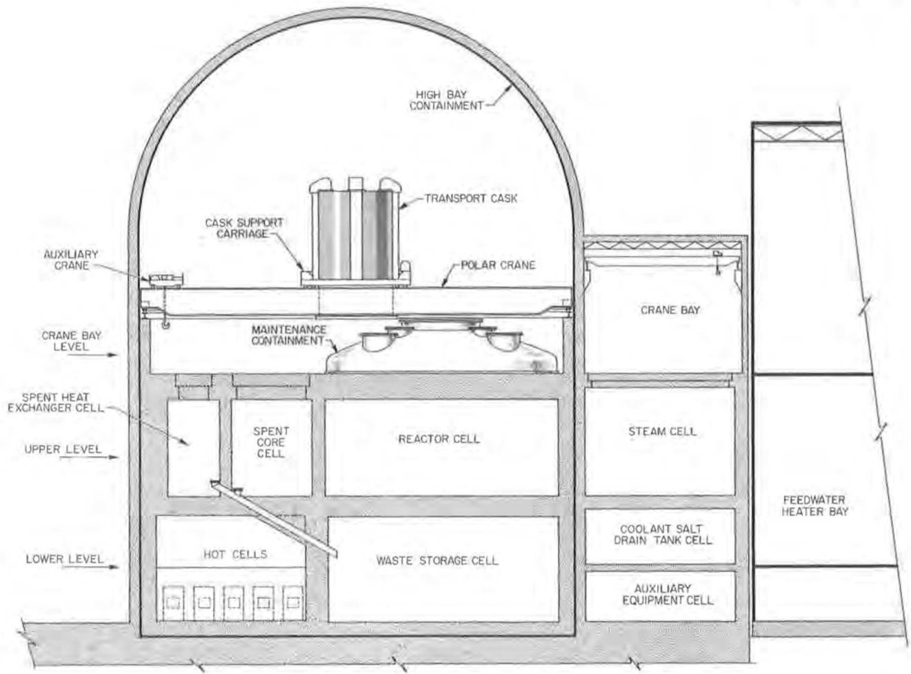  
Fig. 13.3. Sectional elevation through reactor plant building.

drawn up into the transport cask. During these periods the remotely controlled equipment can be viewed through shielded windows in the building wall at the crane bay level, as indicated in Fig. 13.4. (Maintenance procedures are described in Sect. 12.)

In addition to providing missile protection, the building serves as sealed containment during maintenance operations and as biological shielding. The 3-ft thickness of concrete covering the entire structure, together with the shielding of the transport cask, results in a reading of less than $100\mathrm{mR / hr}$ on outside contact with the reactor building wall as the core assembly is being removed. Although the building wall thickness was not optimized, values below 3 ft would require a corresponding increase in the cask shielding used during maintenance and increase the weight to near the maximum load desired for the polar crane.

The concrete shell provides tornado protection, the building having been designed on the basis of a 300-mph wind with a storm-caused 3-psi negative pressure differential. It is also designed to withstand missiles weighing 2500 lb, 15 in. in diameter, and traveling at 150 mph. The assumed seismic design conditions are more stringent than those specified for the reference site (see Sect. 14), having been taken as $\frac{1}{2} g$ horizontal and $\frac{1}{4} g$ vertical.

A polar crane is used to service the equipment within the cylindrical building. The bridge spans the building and can be rotated to cover essentially all areas. Two cranes are mounted on the bridge; one is a conventional hoist of 150 tons capacity, and the other is unique in that the 20-ft-diam 40-ft-high transport cask is an integral part of the crane, as indicated in Fig. 12.2. The cask is fixed as to vertical elevation but can move

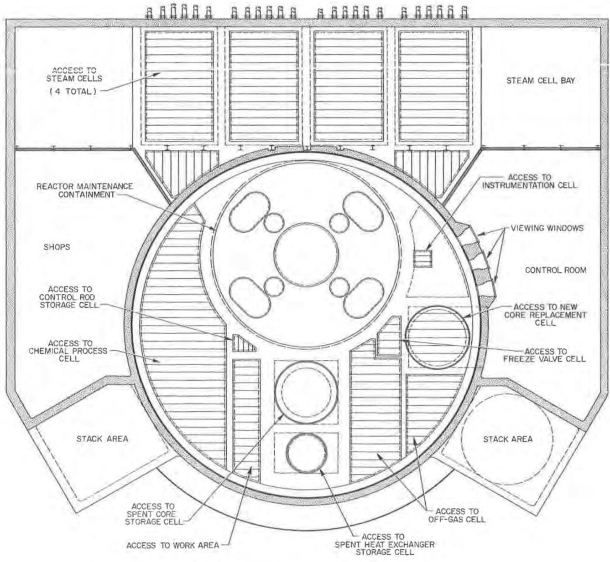  
Fig. 13.4. Plan view of reactor plant at crane bay elevation.

laterally from above the reactor cell to positions over the spent core storage cell and the core replacement pickup point. The hoisting mechanism for lifting equipment into the transport cask and the other maintenance procedures are described in Sect. 12.

# 13.3 REACTOR CELL

The reactor cell provides primary containment for the reactor, the four primary heat exchangers, the four fuel-salt circulation pumps, and the interconnecting salt

piping. In addition to leak-tightness meeting the specifications for a containment system, the cell walls provide a minimum thickness of 8 ft of concrete for biological shielding. Missile protection is provided by the domed concrete structure of the reactor building, as mentioned above. Protection against seismic disturbances is afforded by the monolithic concrete pad upon which the reactor building rests, as previously discussed, and by the methods used to mount the equipment, to be described subsequently.

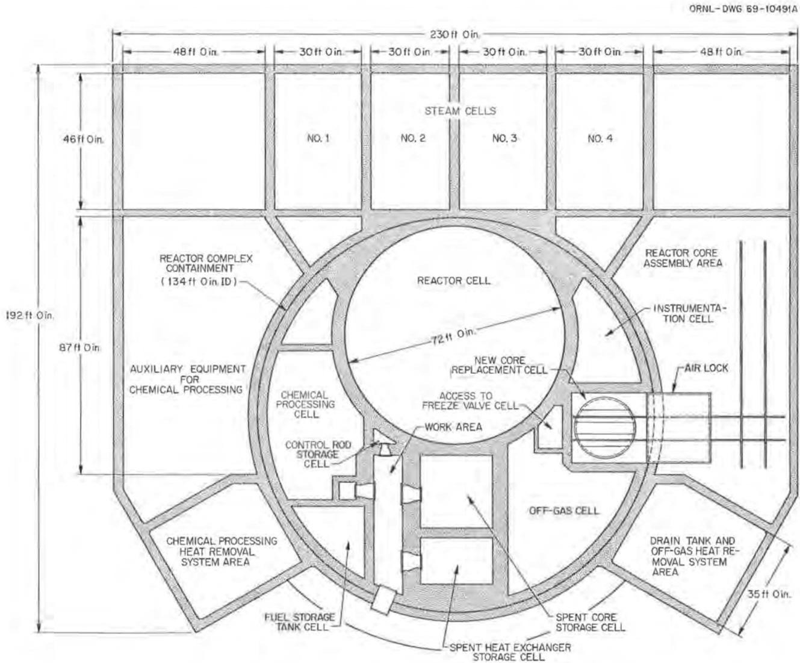  
Fig. 13.5. Plan view of reactor plant at reactor cell elevation,

The atmosphere of the reactor cell (probably nitrogen with 3 to $5\%$ oxygen) will normally be operated at about 13 psia and between 1000 and $1100^{\circ}\mathrm{F}$ . Under assumed design basis accident situations the cell pressure could rise above atmospheric, however, and the cell has been designed for 50 psia. During normal operation the cell atmosphere will become contaminated by neutron activation and by tritium. In postulated accidents involving loss of fuel salt from the circulating system, the cell atmosphere would, of course, become heavily contaminated. In meeting the shielding, pressure-retention, and leak-tightness requirements, the cell wall construction must provide both thermal insulation and gamma shielding to protect the concrete structures

from excessive temperatures. The maximum allowable temperature for the concrete was taken as $150^{\circ}\mathrm{F}$ .

The reactor cell is about 72 ft ID × 30 ft deep and is located within the reactor building, as shown in Figs. 13.3 and 13.4. The arrangement of equipment in the cell is as indicated in Figs. 13.7 and 13.8.

The cell wall consists of two concentric carbon steel shells, both 2 in. thick and separated by a 6-in.-wide annular space, as indicated in Fig. 13.10 and listed in Table 13.1. The same type of double wall construction is also provided in the roof plugs and in the floor structure. The total thickness of 4 in. of steel supplies the necessary gamma shielding and the strength to withstand the 50-psig design pressure. Some of the

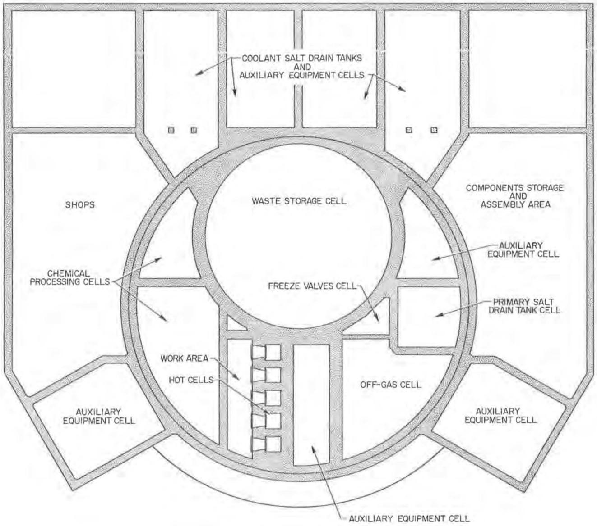  
Fig. 13.6. Plan view of reactor plant at waste storage cell elevation.

pressure loading of the inner shell is transmitted to the outer wall by spacers. A minimum of 8 ft of concrete is provided on the outside for biological shielding.

An inert gas, probably nitrogen, will be circulated through the space between the inner and outer shells to remove the heat due to gamma absorptions and the heat conducted from the cell interior. The circulating gas will normally operate at a pressure higher than the ambient cell pressure to assure that any leakage would be inward. Heat is removed from the circulating gas stream by water-cooled coils sealed within a compa

ment that is an extension of the outer wall of the cell. Both this gas and the cell atmosphere are provided with cleanup and disposal systems.

The inner and outer shells will probably operate at sufficiently different temperatures to require accommodation of relative movement. The outer vessel is therefore an integral part of the concrete structure, while the inner one is hung from the top of the cell but with much of the weight carried by helical coil springs at the bottom, as shown in Fig. 13.9. The differential expansion of the shells is also accommodated at the

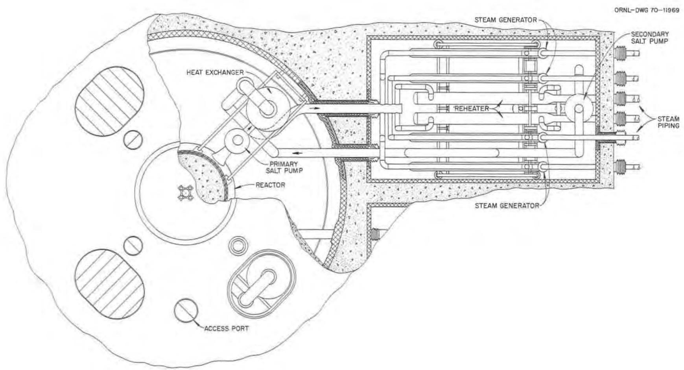  
Fig. 13.7. Plan view of reactor and steam cells.

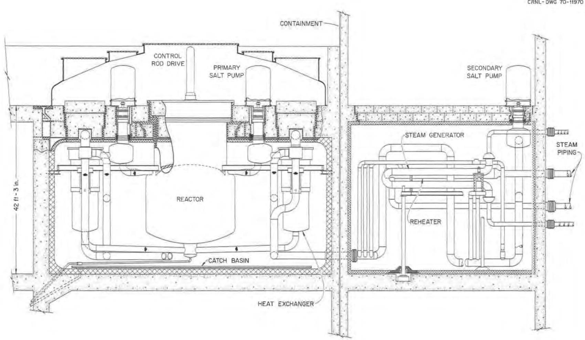  
Fig. 13.8. Cross-sectional elevation of reactor and steam cells.

Table 13.1. Summary of cell wall construction features   

<table><tr><td>Cell</td><td>\( {\text{Heaters}}^{a} \)</td><td>Cell wall construction \( {}^{b} \)</td></tr><tr><td>Reactor confinement building</td><td>None</td><td>\( 1/2 \) in. CS; 36 in. concrete</td></tr><tr><td>Reactor containment cell</td><td>A</td><td>\( {y}_{16} \) in. SS, 9 in. TI, 2 in. CS, 6 in. AS, 1 in. CS, min 8 ft concrete shielding for inhabited areas</td></tr><tr><td>Fuel-salt drain tank cell</td><td>A</td><td>\( {y}_{16} \) in. SS, 9 in. TI, \( {y}_{2} \) in. CS, 6 in. AS, \( {y}_{2} \) in. CS, concr.</td></tr><tr><td>Freeze-valve cell</td><td>B</td><td>\( {y}_{16} \) in. SS, 9 in. TI, \( {y}_{2} \) in. CS, 6 in. AS, \( {y}_{2} \) in. CS, concr.</td></tr><tr><td>Spent equipment cells</td><td>None</td><td>\( {y}_{16} \) in. SS, 9 in. TI, \( {y}_{2} \) in. CS, 6 in. AS, \( {y}_{2} \) in. CS, concr.</td></tr><tr><td>Waste storage cell</td><td>None</td><td>\( {y}_{2} \) in. CS, concr.</td></tr><tr><td>Chemical processing cell</td><td>A</td><td>\( {y}_{16} \) in. SS, 9 in. TI, \( {y}_{2} \) in. CS, 6 in. AS, \( {y}_{2} \) in. CS, concr.</td></tr><tr><td>Off-gas cell</td><td>B</td><td>\( {y}_{16} \) in. SS, concr.</td></tr><tr><td>Steam generator cells</td><td>A</td><td>\( {y}_{16} \) in. SS, 9 in. TI, 1 in. CS (ribbed), 6 in. AS, \( {y}_{2} \) in. CS, concr.</td></tr><tr><td>Coolant-salt drain cell</td><td>B</td><td>\( {y}_{16} \) in. SS, concr.</td></tr><tr><td>Instruments and controls cells</td><td>None</td><td>Concrete</td></tr><tr><td>Hot cells for repair and inspection</td><td>None</td><td>\( {y}_{16} \) in. SS, concr.</td></tr></table>

${}^{a}$ Heaters: $\mathrm{A} =$ heated cell; $\mathrm{B} =$ trace heating of equipment.   
${}^{b}$ Applies also to roof and floor structure,except floor may not have 8 ft of concrete in all cases. Listed as going from interior to exterior of cell. Floors have ${1}_{8}$ -in. SS and walls ${1}_{16}$ -in. SS liners. SS = stainless steel,CS = carbon steel,TI = thermal insulation (form of firebrick),concr. = ordinary concrete,and AS = air space.

pipe seals, as shown in Fig. 13.10. The coolant-salt piping is the principal penetration through the cell wall.

A layer of thermal insulation, not yet selected but probably a rigid block type, is provided on the inside surface of the reactor cell. A thin stainless steel liner protects the insulation and serves as an effective radiant heat reflector to lower the heat losses through the wall structure. Although not hermetically sealed, the liner presents a smooth surface for the inside of the cell.

The reactor, heat exchangers, pumps, and salt piping are all suspended from the roof of the reactor cell. This arrangement allows relative thermal expansion of the components, provides better seismic protection than pedestal-type mounts, and also makes it possible to locate the sealing flange for the reactor vessel in a lower temperature region. The primary heat exchangers are suspended by gimbal mounts at about midelevation of the units. This arrangement permits the differential expansion between the inlet and outlet salt piping to be accommodated by rotation of the heat exchangers and thus avoids excessive stresses at any of the components in the system. (Piping stresses are discussed in Sect. 3.6.)

The reactor cell is heated by hairpin-type Inconel electric resistance heating units inserted in thimbles located around the periphery of the cell, as described in Sect. 11.2. The heater elements can therefore be replaced without disturbing the integrity of the containment. The circulating inert gas used to cool the double

walls of the cell is also arranged to cool the heater leads.

As may be seen in Fig. 13.8, the fuel-salt pumps have their drive motors mounted above the cell roof plugs in hermetically sealed covers which are, in effect, part of the outer wall of the reactor cell. The control rod drives are canned in a similar fashion. This location for the drive equipment permits easier access for inspection and maintenance. All the roof-mounted equipment is covered by a 72-ft-diam dome of $\frac{1}{2}$ -in.-thick carbon steel, which provides additional leak protection during normal operation of the reactor. The dome also is principal containment during maintenance of the drive equipment, as discussed in Sect. 12.

A stainless steel catch pan in the bottom of the reactor cell would collect any spilled salt in the unlikely event of a leak in the fuel- or coolant-salt systems inside the reactor cell. This pan is pitched toward a drain which is connected to the primary-salt drain tank through two valves in series. The upstream valve is a special type having a disk punctured by a solenoid-actuated plunger controlled by a thermal switch. In the event that hot salt reaches this valve via the catch pan, the valve would open and permit the spilled salt to flow by gravity into the drain tank. The valve would be arranged for replacement using remotely operated tooling. The second valve is a mechanical bellows-sealed type that is normally open but can be closed to isolate the drain tank contents when the first valve is open or is to be replaced. This catch pan arrangement permits

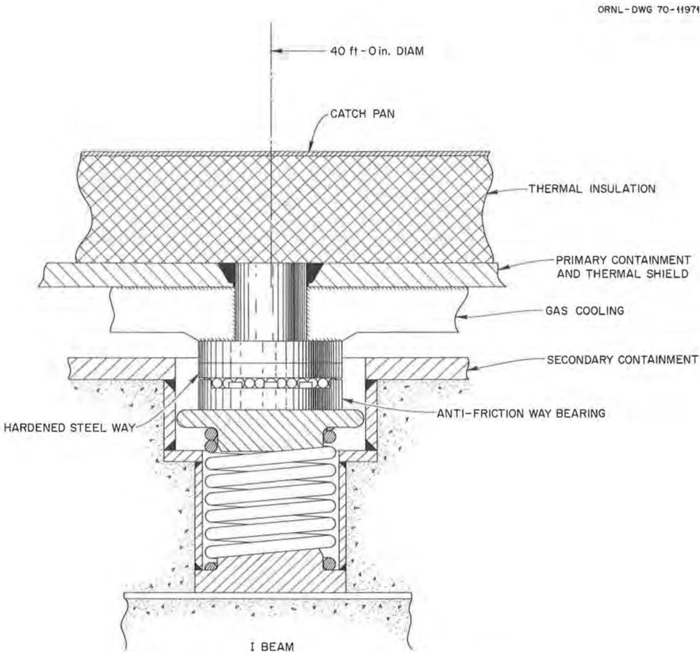  
Fig. 13.9. Lower support for reactor cell containment vessel.

more rapid cleanup of a salt spill and, in event of a major loss of fuel salt such as postulated for the maximum credible accident, is a feasible method of taking care of the afterheat in the fuel salt.

The roof of the reactor cell consists of removable plugs arranged in two layers and with stepped joints, as best shown in Fig. 12.2. The total thickness is 8 ft, and with few exceptions each layer is 4 ft thick. The plugs rest on structural steel supports and have a seal pan to form a leak-tight structure. As previously mentioned, a cooling flow of inert gas passes between the two heavy steel plates used for gamma shielding.

# 13.4 PRIMARY DRAIN TANK CELL

The primary drain tank cell houses the 14-ft-diam, 22-ft-high fuel-salt drain tank. The cell is approximately $22 \times 22 \times 30$ ft deep and is located on the lower level of the reactor building, as shown in Figs. 13.5 and 6.3. The requirements for this cell are very similar to those of the reactor cell, and, in fact, the two cells are interconnected by the duct through which the fuel-salt drain line passes. The cells thus operate with the same ambient atmosphere and essentially at the same pressure and temperature. Gamma shielding is not required

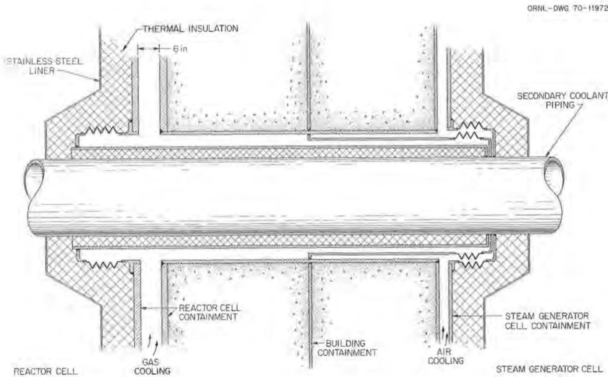  
Fig. 13.10. Coolant-salt pipe penetration between reactor cell and steam cell.

to protect the concrete structure of the drain tank cell, however, and the double walls consist of $\frac{1}{2}$ -in.-thick carbon steel plate. An inert gas is circulated between these plates for cooling of the wall structure. (The gas stream is an extension of the reactor cell wall cooling system.) Thermal insulation and a stainless steel liner are used on the inside surface, as in the reactor cell. Removable roof plugs provide access to the drain tank for maintenance through the new core replacement cell, as indicated in Fig. 6.3. The cell floor contains water-cooled coils to carry off the afterheat in the fuel salt in event of a major spill.

# 13.5 FREEZE-VALVE CELL

The freeze valve on the fuel-salt drain line and the valves for the reactor cell catch pan are located in this cell. The cell space is directly connected to the reactor and drain tank cell volumes, so that they all operate with the same atmosphere and essentially at the same temperature and pressure. The floor area of the freeze-valve cell has the shape of a right triangle (see Fig. 13.6) with legs about 18 ft long. The cell is approximately 15 ft deep and is located between the reactor cell and the drain tank cell and at about midelevation between the two, as best seen in Fig. 6.3.

Roof plugs are provided for access to the valves. The cell wall construction is essentially the same as that used in the drain tank cell. The reactor cell catch pan drains into a pan in the freeze-valve cell, and this pan in turn drains into the previously described valves leading to the fuel-salt drain tank.

# 13.6 SPENT REACTOR CORE AND HEAT EXCHANGER CELLS

A cell is provided in the upper level of the reactor building adjacent to the reactor cell for storage and dismantling of reactor core assemblies, as shown in Figs. 13.3 and 13.4. The top access opening is shown in Fig. 13.4. These drawings also show the similar cell for handling heat exchangers and other radioactive equipment which has been removed from the system and requires disposal. After a suitable decay period in the cells, the equipment is cut up as required and dropped through chutes into the hot storage, or waste, cell located beneath the reactor cell. During the storage period sufficient fission products will be present on the equipment to require some cooling, since heat losses from the cell are low. Both the enclosures therefore have double walls and use a common inert-gas cooling system which operates in a closed circuit much in the same manner as the reactor cell wall cooling system.

A work area is provided adjacent to the above cells for operation of the remotely controlled equipment used in the dismantling of the radioactive components, as indicated in Fig. 13.4. Shielded windows overlooking the two cells provide visual observation of the procedures. These windows are protected from heat during the decay period by movable shields.

# 13.7 WASTE STORAGE CELL

As mentioned above, this waste storage cell is designed to permanently store waste equipment from the plant over its useful lifetime, including spent graphite from the core and radioactive wastes from the chemical processing plant. It is about the same size as the reactor cell, 72 ft in diameter and 30 ft deep, and is located below grade on the lower level directly beneath the reactor cell. Estimates of the heat generation in the waste vary over a wide range depending upon the assumptions used, but the maximum will probably fall within the 100-to-600-kW range. A closed-circuit inert gas cooling system, similar to those previously described, will be used to cool the cell.

# 13.8 CHEMICAL PROCESSING CELL

A relatively large shielded area with 60-ft cell height has been set aside in the reactor building for the fuel-salt processing equipment, as indicated in Figs. 13.5 and 13.6. This cell will be heated as a furnace and will employ coolers and thermal insulation as required for individual control elements, etc. The cells will be heated to the desired operating temperature by resistance heaters, as described in Sect. 11.2. Remote maintenance facilities, cell integrity, etc., will be similar to other cells containing highly radioactive materials.

# 13.9 OFF-GAS SYSTEM CELL

The cell for treating the off-gas is similar to the chemical processing cell described above. The cell houses the charcoal adsorber beds and other equipment needed for treatment of the radioactive gases taken from the primary circulating system.

# 13.10 MISCELLANEOUS REACTOR BUILDING CELLS

In addition to the above-mentioned cells, the reactor building contains hot cells for examination, analysis, and repair of radioactive equipment and materials, cells for storage of control rods, storage of new reactor core assemblies, work areas, and a relatively large cell set

aside for instrumentation and controls equipment. The locations of these cells are shown in Figs. 13.3-13.6.

# 13.11 STEAM-GENERATOR CELLS AND SERVICE AREAS

There are four steam-generating cells in the reactor building, each $30 \times 48 \times 30$ ft deep. The cells are at the same elevation as the primary heat exchangers in the reactor cell, and each contains a coolant-salt circulation pump, four steam generators, two reheaters, and interconnecting coolant-salt and steam system piping. The cells are sealed and provided with biological shielding because of the induced activity in the coolant salt and the remote possibility that fuel salt could enter the steam cell via the coolant-salt circuit. Tritium might also find its way into the cell. Since the steam cells will be heated to about $1000^{\circ}\mathrm{F}$ to ensure that the coolant salt remains above its liquidus temperature, thermal insulation is provided at the walls, and a double wall with a circulated inert-gas cooling system, such as employed in the reactor building cells, is used to protect the concrete from excessive temperatures.

A principal consideration in the conceptual design of the steam cells was selection of the design pressure. A major possible source of pressure buildup is the emergency relief of the steam system into the cell via the rupture disks provided in the coolant-salt circuits. (In event of a major leakage of steam into the coolant salt these disks would prevent a pressure buildup on the primary heat exchanger tubes.) To curtail the amount of steam that could expand into the steam cell by this route, quick-acting stop valves are provided on the steam generator unit in each cell so that the loss of steam can be restricted to little more than that contained in one steam generator. On this basis, a 50-psig design pressure was assumed for the steam cells.

The wall construction is similar to that used in the reactor cell. The inner wall transmits a portion of the pressure loading through spacers to the outer wall. Provisions are made for differential thermal expansion of the two steel shells.

A cell for the coolant-salt drain tank is located on the lower level directly beneath the steam cells. This drain tank will utilize heater equipment on the tank and obviate the need for the furnace concept of cell heating.

The reactor building also includes several service areas, many of which can be conventional building construction. These include the control rooms, shops, equipment assembly spaces, instrumentation rooms, storage spaces, and, at the base of the stack, a cell for the drain tank and off-gas heat-removal equipment.

# 13.12 FEEDWATER HEATER AND TURBINE BUILDINGS

The steam system equipment requires greater building space than does the reactor system. As shown in Figs. 13.1 and 13.2, there are three buildings, or bays, associated with the turbine plant: (1) the feedwater heater and steam piping bay, $112 \times 257 \times 154$ ft high; (2) the turbine-generator building, $133 \times 257 \times 124$ ft high; and (3) an unloading and equipment setdown area, about $50 \times 257 \times 75$ ft high.

The buildings were not studied in any detail and no optimization studies were made, since the structures

will follow conventional power station practice. The layout dimensions for the tandem-compounded 1000-MW(e) turbine-generator are not exact, but the building dimensions are probably representative. A large building is shown for the feedwater heater space since this area also included manifolding and large thermal expansion loops for both the throttle and reheat steam lines.

It is visualized that these buildings will be of steel frame construction, with steel roof trusses, precast concrete roof slabs, concrete floors with steel gratings as required, and insulated aluminum or steel panel walls.

# 14. Site Description

The site assumed for the MSBR station is the AEC standard.119 Briefly, this site consists of grass-covered level terrain adjacent to a river which has adequate cooling water conditions to maintain an average $1\frac{1}{2}$ in. Hg abs back pressure for the turbine. The ground elevation is about 15 ft above the mean river level. A

limestone formation about 30 ft thick has its top about 8 ft below grade and has a bearing capacity of 18,000 psf.

The general layout of the site is shown in Fig. 14.1. Intake and discharge structures for cooling water, a deep well, a water purification plant, and a water

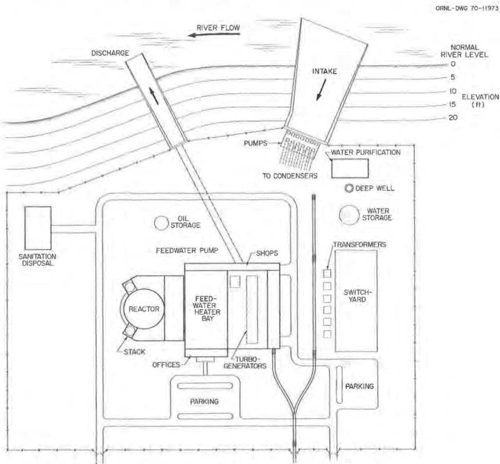  
Fig. 14.1. Plot plan for 1000-MW(e) MSBR power station.

storage tank are provided. The electric switchyard is adjacent to the plant, and a railway spur serves for transportation of heavy equipment. An oil tank is shown for storage of fuel, although natural gas is a more likely candidate for fueling the startup boiler. The usual services are provided, including a waste-treatment plant for the sanitary discharge.

The standard site assumes the electrical distribution system to be single-source transmission and would be subject to occasional outages. An emergency power source is therefore required in the plant.

The site is assumed to have a sufficient frequency of tornado occurrences to require class I structure design.

Seismic disturbances in the area have ranged 4 to 6 on the Mercalli scale (equivalent to about 0.007 to $0.07\mathrm{g}$ horizontal ground acceleration), and the site has been designated as zone 1, that is, an area which is normally below the threshold of damage.

The site location is satisfactory with respect to population centers, meteorological conditions, frequency and intensity of earthquakes, heat discharge, and other environmental factors, so that no special design conditions or costs are imposed other than those "normally" expected to meet licensing requirements.

# 15. Cost Estimates for the MSBR Station

# 15.1 CAPITAL COST ESTIMATE

Roy C.Robertson M.L.Myers H.I.Bowers

A capital cost estimate for the reference MSBR station is given in Table 15.1. Sources of the data are explained in the footnotes to the table, and the details of the estimates are included in Appendix D. To give a frame of reference for the MSBR estimates, the costs are compared with those for a PWR.

The capitalization costs for the two reactor types are not greatly different. In a broad sense this can be explained by the fact that only about one-third of the total cost is for reactor equipment, the remainder being for the heat-power system, general facilities, and indirect costs, which are expenses that are somewhat similar for all thermal power plants. Variations in reactor equipment costs are not of sufficient magnitude to cause striking differences in the overall capital requirement because there are rough similarities in costs of vessels, shielding, etc., and many of the differences that do exist are offsetting.

Insofar as possible the MSBR and PWR cost estimates were put on the same basis. In both estimates the cost of the fuel-processing plant is included in the fuel cost rather than in the plant capital cost. Both estimates use the accounts recommended in NUS-531 (ref. 119), are based on the January 1970 value of the dollar, and include indirect costs of about $35\%$ . Private ownership of the plants is assumed, and interest (at $8\%$ ) during a five-year construction period is included. Neither estimate, however, considers escalation of costs during the construction period.

The Hastelloy N equipment in the MSBR is assumed to have a fabricated cost of $8 to$ 38 per pound, depending upon the complexity (see Table D.4). The reflector graphite is estimated to cost $9 per pound and the extruded core elements $11 per pound (see Table D.5).

It is important to note that the MSBR construction cost estimates are not for a first-of-a-kind plant but assume that the station is of a proven design for an

established molten-salt reactor industry in which development costs have been largely absorbed and in which manufacture of materials, plant construction, and licensing are routine. As recommended in NUS-531 (ref. 119), however, recognition was taken of the fact that the MSBR cost estimate is based on conceptual designs rather than on actual construction experience, and a $15\%$ contingency allowance was applied to reactor materials. A contingency factor of only $3\%$ was used in the corresponding portion of the PWR estimate. As indicated in Table 15.1, this difference in contingency factors applied to the reactor materials adds about $8 million to the total MSBR cost estimate after indirect costs are included.

One of the distinguishing features of the MSBR station is the use of initial steam conditions of $1000^{\circ}\mathrm{F}$ and 3500 psia, with reheat to $1000^{\circ}\mathrm{F}$ . As shown in account 231, Table 15.1, a turbine-generator for these conditions has a relatively low first cost compared with the turbine-generator for a PWR. Good utilization of the available heat in the MSBR is reflected in the relatively low steam mass flow rates and amount of heat transfer surface needed. Although no credit was taken for it in the MSBR cost estimate, this factor could also influence siting and environmental control costs in that the heat rejected to the MSBR condensing water is only about one-half that for the PWR.

The alternate reactor vessel head assembly used to facilitate replacement of the core graphite in the MSBR is included in the first cost of the plant. The estimate also includes the special maintenance equipment used for the replacement operation. The MSBR does not consider a safeguards cooling system (account 223, Table 15.1) as such but does require a drain tank with afterheat-removal capability, as included in account 225, Table D.1. In several instances, such as the off-gas cooling system, cell heating and cooling systems, etc., the conceptual design work was not sufficiently detailed to serve as a basis for a cost study, and the values used in Table D.1 are more in the nature of an allowance than an estimate.

Table 15.1. Summary of 1000-MW(e) MSBR station construction costs and comparison with PWR station costs   
Expressed in millions of dollars and based on January 1970 costs   

<table><tr><td>Account No.</td><td>Item</td><td>MSBRa</td><td>PWRb</td></tr><tr><td>20</td><td>Land</td><td>0.6</td><td>0.6</td></tr><tr><td>21</td><td>Structures and site facilities</td><td>28.8</td><td>25.6</td></tr><tr><td>22</td><td>Reactor plant equipment</td><td></td><td></td></tr><tr><td>221</td><td>Reactor equipment</td><td>18.0</td><td>17.8</td></tr><tr><td>222</td><td>Main heat transfer systems</td><td>25.2</td><td>29.2</td></tr><tr><td>223</td><td>Safeguards cooling system</td><td></td><td>4.1</td></tr><tr><td>224</td><td>Liquid waste treatment and disposal</td><td>0.7</td><td>0.7</td></tr><tr><td>225</td><td>Nuclear fuel storage</td><td>4.2</td><td>1.3</td></tr><tr><td>226</td><td>Other reactor systems and equipment</td><td>9.8</td><td>0.5</td></tr><tr><td>227</td><td>Instruments and controls</td><td>4.0</td><td>5.1</td></tr><tr><td></td><td>Contingencies and spare parts</td><td>9.0</td><td>2.9</td></tr><tr><td></td><td>Total account 22</td><td>70.9</td><td>61.6</td></tr><tr><td>23</td><td>Turbine plant equipment</td><td></td><td></td></tr><tr><td>231</td><td>Turbine-generator</td><td>20.8</td><td>32.7</td></tr><tr><td>232</td><td>Condensing water system</td><td>2.0</td><td>3.1</td></tr><tr><td>233</td><td>Condensers</td><td>2.2</td><td>4.7</td></tr><tr><td>234</td><td>Feedwater heating system</td><td>7.7</td><td>6.1</td></tr><tr><td>235</td><td>Other turbine-plant equipment</td><td>6.2</td><td>3.9</td></tr><tr><td>236</td><td>Turbine instruments and controls</td><td>0.5</td><td>0.7</td></tr><tr><td></td><td>Contingencies and spare parts</td><td>2.2</td><td>2.5</td></tr><tr><td></td><td>Total account 23</td><td>41.6</td><td>53.7</td></tr><tr><td>24</td><td>Electric plant equipment</td><td>8.0</td><td>8.0</td></tr><tr><td>25</td><td>Miscellaneous plant equipment</td><td>2.0</td><td>2.0</td></tr><tr><td>26</td><td>Special materials</td><td>1.0</td><td></td></tr><tr><td></td><td>Total direct construction cost</td><td>152.3</td><td>150.9</td></tr><tr><td>91–94</td><td>Indirect costs</td><td>50.3</td><td>49.2</td></tr><tr><td></td><td>Total capital investment</td><td>202.6</td><td>200.7</td></tr></table>

${}^{a}$ Details of the MSBR cost estimate are given in Appendix D.   
bPwR costs were taken from studies made in connection with the capital cost computer program being developed at ORNL for the AEC under the Studies and Evaluation Program (report to be published). Costs were escalated from a mid-1967 basis to January 1970. Some accounts were adjusted to reflect increased costs due to design changes dictated by more stringent safety requirements, as discussed in a United Engineers report (ref. 120).

# 15.2 POWER PRODUCTION COST

The estimated cost to produce electric power in the reference design MSBR station is shown in Table 15.2. The table is based on $80\%$ plant factor, January 1970 conditions, and fixed charges of $13.7\%$ on the station capital cost and $13.2\%$ on the fuel inventory. (Other assumptions are given in the footnotes to Table 15.2.)

The cost for periodic core graphite replacement in the MSBR is included as a separate production cost in Table 15.2. It is assumed that the core maintenance does not

require plant outages in addition to those accommodated by the plant factor. The capital cost of the fuel processing equipment for the MSBR is not known with certainty at this time due to the preliminary nature of the conceptual designs for the equipment and the use of relatively large amounts of molybdenum as a construction material, for which there is little background of cost experience. The effect of the chemical plant capitalization on the fuel cycle and total power production costs is indicated in Fig. 15.1. The MSBR fuel-cycle cost shown in Tables 15.2 and D.2 is based

on an assumed expenditure of $13.5 million (including indirect costs) for the chemical plant equipment.

Two other uncertainties entering into the MSBR cost estimates are the cost of graphite and the life of the

Table 15.2. Estimated power production cost (mills/kWhr) in the MSBR station   

<table><tr><td>Fixed charges on total plant capital investment at 13.7%b</td><td>4.0</td></tr><tr><td>Cost of periodically replacing graphitec</td><td>0.2</td></tr><tr><td>Fuel cycle costd</td><td>0.8</td></tr><tr><td>Operating coste</td><td>0.3</td></tr><tr><td>Total</td><td>5.3</td></tr></table>

${}^{a}$ Based on investor-owned plant and 80% plant factor.   
${}^{b}$ Based on capital costs shown in Table D.1 and fixed charges of 13.7% on depreciating equipment, as listed in Table D.14, and 12.8% on land,as recommended in NUS-531 (ref. 119).   
The graphite replacement cost is shown in Table D.15.   
$a_{\text{MSBR}}$ fuel cost, as shown in Table D.2, is based on $13.2\%$ fixed charges on inventory capitalization, on the 1970 value of the dollar, and a total cost for fuel processing equipment of $13.5 million.   
Estimated operating costs are shown in Table D.16. These costs are based on the recommendations in NUS-531 (ref. 119) and agree reasonably well with those reported by Susskind and Raseman (ref. 121).

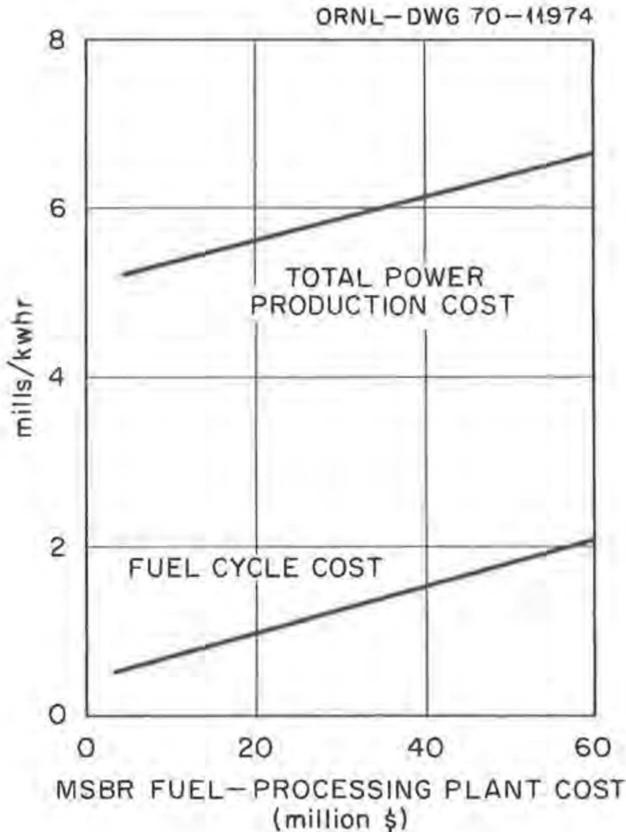  
Fig. 15.1. Effect of MSBR fuel-processing plant capital cost on fuel-cycle and power production costs (based on fuel at $13/g).

reactor core before it would require replacement. The effects of these two factors on the cost to produce electric power are shown in Figs. 15.2 and 15.3.

Power production costs for the MSBR were based on the present "standard" fuel cost for $^{233}\mathrm{U}$ of $\$ 13$ per gram, for $^{235}\mathrm{U}$ of $\$ 11.20$ per gram, and a corresponding cost for $^{239}\mathrm{Pu}$ of $\$ 9.30$ per gram. A comparison of MSBR production costs with those of other reactor types should take into account the changed price structure of nuclear fuels that will undoubtedly exist by the time molten-salt reactor power stations are constructed in quantity, since these changes in prices and fuel resources could have a significant effect on the molten-salt reactor economics. The next 30 years could witness significant changes in the sizes of plants, in light-water fuel-cycle costs, $^{122,123}$ swings in the price of plutonium, and use of cross-progeny fueling of reactors. $^{124}$ Also, the higher market value of electric power will be a feedback into fuel diffusion and separation plant operating costs and will change the relative costs of fissile fuels. Analysis of these complexities is beyond the scope of this report. It can be stated here only that the estimated power-generating costs for the molten-salt reactor appear competitive and that the concept gives promise of making important future savings in the nation's fuel resources.

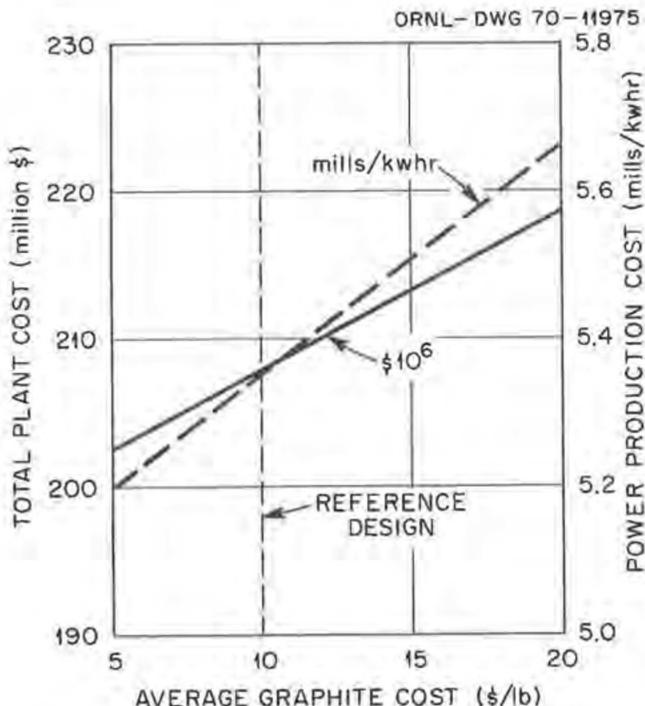  
Fig. 15.2. Effect of average graphite cost on total MSBR plant cost and power production cost (based on fuel-cycle cost of 0.8 mill/kWhr and four-year graphite life).

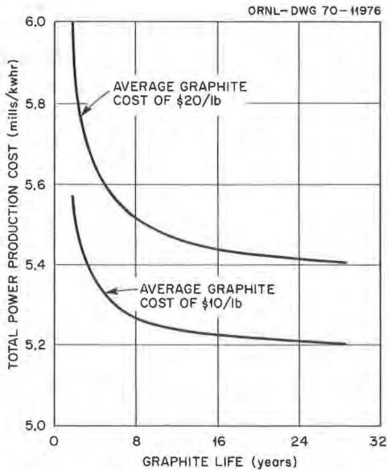  
Fig. 15.3. Effect of graphite life on total MSBR power production cost (based on fuel-cycle cost of 0.8 mill/kWhr).

# 16. Uncertainties and Alternatives, and Their Effects on Feasibility and Performance

E.S.Bettis P.N.Haubenreich Roy C.Robertson

# 16.1 GENERAL

In making this conceptual study it was necessary to base some of the judgments on preliminary designs, test results, properties of materials, and other design information that will require further study and verification. While these judgments were made conservatively and it is reasonable to expect that some aspects will perform even better than anticipated, a primary concern is the effect on MSBR feasibility if one or more of the design uncertainties prove to be very difficult or expensive to resolve or if the behavior falls significantly short of expectations.

The major uncertainties as now known are in the areas of tritium confinement, fuel-salt processing, graphite and Hastelloy N behavior, suitability of the coolant salt, maintenance procedures, and behavior of the off-gas particulates. This section discusses the impact of these and other uncertainties on MSBR feasibility in relation to safety, nuclear performance, dependability, and economics of power generation. The order of discussion is by systems rather than by degree of uncertainty.

# 16.2 MATERIALS

# 16.2.1 Fuel Salt

As discussed in Sect. 3.2.1, the composition of the MSBR fuel salt was chosen on the basis of neutron cross sections, viscosity, chemical stability, and liquidus temperature. There is little uncertainty with regard to its phase behavior, most of its physical properties, its behavior under irradiation, and its interactions with the container and moderator materials. Less well known are the effects of the oxidation-reduction state of the salt on its surface tension and on the behavior of the noble

metal fission products. Significant limitations to use of the salt are imposed by its rather high liquidus temperature $(930^{\circ}\mathrm{F})$ , the limited solubility of uranium oxide (about 40 ppm of the oxide ion), and the restricted choice of container materials. The problem that looms largest at the present is the production of relatively large amounts of tritium by neutron interaction with the lithium, as will be discussed in Sect. 16.4.

Some variations in the composition of the fuel salt are possible and may prove desirable to circumvent or to mitigate some of the above-mentioned limitations. The $\mathrm{UF_4}$ and $\mathrm{ThF_4}$ concentrations can be varied as required for criticality and optimization of the breeding performance. The continuous processing of the fuel salt is expected to keep the oxide concentration low and to make a low $\mathrm{UO_2}$ solubility acceptable. The oxide tolerance of the salt can be increased by the addition of $\mathrm{ZrF_4}$ (as was done in the MSRE), although at the expense of parasitic absorption of neutrons in the zirconium and complication of the chemical processing. The constraints of a high liquidus temperature and the problem of tritium cannot be mitigated, however. If the molten-salt reactor is to breed with thermal neutrons, cross sections limit the choice of diluent salt constituents to the fluorides of beryllium and lithium (with very low Li content). In the LiF-BeF $_2$ -ThF $_4$ system (Fig. 3.5a), liquidus temperatures much below that of the reference MSBR salt cannot be attained without reducing the ThF $_4$ concentration to the extent that breeding performance is seriously impaired. The tritium production in a molten-salt reactor could be cut to little more than the fission yield if an NaF-ZrF $_4$ -ThF $_4$ -UF $_4$ fuel salt were used, but neutron absorptions in the sodium and zirconium would preclude breeding. In summary, if the molten-salt reactor is to breed, there is

no reasonable alternative to fuel salt of the approximate composition chosen for the reference study. The limitations attending its use must therefore be accommodated in the design.

The market price of $^7\mathrm{Li}$ has a limited effect on the total fuel-cycle cost. For example, if the price of $99.99\%$ $^7\mathrm{Li}$ as lithium hydroxide monohydrate were doubled from the $\$ 120$ per kilogram assumed in the reference design, the MSBR fuel-cycle cost would be increased from about 0.76 to 0.82 mill/kWhr.

# 16.2.2 Secondary Fluid

As stated in Sect. 3.2.2, the factors determining the choice of the fluid for the secondary system are chemical stability, susceptibility to radiation damage, compatibility with materials of construction, heat transfer and fluid flow properties, and cost. The fluid chosen for the reference design, sodium fluoroborate, offers advantages over other fluids in some of these areas and on the whole promises to be an acceptable material to use. There are some problems associated with it, however, and some remaining uncertainties. These are discussed below, followed by a discussion of alternative fluids and the influence their use would have on the design and performance of the MSBR.

Loop tests have shown that if water can be excluded, the sodium fluoroborate is quite compatible with Hastelloy N, with corrosion rates of only about 0.2 mil/year at MSBR temperatures. While it is possible to limit the water intrusion into test loops to very small amounts, it is not certain to what limits it will be practical to restrict entry of water by leakage from the steam generators. The corrosion rate to be expected in an operating MSBR is thus somewhat uncertain. Tests in which steam was deliberately added to fluoroborate systems showed corrosion of Hastelloy N at a rate above 20 mils/year for a week or so after the addition.[11] The effect of continuous injection of water into a fluoroborate system has not been studied, but it appears that very little continuous leakage can be permitted in an MSBR. Whether it will be practical to guarantee a sufficiently low leakage rate remains to be determined.

The reaction between water and fluoroborate is not violent and should contribute little if anything to the wastage of metal by a high-velocity jet of water from a leak in a steam generator. There has been no experiment of this sort with fluoroborate and water, however, so the requirements for immediate response to a steam leak cannot be specified realistically at the present time.

Processing is likely to be required to hold the corrosion products and other undesirable contaminants to low concentrations in the salt. The requirements for processing have not been established, but no major technical difficulties are expected to be encountered in developing a purification process.

The consequences of mixing sodium fluoroborate with the MSBR fuel salt (as through a leak in a primary heat exchanger) have not been considered in detail. Wastage and enhanced corrosion are not likely to be serious, but the amounts of inleakage must be limited for other reasons. Boron trifluoride gas is likely to be evolved as the fluoroborate salt mixes with the fuel salt, and, depending upon the extent of mixing, phases with high melting temperatures may be formed. Although the high-cross-section boron could be sparged from the fuel salt as $\mathrm{BF}_3$ gas, the sodium, unless chemically removed, would remain in the fuel salt and diminish the breeding performance. The sodium from about $100\mathrm{ft}^3$ of coolant salt would reduce the breeding ratio from 1.063 to 1.056.

The cover gas for fluoroborate must be the proper mixture of $\mathrm{BF}_3$ and inert gas to prevent changes in the NaF-NaBF4 composition. The off-gas from fluoroborate loops has been found to contain various condensables which require special handling. These problems have been dealt with in a practical manner in development tests, but the gas systems for fluoroborate loops tend to be somewhat more complicated than if some other salts were used for heat transport.

If the results of further tests of fluoroborate should indicate that its use in the MSBR would be impractical, the most assured alternative is the $2\mathrm{LiF - BeF}_2$ mixture that was used in the MSRE. Its use as the secondary salt in the MSBR would eliminate problems of chemical compatibility with the fuel salt. (Separated ${}^{7}\mathrm{Li}$ would have to be used, however, because mixing would otherwise require expensive isotopic purification of the lithium in the fuel.) The corrosion situation would be alleviated, possibly easing the restrictions on moisture contamination and widening the possibilities for container materials. Constraints and penalties would be imposed, however, because of the higher melting point and much greater cost of ${}^{7}\mathrm{LiF - BeF}_2$ relative to NaF $\mathrm{NaBF_4}$ . The liquidus temperature of LiF-BeF $_2$ (66-34 mole %) is $858^{\circ}\mathrm{F}$ , compared with about $725^{\circ}\mathrm{F}$ for $\mathrm{NaBF_4 - NaF}$ (92-8 mole %). This would complicate the design by requiring a higher degree of feedwater heating and/or special design of the steam generators. Equipment costs and plant thermal efficiency would be adversely affected, but the greatest penalty would be in inventory charges. If the volume of coolant salt were

the same (8400 ft³) the $^7\mathrm{LiF - BeF}_2$ inventory would cost $13 million compared with $0.5 million for fluoroborate. This difference amounts to $\sim 0.3$ mill/kWhr in power costs.

Another candidate for the secondary fluid is a mixture of potassium and zirconium fluorides of the composition $\mathrm{KF - ZrF_4}$ (58-42 mole%). This mixture has received little attention to date because its $750^{\circ}\mathrm{F}$ liquidus temperature is higher than that of sodium fluoroborate. It has a low vapor pressure, reasonably good heat transfer properties, and is relatively inexpensive (about $1 per pound). The effects of mixing with fuel salt and with water are unexplored.

Other alternative coolants are considered inferior or impractical for various reasons. Nitrate-nitrite mixtures (Hitec, for example) would be cheap, probably would block tritium transfer to the steam system, and would permit design simplifications because of their relatively low melting points (around $300^{\circ}\mathrm{F}$ ). Their stability and corrosion behavior above about $1000^{\circ}\mathrm{F}$ are not well known, however. The most serious drawback to their use as a secondary salt is that the nitrate-nitrites would precipitate $\mathrm{UO}_2$ if they leaked into the primary system and possibly would react violently with the graphite.

Alkali metals are undesirable because they react with both fuel salt and steam. Metal coolants such as lead or bismuth undergo no violent reactions, but they are not compatible with Hastelloy N or other nickel-base alloys. Several binary chloride systems have eutectics melting below $700^{\circ}\mathrm{F}$ , but the more stable nonvolatile chlorides are those containing lithium, which would be expensive if Li were used. High-pressure gas (possibly containing moisture to trap tritium) has some advantages as a secondary coolant, but would open the possibility of excessively pressurizing the fuel system, and the poorer heat transfer with gas would substantially increase the inventory of fuel salt in the primary heat exchangers.

# 16.2.3 Hastelloy N

Although additional work is needed on the use of Hastelloy N for the container material for the fuel and coolant salts, the remaining uncertainties are not sufficient to jeopardize the feasibility of the MSBR.

Hastelloy N suffers embrittlement in a neutron environment, and the damage increases with the total fluence and operating temperature. The approach used in this study has been to limit the temperature and the neutron exposure of the more critical portions of the reactor vessel. Since there are no approved code cases for irradiated Hastelloy N upon which to base a design criterion, the considered judgment is that the

irradiation should be limited to the extent that the creep ductility will not be less than $5\%$ . The standard alloy of Hastelloy N does not meet this requirement. The advances described in Sect. 3.2.4 for obtaining a modified Hastelloy N with adequate resistance to radiation embrittlement (through use of additives, such as titanium, hafnium, and niobium) appear very promising, but further testing is needed to select the best composition. Large heats must be obtained to show that the favorable properties are retained in commercial materials, and the modified alloy must be subjected to enough testing to have it approved for pressure vessel use by the ASME.

In the event that the embrittlement problem imposes more severe limitations than now expected, the design can be revised to make more use of the $1050^{\circ}\mathrm{F}$ inlet salt to the reactor to cool the higher-temperature portions of the vessel, such as the outlet nozzles. A further recourse would be to reduce the outlet salt temperature from the reactor to $1200 - 1250^{\circ}\mathrm{F}$ . Reducing the outlet temperature would require a higher circulation rate and larger inventory of salt in the primary system but would not necessarily lower the steam temperature and the thermal efficiency of the cycle, as discussed in Sect. 16.7. The effects are not great enough to threaten the feasibility of the MSBR concept.

In this study the allowable design stress of standard Hastelloy N was taken to be 3500 psi at $1300^{\circ}\mathrm{F}$ , a stress that has received ASME code approval. The standard alloy consistently shows better strength characteristics than those upon which the code case was approved, and the additives increase the strength of the modified Hastelloy N. What adjustments will be made in the code-approved allowable design stress for Hastelloy N are not certain, but they may permit higher stresses and thinner metal sections in the reactor vessel. As mentioned above, this would help to lower the estimated maximum metal temperature and ameliorate the radiation damage problem.

The modified alloy is expected to be as resistant to corrosion by fluoride salts as standard Hastelloy N, but the behavior must be demonstrated in tests with fuel and coolant salts under simulated reactor operating conditions.

Hastelloy N is specified as the material of construction for the steam generators in the reference design, and, as mentioned in Sect. 3.2.4.2, both the standard and modified alloys have demonstrated good resistance to corrosion by supercritical-pressure steam at $1000^{\circ}\mathrm{F}$ in tests made in the TVA Bull Run steam plant. The data were obtained with unstressed speci

mens, however. Stressed samples are being tested at Bull Run, and these results will be important in assessing the compatibility of Hastelloy N with steam. If the material proves unsatisfactory for service in water and steam, the probable solution would be to use tubes of Incoloy 800 clad with nickel on the salt side and to clad the water side of the vessel heads and tube sheets with Incoloy or Inconel.

# 16.2.4 Graphite

At the present time industry does not have the facilities for manufacturing the large-sized pieces of the special grade of graphite needed for a 1000-MW(e) MSBR. Although there is some confidence that core elements of the desired length (about 20 ft) can be extruded, failure to meet this objective would require that the elements be assembled from shorter sections. This would add to the cost and would be inconvenient.

The important uncertainties with regard to MSBR graphite are gas permeability, usable life, and the cost of the installed material. The gas permeability affects both the breeding performance and the power production cost; the useful life and the graphite price primarily affect the production cost alone. In general, these aspects are examples of uncertainties where future development is likely to lead to improved situations rather than worse ones, but, to pursue the objectives of this section, the consequences of unfavorable developments will be reviewed.

16.2.4.1 Gas permeability. With the turbulent flow assumed through the reactor core, the graphite must have a gas permeability in the order of $10^{-8}\mathrm{cm}^2/\mathrm{sec}$ to keep the xenon poison fraction down to the $0.5\%$ used as a "target" in the reference MSBR design and as a basis for the performance estimates. This resistance to gas diffusion can be achieved only by sealing the graphite. Small pieces have been successfully sealed to these standards, and methods for treating the MSBR core elements can probably be devised, but nevertheless sealing of the large pieces remains to be demonstrated.

While sealing the graphite to minimize xenon absorption is desirable, it is not essential to the MSBR concept. Figure A.2 shows the calculated effects of coating thickness and permeability on xenon poisoning when used in conjunction with a reasonably effective gas sparging system. Even with unsealed graphite (helium permeability $10^{-5}\mathrm{cm}^2/\mathrm{sec}$ ) the calculated poison fraction is less than $2\%$ . Allowing the xenon poisoning to increase from the reference value of 0.5 to $2.0\%$ is estimated to reduce the breeding ratio of the MSBR from 1.063 to 1.045. Recent measurements indicate that the mass transfer coefficients used in the

calculations are conservative and that the effects may not be this great.

As indicated in Fig. A.2, a 5-mil surface layer on the graphite having a permeability of $10^{-8}\mathrm{cm}^2/\mathrm{sec}$ for the coating is enough to permit the sparging system to hold the xenon poison level to the target value of $0.5\%$ . This degree of sealing has been achieved with pyrolytic carbon, as discussed in Sect. 3.2.3. The serviceability of sealed graphite and the cost of the sealing are yet to be resolved. Plugging of the graphite pores by a vacuum-pulse gas impregnation process produces a tight surface, but under neutron irradiation the permeability increases very rapidly, and dimensional changes are apparently accelerated above the rates obtained with unsealed graphite. Deposition of pyrolytic carbon on specimens in a fluidized-bed furnace gave coatings 3 to 5 mils thick with permeabilities of $<10^{-9}\mathrm{cm}^2/\mathrm{sec}$ . Irradiation tests of these specimens are encouraging, but the coatings are relatively easy to damage by handling.

If the target xenon poison fraction cannot be attained and a longer doubling time must be accepted in any event, consideration can be given to designing the reactor for laminar flow in the core. The power density must be reduced considerably, and this increases the doubling time because of the larger core volume, but the breeding gain is not as dependent upon sealing the graphite. The lower power density would increase the graphite life and reduce the frequency of graphite replacement, although this factor may have limited importance, as discussed below.

16.2.4.2 Useful life of graphite. The lifetime of the graphite is limited by the requirement that it be impermeable to the fuel salt. As explained in Sect. 3.2.3, this requirement is readily met when the graphite is new, but there is an uncertainty as to how long the graphite will remain impermeable under fast-neutron irradiation. In the absence of conclusive measurements, the useful life of the graphite in the MSBR has been defined as the point at which the most highly irradiated graphite in the core expands past its original density. This appears to be conservative in that the graphite probably remains impermeable to salt to somewhat beyond this point. An additional conservatism in the reference design was the assumption that the MSBR graphite would last no longer than commercial grades currently available. Improved graphites with considerably longer life could result from the development now in progress, although probably not to the point of lasting the 30-year life of a plant at the proposed power density.

Replacement of the core graphite entails not only the periodic expense for new graphite but also the capital

cost of a reactor design which permits core replacement, the maintenance equipment, and the expenses attendant to handling the highly radioactive core material. Once the investment is made in the special provisions for graphite replacement, however, the electric power production cost is not very sensitive to the replacement interval required. As shown in Fig. 15.3, there would be only modest savings if the graphite were good for 8, or even 16, years instead of the 4 years assumed in the reference design. It should be noted, however, that these costs assume that the core graphite can be replaced in a time that can be accommodated in the 0.8 plant factor. If an outage of many months is required for graphite replacement, the power cost would of course be more sensitive to the graphite life.

16.2.4.3 Graphite cost. The costs shown in Fig. 15.3 and those given elsewhere in this report are based on an installed cost of graphite of $9 to$ 11 per pound. Some estimators believe that large-scale production of graphite would bring this price down, but others think it is too low, particularly if special measures to seal the graphite against xenon prove to be expensive. Figure 15.2 shows the effect of the graphite price on the power production cost, based on a four-year replacement interval. If the graphite proved to cost, say, $20 per pound, the increase in the power cost is about 0.2 mill/kWhr.

# 16.3 SYSTEMS AND COMPONENTS

# 16.3.1 Reactor

The conceptual design of the reactor core and vessel was carried only to the point of indicating feasibility and performance. A more detailed study would undoubtedly disclose some problem areas not yet delineated. The basic arrangement appears sound, however, and it seems certain that an acceptable design can be made for a molten-salt reactor core and vessel. Perhaps the largest uncertainties are in the procedures for replacing the core graphite. They will be discussed separately in Sect. 16.8.

Some of the aspects of the reactor design that will require particular attention before arriving at a final design are:

1. A detailed analysis must be made of the temperature and stress distributions, particularly in the high-temperature regions. As discussed in Sect. 16.2, some adjustments may be necessary to keep radiation damage in the graphite and Hastelloy N to within tolerable limits. The outlet nozzles on the vessel have not yet been analyzed in detail for stresses.

2. The core hydrodynamics needs to be studied, using models, to check the flow distribution and to eliminate any tendencies that may exist for flow-induced vibrations.

3. The methods suggested in the conceptual design for accommodating dimensional changes in the graphite will require more detailed design.

4. The exact number of control and safety rods needs to be determined. The drive mechanisms for the rods have not been studied in detail, but since a fast-scramming action is not necessary, the requirements do not appear to be stringent. Dimensional changes that occur in the control rod graphite can undoubtedly be accommodated, but the expected life of the rods and the means for replacement need to be studied in more detail.

5. The methods proposed in the conceptual study for mounting the reactor vessel and making the top closure will require more detailed design. The earthquake resistance of the reactor support system was indicated to be satisfactory in preliminary studies, but a more comprehensive analysis is needed.

# 16.3.2 Primary Heat Exchangers

Although not a serious factor in determining the feasibility of the MSBR concept, an uncertainty in the primary heat exchanger design presented in this report is the use of special tubing in certain portions to enhance the heat transfer. The enhancement consists in indenting a shallow spiral groove in the tube wall. Tests with water indicated that the groove improves the heat transfer coefficient on the inside by a factor of about 2 and on the outside by a factor of about 1.3. These and other heat transfer data need to be confirmed with circulating salt, however, The tubes do not appear to be weakened by the grooving process, but more information is needed, particularly with regard to the effect on collapsing strength. Tubing manufacturers have indicated a capability for producing the tubing at a reasonable cost.

The penalty for using plain tubes rather than enhanced tubes would be a need for more heat transfer surface and an increase of about $5\%$ in the total fuel-salt inventory of the primary system. Although this would lengthen the doubling time, the feasibility of the MSBR is not contingent upon preventing this small increase.

# 16.3.3 Salt Circulation Pumps

The salt circulation pumps used in the MSRE and in test loops have performed well, and the manufacturers believe that they can be extrapolated to the capacities

needed in an MSBR with few development difficulties. The larger size can probably use an overhung shaft and impeller to eliminate the need for a lower bearing operating in the salt, but this remains to be demonstrated. If the lower bearing is required, salt bearing development work already accomplished at ORNL appears promising. A disadvantage of use of the salt-lubricated bearing is that the pumps could not be operated to circulate gas during warmup of the system before it is filled with salt. In this event the startup equipment and procedures would have to be revised.

# 16.3.4 Drain Tank

The primary drain tank approaches the reactor vessel in complexity and cost, yet in this conceptual study relatively little effort could be devoted to its optimization. The design of the drain tank is strongly influenced by the drain system flowsheet. The proposed method of cooling the drain tank head and walls by a continuous salt overflow from the pump bowls, use of jet pumps to return the salt to the primary system, and employing the drain tank for holdup and decay of off-gases are all aspects of a drain system which represents but one of many possible arrangements. Study of the drain system flowsheet is continuing at ORNL, and some revisions may be necessary, particularly with regard to the continuous salt letdown and pump-back arrangement. The modifications are not likely to increase the complexity and cost, however.

For the drain tank design proposed in this report, it will be necessary to evaluate the performance of the jet pumps and possibly to substitute centrifugal pumps; investigate the radiant heat transfer aspects; carefully consider the behavior of noble metal fission product particles brought down with the off-gases; demonstrate the reliability of the cooling system; and provide the required means for inspection and maintenance. As indicated in Sect. 6.4, a NaK cooling system for the drain tank may be superior to the proposed salt cooling system. Other improvements are likely to result from more detailed study of the design.

# 16.3.5 Fuel-Salt Drain Valve

The reference MSBR design proposes that the "valve" which provides positive shutoff to hold the fuel salt in the primary circulation system, yet which can be opened fairly quickly to allow the salt to flow into the drain tank, be of the freeze type used successfully in the MSRE. The MSRE "valve" consisted of a flattened section of the 2-in. drain line provided with external heaters and coolers. It is to be noted, however, that a

single drain line for the MSBR would be 6 in. in diameter, and since the ability to freeze a pipe decreases rapidly with size, it poses a markedly different problem.

The direction the development of an MSBR freeze valve will take is not known at this time. One possibility is that it will have the appearance of a small shell-and-tube heat exchanger with the salt flowing through the tubes. A mechanical-type valve with the seat chilled to provide positive shutoff may also be considered. Development of a suitable positive shutoff device appears generally within present technology and is not a major uncertainty in the MSBR design.

# 16.3.6 Gaseous Fission Product Removal System

Fission product gases will be purged from the circulating fuel salt by introducing helium bubbles in a side stream and subsequently stripping the gas from the system. The bubble generator and bubble separator, described in Sects. 3.9.2 and 3.9.3, have been tested on a small scale in water, and the concept appears to involve few major uncertainties. Development of larger size equipment and testing in salt will be required, however.

# 16.3.7 Off-Gas System

An off-gas system is proposed for cleaning up the helium purge gas so that it can be recycled, for holding up the xenon and krypton to allow decay, for gathering the fission product particulates, and for trapping the tritium. Means will have to be provided for disposal of the collected radioactive materials. Although the MSRE provided considerable background of experience, additional development will be needed for the components in the MSBR off-gas system. The charcoal traps, helium compressors, particle traps, etc., must be effectively cooled to remove decay heat. All areas appear amenable to further study and development, however.

The conceptual design proposes that the radioactive gaseous wastes from an MSBR be collected in gas cylinders for long-term storage and decay. Whether the bottles are stored at the MSBR plant site or at other sites, approved equipment and procedures must be developed for handling them.

# 16.3.8 Steam Generators

Although there is no specific operating experience with a once-through salt-heated steam generator of the type proposed for the MSBR, experience with similar heat transport fluids and with steam generators developed for other reactor types leads to the conclusion that design of the MSBR units is within present

technology. A plan for industrial study and development of a molten-salt steam generator has been initiated by ORNL.

If the coolant salt accidentally mixes with the steam, there are no exothermic reactions, although a blowout disk will be provided to relieve pressure buildup in the coolant-salt circuits.

The lowest allowable feedwater temperature for the steam generator remains to be determined experimentally. The $700^{\circ}\mathrm{F}$ value assumed in this design study probably can be lowered without causing excessive freezing of coolant salt in the steam generators.

The steam generator tubing must be compatible with the high-pressure, high-temperature steam on the inside of the tubes and with the coolant salt on the outside. As discussed in Sect. 16.2.3, the compatibility of Hastelloy N with sodium fluoroborate salt is excellent, provided that water is excluded from the secondary system. The compatibility of the metal with steam also appears excellent, but testing is not yet complete. In the unlikely event that the results are unfavorable, duplex tubing having a proven steam-side material, such as Incoloy $800^{41}$ could be used.

# 16.3.9 Instrumentation and Controls

Section 10.5 outlined the development problems associated with the components in the instrumentation and controls system that must be located in the high ambient temperatures of the reactor and drain tank cells. Wiring, connectors, and cell wall penetrations will require special treatment, and the nuclear detectors were mentioned as particular problems. While the specific measures to be taken are uncertain in many instances, none are judged too severe for reasonable solution. A "fall back" position for many of the components is to install them in cooled compartments within the reactor cell.

The stability of the control system during transients and the procedures for startup, standby, and shutdown have received only preliminary study. While the need for detailed investigation is apparent in many areas, none have been singled out to date as presenting a major problem.

If reheat is employed, as proposed in the reference design, the coolant flow will need to be proportioned between the steam generators and the reheaters to achieve the required exit steam temperatures. Valves for salt service have received relatively little development. Since the requirement is for proportioning rather than positive shutoff, however, development of a mechanical-type valve such as those already in use on salt loops

appears to be within present technology. A fluidic-type valve may have promise. If valves prove impractical, separate variable-speed coolant-salt pumps can be used.

# 16.3.10 Piping and Equipment Supports

The piping flexibility analysis for the reference design was made on the basis that the reactor vessel is anchored and that the heat exchangers and pumps can move with the only restraint being the vertical hangers. However, the flexibility of the system must be controlled during an earthquake or after an accidental break to prevent whipping or other excessive movement of the piping. Conventional hydraulic dashpots used to dampen rapid movements would not be usable because of the high temperature in the reactor cell. Dashpots will need to be developed which use gases, molten salts, or pellet beds as the working medium, or cooling systems for the conventional dashpots will need to be devised. The manufacturers of this type of equipment have not been consulted to date because this detail of the design has not appeared to be one of the major uncertainties.

The conceptual design calls for the major equipment to be suspended from the cell roof structure. The supports have not been designed, but the uncertainties do not appear to be major ones. A detailed seismic analysis needs to be made of the entire reactor plant.

# 16.3.11 Cell Construction

The cell wall construction proposed in the reference design represents just one possible arrangement for satisfying the requirements of protecting the concrete biological shielding from excessive temperature and radiation damage while at the same time providing thermal insulation and a double-walled containment that can be leak tested and monitored. Subsequent studies have indicated that the reference design may be overcautious in this respect. Use of electric resistance heating elements for bringing the cells up to the high operating temperatures also may not be the most efficient arrangement. In general, these design aspects represent optimization questions rather than major uncertainties.

# 16.4 TRITIUM CONFINEMENT

Tritium production and distribution in the MSBR were discussed in Sect. 3.3.7. There is little uncertainty in the calculated rate of production of $2400\mathrm{Ci/day}$ , an amount that is far more than could be permitted to escape to the plant surroundings. It is not clear at this

time, however, just how much would escape from the reference design MSBR, how much the release rate must be reduced to be tolerable, and what is the best way to modify the systems to effect the reduction.

Even in the reference design, which contains no special provisions for tritium confinement, the estimated concentration in the condenser cooling water leaving the plant would be below the current MPC for release to uncontrolled areas (see Sect. 3.3.7). It will certainly be required, however, that the release rate be reduced as far as practicable. Added to the "minimum practicable" criterion will be the compelling requirement that the tritium release from an MSBR not be so great as to offset other advantages that the concept may have. This latter requirement probably means that the tritium release rate from an MSBR be less than $1\%$ of the production rate.

There are several ways currently under consideration for holding the tritium release rate to below the value calculated for the reference design. Until the results of various measurements and tests now under way become available, however, a decision as to what special tritium confinement modifications should be incorporated in the MSBR cannot be made. Some of the measures being studied are discussed below.

Gas sparging of the fuel salt reduces the amount of tritium diffusing into the coolant salt. The sparging is probably more effective than was described in Sect. 3.7.7 because conservatively high values for the tritium solubility were assumed in the calculations. Increasing the helium sparging rate and reducing the $\mathrm{U}^{3+}$ to $\mathrm{U}^{4+}$ ratio would take out more tritium with the primary system off-gas. Lowering the $\mathrm{U}^{3+}$ to $\mathrm{U}^{4+}$ ratio, however, would tend to increase corrosion, although perhaps not seriously. In any event, taking these measures in the primary system may not reduce the tritium release rate as much as will be required.

It appears that injection of 1 to $10\mathrm{cc} / \mathrm{sec}$ of HF into the coolant salt would be quite effective in reducing the amount of tritium that could transfer into the steam system. The major uncertainty is the fraction of hydrogen fluoride (or tritium fluoride) that would react with the metal wall. The loss of the metal would be tolerable, but the reaction could release atomic tritium that would diffuse through the wall. If the fraction of tritium fluoride which reacts with the metal walls is small, most of the tritium could be taken out by the coolant-salt off-gas system.

Reaction of tritium with trace constituents in the coolant salt is being explored. Consideration has also been given to changing the heat transport fluid to one that would positively trap tritium. As explained in Sect.

16.2.2, however, no other liquid is now known that would do this and also be compatible with the fuel salt. Gas coolants that would trap tritium have disadvantages that discourage their use.

In principle, the most straightforward way of reducing tritium transfer to the steam would be to use heat exchanger tubes less permeable to tritium. Few metals that can be considered, however, are much less permeable than Hastelloy N, with perhaps the exception of tungsten and molybdenum. Although use of tubes coated with these metals would introduce technical difficulties and higher costs, perhaps they should not be dismissed out of hand. The same might be said of glass coatings. An oxide layer on the steam generator tubes would increase their resistance to tritium penetration, but additional data are needed to evaluate the effectiveness of such a coating.

A sealed steam system has been considered, but tritium would concentrate in it, and the leakage would have to be held to extremely low levels. This method appears unattractively complicated and expensive.

One method of blocking tritium transport to the steam would be to interpose another circulating heat transport loop between the secondary salt and the steam generators. This additional system would use a fluid, such as Hitec, that would positively trap the tritium. Hitec is a commercially available, widely used heat transfer salt with the composition $\mathrm{KNO}_3\mathrm{-NaNO}_2\mathrm{-}$ $\mathrm{NaNO}_3$ (44-49-7 mole $\%$ ) that would chemically react with the tritium. (If the additional loop is used, an interesting possibility is to use $^7\mathrm{LiF - BeF_2}$ as the secondary salt to transport heat from the primary heat exchanger to the Hitec, although, as mentioned previously, the relatively high cost of $^7\mathrm{Li}$ would have to be taken into consideration.) The Hitec would be circulated through the steam generators and reheaters. The cost of the extra salt system would be partially offset by the fact that the Hitec would allow use of less expensive materials in the steam equipment, and its relatively low liquidus temperature of $288^{\circ}\mathrm{F}$ would eliminate the need to preheat the feedwater to $700^{\circ}\mathrm{F}$ and the reheat steam to $650^{\circ}\mathrm{F}$ . One uncertainty, however, is the maximum temperature at which the Hitec can be operated. It might be necessary to drop the steam temperature to the turbine to $900^{\circ}\mathrm{F}$ if the Hitec system were used to solve the tritium problem.

In summary, several different methods for reducing the estimated tritium release from the reference design MSBR are currently receiving serious study, and there is reason to expect that acceptable rates can be attained without serious economic penalty. Certainly, use of an additional heat transport loop would practically eliminate diffusion of the tritium into the steam system.

# 16.5 CHEMICAL PROCESSING SYSTEM

An essential requirement for breeding with thermal neutrons in a molten-salt reactor is the rapid processing of the fluid fuel to remove fission products and protactinium. Xenon and krypton can be removed by a physical separation process (as described in Sect. 3.9), but the isolation of protactinium and the removal of rare earths require that the fuel salt be chemically processed. Neutron losses to rare earths are acceptably low if their removal cycle is on the order of a month or so, but the cycle time for protactinium isolation needs to be on the order of a few days (see Fig. 16.1).

The chemical processing must be (1) fundamentally sound, (2) practical, and (3) economical if the MSBR is to be successful. On the first point there is little room for doubt. There are several chemical processes having equilibria and rates which are well known and favorable for MSBR application. The ones proposed in this MSBR reference design include fluorination, hydrofluorination, and various exchange reactions between fuel salt and liquid bismuth and between bismuth and other salts, such as lithium chloride. There are sufficient data at hand to assure that these processes are chemically sound.

There is less assurance of the practicability of the continuous processing system described in Sect. 8. Most of the operations involved have to date been carried out only in small-scale experiments. Development of components and instrumentation is in the earliest stages. Although the results to date have disclosed no insurmountable obstacles, several problem areas have been identified and are discussed below.

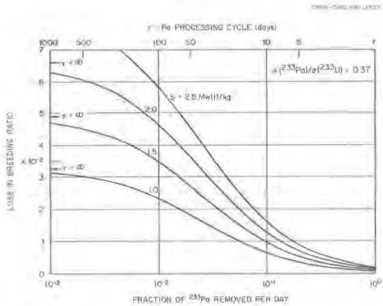  
Fig. 16.1. Effect of $^{233}\mathrm{Pa}$ capture vs processing rate and fuel specific power.

The most basic problem is that of materials for equipment which is exposed to both bismuth and salt. As explained in Sect. 8, molybdenum has quite satisfactory corrosion resistance and appears to be the best overall choice despite the unusual problems of designing and fabricating joints in this metal. Development has progressed far enough to give reasonable assurance that these problems can be overcome and the required equipment can be built. The fabrication costs for molybdenum systems are still uncertain but are sure to be high. Thus there is an economic incentive for eliminating the need for molybdenum, either by changing to another process or by developing an alternative material (possibly graphite).

The use of bismuth in the salt processing requires dependable measures to prevent accidental gross or chronic small carryover of bismuth in the salt returning to the reactor. A cleanup device for removing bismuth exists only in concept. Information is needed both on the performance of such a device and on the tolerance limits for bismuth in the fuel salt. If dependable, adequate cleanup of the returning salt should prove to be impracticable, it would be necessary to make substantial changes from the process described in this report.

Corrosion protection in the fluorinator requires a layer of frozen salt on the wall. Small-scale development tests indicate that the requisite frozen layer can be established, although reliable control of the thickness may be difficult. Therefore occasional loss of the frozen wall must be anticipated. If the vessel is made of nickel, formation of an adherent $\mathrm{NiF}_2$ layer would be expected to limit corrosion, so that occasional failure of the frozen-wall protection (on the order of once a week to once a month) could be tolerated. Therefore the frozen-wall fluorinator should be practical to build and operate.

The varying, sometimes intense, sources of decay heat due to the concentrated protactinium and fission products in the processing plant will require carefully designed cooling systems. In the reference design, however, the radioactive materials are always in solution, so there is little or no chance of local hot spots due to heat-generating sediments. Design of a satisfactory cooling system should therefore be feasible.

The performance of the MSBR as a breeder is sensitive to uranium losses in the chemical processing plant. Although there has been no pilot plant operation to measure losses in a system like this, some reasonable judgment is possible. The probable losses are not directly related to the throughput of salt or uranium, since nowhere in the process does there appear to be

the potential for gradual, irrecoverable buildup of a significant fraction of the uranium passing through. Instead, one must consider the various materials leaving the plant and estimate how much uranium (or protactinium) might be carried out with them. The flowsheet (Fig. 2.4) shows three small discard streams: salt from the Pa decay system, Bi-Li carrying the divalent rare earths, and Bi-Li carrying the trivalent rare earths. The amount of uranium in the Bi-Li discard streams should be negligible, but if this were not the case, the uranium could be recovered rather simply by hydrofluorinating the Bi-Li in the presence of salt from the Pa decay system. The salt discarded from the Pa system will be fluorinated to recover uranium in a batch operation almost identical to that carried out successfully in the MSRE.[125] The MSRE experience indicates that the MSBR losses in the discarded salt should be on the order of $0.2\mathrm{kg}$ of U per year. Probably more significant, and certainly more difficult to predict, are the amounts of uranium that will be discarded in other ways, such as the replacement of NaF absorbers, bismuth cleanup elements, salt filters, and miscellaneous pieces of equipment.

The chemical processing plant is designed to continuously treat a side stream of the fuel salt and return it to the reactor circulating loop. The chemical plant and the reactor plant are essentially independent, so that malfunctions in one would not necessarily affect the other. Chemical plant operation can be interrupted for several days with only minor effects on reactivity and nuclear performance, but if there were a prolonged shutdown of the processing plant, neutron losses to protactinium would cause the production of $^{233}\mathrm{U}$ to fall below the consumption rate. The reactor would still perform as a high-gain converter, which, if need be, could be kept running for several years without chemical processing by adding fissile material (as $\mathrm{UF}_6$ or $\mathrm{PuF}_3$ ) through simple equipment that must be provided for this contingency. Specific information on the dependability of the processing system will not be available until pilot plants are operated.

Although the reactivity effects of perturbations in the chemical plant operation are easily manageable, it is essential that they be understood. In the MSBR it will be necessary to distinguish any truly anomalous effects that might occur from the effects of changing concentrations of neutron poisons and fissile material in the circulating fuel due to on-line processing. The results of a complete interruption of salt flow between the reactor and the chemical processing plant are simple (in principle) and could be calculated by an on-line computer. The possibility of variations in the compo

sition of the salt continuously flowing back into the reactor requires that concentrations and inventories in the processing plant be measured. The chemical analysis procedures now in use are accurate but are slow. On-line analytical techniques that can provide direct inputs to a computer are needed. If these prove very difficult to develop, an alternative would be to ease the analytical demands by interposing parallel holdup tanks between the processing plant and the reactor, so that batches of processed salt could be sampled and analyzed before being pumped back into the fuel system.

With regard to the third requisite for the chemical plant, that it be economical, the capital and operating costs for the MSBR chemical processing have not been estimated for the currently proposed system. The concept described in this report was adopted because it promised to be less expensive to construct than previous concepts, but as of this writing, detailed flowsheets and equipment concepts upon which to base cost estimates have not been completed. The cost uncertainties are therefore quite large. Conceivably, the costs could be high enough to make breeding in a molten-salt breeder reactor (as described in this report) economically unattractive. In this case it would be possible to produce lower-cost power by operating the reactor as a high-gain converter with a much simpler chemical processing system. The ultimate goal of an economical breeder could be realized later when a lower-cost processing system became available.

There are alternative processes that may have technical or economic advantages, but only preliminary investigations of basic feasibility have been made. Perhaps the foremost of these at present is the oxide precipitation process, which exploits the differences in oxidation potential required to form $\mathrm{Pa}_2\mathrm{O}_5$ , $\mathrm{UO}_2$ , and other oxides. This process would hopefully have lower capital and operating costs than the fluorination-reductive-extraction system described in this report.

# 16.6 FISSION PRODUCT BEHAVIOR

How the fission product particulates will distribute themselves in an MSBR is still not known with certainty. Accumulations of the products are of primary concern because of the possibility of localized high temperature due to decay heat. Portions of the reference design thought to be likely deposition sites have been provided with special cooling systems. After the fission product distribution has been determined with more certainty, possibly by operation of a prototype MSBR, the cooling systems in future designs will be modified as required.

The distribution of fission products is also of interest because the noble metals would have an effect on the breeding ratio if they concentrated in the core graphite. Fission product behavior was studied in the MSRE in some detail,[11] however, and although it was found that the noble metals deposited on surfaces, it was also evident that they deposited more heavily on the Hastelloy than on the graphite. If the examined specimens were representative of the MSRE core, about $7\%$ of the $^{95}\mathrm{Nb}$ and from 2 to $5\%$ of the other noble metals were on the core graphite. If it is assumed that $10\%$ of the nuclides with potentially the greatest poisoning effect remain in the core region of the MSBR, the effect is still not as great as the credit which could be taken for the burnout of $^{10}\mathrm{B}$ initially present in the graphite (see Perry and Bauman, ref. 10, pp. 208-219). Thus, even though it was assumed in the MSBR performance estimates that no noble metals were deposited on the graphite, by taking no credit for boron burnout, the estimates are conservative.

# 16.7 STEAM CONDITIONS IN THE THERMAL-POWER CYCLE

Mention has been made elsewhere in this section of lowering the top temperatures in various systems to mitigate uncertainties regarding some of the material properties. Lowering the temperatures does not necessarily mean that the steam temperature in the heat-power system must also be reduced. Since this is a possible effect, however, there is interest in what the impact would be on MSBR performance.

If the steam system conditions were modified from the reference design conditions of 3500 psia $1000^{\circ}\mathrm{F} / 1000^{\circ}\mathrm{F}$ to 3500 psia $900^{\circ}\mathrm{F} / 900^{\circ}\mathrm{F},$ the thermal efficiency of the cycle would be reduced from about 44.4 to $42.0\%$

For a thermal efficiency of $42\%$ the thermal capacity of the reactor plant would have to be about 2400 MW(t) rather than the 2250 MW(t) used in the conceptual study. If one assumes that capital costs and fuel costs are directly proportional to the thermal capacity, the estimated power production cost with the lower efficiency is about 5.7 mills/kWhr as compared with 5.4 mills/kWhr with $44.4\%$ efficiency. In a large

molten-salt reactor, however, the capitalization and fuel costs would not increase linearly with capacity, and the effect of lowering the top temperature by $100^{\circ}\mathrm{F}$ is not likely to be an overriding consideration.

If an MSBR station must use wet natural-draft cooling towers for the condenser cooling water supply rather than the once-through freshwater source assumed in the reference design, the back pressure on the turbine would be increased to about $2\frac{1}{2}$ in. $\mathrm{Hg}$ abs and the heat rate raised to about 7800 Btu/kWhr. The capital cost of the MSBR station would be increased by about $5 million, and the power production cost would increase by about 0.13 mill/kWhr, as explained in Table D.17. These incremental increases due to use of a cooling tower are substantially less than the impact of use of towers in the lower-efficiency light-water nuclear stations, also as shown in Table D.17.

# 16.8 MAINTENANCE EQUIPMENT AND PROCEDURES

The MSRE provided valuable experience in the use of remotely operated tools and viewing equipment for maintaining a molten-salt reactor. The MSBR requirements for maintenance and inspection (other than core graphite replacement) can probably be met within the bounds of reasonable development.

Replacement of the reactor core graphite, however, involves the handling of a large and intensely radioactive piece of equipment. Although the frequency with which the maintenance is required will encourage development of detailed procedures and special tools and equipment, the magnitude of the task and the potential hazards involved should not be minimized. As with fuel handling in a solid-fuel reactor, it is an undesirable feature that the owner of a molten-salt breeder reactor may have to accept.

A feasibility study was made (see Sect. 13) of the maintenance equipment and procedures needed for an MSBR. The major uncertainties are whether the \(4,5 million allowance included in the cost estimate for maintenance equipment is adequate and whether the required plant downtime for graphite replacement can be accommodated within the \(80\%\) plant factor. With regard to the latter, the four-year useful life of the graphite in the MSBR reference design roughly corresponds to the required interval between major steam turbine overhauls, and there is reason to believe that the graphite replacement could be accomplished without adding significantly to the downtime now experienced in most plants.

# 16.9 SAFETY STUDIES

A comprehensive safety study has not been made of an MSBR power station. The conceptual design is believed to be conservative in the containment provided for radioactive materials during normal operation, but

detailed safety studies may disclose structural or operational features that will dictate design modifications. These changes are not expected to pose particularly difficult technical problems, but they could add to the capital cost.

# References

1. MSR Program Semiann. Progr. Rept. Aug. 31, 1969, ORNL-4449.   
2. MSR Program Semiann. Progr. Rept. Aug. 31, 1968, ORNL-4344.   
3. MSR Program Semiann. Progr. Rept. Feb. 29, 1968, ORNL-4254.   
4. Paul R. Kasten, E. S. Bettis, and Roy C. Robertson, Design Studies of 1000-Mw(e) Molten-Salt Breeder Reactors, ORNL-3996 (August 1966).   
5. MSR Program Semiann. Progr. Rept. Aug. 31, 1966, ORNL-4037.   
6. MSR Program Semiann. Progr. Rept. Feb. 28, 1967, ORNL-4119.   
7. MSR Program Semiann. Progr. Rept. Aug. 31, 1967, ORNL-4191.   
8. Roy C. Robertson et al., Two-Fluid Molten-Salt Breeder Reactor Design Study, ORNL-4528 (August 1970).   
9. MSR Program Semiann. Progr. Rept. Feb. 28, 1969, ORNL-4396.   
10. W. R. Grimes, "Molten-Salt Reactor Chemistry," Nucl. Appl. Technol. 8(2), 137-55 (February 1970).   
11. MSR Program Semiann. Progr. Rept. Feb. 28, 1970, ORNL-4548.   
12. H. A. McLain, MSBR Primary Salt Pressure Drops, ORNL internal correspondence MSR-69-34 (Apr. 21, 1969).   
13. H. E. McCoy et al., "New Developments in Materials for Molten-Salt Reactors," Nucl. Appl. Technol. 8(2), 156-69 (February 1970).   
14. R. E. Thoma et al., "Phase Equilibria in the System $\mathrm{BeF}_2$ -ThF and in LiF-BeF-ThF," J. Phys. Chem. 64, 865 (1960).   
15. H. F. McDuffie et al., Assessment of Molten Salts as Intermediate Coolants for LMFBR's, ORNL-TM-2696 (Sept. 3, 1969).   
16. R.W. Henson, A.J. Perks, and J.H.W. Simmons, Lattice Parameter and Dimensional Changes in Graphite Irradiated between 300 and $1350^{\circ}C$ , AERE-R-5489 (1967).

17. J. W. Helm, "Long Term Irradiation Effects on Graphite," paper MI-77, 8th Biennial Conference on Carbon, Buffalo, New York (June 1967).   
18. P. R. Kasten et al., Graphite Behavior and Its Effect on MSBR Performance, ORNL-TM-2136 (February 1969).   
19. W. P. Eatherly et al., Technical Analysis and Program Proposal: Graphite for Molten Salt Reactors, ORNL internal correspondence CF-68-11-18 (November 1968).   
20. D. Scott and W. P. Eatherly, "Graphite and Xenon Behavior and Their Influence on Molten-Salt Reactor Design," Nucl. Appl. 8(2), 179-89 (February 1970).   
21. J. Chang, W. P. Eatherly, and J. W. Prados, MSR Program Semiann. Progr. Rept. Feb. 28, 1969, ORNL-4396, pp. 229-31.   
22. D. V. Kiplinger and R. L. Beatty, MSR Program Semiann. Progr. Rept. Aug. 31, 1968, ORNL-4344, pp. 230-31.   
23. GCR Program Semiann. Progr. Rept. June 1967, ORNL-4170, pp. 203-4.   
24. J. H. W. Simmons, A Relation between Thermal Expansion and Dimensional Change for Polycrystalline Graphite, AERE-R-3883 (1961).   
25. J. C. Bokros and A. S. Schwartz, "A Model to Describe Neutron-Induced Dimensional Changes in Pyrolytic Carbon," Carbon 5, 481 (1967).   
26. W. D. Manly et al., "Metallurgical Problems in Molten Fluoride Systems," Prog. Nucl. Energy, Ser. 4, 2, 164-79 (1960).   
27. R. W. Swindeman, The Mechanical Properties of INOR-8, ORNL-2780 (January 1961).   
28. J. T. Venard, Tensile and Creep Properties of INOR-8 for the Molten-Salt Reactor Experiment, ORNL-TM-1017 (February 1965).   
29. H. E. McCoy and J. R. Weir, Materials Development for Molten-Salt Breeder Reactors, ORNL-TM-1854 (June 1967).

30. Interpretations of ASME Boiler and Pressure Vessel Code, Case 1315.3, Am. Soc. of Mech. Engrs., New York (Apr. 25, 1968).   
31. Interpretations of ASME Boiler and Pressure Vessel Code, Case 1345.1, Am. Soc. of Mech. Engrs., New York (Mar. 14, 1966).   
32. H. E. McCoy, Jr., An Evaluation of the MoltenSalt Reactor Experiment Hastelloy-N Surveillance Specimens - First Group, ORNL-TM-1997 (November 1967).   
33. H. E. McCoy, Jr., An Evaluation of the Molten-Salt Reactor Experiment Hastelloy-N Surveillance Specimens - Second Group, ORNL-TM-2359 (February 1969).   
34. H. E. McCoy, Jr., An Evaluation of the MoltenSalt Reactor Experiment Hastelloy-N Surveillance Specimens - Third Group, ORNL-TM-2647 (1969).   
35. J. O. Stiegler and E. E. Bloom, "The Effects of Large Fast-Neutron Fluences on the Structure of Stainless Steel," J. Nucl. Mater. (to be published).   
36. H. E. McCoy, Jr., and J. R. Weir, Jr., "Stress-Rupture Properties of Irradiated and Unirradiated Hastelloy-N Tubes," Nucl. Appl. 4(2), 96-104 (February 1968).   
37. H. E. McCoy, Jr., Influence of Titanium, Zirconium, and Hafnium Additions on the Resistance of Modified Hastelloy N to Irradiation Damage - Phase I, ORNL-TM-3064 (January 1971).   
38. C. E. Sessions and T. S. Lundy, Diffusion of Titanium in Modified Hastelloy-N, ORNL-TM-2392 (January 1969).   
39. J. H. Devan, Effect of Alloying Additions on Corrosion Behavior of Nickel-Molybdenum Alloys in Fused Fluoride Mixtures, ORNL-TM-2021, vol. 1 (May 1969).   
40. J. W. Koger and A. P. Litman, Compatibility of Fused Sodium Fluoroborates and $BF_{3}$ Gas with Hastelloy-N Alloys, ORNL-TM-2978 (June 1970).   
41. MSR Program Semiann. Progr. Rept. Aug. 31, 1970, ORNL-4622.   
42. N. M. Greene and C. W. Craven, Jr., XSDRN: A Discrete Ordinates Spectral Averaging Code, ORNL-TM-2500 (July 1969).   
43. P. N. Haubenreich, Tritium in the MSRE: Calculated Production Rates and Observed Amounts, ORNL internal correspondence CF-70-2-7 (Feb. 4, 1970).   
44. R. B. Briggs, Calculation of the Tritium Distribution in the MSRE, ORNL internal correspondence CF-70-7-13 (August 1970).   
45. H. T. Kerr and A. M. Perry, Tritium Production in MSBR's, ORNL internal correspondence MSR-69-116 (Dec. 3, 1969).

46. USAEC, "Standards for Protection Against Radiation," Title 10 - Code of Federal Regulations, part 20 (1970).   
47. W. R. Bush, Review of Chalk River Experience with Tritiated Heavy Water, AECL-2756 (July 1967).   
48. V. P. Bond, "Evaluation of Potential Hazards from Tritium Water," paper IAEA SM 146/13, IAEA Symposium on Environmental Aspects of Nuclear Power Stations, New York (Aug. 10-14, 1970).   
49. W. Eifler and R. Nijsing, Fundamental Studies of Fluid Flow and Heat Transfer in Fuel Element Geometries. II. Experimental Investigation of Velocity Distributions in a Triangular Array of Parallel Rods, EURATOM report EUR 2193.6, Joint Nuclear Research Center, Ispra Establishment, Italy (1965).   
50. R. R. Liguori and J. W. Stephenson, The Heating Program, Astra, Inc., Raleigh, N.C. (January 1961).   
51. S. J. Chang, C. E. Pugh, and S. E. Moore, Viscoelastic Analysis of Graphite under Neutron Irradiation and Temperature Distribution, ORNL-TM-2407 (October 1969).   
52. B. Cox, Preliminary Heat Transfer Results with a Molten Salt Containing LiF-BeF $_2$ -ThF $_4$ -UF $_4$ Flowing inside a Smooth Horizontal Tube, ORNL internal correspondence CF-69-9-44 (September 1969).   
53. D. Burgreen et al., "Vibration of Rod Induced by Water in Parallel Flow," Trans. ASME (July 1958).   
54. Y. N. Chen, "Flow-Induced Vibration and Noise in Tube-Bank Heat Exchanger Due to von Karman Streets," ASME paper 67-VIBR-48 (January 1967).   
55. A. Kalnins, Static, Free Vibration, Instability Analysis of Thin, Elastic Shells of Revolution, AFFDL-TR-68-144, Air Force Flight Dynamics Laboratory, Air Force Systems Command, Wright-Patterson Air Force Base (March 1969).   
56. ASME Boiler and Pressure Vessel Code, Section III, Nuclear Vessels, Am. Soc. of Mech. Engrs., New York, 1968 ed.   
57. ASME Boiler and Pressure Vessel Code, Section VIII, Pressure Vessels, Division 1, Am. Soc. of Mech. Engrs., New York, 1968 ed.   
58. Interpretations of ASME Boiler and Pressure Vessel Code, Case 1331.4, Am. Soc. of Mech. Engrs., New York, Aug. 15, 1967.   
59. Piping Flexibility Analysis Program MEL-21, San Francisco Bay Naval Shipyard, Mare Island Division, Vallejo, Calif.   
60. ASME Nuclear Power Piping, USAS B31.7, Am. Soc. of Mech. Engrs., New York, tentative, 1969.   
61. H. J. Sexton, Seismic Review of the Molten-Salt Breeder Reactor Design Concept, H. J. Sexton and Associates, Engineers, San Francisco, Calif.

62. C. E. Bettis et al., Design Study of a Heat Exchanger System for One MSBR Concept, ORNL-TM-1545 (September 1967).   
63. C. E. Bettis et al., Computer Programs for the Design of MSBR Heat Exchangers, ORNL-TM-2815 (1970).   
64. C. H. Gabbard, Reactor Power Measurement and Heat Transfer Performance in the Molten-Salt Reactor Experiment, ORNL-TM-3002 (May 1970).   
65. B. Cox, Preliminary Heat Transfer Results with a Molten Salt Mixture Containing $\mathsf{LiF - BeF}_2\mathsf{-ThF}_4\mathsf{-UF}_4$ Flowing inside a Smooth, Horizontal Tube, ORNL internal correspondence CF-69-9-44 (Sept. 25, 1969).   
66. E. N. Sieder and G. E. Tate, "Heat Transfer and Pressure Drop of Liquids in Tubes," Ind. Eng. Chem. 28(12), 1429-35 (1936).   
67. H. W. Hoffman and S. I. Cohen, Fused Salt Heat Transfer - Part III: Forced Convection Heat Transfer in Circular Tubes Containing the Salt Mixture $\mathsf{NaNO}_2$ - $\mathsf{NaNO}_3$ - $\mathsf{KNO}_3$ , ORNL-2433 (March 1960).   
68. H. A. McLain, Revised Correlations for the MSBR Primary Salt Heat Transfer Coefficient, ORNL internal correspondence MSR-69-89 (Sept. 24, 1969).   
69. O. P. Bergelin, G. A. Brown, and A. P. Colburn, "Heat Transfer and Fluid Friction During Flow across Bank of Tubes - V: A Study of a Cylindrical Baffled Exchanger without Internal Leakage," Trans. ASME 76, 841-50 (1954).   
70. D. A. Donahue, "Heat Transfer and Pressure Drop in Heat Exchangers," Ind. Eng. Chem. 41(11), 2499-2511 (November 1949).   
71. C, G. Lawson, R. J. Kedl, and R. E. McDonald, "Enhanced Heat Transfer Tube for Horizontal Condenser with Possible Application in Nuclear Power Plant Design," Am. Nucl. Soc. Trans. 9(2), 565-66 (1966).   
72. H. A. McLain, Revised Primary Salt Heat Transfer Coefficient for MSBR Primary Heat Exchanger Design, ORNL internal correspondence MSR-67-70 (July 31, 1969).   
73. O. P. Bergelin, K. J. Bell, and M. D. Leighton, "Heat Transfer and Fluid Friction During Flow across Banks of Tubes - VI: The Effect of Internal Leakage within Segmentally Baffled Exchangers," Trans. ASME 80, 53-60 (1958).   
74. P. G. Smith, Development of Fuel- and Coolant-Salt Centrifugal Pumps for the Molten-Salt Reactor Experiment, ORNL-TM-2987 (October 1970).   
75. J. A. Hafford, Development of the Pipeline Gas Separator, ORNL-1602 (February 1954).   
76. H. S. Swenson, C. R. Kakarala, and J. A. Carver, "Heat Transfer to Supercritical Water in Smooth-Bore

" Tubes," Trans. ASME, Ser C: J. Heat Transfer 87(4), 477-84 (November 1965).   
77. Chemical Engineer's Handbook, 3d ed., McGraw-Hill, New York, 1950.   
78. J. H. Keenan and F. G. Keyes, Thermodynamic Properties of Steam, Wiley, New York, 1936.   
79. E. S. Nowak and R. J. Grosh, An Investigation of Certains Thermodynamic and Transport Properties of Water and Water Vapor in the Critical Region, ANL-6064 (October 1959).   
80. K. Goldmann, S. L. Israel, and D. J. Nolan, Final Status Report: Performance Evaluation of Heat Exchangers for Sodium-Cooled Reactors, UNC-5236, United Nuclear Corporation, Elmsford, N.Y. (June 1969).   
81. L. S. Tong, Boiling Heat Transfer and Two-Phase Flow, Wiley, New York, 1965.   
82. L. Y. Krasyakova and B. N. Glusker, "Hydraulic Study of Three-Pass Panels with Bottom Inlet Headers for Once-Through Boilers," Teploenergetika 12(8), 17-23 (1965) (UDC 532:621.181.91.001.5).   
83. E. R. Quandt, "Analysis and Measurement of Flow Oscillations," Chem. Eng. Prog. Symp. Ser. 57(32) (1961).   
84. L. M. Shotkin, "Stability Considerations in Two-Phase Flow," Nucl. Sci. Eng. 28, 317-24 (1967).   
85. J. F. Myers and L. E. Wood, "Enhancing Accuracy of Rupture Disks," Chem. Eng. (Nov. 8, 1965).   
86. The Bull Run Steam Plant, Tenn. Valley Authority, Knoxville, Tenn., Tech. Report No. 38 (November 1967).   
87. Roy C. Robertson, MSBR Steam System Performance Calculations, ORNL internal correspondence MSR-66-18 (July 5, 1966).   
88. Roy C. Robertson, Survey of Steam Conditions for 1000 Mw(e) MSBR, ORNL internal correspondence CF-69-10-34 (October 1969).   
89. I. M. Keyfitz, 1000 Mwe Fast Breeder Reactor Follow-On Study, Moisture Separation or Steam Reheat vs Sodium Reheat Plant Cycle, Technical and Economic Evaluation, WAPD-2000-20, reissued January 1969.   
90. B. E. Short, "Flow Geometry and Heat Exchanger Performance," Chem. Eng. Progr. 61(7), 63-70 (July 1965).   
91. Theodore Rockwell III, ed., Reactor Shielding Design Manual, Van Nostrand, Princeton, N.J., 1956.   
92. W. K. Furlong, "Afterheat Removal in Molten-Salt Reactors," Am. Soc. of Mech. Engrs., Winter Annual Meeting, paper ASME-69-WA/NE-19 (November 1969).   
93. O. T. Zimmerman and Irvin Lavine, "Air-Cooled Heat Exchangers," Cost Eng. (July 1960).

94. MSR Program Semiann. Progr. Rep., July 31, 1964, ORNL-3708.   
95. Roy C, Robertson, MSRE Design and Operations Report, Part I, Description of Reactor Design, ORNL-TM-728 (January 1965).   
96. W. E. Browning and C. C. Bolta, Measurement and Analysis of the Holdup of Gas Mixtures by Charcoal Adsorption Traps, ORNL-2116 (July 1956).   
97. R. D. Ackley and W. E. Browning, Jr., Equilibrium Adsorption of Kr and Xe on Activated Carbon and Linde Molecular Sieves, ORNL internal correspondence CF-61-2-32 (Feb. 14, 1961).   
98. W. D. Burch et al., Xenon Control in Fluid Fuel Reactors, ORNL internal correspondence CF-60-2-2 (July 1960).   
99. L. E. McNeese, Engineering Development Studies for Molten Salt Breeder Reactor Processing No. 2, ORNL-TM-3137 (in publication).   
100. L. E. McNeese, Engineering Development Studies for Molten Salt Breeder Reactor Processing No. 5, ORNL-TM-3140 (in publication).   
101. L. E. McNeese, Engineering Development Studies for Molten Salt Breeder Reactor Processing No. 3, ORNL-TM-3138 (in publication).   
102. L. E. McNeese, Engineering Development Studies for Molten Salt Breeder Reactor Processing No. 4, ORNL-TM-3139 (in publication).   
103. J. S. Watson and L. E. McNeese, Unit Operations Quarterly Progress Report July-September 1968, ORNL-4366, pp. 57-98 (April 1970).   
104. W. H. Sides, MSBR Control Studies, ORNL-TM-2489 (June 2, 1969).   
105. H. F. Bauman, Control Requirements for the MSBR, ORNL internal correspondence MSR-68-107 (July 18, 1968).   
106. J. R. Tallackson, MSRE Design and Operations Report, Part II-A: Nuclear and Process Instrumentation, ORNL-TM-729 (February 1968).   
107. J. B. Ruble and S. H. Hanauer, "A High-Temperature Fission Chamber," Proceedings of Nucl. Eng. and Sci. Conference (Mar. 17, 1958).   
108. J. C. Robinson and D. N. Fry, Determination of the Void Fraction in MSRE Using Small Induced Pressure Perturbations, ORNL-TM-2318 (Feb. 6, 1969).   
109. D. N. Fry et al., Measurement of Helium Void Fraction in MSRE Fuel Salt Using Neutron-Noise Analysis, ORNL-TM-2315 (Aug. 27, 1968).   
110. G. D. Robbins, Electrical Conductivity of Molten Fluorides, a Review, ORNL-TM-2180.   
111. J. R. Tallackson, R. L. Moore, and S. J. Ditto, Instrumentation and Controls Development for Molten-Salt Breeder Reactors, ORNL-TM-1856 (May 22, 1967).   
112. LMFBR Program Plan, Vol. 4, Instruments and Controls, WASH-1104 (August 1968).

113. R. L. Moore, Further Discussion of Instrumentation and Controls Development Needed for an MSBR, ORNL-TM-3303 (to be published).   
114. R. B. Briggs, Allowable Rates of Load Change and Temperature Change for a Large MSBR, ORNL internal correspondence MSR-70-7 (Jan. 22, 1970).   
115. W. H. Sides, Jr., Control Studies of a 1000 Mw(e) MSBR, ORNL-TM-2927 (May 18, 1970).   
116. Robert Blumberg and E. C. Hise, MSRE Design and Operations Report, Part X, Maintenance Equipment and Procedures, ORNL-TM-910 (June 1968).   
117. Robert Blumberg, Maintenance Development for Molten-Salt Breeder Reactors, ORNL-TM-1859 (June 30, 1967).   
118. Peter P. Holz, Feasibility Study of Remote Cutting and Welding for Nuclear Plant Maintenance, ORNL-TM-2712 (November 1969).   
119. Nuclear Utilities Services Corporation, Rockville, Md., Guide for Economic Evaluation of Nuclear Reactor Plant Designs, prepared for AEC and ORNL, NUS-531 (TID-4500) (January 1969).   
120. United Engineers and Constructors, Inc., Philadelphia, Trends Affecting the Rise in Costs of Light Water Nuclear Energy Plants for Utility Electric Generation, Summary Report (February 1970). (No number assigned to date.)   
121. H. Susskind and C. J. Raseman, Power Plant Operating and Maintenance Costs, BNL-50235 (T-572) (April 1970).   
122. Advanced Converter Task Force, AEC Division RD&T, Evaluation of Advanced Converter Reactors, Table 6.14, WASH-1087 (April 1969).   
123. Jackson and Moreland, and S. M. Stoller Associates, Current Status and Future Technical and Economic Potential of Light Water Reactors, WASH-1082 (March 1968).   
124. L. W. Lang, "Utility Incentives for Implementing Crossed-Progeny Fueling," Nucl. Appl. Technol. 9, 242 (August 1970).   
125. R. B. Lindauer, Processing of the MSRE Flush and Fuel Salts, ORNL-TM-2578 (August 1969).   
126. R. J. Kedl and A. Houtzeel, Development of a Model for Computing $^{135}$ Xe Migration in the MSRE, ORNL-4069 (June 1967).   
127. R. J. Kedl, A Model for Computing the Migration of Very Short Lived Noble Gases into MSRE Graphite, ORNL-TM-1810 (July 1967).   
128. F. N. Peebles, Removal of Xenon-135 from Circulating Fuel Salt of the MSBR by Mass Transfer to Helium Bubbles, ORNL-TM-2245 (July 1968).   
129. L. G. Hauser, "Evaluate Your Cost of Cooling Steam Turbines," Elec. Light Power, January 1971, pp. 32-34.

# Appendix A

# Theory of Noble-Gas Migration

R.J.Kedl

# INTRODUCTION

Noble gases, particularly xenon, have an extremely low solubility in fuel salt. The amount that does dissolve forms a true solution; that is, there is no chemical interaction between the noble gas and salt. This being the case, one would expect xenon and krypton to migrate from the fuel salt where they are born to various sinks in accordance with the laws of mass transfer. This implies that the mass transfer coefficient controls the migration rate. The sinks will be comprised of any salt-gas interfaces available to xenon and krypton, such as circulating bubbles, the voids in graphite, and the gas space in the pump bowl. Other sinks are decay and burnup. An analytical model was developed for the MSRE based on this concept, as reported by Kedl and Houtzeel.[126] Another analytical model, complementary to the above model and specifically applicable to the very short-lived noble gases, was reported by Kedl,[127] and it agrees well with data from the MSRE. The more general model checked out fairly well under some operating conditions but not so well under others. With argon as the cover gas, measured and computed $^{135}\mathrm{Xe}$ poison fractions are in substantial agreement over all ranges of circulating bubble void fraction. With helium as the cover gas the agreement is good at high void fractions, but at low void fractions the measured value is considerably less than the calculated value. The analytical model would predict very little difference, if any, with helium or argon as the cover gas. This discrepancy seems to be associated with the difference in solubility of helium and argon and its interaction in some way with bubble mechanics. Nevertheless, the above analytical model will be used for MSBR design calculations; if in error, the design should be conservative as far as $^{135}\mathrm{Xe}$ is concerned. As the model is improved, these calculations will be updated.

# THEORY

The steady-state analytical model involves a rate balance on the noble gas in fuel salt and a fuel loop with the characteristics of a well-stirred pot:

generation rate $=$ decay rate in salt +

burnup rate in salt $^+$ migration rate to graphite $^+$ migration rate to circulating bubbles,

where

migration rate to graphite $=$ decay rate in graphite $^+$ burnup rate in graphite and

migration rate to circulating bubbles $=$ decay rate in bubbles $^+$ burnup rate in bubbles $^+$ stripping rate of bubbles.

A typical migration term can also be represented as follows:

migration rate to bubbles $= hA(C - C_{t})$

where

$h =$ mass transfer coefficient,

$A =$ total bubble surface area,

$C =$ concentration of xenon isotope dissolved in bulk salt,

$C_i =$ concentration of xenon isotope in salt of bubble interface.

These equations are explained in detail and each term is evaluated (for the MSRE) in ORNL-4069. The mass transfer coefficients have been evaluated from standard relationships for heat transfer coefficients and use of the heat-transfer-mass-transfer analogy. In the first equation, shown above, the term on the left of the equality sign is a constant at a given power level. All terms on the right side of the equality sign are functions of the $^{135}\mathrm{Xe}$ concentration dissolved in salt. The concentration therefore may be solved for. Knowing this, the rate terms and the $^{135}\mathrm{Xe}$ poisoning due to xenon in the salt, bubbles, and graphite can be computed. The values for $^{135}\mathrm{Xe}$ poisoning are presented in this report in terms of the "poison fraction," which is defined as the number of neutrons absorbed by $^{135}\mathrm{Xe}$ compared with the total number of neutrons (fast and thermal) absorbed by $^{233}\mathrm{U}$ . The reactor parameters used here are listed in Table A.1. The values may not be exactly the same as those used elsewhere in this report, but they are sufficiently close and no great error is involved.

Very early in the MSBR conceptual design, it was decided that bubbles would be injected into the fuel loop at the core discharge and removed at the core inlet. The objective was to keep the core nominally free of bubbles and thus avoid any effects that they might

Table A.1. Reactor parameters used in noble-gas migration calculationsa   

<table><tr><td>Reactor power, MW(t)</td><td>2250</td></tr><tr><td>Salt volume in fuel loop, ft3</td><td>1416</td></tr><tr><td>Total fuel-salt flow rate, cfm</td><td>7710</td></tr><tr><td>Total volume of core zones I and II, ft3</td><td>1851</td></tr><tr><td>Total volume of annulus and plenum, ft3</td><td>502</td></tr><tr><td>Graphite surface area in core zones I and II, ft2</td><td>24,800</td></tr><tr><td>Graphite surface area in annulus and plenum, ft2</td><td>706</td></tr><tr><td>Average salt fraction in zones I and II, %</td><td>16</td></tr><tr><td>Salt fraction in annulus and plenum, %</td><td>100</td></tr><tr><td>Average thermal-neutron flux, neutrons sec-1cm-2</td><td>4.0 × 1014</td></tr><tr><td>In zones I and II</td><td>4.0 × 1014</td></tr><tr><td>In annulus</td><td>3.0 × 1013</td></tr><tr><td>Average fast-neutron flux, neutrons sec-1cm-2</td><td></td></tr><tr><td>In zones I and II</td><td>6.3 × 1014</td></tr><tr><td>In annulus</td><td>2.0 × 1014</td></tr><tr><td>Total 233U absorption cross section, b</td><td></td></tr><tr><td>For thermal neutrons</td><td>263.1</td></tr><tr><td>For fast neutrons</td><td>32.5</td></tr><tr><td>Effective 233U concentration in fuel salt, atoms b-1cm-1</td><td>8.41 × 10-5</td></tr><tr><td>Henry&#x27;s law constant for xenon in fuel salt, moles of xenon per atmosphere per cubic centimeter</td><td>2.75 × 10-9</td></tr></table>

${}^{a}$ These parameters may not in all cases be exactly equal to those used in the MSBR reference design, but the differences would have small effect on the overall conceptual design.

have on reactivity. This was a considerable problem because bubble generators and separators are normally fairly high-pressure-drop components, and of course the main fuel pump would have to generate this head. A change in ground rules then allowed up to $1\%$ bubbles by volume of salt in the core. This greatly simplified the problem because it permitted the bubbles to circulate many times around the fuel loop and let them approach saturation. The volumetric flow rate of helium in the off-gas system is considerably reduced, and the bubble generation and removal components can be put in a side stream rather than in the main loop piping. The question now is how many times bubbles can be circulated around the fuel loop before they are almost saturated with $^{135}\mathrm{Xe}$ . Calculations pertinent to this question were made, and the results are shown in Fig. A.1. Two things apparent from this figure are: (1) Bubbles can be recirculated about 20 times around the fuel loop before the back pressure of $^{135}\mathrm{Xe}$ in the bubble starts to significantly reduce the stripping

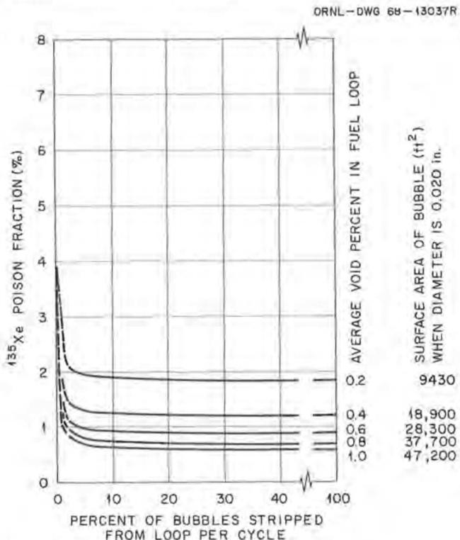  
Fig. A.1. Xenon-135 poison fraction as a function of percent bubbles stripped from fuel loop per cycle.

<table><tr><td>Parameters:</td></tr><tr><td>1000 MW(e)</td></tr><tr><td>Unsealed graphite</td></tr><tr><td>Bubble diameter = 0.020 in.</td></tr><tr><td>Bubble mass transfer coefficient - 2.0 ft/hr</td></tr><tr><td>Graphite permeability to He at room temperature ≈10-5cm2/sec</td></tr><tr><td>Graphite void available to xenon = 10%</td></tr></table>

efficiency. (This is the basis for the $10\%$ recycle around the fuel pump specified in the reference design.) (2) Even with a $1\%$ average volume of bubbles in the fuel loop and with a graphite permeability of about $10^{-5}$ $\mathrm{cm}^2/\mathrm{sec}$ , the target value of a $^{135}\mathrm{Xe}$ poison fraction of $0.5\%$ is not quite attained. Average loop void fractions as high as $1\%$ are undesirable, because at these concentrations small bubbles tend to coalesce. It may be noted that if the average loop void fraction is $1\%$ , the maximum void fraction at the pump suction will be a few times greater because of the pressure gradients in the fuel-salt loop.

Since it is desirable to keep the average loop void fraction well below $1\%$ , another avenue to attack the $^{135}\mathrm{Xe}$ problem must be found. The most obvious one is to use a graphite with a much lower permeability, but this grade could be expensive and difficult to obtain. It was therefore decided to investigate the effect of a very thin coating of low-permeability carbon (chemically deposited) on the surface of higher-permeability bulk graphite. Figure A.2 shows the results of this calculation. The parameters were chosen to yield a high poison fraction (approximately $1.9\%$ ). With these parameters the calculations were repeated to obtain the effects of the permeability and thickness of the sealed layer on

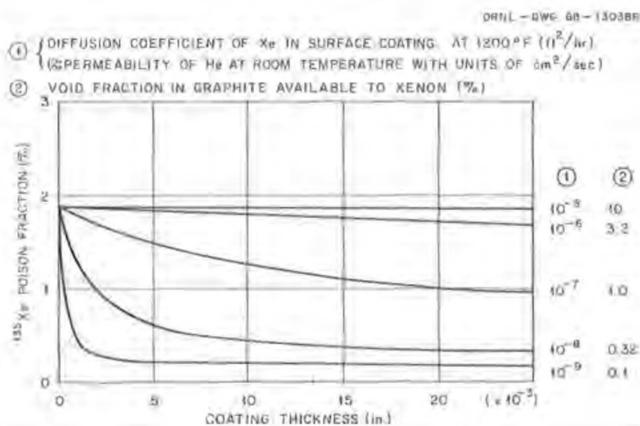  
Fig. A.2. Xenon-135 poison fraction as a function of graphite sealing parameters.

Parameters:

1000 MW(e)

Bulk graphite permeability ≈10-5 cm²/sec

Average void fraction of bubbles in fuel loop $= 0.2\%$

Bubble diameter $= 0.020$ in.

$10\%$ bubbles stripped per pass

the poison fraction. In this calculation it was assumed that the void fraction in graphite available to xenon decreased by one order of magnitude when the permeability decreased by two orders of magnitude.

It can be seen that the target poison fraction of $0.5\%$ is readily obtainable with an average circulating void fraction of only $0.2\%$ if coatings with permeabilities of $10^{-8}\mathrm{cm}^2/\mathrm{sec}$ and only a few mils thick can be attained. Work on the coating of graphite has been promising, as discussed by Eatherly[19] and in Sect. 3.2.3 of this report. For the purpose of the MSBR design, it was assumed that coated graphite will be available with permeabilities of about $10^{-8}\mathrm{cm}^2/\mathrm{sec}$ and a few mils thick. The bubble generator and separator will therefore be designed on the basis of $0.2\%$ average void in the fuel loop, of bubbles 0.020 in, in diameter, and a recycle flow rate around the pump of $10\%$ .

Migration calculations have been made for all other fission product noble gases, of which there are over 30 kryptons and xenons. The results are shown in Table A.2, and the flux terms are defined in Fig. A.3. The gas migration parameters used to generate Table A.2 were chosen to yield an equivalent $^{135}\mathrm{Xe}$ poison fraction of $0.56\%$ . The fluxes would be about the same for any reasonable combination of parameters that yield the same poison fraction. The decay constants and yields listed in the table are not necessarily equal to the accepted values in the literature but were chosen either because of some peculiarity of the computer code or to make some aspect of the design conservative. Note that in the case of long-lived noble gases, the flux into the bubbles is less than the flux out of the reactor. This is because the long-lived noble gases are recycled back through the reactor as shown in the figure. In the case of short-lived noble gases, the flux into the bubbles is greater than the flux out of the reactor. This reflects some decay of gases during their residence time in the bubble but before the bubble is stripped from the fuel salt. For very short-lived noble gases, the well-stirred pot model is not applicable as pointed out earlier; nevertheless, the computed results have been included and are probably adequate for preliminary designs. The very short-lived noble gases are not in themselves significant in the reactor design.

With the above tabulated fluxes of noble gases into the graphite, their contribution to afterheat can be computed. Figure A.4 shows the results for an equivalent $^{135}\mathrm{Xe}$ poison fraction of $0.56\%$ . It is assumed that the noble-gas flux into graphite is constant and continues for two years with the reactor at power. The total amount of noble gases and their daughters accumulated in the graphite after this period of time

Table A.2. Noble-gas migration in the MSBR   

<table><tr><td rowspan="2">Noble-Gas Isotope</td><td rowspan="2">Decay Constant Used in Calculation (hr-1)</td><td rowspan="2">Cumulative Yield from \( ^{233}\mathrm {U} \) (fraction)</td><td rowspan="2">Thermal Cross Section (barns)</td><td colspan="4">\( ^{135}\mathrm {Xe} \) Poison Fraction = 0.56%</td></tr><tr><td>Noble-Gas Flux to Graphite (atoms/hr)</td><td>Noble-Gas Flux to Bubbles (atoms/hr)</td><td>Noble-Gas Flux Out of Reactor (atoms/hr)</td><td>Noble-Gas Flux to Helium Cleanup System (atoms/hr)</td></tr><tr><td>\( ^{82}\mathrm {Kr} \)</td><td>\( 1.0\times 10^{-5} \)</td><td>0.003</td><td>45.0</td><td>\( 1.24\times 10^{18} \)</td><td>\( 2.11\times 10^{21} \)</td><td>\( 1.05\times 10^{22} \)</td><td>\( 2.11\times 10^{21} \)</td></tr><tr><td>\( ^{83}\mathrm {Kr} \)</td><td>\( 1.0\times 10^{-5} \)</td><td>0.0114</td><td>0</td><td>\( 2.85\times 10^{17} \)</td><td>\( 3.00\times 10^{21} \)</td><td>\( 1.50\times 10^{22} \)</td><td>\( 3.00\times 10^{21} \)</td></tr><tr><td>\( ^{84}\mathrm {Kr} \)</td><td>\( 1.0\times 10^{-5} \)</td><td>0.0110</td><td>0.160</td><td>\( 2.81\times 10^{17} \)</td><td>\( 2.90\times 10^{21} \)</td><td>\( 1.45\times 10^{22} \)</td><td>\( 2.90\times 10^{21} \)</td></tr><tr><td>\( ^{85}\mathrm {Kr} \)</td><td>\( 7.35\times 10^{-6} \)</td><td>0.0249</td><td>0.096</td><td>\( 4.67\times 10^{17} \)</td><td>\( 6.56\times 10^{21} \)</td><td>\( 3.28\times 10^{22} \)</td><td>\( 6.56\times 10^{21} \)</td></tr><tr><td>\( ^{86}\mathrm {Kr} \)</td><td>\( 1.0\times 10^{-5} \)</td><td>0.0328</td><td>0.060</td><td>\( 8.27\times 10^{17} \)</td><td>\( 8.64\times 10^{21} \)</td><td>\( 4.32\times 10^{22} \)</td><td>\( 8.64\times 10^{21} \)</td></tr><tr><td>\( ^{87}\mathrm {Kr} \)</td><td>0.547</td><td>0.0450</td><td>500.0</td><td>\( 7.15\times 10^{19} \)</td><td>\( 1.10\times 10^{22} \)</td><td>\( 1.11\times 10^{22} \)</td><td>\( 8.35\times 10^{19} \)</td></tr><tr><td>\( ^{88}\mathrm {Kr} \)</td><td>0.247</td><td>0.0570</td><td>0</td><td>\( 8.81\times 10^{20} \)</td><td>\( 1.40\times 10^{22} \)</td><td>\( 1.70\times 10^{22} \)</td><td>\( 7.72\times 10^{20} \)</td></tr><tr><td>\( ^{89}\mathrm {Kr} \)</td><td>13.0</td><td>0.0623</td><td>0</td><td>\( 9.49\times 10^{20} \)</td><td>\( 1.14\times 10^{22} \)</td><td>\( 8.16\times 10^{21} \)</td><td>0</td></tr><tr><td>\( ^{90}\mathrm {Kr} \)</td><td>75.6</td><td>0.0555</td><td>0</td><td>\( 5.66\times 10^{20} \)</td><td>\( 4.74\times 10^{21} \)</td><td>\( 1.43\times 10^{21} \)</td><td>0</td></tr><tr><td>\( ^{91}\mathrm {Kr} \)</td><td>249.0</td><td>0.0410</td><td>0</td><td>\( 2.28\times 10^{20} \)</td><td>\( 1.44\times 10^{21} \)</td><td>\( 1.67\times 10^{20} \)</td><td>0</td></tr><tr><td>\( ^{92}\mathrm {Kr} \)</td><td>832.0</td><td>0.0296</td><td>0</td><td>\( 6.96\times 10^{19} \)</td><td>\( 3.53\times 10^{20} \)</td><td>\( 1.33\times 10^{19} \)</td><td>0</td></tr><tr><td>\( ^{93}\mathrm {Kr} \)</td><td>1230.0</td><td>0.0142</td><td>0</td><td>\( 2.43\times 10^{19} \)</td><td>\( 1.17\times 10^{20} \)</td><td>\( 3.02\times 10^{18} \)</td><td>0</td></tr><tr><td>\( ^{94}\mathrm {Kr} \)</td><td>2496.0</td><td>0.0062</td><td>0</td><td>\( 5.82\times 10^{18} \)</td><td>\( 2.57\times 10^{19} \)</td><td>\( 3.32\times 10^{17} \)</td><td>0</td></tr><tr><td>\( ^{95}\mathrm {Kr} \)</td><td>2490.0</td><td>0.0019</td><td>0</td><td>\( 1.78\times 10^{18} \)</td><td>\( 7.87\times 10^{18} \)</td><td>\( 1.02\times 10^{17} \)</td><td>0</td></tr><tr><td>\( ^{126}\mathrm {Xe} \)</td><td>\( 1.0\times 10^{-5} \)</td><td>0.0020</td><td>1.50</td><td>\( 1.30\times 10^{17} \)</td><td>\( 5.27\times 10^{20} \)</td><td>\( 2.63\times 10^{21} \)</td><td>\( 5.26\times 10^{20} \)</td></tr><tr><td>\( ^{128}\mathrm {Xe} \)</td><td>\( 1.0\times 10^{-5} \)</td><td>0.0002</td><td>2.50</td><td>\( 1.36\times 10^{16} \)</td><td>\( 5.00\times 10^{19} \)</td><td>\( 2.50\times 10^{20} \)</td><td>\( 4.99\times 10^{19} \)</td></tr><tr><td>\( ^{129}\mathrm {Xe} \)</td><td>\( 1.0\times 10^{-5} \)</td><td>0.0210</td><td>0</td><td>\( 1.16\times 10^{18} \)</td><td>\( 5.53\times 10^{21} \)</td><td>\( 2.76\times 10^{22} \)</td><td>\( 5.52\times 10^{21} \)</td></tr><tr><td>\( ^{130}\mathrm {Xe} \)</td><td>\( 1.0\times 10^{-5} \)</td><td>0.0010</td><td>2.50</td><td>\( 7.38\times 10^{20} \)</td><td>\( 2.71\times 10^{20} \)</td><td>\( 1.35\times 10^{21} \)</td><td>\( 2.71\times 10^{20} \)</td></tr><tr><td>\( ^{131}\mathrm {Xe} \)</td><td>\( 1.0\times 10^{-5} \)</td><td>0.0385</td><td>120.0</td><td>\( 3.16\times 10^{19} \)</td><td>\( 1.01\times 10^{22} \)</td><td>\( 5.05\times 10^{22} \)</td><td>\( 1.01\times 10^{22} \)</td></tr><tr><td>\( ^{132}\mathrm {Xe} \)</td><td>\( 1.0\times 10^{-5} \)</td><td>0.0548</td><td>0.20</td><td>\( 3.10\times 10^{18} \)</td><td>\( 1.44\times 10^{22} \)</td><td>\( 7.20\times 10^{22} \)</td><td>\( 1.44\times 10^{22} \)</td></tr><tr><td>\( ^{133}\mathrm {Xe} \)</td><td>\( 5.48\times 10^{-3} \)</td><td>0.0648</td><td>190.0</td><td>\( 8.68\times 10^{20} \)</td><td>\( 1.62\times 10^{22} \)</td><td>\( 4.21\times 10^{22} \)</td><td>\( 6.47\times 10^{21} \)</td></tr><tr><td>\( ^{134}\mathrm {Xe} \)</td><td>\( 1.0\times 10^{-5} \)</td><td>0.0683</td><td>0.20</td><td>\( 3.87\times 10^{18} \)</td><td>\( 1.80\times 10^{22} \)</td><td>\( 8.98\times 10^{22} \)</td><td>\( 1.79\times 10^{22} \)</td></tr><tr><td>\( ^{135}\mathrm {Xe} \)</td><td>0.0753</td><td>0.0616</td><td>\( 1.05\times 10^{6} \)</td><td>\( 1.93\times 10^{21} \)</td><td>\( 1.41\times 10^{22} \)</td><td>\( 1.43\times 10^{22} \)</td><td>\( 7.68\times 10^{19} \)</td></tr><tr><td>\( ^{136}\mathrm {Xe} \)</td><td>\( 1.0\times 10^{-5} \)</td><td>0.0700</td><td>0.15</td><td>\( 3.94\times 10^{18} \)</td><td>\( 1.84\times 10^{22} \)</td><td>\( 9.20\times 10^{22} \)</td><td>\( 1.84\times 10^{22} \)</td></tr><tr><td>\( ^{137}\mathrm {Xe} \)</td><td>9.90</td><td>0.0716</td><td>0</td><td>\( 2.04\times 10^{21} \)</td><td>\( 1.34\times 10^{22} \)</td><td>\( 1.03\times 10^{22} \)</td><td>0</td></tr><tr><td>\( ^{138}\mathrm {Xe} \)</td><td>2,446</td><td>0.0663</td><td>0</td><td>\( 2.02\times 10^{21} \)</td><td>\( 1.45\times 10^{22} \)</td><td>\( 1.35\times 10^{22} \)</td><td>0</td></tr><tr><td>\( ^{139}\mathrm {Xe} \)</td><td>60.85</td><td>0.0493</td><td>0</td><td>\( 9.01\times 10^{20} \)</td><td>\( 4.75\times 10^{21} \)</td><td>\( 1.66\times 10^{21} \)</td><td>0</td></tr><tr><td>\( ^{140}\mathrm {Xe} \)</td><td>156.0</td><td>0.0352</td><td>0</td><td>\( 3.87\times 10^{20} \)</td><td>\( 1.80\times 10^{21} \)</td><td>\( 3.12\times 10^{20} \)</td><td>0</td></tr><tr><td>\( ^{141}\mathrm {Xe} \)</td><td>1250.0</td><td>0.0180</td><td>0</td><td>\( 3.73\times 10^{19} \)</td><td>\( 1.46\times 10^{20} \)</td><td>\( 3.71\times 10^{18} \)</td><td>0</td></tr><tr><td>\( ^{142}\mathrm {Xe} \)</td><td>1660.0</td><td>0.0163</td><td>0</td><td>\( 2.60\times 10^{19} \)</td><td>\( 1.00\times 10^{20} \)</td><td>\( 1.94\times 10^{18} \)</td><td>0</td></tr><tr><td>\( ^{143}\mathrm {Xe} \)</td><td>2490.0</td><td>0.0017</td><td>0</td><td>\( 1.84\times 10^{18} \)</td><td>\( 6.96\times 10^{18} \)</td><td>\( 9.01\times 10^{16} \)</td><td>0</td></tr><tr><td>\( ^{144}\mathrm {Xe} \)</td><td>2490.0</td><td>0.0001</td><td>0</td><td>\( 7.66\times 10^{16} \)</td><td>\( 2.90\times 10^{17} \)</td><td>\( 3.76\times 10^{15} \)</td><td>0</td></tr></table>

can then be computed. The computation assumes that all daughters remain in the graphite. For simplicity, it also assumes straight chain decay and no branching decay loops.

There are several areas in the theory and application of noble-gas migration where development is needed. The most necessary and potentially fruitful area is to explain the reason for the lower than expected poison fraction in the MSRE at low void fractions with helium as the cover gas. As noted in the beginning of this Appendix, when argon is the cover gas, measured and

computed $^{135}\mathrm{Xe}$ poison fractions are in substantial agreement over all ranges of circulating bubble void fraction. With helium as the cover gas, the agreement is good at high void fractions, but at low void fractions the measured poison fraction is considerably less than the calculated value. The analytical model would predict very little difference, if any, between the two cover gases. The discrepancy seems to be associated with the difference in solubility of helium and argon and the relationship between solubility and bubble mechanics. To illustrate, suppose helium bubbles 0.020

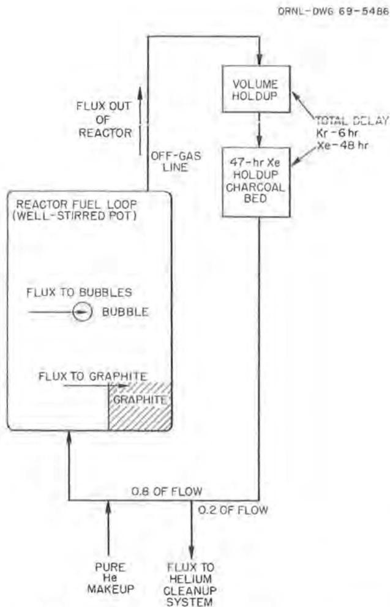  
Fig. A.3. Flow diagram to define terms used in Table A.2.

in. in diameter are injected at the MSBR pump suction. Further, assume that the fuel salt is saturated with helium at the pressure and temperature of the pump suction and that the bubbles go through the pump where the pressure is raised to over 200 psi. If the bubbles are allowed to equilibrate with the salt, they will completely dissolve and disappear. In the case of

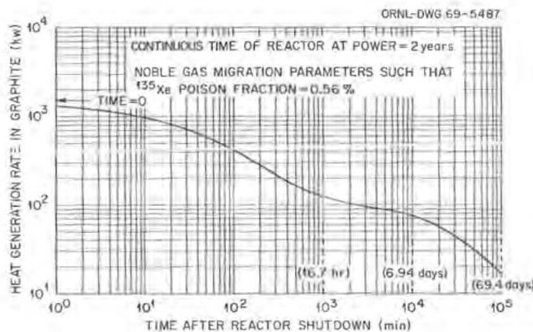  
Fig. A.4. Afterheat contribution by noble gases and their daughters adsorbed by the graphite in the MSBR core.

argon, the solubility is sufficiently low that the bubble will not disappear but will only compress in size. Of course, the bubbles are subjected to these high pressures only for a few seconds, so the dissolution process must be quite rapid. (The entire loop cycle time is only about 11 sec.) If the helium does dissolve completely, at some location near the pump suction the bubbles will rapidly nucleate and the gas come back out of solution.

A questionable parameter in noble-gas migration calculations is the mass transfer coefficient to bubbles suspended in a turbulent fluid. A literature survey and analysis was made of this parameter by Peebles. He concluded that the mass transfer coefficient will fall in the range of 2 to $13\mathrm{ft / hr}$ depending on whether the bubble has a rigid or mobile interface respectively. A program is currently under way to determine this parameter for turbulent flow in a glycerol-water and helium bubble system. A mass transfer coefficient of 2.0 ft/hr has been used in the design calculations because the small helium bubbles in molten salt are expected to have a rigid interface. Use of this coefficient also tends to make the ${}^{135}\mathrm{Xe}$ poisoning calculations conservative.

# Appendix B Neutron Physics

Table B.1. Concentrations and neutron absorptions in fission products at equilibrium for the single-fluid MSBR reference design   
Effective processing cycle times are given in Table 3.7-B   

<table><tr><td>Nuclide \( {}^{a} \)</td><td>Concentration (atoms \( {\mathrm{b}}^{-1}{\mathrm{\;{cm}}}^{-1} \) )</td><td>Absorption \( {}^{b} \)</td></tr><tr><td>\( {}^{149}\mathrm{{Sm}} \)</td><td>\( {4.5} \times  {10}^{-9} \)</td><td>\( {6.5} \times  {10}^{-3} \)</td></tr><tr><td>\( {}^{143}\mathrm{{Nd}} \)</td><td>\( {2.4} \times  {10}^{-7} \)</td><td>\( {1.5} \times  {10}^{-3} \)</td></tr><tr><td>\( {}^{151}\mathrm{{Sm}} \)</td><td>\( {1.3} \times  {10}^{-8} \)</td><td>\( {1.4} \times  {10}^{-3} \)</td></tr><tr><td>\( {}^{147}\mathrm{{Pm}} \)</td><td>\( {8.2} \times  {10}^{-8} \)</td><td>\( {1.3} \times  {10}^{-3} \)</td></tr><tr><td>\( {}^{153}\mathrm{{Eu}} \)</td><td>\( {5.7} \times  {10}^{-8} \)</td><td>\( {7.5} \times  {10}^{-4} \)</td></tr><tr><td>\( {}^{155}\mathrm{{Eu}} \)</td><td>\( {2.7} \times  {10}^{-9} \)</td><td>\( {7.0} \times  {10}^{-4} \)</td></tr><tr><td>\( {}^{148}\mathrm{{Pm}} \)</td><td>\( {1.3} \times  {10}^{-9} \)</td><td>\( {5.4} \times  {10}^{-4} \)</td></tr><tr><td>\( {}^{154}\mathrm{{Eu}} \)</td><td>\( {1.7} \times  {10}^{-8} \)</td><td>\( {4.9} \times  {10}^{-4} \)</td></tr><tr><td>\( {}^{145}\mathrm{{Nd}} \)</td><td>\( {2.1} \times  {10}^{-7} \)</td><td>\( {4.2} \times  {10}^{-4} \)</td></tr><tr><td>\( {}^{143}\mathrm{{Pr}} \)</td><td>\( {1.0} \times  {10}^{-7} \)</td><td>\( {2.3} \times  {10}^{-4} \)</td></tr><tr><td>\( {}^{93}\mathrm{{Zr}} \)</td><td>\( {1.7} \times  {10}^{-6} \)</td><td>\( {2.2} \times  {10}^{-4} \)</td></tr><tr><td>\( {}^{90}\mathrm{{Sr}} \)</td><td>\( {8.5} \times  {10}^{-6} \)</td><td>\( {2.1} \times  {10}^{-4} \)</td></tr><tr><td>\( {}^{150}\mathrm{{Sm}} \)</td><td>\( {4.6} \times  {10}^{-8} \)</td><td>\( {1.2} \times  {10}^{-4} \)</td></tr><tr><td>\( {}^{141}\mathrm{{Pr}} \)</td><td>\( {2.0} \times  {10}^{-7} \)</td><td>\( {5.8} \times  {10}^{-5} \)</td></tr><tr><td>\( {}^{137}\mathrm{{Ba}} \)</td><td>\( {5.1} \times  {10}^{-7} \)</td><td>\( {4.9} \times  {10}^{-5} \)</td></tr><tr><td>\( {}^{139}\mathrm{{La}} \)</td><td>\( {1.7} \times  {10}^{-7} \)</td><td>\( {3.3} \times  {10}^{-5} \)</td></tr><tr><td>\( {}^{152}\mathrm{{Sm}} \)</td><td>\( {2.2} \times  {10}^{-8} \)</td><td>\( {2.9} \times  {10}^{-5} \)</td></tr><tr><td>\( {}^{144}\mathrm{{Ce}} \)</td><td>\( {2.6} \times  {10}^{-7} \)</td><td>\( {2.9} \times  {10}^{-5} \)</td></tr><tr><td>\( {}^{91}\mathrm{{Zr}} \)</td><td>\( {4.6} \times  {10}^{-7} \)</td><td>\( {2.8} \times  {10}^{-5} \)</td></tr><tr><td>\( {}^{140}\mathrm{{Ba}} \)</td><td>\( {1.0} \times  {10}^{-7} \)</td><td>\( {2.4} \times  {10}^{-5} \)</td></tr><tr><td>Others</td><td></td><td>\( {5.1} \times  {10}^{-4} \)</td></tr><tr><td>Total</td><td></td><td>\( {15.2} \times  {10}^{-3} \)</td></tr></table>

aIn decreasing order of neutron absorption.   
${}^{b}$ Neutrons absorbed per neutron absorbed in fissile material.

Table B.2. Neutron flux by energy group at the midplane of the single-fluid MSBR reference design   

<table><tr><td colspan="2">Energy</td><td colspan="2">Flux (1014neutrons cm-2sec-1)</td></tr><tr><td>Group</td><td>Lower boundary (eV)</td><td>Center of core</td><td>Center of core zone II</td></tr><tr><td>1</td><td>8.2 × 105</td><td>1.22</td><td>0.20</td></tr><tr><td>2</td><td>3.2 × 104</td><td>2.61</td><td>0.46</td></tr><tr><td>3</td><td>1.2 × 103</td><td>2.63</td><td>0.58</td></tr><tr><td>4</td><td>4.8 × 101</td><td>2.41</td><td>0.46</td></tr><tr><td>5</td><td>1.9 × 100</td><td>2.02</td><td>0.29</td></tr><tr><td>6</td><td>7.7 × 10-1</td><td>0.61</td><td>0.07</td></tr><tr><td>7</td><td>1.8 × 10-1</td><td>3.25</td><td>0.21</td></tr><tr><td>8</td><td>6.0 × 10-2</td><td>3.33</td><td>0.14</td></tr><tr><td>9</td><td>4.7 × 10-3</td><td>1.06</td><td>0.04</td></tr></table>

# Appendix C

# Equivalent Units for English Engineering and International Systems

<table><tr><td>Quantity</td><td>English engineering units</td><td>Multiplier to obtain SI units</td><td>International system (SI) \( {\text{units}}^{a} \)</td></tr><tr><td>Area</td><td>\( {\mathrm{{ft}}}^{2} \)</td><td>0.0929</td><td>\( {\mathrm{m}}^{2} \)</td></tr><tr><td>Density</td><td>\( \mathrm{{lb}}/{\mathrm{{ft}}}^{3} \)</td><td>16.027</td><td>\( \mathrm{{kg}}/{\mathrm{m}}^{3} \)</td></tr><tr><td>Force \( {}^{b} \)</td><td>lb</td><td>4.4481</td><td>\( \mathrm{N} \)</td></tr><tr><td>Heat load</td><td>Btu/hr</td><td>0.293</td><td>W</td></tr><tr><td>Heat rate \( {}^{c} \)</td><td>Btu \( {\mathrm{{kW}}}^{-1}{\mathrm{{hr}}}^{-1} \)</td><td>\( {292.8} \times  {10}^{-6} \)</td><td>\( {\mathrm{{JW}}}^{-1}{\sec }^{-1} \)</td></tr><tr><td>Heat transfer coefficient</td><td>Btu \( {\mathrm{{hr}}}^{-1}{\mathrm{{ft}}}^{-2}{\left( {}^{ \circ  }\mathrm{F}\right) }^{-1} \)</td><td>5.67</td><td>\( {\mathrm{W}}^{\mathrm{m}}{}^{-2}{\left( {}^{ \circ  }\mathrm{K}\right) }^{-1} \)</td></tr><tr><td>Length</td><td>ft</td><td>0.3048</td><td>m</td></tr><tr><td>&quot;Mass&quot; flow rate</td><td>lb/hr</td><td>\( {126} \times  {10}^{-6} \)</td><td>kg/sec</td></tr><tr><td>Power</td><td>hp</td><td>745.7</td><td>W</td></tr><tr><td>Pressure</td><td>psi</td><td>6894.6</td><td>\( \mathrm{N}/{\mathrm{m}}^{2} \)</td></tr><tr><td>Quantity of heat \( {}^{c} \)</td><td>Btu</td><td>1054.7</td><td>J</td></tr><tr><td>Specific heat (heat capacity)</td><td>Btu \( {\mathrm{{lb}}}^{-1}{\left( {}^{ \circ  }\mathrm{F}\right) }^{-1} \)</td><td>4187</td><td>\( \mathrm{J}{\mathrm{{kg}}}^{-1}{\left( {}^{ \circ  }\mathrm{K}\right) }^{-1} \)</td></tr><tr><td>Specific speed (pumps)</td><td>(rpm)(gpm) \( {}^{0.5} \) (ft) \( {}^{0,{75}} \)</td><td>\( 2,{027} \times  {10}^{-3} \)</td><td>(radians/sec) \( {\left( {\mathrm{m}}^{3}/\mathrm{{sec}}\right) }^{0.5} \) (m) \( {}^{0,{75}} \)</td></tr><tr><td>Stress</td><td>psi</td><td>6894.6</td><td>\( \mathrm{N}/{\mathrm{m}}^{2} \)</td></tr><tr><td>Thermal conductivity</td><td>Btu \( {\mathrm{{hr}}}^{-1}{\left( {}^{ \circ  }\mathrm{F}\right) }^{-1}{\mathrm{{ft}}}^{-1} \)</td><td>1.731</td><td>\( {\mathrm{W}}^{\mathrm{m}}{}^{-1}{\left( {}^{ \circ  }\mathrm{K}\right) }^{-1} \)</td></tr><tr><td>Thermal expansion</td><td>per °F</td><td>0.555</td><td>per °K</td></tr><tr><td>Velocity (linear)</td><td>fps</td><td>0.3048</td><td>m/sec</td></tr><tr><td>Velocity (angular)</td><td>rpm</td><td>0.1047</td><td>radians/sec</td></tr><tr><td>Viscosity \( {}^{d} \)</td><td>Ib \( {\mathrm{{hr}}}^{-1}{\mathrm{{ft}}}^{-1} \)</td><td>\( {0.4138} \times  {10}^{-3} \)</td><td>\( \mathrm{N}{\mathrm{{sec}}}^{-1}{\mathrm{\;m}}^{-2} \)</td></tr><tr><td>Volume</td><td>\( {\mathrm{{ft}}}^{3} \)</td><td>0.02832</td><td>\( {\mathrm{m}}^{3} \)</td></tr><tr><td>Volume flow</td><td>gpm</td><td>\( {63.1} \times  {10}^{-6} \)</td><td>\( {\mathrm{m}}^{3}/\mathrm{{sec}} \)</td></tr><tr><td>Weight equivalent</td><td>lb</td><td>0.4536</td><td>\( \mathrm{{kg}} \)</td></tr><tr><td>Work</td><td>ft-lb</td><td>1.351</td><td>J</td></tr></table>

aTable S,1 is expressed in English engineering units as commonly used in MSR literature and in the meter-kilogram-second (MKS) system, which closely follows the International System (SI).   
bIN=105dynes=1kgmsec-2=1J/m.   
1J=2.778×10-9W-hr=0.0009482Btu.   
$d_{1}$ IN sec m-2= 1 kg sec-1m-1.

# Appendix D

# Cost Estimates for the MSBR Station

Roy C. Robertson

M. L. Myers

Table D.1. Estimated construction cost for MSBR power station ${}^{a}$   
Based on January 1970 costs   

<table><tr><td rowspan="2">Account No.</td><td rowspan="2">Item</td><td colspan="3">Cost (thousands of dollars)</td></tr><tr><td>Materials</td><td>\( Labor^b \)</td><td>Total</td></tr><tr><td>20</td><td>\( Land^c \) (see account 94)</td><td></td><td></td><td>590</td></tr><tr><td>21</td><td>Structures and site facilities</td><td></td><td></td><td></td></tr><tr><td>211</td><td>Site improvements</td><td>500</td><td>565</td><td>1,065</td></tr><tr><td>212</td><td>Reactor building</td><td></td><td></td><td></td></tr><tr><td rowspan="5">212.1</td><td>\( Basic\ structure^d \)</td><td>3,358</td><td>3,358</td><td>6,716</td></tr><tr><td>Special materials (see Table D.3)</td><td></td><td></td><td></td></tr><tr><td>Stainless steel liner at $1.20/lb</td><td>334</td><td>143</td><td>477</td></tr><tr><td>Carbon steel at $0.60/lb</td><td>1,850</td><td>1,240</td><td>3,090</td></tr><tr><td>Insulation at \( \$ {10}/{\mathrm{{ft}}}^{3} \)</td><td>321</td><td>137</td><td>458</td></tr><tr><td>212.2</td><td>Building services</td><td>325</td><td>175</td><td>500</td></tr><tr><td rowspan="2">212.3</td><td>Containment structures at $2/lb</td><td>1,900</td><td>1,900</td><td>3,800</td></tr><tr><td>Subtotal for account 212</td><td>8,088</td><td>6,953</td><td>15,041</td></tr><tr><td>213</td><td>\( Turbine\ building^e \)</td><td>2,200</td><td>1,800</td><td>4,000</td></tr><tr><td>214</td><td>Intake and discharge structures</td><td>540</td><td>360</td><td>900</td></tr><tr><td>218A</td><td>Feedwater heater bayf</td><td>1,720</td><td>1,410</td><td>3,130</td></tr><tr><td>218B</td><td>Loading and set-down bayf</td><td>590</td><td>480</td><td>1,070</td></tr><tr><td>218C</td><td>Offices, control rooms, etc.</td><td>450</td><td>300</td><td>750</td></tr><tr><td rowspan="2">218D</td><td>Warehouses and miscellaneous</td><td>36</td><td>24</td><td>60</td></tr><tr><td>Subtotal for account 218</td><td>2,796</td><td>2,214</td><td>5,010</td></tr><tr><td rowspan="5">219</td><td>Heat rejection \( stack^g \)</td><td>320</td><td>480</td><td>800</td></tr><tr><td>Subtotal for account 21</td><td>14,444</td><td>12,372</td><td>26,816</td></tr><tr><td>Contingency: 5% materials, 10% labor</td><td>722</td><td>1,237</td><td>1,959</td></tr><tr><td>Spare parts: \( 1/2\% \)</td><td>76</td><td></td><td>76</td></tr><tr><td>Total for account 21</td><td>15,242</td><td>13,609</td><td>28,851</td></tr><tr><td>22</td><td>Reactor plant equipment</td><td></td><td></td><td></td></tr><tr><td>221</td><td>Reactor equipmenth</td><td></td><td></td><td></td></tr><tr><td>221.1</td><td>Reactor vesself</td><td>9,100</td><td>400</td><td>9,500</td></tr><tr><td>221.2</td><td>Control rods</td><td>1,000</td><td>100</td><td>1,100</td></tr><tr><td rowspan="2">221.3</td><td>Graphite (see Table D.5)f</td><td>7,200</td><td>200</td><td>7,400</td></tr><tr><td>Subtotal for account 221</td><td>17,300</td><td>700</td><td>18,000</td></tr><tr><td>222</td><td>Main heat transfer system</td><td></td><td></td><td></td></tr><tr><td>222.11</td><td>Fuel-salt pumps</td><td>3,100</td><td>200</td><td>3,300</td></tr><tr><td>222.12</td><td>Primary system salt piping</td><td>300</td><td>129</td><td>429</td></tr><tr><td>222.13</td><td>Primary heat exchangers (see Table D.6)</td><td>7,100</td><td>200</td><td>7,300</td></tr><tr><td>222.31</td><td>Coolant-salt pumps</td><td>4,200</td><td>200</td><td>4,400</td></tr><tr><td>222.32</td><td>Secondary system salt piping</td><td>1,330</td><td>570</td><td>1,900</td></tr><tr><td rowspan="3">222.33</td><td>Steam generators (see Table D.7)</td><td>5,790</td><td>480</td><td>6,270</td></tr><tr><td>Reheaters (see Table D.8)</td><td>1,468</td><td>200</td><td>1,668</td></tr><tr><td>Subtotal for account 222</td><td>23,288</td><td>1,979</td><td>25,267</td></tr><tr><td>224</td><td>Radioactive waste treatment and disposal</td><td></td><td></td><td></td></tr><tr><td>224.1</td><td>Liquid waste</td><td>45</td><td>15</td><td>60</td></tr><tr><td>224.2</td><td>Off-gas system</td><td>350</td><td>150</td><td>500</td></tr><tr><td>224.3</td><td>Solid waste disposal (not fission products)</td><td>75</td><td>25</td><td>100</td></tr><tr><td></td><td>Subtotal for account 224</td><td>470</td><td>190</td><td>660</td></tr><tr><td>225</td><td>Nuclear fuel storage</td><td></td><td></td><td></td></tr><tr><td>225.4</td><td>Primary drain tank (see Table D.9)</td><td>2,680</td><td>300</td><td>2,980</td></tr><tr><td></td><td>Fuel-salt storage tank (see Table D.10)</td><td>643</td><td>70</td><td>713</td></tr><tr><td></td><td>Salt transfer pump and jets</td><td>480</td><td>20</td><td>500</td></tr><tr><td></td><td>Subtotal for account 225</td><td>3,803</td><td>390</td><td>4,193</td></tr><tr><td>226</td><td>Other reactor equipment</td><td></td><td></td><td></td></tr><tr><td>226.1</td><td>Inert gas systems</td><td>280</td><td>120</td><td>400</td></tr><tr><td>226.2</td><td>Auxiliary \( boiler^k \)</td><td>2,550</td><td>450</td><td>3,000</td></tr><tr><td></td><td>Cell heating systemsl</td><td>200</td><td>130</td><td>330</td></tr><tr><td>226.3</td><td>Coolant-salt drain tanks (see Table D.11)</td><td>765</td><td>35</td><td>800</td></tr><tr><td>226.4</td><td>Coolant-salt handling</td><td>20</td><td>5</td><td>25</td></tr><tr><td>226.5</td><td>Coolant-salt purification system</td><td>125</td><td>25</td><td>150</td></tr><tr><td>226.6</td><td>Leak-detection system</td><td>150</td><td>100</td><td>250</td></tr><tr><td>226.7</td><td>Cell cooling system</td><td>150</td><td>150</td><td>300</td></tr><tr><td>226.8</td><td>Maintenance equipment (see Table D.12)</td><td>3,600</td><td>900</td><td>4,500</td></tr><tr><td></td><td>Subtotal for account 226</td><td>7,840</td><td>1,915</td><td>9,755</td></tr><tr><td>227</td><td>Instruments and controls</td><td>3,200</td><td>800</td><td>4,000</td></tr><tr><td></td><td>Subtotal for account 22</td><td>55,901</td><td>5,974</td><td>61,875</td></tr><tr><td></td><td>Contingency: 15% materials, 10% laborm</td><td>8,385</td><td>597</td><td></td></tr><tr><td></td><td>Spare parts: 1.5%n</td><td>102</td><td></td><td></td></tr><tr><td></td><td>Total for account 22</td><td>64,388</td><td>6,571</td><td>70,959</td></tr><tr><td>23</td><td>Turbine plant equipment</td><td></td><td></td><td></td></tr><tr><td>231.1</td><td>Turbine-generatoro</td><td>19,361</td><td>1,000</td><td>20,361</td></tr><tr><td>231.2</td><td>Foundations</td><td>225</td><td>225</td><td>450</td></tr><tr><td></td><td>Subtotal account 231</td><td>19,586</td><td>1,225</td><td>20,811</td></tr><tr><td>232.3</td><td>Condensing water system</td><td>1,100</td><td>900</td><td>2,000</td></tr><tr><td>233</td><td>Condensers</td><td>1,500</td><td>700</td><td>2,200</td></tr><tr><td>234</td><td>Feedwater heating system</td><td></td><td></td><td></td></tr><tr><td>234.1</td><td>Regenerative feedwater heaters</td><td>1,800</td><td>100</td><td>1,900</td></tr><tr><td>234.2</td><td>Condensate pumps</td><td>180</td><td>20</td><td>200</td></tr><tr><td></td><td>Boiler feed pumps</td><td>1,890</td><td>210</td><td>2,100</td></tr><tr><td>234.3</td><td>Piping and miscellaneous</td><td></td><td></td><td></td></tr><tr><td></td><td>Feedwater and condensate</td><td>900</td><td>900</td><td>1,800</td></tr><tr><td></td><td>Extraction steam</td><td>375</td><td>375</td><td>750</td></tr><tr><td></td><td>Drains and vents</td><td>125</td><td>125</td><td>250</td></tr><tr><td></td><td>Mixing chambers</td><td>72</td><td>8</td><td>80</td></tr><tr><td></td><td>Pressure-booster pumps</td><td>585</td><td>65</td><td>650</td></tr><tr><td></td><td>Subtotal account 234</td><td>5,927</td><td>1,803</td><td>7,730</td></tr><tr><td>Materials</td><td>Laborb</td><td>Total</td></tr><tr><td>235</td><td>Other turbine plant equipment</td><td></td><td></td><td></td></tr><tr><td>235.1</td><td>Main steam pipingp</td><td>1,700</td><td>1,700</td><td>3,400</td></tr><tr><td>235.2</td><td>Turbine auxiliaries</td><td>250</td><td>200</td><td>450</td></tr><tr><td>235.3</td><td>Auxiliary cooling systemsq</td><td>600</td><td>300</td><td>900</td></tr><tr><td>235.4</td><td>Makeup and treatment</td><td>320</td><td>160</td><td>480</td></tr><tr><td>235.5</td><td>Condensate treatment</td><td>480</td><td>320</td><td>800</td></tr><tr><td>235.6</td><td>Central lubrication system</td><td>60</td><td>30</td><td>90</td></tr><tr><td>235.7</td><td>Reheat steam preheaters (see Table D.13)</td><td>110</td><td>25</td><td>135</td></tr><tr><td></td><td>Subtotal account 235</td><td>3,520</td><td>2,735</td><td>6,255</td></tr><tr><td>236</td><td>Turbine plant instruments and controls</td><td>330</td><td>170</td><td>500</td></tr><tr><td></td><td>Subtotal for account 23</td><td>31,963</td><td>7,533</td><td>39,496</td></tr><tr><td></td><td>Contingency: 4% materials, 8% labor</td><td>1,279</td><td>603</td><td>1,882</td></tr><tr><td></td><td>Spare parts</td><td>220</td><td></td><td>220</td></tr><tr><td></td><td>Total for account 23</td><td>33,462</td><td>8,136</td><td>41,598</td></tr><tr><td>24</td><td>Electric plant equipment</td><td></td><td></td><td></td></tr><tr><td>241</td><td>Switchgear</td><td></td><td></td><td></td></tr><tr><td>241.1</td><td>Generator circuits</td><td>100</td><td>30</td><td>130</td></tr><tr><td>241.2</td><td>Station service</td><td>1,000</td><td>100</td><td>1,100</td></tr><tr><td>242</td><td>Station service</td><td>450</td><td>360</td><td>810</td></tr><tr><td>243</td><td>Switchboards</td><td>400</td><td>70</td><td>470</td></tr><tr><td>244</td><td>Protective equipment</td><td>100</td><td>100</td><td>200</td></tr><tr><td>245</td><td>Electric structures</td><td>150</td><td>600</td><td>750</td></tr><tr><td>246</td><td>Wiring</td><td>2,000</td><td>2,000</td><td>4,000</td></tr><tr><td></td><td>Subtotal for account 24</td><td>4,200</td><td>3,260</td><td>7,460</td></tr><tr><td></td><td>Contingency: 5% materials, 10% labor</td><td>200</td><td>300</td><td>500</td></tr><tr><td></td><td>Spare parts: 0.5%</td><td>40</td><td></td><td>40</td></tr><tr><td></td><td>Total for account 24</td><td>4,440</td><td>3,560</td><td>8,000</td></tr><tr><td>25</td><td>Miscellaneous plant equipment</td><td></td><td></td><td></td></tr><tr><td>251</td><td>Turbine plant hoists</td><td>333</td><td>37</td><td>370</td></tr><tr><td>252</td><td>Air and water services</td><td>490</td><td>330</td><td>820</td></tr><tr><td>253</td><td>Communications</td><td>50</td><td>50</td><td>100</td></tr><tr><td>254</td><td>Furnishing and fixtures</td><td>350</td><td>20</td><td>370</td></tr><tr><td></td><td>Subtotal for account 25</td><td>1,223</td><td>437</td><td>1,660</td></tr><tr><td></td><td>Contingency: 5% materials, 10% labor</td><td>61</td><td>44</td><td></td></tr><tr><td></td><td>Spare parts: 1%</td><td>13</td><td></td><td></td></tr><tr><td></td><td>Total for account 25</td><td>1,297</td><td>487</td><td>1,778</td></tr><tr><td>26</td><td>Special materials</td><td></td><td></td><td></td></tr><tr><td>264</td><td>Coolant-salt inventoryr</td><td></td><td></td><td>500</td></tr><tr><td>265</td><td>Miscellaneous special materials</td><td></td><td></td><td>500</td></tr><tr><td></td><td>Subtotal for account 26</td><td></td><td></td><td>1,000</td></tr><tr><td></td><td>Total direct construction cost (TDC)</td><td></td><td></td><td>152,305</td></tr><tr><td>91</td><td>Construction equipment and services at 0.8% TDCs</td><td></td><td></td><td>1,218</td></tr><tr><td>921</td><td>Reactor engineeringr</td><td></td><td></td><td>2,250</td></tr><tr><td>922</td><td>Engineering, at 5.5% TDCs</td><td></td><td></td><td>8,377</td></tr><tr><td>93</td><td>Insurance, taxes, etc., at 4.2% TDCs</td><td></td><td></td><td>6,397</td></tr><tr><td>94</td><td>Interest during construction, at 18.58%u</td><td></td><td></td><td>31,687</td></tr><tr><td>942</td><td>Land interest during constructionv</td><td></td><td></td><td>420</td></tr><tr><td></td><td>Total indirect costsw</td><td></td><td></td><td>50,349</td></tr><tr><td></td><td>Total plant capital investment</td><td></td><td></td><td>202,654</td></tr></table>

Table D.1 (continued)

${}^{a}$ Estimated costs are not for first-of-a-kind plant but assume an established molten-salt reactor industry. Estimates are based on January 1970 prices. Private ownership is assumed,with a prevailing interest rate of $8\%$ and a five-year construction period. Contingency factors of up to ${15}\%$ have been applied. The cost estimate follows format, account numbers, and procedures recommended in NUS-531 (ref. 119).

Labor is for field erection. Shop and fabrication labor are included in materials.

For typical site at Albany, N.Y. Land cost included in indirect cost.

$d_{\mathrm{As}}$ indicated in Table D.3, basic structures include all portions of reactor and confinement buildings except dome, which is included in account 212.3. Estimate is based on installed cost of concrete of $\$103/\mathrm{yd}^3$ .

eBuilding cost based on $1.00/ft³.

$f_{\text{Building cost based on $0.65/ft}^3}$ .

gStack is 400 ft high. Based on $2000/ft.

Reactor shielding is included with structures, account 212.1.

iAverage cost of Hastelloy N installed is about $14/lb (see Table D.4).

Average cost of graphite is about $10/lb (see Table D.5).

$k_{\mathrm{Boiler}}$ capacity $\sim 200,000~\mathrm{lb / hr}$

Based on 950 cell heaters at $200 each.

$m$ Based on recommendations in NUS-531 (ref. 119). See text, Sect. 15.1.

${}^{n}$ Does not include replacement reactor core.

Based on tandem-compounded, 6-flow, 31-in. unit (Westinghouse price).

Based on 900 ft of high-pressure mains at 370 lb/ft and $0.75/lb; and on 700 ft of reheat piping at 468 lb/ft and $0.75/lb.

qService water systems.

${}^{r}$ Based on $1 \times  {10}^{6}\mathrm{{lb}}$ of coolant salt at $\$ 0,{50}/\mathrm{{lb}}$ . Salt inventory is considered to be depreciating capital investment.

$^{5}$ From Fig. C-1, NUS-531, ref. 119.

rFrom Fig.C-2,NUS-531,ref.119

Based on five years construction time-at $8\%$ interest compounded annually and typical cash flow curve shown in Fig. C-4, NUS-531, ref. 119.

Based on seven years ownership at $8\%$ interest compounded annually.

wIndirect costs amount to about $33\%$ of TDC cost.

Table D.2. Estimated fuel-cycle costs for the MSBR power station   

<table><tr><td colspan="3">A. Estimated cost of equilibrium inventory in primary circulation system</td></tr><tr><td></td><td>Total weight of fuel salt in system: 1720 ft3× 208 = 357,760 lb</td><td></td></tr><tr><td></td><td>Total moles of fuel salt: 357,760/64 = ~5590 lb-moles</td><td></td></tr><tr><td></td><td></td><td>Total</td></tr><tr><td>7LiF:</td><td>5590 × 0.72 × 26 × $15/lb a</td><td>$ 1,570,000</td></tr><tr><td>BeF2:</td><td>5590 × 0.16 × 47 × $7.50/lb</td><td>315,000</td></tr><tr><td>ThF4:</td><td>5590 × 0.12 × 308 × $6.50/lb</td><td>1,343,000</td></tr><tr><td>233U:</td><td>1223 kg at $13/g</td><td>15,900,000</td></tr><tr><td>233Pa:</td><td>7 kg at $13/g</td><td>94,000</td></tr><tr><td>235U:</td><td>112 kg at $11.20/g</td><td>1,252,000</td></tr><tr><td></td><td></td><td>$20,474,000</td></tr><tr><td colspan="3">B. Estimated cost of salt inventory in chemical processing plant</td></tr><tr><td></td><td colspan="2">Total weight of barren salt in chemical plant: 480 ft3× 207 = 99,360 lb</td></tr><tr><td></td><td colspan="2">Total moles of barren salt: 99,360/63.2 = 1572 lb-moles</td></tr><tr><td>7LiF:</td><td>1572 × 0.72 × 26 × $15/lb^a</td><td>$ 441,000</td></tr><tr><td>BeF2:</td><td>1572 × 0.16 × 47 × $7.50/lb</td><td>89,000</td></tr><tr><td>ThF4:</td><td>1572 × 0.12 × 308 × $6.50/lb</td><td>378,000</td></tr><tr><td>233U:</td><td>63 kg at $13/g</td><td>815,000</td></tr><tr><td>233Pa:</td><td>103 kg at $13/g</td><td>1,336,000</td></tr><tr><td></td><td></td><td>$ 3,059,000</td></tr><tr><td colspan="3">C. Makeup salt cost (per year, based on 15 cal-year cycle)</td></tr><tr><td>LiF:</td><td>(1,564,000 + 441,420)/15</td><td>$ 134,000</td></tr><tr><td>BeF2:</td><td>(315,276 + 88,658)/15</td><td>27,000</td></tr><tr><td>ThF4:</td><td>(1,342,942 + 377,657)/15</td><td>115,000</td></tr><tr><td></td><td></td><td>$ 276,000</td></tr><tr><td colspan="3">D. Chemical processing plant equipment costs^d</td></tr><tr><td colspan="2">Direct construction cost equipment and field labor (cell construction cost is included in account 21, structures) (allow.)</td><td>$10,000,000</td></tr><tr><td colspan="2">Indirect costs at 35%e</td><td>3,500,000</td></tr><tr><td colspan="2">Total</td><td>$13,500,000</td></tr><tr><td colspan="3">E. Operating cost (per year)</td></tr><tr><td colspan="2">Payroll and overhead directly associated with chemical processing system. Say,</td><td>$700,000</td></tr><tr><td colspan="3">F. Estimated fuel-cycle cost (mills/kWhr)</td></tr><tr><td colspan="2">Fixed charges on salt inventory at 13.2%f</td><td>0.44</td></tr><tr><td colspan="2">Makeup salt</td><td>0.04</td></tr><tr><td colspan="2">Fixed charges on processing equipment at 13.7%g</td><td>0.26</td></tr><tr><td colspan="2">Process plant operating costs</td><td>0.10</td></tr><tr><td></td><td></td><td>0.84</td></tr><tr><td colspan="2">Production credit, based on 3.2%/year yield</td><td>0.09</td></tr><tr><td colspan="2">Total estimated fuel-cycle cost</td><td>0.76</td></tr></table>

${}^{a}$ Based on ${}^{7}\mathrm{{Li}}$ at $\$ {55}/\mathrm{{lb}}$ ,or $\$ {120}/\mathrm{{kg}}$ .   
bBased on $^{233}\mathrm{U}$ at $\$ 13/$ g and $^{235}\mathrm{U}$ at $\$ 11.20/$ g.   
${}^{c}$ Based on ${}^{233}\mathrm{U}$ and ${}^{233}\mathrm{{Pa}}$ at $\$ {13}/\mathrm{g}$ .   
dThe estimated cost of the MSBR fuel processing equipment is not precise at this time. Figure 15.1 shows the effect of the fuel processing equipment cost on the fuel-cycle and total power production costs.   
${}^{e}$ Indirect cost of 35% is approximately the same as for the main plant. See accounts 91 through 94,Table D.1.   
Fixed charges to be applied to the capital cost of the fuel-salt inventory over the 30-year life of the plant cannot be precisely estimated because of the changing fuel-pricing and tax structures, and because of the uncertainties in the handling and cleanup costs involved in recovering the fuel salt for reuse at the end of the plant life. The fixed charges would probably fall between the $13.7\%$ used for depreciating equipment (see Table D.14) and the $12.8\%$ used for nondepreciating items, as recommended by NUS-531 (ref. 119). An average value of $13.2\%$ has therefore been used.   
Fixed charges on depreciating equipment are explained in Table D.14.

Table D.3. Summary of special materials in reactor building   

<table><tr><td></td><td>Stainless steel (lb)</td><td>\( Carbon\ steel^a \)(tons)</td><td>Concrete(yd3)</td><td>Insulation(ft3)</td></tr><tr><td colspan="5">Confinement building</td></tr><tr><td>Dome</td><td></td><td>(948)b</td><td>18,276</td><td></td></tr><tr><td>Reactor cell</td><td>48,992</td><td>955</td><td>3,184</td><td>11,268</td></tr><tr><td>Waste storage cell</td><td></td><td>153</td><td>c</td><td></td></tr><tr><td>Floors</td><td></td><td></td><td>25,183</td><td></td></tr><tr><td>Control rod storage</td><td>8,238</td><td>72</td><td>c</td><td>1,935</td></tr><tr><td>Spent core storage cell</td><td>12,567</td><td>130</td><td>c</td><td>3,188</td></tr><tr><td>Replacement core cell</td><td>12,574</td><td>22</td><td>250</td><td></td></tr><tr><td>Spent heat exchanger cell</td><td>9,435</td><td>100</td><td>1,929</td><td>2,445</td></tr><tr><td>Chemical processing cell</td><td>57,445</td><td></td><td>c</td><td></td></tr><tr><td>Freeze-valve cell</td><td>5,028</td><td>55</td><td>45</td><td>1,351</td></tr><tr><td>Off-gas cell</td><td>28,722</td><td></td><td>c</td><td></td></tr><tr><td>Hot cells</td><td>12,724</td><td></td><td>617</td><td></td></tr><tr><td>Auxiliary equipment cells</td><td></td><td></td><td>333</td><td></td></tr><tr><td>Drain tank cell</td><td>12,571</td><td>130</td><td>250</td><td>2,250</td></tr><tr><td>Miscellaneous concrete</td><td></td><td></td><td>32</td><td></td></tr><tr><td colspan="5">Reactor building</td></tr><tr><td>Floors</td><td></td><td></td><td>4,340</td><td></td></tr><tr><td>Exterior walls</td><td></td><td></td><td>5,698</td><td></td></tr><tr><td>Interior walls</td><td></td><td></td><td>4,933</td><td></td></tr><tr><td>Steam cells</td><td>94,423</td><td>956</td><td>c</td><td>23,328</td></tr><tr><td>Coolant-salt drain cell</td><td>94,423</td><td></td><td>c</td><td></td></tr><tr><td>Total</td><td>397,142</td><td>2,573</td><td>65,070</td><td>45,765</td></tr></table>

${}^{a}$ Carbon steel for containment and shielding only. Does not include reinforcing or structural steel.   
bIncluded in account 212.3, Containment Structures.   
Concrete included elsewhere in Table D.3.

Table D.4. Estimated cost of Hastelloy N in reactor vessel ${}^{a}$   

<table><tr><td></td><td>Weight (lb)</td><td>Cost per pound (dollars)</td><td>Shop labor \( \left( {{10}^{3}\text{dollars}}\right) \)</td><td>Materials and labor \( \left( {{10}^{3}\text{dollars}}\right) \)</td></tr><tr><td colspan="5">Removable upper head assembly</td></tr><tr><td>Cylinder extension (18 ft OD, 13 ft high, 2 in. thick)</td><td>68,130</td><td>10</td><td>341</td><td>681</td></tr><tr><td>Flange (20.66 ft OD, 18 ft ID, 6 in. thick)</td><td>22,480</td><td>15</td><td>225</td><td>337</td></tr><tr><td>Head \( {}^{b} \) (18 ft diam, 3 in. thick)</td><td>40,800</td><td>15</td><td>401</td><td>612</td></tr><tr><td>Control rod pipe (18 in. diam, 20 ft high, 0.56 in. thick)</td><td>2,420</td><td>25</td><td>48</td><td>60</td></tr><tr><td>Miscellaneous internals (allow.)</td><td>1,000</td><td>25</td><td>20</td><td>25</td></tr><tr><td colspan="5">Reactor vessel, permanently installed</td></tr><tr><td>Upper flange, as above</td><td>22,480</td><td>15</td><td>225</td><td>337</td></tr><tr><td>Cylinder extension, as above</td><td>68,130</td><td>10</td><td>341</td><td>681</td></tr><tr><td>Portion of top head (22.53 ft OD, 18 ft ID, 2 in. thick)</td><td>15,410</td><td>15</td><td>150</td><td>231</td></tr><tr><td>Head skirt (22.4 ft av diam, 6 in. high)</td><td>3,260</td><td>10</td><td>16</td><td>33</td></tr><tr><td>Vessel cylinder (22.4 ft av diam, 13 ft high, 2 in. thick)</td><td>84,920</td><td>10</td><td>425</td><td>849</td></tr><tr><td>Bottom head \( {}^{b} \) (22.53 ft diam, 3 in. thick)</td><td>63,920</td><td>15</td><td>639</td><td>959</td></tr><tr><td>Bottom well (3 ft diam, 4 ft high, 1 in. thick)</td><td>1,750</td><td>15</td><td>18</td><td>26</td></tr><tr><td>Bottom ring (1 ft 8 in., 3 in., 17 ft 6 in. ID)</td><td>14,003</td><td>25</td><td>280</td><td>350</td></tr><tr><td>Top ring (1 ft 9 in., 3 in., 17 ft 8 in. ID)</td><td>14,861</td><td>25</td><td>297</td><td>372</td></tr><tr><td>Reflector retainer rings (2 in., \( {4}^{1/2} \) in.,21 ft diam)</td><td>10,208</td><td>25</td><td>204</td><td>255</td></tr><tr><td>Bottom ring (3 in., 6 in., 16 ft 2 in. ID</td><td>3,627</td><td>25</td><td>73</td><td>91</td></tr><tr><td>Nozzles, etc. (allow.)</td><td>5,000</td><td>38</td><td>165</td><td>190</td></tr><tr><td>Miscellaneous internals (allow.)</td><td>2,000</td><td>25</td><td>40</td><td>50</td></tr><tr><td colspan="5">Replaceable core assembly</td></tr><tr><td>Internal head \( {}^{b} \) (18 ft diam, 3 in. thick)</td><td>40,800</td><td>15</td><td>401</td><td>612</td></tr><tr><td>Bottom ring \( {}^{c} \) (92 in. \( {}^{2} \) ,16.3 ft diam av)</td><td>18,200</td><td>25</td><td>364</td><td>455</td></tr><tr><td>Miscellaneous internals (allow.)</td><td>1,000</td><td>25</td><td>20</td><td>25</td></tr><tr><td>Alternate removable upper head assembly (sec above)</td><td>134,830</td><td>10-25</td><td>1035</td><td>1715</td></tr><tr><td></td><td></td><td></td><td></td><td>8946</td></tr><tr><td>Transportation to site</td><td></td><td></td><td></td><td>200</td></tr><tr><td>Total (does not include field labor)</td><td></td><td></td><td></td><td>9146</td></tr></table>

${}^{a}$ Estimated weights based on Hastelloy N density of ${557}\mathrm{\;{lb}}/{\mathrm{{ft}}}^{3}$ ,and on Figs. 3.1 and 3.2.   
bInside surface area of ellipsoidal head $= \pi a^{2} + \frac{\pi b^{2}}{2e}$ In $\frac{1 + e}{1 - e} = 0.9D^2$

where

$$
a = D / 2,
$$

$$
b = 3 a / 1 1 \text {(f o r M S B R)}, \text {a n d}
$$

$$
e = \sqrt {\left(a ^ {2} - b ^ {2}\right) / a} = 0. 9 6 2.
$$

An irregular shape; see Fig. 3.2.

Table D.5. Estimated cost of graphite for MSBR   

<table><tr><td></td><td>Pounds</td><td>Cost(thousands of dollars)</td></tr><tr><td colspan="3">Weights of graphitea</td></tr><tr><td>Zone I, 13% salt</td><td></td><td></td></tr><tr><td>Octagon (14.33 ft across flats, 13 ft high)</td><td>221,400</td><td></td></tr><tr><td>Zone II, 37% salt</td><td></td><td></td></tr><tr><td>Axial (9 in. thick, top and bottom octagon)</td><td>18,496</td><td></td></tr><tr><td>Upper end elements (3 in. thick, top octagon)</td><td>735</td><td></td></tr><tr><td>Radial (16.83 ft OD, 14.5 ft high)</td><td>55,055</td><td></td></tr><tr><td>Salt inlet, upper partb</td><td>880</td><td></td></tr><tr><td>Radial vessel coolant plenumb</td><td>3,360</td><td></td></tr><tr><td>Radial reflector, 1.2% salt (22.16 ft OD, 17.16 ft ID, 14.5 ft high)</td><td>254,395</td><td></td></tr><tr><td>Axial reflector, bottom, 3% salt (20.2 ft effective diameter)</td><td>54,816</td><td></td></tr><tr><td>Axial reflector, top, 3% salt (same as above)</td><td>54,816</td><td></td></tr><tr><td>Outlet passageb</td><td>5,400</td><td></td></tr><tr><td colspan="3">Summary of graphite weights and costs</td></tr><tr><td>Extruded elements and shapes (at $11/lb)</td><td></td><td></td></tr><tr><td>Zone I and zone II axial</td><td>240,631</td><td></td></tr><tr><td>Zone II radial</td><td>55,055</td><td></td></tr><tr><td></td><td>295,686</td><td>3252</td></tr><tr><td>Reflector pieces (at $9/lb)</td><td></td><td></td></tr><tr><td>Radial</td><td>254,395</td><td></td></tr><tr><td>Axial, top</td><td>54,816</td><td></td></tr><tr><td>Axial, bottom</td><td>54,816</td><td></td></tr><tr><td>Outlet passage</td><td>5,400</td><td></td></tr><tr><td>Coolant plenum</td><td>3,360</td><td></td></tr><tr><td>Salt inlet</td><td>880</td><td></td></tr><tr><td></td><td>373,667</td><td>3363</td></tr><tr><td>Alternate head assembly (at $9/lb)</td><td></td><td></td></tr><tr><td>Axial reflector, top</td><td>54,816</td><td></td></tr><tr><td>Outlet passage</td><td>5,400</td><td></td></tr><tr><td></td><td>60,216</td><td>542</td></tr><tr><td>Total graphite, including alternate head assembly</td><td>729,569</td><td>7157</td></tr><tr><td>Replaceable core assembly</td><td></td><td></td></tr><tr><td>Zone I</td><td>240,631</td><td></td></tr><tr><td>Zone II radial</td><td>55,055</td><td></td></tr><tr><td>Axial reflector, bottom</td><td>54,816</td><td></td></tr><tr><td>Salt inlet, upper part</td><td>880</td><td></td></tr><tr><td></td><td>351,382</td><td>3753</td></tr></table>

aWeights based on graphite density of 115 lb/ft3.   
bFrom estimates by H. L. Watts.   
${}^{c}$ Based on volume of spheroid: $V = 4/3{\pi }^{2}b$ ,where (for MSBR) $a = {10.1}\mathrm{{ft}}$ and $b = {2.3}\mathrm{{ft}}$ . Thus $V = {\pi }^{3}/{52.7}$ (for one head).

Table D.6. Estimated cost of primary heat exchangers ${}^{a}$   

<table><tr><td colspan="2">Description for each of four units
Material, Hastelloy N</td></tr><tr><td colspan="2">5543 tubes, 0.375 in. OD, 0.035 in. wall thickness, 22.07 ft long (each unit)
Total surface, 12,011 ft² × 4 = 48,044 ft²
Shell ID, 66.2 in.
See Fig. 3.33</td></tr><tr><td colspan="2">Weights of Hastelloy Nb</td></tr><tr><td>Tubes (70,800 lb at $30/lb)</td><td>$2,124,000</td></tr><tr><td>Cylinders (192,400 lb at $10/lb)</td><td>1,924,000</td></tr><tr><td>Heads (7,800 lb at $15/lb)</td><td>117,000</td></tr><tr><td>Tube sheets, rings, etc. (149,100 lb at $20/lb)</td><td>2,982,000</td></tr><tr><td></td><td>$7,147,000</td></tr><tr><td>Installation labor</td><td>200,000</td></tr><tr><td></td><td>$7,347,000</td></tr></table>

aTime did not permit revising the above cost estimate to agree with the latest primary heat exchanger data, as listed in Table 3.15.   
Weights are for total of four units.

Table D.7. Estimated cost of steam generators   
Total of 16 units   

<table><tr><td>Total surface:</td><td>56,432 ft2</td><td></td></tr><tr><td>Material:</td><td>Hastelloy N</td><td></td></tr><tr><td>Tubes:</td><td>380 tubes, 0.50 in. OD, 0.077 in. wall thickness, 70.9 ft av length (each unit)</td><td></td></tr><tr><td></td><td>Total weighta = 170,609 lb at $20/lb</td><td>$3,400,000</td></tr><tr><td>Shells:</td><td>18 in. ID, 0.375 in. wall thickness, 71 ft av length</td><td></td></tr><tr><td></td><td>Total weight = 95,122 lb at $10/lb</td><td>950,000</td></tr><tr><td>Spherical heads:</td><td>28 in. OD × 4 in. wall thickness, total 32</td><td></td></tr><tr><td></td><td>Total weight = 74,661 lb at $15/lb</td><td>1,120,000</td></tr><tr><td>Nozzles, baffles:</td><td>Weight = 16,000 lb (say) at $20/lb</td><td>320,000</td></tr><tr><td>Installation</td><td></td><td>480,000</td></tr><tr><td></td><td></td><td>$6,270,000</td></tr></table>

aTotal weights are for 16 units.

Table D.8. Estimated cost of steam reheaters   
Total of eight units   

<table><tr><td>Material:</td><td>Hastelloy N</td><td></td></tr><tr><td>Total surface:</td><td>2253 × 8 = 18,024 ft²</td><td></td></tr><tr><td>Tubes:</td><td>392 tubes. 0.75 in. OD, 0.035 in. wall thickness, 29.27 ft long (each unit)</td><td></td></tr><tr><td></td><td>Total weighta = 27,911 lb at $30/lb</td><td>$ 837,330</td></tr><tr><td>Shell:</td><td>21 in. ID, 0.5 in. wall thickness, 30 ft long</td><td></td></tr><tr><td></td><td>Total weight = 31,352 lb at $10/lb</td><td>310,352</td></tr><tr><td>Tube sheet:</td><td>21 in. diam, 4 in. thick</td><td></td></tr><tr><td></td><td>Total weight = 7145 lb at $10/lb</td><td>71,450</td></tr><tr><td>Heads:</td><td>10.5 in. radius, 0.75 in. thick (assumed hemispherical)</td><td></td></tr><tr><td></td><td>Total weight = 3215 lb at $20/lb</td><td>64,000</td></tr><tr><td>Baffles:</td><td>21 in. diam, 3% in. thick, 70% cut; total 36 per unit</td><td></td></tr><tr><td></td><td>Total weight = 8440 lb at $10/lb</td><td>84,400</td></tr><tr><td>Nozzles, etc., say</td><td>4000 lb at $25/lb</td><td>100,000</td></tr><tr><td>Installation labor</td><td></td><td>200,000</td></tr><tr><td></td><td>Total</td><td>$1,668,000</td></tr></table>

Total weight is for eight units.

Table D.9. Estimated cost of fuel-salt drain tank   

<table><tr><td colspan="2">Description: 13 ft 9 in. OD, 21 ft 9 in. high; see Fig. 6.2 and Table 6.1</td></tr><tr><td colspan="2">Material: Hastelloy N</td></tr><tr><td colspan="2">Heads: Total of four, 13 ft 9 in. diam, \( 1^{1/2} \) in. thick</td></tr><tr><td colspan="2">Aspect ratio, \( 7/2 \)</td></tr><tr><td colspan="2">Area of head, \( 0.9D^2 \) (see footnote b, Table D.4); one head has a 5-ft-diam hole at center line</td></tr><tr><td>Weight, 4 × 557 (21.7 ft2 - 2.45 ft2) = 42,800 lb at $15/lb 642,000</td><td>$ 642,000</td></tr><tr><td>Cylinders: Total of two, 13 ft 9 in. diam, 16.5 ft high, 1 in. thick = 66,200 lb at $10/lb</td><td>662,000</td></tr><tr><td colspan="2">U-tubes: Total of 1500. \( 3/4 \) in. OD, 0.042 in. wall thickness, average length, 17.5 ft</td></tr><tr><td>Weight = 18,950 lb at $30/lb</td><td>567,000</td></tr><tr><td colspan="2">Headers: Total of 40. 3-in. pipe inside 6-in. pipe, about 6 ft long</td></tr><tr><td>Weight = 7260 lb at $15/lb</td><td>108,900</td></tr><tr><td>Nozzles, baffles, etc. (allow.) 2000 lb at $25/lb</td><td>50,000</td></tr><tr><td colspan="2">Heat-removal system cost allowancesa</td></tr><tr><td>Salt-to-steam exchanger</td><td>$ 200,000</td></tr><tr><td>Steam-to-air exchanger for 40 MW(t)</td><td>200,000</td></tr><tr><td>Piping, etc.</td><td>250,000</td></tr><tr><td></td><td>$2,679,000</td></tr><tr><td>Installation labor</td><td>300,000</td></tr><tr><td>Total</td><td>$2,980,000</td></tr></table>

${}^{a}$ Capacity $= {18}\mathrm{{MW}}\left( \mathrm{t}\right)$ .

Table D.10. Estimated cost of fuel-salt storage tank   

<table><tr><td>Description:</td><td colspan="2">Tank is essentially same as fuel-salt drain tank, except that cooling tubes in tank are salt-to-steam transfer as in MSRE and no intermediate heat exchanger is required</td></tr><tr><td>Material:</td><td colspan="2">Stainless steel (ρ = 495 lb/ft3)</td></tr><tr><td>Tubing:</td><td>16,800 lb at $5/lb =</td><td>$ 84,000</td></tr><tr><td>Cylinders:</td><td>58,600 lb at $3/lb =</td><td>175,800</td></tr><tr><td>Heads</td><td>38,000 lb at $5/lb =</td><td></td></tr><tr><td>Headers</td><td>6500 lb at $5/lb =</td><td>232,500</td></tr><tr><td>Nozzles, etc.</td><td>2000 lb at $5/lb =</td><td></td></tr><tr><td>Installation labor</td><td></td><td>150,000</td></tr><tr><td colspan="3">Heat-removal system cost allowance</td></tr><tr><td>Steam-to-air exchanger</td><td></td><td>100,000</td></tr><tr><td>Piping</td><td></td><td>50,000</td></tr><tr><td></td><td></td><td>$642,300</td></tr><tr><td>Installation labor</td><td></td><td>70,000</td></tr><tr><td>Total</td><td></td><td>$712,300</td></tr></table>

Table D.11. Estimated cost of coolant-salt storage tanks   

<table><tr><td colspan="2">Total of four units. 12 ft diam, 20 ft high, useful storage capacity \( {2100}{\mathrm{{ft}}}^{3} \) each Material: stainless steel \( \left( {\rho  = {495}\mathrm{\;{lb}}/{\mathrm{{ft}}}^{3}}\right) \)</td></tr><tr><td>Cylinders: 12 ft diam, 20 ft high, 1 in. thick Total weight \( = {124},{460}\mathrm{\;{lb}} \) at \( \$ 3/\mathrm{{lb}} \)</td><td>\$375,000</td></tr><tr><td>Heads: 12 ft diam, 1.25 in. thick \( A = {1.0}{D}^{2} \) (assumed aspect ratio for heads) Total weight \( = {71},{304}\mathrm{\;{lb}} \) at \( \$ 5/\mathrm{{lb}} \)</td><td>350,000</td></tr><tr><td>Nozzles, etc., say 8000 lb at \( \$ 5/\mathrm{{lb}} = \)</td><td>40,000</td></tr><tr><td>Installation labor</td><td>35,000</td></tr><tr><td>Total</td><td>\$800,000</td></tr></table>

Table D.12. Estimated cost of maintenance equipment for the MSBR   

<table><tr><td colspan="2">Costs in thousands of dollars</td></tr><tr><td>Polar crane</td><td>600</td></tr><tr><td>Cask</td><td>125</td></tr><tr><td>Hoists</td><td>150</td></tr><tr><td>Transition piece</td><td>25</td></tr><tr><td>Maintenance containment cover</td><td>120</td></tr><tr><td>Maintenance closure</td><td>75</td></tr><tr><td>Disassembly and storage cell equipment</td><td>500</td></tr><tr><td>Maintenance shields</td><td>250</td></tr><tr><td>Long-handled tools</td><td>400</td></tr><tr><td>In-cell supports and mechanisms</td><td>250</td></tr><tr><td>Transfer cask for miscellaneous components</td><td>50</td></tr><tr><td>Maintenance control room equipment</td><td>150</td></tr><tr><td>TV viewing equipment</td><td>150</td></tr><tr><td>Decontamination equipment</td><td>100</td></tr><tr><td>Remote welding equipment and controls</td><td>1000</td></tr><tr><td>Hot cell equipment</td><td>50</td></tr><tr><td>Miscellaneous</td><td>50</td></tr><tr><td>Total</td><td>4500</td></tr></table>

Table D.14. Fixed charge rate (percent per annum) used for investor-owned MSBR power station   

<table><tr><td>Return on money investedb</td><td>7.2</td></tr><tr><td>Thirty-year depreciationc</td><td>1.02</td></tr><tr><td>Interim replacementsd</td><td>0.35</td></tr><tr><td>Federal income taxe</td><td>2.04</td></tr><tr><td>Other taxesf</td><td>2.84</td></tr><tr><td>Insurance other than liabilityg</td><td>0.25</td></tr><tr><td></td><td>13.7</td></tr></table>

${}^{a}$ This table is for depreciating equipment. For nondepreciating items, such as land, a fixed charge rate of 12.8% was assumed,as recommended in NUS-531 (ref. 119). See Table D.2 for fixed charge rate on fuel salt.

bReturn based on $52\%$ in bonds at $4.6\%$ return, $48\%$ in equality capital at $10\%$ .

cThe sinking-fund method was used in determining the depreciation allowance for the 30-year period.

dIn accordance with FPC practice, a $0.35\%$ allowance was made for replacement of equipment having an anticipated life shorter than 30 years. (Reactor core graphite is included in a special replacement cost account - see Table D.15.)

Federal income tax was based on the "sum-of-the-year digits" method of computing tax deferrals. The sinking-fund method was used to normalize this to a constant return per year.

The recommended value of $2.84\%$ was used for other taxes.

$g_{\mathrm{A}}$ conventional allowance of $0.25\%$ was made for property damage insurance. Third-party liability insurance is listed as an operating cost.

Table D.13. Estimated cost of reheat steam preheaters   
Total of eight units   

<table><tr><td colspan="2">Material: Croloy</td></tr><tr><td colspan="2">Total surface: 781 × 8 = 6248 ft2</td></tr><tr><td colspan="2">Tubes: 603 tubes. 0.375 in. OD, 0.065 in. wall thickness, 13.2 ft long (each unit)</td></tr><tr><td>Total weighta= 15,591 lb at $2/lb</td><td>$ 32,000</td></tr><tr><td colspan="2">Shells: 20.25 in. ID, 7/16in. wall thickness, 13.6 ft long</td></tr><tr><td>Total weight = 11,880 lb at $1.50/lb</td><td>18,000</td></tr><tr><td colspan="2">Spherical heads: About 31 in. OD × 2.5 in. thick</td></tr><tr><td>Total weight = 30,000 lb at $2/lb</td><td>60,000</td></tr><tr><td>Installation labor</td><td>25,000</td></tr><tr><td></td><td>$135,000</td></tr></table>

Total weights are for eight units.

Table D.15. Cost of replacing reactor core assemblies in the MSBR   

<table><tr><td colspan="2">In thousands of dollars</td></tr><tr><td>Cost of assembly</td><td></td></tr><tr><td>Hastelloy N - see Table D.4</td><td>1,092</td></tr><tr><td>Graphite - see Table D.5</td><td>3,753</td></tr><tr><td></td><td>4,845</td></tr><tr><td>Chargeable power revenue loss during core assembly replacementa</td><td></td></tr><tr><td>Special labor cost per replacementb</td><td>500</td></tr><tr><td>Total cost per replacement</td><td>5,345</td></tr><tr><td>Effect on power production cost, mills/kWhr c</td><td>0.17</td></tr></table>

It is assumed that the MSBR core assembly can be replaced during the plant downtimes for inspection and repair of other equipment, such as the turbine-generator, which are accommodated by the $80\%$ plant factor, and no additional plant outage is chargeable against core replacement.

The labor force for making core replacements is assumed to be in addition to the normal plant operating and maintenance crew.

While various methods could be used to estimate the cost of future core replacements, a sufficiently representative and straightforward method is to assume an extra amount charged per kilowatt-hour, which is set aside, at $8\%$ interest compounded annually, so that at the end of four years the total cost of a replacement will have been accumulated.

$$
\begin{array}{l} \begin{array}{l} \text {R e p l . c o s t} \\ = \frac {\mathbb {S} 5 , 3 4 5 , 0 0 0 \times 1 0 ^ {3}}{1 0 ^ {6} \times 3 6 5 \times 2 4 \times 0 . 8 0 (1 . 0 8 ^ {3} + 1 . 0 8 ^ {2} + 1 . 0 8 + 1 . 0 0)} \end{array} \\ = 0. 1 7 \mathrm {m i l l} / \mathrm {k W h r} \\ \end{array}
$$

For simplification, this method ignores the small effects due to no accumulated funds needed the last two years of plant operation and the fact that it is unlikely that the plant would be shut down exactly after 30 years of operation with 2 years of useful life remaining in the reactor core.

Table D.16. Estimated annual costs for plant operation and maintenance   

<table><tr><td>Staff payrollb</td><td>$ 800,000</td></tr><tr><td>Fringe benefitsb</td><td>80,000</td></tr><tr><td>Subtotal - plant staffing</td><td>880,000</td></tr><tr><td>Consumable supplies and equipment</td><td>400,000</td></tr><tr><td>Outside support services</td><td>140,000</td></tr><tr><td>Miscellaneous</td><td>80,000</td></tr><tr><td>Subtotal</td><td>1,500,000</td></tr><tr><td>General and administrative</td><td>225,000</td></tr><tr><td>Coolant-salt makeupc</td><td>9,000</td></tr><tr><td>Nuclear liability insurance</td><td></td></tr><tr><td>Commercial coverage (net)</td><td>240,000</td></tr><tr><td>Federal Government coverage</td><td>67,500</td></tr><tr><td>Total direct annual cost</td><td>2,061,500</td></tr><tr><td>Fixed charges on operation and maintenance working capital</td><td>38,800</td></tr><tr><td>Total annual cost</td><td>$2,080,300</td></tr><tr><td>Contribution to power costd</td><td>0.30 mill/kWhr</td></tr></table>

Based on cost breakdown and computation prescribed in NUS-531 (ref. 119). The values agree reasonably well with those reported by Susskind and Raseman (ref. 121). Costs do not include chemical processing, which is included in the fuel-cycle cost, nor special costs associated with periodic replacement of the core graphite.

bBased on NUS-531 (ref. 119) recommended values for July 1968 escalated $8\%$ .

cMakeup cost assumed to be 2% of inventory.   
$d$ Based on $80\%$ plant factor.

Table D.17. Cost penalties for use of wet natural-draft cooling tower instead of fresh once-through condensing water supply in 1000-MW(e) MSBR station as compared with penalties in light-water nuclear power stationsa   

<table><tr><td></td><td>MSBR</td><td>Light-water reactorb</td></tr><tr><td>Increased capital cost of plant due to towers, pumps, etc.</td><td>$4,000,000c</td><td>$6,000,000</td></tr><tr><td>Estimated loss in generating capacity due to heat rate increase from 7690 to 7800 Btu/kWhr</td><td>13,000 kWd</td><td>20,000 kW</td></tr><tr><td>Estimated capital cost of increasing thermal capacity of plant to give 1000 MW(e) net output</td><td>$1,000,000e</td><td>$1,500,000</td></tr><tr><td>Annual operating cost for towers</td><td>$150,000f</td><td>$150,000</td></tr><tr><td>Annual additional fuel cost due to higher heat rate</td><td>$71,000g</td><td>$165,000</td></tr><tr><td>Increases in power production costs,h mills/kWhr</td><td></td><td></td></tr><tr><td>Capital cost of towers, etc.</td><td>0.08</td><td>0.12</td></tr><tr><td>Capital cost of additional capacity needed</td><td>0.02</td><td>0.02</td></tr><tr><td>Operating costs of tower</td><td>0.02</td><td>0.03</td></tr><tr><td>Increased fuel cost due to higher heat rate</td><td>0.01</td><td>0.02</td></tr><tr><td>Total increase</td><td>0.13</td><td>0.20</td></tr></table>

${}^{a}$ Use of wet natural-draft cooling tower will increase the turbine back pressure from ${1}^{1}/2$ to ${2}^{1}/2$ in. Hg abs. Performance and costs of MSBR with cooling tower are taken as proportional to the effects of adding a tower on light-water reactor performance, as estimated by Hauser. ${}^{129}$

$b$ Estimated by Hauser (ref. 129).

Capital costs of towers, pumps, etc., taken as proportion of the tower costs for light-water reactors on basis of amount of heat rejected to the condensing water.

${}^{d}$ Estimated loss in capacity (and increase in heat rate) based on ratios of enthalpy drops in steam turbine to ${2}^{1}/2$ in. $\mathrm{{Hg}}$ abs vs ${1}^{1}/2$ in. $\mathrm{{Hg}}$ abs,and equivalent effect on light-water reactor cycle. ${}^{129}$

Capital cost of increasing reactor plant capacity, flow rates, etc., to achieve 1000 MW(e) net plant output estimated at $75/kW, as was assumed in ref. 129.

$f_{\text{Tower}}$ operating costs assumed to be the same as those for light-water reactors. $^{129}$   
$g$ Based on same 10 cents/MBtu chargeable to fuel-cycle cost as in MSBR reference design.   
$h_{\text{Based on}} \sim 14\%$ fixed charges and 0.8 power factor.

__________   
  
  
  
  
  
  
  
  
__________   
  
  
  
  
__________   
__________

# INTERNAL DISTRIBUTION

1. R. K. Adams   
2. G.M. Adamson   
3. R.G. Affel   
4. J. L. Anderson   
5. R.F. Apple   
6. W.E. Atkinson   
7.C.F.Baes   
8. J.M. Baker   
9. C. E. Bamberger   
O.C.J.Barton   
1. J. B. Bates   
2. H. F. Bauman   
3. S.E.Beall   
4. H. R. Beatty   
5.M.J.Bell   
6. M. Bender   
7. C. E. Bettis

18-19. E.S. Bettis   
20. D. S. Billington   
21. R.E. Blanco   
22. F. F. Blankenship   
23. J. O. Blomeke   
24. R Blumberg   
25. E. G. Bohlmann   
26. C. J. Borkowski   
27. H. I. Bowers   
28. G.E. Boyd   
29. J. Braunstein   
30. M. A. Bredig   
31. R. B. Briggs   
32. H. R. Bronstein   
33. G.D.Brunton   
34. O.W. Burke   
35. S. Cantor   
36. D.W Cardwell   
37. R. S. Carlsmith   
38. J. H. Carswell   
39. W. L. Carter   
40. J. E. Caton   
41. O. B. Cavin   
42. S. I. Chang   
43. R. H. Chapman   
44. C. J. Claffey   
45. F. H. Clark   
46. Nancy Cole   
47. C. W. Collins

48. E. L. Compere   
49. W. H. Cook   
50. J.W. Cooke   
51. L. T. Corbin   
52. J. L. Crowley   
53. F. L. Culler   
54. D. R. Cuneo   
55. J.M. Dale   
56. R.J. DeBakker   
57. J.H. DeVan   
58.J.R.Distefano   
59. S. J. Ditto   
60. F. A. Doss   
61. A. S. Dworkin   
62. W. P. Eatherly   
63. J. R. Engel   
64. J. I. Federer   
65. D. E. Ferguson   
66. L. M. Ferris   
67. A. P. Fraas   
68. J. K. FranzreB   
69.J.H.Frye   
70. L.C. Fuller   
71. W. K. Furlong   
72. C.H.Gabbard   
73. R B. Gallaher   
74. R.E. Gehlbach   
75. J. H. Gibbons   
76. L. O. Gilpatrick   
77. G. Goldberg   
78. W. R. Grimes   
79. A. G. Grindell   
80. R. H. Guymon   
81. R. L. Hamner   
82. T. H Handley   
83. B. A. Hannaford   
84. P. H. Harley   
85. W. O. Harms   
86.C.S.Harrill   
87. P. N. Haubenreich   
88. F. K. Heacker   
89. J.W. Helm   
90. R.E. Helms   
91. P. G. Herndon   
92. D.M. Hewett   
93. R.F. Hibbs

94. J. R. Hightower   
95.M.R.Hill   
96. E.C.Hise   
97. B. F. Hitch   
98. H. W. Hoffman   
99. D. K. Holmes   
100. P. P. Holz   
101. W.R. Huntley   
102. H. Inouye   
103. W. H. Jordan   
104. P. R. Kasten   
105. R.J.Kedl   
106. C.W. Kee   
107. M. T. Kelley   
108. M. J. Kelly   
109. C. R. Kennedy   
110. T. W. Kerlin   
111. H. T. Kerr   
112. J. J. Keyes   
113. S. S. Kirlis   
114. L. R. Koffman   
115. J.W. Koger   
116. H.W. Kohn   
117. R. B. Korsmeyer   
118. A. I. Krakoviak   
119. T. S. Kress   
120. J.W. Krewson   
121. C.E. Lamb   
122. J. A. Lane   
123. R. B. Lindauer   
124. E L. Long   
125. M. I. Lundin   
126. R.N. Lyon   
127. R. L. Macklin   
128. H. G. MacPherson   
129. R.E. MacPherson   
130. J. C. Mailen   
131. D. L. Manning   
132. C. D. Martin   
133. W.R. Martin   
134. H. E. McCoy   
135. D. L. McElroy   
136. C. K. McGlothlan   
137. C. J. McHargue   
138. H. A. McLain   
139. B. McNabb

140. L. E. McNeese   
141. J.R. McWherter   
142. A. P. Malinauskas   
143. H. J. Metz   
144. A. S. Meyer   
145.C.A.Mills   
146. R. L. Moore   
147. A. J. Moorehead   
148. C. A. Mossman   
149. D.M. Moulton   
150. T. R. Mueller   
151. M. L. Myers   
152. H. A. Nelms   
153. H. H. Nichol   
154. J. P. Nichols   
155. E. L. Nicholson   
156. T.S. Nuggle   
157. L.C. Oakes   
158. S.M. Ohr   
159. R. B. Parker   
160. P. Patriarca   
161. A. M. Perry   
162. T. W. Pickel   
163. H. B. Piper   
164. C. B. Pollock   
165. H.M. Poly   
166. B.E. Prince   
167. G. L. Ragan   
168. J. L. Redford   
169. J. D. Redman

170. D.M. Richardson   
171. M. Richardson   
172. G. D. Robbins

173-182. R.C. Robertson

183. R.G. Ross   
184. I. Roth   
185. J.P. Sanders   
186. H. C. Savage   
187. W. F. Schaffer   
188. Dunlap Scott   
189. J. L. Scott   
190. H.E Seagren   
191. C. E. Sessions   
192. J. H. Schaffer   
193. W. H. Sides   
194. M. Siman-Tov   
195. M. J. Skinner   
196. G. M. Slaughter   
197. A. N. Smith   
198. F.J. Smith   
199. G.P. Smith   
200. O. L. Smith   
201. I. Spiewak   
202. H. H. Stone   
203. R. A. Strehlow   
204. R.D. Stulting   
205. D. A. Sundberg   
206. J.R. Tallackson   
207. E. H. Taylor   
208. W. Terry

209. R.E. Thoma   
210. L.M. Toth   
211. D. B. Trauger   
212. Chia-Pao Tung   
213. W.C.T. Stoddart   
214. W.E.Unger   
215. G.M. Watson   
216. J. S. Watson   
217. H L. Watts   
218. C.F. Weaver   
219. A. M. Weinberg   
220. J.R. Weir   
221. H. L. Whaley   
222. M. E. Whatley   
223. J.C. White   
224. R.P. Wichner   
225. L.V. Wilson   
226. Gale Young   
227. H.C. Young   
228. J.P. Young   
229. E. L. Youngblood   
230. F. C. Zapp

231-233. Central Research Library

234. ORNL - Y-12 Technical Library

Document Reference Section

235-384. MSRP Director's Office (Y-12)   
385-419. Laboratory Records Department   
420. Laboratory Records, ORNL R.C.

# EXTERNAL DISTRIBUTION

421. Kermit Laughon, RDT Site Office, Oak Ridge National Laboratory   
422. C. L. Matthews, RDT Site Office, Oak Ridge National Laboratory   
423. D. F. Cope, RDT Site Office, Oak Ridge National Laboratory   
424. T. W. McIntosh, Atomic Energy Commission, Washington   
425. F. N. Peebles, University of Tennessee, Knoxville   
426. H. M. Roth, Atomic Energy Commission, Oak Ridge   
427. M. Shaw, Atomic Energy Commission, Washington   
428. J. A. Swartout, Union Carbide Corporation, New York   
429. W. L. Smalley, Atomic Energy Commission, Oak Ridge   
430. David Elias, Atomic Energy Commission, Washington   
431. W. T. Hannum, Atomic Energy Commission, Washington   
432. D. R. Riley, Atomic Energy Commission, Washington   
433. J. J. Schreiber, Atomic Energy Commission, Washington   
434. F. N. Watson, Atomic Energy Commission, Washington   
435. M. J. Whitman, Atomic Energy Commission, Washington

436-438. Director, Division of Reactor Licensing   
439-440. Director, Division of Reactor Standards   
441. Laboratory and University Division, AEC, ORO   
442. Patent Office, AEC, ORO   
443-666. Given distribution as shown in TID-4500 under Reactor Technology category (25 copies - NTIS)